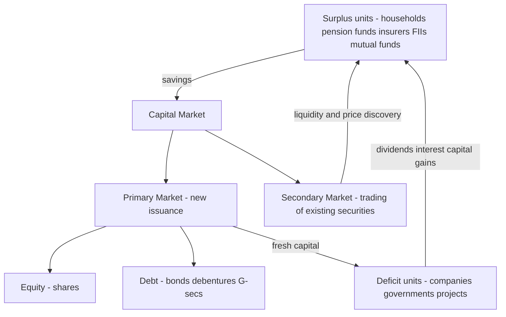

# Chapter 05 — Capital Markets Overview

## 1. The Problem / The Need

Imagine you run a growing company. You have a product people want, a factory running at full capacity, and a clear opportunity to double output — but building a second factory costs ₹500 crore, and the payback period is eight years. Where does that money come from?

Your options are limited and painful. You could plough back profits, but that takes a decade of patience while competitors race ahead. You could borrow from a bank, but no single bank wants to lend ₹500 crore of *long-term* money against an uncertain eight-year payoff — banks fund themselves with short-term deposits and dislike locking money away for a decade (this is the classic **maturity mismatch** problem). You could ask a few wealthy friends, but their pockets aren't deep enough.

Now flip the picture. Millions of households and institutions across India and the world are sitting on **surplus savings**. A schoolteacher in Pune has ₹2 lakh she won't need for twenty years. A pension fund in Canada manages billions it must grow for retirees decades away. An insurance company collects premiums today against claims far in the future. These savers face the *mirror-image* problem: they have long-horizon capital and nowhere productive to park it that offers both a return and reasonable liquidity.

So we have two groups who desperately need each other:

- **Deficit units** (companies, governments, infrastructure projects) who need large sums of long-term money and can deploy it productively.
- **Surplus units** (households, pension funds, insurers, mutual funds, foreign investors) who have long-horizon savings and want returns.

The problem is *matching* them at scale. A single saver can't evaluate a steel plant's business plan. A single company can't knock on ten million doors. There's a **search problem**, an **information problem**, a **size-mismatch problem** (savers have small amounts; projects need huge amounts), a **maturity problem** (savers want the option to exit; projects need money locked in), and a **trust problem** (why should a stranger hand you money for eight years?).

The **capital market** is the institutional machinery humanity built to solve exactly this. It is the marketplace for **long-term funds** — money committed for more than one year, typically for many years or permanently. Without it, large-scale industrialisation, infrastructure, and modern corporations simply cannot exist. Every railway, power grid, airport, IT giant, and pharmaceutical champion you know of was funded, in part, through capital markets.

---

## 2. The Core Idea

The core idea of the capital market is **channelling long-term savings into long-term productive investment through tradeable financial instruments.**

Break that into three moves:

1. **Aggregation & Transformation.** The market pools countless small, scattered, short-horizon-*feeling* savings into large, long-horizon capital. It transforms "₹2 lakh I might want back someday" into "₹500 crore locked into a factory for a decade." This is called **maturity transformation** and **size transformation**.

2. **Securitisation of claims.** Instead of an unbreakable IOU, the company issues a **security** — a standardised, transferable certificate of a claim on the business. A **share** is a claim on ownership and profits; a **bond** is a claim on repayment with interest. Because the claim is embodied in a tradeable instrument, the saver isn't trapped: she can sell her share to someone else without the company having to repay her. The company keeps the money permanently (equity) or till maturity (bonds); the *investor* gets liquidity by trading. This single innovation — **liquidity without recall** — is the genius of capital markets.

3. **Price discovery & discipline.** Because these securities trade continuously, the market constantly re-prices them based on new information. A well-run company's shares rise; a badly-run one's fall. This price signal disciplines management, guides capital toward its most productive uses, and lets every participant see a live estimate of what an asset is worth.

The mental model: the capital market is a **long-term-funds transformer** sitting between savers and users, converting fragmented savings into committed capital, and converting illiquid business claims into liquid, tradeable securities.

---

## 3. How It Works — Structure & Mechanics

The capital market is not one place; it is a *system* with two great halves and a supporting ecosystem.

**The two halves:**

- **Primary market** — where securities are *created and sold for the first time*. This is where fresh capital actually flows from savers into companies/governments. When Zomato sold new shares in its 2021 IPO, that was the primary market: money moved from investors into Zomato's bank account.
- **Secondary market** — where *already-issued* securities are *traded among investors*. No new money reaches the issuer here; ownership simply changes hands. When you buy Zomato shares on the NSE today, your money goes to the previous shareholder, not to Zomato.

These halves are inseparable — the secondary market is what makes the primary market possible (explained fully in Part 4).

**The two instrument families:**

- **Equity capital market (ECM)** — trading in ownership claims (shares). Investors become part-owners, share in profits (dividends) and losses, and vote. Returns are uncapped but residual and risky.
- **Debt capital market (DCM)** — trading in borrowing claims (bonds, debentures, government securities). Investors are lenders, entitled to fixed interest and principal repayment, ranking ahead of shareholders, but with capped upside.

Here is the overall architecture:

*Figure 1 — The capital market as a bridge between savers and users of long-term funds.*

**The mechanics of a flow through the system:**

A company decides it needs ₹1,000 crore for expansion. It chooses between equity (sell ownership) and debt (borrow). It hires **merchant bankers / investment banks** to structure the issue, gets the offer document vetted by the regulator (SEBI in India), prices the securities with help from **book-building**, and sells them to investors in the primary market. Those investors receive securities in their **demat accounts**. From the next day, they can trade those securities on a **stock exchange** (NSE, BSE) in the secondary market. Behind every trade, **clearing corporations**, **depositories**, and **brokers** ensure the buyer gets the security and the seller gets the money safely. The entire edifice is supervised by the regulator to protect investors and keep the market fair.

---

## 4. Full Content — The Complete Picture

### 4.1 Defining feature: long-term funds

The single line that separates capital markets from money markets is **maturity**. Capital markets deal in instruments of **more than one year** — often 5, 10, 30 years, or (for equity) *perpetual*. They fund **fixed capital** — plants, machinery, infrastructure, R&D, acquisitions — assets that pay back slowly over years. Money markets (Chapter on money markets) deal in instruments *under one year* and fund **working capital** and liquidity.

### 4.2 The two segments in depth

**A. Equity Capital Market (ownership)**

Equity represents residual ownership. Key instruments and forms:

| Instrument | What it is | Key feature |
|---|---|---|
| Equity shares | Ordinary ownership units | Voting rights, dividends, uncapped but residual returns |
| Preference shares | Hybrid — priority dividend, usually no vote | Fixed dividend, ranks above equity, below debt |
| Rights issue | New shares offered first to existing holders | Protects proportional ownership |
| Bonus issue | Free shares from reserves | No new capital; capitalises reserves |
| ADR / GDR | Indian shares listed abroad (e.g., Infosys on NYSE) | Access global equity pools |
| Private equity / VC | Unlisted equity from specialist funds | Funds startups & growth before IPO |

Why a company issues equity: it needs *permanent* capital it never has to repay, it wants to avoid the fixed burden of interest, and it's willing to share ownership and profits. The cost: dilution of control and a (usually) higher cost of capital than debt, because equity investors demand more for bearing more risk.

**B. Debt Capital Market (lending)**

Debt represents a contractual claim to repayment. Key instruments:

| Instrument | Issuer | Key feature |
|---|---|---|
| Corporate bonds / debentures | Companies | Fixed/floating coupon, fixed maturity, may be secured |
| Government securities (G-Secs) | Central govt | Sovereign, near risk-free, benchmark for all rates |
| State Development Loans (SDLs) | State govts | Slightly higher yield than G-Secs |
| Convertible debentures | Companies | Debt that can convert to equity later |
| Masala bonds | Indian issuers abroad | Rupee-denominated, sold to foreign investors |
| Municipal bonds | Local bodies | Fund civic infrastructure |

Why a company issues debt: interest is **tax-deductible** (the "tax shield"), it doesn't dilute ownership, and if the business earns more than the interest rate, the extra accrues to shareholders (**financial leverage**). The cost: fixed interest must be paid in good times and bad, and too much debt risks insolvency.

The choice between the two is the **capital structure** decision — the debt-equity mix — one of the central questions of corporate finance.

### 4.3 Primary market: how new capital is raised

Methods of issuance:

- **Initial Public Offering (IPO)** — a private company's first sale of shares to the public, becoming listed. (e.g., LIC's ₹21,000 crore IPO in 2022, India's largest.)
- **Follow-on Public Offering (FPO)** — an already-listed company issues more shares.
- **Rights issue** — new shares offered to existing shareholders pro-rata.
- **Private placement** — securities sold to a select group of institutional investors, not the public. Includes the **Qualified Institutional Placement (QIP)** in India.
- **Preferential allotment** — shares issued to specific investors (promoters, strategic partners).
- **Offer for Sale (OFS)** — existing shareholders (e.g., promoters) sell their stake to the public; note here the *company* gets no money — only the selling shareholder does.

**Pricing mechanisms:** In a **fixed-price issue** the price is set in advance. In **book-building** (the modern norm), a price *band* is announced and investors bid; the final "cut-off" price is discovered from demand. This is genuine price discovery at the point of issue.

*Figure 2 — The IPO process from decision to listing.*

### 4.4 Secondary market: how securities trade

Once listed, securities trade on **stock exchanges**. In India the two dominant ones are the **National Stock Exchange (NSE)** and the **Bombay Stock Exchange (BSE)** — the BSE (est. 1875) is Asia's oldest. Globally, the **NYSE** and **Nasdaq** dominate.

Modern exchanges are electronic **order-driven** markets: buyers and sellers place orders into an electronic order book, and the system matches the best bid with the best ask. Key mechanics:

- **Trading** happens in a continuous session; brokers route client orders.
- **Clearing & settlement** is handled by a **clearing corporation** (e.g., NSE Clearing / Indian Clearing Corporation), which becomes the counterparty to both sides (novation), guaranteeing the trade. India settles equities on a **T+1** basis (trade day plus one) — among the fastest in the world.
- **Depositories** (**NSDL** and **CDSL** in India) hold securities in **dematerialised (demat)** electronic form, eliminating paper certificates.
- **Indices** like the NSE **Nifty 50** and BSE **Sensex** track a basket of large stocks, serving as barometers of the market and the economy.

### 4.5 The primary–secondary linkage (the crucial insight)

Students often treat these as separate. They are **symbiotic**:

- The secondary market **feeds** the primary market. Investors will only buy a *new* issue (primary) if they believe they can *sell it later* (secondary). Liquidity in the secondary market is the promise that makes primary issuance possible. No exchange, no IPO.
- The secondary market **prices** the primary market. The market value of a company's existing shares sets the benchmark for what it can charge in a new (follow-on) issue. A company trading at a high valuation can raise more for the same dilution.
- The primary market **supplies** the secondary market with tradeable stock.

Together they form one continuous machine: primary *creates* the claim; secondary *makes it liquid and priced*; that liquidity and pricing loop back to enable more primary issuance.

### 4.6 The participants (the ecosystem)

| Participant | Role |
|---|---|
| Issuers | Companies, central/state govts, PSUs, infrastructure SPVs — raise capital |
| Retail investors | Individual savers |
| Institutional investors | Mutual funds, insurers (LIC), pension funds (EPFO/NPS), banks |
| Foreign Portfolio Investors (FPIs/FIIs) | Global investors bringing/withdrawing capital |
| Merchant bankers / investment banks | Structure, underwrite, price issues |
| Underwriters | Guarantee to buy unsold portion of an issue |
| Stock exchanges | Provide the trading platform |
| Clearing corporations | Guarantee settlement |
| Depositories & DPs | Hold securities in demat form |
| Brokers / stockbrokers | Execute trades for clients |
| Credit rating agencies | CRISIL, ICRA, CARE — rate debt quality |
| Registrars & transfer agents | Maintain investor records, process allotments |
| Regulator | SEBI (India) / SEC (US) — supervise, protect investors |

### 4.7 The regulator

In India, the **Securities and Exchange Board of India (SEBI)**, established 1988 and given statutory teeth in 1992 (after the Harshad Mehta scam), regulates capital markets. Its three-fold mandate: **protect investors**, **develop the market**, and **regulate it**. It vets offer documents, frames disclosure norms, licenses intermediaries, and polices insider trading and fraud. In the US, the equivalent is the **Securities and Exchange Commission (SEC)**, born from the 1929 crash and the Securities Acts of 1933–34. The philosophies differ in emphasis — SEBI is more rules-based and pre-emptive (it *approves* many things in advance); the SEC leans more on disclosure and enforcement — but both exist to correct the trust and information failures that would otherwise strangle capital markets.

### 4.8 How capital markets fund growth (the macro role)

Zoom out. A nation's growth depends on **capital formation** — building productive assets. Capital markets serve the economy in several ways:

1. **Mobilisation of savings** — they gather idle savings and put them to work.
2. **Efficient allocation** — price signals steer capital toward the most promising firms and sectors, and away from failing ones.
3. **Capital formation** — they finance the factories, roads, and technology that raise productivity.
4. **Liquidity** — they let savers invest long-term while retaining the ability to exit.
5. **Risk sharing** — equity spreads business risk across many shoulders; no single saver is ruined by one firm's failure.
6. **Corporate governance & discipline** — public listing forces disclosure, and a falling share price punishes bad management (and invites takeovers).
7. **Wealth effect & financial inclusion** — rising markets and widening participation (India crossed 15+ crore demat accounts by 2024) spread ownership of the economy.

This is why economists link deep capital markets to faster, more stable growth: they lower the **cost of capital**, widen the pool of financeable projects, and improve the *quality* of investment decisions.

---

## 5. Worked / Real Examples

**Example 1 — Zomato IPO 2021 (Indian equity, primary → secondary).**
Zomato, a loss-making food-delivery startup, needed permanent growth capital without the burden of interest — a textbook case for equity. In July 2021 it launched a ₹9,375 crore IPO via book-building (price band ₹72–76). The **fresh issue** portion (₹9,000 crore) went into Zomato's coffers — that's the *primary* market funding growth. Early venture investors partially exited via an **Offer for Sale** — money that went to *them*, not the company. The issue was oversubscribed ~38 times, showing strong demand. On listing day, shares jumped ~65% to ~₹126 — that's the *secondary* market at work, re-pricing the claim based on investor enthusiasm. Crucially, investors bid in the IPO *because* they knew a liquid secondary market awaited. This one deal shows the whole machine: equity chosen over debt, primary raising real money, OFS distinguishing issuer-cash from seller-cash, book-building discovering price, and secondary trading providing liquidity.

**Example 2 — Government of India dated securities (Indian debt).**
When the Union government runs a fiscal deficit, it borrows long-term by issuing **G-Secs** — say a 10-year bond with a 7.1% coupon. The **RBI**, acting as the government's debt manager, auctions these to banks, insurers, and FPIs on the **NDS-OM** platform. Buyers are *lenders*, not owners: they get fixed interest twice a year and principal at maturity, with sovereign (near-zero default) risk. The yield on the 10-year G-Sec becomes the **benchmark risk-free rate** — every corporate bond is priced as "G-Sec yield + a spread for extra risk." These bonds then trade in the secondary debt market. This shows the debt capital market: fixed claims, sovereign issuer, and a benchmark that anchors the pricing of the entire economy's long-term credit.

**Example 3 — Apple's bond issuance (global debt) vs. Saudi Aramco IPO (global equity).**
Apple, sitting on huge cash but wanting cheap capital and a tax shield, has repeatedly raised *debt* rather than touch offshore cash — issuing tens of billions in corporate bonds at low coupons because its credit is rock-solid. It chose debt because interest is tax-deductible and it didn't want to dilute shareholders. Contrast **Saudi Aramco's 2019 IPO**, the largest in history (~$29.4 billion raised, ~$1.9 trillion valuation), where Saudi Arabia sold a sliver of ownership on the Tadawul exchange to raise permanent capital and diversify the state's assets — a pure *equity* play. Two global giants, two opposite capital-structure choices, illustrating the debt-vs-equity trade-off at the largest scale.

---

## 6. Connections — How This Links to Other Markets

- **Money markets (< 1 year):** the short-term twin of capital markets. Firms use money markets for working capital and liquidity; capital markets for fixed, long-term capital. The **yield curve** connects them — short rates (money market) and long rates (capital market) together form the term structure.
- **Banking system:** an *alternative* channel for long-term funds. In bank-based economies (Germany, Japan, much of India historically), firms lean on bank loans; in market-based economies (US, UK), on capital markets. Modern India is shifting toward markets. Banks are also *participants* in capital markets (as investors and underwriters).
- **Derivatives markets:** futures and options on stocks and bonds let capital-market participants **hedge** and manage the risk of their long-term holdings. The Nifty and its options are among the world's most traded derivatives.
- **Forex markets:** FPI flows into Indian equity/debt convert dollars to rupees, linking capital markets to the exchange rate. A surge or flight of foreign capital moves the rupee.
- **Monetary policy:** when the RBI changes the repo rate, bond prices and equity valuations reprice instantly — monetary policy transmits *through* capital markets.
- **Mutual funds & insurance (retail gateway):** most households don't buy shares directly; they access capital markets *through* pooled vehicles — mutual funds, ULIPs, pension funds — which are among the largest players.

---

## 7. Key Terms & Concepts

- **Capital market** — market for long-term (>1 year) funds via tradeable securities.
- **Primary market** — where new securities are first issued; capital reaches the issuer.
- **Secondary market** — where existing securities trade among investors; provides liquidity & price discovery.
- **Equity** — ownership claim; residual, uncapped, risky, perpetual.
- **Debt** — lending claim; fixed return, capped, senior, dated.
- **IPO / FPO / QIP / OFS / Rights issue** — methods of issuance in the primary market.
- **Book-building** — demand-driven price discovery for new issues.
- **Demat / Depository (NSDL, CDSL)** — electronic holding of securities.
- **Clearing corporation** — guarantees trade settlement (novation).
- **T+1 settlement** — trade settles one business day later.
- **G-Sec / yield** — government bond; benchmark risk-free rate.
- **Capital structure** — a firm's debt-equity mix.
- **Financial leverage** — using debt to amplify equity returns.
- **Cost of capital** — the return investors demand to supply funds.
- **SEBI / SEC** — Indian / US securities regulators.
- **FPI / FII** — foreign portfolio investors.
- **Index (Nifty, Sensex)** — market barometer.
- **Maturity / size transformation** — converting small short-feeling savings into large long-term capital.

---

## 8. Common Confusions & Traps

1. **"Buying shares gives money to the company."** Only in the *primary* market. When you buy on NSE, your money goes to another investor; the company gets nothing (except the indirect benefit of a healthy share price). Confusing this is the single most common error.

2. **"Capital market = stock market."** The stock (equity) market is only *half*. The **debt capital market** — bonds and G-Secs — is actually *larger* by value globally. Never forget debt.

3. **"OFS raises money for the company."** No. In an Offer for Sale, existing shareholders sell their stakes; the cash goes to *them*, not the firm. Only the *fresh issue* portion of an IPO funds the company.

4. **"Debentures are equity."** Debentures/bonds are *debt* — you're a lender, not an owner. They rank ahead of shareholders in liquidation and carry fixed returns.

5. **"Debt is riskier than equity for the investor."** Backwards. For the *investor*, equity is riskier (residual, last in line). For the *company*, debt is riskier (fixed obligations can cause insolvency). Always ask: risky *for whom*?

6. **"Money market and capital market are the same thing with different names."** No — the dividing line is **maturity (1 year)** and **purpose** (liquidity/working capital vs. fixed/long-term capital).

7. **"Preference shares are like equity shares."** They're a *hybrid* — fixed-priority dividend, usually no vote, ranking between debt and equity. Closer to debt in behaviour.

8. **"A high IPO listing pop means the IPO was a success."** For the *company*, a huge pop can mean it *underpriced* and left money on the table. Success depends on perspective.

---

## 9. First-Principles Recap

Strip everything away and rebuild:

- Some people have **long-term savings** with nowhere productive to go. Some enterprises need **large, long-term capital** they can deploy productively. They can't easily find or trust each other. *(The need.)*
- The solution is to **embody the claim in a tradeable security** — a share (ownership) or a bond (loan) — so the issuer keeps the money long-term while the investor keeps the option to exit by *selling to someone else*. **Liquidity without recall.** *(The core idea.)*
- This requires two linked venues: a **primary market** to create-and-sell securities (real capital flows), and a **secondary market** to trade them (liquidity + price discovery). The secondary market's liquidity is *what makes the primary market possible*. *(The structure.)*
- Around this sits an **ecosystem** — exchanges, depositories, clearing houses, banks, brokers, rating agencies, and a **regulator** — that supplies trust, safety, and information. *(The enabling machinery.)*
- The payoff for the economy: savings get **mobilised**, capital gets **allocated efficiently**, risk gets **shared**, management gets **disciplined**, and the **cost of capital falls** — so more good projects get funded and growth accelerates. *(The macro purpose.)*

Everything else — book-building, T+1, demat, QIP, yield spreads — is engineering detail on top of these five truths.

---

## 10. Quick-Reference — Interview-Ready Points

- **One-line definition:** The capital market is the market for **long-term funds (>1 year)** raised and traded via securities — split into **equity** (ownership) and **debt** (lending), and into **primary** (new issuance) and **secondary** (trading).
- **Capital vs money market:** maturity (>1yr vs <1yr); purpose (fixed capital vs working capital/liquidity); instruments (shares, bonds vs T-bills, CPs, CDs); risk (higher vs lower).
- **Primary vs secondary:** capital reaches issuer vs ownership changes hands; issuance vs liquidity/price discovery. They are **symbiotic** — secondary liquidity enables primary issuance.
- **Equity vs debt:** owner vs lender; residual/uncapped/perpetual vs fixed/capped/dated; riskier for investor vs riskier for firm; no tax shield vs tax-deductible interest.
- **Issuance methods:** IPO, FPO, rights issue, QIP/private placement, preferential allotment, OFS. **Book-building** discovers price.
- **Indian ecosystem:** NSE & BSE (exchanges), NSDL & CDSL (depositories), NSE Clearing (settlement), **SEBI** (regulator), CRISIL/ICRA/CARE (ratings), T+1 settlement, Nifty 50 & Sensex (indices).
- **India vs US:** SEBI (rules-based, pre-emptive approval) vs SEC (disclosure + enforcement); ₹15+ crore demat accounts; RBI manages G-Sec issuance.
- **Macro role:** mobilise savings, allocate capital efficiently, enable capital formation, provide liquidity, share risk, discipline management, lower the cost of capital → fund growth.
- **Killer distinctions to drop in an interview:** "Debt is risky for the *company*, equity for the *investor*." "The secondary market gives no money to the issuer — its job is liquidity, which is precisely what makes the primary market possible." "The stock market is only half the capital market; the bond market is bigger."

---

*In sum: the capital market is civilisation's mechanism for turning scattered, cautious savings into bold, long-term investment — by giving savers a liquid, priced, tradeable claim on the enterprises building the future.*
