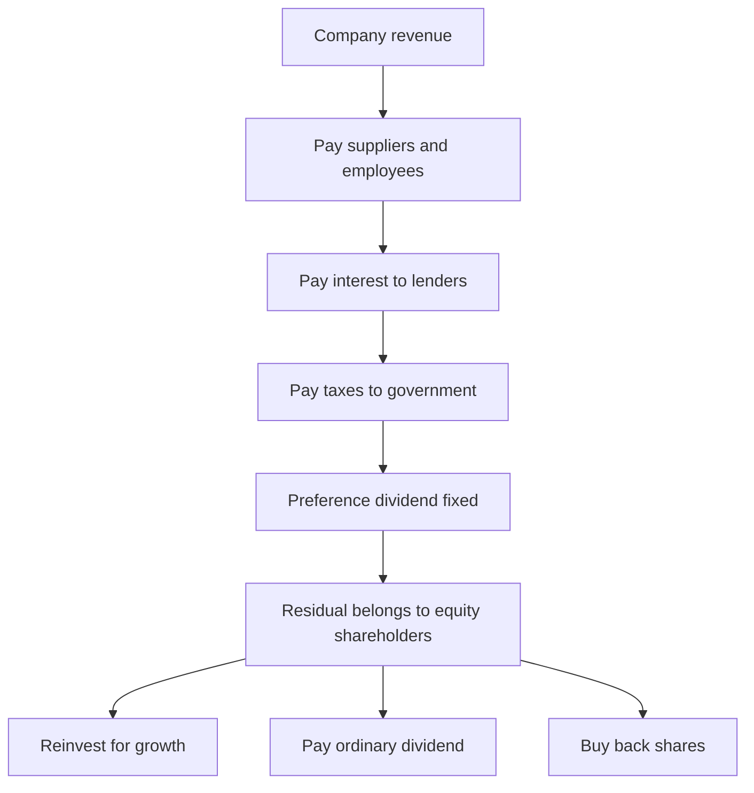
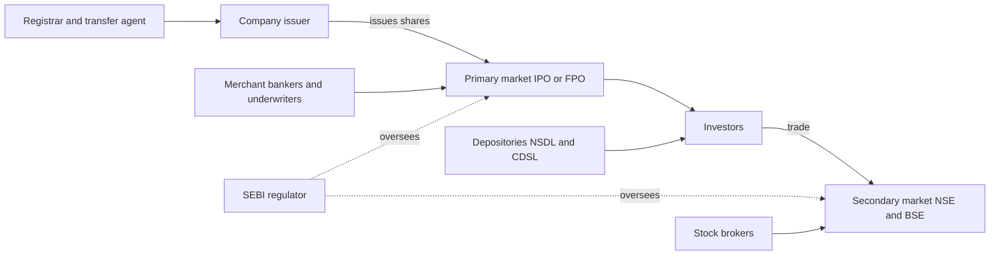
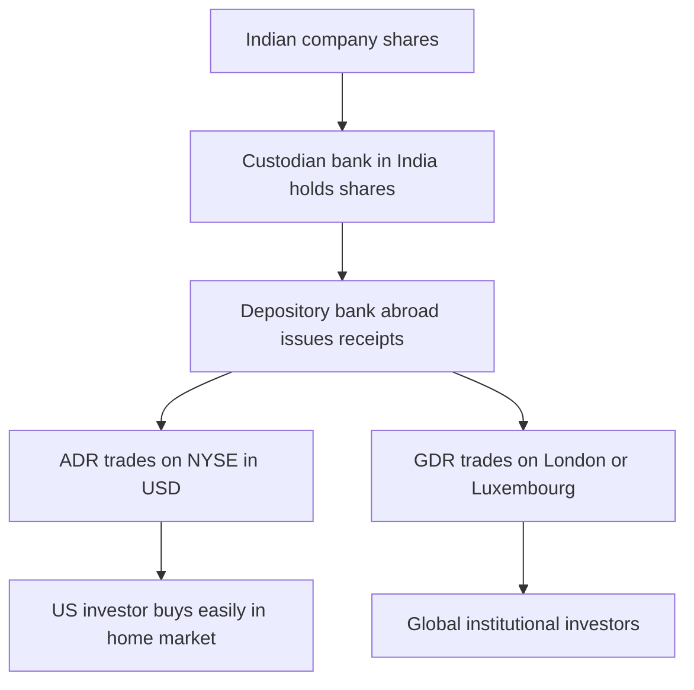

# Chapter 06 — Equity Instruments and Shares

## 1. The Problem / The Need

Imagine you have a brilliant business idea — a chain of electric-vehicle charging stations across India. You need ₹500 crore to build it. You do not have that money. You could borrow it (a loan or bond), but a bank will be nervous: your idea is unproven, you have no assets to pledge, and if the business fails, the bank wants its money back regardless. Debt demands fixed repayment on a fixed date, come rain or shine. That is exactly the wrong instrument for a risky, long-gestation venture with no guaranteed cash flows in the early years.

The founders face a second problem too. Even if they could borrow the whole ₹500 crore, they would be drowning in interest payments before earning a single rupee, and they would be personally on the hook. What they really need is money that behaves like **partnership money** — capital from people who accept that they might lose it if the venture fails, but who share in the fortune if it succeeds. Patient money. Money that does not have to be repaid on a schedule. Money whose providers are rewarded only *after* everyone else (workers, suppliers, lenders, the tax authorities) has been paid.

And the providers of that money have their own problem. A wealthy individual willing to back the EV idea does not want to be a passive donor. They want (a) a **claim on the profits** if it works, (b) **a say** in how their money is used, (c) the ability to **exit** — to sell their stake to someone else when they need liquidity — and (d) **limited downside**: they are willing to lose their investment, but not to be personally sued for the company's debts.

**Equity** — ownership shares in a company — is the financial instrument invented to solve all of these problems simultaneously. It converts a business into transferable units of ownership, each carrying a residual claim on profits and assets, voting rights, limited liability, and — once listed — the ability to be bought and sold in a market. This chapter is about those instruments: what they are, the different flavours they come in, and how to read and reason about them like a finance professional.

## 2. The Core Idea

The core idea of equity is the **residual claim**. A company generates revenue. Out of that revenue it must pay, in a strict order of priority: suppliers, employees, lenders (interest), and the government (taxes). Whatever is left over — the *residual* — belongs to the equity shareholders. They are last in the queue. This is the single most important fact about equity, and everything else flows from it.

Being last in the queue sounds bad, and in bankruptcy it is: equity holders often get nothing. But being last is also where the **unlimited upside** lives. Lenders are contractually capped — the most a bondholder can ever receive is their interest plus principal, no matter how spectacularly the business does. Equity holders, by contrast, own everything above the fixed claims. If the EV company becomes the next Tesla, the lenders still get only their coupon; the shareholders capture the entire surplus. Equity is the instrument that trades **priority for upside** and **safety for control**.

Three consequences define equity:

- **Ownership:** A share is a fractional ownership of the company. Own 1% of the shares and you own 1% of the company — its factories, its brand, its future profits.
- **Residual claim:** You get paid last, both in dividends (only after debt is serviced) and in liquidation (only after all creditors are satisfied).
- **Limited liability:** The most you can lose is what you invested. If the company collapses owing ₹1,000 crore, creditors cannot come after your personal house. This invention — the limited-liability joint-stock company — is arguably the most important financial innovation in history, because it made it safe for strangers to pool capital in ventures they did not personally control.

*Figure 1 — The waterfall of claims: equity shareholders receive the residual, only after every prior claim is satisfied.*

## 3. How It Works — Structure and Mechanics

A share represents a unit of **share capital**. When a company is incorporated, its constitution (the Memorandum and Articles of Association in India, the charter in the US) specifies an **authorised capital** — the maximum it may raise by issuing shares. Out of that, it **issues** some shares. The portion investors have actually agreed to buy is the **subscribed capital**, and the portion they have actually paid for is the **paid-up capital**. These distinctions matter legally: a company can call up unpaid amounts later (partly-paid shares), though in practice most modern issues are fully paid.

Each share has a **par value** (also called face value or nominal value) — an arbitrary accounting figure, commonly ₹10, ₹5, ₹2, or ₹1 in India, and often $0.01 or $0.001 in the US. Par value is **not** the price you pay and **not** what the share is worth. It is a historical legal artefact used to define the capital base. When a company issues a ₹10 par share for ₹150, the extra ₹140 is recorded as **securities premium** (share premium). We will pull par, book, and market value apart carefully in Section 4.

Mechanically, equity enters the world through the **primary market** — an IPO (Initial Public Offering) or FPO (Follow-on Public Offering), a rights issue, a private placement, or a preferential allotment. Once issued, shares trade among investors in the **secondary market** — the stock exchanges (NSE and BSE in India; NYSE and Nasdaq in the US). The company receives money only in the primary issue; secondary trading transfers ownership between investors and does not put a rupee into the company's coffers (though it sets the market price the company will get on its *next* raise).

Ownership is tracked electronically. In India, shares are held in **dematerialised (demat)** form in accounts at depositories — **NSDL** and **CDSL** — accessed through a broker/Depository Participant. Physical share certificates are effectively extinct for listed companies. The **registrar and transfer agent (RTA)** maintains the register of members and processes corporate actions like dividends and bonuses.

## 4. Full Content — Types, Features, Participants, Terms

### 4.1 Ordinary (Equity) Shares

The default, plain-vanilla instrument. An **ordinary share** (called a **common share** in the US) carries:

- **Voting rights** — typically one vote per share — on matters put to shareholders: electing directors, approving auditors, major transactions, mergers.
- **Residual dividend right** — a share of profits *if and when* the board declares a dividend. There is no obligation to pay; dividends are discretionary.
- **Residual asset claim** — a share of whatever remains on liquidation after all creditors and preference holders are paid.
- **Pre-emptive rights** — the right (in many jurisdictions, including under India's Companies Act via rights issues) to maintain your proportional ownership when new shares are issued.

Ordinary shares are the workhorse of the equity markets. When people say "stocks" or "shares," they almost always mean these.

### 4.2 Preference Shares

**Preference shares** (US: **preferred stock**) sit *between* debt and equity — a hybrid. They carry a **fixed dividend rate** (say 8% of par) and rank **ahead of** ordinary shares for both dividends and liquidation proceeds — hence "preference." But they usually carry **no voting rights** (except on matters that directly affect them, or when their dividend has gone unpaid for a stretch). They trade priority and a fixed return for the loss of control and upside.

Key varieties:

| Type | Feature |
|---|---|
| **Cumulative** | Unpaid dividends accumulate as arrears and must be cleared before ordinary shareholders get anything. (Default assumption in India.) |
| **Non-cumulative** | A missed dividend is gone forever; no arrears build up. |
| **Participating** | After the fixed dividend, also shares in surplus profits alongside ordinary holders. |
| **Non-participating** | Fixed dividend only, no further share of profits. (The usual case.) |
| **Convertible (CCPS)** | Convert into ordinary shares on set terms — beloved of venture capitalists. |
| **Redeemable** | The company repays and cancels them on a set date. In India, preference shares **must** be redeemable, within a maximum of 20 years (30 for certain infrastructure companies). |

In India, **Compulsorily Convertible Preference Shares (CCPS)** are the standard instrument through which private-equity and venture-capital funds invest in startups — they behave like debt (fixed return, downside protection) until conversion, then flip to equity to capture the upside. In the US, preferred stock is common in bank capital structures and in distressed rescues (Warren Buffett's crisis-era investments in Goldman Sachs and Bank of America were preferred-stock deals paying ~10%, with warrants for upside).

### 4.3 Differential Voting Rights (DVR) Shares

A **DVR share** decouples cash-flow rights from control. It gives the holder a *different* (usually lower) voting entitlement than an ordinary share — often compensated by a *higher* dividend or a lower price. Founders love DVRs and their cousins (dual-class shares) because they let them raise equity capital without diluting control.

- **India:** Tata Motors issued the best-known Indian DVR — 1 vote per 10 DVR shares, sweetened with a higher dividend, historically trading at a discount to the ordinary share. SEBI has since framed rules that generally allow **superior voting rights (SR) shares** for founders of tech companies (up to 10:1) but restrict *inferior*-rights DVRs.
- **US:** Dual-class structures are widespread. **Alphabet (Google)** has Class A (1 vote), Class B (10 votes, founder-held), and Class C (0 votes, the GOOG ticker). **Meta**, **Berkshire Hathaway**, and many others use similar structures so founders retain voting control while owning a minority of the economics.

The trade-off is governance: DVR/dual-class structures concentrate power in founders, which markets sometimes reward (visionary control) and sometimes penalise (weak accountability), and index providers have at times pushed back against them.

### 4.4 The Rights of a Shareholder

Owning equity is a bundle of legal rights. A finance professional should be able to rattle these off:

1. **Right to vote** — on directors, auditors, resolutions (ordinary and special).
2. **Right to dividends** — when declared, in proportion to holding.
3. **Right to a residual claim on assets** in winding up.
4. **Right to information** — annual report, audited accounts, notices of meetings.
5. **Pre-emptive / rights-issue right** — first refusal on new shares to avoid dilution.
6. **Right to transfer** shares freely (for listed companies).
7. **Right to attend and speak** at general meetings (AGM/EGM).
8. **Right to requisition meetings** and, with sufficient holding, to propose resolutions.
9. **Minority-protection rights** — in India, remedies against "oppression and mismanagement" under the Companies Act (Sections 241–242), and class-action provisions.

### 4.5 Participants in the Equity Ecosystem

*Figure 2 — The equity market ecosystem: issuers, intermediaries, investors, infrastructure, and the regulator.*

- **Issuers** — companies raising capital.
- **Investors** — retail, HNIs, domestic institutions (mutual funds, insurers, pension funds, the LIC-type giants), and Foreign Portfolio Investors (FPIs).
- **Intermediaries** — merchant bankers/investment banks (manage IPOs), underwriters (guarantee the raise), brokers (execute trades), RTAs.
- **Infrastructure** — stock exchanges, clearing corporations (NSE Clearing), depositories.
- **Regulator** — **SEBI** in India; the **SEC** in the US. SEBI's ICDR (Issue of Capital and Disclosure Requirements) and LODR (Listing Obligations and Disclosure Requirements) regulations govern issuance and ongoing conduct.

### 4.6 Par Value, Book Value, Market Value — Three Very Different Numbers

This is a classic interview trap, so pin it down precisely.

| Metric | Definition | Driven by | Example (illustrative) |
|---|---|---|---|
| **Par (face) value** | Arbitrary nominal value per share set at incorporation | Legal/accounting convention | ₹1 |
| **Book value per share** | (Shareholders' equity − preference capital) ÷ number of shares | Accounting; net assets on the balance sheet | ₹250 |
| **Market value (price)** | The price the share trades at in the market | Supply and demand; future expectations | ₹3,600 |

- **Par value** is fixed and tiny; it barely matters except for legal capital and for calculating things like dividend rates on preference shares (an "8% preference share of ₹100" pays ₹8).
- **Book value** is backward-looking accounting: what the company's net assets are *recorded* at. It anchors valuation for asset-heavy businesses (banks, manufacturers) and underpins the **Price-to-Book (P/B) ratio**.
- **Market value** is forward-looking: it reflects what investors expect the company to *earn in the future*, discounted to today. For a company like a fast-growing tech firm, market value can be many multiples of book value because most of the value is future growth and intangibles not on the balance sheet.

The gap between book and market value is itself information: a market value far above book (high P/B) signals that the market expects high returns on the company's assets; a market value *below* book (P/B < 1) can signal distress, or a hidden bargain, or assets the market thinks are overstated.

### 4.7 Dividends

A **dividend** is a distribution of profits to shareholders. It is how equity delivers *cash* return (as opposed to price appreciation). Types and terms:

- **Interim dividend** — declared by the board during the financial year.
- **Final dividend** — recommended by the board and approved by shareholders at the AGM.
- **Special dividend** — a one-off, often after an asset sale or windfall.
- **Dividend yield** = annual dividend per share ÷ market price. A ₹40 dividend on a ₹1,000 share is a 4% yield.
- **Payout ratio** = dividends ÷ net profit. The fraction of earnings paid out rather than reinvested.

**Critical dates** every investor must know:

- **Declaration date** — the board announces the dividend.
- **Record date** — the cut-off; whoever is on the register on this date gets paid.
- **Ex-dividend date** — the date from which the share trades *without* the right to the upcoming dividend. In India and the US (post T+1 settlement), the ex-date is typically the record date or one day before. Buy on or after the ex-date and you do **not** get the dividend; the price mechanically drops by roughly the dividend amount on the ex-date.

**Taxation:** In India, dividends were historically taxed via a **Dividend Distribution Tax (DDT)** paid by the company; since **FY2020-21, DDT was abolished** and dividends are now taxed in the hands of the shareholder at their slab rate (with TDS above thresholds). This shifted the calculus toward buybacks for a while — see below.

**Why do companies pay dividends at all**, if reinvestment could compound value? Because (a) mature companies run out of high-return projects and returning cash is better than empty empire-building; (b) dividends **signal** confidence and financial health — cutting a dividend is punished savagely by markets; and (c) some investors (retirees, income funds) demand cash income. Miller and Modigliani famously argued dividend policy is *irrelevant* in a frictionless world, but frictions (taxes, signalling, agency costs) make it matter in reality.

### 4.8 Buybacks (Share Repurchases)

A **buyback** is the company using its cash to purchase its own shares from the market and extinguish them. It is an *alternative* to dividends for returning cash. Effects:

- **Fewer shares outstanding** → each remaining share owns a bigger slice → **EPS rises** (mechanically, even with flat profit).
- Signals management believes the shares are **undervalued**.
- Historically more **tax-efficient** than dividends in some regimes — which is why, when India taxed dividends in shareholders' hands but taxed buybacks lightly, many Indian IT firms (TCS, Infosys, Wipro) returned cash via buybacks. Note: India changed buyback taxation from **October 2024**, making buyback proceeds taxable in the shareholder's hands like dividends, neutralising much of the advantage.

Methods: **tender offer** (company offers to buy a fixed number at a fixed price, usually a premium) or **open-market purchase** (buys gradually on the exchange). In the US, open-market buybacks under SEC Rule 10b-18 have become enormous — S&P 500 companies routinely return more cash via buybacks than dividends (Apple has repurchased hundreds of billions of dollars of its own stock).

### 4.9 Depository Receipts — ADRs and GDRs

**The problem:** An American pension fund wants to own Infosys, but buying on the NSE means dealing with Indian rupees, Indian settlement, Indian custody, Indian regulations, and currency risk operationally. Cross-border direct investing is clunky. **The solution:** a **depository receipt** — a negotiable certificate, issued by a bank in the investor's home market, that *represents* shares of a foreign company held in custody back home.

- **ADR (American Depository Receipt):** Trades in the **US**, in **US dollars**, on US exchanges, cleared US-style. A US bank (e.g., JPMorgan, BNY Mellon) holds the underlying Indian shares and issues ADRs against them. Each ADR represents a defined ratio of underlying shares. **Infosys, Wipro, ICICI Bank, HDFC Bank, and Dr. Reddy's** trade as ADRs on the NYSE/Nasdaq. ADRs come in levels: Level I (OTC), Level II (listed, no capital raise), Level III (listed, capital-raising) — with rising disclosure requirements up to full SEC/US-GAAP reconciliation.
- **GDR (Global Depository Receipt):** Similar concept but issued in **multiple markets outside the issuer's home country**, typically **listed in London or Luxembourg** and denominated in USD or EUR, often placed with international institutional investors. Historically many Indian companies raised money via GDRs on the London/Luxembourg exchanges.

*Figure 3 — How a depository receipt lets a foreign company's shares trade in an overseas market.*

Why issue them? To **access a deeper pool of foreign capital**, gain global visibility and prestige, and sometimes achieve a better valuation. For the investor, DRs offer foreign exposure with home-market convenience. **Arbitrage** keeps ADR and local prices aligned: because ADRs are convertible to/from the underlying shares, if the ADR trades too far from the local price (adjusted for the ratio and FX), traders convert and pocket the difference. Note the direction of exposure: an ADR still carries the underlying **currency risk** economically, even though it trades in dollars.

### 4.10 Reading a Stock Quote

A finance professional must read a quote fluently. A typical listing for, say, Reliance Industries on the NSE shows:

| Field | Meaning |
|---|---|
| **LTP (Last Traded Price)** | Price of the most recent trade — the "current price" |
| **Open / High / Low / Prev Close** | Session's opening, intraday extremes, and previous day's close |
| **Change / % Change** | Move versus previous close, absolute and percentage |
| **Bid / Ask (and sizes)** | Highest price a buyer will pay / lowest a seller will accept; the **spread** is the gap |
| **Volume** | Number of shares traded so far — a liquidity gauge |
| **VWAP** | Volume-Weighted Average Price for the session |
| **52-week High / Low** | Price range over the trailing year — context for where it sits |
| **Market cap** | Price × shares outstanding — the company's total equity value |
| **P/E ratio** | Price ÷ earnings per share — valuation multiple |
| **Dividend yield** | Annual dividend ÷ price |
| **Face value** | Par value (e.g., ₹10) |
| **Circuit limits** | Upper/lower price bands beyond which trading halts (India's system) |

Reading the **bid-ask spread** tells you liquidity: a large, liquid stock like Reliance or Apple has a spread of a paisa/cent; a thinly-traded small-cap might have a spread of several percent, a real cost to trading. **Volume** confirms whether a price move is meaningful (high volume) or a fluke (thin trading). **Market cap** — not price per share — is what tells you how big a company is: a ₹50 share and a ₹5,000 share say nothing about size until you multiply by share count.

### 4.11 Corporate Actions — Splits and Bonus Issues

Corporate actions change the *structure* of the shares without (directly) changing the underlying value of the business. The two most misunderstood are **stock splits** and **bonus issues**.

- **Stock split:** The company divides each share into more shares by **reducing par value**. A 1-for-2 split (or "2:1 split" in US parlance) on a ₹10 par share turns it into two ₹5 par shares; price roughly halves; your total value is unchanged. **Purpose:** lower the per-share price to improve **affordability and liquidity** for retail investors. (A **reverse split** does the opposite — consolidates shares, raises the price — often to escape penny-stock or delisting territory.)
- **Bonus issue (stock dividend):** The company issues **free additional shares** to existing shareholders (e.g., 1:1 bonus = one free share per share held) by **capitalising reserves** — converting retained earnings/securities premium into share capital. Par value is **unchanged**; the number of shares rises; the price adjusts down proportionally.

**The crucial insight — and a favourite interview question:** Neither a split nor a bonus makes you richer. If you own 100 shares at ₹2,000 (₹2,00,000 total) and the company does a 1:1 bonus, you now own 200 shares at ~₹1,000 (still ₹2,00,000). The pie is the same size; it is just cut into more slices. What changes is *signalling* (management often does bonuses when confident about future earnings), *affordability*, and *liquidity*. The accounting differs — a split reduces par value while a bonus capitalises reserves — but the wealth effect is nil.

| Feature | Stock Split | Bonus Issue |
|---|---|---|
| Par value | Reduced | Unchanged |
| Reserves | Untouched | Capitalised into share capital |
| New shares from | Subdividing existing | Free new shares |
| Price effect | Falls proportionally | Falls proportionally |
| Wealth effect | None | None |
| Typical signal | Improve liquidity/affordability | Confidence, reward shareholders |

Other corporate actions to know: **rights issue** (offer of new shares to existing holders at a discount, pro-rata — actually raises capital and *does* require you to pay), **dividend** (covered above), **merger/demerger**, and **spin-off** (carving out a division as a separately listed company, as with the Jio Financial demerger from Reliance).

## 5. Worked / Real Examples

**Example 1 — Par vs Book vs Market, and a split (Infosys-style).**
Consider a company with a ₹5 par value, shareholders' equity (net worth) of ₹90,000 crore, and 415 crore shares outstanding.
- Book value per share = ₹90,000 cr ÷ 415 cr ≈ **₹217**.
- Suppose the market price is **₹1,500**. Then P/B = 1,500 ÷ 217 ≈ **6.9×** — the market values it at nearly seven times net assets, reflecting expected future profits and its high return on equity.
- Par value stays a trivial **₹5**, mattering only legally.
Now the company announces a **1:1 bonus**. Shares double to 830 crore; the price adjusts to ~₹750; your holding's value is unchanged; book value per share halves to ~₹108 (because the same equity is spread over twice the shares) — but net worth is identical. This is exactly the kind of number juggling Infosys and TCS have done historically to keep shares affordable.

**Example 2 — Dividend vs buyback (Indian IT).**
An IT company has ₹10,000 crore of surplus cash and 400 crore shares trading at ₹500 (market cap ₹2,00,000 crore), earning ₹8,000 crore net profit (EPS = ₹20).
- **Dividend route:** Pay ₹25/share (₹10,000 cr total). Shareholders receive cash but are taxed at slab rate (post-2020 rules). Share count and EPS unchanged.
- **Buyback route:** Buy back at ₹550 (a premium) → repurchase ~18.2 crore shares. Shares outstanding fall to ~381.8 crore. EPS rises to ₹8,000 cr ÷ 381.8 cr ≈ **₹20.95**, a mechanical boost. Historically buybacks were more tax-efficient, which is why TCS and Infosys ran repeated buybacks — until India's **October 2024** change taxed buyback proceeds in the shareholder's hands, tilting the field back toward dividends.

**Example 3 — ADR arbitrage (Infosys).**
Infosys trades at ₹1,600 on the NSE. Its ADR (each ADR = 1 share, say) trades on the NYSE. With USD/INR at 83, the "fair" ADR price ≈ 1,600 ÷ 83 ≈ **$19.28**. If the ADR were trading at $20.00, an arbitrageur could (conceptually) buy the cheaper local share, convert to an ADR, and sell it in New York, pocketing the gap — until buying pressure on the local share and selling pressure on the ADR close it. This convertibility is precisely what keeps the two prices tethered across markets and time zones, adjusted for FX.

## 6. Connections to Other Markets and Instruments

- **Debt (bonds/loans):** Equity's opposite in the capital structure. Debt = fixed claim, priority, no upside, no control; equity = residual claim, last in line, unlimited upside, control. Together they form the **capital structure**, and the mix (leverage) is a central corporate-finance decision. Preference shares and convertibles are the **hybrids** bridging the two.
- **Derivatives:** Equity underlies **futures and options** (stock and index F&O on NSE, the world's largest derivatives exchange by volume). Options give leveraged, defined-risk exposure to the same shares. **Warrants** (long-dated call-like instruments issued by the company) and **ESOPs** create new equity claims.
- **Mutual funds / ETFs:** Retail investors increasingly access equity indirectly through mutual funds and index ETFs (e.g., Nifty 50 ETFs), which pool money to buy diversified baskets of shares.
- **Indices:** The **Nifty 50** and **Sensex** (India), the **S&P 500** and **Dow** (US) aggregate equity prices into benchmarks that drive index funds, derivatives, and sentiment.
- **Valuation and the primary market:** Everything here connects to how IPOs are priced, how M&A deals are structured (cash vs stock), and how the **cost of equity** feeds into a company's WACC — the hurdle rate for every investment it makes.

## 7. Key Terms & Concepts

- **Equity / ordinary / common share** — fractional ownership with residual claim, voting, limited liability.
- **Preference / preferred share** — fixed-dividend hybrid ranking ahead of ordinary; cumulative/participating/convertible/redeemable variants.
- **DVR / dual-class** — shares with differential (usually inferior or superior) voting rights.
- **Residual claim** — equity's right to whatever remains after all prior claims.
- **Limited liability** — loss capped at amount invested.
- **Par / face value** — nominal legal value; **book value** — net assets per share; **market value** — traded price.
- **Securities premium** — issue price above par.
- **Dividend** — profit distribution; **yield**, **payout ratio**, **record/ex-date**.
- **Buyback** — repurchase and cancellation of own shares.
- **ADR / GDR** — depository receipts giving foreign investors home-market access.
- **Stock split** — subdivide shares, reduce par; **bonus issue** — free shares from reserves; **rights issue** — discounted pro-rata new shares for cash.
- **Market cap** — price × shares outstanding.
- **Bid-ask spread** — liquidity indicator.
- **P/E, P/B** — valuation multiples.
- **Demat, NSDL/CDSL, RTA, SEBI, ICDR/LODR** — Indian market plumbing and regulation.

## 8. Common Confusions and Traps

1. **Par value ≠ price ≠ worth.** Par is a trivial legal number. A ₹1 face-value stock is not "cheaper" than a ₹10 one; look at market cap and valuation multiples.
2. **A high share price does not mean a "big" or "expensive" company.** MRF trading at ₹1,00,000+ per share is not bigger than Reliance; market cap (price × count) is the measure, and cheapness is P/E or P/B, not the sticker price.
3. **Bonus and split do not create wealth.** More shares at a lower price = same total. Only signalling and liquidity change.
4. **Dividends are not "free money."** The price drops by roughly the dividend on the ex-date; you are receiving your own capital back, and it may be taxed.
5. **Buybacks boost EPS mechanically, not necessarily value.** Fewer shares raise EPS arithmetically even if the business hasn't improved — and overpaying for one's own shares destroys value.
6. **"Preferred" stock is not "preferable" for upside.** It ranks higher and pays fixed, but forgoes the equity upside and usually voting rights. It is closer to debt.
7. **ADRs still carry currency risk.** Trading in dollars does not eliminate the underlying rupee exposure; a falling rupee hurts the ADR holder economically.
8. **Ex-date vs record date confusion.** To receive a dividend or bonus, you must own the share *before* the ex-date (so you are on the register by the record date). Buying on the ex-date is too late.
9. **Authorised vs issued vs paid-up capital** are distinct legal layers — don't treat "authorised capital" as money the company actually has.
10. **Rights issue is not a bonus.** A rights issue asks you to *pay* for new shares (at a discount); a bonus gives them free. Both are pro-rata, which causes mix-ups.

## 9. First-Principles Recap

Strip everything away and equity is this: **a transferable, limited-liability claim on the residual value of a business.** It exists because risky ventures need patient capital that does not demand fixed repayment, and because savers want a share of the upside, a voice, an exit, and a capped downside. From the single principle of the *residual claim*, everything follows — the last-in-queue position, the unlimited upside, the discretionary (not guaranteed) dividend, the volatility. Preference shares and DVRs are simply re-slicings of that basic claim: trade upside/control for priority/income (preference), or decouple economics from control (DVR). Par, book, and market value are three different lenses — legal, accounting, and expectational — on the same share. Dividends and buybacks are two nozzles for returning cash. ADRs/GDRs are wrappers that let the claim travel across borders. Splits and bonuses re-cut the pie without changing its size. Understand the residual claim, and the entire chapter reassembles itself.

## 10. Quick-Reference — Interview-Ready Points

- **Equity = residual, last-in-queue claim** on profits and assets, with **voting rights** and **limited liability**; trades priority for upside.
- **Ordinary vs preference:** ordinary = discretionary dividend + votes + upside; preference = fixed dividend, priority, usually no votes, no upside (a debt-equity hybrid). India: preference shares must be **redeemable within 20 years**; **CCPS** is the standard VC instrument.
- **DVR / dual-class** decouples cash rights from control — Tata Motors DVR (India), Alphabet/Meta (US).
- **Par ≠ book ≠ market:** par is nominal legal (₹1–₹10); book = net assets/share; market = expectations-driven price. **P/B** and **P/E** are the multiples.
- **Dividend** = profit distribution; know **declaration/record/ex-date**; price drops ~dividend on ex-date; **India taxes dividends in the holder's hands since FY21**.
- **Buyback** shrinks share count, **raises EPS mechanically**, signals undervaluation; India taxed buybacks in holders' hands from **Oct 2024**.
- **ADR** = trades in US/USD (Infosys, HDFC Bank on NYSE); **GDR** = London/Luxembourg. Both give foreign investors home-market access; **arbitrage** keeps prices aligned; **FX risk remains**.
- **Stock split** reduces par and multiplies shares; **bonus** capitalises reserves into free shares; **neither changes wealth** — only affordability/liquidity/signalling.
- **Reading a quote:** LTP, OHLC, bid-ask (liquidity), volume (conviction), 52-wk range, **market cap = price × shares** (true size), P/E, dividend yield.
- **Regulators:** **SEBI** (India, ICDR/LODR); **SEC** (US). **Demat** via **NSDL/CDSL**; trade on **NSE/BSE**.
- **Capital layers:** authorised ≥ issued ≥ subscribed ≥ paid-up.
- **One-liner:** *Equity is the residual claim — last in line, unlimited on the top end, priced on the future.*
