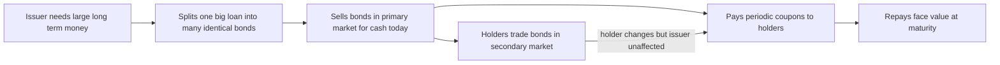
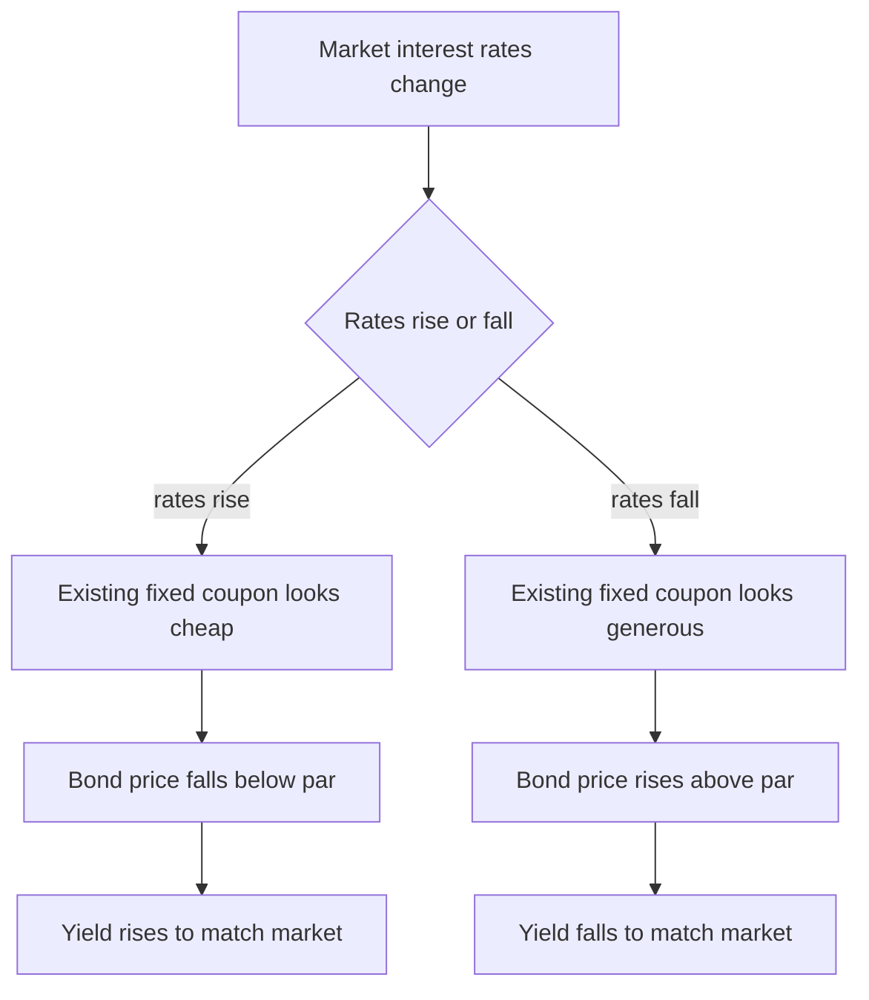
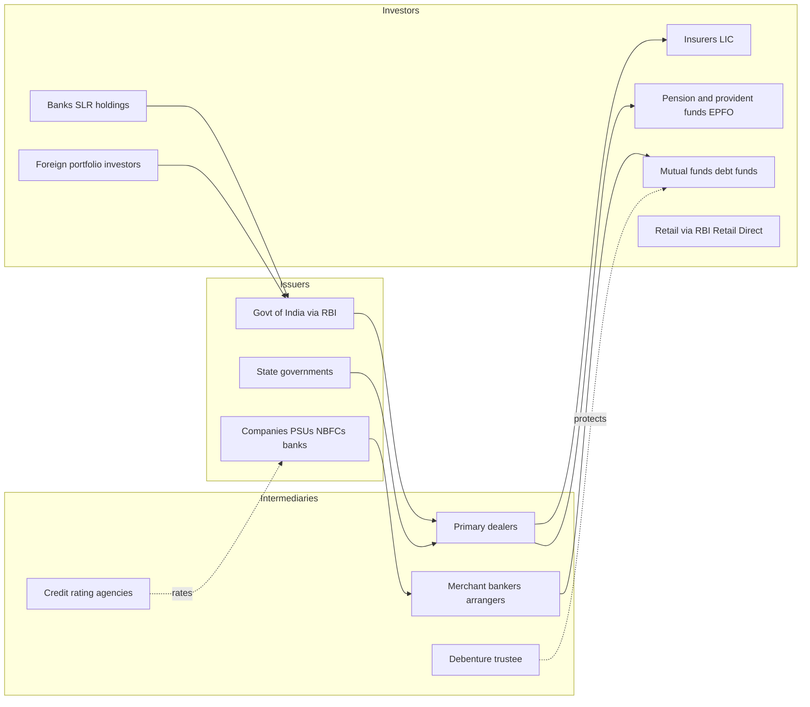

# Chapter 07 — Bond and Debt Markets

## 1. The Problem / The Need

Every large organisation eventually faces the same wall: it needs a large sum of money *now*, and it can generate the cash to pay it back only *over time*. A government wants to build a national highway network that will serve citizens for forty years, but the concrete, steel and land must be paid for today. A power company wants to build a 4,000 MW plant that will take five years to construct and thirty years to earn revenue. A homeowner-lending institution wants to disburse ten-year mortgages but does not have ten years of cash lying idle.

There are only three ways to raise a lot of money:

1. **Retained earnings / internal cash** — but a new highway or a first power plant generates no internal cash yet.
2. **Equity** — selling ownership. But governments cannot sell "shares" in a country, and a profitable firm often does not want to dilute existing owners or hand voting control to strangers just to fund a routine expansion.
3. **Borrowing** — take money now, promise to return it later with a fee (interest).

Borrowing is the natural answer whenever the borrower is creditworthy, the need is large, and the borrower would rather keep ownership intact and enjoy the tax advantage that interest (unlike dividends) is deductible.

But a single bank cannot easily lend ₹50,000 crore to the Government of India, or ₹10,000 crore to Reliance, for twenty years. That is far too large and too long for one lender to hold. The **need**, therefore, is a mechanism to **split one giant, long-dated loan into thousands of small, tradable slices** that can be sold to insurers, pension funds, mutual funds, banks, foreign funds and even individuals — and then re-sold among them whenever a holder wants cash back early.

That mechanism is the **bond**, and the ecosystem that issues, prices, rates and trades bonds is the **debt market**. It is, by size, the largest financial market on earth — global bond markets (~USD 130+ trillion) dwarf global equity markets.

---

## 2. The Core Idea

A **bond** (or **debt security**) is a **tradable, standardised IOU**. The issuer says, in a legally binding contract:

> "I have borrowed a fixed face amount from you. I will pay you a fixed (or formula-based) rate of interest at fixed intervals, and I will return the full face amount on a fixed future date. This promise is a security you can sell to someone else."

Three ideas make the bond powerful:

- **Standardisation** — every unit is identical (same face value, same coupon, same maturity), so buyers do not need to negotiate individually. This makes bonds *fungible* and therefore *tradable*.
- **Seniority over equity** — bondholders are *creditors*, not owners. They must be paid interest and principal **before** shareholders get anything. In bankruptcy, they stand ahead in the queue. This lower risk is why bonds pay less than equity's expected return but offer far more certainty.
- **Time-slicing of risk and return** — a lender who wants their money back in year 3 of a 20-year loan simply sells the bond in the secondary market to someone who is happy to wait until year 20. The borrower is undisturbed; only the *holder* changes.

A bond is fundamentally the **securitisation of a loan** — turning a private, illiquid lending relationship into a public, liquid, priced instrument.

*Figure 1 — The life of a bond from issuance to redemption.*

---

## 3. How It Works — The Mechanics of a Bond

Take a concrete instrument. The Government of India issues a bond:

> **7.18% GS 2033**, face value ₹100, matures 14 August 2033.

Decode it:

- **Face value (par value / principal)** = ₹100. This is the amount repaid at maturity and the base on which interest is computed. (Indian G-secs carry ₹100 face; a corporate bond is often ₹1,000 or ₹1,00,000; a US Treasury is USD 1,000.)
- **Coupon rate** = 7.18% per annum. The issuer pays 7.18% of face value each year — here ₹7.18, paid as ₹3.59 every six months (G-secs pay semi-annually).
- **Maturity** = 14 August 2033 — the date the ₹100 principal is returned and the bond ceases to exist.
- **Coupon dates** = 14 February and 14 August each year until maturity.

**The cash-flow picture** for one bond bought at issue in 2023:

| Time | Cash flow to holder |
|------|--------------------|
| Aug 2023 (buy) | −₹100 (or the market price) |
| Each Feb & Aug, 2024–2033 | +₹3.59 |
| Aug 2033 (maturity) | +₹3.59 + ₹100 (principal) |

**Price versus yield — the single most important idea in bond markets.**

The coupon is *fixed forever*, but the *price* of the bond fluctuates every day in the secondary market. Why? Because prevailing interest rates change. Suppose after issue, market interest rates for similar 10-year risk rise to 8%. A new buyer can now buy fresh bonds paying 8%. Nobody will pay ₹100 for your old bond paying only 7.18%. So your bond's **price falls below ₹100** (a *discount*) until its effective return — its **yield** — matches the new 8% market rate. Conversely, if market rates fall to 6%, your 7.18% bond looks generous, and its **price rises above ₹100** (a *premium*).

This gives the **iron law of bonds**: **price and yield move in opposite directions.** When yields rise, bond prices fall; when yields fall, bond prices rise.

- **Yield to Maturity (YTM)** — the single discount rate that makes the present value of all future coupons plus principal equal to the current market price. It is the true "return if held to maturity" and the number bond traders actually quote and compare.
- **Current yield** — a rough measure: annual coupon ÷ current price (₹7.18 ÷ ₹96 ≈ 7.48%). Ignores the pull-to-par gain/loss.
- **Duration** — sensitivity of price to a change in yield. A bond with duration 7 loses roughly 7% of its value if yields rise 1%. Longer-maturity bonds have higher duration and so are more volatile — this is **interest-rate risk**.

*Figure 2 — Why bond prices and yields always move inversely.*

---

## 4. Full Content — Instruments, Participants, Segments, Features

### 4.1 The two great segments: Government and Corporate

The debt market divides into who is borrowing:

**A. The Government / Sovereign segment (the G-sec market).**

- **Government Securities (G-secs / dated securities)** — long-term (2 to 40 years) borrowing by the Government of India, issued through the RBI. Considered *risk-free* in rupee terms because the sovereign can tax and, ultimately, print rupees. The G-sec yield curve is the **benchmark** off which every other rupee rate is priced.
- **Treasury Bills (T-bills)** — *short-term* (91-day, 182-day, 364-day) government paper. Issued at a **discount** and redeemed at face value; they carry **no coupon** (zero-coupon). The gap between purchase price and ₹100 is the return. T-bills anchor the short end of the curve.
- **Cash Management Bills (CMBs)** — ultra-short government paper (a few days to under 91 days) to bridge temporary mismatches.
- **State Development Loans (SDLs)** — bonds issued by *state* governments (Maharashtra, Tamil Nadu, etc.) via RBI to fund state fiscal deficits. Legally sovereign-backed but yield slightly *more* than central G-secs (typically 30–60 bps) because states are marginally less liquid and carry a whisper of extra risk.
- **Sovereign Gold Bonds, Floating Rate Bonds, Inflation-Indexed Bonds** — special-purpose government instruments (gold-linked, rate-linked to a benchmark, or principal-linked to CPI inflation).

**B. The Non-government / Corporate segment.**

- **Corporate bonds / debentures** — borrowing by companies (PSUs, NBFCs, banks, manufacturers). "Bond" and "debenture" are used almost interchangeably in India; a **debenture** is technically a debt instrument not secured on specific physical assets, though in Indian practice most issues are "secured NCDs".
- **Non-Convertible Debentures (NCDs)** — pure debt; principal repaid in cash. The workhorse of Indian corporate borrowing.
- **Convertible debentures** — can convert into equity shares later (fully convertible = FCD, partly = PCD). A hybrid: debt today, potential equity tomorrow.
- **Commercial Paper (CP)** — short-term (7 days to 1 year), unsecured, discounted corporate paper — the corporate equivalent of a T-bill, used by top-rated firms and NBFCs for working capital.
- **Certificates of Deposit (CDs)** — short-term discounted paper issued by *banks*.
- **Bonds of PSUs and financial institutions** — NHAI, PFC, REC, NABARD, SIDBI, IRFC — huge, frequent issuers, often with tax-free variants.

### 4.2 Core features that define any bond

| Feature | What it means | Example |
|---|---|---|
| **Face / par value** | Principal repaid at maturity; base for interest | ₹100 (G-sec), ₹1,000 (corporate) |
| **Coupon** | Periodic interest; fixed, floating, or zero | 7.18% fixed; or "repo + 2%" floating |
| **Maturity / tenor** | Life of the bond | 91 days (T-bill) to 40 years (G-sec) |
| **Issue price** | Price paid at issue — par, premium, or discount | T-bill at ₹98.50 |
| **Yield (YTM)** | True return given current price | 7.4% |
| **Redemption** | How principal is repaid — bullet or amortising | Bullet (all at end) vs staggered |
| **Seniority / security** | Rank in bankruptcy; secured or unsecured | Senior secured NCD |
| **Embedded options** | Call (issuer redeems early), put (holder sells back early) | Callable perpetual bond |
| **Credit rating** | Third-party default-risk grade | AAA, AA+, BBB− |

### 4.3 Special structures worth knowing

- **Zero-coupon bond** — no coupon; sold deep-discount, redeemed at par. All return is the price gap (e.g., T-bills, STRIPS).
- **Floating-rate bond (FRB)** — coupon resets periodically to a benchmark (e.g., overnight MIBOR, T-bill rate). Protects the holder from rising rates.
- **Callable bond** — issuer can redeem early (good for issuer if rates fall). Investor demands higher yield to compensate.
- **Puttable bond** — holder can force early redemption (good for investor). Investor accepts a lower yield.
- **Perpetual bonds / AT1 bonds** — no fixed maturity; pay coupons forever (or until called). Banks issue **Additional Tier-1 (AT1)** perpetuals to meet Basel capital norms — these can be *written down* to zero in a crisis (as YES Bank's AT1 bonds were in 2020, a landmark Indian case).
- **Masala bonds** — rupee-denominated bonds issued *offshore* (so the currency risk sits with the foreign investor, not the Indian issuer). NTPC and HDFC pioneered these.
- **Green bonds** — proceeds earmarked for climate/environmental projects; India issued its first **Sovereign Green Bonds** in 2023.
- **Municipal bonds (munis)** — issued by city corporations (Ghaziabad, Pune, Indore) to fund urban infrastructure; large and central in the US, still nascent in India.

### 4.4 Participants in the debt market

*Figure 3 — Who issues, who intermediates, and who buys in the Indian debt market.*

- **Regulators** — **RBI** governs G-secs, money markets and the government-borrowing calendar; **SEBI** regulates the corporate bond market, listing, and rating agencies. (Contrast the US: the **SEC** regulates corporate bonds, the **Treasury/Fed** handle Treasuries.)
- **Primary Dealers (PDs)** — banks/firms obliged to bid at every G-sec auction and make two-way markets, ensuring the government's borrowing always gets subscribed.
- **Credit Rating Agencies (CRAs)** — CRISIL, ICRA, CARE, India Ratings (globally: S&P, Moody's, Fitch).
- **Debenture Trustee** — a SEBI-registered entity that holds security on behalf of, and enforces rights for, dispersed bondholders.
- **CCIL (Clearing Corporation of India Ltd)** — clears and guarantees G-sec and money-market trades.

### 4.5 The primary and secondary markets — the issuance process

**Primary market (new issuance):**

- *G-secs* are sold via **RBI auctions** on the electronic **E-Kuber** platform. Auctions are either:
  - **Uniform-price (Dutch)** — all winning bidders pay the same cut-off price; or
  - **Multiple-price (French)** — each winner pays their own bid price.
  Big institutions bid *competitively* (specifying yield); small investors bid *non-competitively* (accept the cut-off).
- *Corporate bonds* are issued via:
  - **Private placement** — sold to a handful of large institutions (>95% of Indian corporate issuance goes this route via the **EBP – Electronic Bidding Platform**); fast and cheap.
  - **Public issue** — offered to retail through a prospectus (e.g., an NCD issue by a Tata Capital or Muthoot Finance), listed on NSE/BSE.

**Secondary market (trading existing bonds):**

- *G-secs* trade on the RBI's **NDS-OM** (Negotiated Dealing System – Order Matching) — a wholesale, largely institutional platform. G-secs are the most liquid rupee instrument.
- *Corporate bonds* trade on the debt segments of **NSE and BSE** and over-the-counter, reported to trade repositories. Liquidity is thin — most holders buy and hold to maturity.
- **RBI Retail Direct** (launched 2021) lets individuals open a gilt account directly with RBI and buy G-secs, SDLs and T-bills at auction with zero fees — a genuine democratisation of a once-institutional market.

---

## 5. Worked / Real Examples

### Example 1 — Pricing a G-sec when rates move (India)

You buy the **7.18% GS 2033** at par (₹100) at issue. Two years later, RBI has hiked and 8-year G-sec yields are now 7.7%.

- Your bond still pays only ₹7.18 a year while the market wants ₹7.70 on ₹100.
- Its price must **fall** so that a buyer's YTM rises to ~7.7%. Roughly, with a duration of ~6, a 0.52% yield rise cuts the price by about 6 × 0.52% ≈ **3.1%**, to about **₹96.9**.
- If you *sell now*, you take a capital loss; if you *hold to maturity*, you still get ₹100 back plus every ₹3.59 coupon — you simply earned less than the new market rate. This is **interest-rate risk** made concrete, and it is why LIC and pension funds (who hold to maturity) fret less about it than mutual-fund traders (who mark-to-market daily).

### Example 2 — A T-bill's discount return (India)

The RBI auctions a **182-day T-bill** at a price of **₹97.20** per ₹100 face.

- You pay ₹97.20 today; in 182 days you receive ₹100. No coupon.
- Return over the period = (100 − 97.20)/97.20 = 2.88%.
- Annualised ≈ 2.88% × (365/182) ≈ **5.78%** — this becomes the benchmark short-term risk-free rate that treasuries and money-market funds price against.

### Example 3 — How a rating downgrade repriced risk (India, IL&FS 2018)

**IL&FS**, an infrastructure-financing group, carried **AAA** ratings on much of its debt. In September 2018 it began defaulting; within weeks agencies slashed the paper from **AAA to D (default)** — a nine-notch collapse.

- Mutual funds holding IL&FS bonds had to write them down to near zero, hammering debt-fund NAVs.
- Because IL&FS financed via short-term CP rolled over constantly, its collapse triggered a **liquidity freeze for all NBFCs** — investors suddenly distrusted every NBFC's paper, spreads blew out, and lending seized up.
- **Lesson:** a bond's price reflects *perceived* credit risk, ratings can lag reality, and a single high-profile default can reprice an entire market segment. The 2020 **Franklin Templeton** episode (six debt funds frozen because low-rated bonds became untradeable) drove the same point home.

### Example 4 — Corporate borrowing vs the bank loan (global logic)

Reliance Industries needs USD 1 billion for 10 years. A syndicated bank loan might cost, say, SOFR + 1.5% with restrictive covenants. Instead, Reliance — rated investment-grade — issues **10-year USD bonds** to global insurers and funds at a fixed 3.7%. It locks a low fixed rate for a decade, taps a far bigger pool of lenders than any bank syndicate, and faces lighter covenants. This is *disintermediation* — going around banks straight to savers — and it is why deep bond markets lower the cost of capital for an entire economy.

---

## 6. Connections — How This Links to the Rest of Finance

- **To the yield curve and monetary policy (Chapter on rates):** the G-sec curve *is* the risk-free curve. When the RBI changes the repo rate, the whole curve shifts, repricing every bond and loan in the country. Bond markets are the transmission belt of monetary policy.
- **To equity valuation:** the risk-free rate from G-secs is the anchor in every DCF and every cost-of-capital calculation. Rising bond yields mechanically lower equity valuations (the "discount-rate" channel) — a key reason stocks fall when yields spike.
- **To banking:** banks must hold a chunk of deposits in G-secs (the **SLR — Statutory Liquidity Ratio**), making them structurally the largest holders of government debt. Bank treasuries live and die by bond price moves.
- **To credit markets and spreads:** *corporate yield − G-sec yield of same maturity = credit spread*, the market's real-time price of default risk. Widening spreads warn of stress.
- **To derivatives:** interest-rate swaps, bond futures and credit default swaps (CDS) all hedge the risks born in the cash bond market.
- **To the macro-economy:** the government's ability to run deficits, and the cost of doing so, is set entirely by what the bond market will lend at — as the 2022 UK "gilt crisis" (Liz Truss) violently demonstrated.

---

## 7. Key Terms

- **Bond / debenture** — a tradable debt security; issuer owes holder principal + interest.
- **Face / par value** — principal repaid at maturity.
- **Coupon** — periodic interest, expressed as % of face value.
- **Maturity / tenor** — the life of the bond.
- **Yield to maturity (YTM)** — the return if held to maturity; the discount rate equating price to future cash flows.
- **Current yield** — annual coupon ÷ current price.
- **Duration** — % price change for a 1% yield change; a measure of interest-rate risk.
- **Discount / premium** — price below / above par.
- **G-sec** — central-government dated security; the rupee risk-free benchmark.
- **T-bill** — short-term zero-coupon government paper sold at a discount.
- **SDL** — State Development Loan; state-government bond.
- **NCD** — Non-Convertible Debenture; pure corporate debt.
- **Commercial Paper (CP)** — short-term unsecured discounted corporate paper.
- **Credit spread** — extra yield over the risk-free bond, compensating for default risk.
- **Credit rating** — a CRA's grade of default risk (AAA … D).
- **Callable / puttable** — early redemption right of issuer / holder.
- **Coupon vs zero-coupon** — pays periodic interest vs sold at a discount with none.
- **Primary vs secondary market** — new issuance vs trading of existing bonds.
- **NDS-OM / E-Kuber / EBP** — RBI's G-sec trading / auction / corporate-bidding platforms.
- **SLR** — Statutory Liquidity Ratio; banks' mandated G-sec holding.

---

## 8. Common Confusions

- **"Coupon = yield."** No. Coupon is fixed on face value forever; yield changes daily with price. They are equal only when the bond trades exactly at par.
- **"Bond prices and rates move together."** They move **inversely**. Rising rates → falling bond prices. This trips up beginners constantly.
- **"Bonds are risk-free / safe."** Only *default* risk is low for sovereigns. Bonds still carry **interest-rate risk** (price falls when rates rise), **credit risk** (corporates can default — IL&FS), **liquidity risk** (corporate bonds can be untradeable — Franklin Templeton), and **inflation risk** (fixed coupons lose real value).
- **"Debenture is riskier than a bond."** In India the words are near-synonyms; most "debentures" (NCDs) are in fact secured. Don't over-read the label — read the *rating and security terms*.
- **"Higher coupon = better bond."** A high coupon may just mean a risky issuer (junk bonds pay high coupons *because* they might default) or a call risk. Compare YTM and rating, not coupon.
- **"G-secs and SDLs are identical."** Both are sovereign-backed, but SDLs yield more (state-level, less liquid). Not the same instrument.
- **"Rating agencies guarantee safety."** They give an *opinion*, they can be *late* (IL&FS was AAA days before default), and they are paid by issuers — a known conflict. A rating is an input, not a verdict.
- **"Convertible = debt."** A convertible debenture is a *hybrid*; once it converts you become a shareholder, losing creditor seniority.
- **"Primary market return = secondary market return."** Buying at auction (primary) and buying a seasoned bond (secondary) can give very different yields depending on how prices have moved.

---

## 9. First-Principles Recap

Strip everything away and the bond is one idea: **money now in exchange for a legally binding promise of money later, packaged as a standardised, tradable slice so that a giant long loan can be funded by a crowd of small lenders.**

From that single idea, everything follows by logic:

- Because the promise is *fixed* but market interest rates *move*, the bond's *price* must move inversely to keep its *yield* competitive. → **Price–yield inversion and interest-rate risk.**
- Because the promise can be *broken*, lenders demand extra yield from shakier borrowers and pay agencies to grade them. → **Credit spreads and credit ratings.**
- Because lenders may want out early, the slice must be *re-sellable*. → **Secondary markets, liquidity, and liquidity risk.**
- Because the safest borrower (the sovereign) sets the floor, its yields become the yardstick for *all* other rupee borrowing. → **The G-sec benchmark curve.**
- Because interest is a *deductible cost* and does not dilute ownership, firms and governments prefer debt for routine, large, long-dated funding. → **Debt as the backbone of capital markets.**

A bond market, in one sentence, is society's machine for **channelling savings into long-lived investment while continuously pricing the two great risks of lending: time and default.**

---

## 10. Quick-Reference / Interview Points

- **One-line definition:** A bond is a tradable IOU — the issuer borrows a fixed principal and promises fixed periodic interest (coupon) plus repayment of principal at maturity.
- **Iron law:** Bond prices and yields move **inversely.** Longer maturity → higher duration → more price sensitivity.
- **Coupon vs yield vs current yield:** coupon is fixed on face value; YTM is the true return given price; current yield = coupon/price. Equal only at par.
- **Two segments:** Government (G-secs, T-bills, SDLs — regulated by **RBI**) and Corporate (NCDs, CP, CDs — regulated by **SEBI**). US analogue: Treasuries + Fed/Treasury; corporates + SEC.
- **Risk-free benchmark:** the G-sec yield curve prices everything else; corporate yield − G-sec yield = **credit spread.**
- **T-bills:** zero-coupon, sold at discount, 91/182/364-day, anchor the short end.
- **SDLs:** state government bonds, yield ~30–60 bps over central G-secs.
- **Primary market:** G-secs via RBI **E-Kuber auctions** (uniform or multiple price; competitive vs non-competitive bids); corporates mostly via **private placement on the EBP**, some via public NCD issues.
- **Secondary market:** G-secs on **NDS-OM** (deep, liquid); corporate bonds on NSE/BSE debt segments (thin, buy-and-hold). **RBI Retail Direct** opens G-secs to individuals.
- **Four risks of bonds:** interest-rate, credit/default, liquidity, inflation. "Risk-free" applies only to sovereign *default* risk.
- **Ratings scale:** AAA (safest) → BBB− (lowest investment grade) → BB+ and below (junk/high-yield) → D (default). Agencies: CRISIL, ICRA, CARE, India Ratings; globally S&P, Moody's, Fitch.
- **Landmark Indian cases:** **IL&FS 2018** (AAA→D, NBFC liquidity crunch), **YES Bank AT1 write-down 2020**, **Franklin Templeton 2020** (six debt funds frozen — liquidity risk). Global: **UK gilt crisis 2022.**
- **Why issuers prefer bonds:** tax-deductible interest, no ownership dilution, access to a vast lender pool, fixed long-term cost — **disintermediation** lowers the whole economy's cost of capital.
- **Indian market colour:** dominated by G-secs; corporate bond market is comparatively small and illiquid (a long-standing policy concern); heavy investors are LIC, EPFO, banks (SLR), and increasingly FPIs (aided by India's 2024 inclusion in JPMorgan's global bond index).
- **Key platforms/bodies to name-drop:** RBI, SEBI, CCIL, Primary Dealers, debenture trustee, E-Kuber, NDS-OM, EBP, RBI Retail Direct.
