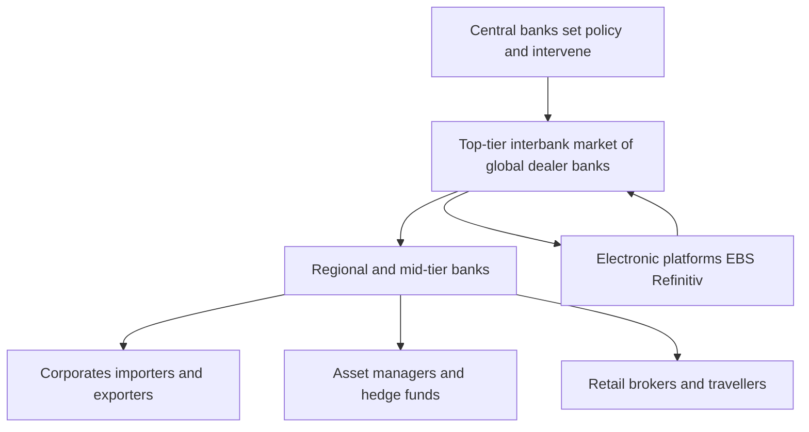
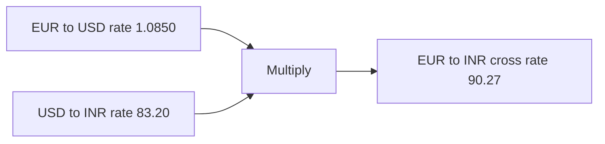
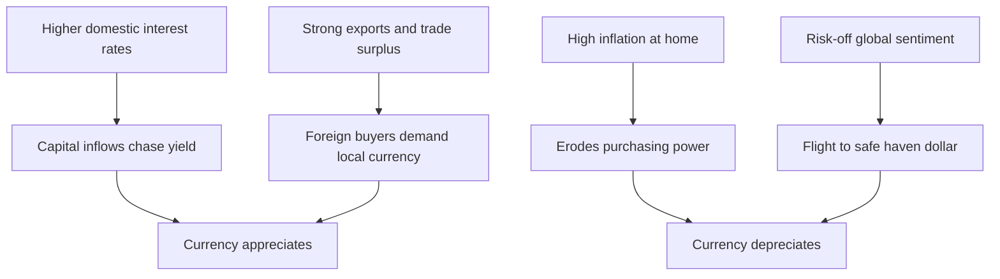

# Chapter 08 — Foreign Exchange Markets

## 1. The Problem / The Need

Money is not universal. A software engineer in Bengaluru is paid in rupees, but the AWS servers her company rents are billed in US dollars. A German carmaker sells a sedan in Tokyo and collects yen, yet pays its workers in euros. An Indian oil refiner buys crude priced in dollars, sells petrol in rupees, and reports profits to shareholders in rupees. Every one of these transactions has a gap in the middle: **the currency the buyer holds is not the currency the seller wants.**

The foreign exchange (FX or forex) market exists to close that gap. It is the plumbing that lets value flow across the roughly 180 currencies in circulation. Without it, cross-border trade, foreign investment, tourism, remittances, and global supply chains would grind to a halt — or revert to clumsy barter.

There is a second, subtler need. Currencies move in value against one another, constantly. If you are an Indian exporter who will receive $1 million in three months, you do not know today what that dollar will be worth in rupees when it arrives. That uncertainty — **currency risk** — can wipe out a thin trading margin. So beyond simple conversion, the FX market must also let participants *lock in* future rates and *hedge* against adverse moves. Conversion and risk transfer are the twin jobs.

A third need is **price discovery**. What *should* a dollar cost in rupees? The FX market aggregates the views, trades, and pressures of millions of participants into a single, continuously updated number — the exchange rate — that signals a currency's relative scarcity and strength.

## 2. The Core Idea

An exchange rate is simply **the price of one currency expressed in another**. When you see USD/INR = 83.20, it means one US dollar costs 83.20 Indian rupees. That is it — a price, like the price of wheat or gold, except the "good" being priced is money itself.

The core idea of the FX market is that this price is set by **supply and demand for currencies**, transacted through a vast, decentralised, always-on network of banks and electronic platforms. Nobody trades on a single central exchange the way stocks trade on the NSE. Instead, FX is an **over-the-counter (OTC)** market: a web of bilateral deals between banks, brokers, corporates, and funds, stitched together by dealing systems and interbank quotes.

Two further ideas make the market work:

- **Everything is a pair.** You never buy or sell a currency in isolation; you always exchange one *for* another. Buying dollars automatically means selling rupees. So all FX prices are relative — a currency can only rise or fall *against* something else.
- **Time can be separated from the deal.** You can agree the exchange rate *today* but actually swap the money *later*. This splits the market into **spot** (near-immediate delivery) and **forward** (future delivery at a pre-agreed rate), which is what turns FX from a conversion service into a risk-management tool.

## 3. How It Works

Picture the market as layered tiers.

At the top sits the **interbank market**: the largest global banks — JPMorgan, Citi, Deutsche Bank, UBS, and in India, SBI, HDFC Bank, ICICI — quote each other continuously, buying and selling in large sizes (often $1 million and up per "clip"). Their dealing happens over electronic platforms like EBS and Refinitiv, plus direct bilateral lines. These banks are the **market makers**: they stand ready to both buy and sell, quoting a two-way price.

Below them, everyone else — corporates, smaller banks, hedge funds, brokers — trades *through* these top banks or through platforms that aggregate their prices. A mid-sized Indian firm needing dollars calls its relationship bank; the bank prices the deal off the interbank rate plus a margin.

The market is **decentralised and 24-hour**. As the business day rolls westward — Sydney, Tokyo, Singapore, Mumbai, London, New York — trading follows the sun. London is the single biggest hub (roughly 38% of global turnover), with New York second. There is no opening or closing bell; liquidity simply thickens and thins across the day, peaking when London and New York overlap.

*The tiered structure of the FX market: liquidity flows down from a small core of dealer banks to the wider world.*

**The largest market in the world.** By the Bank for International Settlements (BIS) Triennial Survey of 2022, global FX turnover was about **$7.5 trillion per day** — larger than global equity markets trade in weeks. The US dollar sits on one side of roughly **88%** of all trades, making it the world's dominant vehicle currency. This scale means FX is extraordinarily liquid and, for major pairs, spreads are razor-thin.

Crucially, most of that turnover is **not** trade-related conversion. Only a small slice funds actual imports and exports; the bulk is banks managing positions, funds speculating, and hedgers rolling forwards. FX is as much a financial market as a utility.

## 4. The Full Content

### 4.1 Spot FX

A **spot** transaction is an agreement to exchange currencies at today's rate, with delivery (settlement) usually **two business days later** — denoted **T+2**. (Some pairs like USD/CAD settle T+1; USD/INR onshore settles T+1 or T+2 depending on the leg.) The "spot rate" is the current market price. Spot is the reference point off which everything else — forwards, swaps, options — is priced.

The two-day lag exists for operational reasons: banks in different time zones need time to confirm and move funds. The rate, though, is fixed the moment the deal is struck.

### 4.2 Forward FX

A **forward** contract locks in an exchange rate *today* for delivery on a *future* date — 1 month, 3 months, 6 months, a year out. This is the workhorse of corporate hedging. An importer who owes $1 million in 90 days can buy dollars forward now, fixing the rupee cost and eliminating uncertainty.

The forward rate is **not** a forecast of where spot will be. It is derived arithmetically from the spot rate and the **interest rate differential** between the two currencies — a relationship called **covered interest rate parity (CIP)**:

> Forward = Spot × (1 + interest rate of quote currency) / (1 + interest rate of base currency)

Because Indian interest rates are structurally higher than US rates, the rupee trades at a **forward discount** to the dollar — i.e., USD/INR forward rates are *higher* than spot. If the difference did not match the interest gap, arbitrageurs would borrow in the cheap currency, convert, invest in the dear currency, and lock a riskless profit — which forces the forward to the parity level.

The gap between forward and spot, expressed in pips, is called **forward points** or the **swap points**.

### 4.3 FX Swaps

An **FX swap** combines a spot deal and an offsetting forward: buy dollars spot, simultaneously sell them forward (or vice versa). It is a way to move liquidity across time — effectively borrowing one currency and lending another for a period — without taking on outright currency exposure. Swaps are the single largest FX instrument by turnover, used constantly by banks to manage funding.

### 4.4 FX Futures and Options

- **Currency futures** are exchange-traded, standardised forwards. In India, USD/INR, EUR/INR, GBP/INR, and JPY/INR futures trade on the **NSE, BSE, and MCX-SX**, regulated by SEBI (with RBI). They are transparent and centrally cleared but less flexible than OTC forwards.
- **Currency options** give the right, not the obligation, to exchange at a set strike. A call on USD/INR protects an importer against the rupee weakening while leaving upside if it strengthens — insurance with a premium.

### 4.5 Quote Conventions

Every FX quote has a **base currency** and a **quote (or counter) currency**, written **BASE/QUOTE**. The number tells you how many units of the quote currency equal **one** unit of the base.

- **USD/INR = 83.20** → 1 dollar = 83.20 rupees. USD is base, INR is quote.
- **EUR/USD = 1.0850** → 1 euro = 1.0850 dollars.

**Direct vs indirect quotation** depends on whose home currency you sit in:

| Convention | Definition | Example (from India) |
|---|---|---|
| **Direct quote** | Home currency per one unit of foreign currency | ₹83.20 per $1 |
| **Indirect quote** | Foreign currency per one unit of home currency | $0.01202 per ₹1 |

India, like most of the world, conventionally uses **direct quotes** (rupees per dollar). The UK, Australia, the Eurozone, and New Zealand quote their currencies **indirectly** against the dollar for historical reasons (e.g., GBP/USD = 1.27 means "one pound buys 1.27 dollars"). Traders call the dollar-base pairs "European terms" and dollar-quote pairs "American terms."

**Bid, ask, and spread.** A dealer quotes two prices: the **bid** (the rate at which the dealer buys the base currency from you) and the **ask/offer** (at which the dealer sells it to you). The gap is the **spread**, the dealer's margin. For EUR/USD the spread might be a fraction of a pip; for an illiquid emerging pair it could be many pips.

A **pip** is the smallest standard price increment — the fourth decimal place for most pairs (0.0001), or the second decimal for yen pairs (0.01). USD/INR is typically quoted to 4 decimals in the interbank market, so a pip is ₹0.0001.

**Cross rates.** A rate between two currencies neither of which is the dollar is a **cross**. EUR/INR, for instance, is derived from EUR/USD and USD/INR: EUR/INR = EUR/USD × USD/INR. Historically all crosses were computed via the dollar; today majors like EUR/GBP trade directly, but the dollar's role as the pivot remains.

*Deriving a cross rate through the US dollar as the common leg.*

### 4.6 The Participants

- **Commercial and investment banks** — the core dealers and market makers. They run FX desks that quote prices, warehouse risk, and serve clients. The interbank market is their arena.
- **Central banks** — the RBI, US Federal Reserve, ECB, Bank of Japan. They are not profit-seekers; they **intervene** to manage volatility, defend or guide their currency, and hold FX reserves. India's reserves exceed $600 billion, giving the RBI firepower to smooth the rupee.
- **Corporates** — importers, exporters, and multinationals converting revenues and hedging payables/receivables. Infosys hedges its dollar receivables; Indian Oil buys dollars for crude.
- **Asset managers and pension funds** — buying foreign assets and hedging the resulting currency exposure.
- **Hedge funds and prop traders** — speculators taking directional bets, providing liquidity and, at times, amplifying moves.
- **Retail** — travellers, students, and small online traders, a tiny fraction of turnover but the most visible face of FX (the airport money-changer).
- **Money-changers, remittance firms, and platforms** — Western Union, Wise, and authorised dealers serving the ~$120 billion in annual remittances that flow *into* India, the world's largest recipient.

### 4.7 What Drives Exchange Rates

Exchange rates move on a mix of fundamentals and flows:

1. **Interest rate differentials.** Higher rates attract capital seeking yield, lifting a currency. When the Fed hikes, the dollar tends to strengthen as money flows to US assets. This is the single most powerful short-to-medium-term driver.
2. **Inflation.** A currency with persistently higher inflation loses purchasing power and tends to depreciate over time — the logic of **purchasing power parity (PPP)**.
3. **Balance of payments.** A country running a large **current account deficit** (importing more than it exports, like India) must attract capital inflows to fund it; if inflows falter, the currency weakens.
4. **Capital flows.** Foreign portfolio investment (FPI) into Indian equities and bonds creates dollar-selling, rupee-buying demand that props the rupee. Outflows do the reverse — the "taper tantrum" of 2013 saw the rupee crash as FPIs fled.
5. **Growth and risk sentiment.** In "risk-off" episodes, capital flees emerging markets for safe havens — the dollar, yen, and Swiss franc — regardless of fundamentals.
6. **Commodity prices.** For India, a big crude importer, rising oil prices widen the trade deficit and pressure the rupee. For exporters like Australia (iron ore) or Canada (oil), rising commodities *strengthen* their currencies.
7. **Central bank policy and intervention.** Direct buying/selling of currency, and forward guidance, shift rates.
8. **Politics and expectations.** Elections, fiscal credibility, and sheer market psychology all feed in.

*The main forces pushing a currency up or down — yield and trade lift it, inflation and fear sink it.*

### 4.8 The INR Market and the RBI

The Indian rupee operates under a **managed float**: it is broadly market-determined, but the RBI intervenes to curb excessive volatility rather than to target a fixed level. The RBI does **not** publish a target rate; officially it lets fundamentals set direction while smoothing sharp swings.

Key features of the onshore INR market:

- **Onshore market** — Spot and forward INR trade among authorised dealer banks in India, on platforms like the **FX-CLEAR** system run by CCIL (Clearing Corporation of India). Trading hours are roughly 9:00 am to 5:00 pm IST.
- **RBI reference rate** — At around 1:30 pm the RBI publishes a daily reference rate for USD/INR and other majors, used as a benchmark for settlements and contracts.
- **Intervention toolkit** — The RBI buys or sells dollars in spot and forward markets, and uses **FX swaps** and its reserves to manage liquidity and the rupee's level. Selling dollars supports the rupee; buying dollars (to build reserves) caps its appreciation.
- **Reserves** — Over $600 billion, among the world's largest, a buffer against capital-flight shocks.
- **Capital controls** — Unlike the dollar or euro, the rupee is **not fully convertible on the capital account**. Non-residents face limits on holding and trading rupees; this is why a large **offshore NDF market** exists.
- **The NDF market** — **Non-Deliverable Forwards** in USD/INR trade in Singapore, London, and Dubai. Because the rupee can't be freely delivered offshore, these contracts settle the *difference* in dollars against the RBI reference rate, with no actual rupee changing hands. The NDF market often moves the rupee outside Indian hours and the RBI monitors it closely; it has been progressively encouraging onshore banks to participate to keep pricing power at home.

India's shift of some FX and derivatives activity to **GIFT City** (Gujarat International Finance Tec-City) is a deliberate move to bring offshore rupee trading back within a regulated Indian jurisdiction.

### 4.9 Hedging Currency Risk

Currency exposure comes in three flavours:

- **Transaction exposure** — a known future cash flow in foreign currency (an invoice due in dollars). The most commonly hedged.
- **Translation exposure** — accounting gains/losses when consolidating a foreign subsidiary's financials into the home currency.
- **Economic exposure** — the deeper effect of currency moves on a firm's competitiveness (a strong rupee hurts Indian exporters even on un-invoiced future sales).

The main hedging tools:

| Tool | How it hedges | Trade-off |
|---|---|---|
| **Forward contract** | Locks a future rate today | Removes downside *and* upside; no premium |
| **Currency futures** | Standardised, exchange-traded forward | Transparent, margined; less flexible on size/date |
| **Currency option** | Right to transact at a strike | Keeps upside; costs an upfront premium |
| **Currency swap** | Exchange principal and interest streams in two currencies | Best for long-dated loan/bond exposures |
| **Natural hedge** | Match FC revenues with FC costs | Free but only partial; structural |
| **Money-market hedge** | Borrow/lend in FC to offset the exposure now | Ties up balance sheet |

An exporter fearing a *rising* rupee (weaker dollar) **sells dollars forward**. An importer fearing a *falling* rupee (stronger dollar) **buys dollars forward**. Options suit firms that want protection but also want to benefit if the currency moves favourably — at the cost of a premium.

### 4.10 How FX Trades Settle

Settlement is the moment money actually changes hands. In FX this is fraught because the two legs are in different countries and time zones — historically creating **Herstatt risk** (named after a 1974 German bank that failed after receiving Deutschmarks but before paying out dollars, leaving counterparties stranded).

The industry solution is **CLS (Continuous Linked Settlement)**, a global system that settles both legs of an FX trade **simultaneously** on a payment-versus-payment (PvP) basis across 18 major currencies — if one side doesn't pay, neither leg goes through, eliminating the principal risk. The rupee is **not** yet a CLS currency, so INR trades still settle bilaterally or through the CCIL's guaranteed settlement onshore.

The settlement flow: on trade date (T), the deal is agreed and confirmed; over the next two days, banks match and net their obligations; on the value date (T+2 for most spot), funds move through the correspondent banking network or CLS. In India, **CCIL** provides central clearing and guaranteed settlement for interbank USD/INR spot and forward trades, standing as central counterparty and hugely reducing systemic risk.

## 5. Worked / Real Examples

**Example 1 — An exporter's forward hedge.**
Infosys will receive **$10 million** from a US client in 3 months. Spot USD/INR is 83.00. Infosys fears the rupee will strengthen to 81.00, which would shrink its rupee proceeds. The 3-month forward, reflecting the interest differential, is quoted at **83.60** (rupee at a forward discount). Infosys sells $10 million forward at 83.60, locking in **₹83.60 crore**. Three months later, whatever spot does, Infosys converts at 83.60. If spot has fallen to 81.00, the hedge saved ₹2.60 per dollar — ₹2.6 crore. If spot rose to 85.00, Infosys forgoes the gain — the price of certainty.

**Example 2 — Covered interest arbitrage forcing the forward.**
Suppose US 3-month rate is 5% (annualised) and India's is 7%. Spot USD/INR is 83.00. The no-arbitrage 3-month forward ≈ 83.00 × (1 + 0.07/4) / (1 + 0.05/4) ≈ **83.41**. If a bank quoted the forward at only 83.10, an arbitrageur would borrow dollars at 5%, convert to rupees, invest at 7%, and sell rupees forward at 83.10 — locking a riskless profit. Such trades would push the forward up until it hit ≈83.41. This is why forward points track interest differentials, not currency forecasts.

**Example 3 — RBI intervention.**
In late 2022, aggressive Fed rate hikes and a soaring dollar pushed USD/INR toward 83. To slow the rupee's slide, the RBI **sold dollars** from its reserves in the spot and forward markets — reserves fell from about $640 billion to below $530 billion over the year. The intervention didn't reverse the trend (driven by global dollar strength) but smoothed the descent, avoiding a disorderly crash. It illustrates the managed-float philosophy: cushion the move, don't fight the fundamentals.

**Example 4 — The NDF tail wagging the dog.**
During overnight global risk-off events, the offshore USD/INR **NDF** in Singapore often spikes higher while Mumbai is closed. When Indian markets open, onshore spot "gaps" to catch up with the NDF-implied level. This offshore–onshore linkage is exactly why the RBI has worked to let Indian banks trade the NDF market, so price discovery isn't ceded entirely to offshore centres.

## 6. Connections

- **To interest rates and bonds (Ch. on rates):** forward FX is *pure* interest-rate arithmetic via covered interest parity. FX and rates markets are inseparable.
- **To the balance of payments and macroeconomics:** exchange rates are both a cause and consequence of trade flows, capital flows, and inflation.
- **To derivatives:** forwards, futures, options, and swaps in FX are direct applications of the derivatives toolkit; FX is the largest derivatives underlying by notional.
- **To equity and debt capital flows:** FPI into Indian stocks and bonds is a dominant driver of the rupee — the FX and capital markets feed each other.
- **To commodities:** oil, gold, and metals are dollar-priced, so commodity and FX markets are tightly coupled, especially for import-heavy India.
- **To monetary policy:** a central bank's rate decisions transmit powerfully through the exchange-rate channel.

## 7. Key Terms

- **Spot rate** — current exchange rate, delivery usually T+2.
- **Forward rate** — rate agreed today for future delivery; set by interest differentials, not forecasts.
- **Forward points / swap points** — the difference between forward and spot, in pips.
- **Base / quote currency** — in BASE/QUOTE, price is quote units per one base unit.
- **Direct quote** — home currency per unit of foreign (₹ per $).
- **Indirect quote** — foreign currency per unit of home ($ per ₹).
- **Pip** — smallest standard price move (0.0001 for most pairs).
- **Bid / ask / spread** — dealer's buy price, sell price, and margin.
- **Cross rate** — a rate between two non-dollar currencies.
- **FX swap** — simultaneous spot and offsetting forward.
- **NDF (Non-Deliverable Forward)** — cash-settled offshore forward for restricted currencies like INR.
- **Managed float** — market-set rate with central-bank smoothing.
- **CLS** — global system settling both FX legs simultaneously (PvP).
- **CCIL** — India's Clearing Corporation, central counterparty for onshore INR trades.
- **Covered interest rate parity (CIP)** — the arbitrage relation linking spot, forward, and rates.
- **Herstatt risk** — settlement risk from the two legs paying at different times.

## 8. Common Confusions

- **"The forward rate predicts the future spot rate."** No. It is derived from interest differentials. On average it is a poor forecaster; a forward discount on the rupee reflects higher Indian rates, not a prediction the rupee will fall by that much.
- **"A stronger rupee is always good."** A stronger rupee helps importers and cheapens foreign travel but *hurts* exporters and IT firms whose revenues are in dollars. Currency strength has winners and losers.
- **"USD/INR going from 80 to 83 means the rupee got stronger."** The opposite. More rupees per dollar means the rupee **depreciated**. Direct quotes rising = home currency weakening.
- **"Direct and indirect quotes are different rates."** They are reciprocals of the *same* rate: ₹83.20 per $ and $0.01202 per ₹ describe one price viewed from two ends.
- **"FX is mostly for trade and travel."** Actual trade-driven conversion is a small fraction; most turnover is financial — bank position-taking, swaps, and speculation.
- **"The RBI targets a fixed rupee level."** It runs a *managed float*, smoothing volatility, not defending a peg. It intervenes both ways.
- **"Buying a currency is a standalone act."** Every FX trade is a pair — buying dollars *is* selling rupees. There is no absolute price of a currency, only relative.
- **"Spot means instant settlement."** Spot trades typically settle T+2; the *rate* is instant, the *money* moves in two days.

## 9. First-Principles Recap

Start from the irreducible fact that money is national, but economic activity is global. That mismatch demands a market to convert one currency to another — and, because currencies constantly re-price against each other, to transfer the *risk* of those moves.

From that single need, everything follows. An exchange rate is just a **price of money in money**, so it must be quoted as a **pair** with a base and quote currency. Because a price can be agreed now but the swap can happen later, the market splits into **spot** and **forward** — and the forward can only be the spot adjusted by the **interest differential**, or arbitrage would print free money. Because the two legs settle in different countries, **settlement risk** arises, which is why systems like **CLS** and clearers like **CCIL** exist. Because a currency's value reflects a nation's interest rates, inflation, trade, and capital flows, exchange rates become a live readout of macroeconomic health. And because a small central core of dealer banks can quote continuously across the globe, the market is **OTC, decentralised, 24-hour, and the largest on Earth**. Every feature of FX is a logical consequence of the founding problem: value must cross the borders that money cannot.

## 10. Quick-Reference / Interview Points

- **Size:** ~$7.5 trillion/day (BIS 2022) — the world's largest, most liquid market. USD on one side of ~88% of trades.
- **Structure:** OTC, decentralised, 24-hour; London (~38%) is the top hub, then New York.
- **Spot:** rate today, settle T+2 (some pairs T+1).
- **Forward:** rate locked today for future date; **forward = spot × interest-differential adjustment** (covered interest parity), *not* a forecast.
- **Quote convention:** BASE/QUOTE; **direct** = home per foreign (India uses this); **indirect** = foreign per home (UK, EU, AU, NZ).
- **USD/INR up = rupee down.** More rupees per dollar means depreciation.
- **Pip** = 0.0001 (0.01 for yen pairs). **Spread** = dealer margin.
- **Cross rate** = non-dollar pair, historically routed via USD.
- **Participants:** dealer banks (market makers), central banks (intervene, not profit), corporates (hedge trade), funds (speculate), retail (tiny).
- **Rate drivers:** interest differentials (biggest short-term), inflation/PPP, balance of payments, capital flows, risk sentiment, commodities, central-bank action.
- **INR regime:** managed float; RBI smooths volatility, publishes a 1:30 pm reference rate, holds $600bn+ reserves, intervenes both ways. Rupee not fully capital-account convertible → active **offshore NDF** market (Singapore, London, Dubai), cash-settled vs the RBI reference rate.
- **Hedging:** forwards (lock rate, no premium), futures (exchange-traded), options (keep upside, pay premium), swaps (long-dated), natural hedges.
- **Settlement:** two legs, two countries → **Herstatt/settlement risk**; solved globally by **CLS** (PvP, 18 currencies, INR not included) and in India by **CCIL** central clearing.
- **India vs global regulators:** SEBI + RBI oversee Indian FX/currency derivatives; the Fed/ECB and market conventions govern the majors. **GIFT City** aims to onshore offshore rupee trading.
- **Killer one-liner:** "The forward isn't a forecast — it's the spot rate plus the interest-rate gap, enforced by arbitrage."
