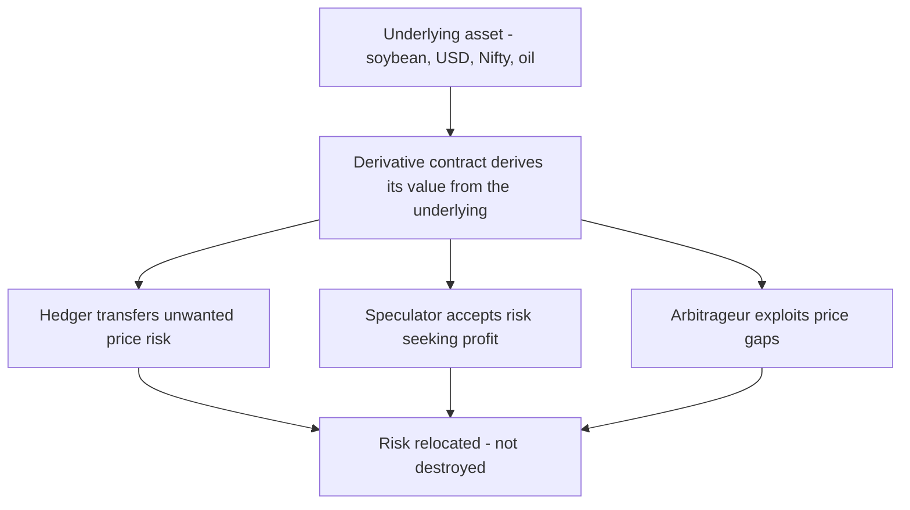
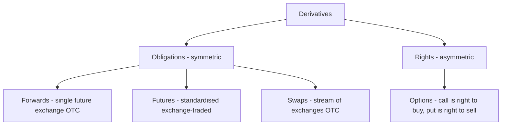

# Chapter 09 — Derivatives Markets Overview

## 1. The Problem / The Need

Picture three very different people, each staring at the same enemy: **uncertainty about a future price**.

The first is a farmer in Madhya Pradesh who will harvest 100 tonnes of soybean in four months. His costs are already sunk — seed, fertiliser, labour. His profit depends entirely on the price of soybean in October, which he cannot know today. If the price crashes, he is ruined; if it soars, he is rich. He does not *want* this gamble. He is a farmer, not a speculator on grain prices. He would happily give up the chance of a windfall in exchange for **certainty** about the price he will receive.

The second is the treasurer of Infosys. The company will be paid roughly **$1 billion** by American clients over the next twelve months. Its costs — salaries in Bengaluru — are in rupees. If the dollar weakens from ₹86 to ₹80 before the money arrives, Infosys loses about ₹600 crore for doing nothing wrong. The treasurer's job is not to bet on the rupee; it is to **lock in** the exchange rate so the company can plan.

The third is an airline. Jet fuel is its single largest cost. If crude oil spikes from $70 to $120 a barrel, its entire year's profit evaporates. The airline needs to **cap** its fuel cost without buying and storing millions of litres of kerosene today.

None of these three can solve their problem with the instruments we have met so far. A share, a bond, a treasury bill — these are **claims on assets**. What the farmer, the treasurer and the airline need is something stranger: a **contract about a price**, an agreement struck today that fixes, caps or insures the terms of a transaction that will happen in the future. They need to transfer a *risk they do not want* to someone else who is willing to bear it — either because that other party has the opposite risk (a soybean crusher who fears prices *rising*) or because they are a speculator paid to absorb risk.

That instrument is a **derivative**. It is arguably the most misunderstood and most maligned corner of finance — blamed for the 2008 crisis, called "financial weapons of mass destruction" by Warren Buffett — and simultaneously one of the most useful, running quietly underneath the global economy so that farmers, exporters and airlines can survive the future. This chapter builds the whole edifice from that single need: **managing the uncertainty of a future price**.

## 2. The Core Idea

A **derivative** is a financial contract whose value is *derived* from something else — an **underlying** asset, rate or index. That is the whole definition, and the word "derived" is the key. A derivative has no independent existence; it is a bet, a promise or an insurance policy *about* the underlying. The underlying might be a commodity (soybean, gold, crude oil), a currency (USD/INR), an equity (Reliance shares), an index (Nifty 50), an interest rate, or even something abstract like volatility or the weather.

The core mechanism is **separating the economics of an asset from its ownership**. The farmer wants to fix the *price* of soybean without having to sell the physical soybean today (he hasn't grown it yet). A derivative lets him do exactly that: he enters a contract that pays him if soybean falls and costs him if it rises, so that his contract gains offset his crop's losses. He never has to move a single grain until harvest.

Three ideas make derivatives work:

- **A future-dated transaction, fixed today.** Almost every derivative is an agreement about terms *now* for something that settles *later*. The passage of time — and the uncertainty it contains — is the raw material.
- **Zero-sum transfer of risk.** For every winner there is an equal-and-opposite loser. If the farmer's short soybean contract gains ₹10 lakh, whoever took the other side loses ₹10 lakh. Derivatives do not create or destroy wealth in aggregate; they **relocate** risk from those who want to shed it to those willing to hold it.
- **Leverage.** Because you are trading a *promise* rather than buying the asset, you post only a small deposit (margin), not the full value. A farmer can hedge ₹40 lakh of soybean by posting perhaps ₹4 lakh. This efficiency is the great virtue of derivatives — and, when abused by speculators, their great danger.

*Figure 1 — A derivative sits on top of an underlying and relocates its price risk among three player types.*

## 3. How It Works — Structure and Mechanics

Every derivative, no matter how exotic, is built from answering four questions:

1. **What is the underlying?** Soybean, USD/INR, the Nifty 50, the 10-year G-sec yield.
2. **What quantity and at what price?** The contract size (e.g. 50 units of Nifty) and the agreed price or rate.
3. **When does it settle?** The expiry or maturity date — the third Thursday of the month for Indian index F&O, for example.
4. **How does it settle?** By **physical delivery** (the actual soybean changes hands) or by **cash settlement** (only the profit or loss in money is exchanged — no soybean moves).

The genius of the mechanics is that most financial derivatives are **cash-settled**. Nobody delivers the Nifty 50 index — you cannot; it is a number. Instead, on expiry the contract is marked against the actual index level and the difference is paid in cash. This lets people take positions on prices they never intend to physically touch.

To make this concrete, consider the two fundamentally different *shapes* a derivative can take:

- An **obligation** (forwards, futures, swaps): both parties are *bound* to transact at the agreed terms. Symmetric — you gain if the price moves your way, you lose if it moves against you, and there is no choice.
- A **right without obligation** (options): the buyer *may* transact but need not. Asymmetric — the buyer's loss is capped at the premium paid, but the upside is open. This asymmetry is why options behave like insurance.

Derivatives also live in two very different **worlds**, which we will develop fully in Section 4.2:

- **Exchange-traded** — standardised contracts bought and sold on an exchange (NSE, BSE, CME), with a **clearing house** guaranteeing every trade. Transparent, liquid, but rigid.
- **Over-the-counter (OTC)** — bespoke bilateral contracts negotiated directly between two parties (typically a bank and a corporate). Flexible, customised, but carrying **counterparty risk** — the danger that the other side simply fails to pay.

## 4. Full Content — The Four Instruments, the Two Worlds, and the Ecosystem

### 4.1 The Four Building Blocks

Essentially every derivative in existence is one of four primitives, or a combination of them.

#### (a) Forwards

A **forward contract** is the simplest derivative: a private agreement between two parties to buy/sell an asset at a fixed price on a fixed future date. It is entirely customised — the two parties choose the quantity, price, date and settlement method themselves.

Our farmer strikes a forward with a soybean crusher: "I will sell you 100 tonnes at ₹4,000/tonne on 15 October." Both are now locked in. If October's spot price is ₹3,500, the farmer is delighted (he sells above market); if it is ₹4,500, he is annoyed but protected — he sells at ₹4,000 either way. The crusher has the mirror-image experience. Both have converted uncertainty into certainty.

Forwards are flexible but have two weaknesses: **counterparty (default) risk** — if the crusher goes bust, the farmer's protection vanishes — and **illiquidity** — a private contract cannot easily be sold to someone else. In finance, the most common forward is the **currency forward**: Infosys's treasurer books a forward with a bank to sell $1 billion at ₹85.50, twelve months out.

#### (b) Futures

A **futures contract** is a forward that has been **standardised and exchange-traded**, with a clearing house inserted between the two parties to eliminate default risk. It solves the two weaknesses of forwards.

The key mechanical innovations of futures are:

- **Standardisation.** The exchange fixes the contract size, expiry dates and quality specs. You cannot negotiate; you take the standard contract. This makes contracts fungible and therefore **liquid** — anyone can trade them.
- **The clearing house / central counterparty (CCP).** After a trade, the clearing corporation (in India, **NSE Clearing Ltd** and **Indian Clearing Corporation**) becomes the buyer to every seller and the seller to every buyer. It *guarantees* the trade, so you never worry about who is on the other side.
- **Margining and daily mark-to-market (MTM).** Both parties post an **initial margin** (a good-faith deposit). Every single day, gains and losses are calculated against that day's settlement price and **credited or debited from the margin account** — this is *marking to market*. If your losses eat into the margin, you get a **margin call** to top it up. Because losses are settled daily, they can never accumulate into a giant unpayable default. This daily-settlement machinery is what makes the CCP's guarantee credible.

| Feature | Forward | Futures |
|---|---|---|
| Where traded | OTC (private) | Exchange |
| Terms | Fully customised | Standardised |
| Counterparty risk | Yes — the other party | None — clearing house guarantees |
| Liquidity | Low, hard to exit | High, exit anytime |
| Settlement of P&L | At maturity, lump sum | Daily, mark-to-market |
| Margin | Usually none | Initial + maintenance margin |
| Regulation | Light | Heavy (SEBI / CFTC) |

#### (c) Options

An **option** gives its buyer the **right, but not the obligation**, to buy or sell the underlying at a fixed **strike price** on or before expiry, in exchange for an upfront **premium** paid to the seller (writer).

- A **call option** is the right to **buy** at the strike. You buy calls when you expect the price to *rise*.
- A **put option** is the right to **sell** at the strike. You buy puts when you expect the price to *fall*, or to protect a holding.

The defining feature is **asymmetry**. The option **buyer's** maximum loss is the premium — a known, capped amount — while the potential gain is large. The option **seller's** position is the mirror: they pocket the premium (their maximum gain) but bear potentially unlimited loss. Buying an option is like buying insurance; writing an option is like being the insurance company — you collect steady premiums but must pay out when disaster strikes.

Concretely: Reliance trades at ₹1,400. You buy a one-month ₹1,450 **call** for a ₹30 premium. If Reliance rises to ₹1,600, you exercise — buy at ₹1,450, worth ₹1,600 — netting ₹150 minus the ₹30 premium = ₹120 profit. If Reliance stays below ₹1,450, you simply let the option lapse and lose only your ₹30. Your downside was capped; your upside was open.

Two style notes: **European** options can be exercised only *at* expiry; **American** options can be exercised *any time up to* expiry. Indian index options (Nifty, Bank Nifty) are **European** and **cash-settled**; Indian *stock* options are American-style but now delivery-settled. The premium itself is decomposed into **intrinsic value** (how far in-the-money the option is right now) plus **time value** (the value of the remaining chance for it to move further in-your-favour), and is priced by models like **Black–Scholes**. We meet options in full in a later chapter; here they are one of the four primitives.

#### (d) Swaps

A **swap** is an agreement to **exchange a series of cash flows** over time. Where a forward is a single future exchange, a swap is a *string* of them. Swaps are OTC instruments, overwhelmingly used by banks and large corporates.

The classic is the **interest rate swap (IRS)**: two parties exchange interest payments on a notional principal — one pays a **fixed** rate, the other pays a **floating** rate (say, linked to MIBOR or SOFR). A company that borrowed at a floating rate but fears rising rates can "swap into fixed," converting its floating liability into a predictable fixed one. The notional principal is never exchanged; only the net interest difference changes hands each period.

Other important swaps:

- **Currency swaps** — exchange principal and interest in one currency for those in another; used to fund overseas operations cheaply.
- **Credit default swaps (CDS)** — insurance against a borrower defaulting; the buyer pays a periodic premium, the seller pays out if the reference entity defaults. CDS on subprime mortgage bonds were at the heart of the 2008 crisis (and of *The Big Short*).
- **Commodity and equity swaps** — exchange a fixed price for the floating market price of a commodity or the return on a stock/index.

*Figure 2 — The four derivative primitives split into obligations and rights.*

### 4.2 The Two Worlds — Exchange-Traded vs OTC

This distinction is so important it deserves its own treatment. The *same economic exposure* can be achieved on an exchange or over-the-counter, but the plumbing, risks and regulation differ profoundly.

**Exchange-traded derivatives (ETD)** — futures and options listed on venues like NSE, BSE, MCX (India), or CME and Eurex (globally). Contracts are standardised, prices are transparent and public, a clearing house removes counterparty risk, and margining is mandatory and daily. The trade-off is rigidity: you take the standard contract sizes and expiry dates, whether or not they match your exact exposure.

**Over-the-counter (OTC) derivatives** — forwards, swaps and bespoke options negotiated privately, usually with a bank as dealer. Everything is customisable: exact notional, exact date, exotic payoff. The trade-offs are **counterparty risk** (no clearing house historically stood behind the trade) and **opacity** (no public price, regulators cannot see the exposures).

The 2008 crisis was in large part an OTC-derivatives crisis: a web of unregulated, opaque CDS contracts meant nobody knew who owed whom, and when Lehman Brothers and AIG wobbled, the whole chain froze. The regulatory response — the **G20 Pittsburgh reforms (2009)**, implemented via **Dodd–Frank** in the US and **EMIR** in Europe — pushed standardised OTC derivatives toward **central clearing**, mandatory reporting to trade repositories, and margining, deliberately importing the safety features of exchanges into the OTC world. The OTC market remains vastly larger by notional — roughly **$700+ trillion** gross notional globally, dominated by interest rate swaps — but is now far more visible and collateralised than in 2008.

| Dimension | Exchange-Traded (Futures, Options) | OTC (Forwards, Swaps) |
|---|---|---|
| Standardisation | Standard contracts | Fully customised |
| Counterparty risk | Removed by clearing house | Present (mitigated post-2008 by clearing/collateral) |
| Transparency | Public prices | Private, opaque |
| Liquidity | High | Variable |
| Typical users | Retail + institutions | Banks, large corporates |
| Regulation (India) | SEBI | RBI (currency/rates), SEBI |
| Examples | Nifty futures, Bank Nifty options | Currency forwards, interest rate swaps, CDS |

### 4.3 The Three Uses — Why Anyone Trades Derivatives

Every derivative position, no matter how complex, is entered for one of three motives.

**1. Hedging — reducing an existing risk.** The hedger already has an exposure and uses a derivative to *offset* it. The farmer short soybean futures, Infosys selling dollar forwards, the airline buying crude futures — all are converting an uncertain future price into a fixed one. A hedger *sacrifices upside to remove downside*; they willingly forgo a possible windfall in exchange for certainty. Hedging is the socially useful, foundational purpose of derivatives.

**2. Speculation — taking on risk to profit from a view.** The speculator has *no* underlying exposure; they enter the derivative purely to bet on price direction, using leverage to amplify returns. A trader who thinks Nifty will rise buys Nifty futures with a small margin; a small index move produces a large percentage gain — or loss. Speculators are often vilified, but they are *essential*: they are the ones willing to take the other side of the hedger's trade. Without speculators, the farmer would have no one to sell his risk to. They provide **liquidity** and help **discover prices**.

**3. Arbitrage — locking in a riskless profit from a price discrepancy.** The arbitrageur exploits the *same* asset (or economically equivalent bundle) being priced differently in two places. If Nifty futures trade too expensive relative to the spot Nifty plus the cost of carry, an arbitrageur buys the cheap spot basket and sells the dear future, pocketing the gap with (in theory) no risk. Arbitrage is the police force of markets: by exploiting mispricings, arbitrageurs *eliminate* them, forcing the futures price and spot price back into their correct relationship (the **cost-of-carry** or spot-futures parity: `Futures ≈ Spot × (1 + r − d)^T`).

### 4.4 Price Discovery and the Basis

Beyond serving individual users, derivatives markets perform a systemic function: **price discovery**. Because futures aggregate the views of thousands of hedgers and speculators about *future* prices, the futures curve reveals the market's collective expectation. The oil futures curve tells you whether the world expects tight or loose supply next year; the Nifty futures premium reveals sentiment. The difference between the futures price and the spot price is the **basis**, and its behaviour — narrowing to zero as expiry approaches (**convergence**) — is central to how hedges perform.

### 4.5 The Derivatives Ecosystem and F&O in India

India's derivatives markets are young but now the **largest in the world by number of contracts traded**, thanks to an explosion in retail index-options activity. The ecosystem has several layers:

- **Exchanges.** The **NSE** dominates equity derivatives (its flagship **Nifty 50** and **Bank Nifty** F&O). The **BSE** has surged with its **Sensex** and **Bankex** options. The **MCX (Multi Commodity Exchange)** runs commodity derivatives (gold, silver, crude, natural gas), and the **NCDEX** handles agricultural commodities. Currency derivatives trade on NSE/BSE.
- **Clearing corporations (CCPs).** NSE Clearing Ltd and Indian Clearing Corporation guarantee settlement and run the margining system.
- **Depositories, brokers and members.** Trading members and clearing members intermediate between end-users and the exchange; NSDL/CDSL hold the demat securities for delivery-settled contracts.
- **Regulators.** **SEBI** regulates equity, index, currency and commodity derivatives on exchanges. The **RBI** governs OTC interest-rate and currency derivatives (the domain of banks and corporates). This split matters: exchange-traded currency futures fall under SEBI, but a corporate's OTC currency forward with its bank falls under RBI.

**The "F&O" segment** (Futures & Options) in India is overwhelmingly *index options*. Key contract facts a professional should know:

- **Underlyings:** indices (Nifty 50, Bank Nifty, Nifty Financial Services / FinNifty, Sensex) and ~180 individual stocks approved by SEBI.
- **Expiry:** monthly, plus **weekly** expiries for indices. (SEBI, from late 2024, restricted each exchange to *one* weekly-expiry index to cool speculative frenzy.)
- **Lot sizes:** contracts trade in fixed lots (e.g. Nifty lot = 75 units after revisions), so one contract controls a large notional.
- **Settlement:** index F&O is **cash-settled** and European-style; single-stock F&O is **physically (delivery) settled**.
- **Margins:** SPAN + exposure margin for futures/short options; long options require only the premium.

A striking and cautionary fact: SEBI's own 2024 study found that roughly **90% of individual F&O traders lose money**, with aggregate retail losses running into tens of thousands of crores a year. This is the leverage-and-risk story of Section 4.6 made painfully real, and it is why SEBI has been tightening the segment (higher lot sizes, fewer weekly expiries, upfront premium collection).

### 4.6 Leverage and Risk — The Double-Edged Sword

**Leverage** is the defining property of derivatives and the source of both their utility and their danger. Because you control a large notional exposure with a small margin, your returns — *and losses* — are magnified relative to the capital you put down.

Suppose Nifty is at 24,000 and one lot (75 units) is worth ₹18 lakh. The exchange might require only ~₹1.8 lakh of margin (roughly 10×leverage). If Nifty rises 2%, the position gains ₹36,000 — a **20% return on your margin**. Wonderful. But if Nifty *falls* 2%, you lose ₹36,000 — 20% of your capital gone — and a 10% adverse move wipes you out entirely, possibly triggering margin calls that force liquidation at the worst moment.

The risks that flow from leverage and from derivatives generally:

- **Market risk** — the underlying moves against you, amplified by leverage.
- **Counterparty / credit risk** — the other side defaults (the dominant risk in OTC; neutralised by CCPs on exchanges).
- **Liquidity risk** — you cannot exit a position without moving the price, or a margin call comes when you cannot fund it.
- **Basis risk** — your hedge and your exposure do not move perfectly together (e.g. hedging jet fuel with crude futures leaves a residual gap).
- **Operational and model risk** — mispriced or mismodelled exotics; the "London Whale" and Long-Term Capital Management blow-ups are canonical.
- **Systemic risk** — interconnected derivative exposures transmitting a single failure across the whole system, as in 2008.

The moral is not that derivatives are bad. A hedger using derivatives *reduces* risk; a speculator using them *increases* it. The instrument is neutral; the danger lives in how leverage is deployed and whether the user understands their true exposure.

## 5. Worked Examples

### Example 1 — Infosys hedges a dollar receivable with a currency forward

Infosys will receive **$100 million** in 12 months. Today's spot is ₹86/$, and the treasurer fears the rupee strengthening to ₹80. She books a **forward** with a bank to sell $100m at **₹85.50** in 12 months.

- If in 12 months the spot is **₹80** (rupee strong): the open market would give Infosys only ₹800 crore, but the forward locks in ₹855 crore. The forward saved **₹55 crore**.
- If the spot is **₹90** (rupee weak): the open market would have given ₹900 crore, but Infosys is bound to sell at ₹85.50 for ₹855 crore, "losing" ₹45 crore of upside.

Either way, Infosys **knew from day one** it would get ₹855 crore. That certainty — not the win/loss — is the point of hedging. It converted an unbudgetable currency bet into a fixed, plannable number.

### Example 2 — A speculator uses Nifty futures (leverage cuts both ways)

A trader is bullish. Nifty is at **24,000**; one lot is 75 units = **₹18,00,000** notional. He posts **₹1,80,000** margin (10× leverage) and buys one lot.

- Nifty rises to **24,480 (+2%)**: gain = 480 × 75 = **₹36,000**, a **+20%** return on his margin in a move of just 2%.
- Nifty falls to **23,520 (−2%)**: loss = **₹36,000**, a **−20%** hit. A further slide triggers a **margin call**; if unmet, his broker force-closes the position.

Same instrument, same trader — leverage turned a modest 2% market move into a 20% swing in his capital. This is exactly why ~90% of retail F&O participants lose money.

### Example 3 — Cash-and-carry arbitrage locks in a riskless profit

Spot Nifty = **24,000**. One-month futures *should* trade near spot plus cost of carry (say +0.5%) ≈ **24,120**. But suppose the future is trading rich at **24,250** — 130 points above fair value.

The arbitrageur simultaneously:
1. **Buys** the underlying basket (or spot ETF) at 24,000, and
2. **Sells** the future at 24,250.

At expiry, spot and future converge to the same value; whatever that value, the ₹130-per-unit gap (minus ~120 of carry) is captured as a near-riskless spread. His buying of spot and selling of futures pushes the two prices back toward parity — which is precisely *why* such gaps are small and fleeting in liquid markets: arbitrageurs compete them away.

### Example 4 — An airline caps fuel cost with a call option

An airline fears crude rising from **$70**. It buys crude **call options** struck at **$75**, paying a **$3/barrel premium**.

- Crude rises to **$100**: the airline exercises, effectively capping its cost near $75 + $3 = **$78**, saving $22/barrel versus the market. Its fuel bill is protected.
- Crude *falls* to **$60**: the airline lets the option lapse, loses only the **$3 premium**, and enjoys cheap fuel in the open market.

The option behaved as **insurance**: a small known premium bought protection against a catastrophic price spike while leaving the airline free to benefit if prices fell. This asymmetry is why options, unlike futures, do not force you to give up favourable moves.

## 6. Connections

- **To equity and index instruments (Ch. 06–08):** stock and index derivatives derive their value from the shares and indices you already know; F&O is the leverage layer built on top of the cash equity market.
- **To money markets and interest rates (Ch. 04):** interest rate swaps, FRAs and bond futures let banks and corporates manage the rate risk created by the very instruments those chapters describe.
- **To risk and portfolio management (later chapters):** hedging with derivatives is the practical toolkit of portfolio risk management; Greeks, VaR and margining all extend from here.
- **To the primary/secondary market distinction (Ch. 02–03):** derivatives are pure secondary-market instruments — no capital is raised for a company; they only transfer risk between investors.
- **To options pricing (later chapter):** this chapter treats options as one of four primitives; the mechanics of premium, strike, Greeks and Black–Scholes are developed there.
- **To macro and central banking:** the RBI's OTC-derivatives oversight and SEBI's exchange oversight connect derivatives to the wider regulatory architecture and to systemic-risk management.

## 7. Key Terms

- **Derivative** — a contract whose value derives from an underlying asset, rate or index.
- **Underlying** — the thing the derivative is based on (commodity, currency, stock, index, rate).
- **Forward** — a customised OTC agreement to transact at a fixed future price and date.
- **Futures** — a standardised, exchange-traded forward, guaranteed by a clearing house and margined daily.
- **Option** — the right, not obligation, to buy (call) or sell (put) at a strike price for a premium.
- **Swap** — an agreement to exchange a stream of cash flows (e.g. fixed for floating interest).
- **Strike price** — the fixed price at which an option holder may transact.
- **Premium** — the price paid by an option buyer to the writer.
- **Notional** — the reference amount on which a derivative's payments are calculated (not exchanged in swaps).
- **Long / Short** — a position that gains from price rises (long) or falls (short).
- **Margin** — the good-faith deposit backing a futures/short-option position; **initial** and **maintenance/variation** margin.
- **Mark-to-market (MTM)** — daily revaluation and settlement of gains/losses.
- **Clearing house / CCP** — the central counterparty guaranteeing exchange trades.
- **OTC** — over-the-counter; privately negotiated, bilateral derivatives.
- **Basis** — spot price minus futures price; converges to zero at expiry.
- **Cost of carry** — the net cost of holding the underlying to expiry (financing minus yield), linking spot and futures prices.
- **F&O** — the Futures & Options segment of Indian exchanges.
- **SPAN margin** — the risk-based margin system used by Indian exchanges.
- **Leverage** — controlling a large exposure with small capital; magnifies gains and losses.

## 8. Common Confusions

- **"A derivative is an asset like a share."** No. A share is a claim on a company; a derivative is a *contract about a price*, with no independent existence. It nets to zero across the two parties.
- **"Futures and forwards are the same thing."** Economically similar, mechanically very different: futures are standardised, exchange-traded, margined daily, and free of counterparty risk; forwards are customised, OTC, settled at maturity, and carry default risk.
- **"Buying an option is risky."** Buying an option caps your loss at the premium — it is the *seller* (writer) of options who bears unlimited risk. Confusing the two sides is a classic error.
- **"Derivatives create wealth."** They are zero-sum (before costs): every gain is matched by an equal loss elsewhere. They *relocate* risk; they do not manufacture returns.
- **"Notional principal is the amount at risk."** In a swap the notional is never exchanged; only net interest flows. A $100m IRS does not put $100m at risk — the exposure is the interest differential.
- **"Hedging and speculation are opposites and hedging is always good."** Both use identical instruments; the difference is whether you already hold the underlying exposure. And an over-hedge or a mismatched hedge can itself create risk (basis risk).
- **"Cash-settled means fake."** Cash settlement is fully real — you receive/pay the exact monetary P&L; it simply avoids the pointless physical delivery of things like an index.
- **"Derivatives caused 2008, so they should be banned."** Opaque, unmargined *OTC* derivatives amplified the crisis; the reform response was to make them safer (central clearing, reporting), not to abolish the tool that lets airlines and farmers survive.

## 9. First-Principles Recap

Start from a single, universal human problem: **the future price is uncertain, and that uncertainty is dangerous**. A farmer, an exporter and an airline each face a price they cannot control but must live with. The instruments we already have — shares, bonds, bills — are *claims on assets*; none of them let you fix, cap or insure a future price without owning the asset today.

So we invent a **contract about a price** — a derivative — whose value simply *derives* from an underlying. From the single question "must both parties transact, or may one choose?" fall the four primitives: **forwards** and **futures** (obligations, symmetric), **swaps** (a stream of obligations), and **options** (a right, asymmetric, insurance-like). From the question "private or public?" falls the great divide between **OTC** (customised, opaque, counterparty-risky) and **exchange-traded** (standardised, transparent, clearing-house-guaranteed, margined daily).

Every position, however baroque, is entered for one of three reasons: to **hedge** (shed a risk you have), to **speculate** (accept a risk you seek), or to **arbitrage** (harvest a mispricing and, in doing so, erase it). The engine that makes all this efficient — and dangerous — is **leverage**: a small margin controls a large notional, so gains and losses are both magnified. Get that one idea, and the 90%-of-retail-traders-lose statistic, the 2008 crisis, and the farmer's peaceful sleep at night are all the same story told from different seats.

## 10. Quick-Reference / Interview Points

- **Definition in one line:** a derivative is a contract whose value is derived from an underlying asset, rate or index; it transfers risk without transferring the asset.
- **The four primitives:** Forwards (custom OTC obligation), Futures (standardised exchange obligation), Options (right not obligation — call/put), Swaps (stream of exchanged cash flows).
- **Futures vs forwards — say all four:** standardisation, clearing house/no counterparty risk, daily mark-to-market margining, liquidity.
- **Option asymmetry:** buyer's loss capped at premium, upside open; seller's gain capped at premium, downside large. Call = right to buy; Put = right to sell.
- **Three uses:** Hedging (reduce existing risk), Speculation (take a view with leverage), Arbitrage (riskless profit that self-corrects the mispricing).
- **ETD vs OTC:** exchange = standard, transparent, CCP-guaranteed, margined; OTC = bespoke, opaque, counterparty risk (mitigated post-2008 by central clearing/collateral). OTC is larger by notional (~$700tn+), driven by interest rate swaps.
- **India specifics:** NSE (Nifty, Bank Nifty), BSE (Sensex), MCX/NCDEX (commodities). SEBI regulates exchange derivatives; RBI regulates OTC rate/currency derivatives. Index options are cash-settled European; stock derivatives are delivery-settled.
- **F&O leverage math:** margin ≈ 10% of notional ⇒ ~10× leverage ⇒ a 2% underlying move ≈ 20% swing on capital. ~90% of retail F&O traders lose money (SEBI 2024).
- **Cost-of-carry parity:** Futures ≈ Spot × (1 + r − d)^T; basis converges to zero at expiry; arbitrage enforces it.
- **Settlement:** physical (asset delivered) vs cash (only P&L exchanged); indices are always cash-settled.
- **Risks to name:** market, counterparty/credit, liquidity, basis, operational/model, systemic.
- **One-liner to close an interview answer:** "Derivatives don't create or destroy risk — they relocate it from those who don't want it to those who do; leverage is what makes that transfer efficient and, in the wrong hands, dangerous."
