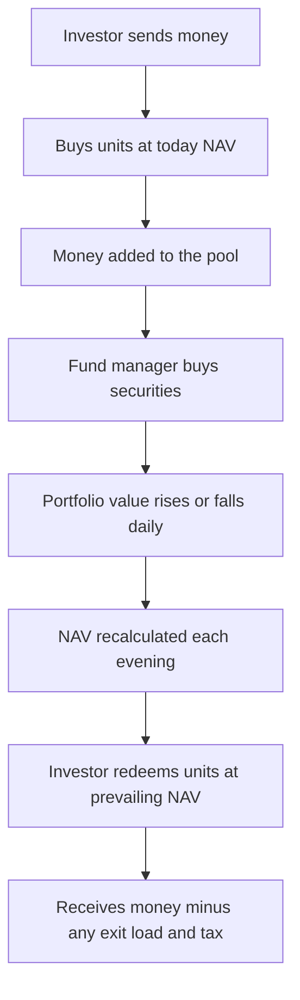
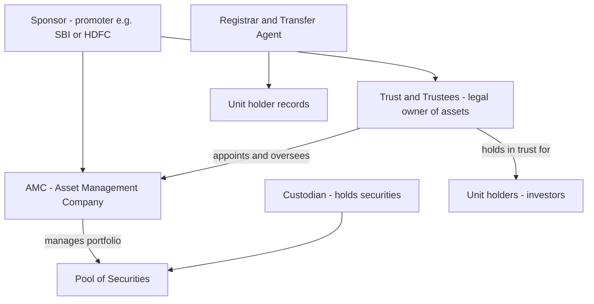
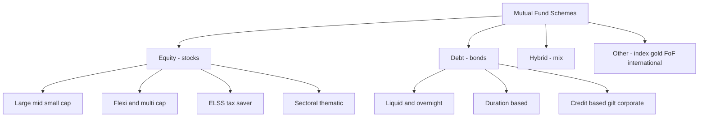
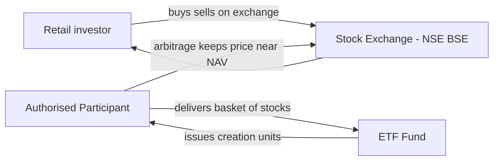

# Chapter 10 — Mutual Funds and ETFs

## 1. The Problem / Need

Imagine you are a salaried professional in Bengaluru earning ₹12 lakh a year. You want your savings to grow faster than a bank fixed deposit, so you decide to invest in the stock market. Almost immediately you hit four brutal walls.

**Wall 1 — Diversification is expensive.** Basic prudence says "don't put all your eggs in one basket." A sensible equity portfolio might hold 40–50 stocks across sectors. If one share of MRF costs ₹1,30,000 and you want even a token position in 50 companies, you need lakhs of rupees just to be minimally diversified. A person with ₹5,000 a month simply cannot buy 50 stocks.

**Wall 2 — Expertise and time.** Picking stocks requires reading annual reports, understanding balance sheets, tracking RBI policy, and monitoring positions daily. A full-time job leaves no room for this. Most people are not trained analysts and have no business pretending to be.

**Wall 3 — Transaction friction.** Buying and rebalancing 50 stocks means 50 brokerage charges, 50 lots to track, dividends trickling in on different dates, and a tax nightmare at year-end.

**Wall 4 — Access to certain markets.** How does a retail investor in India buy a slice of US treasury bonds, gold bullion, or a basket of 500 American companies? Individually, it is nearly impossible.

The need, then, is for a mechanism that lets many small investors **pool** their money so that, collectively, they can afford professional management, broad diversification, and cheap access to markets that are out of reach individually. This is the reason mutual funds and Exchange-Traded Funds (ETFs) exist. They democratise access to markets — turning ₹500 a month into a stake in a professionally managed, diversified portfolio.

## 2. The Core Idea

The core idea is **pooling**. A large number of investors hand over money to a single professionally managed vehicle. That vehicle buys a portfolio of securities — stocks, bonds, gold, whatever the fund promises — and each investor owns a proportional slice of the whole pool.

That proportional slice is represented by a **unit**. If you contribute ₹10,000 to a pool worth ₹10 crore, you own one-lakh-th of everything the fund holds. You do not own "5 shares of Infosys"; you own units, and behind each unit sits a tiny fraction of every security the fund holds.

Three consequences flow from this one idea:

1. **Instant diversification** — Even ₹500 buys you exposure to the fund's entire basket. One unit of a Nifty 50 fund gives you a slice of all 50 companies.
2. **Professional management** — A qualified fund manager, backed by research analysts, makes the buy/sell decisions on behalf of the whole pool.
3. **Economies of scale** — Because the pool is large, per-investor costs (research, brokerage, custody, compliance) become tiny fractions of a percent.

A mutual fund is therefore best understood as a **pass-through vehicle**: it is a legal wrapper that owns securities on behalf of investors, passing gains, losses, income, and risk straight through to the unit holders. The fund itself is not a company earning profits for shareholders; it is a conduit.

## 3. How It Works

The elegant mechanic that makes this all function is **Net Asset Value (NAV)** — the per-unit price at which you buy and sell.

NAV is calculated once every business day after markets close:

```
NAV = (Market value of all securities held + Cash − Liabilities and accrued expenses) ÷ Total number of outstanding units
```

Suppose a fund owns securities worth ₹500 crore, holds ₹5 crore cash, and owes ₹1 crore in expenses. Net assets = ₹504 crore. If there are 42 crore units outstanding, NAV = 504 / 42 = **₹12.00 per unit**.

The lifecycle of your money:


*Figure 1 — The end-to-end flow of investor money through an open-ended mutual fund.*

The key feature of a traditional (**open-ended**) mutual fund is that it continuously **creates and cancels units on demand**. When you invest, the fund mints new units for you at NAV and expands the pool. When you redeem, it cancels your units and shrinks the pool, paying you the current NAV. There is no fixed number of units — the fund "breathes" as money flows in and out. Crucially, you always transact directly with the fund at NAV, not with another investor.

This is the fundamental contrast that separates mutual funds from ETFs, which we cover in Section 4.

## 4. Full Content — Structure, Types, Participants, Terms

### 4.1 The legal structure of an Indian mutual fund

Indian mutual funds are built as **trusts** under the Indian Trusts Act, governed by SEBI (Mutual Funds) Regulations, 1996. This three-tier structure exists to **protect investors' money by separating the people who manage the money from the entity that holds it.** Nobody who makes investment decisions ever physically touches the assets.


*Figure 2 — The three-tier trust structure of an Indian mutual fund and its service providers.*

The participants:

| Entity | Role | Real example |
|---|---|---|
| **Sponsor** | Promoter who sets up the fund; must have a 5-year track record and contribute to the AMC's net worth | State Bank of India (for SBI Mutual Fund) |
| **Trust / Trustees** | The legal owner of the fund's assets; holds them "in trust" for investors and supervises the AMC. At least two-thirds of trustees must be independent | SBI Mutual Fund Trustee Company |
| **AMC (Asset Management Company)** | The operating company that actually manages the schemes, employs fund managers, and markets funds. Needs minimum net worth of ₹50 crore | SBI Funds Management Ltd |
| **Custodian** | A SEBI-registered entity that physically holds the securities, settles trades, collects dividends — kept separate from the AMC so managers cannot misappropriate assets | SBI-SG Global Securities, Stock Holding Corporation |
| **RTA (Registrar & Transfer Agent)** | Maintains investor records, processes purchases/redemptions, sends statements | CAMS, KFin Technologies |
| **AMFI** | Association of Mutual Funds in India — industry body that sets standards, runs distributor certification (ARN) | Self-regulatory body |

The genius of this separation: the AMC decides *what* to buy but the custodian *holds* it and the trustees *own* it on your behalf. Even if an AMC goes bankrupt, your money is ring-fenced — it belongs to the trust, not the AMC's balance sheet. This is why a mutual fund is far safer structurally than handing money to an individual "portfolio manager."

### 4.2 Types of funds by asset class

**Equity funds** — invest predominantly in stocks (SEBI mandates at least 65% in equities to get equity tax treatment). Highest risk, highest long-term return potential. Sub-categories SEBI defines strictly:
- **Large-cap** — top 100 companies by market cap (e.g., Reliance, TCS, HDFC Bank). Lower volatility.
- **Mid-cap** — companies ranked 101–250. Higher growth, higher risk.
- **Small-cap** — 251st onward. Very volatile, high potential.
- **Multi-cap / Flexi-cap** — spread across market caps. Flexi-cap gives the manager freedom; multi-cap mandates minimum 25% each in large, mid, small.
- **ELSS (Equity Linked Savings Scheme)** — tax-saving equity fund with a 3-year lock-in, eligible for ₹1.5 lakh deduction under Section 80C (old tax regime).
- **Sectoral / Thematic** — concentrated bets (e.g., a Banking fund, a Pharma fund). High risk from lack of diversification.

**Debt funds** — invest in fixed-income securities: government bonds (G-Secs), corporate bonds, treasury bills, commercial paper. Lower risk than equity, income-oriented. Sub-types by duration and credit:
- **Liquid funds** — very short maturity (up to 91 days); used as an alternative to a savings account for parking cash.
- **Overnight funds** — 1-day maturity, near-zero risk.
- **Short / Medium / Long duration funds** — graded by how long the bonds run; longer duration means more sensitivity to interest-rate changes.
- **Corporate bond, Credit risk, Gilt funds** — differ by the credit quality of what they hold. Gilt = only government securities (no default risk but full rate risk); credit-risk funds chase yield in lower-rated paper.

**Hybrid funds** — mix equity and debt in one scheme to balance risk and return:
- **Aggressive hybrid** — 65–80% equity, rest debt.
- **Conservative hybrid** — mostly debt with a small equity kicker.
- **Balanced Advantage / Dynamic Asset Allocation** — shift the equity-debt mix based on market valuations.
- **Multi-asset** — add gold, REITs, etc.

**Index funds** — passively track an index (Nifty 50, Sensex) by holding the same stocks in the same weights. No stock-picking; the goal is to *match* the index, not beat it. Very low cost.

**Other** — **Fund of Funds** (invest in other funds), **Solution-oriented** (retirement, children's education, with lock-ins), **International funds** (invest abroad — e.g., a fund tracking the Nasdaq 100).


*Figure 3 — Taxonomy of mutual fund schemes by asset class in India.*

### 4.3 Open-ended vs closed-ended vs interval

- **Open-ended** — the default; units created/redeemed daily at NAV, no maturity. Fully liquid.
- **Closed-ended** — fixed number of units issued at launch (NFO), fixed maturity (say 3 years). To exit early you must sell on a stock exchange, often at a discount to NAV. Example: a Fixed Maturity Plan (FMP).
- **Interval** — hybrid; allows transactions only during specified intervals.

### 4.4 ETFs — Exchange-Traded Funds

An **ETF is a mutual fund scheme that trades on a stock exchange like a share.** It combines the diversification of a fund with the tradability of a stock. Most ETFs are passive — they track an index or a commodity.

The defining differences from a regular index fund:

1. **Trades live on the exchange.** You buy/sell an ETF through your demat and broking account at real-time market prices throughout the trading day, not at end-of-day NAV. A Nifty ETF's price ticks up and down every second like a stock.
2. **Requires a demat account.** Index funds do not; you buy them directly from the AMC.
3. **The creation/redemption mechanism.** ETFs use **Authorised Participants (APs)** — large institutions — who create new ETF units by delivering the underlying basket of securities to the fund (and redeem by the reverse). This "in-kind" mechanism keeps the ETF's market price tethered to its underlying NAV through arbitrage.

**How arbitrage keeps ETF price ≈ NAV:** If a Nifty ETF trades at ₹250 on the exchange while the underlying stocks are worth ₹248 per unit (the "iNAV" or indicative NAV), an AP buys the underlying basket for ₹248, exchanges it with the fund for ETF units, and sells them at ₹250 — pocketing ₹2. This selling pressure pushes the ETF price back down toward ₹248. The reverse happens at a discount. This constant arbitrage keeps market price and NAV closely aligned.


*Figure 4 — The ETF creation-redemption and arbitrage mechanism.*

Real Indian ETFs: **Nippon India ETF Nifty BeES** (India's first ETF, 2001), **SBI Nifty 50 ETF** (the largest, because EPFO — the retirement body — invests employee provident fund money in it), gold ETFs, and Bharat Bond ETF (a target-maturity debt ETF). Globally: **SPDR S&P 500 ETF (SPY)** and **Vanguard's VOO** are among the largest funds on earth.

### 4.5 Costs — expense ratio and exit load

Nothing in fund management is free. Two costs dominate:

**Total Expense Ratio (TER)** — the annual fee the AMC charges for running the fund, expressed as a percentage of assets. It covers management fees, administration, marketing (in regular plans), and custody. It is **not billed separately** — it is quietly deducted daily from the fund's assets, so the NAV you see is already net of expenses. SEBI caps TER on a sliding scale (larger funds must charge less); actively managed equity funds typically run 1.0–2.25%, index funds 0.1–0.5%, and ETFs as low as 0.03–0.10%.

A 1% difference sounds trivial but compounds savagely. On ₹10 lakh growing at 12% for 25 years, a fund charging 2% versus 0.5% costs you roughly **₹40 lakh in foregone corpus.** This single fact is the strongest argument for passive investing.

**Regular vs Direct plans** — Every scheme has two versions. A **Regular plan** pays a commission to the distributor/agent who sold it, baked into a higher TER. A **Direct plan** (bought straight from the AMC or platforms like Groww, Zerodha Coin, MF Central) has no commission, so its TER is lower and its NAV grows faster. For the same underlying portfolio, Direct plans deliver ~0.5–1% higher returns per year. This is free money for anyone willing to invest without hand-holding.

**Exit load** — a penalty fee for redeeming too soon, designed to discourage short-term churning and protect long-term holders from the transaction costs of others' redemptions. Typically 1% if you exit within 1 year (common for equity funds); liquid funds have near-zero loads. It is deducted from your redemption proceeds.

### 4.6 SIP — Systematic Investment Plan

A **SIP** is not a product; it is a *method* — investing a fixed amount at fixed intervals (usually monthly) into a fund, automatically. Instead of investing ₹1.2 lakh at once, you invest ₹10,000 on the 5th of every month.

Why it is powerful:
- **Rupee cost averaging** — because you invest a fixed rupee amount, you automatically buy *more* units when NAV is low and *fewer* when NAV is high. Over time your average cost per unit is lower than the average price. It removes the impossible task of "timing the market."
- **Discipline and behaviour** — it automates saving before you can spend, and it removes the emotional temptation to stop investing when markets fall (exactly when you should be buying).
- **Affordability** — SIPs start at ₹100–500, opening markets to anyone.

Worked example of rupee cost averaging appears in Section 5. India's SIP culture is now enormous — monthly SIP inflows crossed **₹25,000+ crore** in recent years, a structural pillar of the domestic equity market.

### 4.7 Active vs Passive

This is the central philosophical debate in fund management:

| Dimension | Active | Passive |
|---|---|---|
| **Goal** | *Beat* a benchmark index | *Match* an index |
| **Method** | Fund manager picks stocks, times allocation | Mechanically replicate index weights |
| **Cost (TER)** | High (1–2.25%) | Low (0.03–0.5%) |
| **Risk of underperformance** | Manager can lag the index | Tracks index minus a tiny cost |
| **Examples** | Parag Parikh Flexi Cap, Mirae Asset Large Cap | Nifty 50 Index Fund, Nifty BeES ETF |

The uncomfortable evidence: globally and increasingly in India, **most active funds fail to beat their benchmark over long periods** after fees (see SPIVA reports). Markets are competitive enough that consistent out-performance is rare and hard to identify in advance. This has driven a global tidal shift toward passive investing. Yet active management retains a role in less-efficient corners (small-caps, debt, emerging themes) where skilled managers can still add value.

### 4.8 Regulation — SEBI

In India, the **Securities and Exchange Board of India (SEBI)** is the sole regulator of mutual funds under the SEBI (Mutual Funds) Regulations, 1996. Key protections it enforces:
- The mandatory three-tier trust structure and independent trustees.
- **Scheme categorisation** (2017) — funds must fit into defined boxes (large-cap, mid-cap, etc.) so investors can compare like with like and AMCs cannot mislabel.
- **Risk-o-meter** — every scheme must display a standardised risk gauge (low to very high).
- **TER caps** and mandatory disclosure of portfolios, NAV, and expenses.
- **Investor protection norms** — segregation of assets (custodian), scheme-level ring-fencing, and rules like "skin in the game" requiring AMC employees' compensation partly in units of their own funds.

The US analogue is the **SEC (Securities and Exchange Commission)** under the Investment Company Act of 1940. The philosophies differ subtly: SEBI is more **prescriptive** (rigid categories, hard caps), while the SEC leans on **disclosure** — let funds do more, but disclose fully. Both aim to protect the small investor from mis-selling and fraud.

## 5. Worked / Real Examples

### Example 1 — NAV and units in practice
You invest ₹50,000 in the HDFC Flexi Cap Direct Growth plan when its NAV is ₹1,250.
- Units allotted = 50,000 ÷ 1,250 = **40 units.**
- Two years later, NAV has risen to ₹1,700. Your holding is worth 40 × 1,700 = **₹68,000.**
- You redeem after the 1-year exit-load window, so no exit load. Gain = ₹18,000, a 36% absolute return. (Long-term capital gains tax on equity applies above the ₹1.25 lakh annual exemption.)

### Example 2 — SIP and rupee cost averaging
You invest ₹6,000 every month for 3 months into a fund at varying NAVs:

| Month | Amount | NAV | Units bought |
|---|---|---|---|
| 1 | ₹6,000 | ₹100 | 60.0 |
| 2 | ₹6,000 | ₹75 | 80.0 |
| 3 | ₹6,000 | ₹120 | 50.0 |
| **Total** | **₹18,000** | — | **190.0** |

Average NAV over the three months = (100+75+120)/3 = **₹98.33.**
But your actual average cost = 18,000 ÷ 190 = **₹94.74 per unit.**
By buying more units when the price was low (Month 2), rupee cost averaging delivered a *lower* effective cost than the simple average price. That gap is the mechanical benefit of SIP.

### Example 3 — Index fund vs ETF for the same exposure
Priya and Rahul both want Nifty 50 exposure.
- **Priya** buys the **UTI Nifty 50 Index Fund (Direct)** — no demat needed, sets up a ₹5,000 SIP, gets units at day-end NAV, TER ~0.20%.
- **Rahul** buys **Nifty BeES ETF** through his Zerodha demat account — pays a live market price of ₹252.30 mid-morning, plus brokerage; TER ~0.05% but he must place orders himself and watch for the market-price-vs-iNAV gap in illiquid moments.

Both end up with essentially the same underlying exposure to India's 50 largest companies. Priya values simplicity and automation (SIP); Rahul values the lower expense ratio and intraday control. This captures the practical index-fund-vs-ETF trade-off.

### Example 4 — The cost of a high TER
Two funds both return 12% gross annually on a ₹10 lakh lump sum over 25 years.
- Fund A (active, TER 2.0%): net ~10% → grows to ~₹1.08 crore.
- Fund B (index, TER 0.3%): net ~11.7% → grows to ~₹1.55 crore.
The 1.7% annual fee difference silently costs ~**₹47 lakh** over 25 years. Costs compound against you exactly as returns compound for you.

## 6. Connections

- **To Chapter on Equity Markets** — a fund's equity holdings are just the shares traded on exchanges; NAV moves because those share prices move. ETFs literally trade *on* the exchange alongside individual stocks.
- **To Debt Markets** — debt funds are pooled bond portfolios; their NAV rises when interest rates fall (bond prices rise) and vice-versa, connecting directly to the interest-rate and duration concepts.
- **To Risk & Return / Portfolio Theory** — mutual funds are the practical implementation of diversification and Modern Portfolio Theory; the index fund is the real-world embodiment of the Efficient Market Hypothesis.
- **To Derivatives** — some hybrid and arbitrage funds use futures and options; the ETF arbitrage mechanism is itself a live application of the law of one price.
- **To Retirement & Personal Finance** — SIPs into equity funds are the default long-term wealth-building tool; EPFO investing in Nifty ETFs links national retirement savings to markets.
- **To Taxation** — equity vs debt fund classification drives capital-gains tax treatment, a major factor in fund selection.

## 7. Key Terms

- **NAV (Net Asset Value)** — per-unit value of a fund = (assets − liabilities) ÷ units; the price you transact at.
- **AUM (Assets Under Management)** — total value of assets a fund/AMC manages.
- **Unit** — the proportional ownership share in a fund's pool.
- **AMC** — Asset Management Company; runs the schemes.
- **Trustee** — legal owner-guardian of fund assets, oversees the AMC.
- **Custodian** — holds the securities safely, separate from the AMC.
- **RTA** — Registrar & Transfer Agent; keeps investor records (CAMS, KFin).
- **Sponsor** — promoter that establishes the fund.
- **TER (Total Expense Ratio)** — annual cost of the fund as a % of assets.
- **Exit load** — penalty for early redemption.
- **SIP** — Systematic Investment Plan; automated periodic investing.
- **NFO (New Fund Offer)** — a scheme's initial launch.
- **Open-ended / Closed-ended** — continuous vs fixed unit creation.
- **ETF** — exchange-traded fund; a fund that trades like a share.
- **Authorised Participant (AP)** — institution that creates/redeems ETF units in-kind.
- **iNAV** — indicative intraday NAV of an ETF.
- **Tracking error** — how much a passive fund deviates from its index.
- **Direct vs Regular plan** — no-commission vs commission-bearing versions.
- **ELSS** — tax-saving equity fund with 3-year lock-in.
- **Rupee cost averaging** — buying more units when cheap, fewer when dear, via fixed-rupee SIP.

## 8. Common Confusions

**"NAV is like a stock price — a low NAV fund is 'cheap.'"** Wrong. A ₹10 NAV fund is not cheaper or better than a ₹500 NAV fund. NAV just reflects how long the fund has existed and how much it has grown. What matters is the *percentage* return, which is identical whether you hold 100 units of a ₹10 fund or 2 units of a ₹500 fund for the same amount invested. Chasing "low NAV" is a beginner's error.

**"ETFs and index funds are the same thing."** They track the same indices but differ in mechanics: ETFs trade intraday on an exchange and need a demat account; index funds transact at end-of-day NAV directly with the AMC and suit SIPs. Both are passive; the difference is the *wrapper*, not the strategy.

**"Regular and Direct plans are different funds."** No — same portfolio, same manager. Direct just strips out distributor commission, giving a lower TER and higher NAV growth. Choosing Regular when you could go Direct is quietly paying a fee for advice you may not be getting.

**"Mutual funds are guaranteed / safe like FDs."** No. NAV fluctuates with markets; equity funds can fall 30%+ in a crash. The structure protects against *fraud and misappropriation*, not against *market losses*. "Mutual fund investments are subject to market risks" is a legal warning, not a formality.

**"Dividend (IDCW) plans give you extra money."** No — a dividend/IDCW payout is carved *out of your own NAV*, which drops by the same amount. It is your capital returned, not a bonus. Growth plans usually make more sense for compounding.

**"A closed-ended fund can be redeemed anytime like open-ended."** No — you must wait for maturity or sell on the exchange, often at a discount to NAV.

## 9. First-Principles Recap

Strip everything away and the logic rebuilds itself:

1. Small investors individually **cannot afford diversification, expertise, or access.**
2. So they **pool** money into one professionally managed vehicle.
3. Each investor owns a proportional **unit** of the pool, priced daily as **NAV**.
4. To protect that pooled money, the vehicle is a **trust** where the people who *decide* (AMC) are separated from those who *hold* (custodian) and those who *own on your behalf* (trustees), all policed by **SEBI**.
5. The fund can **actively** try to beat the market (higher cost, uncertain payoff) or **passively** track an index (low cost, reliable market return) — and because costs compound, low cost is a powerful, dependable edge.
6. Wrap that passive pool so it **trades on an exchange** and you get an **ETF**; keep it transacting at day-end NAV and you get an **index fund.**
7. Automate the investing into fixed periodic amounts and you get a **SIP**, which harnesses rupee cost averaging and human discipline.

Every product — equity fund, gilt fund, gold ETF, ELSS, balanced advantage fund — is just a different flavour of that one idea: *pool, diversify, delegate, price by NAV, regulate for safety.*

## 10. Quick-Reference / Interview Points

- **What is a mutual fund?** A pooled, professionally managed investment vehicle structured as a SEBI-regulated trust, where investors own units priced daily at NAV.
- **NAV formula:** (Assets − Liabilities) ÷ Units outstanding. Calculated at day-end.
- **Three-tier structure:** Sponsor sets up → Trustees legally own & oversee → AMC manages; Custodian holds securities separately; RTA keeps records. Separation = fraud protection.
- **ETF vs Index Fund:** Both passive. ETF = trades intraday on exchange, needs demat, uses AP creation-redemption, lowest TER. Index fund = day-end NAV, no demat, SIP-friendly.
- **ETF price stays near NAV** via AP arbitrage (law of one price / iNAV).
- **TER:** annual fee deducted daily from NAV; SEBI-capped; index/ETF far cheaper than active. A 1–2% fee gap compounds into lakhs/crores over decades.
- **Direct > Regular** for a DIY investor — same fund, no commission, ~0.5–1% higher annual return.
- **Exit load:** early-redemption penalty, typically 1% within 1 year for equity.
- **SIP:** fixed periodic investing → rupee cost averaging (more units when cheap) + discipline + affordability. Not a product, a method.
- **Active vs Passive:** active tries to beat the index (high cost, most underperform per SPIVA); passive matches it cheaply. Global shift toward passive.
- **Fund types:** Equity (large/mid/small/flexi/ELSS/sectoral), Debt (liquid/duration/gilt/credit), Hybrid (aggressive/BAF/multi-asset), Index, FoF, International.
- **Open vs Closed-ended:** continuous NAV redemption vs fixed maturity (exit via exchange).
- **Regulator:** SEBI in India (prescriptive — categories, TER caps, risk-o-meter); SEC in the US (disclosure-led, Investment Company Act 1940).
- **One-liner to remember:** *A mutual fund is a trust that pools money to buy a diversified basket, priced daily at NAV; an ETF is that basket made tradable on an exchange like a stock.*
- **Key risk caveat:** structure protects against fraud, not market losses — NAV is not guaranteed.
