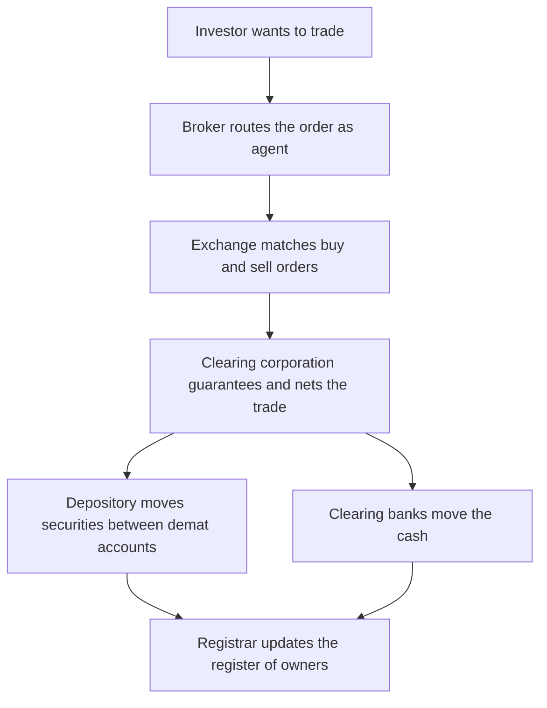
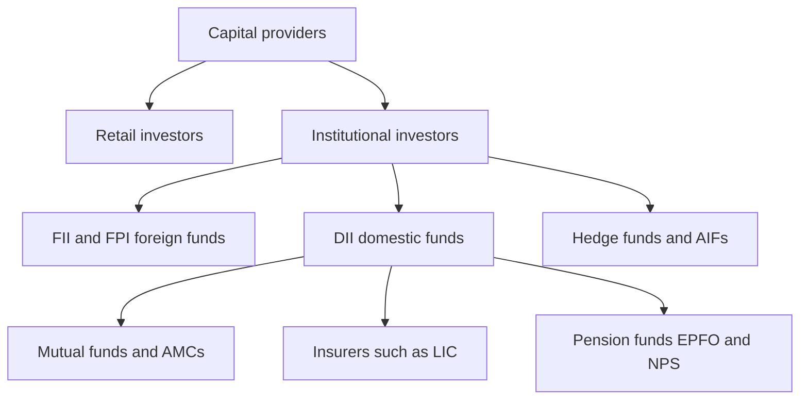

# Chapter 11 — Market Participants and Intermediaries

## 1. The Problem / The Need

Picture the simplest possible version of a financial market: a room where people who have savings meet people who need capital. A retired schoolteacher in Pune with ₹5 lakh to invest walks in, hoping to buy shares of a good company. Across the room stands the treasurer of a mid-sized manufacturer who wants to sell ₹5 lakh of the company's shares. In principle, they could just shake hands and trade.

In practice, this room does not work. The teacher has no idea whether the treasurer actually owns the shares, whether they are genuine, whether the price is fair, or whether the treasurer will hand over the certificates after taking the money. The treasurer, for his part, does not know whether the teacher's cheque will clear. Neither of them can find each other reliably — the teacher wants to buy on Tuesday; the seller wants to sell on Thursday. If they do agree, who keeps the record that ownership has changed? What if the teacher wants to sell again next year to somebody she has never met, in a city she will never visit? And multiply this by the *millions* of trades that a modern economy needs every single day, in thousands of different securities, across the whole country.

The naked market — buyers and sellers dealing face to face — collapses under four problems: **search** (finding a counterparty), **trust** (will the other side perform?), **settlement** (who moves the money and the securities, and how do we know it happened?), and **record-keeping** (who owns what, now and forever). Every one of these problems is solved not by the buyers and sellers themselves but by a supporting cast of specialists who sit *between* them. These specialists are the **market participants and intermediaries**, and this chapter is about who they are and precisely what job each one does.

The deep point is this: a financial market is not a place, it is an *institution* — a web of intermediaries each performing one narrow, repeatable function so reliably that a stranger in Pune can, in three seconds on a phone app, buy shares from a stranger in Chennai and be certain she owns them. That certainty is manufactured. This chapter shows the factory.

## 2. The Core Idea

The core idea is **specialisation through intermediation**. Rather than expecting every investor to also be a searcher, a credit analyst, a settlement clerk, and a registrar, the market breaks the end-to-end journey of a trade into distinct functions and assigns each to a specialist who does *only* that, for everyone, at massive scale. Because each intermediary repeats its one function millions of times, it becomes cheap, fast, and trustworthy — economies of scale turn what would be an impossible individual burden into a commodity service costing a few rupees.

There is a second, subtler idea: **the separation of the trade from its guarantee and its record.** When you buy a share, three logically separate things happen at three separate institutions. (1) The *matching* of your buy order against a seller's sell order happens at the **exchange**. (2) The *guarantee* that the trade will actually settle — that you get shares and the seller gets cash even if one side defaults — is provided by the **clearing corporation**. (3) The *record* that you now own those shares is kept by the **depository**. No single institution does all three, and this deliberate separation is a safety feature: it prevents any one party from having both the incentive and the ability to cheat.

A useful way to organise the whole cast is to split it into two broad groups:

- **Principals** — those who trade for their own account and take on ownership and risk (dealers, market makers, and the investors themselves, both institutional and retail). They *become* buyers and sellers.
- **Agents and infrastructure** — those who never take the other side of your trade but enable it (brokers, exchanges, clearing corporations, depositories, custodians, registrars). They facilitate, guarantee, and record.

*Figure 1 — The relay race of a single trade, each leg run by a different specialist.*

## 3. How It Works — The Life of One Trade

Let us trace a real trade end to end, because the roles only make sense when you see them in motion. Suppose our Pune teacher, Mrs Rao, decides to buy 100 shares of Infosys.

**Step 1 — The order (broker as agent).** Mrs Rao opens her Zerodha or Groww app and places a buy order. Her broker does not sell her its own shares; it acts as her **agent**, transmitting her order into the exchange's electronic order book. For this it earns **brokerage** (a commission). The broker also performs the unglamorous but essential jobs of **KYC** (verifying who she is), holding her funds in a client account, and giving her access to the market she could never reach directly.

**Step 2 — The match (exchange).** The order reaches the **NSE**, whose computer matches Mrs Rao's buy order against the best available sell order — perhaps 100 shares offered by a trader in Delhi. The exchange's job is purely **price-time-priority matching**: it neither owns the shares nor guarantees anything. At the instant of the match, a *contract* exists, but nothing has actually moved.

**Step 3 — The guarantee and netting (clearing corporation).** The matched trade is passed to **NSE Clearing Ltd (NCL)**, the clearing corporation. NCL steps into the middle of the trade through a legal mechanism called **novation**: it becomes the buyer to every seller and the seller to every buyer. Now Mrs Rao's counterparty is not the anonymous Delhi trader — it is NCL itself, a well-capitalised institution. Even if the Delhi trader vanishes, NCL still delivers Mrs Rao her shares. NCL also **nets** all the day's trades so that only the small differences change hands rather than every gross transaction, and it collects **margins** from members to cover the risk that someone defaults before settlement.

**Step 4 — Settlement (depository + clearing banks).** On **T+1** (one working day after the trade — India moved to T+1 in 2023 and is piloting same-day T+0), settlement happens. The **depository** (NSDL or CDSL) debits 100 Infosys shares from the seller's demat account and credits them to Mrs Rao's demat account. Simultaneously, the **clearing banks** move the rupees from Mrs Rao's side to the seller's side. This simultaneous exchange is called **delivery versus payment (DvP)** — neither leg happens without the other, which eliminates the risk of paying and not receiving.

**Step 5 — The record (registrar / RTA).** Infosys's **registrar and transfer agent** (an RTA such as KFin Technologies or Computershare) maintains the master register of shareholders and, through the depository, now reflects that Mrs Rao is an owner. When Infosys pays a dividend, the RTA is who calculates and disburses her entitlement.

Notice that Mrs Rao interacted with only *one* party — her broker. The other five institutions worked invisibly behind that single app screen. That invisibility is the whole point: intermediation succeeds when the user never has to think about it.

## 4. Full Content — The Cast of Participants

### 4.1 Brokers — the agents

A **broker** executes trades *on behalf of* clients and never takes ownership of the security. It is a pure **agent**, compensated by **commission (brokerage)**. Because a broker does not take the other side of your trade, it has no conflict about the direction of price — it earns whether you buy or sell, win or lose (which is also why churning your account is a classic abuse).

In India, a broker must be a **SEBI-registered stock broker** and a **trading member** of an exchange. Types include:

- **Full-service brokers** (ICICI Direct, HDFC Securities, Kotak Securities) — bundle research, advice, and relationship managers; charge higher, often percentage-based brokerage.
- **Discount brokers** (Zerodha, Groww, Upstox, Angel One) — bare execution at a flat, tiny fee (often ₹20 per order or zero for equity delivery); no advice. This model, pioneered globally by Charles Schwab and Robinhood, revolutionised retail access.
- **Sub-brokers / Authorised Persons** — franchisees who bring clients to a main broker.

A broker is also usually a **Depository Participant (DP)** — the agent through which you open and operate your demat account.

### 4.2 Dealers and Market Makers — the principals who provide liquidity

A **dealer** trades for its *own account* — it buys securities into its own inventory and sells from it. Unlike a broker, a dealer is a **principal**: when you sell to a dealer, the dealer *owns* what you sold. It earns not a commission but the **bid-ask spread** — the gap between the price at which it will buy (bid) and the price at which it will sell (ask). Buy at ₹99.90, sell at ₹100.10, and the ₹0.20 spread is the reward for holding inventory and standing ready.

A **market maker** is a dealer with an obligation: it commits to *continuously quote two-way prices* (both a bid and an ask) in a security, thereby guaranteeing that anyone who wants to trade always finds a counterparty. Market makers are the reason a market has **liquidity** — the ability to trade quickly without moving the price. They exist wherever natural buyers and sellers may not coincide in time:

- In US equities, **Nasdaq** was historically a pure dealer market run by competing market makers; firms like **Citadel Securities** and **Virtu** now make markets electronically at enormous scale.
- In India, market makers are mandated for **SME platform** stocks (NSE Emerge, BSE SME) and for many **ETFs**, where an **Authorised Participant** keeps the ETF's traded price glued to its NAV.
- In bonds, which trade **over-the-counter (OTC)** rather than on an exchange, banks and primary dealers *are* the market — you buy a bond *from* a dealer's inventory, not from another investor via a matching engine.

The broker-versus-dealer distinction is the single most tested concept about intermediaries: **a broker arranges a trade between two others and earns commission; a dealer is one of the two, taking the security onto its own book and earning the spread.** Many large firms (a "broker-dealer") do both, in separate roles.

### 4.3 Investment Banks — the architects of the primary market

While brokers and dealers dominate the *secondary* market (trading existing securities), **investment banks** dominate the *primary* market (creating new securities) and the market for corporate transactions. Their core functions:

- **Underwriting** — helping a company issue shares (IPO/FPO) or bonds. The bank prices the issue, markets it to investors (the "roadshow" and **book-building**), and often *guarantees* the sale by agreeing to buy any unsold portion, absorbing the risk. In India these lead banks are called **Book Running Lead Managers (BRLMs)** — Kotak, Axis Capital, ICICI Securities, JM Financial; globally, Goldman Sachs, Morgan Stanley, J.P. Morgan.
- **Mergers & Acquisitions (M&A) advisory** — advising on buying, selling, and merging companies, and financing those deals.
- **Sales & Trading, and Research** — distributing securities to institutional clients and publishing analysis.

An investment bank is the intermediary that stands between a *company that needs capital* and the *investors who supply it*, whereas a broker stands between two *investors*. Note the regulatory line in India: the underwriting-and-issue-management function is performed by a **SEBI-registered Merchant Banker**.

### 4.4 Depositories — the electronic vault of ownership

Before 1996, Indian shares were paper certificates: slow to transfer, easy to forge, lose, or damage, with settlement taking weeks. A **depository** dematerialises securities — it holds them in electronic (**demat**) form and records ownership in book-entry accounts, exactly as a bank holds your money as a number rather than physical notes.

India has **two** depositories:

- **NSDL** (National Securities Depository Limited) — established 1996, promoted by IDBI/NSE/UTI; historically the larger by value, strong in institutional holdings.
- **CDSL** (Central Depository Services Limited) — promoted by BSE; now the larger by *number* of demat accounts, thanks to the retail boom; notably, CDSL is itself listed and publicly traded.

Crucially, you do not deal with a depository directly. You open a demat account with a **Depository Participant (DP)** — usually your broker or bank — which is the depository's agent. When shares are bought, the depository credits your demat account; when sold, it debits them. It also processes **corporate actions** (bonuses, splits, dividends routing) electronically. In the US, the equivalent single institution is the **DTC (Depository Trust Company)**, part of DTCC.

### 4.5 Clearing Corporations — the guarantor and risk manager

A **clearing corporation** (or clearing house) sits between the exchange and settlement and does the job that makes anonymous trading safe: it becomes the **central counterparty (CCP)** to every trade via **novation**, guaranteeing settlement even if a member defaults. It performs three linked tasks:

1. **Novation & guarantee** — becomes buyer to every seller and seller to every buyer, so no participant bears counterparty risk.
2. **Netting** — collapses thousands of a member's trades into a single net obligation to deliver or receive, hugely reducing the cash and securities that must actually move.
3. **Risk management** — collects **initial and mark-to-market margins**, maintains a **Settlement Guarantee Fund (SGF)**, and can liquidate a defaulter's positions.

India's clearing corporations include **NSE Clearing Ltd (NCL)**, **Indian Clearing Corporation (ICCL)** for BSE, and **MCX Clearing** for commodities. Globally, examples are the **DTCC/NSCC** (US equities) and **LCH** (derivatives). Because a CCP concentrates risk, it is itself **systemically important** and heavily regulated — the 2008 crisis showed the danger of *uncleared* OTC derivatives, prompting a global push to route them through CCPs.

### 4.6 Custodians — the safe-keeper for large investors

A **custodian** holds securities and assets safe *on behalf of large investors* — foreign funds, mutual funds, insurers, pension funds — and handles the back-office plumbing they do not want to run themselves: settling trades, safekeeping, collecting dividends and interest, tax and regulatory reporting, corporate-action processing, and foreign-exchange. A big foreign investor buying Indian shares does not open a retail demat account; it appoints a **custodian bank** to hold and administer everything.

Do not confuse a custodian with a depository. The **depository** is the central electronic registry for the *whole market*; the **custodian** is a *private service provider* to a particular institutional client, holding that client's assets (often *at* the depository) and doing its administration. Major custodians in India include **HDFC Bank, SBI-SG Global Securities Services, Standard Chartered, Citi, Deutsche Bank, and Stock Holding Corporation of India (SHCIL)**; globally, **BNY Mellon, State Street, and J.P. Morgan** are the giants, each safekeeping tens of trillions of dollars.

### 4.7 Registrars and Transfer Agents (RTA)

An **RTA** maintains, on behalf of a *company* (or a *mutual fund*), the master record of who owns its securities and processes the servicing of those owners: allotments in an IPO, transfers, dividend and interest payments, bonus and rights issues, and investor grievances. For a mutual fund, the RTA processes your every purchase and redemption of units. India is dominated by two RTAs — **KFin Technologies (KFintech)** and **Computer Age Management Services (CAMS)** — which between them service the vast majority of mutual-fund and listed-company accounts. Where the depository holds ownership at the *market* level, the RTA is the *issuer's* record-keeper and investor-servicing arm.

### 4.8 The Investors — Institutional vs Retail

Everything above exists to serve the two ultimate sources of capital: institutions and retail.

**Retail investors** are individuals investing their own savings — Mrs Rao. Individually small, collectively vast, they are typically less informed, more emotionally driven, and are the primary object of investor-protection regulation. India has seen a historic retail surge: demat accounts exploded from about 4 crore in 2020 to over 15 crore by 2024, and retail participation via **SIPs** (systematic investment plans) into mutual funds now runs above ₹20,000 crore *per month*.

**Institutional investors** manage pooled money professionally, in large blocks, with research teams and information advantages. They are the "smart money" that dominates trading volume and price discovery. The main categories:

- **Foreign Institutional / Portfolio Investors (FIIs / FPIs)** — overseas funds (pension funds, sovereign wealth funds, hedge funds, asset managers like BlackRock, Vanguard) investing in Indian securities. Registered with SEBI under the **FPI** framework. Their flows are large and mobile, so "FII inflows/outflows" move the Nifty and the rupee daily.
- **Domestic Institutional Investors (DIIs)** — Indian mutual funds, insurers, banks, and pension funds. In recent years DIIs, powered by steady SIP inflows, have become a *counterweight* to volatile FII flows, buying when foreigners sell and stabilising the market.
- **Mutual funds / Asset Management Companies (AMCs)** — pool money from many small investors and invest per a stated mandate, run by an AMC (HDFC AMC, SBI MF, ICICI Prudential) under SEBI's mutual-fund regulations, with a trustee and custodian structure.
- **Insurance companies** — invest premium float over long horizons; **LIC** is India's single largest institutional investor and a market bellwether.
- **Pension and provident funds** — the longest-horizon money of all; India's **EPFO** and **NPS** channel retirement savings into markets, increasingly into equity.
- **Hedge funds and Alternative Investment Funds (AIFs)** — sophisticated, less-regulated pools using leverage, shorting, and complex strategies.

*Figure 2 — The taxonomy of investors, the ultimate suppliers of capital the intermediaries serve.*

### 4.9 The Regulator — the referee

Sitting above all of this is the **regulator**, which licenses every intermediary, writes the rulebook, and polices misconduct. In India the securities markets are regulated by **SEBI (Securities and Exchange Board of India)**, with **RBI** overseeing the money and government-securities markets and banks, and **IRDAI** and **PFRDA** overseeing insurers and pensions respectively. In the US, the equivalent is the **SEC (Securities and Exchange Commission)**, supported by the self-regulatory **FINRA** for broker-dealers. The regulator is not a trading participant, but no participant exists without its authorisation.

## 5. Worked / Real Examples

**Example 1 — Reliance's ₹53,124 crore rights issue (2020).** When Reliance Industries raised capital in India's largest-ever rights issue, watch the cast assemble. The **merchant bankers / BRLMs** (Morgan Stanley, Kotak, and others) structured and managed the issue. The **registrar** (KFintech) processed millions of shareholder entitlements and allotments. The **depositories** (NSDL/CDSL) credited the partly-paid rights shares into shareholders' demat accounts. The **clearing corporation** guaranteed settlement of the rights-entitlement trading on the exchange. **Retail** shareholders subscribed through their **brokers**, while large **institutional** holders acted through their **custodians**. Six intermediary types, one capital raise.

**Example 2 — A single Nifty ETF trade.** An investor buys 50 units of the Nippon India Nifty 50 ETF. A **market maker / Authorised Participant** is quoting continuous two-way prices, so the trade fills instantly at a price hugging NAV. The **broker** routes it; the **exchange** matches it; **NCL** clears and guarantees it; **CDSL** delivers the units into the demat account on T+1. If the ETF's price drifts above NAV, the AP *creates* new units (delivering the underlying basket to the AMC) and sells them, arbitraging the gap closed — a live demonstration of a market maker enforcing fair pricing.

**Example 3 — FII outflow and DII absorption (2022).** During the global rate-hike shock of 2022, **FIIs** pulled roughly ₹1.2 lakh crore out of Indian equities. Historically this would have crashed the market. Instead, **DIIs** — driven by relentless retail **SIP** inflows into **mutual funds** and by **LIC** and **EPFO** deployments — bought almost the entire quantum, and the Nifty ended the year roughly flat. This is the maturing of India's investor base: a domestic institutional counterweight, funded by millions of small retail savers, absorbing foreign volatility. It is impossible to understand Indian market movements without watching the daily **FII vs DII** net-flow figures.

## 6. Connections

This chapter is the connective tissue of the whole book. **Chapter 2 (primary markets)** is the arena of the *investment bank / merchant banker*. **Chapter 3 (secondary markets and exchanges)** is where *brokers, dealers, and market makers* operate and where the *clearing corporation and depository* complete the plumbing. **Chapter 6 (equity instruments)** described the *what*; this chapter describes the *who* that moves it. **Money markets (Chapter 4)** and **bond markets** are largely *dealer* markets, illustrating why the broker/dealer distinction matters by asset class. The *custodian and RTA* reappear whenever we discuss **mutual funds and ETFs**. And the *regulator* (SEBI/SEC) frames every later chapter on regulation, derivatives, and market integrity. Master the cast here and every later mechanism becomes a story about which of these players is doing what.

## 7. Key Terms

- **Broker** — agent who executes trades for clients for commission; never owns the security.
- **Dealer** — principal who trades from its own inventory, earning the bid-ask spread.
- **Market maker** — dealer obligated to quote continuous two-way prices, supplying liquidity.
- **Bid-ask spread** — gap between buy and sell quotes; a dealer's compensation.
- **Investment bank / Merchant banker** — arranges the issuance of new securities (underwriting, IPOs) and advises on M&A.
- **Underwriting** — guaranteeing the sale of a new issue, absorbing unsold portions.
- **Depository (NSDL / CDSL)** — central electronic registry holding securities in demat form.
- **Depository Participant (DP)** — the agent (broker/bank) through which you access a depository.
- **Clearing corporation (CCP)** — becomes central counterparty via novation, guaranteeing and netting settlement.
- **Novation** — legal substitution of the CCP as counterparty to both sides of a trade.
- **Custodian** — safekeeps and administers assets for large institutional investors.
- **Registrar & Transfer Agent (RTA)** — maintains an issuer's register and services its investors.
- **DvP (Delivery versus Payment)** — simultaneous exchange of securities and cash at settlement.
- **FII / FPI** — foreign institutional / portfolio investor.
- **DII** — domestic institutional investor (Indian MFs, insurers, banks, pensions).
- **T+1 settlement** — trade settles one working day after execution.

## 8. Common Confusions

- **Broker vs Dealer.** A broker *arranges* a trade between two others (agent, earns commission); a dealer *is* one side of the trade (principal, earns the spread). A "broker-dealer" does both in separate capacities.
- **Depository vs Custodian.** A depository (NSDL/CDSL) is *market-wide* infrastructure holding everyone's securities in book-entry form; a custodian is a *private service provider* safekeeping and administering one big client's assets (often held at the depository).
- **Depository vs Clearing corporation.** The depository *records ownership and moves securities*; the clearing corporation *guarantees and nets the trade*. Different jobs, different institutions.
- **Depository vs Registrar (RTA).** The depository is the *market-level* owner registry (book-entry); the RTA is the *company-level* record-keeper and investor-servicing agent. For dematerialised shares the depository is the definitive holder; the RTA services the issuer's corporate actions.
- **Exchange vs Clearing corporation.** The exchange *matches* orders and creates the contract; it does not guarantee it. The clearing corporation *guarantees and settles* it. NSE and NSE Clearing are deliberately separate entities.
- **FII/FPI vs FDI.** FPI is *portfolio* investment (buying tradable securities, passive, mobile); FDI is *direct* investment (a controlling stake in a business, long-term). Different regulators' frameworks entirely.
- **Investment bank vs commercial bank.** A commercial bank takes deposits and makes loans; an investment bank raises capital via securities and advises on deals. (Universal banks like SBI or ICICI do both under one roof.)

## 9. First-Principles Recap

Strip a financial market to its atoms and it is just strangers trying to exchange savings for securities across time and space. That naked exchange fails on four counts: they cannot *find* each other, cannot *trust* each other, cannot *settle* reliably, and cannot *record* who owns what. The market's genius is to solve each failure with a dedicated specialist and to repeat that specialist's one narrow job at such scale that it becomes cheap and certain. The **broker** solves search and access; the **exchange** solves matching; the **dealer/market maker** solves the timing mismatch by warehousing inventory for a spread; the **clearing corporation** solves trust by guaranteeing every trade; the **depository** solves record-keeping of ownership; the **custodian and RTA** solve administration and servicing; the **investment bank** solves the creation of the securities in the first place; and the **regulator** licenses and polices them all. Deliberately, no single institution does more than one of these — the separation of matching, guaranteeing, and recording is a designed safety feature, not an accident. Behind Mrs Rao's three-second tap sit six institutions she will never meet, each turning what would be an impossible personal burden into an invisible commodity. That manufactured invisibility *is* a functioning market.

## 10. Quick-Reference / Interview Points

- **Broker = agent, earns commission, no ownership. Dealer = principal, earns spread, owns inventory. Market maker = dealer obliged to quote both sides continuously.** This trio is the most common intermediary interview question.
- **The three-way separation:** Exchange *matches* → Clearing corp *guarantees and nets (novation, margins, SGF)* → Depository *moves securities and records ownership*. Name the Indian entities: NSE + NSE Clearing (NCL) + NSDL/CDSL.
- **India has two depositories:** NSDL (older, institution-heavy, larger by value) and CDSL (retail-heavy, larger by account count, itself listed).
- **Depository ≠ Custodian ≠ RTA.** Depository = market-wide book-entry registry; Custodian = private safekeeping/admin for big investors (HDFC, SBI-SG, BNY Mellon); RTA = issuer's register and investor servicing (KFintech, CAMS).
- **Clearing corp is a CCP via novation** — becomes buyer to every seller and vice versa; systemically important; manages margins and a Settlement Guarantee Fund. Post-2008 reform pushed OTC derivatives into CCPs.
- **Investment bank / merchant banker** works the *primary* market: underwriting, book-building, IPOs, M&A. In India lead managers are BRLMs; the licence is SEBI Merchant Banker.
- **Settlement is T+1 in India** (moved from T+2 in 2023; T+0 same-day being rolled out) via **DvP** — India leads the world here.
- **Institutional vs Retail:** institutions (FII/FPI, DII, mutual funds, insurers, pensions, AIFs) dominate volume and price discovery; retail is numerous but small. Watch **daily FII vs DII net flows** — DIIs funded by SIPs now counterbalance volatile FII flows.
- **Regulator map:** SEBI (securities), RBI (money/G-sec/banks), IRDAI (insurance), PFRDA (pensions) in India; SEC + FINRA in the US.
- **Key numbers to drop:** demat accounts grew from ~4 crore (2020) to 15 crore+ (2024); monthly SIP inflows above ₹20,000 crore; India's T+1 (2023) and pilot T+0 as global firsts.
