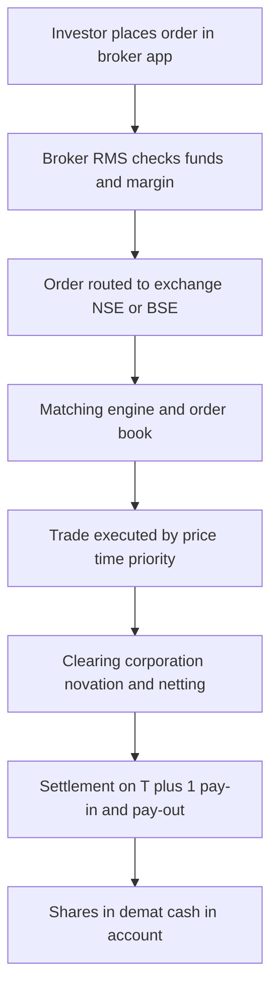
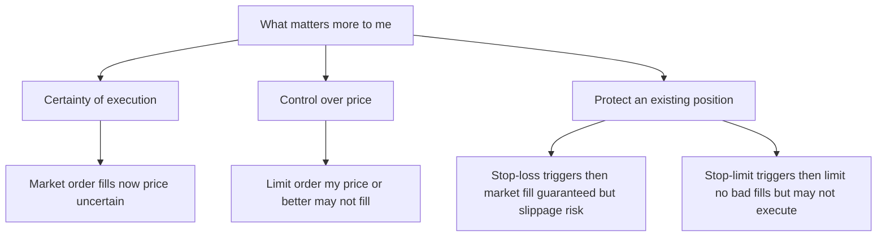
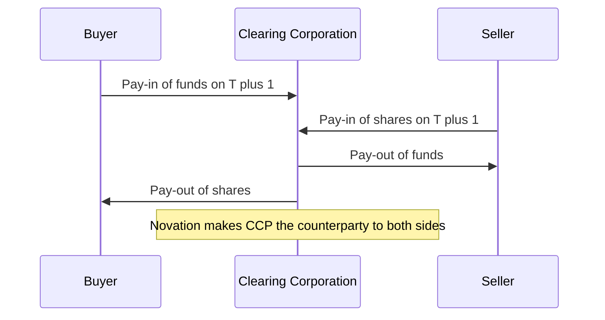

# Chapter 12 — Trading Mechanics and Order Types

## 1. The Problem / Need

You have decided to buy 100 shares of Reliance Industries. In your head this feels like a single, simple act: "buy the stock." But between that intention and the moment those shares actually sit in your demat account, an enormous machinery has to spring into life. Someone, somewhere, must be willing to *sell* exactly when you want to buy. A price has to be agreed. The trade must be recorded, matched, cleared, and settled. Your money must move to the seller; the seller's shares must move to you. And all of this must happen in milliseconds, honestly, and without either party being able to cheat.

The core problem trading mechanics solves is **coordination among strangers who don't trust each other and never meet**. In a village bazaar you can haggle face-to-face, inspect the goods, and hand over cash. In a market where millions of anonymous participants trade lakhs of crores of rupees every day across a country, none of that is possible. You cannot verify that the person "selling" you Reliance actually owns it, or that they will hand it over after taking your money.

So markets need a set of institutions and rules that answer four hard questions:

1. **How do buyers and sellers find each other and agree on a price?** (order matching)
2. **What exactly am I instructing the market to do?** (order types)
3. **Once matched, how do securities and money actually change hands without either side defaulting?** (clearing and settlement)
4. **What stops the whole system from spiralling into panic or manipulation?** (margins, circuit breakers, short-sale rules)

This chapter walks through that machinery end to end. Master it and you understand not just *what* a trade is but *why* the plumbing looks the way it does — which is exactly the kind of first-principles fluency an interviewer probes for.

## 2. The Core Idea

A modern securities trade rests on one elegant idea: **replace bilateral trust with a central, anonymous, rule-based intermediary**.

Instead of you negotiating with a specific seller, you submit an **order** to an exchange. The exchange runs an **electronic order book** — a continuously updated list of everyone's buy and sell interest. A **matching engine** pairs compatible orders using strict, public priority rules (best price first, then earliest time). Neither you nor the seller knows the other's identity.

Then a second institution, the **clearing corporation**, steps in as the **central counterparty (CCP)**. Through a legal process called *novation*, it becomes the buyer to every seller and the seller to every buyer. You no longer face the risk that your specific counterparty defaults — you face only the clearing corporation, which is heavily capitalised and collateralised. Settlement — the actual swap of shares for cash — then happens on a fixed timetable (**T+1** in India), against margins collected up front so that nobody can walk away from a losing position.

Everything else in this chapter — order types, spreads, leverage, halts — is machinery that makes this core idea work smoothly, fairly, and safely at scale.

## 3. How It Works — A Trade End to End

Let's follow a single order through the system.

**Step 1 — Order origination.** You log into your broker's app (Zerodha, Groww, ICICI Direct) and place a buy order for 100 Reliance shares. You choose an order *type* (market, limit, etc.) and, if you're trading intraday or derivatives, the broker checks you have enough **margin**.

**Step 2 — Risk check and routing.** The broker's Risk Management System (RMS) instantly verifies funds/margin and position limits, then routes the order to the exchange (NSE or BSE) over a low-latency connection.

**Step 3 — The order book.** The exchange's matching engine places your order into the **limit order book** for Reliance. If it's a marketable order, the engine immediately tries to match it against resting orders on the opposite side.

**Step 4 — Matching.** Using **price-time priority**, the engine pairs your buy with the best available sell(s). A trade is "executed." Both parties get an electronic confirmation in milliseconds. Price discovery has happened.

**Step 5 — Clearing.** The trade details flow to the **clearing corporation** (NSE Clearing / NCL, or Indian Clearing Corporation for BSE). It performs **novation**, becoming the counterparty to both sides, and **nets** all of a member's trades so only the net obligation moves.

**Step 6 — Settlement.** On **T+1** (the day after trade), the clearing corporation runs *pay-in* and *pay-out*: your cash is debited and moves to the seller's broker; the seller's shares are debited from their demat (at CDSL/NSDL) and credited to yours. The trade is now final and irrevocable.

**Step 7 — Post-settlement.** Shares appear in your demat account; the contract note, taxes (STT, stamp duty, GST on brokerage), and statements are generated.

*Figure 12.1 — The life of a trade from click to settled position.*

## 4. Full Content

### 4.1 The Order Book and Price-Time Priority

The **order book** is the beating heart of a modern exchange. It is simply two sorted lists:

- The **bid** side: all outstanding *buy* orders, sorted from highest price down.
- The **ask** (or **offer**) side: all outstanding *sell* orders, sorted from lowest price up.

The **best bid** is the highest price a buyer is willing to pay; the **best ask** is the lowest price a seller will accept. The gap between them is the **bid-ask spread**.

A trade happens only when a buyer's price meets or exceeds a seller's price — i.e., when the book "crosses." Orders are matched by **price-time priority**:

1. **Price priority:** the best-priced order executes first (highest bid, lowest ask).
2. **Time priority:** among orders at the *same* price, the one entered earliest executes first (first-in, first-out).

This rule is what makes anonymous markets fair — you cannot jump the queue by knowing someone; you jump it only by offering a better price or arriving earlier.

A sample NSE order book snapshot for a stock:

| Bids (buyers) | | Asks (sellers) | |
|---|---|---|---|
| **Qty** | **Price (₹)** | **Price (₹)** | **Qty** |
| 500 | 1,250.40 | 1,250.55 | 300 |
| 800 | 1,250.35 | 1,250.60 | 1,200 |
| 1,500 | 1,250.30 | 1,250.75 | 900 |

Here the **best bid** is ₹1,250.40, the **best ask** is ₹1,250.55, and the **spread** is ₹0.15. A market buy order would execute at ₹1,250.55 (lifting the offer); a market sell would execute at ₹1,250.40 (hitting the bid).

### 4.2 The Bid-Ask Spread — Why It Exists

The spread is not an accident; it is the **market maker's / liquidity provider's compensation**. Someone must stand ready to buy when you want to sell and sell when you want to buy. That person bears two risks — **inventory risk** (price moves against the stock they're holding) and **adverse selection** (the person trading with them may know something they don't). The spread is the fee they earn for providing this **immediacy**.

Spread width is a direct measure of **liquidity**:

- **Liquid stocks** (Reliance, HDFC Bank, Infosys) have razor-thin spreads (a few paise) because huge order flow and many market makers compete.
- **Illiquid stocks** (small-caps, some SME-listed shares) can have spreads of several rupees or 1–3% of price — trading them is expensive because you cross a wide spread every round trip.

The spread is a real, often-underestimated **transaction cost**. If you buy at the ask and immediately sell at the bid, you lose the spread even if the price hasn't moved. This is why **liquidity is a feature you pay for**.

### 4.3 Order Types — The Trader's Vocabulary

An order type is precisely how you instruct the exchange to behave. The two fundamental dimensions are **price** (what price am I willing to accept?) and **execution certainty** (do I care more about *getting filled* or *getting my price*?). You cannot maximise both — this is the central trade-off.

**Market order.** "Fill me *now*, at whatever the best available price is." It prioritises **certainty of execution** over price. A market buy lifts the best ask; a market sell hits the best bid. It almost always executes instantly, but you don't control the price — in a fast or thin market you can suffer **slippage** (the fill is worse than the price you saw) and even **market impact** if your order is large enough to walk up the book.

**Limit order.** "Fill me only at price X or better." A limit *buy* at ₹1,250 executes at ₹1,250 or lower; a limit *sell* at ₹1,260 executes at ₹1,260 or higher. It prioritises **price control** over certainty — you might never get filled if the market moves away. Limit orders that don't execute immediately **rest in the order book**, providing liquidity to others.

**Stop-loss (stop) order.** A *conditional* order that stays dormant until a **trigger price** is hit, then becomes a **market order**. Its job is to **cap losses** (or protect profits). If you own a stock at ₹1,250 and place a stop-loss trigger at ₹1,200, the moment the price touches ₹1,200 your stop fires and sells at market — limiting further downside. The danger: in a gap or crash it becomes a market order and can fill far below ₹1,200.

**Stop-limit order.** Same trigger mechanism, but when triggered it becomes a **limit order**, not a market order. You set *two* prices: the **trigger** and the **limit**. Example: trigger ₹1,200, limit ₹1,195 — "if price hits ₹1,200, try to sell but not below ₹1,195." This protects you from a terrible fill, but at a cost: if the price crashes straight through ₹1,195, your order *doesn't execute at all* and you're left holding a falling stock. It trades **protection against slippage** for **risk of non-execution**.

*Figure 12.2 — Choosing an order type is choosing where you sit on the execution-versus-price trade-off.*

**Order attributes / advanced types.** Beyond the four basics, real platforms let you attach conditions:

| Attribute | Meaning |
|---|---|
| **Day order** | Valid only for the current trading session; cancelled if unfilled at close |
| **IOC (Immediate-or-Cancel)** | Fill whatever it can instantly; cancel the rest |
| **GTC / GTD** | Good-Till-Cancelled / Good-Till-Date — stays live across days (brokers often simulate GTC as GTD baskets) |
| **AON (All-or-None)** | Fill the entire quantity or none — no partial fills |
| **Bracket order** | Entry + target (limit) + stop-loss bundled into one intraday order |
| **Cover order** | Market/limit entry with a compulsory stop-loss, giving higher leverage |
| **Iceberg / disclosed quantity** | Shows only a slice of a large order to hide true size and reduce market impact |
| **AMO (After-Market Order)** | Placed when the market is closed; queued for the next session's open |

### 4.4 Trading Sessions on NSE / BSE

An Indian equity trading day is not one continuous block:

- **Pre-open session (09:00–09:15):** orders are collected but not continuously matched. A single **equilibrium/opening price** is discovered via a **call auction** that maximises executable volume. This dampens the volatility of a chaotic open.
- **Continuous / normal session (09:15–15:30):** standard price-time-priority matching described above.
- **Closing / post-close session (15:40–16:00):** the **closing price** is the volume-weighted average of the last 30 minutes of the continuous session; a post-close window lets you trade at that closing price.

### 4.5 Clearing and Settlement — T+1 in India

**Trade date is T.** Settlement date is when securities and cash actually change hands. India has been a global leader here:

- **T+2** was the norm until 2021.
- India moved to **T+1 in a phased rollout completed on 27 January 2023**, becoming one of the first major markets to do so.
- SEBI introduced **optional T+0 (same-day) settlement** in a beta from **28 March 2024** for a set of stocks, with plans to expand — putting India ahead of the US, which only moved to T+1 in **May 2024**.

**Why shorter is better:** the longer the gap between trade and settlement, the longer **counterparty and market risk** lingers, and the more capital sits locked as margin. Faster settlement frees up capital and reduces systemic risk — but demands flawless operational plumbing (instant fund transfers, pre-funded accounts).

**The role of the clearing corporation (CCP):** Through **novation**, the CCP legally interposes itself. It also does **multilateral netting** — if a broker bought 10,000 and sold 8,000 shares of a stock, only the net 2,000 settle, drastically cutting the volume of money and securities that must move. Depositories **NSDL** and **CDSL** hold shares in dematerialised (electronic) form and effect the actual debit/credit.

*Figure 12.3 — The clearing corporation guarantees settlement by standing between buyer and seller.*

### 4.6 Margin, Leverage and Short Selling

**Margin** is collateral you post so the system trusts you'll honour your side. It underpins two related ideas: leverage and short selling.

**Leverage** means controlling a position larger than your own capital. In derivatives (futures/options), you deposit only a fraction of the contract value as **initial margin** (calculated by **SPAN + Exposure** margin under NSE's system). A Nifty futures contract worth ~₹18 lakh might need ~₹1.2 lakh margin — roughly 15x leverage. Leverage magnifies **both** gains and losses on your capital. If the position moves against you and your margin erodes, you get a **margin call** to top up, or the broker **squares off** (force-closes) your position.

**Peak margin rules (SEBI, phased through 2020–21):** to curb reckless intraday leverage, SEBI now requires **upfront margin collection** and mandates that brokers cannot offer unlimited intraday leverage. This ended the era of 20–40x intraday "exposure" some brokers advertised, forcing pre-collection of at least the VaR + ELM margin.

**Short selling** is selling a security you don't own, betting the price will fall so you can buy it back cheaper. Mechanically you borrow the share (via the **Securities Lending and Borrowing, SLB** mechanism), sell it, and later buy it back to return it. Your profit is the fall in price; your **loss is theoretically unlimited** because a price can rise without bound.

India's short-selling regime is deliberately conservative:

- **Intraday short selling is freely allowed** — you can sell and buy back the same day without owning the stock.
- **Delivery-based (overnight) short selling by retail is essentially not permitted** unless you borrow via **SLB**, because you *must deliver* shares at T+1 settlement. If you can't deliver, the exchange runs an **auction** and you pay a penalty.
- **Naked short selling is banned.** SEBI requires that every short be backed by an ability to deliver.
- **Institutional investors must declare shorts upfront** and cannot square off intraday (different rule from retail).

Contrast this with the US, where **Regulation SHO** (SEC) governs short sales, requires a "locate" before shorting, and imposes the **alternative uptick rule (Rule 201)** — restricting short selling in a stock that has fallen 10% in a day to executions at prices above the best bid.

### 4.7 Circuit Breakers and Trading Halts

Markets can panic. Circuit breakers are **automatic pauses** that give humans time to breathe and information time to disseminate, preventing self-reinforcing crashes and fat-finger disasters.

**Index-level (market-wide) circuit breakers — India.** SEBI mandates a coordinated halt across NSE and BSE triggered by moves in the **Nifty 50 or Sensex**, at three thresholds — **10%, 15%, and 20%** — with the halt duration depending on the level *and* the time of day:

| Trigger | Before 1:00 pm | 1:00–2:30 pm | After 2:30 pm |
|---|---|---|---|
| **10%** | 45-min halt | 15-min halt | No halt |
| **15%** | 1-hour 45-min halt | 45-min halt | Halt for rest of day |
| **20%** | Halt for rest of the day | Rest of day | Rest of day |

After each halt (except the 20% level), trading resumes with a **15-minute pre-open call auction**. The 20% breaker halts the market for the **entire remaining day**. This system was famously triggered on **13 March 2020**, when the Nifty fell 10% at the open amid the COVID crash and trading was halted for 45 minutes.

**Stock-level price bands.** Individual securities have **daily price bands** (e.g., 2%, 5%, 10%, 20%) beyond which orders are rejected for the day. Stocks in the derivatives (F&O) segment generally have no fixed band but have a **dynamic 10% "flexible" band** with cooling-off, since arbitrage keeps them anchored.

**US comparison.** The US uses **Limit Up-Limit Down (LULD)** bands on individual stocks plus market-wide circuit breakers on the **S&P 500** at **7% (Level 1), 13% (Level 2), and 20% (Level 3)** — a system redesigned after the **6 May 2010 "Flash Crash,"** when the Dow plunged ~1,000 points in minutes.

The philosophy is identical everywhere: **halts trade a small loss of continuous trading for a large gain in stability**, curbing herd behaviour and giving circuit-breaker-driven "cooling off."

## 5. Worked / Real Examples

**Example 1 — Market vs limit order slippage.** Suppose Tata Motors shows best bid ₹975.00 (2,000 shares) and best ask ₹975.20 (500 shares), then ₹975.40 (1,500 shares). You place a **market buy for 1,000 shares**. The engine fills 500 at ₹975.20 and 500 at ₹975.40 — an average of ₹975.30. You wanted "around ₹975.20" but paid ₹975.30 because your order **walked up the book**; that ₹0.10 × 1,000 = ₹100 is **slippage plus market impact**. Had you placed a **limit buy at ₹975.20 for 1,000**, you'd have got only 500 shares filled and 500 resting — protecting your price but sacrificing certainty. This is the market-versus-limit trade-off in hard numbers.

**Example 2 — Stop-loss saving (and hurting) you.** You buy Adani Ports at ₹1,400 and set a **stop-loss trigger at ₹1,350**. Bad news breaks; the stock gaps down and opens at ₹1,300. Your stop-loss (a market order once triggered) executes near ₹1,300 — *below* your ₹1,350 trigger — because there were no buyers at ₹1,350. Had you used a **stop-limit** with trigger ₹1,350 and limit ₹1,345, your order would **not have executed at all**, and you'd still hold Adani Ports as it kept falling. Neither is "better" — they encode different fears (bad fill vs no fill).

**Example 3 — Leverage cutting both ways.** You post ₹1,20,000 margin to buy one Nifty futures lot worth ₹18,00,000 (15× leverage). Nifty rises 2% → the contract gains ₹36,000, a **30% return on your margin**. But a 2% *fall* loses ₹36,000 — a 30% hit — and a continued drop triggers a **margin call**; fail to top up and the broker **squares off** at a loss you must still cover. Leverage didn't change the market's 2% move; it changed *your* exposure to it by 15×.

**Example 4 — The 2020 circuit breaker.** On 13 March 2020, at the market open, the Nifty 50 crashed 10% within minutes as global COVID panic hit. The **market-wide circuit breaker** triggered an automatic **45-minute halt** across NSE and BSE. When trading resumed via a pre-open auction, prices had stabilised and the index actually recovered strongly that day — a textbook case of a halt interrupting a panic feedback loop.

## 6. Connections

- **Chapter on market microstructure / liquidity:** the order book, spread, and market makers are the microstructure that determines *transaction costs* — the hidden drag on every strategy.
- **Derivatives chapters:** margin, SPAN, and leverage discussed here are the mechanical foundation of futures and options trading.
- **Risk management:** stop-losses, margin calls, and circuit breakers are all *risk-containment* tools operating at the trade, account, and market levels respectively.
- **Regulation chapters:** SEBI (India) vs SEC (US) rules on short selling, settlement cycles, and circuit breakers show how the same problems get solved slightly differently across jurisdictions.
- **Algorithmic / HFT trading:** price-time priority and co-location are precisely what high-frequency traders exploit — winning the "time" in price-time priority by being microseconds faster.
- **Behavioural finance:** circuit breakers exist *because* markets are not perfectly rational; they are institutional guardrails against herd panic.

## 7. Key Terms

- **Order book:** the live, sorted list of all resting buy (bid) and sell (ask) orders for a security.
- **Bid / Ask (offer):** highest price a buyer will pay / lowest a seller will accept.
- **Bid-ask spread:** the gap between best bid and best ask; the price of immediacy and a measure of liquidity.
- **Price-time priority:** matching rule — best price first, then earliest order at that price.
- **Market order:** execute immediately at the best available price; certainty over price.
- **Limit order:** execute only at a specified price or better; price over certainty.
- **Stop-loss order:** dormant until a trigger price, then becomes a market order to cap losses.
- **Stop-limit order:** dormant until a trigger, then becomes a limit order; avoids bad fills but risks non-execution.
- **Slippage:** difference between expected and actual execution price.
- **Market impact:** the price move your own large order causes by consuming book depth.
- **Novation:** legal substitution of the clearing corporation as counterparty to both buyer and seller.
- **Netting:** offsetting a member's buys and sells so only the net obligation settles.
- **T+1 settlement:** securities and cash change hands one business day after the trade.
- **Margin:** collateral posted to back a leveraged or short position.
- **Leverage:** controlling a position larger than your own capital.
- **Margin call / square-off:** demand to top up eroded margin, or forced closure of the position.
- **Short selling:** selling a borrowed security to profit from a price fall.
- **SLB:** Securities Lending and Borrowing — the mechanism enabling delivery-based shorting in India.
- **Circuit breaker:** automatic trading halt triggered by extreme price moves.

## 8. Common Confusions

**"Stop-loss guarantees I won't lose more than X."** No. A plain stop-loss becomes a *market* order once triggered; in a gap or crash it can fill far below your trigger. Only a stop-*limit* caps the fill price — and that comes with the risk of no execution at all.

**"A limit order always gets me a better price, so it's strictly superior."** No. A limit order can leave you **unfilled** while the opportunity vanishes. In a fast-rising market, insisting on your price can mean missing the trade entirely. Market and limit orders serve different priorities.

**"The last traded price is the price I'll get."** Not necessarily. You buy at the **ask** and sell at the **bid**, and for a large order you get a *volume-weighted* fill across multiple book levels. The displayed "price" is just the last trade.

**"T+1 means my money is free the next day for anything."** Settlement finality is T+1, but brokers may have their own fund-blocking and payout timelines; sale proceeds under T+1 are available faster than under old T+2, but pledged margins and broker settlement cycles still apply.

**"Short selling is banned in India."** Only **naked** and **retail delivery-based** shorting is restricted. **Intraday short selling is fully allowed**, and delivery shorts are possible via **SLB**. Institutions can short with upfront disclosure.

**"Leverage increases my returns."** Leverage increases your **exposure**, and therefore *both* returns and losses, symmetrically — plus it adds margin-call and forced-liquidation risk that can wipe you out on a move that a cash position would have survived.

**"Circuit breakers stop me from losing money."** They pause *everyone's* trading; they don't cap losses. They exist to prevent disorderly, panic-driven cascades, not to protect an individual position.

## 9. First-Principles Recap

Strip everything back and the logic is a chain:

1. **Trade requires a counterparty** who wants the opposite of what you want, at a price you both accept → so we need a mechanism to aggregate and match interest → the **order book** with **price-time priority**.
2. **You must express your intent precisely** — do you value getting filled or getting your price? → hence **market, limit, stop, and stop-limit** orders, each a point on the execution-versus-price trade-off.
3. **The advertised price isn't free** — someone provides immediacy and bears risk → the **bid-ask spread** is their fee and your true transaction cost.
4. **Strangers won't trust each other to deliver** → a **clearing corporation** novates and guarantees, settling on a fixed, ever-shortening timetable (**T+1**, moving to **T+0**), backed by **margin**.
5. **Leverage and shorting let you take positions beyond your cash** → but they import default and unlimited-loss risk → so **margins, SLB, and short-sale rules** cage that risk.
6. **Crowds panic** → automatic **circuit breakers** pause the market to break feedback loops.

Every rule in the chapter is a defence against a specific failure: mismatched intent, hidden costs, counterparty default, reckless leverage, or herd panic.

## 10. Quick-Reference / Interview Points

- **Order book = bids (buyers, high→low) + asks (sellers, low→high); matched by price then time.** The best bid/ask define the spread.
- **Spread = cost of immediacy = liquidity gauge.** Tight = liquid (Reliance); wide = illiquid (small-caps).
- **Market order:** instant, price-uncertain (slippage risk). **Limit order:** price-certain, fill-uncertain.
- **Stop-loss → market order on trigger** (guaranteed fill, possible bad price). **Stop-limit → limit order on trigger** (good price, possible no fill).
- **India moved to T+1 fully on 27 Jan 2023;** launched optional **T+0 from 28 Mar 2024**. US went T+1 only in **May 2024**. India is a settlement-speed leader.
- **Clearing corp uses novation + netting; NSDL/CDSL hold demat shares.** CCP removes counterparty risk.
- **Margin backs leverage; SEBI peak/upfront margin rules (2020–21) killed extreme intraday leverage.** Margin call → top up or forced square-off.
- **Short selling: intraday freely allowed; delivery shorts only via SLB; naked shorting banned.** US = Reg SHO + Rule 201 uptick.
- **India market-wide circuit breakers on Nifty/Sensex at 10/15/20%,** duration depends on level and time; 20% halts the whole day. Triggered 13 Mar 2020.
- **US market-wide breakers on S&P 500 at 7/13/20%;** individual stocks use LULD bands (post-2010 Flash Crash).
- **Core trade-off to state in any interview:** *you can optimise for execution certainty OR price, never both — every order type is a choice about where on that spectrum you sit.*
