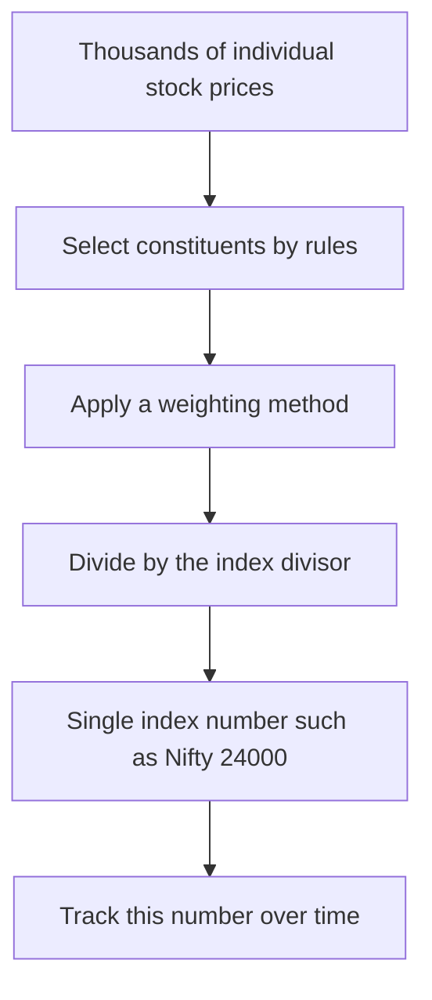
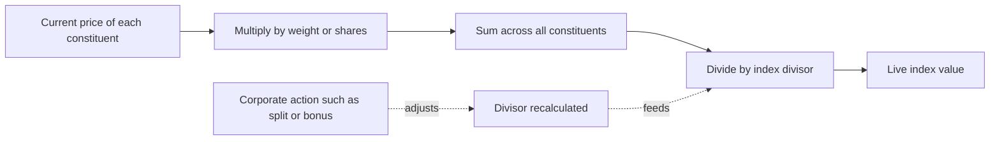
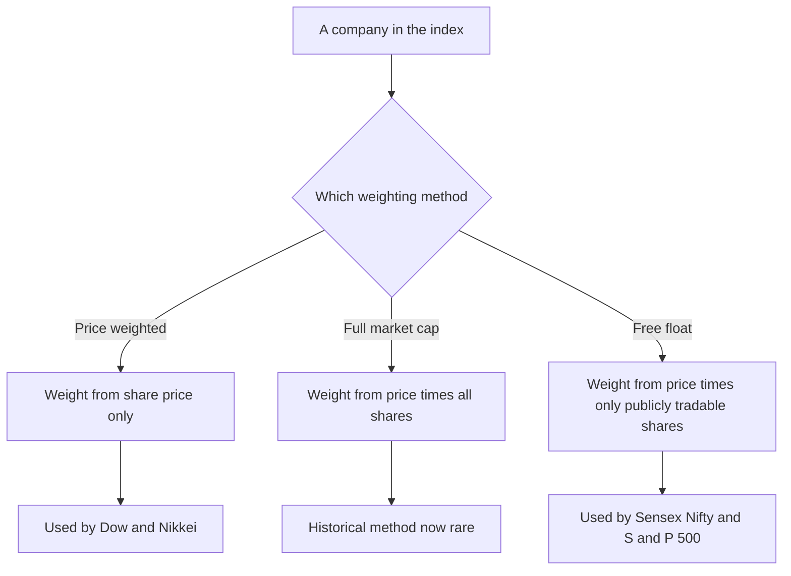
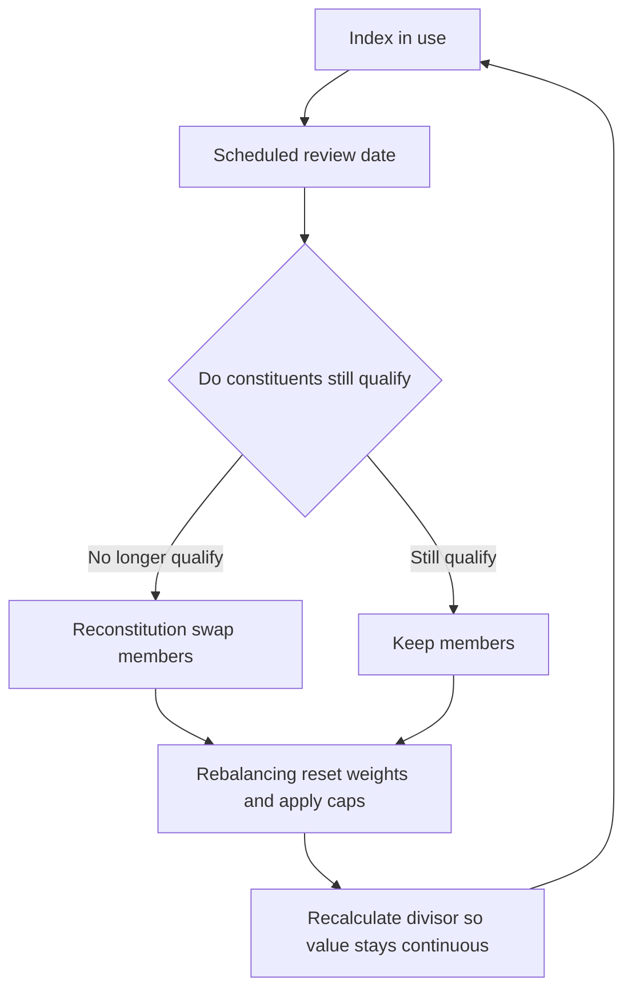
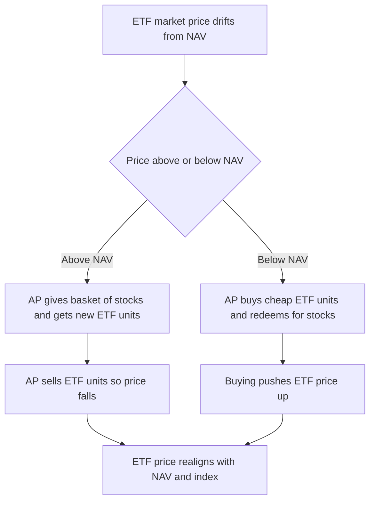

# Chapter 13 — Market Indices and Benchmarks

## 1. The Problem / The Need

Imagine you wake up, open a news app, and the headline reads: "Reliance rose 2%, HDFC Bank fell 1%, Infosys gained 0.5%, TCS dropped 0.8%, ITC climbed 1.3%…" and this continues for 5,000 listed companies. Now answer a simple question: **Did the Indian stock market go up or down today?**

You cannot. The human brain cannot aggregate thousands of individual price moves into a single verdict. Yet almost every important financial question depends on exactly that kind of aggregation:

- A pension fund manager needs to know: "Did *I* beat *the market* this year, or did the market just carry me up?"
- A retail investor wants to know: "Is now a scary time or a calm time to invest?"
- An economist wants a real-time pulse of investor confidence in the economy.
- A product designer at an asset management company wants to sell a fund that simply "owns the whole market" cheaply.
- A derivatives trader wants to bet on the *market as a whole* going up or down, without picking individual stocks.

Every one of these needs a **single, trustworthy number that summarises the state of a whole market or a slice of it**. That number is a **market index**.

Before indices existed, "the market" was a vague feeling. Charles Dow's genius in 1896 was to realise that if you took a handful of representative stocks and averaged them, you could create a *thermometer* for the entire market — one number you could quote, track over time, and compare against. Indices convert a chaotic ocean of prices into a coherent story.

The core problem an index solves is therefore **information compression with representativeness**: shrink thousands of prices into one number, without losing the essential signal of where the market is heading.

## 2. The Core Idea

A **market index** is a statistical measure — a single number — computed from the prices of a chosen basket of securities, tracked over time to represent the performance of a market or a segment of it.

Three ideas are baked into that definition:

1. **A basket (the constituents).** You pick a defined set of securities — say the 30 largest, most-traded companies, or the 500 biggest US firms. This selection is deliberate, rule-based, and reviewed periodically.

2. **A weighting scheme.** Not every stock matters equally. A ₹20 lakh crore company should move the number more than a ₹500 crore company. The *weighting method* decides how much each constituent's price movement influences the index. This is the single most important design choice.

3. **A base value and a divisor.** An index number like "Nifty 24,000" is meaningless in absolute terms — it's an index *relative to a starting point*. Nifty started at a base of 1,000 on 3 November 1995. So 24,000 means the basket is worth 24 times its 1995 base value. A **divisor** keeps the number continuous when the basket changes (new stocks added, splits, etc.).

The crucial mental model: **an index is a hypothetical portfolio**. The Sensex "value" is essentially what a portfolio holding those 30 stocks (in index proportions) would be worth, expressed as an index number. This is why you can actually *replicate* an index by buying its constituents — the foundation of index funds and ETFs.

*Figure 1 — An index compresses many prices into one representative number.*

## 3. How It Works — The Mechanics

Let's build an index from scratch so the machinery is transparent.

### The naive average (and why it fails)

Suppose we want an index of three stocks: A at ₹100, B at ₹200, C at ₹300. The simplest index is the average price: (100 + 200 + 300) / 3 = 200.

Tomorrow, B rises 10% to ₹220. New average = (100 + 220 + 300) / 3 = 206.67. The index rose 3.33%. Simple.

But now stock C does a **10-for-1 stock split**: its price mechanically drops from ₹300 to ₹30, though nothing about the company changed — shareholders just hold ten times as many shares. New average = (100 + 220 + 30) / 3 = 116.67. Our index just "crashed" 44% because of an accounting event, not a real loss. This is unacceptable. The fix is the **divisor**.

### The divisor — keeping the index continuous

Instead of always dividing by the number of stocks (3), we divide by an adjustable **divisor** that is recalculated whenever the composition changes for a non-market reason (splits, bonuses, additions, deletions). We choose the new divisor so the index value is *unchanged the instant the event happens*.

Just before the split, the index was 206.67 with sum of prices 620 and divisor 3. Just after the split, the price sum becomes 100 + 220 + 30 = 350. We want the index still to read 206.67, so:

New divisor = 350 / 206.67 = 1.6935.

Now the index continues seamlessly, and future *real* price moves are measured correctly. The Dow Jones does exactly this — its "divisor" is no longer 30; after decades of splits it is a small number (around 0.163), quoted publicly.

### From price-weighting to value-weighting

The above is a **price-weighted** index: a ₹300 stock has three times the influence of a ₹100 stock, purely because its *price* is higher — even if the ₹100 stock is a far bigger company. That is economically arbitrary. The dominant modern method is **market-capitalisation weighting**, where influence is proportional to the *total market value* of each company (price × shares outstanding), which reflects its true economic footprint. We compare these methods in depth in Section 4.

*Figure 2 — How a live index value is computed each moment.*

## 4. Full Content — Construction Methods, Major Indices, Uses, Maintenance

### 4.1 The three construction (weighting) methods

**(A) Price-weighted index**

Each constituent's weight is proportional to its *price*. The index is the sum of prices divided by a divisor.

- Weight of a stock = its price ÷ sum of all prices.
- A high-priced stock dominates regardless of company size.
- **Examples:** Dow Jones Industrial Average (DJIA, USA), Nikkei 225 (Japan).
- **Weakness:** Price is an arbitrary artefact of how many shares a company chose to issue. Apple could halve its share price via a 2-for-1 split without changing its size, yet its Dow weight would halve. A stock split changes the stock's influence on the index — which is economically nonsensical.

**(B) Full market-capitalisation weighted index**

Weight is proportional to *total market capitalisation* = price × total shares outstanding.

- A ₹20 lakh crore company moves the index 40× more than a ₹50,000 crore company.
- Economically sensible: bigger companies genuinely matter more to the economy and to a market-cap-proportional investor.
- **Weakness:** It counts shares that are *not actually available to trade* — promoter holdings, government stakes, strategic locked-in holdings. If the government owns 60% of a PSU, that 60% never trades, yet full-cap weighting treats it as investable float. This inflates the weight of promoter-heavy companies and distorts the tradable market's picture.

**(C) Free-float market-capitalisation weighted index (the modern global standard)**

Weight is proportional to *free-float market cap* = price × shares that are actually freely available for public trading (i.e., excluding promoter, government, and strategic locked-in holdings).

- Free-float factor = fraction of shares available to the public. A company with 70% promoter holding has a free-float factor of 0.30.
- Free-float market cap = price × shares outstanding × free-float factor.
- **Why it won:** It measures the market that investors can actually buy. It makes the index replicable — an index fund can actually buy the available shares in index proportions without trying to buy locked-away promoter stock. It prevents a thinly-floated giant from dominating a benchmark that no fund could physically track.
- **Examples:** Both the **BSE Sensex** and the **NSE Nifty 50** switched to free-float methodology (Sensex in 2003, Nifty from inception in effect via free-float since 2009 refinements). The **S&P 500**, **MSCI** indices, and **FTSE** indices are all free-float weighted.

**Worked comparison table**

Consider three companies:

| Company | Price (₹) | Shares (cr) | Promoter % | Full-cap (₹ cr) | Free-float factor | Free-float cap (₹ cr) |
|---|---|---|---|---|---|---|
| MegaPSU | 200 | 100 | 75% | 20,000 | 0.25 | 5,000 |
| WidelyHeld | 500 | 40 | 20% | 20,000 | 0.80 | 16,000 |
| SmallCo | 100 | 30 | 40% | 3,000 | 0.60 | 1,800 |

Under **full-cap** weighting, MegaPSU and WidelyHeld tie at 20,000 each — equal influence. Under **free-float** weighting, WidelyHeld (16,000) dwarfs MegaPSU (5,000) because most of MegaPSU's shares are locked with the government and never trade. Free-float gives the more investable, more realistic picture.

*Figure 3 — Deciding a stock's weight under each method.*

### 4.2 The major indices you must know

**BSE Sensex (S&P BSE SENSEX)** — India

- **30** large, financially sound, well-established companies listed on the Bombay Stock Exchange.
- Free-float market-cap weighted.
- Base value **100**, base period **1978–79**. So a Sensex of 80,000 means the basket is 800× its 1979 value.
- India's oldest index (launched 1986), the emotional "market barometer" quoted in headlines.
- Maintained by **Asia Index Pvt. Ltd.** (a BSE–S&P Dow Jones venture historically).

**Nifty 50 (NSE)** — India

- **50** large-cap companies listed on the National Stock Exchange, spanning ~13 sectors.
- Free-float market-cap weighted.
- Base value **1,000**, base date **3 November 1995**.
- Maintained by **NSE Indices Ltd.** (formerly IISL).
- Broader than Sensex (50 vs 30) and the basis for India's most-traded derivatives (Nifty futures & options).

**S&P 500** — USA

- **500** leading large-cap US companies chosen by a committee, covering ~80% of US equity market cap.
- Free-float market-cap weighted.
- The world's most important benchmark; trillions of dollars are indexed to it. When people say "the US market," they usually mean the S&P 500.
- Selection is committee-driven (not purely mechanical): a company must meet size, liquidity, profitability (positive earnings), and domicile criteria.

**Dow Jones Industrial Average (DJIA)** — USA

- **30** large US "blue-chip" companies.
- **Price-weighted** (the last major price-weighted index) — a historical quirk from 1896 when summing prices was the only feasible arithmetic.
- Famous and widely quoted, but *methodologically inferior*: a high-priced stock like UnitedHealth can swing the Dow far more than a much larger company like Apple, simply because of share price. Professionals prefer the S&P 500.

**Nikkei 225** — Japan: price-weighted, 225 stocks. **FTSE 100** — UK: free-float cap-weighted, 100 large firms. **Nasdaq Composite** — USA: cap-weighted, all ~3,000 Nasdaq-listed stocks, tech-heavy. **MSCI Emerging Markets / MSCI World** — global cross-country benchmarks used by international allocators.

**Comparison table of flagship indices**

| Index | Country | # Constituents | Weighting | Base value / date |
|---|---|---|---|---|
| Sensex | India | 30 | Free-float cap | 100 / 1978–79 |
| Nifty 50 | India | 50 | Free-float cap | 1000 / Nov 1995 |
| S&P 500 | USA | 500 | Free-float cap | 10 / 1941–43 avg |
| DJIA | USA | 30 | Price-weighted | started 1896 |
| Nikkei 225 | Japan | 225 | Price-weighted | — |
| FTSE 100 | UK | 100 | Free-float cap | 1000 / 1984 |

### 4.3 The uses of an index

**(1) Benchmark for performance measurement.** This is the deepest use. A fund manager's return means nothing in isolation. If a large-cap equity fund returned 15% but the Nifty 50 returned 22%, the manager *destroyed* value versus simply buying the index — they *underperformed the benchmark by 7 percentage points*. Indices provide the yardstick. Every actively managed fund is measured against a benchmark index; SEBI mandates that Indian mutual funds disclose their benchmark and their performance against it. The excess return over the benchmark is called **alpha**; the sensitivity to the benchmark's moves is **beta**.

**(2) Sentiment gauge / economic barometer.** A rising index signals collective optimism about corporate earnings and the economy; a falling one signals fear. India VIX (derived from Nifty options) measures expected volatility — the "fear gauge." Indices are quoted in the news precisely because they compress mood into a number.

**(3) The basis for passive investing.** Because an index is a replicable portfolio, you can build a fund that simply *holds the index constituents in index weights* and mirrors its return — an **index fund** or **ETF**. This spawned the multi-trillion-dollar passive investing revolution (Section 4.5).

**(4) Underlying for derivatives.** You can't deliver "the market," but you can trade cash-settled **index futures and options**. Nifty and Bank Nifty options are among the most traded derivatives in the world. This lets investors hedge or speculate on the whole market cheaply.

**(5) Asset allocation and research reference.** Analysts quote index P/E ratios, dividend yields, and earnings growth as a proxy for market valuation ("the Nifty is trading at 21× forward earnings").

### 4.4 Rebalancing and reconstitution — keeping the index honest

An index is a *living* portfolio. Two maintenance processes keep it representative:

**Reconstitution (changing WHO is in the index).** Periodically the index provider reviews constituents and swaps out companies that no longer qualify (shrunk, less liquid, delisted, or merged) for companies that now do. The Nifty 50 is reviewed **semi-annually** (data cut-offs end-January and end-July, changes effective end-March and end-September). The Sensex is also reviewed semi-annually. The S&P 500 is reviewed quarterly. When a giant company is added, index funds *must* buy it, often causing a price pop (the "index inclusion effect"). A famous case: **Tesla's addition to the S&P 500 in December 2020** forced index funds to buy roughly $80 billion of Tesla stock in a single event.

**Rebalancing (changing HOW MUCH weight each has).** Even without changing membership, weights drift as prices move and as free-float factors change (e.g., a promoter sells a stake, raising free-float). Providers periodically reset weights to the methodology, and cap individual or sector weights to prevent over-concentration. Nifty caps single-stock weight; the S&P 500 applies diversification rules. India's Nifty has a rule that no single stock exceeds a cap and the aggregate of the top stocks is limited, to keep the index diversified.

**Why this matters to investors:** Reconstitution and rebalancing create predictable buying and selling by passive funds, which front-running traders try to anticipate. It also means an index quietly "sells losers and buys winners" over time, which partly explains why indices tend to grind upward across decades — dying companies are removed before they hit zero.

*Figure 4 — The maintenance cycle that keeps an index representative.*

### 4.5 How index funds and ETFs track an index

An **index fund** is a mutual fund whose mandate is not to *beat* an index but to *become* it — hold the same stocks in the same weights and deliver the same return (minus a tiny fee). An **ETF (Exchange-Traded Fund)** does the same but trades on the exchange like a stock throughout the day.

**Full replication.** For a liquid index like the Nifty 50, the fund simply buys all 50 stocks in exact free-float weights. As the index rebalances, the fund mirrors the changes. Because it never tries to pick winners, it needs no expensive research team, so fees are minuscule — a Nifty index fund might charge 0.10–0.20% a year versus 1.5–2% for an active fund. Over decades, that fee gap compounds into an enormous difference.

**Sampling / optimisation.** For a huge index (say a 2,000-stock total-market index), buying every stock is costly. The fund holds a statistically representative *sample* that matches the index's risk and sector profile closely enough.

**Tracking error.** No tracker is perfect. The gap between the fund's return and the index's return is the **tracking error**, caused by fees, cash drag (uninvested dividends), transaction costs during rebalancing, and imperfect replication. A good index fund keeps tracking error small (a few basis points to a fraction of a percent). Note: the index itself has *no* fees or trading costs, so a fund can rarely beat its index — it structurally lags by roughly its expense ratio.

**The ETF creation/redemption mechanism (why ETFs stay near fair value).** ETFs have a clever arbitrage machinery. Large institutions called **Authorised Participants (APs)** can exchange a *basket of the underlying stocks* for new ETF units ("creation") or hand back ETF units for the underlying stocks ("redemption"), in large blocks. If the ETF's market price drifts *above* the value of its underlying holdings (its NAV), APs create new units cheaply and sell them, pushing the price back down. If it drifts *below*, APs buy cheap ETF units and redeem them for more-valuable stock, pushing the price up. This continuous arbitrage keeps the ETF's traded price glued to the value of the underlying index basket.

*Figure 5 — The ETF creation and redemption arbitrage that anchors price to NAV.*

**Indian examples:** Nippon India ETF Nifty BeES (India's first ETF, 2001), SBI Nifty 50 ETF, UTI Nifty Index Fund. **Global examples:** SPDR S&P 500 ETF (ticker **SPY**, the world's largest and most-traded ETF), Vanguard S&P 500 ETF (**VOO**), iShares Core series. India's **EPFO** (retirement body) invests a portion of its corpus into Nifty and Sensex ETFs — index investing at national scale.

## 5. Worked & Real Examples

**Example 1 — Building a two-stock free-float index from scratch.**

Base date: index set to 1,000. Two stocks:

- Stock X: price ₹500, 100 cr shares, free-float factor 0.50 → free-float cap = 500 × 100 × 0.50 = ₹25,000 cr.
- Stock Y: price ₹200, 200 cr shares, free-float factor 0.75 → free-float cap = 200 × 200 × 0.75 = ₹30,000 cr.
- Total base free-float cap = ₹55,000 cr. We set the divisor so index = 1,000: divisor = 55,000 / 1,000 = 55.

Next day, X rises to ₹550 (+10%), Y falls to ₹190 (–5%).

- X free-float cap = 550 × 100 × 0.50 = ₹27,500 cr.
- Y free-float cap = 190 × 200 × 0.75 = ₹28,500 cr.
- Total = ₹56,000 cr. Index = 56,000 / 55 = **1,018.18**, i.e., +1.82%.

Notice: X went up 10% and Y down 5%, but the index rose only 1.82% — because Y had the larger free-float weight (30,000 vs 25,000 at base). This is market-cap weighting in action: the bigger constituent dominates the outcome.

**Example 2 — Price-weighting versus cap-weighting give different answers.**

Two stocks: BigCo (price ₹100, market cap ₹10,00,000 cr) and PriceyCo (price ₹1,000, market cap ₹50,000 cr). Suppose BigCo rises 20% (to ₹120) and PriceyCo falls 10% (to ₹900).

- **Price-weighted (Dow-style):** base sum = 100 + 1,000 = 1,100; new sum = 120 + 900 = 1,020. Index *falls* 7.3%, because the ₹1,000 stock dominated by price.
- **Cap-weighted (S&P-style):** BigCo's ₹10,00,000 cr rises 20% (+₹2,00,000 cr); PriceyCo's ₹50,000 cr falls 10% (–₹5,000 cr). Net +₹1,95,000 cr on a base of ₹10,50,000 cr = index *rises* ~18.6%.

**Same day, same stocks, opposite verdicts** — one method says the market fell 7%, the other says it rose 19%. This is exactly why the weighting method is the most consequential design decision, and why the price-weighted Dow can mislead about the real US market.

**Example 3 — Tracking error in a real index fund.**

Suppose the Nifty 50 returns 12.0% in a year. A Nifty index fund charges 0.20% expense ratio, loses ~0.05% to rebalancing transaction costs, and suffers ~0.03% cash drag. Its return ≈ 12.0% – 0.20% – 0.05% – 0.03% = **11.72%**. Tracking difference ≈ 0.28%. This is *structurally why* a plain index fund cannot beat its index — but it also beats the *majority of active funds*, most of which lag the index after their higher fees. Over 15 years, SPIVA studies consistently show ~80–90% of active large-cap funds underperform their benchmark index.

**Example 4 — The S&P 500 inclusion effect.** When Tesla joined the S&P 500 in December 2020, every S&P 500 index fund and ETF was *forced* to buy Tesla to keep matching the index. This mechanical, price-insensitive demand (~$80 billion) illustrates how reconstitution moves real money and why traders position ahead of announced index changes.

## 6. Connections to Other Topics

- **Passive vs active investing (Ch. on mutual funds/portfolio management):** Indices are the entire foundation of the passive movement. No index, no index fund.
- **Derivatives (futures & options):** Index futures/options are cash-settled bets on the index; Nifty and Bank Nifty options are core Indian derivative products. The index is the *underlying*.
- **Beta and CAPM (portfolio theory):** Beta measures a stock's sensitivity *to the market index*. The index *is* the "market portfolio" proxy in the Capital Asset Pricing Model.
- **Market efficiency:** The fact that most active managers can't beat the index is a practical argument for the Efficient Market Hypothesis.
- **Regulation:** In India, **SEBI** governs index funds, ETFs, and benchmarking disclosure; index providers (NSE Indices, Asia Index) follow IOSCO principles for benchmarks. In the US, the **SEC** regulates funds; index governance follows post-LIBOR benchmark-integrity reforms.
- **Macroeconomics:** Indices are leading indicators of sentiment feeding into GDP and confidence models.
- **Corporate actions (Ch. on equity):** Splits, bonuses, and buybacks force divisor adjustments — the plumbing that keeps an index continuous.

## 7. Key Terms

- **Index:** A single number summarising a basket of securities' performance over time.
- **Constituents:** The securities included in an index.
- **Weighting method:** Rule deciding each constituent's influence (price / full-cap / free-float).
- **Free float:** Shares actually available for public trading (excludes promoter, government, strategic locked-in holdings).
- **Free-float factor:** Fraction of a company's shares that are free-floating.
- **Market capitalisation:** Price × total shares outstanding.
- **Base value / base date:** The reference point (e.g., Sensex 100 in 1978–79) against which the index is measured.
- **Divisor:** The adjustable denominator that keeps the index continuous through corporate actions and composition changes.
- **Rebalancing:** Resetting constituent *weights* to the methodology.
- **Reconstitution:** Changing *which companies* are constituents.
- **Benchmark:** The reference index a portfolio's performance is judged against.
- **Alpha / Beta:** Excess return over benchmark / sensitivity to benchmark moves.
- **Tracking error:** The gap between a fund's return and its index's return.
- **ETF:** Exchange-traded fund; an index-tracking fund that trades intraday like a stock.
- **Authorised Participant (AP):** Large institution that creates/redeems ETF units to keep price near NAV.
- **NAV:** Net asset value — the per-unit value of a fund's underlying holdings.
- **Total Return Index (TRI):** Index variant that assumes dividends are reinvested (vs a Price Return Index that ignores dividends).

## 8. Common Confusions

**"A higher index number means a more expensive/better market."** No. The Sensex (base 100, 1979) and Nifty (base 1,000, 1995) have *different bases and start dates*, so "Sensex 80,000 vs Nifty 24,000" says nothing about which market is dearer. Only the *percentage change* and valuation ratios (P/E) are comparable.

**"The Dow and S&P 500 are basically the same."** No — the Dow is *price-weighted* with 30 stocks; the S&P 500 is *free-float cap-weighted* with 500. They can move differently on the same day, and the S&P 500 is the professional benchmark.

**"An index fund tries to beat the index."** The opposite. It tries to *match* it as closely as possible. Trying to beat = active management.

**"Market-cap weighting means the fund manager thinks big stocks are best."** No. It's a mechanical consequence of owning the market in proportion to size; it embeds no view. (It does mean you automatically hold more of whatever has recently risen — a subtle momentum tilt, and a concentration risk.)

**"Price Return Index vs Total Return Index is a technicality."** It matters a lot. A fund earns *and reinvests dividends*, so comparing a fund to a *Price Return* index unfairly flatters the fund. SEBI now requires Indian funds to benchmark against the **Total Return Index (TRI)** so the comparison is apples-to-apples.

**"The index value is the average price of its stocks."** Only for a naive price-weighted average. Real indices use weighted free-float market caps divided by a divisor — not a simple price average.

**"Free float = shares outstanding."** No. Free float *excludes* promoter, government, and strategic locked holdings; it's the *publicly tradable* subset.

## 9. First-Principles Recap

Start from one need: *summarise a whole market in one number.* 

1. To summarise, you must **choose a basket** (constituents) — you can't track everything meaningfully, so pick a representative, liquid set by rules.
2. To combine them into one number, you need a **weighting rule.** Price-weighting is simplest but economically arbitrary (a split changes influence). Market-cap weighting reflects real economic size. Free-float weighting refines this to only *investable* shares, making the index both realistic and *replicable*.
3. To keep the number **continuous** when baskets change or stocks split, you need a **divisor** that absorbs mechanical jumps.
4. Because the index is a *rule-based, replicable portfolio*, you can **build a fund that mirrors it** cheaply — passive investing — and **derive contracts** (futures/options) on it.
5. Because markets evolve, you must **periodically reconstitute and rebalance** so the index keeps representing the market, not a frozen 1979 snapshot.
6. Because a fund has costs the index doesn't, funds **structurally lag by ~their fee** — yet still beat most active managers, which is passive investing's core value proposition.

Every fact in this chapter — Sensex's base of 100, the ETF creation mechanism, tracking error, index-inclusion pops — is a downstream consequence of these six ideas.

## 10. Quick-Reference / Interview Points

- **Define an index in one line:** a rule-based, single-number measure of a basket of securities' performance over time — effectively a replicable hypothetical portfolio.
- **Three weighting methods:** price-weighted (Dow, Nikkei), full market-cap (rare now), free-float market-cap (Sensex, Nifty, S&P 500 — the modern standard).
- **Why free-float?** It counts only publicly tradable shares, so it's realistic *and* replicable by funds; it stops promoter-heavy stocks from dominating.
- **Sensex:** 30 stocks, BSE, free-float, base 100, 1978–79. **Nifty 50:** 50 stocks, NSE, free-float, base 1,000, Nov 1995.
- **S&P 500:** 500 stocks, committee-selected, free-float, ~80% of US market cap, the world's key benchmark. **Dow:** 30 stocks, *price-weighted*, famous but methodologically weak.
- **Divisor:** the adjustable denominator that keeps the index continuous through splits, bonuses, and composition changes.
- **Rebalancing** = reset weights; **Reconstitution** = change members. Nifty/Sensex reviewed semi-annually; S&P 500 quarterly.
- **Four uses:** benchmark for performance (alpha/beta), sentiment gauge, basis for index funds/ETFs, underlying for derivatives.
- **Index fund vs ETF:** both track an index passively; ETF trades intraday on the exchange and uses AP creation/redemption arbitrage to stay near NAV.
- **Tracking error:** fund return minus index return; driven by fees, cash drag, and transaction costs. A fund can't beat its index — it lags by roughly its expense ratio — but beats most active funds (SPIVA: 80–90% of active large-cap funds underperform over 15 years).
- **PRI vs TRI:** always benchmark a fund against the *Total Return Index* (dividends reinvested); SEBI mandates this in India.
- **Index-inclusion effect:** when a stock joins a big index, passive funds must buy it (e.g., Tesla into S&P 500, Dec 2020, ~$80bn) — a predictable, price-insensitive flow.
- **Regulators:** SEBI (India) governs funds and benchmark disclosure; SEC (US) governs funds; index providers follow IOSCO benchmark principles.
- **Killer one-liner:** "A price-weighted index lets a high-priced small company outvote a low-priced giant — which is why professionals trust the free-float cap-weighted S&P 500 and Nifty over the price-weighted Dow."
