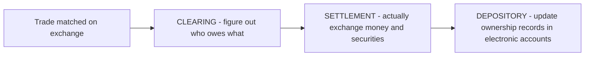
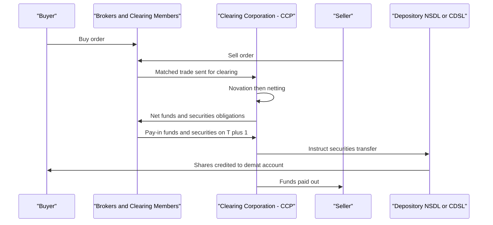
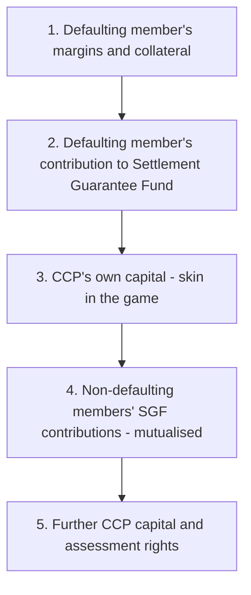

# Chapter 14 — Clearing, Settlement and Depositories

## 1. The Problem / Need — Why Does Any of This Exist?

Imagine two strangers meet in a marketplace. One has ₹1,00,000 in cash and wants 500 shares of Reliance Industries. The other has 500 shares of Reliance and wants ₹1,00,000. They agree a price. Now comes the hard part: **who hands over their side first?**

If the buyer pays first, the seller could vanish with the cash and never deliver the shares. If the seller delivers first, the buyer could take the shares and never pay. This is the ancient **problem of the first mover** — in economics it is called *counterparty risk* or *settlement risk*, and it is the single biggest thing standing between a promise to trade and an actual completed trade.

On a stock exchange this problem is enormously magnified:

- You are not trading with one person you can see. You are matched anonymously against whoever the exchange's order book pairs you with. You have **no idea who your counterparty is** and no way to check whether they can pay or deliver.
- On the NSE alone, hundreds of millions of trades happen every day. Chasing each counterparty individually to confirm they will honour the deal is impossible.
- Prices move continuously. If your counterparty defaults *tomorrow* on a trade struck *today*, the price may have moved against you, so you suffer a **replacement cost** — the extra money needed to buy the same shares afresh in a moved market.

Before modern infrastructure, these risks were real and painful. In India up to 2001, shares were held as **physical paper certificates**. Settlement meant couriering certificates plus signed transfer deeds across the country. This created a nightmare:

- **Bad deliveries** — signatures didn't match, certificates were torn, transfer deeds were filled wrong.
- **Forged and fake certificates** — you could buy shares and discover the paper was counterfeit.
- **Theft and loss in transit**.
- **Long settlement** — weeks to move ownership, during which either side could renege.
- The infamous **Harshad Mehta scam (1992)** and **Ketan Parekh scam (2001)** both exploited weaknesses in the paper-based, badla-financed settlement system.

So the deep need is this: **markets need a trusted machinery sitting between trading and final ownership transfer that guarantees the trade completes, removes the fear of the counterparty, and moves ownership safely and quickly.** That machinery is the world of *clearing, settlement, and depositories* — the "post-trade plumbing." Trading gets all the glamour; this plumbing is what actually makes markets *safe*.

---

## 2. The Core Idea

Once a trade is *matched* on the exchange (buyer and seller agree on price and quantity), three distinct things must still happen. People lump them together, but they are separate:

*From a matched trade to final electronic ownership: three separate jobs.*

The three core ideas:

1. **Clearing** = the *calculation and guarantee* stage. A specialised institution, the **Clearing Corporation (CCP)**, steps into the middle of every trade, becomes the buyer to every seller and the seller to every buyer (**novation**), works out the *net* amount each participant must pay or deliver (**netting**), and **guarantees** the trade even if one side defaults.

2. **Settlement** = the *actual exchange* stage. On the appointed day, funds move from buyers' banks to sellers, and securities move from sellers' accounts to buyers, simultaneously — **Delivery versus Payment (DvP)** so neither side is exposed.

3. **Depository** = the *ownership record* stage. Shares no longer exist as paper. They live as **electronic entries** in accounts held at a depository (**NSDL** or **CDSL** in India). Transferring ownership is just editing a database, not couriering paper.

The genius is that the Clearing Corporation converts a web of mutual, uncertain obligations between thousands of anonymous strangers into a **single, guaranteed, netted obligation between each participant and one rock-solid central counterparty.** The market stops worrying about "will my counterparty pay?" and only has to trust *one* institution — which is designed, capitalised, and regulated to never fail.

---

## 3. How It Works — The Life of a Trade

Let us follow a single equity trade from click to completion in the Indian system (post-2001 dematerialised, T+1 settlement).

**Step 0 — Trading.** You place a buy order for 100 shares of TCS through your broker's app. The **NSE order-matching engine** matches it against a sell order. A *trade* is now born. But you own nothing yet — you merely have an obligation.

**Step 1 — Trade capture and confirmation.** The exchange sends trade details to its associated Clearing Corporation (for NSE trades this is **NSE Clearing Ltd / NCL**, formerly NSCCL; for BSE it is the **Indian Clearing Corporation Ltd / ICCL**).

**Step 2 — Clearing: novation.** The Clearing Corporation performs **novation** — it legally splits your single trade into two. It becomes the *seller* to you and the *buyer* to the person who sold. The original bilateral contract is extinguished and replaced by two contracts each facing the CCP. You now no longer care who the seller was.

**Step 3 — Clearing: netting.** Across the whole trading day, the CCP nets all obligations. If your broker's clients across all trades net out to *receive* 4,000 TCS shares and *pay* ₹1.4 crore, that single net figure is what settles — not thousands of gross trades.

**Step 4 — Obligation download.** After market close, the CCP tells every **Clearing Member** their net funds obligation and net securities obligation for each settlement.

**Step 5 — Settlement day (T+1).** On the next working day:
- **Pay-in:** Clearing members with a net *sell* deliver securities from depository accounts into the CCP's pool account; members with a net *buy* pay funds into the CCP's settlement bank account.
- **Pay-out:** The CCP then releases securities to the net buyers' depository accounts and funds to the net sellers' bank accounts.
- Because delivery and payment are locked together (**DvP**), no one gives up their side without receiving the other.

**Step 6 — Depository update.** The depository (NSDL/CDSL) debits 100 TCS shares from the seller's **demat account** and credits them to yours. Your beneficial ownership is now recorded electronically. Done.

*The Clearing Corporation sits in the middle, guaranteeing both legs.*

---

## 4. Full Content — The Complete Machinery

### 4.1 The Three Institutions and How They Relate

| Layer | Job | Indian bodies | Global analogues |
|---|---|---|---|
| **Exchange** | Match orders, discover price | NSE, BSE, MCX | NYSE, Nasdaq, LSE |
| **Clearing Corporation (CCP)** | Novation, netting, risk management, guarantee | NSE Clearing (NCL), Indian Clearing Corp (ICCL), MCX Clearing, NSDL Clearing (limited) | DTCC/NSCC (US equities), LCH, CME Clearing, Eurex Clearing |
| **Depository** | Hold securities electronically, transfer ownership | NSDL, CDSL | DTC (US), Euroclear, Clearstream |

A key structural point: in India, exchanges, clearing corporations, and depositories are **legally separate entities**, and SEBI mandates this separation to avoid conflicts of interest. NSE owns NCL; BSE promotes CDSL and ICCL; NSDL was promoted by NSE, IDBI, and UTI.

### 4.2 Central Counterparty (CCP) and Novation — In Depth

**Novation** is the legal heart of clearing. The word means "replacing an old obligation with a new one." When the CCP novates:

- The contract "Buyer B will buy from Seller S" is torn up.
- Two new contracts are created: "B buys from CCP" and "CCP buys from S."

Consequences:
- **Counterparty risk is mutualised and centralised.** Every participant faces only the CCP. If S defaults, B is unaffected — the CCP still delivers to B and pursues S with its risk resources.
- **Anonymity is preserved.** B and S never need to know or trust each other.
- The CCP becomes the **single point of risk** — which is why it must be extraordinarily well-managed (see 4.5 on the default waterfall). CCPs are described as "systemically important financial market infrastructure (FMI)."

### 4.3 Netting — Multilateral Netting Explained

Netting is what makes settlement *efficient*. Two forms:

- **Bilateral netting:** between two parties, offset what A owes B against what B owes A.
- **Multilateral netting:** the CCP nets *each participant against the whole system.* Every member has just **one** net securities position and **one** net cash position per settlement.

**Why it matters:** it slashes the volume of money and securities that must actually move. Studies of CCPs routinely show netting reduces gross settlement obligations by **90–98%**. Less money moving means less liquidity tied up, lower operational risk, and lower cost.

Two netting styles by product:
- **Netted settlement** (equities cash market): only the net position settles.
- **Trade-for-trade / gross settlement:** each trade settles individually (used for surveillance-flagged or illiquid scrips where netting could hide manipulation).

**Worked mini-example of multilateral netting:**

Suppose three brokers trade Infosys shares among themselves in a day:

| Broker | Bought | Sold | Net position |
|---|---|---|---|
| A | 1,000 | 300 | **+700 (receive)** |
| B | 200 | 900 | **−700 (deliver)** |
| C | 500 | 500 | **0** |

Gross trades involved 2,900 share-movements across many transactions. After multilateral netting, only **700 shares** actually move (B delivers 700 to the pool, A receives 700). C settles nothing. That is the compression.

### 4.4 The Settlement Cycle — T+1, and the March to T+0

"**T**" is trade day. "**T+1**" means settlement completes *one working day after* the trade.

Evolution in India — a genuine world-leadership story:

| Era | Cycle | Note |
|---|---|---|
| Pre-2001 | Weekly "account period" + badla carry-forward | Speculative, risky |
| 2002 | **T+3** | Rolling settlement introduced |
| April 2003 | **T+2** | |
| Jan 2023 (phased from Feb 2022) | **T+1** (fully) | India became the **first large market to fully adopt T+1 for all stocks** |
| March 2024 | **T+0 optional (beta)** | Same-day settlement pilot for a set of scrips |
| Future | **Instant / real-time settlement** | Under SEBI consultation |

The **US moved to T+1 only in May 2024**, and Europe/UK are targeting T+1 around **2027** — so India was well ahead.

**Why shorten the cycle?** The longer the gap between trade and settlement, the longer counterparty risk and replacement-cost risk stay open, and the more **margin** (collateral) must be locked up to cover potential price moves. Shorter cycles = less risk in the system, less capital blocked, faster access to your money or shares.

**Why not instantly T+0 for everything?** Trade-offs:
- **Netting benefit shrinks.** Instant settlement means gross, trade-by-trade movement — you lose the 90%+ netting compression, so far more liquidity must be pre-funded.
- **FPIs and time zones.** Foreign investors must arrange rupee funding within tight windows; time-zone gaps make instant settlement operationally hard.
- **Securities lending, funding.** Many market functions rely on the short window. So T+0 is being introduced *optionally*, in parallel, not as a forced replacement.

### 4.5 The Default Waterfall — How the CCP Actually Absorbs a Failure

The CCP's guarantee is only credible if it can survive a member default. It holds a layered pool of resources called the **default waterfall**, consumed in strict order:

*Losses eat through the layers top-first; a well-run CCP almost never reaches the mutualised layers.*

Key protective tools:
- **Margins.** Before you even trade, you post collateral. Types: **initial/VaR margin** (covers likely worst-case price move, using Value-at-Risk models like SPAN), **Extreme Loss Margin (ELM)**, **Mark-to-Market (MTM) margin** (daily gains/losses settled), and special margins for volatile stocks.
- **Core Settlement Guarantee Fund (Core SGF).** A pre-funded pool at the CCP, contributed by the CCP, exchange, and members, sized to cover the default of the largest members under stress. SEBI mandates its structure.
- **Position limits and exposure monitoring** in real time.
- **Peak margin / upfront margin** rules (India tightened these in 2020–21 so leverage can't build up intraday).

### 4.6 Depositories and Dematerialisation — In Depth

A **depository** is to shares what a bank is to money. Just as a bank holds your money as a ledger entry (you don't keep physical cash in a vault at the bank), a depository holds your **securities as electronic entries.**

**Dematerialisation ("demat")** = converting physical share certificates into electronic form. **Rematerialisation** is the reverse (rarely used now).

**India's two depositories:**

| Feature | **NSDL** | **CDSL** |
|---|---|---|
| Full name | National Securities Depository Ltd | Central Depository Services (India) Ltd |
| Launched | 1996 (India's first) | 1999 |
| Promoted by | NSE, IDBI, UTI | BSE (originally) |
| Traditional strength | Institutional, larger value | Retail, larger *number* of accounts |
| Status | Listed 2025 | Listed 2017 (first listed depository) |

Both do essentially the same job; you can hold a demat account with either, via a **Depository Participant (DP)**.

**Depository Participant (DP):** You never deal with NSDL/CDSL directly. A DP is the agent/intermediary — usually your broker (Zerodha, Groww, ICICI Direct) or a bank — through whom you open and operate your demat account. The DP is to the depository what a bank branch is to the banking system.

**How ownership is structured:** In India the investor is the **beneficial owner** and the securities are held in the investor's own demat account (a *direct* holding model). This differs from the US **"street name"** system, where DTC holds shares via Cede & Co. and brokers hold on behalf of clients in an omnibus/nominee structure — the US investor is a *beneficial* owner but not the direct registered holder. India's model gives cleaner, individual-level transparency.

**Legal backbone:** The **Depositories Act, 1996** created the framework; SEBI (Depositories and Participants) Regulations govern operations. SEBI made demat trading **compulsory** for most listed shares by 2001, effectively killing paper trading.

**What a demat account holds today:** equity shares, bonds and debentures, mutual fund units, ETFs, government securities, sovereign gold bonds — almost every security.

### 4.7 Corporate Actions Through the Depository

Because ownership is centralised electronically, the depository becomes the pipe for **corporate actions**: dividends, bonus issues, stock splits, rights issues, mergers. The company hits a **record date**; the depository supplies the list of beneficial owners; dividends and bonus shares flow automatically to the right accounts. No lost cheques, no paper.

### 4.8 Where the Money Actually Sits — Clearing Banks and Pool Accounts

The CCP works with designated **clearing banks**. Members maintain settlement accounts; funds pay-in and pay-out flow through these. Securities flow through the CCP's **pool/settlement accounts** at the depositories. SEBI's 2021–22 reforms (client-level segregation, "**upstreaming**" of client funds to clearing corporations, blocking of funds via **ASBA-like / UPI mandates** for the secondary market) further ring-fence client assets so a broker's failure can't sink client money.

---

## 5. Worked / Real Examples

### Example 1 — A retail equity trade, end to end (T+1)

Priya buys 50 shares of HDFC Bank at ₹1,600 (₹80,000) through Zerodha on **Monday (T)**.
- **Monday:** NSE matches the trade. NCL novates: NCL is now Priya's counterparty. Priya's obligation and thousands of others net down.
- **Monday evening:** Zerodha (Priya's broker and part of the clearing chain) sees its net obligations. Priya must fund ₹80,000 (already blocked upfront as margin/UPI mandate).
- **Tuesday (T+1):** Pay-in — buyers' funds and sellers' shares go to NCL. Pay-out — 50 HDFC Bank shares are credited to Priya's **CDSL demat account**; ₹80,000 reaches the net sellers. Priya now legally owns the shares. If the original seller had defaulted, NCL would still deliver Priya's shares using the auction/SGF machinery — Priya never knows or cares.

### Example 2 — Multilateral netting saving liquidity

On a busy day, Broker X executes for its clients: **buys 2,00,000 shares of SBI** and **sells 1,85,000 shares of SBI** across hundreds of trades, plus cash legs each way. Without netting, X would have to deliver 1,85,000 and receive 2,00,000 shares and move both full cash legs. After multilateral netting at NCL, X simply **receives a net 15,000 SBI shares** and pays the single net cash difference. Roughly 92% of the gross movement evaporates — that is capital and operational risk saved.

### Example 3 — Why dematerialisation mattered: the fake-certificate era

Before 2001, an investor buying "Reliance" shares as paper could later find, on trying to sell, that the certificate was **forged or a "bad delivery"** — signature mismatch, company objection. Money gone, months of dispute. After demat via NSDL/CDSL, shares are fungible electronic entries verified by the depository; **forgery and bad delivery essentially disappeared**, and settlement failure rates collapsed. This single change is why Indian retail participation could scale to crores of investors.

### Example 4 — A global CCP under stress: LCH and the 2008 Lehman default

When **Lehman Brothers collapsed in 2008**, it had a **$9 trillion notional interest-rate swap portfolio** cleared through **LCH.Clearnet (SwapClear)**. LCH used Lehman's posted **margin** to hedge and auction off the positions in an orderly way. The default was managed **without dipping into the mutualised default fund** — no other member lost money. This is the CCP model working exactly as designed: one member failed, the system did not. It is the strongest real-world proof of why novation + margin + default waterfall makes markets safe.

---

## 6. Connections — How This Links to the Rest of Markets

- **To trading & exchanges (earlier chapters):** trading is meaningless without a way to *finish* the trade. Clearing/settlement is the "back end" that makes the "front end" trustworthy.
- **To derivatives:** CCPs are *even more* critical for futures and options, where obligations stretch over time. Post-2008, the **G20 mandated central clearing of standardised OTC derivatives** — pushing swaps into CCPs precisely because bilateral counterparty risk nearly broke the system.
- **To margin, leverage, and risk:** margin systems (SPAN, VaR, peak margin) are the CCP's frontline defence and directly shape how much leverage traders can take.
- **To custody and mutual funds:** custodians and AMCs rely on depositories to hold client securities safely and to process corporate actions.
- **To financial stability / systemic risk:** CCPs are **systemically important**. Regulators (SEBI, RBI, CPMI-IOSCO **Principles for FMIs**) supervise them closely because a CCP failure would be catastrophic — concentration of risk is the price of removing bilateral risk.
- **To retail access & fintech:** cheap demat + fast settlement + UPI-based fund blocking is *why* apps like Groww and Zerodha could onboard crores of first-time investors.

---

## 7. Key Terms (Glossary)

- **Post-trade:** everything that happens after a trade is matched — clearing, settlement, custody.
- **Clearing:** determining obligations, netting, and guaranteeing the trade.
- **Settlement:** the actual exchange of securities and funds.
- **Clearing Corporation / CCP (Central Counterparty):** the institution that novates and guarantees trades (NCL, ICCL).
- **Novation:** legally replacing one bilateral contract with two contracts each facing the CCP.
- **Netting (multilateral):** compressing many obligations into one net position per member.
- **DvP (Delivery versus Payment):** securities and cash change hands simultaneously, so neither side is exposed.
- **Settlement cycle / T+1:** settlement completed one working day after trade day.
- **Pay-in / Pay-out:** members deliver funds and securities to the CCP (pay-in), then the CCP releases them (pay-out).
- **Margin (Initial/VaR, ELM, MTM, Peak):** collateral posted to cover potential losses.
- **Settlement Guarantee Fund (Core SGF):** pre-funded pool backing the CCP's guarantee.
- **Default waterfall:** the ordered layers of resources used to absorb a member default.
- **Depository:** institution holding securities electronically (NSDL, CDSL).
- **Depository Participant (DP):** the agent (broker/bank) through whom you access a depository.
- **Demat account:** electronic account holding your securities.
- **Dematerialisation / Rematerialisation:** paper-to-electronic / electronic-to-paper conversion.
- **Beneficial owner:** the real owner of securities in the depository system.
- **ISIN:** International Securities Identification Number — the unique 12-character code identifying each security.
- **Counterparty / settlement risk:** the risk the other side fails to deliver or pay.

---

## 8. Common Confusions

**"Clearing and settlement are the same thing."** No. Clearing is *calculation + guarantee* (who owes what, and the CCP standing behind it). Settlement is the *actual movement* of money and shares. Clearing happens first; settlement follows on the settlement day.

**"The exchange settles my trade."** No. The **exchange only matches** buyers and sellers and discovers price. A legally separate **Clearing Corporation** clears, and a **Depository** records ownership. In India these are deliberately different entities.

**"The depository holds my shares like a broker."** The **depository** (NSDL/CDSL) is the master electronic registry. Your **broker acts as your DP** — the access point. The broker doesn't own or hold your shares; they sit in *your* demat account at the depository. This separation protects you if a broker fails.

**"T+1 means 24 hours."** It means one *working day* after trade day, not 24 clock hours. A Friday trade settles Monday (weekends/holidays excluded).

**"Netting means I only actually receive the net of my own buys and sells."** For settlement *movement*, yes, positions are netted — but you still legally own every share you bought. Netting compresses the *plumbing*, not your ownership or your P&L.

**"NSDL is for NSE and CDSL is for BSE."** A common myth. Both depositories serve both exchanges. Which depository your shares sit in depends on **your broker/DP**, not on which exchange you traded on.

**"A CCP can never fail, so there's no risk."** The CCP *concentrates* risk to remove bilateral risk. It is extremely robust (waterfall, margins, SGF) but is itself *systemically important* — which is exactly why regulators watch it so closely. Risk is transformed and managed, not magically deleted.

**"Demat and trading account are the same."** No. Your **trading account** places orders; your **demat account** holds the resulting shares; a **bank account** holds the money. The three are linked but distinct.

---

## 9. First-Principles Recap

Strip everything away and you're left with one primitive problem: **in any exchange of value between strangers, someone has to move first, and the first mover can be cheated.** Every piece of post-trade infrastructure is an answer to that single fear.

- To remove the *"will my counterparty pay?"* fear → insert a **central counterparty** that becomes everyone's counterparty (**novation**). Now you trust one designed-to-never-fail institution instead of an anonymous stranger.
- To make that institution's guarantee *credible* → make it collect **margin** upfront and stack a **default waterfall** behind the promise.
- To make settlement *efficient* → **net** thousands of obligations down to one per member, so 90%+ of the money and shares never has to move.
- To make giving-and-receiving *safe* → lock the two legs together (**DvP**) so no one is ever exposed mid-transaction.
- To make ownership *transfer* fast, cheap, and forgery-proof → stop moving **paper** and just edit an **electronic ledger** at a **depository**.
- To reduce the *time* risk stays open → keep **shortening the settlement cycle** (T+3 → T+2 → T+1 → T+0).

Put together, these turn a fragile handshake between strangers into an industrial, guaranteed, near-instant, tamper-proof machine. That machine is *why* millions of people who will never meet can trade billions of rupees a day and simply trust that it will all settle. **The plumbing is invisible precisely because it works.**

---

## 10. Quick-Reference / Interview Points

**The one-liner:** Trading matches buyers and sellers; *clearing* guarantees and nets the obligations via a central counterparty; *settlement* actually swaps cash and shares (DvP); *depositories* record electronic ownership. Together they remove counterparty risk and make markets safe.

**Must-know facts:**
- India's clearing corporations: **NSE Clearing Ltd (NCL)** for NSE, **Indian Clearing Corporation Ltd (ICCL)** for BSE.
- India's depositories: **NSDL (1996, first)** and **CDSL (1999, first listed, 2017)**.
- **Novation** = CCP becomes buyer to every seller and seller to every buyer.
- **Multilateral netting** cuts gross settlement obligations by ~90%+.
- **DvP** = delivery and payment simultaneous → no first-mover risk.
- India settlement cycle: T+3 (2002) → T+2 (2003) → **T+1 (fully Jan 2023, world-first for a large market)** → **T+0 optional (2024 beta)**. **US moved to T+1 only in May 2024.**
- **Depositories Act, 1996** is the legal backbone; SEBI made demat compulsory (~2001).
- Demat killed **forgery, bad delivery, theft, and long paper settlement.**
- CCP safety stack: **margins (VaR/SPAN, ELM, MTM, peak) → Core SGF → default waterfall.**
- CCPs are **systemically important FMIs**, governed by **CPMI-IOSCO Principles for FMIs**.
- **DP** = the broker/bank access point to the depository; your shares sit in *your* demat account, not the broker's.
- India uses a **direct beneficial-owner** demat model; the US uses **street name / Cede & Co.** nominee model.
- Global depositories: **DTC/DTCC (US), Euroclear, Clearstream**; global CCPs: **LCH, CME Clearing, Eurex, NSCC.**

**Great interview soundbites:**
- *"Clearing is the promise; settlement is the delivery; the depository is the receipt."*
- *"A CCP doesn't delete counterparty risk — it concentrates it into one institution engineered to never fail, then guards that institution with margin and a default waterfall."*
- *"Netting is why a market can trade in gross but settle in net — 90% of the plumbing movement disappears."*
- *"India ran ahead of the US on settlement speed — full T+1 in 2023 versus the US in 2024 — and is already piloting T+0."*
- *"The Lehman default cleared through LCH without any surviving member losing money. That single fact is the case for central clearing."*

**Trade-off to flag if pushed:** faster settlement (T+0/instant) *reduces* counterparty risk and blocked capital but *sacrifices netting efficiency* and strains foreign-investor funding across time zones — which is why India is rolling out T+0 as an *optional parallel*, not a replacement.
