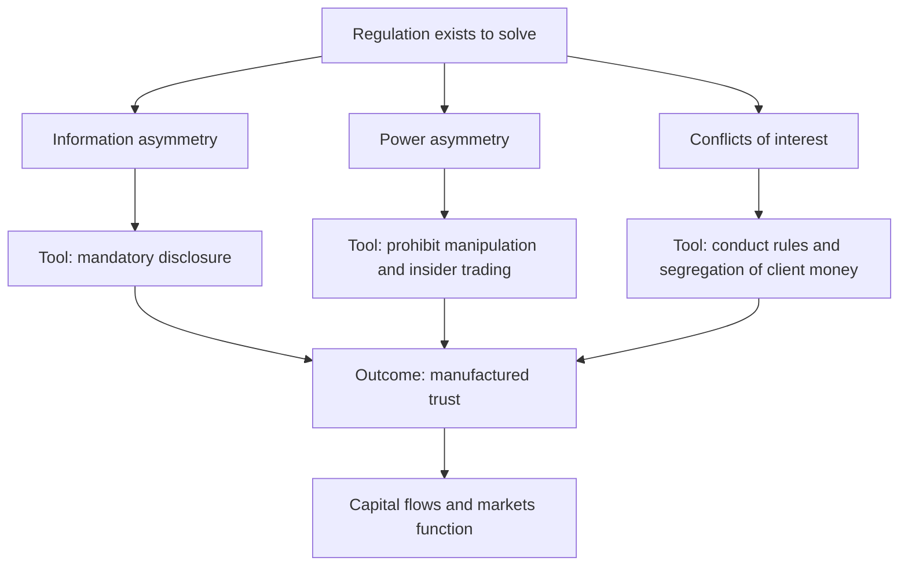
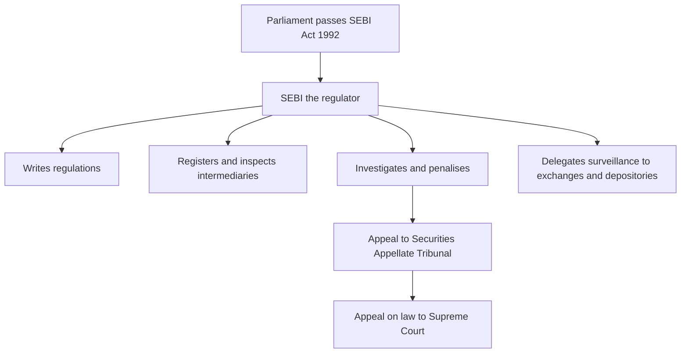

# Chapter 15 — Market Regulation and Investor Protection

## 1. The Problem / The Need

Imagine a financial market with no referee. A company can print a glossy prospectus claiming profits it never earned, raise ₹500 crore from the public, and quietly divert the money to the promoter's private account. A well-connected director, knowing that tomorrow's results will be catastrophic, dumps his entire holding today onto unsuspecting buyers who have no idea. A pool of operators secretly agrees to trade a thinly-listed stock back and forth among themselves, driving the price up 900% in a month, luring in retail investors with the illusion of momentum — and then vanishing, leaving the last buyers holding worthless paper. A broker takes your money to buy shares, buys nothing, and gambles it in his own account. When you complain, there is no one to complain *to*.

This is not a hypothetical dystopia. It is a fairly accurate description of Indian and global markets before modern regulation — and it is exactly what returns the moment regulation weakens. The 1992 **Harshad Mehta** securities scam (which drained roughly ₹4,000 crore from the banking system through fake bank receipts and ramped-up share prices) and the 2001 **Ketan Parekh** scam both exploded in an era of thin oversight. In the US, the 1929 crash and the frauds it exposed — companies selling shares in ventures that did not exist — destroyed a generation's savings and directly produced the modern regulatory state.

The core difficulty is **asymmetric information and asymmetric power**. The company knows its true condition; you do not. The insider knows tomorrow's news; you do not. The large operator can move a price; you cannot. The intermediary holds your money; you must trust him. In a face-to-face village economy these gaps are small — you know the borrower personally. But a modern market asks a stranger in Pune to hand her life savings to a company in Chennai she will never visit, run by people she will never meet, on the strength of documents she cannot verify. That leap of faith is *manufactured trust*, and someone has to manufacture it.

Left alone, markets suffer from a brutal dynamic economists call a **"market for lemons."** If investors cannot tell honest issuers from crooks, they price *every* security as if it might be a fraud — demanding sky-high returns or simply staying away. Honest companies, unable to get a fair price, exit. The market fills with lemons and then collapses entirely. The tragedy is that dishonesty by a few poisons the well for everyone, including the honest majority. Regulation exists to break this dynamic: to make honesty *credible* so that capital keeps flowing.

## 2. The Core Idea

The core idea of market regulation is **to substitute a credible public referee for the trust that strangers cannot extend to one another directly.** Instead of each investor personally verifying each company, a single powerful authority sets and enforces rules of disclosure, fair dealing, and conduct for *everyone* — so that the individual investor can rely on the *system* rather than on her own investigation.

Regulation rests on four intertwined objectives, and almost every rule you will ever meet serves one of them:

- **Investor protection** — shield savers, especially small retail investors, from fraud, mis-selling, and abuse of their money.
- **Fairness** — ensure everyone plays by the same rules and has access to the same material information, so no privileged few can systematically extract wealth from the many.
- **Market integrity** — keep prices *honest*, i.e. formed by genuine supply and demand rather than by manipulation, so that prices carry true information and capital is allocated efficiently.
- **Systemic stability** — prevent the failure of one institution or one bubble from cascading into a collapse of the whole financial system.

The second deep idea is the regulatory *method*. Modern securities regulation is overwhelmingly built on **mandatory disclosure** rather than on the regulator judging whether an investment is "good." The state does not tell you Reliance is a safe bet; it forces Reliance to *tell you everything material* and then punishes it savagely if it lies. This is the philosophy US Supreme Court Justice Louis Brandeis captured in 1914: **"Sunlight is said to be the best of disinfectants."** The regulator's job is to guarantee full, timely, truthful sunlight — and to police the conduct that sunlight cannot by itself prevent (insider trading, manipulation, theft of client money).

*Figure 1 — Regulation converts the fundamental asymmetries of markets into manufactured trust.*

## 3. How It Works — The Architecture of Oversight

Regulation is not a single rulebook; it is a layered architecture with a statute at the top, a regulator in the middle, and self-regulating institutions and intermediaries at the base. Understanding these layers is the key to understanding how a rule actually reaches the trader on the terminal.

**Layer 1 — The enabling statute (Parliament / Congress).** A legislature passes a law that creates the regulator and gives it powers. In India the foundational statute is the **SEBI Act, 1992**, supported by the **Securities Contracts (Regulation) Act, 1956 (SCRA)** — which governs stock exchanges and what counts as a "security" — and the **Depositories Act, 1996** and the **Companies Act, 2013**. In the US, the twin pillars are the **Securities Act of 1933** (governing new issues — "truth in securities") and the **Securities Exchange Act of 1934** (governing secondary trading and creating the SEC).

**Layer 2 — The regulator (SEBI, SEC).** The statute creates a specialist body with three combined functions that would normally be split across the three branches of government. It is **quasi-legislative** (it writes detailed regulations), **quasi-executive** (it investigates, inspects, and registers intermediaries), and **quasi-judicial** (it holds hearings and imposes penalties). This concentration of powers is what lets a regulator act fast enough for markets — but it is checked by an appeal mechanism (see Layer 4).

**Layer 3 — Self-Regulatory Organisations (SROs) and front-line gatekeepers.** The regulator does not watch every trade itself. It delegates front-line surveillance to **stock exchanges** (NSE, BSE), **clearing corporations**, and **depositories** (NSDL, CDSL), and to bodies like the **Association of Mutual Funds in India (AMFI)**. These SROs run real-time surveillance systems that flag suspicious trades and enforce listing conditions. Gatekeepers such as **auditors, merchant bankers, credit-rating agencies, and independent directors** are legally obliged to police the issuers they serve.

**Layer 4 — Appeal and judicial oversight.** Because the regulator combines powers, its orders must be appealable. In India, appeals against SEBI go to the **Securities Appellate Tribunal (SAT)**, and from SAT on questions of law to the **Supreme Court**. In the US, SEC actions can be litigated in federal courts. This layer keeps the regulator itself accountable.

*Figure 2 — The four-layer regulatory architecture in India, from statute to appeal.*

## 4. Full Content

### 4.1 SEBI — the Indian regulator

The **Securities and Exchange Board of India** was first constituted as a non-statutory body in 1988 and given full statutory teeth by the **SEBI Act, 1992**, passed in the immediate wake of the Harshad Mehta scam. Its preamble states its purpose crisply: **"to protect the interests of investors in securities and to promote the development of, and to regulate, the securities market."** Note that all three goals — protection, development, and regulation — sit together; a good regulator does not strangle the market it protects.

SEBI's jurisdiction covers the whole securities ecosystem: stock exchanges and clearing corporations; listed companies' disclosures and corporate governance; public issues (IPOs, rights, bonds); every registered **intermediary** (brokers, merchant bankers, mutual funds, portfolio managers, investment advisers, research analysts, custodians, credit-rating agencies, alternative investment funds); and the conduct rules against fraud, manipulation, and insider trading.

Its principal powers under the Act include:

- **Registration and inspection** of all intermediaries — no one may operate in the market without SEBI registration, and SEBI may inspect their books at any time.
- **Investigation** — powers of a civil court to summon persons, call for records, and (since 2014) attach bank accounts and property, conduct search and seizure, and even seek call-data records.
- **Adjudication and penalties** — impose monetary penalties (up to ₹25 crore or three times the illegal gains, whichever is higher, for serious violations), **disgorgement** of wrongful gains, and orders **debarring** a person from the market.
- **Interim directions** — pass "cease and desist" and ex-parte orders to freeze an ongoing fraud before final adjudication.
- **Consent / settlement** — allow a party to settle a case by paying a sum without admitting or denying guilt, saving years of litigation.

SEBI is governed by a **Board** (a chairperson and members, including nominees of the Finance Ministry and the RBI), which keeps it coordinated with the broader financial system.

### 4.2 The SEC — the US regulator, and how the two compare

The **Securities and Exchange Commission** was created by the Securities Exchange Act of 1934, chaired first by Joseph P. Kennedy. Its philosophy is identical in spirit — disclosure plus conduct enforcement — but the institutional flavour differs in ways worth knowing for interviews.

| Dimension | SEBI (India) | SEC (US) |
|---|---|---|
| Created by | SEBI Act, 1992 | Securities Exchange Act, 1934 |
| Core philosophy | Disclosure + development + protection | Full and fair disclosure; "let the buyer be informed" |
| Rule-making | Writes binding regulations directly | Rule-making + heavy reliance on case law and courts |
| Enforcement route | In-house adjudication; appeal to SAT | Administrative proceedings + civil suits in federal courts; criminal cases referred to DOJ |
| Insider-trading law | Codified in SEBI (PIT) Regulations, 2015 | Largely judge-made under Rule 10b-5 (misappropriation / classical theory) |
| Whistle-blower reward | Informant reward under Insider Trading rules | Large bounties under Dodd-Frank (10–30% of sanctions) |
| Investor education arm | SEBI + IEPF | SEC Office of Investor Education; PCAOB audits auditors |

A subtle but important structural point: much of US insider-trading law is **common law**, built by courts interpreting the general anti-fraud provision **Rule 10b-5**, whereas India **codified** insider trading into explicit regulations. India's codified approach gives clearer definitions; the US's case-law approach is more flexible but less predictable.

### 4.3 Insider trading

**Insider trading** is dealing in a security while in possession of **Unpublished Price Sensitive Information (UPSI)** — material information not yet public that, once released, would move the price. It is the archetypal fairness violation: the insider trades against a counterparty who is structurally blind, converting a position of trust into private profit.

India's governing rule is the **SEBI (Prohibition of Insider Trading) Regulations, 2015 ("PIT")**. Its key concepts:

- **Insider** — a "connected person" (director, employee, professional, or anyone with access) OR anyone in possession of UPSI, however obtained. Crucially, you need not be an employee; a printer who sets the type for the results, or a friend who is *tipped*, becomes an insider.
- **UPSI** — information relating to a company that is not generally available and would, on becoming available, likely materially affect the price: financial results, dividends, mergers, buybacks, changes in capital structure, major expansions, and so on.
- **Prohibited acts** — trading while in possession of UPSI; **communicating** UPSI to another (tipping) except for legitimate purposes; and **procuring** others to trade.
- **Defences and safeguards** — companies must maintain a **code of conduct**, a **structured digital database** of who received UPSI, **trading windows** that close before results, and **trading plans** disclosed in advance so genuine pre-planned trades are not caught.

In the US the same conduct is prosecuted under **Rule 10b-5** through two theories: the **classical theory** (an insider breaches a duty to *his own* shareholders) and the **misappropriation theory** (an outsider, e.g. a lawyer, breaches a duty to the *source* of the information). The landmark cases — *SEC v. Texas Gulf Sulphur*, *Dirks v. SEC* (the tipper/tippee rule), *United States v. O'Hagan* (misappropriation) — are the scaffolding of the doctrine.

### 4.4 Disclosure norms

Disclosure is the beating heart of regulation, and it comes in two rhythms:

- **Initial / one-time disclosure** — when a company first raises money. In India, a company doing an IPO files a **Draft Red Herring Prospectus (DRHP)** with SEBI under the **SEBI (Issue of Capital and Disclosure Requirements) Regulations, 2018 ("ICDR")**. The prospectus must disclose the business, financials, promoters, use of proceeds, and — critically — a candid **"Risk Factors"** section. In the US, the equivalent is a **Form S-1 registration statement** filed with the SEC under the 1933 Act.
- **Continuous / ongoing disclosure** — once listed, a company must keep telling the truth. In India this lives in the **SEBI (Listing Obligations and Disclosure Requirements) Regulations, 2015 ("LODR")**: quarterly financial results, immediate disclosure of any **material event** (a merger, a fire at a plant, resignation of the CEO, a big order won or lost), shareholding patterns, and corporate-governance reports. In the US, the analogues are the annual **10-K**, quarterly **10-Q**, and the "current report" **8-K** for material events.

The governing principle everywhere is **materiality**: you must disclose anything a reasonable investor would consider important in deciding to buy, hold, or sell. And you must disclose it to *everyone at once* — the US rule **Regulation Fair Disclosure (Reg FD)** and India's LODR both forbid selectively feeding information to favoured analysts.

### 4.5 Market manipulation

Where insider trading corrupts *who* trades, manipulation corrupts *the price itself*. Manipulation is any deliberate interference that creates a false or misleading appearance of trading activity or price. India's catch-all weapon is the **SEBI (Prohibition of Fraudulent and Unfair Trade Practices) Regulations, 2003 ("PFUTP")**. The main species:

- **Pump and dump** — operators accumulate a thinly-traded stock, spread bullish rumours (often now via Telegram groups and finfluencers), ramp the price, then dump onto the retail crowd. SEBI's 2023–24 actions against stock-tip Telegram channels are textbook examples.
- **Circular / wash trading** — trading among a colluding group so shares change hands with no real change of ownership, manufacturing fake volume to lure outsiders.
- **Spoofing and layering** — placing large orders you never intend to execute to create a false impression of demand or supply, then cancelling them. A trader named **Navinder Sarao** spoofed the S&P 500 futures and contributed to the 2010 US **"Flash Crash."**
- **Cornering / squeeze** — buying up so much of an asset that others who are short are forced to buy from you at inflated prices.
- **Marking the close / ramping** — trading in the last minutes to push the closing price (which sets NAVs, margins, and derivative payoffs) to a desired level.

### 4.6 Front-running

**Front-running** is a special conflict-of-interest abuse: an intermediary who *knows* a large impending client order trades ahead of it for his own benefit, profiting from the price impact the client's order will cause. A dealer who learns that a mutual fund is about to buy 10 lakh shares buys for himself first, rides the price up the client's own order creates, and sells into it. It is theft of the client's information and of the price movement that rightfully belongs to the client. India's most notable case is the **2019–22 front-running scandal involving a large mutual fund's dealer** and, separately, high-profile allegations against market personalities — all prosecuted under PFUTP. The remedy is strict **order-handling rules**, surveillance of employee trading, and the general fiduciary duty of intermediaries to put clients first.

### 4.7 The intermediary-conduct and client-money safeguards

Much investor loss comes not from exotic fraud but from intermediaries mishandling money. Regulation therefore imposes:

- **Segregation of client funds and securities** — a broker must keep client money in a separate client bank account, never mixed with his own. Since 2022 India enforces **daily/weekly upstreaming** of client funds to the clearing corporation and a **direct pay-out** of securities to the client's demat account.
- **Suitability and mis-selling rules** — investment advisers and distributors must recommend products appropriate to the client, disclose commissions, and (for Registered Investment Advisers) separate advice from distribution to kill the conflict of interest.
- **KYC / AML** — mandatory identity verification and anti-money-laundering checks so the market is not a laundromat.

### 4.8 Grievance redress and investor protection funds

Rules mean nothing without a remedy when they are broken. India has built a ladder of redress:

- **SCORES (SEBI Complaints Redress System)** — an online portal where any investor can lodge a complaint against a listed company or intermediary; SEBI tracks it to resolution with time limits.
- **Online Dispute Resolution (ODR)** — a 2023 framework routing investor-broker disputes to online conciliation and arbitration.
- **Investor Protection Fund (IPF)** — every stock exchange maintains an IPF that **compensates investors** when a broker (a "defaulting member") is declared insolvent and cannot return client money or securities, up to a specified cap. This is the market's equivalent of deposit insurance.
- **Investor Education and Protection Fund (IEPF)** — under the Companies Act, **unclaimed dividends and shares** (money investors forgot to collect) are transferred after seven years to the IEPF, which both safeguards the money for later claim by rightful owners and funds investor-education programmes.

In the US, the parallel safety net is the **Securities Investor Protection Corporation (SIPC)**, which protects customers of a failed brokerage up to \$500,000 (including \$250,000 for cash) — note it covers *broker failure*, not investment losses.

## 5. Worked / Real Examples

**Example 1 — Harshad Mehta and the birth of SEBI (1992).** Mehta exploited the settlement system in government-securities and bank-receipt markets to siphon roughly ₹4,000 crore of bank funds into share purchases, ramping stocks like ACC from ₹200 to nearly ₹9,000. When the fraud unravelled, the Sensex collapsed and public trust evaporated. The direct legislative response was to give SEBI **statutory powers via the SEBI Act, 1992**, and to overhaul settlement (this crisis is a major reason India built electronic depositories and moved to dematerialised, DvP settlement). The lesson: regulatory architecture is usually born from the ashes of a scam.

**Example 2 — Rajat Gupta, insider trading (US, 2012).** Rajat Gupta, a former McKinsey global head and Goldman Sachs board member, phoned hedge-fund manager Raj Rajaratnam within *minutes* of a Goldman board call, tipping him that Warren Buffett was about to inject \$5 billion into Goldman during the 2008 crisis. Rajaratnam traded on it. Wiretaps caught the chain. Gupta — one of the most respected executives in the world — was convicted under the classical/tipper theory and imprisoned. The lesson: insider trading is prosecuted on the *breach of duty and the tip*, not on whether you personally traded, and no reputation is immunity.

**Example 3 — Pump-and-dump via Telegram (India, 2023–24).** SEBI passed interim orders against operators of stock-tip Telegram channels who accumulated small-cap shares, blasted "target ₹X, buy now" messages to lakhs of followers, and sold into the retail buying frenzy their own messages created — a modern, digital pump-and-dump prosecuted under PFUTP. SEBI **impounded the illegal gains (disgorgement)** and **debarred** the operators. The lesson: manipulation evolves with technology, and the anti-fraud regulations are deliberately broad enough to catch new methods.

**Example 4 — The Flash Crash and spoofing (US, 2010).** On 6 May 2010 the Dow fell nearly 1,000 points in minutes. Investigations later found that trader Navinder Sarao had been **spoofing** — placing and rapidly cancelling huge sell orders in S&P 500 e-mini futures to create false selling pressure. He was extradited and convicted. The lesson: manipulation is not only about price ramps; placing orders you never intend to fill is itself fraud on the market's price-discovery mechanism.

## 6. Connections

- **To primary markets (Ch 2) and disclosure:** the ICDR / S-1 prospectus regime is the front door where disclosure regulation first meets the investor.
- **To intermediaries (Ch 11):** the segregation-of-client-money, KYC, and suitability rules are the conduct layer wrapped around every broker, adviser, and mutual fund you met earlier.
- **To secondary markets and exchanges (Ch 3):** exchanges act as front-line SROs running the surveillance that flags manipulation and insider trading in real time.
- **To derivatives (Ch 9):** manipulation like marking-the-close and spoofing matters intensely because closing prices set margins and derivative payoffs.
- **To corporate governance:** LODR's board-independence, audit-committee, and related-party-transaction rules are regulation reaching *inside* the company to protect minority shareholders.
- **To macro-stability:** systemic-risk regulation (margining, position limits, clearing-corporation risk management) connects market regulation to central-bank financial-stability policy.

## 7. Key Terms

- **SEBI** — Securities and Exchange Board of India; the statutory securities regulator (SEBI Act, 1992).
- **SEC** — US Securities and Exchange Commission (Exchange Act, 1934).
- **UPSI** — Unpublished Price Sensitive Information; the fuel of insider trading.
- **Materiality** — the test for what must be disclosed: anything a reasonable investor would find important.
- **PIT / PFUTP / ICDR / LODR** — SEBI's four workhorse regulation sets: Insider Trading; Fraudulent & Unfair Trade Practices; Issue disclosure; Listing obligations.
- **Rule 10b-5** — the US general anti-fraud rule underpinning most insider-trading and manipulation cases.
- **Disgorgement** — forcing a wrongdoer to surrender illegal gains.
- **Debarment** — barring a person from accessing the securities market.
- **Novation / SRO / SAT** — clearing-corp guarantee; self-regulatory organisation; Securities Appellate Tribunal.
- **SCORES / IPF / IEPF / SIPC** — India's complaint portal; exchange investor-protection fund; unclaimed-money fund; the US broker-failure insurance corporation.
- **Reg FD** — Regulation Fair Disclosure; forbids selective disclosure.
- **Consent order** — settling a case by payment without admitting guilt.

## 8. Common Confusions

- **"Insider trading means any trading by insiders."** No. Insiders trade legally all the time (disclosed, in trading windows, via pre-cleared plans). It is illegal only when done **while in possession of UPSI**. The crime is the informational unfairness, not the identity.
- **"Manipulation and insider trading are the same thing."** They are opposites in a sense: insider trading exploits *true* private information without moving the price artificially; manipulation *creates false* information/prices. One corrupts who knows; the other corrupts the price itself.
- **"The regulator approves whether a stock is a good investment."** No. SEBI/SEC ensure *disclosure* and police *conduct*; they explicitly do **not** vouch for the merits of any security. Every prospectus carries a disclaimer to this effect.
- **"SIPC / IPF protects me from losing money in the market."** No. These funds compensate for **intermediary failure** (a broker stealing or going insolvent), not for the market falling or a bad investment decision.
- **"Front-running is just insider trading by a broker."** Related but distinct: front-running abuses knowledge of a *client's pending order* (a conflict of interest / fiduciary breach), not price-sensitive information about the *company*.
- **"A consent order means SEBI found them guilty."** No — a consent/settlement order resolves the matter *without* an admission or finding of guilt; it is a pragmatic closure, not a conviction.

## 9. First-Principles Recap

Strip everything away and the logic is a short chain. **(1)** Markets ask strangers to trust strangers with money across distance and time. **(2)** Strangers cannot verify each other, so information and power are asymmetric, and unchecked asymmetry breeds fraud, which poisons the well for the honest majority — the "lemons" collapse. **(3)** To keep capital flowing, someone must *manufacture trust* on everyone's behalf: a credible public referee. **(4)** The cheapest, least intrusive way to do this is **mandatory disclosure** — force everyone to tell the truth, fully and simultaneously — backed by **conduct prohibitions** on the three things sunlight alone cannot stop: insider trading, manipulation, and theft of client money. **(5)** Because rules are worthless without teeth, the referee gets powers to register, inspect, investigate, disgorge, and debar — checked by an appeal tribunal so the referee stays honest too. **(6)** And because breaches still happen, a redress-and-compensation safety net (SCORES, IPF/SIPC, IEPF) catches the investors who fall through. Every acronym in this chapter is just a specific implementation of that one chain.

## 10. Quick-Reference / Interview Points

- **Why regulate markets?** Investor protection, fairness, market integrity (honest prices), and systemic stability — all to overcome information/power asymmetry and prevent the "market for lemons."
- **Core method:** mandatory disclosure ("sunlight is the best disinfectant") plus conduct rules; the regulator does **not** judge investment merit.
- **India's regulator:** SEBI, statutory since the **SEBI Act, 1992** (post-Harshad Mehta); combines quasi-legislative, quasi-executive, quasi-judicial powers; appeals go to **SAT** then the Supreme Court.
- **US regulator:** SEC (Securities Act 1933 + Exchange Act 1934); insider trading is largely judge-made under **Rule 10b-5** (classical + misappropriation theories).
- **Four SEBI workhorse regulations:** **ICDR** (IPO disclosure), **LODR** (continuous disclosure), **PIT** (insider trading), **PFUTP** (fraud/manipulation).
- **Insider trading =** trading/tipping while in possession of **UPSI**; safeguards = trading windows, structured digital database, pre-disclosed trading plans.
- **Manipulation types:** pump-and-dump, wash/circular trading, spoofing/layering, cornering, marking-the-close.
- **Front-running:** intermediary trades ahead of a known client order — a fiduciary/conflict breach.
- **Penalties toolkit:** monetary penalty, **disgorgement**, **debarment**, interim cease-and-desist, and **consent** settlements.
- **Investor safety net:** **SCORES** (complaints), **ODR** (dispute resolution), **IPF** (broker-default compensation), **IEPF** (unclaimed dividends/shares); US equivalent **SIPC** (up to \$500k on broker failure).
- **One-liner to remember:** *Insider trading corrupts who trades; manipulation corrupts the price; front-running steals the client's order — and disclosure plus enforcement is how the referee stops all three.*
