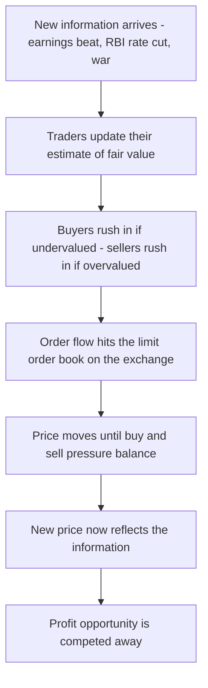
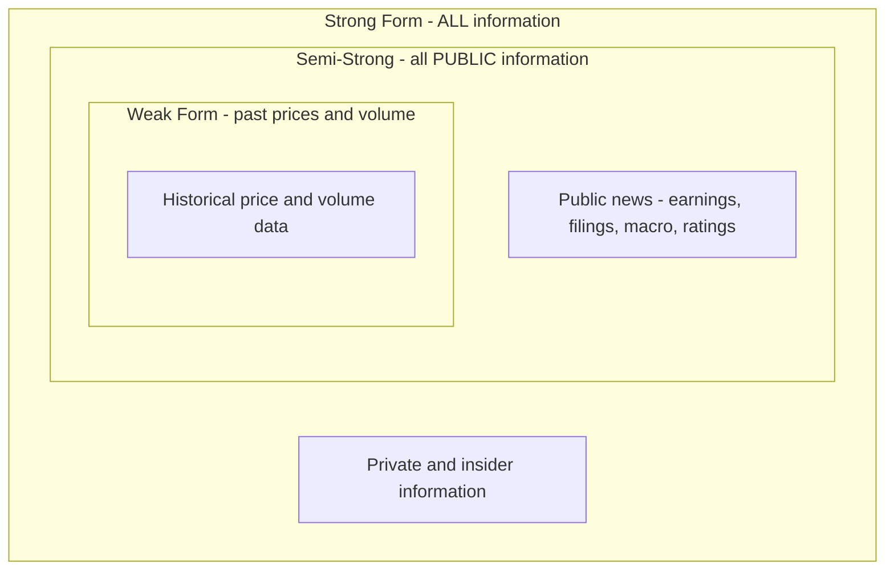

# Chapter 16 — Market Efficiency and Price Discovery

## 1. The Problem / The Need

Imagine you have ₹1,00,000 to invest and two choices sit in front of you. Choice A: hand the money to a star fund manager who charges 2% a year, promising to "beat the market" by picking winning stocks. Choice B: buy a Nifty 50 index fund that charges 0.05% and simply owns the whole market. Which one leaves you richer after twenty years?

The honest answer depends on a single, deep question: **how much useful information is already baked into today's stock price?** If prices already reflect everything knowable — earnings, management quality, macro trends, even rumours — then the star manager is paying analysts to rediscover facts the price already knows, and their 2% fee is pure leakage. If, on the other hand, prices are sloppy and full of exploitable mistakes, then skilled analysis can genuinely find bargains and the fee earns its keep.

This is not an academic quibble. It decides:

- **How trillions of rupees get allocated.** India's mutual fund industry manages over ₹60 lakh crore of assets; the split between active and passive strategies rides entirely on this question.
- **Whether "research" adds value.** Every brokerage buy/sell report, every TV stock tip, every WhatsApp "multibagger" call is a bet that the market has mispriced something.
- **How fair a market is.** If insiders can systematically exploit information the public lacks, small investors are playing a rigged game — which is why insider-trading law exists.
- **How well capital gets steered in the real economy.** A well-functioning price tells companies where to raise money and where to shut down. Garbage prices misallocate real factories, jobs and savings.

The framework that organizes all of this is the **Efficient Market Hypothesis (EMH)** — arguably the most tested, most debated, and most consequential idea in all of finance. This chapter builds it from first principles, examines where it breaks (anomalies and behavioral finance), and draws out the practical verdict for how you should actually invest.

## 2. The Core Idea

The core intuition is disarmingly simple: **prices reflect information because people trade on information, and competition among informed traders forces prices to move the instant new facts arrive.**

Suppose Infosys is about to announce blockbuster results. If you *knew for certain* the stock would jump tomorrow, you would buy today. So would every other informed trader. That buying pressure pushes the price up *today* — before the announcement — until it reaches the level justified by the good news. By the time the news is public, the price has already adjusted. The profit opportunity destroys itself in the act of being exploited.

Generalize this and you get the central claim:

> **A market is "efficient" with respect to a set of information if prices already fully reflect that information, so that you cannot earn abnormal risk-adjusted returns by trading on it.**

Two subtleties are baked into that sentence and both matter enormously:

1. **"Abnormal" means risk-adjusted.** Earning 15% is not proof of skill if you took on 15%-worth of risk. Efficiency does not say you can't make money; it says you can't make money *beyond what your risk warrants* using the specified information.
2. **"With respect to a set of information."** Efficiency is not all-or-nothing. A market can reflect past prices perfectly but ignore an obscure footnote in an annual report. This is exactly why EMH comes in **three graded forms** — weak, semi-strong, strong — distinguished by *which* information set prices are claimed to reflect.

A famous corollary captures the spirit: **there are no ₹1,000 notes lying on the pavement.** If there were, someone would already have grabbed them. The very act of smart people hunting for mispricings is what eliminates mispricings. Efficiency is not a natural law like gravity; it is an *emergent outcome* of intense competition among profit-seekers.

## 3. How It Works — The Mechanism of Price Discovery

Before formalizing the three forms, let's watch the machine run. **Price discovery** is the process by which the continuous tug-of-war between buyers and sellers converts scattered private information and beliefs into a single public number: the market price.

Here is the chain of events when a genuinely new piece of information hits the market.

*Figure 16.1 — Price discovery: how a fresh fact becomes an updated price.*

The engine that makes this fast is the **exchange order book**. On the NSE or BSE, every participant posts limit orders (bids to buy, asks to sell) into a central electronic book. The best bid and best ask define the current price band; the gap between them is the **bid-ask spread**. When news breaks, traders cancel stale orders and post new ones at prices reflecting the news, and the whole book shifts within milliseconds. High-frequency traders and arbitrageurs make this adjustment near-instantaneous for liquid stocks.

Three ingredients determine how *good* price discovery is:

| Ingredient | What it does | Consequence if weak |
|---|---|---|
| **Liquidity** | Many buyers/sellers, tight spreads, deep book | Prices lurch on small trades; discovery is noisy |
| **Information flow** | Fast, fair disclosure (SEBI LODR rules, exchange filings) | Insiders exploit gaps; public prices lag reality |
| **Competition among traders** | Analysts, arbitrageurs, HFTs hunting mispricing | No one corrects errors; prices drift from value |

Notice the deep tension, first spelled out by **Grossman and Stiglitz (1980)**: if markets were *perfectly* efficient, no one could profit from research, so no one would bother to gather information — but then prices would reflect nothing. Efficiency therefore requires a state where prices are *almost* efficient, leaving just enough profit to pay the researchers who keep them efficient. This is the **"impossibility of perfectly efficient markets."** The market has to be slightly inefficient to reward the very activity that makes it efficient. Real markets live in this equilibrium: highly efficient, but not perfectly so.

## 4. Full Content — The Three Forms of EMH

Eugene Fama, the University of Chicago economist who formalized EMH (and won the 2013 Nobel Prize for it), classified efficiency by the *information set* prices are assumed to reflect. Each stronger form *includes* everything the weaker form contains and adds more.

*Figure 16.2 — The three nested forms of the Efficient Market Hypothesis. Each larger set contains the smaller ones.*

### 4.1 Weak-Form Efficiency

**Claim:** Prices already reflect *all information contained in past prices and trading volume.*

**Implication:** You cannot beat the market using **technical analysis** — chart patterns, moving averages, "head and shoulders," support/resistance, momentum indicators built purely from historical price data. If the past price path told you where the price is going next, everyone would already have traded on it and the pattern would vanish.

The theoretical backbone is the **random walk** idea: successive price *changes* are essentially unpredictable, because tomorrow's move depends on tomorrow's news, which by definition is not yet known. Price *levels* wander like a drunk's walk; the *next step* is roughly a coin flip around the drift for expected return.

**What weak form does NOT claim:** it says nothing about whether prices reflect the latest earnings report or company fundamentals — only the *price history* itself. So even a weak-form-efficient market can be beaten by superior fundamental analysis (in principle).

**Reality check:** Weak-form efficiency is the *most strongly supported* by evidence. Decades of tests find that simple technical rules rarely beat buy-and-hold after transaction costs. Yet **momentum** — the tendency of past winners to keep winning over 3–12 months — is a stubborn, documented violation (see §7).

### 4.2 Semi-Strong-Form Efficiency

**Claim:** Prices reflect *all publicly available information* — past prices *plus* earnings announcements, annual reports, dividend changes, RBI policy, analyst reports, news of a merger, GST data, everything in the public domain.

**Implication:** You cannot beat the market using **fundamental analysis** of public data either. By the time you read Infosys's results in the newspaper, the price has already moved. The key testable prediction is that prices adjust **rapidly and completely** to news, with no predictable drift afterward.

The classic test is the **event study**: line up many companies around the date of some event (a stock split, earnings surprise, buyback announcement) and measure the average abnormal return day by day. Semi-strong efficiency predicts a sharp jump *on* the announcement day and a *flat* line afterward.

*Figure 16.3 — The stylized event-study pattern predicted by semi-strong efficiency.*

**Reality check:** Broadly supported for major, liquid stocks — index-tracking passive funds beating most active managers is powerful indirect evidence. But **post-earnings-announcement drift (PEAD)** — prices continuing to drift in the direction of an earnings surprise for weeks — is a well-established violation.

### 4.3 Strong-Form Efficiency

**Claim:** Prices reflect *all* information, **public AND private (insider)**. Even the CEO who knows tomorrow's unannounced results cannot profit.

**Implication:** No group — not insiders, not corporate officers, not regulators with private data — can systematically earn abnormal returns.

**Reality check:** Strong form is **false**, and everyone knows it. That is *precisely why insider-trading laws exist.* Studies of corporate insiders' legally disclosed trades (Form 4 in the US; SEBI's SAST/PIT disclosures in India) show insiders *do* earn abnormal returns on their own-company trades. If markets were strong-form efficient, insider knowledge would be worthless — and there'd be no reason to regulate it. The **Harshad Mehta scam (1992)** and countless insider cases show private information is very much exploitable when abused.

### 4.4 Summary of the Three Forms

| Form | Information reflected | Which analysis is defeated | Empirical verdict |
|---|---|---|---|
| **Weak** | Past prices & volume | Technical analysis | Mostly holds (momentum is the exception) |
| **Semi-strong** | All public information | Fundamental analysis of public data | Largely holds for liquid stocks (PEAD, value effects are exceptions) |
| **Strong** | Public + private/insider | Even insider trading | Rejected — insiders do profit; hence the law |

## 5. Worked & Real Examples

### Example 1 — The Infosys earnings surprise (semi-strong in action)

Suppose consensus analyst estimates put Infosys quarterly EPS at ₹16. On results day the company reports ₹18 — a big positive surprise — and raises full-year guidance. In a semi-strong-efficient market:

- At 3:45 pm the results hit the exchange filing system.
- Within *seconds*, the stock gaps up perhaps 6–8% as traders reprice to the new fair value.
- By the time a retail investor reads the headline at 6 pm and places a buy order at the open next morning, the gain is *already in the price.* They pay the post-news price and capture no abnormal return.

The lesson: **it is not the news that moves price, but the news relative to expectations (the surprise).** A company reporting 40% profit growth can *fall* if the market expected 50%. This is why "good company ≠ good stock": quality is already priced.

*Anomaly twist:* In reality, PEAD means the price often keeps drifting up for several weeks after a big positive surprise — a documented crack in semi-strong efficiency that quant funds try to harvest.

### Example 2 — Index funds vs active managers (the practical proof)

The single most persuasive real-world evidence for efficiency is the **SPIVA scorecard** (S&P Indices Versus Active). Year after year, across the US, Europe, and India:

- Over 10–15 year horizons, roughly **80–90% of actively managed large-cap funds underperform their benchmark index** after fees.
- In India, SPIVA India reports have repeatedly shown a majority of large-cap active funds trailing the S&P BSE 100 / Nifty over long windows.

Why? If large-cap Indian stocks (Reliance, HDFC Bank, TCS) are heavily researched and near-efficiently priced, the *average* active rupee earns the market return *minus* the higher fees — a mathematical certainty William Sharpe called **"The Arithmetic of Active Management."** Passive investing wins not because indexers are smart, but because they refuse to pay for a skill that, in aggregate, cannot beat the average.

*Nuance:* In *less efficient* corners — Indian small-caps, micro-caps, illiquid markets — a larger share of active managers *do* outperform, exactly as the efficiency framework predicts. Efficiency is a spectrum, not a switch.

### Example 3 — Warren Buffett and the "efficient market" paradox

Buffett has beaten the market for six decades — seemingly a knockout blow to EMH. In his essay *"The Superinvestors of Graham-and-Doddsville,"* he argues a cluster of value investors sharing one philosophy have all outperformed, which is statistically hard to dismiss as luck.

The efficiency-camp reply is threefold: (1) with millions of investors, *some* extreme winners appear by chance alone; (2) Buffett's returns partly reflect systematic exposures — cheap (value), high-quality, low-volatility stocks with leverage from insurance float — that later research (AQR's "Buffett's Alpha") showed can be largely *replicated by factors*, i.e., they are compensation for known risks, not magic; (3) Buffett himself *endorses index funds for ordinary investors* and instructed his estate to put 90% in an S&P 500 index fund. Both things can be true: markets are highly efficient for most people, yet a rare, disciplined operator with a durable edge can exploit the residual inefficiency.

### Example 4 — The GameStop / meme-stock episode (2021, price discovery breaking down)

When Reddit retail traders coordinated to buy GameStop, the price rocketed from ~$20 to ~$480 with no change in fundamentals, then collapsed. This is a vivid case where price *discovery* temporarily failed: a short squeeze plus herd behavior detached price from any reasonable estimate of value. It shows efficiency can break under **limits to arbitrage** — rational short-sellers who "knew" it was overpriced were forced to cover as prices rose, and some were bankrupted before they could be proven right. Being right but early can be indistinguishable from being wrong.

## 6. Connections to the Rest of Finance

- **Random Walk & Time-Series (Ch. on price behaviour):** Weak-form efficiency is essentially the random-walk hypothesis dressed in economic clothing.
- **CAPM / Factor Models:** You can only test "abnormal" return against a *model* of normal return (CAPM, Fama-French). This creates the **joint-hypothesis problem** (§8): any test of efficiency is simultaneously a test of the risk model.
- **Portfolio Management & Passive Investing:** EMH is the intellectual foundation of index funds and ETFs — Jack Bogle built Vanguard on it.
- **Behavioral Finance:** The entire field exists as the loyal opposition to EMH, explaining anomalies via human psychology.
- **Market Microstructure:** Bid-ask spreads, order books, and HFT are the *plumbing* through which price discovery physically happens.
- **Regulation (SEBI / SEC):** Insider-trading law (SEBI PIT Regulations 2015), continuous disclosure (SEBI LODR), and fair-access rules are all designed to *push markets toward* semi-strong efficiency and to *enforce* the absence of strong-form efficiency.
- **Corporate Finance:** If markets are efficient, a firm can't "time" the market cheaply, and signalling (dividends, buybacks) works because prices react to the information content.

## 7. Market Anomalies — Where Efficiency Cracks

An **anomaly** is a persistent, empirically documented pattern that *shouldn't* exist if markets were efficient with respect to the relevant information. They are the ammunition of EMH's critics — and, ironically, the raw material of the quant funds that harvest them.

| Anomaly | What it is | Why it challenges EMH |
|---|---|---|
| **Momentum** | Past 3–12 month winners keep winning; losers keep losing | Violates weak form — future returns predictable from past prices |
| **Value effect** | Cheap stocks (low P/E, low P/B) beat expensive "glamour" stocks long-term | Violates semi-strong — public ratios predict returns |
| **Size effect** | Small-cap stocks historically outperform large-caps (risk-adjusted) | Public info (market cap) predicts return |
| **Post-earnings-announcement drift (PEAD)** | Prices keep drifting after an earnings surprise for weeks | Semi-strong says adjustment should be instant |
| **Low-volatility anomaly** | Low-risk stocks earn *higher* risk-adjusted returns than high-risk ones | Directly contradicts risk-return theory |
| **Calendar effects** | "January effect," "sell in May," turn-of-month, Monday effect | Returns predictable from the calendar alone |
| **Overreaction/reversal** | Extreme long-run losers rebound over 3–5 years (De Bondt & Thaler) | Prices overshoot then mean-revert |
| **IPO underperformance** | New listings tend to underperform over 3–5 years | Mispricing at issue persists |

**The efficiency camp's rebuttals** are important — anomalies are not automatic proof of inefficiency:

1. **They may be risk premia in disguise.** Fama & French argue value and size stocks earn more because they are *riskier* in ways CAPM misses (distress risk). Higher return = fair compensation, not a free lunch. This folds anomalies into *bigger* risk models (the Fama-French three- and five-factor models).
2. **Data mining.** Test 300 strategies and a few will look profitable by pure chance. Many published anomalies fade or reverse *after* publication (McLean & Pontiff showed anomaly returns shrink ~58% post-publication — because traders arbitrage them away, which is efficiency *working*).
3. **Transaction costs & limits to arbitrage.** Some anomalies are real but too small, too illiquid, or too risky to exploit profitably — so they persist without offering a true free lunch.

The deep point: **an anomaly that can be cheaply and safely exploited will be arbitraged away.** The survivors are those protected by risk, costs, or the limits to arbitrage — which is why the debate never fully resolves.

## 8. Common Confusions

**"Efficient means the price is always correct / equals true value."**
No. Efficiency means prices reflect *available information* and are *unbiased* — right *on average*, with errors that aren't systematically exploitable. Prices are constantly "wrong" in hindsight; efficiency only says you can't *predict* the direction of the error in advance. Bubbles and crashes are not automatic disproofs — they may reflect genuinely uncertain information later revised.

**"EMH says you can't make money in stocks."**
Wrong. You earn the market's *risk premium* by bearing risk — that's expected and large over decades. EMH says you can't earn *abnormal, risk-adjusted* returns from *the specified information* reliably. Buying and holding a diversified portfolio is fully consistent with EMH and expected to grow wealth.

**"Some people beat the market, so EMH is false."**
With millions of participants, a bell curve guarantees big winners *and* losers by luck alone. EMH is about whether outperformance is *predictable and repeatable* — whether *this year's* winners are *next year's* winners. Persistence studies find little. A few genuine edges (Buffett, Renaissance) exist at the extreme tail but are rare and hard to identify in advance.

**"Technical analysis obviously works — look at that chart pattern."**
Weak-form efficiency and the evidence say chart-only strategies rarely beat buy-and-hold after costs. Patterns are easy to see *in hindsight*; predicting the *next* move from price history alone is the part that fails. (Momentum is the one robust exception, and it's more a risk/behavioral factor than "reading charts.")

**The joint-hypothesis problem (subtle but crucial).**
You can never test efficiency *alone*. To say a return is "abnormal," you need a model of "normal" (CAPM, Fama-French). So every test is *jointly* testing "markets are efficient" AND "my risk model is correct." If you find an anomaly, you can never be sure whether the market is inefficient or your risk model is simply wrong/incomplete. Fama himself stressed this — it makes EMH nearly impossible to definitively falsify.

**"Passive investing free-rides and will eventually break price discovery."**
A legitimate frontier concern: if *everyone* indexed, no one would do the research that makes prices informative, and Grossman-Stiglitz says active management would become profitable again — restoring an equilibrium. In practice, active managers still control the *marginal* trade that sets prices, so discovery survives even with heavy passive ownership. The system self-corrects.

## 9. First-Principles Recap

Strip everything away and rebuild:

1. **Information has value because it predicts future cash flows and prices.**
2. **Self-interested people compete to profit from information**, buying what looks cheap and selling what looks dear.
3. **That competition pushes prices toward fair value almost instantly**, destroying the very profit opportunity that motivated the trade. This is *price discovery*.
4. **Therefore prices reflect information** — the amount depends on *which* information (past prices → weak; all public → semi-strong; everything incl. private → strong).
5. **You cannot reliably earn abnormal risk-adjusted returns** using information already reflected in the price. The pavement has no ₹1,000 notes lying around, because someone is always looking.
6. **But perfect efficiency is self-defeating** (Grossman-Stiglitz): prices must stay *slightly* inefficient to pay the researchers who keep them efficient. Markets are *highly but not perfectly* efficient.
7. **Anomalies and behavioral biases** show the cracks; **risk premia, data-mining, and limits to arbitrage** show why the cracks don't hand out free lunches.
8. **The practical verdict:** for most people, in liquid large-cap markets, low-cost passive investing wins because active skill, in aggregate, cannot beat the average *and* must overcome fees. Edge exists only in less efficient corners, for the rare few with a genuine, durable advantage.

## 10. Quick-Reference / Interview Points

**One-line definitions**
- *EMH:* Prices fully reflect available information, so abnormal risk-adjusted returns from that information are impossible.
- *Weak form:* Reflects past prices/volume → defeats technical analysis.
- *Semi-strong:* Reflects all public info → defeats fundamental analysis; prices adjust fast & fully to news.
- *Strong form:* Reflects public + private info → even insiders can't profit (empirically false).
- *Price discovery:* The process by which trading converts information into the market price via the order book.

**Killer facts to drop in an interview**
- Fama won the 2013 Nobel; **the joint-hypothesis problem** means you can't test efficiency without also testing a risk model.
- **Grossman-Stiglitz paradox:** perfectly efficient markets are impossible — someone must be paid to make them efficient.
- **SPIVA:** ~80–90% of active large-cap funds trail their index over 10–15 years, after fees — the strongest practical evidence.
- **Sharpe's arithmetic:** the average active dollar *must* underperform the average passive dollar after costs — by definition.
- Strong form is false → that's *why insider-trading law (SEBI PIT 2015, US SEC Rule 10b-5) exists.*
- **The news that matters is the surprise vs. expectations**, not the absolute number — "good company ≠ good stock."

**Anomalies checklist:** momentum, value, size, low-volatility, PEAD, calendar effects, long-run reversal, IPO underperformance.

**Behavioral critiques (in brief):** Kahneman & Tversky's biases — *overconfidence, herding, anchoring, loss aversion, availability, representativeness* — cause systematic, correlated errors that can push prices from value. **Limits to arbitrage** (Shleifer & Vishny) explain why smart money can't always correct them: short horizons, funding risk, and "the market can stay irrational longer than you can stay solvent." Behavioral finance doesn't say prices are *random* mistakes — it says they can be *predictably* biased, which is the real challenge to EMH.

**The balanced closing take (say this):** "Markets are *highly efficient but not perfectly so*. Efficiency is a spectrum that varies by asset liquidity and information quality — near-perfect in large-cap equities and government bonds, looser in small-caps, private markets, and crises. For the typical investor the operative conclusion is unchanged: costs and diversification beat stock-picking, so default to low-cost passive unless you have a genuine, identifiable edge."

**India vs Global framing:** SEBI (via LODR disclosure norms and PIT regulations) engineers semi-strong efficiency and enforces the absence of strong-form efficiency, mirroring the US SEC's Regulation FD and Rule 10b-5. Indian large-caps are approaching developed-market efficiency; Indian small/micro-caps remain fertile ground for active managers — a live, testable illustration of the efficiency spectrum.
