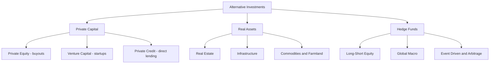
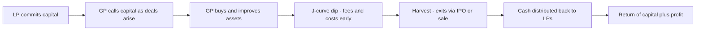
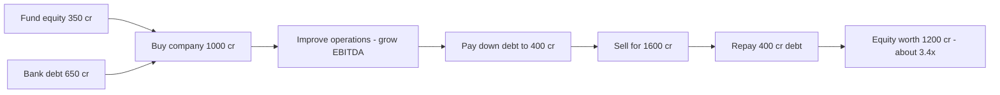

# Chapter 17 — Alternative Investments

## 1. The Problem / Need

Imagine you run the ₹8,000-crore corpus of a large Indian pension trust, or you are the family office of a promoter who just sold a business for ₹500 crore. Your traditional toolkit is simple: listed equities, government and corporate bonds, and cash. For decades that was enough. But you now face three uncomfortable problems that this toolkit cannot solve.

**Problem 1 — Everything moves together.** A "diversified" portfolio of 100 listed stocks feels safe until a crisis hits. In March 2020, the Nifty fell 38% in a month; in 2008, global equities fell in near-perfect lockstep. Your "diversification" evaporated exactly when you needed it. Bonds helped a little — but when inflation surged in 2022, stocks *and* bonds fell together, breaking the classic 60/40 hedge. You need return streams that do **not** rise and fall with the stock market.

**Problem 2 — The best growth happens in private.** The most explosive value creation of the last twenty years — Flipkart, Zomato before its IPO, Google before 2004, Facebook before 2012 — occurred while those companies were **private**. By the time a company lists on an exchange, much of the hyper-growth is already captured by early private investors. If you can only buy listed securities, you are structurally locked out of the wealth-creation engine of the economy.

**Problem 3 — Public markets are getting crowded and cheap-to-nobody.** Thousands of analysts pore over every listed large-cap. It is extraordinarily hard to find a mispriced Reliance or Apple share, because the price already reflects everyone's information. The inefficiencies — and therefore the outsized returns — live in places that are harder to reach: distressed debt, pre-IPO startups, physical real estate, toll roads, farmland, and complex trading strategies.

The need, then, is for a category of investments that sits **outside** the traditional trio of listed stocks, bonds, and cash — investments that offer diversification (different risk drivers), access to private value creation, and the potential for higher returns in exchange for accepting illiquidity and complexity. This category is called **alternative investments**, or simply "alternatives" or "alts."

## 2. The Core Idea

The core idea is deceptively simple: **an alternative investment is anything that is not a conventional long-only holding of publicly listed stocks, bonds, or cash.**

That negative definition captures a huge, varied universe — private equity, venture capital, hedge funds, real estate, infrastructure, commodities, private credit, farmland, art, and more. What unites them is not a single asset type but a shared **economic bargain**:

> *You give up liquidity, accept complexity and higher fees, and in return you gain access to differentiated return streams and (ideally) higher or less-correlated returns.*

Think of it as trading three things you have plenty of — patience, tolerance for complexity, and a willingness to pay for skill — in exchange for three things you want: **diversification, access, and alpha**.

The concept splits naturally along two dimensions:

- **What you own (the asset):** real, tangible things (real estate, infrastructure, commodities, farmland) versus private financial claims (private equity, venture capital, private credit).
- **What the manager does (the strategy):** simply *holding* an asset versus running an active *trading strategy* to extract return regardless of market direction (hedge funds).

*Figure 1 — The alternatives universe splits into private capital, real assets, and active trading strategies.*

## 3. How It Works

Most alternatives (with the exception of listed vehicles like REITs) share a common legal and economic plumbing built around the **fund** and the **General Partner / Limited Partner** structure.

**The GP–LP structure.** An alternatives fund is usually organised as a partnership. The **General Partner (GP)** is the professional manager who sources deals, makes decisions, and runs the fund. The **Limited Partners (LPs)** are the investors — pension funds, insurers, family offices, sovereign wealth funds, endowments, and wealthy individuals — who supply the capital but stay passive and enjoy limited liability. In India, the same roles appear inside an **Alternative Investment Fund (AIF)** trust: the *Sponsor/Manager* plays the GP role and *contributors* are the LPs.

**Commitments and capital calls (drawdown).** Unlike a mutual fund where you hand over ₹10,000 today, in private funds you *commit* capital. An LP might commit ₹50 crore, but the GP only "calls" (draws down) that money as deals are found — perhaps ₹10 crore this year, ₹15 crore next year. Undrawn commitments are called **dry powder**. This is why a private equity fund has a long life: a typical fund has a 10-year term, with a 3–5 year *investment period* to deploy capital, followed by a *harvest period* to exit and return money.

**The J-curve.** In the early years the fund charges fees and its young investments are held at cost, so an LP's reported return is *negative*. Only later, as investments mature and are sold at a profit, does the return curve rise and turn positive — tracing a "J" shape.

*Figure 2 — The private-fund lifecycle from commitment through the J-curve to distribution.*

**The fee model — "2 and 20."** The classic compensation is a **2% management fee** on committed (or invested) capital plus **20% carried interest** ("carry") — a performance share of profits — often above a **hurdle rate** (say 8%). A *high-water mark* ensures a hedge fund manager cannot charge performance fees twice for recovering the same losses. These fees are far higher than a mutual fund's 0.5–1.5%, and they are the price of accessing skill and private deals.

**How money is measured.** Because cash goes in and out at irregular times, alternatives are judged not by simple NAV growth but by:
- **IRR (Internal Rate of Return)** — the time-weighted-for-cashflows annualised return.
- **MOIC / Multiple (Multiple of Invested Capital)** — total value returned ÷ capital invested (e.g., "we made 3x").
- **DPI (Distributions to Paid-In)** — cash actually returned so far, versus **TVPI** (total value, including unrealised).

## 4. Full Content

### 4.1 Private Equity (PE)

Private equity means buying **whole or controlling stakes in mature, established companies that are not listed** (or taking a listed company private), improving them, and selling at a profit 4–7 years later.

The signature PE strategy is the **Leveraged Buyout (LBO)**. The GP buys a company using a modest slice of its own fund's equity plus a *large amount of borrowed money* (debt), secured against the target's own cash flows. The debt acts as a lever: if you buy a company for ₹1,000 crore using ₹300 crore equity and ₹700 crore debt, and later sell for ₹1,500 crore after repaying debt, your equity roughly doubles even though the company value rose only 50%. PE firms create value three ways: **operational improvement** (better management, cost cuts, growth), **financial engineering** (leverage and cheaper debt), and **multiple expansion** (buying cheap, selling at a higher valuation multiple). Global giants include **Blackstone, KKR, Carlyle, and Apollo**; in India, PE is very active — Blackstone became one of the largest owners of office real estate and bought stakes in Mphasis and Sona Comstar.

Exit routes are the whole game: **IPO**, **strategic sale** to a larger corporate, or **secondary sale** to another PE fund. A growing sub-branch is **growth equity** — larger minority stakes in already-scaling, often profitable companies that need capital to expand but are not distressed buyout targets — sitting between classic VC and buyout PE.

*Figure 3 — An LBO turns a 60 percent rise in company value into a 3.4x equity return through leverage and operational gains.*

### 4.2 Venture Capital (VC)

Venture capital is PE's high-risk cousin, focused on **young, fast-growing, usually unprofitable startups**. VCs take *minority* stakes (they cannot buy the whole startup because the founders must stay motivated) in exchange for equity, and they invest in **stages**: Seed → Series A → Series B → Series C, each at a higher valuation as the company de-risks.

VC economics are governed by the **power law**: most startups fail or return little, but one or two "unicorns" (private companies valued above $1 billion) return the entire fund many times over. A fund that invests in 25 startups may see 15 die, 8 break even, and 2 become the next Flipkart — and those 2 make the fund. This is why VCs chase enormous addressable markets, not steady dividends. Indian VC names include **Sequoia (now Peak XV), Accel, Blume, and Elevation Capital**, early backers of Flipkart, Freshworks, and Zomato. VCs often add value beyond money — mentoring, hiring, and networks — and protect themselves with terms like **liquidation preferences** and **anti-dilution** clauses.

### 4.3 Hedge Funds

A hedge fund is *not* an asset class but a **flexible, actively managed pool that pursues absolute returns** — aiming to make money whether markets rise or fall — using tools ordinary funds cannot: **short selling, leverage, and derivatives**. The name comes from the original idea of *hedging* market risk. Unlike PE, hedge funds usually trade **liquid, publicly listed** instruments, but they are "alternative" because of their *strategy* and structure (private, lightly regulated, performance-fee driven).

Major strategy families:

| Strategy | Core idea | Example |
|---|---|---|
| Long/Short Equity | Buy undervalued stocks, short overvalued ones | Long TCS, short a weak IT peer |
| Global Macro | Bet on macro moves in rates, currencies, commodities | Soros shorting the pound in 1992 |
| Event-Driven | Profit from mergers, bankruptcies, restructurings | Merger arbitrage on an announced deal |
| Relative Value / Arbitrage | Exploit tiny price gaps between related securities | Convertible bond arbitrage |
| Managed Futures / CTA | Trend-follow across futures markets | Systematic momentum models |

Famous names: **Bridgewater** (world's largest, run by Ray Dalio), **Renaissance Technologies** (quant, legendary Medallion fund), and **Citadel**. Hedge funds are the archetype of "2 and 20," use **leverage** to amplify small edges, and often impose **lock-ups** and **redemption gates** to prevent investors fleeing all at once.

### 4.4 Real Estate

Real estate is the most familiar alternative — **physical property that produces rent and can appreciate**. Institutions access it four ways: **direct ownership** of buildings, **private real estate funds**, **public REITs** (see §4.8), and **real estate debt** (lending against property). Investors distinguish styles by risk: **Core** (stabilised, fully-leased prime offices — low risk, bond-like), **Core-plus**, **Value-add** (renovate and re-lease), and **Opportunistic** (ground-up development — highest risk). Real estate offers **income** (rent), **inflation protection** (rents and values rise with prices), and **diversification**, but is highly **illiquid** and **leverage-heavy** (property is usually mortgaged).

### 4.5 Infrastructure

Infrastructure means the **long-life physical assets that power an economy** — toll roads, airports, ports, power grids, gas pipelines, telecom towers, and renewable energy plants. Its appeal is a very specific return profile: assets often have **monopoly-like positions**, **regulated or contracted cash flows** (a toll road collects fees for 30 years), **inflation-linked revenues**, and enormous stability. This makes infrastructure a favourite of pension funds seeking predictable, decades-long income to match their long liabilities. The trade-off is huge upfront capital, illiquidity, and exposure to regulatory and political risk. In India this is the domain of **InvITs** (see §4.8) — the National Highways Authority raised thousands of crores by pooling operating highways into an InvIT.

### 4.6 Commodities

Commodities are **raw physical goods** — gold, silver, crude oil, natural gas, copper, wheat, and cotton. Investors rarely take physical delivery; they gain exposure through **futures contracts**, **ETFs**, or shares of producers. Why hold them? Commodities are a classic **inflation hedge** (when prices surge, so do commodity prices) and are **poorly correlated** with stocks and bonds, so they diversify. Gold plays a special role as a **crisis hedge** and store of value — Indian households and the RBI both hold large gold reserves. The catch: commodities pay **no income** (no dividend or coupon — a bar of gold just sits there), returns depend purely on price and on "roll yield" in futures, and prices can be brutally volatile.

### 4.7 Private Credit

A fast-growing alternative is **private credit** (also called direct lending or private debt) — non-bank lenders providing loans directly to companies that cannot easily raise money from banks or public bond markets. After the 2008 crisis, tighter regulation pushed banks out of riskier corporate lending, and specialist funds stepped in. These funds lend to mid-market firms, distressed companies, or special situations, earning **higher yields (often floating-rate)** plus fees and covenants, in exchange for illiquidity and credit risk. Structures include **senior secured direct loans**, **mezzanine debt** (subordinated, often with equity kickers), **distressed debt** (buying the bonds of failing companies cheaply to profit on restructuring or recovery), and **venture debt** (loans to startups alongside VC equity). In India, private credit has boomed via Category II AIFs financing real estate, promoter buyouts, and stressed assets — filling the gap left by cautious banks and the NBFC squeeze. The appeal for investors is **equity-like returns with debt-like seniority** (lenders get paid before shareholders) and largely floating rates that protect against rising interest rates.

### 4.8 India-Specific Vehicles: AIFs, REITs and InvITs

**Alternative Investment Funds (AIFs)** are the SEBI-regulated wrapper for privately pooled alternatives in India. Introduced by the *SEBI (AIF) Regulations, 2012*, an AIF is a privately pooled investment vehicle (usually a trust) that raises money from *sophisticated* Indian and foreign investors. Because these are risky, illiquid products, SEBI restricts them to serious investors: a **minimum investment of ₹1 crore** per investor (₹25 lakh for the fund's own directors/employees), a **minimum corpus of ₹20 crore**, and a **cap of 1,000 investors** per scheme. SEBI sorts AIFs into three categories by strategy:

| Category | What it does | Examples | Leverage |
|---|---|---|---|
| Category I | Socially/economically desirable investing | VC funds, SME funds, infrastructure funds, angel funds | No leverage (except short-term) |
| Category II | Everything not in I or III | Private equity funds, private credit/debt funds, real estate funds | No leverage (except short-term) |
| Category III | Complex/hedge strategies, may use leverage | Hedge funds, PIPE funds, long-short funds | Leverage permitted |

Category I and II funds are **close-ended** (fixed tenure, no early exit); Category III can be open or close-ended. AIFs are how Indian PE, VC, and hedge-fund-style strategies are legally packaged.

**REITs (Real Estate Investment Trusts)** solve real estate's illiquidity for ordinary investors. A REIT is a **listed trust that owns income-producing property and is legally required to distribute the bulk of its rental income** to unitholders. This turns an illiquid office tower into a liquid, exchange-traded unit you can buy for a few hundred rupees. Under SEBI's *REIT Regulations, 2014*, an Indian REIT must invest **at least 80% of assets in completed, rent-generating properties** and **distribute at least 90% of net distributable cash flows** to unitholders (at least twice a year). India's first REIT, **Embassy Office Parks REIT**, listed in 2019; **Mindspace**, **Brookfield India**, and the retail-focused **Nexus Select Trust** followed. SEBI later introduced **Small and Medium (SM) REITs** to allow smaller property pools.

**InvITs (Infrastructure Investment Trusts)** apply the exact same idea to infrastructure. An InvIT pools operating infrastructure assets — highways, power lines, gas pipelines, telecom towers — into a listed (or privately placed) trust and passes their steady cash flows to unitholders. They too must distribute **at least 90% of net distributable cash flow**. Examples include **IRB InvIT** and **India Grid Trust** (power transmission). REITs and InvITs are the "democratised" bridge that lets a retail investor own a slice of a Bengaluru tech park or a national highway without ₹1 crore or a 10-year lock-up.

## 5. Worked and Real Examples

**Example 1 — A leveraged buyout, step by step.** A PE fund buys "Bharat Auto Components" for an enterprise value of ₹1,000 crore. It funds this with ₹350 crore of its own equity and ₹650 crore of bank debt secured on the company. Over five years, the GP grows EBITDA from ₹100 crore to ₹160 crore through operational fixes, and uses the company's cash flow to pay down ₹250 crore of debt (leaving ₹400 crore). It then sells the business for ₹1,600 crore. After repaying the remaining ₹400 crore debt, the equity is worth ₹1,200 crore. The fund turned ₹350 crore into ₹1,200 crore — an **MOIC of ~3.4x** — even though the company's enterprise value rose only 60%. That amplification is leverage plus operational improvement plus a higher exit multiple. Note: had the sale price fallen to ₹700 crore, after ₹400 crore debt the equity is just ₹300 crore — a *loss*. Leverage cuts both ways.

**Example 2 — Venture capital and the power law.** Suppose Blume Ventures runs a ₹500 crore fund and makes 25 investments of ₹20 crore each. Fifteen startups fail (₹0 back), eight return roughly the ₹20 crore invested (₹160 crore total), and two become breakout successes — one returns 30x (₹600 crore) and one returns 15x (₹300 crore). Total returned = 0 + 160 + 600 + 300 = **₹1,060 crore** on a ₹500 crore fund, roughly a 2.1x gross multiple. Notice that the entire profit came from *two* deals; the median investment lost money. This is why VCs optimise for a few enormous winners rather than avoiding losers — the mathematics of the power law.

**Example 3 — A REIT versus buying a shop.** A retail investor has ₹3 lakh. Buying a rental shop is impossible (too expensive, illiquid, one-tenant risk). Instead she buys units of Embassy REIT. She now owns a fractional slice of ~45 million sq ft of Grade-A offices leased to blue-chip tenants, receives distributions (rent + interest) roughly quarterly yielding perhaps 6–7%, and can sell her units on the NSE any trading day. She has converted the *idea* of real estate ownership — normally illiquid, lumpy, and management-heavy — into a **liquid, diversified, professionally managed, tradable** security. That is the entire value proposition of REITs and InvITs.

## 6. Connections

- **To Mutual Funds and ETFs (Ch. 10):** Alternatives are the mirror image — private, illiquid, high-fee, and restricted to sophisticated investors, whereas mutual funds are public, liquid, cheap, and open to all. REITs/InvITs are the hybrid: alternative *assets* wrapped in a mutual-fund-like *listed* structure.
- **To Derivatives (Ch. 9):** Hedge funds are the heaviest users of derivatives — short selling, options, and futures are their core toolkit for hedging and leverage.
- **To Bond and Debt Markets (Ch. 7):** Private credit and distressed debt are alternatives that lend where banks and bond markets won't, earning higher yields for illiquidity and credit risk.
- **To Primary Markets (Ch. 2):** The **IPO** is the crucial *exit* for PE and VC — public markets are where private investors finally cash out.
- **To Portfolio Theory / Diversification:** The whole rationale for alternatives is **low correlation** — adding a return stream driven by different forces (private company performance, toll traffic, gold, merger outcomes) can lift a portfolio's risk-adjusted return. This is the famous "Yale Endowment model" pioneered by David Swensen, who put the majority of Yale's money into alternatives.

## 7. Key Terms

- **Alternative investment** — any asset outside conventional listed stocks, bonds, and cash.
- **GP / LP** — General Partner (manager) and Limited Partner (passive investor) in a private fund.
- **Commitment / capital call / dry powder** — pledged capital, its drawdown, and undrawn balance.
- **J-curve** — the early dip then rise in a private fund's returns.
- **Carried interest ("carry")** — the GP's ~20% share of profits, above a hurdle.
- **Hurdle rate / high-water mark** — minimum return before carry; loss-recovery bar before performance fees.
- **LBO (Leveraged Buyout)** — buying a company mostly with borrowed money.
- **Unicorn** — a private startup valued above $1 billion.
- **Power law** — the VC pattern where a few winners drive nearly all returns.
- **Absolute return** — a hedge fund's goal of positive returns regardless of market direction.
- **Lock-up / redemption gate** — restrictions on withdrawing money from a fund.
- **IRR / MOIC / DPI / TVPI** — return metrics for private funds.
- **AIF** — SEBI-regulated Alternative Investment Fund (Categories I, II, III).
- **REIT / InvIT** — listed trusts owning income-producing real estate / infrastructure, distributing ~90% of cash flow.
- **Core / Value-add / Opportunistic** — real estate risk styles from safest to riskiest.

## 8. Common Confusions

- **Private equity vs venture capital.** Both are private, but PE buys *mature, profitable* companies with *control* stakes and *leverage*; VC buys *young, unprofitable* startups with *minority* stakes and *no leverage*. PE fixes; VC funds growth.
- **Hedge fund vs mutual fund.** A hedge fund can go *short*, use *leverage* and *derivatives*, charges performance fees, and is restricted to sophisticated investors; a mutual fund is long-only, cheap, liquid, and open to everyone.
- **"Hedge fund" does not mean low-risk.** Despite "hedge" in the name, many are highly leveraged and risky. LTCM, a hedge fund, nearly collapsed the financial system in 1998.
- **REIT vs InvIT.** Same structure, different assets — REITs hold *real estate*, InvITs hold *infrastructure*. Both distribute ≥90% of cash flow.
- **Alternatives are not automatically higher-returning.** Their justification is *diversification and access* as much as return; many funds after fees underperform a simple index. The dispersion between top-quartile and bottom-quartile managers is enormous — manager selection matters far more than in public markets.
- **Illiquidity is a feature, not just a bug.** The long lock-up is what lets managers pursue multi-year value creation; the *illiquidity premium* is part of the expected return.
- **Committed ≠ invested.** An LP who commits ₹50 crore has not paid ₹50 crore today — capital is called over years, so the *reported* return early on (the J-curve) is misleadingly negative.

## 9. First-Principles Recap

Strip everything away and alternatives come down to one trade. Public markets are liquid, cheap, and *efficient* — which means they are also crowded, correlated, and hard to beat. If you are willing to give up liquidity, tolerate complexity, and pay for genuine skill, you unlock places the crowd cannot reach: whole private companies you can restructure, startups before the world notices them, physical assets that throw off inflation-protected cash, and trading strategies that profit in any direction. The economic engine of every alternative is some combination of **an illiquidity premium** (paid for locking up money), **a skill/complexity premium** (paid for expertise the crowd lacks), and **a differentiated risk driver** (which is why it diversifies). India wraps this in specific legal vehicles — **AIFs** for the sophisticated ₹1-crore-plus investor, and **REITs/InvITs** to democratise real estate and infrastructure for everyone else. Everything else — the 2-and-20 fees, the J-curve, the GP–LP structure, the power law — is just machinery built around that single trade of liquidity and simplicity for access and return.

## 10. Quick-Reference / Interview Points

- **One-line definition:** Alternatives = anything outside listed stocks, bonds, and cash — private equity, VC, hedge funds, real estate, infrastructure, commodities.
- **Why investors add them:** diversification (low correlation), access to private value creation, and potential for higher (illiquidity/skill-premium) returns.
- **Three defining characteristics:** *illiquidity* (long lock-ups), *leverage* (especially PE and hedge funds), and *high fees* ("2 and 20").
- **PE:** control stakes in mature firms via **LBOs**; value from operations + leverage + multiple expansion; exit via IPO/sale in 4–7 years. Blackstone, KKR.
- **VC:** minority stakes in startups, staged (Seed → Series A/B/C); driven by the **power law** and unicorns. Peak XV, Accel, Blume.
- **Hedge funds:** absolute-return strategies (long/short, global macro, event-driven, arbitrage) using shorting, leverage, derivatives. Bridgewater, Renaissance, Citadel.
- **Real estate:** Core → Value-add → Opportunistic; income + inflation hedge; illiquid and leveraged.
- **Infrastructure:** long-life, monopoly-like, contracted/inflation-linked cash flows; pension-fund favourite.
- **Commodities:** inflation hedge, low correlation, but **no income** and high volatility; gold as crisis hedge.
- **India — AIFs:** SEBI 2012 regs; **₹1 crore** minimum, **₹20 crore** corpus, **1,000 investor** cap; **Category I** (VC/infra/SME), **II** (PE/private credit/real estate), **III** (hedge/leverage).
- **India — REITs/InvITs:** listed trusts; **≥80%** in completed rent-yielding assets (REIT), **≥90%** of cash flow distributed. Embassy, Mindspace, Nexus (REITs); IRB, India Grid (InvITs).
- **Key metrics:** IRR, MOIC/multiple, DPI, TVPI — not simple NAV.
- **Watch-outs:** huge manager dispersion (pick the right GP), J-curve, "committed ≠ invested," and "hedge" ≠ safe.
- **Regulatory contrast:** SEBI regulates AIFs/REITs/InvITs in India; in the US the SEC oversees private funds under Dodd-Frank, and REITs are governed by IRS tax rules (must distribute ≥90% of taxable income).
