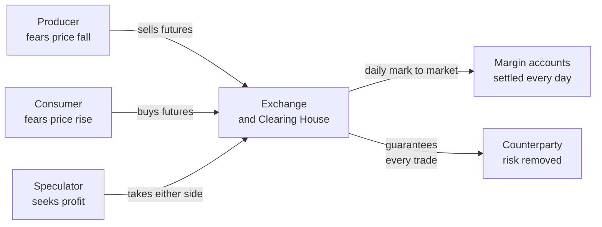
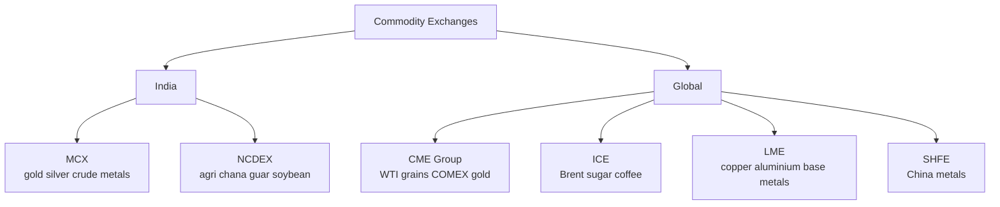
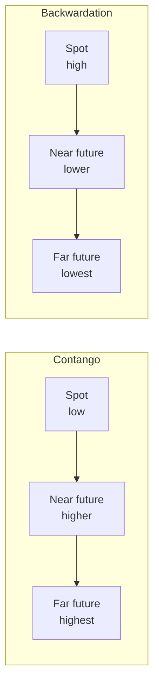
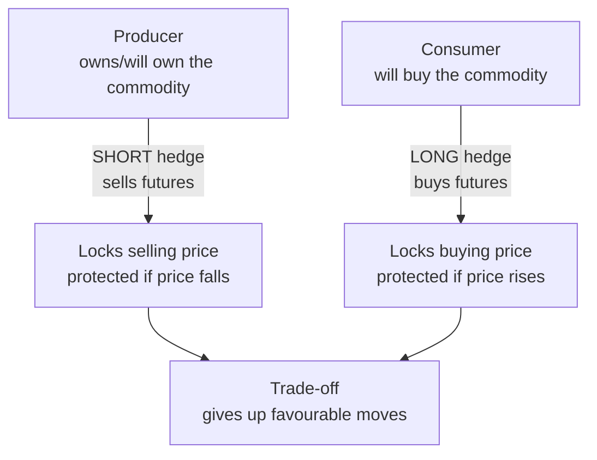

# Chapter 18 — Commodities Markets

## 1. The Problem / The Need

Long before there were stocks or bonds, there were commodities. A farmer in Punjab grows wheat that will be harvested in April. A flour mill in Mumbai needs that wheat all year to keep its machines running. An airline in Delhi burns jet fuel every single day, but the price of crude oil that feeds that fuel swings 40% in a year for reasons the airline cannot control — a war in the Middle East, an OPEC production cut, a recession in China. A goldsmith needs to buy gold today to make jewellery he will sell in three months, but he has no idea what gold will cost when he restocks.

Every one of these people faces the same underlying problem: **the thing they produce or consume has a price that moves violently and unpredictably, and that price risk can wipe them out even when they are good at their actual business.**

The farmer's problem is that he plants in November when wheat is 2,400 rupees a quintal, but by the time he harvests in April the price could crash to 1,900 because everyone had a good crop. He did nothing wrong — he just got unlucky on price. The mill's problem is the mirror image: a bad monsoon could send wheat to 3,000 and destroy its margins. The airline cannot pass a sudden doubling of fuel cost onto passengers overnight without losing them to competitors.

What all these actors want is not to *speculate* on prices — they want to *lock in* a price so they can plan, invest, and sleep at night. That single need — **price certainty for people exposed to physical goods** — is the reason commodity markets exist. A second, later need layered on top: investors discovered that commodities behave differently from stocks and bonds, so owning them can smooth a portfolio. The market that grew up to serve hedgers ended up serving investors too.

## 2. The Core Idea

A commodity market is a place where **standardised raw materials are traded**, either for immediate delivery (spot) or for delivery at a fixed future date at a price agreed today (futures and forwards).

Two ideas do almost all the work.

**Standardisation.** You cannot have a liquid market in "some wheat" or "a bit of gold." You need a contract that says exactly: this grade of wheat, this purity of gold (995 fineness), this quantity (1 kilogram, 100 barrels), delivered to this warehouse, by this date. Once every unit is interchangeable — *fungible* — buyers and sellers who have never met can trade with confidence. A gold futures contract in Mumbai means the same thing to everyone, which is what lets thousands of strangers trade it per second.

**Time-shifting of price.** The genius of a futures contract is that it separates the *price decision* from the *delivery decision*. The farmer can fix his selling price in November for wheat he won't deliver until April. He has transferred the risk of a price fall to someone willing to bear it — a speculator betting prices will rise, or a mill that wants to lock its input cost. Nobody has to move any wheat today; they simply agree on tomorrow's price today.

Everything else in this chapter — exchanges, contango, hedging, commodities as an asset class — is machinery built around these two ideas.

## 3. How It Works — The Machinery

Imagine the wheat farmer and the flour mill again, but now give them an exchange.

The farmer expects 100 quintals in April and fears a price fall. On NCDEX (India's main agri-commodity exchange) he **sells** a wheat futures contract for April delivery at 2,400 rupees/quintal. The mill, fearing a price *rise*, **buys** the same contract at 2,400. Both have now locked their price. Note they did not need to find each other — the exchange's order book matched them anonymously.

Between now and April, the futures price will wander. Say by March wheat futures fall to 2,000. The farmer's short position has *gained* 400/quintal (he agreed to sell at 2,400, market is now 2,000). The mill's long position has *lost* 400. The exchange does not wait until April to settle this — every single day it does **mark-to-market**: it moves money from the loser's account to the winner's. This daily settlement, run through a **clearing house** that guarantees every trade, is what removes the fear that your counterparty will vanish when the market moves against them.

In April, most participants **close out** rather than deliver. The farmer buys back his short at the prevailing price; the mill sells its long. The futures gain or loss offsets the change in the physical price the farmer gets in his local mandi. If wheat fell to 2,000, the farmer sells his real wheat locally for 2,000 but pocketed 400 on the futures — netting his intended 2,400. The hedge worked. Only a small fraction of contracts go to physical delivery; the market's job is price transfer, not logistics.

*Figure 18.1 — The exchange sits between all participants, matching hedgers and speculators and guaranteeing settlement.*

Three pieces of machinery make this reliable:

**Margin.** To trade a contract worth, say, 2.4 lakh rupees, you post only a fraction — an *initial margin* of maybe 5–10%. This leverage is why commodities are capital-efficient but also dangerous. If losses eat into your margin, you get a *margin call* and must top up or be liquidated.

**The clearing house** becomes the buyer to every seller and the seller to every buyer (*novation*). No participant relies on any other participant's honesty — they rely on the clearing house, which is protected by margins and a default fund.

**Position limits and regulation.** In India, SEBI regulates commodity derivatives (since 2015, when it absorbed the old Forward Markets Commission). Limits stop any single player from cornering a market.

## 4. Full Content — The Landscape in Detail

### 4.1 Categories of commodities

Commodities split into broad families, each with its own economics.

| Category | Sub-groups | Examples | Key price drivers |
|---|---|---|---|
| **Energy** | Crude oil, natural gas, refined products | WTI, Brent, natural gas, gasoline | Geopolitics, OPEC, economic growth, weather |
| **Metals — precious** | Store-of-value metals | Gold, silver, platinum, palladium | Real interest rates, US dollar, inflation fear, central-bank buying |
| **Metals — base/industrial** | Construction & manufacturing inputs | Copper, aluminium, zinc, lead, nickel | Industrial demand, China, mine supply |
| **Agriculture — soft** | Grown crops, tropical | Coffee, cocoa, sugar, cotton | Weather, disease, growing-region politics |
| **Agriculture — grains/oilseeds** | Staple food & feed | Wheat, maize, soybean, palm oil | Monsoon, harvest, export bans, biofuel demand |
| **Livestock** | Animal products | Live cattle, lean hogs | Feed cost, disease, consumption trends |

A useful conceptual split is **hard commodities** (mined or extracted — metals and energy) versus **soft commodities** (grown — crops and livestock). Hard commodities tend to track the industrial cycle; softs are driven by weather and biology. Copper is nicknamed **"Dr. Copper"** because its price is so sensitive to global industrial health that it acts like an economist with a PhD, forecasting recessions and booms.

### 4.2 Spot versus futures

The **spot market** is for immediate delivery at today's price — the *spot price* or *cash price*. When a jeweller in Zaveri Bazaar buys physical gold this morning, that is spot. Spot markets can be physical (a mandi, a bullion dealer) or exchange-based.

The **futures market** trades contracts for future delivery. The **futures price** reflects the market's collective expectation *plus* the cost of carrying the commodity to that future date. The two prices are linked but not equal; the gap between them is the heart of contango and backwardation (Section 4.6).

| Dimension | Spot market | Futures market |
|---|---|---|
| Delivery timing | Immediate (T+0 to T+2) | Fixed future date |
| Price paid | Full value now | Only margin now |
| Primary users | Physical buyers/sellers | Hedgers, speculators, arbitrageurs |
| Purpose | Actual exchange of goods | Price discovery & risk transfer |
| Leverage | None | High (margin-based) |

**Forwards versus futures** is a related distinction. A *forward* is a private, customised contract between two parties (say, an exporter and a bank) — flexible but carrying counterparty risk and no daily settlement. A *future* is the exchange-traded, standardised, cleared cousin. Forwards dominate physical commercial hedging; futures dominate liquid, transparent price discovery.

### 4.3 Participants

- **Hedgers** — producers (miners, farmers, oil companies) and consumers (airlines, food processors, jewellers) who use the market to offload price risk. They are the market's reason to exist.
- **Speculators** — traders and funds who take on the price risk hedgers want to shed, hoping to profit. They are not villains; they provide the *liquidity* without which a hedger would find no counterparty. A market of only hedgers would be one-sided and illiquid.
- **Arbitrageurs** — players who exploit price gaps (between spot and futures, between two exchanges, between two related commodities) and in doing so keep prices consistent and fair.
- **Exchanges & clearing houses** — the infrastructure.
- **Regulators** — SEBI in India, the CFTC in the US.

### 4.4 Exchanges — Indian and global

**India:**

- **MCX (Multi Commodity Exchange), Mumbai** — India's dominant commodity exchange, launched 2003. It leads in **non-agri** commodities: gold, silver, crude oil, natural gas, copper, zinc, aluminium. MCX is where an Indian jeweller or oil importer hedges. Its gold and crude contracts are the most liquid.
- **NCDEX (National Commodity & Derivatives Exchange), Mumbai** — the leader in **agricultural** commodities: guar seed, chana (chickpea), soybean, mustard, jeera (cumin), turmeric, cotton. NCDEX price benchmarks matter deeply to Indian farmers and agri-traders.
- **NSE and BSE** also now offer commodity derivatives (allowed after unification of regulation under SEBI in 2015).

Indian commodity trading was long fragmented and lightly regulated. A pivotal event was the **NSEL scam (2013)**, where the National Spot Exchange collapsed on a ~5,600 crore rupee payment default, exposing weak oversight of spot exchanges. This accelerated the 2015 merger of the Forward Markets Commission into SEBI, giving commodity derivatives the same regulatory rigour as securities.

**Global:**

- **CME Group (Chicago)** — the giant, formed from the Chicago Mercantile Exchange and Chicago Board of Trade. Home of **WTI crude, natural gas (Henry Hub), grains (corn, wheat, soybeans), livestock, and COMEX gold/silver**. The global benchmark for many commodities.
- **ICE (Intercontinental Exchange)** — home of **Brent crude** (the global oil benchmark), plus sugar, coffee, cocoa, cotton.
- **LME (London Metal Exchange)** — the world's centre for **base metals**: copper, aluminium, zinc, nickel, lead. LME warehouse stocks and prices are the global reference for industrial metals.
- **SHFE (Shanghai Futures Exchange)** — increasingly important, reflecting China's dominance in metals consumption.

*Figure 18.2 — Where the world trades commodities, split by geography and specialisation.*

### 4.5 Price drivers

Commodity prices are ultimately driven by the physical balance of **supply and demand**, but many forces push on each side.

**Supply-side forces:**
- **Production & capacity** — OPEC's output decisions on oil; mine openings/closures for metals; planting decisions for crops.
- **Weather & natural events** — a poor Indian monsoon spikes pulses and oilseeds; a Brazilian frost sends coffee soaring; a hurricane in the Gulf of Mexico disrupts US oil and gas.
- **Geopolitics & policy** — wars, sanctions, and export bans. The 2022 Russia-Ukraine war sent wheat, natural gas, and crude sharply higher because Russia and Ukraine are major exporters. India's periodic **export bans** (on rice, wheat, onions) to protect domestic consumers are a recurring supply shock for global markets.
- **Inventories** — high stockpiles cushion prices; low inventories make prices twitchy.

**Demand-side forces:**
- **Economic growth** — industrial commodities (copper, oil) rise in booms and fall in recessions. China alone consumes roughly half the world's copper, so Chinese growth is a dominant swing factor.
- **Substitution** — natural gas versus coal for power; palm oil versus soybean oil in cooking.
- **Seasonality** — natural gas demand peaks in winter (heating); gasoline in the US "driving season" of summer.

**Financial forces (they matter more than beginners expect):**
- **The US dollar** — most commodities are priced in dollars, so a stronger dollar mechanically makes them costlier in other currencies and tends to depress prices. A weaker dollar lifts them.
- **Real interest rates** — critical for **gold**. Gold pays no yield, so when real (inflation-adjusted) interest rates are high, holding gold has a high opportunity cost and its price tends to fall; when real rates are low or negative, gold shines.
- **Inflation and fear** — gold and silver are classic hedges against inflation and crises; investors flee to them when confidence collapses.

### 4.6 Contango and backwardation — the shape of the futures curve

This is where commodities get genuinely conceptual, and it is a favourite interview topic.

Plot the futures price against delivery month and you get a **forward curve**. Its shape has a name and a meaning.

**Contango** is when **futures prices are higher than the spot price** — the curve slopes upward. Deferred delivery costs more than immediate delivery. Why would that be normal? Because holding a physical commodity until the future date costs money: **storage, insurance, and the financing cost of the capital tied up.** These are the **cost of carry**. In a calm market, the futures price roughly equals spot plus cost of carry, which naturally produces contango. Crude oil, which is expensive to store, is often in contango.

**Backwardation** is the opposite: **futures prices are lower than spot** — the curve slopes downward. Immediate delivery is *more* valuable than future delivery. This happens when there is a **shortage right now** — people will pay a premium to get the commodity today rather than wait. That premium for having the physical good on hand is called the **convenience yield**. A refiner that will shut down without crude *this week* values a barrel today far above a barrel in six months. Backwardation signals tight physical supply.

*Figure 18.3 — Contango slopes upward (storage costs dominate); backwardation slopes downward (scarcity today dominates).*

**Why this matters for investors — the roll.** A futures contract expires. An investor who wants continuous exposure must **roll** — sell the expiring contract and buy the next one. In contango, the next contract is *more expensive*, so rolling loses money each time (**negative roll yield**). In backwardation, the next contract is *cheaper*, so rolling *makes* money (**positive roll yield**). Over years, roll yield can dominate an investor's return — which is why simply "owning oil" through futures can lose money even when spot oil is flat, if the curve is persistently in contango. This is the trap that hurt commodity index investors in the 2010s.

A vivid example: in **April 2020**, US WTI crude futures for May delivery went **negative — about minus 37 dollars a barrel.** Demand had collapsed in the COVID lockdown, storage tanks (especially at Cushing, Oklahoma) were full, and traders holding expiring futures had nowhere to physically put the oil. Rather than take delivery they had no room for, they paid others to take the contracts off their hands. That is contango and the storage constraint taken to an absurd, historic extreme.

### 4.7 Hedging in practice — producers and consumers

**A producer hedge (short hedge).** An oil producer like a shale driller in Texas fears prices will fall before it can sell its output. It **sells** crude futures. If oil falls, the futures gain offsets the lower price it gets for physical barrels. It has locked its revenue. The cost: if oil *rises*, it gives up the upside. That is the deliberate trade-off of hedging — you swap uncertainty for certainty in both directions.

**A consumer hedge (long hedge).** IndiGo or any airline fears jet-fuel prices will rise. It **buys** crude or fuel futures/swaps. If oil rises, the futures gain offsets the higher fuel bill. Southwest Airlines in the US became famous for aggressive fuel hedging that saved it billions when oil spiked in the mid-2000s. The risk: if oil falls, the airline is locked into a higher effective cost while competitors enjoy the drop — a real cost of over-hedging.

**Basis risk** is the practical wrinkle. A hedge is rarely perfect because the futures contract (say, WTI crude, or NCDEX chana of a specific grade delivered to a specific warehouse) is not *exactly* the item the hedger buys or sells locally. The gap between the local physical price and the futures price is the **basis**, and it can move, leaving a small residual risk even in a well-constructed hedge. A hedger accepts basis risk as the price of eliminating the far larger outright price risk.

*Figure 18.4 — Producers short to protect against falls; consumers go long to protect against rises. Both trade upside for certainty.*

### 4.8 Commodities as an asset class

Beyond hedgers, investors hold commodities for three reasons.

**Diversification.** Commodity returns have historically had **low correlation** with stocks and bonds. When equities fall in an inflationary shock, commodities often rise. Adding a slice of commodities can therefore lower the overall volatility of a portfolio without necessarily lowering its return — the classic diversification benefit.

**Inflation hedge.** Commodities are real assets whose prices *are* a big component of inflation. When inflation surges, commodity prices typically surge with (or ahead of) it, protecting purchasing power — something nominal bonds fail to do. 2021–2022 was a textbook case: as inflation spiked worldwide, energy and food led the way up while bonds were crushed.

**Return / event risk.** Commodities can deliver strong returns in supply shocks and geopolitical crises precisely when other assets suffer.

**How investors actually get exposure:**

| Vehicle | What it is | Notes |
|---|---|---|
| **Physical** | Buying gold bars, coins | Simple for gold; impractical for oil or wheat (storage!) |
| **Futures** | Direct contracts | Efficient but requires rolling; roll yield matters |
| **Commodity ETFs** | Funds holding futures or physical | E.g. gold ETFs hold physical gold; oil ETFs hold futures and suffer contango |
| **Sovereign Gold Bonds (India)** | RBI-issued bonds tracking gold, paying interest | No storage, plus 2.5% interest — a distinctly Indian, elegant vehicle |
| **Commodity index funds** | Track baskets like the S&P GSCI or Bloomberg Commodity Index | Exposed to roll yield across the whole basket |
| **Equities of producers** | Shares of miners, oil companies | Indirect; carry company-specific and equity-market risk too |

A key nuance: **gold is special.** It is barely consumed industrially relative to how much is held as a store of value, it has no cash flow, and it is driven by real rates, the dollar, and fear rather than by industrial demand. Investors treat gold almost as a currency. Industrial commodities like copper and oil behave very differently — they are geared to the economic cycle.

## 5. Worked / Real Examples

**Example 1 — A farmer's hedge on NCDEX (short hedge).**
Ramesh expects to harvest 100 quintals of chana in March. In December, chana March futures trade at 5,200 rupees/quintal. Fearing a price fall, he **sells** 100 quintals of futures at 5,200, posting say 8% margin. By March, a bumper crop pushes chana down to 4,700. In his local mandi he sells physical chana at roughly 4,700 — a 500/quintal loss versus December. But he **buys back** his futures at 4,700, gaining 500/quintal on the futures. Net realised: ~5,200. The hedge did its job. Had chana instead *risen* to 5,700, he'd have gained 500 physically but lost 500 on futures — still netting 5,200. He traded away both outcomes for certainty.

**Example 2 — An airline's fuel hedge (long hedge).**
An airline budgets on Brent at 80 dollars. Fearing a spike, it **buys** Brent futures/swaps at 80. War breaks out; Brent jumps to 110. Its physical fuel now costs 30/barrel more, but the futures position gained ~30/barrel, offsetting the bill. The airline's costs stayed near plan while unhedged rivals bled. (The flip side: if Brent had fallen to 60, the airline would be stuck paying an effective 80 while rivals enjoyed 60 — the cost of certainty.)

**Example 3 — Contango and the negative-oil day, April 2020.**
COVID lockdowns crushed oil demand overnight. Storage at Cushing filled up. Traders holding May WTI futures faced physical delivery of oil they could not store. On 20 April 2020, May WTI settled at **about minus 37 dollars/barrel** — sellers paid buyers to take the contracts. This is contango stretched to breaking point: the futures curve was so steeply upward-sloping and near-term storage so scarce that immediate delivery had *negative* value. It is the single best real-world lesson in why the curve's shape, and the physical constraint behind it, matters.

**Example 4 — Roll yield killing an ETF investor.**
An investor buys a US oil ETF in 2015 expecting oil to recover. Spot oil does drift up modestly over the year — but the futures curve is in persistent contango. Each month the ETF sells the cheap expiring contract and buys a more expensive next one, bleeding a few percent to negative roll yield. A year later, spot oil is higher yet the investor has *lost* money. Lesson: with commodity futures, you are not simply betting on spot; the curve shape is part of your return.

## 6. Connections

- **To derivatives (Chapter on futures & options):** Commodity futures are the original derivatives — the entire machinery of margin, mark-to-market, and clearing houses was pioneered in Chicago grain pits in the 1800s and later applied to financial futures.
- **To currency markets:** Because commodities are priced in US dollars, the dollar's strength is a commodity price driver, and commodity-exporting nations (Russia, Australia, Brazil, Gulf states) have currencies that move with commodity prices — "commodity currencies."
- **To inflation and macro:** Commodity prices *feed into* inflation (energy and food are big CPI components), which feeds into central-bank policy and interest rates, which feed back into commodity prices via the dollar and real rates. A tight loop.
- **To equities:** Producer stocks (ONGC, Vedanta, Coal India in India; Exxon, BHP, Glencore globally) are commodity plays with an equity wrapper.
- **To portfolio theory:** Commodities' low correlation with stocks/bonds is a direct application of diversification from modern portfolio theory.

## 7. Key Terms

- **Spot price** — price for immediate delivery.
- **Futures price** — agreed price today for delivery at a future date.
- **Forward** — private, customised, non-cleared version of a future.
- **Cost of carry** — storage + insurance + financing cost of holding a physical commodity over time.
- **Convenience yield** — the premium value of having the physical commodity on hand now.
- **Contango** — futures priced above spot; upward-sloping curve; driven by cost of carry.
- **Backwardation** — futures priced below spot; downward-sloping curve; driven by scarcity/convenience yield.
- **Roll / roll yield** — the gain or loss from rolling an expiring contract into the next; negative in contango, positive in backwardation.
- **Basis** — the difference between the local physical (spot) price and the futures price.
- **Basis risk** — residual risk that the basis moves, leaving a hedge imperfect.
- **Short hedge / long hedge** — producers sell futures; consumers buy futures.
- **Mark-to-market** — daily settlement of gains/losses on futures.
- **Margin** — good-faith deposit backing a futures position; initial and maintenance.
- **Clearing house** — the guarantor that becomes counterparty to every trade (novation).
- **Hard vs soft commodities** — mined/extracted vs grown.
- **Fungibility** — interchangeability of standardised units.

## 8. Common Confusions

**"Contango is bad, backwardation is good."** Not inherently. For a *long* futures investor, contango hurts (negative roll) and backwardation helps. For a *short* hedger it can be the reverse. Neither state is morally good or bad — each simply reflects storage costs versus current scarcity.

**"Hedging is about making money."** No. Hedging is about *removing risk*, and it costs you the favourable outcomes as much as it protects you from the bad ones. A perfectly hedged producer captures no windfall from a price spike. Hedging is insurance, not a profit centre.

**"Speculators are parasites who distort prices."** In moderation, speculators are essential — they provide the liquidity and take the risk hedgers want to shed. Without them, hedgers would struggle to find counterparties. Excessive, manipulative speculation is a genuine problem, which is why position limits and regulators exist — but the category as a whole is load-bearing.

**"Buying an oil ETF is the same as owning oil."** No. Most oil ETFs hold *futures*, so your return is spot movement *plus* roll yield. In contango, you can lose money even as spot oil rises.

**"Gold is just another commodity."** Gold behaves less like copper and more like a currency or a fear gauge. It is driven by real interest rates, the dollar, and crisis sentiment, not by industrial consumption. Lumping it with industrial commodities leads to wrong intuitions.

**"Futures and forwards are the same thing."** Economically similar, structurally different: forwards are private, customised, and carry counterparty risk; futures are standardised, exchange-traded, cleared, and marked-to-market daily.

**"The futures price is a forecast of the future spot price."** Only loosely. It is spot adjusted for cost of carry and convenience yield, not a crystal-ball prediction. A steep contango does not mean the market expects a big price rise — it often just reflects high storage costs.

## 9. First-Principles Recap

Strip everything away and here is what remains. Physical goods have volatile prices that threaten the people who produce and consume them. To manage that, humans invented a way to **fix a price today for a transaction that happens later** — the futures contract. To make such contracts tradable among strangers, they **standardised** them and built **exchanges and clearing houses** to guarantee settlement.

The relationship between today's price (spot) and tomorrow's agreed price (futures) is governed by two opposing physical realities: it *costs* money to store a commodity over time (pushing futures above spot — contango), while a *shortage right now* makes immediate delivery precious (pushing futures below spot — backwardation). The shape of that curve is not a technicality; it determines whether an investor rolling contracts earns or bleeds return.

Producers protect themselves by selling futures; consumers protect themselves by buying futures; both trade away potential windfalls for certainty. Speculators take the other side and supply liquidity. Prices are set by the eternal tug of supply and demand, amplified by weather, geopolitics, the dollar, and interest rates. And because commodities march to a different drummer than stocks and bonds, investors hold them to diversify and to hedge inflation. Every piece of the machinery traces back to that one primal need: **certainty about the price of physical things.**

## 10. Quick-Reference / Interview Points

- **Categories:** energy, precious metals, base metals, agriculture (grains/oilseeds, softs), livestock. Hard (mined) vs soft (grown).
- **Spot vs futures:** spot = immediate delivery, full price now; futures = future delivery, margin now, used for hedging and price discovery.
- **Forwards vs futures:** forwards are private/customised/OTC with counterparty risk; futures are standardised/exchange-traded/cleared/marked-to-market.
- **Indian exchanges:** MCX leads bullion, energy, base metals; NCDEX leads agri. SEBI regulates (took over from FMC in 2015, catalysed by the 2013 NSEL scam).
- **Global exchanges:** CME Group (WTI, grains, COMEX gold), ICE (Brent, softs), LME (base metals), SHFE (China).
- **Benchmarks:** WTI (US crude, CME/NYMEX), Brent (global crude, ICE), Henry Hub (US gas).
- **Contango:** futures > spot, upward curve, driven by cost of carry; negative roll yield for longs. Oil often in contango.
- **Backwardation:** futures < spot, downward curve, driven by convenience yield / current scarcity; positive roll yield for longs.
- **Roll yield** can dominate long-term commodity returns — an ETF can lose money in contango even if spot rises.
- **Short hedge** = producer sells futures (protects against price fall). **Long hedge** = consumer buys futures (protects against price rise). Both give up favourable moves; both face **basis risk**.
- **Price drivers:** supply (OPEC, weather, mines, export bans), demand (China, growth, seasonality), financial (US dollar strength, real interest rates, inflation/fear).
- **Gold logic:** no yield → hurt by high real rates, helped by low/negative real rates; inversely related to the dollar; a fear/inflation hedge. Behaves like a currency, not an industrial metal.
- **"Dr. Copper"** — copper as a barometer of global industrial health.
- **Commodities as an asset class:** low correlation with equities/bonds → diversification; real assets → inflation hedge. Access via futures, ETFs, index funds, producer equities, physical gold, and India's Sovereign Gold Bonds (gold exposure + 2.5% interest, no storage).
- **The unforgettable fact:** WTI May futures settled at ~ −37 dollars on 20 April 2020 — demand collapse + full storage = negative oil. The ultimate contango-and-storage lesson.
- **One-line essence:** commodity markets exist to give producers and consumers of physical goods **certainty about price**, achieved by standardised, cleared contracts that separate the price decision from the delivery decision.
