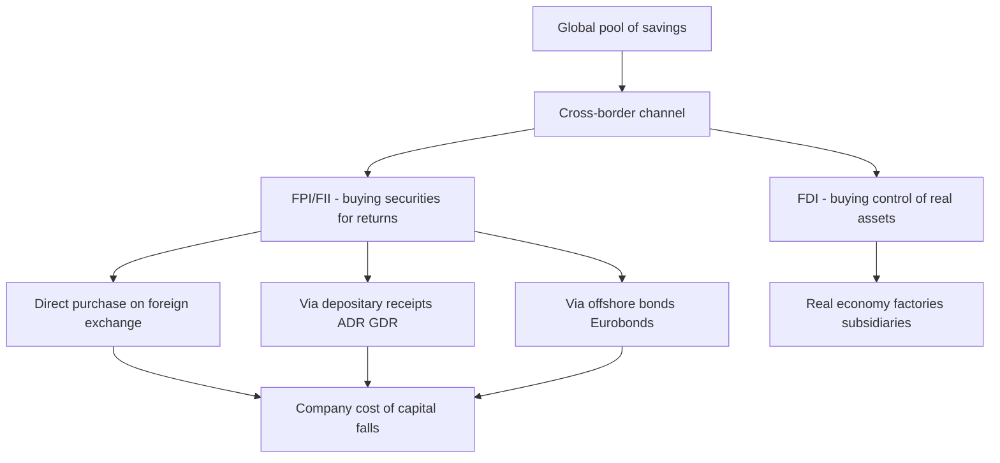
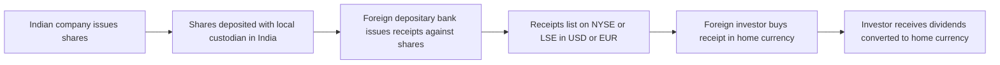
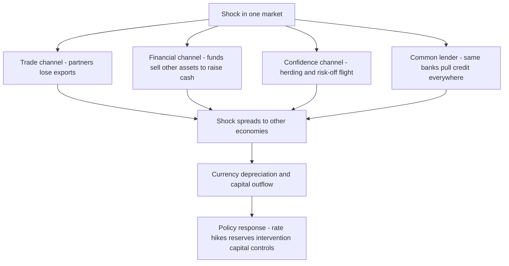

# Chapter 19 — International Financial Markets

## 1. The Problem / The Need

Imagine you are the treasurer of Infosys in the year 2000. The company earns most of its revenue in US dollars, but its shares trade only on Indian stock exchanges in rupees. An American pension fund in Boston loves the India IT growth story and wants to own a slice of Infosys. But it hits a wall: it cannot easily open a rupee bank account, it does not understand Indian settlement systems, its own regulator restricts it from buying securities on unfamiliar foreign exchanges, and even if it buys, dividends will come in rupees that it must repatriate through a maze of exchange-control rules. The capital wants to flow, but the plumbing does not exist.

Now flip the perspective. A promising Indian renewable-energy company needs USD 300 million to build solar parks. Indian banks can lend, but their cost of funds is high and they are wary of concentrated exposure. Meanwhile, in London and Singapore, there are pools of dollar savings earning almost nothing, hunting for yield. The money is there; the borrower is there; but they sit in different countries, different currencies, different legal systems, and different regulatory regimes.

**This is the fundamental problem international financial markets solve: capital is trapped inside national borders, while the best uses of that capital — and the best sources of it — are frequently on the other side of the world.**

Every economy has a natural mismatch between how much it saves and how much it can profitably invest. China and Japan have historically saved more than they could use domestically. The United States has consumed and invested more than it saved. Fast-growing emerging markets like India, Brazil, and Indonesia have abundant investment opportunities but shallow domestic savings pools. Left to purely domestic markets, this mismatch is wasted — surplus savings earn low returns at home while high-return projects elsewhere go unfunded.

International financial markets exist to close four specific gaps:

- **The geographic gap** — savers and borrowers live in different countries.
- **The currency gap** — a borrower wants dollars but investors hold yen, euros, or rupees.
- **The regulatory gap** — each country wraps its markets in different rules, disclosure regimes, and capital controls.
- **The information and trust gap** — a Boston investor cannot easily assess an Indian firm using unfamiliar accounting standards and legal protections.

The instruments and mechanisms in this chapter — foreign portfolio investment, ADRs and GDRs, Eurobonds, offshore markets, and the machinery of currency and country-risk management — are all engineered answers to these gaps. They are the pipes, valves, and translation layers that let capital cross borders at scale.

## 2. The Core Idea

The core idea of international financial markets is **intermediation across sovereign boundaries**: creating instruments and venues that let capital move between countries while managing the frictions of currency, regulation, and trust.

There are two broad channels through which capital crosses borders, and understanding the difference is the single most important conceptual anchor in this chapter:

1. **Foreign Direct Investment (FDI)** — buying control of a real business or asset abroad (a factory, a controlling stake, a subsidiary). This is "sticky" capital: strategic, long-term, hard to reverse quickly.
2. **Foreign Portfolio Investment (FPI/FII)** — buying financial securities (shares, bonds) abroad for returns, without control. This is "hot" capital: liquid, return-seeking, and able to exit fast.

The rest of the chapter's instruments are essentially **bridges** that make one or both of these flows easier:

- **ADRs and GDRs** let a company's equity trade in a foreign market in a foreign currency, so foreign investors can buy "Infosys" on the NYSE as easily as they buy Apple.
- **Eurobonds and offshore markets** let borrowers raise debt in a currency outside that currency's home country, escaping domestic regulation and tapping global savings.
- **Currency and country-risk tools** are the shock absorbers that make all of the above survivable when exchange rates and governments move against you.

The unifying insight: **when capital can flow freely across borders, the cost of capital falls for good borrowers everywhere, and returns rise for savers everywhere — but the price of that integration is that shocks also travel across borders instantly.** This trade-off between efficiency and contagion is the deep tension running through the entire field.

*The two great channels of cross-border capital and the bridges that carry portfolio flows.*

## 3. How It Works — The Mechanics

Let us trace how money actually moves across a border, using the concrete example of a US fund investing in Indian equities.

**Step 1 — Registration and access.** The US fund cannot simply wire rupees to a broker. It must register as a **Foreign Portfolio Investor (FPI)** with the local regulator (in India, SEBI) through a designated **Custodian / Designated Depository Participant (DDP)**. It obtains a category (India uses Category I for well-regulated, low-risk investors like sovereign funds and pension funds, and Category II for others like broad-based funds and individuals). Registration establishes identity, tax status, and the KYC trail.

**Step 2 — Currency conversion.** The fund sends dollars; a bank converts them to rupees at the prevailing spot rate. This is the first moment currency risk enters — every rupee it now holds is exposed to USD/INR movements.

**Step 3 — Custody and settlement.** The rupees sit in a special account. When the fund buys shares, the local custodian settles the trade through the domestic depository (NSDL/CDSL in India) and holds the securities in custody on the fund's behalf. The shares are legally the fund's, but operationally held by the custodian.

**Step 4 — Ongoing flows.** Dividends arrive in rupees. Taxes (including any capital-gains and withholding taxes, shaped by Double Taxation Avoidance Agreements) are deducted. To take money home, the fund converts rupees back to dollars and repatriates — again crossing the currency-risk bridge.

Now contrast this with the **depositary-receipt route**, which avoids most of that friction. Instead of coming to India, the foreign investor buys a receipt in its own market:

*How a depositary receipt turns Indian shares into a foreign-currency security trading abroad.*

The genius of the depositary-receipt mechanism is that it moves the friction from the investor to a specialised intermediary (the depositary bank, typically BNY Mellon, Citi, JPMorgan, or Deutsche Bank). The investor deals only with a familiar exchange, a familiar currency, and familiar settlement — the bank handles the cross-border custody, currency conversion of dividends, and corporate actions.

**The offshore-debt route** works on a similar principle of moving to where the capital and the favourable rules are. A company that wants dollars issues a **Eurobond** — a bond denominated in dollars but issued and sold outside the United States, through an international syndicate of banks, cleared through Euroclear or Clearstream, and governed usually by English law. The borrower gets dollars; global investors get a familiar dollar bond; and both escape the heavier registration burden of issuing inside the US domestic market.

Underlying all three mechanisms is a shared architecture: a **regulated gateway** (FPI registration, depositary agreement, bond prospectus), an **intermediary that absorbs operational complexity** (custodian, depositary bank, lead arranger), and a **settlement/clearing backbone** that makes cross-border ownership legally clean.

## 4. Full Content — The Complete Picture

### 4.1 Developed vs Emerging Markets

International markets are not homogeneous. The single most important classification divides them into **developed** and **emerging** (with a **frontier** tier below emerging). The classification is done by index providers — MSCI, FTSE Russell, and S&P Dow Jones — and it matters enormously because trillions of dollars in index-tracking funds mechanically allocate capital based on these labels.

MSCI classifies a market on three criteria:

1. **Economic development** — sustainable GNI per capita (only used to separate developed from the rest).
2. **Size and liquidity** — number of companies meeting minimum size and trading-volume thresholds.
3. **Market accessibility** — openness to foreign ownership, ease of capital inflows/outflows, efficiency of the operational framework, and stability of the institutional framework. This third criterion is usually what keeps a large economy in the "emerging" bucket.

| Dimension | Developed markets | Emerging markets | Frontier markets |
|---|---|---|---|
| Examples | US, UK, Japan, Germany, Australia | India, China, Brazil, Taiwan, South Africa | Vietnam, Nigeria, Kenya, Bangladesh |
| Capital-market depth | Very deep and liquid | Moderate, growing | Shallow, illiquid |
| Currency convertibility | Fully convertible | Partial (capital-account restrictions) | Often restricted |
| Foreign-ownership limits | Minimal | Sector caps common | Significant |
| Volatility | Lower | Higher | Highest |
| Expected return | Lower | Higher (risk premium) | Highest but erratic |
| Governance / disclosure | Strong | Improving, uneven | Weak |
| Contagion sensitivity | Source of shocks | Receiver of shocks | Extreme sensitivity |

The crucial nuance for an Indian finance aspirant: **India is the largest and one of the most closely watched emerging markets, and its weight in the MSCI Emerging Markets Index has risen sharply as China's weight has fallen.** A reclassification decision — like the promotion of a market or an increase in its index weight — triggers billions of dollars of passive inflows regardless of any change in fundamentals. This is why index-provider reviews are market-moving events.

### 4.2 Foreign Portfolio Investment (FPI/FII) Flows

FPI (called FII — Foreign Institutional Investment — in older Indian terminology; SEBI merged FII, sub-account, and QFI into a single "FPI" regime in 2014) is the lifeblood of emerging-market equity and bond markets.

**Why FPI flows matter so much:**

- They are large relative to emerging-market float. On a single day, net FPI buying or selling of a few thousand crore rupees can swing the Nifty.
- They are **procyclical and reflexive** — they tend to arrive when sentiment is good (pushing prices and the currency up) and flee when sentiment sours (pushing both down), amplifying cycles.
- They are highly sensitive to **global** factors often unrelated to the host country — US interest rates, the dollar index, and global risk appetite frequently matter more than local fundamentals.

**The drivers of FPI flows** (a mental checklist for interviews):

1. **Interest-rate differentials** — high local rates attract yield-seeking capital ("carry trade"); the reverse repels it.
2. **US monetary policy** — when the Fed hikes or signals tightening, dollars flow *out* of emerging markets back to safer, now higher-yielding US assets. The 2013 "Taper Tantrum" is the canonical case.
3. **Growth differentials** — faster relative growth attracts equity flows.
4. **Currency expectations** — if the rupee is expected to appreciate, foreign returns are boosted; expected depreciation repels flows.
5. **Risk appetite / global liquidity** — "risk-on" vs "risk-off" regimes drive the tide.
6. **Valuations** — relative cheapness or richness of the market.
7. **Domestic policy and stability** — reforms, fiscal discipline, and political stability.

An important structural feature in India is the **counterbalancing role of Domestic Institutional Investors (DIIs)** — mutual funds fed by monthly SIP flows and insurers. In recent years, when FPIs have sold, DIIs have often absorbed the selling, dampening the volatility that FPI outflows once caused. This "domestic buffer" is a genuine maturation of the Indian market.

**Push vs pull factors** is the classic framework: *pull* factors are attractive local conditions (growth, reforms, high yields); *push* factors are global conditions that push capital out of source countries (low developed-market rates) or pull it back (Fed tightening). Emerging markets are often victims of push factors entirely beyond their control.

### 4.3 ADRs and GDRs — Depositary Receipts

A **depositary receipt (DR)** is a negotiable certificate issued by a bank in one country representing shares of a company in another country. It lets a company's equity trade abroad in foreign currency.

- **ADR (American Depositary Receipt)** — trades in the US market, priced in USD, subject to US securities regulation (SEC).
- **GDR (Global Depositary Receipt)** — trades outside the US, typically listed in London (LSE) or Luxembourg, often marketed to European and other international investors, commonly denominated in USD or EUR.
- **IDR (Indian Depositary Receipt)** — the mirror image: a foreign company's shares trading in India (Standard Chartered's IDR was the notable, and largely lonely, example).

**Why companies issue DRs:**

- Access a deeper pool of capital and a lower cost of capital.
- Broaden the shareholder base and raise global visibility/prestige.
- Create an acquisition currency (foreign-listed stock for overseas M&A).
- Provide liquid exit and stock-based compensation for employees abroad.

**Why investors like DRs:**

- Buy foreign companies in their home currency, through their normal broker, with familiar settlement — no need to register as an FPI or open a foreign account.
- Dividends are converted and paid in home currency.
- Regulatory comfort of a domestic-market listing.

**ADR levels** (a favourite interview detail):

| Level | Capital raised? | Where it trades | Reporting burden |
|---|---|---|---|
| Level I | No (existing shares) | OTC / pink sheets | Lightest |
| Level II | No | Listed on NYSE/NASDAQ | Full SEC reporting |
| Level III | Yes (new shares, public offering) | Listed on NYSE/NASDAQ | Heaviest, full SEC |
| Rule 144A | Yes (private placement) | To Qualified Institutional Buyers only | Minimal disclosure |

**Two-way fungibility and arbitrage.** A key mechanism: a DR is convertible back into the underlying shares. If Infosys's ADR on the NYSE trades at a premium to its Mumbai share price (adjusted for the DR ratio and the exchange rate), arbitrageurs can, subject to regulatory limits, convert shares into ADRs (or vice versa), keeping the two prices tethered. The **DR ratio** (e.g., 1 ADR = 1 share, or 1 GDR = 2 shares) is set at issuance. When conversion is restricted (as it often is in India, where reconversion beyond the "headroom" of previously converted receipts is capped), DRs can trade at persistent premiums or discounts to the home shares.

### 4.4 Eurobonds and Offshore Markets

The word "Euro" here is a historical accident and has **nothing to do with the euro currency**. A **Eurocurrency** is any currency deposited or lent *outside* its home country. A **Eurodollar** is a dollar deposit held in a bank outside the United States (originally in London). A **Eurobond** is a bond issued and sold outside the country of the currency in which it is denominated.

The distinctions that trip up students:

| Term | Definition | Example |
|---|---|---|
| **Domestic bond** | Issued by a domestic borrower, in domestic currency, in the domestic market | Reliance issuing a rupee bond in India |
| **Foreign bond** | Issued by a *foreign* borrower, in the *local* currency, in the *local* market | A US company issuing a yen bond in Japan (a "Samurai" bond); an Indian firm issuing a rupee "Masala bond" is a twist — rupee-denominated but issued offshore |
| **Eurobond** | Denominated in a currency *outside* that currency's home country | An Indian company issuing a USD bond in London/Singapore |

Named foreign bonds worth knowing: **Yankee** (foreign issuer, USD, in the US), **Samurai** (foreign issuer, JPY, in Japan), **Bulldog** (GBP, in the UK), **Dim Sum** (CNY/RMB, in Hong Kong), and **Masala** (INR-denominated, issued offshore — pioneered by IFC and used by HDFC and NTPC to shift currency risk onto the investor).

**Why the offshore/Eurobond market exists and thrives:**

- **Regulatory arbitrage** — Eurobonds escape the registration and disclosure requirements of domestic markets (a Yankee bond must register with the SEC; a Eurodollar bond need not). This lowers cost and speeds issuance.
- **Tax efficiency** — historically issued in bearer form with interest paid gross (no withholding), attractive to certain investors.
- **Deep, unified investor base** — a global syndicate reaches investors across many countries in one deal.
- **Currency choice** — a borrower can pick the cheapest funding currency and swap it back to what it needs.

**Offshore financial centres** — London, Singapore, Hong Kong, Luxembourg, Dublin, and increasingly India's own **GIFT City (Gujarat International Finance Tec-City) IFSC** — are jurisdictions that host these markets with light regulation, tax neutrality, and world-class settlement infrastructure. GIFT City is India's deliberate attempt to onshore the offshore: to bring rupee and dollar business (including the offshore rupee derivatives — the NDF market — and dollar bond listings) back under an Indian, if specially regulated, roof via the **IFSCA** regulator.

The **External Commercial Borrowing (ECB)** framework is how the RBI governs Indian companies raising these offshore foreign-currency (and rupee) loans and bonds, setting limits on amounts, maturities, all-in-cost ceilings, and permitted end-uses.

### 4.5 Global Market Integration and Contagion

**Integration** means that asset prices, interest rates, and capital across countries move together because capital can flow freely between them. In a fully integrated world, the *same risk* earns the *same return* everywhere (the law of one price for risk), and a firm's cost of capital depends on *global* rather than purely domestic risk.

Integration is measured by things like cross-market return correlations, the co-movement of interest rates, and the "home bias" of investor portfolios (which has fallen over decades but remains stubbornly high).

The benefits of integration are real: lower cost of capital, better risk-sharing, deeper liquidity, and discipline on governments (bond markets punish reckless fiscal policy). But integration has a dark twin: **contagion** — the transmission of a shock from one market to others, often out of proportion to real economic linkages.

Contagion travels through several channels:

- **Trade channel** — a slowdown in one country hurts its trading partners (slow, fundamental).
- **Financial/portfolio channel** — a fund that loses money in Country A sells assets in Country B to raise cash or de-risk, transmitting the shock even though B's fundamentals are fine ("wake-up call" and "common-lender" effects).
- **Confidence/herding channel** — investors extrapolate trouble in one emerging market to all "similar" markets, fleeing the whole asset class ("risk-off").
- **Common shocks** — a Fed rate hike or a spike in the dollar hits all emerging markets simultaneously.

*The channels through which a local shock becomes a global contagion.*

The classic case studies: the **1997 Asian Financial Crisis** (a Thai baht devaluation cascaded across Indonesia, Korea, Malaysia through common-lender and confidence channels), the **1998 Russian default → LTCM** episode (a Russian default blew up a US hedge fund via financial linkages), and the **2008 Global Financial Crisis** (US subprime losses froze global funding markets within weeks). India, with limited capital-account convertibility, was somewhat insulated in 1997 and 2008 — a live illustration that capital controls trade growth for stability.

### 4.6 Currency Risk and Country Risk in Cross-Border Investing

When you invest across a border, your total return decomposes into two parts:

**Total return (in home currency) ≈ Local asset return + Currency return**

A US investor who earns 15% on Indian equities but suffers a 10% rupee depreciation ends up with roughly 5% in dollars. **Currency risk can dominate — even erase — the underlying investment return.** This is the first-order lesson of international investing.

**Currency (exchange-rate) risk** comes in three textbook flavours:

1. **Transaction exposure** — a known future foreign-currency cash flow (a receivable or a coupon) whose home-currency value is uncertain. Hedgeable with forwards, futures, options.
2. **Translation (accounting) exposure** — the restatement of foreign assets/liabilities into the parent's reporting currency. A balance-sheet, not cash-flow, effect.
3. **Economic (operating) exposure** — the deeper impact of currency moves on a firm's competitive position and future cash flows. Hardest to hedge.

**Country risk** is the broader bundle of risks specific to investing in a particular sovereign jurisdiction:

- **Political risk** — expropriation, nationalisation, war, regime change, policy reversals.
- **Sovereign/transfer risk** — the risk the government defaults on its own debt, or imposes **capital controls / convertibility restrictions** that trap your money even when the investment succeeded (the nightmare scenario: great returns you cannot repatriate).
- **Regulatory and legal risk** — sudden tax changes, weak contract enforcement, opaque courts.
- **Macroeconomic risk** — inflation, twin deficits, reserve adequacy.

Country risk is priced through **sovereign credit ratings** (Moody's, S&P, Fitch), **sovereign bond spreads** over US Treasuries, and **credit default swap (CDS) spreads**. A country's rating effectively caps the ratings of its companies (the "sovereign ceiling"), which is why an excellent Indian company still pays a spread reflecting India's sovereign rating (India sits at the lower end of investment grade, around BBB-).

**Managing these risks:**

- Hedge currency exposure with forwards, futures, options, and currency swaps — but hedging costs money (roughly the interest-rate differential, via covered interest parity), and for a high-yield currency like the rupee the hedge cost can eat much of the extra yield.
- Diversify across countries so that no single sovereign shock is fatal.
- Buy political-risk insurance (e.g., via MIGA, the World Bank's Multilateral Investment Guarantee Agency, or export-credit agencies).
- Demand a **country risk premium** in the required return — this is why the same project has a higher hurdle rate in an emerging market than in a developed one.

**Covered Interest Parity (CIP)** is the anchoring no-arbitrage relationship: the forward exchange rate must adjust so that hedging removes any risk-free advantage from investing in a higher-yielding currency. A currency with higher interest rates trades at a forward *discount*. When CIP breaks down (as it did in stressed periods post-2008 — the "cross-currency basis"), it signals scarcity of dollars and stress in offshore funding markets — itself a contagion indicator.

## 5. Real Examples

**Example 1 — Infosys and the ADR that opened India to the world (1999).** Infosys became the first India-registered company to list on NASDAQ via a Level III ADR in March 1999, raising fresh capital in dollars. Beyond the money, the listing forced Infosys to adopt US-GAAP reporting and world-class disclosure, which became a global advertisement for Indian corporate governance. It let US investors own Indian IT growth in dollars through their ordinary brokerage accounts. The ADR frequently traded at a premium to the Mumbai shares because Indian rules restricted reconversion, illustrating how regulatory limits on fungibility break the arbitrage link and let the same economic asset carry two prices.

**Example 2 — The 2013 Taper Tantrum and the "Fragile Five."** In May 2013, Fed Chairman Ben Bernanke merely *hinted* that the Fed might slow ("taper") its bond-buying. No rate hike, no actual tightening — just a signal. Yet FPIs yanked money out of emerging markets, and the currencies of the "Fragile Five" (India, Indonesia, Brazil, Turkey, South Africa — those with large current-account deficits reliant on foreign inflows) plunged. The rupee fell from around 55 to nearly 68 per dollar in months. This is the textbook illustration of *push factors* and contagion: nothing had changed in India's fundamentals, but a shift in *US* policy expectations triggered a rush for the exits across all similarly-situated emerging markets. India's response — Raghuram Rajan's special FCNR(B) dollar-deposit swap window that pulled in about USD 26 billion — is a classic country-level defence against currency-driven capital flight.

**Example 3 — Masala bonds: shifting the currency risk (2016 onwards).** When HDFC issued the first corporate rupee-denominated Masala bond in London in 2016, it did something clever. A normal offshore dollar bond would leave HDFC bearing the USD/INR risk (it earns rupees but must repay dollars). A Masala bond is *rupee-denominated but sold to foreign investors offshore* — so if the rupee depreciates, the *foreign investor* absorbs the loss, not HDFC. The borrower raises foreign capital while keeping its liabilities in its home currency. NTPC, the Kerala state entity KIIFB, and others followed. This example crystallises the core idea that international instruments are fundamentally about *who bears the currency risk*.

**Example 4 — The 1997 Asian Crisis as pure contagion.** Thailand's forced devaluation of the baht in July 1997 had no obvious mechanical link to Indonesia or South Korea. Yet within months, the Indonesian rupiah collapsed ~80% and Korea needed an IMF bailout. The transmission was financial and psychological: the same international banks that had lent across Asia pulled credit everywhere at once (common-lender channel), and investors treated all "Asian tiger" economies as one trade to exit (herding). India, with a largely closed capital account and a non-convertible rupee, was barely touched — a real-world natural experiment showing how capital controls buy insulation at the cost of integration's benefits.

## 6. Connections to Other Topics

- **Foreign exchange markets (Ch. on FX)** — every cross-border flow passes through the FX market; spot, forward, and swap rates are the pricing layer beneath all of this. Covered interest parity links FX forwards to the bond markets discussed here.
- **Bond markets and credit** — Eurobonds and sovereign spreads are direct extensions of domestic bond-market and credit-rating concepts, applied across borders with country risk layered on.
- **Equity markets and valuation** — a firm's cost of equity in an integrated world is set by *global* systematic risk; the international CAPM and the country risk premium modify the domestic cost-of-capital formulas.
- **Derivatives** — currency forwards, futures, options, and cross-currency swaps are the hedging toolkit that makes cross-border investing survivable.
- **Balance of payments and macroeconomics** — FPI and FDI are the "capital account" entries that finance a country's current-account deficit; understanding one requires the other.
- **Monetary policy** — the "impossible trinity" (a country cannot simultaneously have a fixed exchange rate, free capital movement, and independent monetary policy) is the macro constraint that shapes every emerging market's approach to opening its capital account.
- **Portfolio theory** — international diversification is a direct application of diversification benefits, complicated by the fact that correlations rise precisely in crises, when diversification is needed most.

## 7. Key Terms & Definitions

- **FDI (Foreign Direct Investment)** — cross-border investment to acquire control of a business or real asset; long-term, sticky.
- **FPI / FII (Foreign Portfolio / Institutional Investment)** — cross-border purchase of securities for returns without control; liquid, "hot" capital.
- **DDP / Custodian** — the SEBI-designated intermediary through which foreign investors register and hold Indian securities.
- **DII (Domestic Institutional Investor)** — local mutual funds and insurers whose flows can counterbalance FPI moves.
- **ADR / GDR / IDR** — depositary receipts letting shares trade in the US / globally / in India respectively.
- **DR ratio** — the number of underlying shares each depositary receipt represents.
- **Fungibility** — the ability to convert a DR back into underlying shares (and vice versa); limits on it cause price gaps.
- **Eurocurrency / Eurodollar / Eurobond** — a currency, deposit, or bond held/issued outside its home country (nothing to do with the euro).
- **Foreign bond** — bond by a foreign issuer in the *local* currency and market (Yankee, Samurai, Bulldog).
- **Masala bond** — rupee-denominated bond issued offshore; currency risk sits with the foreign investor.
- **Offshore financial centre** — light-regulation, tax-neutral jurisdiction hosting international finance (London, Singapore, Luxembourg, GIFT City).
- **ECB (External Commercial Borrowing)** — RBI framework governing Indian firms' offshore borrowing.
- **Developed / Emerging / Frontier markets** — index-provider tiers based on development, size/liquidity, and accessibility.
- **Push vs pull factors** — global (source-country) vs local (host-country) drivers of capital flows.
- **Contagion** — the disproportionate spread of a financial shock across markets.
- **Transaction / Translation / Economic exposure** — the three forms of currency risk.
- **Country risk** — the bundle of political, sovereign, transfer, regulatory, and macro risks of a jurisdiction.
- **Sovereign ceiling** — the principle that a firm's rating rarely exceeds its country's rating.
- **Covered Interest Parity (CIP)** — no-arbitrage link between spot, forward rates, and interest-rate differentials.
- **Convertibility / capital controls** — restrictions on moving money across the capital account; the rupee has full current-account but partial capital-account convertibility.
- **Repatriation** — bringing invested capital and returns back to the home country.

## 8. Common Confusions

- **FDI vs FPI.** FDI buys *control* of a real business (typically ≥10% and strategic); FPI buys *securities for return* without control. FDI is stable; FPI is flighty. Confusing them mis-reads a country's balance-of-payments vulnerability.
- **"Euro" in Eurobond ≠ the euro currency.** A US-dollar Eurobond issued in Singapore is a "Eurodollar bond." The prefix means "offshore," not "European."
- **Eurobond vs foreign bond.** A foreign bond is in the *local* currency of the market where it is sold (Yankee = USD in the US by a foreign issuer). A Eurobond is in a currency *foreign to* the market where it is sold. Same issuer, different market/currency logic.
- **ADR vs GDR.** ADR = US market, SEC-regulated, USD. GDR = outside the US (usually London/Luxembourg), for international investors. Both represent home shares; the difference is *where* they trade.
- **Local return vs currency return.** A great stock in a collapsing currency is a bad foreign investment. Always separate the two components.
- **Emerging ≠ small.** China and India are huge economies but are "emerging" because of accessibility and convertibility constraints, not size. The label is about market openness, not GDP.
- **Sovereign default risk vs transfer/convertibility risk.** A government can be perfectly able to pay yet still trap your money via capital controls. Country risk includes both.
- **Integration is not free.** More integration lowers the cost of capital but *raises* vulnerability to contagion. There is no version where you get the benefits without the exposure.
- **Hedging is not costless insurance.** Hedging a high-yield currency typically costs roughly the interest-rate differential, so it often cancels much of the extra yield you were chasing (CIP).

## 9. Recap

International financial markets exist to move capital across the geographic, currency, regulatory, and trust barriers that otherwise trap savings inside national borders. Capital crosses in two forms: **FDI** (sticky control of real assets) and **FPI/FII** (liquid, return-seeking securities purchases). Markets are tiered into **developed, emerging, and frontier**, and index-provider classifications mechanically steer trillions in passive money.

Three great bridges carry cross-border flows: **depositary receipts (ADRs/GDRs)** let a company's equity trade abroad in foreign currency through a depositary bank; **Eurobonds and offshore markets** let borrowers raise debt in a currency outside its home country to escape domestic regulation and tap global savings; and **currency and country-risk tools** (forwards, swaps, diversification, risk premia, political-risk insurance) make the whole enterprise survivable.

The master trade-off is **integration vs contagion**: free capital flows lower the cost of capital and improve risk-sharing, but they also transmit shocks instantly through trade, financial, confidence, and common-lender channels. For any cross-border investor, total return splits into a **local-asset** component and a **currency** component, and **country risk** — political, sovereign, transfer, regulatory — sits on top. India, as the largest closely-watched emerging market with partial capital-account convertibility and a growing domestic-investor buffer, is a living laboratory for every one of these forces.

## 10. Quick-Reference / Interview Points

- **One-line definitions:** FDI = control of real assets (sticky). FPI/FII = securities for return (hot). ADR = home shares trading in US in USD. GDR = home shares trading outside US. Eurobond = bond in a currency outside its home country. Masala bond = offshore INR bond (investor bears FX risk).
- **The two components of foreign return:** local asset return + currency return. Currency can dominate.
- **Push vs pull:** push = global/Fed/dollar factors (out of the host's control); pull = local growth, reforms, yields.
- **Taper Tantrum (2013):** a *signal* of Fed tapering, not an actual hike, triggered emerging-market outflows and hammered the "Fragile Five" (India, Indonesia, Brazil, Turkey, South Africa) — the go-to example of push-factor contagion.
- **Impossible Trinity:** you cannot have fixed FX + free capital flows + independent monetary policy simultaneously; pick two. This is why emerging markets manage their capital accounts.
- **Three currency exposures:** transaction (cash-flow, hedgeable), translation (accounting), economic (competitive, hardest to hedge).
- **Country risk pricing:** sovereign rating → sovereign spread over US Treasuries → CDS spread; sovereign ceiling caps corporate ratings.
- **Covered Interest Parity:** higher-yield currency trades at a forward *discount*; hedging cost ≈ interest-rate differential, so hedging often erases the carry.
- **ADR levels:** I = OTC no capital; II = listed no capital; III = listed + raises capital; 144A = private to QIBs.
- **Contagion channels:** trade, financial/portfolio, confidence/herding, common-lender.
- **India specifics:** SEBI's unified FPI regime (2014) with Category I/II; DIIs (SIP-fed) increasingly buffer FPI outflows; ECB framework governs offshore borrowing; GIFT City / IFSCA is India's onshore-the-offshore play; rupee has current-account but only partial capital-account convertibility; India ~BBB- (lower investment grade) and a rising weight in MSCI EM.
- **The one sentence to remember:** international markets lower the cost of capital by integrating pools of savings, but the price of integration is that shocks travel across borders instantly — and currency and country risk sit on top of every cross-border return.
