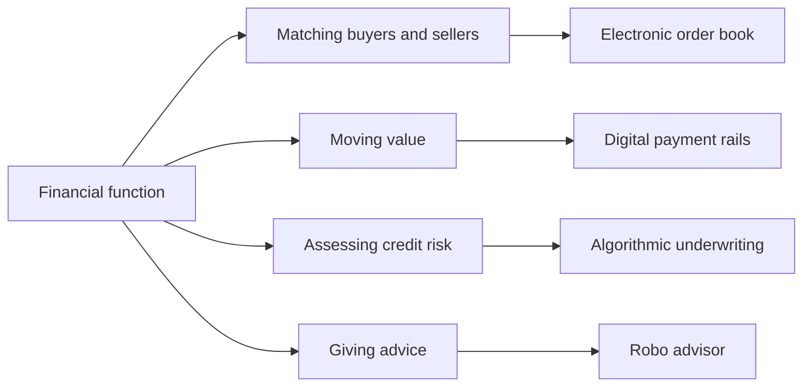
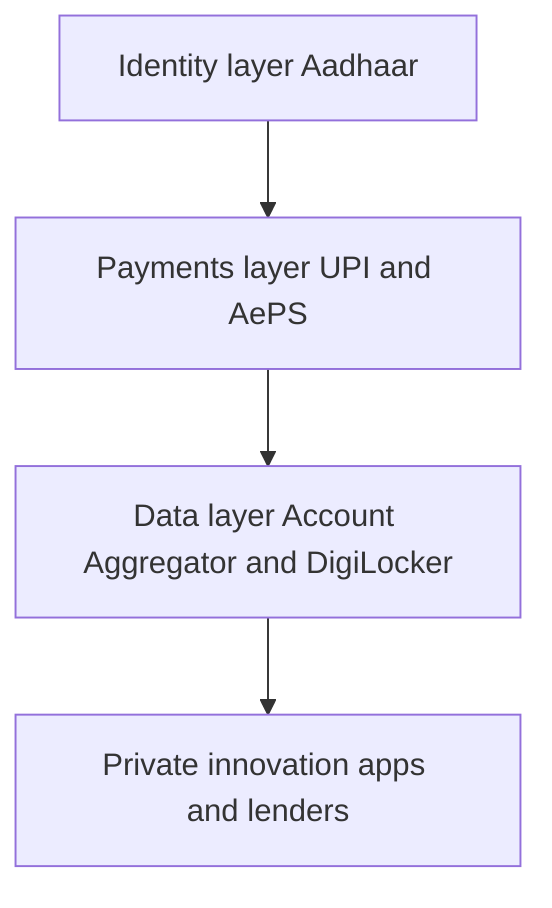
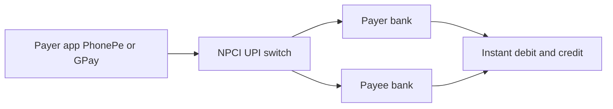

# Chapter 20 — Fintech and Market Innovation

## 1. The Problem / The Need

For most of financial history, markets were slow, expensive, and reserved for people with the right connections. If you wanted to buy shares in 1985 in India, you physically visited a broker on Dalal Street, he shouted your order across a trading ring, a paper contract note arrived days later, and share certificates travelled by courier. Settlement took weeks, fraud was routine, and the ordinary saver was simply locked out. Globally the picture was not much better — trading floors of shouting humans, wide bid-ask spreads that quietly taxed every trade, and research available only to institutions.

Three frictions defined the old world:

- **Cost friction.** Human intermediaries at every step — brokers, jobbers, sub-brokers, registrars, transfer agents — each took a cut. A retail investor could lose several percent of capital just entering and exiting a position.
- **Access friction.** You needed minimum balances, physical presence, paperwork, and often a personal relationship to get advice, a bank account, or a loan.
- **Information friction.** Prices moved in places you could not see. Institutions had faster data, better analysts, and privileged access to order flow.

Fintech — a compression of "financial technology" — is the broad movement that attacks all three frictions with software, data, and networks. It is not one product; it is the re-plumbing of the entire financial system so that a transaction that once needed a building full of clerks now needs a few milliseconds of compute. The need it answers is simple to state and enormous in consequence: **make finance cheaper, faster, and open to everyone, while keeping it safe.** This chapter maps how technology is reshaping markets, from the microsecond world of high-frequency trading to the billion-transactions-a-month world of UPI, and what all of it means for a person building a finance career.

## 2. The Core Idea

The core idea of fintech is **disintermediation and automation**: replace expensive human intermediaries and manual processes with software that performs the same economic function at a fraction of the cost and a multiple of the speed.

Every financial activity can be decomposed into a few primitive operations — matching a buyer to a seller, moving value from A to B, assessing whether a counterparty will pay, and giving advice. Historically each primitive was performed by a specialist human. Fintech observes that most of these operations are, at their core, **information processing problems**, and information processing is exactly what computers do best and cheapest.

*Every classic financial job decomposes into an information task that software can now perform.*

Once you see finance as information plumbing, the innovations of the last two decades stop looking like a random grab-bag of buzzwords and start looking like one coherent programme. Electronic exchanges automate matching. Algorithmic and high-frequency trading automate the trader. Robo-advisors automate the wealth manager. UPI and digital payments automate cash. Blockchain and tokenisation try to automate the settlement and custody layer itself. The common thread is always the same: take a function humans did slowly and expensively, and express it as code running on a network.

## 3. How It Works — The Enabling Stack

Fintech did not appear because someone had a clever idea; it appeared because four enabling technologies matured at the same time and compounded on each other.

1. **Cheap compute and cloud.** A startup can now rent world-class computing by the minute instead of buying a data centre. This collapsed the capital needed to build a "bank."
2. **Ubiquitous smartphones and mobile internet.** In India, cheap data (the post-2016 Jio effect drove mobile data from among the world's most expensive to among the cheapest) put a bank branch in every pocket.
3. **Digital identity and open APIs.** India's Aadhaar gave over a billion people a verifiable digital identity, enabling paperless, presence-less onboarding (eKYC). Open APIs let apps plug into banks and exchanges programmatically.
4. **Data and machine learning.** Cheap storage plus algorithms turned the exhaust of digital transactions into signals for credit scoring, fraud detection, and personalisation.

Stack these and you get the "India Stack" — a layered public digital infrastructure that many countries now study as a model.

*The India Stack layers public digital infrastructure so private firms build on top rather than rebuilding plumbing.*

The economic logic is **marginal cost near zero**. Once the software and network exist, serving the ten-millionth customer costs almost nothing extra. This is why fintech products scale to hundreds of millions of users in a way a branch-based bank never could, and why they can profitably serve small-ticket customers that traditional finance ignored.

## 4. Full Content — The Major Domains

### 4.1 Technology reshaping market structure

The most visible change is the disappearance of the trading floor. India's NSE launched in 1994 as a fully electronic, screen-based, order-driven exchange — deliberately built to bypass the closed clubs of the old BSE ring. Within a few years, open outcry was dead. Dematerialisation (via depositories NSDL and CDSL) turned paper share certificates into electronic book entries, and rolling settlement compressed from T+ weeks to today's **T+1**, with India moving toward optional **T+0 (same-day)** settlement — among the fastest in the world.

Electronic order books changed the *microstructure* — the fine-grained mechanics of how prices form. In an electronic limit order book, every buy and sell order sits visibly (in aggregate) at each price level, and a matching engine pairs them by price-time priority. This transparency and automation slashed bid-ask spreads and made it feasible for machines to participate directly.

### 4.2 Algorithmic and high-frequency trading

**Algorithmic trading (algo)** means using a computer program to place orders according to pre-defined rules — timing, price, quantity — without a human clicking each time. A pension fund selling 5 million shares does not dump them at once (that would crash the price); an execution algorithm such as **VWAP (Volume-Weighted Average Price)** or **TWAP (Time-Weighted Average Price)** slices the order into hundreds of small pieces spread through the day to minimise market impact.

**High-frequency trading (HFT)** is a specialised, speed-obsessed subset of algo trading. HFT firms compete to react to market events in **microseconds**, holding positions for fractions of a second and making tiny profits on enormous volumes. Speed is everything, so HFT firms pay exchanges for **co-location** — placing their servers in the same building as the matching engine so their signals travel metres, not kilometres.

Common HFT strategies:

| Strategy | What it does | Effect on the market |
|---|---|---|
| Market making | Continuously quotes both bid and ask, earning the spread | Adds liquidity, narrows spreads |
| Statistical arbitrage | Exploits tiny, fleeting price divergences between correlated instruments | Keeps related prices consistent |
| Latency arbitrage | Uses a speed edge to trade on price changes before slower participants react | Controversial; seen as a tax on the slow |
| Index arbitrage | Trades a mismatch between an index future and its underlying basket | Links derivatives to cash markets |

The debate over HFT is genuine and worth understanding for interviews. **Defenders** argue HFT market-makers provide continuous liquidity and have driven spreads to historic lows, cutting costs for everyone. **Critics** argue the liquidity is "phantom" — it vanishes exactly when markets are stressed — and point to episodes like the US **Flash Crash of 6 May 2010**, when the Dow fell roughly 1,000 points in minutes before rebounding, amplified by automated selling. Michael Lewis's book *Flash Boys* popularised the critique that latency arbitrage lets the fastest firms front-run ordinary orders. Regulators responded with circuit breakers, order-to-trade ratio penalties, and (in India) SEBI norms requiring exchanges to offer co-location fairly and to test algos.

### 4.3 Robo-advisors and digital brokerages

A **robo-advisor** is software that builds and manages an investment portfolio using algorithms, typically based on Modern Portfolio Theory. The user answers a short risk-profiling questionnaire; the system allocates across low-cost index funds/ETFs, automatically rebalances when weights drift, and may perform tax optimisation. Because there is no human advisor, fees drop from the traditional ~1-2% of assets to a fraction of that — democratising advice that was once reserved for the wealthy.

Global pioneers include **Betterment** and **Wealthfront**; incumbents responded with **Vanguard Digital Advisor** and **Schwab Intelligent Portfolios**. In India, the model adapted around mutual funds and direct plans — platforms like **Zerodha's Coin**, **Groww**, **Kuvera**, and **ET Money** offer algorithmic guidance and zero-commission direct mutual funds.

The parallel revolution is the **discount / digital brokerage**. The old full-service broker charged a percentage per trade and bundled research. **Zerodha**, founded in 2010, pioneered flat-fee (and zero for equity delivery) broking in India and became the country's largest broker by active clients — while remaining bootstrapped and profitable. **Robinhood** in the US pushed the model to **zero commissions** and a game-like mobile app, which triggered an industry-wide race to zero (Schwab, Fidelity, E-Trade all dropped commissions to zero in 2019).

Two things a career-minded reader must understand about "free" brokerages:

- **Payment for order flow (PFOF).** Robinhood earns much of its revenue by routing customer orders to wholesale market-makers (like Citadel Securities) who pay for that flow. The trade is "commission-free" but the user may get marginally worse execution — the cost is hidden, not absent. PFOF is banned in India, the UK, and Canada, and controversial in the US.
- **The GameStop episode (January 2021).** A crowd of retail traders on Reddit's r/WallStreetBets drove up GameStop shares in a short squeeze. When Robinhood restricted buying (because clearinghouse collateral requirements spiked), it exposed the plumbing beneath the app — settlement, margin, and clearing risk that most users never knew existed.

### 4.4 UPI and digital payments

If HFT is fintech at its most exclusive, **UPI is fintech at its most inclusive** — and India's single most important market innovation of the era.

The **Unified Payments Interface (UPI)**, launched by the **National Payments Corporation of India (NPCI)** in 2016, is a real-time, 24x7, interoperable payment system that lets anyone send money from one bank account to another instantly using just a **Virtual Payment Address** (like `name@okhdfcbank`) or a QR code — no card number, no IFSC, no bank details shared. It sits on **IMPS** rails and is free for peer-to-peer transfers.

Why it changed everything:

- **Interoperability.** Unlike closed wallets, any UPI app can pay any other. A PhonePe user pays a Google Pay merchant seamlessly. This network effect made adoption explode.
- **Scale.** UPI processes well over **15 billion transactions a month** (crossing that mark in 2024-25), by far the largest real-time payment system on Earth, dwarfing card networks in transaction count.
- **Inclusion.** The corner vegetable vendor now accepts digital payment via a printed QR code, with zero hardware cost. This pulled the informal economy into the formal, data-generating system.

*UPI routes a payment through NPCI's central switch so any app talks to any bank in real time.*

UPI is now going global — deployed or being adopted in the UAE, Singapore (linked to PayNow), France, Sri Lanka, Nepal, and Bhutan — making it a genuine export of Indian digital public infrastructure. Alongside UPI sit **AePS** (Aadhaar-enabled cash withdrawals through banking correspondents in villages), **BBPS** (bill payments), and the emerging **Account Aggregator** framework, which lets users share their financial data securely with consent to get better loans and advice.

A crucial macro point: the next frontier is **UPI-linked credit** and the **Central Bank Digital Currency (CBDC)** — the RBI's **Digital Rupee (e₹)**, a sovereign digital currency piloted from 2022, which is legal tender in digital form, distinct from private crypto.

### 4.5 Blockchain, crypto assets, and tokenisation

A **blockchain** is a shared, append-only ledger maintained across many independent computers (nodes) rather than by one central authority. New transactions are grouped into "blocks," cryptographically chained to the previous block, and validated by a **consensus mechanism** (Proof of Work, as in Bitcoin, or the more energy-efficient Proof of Stake, as in Ethereum). The result is a record that is very hard to tamper with and does not require a trusted middleman — its headline promise is **"trust without a trusted third party."**

Key concepts:

- **Cryptocurrency.** A native digital token of a blockchain used as money or a store of value. **Bitcoin** (2009) is the original — a fixed-supply "digital gold." **Ethereum** added **smart contracts** — self-executing programs on the blockchain — enabling far more than payments.
- **Smart contracts and DeFi.** **Decentralised Finance (DeFi)** rebuilds lending, trading, and derivatives as smart contracts, with no bank in the middle. **Stablecoins** (like USDC, USDT) are tokens pegged to a currency (usually the US dollar) to remove volatility, and they are the workhorse of crypto trading.
- **Tokenisation.** This is the concept with the most serious institutional interest. **Tokenisation** means representing a real-world asset — a bond, a property, a fund unit, a piece of art — as a digital token on a blockchain. The promise is **fractional ownership** (own 1% of a building), **24x7 trading**, **instant settlement**, and **programmability**. BlackRock's **BUIDL** tokenised money-market fund and various tokenised government-bond experiments show incumbents taking this seriously.

The **honest** framing for a finance professional: separate the **technology** (distributed ledgers, tokenisation, smart contracts — genuinely useful for settlement and record-keeping) from the **speculative asset class** (volatile, largely unregulated crypto tokens, riddled with fraud and collapses like the **FTX exchange failure in 2022**). India's stance reflects this split: private crypto is **taxed heavily** (30% on gains, 1% TDS) and **not legal tender**, and viewed warily by the RBI, while the state builds its own CBDC and studies tokenisation. Globally, the EU's **MiCA** regulation and the US spot-**Bitcoin ETFs** approved in January 2024 mark a move toward regulated, mainstream crypto exposure.

### 4.6 The changing market microstructure

Put the pieces together and the **microstructure** — the invisible mechanics of how orders become prices — has been transformed:

- **Fragmentation.** Trading no longer happens in one place. Orders scatter across lit exchanges, **dark pools** (private venues where large orders hide to avoid moving the price), and internalisers. This improves choice but complicates the picture of "the" price.
- **Speed.** The relevant unit of time fell from minutes to microseconds. Whoever controls latency controls certain profits.
- **Falling explicit costs, subtler implicit costs.** Spreads and commissions are near zero, but costs migrated into things retail users cannot see — order routing, PFOF, and adverse selection by faster players.
- **Data as the moat.** The winners are no longer those with the best relationships but those with the best data pipelines and models.

## 5. Real Examples

**Example 1 — UPI and the QR-code vegetable seller.** Walk through any Indian city and every roadside vendor displays a QR code. A customer scans it, enters an amount, authenticates with a PIN, and money moves bank-to-bank in seconds — free, no card machine, no cash. In 2016 this was unthinkable; by 2024 UPI crossed 15+ billion monthly transactions. This is fintech's inclusion story made concrete: a person previously outside formal finance now generates a digital footprint that can later earn them a loan.

**Example 2 — Zerodha and the race to zero.** A stockbroker founded in 2010 with no outside funding disrupted India's entire broking industry by charging a flat ₹20 (or zero for delivery) instead of a percentage. It forced incumbents to slash prices, brought millions of first-time investors into equities via its Kite app, and remained profitable throughout — proving software-first finance can beat legacy players on cost and scale.

**Example 3 — The 2010 Flash Crash.** On 6 May 2010, US markets briefly lost roughly a trillion dollars of value in minutes as automated selling cascaded through thin, HFT-provided liquidity, then rebounded almost as fast. It is the canonical case study for why speed and automation, without circuit breakers, can turn small shocks into systemic events — and why regulators worldwide now mandate trading halts.

**Example 4 — BlackRock's tokenised fund (BUIDL).** In 2024 the world's largest asset manager launched a tokenised money-market fund on Ethereum, letting institutional investors hold a blockchain token representing shares in a fund holding US Treasuries, with near-instant settlement. It signals that tokenisation is moving from crypto-hype to serious infrastructure used by the most conservative names in finance.

## 6. Connections

Fintech does not sit in a silo — it re-wires concepts from across this guide.

- **Market microstructure and liquidity (Ch. on trading and exchanges).** HFT and electronic order books are the modern expression of bid-ask spreads, liquidity, and price formation.
- **Portfolio theory (Ch. on risk and return).** Robo-advisors are literally Modern Portfolio Theory turned into code — diversification, rebalancing, and the efficient frontier automated.
- **Payments and banking.** UPI and CBDC extend the money and banking chapters into their digital future; the Account Aggregator connects to credit and lending.
- **Derivatives and arbitrage.** Index arbitrage and statistical arbitrage are HFT applications of the no-arbitrage principle underlying derivatives pricing.
- **Regulation.** Every innovation triggers a regulatory response — SEBI on algos and co-location, RBI on digital lending and CBDC, global bodies on crypto (MiCA, FATF travel rule).
- **Behavioural finance.** Gamified apps like Robinhood connect to how design nudges (and sometimes exploits) investor psychology.

## 7. Key Terms

- **Fintech** — technology-driven delivery of financial services that cuts cost, time, and access barriers.
- **Algorithmic trading** — placing orders via pre-programmed rules instead of manual clicks.
- **High-frequency trading (HFT)** — ultra-fast algo trading holding positions for fractions of a second.
- **Co-location** — renting server space inside the exchange's data centre to minimise latency.
- **Market microstructure** — the detailed mechanics of how orders, quotes, and information produce prices.
- **Dark pool** — a private trading venue where large orders execute without pre-trade transparency.
- **Robo-advisor** — algorithm-driven, low-cost automated portfolio management.
- **Discount / digital brokerage** — low- or zero-commission, software-first stockbroking.
- **Payment for order flow (PFOF)** — brokers being paid to route orders to market-makers; banned in India.
- **UPI** — India's real-time, interoperable, account-to-account payment system run by NPCI.
- **NPCI** — National Payments Corporation of India, operator of UPI, IMPS, RuPay, and more.
- **India Stack** — the layered public digital infrastructure (Aadhaar, UPI, Account Aggregator).
- **CBDC / Digital Rupee (e₹)** — sovereign central-bank digital currency, legal tender in digital form.
- **Blockchain** — a decentralised, tamper-resistant, append-only ledger validated by consensus.
- **Smart contract** — self-executing code on a blockchain that runs when conditions are met.
- **DeFi** — decentralised finance; financial services built as smart contracts without intermediaries.
- **Stablecoin** — a crypto token pegged to a stable asset, usually the US dollar.
- **Tokenisation** — representing a real-world asset as a tradable digital token on a ledger.

## 8. Common Confusions

**"Fintech means startups replacing banks."** Not really. Much of fintech is incumbents adopting technology (banks building apps, exchanges going electronic) and startups partnering with banks (most neobanks ride on a licensed bank's rails). It is a re-plumbing, not always a replacement.

**"Algo trading and HFT are the same thing."** HFT is a small, speed-obsessed subset of algorithmic trading. A pension fund's day-long VWAP execution is algo but not HFT. All HFT is algo; most algo is not HFT.

**"HFT is just front-running / cheating."** Some strategies (latency arbitrage) are ethically contested, but market-making HFT genuinely provides liquidity and has cut spreads dramatically. The honest answer is "it depends on the strategy" — a nuance interviewers value.

**"Zero-commission brokerage means truly free."** No. The cost moved elsewhere — payment for order flow, wider effective spreads, or securities-lending revenue. In finance, if you are not paying, your order flow probably is.

**"Blockchain and Bitcoin are the same."** Bitcoin is one application of blockchain. The distributed-ledger *technology* can be useful (settlement, tokenisation) even if you think the *speculative crypto asset class* is dangerous. Keep the two separate.

**"UPI is just another digital wallet like Paytm's old wallet."** Wallets are closed, prepaid, and non-interoperable; UPI moves money directly bank-to-bank and is interoperable across all apps. That interoperability is exactly why UPI won.

**"CBDC is government crypto."** A CBDC is centralised, sovereign, and legal tender — nearly the opposite of decentralised, private crypto. It may use similar technology but the trust model is inverted.

## 9. Recap

Fintech is the systematic use of software, data, and networks to attack the three great frictions of finance — cost, access, and information. Seen clearly, it is one coherent programme: decompose each financial function into an information task, then let cheap compute, smartphones, digital identity, and machine learning perform it at near-zero marginal cost.

The transformation spans the full spectrum. At the exclusive end, **electronic exchanges, algorithmic trading, and high-frequency trading** have compressed settlement to T+1, driven spreads to historic lows, and moved the unit of competitive time to the microsecond — while raising real questions about phantom liquidity and fairness, dramatised by the 2010 Flash Crash. In the middle, **robo-advisors and discount brokerages** (Zerodha, Robinhood, Betterment) democratised advice and slashed trading costs, though "free" always hides a cost such as payment for order flow. At the inclusive end, **UPI** — India's world-leading real-time payment rail — and the broader **India Stack** brought hundreds of millions into the formal financial system. On the frontier, **blockchain, crypto, and tokenisation** promise settlement without intermediaries; the mature view separates genuinely useful ledger technology and tokenisation from the volatile, fraud-prone speculative asset class, with regulators (RBI's Digital Rupee, EU's MiCA, US Bitcoin ETFs) drawing the lines.

The net effect on **market microstructure** is fragmentation across venues, extreme speed, near-zero explicit costs but subtler hidden ones, and data as the decisive competitive moat.

## 10. Quick-Reference — Interview Points

**Definitions to nail cold:**
- Fintech = tech that reduces cost, time, and access friction in finance.
- Algo trading ⊃ HFT (HFT is the ultra-fast, microsecond subset).
- UPI = real-time, interoperable, account-to-account payments by NPCI (2016).
- Tokenisation = a real-world asset represented as a blockchain token.

**Numbers worth citing:**
- India settlement: **T+1**, moving to optional **T+0**.
- UPI: **15+ billion transactions/month**, world's largest real-time payment system.
- India crypto tax: **30% on gains + 1% TDS**; crypto is **not legal tender**.
- US zero-commission race: **2019**; Bitcoin spot ETFs approved **January 2024**.

**Framing that impresses:**
- On HFT: "Depends on the strategy — market-making adds liquidity and cuts spreads; latency arbitrage is a tax on the slow. The Flash Crash showed the systemic risk of thin automated liquidity."
- On zero-commission broking: "The cost didn't disappear — it moved to payment for order flow, which is banned in India."
- On crypto: "Separate the technology from the asset — distributed ledgers and tokenisation have real institutional use (BlackRock's BUIDL); the speculative token market is volatile and lightly regulated (FTX collapse)."
- On UPI: "Its winning feature is interoperability and being built as public digital infrastructure — now exported to the UAE, Singapore, France, and more."

**For a finance career — what this means for you:**
- The manual, execution-only jobs (order-taking brokers, back-office clerks) are shrinking; the growth is in **quantitative, data, product, risk, and compliance** roles.
- You do not need to be a programmer, but **data literacy** — SQL, Python basics, understanding APIs and how systems settle — is now table stakes.
- The durable human edge is in **judgement, client trust, complex advice, regulation, and risk** — exactly the things algorithms handle poorly. Position your career there, and treat technology as leverage, not competition.
- Know the plumbing beneath the app: the GameStop episode proved that clearing, margin, and settlement risk still decide who wins when markets break — understanding the "boring" infrastructure is a genuine differentiator.
