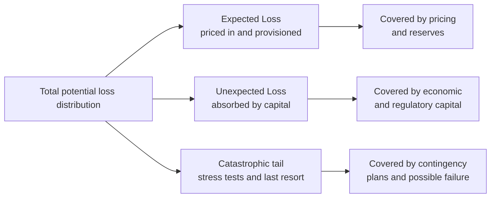
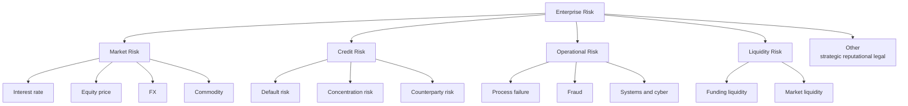
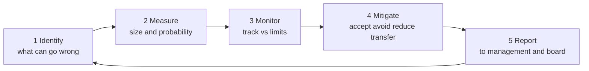
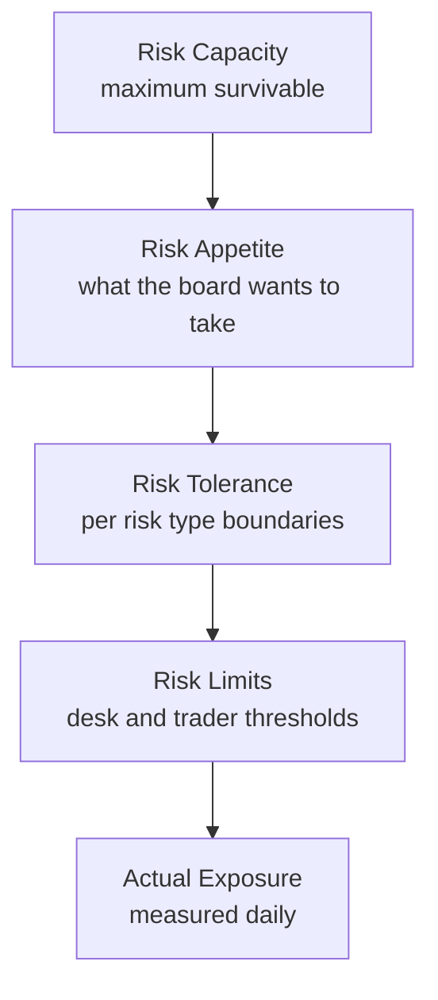
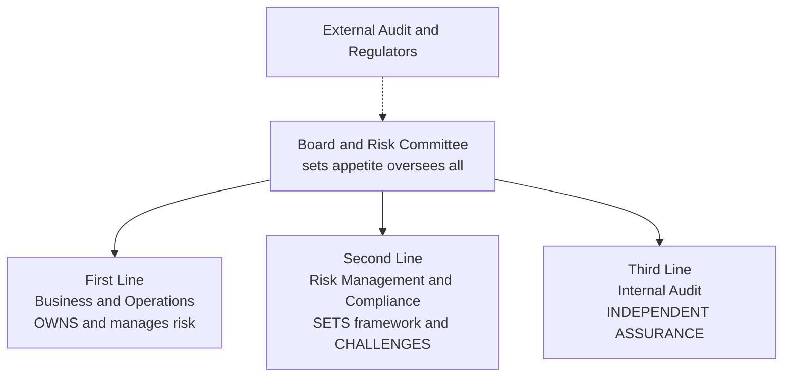

# Chapter 01 — Introduction to Risk Management

## 1. The Problem / The Need

Every financial institution is, at its core, a machine for taking risk deliberately. A bank does not make money by hiding cash in a vault — it makes money by lending it out, knowing that some borrowers will not repay. An asset manager does not earn returns by holding treasury bills forever — it earns them by accepting price volatility. An insurer collects premiums today against claims it cannot precisely predict. In each case, **the business model IS the acceptance of risk in exchange for a return.** Remove the risk entirely and you remove the profit.

This creates an immediate and permanent tension. If risk is the source of profit, then more risk should mean more profit — but only up to the point where the losses from bad outcomes overwhelm the gains from good ones and destroy the institution. History is a graveyard of firms that forgot this: Barings Bank collapsed in 1995 from a single rogue trader; Lehman Brothers failed in 2008 from over-leveraged mortgage exposure; Long-Term Capital Management nearly took down the financial system in 1998 despite being run by Nobel laureates. None of these firms failed because they took risk. They failed because they took **the wrong amount of the wrong risks without knowing it.**

So the need is not "avoid risk." A bank that avoids all risk earns nothing and dies slowly. The need is to answer, continuously and quantitatively, four questions:

- **What can go wrong?** (identification)
- **How badly, and how likely?** (measurement)
- **Can we survive it, and is the reward worth it?** (appetite and capital)
- **Who is watching, and what do we do about it?** (monitoring, mitigation, governance)

Risk management is the discipline that answers these questions systematically rather than by luck or gut feel. Its purpose is threefold, and every interview answer about "why risk management matters" should hit all three:

1. **Protect capital and solvency.** Capital is the buffer that absorbs unexpected losses. Risk management ensures the firm holds enough of it and never bets more than the buffer can absorb, so a bad year is survivable rather than fatal.
2. **Enable intelligent risk-taking.** This is the part beginners miss. Risk management is not the "department of no." Done well, it lets the firm take *more* risk where the reward justifies it and *less* where it does not — it is a profit-optimization function, not merely a defensive one.
3. **Meet regulatory and stakeholder obligations.** Banks operate under Basel III, insurers under Solvency II, and all are accountable to depositors, shareholders, rating agencies, and supervisors. Sound risk management is a licence to operate.

## 2. The Core Idea

The core idea of risk management can be compressed into a single sentence:

> **Convert unknown, unmanaged exposures into known, quantified, consciously-accepted positions that sit within a pre-agreed limit backed by enough capital to survive being wrong.**

Unpack that. The enemy is not loss — losses are expected and priced in. The enemy is the **unknown, unmeasured, unbudgeted** loss: the exposure nobody identified, sized, or approved. Risk management's job is to drag every material exposure into the light, attach a number to it, decide consciously whether to keep it, and hold capital against the possibility that the number is wrong.

Three foundational concepts make this operational:

- **Expected Loss (EL):** the average loss you anticipate over many periods. This is a *cost of doing business*, not a risk. You price for it (in loan spreads, insurance premiums) and provision for it. If a lender expects to lose 1% of a portfolio annually, that 1% is baked into the interest rate charged. Expected loss should never surprise you.
- **Unexpected Loss (UL):** the volatility *around* the expected loss — the amount by which a bad year exceeds the average. This is the real risk. You cannot price it away because you do not know when it will hit. Instead you hold **capital** against it. Capital exists to absorb unexpected loss.
- **Catastrophic / tail loss:** the rare extreme beyond what capital is sized for. Here you rely on stress testing, contingency planning, and — as a last resort — the possibility of failure. Regulators care intensely about this region because it is where systemic crises live.

*Figure 1 — The three regions of the loss distribution and how each is funded. Everything in risk management maps back to this picture.*

The genius of this framing is that it turns a vague fear ("we might lose money") into an engineering problem ("size the buffer for the region we choose to survive"). The rest of risk management is just the machinery for doing that reliably.

## 3. Why / How It Works

Why does the discipline actually work — why does quantifying and governing risk produce better outcomes than experienced managers using judgment alone?

**Because losses are governed by probability distributions, not by intuition.** Human intuition is systematically bad at tails, correlations, and compounding. We underestimate how often "1-in-100" events happen, we assume diversification protects us when correlations spike to 1 in a crisis, and we anchor on recent calm. Risk management works because it replaces intuition with distributions: instead of asking "will this loan default?" it asks "what is the probability distribution of losses across the whole portfolio, and what does the 99th percentile look like?"

**Because it separates the two jobs that intuition conflates.** Pricing handles the *average* (expected loss); capital handles the *variance* (unexpected loss). A trader who prices a loan correctly has still done only half the job — someone must independently ensure enough capital stands behind the volatility. Risk management institutionalizes that separation.

**Because measurement enables comparison and allocation.** Once every risk is expressed in a common unit — typically potential loss in currency at a chosen confidence level, or capital consumed — you can compare a credit exposure against a market exposure against an operational exposure. You can ask "which business line earns the most return per unit of risk?" and allocate capital accordingly. This is the mechanism by which risk management *enables* intelligent risk-taking rather than merely restraining it. The key metric here is **RAROC** (Risk-Adjusted Return on Capital):

$$\text{RAROC} = \frac{\text{Revenue} - \text{Costs} - \text{Expected Loss}}{\text{Economic Capital}}$$

A business earning ₹100 of profit while consuming ₹500 of capital (RAROC = 20%) is preferable to one earning ₹120 while consuming ₹1,000 (RAROC = 12%), even though the second makes more absolute profit. Without risk quantification, you cannot see this — you would chase the ₹120 and destroy value.

**Because governance closes the loop.** Measurement without consequences is theatre. The process works only when limits bind, breaches trigger action, and someone independent of the risk-takers has the authority and information to intervene. That is why the *organizational* design (the three lines of defence, discussed in Section 4) is as important as the *mathematical* design.

## 4. Full Content

### 4.1 Risk vs Uncertainty — the foundational distinction

Before any measurement, we must separate two things everyday language treats as synonyms. The distinction was formalized by economist **Frank Knight** in 1921 and remains an interview favourite.

- **Risk** is randomness with a *knowable* probability distribution. You may not know the outcome, but you know (or can estimate) the odds. A fair die, a diversified loan book with decades of default history, an equity index with an estimable volatility — these are risks. Risk is **measurable, insurable, and capital can be sized against it.**
- **Uncertainty** (sometimes "Knightian uncertainty") is randomness where the distribution itself is *unknown or unknowable*. Novel events, structural breaks, regime changes, a pandemic in a world with no comparable data — you cannot assign reliable probabilities. Uncertainty is **not directly measurable** and resists conventional capital sizing.

| Dimension | Risk | Uncertainty |
|---|---|---|
| Probability distribution | Known / estimable | Unknown / unknowable |
| Example | Loan default rate on a large book | Impact of a first-of-its-kind technology shock |
| Tool | VaR, expected loss, pricing, capital | Stress tests, scenario analysis, judgment, optionality |
| Insurable? | Generally yes | Generally no |
| Governance response | Limits and models | Resilience, buffers, humility |

The practical lesson: **models handle risk; stress testing and buffers handle uncertainty.** A firm that treats uncertainty as if it were measurable risk — plugging a made-up probability into a model and trusting the output — is committing the classic error behind many crises (the 2008 assumption that national house prices could not fall together was uncertainty dressed up as risk). Mature risk functions hold *extra* capital and maintain *optionality* precisely because they know the model does not capture everything.

### 4.2 The taxonomy of financial risks

Risk management first needs a map of what can go wrong. The standard taxonomy every risk professional carries in their head:

*Figure 2 — The financial risk taxonomy. The big three regulated pillars are market, credit, and operational risk; liquidity is increasingly treated as a fourth pillar since 2008.*

- **Market risk** — loss from movements in market prices: interest rates, equities, exchange rates, commodities. Measured with VaR, sensitivities (the "Greeks"), and stress tests.
- **Credit risk** — loss from a borrower or counterparty failing to meet obligations. Decomposed into PD, LGD, and EAD (Section 5). The largest risk for most commercial banks.
- **Operational risk** — loss from failed internal processes, people, systems, or external events. Includes fraud, cyberattacks, legal failures, and human error. Barings and most rogue-trader losses are operational.
- **Liquidity risk** — the risk of being unable to meet obligations when due (*funding* liquidity) or of being unable to sell an asset without moving its price (*market* liquidity). A firm can be solvent on paper yet fail because it cannot raise cash — the proximate cause of many bank runs.
- **Strategic, reputational, legal, and model risk** — harder to quantify but capable of destroying franchises.

### 4.3 The risk management process

The operational heart of the discipline is a continuous, closed loop. Five steps: **identify, measure, monitor, mitigate, report** — repeating forever because the risk landscape never stands still.

*Figure 3 — The risk management cycle. It is a loop, not a line — the output of reporting feeds fresh identification, and the environment keeps changing.*

**Step 1 — Identify.** Surface every material exposure before it surprises you. Techniques: risk registers, risk-and-control self-assessments (RCSA), scenario workshops, review of new products (a "new product approval" gate), loss-event databases, and horizon scanning. The cardinal sin here is the *unidentified* risk — you cannot measure or mitigate what you have not named.

**Step 2 — Measure.** Attach numbers. For each exposure estimate its size and likelihood, and express it in a common unit — usually potential loss in currency at a stated confidence level. This is where VaR, expected shortfall, PD×LGD×EAD, duration, and stress-loss estimates live. Measurement converts a list of worries into a rank-ordered, aggregatable portfolio.

**Step 3 — Monitor.** Continuously compare current exposures against **limits** and against changing conditions. Dashboards, limit-utilization reports, early-warning indicators (EWIs), and key risk indicators (KRIs). Monitoring answers "are we still inside our appetite, and is anything trending the wrong way?"

**Step 4 — Mitigate.** Choose a response for each risk. The four canonical treatments (the "4 T's"):

| Treatment | Also called | Meaning | Example |
|---|---|---|---|
| **Accept** | Retain / tolerate | Keep the risk, hold capital against it | A bank retains diversified credit risk it is paid to take |
| **Avoid** | Terminate | Exit the activity entirely | Stop lending to a sector deemed unacceptable |
| **Reduce** | Mitigate / control | Lower probability or impact | Collateral, covenants, diversification, controls, limits |
| **Transfer** | Share | Move the risk to a third party | Insurance, hedging with derivatives, securitization |

Note that *accept* is a legitimate, deliberate choice — not a failure. The whole point is that acceptance is now conscious and capitalized.

**Step 5 — Report.** Communicate the risk profile to those accountable: business heads, the risk committee, the board, and regulators. Good reporting is timely, forward-looking, and actionable — it drives decisions, not just archives numbers. Poor reporting (stale, backward-looking, buried in detail) is a root cause in most post-mortems. Reporting closes the loop by feeding governance and re-identification.

### 4.4 Risk appetite and risk tolerance

Measurement tells you how much risk you *have*. Appetite tells you how much you *want*. This is the strategic anchor of the whole system, set by the board.

- **Risk appetite** is the *aggregate* amount and type of risk an institution is willing to accept in pursuit of its objectives, stated at the top level. It is a strategic, board-owned statement — e.g., "we are willing to accept a 1-in-100-year loss of no more than 20% of capital," or "we target a AA rating and will not take risks inconsistent with it."
- **Risk tolerance** is the *specific, quantified* boundary for a particular risk type or business line — the operational translation of appetite. E.g., "market-risk VaR shall not exceed ₹50 crore," "single-name credit exposure ≤ 10% of capital," "no more than 15% of the book in any one sector."
- **Risk limits** are the granular, enforceable thresholds at desk, portfolio, or trader level that keep aggregate exposure within tolerance. A breach triggers a defined escalation.
- **Risk capacity** is the *maximum* risk the firm could bear before breaching regulatory minimums or failing — set by capital and liquidity, not by preference. Appetite must always sit *below* capacity, leaving a safety margin.

*Figure 4 — The appetite hierarchy. Each layer must nest inside the one above it. Actual exposure should sit comfortably inside limits which sit inside tolerance which sits inside appetite which sits inside capacity.*

The relationships to memorise: **Exposure ≤ Limits ≤ Tolerance ≤ Appetite < Capacity.** When these invert — when actual exposure creeps past limits, or when appetite is set at or above capacity leaving no margin — the firm is flying without a buffer. The 2008 crisis featured many firms whose *effective* appetite had drifted right up to their capacity.

### 4.5 The three lines of defence

The final structural element answers "who owns the risk, who checks it, and who checks the checkers?" The **Three Lines of Defence (3LoD)** model is the industry-standard governance architecture, endorsed by Basel and virtually every regulator.

*Figure 5 — The three lines of defence under board oversight. Independence increases as you move from first to third line; external audit and supervisors sit outside as an additional check.*

- **First line — the risk owners.** The business units and operations that *take* the risk and therefore *own* it. A lending officer, a trader, a branch manager. They are responsible for identifying, managing, and controlling risk in their day-to-day activity, operating within limits. Crucial insight: **risk management is not solely the risk department's job — the first line owns the risk it creates.**
- **Second line — the overseers and challengers.** The independent risk management and compliance functions. They design the framework, set methodologies and limits, aggregate and monitor risk across the firm, and — critically — *challenge* the first line. They do not own the risk, but they ensure it is being managed to standard. Headed by the Chief Risk Officer (CRO), who typically reports to the board risk committee, not just the CEO, to preserve independence.
- **Third line — independent assurance.** Internal Audit. It provides objective assurance to the board that the first and second lines are actually working as designed. It reports directly to the audit committee, is independent of both other lines, and checks the checkers.

The design principle is **escalating independence**: the further from the money-making, the more independent the function, so that no single group both takes risk and judges whether that risk is acceptable. The separation of duties is the whole point — Barings failed partly because the same person (Nick Leeson) controlled both trading and its settlement, collapsing first and second lines into one. Beyond the three lines sit **external audit** and **regulators/supervisors**, and above all sits the **board**, which owns appetite and ultimate accountability.

## 5. Worked Examples

### Example 1 — Expected Loss on a loan portfolio (the credit-risk master formula)

The single most important credit formula, which you must be able to reproduce and explain in any interview:

$$\text{Expected Loss} = PD \times LGD \times EAD$$

where **PD** = probability of default (over a chosen horizon, usually one year), **LGD** = loss given default (the fraction *not* recovered), and **EAD** = exposure at default (the amount outstanding when default happens).

**Setup.** A bank has a loan of **EAD = ₹100,00,000 (₹1 crore)**. The borrower has a one-year **PD = 2%**. If the borrower defaults, the bank expects to recover 60% through collateral and workout, so **recovery rate = 60%** and **LGD = 1 − 0.60 = 40%**.

**Compute Expected Loss:**

$$EL = 0.02 \times 0.40 \times 1{,}00{,}00{,}000 = ₹80{,}000$$

**Interpretation and reconciliation.** The bank expects to lose ₹80,000 per year *on average* on this loan. This is not a risk to be feared — it is a **cost** to be *priced in*. To break even on expected loss alone, the loan must earn at least 0.8% (₹80,000 / ₹1 crore) in spread *purely to cover credit losses*, on top of funding cost, operating cost, and a target return on capital.

Let us verify the logic holds by decomposing: of ₹1 crore lent, there is a 2% chance of a default event. In that event, the bank loses 40% of ₹1 crore = ₹40,00,000. The probability-weighted loss is 0.02 × ₹40,00,000 = ₹80,000. ✓ Consistent — the two routes (PD×LGD×EAD vs probability × loss-in-default) reconcile exactly.

**Portfolio extension.** Suppose the bank holds **200 such independent loans**. Total expected loss = 200 × ₹80,000 = **₹1.6 crore per year**. But the *expected* loss is not the *risk* — the risk is the volatility around it (unexpected loss). If defaults were perfectly correlated, all 200 could default together; if independent, the portfolio loss is far more predictable. This is precisely why the next chapters build toward VaR and correlation — expected loss is only the priced-in floor.

### Example 2 — Value at Risk (VaR): sizing the unexpected loss

Where expected loss is the *average*, **VaR** answers: *"Over a given horizon and confidence level, what is the loss we will not exceed except with a small probability?"* Formally, one-day 99% VaR of ₹X means: "on 99% of days, losses will be ≤ ₹X; only on ~1 day in 100 do we expect to lose more."

**Parametric (variance-covariance) VaR** for a position, assuming returns are normally distributed:

$$\text{VaR} = z_{\alpha} \times \sigma \times V$$

where $z_\alpha$ is the standard-normal quantile for the confidence level, $\sigma$ is the return volatility over the horizon, and $V$ is the position value. Key z-values to memorise: **95% → 1.645**, **99% → 2.326**.

**Setup.** An equity portfolio worth **V = ₹10,00,00,000 (₹10 crore)** has a daily return volatility of **σ = 1.5%**. Compute the 1-day 99% VaR.

**Compute:**

$$\text{VaR}_{99\%} = 2.326 \times 0.015 \times 10{,}00{,}00{,}000 = ₹34{,}89{,}000$$

**Interpretation.** On roughly 99 days out of 100, the portfolio should not lose more than about **₹34.9 lakh** in a single day. On about 1 day in 100, losses are expected to *exceed* this — VaR tells you the threshold, not the size of the tail beyond it (that is Expected Shortfall, a later chapter).

**Scaling to a 10-day horizon.** Under the square-root-of-time rule (i.i.d. returns), multiply by √10:

$$\text{VaR}_{10\text{-day}} = 34{,}89{,}000 \times \sqrt{10} = 34{,}89{,}000 \times 3.162 = ₹1{,}10{,}31{,}000 \approx ₹1.10 \text{ crore}$$

**Reconciliation with appetite.** Now connect to Section 4.4. Suppose the board's market-risk *tolerance* is a 1-day 99% VaR limit of ₹50 lakh. Our exposure of ₹34.9 lakh sits *inside* the ₹50 lakh limit — utilization is 34.89 / 50 = **70%**. Acceptable, with headroom. If the desk added positions pushing σ to 2.2%, VaR would rise to 2.326 × 0.022 × ₹10 crore = ₹51.17 lakh, *breaching* the ₹50 lakh limit and triggering escalation to the second line. This is exactly how measurement (Step 2) feeds monitoring (Step 3) against tolerance (4.4) — the whole framework working as one machine.

### Example 3 — RAROC: choosing between two businesses (enabling intelligent risk-taking)

This example shows risk management *creating value*, not just preventing loss.

**Setup.** A bank must allocate capital between two lending desks:

| | Desk A (SME lending) | Desk B (large corporate) |
|---|---|---|
| Annual revenue (net of funding) | ₹40,00,000 | ₹60,00,000 |
| Operating costs | ₹8,00,000 | ₹10,00,000 |
| Expected Loss (PD×LGD×EAD) | ₹12,00,000 | ₹8,00,000 |
| Economic capital (for UL) | ₹50,00,000 | ₹1,20,00,000 |

**Compute RAROC** for each using the formula from Section 3:

Desk A:
$$\text{RAROC}_A = \frac{40{,}00{,}000 - 8{,}00{,}000 - 12{,}00{,}000}{50{,}00{,}000} = \frac{20{,}00{,}000}{50{,}00{,}000} = 40\%$$

Desk B:
$$\text{RAROC}_B = \frac{60{,}00{,}000 - 10{,}00{,}000 - 8{,}00{,}000}{1{,}20{,}00{,}000} = \frac{42{,}00{,}000}{1{,}20{,}00{,}000} = 35\%$$

**Interpretation and reconciliation.** Desk B earns *more absolute profit* (₹42 lakh vs ₹20 lakh), so a naive manager allocates capital to B. But Desk A earns **40% per unit of risk-capital** versus B's **35%**. If the bank's hurdle rate (cost of equity) is, say, 15%, *both* create value — but A creates it more efficiently. At the margin, the next rupee of capital should go to A. Without risk quantification you would see only the ₹42 lakh and misallocate. This is the concrete meaning of "risk management enables intelligent risk-taking": it makes the return-*per-risk* visible, so capital flows to where it works hardest. Note also that if either RAROC fell below the 15% hurdle, the risk framework would flag that the business is *destroying* shareholder value despite being profitable in accounting terms — a signal invisible without the discipline.

## 6. Connections

- **To capital adequacy and Basel (later chapters).** The expected/unexpected/catastrophic split in Figure 1 is the direct conceptual basis for regulatory capital: minimum capital ratios exist to cover unexpected loss, provisions cover expected loss, and stress-capital buffers address the tail. Everything in this chapter is the scaffolding on which Basel III sits.
- **To VaR, Expected Shortfall, and market-risk chapters.** Example 2 is a preview; the measurement step of the process is elaborated across the market-risk sequence, including VaR's limitations and the move to Expected Shortfall under FRTB.
- **To credit-risk modelling.** Example 1's PD×LGD×EAD decomposition is the launch point for internal-ratings-based models, credit VaR, and portfolio correlation.
- **To corporate governance and internal control.** The three lines of defence connect directly to board committees, the CRO mandate, and — for CA students — the internal-control and audit frameworks, where separation of duties and independent assurance mirror the same logic.
- **To behavioural finance.** The risk-vs-uncertainty distinction connects to why humans mis-estimate tails, over-trust models, and herd — the psychological failures that risk *governance* is designed to counteract.

## 7. Key Terms

| Term | Definition |
|---|---|
| **Risk** | Randomness with a knowable/estimable probability distribution; measurable and capitalizable. |
| **Uncertainty (Knightian)** | Randomness whose distribution is unknown; not directly measurable; handled by buffers and judgment. |
| **Expected Loss (EL)** | The average anticipated loss; = PD × LGD × EAD for credit; a priced-in cost, not a risk. |
| **Unexpected Loss (UL)** | Volatility of loss around the expected level; the true risk, absorbed by capital. |
| **PD / LGD / EAD** | Probability of Default / Loss Given Default (= 1 − recovery) / Exposure at Default. |
| **Value at Risk (VaR)** | Maximum loss not exceeded at a stated confidence level over a horizon; e.g. 1-day 99% VaR. |
| **Expected Shortfall (ES)** | Average loss *given* that VaR is exceeded; captures tail severity VaR ignores. |
| **RAROC** | Risk-Adjusted Return on Capital = (Revenue − Costs − EL) / Economic Capital. |
| **Economic capital** | Internally-estimated capital needed to absorb unexpected loss to a chosen confidence. |
| **Risk appetite** | Board-level statement of aggregate risk the firm is willing to take. |
| **Risk tolerance** | Quantified boundary for a specific risk type; the operational translation of appetite. |
| **Risk limit** | Granular enforceable threshold at desk/portfolio level; a breach triggers escalation. |
| **Risk capacity** | Maximum risk survivable before breaching regulatory minimums or failing. |
| **Three Lines of Defence** | Governance model: business (owns), risk/compliance (challenges), internal audit (assures). |
| **CRO** | Chief Risk Officer; heads the second line; reports to the board risk committee for independence. |

## 8. Common Confusions

- **"Risk management means avoiding risk."** No — it means taking the *right* risks *consciously* and being *paid* for them. A zero-risk bank is a failing bank. The function optimizes risk-taking; it does not eliminate it.
- **Expected loss ≠ risk.** Expected loss is the *average*, a cost you price in and provision for. It should never surprise you. The *risk* is the unexpected loss — the volatility around the average — which is what capital exists to absorb. Confusing the two leads to under-capitalization.
- **Risk vs uncertainty.** Risk has estimable odds (use models and capital); uncertainty does not (use stress tests, buffers, humility). Plugging a fabricated probability into a model to make uncertainty *look* like measurable risk is a classic, dangerous error.
- **Appetite vs tolerance vs capacity vs limit.** Appetite = what the board *wants* (strategic, aggregate). Tolerance = the *quantified boundary* per risk type. Limit = the *granular enforceable* threshold. Capacity = the *maximum survivable*, set by capital not preference. They nest: Exposure ≤ Limit ≤ Tolerance ≤ Appetite < Capacity.
- **VaR is not the worst case.** 99% VaR is the *threshold* you exceed 1 day in 100 — it says nothing about *how bad* the other 1% gets. Treating VaR as a maximum loss is the error that Expected Shortfall and stress testing exist to correct.
- **"Risk is the risk department's job."** Wrong — under three-lines-of-defence, the *first line* (the business that creates the risk) *owns* it. The risk department (second line) sets standards and challenges; it does not own the exposure.
- **VaR confidence and horizon must be stated.** "VaR is ₹5 crore" is meaningless without "1-day, 99%." Higher confidence and longer horizon both raise the number; comparing VaRs on different bases is a beginner error.

## 9. Recap

Risk management exists because the business of finance *is* the deliberate acceptance of risk for return — so the task is never to avoid risk but to take the right amount of the right risks knowingly, backed by enough capital to survive being wrong. Its three purposes are to **protect capital**, **enable intelligent risk-taking**, and **meet regulation**.

The foundational split is **expected loss** (average, priced-in, a cost) versus **unexpected loss** (volatility, the true risk, absorbed by capital) versus **catastrophic tail** (stress tests and last resort). We distinguished **risk** (knowable odds — use models and capital) from **uncertainty** (unknowable odds — use buffers and judgment). The operational engine is the five-step loop — **identify, measure, monitor, mitigate, report** — turning forever, with mitigation choosing among **accept, avoid, reduce, transfer**. Strategy is anchored by the **appetite hierarchy** (Exposure ≤ Limit ≤ Tolerance ≤ Appetite < Capacity), and governance by the **three lines of defence** (business owns, risk challenges, audit assures) under board oversight. The math — **EL = PD × LGD × EAD**, **VaR = z·σ·V**, **RAROC = (Rev − Costs − EL)/Capital** — makes all of it quantitative, comparable, and enforceable.

## 10. Quick-Reference / Interview Points

**Formulas to reproduce cold:**
- Expected Loss: `EL = PD × LGD × EAD`, with `LGD = 1 − recovery rate`
- Parametric VaR: `VaR = z_α × σ × V`; `z(95%) = 1.645`, `z(99%) = 2.326`
- Time scaling: `VaR(T-day) = VaR(1-day) × √T`
- RAROC: `(Revenue − Costs − Expected Loss) / Economic Capital`

**One-liners that signal competence:**
- "Risk management isn't the department of no — it's how we take *more* risk where we're paid for it and less where we're not."
- "Price for the expected loss; hold capital for the unexpected loss; stress-test for the tail."
- "Risk has odds you can estimate; uncertainty doesn't — models handle the first, buffers and judgment handle the second."
- "VaR is a threshold you breach 1 day in 100, not a worst case — that's why we also run Expected Shortfall and stress tests."
- "Appetite is what the board wants; tolerance is the quantified boundary; capacity is what would kill us. Appetite must sit below capacity with a margin."
- "Under three lines of defence, the business owns its risk, the risk function challenges it, and internal audit assures both — independence increases as you move away from the money."

**The five-step process, in order:** Identify → Measure → Monitor → Mitigate → Report (loop).

**The four mitigations (4 T's):** Accept (tolerate), Avoid (terminate), Reduce (treat), Transfer (share).

**The nesting to never get wrong:** Actual Exposure ≤ Limit ≤ Tolerance ≤ Appetite < Capacity.

**If asked "why do banks hold capital?":** To absorb *unexpected* loss. Expected loss is covered by pricing and provisions; capital is the buffer for the volatility around the average; the tail beyond capital is where stress testing and, ultimately, failure live.
