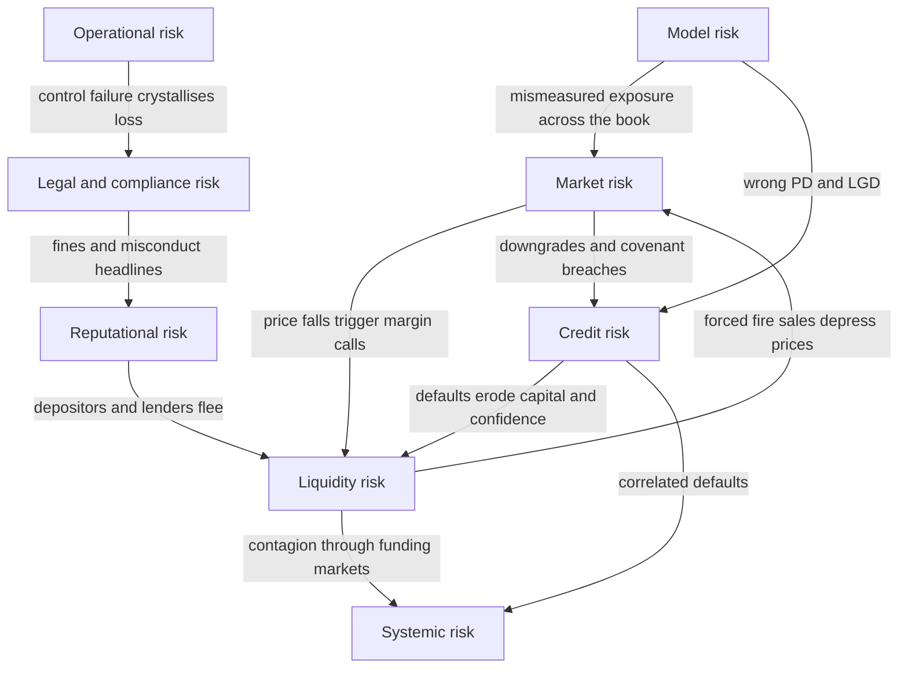
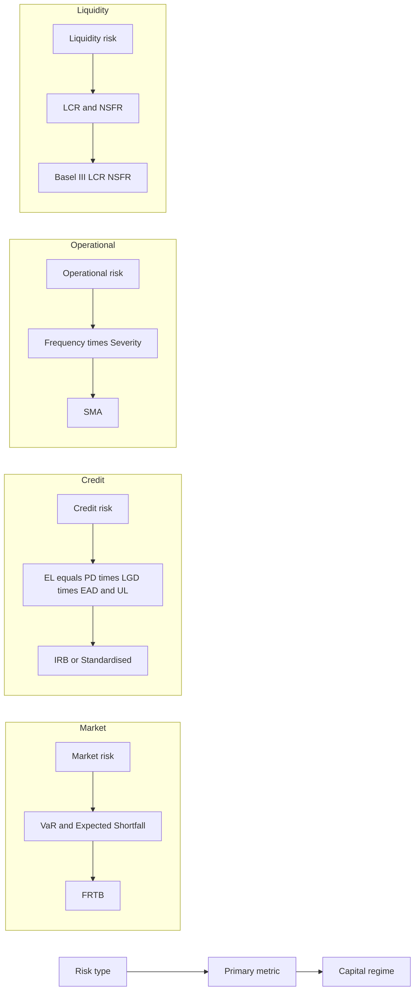

# Chapter 02 — Types of Financial Risk

## 1. The Problem / The Need

A bank is a machine for taking risk on purpose. It borrows short, lends long, holds securities, moves money, and promises depositors safety while gambling that borrowers will repay. If you tell the CEO "we have a lot of risk," you have said nothing useful. Nobody can hedge "risk," reserve capital against "risk," assign an owner to "risk," or price "risk" into a loan. You can only manage things you can *name, measure, and attribute to someone*.

The 2007–09 Global Financial Crisis is the cautionary tale for why sloppy classification kills. Banks held AAA-rated mortgage tranches and called the exposure "credit risk" — a slow-moving, diversifiable thing. In reality the exposure was a tangle of *market risk* (mark-to-market losses as spreads widened), *liquidity risk* (funding vanished overnight), *model risk* (the correlation assumptions in the CDO models were wrong), and *systemic risk* (everyone held the same trade). Because the losses were mislabelled, they were mismeasured, under-capitalised, and owned by nobody in particular. Lehman Brothers had a liquidity problem that its solvency models never flagged.

So the first real job in risk management is **taxonomy**: cut the fog of "risk" into distinct, measurable categories, each with its own math, its own capital charge, its own owner, and its own controls. This chapter builds that taxonomy and — just as importantly — shows how the categories bleed into and amplify one another. A neat box diagram is comforting; real crises live in the arrows *between* the boxes.

Why classification is not academic pedantry:

- **Measurement.** Market risk uses Value-at-Risk on a daily price distribution. Credit risk uses PD × LGD × EAD over a year. Operational risk uses loss-event frequency and severity. Applying VaR to a loan book, or a default model to a trading desk, gives nonsense.
- **Ownership.** The Chief Risk Officer needs to point at a specific desk head, credit committee, or COO and say "this is yours." Unowned risk is unmanaged risk.
- **Capital.** Basel rules charge capital by risk type. Miscategorise and you either hold too little (and blow up) or too much (and destroy return on equity).
- **Regulation and hedging.** You hedge market risk with derivatives, credit risk with CDS or provisions, liquidity risk with a buffer of HQLA. The tool depends on the label.

## 2. The Core Idea

**Financial risk is not one thing but a family of distinct exposures, each defined by the *source* of the potential loss. The discipline of risk management begins by classifying every exposure into a taxonomy, because the source determines how you measure it, who owns it, and how you defend against it — and the most dangerous losses come not from any single category but from the way categories compound one another under stress.**

The canonical taxonomy used across banks, NBFCs, and the FRM/PRM syllabi:

| # | Risk type | One-line definition | Loss driver |
|---|-----------|---------------------|-------------|
| 1 | Market | Loss from adverse moves in market prices | Prices/rates/FX/vol |
| 2 | Credit | Loss from a counterparty failing to pay | Default / downgrade |
| 3 | Liquidity | Loss from inability to fund or to sell | Cash/marketability |
| 4 | Operational | Loss from failed processes, people, systems, external events | Internal failure/fraud |
| 5 | Model | Loss from a wrong or misused model | Bad assumptions/code |
| 6 | Legal / Compliance | Loss from breaking laws, rules, contracts | Fines, unenforceability |
| 7 | Reputational | Loss from damage to the franchise / trust | Lost customers/funding |
| 8 | Systemic | Loss from the failure of the system itself | Contagion |

A useful mental split: the first three (market, credit, liquidity) are **financial risks** the bank takes deliberately to earn a return. Operational, model, legal, and reputational are **non-financial risks** — largely unrewarded, incurred as a by-product of doing business; you want to minimise them, not "optimise" them. Systemic risk sits above all of them: it is the risk that the categories correlate perfectly at the worst moment.

## 3. Why / How It Works

### Why the source defines the category

Every risk category is really an answer to the question: *"What has to happen in the world for me to lose money here?"*

- If the loss requires a **price to move** → market risk. It is symmetric-ish (you can gain too), fast, observable daily, and modelled with distributions of returns.
- If the loss requires a **counterparty to break a promise** → credit risk. It is asymmetric (limited upside = the coupon; large downside = default), slow, sparsely observed (defaults are rare), and modelled with probabilities of default.
- If the loss requires you to be **unable to raise cash or sell an asset** → liquidity risk. It has no natural "distribution of returns"; it is a threshold/knock-out risk that is fine until suddenly it is fatal.
- If the loss requires a **process to fail** → operational risk. Fat-tailed, hard to model, driven by the internal control environment rather than the market.

Because the generating mechanisms differ, the *mathematics* differs. This is the deepest reason classification matters: **you cannot use one number for all of it.** VaR captures the market tail; it says nothing about a rogue trader or a wrong model.

### Why they compound

Risk categories are not independent buckets — they are coupled by shared drivers and by feedback loops. Three mechanisms:

1. **Common shock.** A single macro event (a rate spike, a pandemic) hits multiple categories at once, so correlations that looked low in calm times jump toward 1.
2. **Transmission / cascade.** One risk *causes* another: a market shock forces margin calls (→ funding-liquidity), forced selling depresses prices (→ market-liquidity → more market loss), which triggers covenant breaches (→ credit).
3. **Reflexivity.** The act of managing risk creates risk. Everyone running the same VaR model de-risks simultaneously, which is itself the systemic event.

The diagram below maps the taxonomy and its principal linkages.

*Figure 1 — The risk taxonomy and its compounding arrows. Crises travel along the arrows, not inside the boxes.*

## 4. Full Content — The Taxonomy in Depth

### 4.1 Market Risk

**Definition.** The risk of loss on positions from movements in market prices: interest rates, equity prices, FX rates, commodity prices, and their volatilities and spreads. Sub-types: interest-rate risk, equity risk, currency (FX) risk, commodity risk, and (as second-order Greeks) volatility risk, basis risk, and correlation risk.

**Where it lives.** The trading book primarily, but also the banking book via interest-rate risk (IRRBB) and FX translation.

**Core measure — Value-at-Risk (VaR).** VaR answers: *"Over horizon h, at confidence c, what is the loss I will not exceed?"* Formally, VaR is the c-quantile of the loss distribution.

Parametric (variance-covariance) VaR for a single position:

$$\text{VaR} = z_{c} \times \sigma \times V \times \sqrt{h}$$

where z_c is the standard-normal quantile (1.645 for 95%, 2.326 for 99%), σ is the return volatility per unit time, V is the position value, and √h scales one-period volatility to an h-period horizon.

**Beyond VaR — Expected Shortfall (ES / CVaR).** VaR ignores how bad losses are *beyond* the cut-off. Expected Shortfall is the average loss conditional on breaching VaR:

$$\text{ES}_c = E[L \mid L > \text{VaR}_c]$$

Basel FRTB replaced 99% VaR with 97.5% ES precisely because ES is coherent (sub-additive — diversification never increases it) and captures tail thickness.

**Portfolio VaR** uses the correlation matrix. For two assets:

$$\text{VaR}_p = \sqrt{\text{VaR}_1^2 + \text{VaR}_2^2 + 2\rho\,\text{VaR}_1 \text{VaR}_2}$$

### 4.2 Credit Risk

**Definition.** The risk that a borrower or counterparty fails to meet contractual obligations. Sub-types: **default risk** (outright non-payment), **migration/downgrade risk** (rating deterioration reduces value), **concentration risk** (too much exposure to one name/sector/geography), **counterparty credit risk** (CCR, on derivatives, where exposure itself is uncertain), and **settlement risk** (Herstatt risk).

**Core formula — Expected Loss.**

$$\text{EL} = \text{PD} \times \text{LGD} \times \text{EAD}$$

- **PD** — Probability of Default over a horizon (usually 1 year).
- **LGD** — Loss Given Default = 1 − recovery rate; the fraction not recovered.
- **EAD** — Exposure At Default; the outstanding amount at the moment of default.

Expected Loss is the *average* loss — you price it into the spread and provision for it (it is a cost of doing business, covered by margins). What actually threatens solvency is **Unexpected Loss (UL)** — the volatility of loss around the mean — which is what capital covers:

$$\text{UL} = \text{EAD} \times \sqrt{\text{PD}(1-\text{PD})}\times \text{LGD} \quad \text{(single-name, LGD deterministic)}$$

Credit capital under Basel IRB is driven by UL at a 99.9% confidence over one year, using the Asymptotic Single Risk Factor (ASRF) model. The key insight: EL is priced, UL is capitalised.

### 4.3 Liquidity Risk

**Definition.** Two distinct animals sharing a name:

- **Funding liquidity risk** — the risk of being unable to meet cash obligations as they fall due, without incurring unacceptable cost. This is a *balance-sheet/cash-flow* risk. It killed Lehman, Northern Rock, and SVB.
- **Market (asset) liquidity risk** — the risk that you cannot sell an asset quickly near its fair value; the bid-ask spread widens and market depth vanishes. This is a *transaction-cost* risk.

The two feed each other: you sell assets to raise funding (need market liquidity), and thin market liquidity worsens your funding position.

**Measures.**
- **Liquidity Coverage Ratio (LCR)** = HQLA ÷ Net cash outflows over 30 stressed days ≥ 100%.
- **Net Stable Funding Ratio (NSFR)** = Available Stable Funding ÷ Required Stable Funding ≥ 100%.
- Liquidity-adjusted VaR (LVaR) adds a bid-ask haircut to market VaR.

Liquidity risk is *non-distributional* and non-linear: you are fine at a buffer of 100% and dead at 99% in a run. This is why it resists the tidy VaR treatment and needs stress testing and survival-horizon analysis instead.

### 4.4 Operational Risk

**Definition (Basel).** The risk of loss from inadequate or failed internal processes, people and systems, or from external events. **Includes legal risk; excludes strategic and reputational risk** (in the Basel definition).

Seven Basel loss-event categories: internal fraud; external fraud; employment practices; clients/products/business practices; damage to physical assets; business disruption/system failure; execution/delivery/process management.

**Examples.** Rogue trading (Barings — Nick Leeson, £827m; Société Générale — Kerviel, €4.9bn), settlement errors, cyber-attacks, model deployment bugs, mis-selling.

**Measure.** Historically Advanced Measurement Approach (AMA) modelled a loss distribution via **frequency × severity** (e.g., Poisson frequency, lognormal severity, combined by Monte Carlo into an annual loss distribution; capital = 99.9% quantile). Basel III replaced this with the **Standardised Measurement Approach (SMA)**: capital = Business Indicator Component × Internal Loss Multiplier. Operational loss is *fat-tailed and skewed* — many small losses, rare catastrophic ones.

### 4.5 Model Risk

**Definition.** The risk of loss from decisions based on a model that is wrong or is used wrongly. Two sources (per US SR 11-7 supervisory guidance): (a) the model has fundamental errors and produces inaccurate outputs; (b) the model is used incorrectly or inappropriately.

**Examples.** The Gaussian copula that mispriced CDO correlation in 2008. The London Whale VaR model that JPMorgan changed to understate risk. Volatility models that assume normality and ignore fat tails. A pricing model calibrated on a regime that has ended.

**Why it is insidious.** Model risk is a *meta-risk*: it doesn't produce losses directly, it corrupts the measurement of every other risk. A wrong PD understates credit risk; a wrong vol surface understates market risk. Managed via independent model validation, back-testing, benchmarking, and conservative reserves. It has no clean formula — it is governed, not computed.

### 4.6 Legal and Compliance Risk

**Definition.** **Legal risk** — loss from unenforceable contracts, lawsuits, or adverse judgments (e.g., a derivative contract a counterparty was not authorised to enter — the classic Hammersmith & Fulham swaps case). **Compliance risk** — loss from failing to comply with laws, regulations, and internal standards (AML/KYC breaches, sanctions violations, market-conduct rules).

**Examples.** BNP Paribas' $8.9bn sanctions fine (2014); LIBOR-rigging fines across banks; money-laundering penalties. Basel folds legal risk into operational risk for capital, but conduct/compliance risk is increasingly managed as its own pillar.

### 4.7 Reputational Risk

**Definition.** The risk that negative perception among customers, counterparties, investors, or regulators damages the franchise — reducing revenue, raising funding costs, or triggering deposit flight. It is the *consequence* risk: almost always a second-order effect of an operational, legal, or credit failure that goes public.

**Why it is dangerous.** It converts a contained loss into an existential one by attacking the bank's core asset — *trust*. A bank funded by depositors who can leave in one tap of an app (as with SVB in 2023, where reputational panic on social media caused $42bn of withdrawals in a day) can die of reputation before any solvency model reacts. Hard to measure directly; proxied by share-price reaction, funding-spread widening, and customer attrition.

### 4.8 Systemic Risk

**Definition.** The risk that the failure of one institution or the seizing-up of one market cascades through the financial system, because institutions are interconnected and hold correlated exposures. It is the risk *of the system*, not *within* a single firm.

**Channels.** Direct counterparty exposures (a domino chain); common asset holdings and fire-sale externalities; funding-market freezes; loss of confidence. Addressed macro-prudentially: G-SIB capital surcharges, countercyclical buffers, central clearing, and stress tests (CCAR, EBA).

An individual firm cannot diversify away systemic risk — that is its defining feature and why it needs a regulator, not a risk desk, to manage.

### 4.9 How the categories map to measurement and capital

*Figure 2 — Each category has its own metric and its own regulatory capital regime. Mislabelling breaks this whole chain.*

## 5. Worked Examples

### Example 1 — Market risk: parametric VaR, scaling, and portfolio diversification

A desk holds a ₹100 crore equity position with daily return volatility σ = 2%. Compute the 1-day and 10-day 99% VaR, then combine with a ₹100 crore bond position (daily σ = 0.5%, correlation ρ = 0.30 with equities).

**Step 1 — Single-asset 1-day 99% VaR (equity).** z_99% = 2.326.
VaR = 2.326 × 0.02 × 100 = **₹4.652 crore.**

**Step 2 — Scale to 10 days** (square-root-of-time):
VaR₁₀ = 4.652 × √10 = 4.652 × 3.1623 = **₹14.71 crore.**

**Step 3 — Bond 1-day 99% VaR.**
VaR_bond = 2.326 × 0.005 × 100 = **₹1.163 crore.**

**Step 4 — Portfolio 1-day VaR with ρ = 0.30.**

$$\text{VaR}_p = \sqrt{4.652^2 + 1.163^2 + 2(0.30)(4.652)(1.163)}$$

= √(21.641 + 1.353 + 3.246) = √26.240 = **₹5.122 crore.**

**Reconciliation / self-check.** The undiversified sum is 4.652 + 1.163 = ₹5.815 cr. The portfolio VaR of ₹5.122 cr is lower — as it must be for ρ < 1. **Diversification benefit = 5.815 − 5.122 = ₹0.693 cr (11.9%).** If we set ρ = 1, the formula collapses to √((4.652+1.163)²) = 5.815, exactly the undiversified sum — confirming the algebra. Good.

### Example 2 — Credit risk: Expected Loss, pricing, and Unexpected Loss

An NBFC lends ₹50 crore (EAD) to a corporate with 1-year PD = 2% and recovery rate = 40% (so LGD = 60%).

**Step 1 — Expected Loss.**
EL = PD × LGD × EAD = 0.02 × 0.60 × 50 = **₹0.60 crore = ₹60 lakh.**

**Step 2 — What spread covers EL?** As a fraction of EAD: EL/EAD = 0.60/50 = **1.20%.** The loan must earn at least ~120 bps over its funding cost *just to break even on expected credit losses* — before any profit or capital charge.

**Step 3 — Unexpected Loss (single name, deterministic LGD).**

$$\text{UL} = \text{EAD}\times \text{LGD}\times\sqrt{\text{PD}(1-\text{PD})} = 50 \times 0.60 \times \sqrt{0.02\times0.98}$$

= 30 × √0.0196 = 30 × 0.14 = **₹4.20 crore.**

**Reconciliation.** UL (₹4.20 cr) is 7× the EL (₹0.60 cr). This is the whole point of the EL/UL split: the *average* loss is small and priced into the 1.2% spread, but the *volatility* of loss is large — a single default costs LGD × EAD = ₹30 cr, not ₹0.6 cr. Check the two states directly: with prob 2% you lose ₹30 cr; with prob 98% you lose ₹0. Mean = 0.02 × 30 = ₹0.60 cr ✓ (matches EL). Variance = 0.02 × 0.98 × 30² = 17.64, so std dev = √17.64 = ₹4.20 cr ✓ (matches UL). The formulas reconcile exactly with first-principles probability. Capital must absorb the ₹4.20 cr tail, not the ₹0.60 cr mean.

### Example 3 — Compounding: how a market shock becomes a liquidity-then-credit spiral

A leveraged fund holds ₹200 cr of bonds financed by ₹180 cr of repo (10% haircut, so ₹20 cr equity). Trace what one shock does across three risk categories.

**Step 1 — Market shock.** Rates spike; bond prices fall 5%.
Loss = 5% × 200 = **₹10 cr.** Equity falls from ₹20 cr to ₹10 cr. Pure *market risk*, cleanly measured.

**Step 2 — Liquidity transmission (margin call).** The repo lender marks the collateral to ₹190 cr and, seeing stress, raises the haircut from 10% to 20%. Required equity = 20% × 190 = ₹38 cr. The fund has ₹10 cr. **Shortfall = ₹28 cr** must be met *in cash today.* The ₹10 cr market loss has become a ₹28 cr *funding-liquidity* crisis — nearly 3× larger.

**Step 3 — Market-liquidity feedback (fire sale).** To raise cash the fund dumps bonds into a thin market at a further 3% below screen price.
Extra loss = 3% × (fraction sold). To raise ₹28 cr of cash at fire-sale prices it must sell ~₹28 cr / (1 − extra haircut) of bonds, realising an additional ~₹0.87 cr of *market-liquidity* loss and pushing prices down further — which triggers fresh margin calls on everyone holding the same bond (systemic channel).

**Step 4 — Credit crystallisation.** If the fund cannot meet the call, it defaults on the repo. The lender now owns bonds worth less than the loan: a *credit loss* of EAD − collateral value = 180 − 190×(1−further fall). 

**Reconciliation of the cascade.** One ₹10 cr price move (market) → ₹28 cr cash demand (liquidity) → forced sales that deepen the price move (market-liquidity) → default (credit) → contagion to co-holders (systemic). Each arrow *amplifies*: the final system loss dwarfs the initiating ₹10 cr. This is exactly why measuring the four categories in isolation — and summing their standalone VaRs — *understates* stressed loss. Standalone measurement assumes the arrows are switched off; crises switch them on and correlations go to 1.

## 6. Connections

- **To Chapter 01 (What is risk).** This chapter operationalises the definition of risk into managed categories; risk = quantifiable uncertainty, and taxonomy is how we make it quantifiable per source.
- **To VaR / ES chapters.** Market risk is where the distributional machinery (VaR, ES, Greeks) lives in full. Example 1 is a preview.
- **To credit-modelling chapters.** EL/UL, PD/LGD/EAD, IRB, and CVA all build on §4.2 and Example 2.
- **To Basel / regulatory-capital chapters.** The whole point of classification is that Basel charges capital *by category* — market (FRTB), credit (IRB/Standardised), operational (SMA), plus liquidity ratios (LCR/NSFR). The taxonomy *is* the capital framework's skeleton.
- **To ALM / treasury.** Interest-rate risk in the banking book and funding-liquidity risk are managed by Treasury/ALCO, a different owner than the trading desk — a direct consequence of classification driving ownership.
- **To ERM / governance.** The three-lines-of-defence model assigns each category an owner (1st line business, 2nd line risk/compliance, 3rd line audit).

## 7. Key Terms

- **VaR (Value-at-Risk).** The loss threshold not exceeded at confidence c over horizon h; the c-quantile of the loss distribution.
- **Expected Shortfall (ES / CVaR).** Average loss *beyond* VaR; coherent and tail-sensitive; Basel FRTB metric.
- **PD / LGD / EAD.** Probability of Default, Loss Given Default (= 1 − recovery), Exposure At Default. Their product is Expected Loss.
- **Expected Loss (EL).** Mean credit loss; priced into spreads and provisioned.
- **Unexpected Loss (UL).** Volatility of credit loss around EL; covered by capital.
- **Funding vs market liquidity.** Ability to raise cash vs ability to sell an asset near fair value.
- **LCR / NSFR.** Basel III liquidity ratios (30-day stress buffer; 1-year stable-funding match).
- **Counterparty credit risk (CCR).** Credit risk on derivatives where the exposure itself is stochastic.
- **Model risk.** Loss from a wrong or misused model; a meta-risk that corrupts other measurements.
- **Systemic risk.** Risk of cascade failure across the interconnected system; undiversifiable.
- **G-SIB.** Global Systemically Important Bank; carries an extra capital surcharge.
- **Coherent risk measure.** One satisfying monotonicity, translation invariance, positive homogeneity, and sub-additivity (VaR fails the last; ES passes).

## 8. Common Confusions

- **"VaR is the worst case."** No. VaR is the *best of the worst* — the *minimum* loss on a bad day, not the maximum. It says nothing about how bad the tail beyond it is; that is what ES is for.
- **"Expected Loss is what capital covers."** Backwards. EL is *priced and provisioned* (it is a cost, not a surprise). Capital covers *Unexpected* Loss — the volatility around EL. Confusing the two under-capitalises the book (see Example 2: EL ₹0.6 cr vs UL ₹4.2 cr).
- **"Liquidity risk is just a type of market risk."** Two different animals. Market risk is being long an asset whose price falls; funding-liquidity risk is being unable to roll your funding even if the asset's price is fine. SVB's bonds were money-good to maturity — it died of funding liquidity, not market loss.
- **"Solvent means safe."** Solvency (assets > liabilities) and liquidity (cash when due) are different. A solvent firm can fail from a liquidity run before its assets are ever realised (Lehman, Northern Rock).
- **"Operational risk excludes legal risk."** Basel's definition *includes* legal risk but *excludes* strategic and reputational risk. A common exam trap.
- **"Reputational and systemic risk are vague, so they don't matter for measurement."** They are hard to measure but decisive: they are the amplifiers that turn a survivable loss into a fatal one. They matter *most* precisely because they resist the standard metrics.
- **"Total risk = sum of the category VaRs."** Only if correlations are 1. In calm times the sum overstates risk (diversification); in crises the arrows switch on and even the sum understates it. Never additive in the simple way.
- **"Model risk is an IT problem."** It is a governance problem. The London Whale and the Gaussian copula were validated-looking models with wrong assumptions, not buggy code.

## 9. Recap

- "Risk" is useless as a single word; management begins by **classifying** exposures by their *source of loss*: market, credit, liquidity, operational, model, legal/compliance, reputational, systemic.
- **Source determines math.** Market → VaR/ES on price distributions. Credit → EL = PD×LGD×EAD, capital on UL. Liquidity → LCR/NSFR and survival horizons (non-distributional). Operational → frequency×severity, fat tails. Model/legal/reputational → governed, not neatly computed.
- **Source determines ownership and capital.** Each category maps to a specific owner and a specific Basel capital regime; mislabel and you mis-capitalise and leave the risk unowned.
- The financial risks (market/credit/liquidity) are **taken for reward**; the non-financial ones (operational/model/legal/reputational) are **unrewarded** and to be minimised.
- **The real danger is compounding.** A single shock travels along the arrows — market → liquidity → fire-sale → credit → systemic — and each hop amplifies. Standalone measurement, which assumes the arrows are off, systematically understates stressed loss because in a crisis correlations converge to 1.
- Worked examples confirmed the math: portfolio VaR < sum of VaRs for ρ<1 (₹5.12 cr vs ₹5.82 cr); UL ≈ 7× EL from first-principles variance (₹4.20 cr vs ₹0.60 cr); and a ₹10 cr price shock ballooning into a ₹28 cr liquidity call.

## 10. Quick-Reference / Interview Points

**The one-liner:** *Financial risk is a taxonomy, not a scalar — you classify by source because the source dictates the measurement, the owner, and the capital, and the biggest losses come from the categories compounding.*

**Rapid-fire answers:**

- *Name the risk types.* Market, credit, liquidity, operational, model, legal/compliance, reputational, systemic.
- *Market risk metric?* VaR, now Expected Shortfall (97.5%) under FRTB — ES because it is coherent and tail-sensitive.
- *VaR formula (parametric)?* z_c × σ × V × √h. z = 1.645 (95%), 2.326 (99%).
- *Credit Expected Loss?* EL = PD × LGD × EAD. EL is priced/provisioned; **capital covers UL** (unexpected loss).
- *Two liquidity risks?* Funding (can't raise cash) and market/asset (can't sell near fair value); they feed each other.
- *Liquidity ratios?* LCR (30-day HQLA buffer ≥100%) and NSFR (stable funding ≥100%).
- *Operational risk definition?* Loss from failed processes, people, systems, or external events — *includes legal, excludes strategic & reputational* (Basel).
- *What is model risk?* Loss from a wrong or misused model; a meta-risk corrupting all other measurements; governed via independent validation (SR 11-7).
- *Systemic vs the rest?* Undiversifiable, system-wide, managed macro-prudentially (G-SIB surcharges, buffers, clearing).
- *Solvency vs liquidity?* Assets>liabilities vs cash-when-due; you can be solvent and still fail from a run (Lehman, SVB).
- *Why classify at all?* Measurement, ownership, capital, and the right hedging tool per category.
- *Why do the boxes matter less than the arrows?* Because crises transmit and amplify across categories; standalone/summed VaR assumes independence and understates stressed loss.

**Killer closing line for an interview:** *"In 2008 the exposure was booked as credit risk but killed banks as liquidity and systemic risk — the loss didn't live in any one box, it lived in the arrows between them. That's why I think of risk as a coupled system, not a checklist."*
