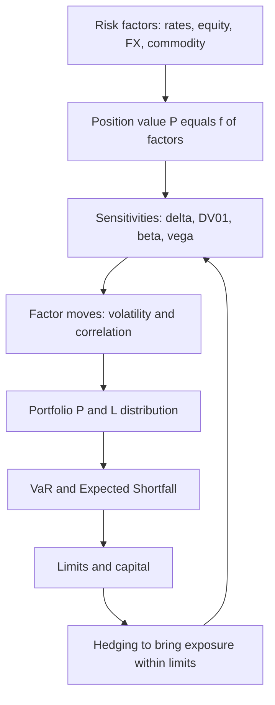
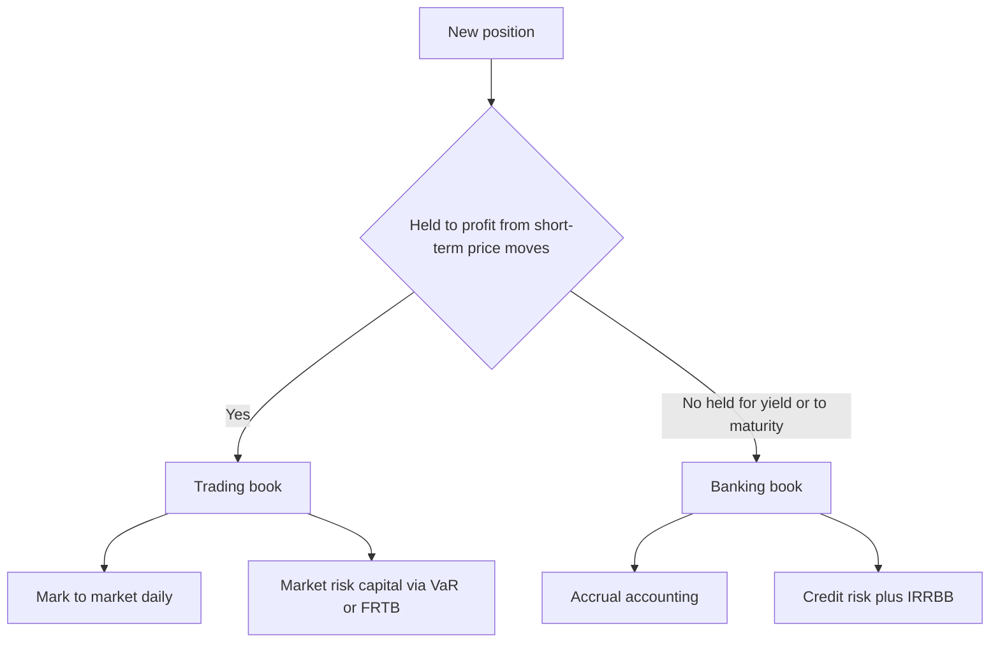

# Chapter 03 — Market Risk

## 1. The Problem / The Need

A bank holds a 1,000 crore portfolio of government bonds. Overnight, the 10-year yield rises by 15 basis points. When the desk opens the next morning, the portfolio is worth roughly 10 crore less — nobody defaulted, no counterparty failed, no fraud occurred. The loss came purely from a **move in a market price**. That is market risk in one sentence: the risk that the mark-to-market value of positions falls because market prices move against you.

This is a fundamentally different animal from credit risk. Credit risk is about *someone else failing to pay you*. Market risk is about *the price of what you hold changing*, whether or not anyone defaults. The two require different measurement tools, different limits, different desks, and — crucially for anyone interviewing for a risk role — different mental models.

Why do we need to measure it separately and carefully?

- **Speed.** Credit losses crystallise over months or years. Market losses crystallise in seconds. A trading book can lose a quarter of its capital between lunch and the close. You cannot manage in hours what you only measure monthly.
- **Two-sidedness.** A loan can only pay back par or less. A traded position can gain *or* lose, and often you are short as well as long. Risk must capture both directions and the netting between them.
- **Leverage and gearing.** Derivatives let a desk take enormous notional exposure for tiny cash outlay. A 100 crore swap position might tie up almost no capital yet swing millions per basis point. Notional tells you nothing; you must measure *sensitivity*.
- **Regulatory capital.** Basel requires banks to hold capital against market risk in the trading book. To size that capital you must quantify potential loss — this is where Value at Risk (VaR) and its successors enter.

So the need is concrete: identify what drives price moves, translate positions into *sensitivities* (how much do I lose per unit move?), aggregate those into a *portfolio loss distribution*, set *limits* so the firm cannot bet more than it can survive, and *hedge* what it does not want. That chain — driver → sensitivity → VaR → limit → hedge — is the spine of this chapter.

---

## 2. The Core Idea

Market risk decomposes into a small number of **risk factors** — interest rates, equity prices, FX rates, and commodity prices (with credit spreads and volatility as important extensions). Any position, however complex, is ultimately a bundle of exposures to these factors.

The core insight is a two-step chain:

> **Loss = (how much the factor moves) × (how sensitive my position is to that factor).**

Formally, for a small move in a risk factor:

$$\Delta P \approx \text{Sensitivity} \times \Delta(\text{Factor})$$

The **factor move** is a property of the *market* — volatile, uncontrollable, estimated from history or implied from option prices. The **sensitivity** is a property of *your position* — known, computable, and controllable through trading and hedging. You cannot stop rates from moving, but you *can* choose how much you lose when they do, by sizing your sensitivity.

This is why the whole discipline organises around sensitivities with names: **delta** (sensitivity to price), **DV01** (sensitivity to a 1bp rate move), **beta** (sensitivity to the market index), **vega** (sensitivity to volatility), **gamma** (how the sensitivity itself changes). Master the sensitivities and market risk becomes a bookkeeping problem: measure each factor exposure, multiply by a plausible move, and add up (allowing for how the factors move together).

The final aggregation — plausible moves + correlations across many positions — is exactly what **VaR** does. VaR is not a separate idea; it is the statistical roll-up of the same sensitivities.

---

## 3. Why / How It Works

### Why decompose into factors at all?

A large trading book might hold tens of thousands of instruments. You cannot reason about each one. But every instrument's value is a *function* of a handful of underlying factors. A bond's price is a function of the yield curve. An option's price is a function of the underlying price, volatility, and rates. By projecting everything onto the same small factor set, thousands of positions collapse into a manageable vector of factor exposures. Two bonds and a swap that all depend on the 5-year rate net into a single 5-year DV01.

### Why sensitivities (the calculus intuition)

Any smooth pricing function $P(x)$ can be Taylor-expanded around the current factor level:

$$\Delta P = \underbrace{\frac{\partial P}{\partial x}}_{\text{first order}}\,\Delta x \;+\; \underbrace{\tfrac{1}{2}\frac{\partial^2 P}{\partial x^2}}_{\text{second order}}\,(\Delta x)^2 + \dots$$

- The **first derivative** is the *delta / DV01 / beta* family — the linear sensitivity that dominates for small moves.
- The **second derivative** is *gamma / convexity* — the curvature that matters for large moves and for options.

For small moves the linear term is a superb approximation, which is why desks live and breathe first-order Greeks. For large moves or optioned books, the curvature term is not optional — ignoring gamma is how "hedged" books blow up.

### Why this feeds VaR

Once every position is a sensitivity to a factor, and you have a statistical description of how factors move (volatilities and correlations), the portfolio's profit-and-loss becomes a *linear combination of random factor moves*. A linear combination of (approximately) normal variables is itself normal, with a variance you can compute from the sensitivities and the covariance matrix. VaR is just a percentile of that P&L distribution. So sensitivities are the bridge from "positions" to "a loss distribution."

*Figure 1 — The market-risk pipeline: positions become sensitivities, sensitivities plus factor statistics become a loss distribution, and limits and hedges close the loop.*

---

## 4. Full Content — Framework, Formulas, Methods

### 4.1 The four (plus two) risk factor classes

| Factor class | What moves | Typical instruments | Primary sensitivity |
|---|---|---|---|
| Interest rate | Yield curve levels and shape | Bonds, swaps, FRAs, futures | DV01 / PV01, duration, key-rate DV01 |
| Equity | Share and index prices | Stocks, index futures, equity options | Delta, beta |
| Foreign exchange | Currency pair rates | Spot FX, forwards, cross-currency swaps | FX delta (position in each currency) |
| Commodity | Oil, metals, gas, agri | Futures, swaps, options | Delta per commodity, basis |
| Credit spread | Spread over risk-free | Corporate bonds, CDS | CS01 / spread DV01 |
| Volatility | Implied vol of options | All options | Vega |

The first four are the classic "market risk" quartet named in every syllabus. Credit spread risk and volatility (vega) risk are treated within market risk when they sit in the trading book.

### 4.2 The trading book vs the banking book

This distinction is central and heavily examined.

- **Trading book:** positions held with *trading intent* — to profit from short-term price moves or to make markets. Marked to market daily; P&L flows through the income statement immediately. Market risk capital applies here.
- **Banking book:** positions held to *maturity / for the long term* — loans, held-to-maturity bonds, deposits. Accrual accounted. Its main risk is credit, plus **IRRBB** (Interest Rate Risk in the Banking Book), which is managed but not capitalised the same way.

Why the boundary matters: it determines the accounting (mark-to-market vs accrual), the capital treatment, and the risk lens (VaR vs earnings/economic-value sensitivity). Regulators police the boundary tightly because banks are tempted to park losing positions in whichever book has the softer capital charge — this is exactly what the Fundamental Review of the Trading Book (FRTB) hardened.

*Figure 2 — The book-boundary decision and its consequences for accounting and capital.*

### 4.3 Interest-rate sensitivity: DV01, PV01, and duration

**DV01 (Dollar Value of a 01)**, also called PV01, is the change in a position's value for a **1 basis point (0.01%)** parallel move in the yield curve.

$$\text{DV01} = -\frac{\partial P}{\partial y}\times 0.0001$$

For a bond it links to **modified duration** ($D_{mod}$):

$$\text{DV01} = D_{mod}\times P \times 0.0001$$

where $P$ is the (dirty) price / market value. Duration measures *percentage* price change per unit yield; DV01 converts that into *money* per basis point, which is what a desk actually hedges.

**Convexity** is the second-order term. The fuller price change for a yield move $\Delta y$:

$$\frac{\Delta P}{P} \approx -D_{mod}\,\Delta y + \tfrac{1}{2}\,C\,(\Delta y)^2$$

Convexity $C$ is always positive for a plain bond, so duration *overstates* the loss on a rate rise and *understates* the gain on a rate fall — a friend to the bondholder.

**Key-rate DV01** breaks the single DV01 into buckets (2y, 5y, 10y, 30y) so you can see and hedge *curve shape* risk (steepening/flattening), not just parallel shifts.

### 4.4 Equity sensitivity: delta and beta

- **Delta** for an equity option is $\partial P/\partial S$ — change in option value per 1 unit change in the underlying. A call has delta between 0 and 1; a put between −1 and 0. Position delta = option delta × contract multiplier × number of contracts.
- **Beta** links a stock or portfolio to the market index:

$$\beta = \frac{\text{Cov}(r_i, r_m)}{\text{Var}(r_m)} = \rho_{i,m}\,\frac{\sigma_i}{\sigma_m}$$

Beta lets you express a diversified equity book as an *equivalent index exposure* — "beta-adjusted net exposure" — which you can hedge with one index futures trade.

### 4.5 FX and commodity sensitivity

- **FX delta:** the net position in each currency, valued in the base currency. A firm long USD 10m against INR is exposed 1:1 to USD/INR; the sensitivity per 1% move is 1% of the INR value of the position.
- **Commodity delta:** value change per unit move in the commodity price, per commodity and per delivery point. Commodities add **basis risk** (the hedge instrument and the exposure differ in grade, location, or delivery date) and often steep **term-structure** effects (contango/backwardation).

### 4.6 The Greeks summary (options overlay)

| Greek | Sensitivity to | Sign intuition |
|---|---|---|
| Delta (Δ) | Underlying price | Directional exposure |
| Gamma (Γ) | Change in delta | Curvature; large for at-the-money near expiry |
| Vega (ν) | Implied volatility | Long options are long vega |
| Theta (Θ) | Passage of time | Long options bleed theta |
| Rho (ρ) | Interest rate | Usually secondary |

### 4.7 Drivers of market risk

What actually *makes* factors move — the "why prices move" that an interviewer probes:

- **Macro data and policy:** central-bank rate decisions, inflation prints, GDP, employment. These move the whole yield curve and ripple into FX and equities.
- **Liquidity and flows:** thin markets amplify moves; forced selling and margin calls create feedback loops.
- **Risk sentiment / volatility regime:** in "risk-off" episodes correlations spike toward 1 and diversification evaporates exactly when you need it.
- **Supply and demand shocks (commodities):** OPEC decisions, weather, geopolitics.
- **Volatility clustering:** big moves follow big moves (the empirical basis for GARCH and EWMA vol models).

The practical consequence: volatilities and correlations are *not constant*. A VaR built on calm-period data understates risk in a crisis. This is the single most important caveat a candidate can voice.

### 4.8 The link to VaR

**Value at Risk** answers: "Over a horizon of $h$ days, at confidence $c$, what loss will not be exceeded?" A 1-day 99% VaR of 5 crore means: on 99% of days the loss should be ≤ 5 crore; roughly 1 day in 100 it exceeds it.

**Parametric (variance-covariance) VaR** for a single position:

$$\text{VaR} = z_c \times \sigma_{P\&L} \times \sqrt{h}$$

where $z_c$ is the standard-normal quantile (1.645 for 95%, 2.326 for 99%) and $\sigma_{P\&L}$ is the daily P&L standard deviation. The P&L volatility comes straight from the sensitivity:

$$\sigma_{P\&L} = |\text{Sensitivity}| \times \sigma_{\text{factor}}$$

For a **portfolio of two factors**, variance adds with correlation:

$$\sigma_P = \sqrt{\sigma_1^2 + \sigma_2^2 + 2\rho_{12}\,\sigma_1\sigma_2}$$

**Time scaling** uses the square-root-of-time rule (valid when returns are i.i.d.): $\text{VaR}_h = \text{VaR}_1 \times \sqrt{h}$.

Three families of VaR methods:

1. **Parametric / variance-covariance:** assumes normal factor returns; fast; poor for options (ignores fat tails and gamma).
2. **Historical simulation:** replay the last N days of actual factor moves through today's portfolio; captures fat tails and real correlations; no distribution assumed; but bounded by the sampled history.
3. **Monte Carlo:** simulate thousands of factor scenarios from an assumed process, full-revalue the book; most flexible (handles options and non-linearity); computationally heavy.

**Expected Shortfall (ES / CVaR)** is the average loss *given* that VaR is breached — the mean of the tail beyond VaR. It is coherent (respects diversification, unlike VaR) and is the Basel FRTB regulatory measure (97.5% ES). VaR tells you the *threshold*; ES tells you *how bad it gets past the threshold*.

### 4.9 Managing market risk: limits and hedges

**Limits** are pre-agreed ceilings so risk-taking stays within appetite:

- **Sensitivity limits:** max DV01, max net delta, max vega per desk.
- **VaR / ES limits:** max 1-day 99% VaR per desk and firm-wide.
- **Stop-loss limits:** cumulative loss that forces position reduction.
- **Concentration / notional limits:** caps per name, sector, currency.
- **Stress-loss limits:** max loss under a defined stress scenario.

**Hedging** neutralises unwanted sensitivity by taking an offsetting position so the *net* sensitivity falls to (near) zero:

- **Duration/DV01 hedge:** short interest-rate futures or pay-fixed swaps to cut bond-book DV01.
- **Delta hedge:** trade the underlying (or futures) to flatten net delta; must be *re-hedged* as delta drifts (gamma).
- **Beta hedge:** short index futures sized by beta-adjusted exposure.
- **FX hedge:** forwards/swaps to offset currency mismatch.

Hedging is never free or perfect: it leaves **basis risk** (imperfect correlation between hedge and exposure), costs bid-offer and margin, and a delta hedge only holds instantaneously — the residual gamma, vega and theta remain.

---

## 5. Worked Examples

### Example 1 — Bond DV01, duration, and a rate shock (with convexity check)

**Setup.** A desk holds 100 crore face of a bond priced at par (₹100), modified duration 7.0, convexity 60. Rates rise 50 bp (0.50%).

**Step 1 — DV01.** Market value $P$ = 100 crore.

$$\text{DV01} = D_{mod}\times P \times 0.0001 = 7.0 \times 100{,}00{,}00{,}000 \times 0.0001 = ₹7{,}00{,}000 \text{ per bp}$$

**Step 2 — Duration-only loss for 50 bp.** A 50 bp move ≈ 50 × DV01:

$$\text{Loss} \approx 50 \times 7{,}00{,}000 = ₹3{,}50{,}00{,}000 = ₹3.50\text{ crore}$$

Equivalently, $-D_{mod}\,\Delta y = -7.0 \times 0.005 = -3.5\%$ of 100 crore = 3.50 crore. **Reconciles.**

**Step 3 — Convexity correction.** Add $\tfrac{1}{2}C(\Delta y)^2 = 0.5 \times 60 \times (0.005)^2 = 0.5 \times 60 \times 0.000025 = 0.00075 = 0.075\%$.

Convexity is positive, so it *reduces* the loss: net price change ≈ $-3.5\% + 0.075\% = -3.425\%$.

$$\text{Loss} \approx 3.425\% \times 100\text{ crore} = ₹3.425\text{ crore}$$

**Interpretation.** Linear (DV01/duration) says 3.50 crore; convexity trims it to 3.425 crore. For a rate *fall* of 50 bp the gain would be 3.5% + 0.075% = 3.575% — convexity works in the holder's favour both ways. This asymmetry is why long-convexity positions are prized.

### Example 2 — Parametric VaR for a two-asset portfolio (with diversification check)

**Setup.** A book has two positions:
- Position A: equity, market value 50 crore, daily return volatility 2.0%.
- Position B: bond, market value 50 crore, daily return volatility 0.8%.
- Correlation between A and B returns: ρ = 0.30.
- Confidence 99% (z = 2.326), horizon 1 day.

**Step 1 — Daily P&L volatility of each position (in money).**

$$\sigma_A = 50\text{ cr}\times 2.0\% = ₹1.00\text{ crore}, \qquad \sigma_B = 50\text{ cr}\times 0.8\% = ₹0.40\text{ crore}$$

**Step 2 — Portfolio P&L volatility.**

$$\sigma_P = \sqrt{\sigma_A^2 + \sigma_B^2 + 2\rho\,\sigma_A\sigma_B}$$
$$= \sqrt{1.00^2 + 0.40^2 + 2(0.30)(1.00)(0.40)} = \sqrt{1.00 + 0.16 + 0.24} = \sqrt{1.40} = ₹1.1832\text{ crore}$$

**Step 3 — 1-day 99% VaR.**

$$\text{VaR} = z \times \sigma_P = 2.326 \times 1.1832 = ₹2.752\text{ crore}$$

**Step 4 — Diversification benefit check.** Undiversified (sum of standalone VaRs):

$$\text{VaR}_A = 2.326\times1.00 = 2.326,\quad \text{VaR}_B = 2.326\times0.40 = 0.930$$
$$\text{Sum} = ₹3.256\text{ crore} \;>\; ₹2.752\text{ crore (portfolio)}$$

Diversification benefit = 3.256 − 2.752 = **₹0.504 crore**. Because ρ = 0.30 < 1, the combined VaR is less than the sum — exactly the sub-additivity we expect. **Reconciles.**

**Step 5 — Scale to 10 days** (square-root-of-time):

$$\text{VaR}_{10} = 2.752 \times \sqrt{10} = 2.752 \times 3.162 = ₹8.70\text{ crore}$$

### Example 3 — Beta hedge of an equity book with index futures

**Setup.** A portfolio worth 20 crore has beta 1.25 to the Nifty. Nifty is at 24,000; each futures contract is 50 index units, so one contract notional = 24,000 × 50 = ₹12,00,000. The manager wants to hedge to beta 0 (fully neutralise market risk).

**Step 1 — Beta-adjusted exposure.**

$$\text{Exposure} = \beta \times \text{Portfolio value} = 1.25 \times 20\text{ crore} = ₹25\text{ crore}$$

**Step 2 — Number of futures to short.**

$$N = \frac{\beta \times \text{Portfolio value}}{\text{Futures notional}} = \frac{25{,}00{,}00{,}000}{12{,}00{,}000} \approx 208.3 \Rightarrow \textbf{short 208 contracts}$$

**Step 3 — Check with a 2% market drop.** Nifty falls 2% → 24,000 → 23,520.

- Portfolio loss ≈ β × market move × value = 1.25 × (−2%) × 20 cr = **−₹0.50 crore**.
- Futures gain (short) = 208 × 50 × (24,000 − 23,520) = 208 × 50 × 480 = 208 × 24,000 = **+₹49,92,000 ≈ +₹0.499 crore**.

Net ≈ −0.50 cr + 0.499 cr ≈ **−₹0.001 crore**, essentially flat. The small residual is the rounding from 208.3 → 208 contracts. **Reconciles** — the beta hedge neutralised the directional loss.

**Target-beta variant.** To move to a target beta $\beta_T$ instead of 0:

$$N = \frac{(\beta_T - \beta_P)\times \text{Portfolio value}}{\text{Futures notional}}$$

A negative $N$ means short. To go from 1.25 to 0.50: $N = (0.50-1.25)\times 20\text{cr}/12{,}00{,}000 = -125$ → short 125 contracts.

---

## 6. Connections

- **To VaR / Chapter on measurement:** sensitivities are the *inputs* to VaR. The parametric VaR in Example 2 is nothing but the Greeks fed through a covariance matrix. Historical and Monte Carlo VaR re-price the *same* positions under different scenarios.
- **To credit risk:** Expected Loss = PD × LGD × EAD is the credit analogue of the market-risk chain "move × sensitivity." Both convert a stochastic driver into an expected/potential money loss. Credit-spread risk (CS01) is where the two disciplines overlap on traded bonds.
- **To ALM / IRRBB (banking book):** the *same* DV01/duration mathematics is used, but the objective shifts from a 1-day VaR to protecting net interest income and economic value of equity over years.
- **To derivatives pricing:** the Greeks come straight from the pricing model (e.g., Black-Scholes). Risk management is pricing differentiated — the same partial derivatives that price an option tell you how to hedge it.
- **To regulation:** Basel II.5 introduced Stressed VaR after 2008; **FRTB** replaced VaR with **97.5% Expected Shortfall**, hardened the trading/banking book boundary, and added liquidity-horizon scaling. Interviewers love the VaR→ES→FRTB arc.
- **To stress testing:** VaR describes *normal* days; stress tests and scenario analysis cover the tail that VaR, by construction, understates.

---

## 7. Key Terms

- **Market risk:** risk of loss from changes in market prices/rates.
- **Risk factor:** an underlying variable (rate, price, FX, vol) that drives position value.
- **Trading book / banking book:** trading-intent, marked-to-market positions vs held-for-yield, accrual positions.
- **DV01 / PV01:** money change in value per 1 bp rate move.
- **Modified duration:** percentage price change per unit yield change.
- **Convexity:** second-order (curvature) rate sensitivity; positive for plain bonds.
- **Delta:** sensitivity of value to the underlying price.
- **Gamma:** rate of change of delta (curvature for options).
- **Vega:** sensitivity to implied volatility.
- **Beta:** sensitivity of a stock/portfolio to the market index.
- **Basis risk:** residual risk when the hedge and the exposure are imperfectly correlated.
- **VaR (Value at Risk):** loss threshold not exceeded at a given confidence over a horizon.
- **Expected Shortfall (ES/CVaR):** average loss beyond VaR; coherent; the FRTB measure.
- **Stressed VaR:** VaR calibrated to a historical stress period.
- **Square-root-of-time rule:** $\text{VaR}_h = \text{VaR}_1\sqrt{h}$ under i.i.d. returns.
- **IRRBB:** interest-rate risk in the banking book.

---

## 8. Common Confusions

- **Notional ≠ risk.** A 500 crore swap can carry less risk than a 50 crore bond. Risk is *sensitivity*, not size of the ticket. Always ask for DV01/delta, not notional.
- **Duration is not maturity.** Duration is a *sensitivity* (weighted average time to cash flows, price-elasticity to yield), measured in years but meaning "how much value moves per yield move." A 10-year zero has duration ≈ 10; a 10-year coupon bond less.
- **VaR is not the maximum loss.** 99% VaR is *breached* about 1 day in 100, and says nothing about how bad the breach is. That is ES's job. Never call VaR "worst case."
- **VaR is not sub-additive in general.** For non-normal (e.g., optioned) portfolios, combined VaR can exceed the sum of parts — a theoretical defect that motivated ES. In the normal/linear case it *is* sub-additive (Example 2).
- **Delta-hedged ≠ risk-free.** A delta hedge removes first-order price risk *instantaneously only*. Gamma, vega, and theta remain, and delta drifts, forcing continuous re-hedging.
- **Correlation is not constant.** VaR built on calm-market correlations understates crisis risk, when correlations converge toward 1 and diversification vanishes.
- **Trading vs banking book is not about instrument type.** The *same* bond can sit in either book; what determines it is *intent* and it drives accounting and capital, not the security's identity.
- **Higher confidence VaR is not "better."** 99% vs 95% just moves the threshold; a 99% number is larger but breached less often. Neither describes the tail depth.
- **Convexity/gamma sign matters.** Long convexity (bonds) and long gamma (bought options) help you in big moves; short gamma (sold options) is the classic "picking up pennies in front of a steamroller."

---

## 9. Recap

Market risk is the risk that positions lose value because **market prices move** — rates, equities, FX, commodities (plus credit spreads and volatility). It lives primarily in the **trading book**, where positions are marked to market daily and attract market-risk capital, distinct from the accrual-accounted banking book.

The measurement chain is: decompose every position into exposures to a small set of **risk factors**; translate each exposure into a **sensitivity** — DV01/duration for rates, delta and beta for equities, FX and commodity deltas, vega for volatility, and second-order gamma/convexity for curvature. Loss ≈ sensitivity × factor move.

Feed those sensitivities, together with factor **volatilities and correlations**, into **VaR** (parametric, historical, or Monte Carlo) to get a portfolio loss distribution, and read off a percentile — with **Expected Shortfall** describing the tail beyond it. We worked three numbers that reconciled: a bond DV01/convexity loss (3.50 → 3.425 crore), a two-asset 99% VaR (2.75 crore, with a 0.50 crore diversification benefit), and a beta hedge (208 index futures that flattened a 0.50 crore directional loss to ~zero).

Finally, the firm **manages** the risk it has measured: **limits** (sensitivity, VaR/ES, stop-loss, concentration, stress) cap how much can be lost, and **hedges** (duration, delta, beta, FX) neutralise unwanted exposure — always subject to basis risk, cost, and the residual Greeks a first-order hedge leaves behind.

---

## 10. Quick-Reference / Interview Points

**Formula card**

| Concept | Formula |
|---|---|
| Value change (1st order) | $\Delta P \approx \text{Sensitivity}\times\Delta\text{Factor}$ |
| DV01 | $D_{mod}\times P \times 0.0001$ |
| Price change with convexity | $\Delta P/P \approx -D_{mod}\Delta y + \tfrac12 C(\Delta y)^2$ |
| Beta | $\rho_{im}\,\sigma_i/\sigma_m$ |
| Parametric VaR | $z_c\,\sigma_{P\&L}\sqrt{h}$ |
| Portfolio vol (2 assets) | $\sqrt{\sigma_1^2+\sigma_2^2+2\rho\sigma_1\sigma_2}$ |
| Time scaling | $\text{VaR}_h = \text{VaR}_1\sqrt{h}$ |
| Beta hedge contracts | $(\beta_T-\beta_P)\times V / \text{Futures notional}$ |
| z-values | 1.645 (95%), 2.326 (99%), 1.960 (97.5% ES cut) |

**One-liners to have ready**

- "Market risk = mark-to-market loss from price moves; credit risk = counterparty not paying. Different desks, different capital."
- "Notional tells me nothing; give me DV01 and net delta."
- "VaR is a percentile of the P&L distribution, not the worst case. ES is the average of the tail beyond it — coherent, and the FRTB measure at 97.5%."
- "The trading/banking book split is about *intent*, and it decides accounting and capital."
- "Delta-hedged is only instantaneously safe — gamma, vega, theta and basis risk remain."
- "Correlations spike to 1 in a crisis, so calm-market VaR understates tail risk; that's why we stress test and hold Stressed VaR."
- "Convexity and long gamma help you in big moves; short gamma is picking up pennies in front of a steamroller."

**Regulatory arc:** VaR (Basel II) → Stressed VaR (Basel II.5, post-2008) → 97.5% Expected Shortfall + hardened book boundary + liquidity horizons (FRTB).

**Three VaR methods, one-line each:** Parametric — fast, normal, bad for options. Historical — replay real moves, fat tails, bounded by history. Monte Carlo — flexible, full revaluation, compute-heavy.
