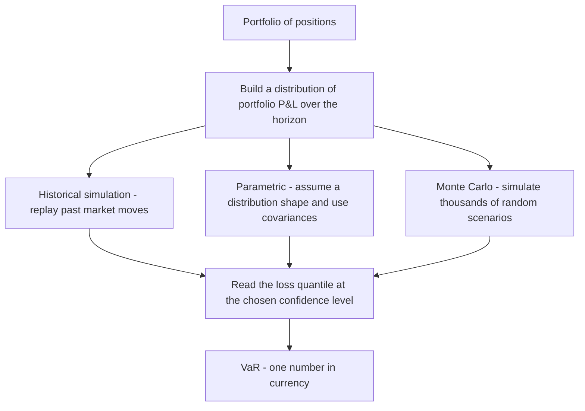
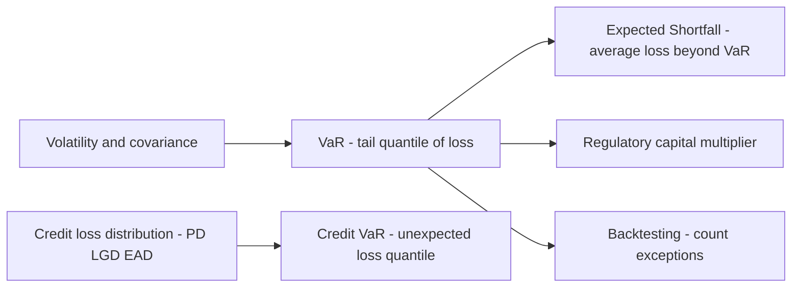

# Chapter 04 — Value at Risk (VaR)

## 1. The Problem / The Need

A bank's trading desk holds thousands of positions: government bonds, corporate credit, FX forwards, equity options, commodity swaps. The Chief Risk Officer walks in one morning and asks a deceptively simple question: **"How much money can we lose today?"**

Before the 1990s there was no clean answer. The desk could hand over a stack of reports — one page of interest-rate sensitivities (DV01), another of equity betas, a third of option greeks (delta, gamma, vega), a fourth of notional exposures by currency. Each number is correct, but they are in different units and cannot be added. A DV01 of ₹4 lakh per basis point and an equity delta of ₹90 crore and a vega of ₹2 lakh per vol-point simply do not sum to a single "risk" figure. Worse, they ignore how positions offset each other: a long bond and a paid fixed swap may largely cancel.

The board, the regulator, and the CEO do not want a spreadsheet of greeks. They want **one number, in rupees, that they can compare across desks, across days, and against a limit.** That number has to answer: over a defined period, with a stated level of confidence, what is the most we should lose under normal market conditions?

That single-number demand is the problem Value at Risk was invented to solve. J.P. Morgan's *RiskMetrics* (1994) popularised it; the Basel Committee then embedded it into bank capital rules, and it became the lingua franca of market-risk management. Even where it has since been supplemented (by Expected Shortfall under Basel's FRTB), VaR remains the number every risk analyst must be able to compute, defend, and criticise in an interview.

*The core motivation: collapse a whole portfolio's market risk into one comparable, loss-denominated, probabilistic number.*

---

## 2. The Core Idea

**Value at Risk is the maximum loss on a portfolio over a given time horizon, at a given confidence level, under normal market conditions.**

Every VaR statement has exactly three moving parts, and you must always quote all three:

1. **A horizon** (how long) — e.g. 1 day, 10 days.
2. **A confidence level** (how sure) — e.g. 95%, 99%.
3. **A currency amount** (how much) — the loss figure itself.

Read a VaR number as a sentence. "The 1-day 99% VaR is ₹46.6 lakh" means:

> *"We are 99% confident that the portfolio will not lose more than ₹46.6 lakh over the next trading day. Equivalently, on only 1 day in 100 do we expect a loss worse than ₹46.6 lakh."*

The precise definition is a **quantile of the loss distribution**. If \(L\) is the loss over the horizon (a positive number meaning money lost) and \(\alpha\) is the confidence level (say 0.99), then:

$$\text{VaR}_\alpha = \text{the smallest loss } \ell \text{ such that } P(L \le \ell) \ge \alpha$$

In plain words: VaR is the loss level that the actual loss will exceed only \((1-\alpha)\) of the time. At 99% confidence, VaR is the 99th percentile of losses (equivalently, the 1st percentile of the profit-and-loss distribution).

Two things the core idea deliberately does **not** tell you:
- It is a **threshold**, not an average. It says nothing about how bad the loss is *when* you breach it.
- It applies to **"normal" markets** — it is silent about crashes, gaps, and liquidity holes in the extreme tail.

Those two silences are the source of every famous VaR limitation, and we return to them in Section 8.

---

## 3. Why / How It Works

### Why a quantile is the right object

Risk managers care about the **downside tail**, not the whole distribution. The mean tells you the expected outcome; the standard deviation tells you dispersion in both directions. But a limit has to be set against *bad* outcomes specifically. A quantile of the loss distribution directly answers "how far into the bad tail do we go before events become rare (rarer than 1-in-20 or 1-in-100)?"

### Why it aggregates cleanly

The magic of VaR is that it is computed on **portfolio P&L**, not on individual greeks. Whatever the instruments, each scenario (a market move) produces a single portfolio P&L number. Once you have a distribution of portfolio P&L, you take one quantile. Offsets and correlations are captured automatically because you revalue the *whole book* under each scenario. This is why a long-and-short book can show far lower VaR than the sum of its parts — the idea of **diversification benefit**.

### The engine: a distribution of P&L

Every VaR method is just a different way to build the **distribution of portfolio profit-and-loss** over the horizon, then read off a quantile. The three standard engines differ only in *how they generate that distribution*:

*Every VaR method builds a P&L distribution first and then reads off one tail quantile.*

### The normal-distribution shortcut

The **parametric** method makes life easy by assuming portfolio returns are Normally distributed. For a Normal distribution, a quantile is just *"so many standard deviations from the mean."* The number of standard deviations for a given confidence is the **z-score**:

| Confidence level | One-tailed z-score |
|---|---|
| 90% | 1.282 |
| 95% | 1.645 |
| 97.5% | 1.960 |
| 99% | 2.326 |
| 99.9% | 3.090 |

Because we care only about the loss (left) tail, VaR uses the **one-tailed** z. (The common 1.96 you remember from statistics is *two-tailed* 95% — do not use it for a one-tailed 95% VaR, where the right figure is 1.645. This is a classic interview trap.)

---

## 4. Full Content — Frameworks, Formulas, Methods

### 4.1 The general parametric formula

For a portfolio whose return over the horizon has mean \(\mu\) and standard deviation \(\sigma\) (both expressed for that horizon), and portfolio market value \(V\):

$$\text{VaR}_\alpha = V \times \left( z_\alpha \cdot \sigma - \mu \right)$$

Over short horizons (a day), \(\mu\) is tiny relative to \(z_\alpha \sigma\), so practitioners usually **set \(\mu = 0\)** ("drift is negligible intraday"). This gives the workhorse formula:

$$\boxed{\text{VaR}_\alpha = z_\alpha \times \sigma \times V}$$

where \(\sigma\) is the standard deviation of returns over the horizon (in decimal), \(V\) is portfolio value, and \(z_\alpha\) is the one-tailed z-score.

### 4.2 Two-asset (and multi-asset) parametric VaR

With more than one position, you cannot just add individual VaRs — you must combine their **volatilities using correlation**. Define each position's currency volatility \(\sigma_i^{\$} = w_i \sigma_i V\) (or directly the standard deviation of that position's P&L). For two positions:

$$\sigma_P^{\$} = \sqrt{(\sigma_A^{\$})^2 + (\sigma_B^{\$})^2 + 2\,\rho_{AB}\,\sigma_A^{\$}\,\sigma_B^{\$}}$$

$$\text{VaR}_P = z_\alpha \times \sigma_P^{\$}$$

In matrix form for \(n\) assets, with weight-value vector \(\mathbf{x}\) and covariance matrix \(\Sigma\):

$$\sigma_P^{\$} = \sqrt{\mathbf{x}^\top \Sigma\, \mathbf{x}}, \qquad \text{VaR} = z_\alpha \sqrt{\mathbf{x}^\top \Sigma\, \mathbf{x}}$$

The **undiversified VaR** (sum of standalone VaRs) is always \(\ge\) the diversified VaR whenever correlations are below 1. The gap is the **diversification benefit**:

$$\text{Diversification benefit} = \sum_i \text{VaR}_i - \text{VaR}_{\text{portfolio}}$$

### 4.3 Method 1 — Historical Simulation

**Idea:** Do not assume any distribution. Instead, take the actual market moves of the last \(N\) days (e.g. 250 or 500), apply each historical move to *today's* portfolio, and build an empirical P&L distribution. Then read off the quantile.

Steps:
1. Collect \(N\) historical daily returns for every risk factor (rates, FX, equity indices, spreads).
2. For each past day, compute what today's portfolio would have made or lost if that day repeated. This gives \(N\) hypothetical P&L numbers.
3. Sort the P&L from worst to best.
4. The 99% VaR is the loss at the 1st-percentile order statistic (e.g. with 250 observations, roughly the 2nd-to-3rd worst; conventions differ and interpolation is common).

**Pros:** No distributional assumption; captures fat tails and real correlations automatically; handles non-linear instruments (options) if you fully revalue.
**Cons:** Assumes the past window represents the future; a quiet window understates risk, and a single crash in the window dominates; equal-weights old and recent days unless you use weighting schemes; limited tail resolution (with 250 days, the 99% tail rests on ~2-3 data points).

### 4.4 Method 2 — Variance-Covariance (Parametric / Delta-Normal)

**Idea:** Assume risk-factor returns are jointly Normal. Summarise the whole portfolio with a volatility (and correlations), then use the z-score formula. Also called **delta-normal** because non-linear instruments are linearised via their delta.

**Pros:** Fast and analytic — a closed-form number; only needs a covariance matrix; great for large linear portfolios; easy to decompose risk by factor.
**Cons:** Normality badly underestimates fat tails (real markets have more extreme moves than a bell curve predicts); it linearises options and so **misses gamma/convexity**, mis-stating the risk of option books; correlations are assumed stable (they spike toward 1 in crises).

### 4.5 Method 3 — Monte Carlo Simulation

**Idea:** Assume a stochastic model for the risk factors (any distribution and correlation structure you like), then generate thousands or millions of random scenarios, fully revalue the portfolio in each, build the P&L distribution, and read off the quantile.

Steps:
1. Specify the joint distribution / process for risk factors (often multivariate Normal or a fat-tailed variant, with a chosen covariance matrix).
2. Draw \(M\) random scenarios (e.g. 10,000+).
3. Fully reprice the portfolio in each scenario (this handles options and other non-linearities exactly).
4. Sort the \(M\) P&L outcomes and take the quantile.

**Pros:** The most flexible — handles non-linearity, path dependence, and arbitrary distributions; you control the model.
**Cons:** Computationally heavy (full revaluation × many scenarios); results are only as good as the assumed model ("model risk"); slower to run and harder to explain than the analytic method.

### 4.6 Comparing the three methods

| Feature | Historical | Parametric (Var-Cov) | Monte Carlo |
|---|---|---|---|
| Distribution assumption | None (empirical) | Normal | Any (you choose) |
| Handles option non-linearity | Yes if full revaluation | Poorly (linearised) | Yes (full revaluation) |
| Captures fat tails | Yes if in the window | No | Yes if modelled |
| Speed | Fast to medium | Fastest (closed form) | Slowest |
| Main weakness | Past may not repeat | Normality and linearity | Model risk and compute cost |
| Tail resolution | Limited by sample size | Smooth but wrong shape | High if many paths |

### 4.7 Choosing the confidence level and horizon

**Confidence level** is a policy choice reflecting risk appetite and audience:
- **95%** — internal risk monitoring; more frequent breaches make backtesting statistically powerful (you get enough exceptions to test the model).
- **99%** — the Basel market-risk standard for regulatory capital; a rarer, more conservative threshold.
- **99.9%** — economic-capital / solvency work (very deep tail).

Higher confidence → larger VaR (you are asking about a rarer, worse loss). But higher confidence also means **fewer exceptions to observe**, so the model is harder to validate empirically.

**Horizon** should match how long it takes to hedge or exit the position:
- **1 day** — liquid trading books that can be unwound quickly; also the natural unit for daily P&L backtesting.
- **10 days** — the Basel regulatory horizon for market risk (assumes it may take two weeks to liquidate in stress).
- **1 year** — credit and economic-capital contexts.

Longer horizon → larger VaR (more time for markets to move against you).

### 4.8 Scaling VaR across horizons — the square-root-of-time rule

Computing a 10-day VaR directly needs 10-day return data, which is scarce. Instead, practitioners compute a robust 1-day VaR and **scale** it. If returns are independent and identically distributed (i.i.d.) with zero mean, variance grows linearly with time, so standard deviation grows with the **square root of time**:

$$\text{VaR}_{T\text{-day}} = \text{VaR}_{1\text{-day}} \times \sqrt{T}$$

Example factor: 10-day = 1-day × \(\sqrt{10}\) = 1-day × 3.162.

**Health warning:** the square-root rule assumes zero autocorrelation and constant volatility. Real returns show **volatility clustering** and, over longer horizons, mean reversion or trending — so scaling can under- or over-state true multi-day VaR. It is an approximation of convenience, and Basel's FRTB moved away from naive scaling toward horizon-specific "liquidity horizons."

---

## 5. Worked Examples

### Example 1 — Single-asset parametric VaR, and scaling

**Setup:** A portfolio is worth **V = ₹10 crore** (₹10,00,00,000). Its daily return standard deviation is **σ = 2%**. Assume zero drift and Normal returns.

**(a) 1-day 99% VaR.** Use \(z_{99\%} = 2.326\):

$$\text{VaR} = z \times \sigma \times V = 2.326 \times 0.02 \times 10{,}00{,}00{,}000$$
$$= 2.326 \times 0.02 = 0.04652;\quad 0.04652 \times 10{,}00{,}00{,}000 = \textbf{₹46,52,000}$$

**(b) 1-day 95% VaR.** Use \(z_{95\%} = 1.645\):

$$\text{VaR} = 1.645 \times 0.02 \times 10{,}00{,}00{,}000 = 0.0329 \times 10{,}00{,}00{,}000 = \textbf{₹32,90,000}$$

**Sanity check:** the 99% figure exceeds the 95% figure (₹46.52 lakh > ₹32.90 lakh), as it must — a rarer loss is bigger. The ratio equals the z ratio: \(46.52 / 32.90 = 1.414 = 2.326/1.645\). ✓

**(c) 10-day 99% VaR by square-root scaling:**

$$\text{VaR}_{10} = 46{,}52{,}000 \times \sqrt{10} = 46{,}52{,}000 \times 3.1623 = \textbf{₹1,47,11,000}$$

**Reconciliation:** equivalently, 10-day \(\sigma = 0.02 \times \sqrt{10} = 0.06325\); then \(2.326 \times 0.06325 \times 10\text{cr} = 0.14712 \times 10\text{cr} = ₹1,47,12,000\) (rounding). Both routes agree. ✓

### Example 2 — Two-asset parametric VaR and diversification benefit

**Setup:**
- Asset A: value ₹6 crore, daily σ = 1.5%.
- Asset B: value ₹4 crore, daily σ = 2.5%.
- Correlation ρ = 0.30. Confidence 99% (z = 2.326).

**Step 1 — currency volatility of each position** (standard deviation of each position's daily P&L):

$$\sigma_A^{\$} = 0.015 \times 6{,}00{,}00{,}000 = ₹9{,}00{,}000 \;(₹9 \text{ lakh})$$
$$\sigma_B^{\$} = 0.025 \times 4{,}00{,}00{,}000 = ₹10{,}00{,}000 \;(₹10 \text{ lakh})$$

**Step 2 — portfolio currency volatility** (work in lakh):

$$\sigma_P^{\$} = \sqrt{9^2 + 10^2 + 2(0.30)(9)(10)} = \sqrt{81 + 100 + 54} = \sqrt{235} = 15.33 \text{ lakh}$$

**Step 3 — diversified portfolio VaR:**

$$\text{VaR}_P = 2.326 \times 15.33 = \textbf{₹35.66 lakh}$$

**Step 4 — undiversified VaR** (correlation assumed 1, i.e. add standalone VaRs):

$$\text{VaR}_A = 2.326 \times 9 = 20.93 \text{ lakh}, \quad \text{VaR}_B = 2.326 \times 10 = 23.26 \text{ lakh}$$
$$\text{VaR}_{\text{undiv}} = 20.93 + 23.26 = ₹44.19 \text{ lakh}$$

**Step 5 — diversification benefit:**

$$44.19 - 35.66 = \textbf{₹8.53 lakh saved by diversification}$$

**Reconciliation / sanity checks:**
- With ρ = 1, \(\sigma_P = \sqrt{81+100+180} = \sqrt{361} = 19\) lakh, giving VaR = 2.326 × 19 = ₹44.19 lakh — exactly the undiversified figure. ✓ (The two definitions coincide at perfect correlation, confirming the algebra.)
- With ρ = 0, \(\sigma_P = \sqrt{181} = 13.45\) lakh → VaR ₹31.29 lakh, lower still, as expected (less correlation → more benefit). ✓
- The diversified VaR (₹35.66 lakh) sits between the ρ = 0 and ρ = 1 cases (₹31.29 and ₹44.19 lakh), which it must. ✓

### Example 3 — Historical simulation VaR

**Setup:** Portfolio value **V = ₹5 crore**. We have the **100 most recent daily returns**. Sorted from worst to best, the ten worst daily returns (%) are:

| Rank (worst first) | Daily return |
|---|---|
| 1 | −4.20% |
| 2 | −3.80% |
| 3 | −3.10% |
| 4 | −2.90% |
| 5 | −2.60% |
| 6 | −2.40% |
| 7 | −2.20% |
| 8 | −2.05% |
| 9 | −1.95% |
| 10 | −1.80% |

**95% VaR (100 observations):** the worst 5% are the 5 worst days. The **5th-worst** return, −2.60%, marks the 95% cutoff:

$$\text{VaR}_{95\%} = 0.026 \times 5{,}00{,}00{,}000 = \textbf{₹13,00,000}$$

**99% VaR (100 observations):** the worst 1% is the single worst day, −4.20% (a conservative reading; some conventions interpolate between the 1st and 2nd worst):

$$\text{VaR}_{99\%} = 0.042 \times 5{,}00{,}00{,}000 = \textbf{₹21,00,000}$$

**Reconciliation vs parametric:** the empirical daily σ of this book is around 1.6% (typical for such a return spread). A Normal 99% VaR would be \(2.326 \times 0.016 \times 5\text{cr} = ₹18.6\) lakh — **less** than the historical ₹21 lakh. The historical number is larger precisely because the real left tail (−4.20%) is **fatter** than a bell curve predicts. ✓ This is the whole point of historical simulation: it captures fat tails the parametric method smooths away.

**Expected Shortfall cross-check (average of the tail):** beyond the 95% cutoff, the mean of the 5 worst returns is \((4.20+3.80+3.10+2.90+2.60)/5 = 3.32\%\), so ES\(_{95\%} = 0.0332 \times 5\text{cr} = ₹16.6\) lakh > VaR\(_{95\%}\) of ₹13 lakh. ES always exceeds VaR at the same confidence because it averages *into* the tail. ✓ (More on ES in Section 6.)

---

## 6. Connections

**To Expected Shortfall (ES / CVaR).** VaR's biggest conceptual heir is Expected Shortfall — the *average* loss given that you have breached VaR. Where VaR asks "how far to the edge of the cliff?", ES asks "how far do we fall once we go over?" ES is a **coherent** risk measure (it respects sub-additivity — diversification never increases it), which VaR is not. Basel's FRTB replaced 99% VaR with **97.5% ES** for market-risk capital for exactly this reason. Expect an interviewer to ask "why did Basel move from VaR to ES?" — answer: tail-blindness and non-coherence of VaR.

**To volatility and the greeks.** Parametric VaR is built directly on σ and the covariance matrix — the same volatility that drives option pricing and portfolio theory. Delta-normal VaR reuses position deltas; its failure on options is a failure to capture gamma/vega, tying VaR back to the greeks chapter.

**To credit risk.** The expected-loss engine there, \(EL = PD \times LGD \times EAD\), is the *mean* of the credit-loss distribution; **Credit VaR** is a quantile of that same distribution minus expected loss (the unexpected loss). VaR is the unifying quantile idea across market and credit risk.

**To regulatory capital.** Market-risk capital under Basel II.5 was a multiple of 10-day 99% VaR plus a **stressed VaR** add-on (VaR calibrated to a crisis window). FRTB then shifted to ES. VaR is thus not just a management tool but a capital driver.

**To backtesting and Basel's traffic-light.** Because VaR makes a falsifiable claim ("losses exceed this only 1% of the time"), you can count **exceptions**. Basel's traffic-light system (green / amber / red zones) penalises models with too many breaches — connecting VaR to model validation and governance.

*VaR sits at the centre of market-risk measurement and connects outward to ES, capital, backtesting and credit risk.*

---

## 7. Key Terms

- **Value at Risk (VaR):** maximum loss over a horizon at a confidence level, under normal conditions; a quantile of the loss distribution.
- **Confidence level (α):** probability that the loss stays within VaR (e.g. 99%). \((1-\alpha)\) is the expected exception rate.
- **Horizon:** the period over which the loss is measured (1-day, 10-day).
- **z-score (z\(_\alpha\)):** number of standard deviations for a given one-tailed confidence in a Normal distribution (1.645 for 95%, 2.326 for 99%).
- **Parametric / variance-covariance / delta-normal VaR:** analytic VaR assuming Normal returns, using volatility and correlations.
- **Historical simulation:** VaR from replaying actual past market moves on today's portfolio; no distributional assumption.
- **Monte Carlo simulation:** VaR from many random model-generated scenarios with full revaluation.
- **Diversification benefit:** the amount by which portfolio VaR falls below the sum of standalone VaRs due to imperfect correlation.
- **Square-root-of-time rule:** scaling \(\text{VaR}_T = \text{VaR}_1 \times \sqrt{T}\), valid under i.i.d. zero-mean returns.
- **Exception / breach:** a day whose actual loss exceeds the VaR estimate.
- **Backtesting:** validating a VaR model by counting exceptions against the expected rate.
- **Expected Shortfall (ES / CVaR):** average loss conditional on breaching VaR; a coherent measure.
- **Stressed VaR:** VaR calibrated to a historical stress window, added to capital under Basel II.5.

---

## 8. Common Confusions

**"VaR is the most I can ever lose."** No. VaR is the threshold at the *edge* of the tail, not the worst case. At 99% 1-day VaR of ₹46.5 lakh, losses *will* exceed ₹46.5 lakh about 1 day in 100 — and on those days the loss can be far larger. VaR says nothing about *how much worse*. That is precisely what Expected Shortfall adds.

**Confusing the confidence level with the exception rate.** A 99% VaR is breached 1% of the time — roughly **2-3 days per year** of trading (~250 days). Analysts sometimes expect "never," then panic at a normal exception. Breaches at the expected rate are evidence the model *works*.

**Using the two-tailed z (1.96) for a 95% VaR.** VaR is one-tailed (we only care about losses), so 95% uses **1.645**, not 1.96. Using 1.96 overstates a 95% VaR by ~19%.

**Adding VaRs across desks.** VaR is *not additive* unless correlations are 1. Summing desk VaRs overstates total VaR (ignores diversification). Conversely — and this is VaR's theoretical flaw — VaR can occasionally be **super-additive** (combined VaR exceeding the sum), violating sub-additivity, especially with skewed or discrete payoffs like short options or credit portfolios. This non-coherence is the technical reason regulators prefer ES.

**Thinking historical VaR is "assumption-free."** It makes the huge assumption that the chosen window represents the future. A calm 2-year window run into a 2008- or 2020-style crash will badly understate risk. The assumption moved from "the distribution is Normal" to "the past repeats" — it did not disappear.

**Treating the square-root rule as exact.** It holds only for i.i.d. zero-mean returns. Volatility clustering and autocorrelation break it; use it as an approximation, not a law.

**VaR = risk capital, full stop.** VaR informs capital but regulatory capital adds multipliers, stressed VaR, and (under FRTB) ES. VaR is an input, not the whole answer.

---

## 9. Recap

- **VaR compresses a whole portfolio's market risk into one currency number** defined by a **horizon** and a **confidence level**: the loss that will be exceeded only \((1-\alpha)\) of the time.
- Every method builds a **distribution of portfolio P&L** and reads off a **tail quantile**. They differ only in how the distribution is built.
- **Historical simulation** replays real past moves (no distribution assumed, captures fat tails, but assumes the past repeats and has thin tail data). **Parametric** assumes Normality and uses \(z \times \sigma \times V\) (fast, closed-form, but underweights fat tails and mishandles options). **Monte Carlo** simulates many modelled scenarios with full revaluation (flexible, handles non-linearity, but heavy and model-dependent).
- **Higher confidence and longer horizon → larger VaR.** Choose confidence by audience (95% internal, 99% Basel) and horizon by liquidation time (1-day trading, 10-day regulatory).
- **Scale short-horizon VaR with \(\sqrt{T}\)** under i.i.d. assumptions — an approximation.
- Worked results reconciled: single-asset 1-day 99% VaR of **₹46.52 lakh** scaling to **₹1.47 crore** over 10 days; a two-asset book showing an **₹8.53 lakh diversification benefit**; and a historical book whose fat left tail produced a **larger** 99% VaR (₹21 lakh) than the Normal approximation (₹18.6 lakh).
- **VaR's limits are structural:** it is tail-blind (silent beyond the quantile), can be non-sub-additive (non-coherent), and is only as good as its window or model. Those flaws motivated **Expected Shortfall** under Basel FRTB.

---

## 10. Quick-Reference / Interview Points

**The one-line definition to recite:** *"VaR is the maximum loss over a set horizon at a set confidence level under normal market conditions — a quantile of the loss distribution."* Always name the horizon and confidence.

**Formula to have cold:**
$$\text{VaR}_\alpha = z_\alpha \times \sigma \times V \quad\text{(parametric, zero drift)}$$
$$\text{VaR}_{T} = \text{VaR}_{1}\times\sqrt{T}\quad\text{(scaling)}$$
$$\sigma_P^{\$}=\sqrt{(\sigma_A^{\$})^2+(\sigma_B^{\$})^2+2\rho\,\sigma_A^{\$}\sigma_B^{\$}}\quad\text{(two-asset)}$$

**z-scores to memorise:** 95% → **1.645**, 99% → **2.326** (one-tailed). Do *not* use 1.96 for VaR.

**Three methods in one breath:** Historical = replay the past, no distribution; Parametric = assume Normal, use covariance; Monte Carlo = simulate scenarios, full revaluation. Trade-off is assumptions vs. speed vs. flexibility.

**"How many breaches should a 99% daily VaR see?"** About **2-3 per year** (1% of ~250 days). More → model too optimistic.

**"Name VaR's limitations."** (1) Tail-blind — says nothing beyond the quantile; (2) not sub-additive / not coherent — can understate combined risk; (3) assumption-dependent — Normality (parametric) or a representative window (historical) or model choice (Monte Carlo); (4) procyclical — calm periods shrink VaR just before storms. This is why Basel FRTB moved to **97.5% Expected Shortfall**.

**"VaR vs Expected Shortfall."** VaR = the threshold; ES = the average loss beyond it. ES is coherent and captures tail severity; ES ≥ VaR at the same confidence.

**"Why 10-day and √time?"** Basel liquidation assumption; √time scaling holds only under i.i.d. returns and is an approximation.

**Trap to avoid stating:** never say VaR is the "worst-case" or "maximum possible" loss — it is the *threshold* loss at a confidence level. Saying "maximum possible loss" is the fastest way to fail a risk interview.
