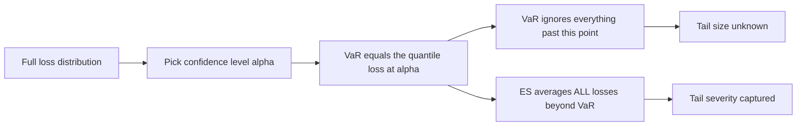
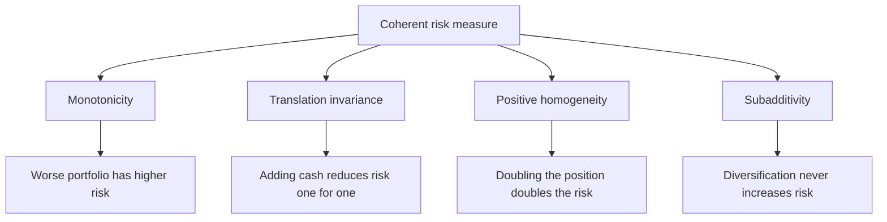
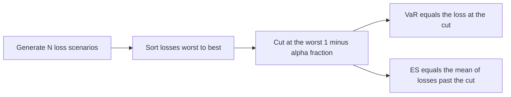
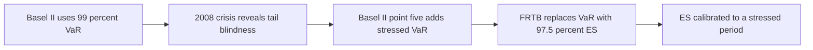

# Chapter 05 — Expected Shortfall

## 1. The Problem / The Need

Value at Risk answers one question: *"What is the loss I will not exceed on 99% of days?"* It draws a single line in the sand at a chosen confidence level and reports the size of that line. It is a threshold.

But a risk manager's real fear is not the threshold — it is what lives *beyond* it. Suppose your 99% one-day VaR is ₹10 crore. VaR tells you that on the worst 1% of days you will lose *at least* ₹10 crore. It says absolutely nothing about *how much more*. On those bad days, will you lose ₹11 crore? ₹40 crore? Enough to wipe out the firm? VaR is blind to the answer, because by construction it stops looking exactly where the danger starts.

This blindness is not academic. It creates three concrete, dangerous failures:

1. **Tail-thickness blindness.** Two portfolios can have identical 99% VaR while one loses ₹10.5 crore in the tail and the other loses ₹80 crore. VaR rates them equally risky. A trader who is rewarded on a VaR budget will happily load up on the second portfolio — collecting fat premiums for selling deep out-of-the-money options or catastrophe risk — because the rare, enormous loss sits *just past* the VaR cut-off and never registers.

2. **Cliff risk / gaming.** Because VaR only cares whether a loss crosses the quantile, a desk can restructure positions so that the probability of breaching sits at exactly 1.0% while the loss *given* a breach is catastrophic. The reported number stays flat; the true risk explodes.

3. **Non-subadditivity.** In certain (realistic) cases, the VaR of a *combined* portfolio is *larger* than the sum of the individual VaRs. This directly contradicts the intuition that diversification reduces risk, and it makes VaR unsafe as a number you add up across desks, or split back down as risk limits.

We need a measure that (a) looks *into* the tail rather than stopping at its edge, and (b) behaves sensibly when you aggregate risks. That measure is **Expected Shortfall (ES)**, also called **Conditional VaR (CVaR)**, **Expected Tail Loss (ETL)**, or **Average VaR**.

*Figure 1 — VaR marks the edge of the tail; ES describes the whole tail beyond it.*

---

## 2. The Core Idea

Expected Shortfall at confidence level α is the **average of all losses that are worse than the VaR** at that level.

In one sentence: *VaR asks "how bad is the boundary of the bad zone?" ES asks "on average, how bad is it once we are inside the bad zone?"*

Formally, for a confidence level α (say 97.5%), the tail is the worst (1 − α) fraction of outcomes:

$$ ES_\alpha = E\left[\,L \mid L \ge VaR_\alpha\,\right] $$

where L is the loss (a positive number for a loss). ES is a *conditional expectation* — the expected loss **conditional on** already being in the tail. That is exactly why "Conditional VaR" is a synonym.

Three immediate consequences fall straight out of this definition:

- **ES ≥ VaR always.** The average of a set of numbers that are all ≥ VaR must itself be ≥ VaR. ES sits *deeper* in the tail than VaR, at the same confidence level. The gap between them measures how heavy the tail is.
- **ES uses the shape of the tail, not just one point.** Fatten the tail, and VaR may not move at all, but ES rises. It responds to exactly the risk VaR ignores.
- **ES is a coherent risk measure.** It satisfies all four axioms a well-behaved risk measure "should" satisfy — most importantly **subadditivity** — which VaR does not. This is not a cosmetic property; it is the mathematical reason ES is safe to add across desks and to use in optimisation.

---

## 3. Why / How It Works

### Why averaging the tail fixes VaR's blindness

VaR is a **quantile** — a single order statistic. Order statistics are, by design, insensitive to the magnitude of everything above them. Move the worst 0.5% of outcomes from ₹11 crore to ₹110 crore and the 99% quantile does not budge, because the *count* of outcomes below the threshold is unchanged. VaR sees only *where* the boundary is, never *what is stacked behind it*.

ES is an **average over the tail**, an integral rather than a point. Integrals are sensitive to magnitude everywhere in their range. Push the worst outcomes further out and the average of the tail rises immediately. This is the whole trick: replace a point estimate (quantile) with a tail average (conditional mean), and you inherit sensitivity to tail severity for free.

A clean way to see the relationship is that ES is the **average of all VaRs deeper than α**:

$$ ES_\alpha = \frac{1}{1-\alpha}\int_{\alpha}^{1} VaR_u \, du $$

Read the integral literally: sweep the confidence level u from α all the way to 1 (the absolute worst case), read off VaR at each level, and average. ES is a "VaR of VaRs" — which is why "Average VaR" is another name for it. Because it averages every quantile from α to 100%, it cannot ignore any part of the tail.

### Why coherence matters

Artzner, Delbaen, Eber and Heath (1999) asked a foundational question: what properties *must* a sensible risk measure ρ obey? They proposed four axioms, and any measure satisfying all four is called **coherent**.

*Figure 2 — The four coherence axioms. VaR satisfies the first three but can fail subadditivity.*

| Axiom | Statement | Plain meaning |
|---|---|---|
| Monotonicity | If L₁ ≤ L₂ always, then ρ(L₁) ≤ ρ(L₂) | A portfolio that always loses more is riskier |
| Translation invariance | ρ(L − c) = ρ(L) − c | Adding c of risk-free cash lowers required capital by exactly c |
| Positive homogeneity | ρ(λL) = λρ(L) for λ ≥ 0 | Scaling the book scales the risk proportionally |
| Subadditivity | ρ(L₁ + L₂) ≤ ρ(L₁) + ρ(L₂) | Merging two books cannot create *more* risk than the two apart |

Subadditivity is the crucial one, for two reasons:

- **It encodes diversification.** The whole premise of portfolio theory is that combining imperfectly-correlated risks reduces total risk. A risk measure that can *violate* this is telling lies about diversification.
- **It makes limits and capital additive.** If risk is subadditive, a regulator can set a firm-wide capital number and be sure the sum of desk-level numbers is a *conservative* (larger) bound — the firm total is never worse than the parts summed. Break subadditivity and this decomposition collapses: a trader could split one position across two accounts and report *less* total risk than the single position, gaming the limit system.

**VaR satisfies monotonicity, translation invariance and homogeneity, but can violate subadditivity** (we prove this numerically in §5). **ES satisfies all four — ES is always coherent.** That single fact is the deepest theoretical argument for ES, and a favourite interview question.

---

## 4. Full Content — Framework, Formulas, Methods

### 4.1 Notation and sign convention

Let losses be positive numbers. Choose confidence level α ∈ (0,1), e.g. α = 0.975. The tail probability is p = 1 − α (here 2.5%). Then:

- **VaRα** = the smallest loss ℓ such that P(L ≤ ℓ) ≥ α. It is the α-quantile of the loss distribution.
- **ESα** = the average loss in the worst (1 − α) fraction of outcomes.

### 4.2 The general (continuous) formulas

For a continuous loss distribution:

$$ ES_\alpha = \frac{1}{1-\alpha}\int_{\alpha}^{1} VaR_u \, du = E[L \mid L \ge VaR_\alpha] $$

### 4.3 Parametric ES under normality

If the loss L is normally distributed with mean μ and standard deviation σ, there is a closed form. Let z_α be the standard-normal α-quantile (z₀.₉₉ = 2.326, z₀.₉₇₅ = 1.960) and φ(·) the standard-normal density. Then:

$$ VaR_\alpha = \mu + \sigma\, z_\alpha $$

$$ ES_\alpha = \mu + \sigma\,\frac{\phi(z_\alpha)}{1-\alpha} $$

The term φ(z_α)/(1 − α) is the **ES multiplier** — it plays the role z_α plays for VaR. Key values (for μ = 0, so ES and VaR are pure multiples of σ):

| α | z_α (VaR mult.) | φ(z_α) | ES mult. = φ(z_α)/(1−α) | ES / VaR ratio |
|---|---|---|---|---|
| 95.0% | 1.645 | 0.1031 | 2.063 | 1.254 |
| 97.5% | 1.960 | 0.0584 | 2.338 | 1.193 |
| 99.0% | 2.326 | 0.0267 | 2.665 | 1.146 |
| 99.9% | 3.090 | 0.00337 | 3.367 | 1.090 |

Two things to read off this table. First, **ES is always a fixed multiple bigger than VaR under normality** (the ratio column), and that multiple shrinks as α rises — the tail beyond a high quantile is "thinner" relative to the quantile itself. Second, notice **97.5% ES multiplier (2.338) ≈ 99% VaR multiplier (2.326)**. This near-equality is exactly why Basel picked 97.5% ES to replace 99% VaR (§4.6): under a normal world the two produce almost the same number, so the switch does not mechanically inflate capital — it only *adds tail sensitivity* when distributions are non-normal.

### 4.4 Historical / empirical ES

With N historical scenarios and no distributional assumption:

1. Compute the P&L (or loss) for each of the N scenarios.
2. Sort losses from worst to best.
3. Identify the VaR: the loss at rank ⌈N·(1−α)⌉ from the worst end (or interpolate).
4. **ES = the simple average of all losses at least as bad as VaR** — i.e. the mean of the worst (1−α)·N observations.

For example, with N = 1,000 scenarios at α = 97.5%: the worst 2.5% is 25 observations. VaR is roughly the 25th-worst loss; ES is the **average of the worst 25 losses**. ES literally reads more of the tail data (25 points) than VaR (1 point), which is why it is more stable to estimate in the tail *shape* but needs more data to pin down.

### 4.5 Monte Carlo ES

Simulate M paths, revalue the portfolio on each, take the worst (1−α)·M losses, average them. Identical logic to historical ES, but the scenarios come from a model rather than history.

*Figure 3 — Computing ES the empirical way is just sort, cut, and average the tail.*

### 4.6 The Basel shift from VaR to ES

The 2008 crisis exposed VaR's tail-blindness in the most expensive way possible: trading books that looked safe under 99% VaR suffered losses far past the VaR line. The Basel Committee's response, **Fundamental Review of the Trading Book (FRTB)**, finalised in 2016 and rolled into the Basel III market-risk framework, made the switch official:

| Feature | Old regime (Basel II.5) | New regime (FRTB) |
|---|---|---|
| Risk measure | Value at Risk | Expected Shortfall |
| Confidence level | 99% | 97.5% |
| Horizon | 10-day | Liquidity-adjusted horizons (10 to 120 days) |
| Tail sensitivity | None beyond quantile | Full tail average |
| Coherence | Not guaranteed | Guaranteed |
| Stress | Separate stressed VaR add-on | ES calibrated to a stressed period |

Why 97.5% and not 99%? Because — as the table in §4.3 shows — **97.5% ES ≈ 99% VaR under normality**, so the transition is roughly capital-neutral for well-behaved books, while the ES formulation *automatically* penalises books with fat tails. Regulators got tail sensitivity without a mechanical across-the-board capital jump.

*Figure 4 — The regulatory evolution of the market-risk measure.*

### 4.7 Backtesting caveat

One honest wrinkle: VaR is easy to backtest (count the days losses exceeded VaR — should be ~1% of days at 99%). ES is harder, because it is a *conditional expectation* and is not **elicitable** in the strict statistical sense — you cannot score it with a simple loss function the way you score a quantile. FRTB pragmatically **backtests VaR at 97.5% and 99%** for the "traffic-light" exception test, while **using ES for the actual capital charge**. So VaR did not disappear entirely — it survives as a validation tool, while ES does the capital work.

---

## 5. Worked Examples

### Example 1 — Parametric ES for a normal portfolio (reconciliation with VaR)

**Setup.** A trading book worth ₹100 crore has daily P&L that is normal with mean 0 and daily volatility σ = 2% (₹2 crore). Compute the 99% one-day VaR and 99% one-day ES, and reconcile.

**VaR.**
$$ VaR_{99\%} = z_{0.99}\,\sigma = 2.326 \times ₹2\text{ cr} = ₹4.652 \text{ cr} $$

**ES.** Use ES multiplier φ(z₀.₉₉)/(1 − 0.99). Compute the density:
$$ \phi(2.326) = \frac{1}{\sqrt{2\pi}} e^{-2.326^2/2} = 0.3989 \times e^{-2.705} = 0.3989 \times 0.0668 = 0.02665 $$
$$ ES_{99\%} = \sigma \cdot \frac{\phi(2.326)}{0.01} = ₹2\text{ cr} \times \frac{0.02665}{0.01} = ₹2\text{ cr} \times 2.665 = ₹5.330 \text{ cr} $$

**Reconciliation.** ES/VaR = 5.330 / 4.652 = **1.146**, matching the 99% ES/VaR ratio in the §4.3 table exactly. Interpretation: on the worst 1% of days the book loses *at least* ₹4.65 crore (VaR), but *on average* ₹5.33 crore (ES) — about ₹0.68 crore more that VaR never told you about. Under normality that gap is modest; under a fat-tailed book it would be far larger, and only ES would flag it.

**Cross-check the Basel claim.** Compute 97.5% ES for the same book:
$$ ES_{97.5\%} = ₹2\text{ cr} \times \frac{\phi(1.96)}{0.025} = ₹2\text{ cr} \times \frac{0.0584}{0.025} = ₹2\text{ cr} \times 2.338 = ₹4.676 \text{ cr} $$
Compare with 99% VaR = ₹4.652 cr. They differ by under 0.6% — confirming that switching from 99% VaR to 97.5% ES is essentially capital-neutral for a normal book, exactly as §4.6 claimed. ✔

### Example 2 — Empirical ES from historical scenarios

**Setup.** You have 20 daily losses (₹ lakh), and use α = 90% (so the worst 10% = the worst 2 observations). Losses:

`12, −5, 3, 40, 8, −2, 15, 60, 1, 7, 22, −10, 5, 30, 18, 9, 2, 11, 25, 50`
(negative = a gain.)

**Step 1 — sort worst to best (top 5 shown):** 60, 50, 40, 30, 25, …

**Step 2 — locate VaR.** Worst 10% of 20 = 2 observations. VaR₉₀ is the 2nd-worst loss = **₹50 lakh** (the cut-off; the loss you are 90% confident not to exceed).

**Step 3 — ES = average of the worst 2 losses:**
$$ ES_{90\%} = \frac{60 + 50}{2} = ₹55 \text{ lakh} $$

**Reconciliation.** ES (₹55 L) > VaR (₹50 L) ✔ — ES sits deeper in the tail. If a single catastrophic day had been 200 instead of 60, VaR would stay at ₹50 L (still the 2nd-worst) but ES would jump to (200 + 50)/2 = ₹125 L. This is the tail-blindness fix in one line: **the same VaR, radically different ES**, because ES reads the magnitude of the worst day and VaR does not. ✔

### Example 3 — VaR fails subadditivity, ES does not (the coherence proof)

This is the canonical example, and the single most important one to have at your fingertips.

**Setup.** Two identical, **independent** corporate bonds, A and B. Each has face value ₹100, a **4% default probability**, and pays back ₹0 principal loss if it survives, ₹100 loss if it defaults. Use α = 95% (tail = worst 5%).

**Individual VaR at 95%.** For one bond, P(loss = 0) = 96%. Since 96% > 95%, the 95th percentile of the loss distribution is **0**.
$$ VaR_{95\%}(A) = VaR_{95\%}(B) = 0 $$
Sum of individual VaRs = 0 + 0 = **0**.

**Portfolio VaR at 95%.** Combine the two independent bonds:

| Outcome | Probability | Loss (₹) |
|---|---|---|
| Both survive | 0.96 × 0.96 = 0.9216 | 0 |
| Exactly one defaults | 2 × 0.04 × 0.96 = 0.0768 | 100 |
| Both default | 0.04 × 0.04 = 0.0016 | 200 |

Cumulative from the bottom: P(loss ≤ 0) = 0.9216, which is **below 0.95**. So the 95th percentile jumps to the next outcome:
$$ VaR_{95\%}(A + B) = ₹100 $$

**Subadditivity check for VaR:**
$$ VaR(A+B) = 100 \;>\; 0 = VaR(A) + VaR(B) $$
**VaR violates subadditivity.** Diversifying two independent bonds made the *reported* risk go *up* from 0 to 100 — an absurd, but entirely real, artefact of the quantile. A trader could split this portfolio into two separate accounts and report zero risk. ✘

**Now ES at 95%.** The tail is the worst 5% (0.05) of probability mass.

*Individual bond ES.* The worst 5% mass consists of all 4% default outcomes (loss 100) plus 1% of the survive outcomes (loss 0):
$$ ES_{95\%}(A) = \frac{1}{0.05}\big[0.04 \times 100 + 0.01 \times 0\big] = \frac{4}{0.05} = ₹80 $$
Sum of individual ES = 80 + 80 = **₹160**.

*Portfolio ES.* Fill the worst 5% mass from the worst outcome down:
- Both default: 0.0016 mass at loss 200.
- Remaining mass needed: 0.05 − 0.0016 = 0.0484, taken from the "one defaults" bucket at loss 100.

$$ ES_{95\%}(A+B) = \frac{1}{0.05}\big[0.0016 \times 200 + 0.0484 \times 100\big] = \frac{0.32 + 4.84}{0.05} = \frac{5.16}{0.05} = ₹103.2 $$

**Subadditivity check for ES:**
$$ ES(A+B) = 103.2 \;\le\; 160 = ES(A) + ES(B) $$
**ES is subadditive** — diversification *reduces* risk (160 → 103.2, a 35% cut), exactly as intuition demands. ✔

**The punchline, side by side:**

| Measure | Bond A | Bond B | Sum of parts | Portfolio A+B | Subadditive? |
|---|---|---|---|---|---|
| VaR 95% | 0 | 0 | 0 | 100 | **No — violated** |
| ES 95% | 80 | 80 | 160 | 103.2 | **Yes — holds** |

Same portfolio, same data. VaR says diversification *created* risk; ES correctly says it *reduced* risk. This is the coherence argument made concrete, and it is why regulators and modern risk desks trust ES for aggregation and capital.

---

## 6. Connections

- **To VaR (Ch. 04).** ES is not a rival to VaR but its completion: VaR gives the tail's *starting point*, ES gives the tail's *average depth*. You compute VaR on the way to computing ES. Every VaR method (parametric, historical, Monte Carlo) has a direct ES counterpart.
- **To Expected Loss = PD × LGD × EAD (credit risk).** Note ES is a *conditional* expected loss — it is the expected loss *given* you are in the tail, whereas credit EL is the *unconditional* expected loss. ES relates to the *unexpected* loss that economic capital must cover, sitting between EL and the extreme tail.
- **To coherent risk measures and portfolio optimisation.** Because ES is convex and coherent, minimising ES is a well-posed convex optimisation (Rockafellar–Uryasev showed CVaR optimisation reduces to a linear program). Minimising VaR is non-convex and can have multiple local minima — another practical win for ES.
- **To Basel III / FRTB (regulatory capital).** The market-risk capital charge under the internal models approach is built on 97.5% ES calibrated to a stress period, with liquidity-horizon scaling. This is the single largest real-world deployment of ES.
- **To Extreme Value Theory (EVT).** For very high confidence levels, the tail is modelled with a Generalised Pareto Distribution, and ES has a clean closed form in terms of the GPD parameters — the natural tool when the tail is too sparse to average empirically.

---

## 7. Key Terms

- **Expected Shortfall (ES):** average loss conditional on the loss exceeding VaR at confidence α. The tail's mean.
- **Conditional VaR (CVaR):** exact synonym for ES; emphasises the "conditional on the tail" definition.
- **Expected Tail Loss (ETL) / Average VaR:** further synonyms; the latter emphasises ES = average of all VaRs beyond α.
- **Tail probability (1 − α):** the fraction of outcomes in the loss tail (e.g. 2.5% at α = 97.5%).
- **Coherent risk measure:** one satisfying monotonicity, translation invariance, positive homogeneity, and subadditivity.
- **Subadditivity:** ρ(A + B) ≤ ρ(A) + ρ(B); the mathematical statement that diversification never increases risk.
- **ES multiplier:** under normality, φ(z_α)/(1 − α); the factor multiplying σ to get ES (the ES analogue of z_α).
- **FRTB:** Fundamental Review of the Trading Book; the Basel reform that replaced 99% VaR with 97.5% ES.
- **Elicitability:** a statistical property (which ES lacks and VaR has) governing whether a measure can be directly backtested via a scoring function.
- **Liquidity horizon:** under FRTB, the assumed number of days to exit a position (10–120), used to scale ES by risk-factor class.

---

## 8. Common Confusions

- **"ES is a different confidence level from VaR."** No — ES and VaR are computed at the *same* α. At α = 97.5%, both look at the same 2.5% tail; VaR reports its edge, ES reports its average. The number ES gives is larger not because α is higher but because it averages a set of losses that all exceed VaR.
- **"ES is always exactly 1.25× VaR" (or some fixed factor).** The fixed ratio (1.146 at 99%, 1.254 at 95%) holds *only under normality*. For fat-tailed distributions the ratio can be far larger — and that divergence is the entire point of using ES.
- **"ES replaces VaR completely."** Not operationally. FRTB uses ES for the capital charge but still *backtests* using VaR (because VaR is elicitable and ES is not). They coexist.
- **"VaR is never subadditive."** VaR *usually* is subadditive, and is *always* subadditive for elliptical distributions like the normal. It fails only in specific cases — heavy tails, skew, discrete/default-type payoffs. But "usually holds, can fail catastrophically" is precisely why it is untrustworthy as a guaranteed property; ES *always* holds.
- **"ES double-counts the VaR loss."** No. ES averages the losses in the tail; VaR is merely the boundary of that tail. ES ≥ VaR because every value averaged is ≥ VaR, not because VaR is added on top.
- **"A bigger tail probability means a bigger ES."** Careful — lowering α (bigger tail, e.g. 95% vs 99%) makes the tail *wider*, which pulls in less-extreme losses and gives a *lower* absolute ES value, even though it is a *lower* confidence level. ES₉₅ < ES₉₉ in rupee terms. Direction matters.
- **"Non-elicitability means ES cannot be validated at all."** It can — via joint (VaR, ES) backtests and Acerbi–Székely style tests — just not with a single simple scoring function the way VaR can. It is harder, not impossible.

---

## 9. Recap

- **VaR marks the edge of the tail; ES describes the whole tail.** ES = E[L | L ≥ VaRα], the average loss once you are past VaR.
- **ES ≥ VaR always**, at the same confidence level; the gap measures tail heaviness — exactly the risk VaR is blind to.
- **Under normality**, ESα = μ + σ·φ(z_α)/(1−α), a fixed multiple above VaR (1.146× at 99%). For fat tails the multiple grows.
- **Compute it three ways**, all mirroring VaR: parametric closed form, empirical (sort losses, average the worst (1−α)·N), or Monte Carlo.
- **ES is coherent** — it satisfies subadditivity, so diversification always reduces (or never increases) risk, and desk-level numbers aggregate sensibly. **VaR can violate subadditivity** (Example 3), which is its fatal theoretical flaw.
- **Basel/FRTB replaced 99% VaR with 97.5% ES.** The level was chosen so the two roughly match under normality (near-identical multipliers), giving tail sensitivity without a mechanical capital jump. VaR survives only as a backtesting tool because ES is not elicitable.

---

## 10. Quick-Reference / Interview Points

**One-liners to have ready:**
- *"ES is the average loss in the worst (1−α) of cases — the mean of the tail beyond VaR."*
- *"VaR tells you the door of the bad room; ES tells you how bad it is inside."*
- *"ES is coherent, VaR is not — VaR can fail subadditivity, so diversification can appear to raise VaR."*

**Formula sheet:**

| Quantity | Formula |
|---|---|
| ES definition | ES_α = E[L \| L ≥ VaR_α] |
| ES as average VaR | ES_α = (1/(1−α)) ∫_α¹ VaR_u du |
| Normal VaR | μ + σ·z_α |
| Normal ES | μ + σ·φ(z_α)/(1−α) |
| Empirical ES | mean of the worst (1−α)·N sorted losses |

**Numbers worth memorising (μ=0, per unit σ):**
- 95%: VaR 1.645σ, ES 2.063σ (ratio 1.25)
- 97.5%: VaR 1.960σ, ES 2.338σ (ratio 1.19)
- 99%: VaR 2.326σ, ES 2.665σ (ratio 1.15)
- **97.5% ES ≈ 99% VaR** — the reason for the Basel level choice.

**The four coherence axioms:** monotonicity, translation invariance, positive homogeneity, subadditivity. ES has all four; VaR misses subadditivity.

**Basel/FRTB soundbite:** *"Post-2008, FRTB switched market-risk capital from 99% 10-day VaR to 97.5% ES calibrated to a stress period with liquidity horizons of 10 to 120 days. ES is the capital measure; VaR is retained for backtesting because ES is not elicitable."*

**Killer example to cite:** two independent 4%-default bonds at 95% — individual VaR 0 each but portfolio VaR 100 (subadditivity violated), while ES is 80 each and 103.2 combined (subadditivity holds). *If asked "why did the industry move to ES?", this is the answer in one example.*

**Watch-outs to flag:** ES needs more tail data than VaR to estimate stably; the fixed ES/VaR ratio only holds under normality; ES backtesting is harder due to non-elicitability.
