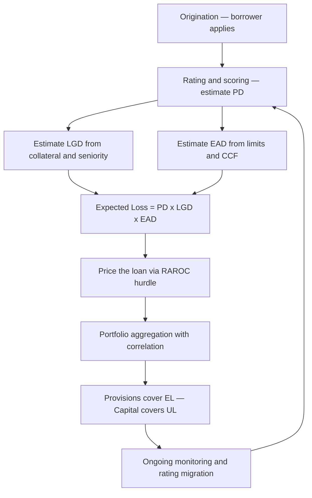
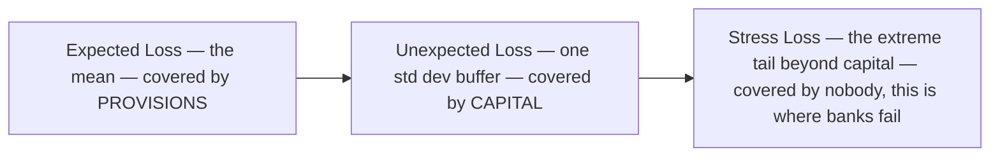
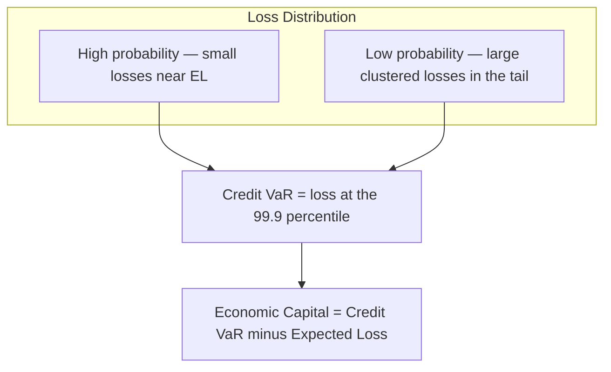

# Chapter 06 — Credit Risk

## 1. The Problem / The Need

Every time a bank lends money, buys a bond, sells a derivative that will settle in the future, or even extends a 30-day trade credit, it hands over value *today* against a *promise* of value tomorrow. Credit risk is the risk that the promise is broken — that the counterparty fails to pay what it owes, when it owes it, in full.

Why does this deserve its own discipline rather than being lumped in with "market risk"? Because the loss profile is fundamentally different and far nastier:

- **It is asymmetric.** On a loan you can lose the entire principal (100% down), but the best possible outcome is that you get your money back plus a modest spread (a few percent up). You are, in effect, *short a put option* on the borrower's assets: bounded upside, catastrophic downside.
- **It is skewed and fat-tailed.** Most of the time nothing happens — the loan performs. Then, rarely, a cluster of defaults arrives together (a recession, a sector collapse) and wipes out years of accumulated spread income. The loss distribution has a long, thick right tail.
- **It is driven by correlation, not just individual odds.** A single borrower defaulting is idiosyncratic. Thousands defaulting *at once* is systematic. The whole art of portfolio credit risk is modelling how defaults bunch together.

For a bank, credit risk is not a side concern — it is *the* core business. Roughly 50–70% of a typical commercial bank's economic capital is held against credit risk. The 2008 crisis, virtually every banking failure in history, and most NBFC blowups (IL&FS, DHFL in India) trace back to credit risk that was mispriced, under-provisioned, or too concentrated. If you want a risk job at a bank or NBFC, this chapter is the beating heart of the interview.

The need, then, is for a rigorous framework that answers four questions:

1. **How likely** is default? (Probability of Default, PD)
2. **How much** do we lose if it happens? (Loss Given Default, LGD)
3. **How much** is at risk when it happens? (Exposure at Default, EAD)
4. **How do these losses behave across a whole portfolio** once correlation is added?

---

## 2. The Core Idea

Credit risk decomposes cleanly into a small set of multiplicative building blocks. The single most important equation in all of credit risk is the **Expected Loss** identity:

$$
\text{EL} = \text{PD} \times \text{LGD} \times \text{EAD}
$$

where:

- **PD** = Probability of Default over a horizon (usually 1 year), a number between 0 and 1.
- **LGD** = Loss Given Default, the fraction of exposure *not* recovered, between 0 and 1. Note **LGD = 1 − Recovery Rate**.
- **EAD** = Exposure at Default, the money amount outstanding when default hits.

The deep insight is a change of *mindset*: **expected loss is not a risk — it is a cost.** A bank that expects to lose 1.5% of a loan book each year is not being surprised; it should price that 1.5% into the interest rate and set it aside as a provision. Expected loss is budgeted, priced, and reserved for.

The *real* risk is the **Unexpected Loss (UL)** — the volatility of losses around that expected mean, the possibility that this year losses come in far above the long-run average. Unexpected loss is what *capital* exists to absorb. This gives the fundamental division of labour in a bank:

> **Provisions cover Expected Loss. Capital covers Unexpected Loss.**

Everything else — ratings, transition matrices, correlation models, credit VaR, loan pricing — is machinery for estimating these components and then for describing the *shape* of the loss distribution beyond the mean.

---

## 3. Why / How It Works

**Why the multiplicative form?** Each factor answers a logically independent question, and they compound. Think of a single loan as a lottery:

- With probability PD, the "bad" outcome occurs and default happens.
- Given default, you were exposed to EAD dollars.
- Of that exposure, you fail to recover a fraction LGD.

So the expected dollar loss is (chance of the bad event) × (size when bad) × (severity when bad) = PD × EAD × LGD. It is just the expected value of a random loss variable $L = \mathbb{1}_{\text{default}} \times \text{EAD} \times \text{LGD}$.

**Why separate EL from UL?** Because they are funded by different pools of money and managed by different people. If you only ever look at the average, you will be catastrophically undercapitalised when the tail arrives. A portfolio can have a tiny expected loss and still be lethal if its losses are highly correlated — because the *unexpected* loss (the tail) is enormous relative to the mean.

**Why does correlation dominate?** Consider two extreme worlds holding 1,000 loans, each with PD = 1%:

- **Zero correlation** (defaults independent): losses cluster tightly around the mean of 10 defaults by the law of large numbers. The tail is thin; you need little capital.
- **Perfect correlation** (all loans rise and fall together): either 0 default or all 1,000 default. The "portfolio" behaves like one giant loan. The tail is monstrous; you need enormous capital.

Real portfolios sit between these, and the *degree* of correlation — driven by shared exposure to the economy, a region, or a sector — is what sets the capital number. This is precisely why diversification is the only free lunch in credit, and why *concentration* (too much to one borrower, one sector, one geography) is the classic killer.

**How ratings fit in.** We cannot estimate a bespoke PD for every borrower from scratch, so we *bucket* borrowers into rating grades (AAA, AA, …, C, D). Each grade maps to an empirically observed PD. Crucially, borrowers *migrate* between grades over time — a AA can be downgraded to BBB — and this migration is itself a source of loss (mark-to-market credit risk), captured by a **transition matrix**.

---

## 4. Full Content — Framework, Formulas & Methods

### 4.1 The three parameters in detail

**Probability of Default (PD).** The likelihood the obligor defaults within the horizon.

- *Through-the-cycle (TTC)* PD: a long-run average, smoothing over booms and busts. Used for Basel regulatory capital and rating agencies.
- *Point-in-time (PIT)* PD: reflects current conditions; rises in recessions. Used for IFRS 9 / expected credit loss accounting.
- Sources: rating-agency default studies, internal rating models, or *market-implied* PD from bond spreads and CDS.

**Loss Given Default (LGD).** The fraction lost after recovery, net of collection costs, discounted to default date.

$$
\text{LGD} = 1 - \text{Recovery Rate} = \frac{\text{EAD} - \text{Recoveries} + \text{Costs}}{\text{EAD}}
$$

LGD depends heavily on **seniority** and **collateral**: a senior secured loan might have LGD ≈ 25%, while subordinated unsecured debt might have LGD ≈ 75%. LGD tends to *rise* in downturns (collateral values fall exactly when defaults spike) — "downturn LGD" is used for prudence.

**Exposure at Default (EAD).** The amount outstanding at the moment of default.

- For a term loan drawn in full, EAD ≈ outstanding principal.
- For a revolving facility or credit line, borrowers tend to *draw down* as they approach distress. EAD is modelled as:

$$
\text{EAD} = \text{Drawn} + \text{CCF} \times (\text{Limit} - \text{Drawn})
$$

where **CCF** (Credit Conversion Factor) is the fraction of the undrawn commitment expected to be drawn before default.

### 4.2 Expected Loss

At the single-facility level:

$$
\boxed{\ \text{EL} = \text{PD} \times \text{LGD} \times \text{EAD}\ }
$$

At the portfolio level, EL is simply additive (expectations always add, regardless of correlation):

$$
\text{EL}_{\text{portfolio}} = \sum_i \text{PD}_i \times \text{LGD}_i \times \text{EAD}_i
$$

### 4.3 Unexpected Loss (single exposure)

Model the loss on one facility as $L = \text{EAD}\times\text{LGD}\times D$, where $D$ is the Bernoulli default indicator (1 with probability PD, else 0). Unexpected loss is the *standard deviation* of loss. Treating LGD and EAD as fixed for a moment and letting default variability dominate:

$$
\text{Var}(D) = \text{PD}(1-\text{PD})
$$

$$
\text{UL} = \text{EAD}\times\text{LGD}\times\sqrt{\text{PD}(1-\text{PD})}
$$

A fuller version that also accounts for the variance of the recovery/LGD itself (with $\sigma_{\text{LGD}}$ the standard deviation of LGD) is:

$$
\text{UL} = \text{EAD}\sqrt{\ \text{PD}\,\sigma_{\text{LGD}}^{2} + \text{LGD}^{2}\,\text{PD}(1-\text{PD})\ }
$$

The first term inside the root is the contribution from *how much* recovery varies; the second is from the *binary* default event. In interviews, the simpler $\text{UL}=\text{EAD}\cdot\text{LGD}\cdot\sqrt{\text{PD}(1-\text{PD})}$ is usually what is expected unless recovery volatility is given.

### 4.4 Portfolio Unexpected Loss and correlation

For a two-asset portfolio, unexpected losses do **not** simply add — they combine like volatilities with a default correlation $\rho$:

$$
\text{UL}_{P} = \sqrt{\ \text{UL}_1^2 + \text{UL}_2^2 + 2\rho\,\text{UL}_1\text{UL}_2\ }
$$

The **risk contribution** of asset $i$ to the portfolio is:

$$
\text{RC}_i = \text{UL}_i \times \frac{\text{UL}_i + \sum_{j\ne i}\rho_{ij}\text{UL}_j}{\text{UL}_P}
\quad\text{and}\quad \sum_i \text{RC}_i = \text{UL}_P
$$

Because $\rho < 1$, $\text{UL}_P < \sum_i \text{UL}_i$ — the diversification benefit.

### 4.5 Credit ratings and the transition matrix

A **transition (migration) matrix** gives the probability of moving from one rating to another over one year. Rows are the starting rating, columns the ending rating, and the last column "D" is default. Each row sums to 100%.

| From \ To | AAA | AA | A | BBB | BB | B | CCC | **D (default)** |
|---|---|---|---|---|---|---|---|---|
| **AAA** | 90.0 | 9.0 | 0.6 | 0.3 | 0.1 | 0.0 | 0.0 | **0.00** |
| **AA** | 0.6 | 90.0 | 7.6 | 0.6 | 0.6 | 0.1 | 0.02 | **0.02** |
| **A** | 0.05 | 2.0 | 91.0 | 5.7 | 0.7 | 0.2 | 0.01 | **0.06** |
| **BBB** | 0.03 | 0.3 | 5.0 | 88.5 | 4.2 | 1.0 | 0.4 | **0.20** |
| **BB** | 0.02 | 0.1 | 0.5 | 6.5 | 82.5 | 7.7 | 1.4 | **1.10** |
| **B** | 0.0 | 0.1 | 0.3 | 0.4 | 6.0 | 83.0 | 5.5 | **4.70** |
| **CCC** | 0.0 | 0.0 | 0.2 | 0.5 | 1.5 | 11.0 | 60.0 | **26.80** |

*(Illustrative annual transition probabilities, %. Note how default probability climbs steeply down the rating scale — the hallmark of a credit curve.)*

Key uses:

- The **default column** gives the 1-year PD for each grade (e.g. BBB → 0.20%).
- **Multi-year PDs** come from matrix multiplication: the 2-year matrix is $M^2$, the $n$-year is $M^n$ (assuming a time-homogeneous Markov chain).
- **Downgrade risk**: even without default, a downgrade widens the credit spread, marking the bond down. This is the basis of the CreditMetrics mark-to-market approach.

### 4.6 Measuring and pricing credit risk

**Market-implied PD from spreads.** A risky bond yields more than a risk-free bond; the extra is the **credit spread** $s$. Under a simple reduced-form model, for a short horizon the spread compensates for expected loss:

$$
s \approx \text{PD} \times \text{LGD} \quad\Rightarrow\quad \text{PD} \approx \frac{s}{\text{LGD}}
$$

More precisely, equating expected returns of a risky and risk-free bond over one period:

$$
(1+y) (1-\text{PD}) + (1+y)(\text{PD})(1-\text{LGD}) = 1 + r_f
$$

which rearranges to $\text{PD} = \dfrac{y - r_f}{(1+y)\,\text{LGD}} \approx \dfrac{s}{\text{LGD}}$ for small numbers.

**Pricing a loan (RAROC).** A loan's interest rate must cover four things: funding cost, operating cost, **expected loss**, and a return on the **capital** held against unexpected loss. Risk-Adjusted Return on Capital:

$$
\text{RAROC} = \frac{\text{Spread income} + \text{Fees} - \text{Expected Loss} - \text{Operating cost}}{\text{Economic Capital (}\approx k \times \text{UL)}}
$$

A loan is approved only if RAROC exceeds the bank's hurdle rate (cost of equity). This is *the* mechanism that forces EL and UL into the price.

**Structural (Merton) model.** Treats equity as a call option on the firm's assets. The firm defaults if asset value $V$ falls below the debt face value $F$ at maturity. Distance-to-default:

$$
DD = \frac{\ln(V/F) + (\mu - \tfrac{1}{2}\sigma_V^2)T}{\sigma_V\sqrt{T}},\qquad \text{PD} = N(-DD)
$$

This is the engine behind Moody's KMV EDF (Expected Default Frequency) models.

### 4.7 The credit risk process — putting it together

*Figure 1 — the credit risk lifecycle from a single loan through to portfolio capital, a continuous loop as ratings migrate.*

### 4.8 The shape of the loss distribution

*Figure 2 — the three zones of the credit loss distribution. Provisions absorb the mean, economic capital absorbs the body of the tail up to a chosen confidence, and catastrophic stress losses beyond that are the existential risk.*

The full loss distribution is heavily right-skewed:

*Figure 3 — Credit VaR is the loss not exceeded at a high confidence level; economic capital is the distance from the mean (EL) out to that percentile.*

**Credit VaR and economic capital.** Just as market VaR, Credit VaR is a percentile of the loss distribution:

$$
\text{Economic Capital} = \text{Credit VaR}_{\alpha} - \text{EL}
$$

We subtract EL because provisions already cover the mean; capital only needs to cover the *unexpected* portion out to confidence $\alpha$ (Basel uses 99.9%).

### 4.9 The Basel IRB capital formula (concept)

Basel's Internal Ratings-Based approach uses a single-factor Merton (Vasicek) model. Capital per unit of exposure is the *conditional* expected loss at a 99.9% bad state of the economy, minus the already-provisioned EL:

$$
K = \text{LGD}\left[\ N\!\left(\frac{N^{-1}(\text{PD}) + \sqrt{\rho}\,N^{-1}(0.999)}{\sqrt{1-\rho}}\right) - \text{PD}\ \right]\times \text{Maturity adjustment}
$$

You do not need to compute this by hand in most interviews, but you *must* be able to explain it: the term inside $N(\cdot)$ is the **stressed PD** (PD conditional on a 99.9% bad systematic factor), and $\rho$ is the asset correlation to the single economy-wide factor. Capital rises with PD, with LGD, and with correlation.

---

## 5. Worked Examples

### Example 1 — Expected Loss on a single loan (the core computation)

A bank lends **₹100 crore** as a term loan to a BB-rated corporate.

- PD (1-year, from the BB grade) = **1.10%** = 0.011
- The loan is secured by property giving a recovery rate of 60%, so **LGD = 40%** = 0.40
- The loan is fully drawn, so **EAD = ₹100 crore**

**Expected Loss:**

$$
\text{EL} = \text{PD}\times\text{LGD}\times\text{EAD} = 0.011 \times 0.40 \times 100 = \textbf{₹0.44 crore}
$$

So the bank should provision **₹44 lakh** and build at least 0.44% into the loan's spread just to break even on expected credit cost.

**Unexpected Loss (default-event only):**

$$
\text{UL} = \text{EAD}\times\text{LGD}\times\sqrt{\text{PD}(1-\text{PD})} = 100 \times 0.40 \times \sqrt{0.011\times0.989}
$$

$$
\sqrt{0.011\times0.989} = \sqrt{0.010879} = 0.10430
$$

$$
\text{UL} = 100\times0.40\times0.10430 = \textbf{₹4.17 crore}
$$

**Reconciliation / sanity check:** UL (₹4.17 cr) is nearly **10×** the EL (₹0.44 cr). This is the whole point — the *unexpected* loss dwarfs the expected loss for a single risky loan, because the default event is binary and volatile. The bank prices for ₹0.44 cr but must hold capital sized off the ₹4.17 cr. Note the ratio $\text{UL}/\text{EL} = \sqrt{(1-\text{PD})/\text{PD}} = \sqrt{0.989/0.011} = 9.48$, and indeed $4.17/0.44 = 9.48$. ✓ Consistent.

### Example 2 — Exposure at Default on a revolving credit line

A company has a **₹50 crore** revolving credit facility. It has currently drawn **₹20 crore**, leaving **₹30 crore** undrawn. Historical data shows distressed borrowers draw down **65%** of the remaining commitment before defaulting (CCF = 0.65). PD = 4.70% (B-rated), LGD = 50%.

**EAD:**

$$
\text{EAD} = \text{Drawn} + \text{CCF}\times(\text{Limit}-\text{Drawn}) = 20 + 0.65\times(50-20) = 20 + 0.65\times30 = 20 + 19.5 = \textbf{₹39.5 crore}
$$

**Expected Loss:**

$$
\text{EL} = 0.047 \times 0.50 \times 39.5 = \textbf{₹0.928 crore}
$$

**Reconciliation:** Had we naively used only the *drawn* ₹20 cr, EL would be $0.047\times0.50\times20 = ₹0.47$ cr — we would have **understated** the risk by nearly half. This is why CCF matters: borrowers rush to draw their lines precisely as they head toward default, so the exposure balloons exactly when it hurts. ✓ The undrawn commitment is a real, and dangerous, exposure.

### Example 3 — Portfolio diversification and correlation

The bank holds **two** loans, each with UL = ₹4 crore standalone.

**Case A — low correlation, $\rho = 0.20$:**

$$
\text{UL}_P = \sqrt{4^2 + 4^2 + 2(0.20)(4)(4)} = \sqrt{16 + 16 + 6.4} = \sqrt{38.4} = \textbf{₹6.20 crore}
$$

**Case B — high correlation, $\rho = 0.80$ (e.g. both to the same sector):**

$$
\text{UL}_P = \sqrt{16 + 16 + 2(0.80)(16)} = \sqrt{16 + 16 + 25.6} = \sqrt{57.6} = \textbf{₹7.59 crore}
$$

**Reconciliation against the two extremes:**

- If **fully diversified** ($\rho = 0$): $\text{UL}_P = \sqrt{32} = ₹5.66$ cr.
- If **perfectly correlated** ($\rho = 1$): $\text{UL}_P = \sqrt{16+16+32} = \sqrt{64} = ₹8.00$ cr — exactly the naive sum $4+4$. ✓

Our two cases (₹6.20 cr and ₹7.59 cr) sit correctly *between* ₹5.66 cr and ₹8.00 cr, and the higher correlation gives the higher portfolio risk. The **diversification benefit** in Case A is $8.00 - 6.20 = ₹1.80$ cr of UL saved; in Case B only $8.00 - 7.59 = ₹0.41$ cr. **Concentration destroys diversification** — putting both loans in one sector nearly wiped out the benefit. ✓

### Example 4 — Market-implied PD from a bond spread

A corporate bond trades at a **credit spread of 300 bps** (3.0%) over the risk-free rate. Assume LGD = 60% (recovery 40%).

$$
\text{PD} \approx \frac{s}{\text{LGD}} = \frac{0.030}{0.60} = 0.05 = \textbf{5.0\%}
$$

**Reconciliation:** The implied EL from the market equals $\text{PD}\times\text{LGD} = 0.05\times0.60 = 0.03 = 300$ bps — exactly the spread we started with. ✓ The market is pricing the bond to compensate purely for expected credit loss (ignoring risk premia and liquidity, which in reality push the *real-world* PD below this *risk-neutral* 5%). A 5% risk-neutral PD sits between a B and CCC grade — consistent with a 300 bps spread being genuinely junk-territory.

---

## 6. Connections

- **To market risk (Ch. on VaR):** Credit VaR borrows the percentile concept from market VaR, but the loss distribution is skewed and fat-tailed rather than roughly normal, so a simple mean ± σ multiplier badly *understates* the tail. Credit needs full-distribution simulation (Monte Carlo, CreditMetrics).
- **To provisioning / accounting (IFRS 9, Ind AS 109):** Expected Credit Loss (ECL) accounting is literally EL = PD × LGD × EAD, but forward-looking and staged: 12-month ECL for performing loans (Stage 1), lifetime ECL once credit has significantly deteriorated (Stages 2 and 3). Directly relevant to any bank/NBFC finance role.
- **To regulatory capital (Basel III):** The IRB formula turns PD, LGD, EAD and correlation into a capital charge. Standardised approach uses fixed risk weights by rating instead.
- **To derivatives (counterparty credit risk):** For swaps and forwards, EAD is not fixed — it depends on future market moves. This gives **CVA** (Credit Valuation Adjustment), the market price of counterparty credit risk, a hybrid of credit and market risk.
- **To securitisation & CDOs:** Tranching a pool slices the loss distribution — equity tranche absorbs EL, senior tranches absorb only tail UL. The 2008 crisis was fundamentally a *correlation* mis-estimate in these structures.
- **To structural finance (Merton):** Distance-to-default links equity option pricing (Black-Scholes) directly to credit risk.

---

## 7. Key Terms

| Term | Meaning |
|---|---|
| **PD** | Probability of Default over a horizon (usually 1 year) |
| **LGD** | Loss Given Default = 1 − Recovery Rate; the fraction not recovered |
| **EAD** | Exposure at Default; amount outstanding when default occurs |
| **CCF** | Credit Conversion Factor; fraction of undrawn commitment drawn before default |
| **EL** | Expected Loss = PD × LGD × EAD; a budgeted cost, covered by provisions |
| **UL** | Unexpected Loss; volatility of loss around EL, covered by capital |
| **Recovery Rate** | Fraction of exposure recovered after default = 1 − LGD |
| **Transition matrix** | Probabilities of migrating between rating grades over a period |
| **Credit VaR** | A high percentile (e.g. 99.9%) of the credit loss distribution |
| **Economic Capital** | Credit VaR − EL; the unexpected-loss buffer |
| **Default correlation (ρ)** | Tendency of borrowers to default together; drives portfolio tail |
| **RAROC** | Risk-Adjusted Return on Capital; the loan-pricing / approval hurdle |
| **CVA** | Credit Valuation Adjustment; market value of counterparty credit risk |
| **TTC / PIT** | Through-the-cycle vs Point-in-time PD (Basel vs IFRS 9) |
| **Distance-to-default** | Number of std devs asset value sits above the default point (Merton) |

---

## 8. Common Confusions

1. **"Expected loss is the risk."** No — EL is the *average* outcome, a predictable cost you price and provision for. The *risk* is Unexpected Loss, the deviation above the mean. Confusing the two leads to zero capital.
2. **LGD vs Recovery Rate direction.** LGD = 1 − Recovery. A 40% recovery means 60% LGD, *not* 40% LGD. Always check which one is given.
3. **"Provisions and capital are the same buffer."** They are separate and stacked: provisions sit against EL (they reduce book value / P&L), capital sits against UL (it is equity). Double-counting or conflating them mis-sizes the balance sheet.
4. **Ignoring the undrawn line.** Using drawn balance instead of EAD understates exposure on revolvers and guarantees — and borrowers draw *most* just before default (Example 2).
5. **Adding ULs like ELs.** ELs add arithmetically (₹1 + ₹1 = ₹2). ULs add like volatilities with correlation — they are always *less than* the arithmetic sum unless ρ = 1. Adding ULs directly overstates required capital and ignores diversification.
6. **Risk-neutral vs real-world PD.** PD backed out of bond/CDS spreads is *risk-neutral* — it embeds a risk premium and is typically **higher** than the actual (physical) default frequency. Do not feed a spread-implied PD into an accounting ECL that wants real-world PD.
7. **"Diversification removes credit risk."** It removes *idiosyncratic* risk only. Systematic (correlated) risk survives no matter how many names you add — this residual is exactly what portfolio capital is sized for.
8. **Assuming normality for the tail.** Credit losses are right-skewed; the 99.9% loss is many multiples of the standard deviation, not ~3σ as a normal would suggest.

---

## 9. Recap

- Credit risk is the risk a borrower or counterparty fails to pay — asymmetric (bounded gain, total-loss downside), skewed, and correlation-driven.
- The master identity is **EL = PD × LGD × EAD**. Expected Loss is a *cost*: priced into spreads and covered by **provisions**.
- **Unexpected Loss** — the volatility of loss around EL — is the true risk and is covered by **capital**. For a single risky loan, UL is typically an order of magnitude larger than EL.
- **EAD** is not just the drawn amount: undrawn commitments convert via **CCF** because distressed borrowers draw down.
- **Ratings** bucket borrowers into PD grades; the **transition matrix** captures both default and downgrade (migration) risk, and multi-year PDs come from powering the matrix.
- **Portfolio** risk is dominated by **default correlation**: ULs combine like volatilities, so diversification cuts the tail but concentration destroys the benefit. Systematic risk cannot be diversified away.
- Credit risk is **measured** via internal ratings, structural (Merton) models, and market spreads, and **priced** via RAROC and the credit spread ≈ PD × LGD relationship.
- **Credit VaR** is a high percentile of the loss distribution; **Economic Capital = Credit VaR − EL**.

---

## 10. Quick Reference / Interview Points

**Must-know formulas:**

| Quantity | Formula |
|---|---|
| Expected Loss | $\text{EL} = \text{PD}\times\text{LGD}\times\text{EAD}$ |
| LGD | $\text{LGD} = 1 - \text{Recovery Rate}$ |
| EAD (revolver) | $\text{Drawn} + \text{CCF}\times(\text{Limit}-\text{Drawn})$ |
| Unexpected Loss (single) | $\text{EAD}\times\text{LGD}\times\sqrt{\text{PD}(1-\text{PD})}$ |
| Portfolio UL (2 assets) | $\sqrt{\text{UL}_1^2+\text{UL}_2^2+2\rho\,\text{UL}_1\text{UL}_2}$ |
| Implied PD | $\text{PD} \approx s / \text{LGD}$ (spread over LGD) |
| Economic Capital | $\text{Credit VaR}_{\alpha} - \text{EL}$ |
| Merton PD | $N(-DD)$, distance-to-default $DD$ |

**One-liners that land in interviews:**

- "Expected loss is a cost you *price*; unexpected loss is a risk you hold *capital* against."
- "Provisions cover the mean, capital covers the tail — never confuse them."
- "The only free lunch in credit is diversification, and concentration is the standard way banks die."
- "Correlation, not individual PDs, sets the portfolio capital number."
- "ELs add; ULs combine like volatilities."
- "Spread-implied PD is risk-neutral and higher than actual default frequency."
- "On a revolver, the borrower draws the line down as they fail — that's why CCF and EAD matter."
- "A loan makes sense only if its RAROC clears the cost of equity."

**Typical interview drills:** compute EL given PD/LGD/EAD; convert recovery to LGD; size EAD on a partly-drawn line; explain why UL ≫ EL; explain how correlation moves portfolio UL between the diversified and perfectly-correlated bounds; read a PD off a transition matrix and compute a 2-year PD via $M^2$; back out PD from a bond spread; distinguish IFRS 9 ECL staging from Basel IRB capital.

**Red flags interviewers listen for:** treating EL as the risk, adding ULs arithmetically, forgetting the undrawn commitment, assuming normal tails, and confusing risk-neutral with real-world PD. Avoid these and you signal genuine credit-risk fluency.
