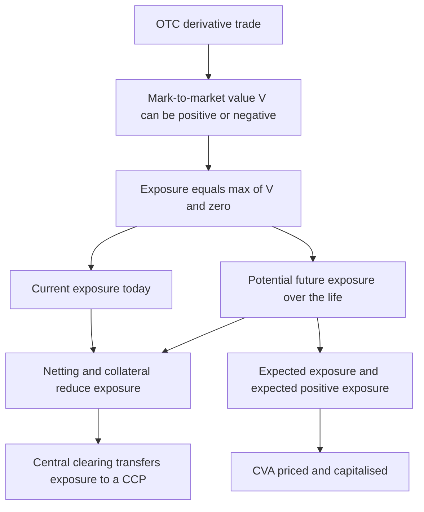
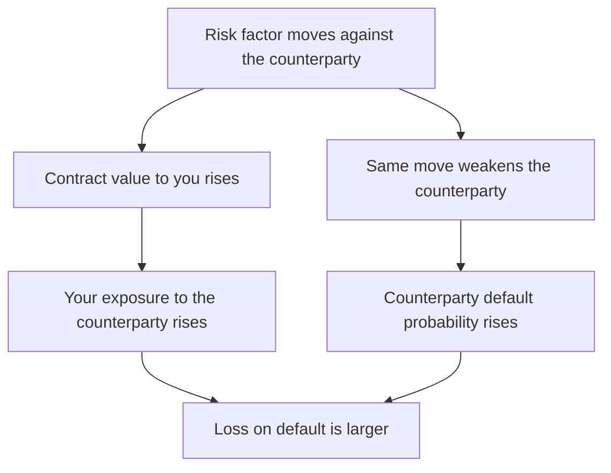
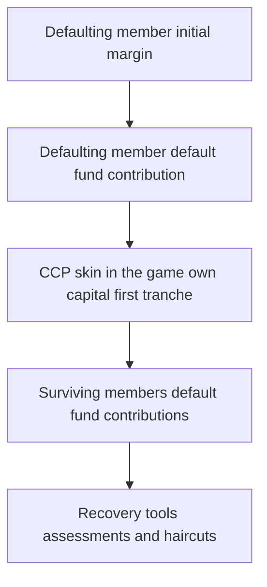
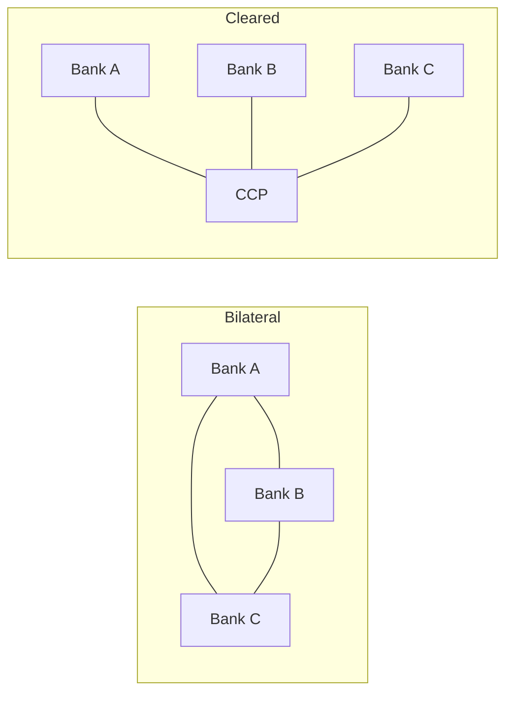

# Chapter 07 — Counterparty Credit Risk

## 1. The Problem / The Need

When you buy a bond, the credit question is simple: will the issuer pay you back the fixed amount it owes? The exposure is known in advance — you lent $100, you are owed $100 plus coupons. Counterparty credit risk (CCR) is a stranger, more slippery animal, and it lives inside the world of **over-the-counter (OTC) derivatives** — interest rate swaps, FX forwards, cross-currency swaps, credit default swaps, commodity options.

Here is the twist that makes CCR different from ordinary lending risk. In a derivative, **you do not know in advance whether you will owe your counterparty or your counterparty will owe you**, and you do not know by how much. A 10-year interest rate swap starts life worth roughly zero to both sides. Six months later, if rates have moved in your favour, the swap might be worth +$4 million to you — meaning your counterparty owes you $4 million if they were to close out today. If that counterparty defaults at that moment, you lose that $4 million of positive market value. But if rates had moved the other way, the swap would be a liability to you, the counterparty's default would cost you nothing, and you might even benefit.

So CCR has three features that plain loan credit risk does not:

1. **Bilateral and uncertain direction.** Either party can end up the creditor. The exposure can flip sign over the life of the trade.
2. **Stochastic, market-driven exposure.** The amount at risk is not the notional and not a fixed principal — it is the *replacement cost* of the contract, which follows market rates and prices and therefore changes every day.
3. **A long, uncertain horizon.** A swap can run 5, 10, 30 years. You are exposed to your counterparty's default for that entire period, and the exposure profile evolves.

The need, therefore, is for a discipline that answers: *If my counterparty vanishes tomorrow — or in three years — what will it cost me to replace these contracts, and how do I price, limit, collateralise, and hedge that risk today?* This chapter builds that discipline: current and potential future exposure, credit valuation adjustment (CVA), netting and collateral agreements, wrong-way risk, and the market's structural answer — central clearing.

Why it matters for a risk career: CCR sits at the intersection of the trading desk, the credit function, and the regulator. The 2008 crisis was in large part a counterparty-risk crisis — Lehman's default, the near-collapse of AIG (which had written CDS protection it could not honour), and the freezing of the interbank market. Post-crisis rules (Basel III's CVA capital charge, mandatory clearing, margin rules for non-cleared derivatives) all descend from this chapter. Interviewers for credit-risk, XVA, and CCR roles expect fluency here.

---

## 2. The Core Idea

**Counterparty credit risk is the risk that the counterparty to a bilateral contract defaults *before the final settlement* of the contract's cash flows, at a time when the contract has *positive economic value to you*.** Your loss is the cost of replacing the defaulted contract in the market — the replacement cost — reduced by whatever you recover from the defaulted estate.

Three ideas anchor everything that follows.

**Exposure is one-sided at the moment of default, even though value is two-sided.** If the counterparty owes you (contract value positive), you lose. If you owe them (contract value negative), you must still pay — default does not release you from your obligation. So exposure is `max(V, 0)` — the positive part of the mark-to-market value. Negative value is not a gain on default; it is simply zero exposure.

**Because value is random, exposure is a distribution, not a number.** We describe it with a *profile over time*: today's exposure (current exposure) and the range of possible future exposures (potential future exposure). We summarise the distribution with expected exposure and high-percentile exposure.

**The price of bearing this risk is CVA — the market value of counterparty default risk.** A derivative traded with a risky counterparty is worth less than the same derivative with a default-free counterparty. That difference is CVA, and it is booked as a valuation adjustment (a real P&L item that moves as credit spreads move).

The rest of the toolkit — netting, collateral, central clearing — exists to *shrink the exposure profile* and therefore shrink both the potential loss and the CVA.

*Figure 1 — The counterparty-risk value chain from a single trade to the summary risk measures.*



---

## 3. Why / How It Works

### Why exposure is the positive part of value

Consider a single swap with your counterparty. Its mark-to-market value to you is `V`. If the counterparty defaults, one of two things is true:

- `V > 0`: the counterparty owes you `V`. In default you file a claim for `V` and recover only a fraction `R` (the recovery rate). You must replace the swap at market — costing you `V` — but you recover `R·V` from the estate. Net loss `= (1 − R)·V`.
- `V < 0`: you owe the counterparty `|V|`. Default does not cancel your debt; the administrator will demand you settle `|V|`. You gain nothing. Exposure = 0.

Hence **exposure `E = max(V, 0)`**, and loss given default on the derivative `= (1 − R)·max(V, 0)`. This asymmetry — you keep the downside, you lose the upside — is the mathematical heart of CCR and is exactly why an option-like (convex) shape appears in every exposure measure.

### Why future exposure grows then shrinks: the diffusion-vs-amortisation tug-of-war

Potential future exposure over the life of a trade is shaped by two opposing forces:

- **Diffusion effect.** As time passes, market rates can wander further from today's levels, so the *range* of possible future values widens. This pushes potential exposure *up* with the square root of time (like any random walk).
- **Amortisation / roll-off effect.** As the trade approaches maturity, fewer cash flows remain to be exchanged, so there is less left to be at risk. This pulls potential exposure *down* toward zero at maturity.

For an interest rate swap, diffusion dominates early and amortisation dominates late, producing the classic **hump-shaped** exposure profile that peaks around one-third to one-half of the way to maturity. For an FX forward, there is a single exchange at maturity and no amortisation, so exposure rises monotonically to the end. Understanding the *shape* of the profile per product is a standard interview probe.

### Why netting works

If you have many trades with one counterparty and a legally enforceable **netting agreement** (an ISDA Master Agreement), then on default all trades collapse into a single net claim. Your exposure is `max(ΣVᵢ, 0)` — the positive part of the *sum* — not `Σ max(Vᵢ, 0)` — the sum of the positive parts. Because some trades are in-the-money and some out-of-the-money, offsetting reduces the net figure. Netting can cut gross exposure by 60–90% for a large, diversified book. This is the single most powerful exposure-reduction tool.

### Why collateral works

A **Credit Support Annex (CSA)** requires the out-of-the-money party to post collateral (usually cash or high-quality bonds) as the net value moves. If the counterparty owes you $10 million and has posted $9 million of collateral, your uncollateralised exposure is only $1 million. Collateral converts a large, slow credit exposure into a small residual — the residual being whatever can accumulate during the **margin period of risk** (the gap between the last margin call the counterparty honoured and the moment you finally close out and re-hedge, typically 10 business days for non-cleared trades).

### Why central clearing works

A **central counterparty (CCP)** interposes itself between the two original parties via *novation*: one bilateral trade becomes two trades, each facing the CCP. The CCP guarantees performance to both sides. It manages the risk through *multilateral netting* across all members, *strict daily (or intraday) variation margin*, *risk-sensitive initial margin*, and a *default waterfall* (the defaulter's margin, then a mutualised guarantee fund, then the CCP's own capital). This replaces a web of bilateral exposures with a hub-and-spoke structure and mutualises tail losses.

---

## 4. Full Content — Framework, Formulas, Methods

### 4.1 The exposure metrics (the vocabulary of CCR)

Let `Vₜ` be the (netted) mark-to-market value at future time `t`. Exposure `Eₜ = max(Vₜ, 0)`.

| Metric | Definition | Formula | Use |
|---|---|---|---|
| Current Exposure (CE) | Exposure right now | `max(V₀, 0)` | Today's loss if default now |
| Expected Exposure (EE) | Mean exposure at future time t | `EEₜ = E[max(Vₜ, 0)]` | Input to CVA |
| Potential Future Exposure (PFE) | High-percentile exposure at t (e.g. 95th/99th) | `PFEₜ(α) = qα(max(Vₜ,0))` | Limits, worst-case |
| Expected Positive Exposure (EPE) | Time-average of EE over the horizon | `EPE = (1/T)∫₀ᵀ EEₜ dt` | Regulatory "loan-equivalent" |
| Effective EE | Non-decreasing running max of EE | `EEEₜ = max(EEEₜ₋₁, EEₜ)` | Removes roll-off understatement |
| Effective EPE | Time-average of Effective EE | `EEPE = (1/T)∫₀ᵀ EEEₜ dt` | Basel exposure-at-default driver |
| Maximum PFE (peak) | Highest PFE across all t | `max over t of PFEₜ` | Credit-line sizing |

Key distinctions to keep straight:
- **EE vs PFE**: EE is the *mean* of the exposure distribution; PFE is a *high quantile*. PFE ≥ EE always.
- **PFE vs VaR**: identical mathematics (a high quantile of a loss/exposure distribution) but PFE looks *forward over the life of the trade* at many horizons, whereas market-risk VaR looks at a single short horizon (e.g. 1–10 days).
- **Effective EE** exists because plain EE can decline as a trade rolls off, which would understate exposure of a book you intend to roll/replace; the running-maximum fix keeps it non-decreasing.

*Figure 2 — Hump-shaped exposure profile of an interest-rate swap with EE and PFE.*


### 4.2 Computing the exposure profile

The standard method is **Monte Carlo simulation**:

1. Choose risk-factor models (e.g. Hull–White for rates, GBM for FX/equity).
2. Simulate thousands of scenario paths of the risk factors out to the longest maturity, on a time grid `t₁, t₂, …, T`.
3. At each grid date on each path, **reprice every trade** and apply netting and collateral rules to get the netted, collateralised value `Vₜ`.
4. Take `Eₜ = max(Vₜ, 0)` on each path.
5. Across paths at each `t`: the *mean* gives `EEₜ`; the chosen *quantile* gives `PFEₜ`.

This is computationally heavy — a bank may reprice millions of trade-scenario combinations nightly — which is why exposure engines and XVA desks are large infrastructure investments.

A simpler regulatory shortcut, the **current exposure method** and its successor **SA-CCR (Standardised Approach for Counterparty Credit Risk)**, approximate exposure without full simulation:

```
Exposure at Default (EAD) = alpha × (Replacement Cost + Potential Future Exposure add-on)
```

with `alpha = 1.4`. Replacement Cost captures current net value less collateral; the PFE add-on applies supervisory factors to notionals by asset class, with recognition for netting and margining. SA-CCR is the number that feeds counterparty capital for banks not using internal models.

### 4.3 Credit Valuation Adjustment (CVA)

CVA is the **market value of expected loss from counterparty default**. It reduces the value of a derivative from its risk-free value:

```
Risky value = Risk-free value − CVA
```

The standard (unilateral) formula discretises the life of the trade into intervals and sums, over each interval, the discounted expected loss:

```
CVA = LGD × Σ [ EE*(tᵢ) × discount(tᵢ) × PD(tᵢ₋₁, tᵢ) ]
```

where
- `LGD = 1 − R` is loss given default (e.g. 0.6 for R = 40%),
- `EE*(tᵢ)` is the **discounted expected exposure** at `tᵢ` (risk-neutral, and conditioned on default at `tᵢ` if wrong-way effects are modelled),
- `PD(tᵢ₋₁, tᵢ)` is the counterparty's **marginal (risk-neutral) probability of default** in that interval, backed out from its **CDS spread** curve.

A useful closed-form approximation when exposure and spread are independent:

```
CVA ≈ LGD × Σ EE(tᵢ) × discount(tᵢ) × [ S(tᵢ₋₁) − S(tᵢ) ]
```

where `S(t)` is the survival probability to time `t`, so `S(tᵢ₋₁) − S(tᵢ)` is the probability of defaulting in interval `i`. Survival is stripped from CDS: `S(t) ≈ exp(−spread × t / LGD)`.

Extensions:
- **DVA (Debit Valuation Adjustment)**: the mirror image — the benefit to *you* of *your own* possible default. `BCVA = −CVA + DVA` gives bilateral CVA. DVA is controversial: your credit deteriorating produces a *gain*, which is counter-intuitive and hard to monetise.
- **FVA, MVA, KVA**: funding, margin, and capital valuation adjustments — the wider "XVA" family. Beyond scope here but worth naming in interviews.

CVA is not static — as the counterparty's CDS spread widens, CVA increases and the bank books a *CVA loss* even with no default. During 2008 roughly two-thirds of CCR losses came from CVA mark-to-market moves, not actual defaults, which is why Basel III introduced a dedicated **CVA capital charge**.

### 4.4 Netting agreements

Under an **ISDA Master Agreement** with a netting schedule, all trades in the netting set close out into one net amount. Define:

```
Net exposure     = max( Σ Vᵢ , 0 )
Gross exposure   = Σ max( Vᵢ , 0 )
Netting benefit  = Gross − Net
Netting factor   = Net exposure / Gross exposure   (0 = perfect offset, 1 = no benefit)
```

Netting is only recognised where it is **legally enforceable** in the counterparty's jurisdiction — close-out netting opinions are a real operational dependency.

### 4.5 Collateral and the CSA

A **Credit Support Annex** sets the margining terms:

| CSA term | Meaning |
|---|---|
| Threshold | Unsecured amount tolerated before any collateral is called |
| Minimum Transfer Amount (MTA) | Smallest transfer allowed, to avoid tiny operational calls |
| Independent Amount / Initial Margin | Extra collateral held regardless of MTM to cover gap risk |
| Variation Margin (VM) | Collateral tracking day-to-day change in net MTM |
| Eligible collateral & haircuts | What can be posted and the discount applied |
| Margin Period of Risk (MPoR) | Time from last honoured call to close-out (≈10 days bilateral) |

Collateralised exposure:

```
Collateralised exposure = max( Net MTM − Collateral held + Threshold + MTA , 0 )
```

Even a "perfect" daily CSA leaves residual exposure equal to what the portfolio can move during the MPoR — this residual is what initial margin is designed to cover.

### 4.6 Wrong-way and right-way risk

- **Wrong-way risk (WWR)**: exposure and counterparty default probability are *positively correlated* — exposure rises precisely when the counterparty is more likely to default. This makes losses worse than an independence assumption implies.
  - *General WWR*: driven by macro factors (e.g. buying protection on emerging-market debt from a bank in that same economy).
  - *Specific WWR*: a structural link (e.g. taking a company's own shares as collateral, or buying CDS protection on a firm from an entity in the same group).
- **Right-way risk**: exposure and default probability are *negatively* correlated — exposure falls as default nears (e.g. a gold producer selling gold forward; if gold falls, the forward is in-the-money to you but the producer is more distressed, but if gold rises the producer is healthy — direction depends on the trade).

WWR is captured by conditioning EE on the default event or by an **alpha multiplier** / correlation model; regulators require WWR identification and, for specific WWR, exposure is set to the full loss with no netting benefit.

*Figure 3 — Wrong-way risk: the reinforcing loop between exposure and default probability.*



### 4.7 Central clearing and CCPs

A **central counterparty** novates each cleared trade into two, standing between members. Its risk-management stack:

1. **Membership standards** — only well-capitalised clearing members.
2. **Variation margin** — collected daily/intraday to settle MTM moves to zero.
3. **Initial margin** — posted by each member to cover potential future exposure over the CCP's shorter close-out horizon (often ~5 days for OTC, ~1–2 for futures), typically sized at a 99–99.7% confidence level (SPAN or VaR/expected-shortfall models).
4. **Default fund (guarantee fund)** — mutualised contributions from all members to absorb losses beyond a defaulter's own margin.
5. **Default waterfall** — the loss-absorption order.

*Figure 4 — CCP default waterfall: the order in which resources absorb a member default.*



How the CCP mitigates counterparty risk:
- **Multilateral netting** across all members typically beats bilateral netting, shrinking system-wide exposure.
- **Standardised, disciplined margining** removes the negotiation and threshold slack of bilateral CSAs.
- **Mutualisation** spreads a member's default loss so no single survivor is wiped out.
- **Transparency** — the CCP sees concentrated positions and can act.

The trade-offs: the CCP becomes a **systemically critical single point of failure** ("too big to fail"), clearing members bear **default-fund and assessment risk** from others' failures, and **basis/liquidity risk** arises from posting large initial margin in cash. This is why CCPs themselves are now closely regulated and stress-tested.

*Figure 5 — Bilateral web versus centrally cleared hub before and after novation.*



---

## 5. Worked Examples

### Example 1 — Netting benefit and collateralised exposure

You have three trades with Counterparty X under one ISDA Master Agreement. Current mark-to-market values to you:

| Trade | Value to you |
|---|---|
| Swap 1 | +12.0 m |
| Swap 2 | −7.0 m |
| FX fwd | +3.0 m |

**Without netting** (gross exposure — sum of positive parts):
`max(12,0) + max(−7,0) + max(3,0) = 12 + 0 + 3 = 15.0 m`

**With netting** (positive part of the sum):
`Σ Vᵢ = 12 − 7 + 3 = 8.0 m`, so net exposure `= max(8, 0) = 8.0 m`

**Netting benefit** `= 15 − 8 = 7.0 m`. **Netting factor** `= 8 / 15 = 0.533` — netting removed ~47% of gross exposure.

Now add a CSA: Counterparty X has posted **6.0 m** of cash collateral, with **Threshold = 1.0 m** and **MTA = 0.5 m**.

`Collateralised exposure = max( Net MTM − Collateral + Threshold + MTA , 0 )`
`= max( 8.0 − 6.0 + 1.0 + 0.5 , 0 ) = max(3.5, 0) = 3.5 m`

**Reconciliation / sanity check:** exposure fell from 15.0 m (no tools) → 8.0 m (netting) → 3.5 m (netting + collateral). Each tool strictly reduced exposure, and the collateralised figure equals the residual (net value above the collateral held, plus the contractually unsecured threshold and MTA slack). Consistent. ✓

### Example 2 — CVA on a single netting set

A 5-year netting set with Counterparty Y. From the exposure engine, the discounted expected exposure `EE(tᵢ)` at each year-end is given below. Counterparty Y's flat CDS spread is **200 bps**; assume **recovery R = 40%**, so **LGD = 0.60**. Use annual buckets.

**Step 1 — strip survival probabilities.** With the credit-triangle approximation `S(t) = exp(−spread × t / LGD)` and hazard `λ = spread/LGD = 0.02/0.60 = 0.03333` per year:

| t (yr) | S(t) = exp(−0.03333·t) | Marginal PD = S(t−1) − S(t) |
|---|---|---|
| 0 | 1.00000 | — |
| 1 | 0.96722 | 0.03278 |
| 2 | 0.93551 | 0.03171 |
| 3 | 0.90485 | 0.03066 |
| 4 | 0.87519 | 0.02966 |
| 5 | 0.84650 | 0.02869 |

**Step 2 — bring in the discounted EE profile** (already discounted, in $m), and compute the per-bucket expected loss `EE × marginal PD`:

| t (yr) | EE(t) $m | Marginal PD | EE × PD |
|---|---|---|---|
| 1 | 5.0 | 0.03278 | 0.16390 |
| 2 | 7.0 | 0.03171 | 0.22197 |
| 3 | 6.0 | 0.03066 | 0.18396 |
| 4 | 4.0 | 0.02966 | 0.11864 |
| 5 | 2.0 | 0.02869 | 0.05738 |
| **Σ** | | | **0.74585** |

**Step 3 — apply LGD:**
`CVA = LGD × Σ (EE × PD) = 0.60 × 0.74585 = 0.4475 m ≈ $447,500`

**Reconciliation / sanity check:** The exposure profile is hump-shaped (peaks at year 2 = 7.0 m) — exactly the interest-rate-swap shape from Section 3. A crude upper-bound cross-check: total default probability over 5 years `= 1 − S(5) = 0.1535`; times a representative EE of ~5 m times LGD 0.60 gives ≈ `0.1535 × 5 × 0.60 = 0.46 m`, the same order of magnitude as our bucketed 0.447 m. The bucketed figure is slightly lower because the largest default probability sits in year 1 where EE (5.0 m) is below the peak. Consistent. ✓

**Interpretation:** the bank should charge Counterparty Y about $447k of CVA (roughly 9 bps of a notional of, say, $50m) to compensate for default risk on this netting set — or hedge it by buying CDS protection on Y.

### Example 3 — Wrong-way risk adjustment

Reuse Example 2, but now suppose exposure and Y's default are positively correlated (WWR): when Y is near default, the exposure is on average **40% higher** than the unconditional EE. Model this with an **alpha multiplier of 1.4** applied to the expected-loss sum.

`CVA_WWR = 1.4 × 0.4475 = 0.6265 m ≈ $626,500`

**Reconciliation:** WWR *increases* CVA (from 447k to 627k, +40%), which is directionally correct — wrong-way risk always makes counterparty risk worse because the big exposure and the default coincide. Had this been *right-way* risk (multiplier < 1), CVA would fall. The independence case (Example 2) sits between them. Consistent. ✓

### Example 4 — Basel EAD via the alpha factor

Suppose the netting set of Example 2 has **Effective EPE = 4.5 m** (the time-average of the running-max EE profile). The Basel internal-model exposure-at-default is:

`EAD = alpha × Effective EPE = 1.4 × 4.5 = 6.30 m`

**Reconciliation:** EAD (6.30 m) exceeds Effective EPE (4.5 m) by the 1.4 alpha buffer, and exceeds the peak EE (7.0 m)? No — it is below the 7.0 m single-date peak but above the *average* 4.5 m, which is the intended behaviour: EAD is a loan-equivalent capturing the *average* exposure grossed up for correlation and granularity, not the single worst point. Consistent with the metric hierarchy `EPE ≤ EEPE ≤ EAD ≤ peak PFE`. ✓

---

## 6. Connections

- **To market risk (Ch. on VaR/ES).** PFE is mathematically a VaR of the exposure distribution, but forward-looking over the trade's life. The same Monte Carlo and quantile machinery is reused; the difference is horizon and the `max(V,0)` transform.
- **To credit risk (PD/LGD/EAD).** CCR plugs straight into the credit-loss identity `EL = PD × LGD × EAD`. CCR's contribution is a *stochastic, market-driven EAD*, whereas a loan's EAD is roughly fixed. CVA is just the risk-neutral present value of that expected loss.
- **To liquidity risk.** Collateral and initial-margin calls are liquidity outflows. A ratings downgrade can trigger CSA rating-triggers and a cash scramble — the AIG failure mode. Cleared margin must be posted in cash/HQLA, linking CCR to the LCR world.
- **To regulatory capital (Basel III/IV).** SA-CCR sets standardised EAD; the CVA capital charge (SA-CVA / BA-CVA) capitalises CVA volatility; the leverage ratio and the G-SIB framework all touch derivative exposures.
- **To the XVA desk.** CVA is the first of the valuation adjustments (CVA, DVA, FVA, MVA, KVA, ColVA). Modern banks centralise these on an XVA desk that prices and hedges counterparty, funding, and capital costs of the whole derivative book.
- **To macroprudential policy.** Mandatory central clearing (Dodd-Frank Title VII, EMIR) and uncleared-margin rules (UMR) are the systemic-risk response born directly from the CCR failures of 2008.

---

## 7. Key Terms

- **Counterparty Credit Risk (CCR):** risk that a derivatives counterparty defaults before final settlement while the contract has positive value to you.
- **Exposure:** `max(V, 0)` — the positive part of the (netted, collateralised) mark-to-market value.
- **Current Exposure (CE):** today's exposure.
- **Potential Future Exposure (PFE):** a high quantile of exposure at a future date; worst-case within a confidence level.
- **Expected Exposure (EE):** mean exposure at a future date; the driver of CVA.
- **Expected Positive Exposure (EPE):** time-average of EE; loan-equivalent exposure.
- **Effective EE / Effective EPE:** running-maximum EE and its average, used in Basel EAD.
- **Exposure at Default (EAD):** `alpha × Effective EPE` (internal models) or `1.4 × (RC + PFE add-on)` (SA-CCR).
- **CVA:** market value of expected counterparty-default loss; reduces the derivative's value.
- **DVA:** debit valuation adjustment — value of one's *own* default risk to oneself.
- **Netting set / ISDA Master Agreement:** group of trades that close out into one net claim on default.
- **CSA (Credit Support Annex):** the collateral schedule — threshold, MTA, eligible collateral, haircuts.
- **Variation Margin (VM) / Initial Margin (IM):** collateral for current MTM moves / for gap risk over the close-out period.
- **Margin Period of Risk (MPoR):** time from the last honoured margin call to close-out and re-hedge.
- **Wrong-way risk (WWR):** positive correlation between exposure and counterparty default probability.
- **CCP:** central counterparty that novates trades and guarantees performance to both sides.
- **Default waterfall:** ordered loss-absorbing resources of a CCP (defaulter margin → defaulter fund → CCP capital → survivors' fund → recovery tools).
- **Novation:** legal replacement of a bilateral trade by two trades each facing the CCP.

---

## 8. Common Confusions

1. **"Exposure equals notional."** No. Exposure is *replacement cost* — the positive MTM — which for an at-market swap starts near zero and is a tiny fraction of notional. Notional only scales the potential.
2. **"A negative-value trade means I gain if they default."** No. You still owe the money; your obligation survives their default. Negative value simply gives *zero* exposure, not a windfall.
3. **"PFE is the same as VaR."** Same quantile mathematics, different scope: PFE profiles exposure forward over the whole life of the deal at many horizons; market-risk VaR is a single short horizon. And PFE applies `max(V,0)` first.
4. **"CVA only matters if the counterparty actually defaults."** No. CVA is marked-to-market daily off CDS spreads; a spread widening books a CVA loss with *no* default. Most 2008 CCR losses were exactly this.
5. **"EE and EPE are the same thing."** EE is a curve over time (mean exposure at each date); EPE is a single number (the time-average of that curve). Effective versions apply a running maximum first.
6. **"Collateral eliminates counterparty risk."** It reduces it to the residual that can build up during the margin period of risk plus any threshold/MTA slack and collateral haircuts — which is precisely why initial margin exists.
7. **"Netting benefit is automatic."** Only where close-out netting is *legally enforceable* in the counterparty's jurisdiction; otherwise regulators make you use gross exposure.
8. **"Central clearing removes counterparty risk."** It *transforms* it: you now face the CCP, post initial margin and a default-fund contribution, and bear mutualised loss-sharing and the systemic risk of the CCP itself.
9. **"DVA is obviously a good thing."** DVA books a *gain* when your own credit worsens — real accounting, but impossible to monetise except by defaulting; many desks neutralise or ignore it.
10. **"Wrong-way risk is a modelling nicety."** It is a first-order driver of tail loss — it makes the big exposure and the default coincide. Ignoring it systematically understates CVA and economic capital.

---

## 9. Recap

Counterparty credit risk is the risk that a derivatives counterparty defaults before final settlement while owing you value. Because a derivative's value is random and can flip sign, exposure is the *positive part* of the mark-to-market value, `max(V, 0)` — you keep the loss, you never gain from default. Exposure is therefore a *distribution across time*, summarised by Current Exposure (now), Expected Exposure (the mean, per date), Potential Future Exposure (a high quantile), and their time-averages EPE / Effective EPE, which feed regulatory EAD via the 1.4 alpha factor. The profile is typically hump-shaped for swaps (diffusion up, amortisation down) and monotone for FX forwards.

The *price* of this risk is CVA — `LGD × Σ EE(tᵢ) × discount × marginal PD` — the market value of expected default loss, marked to market off the counterparty's CDS spread, and capitalised separately under Basel III because its *volatility* (not just realised default) caused most crisis-era losses. Three tools shrink exposure: **netting** (positive part of the *sum*, not sum of positive parts — often 50–90% reduction), **collateral via a CSA** (leaving only the margin-period-of-risk residual, covered by initial margin), and **central clearing** through a CCP that novates trades, imposes disciplined VM/IM, and mutualises tail losses through a default waterfall — at the cost of creating a systemic hub. Layered on top, **wrong-way risk** — positive correlation between exposure and default — magnifies losses and must be modelled, never assumed away. The four worked examples showed netting cutting 15 m to 8 m and collateral to 3.5 m, a CVA of ~$447k rising to ~$627k under wrong-way risk, and an EAD of 6.30 m from a 4.5 m Effective EPE — each reconciled against a sanity check.

---

## 10. Quick-Reference / Interview Points

**One-line definitions to have ready**
- CCR = risk the derivatives counterparty defaults before settlement while the trade is ITM to you.
- Exposure = `max(V, 0)`; loss on default = `(1−R)·max(V,0)`.
- CVA = risk-neutral PV of expected counterparty-default loss = risk-free value − risky value.

**Formulas to know cold**
- `EE(t) = E[max(Vₜ,0)]`; `PFE(t,α) = qα(max(Vₜ,0))`; `EPE = time-average of EE`.
- `EAD = 1.4 × Effective EPE` (IMM) or `1.4 × (RC + PFE add-on)` (SA-CCR).
- `CVA ≈ LGD × Σ EE(tᵢ)·D(tᵢ)·[S(tᵢ₋₁) − S(tᵢ)]`, with `S(t) ≈ exp(−spread·t/LGD)`.
- Net exposure `= max(ΣVᵢ,0)`; netting factor `= net/gross`.
- Collateralised exposure `= max(Net MTM − Collateral + Threshold + MTA, 0)`.

**Fast facts / typical numbers**
- Alpha = 1.4. Recovery often assumed 40% → LGD 0.60.
- Bilateral MPoR ≈ 10 business days; CCP close-out ≈ 5 days OTC.
- IM sized at ~99–99.7% confidence. SA-CCR replaced the older Current Exposure Method.
- ~2/3 of 2008 CCR losses were CVA mark-to-market, not realised defaults.

**Likely interview questions**
- *Why is the exposure of a swap not its notional?* Because exposure is replacement cost = positive MTM, which starts near zero at-market.
- *Sketch the exposure profile of a payer swap vs an FX forward.* Hump-shaped (diffusion vs amortisation) vs monotone-rising to a single maturity exchange.
- *Difference between EE and PFE?* Mean vs high quantile of the same distribution.
- *What is wrong-way risk — give a specific-WWR example?* Positive corr between exposure and default; e.g. taking the counterparty's own stock as collateral, or buying CDS on a name from an affiliate of that name.
- *How does a CCP reduce counterparty risk, and what new risk does it create?* Novation + multilateral netting + disciplined margin + default waterfall; creates a systemic single point of failure and default-fund/assessment risk for members.
- *Why did Basel add a CVA capital charge on top of default capital?* Because CVA volatility (spread moves), not defaults, drove most crisis losses.
- *Is DVA real income?* Accounting yes; economically it is a gain only realisable via your own default — usually hedged out or ignored.

**Red-flag phrases to avoid saying**
- "Exposure equals notional." / "Negative MTM is a gain on default." / "Collateral removes the risk." / "Clearing eliminates counterparty risk." / "CVA only bites on actual default."
