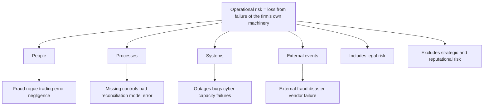
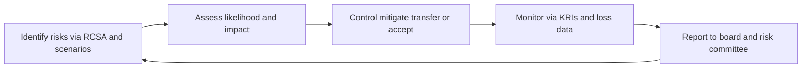
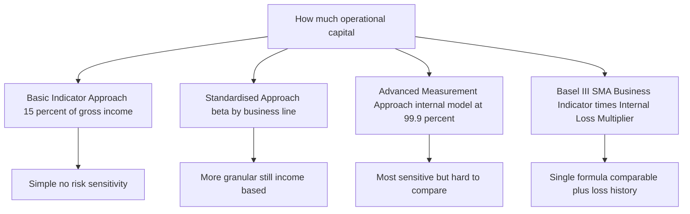
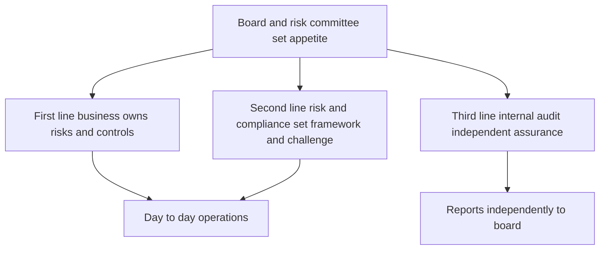

# Chapter 08 — Operational Risk

## 1. The Problem / The Need

Market risk asks: what if prices move against me? Credit risk asks: what if my counterparty fails to pay? Both are *risks you take on purpose* — a bank lends money and holds bonds precisely because it expects to be paid for bearing that risk. There is an upside. You can price it, hedge it, and earn a spread.

Operational risk is different in kind. It is the risk that your own machinery — the people, the processes, the systems that are supposed to *run* the business — breaks down. Nobody chooses to be defrauded. Nobody sets out to have a trader hide a $6 billion loss, a settlement instruction sent to the wrong account, or a ransomware crew encrypt the core banking platform on a Friday night. There is no upside, no spread earned for bearing it. It is pure downside, embedded in everything the firm does.

Historically, this was the risk that "everyone knew about but nobody measured." A firm would post huge trading profits and be lauded for its risk management — and then a single rogue trader (Barings, 1995) or a single fraud (Enron) or a single control failure would wipe out decades of earnings overnight. The regulators noticed a pattern: the biggest, most sudden bank collapses were often *not* caused by markets or credit going wrong. They were caused by the plumbing.

That created three concrete needs:

1. **Recognition** — formally name this risk category so it gets an owner, a budget, and a seat at the table alongside market and credit risk.
2. **Capital** — force firms to hold a cushion of equity against operational failures, so a large loss event does not become an insolvency.
3. **Management** — build a repeatable framework to *identify, assess, control, and monitor* these failures before they detonate, rather than writing post-mortems afterward.

Basel II (2004) was the regulatory answer: it made operational risk a formal Pillar 1 capital charge for the first time. This chapter builds the concept from that need outward — the definition, the taxonomy of loss events, the three generations of measurement approaches, the indicators used to see trouble coming, the famous disasters, and the management framework that ties it all together.

---

## 2. The Core Idea

The Basel Committee's definition is the anchor, and it is worth memorising word-for-word because interviewers quote it:

> **Operational risk is the risk of loss resulting from inadequate or failed internal processes, people and systems, or from external events. This definition includes legal risk but excludes strategic and reputational risk.**

Unpack the four sources — the "PPSE" of operational risk:

- **People** — human error, negligence, lack of skill, and deliberate wrongdoing (fraud, rogue trading, collusion). The single richest source of large losses.
- **Processes** — flawed or missing procedures: a payment run with no maker-checker, a reconciliation that nobody performs, a model that nobody validates, a limit that nobody enforces.
- **Systems** — technology failures: outages, bugs, capacity limits, botched software releases, and increasingly cyber attacks.
- **External events** — things done *to* the firm from outside: external fraud, natural disaster, pandemic, terrorism, third-party/vendor failure, regulatory change.

Two boundary clauses matter and are classic exam traps:

- **Legal risk is INCLUDED.** Fines, penalties, settlements, and the cost of failed contracts are operational losses. A $1 billion mis-selling settlement is an operational-risk loss.
- **Strategic and reputational risk are EXCLUDED** from the regulatory *capital* definition. Choosing to enter the wrong market (strategic) or the loss of customer trust after a scandal (reputational) are real risks the board must manage — but they are not part of the Basel operational-risk capital charge. Note the subtlety: an operational *event* (say, a data breach) often *causes* huge reputational damage, but only the direct operational loss counts for capital.

*The core mental model: operational risk lives inside the firm's own operations. It is heavy-tailed — mostly a steady drizzle of small losses (a mispriced trade fixed the next day, a small mis-payment recovered) punctuated by rare, catastrophic "tail" events that can threaten solvency. Managing it is therefore two jobs at once: grind down the frequent small losses through control quality, and defend against the rare monster through governance, insurance, and capital.*

*Figure 8.1 — The four sources of operational risk and the two boundary clauses.*

---

## 3. Why / How It Works

### Why operational risk behaves differently from market and credit risk

Three structural features drive everything about how we measure and manage it.

**(a) It is pervasive, not localised.** Market risk sits in the trading book; credit risk sits in the loan book. Operational risk is *everywhere* — in the back office, in HR, in IT, in the branch, in the legal department, in the vendor contract. You cannot ring-fence it into one desk. This is why the management framework must be firm-wide and why every business line has to own its own operational risk (the "first line of defence").

**(b) Its loss distribution is severely fat-tailed and asymmetric.** Plot operational losses and you get a distribution with:
- **High frequency, low severity** in the body — data-entry errors, small mis-payments, minor system glitches. Predictable, budgetable, almost a "cost of doing business."
- **Low frequency, high severity** in the tail — the rogue trader, the systemic cyber breach, the class-action settlement. Rare, but a single event can exceed a full year's profit.

The economic capital you must hold is driven almost entirely by that tail, not the body. This is why operational risk modelling borrows from actuarial science and extreme-value theory rather than from the normal distribution used in basic market-risk VaR.

**(c) There is no natural "exposure" measure.** For credit risk, exposure-at-default is a clean dollar number. For market risk, you have position sizes. For operational risk, what is the exposure? The whole firm? Regulators solved this pragmatically by using a *proxy for the scale of activity* — gross income, or later a "business indicator" — on the logic that a bigger, busier firm has more operational surface area and therefore more to go wrong. That proxy choice is the DNA of every measurement approach below.

### How a firm converts these features into a working system

The mechanism is a closed feedback loop — the operational risk management (ORM) cycle:

*Figure 8.2 — The operational risk management cycle as a continuous feedback loop.*

The loop is fed by four data engines that recur throughout the chapter:

1. **Internal loss data (ILD)** — a disciplined database of every operational loss the firm has actually suffered. This is the empirical backbone.
2. **External loss data (ELD)** — losses suffered by *other* firms (via consortia like ORX), so you can see tail events you have been lucky enough to avoid so far.
3. **Scenario analysis** — structured expert workshops that ask "what is the worst plausible thing that could happen here, and how big?" to populate the tail where your own history is thin.
4. **Business environment and internal control factors (BEICF)** — forward-looking indicators of the *current* control environment (KRIs, audit findings, staff turnover) that adjust the backward-looking loss picture.

These four are the "AMA data elements" and, in one form or another, they drive both measurement and management.

---

## 4. Full Content — Framework, Categories, Formulas, Methods

### 4.1 The loss-event taxonomy (Basel's seven event types)

To aggregate losses across a firm and compare against peers, everyone needs to bucket events the same way. Basel defines **seven Level-1 event types**:

| # | Event type | Plain-English meaning | Example |
|---|-----------|----------------------|---------|
| 1 | Internal fraud | Wrongdoing involving at least one insider | Rogue trading, unauthorised trades, insider theft |
| 2 | External fraud | Wrongdoing by a third party | Card skimming, cheque forgery, hacking to steal funds |
| 3 | Employment practices & workplace safety | HR and safety breaches | Discrimination suits, unsafe workplace claims |
| 4 | Clients, products & business practices | Improper business/market conduct | Mis-selling, market manipulation, money-laundering fines |
| 5 | Damage to physical assets | Physical loss from disaster/terror | Earthquake, fire, flood destroying premises |
| 6 | Business disruption & system failures | IT and infrastructure outages | Data-centre outage, network failure, software crash |
| 7 | Execution, delivery & process management | Failures in transaction processing | Settlement failure, data-entry error, failed reconciliation, vendor dispute |

Two practical notes. First, **event types 4 (CPBP) and 7 (EDPM) carry the largest aggregate dollar losses** in the industry — conduct/mis-selling fines and processing errors dwarf the headline-grabbing rogue-trader category by total value, even though internal fraud produces the most spectacular single events. Second, losses are also classified by **business line** (corporate finance, trading & sales, retail banking, commercial banking, payment & settlement, agency services, asset management, retail brokerage) so capital can be attributed correctly.

### 4.2 Measurement approach #1 — Basic Indicator Approach (BIA)

The simplest Basel II method. Hold capital equal to a fixed percentage (**alpha = 15%**) of average positive annual gross income (GI) over the last three years.

$$K_{BIA} = \alpha \times \frac{\sum_{i=1}^{3} \max(GI_i,\ 0)}{n}$$

where **α = 0.15**, and *n* = number of the previous three years in which gross income was positive (years with negative or zero GI are dropped from both numerator and denominator).

- *Gross income* = net interest income + net non-interest income (before deducting operating expenses, and before provisions).
- No risk sensitivity at all — a well-controlled bank and a shambolic one with the same income hold the same capital.
- Intended for small, non-complex banks.

### 4.3 Measurement approach #2 — The Standardised Approach (TSA)

A step up in granularity. Split gross income into the **eight business lines**, apply a **beta factor** (12%, 15%, or 18%) to each, sum, and average over three years. Higher-beta lines are judged riskier.

$$K_{TSA} = \frac{\sum_{years=1}^{3} \max\!\left(\sum_{j=1}^{8} \beta_j \times GI_j,\ 0\right)}{3}$$

| Business line | Beta |
|---------------|------|
| Corporate finance | 18% |
| Trading & sales | 18% |
| Payment & settlement | 18% |
| Commercial banking | 15% |
| Agency services | 15% |
| Retail banking | 12% |
| Asset management | 12% |
| Retail brokerage | 12% |

Note the aggregation subtlety: within any single year you **sum across business lines first** (so a strongly negative line can offset a positive one *within that year*), then floor the yearly total at zero, then average the three years. This differs from BIA, which floors each year's total GI.

### 4.4 Measurement approach #3 — Advanced Measurement Approach (AMA)

The most sophisticated Basel II option: the bank builds its *own* internal model to estimate operational-risk capital, subject to supervisory approval. The regulatory standard is capital sufficient to cover losses at the **99.9% confidence level over a one-year horizon** — i.e. the loss so severe it is expected only once in a thousand years.

The workhorse technique is the **Loss Distribution Approach (LDA)**, an actuarial construction done per business-line × event-type cell:

1. Fit a **frequency distribution** — how many loss events per year (typically Poisson, parameter λ).
2. Fit a **severity distribution** — the dollar size per event (typically lognormal, or a heavy-tailed distribution like generalised Pareto for the tail).
3. **Convolve** frequency and severity (usually by Monte Carlo simulation) to produce the **aggregate annual loss distribution**.
4. Read off the **99.9th percentile** = Operational Value-at-Risk (OpVaR).
5. Aggregate across cells, allowing for **diversification** (a correlation assumption < 1 reduces total capital versus naïve summation).

AMA must combine all four data elements from §3: internal loss data, external loss data, scenario analysis, and BEICF. Regulators may allow a **recognition of insurance** up to a 20% cap on the total operational-risk capital charge.

### 4.5 The successor — the Standardised Measurement Approach (SMA / Basel III)

Because AMA models proved inconsistent and hard to compare across banks, Basel III (finalised 2017, phasing in through the early 2020s) **scrapped both AMA and the old menu** and replaced everything with a single non-modelled formula, often called the **new Standardised Approach** or SMA. Two ingredients:

- **Business Indicator (BI)** — an income proxy built from three components: the interest/lease/dividend component, the services component, and the financial (trading + banking book) component. The BI is mapped through a progressive marginal-coefficient schedule into the **Business Indicator Component (BIC)**.
- **Internal Loss Multiplier (ILM)** — a scaling factor derived from the bank's own 10-year loss history relative to its BIC, capturing the intuition that a bank with a bad loss record should hold more.

$$ILM = \ln\!\left(e^{1} - 1 + \left(\frac{LC}{BIC}\right)^{0.8}\right)$$

where **LC (Loss Component)** = 15 × average annual operational losses over 10 years, and *e* is Euler's number. When LC = BIC, the ratio is 1 and ILM = 1 (loss experience is exactly "average"). Capital is then:

$$K_{SMA} = BIC \times ILM$$

The design goals: reduce model risk, restore comparability across banks, and still keep *some* risk sensitivity through the loss-history multiplier. (National regulators can set ILM = 1, switching off the loss-history sensitivity.)

*Figure 8.3 — The evolution of operational-risk capital approaches from crude income proxy to loss-history-scaled standardised formula.*

### 4.6 Key Risk Indicators (KRIs)

Capital tells you how much cushion to hold; **KRIs tell you when the risk is rising** so you can act before a loss crystallises. A KRI is a measurable metric with a **threshold and escalation trigger**, ideally *leading* rather than *lagging*.

| Risk area | Example KRI | Why it leads to loss |
|-----------|-------------|----------------------|
| People | Staff turnover %, overtime hours, vacancy rate in control functions | Overworked, under-staffed teams make errors and skip controls |
| Processing | Number of failed/aged trade settlements, reconciliation breaks open > X days | Rising breaks precede a large mis-settlement loss |
| Systems | System downtime minutes, number of change-failures, patch backlog | Fragile IT precedes an outage or breach |
| Fraud/conduct | Number of limit breaches, off-hours trading activity, complaints volume | Classic rogue-trading precursors |
| External | Vendor SLA breaches, phishing-email click-through rate | Third-party and cyber exposure building |

Good KRI practice: define a **green/amber/red threshold**, assign an **owner**, review at fixed cadence, and — critically — **correlate KRIs with actual loss data** to prove they are predictive rather than decorative. A KRI that never moves before a loss is theatre.

### 4.7 The Three Lines of Defence (governance model)

The organising structure for *who* manages operational risk:

- **First line — the business.** Owns and manages its own risks day-to-day; owns the controls.
- **Second line — risk management & compliance.** Sets the framework, policy, and appetite; independently challenges and oversees the first line.
- **Third line — internal audit.** Independently assures the board that lines one and two actually work.

*Figure 8.4 — The three lines of defence governance model for operational risk.*

### 4.8 The four responses to any operational risk

Once a risk is identified and assessed (via a **Risk and Control Self-Assessment**, RCSA — the workshop where a business rates its inherent risk, the strength of its controls, and the residual risk), management chooses among four responses — the "4 T's":

1. **Treat / mitigate** — strengthen controls (add maker-checker, automate a manual step, segregate duties).
2. **Transfer** — insurance, or outsourcing the activity (note: outsourcing transfers the *operation* but creates new *vendor* risk — you cannot outsource accountability).
3. **Terminate / avoid** — exit the product, market, or process that generates the risk.
4. **Tolerate / accept** — consciously retain the risk within appetite, because the cost of control exceeds the benefit.

---

## 5. Worked Examples

### Example 1 — Basic Indicator Approach capital, with a loss year

A small bank reports gross income (in $m) of: Year-1 = 800, Year-2 = **−200** (a bad year), Year-3 = 600. Compute the BIA operational-risk capital charge.

**Rule:** drop any year with non-positive GI from *both* numerator and denominator; α = 15%.

- Positive-GI years: Year-1 (800) and Year-3 (600). Year-2 is excluded.
- n = 2 (only two years had positive GI).
- Average positive GI = (800 + 600) / 2 = **700**.
- Capital = 0.15 × 700 = **$105m**.

**Self-check.** A common wrong answer averages over all three years and includes the loss: (800 − 200 + 600)/3 = 400, giving 0.15 × 400 = $60m. That is *incorrect* under BIA because negative years are excluded, not netted. Excluding the loss year raises the average (700 vs 400) and therefore raises capital to $105m — which is the intended conservative treatment. The rule prevents a bank from *reducing* its capital charge simply by having had a disastrous year. ✓

### Example 2 — The Standardised Approach, and why it differs from BIA

Same bank, but now we know the Year-2 gross income by business line ($m):

| Business line | Beta | GI Year-2 | β × GI |
|---------------|------|-----------|--------|
| Trading & sales | 18% | −500 | −90 |
| Retail banking | 12% | +250 | +30 |
| Payment & settlement | 18% | +50 | +9 |
| **Total Year-2** | | **−200** | **−51** |

Suppose Years 1 and 3 each produced a weighted β × GI total of +96 and +72 respectively (positive years).

**TSA rule:** within each year, sum the weighted amounts across business lines, floor that yearly total at zero, then average over three years.

- Year-1 weighted total = +96 → keep 96.
- Year-2 weighted total = −51 → floored to **0**.
- Year-3 weighted total = +72 → keep 72.
- Capital = (96 + 0 + 72) / 3 = 168 / 3 = **$56m**.

**Self-check and reconciliation with Example 1.** Under TSA the loss year is *not* dropped — it is included but floored at zero, so it drags the average *down* (dividing by 3, not by 2). Under BIA the same loss year was *dropped*, dividing by 2. That is exactly why TSA here gives $56m versus BIA's $105m: the two methods treat a loss year in opposite ways (floor-and-keep vs drop). The lesson interviewers want: **TSA is not merely "BIA with betas" — the negative-year mechanics genuinely differ.** ✓

### Example 3 — Loss Distribution Approach → OpVaR (AMA logic)

A business-line/event-type cell has, per year:
- Frequency ~ Poisson with λ = 4 events/year (mean 4 losses annually).
- Severity ~ Lognormal with μ = 12, σ = 1.5 (in log-dollars).

**Step 1 — Mean severity per event.** For a lognormal, mean = exp(μ + σ²/2) = exp(12 + 1.125) = exp(13.125) ≈ **$500,000** (e^13.125 ≈ 5.0 × 10^5).

**Step 2 — Expected annual loss (the "body").** Expected loss = frequency × mean severity = 4 × $500,000 = **$2.0m per year**. This is what you provision/budget for.

**Step 3 — The tail (unexpected loss).** OpVaR at 99.9% is *not* 4 × the mean severity; it is driven by the rare year with several *large* losses. Because severity is lognormal with σ = 1.5, the 99.9th-percentile single loss is enormous: exp(μ + σ·z₀.₉₉₉) = exp(12 + 1.5 × 3.09) = exp(16.635) ≈ **$16.8m** for one event. A simulated bad year (say 8 events, several from the tail) easily produces an aggregate loss on the order of **$25–30m**.

**Step 4 — Capital.** Operational-risk capital for the cell ≈ OpVaR − Expected Loss (regulators let you hold capital against *unexpected* loss if expected loss is already provisioned). If OpVaR₉₉.₉ ≈ $28m and EL = $2m, capital ≈ **$26m**.

**Self-check.** The key sanity test: capital ($26m) must vastly exceed expected loss ($2m) — a ratio of ~13×. That fat multiple is the signature of operational risk's heavy tail; for a thin-tailed risk it might be 2–3×. If your model spat out capital only slightly above expected loss, you would know the severity tail was mis-specified. The mean-severity of $500k and the 99.9% single-loss of $16.8m differ by ~34×, confirming the lognormal's fat right tail is doing the work. ✓

### Example 4 — Internal Loss Multiplier (Basel III SMA)

A bank has Business Indicator Component (BIC) = $1,200m. Its average annual operational loss over 10 years is $80m, so Loss Component LC = 15 × 80 = $1,200m.

$$ILM = \ln\!\left(e^{1} - 1 + \left(\tfrac{1200}{1200}\right)^{0.8}\right) = \ln(2.718 - 1 + 1) = \ln(2.718) = 1.00$$

Capital = BIC × ILM = 1,200 × 1.00 = **$1,200m**.

**Self-check.** When LC = BIC (loss history is exactly "average" relative to size), the ratio is 1, ILM collapses to ln(e) = 1, and capital = BIC. Now suppose the bank's loss record worsens so LC = $2,400m (ratio 2): ILM = ln(e − 1 + 2^0.8) = ln(1.718 + 1.741) = ln(3.459) ≈ **1.24**, so capital rises to 1,200 × 1.24 = **$1,488m** — a 24% surcharge for a poor loss history. Conversely a spotless record (LC → 0) gives ILM = ln(e − 1) = ln(1.718) ≈ **0.54**, a large discount. The formula behaves monotonically and symmetrically around the average — exactly as designed. ✓

---

## 6. Connections

- **To market and credit risk (Chapters 5–7).** Operational risk is the third pillar-1 charge alongside them. Crucially, big market or credit losses are often *operational* failures in disguise: a rogue trader is "market loss" only on the surface — the root cause is failed supervision (operational). Interviewers love this: *"Was Barings a market-risk or operational-risk failure?"* Answer: the loss was in derivatives (market), but the *cause* was operational — no segregation of duties.
- **To model risk.** A wrong valuation or capital model is an operational-risk event (event type 7, EDPM). Model risk is increasingly carved out as its own discipline but sits under the operational umbrella.
- **To cyber and IT resilience.** Cyber risk is the fastest-growing slice of operational risk (event types 6 and 2). Regulators now demand **operational resilience** — the ability to keep critical services running through disruption — as a distinct expectation.
- **To business continuity / disaster recovery (BCP/DR).** The control response to event type 5 (physical damage) and 6 (system failure).
- **To conduct and compliance.** Event type 4 (CPBP) links operational risk to the entire AML/KYC, mis-selling, and market-abuse agenda — the biggest dollar losses in the industry.
- **To ICAAP and Pillar 2.** Even under standardised capital, the board's Internal Capital Adequacy Assessment Process must judge whether the formula captures the firm's true operational tail — scenario analysis feeds this directly.
- **To insurance.** The main *transfer* tool — but with a 20% recognition cap under AMA and the caveat that insurers may dispute payouts precisely when you need them.

---

## 7. Key Terms

- **Operational risk** — loss from inadequate/failed processes, people, systems, or external events; includes legal, excludes strategic/reputational.
- **Loss event types** — Basel's seven Level-1 categories (internal fraud, external fraud, EPWS, CPBP, damage to physical assets, business disruption/system failure, EDPM).
- **Internal Loss Data (ILD)** — the firm's own recorded loss history; empirical backbone of modelling.
- **External Loss Data (ELD)** — consortium data (e.g. ORX) on peers' losses, used to populate the tail.
- **Scenario analysis** — structured expert estimation of rare, severe events.
- **BEICF** — Business Environment and Internal Control Factors; forward-looking control indicators.
- **BIA / TSA / AMA** — Basel II capital approaches: Basic Indicator, Standardised, Advanced Measurement.
- **SMA** — Basel III Standardised Measurement Approach replacing all of the above.
- **Business Indicator (BI) / BIC** — income-based scale proxy and its capital component under SMA.
- **Internal Loss Multiplier (ILM)** — SMA factor scaling capital by 10-year loss history.
- **Loss Distribution Approach (LDA)** — frequency × severity convolution producing aggregate loss.
- **OpVaR** — operational value-at-risk, the 99.9%/1-year loss quantile.
- **KRI** — Key Risk Indicator; a metric with thresholds that flags rising risk.
- **RCSA** — Risk and Control Self-Assessment; the business's structured self-rating of risks and controls.
- **Three Lines of Defence** — business / risk & compliance / internal audit governance model.
- **Risk appetite** — the board-set amount and type of operational risk the firm will accept.
- **Maker-checker / segregation of duties** — the core preventive controls: separate the person who initiates from the person who approves.
- **Operational resilience** — ability to keep critical services running through disruption.

---

## 8. Common Confusions

**"Operational risk = IT risk."** No. IT/systems is only *one* of the four sources. The largest losses come from people (fraud, conduct) and processes, not just systems.

**"Reputational risk is part of operational risk capital."** No — it is explicitly *excluded* from the Basel capital definition (as is strategic risk). An operational event can *cause* reputational damage, but the reputational hit itself is not in the capital charge. Legal risk, by contrast, *is* included.

**"BIA and TSA treat a bad year the same way."** No — the trap in Examples 1 and 2. BIA *drops* non-positive years (divides by fewer years); TSA *floors the yearly total at zero but keeps the year* (divides by three). Same data, different capital.

**"Higher confidence means we hold capital against expected loss."** Capital is held against *unexpected* loss (OpVaR minus expected loss), on the assumption that expected loss is already provisioned/priced in. Confusing the two double-counts or under-counts.

**"OpVaR scales with the mean loss."** No. It is driven by the *tail* of the severity distribution. A cell with modest expected loss can carry huge capital if severity is fat-tailed (Example 3: EL $2m, capital $26m).

**"Outsourcing removes the risk."** Outsourcing *transfers the operation* but not the accountability, and it *creates new vendor/third-party risk*. Regulators hold the firm responsible for outsourced activities.

**"A rogue trader is a market-risk failure."** The loss shows up in market P&L, but the *risk that failed* is operational — supervision, segregation of duties, and reconciliation. Root cause, not P&L line, defines the category.

**"KRIs and losses are the same thing."** KRIs are *leading* (predictive metrics like turnover or reconciliation breaks); loss data is *lagging* (what already happened). A good framework uses KRIs to act *before* the loss event registers.

**"AMA is still the gold standard."** Basel III *abolished* AMA precisely because internal models were inconsistent and un-comparable. The direction of travel is toward the simpler, standardised SMA.

---

## 9. Recap

Operational risk is the risk of loss from failures in the firm's own people, processes, and systems, or from external events — including legal risk, excluding strategic and reputational. Unlike market and credit risk, it is *pure downside*, *pervasive across the whole firm*, and *severely fat-tailed*: a drizzle of small losses punctuated by rare catastrophes that drive nearly all the required capital.

Basel organises losses into **seven event types** (internal/external fraud, employment practices, clients-products-business-practices, physical damage, business disruption/system failure, and execution-delivery-process-management), with conduct (CPBP) and processing (EDPM) carrying the biggest aggregate dollar losses.

Capital measurement evolved through three Basel II approaches — **BIA** (15% of gross income), **TSA** (business-line betas of 12/15/18%), and **AMA** (internal 99.9%/1-year models built via the Loss Distribution Approach from four data elements) — before Basel III scrapped all three for the single **SMA** formula, capital = **BIC × ILM**, restoring comparability while keeping loss-history sensitivity.

Management runs on a closed loop — identify (RCSA, scenarios), assess, control (the 4 T's: treat, transfer, terminate, tolerate), monitor (**KRIs** and loss data), report — all governed by the **three lines of defence** and anchored to a board-set **risk appetite**. The famous disasters (Barings, Société Générale, cyber breaches, settlement failures) are all failures of *control quality*, not bad luck.

---

## 10. Quick-Reference / Interview Points

**Definition (memorise verbatim):** "The risk of loss resulting from inadequate or failed internal processes, people and systems, or from external events. Includes legal risk; excludes strategic and reputational risk."

**Four sources:** People, Processes, Systems, External events (PPSE).

**Seven event types:** Internal fraud · External fraud · Employment practices & workplace safety · Clients, products & business practices · Damage to physical assets · Business disruption & system failures · Execution, delivery & process management.

**Capital formulas at a glance:**

| Approach | Formula | One-line summary |
|----------|---------|------------------|
| BIA | K = 0.15 × avg positive GI (3 yr) | Crude; drops loss years |
| TSA | K = avg of yearly Σ(βⱼ × GIⱼ), floored at 0 | Betas 12/15/18% by business line |
| AMA | OpVaR at 99.9% / 1 yr via LDA | Internal model; abolished by Basel III |
| SMA | K = BIC × ILM | BI-based; ILM scales by 10-yr loss history |

**ILM formula:** ILM = ln(e − 1 + (LC/BIC)^0.8), where LC = 15 × avg annual loss over 10 years. LC = BIC → ILM = 1.

**Famous cases to name-drop (cause, not just headline):**
- **Barings 1995** — Nick Leeson, ~£800m, no segregation of duties (he ran both trading and back office). Sank a 230-year-old bank.
- **Société Générale 2008** — Jérôme Kerviel, ~€4.9bn, unauthorised positions hidden via fake offsetting trades; failed reconciliation and ignored alerts.
- **UBS 2011** — Kweku Adoboli, ~$2.3bn, rogue trading via fictitious hedges.
- **Knight Capital 2012** — botched software deployment, ~$440m lost in 45 minutes; change-management failure (event type 6/7).
- **Equifax 2017 / cyber** — unpatched vulnerability, 147m records breached; external fraud + system failure, huge legal and reputational tail.
- **Mis-selling / conduct fines** — PPI, LIBOR, FX rigging: tens of billions, the CPBP category, the biggest aggregate operational loss theme of the decade.

**Interview one-liners:**
- "Operational risk is the only major risk with no upside — you never get paid to bear it."
- "Capital is driven by the tail, not the average; that's why we model frequency × severity, not a normal VaR."
- "A rogue trader is an operational failure wearing a market-risk costume — the root cause is segregation of duties."
- "You can outsource the process but never the accountability."
- "KRIs are leading, loss data is lagging — the whole point is to act before the loss books."
- "Basel III killed AMA because you can't compare two banks' internal op-risk models — SMA trades sensitivity for comparability."

**Three lines of defence:** business (owns risk) · risk & compliance (framework & challenge) · internal audit (assurance).

**Four responses (4 T's):** Treat · Transfer · Terminate · Tolerate.
