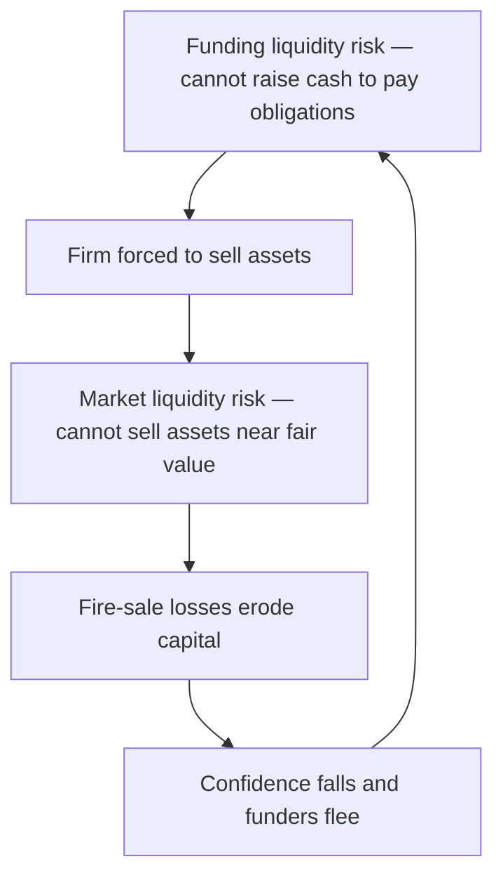
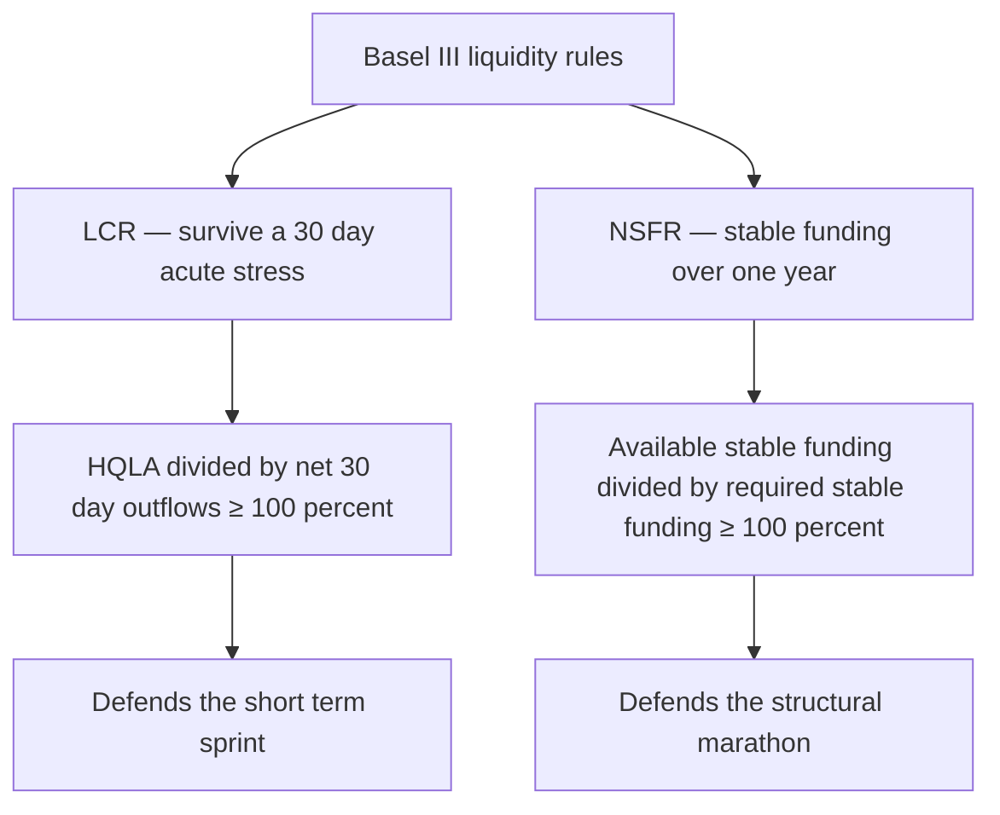
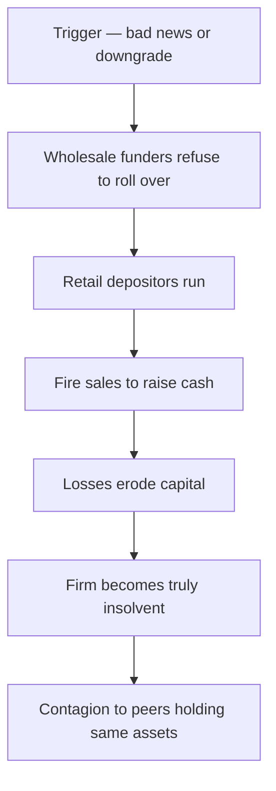

# Chapter 09 — Liquidity Risk

> "Solvency is the reason a firm exists tomorrow; liquidity is the reason it survives tonight." A bank can be solvent on paper — assets comfortably exceeding liabilities — and still fail by Friday because it cannot lay its hands on cash when depositors ask for it. Liquidity risk is the risk that a firm cannot meet its obligations as they fall due without incurring unacceptable losses. It is the risk that killed Northern Rock (2007), Bear Stearns and Lehman Brothers (2008), and Silicon Valley Bank and Credit Suisse (2023). None of these died of pure insolvency first. They died of liquidity.

---

## 1. The Problem / The Need

Every financial institution lives on a promise it can never fully keep at once. A bank takes deposits that are repayable **on demand** and lends them out as mortgages repayable over **thirty years**. This is *maturity transformation* — borrowing short and lending long — and it is the core economic function of banking. It is also the seed of a permanent vulnerability: if enough depositors ask for their money on the same day, no bank on earth can pay them all, because the money is not sitting in a vault. It is locked up in illiquid loans.

Consider the everyday cash-flow problem stripped of jargon. On any given day a bank has cash coming in (loan repayments, maturing bonds, new deposits) and cash going out (deposit withdrawals, loans it committed to fund, debt it must roll over, margin calls, coupon payments). If, on a given day, outflows exceed inflows plus available cash, the bank has a **funding gap** it must plug — by borrowing, by selling assets, or by defaulting. The last option ends the firm.

The problem has three distinct edges:

1. **Timing.** Obligations and receipts do not line up. A payment is due Tuesday; the cash to cover it arrives Friday. Between them lies a gap that must be bridged.
2. **Confidence.** Funding is a matter of trust. The moment counterparties doubt a firm can repay, they stop lending to it and demand their money back — which *causes* the very failure they feared. Liquidity risk is reflexive and self-fulfilling in a way credit and market risk are not.
3. **Market conditions.** The escape hatch — selling assets to raise cash — only works if there are buyers at fair prices. In a crisis, everyone reaches for the same hatch at once, prices collapse, and selling to raise cash *destroys* the capital the firm was trying to protect.

Regulators learned this brutally in 2007–08. Basel II had a lot to say about capital (solvency) and almost nothing enforceable about liquidity. Firms with pristine capital ratios still collapsed in days when short-term funding markets froze. The regulatory response — the **Liquidity Coverage Ratio (LCR)** and the **Net Stable Funding Ratio (NSFR)** under Basel III — exists precisely because the industry discovered that capital adequacy without liquidity adequacy is a fortress with no water supply.

*Figure 1 — Why maturity transformation creates liquidity risk.*

---

## 2. The Core Idea

Liquidity risk splits into **two related but distinct** faces, and confusing them is the single most common mistake students make.

**Funding liquidity risk** is the risk that a firm cannot raise cash to meet its own obligations — that its *liabilities* run faster than it can refinance them. It is about the right-hand side of the balance sheet: deposits fleeing, wholesale lenders refusing to roll over commercial paper, margin calls demanding cash today. The question is: *Can I get cash to pay what I owe?*

**Market liquidity risk** is the risk that a firm cannot sell an *asset* quickly at close to its fair value — that the market for the asset is thin, so selling in size moves the price against you. It is about the left-hand side of the balance sheet. The question is: *Can I turn what I own into cash without a fire-sale loss?*

The two are joined at the hip. When a firm faces a **funding** shortfall, it tries to sell assets — but if those assets are **market-illiquid**, it must dump them at a discount, crystallising a loss that erodes capital, which frightens more funders, which deepens the funding shortfall. This vicious loop — the *liquidity spiral* — is how a manageable cash-flow wobble becomes a death spiral.

The core managerial idea is therefore twofold:

- Hold a buffer of **genuinely liquid, high-quality assets** (cash and government bonds) that can be converted to cash *without* fire-sale losses even in stress — so you never have to touch the illiquid assets.
- Structure your **funding** so that it is *stable* — long-dated, diversified, and hard to withdraw — so the outflows never spike faster than the buffer can absorb.

LCR governs the first (survive a 30-day acute stress on your buffer). NSFR governs the second (fund your illiquid assets with stable money over a one-year horizon). Together they force a firm to be liquid in the short run and structurally sound over the medium run.

*Figure 2 — The two faces of liquidity risk and the spiral that joins them.*

---

## 3. Why / How It Works

### Why maturity transformation is both essential and dangerous

Society *wants* banks to transform maturity. Savers want instant access to their money; borrowers want long, patient loans. Banks bridge the two by exploiting the **law of large numbers**: on a normal day, only a small, predictable fraction of demand deposits is actually withdrawn, because withdrawals and deposits roughly cancel across thousands of independent customers. The bank keeps a small cash reserve for the net outflow and lends the rest.

This works *precisely as long as depositor behaviour stays independent and random*. The danger is that behaviour is not always independent. Fear is correlated. When depositors believe *others* will withdraw, the rational move is to withdraw first (before the bank runs dry), so the belief becomes self-fulfilling. The Diamond–Dybvig model (1983) formalised this: a bank offering demand deposits has **two equilibria** — a "good" one where only genuine liquidity-needers withdraw, and a "bad" one (the run) where everyone withdraws because everyone expects everyone else to. Nothing about the bank's *assets* need change to flip from one to the other. Liquidity risk is, at root, a coordination failure.

### Why market liquidity evaporates exactly when you need it

Asset markets are liquid when there are many willing buyers holding cash. In a systemic stress, potential buyers are themselves scrambling for cash, so buyers vanish exactly when sellers multiply. Bid–ask spreads widen, market depth thins, and the price impact of selling in size explodes. This is why a bond that trades at 99.8 in calm markets might only fetch 85 in a fire sale — not because its fundamental cash flows changed, but because the *marginal buyer* disappeared. Market liquidity is **procyclical**: abundant in booms, absent in busts.

### How the buffer defends the firm

The defence is a stock of **High-Quality Liquid Assets (HQLA)** — assets that stay liquid *even in stress* because they are what everyone flies *to*, not from: central-bank reserves and top-rated sovereign bonds. In a crisis these can be sold outright or, more importantly, **repo'd** (pledged to a central bank or counterparty for cash) at minimal haircut. The buffer buys the one thing a firm in a run needs most: **time**. Time to arrange orderly funding, to be acquired, or to convince the market it is sound — instead of being forced into a fatal fire sale on day one.

### How stable funding defends the firm

The other lever is the *quality* of funding. Not all liabilities are equally flighty. A ranking, most-stable to least-stable:

| Funding source | Stability | Why |
|---|---|---|
| Equity capital | Permanent | Never has to be repaid |
| Long-term debt (>1yr) | Very stable | Contractually locked in |
| Retail deposits (insured) | Stable | Insured, sticky, diversified, "sleepy" |
| Retail deposits (uninsured) | Moderate | Can flee if scared |
| Operational corporate deposits | Moderate | Tied to services the firm provides |
| Wholesale unsecured funding | Flighty | Sophisticated lenders flee at first sign |
| Overnight / short-term wholesale | Very flighty | Refuses to roll over instantly |

The lesson of every modern bank failure: firms funded by **short-term wholesale money** die fast; firms funded by **insured retail deposits and long-term debt** survive. NSFR is designed to push firms toward the top of this table.

---

## 4. Full Content — Framework, Formulas, and Methods

### 4.1 The Liquidity Gap and Maturity Mismatch

The foundational measurement tool is the **liquidity gap** (also "maturity gap" or "funding gap"). You slot every asset and liability into **time buckets** by when it matures or reprices, then compute, per bucket:

$$\text{Liquidity Gap}_t = \text{Cash Inflows}_t - \text{Cash Outflows}_t$$

Equivalently, on a stock basis:

$$\text{Gap}_t = \text{Assets maturing in bucket } t - \text{Liabilities maturing in bucket } t$$

A **negative gap** in a bucket (more liabilities than assets maturing) means the firm must *refinance* the shortfall in that period — the signature of borrowing short and lending long. Banks almost always run *negative gaps in short buckets* (deposits are short) and *positive gaps in long buckets* (loans are long). That is maturity transformation quantified.

Two refinements matter:

- **Marginal (period) gap** = the gap *within* a single bucket.
- **Cumulative gap** = the running sum of marginal gaps up to bucket *t*. This is what truly matters, because a firm can carry cash forward. A firm survives if its **cumulative gap plus liquid buffer stays non-negative** at every horizon.

$$\text{Cumulative Gap}_T = \sum_{t=1}^{T} \text{Gap}_t$$

Behavioural adjustment is critical: demand deposits are *contractually* overnight but *behaviourally* stable for years. Good liquidity management slots them by **expected behaviour**, not legal maturity — otherwise every bank looks instantly insolvent on a contractual gap report.

### 4.2 The Liquidity Coverage Ratio (LCR)

The LCR is Basel III's **short-term, acute-stress** rule. It asks: *if a severe 30-day liquidity stress hit tomorrow, do you hold enough high-quality liquid assets to survive all 30 days without new funding?*

$$\boxed{\text{LCR} = \frac{\text{Stock of High-Quality Liquid Assets (HQLA)}}{\text{Total Net Cash Outflows over 30 days}} \geq 100\%}$$

**Numerator — HQLA**, after regulatory haircuts:

| HQLA tier | Examples | Haircut | Cap |
|---|---|---|---|
| Level 1 | Cash, central-bank reserves, top-rated sovereign bonds | 0% | No cap |
| Level 2A | High-grade sovereign/agency, AA– corporate bonds | 15% | Level 2 total ≤ 40% of HQLA |
| Level 2B | Lower-rated corporates (A+ to BBB–), some equities | 25–50% | Level 2B ≤ 15% of HQLA |

**Denominator — Net Cash Outflows over 30 days**, computed under a prescribed stress scenario:

$$\text{Net Outflows} = \text{Total Expected Outflows} - \min\big(\text{Total Expected Inflows},\; 75\% \times \text{Total Outflows}\big)$$

The **75% cap on inflows** is crucial and heavily tested: a bank may only offset outflows with inflows up to 75% of its outflows, forcing it to hold HQLA to cover *at least 25%* of gross outflows regardless of expected receipts. You cannot assume you'll be fully rescued by money coming in.

Outflows are computed by applying **run-off rates** to each liability (how much is assumed to flee in the stress):

| Liability | Assumed run-off |
|---|---|
| Stable retail deposits (insured) | 3–5% |
| Less stable retail deposits | 10%+ |
| Operational corporate deposits | 25% |
| Non-operational corporate / unsecured wholesale | 40–100% |
| Financial-institution funding | 100% |

Inflows apply **inflow rates** to incoming money (e.g., 50% on performing retail loan repayments, 100% on maturing interbank placements).

### 4.3 The Net Stable Funding Ratio (NSFR)

The NSFR is the **structural, one-year** rule. Where LCR is a 30-day sprint, NSFR is a marathon: *is the firm funding its illiquid assets with sufficiently stable money over a one-year horizon?* It directly attacks over-reliance on short-term wholesale funding.

$$\boxed{\text{NSFR} = \frac{\text{Available Stable Funding (ASF)}}{\text{Required Stable Funding (RSF)}} \geq 100\%}$$

**ASF (numerator)** = the firm's liabilities and capital weighted by how *stable* they are. **ASF factors** (the fraction that counts as stable):

| Funding source | ASF factor |
|---|---|
| Regulatory capital, debt with residual maturity ≥ 1yr | 100% |
| Stable retail/SME deposits (< 1yr) | 95% |
| Less stable retail/SME deposits (< 1yr) | 90% |
| Operational deposits, corporate funding (6–12 months) | 50% |
| Everything else < 6 months, interbank | 0% |

**RSF (denominator)** = the firm's assets weighted by how *illiquid* they are — how much stable funding they *require*. **RSF factors**:

| Asset | RSF factor |
|---|---|
| Cash, central-bank reserves | 0% |
| Level 1 HQLA (top sovereigns) | 5% |
| Level 2A HQLA | 15% |
| Loans to financials < 1yr, Level 2B | 15–50% |
| Retail/corporate loans < 1yr | 50% |
| Residential mortgages, loans ≥ 1yr (good quality) | 65% |
| Other loans ≥ 1yr, most corporate loans | 85% |
| Illiquid assets, defaulted loans, fixed assets | 100% |

The mnemonic: **ASF rewards stable *sources*; RSF penalises illiquid *uses*.** A bank funding 30-year mortgages (65–100% RSF) with overnight wholesale money (0% ASF) will fail NSFR badly. Fund them with retail deposits and long bonds (90–100% ASF) and it passes.

### 4.4 Other Metrics and Tools

- **Loan-to-Deposit Ratio (LDR)** = Loans / Deposits. A crude but instant read: >100% means the loan book is funded partly by non-deposit (usually flightier) sources.
- **Survival horizon** = number of days the liquid buffer covers projected net outflows in stress before hitting zero. The internal cousin of LCR.
- **Concentration metrics** — largest depositors as % of funding; reliance on a single market or currency.
- **Contingency Funding Plan (CFP)** — a pre-agreed playbook of actions (draw committed lines, sell HQLA, pledge collateral, activate central-bank facilities) triggered at defined early-warning thresholds.

*Figure 3 — The Basel III liquidity framework: two ratios, two horizons.*

---

## 5. Worked Examples

### Example 1 — Building a liquidity gap ladder and survival horizon

A small bank reports the following contractual cash flows (₹ crore) by time bucket. Compute marginal gaps, cumulative gaps, and the survival horizon given an opening liquid buffer of ₹200 crore.

| Bucket | Inflows | Outflows | Marginal gap | Cumulative gap | Buffer + cum. gap |
|---|---:|---:|---:|---:|---:|
| Overnight–7d | 120 | 350 | −230 | −230 | −30 |
| 8–30d | 260 | 200 | +60 | −170 | +30 |
| 31–90d | 180 | 140 | +40 | −130 | +70 |
| 91–180d | 150 | 120 | +30 | −100 | +100 |
| 181–365d | 300 | 210 | +90 | −10 | +190 |

**Working (self-verifying):**
- Marginal gaps: 120−350 = −230; 260−200 = +60; 180−140 = +40; 150−120 = +30; 300−210 = +90.
- Cumulative gaps (running sum): −230; −230+60 = −170; −170+40 = −130; −130+30 = −100; −100+90 = **−10**. ✓ (Sum of marginal gaps = −230+60+40+30+90 = −10 ✓ — reconciles.)
- Buffer overlay (₹200 + cumulative gap): 200−230 = **−30** in the first week; then 200−170 = +30; +70; +100; +190.

**Interpretation:** The bank's structure is textbook maturity transformation — a large negative gap up front (short liabilities) turning positive later (long assets). The killer: in the **overnight–7d** bucket the ₹200 crore buffer is *insufficient* — it is short by **₹30 crore**. Survival horizon is **less than 7 days**. The bank must either raise the buffer above ₹230 crore or reduce first-week outflows. From week two onward the position is comfortably positive. This is exactly the profile a run exploits: the firm is fine over a year but cannot survive the first week.

### Example 2 — Computing the LCR

A bank has the following stressed 30-day profile. Compute its LCR and state whether it complies.

**HQLA (after haircuts):**

| Asset | Market value | Haircut | HQLA value |
|---|---:|---:|---:|
| Cash + central-bank reserves (L1) | 400 | 0% | 400 |
| Sovereign bonds (L1) | 300 | 0% | 300 |
| AA– corporate bonds (L2A) | 200 | 15% | 170 |
| BBB corporate bonds (L2B) | 100 | 50% | 50 |

First check the Level 2 caps. Total HQLA before caps = 400+300+170+50 = 920. Level 2 total = 170+50 = 220, which is 220/920 = 23.9% — below the 40% cap ✓. Level 2B = 50, which is 5.4% — below the 15% cap ✓. So **HQLA = 920**.

**Outflows (run-off applied):**

| Liability | Balance | Run-off | Outflow |
|---|---:|---:|---:|
| Stable retail deposits | 2,000 | 5% | 100 |
| Less-stable retail deposits | 800 | 10% | 80 |
| Operational corporate deposits | 1,000 | 25% | 250 |
| Unsecured wholesale funding | 500 | 100% | 500 |

Total outflows = 100+80+250+500 = **930**.

**Inflows (inflow rate applied):**

| Inflow | Balance | Rate | Inflow |
|---|---:|---:|---:|
| Maturing interbank placements | 300 | 100% | 300 |
| Performing retail loan repayments | 400 | 50% | 200 |

Total inflows = 300+200 = **500**.

**Apply the 75% inflow cap:** capped inflows = min(500, 75% × 930) = min(500, 697.5) = **500** (uncapped here, since 500 < 697.5).

**Net cash outflows** = 930 − 500 = **430**.

$$\text{LCR} = \frac{920}{430} = 2.14 = \mathbf{214\%}$$

**Verdict:** Well above the 100% minimum — the bank comfortably survives the 30-day stress with more than double the required buffer.

**Sensitivity check (reconciling the mechanism):** Suppose the wholesale funding doubled to ₹1,000 crore (run-off 100% → outflow 1,000). New total outflows = 100+80+250+1,000 = 1,430. Inflow cap = 75% × 1,430 = 1,072.5, so inflows stay at 500. Net outflows = 1,430 − 500 = 930. LCR = 920/930 = **98.9%** — now *below* 100% and **non-compliant**. This demonstrates the core lesson quantitatively: **reliance on flighty wholesale funding is what breaks the LCR**, because it carries a 100% run-off. The same buffer that gave 214% comfort collapses below the line the moment the funding mix tilts toward hot money.

### Example 3 — Computing the NSFR

Using stylised figures (₹ crore), compute the NSFR.

**Available Stable Funding (ASF):**

| Source | Amount | ASF factor | ASF |
|---|---:|---:|---:|
| Common equity + Tier 1 capital | 1,000 | 100% | 1,000 |
| Long-term debt (≥ 1yr) | 800 | 100% | 800 |
| Stable retail deposits (< 1yr) | 3,000 | 95% | 2,850 |
| Operational corporate deposits | 1,200 | 50% | 600 |
| Short-term wholesale (< 6m) | 1,000 | 0% | 0 |

Total ASF = 1,000+800+2,850+600+0 = **5,250**.

**Required Stable Funding (RSF):**

| Asset | Amount | RSF factor | RSF |
|---|---:|---:|---:|
| Cash + reserves | 500 | 0% | 0 |
| Level 1 HQLA sovereigns | 1,000 | 5% | 50 |
| Level 2A HQLA | 600 | 15% | 90 |
| Residential mortgages (≥ 1yr) | 3,000 | 65% | 1,950 |
| Corporate loans (≥ 1yr) | 2,500 | 85% | 2,125 |
| Fixed assets | 400 | 100% | 400 |

Total RSF = 0+50+90+1,950+2,125+400 = **4,715**.

$$\text{NSFR} = \frac{5,250}{4,715} = 1.113 = \mathbf{111.3\%}$$

**Verdict:** Above 100% — the bank funds its illiquid assets (mortgages and corporate loans dominate RSF) with sufficiently stable money (equity, long debt, sticky retail deposits dominate ASF). It complies.

**Reconciling stress:** If the bank replaced ₹2,000 crore of its stable retail deposits (95% ASF → 1,900) with short-term wholesale funding (0% ASF → 0), ASF falls by 1,900 to 3,350. New NSFR = 3,350/4,715 = **71.0%** — a severe breach. Same assets, same size — but funding the *identical* mortgage book with hot money instead of sticky deposits blows the ratio apart. This is the structural analogue of Example 2's LCR result: **funding quality, not asset quality, drives the liquidity ratios.** Both worked examples point at the same villain — short-term wholesale funding — from the 30-day and the 1-year angle respectively.

---

## 6. How Liquidity Crises Unfold — and How to Manage Them

### The anatomy of a run

A liquidity crisis is a **sequence**, and recognising the stages is interview gold:

1. **Trigger** — bad news: a loss announcement, a ratings downgrade, a failed capital raise, a peer's collapse. (SVB: an unrealised bond loss plus a botched equity raise, March 2023.)
2. **Wholesale flight** — sophisticated counterparties move first. Interbank lenders refuse to roll over; repo haircuts jump; commercial paper won't reprice. This is silent and fast, invisible to the public.
3. **Retail run** — depositors follow, now amplified by social media and instant mobile transfers. SVB lost **\$42 billion in a single day** (25% of deposits) — a speed impossible in the branch-queue era of Northern Rock.
4. **Fire sales** — to raise cash, the firm dumps assets. Selling in size and in distress crushes prices, crystallising losses and eroding capital.
5. **Solvency contagion** — the fire-sale losses now make the firm *actually* insolvent, and mark-to-market losses spread to peers holding the same assets. Liquidity risk has metastasised into a systemic solvency event.
6. **Resolution** — central-bank lender-of-last-resort support, forced acquisition (JPMorgan–Bear Stearns, UBS–Credit Suisse), or failure (Lehman).

*Figure 4 — The liquidity crisis cascade.*

### Managing liquidity risk — the toolkit

- **Liquid asset buffer (HQLA).** Hold enough unencumbered, high-quality assets to survive the plausible worst 30 days without new funding. Never encumber the whole buffer.
- **Funding diversification.** Spread across sources (retail, corporate, long-term debt, secured), tenors, currencies, and geographies. Cap reliance on any single counterparty or the overnight market.
- **Term out the funding.** Lengthen liability maturities so the roll-over cliff is small and spread over time — smooth the redemption ladder so no single day carries an outsized refinancing need.
- **Behavioural modelling.** Model *actual* deposit stickiness, prepayment, and drawdown of committed lines — not just contractual dates.
- **Intraday liquidity management.** In payment systems, cash must be in the right account at the right minute; intraday gaps can be fatal even when the daily position nets flat.
- **Contingency Funding Plan (CFP).** A pre-written, board-approved playbook with **early-warning indicators** (widening CDS, rising funding costs, deposit outflows, share-price falls) and graduated actions, so the firm acts on plan rather than panic.
- **Central-bank facilities.** Pre-positioned collateral at the central bank's discount window / standing facility is the ultimate backstop — but only if collateral is *already* lodged and eligible before the storm.

### Stress testing liquidity

Stress testing is the heart of modern liquidity management — you deliberately model catastrophe and check you survive. Three scenario families:

1. **Idiosyncratic (name-specific) stress** — the firm alone is hit: a multi-notch downgrade, a scandal, a deposit run *only* on this firm. Markets stay open but shut *this* firm out.
2. **Market-wide (systemic) stress** — a general freeze: funding markets seize, asset prices crash, but the firm is not singled out (2008-style).
3. **Combined stress** — both at once, the regulatory worst case and the design basis for LCR's assumptions.

For each, project the **survival horizon**: apply run-off rates to liabilities, inflow rates to assets, haircuts to the buffer, and count the days until cumulative net outflows exhaust available liquidity. Reverse stress testing flips the question: *what scenario would it take to break us?* — and checks whether that scenario is plausibly close.

---

## 7. Connections

- **Capital / solvency (Ch. on capital adequacy).** Liquidity and solvency are the two ways a firm dies. Capital ratios (CET1, leverage ratio) measure solvency; LCR/NSFR measure liquidity. A firm needs both — and a solvency scare *triggers* a liquidity run, while fire-sale liquidity losses *cause* insolvency. They are coupled, not independent.
- **Market risk.** Market liquidity risk is the bridge: a position's *value at risk* assumes you can exit at the marked price, but in stress the exit is illiquid, so realised losses exceed VaR. Liquidity-adjusted VaR (LVaR) widens VaR by the bid–ask spread and liquidation horizon.
- **Credit risk.** A credit deterioration (rising defaults) is a classic *trigger* for a liquidity crisis; and undrawn credit lines the firm has *granted* become contingent outflows when borrowers draw them in stress.
- **Operational risk.** Intraday liquidity and payment-system failures sit at the boundary of operational and liquidity risk.
- **Systemic risk / macroprudential policy.** Fire sales and funding contagion are *the* channels of systemic risk; LCR/NSFR are microprudential rules with an explicitly macroprudential purpose — reducing correlated fire-selling.
- **Interest-rate risk in the banking book (IRRBB).** The same maturity-mismatch ladder that drives liquidity gaps also drives repricing gaps and net-interest-income risk — one balance-sheet structure, two risk lenses.

---

## 8. Key Terms

- **Funding liquidity risk** — inability to raise cash to meet obligations as they fall due.
- **Market liquidity risk** — inability to sell an asset quickly near fair value.
- **Maturity transformation** — funding long-dated assets with short-dated liabilities.
- **Liquidity gap** — inflows minus outflows in a time bucket; **cumulative gap** is the running sum.
- **HQLA** — High-Quality Liquid Assets; unencumbered assets convertible to cash in stress with little loss (Levels 1, 2A, 2B).
- **Run-off rate** — assumed % of a liability that flees during the LCR stress window.
- **LCR** — Liquidity Coverage Ratio = HQLA / net 30-day stressed outflows ≥ 100%.
- **NSFR** — Net Stable Funding Ratio = Available Stable Funding / Required Stable Funding ≥ 100%.
- **ASF / RSF factors** — weights for funding stability (ASF) and asset illiquidity (RSF).
- **Fire sale** — forced sale of assets at distressed prices to raise cash quickly.
- **Liquidity spiral** — self-reinforcing loop where funding stress forces fire sales, whose losses deepen funding stress.
- **Bank run** — mass simultaneous withdrawal driven by (self-fulfilling) fear.
- **Contingency Funding Plan (CFP)** — pre-agreed crisis playbook with early-warning triggers.
- **Survival horizon** — days the liquid buffer covers stressed net outflows.
- **Lender of last resort** — central bank providing emergency liquidity against collateral.

---

## 9. Common Confusions

**"Liquidity risk = insolvency risk."** No. Insolvency is assets < liabilities (a *balance-sheet* condition). Illiquidity is cannot-pay-now-despite-solvency (a *cash-flow* condition). A solvent firm can be illiquid (Northern Rock, arguably SVB early on); an insolvent firm can *look* liquid until reality bites. They interact but are distinct.

**"Funding and market liquidity are the same."** Funding liquidity is about your *liabilities* (raising cash); market liquidity is about your *assets* (selling them). They connect through the spiral but are measured and managed differently.

**"LCR and NSFR are just two versions of the same ratio."** No — different **horizons** and different **purposes**. LCR is a 30-day acute-stress survival test on the *buffer*; NSFR is a 1-year structural test on *funding stability*. A firm can pass one and fail the other. LCR asks "can you survive next month's storm?"; NSFR asks "is your business model structurally funded?".

**"Higher inflows always improve LCR."** Only up to the **75% cap**. Inflows can offset at most 75% of outflows, so a firm must always hold HQLA for ≥25% of gross outflows — you can never assume full rescue by incoming cash.

**"Contractual maturity is the right basis for the gap ladder."** For *behavioural* reality, no. Demand deposits are contractually overnight but behaviourally sticky for years; slotting them at contractual maturity makes every bank look instantly dead. Behavioural modelling is essential — but LCR/NSFR *deliberately* use conservative regulatory run-offs, not the bank's own optimistic behavioural assumptions.

**"A high loan-to-deposit ratio is fine if the loans are good."** Loan *quality* (credit risk) and loan *funding* (liquidity risk) are separate. A book of perfectly performing 30-year mortgages funded by overnight repo is a liquidity time bomb regardless of zero defaults.

**"Holding lots of bonds means I'm liquid."** Only if they are *unencumbered* and genuinely HQLA. Bonds already pledged as collateral, or lower-grade bonds that gap down in a fire sale, are not the liquidity you think you have. SVB held plenty of bonds — but selling them crystallised the loss that triggered the run.

---

## 10. Recap and Quick-Reference / Interview Points

### Recap

Liquidity risk is the risk of not meeting obligations as they fall due without unacceptable loss. It has two faces — **funding** (can't raise cash on the liability side) and **market** (can't sell assets on the asset side) — joined by the **liquidity spiral**. Its root is **maturity transformation**: borrowing short, lending long, which the **liquidity gap ladder** measures bucket by bucket. Basel III governs it with two ratios: the **LCR** (HQLA / net 30-day stressed outflows ≥ 100%) for the short-term sprint, and the **NSFR** (ASF / RSF ≥ 100%) for the structural marathon. Crises unfold as a cascade — trigger → wholesale flight → retail run → fire sales → insolvency → contagion — and are managed with liquid buffers, diversified and termed-out funding, behavioural modelling, contingency funding plans, and rigorous stress testing. The recurring villain across every metric and every failure is **short-term wholesale funding**.

### Quick-reference formulas

| Metric | Formula | Threshold |
|---|---|---|
| Liquidity gap | Inflows − Outflows (per bucket) | Watch cumulative gap |
| Cumulative gap | Σ marginal gaps to horizon T | Buffer + cum. gap ≥ 0 |
| LCR | HQLA / Net 30-day outflows | ≥ 100% |
| Net outflows | Outflows − min(Inflows, 75% × Outflows) | — |
| NSFR | ASF / RSF | ≥ 100% |
| Loan-to-deposit | Loans / Deposits | <100% comfortable |

### Interview-ready one-liners

- **Solvency vs liquidity:** "A firm dies of insolvency slowly and of illiquidity overnight. Capital defends the first; the liquid buffer defends the second."
- **The two faces:** "Funding liquidity is about my liabilities running; market liquidity is about my assets not selling. The spiral links them — a funding gap forces a fire sale, whose loss deepens the funding gap."
- **LCR in one breath:** "Enough high-quality liquid assets to survive a 30-day acute stress on your own — HQLA over net 30-day outflows, at least 100%, with inflows capped at 75% of outflows so you always self-insure a quarter."
- **NSFR in one breath:** "Fund your illiquid assets with stable money over a year — available stable funding over required stable funding, at least 100%. It exists to kill over-reliance on overnight wholesale funding."
- **Why 2023 rhymed with 2008:** "Same disease — maturity mismatch plus flighty funding. What changed was speed: mobile banking and social media turned a three-day queue into a one-day \$42bn digital run."
- **The core management idea:** "You cannot avoid maturity transformation — it's the business. You survive it by holding a buffer that buys time and by funding illiquid assets with sticky money, then stress-testing the assumption that both hold when everyone panics at once."
- **The universal red flag:** "Short-term wholesale funding. It carries a 100% run-off in the LCR and a 0% ASF factor in the NSFR — the regulators are telling you, from both the 30-day and the 1-year angle, that it is the funding that kills you."
