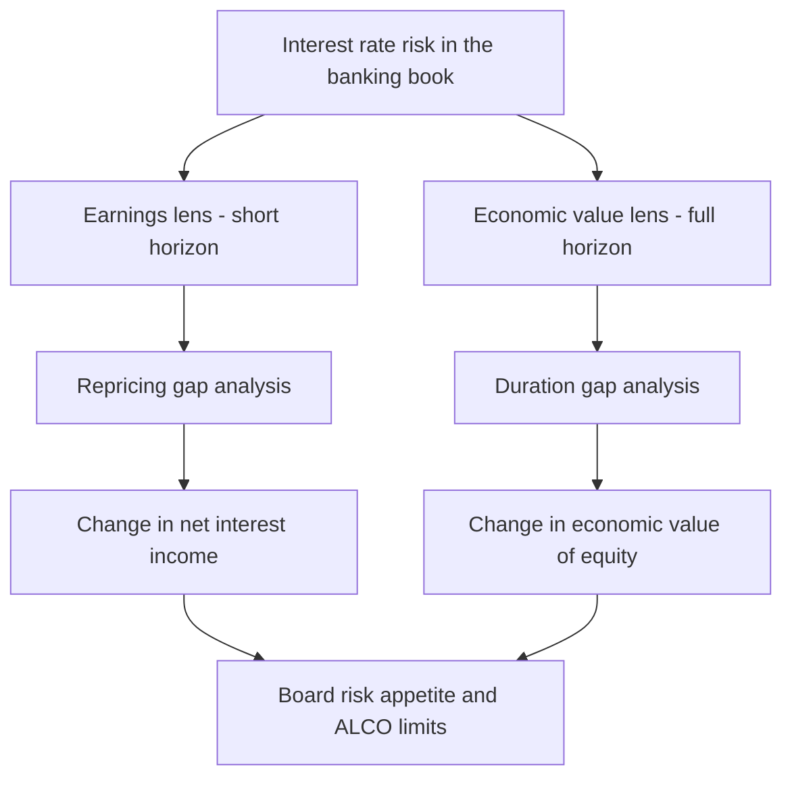
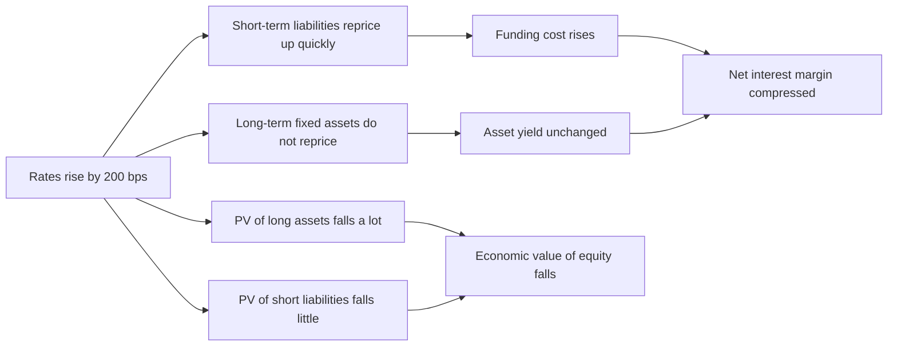
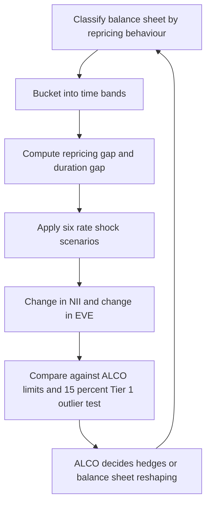
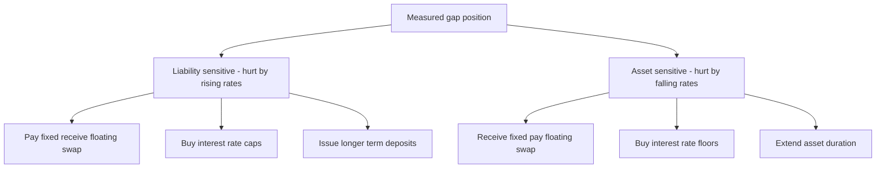

# Chapter 10 — Asset-Liability Management and Interest-Rate Risk in the Banking Book

## 1. The Problem / The Need

A bank is, at its core, a machine for **transforming maturities**. It takes in short-term, liquid, redeemable-on-demand deposits and lends them out as long-term, illiquid, fixed-rate loans and mortgages. This maturity transformation is not a side-effect of banking — it *is* banking. Society wants both: depositors want instant access to their money, borrowers want 20-year mortgages at a locked rate. The bank sits in the middle and bridges the gap.

But that bridge is built over a chasm. The moment a bank funds a 20-year fixed-rate mortgage at 6% using deposits that reprice every 90 days, it has taken on a bet: it is betting that short-term rates will *not* rise faster than it can pass those costs on. If the central bank hikes and the bank's 90-day deposits now cost 5.5% instead of 2%, the mortgage still only earns 6%. The spread — the bank's entire livelihood — is crushed from 4% to 0.5%. Do enough of that and the bank is insolvent on a flow basis before a single borrower has defaulted.

This is **interest-rate risk in the banking book (IRRBB)**, and it is distinct from the credit risk and market (trading-book) risk covered earlier. Nobody defaulted. No traded position moved. Yet value has evaporated purely because the *timing* of when assets and liabilities reprice differs. Two of the most spectacular bank failures in history — the US Savings & Loan crisis of the 1980s and the collapse of **Silicon Valley Bank in March 2023** — were fundamentally IRRBB failures, not credit failures. SVB held US Treasuries, the safest credit in the world, but funded long-duration bonds with hot uninsured deposits; when rates rose 500 bps, the bonds lost ~$15bn of value and the bank was gone.

So the need is sharp and permanent: banks must **measure, limit, and hedge the mismatch** between the interest-rate behaviour of what they own and what they owe. The discipline that does this is **Asset-Liability Management (ALM)**, governed by the **Asset-Liability Committee (ALCO)**. This chapter builds the two complementary lenses ALM uses — the **earnings lens** (repricing gap → net interest income) and the **value lens** (duration gap → economic value of equity) — and shows how they reconcile.

---

## 2. The Core Idea

**Interest-rate risk in the banking book arises because assets and liabilities reprice at different times and with different sensitivities. ALM measures this mismatch two ways — as a short-horizon effect on *earnings* (net interest income) and as a present-value effect on the *net worth* of the firm (economic value of equity) — and then manages it to a board-approved tolerance using on- and off-balance-sheet tools.**

Everything in this chapter is a variation on that single sentence. Three ideas do the heavy lifting:

1. **Repricing, not maturity, is what matters.** A 30-year floating-rate loan that resets every month is *short* from a rate-risk standpoint; a 2-year fixed-rate CD is *long*. We classify every balance-sheet item by *when its rate changes*, not when the principal is repaid.

2. **Two horizons, two metrics.** Over the next 1–12 months, the question is "what happens to my *income*?" — answered by **repricing gap** and **ΔNII**. Over the full life of the balance sheet, the question is "what happens to my *net worth* if I marked everything to market?" — answered by **duration gap** and **ΔEVE**. A bank can look safe on one and dangerous on the other.

3. **Equity is the residual.** The bank's economic value of equity is `EVE = PV(assets) − PV(liabilities)`. Because equity is a small, leveraged residual (often ~8–10% of assets), a small percentage change in asset value produces a large percentage change in equity value. Leverage amplifies duration.

*Figure 10.1 — The two lenses of interest-rate risk in the banking book.*

---

## 3. Why / How It Works

### 3.1 Why repricing timing creates risk

Take one dollar of assets earning a rate `r_A` funded by one dollar of liabilities costing `r_L`. Net interest income on that dollar is `NII = r_A − r_L`, the **spread**. Rate risk exists whenever `r_A` and `r_L` do not move together in lockstep. If the asset rate is fixed for five years but the funding rate resets quarterly, then a rate shock hits `r_L` immediately while `r_A` stays put. The spread — and NII — moves even though nothing "defaulted."

The key insight: **a fixed-rate item is insensitive to new market rates; a floating/short-term item is sensitive.** So the mismatch is between the *quantity* of assets that will reprice in a window versus the *quantity* of liabilities that will reprice in that same window. That difference is the **gap**.

### 3.2 Why value changes too (the duration channel)

Even ignoring earnings, a rate rise reduces the *present value* of a fixed-rate stream. A 6% 10-year bond is worth par at a 6% market yield; at 8% it is worth far less because its below-market coupons are discounted harder. **Duration** measures exactly this sensitivity: it is the percentage change in price per unit change in yield.

Because a bank holds long-duration assets (mortgages, long loans) funded by short-duration liabilities (deposits), its assets lose more value than its liabilities when rates rise. Since `EVE = PV(A) − PV(L)`, EVE falls. This is the **value lens**, and it captures the *entire remaining life* of the book, not just the next 12 months — which is why it caught risks (like SVB's) that a 12-month earnings model waved through.

### 3.3 Why we need both metrics

They can disagree. Consider a bank that funds a 10-year fixed-rate bond with 1-year deposits:

- **Earnings lens (Year 1):** the bond rate is locked, the deposit rate is locked for a year too — so NII in the first 12 months barely moves. Looks safe.
- **Value lens:** the bond has ~8 years of duration, the deposit ~1. Huge negative duration gap. A rate rise devastates EVE.

The 12-month gap model is *blind* to risk that lives beyond the horizon. Conversely, a bank stuffed with very short assets and long liabilities can show scary EVE numbers but stable near-term earnings. Regulators (Basel IRRBB standards, 2016) therefore **mandate both** — no single number is sufficient.

*Figure 10.2 — Why a rate rise squeezes a maturity-transforming bank.*

---

## 4. Full Content — Framework, Formulas and Methods

### 4.1 The building blocks of ALM

**Rate-Sensitive Assets (RSA)** — assets whose interest rate will reset within a chosen time bucket (floating-rate loans, maturing fixed loans about to roll, short securities, reserves earning market rates).

**Rate-Sensitive Liabilities (RSL)** — liabilities whose cost will reset within the bucket (maturing CDs, money-market deposits, short-term borrowings, floating-rate debt).

**Non-rate-sensitive items** — fixed-rate long-term loans/securities beyond the bucket, and crucially **non-maturity deposits (NMDs)** — checking/savings balances with no contractual maturity, whose *behavioural* repricing must be modelled (see §8).

### 4.2 The Repricing (Funding) Gap — the earnings lens

For a given time bucket:

> **GAP = RSA − RSL**

The gap tells you your NII exposure to a parallel rate shock `Δr`:

> **ΔNII ≈ GAP × Δr**

Interpretation of the sign:

| Gap position | RSA vs RSL | If rates ↑ | If rates ↓ |
|---|---|---|---|
| **Positive (asset-sensitive)** | RSA > RSL | NII rises | NII falls |
| **Negative (liability-sensitive)** | RSA < RSL | NII falls | NII rises |
| **Zero (matched)** | RSA = RSL | NII unchanged | NII unchanged |

A useful scaled version is the **Gap Ratio = RSA / RSL** (>1 asset-sensitive, <1 liability-sensitive) and the **relative gap = GAP / Total Assets**.

**Cumulative gap.** Banks bucket the balance sheet (0–3m, 3–6m, 6–12m, 1–2y, …) and sum gaps across buckets up to a horizon. The **cumulative one-year gap** is the headline earnings metric because it captures everything that reprices within a year:

> **ΔNII (1yr) ≈ Cumulative 1-yr GAP × Δr**

**Refinement — the standardised gap.** Plain gap assumes every RSA and RSL moves 1-for-1 with market rates. In reality, betas differ: a savings deposit rate might move only 0.5× the policy rate, while a loan moves 1.0×. The **standardised gap** weights each item by its rate sensitivity (beta) before differencing. And a subtle timing point: an item repricing in month 2 earns the new rate for 10 of the next 12 months, so a precise ΔNII weights each bucket's gap by the *fraction of the year remaining after it reprices*.

### 4.3 The Duration Gap — the economic-value lens

Duration `D` measures price sensitivity to yield. **Modified duration** relates the two:

> **ΔP / P ≈ − D_mod × Δy**,  where `D_mod = D_Macaulay / (1 + y)`

The **duration gap** aggregates this to the whole balance sheet. Define:

- `D_A` = weighted-average (modified) duration of assets
- `D_L` = weighted-average (modified) duration of liabilities
- `A` = market value of assets, `L` = market value of liabilities
- `k = L / A` = leverage ratio (liabilities as a share of assets)

> **Duration Gap:  D_GAP = D_A − k × D_L**

The change in the economic value of equity for a rate shock `Δy` is:

> **ΔEVE ≈ − D_GAP × A × Δy   =   − [D_A − k·D_L] × A × Δy**

Sign logic (for a normal bank with `D_A > k·D_L`, i.e. a **positive duration gap**):

| Duration gap | If rates ↑ | If rates ↓ |
|---|---|---|
| **Positive (D_A > k·D_L)** | EVE falls | EVE rises |
| **Negative (D_A < k·D_L)** | EVE rises | EVE falls |
| **Zero (immunised)** | EVE unchanged | EVE unchanged |

Setting `D_GAP = 0` means `D_A = k·D_L`, i.e. `D_A = (L/A)·D_L`. This is **duration immunisation** of equity: pick asset and liability durations so equity value is insulated from parallel shifts. Note it protects *equity value*, and only against small parallel moves — convexity and non-parallel (twist) moves leak through.

### 4.4 The regulatory frame — Basel IRRBB

Under the Basel Committee's 2016 IRRBB standard (Pillar 2), banks must:

- Compute **ΔEVE** and **ΔNII** under **six prescribed interest-rate shock scenarios**: parallel up, parallel down, steepener, flattener, short-rate up, short-rate down.
- Apply the **supervisory outlier test**: a bank is flagged if the maximum ΔEVE loss across the six scenarios exceeds **15% of Tier 1 capital**.
- Model **non-maturity deposits** with caps on the average behavioural life (e.g. core deposits capped at a 5-year average, a 6% cap on stable retail portion in some regimes) to prevent gaming.

*Figure 10.3 — The ALM measurement and governance loop.*

### 4.5 ALM strategies and hedging tools

Once measured, the gap can be reshaped in two ways.

**A. On-balance-sheet (change the business mix).**
- Shorten asset duration: originate more floating-rate loans, buy shorter securities, sell long mortgages.
- Lengthen liability duration: issue term deposits / longer wholesale debt to fund long assets.
- Grow/shrink specific buckets to close a targeted cumulative gap.

**B. Off-balance-sheet (overlay hedges).**
- **Interest-rate swaps** — the workhorse. A liability-sensitive bank (negative gap, hurt by rising rates) enters a swap to **pay fixed / receive floating**, converting floating funding into synthetic fixed, or converting fixed assets into synthetic floating. This is a **fair-value / cash-flow hedge** in accounting terms.
- **Interest-rate futures / FRAs** — short Eurodollar/SOFR futures to profit if short rates rise, offsetting NII compression.
- **Caps, floors, collars, swaptions** — options giving asymmetric protection (a cap pays off if rates exceed a strike; costs an upfront premium but preserves upside).

The strategic choice depends on the **rate view and risk appetite**: a bank confident rates will fall may *deliberately* run a negative gap to earn more; a bank prioritising stability targets a near-zero gap and immunised duration.

*Figure 10.4 — Matching the hedge to the gap.*

---

## 5. Worked Examples

### Example 1 — Repricing gap and ΔNII (with reconciliation)

**Setup.** A bank's balance sheet, bucketed by *when each item reprices*, in ₹ crore:

| Item | Amount | Reprices within 1 year? |
|---|---|---|
| Floating-rate loans | 400 | Yes (RSA) |
| Short-term securities (< 1yr) | 150 | Yes (RSA) |
| Reserves at market rate | 50 | Yes (RSA) |
| Fixed-rate 10-yr loans | 300 | No |
| Buildings / fixed assets | 100 | No |
| **Total assets** | **1,000** | RSA = 600 |
| Money-market deposits | 500 | Yes (RSL) |
| Short-term borrowings | 200 | Yes (RSL) |
| Long-term fixed CDs (5yr) | 200 | No |
| Equity | 100 | No |
| **Total liab + equity** | **1,000** | RSL = 700 |

**Step 1 — Gap.**
`GAP = RSA − RSL = 600 − 700 = −100` (crore).
The bank is **liability-sensitive** (negative gap): more of its funding reprices within a year than its assets do.

**Step 2 — ΔNII for a +200 bps parallel shock.**
`ΔNII ≈ GAP × Δr = (−100) × (+0.02) = −₹2 crore.`
NII **falls by ₹2 crore** if rates rise 200 bps. Intuitively correct: rising rates lift the cost of ₹700cr of funding but the yield on only ₹600cr of assets.

**Step 3 — Reconcile from first principles.** Rebuild NII directly. Assume a +2% shock hits every rate-sensitive item.
- Extra interest *earned* on RSA = 600 × 0.02 = +₹12 crore.
- Extra interest *paid* on RSL = 700 × 0.02 = +₹14 crore.
- Net change in NII = +12 − 14 = **−₹2 crore.** ✓

Matches Step 2 exactly. The gap formula is just the difference of these two flows.

**Step 4 — Symmetry check.** For a −200 bps shock: `ΔNII = (−100)×(−0.02) = +₹2 crore` — a liability-sensitive bank *gains* when rates fall. Consistent.

**Gap ratio** = RSA/RSL = 600/700 = 0.857 (< 1 confirms liability-sensitive). Relative gap = −100/1,000 = −10% of assets.

---

### Example 2 — Duration gap and ΔEVE (with reconciliation)

**Setup.** Market values (₹ crore) and modified durations:

| | Market value | Modified duration (yrs) |
|---|---|---|
| Assets (A) | 1,000 | D_A = 4.0 |
| Liabilities (L) | 900 | D_L = 1.5 |
| Equity (E = A − L) | 100 | — |

Leverage `k = L/A = 900/1,000 = 0.9`.

**Step 1 — Duration gap.**
`D_GAP = D_A − k·D_L = 4.0 − 0.9 × 1.5 = 4.0 − 1.35 = 2.65 years.`
Positive → EVE falls when rates rise. (This is the "normal bank" — long assets, short funding.)

**Step 2 — ΔEVE for a +100 bps shock.**
`ΔEVE ≈ − D_GAP × A × Δy = − 2.65 × 1,000 × 0.01 = −₹26.5 crore.`
Equity's economic value drops from ₹100cr to ₹73.5cr — a **26.5% hit to equity from a 1% rate move.** That is the leverage amplification: assets moved a few %, but equity, the thin residual, moved 26.5%.

**Step 3 — Reconcile via the value legs separately.**
- ΔPV(assets) = − D_A × A × Δy = − 4.0 × 1,000 × 0.01 = **−₹40 crore.**
- ΔPV(liabilities) = − D_L × L × Δy = − 1.5 × 900 × 0.01 = **−₹13.5 crore.**
- ΔEVE = ΔA − ΔL = (−40) − (−13.5) = **−₹26.5 crore.** ✓

Identical to Step 2. Assets lost ₹40cr of value; liabilities became ₹13.5cr cheaper to owe; equity absorbed the ₹26.5cr net difference.

**Step 4 — Immunisation.** To set `D_GAP = 0` we need `D_A = k·D_L = 0.9 × 1.5 = 1.35 years`. The bank would have to slash asset duration from 4.0 to 1.35 (e.g. swap long fixed loans into floating). Alternatively, holding `D_A = 4.0`, solve for the liability duration that immunises: `D_L = D_A / k = 4.0 / 0.9 = 4.44 years` — i.e. fund with much longer-dated liabilities.

**Sanity check on immunisation.** If `D_GAP = 0`, then `ΔEVE = −0 × A × Δy = 0` for any small parallel `Δy`. Verify with `D_A = 1.35, D_L = 1.5, k = 0.9`: ΔA = −1.35×1000×0.01 = −13.5; ΔL = −1.5×900×0.01 = −13.5; ΔEVE = −13.5 −(−13.5) = 0. ✓

---

### Example 3 — Same bank, two lenses disagree (the reconciliation that matters)

Notice Examples 1 and 2 could be the *same bank*. Its **1-year gap is −100** (liability-sensitive: rising rates hurt near-term NII) *and* its **duration gap is +2.65** (rising rates hurt EVE). Here both lenses agree rates-up is bad — but they need not.

**Construct a disagreement.** Suppose instead the bank funds a **10-year fixed-rate bond (₹1,000cr, D_A ≈ 8)** with **1-year deposits (₹900cr, D_L ≈ 1)** that will simply roll over at the same spread.

- **Earnings lens, Year 1:** The bond's rate is fixed. The deposits are also fixed *for the coming year*. So within the 1-year bucket, RSA ≈ 0 and RSL ≈ 0 → **gap ≈ 0 → ΔNII ≈ 0.** The earnings model says "safe."
- **Value lens:** `D_GAP = 8 − 0.9×1 = 7.1 years`. For +100 bps: `ΔEVE = −7.1 × 1,000 × 0.01 = −₹71 crore` — **71% of a ₹100cr equity wiped out.** The value model screams "danger."

**Reconciliation / lesson.** Both are *correct* — they answer different questions. The 12-month earnings model is blind to the 9 years of exposure sitting beyond its horizon. This exact blindness is what felled **Silicon Valley Bank**: near-term NII looked fine while EVE was hollowed out by long-duration Treasuries funded with flighty short deposits. **Conclusion: a bank must monitor ΔNII and ΔEVE together; passing one is not passing the other.**

*Reconciling table — the three examples on one page:*

| Metric | Formula | Example 1/2 bank | Ex-3 mismatched bank |
|---|---|---|---|
| 1-yr repricing gap | RSA − RSL | −100 | ≈ 0 |
| ΔNII (+200 bps) | GAP × Δr | −₹2 cr | ≈ 0 |
| Duration gap | D_A − k·D_L | +2.65 yr | +7.1 yr |
| ΔEVE (+100 bps) | −D_GAP × A × Δy | −₹26.5 cr | −₹71 cr |
| Verdict | | Both flag rate-up risk | Earnings blind, value alarmed |

---

## 6. Connections

- **To Chapter on liquidity (LCR/NSFR):** ALM and liquidity risk are two faces of the same balance-sheet mismatch. IRRBB is the *price* risk of maturity transformation; liquidity risk is the *rollover* risk. Non-maturity deposits sit at the heart of both — behavioural modelling of deposits drives the NSFR available-stable-funding factor *and* the IRRBB repricing bucket.
- **To duration & bond math:** the duration gap is just portfolio duration applied to a leveraged balance sheet. Convexity (the second-order term) is the correction the linear ΔEVE formula omits.
- **To market risk / VaR:** the trading book uses VaR for marked positions; the banking book uses EVE sensitivity for accrual positions. The *methods* (duration, scenario shocks) are cousins; the *accounting treatment* (mark-to-market vs accrual) is what separates the books.
- **To capital adequacy:** IRRBB is a **Pillar 2** risk — it consumes capital via the 15%-of-Tier-1 outlier test and supervisory add-ons, feeding back into the capital-ratio framework.
- **To Funds Transfer Pricing (FTP):** ALM is operationalised through FTP, the internal mechanism that charges business units for the rate/liquidity risk of their products and centralises that risk in the Treasury/ALM desk to be hedged.

---

## 7. Key Terms

- **ALM / ALCO** — Asset-Liability Management; the Asset-Liability Committee that governs it.
- **IRRBB** — Interest-Rate Risk in the Banking Book (accrual/non-traded positions).
- **RSA / RSL** — Rate-Sensitive Assets / Liabilities: items repricing within a chosen bucket.
- **Repricing (funding) gap** — RSA − RSL for a time bucket; drives ΔNII.
- **Cumulative gap** — gaps summed across buckets to a horizon (usually 1 year).
- **NII / NIM** — Net Interest Income; Net Interest Margin (NII / earning assets).
- **Duration gap (D_GAP)** — `D_A − k·D_L`; drives ΔEVE.
- **EVE** — Economic Value of Equity = PV(assets) − PV(liabilities).
- **Modified duration** — `D_Macaulay/(1+y)`; % price change per unit yield change.
- **Leverage factor k** — L/A, the weight liabilities carry in the duration gap.
- **Immunisation** — setting D_GAP = 0 to insulate EVE from parallel shifts.
- **NMD** — Non-Maturity Deposit (checking/savings with no contractual maturity).
- **Beta / pass-through** — fraction of a market-rate move that flows to a product's rate.
- **Outlier test** — Basel flag when max ΔEVE loss > 15% of Tier 1 capital.
- **FTP** — Funds Transfer Pricing; internal pricing that centralises rate risk in Treasury.

---

## 8. Common Confusions

**"Maturity = repricing."** No. What matters is *when the rate resets*, not when principal is repaid. A 30-year floating-rate loan is rate-sensitive (short); a 3-year fixed CD is not (long) until it matures. Always classify by repricing behaviour.

**"A zero repricing gap means no interest-rate risk."** False — it neutralises *near-term earnings*, but the duration gap (and thus EVE) can still be huge. Example 3 is the canonical trap: gap ≈ 0, D_GAP = 7.1. Basel mandates both metrics precisely because one can pass while the other fails.

**"ΔNII and ΔEVE should give the same answer."** They answer different questions — a *flow* over a fixed horizon vs a *present value* over the full life. They can even point in opposite directions. Neither is "the" number; the board sets limits on both.

**"Immunisation makes the bank risk-free."** It only neutralises *small parallel* shifts, and only *equity value* (not earnings). Convexity, yield-curve twists (steepeners/flatteners), basis risk between indices, and optionality (prepayments, deposit runoff) all leak through. Duration immunisation is a first-order, static hedge that must be rebalanced as rates move.

**"Non-maturity deposits are instantly rate-sensitive because they're withdrawable on demand."** Behaviourally, no. Core checking balances are *sticky* and their rate passes through only partially (low beta) — banks model them as a blend of short and multi-year tranches. Mis-modelling NMDs is the single largest judgement call in ALM (and Basel caps the assumed behavioural life to stop banks over-claiming stability).

**"Positive gap is always good."** A positive (asset-sensitive) gap helps when rates *rise* and hurts when they *fall*. "Good" depends entirely on the rate scenario and the bank's view; there is no universally safe sign — only a sign consistent (or not) with the board's risk appetite.

**"Rising rates are always bad for banks."** Only for liability-sensitive banks or over the value horizon. A modestly asset-sensitive bank with sticky, low-beta deposits can see NIM *expand* when rates rise, because asset yields reprice faster than deposit costs. The sign of the effect is an empirical question about the specific balance sheet.

---

## 9. Recap

- Banks exist to transform short deposits into long loans; that maturity transformation *is* interest-rate risk in the banking book (**IRRBB**).
- Classify every item by **when its rate reprices**, into **RSA** and **RSL**.
- **Earnings lens:** `GAP = RSA − RSL`; `ΔNII ≈ GAP × Δr`. Negative gap = liability-sensitive = hurt by rising rates. Horizon is short (≤ 1 year).
- **Value lens:** `D_GAP = D_A − k·D_L`; `ΔEVE ≈ − D_GAP × A × Δy`. Positive gap = hurt by rising rates. Horizon is the whole book. Leverage amplifies equity's sensitivity.
- **Both are mandatory** because a bank can pass one and fail the other (Example 3 / SVB).
- Manage with on-balance-sheet reshaping (asset/liability duration, business mix) and off-balance-sheet hedges (swaps, futures, caps/floors/swaptions). **Immunisation** = D_GAP → 0.
- Basel IRRBB requires six shock scenarios and a **15%-of-Tier-1** EVE outlier test; **non-maturity deposit** behaviour is the crucial modelling judgement.
- Worked examples reconciled: gap ΔNII rebuilt from RSA/RSL interest flows; duration ΔEVE rebuilt from ΔPV(assets) − ΔPV(liabilities).

---

## 10. Quick-Reference / Interview Points

**Core formulas to have cold:**
| Concept | Formula |
|---|---|
| Repricing gap | `GAP = RSA − RSL` |
| ΔNII | `ΔNII ≈ GAP × Δr` |
| Gap ratio | `RSA / RSL` |
| Modified duration | `D_mod = D_Mac / (1 + y)` |
| Price sensitivity | `ΔP/P ≈ − D_mod × Δy` |
| Duration gap | `D_GAP = D_A − k·D_L`,  `k = L/A` |
| ΔEVE | `ΔEVE ≈ − D_GAP × A × Δy` |
| Immunisation | `D_A = k·D_L` (D_GAP = 0) |

**One-liners interviewers want:**
- *"What's the difference between the earnings and value perspectives on IRRBB?"* — ΔNII is a short-horizon *flow* measure driven by the repricing gap; ΔEVE is a full-life *present-value* measure driven by the duration gap. A bank must limit both; they can disagree.
- *"A bank has a negative repricing gap. What does that mean and what's the hedge?"* — Liability-sensitive: RSL > RSA, so NII falls if rates rise. Hedge by paying fixed / receiving floating on a swap, buying caps, or lengthening liability duration.
- *"How can a bank look safe on NII but be dangerous?"* — Its risk lives beyond the 12-month gap window; long-duration fixed assets funded short give a small near-term gap but a large duration gap and ΔEVE. That was SVB.
- *"Why does a 1% rate move hit equity by 26%?"* — Leverage. Equity is a thin residual; `ΔEVE = − D_GAP × A × Δy` scales by *total assets*, not by equity, so the same rupee move is a large fraction of the small equity base.
- *"What is the Basel outlier test?"* — Flag if the worst ΔEVE across six prescribed shock scenarios exceeds 15% of Tier 1 capital.
- *"Biggest modelling judgement in ALM?"* — Non-maturity deposit behaviour: their effective duration and rate beta. Get it wrong and both your gap and EVE are wrong.
- *"How do you immunise equity?"* — Set the duration gap to zero: `D_A = (L/A)·D_L`. Protects EVE against small parallel shifts only; rebalance for convexity, twists, and optionality.

**Mental model to close with:** *A bank is a leveraged bond portfolio wearing a deposit franchise. ALM is the discipline of making sure that when the yield curve moves, neither this year's income nor the firm's net worth moves more than the board agreed to tolerate.*
