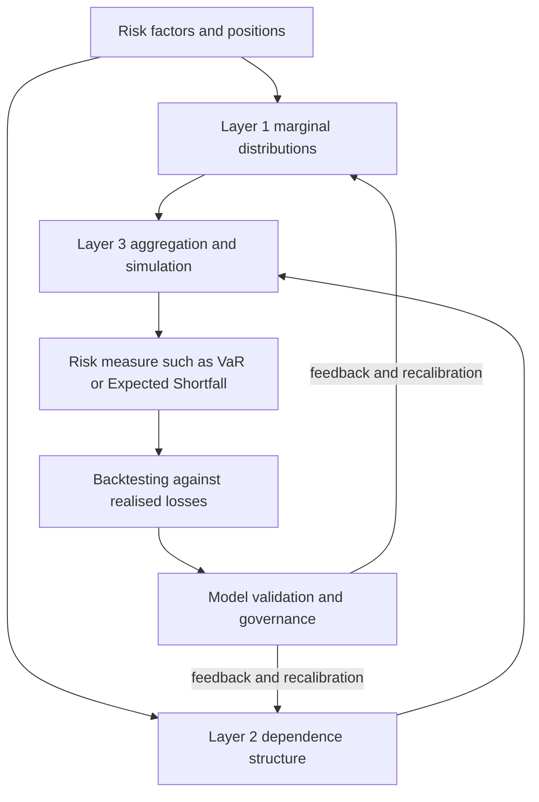
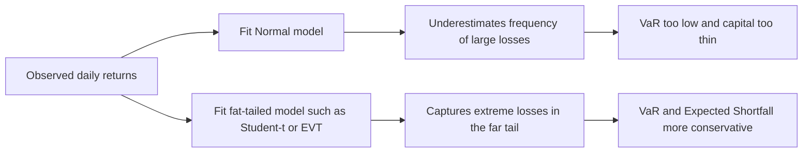
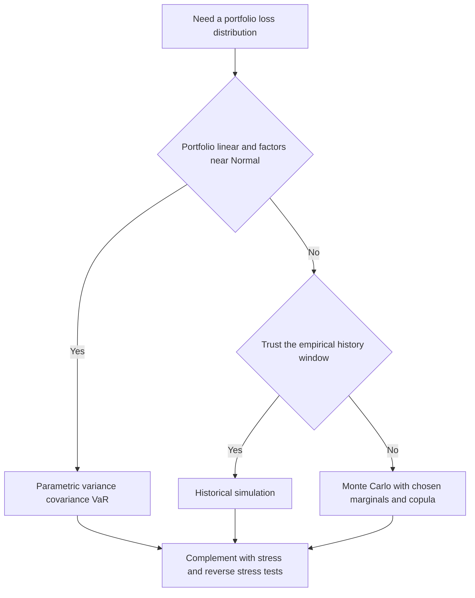
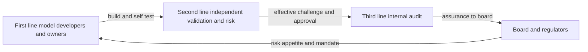

# Chapter 11 — Risk Models and Measurement

## 1. The Problem / The Need

Every risk number a bank, fund, or corporate reports — a Value-at-Risk figure, an expected loss, an economic capital charge, a stress-test result — is the output of a **model**. A model is a machine that takes inputs (positions, prices, volatilities, correlations, default probabilities) and turns them into a statement about the future distribution of gains and losses. The uncomfortable truth of risk management is that we never observe the future distribution directly. We only ever see one realised path of history, and we must infer the shape of the *whole distribution of possible futures* from that single, finite, backward-looking sample.

This creates three distinct problems that this chapter must solve.

**First, the specification problem.** What shape does the loss distribution actually have? If we assume returns are Normal (Gaussian) and they are not, we will systematically underestimate the frequency of large losses. The 2007–09 crisis was, in large part, a story of risk models that assumed thin tails and mild dependence when reality delivered fat tails and dependence that spiked precisely when it hurt most. A risk manager who cannot articulate *why* the Normal assumption fails, and what to use instead, is dangerous.

**Second, the dependence problem.** Portfolio risk is not the sum of individual risks — it is driven by how positions move *together*. A model of a single asset can be excellent while a model of the joint behaviour of a thousand assets is catastrophically wrong, because correlation is unstable and, worse, tends to rise in crises exactly when diversification is supposed to protect you. Getting the *marginals* right but the *dependence* wrong is one of the most expensive mistakes in finance (it is essentially the story of the Gaussian copula and structured credit).

**Third, the validation problem.** A model that cannot be checked is a superstition. We need disciplined ways to ask: *does this model's output match reality?* (backtesting), *is the model built and used correctly?* (validation and governance), and *where does it break?* (stress testing and reverse stress testing). Regulators codify this because unvalidated models threaten solvency.

The stakes are concrete. Basel's Internal Models Approach lets a bank use its own VaR/Expected-Shortfall model to compute market-risk capital — but only if the model passes backtesting; fail too often and a regulatory multiplier inflates the capital charge. So the *quality of the model* is not academic; it directly sets how much capital must be held. This chapter builds the toolkit: distributions and tails, correlation and copulas, scenarios and simulation, backtesting, and the governance that keeps the whole thing honest.

## 2. The Core Idea

A risk model is a **map from uncertainty to a number**, and it has three separable layers that can each fail independently:

1. **Marginal risk** — the distribution of each individual risk factor (a stock return, a rate move, an obligor's default). This is where *fat tails* live.
2. **Dependence structure** — how the factors co-move. This is where *correlation and copulas* live.
3. **Aggregation and measurement** — how we combine layers 1 and 2 into a portfolio loss distribution and read off a risk measure (VaR, Expected Shortfall). This is where *scenario analysis and simulation* live.

The single most important conceptual move in modern risk modelling — **Sklar's theorem** — is that these layers can be *decoupled*: you can model the marginals separately from the dependence, then glue them together with a **copula**. That is liberating (fix the fat tails without touching the correlations, and vice versa) and dangerous (you can glue fat-tailed marginals to a benign dependence structure and fool yourself into thinking you are conservative).

Wrapped around all three layers is a fourth idea that is not math but discipline: **a model is a hypothesis about the world, and every hypothesis must be testable and governed.** Backtesting tests the hypothesis against realised outcomes; validation tests whether the hypothesis was implemented and used correctly; governance ensures someone independent owns that judgement. The math tells you what the risk *is if the model is right*; the governance tells you *whether to believe the model at all*.

*Figure 1 — the layered anatomy of a risk model.*

## 3. Why / How It Works

**Why decomposition works.** Financial losses are high-dimensional, but the *drivers* are lower-dimensional. A thousand equity positions are really exposures to a handful of common factors (market, sector, size, value) plus idiosyncratic noise. Modelling reduces dimensionality: instead of estimating a 1000×1000 covariance matrix (roughly half a million distinct numbers — hopeless with a few hundred days of data), we model a few factors and their loadings. This is *why* factor models, principal components, and copulas exist — they make an intractable joint distribution estimable from finite data.

**Why tails are the whole game.** Risk measures like VaR and Expected Shortfall care about the far left of the loss distribution — the 1% or 0.1% worst outcomes. The centre of the distribution (where returns spend most of their time) is almost irrelevant to a risk manager; it is the tail that bankrupts you. So the modelling effort is *asymmetric*: getting the mean and even the standard deviation approximately right matters far less than getting the tail shape right. A model can fit 99% of the data beautifully and still be worthless for risk because it misses the 1% that matters.

**Why the Normal distribution keeps getting used anyway.** It has one parameter for scale (σ), it is closed under linear combinations (a portfolio of jointly-Normal assets is Normal, so VaR has a clean closed form), and correlation fully describes its dependence. This analytical convenience is seductive — and it is exactly why it is over-used. Real financial returns are **leptokurtic** (fat-tailed, sharp-peaked) and exhibit **volatility clustering** (calm and stormy periods bunch together, so returns are not independent over time). Empirically, daily equity index returns show kurtosis far above the Normal value of 3, and observed "5-sigma" and "10-sigma" days occur orders of magnitude more often than a Normal model permits.

**Why dependence spikes in crises.** In normal times, assets are driven by many small independent shocks and correlations look moderate. In a crisis, a single systemic shock (liquidity evaporating, forced deleveraging) drives *everything* simultaneously — correlations converge toward one and diversification vanishes. A Gaussian dependence model has **zero tail dependence**: it literally cannot represent "everything crashes together." That structural blind spot, not a bad correlation number, is why Gaussian-copula models of structured credit failed.

**How simulation rescues tractability.** When the portfolio is non-linear (options, credit) or the distributions are non-Normal, there is no closed-form answer. Monte Carlo simulation sidesteps the math: draw thousands of scenarios from the modelled distributions, revalue the portfolio in each, and read the risk measure off the empirical distribution of outcomes. It trades algebra for computation, and it is *why* modern risk engines are simulation engines.

## 4. Full Content — Framework, Formulas, Methods

### 4.1 Modelling risk: the general workflow

1. **Identify risk factors** — the underlying drivers (rates, spreads, equity indices, FX, default events).
2. **Choose marginal distributions** for each factor — Normal, Student-t, or an empirical/EVT tail.
3. **Choose a dependence structure** — a covariance matrix (implies a Gaussian copula) or an explicit copula (t, Clayton, Gumbel).
4. **Map factors to P&L** — the pricing/revaluation function, linear (delta) or full ("full revaluation").
5. **Aggregate** — analytically, by historical simulation, or by Monte Carlo.
6. **Read the risk measure** — VaR, Expected Shortfall, economic capital.
7. **Backtest and validate**, then recalibrate.

### 4.2 Probability distributions and fat tails

**Moments.** For a return $r$ with mean $\mu$ and standard deviation $\sigma$:

- **Skewness** $= E\left[\left(\frac{r-\mu}{\sigma}\right)^3\right]$ — asymmetry; equity returns are typically negatively skewed (crashes bigger than rallies).
- **Kurtosis** $= E\left[\left(\frac{r-\mu}{\sigma}\right)^4\right]$ — tail heaviness. Normal = 3. **Excess kurtosis** = kurtosis − 3; positive means fat tails.

**Parametric VaR under Normality.** For a horizon return $r \sim N(\mu, \sigma^2)$, the VaR at confidence $\alpha$ (loss expressed as a positive number) is:

$$\text{VaR}_\alpha = -\left(\mu + z_{\alpha}\,\sigma\right)\times V$$

where $V$ is portfolio value and $z_\alpha$ is the standard-Normal quantile ($z_{0.99} = -2.326$, $z_{0.95} = -1.645$). Over short horizons $\mu \approx 0$, so $\text{VaR}_{99\%} \approx 2.326\,\sigma V$.

**Why the Normal understates tail risk — the Student-t fix.** The Student-t distribution with $\nu$ degrees of freedom has fatter tails; kurtosis $= 3 + \frac{6}{\nu-4}$ for $\nu>4$, converging to Normal as $\nu\to\infty$. Lower $\nu$ = fatter tails. Using a t with $\nu\approx 4$–$6$ captures much of the observed excess kurtosis of daily returns.

**Extreme Value Theory (EVT).** Rather than model the whole distribution, EVT models *only the tail*. The **Peaks-Over-Threshold** method fits a **Generalised Pareto Distribution (GPD)** to exceedances above a high threshold $u$:

$$G_{\xi,\beta}(y) = 1 - \left(1 + \frac{\xi y}{\beta}\right)^{-1/\xi}, \quad y = x - u > 0$$

The **shape parameter $\xi$** governs tail heaviness: $\xi>0$ = fat (Fréchet) tail, typical of financial losses. EVT gives principled estimates of extreme quantiles *beyond the range of observed data* — its key advantage over historical simulation.

*Figure 2 — thin-tail versus fat-tail loss distributions and where risk measures sit.*

**Coherence and Expected Shortfall.** VaR is a *quantile* — the loss not exceeded with probability $\alpha$. It says nothing about how bad losses are *beyond* it, and it is **not sub-additive** (a portfolio's VaR can exceed the sum of its parts' VaRs, punishing diversification — incoherent). **Expected Shortfall (ES)**, the average loss in the worst $(1-\alpha)$ tail, fixes both:

$$\text{ES}_\alpha = E\left[L \mid L \geq \text{VaR}_\alpha\right] = \frac{1}{1-\alpha}\int_\alpha^1 \text{VaR}_u\, du$$

ES is coherent (sub-additive) and tail-sensitive; Basel's Fundamental Review of the Trading Book replaced 99% VaR with **97.5% ES** as the regulatory market-risk measure for precisely these reasons.

### 4.3 Correlation and copulas for dependence

**Linear (Pearson) correlation** $\rho = \frac{\text{Cov}(X,Y)}{\sigma_X\sigma_Y}$ measures only *linear* co-movement and is only a *complete* description of dependence when the joint distribution is elliptical (e.g. multivariate Normal or t). Its pitfalls: it can be zero for strongly dependent variables (e.g. $Y=X^2$), it is not invariant to non-linear transforms, and it is undefined for infinite-variance distributions.

**Rank correlations** — **Kendall's τ** and **Spearman's ρ** — depend only on the copula (the ranks), not the marginals, so they survive non-linear transforms and are more robust.

**Sklar's theorem.** Any joint distribution $F$ can be written as:

$$F(x_1,\dots,x_n) = C\big(F_1(x_1),\dots,F_n(x_n)\big)$$

where $F_i$ are the marginals and $C$ is a **copula** — a joint distribution on $[0,1]^n$ with uniform marginals that carries *all* the dependence. This is the decoupling result: **choose marginals and dependence independently.**

**Tail dependence** — the concept that breaks Gaussian models. The lower tail-dependence coefficient is:

$$\lambda_L = \lim_{q\to 0^+} P\left(X \leq F_X^{-1}(q)\;\middle|\;Y \leq F_Y^{-1}(q)\right)$$

the probability that $X$ is extreme *given* $Y$ is extreme. Key facts:

| Copula | Lower tail dependence $\lambda_L$ | Upper tail dependence $\lambda_U$ | Use |
|---|---|---|---|
| Gaussian | 0 (for $\rho<1$) | 0 | Elliptical, no joint extremes |
| Student-t | > 0 (increases as $\nu\downarrow$) | > 0, symmetric | Symmetric joint crashes/booms |
| Clayton | > 0 | 0 | Joint downside (credit, crashes) |
| Gumbel | 0 | > 0 | Joint upside |

The **Gaussian copula has zero tail dependence**: even with correlation 0.9, the probability of joint extreme losses vanishes in the tail. This is *why* the Gaussian copula CDO models understated the chance of simultaneous defaults — the model structurally could not represent "everyone defaults together," regardless of the correlation input.

### 4.4 Scenario analysis and simulation methods

Three canonical ways to build the portfolio loss distribution:

**(a) Parametric / analytic (variance–covariance).** Assume factors are jointly Normal; portfolio VaR from $\sigma_P = \sqrt{w^\top \Sigma\, w}$, then $\text{VaR}=z_\alpha\sigma_P V$. Fast; wrong for options and fat tails.

**(b) Historical simulation.** Apply the last $N$ days of *actual* factor changes to today's portfolio; the empirical distribution of the $N$ revalued P&Ls gives VaR/ES as an order statistic. No distributional assumption and captures real fat tails and dependence — but it is bounded by history (no scenario worse than the worst in the window) and gives equal weight to stale data.

**(c) Monte Carlo simulation.** Specify marginals + copula, draw $M$ scenarios, fully revalue the portfolio in each, read the risk measure off the simulated distribution. Handles non-linearity, fat tails, arbitrary dependence — at high computational cost, and it is only as good as the assumed model (model risk).

**Stress testing and scenario analysis** complement statistical VaR. Rather than asking "what is the 99% loss under normal conditions," stress tests ask "what do we lose in *this specific bad state*" — historical (repeat 2008, 1998) or hypothetical (rates +300bp with spreads +200bp). **Reverse stress testing** inverts the question: *what scenario would render us insolvent?* — then assess its plausibility. Stress tests are essential because they probe the tail *without relying on the distributional assumptions that fail exactly in the tail.*

*Figure 3 — choosing an aggregation method.*

### 4.5 Backtesting risk models

Backtesting compares realised outcomes against model predictions. For a $99\%$ one-day VaR, a **breach (exception)** occurs when the actual loss exceeds the VaR. If the model is correct, breaches are a Bernoulli process with probability $p = 1-\alpha = 1\%$ and should be *independent* across days.

**Kupiec's Proportion-of-Failures (unconditional coverage) test.** With $x$ exceptions in $T$ days, the likelihood-ratio statistic is:

$$LR_{uc} = -2\ln\left[\frac{(1-p)^{T-x}\,p^{x}}{(1-\hat p)^{T-x}\,\hat p^{x}}\right], \quad \hat p = \frac{x}{T}$$

distributed $\chi^2_1$. Reject the model if $LR_{uc}$ exceeds the critical value (3.84 at 5%). This tests *whether the number of breaches is right*.

**Christoffersen's test** adds an **independence** component (breaches should not cluster): $LR_{cc}=LR_{uc}+LR_{ind}$, distributed $\chi^2_2$. Clustering of breaches signals the model reacts too slowly to changing volatility.

**Basel traffic-light zones** for 99% one-day VaR over 250 days (expected breaches ≈ 2.5):

| Zone | Exceptions in 250 days | Capital multiplier $k$ | Interpretation |
|---|---|---|---|
| Green | 0–4 | 3.00 | Model accepted |
| Yellow | 5–9 | 3.40–3.85 (scaled) | Increasing scrutiny |
| Red | 10+ | 4.00 | Model rejected / overhaul |

The market-risk capital charge scales with this multiplier, so backtest failures *directly raise required capital*. Note the asymmetry: ES is harder to backtest than VaR (it is not "elicitable" in the simple sense), which is a live practical tension in the ES-based FRTB regime.

### 4.6 Model validation and governance

**Model risk** is the risk of loss from using a model that is wrong or misused. Regulators (US **SR 11-7**, the canonical guidance) require a formal framework with three defences:

1. **Conceptual soundness** — is the theory right, are assumptions justified, is the math correct?
2. **Ongoing monitoring** — backtesting, benchmarking against alternative models, sensitivity analysis, checking the model is used within its intended scope.
3. **Outcomes analysis** — do outputs match reality over time?

Governance principles: **independent validation** (validators separate from developers), the **effective challenge** doctrine (someone competent and empowered questions the model), a **model inventory** with tiering by materiality, documented **assumptions and limitations**, and clear **ownership**. The "three lines of defence": the business/model owner (1st), independent risk/validation (2nd), internal audit (3rd).

*Figure 4 — the three lines of defence in model governance.*

### 4.7 Strengths and pitfalls of quantitative risk models

**Strengths:** consistency and comparability across desks; a common language (one VaR number aggregates thousands of positions); capital efficiency (risk-sensitive charges); the discipline of forcing assumptions to be explicit; enabling limits, allocation, and pricing.

**Pitfalls:** *model risk* (wrong specification); *estimation risk* (parameters from short/stale samples); *fat-tail blindness* (Normal assumptions); *correlation breakdown* (dependence rises in crises); *procyclicality* (low measured risk in calm times encourages leverage that amplifies the next crash); *endogeneity* (everyone using the same VaR models and hitting limits together forces correlated selling — the model changes the world it measures); *false precision* (a VaR quoted to the dollar implies confidence the data cannot support); and *gaming* (choosing the window or method that minimises the number).

## 5. Worked Examples

### Example 1 — Parametric vs fat-tailed VaR and ES (reconciling the tail-risk gap)

A trading book worth **$100 million** has daily return volatility **σ = 1.5%** and mean ≈ 0.

**(a) Normal 99% one-day VaR.** $z_{0.99}=2.326$.
$$\text{VaR}_{99\%} = 2.326 \times 0.015 \times \$100\text{m} = \$3.489\text{m}.$$

**(b) Normal 97.5% Expected Shortfall.** For a Normal, $\text{ES}_\alpha = \sigma\,\dfrac{\phi(z_\alpha)}{1-\alpha}V$. At $\alpha=0.975$, $z=1.960$, $\phi(1.960)=0.0584$:
$$\text{ES}_{97.5\%}=0.015\times\frac{0.0584}{0.025}\times\$100\text{m}=0.015\times2.338\times\$100\text{m}=\$3.507\text{m}.$$

**Reconciliation check:** Basel calibrated 97.5% ES to be *close to* 99% VaR under Normality — and indeed $\$3.507\text{m}\approx\$3.489\text{m}$ (within 0.5%). Good: the two regimes are roughly comparable *if returns are Normal*.

**(c) Now assume Student-t with ν = 5 (fat tails).** The t quantile at 99% is $t_{0.99,5}=3.365$, but the t must be scaled so its variance matches σ. A t with ν d.f. has variance $\frac{\nu}{\nu-2}$, so scale factor $=\sqrt{\frac{\nu-2}{\nu}}=\sqrt{3/5}=0.7746$. The effective 99% multiplier is $3.365\times0.7746=2.607$.
$$\text{VaR}_{99\%}^{t} = 2.607\times0.015\times\$100\text{m}=\$3.910\text{m}.$$

**Reconciliation and interpretation:** the fat-tailed model gives **$3.91m vs $3.49m** — about **12% more capital** at the same volatility and confidence. The extra $0.42m is the cost of honestly representing fat tails. The Normal model is *not wrong about volatility* (both use σ=1.5%); it is wrong about *tail shape*, and the entire gap lives in the 1% tail. This is the chapter's central lesson in one number.

### Example 2 — Historical-simulation VaR and ES as order statistics

A desk has **500 days** of P&L. VaR is a quantile read directly off sorted losses.

- **99% VaR** = the loss at the $(1-0.99)\times500 = 5\text{th}$ worst outcome. Sort the 500 P&Ls ascending; the 5th value (5th-largest loss) is the 99% VaR.

Suppose the five worst daily P&Ls (in $m) are: **−8.0, −6.5, −5.2, −4.8, −4.1**.

- **99% VaR** = 5th worst = **$4.1m** (the least-bad of the worst 1%).
- **99% ES** = average of the losses *at least as bad as VaR* = mean of the worst 5 (the tail beyond and including the quantile):
$$\text{ES}_{99\%}=\frac{8.0+6.5+5.2+4.8+4.1}{5}=\frac{28.6}{5}=\$5.72\text{m}.$$

**Reconciliation check:** ES ($5.72m) > VaR ($4.1m) *always*, because ES averages the tail that VaR merely bounds. The ratio here is 1.40, notably above the ≈1.15 you would get under Normality — a quantitative signature that this empirical tail is **fatter than Normal**. The order-statistic method needed no distributional assumption to reveal that.

### Example 3 — Backtesting with Kupiec's test

A 99% one-day VaR model produced **12 exceptions in T = 250 trading days**. Expected exceptions $= 0.01\times250 = 2.5$. Observed rate $\hat p = 12/250 = 0.048$.

Kupiec unconditional-coverage statistic with $p=0.01$:
$$LR_{uc}=-2\ln\!\left[\frac{(0.99)^{238}(0.01)^{12}}{(0.952)^{238}(0.048)^{12}}\right].$$

Compute the log-likelihoods:
- Under $p=0.01$: $238\ln(0.99)+12\ln(0.01)=238(-0.01005)+12(-4.6052)=-2.392-55.262=-57.654$.
- Under $\hat p=0.048$: $238\ln(0.952)+12\ln(0.048)=238(-0.04919)+12(-3.0366)=-11.708-36.439=-48.147$.

$$LR_{uc}=-2\,(-57.654-(-48.147))=-2(-9.507)=19.01.$$

**Reconciliation and decision:** Compare 19.01 with the $\chi^2_1$ critical value of **3.84 (5%)** and **6.63 (1%)**. Since $19.01 \gg 6.63$, we **reject the model** decisively — 12 breaches is far too many for a genuine 99% model. Cross-checking against **Basel's traffic light**: 10+ exceptions is the **Red zone**, capital multiplier $k=4.0$ (vs 3.0 in Green). Both frameworks agree: this model is broken and its capital charge should rise by one-third. The two independent tests reconciling on the same verdict is exactly the kind of corroboration good governance demands.

## 6. Connections

- **To Chapter on Market Risk / VaR:** this chapter supplies the *engine room* — the distributions, dependence, and simulation methods that produce the VaR and ES numbers used for market-risk limits and capital (FRTB's 97.5% ES).
- **To Credit Risk:** copulas and tail dependence are the heart of portfolio credit models (correlated defaults, CDO tranching); the Gaussian-copula lesson is a credit-modelling lesson.
- **To Capital and Regulation:** backtesting zones feed the Basel multiplier that sets market-risk capital; SR 11-7 / model governance sits alongside Pillar 2.
- **To Stress Testing:** scenario and reverse-stress methods here are the same tools used in regulatory stress tests (CCAR, EBA).
- **To Liquidity Risk:** the *endogeneity/procyclicality* pitfall links model-driven selling to liquidity spirals.
- **To Behavioural / Governance:** the "effective challenge" doctrine and model-risk culture connect to operational and conduct risk.

## 7. Key Terms

| Term | Meaning |
|---|---|
| **Marginal distribution** | The distribution of a single risk factor on its own. |
| **Leptokurtosis / fat tails** | Excess kurtosis > 0; extreme moves more frequent than Normal. |
| **Value-at-Risk (VaR)** | The loss quantile not exceeded with probability α. |
| **Expected Shortfall (ES)** | Average loss in the worst (1−α) tail; coherent and tail-sensitive. |
| **Coherence / sub-additivity** | A risk measure where diversification never increases risk. |
| **Copula** | A function that binds marginals into a joint distribution, carrying all dependence (Sklar's theorem). |
| **Tail dependence ($\lambda$)** | Probability of one variable being extreme given another is extreme; zero for Gaussian copula. |
| **Extreme Value Theory (EVT)** | Modelling only the tail, e.g. fitting a Generalised Pareto Distribution to exceedances. |
| **Historical simulation** | VaR/ES from the empirical distribution of past factor moves applied to today's book. |
| **Monte Carlo simulation** | Drawing many scenarios from an assumed model to build the loss distribution. |
| **Backtesting / exception** | Comparing realised losses to VaR; a breach when loss exceeds VaR. |
| **Kupiec / Christoffersen tests** | Statistical tests of breach frequency and independence. |
| **Model risk** | Loss from a wrong or misused model. |
| **Effective challenge** | Independent, competent, empowered questioning of a model (SR 11-7). |
| **Procyclicality** | Risk measured low in booms, high in busts, amplifying cycles. |

## 8. Common Confusions

- **VaR is the maximum loss.** No — VaR is the *threshold* the loss won't exceed with confidence α; losses *beyond* it are unbounded and are what ES measures. "99% VaR of $3m" means on the worst 1% of days you lose *at least* $3m, possibly far more.
- **Correlation fully describes dependence.** Only for elliptical (Normal/t) joint distributions. In general, zero correlation ≠ independence, and two portfolios with identical correlations can have wildly different joint-tail behaviour depending on the copula.
- **A higher correlation input fixes tail risk.** Not with a Gaussian copula — its tail dependence is *zero at any correlation below 1*. You must change the *copula family* (to t/Clayton), not just the number.
- **Historical simulation is assumption-free, so it's safest.** It assumes the future resembles the sampled past and cannot produce any scenario worse than its window — it is blind to unprecedented shocks.
- **More Monte Carlo paths = more accurate risk.** Simulation error shrinks with paths, but *model error* (wrong marginals/copula) does not shrink at all. A billion paths of the wrong model is precisely wrong.
- **Passing the backtest means the model is right.** Backtesting has limited power on ~250 days; a model can pass by luck or fail to be challenged on scenarios that simply didn't occur. Backtesting is necessary, not sufficient.
- **ES is strictly better than VaR so backtesting is solved.** ES is harder to backtest (elicitability issues); the FRTB uses VaR-based backtesting to police an ES-based charge — an accepted awkwardness.
- **Fat tails only change the extreme quantile, not the σ.** Correct and important: in Example 1 both models share σ=1.5%; the tail model changes only the *multiplier*, and that is exactly where capital is won or lost.

## 9. Recap

A risk model maps uncertainty to a number through three separable layers — **marginals** (where fat tails live), **dependence** (where copulas and tail dependence live), and **aggregation** (where simulation lives) — wrapped in **backtesting and governance**. The Normal distribution is analytically seductive but empirically thin-tailed; Student-t and EVT restore the fat tails that determine VaR and ES. Sklar's theorem lets us model marginals and dependence independently via copulas, and the decisive property is **tail dependence**: the Gaussian copula's zero tail dependence is the structural flaw behind the structured-credit failures. We build the portfolio loss distribution parametrically, by historical simulation, or by Monte Carlo, and we complement statistical measures with stress and reverse-stress tests that don't rely on the very assumptions that fail in the tail. **Backtesting** (Kupiec, Christoffersen, Basel traffic lights) checks whether reality matches the model and directly sets the capital multiplier; **validation and governance** (SR 11-7, three lines of defence, effective challenge) check whether we should believe the model at all. The worked examples showed a fat-tailed model demanding ~12% more capital than Normal, ES exceeding VaR by construction and revealing a fat empirical tail, and a Kupiec test rejecting a 12-breach model in agreement with Basel's Red zone. Quantitative models give consistency, comparability, and capital efficiency — but carry model risk, estimation risk, correlation breakdown, procyclicality, endogeneity, and false precision. The mature risk manager treats every number as a *hypothesis under governance*, not a fact.

## 10. Quick-Reference / Interview Points

**Formulas to have cold:**
- Normal VaR: $\text{VaR}_\alpha = z_\alpha \sigma V$ ($z_{99}=2.326$, $z_{95}=1.645$).
- Normal ES: $\text{ES}_\alpha = \sigma\,\frac{\phi(z_\alpha)}{1-\alpha}V$.
- Excess kurtosis = kurtosis − 3; Normal kurtosis = 3.
- t-distribution kurtosis $=3+\frac{6}{\nu-4}$; scale by $\sqrt{(\nu-2)/\nu}$ to fix variance.
- Sklar: $F(x_1,\dots)=C(F_1(x_1),\dots)$.
- Kupiec $LR_{uc}\sim\chi^2_1$; reject above 3.84.
- Expected breaches for 99% VaR over 250 days ≈ 2.5.

**One-liners interviewers reward:**
- "VaR tells you the door; ES tells you what's behind it." ES is coherent and tail-sensitive; FRTB uses **97.5% ES**.
- "The Gaussian copula has zero tail dependence — that's *why* it missed correlated defaults, not the correlation number."
- "Sklar lets me fix fat tails and dependence separately." Marginals and copula are independent choices.
- "Historical sim can't imagine a scenario worse than its worst day — so I stress test."
- "More paths cut simulation error, never model error."
- "Backtesting sets the Basel multiplier: Green k=3.0, Red k=4.0 — model quality *is* capital."
- "SR 11-7: independent validation and effective challenge — someone competent and empowered must be able to say no."
- "Procyclicality and endogeneity: models measure low risk in booms and, because everyone uses them, *create* the correlated selling they later measure."

**If asked "why did risk models fail in 2008?":** thin-tailed marginals (Normal) + zero-tail-dependence dependence (Gaussian copula) + backward-looking calibration on a benign window + procyclical leverage + endogenous forced-selling — a failure of every layer at once, and a governance failure in not challenging the assumptions.
