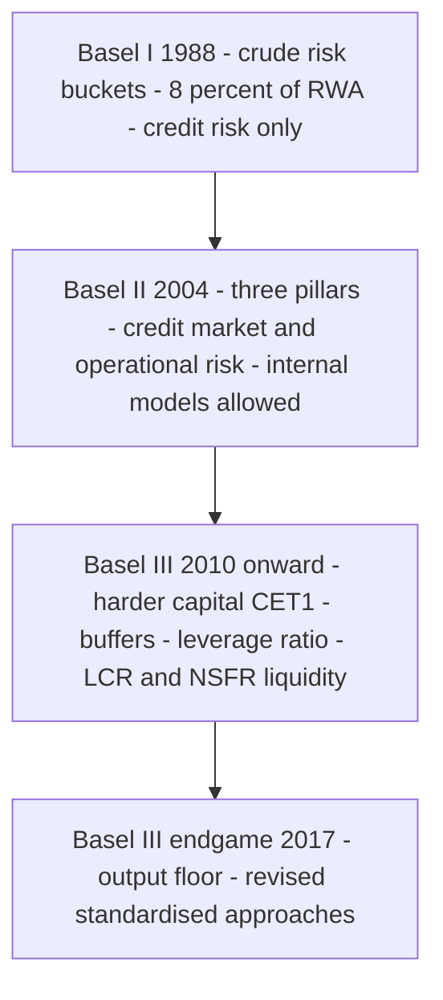
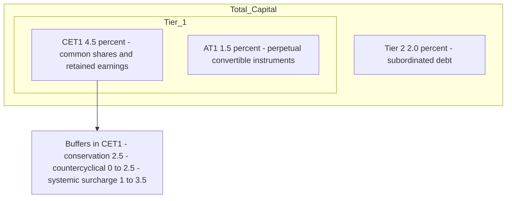
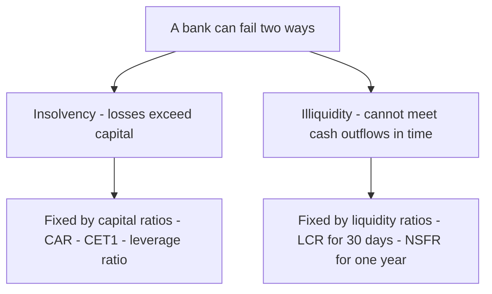

# Chapter 12 — Basel Accords and Capital Regulation

## 1. The Problem / Need

A bank is a strange, fragile machine. It takes in deposits that are payable on demand (a liability that can walk out the door tomorrow) and uses them to fund loans that will not be repaid for years (an illiquid, risky asset). It does this while holding only a thin sliver of its own money — its **capital** — against a mountain of borrowed money. A typical bank funds roughly 90-95% of its assets with debt and deposits, and only 5-10% with shareholders' equity. In leverage terms, that is 10x to 20x. A corporate manufacturer running at 2x leverage would be considered aggressive; a bank at 15x is considered normal.

This structure creates three chronic problems that no single bank can solve on its own:

**Problem 1 — The bank can become insolvent from small losses.** If a bank funds €100 of assets with €6 of equity and €94 of deposits, then a loss of just 6% on its asset book wipes out the entire equity cushion. The bank is now insolvent: its assets are worth less than what it owes depositors. Because banks take concentrated exposure to credit, market, and operational risk, a 6% loss is not a tail event — it is a bad recession.

**Problem 2 — Runs and contagion.** Depositors and short-term creditors know they are first-come-first-served. If they suspect a bank is weak, the rational move is to withdraw *first*, before the money runs out. This makes the fear self-fulfilling: a solvent-but-illiquid bank can be destroyed by a run. Worse, banks are interconnected — they lend to each other, clear payments through each other, and hold similar assets. One failure transmits losses and panic to others. This is **systemic risk**: the risk that the failure of one institution cascades through the whole financial system.

**Problem 3 — Moral hazard and the safety net.** Because bank failures are so damaging, governments provide a safety net: deposit insurance and a lender of last resort (the central bank). But the safety net creates a perverse incentive. If depositors are insured, they stop monitoring the bank's risk-taking, and shareholders — who keep the upside and offload the downside to taxpayers — are tempted to gamble. "Heads I win, tails the taxpayer loses." Left alone, banks will hold *too little* capital, because capital is expensive for shareholders but the cost of failure is socialised.

The market cannot fix these problems by itself. So the state fixes them with **regulation**, and the central instrument of that regulation is a **minimum capital requirement**: a rule that forces every bank to fund a defined minimum fraction of its (risk-adjusted) assets with genuine loss-absorbing equity. This chapter is about how that requirement is defined, measured, and enforced — the story of the **Basel Accords**.

---

## 2. The Core Idea

Capital regulation rests on one deceptively simple idea:

> **A bank must hold loss-absorbing capital in proportion to the risk it takes — not in proportion to the size of its balance sheet.**

Two banks can both hold €100 of assets. One holds €100 of short-term government bonds; the other holds €100 of unsecured loans to speculative-grade companies. They are not equally risky, and it would be absurd to require them to hold the same capital. So Basel does not measure requirements against *raw* assets. It measures them against **Risk-Weighted Assets (RWA)** — assets scaled by a risk weight that reflects how likely they are to lose value.

The master equation of the entire framework is the **Capital Adequacy Ratio (CAR)**, also called the Capital-to-Risk-weighted-Assets Ratio (CRAR):

$$
\text{CAR} = \frac{\text{Regulatory Capital}}{\text{Risk-Weighted Assets (RWA)}} \geq \text{Minimum \%}
$$

Everything else in Basel is an elaboration of this fraction:

- The **numerator** (capital) is defined precisely and split into quality tiers — the best, most loss-absorbing capital (CET1) at the top, weaker forms below.
- The **denominator** (RWA) is defined precisely — how you turn a portfolio of loans, bonds, trading positions, and operational exposures into a single risk-adjusted number.
- The **minimum ratio** and a stack of **buffers** on top set how much is enough.

Basel then bolts on two ideas that a pure risk-weighted ratio misses:

1. A **leverage ratio** — a simple, non-risk-weighted backstop (capital / total exposure), to catch the case where the risk weights themselves are wrong or gamed.
2. **Liquidity ratios** (LCR and NSFR) — because a bank can be perfectly solvent and *still* die from a run. Capital protects against insolvency; liquidity rules protect against illiquidity. They are different diseases needing different medicine.

That is the whole architecture. The rest of this chapter fills it in.

---

## 3. Why / How It Works

### Why risk-weight instead of using raw assets?

Because raw assets punish safe banks and reward reckless ones. A flat "hold 8% of total assets" rule would force a bank full of Treasury bills to hold the same capital as a bank full of junk loans. Rational banks would then *shed the safe assets* (which earn a low return but cost the same capital) and pile into risky ones (high return, same capital). The rule would actively encourage risk-taking. Risk weighting aligns the capital charge with the actual probability and severity of loss, so capital is deployed where losses are likely to come from.

### Why tier the capital?

Not all "capital" absorbs losses equally. Common equity absorbs losses immediately and continuously — if the bank loses money, shareholders' equity falls first and there is no obligation to ever pay it back. That is the gold standard: it is loss-absorbing *on a going-concern basis* (while the bank is still alive). Other instruments — certain preferred shares, subordinated debt — only absorb losses in a wind-down (*gone-concern*), or absorb them reluctantly. Basel therefore ranks capital by quality and demands that the bulk of the requirement be met with the highest-quality form. The 2008 crisis proved the point: banks that looked well-capitalised on total-capital measures were revealed to have very little *real* equity underneath, and it was the equity — not the subordinated debt — that the market cared about.

### How does this make the system safer? The four channels

1. **Loss absorption.** More equity means the bank can absorb larger losses before becoming insolvent, so fewer banks fail in a given downturn.
2. **Skin in the game.** When shareholders have more of their own money at stake, they internalise more of the downside, which curbs the moral-hazard gamble. Capital is the antidote to "heads I win, tails you lose."
3. **Confidence and run-prevention.** A visibly well-capitalised bank is one that creditors do not need to run from. Capital ratios are public signals; strong ratios dampen the incentive to flee.
4. **Systemic resilience.** Buffers that can be drawn down in stress (rather than triggering instant failure) let banks keep lending through a downturn, and surcharges on systemically important banks force the most dangerous institutions to be the strongest. This reduces contagion.

### The key trade-off (why not just require 50% capital?)

Capital is not free from the bank's perspective. Equity investors demand a higher return than depositors, so funding with more equity raises the bank's cost of funds and can shrink lending (this is contested — the Modigliani-Miller view says leverage should not change total funding cost, but frictions like the tax deductibility of debt and the safety-net subsidy make equity privately expensive to banks). Regulation therefore lives on a trade-off: too little capital and the system is fragile; too much and credit becomes scarce and expensive. Basel's minimums are the negotiated answer to *where on that curve to sit*.

---

## 4. Full Content — The Framework, Formulas, and Methods

### 4.1 A short history: Basel I, II, III

The **Basel Committee on Banking Supervision (BCBS)**, hosted at the Bank for International Settlements (BIS) in Basel, Switzerland, sets these standards. It has no legal power — it issues *standards* that member jurisdictions then write into their own law (in the EU via the CRR/CRD, in the US via the federal banking agencies, in India via RBI). Its output came in three great waves.

**Basel I (1988).** The first international capital standard. Its innovation was the risk-weighted asset concept, but crudely: it sorted assets into a handful of buckets with fixed weights (0% for OECD government debt, 20% for banks, 50% for residential mortgages, 100% for corporate loans and everything else). It required **total capital ≥ 8% of RWA**, split into Tier 1 (≥4%) and Tier 2. It covered essentially only credit risk. It was simple and got capital onto the global agenda, but the coarse buckets invited gaming: a loan to a shaky corporate and a loan to a blue-chip both weighed 100%, so banks kept the risky, high-yield version — a distortion called **regulatory arbitrage**.

**Basel II (2004).** A far more risk-sensitive framework, built on **three pillars**:

- **Pillar 1 — Minimum capital requirements.** Kept the 8% ratio but made RWA far more granular. Introduced explicit charges for **credit, market, and operational risk**. Crucially, allowed banks to use either a **Standardised Approach** (regulator-set weights, now tied to external credit ratings) or **Internal Ratings-Based (IRB)** approaches, where sophisticated banks estimate their own risk parameters (PD, LGD, EAD — see Chapter 8/9 on credit risk) and feed them into supervisory formulas.
- **Pillar 2 — Supervisory review.** Supervisors assess risks not captured in Pillar 1 (e.g. interest-rate risk in the banking book, concentration risk) and can require *more* capital bank-by-bank. Banks run an internal capital adequacy assessment process (ICAAP).
- **Pillar 3 — Market discipline.** Mandatory public disclosure of risk and capital, so the market can price and monitor bank risk.

Basel II's weakness was exposed almost immediately by the 2007-09 crisis: it was **procyclical** (risk weights fell in good times and spiked in bad, amplifying the cycle), it leaned too heavily on external ratings and banks' own optimistic models, it had **no liquidity standard at all**, and its definition of capital was too soft — too much of the "Tier 1" was not genuine common equity.

**Basel III (2010 onward, phased in through the 2010s, with a final "Basel III endgame" / Basel 3.1 package agreed in 2017 and implementing into the 2020s).** A direct response to the crisis. It did not throw out Basel II's architecture; it hardened every part of it:

- **Better capital.** Redefined capital to put **Common Equity Tier 1 (CET1)** at the centre, with a much higher CET1 minimum and stricter rules on what counts.
- **More capital via buffers.** Added a **capital conservation buffer**, a **countercyclical buffer**, and **surcharges for systemically important banks (G-SIBs/D-SIBs)** on top of the minimums.
- **A leverage ratio.** A non-risk-weighted backstop to the risk-weighted ratios.
- **Liquidity standards — new.** The **Liquidity Coverage Ratio (LCR)** for short-term (30-day) resilience and the **Net Stable Funding Ratio (NSFR)** for structural (1-year) funding stability.
- **The "endgame" reforms (2017).** Constrained internal models with an **output floor** (RWA from internal models cannot fall below 72.5% of the standardised RWA), revised the standardised approaches for credit and operational risk, and replaced the old operational-risk approaches with a single Standardised Measurement Approach.

*The diagram below shows how the three accords build on one another.*

### 4.2 The numerator — regulatory capital and its tiers

Regulatory capital is stacked in tiers by loss-absorbing quality. Under Basel III:

**Total Capital = Tier 1 + Tier 2**, where **Tier 1 = CET1 + Additional Tier 1 (AT1)**.

| Tier | Component | What it is | When it absorbs losses |
|---|---|---|---|
| Tier 1 | **CET1 (Common Equity Tier 1)** | Common shares, retained earnings, disclosed reserves, share premium, minus regulatory deductions (goodwill, deferred tax assets, etc.) | Continuously, while the bank is a going concern — the highest quality |
| Tier 1 | **AT1 (Additional Tier 1)** | Perpetual instruments with no maturity, discretionary coupons, that convert to equity or write down when CET1 falls below a trigger (e.g. contingent convertibles / CoCos) | Going concern, at the trigger point |
| Tier 2 | **Tier 2** | Subordinated debt (min ~5-year maturity), certain loan-loss provisions | Only in a gone-concern wind-down — absorbs losses after Tier 1 is exhausted |

The **regulatory minimums** under Basel III (Pillar 1), as fractions of RWA:

| Requirement | Minimum |
|---|---|
| CET1 | **4.5%** of RWA |
| Tier 1 (CET1 + AT1) | **6.0%** of RWA |
| Total Capital (Tier 1 + Tier 2) | **8.0%** of RWA |

On top of these hard minimums sit the **buffers**, which must be met with **CET1**:

| Buffer | Size | Purpose |
|---|---|---|
| Capital Conservation Buffer (CCB) | **2.5%** | A drawable cushion above the minimum; dipping into it restricts dividends/bonuses rather than causing failure |
| Countercyclical Buffer (CCyB) | **0-2.5%** | Set by national regulators; raised in credit booms, released in busts to keep credit flowing |
| G-SIB / D-SIB surcharge | **1-3.5%** | Extra CET1 for globally/domestically systemic banks — the bigger and more connected, the more |

So a normal (non-systemic) bank must hold **CET1 ≥ 4.5% + 2.5% = 7.0%** of RWA in ordinary times, and **Total Capital ≥ 8.0% + 2.5% = 10.5%**. A G-SIB with a 2% surcharge in a period with a 1% countercyclical buffer needs CET1 of 4.5% + 2.5% + 1% + 2% = **10.0%**.

*The diagram below shows the capital stack from the highest-quality core out to the buffers.*

### 4.3 The denominator — Risk-Weighted Assets (RWA)

RWA is the sum of risk-weighted exposures across the three risk types:

$$
\text{RWA} = \text{RWA}_{\text{credit}} + \text{RWA}_{\text{market}} + \text{RWA}_{\text{operational}}
$$

**Credit RWA.** Under the Standardised Approach, each exposure is multiplied by a regulatory risk weight (broadly tied to counterparty type and external rating). Representative weights:

| Exposure | Typical risk weight |
|---|---|
| Cash, central government debt (highest-rated) | 0% |
| Highly-rated bank/PSE exposures | 20% |
| Residential mortgages (prudent LTV) | 35-50% |
| Corporate loans (rating-dependent) | 20-150% |
| Unrated / speculative corporate | 100% |
| Past-due / high-risk | 150% |

$$
\text{RWA}_{\text{credit}} = \sum_i (\text{Exposure}_i \times \text{Risk Weight}_i)
$$

Under the **IRB approach**, the bank estimates Probability of Default (PD), Loss Given Default (LGD), and Exposure at Default (EAD), and a supervisory formula converts them into a risk weight capturing *unexpected* loss (expected loss is covered by provisions, not capital). The **output floor** then caps how much benefit IRB can give: modelled RWA ≥ 72.5% × standardised RWA.

**Market RWA** covers the trading book — losses from moves in interest rates, FX, equity, commodity prices. Computed via a standardised sensitivities-based approach or an internal models approach (post-crisis, based on **Expected Shortfall** rather than VaR — see Chapter 6).

**Operational RWA** covers losses from failed processes, fraud, legal, and systems risk. Basel III replaced the old menu with a single **Standardised Measurement Approach** that scales a Business Indicator (a proxy for size) by an internal loss multiplier.

Because Pillar 1 charges are expressed as capital = 8% of RWA, a common shortcut converts a capital charge *K* back into RWA by multiplying by 12.5 (the reciprocal of 8%):

$$
\text{RWA from a capital charge } K = K \times 12.5
$$

### 4.4 The leverage ratio — the non-risk-weighted backstop

Risk weighting has a fatal vulnerability: if the *weights* are wrong (or gamed), the risk-weighted ratio lies. Before 2008, banks loaded up on assets that carried tiny risk weights (AAA-rated structured products, sovereign debt) but turned out to be dangerous. Their risk-weighted ratios looked fine right up until they failed. The leverage ratio is the crude, un-foolable check:

$$
\text{Leverage Ratio} = \frac{\text{Tier 1 Capital}}{\text{Total Exposure Measure}} \geq 3\%
$$

The **Total Exposure Measure** is *not* risk-weighted — it is on-balance-sheet assets plus derivative exposures, securities-financing exposures, and off-balance-sheet items, with no risk weights applied. A €1 Treasury and a €1 junk loan count the same €1. This is a feature, not a bug: it means a bank cannot escape the leverage limit by claiming its assets are low-risk. The minimum is **3%** (implying a maximum leverage of ~33x), with an additional buffer (typically half the G-SIB surcharge) for the largest banks. The leverage ratio binds when the risk-weighted ratio is very generous; the two together mean a bank must satisfy *both* a risk-sensitive and a risk-blind constraint.

### 4.5 Liquidity ratios — LCR and NSFR

Capital ratios answer "is the bank solvent?" They say nothing about "can the bank meet cash outflows tomorrow?" A bank can be solvent and still fail if depositors and creditors flee faster than it can raise cash (Northern Rock, 2007). Basel III introduced two liquidity standards.

**Liquidity Coverage Ratio (LCR) — short-term, 30-day survival.** The bank must hold enough **High-Quality Liquid Assets (HQLA)** — cash and assets that can be sold quickly with little loss (central bank reserves, top-rated government bonds) — to cover 30 days of *stressed* net cash outflows:

$$
\text{LCR} = \frac{\text{Stock of HQLA}}{\text{Total Net Cash Outflows over 30 days (stressed)}} \geq 100\%
$$

Net outflows = expected outflows (deposits running off, credit lines drawn — each category multiplied by a stressed run-off rate) minus capped expected inflows. HQLA is split into **Level 1** (0% haircut — cash, reserves, top sovereigns) and **Level 2** (haircuts of 15-50%, and capped at 40% of the total). The intent: survive a month-long acute stress without central-bank help, buying time for an orderly response.

**Net Stable Funding Ratio (NSFR) — structural, 1-year stability.** LCR is a 30-day snapshot; NSFR addresses the *structural* mismatch — funding illiquid long-term assets with flighty short-term money. It requires that **Available Stable Funding (ASF)** cover **Required Stable Funding (RSF)** over a one-year horizon:

$$
\text{NSFR} = \frac{\text{Available Stable Funding (ASF)}}{\text{Required Stable Funding (RSF)}} \geq 100\%
$$

- **ASF** = liabilities and capital weighted by how "sticky" they are (equity and long-term debt get high ASF factors near 100%; overnight wholesale funding gets ~0%).
- **RSF** = assets weighted by how much stable funding they need (cash needs ~0%; long-term illiquid loans need ~85-100%).

NSFR forces the bank to fund long, illiquid assets with genuinely stable funding, curbing the classic "borrow short, lend long" fragility over the medium term. LCR and NSFR are complements: LCR is the sprint (survive the acute run), NSFR is the marathon (be structurally sound over a year).

*The diagram below separates the two diseases a bank can die from and the tools that address each.*

---

## 5. Worked Examples

### Example 1 — Computing RWA and the full capital ratio stack

**Alpha Bank** has the following exposures and capital. Compute credit RWA, total RWA, and check every Basel III ratio.

*Assets (exposure at par):*

| Asset | Exposure (€m) | Risk weight | RWA (€m) |
|---|---:|---:|---:|
| Cash & central bank reserves | 500 | 0% | 0 |
| Government bonds (top-rated) | 1,000 | 0% | 0 |
| Interbank / bank exposures | 500 | 20% | 100 |
| Residential mortgages | 2,000 | 35% | 700 |
| Corporate loans (unrated) | 3,000 | 100% | 3,000 |
| High-risk / past-due loans | 200 | 150% | 300 |
| **Total assets** | **7,200** | | **Credit RWA = 4,100** |

Add **market RWA = 300** and **operational RWA = 600**. 

$$
\text{Total RWA} = 4{,}100 + 300 + 600 = 5{,}000 \text{ €m}
$$

*Capital:* CET1 = €400m, AT1 = €50m, Tier 2 = €120m.

- Tier 1 = CET1 + AT1 = 400 + 50 = **€450m**
- Total Capital = Tier 1 + Tier 2 = 450 + 120 = **€570m**

**Compute the ratios:**

$$
\text{CET1 ratio} = \frac{400}{5{,}000} = 8.0\%
$$
$$
\text{Tier 1 ratio} = \frac{450}{5{,}000} = 9.0\%
$$
$$
\text{Total Capital ratio (CAR)} = \frac{570}{5{,}000} = 11.4\%
$$

**Compare to requirements** (assume a standard non-systemic bank: CET1 min 4.5% + conservation buffer 2.5% = 7.0%; Tier 1 min 6.0%; Total min 8.0% + buffer 2.5% = 10.5%):

| Ratio | Bank | Minimum incl. buffer | Pass? | Headroom |
|---|---:|---:|:---:|---:|
| CET1 | 8.0% | 7.0% | ✅ | +1.0% |
| Tier 1 | 9.0% | 7.5% (6.0 + 2.5 buffer)* | ✅ | +1.5% |
| Total | 11.4% | 10.5% | ✅ | +0.9% |

*The 2.5% conservation buffer is met with CET1 and sits above all three minimums.*

**Self-check / reconciliation.** The three capital measures must nest: CET1 (400) ≤ Tier 1 (450) ≤ Total (570). ✅ The ratios rise accordingly: 8.0% ≤ 9.0% ≤ 11.4%. ✅ Convert Total Capital ratio back to a capital number: 11.4% × 5,000 = 570 = Total Capital. ✅ The bank passes every requirement, but its Total-capital headroom is thin at +0.9% — a mild shock could push it into the conservation buffer and trigger dividend restrictions. Note the numerators are unchanged across the three ratios only in the denominator sense; it is the *numerator* that shrinks as we demand higher quality (400 vs 450 vs 570) against the *same* RWA of 5,000.

### Example 2 — A shock, and how capital absorbs it

Suppose Alpha Bank's corporate loan book suffers a **€350m loss** (a portion defaults with low recovery). Losses hit CET1 first (retained earnings fall). Trace the impact.

- New CET1 = 400 − 350 = **€50m**
- New Tier 1 = 50 + 50 = **€100m**
- New Total Capital = 100 + 120 = **€220m**

RWA also changes: the €350m of loans that defaulted move from 100% weight to being written off (removed) or to 150% for the past-due remainder — but to keep the arithmetic clean, assume the defaulted exposures are written off entirely, removing €350m of exposure that carried €350m of RWA. New Total RWA = 5,000 − 350 = **€4,650m**.

$$
\text{New CET1 ratio} = \frac{50}{4{,}650} = 1.08\%
$$
$$
\text{New Total ratio} = \frac{220}{4{,}650} = 4.73\%
$$

**Interpretation.** The bank is still technically *solvent* (capital > 0), but it has crashed through every minimum: CET1 of 1.08% is far below the 4.5% hard floor, and Total of 4.73% is below the 8% floor. In practice the supervisor would now intervene — force a capital raise, halt all distributions, possibly resolve the bank. This is exactly what capital is *for*: it absorbed €350m of loss so that **depositors lost nothing** (the €7,200m of deposits/liabilities are untouched — losses were borne by shareholders, whose CET1 fell from 400 to 50). Had the bank held only the €400m of CET1 with a leverage-style thin cushion and no buffers, a slightly larger loss would have wiped equity out entirely and hit depositors.

**Reconciliation.** Loss of 350 fell entirely on CET1 (400 → 50): change of −350. ✅ Tier 1 and Total each fell by the same 350 (AT1 and Tier 2 untouched because CET1 was not fully exhausted): 450 → 100 and 570 → 220. ✅ Capital remained positive, so no tier below CET1 was written down — consistent with the going-concern loss ordering (CET1 absorbs first). ✅

### Example 3 — Leverage ratio and LCR checks

Using Alpha Bank's *pre-shock* figures. The leverage exposure measure is not risk-weighted; take total on- and off-balance-sheet exposure = **€7,500m** (the €7,200m of assets plus €300m of off-balance-sheet commitments).

$$
\text{Leverage Ratio} = \frac{\text{Tier 1}}{\text{Total Exposure}} = \frac{450}{7{,}500} = 6.0\% \geq 3\% \;\; ✅
$$

The bank has comfortable leverage headroom (6.0% vs 3.0% minimum), implying leverage of ~16.7x. Note that leverage (6.0%) exceeds the minimum by more than the risk-weighted CET1 ratio does — here the **risk-weighted ratio is the binding constraint**, not leverage. That is typical of a bank with genuinely risky assets. For a bank stuffed with 0%-weighted government bonds, the reverse holds: the risk-weighted ratio looks huge but leverage bites — which is precisely why the backstop exists.

**LCR check.** Suppose Alpha holds **HQLA = €1,400m** (its €500m reserves + €900m of its top-rated government bonds, all Level 1 with 0% haircut). In the 30-day stress scenario:
- Expected outflows: retail deposits €4,000m × 5% run-off = €200m; wholesale funding €1,500m × 40% run-off = €600m; undrawn credit lines €500m × 10% = €50m. **Total outflows = €850m.**
- Expected inflows: €300m of contractual inflows, but capped at 75% of outflows = min(300, 0.75 × 850 = 637.5) = **€300m.**
- Net cash outflows = 850 − 300 = **€550m.**

$$
\text{LCR} = \frac{1{,}400}{550} = 254\% \geq 100\% \;\; ✅
$$

**Reconciliation.** Outflows 850 = 200 + 600 + 50. ✅ Inflow cap: 0.75 × 850 = 637.5 ≥ 300, so full 300 counts. ✅ Net 550 = 850 − 300. ✅ LCR 254% means Alpha holds ~2.5x the HQLA needed to survive a 30-day stressed run — a strong liquidity position, driven by its large government-bond book. Observe the interplay: those same government bonds carry a 0% *credit* risk weight (so they contribute nothing to RWA / capital requirements) yet are the backbone of the LCR. This shows why the two regimes are separate — an asset can be capital-cheap and liquidity-rich at the same time, which is exactly why banks crowd into sovereigns.

---

## 6. Connections

- **Chapter 8/9 (Credit Risk, PD/LGD/EAD).** The IRB approach to credit RWA is built directly on the PD, LGD, and EAD parameters. Regulatory capital covers *unexpected* loss; expected loss (PD × LGD × EAD) is covered by provisions, not capital — the two must not double-count.
- **Chapter 6 (Market Risk / VaR & Expected Shortfall).** Market RWA is computed from these measures; post-crisis Basel switched the internal-models charge from 99% VaR to 97.5% Expected Shortfall for better tail capture.
- **Chapter on Operational Risk.** Feeds operational RWA via the Standardised Measurement Approach.
- **Liquidity Risk chapter.** LCR and NSFR are the regulatory encoding of the liquidity concepts (funding vs market liquidity, run dynamics).
- **Stress testing / ICAAP.** Pillar 2 requires banks to hold capital against risks beyond Pillar 1; supervisory stress tests (CCAR, EBA) translate hypothetical shocks into required capital — a forward-looking complement to the static ratios.
- **Systemic risk & macroprudential policy.** The countercyclical buffer and G-SIB surcharges are *macroprudential* tools — aimed at the system, not the individual bank.
- **Resolution / bail-in (TLAC/MREL).** Beyond going-concern capital, the largest banks must hold Total Loss-Absorbing Capacity so they can be recapitalised in resolution without taxpayer money — the "gone-concern" complement to Basel capital.

---

## 7. Key Terms

- **BCBS / BIS** — the Basel Committee (standard-setter) hosted at the Bank for International Settlements; issues standards, not law.
- **Risk-Weighted Assets (RWA)** — assets scaled by risk weights; the denominator of the capital ratio; sum of credit, market, and operational RWA.
- **Capital Adequacy Ratio (CAR / CRAR)** — regulatory capital ÷ RWA; minimum 8% total.
- **CET1 (Common Equity Tier 1)** — highest-quality, going-concern capital: common shares + retained earnings minus deductions; minimum 4.5% of RWA.
- **AT1 (Additional Tier 1)** — perpetual instruments (e.g. CoCos) that convert or write down at a trigger; going-concern.
- **Tier 2** — subordinated debt and certain provisions; gone-concern, absorbs loss after Tier 1.
- **Capital Conservation Buffer** — 2.5% CET1 cushion above the minimum; breaching it restricts distributions.
- **Countercyclical Buffer (CCyB)** — 0-2.5% CET1, raised in booms and released in busts.
- **G-SIB / D-SIB surcharge** — extra CET1 (1-3.5%) for systemically important banks.
- **Leverage Ratio** — Tier 1 ÷ total (non-risk-weighted) exposure; minimum 3%; the risk-blind backstop.
- **LCR (Liquidity Coverage Ratio)** — HQLA ÷ 30-day stressed net outflows ≥ 100%.
- **HQLA** — high-quality liquid assets (Level 1: cash, top sovereigns; Level 2: haircut, capped).
- **NSFR (Net Stable Funding Ratio)** — Available ÷ Required Stable Funding over 1 year ≥ 100%.
- **Output floor** — modelled (IRB) RWA cannot fall below 72.5% of standardised RWA.
- **Three Pillars** — (1) minimum capital, (2) supervisory review, (3) market discipline.
- **Regulatory arbitrage** — exploiting crude or mismatched rules to hold risk at low capital cost.
- **Procyclicality** — the tendency of risk-based rules to loosen in booms and tighten in busts, amplifying the cycle.

---

## 8. Common Confusions

**"Capital is cash the bank keeps in a vault."** No. Capital is a *funding source* on the liability/equity side — it is how much of the bank is funded by shareholders rather than creditors. It is not a pot of money set aside; it is the difference between assets and liabilities. Liquidity (HQLA) is the asset-side buffer; capital is the equity-side buffer. Conflating them is the single most common error.

**"A higher tier number is better."** The opposite. **Tier 1 is better than Tier 2**, and within Tier 1, CET1 is the best. The tiers rank *downward* in quality. "Common Equity Tier 1" is the top of the pile.

**"CAR of 8% means the bank holds 8% of its assets as capital."** No — 8% of its *risk-weighted* assets. Because RWA is usually much smaller than total assets (many assets carry weights below 100%), the capital as a fraction of *total* assets is lower than 8%. That gap is exactly why the leverage ratio (which uses total, unweighted exposure) was added.

**"The leverage ratio and the capital ratio measure the same thing."** They use the same numerator idea (capital) but different denominators: the CAR uses risk-weighted assets, the leverage ratio uses raw exposure. The leverage ratio deliberately ignores risk weights so that a bank cannot game it by claiming low risk. They are designed to bind in different situations.

**"LCR and NSFR are both about the same liquidity."** Different horizons. LCR is a 30-day acute-stress survival test; NSFR is a 1-year structural funding test. A bank can pass one and fail the other.

**"Expected loss should be covered by capital."** No — expected loss is covered by *provisions* (loan-loss reserves), priced into the loan. Regulatory capital covers *unexpected* loss (the deviation above expectation). Double-counting the expected loss inflates the requirement.

**"Basel is law."** Basel standards are *not* directly binding. They become enforceable only when a jurisdiction transposes them into local regulation (EU CRR/CRD, US rules, RBI norms), often with local deviations and timelines.

---

## 9. Recap

Banks are uniquely fragile: highly leveraged, funded by runnable deposits, interconnected, and backed by a public safety net that invites moral hazard. Left alone they hold too little capital. Regulation fixes this by forcing a minimum ratio of loss-absorbing capital to risk. The master equation is **CAR = Capital / RWA**, where the denominator is *risk-weighted* (so safe and risky assets are treated differently) and the numerator is *tiered by quality* (CET1 best, then AT1, then Tier 2).

The Basel Accords evolved this idea: **Basel I** introduced crude risk buckets and the 8% ratio; **Basel II** made RWA risk-sensitive via three pillars and internal models; **Basel III** — the crisis response — hardened capital around CET1, added conservation/countercyclical/systemic **buffers**, introduced a non-risk-weighted **leverage ratio** backstop, and added the **LCR** and **NSFR** liquidity standards, later constraining models with an **output floor**.

Capital protects against *insolvency*; liquidity ratios protect against *illiquidity* — two distinct failure modes needing distinct tools. The worked examples showed how RWA and the CET1/Tier 1/Total ratios are computed, how a loss is absorbed by CET1 first (protecting depositors), and how the leverage and LCR checks reconcile. The system is safer because banks now absorb more loss, have more skin in the game, inspire more creditor confidence, and — for the most dangerous institutions — carry the largest cushions.

---

## 10. Quick Reference / Interview Points

**The formulas — memorise cold:**

| Metric | Formula | Minimum |
|---|---|---|
| CET1 ratio | CET1 / RWA | 4.5% (+2.5% buffer = 7.0%) |
| Tier 1 ratio | (CET1 + AT1) / RWA | 6.0% |
| Total CAR | (Tier 1 + Tier 2) / RWA | 8.0% (+2.5% = 10.5%) |
| Leverage ratio | Tier 1 / Total Exposure (unweighted) | 3.0% |
| LCR | HQLA / 30-day stressed net outflows | 100% |
| NSFR | Available Stable Funding / Required Stable Funding | 100% |
| RWA ↔ capital charge | RWA = Capital charge × 12.5 | — |
| Output floor | IRB RWA ≥ 72.5% × Standardised RWA | — |

**Talking points for interviews:**

- *Why risk-weight?* Flat asset-based rules reward risk-taking; risk weighting aligns capital with actual loss potential.
- *Why the leverage ratio if you already have the CAR?* Risk weights can be wrong or gamed (2008 AAA structured products); the leverage ratio is the risk-blind backstop that binds when weights are too generous.
- *CET1 vs Tier 2 in one line:* CET1 absorbs losses while the bank is alive (going concern); Tier 2 only in wind-down (gone concern).
- *Capital vs liquidity:* solvency vs cash-timing — different diseases, different cures (CAR/leverage vs LCR/NSFR).
- *What did Basel III fix from Basel II?* Softer capital → CET1-centric; procyclicality → countercyclical buffer; no liquidity rules → LCR + NSFR; over-reliance on models → output floor + revised standardised approaches.
- *How does capital protect depositors?* Losses fall on equity (CET1) first; only if equity is fully exhausted do creditors/depositors take a hit — so the bigger the CET1 cushion, the safer the deposit.
- *Buffers vs minimums:* breaching a *minimum* threatens the bank's licence/triggers resolution; dipping into the *conservation buffer* only restricts dividends and bonuses — buffers are designed to be usable in stress so banks keep lending.
- *Systemic angle:* G-SIB surcharges and the countercyclical buffer are macroprudential — they target the system, forcing the most dangerous banks to be the strongest and leaning against the credit cycle.
