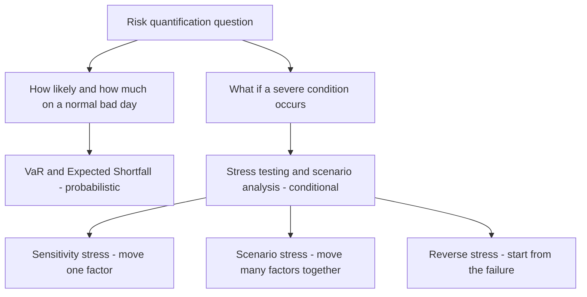
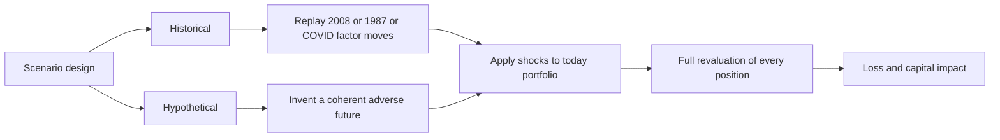
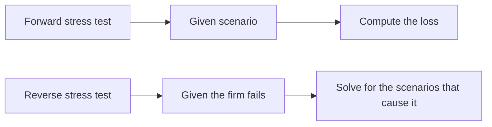
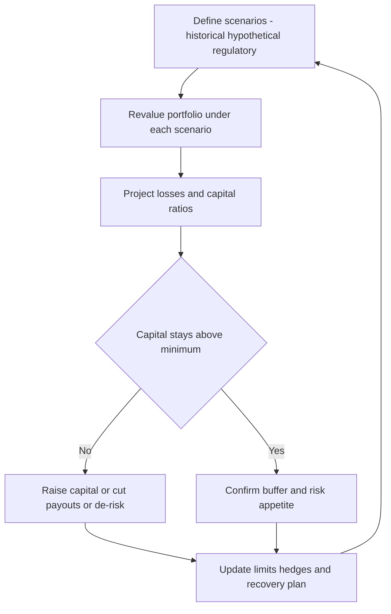

# Chapter 13 — Stress Testing and Scenario Analysis

## 1. The Problem / The Need

Chapter 12 left us with a number that looks reassuring: "Our 1-day 99% VaR is $10 million." Management reads that as "we should not lose more than $10 million on 99 days out of 100." But three uncomfortable questions immediately follow, and none of them can be answered by VaR:

1. **What about the other day?** VaR is silent about the size of the loss on the 1-in-100 day. It draws a line at the 99th percentile and refuses to look past it. The loss beyond the line could be $12 million or $120 million — VaR gives the same answer either way.
2. **What if tomorrow is not like the last two years?** VaR is estimated from a historical window (say 2 years of daily returns). If that window happens to be calm — no crash, no rate shock, no default wave — then the model has literally never seen a disaster and cannot imagine one. The 2004–2006 pre-crisis VaR models were calibrated on the most placid credit environment in a generation.
3. **What specifically would break us?** VaR answers "how much could we lose?" It does not answer "what has to happen for us to lose it?" A CEO cannot manage a percentile; she can manage a story — "oil to $30, the dollar up 15%, high-yield spreads doubling."

These three gaps — **tail blindness**, **history dependence**, and **lack of narrative** — are exactly what stress testing and scenario analysis exist to fill. Where VaR asks *"How bad is a normal-ish bad day?"*, stress testing asks *"How bad could a genuinely bad day be, and what would cause it?"*

The 2007–2009 Global Financial Crisis was the brutal empirical proof. Banks reported "10-day 99% VaR of a few hundred million" and then lost tens of billions. Their models were not lying; they were answering a narrow question honestly. The regulators' response was decisive: stress testing moved from a nice-to-have risk-committee slide to a **legally mandated, capital-binding exercise** (CCAR in the US, EBA/EU-wide stress tests in Europe). Today, a bank's dividend and buyback plans can be blocked by a stress-test result. That is how central stress testing has become.

## 2. The Core Idea

**Stress testing is the deliberate examination of how a portfolio, a book, or an entire institution behaves under severe but plausible conditions that lie outside the range of ordinary day-to-day fluctuations.**

Two mental moves define it:

- **We leave the world of probabilities and enter the world of conditions.** VaR says "there is a 1% chance of losing more than X." A stress test says "*if* equities fall 40% and credit spreads triple, we lose Y" — no probability attached to the *if*. We are asking a conditional ("what if") rather than a distributional ("how likely") question. This is liberating: we no longer need to know the odds of a catastrophe to prepare for it.
- **We push the inputs to extremes on purpose.** In normal risk measurement we take the market as given. In stress testing we *impose* a state of the world — a scenario — and revalue everything under it.

A useful way to hold the whole discipline in your head:

*Figure 1: VaR asks how likely; stress testing asks what if. The two are complements, not substitutes.*

The relationship to VaR is **complementary, not competitive**. VaR maps the centre and the near-tail of the loss distribution where you have data. Stress testing probes the far tail and the "off-distribution" states where you have no data but plenty of imagination and history. A mature risk function runs both and reconciles the stories they tell.

## 3. Why / How It Works

### 3.1 Why VaR misses tail events — the mechanics

VaR's blindness is not a bug that better calibration can fix; it is structural. Three reasons:

**(a) It is a quantile, so it discards the tail by construction.** The 99% VaR is defined as the loss level with 1% mass beyond it. The *shape* of that 1% — thin or fat, bounded or catastrophic — is thrown away. Two portfolios can have identical VaR and wildly different tails. (Expected Shortfall, the average loss *beyond* VaR, partially repairs this — see Chapter 12 — but even ES is estimated from the same limited data.)

**(b) It assumes correlations and volatilities that hold in calm markets.** Most VaR engines are calibrated on a recent window. In that window, diversification "works": your long equities and long credit are imperfectly correlated, so the model nets them off. In a crisis, **correlations converge toward 1** — everything risky sells off together as investors flee to cash and Treasuries. The diversification the VaR relied on evaporates precisely when you need it. Stress testing lets you *impose* crisis correlations by hand.

**(c) It is anchored to sampled history.** If your data window contains no sovereign default, your model assigns near-zero risk to one. The map has no dragon because the cartographer never sailed that sea.

### 3.2 How stress testing gets around this

Stress testing sidesteps all three problems by **specifying the state of the world exogenously** rather than sampling it:

- You *choose* the shocks (equities −40%, credit spreads +300bp, USD +15%), so you are not limited to what history sampled.
- You *choose* the correlation structure — typically by moving all risk factors in the adverse direction *together*, encoding the crisis "everything falls at once" behaviour.
- You then **fully revalue** the portfolio under those shocks (full repricing of options, bonds, loans), so non-linearities and convexity are captured rather than approximated by a linear sensitivity.

The engine underneath is the same repricing machinery used for P&L; the difference is entirely in the *inputs* you feed it.

### 3.3 The severity–plausibility trade-off

Every scenario lives on a dial between two failure modes:

- **Too mild** → the test is reassuring theatre; it never binds, it never informs a decision.
- **Too extreme** → "a meteor hits Manhattan" — the result (we lose everything) is true but useless; no one will act on it.

The craft is choosing **"severe but plausible."** Severe enough to hurt, plausible enough that a rational board will authorise capital or hedges in response. Regulators formalise this: the CCAR "severely adverse" scenario is roughly calibrated to a deep recession comparable to 2008, not to the end of the world.

## 4. Full Content

### 4.1 The taxonomy of stress tests

There are three structural families, ordered from simplest to most sophisticated:

| Type | What you move | Question answered | Strength | Weakness |
|---|---|---|---|---|
| **Sensitivity / factor stress** | One risk factor at a time (e.g. rates +100bp) | "How exposed am I to *this* factor?" | Simple, transparent, fast | Ignores that factors move together |
| **Scenario stress** | Many factors jointly, in a coherent story | "How do I fare in *this world*?" | Captures correlations and contagion | Harder to build; story-dependent |
| **Reverse stress** | Start from the outcome (failure), solve for the cause | "What *breaks* me?" | Finds hidden vulnerabilities | Can be technically hard to invert |

We take each in turn.

### 4.2 Sensitivity (single-factor) stresses

The most basic stress: bump one risk factor by a defined amount, hold everything else constant, revalue. Examples: parallel yield-curve shift of +200bp; equity index −10%; credit spreads +50bp; implied vol +5 vol points; a specific FX rate −20%.

These are the "Greeks made discrete." A DV01 or delta is an *infinitesimal* sensitivity; a sensitivity stress is a *finite, large* move that also captures **convexity** (gamma) — the way exposures accelerate for big moves. For an option book, a −1% equity move captured by delta and a −25% move captured by full revaluation can imply very different hedges, because gamma bites.

Sensitivity stresses are the diagnostic layer: they tell you *which factor* you are most exposed to. But they are unrealistic on their own — in the real world rates, equities and spreads do not move in isolation.

### 4.3 Scenario analysis — the heart of the discipline

A **scenario** is an internally consistent, simultaneous move of many risk factors that together tell a story. This is where correlation and contagion are modelled. There are two ways to build one.

**(a) Historical scenarios.** Take an actual past episode and replay its market moves against *today's* portfolio. Classic templates:

- **Black Monday, Oct 1987** — S&P −20% in a day.
- **1998 LTCM / Russia default** — flight to quality, spread blow-out, liquidity evaporation.
- **2008 Lehman week** — equities −30%+, credit spreads triple, funding markets freeze, correlations → 1.
- **2011 Eurozone sovereign crisis** — peripheral spreads explode.
- **March 2020 COVID crash** — fastest 30% equity drawdown in history, oil negative.

You take the *factor moves* from the episode (not the P&L — the P&L was someone else's portfolio) and apply them to your current book.

- **Advantage:** every combination of moves actually happened, so no one can call the scenario implausible. Correlations are real, not assumed.
- **Weakness:** the next crisis rarely rhymes exactly with the last. A book perfectly hedged against 2008 can be wide open to a shock that history has not yet produced. History has "survivorship" and template bias.

**(b) Hypothetical scenarios.** The risk team *invents* a coherent future that has not happened but could. Examples: "a Middle East conflict spikes oil to $180, the Fed hikes 200bp to fight the resulting inflation, and tech multiples compress 30%." Or a cyber-attack on payment infrastructure, or a disorderly break-up of a currency union.

- **Advantage:** forward-looking; can capture *new* vulnerabilities (a concentration you have built up recently, a novel product, a geopolitical fault line) that no historical episode covers.
- **Weakness:** subjective. Plausibility and internal consistency are matters of judgement, and it is easy to build a scenario that is either internally contradictory (rates up *and* bond prices up) or politically convenient (mild enough not to embarrass anyone).

Good practice runs **both**: historical scenarios for credibility and discipline, hypothetical scenarios for imagination and forward-looking coverage.

*Figure 2: Two routes to a scenario converge on the same revaluation engine.*

**Building a coherent scenario — the internal-consistency test.** A scenario is only useful if the factor moves hang together economically. If you shock equities down hard, you should typically also move credit spreads *wider*, safe-haven rates *lower* (flight to quality), the VIX *up*, and the currencies of risky economies *down*. Bolting on a random combination ("equities crash but high-yield spreads tighten") destroys credibility. Many firms use a **macro model** or **conditional-correlation approach**: specify a few "core" macro shocks (GDP, unemployment, a key rate) and let statistical relationships propagate them to the hundreds of granular pricing factors, so the whole scenario is coherent by construction.

### 4.4 Regulatory stress testing

After 2009, supervisors institutionalised stress testing as the binding constraint on bank capital. Two flagship regimes:

**CCAR / DFAST (United States, Federal Reserve).**
- **CCAR** = Comprehensive Capital Analysis and Review; **DFAST** = Dodd-Frank Act Stress Test. DFAST is the quantitative loss-projection engine; CCAR adds the *qualitative* assessment of the bank's capital-planning process and its proposed dividends/buybacks.
- The Fed publishes **scenarios** each year: *baseline*, *adverse*, and *severely adverse*. The severely adverse scenario is a deep recession — historically things like unemployment rising to ~10%, equities falling ~50%, house prices falling sharply, plus a **global market shock** and, for the largest banks, a **counterparty default** component.
- Banks project their balance sheet, revenues, losses, and **capital ratios over a 9-quarter horizon** under each scenario. The binding test: does the bank's **CET1 ratio stay above the minimum** throughout the stress path?
- **Teeth:** the result now feeds the **Stress Capital Buffer (SCB)** — the peak-to-trough CET1 decline in the severely adverse scenario is converted directly into a capital add-on the bank must hold. A weak result raises required capital and can force the bank to cut or cancel planned dividends and buybacks. This is the crucial modern point: **the stress test sets capital, not the other way round.**

**EBA / EU-wide stress test (European Banking Authority, with the ECB).**
- Conducted roughly biennially across major EU banks using a **common methodology** and a **common macro scenario** (baseline and adverse) set by the EBA/ESRB, applied over a **3-year horizon**.
- Historically a **constrained bottom-up** exercise: banks compute their own results using their models but under strict EBA methodological constraints (e.g. static-balance-sheet assumption, prescribed treatment of specific risks), which makes results comparable across banks.
- Results are **published bank-by-bank** — a deliberate transparency/market-discipline mechanism. There is no single automatic pass/fail hurdle in the way CCAR historically had; instead the results feed the **SREP** (Supervisory Review and Evaluation Process) and inform each bank's **Pillar 2 Guidance** capital.

| Feature | CCAR / DFAST (US Fed) | EBA / EU-wide (EBA + ECB) |
|---|---|---|
| Horizon | 9 quarters (~2.25 yrs) | 3 years |
| Scenarios | Baseline, adverse, severely adverse | Baseline, adverse |
| Approach | Fed also runs own models; supervisor-led | Constrained bottom-up by banks |
| Balance sheet | Assumptions vary; incl. planned actions | Static balance sheet (traditionally) |
| Output link | Stress Capital Buffer; approve/block payouts | Feeds SREP and Pillar 2 Guidance |
| Disclosure | Aggregate + firm results published | Detailed firm-by-firm published |

Both regimes force a bank to prove, *before* a crisis, that it can absorb one. That is a profound shift from the pre-2008 world where capital adequacy was assessed against a static snapshot.

### 4.5 Reverse stress testing

Ordinary stress testing runs **forward**: *scenario → loss*. **Reverse stress testing runs backward**: it *fixes the outcome* — typically "the point at which the business model becomes unviable" (capital breached, funding lost, the firm fails) — and asks **"what set of events would produce this?"**

*Figure 3: Reverse stress testing inverts the arrow — outcome first, cause second.*

Why it is powerful:

- **It removes optimism bias.** Forward tests tend to probe scenarios management already worries about. Reverse tests force you to confront the *specific* combination that kills you — which is often an uncomfortable, unfashionable, or concentrated exposure no one wanted to name.
- **It surfaces hidden concentrations and non-linear cliffs.** The answer might be "we don't die from a broad 30% equity fall, but a 15% fall *combined with* our single largest counterparty defaulting *and* a ratings downgrade triggering collateral calls" — a narrow, correlated, self-reinforcing path that a broad forward scenario would average away.
- **Regulators require it.** Reverse stress testing is an explicit expectation in the UK (PRA), EU, and elsewhere, precisely because it counteracts the tendency to only test comfortable scenarios.

The mechanics can be hard: mathematically you are inverting a many-to-one mapping (many scenarios cause failure), so the output is usually a *family* of break-the-bank scenarios, from which management selects the most plausible and asks "how do we make sure *that* cannot happen, or that we would survive it?"

### 4.6 From results to decisions — closing the loop

A stress test that produces a number and dies in a slide deck is worthless. The value is in the **feedback into decisions**:

1. **Capital.** The headline use. If the severely adverse scenario would take CET1 below the required minimum, the firm must hold **more capital today** (the CCAR Stress Capital Buffer is exactly this). Stress losses set the size of the buffer.
2. **Risk appetite and limits.** If a scenario shows an outsized loss from, say, a single-sector credit concentration, the risk committee tightens the limit on that sector *before* the scenario materialises.
3. **Hedging and de-risking.** A large tail loss to a specific factor (oil, a currency, a counterparty) is a direct prompt to buy protection or reduce the position.
4. **Contingency and recovery planning.** Reverse-stress results feed **recovery and resolution plans** ("living wills"): if *this* is what would kill us, here are the pre-agreed actions (asset sales, capital raises, business-line exits) we would take.
5. **Capital distribution.** Dividends and buybacks are explicitly gated by stress results in CCAR — a bank cannot return capital it would need in the severely adverse world.

*Figure 4: The stress-testing loop — design, revalue, decide, act, and feed back into the next cycle.*

### 4.7 Practical pitfalls

- **Scenario staleness / fighting the last war.** Templates get reused until they no longer bind. Refresh the library; add a genuinely novel hypothetical each cycle.
- **False comfort from static balance sheets.** Assuming the book does not change during a stress ignores that in a real crisis you may be *forced* to sell into a falling market (fire sales), and that clients withdraw funding.
- **Ignoring second-round / feedback effects.** Your de-risking is everyone's de-risking; correlated selling amplifies the shock (the "liquidity spiral"). Simple stress tests miss this.
- **Model risk in the stress engine itself.** The revaluation models are calibrated in normal times; their behaviour in extreme states may itself be unreliable.
- **Correlation naivety.** Applying calm-market correlations to a crisis scenario understates losses — the whole point is that correlations jump. Impose crisis correlations explicitly.

## 5. Worked / Applied Examples

### Example 1 — Sensitivity vs scenario on a simple bank book (numbers reconcile)

A small bank holds two positions:

- **A** — a long government-bond portfolio, market value **$1,000m**, **DV01 = $0.8m per 1bp** (so a +100bp parallel rate rise costs ≈ $80m).
- **B** — a long equity portfolio, market value **$500m**, beta 1.0 to the index.

**Single-factor sensitivity stresses:**
- Rates **+100bp** → bond loss ≈ 100 × $0.8m = **−$80m**. (Equities unchanged in this isolated stress.)
- Equities **−20%** → equity loss = 20% × $500m = **−$100m**. (Bonds unchanged.)

Run in isolation, the *worst single* stress is −$100m (the equity shock).

**Now a joint scenario — "stagflation shock":** the central bank hikes to fight inflation *and* the equity market falls on the growth hit. Suppose the coherent scenario is **rates +100bp AND equities −20%, simultaneously.**

- Bond loss: **−$80m**
- Equity loss: **−$100m**
- **Total scenario loss: −$180m**

**The reconciliation and the lesson:** the joint scenario loss ($180m) is the *sum* of the two single-factor losses because we imposed both shocks together, whereas each sensitivity stress moved only one factor. A naïve reading of the sensitivity table ("worst case is $100m") **understates the coherent scenario by $80m**. This is exactly the correlation problem: in a stagflation world, rates and equities hurt this book *at the same time*, and a single-factor view cannot see it.

Note the contrast with VaR: a VaR model calibrated on a period where rate rises usually coincided with equity *rallies* (a "risk-on" regime) might have assumed rates and equities are *negatively* correlated and **netted the two losses**, reporting a comforting figure well below $180m. The scenario forces the adverse joint move and exposes the true stagflation vulnerability.

### Example 2 — Historical replay: 2008 on a credit book

A desk holds **$2,000m** notional of investment-grade corporate bonds with **spread DV01 (CS01) of $1.5m per 1bp** of spread widening, plus a **−$300m equity hedge overlay** (short index futures, so it *gains* when equities fall).

Apply the **Lehman-week historical scenario**: IG credit spreads **+150bp**, equities **−30%**.

- Credit loss: 150bp × $1.5m/bp = **−$225m**.
- Equity hedge gain: short $300m notional × 30% fall = **+$90m**.
- **Net scenario P&L: −$225m + $90m = −$135m.**

**Interpretation.** The hedge offsets 40% of the credit loss ($90m of $225m), which is *why* the desk holds it — in the exact historical episode where credit blows out, equities also crash, so the short-equity overlay pays off. This is a **coherent** hedge because the two legs are negatively correlated *in a crisis*. A key insight for interviews: the value of this hedge is invisible in a single-factor credit stress (which would show the full −$225m); only a joint historical scenario reveals that the hedge and the risk are correlated in the right direction. (Caveat: basis risk — the hedge is index equity, the risk is idiosyncratic credit — means the offset is imperfect and could fail in a scenario where credit widens *without* an equity crash.)

### Example 3 — Reverse stress test: what breaks the bank?

A bank has **CET1 capital of $10bn** and a stated **minimum requirement of 8% of $80bn risk-weighted assets = $6.4bn**. So it can absorb losses of up to **$10bn − $6.4bn = $3.6bn** before breaching the minimum (ignoring RWA changes for simplicity).

**Reverse question:** what scenarios generate a **$3.6bn** hit? The team works backward and finds several break-points:

- **Path A — broad recession:** a 25% fall across the loan book's stressed loss rate produces ~$2.5bn of credit losses — *survivable* alone.
- **Path B — concentration cliff:** the bank's **single largest borrower group** (a $4bn exposure to one leveraged sector) defaulting at 60% loss-given-default = **$2.4bn**, *plus* a moderate $1.3bn market loss from the associated risk-off move = **$3.7bn → breach.**

**The finding:** the bank does *not* die from a broad, diversified recession (Path A); it dies from a **narrow, concentrated** event (Path B) — the failure of one sector to which it has quietly built an outsized exposure. A forward stress test using only broad macro scenarios would have shown "$2.5bn loss, comfortably survivable" and missed this entirely. The reverse test converts an abstract capital buffer ($3.6bn) into a **specific, actionable vulnerability**: reduce the single-name/sector concentration, or buy protection on it, or hold more capital against it. That is the decision the reverse test drives.

## 6. Connections

- **VaR and Expected Shortfall (Ch. 12).** Stress testing is the tail complement to VaR's body. ES is the bridge — it is VaR reaching *toward* the tail; stress testing reaches *past* the data entirely. In practice firms report VaR, ES, *and* a suite of stress losses side by side.
- **Regulatory capital (Basel).** Basel's **Stressed VaR** (SVaR) requires calibrating market-risk capital to a stress period (2007–2009), directly baking a historical stress into the capital charge. CCAR/EBA sit on top as institution-wide, forward stress tests. Stress testing is now a **capital-setting mechanism**, not just a monitoring tool.
- **Liquidity risk.** Stress scenarios usually include a **funding freeze** (deposit run-off, loss of wholesale funding). The LCR and NSFR ratios are themselves stress-style constructs (survive a 30-day stressed outflow).
- **Credit risk.** Stressed PD/LGD parameters and IFRS 9 / CECL expected-loss provisioning use forward-looking scenarios — the same macro paths often feed both provisioning and stress capital.
- **Model risk (Ch. on model governance).** The stress engine is itself a model; its assumptions (crisis correlations, revaluation behaviour) are a governance concern.
- **Recovery and resolution planning.** Reverse stress tests are a direct input to living wills.

## 7. Key Terms

- **Stress test** — examination of portfolio/firm behaviour under severe but plausible conditions.
- **Scenario analysis** — joint movement of many risk factors in a coherent story.
- **Sensitivity (factor) stress** — moving one risk factor by a large, defined amount.
- **Historical scenario** — replay of an actual past episode's factor moves against today's book.
- **Hypothetical scenario** — an invented but internally consistent adverse future.
- **Reverse stress test** — fix the failure outcome, solve for the scenarios that cause it.
- **Severe but plausible** — the calibration target: painful enough to matter, credible enough to act on.
- **CCAR / DFAST** — the US Fed's comprehensive capital analysis and Dodd-Frank stress tests.
- **Severely adverse scenario** — the harshest prescribed regulatory macro path (deep-recession calibrated).
- **Stress Capital Buffer (SCB)** — CET1 add-on set by a bank's peak-to-trough decline in the severely adverse scenario.
- **EBA / EU-wide stress test** — the European constrained bottom-up, published, SREP-feeding exercise.
- **Stressed VaR (SVaR)** — VaR calibrated to a historical stress window, part of Basel market-risk capital.
- **Static balance sheet** — the assumption that the book does not change over the stress horizon.
- **Second-round / feedback effects** — amplification from correlated de-risking, fire sales, liquidity spirals.

## 8. Common Confusions

- **"Stress testing replaces VaR."** No — they answer different questions (conditional vs probabilistic) and are used *together*. VaR maps where you have data; stress testing maps where you do not.
- **"A stress scenario has a probability."** Deliberately not. The power of "what if" is that you need not know the odds. Attaching a spurious probability to a hand-built scenario invites false precision.
- **"Historical scenarios are safe because they are real."** They are *credible* but backward-looking; the next crisis may not rhyme. Real ≠ complete.
- **"Reverse stress testing is just a harsh forward test."** No — the *arrow is reversed*. Forward = scenario→loss; reverse = failure→cause. Reverse tests find vulnerabilities you did not think to test.
- **"More severe is always better."** No — beyond plausibility, severity destroys usefulness (the meteor problem). The target is *severe but plausible*.
- **"Sensitivity stresses and scenarios are the same."** A sensitivity stress moves *one* factor; a scenario moves *many jointly*. Example 1 shows the difference costs $80m of hidden loss.
- **"CCAR and EBA are basically identical."** They differ in horizon, methodology (Fed runs its own models; EBA is constrained bottom-up), and consequence (SCB and payout approval vs SREP/Pillar 2 Guidance).
- **"The stress test result is an output."** Increasingly it is an *input* to capital — the SCB literally sets required capital from the stress loss. The causation now runs stress → capital.

## 9. Recap

VaR answers "how bad is a normal bad day and how likely?" but is structurally blind to the tail, dependent on sampled history, and offers no narrative a board can act on. **Stress testing fills all three gaps** by imposing severe-but-plausible *conditions* and fully revaluing the book under them. Its three families are **sensitivity stresses** (one factor), **scenario analysis** (many factors jointly — historical replays for credibility, hypotheticals for imagination), and **reverse stress testing** (start from failure, solve for cause). Regulators have made it binding: **CCAR/DFAST** in the US (9-quarter horizon, severely adverse scenario, feeding the Stress Capital Buffer and gating payouts) and the **EBA EU-wide test** (3-year, constrained bottom-up, published, feeding Pillar 2). The discipline only earns its keep when results **feed decisions** — sizing capital buffers, tightening limits, buying hedges, and shaping recovery plans. The examples showed how a joint scenario can hide $80m of loss that single-factor stresses miss, how a crisis-correlated hedge only reveals its value in a joint historical replay, and how a reverse stress test converts an abstract capital buffer into a specific, fixable concentration.

## 10. Quick-Reference / Interview Points

- **One-liner:** "VaR asks *how likely and how much on a normal bad day*; stress testing asks *what if a severe condition occurs* — they are complements, run together."
- **Why VaR misses tails:** it is a quantile (discards the tail), uses calm-market correlations (which jump to 1 in a crisis), and is anchored to sampled history (no dragon on the map).
- **Three types:** sensitivity (one factor), scenario (many factors — historical vs hypothetical), reverse (outcome→cause).
- **Historical vs hypothetical:** historical = credible but backward-looking; hypothetical = forward-looking but subjective. Run both.
- **Calibration target:** *severe but plausible* — not the meteor.
- **Coherent scenario check:** factor moves must hang together economically (equities down → spreads wider, safe rates lower, vol up, risky FX down).
- **CCAR:** US Fed, 9 quarters, baseline/adverse/severely adverse, CET1 must stay above minimum, sets the **Stress Capital Buffer**, gates dividends/buybacks. DFAST = the quantitative engine; CCAR adds qualitative + capital plan.
- **EBA:** EU, 3 years, baseline/adverse, constrained bottom-up, **published firm-by-firm**, feeds SREP / Pillar 2 Guidance. Traditionally static balance sheet.
- **Reverse stress test:** fix "the firm fails," solve for the scenarios; removes optimism bias, finds hidden concentrations; regulator-required.
- **How results bind:** stress loss → size of capital buffer; scenario exposure → limits and hedges; reverse result → recovery plan. **Stress sets capital, not vice versa.**
- **Basel link:** Stressed VaR bakes a 2007–09 window into market-risk capital.
- **Top pitfalls:** fighting the last war, static-balance-sheet false comfort, ignoring second-round/liquidity-spiral feedback, applying calm-market correlations.
- **Killer example soundbite:** "A single-factor table said worst case $100m; the coherent stagflation scenario (rates +100bp *and* equities −20% together) was $180m — the $80m gap is the correlation VaR and sensitivity views both miss."
