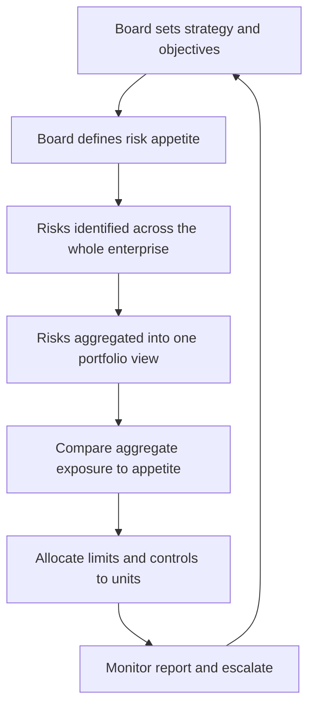
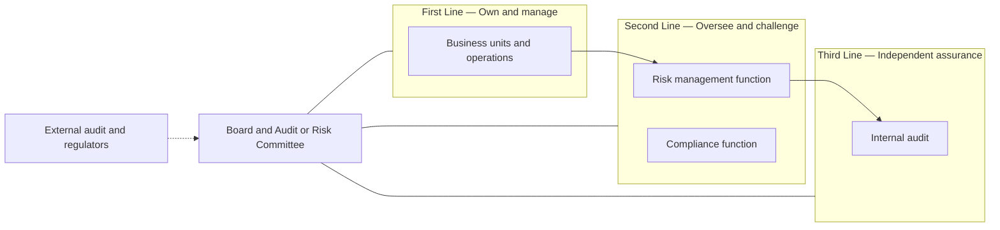
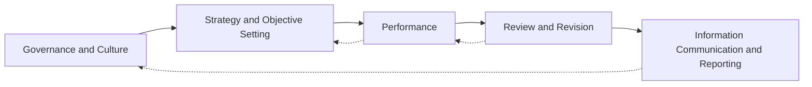

# Chapter 14 — Enterprise Risk Management

## 1. The Problem / The Need

Imagine a large bank in 2007. Its trading desk is loading up on mortgage-backed securities and reporting record profits. Its treasury is funding those positions with cheap overnight repo. Its retail arm is writing sub-prime mortgages to feed the securitisation machine. Each unit has its own risk manager, its own limits, its own dashboard. Every one of them is inside its limits. Every one of them looks safe.

And then the bank collapses.

How can an institution where *every individual desk is within its risk limits* fail catastrophically? Because nobody was adding it all up. The market-risk team measured price moves. The credit team measured borrower defaults. The liquidity team measured funding gaps. But mortgage default, MBS price collapse, and repo funding drying up are **the same event viewed from three angles** — they are perfectly correlated in a crisis. The bank's *true* exposure was not the sum of three moderate risks; it was one enormous, concentrated bet on US housing, invisible to anyone looking through a single-function lens.

This is the fundamental problem that **Enterprise Risk Management (ERM)** exists to solve. Traditional risk management is **siloed**: each risk type (market, credit, operational, liquidity, reputational, strategic) is owned by a specialist team that manages it in isolation. Siloed risk management fails for four structural reasons:

1. **Correlations are invisible.** Risks that look independent inside silos are often driven by the same underlying factor. Adding up silo exposures understates the aggregate.
2. **Nobody owns the total.** If every silo covers its own patch, the *portfolio* of risks — the thing that actually determines whether the firm survives — has no owner.
3. **Risk is treated as a cost to minimise, not a resource to allocate.** Silos say "reduce my risk." Nobody asks "are we taking the *right* risks in the right amounts to earn our required return?"
4. **Emerging and strategic risks fall through the cracks.** A new competitor, a regulatory shift, a technology disruption — these don't belong to any single silo, so no silo watches for them.

The result is an organisation that is locally optimised and globally fragile. Every part is prudent; the whole is reckless. ERM is the discipline that raises the vantage point from the desk to the boardroom and asks a different question: *not "is each risk controlled?" but "is the firm as a whole taking risk deliberately, in amounts it can survive, in pursuit of its strategy?"*

## 2. The Core Idea

**Enterprise Risk Management is the holistic, integrated, top-down management of the full portfolio of risks facing an organisation, aligned with its strategy and governed from the board.**

Unpack the four load-bearing words:

- **Holistic** — every risk type is in scope: financial *and* non-financial, quantifiable *and* judgemental, downside threats *and* the risk of missing upside. Strategic, operational, financial, compliance, reputational, and emerging risks are all on one map.
- **Integrated** — risks are aggregated and viewed together so correlations, concentrations, and offsets become visible. ERM manages the *portfolio*, not the pieces.
- **Top-down** — direction flows from the board's articulation of how much risk the firm is willing to take (its **risk appetite**) down to the limits and controls in each unit. This is the mirror image of siloed, bottom-up risk management.
- **Strategy-aligned** — risk is not a compliance afterthought bolted on after the plan is set. Risk is a lens *on the strategy itself*: which objectives, which bets, which uncertainties could stop us achieving what we set out to do — and are those the risks we *want* to be taking?

The single most important mental shift ERM demands is this: **risk is not just something to be minimised; it is something to be consciously chosen and allocated.** A firm that takes no risk earns no return and eventually dies. The job is not to eliminate risk but to take the *right* risks, in *deliberate* amounts, that the firm is *capable of bearing*, in service of objectives the board has endorsed. ERM turns risk from a defensive, "keep us out of trouble" function into a strategic capability that shapes where the firm competes.

*Figure 14.1 — ERM as a closed top-down loop from strategy to monitoring and back.*

## 3. Why / How It Works

Why does aggregating risk change the answer so dramatically? The mathematics of correlation is the engine underneath ERM.

**The diversification argument.** If two risks are less than perfectly correlated, the risk of holding both together is *less* than the sum of holding each alone. This is the same portfolio insight from investing, applied to the whole firm. A general insurer writing both hurricane cover in Florida and earthquake cover in Japan is safer than the sum of its parts, because a Florida hurricane and a Japanese earthquake almost never happen the same week. Silos miss this benefit — they can't net offsetting exposures they never see together — so a firm managed only in silos will *over-hold* capital against diversifiable risk and, worse, *under-hold* against concentrated risk.

**The concentration argument.** The mirror image is more dangerous. When risks *are* highly correlated — the 2007 bank's mortgage default, MBS price, and repo funding — the aggregate is far *larger* than any single silo shows. Silos systematically understate concentrated risk because the concentration only appears when you add the pieces up. ERM's aggregation step is precisely what surfaces the hidden bet.

Formally, for two exposures with standard deviations σ₁ and σ₂ and correlation ρ, the combined risk is:

σ_portfolio = √(σ₁² + σ₂² + 2·ρ·σ₁·σ₂)

When ρ = 1 (perfect correlation), this collapses to σ₁ + σ₂ — risks simply add. When ρ < 1, the combined risk is strictly *less* than the sum. When ρ is negative, the risks partly cancel. **A silo implicitly assumes ρ = 1 with everything it can't see, or ρ = 0 by ignoring the rest — and it is almost never right about either.** Only enterprise-level aggregation gets ρ approximately correct.

**Why top-down governance is essential.** Even with perfect aggregation, someone must *decide* how much total risk is acceptable and *enforce* it downward. Left to themselves, individual units maximise their own performance metrics and collectively overshoot — a classic tragedy of the commons where the shared resource being over-consumed is the firm's risk-bearing capacity (its capital and its survival). The board owns that capacity on behalf of shareholders, so the board must set the ceiling. ERM works because it puts the aggregate ceiling and the strategy in the same hands.

**Why culture makes or breaks it.** Frameworks, limits, and committees are necessary but not sufficient. Every risk failure autopsy — Barings, Enron, Lehman, the London Whale — reveals that the formal apparatus existed but was ignored, overridden, or gamed. Risk lives in thousands of daily decisions by people the framework never directly touches. If the tacit message from the top is "hit the numbers and don't slow us down," no policy document will stop the next blow-up. ERM works only when the *culture* — the shared, often-unspoken norms about how risk is really treated — reinforces the framework rather than undermining it.

## 4. Full Content

### 4.1 The three building blocks of ERM

ERM rests on three interlocking pillars. Miss any one and the structure fails.

| Pillar | Question it answers | Key artefacts |
|---|---|---|
| **Risk governance** | Who is accountable for risk, and how is authority delegated? | Board risk committee, three lines of defence, CRO mandate, risk policies |
| **Risk appetite** | How much and what kinds of risk are we willing to take? | Risk appetite statement, tolerances, limits cascade |
| **Risk culture** | How do people actually behave toward risk day to day? | Tone from the top, incentives, escalation norms, "speak-up" behaviour |

### 4.2 Risk governance and the three lines of defence

**Governance** is the structure of accountability: who decides, who executes, who challenges, and who assures. The board holds ultimate responsibility for risk — it cannot delegate that — but it delegates *execution*. In most large firms the board operates a dedicated **Board Risk Committee** (separate from the Audit Committee, which focuses on financial reporting and controls) that reviews the risk appetite, the risk profile against it, and major risk decisions.

The workhorse operating model for governance is the **Three Lines of Defence**. It answers the question "who owns risk?" with a clear separation of duties:

*Figure 14.2 — The three lines of defence separating ownership challenge and assurance.*

- **First line — the business.** The people who *take* the risk *own* the risk. A trading desk, a lending team, a factory manager — they generate exposures and are the first responsible for identifying, controlling, and managing them within their limits. Risk ownership is *not* outsourced to a risk department; it sits with the business that creates it. This is the single most important governance principle and the one firms most often get wrong.
- **Second line — risk and compliance oversight.** Independent functions that set the framework, aggregate the enterprise view, monitor limits, challenge the first line's decisions, and report to the board. This is where the CRO and the risk-management function live, alongside compliance (which specifically oversees legal and regulatory conformance). The second line does *not* own the risk — it oversees how the first line owns it.
- **Third line — internal audit.** Fully independent assurance that both the first and second lines are working as designed. Internal audit reports functionally to the Audit Committee, not to management, so it can challenge without fear. It provides the board objective evidence that the risk apparatus is real, not theatre.

A frequently added **"fourth line"** comprises external audit and regulators — outside-the-firm assurance. The updated 2020 model from the Institute of Internal Auditors reframes this as the **"Three Lines Model,"** softening the militaristic "defence" language and stressing collaboration and value creation over pure control, but the core separation — ownership, oversight, assurance — remains.

The critical failure mode this model prevents is **the poacher guarding the henhouse**: a business unit marking its own homework, with no independent challenge and no independent assurance. When the second and third lines are weak, captured, or under-resourced, the first line's optimism goes unchecked.

### 4.3 The risk appetite framework

**Risk appetite is the amount and type of risk an organisation is willing to accept in pursuit of its objectives.** It is the hinge that connects strategy to day-to-day limits. Without it, "how much risk is too much?" has no answer and every limit is arbitrary.

The framework has a hierarchy, from abstract intent at the top to hard numbers at the bottom:

| Level | Term | Nature | Example |
|---|---|---|---|
| 1 | **Risk capacity** | The *maximum* risk the firm could bear before breaching a hard constraint | Total loss-absorbing capital before insolvency or covenant breach |
| 2 | **Risk appetite** | How much risk the firm *chooses* to take, within capacity | "We accept up to 15% of capital at risk over one year" |
| 3 | **Risk tolerance** | Acceptable variation around a specific objective | "Credit losses may vary +/- 20% around the plan" |
| 4 | **Risk limits** | Hard operational thresholds allocated to units | "Desk X VaR ceiling of 10 million; single-name exposure cap of 50 million" |

Appetite is expressed both **qualitatively** ("we have zero appetite for regulatory breaches or safety incidents; moderate appetite for market risk in core products; no appetite for reputational damage") and **quantitatively** (VaR ceilings, economic capital allocations, ratings targets, maximum acceptable loss, liquidity coverage floors). The qualitative statement gives meaning; the quantitative metrics make it enforceable.

The **Risk Appetite Statement (RAS)** is the board-approved document that captures all of this. A well-built RAS is:
- **Linked to strategy** — appetite is set *for* the objectives, not in the abstract.
- **Cascaded** — the enterprise appetite is broken down into limits for each business line, so a desk's limit is a *slice* of the firm's total appetite, not an isolated number.
- **Actionable and monitored** — every appetite statement maps to a metric with a threshold, a green/amber/red status, and an escalation path when breached.
- **Forward-looking** — tested against stress scenarios, not just current exposure.

The appetite framework is what makes ERM *top-down* in practice: the board sets the total, and limits cascade down so that the sum of what every unit is allowed to take equals what the firm as a whole is willing to bear.

### 4.4 Risk culture

If appetite is the framework's *design*, culture is whether the framework is *lived*. **Risk culture is the set of shared values, attitudes, and behaviours that shape how risk is actually treated across the organisation** — especially in the moments no policy anticipates.

The reason culture dominates is empirical: nearly every large risk failure had adequate formal controls that people simply bypassed. Barings had position limits; Nick Leeson hid his losses in an unreconciled error account and no one challenged a "star" trader. The controls existed; the culture — deference to a rainmaker, weak back-office challenge — defeated them.

The observable drivers and markers of a healthy risk culture:

- **Tone from the top.** Senior leaders visibly treat risk as everyone's business, welcome bad news, and act consistently with the stated appetite even when it costs short-term profit. Behaviour, not memos.
- **Incentives aligned with prudent risk-taking.** If bonuses reward short-term revenue with no clawback for later losses, the incentive system is *manufacturing* excessive risk regardless of the stated appetite. Compensation must be risk-adjusted and deferred.
- **Psychological safety and speak-up.** People can raise concerns, challenge decisions, and report near-misses without fear of retaliation. The health of a risk culture is measured less by how confident everyone is and more by how freely bad news travels upward.
- **Accountability and consequences.** Limit breaches and control failures have real consequences, applied consistently regardless of seniority or how much revenue the person generates.
- **Effective challenge.** The second line genuinely challenges the first, and the challenge is respected rather than resented as an obstacle.

Culture is diagnosed through leading indicators — employee surveys, near-miss reporting rates, how limit breaches are handled, whether risk teams are seen as partners or police, turnover in control functions — because by the time it shows up in losses, it is too late.

### 4.5 The COSO ERM framework

The most widely adopted conceptual framework for ERM is **COSO's "Enterprise Risk Management — Integrating with Strategy and Performance"** (the 2017 update of the original 2004 cube). COSO — the Committee of Sponsoring Organizations of the Treadway Commission — is the same body behind the dominant internal-control framework. The 2017 revision made a decisive shift: it moved ERM away from a control-and-compliance checklist and toward **integration with strategy and the creation and preservation of value.**

The 2017 framework organises ERM into **five interrelated components** supported by **twenty principles**:

| # | Component | What it covers |
|---|---|---|
| 1 | **Governance and Culture** | Board oversight, operating structures, defining the desired culture, commitment to core values, attracting and retaining capable people |
| 2 | **Strategy and Objective-Setting** | Analysing business context, defining risk appetite, evaluating alternative strategies, formulating objectives aligned with appetite |
| 3 | **Performance** | Identifying risk, assessing severity, prioritising, implementing responses, developing a portfolio view of risk |
| 4 | **Review and Revision** | Assessing substantial change, reviewing risk and performance, pursuing improvement in ERM |
| 5 | **Information, Communication, and Reporting** | Leveraging information systems, communicating risk information, reporting on risk culture and performance |

*Figure 14.3 — The five components of the COSO 2017 ERM framework as an integrated flow.*

The three big messages of COSO 2017 are worth memorising because interviewers probe them:

1. **ERM is not a separate function bolted on — it is woven into strategy-setting and performance management.** Risk consideration begins *when strategy is chosen*, including the risk that the *chosen strategy doesn't align with mission* and the risk of *implications from the strategy* selected. This "strategy risk" framing is the heart of the 2017 update.
2. **The goal is value.** ERM enhances the ability to create, preserve, and realise value — not merely to avoid loss. This reframes risk from purely defensive to genuinely strategic.
3. **Culture and governance come first, literally.** The framework leads with governance and culture because, as section 4.4 argued, everything downstream depends on them.

The **ISO 31000** standard is a lighter, more generic alternative — principles, framework, and a plan-do-check-act process (establish context → risk assessment [identify, analyse, evaluate] → treat → monitor → communicate) — applicable to any organisation of any size, not just corporates. COSO is more detailed and governance-heavy; ISO 31000 is more universal and process-oriented. Many firms borrow from both.

### 4.6 The Chief Risk Officer (CRO)

ERM needs an owner at the executive table, and that owner is the **Chief Risk Officer**. The CRO is the senior executive accountable for the enterprise-wide risk framework — the person who makes "someone owns the total" a reality.

Core responsibilities:
- **Own the ERM framework** — design, implement, and maintain the risk taxonomy, appetite framework, methodologies, and policies.
- **Produce the enterprise portfolio view** — aggregate risks across silos into one integrated picture and report the firm's actual profile against appetite to the board.
- **Provide independent challenge** — as head of the second line, challenge the business's risk-taking, sign off on major transactions, and say "no" or "not at that size" when appetite would be breached.
- **Advise on strategy** — bring the risk lens into strategic decisions early, quantifying the risk-adjusted trade-offs of alternative plans.
- **Champion risk culture** — set the tone for the risk function and drive the behavioural norms across the firm.

The CRO's **independence** is structural and non-negotiable. The role rose to prominence after the 2008 crisis precisely because risk heads had too often been buried under revenue-generating executives who could overrule them. Best practice — and, for banks, regulatory requirement — is that the CRO reports directly to the **CEO** *and* has a direct, unfettered line to the **Board Risk Committee**, with the committee (not the CEO alone) controlling the CRO's appointment, removal, and compensation. This dual reporting protects the CRO from being silenced by the very executives whose risk-taking they must challenge.

The essential tension in the role: the CRO must be **close enough to the business to be credible and informed, yet independent enough to challenge it.** A CRO captured by the business is useless; a CRO so detached they don't understand the business is ignored. Walking that line is the craft of the job.

### 4.7 Why silos fail and ERM adds value — pulled together

The value ERM adds over siloed risk management, summarised:

| Dimension | Siloed risk management | Enterprise Risk Management |
|---|---|---|
| Scope | One risk type per team | All risks, one portfolio |
| Correlations | Invisible — assumed away | Explicitly aggregated |
| Concentrations | Hidden across silos | Surfaced by aggregation |
| Direction | Bottom-up, local | Top-down from board appetite |
| Ownership of the total | Nobody | CRO and board |
| View of risk | Cost to minimise | Resource to allocate to strategy |
| Strategic/emerging risk | Falls through cracks | Explicitly in scope |
| Capital | Over-held vs diversifiable, under-held vs concentrated | Optimised against true aggregate |

ERM's payoff is both defensive and offensive. **Defensively**, it prevents the "every silo fine, whole firm doomed" failure by making concentrations visible and putting a board-owned ceiling on the total. **Offensively**, it lets a firm *deliberately* take more of the risks it is good at and well-capitalised for — allocating its finite risk-bearing capacity to its highest risk-adjusted-return opportunities — because it can now see and price the whole picture. That is the difference between risk management as a brake and risk management as a steering wheel.

## 5. Worked / Applied Examples

### Example 1 — The correlation that silos miss (a bank)

A bank has two exposures, each measured by its own silo:
- **Market-risk silo:** its MBS portfolio has a one-year 99% VaR (loss) of **£100m**.
- **Credit-risk silo:** its mortgage loan book has a one-year 99% loss estimate of **£100m**.

Each silo reports "£100m at risk, within my limit." Naively, a manager might think total risk is somewhere between £100m (if fully offsetting) and £200m (if additive), and comfort themselves it's "diversified."

Now apply the aggregation formula. What is the *true* correlation ρ between MBS losses and mortgage-book losses? Both are driven by the **same underlying factor** — US house prices and mortgage defaults. In a housing downturn, mortgages default *and* MBS prices collapse together. Realistically ρ ≈ 0.9.

σ_portfolio = √(100² + 100² + 2 × 0.9 × 100 × 100)
= √(10,000 + 10,000 + 18,000)
= √38,000 ≈ **£195m**

The aggregate risk is **£195m — essentially additive**, almost the full £200m, because the two "different" risks are nearly the same bet. The silos, each seeing £100m, radically understated the firm's true exposure. Had the bank instead diversified into, say, a European corporate loan book with ρ ≈ 0.2 against its MBS:

σ_portfolio = √(100² + 100² + 2 × 0.2 × 100 × 100) = √24,000 ≈ **£155m**

**Reconciliation and lesson:** same £100m per silo in both cases, but the enterprise risk is £195m for the concentrated pair versus £155m for the diversified pair — a £40m difference invisible to any silo. ERM's aggregation step is the *only* place this shows up. The concentrated bank is carrying near-double the risk it thinks it is; only an enterprise view reveals it and forces either a capital increase or a hedge.

### Example 2 — Cascading a risk appetite statement (a manufacturer)

"SafeBuild Ltd," a construction-materials group, holds **£500m of loss-absorbing capital** (its risk *capacity*). The board sets a **risk appetite** of "we will not put more than 20% of capital at risk over a one-year horizon at a 95% confidence level" → an enterprise economic-capital budget of **£100m**.

The CRO cascades this £100m across the group's risk types, choosing the allocation to match strategy (SafeBuild wants to grow its overseas operations, so it deliberately funds more market/FX and operational appetite there):

| Risk type | Allocated economic capital (appetite) | Illustrative hard limit |
|---|---|---|
| Operational (safety, plant) | £40m | Zero appetite for fatalities; max £5m single-event loss |
| Market / FX | £25m | FX VaR ceiling £8m |
| Credit (customer receivables) | £20m | Single-customer exposure cap £15m |
| Strategic / project | £15m | No single project > £30m committed capital |
| **Total** | **£100m** | = board appetite |

Six months in, the FX desk's VaR reaches £7.5m against its £8m limit — **amber**. Under the framework, this triggers escalation to the CRO and Risk Committee *before* the limit is breached, not after a loss.

**Reconciliation and lesson:** capacity £500m > appetite £100m > sum of allocated limits £100m. The chain holds: the firm never allocates more appetite than the board authorised, keeps a £400m buffer between appetite and capacity for the truly unexpected, and the desk-level £8m limit is a *deliberate slice* of the enterprise total — not an isolated number. The appetite framework converts one board sentence into an enforceable, monitored limit on a single trading desk.

### Example 3 — When culture defeats the framework (a trading loss)

"Meridian Bank" has a textbook ERM apparatus: an independent CRO reporting to a Board Risk Committee, VaR limits on every desk, and daily risk reports. Yet it loses **£1.2bn** on a single credit-derivatives book.

Trace the failure through the framework, not around it:
- **First line:** a star trader builds an outsized position. His desk head, whose bonus depends on the desk's revenue, waves it through and pressures the back office to accept the trader's own generous valuations.
- **Second line:** the risk function notices the VaR model is being changed in ways that *lower* reported risk. But the risk analysts are junior, poorly paid relative to the desk, and their challenges are dismissed as "not understanding the business." Effective challenge fails.
- **Culture:** the tone from the top is "revenue is king." Raising concerns about a rainmaker is career-limiting. Near-misses go unreported.

Every *structural* box was ticked — CRO, limits, reports all existed — yet the firm lost £1.2bn because the **culture** (deference to revenue, weak challenge, no psychological safety) hollowed out the framework.

**Reconciliation and lesson:** this is the London Whale / Barings pattern in miniature. It demonstrates the chapter's central caveat — governance structure and risk appetite are necessary but *not sufficient*. Without a culture that makes challenge safe and prudent behaviour rewarded, the finest framework on paper is theatre. ERM is 30% framework and 70% behaviour.

## 6. Connections

- **Portfolio theory (Chapter on diversification/Markowitz):** ERM is portfolio theory applied to the whole firm. The correlation mathematics in Example 1 is identical to two-asset portfolio variance — the "assets" are just risk exposures instead of securities.
- **Value at Risk and Economic Capital:** VaR (market-risk chapters) and economic capital are the quantitative engines that let ERM aggregate and allocate. Risk appetite is typically *denominated* in these units.
- **Operational risk and internal control:** COSO ERM is the sibling of the COSO Internal Control framework; the three lines of defence originated as an internal-control concept and now anchors ERM governance. For CA students, this dovetails directly with auditing's control-environment and governance topics.
- **Basel and Solvency regulation:** Basel's ICAAP (Internal Capital Adequacy Assessment Process) for banks and Solvency II's ORSA (Own Risk and Solvency Assessment) for insurers are *regulatory mandates for ERM* — they force firms to run exactly this appetite-capacity-aggregation loop and prove it to supervisors.
- **Corporate governance:** the Board Risk Committee, CRO independence, and audit-committee relationships tie ERM into the broader governance syllabus — board composition, non-executive oversight, and stewardship.
- **Behavioural finance / agency theory:** risk culture and misaligned incentives are agency problems. The tragedy-of-the-commons framing of why silos overshoot the firm's risk capacity is pure agency economics.
- **Strategic management:** COSO 2017's core message — risk-in-strategy — connects ERM directly to strategy formulation, competitive positioning, and scenario planning.

## 7. Key Terms

- **Enterprise Risk Management (ERM):** holistic, integrated, top-down, strategy-aligned management of the entire portfolio of an organisation's risks.
- **Silo (siloed risk management):** managing each risk type in isolation, blind to correlations and concentrations across the firm.
- **Risk governance:** the structure of accountability, delegation, oversight, and assurance for risk, anchored by the board.
- **Three Lines of Defence / Three Lines Model:** first line (business — owns risk), second line (risk & compliance — oversees), third line (internal audit — assures).
- **Risk capacity:** the maximum risk a firm *could* bear before hitting a hard constraint (insolvency, covenant breach).
- **Risk appetite:** the amount and type of risk a firm *chooses* to take in pursuit of objectives; less than capacity.
- **Risk tolerance:** acceptable variation around a specific objective or metric.
- **Risk limit:** a hard operational threshold allocated to a unit; a slice of enterprise appetite.
- **Risk Appetite Statement (RAS):** board-approved document articulating appetite qualitatively and quantitatively.
- **Risk culture:** shared values, attitudes, and behaviours that shape how risk is actually treated day to day.
- **Effective challenge:** the second line genuinely questioning and, when needed, overriding first-line risk decisions.
- **COSO ERM (2017):** the leading ERM framework — five components, twenty principles, integrating risk with strategy and performance.
- **ISO 31000:** a generic, universal risk-management standard (principles, framework, process).
- **Chief Risk Officer (CRO):** senior executive accountable for the enterprise risk framework, head of the second line, with independent board access.
- **Portfolio view of risk:** the aggregated, correlation-aware picture of all risks together — the deliverable ERM exists to produce.
- **Economic capital:** capital a firm calculates it needs to absorb unexpected losses to a chosen confidence level; a common currency for appetite.

## 8. Common Confusions

- **"ERM means minimising or eliminating risk."** No. ERM is about taking the *right* risks *deliberately* and in amounts the firm can bear. A firm with zero risk earns zero return. The goal is optimisation and conscious allocation, not minimisation.
- **"Risk appetite and risk capacity are the same."** No. Capacity is the *maximum you could* bear (a constraint); appetite is *how much you choose* to take (a decision), and it sits *below* capacity, leaving a buffer.
- **"Risk tolerance = risk appetite."** Related but distinct. Appetite is the firm-wide willingness to take risk overall; tolerance is the acceptable variation around a *specific* objective or metric. Appetite is strategic and broad; tolerance is operational and narrow.
- **"The three lines of defence means three teams that all do risk."** No — it's a *separation of duties*. The first line *owns and takes* the risk (it is not a control function); the second *oversees and challenges*; the third *independently assures*. Blurring them (e.g., letting risk teams take positions, or internal audit report to management) breaks the model.
- **"The second line owns the risk."** No. The *business* (first line) owns the risk it creates. The risk function oversees; it does not take the exposure or absolve the business of ownership. This is the most common governance error.
- **"COSO ERM and COSO Internal Control are the same thing."** They are siblings from the same body but distinct. Internal Control is about reliable reporting, compliance, and operational controls; ERM is broader — strategy, appetite, and the full risk portfolio. ERM subsumes control concepts but goes well beyond them.
- **"ERM is a software system / a report."** ERM is a *management discipline and culture*, not a dashboard. Buying a GRC tool does not give you ERM any more than buying a treadmill makes you fit. Example 3 shows a firm with all the tooling that still failed on culture.
- **"The CRO is responsible for all the firm's risk."** No. The *business* is responsible for taking and managing its risk; the CRO is responsible for the *framework*, the *aggregate view*, and *independent challenge*. Making the CRO the sole owner of risk lets the business abdicate — the opposite of the intended model.
- **"More capital always means safer."** Not if it's held against the wrong (diversifiable) risks while concentrated risks go uncovered. ERM's point is to hold the *right* capital against the *true aggregate*, which is why silo-based capital allocation is both wasteful and dangerous.

## 9. Recap

Siloed risk management fails because it manages each risk type in isolation and so cannot see correlations, cannot see concentrations, gives nobody ownership of the total, treats risk as a cost to minimise, and lets strategic and emerging risks fall through the cracks. The 2007-style failure — every desk within limits, the whole firm doomed — is the signature symptom.

ERM answers this by managing risk **holistically, integrated, top-down, and aligned with strategy**. It rests on three pillars: **governance** (who is accountable — anchored by the board, the three lines of defence, and an independent CRO), **risk appetite** (how much risk we choose to take — cascaded from board-set capacity through appetite and tolerance down to unit limits), and **culture** (whether the framework is actually lived — the behaviours, incentives, and speak-up norms that make or break everything else).

The mathematics of correlation is the engine: aggregating exposures reveals that concentrated risks add up to far more than any silo shows, while genuinely diversified risks add up to less — knowledge that lets a firm allocate its finite risk-bearing capacity deliberately. The **COSO 2017 framework** codifies this in five components (Governance & Culture; Strategy & Objective-Setting; Performance; Review & Revision; Information, Communication & Reporting), reframing ERM from compliance chore to strategic, value-creating discipline. The **CRO** owns the framework and the portfolio view, challenges the business independently, and reports to both CEO and board. And the enduring caveat — proven by every blow-up from Barings to the London Whale — is that structure and appetite are necessary but never sufficient: **without a healthy risk culture, the finest framework is theatre.**

## 10. Quick-Reference / Interview Points

- **One-line definition:** ERM is the holistic, integrated, top-down management of an organisation's entire risk portfolio, aligned with strategy and governed from the board.
- **Why silos fail (four reasons):** invisible correlations; hidden concentrations; nobody owns the total; strategic/emerging risks fall through the cracks. Signature: every desk within limits, whole firm collapses.
- **The value ERM adds:** defensively, surfaces concentrations and caps the total; offensively, lets the firm allocate finite risk capacity to its best risk-adjusted opportunities.
- **Three lines of defence:** 1st = business (owns/takes risk), 2nd = risk & compliance (oversees/challenges), 3rd = internal audit (independent assurance). Business owns the risk — *not* the risk department.
- **Appetite hierarchy:** capacity (max you *could* bear) > appetite (how much you *choose*) > tolerance (variation around an objective) > limits (hard unit thresholds). Cascade the top down into the bottom.
- **Risk Appetite Statement:** board-approved, strategy-linked, qualitative + quantitative, cascaded, monitored with green/amber/red escalation.
- **COSO ERM 2017 — five components:** Governance & Culture; Strategy & Objective-Setting; Performance; Review & Revision; Information, Communication & Reporting. Big message: integrate risk with strategy and value creation, not compliance.
- **COSO vs ISO 31000:** COSO is detailed, governance-heavy, corporate-focused; ISO 31000 is generic, principles-based, universal. Basel ICAAP (banks) and Solvency II ORSA (insurers) are regulatory ERM mandates.
- **CRO essentials:** owns the framework and portfolio view; independent challenge; dual reporting to CEO *and* Board Risk Committee; committee controls appointment/removal/pay. Tension: close enough to be credible, independent enough to challenge.
- **Risk culture markers:** tone from the top, risk-aligned incentives with clawback/deferral, psychological safety to speak up, consistent accountability, effective challenge. Diagnosed via leading indicators (near-miss reporting, breach handling, survey data).
- **Correlation formula (be ready to compute):** σ_portfolio = √(σ₁² + σ₂² + 2ρσ₁σ₂). ρ→1 means risks add (concentration); ρ<1 means diversification benefit. Silos implicitly get ρ wrong.
- **Killer interview soundbite:** "ERM turns risk management from a brake into a steering wheel — from minimising risk in silos to deliberately allocating the firm's risk-bearing capacity to its strategy. But it's 30% framework and 70% culture: Barings and the London Whale had the controls and still blew up."
- **If asked 'why did ERM rise after 2008?':** the crisis exposed that firms were fatally concentrated in correlated risks their silos couldn't see, and that risk heads had no independent voice. ERM's board-owned appetite, aggregation, and independent CRO are the direct institutional response.
