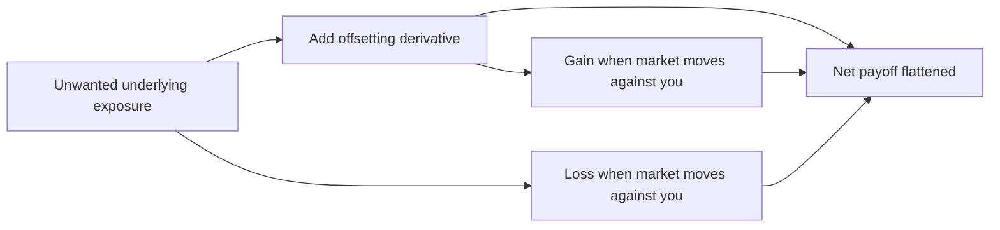
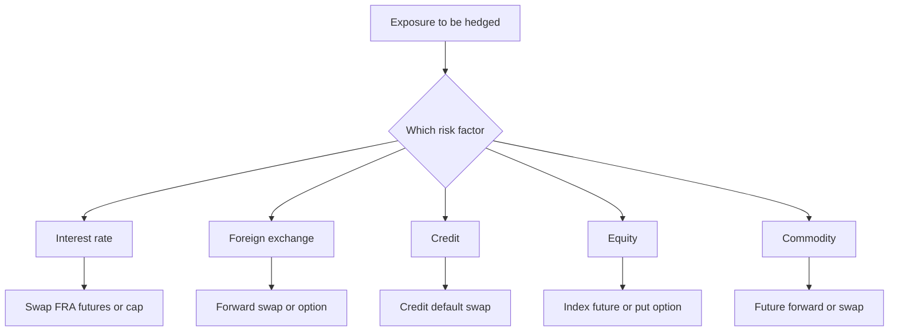
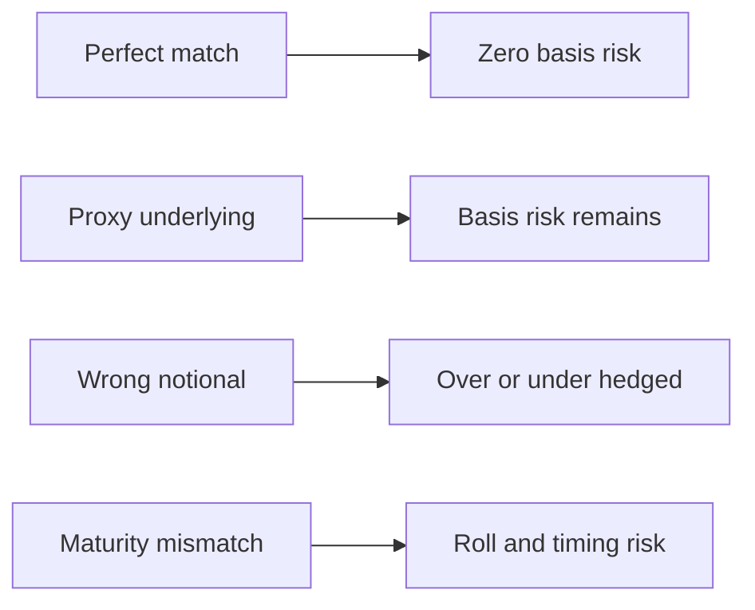
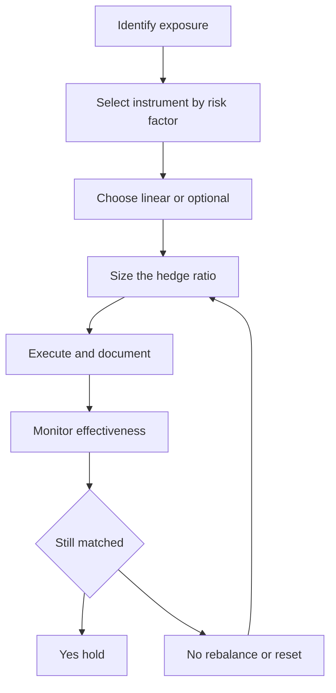

# Chapter 15 — Using Derivatives to Manage Risk

## 1. The Problem / The Need

Every operating business and every investing institution carries risks it never chose and does not want. A wheat mill wants to make flour, not to speculate on wheat prices — yet the moment it agrees to sell flour at a fixed price for the next six months while buying wheat at whatever the market charges, it has become an accidental commodity speculator. An Indian software exporter wants to write code, not to bet on the rupee — yet an invoice denominated in dollars and payable in ninety days is a directional currency position whether the CFO likes it or not. A bank wants to lend, not to gamble on the direction of interest rates — yet funding a ten-year fixed-rate mortgage with overnight deposits is one of the largest interest-rate bets in the economy.

These are *residual* risks. They arise as an unavoidable by-product of doing legitimate business. The firm has three choices for each of them:

1. **Accept** the risk — do nothing, and let earnings swing with the market.
2. **Avoid** the risk operationally — refuse the dollar contract, don't lend long, don't buy inventory in advance. This usually means refusing the business itself.
3. **Transfer or offset** the risk — keep the underlying business but lay off the unwanted price exposure to someone willing to hold it.

The third route is the province of **derivatives**. A derivative is a contract whose value *derives* from the price of something else — an interest rate, an exchange rate, a share price, a commodity, or the creditworthiness of a borrower. Because a derivative's payoff can be engineered to move in the exact opposite direction to an existing exposure, it lets a firm surgically remove a specific price risk while keeping everything else about its business intact. That surgical precision — decoupling *what you do* from *what price risk you bear* — is the core reason derivatives exist and the reason they are the primary tools of modern risk management.

The problem this chapter solves is therefore practical and repeated daily in every treasury and trading desk: **given a specific unwanted exposure, which derivative neutralises it, how much of it do you need, and how do you make sure the hedge keeps working over time without quietly turning into a new speculation of its own?**

## 2. The Core Idea

The core idea is **offset**. If you own an asset whose value falls when some market variable moves against you, you construct a derivative position whose value *rises* by an equal amount when that same variable moves. Combine the two and the net position is insensitive — fully or partly — to that variable. The gain on one leg cancels the loss on the other.

*Figure 15.1 — A hedge pairs an exposure with an opposite-signed derivative so the combined payoff is stabilised.*

Two things make this idea powerful and worth understanding deeply.

First, a derivative requires little or no capital to establish a large offsetting position. A forward or a swap typically costs nothing to enter; a futures contract needs only a margin deposit that is a small fraction of the notional; an option costs a premium far smaller than the value it controls. This **leverage** is what lets a firm hedge a crore of exposure without tying up a crore of cash — and it is also, as Part 3 and Part 8 explain, the exact mechanism by which derivatives can *create* catastrophic risk when used to speculate rather than to offset.

Second, the offset can be shaped. A **forward, future or swap** locks in a price and removes both downside *and* upside symmetrically — you are protected if the market moves against you but you forgo the gain if it moves in your favour. An **option** removes the downside while preserving the upside, in exchange for an upfront premium. The choice between the two is one of the central design decisions in any hedge and reflects whether the firm wants certainty (lock it in) or protection-with-participation (buy insurance).

## 3. Why / How It Works

A hedge works because of a single mechanical fact: the derivative and the exposure share the same **underlying** driver. When two contracts reference the same variable, their values move together (or in controlled opposition), and by holding them in opposite directions you engineer cancellation.

Consider the exporter with a USD 1 million receivable due in 90 days. Its home-currency value falls if the rupee strengthens (fewer rupees per dollar). The firm sells USD 1 million forward at today's agreed rate. If in 90 days the rupee has strengthened, the receivable converts to fewer rupees — a loss — but the forward now lets the firm sell dollars above the spot rate — an offsetting gain. If instead the rupee weakens, the receivable is worth more but the forward loses exactly that extra amount. Either way the firm banks the forward rate. The *reason* it works is that both the receivable and the forward settle against the same USD/INR rate on the same date.

Three principles govern whether the offset is clean or leaky:

**Matching.** The hedge cancels the exposure only to the extent the derivative's terms mirror the exposure's terms — same underlying, same amount (notional), same maturity/timing, and ideally the same reference rate or grade. Mismatch on any dimension leaves a residual, called **basis risk**: the risk that the price of what you hedged with and the price of what you actually own do not move one-for-one.

**Payoff symmetry versus asymmetry.** Linear instruments (forwards, futures, swaps) produce a symmetric offset — the hedge line is a mirror image of the exposure line, so the sum is flat. Options produce a kinked payoff — they cut off one tail while leaving the other open. This is why a linear hedge *removes* volatility whereas an option *reshapes* it.

**Hedge ratio.** You rarely offset one-for-one by notional. The right quantity is the number of derivative units whose value change matches the exposure's value change for a given move in the underlying. For a bond portfolio you scale by relative duration/DV01; for an equity portfolio you scale by beta; for an option-based hedge you scale by delta. Getting the ratio wrong is the difference between a hedge that neutralises the exposure and one that over- or under-shoots.

*Figure 15.2 — The exposure's dominant risk factor selects the instrument family.*

## 4. Full Content

### 4.1 The four building-block instruments

Almost every hedge is assembled from four primitives. Understanding these four — and precisely how their payoff profiles differ — lets you reason about any structured product.

| Instrument | Obligation | Cost to enter | Payoff shape | Removes downside | Keeps upside |
|---|---|---|---|---|---|
| **Forward** | Both parties must transact at agreed price on a future date | Zero | Linear symmetric | Yes | No |
| **Future** | Same as forward but exchange-traded and margined daily | Margin only | Linear symmetric | Yes | No |
| **Swap** | Exchange one stream of cash flows for another over time | Zero | Linear symmetric | Yes | No |
| **Option** | Buyer has the right not the obligation to transact | Premium paid upfront | Non-linear kinked | Yes (if bought) | Yes |

A **forward** is a bilateral, customisable contract to buy or sell an asset at a set price on a set date. It is precise and flexible but carries counterparty credit risk and is illiquid.

A **future** is a standardised forward traded on an exchange, marked to market daily through a clearing house that eliminates counterparty risk via margining. Standardisation buys liquidity but sacrifices exact matching (fixed contract sizes and delivery dates), which introduces basis risk.

A **swap** is a series of forwards bundled into one contract — an agreement to exchange cash flow streams. The interest-rate swap (fixed for floating) is the single most-used risk-management instrument in the world; currency swaps, and to a degree commodity swaps, extend the same idea.

An **option** confers a right without an obligation. A **call** is the right to buy; a **put** is the right to sell. The buyer pays a **premium** and thereby caps their loss at that premium while retaining unlimited favourable participation. The seller (writer) collects the premium and takes on the obligation — and potentially large losses. Options are insurance: you pay a fee to transfer the bad tail while keeping the good one.

### 4.2 Hedging interest-rate risk

Interest-rate risk is the sensitivity of earnings or asset values to changes in interest rates. A borrower on a floating-rate loan suffers when rates rise; a bond investor suffers when rates rise (prices fall); a bank with a duration mismatch suffers when the yield curve moves.

**Instruments and their use:**

- **Interest-rate swap (IRS).** A firm with floating-rate debt that fears rising rates enters a *pay-fixed, receive-floating* swap. The floating leg received cancels the floating interest paid on the loan, leaving the firm paying a net fixed rate. It has synthetically converted floating debt to fixed without renegotiating the loan.
- **Forward rate agreement (FRA).** Locks a single future borrowing rate for one period — a one-shot swaplet, useful for a known future funding need.
- **Interest-rate futures / bond futures.** Used to adjust portfolio duration quickly and liquidly. Selling bond futures shortens duration and protects a bond portfolio against rising yields.
- **Caps, floors and collars.** A **cap** is a series of interest-rate options that pays out when a floating rate exceeds a strike — insurance against rising rates while keeping the benefit of falling rates. A **floor** protects a lender against falling rates. A **collar** (buy a cap, sell a floor) finances the cap premium by giving up some downside benefit, often at zero net premium.

The instrument choice mirrors Part 2's certainty-versus-protection trade-off: a swap *locks* the rate; a cap *insures* it.

### 4.3 Hedging foreign-exchange risk

FX risk comes in three flavours: **transaction** exposure (a known future foreign-currency cash flow, like the exporter's receivable), **translation** exposure (the accounting value of foreign subsidiaries), and **economic** exposure (the effect of exchange rates on future competitiveness).

- **FX forward.** The workhorse for transaction exposure. Lock the conversion rate for a known amount on a known date. Zero cost, exact matching, but symmetric — no upside participation.
- **Currency futures.** Exchange-traded equivalent; liquid and margined but standardised, so basis risk on amount and date.
- **Currency swap.** Exchanges principal and interest in one currency for another over time. Ideal for a firm with foreign-currency debt or long-dated foreign cash-flow streams — it hedges both the interest and the principal re-exchange.
- **Currency options.** A firm bidding on a foreign contract it may not win faces *contingent* exposure — a forward would over-hedge because the underlying cash flow might not materialise. A put option on the foreign currency protects the rate if the bid wins while costing only the premium if it does not. This is the classic case where optionality is worth its price.

### 4.4 Hedging credit risk

Credit risk is the risk that a borrower or bond issuer defaults or deteriorates. The dedicated derivative is the **credit default swap (CDS)**.

A CDS is insurance on a reference entity's debt. The **protection buyer** pays a periodic premium (the *spread*, in basis points on notional); the **protection seller** pays out if a defined **credit event** (default, bankruptcy, restructuring) occurs, typically compensating for the loss of face value. A bank holding a large corporate loan can buy CDS protection on that borrower: if the borrower defaults, the loan loss is offset by the CDS payout. The bank keeps the client relationship and the loan on its books but sheds the default risk.

CDS also let investors *take* credit risk synthetically (by selling protection) or express negative views (by buying protection without owning the bond). That flexibility — the same feature that makes CDS a precise hedge — is exactly what turned them into an instrument of speculation and systemic contagion in 2008, the paradox Part 8 develops.

### 4.5 Hedging equity risk

Equity risk is exposure to falling share prices, at the level of a single stock or a whole portfolio.

- **Index futures.** A fund manager expecting a market decline, or wanting to reduce exposure without selling holdings (avoiding transaction costs and tax events), sells index futures. The futures gain offsets the portfolio's fall. The correct number of contracts is scaled by the portfolio's **beta** — a high-beta portfolio needs proportionally more index futures to hedge.
- **Protective put.** Buying a put on the index (or a stock) sets a floor under the portfolio value while retaining upside — insurance against a crash, at the cost of the premium.
- **Collar.** Buy a put and sell a call to fund it — protect against a fall while capping the gain, often at zero net cost. Widely used by concentrated holders (e.g. a founder with restricted stock) to protect wealth cheaply.

### 4.6 Hedging commodity risk

Commodity risk affects producers (who fear falling prices) and consumers (who fear rising prices).

- **Producer** — an oil producer or a farmer sells futures/forwards to lock in a selling price, protecting against a price collapse.
- **Consumer** — an airline (jet fuel), a food manufacturer (wheat, sugar), or a power utility (coal, gas) buys futures/forwards or swaps to lock in input costs.
- **Options** let a consumer cap input cost while benefiting if prices fall (buy a call), and let a producer set a price floor while keeping upside (buy a put).
- **Commodity swaps** exchange a floating commodity price for a fixed price over many periods — an airline can fix its fuel cost for two years without physically pre-buying fuel.

### 4.7 Matching the hedge to the exposure

The single most important design skill is *matching*. A hedge is only as good as the fidelity between the derivative and the exposure across five dimensions:

1. **Underlying** — hedge jet fuel exposure with a jet-fuel or closely correlated crude/heating-oil contract, not an unrelated commodity.
2. **Direction** — long exposure needs a short hedge and vice versa.
3. **Amount (notional)** — sized by the hedge ratio (duration, beta, delta), not naively one-for-one.
4. **Timing / maturity** — the derivative should expire when the exposure crystallises; a maturity mismatch forces rolling and creates roll risk.
5. **Reference / grade** — the index or grade underlying the derivative should match the priced exposure to minimise basis risk.

Any residual after matching is **basis risk** — the irreducible gap when a perfect instrument does not exist and a proxy must be used. A jet-fuel hedger using crude futures accepts the risk that the *crack spread* between crude and jet fuel moves. Basis risk is often unavoidable and is itself something to be measured and monitored, not ignored.

*Figure 15.3 — Every dimension of mismatch between hedge and exposure leaves a specific residual risk.*

### 4.8 The hedge-ratio mathematics

The hedge ratio answers "how many units?" and differs by risk factor:

- **Interest rate:** number of futures = (portfolio DV01) / (futures DV01), or scale by duration ratio. If a bond portfolio has a modified duration of 6 and a value of ₹100 crore, its DV01 is roughly ₹60,000 per basis point; you sell enough bond futures to match that sensitivity.
- **Equity:** number of index futures = (portfolio value × portfolio beta) / (index level × futures multiplier). Beta scaling is essential — a beta of 1.2 means the portfolio moves 20 percent more than the index, so you need 20 percent more futures than a naive value match implies.
- **Options:** delta hedge — the number of option contracts is scaled by delta (the sensitivity of option price to underlying). Because delta changes as the market moves (gamma), an option hedge must be **rebalanced dynamically**, unlike a static forward hedge.

### 4.9 Accounting and effectiveness

For a hedge to receive **hedge accounting** treatment (so the derivative's mark-to-market gains and losses are recognised alongside the hedged item rather than dumped into P&L each period), standards such as **IFRS 9** and **Ind AS 109** require the firm to *document* the hedge relationship at inception and to demonstrate it is **effective** — that the derivative and the exposure actually offset within a required tolerance. This is not mere paperwork; it forces the discipline of matching and ongoing monitoring, which is why it sits at the heart of Part 4.8 and Part 9.

## 5. Worked / Applied Examples

### Example 1 — FX forward hedge for an exporter (self-verifying)

An Indian IT firm will receive **USD 1,000,000** in 90 days. Spot is ₹83.00/USD. The 90-day forward rate is **₹83.50/USD** (rupee at a forward discount, reflecting higher INR interest rates). The firm sells USD 1,000,000 forward at ₹83.50.

**Locked-in receipt:** 1,000,000 × 83.50 = **₹8,35,00,000**, regardless of where spot lands.

*Scenario A — rupee strengthens to ₹80.00 at maturity.*
- Convert receivable at spot: 1,000,000 × 80.00 = ₹8,00,00,000.
- Forward settlement gain: firm sells at 83.50, market is 80.00 → gain of (83.50 − 80.00) × 1,000,000 = ₹35,00,000.
- **Total: 8,00,00,000 + 35,00,000 = ₹8,35,00,000.** ✓

*Scenario B — rupee weakens to ₹86.00 at maturity.*
- Convert receivable at spot: 1,000,000 × 86.00 = ₹8,60,00,000.
- Forward settlement loss: sells at 83.50, market is 86.00 → loss of (86.00 − 83.50) × 1,000,000 = ₹25,00,000.
- **Total: 8,60,00,000 − 25,00,000 = ₹8,35,00,000.** ✓

Both scenarios reconcile to the locked ₹8.35 crore. The forward has removed *all* variability — including the ₹25 lakh windfall the firm forgoes in Scenario B. That forgone upside is the price of certainty and the reason a firm expecting favourable moves might instead buy a **USD put option**: it would keep the Scenario B windfall and only sacrifice the premium.

### Example 2 — Interest-rate swap converting floating to fixed

A company has a **₹100 crore** loan at **MIBOR + 2.00%**, reset annually, and fears rising rates. It enters a 5-year **pay-fixed, receive-floating** swap: it pays **7.00%** fixed and receives **MIBOR** on ₹100 crore notional.

Net annual cost = loan interest − swap received + swap paid
= (MIBOR + 2.00%) − MIBOR + 7.00%
= **9.00% fixed**, independent of MIBOR.

*Check at MIBOR = 6%:* loan pays 8% (₹8 cr), swap receives 6% (₹6 cr), swap pays 7% (₹7 cr) → net 8 − 6 + 7 = **9% = ₹9 cr.** ✓
*Check at MIBOR = 9%:* loan pays 11% (₹11 cr), swap receives 9% (₹9 cr), swap pays 7% (₹7 cr) → net 11 − 9 + 7 = **9% = ₹9 cr.** ✓

The floating leg cancels and the firm has locked a 9% all-in cost. If rates fall it will regret the lock (it would have paid less floating) — the symmetric trade-off again.

### Example 3 — Equity portfolio hedge with index futures (beta-scaled)

A fund holds **₹50 crore** of equities with **beta 1.25** against the Nifty. Nifty is at **20,000**; one futures contract is **50 units** (contract value = 50 × 20,000 = ₹10,00,000).

Number of contracts to fully hedge = (portfolio value × beta) / contract value
= (50,00,00,000 × 1.25) / 10,00,000
= 62,50,00,000 / 10,00,000 = **625 contracts sold.**

*Suppose the Nifty falls 10% to 18,000.*
- Portfolio, beta 1.25, falls ≈ 12.5% → loss ≈ 50 cr × 0.125 = **₹6.25 cr.**
- Futures gain: index fell 2,000 points × 50 units × 625 contracts = 2,000 × 50 × 625 = **₹6.25 cr.** ✓

The hedge offsets the loss almost exactly. Note that had the manager ignored beta and sold only 500 contracts (naive value match), the futures gain would have been ₹5 cr against a ₹6.25 cr loss — a ₹1.25 cr shortfall. **Beta scaling is what makes the offset clean.**

### Example 4 — Protective put versus forward (shape matters)

Return to the exporter but suppose it buys a **USD put** struck at ₹83.00 for a premium of **₹1.00/USD** (₹10,00,000 total) instead of selling forward.

*Rupee strengthens to ₹80.00:* exercise the put, sell dollars at 83.00 → receive 8,30,00,000, less ₹10,00,000 premium = **₹8,20,00,000**. (Forward would have given 8,35,00,000 — the option's floor is lower by the premium.)

*Rupee weakens to ₹86.00:* let the put lapse, convert at spot 86.00 = 8,60,00,000, less ₹10,00,000 premium = **₹8,50,00,000**. (Forward would have given only 8,35,00,000 — the option keeps ₹15,00,000 of upside net of premium.)

The option is *worse* when the market moves against you (floor 8.20 cr vs forward's 8.35 cr) but *better* when it moves in your favour (8.50 cr vs 8.35 cr). This is the essence of the linear-versus-optional choice: forwards buy certainty, options buy protection while renting upside.

## 6. Connections

**To the rest of risk management.** Derivatives are the *execution* layer of the risk-transfer decision framed in the risk-response chapters (accept, avoid, mitigate, transfer). They presuppose that the exposure has first been **identified and measured** — you cannot size a hedge ratio without knowing your DV01, beta, or delta, which ties this chapter directly to the measurement chapters on duration, VaR and sensitivity analysis.

**To market-risk measurement.** The residual left after hedging (basis risk, roll risk, un-hedged gamma) is precisely what feeds a portfolio's **Value at Risk**. A well-hedged book has low VaR; a hedge that has drifted out of effectiveness quietly raises VaR — which is why monitoring links this chapter to VaR and stress-testing.

**To credit-risk management.** The CDS section connects to counterparty risk: a derivative used to hedge introduces a *new* counterparty exposure (the swap or CDS dealer might default), which is why over-the-counter derivatives are increasingly **centrally cleared** and collateralised. Hedging one risk can import another.

**To governance and control.** The paradox in Part 8 connects to operational risk and internal control — Barings, LTCM, and 2008 were failures of *oversight of derivative positions*, not of the instruments themselves.

**To accounting.** Hedge effectiveness under Ind AS 109 / IFRS 9 links financial-reporting treatment to the economic quality of the hedge — good matching earns favourable accounting; sloppy matching produces earnings volatility.

## 7. Key Terms

- **Derivative** — a contract whose value derives from an underlying price, rate or event.
- **Underlying** — the reference asset or variable (rate, FX rate, index, commodity, credit) a derivative is written on.
- **Notional** — the face amount on which a derivative's payments are calculated; usually not exchanged (except currency swaps).
- **Forward / Future** — obligation to transact at a set price on a future date; OTC (forward) or exchange-traded and margined (future).
- **Swap** — exchange of two cash-flow streams over time; the interest-rate swap (fixed-for-floating) is the archetype.
- **Option / Call / Put / Premium / Strike** — right without obligation to buy (call) or sell (put) at the strike price; the buyer pays a premium.
- **Hedge ratio** — the quantity of derivative per unit of exposure that equalises value sensitivity; scaled by duration, beta or delta.
- **Basis risk** — residual risk when the hedge instrument and the exposure do not move perfectly together.
- **Roll risk** — the risk incurred when a shorter-dated hedge must be rolled forward to cover a longer exposure.
- **Delta / Gamma** — an option's sensitivity to the underlying (delta) and the rate of change of that sensitivity (gamma), driving dynamic rebalancing.
- **CDS (Credit Default Swap)** — a contract paying out on a reference entity's credit event in exchange for a periodic spread.
- **Cap / Floor / Collar** — interest-rate (or price) option structures that set a ceiling, a floor, or a range.
- **Hedge effectiveness** — the degree to which the derivative's value changes offset the hedged item's, required for hedge accounting.
- **Speculation** — using a derivative to *take* a directional position rather than offset an existing one.

## 8. Common Confusions

**"Hedging eliminates risk."** No — hedging *transfers* the targeted risk and leaves behind basis risk, roll risk, and counterparty risk. It swaps a large, unwanted price risk for a smaller set of residual risks. A "perfect hedge" is rare.

**"A hedge that loses money was a bad hedge."** The most common and most damaging confusion. If the exposure gained what the derivative lost, the hedge did its job — it produced *certainty*, which is the whole point. Judging a hedge by the standalone P&L of the derivative leg, ignoring the offsetting exposure, is exactly the error that leads managers to abandon hedges at the worst moment. A hedge is evaluated on the *combined* position.

**"Forwards and options are interchangeable."** They are not. Forwards remove upside and downside symmetrically at zero cost; options remove only the downside but cost a premium. Choosing between them is a deliberate decision about whether you want certainty or asymmetric protection.

**"Derivatives are inherently dangerous / are inherently safe."** Both wrong. The identical instrument is a hedge or a bomb depending on whether it *offsets* or *adds to* an existing exposure. A pay-fixed swap on top of floating debt is a hedge; the same swap with no underlying loan is a naked bet on rates.

**"More hedging is always better."** Over-hedging (a hedge ratio above 1, or hedging exposures you do not have) converts a hedger into a speculator in the opposite direction. The goal is to *match* the exposure, not to maximise the derivative position.

**"Margin and premium are the cost of the hedge."** Margin is a returnable performance deposit, not a cost; an option premium *is* a sunk cost. Confusing the two mis-estimates the economics of the hedge.

## 9. Recap

Derivatives are the primary, precision tools of risk management because they let a firm keep its underlying business while surgically removing a specific price risk. The mechanism is **offset**: pair an exposure with a derivative on the same underlying, sized by the correct **hedge ratio**, so their value changes cancel. Four building blocks do almost all the work — **forwards, futures, swaps** (linear, symmetric, certainty-creating, near-zero cost) and **options** (non-linear, asymmetric, protection-with-upside, premium-costing).

Each risk factor has its natural instruments: **swaps, FRAs, futures, caps and collars** for interest rates; **forwards, currency swaps and options** for FX; **credit default swaps** for credit; **index futures and protective puts** for equity; **futures, swaps and options** for commodities. The quality of any hedge depends on **matching** across underlying, direction, notional, timing and grade — and whatever cannot be matched perfectly remains as **basis risk**.

The defining paradox is that the same leverage and flexibility that make derivatives ideal for reducing risk make them ideal for *creating* risk when used to speculate rather than offset — which is why documentation, hedge-ratio discipline, effectiveness testing and continuous monitoring are inseparable from hedging itself. A hedge is not "set and forget": beta drifts, delta moves, correlations break, and positions roll — so effectiveness must be watched over the life of the exposure.

*Figure 15.4 — Hedging is a continuous loop not a one-off trade with monitoring feeding back into re-sizing.*

## 10. Quick-Reference / Interview Points

**One-line definition to lead with:** "A derivative hedges by creating a payoff that moves opposite to an existing exposure on the same underlying, so gains on one leg cancel losses on the other."

**Instrument-to-risk cheat sheet:**

| Risk | Lock it in (linear) | Insure it (option) |
|---|---|---|
| Interest rate | Swap, FRA, bond future | Cap, floor, collar |
| Foreign exchange | Forward, currency swap | Currency option |
| Credit | (buy) CDS protection | — |
| Equity | Index future | Protective put, collar |
| Commodity | Future, forward, commodity swap | Commodity call/put |

**Interview-ready talking points:**

- *The paradox in one sentence:* the leverage that lets you hedge a large exposure with little capital is the same leverage that turns a speculative position into a catastrophic loss — the instrument is neutral; the presence or absence of an offsetting exposure decides whether it hedges or gambles.
- *Judge a hedge on the combined position, never the derivative alone.* A hedge that "lost money" while the exposure gained is a hedge that worked.
- *Hedge ratio drivers:* duration/DV01 for rates, beta for equity, delta for options — and delta hedges must be rebalanced because of gamma.
- *Forward vs option:* forward = zero cost, symmetric, removes upside and downside; option = premium cost, asymmetric, keeps upside. Use options for *contingent* exposures (uncertain bids, uncertain volumes) where a forward would over-hedge.
- *Basis risk* is the residual when you cannot match perfectly (jet fuel hedged with crude); measure and monitor it — it does not vanish.
- *Hedging imports counterparty risk*, mitigated by exchange clearing, margining and collateral (CSAs); OTC hedges add a credit exposure to the dealer.
- *Effectiveness and accounting:* IFRS 9 / Ind AS 109 require documented, effective hedge relationships for hedge accounting — the economic discipline and the accounting treatment reinforce each other.
- *Classic cautionary cases:* Barings (Leeson's un-hedged futures), LTCM (leverage plus correlation breakdown), Metallgesellschaft (roll/basis and margin-funding mismatch on a long-dated oil hedge), and 2008 CDS on subprime — each a failure of *use and oversight*, not of the instruments.

**The single most important sentence:** match the hedge to the exposure and monitor that the match holds — a derivative reduces risk only for as long as it keeps offsetting the thing it was bought to offset.
