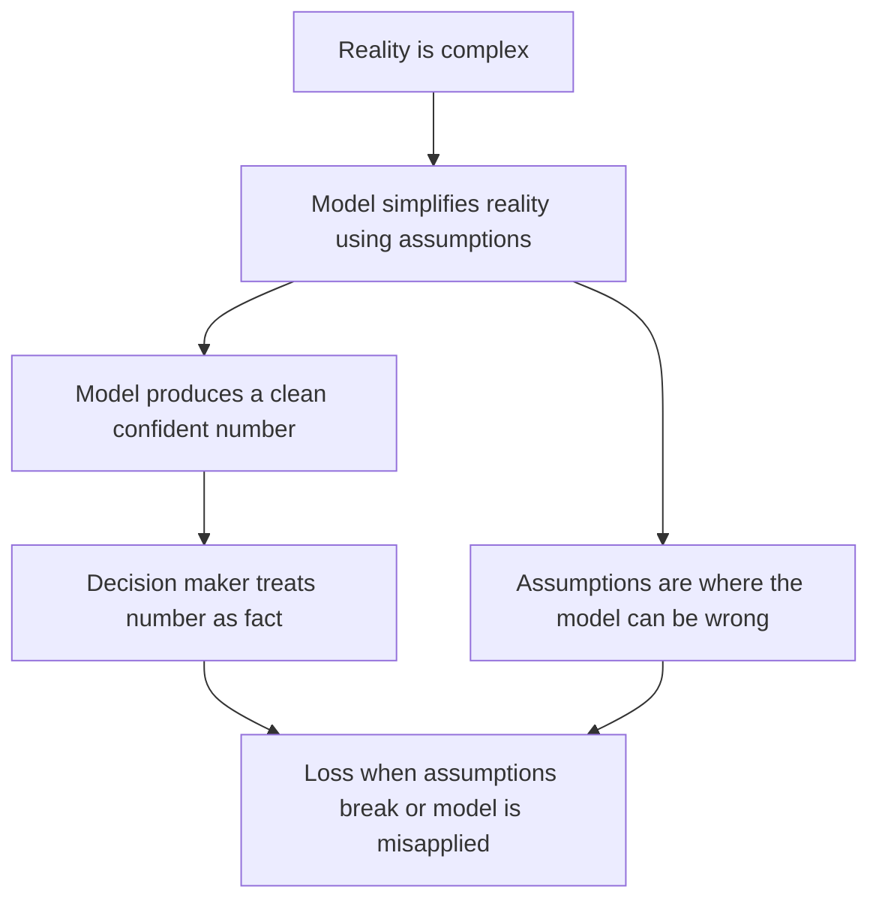
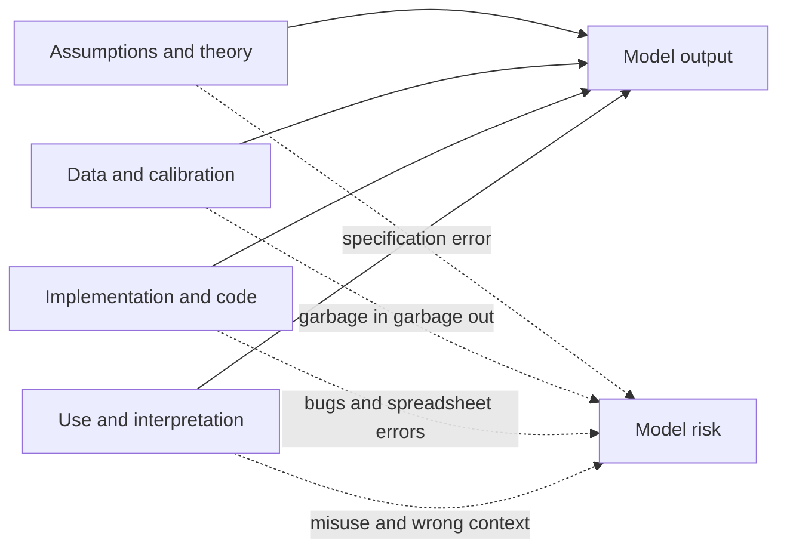
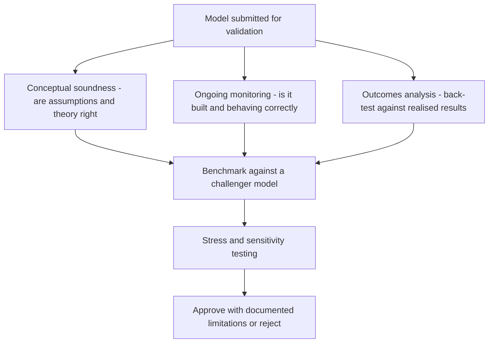

# Chapter 16 — Model Risk

## 1. The Problem / The Need

Walk the floor of any modern financial institution and you will find that almost nothing is decided by human judgement alone. A trading desk prices a five-year interest-rate swap with a curve-stripping model. A retail bank approves a home loan using a credit-scoring model. The treasury reports a firm-wide 99% Value at Risk from a market-risk model. The finance team books the fair value of an illiquid structured note from a valuation model. Regulatory capital itself — the cushion that decides whether the bank is deemed safe — is computed by internal models blessed under Basel. The entire machinery of risk, pricing, and capital runs on models.

A **model** is any quantitative method that takes inputs, applies theories and assumptions, and produces an output used to make a decision. That output arrives on a screen as a crisp number: "fair value ₹9.84 crore", "PD 1.7%", "1-day VaR ₹46.6 lakh", "capital requirement ₹212 crore". The number *looks* like a fact. It has decimals. It came from mathematics and a computer, so it carries an aura of objectivity.

But every one of those numbers is the end of a long chain of choices: which theory to use, which assumptions to make, which data to feed in, how to code the mathematics, and how to interpret the result. Break any link in that chain and the number is wrong — yet it will still be displayed to the same number of decimal places, with the same air of authority. A trader will hedge against a wrong price. A committee will lend against a wrong PD. A board will believe it is safe because a wrong VaR said so. The danger is not that the model is uncertain; it is that a **confidently wrong number is trusted as if it were right.**

This is the problem **model risk** addresses: the risk of adverse consequences — financial loss, bad decisions, reputational or regulatory damage — from **decisions based on models that are incorrect or misused.** It is the risk hiding inside every other risk measure in this book, because all of those measures are themselves model outputs.

*The core motivation: a model output is an opinion dressed as a fact, and the risk is that we forget the difference.*

---

## 2. The Core Idea

The US Federal Reserve's supervisory guidance **SR 11-7** (2011) — the single most important document on this topic and a near-certain interview reference — defines model risk with beautiful economy as:

> *"The potential for adverse consequences from decisions based on incorrect or misused model outputs and reports."*

Unpack that sentence and you find the whole subject. Model risk has exactly **two roots**:

1. **The model is fundamentally wrong** — it produces inaccurate outputs even when used exactly as intended. The map does not match the territory.
2. **The model is used wrong** — it may be perfectly sound for its designed purpose, but it is applied to the wrong problem, fed the wrong inputs, or its output is misinterpreted.

A model can be right and still cause a disaster (misuse). A model can be used impeccably and still cause a disaster (it was wrong). Both are model risk.

The founding intellectual anchor is the statistician **George Box's** aphorism: **"All models are wrong, but some are useful."** A model is by definition a *simplification* of reality. It throws away detail to become tractable. The Black-Scholes option model assumes constant volatility, no jumps, and continuous trading — all false. A credit-scoring model compresses a human being's financial life into a few dozen variables. This simplification is not a bug; it is the entire point. A map that reproduced every detail of the territory would be useless.

So the goal of model risk management is **not** to build a "correct" model — that is impossible. The goal is to:

- **know how the model is wrong** (where its assumptions bite),
- **quantify the consequences** of being wrong, and
- **prevent the model from being trusted beyond the range where it is useful.**

Model risk is therefore fundamentally a discipline of **humility and boundaries**. Every model has a domain of validity — a set of conditions under which its simplifications are harmless — and the entire craft is knowing where that domain ends.

*Figure 16.1 — Model risk is born the moment a simplified assumption is trusted as if it were reality.*

---

## 3. Why / How It Works — Where Model Risk Comes From

To manage model risk you must know where it enters. It is useful to trace a model's life as a pipeline and see that **each stage introduces its own kind of error.** SR 11-7 groups these into two broad categories — *the model itself* and *the use of the model* — but in practice risk analysts point to four concrete **sources**.

### Source 1 — Bad assumptions (specification error)

The model's underlying theory or structure does not match how the world actually behaves. This is the deepest and most dangerous source because it is invisible in the code and the data — the mathematics can be flawless and the answer still wrong.

Classic examples:
- Assuming asset returns are **normally distributed** when real returns have **fat tails** (extreme moves are far more common than the bell curve predicts). This single assumption underlies most VaR failures.
- Assuming **correlations are constant**, when in a crisis "all correlations go to one" — diversification vanishes exactly when you need it.
- Assuming **continuous liquid markets** with no gaps, when real prices jump and markets freeze.
- Assuming the **future resembles the past** — that a relationship estimated on historical data will keep holding.

### Source 2 — Bad data (input and calibration error)

Even a perfectly specified model is only as good as what you feed it. "Garbage in, garbage out." Data problems include:
- **Poor quality**: errors, gaps, stale prices, wrong sign conventions.
- **Insufficient history**: a model calibrated only on the calm 2003–2006 period never "saw" a housing crash, so it assigns it near-zero probability.
- **Unrepresentative sample**: data drawn from conditions unlike those the model will face (a **regime change** the data does not contain).
- **Proxying**: an illiquid instrument has no price history, so a proxy is used — and the proxy behaves differently in stress.

### Source 3 — Bad implementation (coding and technical error)

The theory is sound and the data is clean, but the model is built wrong. This is the most mundane and most common source, and it is pure operational risk wearing a quant costume:
- Programming bugs — an off-by-one error, a wrong sign, a mis-transcribed formula.
- Numerical issues — approximation errors, non-convergence, rounding.
- The **spreadsheet risk** that famously produced the "London Whale" and the Reinhart-Rogoff error: a formula that averaged the wrong range of cells.
- Wrong linking of systems — the model receives yesterday's rates, or notionals in the wrong currency.

### Source 4 — Misuse (application error)

The model is correct and correctly built, but it is used outside the boundary where it is valid:
- **Wrong context**: a model calibrated for liquid large-cap equities applied to illiquid small-caps or a new product it was never designed for.
- **Wrong inputs at runtime**: reasonable model, unreasonable scenario fed in.
- **Misinterpreting the output**: treating a 99% VaR as the *maximum possible* loss rather than a *threshold that is breached 1 day in 100*; treating a credit rating as a guarantee rather than an opinion.
- **Ignoring the limitations** the model builders explicitly documented — using the number past its stated shelf life or outside its stated range.

*Figure 16.2 — Four entry points for model risk across a model's life. A failure at any single stage corrupts the final number.*

The reason this framing matters for an interview: when asked "what could go wrong with this model?" a strong candidate does not give a vague answer. They walk the four sources — assumptions, data, implementation, use — and name a concrete failure at each.

---

## 4. Full Content — Famous Failures, Validation, and Governance

### 4.1 Why famous failures are the best teacher

Model risk is abstract until you see money vanish. Each landmark failure isolates one of the four sources, and together they form the canon every risk professional is expected to know.

#### Long-Term Capital Management (LTCM), 1998 — when assumptions break

LTCM was a hedge fund run by star traders and two Nobel laureates (Myron Scholes and Robert Merton, of Black-Scholes fame). Its strategy was **relative-value arbitrage**: identify two securities whose prices had diverged slightly from a historical relationship, bet that they would **converge**, and lever the tiny spread up enormously — leverage reached roughly **25-to-1** on the balance sheet and far higher through derivatives.

The models said these convergence trades were nearly riskless because, historically, the spreads *always* narrowed. Two model assumptions were fatal:

1. **Normal-ish, stable volatility and correlations** estimated from recent calm data. The models assigned a vanishingly small probability to a simultaneous, correlated blow-out across many unrelated markets.
2. **Continuous liquid markets** in which you can always trade out of a position near the last price.

In August 1998, Russia defaulted on its domestic debt. Panicked investors fled to safety everywhere at once. Spreads that were "supposed" to converge instead **widened violently and in unison** — correlations the model treated as low jumped toward one. Because LTCM was levered 25-to-1, losses that the model called a once-in-several-billion-years event wiped out most of its ~$4.6 billion capital in weeks. The Federal Reserve organised a $3.6 billion bailout by a consortium of banks to prevent a systemic cascade.

**Lesson:** the model was internally elegant but rested on assumptions (stable correlations, permanent liquidity, thin tails) that held in normal times and shattered in stress. High leverage turned a model error into an extinction event. This is the archetypal **bad-assumptions** failure.

#### The 2008 crisis — ratings models and the Gaussian copula

The 2008 financial crisis was, at its quantitative heart, a **model-risk catastrophe** built from mortgage-backed securities (MBS) and collateralised debt obligations (CDOs). Two model failures interlocked.

**(a) The rating-agency default models.** Agencies rated tranches of mortgage securities AAA — the same grade as sovereign debt — based on models fed almost entirely on data from a period of **continuously rising US house prices.** The models effectively assumed national house prices could not fall significantly *at the same time* across the whole country, because in the data they never had. When national prices fell together, the "diversification" across geographies that made pools look safe evaporated.

**(b) The Gaussian copula and default correlation.** The workhorse for pricing CDO tranches was David Li's **Gaussian copula** model, which reduced the fearsomely complex question "how likely are many mortgages to default together?" to a single **correlation parameter**, calibrated conveniently from credit-default-swap spreads rather than actual joint-default history. The model dramatically **understated tail correlation** — the tendency of defaults to cluster in a downturn. Senior tranches sold as near-riskless were, in truth, highly exposed to exactly the correlated-default scenario the model waved away.

Layer on **VaR** at the banks holding these assets: VaR models, calibrated on the placid pre-crisis years, reported small daily risk numbers for portfolios that were in fact catastrophically exposed. The models could not see a risk that was absent from their input window.

**Lesson:** this was **bad assumptions plus bad data plus misuse** compounding. Assumption: defaults are weakly correlated and normally behaved. Data: calibration windows that never contained a national housing bust. Misuse: a AAA label, meant as an opinion under stated assumptions, was traded as a fact — and everyone relied on the same handful of models, so the errors were perfectly correlated across the system.

#### The VaR critique — a threshold, not a ceiling

Both episodes indict **VaR** specifically. VaR answers "what loss will I not exceed 99% of the time?" It says **nothing about how bad the other 1% is.** Institutions managed to the number and forgot the tail. As one memorable line from the crisis put it, VaR was "an airbag that works all the time, except when you have a car accident." The failure was as much **misuse** (mistaking a threshold for a maximum) as it was the model. This is precisely why regulators later shifted the trading book toward **Expected Shortfall**, which averages the losses *beyond* the VaR threshold (Chapter 5).

#### Honourable mentions

- **JPMorgan "London Whale" (2012):** a revised VaR model with a **spreadsheet error** (a formula divided by a sum instead of an average, roughly halving reported volatility) helped hide a build-up of credit derivatives that lost ~$6.2 billion. A textbook **implementation** failure.
- **Reinhart-Rogoff (2013):** an influential austerity-economics paper whose headline result partly rested on an Excel range that **omitted five countries** — a spreadsheet coding error with global policy consequences.

| Failure | Year | Dominant source | One-line lesson |
|---|---|---|---|
| LTCM | 1998 | Bad assumptions | Stable correlations and permanent liquidity are stress-time fictions; leverage magnifies model error |
| Ratings / CDO models | 2008 | Assumptions + data | A model cannot price a risk absent from its calibration window |
| Gaussian copula | 2008 | Assumptions | Compressing joint default into one correlation number understated tail clustering |
| VaR reliance | 2008 | Misuse | A 99% threshold is not a maximum; it is silent about the tail |
| London Whale | 2012 | Implementation | A single spreadsheet formula error can hide billions in risk |

### 4.2 The defence — model validation

If all models are wrong, the institutional response is not to stop using models but to **challenge them systematically.** This is **model validation**: an ongoing, independent set of activities to verify that a model works as intended and to establish where it does not.

SR 11-7 frames sound validation around three components:

**(1) Evaluation of conceptual soundness.** Does the model's design and theory make sense for its purpose? Are the assumptions reasonable and documented? Is there support in the literature and evidence? This is where a validator attacks Source 1 (assumptions) — asking, for instance, "you assume normality; have you tested the tails?"

**(2) Ongoing monitoring, including process verification and benchmarking.** Confirm the model is implemented correctly and still performing as conditions change. **Benchmarking** compares the model's outputs against an alternative model or a challenger approach — if two independent methods disagree materially, something is wrong. This attacks Source 3 (implementation).

**(3) Outcomes analysis, especially back-testing.** Compare model predictions against **actual realised outcomes.** For a 99% 1-day VaR, you count exceptions: over 250 trading days you *expect* about 2.5 breaches. If you see 12, the model is understating risk and fails back-testing (Basel's "traffic-light" test formalises exactly this). Back-testing attacks the whole chain by confronting the model with reality.

Two more validation pillars sit alongside these:

- **Benchmarking / challenger models** — never rely on a single model; a materially different second model is a permanent reality check.
- **Sensitivity and stress testing** — deliberately push inputs to extreme values and to historical stress scenarios to find where the model breaks. If small input changes cause wild output swings, the model is fragile.

A cardinal principle: validation must be **effectively independent.** The people who challenge the model cannot be the people who built it and whose bonuses depend on it being approved. Independence and competent challenge are the heart of the discipline.

*Figure 16.3 — The three pillars of validation under SR 11-7 plus benchmarking and stress testing.*

### 4.3 The framework — model risk governance and SR 11-7

Validation is a technical activity; **governance** is the organisational structure that makes sure validation actually happens, is independent, and has teeth. SR 11-7 is the reference framework and rests on a few load-bearing ideas.

**Model risk is managed like any other risk — identify, measure, monitor, control.** The guidance insists model risk be treated as a first-class risk, not an afterthought buried in operational risk.

**Two guiding principles run through the document:**

1. **"Effective challenge"** — critical, competent, independent review by parties who have the incentive, competence, and standing to push back and, if necessary, to say no.
2. **A model is only as good as its use** — governance must control not just how models are built but how they are used, because misuse (Source 4) is half the risk.

**A firm-wide model inventory.** You cannot manage what you have not catalogued. Every model is registered with its owner, purpose, assumptions, limitations, validation status, and a **materiality tier** (a model driving billions in capital gets far more scrutiny than one that formats a report).

**The "three lines of defence."** This is the organisational skeleton — expect to be asked to draw it:

| Line | Who | Role in model risk |
|---|---|---|
| First line | Model **owners / developers** (the business) | Build, document, and use models correctly; own the risk day-to-day |
| Second line | Independent **model risk / validation** function | Challenge, validate, maintain the inventory, set policy |
| Third line | **Internal audit** | Assess whether the whole framework is designed and operating effectively |

**Documentation and the "no black box" rule.** Models must be documented well enough that a knowledgeable third party can understand them and reproduce results. A model no one can explain cannot be validated — and an unvalidated model must not drive material decisions. This principle collides directly with modern **machine-learning / AI models**, whose opacity ("explainability" problem) is the frontier of model risk today.

**Vendor and AI models.** Buying a model from a vendor does not outsource the risk. The firm remains responsible for validating it, understanding its limitations, and having contingency if the vendor changes or fails. The same logic now extends to AI/ML: bias in training data, drift as the world changes, and the inability to explain a decision are all model risk in a new guise.

### 4.4 Managing model risk in practice

Pulling it together, an institution manages model risk through a continuous loop:

- **Inventory and tier** every model by materiality.
- **Validate** independently before first use, and **re-validate** periodically and after any material change.
- **Document** assumptions, limitations, and the approved range of use.
- **Monitor and back-test** continuously; track exceptions.
- **Set boundaries** — hard limits on where and how a model may be used, plus **model reserves / valuation adjustments** (a capital or P&L buffer held explicitly against model uncertainty for hard-to-value positions).
- **Apply conservatism** — where a model is uncertain, err toward the more prudent number rather than the more flattering one.
- **Keep human oversight** — the "sceptical eye": a number that violates common sense should trigger investigation, not blind trust.
- **Retire** models that no longer fit the environment.

The philosophical bottom line — the sentence to carry into any risk role — is this: **every quantitative number is the output of a model, and every model embeds assumptions that can fail; therefore no number deserves blind trust. The professional's job is not to worship the number but to know where it breaks.**

---

## 5. Worked / Applied Examples

### Example 1 — VaR back-testing: catching an understated risk model

A bank reports a **1-day 99% VaR of ₹50 lakh** for its trading book. At 99% confidence the model implicitly claims that daily losses will exceed ₹50 lakh only **1% of the time.** Over **250 trading days**, the expected number of "exceptions" (days the actual loss beat the VaR) is:

$$\text{Expected exceptions} = 250 \times (1 - 0.99) = 250 \times 0.01 = 2.5 \text{ days.}$$

Now suppose that over the year the desk actually recorded **11 days** with a loss above ₹50 lakh. Is that just bad luck, or is the model broken?

Under the model, exceptions follow a binomial distribution with n = 250, p = 0.01, so mean 2.5 and standard deviation:

$$\sqrt{n p (1-p)} = \sqrt{250 \times 0.01 \times 0.99} = \sqrt{2.475} \approx 1.57.$$

Eleven exceptions sits roughly $(11 - 2.5)/1.57 \approx 5.4$ standard deviations above expectation. The probability of 10 or more exceptions when the true rate is 1% is minuscule (far below 0.1%). Under **Basel's traffic-light back-testing**, 5–9 exceptions land in the amber "yellow" zone (model suspect, capital multiplier increased); **10 or more is the red zone** — the model is rejected as understating risk.

**Interpretation and reconciliation.** The realised breach rate is $11/250 = 4.4\%$, more than four times the promised 1%. The model is systematically underestimating risk — most likely a **bad-data** problem (calibrated on a calm window that omitted recent volatility) or a **bad-assumption** problem (thin-tailed distribution missing fat tails). The response: the model is flagged, capital is penalised via a higher multiplier, and re-calibration or re-specification is required. This is outcomes analysis — Section 4.2's third pillar — catching model risk before it costs real money.

### Example 2 — Misuse: a good model applied to the wrong instrument

A quant desk has a well-built, well-validated **Black-Scholes** pricer for **liquid, large-cap European equity options.** It has passed conceptual review and back-tests cleanly *for that product.*

A structuring desk now uses the same pricer to value a **long-dated, deep out-of-the-money option on an illiquid small-cap stock.** The model returns a clean price of **₹2.10 per option**, and the desk books a large position at that value.

Every one of Black-Scholes' assumptions is now violated in a way that matters:
- **Constant volatility** — small-caps exhibit a pronounced **volatility skew**; deep-OTM options trade at far higher implied vols than the at-the-money vol the desk plugged in. Using the ATM vol *underprices* the option.
- **Continuous liquid trading / costless hedging** — the underlying barely trades, so the delta-hedging that justifies the formula is impossible; the real position carries large unhedgeable risk.
- **No jumps** — small-caps gap on news, exactly the tail the model ignores.

The model is not broken. It is **misused** — applied outside its domain of validity (Source 4). When the desk later tries to unwind, the market price is **₹5.80**, and the position shows a large loss versus the booked value. A validator's boundary — *"approved for liquid large-cap European options only"* — would have blocked this. The lesson reconciles cleanly: the same number (₹2.10) that was *correct* for one instrument was *dangerously wrong* for another, and nothing on the screen told the user which case they were in.

### Example 3 — Implementation error: the spreadsheet that halved risk

A risk team migrates its VaR calculation to a new spreadsheet-based model. The intended formula scales position risk by the **average** of a series of daily volatility estimates. Due to a copy-paste slip, one cell computes the **sum** of two volatilities divided by their **count-minus-one**, and another divides by the wrong range — the net effect is that reported volatility comes out roughly **half** of the true value.

Because VaR scales linearly with volatility, a true 1-day VaR of **₹100 crore** is reported as **₹52 crore.** Traders, seeing "plenty of room under the limit," add risk. The book grows to a genuine VaR near **₹180 crore** while the report still shows a comfortable **~₹94 crore.** When markets move, the realised loss dwarfs anything the risk report ever suggested.

This is the mechanism behind the real **London Whale** loss (~$6.2 billion): a mundane **implementation error** (Source 3), invisible to anyone reading only the output, silently disabled the risk control that was supposed to prevent exactly this build-up. The defences that would have caught it — independent revalidation of the new model, **benchmarking** the new spreadsheet against the old system (they would have disagreed by ~2x), and process verification — are precisely the SR 11-7 activities of Section 4.2. The numbers reconcile: halving the volatility input roughly halves the reported VaR, which is why the reported ₹52 crore looked safe while the true ₹100 crore was not.

---

## 6. Connections

- **Value at Risk (Ch. 4) and Expected Shortfall (Ch. 5):** VaR is the canonical model-risk case study — its "threshold not ceiling" silence and its calibration-window blindness drove 2008 losses, and the regulatory move to Expected Shortfall under FRTB was a direct response to VaR's tail-blindness.
- **Risk models and measurement (Ch. 11):** every measurement technique in that chapter is a model and therefore a source of model risk; this chapter is the meta-layer that sits above all of them.
- **Operational risk (Ch. 8):** implementation errors, spreadsheet bugs, and misuse are operational-risk events. Model risk overlaps heavily with op risk but is elevated to its own discipline because of its systemic reach.
- **Credit risk (Ch. 6) and counterparty risk (Ch. 7):** PD, LGD, and CVA are all model outputs; the 2008 rating and copula failures were credit-model risk at systemic scale.
- **Basel and regulation (Ch. 12):** internal-models approaches (IMA, IRB) let banks compute capital from their own models — which is precisely why regulators demand model validation, back-testing, and the SR 11-7-style governance covered here.
- **Liquidity risk (Ch. 9):** the "continuous liquid markets" assumption that broke LTCM and 2008 links model risk to liquidity risk — models routinely assume away the liquidity holes that define crises.
- **Behavioural angle:** model risk is amplified by **automation bias** and **overconfidence** — the human tendency to trust a number more because a machine produced it.

---

## 7. Key Terms

- **Model:** a quantitative method that transforms inputs into an output used for a decision (pricing, risk, capital, lending).
- **Model risk:** the potential for adverse consequences from decisions based on incorrect or misused model outputs (SR 11-7 definition).
- **Specification error:** the model's theory/assumptions do not match reality (Source 1).
- **Calibration:** setting a model's parameters from data; poor or unrepresentative data causes calibration error.
- **Model validation:** independent activities verifying a model works as intended and mapping where it does not.
- **Conceptual soundness:** whether the model's design, theory, and assumptions are appropriate for its purpose.
- **Back-testing:** comparing model predictions to realised outcomes (e.g., counting VaR exceptions).
- **Benchmarking / challenger model:** comparing a model's output to an alternative model as a reality check.
- **Effective challenge:** critical, competent, independent review with the standing to reject a model (SR 11-7's core principle).
- **Three lines of defence:** owners (1st), independent validation (2nd), internal audit (3rd).
- **Model inventory:** the firm-wide catalogue of all models, their owners, uses, and validation status.
- **Materiality tiering:** ranking models by potential impact to allocate scrutiny.
- **Model reserve / valuation adjustment:** a buffer held explicitly against model/valuation uncertainty.
- **SR 11-7:** the US Federal Reserve / OCC 2011 supervisory guidance on model risk management — the field's reference framework.
- **Gaussian copula:** the 2008-era model that compressed joint-default risk into a single correlation parameter and understated tail clustering.
- **Explainability (AI/ML):** the ability to understand why a model produced an output — the frontier challenge for machine-learning models.

---

## 8. Common Confusions

**"A model is wrong" vs "a model is useless."** Box's point is that *all* models are wrong — the useful ones are wrong in known, bounded, tolerable ways. Model risk management does not chase a correct model; it maps the boundaries of a useful one.

**Model risk is not the same as market/credit risk.** Market risk is the risk that prices move against you. Model risk is the risk that your *measurement* of market (or credit, or any) risk is itself wrong. It is a risk *about* your risk numbers — a meta-risk.

**Model risk ≠ model error only.** Roughly half of model risk is **misuse** — a perfectly sound model applied to the wrong problem or misinterpreted. Candidates who define model risk as "the model is buggy" miss the SR 11-7 emphasis on *use*.

**A more complex model is not a lower-risk model.** Complexity can *increase* model risk: more assumptions, more parameters to calibrate wrongly, more code to break, and less transparency. The Gaussian copula was sophisticated and catastrophically wrong. Simplicity and understandability are risk-reducing virtues.

**VaR is not the maximum loss.** The single most common misuse in the book: 99% VaR is a *threshold* breached ~1 day in 100. It is deliberately silent about how bad the breach is. Treating it as a worst case is a misuse, not a model flaw.

**Validation is not a one-time sign-off.** It is ongoing. A model validated in 2006 on calm data was "valid" and still failed in 2008 because the *world* changed (regime change) — hence periodic re-validation and continuous monitoring.

**Passing back-tests does not prove a model is right.** Back-testing on a benign period only confirms the model fits benign periods. Absence of exceptions in calm markets is exactly the false comfort that preceded both LTCM and 2008.

**Buying a vendor model does not transfer the risk.** The institution remains fully responsible for validating and understanding any model it relies on, however it was sourced.

---

## 9. Recap

Every number that drives a financial decision — a price, a PD, a VaR, a capital charge — is the output of a **model**, and a model is a **simplification of reality** that is, in George Box's words, "wrong but useful." **Model risk** (SR 11-7: *adverse consequences from incorrect or misused model outputs*) is the risk that we trust that simplified number beyond where it holds. It enters through **four sources**: bad **assumptions** (specification error), bad **data** (calibration error), bad **implementation** (coding/spreadsheet error), and **misuse** (wrong context or misinterpretation).

The canon of failures maps to these sources: **LTCM (1998)** — stable-correlation and permanent-liquidity assumptions shattered, magnified by 25-to-1 leverage; the **2008 crisis** — ratings and Gaussian-copula models calibrated on data with no housing bust, understating tail default correlation, with **VaR** misread as a ceiling; the **London Whale (2012)** — a spreadsheet error that halved reported risk. The defence is **independent validation** (conceptual soundness, ongoing monitoring/benchmarking, outcomes analysis/back-testing) plus **stress testing**, all wrapped in **governance** — SR 11-7's "effective challenge," a firm-wide **model inventory**, **materiality tiering**, and the **three lines of defence**. Managed well, model risk becomes a discipline of **humility and boundaries**: know how your model is wrong, quantify the cost of being wrong, and never let a confident number outrun its domain of validity.

*The one-sentence takeaway: a model output is an opinion wearing the costume of a fact — the professional's job is to keep a sceptical eye and know exactly where it breaks.*

---

## 10. Quick-Reference / Interview Points

- **Definition (memorise, SR 11-7):** model risk = *"the potential for adverse consequences from decisions based on incorrect or misused model outputs and reports."*
- **The philosophy:** George Box — *"All models are wrong, but some are useful."* Goal is not correctness but knowing the boundaries of usefulness.
- **Four sources (be ready to name and give an example of each):** bad **assumptions**, bad **data**, bad **implementation**, **misuse**. Two SR 11-7 roots: the model is *wrong*, or the model is *used wrong*.
- **LTCM (1998):** convergence arbitrage, ~25:1 leverage; assumed stable correlations and permanent liquidity; Russian default made correlations spike to one; ~$4.6bn lost, Fed-organised bailout. *Source: bad assumptions + leverage.*
- **2008:** rating models calibrated on ever-rising house prices; **Gaussian copula** compressed joint default into one correlation and understated tail clustering; VaR read as a ceiling. *Source: assumptions + data + misuse, all correlated across the system.*
- **London Whale (2012):** spreadsheet error roughly halved reported volatility/VaR; ~$6.2bn loss. *Source: implementation.*
- **VaR critique:** a 99% VaR is a *threshold breached ~1 day in 100*, not a maximum; silent about the tail → motivated the shift to **Expected Shortfall** (FRTB).
- **Validation (SR 11-7 three pillars):** (1) conceptual soundness, (2) ongoing monitoring + benchmarking, (3) outcomes analysis / back-testing. Plus stress & sensitivity testing. Must be **independent**.
- **Back-testing math:** expected VaR exceptions = $n(1-c)$; for 250 days at 99%, expect 2.5; Basel traffic light — green ≤4, yellow 5–9, red ≥10.
- **Governance:** **effective challenge**; firm-wide **model inventory**; **materiality tiering**; **three lines of defence** (owners → independent validation → internal audit); "no black box" documentation rule.
- **Managing it:** validate before use and re-validate periodically; document assumptions and approved use range; monitor and back-test; hold **model reserves/valuation adjustments**; apply conservatism; keep human oversight.
- **Modern frontier:** **AI/ML model risk** — opacity/explainability, data bias, drift; vendor models do not transfer responsibility.
- **The closing line:** *every quant number is a model output with embedded assumptions that can fail — so no number deserves blind trust; the job is to know where it breaks.*
