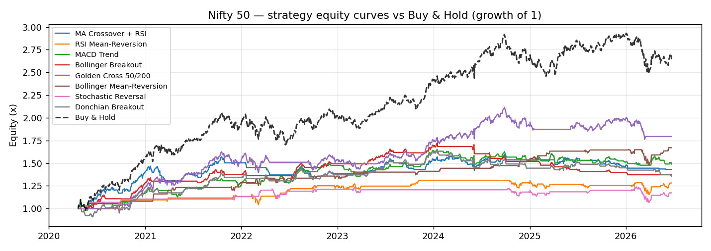
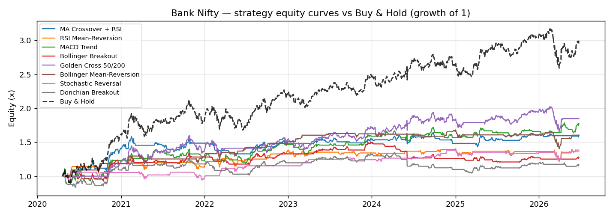

# Project 1 — Multi-Strategy Technical Backtester

Backtests **eight rules-based technical strategies** on **Nifty 50** and **Bank Nifty** over ~6 years of
daily data and benchmarks each against **buy-and-hold** on a full set of risk-adjusted metrics. All
indicators are coded by hand in pandas (no black-box library), and the engine has **no look-ahead bias**
— every signal is acted on the *next* day.

**Stack:** Python · pandas · numpy · yfinance · matplotlib

---

## The eight strategies
| # | Strategy | Type | Long when | Exit when |
|---|----------|------|-----------|-----------|
| 1 | **MA Crossover + RSI** | trend | 20-SMA > 50-SMA **and** RSI(14) > 50 | condition no longer true |
| 2 | **RSI Mean-Reversion** | mean-revert | RSI < 30 (oversold) | RSI > 55 |
| 3 | **MACD Trend** | trend | MACD line > signal line | MACD line < signal line |
| 4 | **Bollinger Breakout** | breakout | close breaks above upper band | close falls below 20-SMA |
| 5 | **Golden Cross 50/200** | trend | 50-SMA > 200-SMA | 50-SMA < 200-SMA |
| 6 | **Bollinger Mean-Reversion** | mean-revert | close dips below the lower band | close back above the 20-SMA |
| 7 | **Stochastic Reversal** | mean-revert | %K < 20 and crossing up through %D | %K > 80 |
| 8 | **Donchian Breakout** | breakout | close > prior 20-day high | close < prior 10-day low |

All strategies are **long/flat** (invested or in cash — no shorting, no leverage). They fall into three
families: **trend-following** (ride a move while it lasts), **mean-reversion** (fade an overstretched
move, betting it snaps back), and **breakout** (jump in when price clears a key level).

## The strategies explained

**1. MA Crossover + RSI** *(trend)* — Go long when the 20-day average is above the 50-day average **and**
RSI > 50. The MA cross says "short-term trend is up," and the RSI filter confirms momentum is genuinely
positive (not a weak, fading cross). *Why it works:* trends persist, so you ride uptrends and sit out
downtrends; the RSI filter blocks low-conviction signals.

**2. RSI Mean-Reversion** *(mean-revert)* — Buy when RSI < 30 (the market has fallen too far, too fast) and
exit when RSI climbs back above 55. *Why it works:* prices overshoot on fear; a deeply oversold reading
often snaps back. This is a counter-trend "buy the dip" rule — it trades rarely and selectively.

**3. MACD Trend** *(trend)* — Long whenever the MACD line is above its signal line. MACD is the gap between
a fast 12-day and slow 26-day EMA; the signal is a 9-day EMA of that gap. *Why it works:* when the fast
line pulls above the slow line, short-term momentum is accelerating upward — you hold while that lasts.

**4. Bollinger Breakout** *(breakout)* — Enter when price closes **above** the upper Bollinger band, exit
when it falls back below the 20-day average. *Why it works:* the bands mark "normal" range (±2 standard
deviations); a close above them is an unusually strong move / volatility expansion worth riding until it
loses the mean.

**5. Golden Cross 50/200** *(trend)* — Long when the 50-day average crosses **above** the 200-day average
(the famous "golden cross"); flat when it crosses below (a "death cross"). *Why it works:* this is the
classic long-term trend filter — it keeps you invested through major bull phases and out of major
declines. It fires only a handful of times, so it's a *regime* signal, not a trading signal.

**6. Bollinger Mean-Reversion** *(mean-revert)* — The mirror of #4: buy when price dips **below** the lower
band (stretched cheap) and exit when it reverts up to the 20-day mean. *Why it works:* in a range-bound or
choppy market, a move far below the band tends to pull back to average. *(In this backtest it was the
standout on Nifty — see Results.)*

**7. Stochastic Reversal** *(mean-revert)* — The Stochastic Oscillator measures where today's close sits
inside the recent 14-day high-low range (0 = at the low, 100 = at the high). Buy when it's oversold
(%K < 20) **and** %K turns up through its %D average; exit when overbought (%K > 80). *Why it works:* it
catches short-term bounces off the bottom of the range, using the %K-over-%D cross as the timing trigger.

**8. Donchian Breakout** *(breakout)* — The original "Turtle Traders" system: go long when price closes
**above the highest high of the prior 20 days**, and exit when it closes **below the lowest low of the
prior 10 days**. *Why it works:* a new 20-day high means a fresh breakout/trend is starting; the tighter
10-day low gives back less profit when the trend turns.

## How to run
```
pip install -r ../requirements.txt
python backtester.py
```
**Inputs** (in `input/`): **`data_nifty_50.csv` / `data_bank_nifty.csv`** — the full daily dataset used.
**Outputs** (in `output/`): `backtest_report.pdf` · `backtest_results.csv` · per-strategy trade logs
`trades_*.csv` · equity-curve charts.

## The data
The backtester does **not** ship a frozen dataset — it pulls **~7 years of daily OHLC live from Yahoo
Finance** via the `yfinance` library each run (`yf.download(ticker, period="7y", ...)`), so the data is
always current — **end-of-day data refreshed each run, not a real-time feed**. After the 200-day warmup the
moving averages need, that leaves **~6 years (≈1,528 daily
bars) per index** to test on. Each run also writes that exact dataset (OHLC + every hand-computed
indicator) to **`input/data_<index>.csv`** so the data behind the results is **visible and auditable**,
not just held in memory.

---

## Code walkthrough

A tour of the four parts of `backtester.py` that do the real work, with the actual code.

### 1. Computing the indicators by hand
```python
c = df["Close"]
df["SMA20"] = c.rolling(20).mean()                 # 20-day average price
d = c.diff()                                        # today's price change
g = d.clip(lower=0).rolling(14).mean()             # avg gain over 14 days
l = (-d.clip(upper=0)).rolling(14).mean()          # avg loss over 14 days
df["RSI"] = 100 - 100 / (1 + g / l.replace(0, np.nan))
macd = c.ewm(span=12, adjust=False).mean() - c.ewm(span=26, adjust=False).mean()
df["MACD_sig"] = macd.ewm(span=9, adjust=False).mean()
std = c.rolling(20).std()
df["BB_up"] = df["SMA20"] + 2 * std                # Bollinger = SMA20 ± 2σ
```
Every indicator is derived from the daily `Close` price — nothing comes from a black-box library.

- **SMA** is just a rolling average; **RSI** turns the average gain vs average loss over 14 days into a 0–100 momentum score (`replace(0, NaN)` avoids dividing by zero).
- **MACD** subtracts a slow 26-day EMA from a fast 12-day EMA (an EMA reacts faster than a plain average), and a 9-day EMA of that becomes the signal line.
- **Bollinger Bands** are the 20-day average plus/minus two standard deviations, so the bands widen when the market gets volatile.

### 2. The strategies and the stateful position
```python
def strat_macd(df):                                 # simple per-day rule
    return (df["MACD"] > df["MACD_sig"]).astype(int)

def strat_rsi_revert(df):                           # needs memory between days
    return _hold_between(df["RSI"] < 30, df["RSI"] > 55)

def _hold_between(entry, exit_):
    holding = False
    for i in range(len(entry)):
        if not holding and entry.iloc[i]:           # flat + entry signal -> get in
            holding = True
        elif holding and exit_.iloc[i]:             # invested + exit signal -> get out
            holding = False
        pos[i] = 1 if holding else 0                # 1 = in market, 0 = in cash
```
Each strategy returns a series of `1`s (invested) and `0`s (in cash).

- Simple rules like **MACD Trend** are a one-liner: the condition is either true or false each day.
- **Mean-reversion** and **breakout** need *memory* — you buy on one signal and stay in until a *different* exit signal fires. `_hold_between` walks day by day, carrying a `holding` flag forward, so the position stays "on" in between.

### 3. No look-ahead bias (the most important line)
```python
r = position.shift(1).fillna(0) * mkt_ret           # act on YESTERDAY's signal
equity = (1 + r).cumprod()                          # growth of 1
```
`shift(1)` is what makes the backtest honest.

- A signal is computed from today's **closing** price, which you only know once the market has closed — so you cannot trade on it until the *next* day.
- Shifting the position forward one day means each day's return is earned on yesterday's decision. Skip this and you'd be "trading on a price you haven't seen yet" — **look-ahead bias** that invents fake profit.

### 4. The performance metrics
```python
cagr = equity.iloc[-1] ** (1 / years) - 1                       # annualised return
sharpe = r.mean() / r.std() * np.sqrt(TRADING_DAYS)            # return per unit of total risk
downside = r[r < 0].std()
sortino = r.mean() / downside * np.sqrt(TRADING_DAYS)         # penalises only down-days
max_dd = (equity / equity.cummax() - 1).min()                 # worst peak-to-trough drop
```
These turn the daily return series into the numbers in the results table.

- **Sharpe** divides average daily return by its volatility and scales to a year with `√252` — higher means more reward per unit of risk.
- **Sortino** is the same idea but only counts *downside* volatility, since investors don't mind upside swings.
- **Max drawdown** uses `cummax()` (the running all-time-high of the equity curve) to measure how far below the peak the strategy ever fell — a plain-English "worst-case pain" number.

---

## Results

> Numbers regenerate each run; the figures below reflect a **~6-year test window** (7y of data, less the
> 200-day warmup the moving averages need) **ending Jun 2026**.

### Nifty 50
| Strategy | Total Return | CAGR | Sharpe | Sortino | Max DD | Win % | Profit Factor | Exposure |
|----------|-------------:|-----:|-------:|--------:|-------:|------:|--------------:|---------:|
| MA Crossover + RSI | 43.1% | 6.09% | 0.70 | 0.60 | −14.1% | 38% | 1.76 | 45% |
| RSI Mean-Reversion | 28.2% | 4.18% | 0.56 | 0.38 | −12.0% | 66% | 3.91 | 22% |
| MACD Trend | 50.1% | 6.93% | 0.74 | 0.63 | −10.5% | 40% | 1.88 | 48% |
| Bollinger Breakout | 37.2% | 5.36% | 0.79 | 0.51 | −20.4% | 38% | 2.44 | 27% |
| **Golden Cross 50/200** | **79.4%** | **10.12%** | 0.86 | 0.99 | −16.8% | 50% | 14.19 | 75% |
| **Bollinger Mean-Reversion** | 67.0% | 8.83% | **1.16** | 0.75 | **−10.4%** | **88%** | 12.25 | 16% |
| Stochastic Reversal | 17.3% | 2.67% | 0.41 | 0.26 | −14.0% | 64% | 2.38 | 16% |
| Donchian Breakout | 36.5% | 5.27% | 0.59 | 0.50 | −18.1% | 41% | 1.89 | 47% |
| *Buy & Hold* | *167.5%* | *17.62%* | *1.16* | *1.56* | *−17.2%* | — | — | *100%* |

### Bank Nifty
| Strategy | Total Return | CAGR | Sharpe | Sortino | Max DD | Win % | Profit Factor | Exposure |
|----------|-------------:|-----:|-------:|--------:|-------:|------:|--------------:|---------:|
| MA Crossover + RSI | 60.2% | 8.09% | 0.71 | 0.61 | −16.2% | 48% | 2.21 | 41% |
| RSI Mean-Reversion | 36.8% | 5.30% | 0.52 | 0.39 | −12.9% | 54% | 3.42 | 26% |
| MACD Trend | 77.4% | 9.92% | 0.73 | 0.67 | −18.4% | 46% | 1.93 | 49% |
| Bollinger Breakout | 28.1% | 4.17% | 0.44 | 0.33 | −19.9% | 43% | 1.75 | 34% |
| **Golden Cross 50/200** | **84.7%** | **10.65%** | 0.70 | 0.83 | −20.3% | 100% | — | 77% |
| **Bollinger Mean-Reversion** | 60.4% | 8.11% | **0.78** | 0.52 | −16.7% | 70% | 4.45 | 18% |
| Stochastic Reversal | 38.5% | 5.52% | 0.54 | 0.36 | −13.0% | 68% | 3.16 | 23% |
| Donchian Breakout | 17.2% | 2.65% | 0.26 | 0.24 | −22.6% | 45% | 1.41 | 50% |
| *Buy & Hold* | *199.6%* | *19.84%* | *0.98* | *1.32* | *−20.9%* | — | — | *100%* |

### Equity curves



### What the results say
- **Buy-and-hold won on raw return** — it was a strong bull market, and most active strategies sit in cash
  part of the time (see *Exposure*), so they miss up-days.
- **Bollinger Mean-Reversion was the standout on Nifty** — it *matched* buy-and-hold's Sharpe (**1.16**)
  with roughly **half the drawdown** (−10.4% vs −17.2%) and an **88% win-rate**, while invested only ~16%
  of the time. Patiently buying genuine oversold dips paid off.
- **Golden Cross 50/200 had the highest active return** on both indices (CAGR ~10%) — but on very **few
  trades** (3–4), so the high win-rate is a small sample I wouldn't over-trust.
- **Trend/breakout systems** (MACD, MA-cross, Donchian) clustered together — respectable returns, bigger
  drawdowns — while **Stochastic Reversal** was the weakest.
- The honest takeaway: judge a strategy on **risk-adjusted** return (Sharpe, Sortino, drawdown) **and**
  trade count — not raw return alone — and remember the regime (a multi-year bull market) flatters
  buy-and-hold.

---

## Design notes (defensible choices)
- **No look-ahead bias:** the position is shifted by one bar (`position.shift(1)`) — signals act next day.
- **Indicators by hand:** RSI = `100 − 100/(1 + avgGain/avgLoss)`; MACD = 12-EMA − 26-EMA with a 9-EMA
  signal; Bollinger = SMA20 ± 2σ — so the math is understood, not imported.
- **Metrics:** CAGR, Sharpe (total volatility), Sortino (downside only), max drawdown, win-rate, profit
  factor (gross profit ÷ gross loss), exposure (% of time invested).

## Limitations (next steps)
No transaction costs / slippage yet · in-sample only (would add walk-forward / out-of-sample) ·
all-in/all-out (no position sizing) · daily data only.
