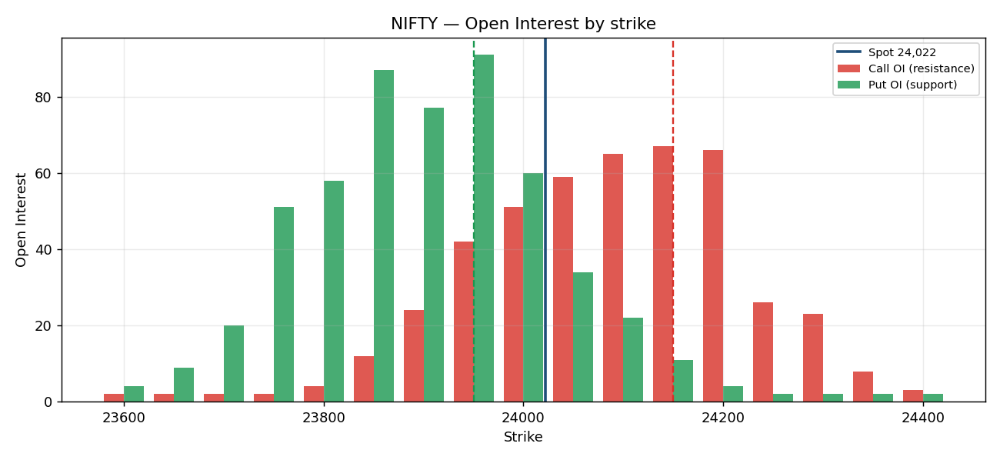
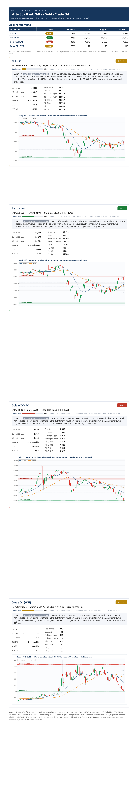
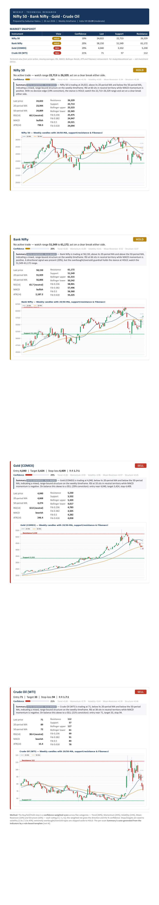
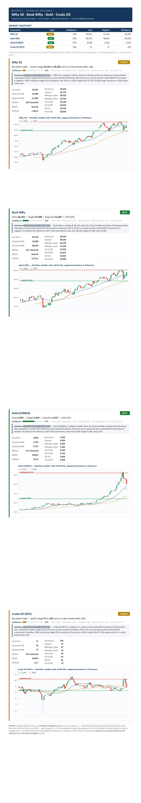
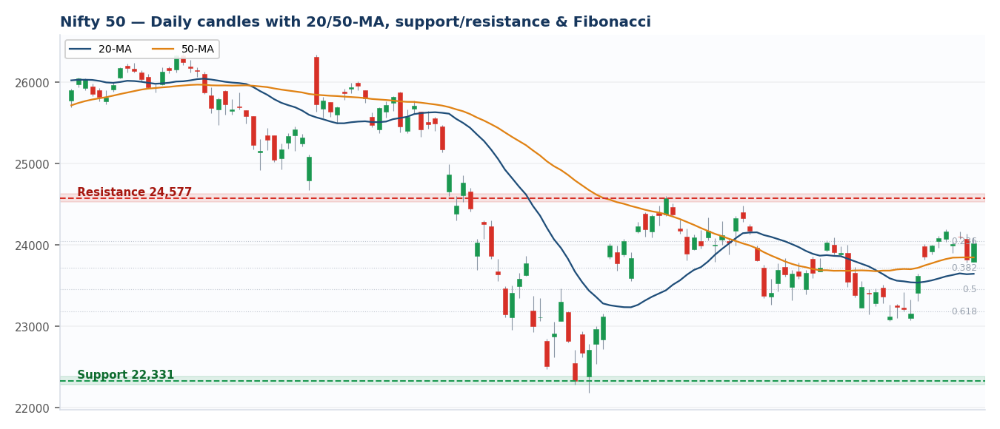
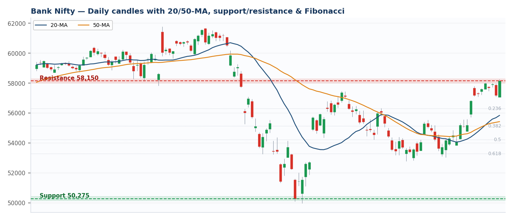

# Project 2 — Multi-Asset Technical Research Engine

An automated **multi-asset research engine** that combines live market data, hand-computed technical
indicators, **confidence-weighted signal generation** and volatility-based risk management to produce
**institutional-style daily / weekly / monthly research notes** for **Nifty 50, Bank Nifty, Gold (COMEX)
and Crude Oil (WTI)**. Each asset gets a **Buy / Sell / Hold** view with a **0–100% confidence**, an
**auto-generated narrative**, entry / target / volatility-sized stop, an indicator table, Fibonacci levels
and an annotated chart — with **India VIX** tracked in the header.

Two companion modules extend it: **`options_analytics.py`** (F&O option-chain analytics — PCR, max-pain,
OI support/resistance, build-up) and **`signal_accuracy.py`** (a historical hit-rate backtest of the signal).
It mirrors a real desk workflow — the levels and calls are also maintained in an **Excel** tracker — with a
**Python** pipeline automating everything.

**Stack:** Python · pandas · numpy · yfinance · matplotlib · requests · Excel

---

## What it does
- Pulls **live daily price data** for **Nifty 50, Bank Nifty, Gold and Crude Oil** across **daily, weekly and
  monthly** timeframes, and snapshots every dataset used to `input/`.
- Computes the core technical indicators by hand — **RSI, MACD, moving averages, Bollinger Bands, ATR** — plus
  swing **support/resistance** and **Fibonacci** levels.
- Generates a **Buy / Sell / Hold** call with a **confidence score**, an entry, and **ATR-based target and
  stop-loss**, plus an auto-written summary per asset.
- Renders a styled **PDF research note** per timeframe (one card per asset) with an annotated price chart.
- Extends to **options/F&O analytics** (PCR, max-pain, OI support/resistance, build-up), the **India VIX**
  regime gauge, and a **signal-accuracy backtest** that measures the signal's historical hit-rate.

## Architecture

```
        Yahoo Finance (yfinance)
                 │
                 ▼
   Data Collection ......... pull daily OHLC, resample daily→weekly/monthly, snapshot to input/
                 │
                 ▼
   Feature Engineering ..... RSI · MACD · ATR · SMA20/50 · Bollinger Bands · Fibonacci
                 │
                 ▼
   Confidence Engine ....... 5 weighted categories → BUY / SELL / HOLD + 0-100% confidence (+ guardrail)
                 │
                 ▼
   Risk Engine ............. ATR-sized stop (1.5×) & target (2.5×), reward:risk
                 │
                 ▼
   Visualization ........... annotated price chart (support / resistance + Fibonacci)
                 │
                 ▼
   Report Generation ....... styled HTML → PDF note (per-asset card: confidence, narrative, India VIX)
```

Each stage is an isolated, reusable function, so a new asset, indicator or timeframe plugs in without
touching the rest of the pipeline.

---

## What's in this folder
| File | What it is |
|------|------------|
| `generate_report.py` | The main report engine — confidence-weighted signals, narrative, India VIX (Python). |
| `options_analytics.py` | **F&O option-chain analytics** — PCR, max-pain, OI support/resistance, build-up (Python). |
| `signal_accuracy.py` | **Backtest of the signal** — historical hit-rate per asset (Python). |
| `Daily_Levels_Tracker.xlsx` | The **Excel** workbook I maintain by hand — pivot-point levels + trade-calls with reward:risk. |
| `SAMPLE_Morning_Research_Note.pdf` | A written-prose sample morning note (the human-style output). |
| `output/research_report_{daily,weekly,monthly}.pdf` | The generated reports. |

## How to run
```
pip install -r ../requirements.txt
python generate_report.py            # builds daily, weekly AND monthly research notes
python generate_report.py weekly     # one timeframe only
python options_analytics.py          # F&O option-chain analytics (Nifty & Bank Nifty)
python signal_accuracy.py            # historical hit-rate of the signal
```

## The data
Prices are pulled **fresh from Yahoo Finance** (`yfinance`) on every run — daily uses ~1y, weekly ~5y
(resampled to Friday candles) and monthly ~11y (resampled to month-end) — so nothing is hardcoded or frozen.

> **On "live":** this is **current end-of-day data, refreshed each run — not a real-time / intraday streaming
> feed.** yfinance serves free, daily, slightly-delayed data, which is appropriate for daily / weekly / monthly
> research. The **options** module (`options_analytics.py`) attempts the **live NSE option chain** and falls
> back to a clearly-labelled sample when NSE is unreachable.

Each run also snapshots the exact data used to **`input/data_<asset>_<timeframe>.csv`** (4 assets × 3
timeframes) so the source is visible and auditable; the generated notes land in `output/`.

---

## Why these indicators (not just which)
Each indicator earns its place by covering a different dimension — trend, momentum, volatility, risk:

| Indicator | What it measures | Why it's in the engine |
|-----------|------------------|------------------------|
| **SMA 20** | short-term trend | is price above its recent average? |
| **SMA 50** | medium-term trend | is the short-term trend aligned with the bigger one? |
| **RSI(14)** | momentum / exhaustion | flags overbought (> 70) and oversold (< 30) extremes |
| **MACD(12/26/9)** | trend confirmation | confirms momentum is accelerating with or against the trend |
| **Bollinger Bands** | volatility expansion | shows when a move is unusually stretched vs the normal range |
| **ATR(14)** | volatility → risk sizing | sizes the stop & target to each asset's own typical range |
| **Fibonacci** | pullback levels | secondary support/resistance inside the swing |

## How the call is made
1. **Levels** — support/resistance from the recent swing high/low; Fibonacci retracements (23.6 / 38.2 /
   50 / 61.8%).
2. **Confidence-weighted signal** — five categories each vote in [−1, +1], combined by weight into a net
   signal and a **0–100% confidence** (see the engine table below). Net ≥ +0.20 = **BUY**, ≤ −0.20 =
   **SELL**, else **HOLD**.
3. **Guardrail** — a SELL on a deeply oversold tape (RSI < 25) or a BUY on an extremely overbought one
   (RSI > 80) is stepped aside to **HOLD** rather than chased.
4. **Risk levels** — for actionable calls, **stop = 1.5 × ATR**, **target = 2.5 × ATR** (≈ 1.7:1
   reward:risk). A **HOLD shows a watch-range** (support–resistance), not a trade.

---

## The confidence-weighted signal engine
Instead of a flat +1/−1 vote per indicator, each call is scored across **five weighted categories** — so the
result is both a **direction** and a **% confidence**, much closer to how a desk grades conviction:

| Category | Weight | What feeds it |
|----------|-------:|---------------|
| **Trend** | 40% | price vs 20-MA, and 20-MA vs 50-MA |
| **Momentum** | 25% | MACD cross + RSI distance from 50 |
| **Volatility** | 15% | position inside the Bollinger envelope |
| **Mean-Reversion** | 10% | contrarian: oversold = bullish, overbought = bearish |
| **Structure** | 10% | near support = bullish, near resistance = bearish |

Each category outputs a sub-score in [−1, +1]; the weighted sum gives a net in [−1, +1], reported as
`confidence = |net| × 100`. The overbought/oversold **guardrail** can still override a strong reading to HOLD
(a deeply oversold tape isn't shorted even on a bearish net — the narrative flags this case explicitly).

## Auto-generated narrative & India VIX
- **Narrative** — each card carries a plain-English paragraph generated from the indicator values by a
  **rule-based template** (clearly labelled — *not* an LLM): *"Nifty 50 is trading at 24,022, above its
  20-period MA … RSI at 64 sits in neutral territory while MACD momentum is positive …"*.
- **India VIX** — the header shows the live **India VIX** (the market's fear gauge) with a plain read
  (low / moderate / elevated), since the volatility regime frames every call.

## Options / F&O analytics (`options_analytics.py`)
The analytics an F&O desk reads off the option chain, for **Nifty & Bank Nifty**:

| Metric | Meaning |
|--------|---------|
| **PCR** | Put OI ÷ Call OI — > 1 put-heavy (support / bullish), < 1 call-heavy |
| **Max Pain** | the expiry strike where the most option buyers lose — price often gravitates there |
| **OI support / resistance** | highest Put OI = support, highest Call OI = resistance |
| **Build-up** | price↑ OI↑ = long build-up · price↓ OI↑ = short build-up · price↑ OI↓ = short covering · price↓ OI↓ = long unwinding |

> **Data honesty:** it tries the **live NSE option chain** first; NSE blocks many automated/cloud requests, so
> when that fails it falls back to a **clearly-labelled SAMPLE chain** (the output always prints the data source
> — the sample is never passed off as live). On a normal machine where NSE is reachable, it pulls live.



## Signal accuracy backtest (`signal_accuracy.py`)
Re-creates the signal at **every historical bar** (~5y daily) and checks whether each call was right over the
next ~2 weeks (BUY → did price rise? SELL → did it fall?):

| Asset | BUY signals | BUY win % | SELL signals | SELL win % | Overall |
|-------|------------:|----------:|-------------:|-----------:|--------:|
| Nifty 50 | 515 | 53% | 406 | 46% | 50% |
| Bank Nifty | 521 | 59% | 367 | 40% | 51% |
| Gold (COMEX) | 567 | 55% | 354 | 37% | 48% |
| Crude Oil (WTI) | 463 | 54% | 505 | 49% | 52% |

**Honest read:** BUY signals carried a slight edge (53–59%), but SELL signals lagged (37–49%) — the market
trended up over the period, so shorting into it was hard. This is a *directional* hit-rate, not a tradable P&L
(no costs / stops / sizing) — but it keeps the engine honest about what its signals are actually worth.

---

## Design & engineering
The finance is only half of it — the project is built as a clean, reproducible pipeline:

- **Modular pipeline** — `load → analyse → plot → render`, each a single-purpose function.
- **Reusable indicator functions** — RSI / MACD / ATR / Bollinger coded once, applied to every asset and timeframe.
- **Configuration-driven** — assets live in an `ASSETS` dict and timeframes in a `TF` config (period, resample
  rule, swing window), so adding an asset or timeframe is a one-line change, not a rewrite.
- **Automated report generation** — the HTML is templated in code and rendered to PDF headlessly (no manual formatting).
- **Reproducible & auditable** — every run snapshots the exact input data to `input/` (an audit trail) and writes
  deterministic outputs to `output/`.

## Complexity per run
```
   4 assets  ×  3 timeframes  =  12 complete analyses per run
```
Each analysis computes **6 indicators** + Fibonacci levels + an ATR risk model, then renders a chart and a PDF
card — so a single command produces 12 fully-worked technical studies across equities and commodities.

---

## Code walkthrough

The whole engine is one short Python file. Here are the five non-obvious pieces, with the actual code and a plain-English read of each.

### 1. RSI momentum by hand

```python
def rsi(series, n=14):
    delta = series.diff()                             # day-over-day price change
    gain = delta.clip(lower=0).rolling(n).mean()      # average of UP moves
    loss = (-delta.clip(upper=0)).rolling(n).mean()   # average of DOWN moves
    rs = gain / loss.replace(0, np.nan)               # RS = avg gain / avg loss
    return 100 - (100 / (1 + rs))                     # squash into 0-100
```

RSI answers "has this been going up or down lately, and how hard?". `diff()` gives each bar's change; we split those into up-moves and down-moves and average each over 14 bars. Their ratio (RS) is fed through the `100 - 100/(1+RS)` formula to land on a 0–100 scale. Above 70 is "overbought" (stretched up), below 30 is "oversold" (stretched down).

### 2. Resampling daily candles into weekly / monthly

```python
if cfg["rule"]:
    df = df.resample(cfg["rule"]).agg(
        {"Open": "first", "High": "max", "Low": "min", "Close": "last"}).dropna()
```

yfinance only returns **daily** candles. To build a weekly or monthly chart we group those daily bars into buckets (`W-FRI` = week ending Friday, `ME` = month-end) and rebuild one larger candle per bucket. The rebuilt candle takes the **first** day's open, the **max** high, the **min** low and the **last** day's close — exactly how a real weekly/monthly candle is defined.

### 3. Swing support / resistance + Fibonacci

```python
win = close.iloc[-cfg["swing"]:]
swing_high, swing_low = win.max(), win.min()
diff = swing_high - swing_low
fib = {
    "0.236": swing_high - 0.236 * diff,
    "0.382": swing_high - 0.382 * diff,
    "0.5":   swing_high - 0.5 * diff,
    "0.618": swing_high - 0.618 * diff,
}
support, resistance = swing_low, swing_high
```

We look at the last N bars and take the highest price (resistance/ceiling) and lowest price (support/floor). Fibonacci retracements mark common levels **inside** that range — 23.6%, 38.2%, 50% and 61.8% — measured down from the high. Traders watch these because price often pauses or reverses near them, so they double as secondary support/resistance.

### 4. The score, then the guardrail → Buy / Sell / Hold

```python
score = 0
score += 1 if last > sma20 else -1
score += 1 if sma20 > sma50 else -1
score += 1 if macd_line > macd_sig else -1
if r > 70:   score -= 1
elif r < 30: score += 1
# ... Bollinger position adds +/-1 too ...
view = "BUY" if score >= 2 else "SELL" if score <= -2 else "HOLD"
if view == "SELL" and r < 25: view = "HOLD"
elif view == "BUY" and r > 80: view = "HOLD"
```

Each indicator votes: +1 if bullish, −1 if bearish. Add the votes up — a clear majority (≥ +2) is **BUY**, a clear bearish majority (≤ −2) is **SELL**, anything in between is **HOLD**. The guardrail then overrides extremes: it refuses to SELL into an already crashed, deeply oversold tape (RSI < 25) and refuses to BUY into a blow-off, extremely overbought one (RSI > 80), turning both into HOLD.

### 5. ATR-based stop / target (and why HOLD shows a range)

```python
if view == "BUY":
    stop, target = last - 1.5 * atr, last + 2.5 * atr
elif view == "SELL":
    stop, target = last + 1.5 * atr, last - 2.5 * atr
else:
    stop, target = None, None   # HOLD = no active trade
```

ATR is the asset's typical bar size, so sizing the stop and target in ATRs makes them adapt to how volatile each asset is (a fixed "50 points" would be huge for crude oil but tiny for Bank Nifty). The stop sits 1.5×ATR away and the target 2.5×ATR away, giving roughly a 1.7:1 reward-to-risk. A **HOLD is "no trade"**, so there is nothing to stop out of or target — instead the report just prints the support–resistance watch-range to act on if price breaks out.

---

## Results — sample daily run

> Levels regenerate each run; this reflects a run on **Jun 2026** data.

| Asset | View | Last | RSI | Call |
|-------|------|-----:|----:|------|
| Nifty 50 | **HOLD** | 24,022 | 64 | No trade — watch range 22,331–24,577 |
| Bank Nifty | **BUY** | 58,150 | 78 | Target 60,074 · Stop 56,996 · R:R 1.5:1 |
| Gold (COMEX) | **SELL** | 4,055 | 31 | Target 3,770 · Stop 4,225 |
| Crude Oil (WTI) | **HOLD** | 72 | 17 | No trade — watch range 70–113 |

**Multi-timeframe nuance:** the same asset can read differently across timeframes — e.g. Gold flags
**SELL on the daily** (short-term pullback) but **BUY on the monthly** (intact long-term uptrend). A good
analyst reconciles the two rather than blindly shorting into a higher-timeframe uptrend.

### Generated reports — full notes (all four assets)
Each note covers **Nifty 50, Bank Nifty, Gold and Crude Oil** — the snapshot table, then a per-asset card
with confidence, narrative, indicator tables and a candlestick chart.

**Daily**


**Weekly**


**Monthly**


### Candlestick charts — all four assets (daily)
| | |
|:--:|:--:|
| **Nifty 50**<br> | **Bank Nifty**<br> |
| **Gold (COMEX)**<br> | **Crude Oil (WTI)**<br> |

---

## Roadmap
**Done:** ✅ confidence-weighted scoring · ✅ options analytics (PCR / max-pain / OI / build-up) · ✅ signal-accuracy
backtest · ✅ India VIX · ✅ auto-generated narrative.

**Next:**
- **Live NSE option chain inside the main report** (currently a separate module with a sample fallback).
- **Market breadth** — advance/decline, 52-week highs/lows, sector relative strength.
- **ML signal ranking** and a **Streamlit dashboard** with scheduled / alerting runs.

## Limitations
Rules-based, not discretionary (a human adds news/macro context) · commodity data uses global benchmarks
(COMEX gold, WTI crude) as proxies for MCX — the technicals transfer, but exact MCX levels differ with
USD/INR and duties.
