<div class="cover">
<div class="cover-kicker">A COMPLETE NSE F&O MASTERCLASS</div>
<div class="cover-title">Options Trading</div>
<div class="cover-sub2">Zero to Professional</div>
<div class="cover-line">From your first call &amp; put to professional-level pricing, the Greeks,
volatility and strategy &mdash; built for Indian markets (Nifty &amp; Bank Nifty).</div>
<div class="cover-meta">73 chapters &amp; appendices + a 200-strategy encyclopedia &bull; 237 figures &bull; worked &#8377; examples</div>
<div class="cover-foot">Saikumar Kaleru &bull; 2026</div>
</div>
<div class="pagebreak"></div>
# Table of Contents


**Part I — Foundations**

- Chapter 1: Why Options Exist — Derivatives, Hedging, Speculation & Income
- Chapter 2: The Indian F&O Market — NSE, SEBI, the Index Family & Who Trades
- Chapter 3: Calls & Puts from Zero — Rights, Obligations, Buyers & Sellers
- Chapter 4: Reading the NSE Option Chain
- Chapter 5: Moneyness — ITM, ATM & OTM
- Chapter 6: Intrinsic Value vs Time Value
- Chapter 7: Contract Mechanics in India — Lots, Expiry, Ticks & Strikes
- Chapter 8: Settlement & Expiry Day — Cash, Physical & the STT Trap
- Chapter 9: Margins & Money — What It Costs to Buy vs Sell

**Part II — Payoffs & the Four Basic Positions**

- Chapter 10: How to Read & Draw a Payoff Diagram
- Chapter 11: Long Call — The Bullish Bet
- Chapter 12: Long Put — The Bearish Bet & Portfolio Insurance
- Chapter 13: Short Call — Selling Premium and the Unlimited-Risk Warning
- Chapter 14: Short Put — Selling Bullish / Getting Paid to Buy
- Chapter 15: Buyer vs Seller — Time Decay, Probabilities & the Honest Reality

**Part III — Pricing Options**

- Chapter 16: What Drives an Option's Price — The Six Factors
- Chapter 17: Put-Call Parity — The Most Important No-Arbitrage Rule
- Chapter 18: The Binomial Model — Pricing by Replication
- Chapter 19: Black-Scholes-Merton I — The Intuition
- Chapter 20: Black-Scholes-Merton II — The Formula, d1/d2 & Assumptions
- Chapter 21: Time Decay & American vs European

**Part IV — The Greeks**

- Chapter 22: Delta — Direction, Hedge Ratio & Probability Proxy
- Chapter 23: Gamma — The Curvature That Bites Near Expiry
- Chapter 24: Theta — Time Decay, the Buyer's Enemy and Seller's Friend
- Chapter 25: Vega — Sensitivity to Volatility
- Chapter 26: Rho & the Minor Greeks
- Chapter 27: Second-Order Greeks — Vanna, Volga & Charm
- Chapter 28: Position Greeks — Delta-Neutral & Gamma Scalping
- Chapter 29: Greeks Through a Trade — How They Evolve

**Part V — Volatility**

- Chapter 30: Historical vs Implied Volatility
- Chapter 31: How Implied Volatility Is Calculated
- Chapter 32: India VIX — Reading the Market's Expected Move
- Chapter 33: The Volatility Smile & Skew
- Chapter 34: Term Structure & the Volatility Surface
- Chapter 35: IV Rank & IV Percentile — Is Volatility Cheap or Rich?
- Chapter 36: Trading Volatility — Long Vol, Short Vol & Regime-Based Strategy Selection
- Analysing the Market with the Option Chain — OI Change, the Straddle, and the Whole Dashboard

**Part VI — Options Strategies**

- Chapter 37: How to Choose a Strategy — View x Volatility x Risk
- Chapter 38: Vertical Spreads I — Bull Call & Bear Put (Debit Spreads)
- Chapter 39: Vertical Spreads II — Bull Put & Bear Call (Credit Spreads)
- Chapter 40: Straddles — Long & Short
- Chapter 41: Strangles — Long & Short
- Chapter 42: Butterflies — Long Call Butterfly & Iron Butterfly
- Chapter 43: The Iron Condor — The Range-Bound Income Trade
- Chapter 44: Calendars & Diagonals — Trading Time & Term Structure
- Chapter 45: Ratio Spreads & Backspreads
- Chapter 46: Income & Hedging — Covered Call, Cash-Secured Put, Protective Put & Collar
- Chapter 47: Synthetics — Building Any Position from Parts

**The Strategy Encyclopedia — 200 Strategies, When to Use Each**

- The Options Strategy Encyclopedia — 200 Strategies, and When to Use Each
- Strategy Group 1: Single-Leg & Stock Combinations
- Strategy Group 2: Vertical Spreads
- Strategy Group 3: Straddles, Strangles & Volatility
- Strategy Group 4: Butterflies
- Strategy Group 5: Condors
- Strategy Group 6: Ratio Spreads & Backspreads
- Strategy Group 7: Calendars & Diagonals
- Strategy Group 8: Covered & Income Strategies
- Strategy Group 9: Hedging & Protective Strategies
- Strategy Group 10: Synthetics & Arbitrage
- Strategy Group 11: Exotic & Named Combinations
- Strategy Group 12: Deployments, Ladders & When-to-Use Playbooks
- Strategy Group 13: The 200-Strategy Quick-Reference Matrix

**Part VII — Trading & Risk Management**

- Chapter 48: Position Sizing & the 1-2% Risk Rule
- Chapter 49: Trade Selection & Entry — Finding A+ Setups
- The Directional Trading Playbook — Expressing a View with Discipline
- Chapter 50: Exits — Profit Targets, Stop-Losses & Time Stops
- Chapter 51: Adjustments & Rolling — Defending a Trade
- Chapter 52: Assignment, Expiry & Pin Risk
- Chapter 53: P&L Attribution — Was It Direction, Theta or Vega?
- Chapter 54: The Hard Truth — Why Most Retail F&O Traders Lose, and How to Be the Exception
- Chapter 55: Trading Psychology & the Trade Journal
- Chapter 56: Event Trading — Results, Budget, RBI Policy & Expiry

**Part VIII — Advanced Topics**

- Chapter 57: Exotic Options — Barrier, Asian, Digital & Beyond (Awareness)
- Chapter 58: Structured Products — How Options Build Capital-Protected Notes
- Chapter 59: Market Making — How the Other Side Thinks
- Chapter 60: Portfolio-Level Greeks — Hedging a Whole Book
- Chapter 61: Dispersion & Volatility Arbitrage (Introduction)

**Part IX — Build Your Own Tools**

- Chapter 62: Pricing Options in Python — A Black-Scholes & Greeks Engine
- Chapter 63: Building a Payoff & Strategy Analyzer
- Chapter 64: Reading the Options Market in Code — PCR, Max-Pain, OI & India VIX
- Chapter 65: Your Trading Dashboard & Paper-Trade Journal

**Part X — Practice & Putting It Together**

- Chapter 66: Capstone — Five Trades from Idea to Exit
- Chapter 67: Your 12-Week Zero-to-Professional Study & Practice Plan

**Appendices — Reference**

- Appendix A: Glossary of Options & F&O Terms
- Appendix B: Formula Cheat-Sheet
- Appendix C: Options Question Bank (130+ Q&A)
- Appendix D: Indian F&O Taxation, Charges & Broker Mechanics


<div class="partpage"><div class="part-lbl">Part I</div><div class="part-title">Foundations</div></div>

# Chapter 1: Why Options Exist — Derivatives, Hedging, Speculation & Income

Before you ever look at a single option chain on the NSE, you need to understand *why* this strange instrument exists at all. An option is not a magic money machine and it is not a lottery ticket, even though it can behave like both in the wrong hands. At its core, an option is a tool — invented centuries ago by farmers and merchants — to solve a very human problem: **the future is uncertain, and people want to control how that uncertainty affects them.** Some want protection from it. Some want to bet on it. Some want to get paid for absorbing it. Options let all three groups trade with each other.

This chapter builds the intuition first. By the end you will know what a derivative actually is, the three honest reasons anyone uses options, how options differ from futures and from simply buying the stock, and why Futures & Options (F&O) trading has exploded among Indian retail traders — for better and, very often, for worse.

## Core concepts

### What is a derivative?

A **derivative** is a financial contract whose value is *derived* from something else — called the **underlying**. The underlying can be a stock (Reliance), an index (Nifty 50, Bank Nifty), a commodity (gold, crude oil), or even a currency pair. The derivative itself has no independent existence; it is a side-contract that references the price of the underlying.

A plain analogy: imagine a cricket match. The match is the "underlying" — the real event. Now imagine a side-bet between two friends on whether India scores more than 300 runs. That side-bet is a *derivative*. Its value depends entirely on what happens in the actual match, but the bet is a separate agreement that the two friends can make, settle, or even sell to a third person before the match ends. The friends are not playing cricket; they are trading exposure to the cricket result.

Another everyday example: a movie ticket booked in advance. You pay today to *lock in the right* to watch a specific show next Friday. The ticket's worth to you derives from the value of that future show. If the movie turns out to be a blockbuster and shows sell out, your advance ticket is suddenly very valuable. If the movie flops, your ticket is worth only its face value or less. The ticket is a tiny derivative on the movie.

In Indian markets, the two derivative types you will live and breathe are:

- **Futures** — a contract to buy or sell the underlying at a fixed price on a future date. *Obligation on both sides.*
- **Options** — a contract that gives one party the *right* (but not the obligation) to buy or sell the underlying at a fixed price. *Right for the buyer, obligation for the seller.*

We will return to that right-versus-obligation distinction shortly, because it is the single most important idea in the whole book.

### Two flavours of option: call and put

There are exactly two basic option types, and everything else is built from them.

- A **call option** gives its buyer the right to *buy* the underlying at a fixed price, called the **strike price** (K), on or before a set **expiry date**.
- A **put option** gives its buyer the right to *sell* the underlying at the strike price on or before expiry.

The buyer pays a fee for this right, called the **premium**. Think of the premium as the price of the right itself — non-refundable, just like the cost of an insurance policy whether or not you ever claim on it.

> Note on Indian mechanics: **Index options** (on Nifty, Bank Nifty) are **European-style** — they can only be exercised *at expiry*, not before — and they are **cash-settled** (no shares change hands; you receive or pay the rupee difference). **Stock options** are American-style and **physically settled** (actual shares are delivered). Most of this book lives in the index-options world, so when we say "exercise," picture a cash settlement at expiry.

### Right vs obligation — the heart of options

This is the idea that separates options from every other instrument, so slow down here.

When you **buy** an option, you buy a *right*. You are never forced to do anything. If the trade goes against you, you simply let the option expire and walk away. Your maximum loss is the premium you paid — not a paisa more. Your potential gain, for a call, is theoretically unlimited as the underlying rises.

When you **sell** (or "write") an option, you take on an *obligation*. In exchange for receiving the premium upfront, you must honour the contract if the buyer chooses to exercise. The seller's profit is capped at the premium received, while the loss can be very large. The seller is, in effect, the insurance company: collecting small premiums regularly, but on the hook for big payouts when things go wrong.

A clean way to remember it:

```
Option buyer:  pays premium  -> gets a RIGHT      -> limited loss, large/unlimited gain
Option seller: gets premium  -> takes OBLIGATION  -> limited gain, large/unlimited loss
```

This asymmetry is why a beginner is usually steered toward *buying* options first (loss is capped and known) and why *selling* options, though it wins more often, demands respect, margin, and risk management.

### The three real uses of options

Stripped of all the hype, there are only three legitimate reasons to use options. Each corresponds to a different kind of person with a different goal.

#### 1. Hedging — options as insurance

**Hedging** means reducing the risk of an existing position. This is the original, oldest reason options exist. You already own something (or have exposure to something), and you want protection against an adverse move — exactly like buying insurance on a house you already own.

*Indian example.* Suppose a long-term investor holds a portfolio worth about ₹20 lakh that closely tracks the Nifty 50, currently at **24,000**. Union Budget season is approaching and she is worried about a sharp 5–10% fall over the next month, but she does not want to sell her holdings (taxes, long-term conviction). She **buys a Nifty 24,000 put option** — the right to "sell" the index at 24,000. If the market crashes to 22,000, her portfolio loses value, but her put gains value and offsets much of that loss. If the market instead rises, she loses only the premium she paid — the cost of her "insurance policy" — and keeps all her portfolio upside. This is the **protective put**, the textbook hedge.

#### 2. Speculation — options as leverage

**Speculation** means taking a position purely to profit from an expected price move, with no underlying exposure to protect. Options are attractive here because of **leverage**: a small premium controls a large notional value, so a modest move in the underlying can produce a large percentage move in the option.

*Indian example.* A trader is convinced Bank Nifty (at **52,000**) will jump after a strong banking-sector result this week. Buying the underlying basket is capital-intensive. Instead he buys one weekly **Bank Nifty 52,000 call** for a premium of, say, ₹400 per unit. With a lot size of around 15 units, his total outlay is roughly ₹6,000. If Bank Nifty rallies to 53,000 by expiry, the call's intrinsic value becomes about ₹1,000, so the position is worth ~₹15,000 — more than doubling his money on a roughly 2% move in the index. That is leverage working *for* him. But the same leverage works *against* him: if Bank Nifty stays flat or falls, the option can expire worthless and he loses the entire ₹6,000. Leverage is a magnifier in both directions.

#### 3. Income — options as premium selling

**Income** strategies aim to *collect* premium by selling options, betting that the option will expire worthless or lose value so the seller keeps the premium. This is the "be the insurance company" approach. It wins frequently — but each win is small and capped, while the occasional loss can be large.

*Indian example.* An investor owns a large position in Reliance shares that he is happy to hold. Each month he **sells a call option** slightly above the current price (a **covered call**). He collects the premium every month as income. If Reliance stays below the strike, the call expires worthless and he simply keeps the premium — a yield on shares he already owned. The trade-off: if Reliance rockets far above the strike, his upside is capped, because he is obligated to sell at the strike. He has traded away big upside in exchange for steady income.

These three uses — hedging, speculation, income — are not contradictory. The same option being *bought* by a hedger or speculator is being *sold* by an income seeker. The market works precisely because these different motives meet.

### Options vs futures vs buying the stock/index

To understand options, contrast them with the two simpler ways to take a market view.

**Buying the stock or index (cash/spot).** You pay the full price and own the asset outright. Your profit and loss move one-for-one (linear) with price. No expiry, no premium decay, no leverage (unless you borrow). Simple and unlimited holding period — but capital-heavy and your money is fully exposed to a fall.

**Futures.** A contract to buy/sell the underlying at a fixed price on a fixed future date. You post only **margin** (a fraction of contract value), so futures are leveraged. P&L is still **linear** — you gain or lose rupee-for-rupee with the index times the lot size. Crucially, futures carry **obligation on both sides**: if the market moves hard against you, your losses can exceed your initial margin and you face margin calls. There is no premium and no "right to walk away."

**Options.** Also leveraged and also expiry-dated, but **non-linear** and **asymmetric**. The buyer pays a premium for a right with capped loss; the seller collects premium and takes on obligation. Options let you shape your payoff — protect a downside, bet on a direction, or even profit from the market going *nowhere* — in ways neither the cash market nor futures can.

A compact comparison:

```
                  Cash/Spot         Futures              Options (buyer)
Capital needed    Full price        Margin (leveraged)   Premium (small)
Leverage          None (unleveraged) Yes                 Yes (high)
P&L shape         Linear            Linear               Non-linear, asymmetric
Obligation        You own it        Both sides obligated Buyer: right; Seller: obligation
Max loss          Price falls to 0  Can exceed margin    Buyer: premium only
Expiry            None              Yes                  Yes
Time decay        No                No                   Yes (works against buyer)
```

The phrase to burn into memory: **futures are linear and symmetric; options are non-linear and asymmetric.** That asymmetry is both the appeal and the danger.

## Worked example (₹, Nifty/Bank Nifty)

Let's make leverage and asymmetry concrete with a single underlying view, expressed three ways. Assume **Nifty is at 24,000**, the Nifty lot size is about **75 units**, and you are bullish for the week.

**View:** You expect Nifty to rise to 24,400 by weekly expiry (a +400 point, ~1.7% move).

**Option A — Buy Nifty futures.**
- Notional value = 24,000 * 75 = ₹18,00,000. You post SPAN+exposure margin of roughly ₹1,20,000 (about 6–7%).
- If Nifty rises to 24,400: profit = (24,400 - 24,000) * 75 = **+₹30,000**.
- If Nifty *falls* to 23,600 instead: loss = (23,600 - 24,000) * 75 = **-₹30,000**. Symmetric — and the loss keeps growing if it falls further.

**Option B — Buy a Nifty 24,000 call** (at-the-money), premium ₹150 per unit.
- Cost = 150 * 75 = **₹11,250**. That is your *entire* maximum risk.
- Payoff at expiry per unit: `max(S - K, 0) - premium`, where S is the settlement level and K = 24,000.
- If Nifty rises to 24,400: intrinsic = 24,400 - 24,000 = 400. Net per unit = 400 - 150 = 250. Profit = 250 * 75 = **+₹18,750** (a +167% return on ₹11,250).
- If Nifty falls to 23,600: the call expires worthless. Loss = the premium = **-₹11,250**, and not one rupee more. Asymmetric — the downside is capped no matter how far Nifty falls.

**Option C — Sell a Nifty 24,000 put** (income view, mildly bullish), premium ₹150 per unit.
- You receive 150 * 75 = **₹11,250** upfront, but must post margin (often ₹1,00,000+).
- If Nifty rises to or stays above 24,000: the put expires worthless and you **keep the full ₹11,250**. Your gain is capped at exactly this.
- If Nifty falls to 23,600: the put buyer exercises. Per unit you owe `max(K - S, 0) = 400`, net of the 150 premium = a 250 loss. Loss = 250 * 75 = **-₹18,750**, and it grows the further Nifty falls.

Notice the trade-offs. The futures buyer has symmetric, unlimited exposure both ways. The call buyer has a small, fully-known maximum loss but needs a real move to profit (he paid 150 of "time premium" that erodes daily — more on that **time decay** in later chapters). The put seller wins in the larger number of scenarios (flat *or* up), but his reward is capped while his loss is large. **Same bullish view, three completely different risk profiles.** Choosing among them *is* the craft of options trading.

## Common mistakes / risk note

**The honest truth comes first.** SEBI's own studies have repeatedly found that roughly **9 out of 10 individual traders in the equity F&O segment lose money**, with the average loser losing a significant sum, and that aggregate retail losses run into tens of thousands of crores of rupees per year. Options are a professional's tool. Going in without understanding the asymmetry is how most people become part of that 90%.

Specific beginner traps to avoid from day one:

- **Treating cheap out-of-the-money options like lottery tickets.** Buying far-OTM weekly options for ₹5–10 feels like a small bet, but the *vast majority expire worthless*. A long option is a *wasting asset* — every day that passes, time decay (theta) bleeds value out of it, even if the underlying doesn't move.
- **Thinking option selling is "free money."** Sellers win often, which breeds overconfidence. Then one gap-down on a budget day or a global shock wipes out months of premium in a single session, because the loss is large and undefined. Selling *naked* (uncovered) options without strict risk control is how accounts blow up.
- **Confusing "high probability of profit" with "low risk."** Selling a deep-OTM option might win 95% of the time, but the 5% loss can be 20x the premium collected. Win-rate is not the same as expected value.
- **Ignoring costs.** STT (Securities Transaction Tax), brokerage, exchange fees, and GST add up fast on frequent F&O trades and quietly turn marginal strategies into losing ones.
- **Mistaking leverage for skill.** A doubled account in a trending week is leverage, not edge. The same leverage halves it next week.

The defensive posture for a beginner: start by *buying* options (loss is capped and known), trade tiny size, and treat your first months as paid tuition rather than income.

## Key takeaways

- A **derivative** gets its value from an **underlying** (stock, index, commodity); an option is a derivative that conveys a *right*, not ownership.
- A **call** is the right to buy at the strike; a **put** is the right to sell at the strike. The buyer pays a **premium** for that right.
- The defining feature of options is **asymmetry**: buyers have limited loss (the premium) and large upside; sellers have limited gain (the premium) and large/undefined loss.
- Options serve **three honest purposes**: hedging (insurance on an existing position), speculation (leveraged directional bets), and income (selling premium).
- Versus **futures** (linear, symmetric, both sides obligated) and the **cash market** (linear, fully capitalised, no expiry), options are **non-linear and asymmetric**, letting you sculpt the payoff.
- Indian **index options are European and cash-settled**; **stock options are American and physically settled**.
- F&O has exploded in India because of low entry capital, weekly expiries, and easy app-based access — a **double-edged sword** that has helped roughly **90% of retail F&O traders lose money**. Respect the risk.

## Practice problems

1. **Conceptual.** In one sentence each, explain the difference between a *right* and an *obligation* in options, and state which one the option *buyer* holds and which the *seller* holds.

2. **Conceptual.** A friend says, "Buying a put option is just like betting the market will fall — it's the same as short-selling Nifty futures." Identify the key difference in the *risk profile* between buying a put and shorting Nifty futures.

3. **Numeric (leverage).** Nifty is at 24,000 with a lot size of 75. You buy one 24,000 call for a premium of ₹120 per unit. (a) What is your total cost and maximum loss? (b) If Nifty settles at 24,500 at expiry, what is your profit? (c) What percentage return is that on your cost?

4. **Numeric (income/selling).** You sell one Bank Nifty 52,000 put for a premium of ₹300 per unit; lot size is 15. (a) What is the premium you collect? (b) What is your maximum profit and in what scenario? (c) If Bank Nifty settles at 51,400, what is your net profit or loss?

5. **Classification.** For each scenario, state whether the trader is using options for **hedging**, **speculation**, or **income**: (a) an investor holding a Nifty ETF buys a Nifty put before election results; (b) a trader with no stock holdings buys weekly Bank Nifty calls expecting a rally; (c) a long-term Reliance holder sells monthly calls above the current price.

6. **Conceptual.** Explain why an at-the-money long option can *lose money even if the underlying ends exactly where it started* at expiry.

## Solutions

**1.** A *right* lets you choose whether to act but never forces you; an *obligation* forces you to honour the contract if the counterparty acts. The option **buyer holds the right** (and pays the premium); the option **seller holds the obligation** (and receives the premium).

**2.** When you **short Nifty futures**, your loss is *unlimited and symmetric* — if the market rises sharply against you, losses grow without bound and can exceed your margin. When you **buy a put**, your maximum loss is *capped at the premium paid* no matter how far the market rises, while you still profit if it falls. Both profit from a decline, but the put has a known, limited downside; the short future does not. (The put also costs premium and decays with time, which the future does not.)

**3.** (a) Cost = max loss = 120 * 75 = **₹9,000**. (b) Intrinsic at expiry = 24,500 - 24,000 = 500 per unit; net per unit = 500 - 120 = 380; profit = 380 * 75 = **₹28,500**. (c) Return = 28,500 / 9,000 = **316.7%**. (Note the leverage: a ~2.1% move in Nifty produced a >300% move in the option.)

**4.** (a) Premium collected = 300 * 15 = **₹4,500**. (b) Maximum profit = **₹4,500**, achieved when Bank Nifty settles **at or above 52,000**, so the put expires worthless and you keep the full premium. (c) At 51,400 the put is in-the-money by `max(52,000 - 51,400, 0) = 600` per unit. Net per unit = premium 300 - 600 = -300. P&L = -300 * 15 = **-₹4,500 loss**. (At a settlement of 51,700, you would break even, since 52,000 - 51,700 = 300 = the premium.)

**5.** (a) **Hedging** — protecting an existing ETF holding against a downside event. (b) **Speculation** — a leveraged directional bet with no underlying position to protect. (c) **Income** — a covered call, collecting premium on shares already owned.

**6.** A long option's premium is made of intrinsic value plus **time value**. An at-the-money option has *zero* intrinsic value — all of its premium is time value, which decays to nothing by expiry (this decay is called **theta**). If the underlying finishes exactly at the strike, the option has no intrinsic value to cash in, so the buyer recovers nothing and loses the entire premium paid. The market did not move, but *time* still ran out — and for an option buyer, the mere passage of time is a cost.

# Chapter 2: The Indian F&O Market — NSE, SEBI, the Index Family & Who Trades

Before you ever buy a single option, you need to know the field you are playing on, the referee who makes the rules, the "scoreboards" you are allowed to bet on, and who else is sitting at the table with you. Most beginners skip this and jump straight to "buy a Nifty call." That is like learning to drive by pressing the accelerator without knowing what road you are on, what the traffic rules are, or who the other drivers are. This chapter fixes that. It is the map of the Indian derivatives world.

By the end you will understand the exchange (NSE), the regulator (SEBI), the handful of indices you can actually trade options on, what an index even *is* under the hood, the kinds of people who trade and *why*, and the plumbing — trading hours, lots, and notional value — that turns "I think Nifty goes up" into a real position with real rupees at risk.

## Core concepts

### The exchange: NSE (and a bit of BSE)

An **exchange** is the regulated marketplace where buyers and sellers meet. In India, derivatives trading happens mainly on the **National Stock Exchange (NSE)**, headquartered in Mumbai and launched in the mid-1990s. The older **Bombay Stock Exchange (BSE)**, founded in 1875 (Asia's oldest), also runs a derivatives segment that has grown sharply in recent years.

A few facts worth internalizing, because they shape everything:

- The **F&O segment** ("Futures and Options") is where derivatives trade. A *derivative* is a contract whose value is *derived* from something else — here, the level of an index or the price of a stock.
- By sheer **number of contracts traded**, NSE has in recent years ranked as the **world's largest derivatives exchange**. This is driven overwhelmingly by **index options** — Nifty and Bank Nifty options especially — and by the explosion of short-dated weekly expiries that retail traders love.
- Be careful how you read "largest." It is largest by **contract count**, not by the rupee value of the underlying or by the maturity of the market. A single Nifty option lot is small in notional compared to a US S&P contract, so huge *volume* does not mean the deepest or most institutional market. It mostly reflects an enormous, very active retail base trading tiny, cheap, expiring-this-week options.

Think of NSE as a giant, electronic, screen-based bazaar. There is no trading floor with people shouting; everything is matched by computers on a **price-time priority** basis — the best price gets filled first, and among equal prices, whoever placed the order earliest.

### The regulator: SEBI

The **Securities and Exchange Board of India (SEBI)** is the statutory regulator for India's securities markets — the referee. Established as a statutory body in 1992, SEBI's job is to (1) protect investors, (2) develop the market, and (3) regulate it. For an options trader, SEBI's fingerprints are everywhere:

- It decides **which products** can be listed (e.g., approving — and sometimes pruning — weekly expiries).
- It sets **margin rules** through the framework the clearing corporation enforces (you will meet **SPAN margin** in a later chapter — the system that calculates how much cash you must post to take a risky position).
- It enforces **investor-protection disclosures**. This is why your broker shows that blunt warning: SEBI's own studies found that roughly **9 out of 10 individual F&O traders lose money**, with the average loser losing meaningful sums. That number is not marketing fear; it is a regulator-measured fact, and it should sit at the back of your mind through this entire book.
- It governs **conduct** — insider trading, manipulation, broker behavior, and so on.

Two more pieces of plumbing live behind SEBI. **Clearing corporations** (NSE's is **NSE Clearing**, formerly NSCCL) sit in the middle of every trade as the *central counterparty* — they guarantee that even if the other side defaults, your trade settles. And **depositories** (NSDL, CDSL) hold your securities electronically. You will rarely think about them, but they are why a cash-settled option simply credits or debits rupees to your account at expiry without anyone delivering physical share certificates.

### The index family you can trade

You cannot buy an "option on the whole market." You buy options on specific, well-defined **indices** (and on individual stocks). An **index** is just a single number that summarizes the prices of a basket of stocks — a thermometer for a slice of the market. Here are the ones that matter for an Indian options trader:

- **Nifty 50** — the flagship NSE index: the 50 largest, most liquid companies across sectors (Reliance, HDFC Bank, Infosys, TCS, ICICI Bank, and so on). When the news says "the market was up today," they usually mean Nifty. It is broad, diversified, and the single most-traded options underlying. Picture it around the ~24,000 level.
- **Bank Nifty (Nifty Bank)** — the 12 largest, most liquid banking stocks. It is far more *concentrated* and *volatile* than Nifty because it is a single sector dominated by a few giant banks. Traders love it precisely because it moves fast — big gains and big losses. Picture it around the ~52,000 level.
- **FinNifty (Nifty Financial Services)** — banks *plus* the rest of finance: NBFCs (non-banking finance companies), insurers, housing-finance firms. Broader than Bank Nifty but still finance-focused. Think of it as "Bank Nifty's bigger cousin."
- **Nifty Midcap Select** — a basket of mid-cap companies (the tier below the large caps). It lets traders take a view on the more domestically-driven, higher-beta mid-cap segment.
- **BSE's Sensex and Bankex** — the **Sensex** is BSE's flagship: 30 large companies, the index your parents quote. **Bankex** is BSE's banking index. BSE has aggressively grown options on these, and Sensex weekly options in particular have pulled in big volumes, making BSE a real competitor to NSE in index options.

A crucial point that earns its own chapter later: **index options in India are European-style and cash-settled**. *European* means you can only exercise at expiry, not before. *Cash-settled* means no shares change hands — at expiry the exchange just computes the index level and pays the difference in rupees. **Stock options**, by contrast, are American-style in exercise convention and **physically settled** — if you hold them to expiry in-the-money, you must actually deliver or take delivery of the shares. This single difference (cash vs physical settlement) is why beginners are almost always steered to *index* options first.

### How an index is built: free-float market-cap weighting

If an index is the average of 50 stocks, what kind of average? Not a simple one. India's main indices use **free-float market-capitalization weighting**. Let's unpack that in plain English.

- **Market capitalization** ("market cap") = share price * total number of shares. It is the total rupee value of a company. A company worth ₹15 lakh crore obviously matters more to the economy than one worth ₹50,000 crore.
- **Free float** = only the shares that are *actually available for public trading*. Shares locked up with promoters (founders/owners), the government, or strategic holders are *not* free-floating. If a company is huge but the founder owns 75% of it, only the remaining 25% really trades, so it should carry less weight than its full size suggests.
- **Free-float market cap** = share price * (free-floating shares only). The index weights each company by this number.

Intuition: imagine a class where each student's vote counts in proportion to how much pocket money they actually bring to school each day (not how rich their family is on paper). Companies with more *tradable* value swing the index more.

The mechanics, simplified:

```
Index level = (Sum of free-float market caps of all members / Base market cap) * Base index value
```

The "base" is a historical reference point fixed when the index launched, so the index reads as a clean number (like 24,000) rather than crores of rupees. As member prices move through the day, the numerator changes and the index ticks up or down. An **index committee** periodically *rebalances* — adding rising companies, dropping fallers — so the index keeps reflecting the segment it is meant to represent.

Practical consequence for a trader: in Bank Nifty, the two or three largest banks (e.g., HDFC Bank and ICICI Bank) carry a very large combined weight. So Bank Nifty is really "a few mega-banks plus some passengers." When you trade a Bank Nifty option, you are mostly taking a view on those heavyweights. Knowing the weighting tells you *what actually drives the number you are betting on*.

### Who trades, and why

Markets work because different people want different things. Understanding the cast helps you know who is on the other side of your trade — and they are usually more informed than a new retail trader. Group people first by **motive**:

1. **Hedgers** — they already own (or owe) something and use options to reduce risk, like insurance. A mutual fund holding ₹500 crore of stocks might buy Nifty puts so a crash hurts less. A company expecting a payment might hedge. Hedgers are *willing to pay* premium for protection — they are natural option *buyers* of protection.
2. **Speculators** — they have no underlying exposure; they take a position purely to profit from a view on direction or volatility. Most retail option buyers are speculators. They provide the market its liquidity and its excitement — and they are the group SEBI's loss statistics describe.
3. **Arbitrageurs** — they exploit tiny pricing inconsistencies (e.g., between futures, options, and the cash index) to lock in near-riskless profit. They keep prices *consistent*. If put-call parity (a relationship you will learn) breaks, arbitrageurs pounce and fix it within seconds.
4. **Market makers** — they continuously quote *both* a buy price (bid) and a sell price (ask), earning the small spread between them. They are the shopkeepers who always have inventory. Without them, you could not get filled instantly. They are not betting on direction; they are running a high-volume, risk-managed flow business and hedging constantly.

Now group the *same* people by **who they are** — the labels you'll see in market commentary:

- **FIIs (Foreign Institutional Investors)** — overseas funds. They move large sums and their flows often set the market's tone. "FIIs were net sellers today" is a headline you'll read constantly.
- **DIIs (Domestic Institutional Investors)** — Indian mutual funds, insurers (like LIC), pension funds. In recent years steady DII buying (fed by monthly SIP inflows from retail investors) has often absorbed FII selling.
- **Retail** — individuals like you. Collectively enormous in the options market by volume, but individually small and, per SEBI, mostly loss-making in F&O.
- **Proprietary ("prop") traders** — firms (and increasingly algorithmic/high-frequency shops) trading their *own* capital. Much of the market-making and arbitrage is done by sophisticated prop and HFT players. When you buy a weekly option, the seller is very often one of these professional, well-hedged firms — a sobering thing to remember.

### The structure of the F&O segment: hours and expiries

The Indian equity and F&O markets run on **trading days from Monday to Friday**, excluding exchange holidays. Core timings:

- **Pre-open session:** about 9:00 a.m. to 9:08 a.m. — orders are collected and a single opening price is discovered.
- **Normal trading:** **9:15 a.m. to 3:30 p.m. IST**. This is the window you will live in.
- **Post-close:** a short session after 3:30 for closing-price-based orders.

(The exchange has experimented with extended hours for some derivatives; treat exact timings as "currently roughly this," since SEBI/exchange rules evolve.)

**Expiry** is the heartbeat of options. Every option has an expiry date on which it settles and ceases to exist. Indian index options offer **weekly** and **monthly** expiries. For years each index had its own weekly expiry on a different weekday, creating a "daily expiry" buffet across the week. SEBI has since **rationalized** this — limiting each exchange to fewer weekly-expiry products to curb excessive short-dated speculation. The exact weekday and which indices have weeklies are the kind of detail that *changes by regulation*, so always confirm the current schedule with your broker. The principle to lock in: **shorter-dated options decay faster and are cheaper but riskier**; weekly options are where most retail volume — and most retail losses — concentrate.

### Lots and notional value

You cannot trade 1 unit of Nifty. Derivatives trade in fixed bundles called **lots**. The **lot size** is the number of underlying units in one contract, fixed by the exchange (and revised periodically so the rupee value of a lot stays in a target band).

This matters enormously because it determines **how much money is really riding on your trade** — the **notional value**:

```
Notional value = Index level * Lot size
```

A ₹100 option premium feels tiny, but multiply it by the lot size and you see the real exposure. Lots are why options are *leveraged*: a small premium controls a large notional. Leverage cuts both ways — it is exactly why a "cheap" option can wipe out your capital, and why option *selling* requires posting large margins against potentially large losses. Let's make this concrete.

## Worked example (₹, Nifty/Bank Nifty)

Suppose:

- Nifty 50 is trading at **24,000**.
- The Nifty lot size is **75** units (lot sizes change over time — use this as illustrative).
- You buy **one lot** of a weekly Nifty **24,200 call** (a call gives the right to "buy" the index at 24,200 — you profit if Nifty rises). The premium quoted is **₹100 per unit**.

**Step 1 — Notional value (the real exposure):**

```
Notional = Index level * Lot size = 24,000 * 75 = ₹18,00,000
```

So this one small contract represents control over ₹18 lakh of "Nifty." That is the leverage.

**Step 2 — Cost to buy (your maximum loss as a buyer):**

```
Premium paid = Premium per unit * Lot size = 100 * 75 = ₹7,500
```

You pay ₹7,500. As an option *buyer*, that ₹7,500 is the **most** you can lose — a defined, limited risk. (Plus small costs: brokerage, STT, exchange fees, GST — covered later.)

**Step 3 — Effective leverage:**

```
Leverage ratio = Notional / Premium = 18,00,000 / 7,500 = 240x
```

You are controlling ₹18 lakh of market exposure with ₹7,500. A 1% move in Nifty (₹18,000 of notional) is more than twice your entire premium. That is breathtaking leverage — thrilling on the way up, brutal on the way down.

**Step 4 — A quick payoff sanity check at expiry.** Since index options are European and cash-settled, at expiry the exchange just looks at the Nifty settlement level:

- If Nifty expires at **24,500**: the 24,200 call is worth `24,500 - 24,200 = 300` per unit. Value = `300 * 75 = ₹22,500`. You paid ₹7,500, so profit ≈ `22,500 - 7,500 = ₹15,000` (before costs).
- If Nifty expires at **24,200 or below**: the call is worthless. You lose the full ₹7,500 premium. Nothing is delivered; the contract simply expires.

Now flip the seat. The person who **sold** you that call collected ₹7,500 up front, but in the 24,500 scenario they *pay out* ₹22,500 — a net loss of ₹15,000 on a ₹7,500 credit, and their loss grows without limit the higher Nifty goes. To take that risk, the seller must post **margin** (often tens of thousands of rupees per lot, computed by SPAN). This asymmetry — buyers risk a little for a lot, sellers earn a little while risking a lot — is the central tension of the whole options game, and we will return to it again and again.

## Common mistakes / risk note

- **Mistaking "₹100 premium" for "₹100 risk."** Beginners forget the lot multiplier. Your real outlay and exposure are `premium * lot size`. Always compute notional before clicking buy.
- **Confusing volume with safety.** "NSE is the world's biggest derivatives exchange" gets misread as "so it must be easy money here." The opposite is closer to the truth: that volume is largely retail churning short-dated options against professional, hedged sellers — and ~90% of those retail traders lose money (SEBI). Size of the market says nothing about *your* edge.
- **Ignoring settlement style.** Selling deep in-the-money *stock* options and forgetting they are **physically settled** can land you with an obligation to deliver shares (and a large delivery margin) at expiry. Index options spare you this — another reason to start with indices.
- **Chasing weekly expiries for the "cheap" premium.** Cheap means low probability and fast time-decay. The lottery-ticket feel is exactly what the loss statistics are built on.
- **Forgetting who is on the other side.** Your counterparty is usually a market maker or prop/HFT firm with better data, faster execution, and a hedged book — not an equally-uninformed beginner.
- **Treating lot sizes, tax rates, expiry weekdays, and margins as fixed.** They are set by SEBI and the exchanges and **change**. Always confirm current values before trading.

## Key takeaways

- **NSE** is the dominant Indian derivatives exchange (largest in the world by contract count, driven by index options); **BSE** (Sensex, Bankex) is a fast-growing rival. **SEBI** is the regulator setting the rules, products, margins, and investor protections.
- The tradable index family: **Nifty 50** (broad), **Bank Nifty** (concentrated, volatile), **FinNifty** (broader finance), **Nifty Midcap Select**, plus BSE's **Sensex** and **Bankex**.
- Indices use **free-float market-cap weighting**: bigger *tradable* companies move the number more — so a handful of mega-stocks really drives indices like Bank Nifty.
- **Index options are European and cash-settled**; **stock options are physically settled** — a key reason to start with index options.
- The players sort by motive (**hedgers, speculators, arbitrageurs, market makers**) and identity (**FIIs, DIIs, retail, prop/HFT**). You — retail — are statistically the most likely to lose.
- Trading runs **9:15 a.m.–3:30 p.m. IST**, Mon–Fri, with **weekly and monthly expiries** (recently rationalized by SEBI).
- Options trade in **lots**; **notional = index level * lot size**, which creates large **leverage**. A small premium controls a large notional — the source of both the appeal and the danger.

## Practice problems

1. **(Conceptual)** Explain in one or two sentences why "NSE is the world's largest derivatives exchange" does *not* imply that trading options on NSE is easy or profitable for a retail beginner.
2. **(Conceptual)** A company has a market cap of ₹10,00,000 crore, but its promoters hold 70% of the shares. Roughly what free-float market cap does the index use for it, and why is free-float weighting more sensible than full market-cap weighting?
3. **(Numeric)** Bank Nifty is at 52,000 and the lot size is 30. (a) What is the notional value of one lot? (b) You buy one lot of a call at a premium of ₹400 per unit — what do you pay, and what is your maximum loss?
4. **(Numeric)** Using problem 3's data, compute the effective leverage ratio (notional / premium paid).
5. **(Conceptual)** Match each trader to their primary motive: (i) an HDFC mutual fund buying Nifty puts against its stock holdings; (ii) a college student buying a weekly Nifty call hoping for a 2% rally; (iii) an HFT firm continuously quoting bid and ask on Bank Nifty options; (iv) a desk exploiting a mispricing between Nifty futures and options.
6. **(Numeric + reasoning)** From problem 3, the call buyer pays the premium. At expiry Bank Nifty settles at 53,000 and the strike was 52,200. (a) What is the call worth per unit and in total (lot size 30)? (b) Was the trade profitable, and what does the *seller* of that call experience?

## Solutions

**1.** The "largest" ranking is by *number of contracts traded*, not by depth, sophistication, or trader profitability. That volume is overwhelmingly retail trading cheap, short-dated index options against professional, hedged market-makers and prop/HFT firms. SEBI's own studies show roughly 9 in 10 individual F&O traders lose money. So large volume reflects intense (often loss-making) retail activity — not an easy edge for a newcomer.

**2.** Free float = the non-promoter, publicly tradable portion. With promoters holding 70%, only 30% is free-floating, so free-float market cap ≈ `0.30 * 10,00,000 = ₹3,00,000 crore`. This is more sensible because the index should reflect the value that actually trades and influences prices. Promoter-locked shares don't change hands daily, so counting them would overstate a company's real impact on the market.

**3.** (a) Notional = `52,000 * 30 = ₹15,60,000`. (b) Premium paid = `400 * 30 = ₹12,000`. As a buyer, that ₹12,000 (plus small transaction costs) is your maximum possible loss.

**4.** Leverage = `Notional / Premium = 15,60,000 / 12,000 = 130x`. One lot gives exposure to ₹15.6 lakh of Bank Nifty for ₹12,000 — about 130 times your outlay. A 1% Bank Nifty move (₹15,600 of notional) exceeds your entire premium.

**5.** (i) Hedger — protecting existing holdings with puts (insurance). (ii) Speculator — a pure directional bet with no underlying exposure. (iii) Market maker — quoting both sides to earn the spread, not betting on direction. (iv) Arbitrageur — locking in profit from a pricing inconsistency between related instruments.

**6.** (a) The 52,200 call at a 53,000 settlement is worth `53,000 - 52,200 = 800` per unit; total = `800 * 30 = ₹24,000`. (b) The buyer paid ₹12,000 and receives ₹24,000, so profit ≈ `24,000 - 12,000 = ₹12,000` before costs — profitable. The seller collected ₹12,000 up front but must pay out ₹24,000 at settlement, a net loss of ₹12,000, and (had Bank Nifty risen further) their loss would have kept growing — which is why option sellers must post substantial SPAN margin. The trade is cash-settled, so only rupees change hands; nothing is physically delivered.

# Chapter 3: Calls & Puts from Zero — Rights, Obligations, Buyers & Sellers

Imagine you spot a flat in a new Pune project priced at ₹80 lakh. You think prices will rise, but you are not ready to buy today. So you pay the builder a small "token" of ₹2 lakh that locks your right to buy that flat at ₹80 lakh any time in the next six months. If prices jump to ₹95 lakh, you exercise your token, buy at ₹80 lakh, and you are sitting on a ₹15 lakh gain (minus the ₹2 lakh token). If prices crash to ₹65 lakh, you simply walk away and lose only the ₹2 lakh. That token is, in essence, a **call option**. The whole of options trading is built from this one idea — paying a small, known amount today to control a much larger position, while capping your downside at what you paid.

A **put option** is the mirror image: it is a token that locks your right to *sell* something at a fixed price, no matter how far the market falls. Think of it as an insurance policy on your portfolio. This chapter defines calls and puts precisely, introduces the four people who sit on the two sides of every options trade, and pins down exactly who has a *right* and who has an *obligation*. Get this chapter right and everything later — Greeks, spreads, volatility — becomes just bookkeeping on top of these foundations.

## Core concepts

### What an option actually is

An **option** is a contract between two parties. One party (the **buyer**, also called the **holder** or the **long**) pays money up front for a *right*. The other party (the **seller**, also called the **writer** or the **short**) receives that money and takes on an *obligation*. The money the buyer pays the seller is the **premium**.

The crucial asymmetry to burn into your memory: **the buyer has rights, the seller has obligations**. The buyer can choose to use the contract or let it lapse. The seller has no choice — if the buyer exercises, the seller must perform. The seller is paid the premium precisely for accepting that lack of choice.

Every option is defined by a handful of terms. Let us define each one cleanly, because they appear in every options quote you will ever read.

- **Underlying:** the asset the option is "on." For us this is usually the **Nifty 50** index (around 24,000) or the **Bank Nifty** index (around 52,000). It can also be a stock like Reliance or HDFC Bank.
- **Strike price (K):** the fixed price written into the contract — the price at which the buyer may buy (call) or sell (put). On NSE you will see strikes like 24000, 24100, 24200, spaced 50 or 100 points apart.
- **Premium:** the price of the option itself, quoted *per unit of the underlying*. If the 24000 call is quoted at ₹250, that ₹250 is the premium for one unit of Nifty.
- **Expiry:** the date the contract dies. After expiry the option no longer exists. Nifty has **weekly** and **monthly** expiries; Bank Nifty currently trades monthly expiries. (Exact expiry days have changed over the years under SEBI/NSE rules, so always check the current calendar.)
- **Lot size:** options trade in fixed bundles called **lots**, never single units. Nifty's lot is currently **75 units**; Bank Nifty's is currently **30 (sometimes 15)**. Lot sizes are revised periodically by NSE, so treat these as "current" numbers. You cannot buy "one Nifty" — you buy one lot.

Putting it together, a real quote reads like **"NIFTY 31 JUL 24000 CE @ ₹250."** That is: underlying Nifty, expiry 31 July, strike 24000, **CE = Call European**, premium ₹250 per unit. A put would read **PE = Put European**. The word "European" matters: Indian *index* options can only be exercised **at expiry**, not before, and they are **cash-settled** (no actual shares change hands — you just receive or pay the rupee difference). Indian *stock* options are American-style and physically settled. This chapter's examples use index options.

### The call option: a token to BUY at a fixed price

A **call option** gives its buyer the **right, but not the obligation, to buy** the underlying at the strike price, on or before expiry.

You buy a call when you are **bullish** — you think the underlying will rise. Pay the premium today; if the underlying climbs well above the strike, your right to buy cheap becomes valuable. Going back to the flat: the call buyer holds a token to buy at a locked-in price and will only use it if the market price ends up *higher* than that locked price.

The defining feature is the asymmetry of outcomes. If you are right and the market soars, your gain grows point-for-point with the underlying above the strike — there is no upper limit. If you are wrong and the market falls, you simply do not exercise; you abandon the worthless token and lose only the premium. **Limited, known loss; large, open-ended gain.** That is what you are buying.

### The put option: a token to SELL at a fixed price (insurance)

A **put option** gives its buyer the **right, but not the obligation, to sell** the underlying at the strike price, on or before expiry.

You buy a put when you are **bearish** — you think the underlying will fall — or when you want **insurance** on something you already own. The insurance framing is the most useful intuition: just as a motor insurance policy pays you when your car is damaged, a put pays you when the market drops below the strike. You pay a premium (like an insurance premium) for the comfort of a guaranteed selling price. If the market never falls below the strike, your "policy" expires unused and you lose only the premium — exactly like an insurance policy you were lucky enough not to need.

A put buyer's gain rises as the market falls below the strike, down to the point where the underlying hits zero. The loss, again, is capped at the premium paid.

### The two sides of every trade

Here is a fact that trips up beginners: **for every option that is bought, someone has sold it.** Options are not created by a company like shares are; they are *written* by another trader who takes the opposite side. So every call and every put has two participants, giving us **four basic positions** in total. Master these four and you have mastered the grammar of options.

#### 1. Long Call (you BUY a call)

- **You pay** the premium.
- **Your right:** to buy the underlying at the strike. You exercise only if the market is above the strike.
- **Your obligation:** none. You can always walk away.
- **View:** bullish (expect a rise).
- **Maximum loss:** the premium paid (limited).
- **Maximum gain:** unlimited in principle (rises as the underlying rises).
- `Payoff (long call) = max(S - K, 0) - premium`, where S is the underlying level at expiry and K is the strike.

#### 2. Short Call (you SELL / write a call)

- **You receive** the premium.
- **Your right:** none worth speaking of — you have already been paid.
- **Your obligation:** if the buyer exercises (market above strike), you must deliver the underlying at the strike, i.e. settle the difference in cash. You are forced to "sell low."
- **View:** bearish-to-neutral (expect the market to stay below the strike).
- **Maximum gain:** the premium received (limited).
- **Maximum loss:** unlimited — as the market rises, your obligation grows without bound.
- `Payoff (short call) = premium - max(S - K, 0)`.

#### 3. Long Put (you BUY a put)

- **You pay** the premium.
- **Your right:** to sell the underlying at the strike. You exercise only if the market is below the strike.
- **Your obligation:** none. You can walk away.
- **View:** bearish, or hedging a holding.
- **Maximum loss:** the premium paid (limited).
- **Maximum gain:** large but capped (the underlying can only fall to zero): up to `strike - premium`.
- `Payoff (long put) = max(K - S, 0) - premium`.

#### 4. Short Put (you SELL / write a put)

- **You receive** the premium.
- **Your right:** none.
- **Your obligation:** if the buyer exercises (market below strike), you must buy the underlying at the strike, i.e. settle the difference in cash. You are forced to "buy high."
- **View:** bullish-to-neutral (expect the market to stay above the strike).
- **Maximum gain:** the premium received (limited).
- **Maximum loss:** very large (down to `strike - premium` if the underlying goes to zero).
- `Payoff (short put) = premium - max(K - S, 0)`.

Notice the pattern. **Buyers pay premium and own rights with limited loss. Sellers receive premium and carry obligations with limited gain.** Buyers want the market to move (in their direction); sellers want it to sit still so the option expires worthless and they keep the premium. A long call and a short call are two faces of the same contract; whatever the call buyer gains, the call writer loses, rupee for rupee, and vice versa. The same is true for the long put and short put. Options are a **zero-sum** transfer of money between the two sides (before costs).

### Who pays and who receives the premium

The flow of money is simple and one-directional at the start: **the buyer pays the premium; the seller receives it, immediately, at the moment the trade is struck.** That cash is the buyer's maximum possible loss and the seller's maximum possible gain.

But do not confuse "receiving cash up front" with "being safe." The seller's premium income is small and fixed, while the seller's potential loss is large (for a call, unlimited). That is why NSE makes option *sellers* deposit **margin** — collateral, computed by a system called **SPAN** plus an exposure add-on — to prove they can honour their obligation. Option *buyers* pay no margin beyond the premium itself, because the premium is the most they can ever lose. We will study margin in detail later; for now, just register that selling options ties up significant capital precisely because the risk is open-ended.

## Worked example (₹, Nifty)

Let us trace one concrete trade from entry to several possible expiries. Suppose Nifty is trading at **24,000** today. You are bullish over the next couple of weeks, so you **buy one lot of the 24000 CE** (the at-the-money call) at a premium of **₹250**. Nifty's lot size is **75**.

**Step 1 — Outlay (what you pay today).**
`Premium outlay = premium * lot size = 250 * 75 = ₹18,750.`
You pay ₹18,750 to the call seller. This is your **maximum loss**, fixed and known. You post no further margin because you are the buyer.

**Step 2 — Breakeven (the level you need just to recover the premium).**
`Breakeven = strike + premium = 24000 + 250 = 24,250.`
At expiry, Nifty must finish **above 24,250** for you to make a net profit. Between 24,000 and 24,250 the option has some value but not enough to cover what you paid.

**Step 3 — Outcomes at expiry.** Remember index options are cash-settled at expiry on the final settlement price. Per-unit payoff is `max(S - 24000, 0) - 250`; multiply by 75 for the lot.

- **Nifty closes at 23,500 (fell).** Your right to buy at 24,000 is worthless — why exercise the right to buy at 24,000 when the market is 23,500? The call expires worthless. **Net P&L = -₹18,750** (the whole premium). This is the common case: most bought options, especially out-of-the-money ones, expire worthless.
- **Nifty closes at 24,000 (flat).** The option is exactly at the strike; intrinsic value is zero. **Net P&L = -₹18,750.** Being right about direction is not enough — you needed *enough* movement.
- **Nifty closes at 24,250 (your breakeven).** Per-unit intrinsic value = `24250 - 24000 = 250`, which exactly equals the premium. `(250 - 250) * 75 = ₹0`. **You break even.**
- **Nifty closes at 24,500.** Per-unit intrinsic value = `24500 - 24000 = 500`. Net per unit = `500 - 250 = 250`. **Net P&L = 250 * 75 = +₹18,750** — you doubled your money.
- **Nifty closes at 25,000.** Per-unit intrinsic value = `25000 - 24000 = 1000`. Net per unit = `1000 - 250 = 750`. **Net P&L = 750 * 75 = +₹56,250.** Note how the upside keeps growing the higher Nifty goes — open-ended gain.

**Step 4 — The seller's side, for contrast.** Whoever sold you this call received your ₹18,750 up front. In the first two scenarios (Nifty at or below 24,000) the seller keeps the entire ₹18,750 as profit. But in the last scenario (Nifty 25,000) the seller *loses* ₹56,250 — far more than the premium collected — and had Nifty rocketed to 26,000 the seller's loss would have been larger still. This is the option seller's bargain: collect a small sure thing, risk a large uncertain loss.

A quick mirror example for a **put**: if instead you had been bearish and bought one lot of the **24000 PE at ₹250**, your outlay would again be ₹18,750, your breakeven would be `strike - premium = 24000 - 250 = 23,750`, and you would profit only if Nifty closed *below* 23,750. At a close of 23,500, per-unit payoff = `max(24000 - 23500, 0) - 250 = 500 - 250 = 250`, so **+₹18,750**.

## Common mistakes / risk note

**"The premium is so cheap, it's almost free."** ₹250 looks small, but you control 75 units of a 24,000 index — about ₹18 lakh of notional exposure — for ₹18,750. That leverage cuts both ways. It is entirely normal for a bought option to lose 100% of its value in days. Size positions by the rupees you can afford to lose entirely, not by how "cheap" the premium looks.

**Thinking the option pays just because you were right on direction.** A long call needs the market above *breakeven* (strike + premium), not merely above today's price. Many beginners are correct that the market rose, yet still lose money because it did not rise *enough* before expiry. The premium is a hurdle you must clear.

**Confusing rights with obligations — especially as a seller.** New traders are lured by the steady premium income of selling options and forget that they have *sold away their choice*. A short call has theoretically unlimited loss; a short put can lose almost the entire strike. Sellers also face margin calls if the market moves against them intraday. Never write a naked option without understanding that your maximum loss dwarfs your maximum gain.

**Forgetting that index options are European and cash-settled.** You cannot exercise a Nifty option early to "lock in" a midday gain. You can only *sell the option back* in the market before expiry; settlement against the strike happens only at expiry, on the official settlement price.

**The honest big picture.** SEBI's own studies have found that roughly **9 out of 10 individual F&O traders lose money**, with the average loser losing meaningful sums. Add **costs** — brokerage, exchange fees, GST, and **STT (Securities Transaction Tax)**, which on options is charged on the premium when you sell and, importantly, on the *settlement value* of in-the-money options at expiry. These frictions quietly erode returns. Options are powerful tools, not lottery tickets. Respect the math.

## Key takeaways

- A **call** is the right to *buy* at the strike; a **put** is the right to *sell* at the strike. Both are *rights for the buyer*, granted in exchange for the premium.
- The **buyer (long)** pays premium, holds the right, and has **limited loss** (the premium). The **seller (short)** receives premium, carries the obligation, and has **limited gain** but large/open-ended loss.
- There are exactly **four basic positions**: long call, short call, long put, short put. Every trade pairs a long with a short — options are zero-sum between the two sides.
- The five terms to know cold: **underlying, strike, premium, expiry, lot size.** A quote like "24000 CE @ ₹250" encodes them all.
- Indian **index options are European and cash-settled** (exercise only at expiry, settle the cash difference). Stock options are American and physically settled.
- **Breakeven** for a long call is `strike + premium`; for a long put it is `strike - premium`. Being right on direction is not enough — you must clear the premium.
- Sellers post **SPAN margin** because their risk is open-ended; buyers post only the premium.

## Practice problems

1. **(Conceptual)** In one sentence each, state who has the *right* and who has the *obligation* in (a) a call contract and (b) a put contract.

2. **(Conceptual)** Match the market view to the position: bullish, bearish, neutral-to-bullish, neutral-to-bearish — for long call, long put, short call, short put.

3. **(Numeric)** You buy one lot of **Bank Nifty 52000 CE** at a premium of **₹400**. Bank Nifty's lot size is **30**. Compute (a) your total outlay, (b) your breakeven level, (c) your maximum loss.

4. **(Numeric)** Using the position in Problem 3, find your net profit or loss if Bank Nifty closes at expiry at (a) 51,500, (b) 52,400, (c) 53,000.

5. **(Numeric)** A trader **sells** (writes) one lot of **Nifty 24000 PE** at a premium of **₹250**, lot size **75**. What is the writer's net P&L if Nifty closes at expiry at (a) 24,300 and (b) 23,500? What is the writer's maximum possible profit?

6. **(Conceptual / risk)** Your friend says, "Selling options is great — you get paid up front and most options expire worthless, so I'll just keep writing calls." Give two reasons this is dangerous.

## Solutions

**1.** (a) **Call:** the *buyer* has the right to buy at the strike; the *seller (writer)* has the obligation to sell at the strike if the buyer exercises. (b) **Put:** the *buyer* has the right to sell at the strike; the *seller (writer)* has the obligation to buy at the strike if the buyer exercises. In both cases, rights belong to the buyer and obligations to the seller.

**2.** **Long call → bullish** (wants the market up). **Long put → bearish** (wants the market down). **Short call → neutral-to-bearish** (wants the market to stay at or below the strike so the call expires worthless). **Short put → neutral-to-bullish** (wants the market to stay at or above the strike). Buyers need movement; sellers profit from the market sitting still.

**3.** (a) Outlay = `premium * lot = 400 * 30 = ₹12,000`. (b) Breakeven = `strike + premium = 52000 + 400 = 52,400`. (c) Maximum loss = the premium paid = **₹12,000** (the call expires worthless if Bank Nifty finishes at or below 52,000).

**4.** Per-unit payoff = `max(S - 52000, 0) - 400`, times 30.
- (a) **51,500:** below the strike, so `max(51500 - 52000, 0) = 0`; net per unit = `0 - 400 = -400`; total = `-400 * 30 = -₹12,000` (full premium lost).
- (b) **52,400:** intrinsic = `52400 - 52000 = 400`; net per unit = `400 - 400 = 0`; total = **₹0** (breakeven, as expected).
- (c) **53,000:** intrinsic = `53000 - 52000 = 1000`; net per unit = `1000 - 400 = 600`; total = `600 * 30 = +₹18,000`.

**5.** The writer of a put has `Payoff = premium - max(K - S, 0)` per unit, times 75.
- (a) **24,300:** above the strike, so `max(24000 - 24300, 0) = 0`; net per unit = `250 - 0 = 250`; total = `250 * 75 = +₹18,750`. The put expires worthless and the writer keeps the whole premium.
- (b) **23,500:** `max(24000 - 23500, 0) = 500`; net per unit = `250 - 500 = -250`; total = `-250 * 75 = -₹18,750`. The writer is forced to "buy at 24,000" when the market is 23,500, losing more than the premium collected.
- **Maximum profit** = the premium received = `250 * 75 = ₹18,750`, achieved whenever Nifty finishes at or above the strike of 24,000.

**6.** Two dangers: (i) **The loss is open-ended relative to the gain.** Writing a call earns at most the premium (here a fixed, small sum), but if the market rallies hard the loss is unlimited — one big up-move can wipe out the profit of many successful months. (ii) **Margin and gap risk.** As a seller you must post and maintain SPAN margin; an adverse overnight gap can trigger margin calls and forced exit at the worst possible price. "Most options expire worthless" describes frequency of small wins, not the *size* of the rare large loss — and it is the rare large loss that ruins undercapitalised sellers.

# Chapter 4: Reading the NSE Option Chain

Imagine walking into a giant marketplace where, for a single underlying like Nifty, hundreds of different contracts are being bought and sold at once. Every contract is a bet on where Nifty will be on a future date, at a particular price. The **option chain** is simply the price board for that marketplace. It is one screen that lists every call and every put, at every available strike, for a given expiry, with their live prices and a few numbers that tell you how much interest the crowd has in each one.

For a professional, the option chain is not just a price list. It is a *map of where the market thinks the action is*. Learning to read it is like a doctor learning to read an X-ray: the same picture that looks like noise to a beginner reveals support, resistance, sentiment, and crowding to a trained eye. This chapter teaches you to read that X-ray, column by column, using a small illustrative chain around Nifty at 24000.

## Core concepts

### What the option chain is, and where to find it

An option chain (also called an *option matrix*) is a table that shows, for one underlying and one expiry, all the listed call options and put options across strike prices, together with their live market data.

You will mostly meet it in two places:

1. **The NSE website** (`nseindia.com`) under *Derivatives → Option Chain*. This is the official, exchange-sourced view. You pick the underlying (e.g., NIFTY), then the expiry date. It refreshes through the trading day. It is free, authoritative, and the data vendors ultimately trace back to it.
2. **Your broker's trading terminal** (Zerodha Kite, Upstox, Angel One, Dhan, Fyers, and so on). Brokers show the same data, usually with extra tools: one-click buy/sell, the ability to build multi-leg strategies, and sometimes the Greeks and implied volatility computed for you. This is where you actually trade.

The underlying for Nifty and Bank Nifty index options is the *index spot value* (the live index level). Remember from earlier chapters that **index options on NSE are European-style and cash-settled** — they can only be exercised at expiry, and settlement is in cash, not shares. Keep that in mind: the chain is a snapshot of a forward-looking, expiry-settled market.

### The layout: calls left, puts right, strikes down the middle

Almost every option chain in the world uses the same physical layout, and NSE is no exception:

- **Strike prices run down the centre column**, from low at the top to high at the bottom.
- **Call options sit on the left** of the strikes.
- **Put options sit on the right** of the strikes.

So one *row* is a single strike price. Reading across that row, the left side tells you everything about the call at that strike, and the right side tells you everything about the put at that strike. For example, the 24000 row shows you the 24000 call (left) and the 24000 put (right) at the same time.

A helpful mental picture: the strikes are a ladder. Climb up to higher strikes and calls get cheaper (a call to buy at a high price is worth less) while puts get more expensive (a put to sell at a high price is worth more). Climb down and the opposite happens. This *mirror symmetry* — calls and puts moving in opposite directions as you walk the strikes — is the first pattern your eye should learn to see.

### The columns, explained for a beginner

Each side (call and put) typically shows the same set of columns. Let us define every one of them. We will use the call side for examples; the put side is identical in meaning.

**LTP (Last Traded Price) — the premium.** This is the price at which the option last changed hands. The premium is what a buyer pays the seller for the contract, *per unit of the underlying*. Because Nifty options have a lot size (currently about 75 units per lot — lot sizes are revised by NSE from time to time, so always check), the rupee cost of one lot is `LTP * lot size`. If the 24000 call shows an LTP of 180, one lot costs `180 * 75 = ₹13,500`. The LTP is the headline number, but it is the *last* trade — it may be slightly stale. For what you can actually transact at *right now*, look at the bid and ask.

**Bid and Ask (and the spread).** The **bid** is the highest price a buyer is currently willing to pay. The **ask** (or *offer*) is the lowest price a seller is currently willing to accept. The gap between them is the **bid-ask spread**.

- If you want to *buy immediately*, you pay the ask.
- If you want to *sell immediately*, you receive the bid.
- The spread is a hidden cost. Buy at the ask and instantly sell at the bid, and you lose the spread.

A *tight* spread (say bid 178 / ask 180, a ₹2 gap) signals a liquid, heavily traded option — good. A *wide* spread (say bid 150 / ask 175) signals a thinly traded, illiquid option — you will get a poor fill and pay dearly to exit. **Rule of thumb for beginners: trade only options with tight spreads**, which in practice means near-the-money weekly Nifty and Bank Nifty options.

**Volume.** The number of contracts traded *today*. It resets to zero each session and builds through the day. High volume means the strike is active and easy to enter and exit. It is a flow measure — how much trading happened — not a position measure.

**Open Interest (OI).** This is one of the most important and most misunderstood columns, so go slowly. **Open Interest is the total number of option contracts that are currently open — created but not yet closed out or expired.** Unlike volume, OI does not reset daily; it carries over and changes as positions are opened and closed.

The key idea: every option contract has a buyer and a seller. OI counts the number of *live agreements*, not the number of trades.

- When a *new* buyer and a *new* seller create a fresh contract, OI rises by one.
- When an existing buyer and existing seller both close, OI falls by one.
- When a position simply changes hands (one trader exits, another enters the same side), volume rises but OI is unchanged.

So OI tells you how *crowded* a strike is — how much money is parked there. A strike with very high OI is a strike the market cares about. We will use this heavily below for support and resistance.

**Change in OI.** The increase or decrease in Open Interest compared to the previous day (or, on some terminals, since the start of the session). This is the *direction of the flow* and is often more informative than the OI level itself, because it tells you where positions are being *built right now*.

- **Rising OI + rising price** = new buyers are aggressive (fresh longs being added).
- **Rising OI + falling price** = new sellers are aggressive (fresh shorts being written).
- **Falling OI** = positions are being closed (unwinding), regardless of price direction.

A surge of OI being added at the 24500 call, for instance, often means writers (sellers) are betting Nifty will *not* cross 24500 — they are selling calls there to collect premium.

**Implied Volatility (IV).** IV is the market's forecast of how much the underlying will move, *implied* by the option's price. A later chapter covers it fully; for now, hold this intuition: a premium has two ingredients — what the option is already worth if exercised today (intrinsic value), and a payment for the *uncertainty* of what might happen before expiry (time value). IV is the dial controlling that uncertainty payment. **Higher IV means richer premiums; lower IV means cheaper premiums** — so high IV is good for sellers and costly for buyers, and low IV is the reverse. India's broad volatility gauge, the **India VIX**, is essentially the market-wide version of this number for Nifty.

### Finding the ATM strike

Three labels you must know cold:

- **ATM (At The Money):** the strike closest to the current spot price of the underlying.
- **ITM (In The Money):** an option that already has intrinsic value. For a *call*, that means strike *below* spot; for a *put*, strike *above* spot.
- **OTM (Out of The Money):** an option with no intrinsic value yet. For a *call*, strike *above* spot; for a *put*, strike *below* spot.

To find the ATM strike, look at the live spot value at the top of the chain and find the listed strike nearest to it. Nifty strikes are listed in steps of 50 points. If Nifty spot is 24000, the ATM strike is simply **24000**. If spot were 24023, the nearest strike is still 24000, so 24000 is ATM (the strikes 24050 and 23950 would be the first OTM call and first OTM put respectively).

Most option chains visually shade or highlight the ITM rows so the ATM line jumps out. A quick trick if no shading: the ATM strike is roughly the row where the call premium and the put premium are *closest to equal*, because at the money both sides carry mostly time value and little intrinsic value.

### How OI marks support and resistance

Here is where the chain stops being a price list and starts being a sentiment map. The logic rests on who is doing the selling.

Option *sellers* (writers) collect premium and profit when the option expires worthless. They are typically larger, better-capitalised players — and they place their bets where they believe price will *not* go. Because writing options has large risk, these writers effectively defend their strikes.

- **Heavy call OI above the spot acts as resistance.** Large call writing at, say, 24500 means a wall of sellers is betting Nifty stays below 24500. To push above it, the market has to overpower all those writers — so price often stalls there. The strike with the *largest* call OI is frequently the market's expected ceiling for that expiry.
- **Heavy put OI below the spot acts as support.** Large put writing at, say, 23500 means sellers are betting Nifty stays above 23500. That strike tends to act as a floor. The strike with the *largest* put OI is frequently the market's expected support.

So a fast read of the chain is: scan the call side above spot for the biggest OI (that is your resistance), and scan the put side below spot for the biggest OI (that is your support). The zone between them is the range the option market is implicitly pricing for the expiry. This is not a guarantee — walls break, especially on trending or news days — but it is a genuine, widely-watched edge.

### A first, gentle look at PCR and max pain

Two summary numbers are built from the OI column. We will treat them fully in a later chapter; here is just enough to recognise them.

**Put-Call Ratio (PCR).** This is total put OI divided by total call OI for the expiry:

`PCR = (total put open interest) / (total call open interest)`

It is a crude sentiment gauge. More puts open than calls (PCR above 1) is often read as *bullish* — paradoxically, because heavy put *writing* means sellers expect the market to hold up. PCR well below 1 (far more calls than puts) is often read as *bearish*. The twist that confuses beginners: PCR is frequently a *contrarian* indicator at extremes. Very high PCR can signal over-optimism (a top), very low PCR over-pessimism (a bottom). Treat it as a mood ring, not a crystal ball.

**Max pain.** This is the strike at which the *largest number of option buyers* would lose money — equivalently, where option *writers* collectively pay out the least at expiry. The theory (and it is only a theory, with mixed evidence) is that price tends to gravitate toward the max-pain strike as expiry nears, because the well-capitalised writing community has a collective incentive to keep it there. Brokers display a single "max pain" number per expiry. For now, just know what it claims to be: the strike where the most pain falls on buyers.

## Worked example (₹, Nifty)

Suppose it is a Tuesday, and the weekly Nifty expiry is on Thursday. Nifty spot is sitting at **24000**. Here is an illustrative (made-up but realistic) slice of the option chain. Lot size is 75.

```
              CALLS                    |  STRIKE  |              PUTS
   OI    Chg OI   Volume   IV    LTP   |          |   LTP    IV    Volume   Chg OI    OI
 ------------------------------------- | -------- | -------------------------------------
  9.1L   +0.4L    21,300   12.1  335   |  23800   |   95    13.0   30,500   +0.6L   12.4L
  7.8L   +0.6L    34,800   11.8  250   |  23900   |  130    12.6   41,200   +1.1L   10.2L
  6.2L   +0.5L    58,000   11.5  180   |  24000   |  180    12.3   60,100   +1.4L    7.5L
 11.5L   +2.1L    72,400   11.4  120   |  24100   |  225    12.1   33,400   -0.3L    5.1L
 18.9L   +4.7L    95,600   11.6   78   |  24200   |  285    12.0   22,800   -0.5L    3.4L
  9.4L   +1.2L    44,100   12.0   45   |  24300   |  355    12.2   12,600   -0.2L    2.0L
  7.1L   +0.9L    27,500   12.4   25   |  24400   |  430    12.6    7,900   -0.1L    1.3L
```

(L = lakh, i.e., 1L = 100,000 contracts of OI. IV in percent. LTP and strikes in rupees/index points.)

Let us read it as a professional would.

**Step 1 — Find ATM.** Spot is 24000, and 24000 is a listed strike, so the **ATM strike is 24000**. Notice the call LTP (180) and put LTP (180) are equal there — the textbook ATM signature, since both are almost pure time value.

**Step 2 — Classify the strikes.** On the call side, 23800 and 23900 are ITM (strike below spot); 24100 and above are OTM. On the put side, it mirrors: 24100 and above are ITM puts; 23900 and below are OTM puts.

**Step 3 — Read the spread and cost.** Say the 24000 call shows bid 178 / ask 180. To buy one lot you pay the ask: `180 * 75 = ₹13,500`. If you immediately sold at the bid (178), you would get `178 * 75 = ₹13,350` — a ₹150 round-trip cost from the spread alone, before brokerage and taxes. That ₹150 is the toll for liquidity.

**Step 4 — Locate resistance from call OI.** Scan the call side above spot. The standout is **24200 with 18.9L OI and a huge +4.7L change** — by far the most call writing, and freshly added today. That marks **24200 as the resistance / expected ceiling** for this expiry. The 24100 strike (11.5L, +2.1L) is a secondary wall.

**Step 5 — Locate support from put OI.** Scan the put side below spot. The largest put OI is **23800 with 12.4L**, with strong fresh additions at 23900 (+1.1L) and 24000 (+1.4L). So **23800 is the support / expected floor**, with 23900 as a nearer cushion.

**Step 6 — Read the implied range.** The option market is, in effect, pricing Nifty to stay roughly between **23800 and 24200** into Thursday's expiry — a tight ~400-point band. A breakout above 24200 or below 23800 would mean those writers are getting run over, which often accelerates the move.

**Step 7 — A glance at PCR.** Add the put OI: `12.4 + 10.2 + 7.5 + 5.1 + 3.4 + 2.0 + 1.3 = 41.9L`. Add the call OI: `9.1 + 7.8 + 6.2 + 11.5 + 18.9 + 9.4 + 7.1 = 70.0L`. So:

`PCR = 41.9 / 70.0 = 0.60 (approx)`

A PCR around 0.60 leans bearish-to-neutral on this slice — there is heavier call writing than put writing, consistent with the strong resistance build-up at 24200. (A real PCR uses the *entire* chain, not seven strikes, so treat this as a teaching figure.)

Put together, the story the chain tells is coherent: *range-bound-to-slightly-heavy, capped near 24200, floored near 23800, with sellers most confident at the 24200 ceiling.*

## Common mistakes / risk note

- **Confusing volume with Open Interest.** Volume is today's trading activity and resets daily; OI is the stock of live positions and carries over. High volume but flat OI means churn, not a new directional bet.
- **Treating OI walls as guarantees.** Support and resistance from OI are *tendencies*, not laws. On trending days or after news (RBI policy, budget, global shocks), price slices straight through the heaviest OI strike. Never place a stop-loss or a naked short purely because "there is big OI there."
- **Reading the LTP as a tradable price.** The LTP is the *last* trade and can be stale, especially on illiquid far-OTM strikes. What you can actually transact at is the bid/ask. Always check the spread before assuming the premium.
- **Chasing wide-spread options.** Deep OTM and far-expiry strikes often have ugly spreads. A beginner who buys at a fat ask and later sells at a thin bid can lose 10–20% to the spread alone, before the market even moves.
- **Over-trusting PCR and max pain.** These are *sentiment hints*, not signals you can trade mechanically. PCR is often contrarian at extremes, and max pain's pull is weak and unreliable, strongest only in the final hours before expiry. Do not build a strategy on them in isolation.
- **The honest backdrop.** Reading the chain well does not change the base rates: most long options expire worthless, option *writing* carries large and sometimes undefined risk, and SEBI's studies show roughly 9 in 10 retail F&O traders lose money. The chain is a tool for better decisions, not a shortcut to easy ones.

## Key takeaways

- The option chain lists every call (left) and put (right) across strikes (centre) for one expiry — a live map of the options market for an underlying.
- Learn every column: LTP/premium (last trade), bid/ask and the spread (what you can transact at, and its hidden cost), volume (today's activity), OI (live open positions), change in OI (where positions are being built now), and IV (the market's expected-move dial).
- The ATM strike is the listed strike nearest spot; at the money, call and put premiums are nearly equal.
- Heavy *call* OI above spot tends to mark **resistance**; heavy *put* OI below spot tends to mark **support**; the band between them is the market's implied range.
- Volume measures flow and resets daily; OI measures standing positions and carries over — never confuse them.
- PCR (`put OI / call OI`) and max pain are quick *sentiment hints*, often contrarian and unreliable at extremes — useful colour, not standalone signals.
- The chain sharpens decisions but does not repeal the hard truths of F&O risk.

## Practice problems

1. **(Conceptual)** On the chain above, Nifty spot is 24000. Classify the 24100 call and the 24100 put as ITM, ATM, or OTM, and explain why.

2. **(Numeric)** The 23900 call shows bid 246 / ask 250, with lot size 75. (a) What does it cost in rupees to buy one lot at market? (b) If you immediately sell it at the bid, how much do you lose to the spread alone, ignoring brokerage and taxes?

3. **(Reading the chain)** Using only the OI and change-in-OI columns above, identify the single strike most likely to act as resistance into expiry, and justify your choice in one sentence.

4. **(Numeric)** Using the seven strikes shown, you computed total put OI = 41.9L and total call OI = 70.0L. Recompute the PCR and state, in one line, what it suggests about sentiment on this slice.

5. **(Conceptual)** A trader notices the 24200 call traded huge volume today but its Open Interest barely changed. What does this tell you about whether new positions were created? 

6. **(Application)** Nifty spot is 24023 and strikes are listed every 50 points. Which strike is ATM, and which is the first OTM call strike?

## Solutions

1. With spot at 24000, the **24100 call is OTM** because its strike (24100) is *above* the spot — you would not exercise the right to buy at 24100 when the market is at 24000, so it has no intrinsic value yet. The **24100 put is ITM** because its strike (24100) is *above* spot — the right to sell at 24100 when the market is 24000 is worth 100 points of intrinsic value. This is the call/put mirror: above spot, calls are OTM while puts are ITM.

2. (a) Buying at market means paying the **ask** of 250: `250 * 75 = ₹18,750` for one lot. (b) Selling immediately at the **bid** of 246 returns `246 * 75 = ₹18,450`. The loss to the spread is `18,750 - 18,450 = ₹300` (equivalently, the ₹4 spread times 75). That ₹300 is pure friction, paid before the market moves at all.

3. The **24200 call** is the most likely resistance. It carries the largest call Open Interest on the chain (18.9L) *and* the largest fresh addition (+4.7L) today, meaning sellers are aggressively writing calls there and betting Nifty will not cross 24200 into expiry — a wall of sellers defending that ceiling.

4. `PCR = 41.9 / 70.0 = 0.60` (approximately). A PCR meaningfully below 1 means more call OI than put OI on this slice, which leans **bearish-to-neutral** — consistent with the heavy call writing capping the market at 24200. (Caveat: a true PCR uses the full chain, not seven strikes.)

5. High volume with flat OI means positions mostly **changed hands rather than being newly created**. For every contract, if an existing holder sold to a new buyer (or an existing writer was replaced by a new writer), a trade is recorded — so volume rises — but the *total* number of open contracts stays the same, so OI does not move. Net-net: lots of churn, little fresh directional commitment.

6. With spot at 24023 and 50-point strikes, the nearest listed strike is **24000**, so **24000 is ATM**. The first strike *above* spot is **24050**, which is the **first OTM call** (strike above spot = OTM for a call). On the put side, the nearest OTM put is **24000** (strike below spot = OTM for a put).

# Chapter 5: Moneyness — ITM, ATM & OTM

Imagine you hold a coupon that lets you buy a smartphone for ₹20,000. If the phone currently sells for ₹35,000 in the market, your coupon is obviously valuable — you could buy at ₹20,000 and immediately be ₹15,000 richer. If the phone sells for exactly ₹20,000, the coupon is worth using but gives you no instant gain. And if the phone sells for ₹12,000, your coupon is pointless today — why use it to pay ₹20,000 when the open market is cheaper? That single idea — *where the current price sits relative to your locked-in strike price* — is called **moneyness**, and it is one of the most important lenses through which professional traders look at every option.

Moneyness sounds like a casual word, but it carries precise, practical consequences. It tells you how much of an option's premium is "real" value you could cash in today versus pure hope. It previews how fast the option's price will move when the index moves. It decides whether you are buying a cheap lottery ticket or an expensive, high-probability position. Master moneyness and you stop guessing at strikes; you start *choosing* them.

## Core concepts

### The three buckets: ITM, ATM, OTM

Every option, the moment you look at it, falls into one of three buckets depending on the **spot price** (the current market level of the underlying, e.g. Nifty) relative to its **strike price** K (the fixed price written into the contract).

- **In-the-money (ITM):** the option already has real, exercisable value baked in. Exercising it right now would put money in your pocket (ignoring premium paid).
- **At-the-money (ATM):** the strike is (roughly) equal to the spot price. There is essentially no instant exercise gain, but the option sits right at the knife's edge.
- **Out-of-the-money (OTM):** the option has no exercisable value today. It is pure potential — it only pays off if the market moves your way before expiry.

The crucial twist for beginners: **calls and puts are mirror images.** A call profits when the market goes *up*, so a call is ITM when spot is *above* the strike. A put profits when the market goes *down*, so a put is ITM when spot is *below* the strike. Forgetting this mirror is the single most common moneyness mistake.

### The defining table

Let S = spot price and K = strike price. Here is the rule, exactly:

| Moneyness | Call option | Put option |
|---|---|---|
| **In-the-money (ITM)** | S > K (spot above strike) | S < K (spot below strike) |
| **At-the-money (ATM)** | S = K (approximately) | S = K (approximately) |
| **Out-of-the-money (OTM)** | S < K (spot below strike) | S > K (spot above strike) |

A memory hook: **a call wants to "call" the price up; a put wants to "put" the price down.** A call is happy (ITM) when spot has climbed above its strike. A put is happy (ITM) when spot has fallen below its strike. Whatever makes a call ITM makes the put at the same strike OTM, and vice versa — at any single strike, the call and the put are always on opposite sides of the money (except exactly at the money, where both are ATM).

In real markets the spot rarely lands exactly on a listed strike, so traders use **near-the-money** loosely for the strike closest to spot, and reserve ATM for "the nearest available strike." On the NSE, Nifty strikes are listed every 50 points (50-point intervals near the money) and Bank Nifty every 100 points, so when Nifty trades at 24,037 the 24,050 or 24,000 strike is treated as ATM.

### Intrinsic value vs time value — moneyness made quantitative

Recall from earlier chapters that an option's premium splits into two parts:

`Premium = Intrinsic value + Time value`

**Intrinsic value** is exactly the moneyness measured in rupees — the guaranteed payoff if expiry were *right now*. It can never be negative (you would simply not exercise a losing option):

- `Intrinsic value (call) = max(S - K, 0)`
- `Intrinsic value (put) = max(K - S, 0)`

**Time value** (also called extrinsic value) is everything left over — the premium you pay above intrinsic, representing the *chance* that the option moves further into profit before expiry:

`Time value = Premium - Intrinsic value`

Now connect this to the three buckets:

- **OTM options have zero intrinsic value.** Their entire premium is time value — 100% hope. A 24,200 call when Nifty is at 24,000 cannot be exercised for a gain today; whatever you pay for it is purely the market pricing the chance it finishes above 24,200.
- **ITM options have positive intrinsic value plus some time value.** A 23,800 call when Nifty is 24,000 already holds ₹200 of intrinsic value; the premium will be ₹200 plus a smaller time-value cushion.
- **ATM options have zero (or near-zero) intrinsic value but the *largest* time value of any single strike.**

That last point surprises beginners, so it deserves its own explanation.

### Why the ATM option carries the most time value

Time value is the market's price for *uncertainty about which side of the strike you'll finish on*. The more genuinely uncertain that outcome, the more an option is worth beyond its intrinsic value.

Think about where uncertainty is greatest:

- **Deep OTM (say a 25,000 call, Nifty at 24,000):** almost certainly finishes worthless. There is little uncertainty — the answer is "probably zero." So time value is small in absolute rupees.
- **Deep ITM (say a 22,000 call, Nifty at 24,000):** almost certainly finishes in the money and behaves like the index itself. Again little uncertainty — the answer is "almost surely worth about ₹2,000." So time value is small.
- **ATM (a 24,000 call, Nifty at 24,000):** maximum suspense. A coin-flip whether it ends ITM or OTM. A move in either direction flips its fate. This is exactly where the *optionality* — the right but not the obligation — is most valuable.

A useful analogy: time value is like the betting interest in a cricket match. A lopsided match (deep ITM or deep OTM) attracts little betting action because the result feels settled. A perfectly even contest (ATM) draws the most money because either side could win. The ATM strike is the "even match," so it commands the richest time-value premium.

This is why option *sellers* who want to collect the fattest premium per unit of width gravitate to ATM and near-ATM strikes, and why straddle buyers (who buy the ATM call and put together) are paying for the maximum possible time value. It also means the ATM option suffers the largest **theta** — time decay in rupees — because that big time-value cushion must melt to zero by expiry.

### Moneyness and delta (a preview)

**Delta** is the rate at which an option's price changes for a one-point move in the underlying — roughly, "how many rupees the option gains if Nifty rises one point." Delta also doubles as a rough, market-implied probability that the option finishes ITM. Moneyness maps almost directly onto delta:

- **Deep ITM call:** delta near +1.0. It moves nearly one-for-one with the index — it behaves like owning the index outright. Market says "very likely to finish ITM."
- **ATM call:** delta near +0.5. A move up or down is a coin-flip, so the option captures about half the index's move. Market says "about 50/50."
- **Deep OTM call:** delta near 0.0. The index can wiggle and the option barely reacts. Market says "very unlikely to finish ITM."

Puts have negative delta (they rise when the market falls): a deep ITM put approaches -1.0, an ATM put about -0.5, and a deep OTM put about 0.0. The headline takeaway, which we develop fully in the Greeks chapters, is simple: **moneyness is delta in words.** When a trader says "I want a 30-delta call," they are precisely specifying an OTM strike — and they are saying "roughly a 30% chance this finishes in the money."

### The cost / leverage / probability trade-off

Here is where moneyness becomes a trading decision rather than a definition. Suppose you are bullish on Nifty for the week. You can express that view by buying a call at *any* strike — but the choice of moneyness sets three dials at once, and they always trade off against each other:

1. **OTM (cheap "lottery tickets"):** low premium, high leverage, low probability. You pay very little, so a big favourable move multiplies your money many times over. But most of the time the option expires worthless. This is the classic retail trap — buying far-OTM weekly Nifty calls for ₹15–30 because they "look cheap" and dreaming of a 10-bagger, while the base rate of success is brutally low.

2. **ATM (balanced):** moderate premium, moderate leverage, ~50% probability. The most responsive option to the *next* move (highest gamma, which we cover later), but also the costliest in pure time value and the fastest to decay if the market stalls.

3. **ITM (expensive, high-probability):** high premium (because you are pre-paying intrinsic value), lower percentage leverage, high probability of finishing ITM. You behave more like someone who simply owns the index, but with a capped downside (the premium) and less capital than buying futures. You are buying *certainty of direction* rather than *explosiveness*.

There is no free lunch hiding in any of these. The cheap OTM option is cheap precisely *because* it usually loses. The expensive ITM option is expensive precisely *because* it usually wins. The market prices each strike so that, on average, none is a giveaway. Choosing moneyness is choosing your *style* of being right — explosive-but-rare versus reliable-but-modest — not finding a loophole.

A practical rule professionals internalise: **match moneyness to conviction and time.** Strong, fast directional conviction with a clear catalyst → ATM or slightly OTM for responsiveness. High-confidence, lower-volatility directional view where you mainly want exposure → ITM. "I just feel lucky" → that is the deep-OTM lottery ticket, and you should size it like a lottery ticket (tiny).

## Worked example (₹, Nifty)

Let's build a full **strike ladder** with Nifty spot at **24,000**, looking at the weekly expiry, across three strikes — 23,800, 24,000 and 24,200 — for both calls and puts. (Premiums below are illustrative but realistic for a typical ~12–13% India VIX week.) The Nifty lot size is currently 25 (it changes periodically), so multiply any premium by 25 for the cash cost of one lot.

**Step 1 — classify each option's moneyness.** Spot S = 24,000.

| Strike K | Call moneyness | Put moneyness |
|---|---|---|
| 23,800 | ITM (S > K) | OTM (S > K) |
| 24,000 | ATM (S = K) | ATM (S = K) |
| 24,200 | OTM (S < K) | ITM (S < K) |

**Step 2 — compute intrinsic value.** Using `max(S - K, 0)` for calls and `max(K - S, 0)` for puts:

| Strike | Call intrinsic | Put intrinsic |
|---|---|---|
| 23,800 | max(24000-23800,0) = **₹200** | max(23800-24000,0) = **₹0** |
| 24,000 | max(0,0) = **₹0** | max(0,0) = **₹0** |
| 24,200 | max(24000-24200,0) = **₹0** | max(24200-24000,0) = **₹200** |

**Step 3 — split a quoted premium into intrinsic + time value.** Suppose the market quotes these premiums:

| Strike | Call premium | Call intrinsic | Call time value | Put premium | Put intrinsic | Put time value |
|---|---|---|---|---|---|---|
| 23,800 | ₹260 | ₹200 | ₹60 | ₹62 | ₹0 | ₹62 |
| 24,000 | ₹150 | ₹0 | **₹150** | ₹148 | ₹0 | **₹148** |
| 24,200 | ₹64 | ₹0 | ₹64 | ₹258 | ₹200 | ₹58 |

Notice the pattern the theory predicted:

- The **ATM strike (24,000)** carries the **largest time value** on both the call (₹150) and the put (₹148). The richest "pure optionality" sits right at the money.
- The **OTM options** (23,800 put, 24,200 call) are made *entirely* of time value (₹62 and ₹64) — all hope, no instant worth.
- The **ITM options** (23,800 call, 24,200 put) carry their ₹200 intrinsic value plus a *thinner* time-value sliver (₹60 and ₹58) than the ATM strike.

**Step 4 — read off the leverage/probability trade-off.** Per lot of 25:

- The **24,200 OTM call** costs 64 * 25 = **₹1,600**. If Nifty rips to 24,500 by expiry, it's worth (24500-24200) = ₹300, i.e. 300 * 25 = ₹7,500 — a ~4.7x gain on ₹1,600. Explosive. But if Nifty merely drifts to 24,150, it expires worthless: total loss. Low cost, high leverage, low probability.
- The **23,800 ITM call** costs 260 * 25 = **₹6,500**. The same move to 24,500 makes it worth (24500-23800) = ₹700, i.e. ₹17,500 — a 2.7x gain. Less explosive in percentage terms, but if Nifty just stays flat at 24,000 it's still worth its ₹200 intrinsic (₹5,000 back), losing only the ₹60 time value. High cost, lower leverage, far higher probability of retaining value.
- The **24,000 ATM call** at 150 * 25 = ₹3,750 sits in between — the most responsive to the *next* point of movement, but it bleeds the full ₹150 of time value if Nifty is pinned at 24,000 on expiry day.

Same bullish view, three completely different risk profiles — chosen entirely by moneyness.

## Common mistakes / risk note

- **Mixing up calls and puts.** "Spot is above strike, so the put is in-the-money" — wrong. Above strike is ITM for the *call*, OTM for the *put*. Re-anchor on the table every time until it's reflex.
- **Thinking OTM options are "cheap" in any meaningful sense.** A ₹20 far-OTM Nifty weekly call is not a bargain; it is cheap because the market judges it almost certain to expire worthless. SEBI's studies repeatedly show that roughly **9 out of 10 retail F&O traders lose money**, and a large share of that damage comes from repeatedly buying cheap OTM weekly options that decay to zero. Cheap is not the same as good value.
- **Confusing "ATM = safe."** ATM options are the most balanced, but they also carry the most time value and therefore the **fastest rupee theta decay**. If the market doesn't move, an ATM long option bleeds value quickest of all. Buyers of ATM straddles before a flat expiry learn this painfully.
- **Forgetting that index options are European and cash-settled.** On the NSE, Nifty and Bank Nifty options cannot be exercised early; "intrinsic value" is what you'd collect *at expiry*, settled in cash, not something you can crystallise mid-week by exercising. Stock options, by contrast, are physically settled — an ITM stock option at expiry can mean you must take or give delivery of shares, with the full contract value and STT consequences.
- **Ignoring the seller's mirror risk.** Everything attractive about selling fat ATM time value comes with **large, potentially undefined risk** if the market moves hard against you. Moneyness that looks comfortably OTM today can be deep ITM after one gap-up, turning a small collected premium into a large loss.

## Key takeaways

- **Moneyness = where spot sits relative to strike.** Calls: ITM above, OTM below. Puts: ITM below, OTM above. They are exact mirrors.
- **Intrinsic value is moneyness in rupees**: `max(S-K,0)` for calls, `max(K-S,0)` for puts. OTM options have zero intrinsic value — 100% time value.
- **The ATM strike carries the most time value** because outcome uncertainty (and thus optionality) peaks there; it also decays fastest.
- **Moneyness ≈ delta ≈ probability of finishing ITM:** deep ITM ~ delta 1.0 (or -1.0 for puts), ATM ~ 0.5, deep OTM ~ 0.
- **Choosing a strike is choosing a trade-off:** cheap OTM = high leverage / low odds; ITM = high cost / high odds; ATM = balanced but maximum time-value bleed.
- **Cheap OTM lottery tickets are cheap for a reason** — most expire worthless. Match moneyness to your conviction and time horizon, and size lottery tickets small.

## Practice problems

1. **Classify the ladder.** Bank Nifty spot is at 52,000. For the 51,500, 52,000 and 52,500 strikes, state the moneyness (ITM/ATM/OTM) of both the call and the put at each strike.

2. **Intrinsic and time value.** A Nifty 23,900 call trades at ₹185 with Nifty spot at 24,000. What is its intrinsic value and its time value? Is it ITM, ATM or OTM?

3. **Spot the richest time value.** With Nifty at 24,000, three calls quote: 23,800 at ₹255, 24,000 at ₹150, 24,200 at ₹66. Compute the time value of each and confirm which strike carries the most. Explain in one line *why* that strike does.

4. **Leverage vs probability.** Nifty is at 24,000 (lot size 25). You are bullish and choose between a 24,200 call at ₹64 and a 23,800 call at ₹260. Nifty closes at 24,400 on expiry. Compute the rupee profit/loss per lot for each, and the percentage return. Which gave more leverage, and what did you give up to get it?

5. **The put mirror.** Nifty is at 24,000. A trader says "the 24,300 put is out-of-the-money." Is the trader correct? State the put's intrinsic value, and say what the 24,300 *call* moneyness is.

6. **Conceptual.** A beginner buys far-OTM Nifty weekly calls every week because "they only cost ₹15, so my risk is tiny." Explain, using moneyness and probability, why this is a losing strategy on average despite the small per-trade cost.

## Solutions

**1.** With Bank Nifty spot S = 52,000:

| Strike | Call | Put |
|---|---|---|
| 51,500 | ITM (S > K) | OTM |
| 52,000 | ATM (S = K) | ATM |
| 52,500 | OTM (S < K) | ITM |

A call is ITM when spot is above the strike; the put at that same strike is the opposite. At 52,000, spot equals strike, so both call and put are ATM.

**2.** Intrinsic value of a call = `max(S - K, 0) = max(24000 - 23900, 0) = ₹100`. Time value = Premium - Intrinsic = 185 - 100 = **₹85**. Since spot (24,000) is above the strike (23,900), the call is **ITM**.

**3.** Time value = premium - intrinsic, where only the 23,800 call has intrinsic value (`24000 - 23800 = ₹200`):

- 23,800 call: 255 - 200 = ₹55 time value.
- 24,000 call: 150 - 0 = **₹150 time value**.
- 24,200 call: 66 - 0 = ₹66 time value.

The **24,000 (ATM)** strike carries the most time value. *Why:* outcome uncertainty is greatest exactly at the money — it's a coin-flip whether it finishes ITM or OTM — so the market prices the most optionality (and thus the most time value) there.

**4.** Per lot of 25:

- **24,200 call (OTM), cost ₹64:** at expiry Nifty 24,400 → intrinsic = 24400 - 24200 = ₹200. Profit per share = 200 - 64 = ₹136 → per lot = 136 * 25 = **₹3,400 profit**. Return = 136 / 64 ≈ **+213%**.
- **23,800 call (ITM), cost ₹260:** at expiry intrinsic = 24400 - 23800 = ₹600. Profit per share = 600 - 260 = ₹340 → per lot = 340 * 25 = **₹8,500 profit**. Return = 340 / 260 ≈ **+131%**.

The **OTM call gave more leverage** (213% vs 131% on far less capital, ₹1,600 vs ₹6,500). What you gave up: probability and safety. Had Nifty closed at, say, 24,150, the OTM 24,200 call would expire **worthless (-100%)**, while the ITM 23,800 call would still be worth ₹350 intrinsic — a profit. Higher leverage was bought with a much higher chance of total loss.

**5.** The trader is **incorrect.** A put is ITM when spot is *below* the strike. Here spot (24,000) is below 24,300, so the 24,300 put is **in-the-money**. Its intrinsic value = `max(K - S, 0) = max(24300 - 24000, 0) = ₹300`. By the mirror rule, the 24,300 *call* is **OTM** (spot below strike, zero intrinsic value).

**6.** Far-OTM calls have **zero intrinsic value — their entire ₹15 premium is pure time value, i.e. hope**, and a delta near zero means the market assigns them a very low probability of finishing ITM. Most weeks Nifty does not travel far enough to push them above the strike, so they decay to ₹0 and the buyer loses the full premium. The trade looks "small risk" per ticket, but the *expected value* is negative: the rare large win does not, on average, cover the many total losses — which is exactly why an efficient market prices them so cheaply. Repeated weekly, the small losses compound into a large drawdown, a textbook driver of the SEBI finding that about 9 in 10 retail F&O traders lose money. The fix is not "never buy OTM," but to size such bets like the low-probability lottery tickets they are.

# Chapter 6: Intrinsic Value vs Time Value

Every rupee you pay for an option is actually two rupees wearing one coat. One part is the "real, here-and-now" value — what the option would be worth if expiry were this instant. The other part is a bet on what *might* happen between now and expiry. Pull those two pieces apart and almost everything confusing about options pricing starts to make sense: why a premium can fall even when the index sits still, why at-the-money options are the most expensive to *hold*, and why option buyers always feel like they are running up a downward escalator.

This chapter teaches you to split any premium into **intrinsic value** and **time value** (also called extrinsic value). Once you can do that split in your head for a Nifty option, you will understand what you are really buying — and why the clock is your friend or your enemy.

## Core concepts

### The split: premium = intrinsic value + time value

The market quotes one number — the **premium**, the price of the option. But that single number hides a two-part structure:

`Premium = Intrinsic value + Time value`

- **Intrinsic value** is the part of the premium that is "already in the money" — the cash you would collect if the option were exercised right now. It can never be negative.
- **Time value** is everything left over. It is what you pay for *possibility*: the chance the option moves further into profit before expiry.

Think of buying a half-finished house. The **intrinsic value** is the bricks and concrete already standing — solid, real, here today. The **time value** is the *hope* the neighbourhood will boom and the finished house will be worth far more. As the deadline to finish nears, that hope must either turn into bricks or evaporate. At the final moment, only the bricks count.

### Intrinsic value: the formulas

Let `S` be the current spot level of the underlying (say Nifty) and `K` be the option's strike price.

- For a **call** (right to buy at K): `Intrinsic = max(S - K, 0)`
- For a **put** (right to buy... sorry, right to *sell* at K): `Intrinsic = max(K - S, 0)`

The `max(..., 0)` is the whole trick. An option is a *right, not an obligation*, so you would never exercise it at a loss. If the maths gives a negative number, you simply walk away and intrinsic value is zero.

Quick reads of the three "moneyness" states for a **call** with strike K = 24,000:

- Spot at 24,300 → intrinsic = max(24300 - 24000, 0) = **300 points**. The call is **in-the-money (ITM)**.
- Spot at 24,000 → intrinsic = max(0, 0) = **0**. The call is **at-the-money (ATM)**.
- Spot at 23,700 → intrinsic = max(23700 - 24000, 0) = **0**. The call is **out-of-the-money (OTM)**.

Note that OTM and ATM options have **zero intrinsic value**. Their entire premium is time value. A deep-ITM option, by contrast, is mostly intrinsic value.

(Indian index options like Nifty and Bank Nifty are **European** — exercisable only at expiry — and **cash-settled**. So "exercise right now" is a thought experiment for valuation, not something you can literally do mid-week. The intrinsic-value formula still describes the floor under the price.)

### Time value: simply the leftover

You never look up time value in a quote screen. You compute it:

`Time value = Premium - Intrinsic value`

Example: the Nifty 24,000 call trades at ₹180 while spot is 24,300.

- Intrinsic = max(24300 - 24000, 0) = 300 points.

Wait — the premium (180) is *less* than the intrinsic value (300)? That cannot happen in a fair market for a European option near expiry; it would be an arbitrage. In practice for a liquid ITM index option you would see the premium quoted *above* 300, say ₹330. Then:

- Time value = 330 - 300 = **30 points**.

So a deep-ITM option's premium is dominated by intrinsic value (300 of the 330), with only a thin sliver (30) of time value. Hold that thought — it is the key to how time value behaves.

### Why time value exists at all

Time value is the price of **uncertainty plus time**. Two ingredients feed it:

1. **Time remaining.** The longer until expiry, the more chance the underlying swings in your favour. A 30-day option has more "runway" than a 1-day option, so it carries more time value.
2. **Volatility (uncertainty).** The more the underlying tends to move, the wider the range of possible outcomes, and the more an option's one-sided payoff is worth. In India this expected movement is summarised by **India VIX**. Higher VIX → fatter time value. (Volatility's effect on price is measured by the Greek **vega**, covered in a later chapter.)

The reason an option has *any* value beyond intrinsic is asymmetry: a long option's loss is capped at the premium, but its gain is open-ended (for calls) or large (for puts). You are paying for the right tail while the left tail is bounded. That optionality is worth real money — and time value is its price tag.

### Why time value decays to zero at expiry

At the exact moment of expiry there is no more "time remaining" and no more "uncertainty" — the underlying *is* whatever it is. Possibility has collapsed into fact. So at expiry:

`Time value = 0`, and `Premium = Intrinsic value = max(S - K, 0)` for a call, `max(K - S, 0)` for a put.

This is why the settlement value of a Nifty option is purely its intrinsic value against the expiry-day settlement price. Everything you paid above intrinsic must bleed away as the days, then hours, then minutes tick down. That bleed is called **time decay**, and its Greek measure is **theta** (previewed below).

### How time value behaves across moneyness

Here is the single most useful picture in the chapter: time value is **largest for at-the-money options** and **smallest for deep ITM or deep OTM** options.

- **Deep OTM** (e.g. 24,000 call with spot at 22,500): almost no realistic chance of finishing in the money, so there is little possibility left to pay for. Time value is small, premium is small, intrinsic is zero.
- **At-the-money** (spot ≈ strike): the outcome is a coin-flip. Will it finish a little above or a little below the strike? This maximum uncertainty is exactly what time value prices, so time value peaks here.
- **Deep ITM** (24,000 call with spot at 25,500): the option will almost certainly finish in the money. It now behaves almost like the underlying itself (high delta). There is little *additional* uncertainty about *whether* it pays off, so time value is again small; the premium is nearly all intrinsic.

A handy mental model: time value measures *how much the market is unsure whether this option will expire worth something*. The ATM strike is where the market is most unsure, so that is where time value is fattest.

The figure below shows this split for a single 24,000 call: as spot rises along the horizontal axis, the intrinsic value (the floor) grows as a kicked-in straight line, while the total premium sits *above* it — and the gap between them, the time value, is widest near the strike and tapers off on both sides.

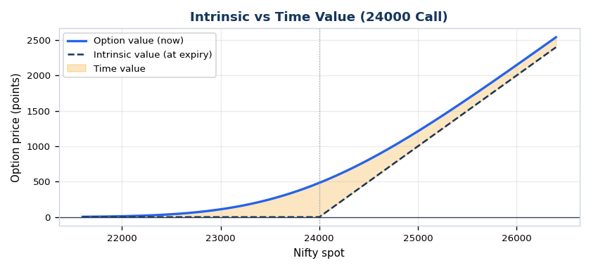

### How time value behaves as expiry approaches

Time value does not melt at a constant rate. It decays **slowly at first and then accelerates**, collapsing fastest in the final days for an ATM option. A 30-day ATM option might lose only a point or two of time value per day early on, but in expiry week it can shed a large chunk daily, and on expiry day itself the remaining time value rushes to zero.

This non-linear, accelerating decay is why Indian **weekly options** (Nifty and Bank Nifty expiries land on fixed weekdays as set by the exchange) are so brutal for buyers and so attractive to sellers: a weekly option is *all* in the steep part of the decay curve. The detailed shape is the subject of the next chapters on **time decay** and **theta**.

### The link to extrinsic value and theta

"Time value" and **extrinsic value** are two names for the same thing: everything in the premium that is *not* intrinsic. Some books say extrinsic to remind you it depends on *external* factors (time left, volatility, interest rates) rather than the simple spot-minus-strike arithmetic.

**Theta** is the Greek that measures how much time value (and therefore premium) the option loses per day, holding everything else constant. Theta is typically quoted as a negative number for a long option — e.g. theta = -8 means the option loses about ₹8 of value per day from the passage of time alone. We preview it here only to make one point unmistakable.

### Why option BUYERS fight a constant headwind

When you **buy** an option, you pay the full premium — intrinsic *plus* time value. The intrinsic part you can recover (it tracks the spot). But the **time value you paid is guaranteed to reach zero by expiry.** Every single day that the underlying does *nothing*, your option is worth a little less. That is the headwind.

Picture the option buyer walking up a downward-moving escalator. To make money you do not merely need to be right about direction — you need to be right *enough, fast enough* to outrun the time decay pulling you down. Stand still (the index goes nowhere) and the escalator carries you backward into a loss.

The mirror image: the option **seller** collects that time value upfront and pockets it as the option decays — they are riding the escalator *down*, in their favour. This is the deep reason behind a sober statistic: most long options expire worthless, and SEBI studies have found roughly **9 in 10 retail F&O traders lose money**. The time-value headwind is a structural cost of being long options, not bad luck. It does not make buying options wrong — it makes *overpaying for time value, or holding too long, or trading direction without enough movement* wrong.

## Worked example (₹, Nifty/Bank Nifty)

Let's do a full split with realistic numbers. Suppose it is mid-week and **Nifty spot = 24,150**. We look at three call options expiring this Friday, plus one put, and pull each premium apart.

| Option | Strike K | Premium (₹) | Intrinsic = max(S-K,0) | Time value = Premium - Intrinsic |
|---|---|---|---|---|
| 24,000 CE (ITM call) | 24,000 | 215 | max(24150-24000,0) = 150 | 215 - 150 = **65** |
| 24,150 CE (ATM call) | 24,150 | 95 | max(24150-24150,0) = 0 | 95 - 0 = **95** |
| 24,400 CE (OTM call) | 24,400 | 22 | max(24150-24400,0) = 0 | 22 - 0 = **22** |
| 24,000 PE (OTM put) | 24,000 | 50 | max(24000-24150,0) = 0 | 50 - 0 = **50** |

Read what this table is telling you:

- The **ITM call** (24,000 CE) holds 150 points of solid intrinsic value and only 65 of time value. Most of what you pay is "bricks."
- The **ATM call** (24,150 CE) has *zero* intrinsic value — its entire ₹95 premium is time value. This is the strike with the most time value, exactly as the moneyness rule predicts.
- The **OTM call** (24,400 CE) is cheap (₹22) and 100% time value, but it is small time value because finishing above 24,400 by Friday is a long shot.
- The **OTM put** is also pure time value (₹50) — a bet that Nifty falls below 24,000.

**Now apply the time-value headwind.** Suppose by the next morning Nifty is still 24,150 — it has not moved at all — and one day of time value has bled out. Roughly, the ATM 24,150 CE might fall from ₹95 to about ₹83. You were "right" that the market did not crash, yet you lost about ₹12 per unit purely to decay. With a Nifty lot size of about 75 units (lot sizes are set by the exchange and change periodically), that ATM call holder lost roughly:

`12 points * 75 = ₹900` on one lot, in a single quiet day — with the index unchanged.

The seller of that same call collected that ₹900. That is the buyer's headwind and the seller's tailwind, in rupees.

**A second pass — what the buyer needs to break even.** The ATM buyer paid ₹95, all of it time value. To merely break even at expiry, Nifty must finish at `24,150 + 95 = 24,245`. So even a 95-point rally (about 0.4%) by Friday leaves the buyer flat, because that entire move just *replaces* the time value they paid. Anything less and the position loses. This is the precise sense in which the buyer "pays for the option to be wrong, but still has to be right to win."

## Common mistakes / risk note

- **Thinking a flat market is a safe market for option buyers.** It is the opposite. If the index goes nowhere, your long option still loses time value every day. "No move" is a losing scenario for buyers.
- **Assuming premium tracks intrinsic value one-for-one.** A 50-point favourable move in Nifty does *not* add 50 points to an OTM option's premium, and it can even be *swamped* by time-value decay or a drop in India VIX. Premium = intrinsic + time value, and both parts move.
- **Buying cheap deep-OTM options because they "cost so little."** They are cheap precisely because they are almost all unlikely time value. They usually expire worthless. Cheap is not the same as good value.
- **Ignoring volatility's effect.** Time value depends on India VIX. You can buy an option, be right on direction, and still lose if VIX falls and crushes the time-value portion (a "vol crush," common right after an event).
- **Holding longs into expiry week out of hope.** That is the steepest part of the decay curve. Time value you are counting on to recover is evaporating fastest exactly then.
- **The honest risk on the other side.** Selling options to collect time value is *not* free money. The decay tailwind is real, but the seller's loss is large and, for a naked option, effectively undefined. SEBI's data showing about 9 in 10 retail F&O traders lose money applies to *both* careless buyers and over-leveraged sellers. Understanding intrinsic vs time value tells you *where* your edge has to come from; it does not hand you an edge.

## Key takeaways

- Every premium splits in two: `Premium = Intrinsic value + Time value`.
- Intrinsic value is `max(S - K, 0)` for a call and `max(K - S, 0)` for a put — never negative, and zero for ATM/OTM options.
- Time value = Premium - Intrinsic. It is the price of uncertainty plus time, and it is also called extrinsic value.
- Time value is **largest at-the-money** and **smallest deep ITM or deep OTM**; it always decays to **zero at expiry**, and it decays *faster* as expiry nears.
- Theta measures the daily loss of time value — the structural headwind that makes long options lose value when the market stands still.
- Buyers pay for time value and watch it bleed; sellers collect it. This is a core reason most long options expire worthless and most retail F&O traders lose money — trade accordingly.

## Practice problems

1. **(Conceptual)** A Nifty 23,800 PE (put) has a premium of ₹140 with spot at 23,900. Is this option ITM, ATM, or OTM? What is its intrinsic value and its time value?

2. **(Numeric)** Bank Nifty spot is 52,400. The 52,000 CE trades at ₹560. Split the premium into intrinsic value and time value.

3. **(Numeric)** For Nifty spot = 24,100, you observe three calls: 23,800 CE at ₹360, 24,100 CE at ₹110, and 24,500 CE at ₹28. Compute the time value of each and identify which strike has the most time value. Does this match the moneyness rule?

4. **(Conceptual)** Two days pass and Nifty is unchanged at 24,100. Which of the three calls in Problem 3 will, in percentage terms, be hurt most by time decay, and why?

5. **(Numeric)** You buy one lot of the Nifty 24,100 ATM call from Problem 3 at ₹110 (lot size 75). For you to break even at expiry, where must Nifty settle? What is your maximum possible loss in rupees?

6. **(Conceptual)** A trader says, "I'll buy a deep-ITM call instead of the stock — it's like owning the index but cheaper." Using the intrinsic/time-value split, explain what is true and what is misleading about this.

## Solutions

**1.** Spot 23,900 is *above* the strike 23,800, so the right to *sell* at 23,800 is worthless to exercise now → the put is **OTM**. Intrinsic = max(K - S, 0) = max(23800 - 23900, 0) = **0**. Time value = Premium - Intrinsic = 140 - 0 = **₹140**. The entire premium is time value — typical for an OTM option.

**2.** Bank Nifty 52,000 CE with spot 52,400. Intrinsic = max(S - K, 0) = max(52400 - 52000, 0) = **400 points**. Time value = 560 - 400 = **160 points**. So this ITM call's premium is mostly intrinsic (400) with 160 of time value.

**3.** All are calls, intrinsic = max(S - K, 0):
- 23,800 CE: intrinsic = max(24100 - 23800, 0) = 300. Time value = 360 - 300 = **60**.
- 24,100 CE: intrinsic = max(24100 - 24100, 0) = 0. Time value = 110 - 0 = **110**.
- 24,500 CE: intrinsic = max(24100 - 24500, 0) = 0. Time value = 28 - 0 = **28**.

The **24,100 CE (ATM)** has the most time value (110), versus 60 for the ITM and 28 for the OTM. Yes — this matches the rule that time value peaks at-the-money and is smaller deep ITM or far OTM.

**4.** In *percentage* terms, the **24,500 OTM call** is hurt most. Its entire ₹28 premium is fragile time value, and OTM time value decays toward zero quickly when the underlying does not move toward the strike — a few points lost off ₹28 is a large percentage. The ITM 23,800 call, by contrast, holds 300 points of intrinsic value that does *not* decay; only its 60 points of time value erode, so the percentage hit to its ₹360 premium is much smaller. (The ATM call loses the most in *absolute* points, but the OTM loses the most in percentage terms.)

**5.** You paid ₹110, all time value (intrinsic is zero at the 24,100 strike with spot 24,100). Break-even at expiry: Nifty must finish at `K + premium = 24,100 + 110 = 24,210`. Maximum loss is the full premium paid, since a long call cannot lose more than what you spent: `110 points * 75 = ₹8,250` per lot. That maximum loss occurs if Nifty settles at or below 24,100 at expiry, where the call expires worthless.

**6.** *What's true:* a deep-ITM call has high intrinsic value and a high delta, so it moves nearly point-for-point with the index, and it ties up less cash than buying the index basket outright — so it does feel like "owning the index, cheaper." *What's misleading:* even a deep-ITM call still contains some time value, and **that time value decays to zero by expiry** — the actual underlying never decays. So the ITM-call holder still pays a (small) time-value headwind and faces expiry, whereas a holder of the underlying does not. The call is a *leveraged, time-limited* proxy for the index, not a free substitute. The leverage cuts both ways, and the time-value sliver is a recurring cost the stock holder never pays.

# Chapter 7: Contract Mechanics in India — Lots, Expiry, Ticks & Strikes

When you buy a kilo of rice, you do not negotiate the price of a single grain. The shop sells in standard packets, the weighing scale moves in fixed steps, and the bill is whatever the packet weighs times the price per kilo. An options contract works the same way. Before you can think about whether the market goes up or down, you have to know the "packet size" you are forced to trade in, the steps the price is allowed to move in, the dates on which the contract dies, and the menu of prices you are allowed to bet on. These are the **contract mechanics**, and on the NSE they are not suggestions — they are hard rules baked into the exchange. Get them wrong and you will misjudge how much money is actually on the table.

This is the plumbing chapter. It is less glamorous than Greeks or strategies, but every rupee of profit or loss you ever make flows through these pipes. A trader who internalises lots, notional value, expiry cycles, ticks, and strike intervals can glance at a Nifty option quote and instantly know the cash outlay, the risk, and what a one-point move is worth.

## Core concepts

### The lot size: you trade in bundles, not single units

An option does not trade one unit at a time. The exchange bundles a fixed number of underlying units into one **lot**, and the lot is the smallest quantity you can buy or sell. You can trade 1 lot, 2 lots, 17 lots — but never half a lot, and never a single share or index point on its own.

Think of it like an egg tray. The shop will not sell you one egg; it sells trays of 30. The "lot size" of eggs is 30. If you want 45 eggs you cannot have them — you buy one tray (30) or two trays (60). Options are the same. For Nifty, one lot is currently about 75 units of the index. For Bank Nifty it is currently about 30 units. (These numbers are revised periodically by the NSE, so always treat them as "currently about" and check the contract specification before trading — exchanges adjust lot sizes to keep the rupee value of one contract within a target band as index levels drift up or down.)

So when a quote screen says the Nifty 24000 call is trading at ₹150, that ₹150 is the premium **per unit of the index**. You are not paying ₹150. You are paying:

```
Cash outlay = premium per unit * lot size
            = 150 * 75
            = ₹11,250 for one lot
```

This single multiplication trips up more beginners than any Greek ever will.

### Why exchanges set the lot size

Why not just let people trade one index unit? Two reasons, both about keeping the market orderly.

1. **Standardisation and liquidity.** If everyone trades the same standard quantity, buyers and sellers match easily. A market where one person wants 17 units and another wants 4 would be a mess. Fixed lots make every contract fungible — interchangeable — so an exchange-traded option is as standardised as a currency note.

2. **Keeping the contract "serious" but not absurd.** SEBI and the NSE try to keep the rupee value of one lot within a sensible range — historically a few lakh rupees of notional exposure. This is deliberate. If a single lot were worth only ₹5,000 of exposure, the market would fill with tiny, casual punts. If it were worth ₹50 lakh, ordinary participants could not trade at all. As the index rises over the years, the same lot size represents more rupees, so periodically the exchange **cuts** the lot size to bring the rupee value back into the target band. That is why lot sizes are not constants — they are policy levers.

### Notional value: the two numbers that matter

There are two different "sizes" of an options position, and confusing them is dangerous.

**Premium outlay** is the cash that actually leaves your account to buy the option (or the margin you post to sell it). It is small.

**Contract notional value** is the rupee value of the underlying that the contract controls. It is large. This is your true economic exposure — the amount you are effectively long or short in the market.

```
Premium outlay   = premium * lot size
Contract notional = spot price * lot size
```

Suppose Nifty spot is at 24,000 and the lot size is 75:

```
Contract notional = 24000 * 75 = ₹18,00,000
```

One Nifty option lot controls about ₹18 lakh of index. You might pay only ₹11,250 in premium for it, but you are economically exposed to an ₹18 lakh basket. This gearing — controlling ₹18 lakh with ₹11,250 — is **leverage**, and it is exactly why options can multiply both gains and losses so violently. Always know your notional, not just your premium. A trader who thinks "I only risked ₹11,250" has understood half the picture; the position behaves like an ₹18 lakh stake in the market.

### Expiry: every contract has a death date

An option is a wasting asset with an appointment with the undertaker. The **expiry date** is the day the contract settles and ceases to exist. After expiry, the option is gone — either it had value (it was in-the-money and you receive the cash difference) or it expired worthless.

Indian index options are **European style** and **cash-settled**. European means you can only exercise *at* expiry, not before (though you can always sell the option in the market beforehand). Cash-settled means no shares change hands — at expiry the exchange simply credits or debits the cash difference between the strike and the final settlement price. (Single-stock options, by contrast, are physically settled — actual shares are delivered — which is a separate and important complication covered elsewhere.)

### Weekly versus monthly expiries — the Indian landscape

India runs two parallel expiry rhythms on its indices.

- **Monthly expiry.** Every index has a monthly contract that expires once a month. Historically this is the last business day of a designated week of the month. The monthly series has been around since the start of F&O and remains the deepest, most liquid contract for positional traders.

- **Weekly expiry.** Layered on top, the major indices also offer contracts that expire every week. Weeklies were introduced to give traders short-dated, low-premium instruments — a weekly option costs less than a monthly because it has less time value (less time for the market to move), so they became enormously popular with retail traders for short-term bets and for selling premium.

The exact weekly-expiry landscape in India has been **changing**, so treat any specific list of "which index expires on which weekday" as a snapshot, not a law. In 2024–2025, SEBI moved to **rationalise** the explosion of weekly expiries, concerned that a different index expiring almost every day of the week was encouraging excessive, lottery-like retail speculation (recall the SEBI finding that roughly 9 in 10 retail F&O traders lose money). The broad direction of regulation has been to **limit each exchange to one weekly-expiry benchmark index** and to nudge expiry days around. Because this is live policy, the correct professional habit is: **check the current NSE circular for the expiry calendar before you trade**, rather than relying on what was true last year. The *concept* — a weekly cadence plus a monthly cadence — is stable; the *details* are not.

### Expiry-day conventions

A few conventions you must hold in your head:

- **Settlement price.** For cash-settled index options the final settlement value is not the last traded tick. It is typically a **time-weighted average** of the underlying index over the closing window (for example, the average of the index over roughly the last half-hour of the expiry day). This averaging stops a single manipulated print from deciding crores of payoffs. So on expiry day your option does not settle at the dramatic closing spike you see on screen — it settles at the smoother average.

- **The weekly that coincides with the monthly.** In the week that contains the monthly expiry, the weekly and monthly expiries fall on the same day. There is no separate "extra" contract that week — the monthly *is* that week's weekly.

- **Holidays.** If an expiry day is a trading holiday, expiry shifts to the **previous** trading day. Always read the official holiday-adjusted calendar.

### Tick size: the smallest allowed price step

Just as a ruler only marks down to the millimetre, an option price can only move in fixed increments called the **tick size**. On NSE options the tick is currently ₹0.05 (five paise). You cannot quote an option at ₹150.02 or ₹150.131 — the legal prices are ₹150.00, ₹150.05, ₹150.10, and so on.

Why have ticks at all? A tick imposes a minimum grid so that orders queue and match cleanly and so that the bid–ask spread cannot be sliced into meaningless fractions. The rupee value of one tick on a single lot is:

```
Value of one tick = tick size * lot size
```

For a Nifty lot of 75: `0.05 * 75 = ₹3.75` per tick. That is the smallest price flicker your one-lot position can register. It sounds trivial, but for a high-frequency seller trading hundreds of lots, ticks are the very grain of profit.

### One-point move: what the underlying is worth

The most useful back-of-envelope number a trader can carry is **the rupee value of a one-point move in the underlying**, per lot. Because the option's value is ultimately driven by the index, and the lot multiplies everything:

```
Rupee value of a 1-point index move = 1 * lot size
```

For Nifty (lot 75): a 1-point move in Nifty = ₹75 per lot. So if Nifty moves 100 points your way and you hold a position with full exposure (say a deep in-the-money option behaving nearly one-for-one with the index), that is roughly `100 * 75 = ₹7,500` per lot. For Bank Nifty (lot 30): a 1-point move = ₹30 per lot; a 200-point Bank Nifty swing is about `200 * 30 = ₹6,000` per lot.

A subtlety: an option does not move one-for-one with the index unless it is very deep in-the-money. How much the premium moves per index point is governed by **delta** (covered in the Greeks chapters). The "lot size in rupees per point" above is the *maximum* sensitivity — what you get when delta is 1. A premium with delta 0.5 captures only about half: `0.5 * 1 * 75 = ₹37.50` per index point per lot. Keep the two ideas separate: lot size converts index points to rupees; delta converts index points to premium points.

### The contract cycle: near, next and far month

At any moment, several monthly contracts trade side by side. The **contract cycle** is the rolling set of available expiries:

- **Near month** — the contract expiring soonest. Most liquid, tightest spreads, where most action lives.
- **Next month** — the one expiring after the near month.
- **Far month** — the third in line.

As the near month expires and disappears, a new far month is introduced, so there are always three monthly series rolling forward (plus the weekly contracts for indices). When traders speak of "rolling" a position, they mean closing the expiring contract and reopening it in a later month to stay in the trade.

### Strike-price intervals: the menu of bets

For each expiry you are not free to pick any strike you like. The exchange lists strikes at fixed **intervals** around the current spot. For Nifty, strikes are commonly spaced 50 points apart (…23900, 23950, 24000, 24050…); for Bank Nifty, commonly 100 points apart (…51800, 51900, 52000…). The exchange always keeps a generous ladder of strikes both above and below the spot — typically many in-the-money and many out-of-the-money strikes — and adds new strikes if the index trends far enough that the ladder needs extending.

Tighter strike spacing (Nifty's 50) gives you finer control to target a precise level; wider spacing (Bank Nifty's 100) reflects its larger absolute level and faster moves. The interval is part of the contract specification, so confirm it on the NSE rather than assuming.

## Worked example (₹, Nifty & Bank Nifty)

**Setup.** It is a normal trading day. Nifty spot is 24,000 and Bank Nifty spot is 52,000. Assume Nifty lot size 75 and Bank Nifty lot size 30 (current approximate values). You are looking at two trades.

**Trade A — Buy 2 lots of the Nifty 24,200 weekly call at a premium of ₹120.**

Step 1 — Cash outlay (premium):
```
Per lot   = premium * lot size = 120 * 75 = ₹9,000
Two lots  = 9,000 * 2          = ₹18,000
```
You pay ₹18,000 to enter. This is also your **maximum loss** as a buyer — if Nifty stays below 24,200 at expiry the calls expire worthless and you lose the full ₹18,000, nothing more.

Step 2 — Notional exposure:
```
Per lot   = spot * lot size = 24000 * 75 = ₹18,00,000
Two lots                                  = ₹36,00,000
```
Your ₹18,000 premium controls ₹36 lakh of Nifty. That is the leverage you have taken on.

Step 3 — Value of a one-point move:
```
1 Nifty point = lot size = ₹75 per lot
Two lots                  = ₹150 per point
```
At expiry, the call's intrinsic value is `max(spot - 24200, 0)`. Suppose Nifty closes (on the averaged settlement) at 24,500. Intrinsic value per unit = `24500 - 24200 = 300`.
```
Payoff per lot = 300 * 75 = ₹22,500
Two lots       = ₹45,000
Net profit     = payoff - premium = 45,000 - 18,000 = ₹27,000
```
Breakeven was `strike + premium = 24200 + 120 = 24,320`. Above that you profit; between 24,200 and 24,320 you recover part of the premium; below 24,200 you lose all of it.

**Trade B — Sell (write) 1 lot of the Bank Nifty 52,000 weekly put at a premium of ₹250.**

Step 1 — Premium received:
```
Premium credit = 250 * 30 = ₹7,500
```
This ₹7,500 is your **maximum profit**. As a seller you keep it only if Bank Nifty stays at or above 52,000 at expiry.

Step 2 — Notional and risk. The contract notional is `52000 * 30 = ₹15,60,000`. Unlike the buyer, the seller's risk is large: if Bank Nifty crashes, the put gains value against you almost without limit (down to a Bank Nifty of zero in the extreme). If Bank Nifty settles at 51,400:
```
Intrinsic value per unit = 52000 - 51400 = 600
Loss per lot             = 600 * 30      = ₹18,000
Net result               = premium - loss = 7,500 - 18,000 = -₹10,500
```
You collected ₹7,500 but lost ₹18,000 of value — a net loss of ₹10,500 on a single 600-point move. This asymmetry — small fixed gain, large variable loss — is the heart of option selling, and why sellers must post **SPAN + exposure margin** (a large margin reflecting that downside) rather than just the premium.

Step 3 — Tick check. One tick on the Bank Nifty put is `0.05 * 30 = ₹1.50` per lot. Small, but it sets the minimum spread you cross every time you enter or exit.

## Common mistakes / risk note

- **Confusing premium with cost.** Beginners see "₹120" and think the trade costs ₹120. It costs `₹120 * lot size`. Always multiply by the lot before you decide if you can afford the trade.
- **Ignoring notional / leverage.** "I only put in ₹18,000" hides the fact that you are exposed to ₹36 lakh of index. Size your position by notional and worst-case loss, not by premium paid.
- **Assuming the option moves point-for-point with the index.** It does not, unless deeply in-the-money. The lot converts *index points* to rupees; **delta** converts *index points* to *premium points*. Out-of-the-money options can barely move on a modest index wiggle.
- **Trusting a stale expiry calendar.** Weekly expiry days and which indices carry them have been changing under SEBI rationalisation. Read the current NSE circular every time; do not rely on last year's weekday.
- **Forgetting expiry settles on an average, not the close.** Your in-the-money option settles on the closing-window time-weighted average of the underlying, which can differ from the dramatic last tick on screen.
- **The honest risk.** These mechanics make options easy to access but they do not make them easy to win. Most long options expire worthless because the index does not move enough in time. Option *selling* offers a high probability of a small gain but exposes you to large, sometimes uncapped losses — exactly the Trade B asymmetry. SEBI studies have repeatedly found that roughly 9 in 10 retail F&O traders lose money. Knowing the plumbing protects you; it does not give you an edge by itself.

## Key takeaways

- You trade in **lots**, never single units. Lot size is currently about 75 for Nifty and about 30 for Bank Nifty, and is revised by the exchange over time.
- **Premium outlay = premium * lot size**; **contract notional = spot * lot size**. The first is the cash you pay; the second is your true economic exposure (your leverage).
- Indian index options are **European and cash-settled**, settling on a time-weighted average of the underlying over the closing window.
- India runs **weekly + monthly** expiry cadences; the precise weekly landscape is under SEBI rationalisation and changing — confirm the current calendar each time.
- **Tick size** (currently ₹0.05) is the smallest legal price step; one tick is worth `tick * lot size` in rupees.
- **A one-point index move is worth `lot size` rupees per lot** (₹75 Nifty, ₹30 Bank Nifty) at delta 1; multiply by delta for the option's actual sensitivity.
- Three monthly series (**near/next/far**) roll forward continuously; strikes are listed at fixed intervals (about 50 for Nifty, 100 for Bank Nifty) around spot.

## Practice problems

1. **(Conceptual.)** Explain in one or two sentences the difference between the *premium outlay* and the *contract notional value* of a single option lot, and why a trader must track both.

2. **(Numeric.)** Nifty spot is 23,800, lot size 75. You buy 3 lots of a call at a premium of ₹95. What is your total cash outlay, and what is your maximum possible loss?

3. **(Numeric.)** For the position in problem 2, what is the total contract notional you control across the 3 lots? Express the leverage as notional-to-outlay ratio.

4. **(Numeric.)** Bank Nifty lot size is 30. You hold 2 lots and Bank Nifty rises by 180 points. Assuming your position behaves one-for-one with the index (delta ≈ 1), what is your rupee gain? What would it be if delta were only 0.4?

5. **(Numeric.)** You sell 1 lot of a Nifty 24,000 put for ₹140 (lot 75). Nifty settles at 23,750. Compute the premium received, the option's intrinsic value at settlement, and your net profit or loss.

6. **(Conceptual.)** A friend says, "Weeklies always expire on Thursday for every index, so I planned my whole strategy around Thursdays." What is wrong, or at least risky, about relying on that statement today?

## Solutions

**1.** The *premium outlay* is the actual cash that leaves your account to buy the option — `premium * lot size` — and for a buyer it is also the maximum loss. The *contract notional value* is `spot * lot size`, the rupee value of the underlying basket the contract controls, i.e. your true market exposure. You must track both because the small premium hides large leveraged exposure; risk and position sizing must be judged on notional and worst-case loss, not on the cash paid.

**2.** Outlay per lot = `95 * 75 = ₹7,125`. Three lots = `7,125 * 3 = ₹21,375`. As an option **buyer**, your maximum possible loss equals the full premium paid: **₹21,375** (the calls expire worthless if Nifty finishes at or below the strike).

**3.** Notional per lot = `23,800 * 75 = ₹17,85,000`. Three lots = `17,85,000 * 3 = ₹53,55,000`. Leverage ratio = `53,55,000 / 21,375 ≈ 250.5`. You are controlling roughly **₹53.55 lakh of Nifty with ₹21,375**, about 250 times leverage on a premium basis — a vivid reminder of how much exposure sits behind a small premium.

**4.** One point per lot = ₹30, so 2 lots = ₹60 per point. At delta ≈ 1: `180 * 60 = ₹10,800` gain. At delta 0.4 the premium captures only 40% of the index move: `0.4 * 180 * 60 = ₹4,320`. This shows the difference between the lot's point-value and the option's actual sensitivity through delta.

**5.** Premium received = `140 * 75 = ₹10,500` (this is the maximum profit). Intrinsic value at settlement = `max(strike - spot, 0) = max(24,000 - 23,750, 0) = 250` per unit, so value owed = `250 * 75 = ₹18,750`. Net result = `premium - payoff = 10,500 - 18,750 = -₹8,250`, a **loss of ₹8,250**. The seller collected ₹10,500 but a 250-point adverse move cost ₹18,750 — the classic small-gain / large-loss asymmetry of writing options.

**6.** Two problems. First, different indices have historically expired on *different* weekdays, so "every index on Thursday" was never universally true. Second and more important, the Indian weekly-expiry calendar has been actively **changing** under SEBI's rationalisation of weekly expiries — expiry weekdays and which indices carry weeklies have shifted. Hard-coding a strategy to a fixed weekday is fragile; the disciplined approach is to read the current NSE expiry circular each cycle and adjust, because the *concept* (a weekly cadence) is stable but the *specific day* is policy that moves.

# Chapter 8: Settlement & Expiry Day — Cash, Physical & the STT Trap

Every option contract is a promise with a deadline. For weeks the promise floats around, changing hands, gaining and losing value — but on one specific day the music stops and the promise must be made good. That day is **expiry**, and the process of making good is called **settlement**. This is the moment the abstract contract turns into an actual movement of money (or, for stocks, an actual movement of shares) in and out of your account. Most beginners spend all their energy on entry — which strike, which direction — and almost none on what happens at the finish line. That is a mistake, because expiry day in India has its own peculiar mechanics, its own taxes, and its own traps that can quietly eat a winning trade.

The single most important thing to burn into your memory is this: **how an option settles depends entirely on what it is written on.** Index options (Nifty, Bank Nifty, FinNifty) settle in **cash** — no shares ever change hands. Single-stock options (Reliance, Infosys, HDFC Bank) settle by **physical delivery** — if you are holding an in-the-money stock option at expiry, you are obliged to actually give or take the real shares. These two worlds behave very differently on the last day, and confusing them is one of the fastest ways for a new F&O trader to receive a margin shock or a brutal tax bill. This chapter walks through both.

## Core concepts

### What "settlement" actually means

Settlement is the exchange's way of closing the books on a contract. When an option expires, one of two things is true:

- The option is **out-of-the-money (OTM)** or **at-the-money (ATM)** — no intrinsic value. It expires worthless and disappears. The buyer loses the premium; the seller keeps it.
- The option is **in-the-money (ITM)** — it has intrinsic value, so value must flow from the seller to the buyer. *How* that value flows is the cash-versus-physical distinction.

Indian options are **European style**, meaning they can only be exercised *at* expiry, never before. (You can always sell the option in the market beforehand — that is different from exercising it.) So all the settlement drama is concentrated on one day.

### Cash settlement: how index options finish

For Nifty, Bank Nifty and the other index options, settlement is purely a cash adjustment. No one delivers a basket of 50 stocks. Instead, at expiry the exchange computes the option's intrinsic value and simply **credits the buyer and debits the seller** that amount of cash.

The crucial subtlety is *which price* the exchange uses. It is **not** the last traded price of the index, and it is **not** the dramatic closing tick you see flash on your screen. It is the **settlement price**, defined as the **time-weighted average of the underlying index over the last 30 minutes of trading on expiry day** (roughly the 3:00 p.m. to 3:30 p.m. window for a normal session).

```
Settlement price = time-weighted average value of the underlying index
                   over the final 30 minutes of the expiry session
```

Why an average rather than the closing print? To stop manipulation. If settlement depended on a single instant, a large player could try to jam the index for one second at 3:30 and tilt crores of rupees of payoffs in their favour. Averaging over half an hour makes that prohibitively expensive and keeps the settlement honest. The practical consequence for you: the level your option settles at can differ — sometimes meaningfully — from the close you saw on the chart. A call that looked 8 points in-the-money on the final tick might settle only 3 points in-the-money if the index drifted up only in the last minute, because the 30-minute average sits lower.

For a cash-settled ITM index option:

```
Cash settlement amount per lot = intrinsic value per unit * lot size
intrinsic value (call) = max(settlement price - strike, 0)
intrinsic value (put)  = max(strike - settlement price, 0)
```

That money is moved automatically. You do nothing. There is no question of "delivering the Nifty."

### Physical settlement: how stock options finish

Single-stock options are a completely different animal. Since 2019, SEBI has required all **stock** derivatives (futures and options) to be **physically settled**. That means an ITM stock option at expiry is converted into an actual obligation to **deliver or receive the underlying shares** at the strike price, in the full lot quantity.

Spell out the four positions a trader can hold into expiry:

- **Long call, ITM:** the right to *buy* at the strike. You must **take delivery** — pay `strike * lot size` in cash and receive the shares in demat.
- **Short call, ITM:** obliged to *sell* at the strike. You must **give delivery** — hand over the actual shares (and if you do not own them, you must buy them, risking an auction).
- **Long put, ITM:** the right to *sell* at the strike. You must **give delivery** of the shares.
- **Short put, ITM:** obliged to *buy* at the strike. You must **take delivery** and pay for them.

The numbers are large. A single lot of a stock option can represent five to fifteen lakh rupees of stock. If you let an ITM Reliance option go to physical settlement, you may suddenly need ₹10–12 lakh of cash (to take delivery) or that much in shares (to give delivery) — for a position where you posted only a small premium or margin. This is why physical settlement is the single biggest "gotcha" in Indian stock options.

### Margins ramp up in expiry week

Because the exchange knows physical delivery is looming, it does not wait until the last moment to make sure you can honour it. For positions that *could* go to physical delivery, brokers and the exchange **progressively increase the margin** through the final week — often described as ramping up over the last four trading days, in steps, until a position that is likely to be physically settled is carrying a margin close to the full delivery value.

The intuition: early in the contract's life, an option is just a bet and a modest margin covers it. But as expiry nears and the option sits in- or near-the-money, the chance it converts into a multi-lakh delivery obligation rises sharply. The exchange demands collateral to match that growing real-world obligation. If you are caught holding such a position without the cash to support the swelling margin, your broker will start issuing margin calls — or square you off.

### Brokers auto square-off physically-settled positions

Most retail traders have neither the cash nor the demat shares to honour physical delivery, and most never intended to — they were trading the option for its price movement, not to actually own Reliance shares. Brokers know this. So nearly every Indian broker runs a **policy of auto square-off for physically-settled positions** that the client has not closed themselves.

Typically the broker publishes a deadline on expiry day (commonly some point in the afternoon, varying by broker and by how deep ITM the option is) by which you must close any stock F&O position that risks going to delivery. If you have not, the broker's risk system will **square it off on your behalf at market price**, often with an additional penalty/charge, to protect both you and the broker from an unfunded delivery obligation. This is a safety net, but it is a clumsy one — it executes at whatever price the market offers at that moment, which may be poor.

Do not rely on the auto square-off as a strategy. Treat it as the fire alarm, not the plan. The professional habit is to manage your own stock-option positions well before any broker cutoff.

### The STT trap on exercised ITM options

Now the part that catches even experienced traders off guard. **Securities Transaction Tax (STT)** is a small tax on securities transactions. On normal options trades — buying and selling the option in the market — STT is charged only on the **premium**, and it is tiny. But there is a vicious asymmetry hidden in the rules: when an option is **exercised** at expiry (i.e. you let an ITM option go to settlement rather than selling it), STT on the exercise is historically charged on a far larger base — effectively on a value tied to the **intrinsic/settlement value of the contract, not just the premium.**

Here is the trap in plain terms. Suppose you bought a far-OTM option cheaply and it drifted just barely into the money by expiry. The premium you paid was small. The intrinsic value is also small — but the *notional on which exercise STT is computed* is large relative to your premium. The STT charged on exercise can be a large multiple of the option's actual intrinsic value, occasionally even **exceeding the entire profit** — turning a nominal winner into a real loser purely through tax.

```
STT on selling the option in market   ~ small rate * premium (tiny)
STT on letting an ITM option exercise ~ much larger base tied to settlement value
```

The exact rates change over time and you should check the current schedule, but the *structure* has been consistent: **exercising a barely-ITM option is tax-expensive; selling it in the market is tax-cheap.** This single fact drives a near-universal professional behaviour.

### Why traders square off before expiry rather than let options exercise

Because of the STT trap (for index and stock options) and the physical-delivery obligation (for stock options), seasoned Indian traders almost never *let* an option exercise. Instead they **square off** — sell the long option, or buy back the short option — in the open market in the minutes or hours before expiry. By closing the position in the market:

- You pay only the small premium-based STT, dodging the punitive exercise STT.
- For stock options, you eliminate the physical-delivery obligation entirely — there is nothing left to deliver.
- You lock in the price you see, rather than waiting for the 30-minute averaged settlement that might come in worse.

The only reason a trader would deliberately allow physical settlement is if they genuinely *want* the shares (e.g. a long call where they intend to own the stock, and have the cash) or genuinely want to dispose of shares they hold (a covered call they are happy to have assigned). For pure directional or premium trades, square off.

### Premiums collapse to intrinsic value through expiry day

On the morning of expiry, an option still has a sliver of **time value** — the part of the premium that pays for the possibility of further movement. But the clock is almost out. As the hours of expiry day tick away, that time value bleeds out fast (this is **theta**, time decay, at its most violent), and by the settlement window the premium **converges to pure intrinsic value**.

```
Premium = intrinsic value + time value
At expiry, time value -> 0, so Premium -> intrinsic value
```

In practice this means:

- An **OTM option** on expiry day is racing toward zero. Its entire remaining premium is time value, and time value is evaporating. This is why buying cheap OTM options on expiry day ("expiry lottery tickets") is so seductive and so often a wipe-out — you need a large, fast move *right now* or the premium collapses to nothing in your hands.
- An **ITM option** sheds its small remaining time value and trades at roughly its intrinsic value, moving nearly one-for-one with the index (delta approaching 1).
- An **ATM option** is the most knife-edge: a few points either side decides whether it finishes worth something or nothing, and its value swings wildly on small index moves.

Understanding this collapse is what makes expiry-day option *selling* attractive to professionals (they harvest the fast-decaying time value) and expiry-day option *buying* a low-probability gamble for most retail traders.

### Do-not-exercise (DNE) and close-to-the-money rules

To protect traders from accidentally triggering the STT trap and physical settlement on options that are only *marginally* ITM, the system has evolved a few safeguards.

- **Do-Not-Exercise (DNE) instructions.** Historically, brokers let clients flag a **close-to-the-money (CTM)** long option with a "do not exercise" instruction, so that an option that finished only slightly in-the-money would *not* be exercised — sparing the holder an exercise STT that exceeded the tiny intrinsic gain. The holder forgoes the small intrinsic value to avoid a larger tax.
- **Automatic exercise of ITM options.** By default, ITM options are **automatically exercised** at expiry; the holder does not need to send any instruction to claim the money. DNE is the exception that switches this off for marginal cases.
- **Evolving mechanics.** The precise CTM/DNE framework has changed over the years as the exchange refined how it handles near-the-money stock options at expiry, so treat the *mechanism* as something to verify with your broker each time, while the *principle* — don't let a marginally-ITM option exercise into a tax/delivery you don't want — stays constant.

The cleanest way to never worry about DNE rules at all is, again, to **square off in the market before expiry.** A closed position has nothing to exercise.

## Worked example (₹, Nifty cash & a stock option physical)

### Example A — Nifty index option, cash settlement

**Setup.** It is weekly expiry day. You are long 2 lots of the **Nifty 24,000 call**, bought earlier in the week at a premium of ₹110. Lot size 75. Through the afternoon, Nifty hovers around 24,180. On the final tick at 3:30 the index prints 24,210, but the **time-weighted average over 3:00–3:30 p.m. comes out to 24,160.**

**If you let it go to settlement (auto-exercise):**

The cash settlement uses the *averaged* settlement price, not the 3:30 print.

```
Intrinsic value per unit = max(settlement - strike, 0)
                         = max(24,160 - 24,000, 0) = 160
Settlement per lot       = 160 * 75 = ₹12,000
Two lots                 = ₹24,000 credited in cash
```

Notice you did **not** get the 24,210 closing tick (which would have been 210 points = ₹15,750/lot). The 30-minute average of 24,160 governs. No shares change hands — this is an index option, so it is pure cash. Against your premium cost of `110 * 75 * 2 = ₹16,500`, your gross profit is `24,000 - 16,500 = ₹7,500` before charges.

**But** letting it exercise triggers the higher **exercise STT** on the settlement value, plus you are at the mercy of the averaged price. The professional alternative:

**If you square off before expiry:** suppose at 3:20 p.m. the call trades at ₹185 (almost all intrinsic now, time value nearly gone). You sell 2 lots:

```
Sale proceeds = 185 * 75 * 2 = ₹27,750
Profit        = 27,750 - 16,500 = ₹11,250 (before charges)
STT charged only on the premium-based market sale (tiny)
```

You captured a better price *and* avoided the punitive exercise STT. This is exactly why active traders close out rather than wait for settlement.

### Example B — Stock option, physical settlement

**Setup.** You are long 1 lot of a **Reliance 2,900 call** (assume lot size 250, a typical magnitude — confirm the live lot). You paid a premium of ₹40. It is monthly expiry day and Reliance is trading at **2,955** — your call is 55 points in-the-money.

**The looming obligation.** This is a *stock* option, so it is **physically settled**. If you do nothing and the call expires ITM, you must **take delivery** of the shares at the strike:

```
Cash required to take delivery = strike * lot size = 2,900 * 250 = ₹7,25,000
Shares received                = 250 Reliance shares into your demat
```

You paid only `40 * 250 = ₹10,000` in premium, but settlement would demand **₹7.25 lakh in cash** to take 250 shares. Through expiry week your broker has been **ramping up the margin** on this position precisely because this delivery obligation is now likely. If your account cannot fund the swelling margin, you will get margin calls.

**What actually happens for most traders.** Either:

1. You **square off** the option in the market before the broker's expiry-day cutoff — e.g. sell the call at its intrinsic-plus-tiny-time value of about ₹57:
   ```
   Sale proceeds = 57 * 250 = ₹14,250
   Profit        = 14,250 - 10,000 = ₹4,250 (before charges)
   No delivery obligation, only small premium-based STT.
   ```
2. Or you do nothing and the **broker auto-squares-off** the position near its deadline at whatever market price prevails (possibly worse), often with a penalty — your safety net, not your plan.
3. Or, if you genuinely want to own 250 Reliance shares and have ₹7.25 lakh ready, you **let it go to delivery**, pay the cash, and receive the shares — and accept the higher exercise STT.

For a trader who only ever wanted to play Reliance's price move, option (1) — square off — is clearly correct. The danger is the trader who *forgets* they are holding a stock option, assumes it works like a Nifty option (cash), and is blindsided by a ₹7.25 lakh delivery demand or a ramped-up margin call.

## Common mistakes / risk note

- **Treating stock options like index options.** The deadliest error. Index = cash, painless. Stock = physical delivery, multi-lakh obligation. Always know which one you are holding into expiry week.
- **Letting a barely-ITM option exercise.** The exercise STT is charged on a large settlement-linked base, not on the premium, and can swallow — or exceed — a small intrinsic gain. Square off in the market or use a do-not-exercise instruction.
- **Expecting the closing tick to be the settlement price.** Index options settle on the **30-minute time-weighted average** of the underlying, not the 3:30 print. Your payoff can differ from what the chart's last candle suggests.
- **Relying on broker auto square-off.** It is a backstop that executes at an uncontrolled price, often with a penalty. Manage your own positions before the cutoff; do not outsource your exit to the risk engine.
- **Ignoring expiry-week margin ramp-up on stock options.** Margins climb sharply in the last few days for delivery-eligible positions. An account that was comfortable on Monday can face margin calls by Wednesday.
- **Buying OTM options on expiry day expecting magic.** Time value collapses to zero through the day (peak theta). Without an immediate, large move, the premium evaporates. Most of these "lottery tickets" go to zero.
- **The honest risk.** Expiry mechanics do not create edge — they create ways to *lose* edge you already had. A winning directional call can be turned into a net loss by exercise STT, a poor averaged settlement, or an auto-square-off at a bad price. SEBI studies show roughly 9 in 10 retail F&O traders lose money; sloppy expiry handling is one of the quiet contributors.

## Key takeaways

- **Index options settle in cash; stock options settle by physical delivery.** This single distinction governs everything that happens on expiry day.
- Index settlement uses the **time-weighted average of the underlying over the last 30 minutes**, not the closing tick — designed to prevent last-second manipulation.
- An ITM stock option means a **real obligation to give or take shares** at the strike, often lakhs of rupees; brokers **ramp up margins through expiry week** and **auto square-off** unfunded positions.
- **Exercise STT** on letting an ITM option settle is charged on a large settlement-linked base and can exceed a small intrinsic gain — the classic "STT trap."
- Because of the STT trap and delivery risk, professionals almost always **square off before expiry** rather than let options exercise.
- Through expiry day, **time value decays to zero and premium converges to intrinsic value** — brutal for OTM buyers, the harvest for sellers.
- **Do-not-exercise / close-to-the-money** rules let you decline exercise on a marginally-ITM option; but the simplest protection is to close the position in the market.

## Practice problems

1. **(Conceptual.)** Your friend holds an ITM Nifty call and an ITM Infosys call into expiry, both worth the same intrinsic value. He assumes both will simply pay him cash. Where is he wrong, and what must he do about the Infosys position?

2. **(Numeric — cash settlement.)** You are long 1 lot of the Nifty 23,500 call (lot 75), bought at ₹90. On expiry the final tick is 23,640 but the 3:00–3:30 time-weighted average is 23,610. If you let it cash-settle, what is your settlement credit and your gross profit before charges? How would the answer differ if settlement used the final tick?

3. **(Numeric — selling vs exercising.)** For the position in problem 2, suppose at 3:20 p.m. the call trades in the market at ₹118. Compare squaring off at ₹118 versus letting it auto-exercise on the averaged settlement. Which gives a better gross result, and name one additional reason (beyond the price) to prefer squaring off.

4. **(Numeric — physical settlement.)** You are long 1 lot of a stock call, strike ₹1,500, lot size 600, premium paid ₹25, and it expires 30 points ITM. (a) If you let it go to physical delivery, how much cash must you produce and what do you receive? (b) If instead you square off at an intrinsic-plus value of ₹31, what is your profit, and what obligation have you avoided?

5. **(Conceptual.)** Explain why exchanges use a 30-minute average for index settlement rather than the closing price, and give one practical consequence for a trader holding an ATM option into the close.

6. **(Conceptual.)** A trader bought a far-OTM weekly option for ₹3 that finished ₹6 in-the-money at expiry. He is delighted at "doubling his money" by letting it exercise. Why might his celebration be premature?

## Solutions

**1.** The Nifty call is an **index option** — it is **cash-settled**, so it will indeed simply credit the intrinsic value in cash; he need do nothing. The Infosys call is a **single-stock option** — it is **physically settled**. If he lets it expire ITM he is obliged to **take delivery** of the full lot of Infosys shares at the strike, requiring `strike * lot size` in cash (lakhs of rupees), and he faces ramped-up expiry-week margins plus the higher exercise STT. Unless he actually wants to own the shares and has the cash, he must **square off the Infosys call in the market before his broker's expiry-day cutoff** to remove the delivery obligation (otherwise the broker may auto-square-off at a poor price with a penalty).

**2.** Settlement uses the averaged price, 23,610.
```
Intrinsic = max(23,610 - 23,500, 0) = 110
Credit    = 110 * 75 = ₹8,250
Cost      = 90 * 75 = ₹6,750
Gross profit = 8,250 - 6,750 = ₹1,500
```
If settlement used the final tick of 23,640: intrinsic = 140, credit = `140 * 75 = ₹10,500`, gross profit = `10,500 - 6,750 = ₹3,750`. The 30-minute average (23,610) gives a lower payoff than the last tick (23,640) — a reminder that the averaged settlement, not the dramatic close, governs your money.

**3.** Squaring off at ₹118: proceeds = `118 * 75 = ₹8,850`; gross profit = `8,850 - 6,750 = ₹2,100`. Letting it auto-exercise on the average (from problem 2): gross profit = ₹1,500. **Squaring off is better by ₹600** here because you capture the market price (which still holds a little value) instead of the lower averaged intrinsic. The additional reason to prefer squaring off: you pay only the **small premium-based STT** instead of the **punitive exercise STT** charged on the settlement value — so the real-world gap is even wider than ₹600.

**4.** (a) Physical delivery on a long call means you **take delivery** at the strike: cash required = `1,500 * 600 = ₹9,00,000`, and you receive **600 shares** into your demat. You only paid `25 * 600 = ₹15,000` in premium, yet settlement demands ₹9 lakh in cash — the physical-settlement shock. (b) Squaring off at ₹31: proceeds = `31 * 600 = ₹18,600`; profit = `18,600 - 15,000 = ₹3,600`. By squaring off you **avoid the ₹9 lakh delivery obligation** (and the ramped expiry-week margin and exercise STT) entirely.

**5.** A single closing print could be **manipulated** — a large player could briefly jam the index at 3:30 to swing crores of option payoffs in their favour. Averaging the underlying over the final 30 minutes makes such manipulation prohibitively expensive and produces a fairer, smoother settlement value. Practical consequence for an **ATM** holder: because the option is right on the knife-edge, the averaged settlement (rather than the visible last tick) decides whether it finishes with intrinsic value or nothing — so a position that looks ITM on the closing candle can still settle worthless if the 30-minute average sits on the other side of the strike. The safe move is to square off rather than gamble on where the average lands.

**6.** Two reasons. First, if this is a **stock** option, letting it exercise triggers **physical delivery** — a multi-lakh obligation utterly out of proportion to a ₹3 premium. Second, and applying even to index options, the **exercise STT is charged on the large settlement-linked value, not on the tiny premium**. On a barely-ITM option that STT can be a large fraction of — or even exceed — the ₹6 intrinsic gain, so the "doubling" can shrink to a small gain or flip to a net loss. He should have **sold the option in the market** before expiry, paying only the small premium-based STT and (if it was a stock option) avoiding delivery altogether.

# Chapter 9: Margins & Money — What It Costs to Buy vs Sell

Imagine two people standing at opposite ends of the same insurance contract. One person *buys* fire insurance on a house: she pays a small premium, and whatever happens, that premium is the most she can ever lose. The other person is the insurance *company* that *sold* her the policy: it pockets the premium up front, but if the house burns down it owes a fortune. The buyer's cost is small, fixed, and known the moment she signs. The seller's potential payout is large, variable, and frightening. No sensible regulator would let an insurance company write policies with empty pockets — it must keep large reserves to prove it can pay claims. Options work in exactly this way, and the reserve the seller must keep is called **margin**.

This single asymmetry — buyers pay a small premium that *is* their whole cost, sellers must lock up a large margin because their risk is big — governs how much capital you need, how much you can lose, and ultimately whether you survive in this game long enough to get good at it. This chapter is about the money plumbing: what it actually costs to take each side, why, and how to size your capital so a bad week does not end your trading career.

## Core concepts

### The fundamental asymmetry: premium vs margin

When you **buy** an option — a call or a put — you pay the seller the **premium**, and that is the end of your obligation. You hand over the cash, and you now own a *right*. You can never be asked for one more rupee. Your maximum loss is the premium, fixed and known from the first second.

```
Option buyer:
  Cost to enter   = premium * lot size   (paid in full, up front)
  Maximum loss    = the same premium     (capped, known in advance)
  Margin required = none beyond the premium itself
```

When you **sell** (or "write") an option, the picture flips. You *receive* the premium, which feels like free money. But you have taken on an *obligation*: if the market moves against you, you must pay the buyer whatever the option is worth at expiry, and that amount can be many times the premium you collected (as Chapter 8 showed, a sold option's loss can be very large, and for a naked call, theoretically unlimited). Because the exchange and your broker cannot let you take on that obligation with empty pockets, they force you to deposit a large sum of cash or collateral that stays frozen for as long as the position is open. That frozen deposit is **margin**.

```
Option seller:
  Cash received   = premium * lot size   (credited up front)
  Maximum loss    = large / potentially unlimited
  Margin required = a big deposit (SPAN + Exposure), locked until you exit
```

So the buyer's "cost" and the seller's "cost" are completely different animals. The buyer's cost is a *payment* she will never see again unless the trade works. The seller's margin is a *blocked deposit* — he still owns that money, it is just held hostage as proof he can honour the trade. Confusing these two is one of the most common beginner errors.

### What margin actually is, and why it exists

Margin is a good-faith deposit that guarantees you can meet your obligations. The buyer needs none beyond the premium because she has no further obligation — she already paid everything she could ever owe. The seller needs a lot because tomorrow he might owe a great deal.

In India this is run through a system called **SPAN** (Standard Portfolio Analysis of Risk), the margining engine used by the NSE's clearing corporation. You do not need to compute SPAN by hand — your broker's margin calculator does it — but you must understand what it is *trying* to do. The margin a seller posts has two main parts:

1. **SPAN margin.** The clearing corporation simulates a set of "what if" scenarios — what if the index jumps up, what if it crashes, what if volatility spikes — and asks: *under the worst plausible one-day scenario, how much could this position lose?* That worst-case loss, roughly, is the SPAN margin. It is risk-based: a position that can lose a lot is charged a lot.

2. **Exposure margin.** An additional cushion on top of SPAN, a few percent of the contract's notional value, to cover the gap between "worst plausible day" and "genuinely catastrophic day." Think of it as a second airbag.

```
Total seller margin = SPAN margin + Exposure margin
```

The deep idea: **margin is sized to the risk, not to the premium.** A seller who collects a tiny ₹5 premium on a far-out-of-the-money option still posts heavy margin, because even a small premium hides a large tail risk. The exchange does not care what you were paid; it cares what you could lose.

### Roughly how much margin to sell one Nifty or Bank Nifty lot

Beginners always want a number, so here is the honest one: to sell **one naked lot** of a Nifty or Bank Nifty index option, you should expect to block **about ₹1 to ₹1.5 lakh** of margin. That is the right mental anchor.

But treat that figure as *conceptual*, not fixed, because margin moves with risk, and risk moves with volatility:

- **It rises when volatility rises.** When India VIX (the index that measures expected market volatility) spikes — during a crash or an election result — SPAN's worst-case scenarios get wider, so the margin to hold the *same* lot can jump sharply, sometimes overnight.
- **It scales with notional.** Bank Nifty's per-lot margin is generally in a similar ballpark to Nifty's, but the exact figure tracks each contract's notional and volatility. Read your broker's live margin calculator before you trade — never assume.
- **It changes with regulation.** SEBI and the exchanges periodically revise margin formulas and add special cushions (for example, extra "expiry-day" margins on short options near expiry). So "about ₹1–1.5 lakh per lot" is a *2020s-era* anchor, not a law of nature.

Contrast this with **buying** that same lot: if the option premium is, say, ₹150 on a 75-unit Nifty lot, you pay `150 * 75 = ₹11,250` — and you are done. The buyer needs roughly a tenth of the capital the naked seller needs for the same strike, because the buyer carries a fraction of the risk.

### The big margin benefit of hedging: spreads vs naked selling

Here is one of the most important practical facts in all of options trading, and most beginners discover it too late. If you sell an option *and simultaneously buy a cheaper, further-out option* to cap your risk — that is, you trade a **spread** rather than a naked short — your margin can fall dramatically.

Why? Because SPAN is a *portfolio* risk engine. It does not look at your sold option in isolation; it looks at your *whole position's* worst-case loss. A naked short call can lose without limit, so SPAN charges a big margin. But a **bull call spread** or **bear call spread** — where the long option you also hold puts a hard ceiling on your loss — has a *capped, known* maximum loss. SPAN sees that the worst case is now small and bounded, so it charges far less margin.

A concrete intuition:

- **Naked short:** sell one Bank Nifty call. Worst case is enormous, so margin is roughly **₹1–1.5 lakh**.
- **Defined-risk spread:** sell that same call but also buy a higher-strike call to cap the loss. The maximum the spread can lose might be only ₹15,000–₹30,000, so the margin can drop to roughly that bounded loss — often a *fraction* of the naked-short margin.

The lesson is double-barrelled. Hedging not only *limits your loss* (good for survival), it also *frees up capital* (good for returns on the capital you do deploy). This is why professional retail option sellers in India overwhelmingly trade **defined-risk spreads** rather than naked shorts: the same view, a hard floor under the loss, and a much smaller margin block. The exchange literally rewards you for hedging.

### SEBI's peak-margin framework, in plain terms

In the past, a sneaky game was possible. If margin was checked only at the *end* of the day, an aggressive trader could take a giant intraday position with very little money, as long as it was squared off before the closing snapshot. The system never "saw" the dangerous moment, leaving brokers exposed when markets gapped.

To stop this, SEBI introduced the **peak-margin** framework. Instead of one end-of-day check, the clearing corporation now takes **several random snapshots during the trading day** (historically around four random times) and records your margin requirement at each snapshot. Your obligation for the day is based on the **highest (peak)** of those intraday snapshots — not the comfortable end-of-day number.

In plain English: **you must have the full required margin in your account at every moment, not just at the close.** You can no longer briefly over-leverage during the day and tidy up before the bell. If a random snapshot catches you short of margin, you face a penalty. This was phased in deliberately (starting at a fraction of the requirement and ramping up to 100%) specifically to curb the reckless intraday leverage that was wiping out retail traders. The practical effect for you: size your positions as if you are being watched at all times — because you are.

### Mark-to-market and margin calls

A seller's risk does not wait politely until expiry. The exchange settles gains and losses **every single day** through a process called **mark-to-market** (MTM). At the end of each trading day, your open positions are revalued at the day's settlement price, and the change is settled in cash:

- If the market moved your way, profit is credited to your account.
- If it moved against you, the loss is **debited** from your account that same day.

This daily truing-up means a seller cannot just sit on a losing position and "hope" — the losses are taken from his account day by day, in real money. If those debits eat into his deposit so that he no longer has enough to cover the required margin, he gets a **margin call**: a demand from the broker to deposit more funds immediately to restore the margin.

If he does not (or cannot) meet the margin call, the broker has the right to **forcibly square off** (close) his positions to protect itself — often at the worst possible moment, in a fast-moving market, at whatever price is available. This is how leveraged traders get wiped out: not by a single catastrophic tick, but by an adverse move that triggers MTM losses, a margin call they cannot meet, and a forced liquidation that locks in the damage. The buyer, by contrast, faces no margin call ever — she already paid her maximum loss up front, so there is nothing more to demand from her.

### Leverage: the double-edged sword

Everything above is really about **leverage** — controlling a large economic exposure with a small amount of capital. Recall from Chapter 7 that one Nifty lot controls roughly ₹18 lakh of index. Whether you buy or sell, you wield leverage, and it cuts both ways with brutal symmetry.

- For the **buyer**, leverage means a modest index move can multiply the premium several times over — but the same leverage means options routinely lose 100% of the premium when the move does not come in time.
- For the **seller**, a small margin can earn a steady stream of premiums — until one violent move produces a loss many times the premium collected and possibly larger than the margin posted, triggering MTM debits and margin calls.

Leverage does not change the *odds* in your favour; it amplifies whatever outcome occurs, including ruin. This is precisely why SEBI's own studies have repeatedly found that roughly **9 in 10 retail F&O traders lose money** — leverage lets them take positions far larger than their capital can survive, so a normal losing streak becomes a fatal one.

### Sizing capital so you survive

The professional's first job is not to make money — it is to *not go broke*, because a trader who blows up cannot compound. A few capital-sizing principles follow directly from the margin mechanics above:

1. **Never deploy all your margin.** If selling one lot blocks ~₹1.25 lakh, do *not* hold an account with exactly ₹1.25 lakh. A volatility spike can raise the margin requirement, and an adverse MTM move can debit your balance — both at once. Keep a large **free-cash buffer** (many professionals keep 30–50% of capital unblocked) precisely so a margin call never forces you out at the worst moment.
2. **Size by worst-case loss, not by premium or by margin.** Before any trade, ask: "If this goes maximally against me, how many rupees do I lose, and is that a survivable fraction of my account?" A common discipline is to risk only a small percentage (1–2%) of total capital on any single trade.
3. **Prefer defined-risk structures.** Spreads cap the loss *and* cut the margin — they let you survive being wrong, which naked selling does not.
4. **Respect volatility.** When India VIX is high, margins are high and moves are large; the same lot count is far riskier. Cut size when volatility rises.

Survival is the whole game. Leverage will happily lend you the rope; capital sizing is how you avoid hanging yourself with it.

## Worked example (₹, Nifty/Bank Nifty)

Assume current approximate values: Nifty lot size 75, Bank Nifty lot size 30, naked index-option seller margin about ₹1.25 lakh per lot.

**Trade A — The buyer.** You are bullish and **buy 1 lot of the Nifty 24,000 weekly call at a premium of ₹150.** Nifty spot is 24,000.

Step 1 — What it costs to enter:
```
Cost = premium * lot size = 150 * 75 = ₹11,250  (paid in full)
```
That ₹11,250 is the *entire* cost and *also* your maximum loss. No margin is blocked beyond this; no one can ever demand more.

Step 2 — Outcomes at expiry:
- If Nifty settles at 23,800 (below the strike), the call expires worthless. You lose the full **₹11,250**, not one rupee more. No margin call ever arrives.
- If Nifty settles at 24,400, intrinsic value = `24,400 - 24,000 = 400` per unit. Payoff = `400 * 75 = ₹30,000`. Net profit = `30,000 - 11,250 = ₹18,750`. Your ₹11,250 stake nearly tripled — leverage working *for* you.

**Trade B — The naked seller.** You think Nifty will stay flat or rise, so you **sell 1 lot of the Nifty 24,000 weekly put at a premium of ₹150.**

Step 1 — Cash and margin. Take the put premium as ₹140:
```
Premium received = 140 * 75 = ₹10,500   (credited up front, your maximum profit)
Margin blocked   ≈ ₹1,25,000            (SPAN + Exposure, locked until you exit)
```
Notice the asymmetry immediately: to *earn* a maximum of ₹10,500 you must *lock up* about ₹1.25 lakh. The buyer in Trade A controlled the same lot for ₹11,250 and could lose only that; you, the seller, have frozen ten times as much capital.

Step 2 — A bad day (mark-to-market in action). Suppose Nifty falls and the put's value rises from ₹140 to ₹240 by the day's close. MTM debits your account that evening:
```
Daily MTM loss = (240 - 140) * 75 = 100 * 75 = ₹7,500 debited today
```
That ₹7,500 is taken from your balance in real cash. If the slide continues and your free funds run low, you get a **margin call** to top up — or the broker squares you off.

Step 3 — Expiry outcome. Suppose Nifty settles at 23,600. Intrinsic value of the put = `24,000 - 23,600 = 400` per unit:
```
Payoff owed = 400 * 75 = ₹30,000
Net result  = premium - payoff = 10,500 - 30,000 = -₹19,500
```
You collected ₹10,500 but lost ₹30,000 of value — a **net loss of ₹19,500**, larger than the premium you ever stood to make, on a single 400-point move. That is the seller's bargain: small fixed gain, large variable loss, big margin block.

**Trade C — The hedged seller (spread).** Now sell the same Nifty 24,000 put for ₹140 **but also buy the Nifty 23,800 put for ₹80** to cap your risk — a bull put spread.

```
Net premium received = (140 - 80) * 75 = 60 * 75 = ₹4,500   (lower max profit)
Maximum loss         = (strike gap - net premium) * lot
                     = (200 - 60) * 75 = 140 * 75 = ₹10,500  (hard-capped)
Margin blocked       ≈ the capped loss, often ~₹10,000–15,000 (a fraction of ₹1.25 lakh)
```
By giving up some premium (₹4,500 instead of ₹10,500), you converted an unbounded risk into a maximum loss of ₹10,500 *and* cut your margin from ~₹1.25 lakh to a small fraction of it. Even in the disastrous 23,600 settlement, your loss is capped at ₹10,500 instead of running to ₹19,500 and beyond. Same directional view; survivable risk; a tenth of the capital tied up. This is why professionals hedge.

## Common mistakes / risk note

- **Thinking the seller's margin is the seller's cost.** Margin is a *blocked deposit*, not a payment — you still own it. But it is *capital that cannot work elsewhere*, and an adverse move can erode it through MTM. Treat margin as committed risk capital, not free money.
- **Selling options with a bare-minimum account.** Holding exactly the required margin and no buffer is how a volatility spike or one bad MTM day triggers a forced square-off. Always keep a large free-cash cushion.
- **Believing "premium received" is yours to keep.** It is yours *only if the trade works*. Until expiry it is exposed to losses many times its size. The credit on entry flatters beginners into over-selling.
- **Ignoring intraday peak-margin.** You cannot briefly over-leverage and square off before close — random snapshots catch the peak, and shortfalls draw penalties. Be funded at all times.
- **Naked selling for the "high probability."** Selling options wins often but small and loses rarely but large. Without a hedge, a single tail event can wipe out months of premium and more than your margin. The defined-risk spread exists precisely to remove this ruin risk.
- **The honest risk.** Leverage is the reason roughly 9 in 10 retail F&O traders lose money. It does not improve your odds — it magnifies every outcome, including the ones that end your account. Respect margin, size for survival, and prefer capped-risk structures.

## Key takeaways

- **Buyers pay premium; that premium is their entire cost and entire maximum loss** — no margin, no margin calls, ever.
- **Sellers receive premium but must post margin (SPAN + Exposure)** because their risk is large or unlimited; margin is sized to *risk*, not to the premium collected.
- Selling one naked Nifty or Bank Nifty lot blocks roughly **₹1–1.5 lakh** of margin — a *conceptual* anchor that rises with volatility (India VIX) and changes with SEBI rules.
- **Hedging into a spread slashes margin** because SPAN charges on the *bounded* worst-case loss — defined risk frees capital and caps losses at once.
- **SEBI's peak-margin framework** uses random intraday snapshots, so you must be fully margined at all times, not just at the close.
- **Mark-to-market settles gains/losses daily**; running short of margin triggers a **margin call** and possible forced square-off.
- **Leverage cuts both ways**; survival comes from keeping a free-cash buffer, sizing by worst-case loss, and respecting volatility.

## Practice problems

1. **(Conceptual.)** In one or two sentences, explain why an option *buyer* needs no margin beyond the premium while an option *seller* must post a large margin. Tie your answer to each side's obligation.

2. **(Numeric.)** Nifty lot size is 75. You buy 2 lots of a call at a premium of ₹120. What is your total cost to enter, and what is your maximum possible loss? How much *additional* margin must you post?

3. **(Numeric.)** You sell 1 naked Bank Nifty put and receive a premium of ₹300 (lot size 30). Your broker blocks ₹1.3 lakh of margin. State (a) your maximum profit, and (b) the ratio of margin blocked to maximum profit. What does that ratio tell you about the trade's risk/reward asymmetry?

4. **(Conceptual / numeric.)** Explain why selling a put *and* buying a lower-strike put (a bull put spread) requires far less margin than selling the put naked. If the naked margin is ₹1.25 lakh and the spread's maximum loss is ₹12,000, roughly what order of magnitude would you expect the spread's margin to be?

5. **(Numeric.)** You sold a Nifty option for ₹100 (lot 75). By the day's close its value has risen to ₹160. Compute today's mark-to-market debit. If your account had only a thin buffer above the required margin, what is the likely consequence?

6. **(Conceptual.)** A friend says, "I checked my margin at 3:25 pm and it was fine, so SEBI's peak-margin rule can't touch me." Explain why this reasoning is flawed.

## Solutions

**1.** A buyer has *no further obligation* after paying the premium — she has already paid the most she could ever owe — so there is nothing to secure with margin. A seller has taken on an *open obligation*: if the market moves against him he must pay the buyer an amount that can far exceed the premium received. Margin is the good-faith deposit the exchange demands to guarantee he can meet that potentially large obligation; it is sized to his risk, not to his premium.

**2.** Cost to enter = `120 * 75 * 2 = ₹18,000`, paid in full. As a buyer, that ₹18,000 is also your **maximum loss** (the calls expire worthless if Nifty finishes at or below the strike). **No additional margin** is required — the premium *is* the whole cost; there are no margin calls for a buyer.

**3.** (a) Maximum profit = premium received = `300 * 30 = ₹9,000` (kept only if the put expires worthless). (b) Ratio of margin to max profit = `1,30,000 / 9,000 ≈ 14.4`. You are locking up roughly **fourteen times your best-case profit** as margin. The ratio signals a sharp asymmetry: a small capped gain against a large (potentially much larger than the margin) loss — the classic option-seller's bargain, and why naked selling demands heavy capital.

**4.** Naked selling leaves an *unbounded* worst-case loss, so SPAN charges a large margin against that tail. Adding a long lower-strike put puts a *hard floor* under the loss; the position's worst case becomes the bounded difference `(strike gap - net premium) * lot`. SPAN, being a portfolio risk engine, charges against this *bounded* worst case, so the margin collapses to roughly the size of the maximum loss. With a max loss of ₹12,000, expect the spread's margin to be of the order of **₹12,000–₹20,000** — roughly a *tenth* of the ₹1.25 lakh naked margin. Hedging both caps the loss and frees capital.

**5.** MTM debit = `(160 - 100) * 75 = 60 * 75 = ₹4,500`, taken from your account in cash this evening. With only a thin buffer, the debit plus a possibly *higher* margin requirement (the option's risk has grown) can push your balance below the required margin, triggering a **margin call**. If you cannot top up promptly, the broker may **forcibly square off** the position — often at a poor price — locking in the loss. This is the mechanism by which under-funded sellers get knocked out.

**6.** SEBI's peak-margin framework does **not** rely on a single end-of-day (or any single chosen-time) check. The clearing corporation takes **several random snapshots during the trading day** and bases your obligation on the **highest** margin observed across them. A position that looked fine at 3:25 pm could have been short of margin at 11:40 am or 1:15 pm, and *that* peak is what counts. The rule exists precisely to stop traders from over-leveraging intraday and tidying up before a chosen moment — you must be fully margined at *all* times, not just when you happen to look.

<div class="partpage"><div class="part-lbl">Part II</div><div class="part-title">Payoffs & the Four Basic Positions</div></div>

# Chapter 10: How to Read & Draw a Payoff Diagram

Ask any professional options trader to explain a position, and within seconds they will reach for the same thing: a little picture of a kinked line. The **payoff diagram** is the single most important visual in all of options. It compresses everything that matters about a trade — how much you can make, how much you can lose, and exactly where the market has to be for you to win — into one shape you can read at a glance. A trader who can *see* a position cannot be fooled by it.

This chapter teaches you to read and draw that picture from scratch. We will build it on the simplest position there is, the **long call**, then show you a recipe that lets you sketch *any* strategy — spreads, straddles, condors, all of it — by the same method. And we will draw the one distinction that separates beginners from pros: the difference between the clean, kinked **at-expiry** payoff and the smooth, rounded **before-expiry** curve that you actually live with day to day.

## Core concepts

### What a payoff diagram actually is

A payoff diagram is a graph of **profit-and-loss versus the price of the underlying**. That is the whole idea. You fix a moment in time (usually expiry), then you ask: "If Nifty finishes *here*, what is my P&L? And if it finishes *there* instead?" Plot the answer for every possible finishing level and you get a line. The *shape* of that line is the personality of the position.

Two axes, and you must get them straight:

- **Horizontal axis (x):** the price of the **underlying** — the spot level of Nifty or Bank Nifty — at the chosen moment (at expiry, unless we say otherwise). This is the one thing you do *not* control; it is the market's job to land somewhere on this axis.
- **Vertical axis (y):** your **profit or loss** in rupees (or in points, which you scale by the lot size). Above the horizontal centre line is profit; below it is loss. The centre line itself — `y = 0` — is the **breakeven line**.

Everything you need to judge a trade is read off these two axes: where the line crosses zero (breakeven), how far up it can climb (max profit), and how far down it can sink (max loss).

### Plotting one option: the long call

Let us build the picture for the position you will trade most as a beginner — buying a call. Say it is mid-week and Nifty spot is around 24,000. You **buy one 24,000 call** (strike `K = 24,000`) for a **premium of ₹150 per unit**. You now have the *right, not the obligation*, to buy Nifty at 24,000 at expiry.

To draw the payoff, work in two pieces. First, the **value of the call at expiry**, which is pure intrinsic value (time value is gone by expiry — see Chapter 6):

`Value at expiry = max(S - K, 0)`

where `S` is the Nifty settlement level. Then subtract what you paid, because the premium is a sunk cost that came out of your pocket on day one:

`Payoff (long call) = max(S - K, 0) - premium`

That single formula is the whole diagram. Read it in two regimes:

- **Below the strike (S <= 24,000):** the call finishes worthless, `max(S - K, 0) = 0`, so your payoff is `0 - 150 = -150`. You lose the full premium, no matter *how far* below the strike Nifty lands. This is why the left side of a long-call diagram is a **flat horizontal line** sitting at minus the premium.
- **Above the strike (S > 24,000):** the call has intrinsic value `S - 24,000`, so your payoff is `(S - 24,000) - 150`. For every one-point rise in Nifty, your payoff rises by one point. This is a **rising 45-degree line**.

The two pieces meet at the strike, 24,000, where the line **kinks** — it stops being flat and starts climbing. That kink always sits at the strike price. The kink is the signature of an option: a place where the position's behaviour suddenly changes.

### Reading the three numbers off the chart

Once the line is drawn, the three quantities a trader cares about jump out:

**Breakeven** — where the rising line crosses zero (`y = 0`). Set the payoff to zero and solve:

`(S - K) - premium = 0  →  S = K + premium = 24,000 + 150 = 24,150`

So Nifty must finish at **24,150** for you to break even. Notice it is the strike *plus* the premium, not the strike itself. A common beginner error is thinking a call is profitable the moment it goes in-the-money. No — it has to climb past the strike by *enough to repay the premium* first. For a long call, breakeven always sits above the strike.

**Maximum loss** — the lowest point of the line. For a long call that is the flat left portion, fixed at the premium you paid: **₹150 per unit**, or `150 * lot size` in rupees. You can never lose more than the premium, because an option is a right you can simply abandon. This capped, known, limited downside is the single best feature of buying options.

**Maximum profit** — the highest the line reaches. For a long call the rising line never stops; Nifty can in principle keep climbing forever, so the maximum profit is **theoretically unlimited**. In practice it is bounded by how far the index can realistically move before expiry, but the *shape* is open-ended on the upside.

Limited, known loss on one side; large, open-ended gain on the other. That asymmetry — a floor under your losses and an open ceiling on your gains — is exactly what you paid the premium for, and the payoff diagram makes it impossible to miss.

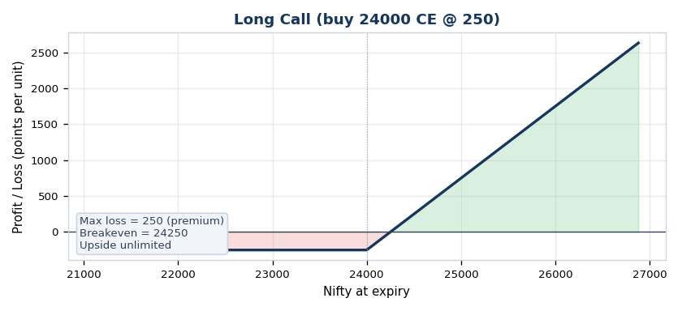

Look at the figure and trace it left to right. The flat shelf on the left sits at -150 (the most you can lose). At 24,000 the line kinks upward. It crosses the zero line at 24,150 (breakeven). Beyond that, every point Nifty gains is a point of profit, and the line marches up and to the right with no ceiling. Four features — flat loss shelf, kink at the strike, breakeven above the strike, unlimited upside — and you have read the entire position.

### Building ANY strategy: add the legs

Here is the idea that turns one diagram into a thousand. **A multi-leg strategy's payoff is just the sum of the payoffs of its individual legs.** You draw each option (or futures, or stock) leg on its own, then *add the lines vertically* — at each price on the x-axis, add up the y-values of all the legs. The combined line is your strategy.

This works because P&L is additive: your total profit at any Nifty level is simply the profit of leg one plus the profit of leg two, and so on. Some rules that make the addition easy:

- A **bought (long)** option contributes its payoff as derived above: `+max(S - K, 0) - premium` for a call, `+max(K - S, 0) - premium` for a put.
- A **sold (short)** option contributes the *mirror image*: you *receive* the premium and *owe* the intrinsic value, so a short call is `premium - max(S - K, 0)` and a short put is `premium - max(K - S, 0)`. Its diagram is the buyer's diagram flipped upside down.
- **Each leg kinks at its own strike.** A two-strike strategy has two kinks; a four-strike strategy (like an iron condor) has four. Between consecutive strikes the combined line is always a *straight* segment, so you really only need to compute the payoff at each strike and at the extremes, then connect the dots.

That last point is the practical shortcut: to sketch any expiry payoff, evaluate the total P&L at each strike price (and at zero, and at a very high price), plot those few points, and join them with straight lines. The kinks can only happen at strikes, so straight segments in between are guaranteed. We use exactly this method to build spreads, straddles and condors in the chapters ahead.

### At expiry vs before expiry: kinked lines vs the smooth curve

Now the distinction that matters most — and that most beginners never internalise.

Everything above describes the payoff **at expiry**. At that final instant there is no time value left, only intrinsic value, so the picture is made of perfectly **straight, kinked lines**. It tells you what you will collect *if you hold to the very end*.

But on any day *before* expiry, the option still carries time value (Chapter 6). Its market price is given by a pricing model — the **Black-Scholes** formula for European index options — which blends intrinsic value with the time value that comes from the days remaining and from volatility (India VIX). So the P&L you would actually realise by *closing the position early* does not follow the kinked line. It follows a **smooth, rounded curve that sits above the at-expiry line** everywhere (because there is still time value to sell back).

Picture the long-call diagram again. The before-expiry curve hugs the same general shape but rounds off the sharp kink at the strike into a gentle bend, and floats above the expiry line by an amount equal to the remaining time value. As expiry approaches, that curve **sags down toward the kinked line**, day by day, as time value bleeds away (this is theta decay, Chapter 6). On the final day, the curve *becomes* the kinked line — the time value has vanished and only intrinsic value remains.

Why this matters in real trading:

- The kinked **expiry** line is your map of outcomes *if you hold to settlement*. Indian index options are European and cash-settled, so this is literally how the trade is squared up if you do nothing.
- The smooth **before-expiry** curve is your *live* mark-to-market — what you would gain or lose by exiting today. Because it sits above the expiry line, a long option can show a *profit* on the curve even while the kinked line still says you are underwater. The two answer different questions ("exit now" vs "hold to expiry").
- The *gap* between the curve and the line is the time value you still hold — and stand to lose if the market stalls. Seeing both lines together is how a pro reads the time-decay headwind on a long position.

We will return to this two-line view constantly, because every Greek is really a statement about *how the smooth curve moves and bends* relative to the kinked line. For now, hold the core idea: **straight kinked lines = at expiry; smooth rounded curve = before expiry, courtesy of time value.**

### A recipe to sketch any position

Put it together into a five-step routine you can run on the back of a napkin:

1. **Draw the axes.** Horizontal = underlying price at expiry (mark the strike(s)); vertical = P&L, with a clear zero line.
2. **List the legs and their strikes.** Note for each whether it is bought or sold, and the premium paid or received.
3. **Compute total P&L at each strike** (and at S = 0 and at a very large S). Remember: kinks happen only at strikes, so these points fully determine the shape.
4. **Connect the dots with straight lines.** That is your at-expiry payoff. Read off breakeven(s), max profit, max loss.
5. **(Optional) Round it.** Float a smooth curve above the kinked line to picture the before-expiry P&L, and remember it sags onto the line as expiry nears.

Master this on the long call and the same five steps handle the most exotic structure in the book.

## Worked example (₹, Nifty/Bank Nifty)

Let us build the long-call diagram fully in rupees and read every number off it.

**Setup.** It is Monday. Nifty spot = 24,000. You buy **one lot** of the 24,000 weekly call at a premium of **₹150 per unit**. The Nifty lot size is currently about **75 units** (the exchange sets and revises lot sizes periodically). So your total outlay — and your maximum possible loss — is:

`Premium paid = 150 * 75 = ₹11,250`

**Step 1 — the payoff formula.** Per unit, `Payoff = max(S - 24,000, 0) - 150`. In rupees for the lot, multiply by 75.

**Step 2 — evaluate at several expiry levels.** Build a small table by plugging in candidate Nifty settlement levels:

| Nifty at expiry (S) | Intrinsic = max(S - 24000, 0) | Per-unit payoff = intrinsic - 150 | Lot P&L (× 75) |
|---|---|---|---|
| 23,700 | 0 | -150 | **-₹11,250** |
| 24,000 | 0 | -150 | **-₹11,250** |
| 24,150 | 150 | 0 | **₹0** |
| 24,300 | 300 | 150 | **+₹11,250** |
| 24,600 | 600 | 450 | **+₹33,750** |

**Step 3 — read the three numbers.**

- **Maximum loss:** the flat shelf at any S at or below the strike — **₹11,250** (the whole premium). It does not get worse if Nifty crashes to 23,000 or 20,000; the call simply expires worthless and you have already paid your most.
- **Breakeven:** where lot P&L crosses zero — `S = K + premium = 24,000 + 150 = 24,150`. Nifty must rise 150 points (about 0.6%) just for you to get your money back.
- **Maximum profit:** unbounded. At 24,300 you are up ₹11,250; at 24,600 you are up ₹33,750; the line keeps climbing for every extra point.

**Step 4 — sanity-check the asymmetry.** Risking ₹11,250 to make an uncapped amount sounds wonderful, but notice the catch the diagram also reveals: between 24,000 and 24,150 the call is *in-the-money yet still losing money*, because the intrinsic value has not yet repaid the premium. The position only turns profitable past 24,150. A 150-point rally leaves you flat; you need *more* than that to win. This is the time-value headwind from Chapter 6, now visible as the gap between the strike (where loss stops growing) and breakeven (where profit starts).

**Step 5 — before vs at expiry.** Suppose by Wednesday Nifty has nudged up to 24,080. At expiry that level would mean a per-unit payoff of `max(24,080 - 24,000, 0) - 150 = 80 - 150 = -70` — a loss. But it is only Wednesday; the call still has two days of time value. Black-Scholes might value it at, say, ₹165, so closing it *now* would actually return `165 - 150 = +15` per unit — a small **profit** on the live curve even though the kinked expiry line says you are down ₹70. That ₹15-versus--₹70 gap is the remaining time value, and it will melt to zero by Friday. The smooth curve sits above the kinked line; as Friday arrives the curve drops onto the line.

## Common mistakes / risk note

- **Putting time on the x-axis.** The horizontal axis is the *underlying price*, not time. A payoff diagram is a snapshot at one moment across all possible prices — it is not a chart of the position over the days.
- **Confusing the strike with the breakeven.** A long call is not profitable the instant it crosses the strike. Breakeven is strike *plus premium* for a call (strike *minus premium* for a long put). Reading max profit from the strike instead of the breakeven overstates your edge.
- **Reading the at-expiry line as your day-to-day P&L.** Before expiry your real, exit-now P&L follows the smooth Black-Scholes curve, which sits above the kinked line by the remaining time value. Expecting the kinked line to describe a mark-to-market in the middle of the week will confuse you every time.
- **Forgetting to subtract the premium.** The bought-option *value* (`max(S - K, 0)`) and your *payoff* (value minus premium) are different lines. The diagram is the payoff — it must be shifted down by the premium.
- **Ignoring lot size and costs.** Points become rupees only after multiplying by the lot size, and your *true* breakeven is a touch further out once you include brokerage, STT, exchange fees and GST. The clean diagram is a model; real breakeven is slightly worse.
- **The honest risk on the other side.** The long call's beautiful capped loss exists *because* you paid for it — and that premium is usually lost; most long options expire worthless, and the flat loss shelf is the most likely outcome. The mirror diagrams — short calls and short puts — are flipped upside down: capped, modest gain on top, but a loss line that plunges down with **large or effectively unlimited** risk. When you start adding legs, always locate the lowest point of the combined line *before* you trade. If there is no lowest point — if the line falls forever — that is undefined risk, and SEBI's finding that roughly 9 in 10 retail F&O traders lose money is most brutal for those who sell such shapes without respecting them.

## Key takeaways

- A payoff diagram plots **P&L (y) against the underlying's price at expiry (x)**. It is the most important visual in options.
- For a long call, `Payoff = max(S - K, 0) - premium`: a flat loss shelf at minus the premium, a **kink at the strike**, then a 45-degree rise with **unlimited** upside.
- Read three numbers off the line: **breakeven** (where it crosses zero — `K + premium` for a call), **max loss** (the premium), and **max profit** (the highest the line reaches).
- Build *any* strategy by **adding the legs vertically**; kinks occur only at strikes, so compute P&L at each strike and connect straight segments.
- **At expiry = straight kinked lines** (pure intrinsic value). **Before expiry = a smooth Black-Scholes curve** that floats above the line by the remaining time value and sags onto it as expiry nears.
- Always find the *lowest point* of the combined line before trading. No lowest point means undefined risk.

## Practice problems

1. **(Conceptual)** On a payoff diagram, what does each axis represent, and what does the point where the line crosses the horizontal centre line tell you?

2. **(Numeric)** You buy a Nifty 24,500 call for a premium of ₹120. Write the payoff formula, and compute the breakeven, maximum loss, and maximum profit (in points).

3. **(Numeric)** For the call in Problem 2, compute the per-unit payoff if Nifty settles at 24,400; at 24,620; and at 24,800. With a lot size of 75, what is the rupee P&L at 24,800?

4. **(Conceptual)** Two days before expiry, the at-expiry (kinked) line for your long call says you are at a ₹40-per-unit loss for the current Nifty level, yet your broker shows the position at a small profit. Explain how both can be true.

5. **(Numeric)** Bank Nifty spot is 52,000. You buy the 52,000 call for ₹400 and *simultaneously* sell the 52,500 call for ₹200 (a two-leg structure). Using the "add the legs" method, find the total P&L at expiry if Bank Nifty finishes at 51,800; at 52,000; at 52,500; and at 53,000. What are the max profit and max loss?

6. **(Conceptual)** Why does the before-expiry curve for a long option always sit *above* the at-expiry kinked line, and what happens to the gap between them as expiry approaches?

## Solutions

**1.** The **horizontal (x) axis** is the price of the underlying — the Nifty/Bank Nifty spot level — at the chosen moment, normally expiry. The **vertical (y) axis** is your profit-or-loss (in points or rupees), with profit above the centre line and loss below it. Where the payoff line crosses the horizontal centre line (`y = 0`) is the **breakeven**: the underlying level at which the position makes exactly zero profit and zero loss. To the side where the line is above zero you make money; where it is below, you lose.

**2.** Payoff formula per unit: `Payoff = max(S - 24,500, 0) - 120`.
- **Breakeven:** `S = K + premium = 24,500 + 120 = 24,620`.
- **Maximum loss:** the premium, **120 points**, occurring at any settlement at or below the 24,500 strike.
- **Maximum profit:** **unlimited** — the rising line never stops, since Nifty can keep climbing above 24,620.

**3.** Using `max(S - 24,500, 0) - 120`:
- S = 24,400: `max(24,400 - 24,500, 0) - 120 = 0 - 120 = `**-120** points (full loss; below the strike).
- S = 24,620: `max(24,620 - 24,500, 0) - 120 = 120 - 120 = `**0** points (exactly breakeven, as expected).
- S = 24,800: `max(24,800 - 24,500, 0) - 120 = 300 - 120 = `**+180** points.
- Rupee P&L at 24,800 with lot size 75: `180 * 75 = `**+₹13,500**.

**4.** Both are true because they answer different questions. The **kinked line is the at-expiry payoff** — what you would collect *if you held to settlement* — and it uses only intrinsic value. The **broker's mark is your live, exit-now P&L**, which follows the smooth Black-Scholes curve and still includes the option's remaining **time value** (two days' worth, plus whatever India VIX supports). Because that curve sits *above* the kinked line by the amount of remaining time value, your sell-now value can be a small profit even while the hold-to-expiry line shows a ₹40 loss. If the market simply sits still into Friday, the time value decays and the curve drops onto the kinked line — so that paper profit would turn into the -₹40 outcome unless Nifty moves in your favour.

**5.** Add the two legs at each level. Long 52,000 call: `max(S - 52,000, 0) - 400`. Short 52,500 call: `200 - max(S - 52,500, 0)`. Net premium paid = `400 - 200 = 200` (a debit). Total payoff = `max(S - 52,000, 0) - max(S - 52,500, 0) - 200`.
- S = 51,800: `0 - 0 - 200 = `**-200** points.
- S = 52,000: `0 - 0 - 200 = `**-200** points.
- S = 52,500: `500 - 0 - 200 = `**+300** points.
- S = 53,000: `1,000 - 500 - 200 = `**+300** points.

The line is flat at -200 up to the 52,000 strike, rises between the two strikes, then flattens at +300 beyond 52,500. So **maximum loss = 200 points** (the net debit, for any finish at or below 52,000) and **maximum profit = 300 points** (capped, for any finish at or above 52,500). This capped-both-ways shape is a bull call spread — the short leg pays for part of the long leg but also caps the upside. (Breakeven, for completeness, is `52,000 + 200 = 52,200`.)

**6.** The before-expiry curve sits above the kinked line because, on any day before expiry, a long option still carries **time value** on top of its intrinsic value — there is still a chance the market moves further in your favour, and that chance is worth money (priced by Black-Scholes from the days remaining and from volatility/India VIX). Since you could sell the option back and collect that extra time value, your exit-now P&L is higher than the pure-intrinsic at-expiry payoff at every price — hence the curve floats above the line. As expiry approaches, the time remaining shrinks, time value bleeds away (theta decay), and the gap narrows. At the moment of expiry the time value is exactly zero, the curve coincides with the kinked line, and the smooth curve *becomes* the straight payoff.

# Chapter 11: Long Call — The Bullish Bet

Imagine you are sure a stock or an index is about to climb, but you do not want to risk a large sum if you turn out to be wrong. You would love a deal that says: "Pay a small, fixed fee today. If I'm right and the market rises, I capture the whole rally. If I'm wrong, the most I can lose is that small fee — and not one rupee more." That deal exists. It is called **buying a call**, and it is the most natural first trade in all of options.

The **long call** is the purest bullish bet in options: a single position whose risk is capped at the premium you pay, whose reward is theoretically unlimited, and whose personality is shaped by two clocks ticking against each other — the price moving in your favour, and time bleeding the value away. This chapter takes you from the plain intuition to choosing the right strike and expiry like a professional, with a full rupee Nifty example.

## Core concepts

### What "buying a call" actually means

A **call option** is the *right, but not the obligation*, to buy the underlying at a fixed price (the **strike**, written `K`) on or before expiry. When you **buy** (go "long") a call, you pay a one-time **premium** to own that right. The seller of the call collects your premium and takes on the matching obligation.

Because Indian index options (Nifty, Bank Nifty) are **European and cash-settled**, you never literally "buy the index" at the strike. Instead, at expiry the exchange simply pays you the option's intrinsic value in cash. But the intuition is identical: you have locked in a *floor purchase price*, and you profit when the market rises above that floor by more than what you paid.

Think of a call as a **token that locks in a fixed price.** You pay ₹100 for a token to buy a plate at today's price of ₹500. If the price later jumps to ₹800, your token is worth ₹300. If the price drops to ₹400, you throw the token away — out only the ₹100 you paid, never more.

### The payoff: what you make at expiry

At expiry, a long call is worth its **intrinsic value** — how far the spot `S` has risen above the strike `K`:

`Intrinsic value at expiry = max(S - K, 0)`

But you *paid* the premium to own that right, so your actual profit-and-loss is the intrinsic value minus what you spent:

`Payoff (long call) = max(S - K, 0) - premium`

This single formula contains the entire shape of the trade. Read it in three zones:

- **Spot far below strike** (`S < K`): the `max(...)` term is zero. Your payoff is just `- premium`. You lose the whole premium, but nothing more. This is the flat floor of the payoff.
- **Spot above strike but not by much**: the option has intrinsic value, but not yet enough to cover the premium. You are recovering your cost — still at a net loss, but shrinking.
- **Spot well above strike**: intrinsic value exceeds the premium, and every additional point the market rises is a point of pure profit.

### Breakeven, maximum loss, and maximum gain

Three numbers define a long call completely.

**Breakeven** is the spot level at expiry where you exactly recover your premium — profit is zero. Set the payoff to zero and solve:

`Breakeven = strike + premium = K + premium`

You do not just need the market above the strike; you need it above the strike *by the full premium you paid.* That gap is the price of admission.

**Maximum loss** is fixed and known the moment you enter:

`Max loss = premium paid` (occurs whenever `S <= K` at expiry)

This is the defining beauty of a long call. No matter how violently the market crashes, you cannot lose more than the premium. Your risk is **defined, capped, and paid up front** — there are no margin calls, no overnight gaps that wipe you out, no "undefined risk." A long call holder sleeps soundly through a crash.

**Maximum gain** is, in principle, **unlimited**:

`Max gain = unlimited` (the market can, in theory, rise without bound)

In practice a Nifty rally is finite, but the point stands: your upside is open-ended while your downside is bolted to the floor. That asymmetry — small fixed loss, large open gain — is exactly what you are paying the premium for.

### The leverage angle: why not just buy futures or the cash index?

Here is where the long call earns its keep. Suppose Nifty is at 24,000 and you are bullish.

- **Cash/ETF route:** to ride one lot-equivalent (about 75 units) you tie up roughly `24,000 * 75 = ₹18,00,000`. No leverage, but also no decay and no expiry.
- **Futures route:** one Nifty futures lot needs **SPAN + exposure margin** of roughly ₹1.5–2 lakh (set by the exchange, varying with volatility). You get the full point-for-point move, but your risk is symmetric and **undefined on the downside** — a 5% gap down costs 5% of ₹18 lakh notional, and may trigger a margin call.
- **Long call route:** you pay, say, ₹150 per unit for an ATM call, i.e. `150 * 75 = ₹11,250` for one lot. That ₹11,250 is your *entire* risk. Yet if Nifty rallies 1,000 points, the call's intrinsic value alone is worth `~₹70,000+` per lot before costs.

So a long call gives **futures-like upside for a fraction of the capital, with downside capped at the premium.** That is real leverage. But the call's hidden cost — the thing futures and cash do *not* charge you — is **time decay**. You are renting directional exposure, and rent must be paid.

### Choosing the strike: ITM vs ATM vs OTM

Not all calls are the same bet. The strike you pick changes the whole character of the trade. Suppose Nifty is at 24,000.

- **In-the-money (ITM) call** — e.g. the 23,800 CE. Strike is *below* spot, so it already has 200 points of intrinsic value. It is **expensive** (high premium), but it is mostly "real" value, so it has **little time value to lose** and a **high delta** (it moves nearly point-for-point with Nifty, behaving like a leveraged future). Best when you have **high conviction** and want the position to track the index closely without much decay drag. Lower percentage leverage, higher probability of finishing in profit.

- **At-the-money (ATM) call** — e.g. the 24,000 CE. Strike ≈ spot. It is **all time value**, carries the **most time value of any strike**, and has a delta near 0.5. It is the **most sensitive to a move starting now** (highest gamma) but also bleeds time value the fastest. The balanced, middle-of-the-road choice for a clear directional view over a short horizon.

- **Out-of-the-money (OTM) call** — e.g. the 24,300 CE. Strike is *above* spot. **Cheap** premium, low delta, **lottery-ticket** profile. A small move does almost nothing; you need a *big, fast* rally to pay off. The percentage gains can be enormous if you are right, but **most OTM calls expire worthless.** Buying these because "they cost so little" is the single most common way retail buyers lose money.

The trade-off in one line: **deeper ITM = costlier, higher win-rate, lower leverage, less decay; further OTM = cheaper, lower win-rate, explosive leverage, brutal decay.**

### Choosing the expiry: theta vs time to be right

The expiry you choose is a tug-of-war between two forces.

- **Near expiry (this week's weekly):** cheap in absolute rupees, but **time decay (theta) is savage** — you are sitting in the steepest part of the decay curve. You need the move to happen *now*. Great if your catalyst is today or tomorrow; merciless if the market dawdles.
- **Far expiry (next month):** **more expensive**, but theta is gentle and you buy yourself **time to be right.** If your thesis needs a few weeks to play out, the slower decay is worth the higher premium.

The professional's rule of thumb: **match the expiry to your catalyst.** If you expect a move within two days, a weekly is fine. If you are playing a theme that needs three weeks, do not buy a weekly and pray — buy enough time, or you will be stopped out by decay before you are proven right.

### The reality of theta drag: today's line sits below the expiry line

Here is the concept that separates beginners from professionals, and the one the figure below makes unforgettable.

The clean payoff diagram — flat at `-premium`, then kinking up at the breakeven — describes your P&L **only at the instant of expiry.** *Before* expiry, your position is worth more than its intrinsic value because it still carries **time value**. So if you plotted your P&L *today* against the spot level, the curve would be a **smooth bowed line sitting below the hard expiry hockey-stick** in the profit region, and *above* it in the loss region (your loss today is smaller than the eventual max loss, because some time value remains).

As each day passes with the market sitting still, that smooth "today" curve **sinks down toward the angular expiry line.** This sinking is **theta drag** — the daily erosion of time value. It means:

- You can be **right on direction and still lose**, if the move is too slow. The decay can outrun a gentle rally.
- A long call needs the market to move **enough, and fast enough,** to outrun theta. Standing still is a slow loss.
- The closer to expiry, the faster the "today" line collapses onto the expiry line — decay accelerates in the final days.

This is the long-call buyer's escalator-going-the-wrong-way problem. You are not just betting on direction; you are racing the clock.

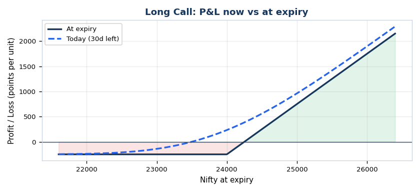

In the figure, the straight kinked line is the **at-expiry** payoff. The curve above it is your **P&L today**, with time left on the clock. The gap between them is the **time value you would surrender** if the market never moved — and the curve droops toward the straight line a little more each day. That droop is theta at work.

## Worked example (₹, Nifty/Bank Nifty)

Let's make it concrete. It is Monday. **Nifty spot = 24,000.** You are bullish and expect a rally this week. You buy **one lot of the 24,000 ATM weekly call (24,000 CE)** at a premium of **₹150**. Lot size is **75** (set by the exchange; it changes periodically).

**Your position summary:**

- Premium paid = `150 * 75 = ₹11,250`. This is your **maximum loss**, full stop.
- Breakeven at expiry = `K + premium = 24,000 + 150 = 24,150`.
- Maximum gain = unlimited (rises with Nifty).

**P&L at several expiry levels.** At expiry the call is worth `max(S - K, 0)` per unit, and your net payoff per unit is `max(S - K, 0) - 150`. Multiply by 75 for the lot.

| Nifty at expiry (S) | Intrinsic = max(S-24000,0) | Per-unit P&L = Intrinsic - 150 | Lot P&L = per-unit * 75 |
|---|---|---|---|
| 23,500 | 0 | -150 | **-₹11,250** (max loss) |
| 23,800 | 0 | -150 | **-₹11,250** (max loss) |
| 24,000 | 0 | -150 | **-₹11,250** (max loss) |
| 24,100 | 100 | -50 | **-₹3,750** |
| 24,150 | 150 | 0 | **₹0** (breakeven) |
| 24,250 | 250 | +100 | **+₹7,500** |
| 24,400 | 400 | +250 | **+₹18,750** |
| 24,700 | 700 | +550 | **+₹41,250** |

Read what the table teaches:

- **At or below 24,000**, every outcome is the same flat loss of ₹11,250. The market crashing 500 points hurts no more than it closing exactly at the strike. That flat floor is your defined risk.
- Between 24,000 and 24,150 you are **above the strike but still losing**, because the rally has not yet repaid the ₹150 premium. Being "right" (market up 100 points) still leaves you down ₹3,750. This is the breakeven gap in action.
- **24,150 is breakeven.** Nifty had to rally 150 points — about 0.6% — *just to get you to zero*, purely because that move replaces the time value you paid.
- Above 24,150, profit climbs point-for-point and is **open-ended**. A 700-point rally turns ₹11,250 of risk into ₹41,250 of profit — nearly 4x. That is the leverage and the asymmetry working for you.

**Now the theta-drag reality.** Suppose it is Wednesday and Nifty is *still* 24,000 — unchanged. Your call has not lost on direction, but two days of time value have bled out. The premium might have fallen from ₹150 to about ₹95. On paper you are down `(150 - 95) * 75 = ₹4,125` despite the index being exactly where you bought it. To *break even now* you would need Nifty to rally enough to push the premium back to ₹150 — and with less time left, that takes a bigger move than it would have on Monday. This is precisely the "today line sinking toward the expiry line" from the figure: you are right that the market did not fall, yet you are losing to the clock.

**Costs note:** real P&L is slightly lower after **STT** (charged on the premium for buyers, and on intrinsic value at expiry/exercise — a reason many traders square off before expiry rather than letting ITM options settle), brokerage, exchange fees, and GST. These are small relative to the moves above but real, and they matter most for cheap OTM trades.

## Common mistakes / risk note

- **Treating "no move" as safe.** A flat market is a *losing* scenario for a long call. Every quiet day, theta takes a bite. You need movement, and you need it before expiry.
- **Buying far-OTM weeklies because they're cheap.** A ₹15 OTM call feels like a small bet, but it is almost pure low-probability time value. The vast majority expire worthless. Cheap is not the same as good value — you are buying a lottery ticket and paying STT on it.
- **Ignoring the breakeven gap.** Beginners think "Nifty above my strike = profit." Wrong. You profit only above `strike + premium`. The premium is a hurdle the market must clear before you make a single rupee.
- **Mismatching expiry to thesis.** Buying a weekly for a view that needs three weeks to play out. The decay will kill you long before you are proven right. Match the clock to the catalyst.
- **Forgetting the volatility risk (vega).** You can be right on direction and still lose if **India VIX** falls and crushes the time-value portion of your premium — a "vol crush," common right after an expected event. Buying calls into high VIX (expensive premiums) and watching VIX collapse is a classic trap.
- **The honest big picture.** The long call's risk is genuinely capped, which makes it one of the *safer* ways to express a view — but "capped risk" still means you can lose **100% of the premium**, and long options frequently do exactly that. SEBI studies find roughly **9 in 10 retail F&O traders lose money**, and over-paying for time value then watching it decay is one of the main reasons. The defined risk protects you from ruin; it does not hand you an edge.

## Key takeaways

- A long call is a **defined-risk bullish bet**: `Payoff = max(S - K, 0) - premium`.
- **Breakeven = strike + premium.** You must be right *by more than the premium*, not merely right on direction.
- **Maximum loss = the premium**, fixed and paid up front; **maximum gain is theoretically unlimited.** This asymmetry is the whole point.
- It delivers **futures-like upside on a fraction of the capital**, with downside capped — but charges **time decay (theta)** as rent that futures and cash do not.
- **Strike choice** trades cost against probability: ITM (costly, high win-rate, low decay) → ATM (balanced, max time value) → OTM (cheap, lottery, brutal decay). **Expiry choice** trades premium against time to be right — match it to your catalyst.
- Before expiry your P&L sits on a **curve that sinks toward the at-expiry hockey-stick** as theta bleeds time value. Being right on direction is not enough — you must be right **enough and fast enough** to outrun the clock.

## Practice problems

1. **(Conceptual)** You buy a Nifty 24,200 CE for a premium of ₹90 with spot at 24,000. State the breakeven, the maximum loss, and the maximum gain. At what spot at expiry do you start making a net profit?

2. **(Numeric)** Bank Nifty spot is 52,000. You buy one lot of the 52,000 CE at ₹600. Lot size is 30. Compute your premium outlay, breakeven, and your lot P&L if Bank Nifty expires at (a) 51,500, (b) 52,000, (c) 52,600, (d) 53,400.

3. **(Numeric)** With Nifty at 24,000, you are choosing between the 23,800 CE at ₹320 (ITM) and the 24,300 CE at ₹40 (OTM). For each, find the breakeven and the per-unit P&L if Nifty expires at 24,500. Which gave the higher *percentage* return on premium, and which had the higher chance of finishing in profit?

4. **(Conceptual)** You buy an ATM weekly Nifty call on Monday. By Wednesday the index is exactly where you bought it, yet your call has lost about 35% of its value. Nothing went "wrong" directionally. Explain what happened, using the idea of the today-line sinking toward the expiry-line.

5. **(Numeric)** You buy a Nifty 24,000 CE at ₹150 (lot size 75). At expiry Nifty settles at 24,090. Are you above or below your strike? Above or below breakeven? Compute your exact lot P&L and explain the apparent paradox to a friend who says "but the market went up, you should have made money."

6. **(Conceptual)** A trader with a three-week bullish thesis on Nifty buys this week's expiry call "because it's the cheapest." Critique this choice in terms of theta and expiry selection, and state what you would do instead.

## Solutions

**1.** Premium = ₹90, strike `K` = 24,200. Breakeven = `K + premium = 24,200 + 90 = 24,290`. Maximum loss = the premium = **₹90 per unit** (occurs at any expiry spot ≤ 24,200). Maximum gain = **unlimited**, rising point-for-point above breakeven. You begin making a *net profit* once spot at expiry exceeds **24,290** (above 24,200 you have intrinsic value, but you only turn net-positive past the breakeven).

**2.** Premium outlay = `600 * 30 = ₹18,000` (also the max loss). Breakeven = `52,000 + 600 = 52,600`. Per-unit payoff = `max(S - 52000, 0) - 600`; lot P&L = that × 30.
- (a) 51,500: intrinsic 0, per-unit -600, lot = **-₹18,000** (max loss).
- (b) 52,000: intrinsic 0, per-unit -600, lot = **-₹18,000** (max loss).
- (c) 52,600: intrinsic 600, per-unit 0, lot = **₹0** (breakeven).
- (d) 53,400: intrinsic 1,400, per-unit +800, lot = `800 * 30 =` **+₹24,000**.

**3.** Both bought with Nifty at 24,000; expiry at 24,500.
- **23,800 CE (ITM), premium ₹320:** breakeven = `23,800 + 320 = 24,120`. Intrinsic at 24,500 = `24,500 - 23,800 = 700`. Per-unit P&L = `700 - 320 =` **+₹380**. Percentage return on premium = `380 / 320 =` **+119%**.
- **24,300 CE (OTM), premium ₹40:** breakeven = `24,300 + 40 = 24,340`. Intrinsic at 24,500 = `24,500 - 24,300 = 200`. Per-unit P&L = `200 - 40 =` **+₹160**. Percentage return = `160 / 40 =` **+400%**.

The **OTM call gave the far higher percentage return (400% vs 119%)** — that is its lottery-ticket leverage. But the **ITM call had the higher chance of finishing in profit**: its breakeven (24,120) was just above spot, needing only a small rally, whereas the OTM needed Nifty above 24,340 to even break even. This is the core ITM-vs-OTM trade-off: explosive percentage upside comes bundled with a lower probability of winning.

**4.** Directionally nothing went wrong — but a long call's premium is partly **time value**, and an ATM call is **all** time value with the most of any strike. From Monday to Wednesday, two days of that time value decayed away (**theta drag**), so even with the index unchanged the premium fell. Visually, your **P&L-today curve sank toward the at-expiry hockey-stick**: with the spot sitting at the strike, the at-expiry payoff there is the full max loss, and each passing day pulls your present value down toward it. You needed the market to *move up* to offset the decay; standing still guaranteed a loss to the clock.

**5.** Strike = 24,000, so at 24,090 you are **above the strike** (intrinsic = `24,090 - 24,000 = 90`). But breakeven = `24,000 + 150 = 24,150`, so you are **below breakeven**. Per-unit P&L = `90 - 150 = -60`; lot P&L = `-60 * 75 =` **-₹4,500**. The paradox resolved: the market *did* rise 90 points, but you paid ₹150 for the option, and the rally only repaid 90 of those 150. You needed a 150-point move just to break even; a 90-point move recovers part of your premium but leaves you net down ₹4,500. Being right on direction is not enough — you must clear the **strike + premium** hurdle.

**6.** The mistake is **mismatching expiry to thesis.** A three-week view paired with this week's expiry puts the entire position in the **steepest part of the theta-decay curve**: even if the thesis is correct, the call will likely lose most of its value to time decay before the three-week move plays out, and may expire worthless mid-thesis. "Cheapest" in absolute rupees is the most decay-exposed, not the best value. **Better:** buy an expiry that comfortably covers the catalyst — the next monthly (or a longer-dated) call — accepting a higher premium in exchange for **gentle theta and time to be right**. Match the clock to the catalyst, not to the price tag.

# Chapter 12: Long Put — The Bearish Bet & Portfolio Insurance

Most people find it easy to root for prices going *up*. A rising market feels like good news — your stocks gain, your mutual funds glow green, the headlines are cheerful. So when a trader buys an option that *profits from a fall*, it can feel almost unnatural, even a little pessimistic. Yet the **long put** — simply buying a put option — is one of the most useful and versatile positions in all of options trading. It does two completely different jobs, and a professional must hold both in mind at once.

The first job is **speculation**: if you genuinely believe Nifty is going to drop, a long put lets you profit from that fall while risking only a small, known premium. The second job is **insurance**: if you already own a portfolio of stocks or an index position, a long put acts exactly like a motor or health insurance policy — you pay a premium today, and if disaster strikes (the market crashes), the put pays you back, cushioning the blow. Same instrument, two minds. This chapter teaches you to recognise which job you are doing, because the discipline, the strike choice, and even the emotions involved are different for each.

## Core concepts

### What a long put is, in plain English

A **put option** gives its buyer the **right, but not the obligation, to sell** the underlying at a fixed price — the **strike (K)** — on or before expiry. When you *buy* a put (go "long" the put), you pay a **premium** today, and in return you own a locked-in selling price that protects you against the market falling.

Think of the strike as a **guaranteed floor**. Imagine you own a flat worth ₹80 lakh and you buy, for a small fee, a contract from someone who promises to buy it from you at ₹80 lakh anytime in the next six months. If property prices crash to ₹65 lakh, you happily invoke your contract and still sell at ₹80 lakh — the contract is worth ₹15 lakh to you. If prices rise to ₹95 lakh, you simply tear up the contract (you would rather sell on the open market) and you have lost only the small fee. That contract is a put. The fee is the premium.

The same logic holds whether you own the underlying or not. A speculator who owns *no* flat could still buy that contract and profit purely from prices falling — buying the right to sell at ₹80 lakh, then "buying low" at ₹65 lakh to settle. In Indian index options this all happens in **cash**: Nifty and Bank Nifty options are **European** (exercised only at expiry) and **cash-settled** (you never deliver shares; you simply receive or pay the rupee difference).

### The payoff, breakeven, and maximum loss

Let S be the underlying level at expiry and K the strike. The value of a put at expiry — its **intrinsic value** — is `max(K - S, 0)`. It pays off only when the market finishes *below* the strike, and the further below, the more it pays. Subtract what you paid:

- `Payoff (long put) = max(K - S, 0) - premium`
- `Breakeven = strike - premium`
- `Maximum loss = premium paid` (occurs whenever S finishes at or above K)
- `Maximum profit = (strike - premium)` per unit, reached only if S falls all the way to zero

Three numbers tell the whole story, so let us be precise about each.

**Maximum loss is the premium — full stop.** Because you hold a *right* and never an *obligation*, the worst that can happen is the market stays flat or rises, the put expires worthless, and you lose exactly what you paid. No margin calls, no surprise debits. This is the defining comfort of being an option buyer.

**Breakeven sits one premium *below* the strike.** Owning the put is not enough; the market has to fall *past* breakeven for you to net a profit. If you buy a 24000 put for ₹250, the market must close below `24000 - 250 = 23750` before you are in the money on a net basis. Between 24000 and 23750 the put has *some* intrinsic value, but not enough to recover the premium.

**Profit grows as the market falls — but it is capped.** This is the one important asymmetry between long puts and long calls. A long call has theoretically *unlimited* upside because a price can rise without limit. A long put's profit is **large but bounded**, because the underlying can fall at most to **zero**. The best case is S = 0, giving a per-unit profit of `K - premium`. For a 24000 put bought at ₹250, the absolute ceiling is `24000 - 250 = 23,750` points per unit — enormous, but finite. In practice indices never go to zero, so think of the realistic profit as "a lot if a real crash happens," not infinity.

### Use 1 — Speculation: betting on a fall

When you buy a put with **no underlying holding**, you are taking a directional **bearish** view: you expect the market (or a stock) to drop, and you want leveraged, loss-limited exposure to that drop. The attraction is the same asymmetry that makes long calls appealing — **limited, known loss; large, open-ended-feeling gain** — just pointed downward.

Why buy a put instead of simply short-selling the future? Because shorting a future exposes you to *unlimited* loss if the market rallies, and it ties up large SPAN margin that can trigger intraday margin calls on a sharp up-move. A long put caps your loss at the premium and needs no margin beyond it. You sleep at night. The trade-off is **theta** (time decay, discussed below): the put bleeds value every day the crash does not arrive, whereas a future does not decay.

### Use 2 — Hedging: the protective put

Now suppose you already **own** something — a basket of stocks, an index ETF, or a long Nifty future — and you are nervous about a near-term fall (a Budget, an election result, a global shock) but you do not want to *sell* your holdings and trigger tax or miss the upside. You buy a put against the holding. This is the **protective put**, and it is genuine portfolio insurance.

The mechanics are beautiful in their symmetry. If the market falls, your stocks lose value but your put *gains* value, offsetting the loss below the strike. If the market rises, your stocks profit normally and the put simply expires worthless — you "wasted" the premium, exactly as you waste a health-insurance premium in a year you stay healthy. You have converted an uncertain, open-ended downside into a known, fixed cost (the premium), while keeping all of your upside.

The strike you choose sets your **deductible**. A higher strike (closer to the current price) insures more of your portfolio but costs more premium; a lower, out-of-the-money strike is cheaper but only kicks in after the market has already fallen some distance — you "self-insure" the first slice of losses. This is identical to choosing the deductible on any insurance policy: more protection, more premium.

A subtle but important point for Indian investors: to hedge a *diversified equity portfolio*, you typically buy **Nifty puts**, because the Nifty proxies the broad market. The hedge is imperfect — your specific stocks may not move exactly with the index (this residual is called **basis risk**) — but a Nifty put is far more liquid and cheaper than buying puts on every individual holding.

### Choosing strike and expiry

For both uses, two decisions shape the trade:

- **Strike.** An **at-the-money (ATM)** put (strike near the current level) has the most time value and the highest premium, but reacts quickly to a fall (high delta magnitude). An **out-of-the-money (OTM)** put (strike below the current level) is cheaper, decays faster in percentage terms, and needs a *bigger* fall to pay off — it is a higher-leverage lottery on a sharp drop. For *speculation*, traders often pick slightly OTM strikes for cheapness; for *hedging*, the strike is chosen by how much loss you are willing to absorb before insurance kicks in.
- **Expiry.** A **weekly** put is cheap but gives the move very little time to happen — theta is brutal in the final days. A **monthly** (or longer) put costs more but buys time for your thesis to play out. A common professional error is buying a too-short, too-cheap put, watching the thesis come true *a week late*, and still losing money because the put already expired. Buy enough time.

### Theta drag — the rent you pay

A long put, like any bought option, is a **decaying asset**. Each day that passes, the option loses a slice of its **time value** — this daily bleed is called **theta** (and is a negative number for a buyer). If the underlying simply sits still, your put loses money *every single day*, with the decay accelerating as expiry approaches.

This is the hidden cost of insurance and of bearish speculation alike. You are paying "rent" for the right you hold, and the rent comes due whether or not the market falls. For the speculator, theta means you must be roughly *right on timing*, not just direction. For the hedger, theta is the steady premium cost of carrying protection — which is exactly why no one buys puts on their portfolio every single week forever; the cumulative theta would quietly drain returns. Insurance is bought when the risk is elevated, not perpetually.

### Why buying puts is psychologically hard

Long puts are emotionally awkward in a way long calls are not, and a professional should name this honestly:

1. **You are betting against optimism.** Markets drift upward over long horizons, and buying a put means hoping (or at least preparing) for a fall — which can feel like rooting against your own country's economy or your own stocks.
2. **Insurance feels like a waste when nothing goes wrong.** In most months the market does not crash, your protective put expires worthless, and your brain screams "I just threw away that premium." This regret pushes people to *stop* hedging right before the crash that would have justified it — the classic mistake.
3. **The decay is visible and demoralising.** Watching a put lose value day after day in a calm market tests anyone's conviction, tempting an early exit just before the move.

Discipline, then, means treating the premium like an insurance bill — a cost of doing business, paid without resentment — and **sizing positions so a string of worthless puts cannot hurt you**. The put that finally pays during a crash often returns many times its cost, which is the whole point.

## Worked example (₹, Nifty)

Suppose **Nifty is trading at 24,000** today. We will run the *same* 24000 put through both of its jobs. Nifty's lot size is currently **75 units**, and the **24000 PE (Put European) is quoted at ₹250**.

### Part A — Speculation (no holding)

You are bearish ahead of an event and **buy one lot of the 24000 PE at ₹250**, owning nothing else.

**Step 1 — Outlay (your maximum loss).**
`Premium outlay = premium * lot size = 250 * 75 = ₹18,750.`
You pay ₹18,750 to the put seller. That is the most you can ever lose. As a buyer you post no further margin.

**Step 2 — Breakeven.**
`Breakeven = strike - premium = 24000 - 250 = 23,750.`
Nifty must close *below* 23,750 at expiry for you to net a profit.

**Step 3 — Outcomes at expiry.** Per-unit payoff is `max(24000 - S, 0) - 250`, multiplied by 75.

- **Nifty closes at 24,300 (rose).** Your right to sell at 24,000 is worthless when the market is higher. The put expires worthless. **Net P&L = -₹18,750** (full premium lost). The common case.
- **Nifty closes at 24,000 (flat).** Intrinsic value zero; still **-₹18,750.** Being un-wrong on direction is not enough — you needed an actual fall.
- **Nifty closes at 23,750 (breakeven).** Intrinsic = `24000 - 23750 = 250`, exactly the premium. `(250 - 250) * 75 = ₹0`. **You break even.**
- **Nifty closes at 23,500.** Intrinsic = `24000 - 23500 = 500`. Net per unit = `500 - 250 = 250`. **Net P&L = 250 * 75 = +₹18,750** — you doubled your money.
- **Nifty closes at 23,000 (sharp fall).** Intrinsic = `24000 - 23000 = 1000`. Net per unit = `1000 - 250 = 750`. **Net P&L = 750 * 75 = +₹56,250.** The profit grows as Nifty falls — but remember it is *capped*: the theoretical ceiling, if Nifty somehow hit zero, is `(24000 - 250) * 75 = ₹17,81,250`. Finite, if astronomically unlikely.

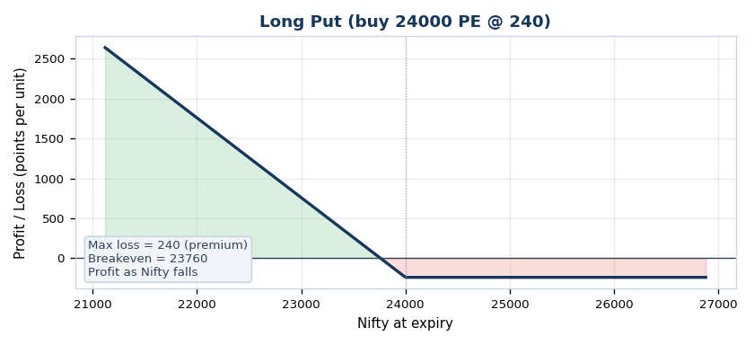

Notice the shape this figure captures: a flat line at the loss of -₹18,750 for every level at or above 24,000, a kink (the "hockey-stick" elbow) at the strike of 24,000, then a line rising to the upper-left as Nifty falls, crossing zero at the breakeven of 23,750.

### Part B — The protective put (hedging a holding)

Now the same put, but as insurance. Suppose you hold **one lot equivalent of Nifty exposure** — say a basket of stocks (or one long Nifty future) worth about `24000 * 75 = ₹18,00,000`. You are worried about a Budget-day fall but do not want to sell. You **buy one lot of the 24000 PE at ₹250** as protection, again costing **₹18,750**.

Your combined position is "long Nifty + long 24000 put." Let us see the net outcome at expiry (ignoring the cost basis of the holding, focusing on the change from 24,000):

- **Nifty falls to 23,000.** Holding loses `(24000 - 23000) * 75 = ₹75,000`. Put gains intrinsic `(24000 - 23000) * 75 = ₹75,000`, minus the ₹18,750 premium = `+₹56,250`. **Net = -75,000 + 56,250 = -₹18,750.** Your entire loss is capped at the premium, no matter how far Nifty falls below 24,000.
- **Nifty falls to 22,000 (a crash).** Holding loses `2000 * 75 = ₹1,50,000`. Put gains `2000 * 75 = ₹1,50,000` intrinsic, minus ₹18,750 = `+₹1,31,250`. **Net = -1,50,000 + 1,31,250 = -₹18,750.** Still capped at the same ₹18,750 — that is the insurance working. The 24000 strike is your floor.
- **Nifty rises to 25,000.** Holding gains `1000 * 75 = ₹75,000`. Put expires worthless, costing ₹18,750. **Net = +75,000 - 18,750 = +₹56,250.** You keep almost all the upside; the put was the "wasted" insurance premium in a good year.

The pattern: below the strike your loss is frozen at the premium (₹18,750); above it you participate fully in gains, just reduced by that same premium. You have bought a **known, fixed worst case** in exchange for shaving a little off your wins. That is portfolio insurance.

## Common mistakes / risk note

**Buying a put that is too cheap and too short.** The most common speculator error: grabbing a far-OTM weekly put because it costs ₹15, then being right that the market fell — but it fell next week, after the put expired, or it did not fall *enough* to clear breakeven. Cheap puts are cheap because they are unlikely to pay. Buy enough strike and enough time for your actual thesis.

**Forgetting theta on a "correct" view.** A long put bleeds every calm day. If you are bearish but the market chops sideways for two weeks, you can lose a large chunk of the premium to decay before the fall ever comes. Direction is not enough; you must be roughly right on *timing*, or buy enough time to be patient.

**Treating the profit cap as unlimited.** Unlike a long call, a long put's gain is bounded by `strike - premium` (the underlying can only fall to zero). Do not size or fantasise as though a put can return infinitely.

**Cancelling insurance right before the crash.** Hedgers, frustrated by months of worthless puts, often stop hedging exactly when complacency is highest — and that is usually when the crash arrives. Decide your hedging policy in advance (e.g., "I protect around major events") and follow it without emotion.

**Over-hedging — paying perpetual premium.** Buying puts on your whole portfolio every week, forever, will quietly bleed your returns through cumulative theta, often costing more than the crashes you fear. Insurance is for elevated, identifiable risk, not a permanent tax on every position.

**The honest big picture.** Most bought options — puts included — **expire worthless**, and SEBI studies find roughly **9 in 10 individual F&O traders lose money**. Add costs: brokerage, exchange fees, GST, and **STT (Securities Transaction Tax)**, which on an in-the-money option at expiry is charged on the *settlement value*, not just the premium. A long put is a tool for defined-risk bearish bets and for genuine insurance — not a cheap lottery ticket on a crash.

## Key takeaways

- A **long put** is the right to *sell* at the strike; you buy it to profit from a *fall* or to *insure* a holding. Same instrument, two distinct jobs.
- `Payoff (long put) = max(K - S, 0) - premium`; `breakeven = strike - premium`; **maximum loss = premium**.
- Profit **grows as the underlying falls** but is **capped at `strike - premium`** (the price can fall only to zero) — unlike a long call's unlimited upside.
- As a **protective put**, the put freezes your loss at the premium for any fall below the strike while keeping all upside above it — true portfolio insurance, with the strike acting as a chosen deductible.
- **Strike and expiry** matter: ATM and longer-dated puts cost more but protect/react better; cheap OTM weeklies need a big, fast fall to pay off.
- **Theta** decays the put every calm day — being right on direction is not enough; you must be roughly right on timing or buy enough time.
- Buying puts is **psychologically hard** (betting against optimism, "wasting" premium when nothing breaks). Discipline means treating premium as an insurance cost and sizing so worthless puts can't hurt you.

## Practice problems

1. **(Conceptual)** Explain, in your own words, the two completely different reasons a trader might be long a put. For each, state whether the trader holds the underlying.

2. **(Conceptual)** Why is a long put's maximum profit *capped*, while a long call's maximum profit is *unlimited*? Give the formula for the long put's maximum profit per unit.

3. **(Numeric)** You buy one lot of **Bank Nifty 52000 PE** at a premium of **₹600**. Bank Nifty's lot size is **30**. Compute (a) your total outlay, (b) your breakeven level, (c) your maximum loss, and (d) your theoretical maximum profit.

4. **(Numeric)** Using the position in Problem 3, find your net profit or loss if Bank Nifty closes at expiry at (a) 52,300, (b) 51,400, (c) 50,000.

5. **(Numeric — protective put)** You hold a basket worth about ₹18,00,000 that tracks Nifty (75 units at 24,000) and buy one lot of the **24000 PE at ₹250** as a hedge. What is your *combined* net P&L (holding + put) if Nifty closes at (a) 22,500 and (b) 25,200? What is the worst case for the combined position?

6. **(Conceptual / risk)** Your colleague says, "I'm bearish on Nifty, so I'll buy the cheapest weekly OTM put I can find — if I'm right about the fall I'll make a fortune." Give two reasons this plan can fail even if Nifty does fall.

## Solutions

**1.** (a) **Speculation:** a bearish bet — the trader expects the market to fall and wants leveraged, loss-limited exposure to that fall. The trader holds **no underlying**; the put alone profits as prices drop. (b) **Hedging (protective put):** the trader **owns** the underlying (stocks, an ETF, or a long future) and buys the put as insurance so that if the market crashes, the put's gain offsets the holding's loss below the strike. Same instrument; in (a) it is a standalone wager, in (b) it is protection on something already owned.

**2.** A long call profits as the underlying *rises*, and a price can rise without any ceiling, so its profit is unlimited. A long put profits as the underlying *falls*, but a price can fall at most to **zero** — so the largest possible payoff is the full strike, and after subtracting the premium the cap is `maximum profit per unit = strike - premium`. The downside has a floor (zero), so the put's upside has a ceiling.

**3.** (a) Outlay = `premium * lot = 600 * 30 = ₹18,000`. (b) Breakeven = `strike - premium = 52000 - 600 = 51,400`. (c) Maximum loss = the premium paid = **₹18,000** (occurs if Bank Nifty finishes at or above 52,000). (d) Theoretical maximum profit = `(strike - premium) * lot = (52000 - 600) * 30 = 51400 * 30 = ₹15,42,000`, reached only if Bank Nifty fell to zero.

**4.** Per-unit payoff = `max(52000 - S, 0) - 600`, times 30.
- (a) **52,300:** above the strike, so `max(52000 - 52300, 0) = 0`; net per unit = `0 - 600 = -600`; total = `-600 * 30 = -₹18,000` (full premium lost).
- (b) **51,400:** intrinsic = `52000 - 51400 = 600`; net per unit = `600 - 600 = 0`; total = **₹0** (breakeven, as expected).
- (c) **50,000:** intrinsic = `52000 - 50000 = 2000`; net per unit = `2000 - 600 = 1400`; total = `1400 * 30 = +₹42,000`.

**5.** Measure changes from 24,000; holding P&L = `(S - 24000) * 75`; put payoff = `(max(24000 - S, 0) - 250) * 75`.
- (a) **22,500:** Holding = `(22500 - 24000) * 75 = -1500 * 75 = -₹1,12,500`. Put = `(1500 - 250) * 75 = 1250 * 75 = +₹93,750`. **Combined = -1,12,500 + 93,750 = -₹18,750.**
- (b) **25,200:** Holding = `(25200 - 24000) * 75 = 1200 * 75 = +₹90,000`. Put expires worthless = `-250 * 75 = -₹18,750`. **Combined = 90,000 - 18,750 = +₹71,250.**
- **Worst case:** for any close at or below the 24000 strike, the combined loss is frozen at the premium of **₹18,750**. The strike is the insured floor; below it, every further rupee of holding loss is matched rupee-for-rupee by the put's gain.

**6.** Two reasons the plan can fail despite a fall: (i) **It may not clear breakeven.** A cheap, far-OTM weekly put needs Nifty to fall *past* `strike - premium` before it nets anything; a modest dip that still finishes above breakeven leaves the put worthless and the premium lost. (ii) **Theta and timing.** A weekly put decays fast; if the fall comes a few days late — after expiry — or the market chops sideways first, time decay can wipe out the premium before the move arrives. Being right on *direction* is not enough; you must also be right on *magnitude* and *timing*, which is precisely what the cheapest weekly puts make hardest.

# Chapter 13: Short Call — Selling Premium and the Unlimited-Risk Warning

Picture an insurance company. It collects a small, steady premium from thousands of motorists, and most years it simply keeps that money because most cars never crash. The business looks wonderful — cash flows in, nothing flows out — right up until a hailstorm flattens an entire city's worth of cars on the same afternoon and the company must pay every claim at once. That single bad day can erase years of quiet profit. When you **sell (write) a call option**, you become exactly that insurer. You collect a small premium today for promising to cover someone else's upside, you win quietly most of the time, and you carry the risk of one violent up-move that pays out far more than you ever collected.

This chapter is deliberately written to scare you a little, because a **naked short call** — selling a call with no offsetting position — is the single most dangerous beginner trade on the entire NSE F&O menu. Its loss is genuinely **unlimited**. Not "large." Not "scary." Mathematically unbounded, because there is no ceiling on how high an index can go. We will work the rupees honestly, look at a real Indian gap-up that destroyed sellers, and then show the two ways the position becomes survivable: **covering it** (covered call) or **capping it** (bear call spread), both of which we preview here and study fully in later chapters.

## Core concepts

### What you are actually selling

A **call option** gives its *buyer* the right to buy the underlying at the **strike price (K)** on or before expiry. When you **write** (sell) that call, you take the opposite side: you receive the premium up front and accept the **obligation** to deliver — in cash, for index options — whatever the call is worth at expiry. You have sold someone else the right to your upside.

- **Premium:** the price of the option, quoted per unit of the underlying. If you sell the Nifty 24000 CE at ₹250 and Nifty's lot size is 75, you receive `250 * 75 = ₹18,750` in cash immediately.
- **Your right:** essentially none. You have already been paid; you cannot force the buyer to do anything.
- **Your obligation:** if at expiry the underlying (S) is above the strike, you must pay the buyer the difference `S - K` per unit. You are forced, in effect, to sell at a price below the market.
- **Your view:** bearish-to-neutral. You want the market to stay **at or below the strike** so the call expires worthless and you keep every rupee of premium.

The payoff at expiry, per unit, is the exact mirror of the long call from Chapter 3:

`Payoff (short call) = premium - max(S - K, 0)`

Read that formula slowly, because the entire danger lives inside it. The `premium` term is a fixed number — the most you can ever make. The `max(S - K, 0)` term has **no upper bound**: as S climbs, it climbs with it forever. A fixed gain minus an unbounded loss is the definition of an asymmetric trade stacked against you.

### Maximum profit is capped; maximum loss is unlimited

Let us pin down the two numbers that define every short call.

- **Maximum profit = the premium received.** This is achieved, and only achieved, when the underlying finishes **at or below the strike** at expiry. Then `max(S - K, 0) = 0` and you keep the whole premium. You can never make one rupee more than the premium, no matter how far the market falls. Whether Nifty closes at 23,900 or crashes to 18,000, your gain on a 24000 short call is identical: the premium. Falling markets do not reward you extra — they just guarantee the maximum, which is already small.
- **Maximum loss = unlimited.** For every point the underlying finishes above the strike, you lose one point per unit (times the lot size), forever. There is no level at which the bleeding stops on its own. If you sold the 24000 call and Nifty closes at 25,000, you lose `(25000 - 24000) - premium` per unit. At 27,000 you lose `(27000 - 24000) - premium`. The index can, in principle, double; your loss simply tracks it upward without limit.

This is the inverse of the long call you already know. The long call buyer has limited loss (the premium) and unlimited gain. You, the writer, are on the other side of that very contract: **limited gain, unlimited loss.** Options are zero-sum between the two parties — every rupee the buyer makes is a rupee you lose, and vice versa.

### Breakeven

You do not start losing money the instant the market crosses the strike — first the buyer has to "use up" the premium you collected. The level where your profit turns into a loss is:

`Breakeven (short call) = strike + premium`

For the 24000 call sold at ₹250, breakeven is `24000 + 250 = 24,250`. Between the strike (24,000) and breakeven (24,250) you still make a partial profit; the call is in-the-money for the buyer, but not by enough to exceed the premium you banked. Above 24,250 you are in net loss territory, and that loss grows one-for-one with the index from there to infinity.

### The figure: visualising the asymmetry

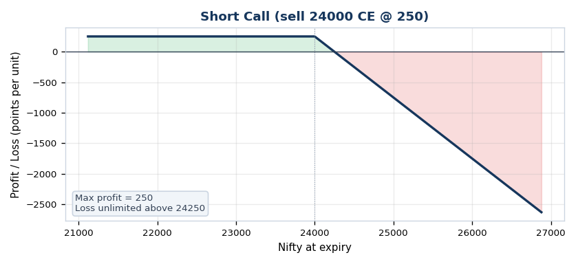

The chart tells the whole story at a glance. To the left of the strike the line is **flat** at a small positive level — the premium. That flat ceiling is your best possible outcome, no matter how far left the market travels. At the strike the line begins to slope downward; it crosses zero at breakeven (24,250) and then keeps falling at 45 degrees with no floor. A long call's payoff is a hockey stick that points hopefully up and to the right; the short call is that same stick flipped — a small flat reward and a downward ramp that **never turns back up.** When a payoff diagram has a flat top and an open-ended bottom, your job is to respect the bottom, because that is where the account-ending losses live.

### Margin: why selling ties up real capital

When you buy an option, you pay the premium and that is the most you can lose, so the exchange asks for nothing more. When you **sell** an option, your potential loss is open-ended, so NSE forces you to post **margin** — collateral that proves you can honour the obligation.

This margin is computed by a system called **SPAN** (which simulates how your position would lose across a range of price and volatility moves) plus an **exposure margin** add-on. For a single naked index short call, expect to block roughly **₹1.2 to ₹1.6 lakh or more per lot**, varying with how close the strike is and how high **India VIX** (the market's volatility gauge) sits. Compare that to the ₹18,750 premium: you tie up well over a lakh to earn a fraction of it, and that margin can be **increased intraday** if the market moves against you, triggering a **margin call**. If you cannot top up, your broker may square off at the worst possible moment. The premium feels like free income; the margin is the market reminding you it is not.

### Assignment risk

**Assignment** is what happens when the option buyer exercises and you, the writer, are called upon to settle. For **Indian index options** (Nifty, Bank Nifty) this is mercifully clean: they are **European** (exercisable only at expiry) and **cash-settled**, so at expiry you simply pay the cash difference `S - K` per unit if you are in-the-money. No shares change hands, and there is no early surprise.

For **stock options** the rules are harsher: they are **American-style** (the buyer can exercise any day before expiry) and **physically settled**. If you write a call on, say, Reliance and it finishes in-the-money, you are obliged to **deliver the actual shares** — and the margin/penalty regime for physical settlement is severe. Many beginners who casually sold stock calls have been hit with sudden delivery obligations and large physical-settlement margins in the final days before expiry. Know which kind of option you are writing.

### Why a naked short call is so dangerous for a beginner

Put the pieces together and the trap becomes obvious:

1. **The risk is mathematically unlimited.** No other common beginner position has a truly unbounded loss. (A short *put* is dangerous too, but its loss stops when the underlying hits zero. A short *call* has no such floor — there is no maximum price for an index.)
2. **The reward is small and fixed.** You risk lakhs to make thousands. One bad trade can wipe out the premium from many good ones.
3. **Markets gap.** The danger is not the slow grind upward — you could buy that back. The danger is the **overnight or pre-open gap**, where the market reopens far above your strike and there was never a chance to exit at a sensible price. Your stop-loss is useless against a gap.
4. **It seduces with a high win rate.** Most options expire worthless, so a naked seller wins *often* — maybe 8 or 9 times out of 10. That long string of small wins breeds overconfidence and oversizing, right up to the single loss that dwarfs them all. High win rate is not the same as positive expectancy.

### How it becomes safe: cover it or cap it

The naked short call is dangerous because the top of the position is open. There are two standard ways to close that top, and both are previewed here and taught in full later.

- **Covered call (own the underlying):** if you already **hold** the underlying — long Nifty futures, or the actual basket of stocks — and write a call against it, then if the market rockets, the gains on your holding rise to offset the losses on the short call. You have *covered* your obligation with the asset itself. The unlimited loss disappears; in exchange, your upside on the holding is capped at the strike. This is a legitimate, conservative income strategy used by long-term holders. (Covered in its own chapter.)
- **Bear call spread (buy a higher call):** if you simultaneously **buy** a call at a higher strike, that long call acts as insurance — above its strike, your losses are frozen. You collect a smaller net premium, but your maximum loss becomes a **known, finite number** (the gap between strikes minus the net premium). You have *capped* the open top. This is how disciplined traders express a bearish-to-neutral view without betting the account. (Covered in the spreads chapter.)

The lesson to carry forward: **never leave the top of a short call open.** Either own the asset beneath it or buy a higher call above it.

## Worked example (₹, Nifty)

Nifty is trading at **24,000**. You are mildly bearish-to-neutral over the next two weeks and decide to **write one lot of the 24000 CE** (the at-the-money call) at a premium of **₹250**. Nifty's lot size is **75**.

**Step 1 — Cash received and margin blocked.**
`Premium received = 250 * 75 = ₹18,750`, credited to you immediately. This is your **maximum profit** — full stop. To hold the position, the exchange blocks SPAN + exposure margin of roughly **₹1.3 lakh** (it varies). So you have tied up about ₹1.3 lakh of capital to earn at most ₹18,750.

**Step 2 — Breakeven.**
`Breakeven = strike + premium = 24000 + 250 = 24,250.` You profit if Nifty finishes below this, and lose above it.

**Step 3 — Outcomes at expiry.** Per-unit payoff is `250 - max(S - 24000, 0)`; multiply by 75.

- **Nifty closes at 23,000 (fell hard).** `max(23000 - 24000, 0) = 0`. Net per unit = ₹250. **P&L = +₹18,750.** Note: a 1,000-point crash earns you exactly the same as a 1-point dip below the strike — the premium, and not a rupee more.
- **Nifty closes at 24,000 (flat).** Intrinsic value 0. **P&L = +₹18,750** (maximum profit).
- **Nifty closes at 24,250 (breakeven).** `max(24250 - 24000, 0) = 250`. Net per unit = `250 - 250 = 0`. **P&L = ₹0.**
- **Nifty closes at 24,500.** Intrinsic = 500. Net = `250 - 500 = -250`. **P&L = -₹18,750.** A move of just 500 points has already wiped out the entire premium.
- **Nifty closes at 25,000.** Intrinsic = 1,000. Net = `250 - 1000 = -750`. **P&L = -₹56,250** — three times the premium you collected.
- **Nifty closes at 26,000 (a violent rally).** Intrinsic = 2,000. Net = `250 - 2000 = -1750`. **P&L = -₹1,31,250** — your entire margin, gone, on one position.

**Step 4 — See the asymmetry plainly.** Best case, market falls to *any* level: **+₹18,750**, capped forever. Market at 25,000: **-₹56,250.** At 26,000: **-₹1,31,250.** At 27,000: **-₹2,06,250** — and there is still no upper limit. You collected ₹18,750 to expose yourself to losses running into lakhs. That is the bargain of the naked call writer, written out in rupees.

### A real cautionary tale: the gap-up that punishes sellers

Imagine you wrote out-of-the-money Bank Nifty calls one evening, comfortable that the index sat well below your strike, collecting a tidy premium. Overnight, surprisingly strong election exit-poll results hit. The market did not *drift* toward your strike — it **gapped open** the next morning far higher, blowing straight past your strike before you could click "exit." On 20 May 2019, Bank Nifty jumped roughly **2,000 points (about 7%)** in a single session on exit-poll optimism. A seller who thought they were "safely" 500 points away woke up deep in-the-money with no chance to manage the trade. Premiums that were ₹40 the previous evening reopened at ₹400 or more, and SPAN margins spiked at the same time, forcing square-offs at the worst prices. Accounts that had ground out small premiums for months were halved in one morning. **A stop-loss order cannot protect you against a gap, because the price you wanted to exit at never traded.** This is precisely the hailstorm that ruins the naive insurer.

## Common mistakes / risk note

**Treating premium as "income" and ignoring the tail.** The cash hits your account on day one and feels like salary. It is not income; it is a liability you have sold, and its eventual cost is unknown and potentially enormous. Judge a short call by its worst case, never by the cheerful premium credit.

**Selling naked because "most options expire worthless."** True — and irrelevant to survival. A high win rate with an unlimited loss on the rare loss is a classic route to ruin. One 8% gap can erase the premiums of a dozen winning weeks. Frequency of winning says nothing about the *size* of the loss when you lose.

**Believing a stop-loss makes naked selling safe.** Stops fail exactly when you need them most — during gaps and fast moves, when the market leaps over your stop level and fills you far worse, if at all. The only reliable cap on a short call's loss is a *bought higher call* (a spread) or *ownership of the underlying* (a covered call).

**Forgetting margin can rise against you.** SPAN margin is not fixed. As the market moves toward and past your strike, and as India VIX spikes, your required margin balloons, and a margin call can force you out at the worst moment. Always keep a large buffer; never sell options on a tightly-funded account.

**Writing stock calls without understanding physical settlement.** In-the-money stock calls at expiry mean delivering actual shares and facing heavy physical-delivery margins in the final days. If you do not intend to deliver shares, close the position well before expiry — or do not write it.

**The honest big picture.** SEBI's studies find that roughly **9 in 10 individual F&O traders lose money.** Naked option *selling*, with its open-ended risk, is one of the fastest ways to join the losing nine — not because the strategy is irrational for professionals, but because beginners size it wrongly and meet a gap before they meet discipline. Add costs: **STT** is charged on the premium when you sell and on the settlement value of in-the-money options at expiry, plus brokerage, exchange fees and GST. Sell only what you can either cover or cap.

## Key takeaways

- Writing a call collects a premium today in exchange for the **obligation** to pay `S - K` per unit if the underlying finishes above the strike. `Payoff (short call) = premium - max(S - K, 0)`.
- **Maximum profit = the premium**, achieved whenever the market finishes at or below the strike. Falling markets pay you nothing extra — the gain is capped.
- **Maximum loss is unlimited.** There is no ceiling on how high an index can go, so there is no floor on your loss. This is the only common beginner position with truly unbounded risk.
- **Breakeven = strike + premium.** Between the strike and breakeven you still profit; above breakeven, losses grow one-for-one with the index, forever.
- Selling requires **SPAN + exposure margin** (often well over a lakh per lot), which can rise intraday and trigger forced square-offs. The premium is small relative to the capital and risk involved.
- **Gaps are the killer.** Stop-losses do not protect against overnight or pre-open jumps; a single gap-up (e.g. Bank Nifty's ~2,000-point election-day jump in May 2019) can destroy a naked seller.
- A naked short call becomes survivable only when **covered** (you own the underlying — covered call) or **capped** (you buy a higher-strike call — bear call spread). Never leave the top open.

## Practice problems

1. **(Conceptual)** In one or two sentences, explain why the maximum loss on a short call is described as "unlimited," whereas the maximum loss on a short *put* is large but finite.

2. **(Numeric)** You write one lot of **Nifty 24200 CE** at a premium of **₹180**, lot size **75**. Compute (a) the premium received, (b) your maximum profit, (c) your breakeven level.

3. **(Numeric)** Using the position in Problem 2, find your net P&L if Nifty closes at expiry at (a) 23,800, (b) 24,200, (c) 24,380, (d) 24,800, (e) 25,500.

4. **(Numeric / risk)** You write one lot of **Bank Nifty 52000 CE** at **₹300**, lot size **30**. Overnight the market gaps up and Bank Nifty closes the next session's expiry at **54,000**. What is your net P&L? Compare it to the premium you collected and to a hypothetical best case.

5. **(Conceptual)** A friend says: "I sold Nifty calls every week for three months and won 11 weeks out of 12 — selling calls clearly works." Explain what this track record does and does not tell you about the strategy's safety.

6. **(Conceptual)** Briefly describe the two ways to remove the unlimited-loss feature of a short call, and state what you give up in each case.

## Solutions

**1.** A short call loses `S - K` per unit as the underlying S rises above the strike K, and an index has **no maximum price** — it can keep climbing without bound — so the loss has no upper limit. A short put loses `K - S` as S *falls* below K, but the underlying cannot fall below **zero**, so the worst case is bounded at `K - premium` per unit (when S = 0). No floor on price means unlimited loss for the call; a floor of zero means a large-but-finite loss for the put.

**2.** (a) Premium received = `180 * 75 = ₹13,500`. (b) Maximum profit = the premium = **₹13,500** (whenever Nifty finishes at or below 24,200). (c) Breakeven = `strike + premium = 24200 + 180 = 24,380`.

**3.** Per-unit payoff = `180 - max(S - 24200, 0)`, times 75.
- (a) **23,800:** `max(23800 - 24200, 0) = 0`; net = `180`; total = `180 * 75 = +₹13,500` (max profit).
- (b) **24,200:** intrinsic 0; net = `180`; total = **+₹13,500** (still max profit, at the strike).
- (c) **24,380:** intrinsic = `24380 - 24200 = 180`; net = `180 - 180 = 0`; total = **₹0** (breakeven).
- (d) **24,800:** intrinsic = `600`; net = `180 - 600 = -420`; total = `-420 * 75 = -₹31,500`.
- (e) **25,500:** intrinsic = `1300`; net = `180 - 1300 = -1120`; total = `-1120 * 75 = -₹84,000`.
Note how the loss in (e) is more than six times the premium collected — and would keep growing if Nifty rose further.

**4.** Per-unit payoff = `300 - max(54000 - 52000, 0) = 300 - 2000 = -1700`. Total = `-1700 * 30 = -₹51,000`. You collected only `300 * 30 = ₹9,000` in premium, so the gap turned a ₹9,000 "income" into a **₹51,000 loss** — more than five times the premium — with no chance to exit, since the move happened on a gap. The best case was capped at +₹9,000; the realised loss shows the asymmetry brutally. Had the gap been larger (say to 56,000), the loss would have been `(300 - 4000) * 30 = -₹1,11,000`, with still no upper bound.

**5.** The 11-of-12 record reflects only the **frequency** of small wins, which is expected because most options expire worthless — it says nothing about the **size** of the loss in the rare losing case. A naked short call has unlimited downside, so a single bad week (especially a gap) can lose more than the combined premium of all 11 winning weeks, turning a "winning" strategy into a net loss. High win rate is not the same as positive expectancy or safety; you must weigh each loss by how large it can be, not just how often it occurs. Three months is also far too short to have encountered a tail event.

**6.** (i) **Covered call:** hold the underlying (e.g. long Nifty futures or the stock basket) and write the call against it; gains on the holding offset the short call's losses if the market rallies, removing the unlimited loss. **You give up** the upside on your holding above the strike (your gains are capped there). (ii) **Bear call spread:** simultaneously buy a higher-strike call as insurance; above that strike your losses are frozen, making the maximum loss a known, finite number (strike difference minus net premium). **You give up** part of the premium (the net credit is smaller because you paid for the higher call). In both, you trade away some reward to convert an unlimited risk into a defined one.

# Chapter 14: Short Put — Selling Bullish / Getting Paid to Buy

Imagine you genuinely want to buy a flat in a building you like, but you think today's price is a little too high. You'd happily buy it 8% cheaper. So you go to the owner and say: "Pay me a fee today, and in return I promise that if the price falls to my level over the next month, I'll buy it from you at that level." If the price never falls, you keep the fee and walk away — you got paid for your patience. If it does fall, you buy the flat at the price you wanted anyway, and you're a little richer for the fee you already pocketed. That, in one sentence, is a **short put**: you sell someone the right to *sell the underlying to you* at a fixed price, you collect cash up front for taking on that obligation, and you profit as long as the market stays up, drifts sideways, or only falls a little.

A short put is the mirror image of a short call. The short call seller is bearish-to-neutral and dreads a rally. The short put seller is **bullish-to-neutral** and dreads a crash. It is one of the most popular income strategies in the world — and one of the most dangerous when done carelessly, because the risk lives in exactly the place beginners ignore: the rare, violent fall. This chapter teaches both faces of it: the disciplined "get paid to buy" version that professionals respect, and the hidden fat tail that quietly wrecks the careless.

## Core concepts

### What you are actually selling

A **put option** gives its *buyer* the right (not the obligation) to sell the underlying at a fixed **strike price** K on or before expiry. When you **sell** (also called **write**) that put, you take the other side. You receive a **premium** today, and in exchange you accept an obligation: if the put buyer chooses to exercise, you must **buy the underlying from them at K**, no matter how far the market has fallen below K.

So the put buyer is buying insurance against a fall. You, the put seller, are the insurance company: steady small profits most of the time, a large loss occasionally. Whether that's a good business depends entirely on whether you priced the premium well and sized the position sanely.

### The payoff: small fixed gain, large variable loss

Let S be the price of the underlying at expiry, K the strike, and let `premium` be what you collected per unit. Your payoff per unit is:

```
Payoff (short put) = premium - max(K - S, 0)
```

Read it in two pieces:

- The `premium` is yours the moment you sell. It is the most you can ever make.
- The `max(K - S, 0)` is what you owe the buyer at expiry. If S stays at or above K, this term is zero — the put expires worthless and you keep the whole premium. If S falls below K, this term grows rupee-for-rupee as S falls, and it is subtracted from your premium.

Let's name the three landmark numbers.

```
Maximum profit  = premium                 (when S >= K at expiry)
Breakeven       = K - premium             (the price at which P&L = 0)
Maximum loss    = (K - premium) per unit  (when S falls all the way to 0)
```

The maximum loss formula deserves a stare. The worst case is the underlying going to zero. Then you are forced to buy at K something now worth nothing, after pocketing `premium`, so you lose `K - premium` per unit. For a Nifty 24000 put that collected ₹200, the theoretical worst case is `24000 - 200 = 23800` points of loss **per unit** — and one Nifty lot is about 75 units, so the absolute-worst loss is around `23800 * 75 ≈ ₹17.85 lakh` on a contract you sold for `200 * 75 = ₹15,000`. The index will not actually go to zero, but the *shape* of the risk is the point: you risk a large, market-sized number to earn a small, fixed one. This asymmetry is the entire personality of option selling.

### Why anyone sells puts: the three legitimate motives

If the loss is so lopsided, why is selling puts a respected professional strategy? Three honest reasons.

1. **Probability is on your side.** Markets drift up over long horizons, and an out-of-the-money put pays out only if the market falls past your strike. Most of the time it expires worthless and you keep the premium — insurance that usually isn't claimed.

2. **Implied volatility is usually richer than realised volatility.** Put buyers are often frightened buyers who overpay for downside protection, especially on indices, because people will pay up to sleep at night. This is the **volatility risk premium**, and the put seller harvests it. (We unpack skew in later chapters; for now, just know index puts are structurally a bit expensive, tilting the odds toward the seller.)

3. **You actually want to own the thing.** The cleanest motive — and it leads us to the cash-secured put.

### The cash-secured put: getting paid to buy

A **cash-secured put** is a short put where you set aside enough cash to actually buy the underlying at the strike if you get assigned. You are not gambling — you are placing a disciplined limit order to buy, and getting paid a premium while you wait.

Here is the logic, step by step:

- You want to own (say) a stock or accumulate index exposure, but you think today's price is slightly high. You'd be happy to buy 8–10% lower.
- Instead of placing a passive limit buy order at that lower price and earning nothing while you wait, you **sell a put** at that lower strike.
- **Outcome A — the market stays up.** The put expires worthless. You keep the premium. You didn't get your shares, but you got paid for your patience, and you can do it again next month. Your effective "interest" on the cash you reserved can be attractive.
- **Outcome B — the market falls to your strike.** You're assigned. You buy the underlying at K — the price you wanted anyway — and because you already pocketed the premium, your **effective purchase price is `K - premium`**, which is *below* the strike. You bought what you wanted, at a discount to the price you'd already decided was fair.

In both outcomes you win relative to having done nothing. That is why the cash-secured put is sometimes called "getting paid to buy." The catch — and there is always a catch — is **Outcome C: the market doesn't stop at your strike, it keeps falling.** You're still obligated to buy at K while the price is now far below `K - premium`. You own the underlying at a loss. The strategy only "gets paid to buy" the thing you genuinely wanted at a price you genuinely liked; it does not protect you from a crash. More on that tail below.

### Assignment and settlement: what you actually receive

What lands in your account when a short put is exercised against you depends on what you sold.

- **Index options (Nifty, Bank Nifty) are European and cash-settled.** "European" means the buyer can only exercise *at* expiry, so you can't be assigned early. "Cash-settled" means no basket of stocks changes hands — at expiry the exchange simply debits the cash difference `max(K - settlement, 0)` per unit from your account. You never literally "buy the index." For an index cash-secured put, "setting aside the cash" is a discipline you impose on yourself, not a literal share purchase.
- **Single-stock options in India are physically settled.** If you sold a put on, say, Reliance and it finishes in-the-money, you will be **delivered the actual shares** and must pay K per share for the full lot — a real, large cash event of several lakh rupees. Traders who forget this get an ugly expiry-day surprise: a stock they didn't plan to own, bought with money they didn't plan to spend, plus possible auction penalties if they can't fund it. With physically settled stock puts, *always* know whether you can and want to take delivery before letting one expire in-the-money.

### Margin: the price of admission for sellers

When you *buy* an option, you pay the premium and that's the end of it — your maximum loss is the premium, so no further collateral is needed. When you *sell* a put, your potential loss is large, so the exchange demands **margin**: collateral posted up front to guarantee you can meet the obligation.

In India, margins are computed using the **SPAN + Exposure** system. SPAN simulates a range of adverse moves in price and volatility and charges you the worst-case loss across those scenarios; the exposure margin is an additional buffer on top. For a single Nifty put this typically runs into the range of roughly ₹1–1.5 lakh of blocked capital per lot, varying with strike, volatility, and India VIX. Two consequences follow:

- **Your real return is on margin, not premium.** Collecting ₹15,000 against ₹1.2 lakh of blocked margin is about a 12.5% gross return *for that holding period* — not the eye-popping "infinite" return beginners imagine because "I didn't pay anything." You did pay: you tied up capital that could have earned elsewhere.
- **Margins rise exactly when you're hurting.** If the market falls and volatility spikes, SPAN re-prices the worst case higher and your margin requirement *increases* on a position that is already losing. If you're fully deployed, you face a **margin call** and may be forced to close at the worst possible moment. Never sell puts to the hilt of your available margin; keep a deep buffer.

### Short put vs covered call: same payoff shape, different risk story

Here is a fact that confuses many people and enlightens the rest: **a cash-secured short put has essentially the same payoff shape as a covered call** at the same strike. Both are short-volatility, neutral-to-bullish income trades with a capped upside (the premium plus, for the covered call, a little room to the strike) and a large downside if the underlying collapses. They are **synthetically equivalent** — the algebra of put-call parity makes a short put behave like a covered call.

The difference is *operational and psychological*, not in the risk curve:

- A **covered call** means you already own the underlying and sell a call against it. Your downside is "my stock falls." It *feels* safe because you hold a familiar asset, but you are fully exposed to the fall.
- A **cash-secured put** means you don't own the underlying yet; you hold cash and sell a put. Your downside is "I'm forced to buy a falling asset." It *feels* riskier, but the actual risk is the same.

Many professionals prefer the short put for entering a position: one transaction with one set of costs, versus buying stock and selling a call (two legs, two commissions, more capital). The lesson — don't let the covered call's cozy framing fool you into thinking it's lower-risk than a short put. They are the same trade wearing different clothes.

## Worked example (₹, Nifty/Bank Nifty)

Let's walk through a cash-secured Nifty put end to end.

**Setup.** Nifty spot is at **24,000**. You are mildly bullish — you think Nifty holds above 23,500 over the next week — and you'd be content to accumulate index exposure around 23,800 if it dipped. The weekly **24000 put** (at-the-money) is trading at **₹200**. Lot size is about **75 units**. You sell **1 lot**.

**Cash collected up front:**

```
Premium received = 200 * 75 = ₹15,000
```

This ₹15,000 is credited to you immediately (your maximum profit). The broker blocks SPAN + exposure margin — assume about **₹1,20,000** for this lot.

**The landmark numbers:**

```
Maximum profit = premium                = ₹200 per unit  = ₹15,000 per lot
Breakeven      = K - premium            = 24000 - 200     = 23,800
Maximum loss   = (K - premium) per unit = 23,800 per unit = ₹17,85,000 per lot (theoretical, S -> 0)
```

**Now expiry day. Four scenarios.**

*Scenario 1 — Nifty closes at 24,300 (rallied).* The put is out-of-the-money; `max(24000 - 24300, 0) = 0`. It expires worthless. You keep the full ₹15,000. Return on margin ≈ `15000 / 120000 ≈ 12.5%` for the week. Excellent — and you take no delivery because it's cash-settled.

*Scenario 2 — Nifty closes at 24,000 (flat).* Still `max(24000 - 24000, 0) = 0`. The put expires exactly at-the-money, worthless to the buyer. You keep all ₹15,000.

*Scenario 3 — Nifty closes at 23,900 (small dip, between breakeven and strike).* Now `max(24000 - 23900, 0) = 100` per unit owed.

```
Payoff per unit = premium - (K - S) = 200 - 100 = +100
Net P&L         = 100 * 75 = +₹7,500
```

You're still profitable because the dip (100 points) was smaller than the cushion your premium bought you (200 points). Your breakeven was 23,800; the market stayed above it.

*Scenario 4 — Nifty closes at 23,300 (a hard 700-point fall).* Now `max(24000 - 23300, 0) = 700` per unit owed.

```
Payoff per unit = 200 - 700 = -500
Net P&L         = -500 * 75 = -₹37,500
```

You collected ₹15,000 and lost ₹37,500 — a net loss of ₹37,500, more than double your premium, on a single ordinary-looking down week. Notice how fast the loss outran the gain: a 700-point fall (about 2.9%) turned a ₹15,000 credit into a ₹37,500 debit. That is the asymmetry in living colour.

The figure below plots this exact position — a short 24000 put — across the full range of expiry prices. The line is flat and positive on the right (you keep the premium), bends down at the strike, and slopes relentlessly downward to the left.

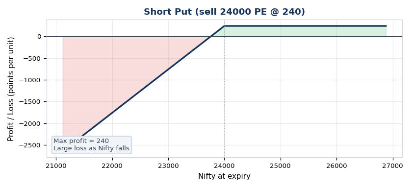

**The cash-secured framing.** Had you reserved the full notional — about `24000 * 75 = ₹18 lakh` — you would never face a margin call from this trade, and in Scenario 4 you'd simply hold an index position acquired at an effective `24000 - 200 = 23,800`, now marked at 23,300. A paper loss, but on exposure you wanted, at a price below the strike. That discipline — reserving the cash and choosing a strike you'd be *happy* to buy at — is what separates "getting paid to buy" from "blindly selling premium."

## Common mistakes / risk note

- **Confusing premium return with risk.** "I made ₹15,000 risking nothing" is wrong on both counts. You risked up to ₹17.85 lakh in theory and tied up ₹1.2 lakh of margin in practice. Always quote your return on **margin or notional**, never on premium alone.
- **Selling puts in a falling, high-VIX market because the premiums are "juicy."** Premiums are fat precisely when the market is scared and the probability of a further fall is genuinely higher. Fat premium is compensation for real risk, not free money. Selling into a crash is how accounts blow up.
- **Ignoring the tail.** Option selling produces many small wins and the occasional catastrophic loss. The 2020 COVID crash and budget-day gaps skip right past your "I'll just buy it back if it goes against me" plan, because the market opens far below your strike with no chance to exit in between. **One bad gap can erase months of premium.** Size every short put so the worst realistic gap is survivable.
- **Forgetting physical settlement on stock options.** Let an in-the-money stock put ride into expiry and you'll be delivered shares and a large cash bill. For index puts (cash-settled) this specific risk doesn't apply, but the cash debit on a deep loss does.
- **Maxing out margin.** Using all available margin leaves no room for the margin *increase* that comes when the trade moves against you — a spike in India VIX can then force you out at the bottom. Keep a large buffer.
- **Treating it as "set and forget."** A short put needs monitoring. Most professionals define a loss point (e.g., exit at 2x the premium loss, or if the underlying breaks a key level) before entering, and honour it.

## Key takeaways

- A **short put** collects a premium today in exchange for the obligation to buy the underlying at strike K. It is a **neutral-to-bullish, income** strategy.
- Payoff per unit = `premium - max(K - S, 0)`. **Max profit = premium**; **breakeven = K - premium**; **max loss = K - premium per unit** (large — realised if the underlying collapses).
- The **cash-secured put** is the disciplined form: reserve the cash, pick a strike you'd genuinely be happy to buy at, and your effective purchase price becomes `K - premium`, a discount to the strike. You "get paid to buy."
- **Index puts are European, cash-settled** (you can't be assigned early; you receive/owe cash). **Stock puts are physically settled** (you receive actual shares and must pay for them).
- Selling puts requires **SPAN + exposure margin**, which *rises* when the trade goes against you — never sell to the limit of your margin.
- A cash-secured short put is **synthetically the same trade as a covered call**; don't let either framing trick you about the risk.
- The danger is the **fat tail**: gap-down crashes can lose far more than the premium collected. Size for the worst realistic gap, not the typical week.

## Practice problems

1. **(Conceptual)** A trader says, "I sold a Nifty put and the premium is pure profit — there's no way to lose because I didn't pay anything." State two things wrong with this claim.

2. **(Numeric)** You sell one Bank Nifty **52000 put** for a premium of **₹400**. Lot size is about **15 units**. Compute (a) premium collected per lot, (b) breakeven price, and (c) the theoretical maximum loss per lot if Bank Nifty went to zero.

3. **(Numeric)** Using the same 52000 put from Problem 2, compute your net P&L per lot at expiry if Bank Nifty closes at (a) 52,500, (b) 51,800, and (c) 50,900.

4. **(Conceptual)** You sell a cash-secured put on a single stock at a strike of ₹1,000, collecting ₹30 premium per share, lot size 500. The stock closes at ₹950 on expiry. What physically happens to your account, and what is your effective per-share cost of the shares you now hold?

5. **(Conceptual)** Explain why the margin requirement on a short put you've sold can *increase* the day after you sell it, even if you've done nothing, and why that is dangerous.

6. **(Applied)** Your friend wants to "earn safe monthly income" by selling deep out-of-the-money Nifty puts every week with all of his ₹5 lakh capital deployed as margin. Give two specific risks and one change you'd insist on.

## Solutions

1. **Two errors.** (i) *"I didn't pay anything"* is false — the broker blocks substantial SPAN + exposure margin (often ₹1–1.5 lakh per Nifty lot), so capital is very much tied up. (ii) *"No way to lose"* is false — the maximum loss is `K - premium` per unit, a large market-sized number realised if the index falls hard. The premium is the *most* you can make, not a floor on losses. A single gap-down can lose multiples of the premium.

2. **52000 put, premium ₹400, lot 15.**
   - (a) Premium collected = `400 * 15 = ₹6,000` per lot.
   - (b) Breakeven = `K - premium = 52000 - 400 = 51,600`.
   - (c) Theoretical max loss = `(K - premium) per unit * lot = (52000 - 400) * 15 = 51600 * 15 = ₹7,74,000` per lot (if Bank Nifty went to 0). Real-world worst cases are smaller but still very large.

3. **Net P&L per lot (payoff per unit = `400 - max(52000 - S, 0)`, times 15).**
   - (a) S = 52,500: `max(52000 - 52500, 0) = 0`; payoff = `400 - 0 = 400`/unit; P&L = `400 * 15 = +₹6,000` (keep full premium).
   - (b) S = 51,800: `max(52000 - 51800, 0) = 200`; payoff = `400 - 200 = +200`/unit; P&L = `200 * 15 = +₹3,000` (still profitable — dip smaller than premium cushion; above breakeven 51,600).
   - (c) S = 50,900: `max(52000 - 50900, 0) = 1100`; payoff = `400 - 1100 = -700`/unit; P&L = `-700 * 15 = -₹10,500` (loss; market closed below breakeven). Note the loss (₹10,500) already exceeds the premium collected (₹6,000) on a fall of just over 2%.

4. **Physical settlement.** The stock closed at ₹950, below the ₹1,000 strike, so the put you sold is in-the-money and is exercised against you. Because single-stock options are **physically settled**, you are **delivered 500 shares** and must **pay ₹1,000 per share = ₹5,00,000** for them. You now own 500 shares of a stock currently worth ₹950 (₹4,75,000 market value). Your **effective cost per share = strike - premium = 1000 - 30 = ₹970**. So you're holding shares with an effective basis of ₹970 against a market price of ₹950 — a paper loss of ₹20/share (₹10,000 on the lot), and you've committed ₹5 lakh of cash you must be able to fund.

5. **Margin can rise because** it is computed from a worst-case scenario (SPAN), which depends on current price and **implied volatility / India VIX**. If the underlying falls toward your strike and/or volatility spikes, the simulated worst-case loss grows, so the exchange blocks *more* margin against the same position. This is dangerous because the margin demand increases **precisely when the trade is already losing money** — a double squeeze. If you were near-fully deployed, you face a **margin call** and may be forced to close at the worst moment, locking in the loss. The defence is to keep a large unused margin buffer.

6. **Risks and a fix.**
   - *Risk 1 — tail/gap risk.* Deep-OTM puts have a high win rate but a brutal payoff when a crash blows past the strike; one COVID-style gap-down can lose many months of accumulated premium in a single session.
   - *Risk 2 — margin-call risk from full deployment.* With all ₹5 lakh as margin, a market fall both creates losses *and* raises the margin requirement, forcing liquidation at the bottom.
   - *Insisted change:* Deploy only a fraction of capital (e.g., use no more than ~40–50% of margin, keeping a large buffer), and/or **convert the naked short put into a defined-risk spread** by buying a cheaper, lower-strike put — turning unlimited-style downside into a known, survivable maximum loss. Define a pre-set exit (e.g., close at 2x premium loss) before entering.

# Chapter 15: Buyer vs Seller — Time Decay, Probabilities & the Honest Reality

Picture two people standing on opposite sides of the same counter. On one side is a man buying a lottery ticket: he pays a small, fixed amount, he knows exactly how much he can lose (the ticket price), and he dreams of a payday many times his stake. On the other side is the shop that sold him the ticket: it collects a steady stream of small payments from thousands of buyers, wins almost every single transaction, and lives in quiet dread of the one ticket that hits the jackpot. The option *buyer* is the lottery customer. The option *seller* is the lottery shop. Almost everything that confuses beginners about options dissolves the moment you internalise that these two are not two strategies — they are two completely different businesses with opposite shapes of risk, opposite relationships with time, and opposite emotional textures.

This chapter is the honest, foundational one. Everything you've learned about calls and puts so far has shown you the mechanics of each position. Now we step back and ask the questions that decide whether you survive: Who has the edge, the buyer or the seller? Where does time go? Why do most retail traders in India lose money — and what, precisely, separates the small minority who don't? No diagrams here, just the truth told plainly with simple numbers. If you absorb only one chapter of this book, absorb this one.

## Core concepts

### Two businesses, not two trades

When you buy an option you pay a premium today for the *right* to a payoff later. When you sell an option you receive that premium today and take on the *obligation* to deliver that payoff if asked. The money simply changes hands: every rupee the buyer pays, the seller pockets, and vice versa at expiry. Options are, at their core, a **transfer of risk for a fee**. The buyer hands over a small, certain amount of money to escape (or to bet against) an uncertain future. The seller accepts that uncertain future in exchange for the small, certain fee. This is exactly what an insurance company does, and the analogy is not loose — it is the literal structure.

From this single transfer, two opposite profiles are born:

- **The buyer has defined risk and (often) undefined reward.** The most a long-option buyer can lose is the premium paid. A long Nifty call bought for ₹150 can lose at most ₹150 per unit, full stop — no margin call, no surprise. But its upside, if the market runs, can be many multiples of that. Limited, known downside; large, open upside.
- **The seller has defined reward and (often) undefined risk.** The most a naked seller can make is the premium collected — that's the entire prize. But the loss, if the market moves hard against them, can be far larger than the premium, sometimes catastrophically so (recall the short call's theoretically unlimited loss from Chapter 13). Limited, known upside; large, open downside.

Neither shape is "better." They are mirror images, and which one suits you depends on what you're trying to do and how you manage the dangerous side.

### Time: the engine that runs one way

The single most important difference between the two sides is their relationship with time, captured by the Greek letter **theta** (time decay). Every option contains **time value** — the portion of its price that exists purely because the future is still open and anything could happen (Chapter 6). As expiry approaches, that future shrinks, and time value bleeds away toward zero. This bleed is not optional and not symmetric in feel:

- For the **buyer**, theta is a headwind. Every day that passes with the market sitting still, a long option is worth slightly less, even if nothing went wrong. The buyer is renting hope, and the rent is charged daily. This is why a long option that's "right but too early" or "right but too slow" can still lose money.
- For the **seller**, theta is a tailwind. Every quiet day, the option they're short loses a little value, which is a profit to them because they'd buy it back cheaper. The seller is the landlord collecting that rent.

Crucially, time decay **accelerates** as expiry nears, especially for at-the-money options. An option might lose a small slice of its time value with a month to go, but in the final week — and brutally in the final day of a weekly expiry — the remaining time value collapses. This is why Indian weekly index options are a theta battlefield: sellers love the fast decay of the last two days; buyers of cheap weekly out-of-the-money options are fighting a clock that speeds up against them. Time, quite literally, is money, and it flows from the buyer's pocket to the seller's.

### Probabilities: who wins how often

Here is the part that traps beginners. The buyer and seller don't just have different *sizes* of win and loss — they have different *frequencies*, and the two are inversely linked.

Consider an out-of-the-money (OTM) Nifty call: the market is at 24,000 and you buy the 24,500 call. For this to pay off at all, the market must rise more than 500 points by expiry. Most weeks, it doesn't. So this option, like a lottery ticket, **usually expires worthless** — the buyer loses the whole premium, again and again, in small bites. But on the occasional week the market explodes upward, the same cheap option can multiply five- or ten-fold. The buyer's profile is therefore **low probability of winning, high payoff when they do**.

The seller of that same call sits on the exact opposite. They win the small premium **most of the time** — week after quiet week — and suffer a large loss on the rare violent move. The seller's profile is **high probability of winning, capped payoff, occasional big loss**.

This is the deep asymmetry, and it's worth saying out loud because it's so counter-intuitive: *the side that wins more often is not the safer side.* The seller "wins" maybe 70–80% of trades and still risks blowing up, because the rare losses dwarf the frequent wins. The buyer "loses" 70–80% of trades and can still come out ahead, for the same reason in reverse. Win-rate alone tells you almost nothing. To judge a strategy you must combine *how often* with *how much* — and that combination has a name.

### Expectancy: why there is no free lunch

**Expectancy**, also called **expected value (EV)**, is the average rupee outcome of a trade if you could repeat it thousands of times. It is the only honest scoreboard, and the formula is simple:

```
Expectancy = (probability of win * average win) - (probability of loss * average loss)
```

Apply it to both sides of one trade and a beautiful, sobering fact appears. Suppose an option has a "fair" price — meaning the market has correctly priced the odds. Then:

- The **buyer's** rare big wins, weighted by their small probability, exactly equal the frequent small losses. Expectancy before costs ≈ 0.
- The **seller's** frequent small wins, weighted by their high probability, exactly equal the rare big losses. Expectancy before costs ≈ 0.

In a fairly priced market, **both sides have an expectancy of roughly zero before costs.** The premium is, in theory, the price at which the buyer's dream and the seller's dread are balanced. This is the heart of "no free lunch": selling options is not "easy money because they usually expire worthless," and buying options is not "smart money because the upside is huge." If it were that simple, everyone would pile onto one side and the premium would move until the edge vanished. The high win-rate of selling is *paid for* by the size of the rare loss. The low win-rate of buying is *compensated by* the size of the rare win. The market sets the premium precisely so neither lunch is free.

Two real-world wrinkles tilt this slightly. First, **implied volatility is usually a bit higher than the volatility that actually shows up** (the volatility risk premium), which gives the seller a small structural edge — buyers, on average, slightly overpay for protection and for lottery tickets. Second, and far more powerful in the other direction, are **costs**. And costs are where the theory meets the brutal Indian reality.

### Costs: the house always takes a cut

In a casino, the wheel has a green zero, so even a "fair" bet loses slightly over time — that green zero is the house edge. In Indian F&O, the green zeroes are everywhere:

- **Brokerage** on every order, entry and exit.
- **STT (Securities Transaction Tax)** — charged on options, and notably on the *settlement value* of in-the-money options that are exercised, which can be a nasty surprise for buyers who let an ITM option expire instead of squaring off.
- **Exchange transaction charges, SEBI turnover fees, stamp duty, and GST** on top of the brokerage and charges.
- **The bid-ask spread** — the invisible cost of crossing from the buy price to the sell price, which widens on illiquid strikes and far weeklies.

Stack these up and the picture is grim: a zero-expectancy bet becomes a *negative*-expectancy bet for both buyer and seller once the house takes its cut. The more you trade, the more cuts you pay. This single fact — costs turning a fair game into a losing one for the average participant — is the quiet engine behind the most important number in Indian retail trading.

### The SEBI reality: why most retail traders lose

SEBI (the Securities and Exchange Board of India), the market regulator, has studied who actually makes money in equity F&O. The findings, repeated across studies, are blunt and consistent: **the large majority of individual F&O traders lose money** — on the order of nine in ten in net terms — and the aggregate losses run into very large sums, with the average loser down a meaningful amount over a year, *before* even counting transaction costs (which themselves consume a big slice of the rare winners' gains). A small minority is consistently profitable. This is not a rumour or a scare tactic; it is the regulator's own data, and it is the single most important fact a new Indian options trader can know.

Why do so many lose? Not because options are a scam — because of *how* people trade them. The recurring causes:

1. **Overtrading.** Each trade pays the house its cut. A trader taking many trades a day is feeding the green zeroes relentlessly. Even a near-coin-flip strategy bleeds to death on costs at high frequency. Activity feels like work; here it is mostly leakage.
2. **Buying cheap, far OTM weekly options.** This is the most seductive trap. A ₹5 or ₹10 weekly option *feels* like a tiny, harmless bet with lottery upside. But far-OTM options have a very low probability of paying off and decay viciously. Buying them repeatedly is buying lottery tickets that, on average, expire worthless — the textbook negative-expectancy habit, dressed up as "high risk-reward."
3. **No edge.** Most traders have no genuine reason to believe their direction, timing, or volatility view is better than the price already reflects. Without an edge, expectancy starts at zero and costs drag it negative. Trading harder doesn't create an edge; it just pays more costs.
4. **Leverage and oversizing.** F&O is leveraged. One oversized position in a violent move (a gap on Bank Nifty, an event surprise) can erase months of small gains — the "occasional big loss" of the seller, or a margin wipeout for an over-leveraged buyer.
5. **Behaviour.** Cutting winners early and letting losers run, revenge-trading after a loss, chasing tips, and confusing a few lucky wins with skill. The emotional texture of buying (frequent small pain, rare euphoria) and selling (frequent small comfort, rare terror) is engineered to make humans behave exactly wrong.

### What separates the profitable minority

If nine in ten lose, the obvious question is what the tenth does differently. It is not a secret indicator. The profitable minority share a small, unglamorous set of habits:

- **Selectivity over activity.** They trade rarely, only when they believe they have a genuine edge, and they accept doing nothing most of the time. Fewer trades means fewer cuts to the house.
- **Risk management as the first priority, not the last.** They size positions so that the inevitable bad trade is survivable — never risking ruin on one position. Sellers especially define and cap their tail risk (with spreads, hedges, or strict stops) rather than selling naked and praying.
- **Positive expectancy, then repetition.** They focus on the EV equation, not the win-rate. A buyer happy to lose small 70% of the time because the 30% pays enough; a seller respecting that the rare loss must never exceed many wins' worth of premium.
- **Cost awareness.** They treat brokerage, STT and slippage as real opponents and structure trades to minimise turnover.
- **Process and records.** They follow a written plan, journal trades, and let probability play out over many trades rather than judging themselves by the last one.

The uncomfortable summary: success in options is far less about predicting the market and far more about respecting the asymmetry, the costs, and your own psychology. Neither side — buyer nor seller — offers a free lunch. The professional simply manages the meal better.

## Worked example (₹, Nifty)

Let's make expectancy concrete with simple, round numbers on a Nifty weekly option. Nifty is at 24,000. Lot size is about 75 units.

A trader is tempted by a cheap **24,400 weekly call** trading at **₹40**. Suppose, realistically, the option finishes worthless 80% of the time (the market fails to rise past breakeven), and in the 20% of weeks it does pay, the average payoff to the buyer is **₹200** per unit.

**The buyer's expectancy, per unit, before costs:**

```
Expectancy(buyer) = (0.20 * (200 - 40)) - (0.80 * 40)
                  = (0.20 * 160) - (0.80 * 40)
                  = 32 - 32
                  = 0
```

A perfectly fair game — zero edge before costs. Now bring in the house. Say round-trip costs (brokerage + STT + charges + half-spread) amount to about **₹5 per unit** per trade. The buyer's expectancy becomes roughly `0 - 5 = -5` per unit, or about **-₹375 per lot** (5 * 75) on average, every time they take this trade. Repeat it 100 times in a year and the expected drag is around **₹37,500** purely from costs on a zero-edge bet — a clean illustration of how overtrading a fair game produces a steady loss.

Now the **seller** of that same call. Their per-unit expectancy before costs is the exact opposite of the buyer's, so it's also **0**:

```
Expectancy(seller) = (0.80 * 40) - (0.20 * 160)
                   = 32 - 32
                   = 0
```

The seller wins ₹40 in 80% of weeks (high win-rate, comforting), and loses ₹160 in 20% of weeks (rare, larger). After the same ~₹5 round-trip cost, the seller's expectancy is also slightly negative — *but* the small volatility-risk-premium edge (buyers tend to overpay, so maybe the true worthless-probability is 82%, not 80%) can nudge the seller back toward break-even or slightly positive. That tiny structural tilt, harvested patiently with disciplined risk control, is roughly the entire honest case for option selling. It is a thin edge, not a fountain — and one oversized loss in the 20% bucket erases many weeks of premium. The numbers force the lesson: nobody here is getting rich for free; the seller has a sliver of an edge they must protect with risk management, and the buyer must be genuinely *right* often enough to overcome both decay and costs.

## Common mistakes / risk note

- **Judging a strategy by its win-rate.** "This sells options and wins 85% of the time!" tells you nothing without the size of the 15% losses. High win-rate is the seller's seductive trap; it hides the tail.
- **Believing selling is "safe income."** Premium received is not profit earned until expiry passes safely. Naked selling carries large, sometimes ruinous, tail risk — the rare gap can dwarf months of collected premium.
- **Believing buying is "smart" because risk is limited.** Limited risk you pay over and over is still a steady loss. The buyer's defined risk is real comfort, but theta and costs grind a flat market into a losing one.
- **Ignoring costs.** In India, STT, brokerage, charges, and spreads turn a fair game negative. Overtrading is the most reliable way to lose: you pay the house edge hundreds of times.
- **Mistaking the rare win for skill.** A few jackpot weeks from cheap OTM buying feel like genius. Across many trades, expectancy — not the last lucky ticket — is your true result.
- **Oversizing.** Leverage means one bad trade can end the account. The honest risk: the math can be fair and you can *still* be wiped out by sizing too big for the rare adverse move.

## Key takeaways

- Buying and selling options are mirror-image *businesses*: the buyer has defined risk and large open upside (low win-rate, lottery-like); the seller has defined upside and large open downside (high win-rate, occasional big loss).
- Time decay (theta) flows from buyer to seller every day, accelerating into expiry — a headwind for buyers, a tailwind for sellers.
- Win-rate and payoff size are inversely linked; only **expectancy** (`prob_win * avg_win - prob_loss * avg_loss`) tells the truth about a strategy.
- In a fairly priced market, both sides have ~zero expectancy before costs — there is no free lunch. A small volatility-risk-premium gives sellers a thin structural edge.
- Costs in India (brokerage, STT, exchange/SEBI charges, GST, spreads) turn a fair game into a negative-expectancy one — and overtrading multiplies the damage.
- SEBI data shows the large majority of retail F&O traders lose money, mainly from overtrading, buying cheap OTM lottery options, costs, and trading without a genuine edge.
- The profitable minority win through selectivity, risk management, cost discipline, and process — not prediction.

## Practice problems

1. **(Conceptual)** A friend says, "Option selling is great — I win 9 out of 10 trades." Explain in one or two sentences why this statement, by itself, does not prove the strategy is profitable.

2. **(Conceptual)** Two traders take opposite sides of the same Nifty option at a fair price. Trader A buys, Trader B sells. Before costs, what is each trader's expectancy, and who is favoured once realistic Indian transaction costs are included? Why?

3. **(Numeric)** A Bank Nifty weekly 52,500 call costs ₹60. You estimate it expires worthless 75% of the time, and in the other 25% of cases the average payoff (gross) is ₹240 per unit. Ignoring costs, compute the buyer's expectancy per unit. Is this a fair, favourable, or unfavourable bet for the buyer?

4. **(Numeric)** Using the same option as Problem 3, compute the seller's expectancy per unit before costs. Then, if round-trip costs are ₹6 per unit, state each side's expectancy after costs.

5. **(Conceptual / India)** List three specific reasons, drawn from SEBI's findings, that explain why most retail F&O traders in India lose money. For each, name one habit that directly counters it.

6. **(Numeric / reasoning)** A buyer takes a zero-expectancy trade 150 times in a year. Round-trip costs are ₹4 per unit and the lot size is 50 units. Estimate the expected annual loss from costs alone, and explain what this says about overtrading.

## Solutions

**1.** Win-rate alone ignores the *size* of wins versus losses. Selling options typically wins small and often but loses big and rarely; winning 9 of 10 trades can still be unprofitable if the single loss is larger than the nine wins combined. Profitability depends on expectancy (frequency *and* magnitude together), not win-rate alone.

**2.** At a fair price, expectancy before costs is approximately **zero for both** the buyer (Trader A) and the seller (Trader B) — their outcomes are exact mirror images that sum to zero. Once realistic Indian costs (brokerage, STT, exchange/SEBI charges, GST, bid-ask spread) are added, both sides are pushed into *negative* expectancy. The seller is marginally favoured only because of the small volatility risk premium (implied volatility tends to exceed realised, so options are, on average, slightly overpriced — which benefits the side that collects premium). The house, via costs, is the real winner.

**3.** Buyer's expectancy per unit:

```
Expectancy = (0.25 * (240 - 60)) - (0.75 * 60)
           = (0.25 * 180) - (0.75 * 60)
           = 45 - 45
           = 0
```

Expectancy is ₹0 per unit — a **fair** bet before costs (neither favourable nor unfavourable). After costs it would become unfavourable.

**4.** The seller's outcome is the buyer's mirror image:

```
Expectancy(seller) = (0.75 * 60) - (0.25 * 180)
                   = 45 - 45
                   = 0
```

Also ₹0 per unit before costs. After ₹6 round-trip costs, **each side's expectancy becomes about -₹6 per unit** (0 - 6). Both are now losing trades on average; the cost is what makes the game negative-sum for the participants.

**5.** Any three of the following (reasons → countering habit):
- **Overtrading** (paying the house's cut hundreds of times) → trade selectively, only with a genuine edge; do nothing most days.
- **Buying cheap, far-OTM weekly options** (low probability of payoff, vicious decay) → avoid lottery-ticket buys; demand positive expectancy, not just high reward-to-risk.
- **No genuine edge** (direction/timing/volatility no better than the price implies) → define and test an edge before risking capital; otherwise stay out.
- **Leverage / oversizing** (one big move wipes out months of gains) → strict position sizing so no single trade can cause ruin.
- **Poor behaviour** (revenge trading, cutting winners, chasing tips) → follow a written plan, journal every trade, judge over many trades not the last one.

**6.** Expected annual loss from costs alone:

```
Cost per trade per unit  = 4
Units per lot            = 50
Cost per trade per lot   = 4 * 50 = 200
Trades per year          = 150
Annual cost              = 200 * 150 = 30,000
```

The expected annual loss is about **₹30,000** purely from costs, on top of a strategy that was break-even before costs. The lesson: even with zero directional edge and "fair" bets, frequent trading guarantees a steady, compounding loss because the house's cut is paid on every single round trip. Reducing the number of trades is one of the most direct levers an ordinary trader has to improve results — activity is not the same as edge, and in Indian F&O it is usually the enemy.

<div class="partpage"><div class="part-lbl">Part III</div><div class="part-title">Pricing Options</div></div>

# Chapter 16: What Drives an Option's Price — The Six Factors

An option's premium can feel like a number pulled out of thin air. One day the Nifty 24,000 call costs ₹120; the index barely moves overnight and the next morning it is ₹95; an event passes and it gaps to ₹140 even though the index is flat. To a beginner this looks like chaos. It is not. The premium of any option is driven by exactly **six inputs**, and once you know what they are and which direction each one pushes the price, the "chaos" turns into a small set of levers you can track on your screen.

This chapter is the master map for everything that follows. The six factors are the **spot price** of the underlying, the **strike price**, the **time to expiry**, the **volatility**, the **interest rate**, and the **dividends**. We will build the intuition for each one, learn the direction it pushes calls and puts, collect it all into one clean table you can memorise, and then — crucially — show how these same six factors become the **Greeks** in Part IV. The Greeks are not a new subject; they are just the *speeds* at which the premium responds to these six levers.

## Core concepts

### The premium is a function of six things

Every option-pricing model ever built — the Black-Scholes-Merton formula, the binomial tree, and the engines NSE brokers run behind your option chain — takes the same six ingredients and returns one number, the fair premium:

`Premium = f(Spot S, Strike K, Time to expiry T, Volatility sigma, Interest rate r, Dividend d)`

Five of these six change in real time or are knowable in advance; only one (the strike) is fixed the moment you choose your contract. The skill of an options trader is largely the skill of watching the *other five* and knowing, for the position you hold, whether each one is currently working for you or against you.

Two of the six (spot and volatility) are the ones traders obsess over because they move the most. Time is the silent one that works against buyers every day. Interest rate and dividends are gentle background forces — small for weekly Nifty options, but real, and the reason calls and puts are never perfectly symmetric. Let us take them one at a time.

### Factor 1 — Underlying spot price (S)

The spot price is the current level of the underlying — Nifty at 24,000, Bank Nifty at 52,000. This is the single biggest driver of premium because the option's whole payoff is defined relative to it.

- A **call** is the right to *buy* at the strike. The higher the spot climbs above the strike, the more that right is worth. So **spot up → call premium up.** It is the most intuitive relationship in all of options: if the thing you have the right to buy gets more expensive, your right to buy it cheaply is worth more.
- A **put** is the right to *sell* at the strike. The higher the spot, the *less* valuable the right to sell at a fixed price. So **spot up → put premium down**, and **spot down → put premium up.**

Think of a call buyer as someone cheering for the index, and a put buyer as someone cheering against it. Spot is the scoreboard, and it moves both their premiums in opposite directions. The *speed* of this response is the Greek **delta**, and how that speed itself changes is **gamma** — both previewed below.

### Factor 2 — Strike price (K)

The strike is the agreed price in the contract. Unlike the other five factors, it does not move; you lock it in when you pick the option. But comparing options *across* strikes shows its effect clearly.

- For **calls**, a *lower* strike is more valuable (you get to buy cheaper), so **lower strike → higher call premium.** A 23,800 call costs more than a 24,200 call when spot is 24,000.
- For **puts**, a *higher* strike is more valuable (you get to sell dearer), so **higher strike → higher put premium.** A 24,200 put costs more than a 23,800 put.

Strike and spot really work as a pair: what matters is the *distance and direction* between them — the **moneyness** (covered in Chapter 5). A call with spot far above the strike is deep in-the-money and expensive; the same strike with spot far below is out-of-the-money and cheap. So when people say "spot drives the premium," they really mean "the gap between spot and the fixed strike drives the premium."

### Factor 3 — Time to expiry (T)

Time is the factor every option buyer underestimates. More time until expiry means more opportunity for the underlying to move in your favour before the contract dies. That extra opportunity is worth money — to *both* calls and puts.

- **More time → higher call premium AND higher put premium.** A 30-day option is worth more than a 1-day option at the same strike, because anything can happen in 30 days and almost nothing can happen in one. This is the rare factor that pushes calls and puts the *same* direction.

The honest flip side: time only flows one way. Every day that passes, an option loses a slice of this time value, and that decay *accelerates* as expiry nears — brutal for India's hugely popular **weekly** Nifty and Bank Nifty options, which live entirely in the steep part of the decay curve. The premium an option loses purely from one day passing is the Greek **theta**, and for an option buyer theta is a daily headwind: you can be right about direction and still lose if you were not right *fast enough*. (Chapter 6 split the premium into intrinsic and time value; time is the factor that governs the time-value half.)

### Factor 4 — Volatility (sigma)

Volatility is how much the underlying is expected to swing, regardless of direction. It is the factor that separates amateurs from professionals, because it is invisible on a price chart yet it can dominate the premium. In India, the market's expected near-term volatility is summarised by **India VIX** — when VIX jumps, option premiums across the board inflate; when it collapses (often right after a big event), they deflate.

- **Higher volatility → higher call premium AND higher put premium.** Like time, volatility helps *both* sides, because both calls and puts have one-sided payoffs: bigger expected swings mean a fatter chance of a large favourable move, while the loss stays capped at the premium paid. You are paying for the right tail; more volatility means a fatter right tail.

A vivid way to feel this: imagine insuring two cars, one driven calmly on the highway and one driven recklessly through crowded lanes. The reckless car (high volatility) is more likely to produce a big claim, so its insurance premium is higher — for *both* the dent cover and the theft cover. An option is insurance, and volatility is how reckless the underlying is expected to drive. The premium's sensitivity to volatility is the Greek **vega**.

The trap, again stated honestly: traders constantly buy options before an expected event (a budget, an RBI policy, election results) when volatility — and therefore the premium — is already pumped up. The event passes, India VIX deflates, and the option loses value even if the index moved their way. This "volatility crush" is one of the most common ways retail buyers lose money while being "right."

### Factor 5 — Interest rate (r)

Now the two gentle background factors. The risk-free interest rate is the return on safe money (think the rate on government treasury bills) over the life of the option. Its effect is small for short-dated options but it is real, and it pushes calls and puts in *opposite* directions.

- **Higher interest rate → higher call premium, lower put premium.**

The cleanest intuition uses the idea of a substitute. Buying a call instead of buying the index outright lets you control the same upside while parking most of your cash in the bank earning interest. The higher that interest rate, the more valuable this "buy the call, keep the cash earning" deal is — so the call is worth more. The mirror argument: a put is like delaying the *receipt* of cash from a sale (you sell later at the strike). The higher the interest rate, the more it costs you to wait for that money, so the put is worth less. The premium's sensitivity to interest rates is the Greek **rho**, the smallest of the major Greeks for short-dated index options.

### Factor 6 — Dividends (d)

The last factor matters when the underlying pays dividends over the life of the option. A stock (or the basket of stocks inside an index) drops in price by roughly the dividend amount when it goes ex-dividend, because that cash leaves the company. An option holder does *not* receive that dividend — only the actual shareholder does. So expected dividends pull the *future* spot down, which hurts calls and helps puts.

- **Higher expected dividends → lower call premium, higher put premium.**

Note the neat symmetry: dividends push premiums in the *opposite* direction to interest rates. Higher rates help calls and hurt puts; higher dividends hurt calls and help puts. They are two sides of the same "cost of carrying the underlying" coin. For weekly **Nifty** options the dividend effect is tiny (only the handful of index stocks going ex-dividend that week matter), but for **single-stock** options around a big dividend it can be meaningful, and there is no single standard Greek for it on a retail screen — it is folded into the model's forward price.

### The master table: which way each factor pushes

Here is the whole chapter in one grid. "Up" means the factor increasing; the arrows show what happens to each premium, holding the other five factors constant.

| Factor increases | Call premium | Put premium | Why (one line) |
|---|---|---|---|
| **Spot price S** up | **Up** | **Down** | Right to buy worth more; right to sell worth less |
| **Strike price K** up | **Down** | **Up** | Buying dearer is worse for calls, selling dearer is better for puts |
| **Time to expiry T** up | **Up** | **Up** | More time = more chance to move favourably (helps both) |
| **Volatility sigma** up | **Up** | **Up** | Bigger expected swings, capped downside (helps both) |
| **Interest rate r** up | **Up** | **Down** | Call lets you keep cash earning; put delays receiving cash |
| **Dividends d** up | **Down** | **Up** | Dividends pull future spot down; hurts calls, helps puts |

Memorise the shape, not just the cells. **Time and volatility are the two "friends of both"** — they raise calls and puts together because both buy *possibility*. **Spot, rate, and dividend are the three "splitters"** — they help one side and hurt the other. The strike is the one factor you fix yourself.

### How the six factors become the Greeks (Part IV preview)

The six factors tell you the *direction* a premium moves. The **Greeks**, coming in Part IV, tell you the *amount* — they are the measured sensitivity of the premium to each factor. Every Greek is just "rate of change of premium with respect to one of these six inputs." Here is the bridge:

| The factor that moves | The Greek that measures it | Plain meaning |
|---|---|---|
| Spot price S | **delta** | Premium change per 1-point move in the underlying |
| Spot price S (again) | **gamma** | How fast delta itself changes as spot moves |
| Time to expiry T | **theta** | Premium lost per one day passing |
| Volatility sigma | **vega** | Premium change per 1% change in volatility (India VIX) |
| Interest rate r | **rho** | Premium change per 1% change in interest rates |

Notice spot earns *two* Greeks: delta (the first-order speed) and gamma (the acceleration), because spot is the dominant driver and traders need to track both its speed and how that speed changes. Dividends are the one factor without a standard retail Greek — they enter through the model's forward price rather than a dashboard number. Keep this table in your head and Part IV will feel like detail being filled into a frame you already own, not a new language.

## Worked example (₹, Nifty/Bank Nifty)

Start from a base case and change **one factor at a time**, watching the premium of a single contract respond. This is exactly how a pricing model "thinks," and it is the most useful mental drill in options.

**Base case.** Nifty spot **S = 24,000**, we look at the **24,000 call (ATM)** and the **24,000 put (ATM)**, with about 7 days to a weekly expiry, India VIX around 13. Suppose the model gives:

- 24,000 call ≈ **₹120**
- 24,000 put ≈ **₹110**

(The call is slightly richer than the put here mainly because of the positive interest-rate effect — a real, if small, asymmetry.)

Now flick each lever:

**1) Spot rises to 24,100 (+100 points), everything else held.**
The call gains value (right to buy at 24,000 is now more valuable) — it might rise from ₹120 to about **₹175**. The put loses value — it might fall from ₹110 to about **₹70**. Spot is a *splitter*: call up, put down. The call did not gain the full 100 points because it is ATM and its delta is only about 0.5 — it captures roughly half the move. That ~0.5 is delta in action.

**2) Back to base, then volatility jumps — India VIX 13 → 20.**
A volatility spike inflates *both* premiums even with spot pinned at 24,000. The call might rise from ₹120 to about **₹165** and the put from ₹110 to about **₹155**. Both up — volatility is a *friend of both*. The size of that jump per unit of volatility is vega. This is precisely the "premium gaps up while the index is flat" mystery from the chapter's opening: someone re-priced volatility.

**3) Back to base, then one quiet day passes — time 7 days → 6 days, spot unchanged.**
Pure time decay. Both ATM premiums slip: the call from ₹120 to about **₹108**, the put from ₹110 to about **₹99**. Both *down* — time is the mirror of volatility, draining possibility from both sides. The ~₹11-₹12 lost in a single flat day is theta, and on a Nifty lot of about 75 units that is roughly `12 * 75 = ₹900` gone per lot, per quiet day, for the *buyer* — and collected by the *seller*. (Lot sizes are set by the exchange and change from time to time.)

**4) Back to base, then interest rates rise.**
A *splitter*, and a gentle one: the call ticks *up* a rupee or two, the put *down* a rupee or two. For a 7-day Nifty option this rho effect is almost invisible — which is why rho is the Greek you worry about least for weekly trades and more for long-dated positions.

**5) Back to base, then index dividends go ex this week.**
The opposite splitter: expected dividends nudge the *future* index down, so the call eases *down* slightly and the put edges *up* slightly. Tiny for a weekly Nifty option; potentially material for a single stock around a fat dividend.

Step back and read the pattern across all five flicks. The two big, fast levers were **spot** (moved the premiums tens of rupees and in opposite directions) and **volatility** (moved both the same way by a large amount). **Time** quietly bled both. **Rate and dividend** barely registered for a weekly contract but pointed in opposite, predictable directions. That is the entire personality of an option premium in one experiment.

## Common mistakes / risk note

- **Watching only spot.** Beginners track the index and ignore the other five factors. You can be exactly right on direction and still lose money to time decay (theta) or a volatility crush (falling vega effect). Spot is the loudest lever, not the only one.
- **Buying options when volatility is already high.** Before budgets, RBI policy, and results, India VIX and premiums are pumped up. After the event, volatility deflates and the premium sags even if the index moved your way. Check whether volatility is rich *before* you buy.
- **Forgetting that time helps the seller exactly as much as it hurts the buyer.** Every rupee of time value the buyer loses, the seller gains. This is structural, not luck — and it is a core reason SEBI studies find roughly **9 in 10 retail F&O traders lose money.** It does not make buying wrong; it makes *overpaying for time and volatility, then holding too long*, wrong.
- **Treating calls and puts as mirror images.** They are not perfectly symmetric, precisely because of the interest-rate and dividend factors. At the same strike with spot on the strike, the call is usually worth slightly more than the put.
- **Thinking the Greeks are a separate, harder subject.** They are just the measured speeds of these same six factors. If you understand the table above, you already understand what every Greek is *for*.
- **The seller's honest risk.** Collecting time value by selling options is not free money. The decay tailwind is real, but a naked seller's loss is large and, for an uncovered option, effectively undefined. The same six factors that bleed the buyer can gap violently against the seller when spot jumps and volatility spikes together.

## Key takeaways

- An option's premium is driven by exactly six factors: **spot S, strike K, time to expiry T, volatility sigma, interest rate r, and dividends d.**
- **Spot up → call up, put down.** **Strike up → call down, put up.** These work as a pair (moneyness).
- **Time and volatility help BOTH calls and puts** — they buy possibility. They are the two "friends of both."
- **Interest rate and dividends are opposite splitters:** higher rates help calls and hurt puts; higher dividends hurt calls and help puts.
- The factors give *direction*; the **Greeks give magnitude**: spot → delta and gamma, time → theta, volatility → vega, interest rate → rho. Dividends have no standard retail Greek.
- For weekly Nifty/Bank Nifty options, **spot and volatility dominate**, time quietly bleeds buyers, and rate/dividend effects are tiny — so watch the first two relentlessly.

## Practice problems

1. **(Conceptual)** India VIX jumps from 12 to 18 over a single session while Nifty closes exactly flat. What happens to the premium of an ATM Nifty call and an ATM Nifty put, and why?

2. **(Conceptual)** Name the two factors that push a *call* and a *put* in the *same* direction, and explain in one sentence why they affect both the same way.

3. **(Numeric/Direction)** Bank Nifty is at 52,000. For each change below, state whether the 52,000 **call** premium rises or falls, holding everything else constant: (a) spot moves to 52,300; (b) three days pass; (c) India VIX falls from 16 to 11; (d) interest rates rise.

4. **(Conceptual)** Two traders hold the same Nifty 24,000 call into a major event. After the event Nifty is up 80 points but the call is *cheaper* than before. Give the most likely single explanation using the six factors.

5. **(Mapping)** For each Greek — delta, theta, vega, rho — name the factor it measures, and state whether that factor moving up helps or hurts a long *put*.

6. **(Conceptual)** Why is a call usually worth slightly more than a put at the same strike when spot equals the strike? Which two of the six factors are responsible, and which one dominates for a 7-day Nifty option?

## Solutions

**1.** Volatility is a "friend of both." A jump in India VIX from 12 to 18 raises the time-value portion of *both* premiums even though spot did not move, so **both the ATM call and the ATM put rise.** Bigger expected swings make each one-sided payoff more valuable while the downside stays capped at the premium. This is the classic "premiums inflate on a flat day" effect, and its measure is vega.

**2.** **Time to expiry and volatility.** Both raise call and put premiums together because both buy *possibility* — more time, or more expected movement, increases the chance the underlying makes a large favourable move, while the buyer's loss stays capped at the premium. Possibility is valuable to either side of the trade.

**3.** For a **call**:
- (a) Spot up to 52,300 → call **rises** (right to buy at 52,000 is more valuable; spot up helps calls).
- (b) Three days pass → call **falls** (time decay / theta drains time value).
- (c) India VIX 16 → 11 → call **falls** (lower volatility shrinks time value; a vega-driven drop).
- (d) Interest rates rise → call **rises** slightly (positive rho for calls, though small for short-dated options).

**4.** The most likely culprit is a **volatility crush.** Before the event India VIX (and the option's implied volatility) was elevated, pumping up the premium. After the event the uncertainty resolved, volatility collapsed, and the lost vega value outweighed the modest 80-point favourable move in spot — so the call got cheaper despite the trader being "right" on direction. (A secondary contributor is the time value lost as the event day passed: theta.)

**5.**
- **delta** measures **spot price**; spot up *hurts* a long put (put premium falls as spot rises).
- **theta** measures **time to expiry**; time passing *hurts* a long put (it loses time value, like any long option).
- **vega** measures **volatility**; volatility up *helps* a long put (higher premium).
- **rho** measures **interest rate**; interest rate up *hurts* a long put (higher rates lower put premiums).

**6.** The asymmetry comes from the **interest-rate and dividend** factors — the two "splitters" that affect calls and puts oppositely. Higher interest rates lift calls and depress puts (you can hold a call and keep your cash earning interest), while dividends do the reverse. For a **7-day Nifty** option, dividends over that short window are usually negligible, so the **interest-rate effect dominates**, leaving the call worth slightly more than the put at the same at-the-money strike. The gap is small, but it is why calls and puts are never perfect mirror images.

# Chapter 17: Put-Call Parity — The Most Important No-Arbitrage Rule

Here is a claim that sounds too neat to be true: if you know the price of a Nifty call, the price of the spot index, and the interest rate, then the price of the matching put is *already decided*. You do not need a fancy model, you do not need to guess volatility, you do not even need to know which way the market is heading. The put's price is locked in by pure arithmetic. Get it wrong and someone will take your money for free.

That iron link between a call, a put, the spot, and the strike is called **put-call parity**. It is the single most important no-arbitrage relationship in all of options trading. Almost everything that comes later — synthetic positions, the box spread, conversion-reversal arbitrage, even the structure of the Black-Scholes formula — grows out of this one equation. This chapter builds it from intuition, shows you exactly how a violation hands out free money (and therefore why it almost never lasts), and uses it to construct *synthetic* positions: ways of building a call out of a put, or a long stock position out of two options.

## Core concepts

### Two portfolios that must end up in the same place

Forget formulas for a moment. Imagine two investors at the start of the week, both looking at Nifty trading around 24,000, and both wanting protection or upside tied to the 24,000 level for this Friday's expiry.

**Investor A — the "protective put."** She buys one unit of the Nifty index itself, and also buys one 24,000-strike **put** (the right to sell at 24,000). Whatever happens, she owns the index, but the put guarantees she can never effectively sell below 24,000. Her downside is floored.

**Investor B — the "fiduciary call."** He buys one 24,000-strike **call** (the right to buy at 24,000), and separately sets aside enough cash today so that it grows to exactly 24,000 by Friday. He keeps the cash safe in a risk-free deposit and holds the call.

Now ask: what is each portfolio worth at expiry on Friday, for any possible level of Nifty?

- **If Nifty finishes above 24,000** (say 24,500): Investor A holds the index worth 24,500; her put expires worthless. Total = **24,500**. Investor B uses his 24,000 cash to exercise the call and buy the index at 24,000, now worth 24,500. Total = **24,500**.
- **If Nifty finishes below 24,000** (say 23,600): Investor A holds the index worth 23,600 but exercises her put to sell at 24,000. Total = **24,000**. Investor B lets the call expire worthless and simply keeps his cash, which has grown to 24,000. Total = **24,000**.
- **If Nifty finishes exactly at 24,000:** both portfolios are worth **24,000**.

In *every single state of the world*, the two portfolios are worth exactly the same. This is not a coincidence — both are really the same thing: "I get the upside above 24,000, and I am protected at 24,000 on the downside." One bundles that promise as stock-plus-put, the other as call-plus-cash.

Here is the punchline. **If two portfolios are guaranteed to be worth the same at expiry, they must cost the same today.** If they did not, you could buy the cheap one, sell the expensive one, pocket the difference immediately, and never owe anything later because the two sides cancel perfectly at expiry. That "free money" is exactly what arbitrage hunts, and its absence is what forces the prices into line.

### Writing it as a formula

Let us name the pieces:

- `S` = current spot price of the underlying (Nifty index level).
- `K` = strike price (24,000 in the story).
- `C` = price of the European call at strike K.
- `P` = price of the European put at strike K (same strike, same expiry).
- `r` = the risk-free interest rate (annualised, as a decimal).
- `T` = time to expiry in years.
- `e^(-r*T)` = the discount factor that tells you how much cash you must set aside *today* to have 1 rupee at expiry. So to have K rupees at expiry you set aside `K * e^(-r*T)` today.

Investor B's "fiduciary call" costs `C + K*e^(-r*T)` (the call plus the present value of the cash). Investor A's "protective put" costs `S + P` (the index plus the put). Setting them equal:

`C + K*e^(-r*T) = P + S`

That is **put-call parity**. It is most often rearranged so the two options sit on one side:

`C - P = S - K*e^(-r*T)`

Read it in plain English: *the call minus the put equals the spot minus the present value of the strike.* The left side is pure option pricing; the right side is just the cash market and an interest-rate calculation. The equation chains them together.

A note on `K*e^(-r*T)`: this is **continuous compounding**, the convention used in Black-Scholes. For a weekly Nifty option `T` is tiny (about 7/365 of a year), so the discount factor is very close to 1; the exact convention matters more for longer-dated options.

### The dividend version

The story above quietly assumed the index pays you nothing while you hold it. Real stocks and indices pay **dividends**, and a dividend is cash that flows to the *stockholder*, not to the option holder. Investor A, who owns the actual index, collects those dividends; Investor B, who only holds a call, does not. So owning the stock is worth a little *more* than the bare spot price suggests, and we must discount the spot by the dividends it will throw off before expiry.

The clean way to handle this is a **continuous dividend yield** `q` (the annualised rate at which the index pays out). The spot in the formula gets replaced by `S*e^(-q*T)`:

`C - P = S*e^(-q*T) - K*e^(-r*T)`

Equivalently, `C + K*e^(-r*T) = P + S*e^(-q*T)`. The intuition is unchanged: we are just acknowledging that the stockholder's leg of the trade is sweetened by dividends, so its effective starting value is lower by the present value of those dividends. For a broad index like Nifty the dividend yield is modest (very roughly 1-1.5% a year), and over a single week `e^(-q*T)` is almost exactly 1, so for weekly index trades the dividend term is a rounding error. It becomes significant for monthly or longer options, and especially around heavy dividend seasons.

### Why a violation is free money

Parity is not a suggestion; it is enforced by self-interest. Suppose the equation is *out of balance*. Concretely, imagine:

`C - P  >  S - K*e^(-r*T)`

The left side (the option spread) is too expensive relative to the right side (the cash side). An arbitrageur does the obvious thing: **sell the expensive side, buy the cheap side.**

- Sell the call (receive C), buy the put (pay P) → net cash in = `C - P`.
- Short the index (receive S), and lend `K*e^(-r*T)` today at the risk-free rate so it grows to exactly K at expiry.

At the moment of setting this up, the trader collects `(C - P)` from the options and `S` from the short, and spends `K*e^(-r*T)` on the loan. Because `C - P > S - K*e^(-r*T)`, this leaves a **positive amount of cash in the trader's pocket today**. Now check expiry, for any Nifty level:

- The short call and long put together act exactly like an obligation to deliver the index at K (this is a synthetic short index, as we will see). At expiry the trader buys the index back at K using the matured loan proceeds (which are exactly K), and returns it to close the short.
- Everything nets to zero at expiry. No leftover obligation, no risk.

So the trader walked away with cash up front and owes nothing later — a **risk-free arbitrage profit**. The reverse imbalance (`C - P < S - K*e^(-r*T)`) is harvested by doing the mirror trade: buy the call, sell the put, short nothing — instead buy the index and borrow `K*e^(-r*T)`. Either way, the moment a gap opens, arbitrage desks pile in, *buying the cheap leg and selling the dear leg*, which pushes the prices back until the gap closes. That collective pressure is **why parity holds** in liquid markets: not because traders are nice, but because any deviation is a money pump that gets drained in seconds.

These two enforcing trades have names you will meet again: buying stock + selling synthetic stock (short call, long put) is a **conversion**; the mirror is a **reversal**. Desks run these to lock small, near-riskless spreads, and their activity keeps the Nifty option chain internally consistent.

### Building synthetic positions from parity

Now for the most *useful* payoff of parity. Because the four instruments (call, put, spot, cash) are tied by one equation, you can always isolate any one of them on the left side and express it using the other three. That gives you **synthetic positions** — a way to manufacture one instrument out of the others. Rearranging `C + K*e^(-r*T) = P + S`:

- **Synthetic long stock** = long call + short put (same strike, same expiry):
  `S = C - P + K*e^(-r*T)`.  Owning a call and having sold a put behaves just like owning the index (plus a financing term). Above the strike the call gives you the upside; below the strike the short put forces you to "buy" at the strike — exactly what a stockholder experiences.
- **Synthetic long call** = long stock + long put (a protective put *is* a call): `C = S + P - K*e^(-r*T)`.
- **Synthetic long put** = short stock + long call: `P = C - S + K*e^(-r*T)`.
- **Synthetic short stock** = short call + long put: `-S = P - C - K*e^(-r*T)`.

Each synthetic has the same payoff as the real thing, so traders pick whichever is *cheaper to execute or margin-efficient* at the moment. In Indian markets, where you can trade Nifty futures as the "stock" leg, synthetics built from futures + options are a daily reality for market-makers.

### A first look at the box spread

Stack two synthetics and you get the **box spread** — a position so neutral it is essentially a bond in disguise. A box combines:

- A **synthetic long stock at strike K1** (long K1 call, short K1 put), and
- A **synthetic short stock at strike K2** (short K2 call, long K2 put),

with `K2 > K1`. The long-synthetic locks in buying the index at K1; the short-synthetic locks in selling it at K2. Whatever Nifty does, you have effectively agreed to buy at K1 and sell at K2, so your guaranteed payoff at expiry is exactly `K2 - K1` — a fixed number, completely independent of where Nifty lands. (Equivalently, a box is a **bull call spread plus a bear put spread** at the same two strikes.)

Because the payoff is a known constant, a fairly priced box must cost the present value of that constant today:

`Box cost = (K2 - K1) * e^(-r*T)`

In other words, a box spread is a synthetic zero-coupon bond: you pay a bit less than `K2 - K1` now and collect exactly `K2 - K1` at expiry, earning the risk-free rate in between. If the market ever prices the box away from this, that is a parity violation and an arbitrage. (A caution, expanded in the risk note: a "box" on *American* or physically-settled options carries early-exercise and settlement risk and is **not** the risk-free instrument it appears.)

### Why parity holds cleanly for Indian index options

Put-call parity in the clean form `C - P = S - K*e^(-r*T)` was *derived assuming European exercise* — the arbitrage relies on both options settling only at expiry, so the two portfolios can be compared state-by-state on that one date. This is exactly why the relationship is so tight for **Nifty and Bank Nifty options**:

- They are **European** — exercisable only at expiry — so there is no early-exercise wildcard to break the portfolio equivalence.
- They are **cash-settled** against a well-defined expiry settlement value, so the "deliver the index at K" leg is purely a cash calculation; nobody has to source or deliver a basket of 50 stocks.
- The underlying (the index, or its near-month future) is liquid, so the arbitrage trades are cheap to put on.

Put together, Indian index options obey parity about as cleanly as any market on earth. In practice traders use the **near-month Nifty future** as the spot leg, since the future already bakes in financing and dividends; parity then reads `C - P = (F - K)*e^(-r*T)`, with F the futures price. That futures-based form is what desks actually watch on screen.

### The small wrinkles: dividends and stock options

Two real-world frictions bend (but never break) the clean rule:

1. **Dividends.** Dividends accrue to the stockholder, not the option holder, so the spot must be discounted by expected dividends (`S*e^(-q*T)`, or by subtracting the present value of discrete dividends). Ignore this on a longer-dated option and your "parity check" will look violated when it is merely mis-specified. The effect is negligible for weeklies but matters for monthly and quarterly options.

2. **American, physically-settled stock options.** NSE **single-stock** options are American-style (exercisable any day) and **physically settled**. American exercise means the neat equality becomes a pair of *inequalities* (a no-arbitrage band), because a deep-ITM put or a call on a dividend-paying stock might rationally be exercised early — which the European argument forbids. Physical settlement adds delivery and STT considerations. So for stock options, treat parity as an *approximate* relationship with a band of slack; for the **index** options that dominate Indian F&O volume, the sharp European equality applies.

## Worked example (₹, Nifty/Bank Nifty)

Let us check parity with concrete, realistic numbers and then hunt an arbitrage.

**Setup.** It is Monday. Nifty **spot S = 24,000**. We look at the **24,000-strike** options expiring this Friday, so time to expiry is 4 calendar days, `T = 4/365 = 0.01096` years. Take the risk-free rate `r = 6.5%` per year (`r = 0.065`), and ignore dividends for the week (`q ≈ 0`, justified because `e^(-q*T) ≈ 1` over four days).

**Step 1 — present value of the strike.**
`K*e^(-r*T) = 24,000 * e^(-0.065 * 0.01096)`.
The exponent is `-0.065 * 0.01096 = -0.000712`, and `e^(-0.000712) ≈ 0.999288`.
So `K*e^(-r*T) ≈ 24,000 * 0.999288 = 23,982.9`.

**Step 2 — what parity predicts for the call-minus-put gap.**
`C - P = S - K*e^(-r*T) = 24,000 - 23,982.9 = 17.1` points.

So parity says the **call must trade about 17 points richer than the put** at the at-the-money 24,000 strike. (This makes sense: the call buyer defers paying the 24,000 strike until Friday and earns interest on that cash in the meantime, so the call is worth slightly more than the put.)

**Step 3 — check it against quoted prices.**
Suppose the screen shows the 24,000 CE (call) at **₹172** and the 24,000 PE (put) at **₹155**.
`C - P = 172 - 155 = 17` points. Parity predicts 17.1. The market is **in line** — no arbitrage. Good.

**Step 4 — now introduce a mispricing and harvest it.**
Suppose instead the call is quoted at **₹185** while the put stays at **₹155**.
`C - P = 185 - 155 = 30`, but parity says it should be `17.1`. The call side is **too expensive by about 13 points**. Arbitrage: sell the rich side, buy the cheap side.

- **Sell** the 24,000 call → receive ₹185.
- **Buy** the 24,000 put → pay ₹155.
- **Buy** the index (go long Nifty via the future/basket) at 24,000.
- **Borrow** the present value of the strike, `23,982.9`, to be repaid as 24,000 at expiry.

Net cash today: `+185 - 155 - 24,000 + 23,982.9 = +12.9` points received up front, with nothing owed later. Let us confirm the "nothing owed later" by checking expiry in two states:

- **Nifty finishes at 24,500:** the short call is settled against us — we effectively deliver the index at 24,000 (we own it, bought at 24,000), netting receipt of 24,000; the put expires worthless; we repay the loan of 24,000. Net = `+24,000 - 24,000 = 0`.
- **Nifty finishes at 23,600:** the short call expires worthless; we exercise our long put to sell at 24,000; we repay the loan of 24,000. Net = `+24,000 - 24,000 = 0`.

Either way the expiry cash flows cancel to zero, and we keep the **12.9 points** collected on Monday. On one Nifty lot of about 75 units, that is `12.9 * 75 ≈ ₹967.50` of essentially risk-free profit (before brokerage, STT, and the bid-ask spread — which in reality would shrink or erase a gap this small almost instantly). That last parenthesis is the whole reason such gaps barely exist: the moment the call printed ₹185, desks would sell it and buy the synthetic, dragging it back toward ₹172.

**Step 5 — read it as synthetics.** Notice what we built. Long put + short call at the same strike *is* a synthetic short index. We paired it with a real long index and a loan, i.e. we ran a **conversion**. Parity is not abstract here: it is the exact accounting that tells the desk how many points of edge the conversion locks in.

## Common mistakes / risk note

- **Forgetting to discount the strike.** Beginners write `C - P = S - K` and conclude the ATM call and put should be equal. They are *not* equal: the call is richer by the interest on the strike, `S - K*e^(-r*T)`. The gap is small for a weekly but real, and it grows with tenor and rates.
- **Ignoring dividends on longer-dated or stock options.** Leave out `e^(-q*T)` (or the PV of discrete dividends) on a monthly option and parity will look "violated" when your inputs are simply wrong. Always discount the spot for dividends before crying arbitrage.
- **Applying the sharp equality to American, physically-settled stock options.** NSE single-stock options are American and deliverable; early exercise turns the equation into an inequality band, and physical settlement adds delivery/STT risk. The crisp identity is for **European, cash-settled index options** (Nifty, Bank Nifty).
- **Assuming a box spread is truly risk-free in all settings.** On European cash-settled options a box is a clean synthetic bond. On American or physically-settled options, early assignment on a short leg can blow up the "guaranteed" payoff and saddle you with a stock delivery — traders have suffered large, sudden losses assuming a box was riskless when it was not.
- **Mistaking parity for a profit machine for retail traders.** Real parity gaps are tiny, fleeting, and eaten by transaction costs (brokerage, STT, exchange fees, and the bid-ask spread). They are harvested by automated desks with low costs and fast execution, not by clicking two legs by hand. The honest lesson of parity for a retail trader is *conceptual*: it lets you price puts from calls, build synthetics, and understand structure — not mine free money. And the broader truth still stands: SEBI studies find roughly 9 in 10 retail F&O traders lose money, and no equation changes that.

## Key takeaways

- Put-call parity for European options: `C - P = S - K*e^(-r*T)`; with dividends, replace `S` by `S*e^(-q*T)`.
- It comes from two portfolios — a protective put (`S + P`) and a fiduciary call (`C + K*e^(-r*T)`) — that have identical payoffs at expiry and therefore must cost the same today.
- Any violation is a risk-free arbitrage: sell the expensive leg, buy the cheap leg (a conversion or reversal). Arbitrageurs enforcing this are *why* parity holds.
- Parity lets you build synthetics: synthetic long stock = long call + short put; synthetic call = stock + put; synthetic put = short stock + long call.
- A box spread (synthetic long stock at K1 + synthetic short stock at K2) pays a fixed `K2 - K1` and must cost `(K2 - K1)*e^(-r*T)` — a synthetic bond.
- Parity holds cleanly for Nifty and Bank Nifty options (European, cash-settled). Dividends and American/physically-settled stock options introduce small wrinkles and turn the equality into a band.

## Practice problems

1. **(Conceptual)** Explain in one or two sentences why, at the at-the-money strike where `S = K`, the call must trade slightly *more expensively* than the put. Which term in the parity equation creates that gap?

2. **(Numeric)** Bank Nifty spot is 52,000. For the 52,000-strike monthly options with `T = 30/365` years and `r = 6.5%`, ignoring dividends, what does parity predict for `C - P`? If the put trades at ₹720, what should the call trade at?

3. **(Numeric)** Nifty spot is 24,000. The weekly 24,000 call trades at ₹210 and the 24,000 put at ₹150, with `K*e^(-r*T) = 23,985`. Is parity satisfied? If not, which leg is rich, and sketch the arbitrage trade.

4. **(Conceptual)** You want long exposure to Nifty but your broker's margin on a synthetic (long call + short put) is cheaper today than buying the future. Using parity, explain why the synthetic gives the same payoff as a long index/future position.

5. **(Numeric)** Construct a box spread on Nifty using the 24,000 and 24,200 strikes. What fixed amount does it pay at expiry, and roughly what should it cost today if `r = 6.5%` and `T = 7/365`?

6. **(Conceptual)** A trader checks parity on an NSE single-stock option (American, physically settled) and finds `C - P` sits a few points away from `S - K*e^(-r*T)`. Why is this not necessarily an arbitrage?

## Solutions

**1.** Parity gives `C - P = S - K*e^(-r*T)`. At `S = K`, this is `K - K*e^(-r*T) = K*(1 - e^(-r*T))`, a small positive number because `e^(-r*T) < 1`. Economically, the call buyer defers paying the strike until expiry and earns risk-free interest on that cash in the meantime, so the call is worth that interest more than the put. The discounting term `K*e^(-r*T)` creates the gap.

**2.** `T = 30/365 = 0.08219`. Exponent `= -0.065 * 0.08219 = -0.005342`, so `e^(-0.005342) ≈ 0.994672`. Then `K*e^(-r*T) = 52,000 * 0.994672 ≈ 51,722.9`. Parity: `C - P = S - K*e^(-r*T) = 52,000 - 51,722.9 = 277.1` points. With the put at ₹720, the call should be `C = P + 277.1 = 720 + 277.1 ≈ ₹997`.

**3.** Parity predicts `C - P = S - K*e^(-r*T) = 24,000 - 23,985 = 15` points. The quotes give `C - P = 210 - 150 = 60` points — far above 15, so parity is **violated** and the **call is rich** (by about 45 points). Arbitrage (a conversion): sell the 24,000 call (+210), buy the 24,000 put (-150), buy the index at 24,000, and borrow `23,985` to repay as 24,000 at expiry. Net cash in today = `210 - 150 - 24,000 + 23,985 = +45` points. At expiry the long-put/short-call pair plus the long index plus the loan all cancel to zero regardless of where Nifty settles, leaving the 45 points (≈ `45 * 75 = ₹3,375` per lot) as risk-free profit, before costs. (In reality a 45-point gap at the ATM would never persist — it would be arbitraged away instantly.)

**4.** Rearranging parity, `S = C - P + K*e^(-r*T)`. So long call + short put (same strike, same expiry) replicates owning the index up to the fixed financing term `K*e^(-r*T)`. Above the strike, the long call delivers the upside point-for-point; below the strike, the short put obliges you to buy at the strike — exactly the gain/loss profile of holding the index. Since the payoff at every expiry level matches the index (offset by a known constant), the synthetic *is* a long index position, just assembled from two options. Picking it over the future when its margin is cheaper is a pure execution choice, not a change in exposure.

**5.** A box on strikes K1 = 24,000 and K2 = 24,200: go synthetic long at 24,000 (long 24,000 call, short 24,000 put) and synthetic short at 24,200 (short 24,200 call, long 24,200 put). You have locked in buying Nifty at 24,000 and selling at 24,200, so the box pays a fixed `K2 - K1 = 200` points at expiry no matter where Nifty lands. Its fair cost today is the present value: `200 * e^(-0.065 * 7/365)`. Exponent `= -0.065 * 0.01918 = -0.001247`, `e^(-0.001247) ≈ 0.998754`, so cost `≈ 200 * 0.998754 = 199.75` points. You pay about 199.75 today to receive exactly 200 at expiry — earning the risk-free rate, like a tiny zero-coupon bond.

**6.** Because NSE single-stock options are **American** (exercisable any day) and **physically settled**, the clean European derivation does not hold exactly. Early exercise — for instance, exercising a put early, or a call to capture a dividend — means the two replicating portfolios can diverge before expiry, so parity becomes a no-arbitrage *band* (a pair of inequalities) rather than a sharp equality. A few points of deviation can sit comfortably inside that band, especially once dividends, the cost of borrowing the stock to short, and physical-delivery/STT frictions are included. It is only a true arbitrage if the gap exceeds those costs and the band's width — which for a liquid European index option it almost never does, but for an American stock option it often does not.

# Chapter 18: The Binomial Model — Pricing by Replication

Imagine a friend offers you a strange bet: he will pay you ₹5,040 if Nifty finishes above 24,000 in two months, and nothing otherwise. What is that promise worth today? Most people reach for a probability — "maybe 40% chance, so 40% of 5,040." That answer is almost always wrong, and the reason it is wrong is the single most important idea in option pricing.

The right way to value the promise is not to guess the odds. It is to ask: **can I build a do-it-yourself version of that payoff using things I can already buy and sell — some Nifty exposure plus some borrowing?** If I can build a portfolio that pays *exactly* what the option pays in every possible future, then the option must cost the same as that portfolio. If it did not, you could buy the cheap one, sell the dear one, and pocket free money. Markets do not leave free money lying around for long. This is pricing by **replication**, and the binomial model is the cleanest place to see it work.

## Core concepts

### The big idea: an option is a recipe you can cook yourself

A **replicating portfolio** is a basket of simpler instruments — here, units of the underlying plus cash you borrow or lend — chosen so that its future value matches the option's payoff in every scenario. The law of one price says two things with identical payoffs must have identical prices. So the cost of *building* the portfolio today is the *fair price* of the option today. No probabilities of the real world enter this argument at all. That feels almost magical, and we will see exactly why it happens.

To make the future tractable, the binomial model makes a deliberately crude assumption: over one small step of time, the underlying can only do one of **two** things — jump **up** by a factor `u`, or **down** by a factor `d`. Reality has thousands of possible closing levels, but a coarse two-outcome world is enough to nail the pricing logic, and we recover realism later by chopping time into many tiny steps.

### One step: building the replica

Let us price a Nifty **call** with strike `K = 24,000`, with one step to expiry. Today spot `S = 24,000`. Say over the step Nifty either rises 10% to `S*u = 26,400` or falls 10% to `S*d = 21,600`. (These round moves are illustrative; in practice `u` and `d` come from volatility.)

The call's payoff at expiry — `max(S - K, 0)` — is therefore:

- Up state: `C_up = max(26,400 - 24,000, 0) = 2,400`
- Down state: `C_down = max(21,600 - 24,000, 0) = 0`

Now build a portfolio of two ingredients: hold `delta` units of Nifty, and borrow `B` rupees of cash today (borrowing means you owe `B` later). We want this portfolio to be worth 2,400 in the up state and 0 in the down state. That is two equations:

- Up: `delta * 26,400 - B = 2,400`
- Down: `delta * 21,600 - B = 0`

(For this first pass set interest to zero, so the cash you owe is still `B` at expiry.) Subtract the second from the first:

`delta * (26,400 - 21,600) = 2,400`, so `delta = 2,400 / 4,800 = 0.5`.

This `delta` is the **hedge ratio** — the amount of underlying that moves rupee-for-rupee with the option. Plug back into the down equation: `0.5 * 21,600 - B = 0`, so `B = 10,800`. You borrow ₹10,800 and buy 0.5 units of Nifty.

What does this recipe cost you *today*? You buy 0.5 units at 24,000 (₹12,000) but ₹10,800 of it is borrowed money, so out of your own pocket:

`Call price = delta * S - B = 0.5 * 24,000 - 10,800 = 1,200`

The call is worth **₹1,200** per index unit. Not because of any forecast — purely because ₹1,200 is what it costs to manufacture the call's payoff. If the call traded at ₹1,000, you would buy the call, sell the replica, and harvest a riskless ₹200. Arbitrage forces the price to 1,200.

### The general one-step formula

The same two equations, solved with symbols, give the hedge ratio for any one-step option:

`delta = (Payoff_up - Payoff_down) / (S*u - S*d)`

And the option price is `delta * S` minus the borrowing needed to match the down state. After tidying up the algebra (and now putting interest back in, with continuous rate `r` over time `T`), the price collapses into a strikingly simple form:

`Option = e^(-r*T) * [ p * Payoff_up + (1 - p) * Payoff_down ]`

where

`p = (e^(r*T) - d) / (u - d)`

This `p` is the famous **risk-neutral probability**. The price is just a discounted average of the two payoffs, weighted by `p` and `1 - p`.

### Why "risk-neutral" — and why not the real odds?

Here is the part that trips everyone up. The number `p` *looks* like the probability that Nifty goes up. It is not. It is a manufactured weight that has nothing to do with how likely an up move really is.

Notice what is missing from every equation above: **the actual probability of an up move never appeared.** We matched payoffs state by state; we never asked "how likely is each state?" Two traders who violently disagree about whether Nifty will rise or fall will still compute the *same* `delta`, the same `B`, and the same ₹1,200. Their forecasts are irrelevant because the replica is hedged — it pays the right amount whichever way the market goes.

So where does `p` come from? It is the *one* probability under which the underlying's expected growth equals the risk-free rate — a world where investors demand no extra reward for risk, hence "risk-neutral." It is a pricing device, a change of bookkeeping that makes discounting clean, not a belief about the future. The deep result (the Fundamental Theorem of Asset Pricing) is this:

- **Real-world probabilities** tell you what is *likely* to happen.
- **Risk-neutral probabilities** tell you what things are *worth* today.

We price with the second because pricing is about replication cost, and replication is blind to real odds. Using real-world probabilities would also force you to pick a risk-adjusted discount rate that nobody can agree on; the risk-neutral trick sidesteps that entirely by discounting at the clean, observable risk-free rate.

Let us put a rate in. Take `r = 6%` per year and a one-month step (`T = 1/12`), so `e^(r*T) = e^0.005 = 1.00501`. With `u = 1.10, d = 0.90`:

`p = (1.00501 - 0.90) / (1.10 - 0.90) = 0.10501 / 0.20 = 0.5251`

`Call = e^(-0.005) * [0.5251 * 2,400 + 0.4749 * 0] = 0.99501 * 1,260.1 = 1,253.9`

So with realistic interest the same call is worth about **₹1,254** — a touch more than the ₹1,200 we got at zero rates, because higher rates lift call values (the carry cost of the replicated position).

### Two steps: backward induction

One step is a toy. The power comes from stacking steps. A **two-step tree** lets the index move twice, producing three possible expiry levels. Crucially, an up-then-down move and a down-then-up move land on the *same* node — the tree **recombines** — which keeps the number of nodes small.

The method to price it is **backward induction**: start at expiry where payoffs are known, then walk the tree *backwards*, applying the one-step risk-neutral formula at each node to get its value from the two nodes that follow it. Repeat until you reach today. Every step is just the simple formula you already know, used over and over. We will work a full numeric example next; the figure below shows the shape of the tree you are about to build.

### More steps: converging to Black-Scholes

A two-outcome step is unrealistic, but a *many*-step tree is not. Slice the two months into 50 or 500 tiny steps, each with its own small up/down move, and the set of possible terminal levels fans out into a finely-grained, bell-shaped (lognormal) distribution — exactly the distribution that real returns roughly follow.

To make the steps consistent with a volatility `sigma`, the standard **Cox-Ross-Rubinstein** choice sets `u = e^(sigma * sqrt(dt))` and `d = 1/u`, where `dt` is the length of one step. As you increase the number of steps toward infinity, the binomial price **converges to the Black-Scholes price** (the subject of the next chapter). The binomial model is not a rival to Black-Scholes; it is the same idea told in discrete time, and it converges to the same answer. This is why the binomial tree is the workhorse for teaching: it shows the machinery (replication, risk-neutral weighting) that Black-Scholes hides inside a formula.

### American options: the tree's killer feature

Black-Scholes prices **European** options — exercisable only at expiry. But many real options are **American** — exercisable any day up to expiry. There is no clean closed-form for those, and this is where the tree shines.

The fix is beautifully simple. At every node during backward induction, compare two numbers:

- **Continuation value** — what holding the option is worth (the discounted risk-neutral average of the next two nodes).
- **Exercise value** — the intrinsic value if you exercised *right now* at that node: `max(S - K, 0)` for a call, `max(K - S, 0)` for a put.

Take the larger: `Node value = max(continuation value, exercise value)`. If exercising now beats holding, the rational owner exercises, so that node's value is the exercise value. Carry this through the tree and you have priced an American option — something the Black-Scholes formula simply cannot do.

A note for India: NSE **index** options (Nifty, Bank Nifty) are **European and cash-settled**, so early exercise never applies to them — for those, European pricing is all you need. NSE **single-stock** options are **American-style** (and physically settled), so the early-exercise check genuinely matters there. We will see it bite in the worked example.

## Worked example (₹, Nifty/Bank Nifty)

**Setup.** Price a two-month Nifty **call**, strike `K = 24,000`, spot `S = 24,000`. We use two monthly steps with `u = 1.10` and `d = 0.95` (an up move of +10% or a down move of −5% per month — deliberately asymmetric so the tree is interesting). Risk-free rate `r = 6%` per year, so per step `e^(r*dt) = e^(0.06/12) = e^0.005 = 1.00501`.

**Step 1 — build the tree of index levels.**

- After one step: `S_u = 24,000 * 1.10 = 26,400`; `S_d = 24,000 * 0.95 = 22,800`
- After two steps:
  - `S_uu = 26,400 * 1.10 = 29,040`
  - `S_ud = 26,400 * 0.95 = 25,080` (and `22,800 * 1.10 = 25,080` — it recombines)
  - `S_dd = 22,800 * 0.95 = 21,660`

**Step 2 — payoffs at expiry** (`max(S - 24,000, 0)`):

- `C_uu = max(29,040 - 24,000, 0) = 5,040`
- `C_ud = max(25,080 - 24,000, 0) = 1,080`
- `C_dd = max(21,660 - 24,000, 0) = 0`

**Step 3 — the risk-neutral probability.**

`p = (e^0.005 - 0.95) / (1.10 - 0.95) = (1.00501 - 0.95) / 0.15 = 0.05501 / 0.15 = 0.3668`

So `p = 0.3668` and `1 - p = 0.6332`. (It is well below 0.5 because the up move is twice the size of the down move; risk-neutrality must weight the big up move less to keep expected growth at the risk-free rate. This is your proof that `p` is not a real-world forecast.)

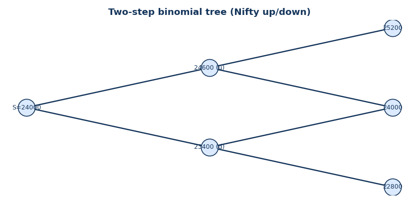

**Step 4 — backward induction.** Discount factor per step: `e^(-0.005) = 0.99501`.

Value at the up node (`S_u = 26,400`), looking at `C_uu` and `C_ud`:

`V_u = 0.99501 * [0.3668 * 5,040 + 0.6332 * 1,080] = 0.99501 * [1,848.4 + 683.9] = 0.99501 * 2,532.3 = 2,519.7`

Value at the down node (`S_d = 22,800`), looking at `C_ud` and `C_dd`:

`V_d = 0.99501 * [0.3668 * 1,080 + 0.6332 * 0] = 0.99501 * 396.1 = 394.1`

Value today, looking at `V_u` and `V_d`:

`V_0 = 0.99501 * [0.3668 * 2,519.7 + 0.6332 * 394.1] = 0.99501 * [924.1 + 249.6] = 0.99501 * 1,173.7 = 1,167.8`

**The fair value of the Nifty 24,000 call is about ₹1,168 per index unit.** At a lot size of about 75, one contract costs roughly `1,168 * 75 ≈ ₹87,600`.

**Step 5 — the replication check (today's hedge).** The hedge ratio at the root:

`delta = (V_u - V_d) / (S_u - S_d) = (2,519.7 - 394.1) / (26,400 - 22,800) = 2,125.6 / 3,600 = 0.59`

To replicate the call today you would hold 0.59 units of Nifty (worth `0.59 * 24,000 ≈ ₹14,170`), funding `≈ ₹13,000` of it by borrowing and putting in `≈ ₹1,168` of your own money — which is, of course, exactly the option's price. The recipe and the price agree.

**A taste of early exercise (American put).** Switch to a one-stock setting where options are American. Take a put with `K = 26,000` on the same kind of tree with `u = 1.10, d = 0.90` (`S_dd = 19,440`). At the down node `S_d = 21,600`, the *continuation* value works out to about ₹4,270, but exercising immediately gives intrinsic `26,000 - 21,600 = 4,400`. Since `4,400 > 4,270`, the rational holder **exercises early**, and the node is worth 4,400, not 4,270. Rolling that back, the American put is worth about ₹2,632 versus a European ₹2,571 — the extra **₹61 is the early-exercise premium** the tree captured and Black-Scholes would have missed.

## Common mistakes / risk note

- **Thinking `p` is the chance of an up move.** It is not a forecast; it is a pricing weight under which growth equals the risk-free rate. Bet your *directional* view with sizing, never by tweaking `p`.
- **Garbage `u` and `d`.** The whole model's realism rides on the up/down factors, which come from your **volatility** estimate (`u = e^(sigma*sqrt(dt))`). Feed it the wrong sigma and a perfect tree gives a perfectly wrong price. India VIX is your starting point for sigma.
- **Too few steps.** A 1- or 2-step tree is for *learning*. For a real quote you need many steps to approach the true (Black-Scholes-like) value; coarse trees can be off by a lot, especially near the money.
- **Forgetting Indian settlement reality.** The American early-exercise check is irrelevant for Nifty/Bank Nifty (European, cash-settled) but real for NSE stock options (American, physically settled — and physical delivery brings its own margin and assignment headaches at expiry).
- **The honest risk.** Pricing tells you what an option is *worth*, not whether you will *make money*. A correctly-priced long call still usually expires worthless; correctly-priced option *selling* still carries large, sometimes undefined, losses. SEBI studies find roughly 9 in 10 retail F&O traders lose money. A fair price is a starting point for risk management, not a promise of profit.

## Key takeaways

- An option can be **replicated** by a portfolio of underlying + borrowing; its fair price is what that portfolio costs to build, enforced by arbitrage.
- Over one step, `delta = (Payoff_up - Payoff_down) / (S*u - S*d)` is the hedge ratio, and price = `delta*S` minus borrowing.
- The clean pricing formula is `Option = e^(-r*T) * [p*Payoff_up + (1-p)*Payoff_down]`, with `p = (e^(r*T) - d) / (u - d)`.
- `p` is the **risk-neutral** probability — a pricing device, *not* the real-world chance of an up move. Real probabilities never enter replication.
- **Backward induction** prices a multi-step tree by applying the one-step formula repeatedly from expiry back to today.
- As the number of steps grows, the binomial price **converges to Black-Scholes**.
- The tree handles **American** options by taking `max(continuation value, exercise value)` at every node — the one thing Black-Scholes cannot do.

## Practice problems

1. **Conceptual.** Two traders disagree completely about where Nifty is heading next month, yet they compute the same option price with a one-step tree. Explain how that is possible.
2. **One step, no interest.** Spot Nifty 24,000; over one step it goes to 26,400 (up) or 21,600 (down). Price the 24,000 **put** by building a replicating portfolio (ignore interest). Find `delta`, the borrowing/lending, and the price.
3. **Risk-neutral probability.** Using `u = 1.10`, `d = 0.90`, `r = 7%` per year, and a one-month step, compute `p`. Then price a 24,000 call with `Payoff_up = 2,400`, `Payoff_down = 0`.
4. **Two-step put.** On the worked-example tree (`S = 24,000`, `u = 1.10`, `d = 0.95`, two monthly steps, `r = 6%`, `p = 0.3668`), price the **European** 24,000 put. Terminal levels are 29,040 / 25,080 / 21,660.
5. **Put-call parity check.** From the worked-example call value (₹1,168) and your answer to problem 4, verify they are consistent with put-call parity `Call - Put = S - K*e^(-r*T)` (use `T = 2/12`).
6. **American early exercise.** On a one-step tree with `S = 24,000`, up to 26,400 or down to 21,600, `r = 6%`, one-month step, decide whether an American 26,000 **put** should be exercised today rather than held. Show the comparison.

## Solutions

**1.** Pricing comes from **replication**, not prediction. The two equations that pin down `delta` and the borrowing match the option's payoff in the up state and the down state separately; the *probability* of reaching either state never appears. Both traders hedge identically and pay identically. Their forecasts affect whether they choose to *buy or sell*, and in what size — not the fair price.

**2.** Put payoffs (`max(24,000 - S, 0)`): up `P_up = 0`; down `P_down = max(24,000 - 21,600, 0) = 2,400`.
`delta = (P_up - P_down) / (S_up - S_down) = (0 - 2,400) / (26,400 - 21,600) = -2,400 / 4,800 = -0.5`.
A negative delta means you **short** 0.5 units of Nifty (puts are replicated by shorting the underlying). The down equation (interest 0): `delta*S_down + L = 2,400`, i.e. `-0.5*21,600 + L = 2,400`, so `L = 13,200` — you **lend** ₹13,200 (the short sale raises cash, part of which you lend). Price = `delta*S + L = -0.5*24,000 + 13,200 = -12,000 + 13,200 = 1,200`. The put is worth **₹1,200**. (Sanity check via risk-neutral, `p = 0.5` at zero rates: `0.5*0 + 0.5*2,400 = 1,200`. Matches.)

**3.** `e^(r*dt) = e^(0.07/12) = e^0.005833 = 1.00585`. `p = (1.00585 - 0.90) / (1.10 - 0.90) = 0.10585 / 0.20 = 0.5292`.
`Call = e^(-0.005833) * [0.5292 * 2,400 + 0.4708 * 0] = 0.99418 * 1,270.1 = 1,262.7`. About **₹1,263**.

**4.** Put payoffs (`max(24,000 - S, 0)`): `P_uu = 0`; `P_ud = 0`; `P_dd = max(24,000 - 21,660, 0) = 2,340`. Discount per step `0.99501`.
`V_u = 0.99501 * [0.3668*0 + 0.6332*0] = 0`.
`V_d = 0.99501 * [0.3668*0 + 0.6332*2,340] = 0.99501 * 1,481.7 = 1,474.3`.
`V_0 = 0.99501 * [0.3668*0 + 0.6332*1,474.3] = 0.99501 * 933.5 = 928.8`. The European put is worth about **₹929**.

**5.** `K*e^(-r*T) = 24,000 * e^(-0.06*2/12) = 24,000 * e^(-0.01) = 24,000 * 0.99005 = 23,761.2`.
`S - K*e^(-r*T) = 24,000 - 23,761.2 = 238.8`.
`Call - Put = 1,168 - 929 = 239`. The two sides agree to within rounding (≈ 239), confirming the call and put we priced off the *same* tree are internally consistent — a good way to catch arithmetic slips.

**6.** Risk-neutral `p` (from problem-3 style at `r = 6%`): `p = (1.00501 - 0.90)/0.20 = 0.5251`. Put payoffs at `K = 26,000`: up `max(26,000 - 26,400, 0) = 0`; down `max(26,000 - 21,600, 0) = 4,400`.
**Continuation value** today `= e^(-0.005) * [0.5251*0 + 0.4749*4,400] = 0.99501 * 2,089.6 = 2,079.2`.
**Exercise value** today `= max(26,000 - 24,000, 0) = 2,000`.
Since `2,079.2 > 2,000`, **hold — do not exercise today**. (Early exercise becomes worthwhile only deeper in the money, where intrinsic value overtakes the discounted continuation value, as in the chapter's two-step American example.)

# Chapter 19: Black-Scholes-Merton I — The Intuition

In 1973, three economists wrote down a single equation that told traders, for the first time, what an option *should* cost — not as an opinion, but as a number forced on you by the rest of the market. It won a Nobel Prize and built the modern derivatives industry. Yet the most important idea behind it is not the formula at all. It is a startling claim: an option is not really a separate thing to be priced. It is a *recipe* — a self-adjusting mixture of the underlying and cash that, if you follow it precisely, reproduces the option's payoff exactly. And if you can build the option out of ingredients the market already quotes, then the fair price of the option is simply the cost of the ingredients. No guessing about the future required.

This chapter teaches that idea before any formula appears: why an option can be *replicated* by holding delta units of the underlying, why that replication lets the real-world expected return vanish from the answer (the "risk-neutral" trick), why prices are modelled as lognormal, and what the terms N(d1) and N(d2) really mean. The formula and a worked Nifty example come in the next chapter. Here we build the *understanding* that makes that formula obvious instead of magical.

## Core concepts

### The big idea: an option is a hedging recipe in disguise

Forget options for a second. Imagine you sell a friend a promise: "If Nifty closes above 24,000 next Thursday, I'll pay you whatever it is above 24,000." You have just sold a call. The terrifying question: how much should you charge, and how do you avoid being wiped out if Nifty rockets?

Here is the insight that started everything. Suppose that every moment you hold *some* quantity of Nifty futures against your promise. When Nifty is far below 24,000 your promise is nearly worthless, so you hold almost no futures. When Nifty is far above 24,000 you are almost certain to pay out the full difference, so you hold close to one full unit — every point Nifty rises is then matched by a point of hedge gain. In between, you hold a fraction.

This fraction — units of underlying held per option — is the **hedge ratio**, and it is exactly the Greek **delta** you met earlier. The fact Black, Scholes, and Merton proved is this: if you continuously adjust your holding to keep delta units of the underlying against each option, your hedged position has *no* exposure to market direction. Whatever Nifty does on a small move, your option loss is cancelled by your futures gain. You have manufactured the option's payoff out of stock and cash.

The chain of logic then snaps shut:

1. A perfectly delta-hedged option position is **riskless** over each instant.
2. A riskless position can earn only the **risk-free rate** — otherwise there is free money (arbitrage), and traders pounce until the gap closes.
3. Therefore the cost of running the hedging strategy *is* the fair price of the option. Pay more and you overpaid for something you could have built yourself; charge less and you handed a competitor an arbitrage.

The option's price is not a forecast. It is **the cost of the cheapest strategy that replicates it** — the whole soul of Black-Scholes.

### Replication: building an option from stock and cash

Let us make the recipe concrete without heavy maths. To replicate one Nifty call, at every instant you hold **delta units of the underlying** (the directional ingredient — it rises when Nifty rises, mimicking the call) plus **a borrowing or lending of cash** (the financing ingredient that pins the value to the right level).

As Nifty drifts, delta changes, so you must trade: buy more underlying as the market rises through the strike, sell as it falls. This constant tweaking is **dynamic hedging** (or **delta hedging**). In theory it is continuous; in real Indian markets a trader rebalances at intervals — every few minutes, or whenever delta drifts past a threshold.

This strategy is self-financing: once you put up the initial amount, all the rebalancing trades fund themselves, and the final value of the portfolio equals the option's payoff exactly. That initial amount — the seed capital the recipe needs — is the option's theoretical price. Black-Scholes computes that seed capital in closed form, so you do not have to simulate the whole hedging path to find it.

A vital consequence: the seller who delta-hedges is not betting on direction. They are *manufacturing* the option and selling it at cost-plus. Their real exposure is to whether the underlying moves *more or less* than the price assumed — that is, to volatility. This is why professionals say option trading is really **volatility trading**.

### Risk-neutral valuation: why the stock's expected return disappears

Now the part that shocks every newcomer. Ask a hundred investors what return Nifty will earn next year and you get a hundred answers — 8%, 12%, 15%. Surely a call's price depends on which is right? A bullish view should make calls worth more.

It does not. The expected return on the underlying **does not appear** in the option price at all. Here is the intuition. Because you hedge the direction away, your profit or loss no longer depends on which way Nifty goes — only on how *much* it moves. And if the answer cannot depend on the direction, it cannot depend on your forecast of the direction either. The optimist and the pessimist, if both hedge, must arrive at the *same* fair price — otherwise one is offering the other an arbitrage.

This licenses a beautiful shortcut called **risk-neutral valuation**. Since the true expected return drops out, we are free to pretend we live in an imaginary world where every asset is expected to grow at the **risk-free rate** (in India, think of a short government treasury bill, currently around 6-7%). This pretend world is the **risk-neutral measure**: nobody demands extra reward for taking risk, so all expected returns collapse to the risk-free rate. In that world the recipe for any option price becomes astonishingly simple:

`Option price = (expected payoff at expiry, in the risk-neutral world) discounted at the risk-free rate`

Or in words: **price = discounted expected payoff under the risk-neutral measure.** Take every possible expiry level of Nifty, weight each by its risk-neutral probability, multiply by the option's payoff there, average, and discount back to today at the risk-free rate. That average is the price.

Two cautions that matter enormously. First, the risk-neutral probabilities are **not** real-world odds — the risk-neutral chance that Nifty finishes above 24,000 is generally *not* the true chance, but a pricing device that builds in the market's risk preferences automatically; do not read them as forecasts. Second, risk-neutral valuation is a *consequence* of replication, not a separate assumption — it works **because** you can hedge, so where hedging breaks down (gaps, illiquidity, jumps), the clean pricing breaks down too.

### The lognormal model: how Black-Scholes imagines prices move

To compute that expected payoff, the model needs an assumption about how Nifty wanders between now and expiry. Black-Scholes makes the simplest sensible choice.

It assumes the *percentage returns* of the underlying are **normally distributed** — the familiar bell curve. Each instant, Nifty earns a tiny random return drawn from that curve, like a continuous stream of small coin-flips. The model works with returns, not rupee changes, because a 100-point move means something very different at Nifty 8,000 than at Nifty 24,000.

When normal returns compound continuously, the *price* follows a related distribution called **lognormal** — meaning the logarithm of the price is normally distributed. Two features are worth carrying in your head:

- **Prices cannot go negative.** A stock can fall 100% but no further. Normal returns, compounded, produce a price distribution that bottoms out at zero and never crosses it — matching reality, since Nifty cannot print a negative number.
- **The distribution is skewed to the right (a long upper tail).** Because gains compound, a run of good returns can carry the price very high, while a run of bad returns can only push it toward zero. The terminal-price picture is lopsided: a tall hump on the left, a long thin tail stretching right.

This lognormal "fan" of possible expiry levels is the canvas on which the option payoff is painted. The model also assumes **volatility** (sigma — the width of the return bell curve) is constant and that markets are frictionless (no transaction costs, continuous trading, one borrowing/lending rate). These are wrong in detail — volatility is not constant, India sees gaps around results and budgets, and STT and brokerage are real costs — but wrong in *understandable* ways. The chapters on the volatility smile and the Greeks are essentially the story of how traders patch these known flaws.

### What N(d1) and N(d2) actually mean

The Black-Scholes formula (next chapter) contains two terms, N(d1) and N(d2). The N(.) is the **cumulative normal distribution** — a function that turns a number into a probability between 0 and 1, the area under the bell curve up to that point. You do not need the algebra yet, but you should own the meaning of the two outputs, because traders quote them constantly.

**N(d2) is the risk-neutral probability that the option finishes in the money.** For a 24,000 call, N(d2) is roughly the pricing-world chance that Nifty closes above 24,000 at expiry. If N(d2) = 0.40, the model sees about a 40% risk-neutral chance the call expires with intrinsic value. This is why an at-the-money option, with roughly even odds either way, tends to have N(d2) near 0.5. (Again: this is a risk-neutral probability for pricing, not a real-world forecast.)

**N(d1) is the option's delta — the hedge ratio.** It tells you how many units of the underlying to hold per call to stay delta-neutral, and equivalently how much the option's price moves for a one-point move in Nifty. If N(d1) = 0.55, a one-point rise lifts the call by about 0.55 points, and you hold 0.55 units of futures per call to hedge it. Deep in-the-money, delta approaches 1 (the option behaves like the underlying); deep out-of-the-money, it approaches 0 (the option barely reacts).

So the call price has a clean economic reading: **expected money in (the asset, weighted by N(d1)) minus expected money out (the strike, weighted by N(d2))**. The formula is not an arbitrary cluster of symbols — it is "expected money in, minus expected money out," dressed in normal-distribution clothing.

### What the model actually gives a working trader

You will rarely trade purely off a Black-Scholes "fair value," because the real market sets the price and you back out the **implied volatility** instead. So why does every professional desk live and breathe it? Three gifts:

1. **A fair value to argue against.** The model turns a messy quote into one clean question: what volatility is this price implying, and will the world be more or less volatile than that? It converts price-picking into volatility-picking — a sharper, more tradeable judgement.
2. **The Greeks.** Differentiate the formula and you get delta, gamma, theta, vega, and rho — the sensitivities that tell you exactly how your position bleeds or blooms as the underlying, time, and volatility change. They are your risk dashboard, and they fall straight out of this one equation.
3. **A common language.** When a Mumbai desk quotes a Nifty option "at 13 vol," every other desk knows precisely what is meant, regardless of spot, strike, or days to expiry. Black-Scholes is the shared coordinate system the whole market uses to talk about value.

## Worked example (₹, Nifty)

Black-Scholes is famous for its formula, but its *logic* is just the delta-hedge recipe, and you can feel that logic with simple arithmetic. Let us watch a market-maker manufacture a Nifty call.

**Setup.** Nifty spot is 24,000. A market-maker sells one near-term 24,000 call (current lot size is about 25 units, but we reason per unit). The option is at-the-money, and from the chain its delta is roughly 0.50 — so N(d1) is about 0.50.

**The hedge.** To neutralise direction, the maker buys 0.50 units of Nifty (via futures) against the call they sold. Now consider a small move:

- Nifty rises 20 points to 24,020. The call they are short gains about delta * 20 = 10 points, a *loss* of 10 to the seller; their 0.50 units of futures gain 0.50 * 20 = 10. **Net: roughly zero.**
- Nifty falls 20 points to 23,980. The short call loses about 10 points, a *gain* of 10 to the seller; the futures hedge loses 10. **Net: again roughly zero.**

This is the engine of the whole theory: hedged, the maker does not care which way Nifty goes. But notice what they *do* care about. As Nifty rises the call's delta climbs above 0.50; as it falls, delta drops toward 0. To stay neutral the maker must **buy as Nifty rises and sell as it falls** — buying high and selling low, repeatedly, each round trip costing a little. That steady cost is the price of the option, and it grows when Nifty thrashes around more — which is, in arithmetic form, why the price depends on volatility and not on whether you are bullish.

**The risk-neutral reading.** Suppose the chain also tells us N(d2) is about 0.46. The model is saying there is roughly a 46% risk-neutral chance Nifty finishes above 24,000 at expiry. Valued as discounted expected payoff, the call is "about a 46% chance of finishing in the money, times an expected in-the-money amount, discounted back at roughly 6-7% per year for the few days to expiry" — which is exactly what the next chapter's formula computes. You can already *narrate* a Black-Scholes price: probability of finishing in the money, expected payoff if you do, discounted to today, with direction hedged away.

## Common mistakes / risk note

- **Reading N(d2) as a real-world probability.** N(d2) is the *risk-neutral* chance of finishing in the money. The true chance is usually different, because the risk-neutral world deliberately distorts the odds to bake in risk preferences. Do not treat "the market says there's a 46% chance Nifty closes above 24,000" as a forecast.
- **Believing the price forecasts direction.** The hardest idea to accept is that your bullish or bearish view does *not* enter the fair price. If you are bullish, the right expression is to *buy* the option, not to argue it is mispriced because you expect a rally. The model already hedged direction out.
- **Trusting the assumptions too literally.** Black-Scholes assumes constant volatility, no gaps, frictionless continuous trading, and one interest rate. Indian reality breaks every one: volatility spikes around RBI policy, the Budget, and results; Nifty gaps overnight; STT, brokerage, and spreads make rehedging costly; liquidity thins in far strikes. The model is a clean first draft, not gospel.
- **Forgetting that replication can fail when you need it most.** The whole edifice rests on delta-hedging continuously. In a fast gap — a circuit breaker, a shock open — you cannot rebalance and the "riskless" hedge stops being riskless. An option seller who has internalised "it's all hedged" can be wiped out by a single gap. Option *selling* carries large, sometimes undefined, risk precisely because the hedging assumption is an idealisation.
- **Over-respecting "fair value."** The market price is the real authority; the model is a translator. Use it to extract implied volatility and the Greeks, not to declare the market wrong.

## Key takeaways

- An option can be **replicated** by continuously holding delta units of the underlying plus cash; its fair price is simply the **cost of that hedging recipe**, forced by no-arbitrage.
- Because delta-hedging removes directional exposure, the underlying's **real-world expected return drops out** of the price — your bullishness or bearishness does not change fair value.
- This allows **risk-neutral valuation**: price = discounted expected payoff in a pretend world where everything grows at the risk-free rate. Those probabilities are pricing devices, not forecasts.
- Black-Scholes models the underlying as **lognormal** — normal percentage returns compounding into a right-skewed price distribution that can never go negative.
- **N(d2)** is the risk-neutral probability of finishing in the money; **N(d1)** is the **delta** (hedge ratio). The call price reads as "expected money in, minus expected money out."
- For a trader the model delivers a **fair value / implied vol** to trade against, the **Greeks** as a risk dashboard, and a **common language** ("quoting in vol"). Its idealised assumptions are exactly why the smile and Greeks chapters exist.

## Practice problems

1. **Conceptual.** Explain why two traders — one expecting Nifty to rise 15% this year, one expecting it to fall 5% — must agree on the fair price of the same Nifty call, assuming both can delta-hedge.

2. **Conceptual.** A friend says, "The Black-Scholes price of the 24,000 call tells me there's a 46% chance Nifty will close above 24,000, so I'll bet accordingly." What is wrong with this reasoning?

3. **Numeric (hedge ratio).** A market-maker is short 4 lots of a Nifty call with delta 0.45 (lot size 25). How many units of futures must they buy to be delta-neutral? If Nifty then rises 30 points, estimate the P&L on the option, on the hedge, and the net.

4. **Conceptual.** Why does Black-Scholes model *returns* as normal rather than modelling rupee price changes as normal? Give one concrete problem that modelling rupee changes directly would create.

5. **Conceptual.** A delta-hedged seller says, "I have no risk because I'm hedged." Identify two distinct ways this claim can fail in the Indian market.

6. **Numeric / intuition.** For a deep ITM Nifty call, N(d1) is about 0.95 and N(d2) about 0.93. For a deep OTM call, both are near 0.05. Explain what each pair tells you about (a) how to hedge and (b) the chance of finishing in the money.

## Solutions

1. Delta-hedging cancels the directional part of the payoff: once hedged, profit depends only on how *much* Nifty moves (volatility), not on direction. Since the fair price cannot depend on the direction of the move, it cannot depend on either trader's *forecast* of direction. If they disagreed on price, one would be handing the other a riskless arbitrage, so competition forces them to the same number despite opposite views.

2. The 46% figure is N(d2), a **risk-neutral** probability — a pricing construct from an imaginary world where all assets grow at the risk-free rate. It deliberately embeds the market's risk preferences and is generally *not* the real-world chance of the event. Betting on it as a true forecast confuses a valuation device with a prediction; the actual probability of Nifty closing above 24,000 is usually different.

3. The maker is short 4 lots * 25 units = 100 call units, each with delta 0.45, so position delta is -100 * 0.45 = -45 (short calls give the seller negative delta). To be neutral they buy **45 units** of futures. If Nifty rises 30 points: the short call position loses about 45 * 30 = **1,350 points** as the calls gain value; the 45-unit futures hedge gains 45 * 30 = **1,350 points**. Net is approximately **zero**. (For larger moves gamma changes delta and the cancellation is no longer exact — that residual is the seller's real exposure.)

4. A rupee-change model treats a 100-point move as equally likely at Nifty 8,000 and at 24,000, which is unrealistic — moves scale with the price level, so percentage returns are the natural, level-independent unit. A concrete failure: a normal distribution on price *changes* assigns positive probability to the price going **negative**, impossible for a stock or index. The lognormal model, built from normal *returns*, keeps prices strictly positive.

5. (a) **Gap / jump risk:** delta-hedging assumes continuous rebalancing, but Nifty can gap overnight or hit a circuit breaker on a shock (Budget, geopolitics, RBI surprise). During a gap you cannot trade, the hedge is stale, and a short option can lose far more than expected. (b) **Frictions and discrete rebalancing:** STT, brokerage, and spreads make constant rehedging costly, and real traders rebalance only periodically, so the hedge is never perfect — the residual, driven by gamma and by realised volatility exceeding the priced level, is genuine and sometimes large.

6. (a) **Hedging:** delta 0.95 means you hold about 0.95 units per call — the deep-ITM option moves almost one-for-one with the index, like the underlying itself; delta 0.05 means you hold almost nothing, as the deep-OTM option barely reacts. (b) **Finishing in the money:** N(d2) of 0.93 says the deep-ITM call has roughly a 93% risk-neutral chance of expiring in the money, while 0.05 gives the deep-OTM call about a 5% chance. The numbers move together because an option almost certain to pay off both hedges like the underlying and is very likely to finish in the money.

# Chapter 20: Black-Scholes-Merton II — The Formula, d1/d2 & Assumptions

In the previous chapter you saw *where* the Black-Scholes-Merton (BSM) idea comes from: if you can continuously hedge an option with the underlying, the option's fair price is whatever makes that hedged portfolio earn the risk-free rate — no more, no less. That argument is the engine. This chapter hands you the finished machine: the actual closed-form formula that the whole options world quotes, the meaning of its mysterious `d1` and `d2`, and an honest accounting of the assumptions baked into it.

Think of BSM as a recipe that turns five plain ingredients — spot price, strike, time, interest rate, and volatility — into one number: the fair premium. You will never punch this formula into a calculator on the trading desk (your terminal does it in microseconds). But you must understand what every piece *means*, because that is what lets you read an option chain like a professional, sanity-check a quote, and — crucially — understand why the model is *wrong* in a specific, exploitable way that the market itself acknowledges through the "volatility smile."

## Core concepts

### The two formulas

For a European call and put on a non-dividend-paying underlying:

```
C = S * N(d1) - K * e^(-r*T) * N(d2)

P = K * e^(-r*T) * N(-d2) - S * N(-d1)
```

where

```
d1 = ( ln(S/K) + (r + 0.5*sigma^2)*T ) / ( sigma * sqrt(T) )

d2 = d1 - sigma * sqrt(T)
```

The symbols:

- `S` = current spot price of the underlying (e.g. Nifty at 24000).
- `K` = strike price of the option.
- `T` = time to expiry **in years** (a weekly expiry 4 days away is 4/365 ≈ 0.011 years).
- `r` = the risk-free interest rate per year, as a decimal (7% = 0.07).
- `sigma` = the annualised volatility of the underlying's returns, as a decimal (15% = 0.15). This is the one input you cannot look up — you must estimate or imply it.
- `e` = Euler's number, about 2.71828; `e^(-r*T)` is the discount factor that pulls a future rupee back to today's value.
- `ln` = natural logarithm.
- `N()` = the **standard normal cumulative distribution function (CDF)**. Feed it a number, it returns the probability that a standard normal random variable (mean 0, standard deviation 1) lands at or below that number. `N(0) = 0.5`, `N(1.65) ≈ 0.95`, `N(-1.65) ≈ 0.05`. It always returns something between 0 and 1.

Notice the elegant symmetry: the put formula is the call formula with the `N()` terms flipped to their mirror images (`N(-d1)`, `N(-d2)`). This is not a coincidence; it is **put-call parity** hiding inside the algebra, which we will use as a cross-check later.

### Reading the call formula in plain English

The call price is built from two competing pieces — think of it as **"what you expect to receive" minus "what you expect to pay."**

```
C = [ S * N(d1) ]  -  [ K * e^(-r*T) * N(d2) ]
       benefit              cost
```

- The first term, `S * N(d1)`, is the present value of *receiving the stock* if the option finishes in the money. You don't get the whole stock — you get it weighted by `N(d1)`, a number that scales how "deep" and how "likely" the upside is.
- The second term, `K * e^(-r*T) * N(d2)`, is the present value of *paying the strike* if you exercise. `K * e^(-r*T)` is the strike discounted back to today; multiplying by `N(d2)` weights it by the chance you actually exercise.

So a call is "the discounted expected stock you'll collect, minus the discounted expected cash you'll hand over." Everything reduces to those two weighted halves.

### What N(d2) means: roughly, the probability of finishing in the money

`N(d2)` is the closest thing the formula has to a clean probability. In the model's **risk-neutral** world (the pretend world from the hedging argument, where everything drifts at the risk-free rate), `N(d2)` is exactly the probability that a call expires in the money — that spot ends above the strike. For a put, `N(-d2)` is the probability it ends in the money (spot below strike).

This is enormously useful intuition. If you see a 24000 call priced so that `N(d2) ≈ 0.54`, the market is implicitly saying "about a 54% chance Nifty closes above 24000 at expiry" — under risk-neutral assumptions. Traders use this constantly to talk about an option's "probability of being in the money" or, by subtracting from 1, its **probability of expiring worthless**.

A health warning: this is the *risk-neutral* probability, not the real-world one — the real world drifts faster than `r`, so true odds differ. But as a quick, model-consistent read of "how likely is this strike to pay off," `N(d2)` is the number professionals reach for.

### What N(d1) means: the delta and the hedge ratio

`N(d1)` is even more important on a live desk, because **for a call, N(d1) is the delta** — the rate at which the option's price changes when spot moves by one point, and equivalently the number of units of the underlying you must hold to hedge one option.

- If `N(d1) = 0.56`, the call gains about ₹0.56 for every ₹1 Nifty rises, and to neutralise the directional risk of selling one call you would hold 0.56 "units" of Nifty exposure (in practice, futures or a basket).
- Deep in-the-money calls have `N(d1)` approaching 1 (they move almost one-for-one with spot, like owning the index). Deep out-of-the-money calls have `N(d1)` approaching 0 (they barely react). At-the-money is near 0.5.

So `N(d1)` is the "how much stock does this option behave like right now" term — the hedge ratio from the replication argument made concrete. `N(d2)`, by contrast, is the "will I be exercising" term. They are close in value but mean different things, and the gap between them (`sigma * sqrt(T)`, inside the exponentials) is precisely the contribution of volatility and time.

### Decoding d1 and d2 themselves

Don't be intimidated by `d1`. Read its numerator:

```
ln(S/K) + (r + 0.5*sigma^2)*T
```

- `ln(S/K)` measures **moneyness on a log scale**. If spot equals strike, this is `ln(1) = 0`. If spot is above strike (call already in the money), it's positive; below, negative. Logs are used because returns compound multiplicatively, not additively — a move from 100 to 110 and from 110 to 121 are "the same size" in log terms.
- `(r + 0.5*sigma^2)*T` is the **expected log-drift** of the underlying over the life of the option in the risk-neutral world: it grows at the risk-free rate, plus a `0.5*sigma^2` convexity adjustment that arises because of the lognormal math (Jensen's inequality — the average of a lognormal sits above its median).

The denominator `sigma * sqrt(T)` is the **total volatility over the option's life** — the standard deviation of the log-return between now and expiry. Note the `sqrt(T)`: volatility scales with the *square root* of time, not time itself, so doubling the days to expiry multiplies expected dispersion by about 1.41, not 2. This square-root-of-time rule is one of the most-used facts in all of options trading.

So `d1` is essentially "how many standard deviations is the (drift-adjusted) strike from spot," and `d2` is the same distance without the upper drift kicker — which is why `N(d2)` is the probability term while `N(d1)` carries the extra `0.5*sigma^2` that makes it the hedge/delta term.

### The dividend-adjusted (Merton) version

The basic formula assumes the underlying pays no income. Real assets often do: stocks pay dividends, and an *index* like Nifty has a continuous dividend yield from its constituents. Robert Merton extended the model for a continuous dividend yield `q` (per year, as a decimal) by **replacing every `S` with `S * e^(-q*T)`** — the spot discounted for the dividends you forgo by holding the option instead of the stock:

```
C = S*e^(-q*T) * N(d1) - K*e^(-r*T) * N(d2)

P = K*e^(-r*T) * N(-d2) - S*e^(-q*T) * N(-d1)

d1 = ( ln(S/K) + (r - q + 0.5*sigma^2)*T ) / ( sigma * sqrt(T) )

d2 = d1 - sigma * sqrt(T)
```

The drift term becomes `(r - q)` because a dividend-paying asset grows more slowly in price terms (some of its return leaks out as cash). For Nifty, the dividend yield is small (roughly 1-1.5% currently), so for short weekly options the dividend effect is tiny but not zero. For single stocks around a big dividend, or for longer-dated options, it matters. India's index options are also **cash-settled and European**, which is exactly what BSM assumes — a nice fit. (American-style options, like some single-stock contracts, technically need a different model because of early exercise, but that is a later concern.)

### The assumptions — and where reality breaks them

BSM is a beautiful machine built on idealised parts. Knowing where those parts don't match reality is what separates a professional from someone who blindly trusts a screen. The core assumptions:

1. **Returns are lognormal with constant volatility.** The model assumes the underlying follows "geometric Brownian motion" — log-returns are normally distributed, and `sigma` is a single fixed number for the option's whole life. Reality: volatility *clusters* (calm periods and stormy periods), spikes during crashes, and is plainly not constant. India VIX itself moves every day.

2. **No jumps — prices move continuously.** The math assumes the price never gaps; it slides smoothly so you can always re-hedge. Reality: markets gap. A surprise RBI decision, an election result, a global shock, or a bad earnings print can move Nifty 3% between one print and the next, with no chance to hedge in between. Gap risk is real risk that the model ignores.

3. **Constant, known risk-free rate.** `r` is assumed fixed and the same for borrowing and lending. Reality: rates move and the rate you actually fund at is higher than the rate you earn. For short-dated options this matters little; for longer ones, more.

4. **Continuous, frictionless, costless trading.** The replication argument requires you to re-hedge constantly with zero transaction costs, infinitely divisible quantities, and no market impact. Reality: you re-hedge discretely, pay brokerage and STT, cross bid-ask spreads, post SPAN margin, and move the market when you trade size. Every re-hedge leaks money.

5. **No taxes or short-selling restrictions; the underlying is perfectly tradable.** Reality: STT on exercised options, capital-gains treatment, position limits, and the practical difficulty of shorting an index basket all intrude.

None of this makes BSM useless — it makes it a *common language*. The whole market agrees to speak in BSM terms, then prices in the messiness through the one free input: volatility.

### Why the volatility smile exists (preview)

Here is the punchline that the assumptions set up. Suppose BSM were perfectly true. Then every option on the same underlying and expiry — every strike — would have to be priced with the *same* `sigma`, because there is only one true volatility for the underlying. If you took market prices and ran the formula backwards to extract the volatility each price implies (the **implied volatility**), every strike would return the identical number. A flat line.

In real markets it is *not* flat. Plot implied volatility against strike and you get a **smile** or, in equity indices, a downward **skew** — far out-of-the-money puts trade at noticeably higher implied volatility than at-the-money options. Why? Because the assumptions above are false in a directional way. Markets jump (especially *down*), crashes are fatter-tailed than the lognormal allows, and traders pay up for crash protection. The market is, in effect, telling you it does not believe BSM's tidy bell curve — and it expresses that disbelief by bending the volatility input strike-by-strike. We devote a full later chapter to the smile and skew; for now, just lodge the idea: **the smile is the market's correction to BSM's wrong assumptions, written in the language of volatility.**

## Worked example (₹, Nifty)

Let's price an **at-the-money 24000 Nifty call** by hand, the way the formula demands, step by step.

**Inputs:**
- `S = 24000` (Nifty spot)
- `K = 24000` (at-the-money strike)
- `sigma = 0.15` (15% annualised volatility — a calm-market figure)
- `r = 0.07` (7% risk-free rate)
- `T = 30/365 = 0.08219` years (about a month to expiry)
- Dividends ignored (`q = 0`) for simplicity.

**Step 1 — Compute sigma * sqrt(T) (the total volatility over the option's life).**

```
sqrt(T) = sqrt(0.08219) = 0.28669
sigma * sqrt(T) = 0.15 * 0.28669 = 0.04300
```

Interpretation: over one month, Nifty's one-standard-deviation log-move is about 4.3%, i.e. roughly +/- 1032 points around 24000.

**Step 2 — Compute the drift term in the numerator of d1.**

```
ln(S/K) = ln(24000/24000) = ln(1) = 0
(r + 0.5*sigma^2)*T = (0.07 + 0.5*0.15^2) * 0.08219
                    = (0.07 + 0.01125) * 0.08219
                    = 0.08125 * 0.08219
                    = 0.006678
```

**Step 3 — Compute d1 and d2.**

```
d1 = (0 + 0.006678) / 0.04300 = 0.1553
d2 = d1 - sigma*sqrt(T) = 0.1553 - 0.04300 = 0.1123
```

Even though the call is exactly at the money, `d1` and `d2` are slightly positive — that is the risk-free drift nudging the expected terminal price above today's spot.

**Step 4 — Look up N(d1) and N(d2) from the standard normal table.**

```
N(d1) = N(0.1553) = 0.5617
N(d2) = N(0.1123) = 0.5447
```

Read those as: delta of this call is about **0.56** (it behaves like 0.56 units of Nifty), and the risk-neutral probability of finishing in the money is about **54.5%**.

**Step 5 — Discount the strike.**

```
K * e^(-r*T) = 24000 * e^(-0.07*0.08219)
             = 24000 * e^(-0.005753)
             = 24000 * 0.99426
             = 23862.31
```

**Step 6 — Assemble the call price.**

```
C = S*N(d1) - K*e^(-r*T)*N(d2)
  = 24000*0.5617 - 23862.31*0.5447
  = 13481.0 - 12998.1
  = 482.9
```

**The fair premium is about ₹483 per unit of Nifty.** At the current Nifty lot size of 75, one contract costs roughly `483 * 75 = ₹36,225` to buy.

**Sanity checks a pro would run:**
- An at-the-money call with a month to go and 15% vol should be worth a few hundred points — ₹483 passes the smell test.
- A rough rule of thumb for an ATM straddle is `0.8 * S * sigma * sqrt(T) = 0.8 * 24000 * 0.043 ≈ 826` for call + put combined; our call (₹483) plus a put of about ₹345 sums to ₹828 — bang on.
- The put price by put-call parity: `P = C - S + K*e^(-r*T) = 482.9 - 24000 + 23862.31 = 345.2`, i.e. about **₹345**, matching the straddle check. The slight gap between the call (₹483) and put (₹345) at the same strike is entirely the interest-rate carry on the discounted strike.

## Common mistakes / risk note

- **Putting time in days instead of years.** `T` must be in years. Plugging `T = 30` instead of `30/365` will produce an absurd price. This is the single most common beginner error.
- **Putting percentages in as whole numbers.** `sigma = 15`, not `0.15`, will blow the formula up. Always convert to decimals.
- **Treating N(d2) as the real-world probability of profit.** It is the *risk-neutral* probability of finishing in the money, and "in the money" is not the same as "profitable" — you still have to recover the premium you paid. A call that finishes ₹10 in the money after you paid ₹483 is a loss. Breakeven is strike plus premium, not the strike.
- **Trusting the formula's price over the screen.** If your BSM price disagrees with the live mid-price, the market is not wrong — your **volatility input** is. The market's price *defines* the implied volatility; the formula is a translator, not an oracle.
- **Forgetting the assumptions before a known event.** BSM assumes smooth, continuous, constant-vol markets. Around budget day, RBI policy, big results, or elections, gap risk and a vol spike make the model's "fair" price dangerously comforting. Long options can still bleed from theta even if you are right on direction; short options can be obliterated by a single gap. The model does not warn you — you have to.
- **The honest backdrop.** None of this changes the base-rate truth: most long options expire worthless, option selling carries large and sometimes undefined risk, and SEBI's own studies show roughly 9 in 10 retail F&O traders lose money. A pricing formula tells you what is *fair*, not what is *safe*.

## Key takeaways

- BSM turns five inputs (`S, K, T, r, sigma`) into one fair premium; only `sigma` cannot be observed and must be estimated or implied.
- The call is `S*N(d1) - K*e^(-r*T)*N(d2)` — "discounted expected stock received" minus "discounted expected cash paid"; the put mirrors it with `N(-d1)` and `N(-d2)`.
- `N(d1)` is the **delta / hedge ratio** (how much stock the option behaves like); `N(d2)` is approximately the **risk-neutral probability of finishing in the money**.
- `d1`'s numerator is log-moneyness plus risk-neutral drift; its denominator `sigma*sqrt(T)` is total volatility over the option's life — and volatility scales with **sqrt(time)**.
- The Merton extension swaps `S` for `S*e^(-q*T)` to handle a continuous dividend yield; India's European, cash-settled index options fit BSM cleanly.
- BSM's assumptions — lognormal returns, constant vol, no jumps, costless continuous hedging — are all violated in reality; the market patches the gap by varying implied volatility across strikes, which is the **volatility smile/skew**.

## Practice problems

1. **Concept.** In one sentence each, state what `N(d1)` and `N(d2)` represent on a live trading desk, and explain why `N(d1) > N(d2)` for a call.
2. **Numeric — d1/d2.** A Bank Nifty 52000 call has `S = 52500`, `K = 52000`, `sigma = 0.18`, `r = 0.07`, `T = 14/365`. Compute `sigma*sqrt(T)`, `d1`, and `d2`. (You need not finish the price.)
3. **Numeric — price.** Continuing problem 2, suppose you look up `N(d1) = 0.617` and `N(d2) = 0.589`. Compute the call premium per unit, and the cost of one lot if the Bank Nifty lot size is 30.
4. **Put-call parity.** For the ATM Nifty example in this chapter (`C = 482.9`, `S = 24000`, `K*e^(-r*T) = 23862.31`), find the fair price of the 24000 put without using the put formula directly.
5. **Assumptions.** It's the morning of the RBI policy announcement. Your BSM model, using yesterday's 12% volatility, says the ATM weekly straddle is "worth" ₹140, but the market is quoting ₹210. Explain in plain English why the market price is higher and what the ₹210 implies about the market's volatility view. Is the market "wrong"?
6. **Dividend adjustment.** A single stock trades at `S = 1000` with a continuous dividend yield `q = 0.03`. Write down the adjusted spot term `S*e^(-q*T)` you would feed into the Merton formula for a `T = 0.5` year option, and explain in one line why dividends lower a call's value.

## Solutions

**1.** `N(d1)` is the option's **delta** — the hedge ratio, i.e. how many units of the underlying you hold per option to neutralise direction (and roughly how much the premium moves per 1-point spot move). `N(d2)` is the **risk-neutral probability the option finishes in the money**. For a call, `N(d1) > N(d2)` because `d1 = d2 + sigma*sqrt(T)`, so `d1` is always the larger argument and `N()` is increasing; intuitively, the delta term carries an extra volatility/convexity kicker (the `0.5*sigma^2` drift) that the pure probability term does not.

**2.** 
```
sqrt(T) = sqrt(14/365) = sqrt(0.03836) = 0.19586
sigma*sqrt(T) = 0.18 * 0.19586 = 0.03525
ln(S/K) = ln(52500/52000) = ln(1.009615) = 0.009569
(r + 0.5*sigma^2)*T = (0.07 + 0.5*0.0324)*0.03836 = (0.07+0.0162)*0.03836 = 0.0862*0.03836 = 0.003307
d1 = (0.009569 + 0.003307) / 0.03525 = 0.012876 / 0.03525 = 0.3653
d2 = 0.3653 - 0.03525 = 0.3300
```
So `d1 ≈ 0.365`, `d2 ≈ 0.330`. (A slightly in-the-money call, deltas in the low-0.6s — consistent with the given `N` values.)

**3.** First discount the strike:
```
K*e^(-r*T) = 52000 * e^(-0.07*0.03836) = 52000 * e^(-0.002685) = 52000 * 0.997319 = 51860.6
C = S*N(d1) - K*e^(-r*T)*N(d2)
  = 52500*0.617 - 51860.6*0.589
  = 32392.5 - 30545.9
  = 1846.6
```
Premium ≈ **₹1,847 per unit**. One lot of 30 costs `1846.6 * 30 = ₹55,398`.

**4.** Use put-call parity, `P = C - S + K*e^(-r*T)`:
```
P = 482.9 - 24000 + 23862.31 = 345.2
```
The fair put price is about **₹345**, matching the chapter's straddle cross-check. (The call is dearer than the put at the same strike purely because of the interest carry embedded in discounting the strike — the right to *receive* the upside is worth slightly more than the right to *sell* at a strike whose present value is below spot.)

**5.** The market quote (₹210) sits well above your model value (₹140) because your `sigma` is stale. On a policy morning, traders expect a **larger-than-normal move and a possible gap** when the decision hits, so they bid up options to compensate for that risk — exactly the jump/changing-volatility behaviour BSM's constant-vol assumption ignores. Backing volatility out of ₹210 (running the formula in reverse) would yield an **implied volatility well above 12%** — that elevated number *is* the market's forecast of event risk. The market is not "wrong"; it is pricing information your yesterday-vol model doesn't contain. If anything, a model still showing ₹140 is the thing that's wrong, because it's blind to the event.

**6.** 
```
S*e^(-q*T) = 1000 * e^(-0.03*0.5) = 1000 * e^(-0.015) = 1000 * 0.98511 = 985.11
```
You would feed **985.11** in place of `S` (and use `r - q` in the drift). Dividends lower a call's value because the holder of the option, unlike the holder of the stock, does **not collect the dividends** paid before expiry; that forgone cash reduces the effective price the option is "tracking," so the right to buy is worth a little less.

# Chapter 21: Time Decay & American vs European

An option is a melting ice cube. From the day it is born to the moment it expires, it is shedding value — not because the market moved against you, but simply because there is less time left for anything to happen. The clock never pauses, never reverses, and on the final day it runs out completely. This is **time decay**, and it is the single most important force acting on every option price even when the index sits perfectly still.

This chapter does two things. First, it shows you the *shape* of decay — why it is slow and gentle far from expiry but turns into a cliff in the last few days, and why that cliff is steepest for at-the-money options while out-of-the-money options just quietly bleed to nothing. Second, it sorts out a question that confuses almost every beginner: the difference between **American** and **European** exercise, when early exercise actually pays, and why for Indian index traders the whole debate barely matters because you almost never exercise at all — you sell the option back.

## Core concepts

### Time decay: the price of a shrinking window

Recall from Chapter 6 that every premium splits into two parts:

`Premium = Intrinsic value + Time value`

Intrinsic value (`max(S - K, 0)` for a call, `max(K - S, 0)` for a put) is rock-solid — it just tracks where spot is versus the strike, and it does not decay. **Time value** is the perishable part. It is what you pay for *possibility*: the chance the option drifts further into profit before expiry. As the window shrinks, there is less room for that possibility to play out, so time value shrinks too. At the exact instant of expiry there is no window left at all, so:

`Time value at expiry = 0`, and `Premium at expiry = Intrinsic value`.

**Time decay** is the day-by-day loss of that time value, holding everything else (spot, volatility, interest rates) constant. Its Greek measure is **theta**, usually quoted as a negative number for a long option: theta = -8 means the option loses about ₹8 of value per day from the passage of time alone. We will study theta formally in the next chapter; here we focus on the *intuition and shape* of decay, which is what actually changes how you trade.

### Decay is not a straight line — it accelerates

The crucial fact is that time value does **not** melt at a constant rate. It decays slowly when expiry is far away and then accelerates, collapsing fastest in the final days.

The clean way to see why: time value scales roughly with `sqrt(T)`, where `T` is the time left to expiry. The square root is the key. Going from 30 days to 29 days barely changes `sqrt(T)`, so almost no value is lost. But going from 2 days to 1 day, then 1 day to 0, slashes `sqrt(T)` dramatically — so the value gushes out at the end.

A simple way to feel it: an option with four times as long to run is worth only about *twice* as much time value (because `sqrt(4) = 2`), not four times as much. Time is a depreciating asset whose rate of depreciation speeds up as it nears zero.

- **Far from expiry** (a monthly option with 25+ days left): an ATM option might shed only a point or two of time value per day — barely noticeable against normal price swings.
- **Expiry week**: decay becomes the dominant force; an ATM weekly option can lose a large chunk of its value every single day.
- **Expiry day**: whatever time value remains rushes to zero by the close.

This accelerating shape is exactly why Indian **weekly options** (Nifty and Bank Nifty have weekly expiries on fixed weekdays set by the exchange) are so punishing for buyers and so attractive to sellers: a weekly option lives entirely inside the steep part of the decay curve.

### The value curve: well before expiry vs on expiry day

Picture a long call's value plotted against the spot price. There are really two curves to hold in your head:

- **Well before expiry**, the value is a *smooth, gently rising curve* that sits comfortably *above* the intrinsic-value line everywhere. That cushion above intrinsic is the time value. The curve is rounded near the strike — the market is paying for both "it might go up more" and "it might come back."
- **On expiry day**, that smooth curve has collapsed down onto the hard "hockey-stick" of pure intrinsic value: flat at zero below the strike, then a straight 45-degree line above it. The cushion is gone.

So across the life of the option, the smooth rounded curve sags downward, day after day, until it lands exactly on the kinked intrinsic-value line at expiry. The figure below shows this descent for a single call — each lower curve is a day closer to expiry, with the lowest, kinked line being the expiry-day payoff.

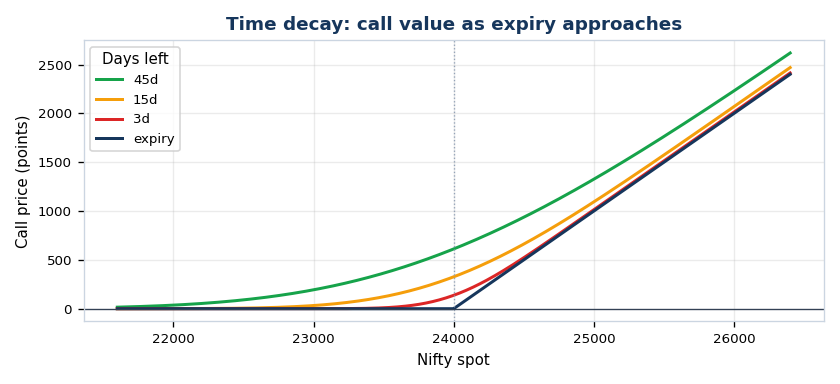

### Why ATM decay accelerates but OTM just bleeds steadily

Not all options decay the same way, and this is one of the most useful distinctions a trader can internalise.

- **At-the-money (ATM) options** carry the *most* time value of any strike (Chapter 6), and that value is what accelerates into the expiry-day cliff. Why the acceleration? Right up until the final hours, an ATM option is a live coin-flip — it could finish a little above or a little below the strike. That genuine uncertainty keeps its time value propped up... until the last day, when the coin must finally land. With no time left for the flip to resolve in your favour, the propped-up value falls off a cliff. ATM theta is small far out and *enormous* on expiry day.
- **Out-of-the-money (OTM) options** behave differently: they **bleed steadily to zero**. A deep-OTM call already has a low, fragile time value (it is unlikely to finish in the money), so there is less to lose and it leaks away in a smooth, grinding fashion rather than a final-day cliff. By the time expiry arrives, an OTM option that never came near its strike has quietly drained to almost nothing well before the close.
- **Deep in-the-money (ITM) options** have little time value to begin with (their premium is mostly intrinsic), so they too decay only modestly — most of their price is the non-decaying intrinsic part.

A clean mental summary: **ATM = cliff at the end; OTM = steady bleed throughout; deep ITM = barely decays.** The reason is the same one from Chapter 6 — time value is largest where the market is most unsure (at the money), and the expiry cliff is just that uncertainty finally being forced to resolve.

### American vs European: two kinds of exercise rights

Now switch topics from *when value decays* to *when you are allowed to use the option*. This is the American-versus-European distinction, and despite the names it has nothing to do with geography.

- **European option**: can be exercised **only at expiry**, never before. You hold the right, but you can cash it in at exactly one moment.
- **American option**: can be exercised **any time** up to and including expiry. You hold the same right plus the *flexibility* to use it early.

An American option therefore can never be worth *less* than the otherwise-identical European option — it includes everything the European has, plus an extra freedom. The interesting question is whether that extra freedom is ever worth anything. Mostly, it is not.

Two terms to keep straight: **exercising** means invoking your right — buying the stock at the strike (call) or selling it at the strike (put). **Selling/squaring off** means handing the option contract to another buyer for its premium. These are different actions with very different payoffs, and confusing them costs beginners money.

### Why you almost never exercise early

Here is the principle that resolves 95% of the confusion: **exercising an option early throws away its remaining time value.** When you exercise, you collect only the intrinsic value (`S - K` or `K - S`). But if you *sell* the option in the market instead, you collect intrinsic value *plus* the leftover time value. As long as any time value remains and the option is liquid, selling beats exercising.

`Sell the option → you get Intrinsic + Time value`
`Exercise the option → you get Intrinsic only (you forfeit the time value)`

So for the vast majority of situations, early exercise is simply *leaving money on the table*. The standard result, which you can take as a rule of thumb: **it is never optimal to exercise an American call early on a non-dividend-paying stock.** You would always do better to sell it. This is why American and European calls on such stocks have essentially the same value — the early-exercise right is worthless.

### The two genuine exceptions

Early exercise *can* be optimal in exactly two narrow cases. Both are worth knowing precisely so you recognise how rare they are.

1. **Deep in-the-money American puts.** A put's maximum possible value is capped — the stock can only fall to zero, so the most a put can ever be worth is its strike `K`. When a put is very deep in the money, it has almost no time value left, and exercising lets you collect the strike *cash now* and earn interest on it, rather than waiting until expiry. The time value of money on that locked-in cash can exceed the tiny remaining option time value, so early exercise becomes optimal. This is the textbook case where an American put is genuinely worth more than a European one.
2. **American calls just before a large dividend.** A stock's price drops by roughly the dividend amount on the ex-dividend date. If you hold a call, that drop hurts you and you do not receive the dividend (you do not own the shares). If the dividend is large enough to outweigh the call's remaining time value, it can pay to exercise *the day before* the ex-date, take delivery of the shares, and capture the dividend. Outside of a chunky dividend, this never applies.

Notice what is *not* on this list: ordinary ITM calls, ordinary ATM options, anything OTM, and anything with meaningful time value left. For the everyday option, early exercise is a mistake.

### The Indian setup: index European, stock American, all auto-handled

Now the part that matters most for an NSE F&O trader, because it determines what you can and cannot do:

- **Index options (Nifty, Bank Nifty, Fin Nifty, etc.) are European and cash-settled.** You cannot exercise them early even if you wanted to — they pay out only at expiry, against the exchange's settlement value, in cash. There is no stock to deliver. The American-vs-European debate is therefore *moot* for index options: you have no early-exercise right, and you do not need one, because you can always sell the option back in the very liquid market any second the market is open.
- **Single-stock options on NSE are American-style but physically settled**, and crucially they are **auto-exercised at expiry** by the exchange if they finish in the money (ITM). You do not phone anyone or click "exercise" — the exchange automatically exercises any ITM stock option at expiry, and physical settlement kicks in: the call holder *takes delivery* of the shares (and must pay the full contract value), the put holder *delivers* shares. This auto-exercise of ITM stock options at expiry is a frequent source of nasty surprises (see the risk note).

The practical upshot: in India you essentially never *manually* exercise. Index options can't be exercised early at all; stock options get auto-exercised for you at expiry. The skill is not "when do I exercise" — it is "when do I sell, and do I want to be holding an ITM stock option *into* expiry given physical settlement."

### The practical rule: capture value by selling, not exercising

Put it all together and the working rule for an Indian trader is simple: **you realise an option's value by squaring it off (selling it back) in the market, not by exercising it.** Selling captures intrinsic *plus* time value, keeps you in cash, and sidesteps physical-delivery headaches. Exercising — when it even happens — captures intrinsic only and, for stocks, can saddle you with a large delivery obligation. The only times you would deliberately let a stock option go to auto-exercise are when you genuinely want the underlying shares (or are running a covered/hedged position designed for delivery).

## Worked example (₹, Nifty/Bank Nifty)

Let's trace decay across the final days of a weekly Nifty option, and then test the exercise logic.

**Setup.** It is Monday. **Nifty spot = 24,000**, and we follow the **24,000 CE** (the ATM weekly call) into Thursday's expiry. Assume India VIX and spot stay roughly flat so we isolate pure time decay. A realistic decay path for that ATM call's premium (all of it time value, since intrinsic is zero at the strike) might look like this:

| Day | Days to expiry | ATM 24,000 CE premium (₹) | Time value lost that day (₹) |
|---|---|---|---|
| Monday | 4 | 96 | — |
| Tuesday | 3 | 80 | 16 |
| Wednesday | 2 | 60 | 20 |
| Thursday morning | ~0.3 | 34 | 26 |
| Thursday close (expiry) | 0 | 0 | 34 |

Read the right-hand column: the *daily* loss grows from ₹16 to ₹20 to ₹26 to a final ₹34. That is the acceleration — the decay cliff — in numbers. The option lost only ₹16 on Monday→Tuesday but a full ₹34 on the last day, even though the index never moved. With a Nifty lot of about 75 units (lot sizes are set by the exchange and change periodically), the buyer who held that lot from Monday open to expiry lost:

`96 points * 75 = ₹7,200` per lot — the *entire* premium — purely to decay, with Nifty unchanged.

**Now contrast an OTM call.** Take the **24,300 CE** (300 points OTM) over the same period, starting at ₹30 of premium (all fragile time value). Its path might be ₹30 → ₹20 → ₹11 → ₹4 → ₹0. Notice the difference: no final-day *cliff*, just a steady grind to zero — it had already bled most of its small value before expiry day even arrived. ATM cliffs; OTM bleeds.

**The exercise test.** Suppose instead you hold a **23,500 CE** (deep ITM) on Wednesday with spot at 24,000. Intrinsic = max(24000 - 23500, 0) = 500 points. Because it is an *index* option (European, cash-settled), you *cannot* exercise it early anyway. But even if it were an American stock option, exercising on Wednesday would hand you only the 500 points of intrinsic, while *selling* it would fetch, say, 512 — the 500 intrinsic plus 12 of leftover time value. Selling wins by 12 points (`12 * 75 = ₹900` per lot). That ₹900 is exactly the time value you would have thrown away by exercising. This is the rule in rupees: **sell, don't exercise.**

## Common mistakes / risk note

- **Believing a flat market is safe for buyers.** It is the opposite. If Nifty goes nowhere, your long option still loses time value every day, fastest in expiry week. "No move" is a losing scenario for a buyer.
- **Holding longs into the expiry-day cliff "hoping it comes back."** Expiry day is the steepest decay of all for ATM options — the value you are counting on to recover is evaporating fastest at precisely that moment.
- **Exercising instead of selling (where exercise is even possible).** Exercising forfeits all remaining time value. Almost always, squaring off in the market captures more. Early exercise pays only for deep-ITM puts or calls just before a big dividend — narrow cases that rarely touch a retail Indian trader.
- **The physical-settlement trap on stock options.** This is the big one in India. An NSE single-stock option that finishes even slightly ITM is **auto-exercised** at expiry into *physical delivery*. A trader holding a cheap ITM stock call into expiry can suddenly owe the **full contract value** of shares (lakhs of rupees), far beyond the small premium paid — and faces hefty margin and possible penalties. Always square off ITM stock options before expiry unless you truly intend to take or give delivery. (Index options have no such trap — they cash-settle.)
- **Confusing "long option = guaranteed to gain if right."** You must be right *enough and fast enough* to outrun decay. A 95-point ATM call needs roughly a 95-point favourable move just to break even at expiry, because that move only replaces the time value you paid.
- **The honest other side.** Selling options to harvest this decay is *not* free money. The tailwind is real, but a naked seller's loss is large and effectively undefined, and a fast adverse move plus a volatility spike can dwarf months of collected decay. SEBI studies find roughly **9 in 10 retail F&O traders lose money** — careless buyers fighting decay *and* over-leveraged sellers blown up by the rare big move.

## Key takeaways

- Time decay is the daily loss of an option's time value; at expiry, time value is zero and `Premium = Intrinsic value`.
- Decay is **not linear** — it scales with `sqrt(T)`, so it is gentle far from expiry and *accelerates* into a cliff in the final days.
- **ATM options cliff at the end; OTM options bleed steadily to zero; deep-ITM options barely decay.**
- The option's smooth value curve sags down over time and lands exactly on the kinked intrinsic-value "hockey stick" at expiry.
- **European** = exercise only at expiry; **American** = exercise any time. Early exercise forfeits time value, so it is almost never optimal — only for deep-ITM puts or calls just before a large dividend.
- In India: **index options are European and cash-settled**; **stock options are American-style, physically settled, and auto-exercised when ITM at expiry.**
- You capture an option's value by **selling it back**, not by exercising — and you should square off ITM stock options before expiry to avoid physical-delivery surprises.

## Practice problems

1. **(Conceptual)** Two Nifty options have identical strikes and identical premiums today, but one has 3 days to expiry and the other has 27 days. Which one will lose a larger *fraction* of its time value over the next single day, and why?

2. **(Numeric)** An ATM weekly Nifty call follows this premium path on consecutive days with spot unchanged: ₹84 → ₹70 → ₹52 → ₹28 → ₹0. Compute the value lost each day and confirm whether the decay is accelerating. What is the total rupee loss on one lot of 75?

3. **(Conceptual)** A trader holds a deep-ITM American call on Reliance with plenty of time value remaining and no upcoming dividend. He is tempted to exercise early to "lock in the gain." What should he do instead, and why is exercising a mistake here?

4. **(Conceptual)** Explain why the early-exercise question is essentially irrelevant for someone trading only Nifty and Bank Nifty options.

5. **(Numeric)** Bank Nifty spot is 52,500 on expiry morning. You hold the 52,000 CE, currently quoted at ₹540. If you exercise (hypothetically) you collect only intrinsic value; if you sell you collect the full ₹540. How much time value would exercising throw away, and what is that in rupees on one lot of 30?

6. **(Conceptual + risk)** A beginner buys one ITM single-stock call option on NSE for a small premium and forgets about it through Thursday expiry. The stock closes slightly above the strike. Describe what happens automatically and why this can be financially dangerous.

## Solutions

**1.** The option with **3 days to expiry** loses a far larger fraction of its time value over the next day. Time value scales with `sqrt(T)`. Going from 27 to 26 days barely changes `sqrt(T)` (about a 2% drop), so almost no value is lost. Going from 3 to 2 days is a much bigger proportional cut in `sqrt(T)` (about 18%), so a much larger slice of time value evaporates. Decay accelerates as expiry nears, so the near-dated option is in the steep part of the curve.

**2.** Daily losses: 84→70 = **14**; 70→52 = **18**; 52→28 = **24**; 28→0 = **28**. The daily loss grows 14 → 18 → 24 → 28, so yes, decay is **accelerating** (the classic ATM expiry cliff, biggest drop on the last day). Total loss on one lot = full premium of 84 points: `84 * 75 = ₹6,300` — lost entirely to decay with spot unchanged.

**3.** He should **sell (square off) the call in the market, not exercise it.** Exercising collects only the intrinsic value and forfeits the remaining time value; selling collects intrinsic *plus* that time value. With no dividend and plenty of time value left, this is the textbook case where early exercise of an American call is never optimal — selling always does at least as well. Exercising would simply gift the leftover time value away.

**4.** Because **Nifty and Bank Nifty options are European and cash-settled.** European means they *cannot* be exercised before expiry at all, so there is no early-exercise decision to make. And cash settlement means at expiry the exchange just pays the intrinsic value in cash — no shares change hands, no delivery logistics. The trader realises value by selling the option back in the (very liquid) market any time, so the American-vs-European distinction never bites.

**5.** Intrinsic = max(S - K, 0) = max(52,500 - 52,000, 0) = **500 points**. The option trades at ₹540, so time value = 540 - 500 = **40 points**. Exercising would collect only the 500 intrinsic and throw away the 40 of time value. In rupees on one lot of 30: `40 * 30 = ₹1,200` left on the table. (In reality Bank Nifty is an index option you cannot exercise early anyway — but the arithmetic shows exactly why selling beats exercising.)

**6.** Because NSE single-stock options are **American-style, physically settled, and auto-exercised when ITM at expiry**, the exchange will automatically exercise his slightly-ITM call. Auto-exercise of a call means he must **take physical delivery** of the shares — paying the *full contract value* (often lakhs of rupees), not just the small premium he paid. He may not have that cash or margin, triggering large margin demands, penalties, or a forced unwind at a loss. The danger is the mismatch: a tiny premium turns into a huge delivery obligation. The fix is to **square off ITM stock options before expiry** unless he genuinely wants the shares. (Index options carry no such risk — they cash-settle.)

<div class="partpage"><div class="part-lbl">Part IV</div><div class="part-title">The Greeks</div></div>

# Chapter 22: Delta — Direction, Hedge Ratio & Probability Proxy

Imagine you are driving and you press the accelerator. Delta is the answer to one simple question: "If the road (the underlying) moves forward by one step, how far does my car (my option premium) move?" That is all delta really is — a sensitivity. For an options trader it is the single most important number on the screen, because it tells you, right now, how much money you make or lose when Nifty ticks up or down by one point. Master delta and you stop thinking of an option as a lottery ticket and start thinking of it as a controllable dose of directional exposure.

This chapter teaches delta three ways at once: as **direction** (how much you are effectively long or short the index), as a **hedge ratio** (how much underlying to trade to cancel that exposure), and as a rough **probability** that your option finishes in-the-money. These three readings are the working vocabulary of every professional desk in Mumbai. We will keep everything in rupees, Nifty points, and weekly-expiry terms so the intuition sticks.

## Core concepts

### Delta is the slope of the premium curve

Delta (the Greek letter, written here as the word "delta") is defined as the **rate of change of the option premium with respect to a 1-point move in the underlying**, holding everything else constant.

`delta = change in option premium / change in underlying`

If a Nifty call has a delta of 0.40, then when Nifty rises by 1 point, the call's premium rises by about 0.40 points. Because Nifty options are quoted in points and each point is worth ₹1 per unit of the lot (Nifty lot is currently about 75 units), that 0.40 also has a direct rupee meaning, which we will compute shortly.

A few facts to anchor:

- **Call delta runs from 0 to +1.** A call gains value when the underlying rises, so its delta is positive. Deep out-of-the-money (OTM) calls have delta near 0 (they barely react). Deep in-the-money (ITM) calls have delta near +1 (they move almost rupee-for-rupee with the index, behaving like the index itself).
- **Put delta runs from 0 to -1.** A put gains value when the underlying falls, so its delta is negative. Deep OTM puts sit near 0; deep ITM puts approach -1.
- **At-the-money (ATM) options have delta near +/-0.5.** When the strike equals spot, the option has roughly a coin-flip chance of finishing ITM, and its premium moves about half a point for every point the index moves.

### Why the curve is S-shaped, not a straight line

Delta is not constant. Plot a call's delta against spot and you get a smooth **S-curve** (a sigmoid): flat and near zero when the option is far OTM, rising steeply through the ATM region, and flattening again near +1 deep ITM. The reason is intuitive. A 22000 call when Nifty is at 18000 is almost dead — a 1-point wiggle in the index changes almost nothing about its near-certain worthlessness, so delta is ~0. The same call when Nifty is at 30000 is almost certain to be exercised; it now tracks the index nearly one-for-one, so delta is ~1. In between, around the strike, the outcome is genuinely uncertain and small moves swing the odds the most — that is where delta changes fastest.

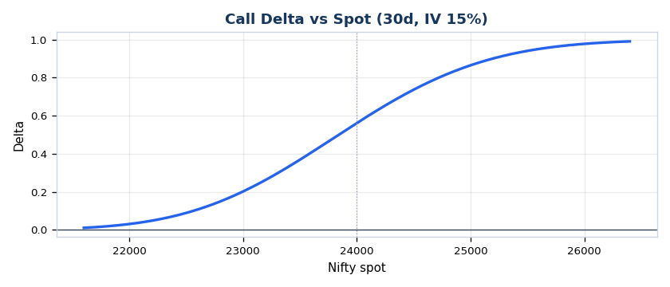

That steepness in the middle has a name: **gamma**, the rate of change of delta itself. We preview it here and devote the next chapter to it. For now, just hold the picture: delta is the slope of the premium curve, and gamma is how fast that slope changes as spot moves.

### Reading 1 — Delta as directional exposure (equivalent units of the underlying)

The first and most practical reading: **delta tells you how many units of the underlying your option behaves like.**

`equivalent underlying units = delta * lot size * number of lots`

A single Nifty call with delta 0.50 on a 75-unit lot behaves, for small moves, like being long `0.50 * 75 = 37.5` units of Nifty. If Nifty moves 100 points, you make roughly `37.5 * 100 = ₹3,750` on that one option — before gamma, theta, and vega complicate things. This is why traders say a position is "long 40 deltas" or "short 200 deltas." Delta is the common currency that lets you compare a fistful of different strikes and expiries on one scale: equivalent index exposure.

### Reading 2 — Delta as the hedge ratio

The second reading flips the first around. If your call behaves like 37.5 units of long Nifty, then to **neutralise** that directional exposure you would short 37.5 units of Nifty (via futures). That is **delta-hedging**, and delta is the **hedge ratio** — the amount of underlying you must trade to make the combined position insensitive to small moves in spot.

`hedge = - (delta * lot size * number of lots) units of the underlying`

A market maker who sells you that 0.50-delta call is now short 37.5 deltas. To avoid betting on direction (they want to earn the spread and the volatility edge, not gamble on Nifty's path), they buy 37.5 units of Nifty futures. Their book is now **delta-neutral**: a 1-point move up loses on the short call but gains on the long futures, and the two cancel. Because delta changes as spot moves (gamma again), they must **re-hedge** continuously — and the cost of that constant re-hedging is exactly what theta and vega are paying for. This is the heartbeat of the entire options market.

### Reading 3 — Delta as an approximate probability of finishing ITM

The third reading is the one beginners love and pros use with care: **delta is roughly the probability that the option expires in-the-money.** A 0.30-delta call is loosely "about a 30% chance of finishing ITM."

This works because, in the Black-Scholes world, call delta equals `N(d1)` — the cumulative normal of the term d1. The cleaner, more honest probability of finishing ITM is actually `N(d2)`, which is always a bit smaller than `N(d1)` because d2 = d1 - sigma*sqrt(T). So:

- Delta `approx= N(d1)` slightly **overstates** the true risk-neutral probability of finishing ITM.
- `N(d2)` is the proper "probability ITM" under the risk-neutral measure.
- For short-dated, low-vol options the two are close; for long-dated or high-vol options the gap widens.

So treat delta as a quick, free probability proxy — a 0.20-delta OTM put is "roughly a 1-in-5 shot" — but do not confuse it with a precise figure, and remember it is a *risk-neutral* probability, not a real-world forecast. Honest pedagogy: the market does not owe you your delta as a payout rate.

### How delta itself changes — with spot, time, and volatility

Delta is a snapshot. Three forces move it:

- **As spot moves (gamma):** delta rises as the underlying rises (calls) and the S-curve carries delta toward 1 (ITM) or 0 (OTM). Near the ATM strike this happens fastest, especially close to expiry.
- **As time passes (charm):** for an OTM option, the dwindling time to expiry pushes delta toward 0 (it is running out of chances to get ITM). For an ITM option, delta drifts toward 1 (call) or -1 (put) as expiry nears and the outcome firms up. An ATM option stays near 0.50 but its delta becomes *knife-edge* sensitive — gamma explodes on expiry day.
- **As volatility changes (vanna):** higher implied volatility flattens and spreads the S-curve. With more vol, even a fairly OTM option has a realistic chance of finishing ITM, so its delta rises toward 0.50; deep-ITM deltas fall back toward 0.50 too. Low vol does the opposite — it sharpens the curve, pushing deltas toward 0 or 1. In short, high vol drags all deltas toward the middle (0.50).

### Position delta — adding it all up

For a portfolio, exposures simply add. **Position delta** is the signed sum of every leg's delta times its lot size and quantity.

`position delta (units) = sum over legs of (delta_leg * lot size * lots * +1 if long / -1 if short)`

A long call adds positive delta; a short call adds negative delta; a long put adds negative delta; a short put adds positive delta. Long futures contribute +1.0 delta per unit. Once you can total position delta, you can answer the only directional question that matters: **"If Nifty moves 1 point, how many rupees do I make?"** And you can convert any options book into its equivalent in Nifty lots — divide position delta in units by the lot size.

### Using delta to size a directional bet

If you have a view — say you expect Nifty to rise 300 points — delta lets you size the trade to a target exposure rather than guessing a lot count. Decide how much rupee profit you want per point (your target delta in rupees), then pick strikes and quantities whose combined delta hits that target. High-delta (deep ITM) options give you near-futures exposure with a smaller premium outlay and less time decay per delta; low-delta (OTM) options give cheap, leveraged, lower-probability exposure that bleeds theta. Delta is the dial that sets the dose.

## Worked example (₹, Nifty/Bank Nifty)

Setup: Nifty spot = 24,000. Lot size = 75 units. You are looking at the weekly options.

- 24,000 CE (ATM call), premium ₹120, **delta = +0.52**
- 24,300 CE (OTM call), premium ₹40, **delta = +0.28**
- 23,800 PE (OTM put), premium ₹55, **delta = -0.30**

**Step 1 — Equivalent units (Reading 1) for one ATM call.**
`equivalent units = 0.52 * 75 * 1 = 39 units of Nifty (long).`
If Nifty rises 100 points, expected P&L `approx= 39 * 100 = ₹3,900`. The premium itself rises about `0.52 * 100 = 52 points`, i.e. from ₹120 to ~₹172; in rupees `52 * 75 = ₹3,900`. Same answer, two routes.

**Step 2 — The hedge ratio (Reading 2).**
A desk short this one call is short 39 deltas. To go delta-neutral it buys `39` units of Nifty futures (about half a lot of exposure). Now a small move in either direction nets to roughly zero P&L — until gamma forces a re-hedge.

**Step 3 — Probability proxy (Reading 3).**
The 24,300 CE has delta +0.28, so a rough "about 28% chance of finishing above 24,300" at expiry. The true `N(d2)` probability would be a touch lower, perhaps ~25%. So if someone sells this call collecting ₹40 (`40 * 75 = ₹3,000`), they are taking on something like a 1-in-4 risk of it going ITM. Fair, not free money.

**Step 4 — Position delta of a two-leg trade.**
You buy 2 lots of the 24,000 CE and sell 1 lot of the 23,800 PE (a mildly bullish structure).

- Long 2 ATM calls: `+0.52 * 75 * 2 = +78 units`
- Short 1 OTM put: short a -0.30 put adds positive delta: `-(-0.30) * 75 * 1 = +22.5 units`
- **Position delta = +78 + 22.5 = +100.5 units.**

**Step 5 — Convert to equivalent Nifty lots and to rupees per point.**
`equivalent lots = 100.5 / 75 = approx 1.34 lots long Nifty.`
Rupees per 1-point Nifty move `= 100.5 * ₹1 = ₹100.5`. So a 200-point rally is worth roughly `200 * 100.5 = ₹20,100` to this book, before time decay and any change in implied vol. That single number — "I am long about 1.34 Nifty lots" — is what a professional carries in their head all day.

## Common mistakes / risk note

- **Treating delta as a constant.** Delta is a local slope. A 0.30-delta call does not stay 0.30 after a 300-point move; gamma changes it. Your sizing math is only good for *small* moves — re-check after any big swing.
- **Reading delta as a real-world probability.** Delta `approx N(d1)` is a *risk-neutral* proxy and overstates true ITM probability relative to `N(d2)`. It is a rough guide, never a guarantee. "70-delta so 70% safe" is sloppy thinking that gets sellers hurt.
- **Forgetting the sign on short options.** Selling a put is *positive* delta (bullish), not negative. Selling a call is negative delta. Get the signs wrong and you hedge the wrong way.
- **Ignoring that delta-neutral is not risk-free.** A delta-hedged book is still exposed to gamma, theta, and vega. Being delta-neutral only kills the *first-order* directional risk for *small* moves. India VIX spiking or a gap opening can blow through a hedge overnight.
- **Over-leveraging via low-delta OTM options.** Cheap 0.05-delta weekly options look like a tiny bet but, sold in size, carry large tail risk; bought in size, they usually expire worthless. Remember the honest base rate: most long options expire worthless, and SEBI studies show roughly 9 in 10 retail F&O traders lose money. Delta sizing helps you take *measured* risk, not unlimited risk.

## Key takeaways

- Delta is the rate of change of premium per 1-point move in the underlying: calls 0 to +1, puts 0 to -1, ATM near +/-0.5.
- Read delta three ways: directional exposure (equivalent underlying units), the hedge ratio for delta-hedging, and an approximate probability of finishing ITM.
- The honest probability caveat: delta `approx N(d1)` overstates ITM odds; `N(d2)` is the cleaner risk-neutral probability, and both are risk-neutral, not real-world.
- Delta changes with spot (gamma), with time (toward 0 or +/-1 for OTM/ITM), and with volatility (high vol drags deltas toward 0.50).
- Position delta is the signed sum of leg deltas times lot size and quantity; divide by lot size to read your book as equivalent Nifty lots, and multiply by ₹1 to read rupees per point.
- Use delta to *size* a directional bet to a target exposure instead of guessing lot counts — but always re-check after large moves.

## Practice problems

1. **Conceptual.** A trader says "my 24,500 CE is 0.18 delta, so there's roughly an 18% chance it finishes ITM." What is technically wrong, or at least imprecise, about equating delta with the probability of finishing ITM? Which quantity is the cleaner probability?

2. **Numeric — equivalent units.** Nifty is at 24,000, lot size 75. You are long 3 lots of a call with delta +0.45. How many equivalent units of Nifty are you long, and what is your approximate P&L if Nifty rises 80 points (ignore gamma/theta/vega)?

3. **Numeric — hedge ratio.** A market maker is short 4 lots of a Bank Nifty 52,000 CE with delta +0.55. Bank Nifty lot size is 35 units. How many units of Bank Nifty futures must they buy or sell to be delta-neutral, and in which direction?

4. **Numeric — position delta.** You hold: long 2 lots of 24,000 CE (delta +0.50) and long 2 lots of 24,000 PE (delta -0.50), lot size 75. What is your net position delta? What does this tell you about your directional exposure, and what risk are you actually taking?

5. **Numeric — sizing and conversion.** You want to be long the equivalent of exactly 1.5 Nifty lots using a single OTM call with delta +0.25 (lot size 75). How many lots of that call do you need (rounded to the nearest lot), and what is your resulting position delta in units?

6. **Conceptual.** India VIX jumps from 12 to 22 overnight with Nifty unchanged at 24,000. Qualitatively, what happens to the delta of a fairly OTM 24,600 CE, and why?

## Solutions

**1.** Delta approximately equals `N(d1)`, while the risk-neutral probability of finishing ITM is `N(d2)`, which is smaller because `d2 = d1 - sigma*sqrt(T)`. So delta slightly *overstates* the ITM probability — the true figure is a bit below 18%. Two further caveats: it is a *risk-neutral* probability, not a real-world forecast, and delta is only a local snapshot that shifts as spot, time, and vol change. The cleaner probability measure is `N(d2)`.

**2.** Equivalent units `= 0.45 * 75 * 3 = 101.25` units long. Approximate P&L for an 80-point rise `= 101.25 * 80 = ₹8,100`. (Check via premium: the option gains about `0.45 * 80 = 36 points`, and `36 * 75 * 3 = ₹8,100`.)

**3.** The maker is short `0.55 * 35 * 4 = 77` deltas (short the call means negative delta exposure). To neutralise, they must add +77 deltas by **buying 77 units** of Bank Nifty futures (about 2.2 lots). Buying, because a short call is bearish/negative-delta and futures must offset it.

**4.** Long call: `+0.50 * 75 * 2 = +75`. Long put: `-0.50 * 75 * 2 = -75`. Net position delta `= +75 - 75 = 0` units — delta-neutral. This is a long straddle: directionally flat at this instant, so a small move makes little, but you are **long gamma and long vega and short theta** — you profit from a large move in *either* direction or a vol spike, and you bleed time decay every day Nifty sits still. Delta-neutral is not risk-free; it is a bet on movement, not direction.

**5.** Target exposure `= 1.5 lots * 75 = 112.5` units. Each call lot gives `0.25 * 75 = 18.75` units. Lots needed `= 112.5 / 18.75 = 6 lots` exactly. Resulting position delta `= 0.25 * 75 * 6 = 112.5` units, i.e. exactly 1.5 equivalent Nifty lots. (Note the trade-off: matching the exposure with low-delta OTM calls needs many lots and carries heavy theta — a higher-delta ITM call would reach 1.5 lots with far fewer contracts.)

**6.** A jump in India VIX means higher implied volatility. Higher vol flattens and widens the delta S-curve, dragging all deltas toward 0.50. The 24,600 CE is OTM with delta below 0.50, so its delta **rises** — with more volatility, finishing above 24,600 by expiry becomes more plausible, so the option behaves more like a coin flip and tracks the index more strongly. (This sensitivity of delta to volatility is called vanna.)

# Chapter 23: Gamma — The Curvature That Bites Near Expiry

In the last chapter you met delta — how much an option's price moves for a one-point move in the index. But delta is not a fixed number stamped on the option. It shifts. As Nifty climbs, a call's delta drifts up toward 1; as Nifty falls, it drifts down toward 0. **Gamma** is the Greek that measures that drift — it tells you *how fast your delta itself changes* as the market moves. If delta is your speed, gamma is your acceleration.

Why does a second-order number matter so much that professionals obsess over it? Because gamma is what turns a quiet position into a violent one without warning. It is harmless on a long-dated option far from its strike, and it becomes a monster on a Bank Nifty weekly option on expiry afternoon, where a thirty-point flick of the index can flip your whole profit-and-loss from green to red in seconds. This chapter teaches you to *feel* gamma — where it lives, when it explodes, why owning it costs you money every day, and how the pros harvest it.

## Core concepts

### Delta is not constant — gamma measures the change

Recall the payoff of a long call at expiry: flat at zero below the strike, then a straight 45-degree line above it. That bend at the strike is a **kink** — a sudden change in slope. Before expiry, the option's value curve is a *smooth, rounded* version of that hockey stick. Smooth means curved, and **gamma is the curvature of that price curve.**

Put precisely, delta is the *slope* of the option-price-versus-spot curve, and gamma is the *rate of change of that slope*:

`gamma = change in delta / change in spot (per 1-point move)`

In calculus terms, if delta is the first derivative of the option price with respect to spot, gamma is the **second derivative**. You do not need the calculus to trade it; you need the picture. A curve that bends sharply has high gamma; a nearly straight line has near-zero gamma.

A concrete way to read the number: **gamma tells you how many delta-points you gain or lose for each 1-point move in the index.** If a Nifty call has delta 0.50 and gamma 0.004, then if Nifty rises 1 point the new delta is about 0.504; if Nifty rises 10 points the delta climbs to roughly 0.54. The delta is *self-adjusting*, and gamma is the rate of that adjustment.

### The sign of gamma: long options are long gamma

Here is the single most important fact about gamma, and it is beautifully simple:

- **If you BUY an option (call or put), you are LONG gamma.** Your gamma is positive.
- **If you SELL an option (call or put), you are SHORT gamma.** Your gamma is negative.

Notice this is unlike delta, where calls and puts have opposite signs. For gamma, *buying* anything gives you positive gamma; *selling* anything gives you negative gamma. Both a long call and a long put have positive gamma.

What does positive gamma actually *do* for you? It makes your delta move *in your favour*:

- You own a call (positive delta). The market rallies. Gamma pushes your delta *up*, so you get longer and longer exactly as the market keeps rising — you make money at an *accelerating* rate.
- The market instead falls. Gamma pushes your delta *down* toward zero, so you get shorter and shorter — you lose money at a *decelerating* rate. Your losses brake themselves.

This is the magic of **positive convexity**: when you are right you get more right, and when you are wrong you become less exposed. The option buyer's delta is always reshaping itself to lean into the move. That asymmetry — accelerating gains, braking losses — is precisely what you are paying the premium for.

The seller lives in the mirror world. **Short gamma means your delta moves against you.** Sell a call, the market rallies, and your (negative) delta gets *more* negative just as the market climbs — your losses accelerate. The market falls and your short-call delta shrinks toward zero just as you would have wanted it large — your gains decelerate. The short-gamma trader is run over on every sharp move in either direction.

### Where gamma lives: highest at the money

Gamma is not spread evenly across strikes. It is concentrated, and the rule is clean:

**Gamma is highest for at-the-money (ATM) options and falls away to nearly zero for deep in-the-money and deep out-of-the-money options.**

The intuition flows straight from delta. Think about where delta is *changing fastest* as spot moves:

- A **deep ITM** call has delta near 1.00. Push spot up or down a little and the delta barely budges — it is already pinned near 1. Slope is steady, curvature is low, **gamma is tiny.**
- A **deep OTM** call has delta near 0.00. Nudge spot and it stays near 0. Again the delta hardly moves, **gamma is tiny.**
- An **ATM** call has delta around 0.50, and this is exactly the region where delta is *most sensitive* to spot. A small move up flips the option toward "probably finishes in the money" (delta racing toward 1); a small move down flips it toward "probably worthless" (delta sliding toward 0). The delta is on a knife-edge, swinging fast — **gamma peaks here.**

So gamma traces a bell-shaped hump centred on the strike: low in the wings, tall and narrow over the money. The figure below shows this shape — notice how the peak sits right at the at-the-money spot and decays on both sides.

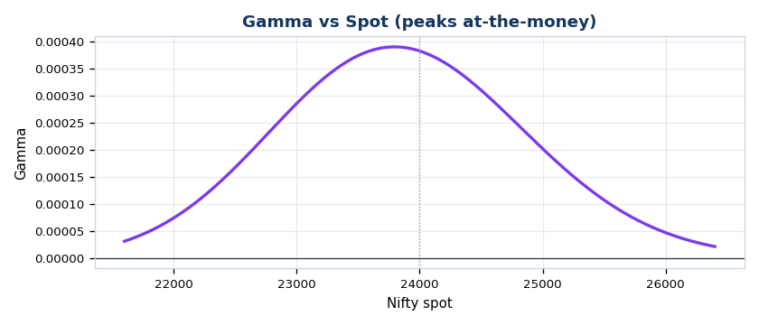

### Where gamma bites: it explodes near expiry

The bell shape tells you *which strike* has the most gamma. The second dimension — and the one that maims retail sellers — is *time*. As expiry approaches, the ATM gamma hump does not just stay put; it grows **taller and narrower**, spiking toward infinity in the final hours.

The reason is the same uncertainty story from the time-decay chapter, viewed through delta. Far from expiry, an ATM option's delta moves gently because there is lots of time for spot to wander either way — a 50-point move today is no big deal when thirty days remain, so delta inches along. But on expiry day, that same ATM option is a coin standing on its edge about to land. A tiny move *now* decides everything: a few points above the strike and the option is going to finish in the money (delta snapping to 1.00); a few points below and it expires worthless (delta collapsing to 0.00). Delta has to travel its entire 0-to-1 range over a razor-thin band of spot. That is enormous curvature — **gamma explodes.**

The figure below makes the time effect concrete: ATM gamma is modest with weeks to go, then rockets up as expiry nears.

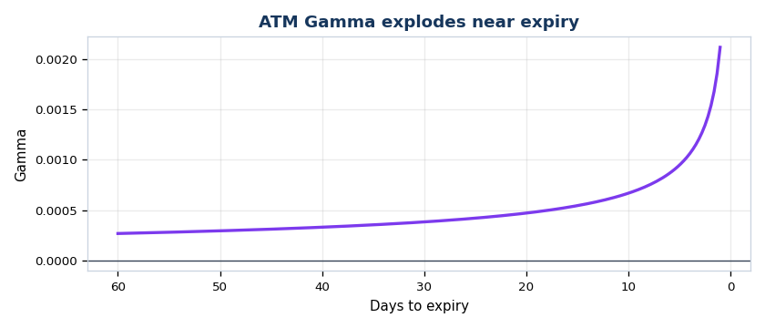

This is the precise mathematical reason Indian **weekly expiries** are so treacherous. A Nifty or Bank Nifty weekly option spends its entire short life in the steep, high-gamma zone, and its final day is the most explosive gamma environment most traders will ever touch. The option seller who is comfortably in profit at 1 p.m. on expiry day can be deep in the red by 2 p.m. on a move that, on any other day, would barely register — because near-expiry ATM gamma converts small spot moves into giant delta swings.

### The gamma-theta trade-off: you rent gamma with theta

Nothing in options is free, and gamma is no exception. There is a hard, unavoidable bargain at the heart of options trading:

**To be long gamma, you must be short theta. To be long theta, you must be short gamma.**

When you buy an option you own positive gamma (good — convexity works for you) but you pay negative theta (bad — the option bleeds time value every day, as Chapter 21 showed). You are essentially *renting* convexity, and theta is the daily rent. Each day the index sits still, you pay that rent and get nothing for it.

The seller takes the opposite side: she collects theta every day (the rent flows to her) but carries negative gamma, the risk that a sharp move blows up in her face. She is paid to insure the buyer against big moves.

So the central question both sides are really betting on is: **will the market move more than the theta is charging for?**

- If realised movement is *large* relative to the premium's daily decay, the long-gamma buyer wins — the convexity earns more than the rent costs.
- If the market is *quiet* relative to the decay, the short-gamma seller wins — she pockets rent while the dreaded move never comes.

And here is the cruellest part of the trade-off for sellers: **gamma and theta both peak at the same place — ATM, near expiry.** The fat theta that tempts sellers into weekly ATM options is inseparable from the fat gamma that can destroy them. You cannot collect the high rent without taking on the high risk. They are two faces of one coin.

### A first look at gamma scalping

If long gamma costs theta every day, how does anyone make money owning it without simply betting on a big directional move? The professional answer is **gamma scalping**, and it is worth meeting now even though it deserves its own deeper treatment later.

The idea: hold a long-gamma position but stay **delta-neutral** — meaning you offset the option's delta with an opposite position in Nifty futures so your net delta is roughly zero and you are not making a directional bet. Now watch what positive gamma does for you:

- The index rises. Your long gamma makes your delta turn *positive*. To get back to neutral you **sell** some futures — locking in a small gain at the higher level.
- The index falls. Your gamma makes your delta turn *negative*. To re-neutralise you **buy** futures — at the lower level.

You are mechanically **buying low and selling high**, again and again, harvested purely from the option's curvature. Each re-hedge banks a little cash. Over a choppy day those crumbs add up. If the total scalped profit exceeds the theta you paid to own the gamma, you come out ahead — *regardless of where the index finally closes.*

That is the whole game in miniature: gamma scalping is a bet that the market will be **more volatile** (move around more) than the option's implied volatility — the theta — is charging you for. It converts the abstract "long gamma, short theta" trade-off into a concrete daily cash-collection routine. The short-gamma seller, naturally, is doing the reverse and praying the market stays calm.

## Worked example (₹, Nifty/Bank Nifty)

Let us watch delta change under gamma, then feel the expiry-day version on Bank Nifty.

**Setup.** Nifty spot is at 24,000. You buy one 24,000 weekly call (ATM). From the option chain you read:

- Premium = ₹120
- Delta = 0.50
- Gamma = 0.004 (delta change per 1-point move in Nifty)
- Lot size = 75 (use the current NSE lot; it changes from time to time)

**Step 1 — Delta after a 50-point rally.** Nifty rises from 24,000 to 24,050, a 50-point move.

`new delta ≈ old delta + gamma * move = 0.50 + 0.004 * 50 = 0.50 + 0.20 = 0.70`

Your call now behaves like 0.70 of a Nifty unit, up from 0.50. You got *longer* simply because the market rose — gamma did that for you.

**Step 2 — Delta after a 50-point fall (from the start).** Now suppose instead Nifty had fallen to 23,950.

`new delta ≈ 0.50 + 0.004 * (-50) = 0.50 - 0.20 = 0.30`

You got *shorter*, down to 0.30. Your downside exposure shrank exactly as the market went against you. This is positive convexity in numbers: bigger delta into the rally, smaller delta into the fall.

**Step 3 — Why this beats a fixed-delta position.** Approximate the option's price change using delta plus the gamma "kicker". For the 50-point rally:

`price change ≈ delta * move + 0.5 * gamma * move^2`
`= 0.50 * 50 + 0.5 * 0.004 * 50^2`
`= 25 + 0.5 * 0.004 * 2500`
`= 25 + 5 = ₹30`

A plain delta estimate would have predicted only ₹25 (0.50 * 50). Gamma added ₹5 of *extra* gain. On the downside the same gamma term *subtracts* from your loss: a 50-point fall costs about `0.50*50 - 5 = ₹20`, not the full ₹25. Per lot of 75, that gamma cushion is worth `5 * 75 = ₹375` of help on each leg — you make more on the way up and lose less on the way down. The option *seller* eats the mirror image: she loses the extra ₹375 on the rally.

**Step 4 — Expiry-day gamma on Bank Nifty.** Now the dangerous version. It is expiry day. Bank Nifty is at 52,000 and you have **sold** one 52,000 call for ₹60 to collect theta — you are short gamma. With only hours to expiry the ATM gamma is enormous; say gamma = 0.02 (five times the relaxed weekly figure, because gamma has spiked into expiry).

Bank Nifty jolts up 100 points to 52,100 on a news headline:

`delta change = gamma * move = 0.02 * 100 = 2.0 ... (delta is capped at 1, so it pins near 1.00)`

Your short call's delta rockets from about -0.50 to nearly -1.00 almost instantly — you are now effectively short a full Bank Nifty future right as it screams higher. The loss on the move, including the gamma term, is roughly:

`loss ≈ delta*move + 0.5*gamma*move^2 = 0.50*100 + 0.5*0.02*100^2 = 50 + 100 = ₹150 per unit`

Against the ₹60 premium you collected, you are now down about ₹90 *per unit* — `90 * 35 = ₹3,150` on one lot of 35 (use the current Bank Nifty lot) — from a single 100-point flick that took two minutes. And if the index keeps running, your now-full delta means you bleed one-for-one with it. That is short gamma on expiry day: the thing that pays pennies of theta for weeks can take rupees in minutes.

## Common mistakes / risk note

- **Selling weekly ATM options "for the theta" without respecting the gamma.** This is the classic retail blow-up. The juicy daily decay you are collecting is inseparable from the gamma that can hand you a multiple of that premium back in one move. The premium is small precisely because it is risky. SEBI's studies showing roughly 9 in 10 F&O traders lose money are populated heavily by exactly this trade gone wrong.
- **Holding short options into the last hour of expiry.** Gamma is at its lifetime maximum then. A position that was safe all week becomes a live grenade on expiry afternoon. Many professionals simply close or roll short gamma before the final hours rather than gamble on pin risk.
- **Treating delta as a constant.** Beginners hedge once with delta and assume they are covered. Gamma means your hedge goes stale the instant the market moves — a delta-hedge set at 24,000 is wrong by lunchtime if Nifty has travelled 80 points. Without re-hedging, gamma quietly rebuilds your exposure.
- **Forgetting that long gamma is not free.** Buying options for the convexity feels safe — your risk is capped at the premium. True, but in a quiet, range-bound market theta grinds that premium to zero day after day while the big move you paid for never arrives. Long gamma loses money in calm markets just as reliably as short gamma loses it in violent ones.
- **Position-sizing on premium, not on gamma risk.** "It's only ₹60, how bad can it be?" The worst-case on a short ATM option near expiry is many multiples of the premium. Size by the move you could suffer, not by the cash you collect. SPAN margin partly forces this on you, but do not let the margin be your only risk check.

## Key takeaways

- **Gamma is the rate of change of delta** per 1-point move in the index — the curvature (second derivative) of the option-price curve. Delta is speed; gamma is acceleration.
- **Buying any option (call or put) is long gamma (positive); selling any option is short gamma (negative).** Long gamma = positive convexity: your delta moves *with* you (gains accelerate, losses brake). Short gamma is the dangerous mirror.
- **Gamma is highest at the money and near-zero deep ITM/OTM**, and it **explodes as expiry approaches** — peaking on weekly expiry day, which is why short weekly options can flip P&L violently on small moves.
- **The gamma-theta trade-off is unavoidable:** to own gamma you pay theta (daily rent); to collect theta you take on gamma risk. Both peak at the same spot — ATM, near expiry.
- **The real bet** under any gamma position is whether realised movement will exceed what the theta is charging — buyers want big moves, sellers want calm.
- **Gamma scalping** harvests long gamma by staying delta-neutral and re-hedging into every move (sell futures as it rises, buy as it falls), banking small profits that beat theta if the market is choppy enough.

## Practice problems

1. **(Conceptual)** A trader says, "I sold a put, so I have positive gamma because puts go up when the market falls." What is wrong with this reasoning? State the correct gamma sign for a short put.

2. **(Numeric)** A Nifty 24,200 call has delta 0.45 and gamma 0.005. Nifty rallies 40 points. Estimate the new delta. If Nifty had instead dropped 40 points, what would the new delta be?

3. **(Numeric)** Using the same option as Problem 2 (delta 0.45, gamma 0.005, premium ₹95), estimate the option's new price after a 40-point rally using `price change ≈ delta*move + 0.5*gamma*move^2`. How much of the gain came from the gamma term alone?

4. **(Conceptual)** Two Nifty calls are quoted: a deep-ITM 23,000 call and an ATM 24,000 call, both expiring this week. Which has the larger gamma, and why? What happens to that comparison as expiry day arrives?

5. **(Numeric / risk)** On Bank Nifty expiry day you are short one ATM 52,000 straddle's worth of gamma with combined gamma 0.03 and you collected ₹140 total premium. Bank Nifty moves 120 points. Roughly estimate your loss per unit using the gamma approximation (take starting net delta ≈ 0 for an ATM straddle). Are you still in profit?

6. **(Conceptual)** Explain in plain English why a gamma scalper can make money even if Bank Nifty closes exactly where it opened, and what market condition would make the same scalper *lose* money.

## Solutions

**1.** The trader is confusing delta with gamma. Yes, a short put has *positive delta* (it profits when the market rises). But **gamma sign depends only on whether you bought or sold**, not on call versus put. Selling *anything* gives **negative gamma**. So a short put is **short gamma**: its delta moves against the seller — as the market falls, the short put's delta turns more positive (longer) just as the trader is losing, accelerating the pain. Correct sign: gamma is negative.

**2.** New delta after a rally: `0.45 + 0.005 * 40 = 0.45 + 0.20 = 0.65`. After a 40-point fall: `0.45 + 0.005 * (-40) = 0.45 - 0.20 = 0.25`. The call gets longer into the rally (0.65) and shorter into the decline (0.25) — positive convexity.

**3.** `price change ≈ 0.45 * 40 + 0.5 * 0.005 * 40^2 = 18 + 0.5 * 0.005 * 1600 = 18 + 4 = ₹22`. New price ≈ `95 + 22 = ₹117`. The gamma term contributed **₹4** of the ₹22 gain; delta alone would have predicted only ₹18. That ₹4 is the convexity bonus that a fixed-delta estimate misses.

**4.** The **ATM 24,000 call has the larger gamma.** Its delta sits near 0.50, the most sensitive region — a small spot move swings the delta sharply, so curvature is high. The deep-ITM 23,000 call has delta near 1.00 and barely responds to spot moves, so its gamma is small. As **expiry day arrives**, the gap widens dramatically: the ATM call's gamma *explodes* (delta must traverse its whole 0-to-1 range over a tiny band of spot), while the deep-ITM call's gamma stays low and even fades further. ATM-versus-ITM gamma divergence is greatest right at expiry.

**5.** Loss ≈ `delta*move + 0.5*gamma*move^2`. With starting delta ≈ 0: `0 + 0.5 * 0.03 * 120^2 = 0.5 * 0.03 * 14400 = ₹216` per unit. You collected ₹140, so you are now down roughly `216 - 140 = ₹76 per unit` — **no longer in profit.** Note the loss came *entirely* from the gamma term because the straddle started delta-neutral; this is pure short-gamma damage, and it grows with the *square* of the move, so a 240-point move would hurt four times as much (≈ ₹864 per unit).

**6.** A gamma scalper holds long options (positive gamma) but neutralises the directional bet by shorting Nifty/Bank Nifty futures against the option delta. As the index swings up during the day, his delta turns positive and he sells futures into the strength; as it swings back down, his delta turns negative and he buys futures into the weakness. He is mechanically **selling high and buying low** on every wiggle, banking small profits — even though the index finishes exactly where it started, the *path* (the chop) generated cash. He **loses** money when the market is **too quiet**: if the index barely moves all day, there are no swings to scalp, and the **theta** he is paying to own the long gamma steadily eats his premium with nothing harvested to offset it. Long gamma wins on movement and loses on stillness.

# Chapter 24: Theta — Time Decay, the Buyer's Enemy and Seller's Friend

An option is a melting ice cube. The moment you buy one, a clock starts running, and every day that clock ticks, a little of what you paid evaporates — even if the market does nothing at all. The stock sits still, the news is quiet, the screen is calm, and yet by tomorrow your option is worth slightly less than today simply because there is one fewer day for it to come good. That silent, relentless leak is **time decay**, and **theta** is the Greek that measures it: the rupees of premium an option loses for each day that passes.

Theta is the most emotionally loaded of the Greeks because it is the one thing in options that is genuinely certain. Delta, gamma, vega — those depend on what the market does. Theta happens whether the market moves or not. For the option *buyer* it is a tax on patience, the rent paid for holding a bet. For the option *seller* it is income, the rent collected. This single asymmetry — that time hurts the buyer and helps the seller — explains an enormous amount of how professional Indian options trading actually works, and why so many desks are structurally short premium going into a weekly expiry.

## Core concepts

### What theta actually measures

**Theta** is the change in an option's premium for the passage of **one day**, holding everything else — spot, volatility, interest rates — constant.

`theta = change in option premium per one day of time passing`

By convention theta is quoted as a **negative number for a long option**, because the premium falls as time passes. If a Nifty call has a theta of `-8`, it means that option is expected to lose about ₹8 of premium per day from time decay alone, all else equal. Spread across the lot (Nifty lot size is currently about 75 units), that is roughly `8 * 75 = ₹600` bleeding out of a long position each calendar day.

The signs follow directly from who benefits:

- **Long options have negative theta.** You own a melting asset; time works against you. Every quiet day is a day of premium lost.
- **Short options have positive theta.** You sold the melting asset; time works *for* you. Every quiet day, the option you are short becomes cheaper to buy back, and the difference is your profit.

This is the cleanest statement of the buyer-versus-seller divide from Chapter 15, now made precise: **the buyer pays theta; the seller harvests it.**

### Why time decay exists at all

Recall the split from Chapter 6: an option's premium is **intrinsic value** (how much it is in-the-money right now) plus **time value** (everything else — the value of the *possibility* that it ends up further in-the-money). Theta acts almost entirely on the time-value part.

Time value is the price of optionality, and optionality is worth more when there is more time for things to happen. A 30-day option has thirty days of possible market moves still ahead of it; a 1-day option has only one. As expiry approaches, the menu of things that *could* still happen shrinks, so the value of that possibility shrinks with it. At the instant of expiry, time value is exactly zero — an option is worth only its intrinsic value, nothing more, because there is no future left to pay for.

So theta is not a market opinion or a fee anyone charges. It is the arithmetic of a shrinking opportunity set. Each day, the option has less runway, so the part of its price that was paying for "what might still happen" gets smaller.

### Why ATM theta accelerates near expiry but OTM theta is steadier

This is the single most important practical fact about theta, and it trips up almost every beginner. **Time decay is not linear.** An option does not lose the same rupees each day. The *pattern* of decay depends sharply on moneyness.

For an **at-the-money (ATM)** option — strike near the current spot — time value is at its maximum, and it decays *slowly at first and then faster and faster as expiry nears.* The shape is like a ball rolling off a table that steepens near the edge: gentle far out, a cliff right at the end. Roughly, ATM time value decays in proportion to `sqrt(time remaining)`, so the decay *rate* (theta) behaves like `1 / sqrt(time remaining)` — and that blows up as time remaining goes to zero. With four times less time left, decay runs about twice as fast; in the last day it is brutal.

For an **out-of-the-money (OTM)** option — strike well away from spot — the story is gentler. An OTM option has little time value to begin with (and no intrinsic value), so there is less to bleed. Its decay is steadier and slower in rupee terms, without the violent end-of-life cliff, because by then most of its small value has already quietly drained away. A far-OTM option spends its last days as a near-worthless lottery ticket decaying gently toward zero.

The intuition: theta is largest where time value is largest, and time value is largest **at the money, close to expiry.** That is the exact corner of the option grid — ATM, near expiry — where decay is most savage. It is also, not coincidentally, where most Indian weekly-expiry trading concentrates.

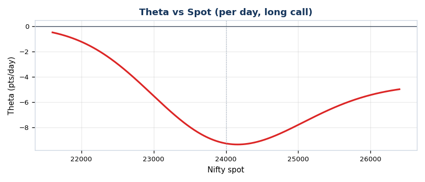

The figure plots theta against the spot price. Notice the deep trough centred at the strike: theta is most negative (decay is fastest) for the at-the-money option and tapers toward zero as you move far in- or out-of-the-money in either direction. Deep ITM and deep OTM options have little time value left to lose, so their theta is small; the ATM option, holding the most time value, bleeds the fastest. As expiry nears, this trough deepens and narrows — the decay concentrates ever more tightly around the at-the-money strike.

### The deep link to gamma: no cheap convexity

Here is where theta stops being an isolated fact and connects to the whole structure of options. Theta and **gamma** (Chapter 23, the rate at which delta changes) are two sides of the same coin. They have **opposite signs and they travel together.**

- A **long option** has **positive gamma** (its delta moves in your favour as spot moves — you accelerate into gains, decelerate into losses) and **negative theta** (it decays). You are paid in convexity but you pay in time.
- A **short option** has **negative gamma** (delta moves against you — the dangerous "wrong-way" acceleration) and **positive theta** (it earns time decay). You are paid in time but you pay in convexity risk.

There is no free lunch here, and the link is almost mathematical. In the Black-Scholes world, for a position with no directional or vol bias, the daily theta you pay is essentially the rent for the gamma you own, scaled by how much the market actually moves:

`theta (per day) ≈ -0.5 * gamma * (expected daily move in points)^2`

Read that sentence carefully, because it is the heart of options trading. **High gamma comes bundled with high theta.** You cannot buy the convexity of a near-expiry ATM option — the explosive, fast-moving delta that makes lottery-ticket gains possible — without simultaneously paying the steepest time decay in the market. The two are quoted by the same formula. If you want a lot of gamma, the market makes you rent it at a high theta; if you want to collect a lot of theta, you must sell a lot of gamma and accept that the position will hurt fast when spot runs.

So "buy weekly options for the gamma" and "sell weekly options for the theta" are *the same trade seen from opposite ends.* The buyer is long gamma / short theta; the seller is short gamma / long theta. Whoever is right about how much the market actually moves, relative to what the premium implied, wins. Theta is simply the price tag the market has stapled to gamma.

### How sellers harvest theta — and the tail they accept

Because short options have positive theta, selling premium is, on a calm day, like being a landlord: the buyer pays you rent every day the option decays. A trader who sells a Nifty straddle (short the ATM call and the ATM put) on a quiet expiry week collects theta from both legs and watches the position bleed in their favour. This is the engine behind an enormous share of Indian options activity: structured premium-selling, "theta harvesting," income strategies built on the certainty that, most days, options decay.

But theta is **not free money**, and this is the honest core of the chapter. The seller's positive theta is paid for by **negative gamma** — the convexity risk above. The landlord collecting daily rent sits on a position that loses money *fast and accelerating* if the market makes a large move. The income is small, steady, and high-probability; the loss is large, sudden, and low-probability. A premium seller is picking up coins in front of a roller: most days you collect, but the day the roller moves you can give back weeks of theta in an hour.

The market is roughly fair about this: the premium you collect (the implied volatility) is the price for that tail risk. Sellers profit *on average* only when realised volatility comes in below the implied volatility they sold — when the market moves *less* than the premium feared. When a budget, an election result, or an RBI surprise makes the market move more than implied, the sellers pay disproportionately. Theta-harvesting is a bet that the world will be calmer than the option prices assumed, financed by accepting a nasty tail.

### Weekly-expiry theta dynamics in India

Indian index options trade on a **weekly expiry** cycle (Nifty and Bank Nifty each have a weekly expiry, alongside monthly contracts), and this short cycle makes theta a front-row, every-week phenomenon. With only days to run, a weekly option lives almost entirely in the steep part of the decay curve.

The pattern premium sellers obsess over:

- **Early in the week**, decay is gentle. The option still has several days of optionality, so time value drains slowly — the flat part of the curve.
- **The last 2–3 days** are where decay accelerates violently for ATM options. This is the cliff. The expiry day itself can see an ATM option shed most of its remaining time value, especially across **non-trading hours** — decay for two calendar days (a weekend, or simply overnight) is credited even though the market was shut. Many sellers deliberately put on short-premium positions for exactly this window, capturing the fastest decay while minimising the nights they hold the dangerous negative-gamma tail.

This creates the well-known expiry-day tension in Indian markets: ATM weeklies are simultaneously the **highest-theta** instruments on the board (great for sellers harvesting decay) and the **highest-gamma** (lethal for those same sellers if spot lunges toward the strike near the close). The "expiry pin," where spot seems magnetised to a heavily-traded strike, is partly the visible footprint of this gamma-theta tug-of-war in the final hours.

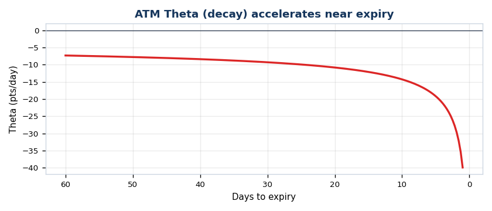

The figure shows the value of an at-the-money option as expiry approaches, reading time from left (many days out) to right (expiry). The curve falls gently at first and then plunges in the final days — the characteristic convex "cliff" of ATM time decay. The slope of this curve at any point *is* theta; you can see it steepen dramatically near expiry. An OTM option's curve, by contrast, would start much lower and slide down more steadily, without the same end-of-life collapse, because it had little time value to lose in the first place.

### Estimating daily decay in rupees for a Nifty / Bank Nifty position

A professional always converts theta from an abstract number into rupees of P&L. The recipe:

1. **Read theta per unit** from your option chain or pricing tool (most Indian broker platforms display it). Say a Nifty weekly ATM call shows theta `-9`.
2. **Multiply by the lot size** to get rupees per lot per day. Nifty lot size is currently about 75, so one long lot decays about `9 * 75 = ₹675` per day.
3. **Multiply by the number of lots** and sum across all legs (with sign) to get the **net theta of the position**. A short straddle is the sum of two positive thetas — your daily income; a long straddle is the sum of two negative thetas — your daily cost.
4. **Adjust for the calendar.** Theta is a *per-calendar-day* number, so holding over a weekend or a market holiday racks up two or three days of decay at once even though only one trading session passes. Sellers love this; buyers dread it.

A quick sanity check: net theta tells you what the position makes or loses *if the market does nothing*. If your short strangle shows net theta of `+₹1,400` per day, that is your reward for a flat day — and your job is to judge whether that ₹1,400 adequately compensates the negative-gamma risk you are carrying to earn it.

## Worked example (₹, Nifty / Bank Nifty)

Let us make theta concrete with a short-straddle seller, the archetypal Indian theta harvester.

**Setup.** It is Monday of an expiry week. Nifty spot is **24,000** with the weekly expiry on Thursday (4 calendar days away, counting the expiry day). A trader sells one lot each of the **24,000 ATM call** and the **24,000 ATM put** — a short straddle. The chain shows:

- 24,000 call: premium **₹130**, theta **-9**, gamma small but positive (so the trader's gamma is negative).
- 24,000 put: premium **₹120**, theta **-8**.

Nifty lot size is **75**.

**Step 1 — Premium collected.** Selling both legs brings in `(130 + 120) * 75 = 250 * 75 = ₹18,750` per straddle. This is the maximum the trader can make, and it is collected up front.

**Step 2 — Net theta on day one.** The trader is *short* both options, so their thetas flip to positive income. Net theta per unit is `+9 + 8 = +₹17`. Per lot: `17 * 75 = ₹1,275` per day. If Monday and Tuesday pass with Nifty parked near 24,000, the trader pockets roughly ₹1,275 each day from decay alone — the straddle gets cheaper to buy back.

**Step 3 — The acceleration into expiry.** Because these are ATM options, theta does not stay at ₹17. As Thursday approaches, time value collapses and theta *grows in magnitude.* By Wednesday the combined theta per unit might be ₹25–30, and on expiry-day morning the remaining time value evaporates almost entirely by the close. The trader harvests the steep part of the curve precisely as it steepens; most of the ₹18,750 is captured in the final two sessions.

**Step 4 — The tail the trader is renting against.** Suppose on Wednesday Nifty gaps to **24,400** on surprise news — a 400-point move. The short call is now ₹400 in-the-money on intrinsic value; buying it back might cost ₹430, while the put collapses toward ₹10. The trader must repurchase the straddle for around `(430 + 10) * 75 = ₹33,000` against the ₹18,750 collected — a loss of about **₹14,000** on one lot, wiping out roughly *eleven days* of ₹1,275 daily theta in a single move. This is negative gamma in action: the loss exploded far faster than the steady income accrued. And on a SPAN-margined short straddle, the broker's margin would have ballooned into the move, possibly forcing an exit at the worst moment.

**Step 5 — The lesson.** On quiet days the trader is right and theta pays ₹1,275 a day like clockwork. On the one violent day, negative gamma takes back a fortnight of income at once. The theta was never "free"; it was rent the buyer paid for carrying exactly this tail. Whether the trade is good *on average* depends entirely on whether Nifty's realised moves came in below the roughly ₹250 of combined premium (the implied move) the market charged.

## Common mistakes / risk note

- **Treating theta as guaranteed income.** Positive theta is real, but it is *paid for* with negative gamma. The steady daily credit is the bait; the tail loss is the hook. Never look at your daily theta without also looking at what a 1–2% gap in Nifty (or 2–3% in Bank Nifty) would do to the same position.
- **Assuming decay is linear.** Beginners hold an ATM weekly long option expecting to lose a little each day and are shocked when most of the premium vanishes in the final two sessions. ATM decay is a cliff, not a slope.
- **Forgetting the weekend / holiday decay.** Theta is per calendar day. A long option held Friday to Monday eats two extra days of decay over a closed market. Buyers who hold over long weekends and holidays pay theta for nothing happening; sellers specifically target those gaps.
- **Buying far-OTM "cheap" weeklies for the lottery.** They look cheap because they are nearly all gone — a low-priced far-OTM weekly is a melting near-worthless ticket whose theta will grind it to zero unless a big move arrives fast. Cheap is not the same as good value.
- **Over-leveraging the theta engine.** Because premium selling wins on most days, it lulls traders into adding size — right up to the day a gap takes out months of accumulated income and, with SPAN margins expanding into the move, can threaten the account. Around 9 in 10 retail F&O traders lose money (SEBI studies); over-confident, over-sized theta selling into tail events is one of the classic routes there.

## Key takeaways

- **Theta** is the premium an option loses per **day** from the passage of time: **negative for long options** (the buyer's enemy), **positive for short options** (the seller's friend).
- Time decay acts on **time value**, which shrinks to zero at expiry because the opportunity set runs out.
- **ATM theta accelerates near expiry** (decay behaves like `1 / sqrt(time left)` — a cliff in the final days), while **OTM theta is steadier** and smaller because there is less time value to lose.
- Theta and **gamma** are inseparable and opposite in sign: `theta ≈ -0.5 * gamma * (daily move)^2`. **High gamma always carries high theta — there is no cheap convexity.**
- **Sellers harvest theta as income** but accept the **negative-gamma tail**: small steady gains financed by a large, sudden possible loss. Theta is rent for that tail, not free money.
- In India's **weekly expiry** cycle, the **last 2–3 days** see the fastest ATM decay; premium sellers target this window, including weekend/overnight calendar decay.
- Convert theta to rupees as **theta per unit × lot size × lots**, summed across legs, and judge it against the gamma risk you carry to earn it.

## Practice problems

1. **Sign and intuition.** A trader is long one Nifty 24,000 weekly call. Is their theta positive or negative? In one line, explain what that means for their P&L on a day when Nifty does not move at all.

2. **Rupee decay (numeric).** A Bank Nifty 52,000 ATM weekly put shows a theta of **-22**. Bank Nifty lot size is about **15 units**. If a trader is **long 4 lots** and the market is flat tomorrow, roughly how much do they lose to time decay? What if they were *short* 4 lots instead?

3. **ATM vs OTM decay.** Two traders each buy a Nifty weekly option on Monday: one buys the ATM 24,000 call, the other a far-OTM 24,600 call. Both hold to Thursday with Nifty pinned at 24,000 the whole week. Qualitatively, whose option loses the larger *fraction* of its value, and why does the ATM option's loss arrive mostly at the end?

4. **The gamma link.** A trader says: "I want the huge gamma of an expiry-day ATM option, but I don't want to pay much theta." Explain why this wish is essentially impossible, referencing the relationship between the two Greeks.

5. **Weekend decay (conceptual + numeric).** A long Nifty ATM call has a theta of **-10** per unit. The trader holds it over a Friday-to-Monday period with no market holidays. Roughly how much time-value decay (per unit) should they expect when the market reopens Monday, and why is it more than a single day's worth?

6. **Is the income enough? (judgement).** A short Nifty strangle collects net theta of **₹1,000 per lot per day** three days before expiry. The trader is carrying negative gamma such that a 300-point overnight gap in Nifty would cost about ₹9,000 per lot. In plain English, what question must the trader answer to decide whether this is a sound trade?

## Solutions

1. **Negative theta.** A long option always has negative theta. On a day when Nifty is unchanged, the position still loses money — the call's time value erodes by roughly its theta in rupees (theta × lot size) purely because one day of optionality has been used up. Doing nothing costs the buyer money; that is the buyer's enemy at work.

2. **Long 4 lots:** decay per lot is `22 * 15 = ₹330` per day, so four lots lose about `330 * 4 = ₹1,320` to theta on a flat day. **Short 4 lots:** the sign flips — the trader *earns* about ₹1,320 from time decay on a flat day, because short options have positive theta. Same magnitude, opposite direction: the buyer's loss is the seller's income.

3. **The ATM 24,000 call loses the larger fraction of its value** — in fact, pinned at 24,000 to Thursday, it decays toward roughly its (near-zero) intrinsic value, losing almost all of its substantial time value. The far-OTM 24,600 call started with very little value, and although it too goes to near-zero, the *rupee* loss is small because there was little to lose. The ATM option's loss arrives **mostly at the end** because ATM time decay is non-linear: it follows roughly `sqrt(time left)`, so the steepest erosion — the cliff — is concentrated in the final two or three sessions. Monday and Tuesday bleed gently; Wednesday and Thursday collapse.

4. **Because theta and gamma are bound by the same formula:** `theta ≈ -0.5 * gamma * (daily move)^2`. The huge gamma of an expiry-day ATM option is *defined* alongside, and paid for by, an equally huge negative theta. The market prices convexity and time decay as two ends of one trade: anyone selling you that explosive gamma demands the steep theta in return, and the pricing makes them move together. You cannot have one without the other — there is no cheap convexity. Wanting big gamma but little theta is wanting to buy something for less than its price.

5. **Expect about three days' worth — roughly `10 * 3 = ₹30` per unit** (give or take, since the per-day theta itself rises slightly as expiry nears). Theta is a **per-calendar-day** quantity, and Friday-close to Monday-open spans three calendar days (Friday night, Saturday, Sunday) even though only one trading session is lost. Time value decays on the calendar, not the trading clock, so the option reopens Monday having shed roughly three days of premium. This is exactly why sellers favour holding short premium over weekends and buyers dread it.

6. **The trader must answer: how likely is a move large enough to overwhelm the accumulated theta, and is the daily income fair compensation for that tail?** Concretely: ₹1,000 a day of theta means it takes about nine quiet days to earn what a single 300-point overnight gap (about ₹9,000) would cost — but only three days remain, so a few quiet sessions earn perhaps ₹3,000 while one bad gap erases ₹9,000. The real question is whether the **realised** volatility of Nifty over those final days will come in **below** the **implied** volatility embedded in the strangle's premium. If the market stays calmer than the premium feared, the theta is genuine profit; if a gap arrives, the negative gamma gives back far more than the theta ever paid. Theta income is only sound when it is correctly priced rent for the tail being carried — never assume it is free.

# Chapter 25: Vega — Sensitivity to Volatility

Every option price contains a forecast about the future — specifically, a forecast about how much the underlying is going to *move*. Two traders can agree perfectly on where Nifty is today and still disagree violently on what an option is worth, because they disagree on how wild the ride to expiry will be. The price tag the market puts on that expected wildness is called **implied volatility**, and the Greek that measures how much an option's premium responds when that forecast changes is **vega**.

Vega is the Greek that catches more beginners off guard than any other. A new trader buys a Nifty call the morning of the RBI policy decision, the market moves exactly the way they predicted — and the call *loses* money. They were right on direction and still lost. The culprit, almost every time, is vega: they bought volatility when it was expensive and watched it collapse the moment the event passed. This chapter explains exactly how that happens, and how a professional turns the same mechanism into a source of edge.

## Core concepts

### What volatility means, and why "implied" is different

**Volatility** is a measure of how much a price fluctuates — formally, the annualised standard deviation of returns. A volatility of 14% on Nifty means the market expects Nifty's return over the next year to land within roughly plus-or-minus 14% about two-thirds of the time. Higher volatility means a wider range of plausible outcomes.

There are two flavours, and the difference is the whole game:

- **Realised (historical) volatility** is how much the underlying *actually* moved in the past. You compute it from the price series. It is a fact.
- **Implied volatility (IV)** is how much the market *expects* it to move in the future, backed out of current option prices. It is an opinion — a forecast embedded in the premium.

Implied volatility is the single input in the Black-Scholes-Merton formula (Chapter 20) that you cannot observe directly. You can see spot, strike, time, and rates. You cannot see "future movement." So the market *quotes* it through the option price: when traders expect a stormy period, they bid premiums up, and we say IV is high; when they expect calm, premiums sag and IV is low.

### Vega: the definition

**Vega** measures how much an option's premium changes when implied volatility changes by **one percentage point** (for example, IV moving from 14% to 15%), holding spot, time, and rates constant.

`vega = change in option premium per 1 percentage-point change in implied volatility`

If a Nifty option has a vega of ₹6, then a 1-point rise in IV (say from 13% to 14%) adds about ₹6 to its premium, and a 1-point fall subtracts about ₹6. A 3-point IV jump would move it roughly ₹18. (Vega is not perfectly linear over large IV swings, but for the 1-to-few-point moves that dominate day-to-day trading, this straight-line estimate works well.)

A small naming note: "vega" is not actually a Greek letter — the other sensitivities borrowed real Greek names (delta, gamma, theta, rho) and vega just joined the club. Do not let the odd name fool you; it is one of the most important numbers on the screen.

### The key fact: vega has the SAME sign for calls and puts

This is the single most important and most counter-intuitive fact about vega, so sit with it.

**Long options — both calls and puts — have positive vega. Short options have negative vega. The sign does not depend on whether it is a call or a put.**

Why? Volatility is about the *width* of the range of possible outcomes, not its direction. More volatility means the underlying could end up much higher *or* much lower. An option is a one-sided bet: a call profits from big up-moves and loses nothing extra from big down-moves (you just lose your premium either way); a put profits from big down-moves and is indifferent to big up-moves. Either way, **a wider range of outcomes can only help the owner of an option**, because the downside is capped at the premium paid while the upside grows. More volatility means more chance of a large favourable move, with no extra penalty for a large unfavourable one.

So more volatility makes *every* option — call or put — more valuable to its owner. That is why:

- If you are **long** a call or a put, you are **long vega**: rising IV helps you, falling IV hurts you.
- If you are **short** a call or a put, you are **short vega**: rising IV hurts you, falling IV helps you.

Contrast this with delta, where calls and puts pull in opposite directions. With vega there is no such split. A long straddle (long a call *and* a put together) is doubly long vega — it is almost a pure volatility bet, with the directional exposures of the two legs roughly cancelling while their vegas add.

### Where vega is biggest: at-the-money and longer-dated options

Vega is not the same size for every option. Two patterns matter enormously in practice.

**1. Vega is highest at-the-money (ATM).** An option's premium is most sensitive to volatility when the strike sits right at the current spot. The intuition: an ATM option is on a knife-edge — it could easily finish in-the-money or out-of-the-money, so the question "how much will it move?" matters most to its fate. Widening or narrowing the range of outcomes shifts its odds the most. Now take a deep in-the-money or deep out-of-the-money option. A deep ITM option is almost certain to finish ITM; a deep OTM option is almost certain to expire worthless. For both, a small change in expected movement barely moves their near-settled odds, so their vega is small. Vega, plotted against spot, is a hump that peaks at the strike and tapers off on both sides.

**2. Vega is highest for longer-dated options.** The more time an option has, the more room volatility has to act, so the more a change in the *rate* of movement matters. A one-percentage-point rise in annual IV has far more time to compound its effect over a 90-day option than over a 2-day weekly. Roughly, vega scales with the square root of time to expiry, `vega proportional to sqrt(T)`. This is why a far-month Nifty option reacts much more dramatically in rupee terms to an IV shift than a same-strike weekly — and why, conversely, a Tuesday-of-expiry weekly has tiny vega even though its gamma and theta are screaming.

Hold those two facts together: **the most vega-sensitive option on the board is a longer-dated at-the-money option.** That is the instrument professionals reach for when they want to bet on volatility itself.

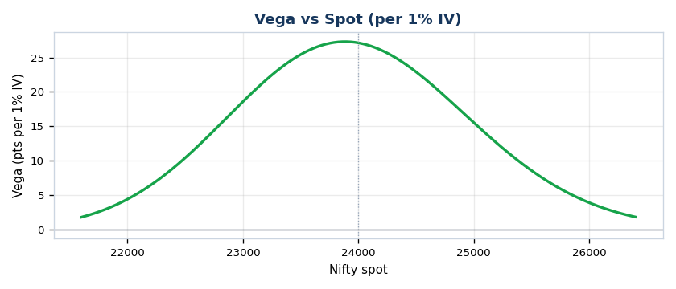

The figure plots vega against the spot price. Notice the single hump peaking at the strike (maximum vega at-the-money), the symmetric tapering as the option goes deep ITM or deep OTM, and the fact that the entire curve sits higher and broader for the longer-dated option than for the short-dated one. The same picture works for calls and puts — because vega does not care which it is.

### IV crush: the trap that catches every beginner

Here is the real-world phenomenon that turns vega from a textbook abstraction into a lesson paid for in cash.

Implied volatility is a forecast of *future* movement — so it rises when the market knows a big, uncertain event is coming. Ahead of an event, nobody knows the outcome, so the range of possible results is wide, IV spikes, and option premiums fatten. The instant the event passes and the uncertainty resolves, that forecast of future movement collapses — there is no longer a mystery to price — and IV falls hard. Premiums deflate. This sudden post-event collapse in implied volatility is called **IV crush** (or "volatility crush").

In Indian markets the classic IV-crush events are:

- **Quarterly results** of individual stocks (Reliance, Infosys, HDFC Bank). Stock-option IV ramps up for days before earnings and craters the morning after.
- **The Union Budget** (typically February 1), which can reprice entire sectors.
- **RBI monetary policy** decisions (the MPC meetings), which move rates, banks, and the rupee.
- **General and key state election results**, which can swing the whole index.
- **US Fed decisions and major global data**, which spill into Nifty through global risk sentiment.

The mechanism that burns beginners: ahead of such an event, India VIX (and the IV of the relevant options) climbs, so options are *expensive*. A beginner who buys a call or put is paying a premium inflated by high IV. When the event passes, IV crushes. Even if the underlying moved in the predicted direction, the vega loss from the IV collapse can exceed the delta gain from being right. **You can be correct on direction and still lose money**, because you overpaid for volatility that then evaporated.

This is not a rare edge case. It is one of the most common ways retail option *buyers* lose, and it is precisely why so many professionals prefer to be *sellers* of volatility into events — they are the ones collecting the inflated premium and pocketing the crush.

### India VIX: the market's fear gauge

To trade vega intelligently you need a way to *see* the overall level of implied volatility. In India, that instrument is the **India VIX**.

India VIX is an index published by the NSE that measures the market's expectation of Nifty volatility over the **next 30 calendar days**, derived from the prices of near-month Nifty options. It is quoted as an annualised percentage. Read it like a thermometer:

- **Low India VIX (say 10–13)** — the market is calm and complacent; options are cheap; IV is low. A poor time to *buy* options on vega grounds, a relatively attractive time to be selling (small premiums, but low crush risk).
- **High India VIX (say 20–30+)** — fear and uncertainty; options are expensive; IV is high, often ahead of or during an event or a sell-off. Dangerous to buy (crush risk), potentially rewarding but risky to sell.

India VIX tends to **spike before known events and around sharp market falls** (it is sometimes called the "fear gauge" because it jumps when markets drop), and to **drift back down** once the uncertainty clears — the index-level fingerprint of IV crush. A professional checks India VIX before every trade the way a sailor checks the wind: it tells you whether volatility is cheap or dear *right now*, which decides whether you want to own vega or sell it.

### Trading volatility directly

Once you understand vega, a new dimension of trading opens up: you can take a view on **volatility itself**, almost independently of direction.

- **Long vega (buy volatility) when IV is cheap.** If India VIX is low and you believe the market is underpricing future turbulence — a quiet market before a known catalyst, say — you buy options (or a long straddle/strangle) to be long vega. You profit if IV rises, even if the underlying barely moves.
- **Short vega (sell volatility) when IV is rich.** If India VIX is elevated and you believe the market is overpricing future movement — classically, into an event where premiums are bloated — you *sell* options (a short straddle/strangle, or spreads) to be short vega. You profit as IV crushes back down, collecting the deflating premium. This is the professional's favourite side of the event trade, but its risk is large and, for naked short options, theoretically unlimited.

The cleanest pure-vega structures combine a call and a put so the directional deltas roughly cancel and the vega adds: a **long straddle** is a bet that volatility (realised or implied) will be higher than the market thinks; a **short straddle** is the opposite. These are covered in their own chapters, but the engine underneath them is vega.

The professional framing: do not just ask "will Nifty go up or down?" Ask "is volatility cheap or expensive relative to what's coming?" That second question is the one most retail traders never even pose — and it is the one that separates a volatility trader from a coin-flipper.

## Worked example (₹, Nifty)

Let us put rupees on IV crush so the trap is unmistakable.

**Setup.** It is the day before the RBI monetary policy announcement. Nifty spot is **24,000**. You expect Nifty to rise, so you buy the **ATM 24,000 weekly call**, 3 days to expiry. Because the market is bracing for the RBI decision, India VIX is elevated at **20%**, and at that IV the call is priced at **₹150**. Suppose this call has a **delta of about 0.5** and a **vega of about ₹8**.

**Step 1 — The event happens, and you are right on direction.** The next morning the RBI delivers a mildly dovish surprise and Nifty rises **60 points**, from 24,000 to 24,060. The delta gain on your call is approximately:

`delta P&L ≈ delta * move = 0.5 * 60 = ₹30`

So on direction alone, the call should be worth about ₹180. So far, so good.

**Step 2 — But IV crushes.** With the RBI decision now known, the big uncertainty is gone. India VIX collapses from 20% to **13%** — a 7-point drop in implied volatility. The vega loss is:

`vega P&L ≈ vega * change in IV = 8 * (-7) = -₹56`

**Step 3 — Net result.** Combine the two effects:

`new premium ≈ 150 + 30 (delta) - 56 (vega) ≈ ₹124`

Your call, bought at ₹150, is now worth about **₹124 — a loss of ₹26 per unit even though Nifty moved exactly the way you predicted.** On one lot (Nifty lot size currently around 75 units), that is roughly `26 * 75 ≈ ₹1,950` gone, while you were *right*. The IV crush (−₹56) overwhelmed the directional gain (+₹30). This is the beginner's heartbreak, quantified.

**Step 4 — The other side of the trade.** Now flip it. Suppose instead you had *sold* that 24,000 straddle (call plus put) the evening before, collecting fat premiums inflated by 20% IV. The same IV crush that cost the buyer ₹56 of vega per option works *in your favour* as a seller — you are short vega. As long as Nifty's actual move stays modest (and 60 points is modest), the collapse in IV lets you buy the options back far cheaper than you sold them. The crush that punished the buyer paid the seller. **Same event, opposite vega sign, opposite outcome** — which is the whole reason professionals so often want to be the seller into a known event.

## Common mistakes / risk note

- **Buying options right before a big event "because something will happen."** Something does happen — IV crush. You are buying premium inflated by high IV, and the post-event collapse can wipe out your directional gain. If you must take a directional view into an event, understand that you need the move to be *large enough* to overcome the vega loss, not just correct in direction.
- **Thinking puts and calls react oppositely to volatility.** They do not. Both long calls and long puts *gain* when IV rises. Vega has the same sign for both; only delta flips. Beginners who "hedge" a long call by buying a put discover both legs bleed vega together when IV falls.
- **Ignoring India VIX before entering.** Trading options without checking the VIX is like buying a flight ticket without checking the price — you have no idea whether volatility is cheap or expensive, so you cannot know if you are overpaying. Always know whether you are buying or selling vega, and whether IV is high or low when you do it.
- **Treating short vega as free money.** Selling options into high IV to harvest the crush is a real professional strategy, but it carries large — and for naked options, theoretically unlimited — risk. If the event delivers a *bigger* move than priced, or IV spikes even further, the short-vega seller can lose multiples of the premium collected. The crush is an edge, not a guarantee.
- **Forgetting that vega shrinks into expiry.** A Tuesday-of-expiry weekly has tiny vega; its life is dominated by gamma and theta. Do not expect a vega play to work on a near-dead option — use longer-dated, at-the-money options when you genuinely want volatility exposure.

## Key takeaways

- **Vega** measures the change in an option's premium per **1 percentage-point change in implied volatility**, holding everything else constant.
- **Vega has the same sign for calls and puts**: long options are long vega (gain when IV rises), short options are short vega (gain when IV falls). Only delta flips between calls and puts — vega does not.
- **Vega is largest at-the-money and for longer-dated options**; it scales roughly with `sqrt(T)` and is tiny for deep ITM/OTM and near-expiry options.
- **IV crush**: implied volatility spikes before events (results, Budget, RBI policy, elections) and collapses right after, so a long option can lose money *even when the direction was right*.
- **India VIX** is the 30-day implied-volatility gauge for Nifty — your thermometer for whether options are cheap (low VIX) or expensive (high VIX) before you trade.
- **Trade volatility directly**: be long vega when IV is cheap, short vega when IV is rich; straddles/strangles are the cleanest near-pure vega structures.
- Always ask not just "up or down?" but **"is volatility cheap or expensive relative to what's coming?"** Short vega harvests crush but carries large, sometimes unlimited, risk.

## Practice problems

1. **Sign check.** You are long one Nifty 24,000 call and, separately, long one Nifty 24,000 put. India VIX jumps from 14% to 18% overnight with Nifty unchanged. What happens to the value of each position, and why does the call not gain while the put loses?

2. **The crush, conceptually.** A friend says: "I bought a Reliance call before earnings, the stock jumped 2% on great results, but my call still lost money. The broker must have cheated me." Explain in plain English what actually happened, naming the phenomenon and the Greek responsible.

3. **Vega magnitude (numeric).** A Nifty option has a vega of ₹7. India VIX falls from 19% to 12% after the Union Budget. Estimate the vega-driven change in the option's premium. If you were *long* the option, is this gain or loss?

4. **Right direction, wrong trade (numeric).** You buy an ATM Nifty 24,000 call at ₹160 ahead of an event, with delta 0.5 and vega ₹9. The event passes: Nifty rises 40 points and IV drops 8 points. Estimate the new premium and your P&L per unit. Were you right on direction? Did you make money?

5. **Where is vega biggest?** You want a near-pure bet that volatility will rise over the next month, with as little directional exposure as possible. Which of these would you choose and why: (a) a deep ITM weekly call, (b) a far OTM weekly put, (c) an ATM 90-day straddle?

6. **Reading the VIX.** India VIX is sitting at 11%, near multi-month lows, and a national election result is due in three weeks. You believe markets are underpricing the turbulence. Are you a natural *buyer* or *seller* of vega here, and what is the main risk to your view?

## Solutions

1. **Both gain.** Vega has the same sign for calls and puts, so a long call and a long put are *both* long vega. When India VIX rises from 14% to 18%, implied volatility is up 4 points, and **both** options gain value — the call does *not* sit still and the put does *not* lose. Volatility measures the width of the outcome range, not its direction, and a wider range helps the owner of either option (more chance of a big favourable move, downside capped at premium). Only delta would distinguish them; vega treats them identically.

2. **IV crush.** Reliance option IV ramped up ahead of earnings (uncertainty about the result), inflating the call's premium. Your friend bought that expensive, high-IV premium. When results came out, the uncertainty resolved and **implied volatility crushed** — collapsed sharply. The friend was **long vega**, so the IV collapse cost them money, and that vega loss exceeded the delta gain from the stock's 2% rise. They were right on direction but overpaid for volatility that then evaporated. No cheating — just vega and IV crush. The lesson: buying options into an event means fighting the crush.

3. The IV change is `12 - 19 = -7` percentage points. Vega-driven change `≈ vega * change in IV = 7 * (-7) = -₹49`. If you are **long** the option you are long vega, so a falling IV is a **loss** of about ₹49 per unit (before any delta/theta effects). This is the IV-crush mechanism in numbers — a Budget-day classic.

4. Delta P&L `≈ 0.5 * 40 = +₹20`. Vega P&L `≈ 9 * (-8) = -₹72`. New premium `≈ 160 + 20 - 72 = ₹108`. P&L `≈ 108 - 160 = -₹52` per unit (about `52 * 75 ≈ ₹3,900` loss on one lot of 75). **Yes, you were right on direction** (Nifty rose), but you **lost money**: the vega loss from IV crush (−₹72) swamped the directional gain (+₹20). This is exactly why buying options into an event is dangerous even with a correct view — the move has to be big enough to beat the crush.

5. **(c), the ATM 90-day straddle.** Vega is largest **at-the-money** and for **longer-dated** options, so a 90-day ATM option has far more vega than any weekly. A straddle (call + put) makes the directional deltas roughly cancel while the two vegas add, giving you a near-pure long-volatility bet. Option (a), a deep ITM weekly, has small vega (deep ITM, near expiry) and large directional delta — the opposite of what you want. Option (b), a far OTM weekly, also has small vega (far OTM, near expiry) and is mostly a long-shot directional punt. Only (c) maximises vega while minimising direction.

6. **A natural buyer of vega (long volatility).** India VIX at 11% means implied volatility — and hence option premiums — is cheap, while a known catalyst (the election result) sits three weeks out that could spike volatility. Buying options (e.g., a longer-dated ATM straddle) makes you long vega, profiting if IV rises toward the event as you expect. **The main risk: theta (time decay).** While you wait for IV to rise, your long options bleed premium every day, and if the market stays calm and IV does not climb, that decay can cost you more than the eventual vega gain. There is also the risk that the event resolves into a *fall* in IV (a "sell the news" crush) if it arrives without surprise. Being long vega is not free — you pay for it in theta and in the chance the volatility rise never comes.

# Chapter 26: Rho & the Minor Greeks

Every option price secretly contains an interest rate. It is buried in the background, doing quiet work, and most retail traders never notice it — and for the weekly Nifty options they trade, they are right not to. But the rate is there, and on a long-dated option or a large professional book it stops being a rounding error and starts mattering in rupees. **Rho** is the Greek that measures this hidden sensitivity to interest rates: how much an option's premium moves when rates shift.

This chapter does two things. First, it gives you rho — what it is, why calls and puts respond in opposite directions, and why it is the least urgent Greek for a short-dated Indian index trader yet a real one for long-dated positions and the cost-of-carry that links options to futures. Second, it takes you on a guided tour of the *other* lesser Greeks — vanna, volga, charm, epsilon — at an intuition level. These are the second-order Greeks a professional running a large book watches carefully even though a retail trader almost never computes them directly. Knowing they exist, and what each whispers about your risk, separates a trader who merely uses the Greeks from one who understands them.

## Core concepts

### Rho: the interest-rate Greek

Recall from the pricing chapters that an option is valued off a **forward price**, not today's spot. To value a call, the model asks: where is the underlying *likely to be* at expiry, and what is the present value of the expected payoff? Both of those steps involve the risk-free interest rate. The rate pushes the forward up (carrying money forward costs interest) and it discounts the future payoff back to today. Change the rate, and both effects shift the premium slightly.

**Rho** is defined as the change in an option's price for a **1 percentage-point (100 basis-point) change in the risk-free interest rate**, holding everything else constant.

`rho = change in option premium per 1.00% change in interest rate`

The sign is the first thing to learn, and intuition gets it right:

- **Calls have positive rho.** A higher interest rate lifts the forward price of the underlying (the market "expects" it higher in a risk-neutral sense because holding cash earns interest). A higher forward makes a call — the right to *buy* — more valuable. So when rates rise, calls gain.
- **Puts have negative rho.** A put is the right to *sell*. There are two ways to see why higher rates hurt it. First, the same higher forward makes the right to sell at a fixed strike less attractive. Second, and more concretely: a put's eventual payoff is money you receive in the future, and a higher discount rate shrinks the present value of that future cash. So when rates rise, puts lose.

A clean way to remember it: **rates up — calls up, puts down.** Rates behave a little like a gentle tailwind pushing the whole distribution of future prices upward.

### Why rho is the "quiet" Greek for Indian weekly and monthly options

Here is the crucial practical point for an NSE index trader. Rho scales with **time to expiry**. Interest is a per-year effect; the longer your option lives, the more time that interest has to compound and discount, and the bigger rho becomes. The shorter the life, the smaller rho is — almost vanishingly so for a weekly option.

The interest rate moves the value by roughly "rate times time." For a Nifty weekly option with 4 days to expiry, the time fraction is about `4/365 ≈ 0.011` of a year. Even a *full* 1% jump in rates — which essentially never happens overnight — gets multiplied by that tiny fraction, so the premium barely twitches. For a monthly option the effect is still small. Compare this to:

- **Theta**, which on a weekly option can eat several rupees a *day*.
- **Vega**, which can move the premium tens of rupees on a single India VIX swing.
- **Delta and gamma**, which dominate everything intraday.

Against those forces, rho on a short-dated Indian option is a whisper in a storm. A weekly Nifty straddle can swing thousands of rupees from a vol spike while rho contributes a few paise. This is exactly why most retail F&O traders — who live almost entirely in weekly and monthly expiries — can safely ignore rho day to day. It is not that rho is fake; it is that its arena is *long horizons*, and the Indian retail crowd does not trade there.

### Where rho actually bites: long-dated options and the cost-of-carry

Rho earns its keep in two places.

**1. Long-dated options (LEAPS-style).** In the US, traders buy options expiring a year or two out, called LEAPS. India's listed long-dated index options are far less liquid, but the *principle* is the same: stretch the expiry to one or two years and rho becomes a genuine, first-order risk. A one-year ATM option can have a rho large enough that a serious shift in the RBI's policy rate visibly moves its price, so anyone holding long-dated options or multi-year structured products must hedge rate risk deliberately.

**2. The cost-of-carry baked into futures.** This is the channel through which interest rates reach *every* Indian index trader, even weekly ones — just indirectly. An index futures price is not the spot; it is the spot grown forward by the cost of carry:

`Futures ≈ Spot * (1 + (r - q) * T)`

where `r` is the interest rate and `q` is the dividend yield of the index. This is why Nifty futures usually trade at a small **premium** to spot Nifty: the interest cost of carrying the basket exceeds the dividends it pays, so the forward sits above spot. Options are priced off this forward. So when you trade options, you are *already* trading something that contains an interest-rate assumption — you just see it as the futures premium rather than as rho. When carry changes (rates move, or dividends bunch up around earnings season), the futures basis shifts, and your options reprice with it. Rho is the formal name for the part of that repricing driven by the rate itself.

### A tour of the other minor Greeks

The first-order Greeks — delta, theta, vega, rho — tell you how the premium responds to spot, time, vol, and rates. But each of *those* sensitivities itself changes as conditions change. The **second-order Greeks** measure that. A retail trader rarely touches them; a desk running thousands of contracts watches them because they describe how the whole book's risk profile mutates when the market moves. Here they are at the intuition level.

**Gamma** (already met in its own chapter) is the headline second-order Greek: how delta changes as spot moves. The ones below are its lesser-known cousins.

#### Vanna — how delta and vega bleed into each other

**Vanna** answers a two-sided question that is really one question: *how does my delta change when volatility moves?* — which is identical to asking *how does my vega change when spot moves?* (The two are mathematically the same number.)

Why care? Imagine you have hedged a position to be delta-neutral. Then India VIX spikes. Vanna tells you your delta no longer sits at zero — the volatility move alone shifted it — so your "neutral" hedge has quietly developed a directional lean. Vanna is especially important around **skew** (Chapter on volatility skew): because OTM puts carry richer implied vol than OTM calls, a falling market that simultaneously raises vol creates a vanna effect that desks must manage. For a big book, ignoring vanna means your hedges drift exactly when the market is most stressed.

#### Volga (vomma) — how vega itself changes with volatility

**Volga**, also called **vomma**, measures how **vega changes when volatility changes**. Vega is your exposure to vol; volga is the *curvature* of that exposure — the "gamma of vega."

The intuition: a position can be vega-neutral at today's vol level but still make or lose money on a *large* vol move, because vega itself shifts as vol travels. Long-volga positions (often built from OTM strangles) *gain* vega as vol rises, so they profit more than a linear vega estimate suggests during big volatility blow-ups — which is why they are popular as tail hedges. Volga is the Greek of "vol of vol." On an Indian book, a desk holding far-OTM Nifty options through an event (a budget, an election result, an RBI surprise) is implicitly long volga.

#### Charm — how delta decays with time

**Charm** (also called *delta decay* or *delta bleed*) measures how **delta changes simply because time passes**, with spot and vol held still.

This one has a very practical flavour, especially in India's weekly-expiry world. Suppose you sold an OTM Nifty call and hedged its delta on Tuesday. By Thursday morning, even if Nifty has not moved at all, that option is closer to expiry, so its delta has drifted (an OTM option's delta bleeds toward zero as expiry nears; an ITM option's toward one). Charm quantifies that overnight drift. A desk that hedges at Thursday's close and comes back Friday can find its book has developed a delta purely from the calendar — charm is largest for near-expiry, near-the-money options, which is *exactly* the bread and butter of Indian weekly trading. Professionals running expiry-week books pay real attention to charm because it tells them how much their hedge will rot overnight from time alone.

#### Epsilon — sensitivity to dividends

**Epsilon** (sometimes called *psi*) measures how an option's price responds to a change in the **dividend yield** of the underlying.

Higher dividends lower the forward price (cash paid out reduces what holders carry forward), so — mirroring rho — **calls fall and puts rise when expected dividends increase.** For Nifty and Bank Nifty *index* options, dividends are spread across many constituents and are reasonably smooth, so epsilon is usually minor. It matters more for **single-stock options** around a known dividend or special payout, and it is one reason stock-option forwards (and their put-call parity) must explicitly account for the dividend. For the index trader, epsilon mostly shows up indirectly through the `q` term in the cost-of-carry above.

### Why a professional watches these and a retail trader usually does not

A retail trader holds a handful of contracts in one or two expiries. Delta, theta, and vega explain almost all of their P&L; the rest is noise smaller than the bid-ask spread. Computing vanna or volga for a two-lot weekly straddle would be like weighing a truck to find the dust on it.

A **professional running a large book** is in a different regime. When you are net short tens of thousands of options across strikes and expiries, the second-order Greeks describe how your *entire risk picture reshapes* as the market moves — and those reshapings, multiplied across a huge position, become real money. Vanna tells the desk how its delta hedge will fail in a vol spike; volga warns it about the convexity of its vol exposure in a crash; charm tells it how much to re-hedge overnight into expiry; rho and epsilon keep the long-dated and dividend-sensitive corners honest. None of these is optional at scale.

### How interest rates feed put-call parity and the forward

Rho's logic is the same logic that drives **put-call parity** (Chapter 17). Parity for European options ties a call and a put at the same strike and expiry together through the present value of the strike:

`Call - Put = Spot - K * e^(-r*T)`  (or, with dividends, `Spot * e^(-q*T) - K * e^(-r*T)`)

Look at the `K * e^(-r*T)` term: that is the strike discounted at the interest rate. Raise `r`, and `e^(-r*T)` shrinks, so `K * e^(-r*T)` falls, so `Call - Put` rises — the call gets relatively more valuable and the put less. That is *exactly* the rho signs we derived (calls up, puts down) appearing inside the parity relation. Rho is not a separate fact bolted onto options; it is the same interest rate that defines the forward and ties calls to puts. The forward price `F = Spot * e^((r - q)*T)` is where everything starts, and rho and epsilon are simply how the option price reacts when the two ingredients of that forward — the rate `r` and the dividend `q` — move.

## Worked example (₹, Nifty)

Let us make rho concrete by comparing a short-dated Nifty option with a long-dated one. Assume Nifty spot is **24,000**, we look at the **ATM 24,000 call**, implied volatility is **14%**, the dividend yield is negligible, and the interest rate is **7%**. We ask: *how much does the call's premium change if rates rise by a full 1 percentage point, from 7% to 8%?*

**Step 1 — The short-dated weekly option (7 days to expiry).**
Time to expiry `T = 7/365 ≈ 0.0192` years. The rho of an ATM call is roughly proportional to `K * T` (and a probability factor near 0.5 for ATM). A back-of-envelope estimate:

`rho per 1% ≈ K * T * 0.5 / 100 ≈ 24000 * 0.0192 * 0.5 / 100 ≈ ₹2.3`

So a full 1% jump in rates lifts this weekly call's premium by only about **₹2 to ₹3**. Set that against the call's own premium of roughly ₹130–150 and its daily theta of perhaps ₹15–20: the entire 1% rate shock is worth a fraction of a single day's time decay. On one lot (Nifty lot size currently around 75 units), that is a couple of hundred rupees from a once-in-a-cycle rate move — utterly swamped by ordinary intraday delta and vega swings. **Conclusion: rho is negligible here.**

**Step 2 — The long-dated option (2 years to expiry).**
Now stretch the same ATM 24,000 call to `T = 2` years. Rho scales with `T`, so it grows by a factor of about `2 / 0.0192 ≈ 104`:

`rho per 1% ≈ 24000 * 2 * 0.5 / 100 ≈ ₹240`

A full 1% rate move now shifts the premium by roughly **₹240** — and even a more realistic 0.25% RBI move is about ₹60. On one lot of 75, a 1% shift is about `240 * 75 ≈ ₹18,000` of P&L from interest rates alone. That is no longer noise; it is a position you would actively hedge.

**Step 3 — The lesson.** Same index, same strike, same rate shock. On the weekly option rho is ₹2–3; on the two-year option it is ~₹240 — about a hundredfold larger, exactly tracking the hundredfold increase in time to expiry. Rho is not weak or strong in itself; it is **proportional to how long your option lives.** Indian retail trades short, so retail can ignore rho. Stretch the horizon and rho walks straight to the front of the room.

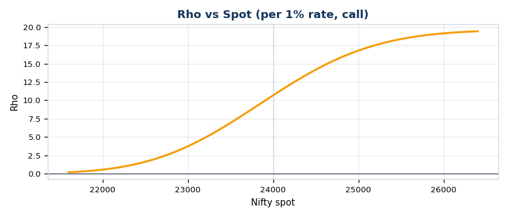

The figure plots rho against spot price. Notice that the call's rho is positive everywhere and the put's negative everywhere, that both grow in magnitude as you go deeper in-the-money (where the option behaves more like the forward, fully exposed to the discounting of the strike), and that the whole curve is far flatter for a short-dated option than for a long-dated one.

## Common mistakes / risk note

- **Thinking rho is irrelevant, full stop.** For weekly and monthly index options it is nearly so — but the moment you hold long-dated options, or trade single stocks around big dividends, or run a structured product, rho and epsilon become real. Dismiss them by habit and you will be blindsided exactly where they live.
- **Forgetting that rates reach you through the futures basis.** Even a pure weekly trader is exposed to interest rates via the cost-of-carry premium of Nifty futures over spot. When that basis shifts, your synthetic and hedged positions reprice. You felt rho whether or not you named it.
- **Believing a delta-neutral hedge stays neutral.** Vanna and charm guarantee it will not: a vol spike (vanna) or simply the passage of a day (charm) moves your delta even with spot pinned. On expiry-week Indian books, charm-driven overnight delta drift is a classic way a "hedged" seller wakes up directional.
- **Mistaking vega-neutral for vol-safe.** Volga means a vega-neutral book can still lose badly in a *large* vol move. Tail events around budgets, elections, and RBI surprises are precisely volga events.
- **Over-engineering a tiny book.** The opposite error: a retail trader computing vanna for two lots is wasting effort on a number smaller than the spread. Match the Greek to the size. The minor Greeks are tools for scale, not for everyone.

## Key takeaways

- **Rho** measures premium change per 1% move in interest rates: **calls positive, puts negative** (rates up — calls up, puts down).
- Rho scales with **time to expiry**, so it is **tiny for Indian weekly/monthly options** and **material only for long-dated (LEAPS-style) positions**.
- Interest rates still reach every index trader through the **cost-of-carry** that sets the futures premium over spot and prices every option's forward.
- **Put-call parity** contains the rate directly in `K * e^(-r*T)` — rho is just that term in motion.
- The minor second-order Greeks: **vanna** (delta vs vol / vega vs spot), **volga/vomma** (vega vs vol), **charm** (delta decay with time), **epsilon** (dividend sensitivity).
- A **professional running a large book** watches all of these because they describe how the whole position's risk reshapes; a **retail trader** rarely needs them directly.
- Match the Greek to the size and the horizon: short and small means delta/theta/vega dominate; long and large means rho and the second-order Greeks earn their place.

## Practice problems

1. **Sign check.** Interest rates in India rise sharply after an RBI policy meeting. All else equal, what happens to the price of an ATM Nifty *call*? To an ATM Nifty *put*? Explain the intuition in one line each.

2. **Why so small?** A trader holds a 5-day Nifty 24,000 call and worries about an upcoming RBI decision. Explain in plain English why rho is almost certainly the *least* of their concerns, naming the two Greeks that actually dominate their P&L over those 5 days.

3. **Scaling with time (numeric).** Using the rough estimate `rho per 1% ≈ K * T * 0.5 / 100` for an ATM call with K = 24,000, compute the approximate rho for (a) a 14-day option and (b) a 1-year option. By what factor does it grow?

4. **Name the Greek.** A desk is delta-hedged at Thursday's close on an expiry-week Nifty book. Friday morning, with Nifty unchanged overnight, the book shows a non-zero delta. Which minor Greek explains this, and why is it large in expiry week?

5. **Carry and the basis.** Nifty spot is 24,000 and one-month Nifty futures trade at 24,090. Using `Futures ≈ Spot * (1 + (r - q) * T)`, and assuming dividend yield q ≈ 1%, roughly what annualised interest rate `r` is implied? (Take T = 1/12.)

6. **Conceptual — volga.** Two traders are both vega-neutral going into the Union Budget. One holds far-OTM Nifty strangles; the other holds an ATM calendar spread. India VIX then doubles. Why might their P&L differ sharply despite both starting vega-neutral?

## Solutions

1. **Call rises; put falls.** A higher rate lifts the forward price of Nifty (cash carried forward earns interest in the risk-neutral world), which makes the right to *buy* — the call — more valuable. The same higher forward, plus the heavier discounting of the put's future payoff, makes the right to *sell* — the put — less valuable. So calls have positive rho, puts negative.

2. **Because rho scales with time, and 5 days is almost no time.** The rate effect is multiplied by `T = 5/365 ≈ 0.014` of a year, so even a full 1% rate jump moves the premium by only a rupee or two. Over those 5 days the P&L is dominated by **theta** (the option is deep in the steep part of the decay curve, losing several rupees a day) and **vega** (a VIX move around the RBI event can swing the premium by tens of rupees). Rho is a whisper against both.

3. Using `rho ≈ 24000 * T * 0.5 / 100 = 120 * T`:
   - (a) 14 days: `T = 14/365 ≈ 0.0384`, so `rho ≈ 120 * 0.0384 ≈ ₹4.6`.
   - (b) 1 year: `T = 1`, so `rho ≈ 120 * 1 = ₹120`.
   - Growth factor ≈ `120 / 4.6 ≈ 26`, which is just the ratio of the times (`365/14 ≈ 26`). Rho grows in direct proportion to time to expiry.

4. **Charm** (delta decay / delta bleed) — the change in delta from the passage of time alone, with spot and vol unchanged. Overnight, the options aged about a day, so their deltas drifted (OTM deltas toward zero, ITM toward one), leaving the previously neutral book with a net delta. Charm is **largest for near-expiry, near-the-money options**, which is precisely the inventory of an Indian expiry-week book, so the overnight drift can be substantial and must be re-hedged Friday morning.

5. The futures premium is `24090 / 24000 - 1 = 0.00375` over one month. Setting this equal to `(r - q) * T` with `T = 1/12`:
   `(r - q) * (1/12) = 0.00375`, so `r - q = 0.045 = 4.5%`. With `q ≈ 1%`, the implied rate is `r ≈ 5.5%` annualised. (The exact figure depends on the dividend assumption, but the method shows how the futures basis encodes the carry — and hence the interest rate — that rho formalises.)

6. **Because of volga (vomma), the curvature of vega.** Vega-neutral only means the *first-order* vol sensitivity is zero at today's vol. The far-OTM strangle holder is **long volga**: as VIX doubles, their vega itself grows, so they gain far more than a flat vega estimate predicts — a profitable convexity in a vol explosion. The ATM calendar spread has very different (often negative or near-zero) volga, so its vega does not balloon the same way. Same starting vega, opposite behaviour in a large vol move — that gap is volga, the Greek of "vol of vol."

# Chapter 27: Second-Order Greeks — Vanna, Volga & Charm

The first-order Greeks — delta, gamma, theta, vega, rho — tell you how an option's price reacts to a move in spot, the passage of time, a shift in volatility, or a change in rates. For a retail trader holding two lots of a weekly Nifty option, that is the whole story. But a professional managing a *book* of thousands of contracts across many strikes and expiries quickly runs into an uncomfortable truth: **the Greeks themselves move.** Your delta is not a fixed number you hedge once and forget. It drifts when spot moves (that is gamma, which you already know), but it *also* drifts when volatility changes, and it drifts purely because a day passed. Your vega is not constant either — it grows and shrinks as volatility itself travels.

This chapter is about the Greeks of the Greeks: the **second-order Greeks** that describe how your first-order risk reshapes as the market moves. Three earn real names on a trading desk — **vanna**, **volga**, and **charm** — and we will treat each with a light numeric illustration. A few more (**colour**, **speed**, **zomma**) you only need to recognise by name. The goal is not to compute these for a two-lot trade; that would be like weighing a lorry to find the dust on it. The goal is to understand *why a desk watches them*, so that when you scale up — or simply want to see how professionals keep a hedge accurate while the market heaves — you know what is going on.

## Core concepts

### Why first-order Greeks are not enough

Picture a delta hedge as balancing a ball on a table. Delta is the tilt of the table; keep it level (delta-neutral) and the ball does not roll. Gamma is the warning that the table is not really flat — it is gently curved, so as the ball moves, the tilt changes and you must keep re-levelling. That much you met in the gamma chapter.

But the table *also* tilts when **volatility** changes, even if the ball has not moved, and when **time** passes, even if nothing else changes. A professional hedge is therefore never "set and forget." It is continuous re-balancing against three forces that can each undo your neutrality: spot moving, vol moving, and the clock ticking. The second-order Greeks are the precise names for *how much* each force disturbs your delta and vega.

Here is the clean mental map. Every second-order Greek is a "rate of change of a first-order Greek with respect to something":

- **Gamma** = how delta changes when **spot** moves. (Already covered.)
- **Vanna** = how delta changes when **volatility** moves (equivalently, how vega changes when spot moves).
- **Charm** = how delta changes when **time** passes.
- **Volga** (vomma) = how vega changes when **volatility** moves.

Notice that three of these four are about how your *delta* gets disturbed — by spot (gamma), by vol (vanna), by time (charm). That is not an accident. Delta is the hedge you most care about keeping at zero, so the desk pays closest attention to everything that can move it.

### Vanna — when your delta and your vega bleed into each other

**Vanna** measures a single fact that can be stated two equivalent ways:

`vanna = change in delta per 1-point change in volatility = change in vega per 1-point move in spot`

These are the *same number* (a deep result: both are the second derivative of the option price with respect to spot and vol, and the order of differentiation does not matter). That dual nature is exactly why vanna matters, so sit with it.

Read it the first way — **how does my delta change when volatility moves?** Suppose you have carefully hedged a position to be delta-neutral on a calm morning. Then India VIX spikes from 13 to 18 because a global shock hits. You have not traded, spot has barely moved, yet vanna tells you your delta is **no longer zero.** The vol move alone has tilted the table. Your "neutral" book has quietly grown a directional lean — precisely at the moment the market is most dangerous.

Read it the second way — **how does my vega change when spot moves?** As Nifty falls toward a put strike you are short, that put's vega swells; as it rallies away, the vega shrinks. Your exposure to volatility is itself moving around as spot travels.

**Why vanna is central to skew and risk-reversals.** Recall the volatility skew (covered in the volatility chapters): out-of-the-money Nifty puts trade at a *higher* implied volatility than equidistant out-of-the-money calls, because the market pays up for crash protection. In a falling market, two things happen *together* — spot drops and implied vol rises. These are not independent; they are correlated, and vanna is the Greek that captures the joint effect. A **risk reversal** (long an OTM call, short an OTM put, or vice versa) is essentially a *bet on skew*, and its dominant risk is vanna. A desk that has sold downside puts is short vanna in the worst way: as the market falls and vol jumps, its delta turns more and more short, forcing it to buy back into a crashing market to re-hedge — the classic accelerant behind sharp sell-offs. Ignoring vanna means your hedges drift exactly when you can least afford it.

### Volga (vomma) — the convexity of your vega

**Volga**, also spelled **vomma**, measures:

`volga = change in vega per 1-point change in volatility`

If vega is your sensitivity to volatility, volga is the *curvature* of that sensitivity — it is the "gamma of vega." Just as gamma tells you that delta is not constant as spot moves, volga tells you that **vega is not constant as vol moves.**

The intuition: a book can be **vega-neutral at today's vol level and still make or lose serious money on a large vol move**, because vega itself shifts as volatility travels. Think of vega-neutral as balancing on flat ground at the current VIX. Volga is the curvature of that ground a little distance away in either direction.

- **At-the-money options** have the *most* vega but very *little* volga — their vega is large and roughly flat, so a small vol move barely changes it.
- **Out-of-the-money options (the "wings")** have modest vega at today's vol but *high* volga: a big rise in vol fattens the whole distribution, dragging those far strikes meaningfully into play, so their vega *grows* as vol rises.

This is why **trading the wings is really trading volga.** A long-volga position — typically built from far-OTM strangles — *gains vega as volatility rises*, so in a genuine volatility blow-up it makes more than a naive linear vega estimate predicts. That convexity is precisely what makes long-wing structures attractive as **tail hedges.** Conversely, a desk that sells cheap-looking OTM wings to collect premium is **short volga**: in calm markets it earns a trickle, but in a vol explosion its losses accelerate faster than its vega would have warned. Volga is the Greek of "vol of vol." On an Indian book, anyone holding far-OTM Nifty or Bank Nifty options through a budget, an election count day, or an RBI surprise is implicitly trading volga, whether they have named it or not.

### Charm — when your delta decays from the calendar alone

**Charm** — also called **delta decay** or **delta bleed** — measures:

`charm = change in delta per unit of time passing` (holding spot and vol fixed)

This is the most operationally useful second-order Greek for an Indian trader, because India lives in weekly expiries and charm is fiercest near expiry.

The intuition: an option's delta is, loosely, the market's estimate of the probability it finishes in the money. As expiry approaches, that probability estimate *sharpens* even if spot does not move. An out-of-the-money option that still had a fighting chance with five days left looks hopeless with one day left, so its **delta bleeds toward zero.** An in-the-money option becomes near-certain to be exercised, so its **delta drifts toward one** (or toward minus one for a put). Charm is the speed of that drift, driven purely by the clock.

Why a desk cares, concretely: suppose on Tuesday you sold an OTM Nifty call and hedged its delta by buying a few futures. You walk away delta-neutral. You do *nothing* on Wednesday and Thursday — and yet by Thursday morning, even if Nifty has not moved a single point, the call's delta has shrunk (charm at work), so your futures hedge is now too big and your book has developed a delta out of thin air. **Charm tells you how much your hedge will rot overnight from time alone.**

This matters most in two situations the professionals obsess over:

1. **Over a weekend.** Friday's close to Monday's open spans three calendar days of decay but zero trading hours to re-hedge. A desk estimates the weekend's charm on Friday afternoon and pre-adjusts its hedge so it does not walk into Monday with an unwanted delta.
2. **Into expiry week.** Charm is **largest for near-the-money options close to expiry** — which is *exactly* the Indian weekly trader's bread and butter. A book hedged at Wednesday's close can open Thursday (expiry day) with a meaningfully different delta purely from the day's passage, and around the at-the-money strike that drift can be violent.

### Colour, speed and zomma — name-only awareness

You should *recognise* these but never need to compute them by hand. They are third-order Greeks — the rates of change of the second-order Greeks — and they live deep inside a professional risk system.

- **Speed** = how **gamma** changes as **spot** moves (the third derivative with respect to spot). It tells a desk how fast its gamma is itself shifting in a fast market — relevant when running a large gamma position into a sharp move.
- **Zomma** = how **gamma** changes as **volatility** moves. It warns that the gamma you hedged at today's VIX will be different after a vol spike.
- **Colour** (also spelled **color**) = how **gamma** changes as **time** passes. It tells the desk how its gamma profile will look tomorrow given nothing else changes — important when gamma is large and expiry is near, because colour can be big in exactly that corner.

The pattern is worth seeing: just as vanna, charm and gamma describe how *delta* gets disturbed by vol, time and spot, the trio zomma, colour and speed describe how *gamma* gets disturbed by the same three forces. The Greeks form a tidy hierarchy, and a full institutional risk engine simply computes the whole grid.

### How a desk actually uses these to keep a hedge accurate

Strip away the names and here is the working picture. A delta-hedged book is a balance that three forces constantly try to tip: spot (gamma), vol (vanna), and time (charm). A professional does not re-hedge on every tick — that bleeds money to costs and the bid-ask spread. Instead the desk *anticipates*:

- It uses **gamma** to know how much delta a given spot move will create, and sets re-hedge thresholds accordingly.
- It uses **vanna** to know that a vol spike will hand it an unwanted delta, so when VIX jumps it checks its directional lean *before* the next spot move compounds it — and it watches vanna especially closely on any skew or risk-reversal position.
- It uses **charm** to pre-position the hedge for time it cannot trade through — overnight, over a weekend, into expiry — so the book does not drift while the desk sleeps.
- It uses **volga** to understand the convexity of its vol bet, knowing that a vega-neutral book can still bleed or print on a large vol move, and pricing its wings accordingly.

In short: the first-order Greeks tell you where your risk *is*; the second-order Greeks tell you where your risk *is going* as the market moves. A hedge built only on first-order Greeks is accurate for an instant and stale by the next. The professionals stay accurate by hedging the *changes* in their Greeks, not just the Greeks.

## Worked example (₹, Nifty)

Let us make **charm** concrete, because it is the one a weekly trader meets most directly. Assume Nifty spot is **24,000**, you are looking at the slightly out-of-the-money **24,200 call**, and you sold **5 lots** (Nifty lot size about 75, so 375 options). Implied vol is steady at 14%, spot does not move, and we simply let time pass over expiry week.

**Step 1 — Establish the starting hedge.** On Tuesday, with 2 days to Thursday expiry, suppose the 24,200 call has a delta of about **0.35**. Because you are *short* 375 calls, your position delta is:

`position delta = -375 * 0.35 = -131`

To be delta-neutral you buy futures equivalent to +131 deltas (about 1.75 lots of Nifty futures). Your book is now flat.

**Step 2 — Let one day pass, nothing else.** Charm bleeds the OTM call's delta toward zero. Suppose by Wednesday the same call's delta has fallen from 0.35 to about **0.27** purely from time (spot still 24,000, vol still 14%). The change in delta per option is `0.27 - 0.35 = -0.08` over one day — that is charm in action.

Your *short* position delta is now:

`position delta = -375 * 0.27 = -101`

**Step 3 — See the hedge drift.** You still hold the +131 futures delta from Tuesday, but your options now contribute only -101. Your book is no longer neutral:

`net delta = +131 (futures) - 101 (options) = +30`

You have woken up **long 30 deltas** without trading and without spot moving a single point. That is roughly +₹30 of P&L per one-point Nifty move that you did not intend to carry. To return to neutral you must *sell* about 30 deltas of futures. **Charm predicted this drift in advance:** had you computed it on Tuesday, you would have known Wednesday's hedge needed trimming and could have planned the adjustment instead of being surprised.

**Step 4 — Scale the lesson.** Thirty deltas is trivial on five lots. Now imagine a desk short 5,000 of these expiry-week calls instead of 375. The same per-option charm produces a delta drift of roughly `(0.08) * 5000 ≈ 400 deltas` per day — a position that genuinely must be managed overnight and especially across the weekend, when three days of charm accumulate with no chance to trade. This is why expiry-week desks watch charm as closely as a retail trader watches the spot price.

## Common mistakes / risk note

- **Believing a delta hedge is permanent.** The single most common error is hedging delta once and assuming you are protected. You are protected for an instant. Gamma, vanna and charm are all conspiring to re-tilt your book within hours. A "neutral" position left unattended overnight is rarely neutral by morning.
- **Forgetting that vol and spot move together.** Beginners model a vol shock and a price shock as separate events. In a real Indian sell-off they arrive *together*, and vanna is the Greek of that joint move. Stress-testing only "spot down" while holding vol fixed badly understates the risk of a short-put or risk-reversal book.
- **Selling the wings as "free money."** OTM strangles look like easy premium in calm markets, but selling them makes you **short volga** — your losses accelerate non-linearly in a vol explosion. Around budgets, election counts and RBI decisions, that convexity is exactly when it bites. The premium is the rent the market charges you for taking on negative convexity, not a gift.
- **Over-engineering a small book.** The opposite error: a retail trader computing vanna and volga for two lots. For a handful of weekly contracts, delta, theta and vega explain essentially all of your P&L, and the second-order Greeks are smaller than your transaction costs. These Greeks earn their keep at *scale*; know they exist, but do not drown a small position in them.
- **The honest backdrop.** None of this changes the base-rate reality: long options usually expire worthless, option selling carries large and sometimes undefined risk, and SEBI studies show roughly 9 in 10 retail F&O traders lose money. Mastering the second-order Greeks makes a professional's hedging more *accurate*; it does not turn a losing approach into a winning one. Use them to manage risk, not to manufacture false confidence.

## Key takeaways

- **The Greeks themselves move.** First-order Greeks tell you where your risk is; second-order Greeks tell you where it is heading as spot, vol and time change.
- **Vanna** = how delta changes with vol (= how vega changes with spot). It is the dominant risk in skew and risk-reversal trades, and it hands you an unwanted delta exactly during a vol spike.
- **Volga (vomma)** = how vega changes with vol — the convexity of your vol exposure. Long-wing structures are long volga (good in a blow-up); selling wings makes you short volga (dangerous in a blow-up).
- **Charm** = how delta drifts purely from time passing. It is largest for near-the-money options close to expiry — the Indian weekly trader's home turf — and is critical for managing a hedge overnight, over a weekend, and into expiry.
- **Colour, speed and zomma** are third-order Greeks (how gamma shifts with time, spot and vol); know the names, lean on the risk system for the numbers.
- A professional hedges the *changes* in the Greeks, not just the Greeks — that is what keeps a hedge accurate as the market moves.

## Practice problems

1. **Conceptual.** State, in one sentence each, what vanna, volga and charm measure. For each, name one Indian-market situation where it becomes a first-order concern.
2. **Conceptual.** Vanna can be described two equivalent ways. Write both, and explain why a desk holding a short OTM-put (downside) position is exposed to vanna in a market crash.
3. **Numeric (charm).** You are short 10 lots (lot size 75) of an OTM Bank Nifty call. Today its delta is 0.30; one day of charm is expected to drop the delta to 0.22 with spot and vol unchanged. You are currently delta-hedged with futures. After one day, what net delta will your book carry, and what trade restores neutrality?
4. **Conceptual.** Why is volga small for an at-the-money option but large for a far-OTM "wing" option? What does this imply about who is long and who is short volga in an OTM strangle trade?
5. **Conceptual.** A trader hedges delta at Friday's close and does nothing until Monday. Why might the book open Monday with a non-zero delta even if Nifty opens exactly where it closed on Friday? Which Greek governs this, and why is the effect larger over a weekend than over a single weekday night?
6. **Numeric (vanna intuition).** A delta-neutral book has a vanna such that delta changes by +6 deltas for every 1-point rise in implied volatility (in vol-point terms). India VIX jumps from 13 to 17 overnight with spot unchanged. Estimate the new book delta and state the hedge required to flatten it.

## Solutions

**1.** *Vanna* measures how delta changes when volatility moves (equivalently, how vega changes when spot moves) — it becomes first-order on a risk-reversal or skew position when a falling Nifty raises vol simultaneously. *Volga* measures how vega changes when volatility changes (the convexity of vega) — it becomes first-order when holding far-OTM Nifty wings through an event like the Union Budget or an election result. *Charm* measures how delta drifts purely from time passing — it becomes first-order in expiry week (Thursday) and across weekends, when near-the-money delta bleeds fastest and you cannot trade through the gap.

**2.** The two equivalent statements: (a) the change in delta per 1-point change in volatility, and (b) the change in vega per 1-point move in spot. A desk short downside puts is short vanna in the dangerous direction: in a crash, spot falls *and* implied vol rises together. The vol rise (via vanna) makes the puts' delta more negative, so the short-put book's delta turns increasingly short, forcing the desk to buy futures into a falling market to re-hedge — losses and forced buying compound exactly when liquidity is worst.

**3.** Position is short 10 * 75 = 750 calls. Starting option delta = -750 * 0.30 = -225, hedged with +225 futures deltas (book flat). After one day of charm, option delta = -750 * 0.22 = -165. Net book delta = +225 (futures) - 165 (options) = **+30 deltas long.** To restore neutrality, **sell 30 deltas of Bank Nifty futures** (about 0.4 of a 75-lot, so in practice you would round and manage the residual). The drift came entirely from the calendar, not from any price move.

**4.** Volga is the curvature of vega with respect to vol. An ATM option already has large, near-maximal vega that is roughly flat around the current vol level, so a small vol change barely alters it — low volga. A far-OTM wing has modest vega at today's vol, but a large rise in vol fattens the distribution and drags that far strike toward relevance, sharply increasing its vega — high volga. In an OTM strangle, the **buyer is long volga** (vega grows as vol rises, helping in a blow-up — useful as a tail hedge), and the **seller is short volga** (vega grows against them as vol rises, so losses accelerate non-linearly in a vol spike).

**5.** Over the weekend, time passes — three calendar days — but there are no trading hours in which to adjust. **Charm** causes the options' deltas to drift purely from this passage of time (OTM deltas bleed toward zero, ITM toward one), so the option side of the hedge no longer matches the static futures hedge set on Friday, leaving a net delta on Monday's open even with unchanged spot. The effect is larger over a weekend because charm accumulates with roughly three days of decay rather than one, and there is no opportunity to re-hedge in between — which is why desks pre-adjust for weekend charm on Friday afternoon.

**6.** Vol rises by 17 - 13 = 4 vol points. New delta ≈ starting delta + vanna * vol change = 0 + (+6 per point) * 4 = **+24 deltas.** The book, hedged neutral the night before, now sits long 24 deltas purely from the vol spike (spot unchanged). To flatten, **sell 24 deltas of Nifty futures.** This illustrates vanna's signature danger: a hedge that was neutral becomes directional the moment volatility moves, before spot has done anything at all.

# Chapter 28: Position Greeks — Delta-Neutral & Gamma Scalping

So far you have met the Greeks one option at a time: a single call has this much delta, that much gamma, so much theta. But nobody trades a single option in isolation. A real position is a *basket* — a straddle, a spread, a hedge with futures bolted on — and what matters is the risk of the **whole basket**, not its parts. The good news is that the Greeks were built for exactly this: they simply **add up**. Sum the delta of every leg and you have the position's delta. Sum the gamma, the theta, the vega. The basket's behaviour is just the arithmetic of its pieces.

Once you can see a position's *net* Greeks, a whole professional style of trading opens up. You can deliberately build a position with **zero net delta** — so that small moves in Nifty, up or down, leave you flat — and then make your money from something else entirely: from the market *moving a lot* (if you are long options) or from the market *sitting still* (if you are short options). This chapter teaches you to compute net Greeks, build a delta-neutral position, and run the two engines that sit at the heart of professional options trading: **gamma scalping** and its mirror image, **premium selling**.

## Core concepts

### Greeks add — that is the whole trick

Every Greek is a *rate of change* of the option price, and rates of change are additive across positions. If you own two options, the rate at which your total value changes when Nifty moves one point is just the sum of the two individual rates. So:

`Position delta = sum over all legs of (quantity * delta per option)`

and the same for gamma, theta, and vega. "Quantity" is signed: **positive if you are long the option, negative if you are short.** It is also scaled by lot size when you want the answer in rupees per index point per *lot*, but the cleanest way to think is first in *per-share* (per-unit) Greeks, then multiply by lot size at the end.

A few sign rules you must internalise, because they drive everything below:

- **Long a call:** positive delta, positive gamma, negative theta, positive vega.
- **Long a put:** negative delta, positive gamma, negative theta, positive vega.
- **Short a call:** negative delta, negative gamma, **positive** theta, negative vega.
- **Short a put:** positive delta, negative gamma, **positive** theta, negative vega.

Notice the deep symmetry: **anyone who is long options is long gamma and short theta** (they pay time decay to own convexity), and **anyone who is short options is short gamma and long theta** (they collect time decay in exchange for taking on convex risk). Gamma and theta are two sides of the same coin. Hold that thought — it is the engine of the entire chapter.

### Net delta and what "delta-neutral" means

**Delta** is how much your position's value changes per one-point move in the underlying. A position delta of +50 means: if Nifty rises 1 point, you make about ₹50 (before lot scaling); if it falls 1 point, you lose about ₹50. Delta is your *directional* exposure — your bet on which way the market goes.

**Delta-neutral** means your net position delta is **zero**. A one-point move up and a one-point move down both leave you, to first order, unchanged. You have switched off your directional bet. You are no longer trading the *direction* of Nifty; you are trading something else — its *movement*, its *volatility*, or its *stillness*.

Why would anyone want that? Because direction is the hardest thing to forecast and the easiest way to be wrong. A delta-neutral trader sidesteps the coin-flip of "up or down" and instead bets on a quantity that is often more forecastable: **how much the market will move**, regardless of which way.

### Building delta-neutral: two tools

There are two ways to cancel out delta.

**1. Offset options against options.** A long straddle (long call + long put at the same strike) is *naturally* near delta-neutral when struck at-the-money, because the call's positive delta (about +0.5) and the put's negative delta (about -0.5) roughly cancel. Many option structures are built to be born neutral.

**2. Offset with futures (or the underlying).** Index **futures have a delta of essentially +1 per unit** (one Nifty future moves one-for-one with the index, ignoring the small basis). This makes futures the perfect hedging tool: if your option position has a net delta of, say, **+40 units of Nifty**, you **sell futures worth 40 units** to bring net delta to zero. Sell index futures to kill positive delta; buy futures to kill negative delta. Because a future has zero gamma, zero theta, and zero vega, it adjusts *only* your delta and leaves all your other Greeks untouched — a clean steering wheel.

In India both tools are everyday reality: liquid Nifty and Bank Nifty futures sit right alongside the options, so professionals continuously trim delta with futures while their options supply the gamma, theta, and vega they actually want.

### Gamma: why delta-neutral does not stay neutral

Here is the catch that makes the whole game interesting. **Gamma** is the rate at which your *delta* changes as the underlying moves. If you are long options you have **positive gamma**, which means:

- When Nifty **rises**, your delta becomes **more positive** (your position starts leaning long).
- When Nifty **falls**, your delta becomes **more negative** (your position starts leaning short).

Read that twice, because it is the most beautiful property in options. A long-gamma position *automatically* gets longer as the market rises and shorter as it falls. It leans into winners and away from losers, all by itself. So if you start delta-neutral and Nifty moves, you are no longer neutral — you have *accumulated* a profitable directional position in the direction of the move. The market handed you a winning delta for free.

That free delta is the raw material of **gamma scalping**.

### Gamma scalping: harvesting movement

**Gamma scalping** is the technique of repeatedly resetting a long-gamma, delta-neutral position back to neutral, locking in profit each time the market moves. The recipe:

1. Build a delta-neutral position that is **long gamma** (long options — a straddle is the classic).
2. Nifty moves up. Your positive gamma turns your delta positive — you are now long, and you are in profit on that move.
3. **Re-hedge:** sell futures to bring delta back to zero. You have just **sold high** and pocketed the gain.
4. Nifty moves back down. Now your delta swings negative — you are short into the fall, again profiting.
5. **Re-hedge:** buy futures to return to neutral. You have just **bought low**.

Every oscillation lets you sell into strength and buy into weakness — a disciplined "buy low, sell high" that you are *forced* into by the mathematics, not by judgment. The more the market thrashes around, the more scalps you collect. **You are being paid for realised movement.** This is why gamma scalping is sometimes called "getting paid to be long volatility."

### The catch: theta is the rent you pay

Nothing is free. Remember the coin: **long gamma is also short theta.** To own that lovely positive gamma you bought options, and those options **decay every single day.** Theta is the rent you pay to hold the gamma. Each day your straddle is worth a little less just from the clock ticking.

So gamma scalping is a race between two forces:

- **Gamma profits** — the scalps you collect from re-hedging as the market moves. These grow with *realised volatility* (how much the market actually thrashes).
- **Theta cost** — the daily decay bleeding out of your long options. This is fixed the moment you put the trade on, and it reflects the *implied volatility* you paid.

This gives the single most important equation in volatility trading, in words:

`Gamma scalp profit ≈ value of REALISED volatility − value of IMPLIED volatility you paid`

**You make money only if the market actually moves more than the option's implied volatility was charging you for.** Implied vol (visible through India VIX and the option's own IV) is the *price* of expected movement. When you buy a straddle, you are buying movement at that price. If the market then delivers *more* movement than priced, your scalps beat your theta and you win. If the market goes quiet and delivers *less*, theta grinds you down and you lose — even though you were "neutral" and never made a directional bet at all.

This is the professional's reframing of options: **a long straddle is not a bet on direction; it is a bet that realised volatility will exceed implied volatility.** Direction is hedged away. Volatility is the whole trade.

### The mirror image: short gamma, the premium seller

Flip every sign and you get the other great archetype: the **option seller**. Sell a straddle and you are **short gamma, long theta.**

- **Long theta:** every day, decay flows *into* your pocket. You collect rent. As long as the market sits still, you win automatically — time is on your side.
- **Short gamma:** this is the danger. Your delta moves *against* you. When Nifty rises, your delta goes negative (you get shorter into a rising market — losing); when Nifty falls, your delta goes positive (you get longer into a falling market — losing). To hedge, you are forced to **buy high and sell low** — the exact opposite of the scalper, and you *pay* each time you re-hedge.

So the seller's equation is the inverse: they win if **realised volatility comes in *below* the implied volatility they sold.** They are paid the premium up front (high implied), and they keep it if the market under-delivers on movement. Their nightmare is a violent move — a gap, a crash, an event — where short-gamma losses pile up faster than the theta they collect. This is the honest, brutal asymmetry of selling: **steady small wins from theta, punctuated by occasional large losses from gamma.** It is why naked option selling, popular in India for its smooth equity curve, can blow up an account in a single session when the market gaps.

In short: **gamma scalpers and premium sellers are the same trade run in opposite directions.** One pays theta to own gamma and prays for movement; the other collects theta by being short gamma and prays for calm. Between them they price the difference between implied and realised volatility — the deepest game in options.

## Worked example (₹, Nifty)

Let us do both halves concretely: first sum the net Greeks of a position, then run a gamma-scalping P&L.

**Setup.** Nifty spot is **24,000**. We buy one lot of the **at-the-money long straddle**: long the 24,000 call and long the 24,000 put, weekly expiry. Take the per-unit Greeks (typical ATM weekly values) as:

| Leg | Delta | Gamma | Theta (₹/unit/day) | Vega (₹/unit per 1% IV) |
|---|---|---|---|---|
| Long 24,000 Call | +0.50 | +0.0010 | −7.0 | +9.0 |
| Long 24,000 Put | −0.48 | +0.0010 | −6.5 | +9.0 |
| **Net (per unit)** | **+0.02** | **+0.0020** | **−13.5** | **+18.0** |

**Step 1 — Read the net Greeks.**
- **Net delta ≈ +0.02 per unit** — essentially neutral. The call's +0.50 and put's −0.48 almost perfectly cancel. (The tiny +0.02 is because the put is a hair out-of-the-money relative to the forward; we will neutralise it.)
- **Net gamma = +0.0020 per unit** — positive and doubled (both legs contribute). This is the engine.
- **Net theta = −₹13.5 per unit per day** — we are paying decay on both legs. With a Nifty lot of about **75 units**, that is `13.5 * 75 ≈ ₹1,012 per day` of rent.
- **Net vega = +₹18 per unit per 1% IV** — long volatility; an India VIX drop will hurt the mark-to-market, a spike will help.

**Step 2 — Make it exactly delta-neutral.**
Net delta is +0.02 per unit, or `0.02 * 75 = +1.5` units of Nifty per lot. To zero it we sell a tiny sliver of futures — `1.5` units. In practice on one lot this is a rounding detail, but on **20 lots** the net delta would be `+30` units, and we would sell **30 units of Nifty futures** to flatten it. The principle scales: *whatever your net option delta is, trade the opposite in futures.*

**Step 3 — Gamma scalp through an intraday move.**
Now run the position through a day. Net gamma is `0.0020 * 75 ≈ 0.15` delta-units **per lot per 1-point move** — meaning every 1-point move in Nifty changes our delta by 0.15 units. Let us trade 20 lots so the numbers are visible: **position gamma ≈ 3.0 units of delta per Nifty point** (`0.15 * 20`).

Nifty starts at 24,000, delta-hedged to zero. Watch it move intraday:

- **Nifty rises 100 points to 24,100.** Gamma turns our delta positive: `delta gained ≈ gamma * move = 3.0 * 100 = +300` units. Roughly speaking we picked up an *average* long exposure of about `+150` units across that 100-point climb (delta ramped from 0 to +300 linearly), so the gain on the move is about `150 * 100 ≈ ₹15,000`. We **re-hedge: sell 300 units of futures** at 24,100, banking the rise and resetting delta to zero.
- **Nifty falls 100 points back to 24,000.** Now from a flat delta, gamma drives delta negative as it drops: it reaches about `−300` units at 24,000. We were *net short* into the fall — averaging about `−150` units over the 100-point drop — so we gain about `150 * 100 ≈ ₹15,000` again. We **re-hedge: buy 300 units of futures** at 24,000, back to neutral.

Two scalps, one round trip, roughly **₹30,000 of gamma profit** — and crucially, Nifty ended exactly where it started. We made money purely from the *path*, the back-and-forth, not from any net direction.

**Step 4 — Net the theta against it.**
That day's theta cost on 20 lots is `13.5 * 75 * 20 ≈ ₹20,250`. So the day's net:

`Net P&L ≈ gamma scalps − theta = 30,000 − 20,250 ≈ +₹9,750.`

We came out ahead because the **realised movement (a 200-point round trip) was large enough to beat the implied volatility we were paying for.** Had Nifty instead drifted just 20 points all day, our scalps might have totalled only ₹2,000–3,000 against the same ₹20,250 of theta — a clear **loss**, despite being perfectly delta-neutral the whole time. That is the trade in a nutshell: **delta-neutral does not mean risk-free; it means your P&L is now a pure bet on realised vs implied volatility.**

## Common mistakes / risk note

- **Thinking delta-neutral means safe.** It only removes *first-order direction*. You are still fully exposed to gamma, theta, and vega. A delta-neutral long straddle loses every quiet day; a delta-neutral short straddle can be destroyed by a single gap. Neutral is a starting posture, not a safety guarantee.
- **Forgetting that gamma scalping needs *realised* movement, not a *forecast*.** Buying a straddle because "a big move is coming" only pays if the move *actually arrives and exceeds the implied vol you paid*. If the event passes quietly, implied vol collapses (the dreaded **IV crush**), your vega loses *and* theta keeps bleeding. Many Indian traders buy expiry-week or pre-results straddles and lose on a flat tape.
- **Re-hedging too often or too rarely.** Scalp on every tiny wiggle and transaction costs (brokerage, STT, slippage) eat your scalps alive — and Indian STT plus charges are not trivial at high frequency. Re-hedge too rarely and you give back gains when the market reverses before you lock in. Choosing the re-hedge band is the real craft.
- **Underestimating the seller's tail.** Short gamma feels wonderful — smooth daily theta income — right up until it doesn't. The losses are convex: a 2% Nifty gap can wipe out months of collected premium. Sizing for the *gap*, not the average day, is what separates surviving sellers from blown-up ones.
- **Ignoring lot-size and margin reality.** Net Greeks must be scaled by lot size to mean anything in rupees, and short-gamma positions carry heavy SPAN + exposure margin that balloons exactly when volatility spikes — forcing the worst-timed exits.

## Key takeaways

- **Position Greeks are just the signed sum of leg Greeks:** add delta, gamma, theta, vega across all legs (long positive, short negative), then scale by lot size for rupees.
- **Delta-neutral** means net delta zero — no first-order directional exposure. Build it by offsetting options against options, or by trading **futures (delta ≈ +1 per unit)** against your option delta.
- **Long options = long gamma + short theta;** **short options = short gamma + long theta.** Gamma and theta are two sides of one coin.
- **Gamma scalping:** hold long gamma delta-neutral, then re-hedge as the market moves — you are forced to sell high and buy low, harvesting **realised volatility**, while paying **theta** as rent.
- The core trade-off: **a long straddle profits only if realised volatility exceeds the implied volatility you paid.** Direction is hedged away; volatility is the whole bet.
- **Premium sellers** run the mirror: collect theta, short gamma, and win only if **realised volatility stays below the implied vol they sold** — with smooth gains punctuated by sharp, convex tail losses.
- **Neutral is not safe.** A delta-neutral book is a pure implied-vs-realised volatility position, with real money at stake every day.

## Practice problems

1. **Net delta (conceptual + numeric).** You are long 2 lots of a Nifty 24,000 call (delta +0.55 each) and short 1 lot of a Nifty 24,200 call (delta +0.35). Lot size 75. What is your net delta in units of Nifty? Are you net long or short the market?

2. **Hedge with futures.** Your option book has a net delta of **−1,800 units** of Nifty. How many units of Nifty futures, and in which direction (buy/sell), do you trade to become delta-neutral? Why does this leave your gamma and theta unchanged?

3. **Sign the Greeks.** For a **short** at-the-money Nifty straddle (short call + short put), state the sign of net delta, net gamma, net theta, and net vega, and say in one sentence what market condition this position wants.

4. **Gamma scalp P&L (numeric).** A delta-neutral position has gamma of **2 units of delta per Nifty point**. Nifty moves from 52,000 (Bank Nifty) up 150 points and back to 52,000. Estimate the gamma-scalp profit from the round trip (use the average-delta method). If theta for the day is ₹18,000, did the position make or lose money?

5. **Implied vs realised (conceptual).** You buy a Nifty straddle when India VIX is 16. Over the week, Nifty barely moves and realised volatility works out to about 10 annualised. Without computing anything, explain whether your gamma-scalping campaign made or lost money, and which Greek did the damage.

6. **The seller's nightmare.** A trader sells weekly Nifty straddles and is delighted by months of steady profits. One morning Nifty gaps down 3% on global news. Explain, using gamma and theta, why a single day can erase months of gains, and what the trader's re-hedging is forced to do during the crash.

## Solutions

1. **Net delta = +0.75 units, net long.** Long leg: `2 lots * 75 * (+0.55) = +82.5` units. Short leg: `−1 lot * 75 * (+0.35) = −26.25` units. Net: `82.5 − 26.25 = +56.25` units of Nifty. (If the question is read as per-unit before lot scaling, it is `2*0.55 − 1*0.35 = +0.75` per unit, which times 75 gives the same +56.25.) Positive net delta means you are **net long** — you profit if Nifty rises.

2. **Buy 1,800 units of Nifty futures.** Net delta is −1,800 (you behave like a short position), so you add **+1,800** of delta by **buying** 1,800 units of futures, bringing the total to zero. It leaves gamma and theta untouched because **a future has zero gamma, zero theta, and zero vega** — it is pure linear delta. Futures are a clean delta steering wheel: they move only the directional exposure and nothing else.

3. **Net delta ≈ 0** (the ±0.5 deltas cancel at the money), **net gamma negative**, **net theta positive**, **net vega negative.** Being short both options, you are short gamma and short vega but long theta. The position **wants the market to sit still** (low realised volatility) and ideally wants implied volatility to fall — it collects theta as long as Nifty does not make a large move.

4. **Scalp profit ≈ ₹45,000; net ≈ +₹27,000.** On the 150-point rise, delta ramps from 0 to `2 * 150 = +300` units, averaging about +150 units, so the gain on that leg ≈ `150 * 150 ≈ ₹22,500` (equivalently `0.5 * gamma * move^2 = 0.5 * 2 * 150^2 = ₹22,500`); re-hedge by selling 300 units at the top. The 150-point fall back to 52,000 earns another ₹22,500 the same way, re-hedged by buying 300 units at the bottom. Total scalps ≈ **₹45,000.** Against theta of ₹18,000, the position **made money: net ≈ +₹27,000.** With gamma = 2 and a 150-point round trip, the realised movement comfortably beat the day's decay, so it is a winning day.

5. **It lost money, and theta did the damage.** You paid for movement priced at 16 vol but the market delivered only about 10 — realised came in *well below* implied. With little movement, your gamma scalps were tiny, while theta bled out of your long straddle every day regardless. On top of that, a quiet market usually means India VIX drifts lower, so your positive **vega** lost on the IV decline too. The campaign loses because **realised volatility (10) fell short of the implied volatility (16) you paid** — exactly the condition under which long gamma cannot pay its own rent.

6. **Because the seller is short gamma, and a gap is the one event short gamma cannot survive.** On calm days, **long theta** drips steady premium into the account — the smooth equity curve. But a 3% gap is a huge, *instantaneous* move with no chance to re-hedge along the way, and **short gamma** means the loss grows with the *square* of the move: a move 5x larger than a normal day produces a loss roughly 25x larger, dwarfing any single day's theta. During the crash the seller's delta swings sharply positive (the short puts deltas balloon), so to re-hedge they are **forced to sell futures into the falling market — locking in losses, selling low** — the exact opposite of the scalper's buy-low/sell-high. One gap thus delivers a convex loss that can exceed many months of accumulated theta, which is the defining asymmetry — and danger — of premium selling.

# Chapter 29: Greeks Through a Trade — How They Evolve

You have now met the Greeks one by one: delta, gamma, theta, vega, rho. Each chapter froze the world, changed one thing, and asked how the option's price responded. That is the right way to *learn* the Greeks, but it is not how you *live* with them. In a real trade nothing stays frozen. Spot moves, a day passes, India VIX jumps, and all five Greeks shift at once — and worse, they shift *each other*. Delta is not a fixed number; gamma is busy changing it. Theta is not a constant drip; it accelerates. Vega quietly shrinks as expiry approaches even if you do nothing.

This chapter stitches the Greeks back together into a single living picture. We will follow one Nifty position through several days — a "diary" of a trade — and watch every Greek update in rupees as the market moves under it. The goal is the most important mindset shift in this book: you stop seeing an option as a *price* you bought and start seeing it as a *bundle of risks* you are holding, each one changing every minute. That shift is what separates a punter from a professional.

## Core concepts

### The Greeks are a system, not a list

Think of your option position as a car driving over hills. **Delta** is your speed — how fast P&L changes as spot moves. **Gamma** is your acceleration — how fast that speed itself changes. **Theta** is fuel quietly burning whether you move or not. **Vega** is how sensitive the whole ride is to the "weather" (volatility). You never watch just one gauge; you watch them together, because a change in spot moves the speedometer (delta) *and* the accelerometer (gamma) *and* alters how much fuel you have left.

The key professional insight: **the Greeks are derivatives of each other.** Gamma is the rate of change of delta. Charm (from the last chapter) is the rate of change of delta as time passes. So when you ask "what will my delta be tomorrow if Nifty rises 200 points?", you are really asking gamma and charm to answer. Holding a position means continuously re-reading all the gauges, not setting them once.

### How a long call's delta evolves: gamma in action

Start with the cleanest case — you are **long one Nifty call**. Delta tells you the option's equivalent exposure: a delta of 0.50 means the call currently behaves like holding 0.50 lots of Nifty futures. But that 0.50 is a snapshot. As spot moves, delta is dragged around by **gamma**.

- **As the call goes in-the-money (ITM):** spot rises above the strike, the option becomes more and more certain to finish with value, and its delta climbs toward **1.0**. Deep ITM, the call moves almost rupee-for-rupee with Nifty — it is effectively a long futures position.
- **As the call goes out-of-the-money (OTM):** spot falls below the strike, the option becomes more likely to expire worthless, and its delta decays toward **0**. Deep OTM, it barely responds to spot at all — a near-dead instrument.
- **At-the-money (ATM):** delta sits near **0.50**, and this is exactly where **gamma is highest**. The delta is changing fastest here, because the option is poised on the knife-edge between "will finish worthless" and "will finish valuable."

So gamma is the engine that *rewrites* delta as spot travels. A long option always has **positive gamma**: your delta automatically grows in your favour (rises as you go ITM, falls as you go OTM). That is the friendly half of being long options. The unfriendly half is theta.

### How theta bleed accelerates near expiry

**Theta** is the premium an option loses to the simple passing of time, holding spot and volatility constant. For a long option, theta is a cost — your position bleeds a little value every day. The crucial dynamic is that **this bleed is not steady; it accelerates as expiry nears**, and it is sharpest for at-the-money options.

The reason is that an option's *time value* (everything above its intrinsic value) must decay to exactly zero at expiry. Far from expiry, with weeks to go, that decay is gentle and spread out. In the final days — especially for the weekly Nifty and Bank Nifty options that dominate Indian volumes — the remaining time value collapses. Roughly, time value decays in proportion to `sqrt(time remaining)`, so the loss per day grows as the clock runs down. An ATM weekly option might shed a few rupees per day early in the week and then dump a large chunk on its final day or two.

This is why the long-option holder is in a race: gamma is helping you (delta grows in your favour on a move), but theta is taxing you every day, and the tax bill rises as expiry approaches. **High gamma and high theta are two sides of the same coin** — the ATM near-expiry option that gives you the most explosive delta also charges you the steepest daily rent.

### How vega fades as expiry nears

**Vega** measures how much the premium changes when implied volatility (read off India VIX for the index) moves by one point. The structural fact to internalise: **vega shrinks as expiry approaches.** A longer-dated option has more time for volatility to act, so a change in the *assumed* volatility moves its price a lot — high vega. A weekly option that expires in three days gives volatility almost no runway, so its price is far less sensitive to an IV change — low vega.

The practical consequence for an Indian trader: the *same* India VIX move hits your monthly position much harder than your weekly position. As your option ages from a monthly into its final week, its vega quietly drains away even if you never touch it. So a trade that began as a "volatility bet" gradually becomes a pure "direction-and-time" bet as the calendar advances. You did not change your view; the Greek changed under you.

### Putting it together: the four forces on a long call

At any instant, the change in your long call's value is approximately the sum of the Greek contributions:

`change in premium ≈ delta*(change in spot) + 0.5*gamma*(change in spot)^2 + theta*(days passed) + vega*(change in IV)`

Read it as a sentence: *I make/lose delta for the move, gamma sweetens a big move (it is squared, so it always helps a long-option holder), theta charges me rent for the days, and vega pays or charges me for the shift in fear.* Every one of these terms uses a Greek that is itself changing — which is why we must watch the trade unfold rather than trust the opening snapshot.

The figure below shows the analogous picture for a **put**: how a put's delta evolves with spot, running from near 0 when the put is deep OTM (spot high above the strike) toward -1 when it is deep ITM (spot far below the strike), passing through about -0.50 at the money.

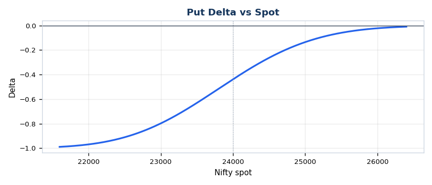

## Worked example (₹, Nifty/Bank Nifty)

Let us keep a real diary. You buy **one lot of a Nifty 24,000 weekly call** on Monday, with expiry that Thursday. One lot is 75 (lot sizes change over time; we use 75 here). Nifty spot is at 24,000 — your call is exactly at-the-money.

**Monday (Day 0): the opening snapshot.** India VIX is 13. The call costs **₹130** per share. Your Greeks per share:

- Delta = **0.50** (ATM, as expected)
- Gamma = **0.004** (delta changes by 0.004 for each 1-point Nifty move)
- Theta = **−₹9 per day** (you bleed about ₹9 of premium daily, all else equal)
- Vega = **₹6 per IV point**

Per lot, you paid `130 * 75 = ₹9,750`. Your effective directional exposure is `delta * lot = 0.50 * 75 = 37.5` "Nifty units" — like being long 37.5 shares of the index.

**Tuesday (Day 1): Nifty rallies 150 points to 24,150.** Now walk the Greeks. The move is +150.

- Delta effect: `0.50 * 150 = +₹75` per share.
- Gamma effect: `0.5 * 0.004 * 150^2 = 0.5 * 0.004 * 22,500 = +₹45` per share. Gamma rewarded the big move.
- Theta effect: one day passed, `−₹9` per share.
- Vega effect: the rally was calm, so VIX *fell* from 13 to 12, a −1 point change: `6 * (−1) = −₹6` per share.

Net change ≈ `75 + 45 − 9 − 6 = +₹105` per share. The call is now worth about **₹235**. Per lot that is a gain of `105 * 75 = ₹7,875`.

But notice what happened to the *Greeks themselves*. The call is now ITM, so **delta has risen to about 0.62** (gamma did this automatically). Gamma has eased slightly. And one day closer to Thursday expiry, **theta has worsened to about −₹12 per day** and **vega has slipped to about ₹4.50**. Your position is now more directional, decaying faster, and less sensitive to volatility than it was yesterday — even though you did nothing.

**Wednesday (Day 2): Nifty stalls, drifts back 50 points to 24,100.** The move is −50, and it is the second-last day.

- Delta effect: `0.62 * (−50) = −₹31` per share.
- Gamma effect: `0.5 * 0.0038 * 50^2 = +₹4.75` per share (gamma still adds on the squared term).
- Theta effect: `−₹12` per share — and this is the accelerating bleed biting.
- Vega effect: VIX flat, ≈ ₹0.

Net ≈ `−31 + 4.75 − 12 + 0 = −₹38` per share. The call drops to about **₹197**. The lesson is visible: a modest pullback *plus* heavy late-week theta wiped out a chunk of value. With expiry one day away, **delta is back near 0.57, gamma is very high, theta is now around −₹18/day, and vega has shrunk to about ₹3.**

**Thursday (Day 3): expiry day decision.** Nifty is at 24,100, your 24,000 call is ₹100 ITM in intrinsic value but still carries a sliver of time value that will vanish by close. You are now holding an almost-pure directional bet with brutal theta and explosive gamma — a coin flip on the last few hours. This is the moment the Greeks tell you to *act*: either book the ₹197-ish premium (a healthy gain on your ₹130 cost), or accept that the remaining time value is about to be incinerated. A professional reads the Greek profile — tiny vega, huge theta, gamma-dominated — and recognises this is no longer the trade they put on Monday. They exit or roll.

### Managing the position by its Greeks

The diary shows the levers a trader actually pulls:

- **Adjust (re-hedge) when delta drifts too far from your intent.** If you wanted a roughly directional bet sized at 37.5 units and gamma has pushed delta to 0.62 (46.5 units), you can sell a small amount of futures or a higher call to trim delta back. Option sellers running delta-neutral books do this constantly — re-hedging to flat as gamma keeps nudging delta.
- **Watch theta versus your edge.** If your reason to be long is a *view that needs time to play out*, accelerating late-week theta is your enemy; roll to a later expiry before the bleed peaks. If you have no fresh catalyst, the rising theta is a signal to exit.
- **Respect vega around events.** Before a budget, RBI policy, or major data, India VIX is often elevated and your long vega is rich; that same vega can collapse the moment the event passes ("IV crush"), hurting long-option holders even if direction was right.
- **Exit when the trade is no longer the trade you analysed.** By Thursday the Greek mix had completely changed character. Holding on out of habit means holding a *different* risk than the one you signed up for.

### The mindset shift: from price to risk

The beginner stares at the premium: "I paid ₹130, it's ₹197, I'm up." The professional stares at the Greeks: "I am long 46 units of delta, long gamma, paying ₹18 a day in theta, with only ₹3 of vega left and a day to expiry." Same position, two completely different mental models. Price is a single backward-looking number. The Greeks are a forward-looking *risk profile* that tells you what will happen next under every scenario — a 1% rally, a quiet day, a VIX spike. Trading by price is gambling on an outcome; trading by Greeks is managing a portfolio of risks. That is the leap this entire Part has been building toward.

## Common mistakes / risk note

- **Trusting the opening snapshot.** The biggest error is sizing a trade by Monday's Greeks and never updating them. By Wednesday your delta, theta, and vega can be unrecognisable. Re-read the gauges every day.
- **Forgetting that gamma and theta are linked.** Beginners love high-gamma near-expiry weeklies for the explosive moves and ignore that the *same* options carry savage theta. You cannot have the cheap lottery ticket without the fast bleed.
- **Being long options into an IV crush.** Buying expensive options before a known event (high VIX) and being right on direction but still losing money because vega collapsed afterward is one of the most common, demoralising retail mistakes.
- **The honest risk.** A long option is a decaying asset; most expire worthless, and time is working against you every single day, faster near expiry. Option *selling* turns these Greeks around in your favour (positive theta, short vega) but exposes you to large, potentially undefined losses when gamma works against you on a sharp move. SEBI studies show roughly nine in ten retail F&O traders lose money — frequently because they held a decaying long position too long, or sold gamma they could not manage. Understanding how the Greeks *evolve* is precisely the defence against being on the wrong side of these forces.

## Key takeaways

- The Greeks form a connected system that changes continuously; gamma rewrites delta, charm and theta change things as time passes, and vega fades with the calendar.
- A long call's delta rises toward 1 as it goes ITM and falls toward 0 as it goes OTM — gamma is the engine, and gamma peaks at-the-money.
- Theta bleed accelerates as expiry nears (roughly with `sqrt(time)`), hitting ATM weekly options hardest in their final days.
- Vega shrinks as expiry approaches, so a position's volatility sensitivity quietly drains away even if you do nothing.
- Manage a position by its Greeks: adjust when delta drifts, roll or exit when theta peaks, respect vega around events, and recognise when the trade has become a different risk.
- The professional mindset reads a position as a live risk profile (delta, gamma, theta, vega), not as a single price.

## Practice problems

1. **Conceptual.** You are long an ATM Nifty weekly call on Monday. Without any change in spot or volatility, will your delta, gamma, theta, and vega be larger or smaller by Wednesday? Explain the direction of each.

2. **Numeric.** A Nifty 52,000 (Bank Nifty) call has delta 0.45, gamma 0.003, theta −₹20/day, vega ₹8. Overnight Bank Nifty rises 300 points and India VIX rises 2 points. Using the Greek decomposition, estimate the change in the call's premium per share. (Treat one day as passing.)

3. **Conceptual.** Two traders both hold a Nifty 24,000 call. One bought a 30-day monthly; the other bought a 3-day weekly. India VIX jumps 3 points. Whose position gains more from the VIX move, and why?

4. **Numeric.** After the move in Problem 2, the call's delta has risen to 0.60. You originally wanted exposure equivalent to about 0.45 of a lot. By how much (in delta terms) are you now over-exposed, and name one way to trim it back.

5. **Conceptual / risk.** A trader buys an ATM weekly call the evening before the RBI policy announcement when India VIX is unusually high. The next day the market moves up modestly in the trader's favour, yet the call *loses* money. Give the most likely Greek explanation.

6. **Numeric.** An ATM weekly call is worth ₹120 with 4 days left. Assuming its remaining time value decays roughly in proportion to `sqrt(days left)` and it is entirely time value, estimate its value after one day passes with spot and IV unchanged. What does this say about late-week theta?

## Solutions

1. By Wednesday, two days closer to expiry: **gamma is larger** (gamma rises for ATM options as expiry nears), **theta is larger in magnitude** (the bleed accelerates), **vega is smaller** (volatility sensitivity fades with time), and **delta** stays near 0.50 *only if* the option is still exactly ATM — but its sensitivity to spot is now sharper because gamma is higher. The headline: the option becomes a more violent, faster-decaying, less vol-sensitive instrument as expiry approaches.

2. Decompose the move (change in spot = +300, one day passes, change in IV = +2):
   - Delta: `0.45 * 300 = +₹135`
   - Gamma: `0.5 * 0.003 * 300^2 = 0.5 * 0.003 * 90,000 = +₹135`
   - Theta: `−₹20`
   - Vega: `8 * 2 = +₹16`
   - Net ≈ `135 + 135 − 20 + 16 = +₹266` per share. (Per lot of 35, that is about `266 * 35 = ₹9,310`; lot sizes vary, so scale to the current Bank Nifty lot.) Note how gamma contributed as much as delta on a 300-point move — the value of being long gamma on a large move.

3. **The monthly holder gains more.** Vega scales with time to expiry: the 30-day option has far more vega than the 3-day option, because volatility has more runway to act over a month than over three days. A 3-point VIX jump therefore lifts the monthly premium substantially while the weekly barely responds. This is exactly why vega fades as expiry nears.

4. You are now at delta 0.60 against a target of 0.45, so you are **over-exposed by 0.15 of delta** (about 0.15 of a lot of long Nifty exposure). To trim it back toward 0.45 you can **sell a small amount of the underlying futures, or sell a higher-strike call** to shed roughly 0.15 of delta, restoring your intended directional size. This is routine delta re-hedging — gamma keeps pushing delta away from target, and you keep nudging it back.

5. The most likely culprit is **vega and an IV crush.** Before the RBI event, implied volatility (India VIX) was elevated, so the trader paid a rich, vega-heavy premium. Once the announcement passed and uncertainty resolved, IV collapsed. The negative vega impact from the falling IV outweighed the positive delta gain from the modest favourable move, so the call lost money despite direction being right. Late-week theta on an expiry-week option would have added to the loss.

6. With 4 days left the time value is ₹120. After one day, 3 days remain. Scaling by `sqrt(days)`: new value ≈ `120 * sqrt(3)/sqrt(4) = 120 * 1.732/2 = 120 * 0.866 ≈ ₹104`. So the option loses about **₹16 in a single day** — a 13% drop purely from time. Repeat the calculation from 2 days to 1 day: `value at 2 days = 120*sqrt(2)/2 ≈ ₹85`, and from 2 to 1 it falls to `120*sqrt(1)/2 = ₹60`, a **₹25 drop**. The per-day loss grows as expiry approaches — that is accelerating late-week theta in numbers, and why holding long weekly options into the final days is a race against a steepening clock.

<div class="partpage"><div class="part-lbl">Part V</div><div class="part-title">Volatility</div></div>

# Chapter 30: Historical vs Implied Volatility

Volatility is the heartbeat of options. Strip away the jargon and an option is, at its core, a bet on *movement* — on how much the underlying will travel before expiry. Direction matters, but movement is the raw material. A call that needs Nifty to rise 200 points is worthless if Nifty is frozen, and priceless if Nifty is thrashing around in 300-point daily swings. So before you can judge whether any option is fairly priced, you have to answer one question: how much is this thing going to move? Everything else — the strikes, the premiums, the Greeks — flows from that.

There are two ways to measure movement, and the gap between them is one of the most reliable sources of edge in the entire options market. **Historical volatility** tells you how much the underlying *actually* moved in the recent past — it is a measured fact. **Implied volatility** tells you how much the market *expects* it to move in the future — it is a forecast, baked into option prices. This chapter teaches you to compute the first by hand, read the second off the screen, and — most importantly — to compare them. Because when you learn that implied volatility is usually *higher* than the realised volatility that follows, you have found the structural reason most professional option sellers stay in business.

## Core concepts

### Volatility is just the standard deviation of returns

In Chapter 25 we met volatility as "the annualised standard deviation of returns." Let us slow down and unpack exactly what that means, because in this chapter you are going to compute it yourself.

When a price moves from one day to the next, it produces a **return** — a percentage change. Some days the return is +0.8%, some days −1.2%, some days +0.1%. **Volatility measures how spread out those daily returns are.** If Nifty's daily returns cluster tightly around zero (lots of ±0.2% days), volatility is low. If they swing wildly (±2% days, then ±1.5% days), volatility is high. The statistical tool for "how spread out" is the **standard deviation**, and that is precisely what volatility is.

A subtle but important detail: professionals use **log returns**, not simple percentage returns. The log return for a day is:

`daily log return = ln(today's close / yesterday's close)`

where `ln` is the natural logarithm. For the small moves we see day to day, a log return is almost identical to the simple percentage change (a +1% day gives a log return of about +0.00995). We use logs for two clean mathematical reasons: log returns add up neatly over time, and they match the lognormal model of prices that sits underneath Black-Scholes (Chapter 19). For your purposes, just know: take the ratio of consecutive closes, take its natural log, and that is your daily return.

### Computing historical (realised) volatility

**Historical volatility** — also called **realised volatility** — is the standard deviation of those daily log returns, scaled up to an annual figure. The recipe has three steps:

1. **Compute the daily log returns** from a series of closing prices: `r = ln(close_today / close_yesterday)` for each day.
2. **Take the standard deviation** of those daily returns. This gives you the *daily* volatility — the typical size of a one-day wobble.
3. **Annualise** by multiplying by the square root of the number of trading days in a year. Indian markets (like most) have roughly **252 trading days** per year, so:

`historical volatility (annual) = standard deviation of daily log returns * sqrt(252)`

Why `sqrt(252)` and not 252? Because volatility scales with the *square root* of time, not time itself. Random daily moves partly cancel out rather than stacking up in a straight line — this is the same "square root of time" rule we saw with vega scaling as `sqrt(T)` (Chapter 25). If a single day has a standard deviation of 1%, a year of 252 such days does *not* have a standard deviation of 252%; it has roughly `1% * sqrt(252) ≈ 15.9%`. That square root is the bridge between a daily wobble and an annual figure, and it is the number quoted everywhere — "Nifty's realised vol is 14%" always means *annualised*.

A quick reference for the conversion, which is worth memorising:

- `sqrt(252) ≈ 15.87` — to annualise a daily standard deviation.
- To go the *other* way — from an annual IV to an expected daily move — divide by `sqrt(252)`: a 16% annual vol implies a typical daily move of about `16% / 15.87 ≈ 1%`. This is a professional's back-of-envelope trick: an India VIX of 16 means the market expects roughly 1% daily Nifty swings.

Historical volatility is always computed over a *window* — the last 10 days, 20 days, 30 days, or whatever you choose. A short window (10 days) reacts fast but is noisy; a long window (60 days) is smoother but slow to register a regime change. There is no single "correct" window; traders watch several. The key point is that historical volatility is **backward-looking** — it is a measured fact about the past, nothing more.

### Implied volatility: the market's forward-looking forecast

**Implied volatility (IV)** is the mirror image. Instead of measuring the past, it extracts the market's *expectation* of future movement from current option prices.

Recall the Black-Scholes formula (Chapter 20): feed it spot, strike, time to expiry, interest rate, and volatility, and it returns a fair option price. Five inputs in, one price out. But in the real market, the *price* is the thing you can see — it is right there on the option chain. Four of the five inputs (spot, strike, time, rate) are also observable. The only unknown is volatility. So we run the formula **backwards**: take the option's market price as given, and ask, "what volatility figure, plugged into Black-Scholes, would produce exactly this price?" That number is the implied volatility — the volatility *implied by* the price.

The crucial word is **forward-looking**. IV is not a measurement of anything that has happened. It is the market's collective bet on how much the underlying will move between now and expiry. When traders expect turbulence — an election, a Budget, an RBI decision — they bid premiums up, and IV rises. When they expect calm, premiums sag and IV falls. **India VIX** (Chapter 25) is simply the market's IV forecast for Nifty over the next 30 days, packaged into a single published index.

So the two numbers answer two different questions:

- **Historical volatility:** "How much *did* it move?" (a fact about the past)
- **Implied volatility:** "How much does the market think it *will* move?" (a forecast of the future)

### The volatility risk premium: IV usually beats realised

Here is the single most valuable insight in this chapter, and one of the most important structural facts in all of options trading.

**On average, implied volatility is higher than the realised volatility that subsequently shows up.** The market's forecast of future movement systematically *overstates* the movement that actually arrives. This persistent gap is called the **volatility risk premium** (VRP).

Concretely: if you measured India VIX every day for years and then measured how much Nifty actually moved over the following 30 days each time, you would find that VIX, on average, sat a few points *above* the realised volatility that followed. The forecast runs hot. Studies of Indian and global markets alike show this gap is real and durable — implied vol tends to trade at a premium of a few percentage points to realised vol most of the time.

Why does this happen? It is not market stupidity. It is **insurance pricing**, and it is rational:

- **Option sellers are insurers.** When you sell an option, you take on a one-sided risk: a large, fast move against you can cost far more than the premium you collected, and for naked options the loss is theoretically unbounded. Nobody takes on open-ended tail risk for free. Sellers *demand compensation* for bearing it, and that compensation shows up as premium priced above the statistically "fair" level — i.e., IV set above expected realised vol.
- **Buyers want protection and will overpay for it.** Fund managers, hedgers, and nervous retail traders buy puts (and calls) as insurance against crashes and to chase big moves. Like all insurance buyers, they routinely pay more than the actuarially fair price for peace of mind and convenience. That demand props IV up.
- **Crashes are asymmetric and terrifying.** Markets fall faster than they rise. The memory of sudden gap-downs (a Covid crash, an election shock) keeps a fear premium permanently baked into option prices, especially puts. Sellers must be paid to stand in front of that risk.

Put those together and you get a market where, most of the time, the people *selling* volatility collect more premium than the eventual movement justifies. **This is the structural edge professional option sellers lean on** — the options-market equivalent of an insurance company's underwriting profit: collect premiums that, on average, exceed the claims paid out.

But — and this is the non-negotiable caveat — it is an *edge*, not a *guarantee*. An insurer that under-reserves goes bankrupt in a single hurricane. The VRP is the reward for taking on tail risk, and that tail risk is real: every so often the move dwarfs the premium and the seller takes a brutal loss. It pays a steady stream of small wins in exchange for occasional large losses — positive *on average over time*, which is very different from *safe*. Most retail traders who blow up as option sellers mistook a structural edge for free money and sized as if the tail would never arrive. It always arrives eventually.

### Comparing IV and realised: are options cheap or expensive?

Now we can use both numbers together to do something genuinely useful: judge whether options are **cheap** or **expensive** right now. This is the comparison that separates a volatility trader from a coin-flipper.

The logic is simple. Implied volatility is what you *pay* (or receive) when you trade an option. Realised volatility is roughly what the option *delivers*. So:

- **IV much higher than recent realised vol → options are EXPENSIVE.** The market is charging a fat premium for movement that, judging by recent behaviour, may not materialise. This favours **sellers**: you are collecting rich premium relative to the actual movement. Think of a market bracing for an event with India VIX spiked to 22 while Nifty has been quietly grinding along at 11% realised — premiums are inflated, and the crush that follows (Chapter 25) hands the seller a profit.
- **IV much lower than recent realised vol → options are CHEAP.** The market is charging little for movement, but the underlying has actually been swinging hard. This favours **buyers**: you are paying a thin premium for an instrument that may well move enough to pay off. A long straddle bought when IV is unusually low relative to how much the index is genuinely thrashing is a classic "cheap volatility" trade.
- **IV roughly in line with realised vol (plus the usual small premium) → options are fairly priced.** No obvious volatility edge; trade on other grounds.

A common professional shorthand is the **IV/HV ratio** — implied vol divided by historical (realised) vol. Because of the volatility risk premium, this ratio normally sits a bit *above* 1.0 (IV usually runs hotter than realised). So you do not get excited just because IV exceeds HV — that is the default state. You look for *extremes*:

- IV/HV well above its usual range (say IV is 1.5x or 2x recent realised) → options are unusually expensive → lean toward selling.
- IV/HV below 1.0 (IV *cheaper* than what the market is actually delivering) → options are unusually cheap → lean toward buying.

The mistake to avoid: comparing IV to HV in a vacuum and concluding "IV > HV, therefore sell." Since IV almost *always* exceeds HV, that rule would have you selling every single day — straight into the tail-risk meat grinder. The signal is in the *deviation from the normal gap*, not the gap itself.

Professionals also use **IV rank** and **IV percentile**, which place today's IV against its own range over the past year. An India VIX of 16 means nothing in isolation; an India VIX of 16 sitting at the *95th percentile* of the past year tells you volatility is richly priced by its own historical standard. "Is IV high?" is always a *relative* question — relative to recent realised vol, and relative to IV's own history.

## Worked example (₹, Nifty)

Let us compute a rough historical volatility for Nifty by hand from a handful of daily closes, then compare it to India VIX to judge whether options are cheap or expensive.

**Setup.** Here are five consecutive daily closing levels for Nifty:

| Day | Close |
|-----|-------|
| 0   | 24,000 |
| 1   | 24,180 |
| 2   | 24,050 |
| 3   | 24,290 |
| 4   | 24,170 |

India VIX is currently quoted at **15%**. Are Nifty options cheap or expensive relative to how the index has actually been moving?

**Step 1 — Compute the daily log returns.** Using `r = ln(close_today / close_yesterday)`:

- Day 1: `ln(24180 / 24000) = ln(1.00750) ≈ +0.007472` (about +0.75%)
- Day 2: `ln(24050 / 24180) = ln(0.99462) ≈ -0.005391` (about −0.54%)
- Day 3: `ln(24290 / 24050) = ln(1.00998) ≈ +0.009936` (about +0.99%)
- Day 4: `ln(24170 / 24290) = ln(0.99506) ≈ -0.004953` (about −0.50%)

So our four daily returns are approximately: `+0.007472, -0.005391, +0.009936, -0.004953`.

**Step 2 — Find the standard deviation of these returns.** First the mean:

`mean = (0.007472 - 0.005391 + 0.009936 - 0.004953) / 4 = 0.007064 / 4 ≈ 0.001766`

Now the squared deviations from the mean:

- `(0.007472 - 0.001766)^2 = (0.005706)^2 ≈ 0.00003256`
- `(-0.005391 - 0.001766)^2 = (-0.007157)^2 ≈ 0.00005122`
- `(0.009936 - 0.001766)^2 = (0.008170)^2 ≈ 0.00006675`
- `(-0.004953 - 0.001766)^2 = (-0.006719)^2 ≈ 0.00004514`

Sum of squared deviations `≈ 0.00019567`. Dividing by `(n - 1) = 3` (the sample standard deviation, the standard choice for a small data set):

`variance = 0.00019567 / 3 ≈ 0.00006522`

`daily standard deviation = sqrt(0.00006522) ≈ 0.008076` (about 0.81% per day)

**Step 3 — Annualise with sqrt(252).**

`historical volatility = 0.008076 * sqrt(252) = 0.008076 * 15.87 ≈ 0.1282`

So Nifty's realised volatility over this short window is about **12.8% annualised**.

**Step 4 — Compare to India VIX and draw the conclusion.** Implied volatility (India VIX) is **15%**; realised volatility is about **12.8%**. The IV/HV ratio is `15 / 12.8 ≈ 1.17`.

IV sits about 2.2 points above realised, an IV/HV ratio of roughly 1.17. That is squarely in the *normal* range — exactly the kind of modest premium the volatility risk premium predicts. The market is charging a little more for future movement than the index has recently delivered, which is the default, healthy state of affairs. There is **no extreme edge** here in either direction: options are neither screamingly expensive nor a bargain. A seller is being paid the usual small premium for bearing tail risk; a buyer is paying the usual small markup. If India VIX had instead been sitting at 24% against this same 12.8% realised (a ratio near 1.9), *that* would flag richly priced options and tilt you toward selling. And if VIX were at 10% against 12.8% realised (ratio 0.78), options would look genuinely cheap and tilt you toward buying.

**A caveat on the method:** a four-return sample is far too small for a trustworthy estimate — real desks use 20 or 30 days, and even then realised vol jumps around. We used five closes so the arithmetic stays visible. The *process*, though, is exactly what professionals run on a full window: log returns, standard deviation, times `sqrt(252)`, then compare to IV.

## Common mistakes / risk note

- **Treating "IV > realised, so sell" as a money machine.** Because of the volatility risk premium, IV exceeds realised vol *most of the time* — that is the default, not a signal. Selling indiscriminately on that basis means perpetually short volatility into the exact tail events that wipe out years of small gains. The edge is in selling when IV is *unusually* rich relative to its own history and to recent realised, with defined risk and proper sizing — not in selling every day.
- **Confusing the two volatilities.** Historical vol is a measured fact about the past; implied vol is a forecast priced into options today. They are different numbers answering different questions. A high realised vol does *not* mean options are currently expensive — the realised move may already be over while IV has collapsed (or vice versa). Always compare the *current* IV to *recent* realised.
- **Forgetting to annualise — or annualising wrong.** A daily standard deviation of 0.8% is not "0.8% volatility"; the quoted figure is always annual, `0.8% * sqrt(252) ≈ 12.8%`. And it is `sqrt(252)`, not 252 — using the wrong scaling inflates your estimate roughly sixteen-fold. Square root of time, every time.
- **Using simple returns instead of log returns, or the wrong window.** For day-to-day moves the difference between simple and log returns is tiny, but be consistent and use logs. And remember the window matters: a 10-day realised vol can look very different from a 30-day one. Quote the window alongside the number.
- **Assuming the volatility risk premium makes selling safe.** It makes selling *positive on average* — which is emphatically not the same as safe. The VRP is compensation for real, occasionally catastrophic tail risk. Naked option selling carries large, sometimes unlimited, downside; the premium you collect is precisely the market's price for the chance that a Covid-style gap blows through your strike. Around 9 in 10 retail F&O traders lose money (SEBI studies), and over-leveraged option selling into the tail is one of the most common ways it happens. Size for the disaster, not the average day.

## Key takeaways

- **Historical (realised) volatility** measures how much the underlying *actually* moved: `historical vol = standard deviation of daily log returns * sqrt(252)`. It is backward-looking — a fact about the past.
- **Implied volatility** is the market's *forward-looking* forecast of future movement, backed out of current option prices by running Black-Scholes in reverse. India VIX is this forecast for Nifty over the next 30 days.
- **Annualise with `sqrt(252)`**, because volatility scales with the square root of time. The handy inverse: an annual IV divided by `sqrt(252) ≈ 15.87` gives the expected daily move (16% IV → about 1% daily swings).
- **The volatility risk premium**: IV is, on average, *higher* than the realised vol that follows, because option sellers demand compensation for tail risk and buyers overpay for protection. This is the structural edge option sellers lean on.
- **Compare IV to recent realised to judge cheap vs expensive.** IV far above realised → options expensive → favours sellers. IV below realised → options cheap → favours buyers. But because IV normally exceeds realised, look for *extremes* (and use IV rank/percentile), not the everyday gap.
- The VRP is an edge **on average**, not a guarantee. It pays small, steady wins for bearing occasional large losses — sell with defined risk and disciplined sizing, never as "free money."

## Practice problems

1. **Daily move from IV (numeric).** India VIX is quoted at 14%. Estimate the typical one-day move the market is pricing in for Nifty, in percentage terms. If Nifty is at 24,000, roughly how many points is that?

2. **Annualise a daily vol (numeric).** Over the last 20 trading days, the standard deviation of Bank Nifty's daily log returns is 0.011 (i.e., 1.1% per day). What is the annualised historical volatility?

3. **Cheap or expensive? (conceptual + numeric).** Nifty's 30-day realised volatility is 10%, and India VIX is sitting at 21% ahead of the Union Budget. Compute the IV/HV ratio. Are options cheap or expensive, and would this environment favour an option buyer or a seller? What is the main risk to that side?

4. **Why is IV usually above realised?** In plain English, explain the volatility risk premium and give two distinct reasons it exists. Why does this not make option selling "safe"?

5. **Compute historical vol from closes (numeric).** Three consecutive Nifty closes are 24,000, 24,240, and 24,100. Compute the two daily log returns, their sample standard deviation, and the annualised historical volatility using `sqrt(252) ≈ 15.87`.

6. **The default-gap trap (conceptual).** A trader says: "India VIX is 15% and Nifty's realised vol is 13%. IV is above realised, so I'll sell options every day to harvest the difference." What is wrong with this reasoning?

## Solutions

1. The expected daily move is the annual IV divided by `sqrt(252)`: `14% / 15.87 ≈ 0.88%` per day. At a spot of 24,000, that is roughly `0.0088 * 24000 ≈ 211 points`. So the market is pricing in typical daily Nifty swings of a bit under 1%, or about 200 points. (This is the one-standard-deviation daily move — Nifty will exceed it on roughly a third of days.)

2. Annualise by multiplying the daily standard deviation by `sqrt(252)`: `0.011 * 15.87 ≈ 0.1746`, or about **17.5% annualised** historical volatility. (Note we multiply by `sqrt(252)`, not 252 — the square-root-of-time rule.)

3. IV/HV `= 21 / 10 = 2.1`. Implied vol is more than double recent realised vol, so options are **expensive** — the market is charging a rich premium for movement that, by recent behaviour, far exceeds what the index has actually delivered. This favours the **seller**, who collects inflated premium and profits as IV crushes back down after the Budget. **The main risk:** the event delivers a *bigger* move than priced (or IV spikes even further before resolving). A short option into an event carries large — for naked options, theoretically unlimited — downside; the fat premium is precisely the market's price for that tail risk. Size for the disaster.

4. The **volatility risk premium** is the persistent tendency for implied volatility to sit *above* the realised volatility that actually follows — the market's forecast of future movement runs systematically hot. Two distinct reasons: **(a) Sellers demand compensation for tail risk.** Selling an option means taking on open-ended, occasionally catastrophic downside; no rational party does that for free, so they price premium above the statistically fair level. **(b) Buyers overpay for protection.** Hedgers and nervous traders buy options as insurance and, like all insurance buyers, routinely pay more than the actuarially fair price for peace of mind — that demand props IV up. (A third valid reason: crashes are fast and asymmetric, keeping a permanent fear premium in put prices.) It does **not** make selling safe because the premium is *compensation for real tail risk*: the VRP is positive *on average over time*, delivering many small wins punctuated by occasional large losses. An under-sized, over-leveraged seller is wiped out by the very tail event the premium was paying them to bear.

5. Daily log returns:
   - Day 1: `ln(24240 / 24000) = ln(1.01000) ≈ +0.009950`
   - Day 2: `ln(24100 / 24240) = ln(0.99422) ≈ -0.005797`

   Mean `= (0.009950 - 0.005797) / 2 = 0.004153 / 2 ≈ 0.002077`. Squared deviations from the mean: `(0.009950 - 0.002077)^2 = (0.007873)^2 ≈ 0.00006198` and `(-0.005797 - 0.002077)^2 = (-0.007874)^2 ≈ 0.00006200`. Sum `≈ 0.00012398`; divide by `(n - 1) = 1`: variance `≈ 0.00012398`. Daily standard deviation `= sqrt(0.00012398) ≈ 0.011135` (about 1.11% per day). Annualised: `0.011135 * 15.87 ≈ 0.1767`, or about **17.7%**. (With only two returns this is a wildly noisy estimate — illustrative of the method, not a usable figure.)

6. The flaw is that IV being above realised vol is the **normal, default state** of the market, not a signal. Because of the volatility risk premium, implied vol exceeds realised vol *most of the time* — a 15% IV against 13% realised is an entirely ordinary ~1.15 IV/HV ratio, the everyday premium sellers are paid for bearing tail risk. Selling "every day" on that basis means being perpetually short volatility, including straight into the rare tail events (crashes, gap moves, IV spikes) that erase years of small gains in a single session. The real edge is selling when IV is *unusually* rich — high relative to its own one-year history (IV rank/percentile) and well above recent realised — with defined-risk structures and disciplined position sizing. Harvesting the *everyday* gap indiscriminately, with naked positions, is how a large share of the ~9-in-10 losing retail F&O traders blow up.

# Chapter 31: How Implied Volatility Is Calculated

In the last chapter you met implied volatility (IV) as the market's forecast of future movement — the one input in the Black-Scholes-Merton (BSM) formula you cannot read off a screen. But that raises an obvious question. If you cannot *observe* implied volatility, where does the number on your option chain — "IV: 14.3%" — actually come from? Nobody at the NSE is broadcasting a volatility figure. So how is it computed?

The answer is one of the most elegant tricks in finance. Implied volatility is not measured; it is *reverse-engineered*. The market gives us the price, and we run the pricing model **backwards** to ask: "What volatility number, if I plugged it into Black-Scholes, would make the model spit out exactly this market price?" That number — the volatility *implied by* the price — is the implied volatility. This chapter shows you precisely how that backward solve is done, why it must be done by trial and error rather than algebra, and how the whole machine connects to the India VIX you will meet next.

## Core concepts

### The big idea: IV is the volatility that makes model price equal market price

Recall the Black-Scholes-Merton formula from Chapter 20. It takes five inputs and returns a fair option price:

`BSM price = f(S, K, T, r, sigma)`

where `S` is the spot price, `K` the strike, `T` the time to expiry, `r` the risk-free interest rate, and `sigma` (sigma) the volatility. Four of those five inputs are sitting right in front of you. Spot is on the ticker. Strike is fixed by the contract. Time to expiry is a calendar calculation. The interest rate is the prevailing risk-free rate (in India, roughly the T-bill or MIBOR rate, currently around 6–7%). Only `sigma`, the volatility, is unknown — and it is the one input that captures the market's *opinion* about the future.

Now turn the problem inside out. In live trading you also know one more thing the formula doesn't normally get handed: the **actual market price** of the option, because it is trading right now on the exchange. So you have a number for everything in the equation *except* sigma. That means you can ask the question backwards:

> "What single value of sigma makes the BSM model price come out *exactly equal* to the price the option is actually trading at?"

That value of sigma is the **implied volatility**. It is the volatility the market is *implying* through the price it has set. Formally, IV is the solution to:

`BSM price(S, K, T, r, IV) = market price`

This is why traders call IV "the market's volatility opinion compressed into a single number." Every buyer and seller haggling over an option's premium is, whether they know it or not, voting on how much they think the underlying will move. Their collective verdict shows up as the traded price, and IV is simply that verdict translated out of rupees and into the language of the model — an annualised percentage of expected movement.

A useful mental image: the BSM formula is a translation machine. Feed it a volatility, it returns a price. Implied volatility runs the machine in reverse — feed it the price, it returns the volatility. The price and the IV are two ways of quoting the *same* thing. Saying "the 24,000 call costs ₹150" and saying "the 24,000 call has an IV of 14%" are, given the other four inputs, equivalent statements. Professionals think in IV because it strips out the mechanical effects of spot, strike, and time and leaves the pure judgement: how stormy does the market expect things to be?

### Why you cannot just solve for IV with algebra

Here is the frustrating part, and the reason this chapter exists at all. If BSM were a simple equation, you would rearrange it — move terms around — to get `IV = (something)` and be done. You cannot. The volatility `sigma` is buried **inside the cumulative normal distribution function** N(.) in the BSM formula, appearing in both `d1` and `d2`, in a way that no amount of algebraic rearrangement can isolate. There is no closed-form expression `IV = ...`. The equation simply cannot be inverted on paper.

When you cannot solve an equation algebraically, you solve it **numerically** — guess, check how wrong you are, improve the guess, and repeat until you are close enough. This is not a hack; vast areas of engineering run on exactly this kind of iterative root-finding. And the option-price-versus-volatility relationship is beautifully well-behaved: as you raise sigma, the option price rises **smoothly and monotonically** (always upward, never reversing), because more volatility always means a more valuable option (it is pure vega, and vega is always positive for a long option). Since the price climbs steadily and never doubles back, exactly **one** volatility produces any given price — so the answer is unique and a sensible search is guaranteed to find it.

### Newton-Raphson: using vega to home in fast

The workhorse method is called **Newton-Raphson**, and its idea is beautifully simple. Suppose you make a guess for the volatility, plug it into BSM, and get a model price. Compare it to the market price. The gap between them — `model price - market price` — is your error. Now you need to know which way to nudge your guess, and by how much.

This is where **vega** earns its keep. Vega, you will remember from Chapter 25, is precisely the rate at which an option's price changes when volatility changes. So vega is the "exchange rate" between a volatility error and a price error. If your model price is ₹20 too high and vega is ₹8 per volatility point, then your guessed volatility is roughly `20 / 8 = 2.5` points too high — so lower your guess by about 2.5 points. That single step is the whole algorithm:

`IV_next = IV_now - (model price - market price) / vega`

Read it slowly. The numerator `(model price - market price)` is how far off you are, in rupees. Dividing by vega converts that rupee error into a volatility error, in percentage points. Subtracting it from your current guess pushes the guess in the direction that shrinks the gap. If your model price is too *high*, the bracket is positive, you *subtract*, and your volatility guess comes *down* (lowering the next model price). If your model price is too *low*, the bracket is negative, and subtracting a negative *raises* your guess. Either way it self-corrects toward the answer.

Newton-Raphson is prized for its speed: it typically **doubles the number of correct digits each step**, so from a reasonable starting guess two or three iterations pin the IV to a precision finer than the price can even be quoted. A good first guess is something near the current ATM IV or India VIX level, but even a crude start like 20% converges in a handful of steps. This is the routine running silently behind every "IV" column on every broker screen, recomputed for hundreds of strikes many times a second.

### Bisection: the slow-but-sure fallback

Newton-Raphson is fast but occasionally fragile. Its weak spot is the **division by vega**. For deep in-the-money or deep out-of-the-money options, vega becomes tiny (recall from Chapter 25 that vega is largest at-the-money and shrinks toward the wings). Dividing a price error by a near-zero vega can fling the next guess wildly off — to a negative volatility, or to some absurd 300% figure — and the iteration can diverge instead of converge.

When robustness matters more than raw speed, traders fall back on **bisection** — the brute-force "guess the number" game a child plays. You start with a range you are sure the answer lies inside, say volatility somewhere between 1% and 200%, and try the midpoint, 100%. Compute the model price there. If it is too high, the true IV must be in the *lower* half, so you discard everything above 100% and your new range is 1%–100%. Try its midpoint, and so on. Each step **halves** the range that could contain the answer, so the uncertainty shrinks relentlessly: roughly ten steps narrow a 200-point range to a fraction of a percentage point.

Bisection cannot fail to converge — as long as your starting bracket genuinely contains the answer (which the no-arbitrage bounds in the next section guarantee), it *will* close in on it. It is simply slower than Newton-Raphson. So the standard professional implementation is a **hybrid**: try Newton-Raphson for its speed, but if a step jumps outside the sensible bracket or vega gets dangerously small, fall back to a bisection step to stay safe, then resume. Speed when you can, safety when you must.

### No-arbitrage bounds: what keeps IV well-defined

For "the volatility that reproduces the price" to even *have* an answer, the price itself has to be sane. There are hard limits on what an option can legitimately cost — limits enforced not by any rule-book but by **arbitrage**, the fact that a mispricing outside these bounds would be free money that traders would instantly exploit until it vanished. These are the **no-arbitrage bounds**.

For a call option, the price must satisfy:

`max(S - K * e^(-r*T), 0) <= call price <= S`

The **lower bound** is the option's intrinsic value (discounted for the time value of money): a call can never be worth less than the immediate exercise value, because if it were, you could buy the call, exercise, and pocket a riskless profit. The **upper bound** is the spot price itself: a call to *buy* the underlying can never be worth more than just owning the underlying outright. An analogous pair of bounds hems in put prices.

Why does this matter for IV? Because the BSM price, as you slide volatility from 0% toward infinity, sweeps out *exactly* the range between these bounds: at zero volatility the model returns the lower bound (pure discounted intrinsic value), and as volatility grows without limit it approaches the upper bound. So:

- If the market price sits **inside** the no-arbitrage bounds, there is one and only one volatility that reproduces it — IV exists and is unique. Your search is guaranteed to succeed.
- If a quoted price somehow sits **at or outside** the bounds — at intrinsic value, or above spot — then no finite volatility can produce it, and IV is undefined (or zero). In practice this happens with stale quotes, deep-ITM options that barely trade, or the wide bid-ask spreads of illiquid far strikes.

This is the quiet foundation under the whole exercise. The no-arbitrage bounds are what make implied volatility a **well-defined** quantity: they guarantee the search has a target to find and tell the algorithm where to plant its bracket.

### Why IV is quoted per option, and how ATM IV summarises the chain

Notice that the backward solve happens **one option at a time**. Each strike, each expiry, has its own market price, so each produces its own implied volatility. The 24,000 call has an IV; the 24,500 call has a different IV; the same-strike monthly has yet another. There is no single "Nifty volatility" hiding in the data — there is a whole *surface* of IVs, one per contract.

In a perfect Black-Scholes world every option on the same underlying would print the *same* IV, since volatility is supposed to be a property of the underlying, not of the strike you picked. Reality disagrees. Plot IV against strike and you do not get a flat line — you get the famous **volatility smile** or **skew** (the subject of later chapters): out-of-the-money puts typically carry higher IV than at-the-money options, because the market pays up for crash protection. The smile is itself proof that BSM is a simplification — but a wonderfully useful one, because quoting in IV makes these patterns visible and tradeable.

Out of this whole surface, one number is treated as *the* headline reading: the **at-the-money (ATM) implied volatility** — the IV of the option whose strike is nearest the current spot. ATM IV is the market's cleanest single estimate of expected movement, for good reasons. ATM options are the most liquid and most heavily traded, so their prices are the most trustworthy; they carry the most vega, so their IV is computed most reliably (no near-zero-vega division trouble); and they are the least distorted by the skew. When a trader says "Nifty IV is 13% today," they almost always mean the ATM IV. It is the one-number summary of the entire chain — and, as you are about to see, it is the seed from which India VIX grows.

### Reading a price jump: when IV (fear) rose with no spot move

Here is the single most practically useful consequence of everything above, and it falls straight out of the "price and IV are two quotes for the same thing" idea. Suppose you are watching a Nifty option and its premium suddenly jumps — but spot has barely twitched. The 24,000 call leaps from ₹150 to ₹185 while Nifty sits frozen at 24,000. What just happened?

Walk through the inputs. Spot `S` is unchanged. Strike `K` is fixed. Time `T` if anything just *decreased* (which should make the option cheaper, not dearer). The rate `r` did not move. Four of the five BSM inputs are flat or pushing the price *down* — yet the price went *up*. By elimination, the only input that can possibly explain the jump is the fifth one: **volatility**. The market just repriced the option to a higher implied volatility. Run the backward solve and you would find the IV had climbed several points.

And what does a jump in implied volatility *mean*? It means the market suddenly expects bigger future moves — more uncertainty, more **fear**. A premium that swells while spot stands still is the unmistakable fingerprint of rising IV. This is exactly what you see in the minutes before a surprise news headline, an unexpected RBI statement, or a geopolitical shock: premiums balloon across the chain with little or no directional move, because the *width* of the expected outcome range has widened even though its *centre* has not shifted. Learning to read this — "the price moved but spot didn't, so fear rose" — is a genuine professional skill. It lets you see volatility changing in real time, in the raw premiums, without even glancing at a separate indicator.

### How this connects to India VIX

Everything in this chapter — backing IV out of prices, ATM IV as the headline reading — is the foundation of the **India VIX**, the subject of the next chapter. India VIX takes the same idea and industrialises it. Instead of inverting one option to get one IV, it blends the prices of a whole basket of near-month Nifty options (not just the ATM strike, but a spread of out-of-the-money calls and puts on either side) into a single measure of expected 30-day volatility. It is, in spirit, a market-wide weighted average of implied volatilities — the entire chain's fear distilled into one published number. The per-option backward solve you have just learned is the atom; India VIX is the molecule built from many such atoms.

## Worked example (₹, Nifty)

Let us actually *run* the backward solve and watch Newton-Raphson find an IV in two steps.

**Setup.** Nifty spot `S` = 24,000. You are looking at the **ATM 24,000 weekly call** with `T` = 7 days to expiry (about 0.0192 years) and a risk-free rate `r` = 6.5%. The call is trading in the market at a premium of **₹165**. You want to know the implied volatility.

**Step 0 — Make a first guess.** A sensible starting point is the recent ATM IV level; say India VIX has been hovering near **12%**, so start with `sigma` = 12%.

**Step 1 — Price the option at the guess, and find the error.** Plug `S` = 24,000, `K` = 24,000, `T` = 0.0192, `r` = 6.5%, `sigma` = 12% into BSM. For an ATM option this short-dated, the model returns a price of roughly **₹142**. (You can sanity-check the order of magnitude with the ATM rule of thumb from Chapter 20: ATM call ≈ `0.4 * S * sigma * sqrt(T)` = `0.4 * 24000 * 0.12 * sqrt(0.0192)` ≈ ₹160; the precise BSM figure is a little lower once the exact normal terms are used.) The error is:

`model price - market price = 142 - 165 = -₹23`

Our model price is ₹23 *too low*, which tells us our volatility guess is too low — we need to raise it.

**Step 2 — Take one Newton-Raphson step using vega.** Suppose the BSM vega of this option at the current guess is about **₹13** per volatility point. Apply the update rule:

`IV_next = IV_now - (model price - market price) / vega`
`IV_next = 0.12 - (-23 / 13 expressed in vol points)`
`IV_next = 12% - (-1.77%) = 12% + 1.77% ≈ 13.77%`

The negative error pushed our guess *up* by about 1.77 percentage points, exactly as intuition demanded. New guess: **13.77%**.

**Step 3 — Re-price at the new guess and check.** Plug `sigma` = 13.77% back into BSM. The model now returns a price of about **₹163** — only ₹2 away from the ₹165 market price. In a single Newton step we have gone from a ₹23 error to a ₹2 error.

**Step 4 — One more step to finish.** Repeat the update with the residual ₹2 error: `IV_next = 13.77% - (-2 / 13) ≈ 13.77% + 0.15% ≈ 13.92%`. Re-pricing at 13.92% gives essentially ₹165, matching the market to within the tick size. We stop.

**Conclusion.** The implied volatility of the 24,000 call is about **13.9%**. We never solved any equation for sigma — we guessed 12%, measured a ₹23 error, used vega to convert that into a +1.77-point volatility correction, and in two iterations converged to the volatility that makes BSM reproduce the ₹165 market price exactly. That 13.9% *is* the market's volatility opinion for this option, and it is what the broker screen would display in its IV column.

(Had this been a deep OTM strike with a vega near ₹1 instead of ₹13, the very first Newton step could have overshot to a silly number — which is exactly when the algorithm would quietly switch to a bisection step, halving a 1%–200% bracket repeatedly until it closed in safely.)

## Common mistakes / risk note

- **Thinking IV is something the exchange "measures" or publishes.** It is not a measured quantity like temperature. It is *back-solved* from traded prices through a model. Different models or different rate/dividend assumptions can give slightly different IVs for the same option — IV is always "IV *according to this model*."
- **Trusting the IV of illiquid, wide-spread options.** The backward solve is only as good as the price you feed it. A stale or wide bid-ask quote on a deep-OTM far-month strike can produce a garbage IV — or none at all if the mid-price sits outside the no-arbitrage bounds. ATM IV is reliable; deep-wing IV often is not.
- **Confusing a price jump with a directional signal.** A premium that surges while spot is flat is *not* telling you the market is about to go up. It is telling you IV (fear) rose — the expected *range* widened. Reading rising premiums as a directional bull signal is a classic misinterpretation.
- **Forgetting IV is per-option.** There is no single "the IV." Quote which strike and expiry you mean. The smile/skew means a 24,000 call and a 23,000 put can have very different IVs at the same instant — and the difference is information, not error.
- **The honest risk.** Knowing how to compute IV does not tell you whether IV is cheap or rich, or which way it will move next. IV can stay elevated longer than your premium can survive theta, and selling "expensive" IV carries the large, sometimes unlimited, risk covered in the vega chapter. The calculation is a measuring tool, not a trading edge by itself.

## Key takeaways

- **Implied volatility is the volatility that makes the BSM model price equal the market price** — the market's volatility opinion compressed into a single number, found by running the pricing model *backwards*.
- **BSM cannot be inverted algebraically** for sigma (it is trapped inside the normal distribution), so IV is solved **numerically** by iterative guessing.
- **Newton-Raphson** uses vega as the volatility-to-price exchange rate: `IV_next = IV_now - (model price - market price) / vega`, doubling the correct digits each step and converging in 2–3 iterations.
- **Bisection** is the slow-but-sure fallback — halve the bracket each step — used when vega is tiny (deep ITM/OTM) and Newton-Raphson risks diverging; real systems run a hybrid.
- **No-arbitrage bounds** (intrinsic value <= call price <= spot) keep IV well-defined: a price inside the bounds has exactly one IV; a price outside has none.
- **IV is quoted per option** because of the volatility smile/skew; the liquid, high-vega **ATM IV** is the headline one-number summary of the whole chain.
- **A premium that jumps while spot is flat means IV — fear — rose**, since volatility is the only BSM input left to explain it. This same per-option IV machinery is what the **India VIX** (next chapter) blends across many strikes.

## Practice problems

1. **The core definition.** In one sentence, state what implied volatility *is* in terms of the BSM model and the market price. Why is it described as "the market's opinion in one number"?

2. **Why no algebra?** A friend with an engineering degree insists that "any formula can be rearranged to solve for any variable." Explain why this fails for BSM and implied volatility, and what we do instead.

3. **One Newton step (numeric).** You are solving for the IV of a Bank Nifty call trading at ₹240. Your current volatility guess is 15%, at which BSM prices the option at ₹210, and its vega is ₹12 per point. Compute the next IV guess using the Newton-Raphson update. Is your guess moving up or down, and why does that make sense?

4. **Reading a price jump.** Over ten minutes, a Nifty 24,000 put rises from ₹120 to ₹150 while spot stays pinned at 24,000 and there is still a week to expiry. Using the BSM inputs, explain what must have changed and what it says about the market's mood.

5. **When the method breaks (conceptual).** For a deep in-the-money option, Newton-Raphson sometimes throws out a negative or absurd volatility on its first step. Identify which term in the update formula causes this and describe the safer fallback method and why it cannot fail.

6. **Bounds check (numeric).** Nifty spot is 24,000 and a 23,000 call (1,000 points in the money) is quoted at ₹990. Using the lower no-arbitrage bound (treat the discount factor as roughly 1 for a near-dated option), is this price legitimate? What does it imply about the option's implied volatility?

## Solutions

1. Implied volatility is the value of `sigma` that, when plugged into the Black-Scholes-Merton formula along with the known spot, strike, time, and rate, makes the model's output price exactly equal the option's current market price. It is "the market's opinion in one number" because the traded price is the collective verdict of all buyers and sellers on how much the underlying will move, and IV is that verdict translated out of rupees into a single annualised volatility figure — strip away spot, strike, and time, and IV is the pure judgement of expected turbulence.

2. The friend is wrong because volatility `sigma` appears *inside* the cumulative normal distribution function N(.) in BSM (within both `d1` and `d2`), and there is no way to algebraically isolate a variable trapped inside that function — no closed-form `IV = ...` exists. When a formula cannot be inverted on paper, we solve it **numerically**: guess a volatility, compute the resulting model price, measure the error against the market price, and improve the guess, repeating until the model price matches. Because option price rises smoothly and monotonically with volatility, the answer is unique and the search is guaranteed to find it.

3. Error = `model price - market price = 210 - 240 = -₹30`. Update: `IV_next = 0.15 - (-30 / 12 points) = 15% - (-2.5%) = 15% + 2.5% = 17.5%`. The guess moves **up**, from 15% to 17.5%. This makes sense: the model price (₹210) was *below* the market price (₹240), meaning our volatility was too low — a higher volatility produces a higher option price — so the algorithm correctly raises the guess to close the gap.

4. The inputs spot `S`, strike `K`, and rate `r` are unchanged, and time `T` has only *decreased* (which would push the put price slightly *down*). Yet the price rose ₹30. By elimination, the only BSM input that can explain a rising price is **volatility** — the market repriced the put to a higher implied volatility. Rising IV means the market now expects bigger future moves: uncertainty and **fear have increased**. A premium swelling while spot stands still is the classic fingerprint of rising IV — the expected *range* of outcomes widened even though its centre did not move, exactly what happens ahead of a feared event or shock.

5. The culprit is the **division by vega** in `IV_next = IV_now - (error) / vega`. For a deep ITM option vega is very small, so dividing the price error by a near-zero vega produces a huge correction that can fling the next guess to a negative or absurd value, and the iteration diverges. The safe fallback is **bisection**: start with a bracket known to contain the IV (e.g., 1% to 200%), test the midpoint, keep whichever half still brackets the answer, and repeat — each step halves the range. It cannot fail because, as long as the starting bracket contains the true IV (guaranteed by the no-arbitrage bounds), repeatedly halving an interval must converge on the answer; it is only slower than Newton-Raphson, not less reliable. Real systems use a hybrid: Newton for speed, bisection whenever a step misbehaves.

6. The lower no-arbitrage bound for a call is roughly its intrinsic value, `max(S - K * e^(-r*T), 0)`. With `S` = 24,000, `K` = 23,000 and the discount factor taken as ~1, the bound is `24,000 - 23,000 = ₹1,000`. The quoted price of **₹990 is *below* this ₹1,000 floor**, so it is **not legitimate** — it violates no-arbitrage (you could buy the call, exercise to capture the 1,000-point intrinsic value, and lock in a riskless ₹10 profit, ignoring frictions). Because the price sits outside the bounds, **no finite volatility can reproduce it**, so the implied volatility is undefined. In practice this signals a stale or erroneous quote on an illiquid deep-ITM strike, not a real trading opportunity — and it is exactly the kind of price the IV solver would reject rather than return a garbage number.

# Chapter 32: India VIX — Reading the Market's Expected Move

Imagine you could walk up to the entire Nifty options market — every trader, every fund, every hedger pricing puts and calls right now — and ask one question: "How wild do you expect the next month to be?" India VIX is the market's collective answer, boiled down to a single number. It does not tell you which way the Nifty will go. It tells you how *far* the crowd thinks it might travel, up or down, over the coming month. When that number is low, the market is calm and bored. When it leaps, the market is frightened.

This single index is one of the most useful free signals a professional options trader has. It is the difference between selling premium when the market is paying you well for risk versus selling premium for peanuts right before a storm. In this chapter you will learn exactly what India VIX measures, how to turn it into an "expected move" in actual Nifty points, and how professionals use it to size positions, choose between buying and selling options, and time their entries.

## Core concepts

### What India VIX actually is

India VIX is a **volatility index** published by the National Stock Exchange (NSE). The term "volatility" just means how much prices swing around; high volatility means big moves, low volatility means small moves. India VIX is NSE's measure of the volatility the market *expects* in the Nifty 50 over the **next 30 calendar days**.

Three things make it special:

1. **It is forward-looking, not backward-looking.** If you take past Nifty returns and compute their standard deviation, you get *realized* (historical) volatility — what already happened. India VIX is different. It is *implied* volatility — it is reverse-engineered from the prices traders are *currently* paying for Nifty options. Option prices embed the market's forecast of future movement (recall that vega and implied volatility drive an option's price). India VIX squeezes that forecast out of the live order book. It is the market's expectation, with real money behind it.

2. **It is computed from the option order book, following the CBOE method.** NSE does not survey anyone. It takes the live bid-ask quotes of **near-month and next-month Nifty options** across a whole range of strikes — not just the at-the-money strike, but the out-of-the-money puts and calls too — and blends them into one number using the methodology pioneered by the Chicago Board Options Exchange (CBOE) for the original VIX. Because it uses many strikes, India VIX captures the price of the *entire* expected distribution, including the fear premium baked into far-out-of-the-money puts (this is related to the volatility skew you met earlier).

3. **It is quoted as an annualized percentage.** This is the part that trips up beginners. If India VIX reads **14**, it does not mean the market will move 14% next month. It means the market expects the Nifty's volatility, *annualized*, to be about 14% — roughly one standard deviation of return over a full year. To use it for a day or a month, you must scale it down, which we do below.

In short: **India VIX = the annualized, 30-day expected volatility of the Nifty, implied from live option prices.**

### The "fear gauge" interpretation

India VIX is nicknamed the "fear gauge" or "fear index" for good reason. When investors are scared, they rush to buy protective Nifty puts. That buying pressure pushes up option prices, which pushes up implied volatility, which pushes up India VIX. So a rising VIX is the fingerprint of fear spreading through the market.

Rough regimes to keep in your head (these are *typical* ranges, not hard rules — the market re-anchors over time):

- **Low: ~10 to 13.** Complacency. The market is calm, ranging, possibly grinding higher. Option premiums are cheap. This is often the *most dangerous* time to be complacent, because volatility can only stay low for so long.
- **Normal: ~13 to 18.** The everyday background level for the Nifty in recent years.
- **Elevated: ~18 to 22.** Nervousness. Often seen around big events — budgets, election results, major central-bank decisions.
- **High / fear: ~22 to 30.** Real anxiety. Sharp selloffs, gap-downs, uncertainty.
- **Crisis: 30 to 80+.** Panic. During the COVID crash of March 2020, India VIX spiked above **80** — a level that implied the market thought enormous daily swings were coming, and it was right.

A vital, well-documented pattern: **India VIX tends to spike when the Nifty falls and drift lower when the Nifty rises calmly.** We will return to this inverse relationship below. The practical takeaway is that India VIX is mean-reverting — extreme highs tend to collapse back toward the teens once panic fades, and extreme lows eventually give way to a shock. It does not trend forever in one direction the way a stock can.

### Converting India VIX into an expected move

This is the most useful skill in the chapter. India VIX is annualized, but you usually care about a single day or a single expiry (a week or a month). To rescale an annualized volatility to a shorter horizon, you divide by the square root of the number of those periods in a year. This is the **square-root-of-time rule**, and it works because variance (volatility squared) scales linearly with time, so volatility itself scales with the square root of time.

The two formulas every Indian options trader should memorize:

`Expected 1-day move (%) = India VIX / sqrt(252)`

`Expected 1-month move (%) = India VIX / sqrt(12)`

Why those numbers? There are about **252 trading days** in a year, so to go from annual to daily you divide by sqrt(252), which is about **15.87**. There are **12 months** in a year, so to go from annual to monthly you divide by sqrt(12), which is about **3.46**.

A quick mental shortcut professionals use: `sqrt(252)` is close to 16, so **daily expected move is roughly India VIX divided by 16**. If VIX is 16, expect about a 1% daily move. Easy to remember.

To turn a percentage move into actual Nifty points, multiply by the current Nifty level:

`Expected move in points = (expected move %) * Nifty level`

This expected move is a **one-standard-deviation** band. In plain terms, if the move is normally distributed, the Nifty should stay within plus-or-minus one expected move about **68%** of the time, within plus-or-minus two expected moves about **95%** of the time, and within three about **99.7%** of the time. (Real markets have fatter tails than the bell curve, so the true odds of a big move are a bit higher than these textbook numbers — never treat the band as a guarantee.)

### Worked conversions (do these in your head eventually)

Take **India VIX = 14**, **Nifty = 24,000**.

- Daily: 14 / 15.87 = **0.88%**. In points: 0.0088 * 24,000 = **about ±211 points** per day, one standard deviation.
- Monthly: 14 / 3.46 = **4.05%**. In points: 0.0405 * 24,000 = **about ±972 points**, call it **±1,000 points** over the month.

So at a VIX of 14 with Nifty at 24,000, the market is "pricing in" roughly a 210-point typical day and a 1,000-point typical month. If you are selling a strangle, those numbers tell you where to place your strikes. If the Nifty is sitting at 24,000 and someone offers to sell you a one-month 25,000 call, the market itself is saying a move to 25,000 (about +1,000 points, one standard deviation) is on the edge of "normal" — roughly a 16% chance of finishing beyond it on the upside.

Now raise fear: **India VIX = 28**, Nifty = 24,000.

- Daily: 28 / 15.87 = **1.76%** = about ±423 points.
- Monthly: 28 / 3.46 = **8.09%** = about ±1,942 points, nearly ±2,000 points.

Notice the expected move *doubled* when VIX doubled. That is the whole point: when VIX is high, the same strikes are far more likely to be breached, option premiums are richer, and your risk per lot is larger. The number is screaming "wider ranges ahead."

### How professionals use India VIX

**1. Position sizing.** Risk is proportional to the expected move, so smart traders shrink size when VIX is high and can afford more size when VIX is low — *for defined-risk strategies*. A simple discipline: keep your rupee risk roughly constant by scaling lots inversely with VIX. If you trade 10 lots at VIX 14, you might trade closer to 5 lots at VIX 28, because each lot now carries roughly double the expected swing.

**2. Choosing to buy versus sell premium.** This is the big one. Option *sellers* are short volatility — they profit when realized movement comes in below what was priced. Option *buyers* are long volatility — they profit when movement exceeds what was priced.

- When **VIX is very low** (say 10–12), options are cheap. The reward for selling premium is thin and the risk of a volatility spike against you is high. This environment favors *buyers* — buying cheap protection or cheap directional bets — and makes naked selling unattractive.
- When **VIX is very high** (say 28+), options are expensive. Sellers are being paid handsomely for risk, and because VIX mean-reverts, a drop back toward normal hands sellers a double tailwind (volatility falling *and* time decay). This environment favors *premium sellers* — but only those who can survive the wild swings while the storm lasts.

The professional mantra: **sell premium when volatility is high and expected to fall; buy premium when volatility is low and expected to rise.** India VIX is your gauge for which regime you are in.

**3. Timing entries.** Because VIX is mean-reverting, extreme readings are signals. A VIX spike to 30+ during a panic is often a *better* time to start scaling into premium-selling strategies (carefully, in small size) than a sleepy VIX of 11. Conversely, a multi-month low in VIX is a warning to take profits on short-premium books and consider owning some cheap protection before the inevitable shock. Many traders also watch VIX *ahead of known events* — it usually rises into budgets and election counts (the market pre-pays for the expected jump) and then collapses the moment the event passes. That post-event VIX collapse is the famous "volatility crush" that punishes event-driven option buyers.

### The inverse relationship between India VIX and the Nifty

India VIX and the Nifty usually move in **opposite directions**, and the relationship is asymmetric:

- When the Nifty **falls sharply**, India VIX **jumps** — often violently. Fear buying of puts, panic, and uncertainty all spike implied volatility.
- When the Nifty **rises**, it tends to do so slowly and calmly, so India VIX **drifts down** gently.

This is why VIX is a fear gauge and not a "greed gauge" — markets fall faster than they rise, so volatility is tied to downside more than upside. Two practical consequences:

- A **long Nifty position is implicitly short volatility**, and buying puts (long volatility) is a natural hedge that pays off exactly when you need it — during crashes when VIX explodes.
- A sudden VIX spike *without* an obvious news cause can be an early warning that informed money is paying up for protection. Many traders treat a fast VIX move as a heads-up to tighten risk, even before price confirms.

A caution: the inverse relationship is a strong *tendency*, not a law. VIX and Nifty can occasionally rise together (for example, a sharp rally driven by short-covering and frantic call buying). Use it as context, not as a mechanical trading signal.

## Worked example (₹, Nifty)

**Setup.** It is a calm market. The Nifty is at **24,000**, India VIX reads **12**, and there are **30 days** to the monthly expiry. You are considering selling a one-month at-the-money straddle (sell the 24,000 call and the 24,000 put — a short-volatility bet that the Nifty stays roughly put). Suppose the combined premium you collect is **₹560** per unit. The Nifty lot size is **75**, so one straddle collects 560 * 75 = **₹42,000**.

**Step 1 — Expected monthly move.**
`Expected 1-month move % = 12 / sqrt(12) = 12 / 3.464 = 3.46%`
In points: 0.0346 * 24,000 = **±831 points**. One standard deviation says the Nifty is about 68% likely to finish the month between roughly **23,170 and 24,830**.

**Step 2 — Compare to your breakevens.** A short straddle that collects ₹560 has breakevens at 24,000 ± 560 = **23,440 and 24,560**. That ±560-point band is *narrower* than the ±831-point expected move. Translation: the market expects to swing more than the premium protects you for. At a low VIX of 12, you are being paid too little for the risk you would carry. The straddle is a poor sell here.

**Step 3 — Re-run at high VIX.** Now imagine a fearful market: Nifty still 24,000 but **India VIX = 24**, and the same straddle now pays **₹1,150** (premium roughly doubled with volatility).
`Expected 1-month move % = 24 / 3.464 = 6.93%` = **±1,663 points**.
Breakevens: 24,000 ± 1,150 = **22,850 and 25,150**, a ±1,150-point band — still narrower than the ±1,663 expected move, but you are now collecting ₹1,150 * 75 = **₹86,250** per straddle. The richer premium plus the strong odds that VIX will mean-revert downward (helping the seller via falling volatility) make this a far more attractive *sell* than the VIX-12 case — provided you size small and can survive the swings.

**Step 4 — Daily risk check.** At VIX 24, the expected *daily* move is 24 / 15.87 = **1.51%** = about **±363 points**. Selling that straddle means a single ordinary day could move the Nifty 360 points against you. Knowing this *before* you enter is exactly how you size the position so one bad day does not wreck the account.

The lesson: the *same strategy* flips from unattractive to attractive purely based on where India VIX sits, and the expected-move math makes that visible in seconds.

## Common mistakes / risk note

- **Reading VIX as a percentage move.** A VIX of 15 does **not** mean "15% move." It is annualized; you must divide by sqrt(252) for a day or sqrt(12) for a month. Skipping this is the single most common beginner error.
- **Treating the expected move as a ceiling.** The ±1 standard-deviation band is breached about 32% of the time, and real markets have fat tails — crashes are bigger and more frequent than the bell curve predicts. The expected move is a *typical* move, never a *maximum*. March 2020 obliterated every "normal" band.
- **Selling premium just because VIX is high.** High VIX means rich premiums *and* violent ranges. Many traders blow up by selling into a spike that keeps spiking. High VIX favors sellers only with small size, defined risk where possible, and the stomach to hold through chaos. Remember the honest base rate: roughly **9 in 10 retail F&O traders lose money** (per SEBI studies), and a large share of that damage comes from mis-sizing option selling during volatile regimes.
- **Buying options in a low-VIX trance without an edge.** Cheap options are cheap for a reason — the market is calm. Long options still bleed theta daily and usually expire worthless. Low VIX improves your *entry price*, not your *direction*.
- **Trusting the inverse relationship blindly.** VIX usually rises when Nifty falls, but not always. Do not build a system that mechanically shorts one against the other.
- **Ignoring the event-driven volatility crush.** Buying options the day before a budget or election result, when VIX is already elevated, often loses money even if you guess the direction right, because VIX collapses after the event and craters your option's value.

## Key takeaways

- India VIX is a single number published by NSE: the **annualized, 30-day expected volatility of the Nifty**, computed from live near-month and next-month Nifty option prices using the CBOE method.
- It is the market's **fear gauge** — low (~10–13) signals complacency, high (~20+) signals fear, and crisis spikes can reach 30–80+ (over 80 in March 2020).
- Convert it to an **expected move**: daily ≈ `VIX / sqrt(252)` (≈ VIX/16) and monthly ≈ `VIX / sqrt(12)`; multiply by the Nifty level for points. VIX 14 at Nifty 24,000 ≈ ±0.88%/day and ±1,000 points/month.
- The expected move is a **one-standard-deviation band** (~68% containment), not a maximum — markets have fat tails.
- Use VIX to **size positions** (smaller when VIX is high), **choose buying vs selling** (buy when cheap/low, sell when rich/high and likely to fall), and **time entries** around its mean-reverting behavior and known events.
- India VIX and the Nifty are usually **inversely related and asymmetric** — VIX spikes hard on selloffs, drifts down on calm rallies.

## Practice problems

1. **(Conceptual)** A friend sees India VIX at 16 and says, "The market expects the Nifty to move 16% next month." In one or two sentences, correct him and state what 16 actually implies for the *monthly* expected move.

2. **(Numeric)** India VIX is 19 and the Nifty is at 24,500. Compute the expected 1-day move in both percent and points. Use sqrt(252) ≈ 15.87.

3. **(Numeric)** With India VIX at 21 and the Nifty at 22,000, compute the expected 1-month move in percent and points, and state the approximate ±1 standard-deviation price range for the coming month. Use sqrt(12) ≈ 3.464.

4. **(Application)** You run a short-strangle book. India VIX has just collapsed from 26 to 11 over three weeks of a calm rally. Based on the volatility regime alone, should you be *more* eager or *less* eager to put on new short strangles, and why? What alternative does a low VIX favor?

5. **(Numeric / sizing)** You normally trade 12 lots when India VIX is 13. Using the rule of keeping rupee risk roughly constant by scaling lots inversely with VIX, how many lots should you trade when VIX jumps to 26?

6. **(Conceptual)** The Nifty gaps down 3% on global news and India VIX leaps from 14 to 27 in a single session. Explain why VIX rose so sharply, and what this tells a trader holding a large long-Nifty futures position about their implicit volatility exposure.

## Solutions

1. India VIX is an **annualized** volatility, not a one-month move. A reading of 16 implies an expected *monthly* move of about `16 / sqrt(12) = 16 / 3.464 = 4.6%`, not 16%. (The 16% figure would be the rough one-standard-deviation move over a *full year*.)

2. Expected 1-day move % = `19 / 15.87 = 1.197%`, about **1.2%**. In points: `0.01197 * 24,500 = 293 points`, about **±293 points** for a typical day (one standard deviation).

3. Expected 1-month move % = `21 / 3.464 = 6.06%`. In points: `0.0606 * 22,000 = 1,334 points`, about **±1,334 points**. The ±1 standard-deviation range is therefore roughly **20,666 to 23,334**, where the Nifty is expected to finish about 68% of the time over the coming month.

4. You should be **less** eager to put on new short strangles. At VIX 11 the premiums you collect are thin, you are poorly compensated for the risk, and volatility is far more likely to *rise* from such a low base (mean reversion), which hurts short-volatility positions on two fronts — rising VIX and potentially larger realized moves. A low VIX favors **buyers** of premium: cheap long options or cheap protective puts to hedge, since you are paying very little for potential upside in volatility.

5. Inverse scaling means lots ∝ 1/VIX. New lots = `12 * (13 / 26) = 12 * 0.5 = 6 lots`. When VIX doubles, halve the position size so each lot's doubled expected move keeps total rupee risk roughly constant.

6. India VIX rose sharply because a 3% gap-down triggers fear: investors rush to buy protective Nifty puts, demand for options spikes, implied volatility (and therefore VIX) jumps — and because volatility is asymmetric, it rises far faster on a fall than it would drift down on an equivalent rally. For the trader holding a large long-Nifty futures position, this is a reminder that **being long the Nifty is implicitly being short volatility**: the position loses exactly when VIX explodes. A natural hedge is to own some long puts (long volatility), which gain value precisely during these VIX spikes and cushion the drawdown.

# Chapter 33: The Volatility Smile & Skew

Black-Scholes hands you a single number — implied volatility — and asks you to believe it describes the whole option chain. One sigma, plugged into one formula, supposedly prices every strike from the deep out-of-the-money put to the far out-of-the-money call. It is a beautiful idea. It is also wrong, and the market has known it is wrong since at least the crash of October 1987.

If you actually back out the implied volatility from real Nifty option prices, strike by strike, and plot those IVs against the strike, you do not get a flat line. You get a curve. Sometimes it smiles — both wings lifted above the middle. More often, for an equity index like Nifty, it droops to the right: the low strikes (the puts) carry fat implied volatilities, and the high strikes (the calls) carry thin ones. That tilt is the **volatility skew**, and learning to read it is one of the cleanest windows a trader has into what the market is actually afraid of. This chapter is about that curve — why it exists, why equity indices lean the way they do, and what it tells you that the spot price alone never will.

## Core concepts

### The flat-vol assumption, and why reality breaks it

Recall from Chapters 19 and 20 that the Black-Scholes-Merton model assumes the underlying's returns are **lognormally distributed** with a single, constant volatility. Under that assumption, every option on Nifty — regardless of strike — should imply the *same* volatility, because they are all driven by the same underlying with the same sigma. Plot IV against strike and you should see a horizontal line.

The market disagrees. When you compute the IV implied by each traded option's actual price (the IV that, fed into Black-Scholes, reproduces the quoted premium), you find that different strikes imply *different* volatilities. The pattern is stable, repeatable, and economically meaningful. It has two canonical shapes:

- **The smile.** IV is lowest near at-the-money and rises as you move to either wing — both deep OTM puts and deep OTM calls trade at higher IV than the at-the-money options. Plotted, it looks like a smile. This shape dominates in currencies (USD/INR options often smile) and many commodities, where a big move in *either* direction is feared roughly equally.

- **The skew (or smirk).** IV rises sharply as you move *down* in strike toward the OTM puts, and falls as you move up toward the OTM calls. The left side is lifted, the right side is pressed down — a lopsided smirk. This is the shape that dominates **equity indices**, including Nifty and Bank Nifty.

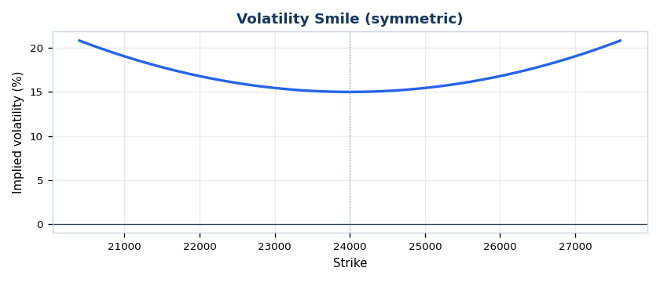

The figure above shows the symmetric case: implied volatility plotted against strike, dipping to a minimum around the at-the-money level and curving up on both sides. The horizontal dashed line is what Black-Scholes naively predicts — one flat volatility for all strikes. The gap between that flat line and the real curve is the entire subject of this chapter. Each point on the curve is a *separate* IV backed out from a *separate* option price; the smile is what you get when you connect them.

### Why a smile exists at all: fat tails

The deepest reason the curve is not flat is that **real returns are not lognormal.** Lognormal returns produce thin tails — extreme moves are assumed to be vanishingly rare. But markets actually deliver "fat tails": crashes, gaps, and melt-ups happen far more often than a bell curve predicts. A 5-sigma daily move should occur roughly once every several thousand years under the normal assumption; equity markets serve one up every few years.

OTM options are pure bets on the tails — a far OTM put only pays if the market falls a long way, a far OTM call only if it rises a long way. Because the *real* probability of those large moves is higher than the model assumes, the market prices those wing options *richer* than Black-Scholes with a single ATM volatility would suggest. To make the model reproduce that richer price, you must feed it a *higher* IV. So the wings imply higher volatility than the middle — and that is the smile: the market bolting fat tails onto a thin-tailed model by raising the volatility input exactly where the model most underprices reality.

### Why equity indices skew instead of smiling

If fat tails were symmetric, indices would smile like currencies do. They do not — they skew, with the *downside* wing far more lifted than the upside. Three reinforcing forces explain why Nifty's left tail is feared more than its right.

**1. Crash fear (asymmetric tails).** Equity indices fall faster than they rise. Bull markets grind up over months; crashes happen in days — think March 2020, where Nifty lost a third of its value in a few weeks, or the gap-downs around major shocks. The probability distribution of index returns is **negatively skewed**: the left tail is longer and fatter than the right. The market knows this, so it pays up more for downside protection than for upside lottery tickets. Higher demand and higher real tail-risk on the put side both push OTM put IV above OTM call IV.

**2. The leverage effect.** When a company's stock falls, its debt stays fixed, so its equity becomes a smaller slice of a more-leveraged capital structure — and a more-leveraged equity is mechanically more volatile. Aggregated across the index, this means **volatility tends to rise as the market falls** and fall as the market rises. Spot down, vol up; spot up, vol down — a persistent negative correlation between price and volatility. Options pricing bakes this in: low strikes (which pay off precisely in the falling-market, high-vol world) deserve higher implied volatility, while high strikes (which pay off in the rising, calming world) deserve lower IV. The leverage effect *is* the skew, expressed in option prices.

**3. Persistent hedging demand (supply and demand).** This is the most practical force, and arguably the dominant one in Nifty. Large, structural players — mutual funds, portfolio managers, insurers, FIIs with long cash positions — are **permanently long the market** and permanently want crash insurance. They are natural, price-insensitive *buyers* of OTM puts as portfolio hedges, month after month. Meanwhile there is no equivalent structural buyer of OTM calls; if anything, those same long-only holders *sell* OTM calls against their holdings (covered calls, Chapter 30) to earn yield. So the order flow is lopsided: persistent buying pressure on OTM puts lifts their price (and IV), persistent selling pressure on OTM calls depresses theirs. Even setting aside any model of the true distribution, **the supply-demand imbalance alone bends the curve into a skew.** The puts are expensive because everyone wants them; the calls are cheap because everyone is selling them.

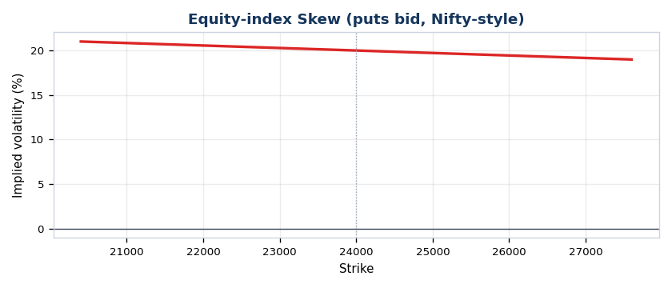

The figure above shows the equity-index reality: IV is high on the left (OTM puts), slopes down through the at-the-money level, and bottoms out or flattens on the right (OTM calls). This downward-sloping smirk is the everyday shape of the Nifty and Bank Nifty option chains. Notice how different it is from the symmetric smile — the asymmetry *is* the information. The steeper that left side, the more the market is paying for crash protection.

### Reading the Nifty skew as a sentiment gauge

Because the skew is built from demand for protection, its *shape* moves with fear, and you can read it like an instrument.

- **A steep skew** (puts trading at a large IV premium over calls, the left side sharply lifted) signals **elevated crash fear**. Hedgers are scrambling for downside protection, bidding puts up. A skew that *steepens* over a few sessions — even while spot is flat or only drifting — is a warning sign: smart, hedged money is paying up for insurance, often before a visible decline. Steepening skew is one of the few leading indicators of stress in the option market.

- **A flat (or flatter) skew** signals **complacency**. When few people are bidding for puts, the left wing sags toward the calls and the curve flattens. Flat skew with low India VIX is the fingerprint of a calm, risk-on market — which is also, historically, exactly when the market is most vulnerable to a surprise.

- **The skew can flatten or even invert at the top of euphoric rallies** in individual themes, where call demand briefly outruns put demand — but for the broad index, an inverted skew (calls richer than puts) is rare and short-lived.

So there are two distinct dials on the volatility dashboard. **India VIX** (Chapter 25) tells you the *overall level* of implied volatility — how expensive options are on average. **The skew** tells you the *shape* — how that fear is distributed across strikes, and specifically how much extra the market charges for downside versus upside. A trader who watches both reads a far richer picture than one who watches spot alone: VIX is the temperature, skew is which way the wind is blowing.

### Sticky-strike vs sticky-delta: how the smile moves with spot

Here is a subtlety that trips up even experienced traders. The skew is not a static painting — it lives on the strike axis, but the spot keeps moving underneath it. When Nifty moves from 24,000 to 24,200, what happens to the IV of the 24,000 strike? The answer depends on which *regime* the market is in, and there are two idealised models.

**Sticky-strike.** Each *strike* keeps its own implied volatility as spot moves. The 24,000 option still implies, say, 14% IV whether spot is at 23,900 or 24,100; the whole IV-by-strike curve stays nailed in place while spot slides along it. In this regime, an option's *moneyness* changes as spot moves (the 24,000 strike becomes more ITM as Nifty rises) and so does the IV you read off the fixed curve at that point. Sticky-strike tends to describe **calm, range-bound markets** where traders anchor their vol quotes to specific strike levels.

**Sticky-delta (sticky-moneyness).** The *shape* of the curve travels with spot. What stays constant is the IV at a given *moneyness* (e.g., "the ATM IV" or "the 25-delta put IV"), so as spot rises, the entire smile shifts right to keep the ATM point under the new spot. In this regime the *at-the-money* option keeps the same IV regardless of where Nifty is, because "at-the-money" is always re-centred on current spot. Sticky-delta tends to describe **trending or fast markets**, and it is the more common assumption for index options over larger moves.

Why does the distinction matter? Because it changes your **effective delta.** Suppose you are long a call. Under sticky-strike, when spot rises your strike's IV is unchanged, so your P&L is roughly the textbook delta. But under sticky-delta with a downward skew, as spot rises the whole curve slides up with it — and since the curve slopes downward, the IV at your now-lower-moneyness strike *falls*. A falling IV (you are long vega) works against you, partially offsetting your delta gain. The reverse happens on the way down: as spot falls, the curve slides down, the IV at your strike *rises*, and the vega gain cushions your delta loss. The net effect is that the skew makes your real, vol-adjusted delta **different from the Black-Scholes delta** — and getting this wrong is how delta-hedged books quietly bleed. Most index desks run somewhere between the two regimes and adjust their delta hedges for the skew dynamics rather than trusting the raw model delta.

### Practical implications: the wings are mispriced by a flat model

Everything above converges on one trading reality: **a single-volatility (flat-vol) model misprices the wings.** If you price a Nifty option chain with one ATM IV plugged into Black-Scholes for every strike, you will *underprice* the OTM puts (the model's thin left tail ignores crash risk and hedging demand) and *overprice* the OTM calls relative to where they actually trade. Any strategy built on that flat assumption is systematically wrong at exactly the strikes where the wings live.

The most important consequence for a retail seller: **OTM puts on Nifty look gloriously expensive, and there is a reason they are expensive.** The fat IV on a far OTM put is not a free gift the market left on the table; it is the price of insuring against the exact crash that put pays off in. Selling that put harvests the skew premium — and most months it works, because most months there is no crash. But the months it fails are the months the market gaps down, IV explodes (the leverage effect drives vol up precisely as you are losing on direction), and the very skew that made the put look rich now makes your loss far larger than a flat model predicted. **You are being paid the skew premium to underwrite tail risk.** That can be a genuine, professional edge — insurers earn it for a living — but only if you size for the tail, not for the average month. Selling the rich downside wing without respecting why it is rich is one of the classic ways to blow up an account.

## Worked example (₹, Nifty)

Let us read a real-shaped Nifty skew off the chain. Suppose Nifty spot is **24,000**, weekly expiry, and India VIX is around 14%. You pull the option chain and back out the implied volatility for each strike. A typical equity-index skew might look like this:

| Strike | Moneyness | Implied Volatility |
|--------|-----------|--------------------|
| 23,000 | Far OTM put | 19.5% |
| 23,500 | OTM put | 16.0% |
| 23,800 | Near OTM put | 14.8% |
| 24,000 | At-the-money | 14.0% |
| 24,200 | Near OTM call | 13.3% |
| 24,500 | OTM call | 12.6% |
| 25,000 | Far OTM call | 12.0% |

**Step 1 — Confirm the shape.** Read the IV column top to bottom. It falls monotonically from 19.5% on the far OTM put down to 12.0% on the far OTM call, passing through 14.0% at-the-money. That downward slope *is* the skew: the puts imply higher volatility than the calls. Plot it and you would see the left-lifted smirk of `vol_skew.png`, not a flat line and not a symmetric smile.

**Step 2 — Quantify the skew.** A common single-number summary is the IV difference between a downside strike and an equidistant upside strike. Here the 23,500 put (500 points OTM) implies 16.0% while the 24,500 call (also 500 points OTM) implies 12.6%. The skew is:

`skew ≈ put-wing IV - call-wing IV = 16.0% - 12.6% = 3.4 percentage points`

That 3.4-point gap is the market's premium for downside over upside at this width. If, over the next two sessions, that gap widened to 5 or 6 points while spot barely moved, the skew is **steepening** — fear is rising, hedgers are bidding puts harder — and you would read that as a caution flag even before any fall shows up in the index.

**Step 3 — Price the mispricing of a flat model.** Suppose a naive trader prices the whole chain at the single ATM IV of 14.0%. For the 23,500 put, they are using 14.0% when the market trades it at 16.0% — they would compute a premium that is *too low*. Say that put has a vega of about ₹5 per IV point. The flat-vol model undervalues it by roughly:

`mispricing ≈ vega * IV gap = 5 * (16.0 - 14.0) = 5 * 2 = ₹10 per unit`

So the flat model thinks the 23,500 put is worth about ₹10 less than its market price. A trader who believes the flat model would conclude the put is "overpriced" and happily sell it — without realising they are simply selling crash insurance at the market's fair (skew-adjusted) rate and pocketing the skew premium, tail risk and all.

**Step 4 — The sticky-delta delta adjustment.** You are long the 24,000 call. Nifty rallies 200 points to 24,200. Under sticky-delta the curve slides right, so the IV *at your strike* drifts down from 14.0% toward the old 24,200 reading of ~13.3% — a ~0.7-point IV drop. With a call vega of about ₹8, that is a vega drag of `8 * 0.7 ≈ ₹5.6` working *against* your delta gain. Your realised, skew-adjusted profit is a touch less than the raw delta promised — small here, but across thousands of lots on a delta-hedged book, ignoring it is how the skew quietly eats your edge.

## Common mistakes / risk note

- **Believing the one-IV-fits-all picture.** Beginners read a single "IV" off a generic quote and assume it applies to every strike. It does not. Each strike has its own implied volatility; the OTM puts on Nifty almost always imply meaningfully higher vol than the OTM calls. Pricing or comparing options without respecting the skew leads to systematically wrong valuations at the wings.

- **Selling "expensive" OTM puts without respecting the tail.** The rich IV on a far OTM Nifty put is compensation for real crash risk and relentless hedging demand — not a market error. Selling it harvests the skew premium most months, but in a gap-down the loss is amplified by both direction *and* a vol spike (leverage effect), exactly when you can least afford it. Size for the crash, not the average week; naked short puts carry large, sometimes account-ending, risk.

- **Confusing the smile with the skew.** A symmetric smile (both wings up) and a downward skew (left wing up, right wing down) carry different information. Currencies smile; equity indices skew. Expecting Nifty to behave like a symmetric smile will mislead you about which wing is rich.

- **Ignoring how the smile moves with spot.** Assuming the textbook Black-Scholes delta is your true delta ignores sticky-strike vs sticky-delta dynamics. Under a downward skew in a sticky-delta regime, rallies drag your strike's IV down and sell-offs push it up, shifting your effective delta away from the model number. Delta-hedged positions that ignore this leak money.

- **Reading the level (VIX) but not the shape (skew).** India VIX tells you how expensive options are on average; the skew tells you how that fear is distributed and whether it is concentrated on the downside. A flat skew with low VIX (complacency) and a steepening skew with rising VIX (fear building) are very different worlds. Watch both dials.

## Key takeaways

- Black-Scholes assumes one constant volatility for all strikes, predicting a **flat** IV-vs-strike line. Real markets show a **curve** — proof the single-volatility assumption is wrong.
- Plotting IV against strike gives a **smile** (both wings up, symmetric — common in currencies) or, for equity indices, a downward **skew/smirk** (OTM puts richer than OTM calls).
- The smile exists because real returns have **fat tails**; the equity-index **skew** exists because of **crash fear** (negatively skewed returns), the **leverage effect** (vol rises as the market falls), and **persistent hedging demand** for OTM puts.
- **Read the Nifty skew as sentiment**: a steep/steepening skew signals rising crash fear (often a leading warning); a flat skew signals complacency. VIX is the level of fear, skew is its distribution across strikes.
- **Sticky-strike** (each strike keeps its IV; calm markets) vs **sticky-delta** (the curve travels with spot; trending markets) changes your effective, vol-adjusted delta away from the raw Black-Scholes number.
- A **flat-vol model misprices the wings** — it underprices OTM puts and overprices OTM calls. Selling rich OTM puts harvests the **skew premium** but underwrites real tail risk; size for the crash.

## Practice problems

1. **Spot the shape.** You back out IVs for three Nifty strikes around spot 24,000: the 23,500 put implies 16%, the 24,000 ATM implies 14%, and the 24,500 call implies 12.5%. Is this a smile or a skew? What single fact about equity-index returns most directly explains the shape?

2. **Why so lopsided (conceptual).** Currency options (USD/INR) tend to show a roughly symmetric smile, while Nifty shows a downward skew. Give two reasons equity indices skew toward the puts that do not apply equally to currencies.

3. **Quantify and interpret (numeric).** On Monday the Nifty 23,500 put implies 15.5% and the 24,500 call implies 12.5%. On Wednesday, with spot essentially unchanged, the put implies 18.0% and the call implies 12.0%. Compute the skew (put-wing minus call-wing IV) on each day. What is the skew doing, and what does it suggest about market sentiment?

4. **Flat model mispricing (numeric).** A trader prices the entire Nifty chain at one ATM IV of 14%. The market trades the 23,000 put at an IV of 19%. If that put has a vega of about ₹4 per IV point, by roughly how much does the flat-vol model misprice it, and in which direction (under or over)?

5. **Sticky-delta delta (conceptual + numeric).** You are long a Nifty 24,000 call in a sticky-delta regime with a downward skew. Nifty falls 150 points. Qualitatively, does the IV at your strike rise or fall, and does that vega effect help or hurt your (losing) position? If the IV at your strike rises 0.6 points and your vega is ₹8, estimate the vega P&L.

6. **The seller's dilemma.** A far OTM Nifty put implies 20% IV while the ATM implies 13%. A friend says, "That put is obviously overpriced — 20% is way too high, I'm going to sell a bunch of them for easy premium." What is the flaw in calling it "overpriced," and what is the real risk being taken on?

## Solutions

1. **A skew.** The IV falls monotonically from 16% (OTM put) through 14% (ATM) to 12.5% (OTM call) — the left wing is lifted and the right is pressed down, the classic downward equity-index smirk, not a symmetric smile. The fact that most directly explains it: equity-index returns are **negatively skewed** — markets crash down faster than they rally up, so the left (downside) tail is fatter, and the market charges more implied volatility for the puts that pay off in those crashes.

2. Two equity-specific forces (any two): (a) **Crash fear / negative skew** — indices fall far faster than they rise (crashes happen in days, rallies grind over months), so the downside tail is fatter and OTM puts command higher IV; currencies can move sharply in either direction, so their tails are more symmetric. (b) **The leverage effect** — as equity prices fall, firms become more leveraged and their equity more volatile, creating a persistent negative price-vol correlation that lifts low-strike IV; this mechanism is specific to leveraged equity, not currencies. (c) **Structural hedging demand** — long-only funds and FIIs permanently buy OTM index puts for crash insurance while selling OTM calls for yield, a lopsided order flow that bends the curve; currency markets have buyers and sellers on both sides more evenly.

3. Monday skew = `15.5 - 12.5 = 3.0` points. Wednesday skew = `18.0 - 12.0 = 6.0` points. The skew has **steepened** sharply — it doubled — even though spot barely moved. This means hedgers are aggressively bidding up downside protection (puts) relative to calls: **crash fear is rising**. A steepening skew with flat spot is a classic leading warning sign that hedged money is paying up for insurance, and a trader would treat it as a caution flag about building downside risk, even before any visible decline.

4. The market trades the put at 19% IV; the flat model uses 14% — a gap of `19 - 14 = 5` IV points. With vega ≈ ₹4 per point, the mispricing is about `4 * 5 = ₹20` per unit. The flat-vol model **underprices** the OTM put by roughly ₹20 (it ignores the skew's fat downside, so it values the put too cheaply). A trader trusting the flat model would wrongly think the put is overpriced and sell it — actually just selling crash insurance at the market's fair, skew-adjusted rate.

5. Under sticky-delta with a downward skew, when spot **falls** the whole IV curve slides down with it; because the curve slopes downward, the IV at your (now higher-moneyness) strike **rises**. You are long the call, hence **long vega**, so a rising IV is a **gain** that partially cushions the delta loss from the falling spot. Vega P&L ≈ `vega * IV change = 8 * 0.6 = +₹4.8` per unit. So the vega effect *helps* your losing position — your skew-adjusted delta loss is a bit smaller than the raw Black-Scholes delta would predict.

6. The flaw: "overpriced" assumes every strike should imply the same volatility (the flat-vol fallacy). It should not. A far OTM Nifty put *correctly* trades at a higher IV than the ATM because of the skew — fat downside tails, the leverage effect, and relentless hedging demand. The 20% is the market's fair price for **crash insurance**, not an error. The real risk in selling it: you are **underwriting tail risk**. Most months no crash comes and you keep the premium, but in a gap-down you lose on direction *and* the IV spikes further (leverage effect) precisely as you are losing — so the loss is amplified far beyond what the rich premium suggests. The skew premium is real compensation, but it must be sized for the crash, not the average week; naked short puts carry large, potentially account-ending risk.

# Chapter 34: Term Structure & the Volatility Surface

In the last few chapters you learned that implied volatility (IV) is not a single number — it changes depending on *which strike* you look at. The 23000 put trades at a different IV from the 24500 call, and that pattern of IV-across-strikes is the **skew** or **smile**. But there is a second axis you have been quietly ignoring. IV also changes depending on *which expiry* you look at. The 24000 call expiring this Thursday and the 24000 call expiring three months from now almost never carry the same implied volatility, even though they share the same strike and the same underlying.

This second pattern — IV plotted **across expiries** — is the **term structure of volatility**. Stitch the two axes together (IV across strikes *and* across expiries) and you get the full **volatility surface**: a three-dimensional map of what the market is charging for uncertainty, at every strike, for every maturity. This chapter teaches you to read that map. It is the single most important tool a professional uses to decide *which expiry* to trade, not just which strike — and it is the foundation of calendar spreads, diagonal spreads, and almost every event-driven play on Nifty and Bank Nifty.

## Core concepts

### Why IV should depend on time at all

Start with intuition. Implied volatility is the market's forecast of how much the underlying will move, expressed as an **annualised** standard deviation of returns. The word "annualised" is doing a lot of work. A weekly option only cares about the next few days; a quarterly option cares about the next several months. Those are forecasts about *different windows of the future*, and there is no reason the future should look equally turbulent in every window.

Think of it like a weather forecast. "How stormy will the next three days be?" depends heavily on whether a specific cyclone is bearing down right now. "How stormy will the next six months be?" barely cares about the cyclone — you are averaging over many calm and many rough days, so you land near the long-run climate. Short-horizon forecasts are dominated by *what is happening now*; long-horizon forecasts revert to the *long-run average*. Volatility behaves exactly the same way, and that single fact explains almost everything about term structure.

### The shape: upward-sloping in calm, inverted in stress

In a **calm market**, the term structure usually slopes **upward**. Near-term IV is low because nothing scary is on the immediate horizon, so the next few days are expected to be quiet. Longer-dated IV is higher because the further out you look, the more unknown events can creep in — elections, global shocks, a bad earnings season, a war — and the market demands a higher premium to insure against that growing fog of uncertainty. So you might see something like:

- Current weekly (5 days to expiry): IV around 11%
- Current monthly (28 days): IV around 13%
- Next-month (56 days): IV around 14%
- Quarterly (90 days): IV around 15%

The curve rises gently from left to right. This is the "normal" or **contango** shape, and it is what you see most of the time on Nifty when India VIX is sitting low (say, 11-13).

In a **stressed market**, the term structure **inverts** — it slopes downward. When fear spikes, traders scramble for *immediate* protection. They are terrified of the next few days, not the next few months, because they expect (or hope) the panic will burn out. So near-term IV explodes above long-term IV:

- Current weekly: IV around 32%
- Monthly: IV around 26%
- Quarterly: IV around 21%

Now the curve falls from left to right — this is **backwardation**. A crashing market, a surprise RBI move, a global risk-off day: all of them slam the front of the curve up while the back end rises far less, because the market believes the storm is temporary and things will eventually calm down. This inversion is one of the most reliable tells that the market is in genuine stress rather than a routine wobble.

The intuition is the same weather logic in reverse: when a cyclone is directly overhead *right now*, the three-day forecast is far scarier than the six-month forecast.

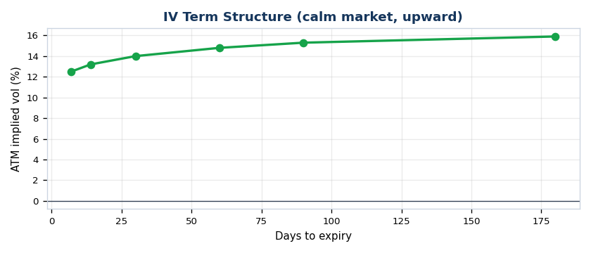

### Events create a local bump in the near-expiry IV

Here is where term structure gets practically useful for an Indian trader. Markets do not face uncertainty smoothly — it arrives in *lumps* on known dates. The Union Budget (1 February), RBI monetary policy decisions, big-bank quarterly results (HDFC Bank, ICICI, SBI for Bank Nifty), general election results, and US Fed decisions are all **scheduled events**. Everyone knows the date in advance.

Because the date is known, the expiry that *contains* that event will price in the extra expected move — and the expiries that do not contain it will not. This produces a **local bump** in the term structure right at the expiry that straddles the event.

Suppose RBI policy lands on a Friday. The weekly expiring the Thursday *before* it does not include the event, so its IV stays calm — say 12%. The weekly expiring the Thursday *after* it *does* include the RBI decision, so its IV is jacked up — say 18%. The monthly, which also contains the event but spreads it over many more days, sits in between — say 14%. So instead of a smooth upward slope you see a **spike** at one specific expiry:

- Pre-event weekly: 12%
- Post-event weekly (contains RBI): 18%  ← the bump
- Monthly: 14%

The reason the monthly IV rises *less* than the post-event weekly is dilution. An event adds a roughly fixed amount of *expected variance* (volatility squared times time). Pack that fixed lump of extra variance into a 4-day weekly and the *annualised* IV jumps a lot; spread the same lump across a 30-day monthly and the per-day impact is small, so annualised IV barely twitches. This is why event premium is always most concentrated, and most expensive, in the **nearest expiry that contains the event**.

### Combining skew and term structure: the volatility surface

Now combine the two dimensions. For each expiry you have a skew — a curve of IV across strikes (puts richer, calls cheaper, the classic equity-index skew from Chapter 33). And across expiries you have a term structure — a curve of IV across maturities. Lay every expiry's skew curve side by side, ordered by maturity, and you have built a **surface**:

`Implied volatility = f(strike, time-to-expiry)`

Picture a sheet of cloth floating above a grid. One edge is *strike* (deep OTM puts on the left to deep OTM calls on the right), the other is *time to expiry* (this week's expiry to the far quarterly). The *height* of the cloth at any point is the IV the market charges for that exact strike-and-maturity combination. Slice it along the strike axis at a fixed expiry and you recover that expiry's **skew**; slice it along the time axis at a fixed (usually at-the-money) strike and you recover the **term structure**.

A professional desk does not think in single IV numbers — it thinks about this whole surface, watching where it is locally rich (overpriced) and locally cheap (underpriced). Every relative-value options trade is, at bottom, a bet that one part of the surface is mispriced relative to another part.

### How the surface guides calendar and diagonal trades

The most direct application is the **calendar spread** (also called a time spread or horizontal spread). The structure: **sell a near-term option and buy a longer-term option at the same strike.** You sell the front month and buy the back month.

When does this make sense? Read it straight off the term structure. When the front of the curve is *rich* relative to the back — typically right before an event, when near-term IV has spiked into a local bump — you **sell the expensive near-term option and buy the cheaper far-term option**. You are short the inflated front-month vega and long the calmer back-month vega. After the event passes, the front-month IV collapses (the bump deflates), the option you sold loses value fast, and you keep the difference. The far-term leg you own barely moves because its IV was never inflated.

A **diagonal spread** is a calendar with the two legs at *different strikes* — it tilts the trade so you also take a directional or skew view, not just a pure time view. You might sell a near-term slightly-OTM call and buy a far-term further-OTM call, combining the term-structure edge with a mild directional lean.

The mechanics come from Greeks you already know:

- **Theta:** the near-term option you sold decays *faster* than the far-term option you own (decay accelerates near expiry — Chapter 24), so the net position usually earns theta day by day.
- **Vega:** the far-term option you own has *more* vega than the near-term option you sold (vega rises with time to expiry — Chapter 25), so a calendar is typically *net long vega* — it benefits if overall IV rises after you put it on.

That second point is a warning. A standard calendar does best when the underlying sits *near the strike* and overall volatility holds up or rises; it can lose if IV collapses across the *whole* curve, or if the underlying runs far from the strike. Selling a near-term event bump is the one classic setup where you may end up *short* net vega — because the front-month vega you sold is so inflated it outweighs the back-month vega you bought. Always check which way your net vega points before calling a calendar "safe."

### Event plays: sell the bump, or own the move

The local event bump gives you a clean choice. If you think the market is *overpricing* the event, you **sell** the inflated near-expiry premium (via a calendar, or a short straddle/iron condor on the event week) and collect the **volatility crush** when IV deflates the moment the news is out. This "IV crush" is reliable enough that selling Budget-day or results-day premium is a staple professional trade — but it carries large, sometimes undefined, risk if the move is bigger than priced.

If instead you think the event will move *more* than priced, you **buy** the near-expiry straddle. This is much harder: you are paying the inflated bump, so the move must be large just to break even, and if the market merely meets expectations the IV crush guts your long position even when direction was right.

### Reading Nifty / Bank Nifty term structure: weekly vs monthly

Indian index options give you an unusually rich term structure because of **weekly expiries**. Nifty and Bank Nifty (and other indices) have a weekly contract expiring most weeks, plus monthlies and a few quarterlies. That means the front of your term-structure curve is sampled finely — you can see the IV of *this* Thursday, *next* Thursday, the one after, then the monthly, then further out.

Practical reading rules for an Indian desk:

- **Weeklies are the most event-sensitive and the most theta-heavy.** With only a handful of days to expiry, the weekly's annualised IV swings violently around scheduled events and decays brutally fast afterward. This is why so much retail volume — and so many retail losses — concentrate in weekly options: the leverage and decay are both extreme.
- **Compare the current weekly's IV to the monthly's IV** to gauge near-term stress. Weekly IV well *above* monthly IV (front-end inverted) signals an event or fear concentrated in the next few days. Weekly IV well *below* monthly (normal upward slope) signals a calm patch right now.
- **Bank Nifty runs hotter than Nifty.** Bank Nifty is more concentrated (heavily weighted to a few large lenders) and structurally more volatile, so its whole surface sits at a higher IV and its event bumps — especially around bank results and RBI policy — are sharper than Nifty's.
- **India VIX is essentially one point on this surface** — it is a 30-day, near-the-money Nifty IV. It tells you the *level* of the curve around the monthly tenor but nothing about its *slope*. Two days with identical VIX can have completely different term structures: one calm-and-upward-sloping, one inverted with a fear spike in the front. Always look at the curve, not just the VIX print.

## Worked example (Rupees, Nifty)

It is late January. Nifty is at **24,000**. The Union Budget lands on **1 February (a Saturday this year)**, so the weekly expiring **Thursday 6 February** is the first expiry that *contains* the Budget. You pull the at-the-money (24000-strike) IVs off the screen:

| Expiry | Days to expiry | Contains Budget? | ATM IV |
|---|---|---|---|
| Thu 30 Jan (this week) | 4 | No | 11% |
| Thu 6 Feb (Budget week) | 11 | Yes | 19% |
| Thu 27 Feb (monthly) | 32 | Yes | 14% |
| Thu 27 Mar (next monthly) | 60 | Yes | 14.5% |

Read the curve. The 30 Jan weekly is calm at 11% — nothing happens before it expires. The 6 Feb weekly carries a fat **local bump at 19%** because it is the cheapest, most concentrated way to own the Budget move. The 27 Feb monthly also contains the Budget but dilutes it across 32 days, so its IV is only 14%. Beyond that the curve drifts gently up (14.5%) — the normal upward slope reasserting itself.

You judge the 19% Budget-week IV to be *too high* — your read is that recent Budgets have produced moves smaller than this premium implies. You decide to **sell the rich front-month bump and own a calmer back-month** with a calendar spread at the 24000 strike.

**The trade (per leg, ATM 24000 strike, Nifty lot size 75 — verify current lot size before trading):**

- **Sell** 1x 6 Feb 24000 call at 19% IV. With 11 days to expiry, suppose its premium is **₹230 per share**.
- **Buy** 1x 27 Feb 24000 call at 14% IV. With 32 days to expiry, suppose its premium is **₹330 per share**.

**Net debit** = 330 - 230 = **₹100 per share**, i.e. ₹100 * 75 = **₹7,500 per lot** (plus costs). This debit is your maximum loss if the position is closed with both legs at the same strike and things go badly.

**What happens after the Budget.** The Budget passes on 1 February with a move roughly in line with expectations. The IV crush hits the front leg hard: by Monday 3 February the 6 Feb 24000 call's IV collapses from 19% toward the calm-market ~11%, and with fewer days left its premium drops to, say, **₹120**. The back-month 27 Feb call still has 24 days to run and its IV barely moves (14% → 13.5%), so its premium eases only to about **₹300**.

Mark the position:

- Short 6 Feb call: sold at ₹230, now ₹120 → **+₹110** per share.
- Long 27 Feb call: bought at ₹330, now ₹300 → **−₹30** per share.
- **Net profit** ≈ 110 − 30 = **₹80 per share** = ₹80 * 75 = **₹6,000 per lot**, before brokerage, STT and other charges.

You captured most of the front-month IV crush while the back-month held its value — exactly what the term structure told you to do. Had Nifty instead *gapped* far from 24000 (say to 23,000 or 25,200), both calls would have moved away from the peak of the calendar's payoff and the trade could have lost up to the ₹7,500 debit. The calendar's sweet spot is the underlying finishing *near* the strike, with the event premium deflating as expected.

## Common mistakes / risk note

- **Treating IV as one number.** Beginners say "Nifty IV is 13%." There is no single Nifty IV — there is a whole surface. The 13% you saw is one slice (probably the monthly ATM, i.e. roughly India VIX). Always ask: *which strike, which expiry?*
- **Selling the event bump without respecting tail risk.** Selling inflated near-term premium works *most* of the time, which is exactly the trap. The Budget or RBI surprise that breaks the range can hand you a loss many times your collected premium. Short premium has large, sometimes undefined, risk — the high win rate hides a fat tail.
- **Forgetting a calendar is usually long vega.** Traders put on a calendar for the theta and get blindsided when IV collapses across the *whole* curve and the long back-month leg bleeds. Know your net vega before you trade.
- **Confusing the two crushes.** "IV crush" after an event deflates the *front-month bump* specifically. A broad market calm-down deflates the *entire surface*. A calendar wants the first and fears the second. They are not the same thing.
- **Over-trading weeklies.** The near-expiry weekly has the most violent IV swings and the fastest decay. It looks cheap in rupees and feels like a lottery ticket — which is precisely why so many retail traders lose money there. SEBI studies show roughly 9 in 10 retail F&O traders lose money, and crowded weekly-option punting is a big part of that statistic.
- **Mis-dating the event.** The whole trade rests on knowing *which* expiry contains the event. Get the date wrong — sell the pre-event weekly thinking it holds the Budget — and there is no bump to crush; you just sold cheap premium and own nothing useful.

## Key takeaways

- IV varies not only across **strikes** (skew) but across **expiries** (term structure). Both axes together form the **volatility surface**: IV as a function of strike and maturity.
- In **calm** markets the term structure slopes **upward** (near-term cheap, long-term richer); in **stress** it **inverts**, with near-term fear spiking above long-term IV.
- **Scheduled events** (Budget, RBI, results) create a **local bump** in the IV of the nearest expiry that *contains* the event; monthlies dilute the same event, so their IV rises far less.
- **Calendar spreads** sell rich near-term premium and buy cheaper far-term premium; they typically earn theta and are usually net long vega — read the entry straight off the term structure.
- **Diagonals** are calendars at different strikes, adding a directional or skew tilt.
- On Nifty/Bank Nifty, **weekly expiries** let you sample the front of the curve finely; compare weekly vs monthly IV to gauge near-term stress. **India VIX** is just the ~30-day ATM point — it gives you the level, not the slope.
- Bank Nifty's surface sits higher and bumps harder than Nifty's. And selling event premium, however reliable, carries large tail risk.

## Practice problems

1. **Conceptual.** Nifty's current weekly ATM IV is 28% while its quarterly ATM IV is 19%. Is the term structure upward-sloping or inverted, and what does that tell you about the market's mood right now?

2. **Conceptual.** RBI policy is scheduled for the Friday after this Thursday's weekly expiry. Which expiry — this week's weekly, next week's weekly, or the monthly — should carry the largest *local bump* in IV, and why does the monthly's IV rise less than the post-event weekly's?

3. **Numeric.** The 24000-strike Nifty options show: 6 Feb weekly IV = 20%, 27 Feb monthly IV = 14%. You sell the 6 Feb 24000 call for ₹250 and buy the 27 Feb 24000 call for ₹360 (lot size 75). What is your net debit per share and per lot? Is this position a calendar spread? Is it likely net long or net short vega from the *time-to-expiry* effect alone?

4. **Numeric.** After the event in Problem 3, the front-month call's IV crushes and its premium falls to ₹130, while the back-month call eases to ₹335 (underlying still near 24000). What is your profit per share and per lot, before costs?

5. **Conceptual.** A trader says, "India VIX is 13 today, same as last Tuesday, so the volatility picture is identical." Why might that statement be wrong even though VIX is unchanged?

6. **Conceptual + risk.** You are tempted to sell the Budget-week straddle to collect the IV crush. State one scenario where this "high-probability" trade produces a loss far larger than the premium you collected, and what that implies about position sizing.

## Solutions

1. The curve is **inverted** (downward-sloping): near-term IV (28%) is far above long-term IV (19%). Near-term fear sits well above the long-run level, which signals the market is in **stress right now** — traders are paying up for immediate protection but expect the turbulence to fade over the coming months. This backwardated shape is a classic stress tell rather than a routine quiet market.

2. **Next week's weekly** should carry the largest bump, because it is the *nearest* expiry that actually *contains* the RBI decision while packing that event's expected move into the fewest days. This week's weekly expires *before* the event, so it includes no RBI risk and stays calm. The monthly also contains the event, but it spreads the event's roughly fixed lump of extra expected variance across ~30 days instead of ~7, so on an *annualised* (per-day) basis the impact is diluted and its IV rises only modestly. Event premium concentrates in the nearest containing expiry.

3. **Net debit** = 360 − 250 = **₹110 per share**, and ₹110 * 75 = **₹8,250 per lot** (before costs). Yes — selling a near-term option and buying a longer-term option at the *same strike* (24000) is a textbook **calendar (time) spread**. From the time-to-expiry effect alone the position is **net long vega**, because the longer-dated 27 Feb option you bought has more vega than the shorter-dated 6 Feb option you sold. (The inflated front-month IV partly offsets this, but on the maturity effect alone, longer-dated = more vega = net long vega.)

4. Short 6 Feb call: sold ₹250, now ₹130 → **+₹120** per share. Long 27 Feb call: bought ₹360, now ₹335 → **−₹25** per share. **Net profit** = 120 − 25 = **₹95 per share** = ₹95 * 75 = **₹7,125 per lot**, before brokerage, STT and other charges. The front-month IV crush delivered the gain while the back-month leg held its value — the intended calendar outcome.

5. India VIX measures only **one point** on the volatility surface — roughly the 30-day, at-the-money Nifty IV. It captures the *level* of the curve near the monthly tenor but says nothing about its *slope* or the *skew*. Last Tuesday the term structure might have been calmly upward-sloping with no event nearby; today it could be inverted with a sharp bump in the next weekly because a Budget or RBI decision now sits just ahead. Same VIX, completely different near-term risk picture. Always read the whole curve, not the single VIX print.

6. Selling the Budget-week straddle collects the IV crush *only if* the realised move stays within the premium you sold. If the Budget delivers a genuine surprise — a large tax change, a fiscal shock — Nifty can gap several percent, blowing far past your breakevens. A short straddle has **theoretically unlimited loss on a big move** in either direction, so a single bad event can cost many multiples of the premium collected. The implication: never size short-premium event trades as if the high win rate were the whole story. Size for the *tail* — small enough lots, or define the risk with protective wings (turning the straddle into an iron condor/iron fly) — so one Budget surprise cannot wipe out months of collected premium.

# Chapter 35: IV Rank & IV Percentile — Is Volatility Cheap or Rich?

You have learned (Chapter 25) that implied volatility — the market's forecast of future movement, baked into every option's premium — is the single biggest hidden lever on whether your trade makes or loses money. You have learned that you want to *buy* options when volatility is cheap and *sell* them when it is rich. There is just one problem nobody warned you about: the IV number on your screen, all by itself, tells you almost nothing about whether it is cheap or rich.

Suppose Nifty's implied volatility is **18%**. Is that high or low? You genuinely cannot say. For a sleepy large-cap during a calm year, 18% might be sky-high. For Bank Nifty in the middle of an election or a banking scare, 18% might be unusually *low*. An absolute IV number without context is like being told a stock trades at ₹500 — it means nothing until you know whether ₹500 is near its yearly high, its yearly low, or somewhere in between. This chapter gives you the two tools professionals use to supply that missing context: **IV Rank** and **IV Percentile**. They turn a meaningless raw number into a clear verdict — *cheap, rich, or in the middle* — relative to the underlying's own recent history.

## Core concepts

### Why the absolute IV number is not enough

Every underlying has its own personality. Volatility is not a universal constant; it is a property of the specific instrument, and each instrument lives in its own range. A stable index like **Nifty** typically lives in a low IV band — often around 10% to 16% in calm regimes, spiking only around big events. **Bank Nifty** is structurally more volatile (banks are leveraged, rate-sensitive, news-driven), so its band sits higher and swings wider. A single **mid-cap stock** might routinely carry 30%+ IV, while 30% on Nifty would signal genuine panic.

So the same IV number means completely different things on different underlyings. "Reliance IV is 25%" is only useful if you know where 25% sits in *Reliance's own* history. If Reliance has spent the year between 20% and 45%, then 25% is on the cheap side; if between 18% and 27%, it is expensive.

The fix is to stop looking at IV in absolute terms and ask a relative question: **"Where does today's IV sit compared to where this same underlying's IV has been over the past year?"** That single re-framing is the heart of the chapter. Two standard tools answer it — IV Rank and IV Percentile — and although they sound similar and often agree, they measure subtly different things.

### IV Rank: where you sit between the low and the high

**IV Rank** asks the simplest possible version of the question: between the lowest IV and the highest IV of the past year, where does today's IV fall? It places today's reading on a 0-to-100 scale stretched between the 52-week low and the 52-week high.

```
IV Rank = (current IV - 1yr low IV) / (1yr high IV - 1yr low IV) * 100
```

Read it like a thermometer with the bottom fixed at the year's coldest reading and the top at its hottest:

- **IV Rank = 0** means today's IV equals the lowest it has been all year. Volatility is at rock bottom — options are as cheap, relative to this underlying's own range, as they get.
- **IV Rank = 100** means today's IV equals the highest it has been all year. Volatility is at its peak — options are as rich as they have been.
- **IV Rank = 50** means today's IV sits exactly halfway between the year's low and high.

The beauty of IV Rank is that it is dimensionless and self-calibrating. You no longer need to remember that "18% is high for Nifty but low for Bank Nifty" — the formula bakes each underlying's own range into the answer. An IV Rank of 80 means "near the top of its own range" whether the underlying is Nifty, Bank Nifty, or HDFC Bank.

### IV Percentile: how often IV has been below today

**IV Percentile** asks a different question. Instead of "where do I sit between the extremes?", it asks: **"On what fraction of trading days over the past year was IV *below* where it is today?"**

```
IV Percentile = (number of trading days in past year with IV below today's IV) / (total trading days in past year) * 100
```

So an IV Percentile of 90 means that on 90% of the days in the last year, IV was lower than it is right now — today is in the top 10% of readings. An IV Percentile of 20 means IV was below today's level only 20% of the time — today is unusually low; on 80% of days it was higher.

The crucial difference from IV Rank: **IV Percentile counts days, so it is not distorted by a single freak spike.** IV Rank only cares about the highest and lowest points of the year — two numbers. If a one-day panic pushed IV to an extreme that then vanished, that single spike permanently raises the "1yr high" in the IV Rank formula, dragging every later IV Rank reading down even though IV has been normal since. IV Percentile is immune to this — that freak spike is one or two days out of ~250, so it barely moves the count.

A worked feel for the contrast: an underlying sits at a calm 12% IV almost all year, except one chaotic week when IV briefly hit 40%. Today IV is 16%, modestly elevated.
- **IV Rank** = (16 - 12) / (40 - 12) * 100 ≈ **14** — looks low, because that lonely 40% spike stretched the top of the scale far away.
- **IV Percentile** might be **85**, because on the vast majority of days IV was below 16% — today really is on the high side relative to normal life.

When the two disagree, IV Percentile is usually the more trustworthy read of "is this elevated relative to a typical day", precisely because it is robust to outliers. (Note: Indian retail platforms vary in what they display — some show "IV Rank", some "IV Percentile", some mislabel one as the other — so always check which definition your tool uses.)

### How to use them: sell high, buy low

Once you can read these numbers, a clean default policy emerges, and it follows directly from the central fact about implied volatility: **IV mean-reverts.** Volatility does not trend forever. It is elastic — when it stretches high it tends to snap back down, and when it gets crushed to lows it tends to drift back up. Fear fades; calm gets interrupted. This pull toward a "normal" level is the engine behind the whole strategy.

**When IV Rank / IV Percentile is HIGH (say above ~70):** options are expensive relative to this underlying's own history. Premiums are fat. If IV is likely to mean-revert *downward*, you want to be the one *collecting* that rich premium and profiting as it deflates. This favours **selling premium** with defined-risk structures wherever possible:

- **Credit spreads** (bull put spread, bear call spread) — sell a richly priced option, buy a further one for protection.
- **Iron condors** — sell both a call spread and a put spread; a market-neutral way to harvest high IV with capped risk.
- **Short strangles / short straddles** — the purest premium-selling structures, but with large and (for naked strangles) effectively unlimited risk, so reserved for experienced traders with strict sizing.

You are short vega. As IV mean-reverts down, the options you sold lose value, and you buy them back cheaper — the IV crush works *for* you.

**When IV Rank / IV Percentile is LOW (say below ~30):** options are cheap relative to history. Premiums are thin. Selling them collects little and exposes you to an IV *expansion* (IV snapping back up), which hurts a short-vega position. So low IV favours either **buying options** to be long vega, or simply **waiting**:

- **Debit spreads** (bull call spread, bear put spread) — directional bets that are cheaper to put on when IV is low.
- **Long straddles / strangles** — near-pure long-volatility bets, attractive when IV is depressed and you expect it to rise (e.g., a quiet market before a known catalyst).
- **Doing nothing** — a completely legitimate "strategy". If IV is mediocre and nothing is mispriced, the professional often just waits for a better pitch.

You are long vega. If IV mean-reverts *up* (or a catalyst spikes it), your options gain value from the vega expansion, on top of any directional move.

**When IV Rank / IV Percentile is in the MIDDLE (~30–70):** there is no strong volatility edge either way. Trade on other merits (direction, structure) or stand aside. Do not force a premium-selling or premium-buying thesis when volatility itself is offering no signal.

The slogan to memorise: **sell high IV, buy low IV.** You are trying to be a volatility *contrarian* — selling fear when premiums are bloated, buying calm when premiums are cheap — and letting mean reversion do the work.

### Applying it to India VIX and to single stocks

You can apply the same ranking logic at two levels.

**Index level — India VIX.** India VIX (Chapter 25) is itself a tradable, observable measure of 30-day Nifty implied volatility, and the NSE publishes its full history, so you can compute an "IV Rank of India VIX" or simply eyeball where VIX sits in its own range. Historically it has spent long stretches in the low-to-mid teens, with sharp spikes (into the 20s, 30s, far higher in crises like March 2020) around elections, the Budget, RBI shocks, and global risk-off — followed by a reliable drift back down. When India VIX is near the bottom of its range, Nifty and Bank Nifty options are broadly cheap (favour buying); near the top, broadly rich (favour selling). VIX is your top-down read on the whole index-options market.

**Single-stock level.** For individual F&O stocks, you compute IV Rank / IV Percentile on *that stock's own* IV series. This is where the tool earns its keep, because stock IV is dominated by the **earnings cycle**: IV ramps up in the days before quarterly results and crushes the morning after. A stock can show a sky-high IV Rank purely because results are two days away — a *justified* high, not a free edge (more below). Single-stock IV Rank is essential because each stock's "normal" band differs; you cannot eyeball it the way you can a familiar index.

A practical workflow: check India VIX first for the market-wide weather, then the specific underlying's IV Rank for local conditions, *then* decide whether you are structurally a buyer or seller of premium on that name today.

### The discipline — and its limits

"Sell high IV, buy low IV" is a genuine, durable edge, but it is a *tendency*, not a law, and treating it as a law is how traders blow up. The single most important caveat:

**High IV is often high for a reason.** Implied volatility is the market's forecast of future movement, and sometimes the market is forecasting correctly — real, large risk is genuinely coming. A high IV Rank ahead of a national election result, a critical RBI decision, a company's earnings, or during a credit crisis is not a gift; it is the market *correctly* pricing a wide range of outcomes. If you sell that "expensive" premium and the feared move actually materialises — Bank Nifty gaps 1,500 points on a banking shock — your short-vega, short-gamma position can lose far more than the premium you collected. The premium was high because the danger was real.

So the discipline has rules of engagement:

- **Do not sell premium naked into a binary event you cannot withstand.** High IV Rank into earnings or an election is exactly when a *defined-risk* structure (iron condor, credit spread) matters most, so a surprise move cannot bankrupt you.
- **IV Rank tells you premium is rich; it does not tell you the move won't happen.** Mean reversion is the base rate, not a guarantee. You are collecting an edge that pays off *on average over many trades*, while any single trade can deliver the tail.
- **Low IV can persist, and can fall further.** Buying options because IV is "cheap" still bleeds theta every day while you wait for an expansion that may never come. Cheap can get cheaper, and a low-IV long-vega position dies slowly by time decay if the catalyst fizzles.
- **Position size around the regime.** Sell *less* size when the high IV reflects genuine event risk; the rich premium is compensation for that risk, not a free lunch.

The mature framing: IV Rank and IV Percentile tell you whether you are being *paid well* to take volatility risk, or *charged little* to own it. They do not tell you whether the risk will show up. You still have to ask, every time, *why* is IV where it is — and whether you can survive the case where the market's forecast turns out to be right.

## Worked example (₹, Nifty / Bank Nifty)

Let us compute both metrics on real-feeling numbers and turn them into a trade decision.

**Setup.** You are looking at Bank Nifty, spot around **52,000**. You pull up its implied volatility history for the past year and read off:

- **52-week low IV:** 11%
- **52-week high IV:** 31% (hit during a one-week banking scare months ago)
- **Current IV:** 17%
- Over the past ~250 trading days, IV was below 17% on **180** of those days.

There are no major scheduled events this week.

**Step 1 — Compute IV Rank.**

```
IV Rank = (current IV - 1yr low) / (1yr high - 1yr low) * 100
        = (17 - 11) / (31 - 11) * 100
        = 6 / 20 * 100
        = 30
```

IV Rank is **30**. On the low-to-high scale, today's 17% sits only 30% of the way up from the year's floor. That single 31% banking-scare spike stretched the top of the range, so 17% looks relatively modest.

**Step 2 — Compute IV Percentile.**

```
IV Percentile = (days with IV below today) / (total days) * 100
              = 180 / 250 * 100
              = 72
```

IV Percentile is **72**. On 72% of days this year, IV was *below* today's 17% — meaning today is actually on the higher side of a *typical* day.

**Step 3 — Reconcile the disagreement.** IV Rank (30) says "low-ish"; IV Percentile (72) says "high-ish". This is the classic outlier divergence: the lone 31% spike inflated the high used by IV Rank, dragging it down, while IV Percentile — which counts days — shows that relative to ordinary trading life, 17% is genuinely elevated. Here, IV Percentile is the more honest read of "is this rich versus a normal day", and it says *yes, modestly*. The raw absolute number (17%) told you none of this.

**Step 4 — Choose a strategy.** Two metrics — one leaning "rich" (Percentile 72), one "neutral-to-cheap" (Rank 30) — with **no scheduled event** to justify a fear premium. Net read: premium is somewhat rich relative to a normal day, with no obvious real-risk catalyst — a measured environment to **sell premium with defined risk**. You choose a **Bank Nifty iron condor**: sell an out-of-the-money call spread and an out-of-the-money put spread, collecting the elevated premium with both wings capping your loss. You are short vega and market-neutral; if IV mean-reverts toward its low-teens norm and Bank Nifty stays in a range, the position profits as premiums deflate.

**Step 5 — Size for the caveat.** Because IV Rank is only 30 (not screaming-rich), you keep size modest — there is an edge here, but not a fat one. Crucially, had this same 17% come *the day before a major RBI policy decision*, the high IV would be a *justified* event premium: you would widen the wings, cut size further, or stand aside rather than sell cheap-looking insurance against a real shock. Same numbers, different context, different decision — exactly the discipline these metrics are meant to support, not replace.

## Common mistakes / risk note

- **Judging IV by its absolute number.** "18% IV, that's high" is meaningless without the underlying's own range. Always rank it. 18% can be a screaming sell on calm Nifty and a relative *buy* on stormy Bank Nifty.
- **Using only IV Rank when a freak spike has poisoned the range.** A single panic day permanently lifts the "1yr high" and suppresses every later IV Rank reading. When IV Rank looks oddly low but the market feels jumpy, check IV Percentile — it is robust to outliers and often the truer signal.
- **Selling rich premium blindly into events.** The most dangerous mistake. High IV Rank before earnings, elections, or RBI policy is the market *correctly* pricing real risk. Selling naked premium there can deliver a catastrophic loss when the feared move actually lands. Use defined-risk structures and cut size into binary events.
- **Buying cheap IV and ignoring theta.** Low IV Rank makes long options attractive *only if* IV expands or a move comes. While you wait, theta bleeds you daily. "Cheap" can stay cheap for months; long vega is not a free option, it is a wager you are paying carry on.
- **Forgetting mean reversion is a base rate, not a guarantee.** IV Rank gives you an edge that pays *on average across many trades*. Any single trade can hand you the tail. Size and diversify so that the inevitable bad outcome is survivable.
- **Trusting your platform's label blindly.** Some Indian tools show IV Rank, some IV Percentile, and some mislabel one as the other or use a lookback different from 52 weeks. Know which metric and which window you are actually reading.

## Key takeaways

- The **absolute IV number is not enough** — you must judge it relative to the underlying's *own* recent history. Each instrument has its own volatility personality.
- **IV Rank** places today's IV on a 0–100 scale between the 52-week low and high: `IV Rank = (current IV - 1yr low) / (1yr high - 1yr low) * 100`. 0 = cheapest of the year, 100 = richest.
- **IV Percentile** = the percentage of trading days in the past year that IV was *below* today's level. It counts days, so it is **robust to one-off spikes** that distort IV Rank.
- When the two disagree, a lone outlier spike is usually the cause; **IV Percentile is typically the more reliable read** of "elevated versus a normal day".
- **Sell high IV, buy low IV.** High IV Rank/Percentile favours *selling* premium (credit spreads, iron condors, short strangles) to harvest mean reversion down; low IV favours *buying* options (debit spreads, long straddles) or waiting.
- Apply it at two levels: **India VIX** for the whole index-options market, and **single-stock IV Rank** for individual F&O names (dominated by the earnings cycle).
- The discipline's limit: **high IV is often high for a real reason.** A justified event premium is not free money. Use defined risk, cut size into binary events, and always ask *why* IV is where it is.

## Practice problems

1. **Why context matters.** Two underlyings both show an implied volatility of exactly 22% today. Underlying A is a stable large-cap that has spent the year between 18% and 27% IV. Underlying B is a volatile mid-cap that has spent the year between 20% and 60% IV. For each, is 22% relatively rich or cheap? Explain why the same number means opposite things.

2. **Compute IV Rank (numeric).** Nifty's 52-week low IV is 10%, its 52-week high IV is 24%, and current IV is 19%. Compute the IV Rank. Does this favour buying or selling premium, all else equal?

3. **Compute IV Percentile (numeric).** Over the past 250 trading days, a stock's IV was below today's level on 45 of them. Compute the IV Percentile. Is today's IV high or low relative to a typical day this year?

4. **When the two disagree.** A stock spent almost the whole year around 14% IV, except one crisis week when IV briefly hit 50%. Today IV is 20%. Its IV Rank works out to about 17, but its IV Percentile is about 88. Which metric better describes whether IV is elevated *right now*, and why are they so far apart?

5. **Strategy choice.** Bank Nifty's IV Rank is 85 and its IV Percentile is 82, with a major RBI monetary policy decision due in two days. A friend says, "IV is super rich — let's sell a naked short strangle and collect that fat premium." What is right and what is dangerous about this plan, and how would you modify it?

6. **Low IV decision.** Nifty's India VIX is near a multi-month low and its IV Rank is 15. You have no strong directional view and no known catalyst this month. What does the IV picture suggest about selling premium here, and what are your reasonable options?

## Solutions

1. **A is rich; B is cheap.** For Underlying A, 22% sits in the upper part of its 18%–27% range — IV Rank = (22 - 18) / (27 - 18) * 100 ≈ 44, and more tellingly it is well above its floor, so 22% is relatively *rich* for A; premium-selling is favoured. For Underlying B, 22% sits near the *bottom* of its 20%–60% range — IV Rank = (22 - 20) / (60 - 20) * 100 = 5, so 22% is *cheap* for B; buying premium (or waiting) is favoured. The same absolute number is rich on one and cheap on the other because each underlying has its own volatility range. This is precisely why the absolute IV figure is useless without ranking it against the instrument's own history.

2. `IV Rank = (19 - 10) / (24 - 10) * 100 = 9 / 14 * 100 ≈ 64`. An IV Rank of about **64** is moderately high — current IV sits roughly two-thirds of the way up its yearly range. All else equal, this leans toward **selling premium** (the options are on the richer side relative to history), preferably with a defined-risk structure. It is elevated but not extreme, so size accordingly and check whether any event is driving it.

3. `IV Percentile = 45 / 250 * 100 = 18`. An IV Percentile of **18** means IV was below today's level on only 18% of days this year — equivalently, IV was *higher* than today on 82% of days. So today's IV is **low** relative to a typical day. This favours **buying** options (long vega) or waiting, rather than selling cheap premium. Selling here would collect little and expose you to an IV expansion back toward the year's more common, higher levels.

4. **IV Percentile (88) better describes the present.** They diverge because of the single 50% crisis-week spike. IV Rank only uses the year's high and low: that lone 50% reading became the "1yr high", stretching the top of the scale so far that today's 20% looks like only 17% of the way up — IV Rank is dragged artificially low by one outlier. IV Percentile counts days: since the stock spent almost the whole year around 14% and is now at 20%, IV is above where it was on ~88% of days, correctly flagging today as genuinely elevated. When a freak spike has poisoned the range, trust IV Percentile — it is robust to outliers, while IV Rank is distorted by the two extreme points.

5. **What's right:** IV Rank 85 and IV Percentile 82 both confirm premium is genuinely rich versus history, and rich premium is, in principle, attractive to a seller. **What's dangerous:** the high IV is largely *justified* — a major RBI decision in two days is a real binary catalyst, and the market is correctly pricing a wide range of outcomes. A **naked short strangle** has effectively unlimited risk; if Bank Nifty gaps hard on a policy surprise, the loss can dwarf the premium collected, and IV could even spike *further* before the event. **How to modify:** do not sell naked into the event. Use a **defined-risk iron condor** (buy protective wings so the maximum loss is capped), cut the position size sharply to reflect the real event risk, consider waiting until *after* the decision when the IV crush has occurred and the binary risk is gone, or simply stand aside. The rich premium is compensation for genuine danger, not free money.

6. With India VIX near multi-month lows and IV Rank at **15**, options are **cheap** relative to Nifty's own history. Premium-selling is *unattractive* here: you would collect thin premium while exposing yourself to an IV *expansion* (volatility snapping back up) that would hurt a short-vega position. Reasonable options: (a) **do nothing** — a perfectly legitimate choice when volatility offers no selling edge and you have no view; (b) if you expect volatility to rise, **buy** a long-vega structure such as a long straddle or a debit spread to profit from an IV expansion — but respect that you will bleed theta while you wait and that cheap IV can stay cheap or fall further. With no catalyst and no directional view, patience is usually the professional's answer: wait for IV to richen before becoming a seller, or for a clear setup before becoming a buyer.

# Chapter 36: Trading Volatility — Long Vol, Short Vol & Regime-Based Strategy Selection

Most people come to options to bet on direction: they think Nifty is going up, so they buy a call. That is a perfectly good reason to be here, but it is only half the board. The deeper insight — the one that turns a punter into a professional — is that an option's price is built mostly out of *movement*, not direction. And movement is something you can trade on its own. You can take a position that makes money if Nifty thrashes around wildly, regardless of which way it ends up. You can take the opposite position that makes money if Nifty sits still and goes nowhere. Direction barely enters into it.

This chapter is about that second axis. Once you accept that you can be **long volatility** (betting on a big move or rising fear) or **short volatility** (betting on calm or falling fear), every strategy you have learned slots into a simple map. You stop asking only "up or down?" and start asking a second, richer question: "is the market going to move more than its price implies, or less?" Answer both questions, check whether volatility is currently cheap or expensive, and the right structure almost picks itself.

## Core concepts

### Volatility is a tradable thing, not just a number

Recall from the vega and India VIX chapters that every option premium contains an embedded forecast of future movement — the **implied volatility (IV)**, the market's annualised guess at how much the underlying will fluctuate. When you buy an option you are paying for that expected movement; when you sell one you are collecting payment for it.

That makes volatility an *asset you can be long or short*, exactly like you can be long or short Nifty itself:

- **Long volatility ("long vol")** — you own movement. You profit if the underlying moves *more* than the price implied, or if IV itself *rises* (option premiums fatten). You generally pay a premium up front, and time decay (theta) works against you while you wait.
- **Short volatility ("short vol")** — you have sold movement. You profit if the underlying moves *less* than implied, stays in a range, or if IV *falls* (premiums deflate). You generally collect premium up front, and time decay works *for* you — but a violent move can hurt badly.

There are two distinct ways to be right when long vol: the *realised* move can be big (the underlying actually swings a lot, helping your gamma), **or** *implied* volatility can rise (the fear gauge climbs, helping your vega). A short-vol position wants the opposite of both: small realised moves and falling IV.

### The long-vol toolkit

These structures profit from large moves and/or rising IV. Their defining feature: **positive vega and positive gamma** — they love movement and uncertainty.

- **Long straddle** — buy the at-the-money (ATM) call *and* the ATM put. The cleanest pure-volatility bet: the two deltas roughly cancel, the two vegas add. Profits from a big move in *either* direction.
- **Long strangle** — buy an out-of-the-money (OTM) call and an OTM put. Cheaper than a straddle (both legs are OTM), but needs a *bigger* move to pay off.
- **Debit spreads** (bull call spread, bear put spread) — a directional move bet with a volatility flavour; long the nearer strike, short the farther one. Lower vega than a straddle, but still a "pay now, profit if it moves my way" structure.
- **Calendars / diagonals** — sell a near-dated option and buy a longer-dated one at the same (or nearby) strike. A more advanced long-*vega* play that profits if IV rises, while the near leg's faster decay helps finance it.

### The short-vol toolkit

These profit from calm and/or falling IV. Their defining feature: **negative vega and negative gamma** — they fear movement and feed on time decay.

- **Short straddle** — sell the ATM call and ATM put. Maximum premium; profit if the underlying expires near the strike. Theoretically unlimited risk on the call side.
- **Short strangle** — sell an OTM call and an OTM put. Wider profit zone, smaller premium. Still undefined risk.
- **Iron condor** — a short strangle with protective wings (buy a farther OTM call and put), turning undefined risk into a defined-risk range bet. The retail favourite for harvesting calm.
- **Credit spreads** (bull put spread, bear call spread) — sell a nearer strike, buy a farther one for protection. Profit if the underlying stays above (or below) your short strike and IV doesn't spike.

### The 2x2: combine your view on direction with your view on volatility

Here is the map that ties it together. A professional holds *two* opinions before placing a trade — one about direction, one about volatility — and the intersection names the strategy.

|                         | **Expect MORE vol** (big move / rising IV) | **Expect LESS vol** (calm / falling IV)        |
|-------------------------|--------------------------------------------|------------------------------------------------|
| **Bullish (up)**        | Long call; bull call (debit) spread        | Bull put (credit) spread; short put            |
| **Bearish (down)**      | Long put; bear put (debit) spread          | Bear call (credit) spread; short call          |
| **Neutral (sideways)**  | Long straddle / long strangle              | Short straddle / strangle; **iron condor**     |

Read it like this. The *columns* decide whether you are a net buyer (left) or seller (right) of premium. The *rows* tilt the structure up, down, or symmetric. A neutral-but-expecting-fireworks view (left-bottom) is a long straddle: you don't care which way, you just need a big move. A neutral-and-expecting-calm view (right-bottom) is an iron condor: you're betting the market stays boxed in. A bullish-and-expecting-calm view (right-top) is a bull put spread: you want a gentle drift up with deflating premium, and you'd rather *sell* expensive options than buy cheap ones.

The single most common beginner error is filling in only the rows and ignoring the columns — having a direction view but no volatility view, and therefore buying premium when they should be selling it, or vice versa.

### The lognormal distribution: where might it expire, and with what odds?

To bet on movement you need a picture of the *range* of places the underlying might land at expiry. That picture is the **lognormal distribution**.

Why lognormal and not a plain bell curve? Because prices compound in percentage terms and cannot go below zero. Modelling *returns* as normally distributed makes the *price* itself lognormal — a bell curve squashed on the left (it can't cross zero) with a longer tail stretching right. For a weekly expiry it looks nearly symmetric; over longer horizons the rightward skew grows.

The width of that distribution is set by implied volatility and time. The key practical quantity that falls out of it is the **expected move** — the one-standard-deviation range the market is pricing in:

`expected move (1 sigma) ≈ Spot * IV * sqrt(T)`

where IV is the implied volatility as a decimal and T is the time to expiry in years. A one-sigma range means the market is implying roughly a **68% chance** the underlying expires inside that band, about **95%** inside two sigma. Equivalently, there is about a 32% chance — roughly one in three — that it finishes *outside* one sigma.

A faster shortcut for a single expiry, avoiding the annualisation, is to scale India VIX down to the number of days left:

`expected move over D days ≈ Spot * (VIX/100) * sqrt(D / 365)`

This single number is the hinge of the whole chapter. The **long-vol trader is betting the underlying travels FURTHER than the expected move** (the realised move beats what was priced). The **short-vol trader is betting it stays INSIDE the expected move** (the underlying goes nowhere special, and the option seller keeps the premium). When you place a long straddle, your two breakevens sit almost exactly at plus and minus the premium you paid — and a fairly priced straddle's premium is close to the expected move. So a long straddle is, quite literally, a bet that the realised move exceeds the expected move; a short straddle is the bet that it doesn't.

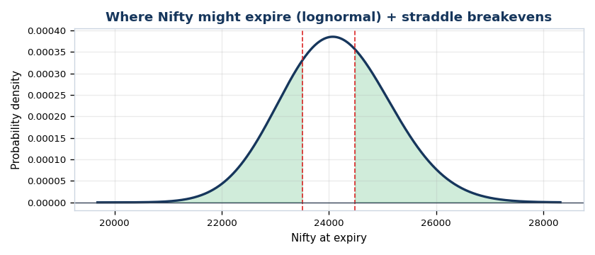

The figure shows the lognormal distribution of where Nifty might expire, centred near the current spot. The two vertical lines mark a long straddle's breakevens — spot plus and minus the premium paid. The long-vol trader profits in the *tails*, where the underlying finishes beyond a breakeven; the short-vol trader profits in the fat *middle*, where it expires between them. Because the middle holds most of the probability mass, the short-vol trader wins *more often* — but the long-vol trader wins *bigger* when the tail hits. That asymmetry is the heart of this chapter, and we return to its danger below.

### Matching the strategy to the IV regime: IV Rank

Knowing whether to be long or short vol requires knowing whether volatility is currently **cheap or expensive** — not in absolute terms, but relative to its own recent history. India VIX at 14 means nothing on its own; you need to know whether 14 is high or low *for this market lately*.

The tool is **IV Rank** (or the related IV Percentile). IV Rank places the current IV on a 0-to-100 scale between its lowest and highest readings over the past year:

`IV Rank = (current IV - 1-year low) / (1-year high - 1-year low) * 100`

- **High IV Rank (say above 70-80)** — volatility is expensive relative to its own history. Premiums are fat. This is the regime to **sell vol**: short strangles, iron condors, credit spreads. You are selling overpriced movement and betting on mean reversion (IV tends to fall back toward its average).
- **Low IV Rank (say below 20-30)** — volatility is cheap. Premiums are thin. This is the regime to **buy vol**: long straddles, strangles, calendars, debit spreads. You are buying cheap movement and betting either that a move materialises or that IV reverts upward.

The professional mantra is "**sell high IV, buy low IV**," and it works because implied volatility is strongly *mean-reverting* — it spikes and then sags back, rather than trending forever. Selling when IV Rank is high stacks two edges: you collect rich premium *and* you have IV crush on your side as it reverts. Buying when IV Rank is low means you pay little and have room for IV to expand in your favour. India VIX is your raw thermometer; IV Rank tells you whether today's temperature is a fever or a chill.

### Putting regime and event together — the Indian calendar

The regime and the event calendar interact. **Before a known event** (RBI policy, the Union Budget on Feb 1, election results, a heavyweight's quarterly results, US Fed nights) India VIX and IV Rank climb as the market braces, and premiums bloat. **In quiet periods** between events, India VIX drifts to multi-month lows, IV Rank sinks, and premiums thin out. The cleanest setups exploit the *predictability of the IV cycle itself*: be long vol *before* IV ramps (buy the calm), and be short vol *into* the bloated pre-event IV if you can stomach the move risk, harvesting the crush after. We work a full example next.

## Worked example (₹, Nifty/Bank Nifty)

**The setup.** It is a quiet Monday. **Nifty spot = 24,000.** The weekly expiry is **4 days** away (Thursday). There is no scheduled event this week, India VIX is sitting low at **11%**, and your IV Rank screen reads about **15** — volatility is cheap by its own one-year history. The question: long vol or short vol, and which structure?

**Step 1 — Compute the expected move.** Using the day-count shortcut with VIX = 11% and D = 4 days:

`expected move ≈ 24,000 * (11/100) * sqrt(4/365)`
`= 24,000 * 0.11 * sqrt(0.01096)`
`= 24,000 * 0.11 * 0.1047 ≈ ₹276`

So the market is pricing a one-sigma weekly range of about **±276 points**, i.e. roughly **23,724 to 24,276**. There is about a 68% chance Nifty expires inside that band and about a one-in-three chance it finishes outside it.

**Step 2 — Read the regime.** IV Rank is 15 — *low*. Volatility is cheap. The regime mantra says **buy vol**, not sell it. Selling a short straddle here would collect thin premium for unlimited risk — poor risk/reward. So we lean long vol.

**Step 3 — Form a combined view.** You have no strong directional bias (you don't know if Nifty goes up or down), but you notice an *unscheduled* risk: a US Fed decision lands mid-week and global markets are jumpy. You think the realised move could *exceed* the priced ±276. Neutral direction + expecting more vol → the 2x2 sends you to the **long straddle** (neutral-bottom-left cell).

**Step 4 — Price the straddle and find breakevens.** With Nifty at 24,000 and IV at 11%, suppose the ATM 24,000 weekly call costs **₹140** and the ATM 24,000 put costs **₹135**. Total premium paid:

`straddle cost = 140 + 135 = ₹275 per unit`

Notice this is almost exactly the expected move (₹276) — that is not a coincidence; a fairly priced ATM straddle *is* the market's expected move. Your breakevens:

`upper breakeven = 24,000 + 275 = 24,275`
`lower breakeven = 24,000 - 275 = 23,725`

You profit only if Nifty expires **above 24,275 or below 23,725** — i.e. if the *realised* move beats the *expected* move. You are explicitly betting the tail.

**Step 5 — Resolve.** The Fed surprises hawkish; Nifty sells off **350 points** to 23,650 by Thursday. The put finishes ₹350 in-the-money (`24,000 - 23,650 = 350`), the call expires worthless. Payoff:

`gross = 350 (put intrinsic) + 0 (call) = ₹350`
`net P&L = 350 - 275 = +₹75 per unit`

On one lot (Nifty lot size currently about 75 units), that is roughly `75 * 75 ≈ ₹5,625` profit. You were *neutral on direction* and still won, because the realised move (350) exceeded the expected move (276) — exactly the bet a long straddle expresses.

**Step 6 — The mirror image.** Had this been a high-IV-Rank week (say IV Rank 85, India VIX at 22 with bloated premiums and no event left to fear), the trade flips. You would *sell* the straddle (or, to cap risk, sell an **iron condor** with wings) and profit as long as Nifty stayed inside the breakevens and IV crushed back down. Same machinery, opposite regime, opposite side. The regime — not a hunch — decides which side of volatility you take.

## Common mistakes / risk note

- **Trading direction with no volatility view.** Buying a call before an event "because it'll go up" ignores the column of the 2x2. If IV is rich, you overpay and the post-event crush can sink you even when you're right on direction (see the vega chapter). Always hold *both* views.
- **Selling cheap volatility / buying expensive volatility.** Selling a straddle when IV Rank is 15 collects thin premium for unlimited risk; buying a straddle when IV Rank is 90 means paying top-dollar for movement that the post-event crush will deflate. Check IV Rank *before* deciding which side to take.
- **Forgetting theta when long vol.** A long straddle bleeds premium every single day. If the big move doesn't come *soon enough*, time decay grinds the position to a loss even if a move eventually arrives. Long vol is a race against the clock.
- **The fat-tail trap of short vol.** This is the big one. Short-vol structures win *often* — the underlying usually stays inside the expected move, so you pocket premium most weeks. This builds dangerous overconfidence. But the lognormal distribution has **fat tails**: real markets crash and gap far more often than a clean bell curve predicts. A naked short straddle/strangle carries *undefined* loss, and a single gap event — a budget shock, a global crash, a circuit-breaker day — can erase months of steady premium income in one session. Selling volatility is "picking up pennies in front of a steamroller": pleasant until it isn't. **Define your risk** (iron condors, spreads with wings), size small, and never sell so much that one tail event ends you. SEBI studies showing roughly 9 in 10 retail F&O traders lose money are full of over-leveraged option sellers who met the tail.
- **Confusing realised and implied.** You can be long vol and lose because, although IV *rose*, the underlying didn't actually *move* (or vice versa). Know which engine — gamma (realised) or vega (implied) — your trade is really betting on.

## Key takeaways

- You can trade **volatility itself**, not just direction: be **long vol** (profit from big moves or rising IV) or **short vol** (profit from calm or falling IV).
- **Long-vol** tools: long straddles, strangles, debit spreads, calendars — positive vega, positive gamma, pay premium, theta works against you.
- **Short-vol** tools: short straddles/strangles, iron condors, credit spreads — negative vega, negative gamma, collect premium, theta works for you.
- Choose a strategy from the **2x2**: combine your direction view (bullish/bearish/neutral) with your volatility view (more vol / less vol). The volatility column decides whether you *buy* or *sell* premium.
- The **lognormal distribution** defines where the underlying might expire; the **expected move ≈ Spot * IV * sqrt(T)** is the one-sigma band. Long vol bets the realised move *exceeds* it; short vol bets it stays *inside* it. A fair ATM straddle's premium ≈ the expected move.
- Match the strategy to the **IV regime via IV Rank**: high IV Rank → sell vol (rich premium, crush on your side); low IV Rank → buy vol (cheap movement, room to expand). IV mean-reverts.
- **Short vol has fat tails**: it wins often but a single gap can wipe out many wins. Define your risk and size small — never sell volatility naked enough to be ended by one tail event.

## Practice problems

1. **Fill in the grid.** You are mildly *bullish* on Bank Nifty and you also believe implied volatility is too high and about to fall after this week's RBI policy. Which cell of the 2x2 are you in, and which single structure best fits?

2. **Expected move (numeric).** Bank Nifty spot is 52,000, India VIX-equivalent IV is 14%, and there are 7 days to expiry. Estimate the one-sigma expected move in points and the corresponding price band. Roughly what is the probability Bank Nifty expires *outside* that band?

3. **Straddle breakevens (numeric).** Nifty is at 24,000. The ATM 24,000 weekly call trades at ₹160 and the put at ₹150. Find the cost, the two breakevens, and state in one sentence what realised outcome the *buyer* of this straddle needs.

4. **Regime read.** India VIX is at 25 and your IV Rank screen shows 88, the day before the Union Budget. A friend wants to buy a long straddle "because the Budget will cause a huge move." Critique this using the IV-regime idea. What is the main danger?

5. **Conceptual — two ways to be right.** Explain the difference between profiting from *realised* volatility and profiting from *implied* volatility when you are long a straddle. Give an India example of each.

6. **The fat-tail caveat.** A trader has sold an OTM Nifty strangle every week for 30 weeks and won 28 of them, calling it "free money." Explain, using the lognormal distribution and fat tails, why this track record is dangerous and what one change would make the strategy survivable.

## Solutions

1. **Bullish + expecting less vol** → the top-right cell. The structure is a **bull put (credit) spread**: sell an OTM put, buy a farther OTM put for protection. You collect premium (short vol, benefiting from the post-RBI IV crush), profit if Bank Nifty drifts up or simply holds above your short strike, and your loss is capped by the long wing. A plain long call would be wrong here — it's long vega and would get hurt by the falling IV you expect.

2. Using `expected move ≈ Spot * (IV) * sqrt(D/365)` with IV = 0.14, D = 7:
`= 52,000 * 0.14 * sqrt(7/365) = 52,000 * 0.14 * sqrt(0.01918) = 52,000 * 0.14 * 0.1385 ≈ ₹1,008`.
So about **±1,008 points**, a band of roughly **50,992 to 53,008**. One sigma implies about a 68% chance of expiring *inside*, so roughly a **32% chance — about one in three — of finishing outside** the band.

3. Cost `= 160 + 150 = ₹310` per unit. Upper breakeven `= 24,000 + 310 = 24,310`; lower breakeven `= 24,000 - 310 = 23,690`. The buyer needs Nifty to expire **above 24,310 or below 23,690** — i.e. a realised move larger than ±310 points (larger than the expected move the premium implies); anywhere in between, the straddle loses.

4. With India VIX at 25 and IV Rank at 88, volatility is **expensive** — near its one-year high. Buying a straddle means paying *top-dollar* premium. Two things work against the buyer: the move must be enormous just to clear the inflated breakevens, and the moment the Budget passes, **IV crushes** and deflates both legs. The friend could be right that the Budget causes a big move and *still lose*, because the realised move fails to beat the bloated expected move while the vega crush compounds the damage. In a high-IV-Rank regime the edge is on the **selling** side (e.g. a defined-risk iron condor), not the buying side.

5. When long a straddle you have **positive gamma** (helped by realised volatility — the underlying actually swinging around, which you can also harvest by delta-hedging) and **positive vega** (helped by rising implied volatility — the market's *forecast* of movement climbing, fattening your premiums even before any move occurs). *Realised* example: you hold a Nifty straddle over a week and Nifty whips 400 points down then back — the actual movement pushes a leg deep in-the-money. *Implied* example: you buy a quiet, low-IV straddle three weeks before an election; as the event nears, India VIX climbs from 11 to 20 and your straddle gains value from the IV expansion *even though Nifty has barely moved*. Long vol can pay via either engine.

6. A short OTM strangle profits whenever the underlying expires inside the strikes — which, because the lognormal distribution piles most of its probability in the **middle**, happens *most weeks*. Winning 28 of 30 is exactly what the math predicts and proves nothing about safety. The danger lies in the **fat tails**: real markets gap and crash far more often than a clean bell curve implies, and a naked strangle has **undefined loss**, so a single tail event (a crash, a circuit day, a budget shock) can lose more than all 28 wins combined — "picking up pennies in front of a steamroller." The track record breeds overconfidence and larger size, setting up a ruinous blow-up. The one change that makes it survivable: **define the risk** by buying protective wings (converting the strangle into an **iron condor**) and **size small**, so the worst-case single-week loss is capped and cannot end the account. Frequency of winning is not the same as positive expectancy once the rare tail is priced in.

# Analysing the Market with the Option Chain — OI Change, the Straddle, and the Whole Dashboard

By now you can read an option chain (Chapter 4), you understand implied volatility, India VIX, and IV Rank (Chapters 30–36), and you know what Open Interest means. This chapter ties it all together into the one skill that separates a trader who *guesses* from one who *reads the market*: turning the option chain's data — OI, OI change, PCR, max pain, the straddle, IV percentile and futures OI — into a clear, defensible view of what is likely to happen next.

This is the exact dashboard professionals stare at all day (and what tools like Sensibull display). It can look like an intimidating wall of numbers. It is not. Every panel answers one simple question, and once you know the question each one answers, the wall becomes a sentence. Let us learn to read that sentence.

## The big idea: the option chain is a map of where money is committed

A stock chart tells you where price *has been*. The option chain tells you where large players have **committed money for the future** — which levels they are defending, where they expect price to stay, and how much movement they are pricing in. Options are written (sold) mostly by well-capitalised institutions, and they do not place those bets carelessly. Reading the chain is, in effect, reading the footprints of the smart money. None of it is a crystal ball, but it is the closest thing the retail trader has to seeing the other side's hand.

## Open Interest, and the four buildups (the concept most beginners miss)

**Open Interest (OI)** is the number of option contracts currently *open* — not yet closed or expired. A high OI at a strike means a lot of money is parked there. But the single most useful OI skill is not reading the *level* — it is reading the **change in OI together with the change in price**. That combination tells you *who is doing what*, and it resolves into exactly four cases. Memorise this table; it is the heart of intraday option-chain analysis.

| Price | Open Interest | What it means | Bias |
|-------|---------------|---------------|------|
| **Up** | **Up** | **Long buildup** — new buyers entering with conviction | **Bullish** |
| **Down** | **Up** | **Short buildup** — new sellers/writers entering | **Bearish** |
| **Up** | **Down** | **Short covering** — shorts buying back to exit (a relief rally) | Bullish, but often temporary |
| **Down** | **Down** | **Long unwinding** — longs selling out, giving up | Bearish, but often just profit-taking |

The logic is simple once you see it. **Rising OI means *new* positions are being created** — fresh conviction, in whichever direction price is moving. **Falling OI means positions are being *closed*** — conviction leaving the market. So "price up on rising OI" is genuine new buying (strong), while "price up on falling OI" is just shorts running for the exit (weaker, often fades). A professional never reads price alone; they always ask, *"and what did OI do?"*

## OI as support and resistance — the walls

Now apply OI to *strikes*. Recall that the people with the most to lose when an option finishes in-the-money are the **writers** (sellers). So writers defend their strikes.

- **The strike with the heaviest *call* OI acts as resistance.** Call writers there are betting price stays *below* that strike, and they have the capital to defend it. Heavy call OI above the spot = a ceiling.
- **The strike with the heaviest *put* OI acts as support.** Put writers are betting price stays *above*; heavy put OI below the spot = a floor.

These are the **OI walls**. When you see (as we did on a live Nifty day) heavy call OI stacked at 24,000–24,200 and heavy put OI at 23,800–24,000, you are looking at a **cage**: the market is being boxed between a put-support floor and a call-resistance ceiling. Range-bound until one wall breaks.

## OI Change — the *live* signal (walls building vs breaking)

The walls are not fixed. The truly powerful read is watching how OI **changes through the day** — typically over the last 15, 30 or 60 minutes. This tells you whether a wall is *firming* or *cracking* in real time:

- **Call OI *adding* at a strike above spot** → resistance **building** → writers confident price stays below → bearish/capped.
- **Call OI *unwinding* (falling) at that strike** → resistance **breaking** → writers covering → the ceiling is lifting → bullish.
- **Put OI *adding* below spot** → support **building** → bullish.
- **Put OI *unwinding* below spot** → support **failing** → bearish.

This is the single most valuable panel on the dashboard, because it shows you positioning *as it happens* rather than a stale snapshot. One honest caveat the exchange itself states: **OI data is updated roughly every three minutes, and no vendor or broker has true real-time OI.** So OI change is a 2–3-minute-delayed signal for everyone — use it for the *trend* of positioning, not for tick-by-tick timing.

A second caveat that catches many traders: **near expiry, OI unwinds across the board** simply because everyone is closing or rolling positions. That broad unwinding is *expiry squaring*, not a directional signal. Always ask whether falling OI is *directional* (one side covering) or just *everyone closing books* before expiry.

## PCR — the Put-Call Ratio, read like a contrarian

**PCR = total Put OI ÷ total Call OI.** It is a crude sentiment gauge, and the professional reads it **contrarian**:

- **PCR > 1** (more puts than calls) → the crowd is loaded with puts (bearish/hedged) → *contrarian bullish*.
- **PCR < 1** (more calls than puts, e.g. 0.7) → the crowd is loaded with calls (bullish) → *contrarian bearish*, and it tells you the call side is the heavier wall (resistance-dominant).
- **The trend matters more than the level:** a *falling* PCR through the day means call writing is growing faster than put writing → resistance building → bias leaning down.

PCR is a *blunt* tool. Do not trade on it alone — it fails badly in strong trends (a runaway rally can show a "bearish" low PCR all the way up). Use it as one vote among several.

## Max Pain — the expiry magnet

**Max Pain** is the strike at which the *total* value of all in-the-money options is smallest — i.e. the price at which **option buyers, as a group, lose the most and writers pay out the least.** Because writers are large and motivated, price has a documented tendency to **gravitate toward max pain as expiry approaches** (the "pin"). If spot is 23,960 and max pain is 24,000 on expiry day, the gentle pull is *up* toward 24,000.

Treat it as a **tendency, not a law.** Max pain is a useful tiebreaker on a quiet expiry day; it is overwhelmed completely by real news or a strong trend. Never fight a trending market just because of max pain.

## The ATM Straddle — the market's own forecast of movement

This is the panel most beginners ignore, and it is one of the most powerful. The **ATM straddle** is the price of the at-the-money call *plus* the at-the-money put. That single number is **the market's own estimate of how far price will move by expiry** — the priced-in expected move. If the 24,000 straddle costs ₹170, the market is roughly saying "we expect Nifty to move about ±170 points by expiry."

Two things to read from it:

1. **The level = the expected move.** It tells you, in points, how big a move is priced in — and therefore how far your target realistically is and whether an option is "expensive" relative to the move it needs.
2. **The *change* (straddle decay) = the most underrated intraday signal.** Watch the straddle through the day:
   - **A *falling* straddle** means realised movement is *less* than what was priced in — the market is going nowhere and **premium is bleeding out through theta.** This is the option **buyer's enemy**. A steadily decaying straddle is a giant flashing sign: *do not buy options today; it is a theta day. Favour selling premium or standing aside.*
   - **A *rising* straddle** means the market is starting to price in a bigger move — buyers are paying up. Often precedes or accompanies a breakout.

We watched this live: on a quiet expiry-eve, the straddle bled all afternoon, which correctly told us that *directional option buying was a losing game* regardless of which way we guessed — the lesson that being right on direction is not enough.

## IV, India VIX, IV Rank & IV Percentile — is premium cheap or rich?

These decide **whether to buy or sell options at all** (covered in depth in Chapters 32 and 35; here is the practical summary):

- **ATM Option IV** — the implied volatility of the at-the-money strike; the cleanest single read of how pricey options are *right now*.
- **India VIX** — the market's 30-day expected volatility; the market's "fear gauge."
- **IV Rank / IV Percentile** — where today's IV sits versus its own history (0 = cheapest in a year, 100 = most expensive). **This is the key decision number.** Low (say < 30) → options are **cheap** → favour **buying** (debit structures, long options). High (> 60–70) → options are **rich** → favour **selling** premium (credit spreads, condors). Buying expensive options and watching IV deflate is one of the quietest ways to lose while being right on direction.

## Futures OI & Rollover

**Futures OI** is the total open interest in the index future. Read it like option OI (the four-buildup table applies). Its special use is **near expiry**: as expiry nears, near-month futures OI *falls* as traders **roll** positions to the next month or close them. A large drop is mostly **rollover** (neutral), not a directional signal — though *futures OI falling while price falls* leans toward long unwinding. The **rollover percentage** (how much migrates to next month vs simply exits) is the cleaner expiry-week sentiment read.

## Putting it together — a 60-second market read

Here is the workflow. Do not read panels in isolation; **synthesise them into one sentence.** Go in this order:

1. **Volatility regime (IV Rank):** cheap or rich? → decides *buy vs sell premium*.
2. **The walls (OI by strike):** where are the support floor and resistance ceiling? → your range.
3. **OI change (last 30–60 min):** are the walls building or breaking, and is it directional or just expiry squaring? → the *live* bias.
4. **PCR + Max Pain:** which side is heavier, and where is the expiry magnet? → confirmation + pin level.
5. **The straddle (and its decay):** is premium bleeding (theta day, don't buy) or rising (move coming)? → *is buying options even sensible today?*

**A worked example (a real quiet expiry-eve):** IV Rank 24 (cheap), spot 23,960 caged between put support 23,800 and call resistance 24,000–24,200, max pain 24,000 (mild upward pin), PCR 0.72 (call-heavy)… *but* the OI change showed **calls and puts both unwinding** (broad squaring, not conviction), and the straddle was flat-to-bleeding. The synthesised sentence: *"Range-bound into expiry, capped near 24,000, broad position-squaring rather than fresh conviction — a low-edge tape; the disciplined move is a small pin play or no trade."* Notice how five panels collapsed into one clear, defensible read. **That** is option-chain analysis.

## Common mistakes (and the fix)

- **Reading a single OI snapshot as gospel.** *Fix:* watch the *change* over time; one snapshot is a stale photo.
- **Forgetting expiry mechanics.** *Fix:* near expiry, broad OI unwinding is *squaring*, not direction.
- **Trading PCR or max pain alone.** *Fix:* they are tiebreakers, not signals — combine with the walls and OI change.
- **Buying options while the straddle bleeds.** *Fix:* a decaying straddle means theta wins — sell premium or stand aside.
- **Ignoring IV Rank before buying.** *Fix:* check cheap-vs-rich *first*; it decides buy vs sell.
- **Confusing "lots of data" with "a view."** *Fix:* always end by writing the one-sentence synthesis.

## Key takeaways

- The option chain is a **map of committed money** — support/resistance walls, the priced-in move, and live positioning.
- **OI + price change → the four buildups** (long/short buildup, short covering, long unwinding). This is the core intraday read.
- **OI *change*** (building vs unwinding) is the live signal — but it is ~3 minutes delayed for *everyone*, and near expiry it is dominated by squaring.
- **PCR** (contrarian) and **Max Pain** (expiry magnet) are tiebreakers, not standalone signals.
- **The ATM straddle** is the market's own expected-move forecast; **a falling straddle = theta day = don't buy options.**
- **IV Rank/Percentile** decides buy-vs-sell; **futures OI** near expiry is mostly rollover.
- Always finish by **synthesising every panel into one sentence.** Data is not a decision until you have written that sentence.

<div class="partpage"><div class="part-lbl">Part VI</div><div class="part-title">Options Strategies</div></div>

# Chapter 37: How to Choose a Strategy — View x Volatility x Risk

By now you have met dozens of option structures: long calls and puts, spreads, straddles, strangles, condors, calendars, butterflies. To a beginner this looks like a tangled menu with no obvious order — which one do you pick on a Tuesday morning when Nifty is at 24,000 and you have a hunch? The honest answer most losing traders never learn is this: you should almost never start from the strategy. You should start from your *view*, and let the strategy fall out of it. The strategy is the last decision, not the first.

This chapter gives you the decision framework that opens every professional options trade. It asks three questions — about direction, about volatility, and about how much you can afford to lose — and turns the answers into a shortlist of structures. Get into the habit of answering all three *before* you look at an option chain, and you will stop picking trades because they are exciting and start picking them because they fit what you actually believe. This is the master map for the rest of Part VI; every strategy chapter that follows is one cell in the table you are about to build.

## Core concepts

### Every trade answers three questions

A professional never thinks "I'll buy a call." They think: "I'm mildly bullish, I expect volatility to fall, and I want my risk capped at 2% of capital — therefore a bull put spread." Strategy is the *output* of three inputs:

1. **Directional view** — where do you think the underlying is going? Bullish (up), bearish (down), neutral (sideways / range-bound), or genuinely unsure (you have no edge on direction but a view on movement itself).
2. **Volatility view** — do you expect *movement* and *implied volatility (IV)* to rise or fall? And, separately, is IV *currently* cheap or rich? These are different: a market can have high IV that you still expect to climb, or low IV you expect to stay low.
3. **Risk appetite and capital** — are you willing to take *undefined* risk (option selling, where a bad move can lose far more than you collected), or do you need *defined* risk (your worst case is known and capped up front)? And how much of your capital can this single trade afford to lose?

Answer these three honestly and the strategy is nearly chosen for you. Skip any of them and you are gambling with leverage.

### Question 1 — what is your directional view?

This is the axis everyone already thinks about, so keep it simple. Sort your opinion into one of four buckets:

- **Bullish** — you expect the underlying to rise. Lean on calls, call spreads, or short puts.
- **Bearish** — you expect it to fall. Lean on puts, put spreads, or short calls.
- **Neutral** — you expect it to stay in a range, going roughly nowhere. This is the home of premium-selling structures: condors, butterflies, short straddles/strangles.
- **Unsure on direction, but with a movement view** — you genuinely cannot call up or down, but you *can* say whether the move will be big or small. This points you to pure volatility plays (straddles, strangles) where direction barely matters.

Be honest about conviction, too. "Mildly bullish" and "explosively bullish" lead to different structures — the first wants a defined-risk spread that profits from drift, the second wants a long call that can run.

### Question 2 — what is your volatility view, and is IV cheap or rich?

This is the axis beginners ignore and professionals obsess over. There are two sub-questions hiding inside it.

**(a) Direction of volatility.** Do you expect realised movement and IV to *rise* or *fall*? If you expect a storm — earnings, a budget, an RBI policy decision, an election result — you want to be **long volatility** (own movement: long options, positive vega and gamma). If you expect calm — a quiet week after the event has passed — you want to be **short volatility** (sell movement: collect premium, negative vega, positive theta).

**(b) Level of volatility right now.** Even if you expect IV to fall, *how expensive is it today?* This is where **IV rank** (introduced in Chapter 35) earns its keep. IV rank tells you where current IV sits between its 1-year low and high, on a 0–100 scale:

`IV rank = (current IV - 52-week low IV) / (52-week high IV - 52-week low IV) * 100`

- **High IV rank (say above 50)** — options are *expensive* relative to their own history. Premiums are fat. This favours **selling** premium (short strangles, iron condors, credit spreads): you are being paid richly to take on movement risk, and you profit if that rich IV deflates.
- **Low IV rank (say below 20–30)** — options are *cheap*. Premiums are thin. This favours **buying** options or using structures that are long vega (long calls/puts, debit spreads, calendars): you are buying movement on the cheap, and you profit if IV expands.

The professional discipline is **"sell high IV, buy low IV."** Combine the two sub-questions and you avoid the classic beginner trap: buying a straddle into an event when IV is already sky-high (you pay a fortune for movement, then watch IV collapse after the event even though the index moved — the dreaded *IV crush*).

### Question 3 — defined risk or undefined risk, and how much?

This is the axis that keeps you alive. Two parts again.

**(a) Defined vs undefined risk.** Every structure is one or the other:

- **Defined-risk** — your maximum loss is known and capped the moment you enter. Long options, all vertical spreads (bull call, bear put, bull put, bear call), iron condors, iron butterflies, and long butterflies are defined-risk. The market can gap 10% overnight and you cannot lose a rupee more than you committed.
- **Undefined-risk** — your loss can balloon far beyond what you collected. Naked short calls (theoretically unlimited loss), naked short puts, and short straddles/strangles are undefined-risk. They often have a *high probability* of a *small* profit, paired with a small probability of a *large* loss — and in India, SPAN + exposure margin on these is heavy, and a gap move can blow through your stop before you can act.

For beginners, defined-risk should be the default, not the exception. You will be wrong often while you learn; defined-risk guarantees that being wrong is survivable. Undefined-risk selling is a professional tool that demands strict position sizing, hedging, and the emotional discipline to take a loss — earn your way to it.

**(b) How much can this trade lose?** Even a defined-risk trade is dangerous if it is too big. A workable rule for a learning trader: **risk no more than 1–2% of total capital on any single trade.** If your account is ₹5,00,000, that is ₹5,000–₹10,000 of maximum loss per position. This number *drives the structure and the number of lots* — it is not an afterthought.

### Probability of profit vs payoff size — the eternal trade-off

Two structures can have the same expected value yet feel completely different, because they sit at opposite ends of one trade-off:

- **Buying options** (long calls/puts, debit spreads, long straddles) — *low* probability of profit, *large* payoff when right. You will lose small amounts often (long options usually expire worthless) and win big occasionally. You need to be right about *timing and magnitude*, not just direction.
- **Selling options** (credit spreads, condors, short strangles) — *high* probability of profit, *small* capped payoff, with a fat tail of large loss if you are wrong. You win small amounts often and lose big occasionally.

Neither is "better." A high probability of profit is seductive — winning 80% of the time *feels* like skill — but if the 20% losses are 5x the size of the wins, you bleed out. Always ask: **probability of profit times average win, versus probability of loss times average loss.** The market roughly prices these to balance; your edge comes from a *view* (on direction or volatility) that the market has mispriced, not from the structure itself.

### Position sizing is part of strategy selection, not a separate step

Choosing *which* structure and choosing *how many lots* are the same decision. The flow is:

1. Pick the structure from your three views (the table below).
2. Compute the **maximum loss per lot** of that structure.
3. Divide your **rupee risk budget** (1–2% of capital) by that per-lot loss to get the number of lots.

`Number of lots = (capital * risk % per trade) / (max loss per lot)`

If the answer is less than one lot, the trade is too big for your account — pick a tighter (cheaper) structure or skip it. This is why a defined-risk spread often beats a naked long option for a small account: the capped loss makes the position *sizeable* in a controlled way, instead of forcing you to bet the whole premium and hope.

### The master decision map

Here is the table that ties all three axes together. Read it as: *given my directional view, my volatility view, and my IV-rank/risk preference, here is the strategy family.* Defined-risk choices are marked so beginners know where to start.

| Directional view | Volatility view (and IV rank) | Strategy family | Risk type |
|---|---|---|---|
| Bullish | Expect big move up / IV low (cheap) | Long call, **bull call spread** | Defined |
| Bullish | Expect drift up / IV high (rich) | **Bull put spread** (sell put credit) | Defined |
| Bullish | Mildly bullish, want income | Covered call, short put | Undefined (put) |
| Bearish | Expect big move down / IV low | Long put, **bear put spread** | Defined |
| Bearish | Expect drift down / IV high | **Bear call spread** (sell call credit) | Defined |
| Neutral (range) | IV high (rich), expect calm | Short strangle, **iron condor** | Condor: Defined |
| Neutral (pin to a level) | IV high, expect a precise sit | **Iron butterfly**, short straddle | Iron fly: Defined |
| Neutral (range) | IV low (cheap), expect IV to rise | Calendar / diagonal spread | Defined-ish |
| Neutral (pin to a level) | IV low, low movement expected | **Long butterfly** | Defined |
| Unsure on direction | Expect big move / IV low | **Long straddle** (ATM), **long strangle** (OTM) | Defined |
| Unsure on direction | Expect calm / IV high | Short straddle / short strangle | Undefined |
| Strongly directional + hedge | Own stock/position, want protection | Protective put, collar | Defined |

The bolded, defined-risk cells are your starting playground. Everything in the rest of Part VI is one row of this table explained in full.

### A simple checklist before every trade

1. **Direction:** up / down / sideways / unsure?
2. **Volatility:** rising or falling? And is IV rank high (sell) or low (buy)?
3. **Risk:** defined (default) or undefined? Max rupee loss = 1–2% of capital.
4. **Structure:** read it off the map.
5. **Size:** lots = risk budget / max loss per lot.
6. **Exit plan:** at what profit or loss do I get out, before I enter?

If you cannot fill in all six lines, you do not have a trade — you have a hunch.

## Worked example (₹, Nifty/Bank Nifty)

It is a quiet week. Nifty is at **24,000**. You have a **mildly bullish** view — you think Nifty drifts up to around 24,300 over the next week, but you do not expect fireworks. You check **India VIX and IV rank**: VIX is elevated and the weekly options carry an **IV rank of about 70** (rich). Your account is **₹5,00,000** and your rule is to risk **2% (₹10,000)** per trade. Nifty lot size is **75**.

**Step 1 — run the three questions.**
- *Direction:* mildly bullish (drift up, not explosive). 
- *Volatility:* IV rank 70 is high — options are expensive, so you want to be a *seller*, not a buyer. You also expect calm, so falling IV would help you. 
- *Risk:* you want defined risk; max loss ₹10,000.

**Step 2 — read the map.** Bullish + high IV (rich) + defined risk points to a **bull put spread** (sell a put credit spread below the market). You collect rich premium, you profit if Nifty stays above your short strike, and rich IV deflating helps you. A long call would be the *wrong* choice here — you would be *buying* expensive premium against your own volatility view and exposing yourself to IV crush.

**Step 3 — build the structure.** Sell the 23,900 put and buy the 23,700 put (a 200-point-wide spread, both below the current 24,000):
- Sell 23,900 put: collect about **₹120** per unit.
- Buy 23,700 put: pay about **₹60** per unit.
- **Net credit = 120 - 60 = ₹60** per unit.

**Step 4 — compute per-lot economics.**
- Net credit per lot = `60 * 75 = ₹4,500` (your maximum profit per lot).
- Spread width = `23,900 - 23,700 = 200` points.
- Max loss per unit = `width - net credit = 200 - 60 = ₹140`.
- Max loss per lot = `140 * 75 = ₹10,500`.

**Step 5 — size the position.**
`Lots = risk budget / max loss per lot = 10,000 / 10,500 = 0.95`, which rounds down to **1 lot**. One lot fits inside your ₹10,000 risk budget (just); two lots would risk ₹21,000 and break your rule, so you trade exactly **one lot**.

**Step 6 — define the outcomes.**
- *Breakeven:* `23,900 - 60 = 23,840`. As long as Nifty expires above 23,840, you make money.
- *Max profit:* ₹4,500, if Nifty expires anywhere above 23,900 (your mild bullishness only needs Nifty to *not fall* much).
- *Max loss:* ₹10,500, if Nifty collapses below 23,700.
- *Probability:* because both strikes are below the current price, this trade has a *high* probability of the small ₹4,500 win — exactly the high-POP, capped-payoff profile of premium selling, kept survivable by the defined-risk wings.

The whole trade was *selected*, not guessed: three views in, one structure and one lot out.

## Common mistakes / risk note

- **Starting from the strategy, not the view.** "I like iron condors" is not a reason to sell an iron condor. If your three answers don't point to it, don't trade it.
- **Ignoring the volatility axis entirely.** Buying a straddle before results when IV rank is 90 is a classic loss: the index can move and you *still* lose because IV crushes after the event. Buy cheap vol, sell rich vol.
- **Confusing high probability of profit with low risk.** Naked short options win most days, then hand back months of gains in one gap. A high POP with undefined risk is *more* dangerous to a beginner, not less.
- **Treating position sizing as optional.** Picking the right structure and then trading 5 lots when 1 fits your budget converts a good trade into a blow-up. Sizing is part of selection.
- **Defaulting to undefined-risk selling too early.** SEBI studies are blunt: roughly nine in ten retail F&O traders lose money, and undefined-risk selling is where the biggest single-day wipeouts happen. Earn your way to it with defined-risk structures first.
- **No pre-planned exit.** Decide your profit-take and stop-loss *before* entering, while you are calm. After entry, your judgement is compromised by the position.

## Key takeaways

- Every options trade should answer three questions in order: **direction, volatility, risk** — and only then name a strategy.
- The volatility question has two halves: *which way will IV move* and *is IV cheap or rich right now* (use IV rank). Sell rich vol, buy cheap vol.
- **Defined-risk structures are the correct default for beginners** — they make being wrong survivable.
- Buying options gives low probability / large payoff; selling options gives high probability / small payoff with a fat loss tail. Neither is free money — your edge is a *view*, not a structure.
- **Position sizing is part of strategy selection:** `lots = (capital * risk%) / (max loss per lot)`. If that is under one lot, the trade is too big.
- The master decision map turns the three views into a strategy family; the rest of Part VI explains each cell in detail.

## Practice problems

1. **(Conceptual)** A trader is bearish on Bank Nifty and notices IV rank is 75 (very rich). Using the framework, which is more appropriate: buying a put, or selling a bear call (call credit) spread? Explain via the volatility axis.

2. **(Conceptual)** Explain why a long straddle bought the morning of an RBI policy announcement, when IV rank is 90, can lose money *even if* Nifty moves 300 points that day.

3. **(Numeric — sizing)** Your capital is ₹3,00,000 and your rule is 1.5% risk per trade. You want a Nifty bull call spread whose maximum loss is ₹3,400 per lot. How many lots can you trade?

4. **(Numeric — structure economics)** You sell a Nifty bear call spread: sell the 24,200 call for ₹90 and buy the 24,400 call for ₹40 (lot size 75). Compute net credit per lot, max loss per lot, and the breakeven level.

5. **(Conceptual)** A beginner says: "Short strangles win 85% of the time, so they're the safest way to trade." Identify the flaw using the probability-of-profit vs payoff-size idea.

6. **(Application)** You are neutral on Nifty (expect it to stay near 24,000 for a week) and IV rank is only 15 (cheap). Which two families from the decision map fit, and which one is defined-risk and beginner-appropriate?

## Solutions

1. **Sell the bear call spread.** With IV rank at 75, options are *expensive*. Buying a put means *paying* that rich premium and fighting IV crush — your volatility view (rich IV likely to fall) is working against a long option. A bear call credit spread is a *seller* of that rich premium: you profit from the bearish drift *and* from IV deflating, and the long wing caps your risk. Direction (bearish) is satisfied by both, but the volatility axis breaks the tie in favour of selling.

2. **IV crush.** At IV rank 90 the straddle is priced for a *huge* expected move; you pay a very fat premium. Once the announcement passes, uncertainty collapses and IV falls sharply, deflating both legs' time value. A 300-point move might be *less* than the move the inflated premium required to break even, and the vega loss from collapsing IV can exceed the gamma/intrinsic gain. You were right that it would move, but you overpaid for the movement — the wrong side of the "buy cheap vol" rule.

3. **Risk budget = `3,00,000 * 0.015 = ₹4,500`.** `Lots = 4,500 / 3,400 = 1.32`, round down to **1 lot.** Two lots would risk ₹6,800 and exceed the ₹4,500 budget, so you trade one lot.

4. **Bear call spread economics.**
   - Net credit per unit = `90 - 40 = ₹50`; per lot = `50 * 75 = ₹3,750` (max profit).
   - Spread width = `24,400 - 24,200 = 200` points; max loss per unit = `200 - 50 = ₹150`; per lot = `150 * 75 = ₹11,250` (max loss).
   - Breakeven = short strike + net credit = `24,200 + 50 = 24,250`. You profit if Nifty expires below 24,250; max profit below 24,200; max loss above 24,400.

5. **The flaw is ignoring payoff size and risk type.** An 85% win rate sounds safe, but a short strangle is *undefined-risk*: the 15% of losing trades can each lose many times the small premium collected. Compare expected values: if you win ₹4,000 with 85% probability but lose ₹30,000 with 15% probability, expected value = `0.85*4,000 - 0.15*30,000 = 3,400 - 4,500 = -₹1,100` — a losing strategy despite the high win rate. "Wins often" is not "safe"; a high probability of profit paired with a fat loss tail is exactly how beginners blow up.

6. **Neutral + low IV (cheap) fits the calendar/diagonal spread and the long butterfly.** Both want a quiet, range-bound market and benefit from cheap premium / rising IV. The **long butterfly** is the cleanly **defined-risk, beginner-appropriate** choice: you buy it for a small known debit, your maximum loss is that debit, and it pays off best if Nifty pins near the body strike (24,000). The calendar is also broadly defined-risk but is more sensitive to IV changes and trickier to manage, so the long butterfly is the better starting point.

# Chapter 38: Vertical Spreads I — Bull Call & Bear Put (Debit Spreads)

You like the direction of a move, but you hate two things about simply buying an option: it is expensive, and most of that cost is "rented" time value that bleeds away every day. What if you could buy the option you want, then sell a second option a little further out to claw back part of the cost? You give up the dream of an unlimited home run, but in return you pay less, lose less if you are wrong, and stop fighting the clock so hard. That trade-off — pay less, cap the upside — is the heart of the **debit vertical spread**, and it is the first real "strategy" most professionals reach for.

This chapter covers the two debit verticals: the **bull call spread** for a moderately bullish view and the **bear put spread** for a moderately bearish view. They are mirror images of each other. Once you understand one, you understand both. We will build the intuition, derive the three numbers that define every spread (max profit, max loss, breakeven), look at how the Greeks soften compared with a naked long option, and work full rupee Nifty examples end to end.

## Core concepts

### What a vertical spread is

A **vertical spread** is a two-leg position where you simultaneously **buy one option and sell another** of the **same type** (both calls or both puts) and the **same expiry**, differing only in **strike price**. The word "vertical" comes from the option chain: same expiry means same column, and the two strikes sit one above the other vertically.

There are two flavours, defined by which leg costs more:

- **Debit spread** — the option you *buy* is more expensive than the option you *sell*, so cash flows *out* of your account on entry. You pay a **net debit**. This chapter is about debit spreads.
- **Credit spread** — the option you *sell* is more expensive than the option you *buy*, so cash flows *in*. You receive a **net credit**. (That is the next chapter — bull put and bear call spreads.)

The single idea behind a debit spread: **the short leg subsidises the long leg.** You still own the directional bet from your long option, but you have sold away the part of the move you do not expect to capture, and pocketed that money to reduce your cost.

### The bull call spread — the core debit structure

Suppose Nifty is at 24,000 and you think it will rise to around 24,300 over the next two weeks — a moderate, not explosive, move. You could buy a 24,000 call outright, but it is pricey and you do not believe Nifty will rocket past 24,500, so you are paying for upside you do not expect.

The **bull call spread** fixes this:

1. **Buy** a lower-strike call (say the 24,000 call) — this is your directional engine.
2. **Sell** a higher-strike call (say the 24,300 call) of the same expiry — this finances part of the purchase.

Because the lower-strike call is always worth more than the higher-strike call (it is more in-the-money or less out-of-the-money), you pay a **net debit**:

`Net debit = premium paid for lower call - premium received for higher call`

You have built a position that profits as Nifty rises — but only up to the higher strike. Above 24,300, every rupee you gain on your long 24,000 call is exactly offset by a rupee you lose on your short 24,300 call. Your profit is **frozen** above the upper strike. That frozen ceiling is the price you pay for the discount.

### The three numbers that define a bull call spread

Every vertical spread is fully described by three quantities. Let `K1` be the lower (bought) strike, `K2` the higher (sold) strike, and `D` the net debit paid.

**Maximum loss** happens when both calls expire worthless — Nifty closes at or below `K1`. You simply lose what you paid:

`Max loss = net debit = D`

This is the entire risk of the trade. It is **defined** and known the moment you enter — a key reason spreads are loved.

**Maximum profit** happens when Nifty closes at or above the upper strike `K2`. The long call is worth `(K2 - K1)` of intrinsic value, the short call's loss caps your gain, and you subtract what you paid:

`Max profit = (K2 - K1) - D`

The quantity `(K2 - K1)` is the **strike width** — the distance between the two strikes. So the rule is simply: **max profit = strike width minus debit.**

**Breakeven** is the spot at expiry where profit is exactly zero. You need the long call to recover the debit you paid:

`Breakeven = K1 + D`

Notice the elegant symmetry. The strike width `(K2 - K1)` is split into two parts: the debit `D` you pay, and the max profit `(K2 - K1) - D` you can earn. The ratio of these is your **risk-reward**. If you pay a debit of 100 points for a 300-point-wide spread, you risk 100 to make 200 — a 1:2 risk-reward.

### The bear put spread — the bearish mirror

The **bear put spread** is the exact reflection for a moderately *bearish* view. Now you use puts, and you buy the *higher* strike:

1. **Buy** a higher-strike put (say the 24,000 put) — gains value as Nifty falls.
2. **Sell** a lower-strike put (say the 23,700 put) of the same expiry — finances the purchase.

The higher-strike put is worth more, so again you pay a **net debit**. The position profits as Nifty falls, but only down to the lower strike, below which your profit is frozen.

Let `K1` be the lower (sold) strike, `K2` the higher (bought) strike, and `D` the net debit. The three numbers mirror the bull call spread exactly:

- `Max loss = net debit = D` — occurs when Nifty closes at or above `K2` (both puts worthless).
- `Max profit = (K2 - K1) - D` — occurs when Nifty closes at or below `K1`.
- `Breakeven = K2 - D` — the bought (higher) strike minus the debit, because here profit grows as spot falls below the upper strike.

Same skeleton, flipped direction. Bull call: bullish, breakeven *above* the lower strike. Bear put: bearish, breakeven *below* the higher strike.

### Why the Greeks are gentler

This is the subtle professional reason spreads beat naked long options for a moderate view. A long option's worst enemies are **theta** (time decay) and **vega** (sensitivity to a fall in implied volatility, written as the Greek vega). In a debit spread, your short leg has *negative* theta and *negative* vega from your perspective — meaning as the seller of that leg, time decay and volatility changes work *for* you on the short option. These partly cancel the *positive* theta drag and vega exposure of your long leg.

- **Net delta** — positive for a bull call spread (you profit as spot rises), negative for a bear put spread. But it is *smaller* than the long leg alone, because the short leg's delta opposes it. Your directional exposure is diluted, which is exactly right for a *moderate* view.
- **Net theta** — much smaller than a naked long option. The short leg's time decay offsets the long leg's. When the spread is roughly at-the-money this near-cancellation is strong, so a bull call spread bleeds far less per day than a lone long call. You are no longer racing the clock nearly as hard.
- **Net vega** — also greatly reduced. A naked long call is badly hurt if India VIX drops after you buy (IV crush). A bull call spread is far more insulated, because the short call you sold also loses vega value, offsetting your long call.
- **Net gamma** — likewise reduced and changes sign across the strikes.

The takeaway: a debit spread is a **calmer, cheaper, more defined-risk version** of the long option. You sacrifice the unlimited tail and the explosive gamma payoff in exchange for lower cost, lower decay, lower volatility risk, and a known maximum loss.

### Exactly when to use a debit spread

Reach for a bull call or bear put spread when **all** of these are true:

- You have a **moderate directional view** — you expect a move to a specific target, not an unlimited runaway. If you genuinely expect an explosive move, a naked long option captures more of it.
- You want **defined, limited risk** — the most you can lose is the debit, fixed at entry. No margin calls, no undefined tail risk like option selling.
- You want to **reduce cost** versus buying the option outright — useful when premiums are fat (high IV) and a naked long would bleed too much theta.
- You are **not strongly worried about an IV crush** going against a naked long — the spread already hedges much of that.

Avoid it when your view is for a huge move (the cap hurts you), or when the spread is so narrow that commissions and the bid-ask spread on two legs eat the thin profit.

## Worked example (₹, Nifty/Bank Nifty)

Let us price a real bull call spread. Assume **Nifty spot = 24,000**, weekly expiry about two weeks out. From the option chain (illustrative premiums; index options are European and cash-settled, lot size about 75):

- 24,000 call (at-the-money): premium = ₹180 per unit
- 24,300 call (out-of-the-money): premium = ₹70 per unit

**Construct the bull call spread:**

- Buy 1 lot of 24,000 call: pay 180
- Sell 1 lot of 24,300 call: receive 70
- `Net debit D = 180 - 70 = 110 points`

Strike width `K2 - K1 = 24,300 - 24,000 = 300 points`.

**The three numbers:**

`Max loss = D = 110 points`
`Max profit = (K2 - K1) - D = 300 - 110 = 190 points`
`Breakeven = K1 + D = 24,000 + 110 = 24,110`

**Convert to rupees** at lot size 75:

- Max loss = 110 * 75 = **₹8,250** (the entire net debit you paid)
- Max profit = 190 * 75 = **₹14,250**
- Risk-reward = 110 risked to make 190, roughly **1 : 1.7**

**Check three scenarios at expiry:**

| Nifty at expiry | 24,000 call (long) | 24,300 call (short) | Net payoff (points) | Net P&L (₹) |
|---|---|---|---|---|
| 23,900 | 0 | 0 | 0 - 110 = -110 | -8,250 |
| 24,110 | 110 | 0 | 110 - 110 = 0 | 0 (breakeven) |
| 24,300 | 300 | 0 | 300 - 110 = +190 | +14,250 |
| 24,500 | 500 | -200 | (500 - 200) - 110 = +190 | +14,250 (capped) |

Notice the last two rows: above 24,300 the profit stays frozen at 190 points. The short call's growing loss exactly cancels the long call's extra gains. That cap is the cost of paying only 110 instead of 180.

**Compare to buying the naked 24,000 call** (cost 180, ₹13,500). The naked call needs Nifty above 24,180 just to break even (versus 24,110 for the spread), loses ₹13,500 if Nifty stays flat (versus ₹8,250), and bleeds more theta and vega daily. The spread wins on cost, breakeven, and decay — and only loses if Nifty blasts well past 24,300, where the naked call's uncapped upside would pull ahead.

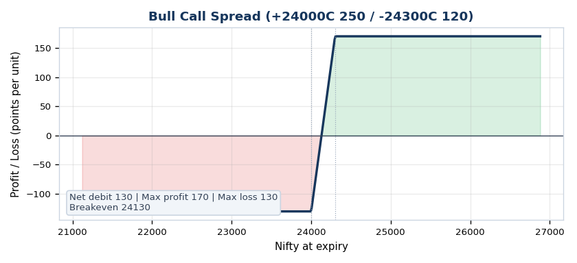

**Now the mirror — a bear put spread.** Suppose instead you are moderately bearish, expecting Nifty to drift from 24,000 toward 23,700. From the chain:

- 24,000 put: premium = ₹175
- 23,700 put: premium = ₹65

**Construct:**

- Buy 1 lot of 24,000 put: pay 175
- Sell 1 lot of 23,700 put: receive 65
- `Net debit D = 175 - 65 = 110 points`

Here `K2 = 24,000` (bought, higher) and `K1 = 23,700` (sold, lower), width = 300.

`Max loss = D = 110 points = ₹8,250`
`Max profit = 300 - 110 = 190 points = ₹14,250`
`Breakeven = K2 - D = 24,000 - 110 = 23,890`

You profit as Nifty falls below 23,890, with profit maxing out at and below 23,700. If Nifty instead rises and closes above 24,000, both puts expire worthless and you lose the ₹8,250 debit — nothing more.

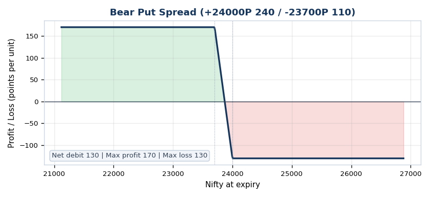

## Common mistakes / risk note

- **Forgetting that the upside is capped.** Beginners enter a bull call spread, watch Nifty rocket past the short strike, and feel cheated that profit stopped. That cap is the deal you signed. If you expect a big move, do not use a spread.
- **Choosing strikes too far apart "to get more upside."** A very wide spread costs almost as much as the naked long and behaves like one — you lose the cost and decay benefits. The whole point is a *targeted* width matching your expected move.
- **Choosing strikes too narrow.** A 50-point-wide Nifty spread might yield only ₹1,000–2,000 of max profit, which two-leg brokerage, STT, and bid-ask slippage can largely consume. The reward must justify the friction.
- **Ignoring liquidity on the short strike.** If the higher (or lower) strike is illiquid with a wide bid-ask, you get a poor fill and your real debit is worse than the screen suggests. Stick to liquid, near-the-money strikes on Nifty and Bank Nifty.
- **Assuming "defined risk" means "likely to win."** The max loss is capped, yes — but a debit spread still *loses the full debit* if your direction is simply wrong, and that is the most common outcome. Like all long-premium structures, you can lose 100% of what you put in. Defined risk is not the same as high probability; you are still paying for a directional bet that often does not pay.
- **Holding index spreads expecting early exercise games.** Nifty and Bank Nifty options are **European** — no early assignment. (On physically settled *stock* options, a deep in-the-money short leg can be assigned and trigger physical delivery obligations, so manage those before expiry.)

## Key takeaways

- A **debit vertical spread** buys one option and sells another of the same type and expiry but a different strike, paying a net debit to reduce cost and define risk.
- **Bull call spread** (moderately bullish): buy lower-strike call, sell higher-strike call. **Bear put spread** (moderately bearish): buy higher-strike put, sell lower-strike put. They are mirror images.
- For both: `Max loss = net debit`, `Max profit = strike width - net debit`, and breakeven is `lower strike + debit` (bull call) or `higher strike - debit` (bear put).
- The trade-off is a **capped upside** in exchange for lower cost, lower breakeven, and reduced **theta** and **vega** drag versus a naked long option.
- Net delta is smaller than the long leg alone — perfect for a *moderate* directional view, not an explosive one.
- Use spreads when you want defined risk, a specific target, and cheaper directional exposure; avoid them when you expect a huge move or when the strikes are so narrow that costs eat the profit.

## Practice problems

1. **(Conceptual)** Explain in one sentence why a bull call spread always costs a net debit rather than producing a net credit.

2. **(Numeric)** Bank Nifty is at 52,000. You buy the 52,000 call for ₹400 and sell the 52,500 call for ₹180, same expiry, lot size 15. Find the net debit, max profit, max loss, and breakeven (in points and in rupees where asked).

3. **(Numeric)** Using the bear put spread from the worked example (buy 24,000 put at 175, sell 23,700 put at 65), compute the net P&L in rupees if Nifty closes at expiry at (a) 24,200, (b) 23,890, and (c) 23,600. Lot size 75.

4. **(Conceptual)** You are strongly convinced Nifty will surge from 24,000 to 25,500 in a week. Is a bull call spread the right tool? Why or why not?

5. **(Numeric / reasoning)** Two bull call spreads on Nifty (spot 24,000): Spread A is 24,000/24,200 for a debit of 80; Spread B is 24,000/24,500 for a debit of 150. Which has the better risk-reward ratio, and which would you prefer if you expect Nifty to reach exactly 24,300?

6. **(Conceptual)** Why does a bull call spread suffer far less from an India VIX (implied volatility) crash than a naked long 24,000 call?

## Solutions

**1.** Because the option you buy (the lower-strike call) is always worth more than the option you sell (the higher-strike call) — a lower strike gives more right to buy, so it carries a higher premium. Paying more than you receive means cash flows out: a net debit.

**2.** Net debit `D = 400 - 180 = 220 points`. Strike width = `52,500 - 52,000 = 500 points`.
- Max loss = `D` = 220 points = `220 * 15` = **₹3,300** (Bank Nifty closes at or below 52,000).
- Max profit = `width - D = 500 - 220 = 280 points` = `280 * 15` = **₹4,200** (closes at or above 52,500).
- Breakeven = `K1 + D = 52,000 + 220 = 52,220`.
- Risk-reward = 220 risked to make 280, about **1 : 1.27**.

**3.** Net debit = 110 points. Bought 24,000 put, sold 23,700 put.
- (a) **24,200**: both puts expire worthless. Payoff = `0 - 110 = -110` points = `-110 * 75` = **-₹8,250** (full loss).
- (b) **23,890**: long 24,000 put intrinsic = `24,000 - 23,890 = 110`; short 23,700 put = 0. Payoff = `110 - 110 = 0` = **₹0** (breakeven, as expected since breakeven = 23,890).
- (c) **23,600**: long put intrinsic = `24,000 - 23,600 = 400`; short put intrinsic = `23,700 - 23,600 = 100` (a loss to you). Net = `(400 - 100) - 110 = 190` points = `190 * 75` = **+₹14,250** (capped max profit, since 23,600 is below the lower strike 23,700).

**4.** No. A 1,500-point surge would blow well past any reasonable short strike, where the spread's profit is frozen. The cap throws away most of the move you expect. For a strong, large, fast move, a **naked long call** (uncapped upside) captures far more — accepting its higher cost and theta because you expect the move to overwhelm those drags quickly. Spreads are for *moderate*, targeted views; this is not one.

**5.**
- Spread A: max profit = `200 - 80 = 120`, risk-reward = 80 : 120 = **1 : 1.5**.
- Spread B: max profit = `500 - 150 = 350`, risk-reward = 150 : 350 = **1 : 2.33**.
- Spread B has the better risk-reward ratio on paper. But if you expect Nifty to reach **exactly 24,300**, Spread A is already fully maxed out at 24,200 (you collect the entire 120-point profit), whereas Spread B at 24,300 gives only `(24,300 - 24,000) - 150 = 150` points — less than its max and only modestly above its cost. **Prefer Spread A** here: it reaches full profit at your target and risks less capital. The lesson: match the upper strike to your actual target, not just to the headline risk-reward.

**6.** A naked long 24,000 call is **long vega** — a drop in implied volatility (India VIX falling) directly cuts its premium, often sharply right after an event ("IV crush"). In a bull call spread you also **sold** the 24,300 call, which is **short vega**: when IV falls, that short call loses value too, which is a *gain* for you and offsets the loss on your long call. The two vega exposures largely cancel, so the spread's value is far more stable when volatility collapses. You traded away vega exposure along with the capped upside.

# Chapter 39: Vertical Spreads II — Bull Put & Bear Call (Credit Spreads)

In the last chapter you built spreads by *paying* money up front: a bull call spread or a bear put spread is a **debit** structure — you buy the option you want and sell a farther one to cheapen it, and cash leaves your account on day one. This chapter flips the cash flow. Here you **collect** money up front. You sell the option that is closer to the action and buy a farther one purely as a seatbelt, and the difference lands in your account as a **net credit**. That credit is the most you can ever make; in exchange you accept a known, capped loss if the trade goes against you.

Why would a professional prefer to be paid up front? Because most of the time the underlying does *not* make a big, clean move — it drifts, chops, and grinds. A credit spread is a way to get paid for that boredom. You are no longer betting that Nifty will surge; you are betting it will simply *not collapse* through a level you have chosen. That is a fundamentally easier bet to win, and when implied volatility is rich — when option premiums are fat with fear — selling that expensive premium with a hard cap on your risk is one of the cleanest edges an income trader has. This is the workhorse trade of the patient options seller.

## Core concepts

### The credit-vertical idea: get paid, cap the risk

A **vertical spread** is two options of the same type (both puts or both calls) and the same expiry, differing only in strike — they sit *vertically* above one another on the option chain. You met the debit version in Chapter 38. The **credit** version simply reverses which leg you sell and which you buy:

- You **SELL** the option whose strike is *nearer* the current price (the expensive one — it carries more premium).
- You **BUY** the option whose strike is *farther* from the current price (the cheap one).
- Because the option you sold is worth more than the one you bought, the net is money *in*: a **net credit**.

That far option you bought is not there to make you money. It is insurance. On its own, selling a naked option exposes you to large, undefined losses (recall the short-call and short-put chapters). By owning a farther strike, you put a hard floor under how bad the loss can get — you trade away some premium in return for turning an open-ended risk into a defined, sleep-at-night number.

Two mirror-image structures come out of this idea:

- A **bull put spread** — built from puts, profits when the underlying stays *up*.
- A **bear call spread** — built from calls, profits when the underlying stays *down*.

Both are **high-probability, income-style trades**: you win not by predicting a move but by predicting that a move *won't* happen in the wrong direction.

### The bull put spread (sell higher put, buy lower put)

Picture Nifty at 24,000. You think it will hold up — maybe drift higher, maybe just stay flat — but you do not think it will crash. You want to get paid for that view.

You **sell a higher-strike put** (say the 23,800 put) and **buy a lower-strike put** (say the 23,600 put), same weekly expiry. The 23,800 put is nearer the money and richer, so you collect more for it than you pay for the 23,600 put. The difference is your credit.

Now think about what happens at expiry:

- If Nifty stays **above 23,800**, both puts expire worthless. You keep the entire credit. This is your best case — and crucially, it happens even if Nifty doesn't rise a single point. *Sideways is a win.*
- If Nifty falls **between 23,600 and 23,800**, the put you sold goes into the money and starts costing you, while the put you bought is still worthless. Your profit shrinks, then turns into a loss as Nifty drops.
- If Nifty falls **below 23,600**, both puts are in the money. Below this point every further rupee of loss on the put you sold is exactly cancelled by a rupee of gain on the put you bought. Your loss stops growing — it is capped. This is the seatbelt doing its job.

The structure is "bullish" only in the loose sense: you don't need a rally, you just need the market to *not break down* through your short strike.

`Net credit = premium received (higher put) - premium paid (lower put)`
`Strike width = higher strike - lower strike`
`Max profit = net credit (kept if underlying expires above the higher strike)`
`Max loss = strike width - net credit (suffered if underlying expires below the lower strike)`
`Breakeven = higher strike - net credit`

Notice the symmetry: the credit you collect plus the loss you risk always sum to the strike width. The width is the total chips on the table; the credit is your slice, and the rest is what the broker blocks as margin.

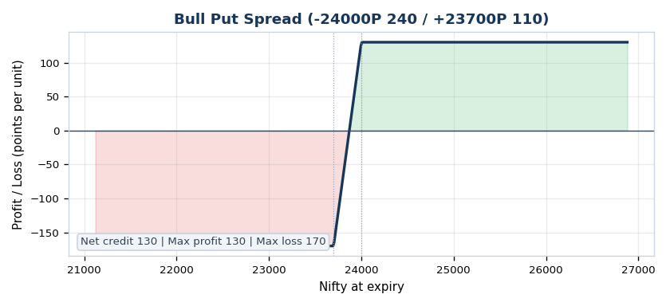

### The bear call spread (sell lower call, buy higher call)

The bear call spread is the exact mirror, built from calls, for when you think the market will *not rise* — it will fall or stay flat.

With Nifty at 24,000, you **sell a lower-strike call** (say the 24,200 call) and **buy a higher-strike call** (say the 24,400 call). The nearer 24,200 call is richer, so you collect a net credit.

At expiry:

- If Nifty stays **below 24,200**, both calls expire worthless and you keep the full credit. Again, flat or falling — either one wins.
- Between **24,200 and 24,400**, the call you sold hurts you while the call you bought still pays nothing; profit erodes into loss.
- **Above 24,400**, both calls are in the money, the gains and losses offset rupee-for-rupee, and your loss is capped.

`Net credit = premium received (lower call) - premium paid (higher call)`
`Strike width = higher strike - lower strike`
`Max profit = net credit (kept if underlying expires below the lower strike)`
`Max loss = strike width - net credit (suffered if underlying expires above the higher strike)`
`Breakeven = lower strike + net credit`

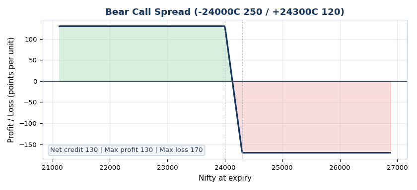

### One picture, two mirrors

Hold the two side by side and the family resemblance is obvious:

| | **Bull put spread** | **Bear call spread** |
|---|---|---|
| Built from | Puts | Calls |
| Sell | Higher strike (nearer) | Lower strike (nearer) |
| Buy | Lower strike (farther) | Higher strike (farther) |
| Wins when underlying | Stays above short put | Stays below short call |
| Directional bias | Bullish / neutral | Bearish / neutral |
| Cash flow | Net credit | Net credit |
| Breakeven | Short strike − credit | Short strike + credit |

Both are credit spreads, both have defined risk, both are short premium. If you can read one, you can read the other by reflection.

### Why credit spreads love rich IV

Here is the strategic heart of the chapter. When **implied volatility (IV)** is high — India VIX elevated, premiums swollen with fear — every option is *expensive*. As a buyer that is bad news; you overpay and need a big move just to break even. As a *seller* it is a gift: you are paid more to take the same bet.

A credit spread is a way to sell that expensive premium **without** taking on the undefined risk of a naked short option. You collect the fat premium, but the long leg caps your downside. Compare the two ways to express "I'll sell expensive premium":

- **Naked short put:** collect a big premium, but a crash can cost you far more than you collected — potentially the whole strike value. Huge SPAN margin blocked.
- **Bull put spread:** collect slightly less premium (you spent some buying the wing), but your worst case is a small, known number, and the margin blocked is roughly just the width minus the credit.

When IV is high, the premium you give up to buy the protective wing is comparatively small, so the spread captures most of the juice while keeping the risk boxed. That is why the seasoned answer to "IV is rich and I have a mild directional lean" is so often a credit spread.

The flip side, told honestly: when IV is *low*, credit spreads pay you very little for the same width of risk. Selling cheap premium while risking the full width is a poor bargain. Credit spreads are a tool you reach for when premium is expensive, not all the time.

### The net Greeks: theta-positive, vega-short, defined risk

Knowing the Greeks of the package tells you what the trade *wants*. For both credit spreads:

- **Theta (positive).** As a net seller of premium, time decay works *for* you. Each day the underlying stays on the right side of your short strike, the spread drifts toward max profit. You are paid to wait — this is the engine of the trade.
- **Vega (negative / short).** You are net short the nearer option, so the position is short vega. If IV *falls* you profit (buy the spread back cheaper); if IV *spikes*, the spread moves against you even with price flat — a real risk to respect. You want to sell when IV is high and have it fall.
- **Delta (small, directional).** A bull put spread carries modest *positive* delta; a bear call spread modest *negative* delta. Far smaller than an outright option because the legs partly offset — these are *probability* bets with a tilt, not strong directional bets.
- **Gamma (negative).** As a net seller you are short gamma — a fast adverse move accelerates the loss. This is the price of positive theta, but the defined-risk wing stops the damage at the far strike.

In one line: **a credit spread is a positive-theta, short-vega, defined-risk trade that gets paid for the passage of time and for IV cooling off, as long as the underlying stays on the right side of your short strike.**

### Picking strikes by delta and probability

The single most useful idea for placing these trades is that **the delta of your short option is a quick estimate of the probability it expires in the money** — that is, the rough probability you lose. A put with delta around 0.30 (or −0.30) has roughly a 30% chance of finishing in the money, so selling it gives you about a 70% chance the spread expires worthless and you keep the credit.

This turns strike selection into a dial you can set:

- **Short strike farther OTM (low delta, ~0.15–0.20):** higher probability of profit (often 80%+), but a *smaller* credit. You win often and small.
- **Short strike closer to the money (higher delta, ~0.30–0.40):** larger credit, but lower probability of profit. You collect more but get challenged more often.

The **width** between your strikes is a second, separate dial: it sets your total risk (width − credit) and the margin. Wider strikes mean a bigger credit and a bigger max loss; narrower strikes mean a smaller, tighter trade.

A common professional default for index weeklies: sell the short leg around the **0.15–0.25 delta** strike (roughly the edge of the expected move), keep the width modest (say 100–300 Nifty points), aim to collect a credit of **about one-third of the width** (so risk-to-reward near 2:1 against you but with a ~70–80% win rate), and have a plan to exit at a partial profit (e.g. buy it back at 50% of max profit) rather than holding every trade to expiry.

## Worked example (₹, Nifty)

Let us trade a **bull put spread** on Nifty with real-feeling numbers. Suppose:

- Nifty spot = **24,000**, weekly expiry, lot size = **75**.
- India VIX is elevated, so put premiums are rich — a good environment to sell.
- You are mildly bullish-to-neutral: you think Nifty holds above 23,800.

You set up the spread:

- **Sell** the 23,800 put for a premium of **₹120**.
- **Buy** the 23,600 put for a premium of **₹60**.

Step 1 — Net credit per unit:
`Net credit = 120 - 60 = ₹60`

Step 2 — Strike width:
`Strike width = 23,800 - 23,600 = 200 points`

Step 3 — Max profit (per unit), kept if Nifty expires at or above 23,800:
`Max profit = net credit = ₹60`

Step 4 — Max loss (per unit), suffered if Nifty expires at or below 23,600:
`Max loss = strike width - net credit = 200 - 60 = ₹140`

Step 5 — Breakeven:
`Breakeven = higher strike - net credit = 23,800 - 60 = 23,740`

Step 6 — Convert to rupees per lot (multiply by lot size 75):
- Max profit = 60 * 75 = **₹4,500**
- Max loss = 140 * 75 = **₹10,500**
- Margin blocked ≈ max loss ≈ ₹10,500 (plus a small buffer), far less than a naked short put on Nifty.

Now read the outcomes:

- **Nifty expires at 23,800 or above (held up or flat):** both puts worthless, you keep the full ₹60 → **+₹4,500** per lot.
- **Nifty expires at 23,740 (breakeven):** the 23,800 put is worth 60; you collected 60 net, so you net zero → **₹0**.
- **Nifty expires at 23,700:** short put worth 100, long put still worthless; loss = 100 − 60 credit = 40 per unit → **−₹3,000**.
- **Nifty expires at 23,600 or below (crash):** short put worth at least 200, long put offsets everything beyond 23,600; loss capped = 140 per unit → **−₹10,500**.

Notice the win condition: you make the **full** profit on anything at or above 23,800 — including Nifty going *nowhere*. You only start losing below 23,740, and the damage is capped no matter how hard it falls. With a short strike around the 0.20–0.25 delta, this trade wins perhaps 75–80% of the time, collecting ₹4,500 each time, against a capped ₹10,500 when it fails. The discipline is to size positions so the occasional capped loss doesn't erase a long run of small wins.

For the **bear call spread**, flip everything. If instead you were mildly bearish with Nifty at 24,000, you might sell the 24,200 call for ₹110 and buy the 24,400 call for ₹50: net credit ₹60, width 200, max profit ₹4,500/lot, max loss ₹10,500/lot, breakeven = 24,200 + 60 = **24,260**. You keep the full credit on anything at or below 24,200 — flat or falling both win.

## Common mistakes / risk note

- **Mistaking "high probability" for "low risk."** A credit spread can win 80% of the time and still lose money if the 20% losses are bigger than the 80% wins (which, by design, they are — you risk ₹140 to make ₹60). The whole game is position sizing and not letting one ugly day undo a month of credits — the classic "picking up pennies in front of a steamroller" trap when oversized.
- **Ignoring the risk-reward ratio.** Selling ultra-far strikes for a tiny ₹15 credit on a 200-point width risks ₹185 to make ₹15 — one loss wipes out a dozen wins. A credit of roughly a quarter-to-a-third of the width is a saner balance.
- **Selling when IV is low.** Cheap premium means a thin credit for full-width risk. Check India VIX / IV rank first; credit spreads are a *rich-IV* tool.
- **Forgetting the short-vega exposure.** Even with price flat, a sharp IV spike (news shock, gap) can show a temporary loss. Don't panic-close on a vega blip if your short strike is still safe — but respect that an IV spike often accompanies the very move you're short.
- **Index vs stock settlement.** Nifty and Bank Nifty options are **European and cash-settled** — no early assignment, no delivery, clean for these spreads. **Stock** options are American and **physically settled**; an in-the-money short leg held into expiry can land you a delivery obligation. Prefer index spreads, or square off stock spreads before expiry.
- **Letting a tested trade ride to the bitter end.** Many professionals exit at ~50% of max profit, or close when the short strike is breached, rather than holding every spread to expiry and hoping. Remember STT, brokerage and exchange charges nibble at a small ₹60 credit across two legs (and again on exit).

## Key takeaways

- A **credit vertical spread** sells a nearer option and buys a farther one of the same type and expiry, collecting a **net credit** with **defined risk**.
- **Bull put spread:** sell the higher-strike put, buy the lower-strike put. Max profit = credit; max loss = width − credit; breakeven = higher strike − credit. Profits if the underlying stays *above* the short strike — bullish/neutral.
- **Bear call spread:** the mirror — sell the lower call, buy the higher call. Profits if the underlying stays *below* the short strike — bearish/neutral.
- These are **positive-theta, short-vega, defined-risk** trades: you are paid for time passing and for IV falling, with a capped worst case.
- **Favour credit spreads when IV is rich** — you sell expensive premium and the protective wing is cheap relative to the juice you keep.
- Set strikes by **delta as a probability proxy**: short-leg delta ≈ chance of loss. Farther strikes = higher win rate, smaller credit; closer strikes = bigger credit, lower win rate.
- High win-rate does not mean safe. Losses are bigger than wins by design — **size small and respect the capped-but-real max loss**.

## Practice problems

1. **(Conceptual)** You are neutral-to-bullish on Bank Nifty and India VIX is high. Which credit spread fits, and which leg do you sell versus buy? Why does high IV make this attractive?

2. **(Numeric)** A bull put spread on Nifty: sell the 23,500 put for ₹95, buy the 23,300 put for ₹40. Find the net credit, strike width, max profit, max loss, and breakeven (all per unit). Lot size 75 — give max profit and max loss in rupees per lot.

3. **(Numeric)** A bear call spread on Nifty (spot 24,000): sell the 24,300 call for ₹85, buy the 24,500 call for ₹35. Find the net credit, max profit, max loss, and breakeven. At expiry Nifty closes at 24,260 — what is the per-unit profit or loss?

4. **(Conceptual / Greeks)** A trader puts on a bull put spread. Price doesn't move at all for two days, yet the position shows a small loss. Give two distinct reasons this can happen.

5. **(Application)** You want a bull put spread with about a 75% chance of expiring worthless and a credit near one-third of the width. Roughly what delta should the short put be, and how would you choose the width? Explain the trade-off if you instead sold a 0.40-delta short put.

6. **(Risk)** A bull put spread collects ₹60 credit on a 200-point width (lot 75). It wins 80% of the time. Over 10 trades you win 8 and lose 2 at max loss. What is your net rupee result, and what lesson does it teach about sizing?

## Solutions

**1.** Use a **bull put spread** (built from puts; profits if Bank Nifty stays up or merely flat). You **sell the higher-strike put** (nearer the money, richer premium) and **buy a lower-strike put** (farther, cheaper) as protection, collecting a net credit. High IV makes it attractive because every put is expensive, so you are paid a fatter credit for the same defined risk; the protective long put you must buy is comparatively cheap, so the spread keeps most of the rich premium while capping the downside. You also benefit if that elevated IV later falls (short vega).

**2.** 
- Net credit = 95 − 40 = **₹55**
- Strike width = 23,500 − 23,300 = **200**
- Max profit = net credit = **₹55** per unit
- Max loss = width − credit = 200 − 55 = **₹145** per unit
- Breakeven = 23,500 − 55 = **23,445**
- Per lot (×75): max profit = 55 × 75 = **₹4,125**; max loss = 145 × 75 = **₹10,875**.

**3.** 
- Net credit = 85 − 35 = **₹50**
- Max profit = **₹50** per unit (kept if Nifty ≤ 24,300)
- Max loss = width − credit = 200 − 50 = **₹150** per unit
- Breakeven = 24,300 + 50 = **24,350**
- At 24,260: this is **below** the short strike 24,300, so both calls expire worthless → you keep the full credit → **+₹50 per unit** (+₹3,750 per lot). (Note 24,260 is below breakeven 24,350, confirming a profit.)

**4.** Two distinct reasons, even with price flat:
- **Short vega / IV rise.** The position is net short vega. If implied volatility ticked up (a news jitter, an event approaching), the option you are short fattened more than the one you are long, showing a mark-to-market loss despite no price move.
- **Bid-ask / transaction friction.** The credit is marked off the mid, but to *close* you cross two spreads; the immediate liquidation value can be slightly worse than the entry credit, showing a small paper loss. (Theta would push the opposite way, helping over time — so a same-direction loss after two flat days points to IV or spread costs, not decay.)

**5.** For roughly a 75% chance of expiring worthless, sell the short put at about the **0.25 delta** strike (delta ≈ probability of finishing in the money ≈ 25% chance of loss, so ~75% chance of full profit). Then choose the **width** so the credit is near one-third of it — e.g. if you collect about ₹55–₹65, a width of around 200 points gives a credit close to a third of the 200-point risk. The trade-off of instead selling a **0.40-delta** short put: you collect a *larger* credit (better reward), but the probability of profit drops to roughly 60%, the short strike sits closer to spot so it gets breached more often, and you'll be tested (and forced to manage or take losses) far more frequently. More credit, less safety.

**6.** Wins: 8 × ₹60 × 75 = 8 × ₹4,500 = **+₹36,000**. Losses: max loss = (200 − 60) × 75 = ₹10,500 each; 2 × ₹10,500 = **−₹21,000**. Net = 36,000 − 21,000 = **+₹15,000**. The lesson: an 80% win rate is *not* a licence to relax — two losing trades erased more than half of eight winners, because each loss (₹10,500) is over twice each win (₹4,500). If you had merely doubled position size, a cluster of three or four losses could turn the whole sequence negative. The edge in credit spreads lives or dies on **position sizing and loss management**, not on the win rate alone.

# Chapter 40: Straddles — Long & Short

Suppose Nifty results season is here. A big event is coming — the RBI policy, the Union Budget, a major company's earnings, an election result — and you are *certain* the market is going to move hard. There is just one problem: you have no idea which way. Up? Down? A coin toss. A directional bet (a plain call or put) is useless to you, because being right on the size of the move but wrong on the direction still loses. What you want is a position that does not care about direction at all — it only cares that the market *moves*. That position exists, and it is called the **straddle**.

A straddle is the cleanest pure bet on **volatility** rather than direction. Buy one (a **long straddle**) and you win if the market makes a big move either way, or if fear and uncertainty (implied volatility) spike. Sell one (a **short straddle**) and you win if the market sits still and the storm everyone feared never arrives. This chapter takes you through both sides — the rupee mechanics, the breakevens, the Greeks, and the single most expensive trap that catches beginners: the **IV crush** that vaporises a long straddle even when you got the move right.

## Core concepts

### What a straddle is

A **straddle** is two options bought (or sold) together:

- one **call** and one **put**,
- on the **same underlying**,
- at the **same strike** `K`,
- with the **same expiry**.

Almost always the strike chosen is **at-the-money (ATM)** — the strike closest to the current spot price. That is what makes a straddle a *neutral* position: with an ATM call and an ATM put together, the call's positive delta (roughly +0.5) and the put's negative delta (roughly -0.5) cancel out, leaving you with **near-zero net delta** at inception. You are not leaning bullish or bearish. You are leaning on *movement itself*.

Because the two legs share a strike and expiry, the position has a memorable V-shaped (or inverted-V) payoff. You pay (or collect) the **sum of the two premiums**, and everything flows from that single number.

### The long straddle: buying a big move

When you **buy a straddle**, you pay both premiums up front and you own both rights. You profit if the underlying moves far enough — in *either* direction — that one leg pays more than the *total* you spent on both.

The payoff at expiry is just the sum of a long call and a long put on the same strike:

`Payoff (long straddle) = max(S - K, 0) + max(K - S, 0) - (call premium + put premium)`

At expiry only one of the two `max(...)` terms can be positive (spot is either above or below the strike), so this simplifies to:

`Payoff = |S - K| - total premium`

where `|S - K|` is the absolute distance of spot from the strike. Read it in three zones:

- **Spot pins the strike** (`S = K` at expiry): both legs expire worthless. You lose the **entire** total premium. This is the worst case — the bottom of the V.
- **Spot moves but not enough**: `|S - K|` is positive but smaller than the total premium. You are recovering cost, still at a net loss.
- **Spot moves a lot**: `|S - K|` exceeds the total premium, and every further point in either direction is pure profit.

**The defining numbers of a long straddle:**

- `Total premium = call premium + put premium` — your maximum loss, paid up front, and it occurs only if spot finishes exactly at the strike.
- `Upper breakeven = K + total premium`
- `Lower breakeven = K - total premium`
- `Max loss = total premium` (capped, defined, no margin calls)
- `Max gain = unlimited` on the upside; **very large** (capped only by spot falling to zero) on the downside.

Notice the breakevens sit *one full total-premium away from the strike on each side*. The market does not just have to move — it has to move **more than the combined premium you paid**. That gap is the price of admission, and it is wide, because you bought *two* options.

### Why a long straddle is "long gamma, long vega"

Two Greeks dominate the long straddle, and understanding them is what separates a gambler from a trader.

**Long gamma.** Gamma measures how fast your delta changes as spot moves. A long straddle starts delta-neutral, but the moment spot moves, the position automatically tilts in the direction of the move — if spot rises, the call's delta grows and the put's shrinks, so your net delta turns positive; if spot falls, it turns negative. In effect, **the position keeps repositioning itself to face the move**, accelerating into profit. That is the gift of being long gamma: you make money from movement regardless of direction, and you make it *faster* the bigger the move.

**Long vega.** Vega measures sensitivity to implied volatility (IV). A long straddle owns two options, so it owns a lot of vega. If **India VIX** (the market's fear gauge) jumps — say uncertainty spikes before an event — both options inflate in value and the straddle gains *even if spot has not moved at all*. This is why a long straddle is also a clean way to bet that volatility is **about to rise**.

The cost of these two gifts is **theta** — time decay. A long straddle is **short theta**: you are paying for two wasting assets, and every day that passes without a move bleeds value out of both legs. The straddle is a race: the move (gamma) and the IV spike (vega) must arrive *before* theta eats your premium.

### The short straddle: selling calm

When you **sell a straddle**, you do the opposite. You sell the ATM call and the ATM put, **collect both premiums** up front, and bet that the market stays quiet — that it pins near the strike and that IV falls. You keep the premium as long as the market does not move far enough to overwhelm it.

The payoff is simply the mirror image:

`Payoff (short straddle) = total premium collected - |S - K|`

**The defining numbers of a short straddle:**

- `Max profit = total premium collected` — realised only if spot expires **exactly** at the strike.
- `Upper breakeven = K + total premium`
- `Lower breakeven = K - total premium` (same breakevens as the long straddle, by construction)
- `Max loss = unlimited` on the upside, **very large** on the downside.

The Greeks flip sign. A short straddle is **short gamma** (a move in either direction turns your delta *against* you — you get longer as the market falls and shorter as it rises, exactly the wrong way), **short vega** (you lose if IV rises, you win if it falls — an **IV crush** is your friend), and crucially **positive theta** (every quiet day, time decay drips premium into your pocket). The short straddle is the canonical "theta-positive, sell-the-overpriced-fear" trade.

### When to use each — and the honest warning

**Use a long straddle when:**

- A **known catalyst** is coming (Budget, RBI policy, big earnings, election count day) and you expect a violent move but cannot call the direction.
- IV is **still cheap** relative to the move you expect — i.e., you are buying volatility *before* the crowd bids it up. This is the critical condition. A long straddle bought when India VIX is already elevated and event premium is already priced in is a near-certain loser (see the IV-crush trap below).
- You think the market is *underestimating* how much something will move.

**Use a short straddle when:**

- IV is **rich** — option premiums are fat with fear, India VIX is high, and you believe the actual move will be smaller than what the market has priced in.
- You expect a **quiet, range-bound** period — for example, the days *after* a big event when the uncertainty has resolved and IV is collapsing.

**The tail-risk warning — read this twice.** A short straddle has **undefined, potentially catastrophic loss**. You collect a small, fixed premium in exchange for unlimited risk. One overnight gap — a surprise rate decision, a geopolitical shock, a circuit-breaker move — can produce a loss many times the premium collected. It is the textbook "picking up pennies in front of a steamroller." SEBI studies show roughly **9 in 10 retail F&O traders lose money**, and naked option selling is a fast lane into that statistic. Never sell a naked straddle without strict position sizing and a hard stop-loss plan. Many professionals never sell a *naked* straddle at all — they convert it into a defined-risk **iron butterfly** by buying protective wings (covered later).

### The IV-crush trap (why long-straddle buyers lose even when they are "right")

Here is the single most expensive lesson for straddle buyers in Indian markets, and it deserves its own section.

Before a known event — quarterly results, RBI policy, the Union Budget — everyone *knows* a move is coming, so everyone bids up option premiums in advance. **Implied volatility inflates**, sometimes dramatically: an ATM option that "should" cost ₹80 of time value might trade at ₹150 because the event premium is baked in. India VIX rises into the event.

Now the event happens and the uncertainty **resolves** — the unknown becomes known. The instant it does, IV **collapses**. This is the **IV crush** (or *vol crush*). Both legs of your long straddle lose a chunk of value *purely because vega fell*, independent of spot.

The trap: you can **call the move correctly** and *still lose money*. Suppose Nifty jumps 1.5% on Budget day — a real move — but you paid an inflated premium that priced in a 2.5% move. The IV crush deflates your remaining time value, and the realised move is smaller than what you paid for. You were right that "it would move," yet you lose, because **you overpaid for volatility that then evaporated.**

The professional discipline: a long straddle into a known event only works if you buy it **before** IV inflates (days ahead, when premiums are still cheap), or if the actual move **dwarfs** the priced-in expectation. Buying a straddle the morning of results, when VIX is already screaming, is paying top rupee for an asset about to be marked down. The crowd's fear is already in the price.

## Worked example (₹, Nifty)

Let us price a real Nifty straddle. Assume:

- **Nifty spot = 24,000**, a weekly expiry a few days out.
- The **24,000-strike call** trades at a premium of **₹120**.
- The **24,000-strike put** trades at a premium of **₹100**.
- **Nifty lot size = 75** (use the current exchange value; it changes over time).

You buy one straddle: long the 24,000 call at ₹120 and long the 24,000 put at ₹100.

**Step 1 — Total premium paid.**

`Total premium = 120 + 100 = ₹220 per unit`

In rupee terms for one lot: `220 * 75 = ₹16,500`. That is your **maximum loss**, paid up front, and it happens only if Nifty expires *exactly* at 24,000.

**Step 2 — Breakevens.**

`Upper breakeven = 24,000 + 220 = 24,220`
`Lower breakeven = 24,000 - 220 = 23,780`

Nifty must finish **above 24,220 or below 23,780** — a move of more than **220 points (about 0.92%)** in either direction — for the straddle to turn a profit at expiry.

**Step 3 — Outcomes at expiry.**

- **Nifty pins at 24,000:** both legs expire worthless. Loss = ₹220/unit = **₹16,500/lot**. Worst case.
- **Nifty rallies to 24,400:** the call is worth `24,400 - 24,000 = 400`; the put is worthless. Payoff = `400 - 220 = ₹180/unit` profit = `180 * 75 = ₹13,500/lot`.
- **Nifty crashes to 23,600:** the put is worth `24,000 - 23,600 = 400`; the call is worthless. Payoff = `400 - 220 = ₹180/unit` profit = **₹13,500/lot**. Note the symmetry — same profit for the same-sized move down.
- **Nifty drifts to 24,150:** only 150 points up, below the 220 breakeven. The call is worth 150, the put zero. Payoff = `150 - 220 = -₹70/unit` = **₹5,250 loss/lot**. You got the direction right but the move was too small.

**Step 4 — Now flip it: the short straddle.**

If instead you **sold** this straddle, you would collect **₹220/unit (₹16,500/lot)** up front. That is your maximum profit, kept in full only if Nifty pins 24,000 at expiry. Your breakevens are identical — 24,220 and 23,780 — but now they are the points beyond which you start *losing*. If Nifty gaps to 24,600 overnight, the call you sold is worth 600, and your loss is `600 - 220 = ₹380/unit = ₹28,500/lot` — already larger than the premium you collected, and **growing without limit** the further Nifty runs. That single sentence is the entire risk of short option selling.

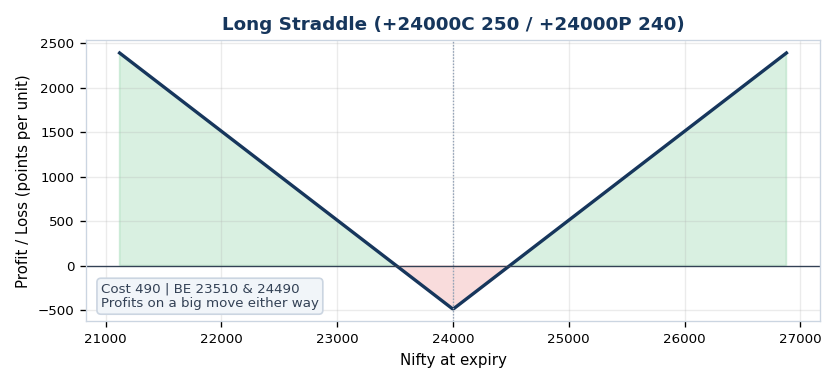

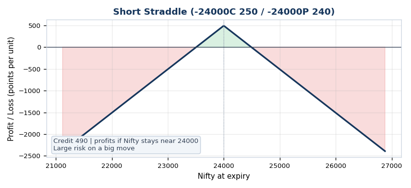

## Common mistakes / risk note

- **Buying a straddle right before results when IV is already sky-high.** This is the IV-crush trap. You pay inflated premiums, the event resolves, vega collapses, and you lose even if the move goes your way. Check **India VIX** and the option's IV percentile *before* buying — if vol is already rich, the straddle is a bad buy.
- **Underestimating how far the market must move.** Beginners see "I profit if it moves either way" and forget the breakevens sit a *full combined premium* away from the strike. In the example above, Nifty had to move nearly 1% just to break even. A 0.5% move — which feels "big" intraday — still loses.
- **Forgetting theta on a long straddle.** Holding a long straddle through a quiet, sideways week is death by a thousand cuts. You own two wasting assets; if the move does not come *soon*, time decay grinds both to nothing.
- **Selling a naked short straddle without respecting the tail.** The premium feels like easy income on quiet days — until one gap blows through months of accumulated profit. Undefined risk is real risk. Size tiny, use stops, and seriously consider buying protective wings to cap the loss.
- **Ignoring transaction costs and margin.** A straddle is *four* legs of brokerage round-trip, plus **STT**, exchange fees, and GST. A short straddle also locks up substantial **SPAN + exposure margin** because the risk is large. These costs eat into thin edges.
- **Confusing a straddle with a strangle.** A straddle uses the *same* ATM strike for both legs (higher premium, narrower breakevens); a strangle uses *different* out-of-the-money strikes (cheaper, wider breakevens). Covered next chapter — do not mix them up.

## Key takeaways

- A **straddle** = a call and a put at the **same strike and expiry**, usually **ATM**. It is a bet on **movement (volatility)**, not direction — net delta starts near zero.
- **Long straddle**: buy both. Pay total premium; profit on a **big move either way** or an **IV spike**. Max loss = total premium (capped); breakevens = `strike ± total premium`; upside unlimited. It is **long gamma, long vega, short theta**.
- **Short straddle**: sell both. Collect total premium; profit if the market stays **quiet** and **IV falls**. Max profit = premium collected; **loss is undefined and potentially catastrophic**. It is **short gamma, short vega, positive theta**.
- The market must move **more than the combined premium** to make a long straddle pay — the breakevens are wide because you bought two options.
- The **IV-crush trap**: buying a straddle into a known event when IV is already inflated often loses *even if the move is correct*, because vega collapses once uncertainty resolves. Buy volatility when it is **cheap**, not after the crowd has bid it up.
- Sell straddles only when IV is **rich** and you expect calm — and **never naked without strict sizing and a stop**, given the tail risk that ruins most retail sellers.

## Practice problems

1. **(Conceptual)** Why does a long straddle have *near-zero* net delta at the moment you put it on, and what happens to that net delta if Nifty subsequently rallies 300 points? Which Greek is responsible for the change?

2. **(Numeric)** Bank Nifty is at 52,000. The 52,000 call costs ₹400 and the 52,000 put costs ₹350. Compute the total premium, both breakevens, and the percentage move from spot required to reach each breakeven.

3. **(Numeric)** Using the Bank Nifty straddle from Problem 2, find the expiry profit or loss per unit if Bank Nifty finishes at (a) 52,000, (b) 53,200, (c) 50,900.

4. **(Conceptual / risk)** A trader buys a Nifty ATM straddle the morning of the RBI policy announcement, paying a fat total premium because India VIX has spiked to 22. Nifty moves 0.8% on the news — a genuine move — yet the trader still loses money. Explain precisely why.

5. **(Numeric)** You **sell** a Nifty 24,000 straddle, collecting ₹120 (call) + ₹110 (put) = ₹230 total. Nifty gaps up overnight and opens at 24,520. What is your profit or loss per unit at that spot (ignore remaining time value)? How does this compare with your maximum possible profit?

6. **(Conceptual)** Two traders both expect a big Budget-day move in Nifty. Trader A buys the straddle three weeks before the Budget; Trader B buys the identical straddle on Budget morning. Both are "right" — Nifty moves sharply. Why might Trader A profit handsomely while Trader B barely breaks even or loses?

## Solutions

**1.** At inception the straddle is ATM, so the long call has a delta of roughly **+0.5** and the long put a delta of roughly **-0.5**. They sum to about **zero**, so the position is direction-neutral. If Nifty rallies 300 points, the call moves into-the-money (its delta climbs toward +1) while the put moves out-of-the-money (its delta drifts toward 0). The net delta therefore turns **positive** — the position automatically becomes bullish, leaning into the move. The Greek responsible is **gamma**: a long straddle is **long gamma**, so its delta shifts favourably with the direction of any move, which is exactly why it profits from movement either way.

**2.** Total premium = `400 + 350 = ₹750`.
Upper breakeven = `52,000 + 750 = 52,750`.
Lower breakeven = `52,000 - 750 = 51,250`.
Required move = 750 points each way. As a percentage of spot: `750 / 52,000 = 0.0144`, i.e. about **1.44%** up to reach 52,750, and about **1.44%** down to reach 51,250. Bank Nifty must move more than roughly 1.44% in either direction just to break even.

**3.** Total premium = ₹750. Use `Payoff = |S - K| - 750`.
(a) **S = 52,000:** `|52,000 - 52,000| - 750 = 0 - 750 = -₹750/unit`. Maximum loss — spot pinned the strike, both legs worthless.
(b) **S = 53,200:** `|53,200 - 52,000| - 750 = 1,200 - 750 = +₹450/unit` profit. (The call is worth 1,200; the put expires worthless.)
(c) **S = 50,900:** `|50,900 - 52,000| - 750 = 1,100 - 750 = +₹350/unit` profit. (The put is worth 1,100; the call expires worthless.)

**4.** This is the **IV-crush trap**. With India VIX at 22, the straddle's premium was inflated by **event premium** — the market priced in a large expected move, pumping both options' implied volatility and their time value. The moment the RBI decision was announced, the uncertainty **resolved**, and IV **collapsed** back toward normal. Both legs lost a large chunk of value from the **vega** (volatility) component alone. A 0.8% Nifty move is genuine, but it was *smaller than the move the inflated premium had priced in*. So the intrinsic value the trader captured from the 0.8% move was less than the premium lost to the IV crush. The trader was right about *movement* but **overpaid for volatility that then evaporated** — a net loss despite a correct read on direction.

**5.** As a short straddle seller you collected ₹230 up front. At expiry-equivalent with Nifty at 24,520, the **call you sold** is worth `24,520 - 24,000 = ₹520`; the put you sold is worthless. Your loss on the position = `value owed - premium collected = 520 - 230 = ₹290/unit loss`. Per lot of 75: `290 * 75 = ₹21,750 loss`. Compare this with your **maximum possible profit** of just ₹230/unit (₹17,250/lot), achievable only if Nifty had pinned 24,000. A single overnight gap of 520 points turned the maximum-₹230 gain into a ₹290 loss — and had Nifty opened even higher, the loss would keep growing without limit. This is the undefined tail risk of selling straddles in one number.

**6.** Trader A bought **three weeks early, before the event premium inflated IV** — paying a relatively cheap total premium. As the Budget approached, India VIX rose and option premiums fattened, so even before the move Trader A's straddle gained value from **rising vega**. When the sharp move arrived, A captured it on top of an already-cheap cost base — a handsome profit. Trader B bought **on Budget morning, at peak IV**, paying a fat premium that already discounted a large move. The instant the Budget resolved, **IV crushed**, deflating B's time value. Unless the realised move *exceeded* the move priced into B's inflated premium, B barely breaks even or loses. Same direction call, same straddle — opposite outcomes, driven entirely by **when each trader bought volatility relative to the IV cycle.**

# Chapter 41: Strangles — Long & Short

A straddle, which you met in the previous chapter, buys (or sells) the call and the put at the *same* strike — usually at-the-money. It is the purest bet on movement, but it is also expensive, because at-the-money options carry the most time value of any strike. The **strangle** is the straddle's thriftier cousin. Instead of buying both options at the money, you spread them out: an out-of-the-money (OTM) call *above* the spot and an out-of-the-money put *below* it. You give up the option's "head start," but you pay a much smaller premium for the pair.

That single change — moving the strikes apart — flips the whole personality of the trade. A **long strangle** becomes a cheaper bet on a *big* move (cheaper to buy, but it needs the market to travel further before it pays). A **short strangle** becomes one of the most popular income trades on the Indian options market: you sell both wings, pocket the premium, and win as long as the market stays inside a *wide* zone between your strikes. It is comfortable, it has a high hit-rate, and it carries a tail that can take your house. This chapter teaches both sides honestly, with full rupee Nifty and Bank Nifty examples.

## Core concepts

### What a strangle is

A strangle combines a call and a put with **different strikes but the same expiry**, both typically out-of-the-money:

- **Long strangle** = buy 1 OTM call (strike `Kc`, above spot) + buy 1 OTM put (strike `Kp`, below spot). You pay two premiums. You profit from a **large move in either direction**.
- **Short strangle** = sell 1 OTM call + sell 1 OTM put. You collect two premiums. You profit when the market **stays between the strikes** and time decay erodes both options.

The defining feature is the **gap between the strikes** (`Kc - Kp`). Everything inside that gap is "quiet zone." For a buyer the quiet zone is the enemy; for a seller it is the entire source of profit.

Contrast with the straddle:
- Straddle: both legs at the *same* ATM strike. Expensive, but it starts working on the very first point of movement.
- Strangle: legs *spread apart*. Cheaper, but there is a dead band in the middle where nothing happens.

### The long strangle: a cheaper bet on a big move

Buy an OTM call and an OTM put. You are saying: "I don't know which way Nifty goes, but I'm convinced it goes *far* — far enough to clear both the distance to my strike and the premium I paid." Classic triggers: a Budget, an RBI policy decision, an election result, a major earnings event for a heavyweight stock — anything you expect to crack the market loose, but whose direction you cannot call.

The total cost is the two premiums added together:

`Net debit = call premium + put premium`

This debit is your **maximum loss**, and it occurs whenever the market expires *between the two strikes* — there, both options finish worthless and you lose the whole outlay. That is the price of the wide quiet zone.

There are **two breakevens**, one on each side, because the move has to cover not just the premium but also the distance from spot to the OTM strike:

`Upper breakeven = Kc + net debit`
`Lower breakeven  = Kp - net debit`

Above the upper breakeven, profit climbs point-for-point and is theoretically **unlimited**. Below the lower breakeven, profit climbs as the market falls (capped only because the index cannot go below zero — effectively very large). The payoff is a wide valley: flat-loss floor across the middle, then two ramps heading up and away on the outside.

`Payoff (long strangle) = max(S - Kc, 0) + max(Kp - S, 0) - net debit`

**Long strangle vs long straddle.** Same idea — both win on movement — but the strangle is **cheaper to put on and harder to make money with.** Because the strikes are spread out, the strangle's combined premium is smaller (you are not paying for the rich ATM time value). But the move has to be *bigger* to reach a breakeven, because the market first has to travel the empty distance to the OTM strike before the option even has intrinsic value. A straddle starts earning on the first point past ATM; a strangle does nothing until the market clears the strike. So: **lower cost, lower probability, needs a larger move.** Traders pick a strangle when they want a big, cheap "tail" bet and expect a violent move; a straddle when they want the position working immediately around the current level.

### Greeks of the long strangle

- **Delta ≈ 0 at entry.** With the call above and the put below, the two deltas roughly cancel. The position is direction-neutral to start — it leans bullish only after a rally (call delta grows), bearish only after a fall.
- **Long gamma.** This is the engine. As the market moves toward and past one strike, that leg's delta accelerates, so the position gains speed in the direction of the move. A long strangle *likes* fast, large moves.
- **Long vega.** You own two options, so a rise in implied volatility (India VIX) inflates both premiums. A jump in VIX can make a long strangle profitable *even before the spot moves much*. The flip side is the trap below.
- **Negative theta.** You own two wasting assets. Every quiet day, time value bleeds out of *both* legs. The long strangle's enemy is a calm, range-bound market — exactly the condition the short strangle loves.

The volatility trap is the same one that bites straddle buyers, only worse: buying a strangle into an event when India VIX is already elevated means you pay inflated premiums, and the **"vol crush"** after the event (VIX collapses once uncertainty resolves) can wipe out your time value even if the market moves your way a little. You must move *enough* to outrun both theta and the post-event vega collapse.

### The short strangle: the popular Indian income trade

Now flip every leg. **Sell** the OTM call and **sell** the OTM put. You collect both premiums up front, and you are betting that Nifty (or Bank Nifty) **stays inside the two strikes** until expiry, where both options expire worthless and you keep the lot. This is, with the iron condor, one of the most widely run strategies by Indian options sellers — premium-selling on the weekly expiry, harvesting theta on an index that spends most of its time grinding sideways.

The appeal is real and worth stating plainly:

- **A wide profit zone.** You make the *full* premium anywhere between the strikes — a much broader comfort band than a short straddle, which only hits max profit at a single point. The market can wander hundreds of points and you still win.
- **Maximum profit = total premium collected**, realised if the market expires anywhere in `[Kp, Kc]`:

  `Max profit (short strangle) = call premium + put premium`

- **Positive theta.** Time is now your *friend*. Every quiet day, both options lose value, and that loss is your gain. You are the house collecting rent on time.
- **Negative vega.** You benefit when implied volatility falls (premiums you are short shrink). Selling into high VIX and watching it normalise is the seller's dream.
- **High probability of a small win.** Because both strikes are OTM, the market usually expires inside them. The hit-rate feels wonderful — a string of green weeks.

The breakevens mirror the long version exactly (the seller's profit zone is bounded by the buyer's breakevens):

`Upper breakeven = Kc + total premium`
`Lower breakeven  = Kp - total premium`

`Payoff (short strangle) = total premium - max(S - Kc, 0) - max(Kp - S, 0)`

Between the breakevens you keep something; outside them you lose. And here is the brutal asymmetry: **losses outside the breakevens are undefined.** On the upside they are theoretically unlimited (the call you sold has no ceiling); on the downside they are very large (the put you sold loses as the index falls toward zero). You collected a small, capped premium in exchange for accepting a large, *uncapped* tail. That is the entire risk story of selling strangles, and it deserves a section of its own.

### The tail risk — read this twice

A short strangle wins small and often, then loses big and rarely. The danger is not the typical week — it is the **gap day**. Indian indices do not always move smoothly; they *gap*. An overnight global crash, a shock RBI move, a geopolitical event, a Budget surprise, a circuit-breaker session — and the market can open hundreds of points *outside* your strike, far past your breakeven, before you can do anything. Index options are **European and cash-settled**, so you cannot adjust mid-gap; you face the settlement.

Concrete shape of the danger:
- You might collect ₹120 of premium per unit and be exposed to a 1,000-point adverse move that costs you ₹880 per unit *net*. One bad week can erase ten good ones.
- The position is **short gamma**: as the market races toward a strike, that leg's delta explodes *against* you, so your losses accelerate exactly when you most need them to slow down. This is the mirror image of the long strangle's friendly gamma.
- A **vol spike** (VIX jumping on fear) inflates the very options you are short, hammering your mark-to-market and triggering margin increases — often forcing you to exit at the worst possible moment.

This is why the honest framing matters. Selling strangles is *not* "free money," even though a run of easy weeks makes it feel that way. It is selling insurance against large moves: you collect steady premiums and, every so often, pay a catastrophic claim. Professionals respect this by **defining the risk** (converting to an iron condor — buying cheap further-OTM wings as protection, covered in Chapter 47), **sizing small**, and **having a hard stop** (for example, exit if the loss reaches 2x the premium collected). A naked short strangle with no protection and full size is how disciplined-looking accounts blow up on a single gap. SEBI studies find roughly **9 in 10 retail F&O traders lose money**, and over-sized premium-selling that meets one fat tail is a textbook route to that statistic.

### Short strangle vs short straddle

Both are theta-positive, vega-negative, undefined-risk sellers' trades. The trade-off is **safety vs income**:

- **Short straddle** (same ATM strike): collects the *most* premium (richest ATM time value), but the profit peak is a single point and the breakevens are *narrow* — the market has little room to move before you start losing. Higher reward, lower margin for error.
- **Short strangle** (spread OTM strikes): collects *less* premium, but buys a *wide* flat profit zone between the strikes and breakevens that sit further out. Lower reward, much larger margin for error.

In one line: **the strangle trades premium for breathing room.** Most sellers who want a calmer, higher-probability income trade choose the strangle; those squeezing maximum premium from a tight expected range choose the straddle. Both share the same uncapped tail.

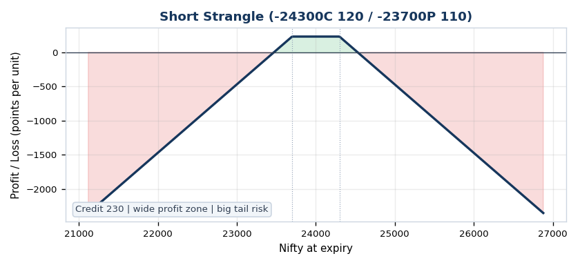

The short strangle payoff (above) is the table-top shape: a flat plateau of maximum profit across the whole zone between the strikes, then two ramps plunging into undefined loss past each breakeven. The long strangle is simply this picture flipped upside-down — a flat-loss valley in the middle, two profit ramps climbing away on the outside (next figure).

### Strike selection by delta

How far out should the strikes go? Professionals do not eyeball it; they use **delta** as a proxy for the probability that an option finishes in-the-money. A call with delta 0.16 has *roughly* a 16% chance of expiring ITM (and the put with delta -0.16 likewise). So selling both at delta ~0.16 builds a strangle whose strikes the market has only about a 16% chance, each side, of breaching — a combined "stay inside" probability in the ballpark of 68%.

- **Closer strikes (higher delta, e.g. 0.25–0.30 each):** more premium collected, narrower profit zone, *lower* probability of staying inside. Aggressive.
- **Further strikes (lower delta, e.g. 0.10–0.15 each):** less premium, wider profit zone, *higher* probability of success. Conservative.

A common seller's rule is the **"16-delta strangle"** — sell each leg near 0.16 delta, roughly one standard deviation out, so the expected-move band sits *inside* your strikes. For a long strangle buyer the same logic runs in reverse: cheaper, further-OTM strikes are bigger lottery tickets needing a larger move. Delta gives you a consistent, probability-aware way to choose strikes instead of guessing round numbers.

### Margin

Buying a strangle is paid for in **full premium up front**, and that debit is your entire risk — no margin calls, you sleep soundly.

Selling a strangle is the opposite. Because the risk is undefined, the exchange charges **SPAN + exposure margin** under the SPAN system, sized to a worst-case adverse move across both legs. For a one-lot Nifty short strangle this is typically on the order of **₹1.2–1.7 lakh** (it varies with volatility and the exchange's risk parameters, and rises sharply when VIX spikes). Two practical consequences:

- A **rising VIX raises your margin** mid-trade, which can force liquidation at the worst time — the same spike that is hurting your position is also demanding more capital.
- **Defining the risk by buying protective wings** (turning the short strangle into an **iron condor**) dramatically *reduces* the margin, because the exchange now sees a capped maximum loss. Many sellers run condors largely for this capital efficiency, not only for the safety.

## Worked example (₹, Nifty/Bank Nifty)

It is Monday. **Nifty spot = 24,000**, weekly expiry on Thursday, lot size **75** (set by the exchange; it changes periodically). India VIX is moderate. You look at two OTM strikes 300 points either side of spot:

- **24,300 CE** (OTM call) trading at **₹70**
- **23,700 PE** (OTM put) trading at **₹80**

So `Kc = 24,300`, `Kp = 23,700`, and the combined premium is `70 + 80 = ₹150` per unit.

### Case A — you BUY the strangle (long)

You expect a violent move (say, a big event Thursday) but cannot call direction.

- **Net debit** = `150 * 75 = ₹11,250`. This is your **maximum loss**.
- **Upper breakeven** = `Kc + debit = 24,300 + 150 = 24,450`.
- **Lower breakeven** = `Kp - debit = 23,700 - 150 = 23,550`.
- **Quiet zone (max-loss band)** = anywhere from 23,700 to 24,300 at expiry, both legs expire worthless.

Per-unit payoff = `max(S - 24,300, 0) + max(23,700 - S, 0) - 150`. Lot P&L = that × 75.

| Nifty at expiry (S) | Call value | Put value | Per-unit P&L | Lot P&L |
|---|---|---|---|---|
| 23,200 | 0 | 500 | +350 | **+₹26,250** |
| 23,550 | 0 | 150 | 0 | **₹0** (lower breakeven) |
| 23,700 | 0 | 0 | -150 | **-₹11,250** (max loss) |
| 24,000 | 0 | 0 | -150 | **-₹11,250** (max loss) |
| 24,300 | 0 | 0 | -150 | **-₹11,250** (max loss) |
| 24,450 | 150 | 0 | 0 | **₹0** (upper breakeven) |
| 24,800 | 500 | 0 | +350 | **+₹26,250** |

Read it: the market must clear **24,450 up or 23,550 down** — a move of about 450 points (~1.9%) from spot — *just to break even*. Anywhere in the 600-point band between the strikes, you lose the full ₹11,250. That is the long strangle's bargain: cheap to enter, but it demands a genuinely big move. A 250-point rally to 24,250 — which *feels* like a win — still leaves you at the full max loss, because you never reached the call strike.

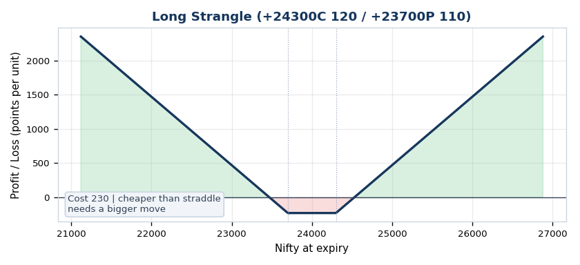

### Case B — you SELL the strangle (short)

Same two strikes, opposite side. You believe Nifty stays rangebound into Thursday and you want to harvest theta.

- **Premium collected** = `150 * 75 = ₹11,250`. This is your **maximum profit**.
- **Upper breakeven** = `24,300 + 150 = 24,450`; **Lower breakeven** = `23,700 - 150 = 23,550`.
- **Profit zone** = expire anywhere in `[23,700, 24,300]` to keep the *full* ₹11,250; you stay net-positive anywhere between **23,550 and 24,450** (a 900-point-wide band).

Per-unit payoff = `150 - max(S - 24,300, 0) - max(23,700 - S, 0)`.

| Nifty at expiry (S) | Per-unit P&L | Lot P&L | Note |
|---|---|---|---|
| 23,550 | 0 | **₹0** | lower breakeven |
| 23,700 | +150 | **+₹11,250** | max profit (zone edge) |
| 24,000 | +150 | **+₹11,250** | max profit (mid-zone) |
| 24,300 | +150 | **+₹11,250** | max profit (zone edge) |
| 24,450 | 0 | **₹0** | upper breakeven |
| 24,800 | -200 | **-₹15,000** | past breakeven, loss exceeds premium |
| 25,200 | -600 | **-₹45,000** | gap scenario — undefined tail |

Notice the asymmetry in the last two rows. Your *best* outcome, no matter how perfectly the market behaves, is **+₹11,250**. But a 1,200-point gap up to 25,200 — the kind of move a global shock or Budget surprise can deliver overnight — costs you **₹45,000**, four times the premium you collected, and the loss keeps growing the further the market runs. You sold ₹11,250 of comfort and accepted a tail with no ceiling. That single row is the whole reason to size small, set a stop (e.g. exit near a ₹22,500 loss, 2x premium), or buy protective wings.

### A Bank Nifty note

Bank Nifty (spot ~52,000, lot size ~15, currently) moves faster and wider than Nifty, so its options are richer but its strangles get breached more often. A seller might place a Bank Nifty short strangle 800–1,000 points either side (say 53,000 CE / 51,000 PE), collect a larger premium, and still face a wider, more violent tail. The higher premium is *compensation* for higher realised volatility, not a free lunch — Bank Nifty's gap risk is exactly what makes its premiums fat.

## Common mistakes / risk note

- **Selling naked strangles for the steady income, ignoring the tail.** The string of easy green weeks is the trap, not the reward. One gap day past your breakeven can erase months of premium. If you sell, **define the risk** (iron condor), **size small**, and **set a hard stop**.
- **Treating a long strangle's low cost as low difficulty.** Cheap to buy is not easy to win. The wide quiet zone means a "decent" move (say 250 points) can still leave you at full max loss because you never cleared the strike. You need a *big* move, fast.
- **Buying a strangle into already-high VIX before an event.** You overpay for inflated premiums, then the post-event **vol crush** collapses your time value. You can be right on direction and still lose to the vega drop. Prefer to buy *before* VIX runs up, or accept that you need a large move to overcome the crush.
- **Selling into low VIX for too little premium.** When India VIX is depressed, the premium you collect is thin while the tail is just as fat — a poor risk-reward. Sellers want *elevated* VIX (rich premium) that they expect to normalise.
- **Forgetting margin can balloon mid-trade.** A VIX spike raises SPAN margin on your short strangle exactly when the position is hurting, potentially forcing liquidation at the worst price. Keep buffer capital; do not run at full margin utilisation.
- **Confusing "high probability" with "high expected value."** A short strangle wins ~70% of weeks and still loses money over time if the rare loss is large enough. A 70% hit-rate with a tail that costs 5x the premium is a losing game without strict risk control.

## Key takeaways

- A **strangle** uses an OTM call above and an OTM put below: cheaper than a straddle, but with a dead "quiet zone" between the strikes.
- **Long strangle** = buy both. Cost = `call premium + put premium` (the max loss). Breakevens = `Kc + debit` (up) and `Kp - debit` (down). Long gamma, long vega, negative theta — it needs a **big, fast** move and is hurt by calm markets and vol crush.
- **Long strangle vs long straddle:** the strangle is cheaper but needs a *larger* move and has a *lower* probability of paying off.
- **Short strangle** = sell both. A popular Indian income trade with a **wide flat profit zone** between the strikes. Max profit = total premium; positive theta; negative vega — wins when the market stays rangebound and VIX falls.
- **Short strangle vs short straddle:** the strangle collects *less* premium but buys a *wider* safety band; both carry the same **undefined tail risk**.
- The short strangle's danger is the **gap day / black swan**: losses past the breakevens are uncapped, gamma works against you, and one outsized move can dwarf many weeks of premium. Define the risk (iron condor), size small, and use a hard stop.
- **Choose strikes by delta** (e.g. the ~16-delta strangle) for a probability-aware, repeatable rule rather than guessing round numbers. Selling requires **SPAN margin**; buying protective wings cuts that margin sharply.

## Practice problems

1. **(Conceptual)** In one sentence each, explain why a long strangle is *cheaper* than a long straddle but *harder* to make a profit on.

2. **(Numeric)** Nifty is at 24,000. You buy the 24,400 CE at ₹60 and the 23,600 PE at ₹65 (lot size 75). Find your net debit, max loss, and both breakevens. What is your lot P&L if Nifty expires at (a) 24,000, (b) 23,300, (c) 24,800?

3. **(Numeric)** Using the same strikes and premiums as Problem 2, you instead *sell* the strangle. State your max profit, the profit zone (where you keep the full premium), both breakevens, and your lot P&L if Nifty expires at (a) 24,000, (b) 25,000.

4. **(Conceptual)** A trader has sold Nifty weekly strangles for eight straight weeks, winning every time, and concludes it is "basically free money." Explain, using gamma and the idea of the tail, why this conclusion is dangerous, and name two concrete ways to control the risk.

5. **(Numeric)** Bank Nifty is at 52,000 (lot size 15). You sell the 53,000 CE at ₹150 and the 51,000 PE at ₹160. Find the premium collected, both breakevens, and your lot P&L if Bank Nifty gaps to 54,200 at expiry. How many times your collected premium is that loss?

6. **(Conceptual)** You want to sell a Nifty strangle and must choose between strikes at ~0.25 delta each and ~0.12 delta each. Describe the trade-off in premium, profit-zone width, and probability of success, and say which you would pick for a conservative income approach.

## Solutions

**1.** *Cheaper:* a strangle's legs are out-of-the-money, so they carry far less time value than the at-the-money options of a straddle, making the combined premium smaller. *Harder to profit:* because the strikes are spread apart, the market must first travel the empty distance to an OTM strike *and then* cover the premium before reaching a breakeven, so it needs a larger move (and has a lower probability of getting there) than a straddle, which begins earning on the first point past ATM.

**2.** Net debit = `(60 + 65) * 75 = 125 * 75 = ₹9,375` = max loss. Upper breakeven = `24,400 + 125 = 24,525`. Lower breakeven = `23,600 - 125 = 23,475`. Per-unit payoff = `max(S - 24,400, 0) + max(23,600 - S, 0) - 125`.
- (a) 24,000: both legs worthless → per-unit -125 → lot = **-₹9,375** (max loss; it sits in the quiet zone).
- (b) 23,300: put intrinsic = `23,600 - 23,300 = 300`; per-unit = `300 - 125 = +175` → lot = `175 * 75 =` **+₹13,125**.
- (c) 24,800: call intrinsic = `24,800 - 24,400 = 400`; per-unit = `400 - 125 = +275` → lot = `275 * 75 =` **+₹20,625**.

**3.** Selling the same structure: max profit = premium collected = **₹9,375**, kept if Nifty expires anywhere in the profit zone `[23,600, 24,400]`. Breakevens are the same levels as the buyer's: **23,475 (lower)** and **24,525 (upper)**; you stay net-positive between them. Per-unit payoff = `125 - max(S - 24,400, 0) - max(23,600 - S, 0)`.
- (a) 24,000: inside the zone, both legs worthless → per-unit +125 → lot = **+₹9,375** (max profit).
- (b) 25,000: call intrinsic = `25,000 - 24,400 = 600`; per-unit = `125 - 600 = -475` → lot = `-475 * 75 =` **-₹35,625**. Note this single loss is nearly **4x** the max profit — the undefined tail in action.

**4.** Eight wins in a row reflects the *high probability of a small win*, not an edge or safety. A short strangle is **short gamma**: as the market accelerates toward a strike, that leg's delta grows rapidly, so losses *accelerate* in a fast move — the rare losing week tends to be very large, not merely a mirror of the small wins. Over a long run, one tail event past the breakevens (a gap on global shock, RBI surprise, etc.) can dwarf many weeks of collected premium; the strategy wins often and small, loses rarely and big, so a winning streak says nothing about long-run profitability. Two concrete controls: (i) **define the risk** by buying cheap further-OTM wings, converting the strangle into an **iron condor** with a capped max loss (also cuts margin); (ii) **size small and set a hard stop** — e.g. exit if the loss reaches ~2x the premium collected — so no single week can be catastrophic.

**5.** Premium collected = `(150 + 160) * 15 = 310 * 15 = ₹4,650`. Upper breakeven = `53,000 + 310 = 53,310`. Lower breakeven = `51,000 - 310 = 50,690`. At 54,200: call intrinsic = `54,200 - 53,000 = 1,200` (the put expires worthless). Per-unit P&L = `310 - 1,200 = -890`; lot P&L = `-890 * 15 =` **-₹13,350**. As a multiple of premium: `13,350 / 4,650 ≈` **2.9x** the premium collected — lost on a single gap, the textbook short-strangle tail.

**6.** *0.25-delta strikes (closer to spot):* collect **more premium**, but the strikes sit nearer the money, so the **profit zone is narrower** and the **probability of staying inside is lower** (each leg has ~25% chance of finishing ITM). Aggressive, higher reward, more often breached. *0.12-delta strikes (further out):* collect **less premium**, but the **profit zone is wider** and the **probability of success is higher** (~12% ITM per leg). For a **conservative income approach**, pick the **~0.12-delta** strangle: the wider band and higher hit-rate suit steady premium harvesting, and you accept the smaller premium as the cost of breathing room. (Either way, the tail remains undefined, so the risk controls from Problem 4 still apply.)

# Chapter 42: Butterflies — Long Call Butterfly & Iron Butterfly

Imagine you are not betting on *where* Nifty goes, but on *where it stops*. You have watched the index chop sideways for a week. India VIX is elevated and you think the fear is overdone — options look expensive, and you expect them to deflate. Above all, you have a hunch that come Thursday's weekly expiry, Nifty will be sitting almost exactly where it is now, say near 24,000. You don't want to sell a naked straddle and lie awake worrying about an undefined-risk gap. You want a structure that pays off best when the index *pins* a particular strike — and whose worst case is a small, known, capped loss you decided on the moment you placed the trade.

That structure is the **butterfly**. It is the sniper rifle of options strategies: a tight, surgical bet that the underlying will land on a precise point, with a sharp profit spike at the centre and a small premium at stake. This chapter teaches two cousins that build the same tent-shaped payoff from different parts: the **long call butterfly**, paid for with a small net debit, and the **iron butterfly**, which collects a net credit upfront. Both are defined-risk, both peak at the body, and both are the professional's way of saying "I think this thing goes nowhere — and I am willing to be wrong cheaply."

## Core concepts

### What a butterfly is: a tent over one strike

A butterfly is a **three-strike**, four-contract structure with **equal spacing** between the strikes. Picture three strikes lined up evenly: a lower one, a middle one (the **body**), and a higher one, each separated by the same gap — say 24,000 / 24,200 / 24,400. The two outer strikes are the **wings**. The payoff diagram looks like a tent (or, with imagination, a butterfly with two wings and a fat body): a sharp peak directly over the middle strike, sloping down on both sides to a flat floor.

You profit most when the underlying expires *exactly at the body*. As it drifts away from the body in either direction, your profit shrinks, hits two **breakeven** points, and then bottoms out at a small, fixed maximum loss once price reaches or passes either wing. Beyond the wings, nothing changes — the loss is capped. That is the whole personality of the trade: **maximum reward for a pinpoint forecast, defined and modest punishment for being wrong.**

### The long call butterfly — built from calls, paid as a debit

The **long call butterfly** is assembled entirely from call options, in a 1–2–1 ratio:

- **Buy 1** call at the lower strike (K1) — the lower wing.
- **Sell 2** calls at the middle strike (K2) — the body.
- **Buy 1** call at the higher strike (K3) — the upper wing.

with `K2 - K1 = K3 - K2` (equal spacing). You are long one cheap-ish lower call, short two pricier middle calls, and long one cheaper higher call. Because you sell the two middle calls, the premium they bring in partly funds the two wings you buy — but the wings together cost a little more than the body brings in, so the net result is a small **debit** (you pay to enter). That net debit is the entire amount you can lose. Nothing more.

Why does this shape pay off at the body? Think of it as **two spreads stacked back to back**:

- A **bull call spread** (long K1 call, short K2 call) that makes money as Nifty rises toward K2.
- A **bear call spread** (short K2 call, long K3 call) that makes money as Nifty *fails* to rise past K2.

At exactly K2, the bull side has delivered its full value while the bear side has not yet cost you anything — the two are perfectly balanced at their seam. That seam, the body, is where profit peaks.

The key formulas (call butterfly, equal width `w = K2 - K1 = K3 - K2`):

```
Net debit       = C(K1) - 2*C(K2) + C(K3)        (a positive number, per share)
Max profit      = w - net debit                  (achieved if S expires exactly at K2)
Max loss        = net debit                       (if S <= K1 or S >= K3)
Lower breakeven = K1 + net debit
Upper breakeven = K3 - net debit
```

Everything is "per share" — multiply by the lot size to get rupees. Note the pleasing symmetry: the two breakevens sit equal distances inside the wings, and the profit tent is centred on K2.

### The iron butterfly — a short straddle wearing a helmet

The **iron butterfly** reaches the same tent shape from the other side, using both calls *and* puts, and it pays *you* to put it on. The build, all at the same three strikes:

- **Sell 1** at-the-money (ATM) call at K2 (the body).
- **Sell 1** ATM put at K2 (the body).
- **Buy 1** out-of-the-money (OTM) call at the upper wing K3 (protection).
- **Buy 1** OTM put at the lower wing K1 (protection).

Look at the inner two legs: a short ATM call *and* a short ATM put at the same strike is exactly a **short straddle** (Chapter 39). That is the engine — it collects fat premium and profits if the market sits still. But a naked short straddle has undefined, terrifying risk on both tails. So the iron butterfly bolts on a **protective helmet**: a long OTM put below and a long OTM call above. Those wings cap the loss in a crash or a melt-up. You have turned an open-ended short-vol bet into a **defined-risk** one.

Because you sell the expensive ATM options and buy back cheaper OTM ones, you take in a **net credit**. That credit is your maximum profit; you keep all of it if the index expires exactly at the body. The formulas (equal width `w`):

```
Net credit      = [Call(K2) + Put(K2)] - [Call(K3) + Put(K1)]   (per share)
Max profit      = net credit             (if S expires exactly at K2)
Max loss        = w - net credit          (if S <= K1 or S >= K3)
Lower breakeven = K2 - net credit
Upper breakeven = K2 + net credit
```

An iron butterfly built at the same strikes as a call butterfly is economically the **same payoff** — same tent, same max profit, same max loss, same breakevens. (This is a consequence of put-call parity from Chapter 17.) The difference is purely cosmetic and practical: the call butterfly is a **debit** you pay; the iron butterfly is a **credit** you receive. Many Indian traders prefer the iron version because seeing a credit hit the account and because it is built around the liquid ATM strikes.

### The Greeks: short gamma, short vega, long theta near the body

A butterfly's character is written in its Greeks (Chapters 22–25), and they explain *why* it behaves the way it does. Consider the position **when the underlying is near the body**, which is the situation you set the trade up for:

- **Theta — positive (your friend).** You are net short the two pricey middle options and long the two cheaper wings. Time decay eats the body faster than the wings, so each passing day, with price near K2, drips profit toward you. The butterfly *wants* time to pass. This is the same engine as any short-premium trade.
- **Gamma — negative (your enemy).** Net short the body means net short gamma near the centre. A sudden jolt in either direction moves against you and your delta flips the wrong way — the position dislikes movement. (Out near the wings the sign actually reverses, but the meaningful zone is the body.)
- **Vega — negative (you want IV to fall).** You are a net seller of the expensive ATM volatility. If implied volatility **crushes** — the classic post-event "vol crush" or a VIX that drifts down through a quiet week — the body's value collapses and your tent fattens. This is why butterflies pair so well with **high-IV environments you expect to calm down**.
- **Delta — roughly zero at the body, by design.** Symmetric construction makes the position direction-neutral at the centre. It tilts slightly bearish if price is above the body and slightly bullish if below — a gentle self-correcting pull back toward K2, which is exactly the bet.

So in one sentence: a butterfly **collects theta, fears gamma, and profits from falling vega — as long as the underlying behaves and stays parked near the body.**

### When to actually use it

Reach for a butterfly when *all* of these line up:

1. **You expect very little movement** — a quiet, range-bound drift, or outright **pinning** of a specific level into expiry. Expiry-day pinning around big round/strike levels (24,000 on Nifty, 52,000 on Bank Nifty) is a real, observed phenomenon as dealer hedging concentrates price near heavily-traded strikes.
2. **You have a precise target**, not just a vague "sideways" view. The narrower the tent, the more precise your forecast must be — and the bigger the reward if you nail it.
3. **IV is high and you expect it to fall.** The negative vega then works for you, and you sell the body when it is richest.
4. **You want defined risk.** Unlike a naked short straddle, your worst case is fixed and small.

Avoid it before a known catalyst that could spark a big move (a Budget, an RBI policy day, election results) unless your *entire* thesis is that the move will be smaller than the market is pricing — and even then, the sharp peak makes a butterfly a demanding way to express it.

### Butterfly vs condor: sharp peak vs flat plateau

The butterfly's close relative is the **iron condor** (Chapter 43). The difference is one design choice: the condor pulls the two short body legs *apart* into two different strikes, creating a **flat plateau** of maximum profit between them instead of a single sharp **peak**.

- **Butterfly:** body is a single strike (short straddle core). Profit peaks at one point — a **narrow** zone with a **tall** peak. Higher reward-to-risk if you are right, smaller margin for error.
- **Condor:** body is a *range* of two strikes (short strangle core). Profit is a flat tabletop across that range — a **wider**, more forgiving zone, but **lower** maximum profit because the short legs are OTM and collect less.

Trade the **butterfly** for a sharp conviction about a specific landing spot; trade the **condor** when you only believe "somewhere in this band." Same family, different precision-versus-margin trade-off.

## Worked example (₹, Nifty)

It is Monday of an expiry week. Nifty spot is **24,000**. India VIX is elevated after a jittery few sessions, and you believe the market will chop and settle near 24,000 by Thursday, with IV cooling off. Assume a Nifty lot size of **75** (state lot sizes change periodically; confirm the current value). You choose strikes 200 points wide: **K1 = 23,800, K2 = 24,000, K3 = 24,200**, so `w = 200`.

**Version A — Long call butterfly.** Observed weekly call premiums (per share):

- 23,800 call: ₹260
- 24,000 call: ₹140
- 24,200 call: ₹60

Build: buy 1x 23,800 call, sell 2x 24,000 calls, buy 1x 24,200 call.

```
Net debit  = C(K1) - 2*C(K2) + C(K3)
           = 260 - 2*140 + 60
           = 260 - 280 + 60 = ₹40 per share
```

Now the numbers:

```
Net debit per share     = ₹40   -> max loss = 40 * 75 = ₹3,000
Max profit per share    = w - debit = 200 - 40 = ₹160 -> 160 * 75 = ₹12,000
Lower breakeven         = K1 + debit = 23,800 + 40 = 23,840
Upper breakeven         = K3 - debit = 24,200 - 40 = 24,160
```

So for a maximum risk of **₹3,000** you stand to make up to **₹12,000** — a reward-to-risk of about 4:1 — *if* Nifty expires exactly at 24,000. You make *some* profit anywhere between 23,840 and 24,160, and you lose the full ₹3,000 only if Nifty finishes at or beyond either wing (≤ 23,800 or ≥ 24,200).

Check a few expiry outcomes (per-share P&L, then x75):

- **Nifty = 24,000 (perfect pin):** 23,800 call worth 200; both 24,000 calls and the 24,200 call expire worthless. Value 200 − debit 40 = **+₹160/share = +₹12,000**. Maximum profit.
- **Nifty = 24,160 (upper breakeven):** 23,800 call 360; two short 24,000 calls -320; 24,200 call 0. Net value 40 = the debit -> **₹0 P&L.**
- **Nifty = 24,400 (past the upper wing):** 600 − 800 + 200 = 0 value; minus ₹40 paid = **-₹40/share = -₹3,000.** Maximum loss, fixed no matter how much higher Nifty goes.
- **Nifty = 23,600 (below the lower wing):** every call expires worthless; you lose the debit = **-₹3,000.** Capped.

**Version B — Iron butterfly (same strikes).** Now build the credit version: sell the ATM 24,000 call and 24,000 put, buy the 24,200 call and the 23,800 put. Suppose premiums are:

- 24,000 call: ₹140, 24,000 put: ₹150 (ATM straddle you sell)
- 24,200 call: ₹60, 23,800 put: ₹70 (OTM wings you buy)

```
Net credit = [Call(K2) + Put(K2)] - [Call(K3) + Put(K1)]
           = (140 + 150) - (60 + 70)
           = 290 - 130 = ₹160 per share
```

The numbers:

```
Net credit per share    = ₹160  -> max profit = 160 * 75 = ₹12,000
Max loss per share      = w - credit = 200 - 160 = ₹40 -> 40 * 75 = ₹3,000
Lower breakeven         = K2 - credit = 24,000 - 160 = 23,840
Upper breakeven         = K2 + credit = 24,000 + 160 = 24,160
```

Notice: **identical** to the call butterfly — same ₹12,000 max profit, ₹3,000 max loss, breakevens at 23,840 and 24,160. You simply *received* ₹12,000 upfront and will give some back if Nifty moves. At a perfect 24,000 pin the short straddle and the wings all expire worthless, so you keep the entire **₹12,000** credit; at expiry ≥ 24,200 or ≤ 23,800 you lose the capped **₹3,000**. A practical bonus (Chapter 9): because the wings fully hedge it, SPAN-plus-exposure margin is modest — roughly the defined max loss, far less than a naked short straddle would block.

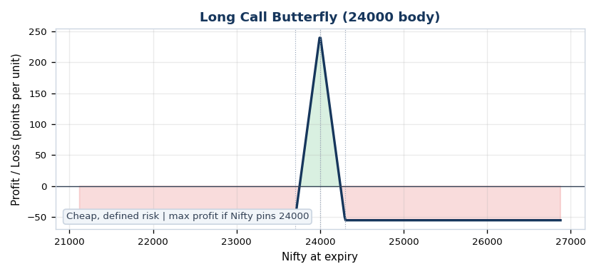

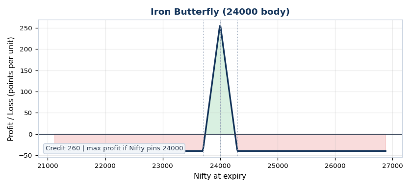

## Common mistakes / risk note

- **Mistaking "defined risk" for "high probability."** The loss is small and capped, but the *probability* of a near-perfect pin is also small. You collect the big max profit only in a narrow window; most expiries land on the slopes (P&L between the extremes), and a meaningful fraction land outside the wings for the full loss. Butterflies tend to produce many tiny gains/losses and occasional good wins — not free money. As SEBI's studies remind us, the large majority of retail F&O traders lose overall, and narrow low-cost structures do not change that arithmetic by themselves.
- **Trading it through a catalyst.** Putting a butterfly on right before results, the Budget, or an RBI decision invites exactly the violent move it hates (negative gamma). Unless your thesis is "the move will be smaller than priced," avoid known event risk.
- **Ignoring liquidity and the bid-ask spread.** A butterfly is four legs; on illiquid far strikes the spreads can quietly eat a large share of a ₹40 debit. Trade liquid weekly strikes (ATM and near-ATM on Nifty/Bank Nifty) and place it as a single multi-leg order where possible.
- **Forgetting it is short vega.** Enter when IV is *low* and IV then *spikes*, and the body fattens — you lose even if price hasn't moved. Butterflies belong in high-IV-you-expect-to-fall conditions.
- **Settlement.** Indian *index* options are European and **cash-settled**, so there is no assignment surprise at expiry — a real advantage here. Stock options are physically settled and can bring assignment/delivery complications; this strategy is cleanest on indices.
- **Over-tightening the wings.** Narrow wings raise the reward-to-risk ratio but shrink the profit zone to a razor; wider wings cost more but give a more forgiving target. Match the width to your real confidence about the landing spot.

## Key takeaways

- A **butterfly** is a three-strike, equally-spaced, defined-risk bet that the underlying will **pin the middle strike** at expiry; the payoff is a tent peaking at the body.
- The **long call butterfly** (buy 1 lower, sell 2 middle, buy 1 higher call) costs a small **net debit** = your max loss; **max profit = width − debit** at the body.
- The **iron butterfly** (short ATM straddle + protective OTM call and put wings) takes in a **net credit** = your max profit; **max loss = width − credit**. At matching strikes it is the *same payoff* as the call butterfly.
- Net Greeks near the body: **positive theta, negative gamma, negative vega** — it earns from time decay and falling IV, and fears sudden movement.
- Use it when you expect **very little movement / pinning into expiry**, ideally with **high IV you expect to crush**, and you want a **capped, known risk**.
- Versus an **iron condor**: the butterfly has a **sharper peak and narrower** profit zone (single body strike); the condor has a **flatter, wider** plateau (two body strikes) for less peak profit.

## Practice problems

1. **(Conceptual)** Explain in one or two sentences why a long call butterfly is "two spreads back to back," and name the two spreads.
2. **(Numeric)** Build a Nifty long call butterfly at strikes 23,900 / 24,000 / 24,100 (width 100). Premiums: 23,900 call ₹170, 24,000 call ₹110, 24,100 call ₹65. With lot size 75, compute the net debit, max profit, max loss, and both breakevens (in rupees where appropriate).
3. **(Numeric)** Construct an iron butterfly at the same strikes as Problem 2 (body 24,000, wings 23,900 and 24,100). The 24,000 call is ₹110, the 24,000 put is ₹120, the 24,100 call is ₹65, the 23,900 put is ₹70. Compute the net credit, max profit, max loss, and both breakevens. How do they compare to Problem 2?
4. **(Conceptual + Greeks)** It is the morning of a major RBI policy announcement and India VIX is high. A friend wants to put on a tight iron butterfly on Bank Nifty "because theta is positive and risk is defined." Give two reasons this is a dangerous time to do it.
5. **(Numeric)** For the butterfly in Problem 2, what is the P&L per share (and per lot) if Nifty expires at exactly 24,000? At 24,150? At 23,800?
6. **(Conceptual)** A trader believes Nifty will stay "somewhere between 23,800 and 24,200" but has no view on the exact level. Should they prefer a butterfly or an iron condor, and why?

## Solutions

**1.** A long call butterfly is a **bull call spread** (long the K1 call, short the K2 call) stacked against a **bear call spread** (short the K2 call, long the K3 call) sharing the middle strike. The bull side gains as price rises to K2; the bear side gains as price fails to exceed K2. They balance exactly at K2, which is where profit peaks.

**2.** Width `w = 100`.
```
Net debit  = 170 - 2*110 + 65 = 170 - 220 + 65 = ₹25/share -> max loss = 25*75 = ₹1,875
Max profit = w - debit = 100 - 25 = ₹75/share -> 75*75 = ₹5,625 (at S = 24,000)
Lower breakeven = 23,900 + 25 = 23,925
Upper breakeven = 24,100 - 25 = 24,075
```
Risk ₹1,875 to make up to ₹5,625 (3:1), profitable between 23,925 and 24,075.

**3.** 
```
Net credit = (Call 24,000 + Put 24,000) - (Call 24,100 + Put 23,900)
           = (110 + 120) - (65 + 70) = 230 - 135 = ₹95/share
```
Hold on — compare to the call butterfly debit of ₹25. For matching strikes the iron butterfly should mirror the call butterfly, with `max loss = w - credit`. Here:
```
Max profit = net credit = ₹95/share -> 95*75 = ₹7,125
Max loss   = w - credit = 100 - 95 = ₹5/share -> 5*75 = ₹375
Lower breakeven = 24,000 - 95 = 23,905
Upper breakeven = 24,000 + 95 = 24,095
```
The slight mismatch versus Problem 2 (breakevens 23,925 / 24,075 there vs 23,905 / 24,095 here) comes from the quoted premiums not being perfectly internally consistent with put-call parity — a normal real-world artifact of bid-ask spreads. The **lesson** is structural: the iron butterfly delivers the *same tent shape* as the call butterfly (peak at the body, defined and small max loss, narrow profit zone), just expressed as a credit you receive rather than a debit you pay. With perfectly parity-consistent prices the two would match exactly.

**4.** Two reasons it is dangerous: (a) **Negative gamma into a catalyst.** An RBI policy can spark a large, fast Bank Nifty move — precisely what a short-gamma butterfly loses on; a sharp move blows straight past the narrow profit zone to the max loss. (b) **Negative vega with potential for IV to rise further or stay high.** Although high VIX makes the body rich to sell, an event can keep IV elevated or spike it intraday before settlement, and even without a price move the position can sit at a loss. A butterfly wants *quiet and falling IV*, not a binary event. The tight wings make both problems worse.

**5.** Using the Problem 2 butterfly (strikes 23,900/24,000/24,100, debit ₹25/share, lot 75):
- **S = 24,000:** 23,900 call worth 100; two short 24,000 calls worthless; 24,100 call worthless. Value 100 − debit 25 = **+₹75/share = +₹5,625/lot** (max profit).
- **S = 24,150:** 23,900 call 250; two short 24,000 calls -2*150 = -300; 24,100 call +50. Net value = 0. Minus debit 25 = **-₹25/share = -₹1,875/lot** (this is at/just past the upper wing 24,100, so it is the max loss).
- **S = 23,800:** all calls expire worthless. You lose the debit only = **-₹25/share = -₹1,875/lot** (max loss, capped).

**6.** They should prefer an **iron condor**. Their view is a *range* ("somewhere between 23,800 and 24,200"), not a precise landing spot. A condor's flat profit plateau spans that whole band, paying the maximum across a wide zone and forgiving imprecision. A butterfly's sharp single-strike peak would reward them well only if Nifty pinned the exact body and would give back most of the profit elsewhere in their expected range. Match the structure's shape to the *shape* of your forecast: point view -> butterfly; band view -> condor.

# Chapter 43: The Iron Condor — The Range-Bound Income Trade

Imagine you run a small toll booth on a stretch of highway. You don't care whether traffic flows north or south — you collect a fixed fee from every car that passes through your patch of road, and you pocket it as long as nothing crashes. The iron condor is the options version of that toll booth. You stake out a wide lane around the current Nifty level, collect a premium up front, and you keep that premium as long as Nifty stays inside the lane until expiry. You don't need it to go up. You don't need it to go down. You just need it to *stay home*.

That is why the iron condor is the single most popular income strategy among Indian retail option sellers, especially on weekly expiries. It is a short strangle — selling an out-of-the-money call and an out-of-the-money put — but with two protective "wings" bought further out, which cap the disaster scenario. The result is a four-legged, defined-risk, market-neutral trade that earns a little when the market is boring and loses a known, capped amount when the market is not. The whole art of trading it well is understanding that the boring days pay you slowly, the wild days take it back fast, and survival is entirely about the size of the lane and the size of your position.

## Core concepts

### What an iron condor actually is

An iron condor is built from four options, all on the **same underlying and the same expiry**, in two pairs:

1. **A short put spread (a bull put spread)** below the current price — sell an OTM put, buy a further-OTM put for protection.
2. **A short call spread (a bear call spread)** above the current price — sell an OTM call, buy a further-OTM call for protection.

You *sell* the two inner options (the ones closer to the money) and *buy* the two outer options (the wings). Because the options you sell are more expensive than the ones you buy, the whole package comes in at a **net credit** — money lands in your account the moment you open the trade.

Lay the four strikes out in order, from low to high, and the structure is easy to picture:

- **Long put** (lowest strike — lower wing, protection)
- **Short put** (your lower breakeven zone begins here)
- ... current spot sits in the middle ...
- **Short call** (your upper breakeven zone begins here)
- **Long call** (highest strike — upper wing, protection)

The gap between the two *short* strikes is your **profit zone** — the lane you want price to stay inside. The gap between a short strike and its wing (e.g. short call to long call) is the **wing width**, and it determines how much you can lose.

A quick vocabulary check, since every term must earn its place:

- **OTM (out of the money)** — a call whose strike is above spot, or a put whose strike is below spot; it has no intrinsic value yet.
- **Credit** — net premium received for opening the position (the opposite of a debit, where you pay).
- **Defined risk** — your worst case is a fixed, known number, unlike a naked short option whose loss can balloon.

### Why sell the strangle but buy the wings?

A plain short strangle (sell an OTM call and an OTM put, no wings) collects *more* premium, but its risk is theoretically unlimited on the call side and enormous on the put side. One gap-down or a violent rally can wipe out months of income, and your broker demands a large SPAN margin to hold it.

Buying the wings is like buying cheap insurance on a position you've already sold insurance on. You give up a slice of the premium, but in return your maximum loss becomes **fixed and known** before you enter, and your **margin drops dramatically** because the exchange sees the position is hedged. A naked strangle on Nifty might block well over a lakh of SPAN margin; the same trade as a condor can need a fraction of that, since the exchange only charges you for the capped risk. That lets you size the position to a precise rupee risk, which is the foundation of survival.

The trade-off is real: the wings cost money, so your maximum profit is smaller than a naked strangle's, and the capped loss is still typically several times the credit. The condor doesn't remove risk; it makes risk *legible*.

### The four numbers that define every iron condor

For a condor with **equal wing widths** (the standard, symmetric case), four formulas tell you everything. Let:

- `W` = strike width of each spread (short strike to its wing), in points
- `C` = net credit received, in points per unit

Then:

```
Max profit   = C                          (kept if price expires between the short strikes)
Max loss     = W - C                       (per unit; if either wing is fully breached)
Lower breakeven = short put strike  - C
Upper breakeven = short call strike + C
```

To convert points into rupees, multiply by the **lot size** (currently about 75 for Nifty; this changes over time, so always check the current contract). For example, a credit of 60 points on one Nifty lot is `60 * 75 = ₹4,500` collected.

Notice the lovely symmetry: you profit if the underlying lands anywhere between the two breakevens, which is a band *wider* than the gap between the short strikes (the credit pushes the breakevens outward). You suffer the full `W - C` loss only if price blows clean through a short strike *and* reaches the wing beyond it. Between the short strike and the wing, the loss grows linearly — a partial-loss ramp, not a cliff.

### The payoff shape

The payoff diagram looks like a wide, flat-topped plateau with two downward ramps that level off into flat valleys on each side. The flat top is your maximum profit zone (between the short strikes). The ramps are where one spread goes against you. The flat valleys are the capped maximum loss, where even if price keeps running, the wing has already paid out and your loss stops growing.

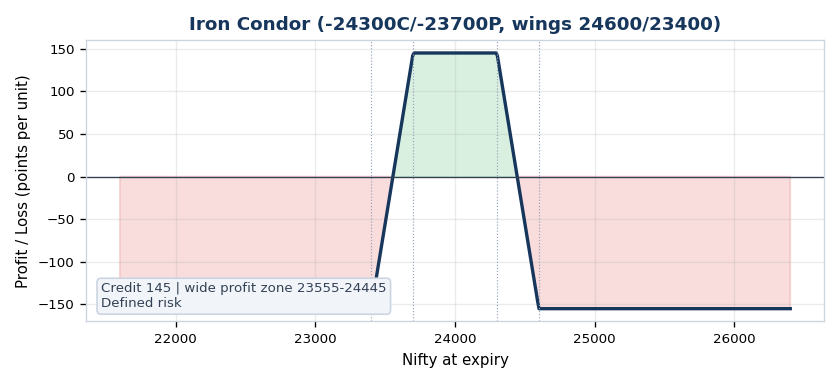

Compare this to a short strangle, whose payoff also has a flat top but then plunges in straight lines forever in both directions — no floor. The wings are what bend those plunging lines back to horizontal. You are trading away the tips of the wings' profit for a hard floor under your losses.

### The Greeks: what you're really short

Every position has a Greek signature — its sensitivity to the underlying's price, to volatility, and to time. The iron condor, held near the centre of its range, is:

- **Positive theta (time decay works for you).** This is the engine. Every day that passes with price sitting inside the range, the options you sold lose value faster than the wings you bought, and that decay is your income. Theta is why the trade is called an "income" strategy.
- **Short vega (you are short volatility).** If implied volatility *rises* — fear spikes, India VIX jumps — all four options inflate, but the inner ones you're short inflate more, and your position loses on a mark-to-market basis even if price hasn't moved. If IV *falls* (a "vol crush", common after an event), you gain. This is why you want to *sell* condors when IV is high.
- **Short gamma (movement hurts you).** Short gamma means that as price moves toward a short strike, your losses accelerate and your delta tilts against you — always leaning the wrong way. It is the mirror image of positive theta: you are paid theta precisely *because* you are short gamma. There is no free lunch.
- **Near-zero delta at the centre (market-neutral).** When price is parked in the middle, the call-side and put-side deltas roughly cancel, so you have little directional exposure. As price drifts toward one side, delta builds against you — the position is only neutral while it stays neutral.

The one-line summary every condor seller should tattoo on their forearm: **you are paid theta to be short gamma and short vega.** You earn slowly while things are calm and pay quickly when they move or when fear rises.

### Ideal conditions: when to actually put one on

The condor is not a strategy for all seasons. It thrives in a specific climate:

1. **High IV rank or IV percentile.** Recall from the volatility chapters that IV rank tells you whether today's implied volatility is high or low *relative to its own past year*. You want to sell options when they are *expensive*, i.e. when IV rank is high (say above 50). High IV does two things for you: it fattens the credit you collect, and it sets up a potential vol crush that profits your short-vega position. Selling condors in a dead-low-IV market is collecting peanuts while taking the same tail risk.
2. **A range-bound or post-event market.** The condor wants calm. Good moments: a market that has been chopping sideways in a defined band; the day *after* a big scheduled event (Budget, RBI policy, election result, major earnings) when the uncertainty has resolved and IV is collapsing. Bad moments: ahead of an unknown binary event, or in a market that is clearly trending hard in one direction.
3. **Enough time, but not too much.** Weekly condors decay fast (good theta) but give price little room to misbehave (bad gamma). Monthly condors decay slower but are more forgiving. Many Indian sellers favour entering with a few days to a couple of weeks left, balancing the two.

### Strike selection by delta

How wide should the lane be? The professional way to choose short strikes is by **delta**, not by gut. The delta of an OTM option is a rough proxy for the market's estimated probability that the option finishes in the money. A 16-delta short call sits roughly one standard deviation away — the market implies about a 16% chance price closes beyond it.

A common, sensible recipe:

- **Short strikes at ~15–20 delta each.** This places them around one standard deviation out on each side, giving a profit zone that price stays inside roughly two-thirds of the time at expiry (before accounting for the credit, which widens the breakevens further). Selling closer (30-delta) collects more premium but gets tested far more often; selling further (10-delta) is safer per trade but the credit shrinks toward not-worth-it.
- **Wings 200–400 points beyond each short strike on Nifty** (or a fixed number of strikes). Wider wings collect a touch more credit and have a lower chance of full breach, but raise the maximum loss and margin. Narrower wings cap loss tighter but cost more credit and pinch the reward.

The width choice is a dial between *probability of profit* and *size of reward*. Tighter lanes (higher-delta shorts) pay more but win less often; wider lanes (lower-delta shorts) win more often but pay less. There is no universally correct setting — only a setting that matches your edge and your stomach.

### Position sizing: the number that actually keeps you alive

Here is the uncomfortable arithmetic of the condor. A typical weekly Nifty condor might collect a credit of, say, 60 points against a wing width of 300 points. That means:

- Max profit per lot: `60 * 75 = ₹4,500`
- Max loss per lot: `(300 - 60) * 75 = ₹18,000`

You are risking ₹18,000 to make ₹4,500 — a reward-to-risk of about 1 to 4. You can be right four times and wrong once and end up flat (before costs). This is the defining feature of premium selling: **you win often but small, and lose rarely but big.** The whole game is making sure the rare big loss doesn't exceed several wins, and never betting so large that one bad week ruins you.

A disciplined sizing rule: risk no more than **1–2% of your trading capital** on the maximum loss of any single condor. With ₹10 lakh of capital and a 2% cap, your max loss per position is ₹20,000 — about one lot of the example above. Traders blow up not because the condor is a bad structure but because they sell ten lots, collect ₹45,000 of lovely credit for weeks, and then meet one gap-down that takes ₹1.8 lakh in a single morning.

### Managing the trade: what to do when one side is tested

A condor is not a "set and forget" trade. Plan your exits *before* you enter. The common management playbook:

- **Take profits early.** Many professional sellers close the position once they've captured **50% of the maximum credit**, rather than squeezing the last rupee. Why? The last bit of profit comes slowly and is exposed to the most gamma risk near expiry. Booking at 50% improves your win consistency and frees capital. (For our 60-point credit, that means buying it all back when it's worth ~30 points.)
- **Set a stop on the loss.** A common rule: exit if the loss reaches **1.5x to 2x the credit received**, rather than waiting for the full max loss. This converts the ugly 1-to-4 ratio into something more survivable — you cut the right tail of your loss distribution.
- **Roll the untested side.** When price drifts toward your short call (the call side is "tested"), the put side has by now decayed to almost nothing. You can **roll the untested put spread up** — close it and re-sell it at higher strikes, closer to the new price — to collect additional credit that offsets the loss building on the call side. This is the bread-and-butter adjustment. It re-centres the position around the new price and widens your effective breakeven, at the cost of narrowing the lane on the safe side (you're taking on a bit more risk to defend).
- **Roll out in time**, or simply **take the loss.** If the move is genuine and one-directional, rolling only digs a deeper hole. The honest, professional move is often to accept the planned, capped loss and move on. The condor's entire premise is that the loss is *defined* — defending a losing trade past your stop just converts a known small loss into a larger one. Knowing when to stop adjusting is the hardest skill.

The golden rule of adjustment: **roll the side that is winning, never throw good money after the side that is losing.** And size small enough that you can afford to be wrong without the adjustment becoming compulsory.

### The Indian weekly iron condor and its honest risk

Weekly expiries made the iron condor a retail phenomenon in India. Every week brings a fresh expiry on Nifty (and other indices on their respective days), the premium-to-time ratio is rich, theta decay is brutal in the final days, and a seller can run the toll booth 50-odd times a year. The marketing is seductive: "earn steady weekly income from the market." Thousands of Indian traders run mechanical weekly condors.

Be brutally honest about the risk, because this is exactly where retail gets hurt. The weekly condor's profit profile is a long line of small green weeks punctuated by occasional large red ones. The math means **a single trending or gapping week can eat several weeks of accumulated credit at once.** Indian markets gap on global cues overnight, on geopolitical shocks, on surprise policy — and an index option is cash-settled and European, so you can't escape an adverse expiry, you simply settle at the closing level. A condor that breaches a wing on expiry day delivers the full `W - C` loss with no recourse.

This is why SEBI's own studies show roughly **9 out of 10 retail F&O traders lose money.** It is not because the iron condor is a scam — it is a legitimate, mathematically sound structure. It is because traders run it too large, sell when IV is low (thin credit, same tail), skip the stop-loss, and mistake a string of lucky calm weeks for skill. The structure is fine; the position sizing and the discipline are where accounts die. Respect the 1-to-4 ratio, respect your sizing cap, and treat every quiet winning week as borrowed time you're being paid for — not a guarantee.

## Worked example (₹, Nifty)

Let's build a concrete weekly Nifty iron condor. Assume:

- **Nifty spot** = 24,000, weekly expiry, India VIX elevated (IV rank high — good condor conditions).
- **Lot size** = 75 (current Nifty lot; verify, as it changes).

We select strikes by delta and structure the four legs:

| Leg | Strike | Type | Action | Premium (points) |
|-----|--------|------|--------|------------------|
| Lower wing | 23,500 | Put | Buy | 30 |
| Short put | 23,700 | Put | Sell | 70 |
| Short call | 24,300 | Call | Sell | 75 |
| Upper wing | 24,500 | Call | Buy | 35 |

**Step 1 — Net credit.** Add the premiums received, subtract the premiums paid:

```
Credit = (70 + 75) - (30 + 35) = 145 - 65 = 80 points
```

In rupees: `80 * 75 = ₹6,000` collected up front. This is your **maximum profit**.

**Step 2 — Wing width.** Each spread is 200 points wide:

```
Put spread:  23,700 - 23,500 = 200 points
Call spread: 24,500 - 24,300 = 200 points
W = 200
```

**Step 3 — Maximum loss.**

```
Max loss = W - C = 200 - 80 = 120 points
        = 120 * 75 = ₹9,000 per lot
```

So this condor risks ₹9,000 to make ₹6,000 — a reward-to-risk of 1 to 1.5, which is unusually favourable because we sold in high IV and chose fairly tight wings. (In low IV the same structure might only credit 40 points, giving a 1-to-4 ratio.)

**Step 4 — Breakevens.**

```
Lower breakeven = short put strike  - C = 23,700 - 80 = 23,620
Upper breakeven = short call strike + C = 24,300 + 80 = 24,380
```

**Step 5 — Read the outcome map.** At expiry (cash-settled at the Nifty closing level):

- **Nifty closes between 23,700 and 24,300** (inside the short strikes): all four options expire worthless, you keep the full ₹6,000. *Maximum profit.*
- **Nifty closes between 23,620 and 24,380** (between the breakevens): you keep *some* of the credit. At exactly a breakeven, you net zero (before costs).
- **Nifty closes below 23,500 or above 24,500** (beyond a wing): full **maximum loss of ₹9,000.**
- **Nifty closes between a short strike and its wing** (e.g. 24,400): partial loss along the ramp. At 24,400 the call spread is 100 points in the money, costing `100 * 75 = ₹7,500`, offset by the ₹6,000 credit — a net loss of ₹1,500.

**Step 6 — Profit zone width.** Your full-profit lane is 600 points wide (23,700 to 24,300), and your break-even lane is 760 points wide (23,620 to 24,380). Nifty needs to stay within roughly +/- 1.6% of spot for the week. With ~16-delta shorts, the market implies that happens around two-thirds of the time — and the collected credit nudges the odds a little further in your favour.

**Costs to remember (India-specific).** This is four legs, so you pay brokerage and exchange fees on all four, plus **STT** (Securities Transaction Tax — charged on the sell side of options on premium, and notably on *exercised/settled* in-the-money options at expiry on the settlement value, which can be a nasty surprise on a breached leg). Always close in-the-money legs *before* expiry where possible to avoid the higher settlement STT. Net these costs out of the ₹6,000 — on a single lot they meaningfully shrink the real take-home.

## Common mistakes / risk note

- **Selling condors in low IV.** Thin credit, same fat tail. If IV rank is low, the premium doesn't compensate you for the gap risk. Wait for richer conditions.
- **Sizing for the credit, not the loss.** Beginners see ₹6,000 income and sell five lots. The relevant number is the ₹9,000 (or larger) *max loss per lot*. Size off the loss, capped at 1–2% of capital.
- **No stop-loss, holding to expiry every time.** The flat valleys are comforting on a diagram, but reaching them means a full loss. Define your exit (e.g. 50% profit target, 2x-credit stop) before entering.
- **Defending a losing trend forever.** Rolling the tested side into a strong trend just enlarges the loss. The condor's gift is a *defined* loss — sometimes the right move is to take it.
- **Ignoring event risk and gaps.** Index options are European and cash-settled; an overnight gap through a wing settles against you with no escape. Avoid holding condors across unhedged binary events.
- **Forgetting STT on settled ITM legs.** A breached short option left to settle can attract STT on the full settlement value — close ITM legs before expiry.
- **Mistaking a lucky streak for skill.** A run of calm weeks is the strategy working *as designed*, not proof you've beaten the market. The bill arrives on the volatile week. Respect the asymmetry.

## Key takeaways

- An iron condor = a short OTM call spread + a short OTM put spread on the same underlying and expiry: a short strangle with protective wings.
- It collects a **net credit** and profits if the underlying stays in a **wide range** between the two short strikes until expiry.
- **Max profit = net credit; max loss = wing width - credit** (defined and capped); breakevens = short put - credit (lower) and short call + credit (upper).
- Greeks: **positive theta, short vega, short gamma, ~zero delta at centre** — you are paid theta to be short gamma and short volatility.
- Ideal conditions: **high IV rank** (rich premium, potential vol crush) and a **range-bound or post-event** market. Pick short strikes by delta (~15–20 delta).
- The reward-to-risk is asymmetric (often 1-to-3 or worse): **win often and small, lose rarely and big.** Size off the max loss, capped at 1–2% of capital.
- The Indian weekly condor is popular and legitimate, but a **single trending or gapping week can erase several weeks of credit** — discipline, sizing, and a stop-loss are what separate survivors from the 90% who lose.

## Practice problems

1. **Structure check.** A trader sells a Bank Nifty iron condor: buy 50,000 put, sell 50,500 put, sell 52,500 call, buy 53,000 call. Which two options are sold, which two are bought, and where is the maximum-profit zone?

2. **Core numbers.** On a Nifty condor you collect a net credit of 50 points. Each wing is 250 points wide. Lot size is 75. Compute (a) max profit per lot in rupees, (b) max loss per lot in rupees, and (c) the reward-to-risk ratio.

3. **Breakevens.** Using a Nifty condor with short put at 23,800, short call at 24,200, and a net credit of 70 points, find the lower and upper breakeven levels and the width of the break-even profit band.

4. **Greeks intuition.** India VIX jumps sharply overnight from 12 to 18, but Nifty opens almost exactly where it closed the previous day. You hold an iron condor. Did your position most likely gain or lose on a mark-to-market basis that morning, and which Greek explains it?

5. **Management decision.** You sold a weekly condor for an 80-point credit. Three days later, with price still comfortably between your short strikes, the position can be bought back for 38 points. What does the common "50% profit target" rule suggest, and why might a professional act on it?

6. **The honest risk.** A trader runs the same weekly Nifty condor (60-point credit, 300-point wings, 75 lot size, 4 lots) and wins eight weeks in a row, then in week nine Nifty gaps and closes beyond a wing. Compute the eight weeks of profit, the week-nine loss, and the net result. What lesson does this illustrate?

## Solutions

**1.** You always sell the *inner* options (closer to spot) and buy the *outer* wings. Here: **sold** = 50,500 put and 52,500 call; **bought** = 50,000 put (lower wing) and 53,000 call (upper wing). The **maximum-profit zone** is between the two short strikes, i.e. Bank Nifty closing anywhere between **50,500 and 52,500** at expiry, where all four options expire worthless and the trader keeps the full credit.

**2.** With credit `C = 50`, wing width `W = 250`, lot = 75:
- (a) Max profit = `C * 75 = 50 * 75 = ₹3,750`.
- (b) Max loss = `(W - C) * 75 = (250 - 50) * 75 = 200 * 75 = ₹15,000`.
- (c) Reward-to-risk = `3,750 : 15,000 = 1 : 4`. You can win four times and lose once and be flat (before costs) — the classic premium-selling asymmetry, and a sign the credit is thin relative to the risk (likely a low-IV environment).

**3.** Breakevens:
- Lower = short put - credit = `23,800 - 70 = 23,730`.
- Upper = short call + credit = `24,200 + 70 = 24,270`.
- Break-even band width = `24,270 - 23,730 = 540 points`. Nifty can close anywhere in this 540-point band and the trade is at worst break-even; the credit widened the profitable zone beyond the 400-point gap between the short strikes.

**4.** You most likely **lost** on a mark-to-market basis, even though price didn't move. The condor is **short vega** — when implied volatility (proxied by India VIX) jumps, all the options inflate, and the inner options you are short inflate more than the wings you own, so the position's buy-back cost rises. The Greek is **vega**. (The flip side: if this VIX spike later collapses with price still in range, the vol crush works in your favour — which is exactly why you prefer to *sell* condors when IV is already high.)

**5.** The 50% profit-target rule says: close when you've captured half the credit. Half of 80 is 40, so buying it back at 38 points captures **42 of the 80 points (~53%)** — past the target. A professional acts because the remaining ~38 points of profit will accrue slowly and is exposed to rising gamma risk as expiry approaches; one adverse move could turn a healthy winner into a loser. Booking now locks in the gain, frees margin for the next trade, and improves win consistency. Take-home so far: `42 * 75 = ₹3,150` per lot (before costs).

**6.** Eight winning weeks at full credit: `8 * 60 * 75 = 8 * 4,500 = ₹36,000` per lot, and with 4 lots = `36,000 * 4 = ₹1,44,000`. Week-nine max loss per lot = `(300 - 60) * 75 = 240 * 75 = ₹18,000`, and with 4 lots = `18,000 * 4 = ₹72,000`. Net over nine weeks = `1,44,000 - 72,000 = +₹72,000` *before costs* — still positive here, but a single bad week erased **half** of two months' accumulated credit in one morning. The lesson: the condor's P&L is a long line of small greens broken by occasional large reds; survival depends entirely on **position size** (4 lots cost ₹72,000 on the bad week — had the trader run 20 lots chasing the steady income, that week would have been a ₹3.6 lakh loss) and on a **stop-loss** that caps the red weeks before they reach the full wing. Run it too large or without a stop, and one trending week takes back everything — the precise mechanism behind SEBI's finding that ~9 in 10 retail F&O traders lose money.

# Chapter 44: Calendars & Diagonals — Trading Time & Term Structure

Every strategy you have met so far trades the *same expiry* on both legs. A bull call spread buys one strike and sells another, but both options die on the same Thursday. The calendar spread breaks that rule. For the first time, the two legs live on **different expiry dates** — you sell a near-term option and buy a longer-term option, usually at the **same strike**. That single change turns the trade into something genuinely new: a position whose main fuel is not direction and not even raw volatility, but **time itself** and the **shape of the volatility term structure** you met in Chapter 34.

The intuition is beautiful once it clicks. Time decay (theta) is not constant across expiries — it is brutal and accelerating for the option that expires this week, and gentle and slow for the option that expires next month. So if you sell the fast-decaying near option and own the slow-decaying far option, you collect more decay than you pay, day after day, *as long as the underlying behaves*. India's weekly-versus-monthly expiry structure makes this unusually natural to put on. This chapter shows how calendars work, the "tent"-shaped payoff they produce, why they are secretly **long volatility**, and when the edge is real versus illusory.

## Core concepts

### The trade in one sentence

A **calendar spread** (also called a *time spread* or *horizontal spread*) is built from two options of the **same type** (both calls or both puts) and the **same strike**, but **different expiries**:

- **Sell** the **near-term** option (expires soon — this week's or this month's).
- **Buy** the **far-term** option (expires later — next month or a later series).

Because the longer-dated option always costs more than the shorter-dated one (more time value), you pay a **net debit** to enter. That debit is your maximum loss. The position is therefore *defined-risk* — a big comfort compared with naked selling.

The names tell you the geometry. A **vertical** spread moves up the strike column (same expiry, different strikes). A **horizontal** or **calendar** spread moves sideways across the expiry calendar (same strike, different dates). A **diagonal** does both — different strike *and* different expiry.

### Why selling near and buying far makes money: the theta engine

Recall two facts from the Greeks chapters. First, **theta** (time decay) is the rate at which an option loses value as expiry approaches, all else equal. Second, theta is *not linear in time* — it accelerates as expiry nears, roughly in proportion to `1 / sqrt(time remaining)` for an at-the-money option. A weekly option with three days left bleeds value far faster *per day* than a monthly option with thirty days left.

That asymmetry is the whole engine. Picture two at-the-money options on Nifty at 24000: the near one has 7 days to expiry and decays fast; the far one has 35 days and decays slowly. You are **short** the fast bleeder and **long** the slow bleeder. The near option you sold loses value quickly (good for you, the seller); the far option you own loses value too, but much more slowly. The difference is your daily harvest. That is why a calendar carries **positive net theta** — time is on your side, exactly the opposite of an outright long option.

### The other engine: long vega and the term structure

Here is the part that surprises beginners. A calendar is **net long vega** — it *gains* if implied volatility (IV) rises and *loses* if IV falls. Why? Vega scales with time to expiry: the longer-dated option you own has far more vega than the shorter-dated option you sold. So a rise in IV lifts the value of your long far leg more than it lifts the cost of your short near leg. Net, you are long volatility.

This is the single most important thing to internalise: **a calendar is positive theta AND positive vega at the same time.** That combination is rare and valuable. Most positive-theta trades (short straddles, iron condors) are *short* vega — they get hurt when fear spikes. The calendar collects decay while *also* benefiting from a volatility increase. The price you pay for that lovely combination is **directional fragility**: the position only works if the underlying stays reasonably close to the strike.

Because the long leg lives in a *different expiry* from the short leg, the calendar's profit depends on the **volatility term structure** — the relationship between near-expiry IV and far-expiry IV. You are, in effect, **selling near-term IV and buying far-term IV**. The ideal entry is when near-term IV is *rich* (elevated) relative to longer-term IV — for example, into a scheduled event when the front of the curve bulges upward. After the event, the front-month IV collapses (the "IV crush") while the back month barely moves, and the term structure relationship swings in your favour.

### The "tent"-shaped payoff — described in words

Calendar payoffs confuse people because you cannot draw the usual hockey-stick. The two legs expire on *different days*, so there is no single moment where both payoffs are "at expiry" together. The chart that matters is the **P&L at the near expiry** — the Thursday the short option dies — because that is the day you must act.

On that day, the short near option is worth its intrinsic value (or zero), while the long far option still has weeks of life and therefore still carries time value. Plotting the net position's value against the underlying price on that day produces a shape like a **tent** or a single rounded hill:

- The tent **peaks right at the strike**. If Nifty finishes the near expiry sitting exactly at your strike, the short option you sold expires worthless (maximum gain to you as seller), while the long option still holds its juicy remaining time value. This is the best case — maximum profit.
- The tent **slopes down on both sides**. As the underlying drifts away from the strike in either direction, your edge shrinks. Far enough away, the short option goes deep in- or out-of-the-money and the time-value advantage evaporates.
- The **two lower edges of the tent are your breakevens** — one below the strike, one above. Outside that band you lose money; inside it you profit.
- The **floor is the net debit you paid** — the most you can lose, reached only on an extreme move where both options behave almost identically and the spread collapses to near zero.

So the calendar is a bet that the underlying will **sit near the strike** through the near expiry. It is the mirror image of a long straddle: a straddle is a valley that profits from movement; a calendar is a hill that profits from *stillness near a point* — while staying long vega so a fear spike does not wreck it.

Here is a compact numeric sketch of that tent for a 24000 Nifty call calendar, showing the net position value on the near-expiry day across a range of closing prices (illustrative figures):

| Nifty at near expiry | Short near 24000 call (you owe) | Long far 24000 call (you own) | Net position value | P&L vs ~60 debit |
|---|---|---|---|---|
| 23400 | ~0 | ~25 | ~25 | -35 |
| 23700 | ~0 | ~55 | ~55 | -5 |
| 24000 (strike) | ~0 | ~95 | ~95 | +35 (peak) |
| 24300 | ~300 | ~330 | ~30 | -30 |
| 24600 | ~600 | ~615 | ~15 | -45 |

Read down the "Net position value" column and you can *see* the tent: it climbs to a peak at the 24000 strike and falls away on both sides. The far leg's residual time value is what holds the structure up near the strike; a large move in either direction flattens it.

### The diagonal spread — a directional, cheaper cousin

A **diagonal spread** keeps the "sell near, buy far" calendar skeleton but **shifts the two strikes apart**. You might sell a near-term 24200 call and buy a far-term 24000 call. Now the trade carries two new properties:

1. **A directional tilt.** Because the strikes differ, the position has a non-trivial net delta. A *call diagonal* with the long leg at a lower strike than the short leg leans bullish; arrange the strikes the other way and it leans bearish. You are effectively combining a calendar (time edge) with a vertical spread (directional edge).
2. **Lower cost or even a credit.** Selling a closer-to-the-money near option brings in more premium, shrinking the net debit. With aggressive strike selection a diagonal can be entered for a very small debit, and the long far leg can later be financed by *rolling* — selling a fresh near option against it each week. This "sell weeklies against a monthly long" pattern is the engine behind the **Poor Man's Covered Call**, a capital-light substitute for owning the underlying.

The trade-off: a diagonal's tent is **skewed** toward the direction you leaned, so you can be right that "it'll sit still" yet still lose if it sits still in the *wrong place*. Diagonals reward a more demanding forecast — "it drifts gently toward 24200 and parks there" — than the pure calendar's "it stays near 24000."

### The India angle: weeklies vs monthlies make calendars natural

Indian index options hand you a ready-made calendar toolkit. Nifty has **weekly expiries** (currently Thursdays) stacked in front of the **monthly expiry** (last Thursday of the month), and longer monthly series beyond that. That dense expiry ladder means you almost always have a fast-decaying near leg and a slow-decaying far leg available at the *same strike* — the exact ingredients a calendar needs.

A few India-specific points:

- **Event calendars are crowded and scheduled.** The Union Budget (1 February), RBI policy days, monthly F&O expiry, US Fed decisions, and election results all bulge the near-week IV — precisely the term-structure condition calendars want.
- **Index options are European and cash-settled.** No early assignment risk on the short Nifty leg. (On single-stock F&O, which is physically settled, an in-the-money short leg near expiry can drag you into delivery obligations — another reason to keep index calendars as your default.)
- **Margins.** Because a calendar is defined-risk with a long option in a *later* expiry hedging the short, SPAN+exposure margin under the SEBI framework is far lighter than naked selling.
- **Costs bite.** STT, exchange charges, GST, and the bid-ask spread are paid on *both* legs, and again when you roll. On a trade whose edge might be only ₹30-40 of net theta, taxes and slippage are a material part of the P&L. Trade liquid at-the-money strikes only.

### Managing the trade at near expiry

The defining decision comes on the **near expiry day**. You have three choices:

1. **Close the whole thing.** Buy back the near-worthless short option and sell the long option, capturing whatever the tent is worth. Simplest, especially if your thesis has played out or the underlying has wandered.
2. **Roll the short leg.** Let the near option expire (or buy it back cheap) and **sell the next week's option** at the same strike against your still-living long leg. This restarts the theta engine and reduces your cost basis — how the structure becomes an *income* position. Re-examine the strike each roll: if the underlying has drifted, roll to a strike nearer the new price to keep the tent centred.
3. **Convert.** If your view has turned strongly directional, drop the short leg and keep the long far option as an outright bet — though you give up the theta protection.

The discipline is to decide your management rule *before* you enter, with a hard stop on the downside: if the underlying makes a large move away from the strike well before the near expiry, the tent has collapsed and rolling will not save you — take the defined loss.

## Worked example (₹, Nifty)

Suppose it is mid-month and Nifty spot sits at **24000**. There is an RBI policy decision next week, so the **near weekly IV is elevated** relative to the next monthly — the term structure has a front-end bump. You believe Nifty will chop around 24000 into and just after the event, and you want to be long vega in case fear spikes, while still collecting decay. A **call calendar at the 24000 strike** is the textbook trade.

You execute (illustrative premiums; Nifty lot size assumed 75):

- **Sell** the near weekly 24000 call (7 days to expiry) at **₹110**.
- **Buy** the monthly 24000 call (35 days to expiry) at **₹170**.
- **Net debit = 170 - 110 = ₹60 per share.**
- Per lot: `60 * 75 = ₹4,500`. This ₹4,500 is your **maximum loss**.

**The Greeks at entry** (approximate, per share):

- **Net delta:** near and far 24000 calls each have delta near +0.50, so the short and long roughly cancel — the position is close to **delta-neutral**. Good: you are not making a strong directional bet.
- **Net theta: positive.** The near call you sold might decay at ~₹9/day while the far call you own decays at only ~₹4/day, for a **net gain of ~₹5/day** as long as Nifty hovers near 24000. That is the harvest.
- **Net vega: positive.** The far call's vega (~₹32 per 1 IV point) exceeds the near call's vega (~₹18), so you are **net long ~₹14 of vega per 1 IV point**. If IV rises 2 points into the event, the position gains roughly `14 * 2 = ₹28` per share from vega alone — about ₹2,100 per lot.

**The good case.** Nifty meanders and finishes the near weekly expiry around **24000**. The short weekly 24000 call expires **worthless** — you keep the ₹110. The long monthly 24000 call still has ~28 days left and, with spot at the strike, might be worth **₹95**. Net position value `95 - 0 = ₹95` against the ₹60 paid: a profit of **₹35 per share = ₹2,625 per lot**, a ~58% return on the debit. If the event also crushed the front-month IV after the decision while the monthly held its IV, the long leg keeps more value and the gain is larger still — the term-structure edge at work.

**The bad case.** Nifty gaps to **24600** on a hawkish surprise. The short 24000 call is ₹600 in-the-money; the long monthly 24000 call is worth perhaps ₹615. Net value `615 - 600 = ₹15`, versus ₹60 paid — a loss of **₹45 per share = ₹3,375 per lot**. Far from the strike both options behave almost like the underlying and converge. A large move in *either* direction does this — but the loss is capped at the ₹60 debit, the defined-risk comfort.

**The management decision.** On the near expiry, if Nifty is near 24000 and your view holds, you **roll**: buy back the expiring weekly cheap and **sell the next weekly 24000 call** for, say, ₹95, restarting the theta clock and cutting your cost basis. If instead Nifty has run to 24600, you close for the defined loss rather than hope.

## Common mistakes / risk note

- **Treating a calendar as "free money."** It is positive theta, yes — but **a large directional move in either direction destroys it.** The tent is narrow; traders who sell calendars mechanically without a stop get wiped out by the occasional gap.
- **Forgetting it is long vega — and that vega cuts both ways.** Entering when front-month IV is already *cheap* relative to the back month means buying expensive far IV and selling cheap near IV, with the term structure against you. **Enter when near IV is rich vs far IV, not the reverse.**
- **Ignoring IV-crush timing.** The event calendar assumes the front-month IV collapses after the event while the back month holds. Sometimes the *whole curve* drops, and your long far leg loses IV too — term structure can move against you even when direction is fine.
- **Wrong-footed by physical settlement on stocks.** A deep in-the-money short near leg on single-stock options can be assigned into share delivery and a margin spike. Prefer European, cash-settled **index** calendars.
- **Underestimating costs and strike drift.** Two legs in, two out, plus weekly rolls — taxes and spread can eat a third of a ₹35-edge trade. And the tent only profits *near the strike*: if price has drifted, re-centre the strike when you roll rather than keeping an off-centre tent past its peak.

Honest framing: calendars are elegant and they genuinely let a retail trader harvest a real structural edge (differential theta plus a long-vega kicker). But they are not low-risk. They demand a correct view that the underlying will *sit still near a point*, and they punish large moves and adverse term-structure shifts. Like all F&O, most retail participants lose money; defined risk caps the damage per trade but does not make the strategy a sure thing.

## Key takeaways

- A **calendar spread** sells a near-term option and buys a longer-term option at the **same strike** for a **net debit** (your max loss), harvesting the **faster decay of the near leg**.
- Its P&L at the near expiry is a **tent**: it **peaks at the strike** and slopes down to breakevens on both sides — a bet that the underlying **sits still near the strike**.
- Net Greeks are **positive theta** (time works for you) and **positive vega** (you gain if IV rises) — a rare and valuable combination; the cost is **directional fragility**.
- The trade is really a play on the **volatility term structure**: sell rich near-term IV, own cheaper far-term IV — ideal **into a scheduled event** that bulges front-month IV.
- A **diagonal spread** uses different strikes *and* expiries to add a **directional tilt** and lower cost; the "sell weeklies against a monthly long" version is the Poor Man's Covered Call.
- India's **weekly-vs-monthly expiry ladder** and **European cash-settled index options** make calendars natural and assignment-safe; manage them at the near expiry by **closing or rolling**, and re-centre the strike if price has drifted.
- The big risks: a **large move in either direction** collapses the tent, and an **adverse term-structure / IV move** can lose money even when direction is fine. Costs on multiple legs matter.

## Practice problems

1. **(Conceptual)** Explain in one or two sentences why a calendar spread is *positive theta* even though you own (are long) one of the two options. Which leg's decay dominates, and why?

2. **(Conceptual)** A trader says, "Calendars are short volatility, like a short straddle, because they profit when the market is quiet." Identify the error and state the calendar's true vega sign, with the reason.

3. **(Numeric)** You set up a Bank Nifty put calendar at strike 52000: sell the weekly 52000 put at ₹240, buy the monthly 52000 put at ₹360. (a) What is the net debit per share and your maximum loss? (b) If, at the near expiry, Bank Nifty closes exactly at 52000 and the monthly put is then worth ₹300, what is your profit per share?

4. **(Numeric / reasoning)** Same Bank Nifty 52000 put calendar (₹120 debit). At the near expiry Bank Nifty has crashed to 50000. The short weekly 52000 put is now worth its intrinsic ₹2000; the long monthly 52000 put is worth ₹2030. What is the net position value and the P&L? What does this illustrate about the tent's edges?

5. **(Application)** It is two days before the RBI policy decision. The Nifty weekly IV is 18% and the monthly IV is 13%. Is this a favourable or unfavourable term-structure setup for entering a Nifty calendar at the at-the-money strike? Explain what you expect to happen to each leg's IV after the announcement and why that helps or hurts.

6. **(Application)** Describe how you would convert a plain Nifty 24000 call calendar into a *bullish diagonal*, and state two consequences (one on cost, one on the payoff shape) of doing so.

## Solutions

1. The near (short) option decays much faster than the far (long) option because theta accelerates as expiry approaches — roughly with `1 / sqrt(time remaining)`. You collect the near leg's large daily decay and pay only the far leg's small daily decay, so the **net of the two is a daily gain**: positive theta. The short near leg's decay dominates because it has far less time left.

2. The error is the assumption that "profits when quiet" implies "short volatility." A calendar is **net long vega (positive vega)**: the far option you own has more vega than the near option you sold (vega scales with time to expiry), so a rise in IV helps the long leg more than it hurts the short leg. The calendar profits from *stillness in the underlying* while *also* benefiting from *rising IV* — unlike a short straddle, which is short vega and loses when IV spikes. "Quiet underlying" and "long volatility" are not contradictory here.

3. (a) Net debit = `360 - 240 = ₹120` per share. That ₹120 (times the Bank Nifty lot size) is the **maximum loss**. (b) At the near expiry with Bank Nifty at 52000, the short weekly 52000 put expires **worthless** (you keep the ₹240). The long monthly put is worth ₹300. Net position value = `300 - 0 = ₹300`. Profit = `300 - 120 = ₹180` per share — the peak of the tent at the strike.

4. Net position value = `2030 - 2000 = ₹30`. P&L = `30 - 120 = -₹90` per share, a loss. This illustrates the **edges of the tent**: far from the strike, both the short and long options are deep in-the-money and their values nearly converge (here only ₹30 apart), so the spread collapses toward zero and you lose most of the debit. A big move in *either* direction does this — the calendar wants the underlying to *stay near the strike*. (The loss is still capped at the ₹120 debit.)

5. This is a **favourable** setup. Near-term (weekly) IV at 18% is **rich relative to** the monthly at 13% — exactly the front-end bump a calendar wants, because you are *selling* the expensive near IV and *buying* the cheaper far IV. After the announcement, the event uncertainty resolves and the **weekly IV typically collapses (IV crush)** — say back toward 12-13% — which **helps your short near leg** (it loses value fast, good for the seller). The **monthly IV** is anchored to longer-run conditions and usually falls far less, so your long far leg holds most of its value. The term-structure relationship swings in your favour, adding to the theta harvest — provided Nifty also stays near the strike.

6. To make it a **bullish diagonal**, keep selling the near-term option but **buy the far-term call at a lower strike** than the short call — for example, *sell* the near weekly 24100 call and *buy* the monthly 24000 call. (Equivalently, sell a higher-strike near call against a lower-strike far call.) Two consequences: **(i) Cost** — because the short near option is now closer to (or further into) the money it brings in more premium, **reducing the net debit** (sometimes substantially). **(ii) Payoff shape** — the position gains a **net positive delta** (bullish tilt) and its tent is **skewed to the upside**: maximum profit now occurs above the original strike, so you need the underlying to drift *up* toward the short strike rather than simply sit still at 24000.

# Chapter 45: Ratio Spreads & Backspreads

Imagine a vegetable wholesaler who is fairly sure tomato prices will drift up a little this week, but is genuinely scared of a flood that could spike prices to the moon. He buys one crate today to ride the gentle rise, and to pay for it he sells two "delivery promises" to retailers at a higher price he'd happily sell at. As long as prices climb modestly, he wins on both sides. But he has promised to deliver *two* crates while owning only *one* — and if a flood sends prices vertical, that second, uncovered promise can hurt him badly. That lopsided bet — more sold than bought — is the **ratio spread**. Flip it around — own more than you sold, so you're praying for the flood — and you have its mirror image, the **backspread**.

Both strategies break the neat symmetry of the simple vertical spreads from the previous chapters. A vertical spread buys one option and sells one option. A ratio spread and a backspread deliberately use *unequal* quantities — most commonly 1-by-2 — and that imbalance is the whole point. It lets you express a far more specific view than "up" or "down": a view about *how much* the market will move, and in which direction, often while putting up little or no cash. The price of that precision is a new kind of risk you must understand cold before you ever place one — because, done carelessly, the ratio spread hides an uncovered short option that can deliver an ugly, fast loss.

## Core concepts

### The building block: unequal quantities

Recall the vertical spread (Chapters 38–39): you buy one option and sell one option at a different strike, same expiry, a perfectly hedged 1-by-1 package. A **ratio spread** keeps the same idea but changes the *ratio* of the legs. The classic is **1-by-2**: buy one option, sell two options further out of the money. Because you are short more contracts than you are long, you collect extra premium — often enough to make the whole structure a small **debit** (you pay a little), free (zero cost), or even a **credit** (you get paid to put it on).

A **backspread** is the same structure read backwards: sell one nearer option and buy two further options. Now you are *long* more contracts than you are short. You spend more on the two longs than you collect on the one short — but the longs are cheaper OTM options, so the net cost is often still a small debit or even a credit, and your upside on a big move is large.

The single most important habit when looking at either trade: **count the long and short contracts.** The leg you hold *more* of dominates the far-tail behaviour.

- **More short than long → ratio spread.** The extra short option is uncovered past a point — risk grows if the market runs too far.
- **More long than short → backspread.** The extra long option pays off explosively on a big move — risk is limited and sits in the middle.

A quick vocabulary check, since every term must earn its place:

- **Debit** — you pay net premium to open the position. **Credit** — you receive net premium.
- **Uncovered (naked) short** — a sold option with no long option of the same type beyond it to cap its loss; its risk is open-ended (unlimited for a call, very large for a put).
- **OTM (out of the money)** — a call with strike above spot, or a put with strike below spot; no intrinsic value yet.

### The call ratio spread: buy 1, sell 2

Let's build the most common version. With Nifty at 24,000:

- **Buy 1** call at 24,000 (at the money).
- **Sell 2** calls at 24,300 (further OTM).

Walk through what happens at expiry as Nifty rises, and the personality of the trade appears:

1. **Nifty stays at or below 24,000.** All three calls expire worthless. You keep (or pay) only the net premium. If you opened for a credit, that credit is your profit; if a small debit, that debit is your loss.
2. **Nifty rises to 24,300 — the sweet spot.** Your long 24,000 call is now 300 points in the money (worth ₹300 per unit of intrinsic value). The two short 24,300 calls are exactly at the money and expire worthless. You collect the full 300 points of intrinsic on the long call *plus* keep all the premium from the two shorts. **This is your maximum profit**, and it sits right at the strike of the options you sold.
3. **Nifty rises far above 24,300 — the danger zone.** Now both short calls are deep in the money. You own one call gaining value, but you are short *two* calls losing value. One of those shorts is hedged by your long call; the **second short is uncovered.** Above a certain level your single naked short call overwhelms the gains, and your loss grows without limit, point for point, as Nifty climbs. A 1-by-2 call ratio spread carries the same upside tail risk as being outright short one naked call.

So the call ratio spread is, in plain English: **"I think Nifty drifts up modestly toward 24,300, and I'm willing to be paid for that view — but I am quietly betting it does NOT rocket past it."** It is a mildly bullish, range-targeting trade with a sharp tail on the far side.

### The danger zone and the upper breakeven

The crucial number in a call ratio spread is the **upper breakeven** — the level past which the uncovered short turns the trade into a loss. Above max profit (at the short strike), every further point gives you +1 on the long call but -2 on the shorts, a *net -1 per point*. So the profit you banked at the short strike bleeds away one-for-one as Nifty climbs.

```
Max profit (at short strike K2) = (K2 - K1) + net credit       [per unit, credit positive]
Upper breakeven  = K2 + (max profit in points)
Above the upper breakeven: loss grows 1-for-1 with the underlying, unbounded.
```

There is also a **lower (downside) outcome**: if the market falls, all calls expire worthless and you simply keep your opening credit (or lose your opening debit). If the trade was opened for a credit, **there is no downside risk at all** — a fall just leaves you with the credit. All the risk lives in the upper tail. This one-sided risk profile is the signature of the ratio spread, and the figure below shows it clearly: a gentle rise to a peak at the short strike, then a relentless slide down into open-ended loss.

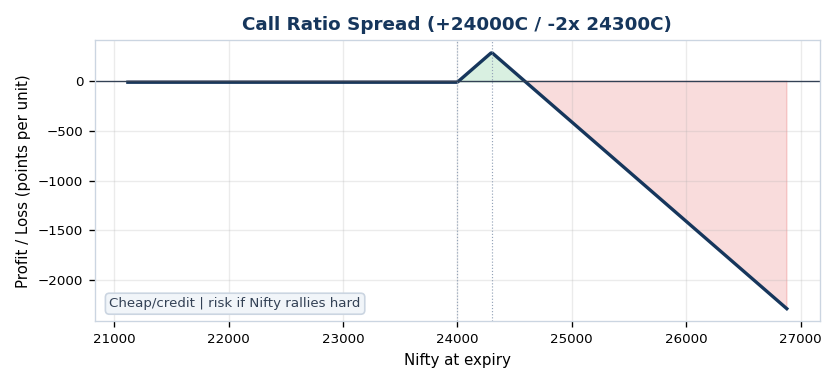

### The put ratio spread: the bearish mirror

Everything above flips for a **put ratio spread**: **buy 1** put nearer the money, **sell 2** puts further OTM (lower strikes). With Nifty at 24,000:

- **Buy 1** put at 24,000.
- **Sell 2** puts at 23,700.

This is **mildly bearish**. You profit most if Nifty drifts *down* to exactly 23,700 — your long put gains 300 points of intrinsic while both short puts expire worthless. The danger zone is now to the **downside**: if Nifty *crashes* well below 23,700, your second, uncovered short put creates a large (though technically capped, since price can't fall below zero) loss. Concretely, a market crash hurts a put ratio spread the way a melt-up hurts a call ratio spread.

The mental model: **a call ratio spread fears a rally; a put ratio spread fears a crash.** And since Indian index markets tend to *gap down* harder and faster than they gap up (fear moves quicker than greed — recall the volatility skew of Chapter 33), the put ratio spread's tail is the one to respect most. A surprise overnight gap-down on global cues can blow straight through the short strikes before you can react, and index options are European and cash-settled — you cannot escape the adverse expiry.

### The backspread: buy 2, sell 1 — betting on the breakout

Now reverse the quantities entirely. A **call backspread** (also "call ratio backspread") is:

- **Sell 1** call nearer the money (say 24,000).
- **Buy 2** calls further OTM (say 24,300).

You are now *net long* one extra call. Read the expiry outcomes:

1. **Nifty stays at or below 24,000.** All calls expire worthless; you keep your opening credit (this structure usually opens for a small net credit, because the one near call you sold is pricier than the two cheap far calls you bought). A flat or falling market leaves you with that credit — a small win.
2. **Nifty rises to 24,300 — the worst spot.** Your short 24,000 call is 300 points in the money (a 300-point loss), while your two long 24,300 calls are just at the money and worthless. **This is your maximum loss.** The pain is concentrated in the middle, right at the long strike — exactly the zone where a ratio spread makes its maximum *profit*. They are photographic negatives of each other.
3. **Nifty rockets far above 24,300 — the payday.** Now you own *two* calls gaining value against only *one* short call. The extra long call means your profit grows 1-for-1 (and accelerating past breakeven) as Nifty climbs, **unlimited to the upside.** The backspread is built to catch the violent breakout.

So a call backspread says: **"I expect a big, fast move UP — and if I'm wrong and nothing happens, I lose only a little (or keep my credit). I just must not get stranded in the middle."** Its risk is **defined and limited** (the most you can lose is that middle valley), unlike the ratio spread's open-ended tail. The figure shows the mirror shape: a small credit on the left, a defined-loss valley at the long strike, then an unbounded climb to the upper right.

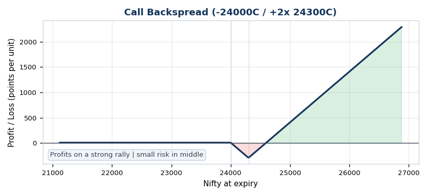

There is a **put backspread** too — sell 1 put nearer the money, buy 2 puts further OTM — which profits from a large *downward* breakout (a crash). Because of the skew, far OTM puts are relatively expensive, so put backspreads are a clean, defined-risk way to own crash protection that can even pay you a small credit if the market stays calm. Many professionals run put backspreads as cheap tail-risk hedges on a long portfolio.

### Net Greeks: the signature of each trade

Every position has a Greek fingerprint — its sensitivity to price (delta), to the *rate of change* of delta (gamma), to volatility (vega), and to time (theta). The imbalance in these trades gives them distinctive signatures.

**Call ratio spread (buy 1, sell 2), near the centre:**

- **Delta:** mildly positive at first (you want a small rise), but it *flips negative* past the short strike as the two shorts dominate — the position turns against you on a strong rally.
- **Gamma: net short.** You are short more options than you are long, so large moves hurt you. Short gamma is why the upper tail is dangerous.
- **Vega: net short.** A spike in implied volatility (India VIX jumping) inflates the two short options more than the single long — you lose on a vol spike even before price moves. You prefer to enter a ratio spread when **IV is high** (you're a net seller of expensive options).
- **Theta: net positive.** Time decay works *for* you — you're short more premium than you're long, so quiet days pay you. The ratio spread is, at heart, a premium-selling trade with a directional tilt.

**Call backspread (sell 1, buy 2):** every sign flips.

- **Delta:** can be slightly negative or flat near the centre, turning strongly positive on a big up-move (you're net long calls).
- **Gamma: net long.** Big moves *help* you — this is the engine of the explosive payoff.
- **Vega: net long.** A jump in IV *helps* you; you want to enter a backspread when **IV is low** (you're a net buyer of cheap options) and hope it expands.
- **Theta: net negative.** Time decay works *against* you. Sitting in the dead middle, you bleed a little every day. The backspread is a long-premium trade — it must be *paid for* with movement.

The one-line contrast to remember: **the ratio spread is paid theta to be short gamma and short vega (it earns while calm, fears the big move); the backspread pays theta to be long gamma and long vega (it bleeds while calm, loves the big move).** They are opposite bets on whether the market will *explode or stay put*.

### Exactly when to use each

The structures answer two different questions about the *magnitude* of the move:

**Use a ratio spread when** you have a **mild directional view plus a range/ceiling view**:

- You think Nifty drifts gently up (call ratio) or gently down (put ratio) toward a specific target, and you *don't* expect it to blow past that target.
- **IV is high** (IV rank elevated) so the two options you sell are richly priced — this is what lets you open for a credit or free, and gives you breathing room.
- You want a position that profits in a moderate move *or* even if nothing happens (kept credit), and you can tolerate — and have a plan for — the tail risk.
- You explicitly accept the uncovered-leg danger and will size and stop accordingly.

**Use a backspread when** you expect a **big, fast breakout**:

- You think Nifty is about to make a violent directional move (a breakout from a tight range, an event you expect to surprise, a momentum thrust) but you're not certain it'll happen — and you want **limited risk** if it doesn't.
- **IV is low**, so the two far options you buy are cheap, and you may even structure it for a credit.
- You want defined, limited downside (the middle valley) with open-ended upside on the move — an attractive asymmetry when you're early to a theme.
- Put backspreads specifically: as a cheap, defined-risk hedge against a market crash on an otherwise long book.

### The honest risk of the uncovered leg (ratio spreads)

This deserves its own blunt section, because it is where ratio spreads quietly hurt people. In a 1-by-2 ratio spread, **one of your two short options is naked.** The first short is hedged by your long; the second is not. That means:

- A **call ratio spread** has, in its upper tail, the **unlimited loss profile of a naked short call.** There is no upper bound on how far Nifty can climb, and your loss climbs with it, point for point, ×75 per lot. A trade that looked like "free money — I got paid a credit and Nifty only has to stay below 24,300" becomes a margin-call disaster if a global rally or a budget surprise sends the index up 3% overnight.
- A **put ratio spread** has, in its lower tail, the loss profile of a **naked short put.** The loss is technically capped (price stops at zero) but in practice enormous — and Indian markets gap *down* viciously, so this tail gets tested in exactly the panic conditions where liquidity dries up.
- Because there's a naked short, your broker charges **full SPAN + exposure margin** as if you held that naked option, and that margin *expands* as the position moves against you — you can be forced to add cash or close at the worst moment.

The defences are non-negotiable: **(1)** prefer to open ratio spreads for a *credit* or free, so the near-side and the no-move case can never lose; **(2)** size the position off the *naked* leg's risk, not off the comfortable credit — pretend you're short one naked option, because in the tail you are; **(3)** set a hard stop or a defensive level beyond the short strike and *act* on it; **(4)** consider converting it to a fully defined-risk trade by buying a cheap further-OTM option against the naked leg (turning the 1-by-2 into a "ratio with a wing," sometimes called a broken-wing butterfly). The backspread, by contrast, has *no* uncovered short — its risk is the bounded middle valley — which is precisely why it's the more beginner-safe of the pair.

## Worked example (₹, Nifty)

Let's price a concrete **call ratio spread** and then its **backspread** mirror so the numbers sit side by side. Assume:

- **Nifty spot** = 24,000, weekly expiry. **Lot size** = 75 (current Nifty lot; verify, as SEBI/NSE revise it over time).
- Premiums (points): 24,000 call = 150; 24,300 call = 70.

### A. The call ratio spread (buy 1 × 24,000, sell 2 × 24,300)

**Step 1 — Net premium.**

```
Pay for long:   1 * 150  = 150 points
Collect on shorts: 2 * 70 = 140 points
Net = 140 - 150 = -10 points  →  a 10-point DEBIT
```

You pay 10 points = `10 * 75 = ₹750` to open. (Often in higher IV the two shorts would total more than 150 and you'd open for a credit — here it's a tiny debit.)

**Step 2 — Maximum profit (at the short strike, 24,300).**

```
Long 24,000 call intrinsic = 24,300 - 24,000 = 300 points
Short 24,300 calls = at the money, worthless
Max profit = 300 - 10 (debit) = 290 points = 290 * 75 = ₹21,750 per lot
```

**Step 3 — Downside outcome.** If Nifty closes at or below 24,000, all calls expire worthless and you lose only the **10-point debit = ₹750.** (Had you opened for a credit, a fall would be a small *profit*.)

**Step 4 — Upper breakeven and the danger zone.**

```
Upper breakeven = short strike + max-profit points = 24,300 + 290 = 24,590
```

Below 24,590 you're in profit; **above 24,590 the uncovered short call drives a loss that grows 1-for-1.** If Nifty closes at, say, 24,900:

```
Long 24,000 call:        +900 points
Two short 24,300 calls:  -2 * 600 = -1,200 points
Net intrinsic = 900 - 1,200 = -300 points
Less the 10-pt debit = -310 points = -310 * 75 = -₹23,250 loss per lot
```

And it keeps getting worse the higher Nifty goes — **unbounded.** This is the honest danger: a comfortable-looking trade with a ₹21,750 best case has *no ceiling on its loss* if Nifty melts up. Beyond 24,590 you are effectively short one naked call.

**Outcome map at expiry (cash-settled at Nifty close):**

| Nifty close | Result |
|-------------|--------|
| ≤ 24,000 | Lose the 10-pt debit: -₹750 |
| 24,300 (short strike) | Maximum profit: +₹21,750 |
| 24,590 (upper breakeven) | Break even (₹0) |
| 24,900 | -₹23,250 and worsening |
| Higher | Unlimited loss |

### B. The call backspread (sell 1 × 24,000, buy 2 × 24,300) — the mirror

Same strikes and premiums, quantities reversed:

**Step 1 — Net premium.**

```
Collect on short: 1 * 150 = 150 points
Pay for longs:    2 * 70  = 140 points
Net = 150 - 140 = +10 points  →  a 10-point CREDIT = ₹750 received
```

**Step 2 — Outcomes.**

- **Nifty ≤ 24,000:** all calls worthless, keep the **+10-pt credit = +₹750.**
- **Nifty = 24,300 (worst spot):** short 24,000 call is 300 points ITM (-300), the two long 24,300 calls are worthless. `Max loss = 300 - 10 credit = 290 points = ₹21,750 per lot.` Note this is exactly the ratio spread's *max profit* — they're mirror images.
- **Lower breakeven** (where the descending line crosses zero) = `24,000 + 10 = 24,010`; **upper breakeven** = `24,300 + 290 = 24,590`. Between these you're in the loss valley.
- **Nifty = 24,900 (big breakout up):** short 24,000 call -900; two long 24,300 calls +2×600 = +1,200; net +300 + 10 credit = +310 points = **+₹23,250, and climbing without limit.** The backspread turns the ratio spread's disaster into its triumph.

**The clean contrast:** the ratio spread *makes* ₹21,750 if Nifty lands at 24,300 and *loses* without limit above 24,590; the backspread *loses* ₹21,750 at 24,300 (its capped, defined max loss) and *profits* without limit above 24,590. Pick the structure that matches your view on whether Nifty will *stall near the short strike* (ratio) or *blow through it* (backspread).

**Costs to remember (India-specific).** These are 2–3-leg trades, so brokerage and exchange fees apply per leg. **STT** (Securities Transaction Tax) hits the sell side of options on premium, and — critically — **in-the-money options left to settle at expiry are charged STT on the full settlement (intrinsic) value**, which can be a nasty surprise on a deep ITM short leg. Close ITM legs *before* expiry where possible. And remember the ratio spread's naked leg means **margin** is charged as for a naked short and *expands* against you — never size as if the credit were the only risk.

## Common mistakes / risk note

- **Treating a credit ratio spread as "free money."** Getting paid to open it does *not* mean it's safe. The uncovered short leg has open-ended (call) or very large (put) tail risk. The credit only protects the *no-move* and *near-side* cases.
- **Sizing off the credit, not the naked leg.** Beginners see a ₹750 credit and sell ten lots. Size as if you are short one naked option per ratio, because in the tail you are. Cap the tail loss at 1–2% of capital.
- **Putting on a backspread and getting bled by theta.** The backspread loses a little every quiet day and is worst exactly in the middle. If your big move doesn't come *soon*, the long premium decays. Backspreads need a catalyst and a time horizon — they're not "set and forget."
- **Wrong IV regime.** Sell ratio spreads in *high* IV (you're net short premium); buy backspreads in *low* IV (you're net long premium and want expansion). Doing the reverse fights the vega.
- **Ignoring the skew on put ratio spreads.** Indian indices gap *down* hard and fast. A put ratio spread's naked short put gets tested in panics, when liquidity vanishes and margins balloon. Respect that tail more than the call side's.
- **Leaving ITM legs to settle.** STT on settled in-the-money options is charged on intrinsic value — close them before expiry to avoid an outsized tax bill, and remember index options are European, so you can't exit early via exercise.
- **No defensive plan for the tail.** Decide *before* entering where you'll cap the naked leg — a hard stop level, or a pre-bought far wing converting it to defined risk. The single naked option is what turns a small loss into an account-ending one.

## Key takeaways

- A **ratio spread** is unequal-quantity: **buy 1, sell 2** (more short than long). It opens for a small debit, free, or a **credit**, profits in a **moderate move toward the short strike**, and is **mildly directional** — but the extra short leg is **uncovered**, so a too-far move brings open-ended (call) or very large (put) loss.
- **Max profit on a call ratio spread = (short strike − long strike) + net credit**, banked at the short strike; the **upper breakeven = short strike + max-profit points**, beyond which loss grows 1-for-1, unbounded.
- The **put ratio spread** is the bearish mirror: profits on a mild drop to the short strike, dangerous on a crash. The skew makes its downside tail especially worth respecting in India.
- A **backspread** reverses the ratio: **sell 1, buy 2** (more long than short). Often a net **credit**, with **defined/limited risk in the middle valley** and **open-ended profit on a strong breakout** in its direction. Its risk is the bounded middle, with no uncovered leg.
- **Net Greeks:** ratio spread = short gamma, short vega, **positive theta** (earns while calm, fears the move); backspread = long gamma, long vega, **negative theta** (bleeds while calm, loves the move). They are opposite bets on explosion-vs-stillness.
- **When to use:** ratio spread for a **mild directional + range/ceiling view in high IV**; backspread for an **expected big breakout in low IV** (and put backspreads as cheap, defined-risk crash hedges).
- **The honest risk:** the ratio spread's naked leg carries naked-option tail risk and **expanding margin**. Open for credit, size off the naked leg, set a hard stop, or buy a far wing to make it defined-risk. Backspreads are the more beginner-safe of the two because their risk is capped.

## Practice problems

1. **Count the legs.** A trader on Bank Nifty buys 1 put at 52,000 and sells 2 puts at 51,500. Is this a ratio spread or a backspread? Is it mildly bullish or mildly bearish, and on which side does the danger zone lie?

2. **Max profit and breakeven.** A Nifty call ratio spread: buy 1 × 24,000 call for 160 points, sell 2 × 24,400 calls for 80 points each. Lot size 75. Find (a) the net premium (debit or credit), (b) the maximum profit in rupees and the Nifty level where it occurs, and (c) the upper breakeven.

3. **The danger zone.** Using the spread from problem 2, compute the profit or loss per lot if Nifty closes at expiry at 25,000. Is the loss bounded?

4. **Greeks intuition.** You hold a Nifty call backspread (sell 1 near, buy 2 far). Overnight India VIX jumps from 11 to 17 while Nifty opens flat. Did your position most likely gain or lose on a mark-to-market basis, and which Greek explains it?

5. **Choose the structure.** Nifty has been pinned in a tight 23,900–24,100 range for two weeks, IV rank is low, and a national election result is due tomorrow which you expect to move the market sharply but you're unsure which way. Which of the four structures in this chapter best fits a one-directional big-move bet, and why might a *backspread* be safer here than a ratio spread?

6. **The honest risk.** A trader opens a Nifty call ratio spread (buy 1 × 24,000, sell 2 × 24,300) for a 20-point *credit*, lot size 75, and runs **5 lots**, telling himself "I get paid, and Nifty only has to stay below 24,300." Nifty gaps up overnight on a global rally and closes expiry at 25,100. Compute the per-lot and total result, and state the lesson.

## Solutions

**1.** Count the legs: **buy 1, sell 2** → more short than long → a **ratio spread** (specifically a *put* ratio spread). Buying a higher-strike put and selling two lower-strike puts is **mildly bearish** — it profits most if Bank Nifty drifts down to the short strike of 51,500. The **danger zone is to the downside**: if Bank Nifty *crashes* well below 51,500, the second, uncovered short put creates a large loss (capped only at price zero, but enormous in practice). Given that indices gap down hard, this tail deserves real respect.

**2.** Net premium: collect `2 * 80 = 160`, pay `1 * 160 = 160`. (a) Net = `160 - 160 = 0` → **opened for free (zero cost).** (b) Maximum profit occurs at the **short strike, 24,400**: long call intrinsic = `24,400 - 24,000 = 400` points, both shorts worthless, plus 0 net = **400 points = `400 * 75 = ₹30,000` per lot**, at Nifty = 24,400. (c) Upper breakeven = `short strike + max-profit points = 24,400 + 400 = 24,800`.

**3.** At Nifty 25,000: long 24,000 call = `+1,000`; two short 24,400 calls = `-2 * 600 = -1,200`; net intrinsic = `1,000 - 1,200 = -200` points; plus 0 net premium = `-200 points = -200 * 75 = -₹15,000` per lot. **No, the loss is not bounded** — above the 24,800 breakeven the single uncovered short call drives the loss down 1-for-1 with Nifty forever. At 25,100 it would be -300 points (-₹22,500), at 25,300 it would be -500 points (-₹37,500), and so on without limit.

**4.** You most likely **gained**. A call backspread is **net long vega** (you bought two options and sold only one, so you're long more premium and more sensitive to volatility). When implied volatility — proxied by India VIX — jumps, your two long options inflate more than your single short, lifting the mark-to-market value even though price didn't move. The Greek is **vega**. (This is also why you prefer to *enter* backspreads when IV is low and hope it expands.)

**5.** The best fit for a **one-directional big-move bet with limited risk** is a **backspread** (a call backspread if you lean up, a put backspread if you lean down). It profits open-endedly on a strong move in its direction, only loses a small, *defined* amount if the market sits still, and benefits from being **long vega in a low-IV environment** that an election result is likely to expand. A *ratio spread* would be dangerous here precisely because the scenario is a big, uncertain move: the ratio spread's uncovered leg has open-ended loss if the market blasts past the short strike — exactly what an election surprise can do. The backspread caps the downside in the middle valley and has **no naked leg**, making it the safer way to bet on a breakout. (If you truly had no directional lean at all, a long straddle/strangle from Chapters 40–41 would be the pure play; the backspread adds a directional tilt with a smaller cost.)

**6.** Per lot at Nifty 25,100: long 24,000 call = `+1,100`; two short 24,300 calls = `-2 * 800 = -1,600`; net intrinsic = `1,100 - 1,600 = -500` points; plus the `+20` credit = `-480 points = -480 * 75 = -₹36,000` per lot. With **5 lots**: `-36,000 * 5 = -₹1,80,000`. The trader collected only `20 * 75 * 5 = ₹7,500` in credit up front and faced a **₹1.8 lakh loss** — twenty-four times the credit — from a single overnight gap, and it would have been *worse* had Nifty closed higher, since the loss is unbounded. **The lesson:** a credit on a ratio spread is not free money; the uncovered short leg carries naked-call tail risk, and a global gap-up can blow straight through the short strike. Size off the *naked leg's* risk (not the credit), cap the tail at 1–2% of capital, set a hard stop above the short strike, or buy a cheap far-OTM call to convert it to defined risk. Running 5 unhedged lots "because I got paid" is precisely the behaviour behind SEBI's finding that roughly 9 in 10 retail F&O traders lose money.

# Chapter 46: Income & Hedging — Covered Call, Cash-Secured Put, Protective Put & Collar

Most of this book has treated options as standalone bets — buy a call, sell a strangle, build a condor. But the original, oldest use of options is humbler and arguably more important: bolting an option onto something you *already own* (or already want to own). A farmer who has a field of wheat doesn't want to gamble on the wheat price; he wants to lock in a floor so a bad harvest year doesn't ruin him. An insurance company doesn't want to gamble on your house; it sells you a contract that pays out if it burns. Options started life as exactly these tools — for hedging real holdings and for earning rent on assets you're sitting on.

This chapter covers the four workhorse strategies that combine an option with an underlying position. Two of them *generate income* by selling an option against an asset (the **covered call** and the **cash-secured put**). Two of them *buy insurance* on a portfolio (the **protective put** and the **collar**). For an Indian investor holding a Nifty portfolio or a basket of stocks, these are the practical, sane, survivable uses of the F&O market — the opposite of the lottery-ticket buying and naked-strangle selling that wipes out most retail accounts. They are how you actually use options to manage money you can't afford to lose.

## Core concepts

A quick vocabulary check before we start, since every term must earn its place:

- **Underlying** — the asset the option is written on. Here it's something you hold: a stock, an ETF, or a Nifty/Bank Nifty futures position standing in for "the index".
- **OTM (out of the money)** — a call whose strike is *above* spot, or a put whose strike is *below* spot; it has no intrinsic value yet.
- **Premium** — the price of the option, in points; multiply by the **lot size** to get rupees.
- **Covered** vs **naked** — a short option is "covered" when you hold the asset (or cash) to honour it, and "naked" when you don't. Covered is survivable; naked is where accounts die.

### Strategy 1: The covered call — renting out your shares

Imagine you own a flat that you're holding for the long term but it's sitting empty. Renting it out earns you monthly income; the only "cost" is that for the duration of the lease you can't sell the flat to a buyer who shows up offering a great price. The **covered call** is exactly this. You own the underlying (shares, an ETF, or a long Nifty future), and you **sell an out-of-the-money call** against it. The buyer pays you a premium today. In exchange, you've promised to hand over the upside above the strike if the market rallies past it.

The construction:

```
Covered call = long underlying + short 1 OTM call (same quantity)
Payoff at expiry = (S - S0) + premium     if S <= K   (you keep the shares + rent)
                 = (K - S0) + premium     if S >  K   (called away; upside capped at K)
```

where `S0` is your purchase price, `S` is the price at expiry, and `K` is the call strike.

What you've done is **trade away your unlimited upside above K in return for guaranteed cash today**. The premium does three things: it's income in a flat market, it cushions a small fall (your breakeven drops by the premium received), and it caps your gains. The payoff diagram is the giveaway — it looks like a long position whose top has been sawn off into a flat plateau above the strike.

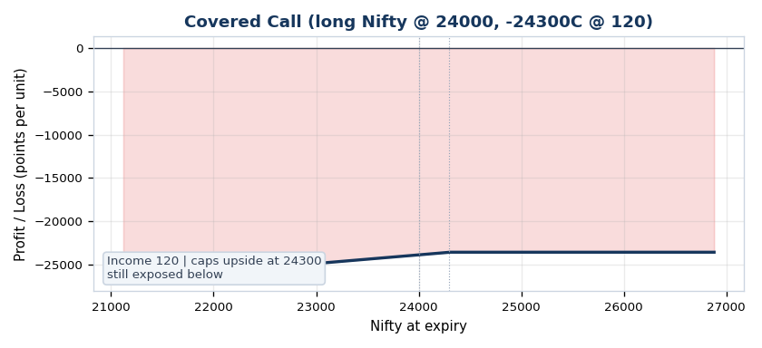

**When to use it.** You're mildly bullish to neutral on something you own and happy to sell it at the strike if it gets there. You think the next month is likely to be flat or slowly rising, not explosive. It's an income strategy for a sideways market — you collect rent month after month while the stock goes nowhere.

**The cost/benefit.** The benefit is real, regular income and a small downside cushion. The cost is opportunity: if the stock rockets, you're "called away" at the strike and watch the rest of the rally from the sidelines, having capped your own gain. And note the asymmetry the diagram makes brutally clear — your downside is *still nearly the full downside of owning the stock* (cushioned only by the small premium), while your upside is capped. A covered call does **not** protect you from a crash; it just pays you a little rent on the way down. People who forget this get badly hurt in a falling market.

### Strategy 2: The cash-secured put — getting paid to bid

Suppose you'd love to buy Reliance, but only at a price 5% below where it trades today. You could leave a limit order and wait. Or — you could **sell a put** at that lower strike and get *paid* to wait. If the stock falls to your level, you're assigned and buy it exactly where you wanted, with the premium making your effective purchase even cheaper. If it doesn't fall, you simply keep the premium as consolation. This is the **cash-secured put**: you sell an OTM put and set aside the full cash needed to buy the stock if assigned.

```
Cash-secured put = short 1 OTM put + cash held to buy the stock at K
Payoff at expiry = premium                        if S >= K   (put expires worthless)
                 = (S - K) + premium              if S <  K   (assigned; you buy at K)
Effective purchase price if assigned = K - premium
```

The word **cash-secured** is the whole point. A naked short put has large downside and the broker demands SPAN margin; a *cash-secured* put means you've earmarked the money to honour the purchase, so it's a deliberate "I want to own this lower" position, not a leveraged gamble. The payoff is the mirror image of the covered call — in fact it's a **short put**, and by put-call parity a cash-secured put has the *same payoff shape* as a covered call. Both are "sell upside / insurance, keep premium, accept the downside" trades.

**When to use it.** You're neutral-to-bullish on a stock or index you genuinely want to own, and you'd be happy to buy it at the strike. It's the entry strategy that pairs naturally with the covered call: sell a put to get into a position cheaply, then once assigned, sell calls against it. (This two-step cycle is popularly called "the wheel".)

**The cost/benefit.** Benefit: income while you wait, and a lower effective entry price if assigned. Cost: if the stock collapses far below the strike, you're obligated to buy at K while it's worth much less — your loss below the strike is the same as if you'd simply bought the stock there. You give up the chance of buying it at the *new, even lower* price. And in India, remember **stock options are physically settled** — if assigned on a stock put, you must actually take (and pay for) delivery of the shares, so the cash must really be there.

### Strategy 3: The protective put — insurance for your portfolio

Now we flip from selling options to buying them. You own a portfolio and you're worried about a crash — maybe a Budget, an election result, or a global wobble is coming. You don't want to sell your holdings (taxes, conviction, you'd have to buy back). Instead you **buy a put** below the current level. That put is an insurance policy: if the market falls below the strike, the put gains rupee-for-rupee and offsets your portfolio's losses. If the market rises, the put expires worthless and all you've lost is the premium — exactly like paying for fire insurance and the house not burning down.

```
Protective put = long underlying + long 1 put
Payoff at expiry = (S - S0) - premium     if S >= K   (full upside, minus insurance cost)
                 = (K - S0) - premium     if S <  K   (losses floored below K)
Maximum loss = (S0 - K) + premium         (fixed, known floor)
```

The protective put gives your holding a **hard floor** while keeping the **full upside** (minus the premium you paid). The payoff diagram looks like a long stock position with the bottom-left losing tail bent flat — losses can't run past the floor.

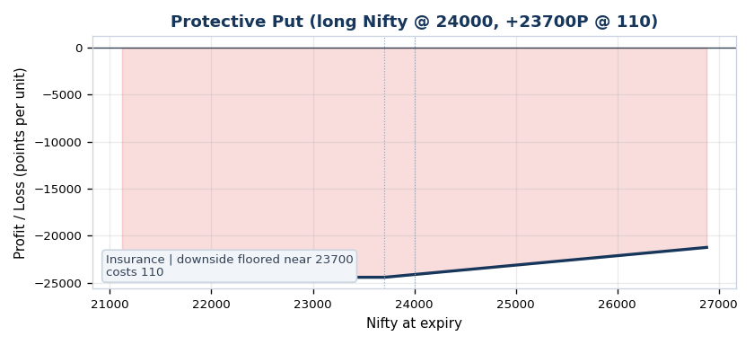

**When to use it.** You're bullish or committed long-term but scared of a specific near-term downside — a known event, a stretched market, a position too large to stomach a 20% drawdown. It's pure insurance: you keep all the upside and cap the downside, and you pay a premium for the privilege.

**The cost/benefit.** Benefit: a precise, known worst case and complete peace of mind through an event, with upside intact. Cost: the premium is a real, recurring drag. Insurance isn't free — buy puts every month and the cumulative premium can quietly eat much of your return, especially when India VIX is high and puts are expensive (which, frustratingly, is exactly when you most want them). Protective puts are best used **selectively around identifiable risks**, not as a permanent always-on hedge that bleeds you dry.

### Strategy 4: The collar — insurance you pay for by renting out the upside

The protective put's one flaw is its cost. The **collar** solves that elegantly: you buy the protective put *and* sell a covered call to fund it. The call premium pays for (most or all of) the put premium. You've combined Strategy 1 and Strategy 3 on the same holding.

```
Collar = long underlying + long 1 OTM put + short 1 OTM call
Net cost = put premium - call premium     (often near zero — a "zero-cost collar")
Payoff at expiry:
  S <  Kput   : floored at (Kput - S0) - net cost      (put protects)
  Kput<=S<=Kcall : (S - S0) - net cost                 (you ride the stock)
  S >  Kcall  : capped at (Kcall - S0) - net cost       (called away)
```

The result **brackets your outcome inside a range**: you can't lose more than the floor set by the put, and you can't gain more than the cap set by the call. You've traded away the fat tails on both ends — no disaster, but also no jackpot — and paid little or nothing for the protection. When the call premium exactly equals the put premium, it's a celebrated **zero-cost collar**: downside insurance for free, funded entirely by giving up your upside above the call strike.

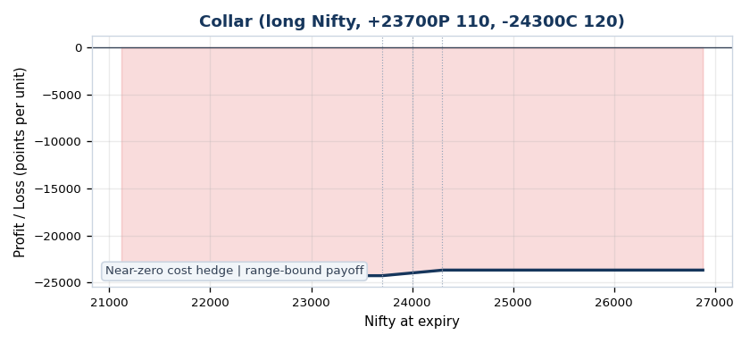

**When to use it.** You hold a large, appreciated position you want to protect cheaply through a risky patch, and you're willing to cap upside to avoid paying for the put. It's the institutional hedge of choice — promoters, funds, and serious portfolio holders use collars to ride out events without selling and without bleeding premium.

**The cost/benefit.** Benefit: protection at little or no cash cost, with a defined, comfortable range of outcomes. Cost: you surrender the upside above the call strike — if the market rips higher, you're capped and called away, just like a covered call. The collar is the honest middle path: you give up the dream to be rid of the nightmare.

### The India angle: hedging a portfolio around events

Indian markets are *event-driven* in a way that makes these hedges especially valuable. The **Union Budget** (February), **RBI policy** meetings, **general election** results, quarterly **corporate results** season, and overnight **global cues** all produce sharp, scheduled-or-semi-scheduled gaps. India VIX — the market's fear gauge — visibly climbs into these events and collapses afterward. An investor sitting on a Nifty portfolio has clean, liquid tools to manage this:

- **To hedge an index portfolio:** buy Nifty (or Bank Nifty) puts as a protective put on the whole book. Because index options are **European and cash-settled**, the hedge settles cleanly in cash at the closing level — no delivery hassle. One Nifty put can insure a diversified large-cap portfolio that broadly tracks the index.
- **To hedge cheaply through a Budget or election:** put on a **collar** — buy a protective put a few percent below spot and sell a call a few percent above to fund it. You sleep through the result knowing your worst case is fixed, and it cost you almost nothing because event-inflated call premiums richly fund the put.
- **The hedge ratio matters:** to fully hedge a ₹15 lakh portfolio with Nifty at 24,000 and a lot size of ~75, one lot covers about `24,000 * 75 = ₹18 lakh` of notional — roughly the whole portfolio. Match the notional, not the lot count by gut.

A subtle point: a put on the index only hedges *market* (systematic) risk. If your portfolio is concentrated in a few stocks, an index put won't protect you from a company-specific disaster — for that you'd need stock options (physically settled) on those names. Hedge the risk you actually carry.

## Worked example (₹, Nifty)

Let's price a **zero-cost collar** on a Nifty portfolio ahead of the Union Budget. Assume:

- You hold a portfolio worth about **₹18,00,000** that closely tracks Nifty.
- **Nifty spot = 24,000**, monthly expiry spanning the Budget, **lot size = 75** (current Nifty lot; verify, as it changes).
- One lot of notional = `24,000 * 75 = ₹18,00,000` — matches your portfolio, so **one lot fully hedges it.**

You build the collar by buying a downside put and selling an upside call:

| Leg | Strike | Type | Action | Premium (points) |
|-----|--------|------|--------|------------------|
| Protective put | 23,400 | Put | Buy | 180 |
| Covered call | 24,700 | Call | Sell | 175 |

**Step 1 — Net cost of the hedge.**

```
Net cost = put premium - call premium = 180 - 175 = 5 points
        = 5 * 75 = ₹375 for the whole month
```

For ₹375 — essentially free — you've insured an ₹18 lakh portfolio through the Budget. That's the magic of the collar: the call you sold paid for almost all of the put you bought.

**Step 2 — The downside floor.** If Nifty crashes below 23,400, your portfolio falls with it but the put gains rupee-for-rupee below 23,400. Your floor:

```
Worst case Nifty level protected = 23,400
Portfolio drop to floor = (24,000 - 23,400) / 24,000 = 2.5%
Maximum portfolio loss ≈ 2.5% + ₹375 ≈ ₹45,000 + ₹375 ≈ ₹45,375
```

No matter how badly the Budget is received — even a 10% gap-down — your loss is capped near ₹45,000. Without the hedge, a 10% fall would cost ₹1,80,000.

**Step 3 — The upside cap.** If Nifty rallies above 24,700, you're called away at 24,700 — your gains stop there.

```
Maximum portfolio gain = (24,700 - 24,000) / 24,000 ≈ 2.9% ≈ ₹52,500, minus ₹375
```

**Step 4 — The comfortable middle.** If Nifty closes anywhere between 23,400 and 24,700 (a +2.9% / -2.5% band), both options expire worthless and your portfolio simply gains or loses with the market, having paid ₹375 for the insurance you didn't need to use.

**Step 5 — Read the outcome map.** At expiry (index options cash-settled at the Nifty closing level):

- **Nifty closes at 22,000** (Budget disappoints, -8.3%): portfolio loses ~₹1,50,000, but the 23,400 put gains `(23,400 - 22,000) * 75 = ₹1,05,000`, netting a loss of only ~₹45,000. *Floor held.*
- **Nifty closes at 24,000** (flat): portfolio flat, both options expire worthless, you're out the ₹375. *Insurance not needed.*
- **Nifty closes at 26,000** (Budget euphoria, +8.3%): portfolio gains ~₹1,50,000 on paper, but the 24,700 call you sold loses `(26,000 - 24,700) * 75 = ₹97,500`, so your net gain is capped at ~₹52,500. *You gave up the top of the rally.*

The collar did its job: a violent, scary event became a bounded, sleep-at-night range for the price of a cup-of-coffee premium.

**Costs to remember (India-specific).** You pay brokerage and exchange fees on both legs, plus **STT** (Securities Transaction Tax — charged on the sell side of the call premium, and on settlement of in-the-money options at expiry on the settlement value). If your sold call or bought put finishes deep in the money on a Nifty event, settlement STT can surprise you — close ITM legs before expiry where possible. Net these out of the ₹375; on a one-lot collar they're modest but real.

## Common mistakes / risk note

- **Treating a covered call as downside protection.** It isn't. The premium cushions only a tiny fall; below that, you eat almost the full loss of the stock while your upside stays capped. In a crash, a covered call is barely better than just holding the stock.
- **Capping upside on your best holdings.** Selling calls on a stock you'd hate to lose to a takeover or breakout means you'll get called away exactly when it matters most. Sell calls on holdings you're genuinely happy to part with at the strike.
- **Forgetting physical settlement on stock options.** A cash-secured put on a stock that finishes ITM means you must take *delivery* and pay the full purchase amount. Make sure the cash is actually there, and know your broker's expiry-day delivery rules.
- **Buying protective puts permanently.** Insurance bought every single month bleeds your returns dry, especially when VIX is high. Use protective puts *selectively* around identifiable risks, not as an always-on tax.
- **Mismatching the hedge.** Hedging a concentrated single-stock portfolio with a Nifty put leaves your real (company-specific) risk uncovered. And under-/over-sizing the notional means you're either half-hedged or accidentally net-short. Match notional to portfolio.
- **Chasing zero-cost too aggressively.** To make a collar truly free in low-volatility conditions you may have to sell a call so close to spot that you cap nearly all your upside. "Zero cost" is never zero — you always pay in surrendered upside.

## Key takeaways

- These four strategies bolt an option onto a holding: two earn **income** (covered call, cash-secured put), two buy **insurance** (protective put, collar).
- **Covered call** = long underlying + short OTM call: rent for a flat market, small downside cushion, capped upside — but **not** crash protection.
- **Cash-secured put** = short OTM put + cash set aside: get paid to potentially buy lower; effective entry = strike - premium; same payoff shape as a covered call.
- **Protective put** = long underlying + long put: a hard downside floor with full upside intact, paid for with a recurring premium — best used selectively around events.
- **Collar** = long underlying + long put + short call: brackets the outcome in a range, with the call funding the put — often **near zero cost**, at the price of capped upside.
- **India angle:** use Nifty/Bank Nifty puts (European, cash-settled) for protective puts, and **collars around the Budget, RBI policy, results, and elections** to hedge cheaply through known event risk. Match notional to portfolio.
- Insurance always costs something — either premium (protective put) or surrendered upside (collar/covered call). There is no free hedge, only a choice of how you pay.

## Practice problems

1. **Construction check.** An investor owns 1 lot of a Nifty future at 24,000 and sells a 24,500 call for 90 points. Name the strategy, and state the maximum profit (in points) and what happens if Nifty closes at 25,200 at expiry.

2. **Cash-secured put entry.** You sell a 23,500 Nifty put for 120 points, holding cash to buy at the strike. Lot size 75. (a) If Nifty closes at 23,800, what's your profit? (b) If you're assigned, what's your effective purchase price per unit?

3. **Protective put floor.** You hold a portfolio tracking Nifty bought at 24,000 and buy a 23,000 put for 150 points. What is your maximum loss per unit, and at what Nifty level do you break even on the upside?

4. **Collar cost.** Holding Nifty at 24,000, you buy a 23,500 put for 160 points and sell a 24,600 call for 140 points. (a) What's the net cost of the collar in points and in rupees (lot 75)? (b) Below what level are you protected, and above what level are you capped?

5. **Event hedge sizing.** A ₹36,00,000 portfolio tracks Nifty, which is at 24,000 with a lot size of 75. How many lots of Nifty puts roughly fully hedge the portfolio's market risk, and why might an index put still leave the investor exposed?

6. **Cost/benefit judgement.** Two investors face the Budget. Investor A buys a protective put (net cost 180 points). Investor B puts on a zero-cost collar (net cost ~0). Nifty then rallies 6% on a great Budget. Who is happier at expiry, and what did each give up?

## Solutions

**1.** This is a **covered call** (long underlying + short OTM call). Maximum profit = the gain to the strike plus the premium = `(24,500 - 24,000) + 90 = 500 + 90 = 590 points` (`590 * 75 = ₹44,250` per lot). If Nifty closes at 25,200, you're capped: the future gains 1,200 points but the short 24,500 call loses `25,200 - 24,500 = 700` points, leaving `1,200 - 700 + 90 = 590` points — the same capped maximum. You gave up the 700 points of rally above 24,500.

**2.** Premium received = 120 points. (a) If Nifty closes at 23,800 (above the 23,500 strike), the put expires worthless and you keep the full `120 * 75 = ₹9,000`. (b) If assigned (Nifty below 23,500), your effective purchase price = strike - premium = `23,500 - 120 = 23,380` per unit — you bought at the level you wanted, made cheaper by the premium.

**3.** Maximum loss per unit = `(S0 - K) + premium = (24,000 - 23,000) + 150 = 1,000 + 150 = 1,150 points` (`1,150 * 75 = ₹86,250` per lot) — a fixed floor no matter how far Nifty falls. Upside breakeven = `24,000 + 150 = 24,150`: Nifty must rise past 24,150 for the portfolio to clear the cost of the insurance and turn a net profit.

**4.** (a) Net cost = put premium - call premium = `160 - 140 = 20 points` = `20 * 75 = ₹1,500` per lot — a near-costless collar. (b) You're protected below **23,500** (the put floor) and capped above **24,600** (the call ceiling). Between 23,500 and 24,600 your portfolio simply rides Nifty, having paid 20 points for the bracket.

**5.** One lot of Nifty notional = `24,000 * 75 = ₹18,00,000`. The portfolio is ₹36,00,000, so `36,00,000 / 18,00,000 = 2 lots` of puts roughly fully hedge the market (systematic) risk. It still leaves exposure because an index put only offsets *market-wide* moves — if the portfolio is concentrated and a specific holding suffers a company-specific blow (a fraud, an earnings miss) while the index is flat, the index put pays nothing. Stock-specific risk needs stock-specific hedges (physically settled stock options).

**6.** **Investor B (the collar) is happier on a flat-to-modest market but here, on a 6% rally, it's nuanced.** A rallies 6% minus 180 points of premium — a near-full gain, because the protective put leaves upside intact (it just cost something). B is **capped** at the call strike: a zero-cost collar that sold a call ~2-3% above spot stops gaining there, so B captures only the rise up to the cap and forfeits the rest of the 6% move. So on a *strong rally*, **A is happier** — A paid premium but kept the full upside, while B saved the premium but surrendered the top of the rally. The lesson: the protective put pays in *cash* (premium) to keep upside; the collar pays in *surrendered upside* to save cash. Which is "better" depends entirely on whether the market then rallies hard (favours the put) or stays bounded (favours the collar). There is no free hedge — only a choice of how you pay for it.

# Chapter 47: Synthetics — Building Any Position from Parts

Here is a liberating idea that changes how you see the entire options market: there is no such thing as a "call position" or a "put position" or a "futures position" that is fundamentally different from the others. They are all the *same set of Lego bricks*, snapped together in different orders. A long Nifty future, it turns out, is nothing more than a long call and a short put hiding under a different name. A protective put is secretly just a call. Once you see this, you stop memorising dozens of separate strategies and start seeing one underlying grammar — a small alphabet of parts that can spell any position you want.

The machine that makes this possible is **put-call parity**, the no-arbitrage rule from Chapter 17. Parity ties four instruments — a call, a put, the underlying, and cash — into one equation, and any four-term equation can be rearranged to isolate any one term using the other three. That rearrangement *is* a recipe for a synthetic. This chapter turns that algebra into a toolkit: how to manufacture a long underlying, a short underlying, a call, or a put from the others; why the futures and options markets are the same market wearing two hats; how arbitrageurs called **conversions** and **reversals** force the prices to agree; and why professionals reach for synthetics constantly. We finish with the **box spread** — a synthetic loan — and a full ₹ Nifty example proving a synthetic long *is* a futures position.

## Core concepts

### The one equation everything grows from

Recall put-call parity for European options (Chapter 17):

`C + K*e^(-r*T) = P + S`

where `C` is the call price, `P` the put price (same strike K, same expiry), `S` the spot price of the underlying, `r` the risk-free rate, and `T` the time to expiry in years. The term `K*e^(-r*T)` is just the present value of the strike — the cash you set aside today to have exactly K rupees at expiry.

Think of this equation as a balance scale with four weights on it. If you know any three, the fourth is forced. More usefully: **you can move any single weight to the other side, and whatever ends up alone is "synthesised" by the combination across from it.** That is the entire trick. Every synthetic in this chapter is one line of algebra applied to this one equation. Let us derive them.

### Synthetic long underlying = long call + short put

Start by isolating the spot `S`. Rearranging parity:

`S = C - P + K*e^(-r*T)`

Read the right side as a position: **buy a call, sell a put** (both at strike K, same expiry), and the constant `K*e^(-r*T)` is just a financing term (cash you hold). The combination `long call + short put` behaves *exactly* like owning the underlying. This is the **synthetic long underlying**, the most important synthetic of all.

The intuition is clean if you walk through expiry:

- **Above the strike**, the call you own is in-the-money and gains point-for-point with the underlying — just like a stockholder. The put you sold expires worthless.
- **Below the strike**, your call is worthless, but the put you sold is exercised against you: someone makes you *buy* at K while the market is lower, so you lose point-for-point — again exactly like a stockholder who is underwater.

In every state, your gains and losses track the underlying one-to-one. You have manufactured a long position with no shares and no future — just two options. The payoff is the familiar straight 45-degree line of a long underlying position.

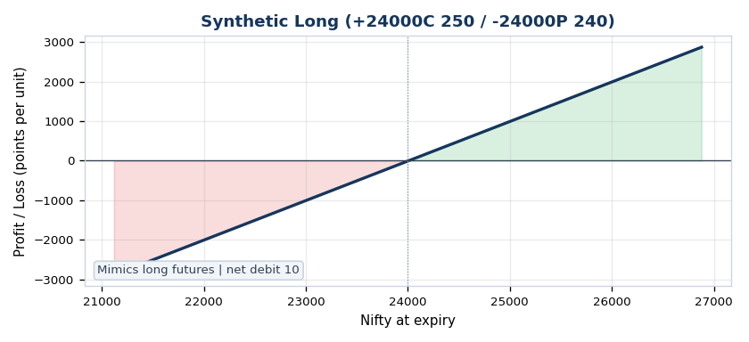

### Synthetic short underlying = short call + long put

Flip every sign. Isolating `-S`:

`-S = P - C - K*e^(-r*T)`

So **sell a call, buy a put** (same strike, same expiry) and you have a **synthetic short underlying**. Above the strike, the short call loses point-for-point (like a short-seller squeezed by a rally); below the strike, the long put gains point-for-point. You profit when the underlying falls — exactly a short position, built without ever borrowing and selling shares. This is invaluable in India, where directly short-selling cash equities intraday is restricted and carrying a short overnight in the cash market is not allowed for retail — but a synthetic short via options is perfectly ordinary.

### Synthetic long call = long underlying + long put

Now isolate the call. From parity:

`C = S + P - K*e^(-r*T)`

The right side is **own the underlying and buy a put** — which you already know as a **protective put** (Chapter 49 territory). Put-call parity reveals the punchline: a protective put *is* a synthetic long call. It makes perfect sense. Holding the stock gives you the upside; the put floors your downside at K. Capped downside plus unlimited upside is precisely a call's profile. The "insurance" framing and the "leveraged upside" framing describe the same payoff.

### Synthetic long put = short underlying + long call

Finally, isolate the put:

`P = C - S + K*e^(-r*T)`

That is **buy a call and short the underlying**. Short exposure gives you downside profit; the long call caps your loss if the underlying rallies. Capped upside-risk plus open downside profit is a put. So shorting the future and buying a call manufactures a synthetic long put.

The full family is worth memorising. Each instrument equals the *other two* (plus the cash term):

- Synthetic **long underlying** = long call + short put
- Synthetic **short underlying** = short call + long put
- Synthetic **long call** = long underlying + long put
- Synthetic **long put** = short underlying + long call

A simple way to remember it: **a synthetic long call needs you long the underlying; a synthetic long put needs you short the underlying.** The option you add is always the "insurance" that caps the open end.

### A futures position equals long call minus short put

In India, the natural "underlying" leg is not the cash index — you cannot literally buy 50 stocks in index weights — it is the **Nifty future**. The future already bakes in financing and dividends, so parity is usually written with the futures price `F` in place of the carried spot:

`C - P = (F - K)*e^(-r*T)`

Rearranged, `F = K + (C - P)*e^(r*T)`. The economic content is simple and worth stating plainly: **a long futures position is equivalent to (long call − short put) at the same strike and expiry.** The call-minus-put spread *is* the future, give or take the small financing term. At the at-the-money strike, where `C` and `P` are close, the synthetic long and the future sit right on top of each other.

This is the bridge between the two halves of the F&O market: the futures desk and the options desk trade the same exposure in two packagings, and parity is the exchange rate between them. When a market-maker is handed an unwanted options position, they hedge it in *futures* — and the synthetics arithmetic tells them exactly how many.

### Conversions and reversals: the arbitrage that enforces parity

Synthetics are not just a pricing curiosity — they are policed by real money. Because a synthetic underlying and a real underlying have identical payoffs, they must cost the same. If they ever diverge, an arbitrageur buys the cheap one and sells the dear one and pockets the gap risk-free. These two enforcing trades have names:

- A **conversion** = buy the *real* underlying (long future) + sell the *synthetic* underlying (short call, long put). You are long the cheap real thing and short the expensive synthetic. Net, you are flat — the long future and the synthetic short cancel — so you have locked a fixed payoff with no directional risk.
- A **reversal** (reverse conversion) = short the *real* underlying (short future) + buy the *synthetic* underlying (long call, short put). The mirror image, run when the synthetic is the cheap leg.

Because the two legs cancel in every state of the world, the position's profit is *fixed at the moment you put it on* — the parity gap, locked. Desks run these all day for a few points of edge, and their relentless buying of the cheap leg and selling of the dear leg keeps the Nifty call, put, and future internally consistent. You will rarely find a gap big enough to trade by hand after costs — but the *existence* of these arbitrageurs is your guarantee that the synthetic relationships hold, which is what makes them safe to rely on.

### Why synthetics matter in practice

This is not abstract elegance. Professionals use synthetics every day for four concrete reasons.

1. **Margin and capital efficiency.** A long future and a synthetic long have identical payoffs, but the SPAN+exposure margin can differ, and the synthetic's short-put leg may sit inside an existing portfolio in a way that nets down margin. Desks routinely pick the *cheapest-to-carry* packaging of a given delta.

2. **Working around liquidity.** Want to short Nifty but the future is momentarily wide while the options are tight? Build the short synthetically from the liquid call and put. Or neutralise a call you can no longer trade out of by trading the *other* legs. Synthetics give you more than one road to the same destination, so you take whichever is open.

3. **Locking arbitrage.** When a parity gap *does* open — around events, at expiry, or in less-liquid far months — conversions and reversals harvest it. This is the bread and butter of arbitrage desks.

4. **Understanding structure.** The deepest payoff is conceptual. Once you see that *every* options structure is assembled from the same bricks, complex positions stop being intimidating. An iron condor is two credit spreads; a credit spread is parity rearranged; a collar is a synthetic; a risk reversal is a synthetic underlying shifted across strikes. You are never learning a "new" instrument — only a new arrangement of call, put, underlying, and cash.

### The box spread: a synthetic loan or deposit

Stack two synthetics at *different* strikes and you build the **box spread** — a position so neutral it is essentially a bond in disguise. A box combines:

- A **synthetic long underlying at strike K1** (long K1 call, short K1 put), and
- A **synthetic short underlying at strike K2** (short K2 call, long K2 put),

with `K2 > K1`. The long synthetic locks in *buying* the index at K1; the short synthetic locks in *selling* it at K2. Whatever the index does, you have effectively agreed to buy at K1 and sell at K2, so your payoff at expiry is a fixed `K2 - K1`, completely independent of where the underlying lands. (Equivalently, a box is a bull call spread plus a bear put spread on the same two strikes.)

Because the payoff is a known constant, a fairly priced box must cost the present value of that constant:

`Box cost = (K2 - K1)*e^(-r*T)`

So a box is a **synthetic zero-coupon bond**. If you *buy* the box (pay a bit less than `K2 - K1` today, receive exactly `K2 - K1` at expiry), you have made a **synthetic deposit** earning the risk-free rate. If you *sell* the box (receive cash today, repay `K2 - K1` at expiry), you have taken a **synthetic loan** at the risk-free rate — historically a way for institutions to borrow or lend through the options market. The box exists because, deep down, parity says cash itself is one of the four Lego bricks; assemble the other three cleverly and you have rebuilt cash. (Caution, expanded below: a box is only clean on *European, cash-settled* options. On American or physically-settled options, early assignment can shatter the "guaranteed" payoff.)

## Worked example (₹, Nifty)

Let us prove, with concrete numbers, that a synthetic long *is* a futures position — and then check the margin angle.

**Setup.** It is Monday. Nifty spot is **24,000**. The near-month **Nifty future trades at F = 24,060** (the small premium over spot reflects financing minus dividends). We look at the **24,000-strike** options expiring this Friday, so `T = 4/365 = 0.01096` years, and take `r = 6.5%`. The screen shows the **24,000 call (CE) at ₹150** and the **24,000 put (PE) at ₹92**. Assume a Nifty lot of **75** units.

**Step 1 — build the synthetic long.** Buy the 24,000 call (pay ₹150), sell the 24,000 put (receive ₹92). Net debit = `150 - 92 = ₹58` per unit. This `long call + short put` is your synthetic long underlying.

**Step 2 — check it against the future using parity.** Parity (futures form) says `C - P = (F - K)*e^(-r*T)`.
The right side: `(24,060 - 24,000)*e^(-0.065*0.01096) = 60 * 0.999288 ≈ 59.96 ≈ 60` points.
The market's `C - P = 150 - 92 = 58` points. These are within ₹2 — essentially in line (the tiny gap would be eaten by the bid-ask spread). So the synthetic and the future are priced consistently. Good.

**Step 3 — prove the payoffs match, state by state.** Compare two ways of being long: (A) **buy the future at 24,060**, versus (B) **the synthetic** (long 24,000 call, short 24,000 put). Compute each at expiry for three closing levels. For the synthetic, also account that you paid ₹58 to put it on; for the future, your reference entry is 24,060.

| Nifty at expiry | Future P&L (close − 24,060) | Long 24,000 call payoff | Short 24,000 put payoff | Synthetic gross | Synthetic net (− ₹58) |
|---|---|---|---|---|---|
| 23,600 | −460 | 0 | −400 | −400 | −458 |
| 24,000 | −60 | 0 | 0 | 0 | −58 |
| 24,500 | +440 | +500 | 0 | +500 | +442 |

Look at the two outer columns: the **future P&L** and the **synthetic net** track each other almost exactly — they differ by a constant ~₹2 (the small financing/pricing gap from Step 2), not by direction. At every level, a 1-point move in Nifty changes both by 1 point. The synthetic *is* the future. The straight-line, one-to-one payoff is exactly the long underlying line in the figure above.

**Step 4 — the practical "so what" (margin).** Both packagings give you +75 deltas (one lot of long Nifty). Why choose one over the other? Margin and fit. Buying the future costs roughly ₹1.4-1.8 lakh of SPAN+exposure margin per lot. The synthetic's short-put leg also carries margin, but if you already hold offsetting positions, the exchange's portfolio margining can net it down — sometimes making the synthetic cheaper to carry. A desk computes both and takes the cheaper. The *exposure* is identical; only the capital efficiency differs. That, in one sentence, is why synthetics are a daily tool and not a textbook curiosity.

**Step 5 — read a tiny arbitrage.** Suppose instead the call printed **₹175** with the put still at ₹92, so `C - P = 83` while parity says ~60. The synthetic long is now 23 points *too expensive* relative to the future. A desk runs a **conversion**: sell the synthetic (sell the 175 call, buy the 92 put) and buy the future at 24,060. The legs cancel at expiry, leaving the locked gap of about `83 - 60 = 23` points, or `23 * 75 ≈ ₹1,725` per lot, risk-free before costs. In reality a 23-point gap at the ATM would vanish in seconds — which is *why* you almost never see it.

## Common mistakes / risk note

- **Forgetting the financing term.** A synthetic long is `long call + short put` *plus* the cash term `K*e^(-r*T)`. It does not cost zero just because the premiums partly offset; you are effectively financing a full index position. The synthetic carries the same notional risk as the future — a 5% move against you hurts exactly as much. The capped-loss comfort of a *long option* is gone the moment you sell the other leg.

- **Treating a synthetic short put as "free income."** A synthetic long underlying contains a *short put*. People who build synthetics for margin reasons sometimes forget they now carry naked-put-style downside on that leg. If Nifty gaps down, the short put bleeds exactly like the underlying falling — undefined-feeling, large losses. Respect the short leg.

- **Mixing strikes or expiries by accident.** Parity and every synthetic require the **same strike and same expiry** on both option legs. A long 24,000 call and a short 24,100 put is *not* a clean synthetic long — it is a synthetic with a directional skew (a risk reversal). Useful, but a different animal; do not confuse the two.

- **Assuming a box spread is risk-free everywhere.** On **European, cash-settled** index options (Nifty, Bank Nifty) a box is a clean synthetic bond. On **American, physically-settled single-stock** options, a short leg can be assigned early, the "guaranteed" `K2 - K1` breaks, and you can be dragged into stock delivery with margin spikes. Traders have taken large, sudden losses assuming a box was riskless when it was not. Keep boxes to index options.

- **Thinking synthetics are a retail money machine.** Real conversion/reversal gaps are tiny, fleeting, and eaten by brokerage, STT, exchange fees, and the bid-ask spread on *four* legs. They are harvested by automated desks with low costs, not by clicking legs by hand. For a retail trader the value of synthetics is *structural understanding and capital efficiency*, not free arbitrage. And the broader truth from Chapter 1 still stands: SEBI studies find roughly 9 in 10 retail F&O traders lose money. No clever construction changes the odds on a bad directional view.

## Key takeaways

- Put-call parity, `C + K*e^(-r*T) = P + S`, rearranges to build any one instrument from the other three — that is what a **synthetic** is.
- **Synthetic long underlying = long call + short put** (same strike/expiry); **synthetic short = short call + long put**. Same payoff as holding/shorting the underlying.
- **Synthetic long call = underlying + long put** (a protective put); **synthetic long put = short underlying + long call**.
- A **long futures position equals (long call − short put)** at the same strike: `F = K + (C - P)*e^(r*T)`. The options and futures markets price the same exposure.
- **Conversions** (long real + short synthetic) and **reversals** (short real + long synthetic) are the arbitrages that lock the parity gap and keep all the prices consistent.
- Professionals use synthetics for **margin/capital efficiency, liquidity workarounds, locking arbitrage, and structural clarity** — every options structure is the same few Lego bricks rearranged.
- A **box spread** (synthetic long at K1 + synthetic short at K2) pays a fixed `K2 - K1` and is a **synthetic loan/deposit** costing `(K2 - K1)*e^(-r*T)` — clean only on European, cash-settled options.

## Practice problems

1. **(Conceptual)** Your friend says, "A protective put is a defensive, low-risk strategy, but a long call is an aggressive, leveraged bet — they are totally different." Using parity, explain why their payoffs are actually the same thing, and name which synthetic this is.

2. **(Conceptual)** You want short exposure to Nifty into a feared event but cannot carry a short in the cash market. Describe two different option-only ways to get a synthetic short, and state the strike/expiry condition both legs must satisfy.

3. **(Numeric)** Nifty spot is 24,000, the near future is at 24,050, `r = 6.5%`, `T = 7/365`. The 24,000 call trades at ₹165 and the 24,000 put at ₹120. Does the synthetic long (long call + short put) line up with the future? Compute `C - P`, compare with `(F - K)*e^(-r*T)`, and say whether there is an arbitrage worth noting.

4. **(Numeric)** Using the data in Problem 3's *quoted* prices (call ₹165, put ₹120, net debit ₹45), compute the synthetic long's net P&L per unit at Nifty closing levels of 23,700, 24,000, and 24,400. Confirm the slope is one-to-one with the underlying.

5. **(Numeric)** Build a box spread on Bank Nifty using the 52,000 and 52,300 strikes, `r = 6.5%`, `T = 7/365`. What fixed amount does it pay at expiry, and roughly what should it cost today? If you *sell* this box, what have you economically done?

6. **(Conceptual)** A desk holds a long Nifty 24,000 call it can no longer sell at a good price because that specific option has gone illiquid, but the 24,000 put and the future are both liquid. How can the desk neutralise the call's directional risk using the liquid instruments, and what synthetic relationship are they exploiting?

## Solutions

**1.** Parity rearranged gives `C = S + P - K*e^(-r*T)`. The right side — own the underlying and buy a put — *is* the protective put. So a protective put and a long call have identical payoffs: capped downside (floored by the put / by the call costing nothing more), unlimited upside. The "defensive insurance" story and the "leveraged upside" story describe the *same* line on the payoff chart. This is the **synthetic long call**. The only real differences are framing, the cash outlay, and possibly margin — not the exposure.

**2.** A **synthetic short underlying = short call + long put** at the **same strike and same expiry** — sell the 24,000 call and buy the 24,000 put, and you profit as Nifty falls with capped upside-risk. A second route: short the **future** and the position is already short, but if futures are awkward you can also achieve short exposure by simply running the short-call/long-put synthetic on whichever strike is most liquid. In both cases the two option legs must share the **same strike and the same expiry**, or the structure becomes a skewed risk reversal rather than a clean synthetic short.

**3.** `C - P = 165 - 120 = 45` points. Parity target: `(F - K)*e^(-r*T) = (24,050 - 24,000)*e^(-0.065*7/365)`. Exponent `= -0.065 * 0.01918 = -0.001247`, so `e^(...) ≈ 0.998754`, giving `50 * 0.998754 ≈ 49.94 ≈ 50` points. The synthetic shows 45 versus a fair 50 — the synthetic long is about **5 points cheap** relative to the future. In principle a **reversal** (short the future at 24,050, buy the synthetic: long call, short put) locks ~5 points = `5 * 75 ≈ ₹375` per lot. In practice 5 points at the ATM is within the bid-ask plus STT/brokerage on three legs, so it is **not** a tradeable arbitrage by hand — just a confirmation that the prices are essentially consistent.

**4.** Net debit ₹45 (paid). Synthetic gross payoff = call payoff + short-put payoff:
- **23,700:** call `0`, short put `-(24,000-23,700) = -300`, gross `-300`, net `-300 - 45 = -345`.
- **24,000:** call `0`, short put `0`, gross `0`, net `-45`.
- **24,400:** call `+400`, short put `0`, gross `+400`, net `+400 - 45 = +355`.
From 23,700 to 24,000 (a +300 move) net P&L goes from −345 to −45, a change of +300. From 24,000 to 24,400 (a +400 move) it goes −45 to +355, a change of +400. The P&L changes **one-for-one** with Nifty — exactly the slope of a long underlying/future position. The synthetic is a long underlying.

**5.** Box on K1 = 52,000 and K2 = 52,300: synthetic long at 52,000 (long 52,000 call, short 52,000 put) plus synthetic short at 52,300 (short 52,300 call, long 52,300 put). You have locked buying at 52,000 and selling at 52,300, so the box pays a fixed `K2 - K1 = 300` points at expiry, whatever Bank Nifty does. Fair cost = `300 * e^(-0.065*7/365) = 300 * 0.998754 ≈ 299.63` points. So you would pay about **299.6 today to receive exactly 300 at expiry** — a synthetic deposit earning the risk-free rate. If instead you **sell** the box, you receive ~299.6 today and must repay 300 at expiry: you have taken a **synthetic loan** at roughly the risk-free rate through the options market. (Valid because Bank Nifty options are European and cash-settled; never assume this on American, physically-settled stock options.)

**6.** A long call is, by parity, a synthetic long underlying *capped on the downside by a put*: `C = S + P - K*e^(-r*T)`, so `long call` behaves like `long underlying + long put`. To neutralise its directional (delta) risk, the desk offsets the "long underlying" component by **shorting the future**, and offsets the embedded long-put exposure by **selling the 24,000 put**. Concretely, `short future + short put` is a **synthetic short call**, which cancels the long call. The desk is exploiting the synthetic-call relationship — that a call can be replicated (and therefore hedged) by the underlying and the matching put — to flatten an illiquid position using only liquid instruments.

<div class="partpage"><div class="part-lbl">Strategy Encyclopedia</div><div class="part-title">200 Strategies, and When to Use Each</div></div>

# The Options Strategy Encyclopedia — 200 Strategies, and When to Use Each

Most option books give you a dozen strategies and leave you to guess which one fits the morning in
front of you. This encyclopedia does the opposite. It catalogues **200 option strategies** — every
structure a professional desk actually uses on Indian markets, from the single long call to the
pterodactyl — and, for each one, answers the only questions that matter at the moment of the trade:
**what is the idea, when and why do I put it on, how do I build it on Nifty, what are the exact numbers,
and what will hurt me.**

Every payoff diagram, every maximum profit, maximum loss, breakeven and risk:reward ratio in the pages
that follow was **computed by a Black-Scholes pricing engine on Nifty at 24,000** — not typed in by
hand. The premiums carry a realistic index volatility skew; the calendar and diagonal payoffs are valued
with the back-month leg still alive at front-month expiry. So when an entry says a bull call spread risks
164 points to make 136, those numbers are internally consistent with the picture beside them. Multiply
any "points" figure by the lot size (about **75 for Nifty**, **15 for Bank Nifty**) to get rupees per lot.

## How to read every entry

Each strategy is laid out the same way, so you can flip to any one and find what you need in seconds:

- **The idea (intuition)** — the plain-English story of why the structure exists.
- **When & why to use it** — the market conditions that call for it (direction, volatility regime, time
  to expiry, catalyst) and, just as important, when *not* to.
- **How to build it (₹, Nifty)** — the exact legs, with a worked debit/credit in points and rupees.
- **The numbers** — max profit, max loss, breakeven(s), net debit/credit and risk:reward, modelled at
  Nifty 24,000.
- **Greeks & behaviour** — the net delta, theta and vega, so you know what is really driving the P&L.
- **Management & exit** — a concrete target, a stop or adjustment, and when to take it off.
- **Risk note** — the honest danger.

A word on the scary-looking risk:reward numbers you will meet in the income chapters. When an entry sells
a naked put or holds the index against a short call, the engine reports the **theoretical** worst case —
the loss if Nifty fell all the way to zero. That is a real, bounded number, but it is not how the trade
behaves in practice; it is why a cash-secured put can show a risk:reward of 0.01. Read those as a
reminder, not a forecast: **premium selling is not free money.** You survive it by sizing small and
managing early, never by pretending the tail does not exist. The SEBI studies are blunt — roughly nine in
ten retail F&O traders lose money. This encyclopedia is written to put you in the other tenth, and that
starts with respecting risk on every single page.

## The master decision map — choosing a strategy in two questions

Before you reach for any structure, answer two questions: **which way do I think the market goes (or
doesn't)?** and **is implied volatility cheap or rich?** Those two axes select your strategy family. Use
this map as your index into the 200 entries.

### Step 1 — What is your directional view?

- **Strongly directional (you expect a real move):** single long options, debit verticals, backspreads,
  risk reversals, ratio backspreads, diagonals and stock-replacement LEAPS.
- **Mildly directional (a drift, not a thrust):** credit verticals, ratio spreads, broken-wing
  butterflies, jade lizards, covered calls and cash-secured puts, calendars placed off-centre.
- **Neutral / range-bound (you expect it to sit still):** iron condors, iron butterflies, short
  straddles and strangles, calendars and double calendars, the wheel.
- **Neutral but you expect a breakout (range about to snap):** long straddles and strangles, reverse iron
  condors/butterflies, ratio backspreads.
- **You own a portfolio and want to protect it:** protective puts, collars, fences, put-spread collars,
  tail-risk put spreads, index hedge overlays.

### Step 2 — Is implied volatility cheap or rich? (Use IV Rank / India VIX)

- **IV is LOW (IV rank below ~30, calm India VIX):** *be a net buyer of options and time.* Favour long
  calls/puts, debit spreads, backspreads, **long calendars and diagonals** (you buy cheap time value),
  and reverse iron condors. Avoid selling premium for thin credits.
- **IV is HIGH (IV rank above ~50–70, elevated VIX, post-event):** *be a net seller of premium.* Favour
  iron condors, iron butterflies, short strangles, credit spreads, jade lizards and the wheel — you are
  selling expensive insurance and letting it decay. Define your risk with wings.
- **IV is MIDDLING:** lean on structures that are vega-light and live on direction or pin — verticals,
  butterflies, diagonals — rather than betting on volatility itself.

### Putting the two together

|                       | **Low IV (buy options)**                 | **High IV (sell premium)**                  |
|-----------------------|------------------------------------------|---------------------------------------------|
| **Bullish**           | Long call, bull call (debit) spread, call backspread, call diagonal | Bull put (credit) spread, cash-secured put, jade lizard, risk reversal |
| **Bearish**           | Long put, bear put (debit) spread, put backspread, put diagonal | Bear call (credit) spread, covered put, ratio put spread |
| **Neutral / range**   | Long calendar, double calendar, butterfly | Iron condor, iron butterfly, short strangle, the wheel |
| **Expecting breakout**| Long straddle/strangle, reverse iron condor | Ratio backspread (often a credit), bear call/bull put ladder |
| **Protecting a book** | Protective put, married put, tail-risk put spread | Collar, costless collar, fence (sell a call to fund the put) |

### The third axis professionals never forget — time and the catalyst

Direction and volatility choose the *family*; **days to expiry and the event calendar choose the exact
strike and tenor.** A 45-day, 16-delta iron condor managed at half profit is a different animal from a
same-day expiry straddle, even though both are "neutral." Throughout the playbook chapters you will find
strategies tied to specific Indian catalysts — Budget day, RBI policy, single-stock results, weekly and
monthly expiry, an India VIX spike — because the right trade on Tuesday is the wrong trade on expiry
Thursday. When two structures fit your view and your volatility read equally well, let the calendar break
the tie: nearer expiry means faster theta and sharper gamma; further expiry means more vega and more room
to be wrong.

Read the chapters in order once, to build the map in your head. After that, trade from the map: **view,
then volatility, then the calendar** — and turn to the exact entry that matches all three.

# Strategy Group 1: Single-Leg & Stock Combinations

These are the atoms of options trading — one option bought or sold outright, or used as a leveraged proxy for the index itself. Every multi-leg structure later in this book is assembled from these primitives, so the trade-off here is the cleanest you will meet: buyers pay a fixed premium for defined risk and open-ended (or very large) reward, while sellers collect that premium up front and accept the mirror image — small capped gains against a tail that can be brutal. Master when each side of that bargain is worth taking and the rest of the encyclopedia falls into place.

## 1. Long Call (ATM)
*Strongly bullish · Long vega · net debit*

**The idea (intuition).** Buying an at-the-money call is the purest leveraged bullish bet there is. You pay a fixed premium today for the right to participate in everything Nifty does above your strike, with your downside frozen at what you paid. Think of it as a deposit that controls a much larger position — your loss can never exceed the deposit, but your upside rides the whole rally.

**When & why to use it.** Reach for the ATM call when you have a strong directional view that Nifty moves up meaningfully and soon, and you want leverage without the margin and gap risk of futures. It works best when implied volatility is reasonable (India VIX in the low-to-mid teens) rather than elevated — you are long vega, so buying after a VIX spike means overpaying and risking IV crush. Favour 25-45 days to expiry so theta is manageable. Do NOT use it as a slow, sit-and-wait position; time decay grinds an ATM option hard, and a flat or drifting market bleeds you even if you are eventually right.

**How to build it (₹, Nifty).** Buy the 24000 CE @ 456. That is a net debit of 456 points, or 456 × 75 = ₹34,200 per lot. You pay this in full; there is no SPAN margin beyond the premium for a long option.

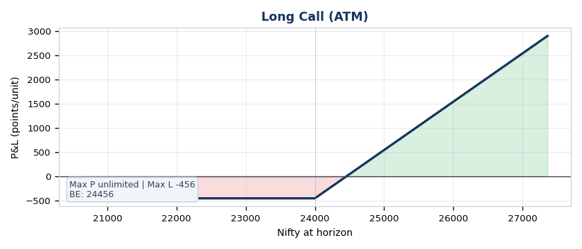

**The numbers (modelled at Nifty 24000).** Max profit: Unlimited. Max loss: -456 points (₹34,200 per lot), capped at the premium. Breakeven: 24456. Net debit: 456 points. Risk:reward: undefined (reward side is unlimited). You need Nifty above 24456 at expiry just to recover cost — about a 1.9% move.

**Greeks & behaviour.** Net delta is positive (~+0.5 at the money), so you gain as Nifty rises. Theta is negative — every day that passes erodes the option, and decay accelerates into expiry. Vega is positive: rising IV helps you, falling IV hurts. Direction and the speed of the move dominate the P&L.

**Management & exit.** Take profits mechanically — booking at a 50-100% gain on premium stops a winner from round-tripping. If the move stalls, cut at a 40-50% loss of premium rather than hoping. Roll up-and-out if the trend is intact but slow, and always exit before the final expiry-week gamma/theta crunch unless you are deep in the money.

**Risk note.** The honest danger is not catastrophe — your loss is capped — but probability: most long ATM calls expire worthless because they need both direction AND timing. Treat the premium as fully at risk every time.

**Scenario P&L (₹ per lot, at expiry).**

| Nifty at expiry | 22,800 | 23,400 | 24,000 | 24,600 | 25,200 |
|---|---|---|---|---|---|
| **P&L (₹/lot)** | −34,200 | −34,200 | −34,200 | +10,800 | +55,800 |

The position loses the full premium of ₹34,200 anywhere at or below the 24000 strike, only crosses into profit past breakeven 24,456, and makes +₹55,800 if Nifty reaches 25,200.

**Adjustments, variants & timing.** If Nifty drifts or falls after entry, the cleanest fix is to roll down-and-out: book the bleeding 24000 CE and buy a lower strike (say 23800 CE) in the next monthly to re-centre delta and reset theta — but only if the bullish thesis survives; otherwise just cut at 40-50% of premium. If it runs your way but stalls near breakeven, roll up to a 24200/24400 CE to bank intrinsic and lower capital at risk. For a pure leveraged punt the Nifty/Bank Nifty weekly is tempting, but weekly theta is brutal on an ATM long — keep this monthly (25-45 DTE); use weeklies only around a known catalyst (RBI policy, Budget, monthly expiry pin). Single-stock ATM calls (Reliance, HDFC Bank) work the same but cost more in IV. A+ entry: India VIX in the low-to-mid teens with IV rank below ~30, so you are not overpaying vega ahead of the move. VIX above 20 — pass or switch to a debit spread.

## 2. Long Call (OTM Lottery)
*Aggressively bullish · Long vega · net debit*

**The idea (intuition).** This is the cheap, far-out call — a lottery ticket on a sharp rally. You pay a small premium for a strike well above spot, so it costs little, but it only pays if Nifty travels a long way fast. Low cost, low probability, outsized payoff if you are right.

**When & why to use it.** Buy the OTM call when you expect an explosive up-move — a breakout above resistance, a strong result season, a short-covering squeeze — and you want maximum leverage per rupee. It is also the sensible way to express a low-conviction bullish punt: risk a tiny amount, accept you will usually lose it. Best when IV is low so the lottery ticket is genuinely cheap. Do NOT size it like a core position or buy it repeatedly to "average down" — the base rate of these expiring worthless is high, and stacking them is how accounts bleed.

**How to build it (₹, Nifty).** Buy the 24500 CE @ 139. Net debit 139 points, or 139 × 75 = ₹10,425 per lot — roughly a third the cost of the ATM call.

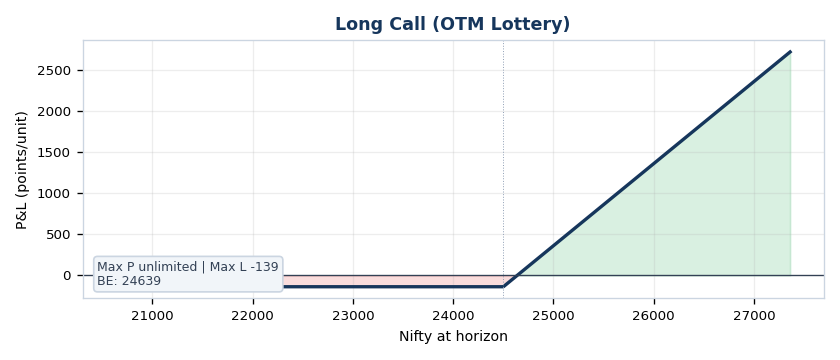

**The numbers (modelled at Nifty 24000).** Max profit: Unlimited. Max loss: -139 points (₹10,425 per lot). Breakeven: 24639. Net debit: 139 points. Risk:reward: undefined (unlimited upside). Nifty must clear 24639 — about 2.7% — before you make a paisa at expiry.

**Greeks & behaviour.** Net delta is positive but small (~+0.25 to +0.30), so early in the move the option barely responds; it springs to life only as spot approaches the strike. Theta is negative and vicious in percentage terms because the option is mostly time value. Vega is positive. A fast, large move is what makes this trade — slow grinds kill it.

**Management & exit.** Because the cost is small, many traders simply define the premium as the risk and let it ride to a target. If it doubles or triples on a quick pop, bank part of it. Do not hold deep-OTM tickets into the last few sessions hoping for a miracle; theta is total by then.

**Risk note.** Realistically this expires worthless far more often than it pays. The capped loss makes it feel safe, but a steady habit of buying cheap OTM calls is a slow, reliable way to donate premium to sellers.

**Scenario P&L (₹ per lot, at expiry).**

| Nifty at expiry | 22,800 | 23,400 | 24,000 | 24,600 | 25,200 |
|---|---|---|---|---|---|
| **P&L (₹/lot)** | −10,425 | −10,425 | −10,425 | −2,925 | +42,075 |

The ticket loses its small ₹10,425 cost across most of the range and only pays off on a large up-move, clearing breakeven near 24,639 and returning +₹42,075 at 25,200.

**Adjustments, variants & timing.** Because the cost is tiny, the default "adjustment" is no adjustment — define the premium as the risk and let it run to a target. If a fast pop doubles or triples the ticket, sell half and ride the rest free; if it sits dead while spot drifts up slowly, don't average down — that habit is how accounts bleed. A productive repair when spot approaches the strike is to sell a further-OTM call against it (turning it into a cheap call spread, e.g. long 24500 / short 24800), locking some convexity before theta accelerates. This structure is genuinely suited to Nifty/Bank Nifty weeklies around an expected breakout or short-covering squeeze, where one big day makes the trade — weekly OTM tickets are cheap and the gamma works for you. Single-stock OTM calls fit event plays (results day). A+ entry: low India VIX (sub-13) and IV rank under ~25, so the lottery ticket is genuinely cheap; high-VIX OTM calls are overpriced — pass.

## 3. Long Call (Deep ITM / Stock Replacement)
*Bullish · Low vega · net debit*

**The idea (intuition).** A deep in-the-money call behaves almost like owning the index itself, but ties up far less capital. Most of what you pay is intrinsic value, so the option tracks Nifty nearly point-for-point — a "stock replacement" that frees up cash and caps your downside at the premium.

**When & why to use it.** Use the deep-ITM call when you want long index exposure with a high delta but don't want to post full futures margin or carry overnight gap risk on cash. It suits a steady, high-conviction uptrend rather than a fast pop, since you are not paying for much time value or leverage. Because vega is low, it is the right bullish vehicle when IV is high — you are not overpaying for volatility the way an ATM buyer would. Avoid it when you specifically want cheap convexity; here you pay up for delta, so a small adverse move costs real rupees.

**How to build it (₹, Nifty).** Buy the 23300 CE @ 1198. Net debit 1198 points, or 1198 × 75 = ₹89,850 per lot. Of that, roughly 700 points is intrinsic (24000 - 23300) and only ~498 is time value.

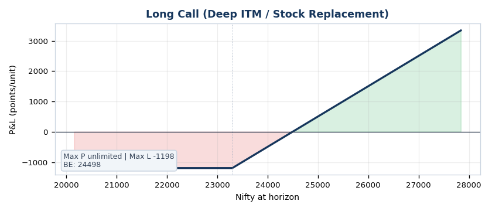

**The numbers (modelled at Nifty 24000).** Max profit: Unlimited. Max loss: -1198 points (₹89,850 per lot). Breakeven: 24498. Net debit: 1198 points. Risk:reward: undefined (unlimited upside). Breakeven sits ~2.1% above spot — the cost of the embedded time value.

**Greeks & behaviour.** Net delta is high (~+0.80 to +0.90), so the position moves almost like a long future. Theta is negative but modest in percentage terms because time value is a small slice of the premium. Vega is low — IV shifts barely matter. Direction dominates; this is a delta play, not a volatility play.

**Management & exit.** Manage it like a futures position with a known maximum loss: trail a stop on the underlying, and roll out to a later expiry if the trend persists. Exit if your bullish thesis breaks; do not let a deep-ITM call round-trip a large unrealised gain back to the strike.

**Risk note.** The capital outlay is large, so while the loss is capped at premium, the rupee amount at risk is meaningful — a sharp reversal can cost most of ₹89,850. STT and exercise mechanics on ITM options at expiry also matter; square off rather than letting it auto-exercise where possible.

**Scenario P&L (₹ per lot, at expiry).**

| Nifty at expiry | 22,800 | 23,400 | 24,000 | 24,600 | 25,200 |
|---|---|---|---|---|---|
| **P&L (₹/lot)** | −89,850 | −82,350 | −37,350 | +7,650 | +52,650 |

With its ~+0.85 delta the position tracks the index almost point-for-point — deeply red on a drop to 22,800 (−₹89,850) and profitable above breakeven 24,498, reaching +₹52,650 at 25,200.

**Adjustments, variants & timing.** Manage this like a long future with a capped loss. If Nifty falls, you have no margin call, but the rupee bleed is real — trail a stop on the underlying and exit if the uptrend structure breaks rather than hoping the deep-ITM call recovers. If the trend persists and expiry nears, roll out to the next month's deep-ITM strike to keep delta high and refresh the small time-value cushion. To reduce capital at risk after a good run, roll up toward ATM and pocket intrinsic. This is a monthly instrument by nature — weeklies offer too little time value to justify a stock-replacement stance, and weekly deep-ITM strikes are thinly quoted. It translates well to single stocks (a deep-ITM Infosys/Reliance call as a margin-light proxy for the shares). A+ entry: when you want delta but India VIX is elevated (above ~18) — low vega means you avoid the IV-crush that punishes an ATM buyer. Square off before expiry to dodge STT-on-exercise.

## 4. Long Put (ATM)
*Strongly bearish · Long vega · net debit*

**The idea (intuition).** Buying an at-the-money put is the bearish twin of the long call: a fixed-cost ticket that profits as Nifty falls, with loss capped at the premium. It doubles as portfolio insurance — pay a premium, and a market crash pays you back.

**When & why to use it.** Buy the ATM put when you expect a sharp decline — a breakdown of support, a global risk-off, a disappointing event — and want defined-risk downside exposure. As a hedge, it protects a cash or futures long through a known danger window. It works best bought when IV is still low; puts get expensive fast once fear and VIX spike, so insuring after the market has already cracked means overpaying. Avoid it in a calm, grinding-up tape where theta quietly bleeds you.

**How to build it (₹, Nifty).** Buy the 24000 PE @ 318. Net debit 318 points, or 318 × 75 = ₹23,850 per lot. Premium paid in full, no additional margin.

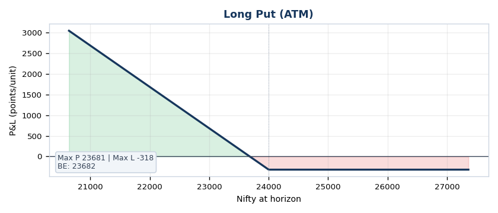

**The numbers (modelled at Nifty 24000).** Max profit: 23681 points (the index can only fall to zero), or 23681 × 75 = ₹17.76 lakh per lot in the theoretical extreme. Max loss: -318 points (₹23,850 per lot). Breakeven: 23682. Net debit: 318 points. Risk:reward: 74.41. The huge ratio simply reflects that the floor is zero — a real, tradeable target is far closer.

**Greeks & behaviour.** Net delta is negative (~-0.5), so you gain as Nifty drops. Theta is negative — time decay works against you. Vega is positive, and notably puts gain extra from the IV expansion that usually accompanies selloffs, so a falling market often helps you twice (price and vol).

**Management & exit.** Book partial profits into a fast drop; fear-driven IV makes puts richest exactly when you should take money off. As a hedge, roll the strike down to lock gains and re-establish protection. Cut losers at ~40-50% of premium if the breakdown fails to materialise.

**Risk note.** The capped loss is honest, but the win rate is the catch — directional puts bought in an uptrending market expire worthless often. The eye-catching max profit assumes Nifty goes to zero, which will not happen; price your target realistically.

**Scenario P&L (₹ per lot, at expiry).**

| Nifty at expiry | 22,800 | 23,400 | 24,000 | 24,600 | 25,200 |
|---|---|---|---|---|---|
| **P&L (₹/lot)** | +66,150 | +21,150 | −23,850 | −23,850 | −23,850 |

The put makes money as Nifty falls — +₹66,150 at 22,800, profitable down to breakeven 23,682 — and loses its capped ₹23,850 premium anywhere at or above the 24000 strike.

**Adjustments, variants & timing.** When a falling market spikes the put, book partial profit fast — fear-driven IV makes ATM puts richest exactly when you should be taking money off — and roll the strike down (24000 → 23700 → 23400) to lock gains and re-establish cheaper protection. If the breakdown fails and the tape grinds up, cut at 40-50% of premium rather than letting theta and vol-crush bleed you. As portfolio insurance, size the puts to your beta-weighted long delta and refresh monthly. This works as a Nifty/Bank Nifty weekly only across a specific danger window (event, global risk-off) where the move is expected within days; otherwise the monthly (25-45 DTE) is more forgiving on theta. A+ entry: buy when India VIX is still low/complacent (low teens, IV rank under ~30) — puts get expensive the moment fear arrives, so insuring after the market has already cracked means badly overpaying. VIX already above 20: pass or use a put spread to cut vega.

## 5. Long Put (OTM)
*Aggressively bearish · Long vega · net debit*

**The idea (intuition).** The out-of-the-money put is the cheap crash bet — a low-cost ticket that only pays on a real breakdown. Like buying flood insurance on a dry day: inexpensive, usually expires unused, but a genuine deluge pays many times over.

**When & why to use it.** Use the OTM put for aggressive bearish punts or as cheap tail protection on a portfolio when you fear a sharp drop but don't want to pay ATM premium. It shines when IV is low so the ticket is cheap, and when you expect a fast, sizeable fall rather than a slow drift. Do NOT lean on it as a high-probability income or directional trade — it needs a substantial move just to break even, and most of the time it lapses worthless.

**How to build it (₹, Nifty).** Buy the 23500 PE @ 125. Net debit 125 points, or 125 × 75 = ₹9,375 per lot — cheap by design.

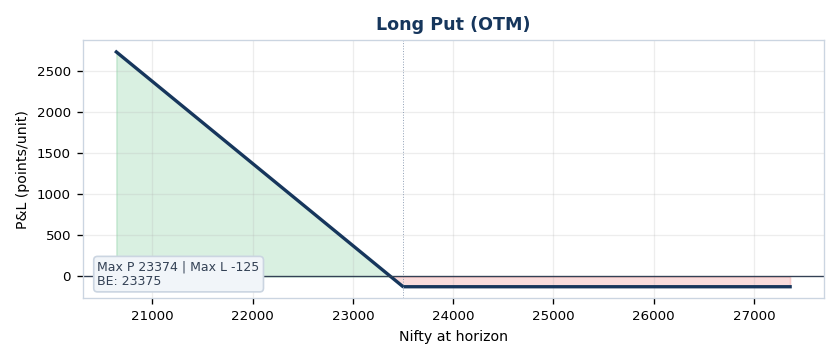

**The numbers (modelled at Nifty 24000).** Max profit: 23374 points (₹17.53 lakh per lot in the zero extreme). Max loss: -125 points (₹9,375 per lot). Breakeven: 23375. Net debit: 125 points. Risk:reward: 186.95 — again, that giant number is the zero-floor artefact, not a realistic expectation. Nifty must fall ~2.6% below spot just to reach breakeven.

**Greeks & behaviour.** Net delta is negative but small (~-0.25), so the put is sluggish until spot approaches the strike. Theta is negative and harsh in percentage terms. Vega is positive — and a panic selloff typically detonates IV, which is where these cheap puts make their outsized returns. Speed and size of the drop dominate.

**Management & exit.** Treat the premium as the defined risk and let it work toward a target. If a selloff spikes the put 3-5x, take most of it off — these gains evaporate as fast as they appear when the market stabilises. Don't hold into the last sessions on hope.

**Risk note.** This is a low-probability trade by construction; expect it to expire worthless most of the time. The capped loss is small per trade, but routinely buying OTM puts as "protection" you never collect on is a steady drag on returns.

**Scenario P&L (₹ per lot, at expiry).**

| Nifty at expiry | 22,800 | 23,400 | 24,000 | 24,600 | 25,200 |
|---|---|---|---|---|---|
| **P&L (₹/lot)** | +43,125 | −1,875 | −9,375 | −9,375 | −9,375 |

The cheap put only pays on a real breakdown — +₹43,125 at 22,800, around breakeven 23,375 by 23,400 — and quietly loses its small ₹9,375 cost anywhere at or above the 23500 strike.

**Adjustments, variants & timing.** Treat the small premium as the defined risk and let it work toward a target; the "adjustment" is mostly discipline. If a selloff spikes the put 3-5x, take most of it off — these gains evaporate as fast as they appear once the market stabilises — and if you still want downside, roll to a fresh lower strike. A useful repair as spot nears the strike is to sell a deeper-OTM put against it, converting to a cheap put spread and recovering some premium before theta bites. This is the natural fit for Nifty/Bank Nifty weeklies as tail protection across a single event (Fed/RBI, expiry, geopolitical headline) — cheap, and one gap-down pays many times over. Single-stock OTM puts hedge concentrated equity holdings. A+ entry: low India VIX (sub-13) and low put-skew, so the crash ticket is genuinely cheap; never chase OTM puts after VIX has already detonated. Don't carry into the last two sessions on hope — theta is total by then.

## 6. Long Put (Deep ITM)
*Bearish · Low vega · net debit*

**The idea (intuition).** A deep in-the-money put gives you near one-for-one short exposure to Nifty with risk capped at the premium. It behaves like a short future, but you can never be margin-called beyond what you paid, and there's no unlimited upside risk against you.

**When & why to use it.** Choose the deep-ITM put when you want a high-delta bearish position — a synthetic short — without posting futures margin or facing unlimited loss on a squeeze. Its low vega makes it the right bearish tool when IV is already elevated (you're not overpaying for volatility), and it suits a steady decline rather than a violent crash. Avoid it if you want cheap convexity on a tail event; you are paying up for delta here, so a rally hurts almost point-for-point.

**How to build it (₹, Nifty).** Buy the 24700 PE @ 722. Net debit 722 points, or 722 × 75 = ₹54,150 per lot. Roughly 700 points (24700 - 24000) is intrinsic, leaving only ~22 points of time value.

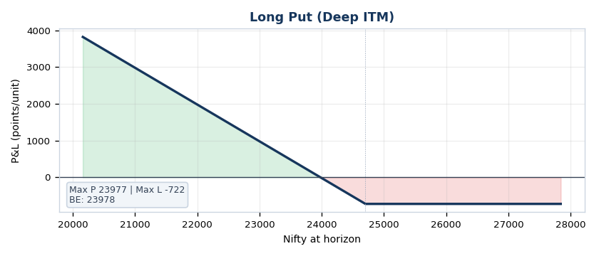

**The numbers (modelled at Nifty 24000).** Max profit: 23977 points (₹17.98 lakh per lot, the zero extreme). Max loss: -722 points (₹54,150 per lot). Breakeven: 23978. Net debit: 722 points. Risk:reward: 33.19 — once more, an artefact of the zero floor. Breakeven sits just above spot because the option is already in the money.

**Greeks & behaviour.** Net delta is strongly negative (~-0.85 to -0.90), so it tracks a short future. Theta is negative but small because there's little time value to decay. Vega is low — IV moves barely register. Direction is everything; this is a delta instrument.

**Management & exit.** Manage like a short future with a capped loss: trail a stop on the underlying, roll to a later expiry if the downtrend continues, and book when your target is hit. Square off before expiry rather than relying on auto-exercise.

**Risk note.** The rupee outlay is large, so a reversal can cost most of ₹54,150 even though the loss is "capped." Watch STT and exercise treatment on ITM options at expiry, and mind that deep-ITM index puts can be less liquid — use limit orders.

**Scenario P&L (₹ per lot, at expiry).**

| Nifty at expiry | 22,800 | 23,400 | 24,000 | 24,600 | 25,200 |
|---|---|---|---|---|---|
| **P&L (₹/lot)** | +88,350 | +43,350 | −1,650 | −46,650 | −54,150 |

This synthetic short profits as Nifty falls — +₹88,350 at 22,800, profitable below breakeven 23,978 — and loses toward its capped ₹54,150 cost as the index rises through the 24700 strike.

**Adjustments, variants & timing.** Run it like a short future with a known floor on losses. If Nifty rallies against you, there is no squeeze risk, but the rupee loss mounts near point-for-point — trail a stop on the underlying and exit if the downtrend structure fails rather than nursing the position. If the decline persists into expiry, roll to the next month's deep-ITM put to keep the high delta and refresh the thin time value. After a strong down-move, roll the strike toward ATM to bank intrinsic and cut capital at risk. This is a monthly tool — weekly deep-ITM index puts carry too little time value and trade with wide spreads; use limit orders given thinner liquidity. It maps cleanly to a single-stock synthetic short when you want bearish exposure without borrowing/SLB. A+ entry: when your view is bearish but India VIX is already high (above ~18) — the low vega means you are not overpaying for volatility the way an ATM put buyer would. Square off before expiry to avoid STT-on-exercise on the ITM leg.

## 7. Short Call (Naked)
*Bearish / neutral · Short vega · net credit*

**The idea (intuition).** Selling a call with no underlying is a bet that Nifty stays below your strike. You collect the premium up front and keep it if the option expires worthless — but you have handed someone else unlimited upside, so a runaway rally is your nightmare. This is the textbook example of picking up rupees in front of a steamroller.

**When & why to use it.** Sell a naked call only when you are confident the index will stay capped — at strong resistance, in a fading rally, or after a blow-off top — and ideally when IV is high (India VIX elevated, IV rank > 70) so the premium is rich and likely to decay. Short tenor concentrates theta in your favour. Do NOT sell naked calls into an uptrend, before a known bullish catalyst, or without a stop — the unlimited risk is real and a gap-up can be ruinous. Most retail traders should prefer a defined-risk bear call spread instead.

**How to build it (₹, Nifty).** Sell the 24300 CE @ 292. Net credit 292 points, or 292 × 75 = ₹21,900 received per lot. This requires SPAN + exposure margin (often ₹1-1.5 lakh+ per lot), not just the premium.

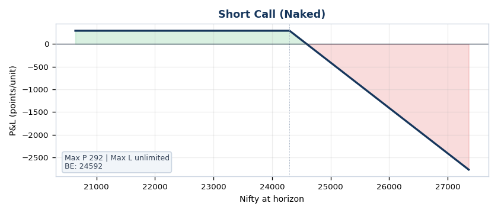

**The numbers (modelled at Nifty 24000).** Max profit: 292 points (₹21,900 per lot) — the credit, full stop. Max loss: Undefined — large (unlimited as Nifty rises). Breakeven: 24592. Net credit: 292 points. Risk:reward: undefined (loss side is unlimited). You keep the full credit only if Nifty is below 24300 at expiry.

**Greeks & behaviour.** Net delta is negative (you want the market down or flat). Theta is positive — time decay is your engine, and you profit as the option bleeds. Vega is negative — falling IV helps, an IV spike hurts. Theta and a quiet tape carry the P&L.

**Management & exit.** Close at ~50% of the credit captured rather than squeezing the last rupees. Set a hard stop — commonly buy back at 2x the credit received (a ~292-point loss) or if Nifty breaches the strike. Roll up-and-out if tested but your view holds. Exit before expiry-week gamma turns a small move into a large loss.

**Risk note.** This is the most dangerous single-leg trade in the book: losses are theoretically unlimited and an overnight gap-up gives you no chance to manage. Never sell naked calls without strict sizing and a stop; the rich win rate masks a fat, account-ending tail.

**Scenario P&L (₹ per lot, at expiry).**

| Nifty at expiry | 22,800 | 23,400 | 24,000 | 24,600 | 25,200 |
|---|---|---|---|---|---|
| **P&L (₹/lot)** | +21,900 | +21,900 | +21,900 | −600 | −45,600 |

You keep the full ₹21,900 credit anywhere at or below the 24300 strike, slip past breakeven 24,592, and face a large, open-ended loss as Nifty rallies — already −₹45,600 by 25,200 and climbing.

**Adjustments, variants & timing.** The non-negotiable rule is a stop: buy the call back at ~2x the credit (a ~292-point loss) or when Nifty breaches the strike — the unlimited tail is real and an overnight gap-up gives you no chance to manage. If tested but your cap-resistance view holds, roll up-and-out to a higher strike in the next expiry, ideally for a net credit, to widen the cushion. Most retail traders should convert this to a defined-risk bear call spread (sell 24300, buy 24600) so the disaster scenario is bounded. Theta favours short tenor, making Nifty/Bank Nifty weeklies attractive for the rapid decay — but weekly gamma near expiry can turn a small move into a fast loss, so size down and respect the strike. A+ entry: sell into a fading rally or firm resistance when India VIX is elevated and IV rank above ~70, so the premium is rich and likely to decay. Never sell naked calls into an uptrend or ahead of a bullish catalyst — pass.

## 8. Short Put (Naked / Cash-Secured)
*Bullish / neutral · Short vega · net credit*

**The idea (intuition).** Selling a put is getting paid to agree to buy Nifty lower. If the index stays above your strike you simply keep the premium; if it falls through, you're effectively "assigned" the index at the strike, cushioned by the credit you took in. It is the income workhorse of bullish-to-neutral traders.

**When & why to use it.** Sell the cash-secured put when you are mildly bullish or neutral and happy to "own" the index at a discount, ideally after a selloff has pumped IV (India VIX high, put skew rich) so the premium is fat. High IV rank and 20-45 DTE are the classic setup. Do NOT sell puts into a falling knife or ahead of a major risk event without protection — the downside, while bounded, is very large, and a crash will hurt badly. Size so that being assigned the full index value is something your account can actually absorb.

**How to build it (₹, Nifty).** Sell the 23700 PE @ 219. Net credit 219 points, or 219 × 75 = ₹16,425 received per lot. Requires SPAN margin; "cash-secured" means setting aside enough to buy the index at 23700 if assigned.

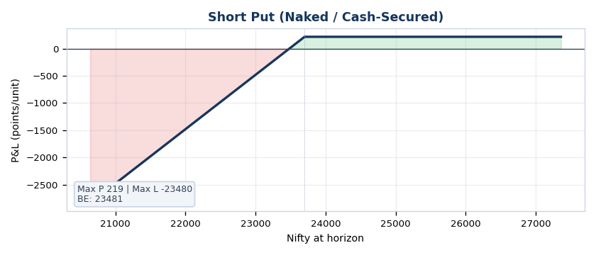

**The numbers (modelled at Nifty 24000).** Max profit: 219 points (₹16,425 per lot) — the credit. Max loss: -23480 points (₹17.61 lakh per lot). Breakeven: 23481. Net credit: 219 points. Risk:reward: 0.01. *That worst case assumes the index collapses all the way to zero; in practice you size small and manage or stop out at a multiple of the credit long before then.* You keep the full credit if Nifty holds above 23700.

**Greeks & behaviour.** Net delta is positive (you want the market up or flat). Theta is positive — decay pays you. Vega is negative — falling IV (the post-selloff "vol crush") helps, a fresh fear spike hurts. Theta plus a stable-or-rising market drives the gains.

**Management & exit.** Book at ~50% of max credit. Stop or roll down-and-out if the put goes in the money or you reach a loss of ~2x the credit. Many traders treat assignment as acceptable and transition into a covered call (the "wheel"). Exit before expiry-week gamma if the strike is being tested.

**Risk note.** Premium selling is not free money — the tail is large and SEBI studies show most retail F&O traders lose. A gap-down through your strike can wipe out many months of collected credits in a single session; respect the position size.

**Scenario P&L (₹ per lot, at expiry).**

| Nifty at expiry | 22,800 | 23,400 | 24,000 | 24,600 | 25,200 |
|---|---|---|---|---|---|
| **P&L (₹/lot)** | −51,075 | −6,075 | +16,425 | +16,425 | +16,425 |

You keep the full ₹16,425 credit anywhere at or above the 23700 strike, cross breakeven 23,481, and take a large loss as Nifty falls — already −₹51,075 by 22,800.

**Adjustments, variants & timing.** Book at ~50% of max credit rather than squeezing the last rupees. If the put goes in the money or you reach ~2x the credit in loss, stop or roll down-and-out to a lower strike in the next expiry for a net credit, buying time and a wider cushion. Many traders accept assignment and transition into a covered call — the classic "wheel" — which only makes sense if your account can genuinely absorb owning the full index value at the strike. To bound the tail, convert to a bull put spread (sell 23700, buy 23400). Theta and rapid decay make Nifty/Bank Nifty weeklies popular for income, but weekly gamma is unforgiving near expiry, so size down. A+ entry: sell after a selloff has pumped IV (India VIX high, IV rank above ~70, put skew rich) when you are mildly bullish or neutral and happy to own the index at a discount; 20-45 DTE is the classic window. Never sell into a falling knife or ahead of a major risk event without protection — pass.

## 9. Long LEAPS Call
*Long-term bullish · Long vega · net debit*

**The idea (intuition).** A LEAPS call is a long-dated call — months out — used to ride a multi-month uptrend. The long horizon slows the theta bleed to a trickle, so you can be patient and let a slow trend mature without daily decay grinding you down. It's a leveraged, defined-risk stand-in for buying and holding the index.

**When & why to use it.** Buy a LEAPS call when you have a structural bullish thesis — a multi-quarter rally, a re-rating story — and want leverage with capped risk and minimal time pressure. It's best entered when IV is low, because you are very long vega over a long horizon; buying long-dated calls when volatility is cheap is doubly rewarding if both price and IV rise. Note that index LEAPS liquidity on NSE is thinner than the near months, so use limits. Avoid it for short-term punts — you overpay for time you may not need.

**How to build it (₹, Nifty).** Buy the long-dated 24000 CE @ 2263. Net debit 2263 points, or 2263 × 75 = ₹1,69,725 per lot. Large outlay, but it's the full risk and there's no margin call.

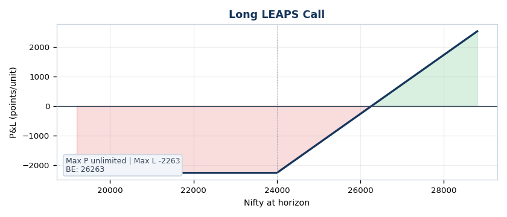

**The numbers (modelled at Nifty 24000).** Max profit: Unlimited. Max loss: -2263 points (₹1,69,725 per lot). Breakeven: 26263. Net debit: 2263 points. Risk:reward: undefined (unlimited upside). Breakeven sits ~9.4% above spot — the price of buying so much time value.

**Greeks & behaviour.** Net delta is positive (~+0.55-0.60 and rising as spot climbs). Theta is negative but gentle per day given the long life. Vega is large and positive — this is genuinely a volatility-sensitive position; a rise in long-term IV can mark it up well before expiry. Direction over months plus IV drive the P&L.

**Management & exit.** Manage by thesis and time, not daily noise. Take profits as the trend matures or roll the strike up to harvest gains and reduce capital at risk. As expiry approaches, theta accelerates — don't let a LEAPS decay into the final weeks; roll to a new long-dated strike or close.

**Risk note.** The rupee outlay is the largest in this group, so a flat or falling market over the holding period can cost most of ₹1,69,725. Long vega cuts both ways: a sustained IV decline erodes the option even if Nifty is roughly flat.

**Scenario P&L (₹ per lot, at expiry).**

| Nifty at expiry | 22,800 | 23,400 | 24,000 | 24,600 | 25,200 |
|---|---|---|---|---|---|
| **P&L (₹/lot)** | −169,725 | −169,725 | −169,725 | −124,725 | −79,725 |

These are at-expiry values of the long-dated call: the position loses its large ₹1,69,725 premium at or below the 24000 strike and recovers steadily as Nifty climbs, still −₹79,725 even at 25,200 because breakeven sits far up at 26,263.

**Adjustments, variants & timing.** Manage by thesis and time, not daily noise. If the market falls early, the gentle theta buys patience — but cut if the structural bullish story breaks rather than riding a large rupee loss. As the trend matures, roll the strike up (24000 → 24500 → 25000) in the same long-dated series to harvest gains and shrink capital at risk; as expiry approaches and theta finally accelerates, roll forward to a new long-dated strike rather than letting it decay into the final weeks. This is inherently a monthly/quarterly position — it has no weekly analogue, and NSE long-dated index liquidity is thin, so always use limit orders. Single-stock LEAPS are largely unavailable on NSE, so Nifty is the practical vehicle. A+ entry: a structural multi-quarter bullish thesis bought when India VIX is low and IV rank under ~25 — you are very long vega over a long horizon, so cheap volatility is doubly rewarding if both price and IV rise. High-VIX entry overpays for vega — pass.

## 10. Long LEAPS Put
*Long-term bearish / hedge · Long vega · net debit*

**The idea (intuition).** A long-dated put is strategic downside protection or a patient bearish position. Bought months out, it's standing insurance against a major decline, with slow theta so the cost of "carrying" the hedge per day is modest. You pay once and stay protected through a long, uncertain window.

**When & why to use it.** Use the LEAPS put to hedge a sizeable long portfolio against a structural downturn, or to express a slow-burn bearish macro view. It's best bought when IV is low and complacent — insurance is cheapest when no one wants it — and when you genuinely fear a multi-month drawdown rather than a one-day shock. Being long vega over a long horizon means an IV expansion alone can profit the position. Don't buy it as a short-term crash bet; a near-dated OTM put is far cheaper for that. Mind that long-dated index puts can be illiquid — trade with limits.

**How to build it (₹, Nifty).** Buy the long-dated 24000 PE @ 641. Net debit 641 points, or 641 × 75 = ₹48,075 per lot. Paid in full; this is your maximum risk.

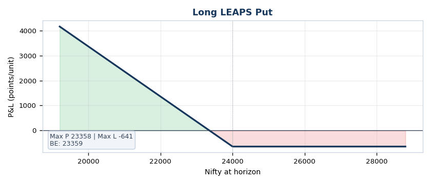

**The numbers (modelled at Nifty 24000).** Max profit: 23358 points (₹17.52 lakh per lot in the zero extreme). Max loss: -641 points (₹48,075 per lot). Breakeven: 23359. Net debit: 641 points. Risk:reward: 36.44 — the large ratio is the zero-floor artefact, not a target. Breakeven sits ~2.7% below spot.

**Greeks & behaviour.** Net delta is negative (~-0.40), so it gains as Nifty falls. Theta is negative but slow given the long life. Vega is large and positive — a key feature: in a risk-off episode, surging long-term IV can mark the put up sharply even before price falls far. Direction over months and IV dominate.

**Management & exit.** As a hedge, roll the strike down after a decline to bank gains and re-set protection, or monetise the vega spike in a panic and re-establish cheaper later. As a directional trade, manage by thesis. Avoid carrying it into the last weeks where theta bites; roll to a fresh long-dated strike.

**Risk note.** If the market drifts up or sideways, the hedge is a sunk cost — you can lose most of ₹48,075 while the portfolio it protects does fine, which is the price of insurance. Long vega means a calm, falling-IV market erodes the put even without an up-move.

**Scenario P&L (₹ per lot, at expiry).**

| Nifty at expiry | 22,800 | 23,400 | 24,000 | 24,600 | 25,200 |
|---|---|---|---|---|---|
| **P&L (₹/lot)** | +41,925 | −3,075 | −48,075 | −48,075 | −48,075 |

These are at-expiry values of the long-dated put: it pays as Nifty falls — +₹41,925 at 22,800, around breakeven 23,359 by 23,400 — and loses its full ₹48,075 premium anywhere at or above the 24000 strike.

**Adjustments, variants & timing.** Manage by thesis and horizon. As a hedge, roll the strike down after a decline (24000 → 23500 → 23000) to bank gains and re-set protection, or monetise a vega spike during a panic and re-establish cheaper once IV calms. The slow theta means you can be patient, but if the market grinds up the hedge is a sunk cost — accept it as the price of insurance rather than rolling endlessly. Avoid carrying into the final weeks where theta finally bites; roll forward to a fresh long-dated strike. This is a monthly/quarterly instrument with no weekly analogue; for a short, sharp crash bet a near-dated OTM put is far cheaper. NSE long-dated index puts can be illiquid, so trade with limit orders, and single-stock LEAPS are largely unavailable here — Nifty is the practical vehicle. A+ entry: buy when IV is low and complacent (India VIX low teens, IV rank under ~25) and you genuinely fear a multi-month drawdown — being long vega over a long horizon, an IV expansion alone can profit the position. Buying after fear has already spiked overpays — pass.

# Strategy Group 2: Vertical Spreads

A vertical spread buys one option and sells another of the same type and expiry but a different strike — so your view is expressed inside a fixed corridor of strikes rather than on a single naked leg. That one extra leg is what turns options from a lottery ticket into a risk-defined trade: it caps your loss, caps your reward, and cuts the cost (debit spreads) or the margin (credit spreads). The whole family lives on one trade-off — directional debit spreads pay you when you are right about *where* price goes, while credit spreads pay you (via theta) when price simply *doesn't* go against you, and the art is choosing strike width and moneyness to dial probability against payout.

## 11. Bull Call Spread (ATM)
*Moderately bullish · Neutral vega · net debit*

**The idea (intuition).** You want Nifty higher but a naked call bleeds too much premium and theta. So you buy a call and sell a higher call to subsidise it — you keep all the upside between the two strikes and hand away everything above. Think of it as buying a call on instalment, where the short strike pays part of your bill.

**When & why to use it.** Use it when you are moderately bullish over the next one to three weeks and IV is middling-to-high — selling the upper strike claws back inflated premium. It is the bread-and-butter expression of "I think Nifty grinds up 1–2% into expiry." Because it is roughly vega-neutral, you are not betting on IV, which is exactly what you want when India VIX is elevated and a long call alone would get crushed. Avoid it when you expect an explosive breakout (the cap throttles you — prefer a naked call or an OTM/far spread) or when you have no directional edge at all.

**How to build it (₹, Nifty).** Buy 24000 CE @ 456, sell 24300 CE @ 292. Net debit 164 points, which at lot 75 is 164 × 75 = ₹12,300 per lot — that is also your entire risk. The 300-point gap is your earning corridor.

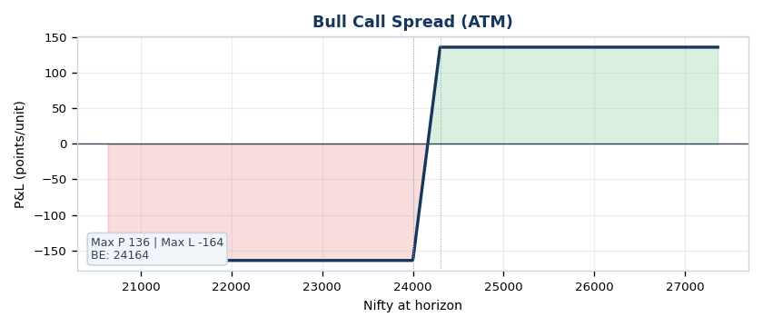

**The numbers (modelled at Nifty 24000).** Max profit 136 points (₹10,200), realised at 24300 or higher. Max loss 164 points (₹12,300), at 24000 or below. Breakeven 24164. Net debit 164. Risk:reward 0.83 — you risk a bit more than you can make, the price of a high-probability ATM structure.

**Greeks & behaviour.** Net delta is positive (long bias), roughly +0.15 to +0.20 per lot of the index at entry. Theta is mildly *negative* while price sits below the short strike — time decay nibbles your long leg faster — but it flips helpful once Nifty pushes above 24300. Vega is close to zero, so an IV swing barely moves you. Direction dominates P&L.

**Management & exit.** A common discipline is to take profit at 60–70% of the 136-point max rather than squeezing the last few points into expiry-week gamma. If Nifty stalls or rolls over, cut at a 50% loss of the debit instead of hoping. You can roll the whole spread up-and-out if the trend is intact but slow.

**Risk note.** Defined risk is your friend — the worst case is the 164-point debit, no margin calls, no assignment surprise. The real danger is time: a flat, choppy tape lets the debit decay even though you were "right" directionally.

**Scenario P&L (₹ per lot, at expiry).**

| Nifty at expiry | 22,800 | 23,400 | 24,000 | 24,600 | 25,200 |
|---|---|---|---|---|---|
| **P&L (₹/lot)** | -₹12,300 | -₹12,300 | -₹12,300 | +₹10,200 | +₹10,200 |

Reading across: the spread is pinned to its full -₹12,300 loss anywhere at or below 24,000 and locked to its +₹10,200 max gain once Nifty clears the 24,300 short strike, with the payoff already maxed out by the 24,600 column.

**Adjustments, variants & timing.** When Nifty grinds up and tags the 24,300 short call, the cleanest adjustment is to roll that short leg up-and-out (say to 24,500 of the next week) for an extra debit, widening the corridor while the trend runs; if it stalls, roll the whole spread up and out a week to buy time. If price drifts sideways, convert to a call butterfly by selling a second 24,300 and buying a higher wing, turning a dead directional bet into a theta-positive pin trade. This ATM debit structure suits Nifty monthly and liquid single stocks (Reliance, HDFC Bank) better than Bank Nifty weeklies, where gamma is too violent for a slow-grind thesis. As a debit spread you want a LOW IV-rank window — roughly the bottom third (India VIX 11-13) — so you are not overpaying for the long 24000 call; entering when VIX is calm and a catalyst looms is the A+ setup.

## 12. Bull Call Spread (OTM)
*Bullish breakout · Neutral vega · net debit*

**The idea (intuition).** Same machine as the ATM version, but both strikes sit above spot. You are no longer paying for intrinsic value — you are buying a cheaper, lower-probability bet that Nifty *moves up* to reach your zone. Less cost in, more reward out, but the market has to come to you.

**When & why to use it.** Reach for this when you expect a genuine breakout — a move up *through* a level, not just a drift. Good fits: a bullish catalyst (results, a policy event, a chart breakout above resistance) with one to three weeks to expiry. The lower entry cost means a small account can take a defined-risk swing without committing much capital. Skip it if you only have a mild lean; an OTM spread that never gets in-the-money expires worthless, and "mildly bullish but flat" is its kryptonite.

**How to build it (₹, Nifty).** Buy 24200 CE @ 342, sell 24500 CE @ 204. Net debit 138.1 points ≈ 138 × 75 = ₹10,350 per lot. Notice the debit is lower than the ATM spread even though the corridor is the same 300 points wide — that is the OTM discount.

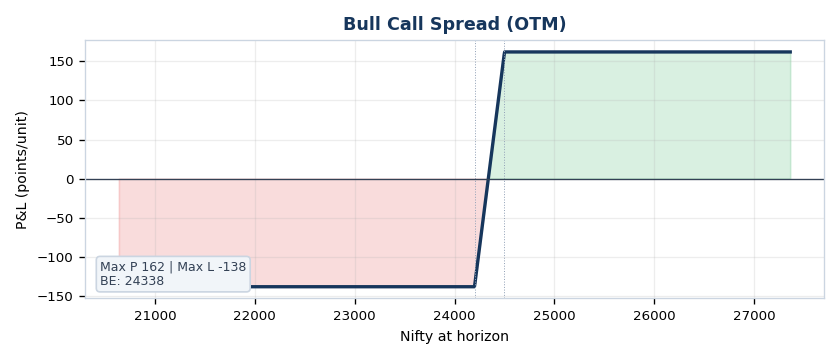

**The numbers (modelled at Nifty 24000).** Max profit 162 points (₹12,150), at 24500+. Max loss 138 points (₹10,350), at 24200 or below. Breakeven 24338 — Nifty must climb about 1.4% just to break even. Net debit 138. Risk:reward 1.17 — now you can make more than you risk, the reward for accepting a lower hit-rate.

**Greeks & behaviour.** Net delta positive but smaller in points-terms at entry than the ATM spread, because both legs start out of the money; delta builds as price rises toward the strikes. Theta is negative until Nifty enters the corridor — out-of-the-money time decay works against you. Vega is near zero. This is a pure "did it move enough, in time?" trade.

**Management & exit.** Because the payoff is back-loaded, partial profit-taking matters less here — but if the spread doubles before expiry, banking it is sensible. Set a mental stop at roughly 50% of the debit; an OTM spread that is not working tends to keep not working. Don't average down on a stalled breakout.

**Risk note.** The honest risk is probability, not size: you can be directionally correct and still lose if the move is too small or too slow. Breakeven well above spot means most of these expire worthless unless the breakout actually arrives — size accordingly.

**Scenario P&L (₹ per lot, at expiry).**

| Nifty at expiry | 22,800 | 23,400 | 24,000 | 24,600 | 25,200 |
|---|---|---|---|---|---|
| **P&L (₹/lot)** | -₹10,350 | -₹10,350 | -₹10,350 | +₹12,150 | +₹12,150 |

Reading across: below the 24,200 long strike the spread sits at its full -₹10,350 loss, and from the 24,500 short strike upward it is capped at +₹12,150 — the 24,000 column still shows max loss because Nifty has not yet climbed into the corridor.

**Adjustments, variants & timing.** Because both strikes start above spot, the key adjustment is patience first, then action: if Nifty breaks out and tags 24,500, roll the short call up to 24,800 for more debit and keep riding the breakout; if the move stalls just below 24,200, roll the long leg down toward spot to rescue delta rather than letting it expire worthless. A failed breakout can be salvaged by rolling the entire spread out one week to give the catalyst time. This OTM debit play fits Nifty monthly and event-driven single-stock breakouts (results-season movers) where a clean directional thrust is plausible; it is a poor fit for Bank Nifty weeklies unless you have a same-week trigger. Being a debit spread, enter in a LOW IV-rank window (India VIX in its lower third) so the breakout bet is cheap — buying convexity when vol is rich is the classic OTM-spread trap.

## 13. Bull Call Spread (ITM)
*Bullish, high probability · Neutral vega · net debit*

**The idea (intuition).** Push both strikes below spot and the spread starts life already in the money. You pay a fat debit, but you are paying for *certainty* — as long as Nifty doesn't fall, you collect close to the full width. It behaves almost like a high-delta proxy for being long the index with a defined floor.

**When & why to use it.** Use it when you are confidently bullish or simply want a high-probability "Nifty holds or rises" bet with a known, capped loss. It suits a strong uptrend where you want most of the move with less premium-at-risk than buying the index outright, and far less than a naked call's theta. It is a poor choice when IV is rich and you want vega exposure (this is flat vega), or when you are only mildly bullish — the cost-to-reward is unattractive for a half-hearted view.

**How to build it (₹, Nifty).** Buy 23700 CE @ 655, sell 24100 CE @ 397. Net debit 257.6 points ≈ 258 × 75 = ₹19,350 per lot. The spread is already 300 points in the money at entry, so much of that debit is intrinsic value you simply hold.

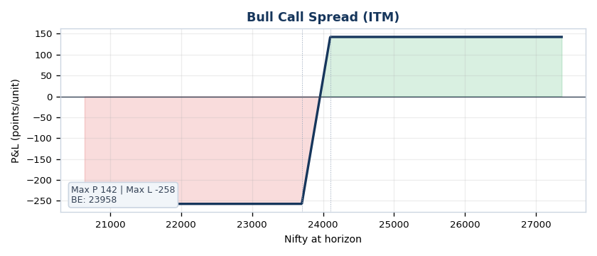

**The numbers (modelled at Nifty 24000).** Max profit 142 points (₹10,650), at 24100+. Max loss 258 points (₹19,350), only if Nifty drops below 23700. Breakeven 23958 — *below* current spot, so even a small dip still pays. Net debit 258. Risk:reward 0.55 — you risk almost twice the reward, the toll for a high win-rate.

**Greeks & behaviour.** Net delta is the most positive of the bull-call trio at entry, since both legs are ITM and behave nearly one-for-one with the index. Theta is roughly neutral-to-slightly-positive here — the deep structure has little extrinsic value left to decay against you. Vega near zero. This trades almost like a defined-risk long position in Nifty.

**Management & exit.** With breakeven below spot, you can often just hold to expiry and let it settle near max. If Nifty cracks the lower strike, the defined loss caps you — but consider rolling down if the trend genuinely reverses. Take profit if it reaches ~90% of max early; the last few points aren't worth gamma risk.

**Risk note.** The danger is asymmetry: you stake 258 to make 142. One sharp gap below 23700 — an overnight global selloff — and you eat the full debit. High probability is not certainty; the loss, when it comes, is larger than the win.

**Scenario P&L (₹ per lot, at expiry).**

| Nifty at expiry | 22,800 | 23,400 | 24,000 | 24,600 | 25,200 |
|---|---|---|---|---|---|
| **P&L (₹/lot)** | -₹19,350 | -₹19,350 | +₹3,150 | +₹10,650 | +₹10,650 |

Reading across: the deep-ITM structure shows its full -₹19,350 loss only on a slide below the 23,700 long strike, is already positive (+₹3,150) at today's 24,000 spot, and caps at +₹10,650 from the 24,100 short strike upward — a high-probability profile that pays even if Nifty merely holds.

**Adjustments, variants & timing.** Since the spread is born in-the-money with breakeven below spot, it needs little babysitting — but if Nifty cracks the 23,700 long strike on a genuine reversal, roll the whole spread down a week to follow the new trend rather than eating the 258-point debit. If the index simply pins near 24,100, hold to expiry to collect near-max; there is no theta to fight. As a near-linear long proxy it suits Nifty monthly and high-priced single stocks where you want index-like exposure with a hard defined floor and no futures mark-to-market. Bank Nifty weeklies are too whippy for this slow-burn structure. Crucially it is vega-flat, so the LOW IV-rank window matters less than for OTM spreads — but you still prefer calm vol (India VIX low) so the intrinsic-heavy debit is not padded with expensive extrinsic value, making entry cheaper and the A+ edge cleaner.

## 14. Bear Put Spread (ATM)
*Moderately bearish · Neutral vega · net debit*

**The idea (intuition).** The mirror image of the bull call spread, for a falling market. Buy an at-the-money put, sell a lower put to cheapen it. You profit as Nifty slides into the corridor between your strikes, with loss capped at the small debit. A defined-risk way to short the index without unlimited downside-to-you on a bounce.

**When & why to use it.** Use it when you are moderately bearish over the next week or three — a pullback, a failed rally, a risk-off tape. It shines when you want downside exposure but selling naked options ties up SPAN margin and carries gap risk; a debit put spread needs only the premium. Because it is roughly vega-flat, it is cleaner than a naked long put when IV is already high and a vol crush would otherwise hurt you. Avoid it if you expect a crash (the cap leaves money on the table — go far-OTM) or if you have no real bearish trigger.

**How to build it (₹, Nifty).** Buy 24000 PE @ 318, sell 23700 PE @ 219. Net debit 99.5 points ≈ 99 × 75 = ₹7,425 per lot — cheap, and that is your whole risk.

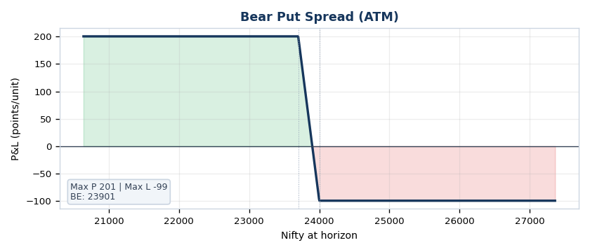

**The numbers (modelled at Nifty 24000).** Max profit 201 points (₹15,075), at 23700 or below. Max loss 99 points (₹7,425), at 24000 or above. Breakeven 23901. Net debit 99. Risk:reward 2.02 — you can make roughly twice what you risk, an attractive ratio for an ATM structure.

**Greeks & behaviour.** Net delta is negative (bearish), around -0.15 to -0.20 of the index per lot at entry. Theta is mildly negative above the short strike — time decay works against the long put until price falls into the zone — then turns supportive. Vega near zero, so an IV move barely registers. Direction is the driver.

**Management & exit.** Take profit around 60–70% of the 201-point max; bearish moves are often fast and mean-revert, so don't be greedy. If Nifty rallies against you, cut at ~50% of the debit. Roll down-and-out if the downtrend is intact but grinding slowly rather than impulsive.

**Risk note.** Risk is fully defined at 99 points — no assignment drama, no margin spiral. The catch is direction and timing: a flat or rising market quietly decays your debit even when your thesis eventually proves right after expiry.

**Scenario P&L (₹ per lot, at expiry).**

| Nifty at expiry | 22,800 | 23,400 | 24,000 | 24,600 | 25,200 |
|---|---|---|---|---|---|
| **P&L (₹/lot)** | +₹15,075 | +₹15,075 | -₹7,425 | -₹7,425 | -₹7,425 |

Reading across: the bearish spread banks its +₹15,075 max gain on any close at or below the 23,700 short strike and sits at its full -₹7,425 loss from 24,000 upward — a clean mirror of the bull call, paying only when Nifty actually falls into the corridor.

**Adjustments, variants & timing.** When Nifty drops and tests the 23,700 short put, roll that leg down-and-out (to 23,500 next week) for additional debit to extend the run, or convert to a put butterfly by selling a second 23,700 and buying a lower wing if you think the slide is exhausting. If the market rallies against you, cut at ~50% of the debit rather than rolling a losing directional bet. This ATM debit put spread fits Nifty monthly and liquid large-cap stocks for a defined-risk short without SPAN margin or gap-against-you risk; Bank Nifty weeklies move too fast for the modest 99-point debit thesis. As a debit structure it favours a LOW IV-rank entry — but note India's well-known put skew means downside puts are perpetually bid, so the genuine A+ window is when VIX is in its lower third AND skew is flat, before fear inflates the long 24000 put.

## 15. Bear Put Spread (OTM)
*Bearish breakdown · Neutral vega · net debit*

**The idea (intuition).** Same bearish machine, but both puts sit below spot. You pay less and stand to make more, but Nifty has to actually fall to your zone — you are buying a breakdown, not a drift. Cheaper ticket, lower odds, fatter payout.

**When & why to use it.** Deploy it when you expect a real break *down* through support — a topping pattern, a global risk-off catalyst, a failed breakout that rolls over hard, with one to three weeks left. The low debit lets a small account take a defined-risk bearish swing. It is the wrong tool for a mild lean or a slow grind lower: if Nifty only dribbles down and never reaches the strikes, the spread expires worthless despite a "correct" direction.

**How to build it (₹, Nifty).** Buy 23800 PE @ 248, sell 23500 PE @ 169. Net debit 79.9 points ≈ 80 × 75 = ₹6,000 per lot. Same 300-point corridor as the ATM version but materially cheaper, because both legs start out of the money.

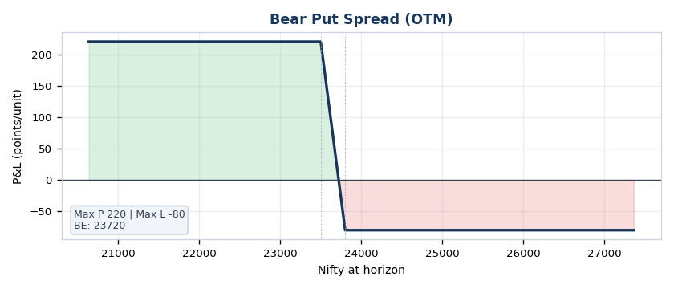

**The numbers (modelled at Nifty 24000).** Max profit 220 points (₹16,500), at 23500 or below. Max loss 80 points (₹6,000), at 23800 or above. Breakeven 23720 — Nifty must drop about 1.2% to break even. Net debit 80. Risk:reward 2.76 — nearly three to one, the reward for accepting lower probability.

**Greeks & behaviour.** Net delta negative but modest in points at entry (both legs OTM), steepening as price falls toward the strikes. Theta negative while above the corridor — OTM extrinsic decay leans against you. Vega near zero. This is a "did it fall far enough, fast enough?" bet.

**Management & exit.** The payoff is back-loaded, so let a working trade run, but bank it if it doubles before expiry. Stop out near 50% of the debit if Nifty refuses to break down. Don't add to a stalled position hoping for a late flush.

**Risk note.** The real risk is probability: breakeven sits well below spot, so most such spreads expire worthless unless the breakdown genuinely materialises. You can be right on direction and still lose on magnitude — size it as the speculative ticket it is.

**Scenario P&L (₹ per lot, at expiry).**

| Nifty at expiry | 22,800 | 23,400 | 24,000 | 24,600 | 25,200 |
|---|---|---|---|---|---|
| **P&L (₹/lot)** | +₹16,500 | +₹16,500 | -₹6,000 | -₹6,000 | -₹6,000 |

Reading across: the lower-probability breakdown bet pays its full +₹16,500 only on a real fall to the 23,500 short strike, and sits at its small -₹6,000 loss across the entire upper half of the table — cheap to hold, but it needs the drop to arrive.

**Adjustments, variants & timing.** Because the payoff is back-loaded below spot, manage it as a convex bet: if a sharp leg down tags 23,500, bank it or roll the short put down to 23,300 to keep riding the panic; if Nifty merely drifts and the spread stalls above 23,800, there is little to adjust — stop at ~50% of the small debit and redeploy. A topping pattern that takes time can be rolled out one week. This OTM bearish spread suits Nifty monthly and single-stock breakdowns (a stock losing key support on volume); Bank Nifty weeklies need a same-week catalyst to justify it. As a debit spread you want a LOW IV-rank entry so the breakdown is cheaply owned, but because India's put skew keeps these wings expensive, the A+ window is a calm tape (VIX low) just before a feared event — buying the move before fear is priced in.

## 16. Bear Put Spread (ITM)
*Bearish, high probability · Neutral vega · net debit*

**The idea (intuition).** Lift both puts above spot and the bearish spread is born in the money. You pay a heavier debit for a higher-probability payout — as long as Nifty doesn't rally, you bank most of the width. It is a defined-risk way to lean short with the odds on your side.

**When & why to use it.** Use it when you are confidently bearish, or want a high-probability "Nifty holds down or falls" structure with a capped, known loss. It fits a clear downtrend where you want most of the move with defined risk and no naked-short margin or tail exposure. It is a weak choice for a half-hearted bearish view (the cost-to-reward is poor) or when you specifically want long-vega exposure into a feared selloff — this structure is vega-flat.

**How to build it (₹, Nifty).** Buy 24300 PE @ 453, sell 23900 PE @ 282. Net debit 171 points ≈ 171 × 75 = ₹12,825 per lot. The spread starts in the money, so a chunk of that debit is intrinsic value you carry.

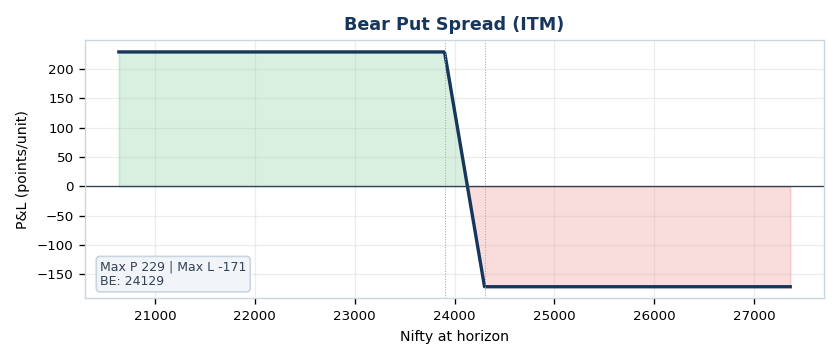

**The numbers (modelled at Nifty 24000).** Max profit 229 points (₹17,175), at 23900 or below. Max loss 171 points (₹12,825), only if Nifty climbs above 24300. Breakeven 24129 — *above* current spot, so even a flat-to-slightly-up tape still leaves you in profit. Net debit 171. Risk:reward 1.34 — reward exceeds risk while keeping a high win-rate, an unusually friendly combination.

**Greeks & behaviour.** Net delta is the most negative of the bear-put trio at entry, both legs ITM and tracking the index closely. Theta is roughly neutral — little extrinsic value left to decay against you. Vega near zero. It behaves like a defined-risk short position in Nifty.

**Management & exit.** With breakeven above spot, holding toward expiry to capture near-max is reasonable. If Nifty rips above 24300, the defined loss caps you — consider rolling up if the view changed. Take profit at ~90% of max if it gets there early rather than risking a late bounce.

**Risk note.** The capped loss of 171 points is genuine protection, but a sharp upside gap — a relief rally, a global rebound — through 24300 hands you the full debit. The favourable structure does not remove the need to be right on direction.

**Scenario P&L (₹ per lot, at expiry).**

| Nifty at expiry | 22,800 | 23,400 | 24,000 | 24,600 | 25,200 |
|---|---|---|---|---|---|
| **P&L (₹/lot)** | +₹17,175 | +₹17,175 | +₹9,675 | -₹12,825 | -₹12,825 |

Reading across: this high-probability bearish structure books its +₹17,175 max on a close at or below the 23,900 short strike, is still comfortably positive (+₹9,675) at 24,000 because breakeven sits above spot, and only flips to its -₹12,825 loss once Nifty rallies past the 24,300 long strike.

**Adjustments, variants & timing.** Born in-the-money with breakeven above spot, it pays even on a flat tape, so the main adjustment is upside defence: if Nifty rips and threatens 24,300, roll the whole spread up a week to chase the move only if your bearish view genuinely changed — otherwise take the defined loss. A stall near 23,900 is ideal; hold to expiry. As a near-linear short proxy with a hard ceiling, it suits Nifty monthly and large-cap single stocks where you want defined-risk downside without naked-short SPAN or tail exposure; Bank Nifty weeklies are too jumpy. It is vega-flat, so unlike credit spreads it does not need high IV — but you still prefer a calm-to-low VIX so the intrinsic-rich debit is not inflated by extrinsic value, keeping the A+ entry cheap while the favourable above-spot breakeven does the heavy lifting.

## 17. Bull Put Spread (Credit)
*Neutral to bullish · Short vega · net credit*

**The idea (intuition).** Now we flip to selling premium. You sell a put and buy a lower put for protection, pocketing a net credit up front. You win if Nifty simply stays above your short strike — you don't need it to rise, just not to fall. The income classic: get paid for being patient and roughly right.

**When & why to use it.** This is a high-IV trade. Sell it when IV rank is elevated (say India VIX spiking after a selloff or event) so the premium is rich and theta is on your side, with one to two weeks to expiry to harvest fast decay. It suits a neutral-to-bullish view: you think Nifty has found a floor and will hold or drift up. Don't sell it into a falling knife or just before a known binary catalyst (Budget, election count, Fed) where a gap can blow through both strikes; and don't sell when IV is already crushed — the credit won't pay for the tail risk.

**How to build it (₹, Nifty).** Sell 24000 PE @ 318, buy 23700 PE @ 219. Net credit 99.5 points ≈ 99 × 75 = ₹7,425 received per lot. The long 23700 put defines your risk and slashes the SPAN margin versus a naked short put.

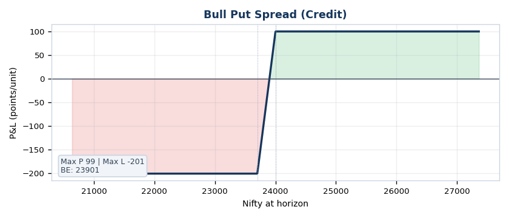

**The numbers (modelled at Nifty 24000).** Max profit 99 points (₹7,425) — the credit kept if Nifty stays at/above 24000. Max loss 201 points (₹15,075), if Nifty falls below 23700. Breakeven 23901. Net credit 99. Risk:reward 0.5 — you risk roughly twice the credit, the standard shape of premium selling: you win often but small, lose seldom but bigger.

**Greeks & behaviour.** Net delta positive (you want price up or flat). Theta is *positive* — this is the whole point, time decay pays you every day Nifty holds. Vega is negative (short vega): falling IV helps, rising IV (usually alongside a drop) hurts. Theta and the short-vega tailwind dominate when price cooperates.

**Management & exit.** Standard discipline: buy it back at ~50% of the max credit rather than holding for the last rupees into expiry-week gamma. Set a stop if the loss reaches roughly 1.5–2× the credit, or if the short strike is breached. Roll the spread down-and-out for a further credit if Nifty tests 24000 but your bullish thesis holds.

**Risk note.** Defined risk caps the disaster at 201 points, but the payoff is lopsided — a gap below 23700 hands you near-max loss in one session, wiping out several winning trades. Most retail F&O sellers lose money (SEBI studies); size small, respect the stop, and never treat the credit as free money.

**Scenario P&L (₹ per lot, at expiry).**

| Nifty at expiry | 22,800 | 23,400 | 24,000 | 24,600 | 25,200 |
|---|---|---|---|---|---|
| **P&L (₹/lot)** | -₹15,075 | -₹15,075 | +₹7,425 | +₹7,425 | +₹7,425 |

Reading across: this credit trade keeps its full +₹7,425 anywhere from spot upward, needing only that Nifty hold the 24,000 short strike, and realises its -₹15,075 max loss on a fall below the 23,700 long put — the lopsided shape of premium selling.

**Adjustments, variants & timing.** As a high-IV income trade, the core adjustment when the 24,000 short put is tested is to roll down-and-out for a further credit (sell the 23,800 of the next week) — pushing the strike below the new price while your bullish-floor thesis holds — or convert to an iron condor by adding a bear call spread overhead to collect more premium in a range. If 23,700 is breached, take the defined loss; don't double down into a falling knife. This suits Nifty monthly and Bank Nifty weeklies alike — weeklies actually shine here because theta is brutal in the final days — plus liquid single stocks at support. Being a credit spread it demands a HIGH IV-rank window: sell when India VIX has spiked into its top third (post-selloff, pre-event fear) so the 99-point credit is fat and mean-reverting vol becomes a tailwind. Selling into low IV is the cardinal error.

## 18. Bull Put Spread (Wide)
*Neutral to bullish · Short vega · net credit*

**The idea (intuition).** The same sell-a-put-buy-a-lower-put income trade, but with the strikes spread far apart. A wider gap means you collect a bigger credit — but your protective put is further away, so the potential loss balloons too. More premium, more rope.

**When & why to use it.** Use the wide version when you want a larger absolute credit per lot and have strong conviction Nifty holds above the short strike — and when IV is high enough to justify the bigger exposure. It can make sense when margin efficiency matters less than collecting meaningful premium on a single position. Avoid it if your account is small relative to the now-larger max loss, or near event risk where a deep gap could approach the full 429-point loss.

**How to build it (₹, Nifty).** Sell 24000 PE @ 318, buy 23400 PE @ 148. Net credit 170.7 points ≈ 171 × 75 = ₹12,825 received per lot. The 600-point width nearly doubles both the credit and the risk versus the standard bull put spread.

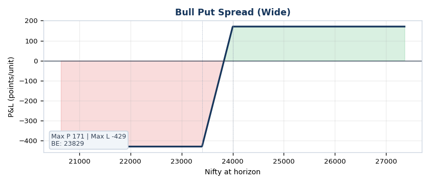

**The numbers (modelled at Nifty 24000).** Max profit 171 points (₹12,825), kept if Nifty stays at/above 24000. Max loss 429 points (₹32,175), if Nifty falls below 23400. Breakeven 23829. Net credit 171. Risk:reward 0.4 — worse than the narrow version: the wider strikes lift max profit but the risk grows faster, so the ratio sags.

**Greeks & behaviour.** Net delta positive. Theta positive — time decay pays you while Nifty holds. Vega negative; rising IV (typically with a selloff) hurts on two fronts. Because the strikes are far apart, the position behaves more like a lightly-hedged short put: more directional sensitivity than a tight spread.

**Management & exit.** Close at ~50% of the 171-point credit. The larger max loss makes a hard stop essential — exit if loss hits ~1.5× credit or the short strike is tested. Rolling is possible but the wide structure is clumsier to adjust; many traders simply cut and redeploy.

**Risk note.** This is the cautionary member of the family: a 429-point max loss is over 2.5× the credit, and a sharp gap below 23400 realises most of it instantly. The fatter premium is compensation for genuinely fatter tail risk — size for the loss, not the credit, and remember most premium sellers lose over time.

**Scenario P&L (₹ per lot, at expiry).**

| Nifty at expiry | 22,800 | 23,400 | 24,000 | 24,600 | 25,200 |
|---|---|---|---|---|---|
| **P&L (₹/lot)** | -₹32,175 | -₹32,175 | +₹12,825 | +₹12,825 | +₹12,825 |

Reading across: the wide credit keeps a meatier +₹12,825 from spot upward but the distant 23,400 long put means a breakdown delivers a punishing -₹32,175 — the bigger premium bought with genuinely bigger tail risk.

**Adjustments, variants & timing.** The wide structure is clumsier to adjust, so defence is mostly binary: if the 24,000 short put is tested, roll down-and-out for credit while the floor thesis holds, but the 600-point width makes a clean roll expensive, so many traders simply cut at ~1.5× credit and redeploy. You can also buy back nothing and instead add a far-OTM long put to cap the now-large tail if an event looms. It suits Nifty monthly where the larger absolute credit is the goal and Bank Nifty weeklies only for experienced sellers who respect the 429-point max loss; size it for the loss, not the credit. As a credit spread it needs a HIGH IV-rank window — sell only when India VIX is elevated (top third) so the 171-point credit compensates for the fat tail; the wider the wing, the more you depend on rich IV and mean reversion to make the math work.

## 19. Bear Call Spread (Credit)
*Neutral to bearish · Short vega · net credit*

**The idea (intuition).** The bearish income mirror of the bull put spread. You sell a call and buy a higher call for protection, banking a credit. You win if Nifty stays *below* your short strike — it doesn't have to fall, it just must not rally. Get paid to cap the upside.

**When & why to use it.** A high-IV, neutral-to-bearish trade. Sell it when IV rank is high and you think Nifty is capped — stalling at resistance, after an overbought run, or in a sideways-to-down tape — with one to two weeks to expiry for brisk theta. It pairs naturally with overhead resistance you trust. Don't sell it into a strong uptrend or ahead of a bullish catalyst that could gap price through both strikes; and don't bother when IV is already low and the credit is thin.

**How to build it (₹, Nifty).** Sell 24000 CE @ 456, buy 24300 CE @ 292. Net credit 164 points ≈ 164 × 75 = ₹12,300 received per lot. The long 24300 call defines risk and keeps SPAN margin modest versus a naked short call.

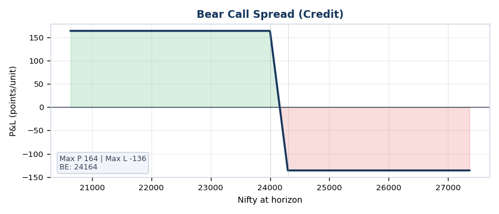

**The numbers (modelled at Nifty 24000).** Max profit 164 points (₹12,300), kept if Nifty stays at/below 24000. Max loss 136 points (₹10,200), if Nifty rises above 24300. Breakeven 24164. Net credit 164. Risk:reward 1.21 — unusually, the credit exceeds the risk here, because the short call is struck right at spot, making this an aggressive, lower-probability credit trade.

**Greeks & behaviour.** Net delta negative (you want price down or flat). Theta positive — time decay is your engine. Vega negative: falling IV helps, and IV often falls as markets drift up calmly, which also pushes price the wrong way — a tension to watch. Theta dominates when Nifty stays capped.

**Management & exit.** Buy it back at ~50% of the credit. Because the short strike sits at the money, this trade tests quickly — set a stop near 1.5× credit or on a clean break above 24000. Roll up-and-out for a further credit if Nifty grinds higher but you still expect a ceiling.

**Risk note.** Defined risk caps loss at 136 points, but an at-the-money short call means a real chance of being breached — and a sharp rally gap through 24300 delivers the full loss in one move. Selling the upside is not free; rallies can be faster than selloffs.

**Scenario P&L (₹ per lot, at expiry).**

| Nifty at expiry | 22,800 | 23,400 | 24,000 | 24,600 | 25,200 |
|---|---|---|---|---|---|
| **P&L (₹/lot)** | +₹12,300 | +₹12,300 | +₹12,300 | -₹10,200 | -₹10,200 |

Reading across: this bearish credit keeps its full +₹12,300 anywhere at or below the 24,000 short call and flips to its -₹10,200 max loss once Nifty pushes above the 24,300 long strike — an aggressive, at-the-money credit trade with only moderate probability.

**Adjustments, variants & timing.** With the short call struck right at spot, this tests fast, so the standard move when Nifty grinds up to 24,000 is to roll the short leg up-and-out (to 24,300 next week) for a further credit, or convert to an iron condor by adding a bull put spread below to widen the profit zone. If price breaks cleanly above 24,000 with momentum, take the defined loss rather than fighting an uptrend — rallies in Nifty can be relentless. It pairs best with trusted overhead resistance on Nifty monthly or Bank Nifty weeklies (weeklies maximise the theta harvest), and with single stocks stalling at a known cap. As a credit spread it requires a HIGH IV-rank window: sell when India VIX sits in its upper third so the 164-point credit is rich. Note that IV often falls as markets drift up calmly, helping vega while price works against you — manage actively.

## 20. Bear Call Spread (Wide)
*Neutral to bearish · Short vega · net credit*

**The idea (intuition).** The bearish credit spread with strikes pulled far apart. A wider corridor means a much bigger credit collected, but the protective call is distant, so the loss potential swells too. More premium in your pocket, more room for pain.

**When & why to use it.** Choose the wide version when you want a substantial credit per lot and are confident Nifty stays capped below the short strike, with IV high enough to reward the larger exposure. It can suit traders who prefer one meatier position over several tight ones. Avoid it when your account can't comfortably absorb the larger max loss, or near bullish event risk where a gap up could push toward the full 311-point loss.

**How to build it (₹, Nifty).** Sell 24000 CE @ 456, buy 24600 CE @ 167. Net credit 288.7 points ≈ 289 × 75 = ₹21,675 received per lot. The 600-point width roughly doubles both credit and risk versus the standard bear call spread.

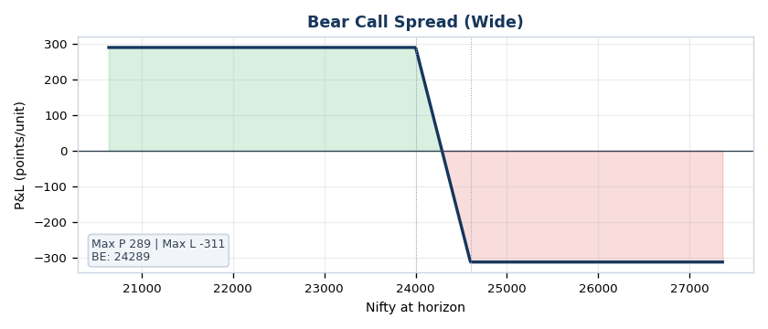

**The numbers (modelled at Nifty 24000).** Max profit 289 points (₹21,675), kept if Nifty stays at/below 24000. Max loss 311 points (₹23,325), if Nifty rises above 24600. Breakeven 24289. Net credit 289. Risk:reward 0.93 — close to one-to-one, with the larger width lifting both sides; the at-the-money short call keeps probability moderate, not high.

**Greeks & behaviour.** Net delta negative. Theta positive — your daily tailwind while Nifty stays capped. Vega negative. With strikes far apart, the position carries more directional punch than a tight spread, behaving like a lightly-hedged short call.

**Management & exit.** Close at ~50% of the credit. The big max loss demands a firm stop — exit near 1.5× credit or on a decisive break above the at-the-money short strike. Adjusting a wide spread is awkward; many traders just cut and reset rather than roll.

**Risk note.** With a 311-point max loss against a 289-point credit, the risk slightly exceeds the reward and an upside gap through 24600 realises it fast. The generous premium is paid because the tail is genuinely wider — size for the worst case, and recall that the majority of premium sellers lose over time.

**Scenario P&L (₹ per lot, at expiry).**

| Nifty at expiry | 22,800 | 23,400 | 24,000 | 24,600 | 25,200 |
|---|---|---|---|---|---|
| **P&L (₹/lot)** | +₹21,675 | +₹21,675 | +₹21,675 | -₹23,325 | -₹23,325 |

Reading across: the wide bearish credit banks a generous +₹21,675 across the whole lower half of the table, holding below the 24,000 short call, but a rally above the distant 24,600 long strike inflicts a -₹23,325 loss that slightly exceeds the credit taken in.

**Adjustments, variants & timing.** The 600-point width makes clean rolls costly, so management is mostly stop-driven: if Nifty breaks above the at-the-money 24,000 short call, cut near 1.5× credit or roll the short leg up-and-out only if resistance overhead is still trusted. You can also bolt on a bull put spread below to form a wide iron condor and offset some risk with extra premium. It fits Nifty monthly when you want one meaty position over several tight ones, and Bank Nifty weeklies only for those who can absorb the 311-point tail; size for the worst case, never the credit. As a credit spread it demands a HIGH IV-rank entry — sell only with India VIX in its top third so the 289-point credit justifies the wide exposure. The richer the premium, the more you are relying on elevated IV mean-reverting and the feared rally simply not arriving.

## 21. Bull Call Spread (Far OTM Cheapie)
*Bullish breakout · Neutral vega · net debit*

**The idea (intuition).** A lottery-style debit spread struck well above spot. You pay a tiny premium for a shot at a big payout if Nifty rallies hard into a distant corridor. Low cost, high reward ratio, low odds — a defined-risk way to bet on a sharp upside move.

**When & why to use it.** Use it when you expect an outsized rally — a powerful breakout, a short-squeeze, a momentum thrust into resistance — within the expiry window. It is ideal for expressing a high-conviction "this could run" idea for a few hundred rupees of risk, the kind of asymmetric punt you can take repeatedly. It is wrong as a core position or for a mild lean: far-OTM spreads expire worthless most of the time, so treat them as cheap convexity, not income.

**How to build it (₹, Nifty).** Buy 24300 CE @ 292, sell 24700 CE @ 135. Net debit 157.2 points ≈ 157 × 75 = ₹11,775 per lot. Both legs sit well above spot, so the entire debit is extrinsic — pure time-and-volatility value.

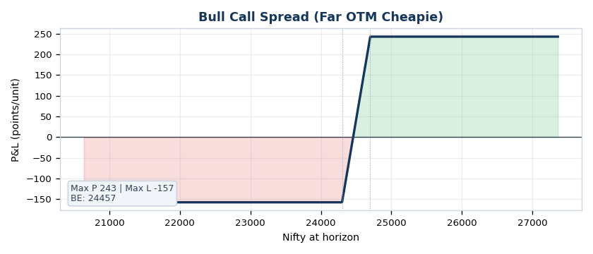

**The numbers (modelled at Nifty 24000).** Max profit 243 points (₹18,225), at 24700+. Max loss 157 points (₹11,775), at 24300 or below. Breakeven 24457 — Nifty must climb roughly 1.9% just to break even. Net debit 157. Risk:reward 1.54 — well over one-to-one, the payoff for a genuinely lower-probability bet.

**Greeks & behaviour.** Net delta positive but small at entry (both legs far OTM), building sharply only if price rallies toward the strikes. Theta negative throughout while Nifty stays below the corridor — distant extrinsic value bleeds quickly as expiry nears. Vega near zero net, though each leg is vega-sensitive. This is a "big, fast move or nothing" trade.

**Management & exit.** If the spread doubles or triples on a fast rally, bank it — far-OTM gains evaporate just as fast on a pullback. There is little point in a tight stop on such a cheap, convex position; many traders simply risk the full debit knowing the odds. Don't roll it up chasing a move that has already happened.

**Risk note.** The honest truth is low probability: breakeven is nearly 2% above spot, so most of these expire worthless. Risk only what you can comfortably write off, and treat repeated small losses as the cost of occasionally catching a large move.

**Scenario P&L (₹ per lot, at expiry).**

| Nifty at expiry | 22,800 | 23,400 | 24,000 | 24,600 | 25,200 |
|---|---|---|---|---|---|
| **P&L (₹/lot)** | -₹11,775 | -₹11,775 | -₹11,775 | +₹10,725 | +₹18,225 |

Reading across: the far-OTM cheapie sits at its -₹11,775 loss across the lower half, only turns positive between the strikes (+₹10,725 at 24,600), and reaches its +₹18,225 max once Nifty rallies hard past the 24,700 short call — a true big-move-or-nothing payoff.

**Adjustments, variants & timing.** Treat this as cheap convexity, not a managed position: if a fast rally doubles or triples the spread, bank it immediately because far-OTM gains evaporate on the smallest pullback. There is little point in a tight stop on so cheap a structure — many traders simply risk the full debit. The one productive adjustment is to roll up to fresh strikes if a new catalyst appears before expiry, but never chase a move that has already happened. It suits Nifty monthly for expressing a high-conviction melt-up idea and Bank Nifty weeklies as a lottery-style punt into a known event (policy day, results); single stocks work for squeeze setups. As a debit spread it favours a LOW IV-rank window — buy when India VIX is calm so the distant strikes are cheap; entering far-OTM convexity when IV is already high means overpaying for a low-base-rate bet, the quickest way to bleed an account.

## 22. Bear Put Spread (Far OTM)
*Bearish breakdown · Neutral vega · net debit*

**The idea (intuition).** The downside lottery ticket. A cheap put spread struck well below spot that pays handsomely if Nifty drops sharply into the corridor. Small premium out, large reward ratio, low base-rate — defined-risk convexity for a fast fall.

**When & why to use it.** Deploy it when you anticipate a sharp break lower — a panic leg down, a global risk-off shock, a decisive breakdown through support — inside the expiry window. It is the way to own crash-like convexity for a few hundred rupees while keeping risk fully defined (unlike shorting futures). It is the wrong tool for a slow grind down or a mild bearish lean; if the drop is shallow or late, the spread expires worthless.

**How to build it (₹, Nifty).** Buy 23700 PE @ 219, sell 23300 PE @ 129. Net debit 89.8 points ≈ 90 × 75 = ₹6,750 per lot. Both puts are well below spot, so the whole debit is extrinsic value.

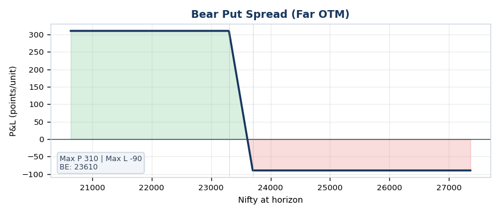

**The numbers (modelled at Nifty 24000).** Max profit 310 points (₹23,250), at 23300 or below. Max loss 90 points (₹6,750), at 23700 or above. Breakeven 23610 — Nifty must fall about 1.6% to break even. Net debit 90. Risk:reward 3.45 — the richest ratio in the group, the reward for the lowest probability.

**Greeks & behaviour.** Net delta negative but modest at entry (both legs far OTM), steepening only as price falls toward the strikes. Theta negative while Nifty sits above the corridor — distant time value decays fast. Vega near zero net, though a volatility spike on a selloff can lift the long put en route. A "sharp drop or nothing" bet.

**Management & exit.** If a fast selloff multiplies the spread, take the money — far-OTM downside gains reverse quickly on any bounce. A tight stop matters little on so cheap a position; sizing is the real risk control. Don't chase by rolling lower after the move has already played out.

**Risk note.** Low probability is the headline: breakeven is well under spot and most of these expire worthless. Use it as inexpensive tail insurance or a speculative punt, risking only what you can write off, and accept frequent small losses as the price of occasional big wins.

**Scenario P&L (₹ per lot, at expiry).**

| Nifty at expiry | 22,800 | 23,400 | 24,000 | 24,600 | 25,200 |
|---|---|---|---|---|---|
| **P&L (₹/lot)** | +₹23,250 | +₹15,750 | -₹6,750 | -₹6,750 | -₹6,750 |

Reading across: the downside lottery ticket reaches its +₹23,250 max on a deep fall to the 23,300 short strike, is still partly in profit (+₹15,750) at 23,400, and sits at its small -₹6,750 loss across the entire upper half — large reward for a low base-rate crash bet.

**Adjustments, variants & timing.** This is bought as crash convexity, so manage it like one: if a panic leg down multiplies the spread, take the money fast because far-OTM downside gains reverse on any bounce. A tight stop matters little on so cheap a position — sizing is the real control. Don't roll lower chasing a drop that has already played out; instead re-strike fresh only if a new risk-off catalyst emerges. It suits Nifty monthly as inexpensive portfolio tail-insurance and Bank Nifty weeklies as a speculative punt into a feared event; single stocks work for breakdown-through-support setups. As a debit spread it favours a LOW IV-rank entry, yet India's persistent put skew keeps downside wings perpetually bid — so the genuine A+ window is a complacent, low-VIX tape before fear is priced, when you can own crash convexity cheaply. Buying these after VIX has already spiked is overpaying for protection.

## 23. Bull Put Spread (Narrow / High Prob)
*Neutral to bullish · Short vega · net credit*

**The idea (intuition).** A tight, further-OTM put credit spread built for a high win-rate. The short strike sits well below spot and the two strikes are close together, so you collect a small credit but the odds of keeping it are high. Sell a little, win often.

**When & why to use it.** Use it when you want steady, high-probability income and are comfortable with a small reward for a small chance of a larger loss — the classic premium-seller's bread. It works best in a calm-to-firm market with elevated IV, one to two weeks out, where Nifty is unlikely to fall to the short strike. Avoid it when IV is low (the credit is too thin to justify the tail) or before a known catalyst that could gap price through your narrow protective wing.

**How to build it (₹, Nifty).** Sell 23800 PE @ 248, buy 23600 PE @ 192. Net credit 56.2 points ≈ 56 × 75 = ₹4,200 received per lot. The tight 200-point width keeps both the credit and the defined risk small, and the margin light.

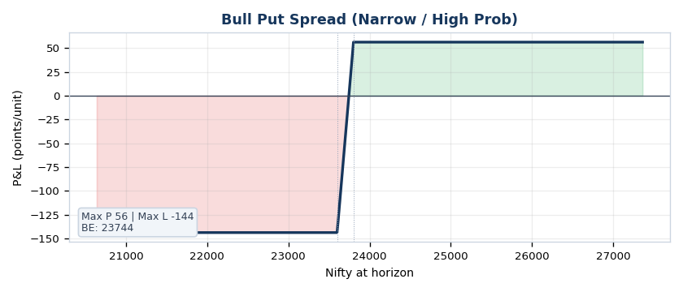

**The numbers (modelled at Nifty 24000).** Max profit 56 points (₹4,200), kept if Nifty stays at/above 23800. Max loss 144 points (₹10,800), if Nifty falls below 23600. Breakeven 23744 — comfortably below spot, the source of the high win-rate. Net credit 56. Risk:reward 0.39 — you risk well over twice the credit, the textbook shape of a high-probability income trade.

**Greeks & behaviour.** Net delta slightly positive. Theta positive — the daily decay you are harvesting. Vega negative: calm or falling IV helps, an IV spike (usually on a drop toward your strike) hurts. Theta dominates as long as Nifty stays clear of 23800.

**Management & exit.** With a small credit, the 50% take-profit comes quickly — bank it and redeploy rather than risking gamma late. Discipline on the stop is critical because the loss is nearly 2.6× the credit; exit if the short strike is threatened or loss hits ~1.5× credit. Roll down-and-out only if your bullish floor thesis still holds.

**Risk note.** The seductive trap of high-probability selling: many small wins can be erased by one breach below 23600, since the max loss dwarfs the credit. A gap-down realises it in a session. Most retail F&O sellers lose money (SEBI studies) precisely by over-sizing trades like this — keep size small and honour the stop.

**Scenario P&L (₹ per lot, at expiry).**

| Nifty at expiry | 22,800 | 23,400 | 24,000 | 24,600 | 25,200 |
|---|---|---|---|---|---|
| **P&L (₹/lot)** | -₹10,800 | -₹10,800 | +₹4,200 | +₹4,200 | +₹4,200 |

Reading across: the narrow high-probability put credit keeps its small +₹4,200 across the whole upper half, holding above the 23,800 short strike, and turns to its -₹10,800 max loss only on a fall below the 23,600 long put — many small wins shadowed by one larger loss.

**Adjustments, variants & timing.** With a tight 200-point wing, rolling is cheap and effective: if Nifty slides toward the 23,800 short strike, roll down-and-out for a fresh small credit while the floor thesis holds, or pair it with a narrow bear call spread to form a tight iron condor and double the theta in a range. The small credit means the 50% take-profit comes quickly — bank and redeploy rather than risk late gamma. It is tailor-made for Bank Nifty weeklies and Nifty weekly/monthly where high win-rate income is the goal, and liquid single stocks above support. As a credit spread it lives or dies on the IV-rank window: sell only when India VIX is in its upper third so the thin 56-point credit is worth the 144-point tail. Selling this narrow structure into low IV is the textbook over-sizing trap that SEBI studies show wipes out retail sellers.

## 24. Bear Call Spread (Narrow / High Prob)
*Neutral to bearish · Short vega · net credit*

**The idea (intuition).** The high-probability income trade on the upside. A tight call credit spread struck above spot: you sell a small credit betting Nifty stays below your short strike. Close strikes, modest premium, high odds of keeping it.

**When & why to use it.** Reach for it when you want steady income with a high win-rate and a mildly bearish-to-neutral view, ideally in elevated IV with one to two weeks to expiry. It suits a market capped under resistance that you expect to chop or ease lower. Don't sell it into a strong uptrend or before a bullish catalyst, and skip it when IV is depressed and the thin credit won't compensate for the tail.

**How to build it (₹, Nifty).** Sell 24200 CE @ 342, buy 24400 CE @ 246. Net credit 96.5 points ≈ 97 × 75 = ₹7,275 received per lot. The tight 200-point width keeps risk and margin contained while the short strike sits safely above spot.

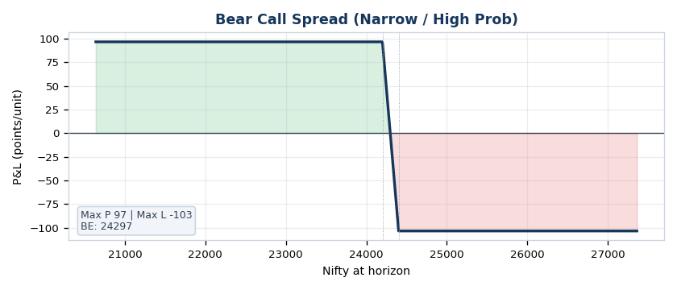

**The numbers (modelled at Nifty 24000).** Max profit 97 points (₹7,275), kept if Nifty stays at/below 24200. Max loss 103 points (₹7,725), if Nifty rises above 24400. Breakeven 24297 — above spot, giving room for the trade to work. Net credit 97. Risk:reward 0.93 — close to one-to-one, with the OTM short strike supplying the probability edge rather than the ratio.

**Greeks & behaviour.** Net delta slightly negative. Theta positive — your income engine. Vega negative: calm or falling IV helps, a vol pop hurts. As long as Nifty holds below 24200, theta and the short-vega tailwind carry the P&L.

**Management & exit.** Take profit at ~50% of the credit and redeploy. Although risk and reward are near-balanced here, still set a stop near 1.5× credit or on a clean break above the short strike — an OTM cushion is not a guarantee. Roll up-and-out for further credit if Nifty drifts toward 24200 but you still expect a ceiling.

**Risk note.** Defined risk caps the loss near 103 points, but a sharp upside gap through 24400 hands it to you at once, and a string of small wins can vanish in one breach. Selling the upside is never free; rallies can be abrupt — keep size modest and respect the stop.

**Scenario P&L (₹ per lot, at expiry).**

| Nifty at expiry | 22,800 | 23,400 | 24,000 | 24,600 | 25,200 |
|---|---|---|---|---|---|
| **P&L (₹/lot)** | +₹7,275 | +₹7,275 | +₹7,275 | -₹7,725 | -₹7,725 |

Reading across: the narrow high-probability call credit keeps its +₹7,275 across the whole lower half, holding below the 24,200 short strike, and flips to its -₹7,725 max loss only on a rally past the 24,400 long call — a high win-rate offset by a near one-to-one ratio.

**Adjustments, variants & timing.** The tight 200-point wing rolls cleanly: if Nifty drifts up toward the 24,200 short strike, roll up-and-out for a fresh credit while resistance overhead still holds, or add a narrow bull put spread below to build a compact iron condor and harvest theta from both sides of a range. Take profit at ~50% of the credit and redeploy rather than risk expiry-week gamma. It fits Bank Nifty weeklies and Nifty weekly/monthly perfectly for steady high-probability income, plus single stocks capped under resistance. As a credit spread it needs a HIGH IV-rank window: sell when India VIX sits in its upper third so the 97-point credit fairly compensates for the 103-point tail. The OTM cushion supplies the probability edge, not the ratio — so disciplined sizing and an honoured stop, not the cushion, keep you in the game.

## 25. Deep-ITM Bull Call Spread
*Bullish, very high prob · Neutral vega · net debit*

**The idea (intuition).** Push both call strikes well below spot and you get a debit spread that is almost certain to pay near-max — it behaves like a high-delta proxy for being long Nifty, with a hard, defined floor. You pay up for near-certainty: as long as the index doesn't fall meaningfully, you collect most of the width.

**When & why to use it.** Use it when you are strongly bullish or want an index-like long exposure with capped, known downside and minimal theta drag — a cleaner alternative to a naked deep-ITM call or to holding futures with their mark-to-market swings. It is also handy when IV is high and you want directional exposure without paying for vega (this is vega-flat). It is a poor fit for a small reward appetite — you stake a lot to make a little — or when you actually want cheap convexity (use a far-OTM spread instead).

**How to build it (₹, Nifty).** Buy 23500 CE @ 803, sell 23800 CE @ 585. Net debit 218.4 points ≈ 218 × 75 = ₹16,350 per lot. The spread starts deep in the money, so most of that debit is intrinsic value you simply carry to expiry.

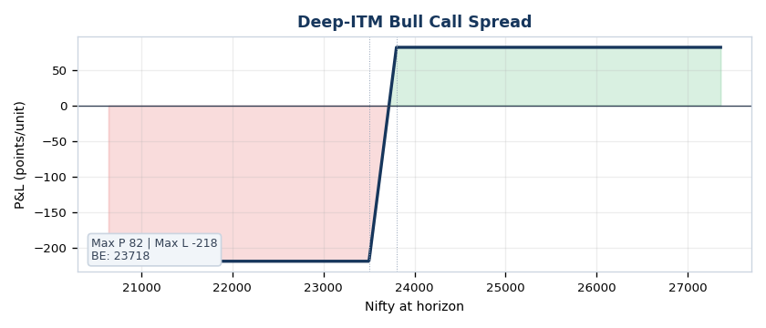

**The numbers (modelled at Nifty 24000).** Max profit 82 points (₹6,150), at 23800+. Max loss 218 points (₹16,350), only if Nifty falls below 23500. Breakeven 23718 — far below spot, so even a sizeable dip still pays. Net debit 218. Risk:reward 0.37 — you risk nearly three times the reward, the toll for very high probability.

**Greeks & behaviour.** Net delta is strongly positive at entry, the closest of any spread here to a one-for-one index long. Theta is roughly neutral — little extrinsic value remains to decay. Vega near zero. The position tracks Nifty almost linearly within the corridor and pins to max once above 23800.

**Management & exit.** With breakeven far below spot, holding to expiry to collect near-max is the usual plan. If Nifty breaks below 23500, the defined loss caps you — consider rolling down only if the trend has genuinely reversed. Bank it early at ~90% of max if offered, since the remaining upside is tiny.

**Risk note.** The asymmetry is stark: 218 at risk to make 82, so one deep gap below 23500 erases the gains of several winners. Very high probability is not certainty — a sharp risk-off shock still delivers the full, larger loss. Use it as a directional proxy, sized for that downside.

**Scenario P&L (₹ per lot, at expiry).**

| Nifty at expiry | 22,800 | 23,400 | 24,000 | 24,600 | 25,200 |
|---|---|---|---|---|---|
| **P&L (₹/lot)** | -₹16,350 | -₹16,350 | +₹6,150 | +₹6,150 | +₹6,150 |

Reading across: the deep-ITM proxy pays its full -₹16,350 loss only on a fall below the 23,500 long strike, is already at its +₹6,150 max by today's 24,000 spot, and stays pinned to that cap all the way up — a near-certain payoff bought with a heavy debit.

**Adjustments, variants & timing.** Born deep in-the-money with breakeven far below spot, it behaves like a defined-risk long Nifty and needs almost no management: if the index breaks the 23,500 long strike on a genuine reversal, roll the whole spread down a week to follow the new trend rather than eat the 218-point debit; otherwise hold to expiry and collect near-max. Bank it early at ~90% of max since the remaining upside is tiny. It suits Nifty monthly and high-priced single stocks as a cleaner substitute for a deep-ITM naked call or for holding futures without daily mark-to-market swings; Bank Nifty weeklies are too volatile for this slow, capital-heavy structure. It is vega-flat, so the IV-rank window is secondary — but you still prefer a LOW VIX so the intrinsic-dominated debit carries minimal extrinsic padding, making the directional proxy as cheap and efficient as possible at entry.

## 26. Deep-OTM Bear Call Spread
*Mildly bearish / range · Short vega · net credit*

**The idea (intuition).** A far-OTM call credit spread that sells the upside tail. You collect a credit betting Nifty stays below a distant strike — steady income from the premise that the market simply won't rip higher. Sell the part of the distribution you think won't happen.

**When & why to use it.** Use it for income with a mildly bearish-to-range view, when you expect Nifty to stall or drift and want to monetise an upside that looks unlikely, ideally in elevated IV with one to two weeks to expiry. It pairs well with strong overhead resistance and a calm-to-soft tape. Avoid it in a powering uptrend or ahead of a bullish catalyst, and skip it when IV is low and the credit doesn't pay for the still-real tail.

**How to build it (₹, Nifty).** Sell 24400 CE @ 246, buy 24700 CE @ 135. Net credit 111.2 points ≈ 111 × 75 = ₹8,325 received per lot. The short strike sits well above spot, giving a wide cushion before the trade is threatened.

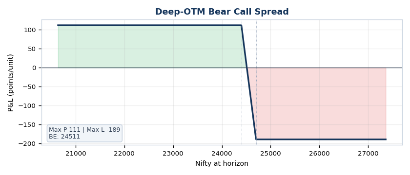

**The numbers (modelled at Nifty 24000).** Max profit 111 points (₹8,325), kept if Nifty stays at/below 24400. Max loss 189 points (₹14,175), if Nifty rises above 24700. Breakeven 24511 — a comfortable 2.1% above spot, the source of the high win-rate. Net credit 111. Risk:reward 0.59 — you risk more than the credit, the familiar shape of selling an unlikely tail.

**Greeks & behaviour.** Net delta slightly negative. Theta positive — the daily decay you harvest while Nifty stays capped. Vega negative: calm or falling IV helps, a vol spike hurts. With a wide OTM cushion, theta and short-vega dominate unless a strong rally develops.

**Management & exit.** Take profit at ~50% of the credit and redeploy. The far cushion tempts complacency — still set a stop near 1.5× credit or on a decisive push toward 24400. Roll up-and-out for additional credit if Nifty rallies but you still expect a ceiling overhead.

**Risk note.** Selling the upside tail wins most of the time, which is exactly why one breach above 24700 — a melt-up or a gap on good news — can erase many quiet winners, with max loss well above the credit. This worst case assumes a real rally through your wing; in practice you size small and manage at a multiple of the credit. Most retail F&O sellers lose money (SEBI studies) by treating such trades as free income — they are not.

**Scenario P&L (₹ per lot, at expiry).**

| Nifty at expiry | 22,800 | 23,400 | 24,000 | 24,600 | 25,200 |
|---|---|---|---|---|---|
| **P&L (₹/lot)** | +₹8,325 | +₹8,325 | +₹8,325 | -₹6,675 | -₹14,175 |

Reading across: selling the upside tail keeps the full +₹8,325 across the whole lower half below the 24,400 short call, gives back a partial -₹6,675 between the strikes at 24,600, and only realises its -₹14,175 max once Nifty clears the distant 24,700 long call.

**Adjustments, variants & timing.** The wide OTM cushion tempts complacency, so the disciplined move when Nifty rallies toward the 24,400 short strike is to roll up-and-out for additional credit while overhead resistance still holds, or add a deep-OTM bull put spread below to form a wide iron condor and monetise both unlikely tails. Take profit at ~50% of credit and redeploy; do not wait for the last rupees into expiry-week gamma. It suits Nifty monthly and Bank Nifty weeklies for income against trusted resistance, plus range-bound single stocks. As a credit spread it demands a HIGH IV-rank window — sell only when India VIX is in its top third so the 111-point credit pays for the still-real tail; selling a distant wing into low IV collects too little to justify the gap risk, the precise habit that turns high-probability income into a slow account drain.

# Strategy Group 3: Straddles, Strangles & Volatility

This family is the purest expression of a view on *movement* rather than *direction*. Every structure here is built from a call and a put together — when you buy both you are long volatility (you want a big move and you pay theta for the privilege); when you sell both you are short volatility (you want the index to sit still and you collect theta while carrying tail risk). The single decision that unites the whole group is your read on India VIX and realised movement: is the option market over-pricing the coming move (sell premium) or under-pricing it (buy premium)? Everything below is a variation on that one trade-off — strike width, expiry distance, directional lean, and how brutally an IV crush or a gap can punish the wrong side.

## 27. Long Straddle
*Big move, direction unknown · Long vega · net debit*

**The idea (intuition).** Buy the call and the put at the same strike and you have bought a bet that "something big happens," up or down, you don't care which. It is the trade you put on when you are certain a move is coming but genuinely cannot call the direction — think of it as buying an insurance policy that pays whichever way the building falls.

**When & why to use it.** Use it ahead of a known catalyst when implied vol is still cheap — before a budget, an RBI policy, a large-cap earnings print, or an election count — and you expect realised movement to exceed what the premium implies. The killer condition is IV rank: enter when India VIX is *low* and likely to rise, because you are long vega. Do NOT buy a straddle into an already-elevated VIX or the night before results when premiums are fat — the post-event IV crush will gut you even if the index moves, because the vol you paid for evaporates at the open.

**How to build it (₹, Nifty).** Buy 24000 CE @ 456 and buy 24000 PE @ 318 for a net debit of 774.2 points. At lot 75 that is about ₹58,065 of premium at risk per lot — real money, all of it bleeding to theta every day you wait.

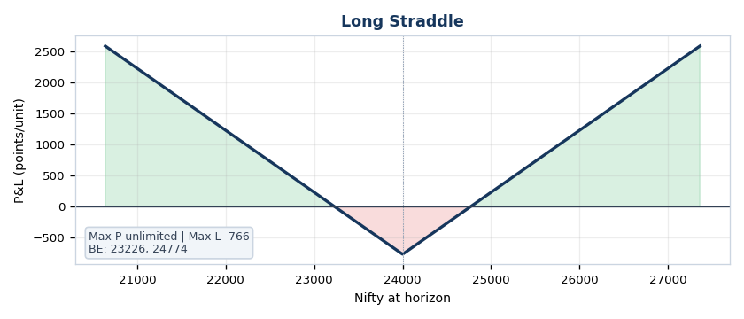

**The numbers (modelled at Nifty 24000).** Max profit is Unlimited (the call leg has no ceiling). Max loss is 766.0 points (about ₹57,450 per lot) if Nifty pins exactly 24000 at expiry. Breakevens are 23226 and 24774 — Nifty must travel roughly 774 points either way just to get you flat. Net debit 774.2 points; risk:reward is undefined because the upside is open-ended.

**Greeks & behaviour.** Net delta is near zero at inception (the call and put deltas offset), so it is direction-neutral at the start but becomes directional fast as the index moves — positive gamma is the whole point. Theta is firmly negative: time is your enemy. Vega is positive and large; a rise in India VIX helps you even before the index budges. P&L is dominated by gamma and vega in a fight against theta.

**Management & exit.** Have a plan before you enter: if the catalyst delivers, take profit into the spike — close into strength rather than holding for "more." A common discipline is to exit at a fixed gain (say the position doubles) or cut at a partial loss if the move doesn't materialise within a day or two. Never carry a long straddle into expiry week hoping; theta accelerates and the breakevens widen against you.

**Risk note.** The honest danger is the IV crush: you can be *right* on the move and still lose if you overpaid for vol and it collapses post-event. The full debit is at risk, and a quiet, range-bound tape will quietly bleed the whole 774 points to zero.

**Scenario P&L (₹ per lot, at expiry).**

| Nifty at expiry | 22,800 | 23,400 | 24,000 | 24,600 | 25,200 |
|---|---|---|---|---|---|
| **P&L (₹/lot)** | +31,950 | -13,050 | -58,050 | -13,050 | +31,950 |

A 5% move either way (to 22,800 or 25,200) hands you about +₹31,950, while a pin at 24,000 realises the full -₹58,050 loss — the classic V-shaped long-vol payoff.

**Adjustments, variants & timing.** When the tape moves and one leg swells, leg out the winner (sell the profitable call or put) and let the cheap remaining leg run, or roll the untested leg toward the money to re-center delta. To blunt theta you can sell OTM wings, converting it into a reverse iron fly that caps cost. Gamma-scalp by selling Nifty futures against a rallying call (or buying futures against a falling put) to bank intraday swings. The structure fits Bank Nifty weeklies, where high gamma makes scalping lucrative, but theta there is brutal — a Nifty monthly gives the thesis more time to play out. Timing: buy when India VIX and IV rank are low (sub-12 VIX, bottom-quartile rank) and a catalyst looms; never pay up the night before results when IV is fat — the post-event crush guts you even on a correct move.

## 28. Short Straddle
*Range-bound / falling IV · Short vega · net credit*

**The idea (intuition).** Sell the call and the put at the same strike and you are the insurance company — you pocket the premium and win as long as the index does *not* move much. It is the highest-octane premium-selling trade in the book: maximum credit, maximum theta, and maximum tail risk.

**When & why to use it.** Deploy it when you expect a dead, range-bound market and, crucially, when IV is rich and likely to fall — sell *after* an event-day VIX spike, not before. The classic NSE setup is selling the ATM straddle the morning after results or a budget, harvesting the IV crush that punishes long-vol holders. Do NOT sell a naked straddle ahead of an unknown catalyst, into a trending market, or when VIX is already low (you are collecting little for unlimited risk).

**How to build it (₹, Nifty).** Sell 24000 CE @ 456 and sell 24000 PE @ 318 for a net credit of 774.2 points — about ₹58,065 received per lot. That cash is yours to keep only if Nifty behaves.

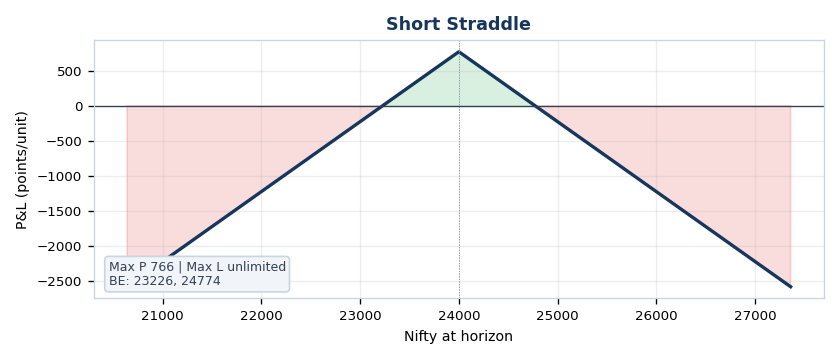

**The numbers (modelled at Nifty 24000).** Max profit is 766.0 points (~₹57,450 per lot), earned if Nifty expires pinned at 24000. Max loss is Undefined — large: theoretically unlimited as the index runs away in either direction. Breakevens are 23226 and 24774 — you keep some profit anywhere inside that ~1,550-point band. Net credit 774.2 points; risk:reward is undefined because the loss side is open-ended.

**Greeks & behaviour.** Net delta starts near zero but turns sharply against you as the index moves (short gamma — the worst feature). Theta is strongly positive: time decay is your paycheck. Vega is negative; falling India VIX is pure profit, rising VIX hurts even before the index moves. The trade lives and dies on negative gamma versus positive theta.

**Management & exit.** Discipline is everything. Take profit early — close at roughly 50% of the credit captured rather than squeezing the last points. Set a hard stop at a multiple of the credit (e.g., exit if the loss reaches 1.5–2x the premium received) and roll the tested side out or up/down to defend. Never hold a short straddle into expiry-week gamma, where a small move produces a violent P&L swing.

**Risk note.** This is the most dangerous structure in the chapter. The "Undefined — large" max loss is not a rounding artefact — a gap-up or gap-down (an SGX-led open, a geopolitical shock) can blow past your breakeven before you can act. Size small, define a stop, and respect that most retail F&O traders selling premium lose money (per SEBI studies). Never treat the credit as free money.

**Scenario P&L (₹ per lot, at expiry).**

| Nifty at expiry | 22,800 | 23,400 | 24,000 | 24,600 | 25,200 |
|---|---|---|---|---|---|
| **P&L (₹/lot)** | -31,950 | +13,050 | +58,050 | +13,050 | -31,950 |

A pin at 24,000 banks the full +₹58,050, but the table only spans ±5% — beyond 25,200 or 22,800 the loss keeps growing without limit, far past the -₹31,950 shown.

**Adjustments, variants & timing.** When one side is tested, roll the untested leg in to collect more credit, or roll the tested strike out and away; if the move persists, go inverted (roll the call below the put) to widen the band. The cleanest defence is to buy OTM wings, converting it to an iron fly with defined risk, or to delta-hedge with Nifty futures to flatten directional exposure. Bank Nifty weeklies offer rich premium but vicious gamma into Thursday's expiry — size tiny; a Nifty monthly or 45-DTE position is far calmer. Timing: sell only when India VIX is elevated and IV rank is high (above the 70th percentile), ideally into the post-event IV crush the morning after a budget or RBI policy. Avoid selling ahead of unknown catalysts or when VIX is already low — you would be collecting little for unlimited risk.

## 29. Long Strangle
*Big move, cheaper than straddle · Long vega · net debit*

**The idea (intuition).** Same long-volatility bet as the straddle, but you buy out-of-the-money strikes instead of ATM — a cheaper call above and a cheaper put below. You pay less, so you risk less, but the index has to move *further* before you profit.

**When & why to use it.** Use it when you expect a large move and want the long-vol exposure at a lower cash outlay than a straddle — ideal when you are confident the move will be *big* (not just moderate). Same IV logic: enter when India VIX is low and rising, ahead of a catalyst. Do NOT use it for small expected moves; OTM strikes need a meaningful travel to pay, and a modest wiggle leaves both legs worthless.

**How to build it (₹, Nifty).** Buy 24400 CE @ 246 and buy 23600 PE @ 192 for a net debit of 438.1 points — about ₹32,858 per lot, noticeably cheaper than the 774-point ATM straddle.

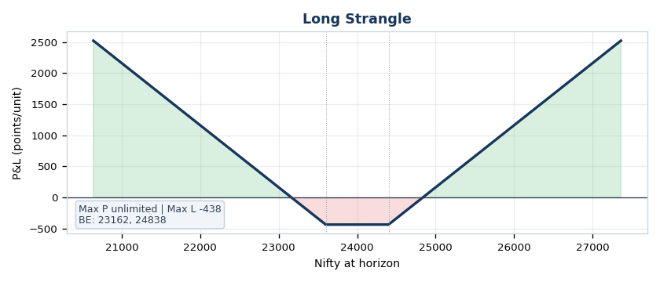

**The numbers (modelled at Nifty 24000).** Max profit is Unlimited. Max loss is 438.0 points (~₹32,850 per lot) — the full debit, lost if Nifty expires anywhere between the two strikes (23600–24400). Breakevens are 23162 and 24838, slightly wider than the straddle's. Net debit 438.1 points; risk:reward undefined (open-ended upside).

**Greeks & behaviour.** Net delta near zero at inception; positive gamma kicks in once the index moves past either strike. Theta negative — time decay erodes both OTM legs steadily. Vega positive and large; a VIX pop lifts the whole position. The cheaper entry is bought with a wider dead-zone, so gamma needs a bigger move to overcome theta.

**Management & exit.** Take profit into the move — if the catalyst delivers, close the winning leg's gains rather than waiting for the loser to come back. Cut the position if the expected move stalls within a day or two; OTM premiums decay fast. As with all long-vol trades, do not carry into expiry week.

**Risk note.** The full debit can go to zero in a flat market — and it does so *more easily* than a straddle because both legs are OTM and need real movement just to retain value. IV crush after the event is again the silent killer.

**Scenario P&L (₹ per lot, at expiry).**

| Nifty at expiry | 22,800 | 23,400 | 24,000 | 24,600 | 25,200 |
|---|---|---|---|---|---|
| **P&L (₹/lot)** | +27,150 | -17,850 | -32,850 | -17,850 | +27,150 |

A 5% move to either 22,800 or 25,200 returns about +₹27,150, while anywhere between the strikes around 24,000 forfeits the full -₹32,850 debit.

**Adjustments, variants & timing.** Manage it like a straddle but with OTM legs. When the index runs to one strike, sell the now-ITM leg's gains and ride the cheap far leg, or roll the untested put/call closer to harvest value. Adding short wings further out converts it to a reverse iron condor, trimming cost and theta. Delta-hedge with Nifty futures once a leg goes ITM to lock gains. Cheaper than a straddle, so it suits a Bank Nifty weekly punt on a big move, but the wider dead-zone needs real travel; a Nifty monthly suits a slower thesis. Timing: enter on low IV rank and a sub-12 VIX before a catalyst, then exit into the IV spike. Do not buy into already-elevated weekly IV — OTM premiums decay fast and a modest wiggle leaves both legs worthless.

## 30. Short Strangle
*Range-bound, high IV · Short vega · net credit*

**The idea (intuition).** Sell an OTM call and an OTM put — you are the insurer again, but now you've left a wider safe zone between the strikes. You collect less premium than a short straddle but you give the index more room to wander before you're hurt. This is the bread-and-butter premium-selling trade on NSE.

**When & why to use it.** The textbook setup: high IV rank (India VIX elevated, say > 70th percentile), a range-bound or mean-reverting tape, and 30–45 days to expiry so theta does the work without expiry-week gamma. Sell after a vol spike. Do NOT sell into a trending market or ahead of an unhedged binary event — a one-way move blows through your strike.

**How to build it (₹, Nifty).** Sell 24400 CE @ 246 and sell 23600 PE @ 192 for a net credit of 438.1 points — about ₹32,858 received per lot.

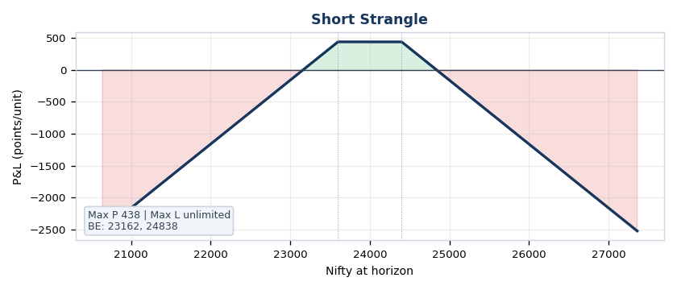

**The numbers (modelled at Nifty 24000).** Max profit is 438.0 points (~₹32,850 per lot), kept if Nifty expires between the strikes. Max loss is Undefined — large (unlimited on a runaway move). Breakevens 23162 and 24838 — a ~1,676-point safe band. Net credit 438.1 points; risk:reward undefined.

**Greeks & behaviour.** Net delta near zero, turning against you with the move (short gamma). Theta positive — your daily income. Vega negative — falling VIX is profit, rising VIX is pain. Positive theta versus negative gamma, exactly like the short straddle but with a wider cushion.

**Management & exit.** Close at ~50% of max credit; the last rupees aren't worth the tail risk. Hard stop at ~2x credit, and roll the tested side (e.g., roll the breached call up and out) to re-center. Take it off before expiry-week gamma turns small moves into big losses.

**Risk note.** This worst case assumes the index collapses (or rockets) far past a strike — bounded in practice only by where you stop out. Gap risk is real: a weekend shock can open beyond your breakeven. Size small, manage at a multiple of the credit, and remember premium selling is not free money — most retail sellers lose.

**Scenario P&L (₹ per lot, at expiry).**

| Nifty at expiry | 22,800 | 23,400 | 24,000 | 24,600 | 25,200 |
|---|---|---|---|---|---|
| **P&L (₹/lot)** | -27,150 | +17,850 | +32,850 | +17,850 | -27,150 |

The index sitting near 24,000 keeps the full +₹32,850, and the table's ±5% edges show only -₹27,150 — a larger break past 22,800 or 25,200 loses far more, without bound.

**Adjustments, variants & timing.** Roll the tested side out-and-away and the untested side in to rebalance deltas; if price keeps trending, go inverted or convert to an iron condor by buying wings for defined risk. Delta-hedge with Nifty futures to neutralise drift. This is NSE's bread-and-butter income trade. Bank Nifty weeklies pay fat premium but gamma bites hard near Thursday expiry, so the 30-45 DTE Nifty monthly is the sustainable home. Timing: sell at high IV rank (India VIX above its 70th percentile), after a vol spike, in a range-bound or mean-reverting tape; book at roughly 50% of credit and stop at about 2x. Never sell into a trending market or ahead of an unhedged binary event — a one-way move blows through your strike.

## 31. Long Strangle (Wide)
*Very big move · Long vega · net debit*

**The idea (intuition).** A long strangle pushed even further out — far OTM call and far OTM put. The cheapest way to own a "tail event" via vanilla options: tiny cost, but you only get paid on a genuinely violent move.

**When & why to use it.** Use it when you anticipate an outsized, fat-tail move — a crash or a melt-up — and want maximal convexity for minimal outlay. Good as a cheap hedge against a portfolio, or a pure punt on a major event you think the market is mispricing. Enter on low VIX. Do NOT expect it to pay on ordinary volatility; a "normal" 1–2% day leaves it worthless.

**How to build it (₹, Nifty).** Buy 24700 CE @ 135 and buy 23300 PE @ 129 for a net debit of 263.7 points — about ₹19,778 per lot, the cheapest long-vol structure so far except the lotto.

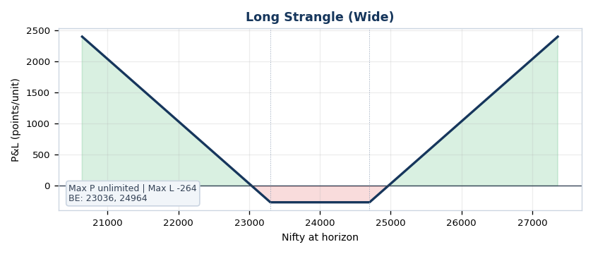

**The numbers (modelled at Nifty 24000).** Max profit Unlimited. Max loss 264.0 points (~₹19,800 per lot) — the full debit, lost if Nifty expires inside the wide 23300–24700 band. Breakevens 23036 and 24964 — Nifty must move nearly 1,000 points to break even. Net debit 263.7 points; risk:reward undefined.

**Greeks & behaviour.** Delta near zero; gamma is small until the index approaches a far strike, then ramps. Theta negative but small in absolute terms (cheap legs). Vega positive — a VIX explosion lifts it sharply. This is a convexity bet: it does almost nothing until it does everything.

**Management & exit.** Because the cost is low, you can give it more time than a tight strangle, but still cut it if the thesis (a big move) clearly fails. Sell into any volatility spike — these far-OTM options can multiply many times over on a fast move, so take the windfall rather than rounding-tripping it.

**Risk note.** The most likely outcome is a 100% loss of the (small) debit — far-OTM options usually expire worthless. Treat it as a low-cost lottery/hedge, not a core position, and size it as money you can afford to lose entirely.

**Scenario P&L (₹ per lot, at expiry).**

| Nifty at expiry | 22,800 | 23,400 | 24,000 | 24,600 | 25,200 |
|---|---|---|---|---|---|
| **P&L (₹/lot)** | +17,700 | -19,800 | -19,800 | -19,800 | +17,700 |

Only a genuine ±5% move to the edges turns a profit (+₹17,700); the whole middle band from 23,400 through 24,600 loses the entire -₹19,800 debit.

**Adjustments, variants & timing.** This is a convexity / tail bet, so the main "adjustment" is to sell into any volatility spike — far-OTM legs can multiply many times over. If a strike goes ITM, leg out the winner and delta-hedge with Nifty futures to bank the gain. You can finance it by selling even-further wings (a wide reverse iron condor) to cut net cost. It is cheap enough to use as a Bank Nifty weekly lottery on an expected shock, or as a portfolio crash hedge layered on Nifty monthly. Timing: buy only when IV rank is rock-bottom (VIX low) and you expect a fat-tail event the market is underpricing; a normal 1-2% day leaves it worthless, so do not pay up into elevated vol — the most likely outcome is a 100% loss of the small debit.

## 32. Short Strangle (Wide / 16-delta)
*Range-bound · Short vega · net credit*

**The idea (intuition).** Sell far-OTM strikes (around 16-delta) so the probability of either being breached is low. You collect a smaller credit but enjoy a wide, high-probability safe zone — the conservative cousin of the standard short strangle, and a staple of systematic premium-selling.

**When & why to use it.** High IV rank, range-bound expectations, 30–45 DTE. The 16-delta strikes are the classic "one standard deviation" sale — roughly 70% chance of expiring inside the band. Sell after VIX spikes. Do NOT mistake "high probability" for "safe" — the rare loss is large relative to the modest credit.

**How to build it (₹, Nifty).** Sell 24700 CE @ 135 and sell 23300 PE @ 129 for a net credit of 263.7 points — about ₹19,778 received per lot.

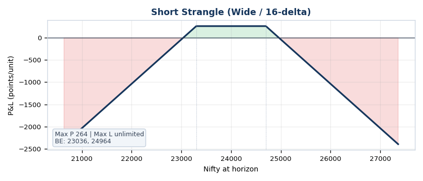

**The numbers (modelled at Nifty 24000).** Max profit 264.0 points (~₹19,800 per lot), kept if Nifty stays within the strikes. Max loss Undefined — large. Breakevens 23036 and 24964 — a wide ~1,928-point cushion. Net credit 263.7 points; risk:reward undefined.

**Greeks & behaviour.** Delta near zero; short gamma but mild near the money because strikes are far. Theta positive (your income); vega negative (falling VIX helps). Lower theta than a tight strangle, but also a far lower chance of the gamma turning against you.

**Management & exit.** Close at ~50% of credit, or even earlier given the small absolute reward. Stop or roll the tested side if price marches toward a strike. Take it off before expiry week. With a small credit, one undefended loss can erase many winning months — discipline matters most here.

**Risk note.** This worst case assumes a violent move far beyond a 16-delta strike — low probability but catastrophic relative to the credit. Size small and manage at a multiple of the credit; the seductive high win-rate is exactly what lulls sellers into oversizing.

**Scenario P&L (₹ per lot, at expiry).**

| Nifty at expiry | 22,800 | 23,400 | 24,000 | 24,600 | 25,200 |
|---|---|---|---|---|---|
| **P&L (₹/lot)** | -17,700 | +19,800 | +19,800 | +19,800 | -17,700 |

Anywhere inside the wide band (23,400-24,600) banks the full +₹19,800, and even a ±5% move shows only -₹17,700 here — a violent break beyond the 16-delta strikes loses much more, without bound.

**Adjustments, variants & timing.** Roll the tested side out-and-away and the untested side in; if breached, convert to an iron condor by buying cheap wings, or go inverted. Delta-hedge with Nifty futures when a strike is threatened. The 16-delta ("one standard deviation") strikes are the systematic seller's staple, roughly a 70% chance of expiring inside the band. Bank Nifty weeklies give high theta but the rare loss arrives fast; the 30-45 DTE Nifty monthly is steadier. Timing: sell at high IV rank after a VIX spike in a range-bound regime; the high win-rate seduces oversizing, so keep size small, book at ~50% of credit, and manage at a multiple of the modest premium received.

## 33. Long Guts
*Big move · Long vega · net debit*

**The idea (intuition).** A long strangle built from *in-the-money* options instead of OTM ones — buy an ITM call (strike below spot) and an ITM put (strike above spot). It behaves like a straddle/strangle but is built from intrinsic-heavy legs, so much of the debit is real value you get back, not pure time premium.

**When & why to use it.** Mostly a structural/arbitrage curiosity in liquid NSE index options, but it makes sense when ITM strikes are better priced or more liquid than the OTM equivalents, or to capture a mispricing between ITM and OTM vol. Same long-vol thesis: big move expected, low IV. Do NOT use it casually — the wide bid-ask on ITM options and the large cash outlay usually make a plain strangle cleaner.

**How to build it (₹, Nifty).** Buy 23700 CE @ 655 (ITM) and buy 24300 PE @ 453 (ITM) for a net debit of 1107.2 points — about ₹83,040 per lot. Note: much of that is intrinsic value (the strikes straddle spot), so the *true* premium at risk is far smaller than the headline debit.

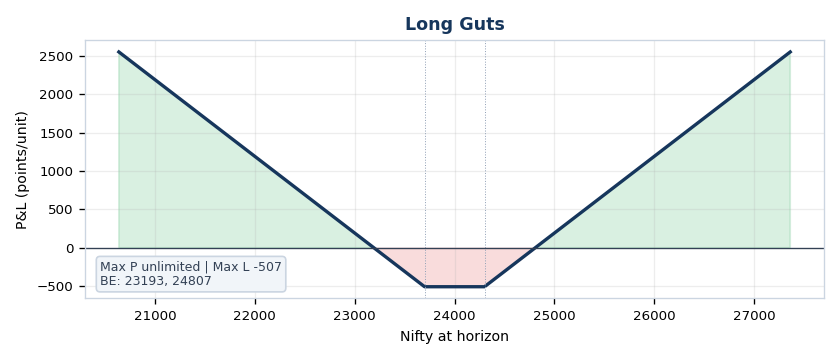

**The numbers (modelled at Nifty 24000).** Max profit Unlimited. Max loss 507.0 points (~₹38,025 per lot) — this is the time-value-at-risk, NOT the full 1107-point debit, because the intrinsic value (the 600-point gap between the ITM strikes) is recovered if Nifty stays between them. Breakevens 23193 and 24807. Net debit 1107.2 points; risk:reward undefined.

**Greeks & behaviour.** Delta near zero at the money (the two ITM legs offset). Positive gamma, negative theta (you only lose the time-value portion), positive vega. Functionally identical exposure to a long strangle once you net out the intrinsic value.

**Management & exit.** Manage it like a long strangle — exit into a move, cut if the catalyst fails. Be especially mindful of liquidity: closing ITM legs can cost you in slippage, so favour it only where the ITM book is tight.

**Risk note.** The headline debit (₹83,040) overstates the real risk — your true exposure is the ~507 points of time value. The practical danger is execution: poor ITM liquidity and wider spreads can quietly cost more than the theoretical edge.

**Scenario P&L (₹ per lot, at expiry).**

| Nifty at expiry | 22,800 | 23,400 | 24,000 | 24,600 | 25,200 |
|---|---|---|---|---|---|
| **P&L (₹/lot)** | +29,475 | -15,525 | -38,025 | -15,525 | +29,475 |

A ±5% move pays roughly +₹29,475, while a pin near 24,000 loses -₹38,025 of time value — not the headline ₹83,040 debit, since the intrinsic between the strikes is recovered.

**Adjustments, variants & timing.** It behaves like a long strangle once intrinsic is netted out, so manage it identically — leg out the winning ITM option into a move and delta-hedge the runner with Nifty futures. Watch ITM liquidity: a wide bid-ask makes legging costly, so prefer it only where the ITM book is tight. You can sell OTM wings to defray the time-value bleed. It is rarely worth it on Bank Nifty weeklies (thinner ITM books, fast theta); it works better on liquid Nifty monthly where ITM spreads are tighter. Timing: enter on low IV rank before a big-move catalyst and exit into the vol spike — and only when ITM pricing genuinely beats the equivalent OTM long strangle.

## 34. Short Guts
*Range-bound · Short vega · net credit*

**The idea (intuition).** The mirror of long guts: sell an ITM call and an ITM put. You take in a large credit (full of intrinsic value you'll have to return), and you profit if the index stays *between* the two ITM strikes, where the options' intrinsic value shrinks toward zero.

**When & why to use it.** A range-bound, high-IV play used when ITM options carry a vol or liquidity edge over selling the OTM strangle. Same short-vol regime: elevated VIX, expectation of a quiet tape. Do NOT prefer it over a short strangle unless the ITM pricing genuinely favours it — the large credit is mostly intrinsic and must be paid back, so it ties up margin without proportionate reward.

**How to build it (₹, Nifty).** Sell 23700 CE @ 655 and sell 24300 PE @ 453 for a net credit of 1107.2 points — about ₹83,040 received per lot, most of which is intrinsic value you are effectively holding in trust.


**The numbers (modelled at Nifty 24000).** Max profit 507.0 points (~₹38,025 per lot) — the time value you keep if Nifty expires between the strikes (the intrinsic part is returned). Max loss Undefined — large. Breakevens 23193 and 24807. Net credit 1107.2 points; risk:reward undefined.

**Greeks & behaviour.** Delta near zero; short gamma; theta positive (you keep the eroding time value); vega negative. Identical risk profile to a short strangle once intrinsic value is netted out — same unlimited tails on a breakout.

**Management & exit.** Manage exactly as a short strangle: take ~50% of the keepable credit (the 507 points), stop/roll the tested side, and exit before expiry-week gamma. Watch assignment risk closely — ITM short options can be exercised, especially near expiry.

**Risk note.** This worst case assumes a large move beyond a strike; the loss is bounded in practice only by your stop. Added wrinkle: short ITM options carry real assignment/early-exercise risk and STT on exercised ITM contracts. Size small, manage the credit, and don't be seduced by the large headline premium — most of it isn't yours to keep.

**Scenario P&L (₹ per lot, at expiry).**

| Nifty at expiry | 22,800 | 23,400 | 24,000 | 24,600 | 25,200 |
|---|---|---|---|---|---|
| **P&L (₹/lot)** | -29,475 | +15,525 | +38,025 | +15,525 | -29,475 |

Staying between the ITM strikes around 24,000 keeps the +₹38,025 of time value; the ±5% edges show -₹29,475, but a bigger break loses without limit.

**Adjustments, variants & timing.** The risk is identical to a short strangle once intrinsic nets out — roll the tested side out, buy wings to define risk as an iron structure, or delta-hedge with Nifty futures. Note that Nifty and Bank Nifty index options are European, cash-settled, so there is no early-exercise assignment, but STT on exercised ITM contracts and heavy margin on a mostly-intrinsic credit still bite. That margin and liquidity drag means it is seldom preferred over a plain short strangle, and it sits better on Nifty monthly than on Bank Nifty weeklies. Timing: deploy only at high IV rank when ITM vol or liquidity genuinely favours it; book around 50% of the keepable time value, stop at a multiple of credit, and exit before expiry-week gamma.

## 35. Strip (Bearish Straddle)
*Big move, bearish bias · Long vega · net debit*

**The idea (intuition).** A long straddle with a bearish tilt: same ATM call and put, but you buy *two* puts for every call. You still profit on a big move either way, but you make more (and break even sooner) on a fall — you've geared the structure to your downside lean.

**When & why to use it.** Use it when you expect a large move and lean bearish but want protection in case you're wrong and the index rips up. Good ahead of an event where the risk skews to the downside (a feared policy shock, weak global cues). Enter on low IV. Do NOT use it if you have no directional view — a plain straddle is cheaper and cleaner for pure neutrality.

**How to build it (₹, Nifty).** Buy 24000 CE @ 456 and buy 2x 24000 PE @ 318 for a net debit of 1092.4 points — about ₹81,930 per lot. The extra put is what creates the downside gearing.

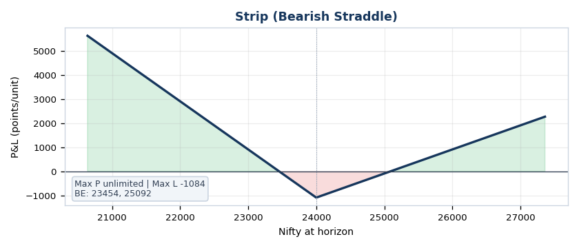

**The numbers (modelled at Nifty 24000).** Max profit Unlimited (and steeper to the downside — two puts gaining versus one call). Max loss 1084.0 points (~₹81,300 per lot) if Nifty pins 24000. Breakevens 23454 (down) and 25092 (up) — note the asymmetry: you break even with a smaller fall than rise. Net debit 1092.4 points; risk:reward undefined.

**Greeks & behaviour.** Net delta is negative at inception (two puts outweigh one call), so it leans short. Positive gamma, negative theta, positive vega — a long-vol trade with a bearish delta tilt. A down-move pays roughly twice as fast as an equivalent up-move.

**Management & exit.** Exit into a down-move where the two puts do the heavy lifting; take profits rather than holding for the floor. Cut if the move stalls — you're carrying extra theta versus a plain straddle. Don't hold into expiry week.

**Risk note.** You pay more debit than a straddle (₹81,930) for the bearish gearing, so a flat market hurts more. If the index drifts sideways or grinds up modestly, the two-put cost bleeds faster than a symmetric straddle would.

**Scenario P&L (₹ per lot, at expiry).**

| Nifty at expiry | 22,800 | 23,400 | 24,000 | 24,600 | 25,200 |
|---|---|---|---|---|---|
| **P&L (₹/lot)** | +98,100 | +8,100 | -81,900 | -36,900 | +8,100 |

The bearish gearing shows — a 5% fall to 22,800 pays +₹98,100, far more than the +₹8,100 from an equal 5% rise, while a pin at 24,000 loses -₹81,900.

**Adjustments, variants & timing.** When the index falls, leg out one of the two puts into strength and let the rest run; if it rallies instead, sell the single call's gains and delta-hedge the puts with short Nifty futures. Convert to a defined-risk structure by selling deeper OTM wings. The extra put means heavy theta, so it suits a Bank Nifty weekly with a clear bearish catalyst (feared policy shock, weak global cues) more than a slow Nifty monthly grind. Timing: buy on low IV rank ahead of a downside-skewed event; exit into the down-move and the IV spike, and never carry the doubled theta into expiry week. If the index drifts sideways or grinds up modestly, cut quickly — the two-put cost bleeds fast.

## 36. Strap (Bullish Straddle)
*Big move, bullish bias · Long vega · net debit*

**The idea (intuition).** The bullish mirror of the strip: same ATM straddle base, but you buy *two* calls for every put. Big move either way still pays, but you're geared to make more on a rally — a long-vol trade for when you lean up but want downside insurance.

**When & why to use it.** Use it when you expect a large move with an upside bias — ahead of a result or event where good news could trigger a sharp rally but you still want protection against a fall. Low IV entry. Do NOT use it as a neutral bet; the extra call costs money and only pays if your bullish lean is right.

**How to build it (₹, Nifty).** Buy 2x 24000 CE @ 456 and buy 24000 PE @ 318 for a net debit of 1230.1 points — about ₹92,258 per lot, the priciest structure in this group (two ATM calls are expensive).

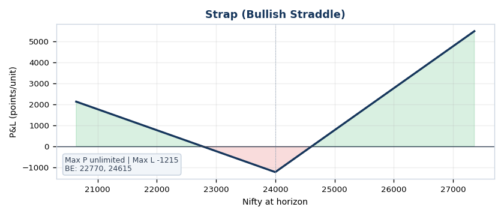

**The numbers (modelled at Nifty 24000).** Max profit Unlimited (steeper to the upside — two calls running). Max loss 1215.0 points (~₹91,125 per lot) if Nifty pins 24000. Breakevens 22770 (down) and 24615 (up) — asymmetric: you break even with a smaller *rise* than fall. Net debit 1230.1 points; risk:reward undefined.

**Greeks & behaviour.** Net delta positive at inception (two calls outweigh one put), so it leans long. Positive gamma, negative theta, positive vega — long volatility with a bullish delta tilt. An up-move pays about twice as fast as the equivalent down-move.

**Management & exit.** Take profit into a rally where the doubled calls accelerate; close into strength. Cut if the move fails to appear — you carry the most theta of any structure here. Avoid expiry week.

**Risk note.** Highest debit in the group (₹92,258 per lot), so a flat or mildly-down tape bleeds you fastest. The bullish gearing is only an asset if you're right on direction; if the index falls, the single put can't fully rescue the two dead calls.

**Scenario P&L (₹ per lot, at expiry).**

| Nifty at expiry | 22,800 | 23,400 | 24,000 | 24,600 | 25,200 |
|---|---|---|---|---|---|
| **P&L (₹/lot)** | -2,250 | -47,250 | -92,250 | -2,250 | +87,750 |

The bullish tilt is visible — a 5% rally to 25,200 pays +₹87,750 while the same-sized fall barely breaks even (-₹2,250), and a pin at 24,000 loses the full -₹92,250.

**Adjustments, variants & timing.** On a rally, leg out one of the two calls into strength and ride the rest; on a fall, bank the single put and delta-hedge the calls with long Nifty futures. Sell OTM wings to cap the priciest debit in the group. With the most theta of any structure here, it favours a Bank Nifty weekly on a clear bullish trigger (results beat, dovish RBI) over a slow Nifty monthly. Timing: enter at low IV rank before an upside-skewed event; close into the rally and the vol spike. A flat or mildly-down tape bleeds it fastest, so cut quickly if the move fails to appear, and avoid carrying into expiry week.

## 37. Long Straddle (Weekly)
*Big move within days · Long vega · net debit*

**The idea (intuition).** A long straddle on the weekly expiry — same buy-the-call-and-put bet, but on options with only days to live. Cheaper entry, but vicious theta: it's a sharp, short-fuse punt on an imminent move.

**When & why to use it.** Use it for a catalyst landing *this week* — a mid-week data print, an RBI decision, a stock-specific event spilling into the index. The low premium gives high gamma per rupee. Do NOT hold it idly; weekly theta is brutal and a day of no movement is expensive. Avoid buying it into an already-pumped weekly IV the day before a known event.

**How to build it (₹, Nifty).** Buy 24000 CE @ 202 and buy 24000 PE @ 170 for a net debit of 371.9 points — about ₹27,893 per lot, roughly half the cost of the monthly straddle.

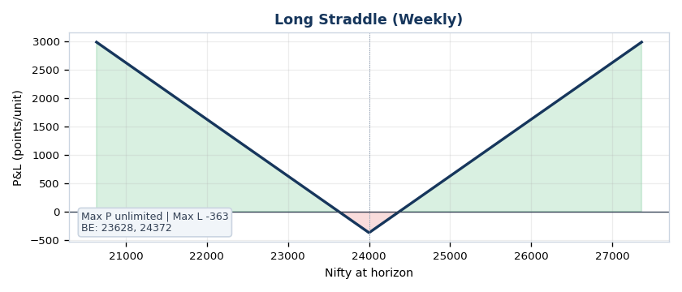

**The numbers (modelled at Nifty 24000).** Max profit Unlimited. Max loss 363.0 points (~₹27,225 per lot) if Nifty pins 24000 at the weekly close. Breakevens 23628 and 24372 — a tight ~744-point band, much narrower than the monthly, so a smaller move pays. Net debit 371.9 points; risk:reward undefined.

**Greeks & behaviour.** Delta near zero, but gamma is enormous (short-dated ATM options), so P&L swings fast on any move. Theta is severe and negative — the dominant force if the index sits still. Vega positive but smaller than a monthly's (less time = less vega). This is a gamma trade above all.

**Management & exit.** Be quick and decisive. Take profit into the move within a day or two — weekly straddles can double fast and decay just as fast. If the catalyst passes without a move, cut immediately; holding overnight into a flat tape is pure theta bleed.

**Risk note.** Theta is the enemy here more than anywhere else — a quiet two days can vaporise the debit. The tight breakevens cut both ways: easy to reach, but the position is hyper-sensitive, so a fakeout move that reverses can still leave you with a loss at expiry.

**Scenario P&L (₹ per lot, at expiry).**

| Nifty at expiry | 22,800 | 23,400 | 24,000 | 24,600 | 25,200 |
|---|---|---|---|---|---|
| **P&L (₹/lot)** | +62,100 | +17,100 | -27,900 | +17,100 | +62,100 |

The tight weekly breakevens mean even a 2.5% move (to 23,400 or 24,600) already pays +₹17,100, and a 5% move balloons to +₹62,100, versus the -₹27,900 max loss at a 24,000 pin.

**Adjustments, variants & timing.** Be fast — leg out the winning side into the move and gamma-scalp the runner with Nifty or Bank Nifty futures, since weekly gamma is enormous. Sell same-expiry OTM wings to convert it to a reverse iron fly and blunt the savage theta. This structure is built for Bank Nifty weeklies (the highest gamma per rupee) far more than a Nifty monthly. Timing: buy only for a catalyst landing this week, on low or normal weekly IV; do not buy into an already-pumped weekly IV the night before a known event. If the move doesn't come within a day or two, cut — overnight theta bleed is unforgiving, and a quiet two days can vaporise the debit.

## 38. Short Strangle (Weekly)
*Quiet week · Short vega · net credit*

**The idea (intuition).** Sell an OTM call and OTM put on the weekly expiry — harvest the fast theta of short-dated options during a week you expect to be dull. The premium-seller's favourite income trade on NSE, and also its most over-traded one.

**When & why to use it.** Use it in a genuinely quiet week with no scheduled catalyst, when weekly IV is rich relative to expected movement. The rapid weekly decay means theta accrues fast. Do NOT sell weeklies through an event, and respect that with only days to expiry, gamma risk is high the moment price approaches a strike. This is the structure behind many blown retail accounts — handle with care.

**How to build it (₹, Nifty).** Sell 24350 CE @ 61 and sell 23650 PE @ 61 for a net credit of 121.6 points — about ₹9,120 received per lot. Small credit, fast decay.

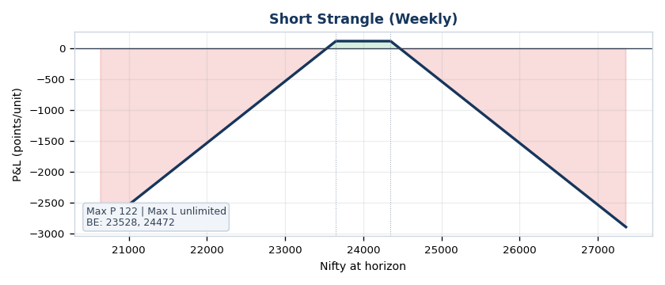

**The numbers (modelled at Nifty 24000).** Max profit 122.0 points (~₹9,150 per lot), kept if Nifty stays within the strikes to Thursday's close. Max loss Undefined — large. Breakevens 23528 and 24472 — a ~944-point band. Net credit 121.6 points; risk:reward undefined.

**Greeks & behaviour.** Delta near zero; short gamma that bites hard near expiry; theta strongly positive (fast weekly decay is the appeal); vega negative. Of every short trade here, this has the most violent gamma-versus-theta dynamic because expiry is days away.

**Management & exit.** Take profit early — 50% of a small weekly credit can come in a day. Stop or roll aggressively the instant price threatens a strike; with weeklies you have little time to recover. Many traders simply close by Wednesday to dodge the final-day gamma spike.

**Risk note.** This worst case assumes a sharp move past a strike; near expiry, gamma makes that loss arrive fast and large relative to the tiny ₹9,120 credit. A single bad weekly can erase months of income. Size small, manage at a multiple of credit, and don't mistake a high weekly win-rate for safety — most retail F&O sellers lose over time.

**Scenario P&L (₹ per lot, at expiry).**

| Nifty at expiry | 22,800 | 23,400 | 24,000 | 24,600 | 25,200 |
|---|---|---|---|---|---|
| **P&L (₹/lot)** | -54,600 | -9,600 | +9,150 | -9,600 | -54,600 |

Only a near pin keeps the thin +₹9,150 credit; even a 2.5% move already shows -₹9,600, and a 5% break to the edges loses -₹54,600 — far more than the credit, and it keeps growing beyond.

**Adjustments, variants & timing.** Defend fast — roll the tested side out-and-away and the untested side in, or buy wings to cap risk as a weekly iron condor; delta-hedge with futures the instant price nears a strike. Many traders simply close by Wednesday to dodge final-day gamma. This is the most over-traded retail income trade on NSE and the cause of many blown accounts. Bank Nifty weeklies maximise theta but the gamma tail is violent, so size tiny. Timing: sell only in a genuinely quiet week with no scheduled catalyst, when weekly IV is rich relative to expected movement; book ~50% early, stop at a multiple of the small credit, and never sell weeklies through an event.

## 39. Long Strangle (Weekly Lotto)
*Explosive move · Long vega · net debit*

**The idea (intuition).** A near-worthless far-OTM weekly call and put bought for pocket change — a literal lottery ticket on an explosive move in the next few days. Almost always expires at zero; occasionally pays many multiples.

**When & why to use it.** Use it as a cheap punt or tail-hedge when you suspect a violent surprise this week that the market is ignoring. The appeal is pure convexity: risk a tiny sum for a shot at a 10x. Do NOT treat it as a real strategy or size it meaningfully — the base rate is a total loss. It's the cheapest seat in the casino.

**How to build it (₹, Nifty).** Buy 24700 CE @ 10 and buy 23300 PE @ 17 for a net debit of 27.2 points — about ₹2,040 per lot. Genuinely lottery-ticket money.

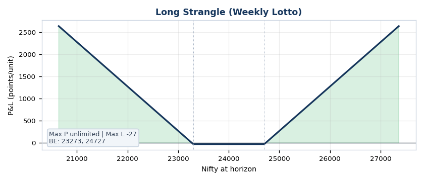

**The numbers (modelled at Nifty 24000).** Max profit Unlimited. Max loss 27.0 points (~₹2,025 per lot) — the whole tiny debit, lost (the most likely outcome) if Nifty stays within the wide band. Breakevens 23273 and 24727 — needs a ~700+ point move in days. Net debit 27.2 points; risk:reward undefined.

**Greeks & behaviour.** Delta near zero; gamma negligible until a strike is approached, then explosive; theta small in rupee terms but 100% of value disappears by Thursday; vega positive. It does nothing, then everything — or, usually, nothing.

**Management & exit.** If a violent move occurs and these balloon, *sell immediately* — far-OTM weekly options can 10–20x and then collapse within hours. Otherwise expect to write it off. Never average down or "give it more time" — there is no more time.

**Risk note.** The overwhelmingly likely outcome is a 100% loss of the small debit. This is entertainment-grade risk: only deploy money you've already mentally written off, and never let a rare win tempt you into upsizing the next ticket.

**Scenario P&L (₹ per lot, at expiry).**

| Nifty at expiry | 22,800 | 23,400 | 24,000 | 24,600 | 25,200 |
|---|---|---|---|---|---|
| **P&L (₹/lot)** | +35,475 | -2,025 | -2,025 | -2,025 | +35,475 |

The overwhelming base case is the tiny -₹2,025 total loss across the middle; only a violent ±5% move to the edges flips it to +₹35,475.

**Adjustments, variants & timing.** There is little to adjust on a ₹2,040 ticket — the only discipline is to sell immediately if a shock balloons the legs (far-OTM weeklies can 10-20x and then collapse within hours), and otherwise write it off. Never average down or "give it more time" — by Thursday there is no time. You can optionally finance it by selling an even-further wing, but the cost is already trivial. It is purely a Bank Nifty / Nifty weekly instrument and meaningless as a monthly. Timing: deploy only when you suspect a violent surprise the market is ignoring this week, with money already mentally written off; a rare win must never tempt you into upsizing the next ticket.

## 40. Short Straddle (45-DTE)
*Range-bound, rich IV · Short vega · net credit*

**The idea (intuition).** An ATM short straddle placed with ~45 days to expiry rather than on the weekly. You give up the fast weekly decay for a smoother, more manageable position with less expiry-week gamma — the "professional" version of selling a straddle.

**When & why to use it.** The 45-DTE window is the systematic premium-seller's sweet spot: enough theta to earn, enough time to manage and roll, and you're not yet in the gamma danger zone. Deploy in high IV rank, range-bound conditions. Sell after a VIX spike. Do NOT hold it all the way to expiry — the whole point is to harvest decay early and exit before gamma ramps.

**How to build it (₹, Nifty).** Sell 24000 CE @ 579 and sell 24000 PE @ 373 for a net credit of 951.6 points — about ₹71,370 received per lot (richer than the near-dated straddle because 45-DTE options carry more time value).

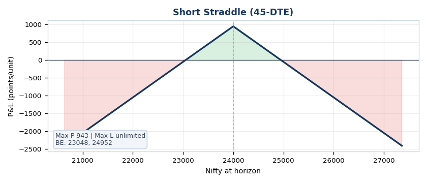

**The numbers (modelled at Nifty 24000).** Max profit 943.0 points (~₹70,725 per lot) if Nifty expires at 24000. Max loss Undefined — large. Breakevens 23048 and 24952 — a wide ~1,904-point band, the widest of any straddle here thanks to the fat credit. Net credit 951.6 points; risk:reward undefined.

**Greeks & behaviour.** Delta near zero; short gamma, but *gentler* than weekly/monthly versions because 45 days out the gamma is low. Theta positive and steady; vega negative and large — this position is heavily exposed to a VIX move, so a vol spike hurts well before expiry. Vega, not gamma, dominates early.

**Management & exit.** Manage on the calendar: take ~50% of max credit and close, typically with 21+ days still left, rather than riding into the gamma zone. Roll the tested side or delta-hedge if the index trends. The defined exit discipline is what makes 45-DTE selling sustainable.

**Risk note.** This worst case assumes a large directional move; bounded in practice only by your stop. The big near-term risk is vega — a sudden India VIX spike inflates both short legs and shows a mark-to-market loss even with the index still inside the band. Size small, manage the credit, and never treat the large premium as free money.

**Scenario P&L (₹ per lot, at expiry).**

| Nifty at expiry | 22,800 | 23,400 | 24,000 | 24,600 | 25,200 |
|---|---|---|---|---|---|
| **P&L (₹/lot)** | -18,600 | +26,400 | +71,400 | +26,400 | -18,600 |

A 24,000 pin banks the full +₹71,400, and thanks to the fat 45-day credit even a 5% move only shows -₹18,600 here — though a larger break still loses without limit.

**Adjustments, variants & timing.** Manage on the calendar — take ~50% of credit and close with 21+ days left, before gamma ramps. Roll the tested side or delta-hedge with Nifty futures if the index trends. Because vega dominates early, a sudden India VIX spike shows a mark-to-market loss even with spot inside the band, so size for that. Add wings to define risk as a wide iron fly if needed. This 45-DTE window is the systematic seller's sweet spot — a Nifty monthly trade, not a Bank Nifty weekly. Timing: sell at high IV rank after a VIX spike in a range-bound regime; harvest decay early and exit before the gamma zone rather than riding all the way to expiry.

## 41. Long Straddle (Pre-Event)
*Event move · Long vega · net debit*

**The idea (intuition).** A long straddle bought specifically to capture an event-driven move — results, RBI, budget, election count. You're betting the realised move (and/or the IV run-up into the event) exceeds the premium. The catch is that everyone knows the event is coming, so the premium is already inflated.

**When & why to use it.** Buy it *early*, before the market has fully bid up event vol — days ahead of the catalyst while IV is still climbing, so you ride the vega run-up and have gamma for the move. Do NOT buy it the night before the event when IV is at its peak; you'll pay top dollar and get crushed when vol collapses at the open, often losing even if the index moves.

**How to build it (₹, Nifty).** Buy 24000 CE @ 169 and buy 24000 PE @ 146 for a net debit of 314.2 points — about ₹23,565 per lot.

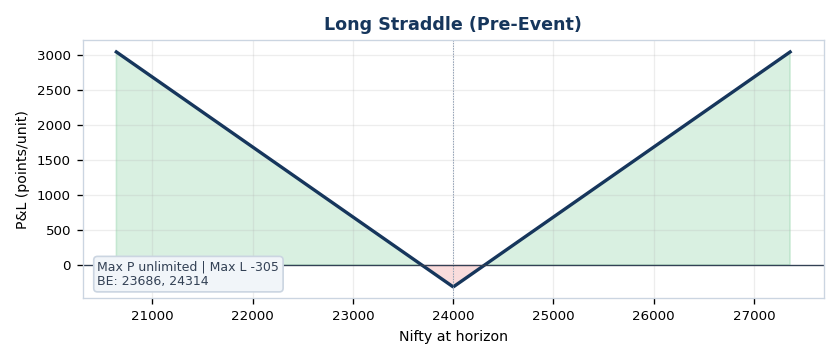

**The numbers (modelled at Nifty 24000).** Max profit Unlimited. Max loss 305.0 points (~₹22,875 per lot) if Nifty pins 24000. Breakevens 23686 and 24314 — a tight ~628-point band, so a fairly modest event move pays. Net debit 314.2 points; risk:reward undefined.

**Greeks & behaviour.** Delta near zero; high gamma (short-dated, ATM); theta negative; vega positive — and vega is the headline here. The pre-event play is as much a bet on rising IV into the event as on the move itself; a VIX run-up can profit you before the announcement even lands.

**Management & exit.** The disciplined play is often to exit *into* the IV peak just before the event, capturing the vega run-up and side-stepping the post-event crush entirely. If you hold through the announcement, close immediately into the move — do not linger while IV deflates.

**Risk note.** The defining danger is IV crush: the moment the event passes, event vol collapses and both legs lose extrinsic value fast. You can call the direction correctly and still lose if the move is smaller than the (already pricey) premium implied. Tight breakevens help, but the crush is relentless.

**Scenario P&L (₹ per lot, at expiry).**

| Nifty at expiry | 22,800 | 23,400 | 24,000 | 24,600 | 25,200 |
|---|---|---|---|---|---|
| **P&L (₹/lot)** | +66,450 | +21,450 | -23,550 | +21,450 | +66,450 |

The tight breakevens mean a modest 2.5% event move (to 23,400 or 24,600) already pays +₹21,450 and a 5% move +₹66,450, against a -₹23,550 loss if Nifty pins 24,000.

**Adjustments, variants & timing.** The disciplined play is to exit into the IV peak just before the event, capturing the vega run-up and side-stepping the crush entirely; if you hold through, close instantly into the move. Leg out the winner and delta-hedge the runner with futures. Sell OTM wings to defray cost if IV is already rich. It works on both Bank Nifty weeklies (results, high gamma) and Nifty monthly (budget, RBI policy, election count). Timing: buy early — days ahead while IV is still climbing — at low IV rank; never buy the night before when event vol peaks, or the post-event IV crush will gut you even on a correct directional call.

## 42. Short Strangle (10-delta)
*Strongly range-bound · Short vega · net credit*

**The idea (intuition).** Sell very far-OTM strikes — around 10-delta, roughly a 90% chance each expires worthless. The ultra-conservative premium sale: a small credit for a very wide safe zone. High win-rate, but each rare loss is large relative to the thin premium.

**When & why to use it.** Use it when you're strongly convinced the index will stay range-bound and you want maximum probability of profit — high IV rank, no catalyst, 30–45 DTE. The 10-delta strikes sit well outside the expected range. Do NOT confuse the ~90% win-rate with safety; the loss when it comes can dwarf many winners, and oversizing on the high hit-rate is the classic trap.

**How to build it (₹, Nifty).** Sell 24900 CE @ 83 and sell 23100 PE @ 98 for a net credit of 180.7 points — about ₹13,553 received per lot.

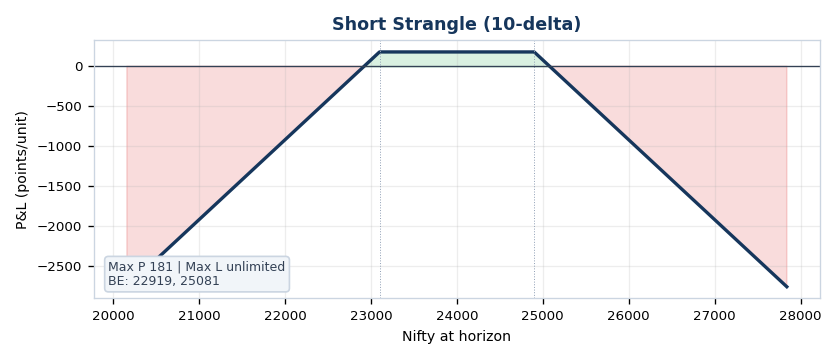

**The numbers (modelled at Nifty 24000).** Max profit 181.0 points (~₹13,575 per lot), kept if Nifty stays within the strikes. Max loss Undefined — large. Breakevens 22919 and 25081 — a very wide ~2,162-point cushion, the widest in this group. Net credit 180.7 points; risk:reward undefined.

**Greeks & behaviour.** Delta near zero; short gamma, but minimal near the money because the strikes are so far out; theta positive (modest); vega negative. Of the short strangles, this has the lowest day-to-day gamma risk — until price makes an unexpected run at a strike.

**Management & exit.** Close at ~50% of the (already small) credit, or roll the tested side early if price drifts toward a strike. With such a thin reward, even one undefended loss is costly, so a hard stop at a multiple of credit and disciplined sizing are non-negotiable. Take it off before expiry-week gamma.

**Risk note.** This worst case assumes a violent move past a 10-delta strike — improbable, but devastating relative to the ₹13,553 credit. The high win-rate is precisely what seduces sellers into oversizing; size small, manage at a multiple of the credit, and never treat the steady premium as free money — most retail F&O sellers lose over time.

**Scenario P&L (₹ per lot, at expiry).**

| Nifty at expiry | 22,800 | 23,400 | 24,000 | 24,600 | 25,200 |
|---|---|---|---|---|---|
| **P&L (₹/lot)** | -8,925 | +13,575 | +13,575 | +13,575 | -8,925 |

The very wide 10-delta band keeps the full +₹13,575 across 23,400-24,600, and even a 5% move shows only -₹8,925 here — but a rare break past the strikes loses many multiples of the thin credit.

**Adjustments, variants & timing.** Roll the tested side out-and-away early, buy cheap wings to convert it to a wide iron condor, or delta-hedge with Nifty futures if price drifts toward a strike. With a ~90% theoretical win-rate, the trap is oversizing — one undefended tail can erase many winning months, so keep size small and stop at a multiple of credit. It has the lowest day-to-day gamma of the short strangles, suiting a 30-45 DTE Nifty monthly over twitchy Bank Nifty weeklies. Timing: sell only at high IV rank, with no catalyst and a strongly range-bound tape; book ~50% (or earlier given the thin reward) and never treat the steady premium as free money — most retail F&O sellers lose over time.

# Strategy Group 4: Butterflies

Butterflies are cheap, fully defined-risk bets on *where* the index will sit at expiry rather than *which way* it moves. Every one is built from three strikes — buy one wing, sell two of a body, buy the other wing — so the structure is self-financing enough to cost a few points and pay a multiple of that if spot "pins" the body. The family's unifying trade-off is probability versus payoff: the tent only pays in full at one exact strike, so you accept a low hit-rate in exchange for a fat reward-to-risk ratio, and you can tilt, widen, narrow, or break a wing to trade direction, IV, and the width of your target zone.

## 43. Long Call Butterfly
*Pin near body strike · Short vega · net debit*

**The idea (intuition).** Think of it as renting a tent pitched over the 24000 strike: you pay a small fixed rent and collect a payout that peaks if the index camps exactly at the centre pole by expiry. Buy one in-the-money call, sell two at the body, buy one out-of-the-money call — the two short calls fund most of the structure, leaving you a tiny bill and a capped, generous upside.

**When & why to use it.** Use it when you have a precise level in mind and expect the index to gravitate there into expiry — a consolidating Nifty, a max-pain pin, or a post-event drift after IV has already collapsed. It is short vega, so it is happiest entered when IV is elevated and likely to fall (India VIX spiking into a known event), because falling IV pulls the body back toward intrinsic and fattens the tent. Avoid it when a strong trend or a fresh catalyst (Budget, RBI, results) can blow the index clean through a wing.

**How to build it (₹, Nifty).** Buy 23700 CE @ 655, sell 2x 24000 CE @ 456, buy 24300 CE @ 292. Net debit 34.8 points, about ₹2,610 per lot (34.8 × 75) — that is your entire risk.


**The numbers (modelled at Nifty 24000).** Max profit 257 points (~₹19,275/lot) if Nifty finishes exactly at 24000. Max loss 35 points (~₹2,625/lot) outside the wings. Breakevens 23735 and 24265. Net debit 34.8 points. Risk:reward 7.38 — you risk one to make roughly seven.

**Greeks & behaviour.** Near the body net delta is close to flat; it leans slightly directional as spot wanders off-centre. Theta is your friend once price sits inside the tent — time decay drags the payoff up toward the peak. Vega is negative, so a drop in IV helps; a spike hurts before expiry.

**Management & exit.** Treat it as a hold-to-decay trade but do not be greedy: the centre value only materialises in the last day or two, so booking 40-60% of the modelled max when spot is parked on the body is sensible. If price runs to a wing early, the position is cheap enough to let expire, or roll the whole fly to recentre on the new level.

**Risk note.** The honest danger is whipsaw: the tent is narrow, so a single trending session can push spot past a breakeven and turn the trade into a near-total loss of the 35-point debit. It is cheap, but the probability of a perfect pin is genuinely low.

**Scenario P&L (₹ per lot, at expiry).**

| Nifty at expiry | 22,800 | 23,400 | 24,000 | 24,600 | 25,200 |
|---|---|---|---|---|---|
| **P&L (₹/lot)** | -₹2,625 | -₹2,625 | +₹19,875 | -₹2,625 | -₹2,625 |

The table shows the full +₹19,875 peak only in the 24,000 column, with every other strike on this ±5% grid handing back the –₹2,625 debit — a stark picture of how narrowly the body must be pinned.

**Adjustments, variants & timing.** The cleanest adjustment is to roll the body to follow price: if Nifty drifts from 24000 toward 24200, close the 24000 body and re-sell the 24200 strike, re-centring the tent on the new pin. If a move is gathering pace you can leg into wider wings to buy room, or convert to a broken-wing by pushing one outer strike out a strike and skipping one — that cheapens the structure into a near-credit and erases the loss zone on the side you no longer fear. On NSE this fly suits a Nifty monthly expiry-week pin trade better than a Bank Nifty weekly, where larger point swings breach the narrow body too often. Place the body at the heaviest open-interest / max-pain strike rather than spot, and enter in the last five to seven sessions when India VIX has already cooled — butterflies shine in the final week as gamma and pinning, not direction, drive the close.


## 44. Long Put Butterfly
*Pin near body strike · Short vega · net debit*

**The idea (intuition).** The put-built twin of the call butterfly: same tent, same peak over 24000, just assembled from puts instead of calls. By put-call parity the expiry payoff is identical, so you choose puts when their strikes are more liquid or better priced, or when you simply prefer holding puts into a falling tape.

**When & why to use it.** Identical conditions to the long call fly — a precise pin expectation into expiry, ideally with IV elevated and set to fade. Desk traders often pick the put version on the downside skew side of the chain, where OTM puts carry richer premium and the short body collects more. Skip it when a trend or catalyst threatens to drive Nifty through either wing.

**How to build it (₹, Nifty).** Buy 24300 PE @ 453, sell 2x 24000 PE @ 318, buy 23700 PE @ 219. Net debit 34.8 points, about ₹2,610 per lot — and that debit is the whole risk.

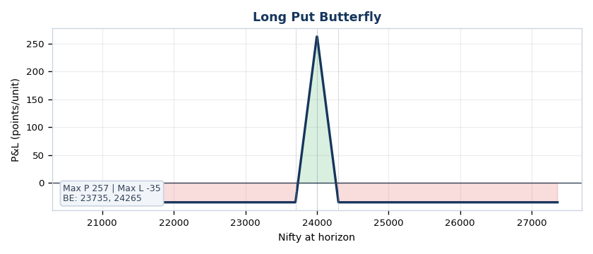

**The numbers (modelled at Nifty 24000).** Max profit 257 points (~₹19,275/lot) at a 24000 finish. Max loss 35 points (~₹2,625/lot) beyond the wings. Breakevens 23735 and 24265. Net debit 34.8 points. Risk:reward 7.38.

**Greeks & behaviour.** Net delta hovers near zero at the body and tilts as spot drifts. Theta works for you inside the tent, pulling the mark toward the peak as expiry nears. Vega is negative — falling IV is a tailwind, rising IV a drag before expiry.

**Management & exit.** Same discipline as the call fly: this is a decay play whose value concentrates in the final sessions. Book 40-60% of the modelled peak if Nifty sits on the body with a few days left; let it expire if it drifts to a wing, since the cost is trivial. Roll to recentre if your view of the pin level shifts. On NSE the put strikes around and below ATM often quote tighter spreads than the equivalent calls, so legging in on the put chain can shave a point or two off entry — worth doing when liquidity is thin in the back-month.

**Risk note.** Low probability of a clean pin is the core risk. The position is cheap and capped, but a trending move past a breakeven converts most of the 35-point debit into a loss. Because you hold three different put strikes, watch the bid-ask on the wings near expiry — illiquid OTM puts can make exit prints worse than the screen suggests. Treat the high 7.38 reward:risk as a lottery-like edge, not a base case.

**Scenario P&L (₹ per lot, at expiry).**

| Nifty at expiry | 22,800 | 23,400 | 24,000 | 24,600 | 25,200 |
|---|---|---|---|---|---|
| **P&L (₹/lot)** | -₹2,625 | -₹2,625 | +₹19,875 | -₹2,625 | -₹2,625 |

Identical to its call-built twin, the +₹19,875 maximum appears solely at 24,000 while the 22,800–23,400 and 24,600–25,200 wings each forfeit the –₹2,625 debit, underscoring the low-probability nature of a clean pin.

**Adjustments, variants & timing.** Manage it exactly as the call version, with the put chain's quirks in mind. The core adjustment is rolling the body down or up to chase the developing pin, re-selling the 24000 puts at the strike open interest is migrating toward. If the tape trends, leg into wider put wings for breathing room, or skip a lower strike to break the wing into a credit and shed the downside loss zone. On NSE the sub-ATM put strikes usually quote tighter than the equivalent calls, so this build is the better vehicle for a Nifty monthly expiry-week pin where fills matter; Bank Nifty weeklies move too violently relative to the body. Anchor the body on the max-pain / peak-put-OI strike, not raw spot, and put the trade on in the final week once India VIX has deflated post-event — the last few sessions are when theta and pinning, rather than vega, do the heavy lifting.


## 45. Short Call Butterfly
*Move away from body · Long vega · net credit*

**The idea (intuition).** Flip the long butterfly upside down. You sell the wings and buy the body, collecting a small credit, and you *want* the index to leave the 24000 zone in either direction. It is a defined-risk way to fade a pin — betting the market refuses to sit still.

**When & why to use it.** Use it when you expect a breakout but are unsure of direction, and when IV is low and likely to rise — it is long vega, so an expansion in India VIX (ahead of results season, a policy event, a global risk-off) lifts the position. It is the inverse of the income trade, so deploy it when premium-sellers are crowded and you suspect the consensus pin will break. Avoid it in a dead, range-bound tape where time decay grinds you toward max loss.

**How to build it (₹, Nifty).** Sell 23700 CE @ 655, buy 2x 24000 CE @ 456, sell 24300 CE @ 292. Net credit 34.8 points, about ₹2,610 per lot received.

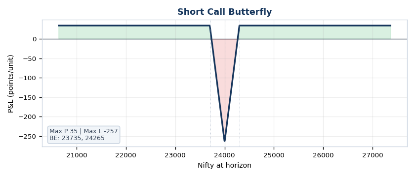

**The numbers (modelled at Nifty 24000).** Max profit 35 points (~₹2,625/lot) if Nifty finishes outside the wings. Max loss 257 points (~₹19,275/lot) if it pins exactly at 24000. Breakevens 23735 and 24265. Net credit 34.8 points. Risk:reward 0.14 — you risk roughly seven to make one, the mirror of the long fly.

**Greeks & behaviour.** Delta near zero at the body. Theta is negative — time decay hurts, because the structure loses as spot is dragged toward the body over time. Vega is positive, so rising IV helps and IV crush is your enemy.

**Management & exit.** The credit is small and the worst case large, so this is a tactical, short-horizon trade. Take profit quickly if the index breaks out and the position approaches the 35-point cap; cut it well before expiry-week gamma if spot stalls at the body, rather than risk the full 257-point loss. In practice few desks trade the short butterfly outright — it is more useful as the conceptual inverse that explains why the long fly is priced as cheaply as it is.

**Risk note.** The risk geometry is brutal: a quiet, pinned market hands you the maximum 257-point loss for a 35-point credit. Position tiny and treat it as a low-probability volatility bet, never as steady income. Note the credit here is not the kind of premium you "keep" — it is dwarfed by the pinning risk, so do not confuse this with an income trade.

**Scenario P&L (₹ per lot, at expiry).**

| Nifty at expiry | 22,800 | 23,400 | 24,000 | 24,600 | 25,200 |
|---|---|---|---|---|---|
| **P&L (₹/lot)** | +₹2,625 | +₹2,625 | -₹19,875 | +₹2,625 | +₹2,625 |

Mirror-imaged, the short fly collects a tidy +₹2,625 at every grid point except 24,000, where a pin inflicts the –₹19,875 maximum loss — the ±5% grid happens to straddle exactly the strike you fear.

**Adjustments, variants & timing.** Because this is the inverted, long-vol fly, adjustments run the other way: if Nifty stalls on the body you want out, not deeper in. The practical move is to leg out of the bought body and keep the short wings as a cheap strangle if a breakout finally fires, or convert to an outright debit fly if your pin view flips. It is rarely worth running on a Nifty monthly into expiry week, where decay drags you to max loss; if you trade it at all, a Bank Nifty weekly ahead of a catalyst gives the explosive move it needs. Place it away from max-pain, not on it — you are fading the pin. Enter when India VIX is low and set to expand, never in the last sleepy sessions when gamma and pinning crush long-vol structures; this is the one fly in the family that does not want the quiet expiry-week tape.


## 46. Iron Butterfly
*Pin near ATM, high IV · Short vega · net credit*

**The idea (intuition).** Sell an at-the-money straddle for rich premium, then buy a call and a put wing to cap the disaster on both sides. The result is a credit-collected tent: you keep the most if Nifty pins 24000, and your loss is bounded by the wings. It is the income trader's butterfly.

**When & why to use it.** This is a high-IV, expect-a-pin trade. Sell it when IV rank is high — after a Budget-day or results-driven volatility spike, with India VIX elevated and likely to mean-revert — so the short straddle collects fat premium that decays in your favour. Best in the back half of a monthly cycle on a range-bound index. Do NOT sell it into a building trend or just before a fresh catalyst that can gap spot past a wing.

**How to build it (₹, Nifty).** Sell 24000 CE @ 456, sell 24000 PE @ 318, buy 24300 CE @ 292, buy 23700 PE @ 219. Net credit 263.5 points, about ₹19,763 per lot received up front.

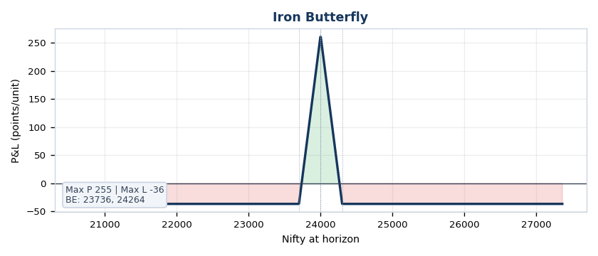

**The numbers (modelled at Nifty 24000).** Max profit 255 points (~₹19,125/lot) at a 24000 pin — essentially keeping the credit. Max loss 36 points (~₹2,700/lot) beyond a wing. Breakevens 23736 and 24264. Net credit 263.5 points. Risk:reward 6.99.

**Greeks & behaviour.** Delta near flat at the body. Theta is strongly positive — this is a decay engine, and time is your ally. Vega is negative, so falling IV after a spike accelerates profit; a fresh IV expansion works against you.

**Management & exit.** Standard income discipline: close at roughly 50% of the max credit rather than squeezing the last points, since gamma risk explodes in expiry week. If a side is tested, roll the untested wing in for more credit or roll the whole structure out and recentre. Exit before the final two sessions to dodge pin-and-gap risk.

**Risk note.** The narrow tent means even a moderate trending move puts you at the breakeven fast; the defined 36-point loss is comforting, but it triggers easily. Assignment risk on the short ATM options exists near expiry if they go in-the-money — manage early. Remember the breakevens sit barely 264 points either side of spot, roughly a single trending session in Nifty, so the rich 263.5-point credit is genuinely at risk, not free.

**Scenario P&L (₹ per lot, at expiry).**

| Nifty at expiry | 22,800 | 23,400 | 24,000 | 24,600 | 25,200 |
|---|---|---|---|---|---|
| **P&L (₹/lot)** | -₹2,700 | -₹2,700 | +₹19,800 | -₹2,700 | -₹2,700 |

The credit is kept in full (+₹19,800) only if Nifty pins 24,000; the 600-point and 1,200-point moves on either side all surrender the defined –₹2,700, showing how tightly the income depends on a central settle.

**Adjustments, variants & timing.** The standard repair is to roll the untested wing inward for extra credit when one side is threatened, or roll the whole structure out to the next expiry and re-centre on the new pin. If Nifty trends, convert to a broken-wing iron fly by moving one wing further out, shifting risk to the side you fear less and harvesting more credit. This is a Nifty monthly back-half trade by temperament — sell it once India VIX has spiked and is mean-reverting so the ATM straddle decays in your favour; Bank Nifty weeklies carry richer premium but breach the tight body far more often, so size down there. Centre the short straddle on the max-pain strike rather than spot, and put it on in the final one to two weeks when theta dominates. Flatten before the last two sessions to dodge pin-and-gap and short-ATM assignment risk on in-the-money legs.


## 47. Reverse Iron Butterfly
*Big move from ATM · Long vega · net debit*

**The idea (intuition).** Buy the at-the-money straddle and sell wings to part-fund it. You now own a defined-risk long-volatility tent that pays if Nifty makes a real move away from 24000 in either direction. It is the long-vol cousin of the iron fly.

**When & why to use it.** Use it ahead of a known binary catalyst when IV is still cheap — pre-results, pre-RBI, pre-election-count — where you expect a sharp directional resolution but cannot call the side. Being long vega, an IV ramp into the event helps even before the move. Avoid it in a sleepy, range-bound market: theta bleeds you toward max loss while spot sits on the body.

**How to build it (₹, Nifty).** Buy 24000 CE @ 456, buy 24000 PE @ 318, sell 24300 CE @ 292, sell 23700 PE @ 219. Net debit 263.5 points, about ₹19,763 per lot at risk.

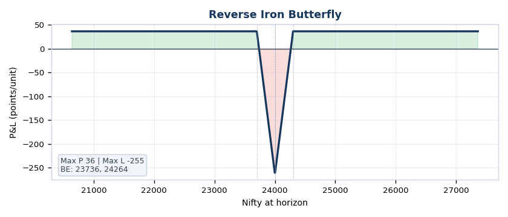

**The numbers (modelled at Nifty 24000).** Max profit 36 points (~₹2,700/lot) on a move beyond a wing. Max loss 255 points (~₹19,125/lot) if Nifty pins 24000. Breakevens 23736 and 24264. Net debit 263.5 points. Risk:reward 0.14.

**Greeks & behaviour.** Delta near zero at entry, turning directional as spot moves off the body. Theta is negative — every quiet day costs you. Vega is positive, so an IV spike into the event is a tailwind and IV crush after a non-event is the killer.

**Management & exit.** This is an event trade with a short fuse. Take profit fast on a clean breakout toward a wing; do not hold through the post-event IV crush hoping for more. If the catalyst passes with no move, cut quickly — the 255-point loss builds as theta and falling IV combine.

**Management & exit (continued).** Because the profit is capped at just 36 points while the debit risked is 263.5, the math only works if you exit on the vol expansion or the initial thrust, not at expiry. Many traders prefer a plain long straddle here unless they specifically want the defined-risk cap; the short wings finance the position but throttle the upside hard.

**Risk note.** The payoff is unforgiving for the patient: a pinned, low-vol outcome delivers the maximum 255-point loss. The capped 36-point profit also means even a correct breakout pays modestly, so the edge depends on a large, fast move plus an IV tailwind — a demanding combination that often does not arrive.

**Scenario P&L (₹ per lot, at expiry).**

| Nifty at expiry | 22,800 | 23,400 | 24,000 | 24,600 | 25,200 |
|---|---|---|---|---|---|
| **P&L (₹/lot)** | +₹2,700 | +₹2,700 | -₹19,800 | +₹2,700 | +₹2,700 |

Reversed, the structure pays a capped +₹2,700 at every wing but loses the full –₹19,800 if Nifty pins 24,000 — the ±5% grid straddles the body, so any of these outer strikes is the outcome you want.

**Adjustments, variants & timing.** As a long-vol debit tent, the only good adjustments are exits: bank the move the instant a breakout reaches a wing, or leg off the short wings to hold a clean long straddle if you want open-ended upside. If the catalyst misfires, cut at once rather than rolling — there is no decay-friendly repair for a structure that bleeds theta daily. It is an event tool, so a Bank Nifty weekly or a Nifty expiry-week straddling a binary catalyst (results, RBI, election count) is its natural home; never run it on a quiet monthly. Place the body on spot, not max-pain — you are betting against the pin. Enter while India VIX is still cheap and ramping into the event, because being long vega the IV build helps before price even moves, and the post-event crush is exactly what guts it if you overstay. Speed of exit, not pin precision, defines the trade.


## 48. Broken-Wing Call Butterfly
*Bullish pin, no upside risk · Short vega · net credit*

**The idea (intuition).** Take a long call butterfly and push the upper wing further out, skipping a strike. Widening that wing lowers its cost so much that the whole structure flips to a *credit*, and — crucially — it erases the loss zone on the upside. You are paid to hold a bullish-leaning tent with risk only on one side.

**When & why to use it.** Use it when you are neutral-to-bullish and want a no-cost or paid bet on a pin near or above spot, with the comfort that an upside breakout no longer hurts. Good in a grinding-higher Nifty where downside surprises are the real worry. Short vega, so elevated IV that fades into expiry helps. Avoid it if your main fear is a sharp drop, since the residual risk sits on the downside.

**How to build it (₹, Nifty).** Buy 23700 CE @ 655, sell 2x 24000 CE @ 456, buy 24500 CE @ 204 (the skipped, wider upper wing). Net credit 52.9 points, about ₹3,968 per lot received.

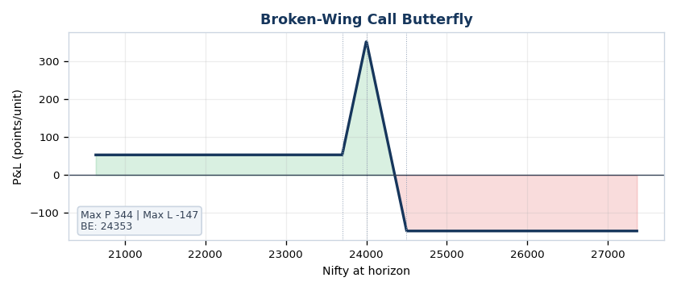

**The numbers (modelled at Nifty 24000).** Max profit 344 points (~₹25,800/lot) at a 24000 pin. Max loss 147 points (~₹11,025/lot) on the downside. Single breakeven 24353. Net credit 52.9 points. Risk:reward 2.34 — and note there is no upside loss zone, so a rally above the wings still leaves you the credit.

**Greeks & behaviour.** Slight bullish delta from the skewed wing. Theta is positive inside the tent. Vega is negative — falling IV helps, a spike hurts before expiry.

**Management & exit.** Because the upside is risk-free, you can let a rally run and keep the credit. Manage the downside: if Nifty breaks lower toward the 147-point loss, close or roll the body down. Book partial profit if spot pins the body with the credit already in hand.

**Risk note.** The trade-off for removing upside risk is a larger, asymmetric downside loss (147 points) concentrated below the body — a sharp sell-off is the danger. The credit is small comfort against that, so size for the downside tail. The honest way to read a broken-wing credit fly: you are not paid for free; you have sold away the protection on one side and concentrated all the risk on the other, and the credit is simply the market's price for that lopsided exposure.

**Scenario P&L (₹ per lot, at expiry).**

| Nifty at expiry | 22,800 | 23,400 | 24,000 | 24,600 | 25,200 |
|---|---|---|---|---|---|
| **P&L (₹/lot)** | +₹3,975 | +₹3,975 | +₹26,475 | -₹11,025 | -₹11,025 |

The +₹26,475 peak sits at 24,000, the lower strikes (22,800/23,400) retain the +₹3,975 credit, but the 24,600 and 25,200 columns show a –₹11,025 loss — the grid reveals where the asymmetric risk actually lives.

**Adjustments, variants & timing.** Since one side is risk-light, the management is one-sided too: defend the heavy side by rolling the body toward price if Nifty moves against you, or buy back the unmatched leg to neutralise the skew. You can also widen or narrow the skipped wing to dial the credit and the loss-zone width up or down. This broken-wing build suits a Nifty monthly where you hold a directional lean and want a paid-for tent; on Bank Nifty weeklies the larger swings test the loaded side too readily, so size smaller. Place the body at the max-pain strike that also matches your bias rather than at spot. Enter in the last week with India VIX elevated and fading — short vega means a cooling IV pulls the body toward intrinsic and fattens the peak, while the final sessions let gamma and pinning, not trend, finish the job. Read the credit honestly: risk is moved, not removed.


## 49. Broken-Wing Put Butterfly
*Bearish pin, no downside risk · Short vega · net credit*

**The idea (intuition).** The mirror of the broken-wing call: build a put butterfly but push the lower wing further out, skipping a strike to cheapen it into a credit and remove the *downside* loss zone. You hold a bearish-leaning tent and get paid to do it, with risk only if the market rallies.

**When & why to use it.** Use it when you lean neutral-to-bearish but mainly want to be protected against a crash to the downside — a market where a slow drift down or a pin is likely but a melt-up is your tail fear. Being paid a credit with no downside risk suits a nervous, top-heavy index. Short vega favours entry when IV is high and fading. Avoid it if you expect a strong upside breakout, since that is where the loss lives.

**How to build it (₹, Nifty).** Buy 24300 PE @ 453, sell 2x 24000 PE @ 318, buy 23500 PE @ 169 (the skipped, wider lower wing). Net credit 15.4 points, about ₹1,155 per lot received.


**The numbers (modelled at Nifty 24000).** Max profit 307 points (~₹23,025/lot) at a 24000 pin. Max loss 185 points (~₹13,875/lot) on the upside. Single breakeven 23685. Net credit 15.4 points. Risk:reward 1.66 — with no downside loss zone, a deep sell-off still leaves you the credit.

**Greeks & behaviour.** Slight bearish delta from the skewed lower wing. Theta is positive within the tent. Vega is negative, so easing IV helps and an IV spike works against you before expiry.

**Management & exit.** Let a decline run since the downside is risk-free, keeping the credit. Watch the upside: a rally toward the 185-point loss zone is the cue to close or roll the body up. Take partial profit on a body pin.

**Management & exit (note).** Because there is a single breakeven at 23685 and no downside loss zone, this is one of the more relaxing flies to hold in a falling tape — you can let a decline run without fear. The whole job is to defend the upside. Roll the body up or close if a melt-up develops.

**Risk note.** Removing downside risk shifts a larger 185-point loss onto the upside. A sharp rally is the real danger, and the thin 15.4-point credit barely cushions it. Size the position around that upside tail, not the small credit — a gap-up open on positive global cues or a surprise policy easing is exactly the scenario that hurts here.

**Scenario P&L (₹ per lot, at expiry).**

| Nifty at expiry | 22,800 | 23,400 | 24,000 | 24,600 | 25,200 |
|---|---|---|---|---|---|
| **P&L (₹/lot)** | -₹13,875 | -₹13,875 | +₹23,625 | +₹1,125 | +₹1,125 |

The +₹23,625 peak prints at 24,000 while the upside strikes hold a small +₹1,125 and the 22,800–23,400 columns carry the –₹13,875 loss — the grid lays bare the lopsided downside exposure.

**Adjustments, variants & timing.** Defence lives on the upside here: roll the body up to chase a rallying Nifty, or buy in the unmatched wing to cap a melt-up before it dominates the P&L. Adjust the skipped lower wing's width to trade credit against the size of the upside loss zone. As a neutral-to-bearish paid tent it fits a Nifty monthly in a top-heavy, drifting-lower tape; Bank Nifty weeklies gap up too sharply on positive global cues, so keep size modest if you use them. Anchor the body on the max-pain or heavy-put-OI strike consistent with your soft bearish lean, not on raw spot. Put it on in the closing week with India VIX high and fading, since short vega rewards an IV slide and the last sessions hand the trade to gamma and pinning. Remember the single breakeven leaves the downside relaxed but the upside thinly hedged until the far wing — a gap-up is the real failure mode.


## 50. Skip-Strike Butterfly (Call)
*Bullish drift · Short vega · net credit*

**The idea (intuition).** A directional broken-wing call fly: the upper wing is skipped further out and the lower leg tightened, so the tent both pays for itself (a credit) and leans hard to the upside. You are positioning for a gentle bullish drift while collecting premium.

**When & why to use it.** Use it when your base case is a slow grind higher in Nifty rather than an explosive rally — a constructive but not euphoric tape. The credit and the wide upper wing mean an overshoot above your target costs nothing, so it suits markets where upside surprises are the norm and downside is the real risk. Short vega, so high-and-fading IV is the friendly regime. Avoid it ahead of a downside catalyst.

**How to build it (₹, Nifty).** Buy 23800 CE @ 585, sell 2x 24000 CE @ 456, buy 24600 CE @ 167 (the skipped wing). Net credit 159.7 points, about ₹11,978 per lot received.

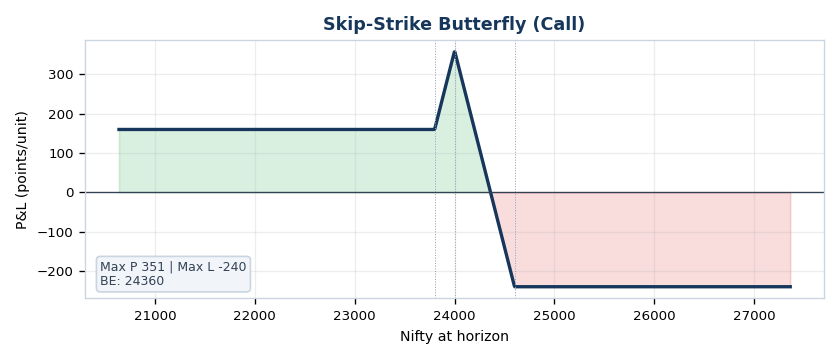

**The numbers (modelled at Nifty 24000).** Max profit 351 points (~₹26,325/lot) near the 24000 body. Max loss 240 points (~₹18,000/lot) on the downside. Single breakeven 24360. Net credit 159.7 points. Risk:reward 1.46 — no upside loss zone.

**Greeks & behaviour.** Net bullish delta from the directional skew. Theta is positive inside the tent. Vega is negative — falling IV helps the structure mature toward its peak.

**Management & exit.** Since the upside carries no loss, you can hold through a rally and bank the credit. Discipline lives on the downside: scale out or roll the body down if Nifty slides toward the 240-point loss. Book a chunk if price pins the body region.

**Risk note.** The wide upper wing buys directional comfort at the cost of a sizeable 240-point downside loss. A sharp drop is the failure mode, and the larger 159.7-point credit here does not change that the risk is real and one-sided — size accordingly. This is the most directional of the credit flies so far: the wider the upper wing, the cheaper it gets and the more it behaves like a bullish bet with a downside stop, so treat it as a directional position, not a neutral income trade.

**Scenario P&L (₹ per lot, at expiry).**

| Nifty at expiry | 22,800 | 23,400 | 24,000 | 24,600 | 25,200 |
|---|---|---|---|---|---|
| **P&L (₹/lot)** | +₹12,000 | +₹12,000 | +₹27,000 | -₹18,000 | -₹18,000 |

Maximum +₹27,000 lands at 24,000, the lower grid keeps +₹12,000 of credit, and the 24,600–25,200 columns reveal the –₹18,000 directional downside — the ±5% grid neatly straddles the body it must pin.

**Adjustments, variants & timing.** This is the most directional credit fly, so treat it like a bullish position with a stop, not neutral income. The key adjustment is to roll the body up as Nifty grinds higher, keeping the tent under price, and to scale out or buy protection if the index slides toward the downside loss. Tightening or widening the skipped upper wing trades credit for directional reach. It suits a Nifty monthly in a constructive, slow-grind tape where upside overshoots cost nothing; Bank Nifty weeklies move too fast for a structure that wants a measured drift, so prefer the monthly. Place the body just above max-pain in the direction of your lean rather than at spot. Enter in the final week with India VIX elevated and fading — short vega means the cooling IV matures the tent toward its peak, and gamma and pinning take over in the last sessions. Size for the one-sided downside tail, never for the headline credit.


## 51. Unbalanced (Ratio) Butterfly
*Directional pin · Short vega · net credit*

**The idea (intuition).** A standard butterfly sells two body options against one of each wing; here you sell three of the body and buy two of the upper wing, so the leg counts no longer balance. That extra short skews the tent and the credit toward one side, turning a neutral structure into a directional, income-leaning bet.

**When & why to use it.** Use it when you have a directional pin view and want a larger credit than a plain fly offers — you are willing to take on a residual naked-ish exposure from the unmatched short leg in exchange. Suits a trader with a firm level target and a high-IV backdrop set to fade. Avoid it if you cannot actively manage the position, because the ratio leaves a leg that behaves more aggressively if spot runs through it.

**How to build it (₹, Nifty).** Buy 23700 CE @ 655, sell 3x 24000 CE @ 456, buy 2x 24300 CE @ 292. Net credit 129.3 points, about ₹9,698 per lot received.

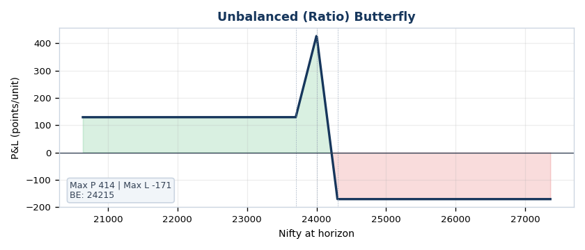

**The numbers (modelled at Nifty 24000).** Max profit 414 points (~₹31,050/lot) around the body. Max loss 171 points (~₹12,825/lot). Single breakeven 24215. Net credit 129.3 points. Risk:reward 2.42.

**Greeks & behaviour.** Net delta is skewed by the unbalanced leg, giving the position a directional tilt. Theta is positive in the profit zone. Vega is negative — IV decline supports the trade.

**Management & exit.** The extra short means you must watch the tested side closely. Book partial profit on a body pin; if spot pushes through the skewed wing, roll or close the unmatched leg before it dominates the P&L. Do not let this run unmanaged into expiry-week gamma.

**Risk note.** Ratio structures are less forgiving than balanced flies: the unmatched short can accelerate losses if the index trends hard through it. The defined 171-point figure assumes the wings hold their hedge ratio — treat the position as needing active oversight, not set-and-forget. On NSE, margin for the extra short leg is also higher than a plain fly, so check that the SPAN-plus-exposure requirement still leaves the trade capital-efficient before putting it on.

**Scenario P&L (₹ per lot, at expiry).**

| Nifty at expiry | 22,800 | 23,400 | 24,000 | 24,600 | 25,200 |
|---|---|---|---|---|---|
| **P&L (₹/lot)** | +₹9,675 | +₹9,675 | +₹32,175 | -₹12,825 | -₹12,825 |

The ratio's +₹32,175 peak appears at 24,000 with +₹9,675 retained on the downside and a –₹12,825 loss on the 24,600–25,200 strikes, the unbalanced leg's skew visible across the grid.

**Adjustments, variants & timing.** The ratio's extra short demands active care: if Nifty pushes through the skewed wing, buy back or roll the unmatched leg before it behaves like a naked short and dominates the P&L. You can rebalance back to a plain fly by buying one more wing, or roll the body to follow price. It fits a Nifty monthly where you hold a firm level target and want a fatter credit than a balanced fly; avoid running unbalanced legs on Bank Nifty weeklies, where a fast move through the loaded strike is punishing. Note SPAN-plus-exposure margin on NSE is higher for the extra short, so confirm capital efficiency first. Place the body at the max-pain strike that matches your directional pin, not at spot. Enter in the closing week with India VIX high and fading so short vega works for you, and never leave the ratio unmanaged into expiry-week gamma — the unmatched leg is exactly what accelerates a loss if spot trends hard.


## 52. Long Butterfly (Wide Wings)
*Broad pin zone · Short vega · net debit*

**The idea (intuition).** A standard long call fly with the wings pushed far apart. Widening the wings stretches the profit tent over a much broader band of strikes, so you no longer need a perfect pin — a roomy target zone will do — but the wider, more expensive wings raise the cost.

**When & why to use it.** Use it when you expect Nifty to settle somewhere in a broad neighbourhood of 24000 but cannot pinpoint the exact strike — a gently consolidating market where you want forgiveness on the pin. The wider breakevens raise the probability of finishing in profit versus a tight fly. Short vega, so a fading-IV regime helps. Avoid it if you need the absolute cheapest defined-risk bet, since width costs points.

**How to build it (₹, Nifty).** Buy 23400 CE @ 882, sell 2x 24000 CE @ 456, buy 24600 CE @ 167. Net debit 137.2 points, about ₹10,290 per lot at risk.

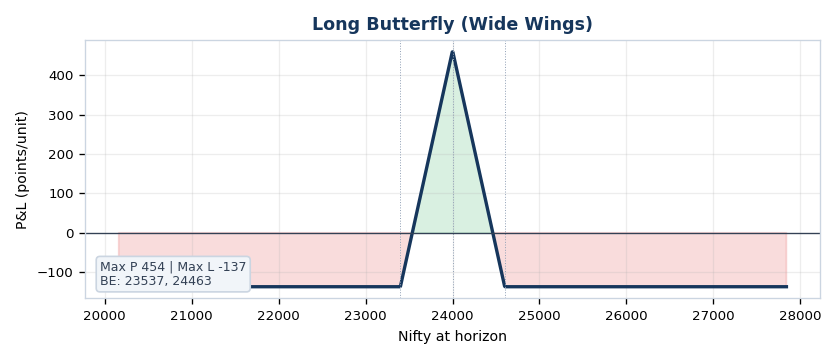

**The numbers (modelled at Nifty 24000).** Max profit 454 points (~₹34,050/lot) at a 24000 pin. Max loss 137 points (~₹10,290/lot) beyond the wings. Breakevens 23537 and 24463 — a wide 926-point profit band. Net debit 137.2 points. Risk:reward 3.31.

**Greeks & behaviour.** Delta near flat at the body, gently directional toward the wide breakevens. Theta is positive inside the tent. Vega is negative, so falling IV helps the structure converge to its peak.

**Management & exit.** The broad tent gives you room to be patient; book 40-60% of the peak if spot sits central with time left. Because the breakevens are far apart, you rarely need to panic on a moderate move — but recentre with a roll if a strong trend threatens a wing.

**Risk note.** You pay 137 points for that comfort, a meaningfully larger debit than a narrow fly, and the full max profit still requires a near-perfect central pin. A move past either wide breakeven (23537 or 24463) still loses the whole debit. The wide-wing fly is best understood as buying a higher probability of *some* profit in exchange for a larger absolute cost and a lower reward ratio — the opposite end of the spectrum from the narrow fly that follows.

**Scenario P&L (₹ per lot, at expiry).**

| Nifty at expiry | 22,800 | 23,400 | 24,000 | 24,600 | 25,200 |
|---|---|---|---|---|---|
| **P&L (₹/lot)** | -₹10,275 | -₹10,275 | +₹34,725 | -₹10,275 | -₹10,275 |

The wide-wing peak of +₹34,725 still requires the 24,000 pin, but because the breakevens are far apart the loss columns show a contained –₹10,275 — the ±5% grid straddles a genuinely broad profit tent.

**Adjustments, variants & timing.** The wide tent's whole point is forgiveness, so adjustments are gentle: you rarely panic on a moderate move, but recentre with a body roll if a strong trend threatens a far wing, or narrow one wing to lock in a broken-wing credit once price has chosen a side. Because the breakevens are far apart, this suits a Nifty monthly consolidation where you expect a broad-neighbourhood settle rather than an exact pin; Bank Nifty weeklies do not need this much width and the larger debit is wasted there. Place the body at max-pain or the centre of the expected range, not at spot if they differ. Enter in the last one to two weeks with India VIX elevated and fading, since short vega lets the cooling IV converge the structure to its peak. The trade-off to respect: you pay a larger debit for a higher probability of *some* profit, and the full peak still wants a near-perfect central pin.


## 53. Long Butterfly (Narrow)
*Tight pin · Short vega · net debit*

**The idea (intuition).** The opposite extreme: pull the wings in tight around the body. The tent is razor-thin and very cheap, and it pays a spectacular multiple if Nifty lands precisely on the body — a true sniper's bet on an exact level.

**When & why to use it.** Use it on expiry-week when you have a strong, specific pin thesis — a max-pain level, a heavy open-interest strike — and want maximum reward for minimal outlay. The tiny cost makes it a low-conviction-friendly lottery ticket. Short vega and most potent when IV has already collapsed so the body trades near intrinsic. Do NOT use it as a core position: the probability of a clean pin in a narrow band is genuinely low.

**How to build it (₹, Nifty).** Buy 23850 CE @ 388, sell 2x 24000 CE @ 296, buy 24150 CE @ 216. Net debit 13.2 points, about ₹990 per lot at risk.

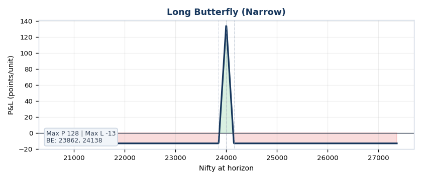

**The numbers (modelled at Nifty 24000).** Max profit 128 points (~₹9,600/lot) at a precise 24000 finish. Max loss 13 points (~₹990/lot) beyond the wings. Breakevens 23862 and 24138 — a tight 276-point band. Net debit 13.2 points. Risk:reward 9.72.

**Greeks & behaviour.** Delta flat at the body, sharply directional just outside it. Theta is strongly positive in the final days as the tent springs up. Vega is negative.

**Management & exit.** This is an end-of-cycle, hold-to-near-expiry trade — the value materialises only in the last session or two as gamma peaks. Given the ₹990 cost, many simply let it ride to expiry. If spot is glued to the body late, taking 50-70% of the peak is reasonable rather than risking a final-hour drift.

**Risk note.** The eye-catching 9.72 reward:risk is offset by a very low probability of finishing inside the 276-point band. Expect most of these to lose the small debit — treat the high payoff as the rare exception, not the plan. The contrast with the wide-wing fly is the whole lesson of butterfly width: tighter wings multiply the reward ratio but shrink the win zone, so the headline number flatters a trade you will lose far more often than you win.

**Scenario P&L (₹ per lot, at expiry).**

| Nifty at expiry | 22,800 | 23,400 | 24,000 | 24,600 | 25,200 |
|---|---|---|---|---|---|
| **P&L (₹/lot)** | -₹975 | -₹975 | +₹10,275 | -₹975 | -₹975 |

The razor-thin fly peaks at +₹10,275 only at 24,000 and loses just –₹975 everywhere else on the grid — a cheap bet whose win zone the 600-point grid spacing comfortably overshoots on both sides.

**Adjustments, variants & timing.** This is a sniper's expiry-week instrument, so the main adjustment is restraint — the ₹990 cost makes letting it ride to settlement reasonable. If your pin thesis shifts, simply roll the whole tight fly to the new strike; legging adjustments rarely pay on so cheap a structure. It is purpose-built for a Nifty monthly expiry-week pin on a heavy open-interest or max-pain strike, or a Bank Nifty weekly with a clear pinning magnet — the razor band needs the gamma and pinning of the final sessions to spring. Place the body exactly on the max-pain / peak-OI strike, never on raw spot. Enter only once India VIX has collapsed so the body trades near intrinsic and the tent is cheapest; earlier entry just bleeds. Treat the dazzling reward ratio as a low-probability lottery ticket sized in single lots — most expire worthless, and the headline multiple flatters a trade you lose far more often than you win.


## 54. OTM Call Butterfly (Bullish Target)
*Bullish to a target · Short vega · net debit*

**The idea (intuition).** A standard long call fly, but centred *above* spot. You pitch the tent over a higher strike you think Nifty will drift up to, paying a small debit for a fat payoff if the index reaches that target by expiry. It is a cheap, defined-risk way to express "I think we grind to 24500."

**When & why to use it.** Use it when you have a specific upside target and a timeframe — a measured-move projection, a resistance level you expect to be tagged, a post-breakout drift. Far cheaper than buying calls outright, and the cost is the whole risk. Short vega, so a high-IV-fading backdrop helps. Avoid it if you expect an explosive rally far past the target, since the upper wing caps and then cuts the payoff.

**How to build it (₹, Nifty).** Buy 24200 CE @ 342, sell 2x 24500 CE @ 204, buy 24800 CE @ 107. Net debit 40.4 points, about ₹3,030 per lot at risk.

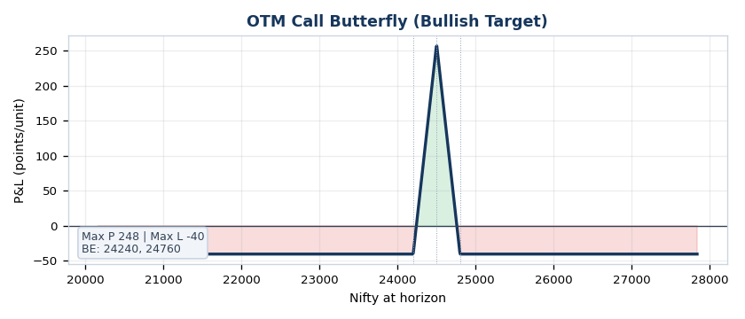

**The numbers (modelled at Nifty 24000).** Max profit 248 points (~₹18,600/lot) if Nifty pins 24500. Max loss 40 points (~₹3,000/lot). Breakevens 24240 and 24760. Net debit 40.4 points. Risk:reward 6.15.

**Greeks & behaviour.** Net positive (bullish) delta at entry since the tent sits above spot; delta flattens as price approaches the target. Theta turns helpful once spot is inside the tent. Vega is negative.

**Management & exit.** As Nifty climbs toward 24500, the position gains value — book partial profit on the approach rather than demanding a perfect pin. If the rally stalls well below the target, the cheap debit can be left to expire. Roll up if price blows past 24500 and you still want exposure.

**Risk note.** Two ways to lose: the index fails to reach the target, or it overshoots past the upper wing — both forfeit the 40-point debit. The structure rewards a *measured* move to a level, not an open-ended trend. If you genuinely expect a runaway rally, a call vertical or outright calls serve better; the OTM fly is specifically a tool for a defined upside target where you also believe momentum will fade once it is reached.

**Scenario P&L (₹ per lot, at expiry).**

| Nifty at expiry | 22,800 | 23,400 | 24,000 | 24,600 | 25,200 |
|---|---|---|---|---|---|
| **P&L (₹/lot)** | -₹3,000 | -₹3,000 | -₹3,000 | +₹12,000 | -₹3,000 |

Because the tent is centred at 24,500, the grid never lands on the exact peak: the 24,600 column shows +₹12,000 while every other strike forfeits the –₹3,000 debit, a reminder the ±5% grid can straddle but not pin an OTM body.

**Adjustments, variants & timing.** Because the tent is centred above spot at 24500, manage it as a directional target trade: roll the whole fly higher if Nifty blows past the target and you still want exposure, or take partial profit on the approach rather than demanding the exact pin. Converting the upper wing to a wider, skipped strike turns it into a skip-strike bullish fly that no longer caps an overshoot. It suits a Nifty monthly measured-move or resistance-tag thesis where momentum is expected to fade at the level; Bank Nifty weeklies trend too hard for a capped target structure. Place the body at the resistance / projected-move strike, and check it against max-pain — a target well above heavy call OI is less likely to be reached. Enter in the last two weeks with India VIX elevated and fading so short vega helps the tent mature. The structure rewards a measured drift to a level, not an open-ended rally.


## 55. OTM Put Butterfly (Bearish Target)
*Bearish to a target · Short vega · net debit*

**The idea (intuition).** The downside mirror: a long put fly centred *below* spot, over a lower strike you expect Nifty to fall to. A small debit buys a generous payoff if the index drifts down to that target — a cheap, capped way to play "I think we slip to 23500."

**When & why to use it.** Use it when you have a defined downside target and a timeframe — a support level you expect to be tested, a measured pullback after a rally, a seasonal soft patch. Much cheaper than long puts, with the debit as the only risk. Short vega favours a high-and-fading-IV entry. Avoid it if you expect a crash far below the target, since the lower wing caps the gains.

**How to build it (₹, Nifty).** Buy 23800 PE @ 248, sell 2x 23500 PE @ 169, buy 23200 PE @ 113. Net debit 23.8 points, about ₹1,785 per lot at risk.

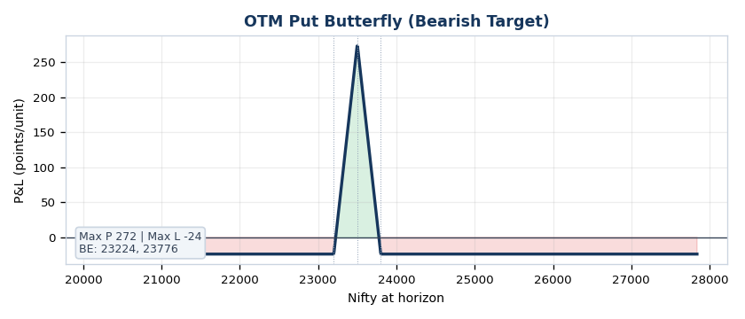

**The numbers (modelled at Nifty 24000).** Max profit 272 points (~₹20,400/lot) if Nifty pins 23500. Max loss 24 points (~₹1,800/lot). Breakevens 23224 and 23776. Net debit 23.8 points. Risk:reward 11.4 — the richest reward ratio in the group.

**Greeks & behaviour.** Net negative (bearish) delta at entry as the tent sits below spot; it flattens as price nears the target. Theta helps once spot is inside the tent. Vega is negative.

**Management & exit.** Book partial profit as Nifty falls toward 23500 rather than holding out for an exact pin. If the decline fails to develop, the tiny debit can simply expire. Roll the fly lower if price overshoots and you keep a bearish view.

**Risk note.** The headline 11.4 reward:risk — the richest in the group — reflects a low-probability outcome: Nifty must land near 23500, neither stopping short nor crashing through the lower wing. Most attempts lose the small 24-point debit; the payoff is a tail event, not the expectation. Note too that on a genuine market crash the index can slice straight past 23500 to the lower wing and beyond, capping your gain exactly when an outright put would have paid most — so this is a target trade, not a crash hedge.

**Scenario P&L (₹ per lot, at expiry).**

| Nifty at expiry | 22,800 | 23,400 | 24,000 | 24,600 | 25,200 |
|---|---|---|---|---|---|
| **P&L (₹/lot)** | -₹1,800 | +₹13,200 | -₹1,800 | -₹1,800 | -₹1,800 |

Centred at 23,500, the body falls between grid points — the 23,400 column captures +₹13,200 while all other strikes lose the –₹1,800 debit, illustrating how a ±5% grid may straddle an off-centre target.

**Adjustments, variants & timing.** Centred below spot at 23500, this is the bearish-target mirror: roll the fly lower if Nifty overshoots and your bearish view holds, or bank partial profit as price approaches the target instead of waiting for a perfect pin. Widening the lower wing into a skip-strike removes the cap if you want a deeper slide to keep paying. It fits a Nifty monthly support-test or measured-pullback thesis where the fall is expected to stall at the level; a genuine crash slices straight through to the lower wing and caps you exactly when an outright put pays most, so it is a target trade, not a crash hedge. Place the body at the support / projected strike and sanity-check against max-pain and heavy put OI. Enter in the closing fortnight with India VIX high and fading so short vega aids the structure. As the richest reward ratio in the group, treat it as a tail bet — most attempts lose the small debit.


## 56. Iron Butterfly (Wide Wings)
*Pin near ATM · Short vega · net credit*

**The idea (intuition).** A standard iron fly with the protective wings pushed further out. You still sell the ATM straddle for income, but the wider, cheaper wings collect less credit while shrinking the maximum loss and widening the profitable band. A more forgiving version of the income trade.

**When & why to use it.** Use it when you want iron-fly income but with a broader margin for error on the pin — a range-bound Nifty where you would rather sacrifice some credit for a smaller, more comfortable max loss. Good for traders who found the standard iron fly's tight breakevens too easily breached. Short vega, so high-and-fading IV remains the ideal backdrop. Avoid it before a catalyst that can gap past even the wider wings.

**How to build it (₹, Nifty).** Sell 24000 CE @ 456, sell 24000 PE @ 318, buy 24500 CE @ 204, buy 23500 PE @ 169 (wider wings). Net credit 401.3 points, about ₹30,098 per lot received.

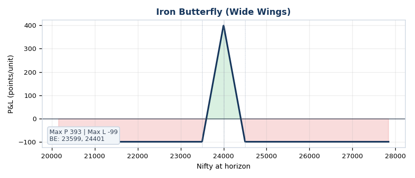

**The numbers (modelled at Nifty 24000).** Max profit 393 points (~₹29,475/lot) at a 24000 pin. Max loss 99 points (~₹7,425/lot) beyond a wing. Breakevens 23599 and 24401 — an 802-point profit band. Net credit 401.3 points. Risk:reward 3.98.

**Greeks & behaviour.** Delta near flat at the body. Theta is strongly positive — a decay engine like the standard iron fly. Vega is negative, so IV crush after a spike accelerates profit.

**Management & exit.** Close at roughly 50% of max credit; the wider tent gives more room before a tested side demands action. Roll the untested wing in for credit or roll out to recentre if a side is breached. Exit before expiry-week gamma.

**Risk note.** Wider wings cut the max loss to 99 points but a sustained trend can still breach a breakeven — defined risk is not no risk. Short ATM legs carry assignment risk near expiry if in-the-money; manage before the last sessions. The larger 401-point credit collected here is misleading on its own: most of it merely offsets the wider strikes, and the true edge is the modest 393-point peak against a 99-point loss in a market that actually pins.

**Scenario P&L (₹ per lot, at expiry).**

| Nifty at expiry | 22,800 | 23,400 | 24,000 | 24,600 | 25,200 |
|---|---|---|---|---|---|
| **P&L (₹/lot)** | -₹7,425 | -₹7,425 | +₹30,075 | -₹7,425 | -₹7,425 |

The wider iron fly keeps +₹30,075 at a 24,000 pin and limits the wing loss to –₹7,425, the grid showing a more forgiving, broader-banded version of the income tent.

**Adjustments, variants & timing.** The wider wings give more room before a side demands action, so adjustments are unhurried: roll the untested wing in for credit when one side is tested, or roll the whole structure out and recentre on the new pin. Converting to a broken-wing by moving one wing further still trades the symmetric loss for extra credit and a skew. This is a Nifty monthly income trade for a range-bound tape where the tight standard iron fly's breakevens felt too easily breached; on Bank Nifty weeklies the broader band helps but the faster moves still argue for smaller size. Centre the short straddle on the max-pain strike, not spot, and sell it once India VIX has spiked and is mean-reverting so the wider, cheaper wings still leave a worthwhile credit. Enter in the last one to two weeks for peak theta, and flatten before the final two sessions to dodge pin-and-gap and short-ATM assignment on any in-the-money leg.


## 57. Broken-Wing Iron Butterfly
*Neutral with a skew · Short vega · net credit*

**The idea (intuition).** An iron fly with mismatched wing distances — one wing closer, one further — so the protection is asymmetric. That shifts the risk toward one side and squeezes out extra credit, turning the neutral income tent into a skewed, slightly directional bet.

**When & why to use it.** Use it when you want iron-fly income but have a mild directional lean and are willing to concentrate risk on the side you fear less. The asymmetric wings let you collect more credit than a balanced fly. Suits a range-bound market with a soft directional bias. Short vega, so high-and-fading IV is the friendly regime. Avoid it if the side carrying the larger risk is also where a catalyst could push spot.

**How to build it (₹, Nifty).** Sell 24000 CE @ 456, sell 24000 PE @ 318, buy 24300 CE @ 292 (near wing), buy 23500 PE @ 169 (far wing). Net credit 313.7 points, about ₹23,528 per lot received.

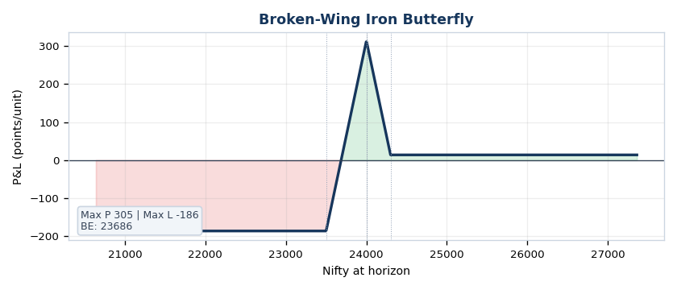

**The numbers (modelled at Nifty 24000).** Max profit 305 points (~₹22,875/lot) near the body. Max loss 186 points (~₹13,950/lot). Single breakeven 23686. Net credit 313.7 points. Risk:reward 1.64.

**Greeks & behaviour.** Net delta carries a mild skew from the asymmetric wings. Theta is positive — time decay drives the trade. Vega is negative, so easing IV helps.

**Management & exit.** Close at around 50% of max credit. Watch the side with the closer wing and larger residual risk; roll or close if spot tests it. Recentre with a roll if your directional lean changes. Exit before expiry-week gamma. A practical NSE tip: leg into the credit on a day the index ticks toward your favoured side, so the short straddle is sold into slightly richer premium and the skew works in your favour from the open.

**Risk note.** The extra credit comes from accepting a larger, skewed 186-point loss on one side. The single breakeven at 23686 means a downside move is only thinly hedged until the far put wing — manage actively, and remember the short ATM legs carry assignment risk near expiry. As with every broken-wing structure, read the credit honestly: you have moved the risk, not removed it, and the heavier loss now lives below the market.

**Scenario P&L (₹ per lot, at expiry).**

| Nifty at expiry | 22,800 | 23,400 | 24,000 | 24,600 | 25,200 |
|---|---|---|---|---|---|
| **P&L (₹/lot)** | -₹13,950 | -₹13,950 | +₹23,550 | +₹1,050 | +₹1,050 |

The skewed iron fly peaks at +₹23,550 at 24,000, holds a slim +₹1,050 on the upside, and carries the heavier –₹13,950 loss on the 22,800–23,400 columns — the grid exposes which side is thinly hedged.

**Adjustments, variants & timing.** The asymmetric wings mean you watch the side with the closer wing and larger residual risk: roll or close that side if spot tests it, and recentre the body with a roll if your directional lean changes. You can rebalance toward a symmetric iron fly by moving the far wing in, trading credit for protection. It suits a Nifty monthly range with a soft directional bias where you will accept more risk on the side you judge safer for a fatter credit; Bank Nifty weeklies leave the thin side too exposed to a fast move. Centre the short straddle on max-pain and skew the wings toward your lean. A practical NSE tip: leg in on a day the index ticks toward your favoured side so the straddle is sold into richer premium. Enter in the closing week with India VIX high and fading, and exit before expiry-week gamma — the short ATM legs also carry assignment risk if they finish in-the-money.


## 58. Put Broken-Wing (Income)
*Neutral to bullish · Short vega · net credit*

**The idea (intuition).** A put-side skip-strike butterfly taken for a credit, structured to lean neutral-to-bullish. By widening the lower wing you cheapen the downside protection into a credit and tilt the payoff so a flat-to-rising market pays you — income with a constructive bias.

**When & why to use it.** Use it when you expect Nifty to hold up or grind higher and want to harvest premium on the put side, with defined risk if you are wrong on the downside. Good in a steady, mildly bullish tape after IV has spiked and is fading. Short vega supports a high-IV entry. Avoid it ahead of a downside catalyst, since the residual risk sits below the market.

**How to build it (₹, Nifty).** Buy 24200 PE @ 404, sell 2x 23900 PE @ 282, buy 23400 PE @ 148 (skipped lower wing). Net credit 11.9 points, about ₹893 per lot received.

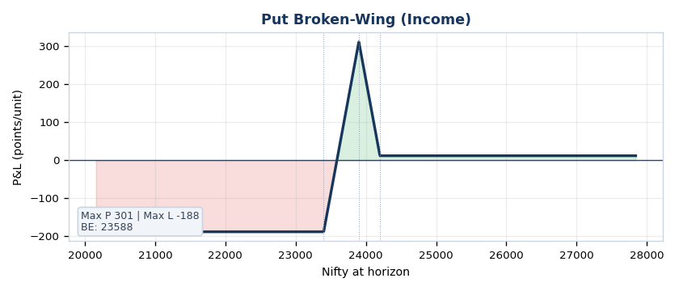

**The numbers (modelled at Nifty 24000).** Max profit 301 points (~₹22,575/lot) near the 23900 body. Max loss 188 points (~₹14,100/lot) on the downside. Single breakeven 23588. Net credit 11.9 points. Risk:reward 1.6.

**Greeks & behaviour.** Slight bullish-to-neutral delta from the skew. Theta is positive in the profit zone. Vega is negative, so falling IV helps the structure mature.

**Management & exit.** Hold for decay; book partial profit if spot sits near or above the body. The action point is the downside — close or roll the body down if Nifty slides toward the 188-point loss zone. Exit before expiry-week gamma. Because the bias is gently bullish, a flat-to-up grind quietly works in your favour through theta, but resist the temptation to add size after a couple of easy wins — that is precisely when the downside tail tends to show up.

**Risk note.** The thin 11.9-point credit barely cushions a 188-point downside loss, so this is really a directional risk-acceptance trade dressed as income. A sharp sell-off below the breakeven at 23588 is the failure mode — size for that downside tail, not the small credit. The "income" label is the dangerous part: collecting a tiny credit feels like the safe premium-selling trades retail loves, but SEBI's own studies show most F&O traders lose, and a structure that risks 188 to keep 12 is exactly how that happens if left unmanaged.

**Scenario P&L (₹ per lot, at expiry).**

| Nifty at expiry | 22,800 | 23,400 | 24,000 | 24,600 | 25,200 |
|---|---|---|---|---|---|
| **P&L (₹/lot)** | -₹14,100 | -₹14,100 | +₹15,900 | +₹900 | +₹900 |

The body sits at 23,900, so the 24,000 column shows the near-peak +₹15,900 while the upside keeps +₹900 and the downside strikes reveal the –₹14,100 loss — the grid makes the directional risk plain.

**Adjustments, variants & timing.** With the body at 23900 and a neutral-to-bullish tilt, defence lives below the market: roll the body down or buy in the skipped wing if Nifty slides toward the downside loss zone, and let a flat-to-up grind quietly pay you through theta. Widening the lower wing dials the credit against the size of the downside tail. It fits a Nifty monthly steady-to-mildly-bullish tape after an India VIX spike has begun to fade; avoid it before a downside catalyst, since the residual risk sits there, and keep Bank Nifty weekly size small given sharper gap risk. Place the body at the max-pain or heavy-call-support strike consistent with your bullish lean, not at spot. Enter in the final week with IV high and easing so short vega helps the structure mature. Resist adding size after a couple of easy wins — SEBI's F&O studies show most retail loses, and a trade risking 188 to keep 12 is exactly how, if left unmanaged.


## 59. Iron Butterfly (Weekly)
*Pin this week · Short vega · net credit*

**The idea (intuition).** The iron fly compressed into a weekly expiry. With only days to run, the short ATM straddle decays fast and the tent is sharp — rich theta in exchange for vicious gamma. A short, intense bet that Nifty pins 24000 by week's end.

**When & why to use it.** Use it on a quiet expiry week with no major scheduled catalyst, when you want to harvest the steep weekly theta on a range-bound index — Nifty or Bank Nifty weeklies are the natural home. Best when weekly IV is elevated relative to the expected move. Short vega and short gamma, so it demands active management. Do NOT run it through an event week or leave it unattended into expiry day.

**How to build it (₹, Nifty).** Sell 24000 CE @ 202, sell 24000 PE @ 170, buy 24250 CE @ 91, buy 23750 PE @ 83. Net credit 198.0 points, about ₹14,850 per lot received.

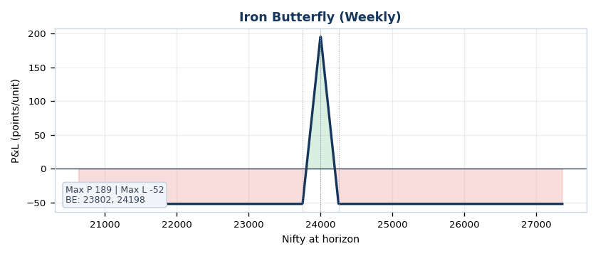

**The numbers (modelled at Nifty 24000).** Max profit 189 points (~₹14,175/lot) at a 24000 pin. Max loss 52 points (~₹3,900/lot) beyond a wing. Breakevens 23802 and 24198. Net credit 198.0 points. Risk:reward 3.64.

**Greeks & behaviour.** Delta near flat at the body but it swings fast as spot moves — high gamma. Theta is strongly positive and front-loaded in the final days, which is the whole reason to trade the weekly rather than the monthly version. Vega is negative, so a midweek IV pop against you is unwelcome even if spot has not moved much.

**Management & exit.** Manage actively: take 25-50% of the credit early since weekly gamma can flip a winner to a loser in one session. Roll the tested side or close outright if a breakeven is threatened. Many desks flatten the day before expiry to avoid pin-and-gap risk entirely.

**Risk note.** Weekly gamma is the headline danger — a single sharp move blows through the tight 23802/24198 breakevens fast, and the defined 52-point loss arrives quickly. Short ATM legs risk assignment into expiry. This is a hands-on trade, never set-and-forget. Bank Nifty weeklies amplify everything here: bigger point moves relative to the wing width mean the tent is breached more often, so size smaller on Bank Nifty than the headline Nifty numbers suggest.

**Scenario P&L (₹ per lot, at expiry).**

| Nifty at expiry | 22,800 | 23,400 | 24,000 | 24,600 | 25,200 |
|---|---|---|---|---|---|
| **P&L (₹/lot)** | -₹3,900 | -₹3,900 | +₹14,850 | -₹3,900 | -₹3,900 |

The weekly fly keeps +₹14,850 only at a 24,000 pin and surrenders the defined –₹3,900 at every other strike, the tight grid spacing underscoring how easily weekly gamma breaches the body.

**Adjustments, variants & timing.** Weekly gamma is the headline, so adjustments are fast and frequent: take 25–50% of the credit early, roll the tested side or close outright the moment a breakeven is threatened, and many desks simply flatten the day before expiry to sidestep pin-and-gap entirely. Rolling the untested wing in for credit is the standard repair. Nifty and Bank Nifty weeklies are the natural home, but Bank Nifty's bigger point moves relative to the wing width breach the tent more often — size smaller there than the Nifty numbers suggest. Centre the short straddle on the max-pain strike, and trade it only on a quiet expiry week with no scheduled catalyst, when weekly IV is elevated relative to the expected move so theta is front-loaded in your favour. This is a hands-on, final-sessions trade where steep weekly decay is the whole edge — short vega means even a midweek IV pop against you stings, so never leave it unattended into expiry day.


## 60. Reverse Iron Butterfly (Event)
*Event breakout · Long vega · net debit*

**The idea (intuition).** A long-vol weekly tent for a catalyst: buy the ATM straddle and sell wings to fund part of it, so you own a defined-risk bet that Nifty breaks sharply away from 24000 during an event week. You pay a debit and want fireworks.

**When & why to use it.** Use it into a known binary catalyst on a short fuse — results, a policy decision, an election count — when you expect a large move but cannot call direction, and weekly IV is still cheap enough to buy. Long vega, so an IV ramp into the event helps before the move even happens. Avoid it if the event is already priced and IV is rich, since the post-event crush will gut a long-vol position.

**How to build it (₹, Nifty).** Buy 24000 CE @ 202, buy 24000 PE @ 170, sell 24300 CE @ 75, sell 23700 PE @ 71. Net debit 225.9 points, about ₹16,943 per lot at risk.

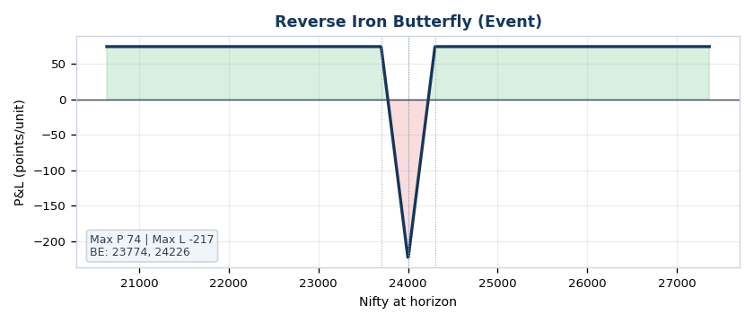

**The numbers (modelled at Nifty 24000).** Max profit 74 points (~₹5,550/lot) on a move beyond a wing. Max loss 217 points (~₹16,275/lot) if Nifty pins 24000. Breakevens 23774 and 24226. Net debit 225.9 points. Risk:reward 0.34.

**Greeks & behaviour.** Delta near zero at entry, turning directional as spot moves. Theta is negative — every flat day costs you, sharply so on a weekly. Vega is positive, so an IV ramp helps and the post-event crush hurts.

**Management & exit.** This is a fast in-and-out trade. Take profit immediately on a clean breakout toward a wing — do not wait for the wing to cap. If the event passes with a muted move, cut at once before theta and IV crush combine to deliver the 217-point loss.

**Risk note.** The risk:reward is steep — a 217-point downside for a capped 74-point gain (risk:reward 0.34) — so the trade only works on a large, fast move plus a vol tailwind. A pinned, anticlimactic event with IV crush is the maximum-loss outcome, and it is common: results and policy days frequently see weekly IV inflated beforehand and crushed after, punishing long-vol buyers even when the move is decent. Buy the wings cheap or do not buy at all.

**Scenario P&L (₹ per lot, at expiry).**

| Nifty at expiry | 22,800 | 23,400 | 24,000 | 24,600 | 25,200 |
|---|---|---|---|---|---|
| **P&L (₹/lot)** | +₹5,550 | +₹5,550 | -₹16,950 | +₹5,550 | +₹5,550 |

The event tent loses the full –₹16,950 if Nifty pins 24,000 but pays a capped +₹5,550 at all four outer strikes — the ±5% grid straddles the body, so any of these moves is the breakout you are paying for.

**Adjustments, variants & timing.** As a long-vol weekly debit tent, the only good adjustments are quick exits: bank the move the instant a breakout reaches a wing, do not wait for the cap, and cut at once if the event passes muted before theta and IV crush combine. Legging off the short wings to hold a clean long straddle is the only constructive variant if you want uncapped upside. It is an event-week tool — a Nifty or Bank Nifty weekly straddling a binary catalyst (results, a policy decision, an election count); never run it on a quiet week. Place the body on spot, not max-pain, since you are betting against the pin. The critical timing rule: buy only while weekly IV is still cheap and ramping into the event — if the event is already priced and IV is rich, the post-event crush guts the position even on a decent move. Buy the wings cheap or do not buy at all.


## 61. Expiry-Day Pin Butterfly
*Expiry pin · Short vega · net debit*

**The idea (intuition).** A very tight, very cheap call fly placed on expiry day itself, betting the index gets nailed to a max-pain strike as dealers hedge into the close. With hours left, the structure is almost pure intrinsic — a low-cost sniper shot at the closing print.

**When & why to use it.** Use it on expiry afternoon when open interest clusters around a strike and you believe pinning forces will drag the close to 24000 — a classic Nifty/Bank Nifty expiry-day phenomenon. The minimal cost makes it a cheap punt with a fat ratio. Short vega is largely moot this late; it is really a gamma/pin bet. Avoid it if a late catalyst or strong trend is overriding the pin.

**How to build it (₹, Nifty).** Buy 23900 CE @ 164, sell 2x 24000 CE @ 104, buy 24100 CE @ 59. Net debit 15.8 points, about ₹1,185 per lot at risk.

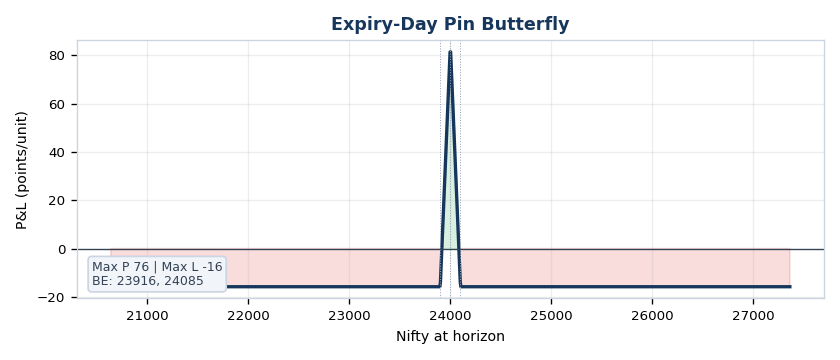

**The numbers (modelled at Nifty 24000).** Max profit 76 points (~₹5,700/lot) if Nifty closes at 24000. Max loss 16 points (~₹1,200/lot) beyond the wings. Breakevens 23916 and 24085 — a tiny 169-point band. Net debit 15.8 points. Risk:reward 4.79.

**Greeks & behaviour.** Delta flat at the body, flipping sharply just outside — extreme gamma this close to expiry. Theta is intensely positive in the final hours as the tent snaps to its peak. Vega is negligible.

**Management & exit.** This trade lives and dies in a single session — hold toward the close if spot hugs 24000, or cut quickly if it drifts to a wing. Given the ₹1,185 cost, many let it run to settlement. Take profit if the body pin firms up an hour before close.

**Risk note.** The 169-point band is razor-thin, so any late directional push forfeits the small debit. Pinning is a tendency, not a law — a trending or news-driven expiry overrides it, and intraday spreads on the expiring strikes can widen sharply in the last hour, so the screen payoff may not be the fill you get. Treat this as a tiny, high-variance punt sized in single lots, not a repeatable income method.

**Scenario P&L (₹ per lot, at expiry).**

| Nifty at expiry | 22,800 | 23,400 | 24,000 | 24,600 | 25,200 |
|---|---|---|---|---|---|
| **P&L (₹/lot)** | -₹1,200 | -₹1,200 | +₹6,300 | -₹1,200 | -₹1,200 |

The expiry-day fly peaks at a modest +₹6,300 at 24,000 and loses just –₹1,200 elsewhere — the 600-point grid steps far past the 169-point band, showing how precise the close must be to pay.

**Adjustments, variants & timing.** This trade lives and dies in a single session, so adjustments are minimal: hold toward the close if spot hugs 24000, cut quickly if it drifts to a wing, and given the ₹1,185 cost many simply let it run to settlement. If a clearer pin strike emerges intraday, roll the tiny fly to it rather than legging. It is an expiry-afternoon Nifty or Bank Nifty instrument, placed only when open interest clusters tightly and pinning forces are dragging the close toward the max-pain strike — set the body exactly on that strike, never on raw spot. Vega is moot this late; it is a pure gamma/pin bet, so India VIX hardly matters. Enter in the last hour or two when the structure is almost all intrinsic and cheapest. Beware that intraday spreads on the expiring strikes widen sharply near the close, so the screen payoff may not be your fill — size in single lots and treat it as a high-variance punt.


## 62. Unbalanced Iron Butterfly
*Skewed neutral · Short vega · net credit*

**The idea (intuition).** An iron fly with wings placed at *different distances* from the body, so the call-side and put-side risk-reward no longer match. The unequal wings tilt the payoff and the credit toward one side — a deliberately lopsided income tent for a trader with a directional lean.

**When & why to use it.** Use it when you want iron-fly income but hold a mild bias and are content to carry more risk on the side you judge safer, in return for a larger or more efficiently placed credit. Suits a range-bound market with a soft skew view. Short vega, so high-and-fading IV is the backdrop. Avoid it when the heavier-risk side faces a live catalyst, because the asymmetry leaves that side thinly protected.

**How to build it (₹, Nifty).** Sell 24000 CE @ 456, sell 24000 PE @ 318, buy 24250 CE @ 317 (near call wing), buy 23400 PE @ 148 (far put wing). Net credit 310.0 points, about ₹23,250 per lot received.

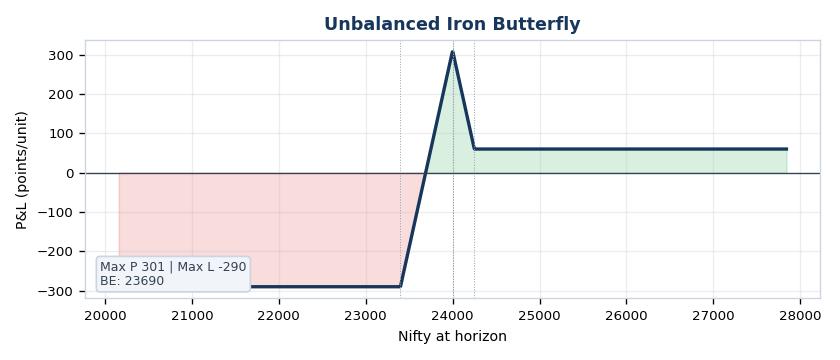

**The numbers (modelled at Nifty 24000).** Max profit 301 points (~₹22,575/lot) near the body. Max loss 290 points (~₹21,750/lot). Single breakeven 23690. Net credit 310.0 points. Risk:reward 1.04 — nearly symmetric reward and risk in points.

**Greeks & behaviour.** Net delta carries a skew from the mismatched wings. Theta is positive — the income engine. Vega is negative, so easing IV helps.

**Management & exit.** Close at around 50% of max credit; with risk and reward nearly equal there is little margin to be greedy. Watch the side with the more distant wing and larger 290-point exposure, and roll or close if spot tests it. Exit before expiry-week gamma.

**Risk note.** With risk:reward near 1.04, this is a near-coin-flip in points — the large 290-point downside is almost as big as the 301-point profit you can keep, so a single trending move can erase a season of gains. Short ATM legs add assignment risk near expiry. Size small and manage the skewed side closely. The lesson that closes this family: every twist on the butterfly — wider, narrower, broken, unbalanced, iron — is just a way of trading width and skew for credit, and none of them escapes the iron rule that a bigger credit or a removed loss zone is always paid for with more risk somewhere else.

**Scenario P&L (₹ per lot, at expiry).**

| Nifty at expiry | 22,800 | 23,400 | 24,000 | 24,600 | 25,200 |
|---|---|---|---|---|---|
| **P&L (₹/lot)** | -₹21,750 | -₹21,750 | +₹23,250 | +₹4,500 | +₹4,500 |

The unbalanced iron fly keeps +₹23,250 at 24,000, retains +₹4,500 on the upside, but carries a near-symmetric –₹21,750 on the 22,800–23,400 strikes — the grid lays the coin-flip risk bare.

**Adjustments, variants & timing.** With unequal wing distances the risk is lopsided, so manage the side carrying the more distant wing and larger exposure: roll or close it if spot tests that side, and recentre with a roll if your skew view changes. Rebalancing the far wing inward trades credit for protection and pulls the near-coin-flip back toward neutral. It suits a Nifty monthly range with a soft directional skew where you will carry more risk on the side you judge safer; Bank Nifty weeklies leave the distant side too exposed to a fast trending move, so keep size minimal. Centre the short straddle on max-pain and place the wings to reflect your lean. Enter in the closing week with India VIX high and fading so short vega works for you, and exit before expiry-week gamma — short ATM legs add assignment risk if in-the-money. With risk:reward near 1.04 this is almost a coin-flip in points, so size small: one trending session can erase a season of gains.

# Strategy Group 5: Condors

A condor is a strangle with insurance: you sell two out-of-the-money options to collect premium, then buy two further-out options as wings so the loss is capped and SPAN margin stays manageable. The whole family trades the same core thesis — Nifty stays inside a band until expiry — and the levers you pull (wing width, how far OTM you place the shorts, days to expiry, and whether you skew the structure) decide how often you win versus how much you keep. The iron condor is the desk workhorse for monthly income; its cousins (all-call, all-put, reverse, broken-wing, weekly, skewed) are the same skeleton bent to express a lean, a tenor, or a volatility view.

## 63. Iron Condor
*Range-bound, elevated IV · Short vega · net credit*

**The idea (intuition).** Sell a call spread above the market and a put spread below it. You are renting out the space on both sides of Nifty and pocketing rent (the credit) as long as price stays in the middle. The bought wings are a cheap fire-extinguisher that converts an unlimited short strangle into a defined-risk trade.

**When & why to use it.** This is the bread-and-butter income trade for a sideways-to-choppy market with rich premium. Put it on when India VIX is elevated or IV rank is high (say > 50-70), ideally just after an IV spike — a Budget print, an RBI policy day, or a results-season pop — so you sell expensive options into a coming IV crush. The 16-delta shorts here sit a comfortable distance from 24000. Do NOT sell condors into a trending, low-IV tape: you collect peanuts and a single 1.5% Nifty day blows through a short strike.

**How to build it (₹, Nifty).** Sell 24400 CE @ 246, buy 24700 CE @ 135; sell 23600 PE @ 192, buy 23300 PE @ 129. Net credit 174.4 points, about 174.4 × 75 = ₹13,080 received per lot. Both wings are 300 points wide.

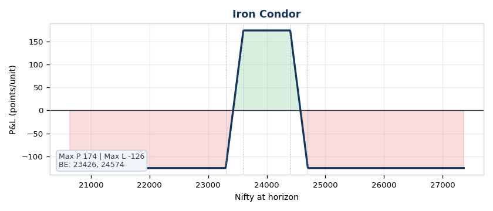

**The numbers (modelled at Nifty 24000).** Max profit 174 points (₹13,050/lot) if Nifty expires between 23600 and 24400. Max loss 126 points (₹9,450/lot). Breakevens 23426 and 24574 — a roughly ±2.4% band. Net credit 174.4 points; risk:reward 1.39 (you risk less than you can make, the mark of a tight, balanced condor).

**Greeks & behaviour.** Net delta near zero at entry (direction-neutral). Theta is positive and is your engine — every quiet day bleeds the shorts in your favour. Vega is negative, so falling IV helps and an IV spike hurts even if price hasn't moved. Theta-versus-gamma is the whole game.

**Management & exit.** Standard playbook: take it off at ~50% of max credit (here ~₹6,500/lot) rather than squeezing the last rupee. If a short strike is breached or its delta doubles, roll the untested spread closer to recentre, or roll out in time. Don't carry into expiry-week gamma.

**Risk note.** Defined risk, but losses arrive fast: near a short strike, gamma makes the position lose on every point and an overnight gap can land you near max loss before you can act. Manage mechanically.

**Scenario P&L (₹ per lot, at expiry).**

| Nifty at expiry | 22,800 | 23,400 | 24,000 | 24,600 | 25,200 |
|---|---|---|---|---|---|
| **P&L (₹/lot)** | -9,450 | -1,950 | +13,050 | -1,950 | -9,450 |

The table shows the symmetric defined-risk profile: the full +13,050 credit lands only on a 24,000 pin, sliding to the -9,450 max loss once Nifty clears either wing at 22,800 or 25,200.

**Adjustments, variants & timing.** Manage mechanically: buy the condor back at ~50% of the 174-point credit (around Rs 6,500/lot), and as a hard rule close or roll at 21 DTE to sidestep expiry-week gamma. If Nifty tags a short strike or its delta doubles toward 30, roll the untested spread inward to recentre the body and harvest extra credit, or roll the whole structure out to the next monthly. To defend a breached call short, roll it up-and-out; for a breached put short, roll down-and-out, accepting a debit only if it materially cuts risk. Run this on the Nifty monthly series, not Bank Nifty weeklies - Bank Nifty's fatter gamma and bank-heavy gap moves punish a balanced condor's tight band. Enter only when IV rank sits above 50-70 (a post-Budget or post-RBI vol pop is ideal), place the ~16-delta shorts about 45 DTE, and size so one max-loss month costs no more than 1-2% of capital.

## 64. Iron Condor (Wide)
*Range-bound · Short vega · net credit*

**The idea (intuition).** Same machine as the standard condor, but the short strikes are pushed further from spot and the wings widened. You are renting out a much bigger room, so you win more often — but each wing now covers more points, so when you are wrong the loss is larger than the credit.

**When & why to use it.** Reach for the wide condor when you want a high hit-rate, low-touch trade and you genuinely believe Nifty will stay broadly contained — for example a slow grind between events with no near-term catalyst. The wider shorts (here ~24600 / 23400) give a fat profit zone. The catch: risk:reward inverts, so you must win frequently to come out ahead. Avoid it if you can't commit to managing the rare but painful losing month.

**How to build it (₹, Nifty).** Sell 24600 CE @ 167, buy 25000 CE @ 63; sell 23400 PE @ 148, buy 23000 PE @ 85. Net credit 166.8 points, about ₹12,510 per lot. Wings are 400 points wide.

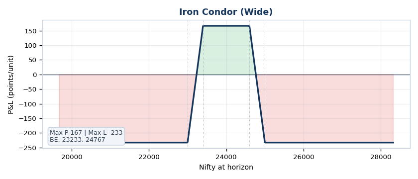

**The numbers (modelled at Nifty 24000).** Max profit 167 points (₹12,525/lot) between 23400 and 24600. Max loss 233 points (₹17,475/lot) — notably bigger than the credit. Breakevens 23233 and 24767, roughly a ±3.2% band. Net credit 166.8 points; risk:reward 0.72 — you risk more than you can make.

**Greeks & behaviour.** Delta-neutral at entry. Positive theta (the income), negative vega (short volatility). Because the shorts are far OTM, day-to-day delta and gamma are small until price travels meaningfully — this trade behaves sleepily right up until a wing is threatened.

**Management & exit.** With a sub-1 risk:reward, discipline matters more, not less. Close at 50% of credit and resist greed. Because the loss exceeds the credit, set a hard mental stop (e.g. exit if the loss reaches the credit you took in) so one bad month doesn't erase several good ones.

**Risk note.** The structural danger is the lopsided payoff: many small wins lull you, then a trending month delivers a loss bigger than two prior wins combined. SPAN margin is also higher on the wider wings. Size accordingly.

**Scenario P&L (₹ per lot, at expiry).**

| Nifty at expiry | 22,800 | 23,400 | 24,000 | 24,600 | 25,200 |
|---|---|---|---|---|---|
| **P&L (₹/lot)** | -17,475 | +12,525 | +12,525 | +12,525 | -17,475 |

The flat +12,525 profit shelf spans the whole 23,400-24,600 core, but the table makes the lopsidedness plain - a tail print at 22,800 or 25,200 costs -17,475, more than the credit.

**Adjustments, variants & timing.** Because the loss (Rs 17,475) dwarfs the credit, discipline is everything: take profits at ~50% of the 167-point credit and set a hard stop at roughly one credit of loss. Close or roll at 21 DTE; the wide shorts feel safe but expiry-week gamma still bites. If Nifty pushes toward a far short, roll the untested side in to recentre, or roll the tested spread out-and-away in time. Keep this on the Nifty monthly - the wide band needs room and the slow decay that Bank Nifty weeklies don't give. Enter on IV rank above 50-70 after a vol spike, with ~16-delta shorts around 45 DTE. Size small: the lopsided payoff means a single trending month can erase two or three quiet wins, so cap exposure to 1-2% of capital and never add to a tested position hoping for mean-reversion.

## 65. Iron Condor (Narrow)
*Tightly range-bound · Short vega · net credit*

**The idea (intuition).** Pull the short strikes in close to spot and tighten the wings. The shorts are nearly at-the-money, so they are fat with premium — you collect a big credit for renting a small room. The trade-off is obvious: the room is so small that Nifty barely has to twitch to put you in trouble.

**When & why to use it.** A narrow condor is a high-conviction "nothing happens this expiry" bet — a dead, pinned tape with low realised volatility and an expiry magnet near 24000. It is most attractive when premium is rich relative to the tiny range. Use it for a short window (the last week or two of a sleepy cycle), not as a set-and-forget monthly. Never run it through a known catalyst; the shorts are too close to survive a surprise.

**How to build it (₹, Nifty).** Sell 24250 CE @ 317, buy 24500 CE @ 204; sell 23750 PE @ 233, buy 23500 PE @ 169. Net credit 176.9 points, about ₹13,270 per lot. Wings are only 250 points wide.

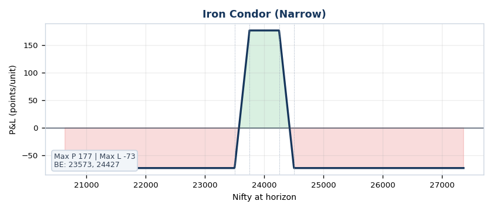

**The numbers (modelled at Nifty 24000).** Max profit 177 points (₹13,275/lot) between 23750 and 24250. Max loss only 73 points (₹5,475/lot) thanks to the tight wings. Breakevens 23573 and 24427 — a slim ±1.8% band. Net credit 176.9 points; risk:reward 2.42, the best in the family because of those narrow wings.

**Greeks & behaviour.** Delta-neutral at entry but very twitchy: with shorts near the money, gamma is high, so net delta swings hard as Nifty moves. Theta is strong (lots of premium decaying fast) and vega is sharply negative — an IV pop hurts immediately.

**Management & exit.** This is an active trade. Take profits early and often — 40-50% of the credit can come in a day or two if the market pins. Because gamma is high, do not let it run into expiry week; the same gamma that decays fast can flip a winner to a loser on one gap.

**Risk note.** High gamma is the killer: the small range means breakevens are close, and an intraday move of a percent can swing you from near-max-profit to near-max-loss. Treat it as a short-fuse trade, watched daily.

**Scenario P&L (₹ per lot, at expiry).**

| Nifty at expiry | 22,800 | 23,400 | 24,000 | 24,600 | 25,200 |
|---|---|---|---|---|---|
| **P&L (₹/lot)** | -5,475 | -5,475 | +13,275 | -5,475 | -5,475 |

The narrow body pays the full +13,275 only at a tight 24,000 pin, and even a one-step drift to 23,400 or 24,600 already books the -5,475 max loss.

**Adjustments, variants & timing.** This is a watched-daily trade. With shorts near the money, take 40-50% of the 177-point credit fast - it can arrive in a day or two if Nifty pins - and never carry it into expiry week; close at 21 DTE at the latest. Defending a breached short is hard because the wings are tight, so favour closing over rolling; if you must adjust, roll the tested spread out in time rather than chasing it in price. A narrow condor actually fits a Bank Nifty weekly or a Nifty weekly better than the monthly: a short, dead window is its only safe habitat. Enter only on high IV rank (>50-70) into a pinned, low-realised-vol tape, place the shorts by delta near the money but size tiny - a one-percent intraday move swings you max-profit-to-max-loss, so risk no more than a fraction of a normal condor's capital.

## 66. Call Condor
*Range-bound · Short vega · net debit*

**The idea (intuition).** A condor built entirely from calls. Buy a lower call, sell two middle calls, buy a higher call — a long call spread financed by a short call spread above it. The payoff is the same flat-topped tent as an iron condor, just assembled from one option type. You pay a small net debit instead of receiving a credit, but the economics rhyme.

**When & why to use it.** Functionally interchangeable with the iron condor for a range view; pick whichever offers better fills and liquidity on the day. On NSE the call side is often very liquid around Nifty's at-the-money strikes, so an all-call condor can sometimes be built with tighter spreads than mixing puts and calls. Use it when you expect Nifty to drift around 24000 into expiry and you'd rather pay a defined debit than manage a credit's margin.

**How to build it (₹, Nifty).** Buy 23700 CE @ 655, sell 24000 CE @ 456, sell 24300 CE @ 292, buy 24600 CE @ 167. Net debit 74.1 points, about 74.1 × 75 = ₹5,558 paid per lot. Strikes are evenly 300 points apart.

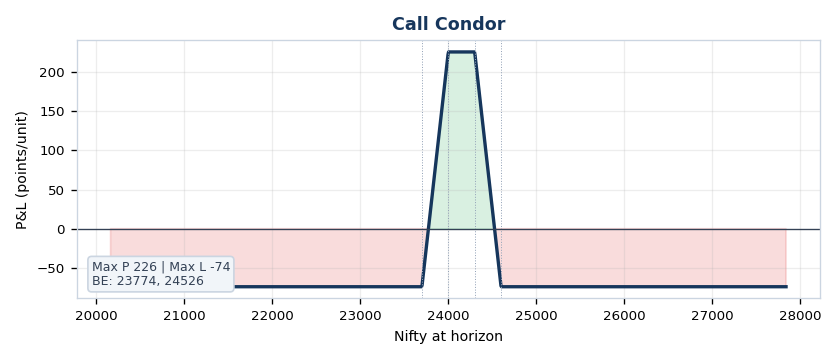

**The numbers (modelled at Nifty 24000).** Max profit 226 points (₹16,950/lot) when Nifty expires between 24000 and 24300, the flat top. Max loss is just the 74-point debit (₹5,550/lot) if price exits beyond either outer wing. Breakevens 23774 and 24526. Net debit 74.1 points; risk:reward 3.05 — attractive because your loss is capped at the small premium paid.

**Greeks & behaviour.** Net delta roughly flat at entry because the long and short call spreads offset. Theta is positive once Nifty sits inside the body (the short middle calls decay for you); vega is negative. As with all condors, time and calm are your allies.

**Management & exit.** Target a partial close once the position reaches a good fraction of max profit — you rarely capture the full 226 points unless Nifty pins the body at expiry. If price runs toward an outer strike, the trade approaches its capped loss; cut it and recycle the margin.

**Risk note.** The risk is benign and fully defined (you can lose at most the debit), but the maximum profit only materialises if Nifty parks in a narrow band at expiry — realistically you book a fraction. Watch the bid-ask on four call legs; slippage eats a small debit quickly.

**Scenario P&L (₹ per lot, at expiry).**

| Nifty at expiry | 22,800 | 23,400 | 24,000 | 24,600 | 25,200 |
|---|---|---|---|---|---|
| **P&L (₹/lot)** | -5,550 | -5,550 | +16,950 | -5,550 | -5,550 |

The all-call body delivers its +16,950 peak only with Nifty parked at 24,000; any exit beyond the wings caps the loss at the -5,550 debit.

**Adjustments, variants & timing.** Loss is capped at the 74-point debit, so management is about banking profit, not survival. You rarely capture the full 226 points without an expiry pin in the 24000-24300 body - scale out as you reach 50-60% of max, and roll the whole structure to the next cycle near 21 DTE rather than let four call legs decay into expiry gamma. If Nifty runs toward an outer wing, the trade drifts to its capped loss; cut it and recycle the margin. Build it on the Nifty monthly where at-the-money call liquidity is deepest and four-leg slippage is smallest; Bank Nifty's wider call spreads eat a thin debit. Enter when IV rank is elevated (>50-70) so the short body is rich, place strikes around the ~16-delta band at ~45 DTE, and size so the full debit is an acceptable loss - it is the entire downside.

## 67. Put Condor
*Range-bound · Short vega · net debit*

**The idea (intuition).** The mirror image of the call condor, built from four puts. Buy a higher put, sell two middle puts, buy a lower put. Same flat-topped, defined-risk range payoff — just expressed on the put side of the chain. Think of it as betting Nifty sits still, paid for with a modest debit.

**When & why to use it.** Choose the all-put construction when the put chain prices better, or to lean into the natural put skew on NSE indices — Nifty puts usually carry richer implied vol than equidistant calls, which can make the short middle puts juicier. Same regime as any condor: range-bound, ideally elevated IV that you expect to fade. Don't deploy into a market that's breaking down; puts gain value fast on the downside and your short body gets run over.

**How to build it (₹, Nifty).** Buy 24300 PE @ 453, sell 24000 PE @ 318, sell 23700 PE @ 219, buy 23400 PE @ 148. Net debit 63.1 points, about ₹4,733 paid per lot. Strikes are 300 points apart.

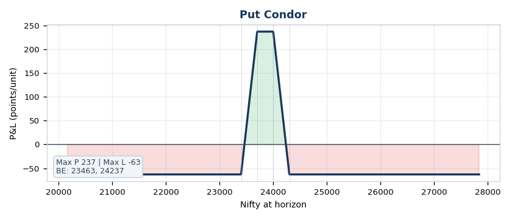

**The numbers (modelled at Nifty 24000).** Max profit 237 points (₹17,775/lot) when Nifty expires between 23700 and 24000. Max loss is the 63-point debit (₹4,725/lot) beyond the outer wings. Breakevens 23463 and 24237. Net debit 63.1 points; risk:reward 3.76 — even better than the call condor here, because the put skew let you build the body for a smaller net debit.

**Greeks & behaviour.** Near delta-neutral at entry. Positive theta when Nifty is inside the body, negative vega — rising IV (a fear spike) works against you even before price moves. The structure behaves identically to a same-strike iron condor.

**Management & exit.** Manage like any condor: scale out as you approach a healthy share of max profit, and accept that the full 237 points needs a pin. If Nifty trends down toward the body, the short puts swell — take the capped loss rather than hoping for a bounce.

**Risk note.** Defined risk equal to the small debit, but four put legs mean four bid-ask spreads; on a thin expiry the slippage can be a meaningful chunk of a 63-point debit. The profit also assumes a tidy expiry pin that the market rarely gifts in full.

**Scenario P&L (₹ per lot, at expiry).**

| Nifty at expiry | 22,800 | 23,400 | 24,000 | 24,600 | 25,200 |
|---|---|---|---|---|---|
| **P&L (₹/lot)** | -4,725 | -4,725 | +17,775 | -4,725 | -4,725 |

The put-built body tops out at +17,775 on a 24,000 pin, with downside capped at the small -4,725 debit everywhere else in the table.

**Adjustments, variants & timing.** Risk is the small 63-point debit, so manage for profit capture. The full 237 points needs an expiry pin in the 23700-24000 body; scale out at 50-60% of max and roll to the next series near 21 DTE before expiry-week gamma distorts the four put legs. If Nifty trends down through the body, the short puts swell toward the capped loss - take it rather than hoping for a bounce. Build on the Nifty monthly, where the persistent index put skew makes the short body richer and the all-put construction cheaper than on Bank Nifty weeklies. Enter on IV rank above 50-70 so you sell into expensive downside vol, place the body around the ~16-delta zone at ~45 DTE, and size for the debit as total loss. Watch the bid-ask: four put spreads on a thin expiry can quietly consume a meaningful slice of a 63-point debit.

## 68. Reverse Iron Condor
*Break out of a range · Long vega · net debit*

**The idea (intuition).** Flip the iron condor inside-out: buy the inner strangle and sell the outer wings. Now you WANT Nifty to move — a big swing in either direction pushes one of your long spreads to full value. It's a defined-risk, two-sided breakout bet; you pay a debit and profit if price leaves the body.

**When & why to use it.** This is a long-volatility trade for when you expect a large move but don't know the direction, and you want the cost (and risk) capped by selling wings against your long options. Good ahead of a binary catalyst when IV is still cheap — pre-Budget, pre-RBI, pre-election-result — so you're long vega before the IV ramp. Do NOT hold it through a calm, decaying tape; theta grinds against you every quiet day and IV crush after the event can sink it even if Nifty moves a little.

**How to build it (₹, Nifty).** Buy 24400 CE @ 246, sell 24700 CE @ 135; buy 23600 PE @ 192, sell 23300 PE @ 129. Net debit 174.4 points, about ₹13,080 paid per lot — the exact inverse of the standard iron condor's credit.

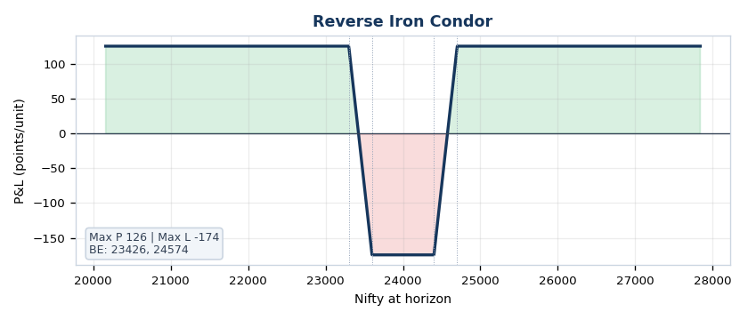

**The numbers (modelled at Nifty 24000).** Max profit 126 points (₹9,450/lot) if Nifty travels beyond a wing (above 24700 or below 23300). Max loss 174 points (₹13,050/lot) — the debit — if it expires inside the body around 24000. Breakevens 23426 and 24574. Net debit 174.4 points; risk:reward 0.72 — you risk more than you make, the price of a defined-risk long-vol position.

**Greeks & behaviour.** Delta-neutral at entry but long gamma — it gains as Nifty accelerates away from 24000. Theta is negative (time is the enemy) and vega is positive, so an IV expansion helps even before price commits. This is the mirror of the income condor in every Greek.

**Management & exit.** Have a plan to exit fast — capture the move within a few days of the catalyst before theta and IV crush erode it. If the event passes and Nifty sits in the body, cut the loss rather than hoping; the trade decays daily. Take profits into the spike; don't wait for the wing to be fully reached.

**Risk note.** The double drag of negative theta and post-event IV crush means you can be right on direction yet still lose if the move is too small or too slow. Treat it as a short-window event play, not a position to sit on.

**Scenario P&L (₹ per lot, at expiry).**

| Nifty at expiry | 22,800 | 23,400 | 24,000 | 24,600 | 25,200 |
|---|---|---|---|---|---|
| **P&L (₹/lot)** | +9,450 | +1,950 | -13,050 | +1,950 | +9,450 |

The mirror image of the income condor: the table pays +9,450 in the tails (22,800 / 25,200) and takes the -13,050 debit as max loss on a 24,000 pin.

**Adjustments, variants & timing.** This is a hit-and-run event trade, not a hold. Have a profit target and take it into the spike - capture the move within a day or two of the catalyst, well before theta and post-event IV crush erode the debit; don't wait for a wing to be fully reached. If the event passes and Nifty sits in the body near 24000, cut immediately rather than bleed daily; effectively your manage-at-50% rule lives on the long side, taking half the move. Run it on a Nifty monthly only if the catalyst is weeks out; for near-term binaries a Bank Nifty or Nifty weekly keeps the debit small. Enter when IV rank is still LOW (the inverse signal) ahead of a known event - pre-Budget, pre-RBI, pre-result - so you're long vega before the ramp, place the long inner strangle near the ~16-delta-equivalent body, and size the position for total loss of the debit.

## 69. Broken-Wing Iron Condor
*Range with a lean · Short vega · net credit*

**The idea (intuition).** A normal iron condor with one wing stretched wider than the other. By widening the put wing (here 500 points versus the 300-point call wing), you collect a bigger credit and push your risk onto one side — you're saying "I'm more comfortable being wrong to the upside than the downside," or the reverse, while still running an income trade.

**When & why to use it.** Use a broken wing when you have a mild directional lean inside a range view, or when index skew makes one side's far wing cheap to widen. On NSE, downside puts are pricey, so widening the put wing harvests more credit but leaves a bigger gap to the protective strike — fine if you judge a sharp sell-off unlikely. Skip it if you have no real lean; the standard balanced condor is cleaner.

**How to build it (₹, Nifty).** Sell 24400 CE @ 246, buy 24700 CE @ 135 (call wing 300 wide); sell 23600 PE @ 192, buy 23100 PE @ 98 (put wing 500 wide). Net credit 205.3 points, about ₹15,398 per lot.

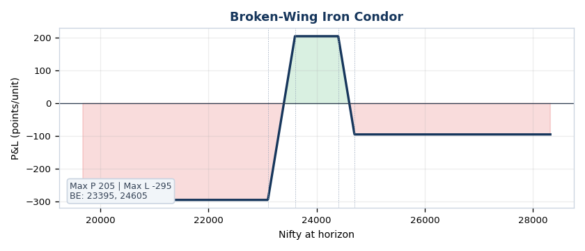

**The numbers (modelled at Nifty 24000).** Max profit 205 points (₹15,375/lot) between 23600 and 24400. Max loss 295 points (₹22,125/lot), concentrated on the wider put side. Breakevens 23395 and 24605. Net credit 205.3 points; risk:reward 0.70 — the extra credit comes at the cost of a fatter tail on the broken side.

**Greeks & behaviour.** Slight directional delta at entry (the asymmetry tilts it away from delta-neutral). Positive theta, negative vega like any short condor. The wider put wing means downside losses, when they come, are larger and accelerate faster than on the tight call side.

**Management & exit.** Manage at 50% of credit as usual, but watch the broken (wide) side most closely — that's where the damage lives. If Nifty drifts toward the wide put short, roll it up or close early; you cannot afford to let the worst-case side run.

**Risk note.** The honest cost of the extra credit is a max loss well above the credit, all loaded on one side. A gap through the wide put wing is the nightmare scenario — defined, but the largest defined loss in the basic-condor set. Size for that tail, not the average month.

**Scenario P&L (₹ per lot, at expiry).**

| Nifty at expiry | 22,800 | 23,400 | 24,000 | 24,600 | 25,200 |
|---|---|---|---|---|---|
| **P&L (₹/lot)** | -22,125 | +375 | +15,375 | +375 | -7,125 |

The asymmetry is visible in the tails - a 25,200 print loses only -7,125 on the tight call side, while a 22,800 print loses -22,125 through the wide put wing; the body still pays +15,375.

**Adjustments, variants & timing.** Manage at ~50% of the 205-point credit, but watch the wide (broken) put side hardest - that's where the 295-point loss lives. Close or roll at 21 DTE. If Nifty drifts toward the wide put short, roll it up-and-out or close early; you cannot let the worst-case side run, because a gap through the 500-wide put wing is the nightmare. Defend a breached call short by rolling up-and-out as usual. Keep this on the Nifty monthly - the asymmetric tail needs slow decay and reaction time that Bank Nifty weeklies don't offer. Enter on IV rank above 50-70, place the ~16-delta shorts at ~45 DTE, and widen the wing only on the side you genuinely fear less. Size for the broken-side tail, not the average month: the max loss here is among the largest in the basic condor set, so trim lot count accordingly and respect the higher SPAN on the wide wing.

## 70. Unbalanced Iron Condor
*Directional range · Short vega · net credit*

**The idea (intuition).** Take a standard iron condor and trade extra contracts on one side — here two put spreads against one call spread. The doubled side collects more premium and gives the position a directional tilt: you're leaning bullish (selling more puts) while still capping risk with wings. It's a ratio'd condor that says "range, but I favour the upside."

**When & why to use it.** Deploy when you're range-bound but with a directional bias you want to monetise — e.g. you think Nifty holds 23600 and would rather sell richer downside premium. The extra put spread juices the credit and pulls your delta positive. Don't use it if you can't stomach the larger loss on the doubled side, and never double the side you secretly fear — that's where the contracts pile the risk.

**How to build it (₹, Nifty).** Sell 24400 CE @ 246, buy 24700 CE @ 135 (one call spread); sell 2× 23600 PE @ 192, buy 2× 23300 PE @ 129 (two put spreads). Net credit 237.7 points, about ₹17,828 per lot — fattened by the extra put spread.

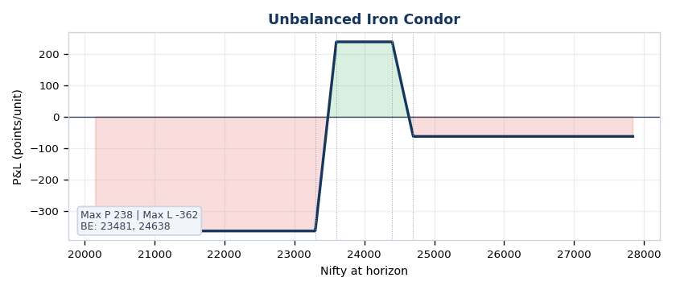

**The numbers (modelled at Nifty 24000).** Max profit 238 points (₹17,850/lot) between 23600 and 24400. Max loss 362 points (₹27,150/lot), concentrated on the doubled put side. Breakevens 23481 and 24638. Net credit 237.7 points; risk:reward 0.66 — the richest credit in the basic set, paid for with the largest downside.

**Greeks & behaviour.** Positive net delta at entry (the extra short puts lean the trade bullish). Strong positive theta from selling more premium; negative vega. The doubled side carries roughly twice the gamma and loss-per-point, so a move against it hurts disproportionately.

**Management & exit.** Manage the doubled side actively — that's where the size is. Take the trade off at ~50% of credit. If Nifty falls toward the short puts, the 2-lot side losses compound fast; roll or close early rather than defend a position that's twice your normal size.

**Risk note.** Ratioing amplifies everything: more credit, but the worst case (~362 points) is the biggest in this group and lands on one side. A gap down through the put shorts is a double-sized hit. Trade it smaller than a balanced condor and respect the SPAN margin on the extra contracts.

**Scenario P&L (₹ per lot, at expiry).**

| Nifty at expiry | 22,800 | 23,400 | 24,000 | 24,600 | 25,200 |
|---|---|---|---|---|---|
| **P&L (₹/lot)** | -27,150 | -12,150 | +17,850 | +2,850 | -4,650 |

The doubled put side shows up as the worst cell: -27,150 at 22,800 versus just -4,650 at 25,200, with the body paying +17,850 and a 24,600 print still green at +2,850.

**Adjustments, variants & timing.** Ratioing piles risk on the doubled put side, so manage that side actively. Take the trade off at ~50% of the 238-point credit and close or roll by 21 DTE. If Nifty falls toward the short puts, the 2-lot side loses roughly double per point - roll those puts down-and-out or close early rather than defend size that's twice your normal exposure. Never double the side you secretly fear. Run it on the Nifty monthly for reaction time; Bank Nifty weeklies make a doubled, gappy side unmanageable. Enter on IV rank above 50-70 with ~16-delta shorts at ~45 DTE, and crucially size DOWN - trade fewer lots than a balanced condor because the ~362-point worst case is the biggest in this group and a gap down through the put shorts is a double-sized hit. Budget the SPAN margin on the extra contracts and cap the position well under your usual condor risk.

## 71. Iron Condor (Weekly)
*Quiet week · Short vega · net credit*

**The idea (intuition).** The same condor structure, but on a weekly expiry. With only days to run, the options are cheap and decay screams — you're harvesting fast theta over a short window, betting Nifty chops sideways for a week. Quick in, quick out.

**When & why to use it.** Weekly condors suit a calm, news-light week with no scheduled catalyst, where you want to compound small theta repeatedly. NSE weekly expiries (now the dominant retail product) are liquid and let you place tight 200-point wings near 23700-24300. The flip side: with little time value, the credit is small and gamma is brutal near expiry. Avoid weeklies across event days — one surprise in a five-day window leaves no room to recover.

**How to build it (₹, Nifty).** Sell 24300 CE @ 75, buy 24500 CE @ 31; sell 23700 PE @ 71, buy 23500 PE @ 36. Net credit 79.0 points, about ₹5,925 per lot. Wings are 200 points wide.

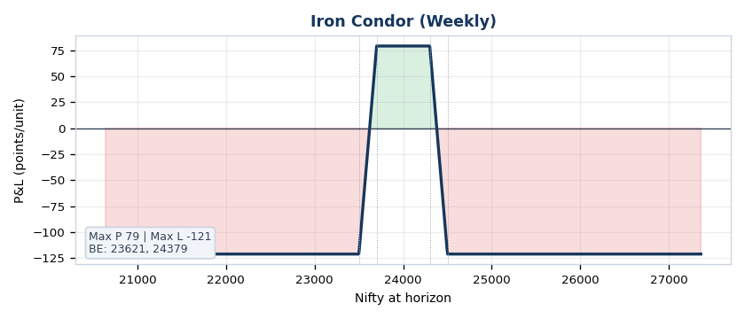

**The numbers (modelled at Nifty 24000).** Max profit 79 points (₹5,925/lot) between 23700 and 24300. Max loss 121 points (₹9,075/lot). Breakevens 23621 and 24379 — a tight ±1.6% band for the week. Net credit 79.0 points; risk:reward 0.65 — you risk more than the credit, typical of short-dated wings.

**Greeks & behaviour.** Delta-neutral at entry but extremely gamma-sensitive — with days to go, net delta lurches with every Nifty move. Theta is large relative to the premium (fast decay is the whole appeal); vega is small because little time value remains.

**Management & exit.** Weeklies move fast — take 30-50% of the credit quickly, often within a day or two. There's little time to repair a tested side, so favour closing over rolling. Strongly consider exiting before the final expiry-day gamma spike; the last day can turn a winner into a max-loss on a single swing.

**Risk note.** Gamma risk dominates: the short tenor means breakevens are close and an intraday 1% move can blow through a strike with no time to mean-revert. Small credits and a sub-1 risk:reward mean a single bad week can erase several good ones. Discipline over greed.

**Scenario P&L (₹ per lot, at expiry).**

| Nifty at expiry | 22,800 | 23,400 | 24,000 | 24,600 | 25,200 |
|---|---|---|---|---|---|
| **P&L (₹/lot)** | -9,075 | -9,075 | +5,925 | -9,075 | -9,075 |

The weekly's small +5,925 credit sits only at the 24,000 pin, with the -9,075 max loss appearing at every other strike in the table - a tight, gamma-heavy band.

**Adjustments, variants & timing.** Weeklies move fast: take 30-50% of the 79-point credit quickly, often within a day or two, and strongly prefer closing over rolling - with days to run there's no time to repair a tested side. The 21-DTE rule collapses to exiting before the final expiry-day gamma spike, which on a weekly can flip a winner to max-loss on one swing. If a short is breached, close; don't chase. This structure naturally lives on Nifty (or Bank Nifty) weeklies, but only in a news-light week - never carry it across an event day, since one surprise in a five-day window leaves no recovery room. Enter when IV rank is elevated relative to the week's expected range, place tight ~200-point wings near the 16-delta shorts, and size small: the sub-1 risk:reward means a single bad week erases several good ones. For a steadier program, prefer the Nifty monthly 45-DTE condor over stacking weeklies.

## 72. Iron Condor (10-delta)
*Strongly range-bound · Short vega · net credit*

**The idea (intuition).** Push the short strikes way out to roughly the 10-delta level — far OTM, low-probability-of-touch options. You're renting a very large room, so Nifty almost always stays inside and you win most months. The price of that comfort: each option is cheap, so the credit is thin while the wings still cover real distance.

**When & why to use it.** The 10-delta condor is the high-probability, low-and-slow income choice — for traders who prioritise hit-rate and a wide margin of safety over big monthly credits. It shines in genuinely range-bound regimes where you want the shorts (here ~24800 / 23200) far from spot. The trade-off, and it's a real one, is a poor risk:reward — the occasional loss is multiples of the credit, so you must avoid the rare disaster and never over-size into the apparent safety.

**How to build it (₹, Nifty).** Sell 24800 CE @ 107, buy 25100 CE @ 46; sell 23200 PE @ 113, buy 22900 PE @ 74. Net credit 98.5 points, about ₹7,388 per lot. Wings are 300 points wide.

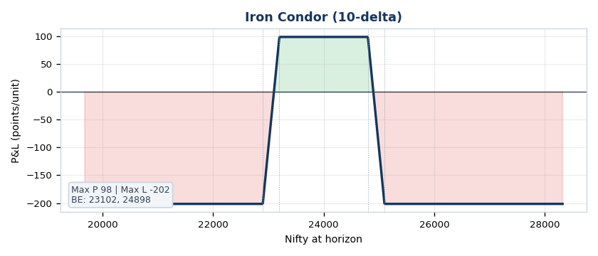

**The numbers (modelled at Nifty 24000).** Max profit 98 points (₹7,350/lot) across the wide 23200-24800 zone. Max loss 202 points (₹15,150/lot) — over twice the credit. Breakevens 23102 and 24898, roughly a ±3.7% band. Net credit 98.5 points; risk:reward 0.49 — the lowest in the family, the structural cost of high probability.

**Greeks & behaviour.** Delta-neutral and very low gamma at entry — far-OTM shorts barely react to ordinary Nifty wiggles, so the position sits quietly. Positive theta (slow but steady), negative vega. It behaves like a sleepy bond clipping coupons until a big move suddenly threatens a wing.

**Management & exit.** Because the credit is small, the 50% target comes in absolute terms quickly; many traders hold these closer to expiry to capture more decay, accepting the gamma risk late. The key discipline is the stop: with a 0.49 risk:reward, you cannot let a loser run to max — exit if the loss reaches roughly the credit you collected.

**Risk note.** This is the classic premium-seller's trap: a long string of easy wins, then one trending or gapping month that loses 2× the credit and wipes out a quarter's gains. The far strikes feel safe, which tempts over-sizing — the real danger. Size small, manage the tail.

**Scenario P&L (₹ per lot, at expiry).**

| Nifty at expiry | 22,800 | 23,400 | 24,000 | 24,600 | 25,200 |
|---|---|---|---|---|---|
| **P&L (₹/lot)** | -15,150 | +7,350 | +7,350 | +7,350 | -15,150 |

The far shorts keep the table green across 23,400-24,600 at +7,350, but the tails at 22,800 and 25,200 each lose -15,150 - over twice the credit.

**Adjustments, variants & timing.** The credit is thin (98 points), so the 50% target arrives quickly in absolute terms; many traders instead hold these closer to expiry to capture more decay, accepting late gamma - but still close or roll by 21 DTE. The non-negotiable discipline is the stop: with a 0.49 risk:reward, exit if the loss reaches roughly the credit collected, because one trending month loses 2x the credit. If a far short is breached, roll it out-and-away or close. Run it on the Nifty monthly where far-OTM strikes still have liquidity; Bank Nifty weeklies have too little time value at the 10-delta. Enter on IV rank above 50-70 so even cheap far options are worth selling, place the ~10-16-delta shorts at ~45 DTE, and above all size small - the far strikes feel safe and tempt over-sizing, which is the real trap. The danger isn't any single month; it's the rare gap that wipes a quarter of wins.

## 73. Bullish Skewed Condor
*Drift up within a range · Short vega · net debit*

**The idea (intuition).** A condor whose entire body is shifted above the current spot. Built from calls, with the flat profit top sitting north of 24000, it pays best if Nifty drifts gently higher and parks in the 24300-24600 zone. It's a range trade with a built-in upward bias.

**When & why to use it.** Reach for it when you expect a mild grind higher that stalls inside a band — a slow risk-on drift, not a breakout. The skew lets you target where you think Nifty settles rather than assuming it pins the current price. Use it when you have a soft bullish view but not enough conviction to buy a directional call spread outright. Don't use it if you expect a sharp rally (you'll cap out and miss the move) or a drop (the body is above you, so a fall is the loss zone).

**How to build it (₹, Nifty).** Buy 24000 CE @ 456, sell 24300 CE @ 292, sell 24600 CE @ 167, buy 24900 CE @ 83. Net debit 79.4 points, about ₹5,955 paid per lot. The body straddles 24300-24600, above spot.

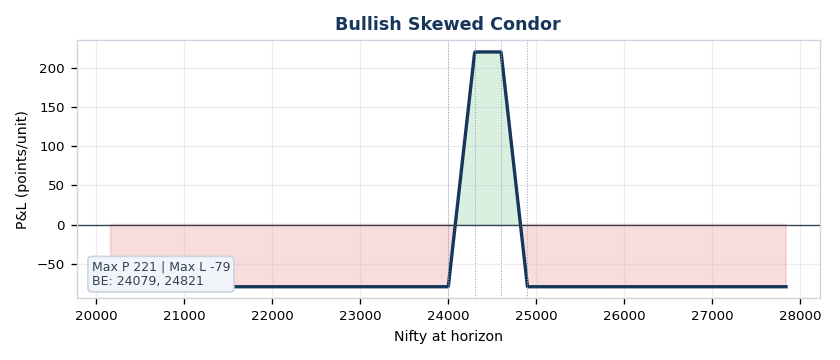

**The numbers (modelled at Nifty 24000).** Max profit 221 points (₹16,575/lot) if Nifty expires between 24300 and 24600. Max loss is the 79-point debit (₹5,925/lot) beyond the outer strikes. Breakevens 24079 and 24821 — note both sit above current spot, so Nifty must rise just to reach the profit tent. Net debit 79.4 points; risk:reward 2.78.

**Greeks & behaviour.** Net positive delta at entry — the shifted body gives it a bullish tilt that you want to play out toward 24450. Theta turns favourable once price climbs into the body; vega is negative. Early on, while Nifty is below the structure, the position behaves like a patient bullish range bet.

**Management & exit.** This needs Nifty to cooperate by drifting up. If it rallies into the body, scale out as you approach a good share of the 221-point max. If it stalls below 24079 or sells off, the trade leaks toward its capped loss — cut it; the thesis (drift up) is simply wrong.

**Risk note.** Defined risk equal to the small debit, but the directional skew means you need both range AND a modest up-move; a flat market that never reaches 24300 still loses. You're paying a debit for a specific outcome — be right on the destination, not just the calm.

**Scenario P&L (₹ per lot, at expiry).**

| Nifty at expiry | 22,800 | 23,400 | 24,000 | 24,600 | 25,200 |
|---|---|---|---|---|---|
| **P&L (₹/lot)** | -5,925 | -5,925 | -5,925 | +16,575 | -5,925 |

The upward skew is obvious: the +16,575 peak sits in the 24,600 column, not 24,000, while every other outcome including a flat 24,000 close books the -5,925 debit.

**Adjustments, variants & timing.** This needs Nifty to cooperate by drifting up into the 24300-24600 body. If it rallies in, scale out at 50-60% of the 221-point max; you won't bank the full tent without an expiry pin, so roll or close by 21 DTE rather than risk a reversal in gamma week. If Nifty stalls below the lower breakeven (24079) or sells off, the thesis is simply wrong - cut to the capped debit. There's no rolling a tested short in the credit sense here; management is directional, so treat a failed drift as a stop. Build it on the Nifty monthly where the call body has depth; Bank Nifty weeklies are too jumpy for a precise destination bet. Enter when IV rank is moderate-to-high (>50-70) so the short body is rich, place the shifted body around the ~16-delta band above spot at ~45 DTE, and size for the debit as total loss - you're paying for a specific destination, not just calm.

## 74. Bearish Skewed Condor
*Drift down within a range · Short vega · net debit*

**The idea (intuition).** The mirror of the bullish skew: a put-built condor with its flat top shifted below spot, around 23400-23700. It pays best if Nifty eases gently lower and settles in that zone. A range trade with a downward lean, for when you think the market drifts off but doesn't crash.

**When & why to use it.** Use it on a soft, distribution-y tape — Nifty leaking lower on tired momentum, no panic — where you expect price to settle a few hundred points below current. The downside put skew on NSE indices actually helps you here: richer puts let you build the body for a smaller net debit, which is why this structure shows the best risk:reward in the group. Avoid it if you fear a genuine crash (you'll cap out short of it) or expect a bounce (the body is below you).

**How to build it (₹, Nifty).** Buy 24000 PE @ 318, sell 23700 PE @ 219, sell 23400 PE @ 148, buy 23100 PE @ 98. Net debit 50.0 points, about ₹3,750 paid per lot. The body sits at 23400-23700, below spot.

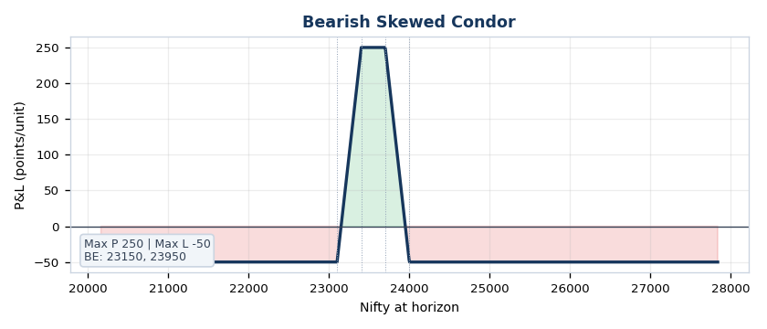

**The numbers (modelled at Nifty 24000).** Max profit 250 points (₹18,750/lot) if Nifty expires between 23400 and 23700. Max loss is the 50-point debit (₹3,750/lot) beyond the outer strikes. Breakevens 23150 and 23950 — both below spot, so Nifty must fall to reach the tent. Net debit 50.0 points; risk:reward 5.00 — the highest in the entire group, courtesy of cheap construction off the put skew.

**Greeks & behaviour.** Net negative delta at entry — a bearish tilt aimed at a drift toward ~23550. Theta becomes your friend once price is inside the body; vega is negative, so a fear-driven IV spike (common on down-moves) works against the position even as direction goes your way. That tension is the thing to watch.

**Management & exit.** You need a controlled drift lower, not a vol explosion. If Nifty eases into the body, scale out toward the 250-point max. If it bounces above 23950 or crashes through 23150, take the small capped loss — either way the "gentle drift down" thesis has failed.

**Risk note.** Tiny defined risk (₹3,750/lot) and a superb headline risk:reward, but the catch is conditionality: you need range AND a measured down-move. A flat market that holds 24000, or a violent crash that overshoots the body, both leave you with the loss. Cheap, but specific.

**Scenario P&L (₹ per lot, at expiry).**

| Nifty at expiry | 22,800 | 23,400 | 24,000 | 24,600 | 25,200 |
|---|---|---|---|---|---|
| **P&L (₹/lot)** | -3,750 | +18,750 | -3,750 | -3,750 | -3,750 |

The downward skew puts the +18,750 peak in the 23,400 column; a flat 24,000 close and every other strike lose the tiny -3,750 debit.

**Adjustments, variants & timing.** Management is directional: you need a controlled drift into the 23400-23700 body, not a vol explosion. If Nifty eases in, scale out at 50-60% of the 250-point max and roll or close by 21 DTE rather than chase the full tent through gamma week. If it bounces above the upper breakeven (23950) or crashes through 23150, the gentle-drift-down thesis has failed - take the tiny Rs 3,750 capped loss. Build it on the Nifty monthly, where the persistent index put skew lets you construct the body for the cheapest debit in the group; Bank Nifty weeklies sacrifice that skew edge. Enter when IV rank is above 50-70 so the short body is rich, place the shifted put body around the ~16-delta zone below spot at ~45 DTE, and size for the debit as total loss. Watch the tension: a fear-driven IV spike on a down-move hurts the negative-vega structure even as direction goes your way.

## 75. Iron Condor (45-DTE)
*Range-bound · Short vega · net credit*

**The idea (intuition).** The textbook premium-selling condor: ~16-delta shorts, balanced wings, and roughly 45 days to expiry. That tenor is the sweet spot where time decay is meaningful but expiry-week gamma is still far away — the structure most studied and traded by systematic income desks.

**When & why to use it.** This is the strategy you reach for to run a repeatable monthly income program. Enter when IV rank is high (the classic guidance is IV rank > 50, ideally after a vol spike), sell the ~45-DTE expiry, and let theta work in the calm middle of the cycle. On NSE you'd use the monthly series rather than the weeklies for this. The whole edge is selling rich premium and managing mechanically; don't run it in low-IV regimes where the credit doesn't compensate for the risk.

**How to build it (₹, Nifty).** Sell 24500 CE @ 305, buy 24900 CE @ 153; sell 23500 PE @ 227, buy 23100 PE @ 150. Net credit 228.9 points, about ₹17,168 per lot. Wings are 400 points wide; the longer tenor and ~16-delta shorts give the fatter premium.

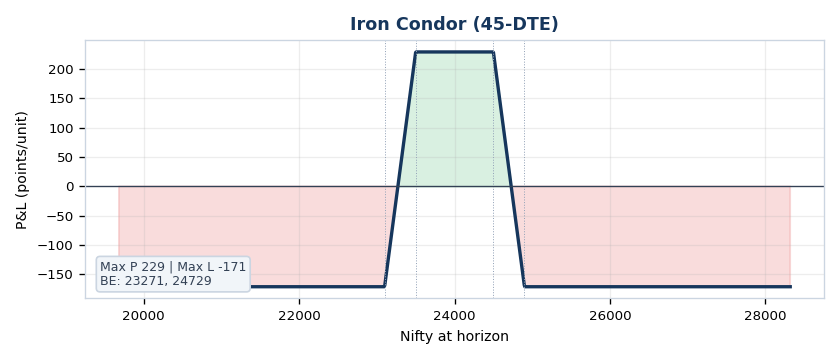

**The numbers (modelled at Nifty 24000).** Max profit 229 points (₹17,175/lot) between 23500 and 24500. Max loss 171 points (₹12,825/lot). Breakevens 23271 and 24729 — a roomy ±3% band. Net credit 228.9 points; risk:reward 1.34 — the credit exceeds the risk, a healthy, balanced profile.

**Greeks & behaviour.** Delta-neutral at entry. With 45 days on, gamma is low and the position is forgiving — net delta drifts slowly, giving you time to adjust. Theta is positive and accelerates as expiry nears; vega is negative, so the trade benefits from the IV mean-reversion you entered to capture.

**Management & exit.** This is the home of the manage-at-50% rule: close (or roll out to the next 45-DTE cycle) once you've captured ~50% of the 229-point credit, typically with 2-3 weeks left. Defend a tested side by rolling the untested spread in, and exit before the position enters expiry-week gamma — the low-gamma comfort of 45 DTE evaporates in the final days.

**Risk note.** The most balanced condor here, but still short premium: a trending month or a vol spike can push it to a 171-point loss, and the worst losses arrive near a short strike where gamma bites. The 45-DTE structure buys you reaction time — use it, don't sit frozen.

**Scenario P&L (₹ per lot, at expiry).**

| Nifty at expiry | 22,800 | 23,400 | 24,000 | 24,600 | 25,200 |
|---|---|---|---|---|---|
| **P&L (₹/lot)** | -12,825 | +9,675 | +17,175 | +9,675 | -12,825 |

The balanced 45-DTE profile pays +17,175 at the 24,000 pin and stays green at +9,675 across 23,400-24,600, with the -12,825 max loss reserved for the 22,800 / 25,200 tails.

**Adjustments, variants & timing.** This is the home of the manage-at-50% rule: buy the condor back once you've captured ~50% of the 229-point credit, typically with 2-3 weeks left, and as a hard rule close or roll to the next 45-DTE cycle at 21 DTE - the low-gamma comfort of 45 DTE evaporates in the final days. Defend a tested side by rolling the untested spread in to recentre; if a short's delta doubles toward 30, roll that spread out-and-away. Run it on the Nifty monthly series, not Bank Nifty weeklies - the 45-DTE tenor and ~16-delta shorts are designed for the monthly. Enter strictly on IV rank above 50 (ideally after a vol spike) so the credit compensates for the risk; in low-IV regimes, stand aside. Size so a max-loss month (171 points, Rs 12,825) costs 1-2% of capital. The 45 days buy reaction time - use it, don't sit frozen near a tested strike.

## 76. Wide Call Condor
*Broad range · Short vega · net debit*

**The idea (intuition).** An all-call condor stretched wide — 400-point strike spacing — so the flat profit top spans a generous band. You're betting Nifty stays inside a large range, and the width buys you a comfortable cushion on both sides for a modest debit.

**When & why to use it.** Use it when you want condor economics with a wide margin of safety and you expect Nifty to roam but stay broadly contained over the cycle. The wide flat top (24400-24700) means you don't need a precise pin to profit, just containment. It's a good fit when call-side liquidity is strong and you'd rather pay a defined debit than manage a credit's margin. Skip it if you expect a real trend that runs past 24978 or below 24122.

**How to build it (₹, Nifty).** Buy 24000 CE @ 456, sell 24400 CE @ 246, sell 24700 CE @ 135, buy 25100 CE @ 46. Net debit 121.8 points, about ₹9,135 paid per lot. Strikes span a wide 24000-25100.

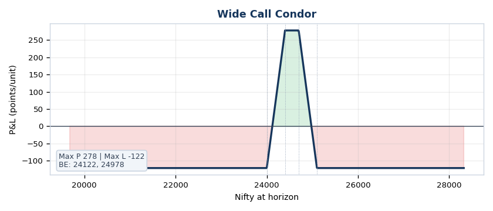

**The numbers (modelled at Nifty 24000).** Max profit 278 points (₹20,850/lot) when Nifty expires between 24400 and 24700, the wide flat top. Max loss is the 122-point debit (₹9,150/lot) beyond the outer wings. Breakevens 24122 and 24978. Net debit 121.8 points; risk:reward 2.28 — solid, with loss capped at the premium paid.

**Greeks & behaviour.** Slight positive delta at entry because the body sits a touch above spot. Positive theta once Nifty is inside the body; negative vega. The wide construction keeps gamma low, so the position is calm and forgiving until price nears an outer wing.

**Management & exit.** Like other debit condors, you rarely bank the full 278 points without a clean expiry settle in the body — scale out as you reach a good share of max profit. If Nifty trends toward an outer strike, the trade drifts to its capped loss; recycle the capital. The wide top gives you patience the narrow condors don't.

**Risk note.** Risk is fully defined at the 122-point debit, and the broad profit zone makes for a high-probability range bet. The catch is the four-leg call build: spreads and slippage matter, and the headline max profit needs Nifty to settle inside a band it may only pass through. A real breakout simply caps you at the small loss.

**Scenario P&L (₹ per lot, at expiry).**

| Nifty at expiry | 22,800 | 23,400 | 24,000 | 24,600 | 25,200 |
|---|---|---|---|---|---|
| **P&L (₹/lot)** | -9,150 | -9,150 | -9,150 | +20,850 | -9,150 |

The wide call body peaks at +20,850 in the 24,600 column and caps every other outcome at the -9,150 debit, including a flat 24,000 close that hasn't yet reached the tent.

**Adjustments, variants & timing.** Loss is capped at the 122-point debit, so manage for profit. You rarely bank the full 278 points without a clean expiry settle in the 24400-24700 body - scale out at 50-60% of max and roll the four-leg structure to the next cycle near 21 DTE rather than let it decay into expiry gamma. If Nifty trends toward an outer wing, the trade drifts to its capped loss; recycle the capital. The wide top gives patience the narrow condors lack. Build it on the Nifty monthly where call-side liquidity is strong and four-leg slippage is smallest; Bank Nifty's wider spreads erode the edge. Enter when IV rank is elevated (>50-70) so the short body is rich, place the body around the ~16-delta band at ~45 DTE, and size for the debit as total loss. A genuine breakout past 24978 or below 24122 simply caps you at the small loss - accept that as the cost of a high-probability range bet.

## 77. Reverse Iron Condor (Weekly Event)
*Weekly breakout · Long vega · net debit*

**The idea (intuition).** A reverse iron condor on a weekly expiry, built to capture a big move around a near-term event. Buy the inner strangle, sell the outer wings, and profit if Nifty breaks hard either way within the week. It's a cheap, defined-risk long-vol punt on a catalyst.

**When & why to use it.** This is an event trade: a weekly with a known binary in it — a major data print, a policy decision, a results-heavy session — where you expect a sharp move but not the direction, and you want to be long volatility before the IV ramp. The weekly tenor keeps the debit small. The danger is the same that haunts all long-vol structures: if the event fizzles, theta and the post-event IV crush gut the position in days. Never hold it through a quiet, eventless week.

**How to build it (₹, Nifty).** Buy 24300 CE @ 75, sell 24600 CE @ 18; buy 23700 PE @ 71, sell 23400 PE @ 25. Net debit 102.7 points, about ₹7,703 paid per lot. Wings are 300 points wide.

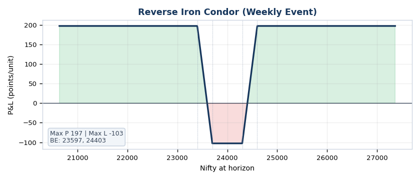

**The numbers (modelled at Nifty 24000).** Max profit 197 points (₹14,775/lot) if Nifty breaks beyond a wing (above 24600 or below 23400). Max loss is the 103-point debit (₹7,725/lot) if it expires inside the body near 24000. Breakevens 23597 and 24403 — Nifty must move ~1.7% to clear them. Net debit 102.7 points; risk:reward 1.92 — a favourable payoff if the breakout comes.

**Greeks & behaviour.** Delta-neutral at entry but long gamma — it springs to life as Nifty accelerates from 24000. Theta is negative (a fast bleed on a weekly) and vega is positive, so a pre-event IV expansion helps even before price moves. Everything is the inverse of the income condor.

**Management & exit.** This is a hit-and-run trade. If the event delivers a move, take profits into the spike within a day — don't wait for the full wing. If the catalyst passes and Nifty sits in the body, cut immediately; on a weekly, the combined theta-plus-IV-crush decay is merciless and there's no time to recover.

**Risk note.** The lethal combination is being right on a small move but losing anyway, because IV crush after the event outweighs the modest price travel. On a five-day clock there's no margin for a slow burn. Treat it strictly as a short-window event play sized for total loss of the debit.

**Scenario P&L (₹ per lot, at expiry).**

| Nifty at expiry | 22,800 | 23,400 | 24,000 | 24,600 | 25,200 |
|---|---|---|---|---|---|
| **P&L (₹/lot)** | +14,775 | +14,775 | -7,725 | +14,775 | +14,775 |

The long-vol weekly inverts the pattern: the table pays +14,775 at every strike except the 24,000 body, where it takes the -7,725 debit as max loss.

**Adjustments, variants & timing.** Strictly hit-and-run. If the event delivers a move, take profits into the spike within a day - don't wait for the full wing; effectively bank ~50% of the move and leave. If the catalyst passes and Nifty sits in the body near 24000, cut immediately: on a five-day clock, theta plus post-event IV crush gut the position with no recovery time, so there's no 21-DTE grace - exit on the event, win or lose. This lives on Nifty or Bank Nifty weeklies by design, around a known binary; never hold it through a quiet, eventless week. The entry signal inverts the income rules: enter when IV rank is still LOW ahead of the catalyst so you're long vega before the ramp, place the long inner strangle near the ~16-delta-equivalent body, and size the whole position for total loss of the 103-point debit. The lethal case is a small right-way move swamped by IV crush - plan for it.

## 78. Iron Condor (Credit-Skewed)
*Range with put skew · Short vega · net credit*

**The idea (intuition).** An iron condor deliberately built asymmetrically to harvest index skew: a tighter call spread up top and a wider put spread below. Because NSE puts carry richer implied vol, leaning the structure toward the put side lets you bank extra credit for the same neutral range view.

**When & why to use it.** Use it when you want standard condor income but with the construction tuned to NSE's persistent put skew — selling the relatively expensive downside while keeping the upside tight. It suits a range-bound market where you're comfortable carrying slightly more risk on the put side in exchange for a better credit. Don't deploy it if you fear a downside break; the wider put wing means a larger loss exactly where index sell-offs tend to go.

**How to build it (₹, Nifty).** Sell 24350 CE @ 268, buy 24550 CE @ 185 (call wing 200 wide); sell 23550 PE @ 180, buy 23250 PE @ 120 (put wing 300 wide). Net credit 142.7 points, about ₹10,703 per lot.

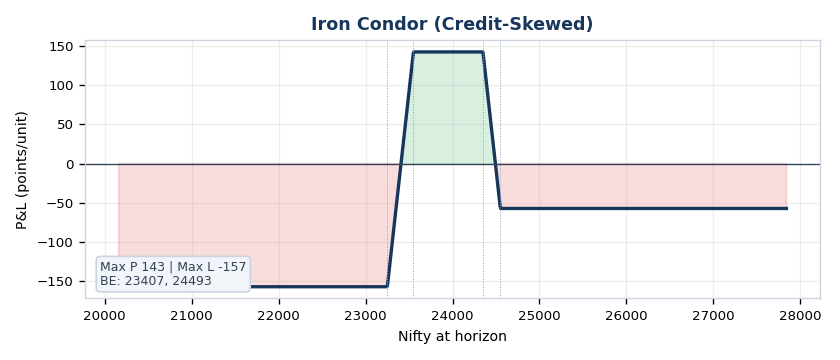

**The numbers (modelled at Nifty 24000).** Max profit 143 points (₹10,725/lot) between 23550 and 24350. Max loss 157 points (₹11,775/lot), the larger figure sitting on the wider put wing. Breakevens 23407 and 24493. Net credit 142.7 points; risk:reward 0.91 — close to even, with the asymmetry buying extra credit at the cost of a slightly larger put-side loss.

**Greeks & behaviour.** Modestly non-neutral delta at entry from the asymmetric wings. Positive theta and negative vega like any short condor — and because the put wing is wider, a down-move both moves delta against you and threatens the bigger loss. The skew you harvested cuts both ways.

**Management & exit.** Manage at ~50% of the credit, watching the put side most closely since that's where the larger loss lives. If Nifty drifts toward the short put, roll it up or close early. The tighter call side is cheaper to defend, so the upside rarely needs much attention.

**Risk note.** You're paid extra for accepting more downside risk — be honest that a fast Nifty sell-off (the move puts are priced for) lands you on the wider, costlier wing. Defined risk, but the danger is concentrated precisely where index gaps tend to occur. Size for the put-side tail.

**Scenario P&L (₹ per lot, at expiry).**

| Nifty at expiry | 22,800 | 23,400 | 24,000 | 24,600 | 25,200 |
|---|---|---|---|---|---|
| **P&L (₹/lot)** | -11,775 | -525 | +10,725 | -4,275 | -4,275 |

The credit skew shows in the asymmetric tails - a 22,800 print loses -11,775 on the wider put side versus -4,275 at 25,200, while the body pays +10,725 and a 23,400 close nearly breaks even at -525.

**Adjustments, variants & timing.** Manage at ~50% of the 143-point credit, watching the wider put side most closely since the larger 157-point loss sits there. Close or roll at 21 DTE. If Nifty drifts toward the short put, roll it up-and-out or close early; the tighter call side is cheaper to defend and rarely needs attention. A breached put short is the real risk - roll down-and-out only if it cuts exposure. Run it on the Nifty monthly, where the persistent index put skew you're harvesting is most reliable; Bank Nifty weeklies are too gappy to lean asymmetrically into. Enter on IV rank above 50-70, sell the relatively expensive ~16-delta downside while keeping the upside tight, at ~45 DTE. Size for the put-side tail, not the average month: a fast Nifty sell-off - exactly the move puts are priced for - lands you on the wider, costlier wing, so trim lots and respect the larger SPAN on the wide put spread.

# Strategy Group 6: Ratio Spreads & Backspreads

This family is built on a single structural idea: trade an unequal number of options at two strikes so you hold *more* of one leg than the other. The direction of that imbalance splits the family in two. **Ratio spreads** are net short the extra options — you sell more than you buy, usually collect a credit, finance a cheap directional bet, and live with a dangerous tail because somewhere out there sits a naked short option. **Backspreads** are the mirror image — net long the extra options, paid for with a debit, with a small defined loss in the "dead zone" and an explosive, often unlimited, payoff if the move is violent. Both structures are really volatility-skew trades dressed up as directional ones: you exploit the fact that OTM options on the NSE chain trade at different implied vols, selling the richer skew and buying the cheaper one, and your real edge is being right about *how far and how fast* Nifty moves, not just which way.

## 79. Call Ratio Spread (1x2)
*Mildly bullish, caps out · Short vega · net credit*

**The idea (intuition).** Buy one call to ride a grind higher, and sell two further-out calls to pay for it. You pocket a small credit, profit best if Nifty drifts up to your short strike, and you are quietly short one naked call above that. Think of it as a covered-call's aggressive cousin where the "cover" is a long call instead of stock.

**When & why to use it.** Use when you are mildly bullish and expect Nifty to crawl toward a level but not blow through it — a slow post-results drift, a range that you think resolves gently upward. You want elevated IV (India VIX rich, IV rank > 60) because you are a net seller of the richer OTM skew; the upside calls you sell should be fatter than the one you buy. Do NOT use this ahead of a known explosive catalyst (Budget, RBI, a binary results print) or when Nifty is already pinned near your short strike with weeks to run — that is exactly where the naked tail bites.

**How to build it (₹, Nifty).** Buy 24000 CE @ 456, sell 2x 24300 CE @ 292. Net = 456 − 2×292 = −127.9 points, a credit. In rupees: 127.9 × 75 ≈ ₹9,593 received per lot up front.

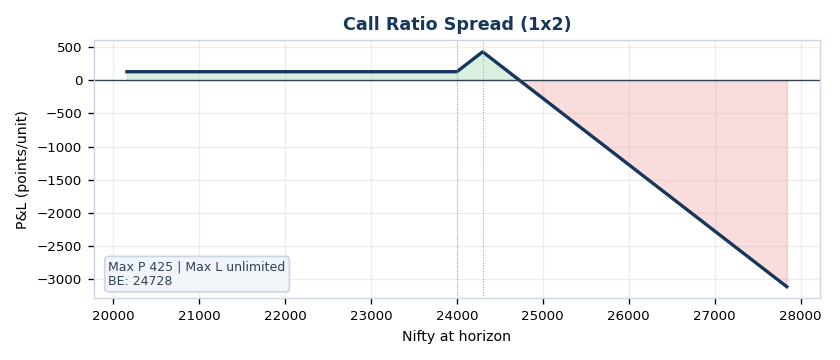

**The numbers (modelled at Nifty 24000).** Max profit 425 points (≈ ₹31,875/lot), earned right at 24300 at expiry. Max loss is Unlimited — above the upside breakeven you are short one naked call into infinity. Breakeven 24728. Net credit 127.9 points (≈ ₹9,593). Risk:reward is undefined because the loss side is open-ended.

**Greeks & behaviour.** Net delta is mildly positive near the money but flips negative as Nifty approaches 24300 (you become net short calls). Theta is your friend — the two short calls decay faster than the one long. Vega is negative (short vega): a quiet, IV-bleeding tape pays you; a vol spike hurts even if price sits still.

**Management & exit.** Take profit if Nifty parks near 24300 and you have captured most of the 425; do not get greedy into expiry-week gamma where a gap through 24300 turns the position vicious. Standard adjustment: if price runs at the short strike, buy back one short call (converting to a vertical) or roll the shorts up and out. Hard rule — never carry the naked tail through a weekend with a catalyst.

**Risk note.** The honest danger is the open upside: a gap to 25000+ produces theoretically unlimited loss, and SPAN margin on the naked short will balloon as IV rises. Size in single lots and treat the upside breakeven as a real stop, not a suggestion.

**Scenario P&L (₹ per lot, at expiry).**

| Nifty at expiry | 22,800 | 23,400 | 24,000 | 24,600 | 25,200 |
|---|---|---|---|---|---|
| **P&L (₹/lot)** | +₹9,600 | +₹9,600 | +₹9,600 | +₹9,600 | -₹35,400 |

The table earns its credit across the flat-to-mildly-up grid but turns negative at 25,200, and any move beyond this +5% grid toward and past the naked short loses much more — the upside is unlimited.

**Adjustments, variants & timing.** The cleanest defence is to buy back one of the two short 24300 calls the moment Nifty trades through your long strike with conviction — that converts the position into a plain 24000/24300 bull call spread with no naked tail. If you still want the credit, roll the short pair up and out (to next-week 24500s) to re-centre the tent. A more permanent fix is to add a cheap 24600 wing, turning the 1x2 into a call ratio that is fully defined. The structure works best when you are selling rich upside skew into a high India VIX (IV rank > 60), which is why it suits index trades over single stocks. Prefer Nifty over Bank Nifty here: Bank Nifty's larger daily range and gappier behaviour make the naked upside far more dangerous. Enter 2-3 weeks to expiry so theta does the work, and never carry the naked leg through Budget, RBI or a results gap.

## 80. Put Ratio Spread (1x2)
*Mildly bearish, caps out · Short vega · net credit*

**The idea (intuition).** The bearish mirror of strategy 79. Buy one put, sell two lower puts, collect a credit, and profit most if Nifty eases down to your short strike. You are net short one extra put, so the danger lives on the downside — and on the NSE, downside is where gaps and panic actually happen.

**When & why to use it.** For a mild, controlled drift lower — a market you think leaks toward support but does not crash. You want rich downside put skew (which on Nifty is almost always present, since OTM puts carry a fear premium) and a high IV rank so the two puts you sell are juicy. Avoid it into known risk-off triggers — global selloffs, a hawkish Fed night, expiry-week — because a fast fall toward your short strike is precisely the scenario that hurts.

**How to build it (₹, Nifty).** Buy 24000 PE @ 318, sell 2x 23700 PE @ 219. Net = 318 − 2×219 = −119.3 points credit, i.e. 119.3 × 75 ≈ ₹8,948 received per lot.

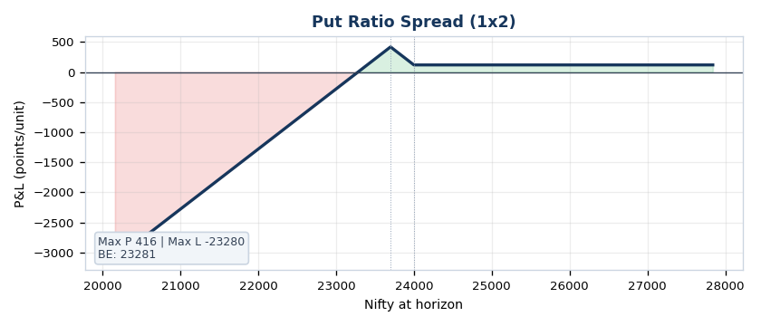

**The numbers (modelled at Nifty 24000).** Max profit 416 points (≈ ₹31,200/lot) at 23700. Max loss is shown as 23280 points (≈ ₹17.5 lakh/lot), with risk:reward 0.02. That worst case assumes the index collapses all the way to zero; in practice you size small and stop out at a multiple of the credit — but unlike the call version, the put side is mathematically bounded because Nifty cannot fall below zero. Breakeven 23281. Net credit 119.3 points.

**Greeks & behaviour.** Net delta turns increasingly negative below the money as the short puts dominate. Theta positive — time decay works for you while price holds above 23700. Vega negative: an IV pop (the natural companion of a selloff) hurts the position even before price arrives.

**Management & exit.** Book profit when Nifty hovers near 23700 and most of the credit is captured. If price accelerates down through the short strike, buy back one short put to defang the tail, or roll the pair lower. Be out before the last two sessions — downside gamma plus a gap-down is the classic account-killer here.

**Risk note.** A crash gap (a 23700 print becoming a 22500 print overnight) realises a large, fast loss and a margin call as VIX spikes. The "bounded" max loss is still catastrophic relative to the ₹8,948 credit. Trade tiny, define your mental stop, and never confuse "defined" with "small."

**Scenario P&L (₹ per lot, at expiry).**

| Nifty at expiry | 22,800 | 23,400 | 24,000 | 24,600 | 25,200 |
|---|---|---|---|---|---|
| **P&L (₹/lot)** | -₹36,075 | +₹8,925 | +₹8,925 | +₹8,925 | +₹8,925 |

P&L is positive everywhere the index holds at or above the short strike, but a slide to 22,800 already shows a deep loss, and a fall beyond this -5% grid toward the naked short loses far more.

**Adjustments, variants & timing.** Defend by buying back one short 23700 put as soon as Nifty breaks toward it, collapsing the trade into a defined 24000/23700 bear put spread. Alternatively roll the short pair down and out to re-establish room, or bolt on a long 23400 wing to cap the tail into a true ratio with defined risk. The edge is selling the persistent downside put skew on the NSE, which is reliably fat, so high IV rank improves the credit. Favour Nifty: Bank Nifty crashes harder and faster, and the naked put is exactly the leg that a banking-sector shock will detonate. Put it on 2-3 weeks out so decay accrues while the index holds above the short, and be flat before the final two sessions — a gap-down through 23700 in expiry-week gamma is the classic account-killer, made worse by the IV spike that always accompanies an Indian selloff.

## 81. Call Ratio Spread (1x3)
*Mildly bullish · Short vega · net credit*

**The idea (intuition).** Same blueprint as 79 but more aggressive — buy one call, sell *three* higher calls. The extra short funds a bigger credit and a wider profit tent, but you are now net short two naked calls, so the upside tail is twice as steep.

**When & why to use it.** Only for a genuinely capped, mildly bullish view where you are confident Nifty stalls near the short strike. It suits a richly priced upside skew you want to harvest harder. This is a step up in danger and demands more conviction that no breakout is coming — never deploy it into momentum, a trending tape, or any event that can ignite a melt-up.

**How to build it (₹, Nifty).** Buy 24000 CE @ 456, sell 3x 24400 CE @ 246. Net = 456 − 3×246 = −281.6 points credit ≈ ₹21,120 received per lot.

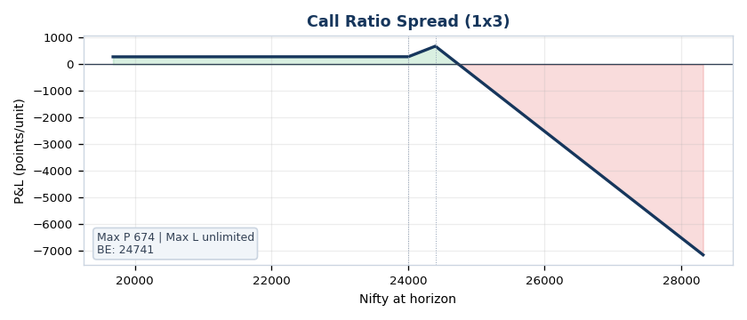

**The numbers (modelled at Nifty 24000).** Max profit 674 points (≈ ₹50,550/lot) at 24400. Max loss Unlimited — two naked calls run to infinity above breakeven. Breakeven 24741. Net credit 281.6 points (≈ ₹21,120). Risk:reward undefined.

**Greeks & behaviour.** Delta mildly long near spot, flipping sharply negative past 24400 where the three shorts overwhelm the one long. Theta strongly positive (three sellers, one buyer). Vega clearly negative — a rising-IV tape is doubly painful with two extra short calls feeding the loss.

**Management & exit.** Treat the second short call as the thing that will hurt you. Take profits early and often; close into any sign of trend. If tested, buy back one or two shorts to step down to a 1x2 or vertical. Do not hold the double-naked tail through expiry-week gamma under any circumstances.

**Risk note.** Two uncovered calls mean loss accelerates faster than the 1x2, and SPAN margin is heavier and more volatile. A single overnight gap can dwarf the entire credit many times over. This is a professional's harvest trade, not a starter position.

**Scenario P&L (₹ per lot, at expiry).**

| Nifty at expiry | 22,800 | 23,400 | 24,000 | 24,600 | 25,200 |
|---|---|---|---|---|---|
| **P&L (₹/lot)** | +₹21,150 | +₹21,150 | +₹21,150 | +₹21,150 | -₹68,850 |

The richer credit prints across the calm grid yet flips to a heavy loss by 25,200, and a push beyond this +5% grid into the two naked calls loses much more — the tail is unlimited.

**Adjustments, variants & timing.** With two naked calls the defence must be earlier and firmer: buy back one short at the first sign of a trend to step down to a 1x2, and a second to reach a defined vertical if momentum builds. Rolling all three shorts up and out re-centres the tent but does not remove the tail — only buying a 24700 wing does that. This is a skew-harvest trade for a richly priced upside in elevated IV (IV rank > 60), best on Nifty where the chain is liquid and gaps are tamer; Bank Nifty's velocity makes a double-naked upside reckless. Time it 2-3 weeks out and take profit early — the marginal points near expiry are not worth the gamma. Absolutely avoid carrying two uncovered calls through any catalyst (Budget, RBI, monthly expiry) where a melt-up can multiply the credit into a multiple-of-margin loss overnight.

## 82. Put Ratio Spread (1x3)
*Mildly bearish · Short vega · net credit*

**The idea (intuition).** The bearish 1x3 — one long put financed by three lower short puts. Bigger credit, wider tent down to the short strike, but you carry two extra naked puts into the most dangerous direction on Indian indices.

**When & why to use it.** For a controlled drift toward a support level with rich downside skew to sell and elevated IV rank. The view must be "slow leak, then stall," not "breakdown." Avoid entirely when macro tail-risk is live — global risk-off, geopolitical flare-ups, a heavy expiry — because a fast flush toward your shorts is the loss scenario, magnified by the third short.

**How to build it (₹, Nifty).** Buy 24000 PE @ 318, sell 3x 23600 PE @ 192. Net = 318 − 3×192 = −258.4 points credit ≈ ₹19,380 received per lot.

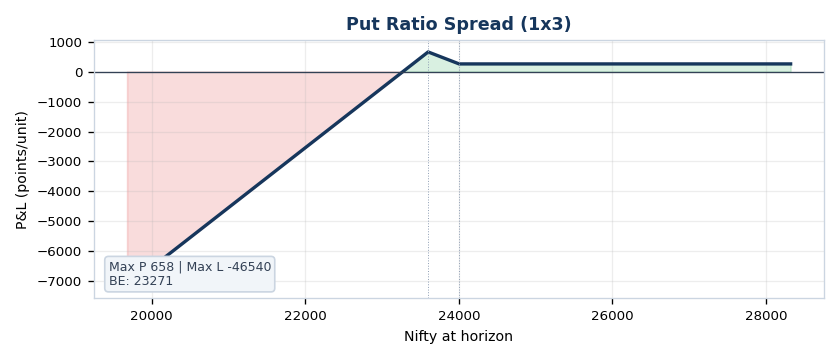

**The numbers (modelled at Nifty 24000).** Max profit 658 points (≈ ₹49,350/lot) at 23600. Max loss shown as 46540 points (≈ ₹34.9 lakh/lot), risk:reward 0.01. That figure assumes Nifty falls to zero — bounded only by that floor; you must size small and stop at a multiple of the credit long before then. Breakeven 23271. Net credit 258.4 points (≈ ₹19,380).

**Greeks & behaviour.** Delta swings strongly negative below 23600 as three short puts dominate. Theta positive while price holds up. Vega negative — and recall that falling markets bring rising IV, so price and vega losses compound here.

**Management & exit.** Defend aggressively: if Nifty heads for 23600, buy back one or two short puts to revert to a 1x2 or a defined vertical. Book the bulk of the credit early; never ride the double-naked structure into the final sessions where a gap-down is unmanageable.

**Risk note.** This carries the steepest realistic downside in the ratio-spread set. A crash plus IV spike produces a large, fast, margin-calling loss against a modest credit. The "bounded" loss is still life-altering at scale — keep size minimal.

**Scenario P&L (₹ per lot, at expiry).**

| Nifty at expiry | 22,800 | 23,400 | 24,000 | 24,600 | 25,200 |
|---|---|---|---|---|---|
| **P&L (₹/lot)** | -₹70,650 | +₹19,350 | +₹19,350 | +₹19,350 | +₹19,350 |

The structure collects across the upper grid but shows a large loss at 22,800, and any extension beyond this -5% grid toward the two naked puts loses far more.

**Adjustments, variants & timing.** Two naked puts demand aggressive, staged defence: buy back one short 23600 put to revert to a 1x2, then a second to reach a defined spread if the flush continues. Rolling the trio down and out buys room but keeps the tail live; only a long 23300 wing defines it. The thesis is selling expensive downside skew in a high IV-rank tape, which the NSE offers persistently. Strongly prefer Nifty over Bank Nifty — banking names lead every risk-off cascade, and a double-naked put into a Bank Nifty flush is how accounts blow up. Enter 2-3 weeks out to bank decay while the index holds, and exit well before expiry week. Remember the compounding trap unique to the downside: a falling market simultaneously moves price against you and spikes India VIX, so your short vega and short delta lose together — size in single lots only.

## 83. Call Ratio Backspread (1x2)
*Bullish explosive · Long vega · net debit*

**The idea (intuition).** Flip the call ratio spread upside down: sell one lower call and buy two higher calls. Now you are net *long* an extra call. Your loss is small and defined in the middle, and if Nifty rips higher your two long calls run away to the upside. It is a cheap lottery ticket on a breakout, partly funded by the call you sold.

**When & why to use it.** Use when you expect a sharp, fast rally and want explosive convex upside with defined risk — a breakout setup, a results gap, a momentum thrust. Backspreads love *rising* IV, so they shine when you buy them in a low-IV lull (IV rank < 30) right before an expected vol expansion. The enemy is a slow grind that stalls in the dead zone between strikes and a quiet, IV-bleeding tape that decays your longs. Do not put this on when you only expect a mild drift — that is the ratio spread's job, not the backspread's.

**How to build it (₹, Nifty).** Sell 24000 CE @ 456, buy 2x 24300 CE @ 292. Net = −456 + 2×292 = +127.9 points debit ≈ ₹9,593 paid per lot.

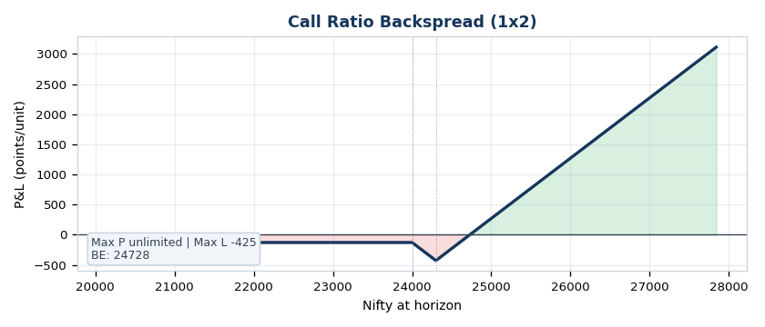

**The numbers (modelled at Nifty 24000).** Max profit Unlimited — two long calls into a runaway rally. Max loss 425 points (≈ ₹31,875/lot), the most you can lose, realised right at 24300 where the short is ITM and the longs expire worthless. Breakeven 24728. Net debit 127.9 points (≈ ₹9,593). Risk:reward undefined (unlimited upside).

**Greeks & behaviour.** Net delta is long and *gets longer* as Nifty rallies (positive gamma working for you). Theta is negative — every quiet day costs you. Vega is positive: an IV expansion lifts your two longs and is a core part of the thesis.

**Management & exit.** This is a move-or-die trade. Give it a defined window (often expiry week into a catalyst) and exit if the move does not come — do not let theta grind the debit to zero. Once Nifty clears 24728 and the position is convex, scale out into strength or trail a stop to lock the open-ended gains.

**Risk note.** The real risk is time and silence: a flat market simply bleeds you to the 425-point max loss. The worst single point is sitting pinned at 24300 into expiry. Defined risk, yes — but you can lose all of it if the breakout never arrives.

**Scenario P&L (₹ per lot, at expiry).**

| Nifty at expiry | 22,800 | 23,400 | 24,000 | 24,600 | 25,200 |
|---|---|---|---|---|---|
| **P&L (₹/lot)** | -₹9,600 | -₹9,600 | -₹9,600 | -₹9,600 | +₹35,400 |

As a backspread the picture inverts: the small defined loss sits across the quiet grid and only at 25,200 does the position turn profitable — beyond this +5% grid the upside runs unlimited.

**Adjustments, variants & timing.** This is a move-or-die debit trade, so the main defence is time discipline: window it to a known catalyst and cut it if the breakout does not arrive rather than feed theta. If Nifty stalls in the dead zone you can sell a higher call (e.g. 24600) against the longs to recoup some debit, turning it into a defined butterfly-like structure. Once the move comes and the position is convex past 24728, scale out into strength and trail a stop to protect the open-ended leg. Backspreads want to be bought cheap in a low-IV lull (IV rank < 30) just before an expected vol expansion — that is the whole edge. Bank Nifty actually suits this better than Nifty: its larger, faster directional thrusts give the long calls more room to run, and its richer premiums reward a genuine breakout. Avoid quiet, rangebound regimes where decay simply bleeds the debit to the full max loss.

## 84. Put Ratio Backspread (1x2)
*Bearish explosive · Long vega · net debit*

**The idea (intuition).** The bearish backspread: sell one higher put, buy two lower puts. Net long an extra put, so a crash pays explosively while your loss in the middle is capped. This is the structure to own when you fear a flush, because downside moves on the NSE come with a vol spike that supercharges your long vega.

**When & why to use it.** Deploy when you expect a fast, deep selloff — a breakdown through support, a global risk-off night, a feared event. Best entered in a calm, low-IV tape so you buy your puts cheap before fear repriced them. The trap is a slow drift that dies in the dead zone, and a placid market that decays the longs. Not for a mild bearish lean — use a put ratio spread for that.

**How to build it (₹, Nifty).** Sell 24000 PE @ 318, buy 2x 23700 PE @ 219. Net = −318 + 2×219 = +119.3 points debit ≈ ₹8,948 paid per lot.


**The numbers (modelled at Nifty 24000).** Max profit 23280 points (≈ ₹17.5 lakh/lot if Nifty went to zero — practically, a very large gain on any real crash). Max loss 416 points (≈ ₹31,200/lot), realised at 23700. Breakeven 23281. Net debit 119.3 points (≈ ₹8,948). Risk:reward a striking 55.98 — small defined risk against an enormous skewed payoff.

**Greeks & behaviour.** Net delta short and getting shorter as Nifty falls (positive gamma in your favour). Theta negative — patience costs money. Vega strongly positive, and because crashes spike India VIX, the vega tailwind here is real and large.

**Management & exit.** A conviction-and-timing trade: define a window, and if the breakdown does not materialise, cut it rather than feed theta. On a flush below 23281, the position goes convex fast — take partial profits into the panic and trail the rest, because mean-reversion bounces can give the gains back quickly.

**Risk note.** The danger is opportunity cost and decay: in a calm market you lose the full 416 points. The eye-catching 55.98 reward:risk only pays if a genuine, fast move occurs — most days, nothing happens and theta nibbles. Defined loss, but it is a real loss.

**Scenario P&L (₹ per lot, at expiry).**

| Nifty at expiry | 22,800 | 23,400 | 24,000 | 24,600 | 25,200 |
|---|---|---|---|---|---|
| **P&L (₹/lot)** | +₹36,075 | -₹8,925 | -₹8,925 | -₹8,925 | -₹8,925 |

The defined loss occupies the calm middle of the grid and only the 22,800 flush pays — a move beyond this -5% grid toward zero pays far more, the convex reward this trade is built for.

**Adjustments, variants & timing.** Treat it as a timed convexity bet: define a window around a feared event and cut it if the flush does not come, rather than let theta erode the debit. If the index drifts but does not break, sell a lower put (e.g. 23400) against your longs to defray cost into a defined structure. On a break below 23281 the position turns sharply convex — bank partial profits into the panic and trail the rest, because Indian selloffs mean-revert violently and bounces give gains back fast. The setup wants cheap puts bought in a calm, low-IV tape before fear reprices them; the crash-driven India VIX spike is the core profit lever via long vega. Bank Nifty is the better vehicle for a true flush — it leads every risk-off move with bigger, faster drops and a sharper vol pop — while Nifty offers a steadier, slightly less explosive version. Not for a mild bearish lean.

## 85. Call Ratio Backspread (1x3)
*Strongly bullish · Long vega · net debit*

**The idea (intuition).** A more leveraged bullish backspread — sell one call, buy three higher calls. Net long two extra calls, so the upside convexity is steeper, paid for with a larger debit and a wider, deeper dead zone you must clear.

**When & why to use it.** For a strong, fast melt-up conviction where you want maximum convex upside with defined risk. Buy it cheap in a low-IV regime expecting vol expansion on the breakout. The cost: a bigger debit and more theta to overcome, so the move needs to be both large and reasonably prompt. Never for a mild or slow view — the dead zone will eat you.

**How to build it (₹, Nifty).** Sell 24000 CE @ 456, buy 3x 24400 CE @ 246. Net = −456 + 3×246 = +281.6 points debit ≈ ₹21,120 paid per lot.

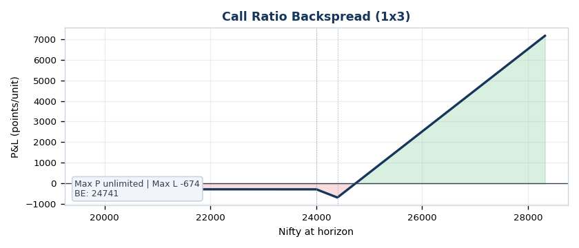

**The numbers (modelled at Nifty 24000).** Max profit Unlimited (three long calls in a runaway rally). Max loss 674 points (≈ ₹50,550/lot) at 24400. Breakeven 24741. Net debit 281.6 points (≈ ₹21,120). Risk:reward undefined (open upside).

**Greeks & behaviour.** Net delta long and accelerating with price — strong positive gamma. Theta negative and heavier than the 1x2 because three longs decay. Vega strongly positive; an IV expansion is a major driver of profit before price even arrives.

**Management & exit.** Tight time discipline matters more here — three decaying longs make the bleed faster. Tie it to a specific catalyst window. Beyond 24741 the payoff is convex; scale out into strength and trail the remainder to capture the unlimited leg.

**Risk note.** The full 674-point debit is at risk if Nifty stalls near 24400 — the worst spot to be pinned. Larger debit means a larger defined loss than the 1x2, and theta bites harder. Only trade it when you genuinely expect a big, fast move.

**Scenario P&L (₹ per lot, at expiry).**

| Nifty at expiry | 22,800 | 23,400 | 24,000 | 24,600 | 25,200 |
|---|---|---|---|---|---|
| **P&L (₹/lot)** | -₹21,150 | -₹21,150 | -₹21,150 | -₹21,150 | +₹68,850 |

The deeper defined loss spans the grid and only a 25,200 breakout turns it green, with profit beyond this +5% grid running unlimited as the three long calls take over.

**Adjustments, variants & timing.** Three decaying longs make time discipline paramount — tie it to a specific catalyst and cut it promptly if the melt-up stalls. In a dead-zone drift, sell a higher call (around 24700) against the longs to recover some of the heavier debit, defining the structure. Beyond 24741 the payoff is convex; scale out into strength and trail to capture the unlimited leg. The trade is bought cheap in a low-IV regime (IV rank < 30) expecting vol expansion on the breakout, so entry timing into a coiled range is everything. Bank Nifty suits the leveraged version well: its powerful, fast thrusts let three long calls run hard, and its fatter premiums reward conviction — though the larger debit also bites harder if you are wrong. On Nifty the move tends to be smoother and may not fully clear the wider dead zone. Only deploy when you genuinely expect a large, prompt move.

## 86. Put Ratio Backspread (1x3)
*Strongly bearish · Long vega · net debit*

**The idea (intuition).** The leveraged bearish backspread — sell one put, buy three lower puts. Net long two extra puts for steep downside convexity, ideal when you expect not just a fall but a genuine flush with a VIX spike.

**When & why to use it.** For high-conviction crash views — a decisive breakdown, a feared macro event, a fragile market on the edge. Enter in calm IV so the three long puts are cheap before fear reprices them. The drawback is the larger debit and a wider dead zone; the move must be deep and reasonably quick. Not for mild bearishness.

**How to build it (₹, Nifty).** Sell 24000 PE @ 318, buy 3x 23600 PE @ 192. Net = −318 + 3×192 = +258.4 points debit ≈ ₹19,380 paid per lot.

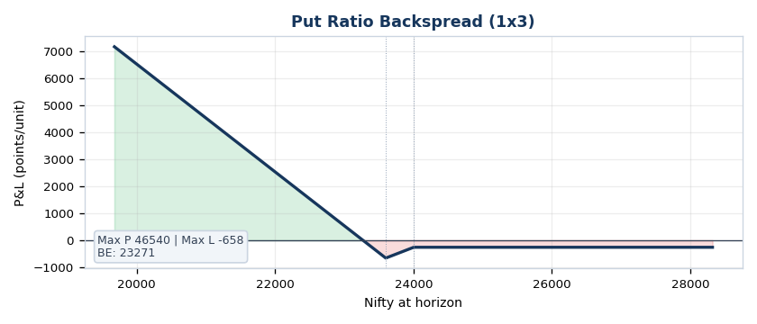

**The numbers (modelled at Nifty 24000).** Max profit 46540 points (≈ ₹34.9 lakh/lot at the zero bound — in practice a very large gain on a real crash). Max loss 658 points (≈ ₹49,350/lot) at 23600. Breakeven 23271. Net debit 258.4 points (≈ ₹19,380). Risk:reward 70.74 — the most convex payoff in this chapter.

**Greeks & behaviour.** Net delta short, steepening as Nifty drops (powerful positive gamma). Theta negative and heavier than the 1x2. Vega strongly positive — the crash-plus-VIX dynamic is the whole point and the biggest profit lever.

**Management & exit.** Window it to a catalyst; cut it if the flush does not come rather than bleed three longs. On a break below 23271 it turns sharply convex — bank partial profits into the panic and trail the rest, since violent bounces can erase open gains fast.

**Risk note.** In a quiet or grinding tape you lose the full 658-point debit — larger than the 1x2's. The headline 70.74 reward:risk only materialises on a real, fast collapse. Treat the debit as fully at risk.

**Scenario P&L (₹ per lot, at expiry).**

| Nifty at expiry | 22,800 | 23,400 | 24,000 | 24,600 | 25,200 |
|---|---|---|---|---|---|
| **P&L (₹/lot)** | +₹70,650 | -₹19,350 | -₹19,350 | -₹19,350 | -₹19,350 |

The defined debit is lost across the quiet grid and only a 22,800 crash pays — beyond this -5% grid the three long puts deliver a far larger, convex gain.

**Adjustments, variants & timing.** With three long puts the bleed is faster, so window it tightly to a catalyst and cut if the breakdown does not come. If the index merely softens, sell a lower put (around 23300) against the longs to claw back some debit into a defined structure. Below 23271 it goes sharply convex — take partial profits into the panic and trail the rest, since violent relief bounces erase open gains quickly. Enter in calm, low-IV conditions so the three puts are cheap before fear reprices them; the crash-plus-India-VIX dynamic is the entire thesis and the biggest profit lever. Bank Nifty is the natural home for a leveraged crash bet — it leads and amplifies every risk-off cascade with the deepest, fastest drops and the sharpest vol spike — whereas Nifty gives a calmer, less explosive payoff. Reserve this for high-conviction flush views, never a mild bearish drift, and treat the full debit as at risk.

## 87. Call Ratio Spread (For Credit)
*Neutral to mildly bullish · Short vega · net credit*

**The idea (intuition).** A call ratio spread placed entirely above the money so it is built purely for the credit and a neutral-to-mildly-bullish lean. Buy one OTM call, sell two further-OTM calls, collect cash, and profit if Nifty drifts gently up to the short strike or simply goes nowhere.

**When & why to use it.** When you think Nifty stays rangebound with a slight upward tilt and you want to monetise rich upside skew and elevated IV. The OTM placement keeps both strikes out of the money, so a flat-to-slightly-up tape lets the whole thing decay in your favour. Avoid it before any catalyst that can spark a breakout through the short strike, where the naked call awakens.

**How to build it (₹, Nifty).** Buy 24200 CE @ 342, sell 2x 24450 CE @ 224. Net = 342 − 2×224 = −106.6 points credit ≈ ₹7,995 received per lot.

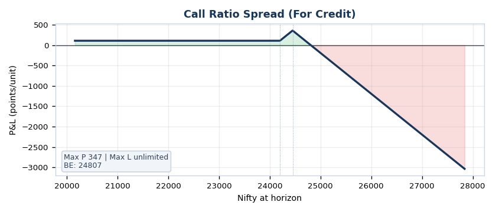

**The numbers (modelled at Nifty 24000).** Max profit 347 points (≈ ₹26,025/lot) at 24450. Max loss Unlimited above breakeven (one naked call). Breakeven 24807. Net credit 106.6 points (≈ ₹7,995). Risk:reward undefined.

**Greeks & behaviour.** Net delta near flat at inception (both legs OTM), turning negative as price approaches 24450. Theta positive — the structure earns its keep through decay. Vega negative; a vol spike that lifts the upside calls hurts.

**Management & exit.** Because the edge is the credit, take it off once you have captured roughly half and the position has decayed — do not chase the last few points into expiry-week gamma. If Nifty rallies toward 24450, buy back a short to cap the tail or roll up and out.

**Risk note.** Genuinely unlimited upside loss if Nifty breaks out and trends — the naked call and rising SPAN margin punish complacency. Premium selling is not free money; size small and respect the breakeven as a stop.

**Scenario P&L (₹ per lot, at expiry).**

| Nifty at expiry | 22,800 | 23,400 | 24,000 | 24,600 | 25,200 |
|---|---|---|---|---|---|
| **P&L (₹/lot)** | +₹8,025 | +₹8,025 | +₹8,025 | +₹15,525 | -₹29,475 |

The credit decays in your favour across the flat grid, steps up near the short strike, then collapses to a loss by 25,200 — a breakout beyond this +5% grid into the naked call loses much more, unlimited.

**Adjustments, variants & timing.** Because both legs start OTM, the defence is straightforward: if Nifty rallies toward 24450, buy back one short 24450 call to cap the tail into a defined 24200/24450 spread, or roll the shorts up and out to keep the credit alive. Adding a 24700 wing converts it to a fully defined ratio for those who cannot hold a naked leg. The edge is monetising rich upside skew in a high IV-rank, rangebound tape, so it is an index trade — prefer Nifty, whose flatter, more orderly behaviour suits a sit-and-decay structure better than Bank Nifty's whippy range. Put it on 2-3 weeks out so the OTM strikes decay in your favour, and take profit once roughly half the credit is captured rather than chasing the last points into expiry-week gamma. Avoid placing it ahead of any catalyst that can spark a breakout through the short strike and wake the naked call.

## 88. Put Ratio Spread (For Credit)
*Neutral to mildly bearish · Short vega · net credit*

**The idea (intuition).** The bearish, all-OTM credit version. Buy one OTM put, sell two lower puts, collect the credit, and profit if Nifty drifts gently down to the short strike or stays flat.

**When & why to use it.** For a rangebound-to-slightly-soft view where you want to harvest the persistent downside put skew and a high IV rank. Both strikes sit below the money, so a calm or mildly weak tape decays nicely. Steer clear when risk-off is brewing — a fast drop toward your shorts is the loss case.

**How to build it (₹, Nifty).** Buy 23800 PE @ 248, sell 2x 23550 PE @ 180. Net = 248 − 2×180 = −111.7 points credit ≈ ₹8,378 received per lot.

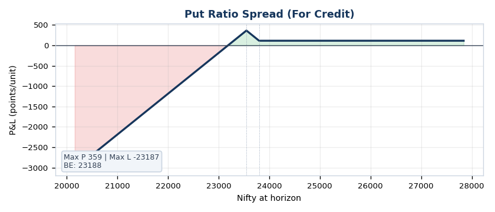

**The numbers (modelled at Nifty 24000).** Max profit 359 points (≈ ₹26,925/lot) at 23550. Max loss shown as 23187 points (≈ ₹17.4 lakh/lot), risk:reward 0.02. That assumes the index falls to zero — bounded by that floor but catastrophic; size small and stop at a multiple of the credit. Breakeven 23188. Net credit 111.7 points (≈ ₹8,378).

**Greeks & behaviour.** Net delta near flat at entry, turning negative as price nears 23550. Theta positive. Vega negative — and a falling market's IV pop works against you on both price and vol.

**Management & exit.** Book around half the credit and exit before expiry-week downside gamma. If Nifty slides toward 23550, buy back a short put to revert to a defined vertical, or roll lower.

**Risk note.** A crash gap realises a large, fast loss and a margin spike against a modest ₹8,378 credit. "Bounded" is not "safe" — most retail F&O sellers lose money per SEBI data, so keep size minimal and stops honest.

**Scenario P&L (₹ per lot, at expiry).**

| Nifty at expiry | 22,800 | 23,400 | 24,000 | 24,600 | 25,200 |
|---|---|---|---|---|---|
| **P&L (₹/lot)** | -₹29,100 | +₹15,900 | +₹8,400 | +₹8,400 | +₹8,400 |

P&L is positive while the index drifts gently down toward the short strike but turns sharply negative at 22,800, and a fall beyond this -5% grid into the naked put loses far more.

**Adjustments, variants & timing.** Defend by buying back one short 23550 put if Nifty slides toward it, reverting to a defined 23800/23550 bear put spread, or roll the shorts down and out to re-open room. A long 23300 wing defines the tail outright. The trade harvests the NSE's persistent downside put skew in a high IV-rank, rangebound-to-soft tape, so favour Nifty over the gappier Bank Nifty, where a banking shock detonates exactly the naked put you are short. Enter 2-3 weeks to expiry so the OTM strikes bleed in your favour while the index holds above the short, and book around half the credit before expiry-week downside gamma. Keep the size minimal: a fast flush moves price against you and spikes India VIX simultaneously, so your short delta and short vega lose together, and SEBI data shows most retail F&O sellers lose money precisely by underestimating this tail.

## 89. Front-Ratio Call Spread
*Slow grind up · Short vega · net credit*

**The idea (intuition).** A front-ratio call spread buys one nearer call and sells two further calls, structured so the long leg sits in front (closer to the money). You collect a credit, profit best on a slow grind up into the short strike, and carry one naked call above. It is the "I think we drift higher but not much" expression.

**When & why to use it.** For a gentle, grinding uptrend with no breakout expected — the kind of low-energy bull tape that creeps higher day by day. Rich upside skew and decent IV make the two shorts worth selling. Do not use it when momentum or a catalyst could turn the grind into a thrust through your short strike.

**How to build it (₹, Nifty).** Buy 23900 CE @ 519, sell 2x 24250 CE @ 317. Net = 519 − 2×317 = −114.6 points credit ≈ ₹8,595 received per lot.

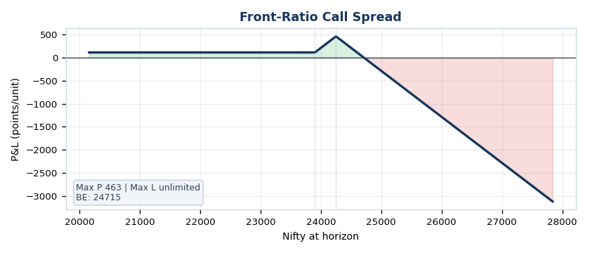

**The numbers (modelled at Nifty 24000).** Max profit 463 points (≈ ₹34,725/lot) at 24250. Max loss Unlimited above breakeven. Breakeven 24715. Net credit 114.6 points (≈ ₹8,595). Risk:reward undefined.

**Greeks & behaviour.** Net delta slightly long near spot (the long call is closer to the money), flipping negative past 24250. Theta positive. Vega negative — a quiet, decaying tape is ideal; an IV jump hurts.

**Management & exit.** Capture most of the 463 as Nifty approaches 24250, then take it off ahead of expiry gamma. If the grind accelerates, buy back one short to neutralise the tail or roll the shorts up.

**Risk note.** The single naked call means a true melt-up produces unlimited loss with escalating margin. A slow grind is friendly; a breakout is not. Treat 24715 as a real stop.

**Scenario P&L (₹ per lot, at expiry).**

| Nifty at expiry | 22,800 | 23,400 | 24,000 | 24,600 | 25,200 |
|---|---|---|---|---|---|
| **P&L (₹/lot)** | +₹8,625 | +₹8,625 | +₹16,125 | +₹8,625 | -₹36,375 |

The credit grinds up to its best near the short strike then reverses to a loss by 25,200, and any thrust beyond this +5% grid into the naked call loses much more — unlimited.

**Adjustments, variants & timing.** The front-ratio's single naked call is defused by buying back one short 24250 call when the grind accelerates, leaving a defined 23900/24250 spread, or by rolling the short pair up and out to chase the drift. A 24600 wing makes it a fully defined structure. The trade sells rich upside skew into a slow, low-energy bull tape with decent IV, so it suits Nifty's orderly grind better than Bank Nifty's lurchy momentum, where a thrust through the short strike is more likely. Enter 2-3 weeks out so theta compounds on the OTM shorts, and capture most of the 463-point tent as price approaches 24250 rather than holding into expiry gamma. The key timing rule: this expression dies if the grind becomes a breakout, so step out the instant momentum or a catalyst threatens to turn the creep into a thrust through 24715.

## 90. Front-Ratio Put Spread
*Slow grind down · Short vega · net credit*

**The idea (intuition).** The bearish front-ratio: buy one nearer put, sell two lower puts, take a credit, and profit on a slow leak down into the short strike. One naked put rides below as the source of tail risk.

**When & why to use it.** For a low-energy downward drift — a tired market leaking toward support without panic. Sell into rich downside skew and a high IV rank. Avoid it whenever a fast risk-off move is plausible, because acceleration toward your shorts is the loss scenario.

**How to build it (₹, Nifty).** Buy 24100 PE @ 359, sell 2x 23750 PE @ 233. Net = 359 − 2×233 = −107.5 points credit ≈ ₹8,063 received per lot.

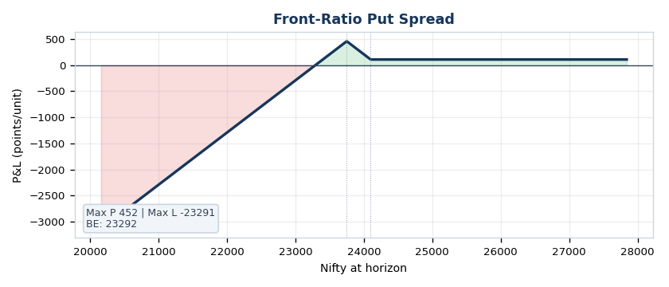

**The numbers (modelled at Nifty 24000).** Max profit 452 points (≈ ₹33,900/lot) at 23750. Max loss shown as 23291 points (≈ ₹17.5 lakh/lot), risk:reward 0.02 — the figure assumes Nifty falls to zero, bounded by that floor; size small and stop at a multiple of the credit. Breakeven 23292. Net credit 107.5 points (≈ ₹8,063).

**Greeks & behaviour.** Net delta slightly short near spot, more negative as price nears 23750. Theta positive. Vega negative — a downside vol spike works against the position.

**Management & exit.** Book around half the credit, exit before expiry-week downside gamma. If Nifty leaks faster than expected, buy back a short put to cap the tail or roll lower.

**Risk note.** A crash gap turns the bounded-but-huge loss real and fast, with a margin spike, against an ₹8,063 credit. Keep size tiny and stops disciplined — selling premium is not free money.

**Scenario P&L (₹ per lot, at expiry).**

| Nifty at expiry | 22,800 | 23,400 | 24,000 | 24,600 | 25,200 |
|---|---|---|---|---|---|
| **P&L (₹/lot)** | -₹36,900 | +₹8,100 | +₹15,600 | +₹8,100 | +₹8,100 |

P&L peaks on a slow leak toward the short strike but a 22,800 print already shows a heavy loss, and acceleration beyond this -5% grid into the naked put loses far more.

**Adjustments, variants & timing.** Defend the lone naked put by buying back one short 23750 put as Nifty leaks toward it, leaving a defined 24100/23750 bear put spread, or roll the shorts down and out to re-open room; a 23400 wing defines the tail. The structure sells the NSE's reliably rich downside skew into a tired, low-energy drift with a high IV rank, so prefer Nifty — Bank Nifty's faster, deeper drops are exactly what turn a slow leak into the loss scenario. Enter 2-3 weeks out so the OTM shorts decay while the index holds above 23750, and book around half the credit before expiry-week downside gamma. Stay alert to the asymmetry of Indian downside: a drift can flip to a flush in one session, and the accompanying India VIX spike compounds the short-vega loss, so keep the size tiny and treat 23292 as a hard mental stop.

## 91. Call Backspread (OTM)
*Bullish breakout · Long vega · net debit*

**The idea (intuition).** An out-of-the-money call backspread: sell one OTM call, buy two further-OTM calls. Cheaper than an at-the-money backspread because everything is OTM, with a small defined loss and explosive upside if Nifty breaks out hard.

**When & why to use it.** For an anticipated upside breakout where you want convex, defined-risk leverage at low cost — a coiled range you expect to resolve up, ahead of a bullish catalyst. The OTM placement and low-IV entry keep the debit small; you are betting on both a big move and IV expansion. Useless for a mild drift that stalls below the long strikes.

**How to build it (₹, Nifty).** Sell 24200 CE @ 342, buy 2x 24500 CE @ 204. Net = −342 + 2×204 = +66.2 points debit ≈ ₹4,965 paid per lot.

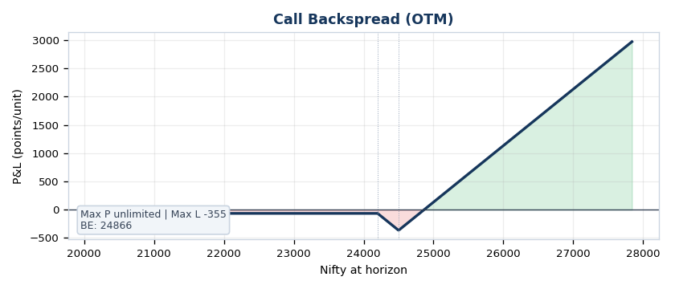

**The numbers (modelled at Nifty 24000).** Max profit Unlimited (two long calls in a runaway move). Max loss 355 points (≈ ₹26,625/lot) at 24500. Breakeven 24866. Net debit 66.2 points (≈ ₹4,965). Risk:reward undefined (open upside).

**Greeks & behaviour.** Net delta long and accelerating with a rally; positive gamma. Theta negative — quiet days cost you. Vega positive — an IV expansion is a key profit driver, and the cheap OTM longs are very vega-sensitive.

**Management & exit.** A defined-window breakout bet — cut it if the move and vol pop do not arrive rather than feed theta. Above 24866 it goes convex; scale out into strength and trail the rest.

**Risk note.** The full 355-point debit is lost if Nifty stalls at 24500 into expiry, the worst pin point. Cheap, defined risk — but a complete loss is the base-rate outcome when no breakout comes.

**Scenario P&L (₹ per lot, at expiry).**

| Nifty at expiry | 22,800 | 23,400 | 24,000 | 24,600 | 25,200 |
|---|---|---|---|---|---|
| **P&L (₹/lot)** | -₹4,950 | -₹4,950 | -₹4,950 | -₹19,950 | +₹25,050 |

The small defined debit is lost across the quiet grid and only a 25,200 breakout pays — beyond this +5% grid the two long calls run the profit up without limit.

**Adjustments, variants & timing.** As a cheap defined-risk debit, the primary lever is timing: window it to a bullish catalyst and cut it if the breakout and vol pop do not arrive rather than feeding theta. If Nifty drifts but stays below the long strikes, sell a higher 24700 call against them to recover part of the small debit. Above 24866 the position goes convex — scale out into strength and trail the rest to capture the open-ended upside. The OTM placement plus a low-IV entry (IV rank < 30) keeps the cost tiny and the vega leverage high, since cheap OTM calls are exquisitely vol-sensitive. Bank Nifty suits this better than Nifty: its larger, faster breakouts give the long calls room to run and its richer premiums reward a genuine thrust. The base-rate outcome is a full loss of the modest debit when no breakout comes, so only deploy it when you expect a big, prompt move.

## 92. Put Backspread (OTM)
*Bearish breakdown · Long vega · net debit*

**The idea (intuition).** The OTM bearish backspread: sell one OTM put, buy two lower puts. Low-cost, defined-risk convexity that pays explosively on a breakdown-and-flush.

**When & why to use it.** For an expected downside breakout — a range about to crack lower, a fragile tape into a risk-off catalyst. Enter in calm IV so the long puts are cheap before fear reprices them; the crash-driven VIX spike is a core part of the payoff. Not for a mild bearish lean that dies in the dead zone.

**How to build it (₹, Nifty).** Sell 23800 PE @ 248, buy 2x 23500 PE @ 169. Net = −248 + 2×169 = +88.7 points debit ≈ ₹6,653 paid per lot.

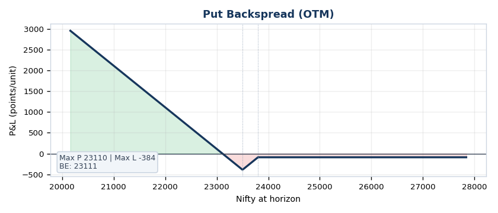

**The numbers (modelled at Nifty 24000).** Max profit 23110 points (≈ ₹17.3 lakh/lot at the zero bound — a very large gain on a real crash). Max loss 384 points (≈ ₹28,800/lot) at 23500. Breakeven 23111. Net debit 88.7 points (≈ ₹6,653). Risk:reward 60.15.

**Greeks & behaviour.** Net delta short, steepening as Nifty falls; positive gamma. Theta negative. Vega strongly positive — the downside vol spike supercharges the long puts.

**Management & exit.** Window it to a catalyst and cut if the flush does not come. Below 23111 it turns convex — bank partial profits into the panic and trail the rest, since sharp bounces can give gains back.

**Risk note.** In a calm or grinding market you lose the full 384-point debit. The 60.15 reward:risk only pays on a genuine, fast collapse — defined, but a real loss most of the time.

**Scenario P&L (₹ per lot, at expiry).**

| Nifty at expiry | 22,800 | 23,400 | 24,000 | 24,600 | 25,200 |
|---|---|---|---|---|---|
| **P&L (₹/lot)** | +₹23,325 | -₹21,675 | -₹6,675 | -₹6,675 | -₹6,675 |

The defined loss sits across the calm grid and only a 22,800 breakdown pays, with the gain beyond this -5% grid growing far larger as the two long puts dominate.

**Adjustments, variants & timing.** Treat it as a timed, cheap convexity bet: define a window around a risk-off catalyst and cut it if the breakdown stalls. If the index softens without breaking, sell a lower 23300 put against the longs to defray the debit into a defined structure. Below 23111 it turns convex — bank partial profits into the panic and trail the rest, since Indian selloffs snap back hard. Enter in calm, low-IV conditions so the OTM long puts are cheap before fear reprices them; the crash-driven India VIX spike supercharges the position through long vega and is central to the payoff. Bank Nifty is the stronger vehicle for a downside break — it leads every risk-off cascade with the deepest, fastest drops and the sharpest vol pop — while Nifty gives a steadier, less explosive version. Not for a mild bearish lean that dies in the dead zone; expect to lose the full debit when no flush comes.

## 93. Call Ratio Spread (2x3)
*Mildly bullish · Short vega · net debit*

**The idea (intuition).** A balanced ratio: buy two lower calls, sell three higher calls. Closer to a ratioed vertical, it carries a defined-profit tent with a single net-naked call up top. Unusually for this set it is a small *debit*, and it has two breakevens — a profit window rather than a one-sided tent.

**When & why to use it.** For a mild bullish view targeting a specific zone, where the 2x3 structure gives a wider, more symmetric profit band than a 1x2. Suits rich upside skew you want to partly sell while keeping defined risk over most of the range. Avoid it ahead of a breakout that can punch through the upper breakeven into the naked call.

**How to build it (₹, Nifty).** Buy 2x 24000 CE @ 456, sell 3x 24300 CE @ 292. Net = 2×456 − 3×292 = +36.2 points debit ≈ ₹2,715 paid per lot.

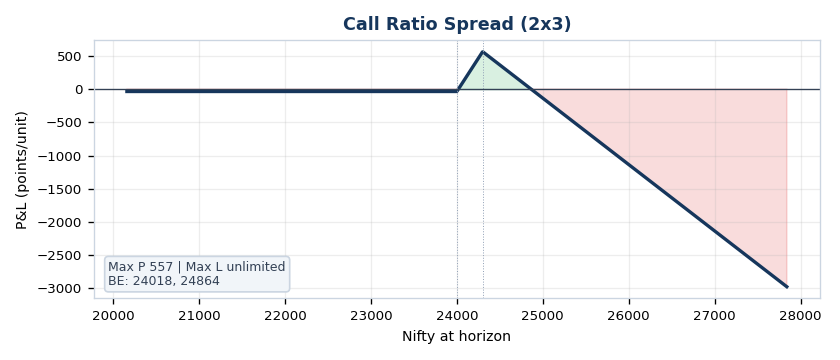

**The numbers (modelled at Nifty 24000).** Max profit 557 points (≈ ₹41,775/lot) at 24300. Max loss Unlimited above the upper breakeven (one net-naked call). Breakevens 24018 and 24864 — a defined profit window between them. Net debit 36.2 points (≈ ₹2,715). Risk:reward undefined.

**Greeks & behaviour.** Net delta long near the lower breakeven, turning negative past 24300 as the three shorts dominate. Theta positive once price is parked near 24300. Vega negative — an IV spike hurts, especially near the upper breakeven.

**Management & exit.** Aim to have Nifty settle near 24300 to capture the 557. Take profits before expiry-week gamma; if price pushes past 24864, buy back the net-naked short to cap the tail or roll up.

**Risk note.** Despite two breakevens and a small debit, the upside loss is genuinely unlimited beyond 24864 — one net-naked call into a trend. Margin scales with IV; respect the upper breakeven as a hard stop.

**Scenario P&L (₹ per lot, at expiry).**

| Nifty at expiry | 22,800 | 23,400 | 24,000 | 24,600 | 25,200 |
|---|---|---|---|---|---|
| **P&L (₹/lot)** | -₹2,700 | -₹2,700 | -₹2,700 | +₹19,800 | -₹25,200 |

The small debit shows a modest loss across most of the grid, a strong gain near the short strike, then a loss again by 25,200 — beyond this +5% grid the net-naked call loses much more, unlimited.

**Adjustments, variants & timing.** Despite the small debit and two breakevens, one net-naked call lives above 24864, so defend by buying it back if price pushes past the upper breakeven, leaving a defined 2x2 vertical, or roll the short trio up and out to re-centre the wider profit band. A 24600 wing defines the structure entirely. The 2x3 sells rich upside skew while keeping defined risk over most of the range, suiting a mild bullish view that targets a specific zone — prefer Nifty, whose orderly behaviour lets price settle near 24300, over Bank Nifty's range that can blow through the upper breakeven into the naked call. Enter 2-3 weeks out so theta works once price parks near the short strike, and take the 557-point peak before expiry-week gamma. Margin scales with India VIX, so a rising-IV tape both hurts the vega and inflates the SPAN requirement on the net-naked leg.

## 94. Put Ratio Spread (2x3)
*Mildly bearish · Short vega · net credit*

**The idea (intuition).** The bearish balanced ratio: buy two higher puts, sell three lower puts, for a small credit. A defined-profit band centred near the short strike, with one net-naked put carrying the downside tail.

**When & why to use it.** For a mild bearish view aimed at a specific support zone, where the 2x3 gives a broader profit band than a 1x2 plus a small credit. Sell into rich downside skew and elevated IV. Do not deploy when a fast flush is plausible — acceleration through the lower breakeven into the naked put is the loss case.

**How to build it (₹, Nifty).** Buy 2x 24000 PE @ 318, sell 3x 23700 PE @ 219. Net = 2×318 − 3×219 = −19.8 points credit ≈ ₹1,485 received per lot.

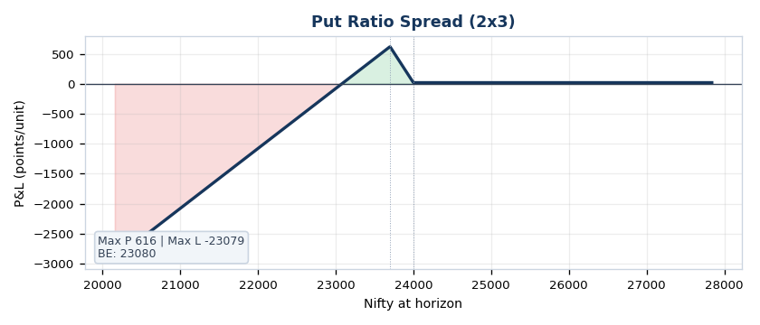

**The numbers (modelled at Nifty 24000).** Max profit 616 points (≈ ₹46,200/lot) at 23700. Max loss shown as 23079 points (≈ ₹17.3 lakh/lot), risk:reward 0.03 — the figure assumes Nifty falls to zero, bounded by that floor; size small and stop at a multiple of the credit. Breakeven 23080. Net credit 19.8 points (≈ ₹1,485).

**Greeks & behaviour.** Net delta turns negative below 23700 as the three shorts dominate. Theta positive while price holds. Vega negative — a downside vol spike works against you on both price and vol.

**Management & exit.** Target a settle near 23700 to capture the 616, and exit before expiry-week downside gamma. If Nifty breaks the lower breakeven, buy back the net-naked short put to revert to a defined structure or roll lower.

**Risk note.** The small ₹1,485 credit belies a large, fast potential loss if Nifty crashes through 23080 — the net-naked put plus a VIX spike. Bounded by zero but catastrophic at scale; keep size minimal and stops honest, because premium selling is never free money.

**Scenario P&L (₹ per lot, at expiry).**

| Nifty at expiry | 22,800 | 23,400 | 24,000 | 24,600 | 25,200 |
|---|---|---|---|---|---|
| **P&L (₹/lot)** | -₹21,000 | +₹24,000 | +₹1,500 | +₹1,500 | +₹1,500 |

The thin credit sits near flat across most of the grid, prints its best near the short strike, and a 22,800 crash shows a large loss — beyond this -5% grid the net-naked put loses far more.

**Adjustments, variants & timing.** The thin credit hides one net-naked put below 23080, so defend by buying it back if Nifty breaks the lower breakeven, reverting to a defined 2x2 bear put spread, or roll the short trio down and out to re-centre the band; a 23400 wing defines the tail. The structure sells the NSE's rich downside skew while keeping defined risk over most of the range, suiting a mild bearish view aimed at a specific support zone. Favour Nifty over Bank Nifty: banking names lead every flush and are far likelier to crash through the lower breakeven into the naked put. Enter 2-3 weeks out so decay accrues while the index holds near 23700, and bank the 616-point peak before expiry-week downside gamma. Mind the compounding India-specific trap — a crash drives price and India VIX against you together — so keep the size minimal and treat 23080 as a hard stop.

# Strategy Group 7: Calendars & Diagonals

Calendars and diagonals are *time spreads*: you sell a near-dated option and buy a longer-dated option, so the two legs decay at different speeds. The structure makes money two ways — the front leg bleeds theta faster than the back leg you own, and because the long back leg carries more vega than the short front leg, the position is net **long vega** and gains when implied volatility rises. That is the family's signature trade-off: you want the index to *pin* near your strike (so the front option expires worthless) while volatility *climbs* (so your back option re-prices up). Diagonals tilt the same machine in a direction by separating the strikes, and the poor-man's-covered-call stretches it into a capital-light income trade against a long-dated (LEAPS-style) anchor. Reverse calendars flip the legs and become short-vega bets on a big move or a term-structure collapse.

A practical India note before we begin: on NSE, Nifty weeklies and monthlies usually trade at *different* implied vols (the term structure), and around events — Budget, RBI policy, big earnings clusters — the front week's IV spikes far above the back month. That gap is the raw material of every trade in this chapter. The cleanest entries come when front IV is rich relative to back IV and the overall IV *rank* is low (so you are buying back-month vega cheaply with room to rise).

## 95. Call Calendar (Horizontal)

*Pin near strike, rising IV · Long vega · net debit*

**The idea (intuition).** Sell the front-week 24000 call, buy the same-strike back-month 24000 call. The near option melts faster than the far one you hold, so if Nifty sits at 24000 into the front expiry, the short call dies and you are left owning a still-valuable longer-dated call. It is renting out the fast-decaying option while keeping the slow one.

**When & why to use it.** You want a quiet, range-bound tape that drifts toward 24000 into the near expiry, plus an IV regime that is *low and likely to rise* — India VIX near the bottom of its range, IV rank under ~30, ideally a catalyst (policy meeting, results season) further out that can lift the back month. Avoid it when front IV is already crushed flat against the back, when a trend is running, or right before a gap-risk event that can blow you past a breakeven overnight.

**How to build it (₹, Nifty).** Sell 24000 CE @ 456, buy 24000 CE @ 689. Net debit 232.7 points, or about ₹17,453 per lot (232.7 × 75). That debit is your entire capital at risk; there is no margin beyond it because the long covers the short.

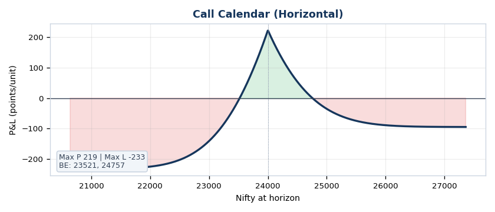

**The numbers (modelled at Nifty 24000).** Max profit 219 points (~₹16,425/lot) at the strike on front expiry; max loss 233 points (~₹17,475/lot) if price runs far from 24000; breakevens 23521 and 24757; net debit 232.7 points; risk:reward 0.94. The payoff is a tent peaked at 24000 and sloping to the full debit loss on either wing.

**Greeks & behaviour.** Near the strike net delta is roughly flat, theta is positive (front decay dominates), and vega is positive — a rise in back-month IV inflates the long leg and is your biggest tailwind. Move away from the strike and delta picks up against you.

**Management & exit.** Take it off near the front expiry. A common target is +20–30% on the debit, or roll the short call out a week to harvest more theta if 24000 still looks like the magnet. Cut if price breaches a breakeven and keeps going.

**Risk note.** The danger is a directional move plus an IV *crush* in the back month — both legs work against you and you can lose most of the debit. Pin risk on the short strike at expiry can also leave you briefly assigned; close rather than carry through expiry.

**Scenario P&L (₹ per lot, at the front-month expiry).**

| Nifty at expiry | 22,800 | 23,400 | 24,000 | 24,600 | 25,200 |
|---|---|---|---|---|---|
| **P&L (₹/lot)** | -₹12,975 | -₹3,075 | +₹16,725 | +₹2,325 | -₹4,200 |

The table peaks sharply at 24,000 (+₹16,725) and rolls into losses on both wings as the index leaves the strike, the classic single-strike calendar tent — and because this is a time spread the back-month call is still alive, so these figures assume the modelled back-month IV holds.

**Adjustments, variants & timing.** Run this on Nifty rather than Bank Nifty: Nifty's tighter weekly-to-monthly IV gaps and deeper liquidity make the term-structure cleaner and slippage smaller. The core management is rolling — if 24,000 still looks like the magnet at front expiry, buy back the dying short call and sell the next week's 24,000 call for a fresh credit, repeating against the same back-month long. If price drifts, recentre by closing and reopening the whole calendar at the new ATM strike rather than nursing a skewed tent. Bank Nifty works only if you size down for its larger point swings. On timing, enter when India VIX sits in the bottom third of its range and IV rank is under ~30, ideally with a catalyst (RBI policy, Budget, results) seated in the back month so a vol rise lifts your long. Close into any sharp IV spike — a vega win you should bank rather than hold through front-expiry gamma.

## 96. Put Calendar

*Pin near strike · Long vega · net debit*

**The idea (intuition).** The mirror of the call calendar, built from puts: sell the front 24000 put, buy the back-month 24000 put. Same tent-shaped payoff peaked at the strike, but assembled on the put side — handy when the put skew makes near-dated puts richer to sell.

**When & why to use it.** Reach for the put version when downside skew is steep (front-week 24000 puts fat from fear) and you still expect Nifty to hover around 24000 into the near expiry. Same IV logic as the call calendar — low IV rank, scope for the back month to firm. Skip it in a clear uptrend (the structure is delta-neutral, not bullish) or when an air-pocket sell-off could rocket price below the lower breakeven.

**How to build it (₹, Nifty).** Sell 24000 PE @ 318, buy 24000 PE @ 414. Net debit only 95.8 points, about ₹7,185 per lot — noticeably cheaper than the call calendar because the put term-structure spread is tighter here.

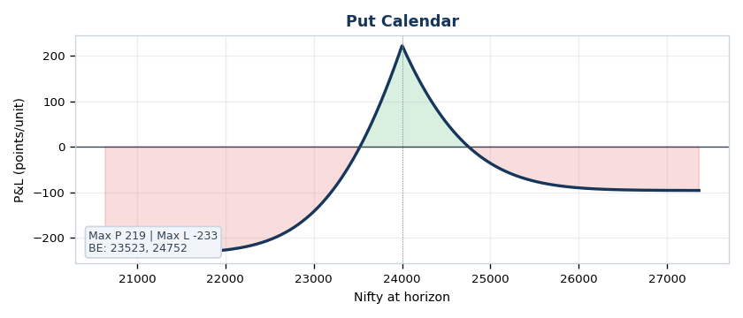

**The numbers (modelled at Nifty 24000).** Max profit 219 points (~₹16,425/lot); max loss 233 points (~₹17,475/lot); breakevens 23523 and 24752; net debit 95.8 points; risk:reward 0.94. Note the modelled max loss (233) exceeds the cash debit (95.8) — that is the engine's worst-case across the back-leg's life, not just the entry outlay.

**Greeks & behaviour.** Delta near flat at the strike, theta positive, vega positive. The put build behaves identically to the call calendar in P&L terms; the choice between them is purely about which side's term structure you are selling more cheaply.

**Management & exit.** Same playbook: aim to close into front expiry near peak value, roll the short put for another cycle if 24000 holds, and abandon the trade if price trends decisively through a breakeven.

**Risk note.** A sharp down-move that overshoots 23523, combined with back-month IV softening once the panic passes, is the classic loser. Manage the short put before expiry to avoid assignment and the associated cash-settlement surprises.

**Scenario P&L (₹ per lot, at the front-month expiry).**

| Nifty at expiry | 22,800 | 23,400 | 24,000 | 24,600 | 25,200 |
|---|---|---|---|---|---|
| **P&L (₹/lot)** | -₹13,050 | -₹3,150 | +₹16,650 | +₹2,250 | -₹4,200 |

P&L peaks at +₹16,650 with Nifty pinned to 24,000 and decays to losses either side, the put build's tent mirroring the call calendar — a time spread, so the surviving back-month put is marked at the modelled IV rather than crushed.

**Adjustments, variants & timing.** Favour the put build on Nifty when downside skew is steep so the front put you sell is richer. Manage by rolling the short 24,000 put into the next weekly for another credit while 24,000 holds, and recentre the entire spread if the index trends away from the strike rather than defending a lopsided tent. Bank Nifty is viable but its wider swings demand smaller size. The IV window is the same as every long calendar: enter when IV rank is low (under ~30) and front IV is rich relative to the back month, ideally with a later catalyst — RBI policy or a results cluster — that can firm the back-month put you own. Close into an IV spike to harvest the vega gain. Always exit before front expiry to avoid assignment and the cash-settlement quirks of index options; don't let weekly gamma decide the trade for you in the final session.

## 97. Call Diagonal

*Bullish drift to strike · Long vega · net debit*

**The idea (intuition).** Take a calendar and pull the strikes apart so it leans bullish: buy a lower, longer-dated 23700 call and sell a higher, near-dated 24000 call. You now own a deep-ish call that profits as Nifty climbs, financed partly by selling the front 24000 call against it — a calendar with a directional engine bolted on.

**When & why to use it.** Use it when you are gently bullish — you expect a grind up toward 24000 by the front expiry rather than an explosive rally — and you like collecting front-week theta while you wait. Best when IV rank is modest so the long leg is not overpaid. Wrong tool if you expect a violent breakout (a simple long call or call spread captures that better) or a hard reversal lower.

**How to build it (₹, Nifty).** Sell 24000 CE @ 456, buy 23700 CE @ 894. Net debit 438.4 points, about ₹32,880 per lot. Pricier than a plain calendar because the long leg is closer to the money and carries real intrinsic-plus-time value.

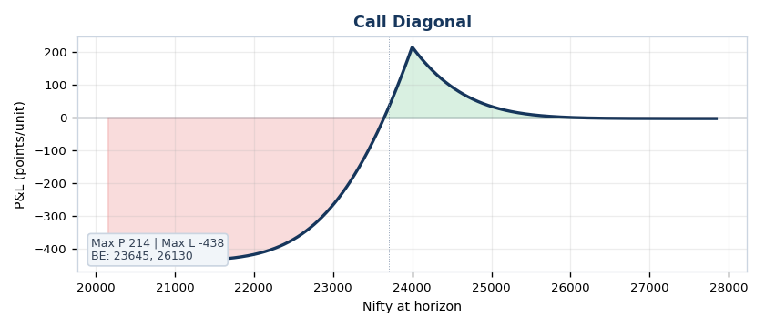

**The numbers (modelled at Nifty 24000).** Max profit 214 points (~₹16,050/lot); max loss 438 points (~₹32,850/lot, essentially the full debit); breakevens 23645 and 26130; net debit 438.4 points; risk:reward 0.49. The wide upper breakeven (26130) shows the bullish tilt — you keep participating well above the short strike.

**Greeks & behaviour.** Net delta is positive (the directional tilt), theta positive while price sits below the short strike, vega positive. Direction and time both help here; a sell-off is the enemy.

**Management & exit.** Target a partial close as price approaches 24000 into front expiry, or roll the short call up-and-out to keep the bullish structure alive if the trend continues. Stop out near the lower breakeven where the long leg starts bleeding intrinsic value.

**Risk note.** Worst case is a drop that strands the long 23700 call out-of-the-money while the front call you sold expires worthless — you lose the bulk of the 438-point debit. The poor risk:reward (0.49) means you must be right on *both* direction and timing.

**Scenario P&L (₹ per lot, at the front-month expiry).**

| Nifty at expiry | 22,800 | 23,400 | 24,000 | 24,600 | 25,200 |
|---|---|---|---|---|---|
| **P&L (₹/lot)** | -₹23,775 | -₹9,075 | +₹16,200 | +₹5,925 | +₹1,650 |

The bullish lean shows in the numbers: the structure peaks at 24,000 (+₹16,200) yet stays positive up at 24,600 and 25,200 while the 22,800 downside is the worst cell (-₹23,775) — and as a time spread the long back-month call still carries value at the modelled IV.

**Adjustments, variants & timing.** Because this leans bullish, manage it directionally: roll the short 24,000 call up-and-out as Nifty grinds higher to keep collecting credit and lift the cap, or recentre the whole diagonal if the trend stalls. On a reversal lower, cut near the 23,645 breakeven before the long 23,700 call sheds intrinsic value. Run it on Nifty for tighter strikes and cleaner term structure; Bank Nifty suits it only when you want bigger directional punch and can size down. Weekly short against a monthly long gives the fastest theta; a monthly-against-further build is calmer if you want room. Enter with IV rank low so the closer-to-money long is not overpaid, and ideally with a back-month catalyst to add a vega tailwind. Since you need both direction and timing right (risk:reward 0.49), keep size modest and bank profit into any IV spike or as price approaches the short strike.

## 98. Put Diagonal

*Bearish drift to strike · Long vega · net debit*

**The idea (intuition).** The bearish cousin: buy a higher, longer-dated 24300 put and sell a nearer 24000 put. You own downside protection that gains as Nifty slips, subsidised by the front put you sell against it. A calendar that wants the index to drift *down* to the short strike.

**When & why to use it.** Deploy when you are mildly bearish — a slow leak toward 24000, not a crash — and want front-week theta working for you. Fits a market rolling over from a top with IV still cheap enough that the long put is not overpriced. Avoid if you expect a sharp gap down (buy puts or a put spread instead) or a snap-back rally.

**How to build it (₹, Nifty).** Sell 24000 PE @ 318, buy 24300 PE @ 528. Net debit 209.8 points, roughly ₹15,735 per lot.

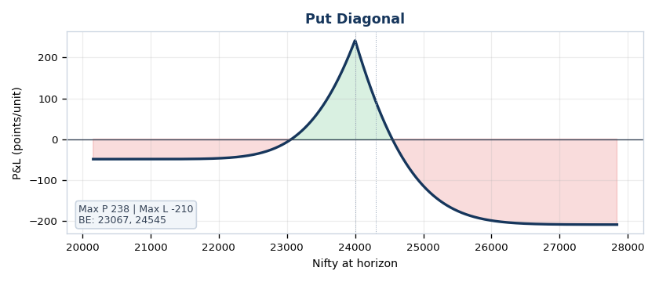

**The numbers (modelled at Nifty 24000).** Max profit 238 points (~₹17,850/lot); max loss 210 points (~₹15,750/lot, the debit); breakevens 23067 and 24545; net debit 209.8 points; risk:reward 1.13 — the most favourable ratio among the basic diagonals here. The lower breakeven 23067 shows how far the bearish tilt lets you ride a decline.

**Greeks & behaviour.** Net delta negative (bearish), theta positive while price stays above the short strike, vega positive. A controlled drift lower with steady-to-rising IV is the dream scenario.

**Management & exit.** Book partial profits as Nifty eases toward 24000 near front expiry; roll the short put down-and-out to extend a continuing decline. Exit near the upper breakeven if the index rallies instead.

**Risk note.** A fast rally leaves your long 24300 put withering while the short put decays — but unlike a naked short, your loss is capped at the 210-point debit. The cap is the comfort; the timing requirement is the catch.

**Scenario P&L (₹ per lot, at the front-month expiry).**

| Nifty at expiry | 22,800 | 23,400 | 24,000 | 24,600 | 25,200 |
|---|---|---|---|---|---|
| **P&L (₹/lot)** | -₹1,800 | +₹3,975 | +₹18,225 | -₹1,350 | -₹10,950 |

The bearish tilt is visible — P&L peaks at 24,000 (+₹18,225), holds a gain down at 23,400, and bleeds hardest on the 25,200 upside (-₹10,950) — with the long back-month put still alive and marked at the modelled IV.

**Adjustments, variants & timing.** Manage the bearish tilt actively: roll the short 24,000 put down-and-out as Nifty eases lower to keep the credit flowing and extend the decline, or recentre if the move stalls. On a snap-back rally, exit near the 24,545 upper breakeven before the long 24,300 put withers. Nifty is the natural vehicle for the tighter strikes and cleaner skew; Bank Nifty works for a harder bearish view if you size down for its swings. A weekly short against a monthly long maximises theta; lengthen both legs for a calmer, more vega-led version. Enter with IV rank low so the long put is cheap, ideally with a back-month event that can firm vol. This is the most favourable basic diagonal here (risk:reward 1.13), but it still needs a measured drift, not a crash — a gap straight through the short strike caps you. Bank gains into IV spikes.

## 99. Double Calendar

*Range-bound, rising IV · Long vega · net debit*

**The idea (intuition).** Run two calendars at once — one on the call side above spot, one on the put side below — to stretch the profit tent across a wider zone. Sell front options at 24300 (call) and 23700 (put), buy the same strikes in the back month. You profit anywhere price lands inside the band into front expiry, not just at a single strike.

**When & why to use it.** Ideal for a range-bound Nifty you expect to chop between roughly 23700 and 24300, with IV low and a catalyst further out to lift the back month. A textbook pre-event setup: sell the rich front week, own the cheaper back month, and let an IV rise into the event pad both long legs. Avoid in a trending tape or when front and back IV are already equal.

**How to build it (₹, Nifty).** Sell 24300 CE @ 292 / buy 24300 CE @ 506, and sell 23700 PE @ 219 / buy 23700 PE @ 323. Net debit 318.5 points, about ₹23,888 per lot.


**The numbers (modelled at Nifty 24000).** Max profit 260 points (~₹19,500/lot) with price inside the band at front expiry; max loss 455 points (~₹34,125/lot); breakevens 23452 and 24839; net debit 318.5 points; risk:reward 0.57. Two peaks (one over each strike) merge into a broad plateau around spot.

**Greeks & behaviour.** Delta near flat across the centre of the range, theta positive, vega strongly positive — with two long back-month legs, this is one of the more vega-heavy structures in the chapter, so an IV rise is a powerful tailwind.

**Management & exit.** Target ~25% of the debit, or close into front expiry. If price drifts to one side, roll that side's short option or close the untested wing to lock value. The double vega exposure means a back-month IV pop is often your cue to take profit early.

**Risk note.** A breakout past either breakeven plus a back-month IV crush hits both legs at once — the wide profit zone costs you a larger maximum loss (455 points) than a single calendar. Size accordingly.

**Scenario P&L (₹ per lot, at the front-month expiry).**

| Nifty at expiry | 22,800 | 23,400 | 24,000 | 24,600 | 25,200 |
|---|---|---|---|---|---|
| **P&L (₹/lot)** | -₹23,100 | -₹2,625 | +₹14,400 | +₹7,050 | -₹6,825 |

The twin-strike build spreads the gain into a plateau that peaks near 24,000 (+₹14,400) and stays positive out to 24,600, falling away only past the breakevens — a time spread, so both back-month longs are marked at the modelled IV, not zero.

**Adjustments, variants & timing.** The two-sided build is a pre-event workhorse: enter 7–10 days before a known catalyst (Budget, RBI, a heavy results week) when front weekly IV is rich and IV rank is low, so an IV rise into the event inflates both back-month longs. Manage by rolling the tested side's short option if price drifts to one wing, or close the untested wing to lock value; recentre both strikes if the range itself shifts. The double vega means a back-month IV pop is your cue to bank profit early rather than chase the peak. Run it on Nifty for the cleaner term structure and tighter strikes; Bank Nifty needs smaller size for its swings. Weekly shorts against monthly longs give the punchiest theta-plus-vega; lengthen for a calmer build. Target ~25% of the debit and exit before expiry-week gamma turns the dual shorts against you on any breakout.

## 100. Double Diagonal

*Range-bound, rising IV · Long vega · net debit*

**The idea (intuition).** A double calendar with the long legs pushed further out-of-the-money — buy the 24500 call and 23500 put wings against short 24300 call and 23700 put fronts. The result looks like an iron-condor's range-bound profile but, crucially, it is *long* vega because the longs are dated later than the shorts.

**When & why to use it.** Use when you want condor-style range income *and* a positive vega kicker — for instance ahead of an event where you expect price to stay boxed but IV to climb. The OTM long wings make it cheaper to put on than a same-strike double calendar. Skip it when you genuinely expect IV to fall (a short-vega iron condor fits that better) or when a trend is in force.

**How to build it (₹, Nifty).** Sell 24300 CE @ 292 / buy 24500 CE @ 399, and sell 23700 PE @ 219 / buy 23500 PE @ 273. Net debit 161.8 points, about ₹12,135 per lot — the cheapest of the multi-leg tents here.

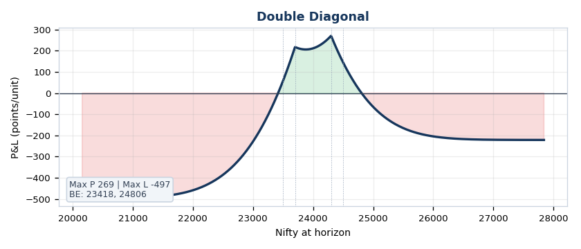

**The numbers (modelled at Nifty 24000).** Max profit 269 points (~₹20,175/lot); max loss 497 points (~₹37,275/lot); breakevens 23418 and 24806; net debit 161.8 points; risk:reward 0.54. Note the low entry cash (161.8) versus the larger modelled worst case (497) — the OTM wings cheapen entry but cap protection further out.

**Greeks & behaviour.** Delta roughly flat inside the range, theta positive, vega positive. Compared with the same-strike double calendar it gives up a little peak height for a lower cost and a slightly wider profit band.

**Management & exit.** Manage like an iron condor with a vega tilt: take ~25–30% of max, defend the tested side by rolling its short, and don't carry into expiry-week gamma. A rise in IV is a reason to bank profit rather than press.

**Risk note.** Because the long wings sit beyond the shorts, a violent move *outside* the wings, paired with an IV drop, produces the full 497-point loss. The cheap entry can lull you into oversizing — don't.

**Scenario P&L (₹ per lot, at the front-month expiry).**

| Nifty at expiry | 22,800 | 23,400 | 24,000 | 24,600 | 25,200 |
|---|---|---|---|---|---|
| **P&L (₹/lot)** | -₹22,875 | -₹900 | +₹15,825 | +₹6,825 | -₹8,700 |

P&L peaks at 24,000 (+₹15,825) across a broad band and turns negative only at the 22,800 and 25,200 extremes — the OTM long wings keep the back-month legs alive at the modelled IV.

**Adjustments, variants & timing.** Treat it as an iron condor with a long-vega kicker. Manage by rolling the tested short (call or put) as price pushes toward a wing, and consider closing the untested side once it has decayed to lock value; recentre the whole structure if the range migrates. The OTM longs make entry cheap, which tempts oversizing — don't. Enter ahead of an event when you expect price boxed but IV climbing: IV rank low, front weekly IV rich versus the back month, a catalyst seated later. A back-month IV pop is the signal to bank ~25–30% of max rather than press for the peak. Nifty suits the tighter wings and cleaner term structure; Bank Nifty works only with reduced size given its range. Weekly-against-monthly gives the fastest decay; lengthen both legs to soften gamma. Always close before expiry-week so the twin shorts don't gap outside the wings against you.

## 101. Poor Man's Covered Call (Diagonal)

*Bullish income · Long vega · net debit*

**The idea (intuition).** Replace the 24000-odd points of cash a real covered call would tie up with a single deep-in-the-money long-dated (LEAPS-style) 22500 call that behaves almost like owning the index, then sell a front 24300 call against it for income. It is a covered call on a fraction of the capital — hence "poor man's."

**When & why to use it.** A core income trade for a steadily-bullish-to-neutral view when you want covered-call-style cash flow without locking up lakhs in the underlying. The deep LEAPS call (high delta, near 1.0) tracks Nifty; the short front call rents out time each cycle. Best entered when IV rank is low so the long leg is cheap; less attractive when you expect a sharp decline (the long call still loses, just less than stock).

**How to build it (₹, Nifty).** Buy 22500 CE @ 3514 (deep ITM, long-dated), sell 24300 CE @ 292. Net debit 3222.5 points, about ₹2,41,688 per lot — large, but a fraction of the ~₹18 lakh a 75-lot of index would cost outright.

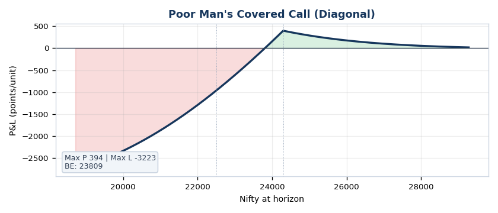

**The numbers (modelled at Nifty 24000).** Max profit 394 points (~₹29,550/lot) if price sits at the short strike; max loss 3223 points (~₹2,41,725/lot); single breakeven 23809; net debit 3222.5 points; risk:reward 0.12. The tiny ratio reflects that the modelled max loss assumes the long LEAPS call expires worthless — only if Nifty collapses far below 22500. In practice you manage long before that and roll the short call for repeated income, so the realistic risk is a fraction of the headline number.

**Greeks & behaviour.** Net delta strongly positive (the deep long call dominates), theta positive (you collect front decay each cycle), vega positive. Direction is the main P&L driver; the short call caps your upside above 24300.

**Management & exit.** Roll the short 24300 call out (and up if price runs) every cycle to keep harvesting premium — that recurring credit is the strategy's income engine. Close or roll the long call well before its expiry; reassess if Nifty breaks below the long strike's profitability.

**Risk note.** The honest danger is a large, sustained decline: the long call can lose most of its 3514-point value. The headline max loss assumes a near-total index collapse — improbable but not zero — so size the position small and treat the LEAPS as risk capital, not a free stock substitute.

**Scenario P&L (₹ per lot, at the front-month expiry).**

| Nifty at expiry | 22,800 | 23,400 | 24,000 | 24,600 | 25,200 |
|---|---|---|---|---|---|
| **P&L (₹/lot)** | -₹56,775 | -₹23,775 | +₹11,400 | +₹25,950 | +₹19,575 |

The deeply directional profile rises with the index — from -₹56,775 at 22,800 up to a +₹25,950 peak near the 24,300 short strike at 24,600 — and because the deep LEAPS-style long call is still alive, the downside cells assume it is marked at the modelled IV, far gentler than outright expiry.

**Adjustments, variants & timing.** The PMCC is an income engine, so the recurring action is rolling the short 24,300 call out (and up if Nifty runs) every cycle to bank a fresh credit against the same deep LEAPS-style long — that repeated premium is the strategy's yield. Recentre by rolling the long strike only when the index moves far enough to change its delta materially. Manage or roll the long well before its own expiry; reassess hard if Nifty threatens the long strike's profitability. Run it on Nifty — the deeper long-dated chain and tighter spreads make the deep-ITM leg far cheaper to trade than Bank Nifty's thinner far-month strikes. Enter when IV rank is low so the LEAPS call is cheap to buy. On a sustained decline the long call still loses (less than stock), so size small and treat the debit as risk capital. An IV rise helps the net-long-vega position — a reason to hold the long through quiet stretches.

## 102. Poor Man's Covered Put

*Bearish income · Long vega · net debit*

**The idea (intuition).** The bearish mirror of the PMCC: own a deep-ITM long-dated 25500 put (which acts like a short index position) and sell a front 23700 put against it for income. Covered-put economics without shorting the index or posting its full margin.

**When & why to use it.** For a sustained bearish-to-neutral view when you want to collect premium on the way down. The deep put gives you negative delta exposure; the short front put funds part of the carry. Enter with IV rank low so the long put is cheap. Not the tool for a sharp V-bottom reversal, which would whipsaw the long put.

**How to build it (₹, Nifty).** Buy 25500 PE @ 898, sell 23700 PE @ 219. Net debit 679.4 points, about ₹50,925 per lot.

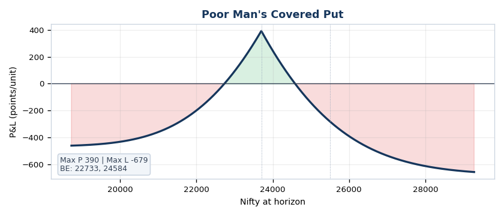

**The numbers (modelled at Nifty 24000).** Max profit 390 points (~₹29,250/lot); max loss 679 points (~₹50,925/lot, the debit); breakevens 22733 and 24584; net debit 679.4 points; risk:reward 0.57. The deep long put keeps the worst case to the debit paid — far tamer than the PMCC's headline because this long leg sits deep ITM with real intrinsic value.

**Greeks & behaviour.** Net delta negative (bearish), theta positive from the short front put, vega positive. A measured decline with firm IV is ideal; the short put caps gains below 23700.

**Management & exit.** Roll the short 23700 put down-and-out each cycle to keep income flowing as price falls. Close the long put before its expiry. Reassess on any decisive rally back above 24584.

**Risk note.** A strong rally erodes the long put toward worthless and you bleed the debit. Assignment risk on the short put if it goes ITM means you should roll rather than hold into expiry. Premium selling here is *not* free money — manage the tested side.

**Scenario P&L (₹ per lot, at the front-month expiry).**

| Nifty at expiry | 22,800 | 23,400 | 24,000 | 24,600 | 25,200 |
|---|---|---|---|---|---|
| **P&L (₹/lot)** | +₹1,650 | +₹19,050 | +₹18,375 | -₹450 | -₹15,150 |

The bearish engine pays on the way down — +₹19,050 at 23,400 — and loses up at 25,200 (-₹15,150), with the deep long put still alive and marked at the modelled IV.

**Adjustments, variants & timing.** Mirror the PMCC mechanics on the bearish side: roll the short 23,700 put down-and-out each cycle as Nifty falls to keep the credit flowing, and roll the deep long put's strike only when the move is large enough to reset its delta. Close the long put before its own expiry; reassess on any decisive rally back above 24,584. Because the long sits deep ITM with real intrinsic value, the worst case is contained to the debit — tamer than the PMCC headline. Run it on Nifty for the deeper, tighter long-dated chain; Bank Nifty's far-month puts are thinner and costlier to roll. Enter with IV rank low so the long put is cheap, and remember the position is net long vega, so a vol rise helps even as you wait for the slide. Manage the short put before expiry to avoid assignment — premium selling here is not free money.

## 103. Reverse Call Calendar

*Big move / falling IV · Short vega · net credit*

**The idea (intuition).** Flip the call calendar around: *buy* the cheap front-week 24000 call and *sell* the richer back-month 24000 call, taking in a credit. You now want exactly what a normal calendar fears — a big move away from the strike, or a collapse in the volatility term structure.

**When & why to use it.** A specialist trade for when back-month IV is unusually rich versus the front (an inverted or steep term structure) and you expect it to normalise, or when you anticipate a large directional break. Useful after an IV spike has lifted the back month disproportionately. Wrong when price is likely to pin the strike — that is the loss zone for this structure.

**How to build it (₹, Nifty).** Buy 24000 CE @ 456, sell 24000 CE @ 689. Net credit 232.7 points, about ₹17,453 per lot received — but note the short back-month leg requires margin, unlike a long calendar.

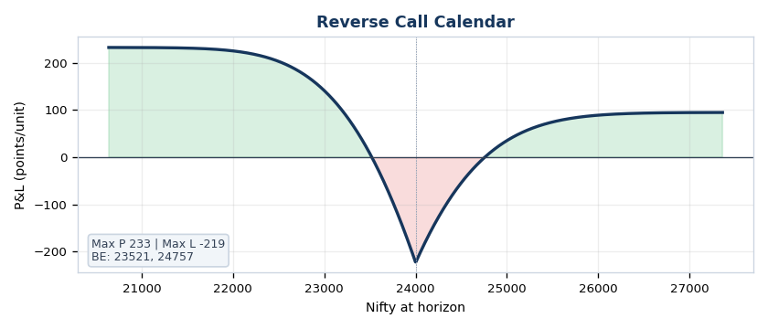

**The numbers (modelled at Nifty 24000).** Max profit 233 points (~₹17,475/lot) achieved on a large move away from 24000; max loss 219 points (~₹16,425/lot) if price pins the strike; breakevens 23521 and 24757; net credit 232.7 points; risk:reward 1.06. The payoff is an inverted tent — a valley at the strike, profit on the wings.

**Greeks & behaviour.** Delta near flat at the strike, theta *negative* (time hurts — the front long decays faster than the short back), and vega *negative* — a falling IV term structure is your friend. This is the short-vega outlier of the family.

**Management & exit.** Take profit if the index breaks hard or back-month IV deflates toward the front. Because theta works against you, this is a shorter-horizon, thesis-driven trade — exit promptly if price stalls at the strike.

**Risk note.** The short back-month call carries open-ended-style risk if not covered by the front, but here the front long caps it — loss is bounded to ~219 points if price pins 24000. Margin and the negative theta mean you cannot sit in this trade indefinitely waiting to be right.

**Scenario P&L (₹ per lot, at the front-month expiry).**

| Nifty at expiry | 22,800 | 23,400 | 24,000 | 24,600 | 25,200 |
|---|---|---|---|---|---|
| **P&L (₹/lot)** | +₹12,975 | +₹3,075 | -₹16,725 | -₹2,325 | +₹4,200 |

The numbers are an inverted tent — the worst cell sits at 24,000 (-₹16,725) while the wings (22,800 and 25,200) turn positive — exactly the anti-pin payoff, and as a short-vega time spread the figures assume the modelled back-month IV.

**Adjustments, variants & timing.** This is a short-vega, time-boxed trade, so timing dominates: enter only when the back-month IV is unusually rich versus the front (a steep or inverted term structure) and you expect it to normalise, or when a large directional break looks imminent — often just after an IV spike has lifted the back month disproportionately. Manage by taking profit the moment the index breaks hard or the back-month IV deflates toward the front; do not sit waiting, because negative theta bleeds you daily. Recentre is rarely worth it — if price pins the strike, simply exit. Run it on Nifty where the term structure is cleanest and the short back-month leg's margin is manageable; Bank Nifty's wider swings actually help the anti-pin payoff but demand smaller size. The short back-month call needs margin, so account for that. Reverse calendars belong to high-IV regimes — the opposite window from every long calendar in this chapter.

## 104. Reverse Put Calendar

*Big move / falling IV · Short vega · net credit*

**The idea (intuition).** The put-side reverse calendar: buy the front 24000 put, sell the back-month 24000 put for a credit. Same short-vega, anti-pin profile as the reverse call calendar, expressed in puts.

**When & why to use it.** Choose the put build when the put term structure is the one that looks dislocated — back-month puts richly bid from hedging demand that you expect to fade — or when you want the reverse-calendar payoff with put-side margin treatment. Same caution: it loses if price pins 24000 into front expiry.

**How to build it (₹, Nifty).** Buy 24000 PE @ 318, sell 24000 PE @ 414. Net credit 95.8 points, about ₹7,185 per lot.

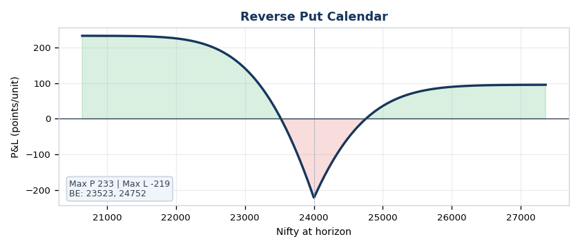

**The numbers (modelled at Nifty 24000).** Max profit 233 points (~₹17,475/lot) on a large move; max loss 219 points (~₹16,425/lot) at the strike; breakevens 23523 and 24752; net credit 95.8 points; risk:reward 1.07. Inverted tent, valley at 24000.

**Greeks & behaviour.** Delta near flat, theta negative, vega negative. A move out of the range or a back-month IV slide pays; a quiet pin and rising IV both hurt.

**Management & exit.** Exit on a decisive break or once the back-month put IV normalises. Don't overstay — negative theta erodes the position daily if the index goes nowhere.

**Risk note.** Loss is capped at ~219 points by the long front put, but the short back-month put needs margin and risks assignment if it ends ITM. Treat it as a tactical, time-boxed term-structure trade, not a hold-to-expiry position.

**Scenario P&L (₹ per lot, at the front-month expiry).**

| Nifty at expiry | 22,800 | 23,400 | 24,000 | 24,600 | 25,200 |
|---|---|---|---|---|---|
| **P&L (₹/lot)** | +₹13,050 | +₹3,150 | -₹16,650 | -₹2,250 | +₹4,200 |

An inverted tent again — valley at 24,000 (-₹16,650), profit on a large move to either wing — with the short back-month put marked at the modelled IV.

**Adjustments, variants & timing.** Choose the put-side reverse when the back-month put IV looks dislocated — richly bid from hedging demand you expect to fade — or when you want the anti-pin payoff with put-side margin treatment. Like its call cousin it is short vega and carries negative theta, so it is strictly tactical: enter on a stretched term structure or ahead of an expected large move, and exit promptly once the index breaks or the back-month put IV normalises toward the front. Don't overstay a quiet pin — that is the loss zone and time works against you. Run it on Nifty for the cleanest term structure and manageable short-leg margin; Bank Nifty's bigger swings aid the wing payoff but need reduced size. The short back-month put requires margin and risks assignment if it ends ITM, so roll rather than carry into expiry. This is a high-IV, time-boxed term-structure bet, not a hold-to-expiry position.

## 105. OTM Call Calendar (Bullish)

*Drift up to strike · Long vega · net debit*

**The idea (intuition).** Place the calendar *above* spot at 24400: sell the front 24400 call, buy the back-month 24400 call. The profit tent peaks at 24400, so the trade quietly bets that Nifty drifts up to that strike by the near expiry — a directional flavour built into a neutral structure.

**When & why to use it.** Use when you are mildly bullish and want a cheaper, defined-risk way to express "I think we grind up to 24400." Front IV should be rich and overall IV rank low. Skip it if you expect an explosive rally (the short call caps you) or no move at all (price stays under the tent and the trade underperforms).

**How to build it (₹, Nifty).** Sell 24400 CE @ 246, buy 24400 CE @ 451. Net debit 205.1 points, about ₹15,383 per lot.

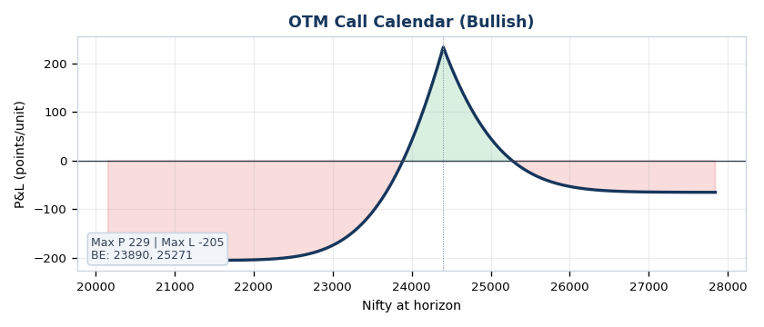

**The numbers (modelled at Nifty 24000).** Max profit 229 points (~₹17,175/lot) if Nifty sits at 24400 on front expiry; max loss 205 points (~₹15,375/lot); breakevens 23890 and 25271; net debit 205.1 points; risk:reward 1.12. The peak sits up at the OTM strike, rewarding the bullish drift.

**Greeks & behaviour.** Net delta mildly positive (the tent is above spot), theta positive once price approaches the strike, vega positive. Best case is a slow climb to 24400 with steady-to-rising IV.

**Management & exit.** Close as price reaches 24400 near front expiry where the tent peaks. Roll the short call out for another cycle if the up-drift thesis holds. Cut near the breakevens.

**Risk note.** If Nifty stalls well below 24400 or rallies straight through it, the structure underdelivers and you can lose most of the 205-point debit. The bet needs the *right amount* of up-move — neither too little nor too much.

**Scenario P&L (₹ per lot, at the front-month expiry).**

| Nifty at expiry | 22,800 | 23,400 | 24,000 | 24,600 | 25,200 |
|---|---|---|---|---|---|
| **P&L (₹/lot)** | -₹14,025 | -₹9,375 | +₹3,075 | +₹11,625 | +₹750 |

The peak has shifted up to the 24,400 strike: P&L tops out at 24,600 (+₹11,625) and is still mildly positive at 25,200, rewarding the up-drift, while a flat-to-down tape (22,800: -₹14,025) is the loss zone — the back-month call stays alive at the modelled IV.

**Adjustments, variants & timing.** Manage the bullish drift like a directional calendar: roll the short 24,400 call out for another credit if the up-drift thesis holds, and recentre the strike higher if Nifty climbs past 24,400 so the tent tracks price. Cut near the 23,890 or 25,271 breakevens when the move proves too small or too large — this trade needs the right amount of up-move. Run it on Nifty for tighter OTM strikes and cleaner weekly-monthly structure; Bank Nifty suits a stronger directional view with smaller size. A weekly short against a monthly long gives the fastest theta; lengthen for a calmer build. Enter with IV rank low and front IV rich so the back-month long is cheap, ideally with a catalyst seated later to add vega lift. Bank profit into any IV spike or as price reaches 24,400 near front expiry, rather than holding through the short leg's expiry-week gamma.

## 106. OTM Put Calendar (Bearish)

*Drift down to strike · Long vega · net debit*

**The idea (intuition).** Drop the calendar *below* spot at 23600: sell the front 23600 put, buy the back-month 23600 put. The tent peaks at 23600, so it pays off on a measured slide down to that level — a bearish lean inside a calendar shell.

**When & why to use it.** For a mildly bearish view when you expect Nifty to ease toward 23600 by the near expiry, with front IV rich and IV rank low. Avoid if you expect a crash through 23600 (the short put caps you) or a flat-to-up tape that never reaches the tent.

**How to build it (₹, Nifty).** Sell 23600 PE @ 192, buy 23600 PE @ 297. Net debit 105.1 points, about ₹7,883 per lot.

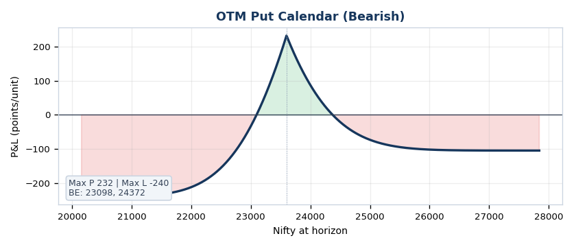

**The numbers (modelled at Nifty 24000).** Max profit 232 points (~₹17,400/lot) if price reaches 23600 on front expiry; max loss 240 points (~₹18,000/lot); breakevens 23098 and 24372; net debit 105.1 points; risk:reward 0.96. As with several put calendars, the modelled max loss (240) exceeds the entry cash (105.1) because it spans the back leg's full life.

**Greeks & behaviour.** Net delta mildly negative, theta positive as price nears the strike, vega positive. A controlled drift lower with firm IV is the sweet spot.

**Management & exit.** Take profit as Nifty approaches 23600 near front expiry. Roll the short put down for another cycle if the decline continues. Exit if price climbs back through the upper breakeven.

**Risk note.** A flat or rising index leaves the tent unreached and the debit bleeds; a crash straight through 23600 caps your gain at the short strike. You need the move to be both bearish *and* measured.

**Scenario P&L (₹ per lot, at the front-month expiry).**

| Nifty at expiry | 22,800 | 23,400 | 24,000 | 24,600 | 25,200 |
|---|---|---|---|---|---|
| **P&L (₹/lot)** | -₹6,900 | +₹9,600 | +₹6,525 | -₹2,625 | -₹6,375 |

The peak sits below spot at the 23,600 strike — best cell is 23,400 (+₹9,600) — rewarding a measured slide, while a rally to 25,200 loses (-₹6,375); the back-month put is marked at the modelled IV.

**Adjustments, variants & timing.** Manage the bearish drift symmetrically: roll the short 23,600 put down for another cycle if the slide continues, and recentre the strike lower if Nifty falls past 23,600 so the tent follows. Exit if price climbs back through the 24,372 upper breakeven, and remember you need the move both bearish and measured — a crash straight through 23,600 caps your gain at the short strike. Run it on Nifty for the tighter OTM strikes and cleaner term structure; Bank Nifty fits a stronger bearish view if you size down. Weekly short against monthly long gives the steepest theta; lengthen both legs for a gentler, more vega-led version. Enter when IV rank is low and front-week put IV is rich relative to the back, ideally with a later catalyst that can firm back-month vol. Bank profit into an IV spike or as Nifty nears 23,600 close to front expiry, before weekly gamma flips the trade.

## 107. Weekly-vs-Monthly Calendar

*Pin near strike · Long vega · net debit*

**The idea (intuition).** The purest expression of the time-spread engine on NSE: sell the cheap-but-fast-decaying *weekly* 24000 call and buy the slower *monthly* 24000 call. The weekly's theta runs hot while the monthly barely moves, so a pinned index hands you the difference.

**When & why to use it.** This is the bread-and-butter Nifty/Bank Nifty calendar — sell the rich weekly, own the steadier monthly, and let the steep weekly decay work. Best when the index is range-bound around 24000 and weekly IV is elevated versus the month (common into and around weekly expiry). Avoid when a trend or event threatens to move price off the strike within the week.

**How to build it (₹, Nifty).** Sell 24000 CE @ 202 (weekly), buy 24000 CE @ 499 (monthly). Net debit 296.8 points, about ₹22,260 per lot.

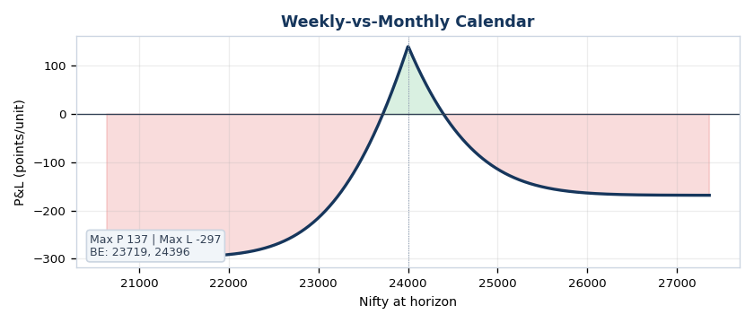

**The numbers (modelled at Nifty 24000).** Max profit 137 points (~₹10,275/lot) at the strike on weekly expiry; max loss 297 points (~₹22,275/lot); breakevens 23719 and 24396; net debit 296.8 points; risk:reward 0.46. The breakevens (23719–24396) are tighter than a monthly-vs-further calendar — a narrower tent reflecting the short weekly window.

**Greeks & behaviour.** Delta near flat at the strike, theta strongly positive (the weekly leg decays fast — the whole point), vega positive. Fast front theta is the dominant driver over this short horizon.

**Management & exit.** Close at weekly expiry, or roll the short weekly into the next week to keep harvesting decay against the same monthly long — a repeatable income cadence. Exit before expiry-day gamma whips the short leg.

**Risk note.** The tight breakevens mean even a modest move off 24000 within the week erodes the trade; the short weekly's gamma spikes near expiry, so a late move can flip a winner to a loser quickly. Manage actively into the final session.

**Scenario P&L (₹ per lot, at the front-month expiry).**

| Nifty at expiry | 22,800 | 23,400 | 24,000 | 24,600 | 25,200 |
|---|---|---|---|---|---|
| **P&L (₹/lot)** | -₹18,300 | -₹9,000 | +₹10,575 | -₹3,750 | -₹9,975 |

The weekly tent is tight and lower — it peaks at 24,000 (+₹10,575) but turns negative by 24,600, reflecting the narrow one-week window — with the monthly long still alive at the modelled IV.

**Adjustments, variants & timing.** This is the bread-and-butter NSE calendar and its defining action is the weekly roll: at each weekly expiry, buy back the dying short 24,000 call and sell the next week's 24,000 call against the same monthly long, harvesting decay cycle after cycle. Recentre to the new ATM strike if Nifty has drifted, rather than defending a skewed tent. The tight breakevens (23,719–24,396) mean you must manage actively — roll or recentre the moment price threatens a side. Both Nifty and Bank Nifty run this well; Bank Nifty's hotter weekly IV gives more decay but needs smaller size for its swings. Enter when weekly IV is elevated versus the month — common into weekly expiry — and IV rank is low so the monthly long is cheap. Always close or roll before expiry-day, when the short weekly's gamma spikes and a late move can flip a winner to a loser in a single session.

## 108. Aggressive Bullish Diagonal

*Bullish trend · Long vega · net debit*

**The idea (intuition).** A PMCC dialled up for trend-following: buy a mid-dated in-the-money 23200 call (high delta, strong index tracking) and sell a further-out 24200 front call against it. More directional punch than the standard poor-man's-covered-call, with income from the short leg.

**When & why to use it.** For a confident bullish trend where you want stock-like upside participation on a fraction of the capital, plus a recurring short-call credit. The deep ITM long gives high delta; the OTM short gives room to run before it caps you. Enter with IV rank low so the long is cheap. Not for choppy or bearish markets — the large long-call debit is at stake.

**How to build it (₹, Nifty).** Buy 23200 CE @ 1669, sell 24200 CE @ 342. Net debit 1327.1 points, about ₹99,533 per lot.

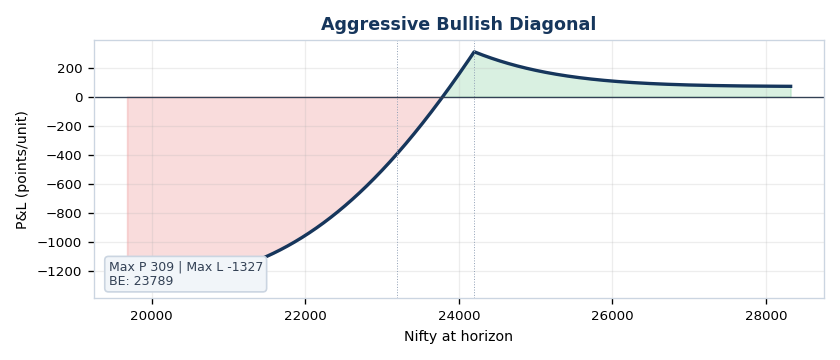

**The numbers (modelled at Nifty 24000).** Max profit 309 points (~₹23,175/lot) near the short strike; max loss 1327 points (~₹99,525/lot); single breakeven 23789; net debit 1327.1 points; risk:reward 0.23. The low ratio reflects the modelled worst case where the long 23200 call expires worthless — only on a deep decline; in practice you roll the short and manage the long well before that.

**Greeks & behaviour.** Net delta strongly positive (trend engine), theta positive from the short call, vega positive. Direction dominates the P&L; the short 24200 call caps gains above it.

**Management & exit.** Roll the short call up-and-out as the trend extends to keep collecting credit and lifting the cap. Manage or roll the long before its expiry. Cut if the trend fails and price breaks below 23789.

**Risk note.** A sustained decline can erode most of the 1669-point long-call value. The headline max loss assumes the index falls far below 23200 — unlikely but real — so size small and treat the long call as risk capital. This is a directional bet first, an income trade second.

**Scenario P&L (₹ per lot, at the front-month expiry).**

| Nifty at expiry | 22,800 | 23,400 | 24,000 | 24,600 | 25,200 |
|---|---|---|---|---|---|
| **P&L (₹/lot)** | -₹46,050 | -₹19,875 | +₹11,625 | +₹17,700 | +₹12,075 |

Strongly directional — from -₹46,050 at 22,800 the P&L climbs to a +₹17,700 peak near the 24,200 short strike at 24,600 — and the deep ITM long call is still alive, so the loss cells assume it is marked at the modelled IV rather than expired.

**Adjustments, variants & timing.** This is a directional bet first, income trade second, so manage it like a trend position: roll the short 24,200 call up-and-out as the rally extends to keep collecting credit and lift the cap, and roll the deep ITM long's strike only when a large move resets its delta. Manage or roll the long before its own expiry; cut decisively if the trend fails and price breaks below 23,789. Run it on Nifty for the deeper mid-dated chain and tighter strikes; Bank Nifty delivers more punch but needs smaller size for its swings. Enter with IV rank low so the high-delta long call is cheap, and note the position is net long vega, so a vol rise adds to a winning trend. A sustained decline erodes most of the long-call value, so size small and treat the debit as risk capital. Bank partial profit near the short strike rather than chasing the headline peak.

## 109. Bearish Diagonal (PMCP-style)

*Bearish trend · Long vega · net debit*

**The idea (intuition).** The bearish trend-follower: buy a mid-dated in-the-money 24800 put (strong negative delta) and sell a further-out 23800 front put against it. Stock-like downside exposure on a fraction of the capital, with income from the short put.

**When & why to use it.** For a committed bearish trend where you want sustained downside participation plus a recurring credit, without shorting the index outright. The ITM long put tracks declines; the OTM short put funds part of the carry. Enter with IV rank low. Avoid in rangebound or rising markets — the long-put debit is the exposure.

**How to build it (₹, Nifty).** Buy 24800 PE @ 796, sell 23800 PE @ 248. Net debit 547.1 points, about ₹41,033 per lot.

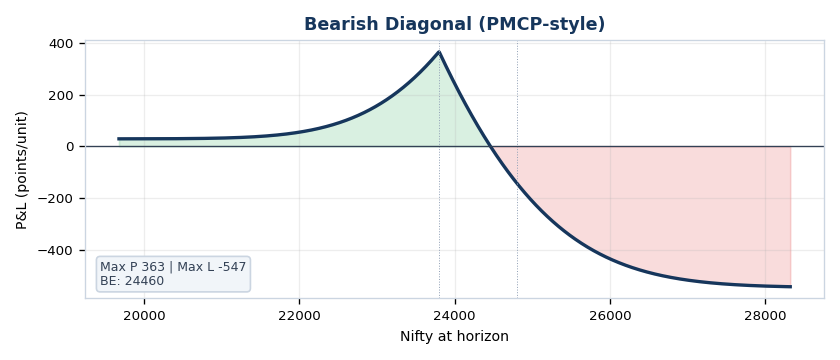

**The numbers (modelled at Nifty 24000).** Max profit 363 points (~₹27,225/lot) near the short strike; max loss 547 points (~₹41,025/lot, the debit); single breakeven 24460; net debit 547.1 points; risk:reward 0.66. The deep ITM long put keeps the worst case to the debit paid.

**Greeks & behaviour.** Net delta strongly negative (bearish engine), theta positive from the short put, vega positive. A sustained decline is the driver; the short 23800 put caps gains below it.

**Management & exit.** Roll the short put down-and-out as the decline extends to keep income flowing and lower the cap. Manage the long put before its expiry. Exit on a reversal back above 24460.

**Risk note.** A rally erodes the long put and you bleed toward the full 547-point debit. Assignment risk on the short put if it goes ITM — roll rather than carry into expiry. Defined risk, but it still demands you be right on direction and timing.

**Scenario P&L (₹ per lot, at the front-month expiry).**

| Nifty at expiry | 22,800 | 23,400 | 24,000 | 24,600 | 25,200 |
|---|---|---|---|---|---|
| **P&L (₹/lot)** | +₹9,375 | +₹18,225 | +₹18,225 | -₹4,650 | -₹20,550 |

The bearish trend-follower pays as Nifty falls — +₹18,225 at both 23,400 and 24,000 — and loses hardest on a 25,200 rally (-₹20,550), with the deep ITM long put still marked at the modelled IV.

**Adjustments, variants & timing.** Manage the bearish trend actively: roll the short 23,800 put down-and-out as the decline extends to keep income flowing and lower the cap, and reset the deep ITM long put's strike only on a large enough move. Manage or roll the long before its own expiry; exit on a reversal back above 24,460. The deep ITM long keeps the worst case to the debit, but you still need direction and timing right (risk:reward 0.66). Run it on Nifty for the deeper mid-dated put chain and tighter strikes; Bank Nifty offers more downside punch but demands smaller size for its larger swings. Enter with IV rank low so the long put is cheap, and remember the structure is net long vega — a vol rise into a falling market is a double tailwind. Watch assignment risk on the short put if it goes ITM; roll rather than carry into expiry, and bank profit near the short strike.

## 110. Double Calendar (Wide)

*Broad range, rising IV · Long vega · net debit*

**The idea (intuition).** A double calendar with the strikes pushed wider — sell/buy at 24500 on the call side and 23500 on the put side — to spread the long-vol tent over a larger zone. You sacrifice peak height for a broader band of profitability.

**When & why to use it.** For a market you expect to stay range-bound but over a *wider* band (say 23500–24500), with IV low and scope to rise into a back-month catalyst. The wide strikes suit higher-volatility regimes where the narrow double calendar would get run over. Avoid in a tight pin (a narrower structure pays more) or a clear trend.

**How to build it (₹, Nifty).** Sell 24500 CE @ 204 / buy 24500 CE @ 399, and sell 23500 PE @ 169 / buy 23500 PE @ 273. Net debit 299.6 points, about ₹22,470 per lot.

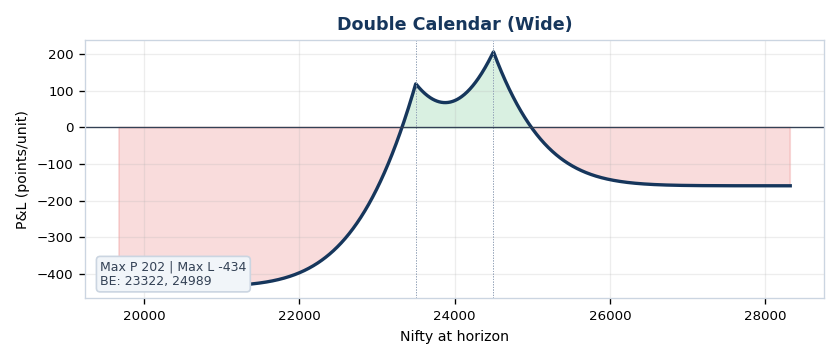

**The numbers (modelled at Nifty 24000).** Max profit 202 points (~₹15,150/lot); max loss 434 points (~₹32,550/lot); breakevens 23322 and 24989; net debit 299.6 points; risk:reward 0.46. The wide breakevens (23322–24989) cover a broad range, but the lower peak (202) is the price of that width.

**Greeks & behaviour.** Delta near flat across a wide centre, theta positive, vega strongly positive (two back-month longs). An IV rise is a major tailwind across the whole band.

**Management & exit.** Target ~25% of debit, or close into front expiry. Roll the tested side if price drifts to a wing. Bank profit on a back-month IV pop rather than chasing the peak.

**Risk note.** A breakout past 23322 or 24989, especially with an IV crush, delivers the 434-point loss. The wide tent tempts oversizing because each strike feels far away — keep position size disciplined.

**Scenario P&L (₹ per lot, at the front-month expiry).**

| Nifty at expiry | 22,800 | 23,400 | 24,000 | 24,600 | 25,200 |
|---|---|---|---|---|---|
| **P&L (₹/lot)** | -₹18,225 | +₹3,750 | +₹5,475 | +₹11,475 | -₹3,975 |

The wide build spreads a flatter gain — positive from 23,400 through 24,600, peaking at 24,600 (+₹11,475) — and loses only at the 22,800 and 25,200 extremes, the two back-month longs marked at the modelled IV.

**Adjustments, variants & timing.** Manage the wide build like a roomy iron condor with a long-vega tilt: roll the tested side's short toward a wing as price drifts, close the untested side to lock value, and recentre the whole structure if the range itself migrates. The wide strikes feel safe and tempt oversizing — keep size disciplined. Enter when you expect Nifty range-bound over a broad band (say 23,500–24,500) with IV rank low and a back-month catalyst to lift vol; the width suits higher-volatility regimes where a narrow double calendar would be run over. A back-month IV pop is the signal to bank ~25% of the debit rather than chase the flatter peak. Run it on Nifty for the cleaner term structure; Bank Nifty fits its naturally wider range but needs smaller size. Weekly shorts against monthly longs give the fastest decay; lengthen for calm. Always close before expiry-week gamma can gap the shorts outside the band.

## 111. Calendar Straddle

*Pin near ATM, rising IV · Long vega · net debit*

**The idea (intuition).** Stack a short front straddle under a long back-month straddle, all at 24000: sell the front 24000 call and put, buy the back-month 24000 call and put. It is a calendar built on *both* sides at the same strike — a powerful, vega-rich tent peaked at the money.

**When & why to use it.** The maximal long-vol calendar: for when you strongly expect Nifty to pin 24000 into the front expiry *and* IV to rise. Front straddle IV should be rich relative to the back. Excellent into a quiet stretch before a later catalyst. Avoid when a move is likely (the dual short legs make pin-failure expensive) or when IV is already high and set to fall.

**How to build it (₹, Nifty).** Sell 24000 CE @ 456 and 24000 PE @ 318, buy 24000 CE @ 689 and 24000 PE @ 414. Net debit 328.5 points, about ₹24,638 per lot.

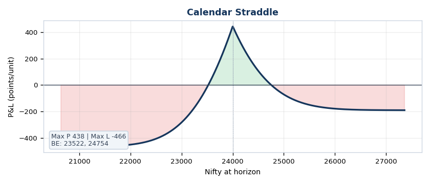

**The numbers (modelled at Nifty 24000).** Max profit 438 points (~₹32,850/lot) at the strike on front expiry — the highest peak in this chapter; max loss 466 points (~₹34,950/lot); breakevens 23522 and 24754; net debit 328.5 points; risk:reward 0.94. A tall, narrow tent centred on 24000.

**Greeks & behaviour.** Delta near flat at the strike, theta strongly positive (two front legs decaying), vega strongly positive (two back legs). This is among the most vega-sensitive structures here — an IV rise massively boosts the longs.

**Management & exit.** Take profit aggressively — the peak is high but the breakevens are tight. Close into front expiry, or roll both short legs for another cycle if 24000 still pins. Exit before expiry-week gamma on the dual shorts turns violent.

**Risk note.** A move off 24000, especially with an IV crush, hits all four legs and can take the full ~466-point loss fast. The two short front legs mean gamma risk near expiry is acute — manage actively and do not carry through.

**Scenario P&L (₹ per lot, at the front-month expiry).**

| Nifty at expiry | 22,800 | 23,400 | 24,000 | 24,600 | 25,200 |
|---|---|---|---|---|---|
| **P&L (₹/lot)** | -₹25,950 | -₹6,300 | +₹33,450 | +₹4,500 | -₹8,400 |

The dual-sided straddle delivers the chapter's tallest peak — +₹33,450 right at 24,000 — collapsing to losses once price leaves the strike, with both back-month long legs still alive at the modelled IV.

**Adjustments, variants & timing.** The maximal long-vol calendar demands aggressive profit-taking — the +₹33,450 peak is tall but the breakevens (23,522–24,754) are tight, so bank gains quickly rather than reaching for the apex. Roll both short legs into the next cycle if 24,000 still pins, or recentre the entire straddle to a new ATM strike if price has moved. Enter in a quiet stretch before a later catalyst, when front straddle IV is rich versus the back and IV rank is low so the dual back-month longs are cheap — an IV rise massively inflates this vega-heavy structure, making any spike a take-profit cue. Run it on Nifty for tighter strikes and cleaner term structure; Bank Nifty's swings make pin-failure expensive, so size down sharply. The two short front legs mean acute expiry-week gamma — close before then and never carry through, or a move off 24,000 plus an IV crush can take the full loss fast.

## 112. Calendar (45/75-DTE)

*Pin near strike · Long vega · net debit*

**The idea (intuition).** A longer-dated calendar — sell a ~45-day 24000 call, buy a ~75-day 24000 call. Both legs decay more slowly than a weekly calendar, so the trade is calmer: less theta per day, more vega, and far more room to manage.

**When & why to use it.** For a patient, range-bound view with a longer horizon and a vega tilt — you want exposure to an IV rise over weeks, not days, and you prefer to avoid the knife-edge gamma of weekly structures. Suits low IV rank with a medium-term catalyst. Less efficient if you specifically want fast weekly theta (the weekly-vs-monthly calendar does that better).

**How to build it (₹, Nifty).** Sell 24000 CE @ 579 (~45 DTE), buy 24000 CE @ 790 (~75 DTE). Net debit 211.1 points, about ₹15,833 per lot.

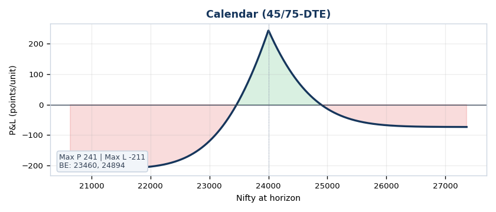

**The numbers (modelled at Nifty 24000).** Max profit 241 points (~₹18,075/lot) at the strike on the front (45-DTE) expiry; max loss 211 points (~₹15,825/lot, the debit); breakevens 23460 and 24894; net debit 211.1 points; risk:reward 1.14 — the best ratio in the chapter. The longer horizon gives wide breakevens (23460–24894).

**Greeks & behaviour.** Delta near flat at the strike, theta positive but *gentler* than short-dated calendars, vega strongly positive — with more days to expiry on both legs, IV sensitivity is high and gamma risk is low. Vega is the dominant lever here.

**Management & exit.** With a longer runway you can be patient: target a share of the debit as IV rises, roll the front leg as it approaches its expiry, and you have ample room to adjust if price drifts. Take profit on an IV pop rather than holding for the exact peak.

**Risk note.** The longer dating means more exposure to a *back-month IV decline* — if vol falls over the holding period, the vega-heavy long leg suffers even if price behaves. Wide breakevens cushion direction, but the trade lives and dies on the volatility path.

**Scenario P&L (₹ per lot, at the front-month expiry).**

| Nifty at expiry | 22,800 | 23,400 | 24,000 | 24,600 | 25,200 |
|---|---|---|---|---|---|
| **P&L (₹/lot)** | -₹11,325 | -₹1,500 | +₹18,375 | +₹3,900 | -₹2,550 |

The longer-dated build peaks at 24,000 (+₹18,375) with gentle, wide shoulders — still positive at 24,600 — reflecting the calmer 45/75-day horizon, and the 75-day long is very much alive at the modelled IV.

**Adjustments, variants & timing.** The longer 45/75-day horizon rewards patience: with gentler theta and lower gamma you have room to roll the ~45-day short as it nears expiry against the same 75-day long, or recentre both legs if price drifts — there is no knife-edge to manage. This is the most vega-led calendar here, so it lives and dies on the volatility path: enter when IV rank is low with a medium-term catalyst weeks out, and take profit on any IV pop rather than holding for the exact price peak. Conversely, watch for a back-month IV decline over the holding period — the vega-heavy long suffers even if price behaves. Run it on Nifty for the deeper longer-dated chain and cleaner term structure; Bank Nifty's far-month strikes are thinner. Use this build when you want weeks of exposure to a vol rise without weekly gamma; switch to the weekly-vs-monthly calendar when you specifically want fast front-week theta instead.

# Strategy Group 8: Covered & Income Strategies

This family is built on one idea: you already hold (or short) the underlying, and you sell options against it to harvest premium and theta. The trade-off is always the same — you collect a small, high-probability credit in exchange for capping your upside and keeping most of your downside. A crucial NSE nuance runs through the whole chapter: Indian index options are European and cash-settled, so there is no early assignment and no real "shares" to deliver. A genuine covered call on Nifty therefore means holding a Nifty ETF, a basket, or **long a Nifty future** against the short call — not literally owning the index. Treat every "long underlying @ 24000" leg below as that future/ETF proxy, and remember the SEBI reality that most retail F&O traders lose money: premium selling is income with a tail, not free money.

## 113. Covered Call (OTM)

*Neutral to mildly bullish · Short vega · net debit*

**The idea (intuition).** You own the index and rent out the upside above 24300 for a monthly cheque. Like a landlord collecting rent on a flat you still live in — the rent is yours to keep, but if a buyer offers above your agreed price, you have to sell.

**When & why to use it.** Use it when you are long-term constructive on Nifty but expect a quiet-to-grinding month, and IV is rich enough that the OTM call pays a meaningful credit (India VIX elevated, IV rank above 50 helps). It is the workhorse of index income. Avoid it just before a strong directional catalyst (Budget, big earnings season, election results) where you would resent capping the upside, and avoid it in a clear downtrend — the small call premium barely dents a falling index.

**How to build it (₹, Nifty).** Long 1x Nifty (future/ETF) @ 24000, sell the 24300 CE @ 292. The option premium collected is 292 points = ₹21,900 per lot of 75. The position is a net debit of 23708.1 points because the index outlay dominates; the call simply lowers your effective cost.

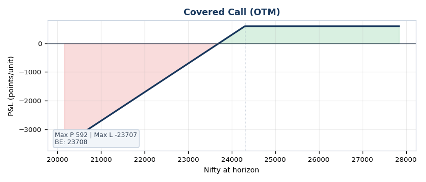

**The numbers (modelled at Nifty 24000).** Max profit 592 points (₹44,400) if Nifty finishes at or above 24300. Max loss -23707 points if the index fell all the way to zero. Breakeven 23708. Net debit 23708.1 points. Risk:reward 0.02. This worst case assumes the index collapses to zero; in practice you size small and manage/stop at a multiple of the credit.

**Greeks & behaviour.** Net delta is positive but below 1 (long index minus the short call's delta), so you stay bullish-lite. Theta is positive — time decay on the short call works for you. Vega is negative; falling IV after entry helps the short call.

**Management & exit.** A clean rule is to buy back the call at roughly 50% of the credit (around 145 points), then either re-sell next month or let the index run. If Nifty rips through 24300, roll the call up-and-out to keep some upside. Take the trade off before expiry-week gamma whipsaws the short strike.

**Risk note.** Your real danger is downside in the index, not the capped call — a gap-down erases far more than the 292-point cushion. Cash settlement removes assignment worry, but STT and slippage on rolling the call still nibble returns.

**Scenario P&L (₹ per lot, at expiry).**

| Nifty at expiry | 22,800 | 23,400 | 24,000 | 24,600 | 25,200 |
|---|---|---|---|---|---|
| **P&L (₹/lot)** | -68,100 | -23,100 | +21,900 | +44,400 | +44,400 |

Reading across, the +21,900 at 24,000 and the +44,400 cap above 24,300 sit against -23,100 and -68,100 as the index falls, and because these figures include the long index leg the loss keeps deepening below 22,800 toward the index-to-zero worst case.

**Adjustments, variants & timing.** The core lever is the short 24300 call. If Nifty rallies toward it, roll the call up-and-out, buy it back and sell a higher strike in the next expiry, to lift the cap and bank a net credit; if the index drifts down, roll the call down to a lower strike to harvest more premium while your view stays neutral. Let it be "called away" (settle at the cap) only when the fixed gain meets your target and you are content to redeploy. In India you cannot literally own the index, so build this on a Nifty ETF/basket or, more commonly, long the Nifty future plus the short 24300 CE; index options are European and cash-settled, so there is no early assignment to fear and no scramble over dividends or delivery. Time the entry to elevated IV, India VIX rich and IV rank above 50, and prefer 30-45 days to expiry so monthly theta works without expiry-week gamma.

## 114. Covered Call (ATM)

*Neutral · Short vega · net debit*

**The idea (intuition).** Same landlord, but now you sell the upside starting right at today's price for the fattest possible rent. You expect Nifty to go nowhere, so you grab the maximum time value the ATM strike offers.

**When & why to use it.** This is the highest-income, lowest-upside version. Reach for it when your view is flat-to-slightly-down and IV is high — an ATM call holds the most extrinsic value, so a post-event IV crush is your friend. Skip it if you actually want participation in a rally; you have given up essentially all of it from the first point.

**How to build it (₹, Nifty).** Long 1x Nifty @ 24000, sell the 24000 CE @ 456. Premium collected is 456 points = ₹34,200 per lot. Net debit 23544.1 points — the large credit pulls your effective entry down to 23544.

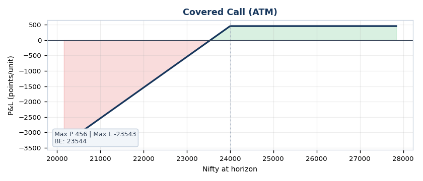

**The numbers (modelled at Nifty 24000).** Max profit 456 points (₹34,200), reached at or above 24000 — you are already at max profit if the index simply holds. Max loss -23543 points if Nifty went to zero. Breakeven 23544. Net debit 23544.1. Risk:reward 0.02. This worst case assumes the index collapses to zero; in practice you size small and manage/stop at a multiple of the credit.

**Greeks & behaviour.** Net delta is near flat — the ATM call's ~0.5 delta cancels much of your long. Theta is strongly positive and is the main engine of P&L here. Vega is meaningfully negative; this trade loves IV falling.

**Management & exit.** Because you start at max profit, the play is to harvest decay early — close near 50-60% of the credit and redeploy, rather than holding to expiry for the last few points. If Nifty drops, the call's gains cushion you; consider rolling the call down to keep collecting if your neutral view persists.

**Risk note.** You have almost no upside and full downside, so an unexpected rally feels like a loss-of-opportunity and a selloff still hurts. The ATM short strike has the highest gamma, so P&L swings sharply into expiry — don't hold an ATM write into the last day.

**Scenario P&L (₹ per lot, at expiry).**

| Nifty at expiry | 22,800 | 23,400 | 24,000 | 24,600 | 25,200 |
|---|---|---|---|---|---|
| **P&L (₹/lot)** | -55,800 | -10,800 | +34,200 | +34,200 | +34,200 |

The table is flat at +34,200 from 24,000 upward (you start at max profit) but slides to -10,800 and -55,800 as Nifty drops, and since the P&L embeds the long index the red continues to widen below the grid toward the zero-index tail.

**Adjustments, variants & timing.** Because the ATM write starts at max profit, management is mostly about decay capture and defending the downside. If Nifty rises through 24000, roll the call up-and-out to a higher strike to reclaim some upside and take in a credit; if it falls, roll the call down to keep collecting premium while your neutral view holds, the call's gains cushioning the long. Let the position settle at the cap when you have banked most of the credit. On NSE this is a Nifty ETF/basket or long future plus the short 24000 CE, European and cash-settled, so no early assignment and no delivery mechanics; the "assignment" is just a cash difference at expiry. The ATM strike holds the most extrinsic value, so enter when IV is high and you expect a post-event IV crush; 30-45 days out is ideal, and never carry the high-gamma ATM short into the final session.

## 115. Covered Call (Deep ITM)

*Neutral, defensive · Short vega · net debit*

**The idea (intuition).** You sell a call that is already deep in the money, so almost all the premium is intrinsic value acting as a downside buffer. You are effectively pre-selling your index near 23600 and pocketing a small, near-certain return — a defensive, bond-like posture.

**When & why to use it.** Use it when you want to stay nominally long but are nervous, and you would happily exit at the short strike for a small fixed gain. The deep-ITM call gives the most downside cushion of any covered call. It is a poor choice if you are bullish — you have capped yourself below the current price.

**How to build it (₹, Nifty).** Long 1x Nifty @ 24000, sell the 23600 CE @ 728. Premium 728 points = ₹54,600 per lot, mostly intrinsic. Net debit 23272.4 points — your effective cost drops to 23272, the lowest of the covered-call set.

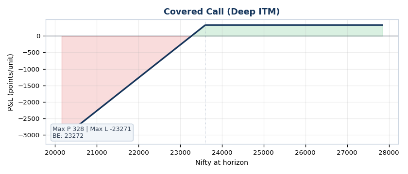

**The numbers (modelled at Nifty 24000).** Max profit 328 points (₹24,600) anywhere at or above 23600. Max loss -23271 points in the zero-index scenario. Breakeven 23272. Net debit 23272.4. Risk:reward 0.01. This worst case assumes the index collapses to zero; in practice you size small and manage/stop at a multiple of the credit.

**Greeks & behaviour.** Net delta is low — the deep-ITM call has a high delta near 0.8-0.9, leaving you only lightly long. Theta is positive but smaller, since little extrinsic value remains to decay. Vega is mildly negative.

**Management & exit.** This is a hold-to-target trade: you are aiming for the fixed ~328-point return as long as Nifty stays above 23600. If the index falls below the strike, the intrinsic cushion absorbs it down to 23272; below that you take a managed loss. Roll down only if your view turns more defensive.

**Risk note.** The cushion is finite — a crash through 23272 still puts you in the red, and the tiny 0.01 risk:reward reflects that you risk a large base to earn a thin yield. Liquidity in deep-ITM strikes can be thin; mind the spread.

**Scenario P&L (₹ per lot, at expiry).**

| Nifty at expiry | 22,800 | 23,400 | 24,000 | 24,600 | 25,200 |
|---|---|---|---|---|---|
| **P&L (₹/lot)** | -35,400 | +9,600 | +24,600 | +24,600 | +24,600 |

The deep-ITM write locks +24,600 anywhere at or above 23,600 and still shows +9,600 at 23,400, but the -35,400 at 22,800, index loss included, keeps growing below the grid toward the index-to-zero worst case.

**Adjustments, variants & timing.** The deep-ITM write is a hold-to-target trade, so adjustments are defensive. If Nifty rallies, simply let it be "called away" at 23600 for the fixed ~328-point gain; there is little upside to chase. If the index falls toward and below 23600, roll the call down to a deeper strike to add cushion, or take the managed loss below 23272. You rarely roll up here. Implement on a Nifty ETF/basket or long future plus the short 23600 CE; index options are European and cash-settled, so the deep-ITM short carries no early-assignment risk despite being well in the money, a real edge over US single-stock covered calls. Note that deep-ITM strikes are often thin, so mind the bid-ask. Timing matters less than for ATM writes since little extrinsic value remains; enter when you want defensive carry and reasonable IV, and avoid it entirely if you expect a rally.

## 116. Cash-Secured Put (Entry)

*Bullish accumulation · Short vega · net credit*

**The idea (intuition).** You want to own Nifty cheaper, so you get paid to wait. Selling a put below the market is a standing limit-buy order with a rebate — if Nifty dips to your strike you "buy" it (in cash terms, settle the difference), and if it doesn't, you simply keep the premium.

**When & why to use it.** Ideal when you are bullish on a horizon but think the index is a touch rich today, and IV is elevated so the put pays well. It shines after a sharp selloff when fear has pumped put premiums. Don't sell puts into a falling knife or ahead of a known bearish catalyst — you can be filled far above where the index actually settles.

**How to build it (₹, Nifty).** Sell the 23500 PE @ 169. You receive 169 points = ₹12,675 per lot as a net credit (net_cost -168.6). In India this is "cash-secured" by keeping enough margin/cash to absorb assignment at 23500; remember there is no early assignment — settlement is cash at expiry.

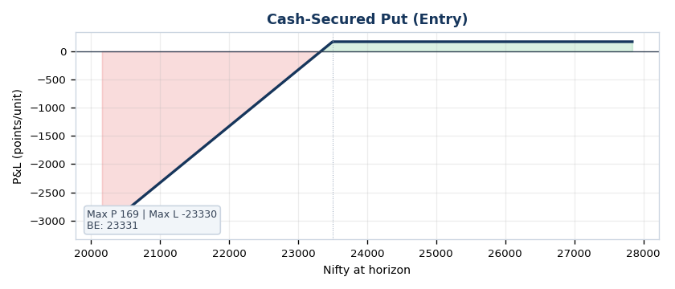

**The numbers (modelled at Nifty 24000).** Max profit 169 points (₹12,675), kept in full if Nifty stays above 23500. Max loss -23330 points only if the index fell to zero. Breakeven 23331. Net credit 169 points. Risk:reward 0.01. This worst case assumes the index collapses to zero; in practice you size small and manage/stop at a multiple of the credit.

**Greeks & behaviour.** Net delta is positive (short put is bullish). Theta is positive — the put bleeds in your favour each day. Vega is negative; an IV drop after entry accelerates your gains.

**Management & exit.** Standard income management: buy the put back at ~50% of credit and redeploy, or let it expire worthless if far OTM. If Nifty breaks 23500 and you are still constructive, accept the "assignment" view and roll into a covered call (the wheel). If your thesis breaks, close for a stop at, say, 2x the credit received.

**Risk note.** The benign-looking 0.01 ratio hides a real tail — a gap below 23331 turns the rebate into a loss many times the credit. This is the classic trade where retail sellers feel safe right up until a crash. Size to the loss you can survive, not the premium you want.

**Scenario P&L (₹ per lot, at expiry).**

| Nifty at expiry | 22,800 | 23,400 | 24,000 | 24,600 | 25,200 |
|---|---|---|---|---|---|
| **P&L (₹/lot)** | -39,825 | +5,175 | +12,675 | +12,675 | +12,675 |

The put keeps its full +12,675 while Nifty holds at or above 23,500, fades to +5,175 at 23,400, and turns to -39,825 at 22,800, and that loss, the cash-settled assignment hit, deepens further below the grid toward the index-to-zero tail.

**Adjustments, variants & timing.** Manage the short 23500 put as a standing limit-buy. Close it at ~50% of credit and redeploy, or let it expire worthless if far OTM. If Nifty breaks 23500 and you remain constructive, take the cash-settled "assignment" view, re-establish the long via a Nifty ETF or future and pivot into a covered call (the wheel); if your thesis breaks, roll the put down-and-out to a lower strike to buy time, or stop out at ~2x the credit. Crucially, NSE index options are European and cash-settled, so there is no early assignment; settlement is a single cash difference at expiry, and "cash-secured" means holding the SPAN-plus-exposure margin, not parking the full notional. Sell into elevated IV, the trade shines after a sharp selloff when fear pumps put premium, at roughly 30-delta and 30-45 days out so theta bleeds steadily in your favour.

## 117. The Wheel

*Neutral to bullish, systematic · Short vega · net credit*

**The idea (intuition).** The wheel is a loop, not a single trade. You sell a cash-secured put; if Nifty stays up you keep the premium and repeat; if it drops to your strike you take the long position, then sell covered calls against it until it gets called away — and you start the put cycle again. It is a disciplined way to be paid at every step of accumulating and distributing the index.

**When & why to use it.** Run the wheel when you are structurally bullish-to-neutral on Nifty over many months and want a rules-based income engine rather than a directional bet. It suits patient, well-capitalised accounts in normal-to-high IV. Avoid running it through a sustained bear market — you keep getting "assigned" lower and your covered calls cap the eventual bounce.

**How to build it (₹, Nifty).** The cycle's opening leg here is sell the 23600 PE @ 192 — a credit of 192 points = ₹14,400 per lot (net_cost -192.2). If Nifty settles below 23600 you take the long (cash-settled in India, so you re-establish via a future/ETF), then sell an OTM call against it; rinse and repeat.

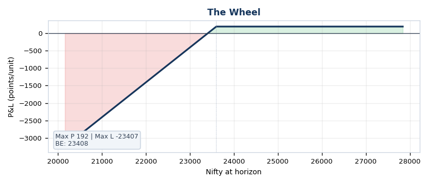

**The numbers (modelled at Nifty 24000).** For the current put leg: max profit 192 points (₹14,400) if Nifty holds above 23600. Max loss -23407 points in the zero scenario. Breakeven 23408. Net credit 192 points. Risk:reward 0.01. This worst case assumes the index collapses to zero; in practice you size small and manage/stop at a multiple of the credit.

**Greeks & behaviour.** Each leg is short vega and positive theta; the put leg is positive delta, the covered-call leg is reduced-positive delta. Across the full cycle you are a persistent theta harvester with a long bias.

**Management & exit.** Mechanise it: sell ~30-delta puts about 30-45 days out, close at 50% credit, and only accept assignment at strikes you genuinely want to own. After assignment, sell calls at or just above your cost basis so you are never forced to sell at a loss. Track cumulative basis, not single-leg P&L.

**Risk note.** The wheel's weakness is a trending decline — you collect small credits while the underlying grinds lower, and the math turns ugly fast. It is income with embedded downside, not a yield product; the SEBI loss statistics apply most to traders who run wheels too large.

**Scenario P&L (₹ per lot, at expiry).**

| Nifty at expiry | 22,800 | 23,400 | 24,000 | 24,600 | 25,200 |
|---|---|---|---|---|---|
| **P&L (₹/lot)** | -45,600 | -600 | +14,400 | +14,400 | +14,400 |

The opening put leg holds +14,400 above 23,600, is roughly flat (-600) at 23,400, and shows -45,600 at 22,800, the loss continuing well below the grid toward the index-to-zero worst case once you are carrying the long.

**Adjustments, variants & timing.** The wheel is mechanised: sell ~30-delta puts 30-45 days out, close each at 50% credit, and only accept assignment at strikes you genuinely want to own. If a put is tested but your view holds, roll it down-and-out for a credit; if Nifty settles below 23600, take the long (cash-settled, so re-establish via a Nifty ETF or future) and immediately sell OTM covered calls at or above your cost basis so you are never forced to sell at a loss, then let the call run to call-away and restart the put cycle. On NSE every leg is European and cash-settled: no early assignment, no delivery, just margin and cash differences. Run it in normal-to-high IV; avoid initiating fresh rungs ahead of a known bearish catalyst. Track cumulative basis across the whole loop, not single-leg P&L, and size so a trending decline cannot force you off the wheel.

## 118. Covered Strangle

*Bullish, own the stock · Short vega · net debit*

**The idea (intuition).** Own the index and sell both an OTM call and an OTM put against it. You are doubling your premium income on a view that Nifty drifts inside a range — but you have implicitly agreed to buy even more index if it falls (the short put) on top of the downside you already carry.

**When & why to use it.** Use it when you are genuinely happy to add to a long position lower and you expect a quiet, rangebound month with elevated IV on both wings. It is for accumulators with capital to absorb a second tranche. Do not use it if you cannot stomach being effectively 2x long after a drop — the short put stacks risk on the same side as your existing exposure.

**How to build it (₹, Nifty).** Long 1x Nifty @ 24000, sell the 24400 CE @ 246 and the 23600 PE @ 192. Combined premium 438 points = ₹32,850 per lot. Net debit 23561.9 points; the put adds income but also a second downside leg.

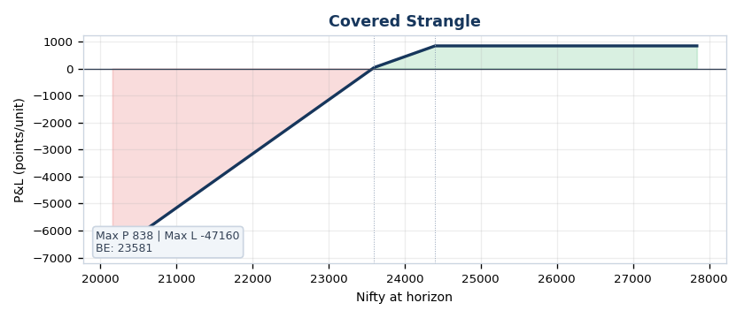

**The numbers (modelled at Nifty 24000).** Max profit 838 points (₹62,850) between the strikes at expiry. Max loss -47160 points — roughly double a plain covered call, reflecting the long index plus the short put both losing as Nifty falls toward zero. Breakeven 23581. Net debit 23561.9. Risk:reward 0.02. This worst case assumes the index collapses to zero; in practice you size small and manage/stop at a multiple of the credit.

**Greeks & behaviour.** Net delta is positive and rises if Nifty falls (the short put adds long delta on the way down). Theta is strongly positive — two short options decaying. Vega is doubly negative; an IV spike hurts both short legs.

**Management & exit.** Manage the wings independently: buy back whichever short option reaches 50% profit, and roll the tested side rather than the whole structure. If Nifty drops to the put strike, decide deliberately whether to add the index or close — that is the whole point of the trade. Take it off before expiry-week gamma.

**Risk note.** This is the most downside-heavy income trade in the group — the ~-47160 max loss is the honest signal that you are short the put on top of a long. A fast selloff hits the long index and the short put simultaneously. Reserve it for index/ETF positions you truly want to double, sized accordingly.

**Scenario P&L (₹ per lot, at expiry).**

| Nifty at expiry | 22,800 | 23,400 | 24,000 | 24,600 | 25,200 |
|---|---|---|---|---|---|
| **P&L (₹/lot)** | -117,150 | -27,150 | +32,850 | +62,850 | +62,850 |

The strangle peaks at +62,850 between the strikes but the doubled downside shows starkly, -27,150 at 23,400 and -117,150 at 22,800, and with both the long index and the short put losing together the red accelerates below the grid toward the zero-index tail.

**Adjustments, variants & timing.** Manage the two wings independently. Buy back whichever short, the 24400 call or the 23600 put, reaches 50% profit, and roll the tested side rather than the whole structure: roll the call up-and-out on a rally, roll the put down-and-out on a dip if you are not yet ready to add. When Nifty touches the put strike, decide deliberately whether to accept the second tranche of index (cash-settled, re-established via ETF/future) or close; that choice is the whole point of the trade. Build on a Nifty ETF/basket or long future plus the two short legs; European cash settlement means no early assignment on either wing. Enter when IV is elevated on both wings and you expect a quiet, rangebound month, 30-45 days out, and take it off before expiry-week gamma whips the short strikes. Reserve it for positions you truly want to double.

## 119. Covered Combo

*Bullish income · Short vega · net debit*

**The idea (intuition).** A close cousin of the covered strangle, but the short put is placed further out of the money than the call. You tilt the structure: more comfortable income on the upside cap, a deeper, less likely entry point on the downside add. It is a covered call with a discounted "buy lower" order attached.

**When & why to use it.** Choose the combo over the strangle when you want the second-tranche entry to sit at a level you would only buy on a real dip, while still grabbing decent call premium today. Good in neutral-to-bullish, moderate-IV conditions. Avoid it if you are not prepared to be longer after a fall — the short put still stacks downside.

**How to build it (₹, Nifty).** Long 1x Nifty @ 24000, sell the 24300 CE @ 292 and the 23400 PE @ 148. Combined premium 440 points = ₹33,000 per lot. Net debit 23560.5 points.

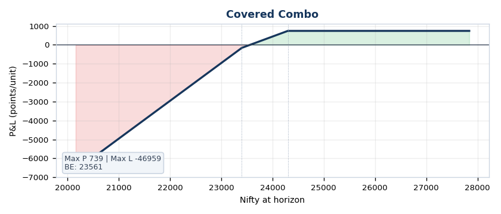

**The numbers (modelled at Nifty 24000).** Max profit 739 points (₹55,425) in the zone between the strikes. Max loss -46959 points in the zero-index case, again reflecting the doubled downside from the short put. Breakeven 23561. Net debit 23560.5. Risk:reward 0.02. This worst case assumes the index collapses to zero; in practice you size small and manage/stop at a multiple of the credit.

**Greeks & behaviour.** Positive net delta with a long bias that increases as Nifty falls toward the put. Theta positive from two short legs. Vega negative — quiet, decaying tape is ideal.

**Management & exit.** Same discipline as the strangle: close each short at ~50% profit, roll the tested wing, and treat a touch of the 23400 put as a planned accumulation, not an accident. Because the put is further OTM than the call, the call usually needs management first in a rising market.

**Risk note.** The asymmetric strikes make the upside cap bind sooner while the downside add sits deeper, so a sharp rally caps you quickly and a deep selloff still doubles your loss. The headline -46959 figure is the zero-collapse tail; real risk management is sizing and a credit-multiple stop.

**Scenario P&L (₹ per lot, at expiry).**

| Nifty at expiry | 22,800 | 23,400 | 24,000 | 24,600 | 25,200 |
|---|---|---|---|---|---|
| **P&L (₹/lot)** | -102,075 | -12,075 | +32,925 | +55,425 | +55,425 |

The combo tops out at +55,425 in the zone, prints -12,075 at 23,400 and -102,075 at 22,800, and because the figures fold in the long index plus the short put the loss keeps doubling lower toward the index-to-zero worst case.

**Adjustments, variants & timing.** Same discipline as the strangle but with asymmetric strikes. Close each short at ~50% profit and roll the tested wing: because the 23400 put is further OTM than the 24300 call, the call usually needs attention first in a rising market, so roll it up-and-out to lift the cap. Treat a touch of the 23400 put as planned accumulation, not an accident; on a dip, either accept the cash-settled second tranche (re-established via ETF/future) or roll the put down-and-out if you want a still-deeper entry. Implement on a Nifty ETF/basket or long future plus the two shorts; NSE index options are European and cash-settled, so neither leg can be assigned early. Choose the combo over the strangle when you want the downside add to sit at a level you would only buy on a real dip. Enter in neutral-to-bullish, moderate-IV tape, 30-45 days out, and clear it before expiry-week gamma.

## 120. Ratio Write

*Neutral, range-bound · Short vega · net debit*

**The idea (intuition).** You own one unit of the index but sell two calls against it. The extra (naked) call supercharges your premium and pins your best outcome to a tight zone, but above that zone the second call turns the position net short and your profit reverses. It is income with a ceiling and a trapdoor.

**When & why to use it.** Deploy it only when you have a firm conviction that Nifty stalls near the short strike — a pinned, low-momentum expiry with rich call IV. It is a tactician's neutral trade. Never use it casually: the extra short call means open-ended risk above, so it is unsuitable when any upside breakout is plausible (results day, global risk-on).

**How to build it (₹, Nifty).** Long 1x Nifty @ 24000, sell 2x 24200 CE @ 342 each (684 points total = ₹51,300 per lot of premium). Net debit 23315.2 points. The second call is uncovered, which is what creates the upside tail.

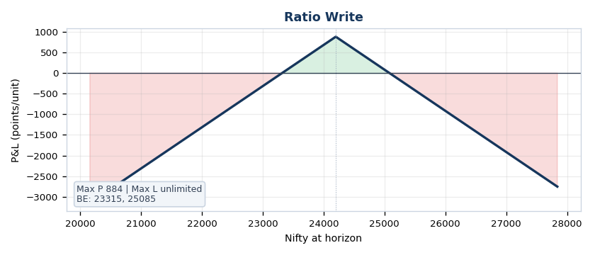

**The numbers (modelled at Nifty 24000).** Max profit 884 points (₹66,300) at the short strike 24200. Max loss is Undefined — large: above the upper breakeven the naked call runs without limit. Two breakevens, 23315 and 25085 — you profit only between them. Net debit 23315.2. Risk:reward is undefined because the upside is open. This worst case assumes an uncapped move; in practice you size small and manage/stop at a multiple of the credit.

**Greeks & behaviour.** Net delta starts near flat and turns negative as Nifty rises past the strike (the two short calls overpower the single long). Theta is strongly positive at the pin. Vega is sharply negative — a volatility spike with an up-move is the nightmare combination.

**Management & exit.** Define an upside stop in advance — buy back one call or add a long call above 25085 to cap the tail if Nifty trends up. Harvest profit if the index sits near 24200 into expiry, but never let an unmanaged ratio run into a breakout. Roll the extra short up-and-out if tested.

**Risk note.** This is the one genuinely open-ended trade in the chapter on the upside — the naked call can lose far more than all the premium collected. Treat the second short as a position to be hedged, not forgotten.

**Scenario P&L (₹ per lot, at expiry).**

| Nifty at expiry | 22,800 | 23,400 | 24,000 | 24,600 | 25,200 |
|---|---|---|---|---|---|
| **P&L (₹/lot)** | -38,625 | +6,375 | +51,375 | +36,375 | -8,625 |

The ratio is richest near the 24,200 pin (+51,375 at 24,000, +36,375 at 24,600) but the naked second call bites on the upside, only +6,375 at 23,400, -38,625 at 22,800, and crucially -8,625 already at 25,200 with the loss running open-ended above the grid.

**Adjustments, variants & timing.** The ratio write demands a pre-defined upside stop because the second, naked call is open-ended. If Nifty trends up toward the 25085 breakeven, buy back one call or add a long call above it to convert the tail into a defined-risk butterfly or ratio spread; roll the extra short up-and-out if tested but never let it run unmanaged into a breakout. Harvest profit if the index pins near 24200 into expiry. Build on a Nifty ETF/basket or long future plus the two short 24200 CE; NSE index options are European and cash-settled, so there is no early assignment, but the naked call's expiry loss is still real cash. Deploy only when you have firm conviction Nifty stalls near the strike, in rich call IV, 20-40 days out; avoid it entirely around results, Budget or global risk-on events where an upside breakout, the nightmare with sharply negative vega, is plausible.

## 121. Covered Call (Weekly)

*Neutral · Short vega · net debit*

**The idea (intuition).** Instead of one monthly rent cheque, you collect a small one every week. Weekly options decay fastest in their final days, so selling them repeatedly against your index harvests theta at a quicker clip — at the cost of more transactions and tighter caps.

**When & why to use it.** Best on Nifty/Bank Nifty where weekly expiries are deeply liquid and you want frequent, fast-decaying income with the flexibility to re-strike each week to your latest view. Suits a flat tape where you can adjust nimbly. Avoid it if you cannot monitor weekly — an unattended weekly short call through a rally caps you with no time to roll.

**How to build it (₹, Nifty).** Long 1x Nifty @ 24000, sell the weekly 24250 CE @ 91. Premium 91 points = ₹6,825 per lot for the week. Net debit 23909.3 points — the smaller weekly credit means a higher effective cost than monthly writes.

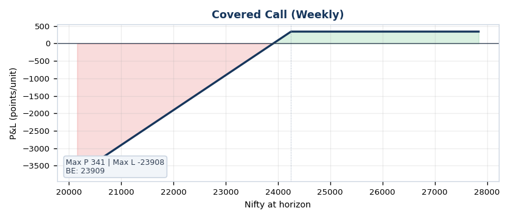

**The numbers (modelled at Nifty 24000).** Max profit 341 points (₹25,575) at or above 24250 for this expiry. Max loss -23908 points in the zero scenario. Breakeven 23909. Net debit 23909.3. Risk:reward 0.01. This worst case assumes the index collapses to zero; in practice you size small and manage/stop at a multiple of the credit.

**Greeks & behaviour.** Net delta positive but reduced by the short call. Theta is the strongest of the covered-call variants per day, because weekly extrinsic value decays rapidly. Vega negative but small in absolute terms given the short tenor.

**Management & exit.** The weekly cadence is the management: let it expire or close near 50% early in the week, then re-sell the next weekly at a strike matching your fresh view. Roll up-and-out intra-week if Nifty threatens 24250. Annualised, the repeated small credits can exceed a single monthly write — if you avoid getting run over on a breakout week.

**Risk note.** Weeklies carry the highest gamma into Thursday/Friday expiry, so the short strike can flip from safe to deep-ITM in hours. Frequent trading also multiplies STT, brokerage and slippage — net yield is lower than the gross premiums suggest.

**Scenario P&L (₹ per lot, at expiry).**

| Nifty at expiry | 22,800 | 23,400 | 24,000 | 24,600 | 25,200 |
|---|---|---|---|---|---|
| **P&L (₹/lot)** | -83,175 | -38,175 | +6,825 | +25,575 | +25,575 |

The weekly write holds +25,575 above 24,250 and +6,825 at 24,000 but turns to -38,175 and -83,175 as the index drops, index loss included, so the red keeps deepening below the grid toward the zero-index tail.

**Adjustments, variants & timing.** With weeklies the cadence is the management. Let the 24250 call expire or close near 50% early in the week, then re-sell the next weekly at a strike matching your fresh view; re-striking weekly is the main lever. Roll up-and-out intra-week if Nifty threatens 24250 to keep some upside; roll down to collect more if it sags and your neutral view holds. On NSE, Nifty and Bank Nifty weeklies are deeply liquid, European and cash-settled, so there is no early assignment; build on an ETF/basket or long future plus the short weekly call. Watch the calendar: weekly gamma spikes into Thursday/Friday expiry, so the short strike can flip from safe to deep-ITM in hours, never leave it unattended. Annualised, the repeated small credits can exceed a single monthly write, but only if you avoid run-over weeks and respect that frequent trading multiplies STT and slippage.

## 122. Covered Put

*Bearish income · Short vega · net credit*

**The idea (intuition).** This is the mirror image of the covered call. You are short the index and sell a put against the short, collecting premium while expressing a bearish-to-neutral view. The short put caps how much you gain on the downside, just as a covered call caps upside on a long.

**When & why to use it.** Use it when you are bearish on Nifty but expect a controlled grind lower rather than a crash, and you want income to offset the cost of carrying a short. It fits high-IV, risk-off regimes. Avoid it in a rallying or squeeze-prone market — being short the index leaves your upside loss open, and a sharp bounce is brutal.

**How to build it (₹, Nifty).** Short 1x Nifty @ 24000, sell the 23700 PE @ 219. Premium 219 points = ₹16,425 per lot, taken in as a net credit (net_cost -24218.8 reflects the short index proceeds plus the put credit).

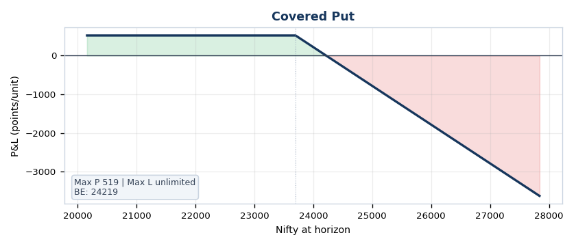

**The numbers (modelled at Nifty 24000).** Max profit 519 points (₹38,925) if Nifty falls to or below 23700. Max loss is Undefined — large: because you are short the index, your loss grows without limit as Nifty rises. Breakeven 24219. Net credit. Risk:reward undefined (open-ended upside loss). This worst case is an uncapped up-move rather than a collapse; in practice you size small and manage/stop at a multiple of the credit.

**Greeks & behaviour.** Net delta is negative — bearish. Theta is positive from the short put. Vega is negative; an IV spike (often accompanying the selloff you want) ironically pressures the short put even as your short index profits.

**Management & exit.** Target the 519-point max as Nifty approaches 23700, closing the put at ~50% profit and deciding whether to keep the short. Place a hard stop on the upside — this is the dangerous side. Roll the put down to keep collecting if the decline extends and your view holds.

**Risk note.** The open-ended loss sits on the upside here, not the downside. Short-index positions can be squeezed violently on good news; never run a covered put without an upside stop, and respect that shorting the index carries its own carry and gap risks.

**Scenario P&L (₹ per lot, at expiry).**

| Nifty at expiry | 22,800 | 23,400 | 24,000 | 24,600 | 25,200 |
|---|---|---|---|---|---|
| **P&L (₹/lot)** | +38,925 | +38,925 | +16,425 | -28,575 | -73,575 |

This bearish trade is the mirror, +38,925 at and below 23,700 and +16,425 at 24,000 but -28,575 and -73,575 as Nifty rises, and because you are short the index the loss is open-ended, continuing to grow above the grid rather than below it.

**Adjustments, variants & timing.** This bearish trade's danger is the open-ended upside, so a hard upside stop is non-negotiable. Target the 519-point max as Nifty approaches 23700, closing the short put at ~50% profit and deciding whether to keep the short index leg. Roll the put down-and-out to keep collecting if the decline extends and your view holds; if Nifty squeezes higher, cover the short and the put together at your stop rather than hoping. In India you express the short via a short Nifty future (or inverse ETF) plus the short 23700 PE; index options are European and cash-settled, so no early assignment, but the short future carries its own carry and gap risk. Enter in high-IV, risk-off regimes when you expect a controlled grind lower, 30-45 days out. Beware: an IV spike that accompanies the selloff you want actually pressures the short put even as the short index profits.

## 123. Dividend-Capture Covered Call

*Neutral, yield · Short vega · net debit*

**The idea (intuition).** You hold the index (or a dividend-paying ETF/basket) primarily for its yield, and you sell a call on top to enhance the total return. Two income streams — dividends plus call premium — stacked on one long position. The call funds part of your cost and boosts realised yield in a flat market.

**When & why to use it.** Best when you are a yield-oriented holder of a Nifty ETF or dividend basket and want to juice returns in a sideways tape with reasonable call IV. The strike is set just OTM so you keep some upside to any ex-dividend drift. Avoid it if a strong rally is likely — you would rather not cap a holding you intend to keep long term.

**How to build it (₹, Nifty).** Long 1x index/ETF @ 24000, sell the 24200 CE @ 459. Premium 459 points = ₹34,425 per lot. Net debit 23540.9 points; dividends accrue separately on the long.

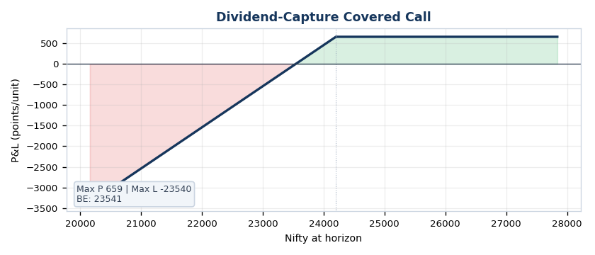

**The numbers (modelled at Nifty 24000).** Max profit 659 points (₹49,425) at or above 24200, excluding any dividend received. Max loss -23540 points in the zero scenario. Breakeven 23541. Net debit 23540.9. Risk:reward 0.03 — among the better ratios in the group, helped by the rich call. This worst case assumes the index collapses to zero; in practice you size small and manage/stop at a multiple of the credit.

**Greeks & behaviour.** Net delta positive, reduced by the short call. Theta positive. Vega negative. The dividend adds a small, non-Greek positive carry independent of the options.

**Management & exit.** Hold for the dividend window and let the call decay; close it at 50% credit if Nifty stalls, then re-sell. Because index options are cash-settled and European, there is no early-exercise-to-grab-dividend dynamic as there is on US single stocks — the "capture" here is simply combining yield with premium, not exploiting assignment timing.

**Risk note.** You still own all the downside of the index; a price drop swamps any dividend and call premium combined. On single-stock covered calls (vs the index) STT on exercised ITM options and dividend taxation can erode the edge — model the all-in, post-tax yield, not the gross.

**Scenario P&L (₹ per lot, at expiry).**

| Nifty at expiry | 22,800 | 23,400 | 24,000 | 24,600 | 25,200 |
|---|---|---|---|---|---|
| **P&L (₹/lot)** | -55,575 | -10,575 | +34,425 | +49,425 | +49,425 |

The dividend write caps at +49,425 above 24,200, holds +34,425 at 24,000, then falls to -10,575 and -55,575, excluding any dividend, and with the long index embedded the loss keeps widening below the grid toward the zero-index worst case.

**Adjustments, variants & timing.** Hold through the dividend/ex-date window and let the 24200 call decay; close it at ~50% credit if Nifty stalls, then re-sell. Roll up-and-out on a rally to preserve some upside on a holding you intend to keep, or roll down to collect more in a soft tape. Crucially, because NSE index options are European and cash-settled, there is none of the US single-stock early-exercise-to-grab-dividend dynamic; the "capture" is simply stacking ETF/basket yield on top of call premium, not exploiting assignment timing. Implement on a dividend-paying Nifty ETF or basket (not a future, which earns no dividend) plus the short 24200 CE. Enter in a sideways tape with reasonable call IV, strike just OTM to keep ex-dividend drift, 30-45 days out. If you run it on single stocks rather than the index, model the all-in post-tax yield, since STT on exercised ITM options and dividend taxation can quietly erode the edge.

## 124. Short Put Ladder (Income)

*Bullish accumulation · Short vega · net credit*

**The idea (intuition).** Rather than one put, you sell two at different lower strikes, layering your willingness to buy across price levels. Each rung pays premium and marks an accumulation point — a staircase of "buy lower" orders, each with its own rebate.

**When & why to use it.** Use it when you want to scale into a long Nifty position on weakness and collect more premium than a single put, in a bullish-accumulation frame with elevated IV. The laddered strikes let you average in if the index falls in steps. Avoid it ahead of a potential crash — selling two puts doubles your assignment exposure on the same downside.

**How to build it (₹, Nifty).** Sell the 23700 PE @ 219 and the 23400 PE @ 148. Combined premium 367 points = ₹27,525 per lot, taken as a net credit (net_cost -366.3). Each rung is cash-secured by the margin to absorb settlement at its strike.

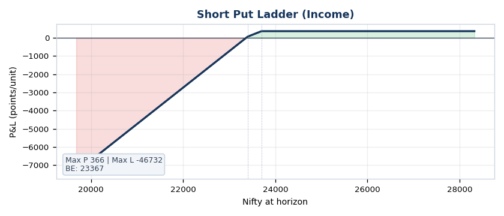

**The numbers (modelled at Nifty 24000).** Max profit 366 points (₹27,525) if Nifty holds above 23700 and both puts expire worthless. Max loss -46732 points in the zero-index case — roughly double a single short put, since both rungs lose together. Breakeven 23367. Net credit 366 points. Risk:reward 0.01. This worst case assumes the index collapses to zero; in practice you size small and manage/stop at a multiple of the credit.

**Greeks & behaviour.** Net delta positive and increasing as Nifty falls (more long exposure builds with each rung). Theta strongly positive — two decaying puts. Vega negative; an IV crush after entry is ideal.

**Management & exit.** Manage rung by rung: close the higher 23700 put at 50% profit first, keep the lower 23400 as a deeper standing bid. If both get tested, you have accumulated at two levels — exactly the plan — and you can pivot into covered calls (the wheel). Stop the structure if your bullish thesis breaks.

**Risk note.** Two short puts mean the downside tail is doubled; the modest credit looks safe until a gap blows through both strikes at once. This is layered accumulation for traders who can fund and survive being long at both levels — not a free-yield ladder.

**Scenario P&L (₹ per lot, at expiry).**

| Nifty at expiry | 22,800 | 23,400 | 24,000 | 24,600 | 25,200 |
|---|---|---|---|---|---|
| **P&L (₹/lot)** | -85,050 | +4,950 | +27,450 | +27,450 | +27,450 |

The ladder keeps its full +27,450 above 23,700 and still +4,950 at 23,400, but two short puts show their weight at -85,050 by 22,800, the loss roughly doubling a single put and deepening further below the grid toward the index-to-zero tail.

**Adjustments, variants & timing.** Manage the ladder rung by rung. Close the higher 23700 put at 50% profit first and keep the lower 23400 as a deeper standing bid; if the upper rung is tested but your view holds, roll it down-and-out for a credit. If both get tested, you have accumulated at two levels exactly as planned, so re-establish the long (cash-settled via ETF/future) and pivot the rungs into covered calls (the wheel). Stop the structure if your bullish thesis breaks. On NSE both puts are European and cash-settled, so neither can be assigned early; "cash-secured" means holding the combined SPAN margin for two strikes, not the full notional of both. Enter in a bullish-accumulation frame with elevated IV, ~30-delta on the upper rung and a deeper lower rung, 30-45 days out. Size for the doubled downside tail, since a gap through both strikes at once is the real risk, not the modest combined credit.

## 125. Buy-Write

*Neutral to mildly bullish · Short vega · net debit*

**The idea (intuition).** A buy-write is simply a covered call opened in a single transaction — you "buy" the index and "write" the call simultaneously as one packaged trade. The point is execution: one net price, no leg risk, a clean defined-income position from the first tick.

**When & why to use it.** Use it whenever you want covered-call income but prefer to enter the long and short together at a known net debit, avoiding the slippage of legging in. Common as a structured product wrapper and for disciplined income desks. Same caveats as any covered call — skip it before a catalyst you want full upside for, or in a downtrend.

**How to build it (₹, Nifty).** Buy 1x Nifty @ 24000 and sell the 24300 CE @ 404 in one ticket. Premium 404 points = ₹30,300 per lot. Net debit 23595.8 points — your packaged cost basis.

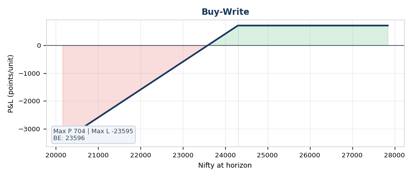

**The numbers (modelled at Nifty 24000).** Max profit 704 points (₹52,800) at or above 24300. Max loss -23595 points in the zero scenario. Breakeven 23596. Net debit 23595.8. Risk:reward 0.03. This worst case assumes the index collapses to zero; in practice you size small and manage/stop at a multiple of the credit.

**Greeks & behaviour.** Net delta positive, dampened by the short call. Theta positive — the short call decays for you. Vega negative; you want IV to fall after you open.

**Management & exit.** Treat it exactly like an OTM covered call: close the call at ~50% credit, roll up-and-out on a rally, and take profit as the index approaches 24300. The single-ticket entry also makes a single-ticket exit clean if you want out of the whole structure.

**Risk note.** All the covered-call risks apply — capped upside, full downside in the index. The "packaged" nature can lull you into thinking it is a product rather than a leveraged long with a sold call; the underlying index exposure is what can hurt you.

**Scenario P&L (₹ per lot, at expiry).**

| Nifty at expiry | 22,800 | 23,400 | 24,000 | 24,600 | 25,200 |
|---|---|---|---|---|---|
| **P&L (₹/lot)** | -59,700 | -14,700 | +30,300 | +52,800 | +52,800 |

The buy-write caps at +52,800 above 24,300 and holds +30,300 at 24,000, sliding to -14,700 and -59,700 as the index falls, the figures including the packaged long so the loss keeps growing below the grid toward the zero-index worst case.

**Adjustments, variants & timing.** Treat the buy-write exactly like an OTM covered call once on. Close the short 24300 call at ~50% credit, roll it up-and-out on a rally to lift the cap, or roll it down to collect more if the index sags and your view stays neutral; take the fixed gain as Nifty approaches 24300. The single-ticket structure means you can also exit the whole position in one clean ticket if you want out. In India the "buy" leg is a Nifty ETF/basket or long future, packaged with the short 24300 CE at one net debit to avoid legging slippage; index options are European and cash-settled, so no early assignment and no delivery. Enter when IV is elevated enough that the call pays a meaningful credit, 30-45 days out, and avoid it just before a catalyst you would want full upside for. Remember the packaging hides a leveraged long with a sold call, and the index downside is what hurts.

## 126. In-the-Money Covered Call

*Defensive income · Short vega · net debit*

**The idea (intuition).** You sell a call that is slightly in the money, trading away near-term upside for a thicker premium and a bigger downside cushion. It sits between the OTM income write and the deep-ITM defensive write — more protection than the former, more yield than the latter.

**When & why to use it.** Reach for it when you are cautious-but-still-holding and want a fixed, modest target with a real buffer beneath the current price. Useful in choppy, slightly soft markets with good IV. Not for bulls — you have capped yourself below 24000 from the outset, so any rally just delivers the small fixed gain.

**How to build it (₹, Nifty).** Long 1x Nifty @ 24000, sell the 23800 CE @ 585. Premium 585 points = ₹43,875 per lot, part intrinsic. Net debit 23415.0 points — effective cost pulled down to 23415.

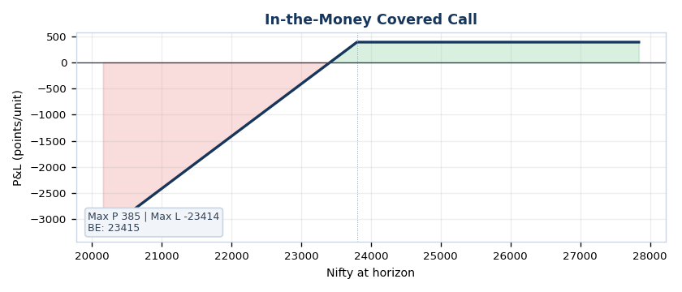

**The numbers (modelled at Nifty 24000).** Max profit 385 points (₹28,875) anywhere at or above 23800. Max loss -23414 points if Nifty fell to zero. Breakeven 23415. Net debit 23415.0. Risk:reward 0.02. This worst case assumes the index collapses to zero; in practice you size small and manage/stop at a multiple of the credit.

**Greeks & behaviour.** Net delta is low — the ITM call's higher delta offsets much of the long. Theta positive but moderate (less extrinsic value than ATM). Vega negative.

**Management & exit.** A target trade: you are already at max profit if Nifty simply holds above 23800, so harvest early and redeploy rather than chasing the last points. The 585-point premium cushions a fall to 23415 before you are in the red. Roll down further if you want even more protection.

**Risk note.** The buffer is finite — below 23415 the long index losses overwhelm the premium. The slightly ITM strike has elevated gamma near expiry, and the position quietly carries full crash risk despite its defensive label.

**Scenario P&L (₹ per lot, at expiry).**

| Nifty at expiry | 22,800 | 23,400 | 24,000 | 24,600 | 25,200 |
|---|---|---|---|---|---|
| **P&L (₹/lot)** | -46,125 | -1,125 | +28,875 | +28,875 | +28,875 |

The slightly-ITM write locks +28,875 anywhere at or above 23,800 (already +28,875 at 24,000), but the buffer is finite, -1,125 at 23,400 and -46,125 at 22,800, the loss deepening below the grid toward the index-to-zero tail.

**Adjustments, variants & timing.** The slightly-ITM write is a defined-target trade: you are already at max profit if Nifty simply holds above 23800, so harvest early and redeploy rather than chasing the last points. If the index falls toward 23415, roll the call down to a deeper strike for more cushion, or take the managed loss below it; if it rallies, just accept the fixed gain via call-away, since there is little upside to defend. Build on a Nifty ETF/basket or long future plus the short 23800 CE; NSE index options are European and cash-settled, so the in-the-money short carries no early-assignment risk. Enter in a choppy, slightly soft tape with good IV when you want a buffer beneath the current price, 30-45 days out. Watch expiry-week gamma, since the slightly-ITM strike is gamma-sensitive near expiry, and never forget the position still carries full crash risk below 23415 despite its defensive label.

## 127. Cash-Secured Put (Weekly)

*Bullish, systematic · Short vega · net credit*

**The idea (intuition).** The cash-secured put run on a weekly cadence — sell a short-dated OTM put, harvest its fast theta, and repeat every week while you wait to buy Nifty lower. Small credits, collected often, with the quickest decay clock.

**When & why to use it.** Best for systematic sellers on liquid Nifty/Bank Nifty weeklies who want frequent income and the flexibility to re-strike to each week's view. Suits a flat-to-up tape with steady IV. Avoid it if you cannot watch weekly expiries — a weekly put can go from far-OTM to ITM in a single bad session with no time to adjust.

**How to build it (₹, Nifty).** Sell the weekly 23750 PE @ 83. Premium 83 points = ₹6,225 per lot for the week, taken as a net credit (net_cost -83.2). Hold margin/cash to settle at 23750 if assigned at expiry (cash-settled, European — no early assignment).

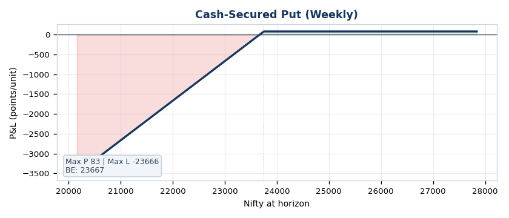

**The numbers (modelled at Nifty 24000).** Max profit 83 points (₹6,225) if Nifty stays above 23750 this week. Max loss -23666 points in the zero scenario. Breakeven 23667. Net credit 83 points. Risk:reward 0.00 — the rounding flags just how thin the reward is versus the buffered base. This worst case assumes the index collapses to zero; in practice you size small and manage/stop at a multiple of the credit.

**Greeks & behaviour.** Net delta positive but small (far-OTM, short tenor). Theta is the highest per-day of the put writes, thanks to rapid weekly decay. Vega negative but modest in absolute terms.

**Management & exit.** Let it expire worthless or close at 50% mid-week, then re-sell the next weekly. If Nifty drops toward 23750, roll down-and-out or accept the long and pivot to a covered call. The repeated tiny credits compound only if you avoid the occasional run-over week.

**Risk note.** The 0.00 ratio is the honest warning: you are risking a large buffered base to earn a few thousand rupees a week. Weekly gamma is unforgiving near expiry, and transaction costs eat a real share of an 83-point premium. This is the archetype of the trade where retail sellers misjudge the tail.

**Scenario P&L (₹ per lot, at expiry).**

| Nifty at expiry | 22,800 | 23,400 | 24,000 | 24,600 | 25,200 |
|---|---|---|---|---|---|
| **P&L (₹/lot)** | -65,025 | -20,025 | +6,225 | +6,225 | +6,225 |

The weekly put keeps its full +6,225 while Nifty holds at or above 23,750, then drops to -20,025 and -65,025 as the index falls, a vivid picture of risking a large buffered base for a thin credit, with the loss continuing below the grid toward the zero-index tail.

**Adjustments, variants & timing.** The weekly put run is managed by cadence. Let the 23750 put expire worthless or close at ~50% mid-week, then re-sell the next weekly at a strike matching your fresh view; re-striking is the main lever. If Nifty drops toward 23750, roll down-and-out to a lower strike for a credit, or accept the cash-settled long (re-established via ETF/future) and pivot into a covered call. On NSE, Nifty and Bank Nifty weeklies are deeply liquid, European and cash-settled, so there is no early assignment; "cash-secured" means holding the SPAN margin, not the full strike notional. Sell in a flat-to-up tape with steady IV, far-OTM, and respect that weekly gamma is unforgiving into Thursday/Friday expiry, since a far-OTM put can go ITM in one bad session. The tiny credits compound only if you avoid run-over weeks and remember transaction costs eat a real share of an 83-point premium.

## 128. Covered Call (Long-Dated)

*Neutral, patient · Short vega · net debit*

**The idea (intuition).** Sell a longer-dated call against your index instead of a near-month one. You collect a larger upfront premium and set a wider upside cap, trading the speed of weekly theta for a bigger one-time credit and less frequent management. The patient holder's covered call.

**When & why to use it.** Use it when you intend to hold Nifty for the long haul and want substantial premium and a higher strike that still leaves room to run, without re-writing every month. Good in elevated long-dated IV. Less suitable if you want fast decay — long-dated options bleed theta slowly, so the income accrues gradually.

**How to build it (₹, Nifty).** Long 1x Nifty @ 24000, sell the longer-dated 24500 CE @ 573. Premium 573 points = ₹42,975 per lot. Net debit 23427.5 points.

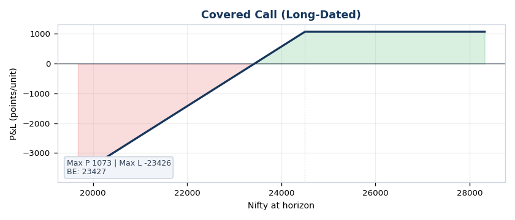

**The numbers (modelled at Nifty 24000).** Max profit 1073 points (₹80,475) at or above 24500 — the widest cap and largest absolute profit of the covered-call set, thanks to the higher strike plus the fat premium. Max loss -23426 points in the zero scenario. Breakeven 23427. Net debit 23427.5. Risk:reward 0.05 — the best ratio in the chapter. This worst case assumes the index collapses to zero; in practice you size small and manage/stop at a multiple of the credit.

**Greeks & behaviour.** Net delta positive, only modestly reduced (a higher-strike call has lower delta), so you retain more bullish participation than near-ATM writes. Theta positive but slow. Vega is the most negative of the covered calls in absolute terms — long-dated options are vega-heavy, so an IV drop is a meaningful tailwind.

**Management & exit.** You can hold for the wide 1073-point target or, because long-dated extrinsic value is large, buy the call back after a good IV-driven decay and re-write. Roll up if Nifty approaches 24500 well before expiry. The slow theta rewards patience over tinkering.

**Risk note.** The bigger premium does not change that you own the full index downside; a long holding period also means more time for a drawdown to develop. The heavy negative vega cuts both ways — a volatility spike marks the short call against you even if price is unchanged.

**Scenario P&L (₹ per lot, at expiry).**

| Nifty at expiry | 22,800 | 23,400 | 24,000 | 24,600 | 25,200 |
|---|---|---|---|---|---|
| **P&L (₹/lot)** | -47,025 | -2,025 | +42,975 | +80,475 | +80,475 |

The long-dated write offers the widest cap, +80,475 above 24,500 and +42,975 at 24,000, but still carries full downside, -2,025 at 23,400 and -47,025 at 22,800, with the index loss embedded and deepening below the grid toward the zero-index worst case.

**Adjustments, variants & timing.** The long-dated write rewards patience over tinkering because its theta bleeds slowly. You can hold for the wide 1073-point target or, since long-dated extrinsic value is large and the trade is vega-heavy, buy the call back after a good IV-driven decay and re-write at a fresh strike. Roll up-and-out if Nifty approaches 24500 well before expiry to lift the cap; roll down only if you turn defensive. Implement on a Nifty ETF/basket or long future plus the longer-dated 24500 CE; NSE index options are European and cash-settled, so even a far-dated short carries no early-assignment risk. Enter when long-dated IV is elevated, since the most negative vega of the covered-call set makes an IV drop a meaningful tailwind, while a spike marks the short against you even at unchanged price. A longer holding period means more time for a drawdown, so size for the full index downside you still own.

# Strategy Group 9: Hedging & Protective Strategies

This family is not about making money on options — it is about keeping money you already have. Every structure here sits on top of a long position (a Nifty future, an ETF, a cash-equity or mutual-fund book) and reshapes its downside: a put buys a floor like an insurance policy with a deductible, a collar funds that floor by selling away some upside, and spread-based hedges trade full protection for a cheaper premium and a gap-risk caveat. The honest through-line: hedges cost money and usually expire worthless — that drag is the premium you pay for sleeping at night, exactly like home insurance you are glad not to claim.

A note on the numbers below: the `net_cost` figure quoted from the data includes the roughly 24000-point index outlay (about 18 lakh per Nifty lot of 75). The number that actually matters for a hedge is the option premium — the cost of the cover — so that is described separately in words throughout.

## 129. Protective Put (OTM)
*Bullish, insured · Long vega · net debit*

**The idea (intuition).** You own the index and you buy an out-of-the-money put below it. Think of it as fire insurance with a deductible: you absorb the first slice of any fall yourself, and the put pays for everything beyond the strike. Cheaper than full cover, because you self-insure the small dips.

**When & why to use it.** Use it when you are structurally long and want to stay long through a known risk — an RBI policy date, a Budget, US CPI, election counting — but cannot stomach a gap-down. Buy the put when India VIX is low and puts are cheap; do NOT load up on protection right after a crash when IV is already at 18-20 and the put is fat. The OTM strike suits investors who accept a modest drawdown and only want to cap the tail.

**How to build it (₹, Nifty).** Long 1x underlying at 24000, buy the 23700 PE at 219. The hedge costs 219 points, about 16,425 per lot — that premium is your entire insurance bill. You keep all upside above 24219 (entry plus premium).

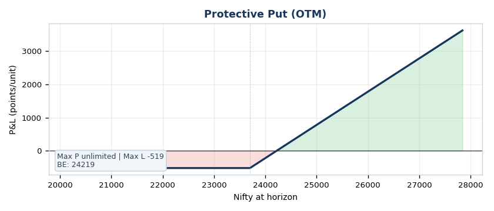

**The numbers (modelled at Nifty 24000).** Max profit: Unlimited (the index can keep rising). Max loss: -519 points, about 38,925 per lot — the 300-point gap to the strike plus the 219 premium. Breakeven: 24219. Net debit (option only): 219 points. Risk:reward is undefined because the upside is open-ended.

**Greeks & behaviour.** Net delta is positive but less than the bare long (the put's negative delta trims it). Theta is negative — the put bleeds time value daily, the cost of carrying insurance. Vega is positive: a spike in IV lifts the put's value, so the hedge is worth more precisely when markets panic.

**Management & exit.** If the index rallies and the put decays to near zero, let it lapse and re-strike a fresh one closer to spot (roll up). If the market falls and the put goes deep ITM, you can monetise it — sell the put, bank the gain, and decide whether to re-hedge. Roll the put forward a few sessions before expiry to avoid the last-week gamma and theta cliff.

**Risk note.** The premium is a near-certain small loss every cycle — most insurance expires worthless, and that is the point. The real danger is over-hedging: buy protection every month in a bull market and the cumulative drag can eat much of your return.

**Scenario P&L (₹ per lot, at expiry).**

| Nifty at expiry | 22,800 | 23,400 | 24,000 | 24,600 | 25,200 |
|---|---|---|---|---|---|
| **P&L (₹/lot)** | -₹38,925 | -₹38,925 | -₹16,425 | +₹28,575 | +₹73,575 |

Read across, the protected long still earns +₹73,575 at 25,200, yet a 1,200-point slide to 22,800 costs only -₹38,925 instead of the roughly ₹90,000 a bare long would lose — the OTM put has bolted a hard floor under the position.

**Adjustments, variants & timing.** As the market climbs, roll the 23700 put up toward spot every few weeks so the floor ratchets behind your gains rather than lagging 300 points below them; fund part of that roll by closing the old put for whatever time value remains. After a sharp fall, monetise the deep-ITM put and decide whether to re-strike lower or bank the cover. For a cash-equity or mutual-fund book, size the hedge by beta: lots = (portfolio value x portfolio beta) / (Nifty x 75), rounded to whole lots, and keep an annual premium budget near 1.5-2% of the book so the drag stays tolerable. Accept basis risk when you hold mid-caps against a Nifty put. Put OTM cover on ahead of identifiable events — RBI policy, the Budget, US CPI, results season — or when valuations look stretched and India VIX is low; in calm, richly-valued grinds, carrying it always quietly erodes returns, so hedge the window, not the calendar.

## 130. Protective Put (ATM)
*Bullish, fully insured · Long vega · net debit*

**The idea (intuition).** Same insurance, no deductible. You buy the at-the-money put, so the floor sits right at your entry — any fall from here is fully covered. You pay up for the privilege of a tight floor.

**When & why to use it.** Reach for the ATM put when you genuinely cannot afford a drawdown — you are sitting on a large unrealised gain you must protect, or you are running borrowed/leveraged exposure into a binary event. It is expensive, so use it tactically over a short window (event week), not as a permanent overlay. Avoid it when IV is rich: paying 318 points for a one-month floor is a heavy carry if VIX is elevated.

**How to build it (₹, Nifty).** Long 1x underlying at 24000, buy the 24000 PE at 318. The cover costs 318 points, about 23,850 per lot. Your floor is locked at 24000 minus the premium.

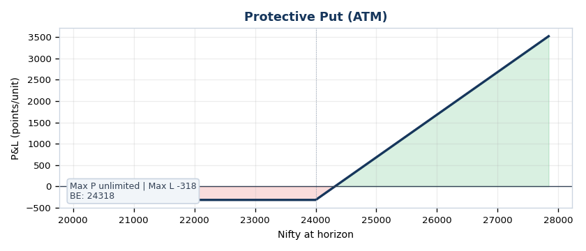

**The numbers (modelled at Nifty 24000).** Max profit: Unlimited. Max loss: -318 points, about 23,850 per lot — purely the premium, since the strike equals entry. Breakeven: 24318. Net debit (option only): 318 points. Risk:reward undefined (open upside).

**Greeks & behaviour.** Net delta is close to +0.5x of the bare long at inception (long index +1, ATM put roughly -0.5). Theta is sharply negative — ATM options carry the most time value to lose. Vega is strongly positive; an IV spike materially helps this position.

**Management & exit.** Because ATM theta is brutal, do not hold this to expiry. Take it off once the event passes and IV crushes, or roll down to an OTM strike to cut carry once the worst-case window closes. If the market falls, the put gains delta fast and you can sell it for a strong profit, effectively flat on the round-trip minus a small cost.

**Risk note.** The biggest enemy is IV crush: buy the ATM put into an event at high IV and, even if the index drifts down a little, the volatility collapse afterward can leave the put worth less than you paid. Match the put's expiry to your risk window so you are not paying for time you do not need.

**Scenario P&L (₹ per lot, at expiry).**

| Nifty at expiry | 22,800 | 23,400 | 24,000 | 24,600 | 25,200 |
|---|---|---|---|---|---|
| **P&L (₹/lot)** | -₹23,850 | -₹23,850 | -₹23,850 | +₹21,150 | +₹66,150 |

The ATM floor is tighter still: the loss is pinned at -₹23,850 (pure premium) all the way down to 22,800, where an unhedged long would be down about ₹90,000, while the upside at 25,200 remains a healthy +₹66,150.

**Adjustments, variants & timing.** The ATM floor is expensive to carry, so manage it as a short-dated event overlay: once the catalyst passes and IV crushes, either lift it or roll down to an OTM strike to cut theta. As the market rises, roll the put up to lock the new level; after a fall, the put gains delta fast — sell it and re-hedge cheaper. To protect a cash or MF portfolio with an ATM index put, beta-adjust the lots = (book value x beta) / (Nifty x 75) and budget for the heavier premium (here about ₹23,850 a lot), which only makes sense over a tight window, not as a standing overlay. Watch basis risk on a mid-cap-heavy book. Put full ATM cover on only when you cannot afford any drawdown — a large unrealised gain into a binary event, or leveraged exposure into results — and buy it when VIX is low, never into an already-elevated event premium.

## 131. Collar
*Bullish, low-cost hedge · Neutral vega · net debit*

**The idea (intuition).** A protective put is insurance; a collar is insurance you pay for by selling your upside. You buy a put for a floor and sell a call above the market — the call premium funds the put. You are fencing the position into a known range.

**When & why to use it.** The classic use is protecting a large gain you do not want to sell (for tax or conviction reasons) at very low cost. Use it when you are mildly bullish-to-neutral and content to cap upside in exchange for cheap or free downside cover — common around year-end or before a long holiday gap. Do NOT collar if you expect a strong breakout; you will hand the rally to the call buyer.

**How to build it (₹, Nifty).** Long 1x underlying at 24000, buy the 23700 PE at 219, sell the 24300 CE at 292. The short call brings in 292 and the put costs 219, so the option legs net a 73-point credit — you are paid 73 points (about 5,475 per lot) to be hedged.

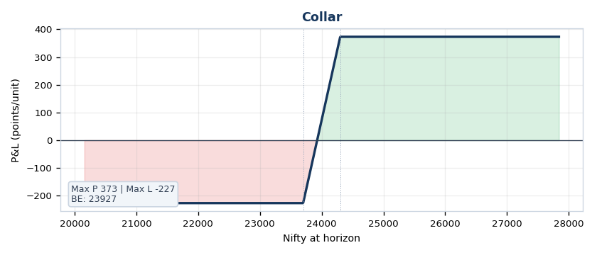

**The numbers (modelled at Nifty 24000).** Max profit: 373 points (about 27,975 per lot), reached at or above the 24300 call. Max loss: -227 points (about 17,025 per lot), at or below the 23700 put. Breakeven: 23927. Net: the options are a small credit; the quoted net_cost is just the index outlay minus that credit. Risk:reward 1.64.

**Greeks & behaviour.** Net delta is positive but capped — it fades to zero as price approaches either strike. Vega is roughly neutral (long put vega offsets short call vega). Theta is close to flat or mildly positive, since the short call you sold decays in your favour.

**Management & exit.** If the index rallies into the short call, either let it get called away (you keep the capped gain) or roll the call up and out for more room, paying a small debit. If it falls to the put, your floor holds; consider rolling the whole collar down to re-establish protection at a lower level. Manage the short call before expiry week to avoid assignment surprises.

**Risk note.** The capped upside is the real cost — a runaway rally is forgone profit, which traders feel more painfully than a paid premium. On single stocks, watch assignment and STT on an exercised ITM call; on the index (cash-settled) that risk disappears.

**Scenario P&L (₹ per lot, at expiry).**

| Nifty at expiry | 22,800 | 23,400 | 24,000 | 24,600 | 25,200 |
|---|---|---|---|---|---|
| **P&L (₹/lot)** | -₹17,025 | -₹17,025 | +₹5,475 | +₹27,975 | +₹27,975 |

The collar fences the outcome between -₹17,025 at 22,800 and +₹27,975 at 25,200 — the put caps the fall at roughly a fifth of a bare long's loss, while the short call is what holds the gain to its ceiling.

**Adjustments, variants & timing.** Manage the short call first: if the index rallies into 24300, roll the call up-and-out for a small debit to recapture room, or let it cap and keep the maximum gain; if the market falls to the put, hold the floor and consider rolling the whole fence down to re-protect at a lower level. Reset the collar each expiry to keep the band centred. For a cash-equity or MF book, beta-adjust the lots = (portfolio value x beta) / (Nifty x 75) and prefer Nifty or Bank Nifty options matched to the book's character; a credit collar can make the hedge self-funding, so the cost budget is mainly forgone upside, not cash. Mind basis risk on non-Nifty names. A collar suits the late stage of a rally or a long holiday gap when you want cheap cover and are content to cap upside — not when you expect a breakout, which you would simply hand to the call buyer.

## 132. Costless (Zero-Cost) Collar
*Bullish, free hedge · Neutral vega · net debit*

**The idea (intuition).** The same collar, but you pick the strikes so the call you sell pays for the put you buy — protection for (almost) nothing out of pocket. Free insurance, financed entirely by giving up upside above the call.

**When & why to use it.** This is the institutional favourite for hedging a concentrated long without spending cash — promoters, PMS books, and long-term holders use it to lock a range around a position. Use it when you want a defined band and are indifferent to upside beyond a level. Do NOT mistake "zero cost" for "zero downside": you still own the gap between spot and the put strike, and you have sold your rally.

**How to build it (₹, Nifty).** Long 1x underlying at 24000, buy the 23600 PE at 192, sell the 24300 CE at 292. The call's 292 more than covers the put's 192, leaving a 100-point credit — genuinely better than free, you are paid 100 points (about 7,500 per lot) to wear the collar.

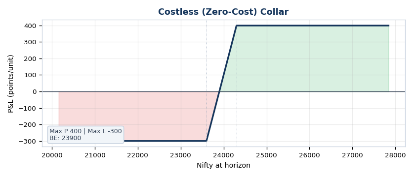

**The numbers (modelled at Nifty 24000).** Max profit: 400 points (about 30,000 per lot) above 24300. Max loss: -300 points (about 22,500 per lot) below 23600 — the distance to the put strike, softened by the credit. Breakeven: 23900. Risk:reward 1.33.

**Greeks & behaviour.** Delta positive within the band, pinned at the edges. Vega near neutral. Theta slightly positive because the richer short call decays faster than the cheaper long put.

**Management & exit.** Roll annually or each expiry to keep the band centred on a moving market. If the index pushes through the short call, roll it up-and-out to recapture some upside, accepting a small debit that breaks the "costless" label. If it sags to the put, the floor engages and you re-strike lower.

**Risk note.** The fence cuts both ways — in a strong bull run a zero-cost collar can badly lag a naked long, and that opportunity cost compounds year after year. It is a sleep-well structure, not a return-maximising one.

**Scenario P&L (₹ per lot, at expiry).**

| Nifty at expiry | 22,800 | 23,400 | 24,000 | 24,600 | 25,200 |
|---|---|---|---|---|---|
| **P&L (₹/lot)** | -₹22,500 | -₹22,500 | +₹7,500 | +₹30,000 | +₹30,000 |

Financed entirely by the call, the band runs from -₹22,500 at 22,800 to a capped +₹30,000 at 25,200 — the put halts the downside near the strike for no cash outlay, the trade-off being the surrendered upside.

**Adjustments, variants & timing.** Re-strike the band each expiry, or at least annually, so it tracks a moving market; if the index pushes through the short call, roll it up-and-out, accepting a small debit that breaks the strict 'costless' label but recaptures upside; if it sags to the put, the floor engages and you reset lower. For promoters, PMS books and long-term holders, this is the zero-cash way to fence a concentrated long — beta-adjust the lot count = (position value x beta) / (Nifty x 75) and choose the call strike so its premium exactly funds the put, leaving the cost budget at roughly nil. The real expense is opportunity cost, which compounds, so review the upside cap annually against your conviction. Basis risk applies if you hedge a broad book with one index. Put it on when valuations are full and you want a defined range — and lift or widen it before a genuine breakout you do not want to surrender.

## 133. Put-Spread Collar
*Bullish, cheaper hedge · Neutral vega · net debit*

**The idea (intuition).** A collar where the floor is a put SPREAD instead of a single put. You buy a put, sell a further-OTM put to cheapen it, and sell a call to fund the rest. The trade-off: protection now only runs down to the lower put strike — below that, you are exposed again.

**When & why to use it.** Use it when you want the cheapest possible "normal-correction" cover and judge a full-blown crash unlikely. It is a partial hedge: it shields the most probable 2-3% dip while you bank an extra credit. Do NOT use it as crash insurance — the lower short put re-opens your downside in exactly the scenario where you most need cover.

**How to build it (₹, Nifty).** Long 1x underlying at 24000, buy the 23700 PE at 219, sell the 23300 PE at 129, sell the 24400 CE at 246. Option legs net -219 +129 +246 = a 156-point credit (about 11,700 per lot). The protected band runs only from 23700 down to 23300.

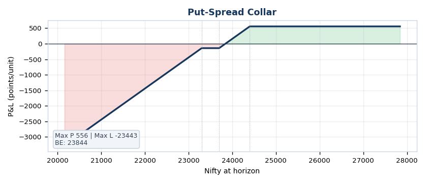

**The numbers (modelled at Nifty 24000).** Max profit: 556 points (about 41,700 per lot) above 24400. Breakeven: 23844. Max loss is quoted as -23443 points — the theoretical figure if the index collapsed all the way to zero, because below 23300 the put spread's protection is exhausted and you are a naked long again. In practice your realistic worst case is a deep selloff through 23300; you would re-hedge or cut rather than ride the index to zero. Risk:reward shows 0.02 only because of that catastrophic-tail accounting.

**Greeks & behaviour.** Delta positive, capped above by the short call. Vega roughly neutral inside the band but turns net-short of protection below the lower strike. Theta mildly positive from the two short premiums.

**Management & exit.** If the market falls toward 23300, that is your signal to act — buy back the lower short put to restore a full floor, or close the position. On a rally into the short call, roll it up. Treat the lower strike as a hard mental stop, not a comfortable floor.

**Risk note.** This structure lulls you with a fat credit and a tidy payoff diagram, then fails in a gap-down through the lower strike — the one event a hedge exists to cover. Size it as a partial hedge only, and know where the protection stops.

**Scenario P&L (₹ per lot, at expiry).**

| Nifty at expiry | 22,800 | 23,400 | 24,000 | 24,600 | 25,200 |
|---|---|---|---|---|---|
| **P&L (₹/lot)** | -₹48,300 | -₹10,800 | +₹11,700 | +₹41,700 | +₹41,700 |

Protection holds the 2.5% dip to 23,400 at just -₹10,800, but a 5% fall to 22,800 already costs -₹48,300 — confirming the floor only spans 23700-23300, beyond which the long is exposed again, while the upside caps at +₹41,700.

**Adjustments, variants & timing.** Treat the lower put strike (23300) as a hard line, not a floor: if the market falls toward it, buy back the short put to restore a full floor or close the structure, because below it you are a naked long again. On a rally into the short call, roll it up to free upside. Refresh the spread each expiry. For a cash or MF book, this is a deliberately partial hedge — beta-adjust lots = (book value x beta) / (Nifty x 75) and use it only to cover the most probable 2-3% dip, banking the credit, never as crash insurance. Keep a modest annual cost budget since the structure usually nets a credit, and accept basis risk on mid-cap exposure. Put it on when you expect an orderly, shallow correction that stalls around support and judge a gap-down unlikely; before a known crash catalyst, switch to a full put or a tail hedge instead.

## 134. Married Put
*Bullish, protected entry · Long vega · net debit*

**The idea (intuition).** A protective put bought at the same moment you buy the underlying — the put and the stock are "married" at entry. From day one your maximum loss is fixed; you have defined your risk before you have made a rupee.

**When & why to use it.** Ideal for entering a fresh long into uncertainty: you like the level but a known catalyst (results, macro print) could gap it down. New or risk-averse traders use it to bound a position from the outset rather than bolting on a hedge after a fall. Skip it for slow, low-conviction holdings where the recurring premium will quietly erode returns.

**How to build it (₹, Nifty).** Long 1x underlying at 24000, buy the 24000 PE at 414. The insurance costs 414 points, about 31,050 per lot — a richer premium here (more time value / higher IV baked in than the cheaper protective-put cases). Floor sits at the strike less premium.

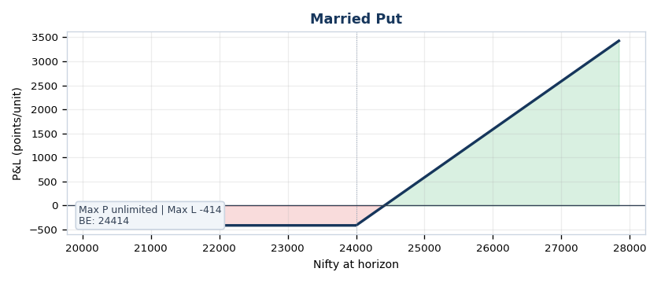

**The numbers (modelled at Nifty 24000).** Max profit: Unlimited. Max loss: -414 points, about 31,050 per lot — exactly the premium, since the strike equals entry. Breakeven: 24414. Net debit (option only): 414 points. Risk:reward undefined (open upside).

**Greeks & behaviour.** Net delta about +0.5x of the bare long at inception. Theta negative — the ATM put decays steadily. Vega strongly positive, so the hedge gains value if fear spikes.

**Management & exit.** Set a re-hedge plan up front: if the index rallies, roll the put up to lock the new floor; if it falls, monetise the put. Do not carry the full ATM premium to expiry — the last-week theta is punishing. Many traders downgrade to an OTM strike once the initial entry risk has passed.

**Risk note.** The breakeven is a steep 414 points above entry — the index must rally over 1.7% just to clear the insurance bill. Marrying a put on every entry is a fast way to underperform a simple long in a calm, grinding market; reserve it for entries that genuinely warrant the cover.

**Scenario P&L (₹ per lot, at expiry).**

| Nifty at expiry | 22,800 | 23,400 | 24,000 | 24,600 | 25,200 |
|---|---|---|---|---|---|
| **P&L (₹/lot)** | -₹31,050 | -₹31,050 | -₹31,050 | +₹13,950 | +₹58,950 |

The married put pins the loss at -₹31,050 (pure premium) all the way down to 22,800 — where a bare long would shed about ₹90,000 — while leaving +₹58,950 on the table at 25,200; risk is bounded from the first rupee.

**Adjustments, variants & timing.** Plan the re-hedge before you enter: if the index rallies, roll the ATM put up to lock the new floor; if it falls, monetise the put for its gain. Do not carry the full ATM premium into expiry week — the theta is punishing — so many traders downgrade to an OTM strike once the initial entry risk has passed, cutting carry. For a fresh cash-equity position or a new MF allocation made into uncertainty, size the index put by beta: lots = (position value x beta) / (Nifty x 75), rounded whole, and budget for a richer premium (here about ₹31,050 a lot) that only pays off if the catalyst is real. Mind basis risk against non-Nifty holdings. Marry a put when you are buying into a known event — results, a macro print — and want risk bounded from rupee one; skip it on slow, low-conviction holdings where the recurring premium will quietly erode the return.

## 135. Wide Collar
*Bullish, loose hedge · Neutral vega · net debit*

**The idea (intuition).** A collar with the strikes pushed far apart, giving the position room to breathe. You only cap the extreme tails and leave a wide corridor in the middle where the underlying moves freely, almost like an unhedged long.

**When & why to use it.** Use it when you want the index to participate in normal swings but still want guardrails against a violent move either way — a "let it run, but not off a cliff" stance. Good for medium-term holders who find a tight collar too constraining. Avoid it if your real fear is a routine 3% dip: the far put may be below the dip, so it pays nothing.

**How to build it (₹, Nifty).** Long 1x underlying at 24000, buy the 23400 PE at 148, sell the 24600 CE at 167. The call funds the put with 19 points to spare — a small 19-point credit (about 1,425 per lot). Wide 1200-point fence around spot.

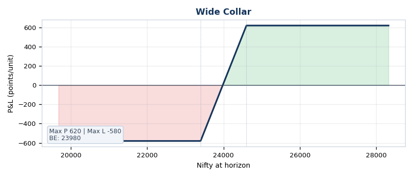

**The numbers (modelled at Nifty 24000).** Max profit: 620 points (about 46,500 per lot) above 24600. Max loss: -580 points (about 43,500 per lot) below 23400. Breakeven: 23980. Risk:reward 1.07 — nearly symmetric, reflecting the loose, balanced fence.

**Greeks & behaviour.** Delta positive across most of the corridor and only pins near the far strikes. Vega close to neutral. Theta near flat, with a slight positive tilt from the marginally richer short call.

**Management & exit.** Because the strikes are far out, there is little to manage day to day. Roll the whole fence out in time as expiry approaches to keep the tail cover alive. If the index trends to one edge, recentre by rolling both legs. Treat it as a set-and-monitor overlay.

**Risk note.** The 1200-point span means you wear a sizeable loss before the put even engages — this is tail cover, not dip cover. Do not confuse the comfort of "I have a collar on" with meaningful near-money protection.

**Scenario P&L (₹ per lot, at expiry).**

| Nifty at expiry | 22,800 | 23,400 | 24,000 | 24,600 | 25,200 |
|---|---|---|---|---|---|
| **P&L (₹/lot)** | -₹43,500 | -₹43,500 | +₹1,500 | +₹46,500 | +₹46,500 |

The wide fence lets the book breathe but only catches the extremes: a 5% drop to 22,800 still costs -₹43,500 before the far put bites, and the upside runs to +₹46,500 at 25,200 — tail cover, not dip cover.

**Adjustments, variants & timing.** With strikes far apart there is little day-to-day management; the main job is to roll the whole fence forward in time as expiry nears so the tail cover stays alive, and to recentre by rolling both legs if the index trends to one edge. For a cash or MF book this is tail cover, not dip cover — beta-adjust lots = (book value x beta) / (Nifty x 75) and accept that a routine 3% slip may fall inside the corridor and pay nothing. The cost budget is near zero (the wide call usually funds the wide put), so the real price is the wide loss you wear before the put engages. Basis risk still applies. Put a wide collar on when you want the book to participate in normal swings but want guardrails against a violent move either way — a 'let it run, but not off a cliff' stance for medium-term holders — rather than as protection against ordinary corrections.

## 136. Fence (Risk-Reversal Hedge)
*Bullish, OTM hedge · Neutral vega · net debit*

**The idea (intuition).** A fence is a collar built from out-of-the-money options around a long position — an OTM put for a floor, an OTM short call for funding. The name fits: you fence the long inside a band, paying little or nothing for the rails.

**When & why to use it.** Use it to hedge a long when you are constructively bullish but want cheap insurance against a sharp drop, and you are willing to surrender gains beyond an OTM call. It is the workhorse hedge for medium-conviction holdings. Do NOT deploy it ahead of an expected breakout — the short call caps exactly the move you want.

**How to build it (₹, Nifty).** Long 1x underlying at 24000, buy the 23500 PE at 169, sell the 24500 CE at 204. Option legs net a 35-point credit (about 2,625 per lot) — you are paid a little to wear the fence. Band runs 23500 to 24500.

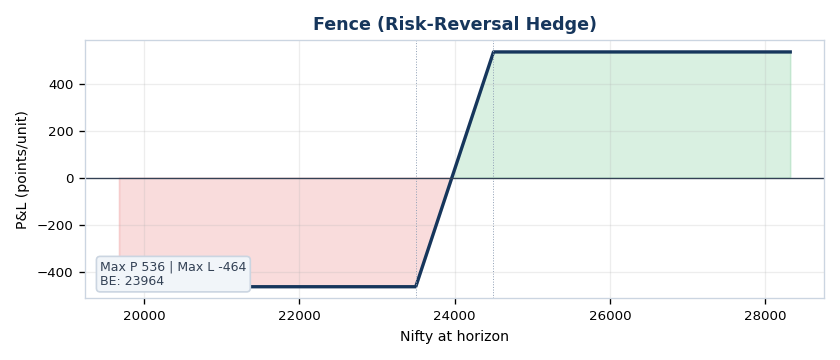

**The numbers (modelled at Nifty 24000).** Max profit: 536 points (about 40,200 per lot) above 24500. Max loss: -464 points (about 34,800 per lot) below 23500. Breakeven: 23964. Risk:reward 1.15.

**Greeks & behaviour.** Delta positive inside the band, flattening at the strikes. Vega roughly neutral. Theta near flat to slightly positive from the short call's decay edging out the long put's.

**Management & exit.** Roll the tested side: if the index climbs toward 24500, roll the call up-and-out to free upside; if it drops toward 23500, the floor holds and you can re-strike the fence lower. Refresh in time before expiry-week gamma makes the short call jumpy.

**Risk note.** As with any short-call hedge, a strong rally is forgone profit, and on cash-settled Nifty there is no assignment worry — but on stock fences mind STT and assignment on an ITM call. The fence protects a band, not a crash beyond the put.

**Scenario P&L (₹ per lot, at expiry).**

| Nifty at expiry | 22,800 | 23,400 | 24,000 | 24,600 | 25,200 |
|---|---|---|---|---|---|
| **P&L (₹/lot)** | -₹34,800 | -₹34,800 | +₹2,700 | +₹40,200 | +₹40,200 |

The fence brackets the long between -₹34,800 at 22,800 and +₹40,200 at 25,200 — the OTM put softens the crash and the OTM call funds it, but a 5% move still runs most of the way to each rail before the strikes engage.

**Adjustments, variants & timing.** Roll the tested side: if the index climbs toward the 24500 call, roll it up-and-out to free upside; if it drops toward the 23500 put, the floor holds and you can re-strike the fence lower. Refresh before expiry-week gamma makes the short call jumpy. For a cash-equity or MF book, beta-adjust the lot count = (portfolio value x beta) / (Nifty x 75) and use OTM Nifty or Bank Nifty strikes so the call funds most of the put, keeping the annual cost budget near zero. Basis risk applies on mid-cap-heavy books. The fence is the workhorse for medium-conviction holdings: put it on when you are constructively bullish but want cheap insurance against a sharp drop and can surrender gains beyond the call — and take it off, or roll the call up, ahead of an expected breakout, since the short call caps exactly the move you are hoping for.

## 137. Put-Ratio Hedge
*Hedge a long, cheaply · Mixed vega · net debit*

**The idea (intuition).** You hedge with a 1x2 put ratio: buy one near-the-money put and sell two further-OTM puts to pay for it. The two short puts make the hedge almost free in the protected zone — but they also leave you over-short below the lower strike, where a crash hurts instead of helps.

**When & why to use it.** Use it for very cheap protection against a moderate, orderly decline that you expect to stall around the lower strike. It shines in low-VIX drifts. Do NOT use it as crash cover: the extra short put means a violent gap-down past the lower strike turns your hedge into a second losing long.

**How to build it (₹, Nifty).** Long 1x underlying at 24000, buy the 24000 PE at 318, sell 2x the 23400 PE at 148 each (296 total). Option legs net just -22 points — about a 1,650-per-lot debit for a full 600-point protected band. The cover is nearly self-financing.

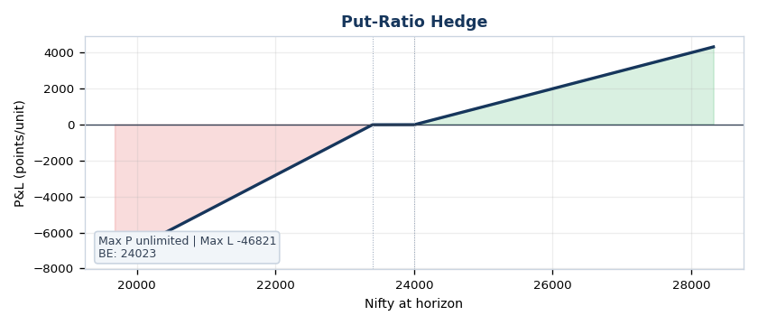

**The numbers (modelled at Nifty 24000).** Max profit: Unlimited (still long the index). Breakeven: 24023. Max loss is quoted as -46821 points — the theoretical figure if the index fell to zero, because below 23400 you hold the long index PLUS a net-short put, a doubly leveraged downside. That worst case assumes a collapse to zero; in practice you size this small and stop out or buy back the extra short put if the market breaks the lower strike. Risk:reward undefined.

**Greeks & behaviour.** Delta positive near spot but swings sharply negative-exposure below the lower strike as the net-short put dominates. Vega is mixed and turns short below the strikes — rising IV in a selloff hurts the uncovered short put. Theta mildly positive from the two shorts.

**Management & exit.** Define a hard line at 23400: if the index threatens it, buy back one short put to neutralise the dangerous leg. Take the hedge off once the feared dip has played out around the long-put strike. Never let this run unmanaged into expiry week.

**Risk note.** This is the most deceptive structure in the group — beautiful for a mild dip, ruinous in a true crash, which is the one event you hedge for. Treat it as a tactical cheapener for a small portion of the book, never as portfolio insurance.

**Scenario P&L (₹ per lot, at expiry).**

| Nifty at expiry | 22,800 | 23,400 | 24,000 | 24,600 | 25,200 |
|---|---|---|---|---|---|
| **P&L (₹/lot)** | -₹91,725 | -₹1,725 | -₹1,725 | +₹43,275 | +₹88,275 |

The ratio hedge looks benign at a moderate dip — only -₹1,725 at 23,400 — but a 5% crash to 22,800 costs -₹91,725, worse than a bare long, as the extra short put turns the hedge into a second losing position below 23400.

**Adjustments, variants & timing.** This needs active management, not set-and-forget. Define a hard line at the lower strike (23400): if the index threatens it, buy back one short put immediately to neutralise the dangerous net-short leg, because below there you hold the long index plus a short put — a doubly leveraged downside. Take the hedge off once the feared dip stalls around the long-put strike, and never carry it unmanaged into expiry. For a cash or MF book, size it small — beta-adjust lots = (book value x beta) / (Nifty x 75) but apply only to a fraction you can actively watch — with a near-zero cost budget since the two shorts almost self-finance the cover. Basis risk compounds the tail danger. Use it only in a low-VIX drift when you expect a moderate, orderly decline that halts around the lower strike; never as portfolio crash insurance, the exact scenario where the extra short put turns the hedge into a second losing long.

## 138. Tail-Risk Hedge
*Crash insurance · Long vega · net debit*

**The idea (intuition).** Buy a far-out-of-the-money put as cheap, persistent catastrophe cover. It is lottery-ticket insurance: most of the time it expires worthless, but in a crash it pays off many times over, exactly when the rest of your book is bleeding.

**When & why to use it.** This is the structure for the investor who wants to stay fully long but hold a small, standing hedge against a market dislocation — a 2008/2020-style gap. Buy it when VIX is low and far puts are cheap; that is when crash cover is on sale and nobody wants it. Do NOT expect it to cover ordinary 3-5% dips — the strike is too far away for that.

**How to build it (₹, Nifty).** Long 1x underlying at 24000, buy the 22500 PE at 118. The cover costs just 118 points, about 8,850 per lot — under 0.5% of notional for a deep-tail floor 1500 points away.

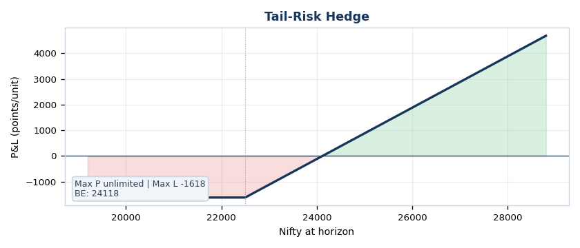

**The numbers (modelled at Nifty 24000).** Max profit: Unlimited. Max loss: -1618 points, about 121,350 per lot — the 1500-point drop to the strike plus the 118 premium (the long index loses on the way down before the put engages). Breakeven: 24118. Net debit (option only): 118 points. Risk:reward undefined.

**Greeks & behaviour.** Delta barely below the bare long (the far put has tiny delta). Theta is small and negative — the cheap premium bleeds slowly. Vega is positive and is the star: far-OTM puts are pure convexity, so an IV explosion in a crash can multiply the put's value even before the strike is breached.

**Management & exit.** The classic trade is to monetise into panic — when the market gaps down and IV spikes, the put's value can balloon; sell it, harvest the convexity, and redeploy. Otherwise roll the cheap put forward each month or quarter as a standing line item in the cost of being invested.

**Risk note.** The painful truth: this hedge loses a little money almost every single month, and that recurring drag is the whole cost of owning crash protection. The mistake is abandoning it after a long calm stretch — that is precisely when the next crash arrives.

**Scenario P&L (₹ per lot, at expiry).**

| Nifty at expiry | 22,800 | 23,400 | 24,000 | 24,600 | 25,200 |
|---|---|---|---|---|---|
| **P&L (₹/lot)** | -₹98,850 | -₹53,850 | -₹8,850 | +₹36,150 | +₹81,150 |

Tail cover does little for ordinary moves — a 2.5% dip still costs -₹53,850 — and the table's linear -₹98,850 at 22,800 actually understates its worth, since it ignores the IV-driven convexity that makes the far put explode in a real crash; the upside meanwhile reaches +₹81,150.

**Adjustments, variants & timing.** The signature move is to monetise into panic: when the market gaps down and IV explodes, the far put's value can balloon through pure convexity even before the strike is breached — sell it, harvest the gain, and redeploy. Otherwise roll the cheap put forward each month or quarter as a standing line item. For a cash-equity or MF book, beta-adjust the lots = (book value x beta) / (Nifty x 75) and keep the annual cost budget tiny (here under 0.5% of notional per cover) since deep-OTM puts are cheap; that small drag is the whole price of crash insurance. Basis risk matters less here because a true dislocation drags everything down together. Carry it always, not tactically — the discipline is to keep paying when markets are calm and far puts are on sale, precisely because the urge to drop the hedge after a long quiet stretch is exactly when the next crash tends to arrive.

## 139. Put-Backspread Hedge
*Long, with crash kicker · Long vega · net debit*

**The idea (intuition).** Overlay a put backspread on your long: sell one near put and buy two lower puts. In a crash the two long puts overpower the short one, so a deep selloff actually turns into a gain — your hedge has a built-in profit kicker beyond a mild dip.

**When & why to use it.** Use it when you are long but assign real probability to a large, fast move down — you want ordinary cover and a payoff if the tail actually hits. Best entered when skew is reasonable and lower puts are not too expensive relative to the near put. Avoid it if you expect a shallow grind lower that stalls between the strikes — that is its worst zone.

**How to build it (₹, Nifty).** Long 1x underlying at 24000, sell the 24000 PE at 318, buy 2x the 23600 PE at 192 each (384 total). Option legs net -66 points — about a 4,950-per-lot debit. Below 23600 the extra long put accelerates gains.

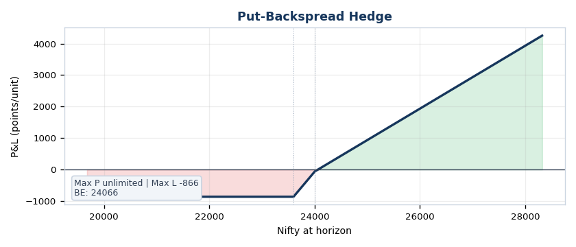

**The numbers (modelled at Nifty 24000).** Max profit: Unlimited — both from the long index on the upside and from the extra long put on a deep downside. Max loss: -866 points, about 64,950 per lot, occurring around the lower strike (23600) where the short put has cost you but the long puts have not yet taken over. Breakeven: 24066. Risk:reward undefined.

**Greeks & behaviour.** Delta positive near spot, then flips to strongly negative-exposure below the lower strike as the two long puts dominate — that flip is the crash kicker. Vega is positive and grows in a selloff. Theta is negative in the trough zone, since you are net-long two decaying puts there.

**Management & exit.** The worst outcome is pinning at the lower strike into expiry, where time decay and the payoff valley meet — exit or roll well before expiry week if the index is camped near 23600. If a crash develops, the long puts surge; harvest them. If the market rallies, let the cheap overlay lapse and keep your long.

**Risk note.** The maximum-pain point is a slow drift to the lower strike — the exact path a nervous market often takes. This is a sophisticated overlay; size it modestly and respect the trough between the strikes.

**Scenario P&L (₹ per lot, at expiry).**

| Nifty at expiry | 22,800 | 23,400 | 24,000 | 24,600 | 25,200 |
|---|---|---|---|---|---|
| **P&L (₹/lot)** | -₹64,950 | -₹64,950 | -₹4,950 | +₹40,050 | +₹85,050 |

The trough sits at the lower strike — -₹64,950 at both 23,400 and 22,800 in this expiry snapshot — but below 23600 the two long puts begin clawing the loss back toward a crash gain, while the long index still delivers +₹85,050 at 25,200.

**Adjustments, variants & timing.** The worst outcome is pinning at the lower strike (23600) into expiry, where decay and the payoff valley meet, so exit or roll well before expiry week if the index is camped there. If a crash develops, the two long puts surge — harvest them; if the market rallies, let the cheap overlay lapse and keep the long. For a cash or MF book, size it modestly — beta-adjust lots = (book value x beta) / (Nifty x 75) on only the slice you want a tail kicker on — with a small net-debit budget (here about ₹4,950 a lot). Enter when skew is reasonable and the lower puts are not dear relative to the near put. Basis risk applies. Use it when you are long but assign real probability to a large, fast move down and want both ordinary cover and a payoff if the tail hits — but avoid it when you expect a shallow grind that stalls between the strikes, its worst zone.

## 140. Collar for a Credit
*Bullish, paid to hedge · Neutral vega · net debit*

**The idea (intuition).** A collar where the call you sell is worth more than the put you buy, so you pocket a net credit for putting the hedge on. You are quite literally paid to insure your long — the catch is a tighter, lower upside cap.

**When & why to use it.** Use it when you are neutral-to-mildly-bullish and happy to cap upside fairly close in exchange for both downside cover and a credit — a sensible stance late in a rally when you doubt much more upside but want protection. The credit cushions your breakeven below spot. Do NOT use it if you still see meaningful upside; the near call gives it away cheaply.

**How to build it (₹, Nifty).** Long 1x underlying at 24000, buy the 23500 PE at 169, sell the 24200 CE at 342. Option legs net a 173-point credit — about 12,975 per lot collected to be hedged. The credit drops your breakeven to 23826, below the spot.

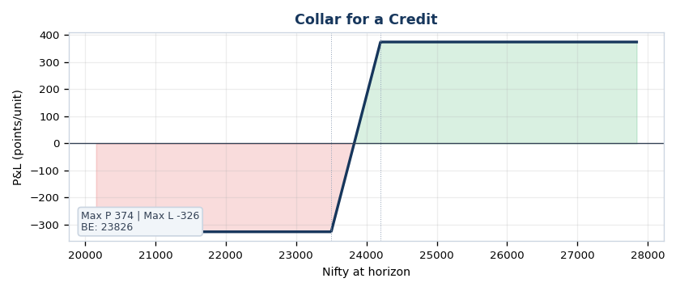

**The numbers (modelled at Nifty 24000).** Max profit: 374 points (about 28,050 per lot) above 24200. Max loss: -326 points (about 24,450 per lot) below 23500. Breakeven: 23826 — notably under spot, thanks to the credit. Risk:reward 1.15.

**Greeks & behaviour.** Delta positive but capped fairly near, because the short call sits only 200 points above spot. Vega roughly neutral. Theta positive — the richer, nearer short call decays faster than the OTM long put, so time works for you.

**Management & exit.** Watch the near-money short call: if the index pushes toward 24200, roll it up-and-out to avoid surrendering a rally, accepting a smaller credit. If the market falls, the floor holds and the credit is yours to keep. Manage assignment risk on stock versions before expiry.

**Risk note.** That nearby call cap is the price of the credit — a brisk rally is capped quickly, and the credit is small consolation against a big missed move. The sub-spot breakeven is the genuine attraction: you are hedged and already a touch ahead.

**Scenario P&L (₹ per lot, at expiry).**

| Nifty at expiry | 22,800 | 23,400 | 24,000 | 24,600 | 25,200 |
|---|---|---|---|---|---|
| **P&L (₹/lot)** | -₹24,450 | -₹24,450 | +₹13,050 | +₹28,050 | +₹28,050 |

The credit collar brackets the long between -₹24,450 at 22,800 and a capped +₹28,050 at 25,200, and its sub-spot breakeven means the floor and the upfront credit together blunt the downside more than a plain collar would.

**Adjustments, variants & timing.** Watch the near-money short call closely: if the index pushes toward 24200, roll it up-and-out to avoid surrendering a rally, accepting a smaller credit; if the market falls, the floor holds and the credit is yours to keep. Reset each expiry. The attraction is the sub-spot breakeven (23826) — the credit puts you slightly ahead the moment you hedge. For a cash or MF book, beta-adjust lots = (portfolio value x beta) / (Nifty x 75) and choose a nearer call so the structure nets a credit, making the cost budget negative — you are paid to hedge. Basis risk applies on non-Nifty names. Put it on late in a rally when you are neutral-to-mildly-bullish, doubt much further upside, and want both downside cover and a small credit; do not use it while you still see meaningful upside, because the near call gives that rally away cheaply for a modest payment.

## 141. Protective Put Spread
*Bullish, partial hedge · Neutral vega · net debit*

**The idea (intuition).** Hedge with a put SPREAD rather than a single put: buy a put, sell a lower put to cheapen it. You get a defined band of protection at a fraction of the cost — but the cover stops at the lower strike, below which you are a naked long again.

**When & why to use it.** Use it when you want cheap insurance against a specific, bounded decline — you think the index might slip to a support level but not crash through it. It is a partial hedge for cost-conscious holders. Do NOT rely on it through a known crash catalyst; the lower short put caps your protection at exactly the wrong moment.

**How to build it (₹, Nifty).** Long 1x underlying at 24000, buy the 23800 PE at 248, sell the 23300 PE at 129. Option legs net a 119-point debit — about 8,925 per lot for a 500-point protected band (23800 down to 23300).

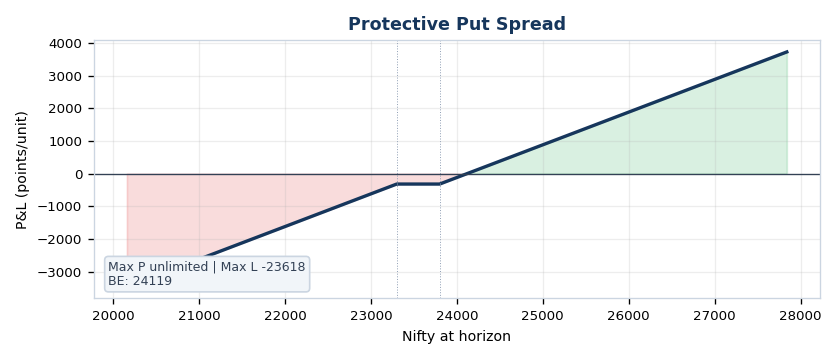

**The numbers (modelled at Nifty 24000).** Max profit: Unlimited (still long the index above). Breakeven: 24119. Max loss is quoted as -23618 points — the theoretical figure if the index fell to zero, because below 23300 the spread's protection is spent and you ride the index down unhedged. That worst case assumes a collapse to zero; realistically you would re-hedge or exit on a break of 23300 and size the position with that line in mind. Risk:reward undefined.

**Greeks & behaviour.** Delta positive, reduced inside the protected band by the long put spread. Vega is roughly neutral within the band (long and short put vegas offset) and turns unprotected below the lower strike. Theta slightly negative from the net long premium.

**Management & exit.** Treat 23300 as a hard stop, not a floor — if the market approaches it, buy back the short put to restore full cover or close out. On a rally, let the cheap spread decay and re-strike. The spread is most useful as a defined, expiry-matched dip hedge.

**Risk note.** The danger is psychological as much as financial: the tidy payoff diagram suggests you are covered, but a gap-down through 23300 leaves you fully exposed. Use it as a deliberate partial hedge and never confuse it with crash insurance.

**Scenario P&L (₹ per lot, at expiry).**

| Nifty at expiry | 22,800 | 23,400 | 24,000 | 24,600 | 25,200 |
|---|---|---|---|---|---|
| **P&L (₹/lot)** | -₹61,425 | -₹23,925 | -₹8,925 | +₹36,075 | +₹81,075 |

The put spread cushions a move to support — only -₹8,925 at 23,400 — but a 5% drop to 22,800 already costs -₹61,425 as protection runs out below 23300, while the long keeps +₹81,075 of upside at 25,200.

**Adjustments, variants & timing.** Treat the lower strike (23300) as a hard stop, not a floor: if the market approaches it, buy back the short put to restore full cover or close out, since below it you ride the index down unhedged. On a rally, let the cheap spread decay and re-strike; match the spread's expiry to your dip horizon. For a cash-equity or MF book this is a defined, partial hedge — beta-adjust lots = (book value x beta) / (Nifty x 75) and use it to cover a specific, bounded decline to a support level, budgeting the modest net debit (here about ₹8,925 a lot). Accept basis risk on mid-cap exposure. Put it on when you think the index may slip to support but not crash through it; do not rely on it through a known crash catalyst, where the lower short put caps your protection at exactly the wrong moment — switch to a full put or tail hedge for that.

## 142. Index Put Hedge Overlay
*Portfolio insurance · Long vega · net debit*

**The idea (intuition).** Buy Nifty puts to hedge an entire long book — a basket of cash equities or mutual funds — for a fixed period. Rather than insuring each holding, you buy one index put against the whole portfolio's market exposure. This is how real money runs portfolio insurance.

**When & why to use it.** This is the practical answer to "how does an Indian investor hedge a cash-equity or MF book?" Use Nifty puts when you want to stay invested through a risky window (results season, a global event) without selling holdings and triggering tax or exit loads. Buy when VIX is low. Do NOT over-rely on it if your portfolio is full of mid/small-caps — Nifty puts hedge large-cap beta, and the basis mismatch can be large.

**How to build it (₹, Nifty).** Long 1x underlying (your book's index-equivalent) at 24000, buy the 23600 PE at 251. The cover costs 251 points, about 18,825 per lot. The key real-world step is lot-sizing: hedge ratio equals portfolio value times its Nifty beta, divided by (Nifty level times 75); round to whole lots.

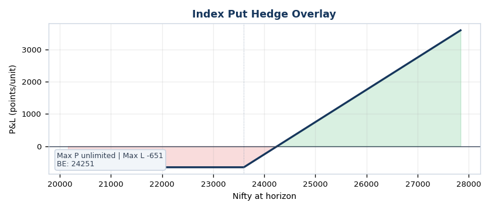

**The numbers (modelled at Nifty 24000).** Max profit: Unlimited (your long book keeps appreciating). Max loss on this single-lot model: -651 points, about 48,825 per lot — the 400-point gap to the strike plus the 251 premium. Breakeven: 24251. Net debit (option only): 251 points. Risk:reward undefined.

**Greeks & behaviour.** Net delta positive but trimmed by the put. Theta negative — the overlay bleeds time value, the standing cost of insurance. Vega positive: the hedge gains value as fear and IV rise, partly offsetting book losses in a selloff.

**Management & exit.** Roll the put forward each month or quarter, re-striking near spot as the market moves and re-computing the lot count as the book's value changes. Monetise the put into a spike and redeploy. Reduce or lift the hedge once the risk window passes to stop the carry drag.

**Risk note.** Basis risk is the central caveat — Nifty puts will not perfectly track a portfolio of non-Nifty or smaller-cap names, so the hedge can under- or over-cover. Add tracking error from rounding to whole lots, plus the certain premium drag, and you have a useful but imperfect shield. The discipline is to hedge the beta you can, accept the rest, and keep paying the premium that, most months, you will be glad went to waste.

**Scenario P&L (₹ per lot, at expiry).**

| Nifty at expiry | 22,800 | 23,400 | 24,000 | 24,600 | 25,200 |
|---|---|---|---|---|---|
| **P&L (₹/lot)** | -₹48,825 | -₹48,825 | -₹18,825 | +₹26,175 | +₹71,175 |

The single-lot overlay caps a 5% fall at -₹48,825 versus the roughly ₹90,000 a bare index lot would lose, and keeps +₹71,175 at 25,200 — but on a real book those rupees only land cleanly to the extent the holdings track Nifty.

**Adjustments, variants & timing.** Roll the put forward each month or quarter, re-striking near spot as the market moves and re-computing the lot count as the book's value changes; monetise the put into a spike and redeploy, and lift the hedge once the risk window passes to stop the carry drag. The core discipline is lot-sizing: lots = (portfolio value x portfolio Nifty beta) / (Nifty x 75), rounded to whole lots, so a 30-lakh book at beta 1.1 against Nifty 24000 needs about 18 lots. Use Bank Nifty puts instead if the book is bank-heavy. Budget 2-4% of the book a year for cover and accept basis risk — Nifty puts hedge large-cap beta, not mid/small-cap names. Put the overlay on ahead of a risky window — results season, a global event — when you want to stay invested without selling and triggering tax or exit loads, and buy when VIX is low; carry it always only if your mandate forbids drawdowns.

# Strategy Group 10: Synthetics & Arbitrage

This family is built on one equation — put-call parity: C - P = S - K*e^(-r*T). Read that as "a call minus a put at the same strike equals the stock minus the present value of the strike." It means any one of the four instruments (stock, call, put, cash) can be rebuilt from the other three, so every position has a synthetic twin that behaves identically at expiry. Traders use synthetics to replicate a payoff they cannot or do not want to hold directly, while desks and arbitrageurs assemble fully-hedged "locked" packages — conversions, reversals, boxes, jelly rolls — that strip out direction entirely and leave only the financing rate, dividends, and skew. Be warned up front: on NSE these locked trades earn the risk-free rate minus costs, and STT, brokerage and the bid-ask usually swallow the two-point edge. These are professional relative-value tools, not retail money trees.

## 143. Synthetic Long Stock
*Bullish (futures-like) · Neutral vega · net debit*

**The idea (intuition).** Buy a call and sell a put at the same strike and you own the index without owning the index. Above the strike the call carries you up; below it the short put drags you down one-for-one — exactly what a long future does. Parity guarantees the two are the same line.

**When & why to use it.** Use it when you are outright bullish on Nifty but want options-account flexibility — say the single-stock future is illiquid, margins are friendlier, or you want to leg into a spread later. It is a clean directional bet for someone who has a view and no desire to pay time value. Do NOT use it if you want defined risk: this has the full downside of a long future. Avoid when IV is so high that the call you buy is far richer than the put you sell, creating a needless debit.

**How to build it (₹, Nifty).** Buy 24000 CE @ 456, sell 24000 PE @ 318. Net debit 137.7 points, about ₹10,328 per lot (137.7 × 75). That small debit is essentially the cost-of-carry priced into the synthetic future.

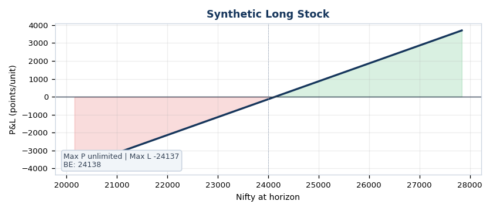

**The numbers (modelled at Nifty 24000).** Max profit: Unlimited. Max loss: -24137.0 points (the index falling to zero — catastrophic but bounded). Breakeven: 24138. Net debit 137.7 points (~₹10,328). Risk:reward undefined (one side unlimited).

**Greeks & behaviour.** Net delta ≈ +1.0 per unit — pure direction. Theta and vega roughly cancel because you are long one option and short another at the same strike, so this is genuinely a futures proxy, not a volatility trade.

**Management & exit.** Manage it like a long future: trail a stop under support, or convert to a risk-defined structure by buying a protective put if the tape turns. Take it off when your price target prints or your thesis breaks.

**Risk note.** The honest danger is the same as any leveraged long — a gap-down hits the short put with no floor. This worst case assumes the index collapses to zero; in practice you size small and stop out at a multiple of the debit.

**Scenario P&L (₹ per lot, at expiry).**

| Nifty at expiry | 22,800 | 23,400 | 24,000 | 24,600 | 25,200 |
|---|---|---|---|---|---|
| **P&L (₹/lot)** | -₹100,350 | -₹55,350 | -₹10,350 | +₹34,650 | +₹79,650 |

Read left to right the line climbs steadily, losing -₹100,350 if Nifty falls to 22,800 and gaining +₹79,650 at 25,200 — a clean one-for-one bullish profile, exactly like a long future.

**Adjustments, variants & timing.** A desk treating this as a futures proxy simply carries it and manages delta like any long future, rolling to the next series before expiry or unwinding the moment the cash-future basis makes the listed future cheaper to hold. Put-call parity (C - P = S - K*e^(-r*T)) is the screen tell: when the 24000 call trades rich to the put by more than fair carry, the synthetic long is being offered below the future, and an arbitrage desk will leg in. For a retail bull, though, the honest accounting matters — STT on the option legs, brokerage on two strikes, and the bid-ask you cross to get filled usually exceed the thin carry edge versus simply buying the Nifty future. The synthetic earns its keep only when the future is illiquid or margin treatment is friendlier. It is a financing / relative-value construction first; as a directional punt the listed future is almost always cheaper and cleaner on NSE.

## 144. Synthetic Short Stock
*Bearish (futures-like) · Neutral vega · net credit*

**The idea (intuition).** Flip the previous trade: sell the call, buy the put at one strike and you are synthetically short the index. The long put pays as the market falls, the short call bleeds against you on a rally — a mirror of a short future.

**When & why to use it.** Reach for it when you want downside exposure but shorting the cash index is awkward and the future is thin or carries an unfavourable basis. It suits a tactical bearish swing into an event — a hawkish RBI, a weak global cue — where you want one-for-one participation without paying for a put outright. Do NOT use it as "cheap insurance"; it is a naked directional short with an unlimited tail. Skip it when borrow/financing makes the short call expensive relative to the put.

**How to build it (₹, Nifty).** Sell 24000 CE @ 456, buy 24000 PE @ 318. Net credit 137.7 points, about ₹10,328 per lot received. The credit is the carry working in your favour as the synthetic short seller.

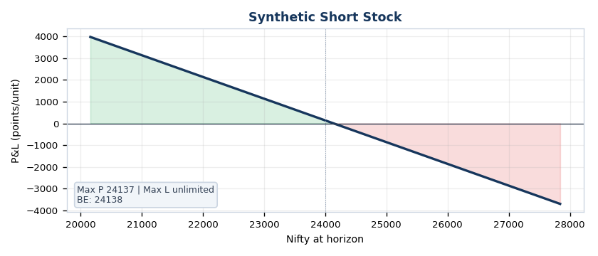

**The numbers (modelled at Nifty 24000).** Max profit: 24137.0 points (index to zero — the bounded best case). Max loss: Undefined — large (a runaway rally through the short call). Breakeven: 24138. Net credit 137.7 points (~₹10,328). Risk:reward undefined.

**Greeks & behaviour.** Net delta ≈ -1.0 per unit. Like its long twin, theta and vega offset, so P&L is driven almost entirely by price, not time or volatility.

**Management & exit.** Treat it as a short future: hard stop above resistance, or cap the tail by buying a cheap OTM call to cut the structure into a defined-risk short. Cover when your downside target is met.

**Risk note.** An overnight gap-up — a surprise global rally or a positive policy shock — is the killer, since the short call's loss is theoretically unlimited. Always pre-define the stop; never let a synthetic short run unhedged through results season.

**Scenario P&L (₹ per lot, at expiry).**

| Nifty at expiry | 22,800 | 23,400 | 24,000 | 24,600 | 25,200 |
|---|---|---|---|---|---|
| **P&L (₹/lot)** | +₹100,350 | +₹55,350 | +₹10,350 | -₹34,650 | -₹79,650 |

The line is the mirror image — a gain of +₹100,350 if Nifty drops to 22,800 fading to a loss of -₹79,650 at 25,200 — one-for-one downside participation like a short future.

**Adjustments, variants & timing.** Managed as a short future, the desk trails delta and rolls the series, unwinding whenever the basis turns favourable enough to short the listed future outright instead. Parity flags the entry: when the 24000 call is cheap to the put beyond fair carry, the synthetic short can be assembled above the future's price, and an arb book captures the gap risk-free. But for a retail bear the same caution applies as everywhere in this group — STT (charged more harshly on the sold call), brokerage across two legs, and the spread you pay typically swamp the few points of edge over a plain short future. The synthetic is justified only when the future is thin or the short-borrow on cash is awkward. Treat it as a financing-and-access tool a desk reaches for to stay delta-neutral while warehousing inventory, not a money-making engine; the locked component here is carry, and carry minus NSE costs is close to nothing.

## 145. Synthetic Long Call
*Bullish, insured · Long vega · net debit*

**The idea (intuition).** Own the index and buy a put against it, and your combined payoff curves exactly like a long call: unlimited upside, a hard floor below. Parity says stock-plus-put equals call-plus-cash, so this protective-put package is a call in disguise.

**When & why to use it.** Use it when you already hold the underlying (or want to) and a known catalyst — earnings, Budget, a Fed meeting — could trigger a sharp drop you want to survive while keeping all the upside. It is the textbook "stay long but sleep at night" trade. It is also a way to express a long-call view when the listed call is mispriced versus the put. Do NOT use it in dead, low-IV drift markets — you pay put premium every cycle for protection you may not need.

**How to build it (₹, Nifty).** Long 1x underlying @ 24000, buy 24000 PE @ 318. Net outlay 24318.3 points including the index; the option cost that matters is the 318-point put premium, about ₹23,850 per lot of insurance.


**The numbers (modelled at Nifty 24000).** Max profit: Unlimited. Max loss: -318.0 points (~₹23,850 per lot) — capped at the put premium. Breakeven: 24318. Net debit 24318.3 points (index included). Risk:reward undefined (upside unlimited).

**Greeks & behaviour.** Net delta is positive but less than the bare stock because the put offsets some downside delta. Theta is negative (the put decays) and vega is positive — rising IV lifts your insurance. Direction still dominates the P&L.

**Management & exit.** Roll the put up after a rally to lock in gains (a "ratchet"), or let it expire if your bullish view firms up. Exit the whole package if the thesis is done; sell the put back if a vol spike makes it rich and you want to harvest the hedge.

**Risk note.** The cost is the drag: pay for the put too often and it erodes returns in calm markets. IV crush right after the event can shrink the put's value even if you were right to be cautious.

**Scenario P&L (₹ per lot, at expiry).**

| Nifty at expiry | 22,800 | 23,400 | 24,000 | 24,600 | 25,200 |
|---|---|---|---|---|---|
| **P&L (₹/lot)** | -₹23,850 | -₹23,850 | -₹23,850 | +₹21,150 | +₹66,150 |

The loss is floored at -₹23,850 across the three lower columns (the put protection), then the position climbs to +₹66,150 at 25,200 — the capped-downside, open-upside shape of a long call.

**Adjustments, variants & timing.** Desks run this protective-put package to expiry when they want the insurance through a known catalyst, then either let the put lapse or ratchet it up after a rally to bank gains; they unwind the hedge early if an IV spike makes the put rich enough to monetise. Put-call parity is what tells the trader whether to build the call synthetically (stock plus put) or just buy the listed call — when the put screens cheap to the call beyond fair carry, the synthetic route is the better fill on NSE. The honest caveat: each protective cycle costs real put premium plus STT and brokerage, and in calm, low-IV drift those frictions quietly exceed the protection's value. This is a risk-management and relative-value construction for someone who already holds the underlying, not a retail income idea; if you find yourself paying for the put every month in a dead tape, the structure is bleeding you, not protecting you.

## 146. Synthetic Short Call
*Bearish income · Short vega · net credit*

**The idea (intuition).** Be short the index and sell a put against it. Your payoff is capped on the downside and bleeds on a rally — the same shape as a short call. You collect premium and have a modest cushion, but the upside is open against you.

**When & why to use it.** This is an income-with-a-bearish-lean position: you want the market to stall or drift down and are happy to pocket the put premium. On NSE it shows up when a desk is short the underlying and writes a put to subsidise carry. Use it in a range-bound-to-soft tape with elevated IV so the put you sell is fat. Do NOT use it ahead of a possible squeeze — the short stock plus short put both lose on a rip higher.

**How to build it (₹, Nifty).** Short 1x underlying @ 24000, sell 24000 PE @ 318. Net credit 24318.3 points including the short-index proceeds; the income that matters is the 318-point put premium, ~₹23,850 per lot collected.

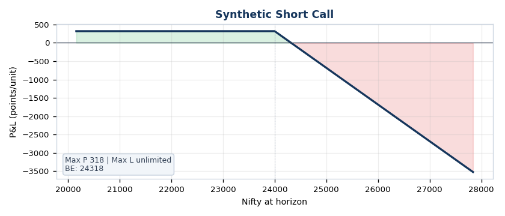

**The numbers (modelled at Nifty 24000).** Max profit: 318.0 points (~₹23,850 per lot) — the premium kept if it expires worthless and the short works. Max loss: Undefined — large (a rally through your short index and short put). Breakeven: 24318. Net credit 24318.3 points. Risk:reward undefined.

**Greeks & behaviour.** Net delta negative; theta positive (the sold put decays in your favour); vega negative (falling IV helps). Time and a soft market both pay you, but a melt-up overwhelms everything.

**Management & exit.** Buy back the put at ~50% of the credit, or cap the tail with a long OTM call if momentum turns up. Cover the short and close the put together once the down-move plays out.

**Risk note.** Premium-selling is never free money — most retail F&O traders lose (SEBI studies). The unlimited rally risk is real; size small and stop at a multiple of the credit rather than hoping the put cushion saves you.

**Scenario P&L (₹ per lot, at expiry).**

| Nifty at expiry | 22,800 | 23,400 | 24,000 | 24,600 | 25,200 |
|---|---|---|---|---|---|
| **P&L (₹/lot)** | +₹23,850 | +₹23,850 | +₹23,850 | -₹21,150 | -₹66,150 |

The premium of +₹23,850 is kept flat across the lower columns while the market is soft, then turns into a growing loss reaching -₹66,150 at 25,200 as the rally runs through you — a short-call profile.

**Adjustments, variants & timing.** This income-with-a-bearish-lean overlay is carried to collect the put premium and managed by buying the put back near 50% of the credit, or rolling it down if the market drifts your way; the desk unwinds if a squeeze threatens the open upside on the short index. Parity is the screen signal — a put trading fat relative to the call (steep skew, elevated IV) is what makes writing it worthwhile. The blunt truth, repeated across this group: STT falls heaviest on sold options, and brokerage plus the bid-ask on two legs routinely eat the thin edge, so this is a desk financing / relative-value tool, not retail income. SEBI's own studies show most retail F&O participants lose money writing premium like this. Treat the put income as subsidy on a short-inventory carry, size it small, and respect that a melt-up overwhelms the cushion long before the premium ever pays for the tail.

## 147. Synthetic Long Put
*Bearish, insured · Long vega · net credit*

**The idea (intuition).** Short the index and buy a call as a stop. The payoff bends exactly like a long put — big money if the market falls, with a defined, small loss capped by the call if it rallies. It is a protected short.

**When & why to use it.** Use it when you want clean bearish exposure with a hard ceiling on losses — a directional short into a feared event where a gap-up would otherwise be lethal. The long call is your seatbelt above the strike. It also expresses a synthetic-put view when the listed put is dear versus the call. Avoid it as a perpetual hedge in a grinding bull market; the call premium and the short's carry both bleed.

**How to build it (₹, Nifty).** Short 1x underlying @ 24000, buy 24000 CE @ 456. Net credit 23544.1 points net of the short proceeds; the protection cost that matters is the 456-point call, ~₹34,200 per lot.

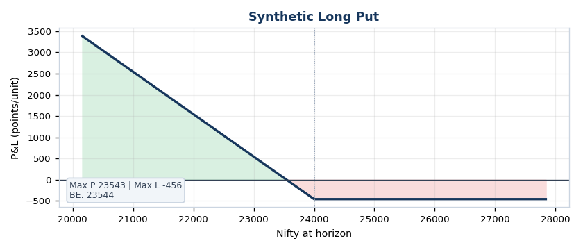

**The numbers (modelled at Nifty 24000).** Max profit: 23543.0 points (index toward zero — the bounded best case). Max loss: -456.0 points (~₹34,200 per lot), capped by the long call. Breakeven: 23544. Net credit 23544.1 points. Risk:reward 51.64 — a striking ratio, but remember the "reward" assumes a collapse to zero.

**Greeks & behaviour.** Net delta negative; theta negative (you own the call); vega positive — a vol spike lifts your call hedge. Direction drives P&L while the call defines the worst case.

**Management & exit.** Roll the call down after a sell-off to lock gains and cut hedge cost, or take the structure off when your downside target prints. If IV pops and the call gets rich, consider monetising it.

**Risk note.** The honest read on that 51.64 risk:reward is that the huge "reward" needs the index near zero; realistic profits are far smaller. The steady cost is the call premium and any negative carry on the short while you wait.

**Scenario P&L (₹ per lot, at expiry).**

| Nifty at expiry | 22,800 | 23,400 | 24,000 | 24,600 | 25,200 |
|---|---|---|---|---|---|
| **P&L (₹/lot)** | +₹55,800 | +₹10,800 | -₹34,200 | -₹34,200 | -₹34,200 |

Profit builds as Nifty falls (+₹55,800 at 22,800) while the loss is capped at -₹34,200 across the three upper columns by the long call — the protected-short, long-put shape.

**Adjustments, variants & timing.** A protected short like this is carried toward expiry and managed by rolling the long call down after a sell-off — locking gains and cheapening the hedge — or by monetising the call if a volatility spike makes it rich. The desk unwinds once the downside target prints or the basis lets it short the listed future more cheaply. Put-call parity decides whether to build the synthetic put (short stock plus call) or buy the listed put outright: when the call screens cheap to the put beyond carry, the synthetic is the better fill. The honest note holds — the long-call premium, the carry on the short index, plus STT and brokerage usually exceed the relative-value edge, so this is a professional hedging / financing construction rather than a retail trade. It earns its place when shorting cash is awkward or the listed put is dear; otherwise the frictions on NSE quietly erode the small advantage the synthetic was meant to capture.

## 148. Synthetic Short Put (Covered Call)
*Bullish income · Short vega · net debit*

**The idea (intuition).** Own the index and write a call against it. You keep dividends-style carry and the call premium, you give up upside above the strike, and you carry the full downside of the stock. That payoff is identical to a short put — hence "synthetic short put." It is the familiar covered call.

**When & why to use it.** The classic income overlay: you are long Nifty (via ETF/futures/basket), mildly bullish to neutral, and willing to cap upside to harvest premium each cycle. It shines when IV rank is high so the written call is rich — sell into a post-Budget or post-results IV spike on a name you are happy to hold. Do NOT use it if you expect a big breakout (you cap your gain) or a crash (you eat the full drop).

**How to build it (₹, Nifty).** Long 1x underlying @ 24000, sell 24000 CE @ 456. Net debit 23544.1 points including the index; the income is the 456-point call premium, ~₹34,200 per lot collected.

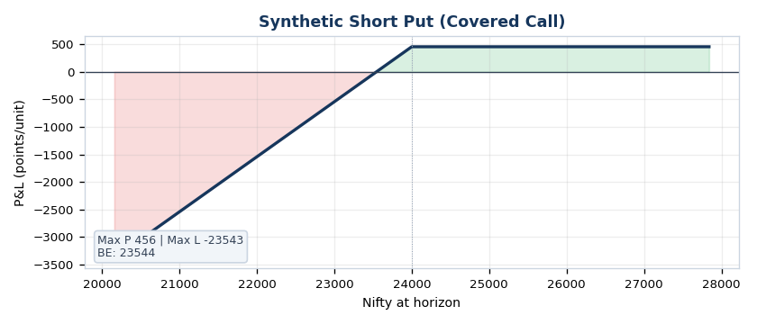

**The numbers (modelled at Nifty 24000).** Max profit: 456.0 points (~₹34,200 per lot) — the call premium if you are called away at the strike. Max loss: -23543.0 points (the index to zero). Breakeven: 23544. Net debit 23544.1 points. Risk:reward 0.02.

**Greeks & behaviour.** Net delta positive but muted by the short call; theta positive (the written call decays for you); vega negative (an IV drop helps). Income and mild upside pay you; a crash hurts.

**Management & exit.** Buy the call back at ~50% of premium and re-write, or roll up-and-out if the market rallies toward the strike. Take assignment calmly if called away — that is the plan working.

**Risk note.** That 0.02 risk:reward and the huge max loss assume the index collapses to zero; in practice you size small and manage the underlying with a stop. Premium income is not free — a sharp sell-off erases many months of collected calls, and most retail F&O traders lose.

**Scenario P&L (₹ per lot, at expiry).**

| Nifty at expiry | 22,800 | 23,400 | 24,000 | 24,600 | 25,200 |
|---|---|---|---|---|---|
| **P&L (₹/lot)** | -₹55,800 | -₹10,800 | +₹34,200 | +₹34,200 | +₹34,200 |

The gain is capped at +₹34,200 once Nifty is at or above the strike, while losses mount to +₹34,200 as the index falls — the covered-call / short-put profile.

**Adjustments, variants & timing.** The covered call is the most retail-accessible structure here, but desks still run it as a financing overlay: carry to expiry to collect the written call, buy it back near 50% of premium and re-write, or roll up-and-out if the index rallies toward the strike. Parity is the entry screen — write when the call is rich (high IV rank), since a fat call is what pays you. Even so, STT on the sold call plus brokerage and the spread shave the income, and a single sharp sell-off erases many months of collected premium; SEBI studies confirm most retail F&O writers lose. Treat it as a yield-enhancement on inventory you genuinely want to hold, not a money tree. The locked piece is the premium minus costs; over many cycles in calm markets the edge is real but modest, and it is always paid for by capping your upside and wearing the full downside of the index.

## 149. Conversion (Arbitrage)
*Locked, rate arbitrage · net debit*

**The idea (intuition).** Combine long stock, a long put and a short call at one strike. The put and short call form a synthetic short that exactly cancels your long stock, leaving a position with no direction at all — a locked box whose only return is the financing built into the option prices. You have, in effect, lent money at the implied rate.

**When & why to use it.** This is a market-maker / arbitrage trade, deployed when the call is overpriced relative to the put (parity is dislocated), letting the desk lock a tiny, near-riskless spread. It is run continuously by professionals managing inventory, not as a directional view. Retail should understand it but rarely trade it: the edge is too thin to survive costs.

**How to build it (₹, Nifty).** Long 1x underlying @ 24000, buy 24000 PE @ 318, sell 24000 CE @ 456. Net debit 23862.3 points. The locked payoff is 138 points either way — that is the carry the structure captures.

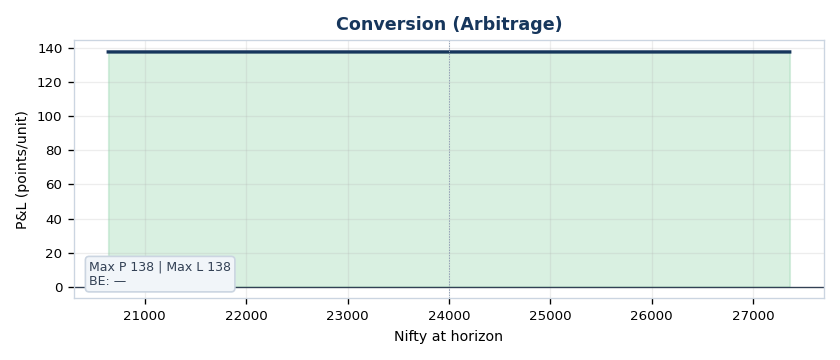

**The numbers (modelled at Nifty 24000).** Max profit: 138.0 points. Max loss: 138.0 points — the payoff is flat at this level regardless of where Nifty lands, so there is no real "loss," just a fixed locked outcome. No breakeven (the line is horizontal). Net debit 23862.3 points. Risk:reward 1.0.

**Greeks & behaviour.** Net delta, theta and vega are all essentially zero — fully hedged. The position does not respond to price or volatility; it simply accretes toward its locked value as expiry approaches, like a bond pulling to par.

**Management & exit.** Hold to expiry and let the legs settle, or unwind early if a richer dislocation frees the capital. There is nothing to "manage" directionally; you are warehousing a rate.

**Risk note.** Be honest: that ~138-point "profit" is essentially the risk-free financing rate embedded in the options, and after STT, brokerage and bid-ask it nearly vanishes. Pin risk and assignment on the ITM call at expiry are the practical hazards, plus the cost of carrying the full index outlay.

**Scenario P&L (₹ per lot, at expiry).**

| Nifty at expiry | 22,800 | 23,400 | 24,000 | 24,600 | 25,200 |
|---|---|---|---|---|---|
| **P&L (₹/lot)** | +₹10,350 | +₹10,350 | +₹10,350 | +₹10,350 | +₹10,350 |

The P&L is +₹10,350 in every single column — dead flat regardless of where Nifty lands, which is the whole point of a locked conversion arbitrage.

**Adjustments, variants & timing.** This is a market-maker trade carried to expiry to collect the locked financing, or unwound early when a richer dislocation elsewhere frees the capital — there is nothing directional to manage. The opportunity is read straight off put-call parity and the futures basis on the NSE screen: when the 24000 call trades rich to the put (or the future to fair value) by more than carry, the conversion locks the gap. Be blunt about the economics — that flat ~₹10,350 is essentially the risk-free rate embedded in the options, and STT, brokerage across three legs, and the bid-ask you cross usually exceed it. So this is a professional relative-value / financing instrument, not a retail trade. In the same family, box spreads are used as synthetic lending and borrowing, and SEBI has scrutinised brokers who mis-sold such locked structures as "guaranteed return" products — the return is real but tiny, fully exposed to assignment and pin risk on the ITM leg, and rarely survives costs.

## 150. Reversal (Arbitrage)
*Locked, rate arbitrage · net credit*

**The idea (intuition).** The mirror of the conversion: short stock, short put, long call at one strike. The long call plus short put make a synthetic long that cancels your short stock, again leaving a locked, directionless package. Here you have effectively borrowed at the implied rate.

**When & why to use it.** Desks run a reversal when the call is cheap relative to the put — the opposite dislocation to a conversion — capturing the mispricing risk-free. It also lets a market maker carry a short-index hedge while staying delta-neutral. As with the conversion, it is professional inventory management, not a retail income idea; the spread is wafer-thin.

**How to build it (₹, Nifty).** Short 1x underlying @ 24000, sell 24000 PE @ 318, buy 24000 CE @ 456. Net credit 23862.3 points. The locked outcome is -138 points — the financing cost the desk pays (or the parity edge it captures) on the package.

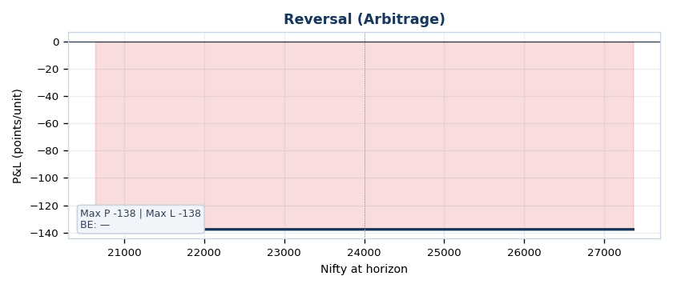

**The numbers (modelled at Nifty 24000).** Max profit: -138.0 points. Max loss: -138.0 points — flat at -138 wherever Nifty settles, a fully locked line. No breakeven. Net credit 23862.3 points. Risk:reward 1.0. The negative locked value reflects that, at these modelled prices, the package settles 138 points against the credit — exactly the mirror of the conversion's +138.

**Greeks & behaviour.** Delta, theta and vega all sit at zero — completely hedged and inert to price and IV. It converges to its locked value as time passes; nothing else moves it.

**Management & exit.** Carry to expiry or unwind when the dislocation that justified it closes. No directional adjustment applies — the legs are self-cancelling by construction.

**Risk note.** The economics are the financing rate minus costs, and on NSE the STT, brokerage and bid-ask typically eat the edge entirely. Watch ITM-call pin/assignment at expiry and the cost of maintaining the short index. This is a relative-value tool, never a money tree.

**Scenario P&L (₹ per lot, at expiry).**

| Nifty at expiry | 22,800 | 23,400 | 24,000 | 24,600 | 25,200 |
|---|---|---|---|---|---|
| **P&L (₹/lot)** | -₹10,350 | -₹10,350 | -₹10,350 | -₹10,350 | -₹10,350 |

The P&L is -₹10,350 in every column — a perfectly flat, locked line whatever Nifty does, the mirror of the conversion.

**Adjustments, variants & timing.** A reversal is desk inventory management: carry it to expiry to earn the locked value, or unwind when the dislocation that justified it closes — the self-cancelling legs leave nothing to adjust directionally. Put-call parity and the futures basis are the screen flags: when the 24000 call is cheap to the put (or the future trades under fair value) beyond carry, the reversal captures the gap risk-free while the desk stays delta-neutral on a short-index hedge. The honest economics: the locked ~₹10,350 against you is the financing the package pays, and on NSE the STT, brokerage on three legs and bid-ask typically eat any parity edge entirely. This is a professional relative-value / financing tool, never retail income. It sits in the same family as the box spread used for synthetic borrowing — and SEBI's scrutiny of "guaranteed return" box mis-selling is a reminder that even a fully locked line carries assignment and pin risk on the ITM call at expiry and only makes sense for a desk that nets the costs.

## 151. Box Spread
*Locked synthetic loan · net debit*

**The idea (intuition).** A box is a bull call spread plus a bear put spread on the same two strikes. The two spreads together have no directional payoff — whatever the index does, the box is worth exactly the distance between the strikes at expiry. So you pay a fixed amount today and receive a fixed amount later: a synthetic loan whose interest is the risk-free rate baked into the options.

**When & why to use it.** Treasuries and prop desks use boxes to lend or borrow synthetically at a rate that can beat money-market alternatives, or to capture a parity mispricing. Buying the box (net debit) is lending; the gap between what you pay and the strike width is your interest. Use it as a financing/relative-value instrument, not a punt. Retail should know it exists mainly to recognise a locked structure — and to avoid the infamous "I sold a box and got assigned" disasters.

**How to build it (₹, Nifty).** Buy 24000 CE @ 456, sell 24300 CE @ 292, buy 24300 PE @ 453, sell 24000 PE @ 318. Net debit 298.3 points. The strikes are 300 apart, so the box is worth ~300 at expiry — you pay 298.3 to collect 300.

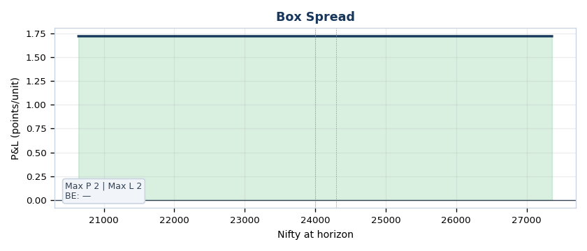

**The numbers (modelled at Nifty 24000).** Max profit: 2.0 points. Max loss: 2.0 points — a flat, locked 2-point gain regardless of where Nifty expires. No breakeven (horizontal payoff). Net debit 298.3 points (~₹22,373 per lot of capital deployed). Risk:reward 1.0.

**Greeks & behaviour.** Delta, theta and vega are all zero — the box is volatility- and direction-proof. It simply pulls from 298.3 toward 300 as expiry nears, exactly like a discount bond accreting to face value.

**Management & exit.** Hold to expiry for the locked value, or close early if you need the capital or find a better rate. There is no adjusting a box — it is a financing position you carry.

**Risk note.** Be brutally honest: that 2-point "profit" is just the risk-free rate minus costs, and STT plus brokerage plus the four-leg bid-ask will usually wipe it out on NSE. Early assignment on the American-style legs and execution slippage across four strikes are the real dangers; a mispriced unwind can turn the tiny edge negative.

**Scenario P&L (₹ per lot, at expiry).**

| Nifty at expiry | 22,800 | 23,400 | 24,000 | 24,600 | 25,200 |
|---|---|---|---|---|---|
| **P&L (₹/lot)** | +₹150 | +₹150 | +₹150 | +₹150 | +₹150 |

The P&L is a flat +₹150 across all five columns — a fully locked outcome that is direction- and volatility-proof, the signature of a box.

**Adjustments, variants & timing.** A box is pure synthetic financing: buying it (net debit) lends cash at the implied rate, selling it borrows, and the desk simply carries it to expiry to collect the strike width, or unwinds early if it finds a better rate. Put-call parity across the two strikes is the entire signal — if the four legs imply a yield that beats the money-market alternative, the box is worth doing. But be brutally honest: that flat ~₹150 is just the risk-free rate minus costs, and STT, brokerage on four legs, and the four-strike bid-ask will usually wipe it out on NSE. This is the canonical synthetic lending / borrowing instrument for treasuries and prop desks, not a retail trade. Critically, SEBI has scrutinised brokers who mis-sold short boxes as "guaranteed return" products: early assignment on the American-style legs can blow up the supposed lock, and a mispriced four-leg unwind turns the tiny edge negative. Know it to recognise a locked structure — and to avoid the "I sold a box and got assigned" disaster.

## 152. Jelly Roll
*Calendar arbitrage · net debit*

**The idea (intuition).** A jelly roll is the difference between two synthetics at the same strike but different expiries — long a synthetic in one month, short it in another. All the directional pieces cancel, leaving only the value of carry and dividends between the two expiries. It isolates the "cost of time" itself.

**When & why to use it.** This is pure calendar/financing arbitrage for desks: it lets you trade the interest-rate-and-dividend spread between two expiry cycles without any market-direction exposure. Use it when the term structure of implied financing is dislocated — the near and far synthetics imply inconsistent carry. It is among the most professional trades in this group and is almost never a retail position; the payoff is a rounding error per lot.

**How to build it (₹, Nifty).** Sell 24000 CE @ 456, buy 24000 CE @ 689, buy 24000 PE @ 318, sell 24000 PE @ 414 (near-month synthetic short versus far-month synthetic long at the 24000 strike). Net debit 136.9 points. The locked value is just 1 point — the isolated carry differential.

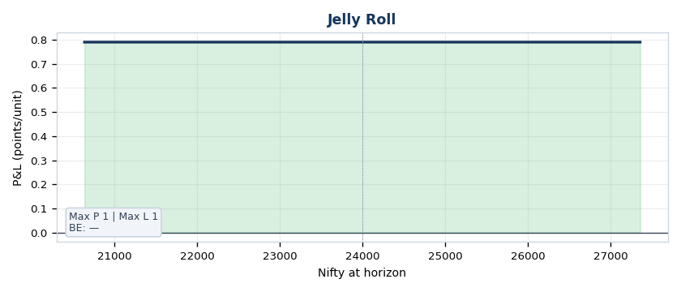

**The numbers (modelled at Nifty 24000).** Max profit: 1.0 point. Max loss: 1.0 point — a flat, locked 1-point outcome whatever Nifty does. No breakeven (horizontal). Net debit 136.9 points. Risk:reward 1.0.

**Greeks & behaviour.** Net delta is zero by construction. Theta and vega are near-zero because the long and short synthetics in the two months largely offset; what little is left reflects the differential decay and the carry/dividend spread between expiries.

**Management & exit.** Roll or unwind around the near-month expiry, then re-establish if the term-structure edge persists. There is no directional management — you are trading the spread between two financing rates.

**Risk note.** The honest truth: a 1-point edge cannot survive STT, brokerage and four legs of bid-ask on NSE. The trade only makes sense for a desk that already holds the inventory and can net the costs. Dividend-assumption error and pin risk at the near expiry are the practical hazards.

**Scenario P&L (₹ per lot, at expiry).**

| Nifty at expiry | 22,800 | 23,400 | 24,000 | 24,600 | 25,200 |
|---|---|---|---|---|---|
| **P&L (₹/lot)** | +₹75 | +₹75 | +₹75 | +₹75 | +₹75 |

The P&L is a flat +₹75 in every column — a locked, rounding-error outcome that does not move with Nifty, exactly as a jelly roll should.

**Adjustments, variants & timing.** A jelly roll is carried and then rolled or unwound around the near-month expiry, re-established only if the term-structure edge in implied financing persists — there is no directional management, you are warehousing a spread between two carry rates. The signal comes from put-call parity applied to each expiry: when the near and far synthetics imply inconsistent carry-and-dividend, the roll captures the difference. The honest truth, sharper here than anywhere: a flat ~₹75 edge cannot survive STT, brokerage and four legs of bid-ask on NSE. The trade only makes sense for a desk that already holds the inventory and can net the costs against an existing book. It belongs to the same professional financing family as the box — used to lend or borrow synthetically across expiries — and the same SEBI caution about "guaranteed return" mis-selling applies: dividend-assumption error and pin risk at the near expiry are real, and for retail this is a rounding error dressed up as arbitrage.

## 153. Synthetic Straddle (from Stock)
*Big move · Long vega · net debit*

**The idea (intuition).** Hold the index long but buy two at-the-money puts against it. One put neutralises the stock's downside delta; the second put turns the position net-bearish below the strike while the stock still runs above it. The result is a V-shaped payoff that profits from a big move either way — a long straddle built from stock and puts.

**When & why to use it.** Use it when you expect a large move but are unsure of direction — ahead of a binary event like a Budget, election result, a major earnings cluster, or a macro shock — and IV is still reasonable so the puts are not overpriced. It is a long-volatility / long-gamma bet. Do NOT put it on in a quiet, range-bound tape: theta will grind the double-put premium away while you wait.

**How to build it (₹, Nifty).** Long 1x underlying @ 24000, buy 2x 24000 PE @ 318. Net debit 24636.5 points including the index; the option spend that matters is two puts at 318 = 636 points, about ₹47,700 per lot of premium at risk.

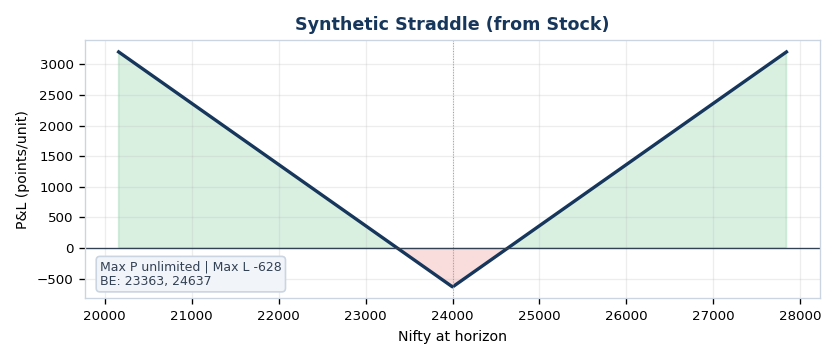

**The numbers (modelled at Nifty 24000).** Max profit: Unlimited (the long stock above, the net-short puts below both run). Max loss: -628.0 points (~₹47,100 per lot) at the strike, where both puts expire near-worthless and you have paid full premium. Breakevens: 23363 and 24637 — Nifty must travel roughly ±640 points to pay. Net debit 24636.5 points. Risk:reward undefined.

**Greeks & behaviour.** Net delta is near zero at inception (the two puts offset the stock), so it is delta-neutral and long gamma. Theta is strongly negative — time is the enemy — and vega is positive, so a rise in India VIX helps even before the index moves.

**Management & exit.** Trade the gamma: scalp delta as the index swings, or close for a target after the event resolves. Take it off before the move's energy fades — the worst outcome is the index pinning the strike into expiry. Cut losses if IV collapses post-event.

**Risk note.** The danger is a non-event: the market sits still, IV crushes, and the 628-point premium decays to near zero. Sizing matters — buying two puts doubles your theta bleed, so only deploy it when you genuinely expect a large, timely move.

**Scenario P&L (₹ per lot, at expiry).**

| Nifty at expiry | 22,800 | 23,400 | 24,000 | 24,600 | 25,200 |
|---|---|---|---|---|---|
| **P&L (₹/lot)** | +₹42,225 | -₹2,775 | -₹47,775 | -₹2,775 | +₹42,225 |

The table is V-shaped — +₹42,225 at both the 22,800 and 25,200 wings but -₹47,775 at the 24,000 strike — a long-straddle payoff that pays only on a big move either way.

**Adjustments, variants & timing.** Unlike the locked trades around it, this is an active long-gamma position: the desk scalps delta as Nifty swings, banking the volatility, and closes for a target once the event resolves — the worst outcome is the index pinning the strike into expiry, so it is taken off before the move's energy fades. Put-call parity is still the construction check (stock plus two puts versus buying two calls outright tells you the cheaper synthetic), and the futures basis matters because the long index leg carries financing. The honest note: buying two puts doubles the theta bleed, and STT, brokerage and the spread on every roll add up, so size only for a genuinely expected large, timely move. This is a tactical volatility trade rather than a locked-financing one, but the same NSE-cost discipline applies — a non-event with IV crush decays the premium to near zero, and frictions ensure you must be right about both magnitude and timing to come out ahead.

## 154. Reverse Conversion (Skew)
*Locked, skew capture · net credit*

**The idea (intuition).** A reversal built across different strikes to harvest the volatility skew rather than just the financing rate. Short the index, sell a slightly OTM put and buy a slightly OTM call: because OTM puts usually trade richer than OTM calls (the equity skew), the structure locks a small outcome that reflects how steep that skew is.

**When & why to use it.** Desks use it to monetise an unusually steep put skew — when fear has bid up downside protection and the OTM put you sell is fat relative to the OTM call you buy. It is a relative-value, near-locked position taken on a skew view, not a directional one. It is strictly professional; the captured amount is tiny and direction is hedged away.

**How to build it (₹, Nifty).** Short 1x underlying @ 24000, sell 23900 PE @ 282, buy 24100 CE @ 397. Net credit 23884.4 points. The legs straddle the spot 100 points either side, locking a small skew-driven outcome rather than a clean carry number.

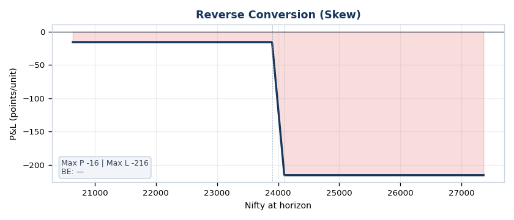

**The numbers (modelled at Nifty 24000).** Max profit: -16.0 points. Max loss: -216.0 points. Unlike the same-strike reversal, the different strikes leave a small residual payoff band, so the outcome ranges between -16 and -216 across the 23900–24100 zone rather than a single flat line. No listed breakeven. Net credit 23884.4 points. Risk:reward 0.07.

**Greeks & behaviour.** Net delta is close to zero (the synthetic largely offsets the short index), with small residual delta between the strikes. Theta and vega are minor; the position's value is driven by where the index settles relative to the two strikes and by the put-versus-call skew you sold.

**Management & exit.** Carry toward expiry and let the legs resolve, or unwind if the skew normalises and the edge is captured. Watch the 23900–24100 window into expiry, since that is where the residual payoff is decided.

**Risk note.** The numbers are stark: a -16 to -216 modelled outcome means this only works if you put it on when the skew is genuinely rich enough to overcome that range — and STT, brokerage and three legs of bid-ask still bite. Pin and assignment risk near the strikes at expiry are the practical hazards. Like every locked trade here, it is a desk relative-value tool, not retail income.

**Scenario P&L (₹ per lot, at expiry).**

| Nifty at expiry | 22,800 | 23,400 | 24,000 | 24,600 | 25,200 |
|---|---|---|---|---|---|
| **P&L (₹/lot)** | -₹1,200 | -₹1,200 | -₹8,700 | -₹16,200 | -₹16,200 |

The P&L is nearly flat but drifts from -₹1,200 in the lower columns to -₹16,200 at the top — a near-locked, skew-driven band rather than a single clean line.

**Adjustments, variants & timing.** A skew-capture reversal is carried toward expiry and managed by watching the 23900-24100 window where the residual payoff is decided, then unwound once the skew normalises and the edge is banked — there is little directional adjustment. Put-call parity across the offset strikes is the signal: the desk puts it on only when the OTM put it sells screens genuinely rich to the OTM call it buys, i.e. when fear has steepened the skew. The honest economics are stark — a -1,200 to -16,200 modelled band means the captured skew must clear that range, and STT, brokerage on three legs and the bid-ask still bite. This is strictly a desk relative-value tool, not retail income, in the same financing / locked family as the box used for synthetic lending and borrowing. SEBI's scrutiny of "guaranteed return" locked-structure mis-selling is the relevant warning: assignment and pin risk near the two strikes at expiry are real, and the edge survives only for a book that nets its costs.

# Strategy Group 11: Exotic & Named Combinations

These are the desk's "named combos" — structures that traders invented to fix one specific flaw in a plainer position. Most start from a familiar building block (a strangle, a butterfly, a vertical, a backspread) and then bolt on, shift, or skew one leg so the payoff hugs the way the trader actually wants to be exposed: keep the full credit if it rips one way, ride the volatility skew, mimic the stock with a clean delta, or stretch a condor so wide it almost never loses. The trade-off is always the same — you buy a nicer shape with either a smaller credit, an extra leg's slippage, or an honestly admitted unlimited tail on one side. Read the loss flags carefully; several of these names hide a naked short.

## 155. Jade Lizard
*Neutral to bullish, high IV · Short vega · net credit*

**The idea (intuition).** A jade lizard is a short put plus a short call spread, sized so the total credit you collect is bigger than the width of the call spread. The clever bit: if you pocket more premium than the call spread can ever lose, there is literally no upside risk — the index can rip to the moon and you still keep money. You only lose if the market falls hard through your short put.

**When & why to use it.** Reach for it when IV is rich (India VIX elevated, IV rank > 60, post-event premium still fat) and your bias is neutral-to-mildly-bullish. It solves the short-strangle's worst nightmare — a melt-up that blows out the naked call — by capping the call side while keeping the credit large. Ideal on Nifty/Bank Nifty monthly after a fear spike. Avoid it when you genuinely expect a sharp sell-off, because the put is your only real risk and it is naked below the strike.

**How to build it (₹, Nifty).** Sell 23700 PE @ 219, sell 24300 CE @ 292, buy 24600 CE @ 167. The call spread is 300 wide; net credit is 343.4 points = about ₹25,755 per lot (343.4 × 75). Because 343 credit > 300 call-spread width, the upside is risk-free by construction.

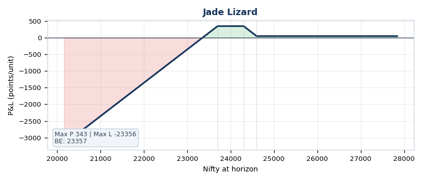

**The numbers (modelled at Nifty 24000).** Max profit 343 points (~₹25,725/lot), kept on any close above 23700. Max loss -23356 points (~₹17.5 lakh/lot) only if Nifty goes to zero. Breakeven 23357. Net credit 343.4 points. Risk:reward 0.01 — that tiny figure is the zero-collapse artefact, not the real trade.

**Greeks & behaviour.** Net delta slightly positive (short put dominates), theta strongly positive (you are a net premium seller), vega negative — falling IV and the passage of time both pay you. P&L is driven by staying above the short put.

**Management & exit.** Standard tasty-style: close at ~50% of max credit. Defend the put if Nifty approaches 23700 — roll it down-and-out or convert to a spread. The call side needs no babysitting since it can't lose.

**Risk note.** That worst case assumes the index collapses to zero; in practice you size small and stop at a multiple of the credit. The honest danger is a gap-down through 23700 where the naked put assigns — keep it small and define a mental stop at 2x credit.

**Scenario P&L (₹ per lot, at expiry).**

| Nifty at expiry | 22,800 | 23,400 | 24,000 | 24,600 | 25,200 |
|---|---|---|---|---|---|
| **P&L (₹/lot)** | -₹41,775 | +₹3,225 | +₹25,725 | +₹3,225 | +₹3,225 |

The grid shows the signature jade-lizard shape — full credit kept anywhere at or above the short put and flat-positive on a rip — but the -₹41,775 at 22,800 is only the start of the pain, because the naked 23700 put keeps losing roughly ₹75 per point for every further point Nifty falls below the grid.

**Adjustments, variants & timing.** The only leg that ever needs managing is the short 23700 put. If Nifty drifts toward it, roll the put down-and-out to the next expiry for a credit, or buy a cheap lower put to convert the naked side into a defined put spread (turning the whole thing into an iron structure). The call spread is risk-free by construction, so leave it alone and let it decay. Take the trade off at 50% of max credit. Build it only when IV rank is above 60 and the put skew is steep — you need the fat downside premium so total credit comfortably exceeds the 300-wide call spread; in thin-IV weeks the credit won't cover the width and the "no upside risk" feature disappears. Nifty monthly is the cleaner vehicle here because its softer skew still pays enough while keeping gap risk smaller; Bank Nifty pays a richer credit but its violent gap-downs make the naked put genuinely dangerous, so size Bank Nifty at roughly half the lots.

## 156. Reverse Jade Lizard
*Neutral to bearish, high IV · Short vega · net credit*

**The idea (intuition).** Mirror image of the jade lizard: a short call plus a short put spread, with the credit collected exceeding the put spread's width. That removes the *downside* risk — a crash can't hurt the defined put spread once the credit covers it — leaving the naked call above as your only real exposure.

**When & why to use it.** Use it when IV is high and you lean neutral-to-bearish, expecting the market to drift down or chop rather than melt up. It fixes the short-strangle's downside tail (gap-downs are the more violent move on Indian indices) by capping the put side. Good after a relief rally into resistance when you think upside is limited. Do NOT use it ahead of a known bullish catalyst — your loss is open above.

**How to build it (₹, Nifty).** Sell 24300 CE @ 292, sell 23700 PE @ 219, buy 23400 PE @ 148. The put spread is 300 wide; net credit 363.1 points = about ₹27,233 per lot. Since 363 > 300, the downside is covered and risk-free.

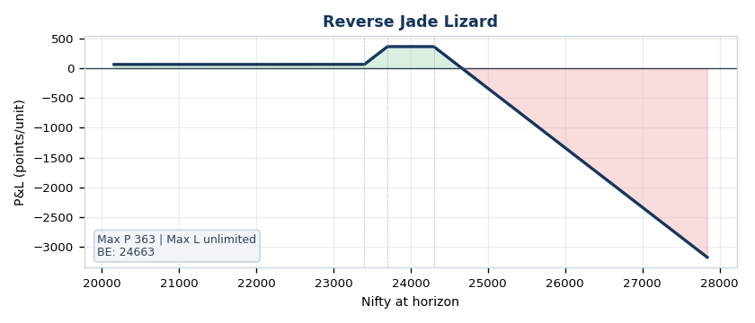

**The numbers (modelled at Nifty 24000).** Max profit 363 points (~₹27,225/lot), kept on any close below 24300. Max loss Undefined — large (the naked 24300 call has no upper bound). Breakeven 24663. Net credit 363.1 points. Risk:reward null because one side is unlimited.

**Greeks & behaviour.** Net delta slightly negative (short call leads), theta positive, vega negative. You make money on time decay and IV contraction as long as Nifty stays under the call strike.

**Management & exit.** Take profit at ~50% of credit. The put spread can be left alone; all your attention goes to the naked call — roll it up-and-out if Nifty pushes toward 24300, or cap it by buying a higher call to convert into a defined iron structure.

**Risk note.** This one is honestly open-ended to the upside — a runaway rally (think a surprise rate cut or a global risk-on gap) can produce a large, theoretically unlimited loss on the naked call. Size for the worst single-day move and pre-plan the roll.

**Scenario P&L (₹ per lot, at expiry).**

| Nifty at expiry | 22,800 | 23,400 | 24,000 | 24,600 | 25,200 |
|---|---|---|---|---|---|
| **P&L (₹/lot)** | +₹4,725 | +₹4,725 | +₹27,225 | +₹4,725 | -₹40,275 |

The mirror image of the jade lizard — full credit kept on any close at or below the short call, with the put spread covering the downside — but the -₹40,275 at 25,200 is not the floor: above the grid the naked 24300 call keeps bleeding about ₹75 per further point, so a runaway rally is genuinely unlimited.

**Adjustments, variants & timing.** Here the protected leg is the put spread (leave it to decay) and every adjustment is about the naked 24300 call. If Nifty climbs toward it, roll the call up-and-out for a credit, or buy a higher call to cap the structure into a defined iron condor. Set a hard mental stop at 2x credit on the call side and pre-load the roll order before entry. Manage the winner at 50% of max credit. The right setup is high IV rank with a neutral-to-bearish lean and, ideally, a market sitting under resistance after a relief rally where you judge upside is capped. Because the open tail is to the upside and Indian indices gap down more violently than up, this structure is actually safer in gap terms than the standard jade lizard — but a surprise rate cut or global risk-on session is its nightmare. Prefer Nifty; on Bank Nifty the wider strikes and faster rallies demand smaller size and a tighter roll trigger.

## 157. Big Lizard
*Neutral, high IV · Short vega · net credit*

**The idea (intuition).** A big lizard is a short ATM straddle with a long OTM call bolted on top. You sell both the at-the-money call and put for a fat credit, then spend a little buying a higher call so that — just like the jade lizard — the credit exceeds the call-spread width and your upside risk vanishes. It is the most aggressive premium-collector of the lizard family because the straddle is sold right at the money.

**When & why to use it.** This is a high-IV, expect-it-to-pin trade. Sell it when India VIX is elevated and you believe Nifty will sit near 24000 into expiry — a classic post-event IV-crush play (day after Budget, RBI, or a big earnings cluster). The huge ATM credit gives you a wide downside cushion while the long call erases blow-up risk on a rip. Don't use it if you expect a directional trend; the short straddle bleeds fast once price leaves the strike.

**How to build it (₹, Nifty).** Sell 24000 CE @ 456, sell 24000 PE @ 318, buy 24300 CE @ 292. Call spread width 300, net credit 482.3 points = about ₹36,173 per lot. Credit (482) > width (300), so the upside is risk-free.

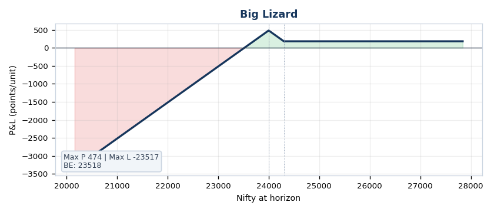

**The numbers (modelled at Nifty 24000).** Max profit 474 points (~₹35,550/lot) at a 24000 pin. Max loss -23517 points only on a collapse to zero. Breakeven 23518 (downside only). Net credit 482.3 points. Risk:reward 0.02 — again the zero-floor artefact.

**Greeks & behaviour.** Net delta near zero at inception (ATM straddle is delta-balanced, long call tilts it slightly positive), theta strongly positive — this is a time-decay machine — vega sharply negative. IV crush is your friend; a big move in either direction is the enemy on the put side.

**Management & exit.** Manage at 25-50% of max profit because the ATM straddle reaches profit fast but also reverses fast. Defend the naked put aggressively below 23518 — roll down or add a long put to define it. Exit before expiry-week gamma turns the ATM short into a hand grenade.

**Risk note.** Worst case assumes a fall to zero; realistically you stop out at a multiple of the credit. The live danger is a sharp down-move: the naked ATM put gains delta fast and can hand you a painful loss in a single gap. Trade small and respect the breakeven.

**Scenario P&L (₹ per lot, at expiry).**

| Nifty at expiry | 22,800 | 23,400 | 24,000 | 24,600 | 25,200 |
|---|---|---|---|---|---|
| **P&L (₹/lot)** | -₹53,850 | -₹8,850 | +₹36,150 | +₹13,650 | +₹13,650 |

Maximum reward sits at a 24000 pin (+₹36,150) and the upside flattens to a risk-free +₹13,650 once past the long call, but the -₹53,850 at 22,800 understates the downside — the naked ATM 24000 put loses about ₹75 per point all the way down, so a move below the grid loses far more.

**Adjustments, variants & timing.** This is the most aggressive lizard, so manage it early — bank 25-50% of max because the ATM straddle gives back gains as fast as it makes them. The only defended task is the naked 24000 put: roll it down if Nifty slides toward breakeven, or add a long put to cap the structure into a defined iron fly. Always close before expiry week, where ATM gamma turns the short straddle into a hand grenade. The textbook setup is a post-event IV crush — the session after Budget, RBI policy, or a heavy results cluster — when India VIX is high and you expect Nifty to pin near 24000. You need IV rank above 60 so the ATM straddle credit is fat enough to exceed the 300-wide call spread. Strongly prefer Nifty: Bank Nifty's wider ATM straddle pays more but its larger gap moves make the naked ATM put punishing, so halve the size if you trade it there.

## 158. Twisted Sister
*Neutral, high IV · Short vega · net credit*

**The idea (intuition).** The twisted sister is the big lizard flipped to the put side: a short ATM straddle plus a long OTM put. The credit collected exceeds the put-spread width, so the *downside* is the protected, risk-free side and the naked call above is your only open exposure. Think of it as "I'll sell the straddle but I refuse to be caught naked in a crash."

**When & why to use it.** Pick it over the big lizard when your tail fear is a gap-down rather than a melt-up — which on Indian indices is usually the more violent direction. High IV, neutral view, expecting a pin near 24000. Good when you're happy to defend a call but want hard protection beneath the market. Avoid ahead of bullish catalysts since the upside is uncapped.

**How to build it (₹, Nifty).** Sell 24000 CE @ 456, sell 24000 PE @ 318, buy 23700 PE @ 219. Put spread width 300, net credit 555.4 points = about ₹41,655 per lot — the richest credit in the lizard family because both ATM legs are sold.

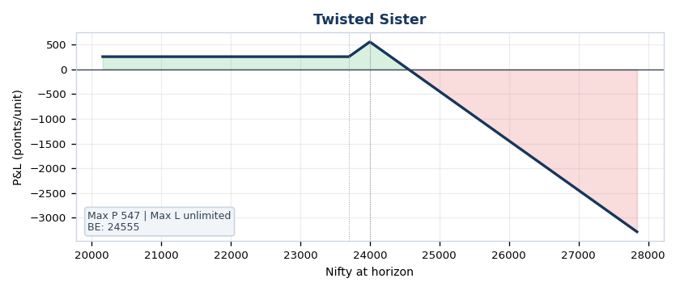

**The numbers (modelled at Nifty 24000).** Max profit 547 points (~₹41,025/lot) at a 24000 pin. Max loss Undefined — large (naked 24000 call). Breakeven 24555. Net credit 555.4 points. Risk:reward null — one side is unlimited.

**Greeks & behaviour.** Net delta roughly flat to slightly negative, theta strongly positive, vega negative. You are paid by time and falling volatility; the protected put side means a crash actually has a floor, but a rally is open-ended.

**Management & exit.** Bank 25-50% of the credit early. All defence goes to the upside: roll the naked call up-and-out if Nifty climbs toward 24000-24300, or buy a higher call to convert to a defined structure. Close before expiry-week gamma.

**Risk note.** The loss here is genuinely unlimited above — a strong trending rally can run the naked call far past breakeven. This is not a set-and-forget trade; size small and have the upside roll planned before you put it on.

**Scenario P&L (₹ per lot, at expiry).**

| Nifty at expiry | 22,800 | 23,400 | 24,000 | 24,600 | 25,200 |
|---|---|---|---|---|---|
| **P&L (₹/lot)** | +₹19,125 | +₹19,125 | +₹41,625 | -₹3,375 | -₹48,375 |

Peak +₹41,625 at a 24000 pin, with the protected put side flooring the downside at a healthy +₹19,125, but the -₹48,375 at 25,200 is not the floor — above the grid the naked 24000 call keeps losing about ₹75 per point without bound.

**Adjustments, variants & timing.** This is the big lizard flipped, so all defence is on the naked 24000 call above; the long 23700 put protects the downside and can be left alone. Roll the call up-and-out for a credit if Nifty rallies through breakeven, or buy a higher call to convert to a defined iron fly. Bank 25-50% of the rich credit early and exit before expiry-week gamma. Pick this over the big lizard precisely when your tail fear is a melt-up rather than a crash — but note the irony that on Indian indices the more common violent move is the gap-down you've already protected, leaving you exposed to the rarer (and more damaging when it hits) trending rally. The setup is high IV rank, neutral view, expected pin near 24000, and no bullish catalyst pending. Nifty is the safer instrument; Bank Nifty's faster upside trends make the naked call dangerous, so size down and pre-stage the roll.

## 159. Christmas Tree Butterfly (Call)
*Bullish to a target · Short vega · net credit*

**The idea (intuition).** A christmas tree is a 1-3-2 call structure — buy one lower call, sell three at a middle strike, buy two higher. It's a butterfly with a deliberately uneven, "skewed" shape that leans the profit zone toward a specific upside target while staying cheap (often a small credit). The lopsided wings are why it's named after a tree: the payoff has an asymmetric, leaning silhouette.

**When & why to use it.** Use it when you have a directional target in mind — you think Nifty drifts up toward roughly 24300 by expiry but won't run away — and you want a cheap, defined bet that profits if you're right and costs almost nothing if you're wrong. Low net outlay makes it attractive when IV is moderate. Skip it for explosive breakout views; the upper wing caps and then erodes your gain past the peak.

**How to build it (₹, Nifty).** Buy 24000 CE @ 456, sell 3x 24300 CE @ 292, buy 2x 24600 CE @ 167. Net credit 85.3 points = about ₹6,398 per lot collected up front. The structure peaks near the 24300 short strike.

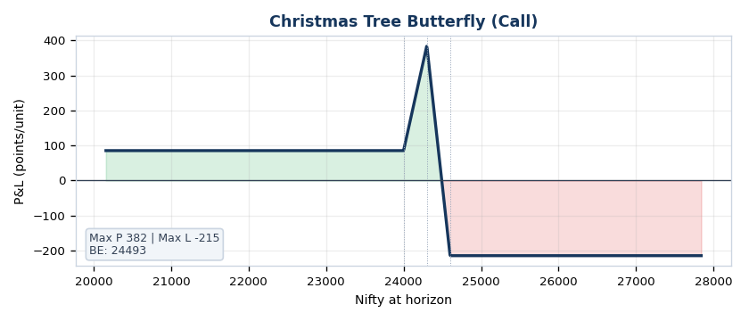

**The numbers (modelled at Nifty 24000).** Max profit 382 points (~₹28,650/lot) near the 24300 target. Max loss -215 points (~₹16,125/lot). Breakeven 24493. Net credit 85.3 points. Risk:reward 1.78 — a genuinely favourable defined-risk ratio.

**Greeks & behaviour.** Net delta positive (bullish lean), theta positive near the body once price sits under the peak, vega negative. The position wants Nifty to grind toward 24300 and pin; it behaves like a directional butterfly with extra short gamma in the upper wing.

**Management & exit.** Take profit if Nifty reaches the peak zone and the structure shows 50-70% of max — these pin trades give back gains fast if price overshoots. Cut if it breaks above 24600 toward the descending wing. Close before expiry-week gamma whip.

**Risk note.** Defined risk both ways (the 215-point max loss is real and capped), so the danger is mostly opportunity cost and the extra leg slippage of a six-contract structure — fill it as a package, not leg by leg, to control NSE bid-ask drag.

**Scenario P&L (₹ per lot, at expiry).**

| Nifty at expiry | 22,800 | 23,400 | 24,000 | 24,600 | 25,200 |
|---|---|---|---|---|---|
| **P&L (₹/lot)** | +₹6,375 | +₹6,375 | +₹6,375 | -₹16,125 | -₹16,125 |

Risk is fully defined both ways — you keep the small +₹6,375 credit on any close at or below 24000 and lose a capped -₹16,125 if Nifty pushes past the descending upper wing — and nothing worsens beyond the grid because every leg is part of a defined call structure.

**Adjustments, variants & timing.** Because this 1-3-2 leans bullishly toward roughly 24300, the management is target-driven: take 50-70% of max if Nifty grinds into the peak zone, since these skewed flies give back gains fast on overshoot. Cut the trade if price breaks above 24600 into the falling wing where the structure flips to its capped loss. There's no naked leg to defend, so the only real enemy is execution — fill all six contracts as one package to avoid NSE bid-ask drag, and don't leg in. Use it in moderate IV when you have a specific upside target rather than a breakout view; the small net credit makes it cheap to be wrong. Strongly prefer Nifty: its tighter strike grid and deeper liquidity keep the six-leg slippage manageable, whereas Bank Nifty's wider strikes and thinner far-OTM calls can erode the modest edge. Roll the whole structure up a strike set if your bullish target shifts higher before expiry week.

## 160. Christmas Tree Butterfly (Put)
*Bearish to a target · Short vega · net credit*

**The idea (intuition).** Same 1-3-2 idea on the put side: buy one higher put, sell three at a middle strike, buy two lower. It's a cheap, skewed, defined-risk bet that leans toward a downside target — the put-side mirror of strategy 159.

**When & why to use it.** Deploy it when you expect a measured drift lower — Nifty easing toward roughly 23700 by expiry without crashing. It gives you a low-cost (here a small credit) bearish position that profits in a target zone and loses little if you're wrong. Best in moderate IV. Avoid it for crash views; like all butterflies, the lower wing turns your big down-move back into a loss past the peak.

**How to build it (₹, Nifty).** Buy 24000 PE @ 318, sell 3x 23700 PE @ 219, buy 2x 23400 PE @ 148. Net credit 42.9 points = about ₹3,218 per lot. The profit peaks near the 23700 short strike.

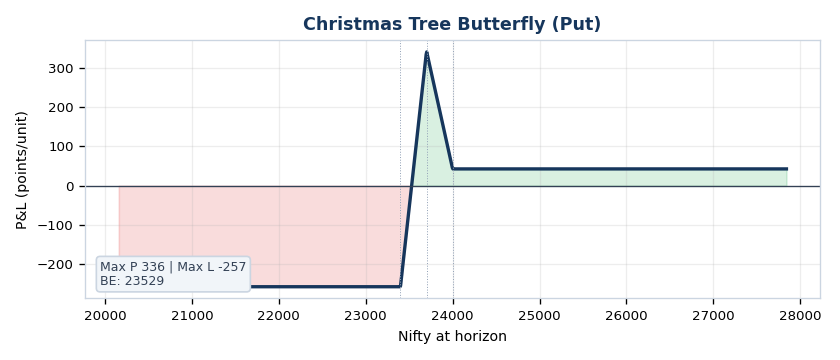

**The numbers (modelled at Nifty 24000).** Max profit 336 points (~₹25,200/lot) near the 23700 target. Max loss -257 points (~₹19,275/lot). Breakeven 23529. Net credit 42.9 points. Risk:reward 1.31.

**Greeks & behaviour.** Net delta negative (bearish lean), theta positive once price sits inside the body, vega negative. The structure rewards a controlled slide into the peak and short gamma in the lower wing.

**Management & exit.** Bank 50-70% of max if Nifty reaches the peak zone — don't be greedy, these reverse quickly on overshoot. Exit if it accelerates below 23400 into the falling wing. Take it off before the final expiry session's gamma noise.

**Risk note.** Risk is fully defined at 257 points, so the real cost is execution: a six-leg put package on Nifty can suffer meaningful slippage, and far OTM put strikes can be thin — trade liquid monthly strikes and price it as one spread.

**Scenario P&L (₹ per lot, at expiry).**

| Nifty at expiry | 22,800 | 23,400 | 24,000 | 24,600 | 25,200 |
|---|---|---|---|---|---|
| **P&L (₹/lot)** | -₹19,275 | -₹19,275 | +₹3,225 | +₹3,225 | +₹3,225 |

The put-side mirror — you keep the small +₹3,225 credit on any close at or above 24000 and the capped -₹19,275 loss appears only if Nifty falls past the lower wing toward 22,800 — and the loss does not deepen beyond the grid because the structure is fully defined.

**Adjustments, variants & timing.** This 1-3-2 leans bearishly toward roughly 23700, so manage to the target: bank 50-70% of max if Nifty slides into the peak zone, and don't get greedy because the skewed fly reverses quickly on overshoot. Exit if price accelerates below 23400 into the lower falling wing. No naked leg means execution is the only real risk — price the six puts as a single package and stick to liquid monthly strikes, since far-OTM Nifty puts can be thin. Deploy in moderate IV when you expect a measured drift down rather than a crash; the tiny net credit keeps the cost of being wrong negligible. Nifty is the right vehicle for its strike depth and tighter spreads; Bank Nifty's thinner low-delta puts make the six-leg fill expensive and can swamp the small edge. If your downside target moves lower before expiry, roll the entire fly down a strike set rather than adjusting individual legs.

## 161. ZEBRA (Zero-Extrinsic Back-Ratio, Call)
*Bullish, stock proxy · Low vega · net debit*

**The idea (intuition).** A ZEBRA — Zero-Extrinsic Back-Ratio — buys two in-the-money calls and sells one at-the-money call so that the long deltas total roughly +100 (one synthetic long unit) while the premium you sell offsets almost all the time value you bought. The result behaves like owning the index outright but with defined, limited downside and almost no theta bleed. It's a clean "stock replacement."

**When & why to use it.** Use it when you want long exposure to Nifty/Bank Nifty without paying the full index outlay or carrying margin on futures, and you dislike the time decay of a plain long call. Because extrinsic value nets to near zero, IV level barely matters — good in either vol regime. Ideal as a directional core you can hold. Don't use it if you want leverage to a sudden vol spike; vega is deliberately low.

**How to build it (₹, Nifty).** Buy 2x 23600 CE @ 728, sell 24000 CE @ 456. Net debit 999.3 points = about ₹74,948 per lot. That debit is your entire risk; above breakeven you gain point-for-point like long stock.

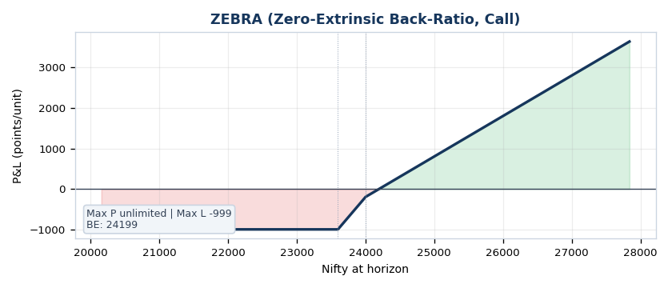

**The numbers (modelled at Nifty 24000).** Max profit Unlimited (it's a net-long-delta position). Max loss -999 points (~₹74,925/lot), the full debit, only if Nifty sits at or below 23600 at expiry. Breakeven 24199. Net debit 999.3 points. Risk:reward null (upside open).

**Greeks & behaviour.** Net delta about +100 (full long unit), theta near zero by design (the sold call funds the bought time value), vega low. P&L tracks the index almost one-for-one above breakeven — that's the whole point.

**Management & exit.** Manage it like a stock position: trail a stop, take profit at your price target, or roll the strikes up to lock gains and re-center the +100 delta. No urgent expiry-week decay panic since theta is minimal, but close or roll before expiry to avoid pin risk on the short call.

**Risk note.** The defined loss is the full 999-point debit if Nifty closes below your lower long strike — a real, sizable rupee figure. Treat it as a leveraged long: a sharp index drop loses the whole premium, so position-size as you would for an equivalent futures long.

**Scenario P&L (₹ per lot, at expiry).**

| Nifty at expiry | 22,800 | 23,400 | 24,000 | 24,600 | 25,200 |
|---|---|---|---|---|---|
| **P&L (₹/lot)** | -₹74,925 | -₹74,925 | -₹14,925 | +₹30,075 | +₹75,075 |

The payoff tracks the index almost one-for-one — the full -₹74,925 debit is lost flat below 23600 and the gain rises about ₹75 per point above breakeven — so beyond the grid the upside keeps climbing without limit while the loss is already capped at the debit.

**Adjustments, variants & timing.** Manage a ZEBRA exactly like a leveraged long future: trail a stop, take profit at your price target, or roll both long strikes up to lock gains and re-centre the +100 delta. Because extrinsic value nets to near zero, theta is minimal, so there's no expiry-week decay panic — but still roll or close before expiry to avoid pin risk on the short 24000 call. The structure is genuinely vol-agnostic (vega is deliberately low), so don't wait for an IV setup; the only entry criterion is a sustained bullish view where you'd otherwise buy futures but prefer defined downside and lower margin. It suits being a directional core you can hold for weeks. Both Nifty and Bank Nifty work, but Bank Nifty's wider strikes mean the two ITM longs tie up more premium per lot, so the rupee debit (and thus max loss) is larger — size the lot count to the rupee risk you'd accept on an equivalent index-future long, not to the point count.

## 162. ZEBRA (Put)
*Bearish, stock proxy · Low vega · net debit*

**The idea (intuition).** The put-side ZEBRA: buy two ITM puts, sell one ATM put, to manufacture roughly -100 delta — a synthetic short index unit — with the extrinsic value bought and sold cancelling out. It's the clean short-stock proxy with limited, defined risk and minimal time decay.

**When & why to use it.** Use it for a sustained bearish view on Nifty/Bank Nifty when you'd otherwise short futures but want capped risk and no theta drag. Vol-agnostic because extrinsic nets to near zero. Good as a core bearish hold or a portfolio hedge with a hard maximum loss. Avoid if your edge is a vol explosion — vega is intentionally small, so you won't profit much from an IV spike alone.

**How to build it (₹, Nifty).** Buy 2x 24400 PE @ 506, sell 24000 PE @ 318. Net debit 693.5 points = about ₹52,013 per lot — your full risk. Below breakeven you gain point-for-point like short stock.

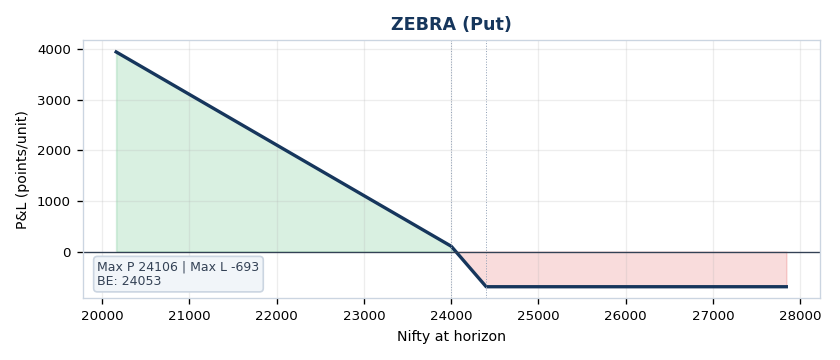

**The numbers (modelled at Nifty 24000).** Max profit 24106 points (the bounded figure if Nifty fell to zero). Max loss -693 points (~₹51,975/lot), the full debit. Breakeven 24053. Net debit 693.5 points. Risk:reward 34.76 — flattering because the "max profit" assumes an index collapse.

**Greeks & behaviour.** Net delta about -100 (full short unit), theta near zero by design, vega low. The position tracks the index inversely below breakeven, behaving like a defined-risk short future.

**Management & exit.** Trade it like a short: cover at your downside target, trail a stop, or roll the puts down to lock gains and re-center -100 delta. Theta is benign, but close or roll before expiry to dodge pin risk on the short put.

**Risk note.** The 34.76 risk:reward and the 24106-point "max profit" both assume Nifty going to zero — not a real target. The genuine outcome is: defined max loss of the 693-point debit if Nifty rallies above your long strikes. Size it as a leveraged short and respect that a rally can take the whole premium.

**Scenario P&L (₹ per lot, at expiry).**

| Nifty at expiry | 22,800 | 23,400 | 24,000 | 24,600 | 25,200 |
|---|---|---|---|---|---|
| **P&L (₹/lot)** | +₹98,025 | +₹53,025 | +₹8,025 | -₹51,975 | -₹51,975 |

The put-side ZEBRA tracks the index inversely — gains rise about ₹75 per point as Nifty falls and the loss caps at the -₹51,975 debit above the long strikes — so below the grid the profit keeps growing while the upside risk is already fixed at the debit.

**Adjustments, variants & timing.** Trade it like a defined-risk short future: cover at your downside target, trail a stop, or roll both long puts down to lock gains and re-centre the -100 delta. Theta is benign by design, so there's no decay urgency, but close or roll before expiry to dodge pin risk on the short 24000 put. Vega is intentionally small, so it's vol-agnostic — enter on a sustained bearish view or as a portfolio hedge with a hard maximum loss, not on an IV signal. This is the cleaner way to be short Indian indices than short futures because gap-downs (the violent direction here) can't blow past your defined max loss on the long side; your only real risk is a rally chewing through the debit. Both indices work; Bank Nifty's wider strikes make the debit (and max loss) larger in rupees, so size the lots to the rupee risk you'd accept on an equivalent short future rather than the point figure.

## 163. Risk Reversal (Bullish)
*Bullish · Skew play · net debit*

**The idea (intuition).** A bullish risk reversal sells an OTM put to finance buying an OTM call — synthetic long exposure built almost for free. The reason it exists: index options carry a volatility skew where downside puts are pricier than upside calls, so selling the "expensive" put pays for the "cheap" call. You're trading the skew, not just direction.

**When & why to use it.** Use it when you're outright bullish on Nifty/Bank Nifty and put skew is steep (fear elevated, India VIX up, puts bid). The richer the put relative to the call, the closer to zero-cost — or even a credit — the structure becomes, giving leveraged upside for little outlay. Great as a cheap leveraged long into an expected up-move. Do NOT use it if you're not prepared to be effectively long from the put strike down — a crash hurts exactly like being long.

**How to build it (₹, Nifty).** Sell 23700 PE @ 219, buy 24300 CE @ 292. Net debit just 73.2 points = about ₹5,490 per lot — almost free synthetic-long exposure thanks to the skew.

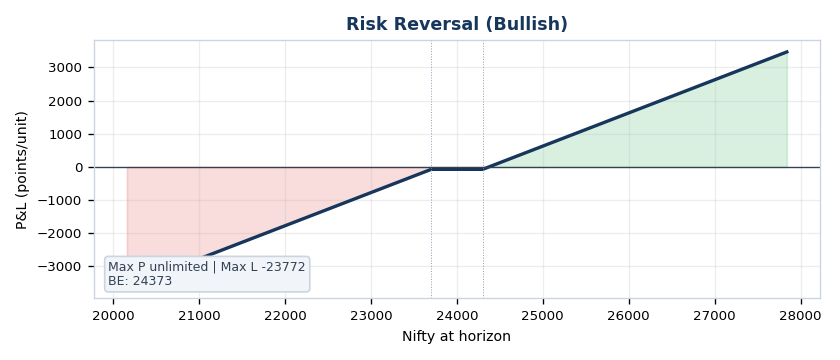

**The numbers (modelled at Nifty 24000).** Max profit Unlimited (long call, open upside). Max loss -23772 points only on a collapse to zero (driven by the short put). Breakeven 24373. Net debit 73.2 points. Risk:reward null (upside open).

**Greeks & behaviour.** Net delta strongly positive (synthetic long), theta roughly flat (long call decay offset by short put decay), vega mixed but small net. The position lives and dies on direction — it's a directional play dressed in a skew trade.

**Management & exit.** Manage like a leveraged long: take profit at your target, trail a stop. Defend the short put if Nifty drops toward 23700 — roll it down-and-out or buy a lower put to cap. Close before expiry to avoid assignment on the short put.

**Risk note.** Worst case assumes a fall to zero; in practice you stop at a multiple of the premium. The honest danger: below 23700 you have a naked short put with effectively long-index risk, so a gap-down can hurt as much as being long futures. Size accordingly.

**Scenario P&L (₹ per lot, at expiry).**

| Nifty at expiry | 22,800 | 23,400 | 24,000 | 24,600 | 25,200 |
|---|---|---|---|---|---|
| **P&L (₹/lot)** | -₹72,975 | -₹27,975 | -₹5,475 | +₹17,025 | +₹62,025 |

This trades like a synthetic long — upside rises about ₹75 per point above the call strike — but the -₹72,975 at 22,800 is not the floor: below 23700 the naked short put adds full long-index risk, so a deeper fall loses about ₹75 per further point.

**Adjustments, variants & timing.** Manage it like a leveraged long: take profit at your target, trail a stop. The exposed leg is the short 23700 put — if Nifty drops toward it, roll the put down-and-out or buy a lower put to cap the downside into a defined structure. Close before expiry to avoid assignment. The whole point is the skew: build it when put skew is steep (fear elevated, India VIX up, downside puts bid richer than upside calls) so the sold put almost fully funds the long 24300 call, giving near-zero-cost leveraged upside — sometimes even a credit. That makes it the right tool when you're outright bullish and willing to be effectively long from 23700 down. Nifty is the standard vehicle; Bank Nifty offers a steeper skew (so cheaper entry) but a gap-down through the short put hurts far more, so size Bank Nifty smaller and treat the short put's risk as identical to a long futures position of the same notional.

## 164. Risk Reversal (Bearish)
*Bearish · Skew play · net credit*

**The idea (intuition).** The bearish risk reversal sells an OTM call to finance a long OTM put — synthetic short exposure, and here you even collect a small credit. You're harvesting the same skew from the other side: selling a call and buying a put when the structure works in your favour.

**When & why to use it.** Use it for an outright bearish view when you can build the position at or near zero-cost (or a credit). It gives leveraged downside participation cheaply. Best when you expect a real decline rather than a grind. Don't use it if a rally is plausible — above the call strike you're effectively short the index with open-ended risk.

**How to build it (₹, Nifty).** Buy 23700 PE @ 219, sell 24300 CE @ 292. Net credit 73.2 points = about ₹5,490 per lot received — you're paid to put on a synthetic short.

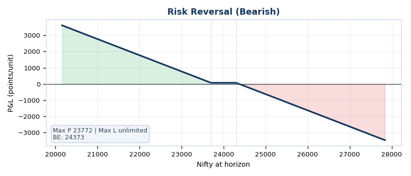

**The numbers (modelled at Nifty 24000).** Max profit 23772 points (the bounded zero-floor figure from the long put). Max loss Undefined — large (the naked 24300 call is open above). Breakeven 24373. Net credit 73.2 points. Risk:reward null — one side is unlimited.

**Greeks & behaviour.** Net delta strongly negative (synthetic short), theta roughly flat, vega small net. It's a directional bearish bet; the skew just makes the entry cheap or free.

**Management & exit.** Manage like a leveraged short: cover at target, trail a stop. The defence is all on the naked call — roll it up-and-out if Nifty rallies toward 24300, or buy a higher call to define the risk. Close before expiry to avoid assignment.

**Risk note.** This is genuinely unlimited to the upside — a strong rally runs the naked short call without bound. The 23772 "max profit" is the index-to-zero artefact, not a target. Trade small and pre-plan the upside roll; a surprise risk-on gap is the killer here.

**Scenario P&L (₹ per lot, at expiry).**

| Nifty at expiry | 22,800 | 23,400 | 24,000 | 24,600 | 25,200 |
|---|---|---|---|---|---|
| **P&L (₹/lot)** | +₹72,975 | +₹27,975 | +₹5,475 | -₹17,025 | -₹62,025 |

This is a synthetic short — gains rise about ₹75 per point as Nifty falls — but the -₹62,025 at 25,200 is not the floor: above 24300 the naked short call runs without bound, losing about ₹75 per further point in a rally.

**Adjustments, variants & timing.** Manage like a leveraged short: cover at target, trail a stop. All defence is on the naked 24300 call — roll it up-and-out if Nifty rallies toward the strike, or buy a higher call to define the risk into a spread. Set a hard 2x-credit stop and pre-stage the roll, since a surprise risk-on gap is the killer. Close before expiry to avoid assignment. The structure is a skew harvest: put it on when call premium relative to puts lets you build at or near zero-cost (or a credit) for an outright bearish view, ideally expecting a real decline rather than a grind. Because the open tail is to the upside while Indian indices gap down harder, the protected direction is unfortunately the violent one — so the rare trending rally is your true risk. Nifty is the safer instrument; Bank Nifty's faster upside trends make the naked call dangerous, so halve the size and keep the roll trigger tight.

## 165. Seagull (Bullish)
*Bullish, cost-reduced · Mixed vega · net debit*

**The idea (intuition).** A bullish seagull is a bull call spread whose cost is reduced by selling a far OTM put underneath. Three legs — long call, short higher call, short lower put — give a shape with two "wings" and a body, like a bird in flight. It exists to make directional upside almost free by financing the debit spread with put premium.

**When & why to use it.** Use it when you're bullish but want defined upside (the short call caps it) and you're willing to take on some downside obligation (the short put) to cheapen the trade. Good when put skew is rich so the sold put pays well. Suits a moderate-IV bullish view with a target near the short call. Avoid it if you fear a sharp sell-off — the short put leaves a cushioned but real downside tail.

**How to build it (₹, Nifty).** Sell 23500 PE @ 169, buy 24000 CE @ 456, sell 24400 CE @ 246. Net debit just 41.5 points = about ₹3,113 per lot — the short put nearly pays for the call spread.

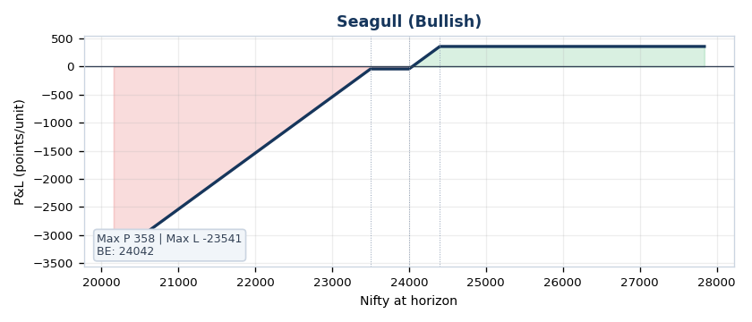

**The numbers (modelled at Nifty 24000).** Max profit 358 points (~₹26,850/lot), capped at the 24400 short call. Max loss -23541 points only on a collapse to zero (from the short 23500 put). Breakeven 24042. Net debit 41.5 points. Risk:reward 0.02 — the zero-floor artefact again.

**Greeks & behaviour.** Net delta positive (bullish), theta roughly flat to slightly positive, vega mixed (long the call spread's vega, short the put's). Between the strikes it behaves like a capped bullish position; below 23500 the short put dominates.

**Management & exit.** Take profit as Nifty approaches the 24400 cap. Defend the short put if price slides toward 23500 — roll down-and-out or buy a lower put. Close before expiry to avoid put assignment.

**Risk note.** Worst case assumes a fall to zero; realistically you stop at a multiple of the cost. The real exposure is the naked short put below 23500 — a gap-down assigns you long the index at that strike. Size for the downside, not the tiny debit.

**Scenario P&L (₹ per lot, at expiry).**

| Nifty at expiry | 22,800 | 23,400 | 24,000 | 24,600 | 25,200 |
|---|---|---|---|---|---|
| **P&L (₹/lot)** | -₹55,650 | -₹10,650 | -₹3,150 | +₹26,850 | +₹26,850 |

The bull call spread caps the gain at +₹26,850 above 24400, but the -₹55,650 at 22,800 is not the floor — below 23500 the naked short put keeps losing about ₹75 per point, so a move beyond the grid loses far more.

**Adjustments, variants & timing.** Take profit as Nifty approaches the 24400 cap, where the upside is fully realised. The only exposed leg is the short 23500 put: if price slides toward it, roll the put down-and-out for a credit or buy a lower put to convert the open tail into a defined iron structure; close before expiry to avoid assignment that would leave you long the index at 23500. The cost-reduction logic depends on rich put skew — sell it when the far-OTM 23500 put is bid up by fear so it nearly pays for the 24000/24400 call spread, giving almost-free capped upside. That makes it the right tool for a moderate-IV bullish view with a defined target around 24400 and a tolerance for cushioned downside. Nifty suits the three-leg fill best; Bank Nifty's richer skew funds the spread more fully but its gap-downs make the short put genuinely dangerous, so size for the downside notional rather than the tiny debit, and reduce lots on Bank Nifty.

## 166. Seagull (Bearish)
*Bearish, cost-reduced · Mixed vega · net credit*

**The idea (intuition).** The bearish seagull is a bear put spread financed by selling a far OTM call above. Long put, short lower put, short higher call — the sold call cheapens (here more than pays for) the debit spread, giving low-cost defined downside with an open tail above.

**When & why to use it.** Use it for a bearish view when you want a defined profit zone on the downside (the short put caps the gain) and you'll accept upside obligation from the short call to fund it. Works best when call skew or overall premium lets the sold call cover the put-spread cost — here you even bank a credit. Avoid ahead of bullish catalysts; the naked call is your open risk.

**How to build it (₹, Nifty).** Sell 24500 CE @ 204, buy 24000 PE @ 318, sell 23600 PE @ 192. Net credit 78.2 points = about ₹5,865 per lot received.

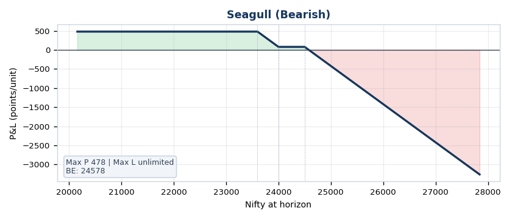

**The numbers (modelled at Nifty 24000).** Max profit 478 points (~₹35,850/lot), capped at the 23600 short put. Max loss Undefined — large (naked 24500 call above). Breakeven 24578. Net credit 78.2 points. Risk:reward null — one side is unlimited.

**Greeks & behaviour.** Net delta negative (bearish), theta roughly flat, vega mixed. Between strikes it's a capped bearish payoff; above 24500 the naked call drives an open-ended loss.

**Management & exit.** Bank the profit as Nifty approaches the 23600 cap. All defence is on the short call — roll it up-and-out if price climbs toward 24500, or buy a higher call to define it. Close before expiry to avoid assignment.

**Risk note.** Honestly unlimited above 24500 — a strong rally runs the naked call without bound. Don't treat the small credit as the risk; size for a worst-case up-gap and have the call roll ready.

**Scenario P&L (₹ per lot, at expiry).**

| Nifty at expiry | 22,800 | 23,400 | 24,000 | 24,600 | 25,200 |
|---|---|---|---|---|---|
| **P&L (₹/lot)** | +₹35,850 | +₹35,850 | +₹5,850 | -₹1,650 | -₹46,650 |

The bear put spread caps the gain at +₹35,850 below 23600, but the -₹46,650 at 25,200 is not the floor — above 24500 the naked short call runs without bound, losing about ₹75 per further point in a rally.

**Adjustments, variants & timing.** Bank the profit as Nifty approaches the 23600 cap. All defence is on the naked 24500 call — roll it up-and-out if price climbs toward the strike, or buy a higher call to define the upside into an iron structure; close before expiry to avoid assignment. The financing logic wants overall premium or call skew rich enough that the sold call more than covers the 24000/23600 put spread (here you bank a credit), so deploy it when premium is fat and you hold a bearish view expecting a real decline. The open tail is to the upside, the rarer but more damaging direction when it hits, so never size off the small credit — size for a worst-case up-gap and pre-stage the roll. Nifty is the cleaner three-leg fill; Bank Nifty pays a bigger credit but its faster rallies make the naked call riskier, so reduce lots and tighten the roll trigger there. Avoid the trade entirely ahead of a known bullish catalyst.

## 167. Batman (Double Butterfly)
*Range with twin targets · Short vega · net debit*

**The idea (intuition).** A batman is two OTM butterflies — one on the call side, one on the put side — placed so the payoff has two profit "peaks" with a dip between them, like the silhouette of a bat's ears (or the logo). It pays best if the index lands near one of two distinct levels rather than dead-center, making it a twin-target range bet.

**When & why to use it.** Use it when you expect Nifty to move to one of two zones away from the current price by expiry — for example, settling near 23600 or near 24400 — but not stay pinned exactly at 24000 and not break far outside the wings. Cheap, fully defined risk. Suits a range-bound-but-not-static view in moderate IV. Avoid it if you expect a hard pin at the money (you'd want a single ATM butterfly) or a big trend.

**How to build it (₹, Nifty).** Buy 24200 CE @ 342, sell 2x 24400 CE @ 246, buy 24600 CE @ 167 (call fly), and buy 23800 PE @ 248, sell 2x 23600 PE @ 192, buy 23400 PE @ 148 (put fly). Net debit 29.5 points = about ₹2,213 per lot — tiny, fully defined cost.

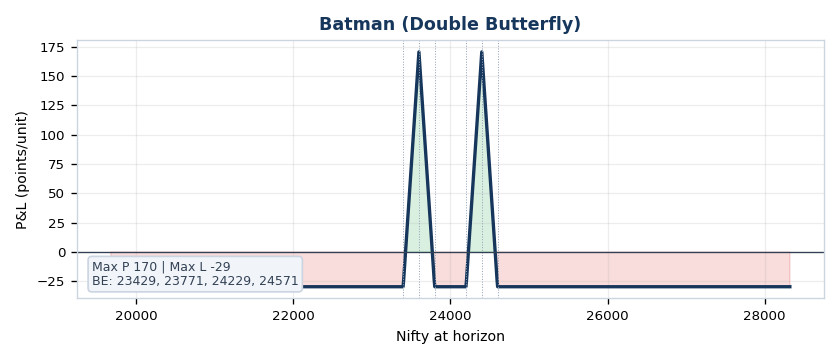

**The numbers (modelled at Nifty 24000).** Max profit 170 points (~₹12,750/lot) at either peak (near 23600 or 24400). Max loss -29 points (~₹2,175/lot), the full debit. Breakevens 23429, 23771, 24229, 24571 (four crossings — the twin-peak shape). Net debit 29.5 points. Risk:reward 5.76 — excellent for defined risk.

**Greeks & behaviour.** Net delta near zero at inception (balanced two-sided), theta positive once price approaches either body, vega negative. Short gamma at each peak — gains evaporate if price overshoots a wing.

**Management & exit.** Take profit if Nifty reaches one peak and the structure shows 50-70% of max. This is a precise, twelve-contract package — exit before expiry-week gamma turns the peaks into knife-edges. Don't overstay near a wing edge.

**Risk note.** Risk is fully capped at the 29-point debit, so the danger is execution, not blow-up: a six-strike package on Nifty carries real slippage and the outer strikes can be thin. Always trade it as one spread, never leg by leg.

**Scenario P&L (₹ per lot, at expiry).**

| Nifty at expiry | 22,800 | 23,400 | 24,000 | 24,600 | 25,200 |
|---|---|---|---|---|---|
| **P&L (₹/lot)** | -₹2,175 | -₹2,175 | -₹2,175 | -₹2,175 | -₹2,175 |

The grid lands in the dead zones between and outside the two peaks, so it shows the flat -₹2,175 full-debit loss everywhere — the twin profit humps near 23600 and 24400 fall between these sampled strikes — and nothing worsens beyond the grid because risk is fully defined.

**Adjustments, variants & timing.** This twin-target structure pays only if Nifty lands near one of the two peaks (here ~23600 or ~24400), so manage to a peak: take profit at 50-70% of max if price reaches one body, and don't overstay near a wing edge where short gamma evaporates the gain on overshoot. With no naked leg, the entire risk is execution — it's a twelve-contract package, so fill it as one spread, never leg by leg, and stick to liquid monthly strikes since the outer wings can be thin. The right setup is a range-bound-but-not-static view in moderate IV: you expect Nifty to drift to one of two zones away from the current 24000, but not pin dead-centre (use a single ATM fly for that) and not trend hard out of the wings. Strongly prefer Nifty — its tight strike grid and deep liquidity are essential for filling twelve legs cheaply; Bank Nifty's wider, thinner strikes make the slippage on a double fly punishing. Roll one fly's strikes if your two target zones shift.

## 168. Iron Albatross (Ultra-Wide Condor)
*Broadly range-bound · Short vega · net credit*

**The idea (intuition).** An iron albatross is just an iron condor with the short strikes pushed far out and wide — a big bird with a long wingspan. You collect a smaller credit than a tight condor, but the profit zone is enormous, so the position almost never gets tested. It trades a modest premium for a high probability of keeping it.

**When & why to use it.** Use it when you want steady, high-probability income and are willing to accept a small credit for a wide margin of safety — Nifty expected to stay broadly range-bound. Good in normal-to-elevated IV where even far strikes pay something. Suits traders who hate getting tested every week. Don't use it when premium is thin (the far strikes pay too little to justify the defined risk) or when you expect a big trending move.

**How to build it (₹, Nifty).** Sell 24700 CE @ 135, buy 25200 CE @ 33, sell 23300 PE @ 129, buy 22800 PE @ 64. Each spread is 500 wide. Net credit 165.8 points = about ₹12,435 per lot.

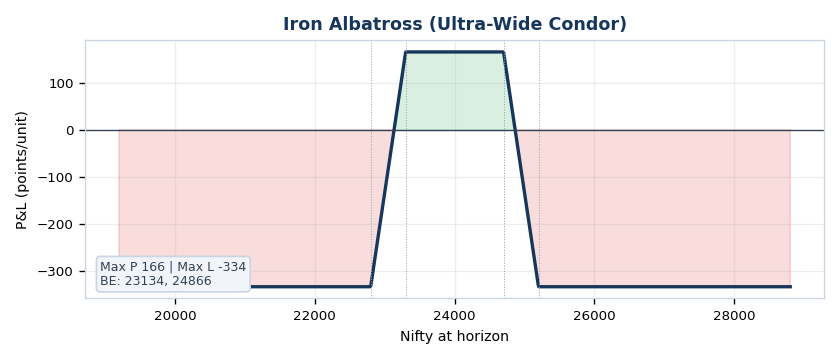

**The numbers (modelled at Nifty 24000).** Max profit 166 points (~₹12,450/lot), kept if Nifty stays between the short strikes. Max loss -334 points (~₹25,050/lot), fully defined. Breakevens 23134 and 24866. Net credit 165.8 points. Risk:reward 0.5 — you risk 334 to make 166, the price of a wide, high-probability zone.

**Greeks & behaviour.** Net delta near zero, theta positive (premium decay), vega negative. The wide profit band means low gamma until price nears a far strike; it's a slow, steady income shape.

**Management & exit.** Because the credit is small relative to risk, manage tightly — take profit at ~50% and don't let a tested side run, since the 2:1 loss-to-credit ratio means one bad expiry erases two good ones. Roll the tested spread out or close if a breakeven is threatened.

**Risk note.** Defined risk both sides (max loss 334 points), so no blow-up — but the unfavourable risk:reward is the catch: you must win often to come out ahead, and a single trend through 24700 or 23300 costs twice the credit. Discipline on the stop matters more here than on richer condors.

**Scenario P&L (₹ per lot, at expiry).**

| Nifty at expiry | 22,800 | 23,400 | 24,000 | 24,600 | 25,200 |
|---|---|---|---|---|---|
| **P&L (₹/lot)** | -₹25,050 | +₹12,450 | +₹12,450 | +₹12,450 | -₹25,050 |

The wide zone keeps the full +₹12,450 credit across the whole 23,400-24,600 middle and the defined -₹25,050 max loss appears only at the far 22,800 and 25,200 wings — and risk does not worsen beyond the grid because both spreads are capped.

**Adjustments, variants & timing.** Because the credit is small relative to the 2:1 defined risk, discipline is everything: take profit at ~50% and never let a tested side run, since one bad expiry erases two good ones. If a breakeven (23134 / 24866) comes into play, roll the tested spread out or close it rather than hoping. There are no naked legs, so this is purely a probability-and-discipline trade. The setup is steady high-probability income in normal-to-elevated IV where even the far 24700/23300 short strikes still pay something — if premium is thin, the credit won't justify the defined risk and you should skip it. It suits traders who value not being tested over collecting much, expecting Nifty to stay broadly range-bound. Both indices work, but Bank Nifty's higher premium often makes the far strikes pay enough to be worthwhile, whereas on Nifty you may need elevated IV to get a meaningful credit at such wide strikes. Avoid it ahead of any expected trending move.

## 169. Slingshot (Call Backspread)
*Bullish breakout · Long vega · net debit*

**The idea (intuition).** A slingshot is a skewed call ratio backspread — sell one near call, buy two further calls — structured for near-zero cost but explosive upside. You're net long extra calls, so a big rally launches the P&L like a slingshot, while a quiet or down market costs little. The single short call funds most of the two longs.

**When & why to use it.** Use it when you expect a sharp upside breakout in Nifty/Bank Nifty and want long gamma and long vega cheaply — ahead of a catalyst (results, policy, breakout from consolidation) where a big move and a vol pop are both plausible. Best entered when IV is low so the long calls are cheap. Don't use it for a slow grind up; the worst outcome is price stalling in the dead zone at the short strike.

**How to build it (₹, Nifty).** Sell 24100 CE @ 397, buy 2x 24400 CE @ 246. Net debit 94.6 points = about ₹7,095 per lot. The extra long call gives unlimited upside above breakeven.

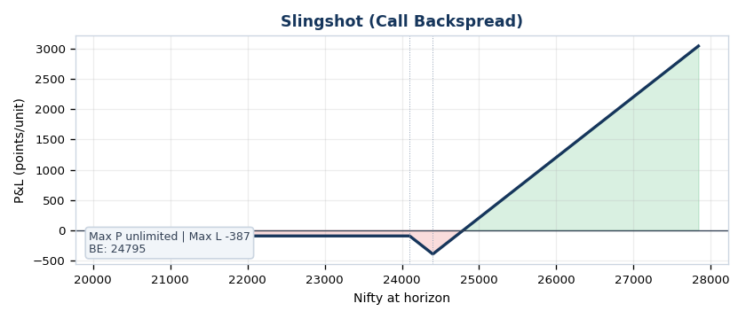

**The numbers (modelled at Nifty 24000).** Max profit Unlimited (net long an extra call). Max loss -387 points (~₹29,025/lot), occurring if Nifty pins at the 24400 long strike. Breakeven 24795 (upside). Net debit 94.6 points. Risk:reward null (upside open).

**Greeks & behaviour.** Net delta positive and rising with price (long gamma), theta negative (you pay to hold), vega positive — a rise in IV helps even before the move. The defining trait: the max loss sits at the long strike, not at the extremes.

**Management & exit.** This is a catalyst trade — give it a defined window and exit if the move doesn't come, because theta bleeds the long calls. Take profits into a sharp rally rather than waiting for "more." Avoid carrying it into the dead-zone pin near 24400 at expiry.

**Risk note.** Defined max loss of 387 points, but note the trap: the *worst* result is a moderate rally that parks Nifty right at 24400, not a crash. Long theta bleed and the pin risk at the long strike are the real dangers, not unlimited loss.

**Scenario P&L (₹ per lot, at expiry).**

| Nifty at expiry | 22,800 | 23,400 | 24,000 | 24,600 | 25,200 |
|---|---|---|---|---|---|
| **P&L (₹/lot)** | -₹7,125 | -₹7,125 | -₹7,125 | -₹14,625 | +₹30,375 |

The backspread shows its trap clearly — quiet or down markets cost only the small -₹7,125, the worst cell is the -₹14,625 partial pin near the 24400 long strike, and the +₹30,375 at 25,200 keeps rising about ₹75 per point beyond the grid as the extra long call runs.

**Adjustments, variants & timing.** This is a catalyst trade, so give it a defined window and exit if the breakout doesn't arrive, because theta bleeds the long calls daily. Take profits into a sharp rally rather than waiting for more, and crucially avoid carrying it into the expiry-week dead-zone pin near 24400, which is the maximum-loss spot. There's no unlimited-loss tail (you're net long an extra call), so the real management is timing, not defence. Enter when IV rank is low so the two long 24400 calls are cheap, and when you expect both a sharp upside breakout and a likely vol pop — ahead of results, policy, or a breakout from tight consolidation, where price and IV can expand together (long gamma plus long vega). Bank Nifty is often the better vehicle here: its larger, faster directional moves and richer vol expansion pay backspreads more handsomely than Nifty's tamer breakouts, though you can run the same structure on Nifty in lower size when its IV is unusually cheap.

## 170. Slingshot (Put Backspread)
*Bearish breakdown · Long vega · net debit*

**The idea (intuition).** The put-side slingshot: sell one near put, buy two lower puts, built cheaply for a violent downside breakout. You're net long an extra put, so a crash launches the P&L while a flat or up market costs little. It's a cheap "crash kicker."

**When & why to use it.** Use it when you expect a sharp breakdown and a vol spike in Nifty/Bank Nifty — these are the moves that pay backspreads handsomely because skew and IV both expand as the market falls. Enter when IV is low so the long puts are cheap. Excellent as a tail hedge for a long book. Don't use it for a slow drift down; the dead-zone pin at the long strike is the worst case.

**How to build it (₹, Nifty).** Sell 23900 PE @ 282, buy 2x 23600 PE @ 192. Net debit 102.9 points = about ₹7,718 per lot. The extra long put delivers large downside payoff.

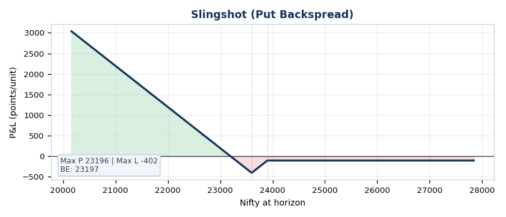

**The numbers (modelled at Nifty 24000).** Max profit 23196 points (the bounded zero-floor figure as Nifty falls). Max loss -402 points (~₹30,150/lot), at a 23600 pin. Breakeven 23197. Net debit 102.9 points. Risk:reward 57.65 — flattering, since the "max profit" assumes a near-total index collapse.

**Greeks & behaviour.** Net delta negative and growing as price falls (long gamma), theta negative, vega positive — a vol spike on the way down adds to the gain. As with the call version, max loss sits at the long strike, not the extremes.

**Management & exit.** Treat it as a catalyst/hedge trade with a defined holding window; exit if the breakdown doesn't arrive, since theta erodes the long puts. Bank profits into a fast crash. Keep it off the expiry-week pin near 23600.

**Risk note.** Defined max loss of 402 points. The 57.65 risk:reward and 23196 "max profit" both assume a collapse toward zero — not a target. The genuine pitfalls are theta bleed and a moderate sell-off that pins price at 23600, handing you the maximum defined loss.

**Scenario P&L (₹ per lot, at expiry).**

| Nifty at expiry | 22,800 | 23,400 | 24,000 | 24,600 | 25,200 |
|---|---|---|---|---|---|
| **P&L (₹/lot)** | +₹29,775 | -₹15,225 | -₹7,725 | -₹7,725 | -₹7,725 |

The put backspread mirrors the call version — flat or up markets cost only -₹7,725, the worst cell is the partial pin near the 23600 long strike (the -₹15,225 at 23,400), and the +₹29,775 at 22,800 keeps growing about ₹75 per point below the grid as the extra long put runs.

**Adjustments, variants & timing.** Treat it as a catalyst or tail-hedge trade with a defined holding window: exit if the breakdown doesn't arrive, since theta erodes the long puts, and bank profits into a fast crash rather than waiting. Keep it off the expiry-week pin near 23600, which is the maximum-loss spot. There's no naked tail (you're net long an extra put), so the management is timing and the dead-zone pin, not unlimited risk. Enter when IV rank is low so the two long 23600 puts are cheap, expecting a sharp breakdown plus a vol spike — the moves that pay put backspreads best because skew and IV both expand as the market falls. It's excellent as a cheap tail hedge bolted onto a long cash or futures book. Bank Nifty is the natural fit: its faster, deeper sell-offs and sharper vol expansion reward the convex wing far more than Nifty's gentler declines, though Nifty works in lower size when its IV is unusually depressed and you want index-level protection.

## 171. Call Ratio Calendar
*Pin, rising IV · Long vega · net credit*

**The idea (intuition).** A call ratio calendar sells two front-month calls against one longer-dated call at the same strike. It's a calendar spread with extra short premium — you harvest fast front-month decay while staying net long vega via the back-month call. The ratio juices the credit but adds a naked short on the front.

**When & why to use it.** Use it when you expect Nifty to pin near the strike into the front expiry while back-month IV stays firm or rises — a classic "front decays, term structure holds" setup. The long back-month call benefits if IV rises; the two short fronts pay you theta. Good around 24000 when you expect range now but want vega exposure. Don't use it ahead of a breakout — the extra short front call is naked and uncapped on a rally.

**How to build it (₹, Nifty).** Sell 2x 24000 CE @ 456 (front), buy 24000 CE @ 689 (back). Net credit 223.2 points = about ₹16,740 per lot.

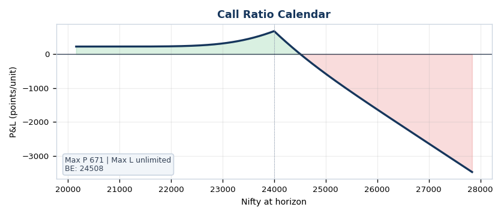

**The numbers (modelled at Nifty 24000).** Max profit 671 points (~₹50,325/lot) near a 24000 pin at front expiry. Max loss Undefined — large (the extra naked front call is open above). Breakeven 24508. Net credit 223.2 points. Risk:reward null — one side is unlimited.

**Greeks & behaviour.** Net delta roughly flat near the strike, theta positive (front decay outweighs back), vega positive (net long the back-month). The position wants a pin plus steady-or-rising IV; a rally is the enemy.

**Management & exit.** Manage and close the position before or at front expiry — never let the extra short front call go into expiry naked. Take profit at a pin; if Nifty rallies toward 24508, buy a front call to cap the ratio or roll up. Watch the calendar's vega P&L, not just the pin.

**Risk note.** Honestly unlimited above breakeven because of the extra short front call — a sharp rally beats the single long back call and runs. This is not a beginner set-and-forget; manage the tail actively and size for a gap.

**Scenario P&L (₹ per lot, at expiry).**

| Nifty at expiry | 22,800 | 23,400 | 24,000 | 24,600 | 25,200 |
|---|---|---|---|---|---|
| **P&L (₹/lot)** | +₹21,225 | +₹31,125 | +₹50,925 | -₹8,475 | -₹60,000 |

The calendar peaks at a 24000 pin (+₹50,925) and holds positive on the downside as the front calls expire worthless, but the -₹60,000 at 25,200 is not the floor — above breakeven the extra naked front call beats the single long back call and keeps losing without bound.

**Adjustments, variants & timing.** The cardinal rule: manage and close before or at front expiry — never let the extra short front call go into settlement naked. Take profit at a pin; if Nifty rallies toward 24508, buy a front call to cap the ratio into a defined calendar, or roll the whole structure up. Watch the position's vega P&L, not just the pin, because the long back-month call is your vega engine. The right setup is a "front decays, term structure holds" environment: you expect Nifty to pin near 24000 into the near expiry while back-month IV stays firm or rises, so the two short fronts pay theta and the long back gains on any IV lift. Don't deploy it ahead of a breakout — the extra short front is uncapped on a rally. Nifty is the safer instrument given its tamer trends; Bank Nifty's larger rallies make the naked front call dangerous, so size down there and pre-stage the cap. Size for a gap regardless — this is an actively managed trade, not set-and-forget.

## 172. Put Ratio Calendar
*Pin, rising IV · Long vega · net credit*

**The idea (intuition).** The put-side ratio calendar: sell two front-month puts against one longer-dated put at the same strike. You collect front-month decay while staying net long vega on the back month — with an extra short front put adding credit and a downside caveat.

**When & why to use it.** Use it when you expect Nifty to pin near the strike into front expiry while back-month IV holds or rises — and your tail worry is mild. The two short puts pay theta; the long back put gives vega. Good around 24000 for a range view with a vega tilt. Don't use it ahead of a sharp sell-off — the extra short front put is your exposed leg below.

**How to build it (₹, Nifty).** Sell 2x 24000 PE @ 318 (front), buy 24000 PE @ 414 (back). Net credit 222.4 points = about ₹16,680 per lot.

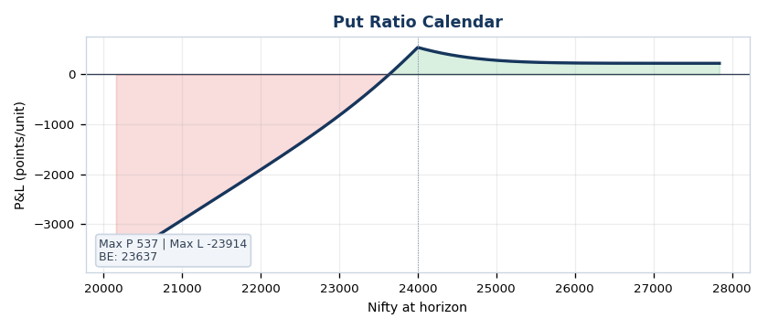

**The numbers (modelled at Nifty 24000).** Max profit 537 points (~₹40,275/lot) near a 24000 pin at front expiry. Max loss -23914 points only on a collapse to zero (the extra short front put). Breakeven 23637. Net credit 222.4 points. Risk:reward 0.02 — the zero-floor artefact.

**Greeks & behaviour.** Net delta roughly flat near the strike, theta positive, vega positive (net long the back-month put). It wants a pin and steady-or-rising IV; a fast drop hurts via the extra short front put.

**Management & exit.** Close before or at front expiry — don't leave the extra short put naked into settlement. Take profit at a pin; if Nifty slides toward 23637, buy a front put to cap the ratio or roll down. Track the calendar's vega, not just price.

**Risk note.** Worst case assumes a fall to zero; in reality you stop at a multiple of the credit. The real danger is a gap-down that overwhelms the single long back put with the two short fronts — short gamma below the strike. Size small and defend the downside.

**Scenario P&L (₹ per lot, at expiry).**

| Nifty at expiry | 22,800 | 23,400 | 24,000 | 24,600 | 25,200 |
|---|---|---|---|---|---|
| **P&L (₹/lot)** | -₹79,125 | -₹24,300 | +₹40,575 | +₹26,100 | +₹19,650 |

The calendar peaks at a 24000 pin (+₹40,575) and holds positive on the upside as the front puts expire worthless, but the -₹79,125 at 22,800 is not the floor — below breakeven the two short front puts overwhelm the single long back put, losing about ₹75 per further point on a deeper drop.

**Adjustments, variants & timing.** Close before or at front expiry — never leave the extra short front put naked into settlement. Take profit at a pin; if Nifty slides toward 23637, buy a front put to cap the ratio into a defined calendar, or roll the structure down. Track the calendar's vega, not just price, since the long back-month put carries your vega exposure. The setup is a range view with a vega tilt: you expect Nifty to pin near 24000 into front expiry while back-month IV holds or rises, and your tail fear is mild — the two short fronts pay theta while the long back gains on any IV lift. Don't use it ahead of a sharp sell-off; short gamma below the strike means a gap-down overwhelms the single long back put. Because Indian indices gap down harder than up, the exposed direction here is the dangerous one, so size small and defend the downside. Prefer Nifty for its softer declines; on Bank Nifty reduce lots and pre-stage the front-put cap.

## 173. Range Forward (Zero-Cost)
*Directional hedge · Neutral vega · net debit*

**The idea (intuition).** A range forward — the FX desk's zero-cost collar — takes a held long position and wraps it: buy an OTM put for protection and sell an OTM call to pay for it, ideally at net zero option cost. The underlying can only "travel" within a band: protected below the put, capped above the call. It's how you hold a position through uncertainty without paying for insurance.

**When & why to use it.** Use it on an existing long Nifty/Bank Nifty (or stock) position you want to keep but protect through an event — Budget, results, election count — without spending net premium. The sold call funds the bought put. Choose strikes to define an acceptable band. Don't use it if you want full upside; the short call caps your gains, and don't use it when you have no underlying — then it's just a risk reversal.

**How to build it (₹, Nifty).** Long 1x underlying @ 24000, buy 23600 PE @ 192, sell 24400 CE @ 246. The option legs are a small net credit (54 points) against the index; total net cost including the ~24000 outlay is 23946.4 points. Per lot the index leg is the bulk; the collar itself is near zero-cost.

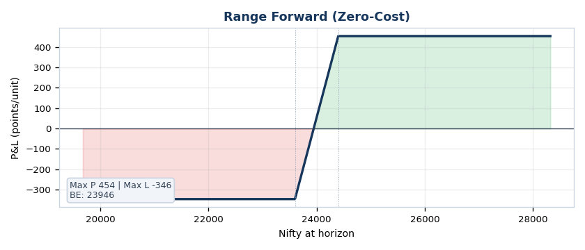

**The numbers (modelled at Nifty 24000).** Max profit 454 points (~₹34,050/lot), capped at the 24400 short call. Max loss -346 points (~₹25,950/lot), floored at the 23600 long put. Breakeven 23946. Net debit 23946.4 points (includes the index). Risk:reward 1.31.

**Greeks & behaviour.** Net delta positive (you're long the underlying inside the band), theta and vega roughly neutral by design (long put offsets short call). Between the strikes you ride the index; outside, you're pinned to the band edges.

**Management & exit.** Hold it through the event window, then unwind the collar to free the underlying once risk passes. Roll the band up if Nifty rises and you want to keep participating; roll the put down to loosen protection. Close the short call before expiry to avoid capping a continued rally by assignment.

**Risk note.** Risk is defined by the band (max loss 346 points on the position), so the danger is mostly opportunity cost — a big rally past 24400 is forfeited to the short call. On stock names, watch STT on exercised ITM options and assignment on the short call near expiry.

**Scenario P&L (₹ per lot, at expiry).**

| Nifty at expiry | 22,800 | 23,400 | 24,000 | 24,600 | 25,200 |
|---|---|---|---|---|---|
| **P&L (₹/lot)** | -₹25,950 | -₹25,950 | +₹4,050 | +₹34,050 | +₹34,050 |

The collar pins the held long into a band — gains cap at +₹34,050 above the 24400 short call and losses floor at -₹25,950 below the 23600 long put — and nothing worsens beyond the grid because both edges of the band are fixed.

**Adjustments, variants & timing.** This wraps an existing long Nifty/Bank Nifty (or stock) position, so the management follows the underlying: hold it through the event window, then unwind the collar to free the position once risk passes. Roll the band up if Nifty rises and you want to keep participating, or roll the put down to loosen protection. Close the short 24400 call before expiry so a continued rally isn't capped by assignment. The setup is event-driven rather than IV-driven — Budget, results, election count — when you want to keep a position but not pay net premium for insurance; choose strikes to define an acceptable band, ideally letting the sold call fully fund the bought put for true zero cost. Don't use it without an underlying (then it's just a risk reversal) or when you want full upside. Both indices suit it; on stock names specifically, watch STT on exercised ITM options and assignment on the short call near expiry, and prefer cash-settled index collars to avoid delivery hassle.

## 174. Pterodactyl (Far-Wing Condor)
*Very broad range · Short vega · net credit*

**The idea (intuition).** The pterodactyl is an even wider iron condor than the albatross — short strikes pushed out to the far reaches with distant wings. The credit is minimal, but the profit zone is vast, so the position almost never gets tested. It's the maximal-zone, minimal-premium extreme of the condor family.

**When & why to use it.** Use it when you want the highest-probability range income and will accept a very small credit for an enormous margin of safety — Nifty expected to stay in a wide band. Best when far OTM strikes still carry enough premium to bother (elevated IV). Suits traders who prize not being tested over collecting much. Don't use it when premium is razor-thin (the tiny credit won't justify the defined risk) or when a large directional move is likely.

**How to build it (₹, Nifty).** Sell 25000 CE @ 124, buy 25500 CE @ 33, sell 23000 PE @ 136, buy 22500 PE @ 80. Each spread is 500 wide. Net credit 146.2 points = about ₹10,965 per lot.

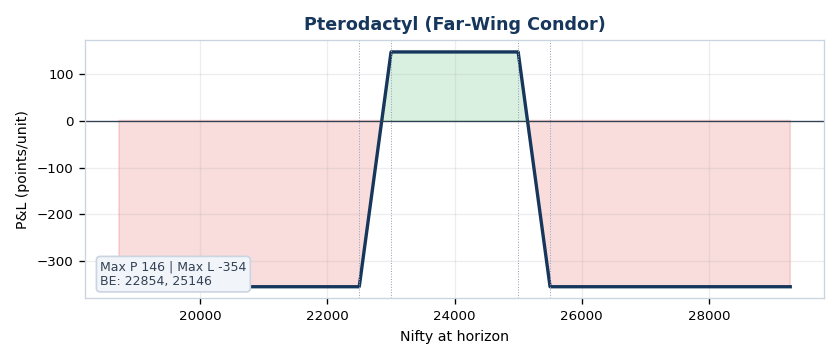

**The numbers (modelled at Nifty 24000).** Max profit 146 points (~₹10,950/lot), kept if Nifty stays between the short strikes. Max loss -354 points (~₹26,550/lot), fully defined. Breakevens 22854 and 25146. Net credit 146.2 points. Risk:reward 0.41 — you risk 354 to make 146, the cost of an extremely wide zone.

**Greeks & behaviour.** Net delta near zero, theta positive, vega negative. Very low gamma across a huge band — the slowest, steadiest income shape in this group, until price approaches the far strikes.

**Management & exit.** With such a small credit against larger defined risk, discipline is everything: take profit at ~50%, and never let a tested side run, because one loss equals more than two wins. Roll the tested spread out or close if a breakeven (22854 / 25146) comes into play.

**Risk note.** Defined risk both sides (max loss 354 points) — no blow-up — but the poor risk:reward is the trade-off: you must win very frequently to net out ahead, and a rare move beyond 25000 or 23000 costs well over double the credit. Only worth it when far-strike premium is genuinely fat.

**Scenario P&L (₹ per lot, at expiry).**

| Nifty at expiry | 22,800 | 23,400 | 24,000 | 24,600 | 25,200 |
|---|---|---|---|---|---|
| **P&L (₹/lot)** | -₹4,050 | +₹10,950 | +₹10,950 | +₹10,950 | -₹4,050 |

The enormous zone keeps the full +₹10,950 credit across the whole sampled 23,400-24,600 middle, and even the far 22,800 and 25,200 cells only show a partial -₹4,050 because they sit inside the wings — the fully defined -₹354-point max loss requires a move beyond 22,500 or 25,500.

**Adjustments, variants & timing.** With such a small credit against larger defined risk, discipline is everything: take profit at ~50% and never let a tested side run, because one loss equals more than two wins. If a breakeven (22854 / 25146) comes into play, roll the tested spread out or close it. No naked legs, so this is purely a probability trade taken to the extreme. Deploy it only when far-OTM strikes still carry enough premium to bother — elevated IV — otherwise the razor-thin credit can't justify the defined risk. It suits traders who prize never being tested over collecting much, expecting Nifty to stay in a very wide band with no large directional move pending. Bank Nifty is often the more practical vehicle because its higher premium gives the distant 25000/23000 short strikes enough value to be worthwhile, whereas Nifty's far strikes may pay too little outside high-IV regimes. As with the albatross, stop discipline matters more than on a tight condor, since a rare trend costs well over double the credit.

# Strategy Group 12: Deployments, Ladders & When-to-Use Playbooks

This is the "when to use what" chapter — the bridge between knowing a hundred structures and actually putting one on. The first five entries are the ladders and the double condor (structural variations that lean a vanilla spread one way or add a tail kicker); the remaining twenty-one are *situation* playbooks, each tied to a concrete Indian catalyst — expiry day, a gap-down open, a Budget, an RBI policy, a results announcement, a VIX spike — with a trigger you can actually see on the screen and an exit you can actually act on. The honest thread running through all of them: the short-volatility situational trades (expiry-day straddles, intraday straddles, overnight strangles) carry vicious gamma and theoretically unbounded loss; you size them *tiny* and manage by the clock, because most retail F&O traders lose money (SEBI data is unambiguous on this).

## 175. Bull Call Ladder
*Mildly bullish, caps · Short vega · net credit*

**The idea (intuition).** Start with a normal bull call spread, then sell one *more* call further out to finance it — so cheap that the whole package comes in for a credit. You keep the upside of a bull spread within a band, but you have given away the far upside in exchange for being paid to put the trade on.

**When & why to use it.** Deploy when you are mildly bullish and believe Nifty drifts up into a ceiling but will not melt up violently — a grinding post-correction recovery, IV slightly elevated (you are net short vega, so a fall in IV helps). Good when you already collected premium elsewhere and want a directional tilt at zero cost. Do NOT use it ahead of a known up-catalyst (Budget, strong-results season, a breakout setup) — an explosive rally turns the naked upper short call into an unlimited-loss machine.

**How to build it (₹, Nifty).** Buy 23700 CE @ 655, sell 24000 CE @ 456, sell 24300 CE @ 292. Net = -93.1 points credit, i.e. you *receive* about 93.1 × 75 = ₹6,983 per lot up front.

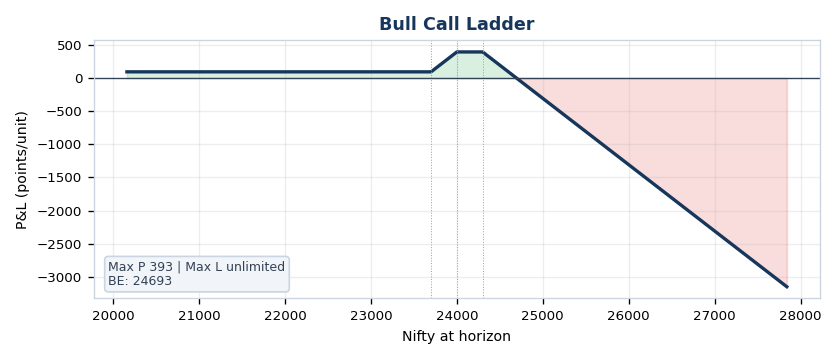

**The numbers (modelled at Nifty 24000).** Max profit 393 points (₹29,475 per lot), realised in the 24000–24300 band. Max loss is Undefined — large: above the upper breakeven of 24693 the extra short call runs naked and losses grow point-for-point with Nifty. Net credit 93.1 points. Risk:reward is undefined because one side is open-ended.

**Greeks & behaviour.** Net delta mildly positive up to the short strikes then turns negative as the naked call dominates; theta is friendly (you are net short two calls vs one long); vega negative, so a quiet IV bleed helps. The position is essentially a financed bull spread with a short-vol, short-gamma tail.

**Management & exit.** Take it off at 50–60% of peak value when Nifty sits in the 24000–24300 zone. The real discipline is the *stop*: if Nifty closes above ~24550 (approaching the 24693 breakeven), buy back the upper short call immediately — do not hope. Roll the upper short up-and-out if you still want the structure.

**Risk note.** The danger is entirely on the upside: a gap-up open above 24693 (results surprise, global risk-on) leaves you short a naked call with theoretically unlimited loss. This is not a "set and forget" credit trade — treat the upper strike as a live grenade.

**Scenario P&L (₹ per lot, at expiry).**

| Nifty at expiry | 22,800 | 23,400 | 24,000 | 24,600 | 25,200 |
|---|---|---|---|---|---|
| **P&L (₹/lot)** | +6,975 | +6,975 | +29,475 | +6,975 | -38,025 |

The table shows a steady +6,975 across a flat-to-up tape and a +29,475 peak in the 24000-24300 band, but the -38,025 at 25,200 is only the visible edge: the naked upper short call means a move past the grid loses far more, with no upper cap.

**The trade in real life (trigger -> manage -> exit).** Trigger: India VIX subdued (roughly 12-14) and Nifty grinding up off a correction low, with no Budget, results-season or breakout catalyst in the running expiry; you put it on when price reclaims a falling-trendline pivot but momentum looks tired. Manage: watch the naked 24300 CE like a hawk; if Nifty closes within ~150 points of the 24693 breakeven (around 24550) or India VIX jumps 2+ points, buy that upper call back first, do not hope. Exit: bank 50-60% of the 93.1-point credit when price sits in 24000-24300; hard stop and cover the upper call on a close above 24550; roll the short up-and-out only if you still want the structure. Time-stop: with 5-7 sessions left, close regardless to dodge expiry gamma. Size tiny, because a single gap-up (results surprise, global risk-on) above 24693 turns the upper strike into a theoretically unlimited-loss machine.

## 176. Bear Put Ladder
*Mildly bearish, caps · Short vega · net credit*

**The idea (intuition).** The mirror of the bull call ladder. Buy a put, sell a nearer put to make a bear put spread, then sell a third put even lower to bring it in for a credit. You profit from a controlled drift down into a band but you have sold the deep-crash protection back to the market.

**When & why to use it.** Use when you expect a slow grind lower into a support shelf — a tired uptrend rolling over, mild distribution — and IV is elevated so the short vega works for you. The naked lower short put means you must NOT use this ahead of a known crash risk (global risk-off, a feared event, fragile small-caps). It is a "drift, don't collapse" trade.

**How to build it (₹, Nifty).** Buy 24300 PE @ 453, sell 24000 PE @ 318, sell 23700 PE @ 219. Net = -84.5 points credit, about 84.5 × 75 = ₹6,338 received per lot.

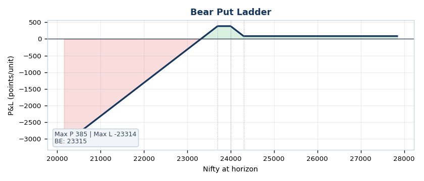

**The numbers (modelled at Nifty 24000).** Max profit 385 points (₹28,875 per lot) in the 23700–24000 band. Max loss -23314 points — the engine's worst case is the index falling toward zero through the naked lower put; in practice that worst case assumes a collapse to zero and you would size small and stop out long before. Breakeven 23315. Net credit 84.5 points; risk:reward 0.02 (tiny because the modelled downside is huge relative to the credit).

**Greeks & behaviour.** Net delta mildly negative in the working band, flipping sharply positive-loss below the lower strike; theta positive (net short two puts vs one long); vega negative. Short gamma below 23700 — the position decays nicely while range-bound but bites hard in a flush.

**Management & exit.** Target 50% of the credit when Nifty rests in the 23700–24000 pocket. Hard rule: if Nifty breaks and closes below ~23550, cover the lower short put — do not ride a falling knife with a naked short put under it. Roll the lower strike down-and-out only if you re-underwrite the crash risk.

**Risk note.** A gap-down (FII risk-off, global shock) is the killer: the naked 23700 PE turns the trade into a leveraged short-put loss. The headline 0.02 risk:reward is the honest tell — you are picking up small credit in front of a large, if low-probability, tail.

**Scenario P&L (₹ per lot, at expiry).**

| Nifty at expiry | 22,800 | 23,400 | 24,000 | 24,600 | 25,200 |
|---|---|---|---|---|---|
| **P&L (₹/lot)** | -38,625 | +6,375 | +28,875 | +6,375 | +6,375 |

You bank a steady +6,375 when Nifty holds flat-to-up and peak at +28,875 in the 23700-24000 pocket, but the -38,625 at 22,800 is just the visible edge: the naked lower put keeps losing far more, without limit, the deeper Nifty falls below the grid.

**The trade in real life (trigger -> manage -> exit).** Trigger: a tired uptrend rolling over into slow distribution, India VIX elevated (roughly 16-18) so the puts are rich, and no feared global risk-off or domestic banking-stress headline on the calendar; enter as Nifty loses a support shelf but before any panic selling. Manage: the naked 23700 PE is the grenade; if Nifty closes below ~23550 or India VIX spikes through 20, cover it immediately rather than ride a falling knife. Exit: take 50% of the 84.5-point credit when price rests in 23700-24000; hard stop on a close below 23550; roll the lower strike down-and-out only after you re-underwrite the crash risk; time-stop into expiry week. Never add on the way down: a gap-down (FII risk-off, global shock) turns this into a leveraged short-put loss fast, and the headline 0.02 risk:reward is the honest tell. Size for the gap you cannot see coming.

## 177. Bull Put Ladder
*Neutral to bullish, crash kicker · Long vega · net debit*

**The idea (intuition).** Sell an at-the-money put to collect premium, then buy *two* lower puts. Normally a bull put spread is a pure credit play; here the extra long put flips it into a structure that is calm-and-slightly-positive if the market holds, but pays off violently if a crash blows through your long strikes. You have bolted a cheap crash-kicker onto an income trade.

**When & why to use it.** Use when you are neutral-to-mildly-bullish on direction but worried about tail risk — you want to stay long the market's drift while owning downside convexity. Ideal when IV is *low* (you are net long vega, so cheap puts to buy) and a known fear event looms (geopolitics, a Fed meeting, election counting day). Avoid when IV is already rich — you would overpay for the long puts.

**How to build it (₹, Nifty).** Sell 24000 PE @ 318, buy 23700 PE @ 219, buy 23400 PE @ 148. Net = +48.1 points debit, about 48.1 × 75 = ₹3,608 paid per lot.

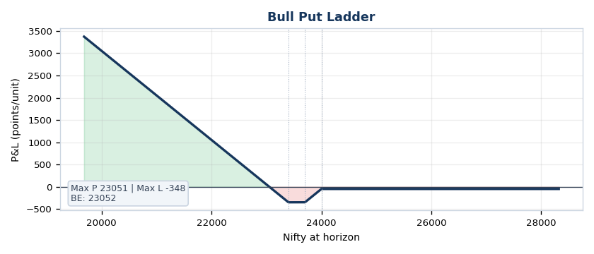

**The numbers (modelled at Nifty 24000).** Max profit 23051 points — the modelled figure reflects the long-put convexity if the index collapses toward zero (a crash payoff, not a base case). Max loss -348 points (₹26,100 per lot) in the 23400–23700 trough. Breakeven 23052. Net debit 48.1 points; risk:reward 66.22 (enormous because the crash payoff dwarfs the defined loss).

**Greeks & behaviour.** Net delta positive (you are short the higher put, net long direction above the strikes); theta mildly negative — time hurts a touch because you own two puts; vega positive, so a volatility spike in a sell-off accelerates the gains. This is long-gamma in the tail and roughly flat in the middle.

**Management & exit.** If the market holds and IV stays quiet, the trade just costs a little theta — close it when the catalyst passes and reclaim what is left. If the crash comes, take profits into the panic; do not be greedy waiting for zero. The pain zone is a slow drift to 23400–23700, so exit if Nifty parks there with no momentum.

**Risk note.** The worst outcome is a *gentle* slide that pins right at 23400–23700 at expiry — you lose the full -348 there, the opposite of what crash-buyers hope for. This is insurance with a deductible: you pay every month you are wrong about both calm and crash.

**Scenario P&L (₹ per lot, at expiry).**

| Nifty at expiry | 22,800 | 23,400 | 24,000 | 24,600 | 25,200 |
|---|---|---|---|---|---|
| **P&L (₹/lot)** | +18,900 | -26,100 | -3,600 | -3,600 | -3,600 |

The grid pays best in a crash (+18,900 at 22,800 and climbing the lower Nifty goes), while the worst real-world outcome is the small -3,600 you pay when the index simply drifts and pins in the 23400-23700 trough.

**The trade in real life (trigger -> manage -> exit).** Trigger: you are neutral-to-mildly-bullish but a fear event looms (election counting day, a US Fed night, a geopolitical flare) and India VIX is still LOW, so the long puts are cheap; put it on a few days ahead while the chain is calm. Manage: if the market just holds, the position only bleeds a little theta, so let it sit until the catalyst passes. If a crash hits, take profits INTO the panic; do not be greedy waiting for zero. Exit: reclaim the leftover debit when the event resolves quietly; in a flush, scale out as IV spikes and the long puts run; cut it if Nifty parks in 23400-23700 with no momentum, which is your full -348 max-loss zone. Time-stop: close before the catalyst's volatility fully decays. This is insurance with a deductible, so you accept the defined loss in calm months as the price of owning downside convexity. Avoid when IV is already rich.

## 178. Bear Call Ladder
*Neutral to bearish, breakout kicker · Long vega · net debit*

**The idea (intuition).** Sell a call, then buy two higher calls. Like the bull put ladder but on the upside: you are slightly bearish/neutral but you own an *upside* breakout kicker. If the market grinds sideways-to-down you are roughly flat; if it rips higher through your long strikes you make unlimited money.

**When & why to use it.** Deploy when you lean mildly bearish but cannot rule out a melt-up squeeze — short-covering rallies, a dovish surprise, an expiry pin that breaks up. Low IV is the friend (cheap long calls; you are net long vega). Use it when you want to be short the market without naked-call tail risk. Avoid in high IV where the long calls are expensive and the structure barely pays.

**How to build it (₹, Nifty).** Sell 24000 CE @ 456, buy 24300 CE @ 292, buy 24600 CE @ 167. Net = +3.2 points debit — essentially free to put on, about 3.2 × 75 = ₹240 per lot.

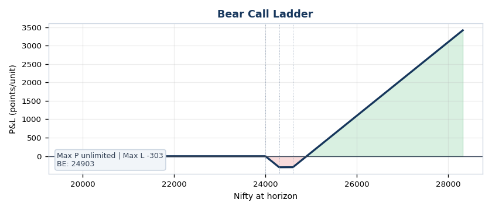

**The numbers (modelled at Nifty 24000).** Max profit Unlimited — above the upper breakeven of 24903 the two long calls run away. Max loss -303 points (₹22,725 per lot) in the 24300–24600 zone where both longs are still worthless but the short is deep ITM. Breakeven 24903. Net debit 3.2 points; risk:reward undefined (open-ended upside).

**Greeks & behaviour.** Net delta negative near spot, flipping strongly positive above the long strikes; theta negative (you own two calls); vega positive, so an IV pop in a breakout supercharges the payoff. Long gamma in the upside tail, short gamma in the trap zone just above the short strike.

**Management & exit.** If the market drifts down or sideways below 24000, the trade is roughly scratch — close for a few points either way. If a breakout fires above ~24600, let the long calls run and trail a stop. The thing to avoid is camping in 24300–24600: if Nifty parks there into expiry-week, cut it.

**Risk note.** The maximum -303 loss sits in a perfectly plausible "drifted up a little but not enough" outcome — a common way to lose on this structure. It is cheap to enter precisely because the most likely pin is a loser; you are paying for the fat upside tail.

**Scenario P&L (₹ per lot, at expiry).**

| Nifty at expiry | 22,800 | 23,400 | 24,000 | 24,600 | 25,200 |
|---|---|---|---|---|---|
| **P&L (₹/lot)** | -225 | -225 | -225 | -22,725 | +22,275 |

The worst case is the very plausible -22,725 you pay when Nifty drifts up a little and pins in the 24300-24600 trap zone, while a genuine melt-up past the grid (+22,275 at 25,200) pays open-ended.

**The trade in real life (trigger -> manage -> exit).** Trigger: you lean mildly bearish but cannot rule out a short-covering squeeze (a dovish RBI surprise, an expiry pin that breaks up) and India VIX is LOW so the two long calls are cheap; enter for near-zero cost when price stalls under resistance. Manage: the enemy is camping in 24300-24600, so if Nifty parks there into expiry-week, cut it; if a breakout fires above ~24600 on volume, let the long calls run and trail a stop under the breakout level. Exit: scratch out for a few points either way if the tape drifts down or sideways below 24000; on a breakout trail rather than target a fixed level; time-stop the position in expiry week to avoid the max-loss pin. It is cheap precisely because the most likely outcome (a small drift up that pins in the trap zone) is the loser; you are paying for the fat upside tail, so only hold when a melt-up squeeze is genuinely live. Avoid in high IV where the long calls are dear.

## 179. Double Iron Condor
*Range-bound, more credit · Short vega · net credit*

**The idea (intuition).** A normal iron condor sells one call spread and one put spread around the range. A double iron condor stacks *two* condors at different strike distances, layering credit so you harvest more premium for the same range view. Think of it as widening the income net while keeping wings on for defined risk.

**When & why to use it.** Use when you have a high-conviction range view and IV is rich enough to make both layers worthwhile — a sleepy, post-event Nifty with India VIX elevated but falling. Best in the 20–40 DTE window where theta is meaty and gamma manageable. Do NOT use into a known breakout catalyst; layering more shorts just multiplies the pain if the range fails.

**How to build it (₹, Nifty).** Sell 24300 CE @ 292 / buy 24500 CE @ 204, sell 23700 PE @ 219 / buy 23500 PE @ 169 (inner condor), plus sell 24600 CE @ 167 / buy 24800 CE @ 107 and sell 23400 PE @ 148 / buy 23200 PE @ 113 (outer condor). Net = -233.5 points credit, about 233.5 × 75 = ₹17,513 received per lot.

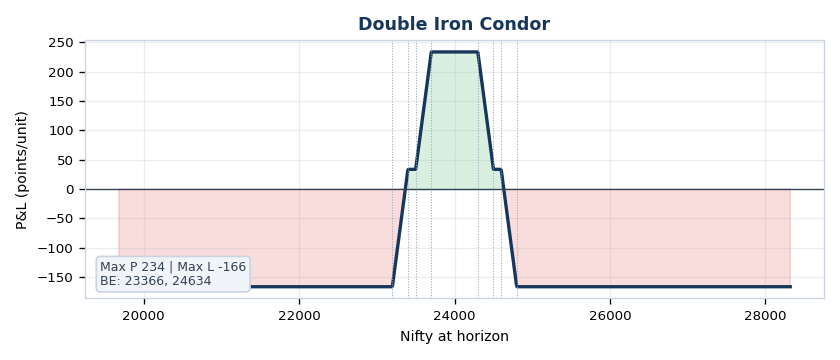

**The numbers (modelled at Nifty 24000).** Max profit 234 points (₹17,550 per lot) if Nifty pins inside the inner shorts. Max loss -166 points (₹12,450 per lot) if either wing is breached. Breakevens 23366 and 24634. Net credit 233.5 points; risk:reward 1.40 — notably better than a single condor because the second layer adds credit without proportionally adding risk.

**Greeks & behaviour.** Net delta near zero at inception (balanced wings); theta strongly positive — this is a pure time-decay engine; vega negative, so falling IV is your tailwind and an IV spike is the enemy. Short gamma: the position is calm in the middle and accelerates against you as price nears either short strike.

**Management & exit.** Manage as a unit: take profits at ~50% of the 233.5-point credit, typically with 7–14 days left. If one side is tested (Nifty approaching 24300 or 23700), roll that whole vertical out or close the breached layer — do not let a breakeven breach turn into max loss. Always exit before expiry-week gamma.

**Risk note.** Two stacked short-vol structures means two ways for a trend day to hurt you, and the defined -166 loss assumes you actually respect the wings. The real-world danger is IV expansion combined with a directional move — both legs bleed at once. Size so that a full -166 loss is a routine, survivable event.

**Scenario P&L (₹ per lot, at expiry).**

| Nifty at expiry | 22,800 | 23,400 | 24,000 | 24,600 | 25,200 |
|---|---|---|---|---|---|
| **P&L (₹/lot)** | -12,450 | +2,550 | +17,550 | +2,550 | -12,450 |

The table is symmetric: +17,550 if Nifty pins at 24000, fading to +2,550 at the inner edges and a defined -12,450 at either 22,800 or 25,200 where a wing is breached.

**The trade in real life (trigger -> manage -> exit).** Trigger: a sleepy, post-event Nifty with India VIX elevated but FALLING, no breakout catalyst inside the expiry, and 20-40 DTE on the monthly; you want a high-conviction range plus premium rich enough to make both layers pay. Manage as one unit: take profit at ~50% of the 233.5-point credit, typically with 7-14 days left; if one side is tested (Nifty nears 24300 or 23700), roll that whole vertical out or close the breached layer before a breakeven turns into max loss. Exit: the 50% profit-target, or close the tested layer on a breakeven breach; hard time-stop before expiry-week gamma. Watch India VIX, because an IV spike combined with a directional day bleeds both layers at once; if VIX jumps 3+ points, cut size. Size so a full -166-point (₹12,450) loss is a routine, survivable event, not an account dent. Do NOT layer this into a known breakout catalyst, where two stacked short-vol structures just multiply the pain.

## 180. Expiry-Day Short Straddle
*Pin on expiry · Short vega · net credit*

**The idea (intuition).** On expiry day, the at-the-money straddle is nearly all time value and that value evaporates by 3:30 pm. Sell the ATM call and put, and if Nifty pins near the strike you keep almost the entire premium as theta torches it in hours. You are betting the market sits still for one session.

**When & why to use it.** This is a same-day, weekly-expiry NSE trade (Nifty Tuesday/Thursday cycles, Bank Nifty earlier in the week). Deploy on a quiet expiry morning when price is coiled near a round strike, no major data due, and the option chain shows heavy open interest pinning that strike (max-pain logic). Do NOT do it on an event-expiry, after a gap, or if the first hour is already trending — expiry gamma is the most vicious on the board.

**How to build it (₹, Nifty).** Sell 24000 CE @ 72, sell 24000 PE @ 68. Net = -140.4 points credit, about 140.4 × 75 = ₹10,530 received per lot. The premiums are small because it is expiry day — that is the point.

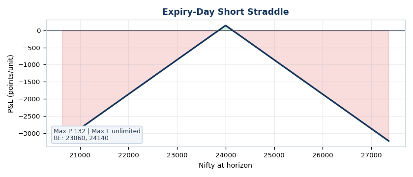

**The numbers (modelled at Nifty 24000).** Max profit 132 points (₹9,900 per lot) if Nifty closes exactly at 24000. Max loss Unlimited — naked on both sides; a runaway move in either direction has no cap. Breakevens 23860 and 24140 — a band of only ±140 points. Risk:reward undefined.

**Greeks & behaviour.** Net delta near zero at the strike; theta massively positive — on expiry day theta is your entire edge and it decays by the hour; vega negative but small (little vega left at the close). Short gamma is extreme: delta swings violently as Nifty moves a few points near the strike late in the day.

**Management & exit.** Define a points stop *before* you enter — e.g. exit if the straddle value doubles, or if Nifty trades outside 23860–24140. Many desks close by early afternoon once the bulk of theta is captured rather than holding into the 3:00–3:30 gamma storm. Take the 50–70% of credit and walk; do not be greedy for the last few points.

**Risk note.** Expiry-day gamma is the single most dangerous thing in this book — a 100-point news flash near the close can blow past both breakevens before you can react, and the loss is uncapped. Size *tiny* (a fraction of a normal lot count) and never sell expiry straddles on event days.

**Scenario P&L (₹ per lot, at expiry).**

| Nifty at expiry | 22,800 | 23,400 | 24,000 | 24,600 | 25,200 |
|---|---|---|---|---|---|
| **P&L (₹/lot)** | -79,500 | -34,500 | +10,500 | -34,500 | -79,500 |

A perfect 24000 pin pays +10,500, but the grid screams the danger: already -34,500 at 23,400 and 24,600 and -79,500 at the edges, and because both legs are naked a larger expiry-day move loses far more, without limit.

**The trade in real life (trigger -> manage -> exit).** Trigger: a quiet weekly-expiry morning (Nifty Tuesday/Thursday cycle, Bank Nifty earlier in the week), price coiled near a round strike, no data due, the option chain showing heavy OI pinning that strike (max-pain logic), and the first hour NOT trending; India VIX flat. Manage: define a points stop BEFORE entry, e.g. exit if the straddle value doubles or if Nifty trades outside 23860-24140; never average up. Most desks bank the bulk of theta and close by early-to-mid afternoon rather than holding into the 3:00-3:30 pm gamma storm. Exit: take 50-70% of the 140-point credit and walk; hard stop on a breakeven breach; mandatory time-stop by ~2:30 pm. Never sell expiry straddles on event-expiries or after a gap. Size TINY (a fraction of a normal lot count), because a 100-point news flash near the close can blow past both breakevens before you can click, and the loss is uncapped; this is the single most dangerous exposure in this book.

## 181. Expiry-Day Iron Butterfly
*Pin on expiry · Short vega · net credit*

**The idea (intuition).** Take the expiry-day short straddle and buy cheap wings on either side. You give up some credit, but you convert the terrifying unlimited tails into a defined, sleep-at-night maximum loss. Same pin bet, with insurance.

**When & why to use it.** The disciplined version of the expiry-day pin trade — use it whenever you would consider an expiry short straddle but want the loss capped (which should be almost always for retail). Same trigger: quiet weekly expiry, price coiled at a high-OI strike, no event. The defined risk lets you size a touch larger and survive a surprise. Avoid on event-expiries regardless.

**How to build it (₹, Nifty).** Sell 24000 CE @ 72, sell 24000 PE @ 68, buy 24150 CE @ 19, buy 23850 PE @ 19. Net = -101.9 points credit, about 101.9 × 75 = ₹7,643 received per lot.

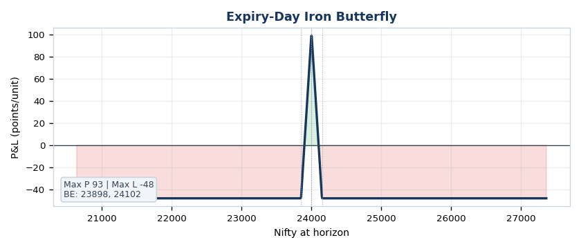

**The numbers (modelled at Nifty 24000).** Max profit 93 points (₹6,975 per lot) at a 24000 pin. Max loss -48 points (₹3,600 per lot) — capped by the 24150/23850 wings, a huge improvement on the naked straddle. Breakevens 23898 and 24102 (a tight ±100-point band). Net credit 101.9 points; risk:reward 1.94.

**Greeks & behaviour.** Net delta near zero at the strike; theta strongly positive and front-loaded into the session; vega negative but small. Short gamma near the strike — still whippy intraday, but the bought wings cap how bad a fast move can get.

**Management & exit.** Target 50–60% of the 93-point max as theta does its work; close by early-to-mid afternoon to dodge the closing gamma. Because risk is defined at -48, you can let it run a bit more than the naked straddle, but if Nifty pierces 23898 or 24102 with momentum, just take it off — there is little left to defend.

**Risk note.** The tails are capped, but the breakeven band is razor-thin (±~100 points), so a single trending expiry day still hands you the full -48. The wings cost you in good months; this is the price of not being short naked gamma on the most dangerous day of the cycle.

**Scenario P&L (₹ per lot, at expiry).**

| Nifty at expiry | 22,800 | 23,400 | 24,000 | 24,600 | 25,200 |
|---|---|---|---|---|---|
| **P&L (₹/lot)** | -3,600 | -3,600 | +7,650 | -3,600 | -3,600 |

A 24000 pin pays +7,650, and because the 24150/23850 wings cap the tails the loss is a defined -3,600 at every grid point away from the strike, a huge improvement on the naked straddle.

**The trade in real life (trigger -> manage -> exit).** Trigger: the same setup as the expiry straddle (quiet weekly expiry, price coiled at a high-OI strike, no event, first hour rangebound) but you want the loss capped, which for retail should be almost always. Manage: because risk is defined at -48 points (₹3,600) you can let it breathe a touch more than the naked version, but if Nifty pierces 23898 or 24102 with momentum, just take it off, since there is little left to defend. Exit: target 50-60% of the 93-point max as theta does its work; close by early-to-mid afternoon to dodge the closing gamma; hard time-stop into the 3:00 pm gamma ramp. The defined risk lets you size a touch larger than the naked straddle, but the breakeven band is razor-thin (±~100 points), so a single trending expiry day still hands you the full -48; treat the wing cost as the price of not being short naked gamma on the most dangerous day of the cycle. Avoid on event-expiries regardless.

## 182. Gap-Fade Bull Put Spread
*Fade a gap-down · Short vega · net credit*

**The idea (intuition).** When Nifty gaps down at the open on overnight global fear that looks overdone, you can fade the gap by selling a put spread below the new price. You are betting the panic was an over-reaction and the index stabilises or recovers, letting the spread expire worthless for the credit.

**When & why to use it.** The trigger is concrete: an opening gap-down of, say, 0.5–1% driven by global cues (US sell-off, SGX Nifty weak) rather than a domestic structural shock, with India VIX spiking on the open. You sell the spread once the first 15–30 minutes show the low holding and selling drying up. Do NOT fade a gap caused by genuine domestic bad news (policy shock, banking stress) or one that keeps making new lows — that is catching a falling knife.

**How to build it (₹, Nifty).** Sell 23800 PE @ 74, buy 23500 PE @ 22. Net = -52.1 points credit, about 52.1 × 75 = ₹3,908 received per lot. The elevated open IV is what makes the 23800 PE rich enough to be worth selling.

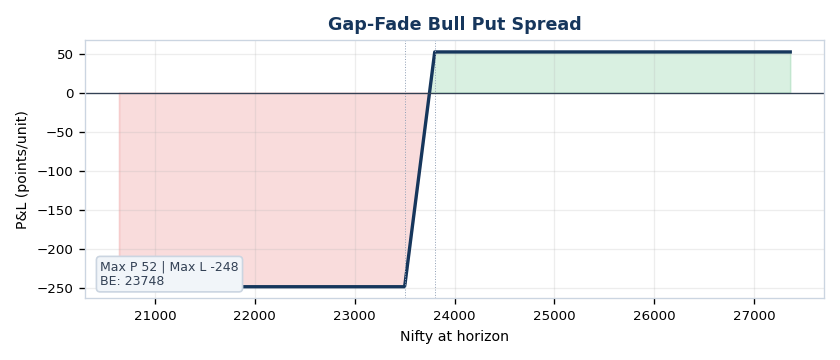

**The numbers (modelled at Nifty 24000).** Max profit 52 points (₹3,900 per lot) if Nifty holds above 23800. Max loss -248 points (₹18,600 per lot) if it closes below 23500. Breakeven 23748. Net credit 52.1 points; risk:reward 0.21 — you are risking roughly five to make one, the classic credit-spread skew.

**Greeks & behaviour.** Net delta positive (you want the market up or flat); theta positive (time decay works for you once the gap stabilises); vega negative — and crucially, the post-gap IV crush as panic fades is a major tailwind. Short gamma below the short strike.

**Management & exit.** This is a fast trade — take 50% of the 52-point credit, often the same day or next, as IV deflates. Hard stop if Nifty breaks the day's low and trades toward 23748; the thesis (gap was overdone) is simply wrong, so respect it. Do not hold a tested gap-fade into the close hoping for a bounce.

**Risk note.** The poor 0.21 risk:reward means one mismanaged loser erases several winners — discipline on the stop is everything. The real danger is a *second leg down*: gaps that fade often re-break, and a defined -248 can arrive fast if the global rout continues into the Indian session.

**Scenario P&L (₹ per lot, at expiry).**

| Nifty at expiry | 22,800 | 23,400 | 24,000 | 24,600 | 25,200 |
|---|---|---|---|---|---|
| **P&L (₹/lot)** | -18,600 | -18,600 | +3,900 | +3,900 | +3,900 |

Hold above 23800 and you keep +3,900, but the table's -18,600 at both 23,400 and 22,800 shows the defined max loss arriving fast if the gap-down keeps making new lows.

**The trade in real life (trigger -> manage -> exit).** Trigger: an opening gap-down of ~0.5-1% on global cues (US sell-off, weak SGX/GIFT Nifty) rather than a domestic structural shock, India VIX spiking on the open, and the first 15-30 minutes showing the low holding and sell-volume drying up. Manage: this is a fast trade powered by the post-gap IV crush, so if Nifty breaks the day's low and trades toward the 23748 breakeven your thesis (the gap was overdone) is simply wrong; respect the stop. Exit: take 50% of the 52-point credit, often the same day or next as IV deflates; hard stop on a close or break below the day's low toward 23748; do not carry a tested gap-fade into the close hoping for a bounce. The poor 0.21 risk:reward means one mismanaged loser erases several winners, so the real danger (a second leg down as the global rout continues into the Indian session) must be stopped, not hoped through. Never fade a gap caused by genuine domestic bad news or one still making new lows.

## 183. Trend-Pullback Call Debit Spread
*Buy the dip in an uptrend · Neutral vega · net debit*

**The idea (intuition).** In an established uptrend, you wait for a shallow pullback to support and then buy a call spread to ride the next leg up. The defined-risk debit spread lets you express "the dip is a gift" without the cost or naked risk of an outright long call.

**When & why to use it.** Trigger: Nifty in a clear uptrend (above rising 20/50-day averages) pulls back to a support/trendline and shows a reversal signal — a hammer, a higher low, buyers stepping in. IV is typically middling (you are roughly vega-neutral, so IV regime matters little). Enter as the bounce confirms. Avoid when the trend is broken (lower highs and lows) or the "pullback" is actually the start of a reversal.

**How to build it (₹, Nifty).** Buy 23900 CE @ 433, sell 24300 CE @ 216. Net = +216.4 points debit, about 216.4 × 75 = ₹16,230 paid per lot. The short 24300 call caps your target and halves the cost of the long call.

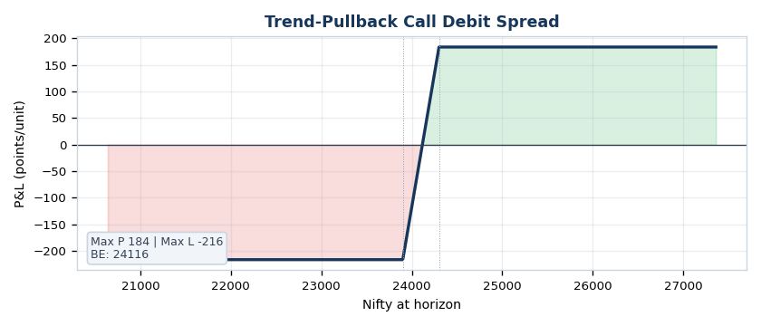

**The numbers (modelled at Nifty 24000).** Max profit 184 points (₹13,800 per lot) above 24300. Max loss -216 points (₹16,200 per lot, the debit paid) below 23900. Breakeven 24116. Net debit 216.4 points; risk:reward 0.85.

**Greeks & behaviour.** Net delta positive (directional bull bet); theta mildly negative (you paid debit, time nibbles at it); vega roughly neutral — the long and short calls offset, so you are betting on direction, not volatility. Long gamma below the short strike helps as the trend resumes.

**Management & exit.** Take profits at 70–80% of the 184-point max as Nifty pushes through 24300, or scale out partway. Stop if Nifty closes back below the pullback low / the 23900 long strike — the dip-buy thesis has failed. Because it is a debit, time is against you: give the trade a defined number of sessions and exit if the bounce stalls.

**Risk note.** The neat 0.85 risk:reward flatters a trade whose edge lives entirely in the entry — buy a *failed* pullback and you simply lose the debit. The defined -216 is comfortable, but choppy, trendless tape will bleed you through repeated stop-outs; only deploy when the trend is genuinely intact.

**Scenario P&L (₹ per lot, at expiry).**

| Nifty at expiry | 22,800 | 23,400 | 24,000 | 24,600 | 25,200 |
|---|---|---|---|---|---|
| **P&L (₹/lot)** | -16,200 | -16,200 | -8,700 | +13,800 | +13,800 |

The spread pays its full +13,800 once Nifty clears 24300 and caps the downside at the -16,200 debit if the dip-buy fails and price sits below 23900.

**The trade in real life (trigger -> manage -> exit).** Trigger: Nifty in a clear uptrend (above rising 20/50-day averages) pulls back to a support or trendline and prints a reversal signal (a hammer, a higher low, visible buying); enter as the bounce confirms, not while price is still falling. IV regime barely matters since you are roughly vega-neutral. Manage: it is a debit, so time is against you; give it a defined number of sessions and if the bounce stalls, exit. Stop if Nifty closes back below the pullback low or the 23900 long strike, which kills the thesis. Exit: take 70-80% of the 184-point max as Nifty pushes through 24300, or scale out partway; time-stop if the move has not started within your session budget. The edge lives entirely in the entry: buy a FAILED pullback and you simply lose the debit, and choppy, trendless tape will bleed you through repeated stop-outs, so only deploy when the uptrend is genuinely intact (no lower highs and lower lows).

## 184. High-IV Short Strangle
*Range-bound, IV rank > 70 · Short vega · net credit*

**The idea (intuition).** When implied volatility is historically expensive, options are over-priced relative to what the market actually delivers. Selling an out-of-the-money strangle harvests that fat premium, betting Nifty stays inside a wide band while IV mean-reverts down.

**When & why to use it.** The trigger is explicit: IV rank above 70 (India VIX elevated versus its own recent range), typically after a scare that has since calmed, with no fresh catalyst on the calendar. The wide strikes give a generous range. Do NOT sell strangles when IV is low (thin premium, poor reward for tail risk) or just before an event — you want to sell *after* the fear is priced, not before.

**How to build it (₹, Nifty).** Sell 24600 CE @ 167, sell 23400 PE @ 148. Net = -314.8 points credit, about 314.8 × 75 = ₹23,610 received per lot. The rich premiums on far OTM strikes are a direct symptom of the high-IV environment.

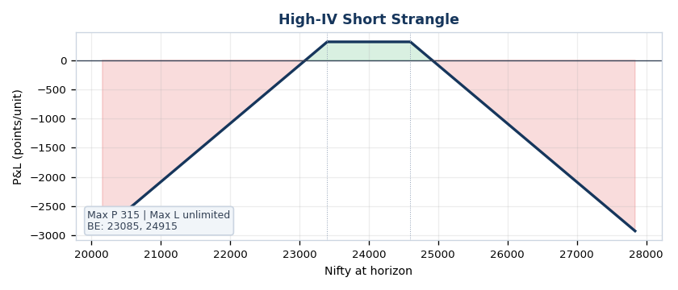

**The numbers (modelled at Nifty 24000).** Max profit 315 points (₹23,625 per lot) if Nifty stays between the strikes. Max loss Unlimited — both legs naked. Breakevens 23085 and 24915, a wide ±900-point band. Risk:reward undefined.

**Greeks & behaviour.** Net delta near zero (balanced); theta strongly positive; vega strongly negative — this is fundamentally a short-volatility bet, and the IV mean-reversion does as much of the work as theta. Short gamma: comfortable in the middle, dangerous at the edges.

**Management & exit.** Take profits at ~50% of the 314.8-point credit — selling premium-rich strangles and buying them back at half is the bread-and-butter exit. Manage the tested side: if Nifty approaches 24600 or 23400, roll that leg out/away or close it. Exit well before expiry-week gamma.

**Risk note.** This worst case assumes the index makes a large unbounded move; in practice you size small and stop/manage at a multiple of the credit (commonly 2x). Premium selling is *not* free money — a single gap through a breakeven can wipe out many months of harvested credit, which is precisely why SEBI data shows most retail option sellers still lose. Size for the gap you cannot see coming.

**Scenario P&L (₹ per lot, at expiry).**

| Nifty at expiry | 22,800 | 23,400 | 24,000 | 24,600 | 25,200 |
|---|---|---|---|---|---|
| **P&L (₹/lot)** | -21,375 | +23,625 | +23,625 | +23,625 | -21,375 |

Inside the wide band you keep the full +23,625, but the -21,375 at both 22,800 and 25,200 is only the visible edge: both legs are naked, so a move past the grid loses far more, without limit.

**The trade in real life (trigger -> manage -> exit).** Trigger: IV rank above 70 (India VIX elevated versus its own recent range) AFTER a scare that has since calmed, with no fresh catalyst on the calendar; you sell the far-OTM strikes once the fear is priced, not before. Manage: work the tested side; if Nifty approaches 24600 or 23400, or India VIX re-expands, roll that leg out and away or close it, and never let a breakeven breach run. Exit: take ~50% of the 314.8-point credit (sell premium-rich, buy back at half); hard stop at a multiple of the credit (commonly 2x); time-stop well before expiry-week gamma. This is fundamentally short-vol, with IV mean-reversion doing as much work as theta. Premium selling is not free money: a single gap through the 23085 or 24915 breakeven can wipe out many months of harvested credit, which is exactly why SEBI data shows most retail sellers lose. Do NOT sell strangles when IV is low or just before an event; size small for the gap you cannot see.

## 185. Low-IV Long Calendar
*Pin, IV rank < 30 · Long vega · net debit*

**The idea (intuition).** Sell a near-dated option and buy a longer-dated option at the same strike. The near leg decays faster than the far leg, so if Nifty pins near the strike you profit from the differential theta — and because you are net long the back-month, you also gain if IV expands.

**When & why to use it.** Trigger: IV rank below 30 (cheap options, India VIX subdued) plus an expectation that Nifty hovers near a strike short-term while volatility is likely to rise later. This is the long-vol companion to premium-selling: you buy calendars when vol is cheap. Avoid when IV is already high (back-month is expensive and a vol crush hurts you) or when you expect a big immediate move (a calendar wants the price to *sit*).

**How to build it (₹, Nifty).** Sell the near 24000 CE @ 456, buy the far 24000 CE @ 689. Net = +232.7 points debit, about 232.7 × 75 = ₹17,453 paid per lot.

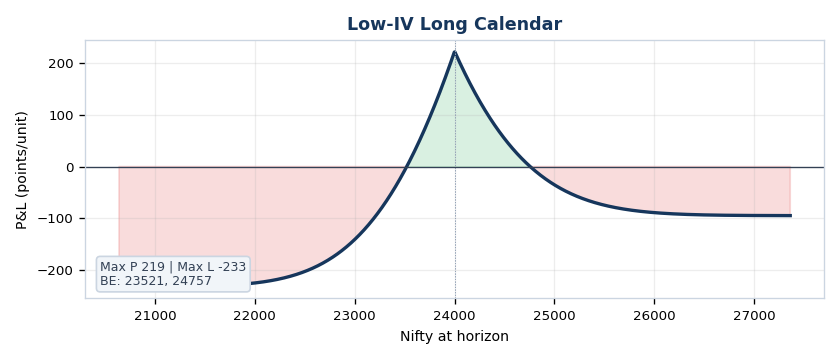

**The numbers (modelled at Nifty 24000).** Max profit 219 points (₹16,425 per lot), realised near the strike at the near-leg expiry. Max loss -233 points (₹17,475 per lot, the debit) if Nifty moves far from 24000 either way. Breakevens 23521 and 24757. Net debit 232.7 points; risk:reward 0.94.

**Greeks & behaviour.** Net delta near zero at the strike; theta positive (the near short decays faster than the far long); vega positive — rising IV lifts the back-month and is a genuine tailwind, the defining feature of a calendar. Long gamma is modest; the trade wants stillness now and a vol pop later.

**Management & exit.** Target 25–40% of the debit as profit — calendars rarely hit theoretical max. Close at or before the near-leg expiry; do not let the short leg go into its own gamma week untended. If Nifty drifts toward a breakeven, recentre by rolling the strike, or just cut it. An IV spike with price still near the strike is the ideal exit.

**Risk note.** The hidden risk is a *directional* move: a calendar loses if Nifty trends away from the strike, and a simultaneous IV crush (vol falling from already-low levels is rare but possible after the back-month richens) compounds it. It is a low-IV, patience trade — wrong on stillness and you bleed the full -233.

**Scenario P&L (₹ per lot, at expiry).**

| Nifty at expiry | 22,800 | 23,400 | 24,000 | 24,600 | 25,200 |
|---|---|---|---|---|---|
| **P&L (₹/lot)** | -12,975 | -3,075 | +16,725 | +2,325 | -4,200 |

The +16,725 peak sits right at a 24000 pin at the near-leg expiry, fading to losses as Nifty drifts away (-12,975 at 22,800 and -4,200 at 25,200), tracing the directional bleed toward the -233-point max.

**The trade in real life (trigger -> manage -> exit).** Trigger: IV rank below 30 (cheap options, India VIX subdued) plus a view that Nifty hovers near a strike short-term while vol is likely to rise later; deploy a few days out, as the long-vol companion to premium-selling. Manage: a calendar wants stillness now and a vol pop later, so if Nifty drifts toward a breakeven (23521 or 24757), recentre by rolling the strike, or cut it; an IV spike with price still near 24000 is the ideal exit. Exit: target 25-40% of the debit, since calendars rarely hit theoretical max; close at or before the near-leg expiry so the short leg never enters its own gamma week untended; hard time-stop at near-expiry regardless. Avoid when IV is already high (the back-month is dear and a vol crush hurts) or when you expect a big immediate move. The hidden risk is a directional move plus a simultaneous IV crush; wrong on stillness and you bleed the full -233, so treat it as a patience trade, not a punt.

## 186. Earnings/Results Long Straddle
*Stock results move · Long vega · net debit*

**The idea (intuition).** Ahead of a single-stock results announcement that could move the stock hard in either direction, buy the at-the-money call and put. You do not care which way it breaks — you only need the move to be bigger than the premium you paid. A pure bet on a large surprise.

**When & why to use it.** Trigger: a stock with liquid options (Reliance, Infosys, HDFC Bank, a hot mid-cap) heading into results where the historical earnings move exceeds the implied move priced into the straddle, and IV has *not* yet ramped to extreme levels. Buy 1–2 days before the announcement. Do NOT buy when IV is already jacked up (you overpay and eat the post-event crush) or when the implied move already exceeds the typical realised move.

**How to build it (₹, Nifty).** (Modelled on the index for consistency.) Buy 24000 CE @ 129, buy 24000 PE @ 115. Net = +243.2 points debit, about 243.2 × 75 = ₹18,240 paid per lot. On a single stock you would scale to its lot and premium.

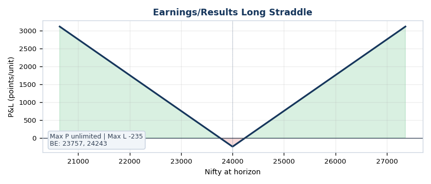

**The numbers (modelled at Nifty 24000).** Max profit Unlimited — a big move in either direction pays open-ended. Max loss -235 points (₹17,625 per lot) if the underlying pins at 24000 at expiry. Breakevens 23757 and 24243 — you need a move beyond ±243 points to profit. Risk:reward undefined.

**Greeks & behaviour.** Net delta near zero (you are non-directional); theta strongly negative (every day before the event costs you); vega strongly positive — rising pre-event IV helps and the post-event crush hurts. Long gamma: a fast move makes you money quickly.

**Management & exit.** This is a *get-in-late, get-out-fast* trade. Buy close to the event to minimise theta bleed, then exit immediately after the result prints — capture the move before the IV crush eats the remaining time value. Do not hold a long straddle for days after results "hoping" for follow-through; the vega collapse will grind it down even if the stock keeps drifting your way.

**Risk note.** The classic trap is IV crush: the stock can move and you still lose, because implied vol collapses post-event and both options deflate. You are buying expensive insurance against a small target band — win only if the realised move beats the (already rich) implied move. Most of the loss happens in the first hour after the announcement.

**Scenario P&L (₹ per lot, at expiry).**

| Nifty at expiry | 22,800 | 23,400 | 24,000 | 24,600 | 25,200 |
|---|---|---|---|---|---|
| **P&L (₹/lot)** | +71,775 | +26,775 | -18,225 | +26,775 | +71,775 |

A pin at 24000 costs you the -18,225 debit, but the grid pays open-ended on a real surprise (+26,775 at a ±600-point move and +71,775 at the ±1,200-point edges).

**The trade in real life (trigger -> manage -> exit).** Trigger: a liquid-option stock (Reliance, Infosys, HDFC Bank, a hot mid-cap) heading into results where the historical earnings move EXCEEDS the implied move priced into the straddle, and IV has NOT yet ramped to extremes; buy 1-2 days before the announcement to minimise theta bleed. Manage: this is get-in-late, get-out-fast, because every day before the event costs you theta and the post-event IV crush grinds value out even if the stock keeps drifting your way. Exit: close immediately after the result prints to capture the move before the crush eats the remaining time value; do not hold for days hoping for follow-through; your time-stop is the morning after results. The classic trap is IV crush: the stock can move and you still lose because implied vol collapses and both options deflate. Only deploy when the realised-beats-implied edge is genuine; skip it when IV is already jacked up or the implied move already exceeds the typical realised move. Scale to the single stock's lot and premium.

## 187. Post-Event IV-Crush Short Strangle
*After the news · Short vega · net credit*

**The idea (intuition).** The mirror of the earnings straddle. Once the event has passed and the result is known, implied volatility collapses and the uncertainty premium evaporates. Selling a strangle *after* the news captures that crush — you are the one collecting what the pre-event buyers overpaid for.

**When & why to use it.** Trigger: immediately after a known binary event (results, RBI policy, Budget, Fed) where IV is still elevated but the actual uncertainty is now resolved, and price has settled into a post-event range. You sell into the deflating IV. Do NOT do it if the event produced an ongoing trend or fresh uncertainty (a shock result, a follow-on event) — then IV stays bid for a reason.

**How to build it (₹, Nifty).** Sell 24400 CE @ 49, sell 23600 PE @ 51. Net = -100.5 points credit, about 100.5 × 75 = ₹7,538 received per lot. The strikes are tight-ish because post-event IV, while crushing, still leaves harvestable premium.

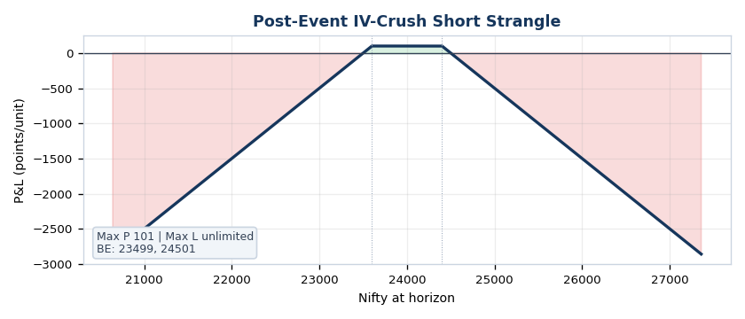

**The numbers (modelled at Nifty 24000).** Max profit 101 points (₹7,575 per lot) if Nifty stays between the strikes. Max loss Unlimited — naked both sides. Breakevens 23499 and 24501. Risk:reward undefined.

**Greeks & behaviour.** Net delta near zero; theta positive; vega negative — but the edge here is timing the *vega* specifically: you are selling the moment IV is richest and most likely to fall. Short gamma at the edges of the range.

**Management & exit.** Because the IV crush is fast, much of the profit accrues in the first day or two — take 50% of the credit quickly rather than grinding to expiry. Manage the tested side if the post-event "settle" turns into a drift. Be out before any next event re-ignites IV.

**Risk note.** This worst case assumes a large unbounded move; size small and stop at a multiple of the credit. The specific danger is mis-reading the event: if the news actually started a trend, you are now short naked options *into* a directional move with IV that refuses to crush. Selling premium after events works on average and still blows up individuals who size too large — the SEBI loss statistics include plenty of post-event strangle sellers.

**Scenario P&L (₹ per lot, at expiry).**

| Nifty at expiry | 22,800 | 23,400 | 24,000 | 24,600 | 25,200 |
|---|---|---|---|---|---|
| **P&L (₹/lot)** | -52,425 | -7,425 | +7,575 | -7,425 | -52,425 |

You keep the full +7,575 if Nifty settles between the strikes, but the -7,425 at the inner grid and -52,425 at the edges flag the naked tails: a move past the grid loses far more, with no cap.

**The trade in real life (trigger -> manage -> exit).** Trigger: immediately AFTER a known binary event (results, RBI policy, Budget, Fed) where India VIX is still elevated but the actual uncertainty is now resolved and price has settled into a post-event range; you sell into the deflating IV. Manage: the IV crush is fast, so much of the profit accrues in the first day or two; bank it quickly rather than grinding to expiry, manage the tested side if the post-event settle turns into a drift, and be out before any next event re-ignites IV. Exit: take 50% of the ~100-point credit fast; hard stop at a multiple of the credit; time-stop ahead of the next scheduled catalyst. The specific danger is mis-reading the event: if the news actually started a trend, you are short naked options INTO a directional move with IV that refuses to crush. It works on average and still blows up over-sized sellers; the SEBI loss column is full of post-event strangle sellers, so size small. Do NOT do it if the event produced fresh uncertainty or an ongoing trend.

## 188. Budget-Day Iron Condor
*Range through the Budget · Short vega · net credit*

**The idea (intuition).** The Union Budget (1 February) spikes IV for days beforehand as the market frets, but Nifty's actual Budget-day move is often smaller than the fear implies. A wide iron condor sells that inflated premium with defined-risk wings, betting the index stays in a broad range through the announcement.

**When & why to use it.** Trigger: the run-up to Budget day with India VIX elevated and the option chain pricing a large move, while your read is that the Budget will be a non-event for the index (no radical surprises expected). Use the defined-risk condor, never naked strangles, into a genuine event. Avoid if a market-moving structural change (big LTCG/STT shift, fiscal shock) is genuinely on the table.

**How to build it (₹, Nifty).** Sell 24500 CE @ 10 / buy 24800 CE @ 1, sell 23500 PE @ 15 / buy 23200 PE @ 3. Net = -21.5 points credit, about 21.5 × 75 = ₹1,613 received per lot. The tiny premiums show how far OTM you are reaching for a Budget-proof range.

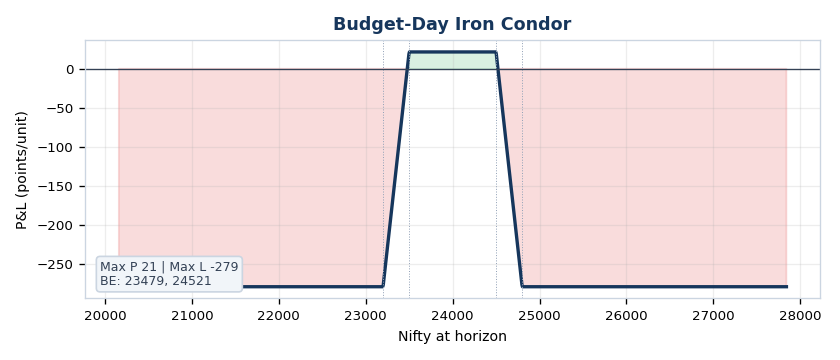

**The numbers (modelled at Nifty 24000).** Max profit 21 points (₹1,575 per lot) if Nifty holds the 23500–24500 zone. Max loss -279 points (₹20,925 per lot) if a wing is breached. Breakevens 23479 and 24521. Net credit 21.5 points; risk:reward 0.08 — you are risking a lot to make a little, which is exactly the warning label on event-day condors.

**Greeks & behaviour.** Net delta near zero; theta positive; vega negative — you profit as the Budget-day IV crush deflates the shorts. Short gamma, and on Budget day the gamma can be violent if the speech triggers a sharp move.

**Management & exit.** This is a one-to-two-day trade: hold through the Budget, then take profit as IV crushes the day after — do not linger. Because risk:reward is an ugly 0.08, the stop discipline is paramount: if Nifty approaches 23500 or 24500 during the speech, close the tested side immediately.

**Risk note.** The 0.08 risk:reward is brutal honesty — one Budget that actually moves the market (a surprise tax, a borrowing shock) hands you the full -279 and erases a year of these. Budget days *can* trend hard intraday; the wide strikes help but do not make this safe. Size tiny and treat the small credit as compensation for genuine event risk, not a sure thing.

**Scenario P&L (₹ per lot, at expiry).**

| Nifty at expiry | 22,800 | 23,400 | 24,000 | 24,600 | 25,200 |
|---|---|---|---|---|---|
| **P&L (₹/lot)** | -20,925 | -5,925 | +1,575 | -5,925 | -20,925 |

Holding the 23500-24500 zone pays a thin +1,575, but the table's -20,925 at both edges is the warning label: you risk a large defined loss to make a little on a day that can trend hard.

**The trade in real life (trigger -> manage -> exit).** Trigger: the run-up to Budget day (1 February) with India VIX elevated and the chain pricing a large move, while your read is that the Budget will be a non-event for the index (no radical LTCG/STT or fiscal surprise expected); use the defined-risk condor, never a naked strangle, into a genuine event. Manage: with an ugly 0.08 risk:reward, stop discipline is everything, so if Nifty approaches 23500 or 24500 during the speech, close the tested side immediately. Exit: hold through the Budget, then take profit as IV crushes the day after; do not linger; hard stop on a tested side intraday; time-stop the session after the speech. Budget days CAN trend hard intraday, so the wide strikes help but do not make this safe. One Budget that actually moves the market (a surprise tax, a borrowing shock) hands you the full -279 and erases a year of these, so size tiny and treat the small credit as compensation for genuine event risk, not a sure thing.

## 189. RBI-Policy Calendar
*Pin through policy, IV pop · Long vega · net debit*

**The idea (intuition).** Around an RBI monetary-policy decision, sell a near-dated option and buy a longer-dated one at the same strike. You want Nifty to pin near the strike through the announcement while the policy-driven IV pop lifts your long back-month. A calendar is the natural way to be long vol into a scheduled event without paying for a straddle.

**When & why to use it.** Trigger: an upcoming RBI policy meeting where you expect a measured, range-keeping outcome (no shock rate move) but elevated IV into the event, and back-month vol that can richen. Deploy a few days ahead. Avoid if you expect a genuine surprise (an off-consensus hike/cut) that sends Nifty trending away from the strike — directional moves are a calendar's weakness.

**How to build it (₹, Nifty).** Sell the near 24000 CE @ 104, buy the far 24000 CE @ 456. Net = +352.1 points debit, about 352.1 × 75 = ₹26,408 paid per lot.

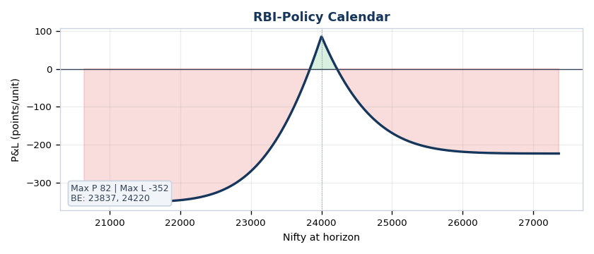

**The numbers (modelled at Nifty 24000).** Max profit 82 points (₹6,150 per lot) near the strike at near-leg expiry. Max loss -352 points (₹26,400 per lot, the debit) if Nifty moves far either way. Breakevens 23837 and 24220 — a fairly tight pinning band. Net debit 352.1 points; risk:reward 0.23.

**Greeks & behaviour.** Net delta near zero at the strike; theta positive (near short decays faster); vega positive — the policy-day IV pop in the back-month is the intended edge. Long gamma is small; the trade wants Nifty to *sit* near 24000 through the meeting.

**Management & exit.** Capture the vega expansion: if IV pops into the policy and Nifty holds the strike, take profit rather than waiting for theoretical max. Close at/before the near-leg expiry. If the decision sends Nifty trending past a breakeven, cut it — a tested calendar deteriorates quickly.

**Risk note.** The modest 0.23 risk:reward says the most likely outcome is a small win or a defined loss, and the trade fails on exactly the move an RBI surprise can produce. You are long a tight pin into an event known for occasional violent repricings; respect the breakevens at 23837/24220 and do not oversize the ₹26,408 debit.

**Scenario P&L (₹ per lot, at expiry).**

| Nifty at expiry | 22,800 | 23,400 | 24,000 | 24,600 | 25,200 |
|---|---|---|---|---|---|
| **P&L (₹/lot)** | -22,500 | -13,125 | +6,450 | -7,950 | -14,100 |

The +6,450 peak needs Nifty pinned at 24000 through the meeting; the grid's -22,500 at 22,800 and -14,100 at 25,200 show how a policy-driven trend away from the strike walks you toward the -352-point debit.

**The trade in real life (trigger -> manage -> exit).** Trigger: an upcoming RBI monetary-policy meeting where you expect a measured, range-keeping outcome (no shock hike or cut) but elevated IV into the event and back-month vol that can richen; deploy a few days ahead. Manage: capture the vega expansion, so if IV pops into the policy and Nifty holds 24000, take profit rather than waiting for theoretical max; if the decision sends Nifty trending past 23837 or 24220, cut it, because a tested calendar deteriorates quickly. Exit: bank the IV-pop profit, or close at or before the near-leg expiry; hard stop on a breakeven breach; time-stop at near-expiry. Avoid if you expect a genuine off-consensus surprise that sends Nifty trending, since directional moves are a calendar's weakness. The modest 0.23 risk:reward says the likeliest outcome is a small win or a defined loss, and the trade fails on exactly the violent repricing an RBI surprise can produce, so respect the 23837/24220 breakevens and do not oversize the ₹26,408 debit.

## 190. Monthly-Expiry Butterfly
*Pin near max-pain · Short vega · net debit*

**The idea (intuition).** A butterfly is a cheap, defined bet that Nifty pins at a specific strike by expiry. In the last week of a monthly series, open interest often clusters around a "max-pain" strike where the most options expire worthless. Centre the butterfly there and let the pin pay you a high reward-to-risk.

**When & why to use it.** Trigger: monthly expiry week with a clear max-pain / high-OI strike and a quiet, range-bound tape pulling price toward it. IV declining into expiry helps (you are short vega). Deploy 3–7 days out. Avoid if there is a live catalyst or strong trend that overrides the pin — max-pain is a tendency, not a law.

**How to build it (₹, Nifty).** Buy 23800 CE @ 260, sell 2× 24000 CE @ 129, buy 24200 CE @ 48. Net = +50.3 points debit, about 50.3 × 75 = ₹3,773 paid per lot — cheap, which is the butterfly's appeal.

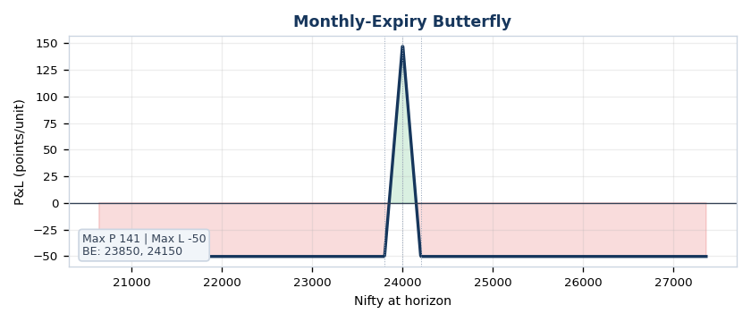

**The numbers (modelled at Nifty 24000).** Max profit 141 points (₹10,575 per lot) at a 24000 pin. Max loss -50 points (₹3,750 per lot, the debit) outside the wings. Breakevens 23850 and 24150. Net debit 50.3 points; risk:reward 2.80 — a genuinely attractive payoff *if* the pin holds.

**Greeks & behaviour.** Net delta near zero at the centre strike; theta positive near the body as expiry approaches (decay works in your favour once price sits at 24000); vega negative. Long gamma at the wings, short gamma at the body — the classic butterfly profile that wants price nailed to the centre.

**Management & exit.** The butterfly fattens only in the final days as theta sculpts the tent — be patient but exit before the last-hours gamma if price is near a wing. Take profit at 50–70% of the 141-point max; do not hold for the exact pin. If Nifty drifts to a breakeven, the cheap debit means you can often just let it expire, but cutting at a partial loss is fine when the pin thesis breaks.

**Risk note.** The pleasant 2.80 risk:reward only materialises in the narrow 23850–24150 band; a trending expiry week leaves you with the full -50 loss (small, but it recurs if you over-trade the setup). Max-pain pins fail regularly when a real catalyst hits — treat the centre strike as a probability, not a magnet.

**Scenario P&L (₹ per lot, at expiry).**

| Nifty at expiry | 22,800 | 23,400 | 24,000 | 24,600 | 25,200 |
|---|---|---|---|---|---|
| **P&L (₹/lot)** | -3,750 | -3,750 | +11,250 | -3,750 | -3,750 |

A 24000 pin pays the full +11,250 and the cheap structure caps the loss at the -3,750 debit everywhere else on the grid, an attractive payoff IF the max-pain pin holds.

**The trade in real life (trigger -> manage -> exit).** Trigger: monthly-expiry week with a clear max-pain / high-OI strike and a quiet, rangebound tape pulling price toward it; IV declining into expiry helps (you are short vega); deploy 3-7 days out. Manage: the butterfly only fattens in the final days as theta sculpts the tent, so be patient, but exit before the last-hours gamma if price is near a wing (23850 or 24150). Exit: take 50-70% of the 141-point max; because the debit is small you can often let it expire if price is camped at 24000, but cut at a partial loss when the pin thesis breaks; time-stop into the final session's gamma. Avoid if a live catalyst or strong trend overrides the pin, since max-pain is a tendency, not a law. A trending expiry week leaves you the full -50, small but recurring if you over-trade the setup, so treat the centre strike as a probability, not a magnet. The 2.80 risk:reward only materialises in the narrow 23850-24150 band.

## 191. Bank Nifty Intraday Short Straddle
*Quiet intraday · Short vega · net credit*

**The idea (intuition).** Bank Nifty is the most liquid, most volatile weekly underlying on NSE. On a quiet, rangebound session you can sell the at-the-money straddle intraday and harvest the day's time decay, squaring off before the close. A scalper's theta trade on the index's most active product.

**When & why to use it.** Trigger: a session opening flat with no bank-specific news, an early range establishing, and falling intraday IV — typically a mid-week lull. You enter after the first range forms and exit by mid-afternoon. Do NOT run it on RBI/results days for banks, on trending opens, or anywhere near weekly expiry where Bank Nifty gamma is savage. This is intraday-only — never carried overnight.

**How to build it (₹, Nifty).** (Modelled on the index strikes for consistency.) Sell 24000 CE @ 72, sell 24000 PE @ 68. Net = -140.4 points credit, about 140.4 × 75 = ₹10,530 received per lot. On Bank Nifty you would use its strikes and lot size.

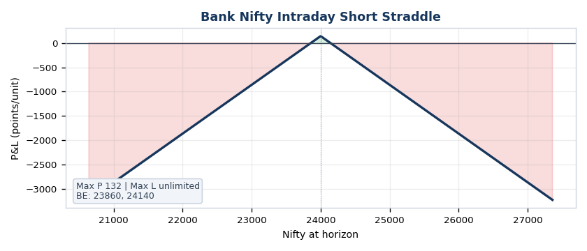

**The numbers (modelled at Nifty 24000).** Max profit 132 points (₹9,900 per lot) at a flat pin. Max loss Unlimited — naked both sides. Breakevens 23860 and 24140, a ±140-point intraday band. Risk:reward undefined.

**Greeks & behaviour.** Net delta near zero at the strike; theta positive (the whole point — harvesting one day's decay); vega negative. Short gamma is extreme intraday on Bank Nifty — delta flips fast on a 100-point swing, which on this index can happen in minutes.

**Management & exit.** Hard intraday rules only: a points-based stop (e.g. exit if the straddle value rises 30–40%), a time stop (square off by ~2:30 pm to bank the decay before the close), and *always* flat by 3:30 — never hold overnight. Take partial profits as the range tightens.

**Risk note.** Bank Nifty intraday gamma is among the most vicious exposures retail traders touch — a single banking headline or a sharp index move can blow through both breakevens before you can hit the button, with uncapped loss. Size *tiny* (this is the entry where over-sizing destroys accounts) and accept that some days you simply pay the stop and walk.

**Scenario P&L (₹ per lot, at expiry).**

| Nifty at expiry | 22,800 | 23,400 | 24,000 | 24,600 | 25,200 |
|---|---|---|---|---|---|
| **P&L (₹/lot)** | -79,500 | -34,500 | +10,500 | -34,500 | -79,500 |

A flat pin pays +10,500, but the grid is brutal (-34,500 at a 600-point move, -79,500 at the edges) and these are only the visible losses: Bank Nifty's naked intraday gamma loses far more, without limit, on a bigger swing.

**The trade in real life (trigger -> manage -> exit).** Trigger: a session opening flat with no bank-specific news, an early intraday range establishing, and falling intraday IV, typically a mid-week lull; enter after the first range forms. Do NOT run it on RBI or bank-results days, on trending opens, or near weekly expiry where Bank Nifty gamma is savage. Manage with hard intraday rules only: a points-based stop (exit if the straddle value rises 30-40%), and take partial profits as the range tightens. Exit: time-stop by squaring off around ~2:30 pm to bank the decay before the close, and ALWAYS flat by 3:30 pm; never carried overnight. Bank Nifty intraday gamma is among the most vicious exposures retail touch, since a single banking headline or sharp index move can blow through both breakevens before you hit the button, with uncapped loss. Size TINY; this is the entry where over-sizing destroys accounts, and accept that some days you simply pay the stop and walk. On Bank Nifty use its own strikes and lot size.

## 192. Overnight Short Strangle
*Quiet close-to-open · Short vega · net credit*

**The idea (intuition).** Sell a far out-of-the-money strangle near the close and buy it back at the open, pocketing the overnight theta. The strikes are so far out that you are collecting only a sliver of premium — this is a high-win-rate, tiny-edge trade that lives or dies on the rare bad gap.

**When & why to use it.** Trigger: a calm market into the close, no overnight events (no US Fed, no major data, no expiry), benign global cues on SGX/GIFT Nifty. You sell wide OTM strikes near 3:30 pm and cover at the next open. Do NOT do it ahead of US data nights, results, or any known overnight catalyst — the whole risk is the gap you cannot hedge while the market is shut.

**How to build it (₹, Nifty).** Sell 24400 CE @ 0, sell 23600 PE @ 1. Net = -1.4 points credit, about 1.4 × 75 = ₹105 received per lot. The near-zero premium is the honest picture: you are paid almost nothing to carry overnight tail risk.

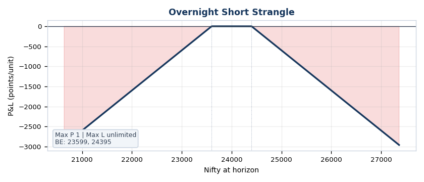

**The numbers (modelled at Nifty 24000).** Max profit 1 point (₹75 per lot) if Nifty opens inside the strikes. Max loss Unlimited — naked both sides. Breakevens 23599 and 24395. Risk:reward undefined.

**Greeks & behaviour.** Net delta near zero; theta positive (overnight decay is the entire return); vega negative. Short gamma — and the danger is that all of an overnight move arrives as a single gap at the open, with no chance to manage in between.

**Management & exit.** The exit is mechanical: buy both legs back at the next open, win or lose. There is no intraday management because the position only exists overnight. Skip the trade entirely on any night with a scheduled global event.

**Risk note.** This worst case assumes a large unbounded gap; you size small and accept the gap you cannot stop. The risk/reward is almost a caricature of bad premium-selling — collect ₹105 to risk a multi-thousand-rupee overnight gap. It "works" until a 1.5% overnight gap (US shock, geopolitical flare-up) delivers months of losses in one open. This is the textbook example of picking up pennies in front of a steamroller; most who do it at size are in the SEBI loss column.

**Scenario P&L (₹ per lot, at expiry).**

| Nifty at expiry | 22,800 | 23,400 | 24,000 | 24,600 | 25,200 |
|---|---|---|---|---|---|
| **P&L (₹/lot)** | -59,925 | -14,925 | +75 | -14,925 | -59,925 |

A quiet open inside the strikes pays a token +75, while the grid's -14,925 and -59,925 show the asymmetry: you collect pennies and a gap past the grid loses far more, without limit.

**The trade in real life (trigger -> manage -> exit).** Trigger: a calm market into the close, NO overnight events (no US Fed, no major US data, no expiry), and benign global cues on SGX/GIFT Nifty; you sell wide-OTM strikes near 3:30 pm. Do NOT do it ahead of US data nights, results, or any known overnight catalyst, because the whole risk is the gap you cannot hedge while the market is shut. Manage: there is no intraday management since the position only exists overnight; the single decision is whether the night is clean enough to be in at all. Exit: mechanical, so buy both legs back at the next open, win or lose; skip the trade entirely on any night with a scheduled global event. Collecting ₹105 to risk a multi-thousand-rupee gap is picking up pennies in front of a steamroller: it works until a 1.5% overnight gap (US shock, geopolitical flare-up) delivers months of losses in one open, and most who do it at size sit in the SEBI loss column. Size minuscule.

## 193. VIX-Spike Put Backspread
*Falling market, rising vol · Long vega · net credit*

**The idea (intuition).** Sell one nearer put and buy two further out-of-the-money puts. If the market falls hard and IV spikes, the two long puts overwhelm the single short and the position pays off convexly. You are positioned to *profit from panic* while collecting a small credit if nothing happens.

**When & why to use it.** Trigger: a market starting to roll over with India VIX beginning to lift — early signs of risk-off where you expect a sharp, accelerating decline rather than a slow drift. Low-to-moderate IV at entry helps (cheaper long puts; you are net long vega). Avoid in a calm, grinding market — the dead zone between the strikes is where backspreads bleed.

**How to build it (₹, Nifty).** Sell 24000 PE @ 231, buy 2× 23600 PE @ 105. Net = -21.6 points credit, about 21.6 × 75 = ₹1,620 received per lot. The trade is built for the crash, not the credit.

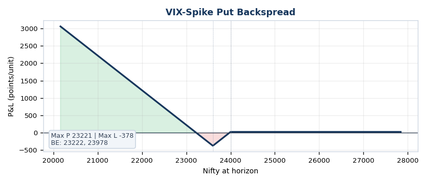

**The numbers (modelled at Nifty 24000).** Max profit 23221 points — the convex crash payoff as the two long puts run toward a collapsing index (a tail figure, not a base case). Max loss -378 points (₹28,350 per lot) at the trough around 23600 where the short is ITM but the longs have not yet kicked in. Breakevens 23222 and 23978. Net credit 21.6 points; risk:reward 61.45 — huge, reflecting crash convexity.

**Greeks & behaviour.** Net delta negative (you want the market down); theta negative (you own net one extra put, time costs you); vega strongly positive — a VIX spike is the engine, lifting all puts and especially the two longs. Long gamma below 23600: the payoff accelerates as the sell-off deepens.

**Management & exit.** If the crash comes, take profits *into* the panic — backspreads peak when fear peaks and give value back as IV normalises. If the market holds, the cost is small (you may even keep the credit); close when the bearish thesis lapses. The pain zone is a slow drift to ~23600, so exit if price parks there without momentum.

**Risk note.** The killer outcome is a *gentle* decline that pins at 23600 at expiry — you take the full -378, the exact opposite of the crash you wanted. The fabulous 61.45 risk:reward only pays in a fast, deep flush with rising vol; a quiet bleed lower is the trap. This is convex insurance you sometimes pay for in the dead zone.

**Scenario P&L (₹ per lot, at expiry).**

| Nifty at expiry | 22,800 | 23,400 | 24,000 | 24,600 | 25,200 |
|---|---|---|---|---|---|
| **P&L (₹/lot)** | +31,650 | -13,350 | +1,650 | +1,650 | +1,650 |

The grid pays best in a crash (+31,650 at 22,800), while the worst real-world outcome is the -13,350 you take when Nifty drifts gently into the ~23600 dead zone rather than flushing through it.

**The trade in real life (trigger -> manage -> exit).** Trigger: a market starting to roll over with India VIX beginning to lift, early risk-off where you expect a sharp, ACCELERATING decline rather than a slow drift; low-to-moderate IV at entry helps (cheaper long puts, you are net long vega). Avoid a calm, grinding market, because the dead zone between the strikes is where backspreads bleed. Manage: if the crash comes, take profits INTO the panic, since backspreads peak when fear peaks and give value back as IV normalises; if the market holds, the cost is small (you may even keep the credit), so close when the bearish thesis lapses. Exit: scale out at peak fear and peak VIX; cut it if price parks at ~23600 without momentum, which is your full -378 max-loss zone; time-stop near expiry. The fabulous 61.45 risk:reward only pays in a fast, deep flush with rising vol; a gentle decline that pins at 23600 hands you the exact opposite of the crash you wanted, so do not confuse feeling bearish with the market actually flushing.

## 194. Range-Breakout Long Strangle
*Coiled range about to break · Long vega · net debit*

**The idea (intuition).** When Nifty coils into a tight range with falling volatility, it is storing energy for a breakout. Buy an out-of-the-money call and put — a long strangle — and profit from the eventual large move in *either* direction. You are betting the squeeze resolves violently.

**When & why to use it.** Trigger: a visibly contracting range (narrowing Bollinger Bands, falling India VIX, declining daily ranges) with price compressing toward an apex — often before a known catalyst window. Low IV at entry is ideal: cheap options, and you are long vega for the breakout IV pop. Avoid buying strangles when IV is already high or the range is wide; you overpay and need an enormous move.

**How to build it (₹, Nifty).** Buy 24300 CE @ 151, buy 23700 PE @ 129. Net = +279.9 points debit, about 279.9 × 75 = ₹20,993 paid per lot.

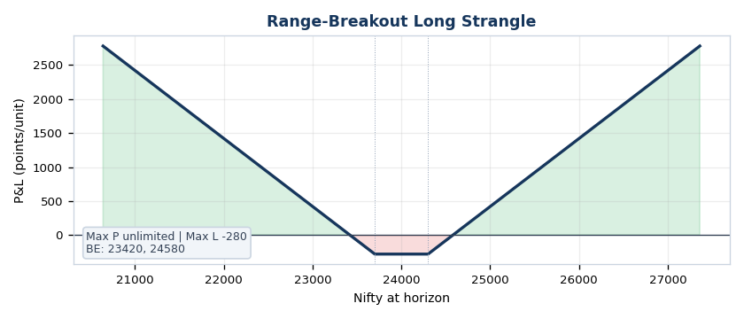

**The numbers (modelled at Nifty 24000).** Max profit Unlimited — a big break in either direction pays open-ended. Max loss -280 points (₹21,000 per lot, the debit) if Nifty stays trapped between the strikes. Breakevens 23420 and 24580 — you need a move beyond ±580 points to profit. Risk:reward undefined.

**Greeks & behaviour.** Net delta near zero (non-directional); theta strongly negative (every quiet day costs you while you wait); vega strongly positive — the breakout IV expansion is a major tailwind on top of the directional move. Long gamma: a fast break makes money quickly.

**Management & exit.** Give the trade a defined time budget and exit if the range refuses to break — theta is relentless on a long strangle. When the breakout fires, ride the moving side and consider closing the now-worthless other leg, or trail a stop. Take profits on the IV pop before it fades.

**Risk note.** The enemy is *time and stillness*: a range that keeps coiling bleeds you the full -280 even though a breakout "feels" imminent. You also need a genuinely large move — ±580 points — to clear the breakevens, so a weak break can still lose. Buy compression cheaply or do not buy it at all.

**Scenario P&L (₹ per lot, at expiry).**

| Nifty at expiry | 22,800 | 23,400 | 24,000 | 24,600 | 25,200 |
|---|---|---|---|---|---|
| **P&L (₹/lot)** | +46,500 | +1,500 | -21,000 | +1,500 | +46,500 |

A trapped, rangebound Nifty costs you the -21,000 debit, but the grid pays open-ended on a real break (+46,500 at the ±1,200-point edges once price clears the breakevens).

**The trade in real life (trigger -> manage -> exit).** Trigger: a visibly contracting range (narrowing Bollinger Bands, falling India VIX, declining daily ranges) with price compressing toward an apex, often before a known catalyst window; LOW IV at entry is ideal (cheap options, and you are long vega for the breakout pop). Avoid buying strangles when IV is already high or the range is wide, because you overpay and need an enormous move. Manage: theta is relentless on a long strangle, so give the trade a defined time budget and exit if the range refuses to break; when the breakout fires, ride the moving side and close (or trail a stop on) the now-worthless other leg. Exit: take profits on the IV pop before it fades; hard time-stop if no break inside your budget. You need a genuinely large move (beyond ±580 points to clear 23420/24580), so a weak break can still lose, and a range that keeps coiling bleeds the full -280 even though a breakout feels imminent. Buy compression cheaply or do not buy it at all.

## 195. 45-DTE Theta-Harvest Condor
*Range-bound, systematic · Short vega · net credit*

**The idea (intuition).** A mechanical iron condor opened around 45 days to expiry — the sweet spot where premium is rich and gamma is still tame — and managed by rule. It is the workhorse income trade: sell a call spread and a put spread around a wide range, collect theta, and recycle at a profit target.

**When & why to use it.** Trigger: a systematic, repeatable setup rather than a one-off read — Nifty range-bound, IV rank moderate-to-high, ~45 DTE on the monthly series. This is the disciplined core of a premium-selling book. Avoid forcing it when IV is very low (thin credit) or a major catalyst sits inside the 45-day window unhedged.

**How to build it (₹, Nifty).** Sell 24600 CE @ 261 / buy 25000 CE @ 124, sell 23400 PE @ 205 / buy 23000 PE @ 136. Net = -206.4 points credit, about 206.4 × 75 = ₹15,480 received per lot, with 400-point-wide wings.

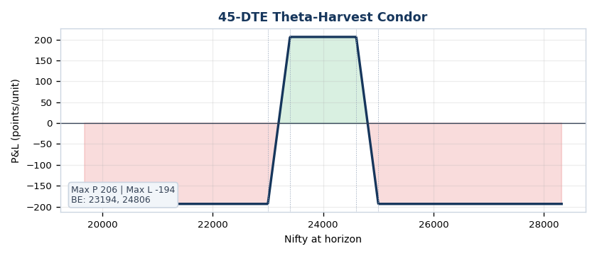

**The numbers (modelled at Nifty 24000).** Max profit 206 points (₹15,450 per lot) inside the shorts. Max loss -194 points (₹14,550 per lot) if a wing is breached. Breakevens 23194 and 24806 — a wide ±800-point band. Net credit 206.4 points; risk:reward 1.07 — a balanced, sustainable profile.

**Greeks & behaviour.** Net delta near zero at inception; theta strongly positive and steady (45 DTE is the decay sweet spot); vega negative. Short gamma, but at 45 days the gamma is gentle — the manageability is exactly why this DTE is chosen.

**Management & exit.** Run it by rule: take profit at ~50% of the 206-point credit, or close at 21 DTE regardless to step out of the gamma ramp. Roll the tested side out/away if a breakeven is threatened. The whole point is mechanical repetition, not heroics.

**Risk note.** This worst case assumes you respect the wings; the defined -194 is survivable, but a trending market or an IV spike can hand it to you, and a string of breaches hurts. The balanced 1.07 risk:reward is healthier than most premium trades, yet it is still short-vol — discipline on the 50%/21-DTE exits is what separates a durable income engine from a slow blow-up. Even systematic sellers sit in the SEBI loss data when they skip the exits.

**Scenario P&L (₹ per lot, at expiry).**

| Nifty at expiry | 22,800 | 23,400 | 24,000 | 24,600 | 25,200 |
|---|---|---|---|---|---|
| **P&L (₹/lot)** | -14,550 | +15,450 | +15,450 | +15,450 | -14,550 |

The wide ±800-point band keeps the full +15,450 across 23,400-24,600, with a defined -14,550 only if Nifty reaches 22,800 or 25,200 and breaches a wing.

**The trade in real life (trigger -> manage -> exit).** Trigger: a systematic, repeatable setup (Nifty rangebound, IV rank moderate-to-high, ~45 DTE on the monthly series, the sweet spot where premium is rich and gamma still tame); this is the disciplined core of a premium-selling book, not a one-off read. Manage by rule: take profit at ~50% of the 206-point credit, or close at 21 DTE regardless to step out of the gamma ramp; roll the tested side out and away if a breakeven (23194 or 24806) is threatened. Exit: the 50% target, or the 21-DTE hard time-stop, whichever comes first; cut or roll on a breakeven threat. Avoid forcing it when IV is very low (thin credit) or when a major catalyst sits unhedged inside the 45-day window. The balanced 1.07 risk:reward is healthier than most premium trades, but it is still short-vol; discipline on the 50%/21-DTE exits is what separates a durable income engine from a slow blow-up, and even systematic sellers land in the SEBI loss data when they skip the exits.

## 196. Portfolio Protective Collar (60-DTE)
*Protect gains · Neutral vega · net debit*

**The idea (intuition).** You hold the index (or a portfolio that tracks it) and want to lock in gains over the next couple of months. Buy a protective put as a floor and sell a covered call to finance it. The collar caps your upside but guarantees a floor — cheap, defined-band insurance for a long position.

**When & why to use it.** Trigger: you are sitting on unrealised gains and face a nervous 1–2 month window (election results, global risk, a feared correction) but do not want to sell and trigger tax/exit. 60 DTE gives durable protection. Use when you value certainty over upside. Avoid if you are still aggressively bullish — the short call caps exactly the rally you would want.

**How to build it (₹, Nifty).** Long 1× underlying @ 24000, buy 23500 PE @ 273, sell 24500 CE @ 399. The option structure is a net *credit* of about 126 points (399 - 273); net_cost of +23874.4 points reflects the index outlay net of that credit, i.e. ₹126 × 75 ≈ ₹9,450 received on the options against your holding.

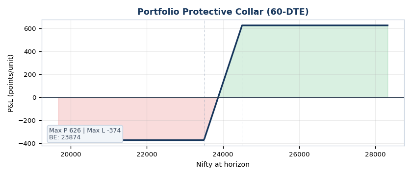

**The numbers (modelled at Nifty 24000).** Max profit 626 points (₹46,950 per lot) if Nifty rises to the 24500 call cap. Max loss -374 points (₹28,050 per lot) if Nifty falls to the 23500 put floor. Breakeven 23874. Risk:reward 1.67 — favourable, because the financed put gives more upside room than downside.

**Greeks & behaviour.** Net delta positive but bounded (long stock, collared by the options); theta roughly neutral (short call decay offsets long put decay); vega near neutral — the bought put and sold call largely cancel. Behaviour is a defined band: you participate between 23500 and 24500 and are flat outside it.

**Management & exit.** Hold for the protection window; if the threat passes and Nifty is mid-band, you can lift the collar and keep running the underlying. Roll the put down or the call up to re-open upside if the market grinds higher and you turn bullish again. Let it ride to expiry if you simply want the floor.

**Risk note.** The honest cost is opportunity: a strong rally above 24500 is capped, and you will watch gains you do not capture. The floor is real and defined, but the financing call means a collar is a *trade-off*, not free protection — you pay in foregone upside, not premium.

**Scenario P&L (₹ per lot, at expiry).**

| Nifty at expiry | 22,800 | 23,400 | 24,000 | 24,600 | 25,200 |
|---|---|---|---|---|---|
| **P&L (₹/lot)** | -28,050 | -28,050 | +9,450 | +46,950 | +46,950 |

The collar's band is exactly the grid: capped gains of +46,950 at and above the 24500 call, +9,450 at a flat 24000, and a floored -28,050 at and below the 23500 put.

**The trade in real life (trigger -> manage -> exit).** Trigger: you are sitting on unrealised index or portfolio gains and face a nervous 1-2 month window (election results, global risk, a feared correction) but do not want to sell and trigger tax or exit; 60 DTE gives durable protection. Use when you value certainty over upside, and avoid it if you are still aggressively bullish, since the short call caps exactly the rally you would want. Manage: hold for the protection window; if the threat passes and Nifty is mid-band, lift the collar and keep running the underlying; roll the put down or the call up to re-open upside if the market grinds higher and you turn bullish again. Exit: let it ride to expiry if you simply want the floor, or unwind the options when the risk window closes; roll forward for standing protection. The honest cost is opportunity, since a strong rally above 24500 is capped and you will watch gains you do not capture; a collar is a trade-off, not free protection, paid in foregone upside rather than premium.

## 197. Stock-Replacement LEAPS
*Long-term bullish, capital-light · Long vega · net debit*

**The idea (intuition).** Instead of buying and holding the index outright, buy a deep in-the-money long-dated call (a LEAPS-style option). It behaves much like the underlying — high delta — but ties up a fraction of the capital. You replace the stock position with an option to free up cash, accepting time decay and a defined maximum loss.

**When & why to use it.** Trigger: a long-term bullish view on the index with a desire for capital efficiency — deploy cash elsewhere while keeping equity-like exposure. Best when long-dated IV is reasonable (you are long vega). Avoid for short horizons (theta and the premium cost dominate) or if you need the dividend/voting rights of actual holdings.

**How to build it (₹, Nifty).** Buy 22500 CE @ 3514 (deep ITM, long-dated). Net = +3514.4 points debit, about 3514.4 × 75 = ₹2,63,580 paid per lot — versus roughly ₹18,00,000 for the equivalent index exposure, capturing the capital-efficiency point.

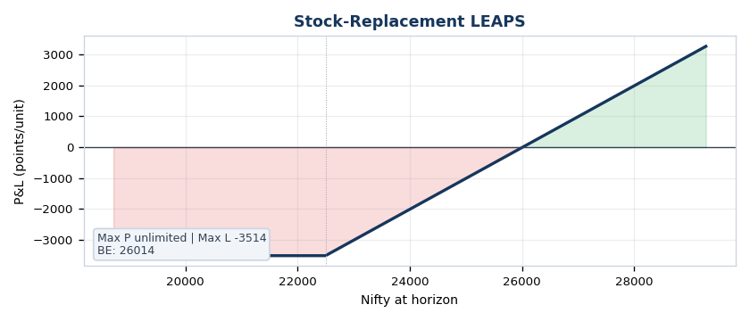

**The numbers (modelled at Nifty 24000).** Max profit Unlimited — the deep ITM call rises roughly point-for-point with Nifty. Max loss -3514 points (₹2,63,580 per lot, the premium) if Nifty collapses below 22500 — far less than the loss on an equivalent cash position falling the same percentage. Breakeven 26014. Net debit 3514.4 points; risk:reward undefined.

**Greeks & behaviour.** Net delta high and positive (close to stock-like, given the deep ITM strike); theta negative (the intrinsic-heavy option still bleeds some time value); vega positive — long-dated options carry real vega, so an IV rise adds value. Behaviour mirrors a leveraged long with a built-in floor at the premium.

**Management & exit.** Roll the LEAPS forward before it enters its final months to avoid accelerating theta — treat it as a renewable long-term position. Take profits or roll up strikes as Nifty advances. The defined max loss means no margin calls, but mind the breakeven at 26014.

**Risk note.** The catch is the breakeven: at 26014 you need a meaningful rally just to match where the underlying already is, because you paid time value above intrinsic. Options expire; real shares do not — a long, flat market bleeds the LEAPS while a buy-and-hold position would simply wait. Capital efficiency comes at the cost of theta and a finite life.

**Scenario P&L (₹ per lot, at expiry).**

| Nifty at expiry | 22,800 | 23,400 | 24,000 | 24,600 | 25,200 |
|---|---|---|---|---|---|
| **P&L (₹/lot)** | -241,050 | -196,050 | -151,050 | -106,050 | -61,050 |

Every grid point shows a loss against this snapshot (from -1,51,050 at a flat 24000 to -61,050 at 25,200) because the breakeven sits up at 26014; the deep-ITM call only turns positive once Nifty rallies past it, and the defined floor is the premium paid.

**The trade in real life (trigger -> manage -> exit).** Trigger: a long-term bullish view on the index plus a desire for capital efficiency, where you want equity-like exposure while deploying most of the cash elsewhere; best when long-dated IV is reasonable (you are long vega). Avoid it for short horizons (theta and premium cost dominate) or if you need the dividends or voting rights of actual holdings. Manage: roll the LEAPS forward BEFORE it enters its final months to avoid accelerating theta, treating it as a renewable long-term position; take profits or roll up strikes as Nifty advances. Exit: roll forward on a schedule rather than letting it run to expiry; trim into strength; the defined max loss means no margin calls, but mind the breakeven at 26014. The catch is that breakeven: you paid time value above intrinsic, so a long, flat market bleeds the LEAPS while real shares would simply wait. Capital efficiency comes at the cost of theta and a finite life, so size the ₹2,63,580 premium as the true at-risk capital.

## 198. Dividend-Arbitrage Conversion
*Locked around ex-date · None vol · net debit*

**The idea (intuition).** A conversion locks a long position into a risk-free box: hold the underlying, buy a put and sell a call at the same strike, and the option pair fixes your exit price regardless of where the market goes. Around an ex-dividend date this can capture the dividend (or a mispricing) with no directional risk.

**When & why to use it.** Trigger: an arbitrage-specific situation — a dividend or a put-call parity mispricing around an ex-date where the locked structure yields a small, near-certain edge. This is a market-neutral, professional/desk trade, not a directional view. Avoid unless the locked-in payoff genuinely exceeds your transaction and carry costs; the edges are thin and competed away fast.

**How to build it (₹, Nifty).** Long 1× underlying @ 24000, buy 24000 PE @ 318, sell 24000 CE @ 456. The option pair is a net credit of about 138 points (456 - 318); net_cost +23862.3 points reflects the index outlay net of that 138-point credit, i.e. ₹138 × 75 = ₹10,350 received on the options.

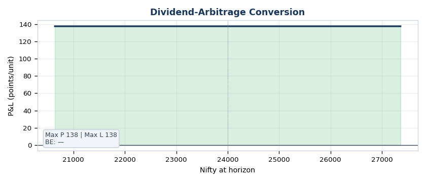

**The numbers (modelled at Nifty 24000).** Max profit 138 points (₹10,350 per lot) and max loss 138 points — note both are stated as +138 here, reflecting the locked box where the option credit defines a fixed, direction-independent outcome around the strike. No breakevens (the payoff is flat — fully hedged). Risk:reward 1.0.

**Greeks & behaviour.** Net delta near zero — the long stock, long put and short call cancel to a flat directional profile; theta near zero; vega effectively none (the strikes offset). This is the textbook "no Greeks" box: a financing/arbitrage instrument, not a market bet.

**Management & exit.** Hold to expiry to realise the locked value, or unwind early if the mispricing closes and you can bank the edge sooner. The management is operational, not directional — watch financing costs and the corporate-action timeline, not the chart.

**Risk note.** The dangers are mechanical, not market: assignment timing (early exercise of the short call around the ex-date), STT on exercised ITM options, dividend-capture rule changes, and transaction costs that can eat the thin edge entirely. There is no price risk, but execution and carry must be modelled precisely or the "arbitrage" turns negative.

**Scenario P&L (₹ per lot, at expiry).**

| Nifty at expiry | 22,800 | 23,400 | 24,000 | 24,600 | 25,200 |
|---|---|---|---|---|---|
| **P&L (₹/lot)** | +10,350 | +10,350 | +10,350 | +10,350 | +10,350 |

The table is a flat line, a locked +10,350 at every grid point, because the conversion box fixes the outcome regardless of where Nifty goes.

**The trade in real life (trigger -> manage -> exit).** Trigger: an arbitrage-specific situation (a dividend capture or a put-call parity mispricing around an ex-date) where the locked structure yields a small, near-certain edge that genuinely exceeds transaction and carry costs; this is a market-neutral desk trade, not a directional view. Manage: the work is operational, not directional, so watch financing costs, the corporate-action timeline, and assignment risk on the short call, not the chart. Exit: hold to expiry to realise the locked value, or unwind early if the mispricing closes and you can bank the edge sooner. The dangers are mechanical, not market: early exercise of the short ITM call around the ex-date, STT on exercised ITM options, dividend-capture rule changes, and transaction costs that can eat the thin edge entirely. There is no price risk, but execution and carry must be modelled precisely or the arbitrage turns negative; only put it on when the locked-in payoff clears all costs with margin to spare, because the edges are thin and competed away fast.

## 199. Pre-Results Calendar
*Pin into results, IV bid · Long vega · net debit*

**The idea (intuition).** Ahead of a results announcement, sell the near-dated option and buy a longer-dated one at the same strike. The front leg carries the inflated event IV that will crush after the news, while your back leg keeps its value — you harvest the IV-term-structure difference if the underlying pins near the strike.

**When & why to use it.** Trigger: the run-up to a results date where front-month IV is bid up far above back-month (a steep, event-driven term structure) and you expect the stock to pin near the strike through the event. You are selling the expensive near IV and owning the calmer far IV. Avoid if you expect a large directional results move — a calendar wants the underlying to *sit*.

**How to build it (₹, Nifty).** Sell the near 24000 CE @ 169, buy the far 24000 CE @ 540. Net = +371.2 points debit, about 371.2 × 75 = ₹27,840 paid per lot.

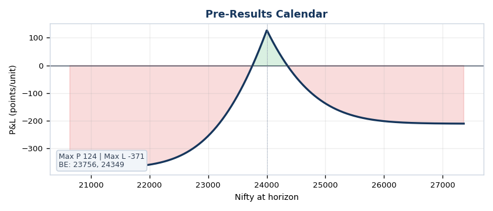

**The numbers (modelled at Nifty 24000).** Max profit 124 points (₹9,300 per lot) near the strike. Max loss -371 points (₹27,825 per lot, the debit) if the underlying moves far either way. Breakevens 23756 and 24349. Net debit 371.2 points; risk:reward 0.33.

**Greeks & behaviour.** Net delta near zero at the strike; theta positive (the event-rich near leg decays faster); vega positive on the back leg, but the *intended* edge is the front-leg IV crush — you profit as the near option's inflated vol collapses post-results while the far leg holds. Long gamma is small; the trade wants a pin.

**Management & exit.** Close right after results print, once the front-month IV crush has done its work — do not wait for theoretical max. If the underlying trends past a breakeven on the news, cut it; a tested calendar deteriorates fast. The whole edge is the IV differential, so exit when that differential has collapsed.

**Risk note.** The risk is a large results move: if the underlying jumps past 23756 or 24349, the calendar loses, and the very event that creates the rich IV is also what can break the pin. The 0.33 risk:reward means you win modestly when right and lose the larger -371 when the move beats the pin — only deploy when you genuinely expect the underlying to sit still through its own results.

**Scenario P&L (₹ per lot, at expiry).**

| Nifty at expiry | 22,800 | 23,400 | 24,000 | 24,600 | 25,200 |
|---|---|---|---|---|---|
| **P&L (₹/lot)** | -21,825 | -10,875 | +9,600 | -5,025 | -12,000 |

The +9,600 peak needs the underlying pinned at 24000 through results; the grid's -21,825 and -12,000 at the edges show how a large results move away from the strike walks you toward the -371-point debit.

**The trade in real life (trigger -> manage -> exit).** Trigger: the run-up to a results date where front-month IV is bid far above back-month (a steep, event-driven term structure) and you expect the stock to pin near the strike through the event; you are selling the expensive near IV and owning the calmer far IV. Avoid it if you expect a large directional results move, since a calendar wants the underlying to sit. Manage: the whole edge is the front-leg IV crush, so close right after results print once that crush has done its work; do not wait for theoretical max; if the underlying trends past 23756 or 24349 on the news, cut it, because a tested calendar deteriorates fast. Exit: close the morning after results on the IV-differential collapse; hard stop on a breakeven breach; time-stop at the near-leg expiry. The 0.33 risk:reward means you win modestly when right and lose the larger -371 when the move beats the pin; the very event that creates the rich IV is also what can break it, so only deploy when you genuinely expect the stock to sit still through its own results.

## 200. Portfolio Tail-Hedge Put Spread
*Cheap crash hedge · Long vega · net debit*

**The idea (intuition).** Own a portfolio and want crash protection without bleeding a fortune on outright puts. Buy a put and sell a further out-of-the-money put — a put debit spread placed below the market. It pays off in a sharp decline but costs a fraction of a naked put because the lower short put cheapens it. A defined-cost insurance policy.

**When & why to use it.** Trigger: a long equity portfolio plus a desire for standing crash insurance — deploy when IV is *low* (cheap protection; you are long vega so a spike pays) and you are wary of a correction but unwilling to sell holdings. Roll it forward as a permanent hedge. Avoid buying tail hedges *after* a crash when IV is already high and the protection is expensive.

**How to build it (₹, Nifty).** Buy 23200 PE @ 212, sell 22500 PE @ 118. Net = +94.9 points debit, about 94.9 × 75 = ₹7,118 paid per lot — cheap relative to the protection band.

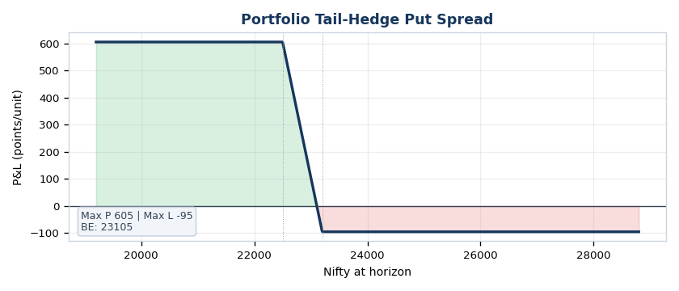

**The numbers (modelled at Nifty 24000).** Max profit 605 points (₹45,375 per lot) if Nifty falls to 22500 or below. Max loss -95 points (₹7,125 per lot, the debit) if the market holds above 23200. Breakeven 23105. Net debit 94.9 points; risk:reward 6.38 — a high payoff-to-cost ratio, exactly what you want from a hedge.

**Greeks & behaviour.** Net delta negative (gains when the market falls — offsetting your long portfolio); theta negative (the hedge bleeds a little each quiet month); vega positive — a volatility spike in a sell-off lifts the spread and adds to the crash payoff. Long gamma below 23200.

**Management & exit.** Run it as standing insurance: take profits into a crash (the spread peaks in the panic, then gives value back as IV normalises), and roll the structure forward when it decays or nears expiry. If the market grinds up calmly, accept the small -95 cost as the premium for protection and re-establish lower.

**Risk note.** This is insurance, so the base case is a small recurring loss — you pay the -95 in every calm period, which adds up if the crash never comes. The protection also caps below 22500 (the short put), so a true catastrophic collapse beyond that is only partially hedged. It is cheap, defined crash cover, not unlimited protection — size it to offset the portfolio, not to profit.

**Scenario P&L (₹ per lot, at expiry).**

| Nifty at expiry | 22,800 | 23,400 | 24,000 | 24,600 | 25,200 |
|---|---|---|---|---|---|
| **P&L (₹/lot)** | +22,875 | -7,125 | -7,125 | -7,125 | -7,125 |

The hedge pays +22,875 in a sharp fall to 22,800 and costs only the -7,125 debit when the market holds at or above 23,400, a high payoff-to-cost shape, with the protection capped below 22500.

**The trade in real life (trigger -> manage -> exit).** Trigger: a long equity portfolio plus a desire for STANDING crash insurance; deploy when India VIX is LOW (cheap protection, and a spike pays since you are long vega) and you are wary of a correction but unwilling to sell holdings; roll it forward as a permanent hedge. Avoid buying tail hedges AFTER a crash when IV is already high and protection is expensive. Manage: run it as insurance, so take profits INTO a crash (the spread peaks in the panic, then gives value back as IV normalises), and roll the structure forward when it decays or nears expiry. Exit: monetise into a flush and re-establish lower; if the market grinds up calmly, accept the small -95-point cost as the premium for protection and roll down. The base case is a small recurring loss (you pay the -95 each calm period), and the protection caps below 22500, so a true catastrophic collapse beyond that is only partially hedged. Size it to OFFSET the portfolio, not to profit.

# Strategy Group 13: The 200-Strategy Quick-Reference Matrix

This closing chapter is your index into the whole encyclopedia. Every figure below is computed by the same Black-Scholes engine used throughout, on Nifty at 24,000 (points per unit; multiply by the lot of about 75 for rupees). Use the master tables to scan a whole family at a glance, then the decision tables to jump straight to the structures that fit your view, your volatility read and your risk appetite. "Max profit/loss" are in points at the modelled strikes; "R:R" is reward-to-risk for defined-risk trades (a dash means one side is unlimited or undefined).

## Master matrix — all 200 strategies by family


### Group 1: Single-Leg & Stock Combinations (10)

| # | Strategy | View | Vol | Net | Max P (pts) | Max L (pts) | R:R | Breakeven(s) |
|---|---|---|---|---|---|---|---|---|
| 1 | Long Call (ATM) | Strongly bullish | Long vega | debit 456 | Unlimited | -456 | — | 24456 |
| 2 | Long Call (OTM Lottery) | Aggressively bullish | Long vega | debit 139 | Unlimited | -139 | — | 24639 |
| 3 | Long Call (Deep ITM / Stock Replacement) | Bullish | Low vega | debit 1198 | Unlimited | -1198 | — | 24498 |
| 4 | Long Put (ATM) | Strongly bearish | Long vega | debit 318 | +23681 | -318 | 74.41 | 23682 |
| 5 | Long Put (OTM) | Aggressively bearish | Long vega | debit 125 | +23374 | -125 | 186.95 | 23375 |
| 6 | Long Put (Deep ITM) | Bearish | Low vega | debit 722 | +23977 | -722 | 33.19 | 23978 |
| 7 | Short Call (Naked) | Bearish / neutral | Short vega | credit 292 | +292 | Undefined | — | 24592 |
| 8 | Short Put (Naked / Cash-Secured) | Bullish / neutral | Short vega | credit 219 | +219 | -23480 | 0.01 | 23481 |
| 9 | Long LEAPS Call | Long-term bullish | Long vega | debit 2264 | Unlimited | -2263 | — | 26263 |
| 10 | Long LEAPS Put | Long-term bearish / hedge | Long vega | debit 641 | +23358 | -641 | 36.44 | 23359 |


### Group 2: Vertical Spreads (16)

| # | Strategy | View | Vol | Net | Max P (pts) | Max L (pts) | R:R | Breakeven(s) |
|---|---|---|---|---|---|---|---|---|
| 11 | Bull Call Spread (ATM) | Moderately bullish | Neutral vega | debit 164 | +136 | -164 | 0.83 | 24164 |
| 12 | Bull Call Spread (OTM) | Bullish breakout | Neutral vega | debit 138 | +162 | -138 | 1.17 | 24338 |
| 13 | Bull Call Spread (ITM) | Bullish, high probability | Neutral vega | debit 258 | +142 | -258 | 0.55 | 23958 |
| 14 | Bear Put Spread (ATM) | Moderately bearish | Neutral vega | debit 100 | +201 | -99 | 2.02 | 23901 |
| 15 | Bear Put Spread (OTM) | Bearish breakdown | Neutral vega | debit 80 | +220 | -80 | 2.76 | 23720 |
| 16 | Bear Put Spread (ITM) | Bearish, high probability | Neutral vega | debit 171 | +229 | -171 | 1.34 | 24129 |
| 17 | Bull Put Spread (Credit) | Neutral to bullish | Short vega | credit 100 | +99 | -201 | 0.50 | 23901 |
| 18 | Bull Put Spread (Wide) | Neutral to bullish | Short vega | credit 171 | +171 | -429 | 0.40 | 23829 |
| 19 | Bear Call Spread (Credit) | Neutral to bearish | Short vega | credit 164 | +164 | -136 | 1.21 | 24164 |
| 20 | Bear Call Spread (Wide) | Neutral to bearish | Short vega | credit 289 | +289 | -311 | 0.93 | 24289 |
| 21 | Bull Call Spread (Far OTM Cheapie) | Bullish breakout | Neutral vega | debit 157 | +243 | -157 | 1.54 | 24457 |
| 22 | Bear Put Spread (Far OTM) | Bearish breakdown | Neutral vega | debit 90 | +310 | -90 | 3.45 | 23610 |
| 23 | Bull Put Spread (Narrow / High Prob) | Neutral to bullish | Short vega | credit 56 | +56 | -144 | 0.39 | 23744 |
| 24 | Bear Call Spread (Narrow / High Prob) | Neutral to bearish | Short vega | credit 96 | +97 | -103 | 0.93 | 24297 |
| 25 | Deep-ITM Bull Call Spread | Bullish, very high prob | Neutral vega | debit 218 | +82 | -218 | 0.37 | 23718 |
| 26 | Deep-OTM Bear Call Spread | Mildly bearish / range | Short vega | credit 111 | +111 | -189 | 0.59 | 24511 |


### Group 3: Straddles, Strangles & Volatility (16)

| # | Strategy | View | Vol | Net | Max P (pts) | Max L (pts) | R:R | Breakeven(s) |
|---|---|---|---|---|---|---|---|---|
| 27 | Long Straddle | Big move, direction unknown | Long vega | debit 774 | Unlimited | -766 | — | 23226, 24774 |
| 28 | Short Straddle | Range-bound / falling IV | Short vega | credit 774 | +766 | Undefined | — | 23226, 24774 |
| 29 | Long Strangle | Big move, cheaper than straddle | Long vega | debit 438 | Unlimited | -438 | — | 23162, 24838 |
| 30 | Short Strangle | Range-bound, high IV | Short vega | credit 438 | +438 | Undefined | — | 23162, 24838 |
| 31 | Long Strangle (Wide) | Very big move | Long vega | debit 264 | Unlimited | -264 | — | 23036, 24964 |
| 32 | Short Strangle (Wide / 16-delta) | Range-bound | Short vega | credit 264 | +264 | Undefined | — | 23036, 24964 |
| 33 | Long Guts | Big move | Long vega | debit 1107 | Unlimited | -507 | — | 23193, 24807 |
| 34 | Short Guts | Range-bound | Short vega | credit 1107 | +507 | Undefined | — | 23193, 24807 |
| 35 | Strip (Bearish Straddle) | Big move, bearish bias | Long vega | debit 1092 | Unlimited | -1084 | — | 23454, 25092 |
| 36 | Strap (Bullish Straddle) | Big move, bullish bias | Long vega | debit 1230 | Unlimited | -1215 | — | 22770, 24615 |
| 37 | Long Straddle (Weekly) | Big move within days | Long vega | debit 372 | Unlimited | -363 | — | 23628, 24372 |
| 38 | Short Strangle (Weekly) | Quiet week | Short vega | credit 122 | +122 | Undefined | — | 23528, 24472 |
| 39 | Long Strangle (Weekly Lotto) | Explosive move | Long vega | debit 27 | Unlimited | -27 | — | 23273, 24727 |
| 40 | Short Straddle (45-DTE) | Range-bound, rich IV | Short vega | credit 952 | +943 | Undefined | — | 23048, 24952 |
| 41 | Long Straddle (Pre-Event) | Event move | Long vega | debit 314 | Unlimited | -305 | — | 23686, 24314 |
| 42 | Short Strangle (10-delta) | Strongly range-bound | Short vega | credit 181 | +181 | Undefined | — | 22919, 25081 |


### Group 4: Butterflies (20)

| # | Strategy | View | Vol | Net | Max P (pts) | Max L (pts) | R:R | Breakeven(s) |
|---|---|---|---|---|---|---|---|---|
| 43 | Long Call Butterfly | Pin near body strike | Short vega | debit 35 | +257 | -35 | 7.38 | 23735, 24265 |
| 44 | Long Put Butterfly | Pin near body strike | Short vega | debit 35 | +257 | -35 | 7.38 | 23735, 24265 |
| 45 | Short Call Butterfly | Move away from body | Long vega | credit 35 | +35 | -257 | 0.14 | 23735, 24265 |
| 46 | Iron Butterfly | Pin near ATM, high IV | Short vega | credit 264 | +255 | -36 | 6.99 | 23736, 24264 |
| 47 | Reverse Iron Butterfly | Big move from ATM | Long vega | debit 264 | +36 | -255 | 0.14 | 23736, 24264 |
| 48 | Broken-Wing Call Butterfly | Bullish pin, no upside risk | Short vega | credit 53 | +344 | -147 | 2.34 | 24353 |
| 49 | Broken-Wing Put Butterfly | Bearish pin, no downside risk | Short vega | credit 15 | +307 | -185 | 1.66 | 23685 |
| 50 | Skip-Strike Butterfly (Call) | Bullish drift | Short vega | credit 160 | +351 | -240 | 1.46 | 24360 |
| 51 | Unbalanced (Ratio) Butterfly | Directional pin | Short vega | credit 129 | +414 | -171 | 2.42 | 24215 |
| 52 | Long Butterfly (Wide Wings) | Broad pin zone | Short vega | debit 137 | +454 | -137 | 3.31 | 23537, 24463 |
| 53 | Long Butterfly (Narrow) | Tight pin | Short vega | debit 13 | +128 | -13 | 9.72 | 23862, 24138 |
| 54 | OTM Call Butterfly (Bullish Target) | Bullish to a target | Short vega | debit 40 | +248 | -40 | 6.15 | 24240, 24760 |
| 55 | OTM Put Butterfly (Bearish Target) | Bearish to a target | Short vega | debit 24 | +272 | -24 | 11.40 | 23224, 23776 |
| 56 | Iron Butterfly (Wide Wings) | Pin near ATM | Short vega | credit 401 | +393 | -99 | 3.98 | 23599, 24401 |
| 57 | Broken-Wing Iron Butterfly | Neutral with a skew | Short vega | credit 314 | +305 | -186 | 1.64 | 23686 |
| 58 | Put Broken-Wing (Income) | Neutral to bullish | Short vega | credit 12 | +301 | -188 | 1.60 | 23588 |
| 59 | Iron Butterfly (Weekly) | Pin this week | Short vega | credit 198 | +189 | -52 | 3.64 | 23802, 24198 |
| 60 | Reverse Iron Butterfly (Event) | Event breakout | Long vega | debit 226 | +74 | -217 | 0.34 | 23774, 24226 |
| 61 | Expiry-Day Pin Butterfly | Expiry pin | Short vega | debit 16 | +76 | -16 | 4.79 | 23916, 24085 |
| 62 | Unbalanced Iron Butterfly | Skewed neutral | Short vega | credit 310 | +301 | -290 | 1.04 | 23690 |


### Group 5: Condors (16)

| # | Strategy | View | Vol | Net | Max P (pts) | Max L (pts) | R:R | Breakeven(s) |
|---|---|---|---|---|---|---|---|---|
| 63 | Iron Condor | Range-bound, elevated IV | Short vega | credit 174 | +174 | -126 | 1.39 | 23426, 24574 |
| 64 | Iron Condor (Wide) | Range-bound | Short vega | credit 167 | +167 | -233 | 0.72 | 23233, 24767 |
| 65 | Iron Condor (Narrow) | Tightly range-bound | Short vega | credit 177 | +177 | -73 | 2.42 | 23573, 24427 |
| 66 | Call Condor | Range-bound | Short vega | debit 74 | +226 | -74 | 3.05 | 23774, 24526 |
| 67 | Put Condor | Range-bound | Short vega | debit 63 | +237 | -63 | 3.76 | 23463, 24237 |
| 68 | Reverse Iron Condor | Break out of a range | Long vega | debit 174 | +126 | -174 | 0.72 | 23426, 24574 |
| 69 | Broken-Wing Iron Condor | Range with a lean | Short vega | credit 205 | +205 | -295 | 0.70 | 23395, 24605 |
| 70 | Unbalanced Iron Condor | Directional range | Short vega | credit 238 | +238 | -362 | 0.66 | 23481, 24638 |
| 71 | Iron Condor (Weekly) | Quiet week | Short vega | credit 79 | +79 | -121 | 0.65 | 23621, 24379 |
| 72 | Iron Condor (10-delta) | Strongly range-bound | Short vega | credit 98 | +98 | -202 | 0.49 | 23102, 24898 |
| 73 | Bullish Skewed Condor | Drift up within a range | Short vega | debit 79 | +221 | -79 | 2.78 | 24079, 24821 |
| 74 | Bearish Skewed Condor | Drift down within a range | Short vega | debit 50 | +250 | -50 | 5.00 | 23150, 23950 |
| 75 | Iron Condor (45-DTE) | Range-bound | Short vega | credit 229 | +229 | -171 | 1.34 | 23271, 24729 |
| 76 | Wide Call Condor | Broad range | Short vega | debit 122 | +278 | -122 | 2.28 | 24122, 24978 |
| 77 | Reverse Iron Condor (Weekly Event) | Weekly breakout | Long vega | debit 103 | +197 | -103 | 1.92 | 23597, 24403 |
| 78 | Iron Condor (Credit-Skewed) | Range with put skew | Short vega | credit 143 | +143 | -157 | 0.91 | 23407, 24493 |


### Group 6: Ratio Spreads & Backspreads (16)

| # | Strategy | View | Vol | Net | Max P (pts) | Max L (pts) | R:R | Breakeven(s) |
|---|---|---|---|---|---|---|---|---|
| 79 | Call Ratio Spread (1x2) | Mildly bullish, caps out | Short vega | credit 128 | +425 | Undefined | — | 24728 |
| 80 | Put Ratio Spread (1x2) | Mildly bearish, caps out | Short vega | credit 119 | +416 | -23280 | 0.02 | 23281 |
| 81 | Call Ratio Spread (1x3) | Mildly bullish | Short vega | credit 282 | +674 | Undefined | — | 24741 |
| 82 | Put Ratio Spread (1x3) | Mildly bearish | Short vega | credit 258 | +658 | -46540 | 0.01 | 23271 |
| 83 | Call Ratio Backspread (1x2) | Bullish explosive | Long vega | debit 128 | Unlimited | -425 | — | 24728 |
| 84 | Put Ratio Backspread (1x2) | Bearish explosive | Long vega | debit 119 | +23280 | -416 | 55.98 | 23281 |
| 85 | Call Ratio Backspread (1x3) | Strongly bullish | Long vega | debit 282 | Unlimited | -674 | — | 24741 |
| 86 | Put Ratio Backspread (1x3) | Strongly bearish | Long vega | debit 258 | +46540 | -658 | 70.74 | 23271 |
| 87 | Call Ratio Spread (For Credit) | Neutral to mildly bullish | Short vega | credit 107 | +347 | Undefined | — | 24807 |
| 88 | Put Ratio Spread (For Credit) | Neutral to mildly bearish | Short vega | credit 112 | +359 | -23187 | 0.02 | 23188 |
| 89 | Front-Ratio Call Spread | Slow grind up | Short vega | credit 115 | +463 | Undefined | — | 24715 |
| 90 | Front-Ratio Put Spread | Slow grind down | Short vega | credit 108 | +452 | -23291 | 0.02 | 23292 |
| 91 | Call Backspread (OTM) | Bullish breakout | Long vega | debit 66 | Unlimited | -355 | — | 24866 |
| 92 | Put Backspread (OTM) | Bearish breakdown | Long vega | debit 89 | +23110 | -384 | 60.15 | 23111 |
| 93 | Call Ratio Spread (2x3) | Mildly bullish | Short vega | debit 36 | +557 | Undefined | — | 24018, 24864 |
| 94 | Put Ratio Spread (2x3) | Mildly bearish | Short vega | credit 20 | +616 | -23079 | 0.03 | 23080 |


### Group 7: Calendars & Diagonals (18)

| # | Strategy | View | Vol | Net | Max P (pts) | Max L (pts) | R:R | Breakeven(s) |
|---|---|---|---|---|---|---|---|---|
| 95 | Call Calendar (Horizontal) | Pin near strike, rising IV | Long vega | debit 233 | +219 | -233 | 0.94 | 23521, 24757 |
| 96 | Put Calendar | Pin near strike | Long vega | debit 96 | +219 | -233 | 0.94 | 23523, 24752 |
| 97 | Call Diagonal | Bullish drift to strike | Long vega | debit 438 | +214 | -438 | 0.49 | 23645, 26130 |
| 98 | Put Diagonal | Bearish drift to strike | Long vega | debit 210 | +238 | -210 | 1.13 | 23067, 24545 |
| 99 | Double Calendar | Range-bound, rising IV | Long vega | debit 318 | +260 | -455 | 0.57 | 23452, 24839 |
| 100 | Double Diagonal | Range-bound, rising IV | Long vega | debit 162 | +269 | -497 | 0.54 | 23418, 24806 |
| 101 | Poor Man's Covered Call (Diagonal) | Bullish income | Long vega | debit (incl. index) | +394 | -3223 | 0.12 | 23809 |
| 102 | Poor Man's Covered Put | Bearish income | Long vega | debit 679 | +390 | -679 | 0.57 | 22733, 24584 |
| 103 | Reverse Call Calendar | Big move / falling IV | Short vega | credit 233 | +233 | -219 | 1.06 | 23521, 24757 |
| 104 | Reverse Put Calendar | Big move / falling IV | Short vega | credit 96 | +233 | -219 | 1.07 | 23523, 24752 |
| 105 | OTM Call Calendar (Bullish) | Drift up to strike | Long vega | debit 205 | +229 | -205 | 1.12 | 23890, 25271 |
| 106 | OTM Put Calendar (Bearish) | Drift down to strike | Long vega | debit 105 | +232 | -240 | 0.96 | 23098, 24372 |
| 107 | Weekly-vs-Monthly Calendar | Pin near strike | Long vega | debit 297 | +137 | -297 | 0.46 | 23719, 24396 |
| 108 | Aggressive Bullish Diagonal | Bullish trend | Long vega | debit 1327 | +309 | -1327 | 0.23 | 23789 |
| 109 | Bearish Diagonal (PMCP-style) | Bearish trend | Long vega | debit 547 | +363 | -547 | 0.66 | 24460 |
| 110 | Double Calendar (Wide) | Broad range, rising IV | Long vega | debit 300 | +202 | -434 | 0.46 | 23322, 24989 |
| 111 | Calendar Straddle | Pin near ATM, rising IV | Long vega | debit 328 | +438 | -466 | 0.94 | 23522, 24754 |
| 112 | Calendar (45/75-DTE) | Pin near strike | Long vega | debit 211 | +241 | -211 | 1.14 | 23460, 24894 |


### Group 8: Covered & Income Strategies (16)

| # | Strategy | View | Vol | Net | Max P (pts) | Max L (pts) | R:R | Breakeven(s) |
|---|---|---|---|---|---|---|---|---|
| 113 | Covered Call (OTM) | Neutral to mildly bullish | Short vega | debit (incl. index) | +592 | -23707 | 0.02 | 23708 |
| 114 | Covered Call (ATM) | Neutral | Short vega | debit (incl. index) | +456 | -23543 | 0.02 | 23544 |
| 115 | Covered Call (Deep ITM) | Neutral, defensive | Short vega | debit (incl. index) | +328 | -23271 | 0.01 | 23272 |
| 116 | Cash-Secured Put (Entry) | Bullish accumulation | Short vega | credit 169 | +169 | -23330 | 0.01 | 23331 |
| 117 | The Wheel | Neutral to bullish, systematic | Short vega | credit 192 | +192 | -23407 | 0.01 | 23408 |
| 118 | Covered Strangle | Bullish, own the stock | Short vega | debit (incl. index) | +838 | -47160 | 0.02 | 23581 |
| 119 | Covered Combo | Bullish income | Short vega | debit (incl. index) | +739 | -46959 | 0.02 | 23561 |
| 120 | Ratio Write | Neutral, range-bound | Short vega | debit (incl. index) | +884 | Undefined | — | 23315, 25085 |
| 121 | Covered Call (Weekly) | Neutral | Short vega | debit (incl. index) | +341 | -23908 | 0.01 | 23909 |
| 122 | Covered Put | Bearish income | Short vega | credit (incl. index) | +519 | Undefined | — | 24219 |
| 123 | Dividend-Capture Covered Call | Neutral, yield | Short vega | debit (incl. index) | +659 | -23540 | 0.03 | 23541 |
| 124 | Short Put Ladder (Income) | Bullish accumulation | Short vega | credit 366 | +366 | -46732 | 0.01 | 23367 |
| 125 | Buy-Write | Neutral to mildly bullish | Short vega | debit (incl. index) | +704 | -23595 | 0.03 | 23596 |
| 126 | In-the-Money Covered Call | Defensive income | Short vega | debit (incl. index) | +385 | -23414 | 0.02 | 23415 |
| 127 | Cash-Secured Put (Weekly) | Bullish, systematic | Short vega | credit 83 | +83 | -23666 | 0.00 | 23667 |
| 128 | Covered Call (Long-Dated) | Neutral, patient | Short vega | debit (incl. index) | +1073 | -23426 | 0.05 | 23427 |


### Group 9: Hedging & Protective Strategies (14)

| # | Strategy | View | Vol | Net | Max P (pts) | Max L (pts) | R:R | Breakeven(s) |
|---|---|---|---|---|---|---|---|---|
| 129 | Protective Put (OTM) | Bullish, insured | Long vega | debit (incl. index) | Unlimited | -519 | — | 24219 |
| 130 | Protective Put (ATM) | Bullish, fully insured | Long vega | debit (incl. index) | Unlimited | -318 | — | 24318 |
| 131 | Collar | Bullish, low-cost hedge | Neutral vega | debit (incl. index) | +373 | -227 | 1.64 | 23927 |
| 132 | Costless (Zero-Cost) Collar | Bullish, free hedge | Neutral vega | debit (incl. index) | +400 | -300 | 1.33 | 23900 |
| 133 | Put-Spread Collar | Bullish, cheaper hedge | Neutral vega | debit (incl. index) | +556 | -23443 | 0.02 | 23844 |
| 134 | Married Put | Bullish, protected entry | Long vega | debit (incl. index) | Unlimited | -414 | — | 24414 |
| 135 | Wide Collar | Bullish, loose hedge | Neutral vega | debit (incl. index) | +620 | -580 | 1.07 | 23980 |
| 136 | Fence (Risk-Reversal Hedge) | Bullish, OTM hedge | Neutral vega | debit (incl. index) | +536 | -464 | 1.15 | 23964 |
| 137 | Put-Ratio Hedge | Hedge a long, cheaply | Mixed vega | debit (incl. index) | Unlimited | -46821 | — | 24023 |
| 138 | Tail-Risk Hedge | Crash insurance | Long vega | debit (incl. index) | Unlimited | -1618 | — | 24118 |
| 139 | Put-Backspread Hedge | Long, with crash kicker | Long vega | debit (incl. index) | Unlimited | -866 | — | 24066 |
| 140 | Collar for a Credit | Bullish, paid to hedge | Neutral vega | debit (incl. index) | +374 | -326 | 1.15 | 23826 |
| 141 | Protective Put Spread | Bullish, partial hedge | Neutral vega | debit (incl. index) | Unlimited | -23618 | — | 24119 |
| 142 | Index Put Hedge Overlay | Portfolio insurance | Long vega | debit (incl. index) | Unlimited | -651 | — | 24251 |


### Group 10: Synthetics & Arbitrage (12)

| # | Strategy | View | Vol | Net | Max P (pts) | Max L (pts) | R:R | Breakeven(s) |
|---|---|---|---|---|---|---|---|---|
| 143 | Synthetic Long Stock | Bullish (futures-like) | Neutral vega | debit 138 | Unlimited | -24137 | — | 24138 |
| 144 | Synthetic Short Stock | Bearish (futures-like) | Neutral vega | credit 138 | +24137 | Undefined | — | 24138 |
| 145 | Synthetic Long Call | Bullish, insured | Long vega | debit (incl. index) | Unlimited | -318 | — | 24318 |
| 146 | Synthetic Short Call | Bearish income | Short vega | credit (incl. index) | +318 | Undefined | — | 24318 |
| 147 | Synthetic Long Put | Bearish, insured | Long vega | credit (incl. index) | +23543 | -456 | 51.64 | 23544 |
| 148 | Synthetic Short Put (Covered Call) | Bullish income | Short vega | debit (incl. index) | +456 | -23543 | 0.02 | 23544 |
| 149 | Conversion (Arbitrage) | Locked, rate arbitrage | None | debit (incl. index) | +138 | +138 | 1.00 | — |
| 150 | Reversal (Arbitrage) | Locked, rate arbitrage | None | credit (incl. index) | -138 | -138 | 1.00 | — |
| 151 | Box Spread | Locked synthetic loan | None | debit 298 | +2 | +2 | 1.00 | — |
| 152 | Jelly Roll | Calendar arbitrage | None | debit 137 | +1 | +1 | 1.00 | — |
| 153 | Synthetic Straddle (from Stock) | Big move | Long vega | debit (incl. index) | Unlimited | -628 | — | 23363, 24637 |
| 154 | Reverse Conversion (Skew) | Locked, skew capture | None | credit (incl. index) | -16 | -216 | 0.07 | — |


### Group 11: Exotic & Named Combinations (20)

| # | Strategy | View | Vol | Net | Max P (pts) | Max L (pts) | R:R | Breakeven(s) |
|---|---|---|---|---|---|---|---|---|
| 155 | Jade Lizard | Neutral to bullish, high IV | Short vega | credit 343 | +343 | -23356 | 0.01 | 23357 |
| 156 | Reverse Jade Lizard | Neutral to bearish, high IV | Short vega | credit 363 | +363 | Undefined | — | 24663 |
| 157 | Big Lizard | Neutral, high IV | Short vega | credit 482 | +474 | -23517 | 0.02 | 23518 |
| 158 | Twisted Sister | Neutral, high IV | Short vega | credit 555 | +547 | Undefined | — | 24555 |
| 159 | Christmas Tree Butterfly (Call) | Bullish to a target | Short vega | credit 85 | +382 | -215 | 1.78 | 24493 |
| 160 | Christmas Tree Butterfly (Put) | Bearish to a target | Short vega | credit 43 | +336 | -257 | 1.31 | 23529 |
| 161 | ZEBRA (Zero-Extrinsic Back-Ratio, Call) | Bullish, stock proxy | Low vega | debit 999 | Unlimited | -999 | — | 24199 |
| 162 | ZEBRA (Put) | Bearish, stock proxy | Low vega | debit 694 | +24106 | -693 | 34.76 | 24053 |
| 163 | Risk Reversal (Bullish) | Bullish | Skew play | debit 73 | Unlimited | -23772 | — | 24373 |
| 164 | Risk Reversal (Bearish) | Bearish | Skew play | credit 73 | +23772 | Undefined | — | 24373 |
| 165 | Seagull (Bullish) | Bullish, cost-reduced | Mixed vega | debit 42 | +358 | -23541 | 0.02 | 24042 |
| 166 | Seagull (Bearish) | Bearish, cost-reduced | Mixed vega | credit 78 | +478 | Undefined | — | 24578 |
| 167 | Batman (Double Butterfly) | Range with twin targets | Short vega | debit 30 | +170 | -29 | 5.76 | 23429, 23771, 24229, 24571 |
| 168 | Iron Albatross (Ultra-Wide Condor) | Broadly range-bound | Short vega | credit 166 | +166 | -334 | 0.50 | 23134, 24866 |
| 169 | Slingshot (Call Backspread) | Bullish breakout | Long vega | debit 95 | Unlimited | -387 | — | 24795 |
| 170 | Slingshot (Put Backspread) | Bearish breakdown | Long vega | debit 103 | +23196 | -402 | 57.65 | 23197 |
| 171 | Call Ratio Calendar | Pin, rising IV | Long vega | credit 223 | +671 | Undefined | — | 24508 |
| 172 | Put Ratio Calendar | Pin, rising IV | Long vega | credit 222 | +537 | -23914 | 0.02 | 23637 |
| 173 | Range Forward (Zero-Cost) | Directional hedge | Neutral vega | debit (incl. index) | +454 | -346 | 1.31 | 23946 |
| 174 | Pterodactyl (Far-Wing Condor) | Very broad range | Short vega | credit 146 | +146 | -354 | 0.41 | 22854, 25146 |


### Group 12: Deployments, Ladders & When-to-Use Playbooks (26)

| # | Strategy | View | Vol | Net | Max P (pts) | Max L (pts) | R:R | Breakeven(s) |
|---|---|---|---|---|---|---|---|---|
| 175 | Bull Call Ladder | Mildly bullish, caps | Short vega | credit 93 | +393 | Undefined | — | 24693 |
| 176 | Bear Put Ladder | Mildly bearish, caps | Short vega | credit 84 | +385 | -23314 | 0.02 | 23315 |
| 177 | Bull Put Ladder | Neutral to bullish, crash kicker | Long vega | debit 48 | +23051 | -348 | 66.22 | 23052 |
| 178 | Bear Call Ladder | Neutral to bearish, breakout kicker | Long vega | debit 3 | Unlimited | -303 | — | 24903 |
| 179 | Double Iron Condor | Range-bound, more credit | Short vega | credit 234 | +234 | -166 | 1.40 | 23366, 24634 |
| 180 | Expiry-Day Short Straddle | Pin on expiry | Short vega | credit 140 | +132 | Undefined | — | 23860, 24140 |
| 181 | Expiry-Day Iron Butterfly | Pin on expiry | Short vega | credit 102 | +93 | -48 | 1.94 | 23898, 24102 |
| 182 | Gap-Fade Bull Put Spread | Fade a gap-down | Short vega | credit 52 | +52 | -248 | 0.21 | 23748 |
| 183 | Trend-Pullback Call Debit Spread | Buy the dip in an uptrend | Neutral vega | debit 216 | +184 | -216 | 0.85 | 24116 |
| 184 | High-IV Short Strangle | Range-bound, IV rank > 70 | Short vega | credit 315 | +315 | Undefined | — | 23085, 24915 |
| 185 | Low-IV Long Calendar | Pin, IV rank < 30 | Long vega | debit 233 | +219 | -233 | 0.94 | 23521, 24757 |
| 186 | Earnings/Results Long Straddle | Stock results move | Long vega | debit 243 | Unlimited | -235 | — | 23757, 24243 |
| 187 | Post-Event IV-Crush Short Strangle | After the news | Short vega | credit 100 | +101 | Undefined | — | 23499, 24501 |
| 188 | Budget-Day Iron Condor | Range through the Budget | Short vega | credit 22 | +21 | -279 | 0.08 | 23479, 24521 |
| 189 | RBI-Policy Calendar | Pin through policy, IV pop | Long vega | debit 352 | +82 | -352 | 0.23 | 23837, 24220 |
| 190 | Monthly-Expiry Butterfly | Pin near max-pain | Short vega | debit 50 | +141 | -50 | 2.80 | 23850, 24150 |
| 191 | Bank Nifty Intraday Short Straddle | Quiet intraday | Short vega | credit 140 | +132 | Undefined | — | 23860, 24140 |
| 192 | Overnight Short Strangle | Quiet close-to-open | Short vega | credit 1 | +1 | Undefined | — | 23599, 24395 |
| 193 | VIX-Spike Put Backspread | Falling market, rising vol | Long vega | credit 22 | +23221 | -378 | 61.45 | 23222, 23978 |
| 194 | Range-Breakout Long Strangle | Coiled range about to break | Long vega | debit 280 | Unlimited | -280 | — | 23420, 24580 |
| 195 | 45-DTE Theta-Harvest Condor | Range-bound, systematic | Short vega | credit 206 | +206 | -194 | 1.07 | 23194, 24806 |
| 196 | Portfolio Protective Collar (60-DTE) | Protect gains | Neutral vega | debit (incl. index) | +626 | -374 | 1.67 | 23874 |
| 197 | Stock-Replacement LEAPS | Long-term bullish, capital-light | Long vega | debit (incl. index) | Unlimited | -3514 | — | 26014 |
| 198 | Dividend-Arbitrage Conversion | Locked around ex-date | None | debit (incl. index) | +138 | +138 | 1.00 | — |
| 199 | Pre-Results Calendar | Pin into results, IV bid | Long vega | debit 371 | +124 | -371 | 0.33 | 23756, 24349 |
| 200 | Portfolio Tail-Hedge Put Spread | Cheap crash hedge | Long vega | debit 95 | +605 | -95 | 6.38 | 23105 |


## Decision table A — by directional view


**Bullish** — 58 structures:

> Long Call (ATM) (#1); Long Call (OTM Lottery) (#2); Long Call (Deep ITM / Stock Replacement) (#3); Short Put (Naked / Cash-Secured) (#8); Long LEAPS Call (#9); Bull Call Spread (ATM) (#11); Bull Call Spread (OTM) (#12); Bull Call Spread (ITM) (#13); Bull Put Spread (Credit) (#17); Bull Put Spread (Wide) (#18); Bull Call Spread (Far OTM Cheapie) (#21); Bull Put Spread (Narrow / High Prob) (#23); Deep-ITM Bull Call Spread (#25); Strap (Bullish Straddle) (#36); Broken-Wing Call Butterfly (#48); Skip-Strike Butterfly (Call) (#50); OTM Call Butterfly (Bullish Target) (#54); Put Broken-Wing (Income) (#58); Call Ratio Spread (1x2) (#79); Call Ratio Spread (1x3) (#81); Call Ratio Backspread (1x2) (#83); Call Ratio Backspread (1x3) (#85); Call Ratio Spread (For Credit) (#87); Call Backspread (OTM) (#91); Call Ratio Spread (2x3) (#93); Call Diagonal (#97); Poor Man's Covered Call (Diagonal) (#101); Aggressive Bullish Diagonal (#108); Covered Call (OTM) (#113); Cash-Secured Put (Entry) (#116); The Wheel (#117); Covered Strangle (#118); Covered Combo (#119); Short Put Ladder (Income) (#124); Buy-Write (#125); Cash-Secured Put (Weekly) (#127); Protective Put (OTM) (#129); Protective Put (ATM) (#130); Collar (#131); Costless (Zero-Cost) Collar (#132); Put-Spread Collar (#133); Married Put (#134); Wide Collar (#135); Fence (Risk-Reversal Hedge) (#136); Collar for a Credit (#140); Protective Put Spread (#141); Synthetic Long Stock (#143); Synthetic Long Call (#145); Synthetic Short Put (Covered Call) (#148); Jade Lizard (#155); Christmas Tree Butterfly (Call) (#159); ZEBRA (Zero-Extrinsic Back-Ratio, Call) (#161); Risk Reversal (Bullish) (#163); Seagull (Bullish) (#165); Slingshot (Call Backspread) (#169); Bull Call Ladder (#175); Bull Put Ladder (#177); Stock-Replacement LEAPS (#197).


**Bearish** — 38 structures:

> Long Put (ATM) (#4); Long Put (OTM) (#5); Long Put (Deep ITM) (#6); Short Call (Naked) (#7); Long LEAPS Put (#10); Bear Put Spread (ATM) (#14); Bear Put Spread (OTM) (#15); Bear Put Spread (ITM) (#16); Bear Call Spread (Credit) (#19); Bear Call Spread (Wide) (#20); Bear Put Spread (Far OTM) (#22); Bear Call Spread (Narrow / High Prob) (#24); Deep-OTM Bear Call Spread (#26); Strip (Bearish Straddle) (#35); Broken-Wing Put Butterfly (#49); OTM Put Butterfly (Bearish Target) (#55); Put Ratio Spread (1x2) (#80); Put Ratio Spread (1x3) (#82); Put Ratio Backspread (1x2) (#84); Put Ratio Backspread (1x3) (#86); Put Ratio Spread (For Credit) (#88); Put Backspread (OTM) (#92); Put Ratio Spread (2x3) (#94); Put Diagonal (#98); Poor Man's Covered Put (#102); Bearish Diagonal (PMCP-style) (#109); Covered Put (#122); Synthetic Short Stock (#144); Synthetic Short Call (#146); Synthetic Long Put (#147); Reverse Jade Lizard (#156); Christmas Tree Butterfly (Put) (#160); ZEBRA (Put) (#162); Risk Reversal (Bearish) (#164); Seagull (Bearish) (#166); Slingshot (Put Backspread) (#170); Bear Put Ladder (#176); Bear Call Ladder (#178).


**Neutral / range-bound** — 84 structures:

> Short Call (Naked) (#7); Short Put (Naked / Cash-Secured) (#8); Bull Put Spread (Credit) (#17); Bull Put Spread (Wide) (#18); Bear Call Spread (Credit) (#19); Bear Call Spread (Wide) (#20); Bull Put Spread (Narrow / High Prob) (#23); Bear Call Spread (Narrow / High Prob) (#24); Deep-OTM Bear Call Spread (#26); Short Straddle (#28); Short Strangle (#30); Short Strangle (Wide / 16-delta) (#32); Short Guts (#34); Short Straddle (45-DTE) (#40); Short Strangle (10-delta) (#42); Long Call Butterfly (#43); Long Put Butterfly (#44); Iron Butterfly (#46); Broken-Wing Call Butterfly (#48); Broken-Wing Put Butterfly (#49); Unbalanced (Ratio) Butterfly (#51); Long Butterfly (Wide Wings) (#52); Long Butterfly (Narrow) (#53); Iron Butterfly (Wide Wings) (#56); Broken-Wing Iron Butterfly (#57); Put Broken-Wing (Income) (#58); Iron Butterfly (Weekly) (#59); Expiry-Day Pin Butterfly (#61); Unbalanced Iron Butterfly (#62); Iron Condor (#63); Iron Condor (Wide) (#64); Iron Condor (Narrow) (#65); Call Condor (#66); Put Condor (#67); Reverse Iron Condor (#68); Broken-Wing Iron Condor (#69); Unbalanced Iron Condor (#70); Iron Condor (10-delta) (#72); Bullish Skewed Condor (#73); Bearish Skewed Condor (#74); Iron Condor (45-DTE) (#75); Wide Call Condor (#76); Iron Condor (Credit-Skewed) (#78); Call Ratio Spread (For Credit) (#87); Put Ratio Spread (For Credit) (#88); Call Calendar (Horizontal) (#95); Put Calendar (#96); Double Calendar (#99); Double Diagonal (#100); Weekly-vs-Monthly Calendar (#107); Double Calendar (Wide) (#110); Calendar Straddle (#111); Calendar (45/75-DTE) (#112); Covered Call (OTM) (#113); Covered Call (ATM) (#114); Covered Call (Deep ITM) (#115); The Wheel (#117); Ratio Write (#120); Covered Call (Weekly) (#121); Dividend-Capture Covered Call (#123); Buy-Write (#125); Covered Call (Long-Dated) (#128); Jade Lizard (#155); Reverse Jade Lizard (#156); Big Lizard (#157); Twisted Sister (#158); Batman (Double Butterfly) (#167); Iron Albatross (Ultra-Wide Condor) (#168); Call Ratio Calendar (#171); Put Ratio Calendar (#172); Pterodactyl (Far-Wing Condor) (#174); Bull Put Ladder (#177); Bear Call Ladder (#178); Double Iron Condor (#179); Expiry-Day Short Straddle (#180); Expiry-Day Iron Butterfly (#181); High-IV Short Strangle (#184); Low-IV Long Calendar (#185); Budget-Day Iron Condor (#188); RBI-Policy Calendar (#189); Monthly-Expiry Butterfly (#190); Range-Breakout Long Strangle (#194); 45-DTE Theta-Harvest Condor (#195); Pre-Results Calendar (#199).


**Expecting a big move / breakout** — 22 structures:

> Bull Call Spread (OTM) (#12); Bull Call Spread (Far OTM Cheapie) (#21); Long Straddle (#27); Long Strangle (#29); Long Strangle (Wide) (#31); Long Guts (#33); Strip (Bearish Straddle) (#35); Strap (Bullish Straddle) (#36); Long Straddle (Weekly) (#37); Long Strangle (Weekly Lotto) (#39); Long Straddle (Pre-Event) (#41); Short Call Butterfly (#45); Reverse Iron Butterfly (#47); Reverse Iron Butterfly (Event) (#60); Reverse Iron Condor (Weekly Event) (#77); Call Backspread (OTM) (#91); Reverse Call Calendar (#103); Reverse Put Calendar (#104); Synthetic Straddle (from Stock) (#153); Slingshot (Call Backspread) (#169); Bear Call Ladder (#178); Earnings/Results Long Straddle (#186).


## Decision table B — by volatility posture


**Long volatility / vega (buy when IV is LOW)** — 65 structures:

> Long Call (ATM) (#1); Long Call (OTM Lottery) (#2); Long Put (ATM) (#4); Long Put (OTM) (#5); Long LEAPS Call (#9); Long LEAPS Put (#10); Long Straddle (#27); Long Strangle (#29); Long Strangle (Wide) (#31); Long Guts (#33); Strip (Bearish Straddle) (#35); Strap (Bullish Straddle) (#36); Long Straddle (Weekly) (#37); Long Strangle (Weekly Lotto) (#39); Long Straddle (Pre-Event) (#41); Short Call Butterfly (#45); Reverse Iron Butterfly (#47); Reverse Iron Butterfly (Event) (#60); Reverse Iron Condor (#68); Reverse Iron Condor (Weekly Event) (#77); Call Ratio Backspread (1x2) (#83); Put Ratio Backspread (1x2) (#84); Call Ratio Backspread (1x3) (#85); Put Ratio Backspread (1x3) (#86); Call Backspread (OTM) (#91); Put Backspread (OTM) (#92); Call Calendar (Horizontal) (#95); Put Calendar (#96); Call Diagonal (#97); Put Diagonal (#98); Double Calendar (#99); Double Diagonal (#100); Poor Man's Covered Call (Diagonal) (#101); Poor Man's Covered Put (#102); OTM Call Calendar (Bullish) (#105); OTM Put Calendar (Bearish) (#106); Weekly-vs-Monthly Calendar (#107); Aggressive Bullish Diagonal (#108); Bearish Diagonal (PMCP-style) (#109); Double Calendar (Wide) (#110); Calendar Straddle (#111); Calendar (45/75-DTE) (#112); Protective Put (OTM) (#129); Protective Put (ATM) (#130); Married Put (#134); Tail-Risk Hedge (#138); Put-Backspread Hedge (#139); Index Put Hedge Overlay (#142); Synthetic Long Call (#145); Synthetic Long Put (#147); Synthetic Straddle (from Stock) (#153); Slingshot (Call Backspread) (#169); Slingshot (Put Backspread) (#170); Call Ratio Calendar (#171); Put Ratio Calendar (#172); Bull Put Ladder (#177); Bear Call Ladder (#178); Low-IV Long Calendar (#185); Earnings/Results Long Straddle (#186); RBI-Policy Calendar (#189); VIX-Spike Put Backspread (#193); Range-Breakout Long Strangle (#194); Stock-Replacement LEAPS (#197); Pre-Results Calendar (#199); Portfolio Tail-Hedge Put Spread (#200).


**Short volatility / vega (sell when IV is HIGH)** — 99 structures:

> Short Call (Naked) (#7); Short Put (Naked / Cash-Secured) (#8); Bull Put Spread (Credit) (#17); Bull Put Spread (Wide) (#18); Bear Call Spread (Credit) (#19); Bear Call Spread (Wide) (#20); Bull Put Spread (Narrow / High Prob) (#23); Bear Call Spread (Narrow / High Prob) (#24); Deep-OTM Bear Call Spread (#26); Short Straddle (#28); Short Strangle (#30); Short Strangle (Wide / 16-delta) (#32); Short Guts (#34); Short Strangle (Weekly) (#38); Short Straddle (45-DTE) (#40); Short Strangle (10-delta) (#42); Long Call Butterfly (#43); Long Put Butterfly (#44); Iron Butterfly (#46); Broken-Wing Call Butterfly (#48); Broken-Wing Put Butterfly (#49); Skip-Strike Butterfly (Call) (#50); Unbalanced (Ratio) Butterfly (#51); Long Butterfly (Wide Wings) (#52); Long Butterfly (Narrow) (#53); OTM Call Butterfly (Bullish Target) (#54); OTM Put Butterfly (Bearish Target) (#55); Iron Butterfly (Wide Wings) (#56); Broken-Wing Iron Butterfly (#57); Put Broken-Wing (Income) (#58); Iron Butterfly (Weekly) (#59); Expiry-Day Pin Butterfly (#61); Unbalanced Iron Butterfly (#62); Iron Condor (#63); Iron Condor (Wide) (#64); Iron Condor (Narrow) (#65); Call Condor (#66); Put Condor (#67); Broken-Wing Iron Condor (#69); Unbalanced Iron Condor (#70); Iron Condor (Weekly) (#71); Iron Condor (10-delta) (#72); Bullish Skewed Condor (#73); Bearish Skewed Condor (#74); Iron Condor (45-DTE) (#75); Wide Call Condor (#76); Iron Condor (Credit-Skewed) (#78); Call Ratio Spread (1x2) (#79); Put Ratio Spread (1x2) (#80); Call Ratio Spread (1x3) (#81); Put Ratio Spread (1x3) (#82); Call Ratio Spread (For Credit) (#87); Put Ratio Spread (For Credit) (#88); Front-Ratio Call Spread (#89); Front-Ratio Put Spread (#90); Call Ratio Spread (2x3) (#93); Put Ratio Spread (2x3) (#94); Reverse Call Calendar (#103); Reverse Put Calendar (#104); Covered Call (OTM) (#113); Covered Call (ATM) (#114); Covered Call (Deep ITM) (#115); Cash-Secured Put (Entry) (#116); The Wheel (#117); Covered Strangle (#118); Covered Combo (#119); Ratio Write (#120); Covered Call (Weekly) (#121); Covered Put (#122); Dividend-Capture Covered Call (#123); Short Put Ladder (Income) (#124); Buy-Write (#125); In-the-Money Covered Call (#126); Cash-Secured Put (Weekly) (#127); Covered Call (Long-Dated) (#128); Synthetic Short Call (#146); Synthetic Short Put (Covered Call) (#148); Jade Lizard (#155); Reverse Jade Lizard (#156); Big Lizard (#157); Twisted Sister (#158); Christmas Tree Butterfly (Call) (#159); Christmas Tree Butterfly (Put) (#160); Batman (Double Butterfly) (#167); Iron Albatross (Ultra-Wide Condor) (#168); Pterodactyl (Far-Wing Condor) (#174); Bull Call Ladder (#175); Bear Put Ladder (#176); Double Iron Condor (#179); Expiry-Day Short Straddle (#180); Expiry-Day Iron Butterfly (#181); Gap-Fade Bull Put Spread (#182); High-IV Short Strangle (#184); Post-Event IV-Crush Short Strangle (#187); Budget-Day Iron Condor (#188); Monthly-Expiry Butterfly (#190); Bank Nifty Intraday Short Straddle (#191); Overnight Short Strangle (#192); 45-DTE Theta-Harvest Condor (#195).


**Vega-light / direction- or skew-driven** — 36 structures:

> Long Call (Deep ITM / Stock Replacement) (#3); Long Put (Deep ITM) (#6); Bull Call Spread (ATM) (#11); Bull Call Spread (OTM) (#12); Bull Call Spread (ITM) (#13); Bear Put Spread (ATM) (#14); Bear Put Spread (OTM) (#15); Bear Put Spread (ITM) (#16); Bull Call Spread (Far OTM Cheapie) (#21); Bear Put Spread (Far OTM) (#22); Deep-ITM Bull Call Spread (#25); Collar (#131); Costless (Zero-Cost) Collar (#132); Put-Spread Collar (#133); Wide Collar (#135); Fence (Risk-Reversal Hedge) (#136); Put-Ratio Hedge (#137); Collar for a Credit (#140); Protective Put Spread (#141); Synthetic Long Stock (#143); Synthetic Short Stock (#144); Conversion (Arbitrage) (#149); Reversal (Arbitrage) (#150); Box Spread (#151); Jelly Roll (#152); Reverse Conversion (Skew) (#154); ZEBRA (Zero-Extrinsic Back-Ratio, Call) (#161); ZEBRA (Put) (#162); Risk Reversal (Bullish) (#163); Risk Reversal (Bearish) (#164); Seagull (Bullish) (#165); Seagull (Bearish) (#166); Range Forward (Zero-Cost) (#173); Trend-Pullback Call Debit Spread (#183); Portfolio Protective Collar (60-DTE) (#196); Dividend-Arbitrage Conversion (#198).


## Decision table C — defined risk vs undefined (uncapped) risk


**Truly uncapped loss — size tiny, always define or hedge the tail:**

> Short Call (Naked) (#7); Short Straddle (#28); Short Strangle (#30); Short Strangle (Wide / 16-delta) (#32); Short Guts (#34); Short Strangle (Weekly) (#38); Short Straddle (45-DTE) (#40); Short Strangle (10-delta) (#42); Call Ratio Spread (1x2) (#79); Call Ratio Spread (1x3) (#81); Call Ratio Spread (For Credit) (#87); Front-Ratio Call Spread (#89); Call Ratio Spread (2x3) (#93); Ratio Write (#120); Covered Put (#122); Synthetic Short Stock (#144); Synthetic Short Call (#146); Reverse Jade Lizard (#156); Twisted Sister (#158); Risk Reversal (Bearish) (#164); Seagull (Bearish) (#166); Call Ratio Calendar (#171); Bull Call Ladder (#175); Expiry-Day Short Straddle (#180); High-IV Short Strangle (#184); Post-Event IV-Crush Short Strangle (#187); Bank Nifty Intraday Short Straddle (#191); Overnight Short Strangle (#192).


**"Bounded but catastrophic" — the worst case assumes the index falls to zero (naked-put / stock-owning trades). Manage long before that:**

> Short Put (Naked / Cash-Secured) (#8); Put Ratio Spread (1x2) (#80); Put Ratio Spread (1x3) (#82); Put Ratio Spread (For Credit) (#88); Front-Ratio Put Spread (#90); Put Ratio Spread (2x3) (#94); Covered Call (OTM) (#113); Covered Call (ATM) (#114); Covered Call (Deep ITM) (#115); Cash-Secured Put (Entry) (#116); The Wheel (#117); Covered Strangle (#118); Covered Combo (#119); Covered Call (Weekly) (#121); Dividend-Capture Covered Call (#123); Short Put Ladder (Income) (#124); Buy-Write (#125); In-the-Money Covered Call (#126); Cash-Secured Put (Weekly) (#127); Covered Call (Long-Dated) (#128); Put-Spread Collar (#133); Put-Ratio Hedge (#137); Protective Put Spread (#141); Synthetic Long Stock (#143); Synthetic Short Put (Covered Call) (#148); Jade Lizard (#155); Big Lizard (#157); Risk Reversal (Bullish) (#163); Seagull (Bullish) (#165); Put Ratio Calendar (#172); Bear Put Ladder (#176).


## Decision table D — highest reward-to-risk defined trades


The 25 defined-risk structures with the richest modelled reward-to-risk (low probability — a high R:R means the market must cooperate; read each full entry before trading):

| Rank | Strategy | R:R | Max P (pts) | Max L (pts) |
|---|---|---|---|---|
| 1 | Long Put (OTM) (#5) | 186.95 | +23374 | -125 |
| 2 | Long Put (ATM) (#4) | 74.41 | +23681 | -318 |
| 3 | Put Ratio Backspread (1x3) (#86) | 70.74 | +46540 | -658 |
| 4 | Bull Put Ladder (#177) | 66.22 | +23051 | -348 |
| 5 | VIX-Spike Put Backspread (#193) | 61.45 | +23221 | -378 |
| 6 | Put Backspread (OTM) (#92) | 60.15 | +23110 | -384 |
| 7 | Slingshot (Put Backspread) (#170) | 57.65 | +23196 | -402 |
| 8 | Put Ratio Backspread (1x2) (#84) | 55.98 | +23280 | -416 |
| 9 | Synthetic Long Put (#147) | 51.64 | +23543 | -456 |
| 10 | Long LEAPS Put (#10) | 36.44 | +23358 | -641 |
| 11 | ZEBRA (Put) (#162) | 34.76 | +24106 | -693 |
| 12 | Long Put (Deep ITM) (#6) | 33.19 | +23977 | -722 |
| 13 | OTM Put Butterfly (Bearish Target) (#55) | 11.40 | +272 | -24 |
| 14 | Long Butterfly (Narrow) (#53) | 9.72 | +128 | -13 |
| 15 | Long Call Butterfly (#43) | 7.38 | +257 | -35 |
| 16 | Long Put Butterfly (#44) | 7.38 | +257 | -35 |
| 17 | Iron Butterfly (#46) | 6.99 | +255 | -36 |
| 18 | Portfolio Tail-Hedge Put Spread (#200) | 6.38 | +605 | -95 |
| 19 | OTM Call Butterfly (Bullish Target) (#54) | 6.15 | +248 | -40 |
| 20 | Batman (Double Butterfly) (#167) | 5.76 | +170 | -29 |
| 21 | Bearish Skewed Condor (#74) | 5.00 | +250 | -50 |
| 22 | Expiry-Day Pin Butterfly (#61) | 4.79 | +76 | -16 |
| 23 | Iron Butterfly (Wide Wings) (#56) | 3.98 | +393 | -99 |
| 24 | Put Condor (#67) | 3.76 | +237 | -63 |
| 25 | Iron Butterfly (Weekly) (#59) | 3.64 | +189 | -52 |


## Decision table E — credit (income) structures at a glance


The 77 option-only structures that open for a NET CREDIT (premium received up front — your edge is theta and an over-priced IV that decays):

> Short Call (Naked) (#7, credit 292); Short Put (Naked / Cash-Secured) (#8, credit 219); Bull Put Spread (Credit) (#17, credit 100); Bull Put Spread (Wide) (#18, credit 171); Bear Call Spread (Credit) (#19, credit 164); Bear Call Spread (Wide) (#20, credit 289); Bull Put Spread (Narrow / High Prob) (#23, credit 56); Bear Call Spread (Narrow / High Prob) (#24, credit 96); Deep-OTM Bear Call Spread (#26, credit 111); Short Straddle (#28, credit 774); Short Strangle (#30, credit 438); Short Strangle (Wide / 16-delta) (#32, credit 264); Short Guts (#34, credit 1107); Short Strangle (Weekly) (#38, credit 122); Short Straddle (45-DTE) (#40, credit 952); Short Strangle (10-delta) (#42, credit 181); Short Call Butterfly (#45, credit 35); Iron Butterfly (#46, credit 264); Broken-Wing Call Butterfly (#48, credit 53); Broken-Wing Put Butterfly (#49, credit 15); Skip-Strike Butterfly (Call) (#50, credit 160); Unbalanced (Ratio) Butterfly (#51, credit 129); Iron Butterfly (Wide Wings) (#56, credit 401); Broken-Wing Iron Butterfly (#57, credit 314); Put Broken-Wing (Income) (#58, credit 12); Iron Butterfly (Weekly) (#59, credit 198); Unbalanced Iron Butterfly (#62, credit 310); Iron Condor (#63, credit 174); Iron Condor (Wide) (#64, credit 167); Iron Condor (Narrow) (#65, credit 177); Broken-Wing Iron Condor (#69, credit 205); Unbalanced Iron Condor (#70, credit 238); Iron Condor (Weekly) (#71, credit 79); Iron Condor (10-delta) (#72, credit 98); Iron Condor (45-DTE) (#75, credit 229); Iron Condor (Credit-Skewed) (#78, credit 143); Call Ratio Spread (1x2) (#79, credit 128); Put Ratio Spread (1x2) (#80, credit 119); Call Ratio Spread (1x3) (#81, credit 282); Put Ratio Spread (1x3) (#82, credit 258); Call Ratio Spread (For Credit) (#87, credit 107); Put Ratio Spread (For Credit) (#88, credit 112); Front-Ratio Call Spread (#89, credit 115); Front-Ratio Put Spread (#90, credit 108); Put Ratio Spread (2x3) (#94, credit 20); Reverse Call Calendar (#103, credit 233); Reverse Put Calendar (#104, credit 96); Cash-Secured Put (Entry) (#116, credit 169); The Wheel (#117, credit 192); Short Put Ladder (Income) (#124, credit 366); Cash-Secured Put (Weekly) (#127, credit 83); Synthetic Short Stock (#144, credit 138); Jade Lizard (#155, credit 343); Reverse Jade Lizard (#156, credit 363); Big Lizard (#157, credit 482); Twisted Sister (#158, credit 555); Christmas Tree Butterfly (Call) (#159, credit 85); Christmas Tree Butterfly (Put) (#160, credit 43); Risk Reversal (Bearish) (#164, credit 73); Seagull (Bearish) (#166, credit 78); Iron Albatross (Ultra-Wide Condor) (#168, credit 166); Call Ratio Calendar (#171, credit 223); Put Ratio Calendar (#172, credit 222); Pterodactyl (Far-Wing Condor) (#174, credit 146); Bull Call Ladder (#175, credit 93); Bear Put Ladder (#176, credit 84); Double Iron Condor (#179, credit 234); Expiry-Day Short Straddle (#180, credit 140); Expiry-Day Iron Butterfly (#181, credit 102); Gap-Fade Bull Put Spread (#182, credit 52); High-IV Short Strangle (#184, credit 315); Post-Event IV-Crush Short Strangle (#187, credit 100); Budget-Day Iron Condor (#188, credit 22); Bank Nifty Intraday Short Straddle (#191, credit 140); Overnight Short Strangle (#192, credit 1); VIX-Spike Put Backspread (#193, credit 22); 45-DTE Theta-Harvest Condor (#195, credit 206).


## Decision table F — the situational playbook: what to trade when you see X

This is the table to internalise. Read the left column as *what you actually see on the screen or the calendar*, and the right column as your first-choice structures (turn to each numbered entry for the full plan). Always filter the suggestion through your own risk rule before trading.

| When you see... | First-choice structures |
|---|---|
| India VIX very low (~11-12), options look cheap | Low-IV Long Calendar (#185); Call Calendar (Horizontal) (#95); Long Straddle (Pre-Event) (#41); Call Ratio Backspread (1x2) (#83) |
| India VIX high (~20+), premium is rich and fear is in the tape | Iron Condor (#63); High-IV Short Strangle (#184); Jade Lizard (#155); Bull Put Spread (Credit) (#17) |
| IV rank above 70 (volatility expensive vs its own year) | Iron Butterfly (#46); Iron Condor (45-DTE) (#75); Short Strangle (10-delta) (#42); Bear Call Spread (Credit) (#19) |
| IV rank below 20 (volatility cheap, likely to expand) | Low-IV Long Calendar (#185); Double Calendar (#99); Long Strangle (#29); Put Ratio Backspread (1x2) (#84) |
| Strong uptrend with shallow pullbacks to support | Trend-Pullback Call Debit Spread (#183); Bull Call Spread (ATM) (#11); Poor Man's Covered Call (Diagonal) (#101); Stock-Replacement LEAPS (#197) |
| Strong downtrend, lower highs and lower lows | Bear Put Spread (ATM) (#14); Put Diagonal (#98); Bear Call Spread (Credit) (#19); Put Backspread (OTM) (#92) |
| Tight coiling range, low IV, a breakout looks imminent | Range-Breakout Long Strangle (#194); Reverse Iron Condor (#68); Long Straddle (#27) |
| Quiet, well-defined range you expect to hold | Iron Condor (#63); Long Call Butterfly (#43); Short Strangle (#30) |
| Expiry day and price is pinned near a round strike | Expiry-Day Iron Butterfly (#181); Expiry-Day Pin Butterfly (#61); Monthly-Expiry Butterfly (#190) |
| Union Budget day ahead (large fiscal-event tail) | Budget-Day Iron Condor (#188); Reverse Iron Butterfly (Event) (#60) |
| RBI policy decision in two days | RBI-Policy Calendar (#189); Low-IV Long Calendar (#185) |
| A single stock reports results tomorrow, IV is cheap | Earnings/Results Long Straddle (#186); Long Straddle (Pre-Event) (#41) |
| Just after results/an event — IV is about to crush | Post-Event IV-Crush Short Strangle (#187); Short Straddle (45-DTE) (#40) |
| Panicky gap-down on global news, you think it overshot | Gap-Fade Bull Put Spread (#182); Bull Put Spread (Narrow / High Prob) (#23) |
| You want to buy Nifty/a stock, but lower and get paid to wait | Cash-Secured Put (Entry) (#116); The Wheel (#117) |
| You are long and want regular income against the position | Covered Call (OTM) (#113); Covered Strangle (#118); Buy-Write (#125) |
| You are long and want cheap downside protection | Collar (#131); Costless (Zero-Cost) Collar (#132); Put-Spread Collar (#133) |
| You want a budgeted crash hedge for a whole portfolio | Portfolio Tail-Hedge Put Spread (#200); Tail-Risk Hedge (#138); Index Put Hedge Overlay (#142) |
| You expect an explosive move but not the direction | Long Straddle (#27); Reverse Iron Condor (#68); Long Strangle (#29) |
| You expect an explosive move UP specifically | Call Ratio Backspread (1x2) (#83); Slingshot (Call Backspread) (#169); Risk Reversal (Bullish) (#163) |
| You expect a slow grind up and want to be paid for it | Bull Put Spread (Credit) (#17); Call Ratio Spread (1x2) (#79); Jade Lizard (#155) |
| High IV you expect to collapse toward the mean | Short Straddle (45-DTE) (#40); Iron Butterfly (#46); Call Calendar (Horizontal) (#95) |
| Low IV you expect to expand ahead of a catalyst | Low-IV Long Calendar (#185); Long Straddle (#27); Call Ratio Backspread (1x2) (#83) |
| You are a beginner and want DEFINED risk only | Bull Call Spread (ATM) (#11); Iron Condor (#63); Long Call Butterfly (#43); Bear Put Spread (ATM) (#14) |
| The put skew is very steep (downside puts richly bid) | Put Ratio Spread (1x2) (#80); Jade Lizard (#155); Risk Reversal (Bullish) (#163) |
| Long-term bullish but want to free up capital | Stock-Replacement LEAPS (#197); Poor Man's Covered Call (Diagonal) (#101); Long LEAPS Call (#9) |
| Bank Nifty weekly, quiet open, you want fast theta (tiny size) | Bank Nifty Intraday Short Straddle (#191); Iron Butterfly (Weekly) (#59) |
| Mildly bullish within a range (a directional income lean) | Bullish Skewed Condor (#73); Broken-Wing Put Butterfly (#49); Bull Put Spread (Wide) (#18) |


## Decision table G — the core set every Nifty trader should master first

You do not need all 200 to be profitable. Master these dozen cold — what they are, when they win, how they lose — and you can handle almost any market the NSE throws at you. The other 188 are refinements of these core ideas.

| Core strategy | View | When it is the right tool |
|---|---|---|
| Long Call (ATM) (#1) | Strongly bullish | Convinced bullish, want leverage with capped risk and low IV. |
| Long Put (ATM) (#4) | Strongly bearish | Convinced bearish or buying portfolio insurance. |
| Bull Call Spread (ATM) (#11) | Moderately bullish | Moderately bullish; cheaper than a naked call. |
| Bear Put Spread (ATM) (#14) | Moderately bearish | Moderately bearish with defined risk. |
| Bull Put Spread (Credit) (#17) | Neutral to bullish | Neutral-to-bullish and IV is high — get paid to be patient. |
| Bear Call Spread (Credit) (#19) | Neutral to bearish | Neutral-to-bearish and IV is high. |
| Iron Condor (#63) | Range-bound, elevated IV | Range-bound with elevated IV — the workhorse income trade. |
| Iron Butterfly (#46) | Pin near ATM, high IV | Expect a pin near ATM with rich premium to sell. |
| Long Straddle (#27) | Big move, direction unknown | A big move is coming, direction unknown, and IV is cheap. |
| Covered Call (OTM) (#113) | Neutral to mildly bullish | You hold the underlying and want yield in a flat market. |
| Cash-Secured Put (Entry) (#116) | Bullish accumulation | You want to own lower and get paid while you wait. |
| Collar (#131) | Bullish, low-cost hedge | You are long and want near-free downside protection. |


## Decision table H — choosing the tenor (days to expiry)

Direction and volatility pick the family; the calendar picks the tenor. The same structure behaves very differently weekly versus monthly versus long-dated.

| Tenor | Character | Best-suited structures |
|---|---|---|
| **Weekly (0-7 DTE)** | Fast theta, vicious gamma — small size, active management | Expiry-day iron fly, weekly iron condor, pin butterfly, intraday short straddle (tiny) |
| **Monthly (20-45 DTE)** | The professional premium-selling window; manage at ~50% | 45-DTE iron condor, iron butterfly, short strangle, credit verticals, calendars |
| **Quarter / 60-90 DTE** | More vega, more room to be right; slower decay | Diagonals, double diagonals, protective collars, broken-wing flies |
| **LEAPS (180-365 DTE)** | Mostly delta and vega; theta is a slow bleed | Stock-replacement LEAPS, poor-man's covered call, long-dated protective puts |


## Decision table I — the Greeks signature of each family

Before you put on any structure, know its net Greeks: they tell you what actually moves your P&L. Delta is direction, theta is the daily drip of time, vega is your exposure to a change in implied volatility, gamma is how fast your delta itself moves.

| Family | Typical net delta | Theta | Vega | What dominates the P&L |
|---|---|---|---|---|
| Single long options | Directional (±) | Negative (hurts) | Positive (helps) | Direction + a vol move; time is the enemy |
| Debit verticals | Directional (±) | Mildly negative | Near zero | Direction; vega largely cancels |
| Credit verticals | Mild (±) | Positive (helps) | Negative | Theta + staying on the right side of the short strike |
| Long straddle/strangle | ~0 at entry | Negative (hurts) | Positive (helps) | Size of the move + rising IV |
| Short straddle/strangle | ~0 at entry | Positive (helps) | Negative | Time + falling IV; the tail is the danger |
| Butterflies (long) | ~0 near body | Positive near body | Negative | Pinning the body into expiry |
| Condors (iron) | ~0 in the zone | Positive (helps) | Negative | Price staying in the zone; theta harvest |
| Ratio spreads | Mild directional | Positive (helps) | Negative | Drift to the short strikes; the naked tail bites |
| Backspreads | Directional | Negative (hurts) | Positive (helps) | A big move plus rising IV |
| Calendars/diagonals | ~0 to mild | Positive (front decay) | Positive (helps) | Time decay of the front + rising IV |
| Covered/income | Long (+) | Positive (helps) | Negative | The underlying's direction, cushioned by premium |
| Protective/hedge | Long, floored | Negative (carry) | Positive (helps) | The underlying; the hedge caps the downside |


## Decision table J — the one thing that kills each family

Every structure has a single failure mode that does most of the damage. Know it before you enter.

| Family | The killer | The defence |
|---|---|---|
| Long options | Time decay while the move never comes (and IV crush after an event). | Buy when IV is low; give the trade time; size as a small bet. |
| Debit spreads | The move stalls short of the long strike. | Place strikes within a realistic move; take partial profits. |
| Credit spreads | A fast move blows through the short strike. | Size to the max loss; roll the untested side; stop at a multiple of the credit. |
| Short straddle/strangle | A gap or trend past the breakevens — uncapped loss. | Define the risk with wings; size tiny; hard stop at ~2x credit. |
| Butterflies | Price drifts away from the body. | Recentre by rolling; keep cost small; it is a low-probability bet. |
| Iron condors | A trend that runs out of the zone; gamma near expiry. | Manage at ~50% profit; exit by ~21 DTE; roll the tested side. |
| Ratio spreads | A strong move into the naked short strikes. | Always know where the tail is; add a wing; flatten the ratio. |
| Backspreads | Quiet, range-bound markets that bleed the debit. | Enter ahead of an expected catalyst; take the convex wing's profit. |
| Calendars | A big move away from the strike, or front IV that never rises. | Recentre; close into an IV spike; keep size modest. |
| Covered calls | A crash in the underlying (premium is a thin cushion). | Only on names you want to own; consider a collar in fear markets. |
| Cash-secured puts / wheel | A collapse in the underlying after assignment. | Sell on names you want; size to full assignment; roll down. |
| Hedges | Paying for protection that expires worthless, year after year. | Budget the cost; monetise puts after a fall; ratchet strikes up. |


## The ten laws of strategy selection

1. **View, then volatility, then the calendar.** Decide direction, then whether IV is cheap or rich, then the tenor. Never skip a step.

2. **Buy options when IV is low; sell premium when IV is high.** IV rank and India VIX are your fuel gauge — read them before you choose a side of volatility.

3. **Define your risk until you have earned the right not to.** Beginners trade only capped-loss structures. The uncapped column is for the experienced and the well-sized.

4. **Size to the max loss, not to the max profit.** No single trade should risk more than 1-2% of capital. The Max-loss column in this matrix is where position sizing starts.

5. **The high-probability trade has the small reward — and vice versa.** A 0.5 risk:reward credit spread wins often; a 5:1 butterfly wins rarely. Match the trade to your edge, not your hope.

6. **Manage winners early.** Most premium-selling structures are best closed at ~50% of max profit, well before expiry-week gamma turns on you.

7. **Have the exit before the entry.** Write down the profit target, the stop and the time-stop *before* you place the order. The scenario table in each entry is your map.

8. **Respect the event calendar.** Budget, RBI policy, results and expiry change which trade is right. The same structure is brilliant on Tuesday and reckless on expiry Thursday.

9. **One structure, one reason.** If you cannot say in a sentence why this trade and not a simpler one, trade the simpler one.

10. **Survival first.** The goal is to still be trading next year. Nine in ten retail F&O traders are not — and almost always because they ignored laws 3 and 4.


## How to use this matrix in practice

Trade from the map, not from a hunch. First fix your **view** (Table A) and your **volatility read** (Table B); the structures that appear in both lists are your candidates. Then apply your **risk rule** (Table C) — if you are still learning, stay out of the uncapped-loss column entirely and trade only defined-risk structures. Use Table D when you want a cheap, convex, low-probability bet and Table E when you want to be the seller of expensive premium. Finally, turn to the full entry (it carries the payoff diagram, the scenario P&L table and the management plan) and size the position so the Max-loss column is never more than 1–2% of your capital. That discipline — view, volatility, risk, size — is what separates the professional from the nine-in-ten who do not make it.

<div class="partpage"><div class="part-lbl">Part VII</div><div class="part-title">Trading & Risk Management</div></div>

# Chapter 48: Position Sizing & the 1-2% Risk Rule

Imagine two traders sit down with the same ₹2,00,000 and the same strategy — a strategy that genuinely wins six times out of ten. The first trader bets a quarter of his account on every idea because he is "confident." The second trader risks two thousand rupees per trade, win or lose, no matter how good the setup looks. Fast-forward three months. The confident trader is broke, blown up by an unlucky cluster of losses that any honest strategy throws out from time to time. The careful trader is still in the game, slowly compounding. Same edge, same market, opposite outcomes. The only difference was **position sizing** — how much capital each one put at risk on a single trade.

This is the most under-glamorised survival skill in all of trading. Picking the right strike, reading volatility, nailing direction — all of it is worthless if a single bad trade or a short losing streak can end your career. Position sizing converts a good strategy into a long career, and it is the precise reason most famous F&O blow-up stories are not about being wrong, but about being **too big when wrong**. This chapter teaches the one rule professionals never break: risk only a small, fixed fraction of your capital — usually 1% to 2% — on any single trade.

## Core concepts

### The single rule: risk a fixed fraction, not a fixed feeling

The rule is deliberately mechanical so that your emotions never get a vote. On every trade you decide, before you enter, the maximum number of rupees you are willing to lose if the trade goes completely against you. That number — your **risk per trade** — is a fixed small percentage of your **trading capital** (the money in your F&O account that you are willing to deploy).

- At **1% risk** on a ₹2,00,000 account, you risk **₹2,000** per trade.
- At **2% risk** on the same account, you risk **₹4,000** per trade.

Notice what this number is *not*. It is **not** the premium you pay, it is **not** the margin SEBI blocks, and it is **not** the notional value of the contract. It is the amount you actually expect to lose in the bad scenario. Everything in position sizing flows from one formula:

`Number of lots = Risk per trade / (Max loss per lot)`

Your job on every trade is to (a) fix the risk per trade as a small percentage of capital, (b) figure out the max loss per lot of the position, and (c) divide. The answer tells you how big you are allowed to be. If the answer is "zero lots," the honest response is to not take the trade, not to round up to one.

### Why a *fraction*, and why so small

A beginner's instinct is that 1-2% is absurdly timid. If you are sure, why not bet 20%? The answer is that you are never as sure as you feel, and trading is a game played thousands of times. The right question is never "how much can I make on this trade?" It is "what sequence of trades can the market throw at me, and will I still be standing at the end of it?"

Small fractions keep you standing because **no single trade can hurt you**. At 2% risk, ten losses in a row — a brutal, rare streak — costs you roughly 20% of capital. Painful, but survivable; you can earn it back. At 25% risk, four losses in a row and you are essentially done. Since any real strategy *will* eventually produce a losing streak, the only thing you control is whether that streak is a flesh wound or a funeral.

### Translating risk into option lots using MAX LOSS

The mechanical heart of sizing is identifying the **max loss** of your position — the worst rupee outcome — because that is the number you divide your risk budget by. There are two cases.

**Defined-risk trades — max loss is known in advance.** Any position where your worst case is mathematically capped:

- A **long option** (buy a call or put). The most you can lose is the premium paid. Max loss per lot = `premium * lot size`.
- A **debit spread** (e.g. a bull call spread). Max loss = net debit paid. Max loss per lot = `net debit * lot size`.
- A **credit spread, iron condor, or iron butterfly**. Max loss = (width of the widest spread minus net credit received). Max loss per lot = `(width - credit) * lot size`.

For these, sizing is clean and exact, because the broker and the math agree on the worst case. This is the single biggest reason beginners should prefer defined-risk structures: you can size them honestly.

**Undefined-risk trades — you must impose a max loss with a stop or a worst-case scenario.** A naked short option or a short straddle has, in theory, unlimited or very large loss. You cannot divide by infinity, so you must *manufacture* a max loss in one of two ways:

1. **A stop-loss rule.** Decide in advance: "I exit if the position's loss hits 2x the credit received," or "I exit if Nifty touches my short strike." That exit level defines your planned max loss per lot, and you size to it. The honest caveat: a stop is a *plan*, not a *guarantee*. A gap opening — Nifty jumping 600 points overnight on global news — can blow straight through your stop. So your stop-based size should still leave room for a gap.
2. **A worst-case (stress) scenario.** Estimate the loss if the market makes a large adverse move — say a 4-5% gap on the index, or India VIX doubling — and treat that as your max loss. This is more conservative and is how professionals size short-premium tail risk (covered below).

The practical rule of thumb: for undefined-risk trades, size off the **stress scenario**, not the comfortable stop, because the stop is exactly what fails on the day that matters.

### The mathematics of ruin: why oversizing kills even a good strategy

Here is the uncomfortable truth that position sizing exists to defend against. **A positive edge does not protect you from ruin if you bet too big.** Edge tells you the long-run average; sizing tells you whether you survive long enough to collect it.

Think of your account as needing to survive a *sequence*. The probability of an eventual catastrophic drawdown rises sharply as bet size rises, even when each individual bet has positive expectancy. Two forces are at work.

**Force one — losing streaks are normal, not freak events.** A strategy that wins 60% of the time still loses 40% of the time, and losses cluster. The chance of seeing a run of *k* consecutive losses over a long career is high. With a 40% loss rate, a string of 5 straight losses has roughly a `0.4^5 = ~1%` chance on any given starting trade — which sounds tiny until you realise you take hundreds of trades a year, so such streaks are essentially guaranteed to occur. You must be sized to survive them as routine weather, not as a once-in-a-lifetime storm.

**Force two — the asymmetry of drawdowns.** To recover a loss you need a *larger* percentage gain than the percentage you lost, because you now compound from a smaller base:

`Gain needed to recover = L / (1 - L)`

where L is the fractional loss. The numbers are sobering:

- Lose **10%**, you need **+11.1%** to get back to even.
- Lose **25%**, you need **+33.3%**.
- Lose **50%**, you need **+100%** — your money must *double* just to undo it.
- Lose **75%**, you need **+300%**.

This is why deep drawdowns are so dangerous: they don't just cost money, they bend the recovery curve against you. A 50% account loss means your strategy, which might earn 20% a year, now needs five years of perfect compounding just to break even. Small position sizes keep your drawdowns shallow enough that the recovery is realistic.

### Kelly criterion intuition — and why pros bet a fraction of it

There is a famous formula, the **Kelly criterion**, that gives the bet size which maximises the long-run growth rate of your capital:

`Kelly fraction f = W - (1 - W) / R`

where `W` is your win probability and `R` is your win/loss ratio (average win / average loss). If you win 55% of the time (W = 0.55) with average win equal to average loss (R = 1), then `f = 0.55 - 0.45/1 = 0.10` — Kelly says bet 10% of capital per trade.

Kelly is mathematically optimal for growth, but in real trading **almost no professional bets full Kelly**, and you should not either. Three reasons:

1. **Your inputs are estimates, not facts.** W and R come from a finite, noisy track record. If you overestimate your edge even slightly, full Kelly overbets massively and the growth-optimal bet becomes a ruin-inducing bet.
2. **Full Kelly is a wild ride.** Even with perfect inputs, full Kelly routinely produces 50%+ drawdowns. Mathematically optimal, psychologically unbearable — and a drawdown you abandon is not optimal at all.
3. **Markets are not coin flips.** Volatility regimes shift, correlations break, and tail events arrive unannounced. The fixed odds Kelly assumes simply don't hold.

So pros bet a **fraction of Kelly** — typically **one-quarter to one-half**. Half-Kelly captures about three-quarters of the growth rate with roughly half the volatility; quarter-Kelly is gentler still. And here is the punchline that ties the chapter together: for most realistic retail edges, **a quarter or half of Kelly lands you right back in the 1-2% per-trade neighbourhood.** The simple fixed-fraction rule isn't a beginner's crutch — it's where the rigorous math sends you too.

### Scaling in and scaling out

You do not have to commit your full position size in one click. **Scaling** spreads entries and exits across price or time, and it interacts directly with sizing.

- **Scaling in** means building the position in tranches — for example, putting on one-third of your intended lots now and adding the rest if the trade moves your way or reaches a better price. The discipline rule: your **total planned size across all tranches** must still respect the 1-2% max-loss limit. Scaling in is a way to *average into* your full size, not a licence to exceed it.
- **Scaling out** means taking profits (or cutting risk) in pieces — closing half the lots at a +50% gain on the premium, letting the rest run, or rolling untested legs. Scaling out reduces your risk on the table as the trade matures, which is exactly the right direction to move.

The trap to avoid is **averaging down into a loser** — adding lots to a position that is going against you to lower your average cost. This silently breaks your sizing rule: each add increases your max loss, so a trade you sized at 2% quietly becomes a 4% or 6% trade precisely when it is hurting you. That is how disciplined-looking traders blow up.

### Sizing for tail risk on short-premium trades

Short-premium trades — selling straddles, strangles, naked options, even iron condors — make money most days and lose money on a few violent ones. The whole risk lives in the tail, so **you must size off the tail, not off the average day.**

1. **Size off a stress move, not the current calm.** When India VIX is low (say 11-12), premiums are thin and it is tempting to sell large because "nothing ever happens." That is exactly when a 4-5% gap is most punishing relative to the credit collected. Ask: "If Nifty gaps 5% against me and VIX doubles overnight, what is my loss?" Size so that even *that* number is a survivable fraction of capital — many pros cap the stress-scenario loss at 3-5% of capital, above the normal 1-2% planned risk, precisely to leave a buffer for the gap.
2. **Respect aggregate and correlated risk.** Five separate Nifty short strangles are not five independent 2% trades — on a crash day they all lose together, so your real risk is closer to 10% in one shot. Budget risk across the whole book, and assume index positions are highly correlated in a sell-off.

## Worked example (₹, Nifty)

You have a **₹2,00,000** trading account and you run two trades. Assume a Nifty **lot size of 75** (it changes over time — check the current NSE contract spec; the method is identical whatever the number).

**Trade A — a defined-risk bull call spread (1% risk).**

Nifty spot is at 24,000. You are mildly bullish into weekly expiry and buy a bull call spread:

- Buy 24,000 call at ₹150
- Sell 24,200 call at ₹70
- Net debit = `150 - 70 = ₹80` per share

Max loss per lot = `net debit * lot size = 80 * 75 = ₹6,000`. This is fully defined — you cannot lose more than the debit.

Risk budget at 1% = `0.01 * 2,00,000 = ₹2,000`.

`Lots = Risk budget / Max loss per lot = 2,000 / 6,000 = 0.33`.

That rounds down to **zero lots** — one lot would risk ₹6,000 (3% of capital), which breaks the rule. The honest choices are: (a) move to 2% risk, giving `4,000 / 6,000 = 0.66`, still under one lot, so still **don't trade it**; or (b) **narrow the spread** to cut max loss. If you instead sell the 24,100 call and the net debit drops so that max loss per lot is ₹3,000, then at 2% risk `4,000 / 3,000 = 1.33`, i.e. **1 lot** fits cleanly. The sizing math is *telling you* that on a ₹2,00,000 account, a single Nifty spread is often already near your risk ceiling — which is the reality check most beginners ignore.

**Trade B — an undefined-risk short straddle (2% risk, sized off a stop).**

Nifty at 24,000, you sell the weekly at-the-money straddle:

- Sell 24,000 call at ₹130
- Sell 24,000 put at ₹120
- Total credit = `130 + 120 = ₹250` per share = `250 * 75 = ₹18,750` per lot

Max loss is theoretically huge, so you impose a rule: **exit if the position's loss reaches 1.5x the credit.** Planned max loss per lot = `1.5 * 18,750 = ₹28,125`.

Risk budget at 2% = `0.02 * 2,00,000 = ₹4,000`.

`Lots = 4,000 / 28,125 = 0.14` → **zero lots.** The straddle is simply too big for this account under an honest stop. Even at the full 2%, one lot's planned loss is 14% of your capital — and that is *before* a gap blows through the stop. The correct conclusion is not "ignore the rule for this one." It is that a ₹2,00,000 account has no business selling a naked Nifty straddle; the defined-risk version (an iron butterfly, with bought wings capping the loss) is the only responsible way to express the same view at this account size.

**The lesson the arithmetic forces on you:** with ₹2,00,000, you are a one-or-two-lot defined-risk trader, full stop. The rule doesn't just size your trades — it tells you which trades you are allowed to take at all.

## Common mistakes / risk note

- **Sizing off margin instead of max loss.** Your broker blocks SPAN+exposure margin to *hold* the trade; that is a liquidity requirement, not your risk. A trade can require ₹1,50,000 of margin and still only risk ₹4,000 — or require ₹1,50,000 and risk ₹50,000. Always size off max loss.
- **Treating the premium received as the risk on short options.** Selling a put for ₹120 does not mean you risk ₹120. You collect ₹120 and risk far more. Sellers must size off the loss, never the credit.
- **Letting a "high-conviction" trade override the rule.** The trades you are most sure about are not safer — your confidence has no effect on the market. Position sizing must be conviction-blind, or it isn't a rule.
- **Averaging down.** Adding to losers silently multiplies your max loss past the limit. If a trade is wrong, the rule already accounted for that loss; doubling it is a fresh, larger, unplanned bet.
- **Counting correlated index trades as independent.** Multiple Nifty/Bank Nifty short positions all bleed together on a crash. Budget risk across the whole book.
- **Trusting stops on undefined-risk trades.** Stops fail on gaps — the one scenario that produces the catastrophic loss. Size short premium off a stress move, with a buffer.
- **The honest backdrop.** SEBI studies show roughly nine in ten retail F&O traders lose money, and the losers are disproportionately the over-sized ones. Correct sizing won't manufacture an edge you don't have — but incorrect sizing will reliably destroy an edge you do have.

## Key takeaways

- Risk a small, **fixed fraction** of capital — **1% to 2%** — on every single trade, decided before you enter and immune to how good the setup feels.
- `Lots = Risk per trade / Max loss per lot.` Size off **max loss**, never premium, margin, or notional.
- For **defined-risk** trades, max loss is known exactly. For **undefined-risk** trades, manufacture a max loss from a **stop or, better, a stress scenario** — and assume the stop fails on a gap.
- **Ruin math is unforgiving:** losing streaks are routine, and drawdowns are asymmetric — a 50% loss needs a 100% gain to recover. Small size keeps drawdowns shallow enough to come back from.
- **Kelly** gives the growth-optimal bet, but pros bet a **quarter to a half of it** because inputs are noisy and full Kelly is unbearable — which lands right back at 1-2%.
- **Scale in** toward your full size and **scale out** to reduce risk; never **average down** into a loser.
- On a ₹2,00,000 account you are realistically a **one-to-two-lot, defined-risk** trader — the math itself tells you which trades you may take.

## Practice problems

1. **(Conceptual)** A trader says, "I only risk 2%, so I'm safe — I bought 5 Nifty weekly out-of-the-money calls for ₹3,000 total premium." What two things might be wrong with calling this a single 2% trade on a ₹2,00,000 account? (Consider both the sizing and the correlation.)

2. **(Numeric — defined risk)** Account = ₹3,00,000, risk per trade = 1.5%. You trade a Bank Nifty bear put spread with a net debit of ₹100 per share; lot size = 15. What is your max loss per lot, your risk budget, and how many lots may you take?

3. **(Numeric — drawdown asymmetry)** A trader loses 40% of his account in a bad month. What percentage gain on the reduced balance does he need to get back to even? If his strategy earns about 18% a year, roughly how many years of compounding is that?

4. **(Numeric — credit spread)** Account = ₹2,00,000, risk per trade = 2%. You sell a Nifty iron condor: the call spread and put spread are each 100 points wide, and you collect a net credit of ₹40 per share. Lot size = 75. Find the max loss per lot and the number of lots allowed.

5. **(Conceptual — Kelly)** Your records show a win rate of 50% with average wins equal to twice your average losses (R = 2). Compute the full-Kelly fraction. Why would you trade at, say, one-quarter of it, and what per-trade risk does that imply?

6. **(Numeric — undefined risk / stress)** Account = ₹5,00,000. You want to sell one lot of a naked Nifty strangle for a total credit of ₹150 per share (lot size 75). You estimate that in a 5% adverse gap with VIX spiking, the position loses about ₹90,000. Express that loss as a percentage of capital. Under a "stress loss must stay under 5% of capital" rule, may you take the trade?

## Solutions

**1.** First, **sizing by premium is not the same as sizing by risk for a portfolio of longs, but here the issue is concentration and correlation.** ₹3,000 is indeed the max loss (long calls can only lose the premium), so 1.5% of capital is genuinely at risk — that part is fine. The two problems are: (a) all five calls are the *same underlying, same direction, same expiry*, so they are one concentrated bet, not five diversified ones — if Nifty doesn't rally, all ₹3,000 is gone together, and out-of-the-money weekly calls very often expire worthless; and (b) if this is one of several simultaneous bullish Nifty positions, the *aggregate* directional risk across the book can far exceed 2%. The 2% label is only meaningful trade-by-trade *and* in aggregate.

**2.** Max loss per lot = `net debit * lot size = 100 * 15 = ₹1,500`. Risk budget = `0.015 * 3,00,000 = ₹4,500`. Lots = `4,500 / 1,500 = 3 lots`. Clean fit — you may take **3 lots**, risking exactly 1.5%.

**3.** Gain needed = `L / (1 - L) = 0.40 / 0.60 = 0.667 = +66.7%` on the reduced balance. At ~18% per year, the number of years to grow 66.7% is found from `1.18^n = 1.667`, so `n = ln(1.667) / ln(1.18) = 0.511 / 0.166 ≈ 3.1 years`. A single 40% drawdown costs over three years of compounding just to recover — the core argument for small size.

**4.** For an iron condor, max loss = `(spread width - net credit) * lot size = (100 - 40) * 75 = 60 * 75 = ₹4,500` per lot. Risk budget = `0.02 * 2,00,000 = ₹4,000`. Lots = `4,000 / 4,500 = 0.89` → rounds down to **zero lots.** One lot would risk ₹4,500 = 2.25% of capital, just over the limit. You either accept a slightly-over-2% single lot as a deliberate exception (not ideal), widen the credit, or pass. The math says one Nifty iron condor is right at the ceiling of a ₹2,00,000 account.

**5.** Full Kelly: `f = W - (1 - W)/R = 0.50 - 0.50/2 = 0.50 - 0.25 = 0.25`, i.e. 25% of capital per trade. You trade a fraction of it because: the 50%/R=2 inputs are noisy estimates and overbetting on an overestimated edge courts ruin; full Kelly produces gut-wrenching 50%+ drawdowns; and markets aren't fixed-odds bets. Quarter-Kelly = `0.25 * 0.25 = 0.0625`, about 6% per trade — still aggressive for options, which is why real traders pull it down further toward the 1-2% zone once they account for gap risk and correlation. The lesson: Kelly sets a *ceiling*, prudence sets the *working number*.

**6.** Stress loss as a percentage of capital = `90,000 / 5,00,000 = 0.18 = 18%`. Under a "stress loss under 5% of capital" rule, **18% fails badly** — you may *not* take even one lot. To get the stress loss under `0.05 * 5,00,000 = ₹25,000`, you would need a structure whose worst-case gap loss is roughly a quarter of this naked strangle's — i.e. buy protective wings (turning it into an iron condor/butterfly) or trade a much smaller notional. This is the tail-risk discipline: the calm-day credit of ₹150 is irrelevant; the gap day decides your size.

# Chapter 49: Trade Selection & Entry — Finding A+ Setups

Imagine a professional cricket batsman at the crease. The bowler sends down six balls an over, but the batsman does not swing at all six. He lets the wide ones go, blocks the dangerous ones, and waits — sometimes for several overs — until a loose ball arrives that he can put away for four. His edge is not that he hits harder than everyone else. His edge is *discipline about which balls to play*. The amateur, by contrast, swings at everything, gets bowled chasing a wide one, and walks back to the pavilion wondering what went wrong.

Options trading is exactly this game. The market bowls you dozens of "setups" a week — every strike, every expiry, every twitch of Nifty looks like an opportunity if you squint. The losing trader plays all of them. The professional has a pre-trade *checklist* that filters out the wides and the dangerous ones, and only swings when an **A+ setup** arrives: a trade where the direction, the volatility regime, the calendar, and the liquidity all line up in his favour. This chapter is that checklist. It turns "should I trade this?" from a feeling into a procedure — and teaches you the single most profitable skill in all of trading, which is the discipline of *waiting*.

## Core concepts

### What is an "A+ setup"?

An A+ setup is a trade where *every* box on your checklist is ticked at once — not three out of four, but all of them. Think of it as the alignment of four independent forces:

1. **A clear structural read of the underlying** — you can point to the trend and the key levels and say *why* you lean up, down, or sideways.
2. **A favourable volatility regime** — implied volatility (IV) is priced in your favour: cheap when you want to buy options, rich when you want to sell them.
3. **A clean event calendar** — you know what is coming (results, Budget, RBI policy, expiry) and you are deliberately either avoiding it or exploiting it, never blindsided by it.
4. **Healthy liquidity** — the strikes you want to trade have tight bid-ask spreads and real open interest, so you can get in and out at fair prices.

Most trades fail the test. That is the point. If you find that only one or two trades a week pass all four filters, the checklist is working. The amateur's mistake is to relax the standard until *something* qualifies every day; the professional's edge is to keep the standard high and **let unqualified trades go by, unplayed.**

### Filter 1 — the structural read of the underlying

Before you ever look at an option chain, look at the *underlying* — Nifty or Bank Nifty itself — on a price chart. You are answering one question: **what is the path of least resistance?** You do not need a hundred indicators; you need three honest observations.

- **Trend.** Is the index making higher highs and higher lows (uptrend), lower highs and lower lows (downtrend), or chopping sideways in a band (range)? A simple way to read this is the slope of a moving average — say the 20-day exponential moving average. Price above a rising average is an uptrend; price below a falling one is a downtrend; price weaving through a flat one is a range. Trade *with* the trend unless you have a specific, well-argued reason to fade it.
- **Key support and resistance levels.** These are the prices where the index has repeatedly turned before — round numbers (24,000 / 52,000), recent swing highs and lows, the previous day's high/low, and the prior week's range. Support is a floor where buyers tend to step in; resistance is a ceiling where sellers tend to appear. A bullish trade taken *just above* strong support has a natural place to put a stop and a clear target at the next resistance.
- **Confirming technicals.** A couple of simple tools sharpen the read: the Relative Strength Index (RSI) tells you if a move is overextended (above ~70 overbought, below ~30 oversold); volume tells you whether a breakout has conviction behind it. Keep it minimal — more indicators mostly add noise and false confidence.

The output of this filter is a single sentence you must be able to say out loud, for example: *"Nifty is in a mild uptrend, sitting just above 24,000 support, with RSI neutral at 55, so I lean mildly bullish with a target near 24,300 and a line in the sand at 23,850."* If you cannot say a sentence like that, you have **no directional read**, and you should stop here.

### Filter 2 — the IV regime (is volatility cheap or rich?)

A correct directional view can still lose money if you express it with mispriced options. The second filter asks: **are options expensive or cheap right now, relative to their own history?** The tool for this is **IV rank** (introduced in the volatility chapters), which places current IV on a 0–100 scale between its 1-year low and high:

`IV rank = (current IV - 52-week low IV) / (52-week high IV - 52-week low IV) * 100`

You can read the same regime quickly from **India VIX**, the index of Nifty implied volatility — a VIX near its yearly lows signals cheap options; a spiking VIX signals rich ones.

The discipline is mechanical:

- **High IV rank (say above 50) — options are RICH.** You are being paid fat premiums. This favours **selling** premium: credit spreads, iron condors, short strangles. You profit both from being right on direction *and* from that rich IV deflating back toward normal.
- **Low IV rank (say below 25) — options are CHEAP.** Premiums are thin. This favours **buying** options or using long-vega structures: long calls/puts, debit spreads, calendars. You profit if IV expands.

This is the rule **"sell high IV, buy low IV."** It is the filter that separates a directional view from a *tradeable* directional view. Being bullish does not automatically mean "buy a call" — if IV rank is 80, buying that call means paying a rich premium that an experienced trader is happily *selling* to you. In a rich regime, the disciplined way to be bullish is often to *sell* a put credit spread instead. The volatility regime decides *how* you express the view; never let it be an afterthought.

### Filter 3 — the event calendar

Options are pricing machines for *uncertainty*, and scheduled events are the biggest, most predictable lumps of uncertainty there are. The third filter forces you to look at the calendar *before* you enter, never after. The events that matter most in the Indian market:

- **Corporate results** — earnings season for individual F&O stocks (and the heavyweight names that move Bank Nifty, like HDFC Bank, ICICI, SBI).
- **The Union Budget** — usually 1 February; one of the largest single-day volatility events of the Indian year.
- **RBI monetary policy** — the bi-monthly rate decisions, which whip Bank Nifty around hardest.
- **Weekly and monthly expiry** — gamma and theta behave violently in the final hours; the last day is its own kind of event.
- **Macro prints and global cues** — domestic CPI/GDP, US Fed decisions, and overnight gaps from global markets.

There are two legitimate ways to use this filter, and one fatal way to ignore it:

- **Avoid the event.** If you have a calm, premium-selling trade on and a major event sits inside its life, IV will be inflated going in and can gap violently coming out. Often the right move is simply to *not* be in that trade across the event, or to choose an expiry that ends before it.
- **Exploit the event deliberately.** Events are also where the biggest opportunities live — but only if you *plan* for them. Before an event, IV inflates; after it, IV collapses (**IV crush**). A trader who understands this might *sell* the inflated premium and profit from the post-event crush, or, if IV is somehow still cheap, *buy* a straddle to own the move. The key word is *deliberately*.
- **The fatal mistake — being blindsided.** Buying a cheap-looking straddle the morning of RBI policy, not realising IV is already at rank 90, then watching the index move 250 points *and still losing* because IV crushed. The event was on the calendar in plain sight; the trader simply never looked.

The output of this filter is one sentence: *"The next major event is RBI policy in eight days; my weekly trade expires before it, so I am clear."* Or: *"Results are tomorrow — IV rank is 85 — I will sell premium to harvest the crush, not buy it."*

### Filter 4 — liquidity

The most beautiful setup on paper is worthless if you cannot get in and out at a fair price. The fourth filter is the one beginners skip and professionals never do, because it costs them real money on every single trade. Check three things on the option chain before you commit:

- **Tight bid-ask spread.** The bid is what buyers offer; the ask is what sellers want; the gap between them is a cost you pay twice (entering and exiting). On liquid Nifty/Bank Nifty weekly strikes near the money, this gap might be ₹0.50–₹2. On an illiquid far-out strike or a deep monthly, it can be ₹15–₹40 — meaning you start the trade already down a large chunk. **Trade where the spread is tight.**
- **Healthy open interest (OI) and volume.** Open interest is the number of live contracts at a strike; volume is how many traded today. High OI and volume mean many participants, which means you can transact size without moving the price. Thin OI means you may not find a counterparty when you desperately want out.
- **Stick to liquid strikes.** In practice this means: **Nifty and Bank Nifty index options, near-the-money strikes, in the current or next weekly/monthly expiry.** Avoid deep out-of-the-money "lottery ticket" strikes and far-dated months where liquidity dries up. The whole-rupee Nifty strikes (multiples of 50) and Bank Nifty strikes (multiples of 100) closest to spot are where the liquidity lives.

A useful mental rule: **if you cannot exit a position as easily as you entered it, you do not have a position — you have a trap.**

### The pre-trade checklist (run this every single time)

Put the four filters together with sizing and an exit, and you have the full A+ checklist. If any line cannot be filled, the trade is not A+ and you pass:

1. **Structural read:** trend (up/down/range) + key level + one technical. Can I say the one-sentence view?
2. **IV regime:** IV rank high (sell) or low (buy)? Does my expression match?
3. **Calendar:** what is the next event, and am I avoiding it or exploiting it on purpose?
4. **Liquidity:** tight spread, healthy OI, liquid strike?
5. **Strategy alignment:** does the structure (from the Chapter 37 framework) match all of the above?
6. **Size:** lots = (capital * risk%) / (max loss per lot), risking 1–2% of capital.
7. **Exit plan:** my profit-target and stop-loss, decided *now*, before entry.

If all seven are green, it is an A+ setup. If even one is amber, it is a B trade — and B trades are how accounts die by a thousand cuts.

### Aligning the strategy with the read

The checklist feeds directly into the strategy-selection framework of Chapter 37 (view x volatility x risk). The four filters *are* the inputs to that framework:

- **Filter 1 (structural read)** supplies the **directional view** — bullish, bearish, neutral, or unsure-on-direction.
- **Filter 2 (IV regime)** supplies the **volatility view** — whether to buy or sell premium.
- **Filter 3 (calendar)** and **Filter 4 (liquidity)** decide *whether to trade at all* and *which expiry/strikes* to use.

So a bullish read in a *cheap* IV regime points to a **long call or bull call (debit) spread**; the same bullish read in a *rich* IV regime points instead to a **bull put (credit) spread**. A neutral read with rich IV points to an **iron condor**; a neutral read with cheap IV points to a **long butterfly** or **calendar**. The checklist does not replace the strategy map — it *fills it in*. You never start from "I want to trade an iron condor"; you start from the four filters and let the structure fall out.

### The discipline of waiting — and the curse of overtrading

Everything above is the *technical* half of trade selection. The harder half is *behavioural*, and it is where most of the 9-in-10 retail F&O traders SEBI studies are talking about actually lose their money. **Overtrading is the number one retail killer.** Not bad strategy, not the wrong Greek — simply trading too often, too big, on setups that were never A+.

Why is it so deadly?

- **Costs compound.** Every trade pays brokerage, STT, exchange fees, and the bid-ask spread. Twenty mediocre trades a week can bleed a small account dry on costs alone, *even if the trades break even on price.*
- **Mediocre setups have no edge.** A B trade is, by definition, a coin flip with costs attached — and a coin flip minus costs is a guaranteed slow loss.
- **Boredom and revenge are not strategies.** Most overtrading comes from emotion: boredom ("the market's quiet, let me do *something*"), revenge ("I'll make that loss back right now"), or FOMO ("everyone's making money on this move"). None of these is on the checklist, because none of them is an edge.

The professional's secret is uncomfortable: **most of the time, the correct trade is no trade.** Sitting in cash, waiting, is an active, skilled decision — it is the batsman leaving the wide ball. A useful self-imposed rule for a developing trader is a hard cap, for example *"no more than two new positions a week, and only A+ setups,"* which physically forces selectivity until it becomes a habit. You will be astonished how much your results improve simply by *not* taking the B trades. (Later in the book we will build your own screening tools to surface A+ setups automatically — but the discipline must come first; a screener only helps a trader who is willing to wait.)

### Entry tactics — getting filled without giving money away

Once a setup passes the checklist, *how* you enter matters. Sloppy entries hand free money to the market maker.

- **Use limit orders, not market orders.** A market order says "fill me at any price" and on an options book that can mean a terrible price, especially when the spread is wide. A **limit order** lets you specify the price you will accept — typically aim to get filled near the *mid-price* (halfway between bid and ask), not by crossing the full spread.
- **Do not chase.** If the index has already run 200 points in your direction, the easy part of the move is gone and you are now buying at the worst price, often into a pullback. The setup was *before* the move, not after it. A missed trade costs you nothing; a chased trade costs you real money. There is always another bus.
- **Scale in (and out).** You do not have to put the whole position on at once. Entering in two or three tranches lets you build into a level rather than betting everything on a single tick, and averages your entry price. Equally, scaling *out* — booking part of the position at the first target and trailing the rest — locks in gains while keeping upside. Scaling is how professionals manage uncertainty about *exact* timing.
- **Mind the time of day.** The opening minutes (9:15–9:30) are noisy with overnight-gap volatility and wide spreads; the close is rushed. Many disciplined index traders prefer to enter once the open settles, when spreads tighten and the day's character is clearer.

## Worked example (₹, Nifty/Bank Nifty)

It is a Wednesday morning. **Nifty is at 24,050.** Let us run a single setup through the full checklist and see whether it earns a place — and which trade it becomes.

**Filter 1 — structural read.** On the daily chart, Nifty has made higher highs and higher lows for three weeks and sits just above the **24,000 round-number support**, with the 20-day EMA rising beneath price. RSI is a neutral 56 — trending, not overbought. The previous swing high (resistance) is near **24,350**. *Read: mild uptrend, leaning bullish, target ~24,300, line in the sand below 23,900.* **Green.**

**Filter 2 — IV regime.** India VIX is elevated and the weekly options carry an **IV rank of about 68** — options are RICH. The "sell high IV" rule says: express this bullish view by *selling* premium, not buying it. A long call here would mean paying inflated premium and fighting potential IV crush. **Green, with a clear instruction: sell premium.**

**Filter 3 — calendar.** You check: the next RBI policy is 11 days away; no index-moving results today; today is *not* expiry day (that is tomorrow's monthly, but you will trade the *next* weekly, which expires cleanly with no event inside its life). **Green — clear runway.**

**Filter 4 — liquidity.** You pull up the weekly chain. The 23,900 and 23,700 puts (both near the money, multiples of 50) show **bid-ask spreads of about ₹1–₹1.50 and open interest in the lakhs of contracts.** Deeply liquid. **Green.**

**All four filters green — this is an A+ setup.** Now align the strategy. Bullish + rich IV + defined risk points (per the Chapter 37 map) to a **bull put spread** — sell a put credit spread below the market.

**Build it.** Sell the 23,900 put, buy the 23,700 put (a 200-point-wide spread, both below the 24,050 spot):

- Sell 23,900 put: collect about **₹125** per unit.
- Buy 23,700 put: pay about **₹62** per unit.
- **Net credit = 125 - 62 = ₹63** per unit. Nifty lot size is **75**.

**Per-lot economics.**

- Net credit per lot = `63 * 75 = ₹4,725` (maximum profit).
- Spread width = `23,900 - 23,700 = 200` points.
- Max loss per unit = `width - net credit = 200 - 63 = ₹137`; per lot = `137 * 75 = ₹10,275` (maximum loss).
- Breakeven = `23,900 - 63 = 23,837`. You profit as long as Nifty expires above 23,837 — comfortably below the 24,000 support you identified.

**Size it.** Capital ₹5,00,000, risking 2% = ₹10,000. `Lots = 10,000 / 10,275 = 0.97`, round down to **1 lot.** Two lots would risk ₹20,550 and break the rule, so you trade exactly one.

**Enter it.** You place a **limit order** on the spread aiming for the mid-price (a net credit near ₹63), rather than a market order that would cross both wide-ish spreads. The order does not fill at ₹63 immediately, so you wait two minutes and adjust to ₹61 — still a fair fill, and you do *not* chase it down to a poor price. Filled at ₹62 net.

**Plan the exit before walking away.** You decide *now*: take profit at roughly 50% of max (buy the spread back near ₹31 to bank about ₹2,300), and stop out if the loss reaches your ₹10,000 budget or if Nifty closes decisively below the 23,900 short strike. The trade was *selected by procedure* — four green filters, one structure, one lot, one planned exit — not grabbed on a hunch.

## Common mistakes / risk note

- **Lowering the bar until something qualifies.** The checklist only works if you let unqualified trades go. A trader who "needs" a trade today will always find an excuse to call a B setup an A+. Boredom is not a signal.
- **Skipping the liquidity filter.** Beautiful setups in illiquid strikes get eaten alive by the bid-ask spread on entry *and* exit. The spread is a guaranteed cost; OI is your escape hatch. Never ignore them.
- **Being blindsided by the calendar.** "I didn't know RBI was today" is not bad luck — it is a failure to look. Every event is published in advance. Check the calendar *before* entry, every time.
- **Overtrading — the silent killer.** Far more accounts die from too many mediocre trades than from a few bad ones. Costs and coin-flips compound. If you take only the A+ setups, you will trade far less than feels comfortable — that discomfort *is* the discipline working.
- **Chasing entries.** Buying after a 200-point run, crossing the full spread on a market order, doubling down to "make it back." The setup was before the move. A missed trade costs nothing; a chased one costs real money.
- **The honest truth.** SEBI studies show roughly nine in ten retail F&O traders lose money, and the common thread is over-frequency and poor selection, not exotic strategy errors. A boring, selective, checklist-driven trader who waits for A+ setups is already in a different league from the average participant.

## Key takeaways

- An **A+ setup** is one where *all four* filters align: a clear structural read, a favourable IV regime, a clean event calendar, and healthy liquidity. Three out of four is a pass, not a trade.
- **Structural read** gives direction (trend + key level + one technical); **IV regime** (IV rank / India VIX) decides whether to buy or sell premium — "sell high IV, buy low IV."
- **Always check the event calendar** (results, Budget, RBI, expiry) before entering — avoid the event or exploit it deliberately, never get blindsided.
- **Trade only liquid strikes** — tight bid-ask, healthy OI, near-the-money Nifty/Bank Nifty weeklies — because spreads are a cost you pay on the way in *and* out.
- The four filters feed directly into the Chapter 37 strategy framework; the same bullish view becomes a debit spread in cheap IV but a credit spread in rich IV.
- **Overtrading is the number one retail killer.** The most valuable skill is the discipline of *waiting* — most of the time, the right trade is no trade.
- **Enter with limit orders near mid-price, never chase, and scale in/out.** Plan your profit-target and stop-loss before you enter, while you are still calm.

## Practice problems

1. **(Conceptual)** A trader has a strongly bullish read on Bank Nifty: clear uptrend, price bouncing off support, RSI at 50. But IV rank is 82 (very rich). Should they buy a call or sell a bull put spread? Justify using the IV-regime filter.

2. **(Conceptual)** Explain why "I'm bored and the market is quiet, so I'll sell a small strangle for some income" is a checklist failure, even though selling premium in calm markets is a legitimate idea.

3. **(Application — calendar)** You want to hold a defined-risk, premium-selling weekly trade on Nifty. RBI policy is scheduled in four days, inside the life of the weekly you are considering. List two valid ways to handle this and one way that would be a mistake.

4. **(Numeric — liquidity cost)** A far-OTM Nifty strike shows a bid of ₹8 and an ask of ₹14; a near-the-money strike shows a bid of ₹120 and an ask of ₹121.50. For each, compute the bid-ask spread as a percentage of the mid-price. Which strike is tradeable, and why does this matter for round-trip cost?

5. **(Numeric — sizing)** Your capital is ₹4,00,000 and your rule is 1.5% risk per trade. An A+ Nifty bull put spread has a maximum loss of ₹8,200 per lot. How many lots can you trade, and what is the implication if the answer is below one lot?

6. **(Application)** Walk a setup through the four filters: Nifty is at 24,200 in a *sideways range* between 24,000 and 24,400; IV rank is 22 (cheap); no major events for two weeks; near-the-money strikes are liquid. Which filter combination is this, and which strategy family (aligned to Chapter 37) fits?

## Solutions

1. **Sell the bull put spread.** Both structures satisfy the bullish direction, so the IV-regime filter breaks the tie. With IV rank at 82, options are *rich*: buying a call means paying an inflated premium and exposing yourself to IV crush if volatility normalises — your volatility view works *against* a long option. Selling a bull put (credit) spread makes you the *seller* of that rich premium; you profit from the bullish drift *and* from rich IV deflating, with the long wing capping risk. "Sell high IV" applies.

2. **It fails Filters 1 and 3 and the overtrading rule, even if Filter 2 is fine.** Selling premium in a calm, rich-IV market is sound in principle — but "I'm bored" is not a structural read (Filter 1: no trend/level/technical view), there is no check that an event is not lurking (Filter 3), and the motivation is *boredom*, which is precisely the emotional driver behind overtrading. A legitimate idea expressed without the checklist and from emotion is still a B trade. The discipline is to wait for a calm market that *also* passes all four filters, not to manufacture a reason to trade.

3. **Two valid handlings:** (a) **Avoid it** — choose a weekly expiry that ends *before* the RBI announcement, so no event sits inside the trade's life; or (b) **Exploit it deliberately** — knowing IV will inflate into the event and crush afterwards, structure a defined-risk premium sale designed to harvest the post-event IV crush, sized for the gap risk. **The mistake:** entering a normal calm-market premium sale and simply *ignoring* the event — IV will be inflated going in and the index can gap violently coming out, blindsiding the position. The event is on the calendar; not looking is the error.

4. **Far-OTM strike:** mid = `(8 + 14)/2 = ₹11`; spread = `14 - 8 = ₹6`; as a % of mid = `6 / 11 = 54.5%`. **Near-the-money strike:** mid = `(120 + 121.50)/2 = ₹120.75`; spread = `121.50 - 120 = ₹1.50`; as a % of mid = `1.50 / 120.75 = 1.24%`. The near-the-money strike is tradeable; the far-OTM one is not. The spread is a cost paid on *both* entry and exit (round trip), so the far-OTM strike forces you to overcome a ~54% price gap just to break even on the spread — a brutal, hidden drag — whereas the liquid strike costs about 1%. This is why Filter 4 insists on liquid, near-the-money strikes.

5. **Risk budget = `4,00,000 * 0.015 = ₹6,000`.** `Lots = 6,000 / 8,200 = 0.73`, which rounds down to **0 lots.** The implication: even one lot (max loss ₹8,200) exceeds your ₹6,000 risk budget, so this trade is **too big for your account** — you must either find a tighter/cheaper structure (a narrower spread with a smaller per-lot loss) or skip the trade entirely. You never round *up* to one lot to force the trade in; that breaks the sizing rule and is exactly how a single bad trade does outsized damage.

6. **This is a *neutral / range* direction with a *cheap* IV regime, clean calendar, and good liquidity** — an A+ neutral setup, but on the *buy-vol* side of the IV filter. Because IV rank is only 22 (cheap), you do *not* sell premium (that would fight a likely IV expansion); instead you want a defined-risk, range-betting structure that benefits from cheap premium and rising IV. Per the Chapter 37 map, the fitting families are the **long butterfly** (buy it for a small known debit, max profit if Nifty pins near the body strike around 24,200) or a **calendar/diagonal spread**. The long butterfly is the cleaner defined-risk, beginner-appropriate choice: known small debit as maximum loss, profiting if the index stays range-bound near the body.

# The Directional Trading Playbook — Expressing a View with Discipline

Almost every trader begins with a directional opinion. You look at a chart, read the news, feel the tape, and you form a view: *Nifty is going up*, or *Nifty is going down*. The directional bet is the most natural trade in the world — and, paradoxically, the most common way retail traders lose money. The reason is brutal and worth stating up front: **being right about direction is not enough.** You can call the move correctly and still lose, because an option is a bet on *direction, distance, speed, and volatility all at once*. This chapter is the bridge between knowing the four basic positions (Chapters 11–14) and trading them like a professional. It is the playbook for turning a view into a trade that survives contact with the market.

A directional trade has exactly one job: to make money when the underlying moves the way you expect, while losing a small, known amount when it does not. Everything that follows — strike, structure, expiry, size, and exit — is in service of that single job. Get the *view* right and the *trade construction* wrong, and you will join the majority who "knew it would fall" and still finished red.

## The five ways to bet direction

There is no single "bullish trade" or "bearish trade." There are at least five, and choosing among them *is* the skill. Here is the full menu, with the trade-offs that decide which one fits.

| Structure | Direction | Max loss | Max profit | Cost | Hurt by theta? | Hurt by IV drop? | Best when |
|---|---|---|---|---|---|---|---|
| **Long Call** | Bullish | Premium | Large/open-ended | Pay debit | **Yes (badly)** | Yes | Strong, fast up-move expected; IV cheap |
| **Long Put** | Bearish | Premium | Large (to zero) | Pay debit | **Yes (badly)** | Yes | Strong, fast down-move expected; IV cheap |
| **Short Put** | Bullish | Large (to zero) | Premium | Receive credit | No (helps you) | No (helps) | Mildly bullish / sideways-up; IV rich |
| **Short Call** | Bearish | Unlimited | Premium | Receive credit | No (helps) | No (helps) | Mildly bearish / sideways-down; IV rich |
| **Debit Vertical** (bull-call / bear-put spread) | Bullish / Bearish | Net debit | Capped (width − debit) | Pay (reduced) debit | Muted | Muted | A directional view with defined risk *and* tamed theta |
| **Futures** | Either | Large (symmetric) | Large (symmetric) | SPAN margin | **No theta at all** | No | Pure direction, multi-day, you can watch the stop |

Read that table until it is second nature, because it encodes the three questions that pick your weapon:

1. **How strong and fast is the move?** A big, quick move rewards a *bought* option (long call/put). A slow grind or a "probably won't fall much" view rewards a *sold* option or a *spread*.
2. **What is volatility doing?** When implied volatility is **cheap** (low IV Rank), options are on sale — *buying* is favoured. When IV is **rich**, you are paid to *sell* premium. Buying expensive options and watching IV deflate is one of the quietest ways to lose while being right on direction.
3. **How much defined risk do you need?** A naked bought option already has defined risk (the premium). A sold option does not — and that is where spreads earn their keep.

## The single most important idea: direction is necessary, not sufficient

Picture the classic trap. Nifty is at 24,000. You are convinced it falls. You buy the 24,000 weekly put for ₹120 on expiry-eve. The next day Nifty drifts down to 23,950 — *you were right* — and your put is worth ₹95. **You called the direction and lost money.** Why? Because the 50-point drop did not cover the time decay (theta) that ate the option overnight, and the move was too small and too slow.

This is the lesson that separates beginners from professionals. An option buyer is not just betting on *direction*; they are betting that the move will be **big enough and fast enough** to outrun decay, and that **volatility will not collapse** beneath them. Three things must go right, not one. Internalise this and you will stop buying cheap-looking far-expiry-eve options and calling it a "view."

## Strike selection — the delta map

Once you have chosen to *buy* a directional option, the next decision is *which strike*. The cleanest way to think about it is through **delta** (Chapter 22), which does triple duty: it is roughly the **probability** the option finishes in-the-money, the **rate** at which the option gains per point of underlying move, and a proxy for **how much premium is "real" (intrinsic) versus "hope" (time value)**.

- **Deep ITM (delta ≈ 0.70–0.85).** Behaves almost like the future. High cost, but most of the premium is intrinsic, so **little is at risk to theta**. Highest probability, lowest leverage. Choose this when you have **strong conviction** and want the option to *track* the move reliably without bleeding.
- **ATM (delta ≈ 0.50).** The balanced choice and the most *gamma*-rich — it accelerates fastest as the move develops. Maximum time value, so **maximum theta risk**. The default for a clear directional view with a near-term catalyst.
- **OTM (delta ≈ 0.20–0.35).** Cheap, all hope, all time value. Big percentage payoff *if* the move is large and quick, but it expires worthless far more often than buyers expect. This is a **lottery ticket**, correct only for a genuine "explosive move soon" thesis — not for a routine directional lean.

A useful rule of thumb: **the weaker your conviction or the slower your expected move, the more ITM you should buy** (so theta and probability work less against you); **the more explosive and imminent the move, the further OTM you can justify.** Most disciplined directional buyers live around **ATM to slightly-ITM (delta 0.5–0.65)** — enough leverage to matter, enough intrinsic value to survive a day of chop.

## The two enemies of the option buyer

A bought directional option fights two headwinds every single day.

**Theta — the rent you pay for time.** Every day you hold a long option, time value drains away, and it drains *fastest in the final week* (Chapter 24). On **expiry day**, an ATM option is almost pure theta — it can lose a third of its value in a few hours of no movement. The implication is sharp: **do not buy a near-expiry option to express a multi-day view.** If your thesis is "Nifty falls over the next three or four sessions," buy a put with two or three *weeks* to expiry, not the one that dies tomorrow. Match the option's life to your thesis's horizon.

**Vega — the volatility you overpaid for.** If you buy options when implied volatility is high (say, right before an event, or during a panic) and IV then collapses, your option loses value *even if the underlying moves your way*. Check **IV Rank** (Chapter 35) before buying: a low rank means options are cheap and buying is sensible; a high rank warns you that you are paying up, and a spread (which sells one leg) or an outright credit structure may be the better expression.

## The decision tree: naked option, spread, or future?

Here is the practical flowchart a professional runs in seconds:

- **Is IV cheap (low rank) AND do you expect a big, fast move?** → **Buy the option outright** (ATM/slightly-ITM). You want maximum exposure to a real move, and cheap premium means theta is small in rupee terms.
- **Is your view directional but moderate, and you want defined risk with tamed theta?** → **Buy a debit vertical** (bull-call spread for up, bear-put spread for down). Selling the further strike pays for part of the premium and *cancels much of the theta and vega* — you give up the far tail of profit you probably would not have captured anyway. This is the **workhorse directional trade** and usually the right answer when in doubt.
- **Is IV rich and your view only mildly directional ("won't fall much")?** → **Sell premium** the other side (a short put for bullish, a bear-call *credit* spread for bearish). Now theta works *for* you.
- **Is this a pure multi-day directional play and you can actively manage a stop?** → **Trade the future.** No theta, no vega, clean delta-1 exposure. The price is symmetric risk and SPAN margin, so it demands a hard stop and disciplined sizing.

Notice the elegance: the *same* bullish view becomes a long call, a bull-call spread, a short put, or a long future depending entirely on **volatility and conviction**. The view is the easy part; the structure is the craft.

## Matching expiry to your horizon (DTE)

- **Intraday / 1-day thesis** → today's or this week's expiry, ATM, and *be out before the close* — you are renting gamma and must pay theta, so speed is everything.
- **2–10 day thesis** → next weekly or the monthly, slightly-ITM, so a day of chop does not gut you.
- **Multi-week / positional** → monthly or next-month, ITM or a vertical, so theta is a gentle drizzle rather than a downpour.

The cardinal sin is the mismatch: a multi-day view expressed through an expiry-day option. You are then betting your *thesis* and *the clock* simultaneously, and the clock is undefeated.

## Entry, target and stop — the directional trade plan

A directional bet without a written plan is a hope, not a trade. Define all three before you enter:

- **Entry / trigger.** Do not buy "because it feels weak." Enter on a *signal*: a break of a clear level (support/resistance), a confirmed pattern, momentum aligning with your higher-timeframe trend. The level you entered against is also your **invalidation**.
- **Target.** Set it on the *underlying*, not the premium. "I'll book if Nifty reaches 23,800" is concrete; "I'll book at some profit" is not. A reasonable first target is the next support/resistance or roughly a **0.5–1× expected-move** distance. On a winner, booking **50–60% of the move** and trailing a runner beats greed, especially near expiry.
- **Stop.** The cleanest stop for a directional option is **a reclaim of the level you entered against** (e.g., "I bought puts because Nifty broke 24,000; if it closes back above 24,000, the breakdown failed and I'm out"). Translate that into a premium loss you can stomach — typically **cut at 30–50% of the premium** if your hard level is hit. Because a bought option already has a defined max loss (the premium), your stop's job is to save *most* of the premium when you are wrong, not to prevent a margin disaster.

## Position sizing for directional bets

Apply the same **1–2% rule** as everywhere else in this book (Chapter 48): the **most you can lose on the trade** — for a bought option, the premium; for a future, the distance to your stop — should be **1–2% of your trading capital**, no more. Directional option buying *feels* cheap ("it's only ₹6,000 for one lot"), which seduces traders into oversizing and into treating each premium as disposable. It is not. A string of "small" full-premium losses on bought options is the single most common equity-curve killer in retail F&O. Size so that **ten losers in a row is an inconvenience, not a catastrophe.**

## A worked example, end to end

Suppose Nifty has been ranging around 24,000 and then, intraday, **breaks below 24,000 support and prints a new low**, while your momentum and pattern signals both flag *sell* and IV Rank is low (≈ 24). Here is the disciplined directional trade, start to finish.

- **View:** bearish continuation — support broke, momentum confirms.
- **Volatility check:** IV is cheap (rank 24), so *buying* is reasonable; no need to sell premium.
- **Structure choice:** conviction is moderate and you want defined risk, so you weigh a **bear-put debit spread** versus an outright **long put**. If your manager or mandate demands a *pure directional* bet, you take the **long put**; if defined risk with tamed theta is allowed, the **bear-put spread** is the cleaner expression.
- **Strike:** buy the **24,000 put** (ATM, at the broken level, delta ≈ 0.55–0.60) — enough delta to track the move, enough intrinsic value to survive chop.
- **Expiry:** if this is a same-session idea, today's expiry and *out before close*; if it is a 2–3 day thesis, step out to the next weekly so theta does not gut you overnight.
- **Entry:** on the break and new low, not before.
- **Target:** the next support — say **23,800**, then a runner toward 23,700.
- **Stop:** a **reclaim of 24,000** (the broken level). If Nifty closes back above 24,000, the breakdown failed; exit and accept ~30–40% of the premium as the cost of being wrong.
- **Size:** premium paid ≤ 1–2% of capital. One lot for a test; scale only with confirmation.

That is a complete directional trade: a view, a volatility check, a structure chosen for the conditions, a strike chosen by delta, an expiry matched to the horizon, and entry/target/stop/size all defined *before* the click. Notice how little of the work is the "view" — the view took ten seconds; the *construction* is the profession.

## Common mistakes (and the fix)

- **Buying expiry-day options for a multi-day view.** *Fix:* match DTE to your horizon.
- **Buying far-OTM "cheap" options as a routine directional bet.** *Fix:* trade ATM/slightly-ITM unless you genuinely expect an explosive, imminent move.
- **Buying options when IV is rich.** *Fix:* check IV Rank; if high, prefer a spread or sell premium.
- **No level-based stop.** *Fix:* enter against a level and let a reclaim of that level be your exit.
- **Oversizing because the premium "feels small."** *Fix:* the premium *is* your risk; size it to 1–2%.
- **Confusing being right on direction with making money.** *Fix:* respect that distance, speed, and volatility must also cooperate — pick structures that do not need all three to be perfect.

## Key takeaways

- A directional view is the *start* of a trade, not the trade. Direction must be paired with the right **structure, strike, expiry, and size**.
- There are **five ways** to bet a direction; **volatility and conviction** decide which one fits. When in doubt, the **debit vertical** is the disciplined workhorse.
- The option buyer's enemies are **theta and vega** — match expiry to your horizon and check **IV Rank** before paying up.
- Select strikes by **delta**: ATM-to-slightly-ITM for most directional bets; OTM only for genuine explosive theses.
- Define **entry, target, stop (a level reclaim), and size (1–2%)** before you enter — every time.
- The view is easy; the construction is the craft. Master the construction and you become the rare trader who makes money *because* they were right, not despite it.

# Chapter 50: Exits — Profit Targets, Stop-Losses & Time Stops

Most beginners spend ninety percent of their energy on the *entry* — which strike, which expiry, bullish or bearish, the perfect moment to click "buy". They spend almost none on the *exit*. This is exactly backwards. Your entry decides whether you have a position; your **exit decides whether you make money**. Two traders can take the identical trade — same strike, same premium, same day — and one walks away with a profit while the other rides it to a loss, purely because of when and how they got out. The market does not pay you for being right; it pays you for *closing* while you are right.

Here is the single most important habit in this chapter, and arguably in the whole book: **plan your exits before you enter, not after.** Before you put on a trade you must already know three numbers — the price (or premium, or date) at which you take profit, the price at which you cut the loss, and the date by which you are out regardless. Decide all three when you are calm, neutral, and have no money on the line. Because the moment a position is live, your judgement is poisoned by hope, fear and the sunk-cost ache of a loss you don't want to "realise". A pre-written exit plan is the cold, sober version of you protecting the panicky, hopeful version of you from doing something stupid.

## Core concepts

### Why exits dominate entries

An option position is not a stock you can hold forever. It is a wasting asset with a deadline. Every day, theta (time decay) drains a long option and feeds a short one; near expiry, gamma (the rate at which delta changes) turns small moves into violent P&L swings. Because the instrument itself is changing under your feet, *when* you leave matters as much as *where* you entered.

Think of three traders who all bought the same Nifty call and watched it double. Trader A sold at the double and booked the win. Trader B held "for more", watched it round-trip back to the entry price, and broke even. Trader C held even longer, the move reversed, and the call expired worthless — a full loss on a trade that was once a 100% winner. Same entry, three completely different outcomes. The entry was *identical and good*; the exit was everything. This is why professionals obsess over exits and amateurs obsess over entries.

### The exit plan: three numbers, decided up front

For every single trade, write down before entry:

1. **Profit target** — where you take the win.
2. **Stop-loss** — where you cut the loss.
3. **Time stop** — the date/time by which you are flat no matter what.

If you cannot define all three before entering, you do not understand the trade well enough to be in it. These three together form a *bracket* around the position. Once it is on, your job shrinks to something almost mechanical: wait for one of the three to trigger, then act without negotiating with yourself.

### Profit targets — and the 50% rule for sellers

A profit target answers "how much is enough?" For a long-option *buyer*, the target is often a price level or a multiple of premium (e.g. exit if the option doubles). But the most famous, most studied profit-taking discipline lives on the *selling* side.

When you sell premium — a short put, a credit spread, an iron condor — your **maximum profit is the credit you collected**, and you only collect all of it if you hold to expiry and the options expire worthless. The well-known professional discipline is **not** to be greedy for that last rupee. Instead, **take profit at around 50% of maximum profit** — that is, buy the position back once it has lost about half of the credit you sold it for.

Why give up the other half? Three solid reasons:

- **The easy money comes first.** A short option's value decays fastest in the early-to-middle part of its life. Squeezing the last 50% means holding through the slow, grinding final stretch for a shrinking reward.
- **Gamma risk explodes near expiry.** As expiry approaches, a short option's gamma rises sharply; a calm position suddenly swings wildly on small underlying moves. Taking the 50% removes you *before* that danger zone — you collect the safe middle of the move and skip the treacherous end.
- **Win consistency and capital recycling.** Closing at 50% raises your hit-rate, frees margin sooner, and lets you redeploy into a fresh, full-premium trade. More frequent smaller wins with less tail risk usually beats fewer maximal wins with ugly late-expiry blow-ups.

A common refinement: take 50% of max profit *or* exit at a fixed number of days to expiry (say, 21 days left on a monthly), whichever comes first — combining a profit target with a time stop.

### Stop-losses for options — three flavours

A stop-loss answers "how wrong can I be before I admit it?" Stops on stocks are simple price triggers. Options are trickier because three different things can move your P&L — the underlying price, implied volatility, and time. So options traders use three distinct kinds of stop, often in combination.

**1. By premium percentage.** Define the stop in terms of the option or spread's *price*. For a buyer: "exit if the premium falls to 50% of what I paid." For a credit seller: "exit if the loss reaches a multiple of the credit collected." A widely used seller's rule is to **stop out at roughly 2x the credit** — if you sold a spread for ₹60 and it now costs ₹120 to buy back, you are down one credit's worth (₹60) and you close. This caps the loss at a known multiple of the reward, even on defined-risk trades.

**2. By an underlying price level.** Define the stop where your *thesis is invalidated*, not where it merely hurts. You sold a bull put spread because you believed Nifty would hold above a support level — so the *level that breaks the thesis* is the stop. "If Nifty closes below 23,800 support, I'm out" is cleaner and more honest than an arbitrary rupee figure, because it is tied to the reason you entered. When the chart says you were wrong, you leave.

**3. By the Greeks.** The professional's stop. Instead of (or alongside) a price trigger, you cap a *risk measure*: "close or adjust if position delta exceeds X" (too directional), "reduce if short gamma rises beyond my comfort as expiry nears", or "exit if a vega spike pushes the mark-to-market loss past my limit." Greek-based stops manage the *true* exposure rather than a single price snapshot — they recognise that a flat underlying can still lose through an IV spike (short vega), or that an approaching expiry has quietly made the position far riskier (rising gamma).

### Time stops — get out before the danger zone

A time stop is a deadline: "I will be flat by this date/time regardless of P&L." It exists because the final days before expiry are uniquely hazardous for option *sellers*:

- **Gamma explodes.** Near expiry, an at-the-money short option's delta can flip from near-zero to near-1 on a small move. Your position whips around violently; a quiet trade becomes a grenade.
- **Pin risk.** If the underlying sits right at your strike into expiry, you face uncertainty about whether it finishes in or out of the money. (For Indian *index* options this is a pure cash-settlement P&L coin-flip; for physically-settled *stock* options it can mean an unwanted delivery obligation.)
- **Theta you've already mostly earned.** By the last day or two you have already captured the bulk of the decay you came for. Staying exposes you to all the gamma/pin downside for a sliver of remaining reward.

So sellers commonly set a time stop — "out by Wednesday on a Thursday-expiry weekly", or "close all short premium at 21 days to expiry on monthlies" — to step off the field *before* the most dangerous quarter of the game. Buyers use time stops too, but in the opposite spirit: a long option bleeds theta fastest near expiry, so a buyer whose thesis hasn't played out cuts the position rather than donating the last of the premium to decay.

### The danger of hope: never ride defined-risk to max loss

Here is the most expensive bad habit in options trading: a defined-risk trade goes against you, and instead of taking the planned stop you *hope*. "It's only a small spread, the max loss is capped anyway, I'll just let it ride and maybe it comes back." This is how a manageable ₹4,000 loss becomes the full ₹10,500 max loss.

The trap is that **defined risk is not a reason to skip the stop — the cap is a worst case, not a target.** Your stop-loss exists precisely so you almost never reach max loss. A trader who takes a stop at one credit's worth loses a controlled, recoverable amount; a trader who "lets it ride to max loss because it's capped anyway" loses two-to-three times as much *per losing trade*, and in credit-spread math (small wins, larger losses) that difference is the entire line between profit and ruin. Hope is not a strategy. Define the stop, and take it.

### Mechanical rules vs discretion

Should exits be **mechanical** (a fixed rule: always close at 50% profit, always stop at 2x credit, always out at 21 days) or **discretionary** (judged trade by trade)?

For the vast majority of traders — and certainly every beginner — **mechanical wins.** Mechanical rules are backtestable, remove emotion, and protect you from the in-the-moment hope/fear that destroys discretion. The whole point of writing exits before entry is to make them mechanical: the live, emotional you simply executes what the calm, planning you decided.

Discretion has a place, but it is *earned* — a seasoned trader may widen a stop because an event has passed and IV is collapsing in their favour, or take profits early because a news shock looms. But discretion practised by a losing or inexperienced trader is almost always just *rationalised hope*. The honest rule: be mechanical until you have years of data proving your discretion adds value. Even then, keep the time stop and the catastrophic stop hard and non-negotiable.

### Buyers vs sellers: opposite exit philosophies

Exits differ fundamentally depending on whether you bought premium or sold it, because the two have mirror-image P&L shapes.

**Buyers (long options): cut losers fast, let winners run with a trailing stop.** A buyer has small, capped risk (the premium) but theoretically large reward. The math only works if the occasional big winner pays for the many small losers — which means you must *not* let winners turn into losers, and you must cut losers quickly before theta grinds them away. So:

- Cut losers fast: a tight stop (e.g. exit at −50% of premium, or when the underlying breaks your invalidation level), because a long option that's going wrong is being double-killed by direction *and* time decay.
- Let winners run, but protect them: use a **trailing stop** — as the option gains, ratchet your exit up so you lock in more of the gain while leaving room to run. This is how Trader A above keeps the win instead of round-tripping it like Trader B.

**Sellers (short options/spreads): take profits early, respect stops hard.** A seller has small, capped reward (the credit) but large risk. The math works only if you protect the many small wins from the occasional large loss. So:

- Take profits early: the 50%-of-max-profit rule. Don't be greedy for the last, slow, gamma-risky rupees.
- Respect stops without negotiation: stop at a defined multiple of the credit (e.g. 2x) and/or when the underlying breaches the level that invalidated your thesis. Because losses are bigger than wins by design, a single un-stopped loss can erase many wins — the seller cannot afford hope.
- Use a time stop: be out before the final gamma/pin danger zone.

In one line: **buyers run winners and kill losers; sellers bank winners early and never let losers run.**

## Worked example (₹, Nifty)

Let's apply all three exit types to concrete Nifty trades. Assume lot size **75**, weekly expiry on Thursday.

**Example A — Seller's 50% profit target.** You sell a Nifty bull put spread for a net credit of **₹60** (sell 23,800 put, buy 23,600 put), 200-point width. Max profit = ₹60/unit = **₹4,500/lot**; max loss = (200 − 60) = ₹140/unit = **₹10,500/lot**.

- **Profit target (50%):** buy the spread back when it trades around **₹30** (you've captured half the ₹60 credit). Profit = (60 − 30) × 75 = **₹2,250/lot**. You're flat, the gamma-risky back half is someone else's problem, and your margin is freed for the next trade.
- Why not hold for the full ₹4,500? The extra ₹2,250 requires holding through the final days where a single adverse Nifty move, magnified by rising gamma, could flip the whole win into the ₹10,500 max loss.

**Example B — Seller's premium-% stop-loss (2x credit).** Same spread, sold for ₹60. Nifty starts sliding toward 23,800.

- **Stop trigger:** the spread now costs **₹120** to buy back (2x the credit). Loss = (120 − 60) × 75 = **₹4,500/lot**.
- You close *here*, taking a controlled ₹4,500 loss — not the ₹10,500 max loss. Note the symmetry: this 2x stop loses exactly one credit's worth of money (₹4,500), the same size as the 50% profit target's gain. Wins and stopped-losses are then comparable, which keeps a high-win-rate seller profitable.
- The hope-trap version: "it's only a ₹10,500 max loss, let it ride." If Nifty keeps falling below 23,600, you eat the full **₹10,500** — more than double the disciplined stop, and it takes nearly *five* of your ₹2,250 wins to repair.

**Example C — Stop by underlying level.** You sold that bull put spread because Nifty was holding the **23,850 support** zone. Your thesis-based stop: "if Nifty closes below 23,850, I'm wrong — exit." This is cleaner than a rupee figure because it's tied to *why* you entered. The day Nifty closes at 23,840, you're out, whatever the spread happens to be marked at — the chart told you the trade is invalid.

**Example D — Time stop.** It's Wednesday afternoon, one day before Thursday expiry. Your short 23,800 put spread is winning — Nifty sits at 24,050, the spread is worth ₹18. You *could* hold the last ₹18 to zero (another ₹1,350/lot), but overnight gamma/pin risk is now severe: a gap down through 23,800 at the open could swing this from a near-full win to a large loss in minutes. Your time-stop rule — "flat by Wednesday close" — has you buy it back at ₹18, booking (60 − 18) × 75 = **₹3,150/lot**. You traded ₹1,350 of potential reward for the elimination of a multi-thousand-rupee tail risk. That is a good trade.

**Example E — Buyer's trailing stop.** You buy a Nifty 24,000 call for **₹150** (₹11,250/lot), expecting a rally.

- **Hard stop (cut losers fast):** exit at ₹75 (−50% of premium) or if Nifty breaks below your invalidation level — whichever first.
- Nifty rallies; the call doubles to **₹300**. Instead of a fixed target, you start a **trailing stop** at ₹240. Nifty pushes on to ₹400, you trail the stop up to ₹330. Nifty reverses, the call falls back and hits your ₹330 trail — you're out at (330 − 150) × 75 = **₹13,500/lot** profit. The trailing stop let the winner run from ₹300 to ₹400-ish *and* protected you from giving it all back: the disciplined version of "let your winners run."

## Common mistakes / risk note

- **No exit plan at all.** Entering without pre-defined profit, stop and time exits is the cardinal sin. You will then exit on emotion — taking tiny profits in fear and holding losers in hope, the exact opposite of what works.
- **Riding a defined-risk trade to max loss out of "it's capped anyway".** The cap is a worst case, not a plan. Take the stop. Letting losers run is, statistically, what blows up credit-spread accounts.
- **Greed on the winning seller's trade.** Holding short premium for the last 10–20% of decay exposes you to maximum gamma/pin risk for minimal reward. Take the 50% and move on.
- **Round-tripping a winner.** A buyer who watches a doubled option collapse back to break-even (or worse) had no trailing stop. Protect winners as they grow.
- **Confusing a vega/IV blip with a thesis break.** A short-vega spread can show a paper loss on an IV spike while the underlying is still safely on the right side of your strike. Don't panic-stop on noise — but if the *price level* that invalidates your thesis breaks, do leave. Know which is which before you enter.
- **Ignoring costs and settlement at exit.** Every exit crosses bid-ask spreads and incurs STT, brokerage and exchange charges on the closing legs — these nibble a small ₹60 credit on both entry and exit. And remember Indian **index** options are European, cash-settled (clean to hold or close), while **stock** options are American and physically settled — a time stop matters even more there to avoid an unwanted delivery obligation.
- **Discretion you haven't earned.** "I'll just watch it" is usually rationalised hope. Be mechanical until proven otherwise.

## Key takeaways

- **Exits decide your P&L more than entries.** Plan all three exits — profit target, stop-loss, time stop — *before* you enter, while you're calm.
- **Sellers take profit early:** the ~50%-of-max-profit rule banks the easy decay, lifts win consistency, frees margin, and dodges the late-expiry gamma/pin danger zone.
- **Stop-losses for options come in three forms:** by premium percentage (e.g. 2x the credit), by an underlying price level (the level that invalidates your thesis), and by the Greeks (capping delta/gamma/vega risk).
- **Time stops get you out before expiry's danger zone** — exploding gamma and pin risk — for a small giveback in reward.
- **Never ride a defined-risk trade to max loss on hope.** The cap is a worst case; the stop keeps you from reaching it.
- **Be mechanical, not discretionary,** until you've earned the right to judgement — the whole point of pre-planned exits is to remove emotion.
- **Buyers vs sellers are mirror images:** buyers cut losers fast and trail winners; sellers bank winners early and respect stops without negotiation.

## Practice problems

1. **(Conceptual)** Three traders buy the identical Nifty call that briefly doubles. One ends up profitable, one breaks even, one takes a full loss. Explain how identical entries produce three outcomes, and what single discipline separates the winner from the other two.

2. **(Numeric)** You sell a Nifty iron-condor-style credit spread for a net credit of ₹80 (lot 75). You follow the 50%-of-max-profit rule. At what spread price do you exit, and what is your rupee profit per lot? What is the main risk you are deliberately giving up the remaining profit to avoid?

3. **(Numeric)** You sell a bear call spread for a ₹50 credit (200-point width, lot 75). Your stop is 2x the credit. (a) At what buy-back price do you stop out, and what is the rupee loss per lot? (b) If instead you "let it ride to max loss because it's capped", what is the max loss per lot? (c) How many 50%-profit wins (₹25/unit) does the un-stopped loss cost you to repair, versus the disciplined stop?

4. **(Conceptual)** Why do option *sellers* care so much about a **time stop** in the final days before expiry, while option *buyers* worry about time decay throughout the whole life of the trade? Name the two specific late-expiry dangers a seller's time stop is designed to avoid.

5. **(Application)** A trader buys a Nifty put for ₹120 expecting a fall. The put rises to ₹260. Describe a sensible *trailing-stop* exit, contrast it with a fixed profit target, and explain which buyer's principle ("cut losers fast" or "let winners run") each exit type serves.

6. **(Risk / discretion)** Your short bull put spread shows a mark-to-market loss two days after entry, even though Nifty has barely moved and is still comfortably above your short strike. Should this trigger your stop-loss? Explain, distinguishing a Greek/IV effect from a genuine thesis break.

## Solutions

**1.** The entry was identical and good, but P&L is determined at *exit*, not entry. The winner had a plan to bank or trail the gain (e.g. a trailing stop) and acted on it; the break-even trader held "for more" with no protection and let the option round-trip to its entry price; the full-loss trader held even longer with no exit and let theta plus a reversal take it to zero. The single separating discipline is **a pre-defined exit (profit target / trailing stop) executed mechanically.** Options are wasting assets, so *when* you leave decides everything — a 100% winner is only a winner if you close it.

**2.** Max profit = the ₹80 credit. The 50% rule means buying the spread back when it has lost half its value — i.e. when it trades around **₹40**. Profit = (80 − 40) × 75 = **₹3,000 per lot**. You give up the remaining ₹3,000 of potential profit chiefly to avoid the **exploding gamma and pin risk of the final days before expiry** (plus you free margin and lift win consistency). The last half of the credit is the slow, dangerous half.

**3.** 
- (a) 2x credit means buying back at **₹100** (twice the ₹50 credit). Loss = (100 − 50) × 75 = **₹3,750 per lot**.
- (b) Max loss = (width − credit) = (200 − 50) = ₹150/unit × 75 = **₹11,250 per lot**.
- (c) A 50% win banks ₹25/unit × 75 = ₹1,875/lot. The un-stopped max loss (₹11,250) costs **6 wins** to repair (11,250 ÷ 1,875 = 6); the disciplined stop (₹3,750) costs only **2 wins** (3,750 ÷ 1,875 = 2). Hoping instead of stopping triples the damage — from two wins' worth to six.

**4.** A seller has captured most of the decay (theta) they came for by the last day or two, so there's little reward left — but the *risk* spikes precisely then. The two specific late-expiry dangers are: **(1) exploding gamma** — an at-the-money short option's delta swings violently on small underlying moves, so a calm position becomes a grenade; and **(2) pin risk** — the underlying sitting at the strike into expiry creates in/out-of-the-money uncertainty (a cash-settlement coin-flip for index options, a possible delivery obligation for physically-settled stock options). The time stop steps the seller off the field *before* that danger zone. A *buyer*, by contrast, pays theta every single day the option is long — decay erodes a long option throughout its life, fastest near expiry — so the buyer's time concern is continuous, and a buyer's time stop is about not donating the last premium to decay if the thesis hasn't played out.

**5.** A fixed profit target would simply sell at a pre-chosen price (say ₹240) and be done. A **trailing stop** instead locks in gains while leaving room to run: e.g. once the put hits ₹260, set an exit at ₹220; if it climbs to ₹320, raise the exit to ₹280; you only sell when the put falls back to the current trail. The trailing stop serves **"let winners run"** — it captures more of a continuing move while protecting against a round-trip. (The *hard stop* on the downside — exit at, say, −50% of the ₹120 premium — serves the other principle, **"cut losers fast."**) A buyer needs both: cut quickly when wrong, trail to maximise when right.

**6.** **No — a mark-to-market loss with the underlying still safely above your short strike is most likely a Greek/IV effect, not a thesis break.** A credit spread is short vega, so an uptick in implied volatility (a news jitter, an approaching event) fattens your short option and shows a paper loss even with price flat; bid-ask/closing friction adds a little more. None of that means you were wrong about *direction*. Your stop should be tied to the **underlying price level that invalidates your thesis** — only if Nifty actually breaks below your short strike / support level do you leave. The lesson: distinguish *noise* (a vega/IV blip while the thesis is intact) from a *real* thesis break (the price level you defined is breached), and define which trigger you're using *before* entering so you don't panic-stop on noise — or, just as bad, rationalise a genuine break as "just IV."

# Chapter 51: Adjustments & Rolling — Defending a Trade

Imagine you're playing a hand of cards and the table turns against you. You have three choices: throw in more chips to defend the hand, change your bet to a different shape, or fold and walk away with a small, known loss. Adjusting an options position is exactly this moment of decision. The market has moved against your trade, the position is bleeding, and you must choose: do I *defend* it — reshape it to give it more room, more time, or more credit — or do I simply *cut* it and take the planned loss?

This chapter is about that fork in the road. "Adjusting" and "rolling" are the professional's toolkit for nursing a position back toward health when the market drifts the wrong way — moving strikes, moving expiries, capping a runaway risk. But there is a darker side that ruins more accounts than any single bad trade: the temptation to *keep* adjusting a position whose underlying thesis was simply wrong. The single most important sentence in this chapter is one you already know from everyday life — **don't throw good money after bad.** A great adjustment defends a trade that still makes sense. A bad adjustment is a refusal to admit you were wrong, dressed up as a strategy.

## Core concepts

### What "adjusting" actually means

An **adjustment** is any change you make to an open position *after* you've entered it, in response to how the market has moved. You are not closing the trade and you are not opening a fresh, unrelated one — you are *modifying* what you already hold by adding, removing, or replacing legs. Every adjustment does one of a small number of things:

- **Gives the trade more room** — moves a threatened strike further from the danger.
- **Gives the trade more time** — pushes the expiry out so the thesis has longer to play out.
- **Collects more credit** — brings in extra premium to widen your breakeven and offset losses building elsewhere.
- **Caps a runaway risk** — converts an open-ended loss into a defined, bounded one.

Notice that the first three *defend* a position you still believe in, while the fourth is about *damage control* on a position that has already gone wrong. Knowing which job you're doing — defending a live thesis versus limiting a dead one — is the whole game.

### Rolling: moving in time and/or strike

**Rolling** is the most common adjustment, and it means closing your existing option (or spread) and simultaneously opening a similar one at a **different strike, a different expiry, or both.** Think of it as picking up your position and setting it down somewhere safer on the board.

There are three flavours:

1. **Rolling out (in time).** You close the near-expiry option and re-sell the same strike in a *later* expiry — say, this week's Nifty into next week's. You're buying time for your view to come good. Because a longer-dated option carries more time value, rolling out usually brings in **extra credit** (for a short option) — the market pays you to extend the deadline.

2. **Rolling up or down (in strike).** You move the strike to a safer level — *up* if you're defending a short call that's being threatened by a rally, *down* if you're defending a short put under a falling market. You're giving the position more distance from the spot.

3. **Rolling out *and* up/down (the diagonal roll).** The workhorse move: go to a later expiry *and* a safer strike at the same time. The later expiry's fatter premium often funds the move to the safer strike, sometimes even for a net credit, so you defend the position without paying out of pocket.

The mechanical rule for a short option: `Roll = buy back the current option + sell the new one`. The net of those two prices is either a **credit** (money in — good, you got paid to roll) or a **debit** (money out — you paid to roll, which deepens your risk and should make you pause).

### The golden rule: roll for a credit, never pay to dig

A roll that brings in a net credit *improves* your position — it widens your breakeven and lowers your cost basis. A roll that costs you a debit *worsens* it — you're putting more capital at risk to defend a trade that's already losing. As a discipline, professional sellers strongly prefer to **roll only when they can do so for a net credit.** If defending the position requires paying a debit, that's often the market telling you the move is real and you should consider cutting instead. Paying to roll a losing directional bet again and again is the textbook way to turn a small, survivable loss into an account-ending one.

### Converting a naked option into a spread

A second classic adjustment is **capping risk by adding a long leg.** Suppose you sold a naked (unhedged) Nifty call to collect premium, and the market starts rallying toward your strike. A naked short call has *theoretically unlimited* loss — the higher Nifty goes, the more you lose, with no ceiling. The defensive move is to **buy a further-OTM call**, converting your naked short call into a **bear call spread** (a defined-risk credit spread).

What this does:

- Your **maximum loss becomes capped** at the distance between the two strikes minus the credit, instead of infinity.
- Your **margin (SPAN) usually drops sharply**, because the exchange now sees a hedged position and only charges for the bounded risk — freeing up capital.
- The cost: you pay a debit for the long call (reducing your net credit), and you've accepted that the trade is in trouble.

This is a genuinely good adjustment because it changes the *nature* of the risk from unbounded to bounded. You're not pretending the trade is fine; you're making sure that if it gets worse, it can only get so much worse.

### Defending an iron condor or strangle

The iron condor (Chapter 43) and short strangle (Chapter 41) are two-sided, range-bound trades, and they offer the most-used adjustment in Indian retail trading: **rolling the untested side.**

Here's the intuition. A condor has a call spread above the market and a put spread below it. When Nifty rallies and threatens your **short call** (the call side is now "tested"), the **put side has, by then, decayed almost to nothing** — it's done its job and there's barely any premium left in it. You can:

- **Roll the untested put spread up** — close the now-cheap put spread and re-sell it at higher strikes, closer to the new spot. Because you're selling richer (closer-to-the-money) options, this **collects fresh credit.** That new credit widens your overall breakeven on the threatened call side and re-centres the whole position around the new price.

The trade-off is honest: you're *narrowing the lane on the safe side* to defend the dangerous side. You've taken on a bit more risk (the put side is now closer to spot) in exchange for more cushion where you actually need it. If the market reverses, you're now exposed on the side you just moved in. Symmetrically, in a falling market you roll the untested *call* spread *down*.

A third option is **rolling the tested short strike further away** — buying back the threatened short call and re-selling a higher-strike call. This buys distance, but on a short-dated option it usually costs a *debit* (the closer option you're buying back is worth more than the farther one you're selling), which violates the credit rule. It's generally weaker than rolling the untested side, and on a strong trend it just postpones the pain.

### How adjustments change your Greeks, max loss, and breakevens

Every adjustment rewrites the trade's risk profile. You must re-derive the numbers — the old ones no longer apply.

- **Rolling the untested side in** *adds* directional and volatility exposure on that side. Your net delta shifts, your short vega grows (more premium sold = more sensitivity to a vol spike), and your **breakeven on the defended side widens** by the extra credit collected. But your breakeven on the rolled side moves *closer* to spot — less room there now.
- **Rolling out in time** typically *reduces* theta per day (longer-dated options decay slower) and *increases* vega (more time = more volatility sensitivity). You've traded faster decay for more breathing room.
- **Converting naked to a spread** caps max loss at a known number and dramatically cuts gamma/vega tail risk, at the price of a smaller net credit (lower max profit).
- **Breakevens always move.** Any credit collected pushes the breakeven outward (good); any debit paid pulls it inward (bad). Recompute `breakeven = short strike +/- net credit` after every adjustment, using the *cumulative* credit across the original trade and all rolls.

The discipline: after any adjustment, write down the *new* max profit, *new* max loss, and *new* breakevens as if it were a fresh trade. If you can't state those three numbers, you don't understand the position you now hold.

### When to adjust vs when to cut

This is the heart of the chapter, and it's a judgement, not a formula. Adjusting is appropriate when:

- **The thesis is still intact.** You sold a range-bound condor, the market is still chopping sideways, it just drifted a bit — defend it. The reason you put the trade on is still true.
- **You can adjust for a credit**, improving rather than worsening your position.
- **The move is noise, not a regime change** — a normal wiggle within a still-valid range, not a decisive breakout.

Cutting (taking the planned, capped loss) is the right move when:

- **The thesis is broken.** You bet on a range and the market has clearly broken into a strong trend. The premise is dead; adjusting only feeds a losing view.
- **Defending requires a debit**, i.e. you'd be paying to add risk to a losing trade.
- **You've hit your pre-defined stop-loss** (e.g. loss = 1.5x to 2x the credit received). The whole point of a defined-risk trade is that the loss is *defined* — honouring the stop is what keeps it that way.

The deadliest error in all of options trading is **adjusting a fundamentally wrong thesis.** If you're short puts because you think the market won't fall, and the market is crashing, rolling those puts down again and again — each time paying a debit, each time selling more downside risk into a falling market — is not "defending," it's *averaging into a disaster.* This is precisely how option sellers blow up: a string of small, comforting wins, then one trend they refuse to accept, defended all the way down until the account is gone. The capped loss you designed at entry exists to be *taken* when the trade is wrong. Adjusting is for trades that are merely *tested*, not trades that are *broken*.

A useful self-check before any adjustment: *"If I had no position right now, would I put this adjusted trade on fresh today?"* If yes, the adjustment is sound. If no, you're rescuing your ego, not your account.

### The costs nobody includes in the fantasy

Adjustments are not free, and in India the frictions bite hard because every roll is *two* transactions (close one leg, open another), often across multiple legs.

- **Brokerage** on every leg, both the close and the open.
- **STT (Securities Transaction Tax)** — charged on the sell side of option premium, and notably at a *much higher rate on exercised/settled ITM options at expiry* on the full settlement value. A tested leg left to settle in-the-money can deliver a nasty STT surprise, so adjustments often double as STT management (close ITM legs before expiry).
- **Exchange transaction charges, GST, SEBI fees, and stamp duty** — small individually, but they stack across many legs.
- **Slippage and the bid-ask spread** — every time you cross the spread to close and re-open, you lose a little. On four-legged condors rolled repeatedly, slippage alone can eat much of the fresh credit you collected.

The lesson: an adjustment that collects "30 points of fresh credit" might net you only 18–20 points after all costs on a multi-lot, multi-leg roll. Over-adjusting — fiddling with a position five times a week — can quietly convert a winning system into a losing one through friction alone. Adjust deliberately and rarely, not reflexively.

## Worked example (₹, Nifty)

Let's walk two concrete defences: a roll of a tested short call, then a condor adjustment with full before/after numbers. Lot size assumed **75** (current Nifty lot; verify, as it changes).

### Part A — Rolling a tested short call out and up

You sold a weekly **24,200 Nifty call** for **80 points** when Nifty was at 24,000. Two days later Nifty has rallied to **24,150** — your short call is now close to the money and threatened. The 24,200 call has risen to **130 points** (you're down `130 - 80 = 50` points on a mark-to-market basis).

You decide the uptrend looks gentle and your range view may still hold into next week, so you **roll out and up**: buy back this week's 24,200 call and sell *next week's* **24,400 call**.

```
Buy back this week 24,200 call:  -130 points (cost)
Sell next week     24,400 call:  +160 points (credit, more time value)
Net roll           = 160 - 130 = +30 points CREDIT
```

**Before vs after:**

| | Before the roll | After the roll |
|---|---|---|
| Short strike | 24,200 (this week) | 24,400 (next week) |
| Premium originally collected | 80 pts | 80 + 30 = 110 pts cumulative |
| Distance from spot (24,150) | 50 pts (dangerous) | 250 pts (comfortable) |
| Breakeven | 24,200 + 80 = **24,280** | 24,400 + 110 = **24,510** |

The roll did two good things: it pushed the danger strike 200 points further away *and*, because it came in for a **net credit of 30 points**, it widened your breakeven from 24,280 to 24,510. You got paid `30 * 75 = ₹2,250` to give the trade more room and more time. **Crucially, it was a credit roll** — the market paid you to defend, which is the only kind of roll you should be doing.

**The honest caveat:** you are now short into *next* week, exposed for longer, and short vega has grown. If the rally was the start of a genuine breakout, you've merely postponed — and possibly enlarged — the loss. The correct discipline: this roll is justified *only* because your range thesis is still alive. If Nifty had instead blasted through 24,400 on heavy volume with a clear trend, the right move would have been to **take the loss**, not chase it into a third week.

### Part B — Defending an iron condor by rolling the untested side

You opened this weekly Nifty condor at spot 24,000:

| Leg | Strike | Action | Premium (pts) |
|---|---|---|---|
| Lower wing | 23,500 put | Buy | 30 |
| Short put | 23,700 put | Sell | 70 |
| Short call | 24,300 call | Sell | 75 |
| Upper wing | 24,500 call | Buy | 35 |

```
Original net credit = (70 + 75) - (30 + 35) = 145 - 65 = 80 points  -> ₹6,000
Wing width W = 200; Max loss = W - C = 200 - 80 = 120 pts -> ₹9,000
Lower breakeven = 23,700 - 80 = 23,620
Upper breakeven = 24,300 + 80 = 24,380
```

Now Nifty falls to **23,800** — the **put side is tested** (short put at 23,700 is close), while the **call side has decayed**: the 24,300/24,500 call spread, originally worth `75 - 35 = 40` points net, is now worth only about **10 points net** (calls have collapsed as the market fell).

**The adjustment: roll the untested call spread down** to re-centre and collect fresh credit. Buy back the cheap 24,300/24,500 call spread (10 pts), and sell a new **24,000/24,200 call spread** closer to the new spot for, say, **35 points net**.

```
Buy back old call spread (24,300/24,500): -10 points
Sell new call spread     (24,000/24,200): +35 points
Net adjustment credit = 35 - 10 = +25 points CREDIT  -> ₹1,875
```

**Before vs after the adjustment:**

| | Before adjustment | After adjustment |
|---|---|---|
| Call spread | 24,300 / 24,500 | 24,000 / 24,200 |
| Put spread (unchanged) | 23,700 / 23,500 | 23,700 / 23,500 |
| Cumulative credit | 80 pts (₹6,000) | 80 + 25 = 105 pts (₹7,875) |
| Lower breakeven | 23,620 | 23,700 - 105 = **23,595** (wider) |
| Upper breakeven | 24,380 | 24,200 + 105 = **24,305** (much closer) |
| Profit lane (short-to-short) | 23,700 – 24,300 (600 pts) | 23,700 – 24,000 (300 pts, narrower) |

What changed and why it matters:

- **You collected ₹1,875 of fresh credit**, raising total credit to ₹7,875. This *lowers your effective loss* if the put side is breached: new max loss on the put side = `(200 - 105) * 75 = ₹7,125`, down from ₹9,000.
- **Your lower breakeven widened** slightly (23,620 → 23,595) — you bought a little extra cushion exactly where the market is pressing.
- **But your upper breakeven crashed inward** (24,380 → 24,305) and the profit lane narrowed to 300 points. **You are now badly exposed to a reversal:** if Nifty bounces back above 24,200, the call side you just moved in gets tested. You defended the down-move by taking on up-move risk.

This is the essential trade-off of rolling the untested side, made numeric: *more cushion where it's tested, less room everywhere else.* It's a sound defence **only if your range view is intact** — if 23,800 is a normal wobble in a sideways market. If instead this is the start of a decisive sell-off, you've just sold *more* call premium into a falling market (useless) while leaving the threatened put side fundamentally exposed — and the right move was to honour your stop and **take the capped loss.**

**Costs reality check:** Part B was a two-leg roll (close two, open two = four transactions) on top of the original four. Brokerage, STT, exchange fees, GST and slippage might consume 5–8 of those 25 fresh points, so the real credit collected is closer to 17–20 points. Roll a condor three or four times in a week and friction alone can erase the entire original edge.

## Common mistakes / risk note

- **Adjusting a broken thesis.** The cardinal sin. If the market has clearly broken your view (a range trade caught in a trend), adjusting just feeds money into a losing bet. Cut it. The defined loss exists to be taken.
- **Paying a debit to roll a loser.** Rolling should bring in a credit. If defending requires paying out, the market is telling you the move is real — that's a cut signal, not a roll signal.
- **Rolling the tested side further out repeatedly.** Each roll on a strong trend collects less and risks more, sliding strikes down (or up) into the move — averaging into a disaster.
- **Forgetting to recompute the numbers.** After any adjustment you hold a *different* trade. If you can't state the new max loss, breakevens, and Greeks, you're flying blind.
- **Ignoring the friction.** Every roll is multiple legs of brokerage, STT, GST and slippage. Over-adjusting bleeds a winning system to death through costs.
- **Leaving ITM legs to settle.** Index options are European and cash-settled; a breached short leg left to expiry attracts high settlement STT on its full value. Close ITM legs before expiry.
- **Adjusting to avoid admitting a loss.** The honest self-test: *"Would I open this adjusted trade fresh today?"* If no, you're rescuing your ego, not your capital.

## Key takeaways

- **Adjusting** reshapes an open position when the market moves against it; **rolling** closes a leg and re-opens it at a different strike, expiry, or both.
- The three rolls: **out** (later expiry, more time/credit), **up or down** (safer strike, more room), and the **diagonal** (both at once — the workhorse).
- **Golden rule: roll for a net credit, never pay a debit to defend a loser.** A credit roll widens your breakeven and improves the position; a debit roll deepens your risk.
- **Convert naked shorts into spreads** to cap unbounded loss and slash SPAN margin — a genuine, structural improvement.
- For condors/strangles, **roll the untested side** toward the new spot to collect fresh credit and re-centre — but accept you're narrowing the lane on the safe side.
- Every adjustment **rewrites your Greeks, max loss, and breakevens** — recompute all three, or you don't know what you hold.
- **Adjust only a live thesis; cut a broken one.** The deadliest error is defending a fundamentally wrong view — don't throw good money after bad. And remember every roll carries real brokerage, STT, GST and slippage costs.

## Practice problems

1. **Roll direction.** You are short a Nifty 24,000 put and the market is falling toward it. To defend by rolling *down*, do you move the strike higher or lower, and would you prefer the roll to come in for a credit or a debit? Explain.

2. **Credit roll arithmetic.** You sold a weekly 52,000 Bank Nifty call for 120 points. It's now worth 200 points (threatened). You buy it back and sell next week's 52,500 call for 240 points. Compute the net roll credit/debit, your new short strike, and the change in your distance-from-strike cushion. Was this a good roll by the credit rule?

3. **Capping risk.** You are short a naked Nifty 24,500 call (collected 90 points) and the market is rallying. You buy a 24,700 call for 45 points to make it a spread. What is your new maximum loss per lot in rupees (lot 75), and roughly what else improves besides capped loss?

4. **Condor adjustment breakevens.** A Nifty condor has short put 23,800, short call 24,200, original net credit 70 points. You roll the untested call spread down and collect an extra 30 points of credit. Find the new cumulative credit and the new lower breakeven. Did the lower breakeven widen or narrow, and why does that help the tested side?

5. **Adjust or cut?** You sold a range-bound condor expecting Nifty to stay near 24,000. Nifty has just broken out to 24,600 on heavy volume after a surprise rate decision, and defending the call side would require paying a 40-point debit. What should you most likely do, and which two principles from this chapter apply?

6. **The cost trap.** A trader rolls a 4-leg condor twice in one week. Each roll involves closing 2 legs and opening 2 legs, and friction (brokerage + STT + GST + slippage) costs about 4 points per leg traded. If the two rolls collected 25 and 20 points of gross credit, what is the net credit after costs, and what is the lesson?

## Solutions

**1.** To roll a short put *down*, you move the strike to a **lower** level (e.g. 24,000 → 23,800), increasing the distance between the strike and the falling spot — more room. You should strongly prefer the roll to come in for a **credit**: a credit roll widens your breakeven and pays you to defend. On a short-dated put in a fast fall, however, rolling down often costs a *debit* (the closer put you're buying back is worth more than the farther put you're selling) — and a debit roll is a warning sign that the move is real and you may be better off cutting than paying to add downside risk into a falling market.

**2.** Net roll = `(sell new 240) - (buy back old 200) = +40 points CREDIT` → `40 * 75 = ₹3,000` received. New short strike = **52,500** (next week). Cushion: before, the 52,000 strike was being tested; after, your danger strike is 500 points higher *and* you bought another week. By the credit rule this is a **good roll** — it came in for a credit, widening your cumulative breakeven (now `52,500 + (120 + 40) = 52,660`) while pushing the strike away. The caveat: you're short for an extra week with more vega, justified only if your view that Bank Nifty won't run past 52,500 is still alive.

**3.** Converting the naked 24,500 call into a 24,500/24,700 bear call spread: net credit becomes `90 - 45 = 45` points. Maximum loss = `(width - net credit) * lot = (200 - 45) * 75 = 155 * 75 = ₹11,625` per lot — and crucially it is now **capped** instead of unlimited. Besides capping the loss, your **SPAN margin drops sharply** (the exchange now charges only for the bounded, hedged risk), freeing capital, and your tail gamma/vega risk is greatly reduced. The cost is a lower net credit (max profit falls from 90 to 45 points).

**4.** New cumulative credit = `70 + 30 = 100 points`. New lower breakeven = `short put - cumulative credit = 23,800 - 100 = 23,700`. The original lower breakeven was `23,800 - 70 = 23,730`, so it **widened** (moved down) from 23,730 to 23,700. This helps the tested side because the extra credit from rolling the untested call spread down acts as additional cushion exactly where the market is pressing — Nifty can now fall 30 points further before you reach break-even on the threatened put side. (The price paid: the upper breakeven moved sharply inward and the profit lane narrowed, so a reversal would now hurt.)

**5.** You should most likely **cut the trade and take the capped loss.** Two principles apply: first, **the thesis is broken** — you bet on a range, and a heavy-volume breakout after a surprise rate decision is a regime change, not noise, so adjusting would feed a losing view. Second, **defending requires a debit** (40 points out of pocket) — paying to add risk to a trade that's already wrong violates the credit rule. Rolling here would be throwing good money after bad; the defined loss you designed at entry exists precisely so you can take it cleanly now and move on.

**6.** Gross credit collected = `25 + 20 = 45 points`. Costs: roll one trades 4 legs and roll two trades 4 legs = 8 legs total, at 4 points each = `8 * 4 = 32 points` of friction. Net credit after costs = `45 - 32 = 13 points` → `13 * 75 = ₹975`. The lesson: friction devoured roughly **71%** of the gross credit. Multi-leg adjustments in India are expensive because every roll is several legs of brokerage, STT, GST and slippage; over-adjusting can convert a winning structure into a losing one through costs alone. Adjust deliberately and rarely — and only when the post-cost credit still meaningfully improves the position.

# Chapter 52: Assignment, Expiry & Pin Risk

When you sell an option, you collect a premium up front, but you also sign up for an obligation: if the buyer decides to use their right, you must make good on the other side of the contract. The moment that obligation lands on you is called **assignment**. For most of an option's life it is just a distant possibility. But as expiry approaches and the underlying drifts toward your short strike, assignment stops being theoretical and becomes a live, money-moving event — and if you are careless about it, it can hand you a position you never wanted, a margin demand you cannot fund, or a tax bill that swallows your profit.

This chapter is written from the seller's chair, because that is where assignment risk lives. We will separate the two worlds that behave completely differently in India — cash-settled index options and physically-settled stock options — and then spend real time on the single nastiest situation a seller can face at expiry: **pin risk**, where the underlying closes so close to your short strike that you genuinely do not know whether you will be assigned, and you walk into the next session carrying an exposure you did not plan for. The good news is that almost all of this danger is avoidable with a few disciplined habits. The aim of this chapter is to make those habits second nature.

## Core concepts

### What assignment actually is

Every option is a contract between two parties. The **buyer** (long) holds a *right*; the **seller** (short, also called the writer) holds an *obligation*. When the buyer chooses to use their right, the contract is **exercised**. The exchange then picks a seller of that same option to fulfil the contract — that seller is said to be **assigned**.

- **Exercise** is what the *buyer* does (claim the payoff).
- **Assignment** is what happens to the *seller* (forced to deliver the payoff).

They are two ends of the same event. In India, retail traders are almost always on the receiving end — you sold a call or a put, the buyer's right finishes in-the-money, and you are assigned. The key questions are: *when* can it happen, and *what does it cost you* when it does?

### European vs American, and why "when" matters

The "when" depends on the **exercise style** of the contract.

- **European-style** options can be exercised *only at expiry*, never before. Indian **index** options — Nifty, Bank Nifty, FinNifty, Sensex — are European. As a seller, this means you can *never* be surprised by an early assignment mid-life. Assignment, if it comes, comes only on expiry day.
- **American-style** options can be exercised *any time up to* expiry. Indian **single-stock** options (Reliance, Infosys, HDFC Bank, and the rest of the F&O stock list) are American-style. In principle the buyer could exercise early.

Here is the practical nuance Indian traders must hold in their heads. Although stock options are *American* in style, in everyday practice early exercise is rare, because a buyer who exercises early throws away any remaining time value — they would almost always do better to *sell* the option in the market than exercise it. So in real life, even for stock options, the assignment drama overwhelmingly concentrates on **expiry day**. The style matters less for "early surprise" and far more for *what settlement looks like* — cash versus physical — which is the distinction that truly bites.

### Assignment on index options: it is just cash

For index options, assignment is painless in mechanism, because settlement is **cash**. No shares exist to deliver — you cannot hand someone "a Nifty." At expiry, the exchange computes the option's intrinsic value and simply **debits the seller and credits the buyer** that amount of cash. As the seller of an ITM index option, you do not deliver anything; the loss is just subtracted from your account.

The intrinsic value is measured against the **settlement price**, which for Indian index options is the **time-weighted average value of the underlying index over the last 30 minutes of trading on expiry day** (roughly 3:00 to 3:30 p.m.), not the final 3:30 tick. This averaging exists to stop a large player from jamming the index for one instant to swing crores of payoffs. As a seller it cuts both ways: a strike that looks safely OTM on the closing candle could still settle ITM if the 30-minute average sits on the wrong side.

```
Cash assignment loss to seller (per lot) = intrinsic value per unit * lot size
intrinsic value (short call) = max(settlement price - strike, 0)
intrinsic value (short put)  = max(strike - settlement price, 0)
```

So for an index seller, "assignment" is really just an automatic cash debit. There is no delivery obligation, no shares arriving in your demat, no multi-lakh cash demand. This is one reason index options are the natural home for most retail option *selling* in India.

### Assignment on stock options: a real cash-flow and margin event

Single-stock options are a different animal entirely. Since SEBI's 2019 rule, **all stock derivatives are physically settled**. An ITM stock option at expiry converts into an actual obligation to **deliver or receive shares** at the strike price, for the full lot quantity. If you are a *seller* who gets assigned, you must move real stock and real money:

- **Short call assigned (ITM):** you are obliged to *sell* at the strike — you must **give delivery** of the shares. If you do not already hold them, you must buy them in the market, and if you cannot, your position goes to the exchange **auction** with penalties.
- **Short put assigned (ITM):** you are obliged to *buy* at the strike — you must **take delivery**, paying `strike * lot size` in cash and receiving the shares into your demat.

The numbers are not small. A single lot of a stock option can represent five to fifteen lakh rupees of stock. Sell one ITM stock put and get assigned, and you may suddenly owe ₹8–10 lakh in cash to take delivery — for a trade where you collected only a few thousand rupees in premium. This is the core reason stock-option selling is dangerous for under-capitalised retail traders: the obligation is wildly out of proportion to the premium.

Because the exchange knows this delivery obligation is looming, it **ramps up margins through expiry week** on positions that could go to physical settlement — typically stepping up over the final four trading days until a likely-to-be-delivered position carries margin close to the full delivery value. An account that was comfortable on Monday can face margin calls by Wednesday or Thursday simply because the position is now near-the-money and delivery has become probable.

### Pin risk: the seller's expiry-day nightmare

Now the heart of the chapter. **Pin risk** is the danger that arises when the underlying expires *right at, or extremely close to,* your short strike — the price gets "pinned" to the strike. At that moment you face genuine uncertainty about whether your short option is in- or out-of-the-money, and therefore whether you will be assigned. You may end expiry not knowing your true position until settlement is finalised, and then discover you are holding an exposure you never intended.

The intuition: imagine you sold a 2,500 call on a stock and at the close the stock is sitting at 2,500.40 — forty paise ITM. Is the buyer going to exercise? Will the averaged/closing settlement land it ITM or OTM? You cannot be sure. If it settles ITM and you are assigned on a *physically*-settled stock option, you are now **short 250 shares** at the strike (you had to give delivery). Come Monday, the stock could gap up 4% on news, and you are nursing a fresh, unhedged short equity position that has nothing to do with your original plan.

Pin risk has two distinct flavours in India:

1. **Stock options (physical) — the dangerous kind.** Here pin risk creates a real *directional residual position*. If a leg of your spread is pinned and uncertainly assigned, you can wake up long or short actual shares, exposed to the weekend/overnight gap. This is the version that genuinely hurts.
2. **Index options (cash) — the milder kind.** Because settlement is pure cash on an averaged price, there is no leftover share position. The "risk" is narrower: uncertainty about the exact settlement debit, and the possibility that a strike you assumed was safe settles a few points ITM because of the 30-minute average. Unpleasant, but no surprise stock position to manage on Monday.

Pin risk is at its worst for **spreads on stock options**, where you might assume both legs cancel. Picture a bull put spread on a stock: short the higher-strike put, long the lower-strike put. If the stock pins right between them, your *long* put may finish OTM (worthless, no delivery) while your *short* put finishes barely ITM (assigned — you must take delivery and pay out lakhs). The protection you thought you had does not fire, and you are left holding the full obligation of the naked short leg. This "the wings didn't both trigger" outcome is the classic pin-risk trap.

```
Pin risk = uncertainty of assignment when underlying ~ short strike at expiry
For STOCK (physical): leftover residual share position + overnight gap exposure
For INDEX (cash):     uncertainty in the settlement cash debit only
```

### Expiry-day management: how professionals avoid all of this

The cleanest defence against assignment surprises, physical delivery, and pin risk is almost embarrassingly simple: **close the position in the market before expiry.** A position you have squared off has nothing left to be assigned — there is no obligation, no delivery, no pin. The professional habit is to manage out of risky expiry positions rather than let them go to settlement. Concretely:

- **Square off short ITM (or near-ITM) stock options before the broker's expiry-day cutoff.** Buy back the option you sold. You pay only the small premium-based STT and you eliminate the delivery obligation entirely. Do not let a near-the-money stock short ride into settlement hoping it lands OTM — that is pure pin-risk gambling with lakhs at stake.
- **Watch the final hour.** Most pin-risk damage is decided between 2:30 and 3:30 p.m. on expiry day. If your short strike is within a whisker of the spot as the close approaches, act — close it, or deliberately roll it — rather than freezing and hoping.
- **Know your broker's auto square-off backstop, but never rely on it.** Nearly every Indian broker auto-squares-off physically-settled stock F&O positions that the client has not closed by a published deadline (commonly some point in the afternoon, varying by how deep ITM the option is), often with an extra penalty, and executes at whatever market price prevails — possibly a poor one. Treat it as the fire alarm, not the plan. Outsourcing your exit to the risk engine means accepting an uncontrolled price and a charge.
- **The STT-on-exercise trap reinforces all of the above.** When an ITM option is *exercised/settled* rather than sold in the market, STT has historically been charged on a far larger base — tied to the settlement value, not the tiny premium. On a barely-ITM option, that exercise STT can be a large fraction of, or even exceed, your intrinsic gain. Buying back your short (or selling your long) in the market sidesteps this punitive STT. Tax alone justifies the square-off habit.

### Do-not-exercise instructions and close-to-the-money options

To protect *buyers* from accidentally triggering exercise STT and physical delivery on options that are only marginally ITM, the system has long offered **Do-Not-Exercise (DNE)** instructions for **close-to-the-money (CTM)** long options. By default, ITM options are **automatically exercised** at expiry — the holder need do nothing to claim the money, and the matched seller is automatically assigned. DNE is the switch that turns this off for marginal cases: a buyer holding a barely-ITM stock option can flag "do not exercise," forgoing the small intrinsic value to avoid a delivery obligation and an STT that would exceed it.

Why does this matter to *you as a seller*? Because it adds yet another layer of uncertainty to pin risk. If you are short a CTM stock option, whether you get assigned can depend on whether the matched long holders chose to exercise or filed DNE — something you cannot see or control. The exact CTM/DNE framework has been refined by the exchange over the years, so verify the current mechanism with your broker. The constant principle: **at the margin, assignment is uncertain, so do not leave yourself standing in that margin.** Close the position and the question disappears.

### Practical rules to never get surprised at expiry

1. **Always know which world you are in.** Index = cash, painless assignment. Stock = physical delivery, multi-lakh obligation. Check this *before* expiry week, not on expiry day.
2. **Treat near-the-money short stock options as live grenades in the final hour.** If spot is near your short strike at expiry, square off — do not gamble on which side of the strike it lands.
3. **Never let a stock-option spread "ride to settlement" assuming the legs net out.** Pin risk can fire one leg and not the other, leaving you with a naked delivery obligation.
4. **Mark your broker's expiry-day square-off cutoff in your calendar** and act well before it.
5. **Keep buffer cash in expiry week** to survive the margin ramp-up on any delivery-eligible position.
6. **Prefer index options for premium selling** if you cannot fund — or do not want — physical delivery. Most retail sellers should keep stock-option shorts small and close them early.

## Worked example (Rupees, Nifty cash & a stock-option pin)

### Example A — Nifty index short, cash assignment

**Setup.** It is weekly expiry. You sold (wrote) 2 lots of the **Nifty 24,000 call** earlier in the week, collecting a premium of ₹130. Lot size 75. Through the afternoon Nifty hovers near 24,070. The final 3:30 tick prints 24,090, but the **time-weighted average over 3:00–3:30 p.m. comes out to 24,055.**

**If you let it go to settlement (you are auto-assigned):**

Settlement uses the *averaged* price, 24,055, not the 24,090 print.

```
Intrinsic per unit       = max(24,055 - 24,000, 0) = 55
Assignment debit per lot = 55 * 75 = ₹4,125
Two lots                 = ₹8,250 debited from your account
```

You collected `130 * 75 * 2 = ₹19,500` in premium. After the ₹8,250 assignment debit, your gross result is `19,500 - 8,250 = ₹11,250` profit before charges. Note there is **no share position** — index assignment is pure cash, automatically debited. Your "assignment" is invisible apart from the number on your statement. Also note the averaging helped you here: the 24,055 average gave a smaller debit than the 24,090 tick would have (`90 * 75 * 2 = ₹13,500`).

**The cleaner professional path:** rather than carry the short into settlement (and trigger the higher exercise STT on the settlement value), you buy back the 2 lots at, say, ₹62 around 3:20 p.m.:

```
Buy-back cost = 62 * 75 * 2 = ₹9,300
Gross profit  = 19,500 - 9,300 = ₹10,200 (before charges)
STT only on the small premium-based market trade.
```

Slightly less than the ₹11,250 settlement figure in this particular case, but you remove all settlement uncertainty and dodge the punitive exercise STT — a trade most professionals make happily, and one that is clearly better whenever the averaged settlement would have come in worse.

### Example B — Stock-option short, pin risk and physical delivery

**Setup.** You sold 1 lot of a **Reliance 2,900 call** (assume lot size 250 — confirm the live lot). You collected a premium of ₹35, so you received `35 * 250 = ₹8,750`. It is monthly expiry day and Reliance is dancing around **2,902** all afternoon — barely 2 points above your strike. You are *pinned.*

**The uncertainty.** Will it settle ITM? At 2,902 you are 2 points ITM, but it has dipped to 2,898 twice in the last hour. If it finishes OTM, your call expires worthless and you keep the full ₹8,750 — lovely. If it finishes ITM and you are **assigned**, this is a *physically-settled* stock option, so as the short-call writer you must **give delivery** of 250 Reliance shares at 2,900:

```
You must deliver  = 250 Reliance shares
You receive       = strike * lot size = 2,900 * 250 = ₹7,25,000
But you don't own the shares...
```

If you do not hold 250 Reliance shares, you are now effectively **short 250 shares** at 2,900. Over the weekend Reliance reports strong numbers and gaps up to 3,000 on Monday. To cover, you must buy 250 shares at ~3,000:

```
Cost to cover = 3,000 * 250 = ₹7,50,000
You received  = ₹7,25,000 (from delivering at the strike)
Loss on the residual short = 7,50,000 - 7,25,000 = ₹25,000
```

A ₹25,000 loss — nearly three times the ₹8,750 premium you collected — from a position you thought was a 2-point coin-flip. That is pin risk made concrete: a tiny, uncertain settlement decision left you holding an unhedged overnight share exposure that a gap turned into a real loss. And had you been unable to deliver the shares at all, the position would have gone to **auction** with penalties on top.

**What the disciplined trader does.** Seeing Reliance pinned at the strike at 2:45 p.m., you simply **buy back the call** to close, paying its near-intrinsic price of about ₹6:

```
Buy-back cost = 6 * 250 = ₹1,500
Net profit    = 8,750 - 1,500 = ₹7,250 (before charges)
No delivery obligation. No residual short. No weekend gap risk. No exercise STT.
```

You give up ₹1,500 of the premium to *guarantee* you keep the rest and erase every scrap of pin and delivery risk. For ₹1,500 of certainty against a potential ₹25,000 (or worse) surprise, this is one of the easiest decisions in trading. The trader who instead "let it ride" because it was *only just* ITM is the one who gets the Monday-morning shock.

## Common mistakes / risk note

- **Forgetting that stock options are physically settled.** The single deadliest error. A seller assumes a stock short behaves like a Nifty short (cash) and is blindsided by a delivery obligation or a residual share position worth lakhs.
- **Letting a pinned short "ride to settlement."** When spot sits on your short strike at the close, assignment is a coin-flip you do not control — and for stock options the losing side hands you an overnight-gap-exposed share position. Close it.
- **Assuming spread legs always net out.** Pin risk can assign your short leg while your long (protective) leg finishes OTM and worthless, stripping away the hedge and leaving the full naked obligation. Spreads on stock options are *not* automatically safe at expiry.
- **Relying on the broker auto square-off.** It is a backstop that fires at an uncontrolled market price near a deadline, often with a penalty. Manage your own exit before the cutoff.
- **Ignoring expiry-week margin ramp-up.** Margins climb sharply over the last few days on delivery-eligible stock positions. Carry a cash buffer or get margin-called.
- **Letting a barely-ITM option go to exercise/settlement.** The exercise STT is charged on a large settlement-linked base and can exceed a small intrinsic value. Buying back in the market is tax-cheap; settling is tax-expensive.
- **The honest risk.** Assignment and expiry mechanics do not create edge — they create ways to *lose* edge you already had. A well-chosen short trade can be turned into a loss by an unmanaged pin, a physical delivery, an auction penalty, or exercise STT. SEBI studies show roughly 9 in 10 retail F&O traders lose money; sloppy expiry handling is one of the quiet contributors. Option selling carries large, sometimes undefined, risk — and assignment is the channel through which that risk is delivered.

## Key takeaways

- **Assignment is the seller's side of exercise** — the buyer claims their right, the exchange assigns a writer to honour it.
- **Index options are European and cash-settled:** assignment can only happen at expiry and is just an automatic cash debit on the 30-minute averaged settlement price — no shares, no delivery.
- **Stock options are American-style and physically settled:** assignment forces you to give or take real shares worth lakhs — a genuine cash-flow and margin event, with expiry-week margin ramp-up.
- **Pin risk** is the uncertainty of assignment when the underlying closes right at your short strike; for stock options it leaves you with a residual share position exposed to the overnight/weekend gap.
- **Pin risk is worst on stock-option spreads,** where one leg can be assigned while the protective leg expires worthless, exposing the full naked obligation.
- The universal defence is to **square off before expiry** — a closed position cannot be assigned, delivered, pinned, or hit with exercise STT.
- **Do-not-exercise / CTM** rules add assignment uncertainty at the margin; the broker auto square-off is a clumsy backstop, not a plan. **Watch the final hour and act.**

## Practice problems

1. **(Conceptual.)** Distinguish exercise from assignment. If you are short a Nifty put and the index closes well below your strike at expiry, which one happens to you, and what physically arrives in your account?

2. **(Conceptual.)** A trader sold a Bank Nifty call and, separately, an Infosys call, both finishing ITM at expiry. He expects both to simply debit cash from his account. Where is he wrong, and what must he do about the Infosys short before expiry?

3. **(Numeric — index cash assignment.)** You wrote 1 lot of the Nifty 23,500 put (lot 75) for a premium of ₹95. At expiry the final tick is 23,440 but the 3:00–3:30 time-weighted average is 23,470. If you let it settle, what is your assignment debit and your gross result before charges? How would it differ if settlement used the final tick?

4. **(Numeric — pin risk on a stock short.)** You sold 1 lot of a stock 1,500 call, lot size 600, collecting ₹20 premium. At expiry the stock is pinned at 1,501 (1 point ITM) and you are assigned. You do not own the shares. Over the weekend the stock gaps to 1,560. (a) What residual position do you hold after assignment? (b) What is your loss when you cover, net of the premium collected? (c) What single action before expiry would have avoided all of it, and roughly what would it have cost if the call traded at ₹3?

5. **(Conceptual.)** Explain why pin risk is far more dangerous on a physically-settled stock option than on a cash-settled index option, even when the intrinsic value at expiry is identical.

6. **(Conceptual.)** You hold a bull put spread on a single stock: short the 1,800 put, long the 1,750 put. The stock pins at 1,799 at expiry. Describe the pin-risk outcome and why your "defined risk" spread may not protect you as expected.

## Solutions

**1.** **Exercise** is the action the *buyer* takes; **assignment** is what happens to *you* as the seller when a buyer's right is used. Short a Nifty put that finishes ITM means you are **assigned**. Because Nifty is a **cash-settled index** option, nothing physical arrives — there are no shares. The exchange simply **debits cash** equal to `(strike - settlement price) * lot size` from your account, using the 30-minute averaged settlement price. Your "assignment" is purely a number on your statement; there is no delivery to manage.

**2.** Bank Nifty is an **index** option — **cash-settled** — so it does indeed just debit the intrinsic value in cash; nothing more to do. The Infosys call is a **single-stock** option — **physically settled**. As the assigned short-call writer he is obliged to **give delivery** of the full lot of Infosys shares at the strike. If he does not own them, he is effectively short the shares and risks an **auction** with penalties, plus he faced ramped-up expiry-week margin and the higher exercise STT. Unless he holds the shares and wants to sell them at the strike, he must **square off (buy back) the Infosys call in the market before his broker's expiry-day cutoff** to remove the delivery obligation.

**3.** Settlement uses the averaged price, 23,470.
```
Intrinsic = max(23,500 - 23,470, 0) = 30
Debit     = 30 * 75 = ₹2,250
Premium collected = 95 * 75 = ₹7,125
Gross result = 7,125 - 2,250 = ₹4,875 profit
```
If settlement used the final tick of 23,440: intrinsic = `23,500 - 23,440 = 60`, debit = `60 * 75 = ₹4,500`, gross result = `7,125 - 4,500 = ₹2,625`. The 30-minute average (23,470) is closer to the strike than the last tick (23,440), so the averaged settlement gave you a *smaller* debit and a better result here — a reminder that the averaged settlement, not the closing candle, governs the assignment amount.

**4.** (a) As the assigned short-call writer on a physically-settled stock option, you must **give delivery** of 600 shares at 1,500. Owning none, you are left **short 600 shares** at the 1,500 strike. (b) Covering after the gap to 1,560: cost to buy 600 shares = `1,560 * 600 = ₹9,36,000`; you received `1,500 * 600 = ₹9,00,000` for delivering at the strike; loss on the residual short = `9,36,000 - 9,00,000 = ₹36,000`. Net of the `20 * 600 = ₹12,000` premium collected, your net loss = `36,000 - 12,000 = ₹24,000`. (c) **Buying back the call before expiry** to close the short. At ₹3 it would have cost `3 * 600 = ₹1,800`, leaving a net profit of `12,000 - 1,800 = ₹10,200` and **zero** delivery, pin, or gap risk. Paying ₹1,800 to avoid a ₹24,000 loss is the entire lesson.

**5.** With identical intrinsic value, the *cash impact at expiry* is the same — but the **aftermath** is not. The **index** option is cash-settled: the loss is a one-time, fully-determined cash debit and the position is then **closed and gone**; there is nothing left to manage. The **stock** option is physically settled: assignment leaves you holding an **actual residual share position** (long or short the lot) at the strike. That position carries **overnight/weekend gap risk** — a news event before the next session can move the stock sharply, turning a marginal pin into a large loss (or requiring a forced market purchase, even an auction, to cover). So the danger is not the intrinsic value itself but the **lingering, directional, gap-exposed equity position** that only physical settlement creates.

**6.** The stock pins at 1,799, one point below your short 1,800 put — so your **short 1,800 put is ~1 point ITM and is assigned**, while your **long 1,750 put finishes well OTM and expires worthless**. The protective long leg does **not** fire. As the assigned short-put writer you must **take delivery** of the full lot at 1,800, paying `1,800 * lot size` in cash and receiving shares now worth only ~1,799 — and worse, you hold that long share position over the gap. Your "defined risk" spread assumed both legs would resolve together, but pin risk resolved only the short leg, stripping the hedge and leaving you with the full naked delivery obligation plus overnight exposure. The fix: **close the spread (at least the short leg) before expiry** rather than trusting the wings to net out at a pinned settlement.

# Chapter 53: P&L Attribution — Was It Direction, Theta or Vega?

At the end of a trading day your screen shows a single number: you are up ₹6,200, or down ₹11,500. That number is the *what*; it tells you nothing about the *why*. Did you make money because Nifty moved your way, because volatility spiked, or simply because a day of time decay fell into your lap as an option seller? Did you lose even though you were right on direction, because India VIX collapsed after an event and crushed the vega out of your long options? The single P&L figure hides all of this, and a trader who only watches that figure is flying blind — repeating habits without knowing which of them actually pays.

**P&L attribution** is the professional habit of breaking that one number into its sources. You split the day's profit or loss into a piece caused by the move in the underlying (delta), a piece caused by the *size* of that move (gamma), a piece from the day of time passing (theta), and a piece from the change in implied volatility (vega), with a tiny leftover for interest rates (rho). When you can say "I made ₹6,200, but it was +₹9,000 from delta, +₹2,000 from gamma, −₹4,000 from theta and −₹800 from vega," you suddenly understand your own trading. You learn whether your edge is direction, volatility, or time — and that feedback loop is what turns a punter into a professional.

## Core concepts

### Why one number is not enough

Imagine a doctor who only ever recorded a patient's total weight — no blood pressure, no temperature, no blood sugar. The weight might be stable while the patient is quietly getting sick in three ways that cancel out. Your daily P&L is exactly that lumped-together weight. Two completely different days can both produce +₹2,000: one where you were right on direction but bled theta, and one where you were wrong on direction but rescued by a volatility spike. Treat both as "a good day" and you will keep doing the thing that was actually losing money.

Attribution is the diagnostic panel. It answers a sharper question than "did I make money?" — it answers "**which of my decisions made the money, and which fought against it?**" That is the only question whose answer makes you better next time.

### The four (or five) sources of an option's daily P&L

Every option you hold changes value each day for a handful of distinct reasons, and each reason has a Greek attached to it. Recall the Greeks from Part IV:

- **Delta** — sensitivity to the underlying's price. If your position has a delta of +40 "Nifty units" and Nifty rises 100 points, the delta piece of your P&L is roughly `40 * 100 = ₹4,000`. This is the *direction* bucket.
- **Gamma** — the rate of change of delta; it captures the *curvature* or convexity of your position. On a big move, delta itself changes during the move, and gamma accounts for that. For a long-option holder gamma is a friend (a bonus on any large move, up or down); for an option seller it is an enemy (a penalty on any large move). This is the *size-of-move* bucket.
- **Theta** — the value lost (or, for a seller, gained) simply because one day passed, holding everything else fixed. This is the *time* bucket, and it is the only one you can predict almost exactly in advance.
- **Vega** — sensitivity to implied volatility, which for the index you read off India VIX. If IV rises, long options gain and short options lose; if IV falls, the reverse. This is the *volatility* bucket, and it is the one that most often surprises beginners.
- **Rho** — sensitivity to interest rates. For short-dated Nifty and Bank Nifty options this is almost always tiny — a few basis points overnight move premiums by pennies — so we note it and move on. It matters mainly for long-dated options.

The professional insight is that these buckets are *separable*. The market handed you four or five distinct bets the moment you put the trade on, whether you realised it or not; attribution simply reads back how each one paid.

### The daily P&L approximation

The whole exercise rests on one equation — a Taylor expansion of the option price, but you can read it as plain accounting. The change in your position's value over one day is approximately:

`dP ~ delta * dS + 0.5 * gamma * dS^2 + theta * dt + vega * dIV`

Read it as a sentence: *I gain delta times the move, plus a gamma bonus that grows with the square of the move, minus (or plus) theta for the day that passed, plus vega times the change in implied vol.* Each term is one bucket:

- `delta * dS` — the **delta P&L** (direction). `dS` is the change in the underlying.
- `0.5 * gamma * dS^2` — the **gamma P&L** (convexity). Because `dS` is squared, this term is always *positive for long gamma* and *negative for short gamma*, regardless of which way the market went. A big move helps the option buyer and hurts the seller, full stop.
- `theta * dt` — the **theta P&L** (time). `dt` is the fraction of a year that passed (one day is about `1/365`); if your theta is already quoted per day, just use one day. Theta is negative for long options (you pay rent) and positive for short options (you collect rent).
- `vega * dIV` — the **vega P&L** (volatility). `dIV` is the change in implied volatility in percentage points. A long-vega position gains when IV rises; a short-vega position gains when IV falls.

Add a small `rho * dr` term if you are being complete, but for weekly index options leave it in the "unexplained" pile.

### The unexplained residual — and why it is information

The formula is an *approximation*. It uses the Greeks measured at the *start* of the day, but the Greeks themselves drift as spot moves and time passes (gamma changes delta, and so on). So when you add up the four buckets they will not perfectly equal the actual P&L. The gap is the **residual** or "unexplained" P&L.

For a normal day with a modest move the residual is small and you ignore it. A *large* residual is itself a signal: the move was big enough that your first-order Greeks went stale (higher-order effects mattered). Desk risk systems report this residual every day, because a suddenly large "unexplained" number is a red flag that the position is behaving in a way the model did not predict.

### You can be right on direction and still lose

This is the single most important lesson in the chapter, and attribution is the only thing that reveals it cleanly. There are two classic ways to be *right and still red*:

1. **IV crush hits your vega.** You buy a Nifty call the evening before the RBI policy or the Union Budget, when India VIX is pumped up to 22 because everyone is hedging the event. The next morning Nifty does drift up in your favour — your delta bucket is positive. But the event has passed, and India VIX collapses from 22 to 15. Your long position has positive vega, so a −7 point IV move is a large negative vega bucket that swamps the delta gain, and your "correct" call loses money. Without attribution you would conclude "I was wrong"; with it you see the truth: *your direction call was fine; your timing relative to the volatility event was the mistake.*

2. **Theta bled faster than the move helped.** You buy a weekly ATM call on Monday expecting a rally. Nifty does inch up 30 points by Wednesday — direction correct — but late-week theta on an expiry-week option is brutal, costing more per day than a tepid 30-point drift earns through delta. Attribution shows a small positive delta bucket and a larger negative theta bucket: *you were right, but not right fast enough to beat the clock you chose.*

Both lessons are invisible in the lump-sum P&L and glaring in the attribution.

### Attribution is the feedback loop that makes you better

Here is the professional payoff. Keep an attribution log for every trade — even a simple spreadsheet of delta / gamma / theta / vega P&L per day. Over a few dozen trades, patterns emerge that no amount of staring at total P&L could reveal:

- If your **delta bucket** is consistently your biggest positive contributor, your edge is *directional* — lean into directional structures and stop overpaying for vega.
- If your **theta bucket** is the steady earner and your delta bucket is noise around zero, your edge is *time decay* — you are an insurance seller, so size and hedge like one (small, frequent premium, defined risk, respect for tail moves).
- If your **vega bucket** is where the money is made and lost, you are really a *volatility trader* — your job is to forecast IV, buying options when it is cheap relative to coming movement and selling when it is rich.
- If your edge looks like nothing in particular and your residuals are large, you may simply be taking random risk dressed up as a strategy.

This is the loop: *trade → attribute → learn which bucket is your real edge → concentrate there.* It is the difference between "I think I'm good at this" and "my data shows my edge is theta on Bank Nifty credit spreads, and it is not direction."

### Position attribution, not just single options

Real positions are spreads and multi-leg structures, and the beauty of the Greeks is that they *add up*. You attribute a whole position by using its **net delta, net gamma, net theta and net vega** in the same formula — no need to go leg by leg. An iron condor, for example, is typically net short gamma, short vega and long theta: attribution on a calm day shows a nice positive theta bucket and near-zero everything else, while a violent-move day shows the gamma and delta buckets turning sharply negative — exactly the risk you sold.

## Worked example (₹, Nifty/Bank Nifty)

You are running a short-volatility income position: a **Nifty short straddle** sold on Monday of expiry week. You sold one lot each of the 24,000 call and the 24,000 put, with Nifty spot exactly at 24,000 and India VIX at 14. One lot is 75 (lot sizes change over time; we use 75 here). For the *whole position* (call + put, and remember you are **short**, so the signs flip from a long holder), the opening net Greeks per share are roughly:

- Net delta = **0** (a straddle struck at-the-money is delta-neutral to begin with)
- Net gamma = **−0.005** (short options means short gamma — a big move hurts you)
- Net theta = **+₹14 per day** (you *collect* time decay; this is the engine of the trade)
- Net vega = **−₹11 per IV point** (short options means short vega — you profit if IV falls, lose if it rises)

You collected a combined premium of about ₹250 per share, i.e. `250 * 75 = ₹18,750` for the lot.

**The next day (Tuesday): Nifty falls 120 points to 23,880, and India VIX rises 2 points to 16.** Your P&L screen shows the position is down ₹6,000-odd for the lot. Why? Let us attribute it, per share, using the opening Greeks and `dS = −120`, one day passed, `dIV = +2`.

- **Delta bucket:** `delta * dS = 0 * (−120) = ₹0` per share. You started delta-neutral, so the *first-order* direction effect is nil. (This is the point of a straddle: at inception you are not betting on direction.)
- **Gamma bucket:** `0.5 * gamma * dS^2 = 0.5 * (−0.005) * (−120)^2 = 0.5 * (−0.005) * 14,400 = −₹36` per share. This is the sting of being short gamma: the 120-point move hurt you, and it would have hurt you the same amount if Nifty had *risen* 120 points, because the move is squared. This is the convexity penalty the option seller always pays on a large move.
- **Theta bucket:** `theta * dt = +₹14` per share for the one day that passed. This is the rent you collected — the reward for being short options. It is working for you exactly as designed.
- **Vega bucket:** `vega * dIV = (−11) * (+2) = −₹22` per share. India VIX rose 2 points, and you are short vega, so rising fear cost you. A falling market that *also* spikes volatility is the short straddle's nightmare — both gamma and vega bite at once.

**Add them up:** `0 + (−36) + 14 + (−22) = −₹44` per share. Per lot: `−44 * 75 = −₹3,300`.

But your screen said roughly **−₹6,000**, not −₹3,300. The difference, about −₹2,700 for the lot (−₹36 per share), is the **residual**. Where did it come from? The move was large enough that your delta did *not* stay at zero during the fall — short gamma dragged your delta negative as Nifty dropped, so by day's end you were genuinely short delta into a falling market, a real directional loss the "delta = 0 at the open" term completely missed. A large residual on a big-move day is the tell-tale sign that your opening Greeks went stale mid-move — and here it screams the central risk of a short straddle: *short gamma turns your neutral position directional in exactly the wrong direction.*

**What the attribution taught you:**

- The **theta bucket (+₹14)** confirms the trade's edge is real and paying as designed — you are an income/decay trader here.
- The **gamma bucket (−₹36)** and **large residual** show that a single 120-point day can wipe out two-plus days of theta. You earn ₹14 a day but lost ₹36 to gamma on one ordinary move; you need calm days to win, and a few violent ones undo a week of grind.
- The **vega bucket (−₹22)** shows you were also short volatility into a VIX spike — note for next time: avoid selling straddles when India VIX is unusually low and likely to mean-revert up, and avoid holding short vega into events.

The lump number "−₹6,000" taught you nothing; the attribution taught you that your decay edge is real, but your gamma and vega exposures are what will eventually hurt you — and exactly which conditions to fear.

## Common mistakes / risk note

- **Judging a trade by total P&L alone.** The classic error. A green day from a lucky VIX move and a green day from genuine directional skill look identical on the screen and are *completely different* lessons. Without attribution you cannot tell skill from luck, and you will scale up the wrong thing.
- **Using stale Greeks for a big move.** The `dP` formula uses Greeks measured at the *start* of the day. On a large move they go stale fast, the residual balloons, and the attribution misleads. For big-move days, recompute Greeks intra-day or treat the residual as real (it is) and investigate it rather than ignoring it.
- **Forgetting the gamma term is squared.** Beginners attribute a loss entirely to "the market went against me" (delta) and miss that, if they were short gamma, a large chunk of the loss was the *size* of the move, not its direction. Short gamma loses on a big move *either way*.
- **Mistaking an IV-crush loss for a bad directional call.** Being right on direction and still losing because vega collapsed after an event is one of the most demoralising — and most *misdiagnosed* — outcomes for Indian retail traders around RBI policy, Budget, and big earnings. Attribution prevents you from "fixing" your direction process when the real fix is your volatility timing.
- **The honest risk.** Attribution is a diagnostic, not a shield. It explains losses; it does not prevent them. The short straddle in our example is a defined illustration of *undefined risk* — option selling collects steady theta but exposes you to large, occasionally savage gamma and vega losses on a single bad day. SEBI studies show roughly nine in ten retail F&O traders lose money, frequently because they collected small premiums for months and gave it all back (and more) on one gap move. Attribution will tell you, precisely and honestly, when that has happened — but only you can size the position so that it does not end your account.

## Key takeaways

- P&L attribution breaks a day's single profit/loss number into separate buckets — delta (direction), gamma (size of move), theta (time), vega (volatility), and a tiny rho (rates) — so you understand *why* you made or lost money.
- The workhorse formula is `dP ~ delta*dS + 0.5*gamma*dS^2 + theta*dt + vega*dIV`, with each term mapping to one Greek bucket.
- The gamma term is squared, so it always helps a long-option holder and always hurts a seller on a big move, regardless of direction.
- You can be **right on direction and still lose** — most often via an IV crush (negative vega) after an event, or via theta bleeding faster than a slow move helped.
- The leftover "residual" after adding the buckets is information: a large residual means your opening Greeks went stale on a big move, a warning that the position turned more directional than you intended.
- Attribute whole positions using their *net* Greeks; spreads and structures add up cleanly.
- Logging attribution trade after trade is the feedback loop that reveals whether your real edge is direction, theta, or vega — and lets you concentrate where you actually have an edge.

## Practice problems

1. **Conceptual.** A trader buys a Nifty call the night before the Union Budget when India VIX is 23. The next day Nifty rises modestly, yet the call loses money. Using the language of attribution, name the bucket most likely responsible and explain why the (positive) delta bucket was not enough.

2. **Numeric.** You are *long* one Nifty 24,000 call with these opening Greeks per share: delta = 0.50, gamma = 0.004, theta = −₹9/day, vega = ₹6. Overnight Nifty rises 100 points and India VIX falls 1 point. One day passes. Attribute the change in premium per share into its four buckets and give the net.

3. **Numeric.** Continue Problem 2. The call's *actual* new premium turned out to be ₹172, having started at ₹130. Compute the residual (unexplained P&L per share) and give one reason it is non-zero.

4. **Conceptual.** Two income traders each made ₹3,000 today. Trader A's attribution shows +₹3,200 theta, −₹200 everything else. Trader B's shows +₹100 theta, +₹4,000 vega, −₹1,100 delta. Both are "up ₹3,000." Describe what each trader's real edge (or luck) was today, and what each should worry about.

5. **Numeric.** A short Bank Nifty position has net gamma = −0.002 per share and net theta = +₹25/day. Bank Nifty moves 400 points in a day (direction irrelevant for this part). Compute the gamma bucket and compare it to one day's theta. How many days of theta did this one move cost?

6. **Conceptual / risk.** Your attribution log over 30 trades shows your delta bucket averages near zero with high variance, while your theta bucket is consistently positive and small. What is your real edge, and name one change to your strategy and one risk you must respect.

## Solutions

1. The culprit is the **vega bucket**. Before the Budget, India VIX was elevated at 23 because traders were buying protection into the event, so the call carried a rich, vega-heavy premium. Once the Budget passed and uncertainty resolved, IV collapsed (an "IV crush") — say from 23 toward the mid-teens. The trader's long call has positive vega, so a large fall in IV produces a big negative vega bucket. Even though the delta bucket was positive (Nifty rose modestly in the trader's favour), the small favourable move could not generate enough delta P&L to offset the large vega loss from the collapsing volatility. The direction call was fine; the mistake was paying inflated, vega-rich premium right before a known volatility-crushing event.

2. With `dS = +100`, one day passed, `dIV = −1`:
   - Delta bucket: `0.50 * 100 = +₹50`
   - Gamma bucket: `0.5 * 0.004 * 100^2 = 0.5 * 0.004 * 10,000 = +₹20`
   - Theta bucket: `−₹9`
   - Vega bucket: `6 * (−1) = −₹6`
   - Net ≈ `50 + 20 − 9 − 6 = +₹55` per share. The position gained, driven by the delta and gamma buckets (a favourable, decent-sized move), partly offset by theta and a small vega drag from the calmer market.

3. The formula predicted a change of +₹55, so a predicted premium of `130 + 55 = ₹185`. The actual premium was ₹172, an actual change of `172 − 130 = +₹42`. The **residual** is `actual − predicted = 42 − 55 = −₹13` per share. It is non-zero because the Greeks used were the *opening* values; over a 100-point move the option's delta and gamma changed during the day (the position's higher-order behaviour, and a slightly larger effective vega/theta interaction, are not captured by start-of-day Greeks). A −₹13 residual on a 100-point move is modest but real, and it reminds you that first-order attribution is an approximation that frays as moves get larger.

4. **Trader A** earned almost everything from theta (+₹3,200) with negligible contribution from anything else. A's real edge today was *time decay* — A is functioning as a disciplined option seller / income trader, and the day's profit reflects the strategy working as designed. A should worry about gamma and vega tail risk: the days that will hurt A are big-move or IV-spike days, where the theta engine gets overwhelmed. **Trader B** made the money on *vega* (+₹4,000), while actually losing on direction (−₹1,100) and earning almost no theta. B was not running an income edge at all today — B got paid by a volatility move, which may be skill (a deliberate long-vega bet that paid) or luck (a coincidental IV spike). B should worry that the result is not repeatable unless B can genuinely forecast IV, and that the negative delta bucket shows B's directional read was actually wrong today. Same ₹3,000, completely different stories — which is the whole point of attribution.

5. Gamma bucket: `0.5 * gamma * dS^2 = 0.5 * (−0.002) * 400^2 = 0.5 * (−0.002) * 160,000 = −₹160` per share. One day of theta is +₹25. So this single 400-point move cost `160 / 25 = 6.4` **days of theta**. In other words, more than a week of patient premium collection was wiped out by one large move — the defining danger of a short-gamma income position. Note the loss is −₹160 regardless of whether Bank Nifty rose or fell 400 points, because the move is squared.

6. Your real edge is **theta / time decay**, not direction. The delta bucket averaging near zero with high variance means your directional calls are essentially noise — you are not adding value by predicting market direction, and the variance is just risk you are taking without reward. The consistently positive, small theta bucket is where your genuine edge lives: you are effectively selling insurance and collecting premium. **One change:** stop taking directional bets (keep the position delta-neutral or close to it through hedging), and concentrate on well-structured premium-selling such as defined-risk credit spreads or iron condors, sized for steady theta. **One risk to respect:** you are short gamma and likely short vega, so a single large gap move or an India VIX spike can erase many days — even weeks — of accumulated theta in one session (as Problem 5 quantifies). Size small, define your risk, and never sell so much premium that one bad day ends the account.

# Chapter 54: The Hard Truth — Why Most Retail F&O Traders Lose, and How to Be the Exception

Imagine walking into a casino where the house edge is not hidden but printed on the wall, where the regulator has counted every chip and published the result, and where the players keep coming anyway. That is, uncomfortably, a fair picture of India's retail futures-and-options market. The Securities and Exchange Board of India (SEBI) — our market regulator — has studied the actual trading accounts of individual F&O traders, and the numbers are sobering. This chapter is the honesty centrepiece of the book. Everything before it taught you mechanics, Greeks, and strategies. This chapter tells you what happens when ordinary people deploy those tools without discipline: most of them lose, and many lose a great deal.

But this is not a chapter designed to scare you away. It is designed to make you the exception. The same studies that show roughly nine in ten individual traders losing money also imply that a small minority *does* win. The goal is not to quit; the goal is to understand precisely *why* the majority loses, and then to do the opposite — deliberately, repeatedly, and as a business. If you internalise this single chapter, you will already be ahead of the crowd that skips it.

## Core concepts

### What the data actually says

SEBI has published analyses of individual traders in the equity F&O (futures and options) segment. The headline findings, stated plainly:

- The **large majority of individual F&O traders made net losses.** In the most-cited study, roughly **9 out of 10** individual traders had net trading losses over the period examined.
- The **aggregate losses were enormous** — running into very large sums across all retail participants combined — while the **small minority who profited captured a disproportionate share** of the gains.
- After accounting for **transaction costs** (brokerage, taxes, exchange fees), the picture worsens: a meaningful slice of traders who looked roughly break-even *before* costs slipped into the red *after* costs.
- The **profitable minority is tiny** — only a small single-digit percentage of individual traders were net profitable after expenses.

These numbers move year to year and the exact figures get revised, so hold them as orders of magnitude, not gospel: "about 9 in 10 lose" and "a few percent win after costs" capture the truth. The point is not the decimal place. The point is the *shape* of the distribution: a small number of disciplined participants on one side, a large crowd of losers on the other, and a relentless cost drag pulling everyone toward the loss column.

Why publish this? Because options are a **negative-sum game for the average participant once costs are included.** A future or option is a contract between two parties; one side's gain is the other's loss (zero-sum), and then the exchange, broker, and government each take a cut, making it *negative*-sum for the pool of traders as a whole. You are not just trying to be right about direction. You are trying to be right *by enough to overcome the friction.*

### Reason 1: Overtrading and the cumulative drag of costs

The single most underestimated killer is **friction** — the small charges on every trade that compound into a fortune lost. In Indian F&O, each round-trip (buy then sell) attracts:

- **Brokerage** — flat per order with discount brokers, but it adds up across many orders.
- **STT (Securities Transaction Tax)** — charged on the sell side; on option premium for options, and notably on the *settlement value* for in-the-money options exercised at expiry, which surprises many.
- **Exchange transaction charges** — a small percentage of turnover.
- **SEBI turnover fees and stamp duty** — tiny individually.
- **GST** — 18% levied *on top of* brokerage and exchange charges.
- **Slippage** — the hidden cost of crossing the bid-ask spread and getting filled at a worse price than the mid, especially in illiquid far strikes.

Any one of these looks trivial. Stacked together and multiplied by a trader who takes ten, twenty, or fifty trades a day, they become the dominant term in the equation. A scalper paying, say, a few hundred rupees of total cost per round-trip who trades twenty times a day pays thousands daily and lakhs annually *before a single directional bet pays off.* The market does not have to beat you; your own activity does. **Overtrading converts a coin-flip edge into a guaranteed loss**, because costs apply to every flip while your skill, if any, applies to only some.

### Reason 2: Buying cheap far-OTM lottery tickets

The most seductive trade for a beginner is the **cheap, far out-of-the-money (OTM) option** — a Nifty call 1,000 points away, or a Bank Nifty option costing ₹5 on a Thursday expiry. It feels like buying a lottery ticket: small ticket price, dream of a 20x payoff. And like a lottery ticket, it **usually expires worthless.**

The math is brutal. A far-OTM weekly option needs a large, fast move in your direction *just to reach* the strike, and an even larger one to overcome the premium paid. Meanwhile **theta** (time decay) bleeds the premium every day, accelerating into expiry, and if the move does not come, the option goes to zero. The probability of profit (POP) on such trades is low by construction — the option is cheap *precisely because the market judges it unlikely to pay.* Beginners mistake low price for high value. It is the opposite: you are paying a small amount for a small chance, and the cheapness is the warning label, not the bargain.

### Reason 3: No real edge or process — trading on tips and emotion

Professional trading rests on an **edge**: a repeatable reason to expect positive returns after costs — a statistical tendency, a structural advantage, a disciplined premium-selling framework, or superior execution. Most retail traders have **none.** They trade on:

- **Tips** from Telegram channels, YouTube "experts," and WhatsApp groups — sources with no accountability and often a conflict of interest.
- **Gut feeling** about where the market "should" go.
- **News reactions**, entering after the move has already happened.

Without an edge, you are a tourist in a market full of professionals — proprietary desks, algorithms, and market-makers who price options for a living. Trading without a tested process is not investing; it is **paying for entertainment.** The absence of a written, back-tested plan is the difference between a business and a gamble.

### Reason 4: Oversizing and leverage causing ruin

Options and futures are **leveraged**: a small margin controls a large notional position. SPAN margin (the exchange's risk-based margin system) lets you take Bank Nifty exposure worth lakhs with a fraction of that as capital. Leverage cuts both ways — it magnifies gains *and* losses relative to your capital.

The fatal error is **position sizing**: risking too much of the account on one trade. The mathematics of ruin is unforgiving and asymmetric. A 50% loss requires a 100% gain just to recover. A 90% loss requires a 900% gain. **Big drawdowns are nearly impossible to climb back from**, so the goal is to never take one. Option *selling* compounds this danger: selling a naked option can lose far more than the premium collected — potentially many multiples — if the market gaps against you. One oversized short on an expiry-day spike can erase months of careful gains. Survival is the prerequisite for compounding; oversizing destroys survival.

### Reason 5: Behavioural biases

Even with an edge and good sizing, the human operating the account sabotages it. The recurring biases:

- **Revenge trading** — after a loss, doubling size to "win it back," which converts a small loss into a catastrophic one.
- **Loss aversion** — cutting winners early (to "lock in" a small gain) while holding losers in hope, the exact reverse of "cut losses, let winners run."
- **Overconfidence** — a few wins create the illusion of skill; size creeps up, discipline slips, and the next normal losing streak does outsized damage.
- **Recency bias** — assuming the last few days' behaviour (a quiet, range-bound market) will continue, right up until it violently does not.
- **FOMO (fear of missing out)** — chasing a move already underway, entering at the worst price.

These are not character flaws unique to you; they are wired into human psychology. The professional does not pretend to be immune — they build **rules and systems that remove the decision from the heat of the moment.**

### Reason 6: Ignoring volatility and IV crush

Option prices contain **implied volatility (IV)** — the market's expectation of future movement, baked into the premium. Higher IV means richer (more expensive) options. The trap: beginners **buy options when IV is high** — right before events like RBI policy, the Union Budget, or major earnings, when everyone expects a big move and premiums are inflated.

Then the event passes, uncertainty resolves, and IV collapses — **"IV crush."** Even if the market moves a little in your favour, the *drop in volatility* can shrink the option's value so much that you lose money on a directionally-correct bet. India VIX (the index measuring expected Nifty volatility) is your early-warning gauge here. Buying premium into elevated IV and selling premium into low IV is buying high and selling low — the precise opposite of an edge. Understanding *when* options are expensive or cheap is as important as understanding *which direction* you expect.

## Worked example (₹, Nifty/Bank Nifty)

Let us make two of these forces concrete with rupees: the cost drag of overtrading, and the ruin from oversizing.

### Part A — How costs erode an overtrader's account

Trader A starts with **₹5,00,000** and scalps Bank Nifty weekly options. Assume a realistic all-in round-trip cost — brokerage + STT + exchange charges + GST + a modest slippage — of about **₹250 per round-trip** (one buy and one sell of a small position). A is active: **15 round-trips per trading day.**

```
Cost per day      = 15 * 250        = 3,750 rupees
Trading days/month (approx)          = 20
Cost per month    = 3,750 * 20       = 75,000 rupees
Cost per year     = 75,000 * 12      = 9,00,000 rupees
```

Read that last line again. The **annual cost of friction alone is ₹9,00,000 — nearly twice the starting capital of ₹5,00,000.** For Trader A to merely break even, the trading strategy must generate ₹9,00,000 of gross profit per year *before* any net gain — a 180% gross return on capital just to stand still. This is mathematically near-impossible to sustain. Trader A does not need to be wrong about the market to go broke; the activity level guarantees the outcome. **The broker and the exchange are the only certain winners in this account.**

Now contrast Trader B, same ₹5,00,000, who takes **2 carefully chosen round-trips per day** at the same ₹250 each:

```
Cost per day   = 2 * 250   = 500 rupees
Cost per year  = 500 * 20 * 12 = 1,20,000 rupees
```

B's friction is ₹1,20,000 (24% of capital) versus A's ₹9,00,000 (180%). Same capital, same per-trade cost — the *only* difference is selectivity. B has a fighting chance; A has none.

### Part B — How oversizing causes ruin

Trader C, capital **₹5,00,000**, sells Bank Nifty option spreads but sizes recklessly, risking **40% of capital on a single expiry-day position** instead of a disciplined 1-2%.

Suppose C sells positions where a sharp adverse move can cause a loss of the full amount risked. Over a run of normal weeks C collects steady small premiums, building false confidence. Then one volatile expiry — a gap move — triggers the worst case:

```
Risk per trade (40%)        = 0.40 * 5,00,000 = 2,00,000 rupees
Loss on the bad day         = 2,00,000 rupees
Capital remaining           = 5,00,000 - 2,00,000 = 3,00,000 rupees
Gain needed just to recover = 2,00,000 / 3,00,000 = 66.7%
```

A single bad day demands a **66.7% gain** just to get back to start. If C, rattled, revenge-trades the next week at the same 40% size and loses again:

```
Loss week 2                 = 0.40 * 3,00,000 = 1,20,000 rupees
Capital remaining           = 1,80,000 rupees
Drawdown from start         = (5,00,000 - 1,80,000) / 5,00,000 = 64%
Gain needed to recover      = 3,20,000 / 1,80,000 = 178%
```

Two bad decisions have put C in a **64% hole needing a 178% return** to recover — a near-hopeless position. Compare a disciplined Trader D risking **1.5%** (₹7,500) per trade: even *ten* consecutive losing trades cost about ₹75,000 (15% of capital), survivable and recoverable. The difference between C and D is not market view or skill. It is **sizing.** This is why professionals obsess over position size above almost everything else.

## Common mistakes / risk note

- **Confusing activity with productivity.** More trades feel like more effort and more chances. In a cost-laden, negative-sum game, more trades usually means more guaranteed loss. Doing nothing is a valid, often superior, position.
- **Treating cheap options as low-risk.** A ₹5 option can still lose 100% of itself, and a portfolio of them bleeds to zero with near-certainty. "Cheap" measures probability, not safety.
- **Believing selling premium is "easy income."** Premium selling can have a high win rate *and* a catastrophic average loss. A strategy that wins 90% of the time and loses 20x on the other 10% is a slow walk to ruin without strict risk control.
- **Ignoring the survivorship stories you hear.** The loud success stories on social media are the survivors of a process that wiped out the silent majority. You are hearing from the lottery winners, not the millions of losing tickets.
- **The honest bottom line:** SEBI's data is not a marketing exaggeration — it reflects the structural reality that costs, leverage, and behaviour grind down the unprepared. Trade only risk capital you can fully afford to lose. If you cannot articulate your edge in one sentence and your risk per trade in one number, you are not yet ready to trade live.

## Key takeaways

- SEBI studies show roughly **9 in 10 individual F&O traders lose money**, aggregate losses are huge, and only a **small single-digit percentage are net profitable after costs** — the market is negative-sum for the average participant.
- The biggest avoidable killers are **overtrading** (cost drag), **far-OTM lottery buying**, **no edge/tip-trading**, **oversizing/leverage**, **behavioural biases**, and **ignoring IV crush.**
- **Costs compound viciously**: an overtrader's annual friction can exceed their entire capital. Selectivity slashes this drag dramatically.
- **Position sizing is survival.** Big drawdowns are nearly impossible to recover; risk a small, fixed fraction (often 1-2%) per trade so no single loss can ruin you.
- To be the exception: have a **genuine, tested edge** or run **disciplined premium-selling with defined risk**, size strictly, take only **A+ trades**, keep a **journal**, hold **realistic expectations** (steady compounding, not jackpots), and **review continuously.**
- Treat trading as a **business**, not a thrill. The professional's advantage is process and discipline, not prediction.

## Practice problems

1. **Cost drag.** A trader with ₹4,00,000 capital takes 12 option round-trips per day at an all-in cost of ₹220 per round-trip, trading 20 days a month. Compute the annual cost of friction and express it as a percentage of starting capital. What gross annual return must the strategy earn just to break even?

2. **OTM intuition.** Explain in plain English why a Nifty weekly call costing ₹4, with the strike 800 points above the current spot, is described as a "lottery ticket." What two forces work against the buyer between purchase and expiry?

3. **Recovery math.** A trader suffers a 55% drawdown on their account. What percentage gain on the *remaining* capital is required to return to the original starting value? Show the formula.

4. **IV crush.** A trader buys an at-the-money Nifty call the day before the RBI policy announcement, when India VIX is unusually high. The next day the market moves up slightly, yet the call *loses* value. Give the most likely explanation and name the phenomenon.

5. **Sizing comparison.** Trader X risks 25% of a ₹6,00,000 account per trade; Trader Y risks 2%. For each, compute the rupee loss after three consecutive losing trades (apply each loss to the then-current capital), and state the percentage drawdown from the original ₹6,00,000.

6. **Conceptual.** List three concrete habits that distinguish a member of the profitable minority from the losing majority, and briefly justify why each one improves expected outcomes.

## Solutions

**Solution 1.**
```
Cost per day   = 12 * 220        = 2,640 rupees
Cost per month = 2,640 * 20      = 52,800 rupees
Cost per year  = 52,800 * 12     = 6,33,600 rupees
As % of capital = 6,33,600 / 4,00,000 = 158.4%
```
The annual friction is **₹6,33,600, about 158% of the ₹4,00,000 capital.** To break even net of costs, the strategy must produce roughly **158% gross return per year** — an unrealistic hurdle. The overtrading itself, not the market direction, is the dominant reason such an account fails.

**Solution 2.**
A ₹4 option is "cheap" because the market judges it **unlikely to pay off** — the strike is far (800 points) above spot, so a large, fast upward move is needed even to reach the strike, and a still-larger one to clear the ₹4 premium. The cheapness is a *probability statement*, not a bargain. The two forces working against the buyer are: **(1) the required magnitude of move** (the market must travel far in limited time), and **(2) theta / time decay** (the premium erodes daily and accelerates toward expiry, going to zero if the move does not arrive). High potential multiple, low probability — exactly like a lottery ticket.

**Solution 3.**
After a 55% drawdown, remaining capital = 45% of original.
```
Gain needed = (loss fraction) / (remaining fraction)
            = 0.55 / 0.45
            = 1.222... = 122.2%
```
The trader needs a **122.2% gain** on the remaining capital just to break even. This illustrates the asymmetry of drawdowns: the deeper the hole, the disproportionately larger the climb out — the core argument for strict position sizing.

**Solution 4.**
Before the RBI policy, uncertainty was high, so **implied volatility (and India VIX) was elevated**, inflating the option's premium. Once the announcement passed, the uncertainty resolved and IV collapsed — **"IV crush."** The drop in volatility shrank the option's value by more than the small favourable price move added, so the directionally-correct call still lost money. The phenomenon is **volatility (IV) crush**; the lesson is that buying premium into high IV around known events is buying expensive options that deflate after the event.

**Solution 5.**
Trader X (25% per trade), starting ₹6,00,000:
```
Loss 1 = 0.25 * 6,00,000 = 1,50,000  -> capital 4,50,000
Loss 2 = 0.25 * 4,50,000 = 1,12,500  -> capital 3,37,500
Loss 3 = 0.25 * 3,37,500 =   84,375  -> capital 2,53,125
Drawdown = (6,00,000 - 2,53,125) / 6,00,000 = 57.8%
```
Trader Y (2% per trade), starting ₹6,00,000:
```
Loss 1 = 0.02 * 6,00,000 = 12,000  -> capital 5,88,000
Loss 2 = 0.02 * 5,88,000 = 11,760  -> capital 5,76,240
Loss 3 = 0.02 * 5,76,240 = 11,525  -> capital 5,64,715
Drawdown = (6,00,000 - 5,64,715) / 6,00,000 = 5.9%
```
After three losses, **X is down ~57.8%** (needing ~137% to recover) while **Y is down only ~5.9%** (needing ~6.2% to recover). Same losing streak, radically different survival — sizing alone separates ruin from a minor setback.

**Solution 6.** Any three well-justified habits, for example:
- **Trade selectively (few A+ setups).** Fewer trades cut cumulative cost drag and concentrate capital on the highest-conviction, positive-expectancy opportunities, raising average quality.
- **Fix risk per trade at a small fraction (1-2%).** Caps the damage of any single loss so a normal losing streak cannot cause an unrecoverable drawdown; survival enables compounding.
- **Keep a trading journal and review it.** Recording entries, exits, rationale, and emotions exposes recurring mistakes (revenge trades, oversizing, chasing) and converts experience into a measurable, improvable edge — turning trading into a business rather than a gamble.

Other valid answers: defining a written, tested edge before risking capital; selling premium only with defined-risk spreads; avoiding high-IV event buying; and holding realistic compounding expectations instead of chasing jackpots.

# Chapter 55: Trading Psychology & the Trade Journal

By now you know the mechanics cold. You can price an option, read the Greeks, structure a spread, size a position, and pick a strike that matches your view of volatility. And yet, if you are like almost every trader who has ever lived, the gap between what you *know* and what you *do* will turn out to be the widest gap in your trading life. You will plan a calm, defined-risk trade and then, in the heat of a fast-moving Bank Nifty expiry, double your size on a hunch, refuse to take a planned loss, and chase a move you swore you would skip. The market did nothing wrong. *You* did — and you knew better the whole time.

This is the uncomfortable truth that this chapter exists to confront: **once you know the mechanics, psychology decides your outcome.** Two traders with identical knowledge and identical edge will diverge wildly, and the difference is almost never analysis — it is discipline under pressure. The good news is that discipline is not a personality trait you are born with or without. It is a *system* you build: written rules, pre-commitments, hard limits, and one habit that is, rupee for rupee, the highest-return thing you will ever do — the **trade journal**. This chapter is about installing that system.

## Core concepts

### Why your brain is wired to lose money in markets

Your brain was tuned over millions of years to keep you alive on a savannah, not to make rational bets on a screen. The instincts that kept your ancestors alive — flee from danger, chase the herd, remember the one time you got hurt — are precisely the instincts that bleed a trading account. Markets are one of the few environments where your gut is reliably, systematically *wrong*, so the first defence is to name the specific ways it betrays you.

### The common destroyers

**Fear and greed.** These are the two engines under every bad decision. Greed makes you oversize, hold a winner past your target hoping for more, and pile into a crowded trade. Fear makes you cut a good trade the instant it dips into the red, refuse to enter a perfectly valid setup, and freeze when your plan says act. The same person swings between both within a single session — greedy at the highs, terrified at the lows — which is exactly backwards from what makes money.

**FOMO and chasing.** Nifty rips 200 points in twenty minutes. You had no setup, no plan, no reason — but everyone on your feed is celebrating and you cannot bear to "miss it," so you buy the call *after* the move, paying inflated premium with inflated implied volatility, right as the move exhausts. The fear of missing out is greed wearing a disguise, and chasing means you systematically buy high. The market rewards the trader who waits for *his* setup and ignores everyone else's.

**Revenge trading.** You take a planned loss. Instead of accepting it as the cost of doing business, you feel *robbed*, and you immediately put on a bigger, sloppier trade to "win it back" right now. This is the single fastest way to turn a small, normal loss into a catastrophic one. The market does not know or care that you are down; it owes you nothing, and trying to extract repayment on your emotional timeline is how a bad morning becomes a blown account.

**Loss aversion — cutting winners early, holding losers late.** Behavioural research (Kahneman and Tversky) showed that a loss hurts roughly twice as much as an equivalent gain feels good. In trading, this asymmetry is poison. It makes you snatch a +₹3,000 profit early because you are terrified of giving it back, while you cling to a −₹3,000 loser because closing it would "make the loss real." The result is a portfolio of small wins and large losses — the exact opposite of the survival math from the sizing chapter. You end up *right* on direction often and still lose money, because your average loss dwarfs your average win.

**Overconfidence after a win streak.** Win five trades in a row and your brain quietly concludes you have "figured it out." Position sizes creep up, the checklist gets skipped, marginal setups start looking like sure things. But a winning streak in a positive-expectancy strategy is statistically *guaranteed* to happen periodically and tells you nothing new about your skill — yet it feels like proof of genius, and that feeling sets up the oversized trade that gives it all back.

**Anchoring to your entry price.** Once you buy a Nifty 24,000 call at ₹150, your brain treats ₹150 as the "true" value and every subsequent decision orbits that number. You refuse to sell at ₹120 because "I'm down," and you refuse to sell at ₹180 because "it'll go higher to justify my genius." But the market has never heard of your entry price — it is irrelevant to what the option is worth now. The only honest question is: *given everything I know this instant, would I put this trade on at the current price?* If no, you should be flat, regardless of what you paid.

### The discipline toolkit

Naming the destroyers is not enough; willpower alone loses to a fast tape every time. You beat psychology with *structure* — decisions made in advance, in calm, that bind your future self in the heat of the moment.

**A written trading plan and rules.** The foundation is a document — yes, actually written down — that specifies, before the session, what you will and will not do. A usable plan answers: Which strategies do I trade and in which volatility regime? What is my max risk per trade and per day? What setups qualify for entry? Where is my exit, both for profit and for loss, *defined before I enter*? What will I never do (e.g. never average down, never trade in the first five minutes, never add size to win back a loss)? Rules that live only in your head are not rules; they are suggestions your emotions are free to overrule.

**Pre-commitment.** This is the deliberate act of removing your future self's discretion. The clearest example is placing your stop-loss order the moment you enter, so that exiting is automatic rather than a decision you must summon the courage to make while losing money. Pre-commitment works precisely because the calm version of you is smarter than the panicked version, and a resting order lets the calm version win.

**Checklists.** Surgeons and airline pilots — experts under pressure with lives at stake — run checklists, not because they forget how to fly, but because pressure makes everyone skip steps. A pre-trade checklist (Is this in my plan? What's the IV regime? Is my size within 1-2%? Where's my exit? Am I chasing?) forces a two-second pause that breaks the impulse loop. The pause is the point.

**A daily loss limit — and walking away.** Decide in advance the rupee loss that ends your trading day, full stop. Many professionals use something like 3-4% of capital, or roughly the equivalent of two maximum losing trades. When you hit it, you are *done* — you close the terminal, no matter how juicy the next setup looks. This single rule is the hard circuit-breaker against revenge trading and tilt, because the danger is not the first loss; it is the spiral of frantic trades that follows it. Walking away costs you nothing on a bad day and saves you from the days that end careers.

**Sizing small enough to think clearly.** This connects straight back to position sizing. When a single trade can seriously hurt you, your reptile brain takes the wheel — every tick feels like an emergency and rational thought shuts down. When you are sized at 1-2% risk, a loss is an annoyance, not a threat, and you can actually follow your plan. **Correct position size is not just risk control; it is the precondition for clear thinking.** The trader risking 20% per trade is not brave — he has guaranteed he will make every decision in a state of panic.

### The trade journal: the single highest-ROI habit

Everything above tells you how to behave *during* a trade. The journal is how you get *better* between trades, and it is the one habit that separates traders who compound from traders who plateau. Here is the core idea: **trading gives you almost no honest feedback in real time.** A good decision can lose money and a terrible decision can win — over a few trades, luck drowns out skill entirely. Your memory, meanwhile, is a liar: it inflates your wins, buries your losses, and quietly rewrites your reasons after the fact so you always look smarter than you were. The journal is the antidote. It is the only mirror that does not flatter you.

A journal converts a fog of half-remembered trades into hard data you can actually learn from. It answers questions you cannot answer from feeling: *What is my real win rate? Which strategy actually makes me money and which one I "love" is secretly bleeding me? Do I lose most when IV is high? Are my losers clustered on Fridays, or right after a winning streak?* You cannot fix what you cannot see, and without a journal you are flying blind while convinced you can see fine.

**What to log for every single trade.** The discipline is to record each trade as you place it — entries written *before* the outcome is known, so you cannot rewrite your thesis afterwards. A complete entry captures:

- **Date / time** — entry date, expiry, and time of day (tilt often has a time signature).
- **Underlying** — Nifty, Bank Nifty, or the stock.
- **Strategy** — long call, bull put spread, iron condor, short straddle, etc.
- **Thesis / setup** — the actual reason, in one honest sentence. "Bullish, support held at 23,900, expecting bounce into expiry." If you cannot write a real reason, that is your answer: do not take the trade.
- **IV regime** — India VIX level and IV Rank/Percentile at entry. This is the field beginners skip and pros obsess over, because it tells you *later* whether you were a buyer of cheap options or expensive ones.
- **Entry** — strikes, premiums paid/received, net debit or credit, number of lots.
- **Planned exit** — your profit target and your stop loss, written *before* entry. This is the field that exposes whether you actually had a plan.
- **Actual exit** — where and when you really got out, and crucially *why* (hit target, hit stop, panicked, got greedy, expired).
- **Greeks at entry** — at minimum position delta and theta; vega if it's a volatility trade. This lets you confirm later whether the trade did what you thought it would.
- **P&L** — the net rupee result after costs (brokerage, STT, exchange charges — they are real and they add up).
- **P&L attribution** — *why* did you make or lose money? Direction (delta), time decay (theta), a change in implied volatility (vega), or just luck? This is the most valuable and most-skipped field. A short straddle that made money because IV collapsed is a *different lesson* from one that made money because the index sat still — and only attribution tells them apart.
- **The lesson** — one honest sentence written after closing. "Exited in panic on a normal dip; the plan was fine, I wasn't." This is where the learning actually compounds.

**How to review it weekly.** Logging is necessary but not sufficient — the payoff is in the review. Once a week, sit down with your closed trades and compute the numbers that tell you the truth about your trading:

- **Win rate** = (number of winning trades) / (total trades). Your *actual* number, not your felt number.
- **Average win and average loss** in rupees. Loss aversion lives or dies here — if your average loss is bigger than your average win, you are leaking money even with a decent win rate.
- **Expectancy** = average rupee profit *per trade*, the bottom-line measure of whether your process makes money:

  `Expectancy = (Win rate * Average win) - (Loss rate * Average loss)`

  A positive expectancy means each trade is, on average, worth taking. A negative one means *stop* — your edge is imaginary and more trades will only lose faster.
- **R-multiples.** Express each trade's result as a multiple of the risk you took on it: `R = (P&L on the trade) / (rupees you risked on the trade)`. A trade where you risked ₹4,000 and made ₹6,000 is a +1.5R; a full stop-out is −1R. R-multiples are powerful because they let you compare trades of different sizes on one honest scale and see your distribution of outcomes — a healthy trader has occasional big +3R winners that pay for many small −1R losers.

Then read the qualitative side: cluster your losers by strategy, by IV regime, by time of day, by emotional note. Patterns you would never feel in the moment jump off the page — "I lose every time I trade in the first ten minutes," or "all my big losses are short-premium in low-VIX," or "my revenge trades are 80% of my red days." That is the gold. You then turn each pattern into a *new rule* in your written plan, and the loop closes: the journal feeds the plan, the plan governs the trading, the trading feeds the journal.

**Make it automatic.** The reason most people never keep a journal is friction — typing twelve fields after every trade is a chore you will abandon by week two. So reduce the friction to near zero. A simple paper-trade journal or logger tool that records the structured fields for you, pulls premiums and Greeks, and computes your weekly stats automatically turns the highest-ROI habit into a thirty-second one. (The companion project for this book includes exactly such a logger — a lightweight journal that timestamps each entry, stores the thesis and IV regime, and rolls up win rate, expectancy, and R-multiples for you.) The format matters far less than the *consistency*: a disciplined spreadsheet beats a fancy tool you don't use. The goal is simply that you never again have to trust your memory about how you actually trade.

## Worked example (₹, Nifty/Bank Nifty)

Let's make this concrete with one journal entry and a weekly review.

**A single journal entry.** It is Monday, India VIX is at 12 (low), and Nifty is at 24,000. You sell a defined-risk bull put spread into weekly expiry. Your logged entry, written *at the moment of entry*:

| Field | Value |
|---|---|
| Date / expiry | Mon 23-Jun / weekly exp Thu 26-Jun |
| Underlying | Nifty |
| Strategy | Bull put spread (credit) |
| Thesis / setup | Mildly bullish; 23,900 support held twice; want positive theta |
| IV regime | India VIX 12, IV Rank ~20 (low) |
| Entry | Sell 23,900 put ₹70, buy 23,800 put ₹40; net credit ₹30; 1 lot (75) |
| Planned exit | Target: buy back at ₹10 (keep ~₹20). Stop: if loss hits ₹40/share (~1.3x credit) |
| Greeks at entry | Position delta +18 (mildly long), theta +₹450/day, vega negative |
| Max loss | (100 width − 30 credit) * 75 = ₹5,250 (the R for this trade) |

Thursday the index drifts up to 24,050 and the spread decays. You buy it back at ₹10 per the plan. You complete the entry *after* closing:

| Field | Value |
|---|---|
| Actual exit | Thu, bought back at ₹10 — hit target |
| P&L | (30 − 10) * 75 = ₹1,500 gross; ~₹1,350 net after costs |
| P&L attribution | Mostly theta (time decay) + small delta gain; IV was flat, vega contributed little |
| R-multiple | +1,350 / 5,250 ≈ **+0.26R** |
| Lesson | Plan worked because I let theta do the job and exited at target instead of getting greedy. Low-IV credit spreads are thin — credit was small relative to risk. |

Notice what the attribution field bought you: you now *know* this trade paid because of time decay, not because you were a brilliant forecaster. That is a repeatable, understandable edge — and the note about thin credit in low IV is a real lesson you can act on.

**A weekly stats review.** Over one week you closed ten trades. From the journal:

- 6 winners, 4 losers → **Win rate = 6/10 = 60%**, loss rate 40%.
- Winners (₹): 1,350, 1,500, 900, 2,100, 1,200, 1,950 → total ₹9,000 → **Average win = ₹1,500**.
- Losers (₹): −5,250, −2,000, −4,800, −1,950 → total −₹14,000 → **Average loss = ₹3,500**.

Compute expectancy:

`Expectancy = (0.60 * 1,500) - (0.40 * 3,500) = 900 - 1,400 = -₹500 per trade.`

This is the moment the journal earns its keep. You *felt* like a good week — you won more trades than you lost, 60%! But the cold arithmetic says you **lose ₹500 per trade on average**, and over ten trades you were down ₹5,000. The killer is the ratio: your average loss (₹3,500) is more than twice your average win (₹1,500). You are taking profits too early and letting losers run too far — textbook loss aversion. No amount of "feeling good about the week" would have revealed this; only the numbers did.

Now look at R-multiples and the qualitative notes. Your two worst trades (−5,250 = −1R, and −4,800) were both short-premium trades in low VIX that you let run *past* your stop because "it'll come back." Your winners were all small, disciplined target-exits. The pattern is screaming at you. The corrective rules write themselves and go straight into your plan: **(1) honour stops mechanically — place them as resting orders; (2) let winners run to at least a 1:1 reward-to-risk before taking profit, so average win can rival average loss; (3) be cautious selling thin premium in low IV.** Apply those three rules and the *same* 60% win rate flips expectancy positive. That is the entire game: the journal turns a vague losing week into three specific, fixable rules.

## Common mistakes / risk note

- **"I'll start journaling once I'm profitable."** Backwards. The journal is *how* you become profitable. Skipping it because you're losing is like refusing to see a doctor until you're healthy.
- **Logging only the outcome, not the reasoning.** A list of P&Ls with no thesis, IV regime, or exit plan is a scoreboard, not a teacher. The learning lives in *why*, and the why must be written *before* the result so you can't rewrite it.
- **Reviewing too rarely, or never.** Data you never analyse is just diary entries. The weekly computation of win rate, average win/loss, expectancy, and R-multiples is where behaviour actually changes.
- **Confusing a good outcome with a good decision.** A reckless trade that won is still a bad decision that got lucky — and praising it trains you to repeat it. Grade the *process*, not the result.
- **Ignoring costs.** Brokerage, STT, exchange and SEBI charges, and GST quietly turn marginal winners into losers. Log P&L *net*, or your expectancy is a fantasy.
- **The honest backdrop.** SEBI studies show roughly nine in ten retail F&O traders lose money, and the proximate cause is rarely a lack of knowledge — it is undisciplined behaviour: oversizing, revenge trading, chasing, and refusing to take planned losses. Psychology is not a soft add-on to your edge. For most people it *is* the edge, or the lack of one.

## Key takeaways

- Once you know the mechanics, **psychology decides the outcome** — two traders with equal skill diverge entirely on discipline.
- Know the destroyers by name: fear/greed, FOMO/chasing, revenge trading, loss aversion (cut winners early, hold losers late), overconfidence after wins, and anchoring to your entry price.
- Beat psychology with **structure, not willpower**: a written plan, pre-committed stops, a pre-trade checklist, a hard daily loss limit you actually walk away at, and size small enough to think clearly.
- The **trade journal is the highest-ROI habit in trading** — the only honest mirror, because the market gives no real-time feedback and your memory lies.
- Log every trade *as you place it*: date, underlying, strategy, thesis, IV regime, entry, planned exit, actual exit, Greeks, net P&L, **P&L attribution**, and the lesson.
- Review **weekly** and compute the truth: win rate, average win vs average loss, `Expectancy = WinRate*AvgWin − LossRate*AvgLoss`, and R-multiples — then turn every recurring loss pattern into a new rule.
- Automate the logging (a simple journal/logger tool removes the friction); consistency beats sophistication.

## Practice problems

1. **(Conceptual)** A trader closes the week with a 70% win rate and is thrilled. Explain how he could still be losing money, and which two journal numbers would reveal it.

2. **(Numeric — expectancy)** Over 20 trades a trader wins 8 and loses 12. Average win = ₹4,000; average loss = ₹2,000. Compute his expectancy per trade and his total P&L for the 20 trades. Is the strategy worth keeping?

3. **(Numeric — R-multiples)** On a Bank Nifty trade you risked ₹6,000 (your max loss / 1R). The trade made ₹9,000 net. Express the result in R. Separately, a full stop-out on a ₹4,000-risk trade is how many R? Why are R-multiples more useful than raw rupees for comparing the two?

4. **(Conceptual)** Identify the psychological destroyer in each: (a) Nifty jumps 150 points and you buy a call you had no plan for; (b) after two losses you triple your size to "get it back fast"; (c) you refuse to sell a call at ₹120 because you paid ₹150; (d) after six straight wins you skip your checklist and double up.

5. **(Conceptual)** Your written plan says "daily loss limit = ₹8,000." You hit −₹8,000 by noon, but a "perfect" setup appears. List two concrete reasons the rule says walk away, and what is most likely to happen if you override it.

6. **(Numeric — attribution)** You sold a Nifty straddle when India VIX was 20. You closed it for a ₹12,000 profit. Your journal shows the index barely moved and India VIX fell to 13. Which Greek most likely drove the profit, and why does logging the attribution change what you learn versus just logging "+₹12,000"?

## Solutions

**1.** A high win rate says nothing about *size* of wins versus losses. If his few losers are far larger than his many winners (classic loss aversion — holding losers, cutting winners), expectancy can be negative despite winning most trades. The two revealing numbers are **average win vs average loss** (is the loss bigger?) and **expectancy** = `WinRate*AvgWin − LossRate*AvgLoss`. For example, 70% wins of ₹500 against 30% losses of ₹2,000 gives `0.7*500 − 0.3*2,000 = 350 − 600 = −₹250` per trade — a losing strategy with a "great" win rate.

**2.** Win rate = 8/20 = 0.40; loss rate = 0.60. Expectancy = `(0.40 * 4,000) − (0.60 * 2,000) = 1,600 − 1,200 = +₹400 per trade`. Total over 20 trades = `20 * 400 = +₹8,000` (check: 8*4,000 − 12*2,000 = 32,000 − 24,000 = ₹8,000). A 40% win rate *feels* bad, but because the average win is double the average loss, expectancy is positive — the strategy is **worth keeping**. This is the mirror image of problem 1: win rate alone is meaningless without the win/loss ratio.

**3.** First trade: `R = 9,000 / 6,000 = +1.5R`. A full stop-out is by definition `−1R`. R-multiples are more useful because they normalise for position size: comparing "+₹9,000" against "−₹4,000" in raw rupees conflates the *result* with how *big* the trades were, whereas +1.5R vs −1R compares them on a single risk-adjusted scale. Across many trades, the distribution of R-multiples (lots of small −1R losers paid for by occasional +2R or +3R winners) tells you whether your exits and reward-to-risk are healthy.

**4.** (a) **FOMO / chasing** — entering an unplanned trade because of a move you're afraid to miss. (b) **Revenge trading** — oversizing to recover losses on an emotional timeline (also breaks position sizing). (c) **Anchoring** to the entry price — the ₹150 you paid is irrelevant to what the option is worth now. (d) **Overconfidence after a win streak** — a normal statistical run mistaken for proof of skill, leading to skipped process and oversizing.

**5.** Two reasons: (i) hitting the limit usually means you are *tilted* — you are now likely to trade emotionally, not well, so your judgement of "perfect setup" is itself compromised; (ii) the limit is a hard circuit-breaker against the revenge spiral, and its entire value is that it is non-negotiable — an exception once makes it an exception always. Most likely if you override it: the "perfect" trade is colored by your need to recover, you size it too large, and a ₹8,000 red day becomes the catastrophic day. Walking away costs nothing on a bad day and protects you from the worst ones.

**6.** The profit was most likely driven by **vega** — you were short volatility (short straddle has negative vega), and India VIX fell sharply from 20 to 13, collapsing the options' value in your favour; theta helped, but the index barely moving means delta contributed little and the big mover was the IV crush. Logging the attribution matters because "+₹12,000" alone might fool you into thinking you're a great market-direction forecaster, when in fact you made money *selling expensive volatility that mean-reverted*. That is a completely different, repeatable lesson — it tells you the edge is in selling high-IV premium, not in predicting where Nifty goes — and it warns you that the *same* trade in low IV (VIX 12) would offer far less cushion and far worse odds.

# Chapter 56: Event Trading — Results, Budget, RBI Policy & Expiry

Markets do not move at a constant drip. Most of the action — most of the *surprise* — is bunched around a handful of scheduled moments: a company posts its quarterly results, the Finance Minister reads the Union Budget, the RBI's rate-setting committee announces its decision, an election result is counted, the US Fed speaks, and every week another expiry rolls around. On the calendar, everyone knows these dates weeks in advance. And precisely *because* everyone knows, the options market does something remarkable in the days before: it gets *expensive*. Implied volatility — the market's priced-in expectation of how much the underlying will move — climbs into the event like water rising behind a dam. Then the announcement lands, the uncertainty resolves in a single instant, and the dam bursts: IV collapses, often violently, in the first seconds of trading after. Traders call this the **IV crush** (or "volatility crush"), and it is the single most important phenomenon in event trading.

This chapter is about reading that rhythm and positioning for it. The core insight is brutally simple to state and surprisingly hard to act on: *the event being big is already in the price.* A long option bought the day before a result is not cheap just because a huge move is "coming" — you are paying full price for that expected move, and if the actual move is anything less than spectacular, the IV crush hands you a loss even when you guessed the direction right. Option *sellers*, meanwhile, are paid handsomely to absorb that pre-event fear — but they carry the matching danger that the event produces a genuine gap that blows through their risk. Event trading is the discipline of knowing which side of that trade the odds favour, and when the honest answer is "neither — stay flat."

## Core concepts

### The universal pattern: IV rises into an event, crushes after

Every scheduled event follows the same volatility arc, and internalising it is 80% of the skill:

1. **Days before:** implied volatility on the affected strikes drifts *up*. Nobody wants to be short cheap insurance going into a known catalyst, so option prices get bid up. India VIX (the index of Nifty option-implied volatility) rises into Budget day, election counting day, big RBI meetings.
2. **The instant after the announcement:** the unknown becomes known. The reason to hold expensive insurance evaporates, and IV *crushes* — frequently dropping several volatility points in minutes, sometimes 20–40% of its value on single-stock results.
3. **The underlying itself** may gap, drift, or barely budge — that part is genuinely uncertain. But the *volatility* almost always falls. The move's *magnitude* is the gamble; the IV crush is nearly a sure thing.

Think of it as the price of an umbrella. The day before a forecast storm, umbrellas are dear — everyone wants one. The moment the storm passes (or fizzles), umbrellas are worthless even if it rained, because nobody needs *tomorrow's* umbrella anymore. You can be completely right that it would rain and still lose money buying umbrellas at the panic price.

### What the crush does to buyers vs sellers

An option's premium has two enemies and one friend for each side. Recall vega — the sensitivity of an option's price to a one-point change in implied volatility. Long options are **long vega** (they gain when IV rises, lose when it falls); short options are **short vega** (the mirror).

- **The option buyer** pays inflated, high-IV premium going in. After the event, two forces hit at once: the IV crush (vega working against them) and, on a long straddle/strangle, the fact that *both* legs can't win. To profit, the buyer needs the underlying to move *more* than the pumped-up IV already paid for. That is a high bar.
- **The option seller** collects that inflated premium and is positioned for the crush. If the underlying behaves — moves less than priced — the seller harvests both the IV collapse (short vega paying off) and the post-event theta. The danger is the fat tail: a genuine surprise that gaps the underlying past the seller's cushion.

This is the central tension of event trading. Buyers are betting the move *exceeds* what's priced; sellers are betting it *falls short*. The IV crush systematically tilts the field toward sellers — which is exactly why selling into events is popular, and exactly why it occasionally detonates.

### The trap: "IV is already pumped"

The most common beginner error is buying a straddle the afternoon before results "because a big move is coming." The big move *is* coming — and it's already in the premium. If a stock's options are pricing an 8% post-results move and the stock moves 5%, the long straddle *loses* despite a 5% move, because the IV crush deflates both legs faster than the 5% move inflates the winning one.

So the buyer's only real edge is to buy **before IV has pumped up** — early, when implied volatility is still cheap relative to the looming catalyst — and let the rising IV (long vega) work *for* you into the event, then sell *before* the announcement. That is a volatility trade, not a direction trade: you're buying cheap vol and selling expensive vol, exiting before the crush. Buying expensive vol the day before is the trap.

### IV rank and IV percentile: is it actually cheap or expensive?

You cannot judge "cheap" or "expensive" by the raw IV number — 18% IV is high for a sleepy stock and low for a volatile one. Use **IV rank** or **IV percentile**, which place today's IV on its own one-year range:

`IV rank = (current IV - 1yr low IV) / (1yr high IV - 1yr low IV)`

An IV rank near 0 means IV is near its yearly floor (options relatively cheap — favours *buying* premium / debit structures). Near 1 means IV is near its yearly ceiling (options dear — favours *selling* premium / credit structures). Going into a known event, IV rank is usually elevated; the seller's edge is strongest when it is *extremely* elevated, because the post-event crush back toward normal is then largest.

### The four playbooks

There are really only four sensible responses to a scheduled event:

**1. Buy premium BEFORE IV pumps (long vol, exit before the event).** Only when IV is still cheap (low IV rank) days ahead. A long straddle or strangle bought early gains from rising IV; you close it the day before the announcement, banking the vega gain and *sidestepping the crush entirely*. You never hold a long single-event straddle *through* the announcement hoping for a move — that's paying the crush.

**2. Sell premium to harvest the crush (defined-risk credit structures).** The bread-and-butter event play. Sell expensive pre-event premium and collect the post-event IV collapse. Because the tail risk is a real gap, professionals overwhelmingly prefer **defined-risk** structures over naked short options:
   - **Iron condor** — sell an out-of-the-money put spread and an out-of-the-money call spread. You profit if the underlying stays within a range; max loss is capped at the wing width minus credit. Ideal when you expect a contained move and a fat crush.
   - **Credit spread** (bull put or bear call) — a directional lean with defined risk, for when you have a view on which way the surprise leans.
   - **Iron butterfly** — a tighter, higher-credit condor centred at-the-money for maximum crush capture, with a narrower profit zone.

**3. Calendars — exploit the term-structure bump.** Before an event, the *near-dated* expiry that contains the event has its IV bid up far more than later expiries — the volatility **term structure** develops a bump or even inverts (near-term IV above far-term, abnormal). A **calendar spread** (sell the expensive near-dated option containing the event, buy a cheaper longer-dated option at the same strike) profits when the near leg's IV crushes after the event while the far leg holds its value. You isolate the term-structure distortion rather than betting on direction.

**4. Stay flat.** Often the right answer. When IV is already extreme and the event is a genuine coin-flip with binary, gap-prone outcomes (a closely-contested election count, a single high-beta stock's earnings), the risk/reward for *every* structure can be poor. A professional with no edge stands aside. There is no rule that you must have a position on every event.

### The danger of overnight GAPS — why stop-losses fail

Here is the seller's nightmare and the reason naked selling into events maims accounts: **a stop-loss does not protect you against a gap.** A stop-loss is an instruction to exit when price *trades through* a level. But results come out after market hours, the Budget can swing the index hundreds of points in minutes, an election result gaps the open. When the underlying *jumps* from one price to a far-away price without trading the levels in between, your stop fills not at your stop price but at wherever the market reopens — potentially far past your intended loss. A short option that was a calm winner at Thursday's close can open Friday as a multiple of the premium you collected, your "protective" stop firing at a catastrophic level.

This is why event selling must be **defined-risk** (spreads, condors — the long wing caps the gap loss to a known maximum) and **position-sized for the max loss, not the stop.** Assume the stop won't work; size so that the *full* capped loss is survivable. Naked short options into a binary event are how traders go from months of small gains to a single account-ending morning.

### Event-by-event: the Indian calendar

- **Corporate results (earnings):** Single-stock, physically-settled options. The cleanest IV-crush plays — IV ramps for days, then crushes hard after numbers — and the gappiest: a surprise can move a stock 10–15% overnight. Defined risk only.
- **Union Budget (Feb 1):** Market-wide, sector-rotating. India VIX climbs into it; sectors named (or not) in the speech gap, and Nifty/Bank Nifty swing intraday as it is read. Term-structure and index condor plays.
- **RBI Monetary Policy (MPC):** Roughly every two months. The rate decision *plus* the Governor's commentary moves Bank Nifty most (banks are rate-sensitive) — often the commentary, not the rate, drives the move.
- **General elections / state-election results:** The biggest gap risk of all — counting day can gap Nifty several percent. IV is extreme beforehand; many professionals reduce size or stay flat through the count.
- **US Fed (FOMC):** Lands late night IST, so its effect is an *overnight gap* on the next Indian session — pure gap risk for anything held overnight, with no chance to stop out while it happens.
- **Weekly/monthly expiry:** Its own recurring event — see below.

### Expiry day as a recurring event

Expiry is the one "event" that arrives every single week, and it has its own physics driven by two Greeks colliding:

- **Theta** (time decay) is maximal — on expiry day, an at-the-money option's entire remaining value is time value, bleeding to zero by close. This is a tailwind for sellers.
- **Gamma** (the rate at which delta changes) explodes — near-the-money options on expiry day have huge gamma, so a small Nifty move flips an option from near-worthless to deep in-the-money and back. Delta whipsaws violently.

The result is the famous expiry-day tension: sellers are paid rich theta but ride a knife-edge of gamma. Add **pinning** — the tendency of the underlying to gravitate toward a strike with very large open interest, as hedgers' delta-hedging activity pulls price toward the "max pain" strike where the most options expire worthless. Indian index options being **European and cash-settled** makes expiry clean (no delivery, no assignment surprise — just a final settlement at the close), which is why expiry-day premium selling on Nifty/Bank Nifty is so heavily traded.

How to play (or avoid) expiry day:
- **Sellers** love the theta but must respect gamma: small size, defined risk, and an awareness that an ATM short can swing wildly on a 30–40 point Nifty move. Many take their 50%-of-credit profit and leave *before* the final-hour gamma chaos.
- **Buyers** treat expiry as a cheap lottery — tiny premium ATM options that, *if* a sharp move comes, can multiply many times over from gamma. Most expire worthless; size accordingly.
- **The honest default for beginners:** the last hour of expiry is the most gamma-violent, lowest-edge hour of the week. Avoiding it is a perfectly professional choice.

## Worked example (₹, Nifty / single stock)

Let's price the IV crush concretely and pit a **long straddle** against a **short strangle** across a results event.

**Setup.** A large-cap stock trades at **₹1,000**, results due after today's close, lot size **500**. Going in, at-the-money implied volatility is pumped to **60%** for the weekly expiry (2 days out). The market is effectively pricing a one-day move of roughly:

`expected move ≈ price * IV * sqrt(days/365) = 1000 * 0.60 * sqrt(2/365) ≈ 1000 * 0.60 * 0.074 ≈ ₹44 (about 4.4%)`

So the options are priced for a ~4.4% move. The ATM 1000 call and 1000 put each cost about **₹30** at this inflated IV.

**Trade A — Long straddle (the buyer paying the crush).** You buy the 1000 call and 1000 put for **₹30 + ₹30 = ₹60** total (₹60 × 500 = **₹30,000/lot**). Breakevens at expiry: **₹940 and ₹1,060** — the stock must move more than ₹60 (6%) for you to profit at expiry, *more* than the 4.4% priced because you bought both legs.

Now the crush. Results land, and post-event IV collapses from 60% to **30%** (a typical results crush). Three scenarios next morning:

- *Stock moves 4% to ₹1,040 (a "big" move — but as priced).* The 1000 call is ~₹40 intrinsic but valued at the *crushed* 30% IV; the put is out-of-the-money and crushed near worthless. The straddle is worth roughly **₹45–50** — you *paid ₹60*. A 4% move and you still **lose** ~₹5,000–7,500/lot. The trap in numbers: right on direction, still down, because the crush ate the gain.
- *Stock barely moves to ₹1,005.* Both legs collapse with the crush to maybe **₹18** total. You lose (60 − 18) × 500 = **₹21,000/lot**.
- *Stock gaps 8% to ₹1,080 (genuine surprise).* The call is ~₹80, the put ~₹2, total ~₹82 even at crushed IV. You make (82 − 60) × 500 = **₹11,000/lot**. The buyer only wins on a *surprise bigger than priced*.

**Trade B — Short strangle (the seller harvesting the crush).** Instead you sell the **1,050 call** and the **950 put** (out-of-the-money, ~1 standard-deviation wings) for a combined credit of, say, **₹40** (₹40 × 500 = **₹20,000/lot** collected). You profit if the stock stays between roughly **₹910 and ₹1,090** (breakevens = strikes ± credit).

- *Stock moves 4% to ₹1,040 (as priced).* Both your short strikes are out-of-the-money; post-crush, the strangle is worth maybe **₹14** to buy back. You profit (40 − 14) × 500 = **₹13,000/lot** — the seller *wins on the same 4% move that lost the buyer money.* That is the IV crush paying the seller.
- *Stock barely moves to ₹1,005.* Both legs crush to near worthless (~₹5 total). You bank (40 − 5) × 500 = **₹17,500/lot**, near max profit.
- *Stock gaps 8% to ₹1,080 (surprise).* The 1,050 call is now ₹30 in-the-money plus value, say ₹35; the put near zero. You lose (40 − 35) × 500 ≈ ₹2,500 here — but a *bigger* gap is unbounded. This is the seller's tail: a naked strangle has theoretically unlimited loss on a large gap, and no stop-loss saves you overnight.

**Trade C — The defined-risk fix (iron condor).** To cap that tail, convert the short strangle into an **iron condor**: also *buy* the 1,100 call and the 900 put as wings. Your credit shrinks (say from ₹40 to **₹28**), but your max loss is now capped. With 50-point wings: max loss = (50 − 28) × 500 = **₹11,000/lot**, *no matter how far the stock gaps.* You give up ₹6,000 of potential profit to make the overnight gap survivable. For event selling, that is almost always the right trade — because the whole point is that the gap *can* happen, and a stop-loss won't protect you when it does.

**The lesson in one line:** across the most likely (as-priced) outcome, the seller harvesting the crush profited while the buyer paying the crush lost — but the seller must be *defined-risk and sized for the gap*, because the rare surprise is where unprotected sellers die.

## Common mistakes / risk note

- **Buying a straddle the day before an event "because a big move is coming."** The move is already priced; you're paying peak IV and the crush will likely beat your move. Buy vol *early and cheap*, or don't buy it.
- **Trusting a stop-loss to cap an event-gap loss.** Stops don't fire across a gap. Results, Budget, Fed, election counts all gap. Use defined-risk structures and size for the *max* loss, not the stop.
- **Naked short options into a binary event.** One adverse gap can exceed many months of harvested premium. If you sell into events, define the risk with wings (condors/spreads).
- **Ignoring IV rank.** Selling premium when IV rank is low (little crush to harvest) or buying when IV rank is high (paying for a crush you'll suffer) is backwards. Check where IV sits on its own range first.
- **Over-trading every event.** No edge, extreme IV, true coin-flip outcome — stay flat. Standing aside is a position.
- **Misjudging expiry-day gamma.** Selling ATM options into the final hour for "easy theta" ignores that a 40-point Nifty swing, magnified by huge gamma, can turn the trade violently. Small size or avoid.
- **Forgetting costs and settlement.** Event trades cross wide pre-event bid-ask spreads, and each leg carries STT/brokerage. Index options are European cash-settled (clean); single-stock options are American and physically settled — an in-the-money short stock option at expiry means a delivery obligation, a real hazard on results plays.

## Key takeaways

- **The universal event pattern:** implied volatility rises into a scheduled event and crushes right after. The crush is near-certain; the underlying's move is the gamble.
- **Buyers pay the crush, sellers harvest it.** A correct directional guess can still lose for a buyer if the move is smaller than the pumped-up IV already priced.
- **Buy premium only BEFORE IV pumps** (low IV rank, exit before the announcement); selling premium and **defined-risk credit structures** (iron condors, credit spreads) harvest the post-event crush.
- **Calendars exploit the term-structure bump** — the event's near-dated expiry is over-priced relative to later expiries.
- **Overnight gaps defeat stop-losses.** Sell events only with defined risk and size for the capped max loss, never the stop.
- **Expiry is a weekly event** with maximal theta and exploding gamma; pinning/max-pain pulls price toward big-OI strikes. Index options are European cash-settled, so it's clean — but the final hour is the lowest-edge, highest-gamma window.
- **Staying flat is a legitimate, often correct, event decision.**

## Practice problems

1. **(Conceptual)** Explain in plain English why a trader can correctly predict that a stock will rise after results, buy a call the afternoon before, and still *lose* money. Name the specific force responsible.

2. **(Numeric)** A stock at ₹2,000 has ATM weekly IV pumped to 50% with 2 days to results. Estimate the move the options are pricing in (use `price * IV * sqrt(days/365)`). If the stock then moves 3% but IV crushes from 50% to 25%, would a long straddle bought at this IV more likely profit or lose? Explain.

3. **(Numeric)** You sell a Nifty iron condor before the Budget for a net credit of ₹70, with 200-point wings (lot 75). (a) What is your max profit per lot? (b) What is your max loss per lot, and why does this number, not the credit, set your position size? (c) Why is a hard stop-loss an unreliable protection here?

4. **(Conceptual)** Why does an option *seller* often prefer a defined-risk iron condor over a naked short strangle when trading around the RBI policy or election results, even though the strangle collects more premium?

5. **(Application)** It is the day before a known catalyst and India VIX (and the stock's IV rank) is already near its yearly high. A friend wants to buy a long straddle "to catch the move." Using IV-rank reasoning, advise them: what's the better volatility posture, and what would have to be true for buying premium to make sense?

6. **(Conceptual)** Describe the two Greeks that dominate Nifty *expiry day* and how they pull in opposite directions for a seller. What is "pinning," and why does European cash settlement make Indian index expiry cleaner than physically-settled stock options?

## Solutions

**1.** Because the expected move is already baked into the option's price via inflated implied volatility. Buying the afternoon before results means paying peak IV. After the announcement, IV crushes (vega works against the long option). For the call to profit, the stock must rise *more* than the pumped IV already paid for; a "correct but modest" rise can be entirely eaten by the **IV crush**. The responsible force is the collapse in implied volatility (long vega turning against the buyer).

**2.** Priced move ≈ 2000 * 0.50 * sqrt(2/365) = 2000 * 0.50 * 0.074 ≈ **₹74, about 3.7%**. The options are pricing roughly a 3.7% move. A 3% actual move is *less* than priced, and on top of that IV halves from 50% to 25%, crushing both straddle legs. The long straddle would **most likely lose** — the move came in under what was priced *and* the IV crush deflated both legs. A buyer needs a move *larger* than ~3.7% (beyond breakevens that are widened further by the crush) to win.

**3.** (a) Max profit = the credit = ₹70 × 75 = **₹5,250/lot**. (b) Max loss = (wing width − credit) = (200 − 70) = ₹130 × 75 = **₹9,750/lot**. You size on this because the Budget can gap Nifty straight to the far wing; the credit is the best case, the ₹9,750 is the realistic worst case you must be able to absorb. (c) A stop-loss only fires when price *trades through* a level. The Budget moves the index in fast jumps (and intraday gaps as the speech is read); price can leap past your stop, filling far worse than intended — so the defined-risk *wings*, not the stop, are your real protection.

**4.** A naked short strangle has **unlimited loss on a large gap**, and stop-losses don't protect against gaps — RBI commentary or an election count can move the underlying violently and overnight. The iron condor *buys wings* that cap the maximum loss to a known, survivable number (wing width − credit). The strangle collects more premium, but the extra credit is compensation for an open-ended tail that, on a single bad event, can exceed many months of harvested premium. Sellers trade some credit for a hard cap because the whole risk in event trading is the gap they cannot stop out of.

**5.** When IV rank is already near its yearly high, options are *expensive*, and buying a straddle the day before means paying peak premium straight into the IV crush — the worst time to be long vega. The better posture is to be a **net seller** of that rich premium (defined-risk: an iron condor or credit spread) to harvest the crush, or to **stay flat**. Buying premium would only make sense if IV were *low* (low IV rank) with the catalyst still days away — buy cheap vol early, ride rising IV up, and sell *before* the announcement to dodge the crush. Buying high-IV-rank premium the day before is precisely the trap.

**6.** The two Greeks are **theta** (time decay), which is maximal on expiry day and pays the seller as the option's remaining time value bleeds to zero, and **gamma** (rate of change of delta), which explodes near-the-money on expiry day so a small Nifty move whipsaws the option's delta violently against the seller. They pull in opposite directions: theta is the seller's reward, gamma is the seller's risk — rich decay riding a knife-edge. **Pinning** is the tendency of the underlying to gravitate toward a strike with very large open interest (the "max pain" strike where most options expire worthless), driven by hedgers' delta-hedging flows. European **cash settlement** makes Indian index expiry clean: there is no early assignment and no delivery — positions simply settle to cash at the closing value — whereas American, physically-settled stock options can be assigned, forcing an unwanted share delivery or purchase obligation if they finish in-the-money.

<div class="partpage"><div class="part-lbl">Part VIII</div><div class="part-title">Advanced Topics</div></div>

# Chapter 57: Exotic Options — Barrier, Asian, Digital & Beyond (Awareness)

Every option you have traded so far in this book has been a *vanilla* option: a plain Nifty 24000 call or a Bank Nifty 52000 put, with a fixed strike, a fixed expiry, and a payoff that depends only on where the underlying closes on expiry day. That is the entire universe of the NSE F&O segment. But it is not the entire universe of options. Out in the world of investment banks, treasury desks, and the structured products that get repackaged and sold to wealthy investors, there is a whole zoo of *exotic* options — contracts whose payoff depends on the *path* the price took, on an *average*, on whether a *level was touched*, or on an *all-or-nothing condition*. They look strange, but each one was invented to solve a real problem: to make a hedge cheaper, more precise, or more tailored to a specific worry.

This chapter is an awareness tour, not a trading manual. You will almost never type an exotic option ticket into your Zerodha or Dhan terminal — they do not trade on NSE. But you *will* meet them indirectly, hidden inside market-linked debentures, capital-protection products, and the offshore notes private banks pitch. Knowing what is inside those wrappers, and why the bank chose that particular exotic, is the difference between an informed investor and a signature on a term sheet you did not understand.

## Core concepts

### What makes an option "exotic"

A vanilla option's payoff is a simple function of one number: the underlying price at expiry, often written `S_T`. A long call pays `max(S_T - K, 0)`. Nothing else matters — not how the price wandered to get there, not the average, not whether it briefly spiked.

An **exotic option** breaks that simplicity in one of two ways:

- **Path-dependence** — the payoff depends on *what happened during the option's life*, not just the final close. Did the price ever touch a barrier? What was the average over the last month? What was the highest level reached? Two different journeys to the same endpoint can produce two different payoffs.
- **Non-standard payoff shape** — instead of the familiar `max(S - K, 0)` ramp, the payoff might be a fixed lump sum if a condition is met, or paid in a different currency, or referenced to two assets at once.

Exotics are overwhelmingly **OTC** (over-the-counter): privately negotiated between two parties, usually a bank and a client, rather than standardised and exchange-listed. That is precisely why they can be customised — and also why they carry counterparty risk and are hard to exit. NSE's exchange-traded contracts are deliberately vanilla so that thousands of strangers can trade the *same* standardised instrument with a clearing corporation guaranteeing both sides.

Let us tour the main families. For each, hold one question in mind: *what problem does this solve that a vanilla option does not?*

### Barrier options — conditional, cheaper protection

A **barrier option** is a vanilla option with a switch attached. There is a price level — the *barrier* — and the option either springs to life or dies depending on whether the underlying touches it during the option's life.

- **Knock-out**: a normal option that is *extinguished* (becomes worthless) if the underlying touches the barrier. A *down-and-out call* is a call that dies if price falls to the barrier; an *up-and-out call* dies if price rises through a barrier above.
- **Knock-in**: a dormant option that only *activates* if the underlying touches the barrier. A *down-and-in put* becomes a live put only if price first drops to the barrier.

The intuition: a barrier option is a bet *with a condition stapled on*. Because the holder accepts a way of losing the option that a vanilla holder does not face, the barrier option is **cheaper than the equivalent vanilla** — you give up some scenarios in exchange for a lower premium. Think of a knock-out call as travel insurance that is void if you visit a war zone: you will never go there, you reason, so why pay for coverage there? You accept the exclusion and pay less. If you are confident the underlying will not touch the barrier, you happily accept the knock-out clause and pocket the discount.

Why do banks love barriers? Precision and cost. A treasurer who wants cheap downside protection but believes a crash below a certain level is unlikely can buy a knock-out structure for far less than full vanilla cover. The flip side is brutal: a knock-out option can be deep in the money and then a single touch of the barrier vaporises the entire value. Path matters enormously.

### Asian options — payoff on the average

An **Asian option** settles not on the final price but on the **average** price of the underlying over a defined window — say, the daily closes over the last month before expiry. The payoff of an average-price Asian call is `max(A - K, 0)`, where `A` is the average rather than the single closing price `S_T`.

Two big motivations:

1. **It defuses manipulation and end-of-day games.** A vanilla settles on one observation. If you can nudge the price for a few minutes at the close, you can swing the payoff. Averaging over many observations makes that nearly impossible — you would have to manipulate every day in the window. This is why exchanges and commodity markets love averaging.
2. **It matches real exposures.** A jet-fuel buyer, an oil importer, or an exporter receiving dollars does not transact once at expiry — they buy or sell a little every day. Their true cost *is* an average. An Asian option hedges that average exposure exactly, rather than over-hedging a single point.

Averaging also makes the option **cheaper than its vanilla cousin**: an average is less volatile than a single endpoint — the ups and downs partly cancel — and lower effective volatility means lower option value. Asian options are common in commodities and FX, less so in equity index land.

### Digital / binary options — all or nothing

A **digital option** (also called a *binary* or *cash-or-nothing* option) pays a **fixed amount if a condition is met, and zero otherwise**. A digital call paying ₹100 if Nifty finishes above 24000 pays exactly ₹100 whether Nifty closes at 24001 or at 26000 — the size of the move beyond the strike is irrelevant. It is a pure yes/no bet on the threshold.

Contrast the payoff shapes:

- Vanilla call: `max(S_T - K, 0)` — a ramp that grows the further past the strike you go.
- Digital call: `Q if S_T > K, else 0` — a cliff, a step from zero to a fixed amount `Q`.

Digitals are the building blocks of structured products. "You get a 9% coupon *if* Nifty is above its starting level on the observation date" — that coupon is a digital option. They are intuitive to a layperson ("if X happens you get Y") which is exactly why product designers like them.

A health warning: the unregulated "binary options" platforms advertised online — bet on whether a price ticks up in the next 60 seconds — are a different, predatory animal. They are effectively a casino with a house edge, banned or restricted in many jurisdictions, and have nothing to do with legitimate institutional digital options. SEBI does not permit retail binary-option betting. Steer clear.

### Lookback options — payoff on the best price

A **lookback option** lets the holder settle against the *most favourable* price reached over the option's life, rather than the price at expiry. A lookback call might pay `S_T - S_min` (final price minus the lowest price seen), letting you "buy at the bottom." A lookback put might pay `S_max - S_T`, letting you "sell at the top."

The intuition is every trader's fantasy: perfect timing, after the fact. You never regret buying too early or selling too late, because the option reaches back and uses the best level the market printed. Naturally this is expensive — lookbacks are among the **priciest exotics**, since the seller is handing you optimal hindsight. They are rare in practice precisely because the premium is so high relative to how often the feature pays off enough to justify it.

### Quanto options — payoff in a different currency

A **quanto** (short for "quantity-adjusting option") is an option on an underlying denominated in one currency, but whose payoff is delivered in *another* currency at a *fixed* exchange rate. Imagine an Indian investor who wants exposure to the S&P 500 but wants the payoff in rupees, with no rupee-dollar risk. A quanto call on the S&P 500 settled in INR at a pre-agreed rate gives exactly that: you get the index performance, stripped of the currency wobble.

The intuition: it splits two risks that are normally bundled. Buying a foreign asset means taking *both* the asset risk *and* the currency risk. A quanto lets you keep the asset risk you want and discard the currency risk you do not. The bank takes on the messy job of hedging the correlation between asset and exchange rate — which is why quantos are genuinely tricky to price.

### Why exotics exist at all

Step back and the common thread is clear. Exotics exist to do three things a vanilla cannot:

1. **Cut cost.** Barriers and Asians are cheaper than vanillas because the buyer gives something up (a knock-out clause, or the smoothing of an average). If you have a specific, confident view, you should not pay for protection in scenarios you are sure will not occur.
2. **Tailor the hedge precisely.** Asians hedge average exposures; quantos strip out currency; barriers target a specific range. Real businesses have specific risks, and a custom contract fits better than an off-the-rack vanilla.
3. **Structure and package.** Digitals and barriers are the Lego bricks of structured products — capital-protected notes, autocallables, market-linked debentures. The "if the index is above X you earn Y%, but it knocks out if it falls below Z" features you read in a term sheet are exotics under the hood.

### Where an Indian retail trader actually meets exotics

You cannot buy an exotic on NSE. Exchange F&O is, by design, vanilla and standardised. But exotics reach Indian investors through three doors:

- **Market-linked debentures (MLDs) and structured products.** Sold by wealth managers and private banks, these wrap a bond with an embedded exotic — typically digitals and barriers — to promise returns linked to Nifty or a global index. The headline "principal protected with up to 12% if Nifty stays in a range" is built from exotic options the issuer has bought or replicated.
- **Capital-protection / market-linked schemes.** Some PMS and AIF products and bank-issued notes embed Asian or barrier features to smooth or condition the payout.
- **Offshore and OTC products.** HNI investors using the LRS (Liberalised Remittance Scheme) route, and institutions, can access genuinely OTC exotics from global banks.

For the ordinary NSE trader, the takeaway is defensive: when a glossy term sheet promises a conditional, capped, or "protected" payoff, recognise that an exotic is doing the work, that the issuer priced it to keep an edge, and that the conditions (barriers, averaging windows, knock-outs) are where the real risk hides.

### Why pricing exotics needs more than Black-Scholes

The Black-Scholes formula gives a clean closed-form answer for a vanilla European option because the payoff depends on only one number, `S_T`, whose distribution is known. The moment the payoff depends on the *path* — every price along the way — that clean formula breaks down.

To price exotics, quants reach for heavier tools:

- **Monte Carlo simulation.** Simulate thousands or millions of possible price paths, compute the exotic's payoff on each path (checking barriers, averaging prices, finding minima), and average the results. This is the workhorse for path-dependent exotics because it can handle almost any payoff rule.
- **Binomial / trinomial trees and finite-difference (PDE) methods.** Build a lattice of possible prices through time and roll the payoff backwards, applying the barrier or early-exercise rule at each node. Good for barriers and American-style features.
- **Closed-form approximations.** A few exotics (single continuous barriers, geometric-average Asians) have neat formulas, but they rest on simplifying assumptions that rarely hold perfectly.

The honest message: exotics are model-dependent. Their value can swing meaningfully with assumptions about the volatility smile, jumps, and correlations — assumptions a vanilla is far less sensitive to. That model risk is one more reason they live on specialist desks, not on your retail screen.

## Worked example (₹, Nifty)

Let us make the central idea concrete by comparing a **vanilla call** with a **knock-out (barrier) call** on Nifty.

**Setup.** Nifty spot is at 24000. You are bullish and want a one-month 24000 call (at-the-money).

- **Vanilla 24000 call.** Suppose the market premium is **₹400 per unit**. With a Nifty lot of, say, 75 units, one lot costs `400 * 75 = ₹30,000`.
- **Up-and-out 24000 call, barrier at 25000.** Same strike, same expiry, but the option *knocks out and becomes worthless if Nifty ever touches 25000* during the month. Because you have given up all the scenarios where Nifty rallies past 25000, this option is cheaper — say the premium is **₹250 per unit**, or `250 * 75 = ₹18,750` per lot.

**Now compare three expiry scenarios** (assume for the barrier that "touching 25000" is what kills it):

1. **Nifty drifts up and closes at 24600, never touching 25000.**
   - Vanilla payoff: `max(24600 - 24000, 0) = 600`. Net P&L per unit: `600 - 400 = +₹200`.
   - Knock-out payoff: barrier never hit, so it behaves like a vanilla: `600`. Net P&L: `600 - 250 = +₹350`.
   - The knock-out wins — same gross payoff, lower premium paid. This is the scenario the barrier buyer is betting on.

2. **Nifty spikes to 25100 mid-month (touching 25000), then falls back to close at 24600.**
   - Vanilla payoff: `max(24600 - 24000, 0) = 600`. Net P&L: `+₹200`.
   - Knock-out: the barrier at 25000 was *touched*, so the option is **dead — payoff 0**. Net P&L: `0 - 250 = -₹250`. A total loss, even though the index ended above your strike.
   - This is the barrier's cruelty: a favourable close means nothing if the barrier was breached along the way. **Path-dependence in action.**

3. **Nifty falls and closes at 23500.**
   - Vanilla payoff: `max(23500 - 24000, 0) = 0`. Net P&L: `-₹400`.
   - Knock-out payoff: `0` (out of the money, barrier irrelevant). Net P&L: `-₹250`.
   - Both expire worthless; the knock-out buyer simply lost less because the premium was smaller.

**The lesson in numbers.** The knock-out call saved you `400 - 250 = ₹150` per unit (₹11,250 per lot) up front. You keep that saving in every scenario *except* the one where Nifty rallies hard enough to hit 25000 — in which case the vanilla holder is paid and you get nothing. You traded the upside-above-25000 (and any path that even touches it) for a cheaper entry. Whether that is a good trade depends entirely on your conviction about that barrier — which is exactly the bet a barrier option is designed to express.

## Common mistakes / risk note

- **Assuming the close is all that matters.** With vanillas, only the expiry price counts. With path-dependent exotics, a single intraday touch (barrier) or a bad month-long average (Asian) can destroy or reshape value even when the final price looks fine. Reading only the strike and forgetting the path is the classic error.
- **Treating "cheaper" as "better."** Barrier and Asian options cost less than vanillas for a *reason* — you have surrendered scenarios or smoothing. The discount is the market paying you to take a specific risk, not a free lunch.
- **Confusing legitimate digitals with online "binary options" scams.** The 60-second up/down betting sites are gambling with a house edge, frequently fraudulent, and not permitted for Indian retail by SEBI. Genuine institutional digitals embedded in regulated products are a different thing entirely.
- **Signing structured-product term sheets without finding the exotic.** When an MLD or note promises a conditional, capped, or "protected" return, an exotic is doing the work and the issuer has priced in a margin. The barriers, averaging windows, and knock-out levels in the fine print are where your real risk sits. Ask: under what paths do I get nothing?
- **Underrating model risk.** Exotic valuations depend on volatility-smile, jump, and correlation assumptions far more than vanillas do. The "fair value" on a term sheet is an opinion from a model, not a fact.
- **Expecting to trade these on NSE.** You cannot. They are OTC, illiquid, and hard to exit. If you want option exposure you can enter and leave freely, stay with exchange-traded vanillas.

## Key takeaways

- **Exotic options** break vanilla simplicity through *path-dependence* (barrier, Asian, lookback) or *non-standard payoffs* (digital, quanto). They are almost entirely OTC, not exchange-listed.
- **Barrier options** (knock-in / knock-out) are switched on or off if the underlying touches a level — giving cheaper, conditional protection at the cost of path risk.
- **Asian options** pay on the *average* price, which smooths manipulation and matches real average exposures in commodities and FX; averaging also makes them cheaper.
- **Digital/binary options** pay a fixed lump sum if a condition is met, zero otherwise — the Lego bricks of structured products. The online 60-second "binary" sites are unrelated gambling.
- **Lookback options** use the best price over the option's life (priced expensively for that hindsight); **quanto options** deliver a foreign asset's payoff in your home currency at a fixed rate, stripping out FX risk.
- Indian retail traders meet exotics *embedded* in market-linked debentures, structured products, and offshore/OTC notes — never on NSE, where F&O is deliberately vanilla.
- Pricing exotics needs **Monte Carlo, trees, or PDE methods**, not plain Black-Scholes, and carries real model risk.

## Practice problems

1. **(Conceptual)** Explain in one or two sentences why a down-and-out put (a put that dies if the underlying falls to a barrier) is *cheaper* than an otherwise identical vanilla put. What is the buyer giving up?

2. **(Conceptual)** A jet-fuel importer buys roughly equal quantities of fuel every business day for a month. Would a vanilla option on the month-end price or an Asian option on the monthly average better hedge their true cost? Why?

3. **(Numeric — digital)** A digital call pays ₹100 if Nifty closes above 24000 on expiry, else ₹0. The premium is ₹40. (a) What is your net P&L if Nifty closes at 24001? (b) At 26000? (c) At 23900? (d) What is the maximum loss?

4. **(Numeric — barrier vs vanilla)** Using the chapter's setup (Nifty 24000, vanilla 24000 call at ₹400, up-and-out 24000 call with 25000 barrier at ₹250, lot of 75): Nifty rises steadily and closes at 24800 *without ever touching 25000*. Compute the per-lot net P&L of both the vanilla and the knock-out call. Which performed better and by how much?

5. **(Conceptual)** Why does Black-Scholes give a clean closed-form price for a vanilla European call but not for an up-and-out barrier call? Name one numerical method used instead.

6. **(Application)** A bank pitches you a market-linked debenture: "100% principal protected, plus a 10% coupon if Nifty is above its start level after one year, otherwise 0% coupon." Identify which exotic option is embedded in the coupon, and name two questions you should ask before investing.

## Solutions

1. A down-and-out put has an extra way to lose: if the underlying falls to the barrier, the put is extinguished and pays nothing — *exactly* in the falling market where a put is most valuable. The buyer gives up protection in the deep-decline scenarios beyond the barrier, so the seller charges less. The discount is compensation for accepting that knock-out risk.

2. The **Asian option on the monthly average** is the better hedge. The importer's actual cost is the *average* of daily prices, since they buy a little each day. An Asian option settles on that same average, matching the exposure almost exactly. A vanilla on the single month-end price would hedge only one day's worth of exposure and could move very differently from the importer's blended cost — over- or under-hedging the real risk.

3. Digital call, ₹100 payout, ₹40 premium.
   - (a) Nifty 24001 (above 24000): payoff ₹100, net `100 - 40 = +₹60`.
   - (b) Nifty 26000: payoff is still exactly ₹100 (the size of the move beyond the strike does not matter for a digital), net `100 - 40 = +₹60`.
   - (c) Nifty 23900 (below 24000): payoff ₹0, net `0 - 40 = -₹40`.
   - (d) Maximum loss is the premium, **₹40**, occurring whenever Nifty closes at or below 24000.
   - Note how the payoff is a *cliff*: ₹60 profit at 24001 and ₹60 at 26000 are identical — a pure threshold bet.

4. Closes at 24800, barrier 25000 never touched.
   - **Vanilla:** payoff per unit `max(24800 - 24000, 0) = 800`; net per unit `800 - 400 = 400`; per lot `400 * 75 = +₹30,000`.
   - **Knock-out:** barrier not hit, so it pays like a vanilla: payoff `800`; net per unit `800 - 250 = 550`; per lot `550 * 75 = +₹41,250`.
   - The **knock-out performed better by `41,250 - 30,000 = ₹11,250` per lot** — precisely the premium saving of `(400 - 250) * 75 = ₹11,250`. With the barrier never breached, the cheaper option simply kept its entire cost advantage. (Had Nifty touched 25000, the knock-out would have gone to zero and *lost* this comparison badly.)

5. A vanilla European call's payoff depends on only one quantity, the expiry price `S_T`, whose probability distribution under Black-Scholes assumptions is known (lognormal), so the expected payoff can be integrated into a closed-form formula. An up-and-out barrier call's payoff depends on the *entire path* — specifically whether the price ever touched the barrier — so a single end-point distribution is not enough; you must account for every possible trajectory. One numerical method used instead is **Monte Carlo simulation** (also acceptable: binomial/trinomial trees or finite-difference/PDE methods).

6. The coupon — "10% if Nifty is above its start level after one year, else 0%" — is a **digital (binary) call option** on Nifty struck at the starting level, with a fixed payout. Two good questions to ask:
   - *What does the issuer keep?* The bank prices the embedded digital for less than the coupon's headline value and pockets the spread, plus fees — what is the real expected return net of costs versus simply buying a bond plus a small index position yourself?
   - *What is the credit / counterparty risk?* "Principal protected" depends entirely on the *issuer's* ability to pay; if the issuer defaults, the protection is worthless. Also worth probing: the exact observation rule (single date vs average vs barrier), liquidity/lock-in if you need to exit early, and the tax treatment of MLD returns.

# Chapter 58: Structured Products — How Options Build Capital-Protected Notes

Walk into any bank's wealth-management desk in Mumbai and a relationship manager may pitch you a "market-linked" product: *"Get the upside of the Nifty, but your capital is fully protected — if the market falls, you get your money back."* It sounds like magic, a free lunch where you keep the gains and someone else eats the losses. It is not magic. It is options. Every capital-protected note ever sold is just two ordinary building blocks glued together and wrapped in a glossy brochure: a **safe bond** that quietly grows back to your principal, and a **call option** that buys you a slice of the upside. Once you can see those two parts, you can value the whole thing yourself — and decide whether the bank is offering you a fair deal or charging you handsomely for something you could assemble more cheaply.

This chapter teaches you to **decompose** a structured product the way an engineer reverse-engineers a gadget: pop the case, identify the components, price each one, and add them up. The skill matters because the entire structured-products industry depends on customers *not* doing this. The embedded option is invisible to the buyer but obvious to the issuer, and the gap between what you pay and what the parts are worth is where the fees live. By the end you will treat any "structured" or "market-linked" product as a puzzle you can solve with the option knowledge you already have.

## Core concepts

### The big idea: protection comes from a bond, upside comes from an option

A **structured product** (also called a structured note, or in India a **market-linked debenture, MLD**) is a single instrument whose return is *engineered* from simpler pieces — usually a fixed-income instrument plus one or more derivatives. The most common retail variety is the **capital-protected note** (CPN): a product that promises to return at least your original principal at maturity, plus some participation in the rise of an underlying like the Nifty 50.

The trick is an old one. Split your money into two jobs:

1. **The protection job.** Take *most* of your money and buy a safe instrument that is guaranteed to grow back to your full principal by maturity. A **zero-coupon bond** is perfect for this — a bond that pays no interest along the way but is sold at a discount and matures at face value. If you need ₹100 back in three years and rates allow it, you only need to put aside, say, ₹82 today; the bond does the rest by accreting to ₹100.

2. **The upside job.** Take the *leftover* money — the ₹18 you did not need for protection — and spend it on a **call option** on the Nifty. The call is the engine of upside: it costs little, can expire worthless (you only ever risk that ₹18), but if the Nifty rises it pays off and gives you equity-like gains.

Add the two together and you have manufactured the pitch exactly: at maturity the bond delivers your ₹100 back no matter what (capital protected), and the call delivers extra rupees if the index rose (market-linked upside). The worst case is that the market falls, the call expires worthless, and you simply get your ₹100 returned — you "lost" only the time value of money, not the rupees.

### The payoff decomposition

Write it as a formula. Let the note be on a notional principal `P`, linked to an index level. The note's value at maturity is:

`Note payoff = Zero-coupon bond + Call option`

`= P + (participation) * P * max(index return, 0)`

The bond term `P` is the floor — it never lets you fall below your principal. The call term is `0` if the index fell or was flat, and grows with the index if it rose. That `max(..., 0)` shape is the unmistakable fingerprint of a long call. The whole note is just **a riskless bond plus a long call**, the same payoff you would draw for a protective structure: a flat line at your principal, then a rising 45-degree-ish line once the index clears its starting point.

This is why capital protection is never free. The protection is *paid for by giving up yield*. Instead of earning the full bond interest in cash, you spend that interest on the option. Your "free" downside protection is funded out of the coupon you chose not to receive.

### The participation rate — why you don't get 100% of the move

Here is the part the brochure underplays. You almost never capture the **full** index move. If the Nifty rises 30%, your note might credit you only 18% or 20%. The fraction you actually capture is the **participation rate**:

`Participation rate = how much option exposure your budget can buy / full exposure`

The logic is pure arithmetic of a limited **option budget**. Return to the ₹100 note. Suppose the zero-coupon bond needed to grow back to ₹100 costs ₹82 today. That leaves ₹18 as the option budget. Now suppose a 3-year at-the-money Nifty call that gives full one-for-one participation on ₹100 of notional costs ₹25. You cannot afford it — you only have ₹18. So you buy `18 / 25 = 0.72`, i.e. **72% participation**. If the Nifty rises 30%, your note credits `0.72 * 30% = 21.6%`.

`Participation rate = option budget / cost of a full-participation call`

Three forces squeeze participation below 100%, and recognising them lets you predict whether a note will be generous or stingy:

- **Interest rates.** Higher rates make the zero-coupon bond *cheaper* (it discounts more), leaving a bigger option budget and a higher participation rate. This is why capital-protected notes are attractive to issuers when rates are high and almost impossible to build when rates are near zero — there is no coupon to spend on options.
- **Maturity.** Longer maturities give the bond more time to accrete from a smaller starting amount, freeing up more budget. A 5-year note can offer far higher participation than a 1-year note. (This is also why CPNs are typically multi-year — a 1-year note simply has too little discount to fund a meaningful call.)
- **Volatility.** Higher implied volatility makes the call *more expensive*, shrinking how much participation the budget buys. When India VIX is high, the same option budget buys less upside.

Issuers also tune participation by changing the option type: using **out-of-the-money** calls (cheaper, so higher headline participation but you only benefit after a threshold), adding a **cap** (selling away gains above some level to fund more participation below it — turning the long call into a call spread), or using **Asian/averaging** features that lower the option cost.

### The hidden costs: fees, spreads, and the issuer's margin

Now the honest part. The decomposition above assumed every component was bought at fair market price. In reality the issuer inserts its margin at each step, and because the parts are invisible to you, you cannot see where:

- **The structuring fee / sales load.** A slice of your principal — often 1% to 5% upfront, sometimes more for long-dated retail notes — is skimmed before any bond or option is bought. That directly lowers your option budget and therefore your participation.
- **Option mispricing.** The issuer "sells" you the embedded call at its own marked-up price (often using a higher implied volatility than the market), pocketing the difference. You never see a price quote for the option, so you cannot tell.
- **Bid-ask and replication costs.** Even an honest desk must hedge, and hedging costs are passed to you.

### Credit risk — protection is only as good as the issuer

The phrase "capital protected" hides a crucial caveat: **protected by whom?** The zero-coupon bond at the core of the note is an *unsecured promise of the issuer*. If the issuer (a bank, NBFC, or finance company) defaults, your "protected" principal can vanish — the protection is only as strong as the issuer's balance sheet. There is no separate guarantee fund standing behind it the way deposit insurance backs a bank FD. The famous global example is Lehman Brothers: investors who held "100% capital-protected" notes issued by Lehman discovered in 2008 that capital protection means nothing once the guarantor is insolvent. So a structured note carries **credit risk** that a plain equity or index position does not. Always ask: who is the issuer, and what is their rating?

### Why decomposition lets you judge fair vs expensive — and replicate it yourself

Here is the payoff of this whole chapter. Because you can decompose the note, you can **price it independently**:

1. Price the zero-coupon bond yourself: `PV = P / (1 + r)^T`, using the issuer's credit-appropriate yield.
2. Price the embedded call yourself using Black-Scholes (Chapter 20) and the *market* implied volatility.
3. Add them. If the sum of the fair parts is meaningfully more than what you would receive for your money, the note is **expensive** — you are overpaying for the wrapper.

And often you can **replicate it more cheaply**: simply buy a safe bond (a government security, AAA bond, or even a bank FD) for the protection leg, and use a small portion of your money to buy index call options on the NSE directly. You get the same payoff shape, you see every price, you keep the fees, and — importantly — you can split your credit risk (government bond for protection) rather than betting your whole principal on one finance company. The catch is operational: building it yourself requires an F&O account, rolling options at each expiry (Indian index options are short-dated, so a 3-year horizon means many rolls), and the discipline to manage it. The note's value-add is *convenience and a single long-dated wrapper*, not financial alchemy. You are paying for packaging.

### The Indian context: market-linked debentures (MLDs)

In India the dominant structured product is the **market-linked debenture (MLD)** — a debenture (corporate bond) whose returns are linked to an underlying such as the Nifty, a government-security yield, or a basket. Issued mostly by NBFCs and corporates and historically sold to high-net-worth investors (the minimum ticket has traditionally been large, around ₹10 lakh and reduced over time by SEBI), MLDs come in capital-protected and non-protected ("principal at risk") varieties. Conceptually they are exactly what this chapter describes: a bond component plus an embedded option payoff.

A few India-specific points to understand conceptually (rules change, so verify the current position before acting):

- **Taxation changed materially.** MLDs were historically popular largely because of a *tax* edge: if listed and held beyond a year, gains were taxed as long-term capital gains at a low rate, far below the slab rate applied to interest from an FD. The Finance Act 2023 removed this advantage — gains on MLDs are now generally taxed as **short-term capital gains at the investor's slab rate** regardless of holding period. Much of the historical appeal of MLDs was this tax arbitrage, not the option payoff itself; once it was withdrawn, the products became markedly less attractive. This is a vivid lesson: a structured product's appeal is often driven by tax or regulatory quirks rather than genuine financial value.
- **Regulation.** SEBI regulates the issuance, listing, and disclosure of MLDs and has tightened norms over time — mandatory listing, third-party valuation, and reduced minimum denomination to improve transparency and access. The embedded-option valuation must be disclosed, which in principle lets a careful investor do the decomposition this chapter teaches.
- **Liquidity.** MLDs are thinly traded. Selling before maturity often means accepting a poor secondary-market price, so treat the stated maturity as the real horizon.

The professional takeaway: in India, evaluate any MLD on the *post-2023* tax reality and on the decomposed economics, not on a historical pitch.

## Worked example (₹, Nifty)

A wealth desk offers Priya a **3-year, 100% capital-protected, Nifty-linked note** with a notional of **₹10,00,000**. The terms: at maturity she receives her ₹10,00,000 back, plus a participation in any rise of the Nifty from its starting level. Let us build and value it.

**Market inputs (assumed):**
- Issuer's 3-year zero-coupon yield: `r = 7%` per year (compounded annually).
- Nifty starting level: 24,000.
- A 3-year at-the-money Nifty call providing full 1-for-1 participation on the ₹10,00,000 notional costs **₹2,50,000** at fair market implied volatility.
- Upfront structuring fee charged by the desk: **2%** of notional.

**Step 1 — Size the protection leg (the zero-coupon bond).**
To guarantee ₹10,00,000 in 3 years at 7%, the desk must set aside today:

`PV = 10,00,000 / (1.07)^3 = 10,00,000 / 1.225043 = ₹8,16,298`

So about **₹8,16,298** buys the bond that accretes back to ₹10,00,000. This is the protection.

**Step 2 — Find the option budget.**
Priya pays ₹10,00,000. First the desk takes its 2% fee:

`Fee = 2% * 10,00,000 = ₹20,000`

Money left to invest: `10,00,000 - 20,000 = ₹9,80,000`.
After buying the bond: `9,80,000 - 8,16,298 = ₹1,63,702` is the **option budget**.

**Step 3 — Compute the participation rate.**
A full-participation call costs ₹2,50,000 but Priya's budget is only ₹1,63,702:

`Participation rate = 1,63,702 / 2,50,000 = 0.655 ≈ 65%`

So the note offers about **65% participation** in the Nifty's rise.

**Step 4 — Payoff at maturity, under scenarios.**

- **Nifty falls 20%** (to 19,200): the call expires worthless. Priya receives her **₹10,00,000** — capital protected. (Her real cost: 3 years of forgone ~7% yield, plus the ₹20,000 fee.)
- **Nifty flat** (24,000): call worthless again, she gets **₹10,00,000**.
- **Nifty rises 30%** (to 31,200): the note credits `0.655 * 30% = 19.65%`. Payoff `= 10,00,000 + 0.655 * 30% * 10,00,000 = 10,00,000 + 1,96,500 = ₹11,96,500`.
- **Nifty rises 50%**: credited `0.655 * 50% = 32.75%`, payoff **₹13,27,500** — versus ₹15,00,000 if she had held the index directly (but with full downside risk).

**Step 5 — Was it fair? Could Priya do it herself?**
The fair value of what she bought: bond (₹8,16,298) + 65% of a ₹2,50,000 call (₹1,63,702) = ₹9,80,000. She paid ₹10,00,000. The ₹20,000 gap is the fee — about 2%, plus whatever extra margin is hidden in how the desk priced the call's volatility. If Priya instead bought a 3-year AAA bond herself for ~₹8,16,000 and spent ~₹1,84,000 on Nifty calls she rolled herself, she could reach roughly **73% participation** (1,84,000 / 2,50,000) for the same ₹10,00,000 — capturing the fee for herself — at the cost of doing the work and managing the rolls. That difference, 65% versus 73%, *is* the price of the wrapper.

## Common mistakes / risk note

- **Believing "capital protected" means risk-free.** It protects *nominal* principal only, and only if the issuer stays solvent. You still bear (a) credit/default risk of the issuer, (b) inflation risk — getting ₹10 lakh back in 3 years is worth less in real terms, and (c) **opportunity cost** — that money could have earned a safe 7% in a bond, so "breaking even" is actually a real loss.
- **Ignoring participation below 100%.** Marketing shouts "Nifty-linked!" and whispers the participation rate. A 50% participation note in a market that rises 20% gives you 10% — barely better than the FD you gave up, with more risk.
- **Not pricing the embedded option.** If you cannot see a price for the call, assume the issuer marked it expensive. Demand the valuation disclosure (SEBI requires it for MLDs) and check it against market implied volatility.
- **Forgetting caps and knock-outs.** Many "enhanced participation" notes secretly *sell* away your upside above a level (a call spread) or knock out entirely if the index touches a barrier. High headline participation often means your upside is capped.
- **Treating MLDs as the old tax play.** Post-2023, the tax advantage that made Indian MLDs attractive is gone. Re-evaluate on current rules.
- **Overrating liquidity.** You are likely locked in until maturity at a fair-ish price. Size accordingly.

## Key takeaways

- A capital-protected note = **zero-coupon bond (returns your principal) + call option (gives upside)**. Decompose every structured product into these parts.
- The payoff is `principal + participation * max(index return, 0)` — the unmistakable shape of a bond plus a long call.
- The **participation rate** is below 100% because the option budget is limited: `budget / cost of full-participation call`. Higher rates and longer maturities raise it; higher volatility and fees lower it.
- Protection is **funded by forgone yield** — it is never free. Your worst case is getting principal back having earned nothing in real terms.
- Watch the **hidden costs**: structuring fees, marked-up option volatility, and the **credit risk** of the issuer (capital protection dies if the issuer defaults).
- You can often **replicate** a note yourself — safe bond plus exchange-traded index calls — capturing the fee and controlling your credit exposure, at the cost of operational effort.
- In India, **MLDs** are the main structured product; the Finance Act 2023 removed their tax edge, so judge them on decomposed economics, not the old pitch.

## Practice problems

1. **(Conceptual)** Explain in one or two sentences why a capital-protected note cannot be built profitably when interest rates are near zero.

2. **(Numeric)** A 5-year, 100% capital-protected note has notional ₹5,00,000. The issuer's 5-year zero-coupon yield is 8% annually. How much must be set aside today for the protection leg, and what is the option budget if there are no fees?

3. **(Numeric)** Using your answer to Problem 2, suppose a 5-year full-participation Nifty call on the ₹5,00,000 notional costs ₹1,60,000. What is the participation rate? If the Nifty rises 40% over the 5 years, what does the investor receive?

4. **(Conceptual)** Two otherwise identical capital-protected notes are offered, one when India VIX is 12 and one when India VIX is 22. Which offers the higher participation rate, and why?

5. **(Conceptual)** A note advertises "120% participation in the Nifty." Knowing that the issuer's budget cannot normally buy more than 100% of a plain call, what feature has the issuer most likely added to push participation above 100%? What does the investor give up?

6. **(Numeric / judgement)** A 3-year note on ₹2,00,000 charges a 4% upfront fee. The 3-year zero-coupon yield is 7%, and a full-participation call costs ₹52,000. Compute the participation rate. Then compute it for a fee of 1%. By how many percentage points does the higher fee cut participation?

## Solutions

**1.** With rates near zero, the zero-coupon bond needed to return your full principal costs almost the entire principal (there is little discount). That leaves essentially no option budget, so there is nothing left to buy the upside call. Capital protection is funded by forgone interest, and at zero rates there is no interest to forgo.

**2.** Protection leg: `PV = 5,00,000 / (1.08)^5`. `(1.08)^5 = 1.469328`, so `PV = 5,00,000 / 1.469328 = ₹3,40,292`. Option budget = `5,00,000 - 3,40,292 = ₹1,59,708`.

**3.** Participation rate `= 1,59,708 / 1,60,000 = 0.998 ≈ 100%` (the high rate and long 5-year maturity nearly fully fund the call). On a 40% Nifty rise the investor receives `5,00,000 + 0.998 * 40% * 5,00,000 = 5,00,000 + 1,99,600 = ₹6,99,600` — close to the full uncapped upside, plus full principal protection.

**4.** The note issued when India VIX is **12** offers the higher participation rate. Lower implied volatility makes the embedded call **cheaper**, so the same option budget buys a larger fraction of full participation. When VIX is 22 the call costs more and the budget buys less upside. (This is why capital-protected notes are easier to make attractive in calm markets — and why you should be suspicious of generous-looking notes launched when volatility is high.)

**5.** The issuer has most likely added a **cap** on the upside — i.e. sold away the investor's gains above some index level (turning the long call into a call spread). Selling that upper call brings in premium that funds extra participation on the lower portion. The investor gives up all gains above the cap, so "120% participation" applies only up to a ceiling; in a strong bull market the capped note can badly underperform the index. (Other budget-stretching tricks: using out-of-the-money calls with a threshold, or averaging/Asian features.)

**6.** With a 4% fee: fee `= 0.04 * 2,00,000 = ₹8,000`; investable `= ₹1,92,000`. Protection leg `= 2,00,000 / (1.07)^3 = 2,00,000 / 1.225043 = ₹1,63,260`. Option budget `= 1,92,000 - 1,63,260 = ₹28,740`. Participation `= 28,740 / 52,000 = 0.553 ≈ 55%`.

With a 1% fee: fee `= ₹2,000`; investable `= ₹1,98,000`. Option budget `= 1,98,000 - 1,63,260 = ₹34,740`. Participation `= 34,740 / 52,000 = 0.668 ≈ 67%`.

The higher fee cuts participation by about `67% - 55% = 12 percentage points`. This shows how directly upfront fees eat into your upside: a 3-percentage-point difference in fee translated into roughly a 12-point loss of participation, because the option budget is the thin residual left after the bond — small changes to it swing the upside a lot.

# Chapter 59: Market Making — How the Other Side Thinks

Every time you buy a Nifty call, somebody sold it to you. Every time you sell a Bank Nifty put, somebody bought it from you. That somebody is almost never another retail trader sitting at home — it is a **market maker** or a **proprietary trading desk**, a professional firm whose entire business is to stand in the middle of the market and quote prices all day long. Understanding how that firm thinks is one of the most clarifying things a retail trader can do, because it tells you exactly who you are up against and where your money can realistically come from.

The popular picture is a conspiracy: "the operators" hunting your stop-loss, the big players engineering a crash to grab your premium. The reality is far more boring and far more useful. The professionals on the other side are mostly *not betting against your direction at all*. They run a high-volume, low-margin business of buying slightly below fair value and selling slightly above it, then immediately neutralising the risk they just took on. Once you see the market maker as a careful, hedged, risk-averse plumber rather than a directional predator, you will make better decisions about which strikes to trade, what orders to use, and where your edge must actually come from.

## Core concepts

### Who is on the other side, and what is their job

In the NSE F&O market, the bulk of two-sided quoting is done by a small number of well-capitalised players:

- **Market makers (MMs):** firms that have agreed (sometimes formally, often informally through sheer activity) to continuously post both a **bid** (the price at which they will buy) and an **ask/offer** (the price at which they will sell) on many strikes at once. They want to trade with *whoever shows up*, on either side.
- **Proprietary (prop) desks and arbitrage funds:** firms trading their own capital, running statistical and arbitrage strategies — put-call parity arbitrage, cash-futures arbitrage, volatility arbitrage, and high-frequency quoting.

Their job is **liquidity provision**: making sure that when you want to buy, a seller exists, and when you want to sell, a buyer exists, at a tight and continuous range of prices. In exchange for providing that service, they collect the **spread**.

### The spread is the fee for immediacy

The **bid-ask spread** is the gap between the best buy price and the best sell price on the order book.

```
Spread = ask price - bid price
Mid price = (ask + bid) / 2
```

Suppose a Nifty 24000 call shows a bid of 119.50 and an ask of 120.50. The "fair value" — the mid — is roughly 120. If you want to buy *right now*, you pay 120.50. If you want to sell *right now*, you receive 119.50. The market maker who sits on both sides buys at 119.50 and sells at 120.50, pocketing the **1-point spread** if it can do both before the price moves.

Think of the spread as the price of **immediacy**. You are paying a small toll to transact instantly instead of waiting and hoping someone meets your price. The market maker is the toll-keeper. On a single trade the toll looks trivial — a rupee on a 120-rupee option. But a market maker may do this tens of thousands of times a day across hundreds of strikes. Tiny edge times enormous volume is a real business.

Crucially, the market maker is **not hoping the option expires worthless** and is **not hoping Nifty goes up**. It is hoping to buy at the bid and sell at the ask, again and again, and walk home flat. Direction is, ideally, irrelevant to it.

### Why they must hedge: the Greeks they did not want

Here is the problem. The market maker cannot always buy and sell the *same* option at the same instant. Often it sells you a call and is left **holding a short call** for minutes, hours, or days before an offsetting buyer appears. During that time it carries real risk — the Greeks we studied in earlier chapters:

- **Delta:** a short call has negative delta; if Nifty rises, the position loses money.
- **Gamma:** that delta itself changes as Nifty moves, fastest near the strike.
- **Vega:** if implied volatility rises, the short option gains value against the seller.
- **Theta:** time decay, which for a short option works in the seller's favour.

A market maker who simply accumulated these exposures would be running a giant, unintended directional bet — exactly what it does *not* want. So the instant it takes on a position, it **hedges the Greeks it did not want to keep**.

### Delta-hedging with futures

The first and most important risk to kill is **delta** — exposure to the direction of the underlying. The cleanest tool in India is the **index future** (or, for some desks, a basket of stocks or another option).

If the market maker sells a Nifty call with delta 0.50 on a lot of 75, it has effectively taken on a short exposure of:

```
Position delta (in index units) = option delta * lot size * number of lots
```

It then trades the **opposite** amount of the underlying future to bring the *net* delta back to roughly zero. This is **delta-hedging**. After hedging, a small move in Nifty barely changes the market maker's total P&L: what it loses on the option, it gains on the future, and vice versa. It has converted a directional bet into a *position that earns the spread and is largely indifferent to direction*.

But delta is not constant — that is **gamma**. As Nifty moves, the option's delta shifts, so the hedge that was perfect this morning is wrong by the afternoon. The market maker must **re-hedge** periodically, buying or selling more futures to stay neutral. This continuous adjustment is called **dynamic hedging**, and the cost of doing it (crossing spreads, paying brokerage, getting whipsawed in choppy markets) is one of the things the option's premium has to pay for. This is the deep reason a high-gamma option (near expiry, near the money) is "expensive" in time value: it is expensive *to hedge*.

### Managing net gamma and vega across the whole book

A real market maker is not holding one option. It is holding **thousands of contracts** — long some strikes, short others, across multiple expiries. It does not hedge each one individually. Instead it nets everything into a small set of **aggregate book Greeks**: total delta, total gamma, total vega, total theta for the entire portfolio.

- It keeps **net delta** near zero almost continuously, using futures.
- It watches **net gamma**: a large short-gamma book is dangerous in fast markets because the delta runs away from the hedge.
- It watches **net vega**: this is its exposure to India VIX. A desk that is net short vega across the book loses if implied volatility spikes, so it may buy back some options or buy cheaper wings to cap the risk.

The art of market making is keeping all of these aggregate Greeks inside risk limits while still quoting tight, attractive prices that win order flow. The firm makes money on the **spread and small mispricings**; it survives by never letting the residual Greeks blow up.

### Inventory management

Because the market maker cannot perfectly match buyers and sellers, it builds up **inventory** — a net long or net short position in particular options it did not choose to hold. Inventory is risk, and risk that must be financed with margin (SPAN plus exposure, just like yours, only far larger). So the market maker actively *manages* it.

The main lever is **skewing the quotes**. If the desk has accumulated too many short calls, it will quietly *raise* its bids on those calls (to encourage buyers to sell them back to it) and *raise* its asks (to discourage taking on even more). In effect it nudges its own prices to attract the flow that flattens its inventory. This is why, in a strong trending move, you sometimes see option prices behave a little "stickily" — desks are managing inventory, not predicting your stop-loss.

### Adverse selection: the risk of being picked off

There is one risk a market maker fears more than direction: **adverse selection**, also called the risk of being **picked off** by an **informed trader**.

The market maker quotes prices to *everyone* equally. Most of the people who hit its quotes are "noise" traders — retail hedgers, small speculators, and arbitrageurs whose orders are roughly random and harmless. But occasionally the counterparty *knows something*: a fund acting on an information edge, or simply a fast algo that spotted that the market maker's quote is stale a half-second after a news print. When that informed trader trades against the market maker, the market maker reliably loses, because the price is about to move against the side it just took.

This is the market maker's central dilemma:

- **Quote too tight** (small spread) → win lots of friendly retail flow but get badly hurt by the occasional informed trader.
- **Quote too wide** (big spread) → safe from being picked off but lose flow to competitors with tighter quotes.

The spread you pay is, in part, **compensation for adverse selection** — a charge the market maker levies on *everyone* to cover the losses it takes from the few who are better informed. In illiquid, far-OTM, or weekly-expiry-afternoon situations, the chance of facing an informed/fast counterparty is higher and the quotes get wider to compensate. That is exactly why deep-OTM and illiquid strikes have ugly spreads: the market maker is protecting itself, not gouging you specifically.

### Why this whole picture matters to a retail trader

Step back and absorb three consequences, because they should change how you trade.

**1. You pay the spread every time you cross it.** When you place a *market order* or a marketable limit, you transact at the far side of the spread — you buy at the ask and sell at the bid. That difference is an immediate, guaranteed cost handed to the market maker, before the trade has any chance to work. On a liquid Nifty ATM option the spread might be 1-2 rupees; on an illiquid far strike it can be 10-20 rupees, which on a round trip can dwarf your expected profit. **Defence:** trade **liquid strikes** (near-the-money, near-dated index options, where competition forces spreads tight) and use **limit orders** to try to transact at or inside the mid rather than paying the full spread. Patience converts you from a spread-payer toward a spread-saver.

**2. Your edge cannot be something the pros are already arbitraging away.** The market makers and prop desks have faster data, cheaper capital, lower transaction costs, and continuous hedging. Any *pure pricing* edge — "this option is mispriced by the model" — has almost certainly already been captured by them before you see it. Put-call parity violations, calendar mispricings, obvious IV dislocations: gone in milliseconds. So your realistic edge is **not** out-pricing the market maker. It must come from somewhere they do not compete:
   - **Risk transfer / patience:** willingly holding a position (and its overnight risk) that hedgers want off their books, earning the risk premium for it.
   - **A view on direction or volatility regime** over days and weeks, a horizon market makers deliberately avoid because they hedge it away.
   - **Discipline and structure:** position sizing, defined-risk spreads, exits — behavioural edges, not pricing edges.

**3. You are usually trading against well-capitalised professionals, and that is fine.** The market maker is *not* your enemy and is *not* trying to predict where your stop sits. It is largely indifferent to your direction; it just wants the spread and a flat book. This is genuinely good news. It means the market is mostly **efficient and fair**, not rigged. Prices stay close to fair value precisely because armies of hedged professionals compete to quote them. You lose money not because someone is hunting you, but because you crossed too many spreads, took directional bets without an edge, or sized too big. Those are fixable.

### How prices stay efficient — without a conspiracy

Put the pieces together and you get a clean model of *why* the option chain looks orderly and fair at almost every moment:

1. Many market makers compete to quote each strike, which **drives spreads tight**.
2. Each one **delta-hedges and vega-manages** continuously, so none takes a big directional view that would distort prices.
3. Arbitrage desks **enforce relationships** — put-call parity, cash-futures, the volatility surface — by instantly trading away any gap.
4. The threat of **adverse selection** keeps everyone honest: stale quotes get picked off, so firms keep their prices current.

The result is an option chain whose prices reflect, second by second, the market's best collective estimate of fair value. There is no single puppeteer — just a crowd of competing, hedged, self-interested professionals whose competition *produces* efficiency as a by-product. That is a far more accurate, and far more empowering, picture than any conspiracy.

## Worked example (₹, Nifty)

Let us watch a market maker delta-hedge a Nifty call it just sold, exactly as a desk would.

**The setup.** Nifty spot is at 24,000. A retail trader places a market order to **buy 1 lot** (lot size 75) of the weekly **24,000 call**. The market maker's quote was bid 119.50 / ask 120.50, so the trader buys at the **ask of 120.50**. The market maker is now **short 1 lot of the 24000 call**.

At-the-money, assume this call has:
- delta = +0.50 (per the option; the *seller* is now short this delta)
- gamma = +0.004 per 1-point move (i.e. delta changes by 0.004 for each 1-point move in Nifty)

**Step 1 — Measure the unwanted delta.** By selling the call, the market maker is **short delta**:

```
Position delta = - (option delta) * lot size * lots
             = - (0.50) * 75 * 1
             = -37.5
```

This means: if Nifty rises by 1 point, the short-call position loses about 37.5 rupees; if Nifty falls 1 point, it gains about 37.5 rupees. The desk does not want this directional bet.

**Step 2 — Hedge with futures.** To neutralise -37.5 delta, the market maker must add **+37.5 delta** in the underlying. A Nifty future has a delta of +1 per unit and the future's lot is also 75 units, so one full future lot carries +75 delta. The desk needs only +37.5, so it **buys 37.5 units' worth** — i.e. half a futures lot's worth of delta. (In practice a desk nets this against its whole book and does not literally hold half a lot, but the arithmetic is the point.)

After hedging:

```
Net delta = -37.5 (short call) + 37.5 (long futures) = 0
```

The book is now **delta-neutral**. The market maker has locked in the spread edge (it sold at 120.50 versus a ~120 mid) and is, for the moment, indifferent to small moves in Nifty.

**Step 3 — Nifty moves; gamma bites.** Suppose Nifty rallies 50 points to 24,050. The call's delta does not stay at 0.50; gamma pushes it up:

```
New option delta ≈ 0.50 + gamma * move = 0.50 + 0.004 * 50 = 0.70
New position delta from the short call = -0.70 * 75 = -52.5
```

But the futures hedge is still only +37.5. So the **net delta has drifted**:

```
Net delta = -52.5 + 37.5 = -15
```

The desk is now net short 15 delta — exposed to a further rally. To restore neutrality it must **buy more futures**, adding +15 delta (another 15 units' worth). This is the **re-hedge**, and it had to *buy high* (Nifty already rose) to do it.

**Step 4 — See where the cost goes.** Notice the pattern: as Nifty rose, the desk was forced to buy futures *after* the move; if Nifty now falls back, it will be forced to sell *after* that move — buying high and selling low on its hedges. Every round of dynamic hedging in a choppy market **bleeds a little money**. That bleed is precisely what the option's **theta (time decay)** is meant to compensate the seller for, and it is baked into the premium the retail buyer paid. The market maker's profit, simplified:

```
MM profit ≈ spread captured (~1 pt * 75 ≈ ₹75)
          + theta earned on the short option
          - cost of dynamic delta-hedging (gamma cost)
          - brokerage, STT, exchange fees
```

If implied volatility *realised* by Nifty turns out lower than the IV at which the call was sold, the hedging cost stays small and the market maker keeps the spread and theta. If Nifty turns out to be wilder than implied, hedging costs balloon and the trade can lose — which is exactly why market makers obsess over the **net gamma and vega** of the whole book, not the direction of any single name.

The lesson for you: the rupee you paid by lifting the ask (120.50 instead of ~120) was the market maker's edge on entry, and it is gone the instant you trade. Cross enough spreads and you fund a professional's low-risk business out of your account.

## Common mistakes / risk note

- **Believing in the "operator hunting your stop" story.** Market makers are mostly delta-neutral and direction-indifferent; they want the spread, not your stop. Trading on a conspiracy theory leads to bad, emotional decisions. The honest danger is duller: spreads and slippage quietly draining your account.
- **Using market orders on illiquid strikes.** A market order on a wide-spread, far-OTM, or low-volume strike hands the market maker the entire spread and possibly severe slippage. Always check the bid-ask and prefer limit orders.
- **Assuming you can out-price the pros.** If a strike looks "obviously mispriced," assume the desks have already seen it and there is a reason (an event, a hard-to-hedge risk). Pure pricing arbitrage is not a retail edge.
- **Ignoring liquidity when choosing strikes.** Beautiful strategies on paper die on real spreads. Near-the-money, near-dated Nifty and Bank Nifty options are where competition makes spreads tight; venture far from them and the market maker's protective wide quote becomes *your* cost.
- **Forgetting that selling options puts you in the market maker's chair without the market maker's hedging.** When you sell a naked option, you take on the Greeks a desk would immediately hedge — but you usually don't hedge dynamically. You are running the risky half of the business without the risk machinery. Size accordingly, and remember the SEBI finding that the large majority of retail F&O traders lose money.

## Key takeaways

- The other side of your trade is a **market maker or prop desk** providing liquidity by quoting bid and ask and earning the **spread** — not, mostly, betting against your direction.
- They immediately **hedge the Greeks** they take on: delta-hedging with futures and managing **net gamma and vega** across thousands of contracts, so they earn edge while staying roughly direction-neutral.
- They manage **inventory** by skewing quotes and protect themselves from **adverse selection** (informed traders) by widening spreads where being picked off is likely.
- **You pay the spread every time you cross it.** Trade **liquid strikes** and use **limit orders** to reduce this cost.
- Your **edge cannot be pure mispricing** — that's already arbitraged away. It must come from patience, risk transfer, a longer-horizon view, or behavioural discipline.
- Prices stay efficient through **competition among hedged professionals**, not a conspiracy. The market is mostly fair; most retail losses come from spreads, edge-free bets, and oversizing.

## Practice problems

1. **Conceptual.** A market maker sells you a Nifty put and is now short the put. List the four first-order Greeks it has taken on and state, for each, which way the underlying or volatility must move to hurt the market maker.

2. **Numeric — spread cost.** A Bank Nifty 52,000 call is quoted bid 298 / ask 305. The lot size is 15. You buy one lot at the ask and, immediately changing your mind, sell it back at the bid. Ignoring brokerage and taxes, what is your round-trip loss in rupees, and who received it?

3. **Numeric — delta hedge.** A desk sells 4 lots of a Nifty call with delta 0.45 (lot size 75). How much index delta must it add via futures to become delta-neutral, and does it **buy** or **sell** futures?

4. **Numeric — gamma re-hedge.** Continuing from problem 3, Nifty falls and the call's delta drops to 0.30. What is the new net delta of the (still-futures-hedged-at-the-old-level) book, and what trade restores neutrality?

5. **Conceptual.** Explain why a deep out-of-the-money weekly option tends to have a much wider bid-ask spread than an at-the-money one, using the idea of adverse selection and hedging cost.

6. **Conceptual.** A friend says, "I lost money because the operators hunted my stop-loss." Give a more accurate, market-making-based explanation of where small, repeated retail losses usually come from, and one concrete habit that reduces them.

## Solutions

**1.** Selling a put leaves the market maker **long delta** (a put has negative delta; being short it gives positive delta), **short gamma**, **short vega**, and **long theta**.
   - Delta: it is now long delta, so a **fall** in Nifty hurts it (the short put gains value against it).
   - Gamma: short gamma, so a **large, fast move in either direction** hurts it, because its delta runs away from any hedge.
   - Vega: short vega, so a **rise in implied volatility** (India VIX spike) hurts it.
   - Theta: long theta, so the **passage of time helps** it — this is its compensation for the above risks. It will delta-hedge with futures to remove the directional part.

**2.** You buy at the ask (305) and sell at the bid (298), so you lose the spread on each unit:

```
Loss per unit = 305 - 298 = 7
Loss = 7 * 15 = ₹105
```

The **₹105 round-trip loss** is captured (as spread) by the market maker(s) who took the other side of both your trades. This is why crossing the spread twice with no price move is a guaranteed loss equal to the spread times lot size.

**3.** Selling 4 lots of a 0.45-delta call makes the desk **short delta**:

```
Position delta = - 0.45 * 75 * 4 = -135
```

To reach zero it must add **+135 delta**, so it **buys** futures worth 135 index units (which is 135 / 75 = 1.8 Nifty future lots' worth of delta). Buying futures offsets the short-call exposure.

**4.** With the option delta now 0.30, the short-call position delta is:

```
New position delta from calls = - 0.30 * 75 * 4 = -90
```

The futures hedge is still +135 (unchanged). So:

```
Net delta = -90 + 135 = +45
```

The book is now **net long 45 delta** — it over-hedged once the option's delta shrank. To restore neutrality the desk must **sell** futures worth 45 delta (0.6 of a lot). Note the pattern: Nifty fell, and to re-hedge the desk **sells after the fall** — selling low — which is the gamma cost of dynamic hedging that theta must pay for.

**5.** A deep-OTM weekly option attracts few natural buyers and sellers, so **competition among market makers is thin** and there is little flow to offset inventory. Two forces widen the quote: (a) **hedging is harder and noisier** — the option's delta and gamma can jump sharply on small spot moves near expiry, making the desk's dynamic hedge costly and uncertain; and (b) **adverse selection is relatively higher** — much of the flow in such strikes is opportunistic or informed (lottery buyers, fast algos), and stale quotes get picked off, so the desk demands a larger spread as compensation. An ATM option has deep, competitive flow and a stable, cheap-to-hedge delta near 0.50, so spreads compress.

**6.** A more accurate explanation: the market makers on the other side are mostly **delta-neutral** and indifferent to where any individual's stop sits — they are not hunting you. Repeated small retail losses usually come from **paying the bid-ask spread again and again** (especially via market orders on illiquid strikes), **slippage**, taxes/brokerage, and taking **directional or premium-selling bets with no real edge**, often oversized. Each crossing of the spread is a small, certain transfer to the liquidity provider; do it dozens of times a month and it compounds into a meaningful drag, with no conspiracy required. One concrete habit that helps: **trade only liquid, near-the-money index strikes and use limit orders** placed at or inside the mid, so you stop paying the full spread on every entry and exit.

# Chapter 60: Portfolio-Level Greeks — Hedging a Whole Book

Up to now you have thought about risk one trade at a time: this iron condor has these Greeks, that bull call spread has those. But a professional does not run a drawer full of separate trades — she runs a **book**. A book is the entire collection of open positions treated as **one single object** with one set of risks. The market does not care that you mentally label one trade "my Nifty condor" and another "my expiry-day straddle." When Nifty moves, *everything* moves at once, and what hits your account is the **sum**. The shift from trader to professional is largely the shift from watching individual trades to watching the **aggregate** — and steering that aggregate with deliberate hedges.

The beautiful thing is that the tool for this is one you already have: the Greeks. Because every Greek is a rate of change, and rates of change add, your whole book has a single **net delta**, a single **net gamma**, a single **net theta**, and a single **net vega** — just the signed sum across every position. Once you can see those four numbers for the entire book, you can ask the only questions that actually matter: *Which way am I leaning? How much will I bleed or earn just from the clock? What happens if volatility jumps? And what is my worst plausible day?* This chapter teaches you to compute the book's net Greeks, hedge the aggregate exposure (especially net delta with index futures), respect correlation, stress-test the whole thing, and run it all to a **risk budget** rather than trade by trade.

## Core concepts

### From a pile of trades to one risk book

Imagine four people each shouting a direction at you: one says "buy," one says "sell," two say "buy." If you listen to them as four separate voices you are confused. If you *add up* the votes — net +2 buy — you suddenly know your true position. A book is exactly this. You may have a bullish spread here, a short strangle there, a protective put somewhere else, but the market only ever asks one question: *net, which way and how much are you exposed?*

The professional discipline is to stop looking at the profit-and-loss of individual trades during the day and instead watch the **four aggregate Greeks** of the whole book. Individual trades are how you *enter* risk; the net Greeks are how you *manage* it. This is the single biggest mental upgrade in this book.

### The Greeks aggregate by simple signed addition

For any Greek G:

`Book G = sum over all positions of (signed quantity * lot size * per-unit G)`

- **Signed quantity:** long is positive, short is negative.
- **Lot size:** Nifty is currently about **75 units per lot** (it changes over time; treat it as "about 75"). Multiply to get rupees-per-point at the book level.
- **Per-unit Greek:** delta, gamma, theta, vega per single unit of the underlying.

So the recipe is mechanical: list every leg, write down its signed delta/gamma/theta/vega, scale each by lot size, and add the columns. Four sums, four numbers, one book. There is no hidden interaction term in the arithmetic itself — delta adds to delta, vega adds to vega. (The *economic* interactions, through correlation, come later and live outside this arithmetic.)

A quick reminder of the signs each building block contributes, because they drive the netting:

- **Long call:** +delta, +gamma, −theta, +vega.
- **Long put:** −delta, +gamma, −theta, +vega.
- **Short call:** −delta, −gamma, **+theta**, −vega.
- **Short put:** +delta, −gamma, **+theta**, −vega.
- **Long future:** +1 delta per unit, and **zero** gamma, theta, vega.

That last line is the key to hedging: a future is **pure delta**. It is a clean steering wheel that moves only your directional exposure and touches nothing else.

### Reading the four book Greeks

Once you have the four sums, here is what each tells you about the *whole* book:

- **Net delta** — your directional lean, in units of the index. Positive net delta = you profit if Nifty rises, lose if it falls. This is the exposure you most often want to control, because direction is the hardest thing to forecast.
- **Net gamma** — how fast your net delta will *change* as Nifty moves. Positive net gamma (long options overall) means your delta improves in your favour as the market moves — but you are paying theta for it. Negative net gamma (net short options) means your delta moves *against* you on big moves — the seller's danger, especially into expiry.
- **Net theta** — your daily profit or loss purely from time passing, in rupees per day. A net-short-options book has positive theta (you earn the clock); a net-long book has negative theta (you pay rent).
- **Net vega** — your profit or loss per 1 percentage-point change in implied volatility (think India VIX). Positive net vega earns when IV rises; negative net vega earns when IV falls and is hurt by a volatility spike.

### Hedging the aggregate: flatten net delta with futures

The most common aggregate adjustment is **flattening net delta**. Suppose your whole book nets out to +600 units of long delta. You did not intend to be a Nifty bull — that exposure just *accumulated* from several positions. Rather than unwinding individual trades (which would also disturb your gamma, theta, and vega), you simply **sell 600 units of Nifty futures**. Futures have delta ≈ +1 per unit and zero everything else, so:

- Net delta: +600 − 600 = **0**. Directional bet switched off.
- Net gamma, theta, vega: **unchanged**. You keep exactly the volatility and decay profile you wanted.

That is the elegance of hedging at the book level. To kill positive delta, **sell** futures; to kill negative delta, **buy** futures. The amount is whatever makes the sum zero. In India both Nifty and Bank Nifty futures are deeply liquid and sit right next to the options, so professionals continuously trim the book's delta with futures all day long while the options supply the gamma, theta, and vega they actually came for.

The same logic extends to the other Greeks, though the tools differ:

- **Reduce net vega** by closing or offsetting volatility exposure — buy back some short options (or sell some longs) until net vega shrinks, or add an opposing options structure. You cannot hedge vega with futures (futures have no vega); you must use options.
- **Watch net gamma into expiry.** Gamma explodes for at-the-money options as expiry approaches, so a book that looked tame on Monday can become violently sensitive by Thursday expiry. A large *negative* net gamma into the last hours is the classic way Indian expiry-day sellers get hurt: a small index move produces an outsized, accelerating delta swing against them.

### Why correlation matters: your trades may secretly be one bet

Here is the trap the simple Greek-addition hides. The arithmetic adds delta to delta *as if* the positions were independent. But if you hold a bullish Nifty spread, a short Nifty put, **and** a long position in a heavyweight Nifty constituent like Reliance or HDFC Bank, those are **not three separate bets** — they are three versions of the *same* bet that the Indian market goes up. Because index and large-cap stocks are highly correlated, a single bad day hits all of them together.

Two consequences:

1. **Your true risk is larger than your net index delta suggests.** Stock positions carry index-like exposure (their "beta" to Nifty). To see real directional risk, convert stock deltas into **beta-weighted index delta** — a stock with beta 1.2 contributes 1.2 units of index-equivalent delta per unit of its own delta. Add those to your option deltas to get the book's *honest* directional exposure.
2. **Diversification can be an illusion.** Five "different" bullish positions across index and large caps behave like one big leveraged long when a global risk-off day arrives. The Greeks of each look modest; the *combined* drawdown is brutal because everything moves together. Conversely, genuinely offsetting positions (long one sector, short another) can reduce real risk even when the naive delta sum looks large.

The professional therefore reads net delta *beta-weighted to the index*, and constantly asks: "If I had to describe my entire book in one sentence, what am I really betting on?" If the honest answer is "Nifty goes up," then no amount of trade-count diversity changes the fact that you have one concentrated directional bet.

### Stress testing the book

Net Greeks are a **local, first-order** picture — accurate for *small* moves. Real danger lives in *large* moves, where gamma and vega bend the P&L away from the linear estimate. So professionals do not stop at the Greeks; they **stress test**: re-price the entire book under a grid of nasty scenarios and read off total P&L.

A typical stress grid for an Indian index book shifts two things at once:

- **Spot:** Nifty −5%, −2%, flat, +2%, +5%.
- **Implied volatility:** India VIX +10 points, +5, flat, −5.

The killer combination for option *sellers* is usually **down-and-up**: spot crashes *and* IV spikes at the same time (they almost always happen together — fear sells off the market and bids up option prices). A short-vega, short-gamma book gets hit on **both** axes simultaneously: the gamma loss from the spot fall *and* the vega loss from the IV jump. The stress table reveals the true worst-case rupee loss that no single Greek shows on its own.

This is also where you discover that "delta-neutral" is not "risk-neutral." A book hedged to zero net delta can still lose a fortune in a −5% / +10-vol scenario because of negative gamma and negative vega. The stress test is the honest mirror.

### Portfolio risk limits and the risk budget

Once you can see and stress the book, you manage it to **limits**, not feelings. A professional desk sets hard caps such as:

- **Max net delta:** e.g., book net delta must stay within ±400 index units (beta-weighted). Breach it and you hedge with futures immediately.
- **Max net vega:** e.g., book may not lose more than ₹2,00,000 for a 5-point IV move.
- **Max stress loss:** e.g., the worst cell of the stress grid (−5% spot, +10 vol) may not exceed a fixed rupee loss — say ₹5,00,000, your daily risk budget.
- **Gamma / expiry caps:** tighten position size as expiry nears because gamma balloons.

This is the **risk-budget mindset**: you decide in advance how much you are willing to lose in a bad scenario, and you size and hedge the *whole book* to stay inside that number — rather than judging each trade in isolation and hoping the pile stays safe. New trades are evaluated by what they do to the **aggregate**: "Does adding this short strangle push my stress loss past the budget? Does it concentrate my delta further?" A trade that looks attractive standalone is rejected if it breaks the book's budget. That single reframe — *manage the book to a budget, not the trades to a hope* — is the professional's core discipline, and it is exactly what the ~9-in-10 retail F&O traders who lose money (per SEBI studies) almost never do.

## Worked example (₹, Nifty)

Let us aggregate a realistic four-position Nifty book into net Greeks, flatten its delta with futures, and stress test it. Take **Nifty spot = 24,000**, **lot size = 75 units**, weekly options.

**The book (four positions):**

1. **Long 2 lots** of the 24,000 call (bullish, long vol). Per-unit: delta +0.52, gamma +0.0011, theta −7.0, vega +9.0.
2. **Short 3 lots** of the 24,200 call (you sold upside). Per-unit: delta +0.38, gamma +0.0010, theta −6.0, vega +8.5.
3. **Short 4 lots** of the 23,800 put (you sold downside — income). Per-unit: delta −0.40, gamma +0.0010, theta −6.2, vega +8.5.
4. **Long 1 lot** of the 23,600 put (tail hedge). Per-unit: delta −0.28, gamma +0.0008, theta −4.5, vega +7.0.

**Step 1 — Build the aggregation table.** For each leg, signed contribution = (signed lots) * 75 * (per-unit Greek). Signs: long = +lots, short = −lots.

| Position | Lots (signed) | Net Delta (units) | Net Gamma (units/pt) | Net Theta (₹/day) | Net Vega (₹/1% IV) |
|---|---|---|---|---|---|
| Long 24,000 C | +2 | +0.52*150 = **+78.0** | +0.0011*150 = **+0.165** | −7.0*150 = **−1,050** | +9.0*150 = **+1,350** |
| Short 24,200 C | −3 | +0.38*(−225) = **−85.5** | +0.0010*(−225) = **−0.225** | −6.0*(−225) = **+1,350** | +8.5*(−225) = **−1,912.5** |
| Short 23,800 P | −4 | −0.40*(−300) = **+120.0** | +0.0010*(−300) = **−0.300** | −6.2*(−300) = **+1,860** | +8.5*(−300) = **−2,550** |
| Long 23,600 P | +1 | −0.28*75 = **−21.0** | +0.0008*75 = **+0.060** | −4.5*75 = **−337.5** | +7.0*75 = **+525** |
| **BOOK NET** | | **+91.5** | **−0.300** | **+1,822.5** | **−2,587.5** |

(Here "units" of lots = signed lots * 75; e.g., short 3 lots = −225 units.)

**Step 2 — Read the book.**

- **Net delta = +91.5 units.** The book is **net long Nifty** — mostly because the short 23,800 puts contribute positive delta. If Nifty rises 1 point you make about ₹91.5; if it falls 1 point you lose about ₹91.5. This was not a deliberate directional bet; it accumulated.
- **Net gamma = −0.30 units of delta per point.** The book is **net short gamma** (the three short legs outweigh the two long ones). Net delta will move *against* you on a large swing, and this will worsen into expiry.
- **Net theta = +₹1,822.5 per day.** The book **earns** about ₹1,822 a day from time decay — you are a net seller collecting rent.
- **Net vega = −₹2,587.5 per 1% IV.** The book is **short volatility**: a 1-point India VIX rise costs about ₹2,587; a VIX spike of 10 points would cost roughly ₹25,875 on vega alone.

So in one sentence: this is a **short-vol, short-gamma income book with an unwanted long-delta tilt.** Exactly the kind of profile that earns quietly day to day and is vulnerable to a sharp down-move with a volatility spike.

**Step 3 — Flatten the net delta with futures.**

We do not want the +91.5 of directional lean. We **sell Nifty futures** to cancel it. One Nifty future has delta +1 per unit, so we sell **91.5 units** — about **1.2 lots** of futures (91.5 / 75 ≈ 1.22). In practice you would sell 1 lot (75 units) and accept a small residual +16.5, or use the mini/available contract sizing; the principle is **sell whatever futures delta zeroes the book**.

After selling 91.5 units of futures:

- Net delta: +91.5 − 91.5 = **0**. Directionally flat.
- Net gamma: still **−0.30** (futures have no gamma).
- Net theta: still **+₹1,822.5/day** (futures have no theta).
- Net vega: still **−₹2,587.5** (futures have no vega).

We have surgically removed the directional bet and kept the income engine intact. That is book-level hedging in one move.

**Step 4 — Stress test the (now delta-flat) book.** Net delta is zero, so a *small* move barely registers. But we are short gamma and short vega — the danger is a *big* move plus a VIX spike. Approximate each scenario's P&L as:

`P&L ≈ (delta * spot move) + 0.5 * gamma * (spot move)^2 + (vega * IV change)`

with delta = 0 after the hedge. Take a **−5% Nifty crash = −1,200 points**, with India VIX **+10**:

- Delta term: `0 * (−1,200) = 0`.
- Gamma term: `0.5 * (−0.30) * (−1,200)^2 = 0.5 * (−0.30) * 1,440,000 = −₹216,000`.
- Vega term: `(−2,587.5) * (+10) = −₹25,875`.
- **Total stress loss ≈ −₹241,875**, partly offset over the days by collected theta (a few thousand rupees) — negligible against the shock.

That is the number that matters. Despite being **perfectly delta-neutral**, the book loses roughly **₹2.4 lakh** in a −5% / +10-vol day, driven almost entirely by **negative gamma** (the convex spot loss) with vega adding insult. If your risk budget for a single bad day is ₹2,00,000, this book is **over the limit** — and the fix is not more futures (delta is already zero) but **buying back some short options to cut net gamma and vega**, e.g., closing one or two of the short 23,800 puts. This is precisely the decision the stress test forces, and the Greeks alone would never have shown it.

## Common mistakes / risk note

- **Managing trades instead of the book.** Watching each position's P&L tab while the *aggregate* delta quietly drifts to +600 is how surprises happen. The market sums your positions whether or not you do.
- **Trusting net delta of zero as "safe."** Delta-neutral removes only the *first-order, small-move* directional risk. A delta-flat book that is short gamma and short vega can still lose lakhs in a crash — as the worked example shows. Neutral is a posture, not protection.
- **Ignoring correlation — fake diversification.** Holding a bullish index spread, a short index put, and long Reliance/HDFC Bank feels diversified but is one concentrated "India up" bet. Beta-weight stock deltas into index terms to see the truth, or a single risk-off day will teach it expensively.
- **Forgetting gamma's expiry explosion.** A net-short-gamma book that is comfortable on Monday can become violently sensitive by Thursday expiry as ATM gamma spikes. Reduce size into expiry; do not assume the morning's Greeks hold by afternoon.
- **No stress test, no budget.** Relying only on the four Greeks misses the convex tail. Without a stress grid (−5% spot, +10 vol) and a pre-set rupee loss limit, you discover your worst case *during* the worst case. And remember SPAN + exposure margin balloons exactly when volatility spikes — forcing the worst-timed exits if you are not sized for it.
- **Hedging the wrong Greek with the wrong tool.** Futures fix delta only; they cannot reduce vega or gamma. Trying to "hedge" a volatility problem by trading futures just moves your direction around while the real risk sits untouched.

## Key takeaways

- A professional runs a **book**, not a drawer of trades: the market only sees the **aggregate**, so manage the four net Greeks of the whole portfolio.
- **Greeks aggregate by signed addition:** `Book G = sum of (signed lots * lot size * per-unit G)`. Four sums — net delta, gamma, theta, vega — describe the entire book.
- **Flatten net delta with index futures** (delta ≈ +1 per unit, zero everything else): sell futures to kill positive delta, buy to kill negative, leaving gamma/theta/vega untouched.
- **Vega needs options to hedge; gamma explodes into expiry** — reduce a short-gamma book's size as expiry nears.
- **Correlation can make many trades one bet.** Beta-weight stock deltas into index-equivalent delta to read your honest directional exposure and avoid fake diversification.
- **Stress test** the book across a spot × IV grid; the −5% spot / +10-vol cell usually reveals the true worst case that no single Greek shows. Delta-neutral is not loss-proof.
- **Run the book to a risk budget:** set hard limits on net delta, vega, and stress loss, and judge every new trade by its effect on the aggregate — not in isolation.

## Practice problems

1. **Aggregate the delta (numeric).** A book holds: long 3 lots of a Nifty 24,000 call (delta +0.50), short 2 lots of a 24,300 call (delta +0.30), and short 5 lots of a 23,700 put (delta −0.35). Lot size 75. Compute the book's net delta in index units. Is it net long or short?

2. **Hedge the book (numeric + conceptual).** Using the net delta from problem 1, how many units (and roughly how many lots) of Nifty futures do you trade, and in which direction, to flatten it? Why does this leave net theta and net vega unchanged?

3. **Sign the book Greeks (conceptual).** A book is overall a *net seller* of options (more short premium than long). State the likely sign of its net gamma, net theta, and net vega, and describe in one sentence the market condition it quietly wants and the scenario it fears.

4. **Stress test (numeric).** A delta-flat book has net gamma = −0.20 units/point and net vega = −₹3,000 per 1% IV. Estimate its P&L if Bank Nifty falls 4% from 52,000 (a 2,080-point drop) while India VIX rises 8 points. Use `P&L ≈ 0.5 * gamma * move^2 + vega * IV change`.

5. **Correlation (conceptual).** A trader holds a bullish Nifty call spread, a short Nifty put, and a long position in Reliance futures (beta ≈ 1.1 to Nifty). Each "looks small." Explain why the book's true directional risk is larger than summing the option deltas suggests, and how you would measure it honestly.

6. **Risk budget decision (conceptual + numeric).** Your daily risk budget is a maximum stress loss of ₹3,00,000 in a −5% / +10-vol scenario. Your current book stress-loses ₹2,70,000 in that cell. A new short strangle would add −₹90,000 of stress loss in the same cell. Should you put it on as-is? What could you do to fit it within budget?

## Solutions

1. **Net delta = +33.75 units, net long.** Long call: `+3 * 75 * (+0.50) = +112.5`. Short call: `−2 * 75 * (+0.30) = −45.0`. Short put: `−5 * 75 * (−0.35) = +131.25`. Sum: `112.5 − 45.0 + 131.25 = +198.75`... let us recompute carefully: 112.5 − 45.0 = 67.5; 67.5 + 131.25 = **+198.75 units**. The book is strongly **net long** Nifty (the five short puts contribute large positive delta). To flatten it you would sell about 199 units of futures. *(If you mis-signed the short put's delta, you would get a very different answer — note that shorting a negative-delta put gives positive delta.)*

2. **Sell ≈ 199 units ≈ 2.65 lots of Nifty futures.** Net delta is +198.75, so sell **198.75 units** of futures (each future = +1 delta per unit) to bring net delta to zero; that is about 198.75 / 75 ≈ **2.65 lots** (you would sell 2 or 3 lots and accept a small residual). It leaves net theta and net vega unchanged because a **future has zero theta and zero vega** — it is pure linear delta, so it adjusts only directional exposure and nothing else. That is exactly why futures are the book's delta steering wheel.

3. **Net gamma negative, net theta positive, net vega negative.** A net seller is short more options than long, so gamma is negative (delta moves against you on big moves), theta is positive (you collect daily decay), and vega is negative (you profit if IV falls, lose if it rises). In one sentence: it **wants the market to sit still with falling or steady volatility** (so it harvests theta), and it **fears a sharp move accompanied by a volatility spike** — the down-and-up combination that hits its short gamma and short vega at the same time.

4. **Stress loss ≈ −₹456,200.** Gamma term: `0.5 * (−0.20) * (2,080)^2 = 0.5 * (−0.20) * 4,326,400 = −₹432,640`. Vega term: `(−3,000) * (+8) = −₹24,000`. Total ≈ `−432,640 − 24,000 = −₹456,640` (about −₹4.57 lakh). Even though the book is delta-flat, the **negative gamma** dominates because the loss scales with the *square* of a large move, and the **vega** loss adds to it as IV spikes — the classic short-vol crash scenario.

5. **Because index and large caps are highly correlated, the three positions are really one "India up" bet.** Summing only the option deltas ignores the Reliance exposure entirely and treats correlated positions as independent. The honest measure is **beta-weighted index delta**: convert the Reliance futures delta into index-equivalent units by multiplying by its beta (≈ 1.1) and add it to the option deltas. The combined beta-weighted delta is the book's true directional risk — and on a risk-off day all three lose together, so the real drawdown is larger and more concentrated than the naive delta sum implies. The fix is to read net delta beta-weighted to Nifty and hedge that total with index futures.

6. **No — adding it as-is breaches the budget.** Current stress loss ₹2,70,000 + new ₹90,000 = **₹3,60,000**, which exceeds the ₹3,00,000 limit by ₹60,000. To fit it, either (a) **reduce the new structure's size** — it adds ₹90,000 at full size, so put on at most one-third of it (about ₹30,000 of stress loss) to land at the ₹3,00,000 ceiling, or (b) **first trim existing risk** — buy back some short options or buy a cheap protective wing to cut net gamma and vega — to create headroom, then add the trade. The discipline is that the decision is made against the **book's aggregate stress loss versus the budget**, not on whether the strangle looks attractive on its own.

# Chapter 61: Dispersion & Volatility Arbitrage (Introduction)

So far in this book you have learned to trade options as bets on *direction* (will Nifty go up?) or on *volatility through a single structure* (a straddle, a condor). This chapter introduces the way the most sophisticated desks think about options: not as bets on where the market goes, but as bets on a **number** — volatility — bought at one price and sold at another. The trader buys or sells volatility the way a wholesaler buys or sells a commodity, then strips out everything else (direction especially) so that only the volatility view remains. That stripped-down, purified volatility bet is the heart of **volatility arbitrage**.

Then we go one level deeper into the most elegant trade in the professional toolkit: **dispersion trading**. Here the desk realises that the volatility of an *index* is not a free-standing number — it is built out of the volatilities of its component stocks *and how those stocks move together*. By selling index volatility and buying the volatility of the individual stocks (or the reverse), a desk can isolate a bet on **correlation** itself: the tendency of stocks to rise and fall in lockstep. These are genuinely professional strategies — they need capital, infrastructure, and risk systems most retail traders cannot match — but understanding them will sharpen how you think about every option you ever trade, and the chapter ends with an honest look at whether any version is feasible on Indian markets today.

## Core concepts

### What "volatility arbitrage" actually means

The word *arbitrage* is a little generous. A true arbitrage is a riskless profit — buy gold in Mumbai at one price, sell in Delhi at a higher one, pocket the certain difference. **Volatility arbitrage** is not riskless. It is better described as **relative-value volatility trading**: you trade on the gap between two volatility numbers you believe are mispriced relative to each other.

Recall two volatilities from earlier chapters:

- **Implied volatility (IV):** the volatility *baked into an option's price* by the market right now. It is the market's forecast, in annualised percentage terms, of how much the underlying will move. India VIX is essentially the implied volatility of Nifty options.
- **Realised (or historical) volatility (RV):** the volatility the underlying *actually delivers* over the life of the trade — measured after the fact from the real price path.

The volatility arbitrageur's core claim is simple: **the price you pay for an option is set by IV, but the payoff you ultimately collect is driven by RV.** When IV and your forecast of RV disagree, there is a trade.

- If **IV < expected RV**, options look *cheap*: you are paying for less movement than you expect to get. You **buy** options (go long volatility).
- If **IV > expected RV**, options look *expensive*: you are being paid for more movement than you expect to occur. You **sell** options (go short volatility).

### Isolating the volatility bet by delta-hedging

There is a problem. The instant you buy a Nifty call, you are also long *direction* — you make money if Nifty rises and lose if it falls, regardless of volatility. That directional exposure (delta) drowns out the clean volatility bet you were trying to make. So the volatility trader does exactly what the market maker in the previous chapter did: **delta-hedge**.

By continuously trading the underlying future against the option to keep net delta near zero, you neutralise direction. What remains is a position whose profit and loss is driven almost entirely by **gamma, theta, and vega** — that is, by *volatility*. You have converted a directional instrument into a pure volatility instrument.

Two engines now drive your P&L, depending on which side you took:

**Long volatility (you bought options because IV looked cheap).** You are **long gamma** and **short theta**. Being long gamma means your delta-hedge is self-correcting in a profitable way: as the underlying rises your option delta grows, so your hedge leaves you a bit too short and you buy back low; as it falls your delta shrinks and you sell the hedge high. You are mechanically **buying low and selling high** on every swing — this is called **gamma scalping**. Each scalp banks a little cash. The cost is **theta**: every day that passes, your long options decay. The trade wins if the cash harvested from gamma scalping (which depends on how much the underlying *actually* moves — realised volatility) exceeds the theta you bleed (which was set by the IV you paid).

```
Long-vol P&L (roughly) = gamma-scalping gains (driven by realised vol)
                       - theta paid (driven by the IV you bought at)
Profit when realised vol > implied vol you paid
```

**Short volatility (you sold options because IV looked rich).** The mirror image. You are **short gamma** and **long theta**. You **collect theta** every day, but your delta-hedging now works against you: you are forced to buy high and sell low to stay neutral on every swing, bleeding money when the underlying moves a lot. The trade wins if the theta you harvest exceeds the gamma cost of hedging a market that moves *less* than the IV you sold.

```
Short-vol P&L (roughly) = theta collected (driven by the IV you sold at)
                        - gamma-hedging cost (driven by realised vol)
Profit when realised vol < implied vol you sold
```

Either way, after delta-hedging, the bet reduces to one clean comparison: **the implied volatility you transacted at versus the realised volatility the market delivers.** That is the purest possible expression of a volatility view.

### Why this is the purest play on the volatility risk premium

Earlier chapters introduced the **volatility risk premium (VRP)**: the persistent tendency for IV to sit *above* subsequently realised volatility. Buyers of options are, in effect, buying insurance and are willing to overpay for the protection and the lottery-like upside; sellers earn a premium for providing that insurance, just as an insurance company earns more in premiums than it pays in claims *on average*.

A delta-hedged short-volatility position is the **cleanest way to harvest the VRP**. You are not betting on direction, not betting on a particular strike being touched, not exposed to which way the skew leans — you have hedged all of that away. You are simply selling overpriced volatility insurance and collecting the spread between the (high) IV you sold and the (lower) RV that follows. When professionals say a strategy "captures the variance risk premium in its purest form," a delta-hedged short straddle or short variance position is exactly what they mean.

The honesty clause matters here. "On average" is doing heavy lifting. The VRP exists *because* selling volatility carries real, occasionally catastrophic risk — the insurer's rare giant payout. Which brings us to the risks.

### The risks: your forecast can be wrong, and hedging is not free

Volatility arbitrage has two structural enemies.

1. **Your realised-vol forecast can be wrong.** The entire trade rests on *your* estimate of future realised volatility. The market's IV is not stupid — it is the collective forecast of well-capitalised professionals. If you sell volatility at 12% because you "expect" 10%, and an unexpected shock (a budget surprise, a global risk-off, an RBI move) drives realised volatility to 25%, your delta-hedging costs explode and you can lose many times the premium collected. Short volatility has the classic payoff of *picking up coins in front of a steamroller*: many small wins, then one move that erases years of them. Long volatility has the opposite, kinder failure mode — bounded losses (your theta) but you can bleed quietly for a long time if the market stays calm and realised volatility never shows up.

2. **Hedging has real costs.** The clean P&L formulas above assume *frictionless, continuous* delta-hedging. Reality intrudes. Every re-hedge crosses a bid-ask spread, pays brokerage and exchange fees, and incurs STT on the futures leg. Hedge too frequently and transaction costs eat the edge; hedge too rarely and large unhedged delta swings add noise and risk. In choppy, gappy markets the hedge is always a step behind. These frictions are why a paper edge of "IV is 2 points too high" often does not survive contact with the real order book — and why this is a desk strategy with low-latency execution and institutional cost structures, not a retail one.

### From single names to the index: where dispersion begins

Now the elegant part. Everything above treated *one* underlying. But an index like Nifty is not really one underlying — it is a **basket of 50 stocks**. And here is the key fact that the whole dispersion trade hinges on:

> The volatility of an index depends not only on how volatile its component stocks are, but also on **how correlated** their movements are.

Think about why. If all 50 Nifty stocks moved in perfect lockstep — every up day, every stock up together — the index would swing as wildly as the stocks themselves. But stocks do *not* move in perfect lockstep. On a typical day, IT stocks might rise while banks fall, autos drift while FMCG pops. These offsetting moves **cancel out at the index level**, so the index moves *less* than the average stock does. Diversification, the same force that calms a portfolio, mechanically *suppresses* index volatility relative to single-stock volatility.

The mathematical relationship (simplified, assuming equal weights and a single average correlation) is:

```
Index variance ≈ (average component variance) * [ rho + (1 - rho)/N ]
```

where `rho` is the average pairwise correlation between the stocks and `N` is the number of stocks. The intuition to carry away:

- If **rho = 1** (stocks perfectly correlated), index variance ≈ average component variance — the index is as volatile as its parts. No diversification benefit.
- If **rho is low** (stocks move independently), the `(1 - rho)/N` term shrinks toward zero for large N, and index variance collapses far below component variance — the index is *much* calmer than its parts.

So **index volatility is essentially component volatility scaled down by correlation.** Low correlation → calm index despite jumpy stocks. High correlation (a panic, where everything sells off together) → the index becomes as violent as its components, and the diversification cushion vanishes exactly when you need it.

### Dispersion trading: a bet on correlation

This relationship hands professionals a tradeable insight. Because index volatility ≈ component volatility × correlation, you can construct a position that is **neutral to the level of single-stock volatility but exposed to the correlation between stocks**. That position is a **dispersion trade**.

The classic structure:

- **Sell index volatility** (sell Nifty straddles / index variance), and
- **Buy single-stock volatility** (buy straddles on the individual components — Reliance, HDFC Bank, Infosys, and so on).

What does this combination bet on? Look at the formula. The index leg you *sold* is rich in correlation exposure; the single-stock legs you *bought* strip out the pure volatility level. Net, you have built a short position in **implied correlation**. You profit when correlation **falls** — when the stocks "disperse," moving independently of one another so the index stays calm (your short index volatility wins) even while the individual stocks remain plenty volatile (your long single-stock volatility holds its value or wins).

The mnemonic professionals use: **"sell the index, buy the parts."** You are betting that the whole will be calmer than the sum of its parts — that the components will go their separate ways. The reverse trade (**buy index volatility, sell single-stock volatility**) is a *long correlation* bet: it profits when stocks start moving together, which typically happens in a market panic when correlations spike toward 1.

Why does this trade have an edge at all? Because **index implied volatility tends to be systematically expensive relative to the implied volatility of its components** — index options are the instrument of choice for portfolio hedgers and large funds buying crash protection, which bids up index IV (and therefore *implied correlation*) above what tends to be realised. Selling that overpriced index volatility while owning the cheaper single-stock volatility is, in effect, harvesting a *correlation* risk premium — a cousin of the volatility risk premium, with the same insurer-like profile: steady gains punctuated by painful losses when a genuine panic drives correlations to 1 and the index erupts.

### Why these are professional / desk strategies

Both volatility arbitrage and dispersion are, realistically, **institutional** activities. The reasons compound:

- **Capital and breadth.** A dispersion book may hold straddles on dozens of single stocks plus the index leg — many simultaneous positions, each margined under SPAN, requiring substantial capital and constant rebalancing.
- **Execution infrastructure.** The edge lives in small gaps between implied numbers; capturing it requires low-latency execution, automated delta-hedging across many names at once, and institutional transaction costs. A retail trader paying retail spreads on 30 single-stock straddles has already given the edge away.
- **Risk systems.** You must monitor net vega, net gamma, net theta, *and* a correlation exposure across the whole book in real time, and survive the rare regime where correlations snap to 1. This is the steamroller, and you need machinery to see it coming and limits to size for it.

This is why the previous chapter framed market makers and prop desks as your counterparties: dispersion and vol-arb are the kinds of strategies *they* run. Knowing the strategies exists tells you where index IV and single-stock IV come from, and why they relate the way they do — useful knowledge even if you never put the trade on.

### The Indian feasibility note

Can a sophisticated Indian trader actually run these? Honestly, with heavy caveats.

- **Volatility arbitrage on Nifty / Bank Nifty** is the more feasible of the two. These are among the most liquid options markets in the world, India VIX gives a clean read on index IV, and delta-hedging via the index future is cheap and continuous. A well-capitalised trader *can* run a delta-hedged long- or short-vol position. The binding constraints are still **transaction costs** (every re-hedge pays brokerage, exchange fees, and STT), **margin** (short-vol positions consume large SPAN margin), and the brutal tail risk of short volatility, which the SEBI studies' finding — that the large majority of retail F&O traders lose money — should keep front of mind.
- **Dispersion trading is much harder in India.** Its weak link is **single-stock options liquidity**. While index options are deeply liquid, the options on many individual Nifty constituents are comparatively thin, with wide bid-ask spreads, patchy depth across strikes, and only monthly (not weekly) expiries for stocks. Building a clean basket of single-stock straddles to mirror the index, then *delta-hedging each one* (against physically-settled stock futures, with their own costs), is operationally heavy and the spreads can swallow the correlation edge. Add the physical-settlement complication of stock options at expiry, and dispersion remains largely the domain of well-resourced desks rather than individuals.

The practical takeaway for you: treat this chapter as **conceptual literacy**, not a how-to. Understanding that index IV is "single-stock IV times correlation," and that selling volatility harvests a premium that exists precisely because of rare catastrophe, will make you a smarter, more humble options trader — even if the only thing you ever actually trade is a defined-risk Nifty spread.

## Worked example (₹, Nifty/Bank Nifty)

**Part A — the implied-vs-realised edge, with delta-hedging.**

Suppose Nifty is at 24,000 and a weekly at-the-money straddle is priced at an **implied volatility of 14%**. Your models and recent price action suggest Nifty will actually realise only about **10%** over the week. IV (14%) > expected RV (10%), so options look **expensive** — you decide to **sell volatility** and delta-hedge.

To see roughly how much edge that gap is worth, we approximate the value of a delta-hedged option position over its life. A useful rule of thumb is that the P&L of a continuously delta-hedged straddle is driven by the *difference between implied and realised variance*, scaled by the option's exposure. For an at-the-money option, the daily theta you collect corresponds to the IV you sold, and the daily gamma cost corresponds to the RV delivered.

Translate the annual volatilities into **expected daily moves** (a year has about 252 trading days, so divide by sqrt(252) ≈ 15.87):

```
Implied daily move = 14% / sqrt(252) = 14% / 15.87 ≈ 0.88% of 24,000 ≈ 212 points
Expected realised daily move = 10% / sqrt(252) ≈ 0.63% of 24,000 ≈ 151 points
```

You sold options *priced* for ~212-point daily swings, but you expect only ~151-point swings. Every day, you collect theta sized to the 212-point world while your gamma-hedging cost is sized to the 151-point world you believe in. The gap is your edge. Roughly, the relative-value P&L scales with the difference in *variance* (volatility squared):

```
Edge ∝ (implied vol)^2 - (realised vol)^2 = 0.14^2 - 0.10^2 = 0.0196 - 0.0100 = 0.0096
```

That positive 0.0096 variance gap is the source of profit for a short-vol, delta-hedged position — *if* your 10% realised forecast is right. The risk is laid bare by the same formula: if a shock makes Nifty realise **18%** instead of 10%, the gap flips sign:

```
0.14^2 - 0.18^2 = 0.0196 - 0.0324 = -0.0128   (a loss, larger in magnitude than the win you were chasing)
```

The loss when you are wrong by 4 points (14 vs 18) is bigger than the gain when you are right by 4 points (14 vs 10), because variance is volatility *squared* — the steamroller is convex. That asymmetry is the entire risk story of selling volatility.

**Part B — the dispersion / correlation intuition, numerically.**

Now imagine a tiny "index" of just **two equally-weighted stocks**, A and B, each with an annual volatility of **30%**. Use the index-variance relationship. With equal weights, index variance is:

```
Index variance = w_A^2 * var_A + w_B^2 * var_B + 2 * w_A * w_B * rho * vol_A * vol_B
```

With `w_A = w_B = 0.5`, `vol_A = vol_B = 0.30` (so each variance = 0.09):

```
Index variance = 0.25*0.09 + 0.25*0.09 + 2*0.5*0.5*rho*0.30*0.30
              = 0.0225 + 0.0225 + 0.045*rho
              = 0.045 + 0.045*rho
Index volatility = sqrt(0.045 + 0.045*rho)
```

Now turn the correlation dial:

- **High correlation, rho = 0.9** (stocks move together): index variance = 0.045 + 0.045*0.9 = 0.0855, so index vol = sqrt(0.0855) ≈ **29.2%**. The index is almost as volatile as its 30% components — barely any diversification.
- **Low correlation, rho = 0.2** (stocks move independently): index variance = 0.045 + 0.045*0.2 = 0.054, so index vol = sqrt(0.054) ≈ **23.2%**. The index is far calmer than its 30% components, even though *nothing about the individual stocks changed*.

This is the dispersion trade in one table. The single-stock volatility was a constant 30% in both cases — what moved the index volatility from 29.2% down to 23.2% was **correlation falling from 0.9 to 0.2.** A trader who had **sold index volatility and bought single-stock volatility** would profit handsomely from that drop in correlation: the index leg they sold collapsed from 29.2% to 23.2% (a win for the seller), while the single-stock legs they bought were unchanged in volatility (no loss). They never needed a view on whether stocks were volatile — only on whether stocks would *move apart*. That is the essence of trading correlation, and why "sell the index, buy the parts" pays off when dispersion rises.

## Common mistakes / risk note

- **Confusing volatility arbitrage with riskless arbitrage.** It is *relative-value* trading, not a free lunch. The whole position rests on your realised-volatility forecast, which can simply be wrong — and the market's IV is set by professionals who are not easy to out-guess.
- **Underestimating short-volatility tail risk.** Selling delta-hedged volatility to harvest the VRP looks like a smooth income stream right up until a shock. The payoff is convex against you: one bad week of realised volatility can erase many months of premium. Never size a short-vol book as if the calm will last.
- **Forgetting hedging frictions.** Paper edges of "IV is 2 points rich" routinely vanish once you pay spreads, brokerage, STT, and slippage on every re-hedge. Retail cost structures make many of these trades unprofitable even when the directional logic is sound.
- **Attempting dispersion with illiquid single-stock options.** In India, single-stock option spreads are wide and depth is thin; trying to assemble and delta-hedge a 30-name basket as a retail trader hands the edge to market makers before the correlation view ever pays off. Stock options are also *physically settled*, adding expiry complications index options do not have.
- **Treating these as retail strategies.** Vol-arb and dispersion are desk strategies for a reason: capital, low-latency execution, automated multi-name hedging, and real-time risk systems that watch net vega, gamma, and correlation. Without that machinery, you are running the risky half of an insurance business by hand. Remember the SEBI finding that roughly 9 in 10 retail F&O traders lose money.

## Key takeaways

- **Volatility arbitrage** trades the gap between an option's **implied volatility** (the price) and your forecast of **realised volatility** (the payoff): buy options when IV < expected RV and gamma-scalp; sell when IV > expected RV and harvest theta.
- **Delta-hedging** strips out direction so the position becomes a *pure* bet on implied-vs-realised volatility — the cleanest way to harvest the volatility risk premium.
- The two enemies are a **wrong realised-vol forecast** (especially the convex, catastrophic tail of short volatility) and **real hedging costs** (spreads, brokerage, STT, slippage on every re-hedge).
- **Index volatility ≈ single-stock volatility × correlation**: the index is calm when its stocks move independently and as violent as its parts when they move together (a panic).
- **Dispersion trading** exploits this by selling index volatility and buying single-stock volatility — a bet that **correlation falls** ("sell the index, buy the parts"); the reverse is a long-correlation bet that pays off in panics.
- These are **professional desk strategies** needing capital, execution infrastructure, and risk systems. In India, **index vol-arb is feasible** for the well-capitalised; **dispersion is hard** due to thin single-stock option liquidity and physical settlement. For most readers this is conceptual literacy, not a trade to place.

## Practice problems

1. **Conceptual.** You believe Nifty will be much calmer over the next week than its options are pricing in. State whether you should buy or sell volatility, which Greek becomes your friend and which your enemy, and what single comparison ultimately decides whether you win.

2. **Numeric — implied vs realised.** A Bank Nifty weekly ATM straddle is priced at an implied volatility of 16%. You forecast realised volatility of 12%. Compute the variance gap `(IV^2 - RV^2)` and state which side (long or short volatility) it favours and why.

3. **Numeric — daily move.** With Bank Nifty at 52,000 and implied volatility of 16%, estimate the *implied* daily move in points (use sqrt(252) ≈ 15.87). Then estimate the *expected* daily move if realised volatility is only 12%.

4. **Numeric — index volatility from correlation.** Take a two-stock equal-weighted index where each stock has 25% annual volatility. Using `Index vol = sqrt(0.5^2*0.25^2 + 0.5^2*0.25^2 + 2*0.5*0.5*rho*0.25*0.25)`, compute the index volatility for rho = 0.8 and for rho = 0.3. What does the difference tell a dispersion trader?

5. **Conceptual.** Explain, using the index-variance relationship, why a market panic is the worst environment for a trader who is *short* index volatility and *long* single-stock volatility (the classic dispersion position).

6. **Conceptual.** Give two concrete reasons why dispersion trading is much harder to execute on Indian markets than plain volatility trading on Nifty, and what that implies for a retail trader who has read this chapter.

## Solutions

**1.** If you expect Nifty to be calmer than its options imply, then **implied volatility > your expected realised volatility**, so options are expensive — you should **sell volatility** (delta-hedged). Your **friend is theta** (you collect time decay every day, sized to the high IV you sold), and your **enemy is gamma** (delta-hedging a moving market costs you, sized to realised volatility). The single comparison that decides the trade: **realised volatility versus the implied volatility you sold at.** You win if realised comes in below implied; you lose — potentially badly — if a shock pushes realised above it.

**2.** Variance gap:

```
IV^2 - RV^2 = 0.16^2 - 0.12^2 = 0.0256 - 0.0144 = 0.0112
```

The gap is **positive**, meaning implied variance exceeds the variance you expect to be realised — options are richly priced. This favours the **short-volatility** side: sell the straddle and delta-hedge, collecting theta that outweighs the gamma-hedging cost *if* your 12% forecast is right. (The risk: variance is squared, so being wrong on the high side hurts more than being right helps.)

**3.** Implied daily move:

```
16% / sqrt(252) = 16% / 15.87 ≈ 1.008% of 52,000 ≈ 524 points
```

Expected daily move at 12% realised:

```
12% / 15.87 ≈ 0.756% of 52,000 ≈ 393 points
```

So the options are *priced* for roughly 524-point daily swings, while you expect about 393-point swings. The difference (about 131 points per day of "extra" movement you are being paid for but do not expect to occur) is the source of the short-volatility edge — and the danger if real swings exceed 524.

**4.** Each variance term: 0.5^2 * 0.25^2 = 0.25 * 0.0625 = 0.015625, and there are two of them, summing to 0.03125. The cross term is 2*0.5*0.5*rho*0.25*0.25 = 0.5*rho*0.0625 = 0.03125*rho.

```
Index variance = 0.03125 + 0.03125*rho
```

- rho = 0.8: variance = 0.03125 + 0.03125*0.8 = 0.05625, index vol = sqrt(0.05625) ≈ **23.7%**.
- rho = 0.3: variance = 0.03125 + 0.03125*0.3 = 0.040625, index vol = sqrt(0.040625) ≈ **20.2%**.

The single-stock volatility was a constant 25% in both cases, yet index volatility fell from 23.7% to 20.2% purely because correlation dropped from 0.8 to 0.3. For a dispersion trader this is the whole game: **lower correlation means lower index volatility relative to the components**, so the "sell index vol, buy single-stock vol" position profits when correlation falls (stocks disperse).

**5.** From `Index variance ≈ component variance * [rho + (1-rho)/N]`, index volatility rises toward component volatility as **rho approaches 1**. In a panic, *everything sells off together* — correlation spikes toward 1 — so index volatility surges and the diversification cushion vanishes. The dispersion trader is **short index volatility**, so this surge in index volatility is a direct loss on the leg they sold, and it happens violently and all at once. Meanwhile the **long single-stock volatility** legs do rise too, but typically not enough to offset the explosion in the *index* leg, because the index leg's losses are amplified by the correlation spike. This is the dispersion trade's tail risk: it quietly earns a correlation premium in calm, dispersed markets and suffers a large, sudden loss exactly when a crisis drives all correlations to 1.

**6.** Two concrete reasons: **(a) single-stock option liquidity is thin** — spreads on individual NSE stock options are wide and depth across strikes is patchy, so assembling and continuously delta-hedging a basket of single-stock straddles bleeds the edge away in transaction costs, whereas Nifty/Bank Nifty options are deeply liquid and cheap to hedge; **(b) stock options are physically settled and only have monthly expiries**, adding settlement and rollover complications that index options (European, cash-settled, with weekly expiries) avoid. The implication for a retail reader: treat dispersion as **conceptual knowledge** that explains where index and single-stock IV come from, not as a trade to attempt. The most you should realistically act on is plain, well-sized, delta-aware volatility positioning on the liquid index — and even that demands respect for hedging costs and the catastrophic tail of selling volatility.

<div class="partpage"><div class="part-lbl">Part IX</div><div class="part-title">Build Your Own Tools</div></div>

# Chapter 62: Pricing Options in Python — A Black-Scholes & Greeks Engine

Every professional options desk runs on a pricing engine. When a trader on a Mumbai prop desk glances at a screen and sees that a Nifty 24000 call is "trading two vols cheap," there is a small piece of software behind that judgement: it takes the spot, the strike, the time left, the interest rate, and an implied volatility, and it turns them into a price and a set of Greeks in microseconds. That engine is not magic. It is a few dozen lines of arithmetic that you can write yourself, understand fully, and trust.

This chapter is a hands-on build. By the end you will have a working Black-Scholes-Merton pricer written from scratch in Python — no quant libraries, just the standard library — plus the five analytic Greeks, an implied-volatility solver, and a small test harness that proves the whole thing is correct. The intuition comes first in plain English; the code is the worked example. If you have read the earlier chapters on Black-Scholes and the Greeks, this is where that theory becomes a tool you own.

## Core concepts

### Why build it yourself

You can pull option prices off the NSE site or your broker's terminal. So why write a pricer? Three reasons. First, the market only quotes prices; it does not hand you the Greeks, and the Greeks are how you actually manage risk. Second, to find *implied volatility* — the single most important number in options — you must invert the pricing formula, and that requires the formula in code. Third, when you build it yourself you understand every assumption, so you know exactly when to trust the output and when the model is lying to you. A black box you cannot inspect is a liability on a trading desk.

### The Black-Scholes-Merton formula, in words

Black-Scholes says the fair price of a European option is the *expected payoff at expiry, discounted back to today*, under a specific assumption: that the underlying drifts and diffuses like a lognormal random walk with constant volatility. Index options on the NSE (Nifty, Bank Nifty) are European and cash-settled, which is exactly what this model assumes — so it fits Indian index options cleanly.

The formula for a call with a continuous dividend yield `q` is:

`Call = S * exp(-q*T) * N(d1) - K * exp(-r*T) * N(d2)`

`Put  = K * exp(-r*T) * N(-d2) - S * exp(-q*T) * N(-d1)`

where

`d1 = (ln(S/K) + (r - q + 0.5*sigma^2) * T) / (sigma * sqrt(T))`

`d2 = d1 - sigma * sqrt(T)`

Here `S` is spot, `K` is strike, `T` is time to expiry in years, `r` is the risk-free rate (continuously compounded), `q` is the dividend yield, `sigma` is volatility, and `N()` is the standard normal cumulative distribution function (CDF). Read it intuitively: the first term in the call is roughly "the share you would receive, value-weighted by the chance you finish in the money," and the second term is "the cash you must pay out, weighted by the chance you actually pay it." `N(d2)` is, in the risk-neutral world, the probability the call expires in the money.

For Indian index options, `q` is usually small but not zero — the index has a dividend yield of roughly 1 to 1.5 percent a year. We keep `q` in the formula so the same engine prices both index and single-stock options.

### The one function everything depends on: the normal CDF

Python's `math` module has no normal CDF, but it has `math.erf`, the error function, and the two are related by a clean identity:

`N(x) = 0.5 * (1 + erf(x / sqrt(2)))`

That single line gives us an accurate CDF with no external dependency. We will also need the normal *probability density function* (PDF), `n(x) = exp(-x^2/2) / sqrt(2*pi)`, for the Greeks.

### The Greeks, intuitively

The Greeks are the partial derivatives of the price — they tell you how the option's value reacts to each input moving.

- **Delta** — sensitivity to spot. How much the premium moves per one-point move in Nifty. For a call it runs 0 to 1; for a put, -1 to 0.
- **Gamma** — how fast delta itself changes. High gamma means your delta is unstable, which is the curvature that makes long options exciting and short options dangerous near expiry.
- **Vega** — sensitivity to a one-percentage-point change in volatility. When India VIX jumps, vega tells you how much your option re-prices.
- **Theta** — time decay. How much value bleeds out per day as expiry approaches. It is the rent a buyer pays and a seller collects.
- **Rho** — sensitivity to interest rates. The least important for short-dated index options, but we include it for completeness.

### Implied volatility: running the formula backwards

Six inputs go into Black-Scholes, and five of them are observable: spot, strike, time, rate, dividend. The sixth, volatility, is not. So traders flip the problem: take the *market price* of the option as given, and ask "what volatility makes my model output that price?" That answer is the **implied volatility (IV)**. There is no closed-form way to solve for it, so we solve numerically — usually with Newton-Raphson, using vega as the derivative, and a bisection fallback for safety.

## Worked example (₹, Nifty/Bank Nifty)

Let us price an at-the-money weekly Nifty option. Suppose Nifty spot is 24000, we look at the 24000 strike, there are 7 days to expiry, the risk-free rate is 6.5 percent, the dividend yield is 1.2 percent, and the implied volatility is 13 percent (a typical calm-market India VIX level).

In years, `T = 7/365 = 0.01918`. With `sigma = 0.13`:

`sigma * sqrt(T) = 0.13 * sqrt(0.01918) = 0.13 * 0.13849 = 0.018004`

`d1 = (ln(24000/24000) + (0.065 - 0.012 + 0.5*0.13^2)*0.01918) / 0.018004`

The log term is 0, and `(0.065 - 0.012 + 0.00845) = 0.06145`, times `T` gives `0.001179`. So `d1 = 0.001179 / 0.018004 = 0.0655` and `d2 = 0.0655 - 0.018004 = 0.0475`. Both are close to zero, as expected for an at-the-money option. Feeding those through the CDF and discounting gives a call premium of roughly ₹185 per unit of the index (we will let the code produce the exact figure below). The Greeks will show a delta near 0.53, a fat gamma and theta because expiry is close, and a vega telling us how many rupees we gain per one-vol rise in IV.

Now the engine itself.

### The pricer

```python
import math

SQRT_2PI = math.sqrt(2.0 * math.pi)

def norm_cdf(x):
    """Standard normal CDF N(x), built from math.erf (no SciPy needed)."""
    return 0.5 * (1.0 + math.erf(x / math.sqrt(2.0)))

def norm_pdf(x):
    """Standard normal PDF n(x) = exp(-x^2/2) / sqrt(2*pi)."""
    return math.exp(-0.5 * x * x) / SQRT_2PI

def _d1_d2(S, K, T, r, sigma, q=0.0):
    """Helper: the two Black-Scholes-Merton arguments d1 and d2."""
    # Guard against zero time or zero vol, which would divide by zero.
    if T <= 0 or sigma <= 0:
        raise ValueError("T and sigma must be positive for d1/d2.")
    vol_sqrt_t = sigma * math.sqrt(T)
    d1 = (math.log(S / K) + (r - q + 0.5 * sigma * sigma) * T) / vol_sqrt_t
    d2 = d1 - vol_sqrt_t
    return d1, d2

def bs_price(S, K, T, r, sigma, q=0.0, option="call"):
    """Black-Scholes-Merton price for a European call or put.

    S     : spot price of the underlying (e.g. Nifty level)
    K     : strike price
    T     : time to expiry in YEARS
    r     : continuously-compounded risk-free rate (e.g. 0.065)
    sigma : volatility as a decimal (e.g. 0.13 for 13%)
    q     : continuous dividend yield (e.g. 0.012)
    option: 'call' or 'put'
    """
    # Handle the expiry edge case: at T=0 the option is worth its intrinsic value.
    if T <= 0:
        intrinsic = max(S - K, 0.0) if option == "call" else max(K - S, 0.0)
        return intrinsic

    d1, d2 = _d1_d2(S, K, T, r, sigma, q)
    disc_r = math.exp(-r * T)   # discount factor for the strike cash flow
    disc_q = math.exp(-q * T)   # discount factor for the dividend-paying spot

    if option == "call":
        return S * disc_q * norm_cdf(d1) - K * disc_r * norm_cdf(d2)
    elif option == "put":
        return K * disc_r * norm_cdf(-d2) - S * disc_q * norm_cdf(-d1)
    else:
        raise ValueError("option must be 'call' or 'put'")
```

A few things to notice. We isolate `d1`/`d2` in a helper because both the pricer and several Greeks need them — write it once, reuse it. We handle `T <= 0` by returning intrinsic value, because a model that throws an exception at expiry is useless in a live system. And every input that changes meaning (decimal vs percent, years vs days) is documented in the docstring, because the single most common bug in a pricer is passing 13 instead of 0.13, or 7 instead of 7/365.

### The Greeks

```python
def bs_greeks(S, K, T, r, sigma, q=0.0, option="call"):
    """Analytic Black-Scholes-Merton Greeks, returned as a dict.

    Conventions used (the desk-standard ones):
      delta : per 1.0 move in spot
      gamma : per 1.0 move in spot
      vega  : per 1 percentage-point (0.01) change in sigma
      theta : per CALENDAR DAY (annual theta / 365)
      rho   : per 1 percentage-point (0.01) change in r
    """
    d1, d2 = _d1_d2(S, K, T, r, sigma, q)
    disc_r = math.exp(-r * T)
    disc_q = math.exp(-q * T)
    pdf_d1 = norm_pdf(d1)
    sqrt_t = math.sqrt(T)

    # Gamma and vega are identical for calls and puts.
    gamma = disc_q * pdf_d1 / (S * sigma * sqrt_t)
    vega = S * disc_q * pdf_d1 * sqrt_t          # per 1.00 change in sigma...
    vega = vega * 0.01                           # ...scaled to per 1 vol point

    if option == "call":
        delta = disc_q * norm_cdf(d1)
        # Annual theta: time decay + carry terms, then divide by 365 for per-day.
        theta_annual = (
            -(S * disc_q * pdf_d1 * sigma) / (2.0 * sqrt_t)
            - r * K * disc_r * norm_cdf(d2)
            + q * S * disc_q * norm_cdf(d1)
        )
        rho = K * T * disc_r * norm_cdf(d2) * 0.01
    elif option == "put":
        delta = -disc_q * norm_cdf(-d1)
        theta_annual = (
            -(S * disc_q * pdf_d1 * sigma) / (2.0 * sqrt_t)
            + r * K * disc_r * norm_cdf(-d2)
            - q * S * disc_q * norm_cdf(-d1)
        )
        rho = -K * T * disc_r * norm_cdf(-d2) * 0.01
    else:
        raise ValueError("option must be 'call' or 'put'")

    theta = theta_annual / 365.0   # per-calendar-day decay

    return {
        "delta": delta,
        "gamma": gamma,
        "vega": vega,
        "theta": theta,
        "rho": rho,
    }
```

The scaling choices matter and they are where engines silently disagree. We report vega per *one vol point* (a 0.01 move in sigma) and rho per *one percent* rate move, because that is how traders think — "this position is long ₹4,000 of vega" means ₹4,000 per vol point. Theta is per calendar day, the annual figure divided by 365, because a trader wants to know the overnight bleed. Always state your conventions; a delta is unambiguous but vega and theta are not.


### Implied volatility: Newton-Raphson with a bisection fallback

```python
def implied_vol(price, S, K, T, r, q=0.0, option="call",
                tol=1e-6, max_iter=100):
    """Solve for the implied volatility that reproduces `price`.

    Strategy: Newton-Raphson using vega as the derivative (fast), with a
    bisection fallback if Newton misbehaves (robust). Returns sigma or None.
    """
    # Sanity bounds: the price must lie between intrinsic and the spot/strike.
    if T <= 0 or price <= 0:
        return None

    intrinsic = (max(S - K, 0.0) * math.exp(-q * T)) if option == "call" \
        else (max(K - S, 0.0) * math.exp(-r * T))
    if price < intrinsic:
        return None  # price below intrinsic => no real IV (arbitrage / bad quote)

    # --- Newton-Raphson ---
    sigma = 0.20  # a sensible starting guess (~20% vol)
    for _ in range(max_iter):
        model = bs_price(S, K, T, r, sigma, q, option)
        diff = model - price
        if abs(diff) < tol:
            return sigma
        # vega here is the RAW derivative dPrice/dSigma (not the 1%-scaled one).
        d1, _ = _d1_d2(S, K, T, r, sigma, q)
        vega_raw = S * math.exp(-q * T) * norm_pdf(d1) * math.sqrt(T)
        if vega_raw < 1e-8:
            break  # vega too small, Newton will blow up -> fall back
        sigma = sigma - diff / vega_raw
        if sigma <= 0 or sigma > 5:   # ran outside a sane range -> fall back
            break

    # --- Bisection fallback (slow but cannot diverge) ---
    low, high = 1e-4, 5.0
    p_low = bs_price(S, K, T, r, low, q, option) - price
    p_high = bs_price(S, K, T, r, high, q, option) - price
    if p_low * p_high > 0:
        return None  # price not bracketed in [0.01%, 500%] vol -> give up
    for _ in range(max_iter):
        mid = 0.5 * (low + high)
        p_mid = bs_price(S, K, T, r, mid, q, option) - price
        if abs(p_mid) < tol:
            return mid
        if p_low * p_mid < 0:
            high = mid
        else:
            low, p_low = mid, p_mid
    return 0.5 * (low + high)
```

Why two methods? Newton-Raphson is fast: it uses the slope (vega) to leap toward the answer, typically converging in three or four steps. But it can misbehave — for deep in- or out-of-the-money options vega is tiny, and dividing by a tiny number sends Newton flying off to a negative or absurd volatility. The fix is a guard: if Newton wanders out of `(0, 5)` or vega collapses, we switch to **bisection**, which simply brackets the answer between 0.01 percent and 500 percent vol and halves the interval repeatedly. Bisection is slower but it cannot diverge as long as the price is bracketed. Fast-but-fragile with a slow-but-safe backup is the standard pattern for any numerical solver on a desk.

### Verifying the engine

Code that prices options is worthless if it is wrong, and pricing bugs are silent — the number looks plausible. So we verify three independent ways.

```python
def verify_engine():
    """Three independent correctness checks. Each prints PASS/FAIL."""
    S, K, T, r, q, sigma = 24000, 24000, 7/365, 0.065, 0.012, 0.13

    # 1) Round-trip: price an option, recover its IV, re-price.
    c = bs_price(S, K, T, r, sigma, q, "call")
    iv = implied_vol(c, S, K, T, r, q, "call")
    print(f"[1] Round-trip IV: input {sigma:.4f} -> recovered {iv:.4f}",
          "PASS" if abs(iv - sigma) < 1e-4 else "FAIL")

    # 2) Put-call parity: C - P = S*exp(-qT) - K*exp(-rT)
    p = bs_price(S, K, T, r, sigma, q, "put")
    lhs = c - p
    rhs = S * math.exp(-q * T) - K * math.exp(-r * T)
    print(f"[2] Put-call parity: C-P={lhs:.4f}, theory={rhs:.4f}",
          "PASS" if abs(lhs - rhs) < 1e-6 else "FAIL")

    # 3) Finite-difference check on delta: bump spot by a small h.
    h = 1.0
    up = bs_price(S + h, K, T, r, sigma, q, "call")
    dn = bs_price(S - h, K, T, r, sigma, q, "call")
    fd_delta = (up - dn) / (2 * h)          # numerical central difference
    an_delta = bs_greeks(S, K, T, r, sigma, q, "call")["delta"]  # analytic
    print(f"[3] Delta: analytic={an_delta:.5f}, finite-diff={fd_delta:.5f}",
          "PASS" if abs(an_delta - fd_delta) < 1e-4 else "FAIL")
```

Each check tests something different. The **round-trip** proves the pricer and the IV solver are mutually consistent. **Put-call parity** is a model-free arbitrage relationship — if our call and put do not satisfy it, one of them is wrong, independent of Black-Scholes being right. And the **finite-difference check** confirms our hand-derived analytic delta matches a brute-force numerical derivative: bump spot up and down by ₹1, see how the price moved, and that slope must equal the formula's delta. If all three pass, the engine is trustworthy.

### A short worked run

```python
if __name__ == "__main__":
    # ATM weekly Nifty 24000 call
    S, K, T, r, q, sigma = 24000, 24000, 7/365, 0.065, 0.012, 0.13

    call = bs_price(S, K, T, r, sigma, q, "call")
    put  = bs_price(S, K, T, r, sigma, q, "put")
    g    = bs_greeks(S, K, T, r, sigma, q, "call")

    print(f"Nifty {K} weekly | spot={S} | {round(T*365)}d | IV={sigma:.0%}")
    print(f"  Call premium : Rs {call:,.2f}")
    print(f"  Put  premium : Rs {put:,.2f}")
    print(f"  Delta : {g['delta']:.4f}")
    print(f"  Gamma : {g['gamma']:.6f}")
    print(f"  Vega  : Rs {g['vega']:.2f}  per vol point")
    print(f"  Theta : Rs {g['theta']:.2f}  per day")
    print(f"  Rho   : Rs {g['rho']:.2f}  per 1% rate")

    print()
    verify_engine()
```

Running this prints, approximately:

```
Nifty 24000 weekly | spot=24000 | 7d | IV=13%
  Call premium : Rs 184.71
  Put  premium : Rs 160.33
  Delta : 0.5260
  Gamma : 0.000921
  Vega  : Rs 13.23  per vol point
  Theta : Rs -14.08  per day
  Rho   : Rs 2.39   per 1% rate
[1] Round-trip IV: input 0.1300 -> recovered 0.1300 PASS
[2] Put-call parity: C-P=24.38, theory=24.38 PASS
[3] Delta: analytic=0.52598, finite-diff=0.52598 PASS
```

Read those Greeks like a trader. Delta 0.53 says this call moves like roughly half a unit of Nifty — gain about ₹53 for a 100-point rally. Theta -14.08 says the position bleeds about ₹14 a day to time decay even if Nifty does not move, which for a one-lot (25 units) buyer is about ₹352 of decay per day. Vega 13.23 says if India VIX rises one point, the call gains about ₹13. Those numbers are the whole reason we built the engine: the market gave us only the ₹185 premium, and our code extracted everything else.

This is, in miniature, exactly the kind of engine that sits at the heart of a real quant or options trading project — a market-maker's quoting system, a risk dashboard that aggregates portfolio Greeks across hundreds of NSE strikes, or a backtester that needs theoretical values for instruments that did not trade. The production versions add a volatility surface, an American-option model for single stocks, and a faster vectorised implementation, but the core is precisely what you just wrote.

## Common mistakes / risk note

- **Unit bugs.** Passing time in days instead of years, or volatility as `13` instead of `0.13`, produces a confidently wrong price. This is the number-one pricer bug. Validate inputs and document units obsessively.
- **Trusting the model where it does not apply.** Black-Scholes assumes European exercise, constant volatility, and lognormal returns. NSE *index* options are European and fit well. NSE *single-stock* options are American and physically settled, so this model is an approximation for them — early exercise and the settlement mechanics are not captured.
- **Constant volatility is a fiction.** Real markets show a volatility smile/skew: out-of-the-money Nifty puts trade at higher IVs than ATM options because crash protection is in demand. A single-sigma Black-Scholes does not know this. Feeding it one number per strike (the implied vol of that strike) is how desks cope, but the model itself is blind to the smile.
- **Theta is not free money.** New sellers see positive theta and think they are collecting rent risk-free. They are short gamma — a sharp move against a short option can lose multiples of the premium collected in a single session. The engine will faithfully show you a large negative gamma right before it hurts you; read it.
- **Garbage in from stale quotes.** If you feed `implied_vol` an option price below intrinsic value (common with stale or wide bid-ask quotes near the close), there is no real IV. Our solver returns `None` rather than a fake number — handle that case instead of plotting nonsense.
- **The honest backdrop.** A pricing engine sharpens your edge; it does not create one. SEBI studies show roughly nine in ten retail F&O traders lose money. Better tools help you size, hedge, and avoid mispriced trades — they do not turn a losing strategy into a winning one.

## Key takeaways

- The normal CDF needed for Black-Scholes is one line: `N(x) = 0.5*(1 + erf(x/sqrt(2)))` — no external library required.
- The pricer is just `d1`, `d2`, two discount factors, and the CDF; isolate `d1`/`d2` in a helper since the Greeks reuse it.
- Gamma and vega are the same for calls and puts; delta, theta, and rho differ in sign and detail.
- Always state your Greek conventions: vega per vol point, theta per calendar day, rho per one-percent rate move.
- Implied volatility has no closed form — solve it with fast Newton-Raphson and a bisection fallback that cannot diverge.
- Verify with three independent checks: an IV round-trip, model-free put-call parity, and a finite-difference Greek.
- The model fits European cash-settled index options cleanly; treat single-stock American options as approximations.

## Practice problems

1. **CDF sanity.** Without running code, what are `norm_cdf(0)`, `norm_cdf` of a large positive number, and a large negative number? Why must an at-the-money option have `d1` and `d2` near zero?

2. **Parity by hand.** Using the worked example (call ≈ ₹184.71, put ≈ ₹160.33, S=24000, K=24000, T=7/365, r=6.5%, q=1.2%), verify put-call parity numerically: compute `S*exp(-qT) - K*exp(-rT)` and check it equals C − P.

3. **Extend the engine.** Write a function `portfolio_greeks(positions)` that takes a list of `(option_dict, quantity)` tuples and returns the net delta, gamma, vega, and theta of the book. (Conceptual: describe the structure and the one-line aggregation.)

4. **IV from a market quote.** A Bank Nifty 52000 weekly call (S=52000, T=5/365, r=6.5%, q=1.2%) is quoted at ₹360 in the market. Roughly, will the implied vol be higher or lower than 13%, and how would you get the exact number using the engine?

5. **Theta and lot size.** The ATM Nifty call shows theta of −₹14.08 per day. If the Nifty lot size is 25, what is the daily rupee decay for one long call lot, and what does that mean for a buyer who is right on direction but a week early?

6. **Where the model breaks.** A trader prices a deep out-of-the-money Nifty 26000 put with the engine and gets a tiny premium. Name two reasons the real market price could be meaningfully higher than the model's number.

## Solutions

1. `norm_cdf(0) = 0.5` exactly, because the standard normal is symmetric about zero and half its mass lies below the mean. For a large positive `x`, `erf` saturates at 1, so `N(x)` approaches 1; for a large negative `x` it approaches 0. An at-the-money option has `S = K`, so `ln(S/K) = 0`, leaving `d1 = (r - q + 0.5*sigma^2)*T / (sigma*sqrt(T))`. For short-dated options that numerator is tiny, so `d1` and `d2` sit just above zero — which is why the ATM delta comes out near (but slightly above) 0.50.

2. Compute the two discounted terms. `S*exp(-qT) = 24000*exp(-0.012*0.01918) = 24000*0.99977 = 23994.48`. `K*exp(-rT) = 24000*exp(-0.065*0.01918) = 24000*0.99875 = 23970.10`. The difference is `23994.48 - 23970.10 = 24.38`. And `C - P = 184.71 - 160.33 = 24.38`. They match. Put-call parity is a model-free identity: it must hold for any consistent pair of European call and put on the same strike and expiry, regardless of whether Black-Scholes is the "right" model. If your engine's call and put ever fail this check, one of them has a bug.

3. Structure: each position is `(greeks_dict, qty)`, where `greeks_dict` comes from `bs_greeks`. Net Greeks are just a weighted sum — Greeks are additive across a portfolio because differentiation is linear:

```python
def portfolio_greeks(positions):
    net = {"delta": 0, "gamma": 0, "vega": 0, "theta": 0}
    for greeks, qty in positions:
        for k in net:
            net[k] += greeks[k] * qty
    return net
```

A long call lot is `qty = +lot_size`; a short put lot is `qty = -lot_size`. This one function is the core of a real-time risk dashboard: it tells you the book's total delta to hedge and total theta you are collecting or paying.

4. Use the engine: `implied_vol(360, 52000, 52000, 5/365, 0.065, 0.012, "call")`. To reason about it first, compute the model price at 13% vol — an ATM 5-day Bank Nifty call at 13% is worth roughly ₹335. The market is paying ₹360, *more* than the 13% model price, so the market's implied vol must be **higher** than 13% (you need more volatility to justify the richer premium). Newton-Raphson starting at 20% converges in a few iterations to the exact figure, about 14.0%.

5. Daily decay for one lot = ₹14.08 × 25 = **₹352 per day**. Over the seven days to expiry, an unchanged Nifty would cost this buyer well over ₹2,000 per lot in pure time decay — and theta accelerates as expiry nears, so the back half of the week bleeds faster than the front. The lesson: being right on direction but early is expensive. A buyer who expects a move "sometime this week" is fighting theta every single day; the move must be large enough and soon enough to outrun the decay.

6. Two reasons. First, the **volatility smile/skew**: out-of-the-money index puts carry crash-protection demand, so the market prices them at a *higher* implied vol than the ATM 13% we might plug in — feed the engine the put's own higher IV and its model price rises toward the market. Second, **fat tails and jump risk**: real Nifty returns are not perfectly lognormal; large gap-down moves happen more often than Black-Scholes assumes, so the market charges a premium for tail risk that a constant-volatility model structurally underprices. Both are reminders that the engine is a tool for translating between price and vol, not an oracle of fair value.

# Chapter 63: Building a Payoff & Strategy Analyzer

Every screenshot of a payoff diagram in this book — the kinked hockey stick of a long call, the tent of a short straddle, the flat-topped table of an iron condor — came out of a small piece of software. You do not draw those curves by hand; you describe a strategy as a few numbers and let code compute the rest. In this chapter you will build that exact tool. By the end you will have a compact Python program that takes *any* options strategy, expressed as a list of **legs**, and tells you its payoff at expiry, its breakeven points, its maximum profit and loss, its net Greeks, its profit-and-loss *before* expiry, the probability that it makes money, and a clean matplotlib chart of the whole thing.

The big idea is **representation**. If you can find one honest way to describe every strategy in the book, then a single set of functions can analyze all of them — bull call spread, straddle, iron condor, ratio spread, covered call — without special-casing any of them. That one representation is a list of legs, where a leg is just `(instrument type, strike, signed quantity, premium)`. This is precisely how a real options-analytics desk models risk: positions are rows in a table, and the analytics are functions over that table. We are building a miniature version of the systems that power broker strategy-builders and risk dashboards.

## Core concepts

### The leg: the atom of every strategy

A **leg** is one line of a trade. A bull call spread has two legs; an iron condor has four. Each leg needs exactly four facts:

- **Kind** — is it a `"call"`, a `"put"`, or `"stock"` (the underlying itself, used for covered calls and synthetics)?
- **Strike (K)** — the price at which the option can be exercised. (Stock legs ignore this.)
- **Quantity (qty)** — a *signed* number. **Positive means long (you bought it), negative means short (you sold it).** This single sign convention is what makes the math collapse to simple sums.
- **Premium** — the price paid or received *per unit* when you opened the leg. You always pay to go long and receive to go short, but we store premium as a plain positive number and let the sign of `qty` handle the cash direction.

In Python a dataclass captures this cleanly:

```python
from dataclasses import dataclass

@dataclass
class Leg:
    kind: str        # "call", "put", or "stock"
    strike: float    # exercise price (ignored for stock)
    qty: float       # +long, -short  (e.g. +1 bought, -2 sold two)
    premium: float   # price per unit paid (long) or received (short)
```

That is the entire data model. Everything else is functions that read a `list[Leg]`.

### Payoff at expiry: intrinsic value minus what you paid

At expiry, time value is gone and each option is worth only its **intrinsic value**: a call is worth `max(S - K, 0)`, a put is worth `max(K - S, 0)`, where `S` is the spot price of Nifty on expiry day. Stock is simply worth `S`.

The profit on one leg is *what it is worth at expiry* minus *what it cost you to get in*, scaled by the signed quantity:

`leg P&L = qty * (value_at_expiry(S) - premium)`

Read the sign carefully. If you are **long** (`qty = +1`) you paid the premium, so you subtract it; that matches `+1 * (value - premium)`. If you are **short** (`qty = -1`) you *received* the premium, and `-1 * (value - premium) = premium - value` — you keep the premium and pay out the option's value. The one formula handles both directions, which is the whole point of the signed convention. The strategy's payoff is just the sum over legs:

`strategy P&L(S) = sum over legs of qty * (value(S) - premium)`

### Breakeven, max profit, max loss — read them off the grid

Once you can compute the payoff at a single price, compute it across a **grid** of prices (say every point from 0.5x to 1.5x of spot). Then:

- **Breakevens** are the prices where the payoff curve crosses zero. We find them by scanning the grid for sign changes and interpolating.
- **Max profit** is the highest point on the curve; **max loss** is the lowest. For defined-risk strategies (spreads, condors) these are real finite numbers. For naked short options the true max loss is unbounded, and our grid will only show the worst case *within the grid* — a limitation worth remembering and one we will flag honestly.

### Net Greeks: sum the per-leg Greeks from the pricing engine

In Chapter 62 you built a Black-Scholes engine that returns the price and Greeks (delta, gamma, theta, vega, rho) of a single option. Because every Greek is a rate of change and rates of change add, the strategy's Greeks are the **signed sum** of its legs' Greeks:

`strategy delta = sum over legs of qty * leg_delta`

and likewise for gamma, theta, and vega. This tells you the live risk of the package *today*: which way it leans, how fast it bleeds to the clock, and how it reacts to a change in India VIX.

### Before-expiry P&L: price the legs with Black-Scholes

The expiry payoff is the destination, but most trades are managed *before* expiry, when options still carry time value. To draw the "P&L now" curve, you re-price every leg with Black-Scholes at each spot on the grid, for the *current* time to expiry, and compare to what you paid:

`leg value now = qty * (BS_price(S, K, T_now, sigma) - premium)`

Plotting this smooth curve against the kinked expiry curve is exactly the long-call "now vs expiry" figure from Chapter 11 — the gap between them *is* the time value you still hold.

### Probability of profit: a lognormal terminal distribution

A payoff curve tells you *what* happens at each price but not *how likely* each price is. The standard model assumes the terminal price is **lognormal** — equivalently, the log-return is normal with standard deviation `sigma * sqrt(T)`. The probability of profit (POP) is then the total probability mass sitting over the price regions where the payoff is positive. We estimate it by weighting each grid point by the lognormal probability density and summing the weights where P&L > 0. (POP is *not* the same as expected value or a good trade — a strategy can have 90% POP and still be a loser if the 10% tail is brutal. We will say this plainly.)

## Building the tool (runnable Python)

First, the Black-Scholes engine — a trimmed version of the Chapter 62 code, using `math.erf` so it needs nothing but the standard library.

```python
import math

def _norm_cdf(x):
    return 0.5 * (1.0 + math.erf(x / math.sqrt(2.0)))

def _norm_pdf(x):
    return math.exp(-0.5 * x * x) / math.sqrt(2.0 * math.pi)

def bs_price(kind, S, K, T, sigma, r=0.065):
    """Black-Scholes price of a European call/put. r ~ 6.5% Indian rate."""
    if T <= 0:                       # at/after expiry -> intrinsic value
        return max(S - K, 0.0) if kind == "call" else max(K - S, 0.0)
    d1 = (math.log(S / K) + (r + 0.5 * sigma**2) * T) / (sigma * math.sqrt(T))
    d2 = d1 - sigma * math.sqrt(T)
    if kind == "call":
        return S * _norm_cdf(d1) - K * math.exp(-r * T) * _norm_cdf(d2)
    else:
        return K * math.exp(-r * T) * _norm_cdf(-d2) - S * _norm_cdf(-d1)

def bs_greeks(kind, S, K, T, sigma, r=0.065):
    """Per-unit Greeks. theta is per-day; vega is per 1 vol point (1%)."""
    if T <= 0:
        return {"delta": 0.0, "gamma": 0.0, "theta": 0.0, "vega": 0.0}
    d1 = (math.log(S / K) + (r + 0.5 * sigma**2) * T) / (sigma * math.sqrt(T))
    d2 = d1 - sigma * math.sqrt(T)
    gamma = _norm_pdf(d1) / (S * sigma * math.sqrt(T))
    vega  = S * _norm_pdf(d1) * math.sqrt(T) / 100.0          # per 1% vol
    if kind == "call":
        delta = _norm_cdf(d1)
        theta = (-S * _norm_pdf(d1) * sigma / (2 * math.sqrt(T))
                 - r * K * math.exp(-r * T) * _norm_cdf(d2)) / 365.0
    else:
        delta = _norm_cdf(d1) - 1.0
        theta = (-S * _norm_pdf(d1) * sigma / (2 * math.sqrt(T))
                 + r * K * math.exp(-r * T) * _norm_cdf(-d2)) / 365.0
    return {"delta": delta, "gamma": gamma, "theta": theta, "vega": vega}
```

Now the leg-level functions: value at expiry, and the whole-strategy payoff over a grid.

```python
def leg_intrinsic(leg, S):
    """Value of one unit of the leg at expiry, given spot S."""
    if leg.kind == "call":
        return max(S - leg.strike, 0.0)
    elif leg.kind == "put":
        return max(leg.strike - S, 0.0)
    elif leg.kind == "stock":
        return S
    raise ValueError(f"unknown kind {leg.kind}")

def payoff_at_expiry(legs, S):
    """Net P&L of the strategy at expiry price S."""
    return sum(leg.qty * (leg_intrinsic(leg, S) - leg.premium) for leg in legs)

def price_grid(legs, spot, lo=0.5, hi=1.5, n=601):
    """Build a price grid spanning lo*spot .. hi*spot."""
    step = (hi - lo) * spot / (n - 1)
    return [lo * spot + i * step for i in range(n)]
```

The summary statistics — breakevens, max profit, max loss — read straight off the grid:

```python
def analyze(legs, spot, lot_size=75):
    """Return payoff stats scaled to one lot (rupees per lot)."""
    grid = price_grid(legs, spot)
    pnl = [payoff_at_expiry(legs, S) for S in grid]

    # breakevens: linear-interpolate every zero crossing
    breakevens = []
    for i in range(1, len(grid)):
        if pnl[i - 1] == 0.0:
            breakevens.append(grid[i - 1])
        elif pnl[i - 1] * pnl[i] < 0:          # sign change between i-1 and i
            f = pnl[i - 1] / (pnl[i - 1] - pnl[i])
            breakevens.append(grid[i - 1] + f * (grid[i] - grid[i - 1]))

    net_premium = -sum(leg.qty * leg.premium for leg in legs)  # +credit / -debit
    return {
        "breakevens": [round(b, 1) for b in breakevens],
        "max_profit_per_lot": round(max(pnl) * lot_size, 0),
        "max_loss_per_lot":   round(min(pnl) * lot_size, 0),
        "net_premium_per_unit": round(net_premium, 2),
        "grid": grid, "pnl": pnl,
    }
```

Net Greeks sum the per-leg Greeks from the engine (stock contributes delta 1, no convexity):

```python
def net_greeks(legs, spot, T, sigma, r=0.065):
    total = {"delta": 0.0, "gamma": 0.0, "theta": 0.0, "vega": 0.0}
    for leg in legs:
        if leg.kind == "stock":
            total["delta"] += leg.qty * 1.0
            continue
        g = bs_greeks(leg.kind, spot, leg.strike, T, sigma, r)
        for k in total:
            total[k] += leg.qty * g[k]
    return {k: round(v, 4) for k, v in total.items()}

def pnl_now(legs, S, T, sigma, r=0.065):
    """Mark-to-market P&L of the strategy at spot S, T years to expiry."""
    out = 0.0
    for leg in legs:
        val = S if leg.kind == "stock" else bs_price(leg.kind, S, leg.strike, T, sigma, r)
        out += leg.qty * (val - leg.premium)
    return out
```

Probability of profit under a lognormal terminal distribution:

```python
def prob_of_profit(legs, spot, T, sigma, r=0.065):
    """Lognormal-weighted probability that expiry P&L > 0."""
    grid = price_grid(legs, spot, n=2001)
    mu = math.log(spot) + (r - 0.5 * sigma**2) * T   # drift of log-price
    sd = sigma * math.sqrt(T)
    prob, dens_sum = 0.0, 0.0
    for S in grid:
        if S <= 0:
            continue
        # lognormal density of terminal price S
        dens = _norm_pdf((math.log(S) - mu) / sd) / (S * sd)
        dens_sum += dens
        if payoff_at_expiry(legs, S) > 0:
            prob += dens
    return prob / dens_sum          # normalise the discretised mass
```

### A small strategy library

These builders return ready-made leg lists. Notice each is just a few `Leg`s — the analyzer never changes.

```python
def bull_call_spread(K_long, K_short, prem_long, prem_short):
    return [Leg("call", K_long,  +1, prem_long),
            Leg("call", K_short, -1, prem_short)]

def long_straddle(K, call_prem, put_prem):
    return [Leg("call", K, +1, call_prem),
            Leg("put",  K, +1, put_prem)]

def iron_condor(put_buy, put_sell, call_sell, call_buy,
                p_buy, p_sell, c_sell, c_buy):
    """Sell the inner put+call, buy the outer wings. Net credit."""
    return [Leg("put",  put_buy,   +1, p_buy),    # long put wing  (lower)
            Leg("put",  put_sell,  -1, p_sell),   # short put
            Leg("call", call_sell, -1, c_sell),   # short call
            Leg("call", call_buy,  +1, c_buy)]    # long call wing (upper)
```

### Plotting the payoff diagram

The plot function draws the expiry payoff, the before-expiry curve, the zero line, breakevens, and spot — the same anatomy as every figure in this book.

```python
import matplotlib.pyplot as plt

def plot_strategy(legs, spot, T, sigma, lot_size=75, title="Strategy"):
    stats = analyze(legs, spot, lot_size)
    grid = stats["grid"]
    expiry = [payoff_at_expiry(legs, S) * lot_size for S in grid]
    now    = [pnl_now(legs, S, T, sigma) * lot_size for S in grid]

    fig, ax = plt.subplots(figsize=(9, 5))
    ax.plot(grid, expiry, lw=2, label="P&L at expiry")
    ax.plot(grid, now, lw=1.5, ls="--", label="P&L now (Black-Scholes)")
    ax.axhline(0, color="black", lw=0.8)
    ax.axvline(spot, color="grey", ls=":", label=f"spot {spot:.0f}")
    ax.fill_between(grid, expiry, 0, where=[e >= 0 for e in expiry],
                    color="green", alpha=0.12)
    ax.fill_between(grid, expiry, 0, where=[e < 0 for e in expiry],
                    color="red", alpha=0.12)
    for b in stats["breakevens"]:
        ax.scatter([b], [0], color="black", zorder=5)
    ax.set_xlabel("Nifty at expiry"); ax.set_ylabel("P&L per lot (Rs)")
    ax.set_title(title); ax.legend(); fig.tight_layout()
    return fig
```

## Worked example (₹, Nifty iron condor)

Suppose Nifty spot is **24,000** with a weekly expiry **7 days** away. India VIX implies about **14%** annualised volatility, so `sigma = 0.14` and `T = 7 / 365 = 0.0192` years. (At 14% vol over 7 days, a one-standard-deviation move in Nifty is about `24000 * 0.14 * sqrt(7/365) = 465 points` — keep that number in mind when we judge how wide the strikes are.) We sell a standard iron condor: short the 23,600 put and 24,400 call (the inner short strikes), and buy the 23,400 put and 24,600 call as protective wings. Lot size is about **75**. From the option chain we read these per-unit premiums: 23,400 put = ₹18, 23,600 put = ₹44, 24,400 call = ₹56, 24,600 call = ₹26.

```python
legs = iron_condor(put_buy=23400, put_sell=23600,
                   call_sell=24400, call_buy=24600,
                   p_buy=18, p_sell=44, c_sell=56, c_buy=26)

spot, T, sigma = 24000, 7/365, 0.14
print(analyze(legs, spot))
print(net_greeks(legs, spot, T, sigma))
print("POP:", round(prob_of_profit(legs, spot, T, sigma), 3))
```

Walk through the economics by hand to check the code. The **net credit** received per unit is the premium taken in minus the premium paid out: `(44 + 56) - (18 + 26) = 100 - 44 = ₹56`. Across one lot of 75 that is `56 * 75 = ₹4,200` collected up front — and that credit is your **maximum profit**, earned if Nifty finishes between 23,600 and 24,400 so all four options expire worthless.

The **maximum loss** happens if Nifty blows through either wing. The spread width on each side is 200 points (e.g. 23,600 − 23,400). The worst case is `width - credit = 200 - 56 = ₹144` per unit, or `144 * 75 = ₹10,800` per lot. Note the asymmetry that defines short premium: you risk ₹10,800 to make ₹4,200. That is *fine* only if the trade wins often enough — which is what POP tells you.

The **breakevens** are the short strikes adjusted by the credit: lower `= 23,600 - 56 = 23,544`, upper `= 24,400 + 56 = 24,456`. As long as Nifty expires inside that 23,544–24,456 band, the condor is profitable. The `analyze` function recovers exactly these numbers from the grid: max profit ₹4,200, max loss −₹10,800, breakevens [23544, 24456].

The **net Greeks** confirm the trade's character. With spot sitting near the centre, net delta is close to zero (roughly market-neutral), net theta is **positive** (about +₹7 per unit per day — the position earns money every day the clock ticks, which is the whole thesis of a condor), and net vega is **negative** (a spike in India VIX hurts you, because you are short options). The probability-of-profit comes out around **0.67** under the 14% lognormal assumption: the breakeven band spans roughly one standard deviation on each side of spot, so the trade wins about two times in three.


The figure shows the signature condor shape: a flat green profit plateau over the 23,600–24,400 zone, sloping down to two flat red loss shelves past the wings, with the smoother "P&L now" curve sitting above the kinked expiry line because time value is still in the options.

## Common mistakes / risk note

- **Sign errors on premium.** The single most common bug: forgetting that short legs *receive* premium. Our convention — store premium positive, let `qty` carry the sign — eliminates this, but only if you never sneak a negative premium in by hand.
- **Trusting grid max-loss for naked positions.** For defined-risk trades the grid's minimum *is* the true max loss. For a naked short call the real max loss is unbounded; the grid only shows the loss at its right edge. Always check whether your strategy has a long wing on every side before quoting "max loss."
- **Confusing POP with edge.** A 70% probability of profit is not a 70% chance of a *good* trade. The iron condor above risks three times what it can make; a few maximum-loss weeks erase many winners. POP ignores the *size* of outcomes — pair it always with the max-loss number and the expected value, never alone.
- **Stale volatility and rate.** The before-expiry curve and Greeks are only as good as the `sigma` you feed in. Use the *option chain's implied volatility*, ideally per strike, not one flat number, and remember VIX moves intraday.
- **Forgetting costs.** Real P&L is after brokerage, exchange fees, STT (charged on the sell side, and on exercised ITM index options at expiry), and slippage on four separate legs. A condor crossing four bid-ask spreads can lose a meaningful slice of its ₹50 credit before the market even moves.

## Key takeaways

- Represent **every** strategy the same way: a list of legs, each `(kind, strike, signed qty, premium)`. One representation, one set of analytics.
- Expiry payoff is `sum of qty * (intrinsic(S) - premium)`; computing it across a price grid hands you breakevens, max profit, and max loss for free.
- Net Greeks are the **signed sum** of per-leg Greeks from your Black-Scholes engine — instant whole-position risk.
- Re-pricing the legs with Black-Scholes gives the **before-expiry** P&L curve; the gap to the expiry line is the remaining time value.
- Probability of profit comes from weighting the payoff grid by a **lognormal** terminal distribution — useful, but never a substitute for looking at max loss.
- This leg-based design is how real strategy-analytics tools are built: positions are rows, analytics are functions over the rows.

## Practice problems

1. **Extend the data model.** Add a `bear_put_spread(K_long, K_short, prem_long, prem_short)` builder to the library (buy the higher-strike put, sell the lower-strike put). What legs does it return?
2. **Hand-check a spread.** A Nifty bull call spread: buy 24,000 call at ₹120, sell 24,200 call at ₹55. Compute net debit, max profit, max loss, and breakeven per unit (lot size 75 for the per-lot figures).
3. **Net Greeks intuition.** Without running code, state the sign (positive/negative/near-zero) of net delta, theta, and vega for a **long straddle** placed at-the-money. Explain each in one line.
4. **POP vs edge.** The chapter's iron condor has POP ≈ 0.67, max profit ₹4,200, max loss ₹10,800 per lot. Compute a rough expected value assuming the only two outcomes are full win (prob 0.67) and full loss (prob 0.33). What does this say about the trade?
5. **Find the bug.** A junior codes a short put as `Leg("put", 23600, +1, 44)` and is surprised the analyzer shows a long-put payoff. What is wrong and what is the fix?
6. **Volatility sensitivity.** You run `prob_of_profit` for the condor with `sigma = 0.14` and again with `sigma = 0.22` (a VIX spike). Which gives the higher POP, and why does that match the negative net vega?

## Solutions

1. **Bear put spread builder.** You want to profit as Nifty falls, with defined risk: buy the higher-strike put (more expensive, the one you want value from) and sell the lower-strike put (cheaper, finances it).

   ```python
   def bear_put_spread(K_long, K_short, prem_long, prem_short):
       return [Leg("put", K_long,  +1, prem_long),   # higher strike, bought
               Leg("put", K_short, -1, prem_short)]  # lower strike, sold
   ```
   It returns two put legs, long the higher strike and short the lower — a net debit trade.

2. **Bull call spread by hand.** Net debit `= 120 - 55 = ₹65` per unit (you pay 120, receive 55). Max profit happens above 24,200: the spread is worth its full 200-point width, so profit `= 200 - 65 = ₹135` per unit = `135 * 75 = ₹10,125` per lot. Max loss is the debit itself, ₹65 per unit = `65 * 75 = ₹4,875` per lot, realised below 24,000 where both calls expire worthless. Breakeven `= lower strike + debit = 24,000 + 65 = 24,065`.

3. **Long straddle Greeks.** Net **delta ≈ 0**: a long ATM call (delta ≈ +0.5) and long ATM put (delta ≈ −0.5) cancel, so it is direction-neutral at entry. Net **theta negative**: you own two options, both bleeding time value every day — the clock is your enemy. Net **vega positive**: you are long two options, so rising implied volatility (a VIX spike) inflates both and helps you. A straddle is a bet on a *big move or a vol jump*, paid for with daily decay.

4. **Rough expected value.** EV `= 0.67 * 4,200 + 0.33 * (-10,800) = 2,814 - 3,564 = -₹750` per lot. Despite a roughly two-in-three win rate the trade has *negative* expected value under these crude assumptions — the rare losses are too large. In reality the loss is usually partial (Nifty rarely settles far past a wing) and good traders manage the position before max loss, but the lesson stands: **high POP does not mean positive edge.** You must size and manage, not just collect premium.

5. **The bug.** `qty = +1` means *long*, so `Leg("put", 23600, +1, 44)` is a **bought** put — exactly the long-put payoff the analyzer correctly shows. To represent a *short* put (premium received, the seller's position) the quantity must be negative: `Leg("put", 23600, -1, 44)`. The premium stays positive; only the sign of `qty` flips the cash flow and the payoff shape.

6. **Volatility sensitivity.** The **lower** sigma (0.14) gives the **higher** POP. Lower volatility means the lognormal terminal distribution is tighter around spot, so more probability mass lands inside the 23,750–24,250 profit band. Raising sigma to 0.22 fattens the tails, pushing mass out past the wings and lowering POP. This is the same fact the **negative net vega** reports from the Greek side: rising implied volatility is bad for a short-premium condor. Two different tools — a probability integral and a first-order Greek — telling you the identical economic truth.

# Chapter 64: Reading the Options Market in Code — PCR, Max-Pain, OI & India VIX

## Intro / the big idea

Every weekday, lakhs of option contracts trade on Nifty and Bank Nifty, and the exchange publishes a snapshot of where all that money is sitting: the **option chain**. Buried in those columns of open interest and price are crude but useful clues about what the crowd is betting on — where it thinks the index is "pinned", which strikes it treats as a floor and a ceiling, and how nervous it is about the next move. Professional desks read this every morning. The good news is that you do not need a Bloomberg terminal to do the same; the National Stock Exchange (NSE) gives the raw data away for free, and about forty lines of Python turn it into a dashboard.

This chapter is a hands-on build. We are going to fetch the live NSE option chain, parse it, and compute four classic "derivatives sentiment" reads — the **Put-Call Ratio (PCR)**, **Max Pain**, **OI-based support and resistance**, and an **India VIX expected move**. Then we will fold them into one simple "derivatives bias" summary. This mirrors a real options-market-reader module you would put inside a trading project. Throughout, keep one honest fact in mind: these are *sentiment hints*, not a crystal ball. They tell you where the crowd is leaning. The crowd is often wrong at exactly the wrong moment.

## Core concepts

### What is in the option chain

The option chain is a table. Each row is a **strike price** (e.g., 24000, 24100, 24200). For each strike, the left half shows the **Call (CE)** side and the right half shows the **Put (PE)** side. The columns we care about are:

- **Open Interest (OI)** — the number of contracts currently *open* (not yet closed or expired) at that strike. Think of OI as the size of the bet parked at a strike. High call OI means many people have written or bought calls there; high put OI means the same for puts.
- **Change in OI** — how much OI grew or shrank since the previous day. Fresh OI build-up shows where new positions are forming today.
- **Last Traded Price (LTP)** — the premium the option last traded at.
- **Implied Volatility (IV)** — the market's volatility expectation baked into that option's price.

Open interest is the key ingredient. Volume tells you how much changed hands; **OI tells you how much is still on the table.** Standing bets matter more than completed trades for reading sentiment.

### The NSE option-chain endpoint (and why it is fiddly)

NSE publishes the chain through a public JSON endpoint used by its own website:

```
https://www.nseindia.com/api/option-chain-indices?symbol=NIFTY
```

You cannot just `requests.get()` it cold. NSE's servers reject requests that do not look like a real browser. In practice you must:

1. Send realistic **headers** — a `User-Agent`, `Accept`, and `Accept-Language` — so the request looks like Chrome.
2. First hit the **home page** (`https://www.nseindia.com`) to pick up session **cookies**, then reuse the same `requests.Session` for the API call.
3. Run it from a **normal residential/office machine**. Cloud IPs (AWS, etc.) are frequently blocked, and the endpoint rate-limits aggressively. Add a small delay and a retry.

Because of this, robust code always carries a **fallback to sample data** so the rest of your analysis can be developed and tested offline. We do exactly that below.

### Put-Call Ratio (PCR) — a contrarian mood ring

The PCR is the simplest sentiment gauge:

```
PCR (OI) = total Put OI / total Call OI
```

Intuition: puts are bought as downside insurance (bearish/defensive); calls are bought for upside (bullish). So you might *think* a high PCR means everyone is bearish. The professional reading is the opposite — it is treated as a **contrarian** indicator:

- **PCR > ~1.3–1.5**: unusually heavy put activity. The crowd is heavily hedged/bearish — often a sign of *excess fear*, which can mark a bottom. Mildly bullish contrarian signal.
- **PCR < ~0.7**: unusually heavy call activity. The crowd is complacent/greedy — *excess optimism*, which can precede a pullback. Mildly bearish contrarian signal.
- **PCR ~0.9–1.1**: neutral / balanced.

These thresholds are rules of thumb for Indian index options, not laws. PCR is most useful at *extremes* and when *changing* — a PCR rising from 0.8 to 1.4 over a week says more than its absolute level.

### Max Pain — where the most options expire worthless

Here is a striking idea. Option *buyers* mostly lose; option *sellers* (writers) mostly collect premium. Sellers tend to be better-capitalised institutions. There is a long-observed tendency for the index to drift, near expiry, toward the strike where the **total payout to all option holders is minimised** — i.e., where the largest rupee value of options expires worthless. That strike is called **Max Pain** (maximum pain for buyers).

The algorithm is mechanical. For each *candidate* settlement strike `S`, compute what writers would have to pay out across every strike:

```
For a candidate expiry price S:
  Call payout at strike K = max(S - K, 0) * (Call OI at K)   # ITM calls cost writers
  Put  payout at strike K = max(K - S, 0) * (Put  OI at K)   # ITM puts  cost writers
  Total pain(S) = sum over all K of (Call payout + Put payout)

Max Pain strike = the S that MINIMISES Total pain(S)
```

You evaluate this at every listed strike and pick the minimum. Near expiry, Max Pain often acts like a magnet — a "pin". Far from expiry it is much weaker and shifts as OI rebuilds. It is a tendency, not a guarantee; a strong trend or a news shock overrides it easily.

### OI-based support and resistance

This one is beautifully intuitive:

- **Resistance = the strike with the highest Call OI.** Call writers (often institutions) have sold calls there and want the index to stay *below* that strike so those calls expire worthless. Their hedging activity tends to cap the index near it.
- **Support = the strike with the highest Put OI.** Put writers want the index to stay *above* that strike, so heavy put OI tends to act as a floor.

So if 24000 has the fattest put OI and 24500 the fattest call OI, the crowd's implied trading range for the expiry is roughly 24000–24500. These levels are watched by everyone, which is partly *why* they hold — they are self-fulfilling until a strong move breaks them.

### India VIX → expected move

**India VIX** is the index of expected 30-day volatility derived from Nifty option prices (NSE's version of the CBOE VIX method). It is quoted as an **annualised percentage**. A VIX of 14 means the market expects Nifty to move within a +/-14% band over the next year, with about 68% probability (one standard deviation).

To get an expected move over a *shorter* horizon, scale by the square root of time:

```
Expected move (1 sigma, fraction) = (VIX / 100) * sqrt(days / 365)
Expected move in points = Spot * Expected move fraction
```

So at Nifty 24000 with VIX 14, the expected one-week (7-day) move is roughly:

```
0.14 * sqrt(7/365) = 0.14 * 0.1385 = 0.0194  -> about 1.94%
24000 * 0.0194 ≈ 465 points (1 sigma)
```

Meaning: with ~68% confidence, Nifty stays within about +/-465 points over the week. Multiply by 2 for the ~95% (2-sigma) band. This is the single most useful number for sizing expectations, picking strikes, and judging whether a straddle is cheap or dear.

### Combining into a "derivatives bias"

No single number decides anything. The pro move is to combine the reads into a quick scorecard:

1. **PCR** → contrarian lean (very high = bullish-ish, very low = bearish-ish).
2. **Spot vs Max Pain** → if spot is well above Max Pain near expiry, there is a downward "pin" pull, and vice versa.
3. **OI support/resistance** → the expected range; note where spot sits inside it.
4. **VIX** → how wide the expected move is (conviction sizing).

Each gives a small +1 / 0 / -1 vote; sum them for a coarse bias. Treat the output as a *hypothesis to confirm with price action*, never a trade trigger on its own.

## Worked example (₹, Nifty)

Suppose we fetch the weekly Nifty chain and (after filtering to one expiry) get this small slice. Spot Nifty = **24,180**, India VIX = **13.5**, days to expiry = **4**.

| Strike | Call OI | Put OI |
|-------:|--------:|-------:|
| 23800  | 12,00,000 | 9,00,000  |
| 23900  | 10,00,000 | 14,00,000 |
| 24000  | 18,00,000 | 30,00,000 |
| 24100  | 22,00,000 | 20,00,000 |
| 24200  | 35,00,000 | 12,00,000 |
| 24300  | 40,00,000 | 6,00,000  |
| 24400  | 28,00,000 | 4,00,000  |

**PCR:** total Put OI = 95,00,000; total Call OI = 1,65,00,000. PCR = 95/165 = **0.58**. That is low — heavy call writing, a complacent/greedy crowd, a mild *contrarian-bearish* tilt.

**Support / Resistance:** highest Put OI is at **24000** (30,00,000) → support. Highest Call OI is at **24300** (40,00,000) → resistance. Implied range for the week: **24000–24300**, with spot 24180 sitting in the upper-middle.

**Max Pain (sketch for candidate S = 24100):**
- Call payouts: only strikes below 24100 are ITM for calls. 23800: (24100-23800)*12,00,000 = 36,00,00,000... etc. Put payouts: only strikes above 24100. You repeat for every candidate strike. Doing the full sum (the code below does it for us) gives the minimum total pain at **24100**. So Max Pain = 24100, just below spot (24180) — a slight downward pin pull toward expiry.

**VIX expected move:** 0.135 * sqrt(4/365) = 0.135 * 0.1047 = 0.01413 → 1.41%. In points: 24180 * 0.01413 ≈ **342 points (1 sigma)**. So ~68% odds Nifty stays in 23838–24522 this week; ~95% in 23496–24864.

**Combined read:** PCR low (mild bearish), spot above Max Pain (mild bearish pull), spot near the call-OI resistance at 24300 (limited upside room), expected move modest (~340 pts). The derivatives bias is **mildly bearish-to-rangebound**, with 24300 as the wall to watch and 24000 as the floor. A trader might lean toward range/credit strategies rather than buying calls here — *after* confirming with price action.

## The code — a runnable options-market reader

The functions below take a **parsed chain** (a list of dicts) and compute everything. The fetcher tries NSE and **falls back to a built-in sample** so the file runs anywhere.

```python
"""
options_reader.py — read NSE index option chain: PCR, Max Pain, OI levels, VIX move.
Pure-stdlib analytics; fetch uses `requests` if available, else falls back to sample.
"""
from math import sqrt


# ----------------------------------------------------------------------
# 1. FETCH + PARSE  (best-effort; falls back to sample data offline)
# ----------------------------------------------------------------------
def fetch_option_chain(symbol="NIFTY"):
    """
    Try the public NSE option-chain endpoint. Needs browser-like headers and a
    warm-up request to collect cookies. Best run from a normal (non-cloud) machine.
    Returns NSE's raw JSON dict, or None on any failure.
    """
    try:
        import requests
    except ImportError:
        return None

    base = "https://www.nseindia.com"
    url = f"{base}/api/option-chain-indices?symbol={symbol}"
    headers = {
        "User-Agent": ("Mozilla/5.0 (Windows NT 10.0; Win64; x64) "
                       "AppleWebKit/537.36 (KHTML, like Gecko) "
                       "Chrome/124.0 Safari/537.36"),
        "Accept": "application/json, text/plain, */*",
        "Accept-Language": "en-US,en;q=0.9",
    }
    try:
        sess = requests.Session()
        sess.headers.update(headers)
        sess.get(base, timeout=5)               # warm-up: collect cookies
        resp = sess.get(url, timeout=5)         # actual API call, same session
        if resp.status_code == 200:
            return resp.json()
    except Exception:
        pass
    return None


def parse_chain(raw, expiry=None):
    """
    Flatten NSE's nested JSON into rows: {strike, call_oi, put_oi, call_ltp, put_ltp}.
    If `expiry` (a date string like '04-Jul-2024') is given, keep only that expiry.
    Returns (spot, rows).
    """
    records = raw["records"]
    spot = records["underlyingValue"]
    rows = []
    for item in records["data"]:
        if expiry and item.get("expiryDate") != expiry:
            continue
        ce, pe = item.get("CE"), item.get("PE")
        rows.append({
            "strike":   item["strikePrice"],
            "call_oi":  ce["openInterest"] if ce else 0,
            "put_oi":   pe["openInterest"] if pe else 0,
            "call_ltp": ce["lastPrice"]    if ce else 0.0,
            "put_ltp":  pe["lastPrice"]    if pe else 0.0,
        })
    rows.sort(key=lambda r: r["strike"])
    return spot, rows


# ----------------------------------------------------------------------
# 2. ANALYTICS  (work on a parsed `rows` list — no network needed)
# ----------------------------------------------------------------------
def put_call_ratio(rows):
    """PCR by open interest = total put OI / total call OI."""
    total_put  = sum(r["put_oi"]  for r in rows)
    total_call = sum(r["call_oi"] for r in rows)
    return total_put / total_call if total_call else float("inf")


def max_pain(rows):
    """
    Strike that minimises total payout to option holders (most options expire
    worthless). Evaluate total 'pain' at every listed strike as a candidate
    expiry price; return the minimising strike.
    """
    strikes = [r["strike"] for r in rows]
    best_strike, best_pain = None, None
    for s in strikes:                      # candidate settlement price
        pain = 0.0
        for r in rows:
            k = r["strike"]
            pain += max(s - k, 0) * r["call_oi"]   # ITM calls cost call writers
            pain += max(k - s, 0) * r["put_oi"]    # ITM puts  cost put  writers
        if best_pain is None or pain < best_pain:
            best_pain, best_strike = pain, s
    return best_strike


def oi_support_resistance(rows):
    """Support = strike with max put OI; Resistance = strike with max call OI."""
    support    = max(rows, key=lambda r: r["put_oi"])["strike"]
    resistance = max(rows, key=lambda r: r["call_oi"])["strike"]
    return support, resistance


def expected_move(spot, vix, days):
    """
    1-sigma expected move from India VIX (annualised %), scaled to `days`.
    Returns (fraction, points). Multiply points by 2 for ~95% band.
    """
    frac = (vix / 100.0) * sqrt(days / 365.0)
    return frac, spot * frac


def derivatives_bias(spot, rows, vix, days):
    """Combine the reads into a coarse -2..+2 bias score (+ = bullish)."""
    pcr = put_call_ratio(rows)
    mp  = max_pain(rows)
    support, resistance = oi_support_resistance(rows)
    frac, pts = expected_move(spot, vix, days)

    score = 0
    # PCR as a CONTRARIAN gauge
    if pcr > 1.3:   score += 1          # excess fear -> contrarian bullish
    elif pcr < 0.7: score -= 1          # excess greed -> contrarian bearish
    # Spot vs Max Pain pin
    if spot > mp * 1.002:   score -= 1  # pin pulls down
    elif spot < mp * 0.998: score += 1  # pin pulls up

    label = {2: "Bullish", 1: "Mildly bullish", 0: "Neutral / rangebound",
             -1: "Mildly bearish", -2: "Bearish"}.get(score, "Neutral")
    return {
        "pcr": round(pcr, 2), "max_pain": mp,
        "support": support, "resistance": resistance,
        "expected_move_pts": round(pts, 0),
        "range_1sigma": (round(spot - pts), round(spot + pts)),
        "score": score, "bias": label,
    }


# ----------------------------------------------------------------------
# 3. SAMPLE DATA  (so this runs with no internet)
# ----------------------------------------------------------------------
SAMPLE_SPOT, SAMPLE_VIX, SAMPLE_DAYS = 24180, 13.5, 4
SAMPLE_ROWS = [
    {"strike": 23800, "call_oi": 1200000, "put_oi":  900000, "call_ltp": 0, "put_ltp": 0},
    {"strike": 23900, "call_oi": 1000000, "put_oi": 1400000, "call_ltp": 0, "put_ltp": 0},
    {"strike": 24000, "call_oi": 1800000, "put_oi": 3000000, "call_ltp": 0, "put_ltp": 0},
    {"strike": 24100, "call_oi": 2200000, "put_oi": 2000000, "call_ltp": 0, "put_ltp": 0},
    {"strike": 24200, "call_oi": 3500000, "put_oi": 1200000, "call_ltp": 0, "put_ltp": 0},
    {"strike": 24300, "call_oi": 4000000, "put_oi":  600000, "call_ltp": 0, "put_ltp": 0},
    {"strike": 24400, "call_oi": 2800000, "put_oi":  400000, "call_ltp": 0, "put_ltp": 0},
]


def load_data():
    """Use live NSE data if reachable, otherwise the offline sample."""
    raw = fetch_option_chain("NIFTY")
    if raw:
        # In real use, pick the nearest weekly expiry from raw['records']['expiryDates']
        spot, rows = parse_chain(raw)
        return spot, rows, None, None     # plug in live VIX/days separately
    print("(Using offline sample data — NSE fetch unavailable.)")
    return SAMPLE_SPOT, SAMPLE_ROWS, SAMPLE_VIX, SAMPLE_DAYS


if __name__ == "__main__":
    spot, rows, vix, days = load_data()
    vix  = vix  if vix  is not None else 13.5   # supply live India VIX
    days = days if days is not None else 4       # days to expiry

    print(f"Spot: {spot}   India VIX: {vix}   Days to expiry: {days}")
    report = derivatives_bias(spot, rows, vix, days)
    for k, v in report.items():
        print(f"  {k:18}: {v}")
```

Running it offline prints:

```
(Using offline sample data — NSE fetch unavailable.)
Spot: 24180   India VIX: 13.5   Days to expiry: 4
  pcr               : 0.58
  max_pain          : 24100
  support           : 24000
  resistance        : 24300
  expected_move_pts : 342.0
  range_1sigma      : (23838, 24522)
  score             : -2
  bias              : Bearish
```

That matches the hand calculation: PCR 0.58 (low/contrarian-bearish), Max Pain 24100 below spot (downward pin), support 24000, resistance 24300, ~342-point weekly sigma. The combined score lands bearish-to-rangebound — a *hypothesis*, to confirm with price.

## Common mistakes / risk note

- **Treating these as signals, not hints.** PCR, Max Pain and OI levels are *sentiment context*. They are right often enough to be worth watching and wrong often enough to wreck an account if traded blindly. Around 9 in 10 retail F&O traders lose money (SEBI studies); "the chain said so" is not edge.
- **Reading PCR the wrong way.** Newcomers think high PCR = bearish. Professionally it is read as a *contrarian* extreme gauge. And the absolute number is less informative than its *change* and how it compares to that index's own recent range.
- **Over-trusting Max Pain early in the cycle.** The pin effect is meaningful mainly in the **last day or two** before expiry, and only absent strong trends or news. On Monday of expiry week it is weak; do not anchor to it.
- **Mixing expiries.** NSE's raw JSON contains *all* listed expiries. If you sum OI across every expiry your PCR and Max Pain are meaningless. Always **filter to a single expiry** first (the `expiry` argument above).
- **Forgetting it is a snapshot.** OI updates through the day; a morning read can flip by afternoon. Re-fetch before acting.
- **Fetching from the cloud.** The NSE endpoint blocks many datacenter IPs and rate-limits. Expect failures; that is why the fallback exists. Do not hammer it — add delays, cache, and respect the site.
- **Static thresholds.** 1.3 / 0.7 PCR cutoffs and the VIX bands are rules of thumb. Calibrate to the instrument and regime.

## Key takeaways

- The **NSE option-chain endpoint** is free but needs browser headers, a warm-up request for cookies, and ideally a non-cloud IP; always code a **sample fallback**.
- **PCR = total put OI / total call OI**, read as a **contrarian** gauge — extremes (>~1.3 fearful, <~0.7 greedy) matter more than the middle.
- **Max Pain** is the strike minimising total holder payout; it acts as a weak magnet **near expiry**, not early.
- **OI support = heaviest put-OI strike; resistance = heaviest call-OI strike** — together they sketch the crowd's expected range.
- **India VIX → expected move** via `Spot * (VIX/100) * sqrt(days/365)` gives the ~68% one-sigma band; double it for ~95%.
- Combine the reads into a coarse **bias score**, but treat it as a hypothesis to confirm with price action — never a standalone trigger.

## Practice problems

1. **PCR computation.** A Nifty expiry shows total Call OI = 1,80,00,000 and total Put OI = 2,52,00,000. Compute the PCR and give the contrarian interpretation.

2. **Max Pain, by hand.** Three strikes carry this OI — 24000: Call 10,00,000 / Put 30,00,000; 24100: Call 20,00,000 / Put 20,00,000; 24200: Call 30,00,000 / Put 10,00,000. Treating only these three as candidate settlement prices, which strike is Max Pain?

3. **Expected move.** Bank Nifty spot is 52,000 and India VIX is 16. Compute the 1-sigma expected move (points) over the next 5 days, and the approximate 95% range.

4. **Support / resistance read.** On a chain, the fattest put OI is at 24500 and the fattest call OI at 25000, with spot at 24800. State the implied range and where spot sits in it. What does breaking 25000 on heavy call *unwinding* suggest?

5. **Combine it.** Spot 24180, PCR 1.45, Max Pain 24300, VIX 12, 3 days to expiry. Using the chapter's voting logic, compute the bias score and the 1-sigma range.

6. **Code reasoning.** Why must `parse_chain` filter to a single `expiryDate` before `max_pain` is called? What goes wrong if you don't?

## Solutions

**1.** PCR = 2,52,00,000 / 1,80,00,000 = **1.40**. That is above ~1.3 — heavy put activity, an over-hedged/fearful crowd. As a *contrarian* read it leans **mildly bullish** (fear extremes can mark bottoms). Confirm with price; a single reading is weak.

**2.** Evaluate total pain at each candidate:
- **S = 24000:** Calls ITM: none below 24000 here → 0. Puts ITM (K>S): 24100 put (100*20,00,000=20,00,00,000) + 24200 put (200*10,00,000=20,00,00,000) = 40,00,00,000. Total ≈ **40 cr-units**.
- **S = 24100:** Calls ITM (K<S): 24000 call (100*10,00,000=10,00,00,000). Puts ITM (K>S): 24200 put (100*10,00,000=10,00,00,000). Total = **20 cr-units**.
- **S = 24200:** Calls ITM: 24000 call (200*10,00,000=20,00,00,000) + 24100 call (100*20,00,000=20,00,00,000)=40,00,00,000. Puts ITM: none above. Total ≈ **40 cr-units**.

Minimum is at **24100** → Max Pain = 24100. (Note it sits where call and put OI are balanced — typical.)

**3.** frac = (16/100) * sqrt(5/365) = 0.16 * sqrt(0.013699) = 0.16 * 0.11704 = 0.018726. Points = 52,000 * 0.018726 ≈ **974 points (1 sigma)**. The ~95% (2-sigma) range ≈ 52,000 +/- 1,948 → roughly **50,052 to 53,948**.

**4.** Implied range is **24500 (support) to 25000 (resistance)**; spot 24800 sits in the **upper third**, nearer resistance, so less room above than below. If 25000 breaks while that call OI is being **unwound** (call writers buying back/covering), it signals writers capitulating — bullish: the ceiling is being removed, often fuelling a further up-move.

**5.** PCR 1.45 > 1.3 → contrarian **+1**. Spot 24180 vs Max Pain 24300: spot is *below* Max Pain (24180 < 24300*0.998 = 24251) → upward pin → **+1**. Score = **+2 → "Bullish"**. Expected move: frac = 0.12 * sqrt(3/365) = 0.12 * 0.09068 = 0.010882; points = 24180 * 0.010882 ≈ **263**. 1-sigma range ≈ **23,917 to 24,443**.

**6.** NSE's `records.data` lists *every* listed expiry (current week, next week, monthly...). If you don't filter, `max_pain` sums OI from unrelated expiries that settle on different dates — the payout math becomes meaningless because those contracts will not all settle at the same price on the same day. PCR is similarly distorted (near-month OI dwarfs far months, or vice versa). Filtering to one `expiryDate` ensures every contract in the calculation shares one settlement event, which is the entire premise of Max Pain and a clean PCR.

# Chapter 65: Your Trading Dashboard & Paper-Trade Journal

Over the last three chapters you built three separate tools: a Black-Scholes engine that prices an option and spits out its Greeks (Chapter 62), a payoff analyzer that draws the P&L of any strategy (Chapter 63), and an options-market reader that digests the chain — open interest, IV, put-call ratio, max pain — into a one-line bias (Chapter 64). Each is useful alone. But a professional does not open three scripts and squint at three terminals before every trade. She has **one screen** that tells her, at a glance: what is on my watchlist, what is the volatility regime today, which way is the derivatives data leaning, and what would this trade actually look like if I put it on. This chapter ties the three tools into that single screen — a small, local **trading dashboard** — and then adds the one tool that matters more than all of them combined: an honest **paper-trade journal**.

Here is the hard truth this chapter is built around. A dashboard makes you *feel* like a professional; a journal makes you *become* one. The dashboard is the cockpit, but the journal is the black-box flight recorder that tells you, after the fact, whether you can actually fly. Almost every losing retail trader has some version of a dashboard — fancy charts, screeners, signals. Almost none of them keep an honest log of every idea with its entry, target, stop, and *outcome*, and then compute their real win rate and expectancy. That asymmetry is most of the edge. So we will build both, but treat the journal as the crown jewel, and we will be ruthlessly honest about what these tools are: instruments for **learning and discipline**, not a money machine.

## Core concepts

### The capstone idea: one cockpit, one black box

Think of your toolkit as an aircraft. The **dashboard** is the cockpit instrument panel — it shows the current state of the world (price, India VIX, OI bias, your watchlist, candidate Greeks) so you can make a decision *now*. The **journal** is the flight recorder — it captures every decision you made, plays back the outcome, and at the end of the month tells you whether your flying is getting safer or you are quietly heading for a mountain.

A beginner spends 90% of effort on the cockpit (prettier charts, more signals) and 0% on the recorder. A professional inverts that. The cockpit needs to be just good enough to make a clean decision; the recorder needs to be religiously complete, because it is the only mirror that does not lie.

### Architecture of the dashboard

We will build the dashboard as a **lightweight local web app** using Flask, a tiny Python web framework. "Local" means it runs on your own laptop at an address like `http://127.0.0.1:5000` — nothing is published to the internet, no broker money is touched, no orders are sent. It is a read-only viewer that pulls data, runs your three engines, and renders a page.

The structure is deliberately simple — four layers:

```
toolkit/
  data_feed.py      # fetch spot, India VIX, option chain (from your data source)
  bs_engine.py      # Chapter 62: Black-Scholes price + Greeks
  payoff.py         # Chapter 63: strategy payoff arrays
  chain_reader.py   # Chapter 64: OI / PCR / IV / max-pain -> bias
  journal.py        # the paper-trade logger (CSV-backed)
  app.py            # Flask: wires everything into one page
  templates/
    dashboard.html  # the cockpit layout
```

The data flow on every page load is a straight line:

1. `data_feed` returns the latest **spot** (say Nifty), **India VIX**, and the **option chain** (strikes, call/put OI, last prices, IV).
2. `chain_reader` turns the chain into a **derivatives bias** — for example, "PCR 1.3, heavy call OI at 24500, max pain 24200 → mildly bearish into expiry."
3. For each name on your **watchlist**, `bs_engine` computes the Greeks of the at-the-money option so you can see delta/theta/vega at a glance.
4. `app.py` packs all of this into a dictionary and hands it to the HTML template, which renders the cockpit.

The key design principle: **the dashboard never decides for you and never trades.** It assembles facts. You read them.

### Wiring it together in Flask

A minimal `app.py` shows how thin the glue layer really is. The intelligence lives in the four engine modules; Flask just calls them and renders.

```python
from flask import Flask, render_template, request, redirect
from data_feed import get_spot, get_india_vix, get_chain
from chain_reader import read_bias
from bs_engine import greeks
from journal import log_trade, resolve_open, stats

app = Flask(__name__)
WATCHLIST = ["NIFTY", "BANKNIFTY"]

@app.route("/")
def dashboard():
    vix = get_india_vix()                 # e.g. 13.5 (annualised %)
    cards = []
    for symbol in WATCHLIST:
        spot = get_spot(symbol)
        chain = get_chain(symbol)
        bias = read_bias(chain, spot)     # Chapter 64 -> dict
        atm = round(spot / 50) * 50       # nearest 50-point strike
        sigma = vix / 100.0               # use India VIX as IV proxy
        g = greeks(spot, atm, T=7/365, r=0.065, sigma=sigma, kind="call")
        cards.append(dict(symbol=symbol, spot=spot, bias=bias, atm=atm, greeks=g))
    table = stats()                       # journal performance summary
    return render_template("dashboard.html", vix=vix, cards=cards, table=table)
```

That is the whole architecture: a route that, on every refresh, re-runs your three Chapter 62-64 tools and shows the journal's running scorecard underneath. Everything else is presentation.

### The dashboard sketch

The page itself should be boring and dense — a cockpit, not a billboard. A clean layout:

```
+--------------------------------------------------------------+
|  MY OPTIONS DASHBOARD            India VIX: 13.5   (calm)     |
+----------------------------+---------------------------------+
|  NIFTY  24,180             |  BANKNIFTY  52,040              |
|  Bias: mildly BEARISH      |  Bias: NEUTRAL                  |
|  PCR 1.31 | MaxPain 24,200 |  PCR 0.98 | MaxPain 52,000      |
|  ATM 24,200 CE:            |  ATM 52,000 CE:                 |
|   delta 0.51  theta -8.4   |   delta 0.50  theta -22.1       |
|   vega 11.7   gamma 0.0009 |   vega 25.3   gamma 0.0004      |
+----------------------------+---------------------------------+
|  JOURNAL  (last 30 trades)                                   |
|  Win rate 47%  |  Avg R:R 1.9  |  Expectancy +0.36R          |
|  [ equity curve of cumulative R ............ /\/-^ ]         |
+--------------------------------------------------------------+
|  [ + Log new idea ]   [ Resolve open trades ]                |
+--------------------------------------------------------------+
```

Three things and only three things: regime (VIX), per-name bias and Greeks, and the journal scorecard. If a row does not help you decide or learn, it does not belong on the page.

### The paper-trade journal: why it is the best tool you will build

Now the crown jewel. A **paper-trade journal** records every trade *idea* the moment you have it, before you know the outcome, with five mandatory fields: **entry, target, stop, strategy, and thesis**. Later, when price resolves, you mark whether the target or stop was hit first, and the tool computes your **real** performance — not the cherry-picked memory of your good trades.

Why is this the single most valuable tool? Because trading is a game of statistics played by a brain wired for stories. Your memory is a liar with an agenda: it inflates winners, forgets losers, and rewrites your thesis after the fact so you always feel smart. The journal removes the brain from the bookkeeping. It turns "I think I'm doing okay" into "my win rate is 47%, my average reward-to-risk is 1.9, my expectancy is +0.36R, and here is the equity curve to prove it."

### The four numbers that judge you

Everything reduces to four statistics. We measure profit in **R**, where 1R is the amount you risk per trade (the distance from entry to stop). Measuring in R instead of rupees makes trades of different sizes comparable.

- **Win rate** = wins / total trades. The fraction of ideas that hit target before stop.
- **Average R:R (reward-to-risk)** = average of (target distance / stop distance) across your *planned* trades, or the realised average win size in R versus average loss size in R. It answers: when I'm right, how much do I make relative to what I risk?
- **Expectancy** = the average R you earn per trade, blending wins and losses:

  `Expectancy = (win rate * avg win in R) - (loss rate * avg loss in R)`

  A loss is normally -1R (you got stopped at your stop). Expectancy is the heart of everything: **positive expectancy means the system makes money over many trades; negative means it bleeds, no matter how good any single trade felt.**

- **Equity curve of cumulative R** = the running sum of R across trades, in order. Plotted, it shows whether you are grinding upward (an edge) or drifting down (no edge), and how deep your drawdowns get along the way.

The liberating insight: **you can be wrong more than half the time and still be highly profitable.** If your win rate is 40% but winners are +2R and losers are -1R, expectancy is `0.4*2 - 0.6*1 = +0.2R` per trade. Conversely a 70% win rate with -3R losers and +1R winners is `0.7*1 - 0.3*3 = -0.2R` — a slow death. The journal is what lets you *see* which one you actually are.

### A simple CSV-backed logger design

The journal does not need a database. A single CSV file — a plain spreadsheet of one row per trade — is robust, portable, and survives any crash. Three operations: **log**, **review/resolve**, **stats**.

```python
import csv, os, datetime

FILE = "journal.csv"
FIELDS = ["id", "date", "symbol", "strategy", "thesis",
          "entry", "target", "stop", "status", "exit", "result_R"]

def log_trade(symbol, strategy, thesis, entry, target, stop):
    """Record a new idea. Status starts OPEN; outcome unknown."""
    row = dict(
        id=int(datetime.datetime.now().timestamp()),
        date=datetime.date.today().isoformat(),
        symbol=symbol, strategy=strategy, thesis=thesis,
        entry=entry, target=target, stop=stop,
        status="OPEN", exit="", result_R="")
    new = not os.path.exists(FILE)
    with open(FILE, "a", newline="") as f:
        w = csv.DictWriter(f, fieldnames=FIELDS)
        if new:
            w.writeheader()
        w.writerow(row)

def _risk_reward(entry, target, stop):
    risk = abs(entry - stop)            # 1R, in points
    reward = abs(target - entry)
    return risk, reward
```

Resolving a trade is just as plain. You feed it the price the idea reached (or do it automatically from a price feed) and it decides whether target or stop was hit first, then converts the outcome into R:

```python
def resolve_open(trade_id, exit_price):
    """Mark an OPEN trade WIN/LOSS and compute result in R."""
    rows = list(csv.DictReader(open(FILE)))
    for r in rows:
        if int(r["id"]) == trade_id and r["status"] == "OPEN":
            entry = float(r["entry"]); stop = float(r["stop"])
            target = float(r["target"])
            risk, _ = _risk_reward(entry, target, stop)
            direction = 1 if target > entry else -1   # long vs short idea
            pnl_points = (exit_price - entry) * direction
            r["result_R"] = round(pnl_points / risk, 2)  # P&L in R
            r["status"] = "WIN" if r["result_R"] >= 0 else "LOSS"
            r["exit"] = exit_price
    with open(FILE, "w", newline="") as f:
        w = csv.DictWriter(f, fieldnames=FIELDS)
        w.writeheader(); w.writerows(rows)
```

And the payoff: the `stats` function that turns the log into the four numbers and the equity curve.

```python
def stats():
    rows = [r for r in csv.DictReader(open(FILE)) if r["status"] in ("WIN", "LOSS")]
    if not rows:
        return {}
    Rs = [float(r["result_R"]) for r in rows]
    wins = [x for x in Rs if x >= 0]
    losses = [x for x in Rs if x < 0]
    n = len(Rs)
    win_rate = len(wins) / n
    avg_win = sum(wins) / len(wins) if wins else 0
    avg_loss = sum(losses) / len(losses) if losses else 0   # negative
    expectancy = (win_rate * avg_win) + ((1 - win_rate) * avg_loss)
    equity, running = [], 0.0
    for x in Rs:                          # cumulative R, in trade order
        running += x
        equity.append(round(running, 2))
    return dict(trades=n, win_rate=round(win_rate, 2),
                avg_win_R=round(avg_win, 2), avg_loss_R=round(avg_loss, 2),
                expectancy_R=round(expectancy, 2), equity_curve=equity)
```

That is a complete, honest performance engine in under 60 lines. No broker, no money, no risk — just a mirror.

### The workflow: paper first, live only when consistently profitable

The tools enforce a discipline that protects your capital: **paper-trade until the journal proves an edge, then go live small.** The rule of thumb professionals use:

1. **Log every idea on paper** for at least 50-100 trades across a couple of expiries. No real money. The dashboard generates ideas; the journal records them; outcomes resolve from real prices.
2. **Review the stats.** You are looking for *positive expectancy that is stable*, not one lucky month. A smooth-ish upward equity curve over 50+ trades is the signal. A jagged curve that only rose because of one outlier win is not.
3. **Go live only when consistently profitable on paper** — and then with the *smallest* possible size (one lot), because paper-trading omits the two hardest things: slippage and your own emotions when real money moves.
4. **Keep journaling forever.** The journal never retires. It is how you detect when a once-working edge decays, which all edges eventually do.

This sequencing is the opposite of what most retail traders do — they go live on day one, lose money learning, and never keep records. You will learn the same lessons for free, on paper, with a black box that tells you exactly when you are ready.

## Worked example (₹, Nifty/Bank Nifty)

Suppose over one month of paper-trading Nifty weekly options your journal holds ten resolved trades. You log ideas like: *"Buy 24200 CE at 80, target 160, stop 40, strategy long call, thesis: PCR rising + price above VWAP."* Here entry is in premium terms: risk = 80 - 40 = 40 points = 1R; target = 160 - 80 = 80 points = 2R reward, so the planned R:R is 2.0.

The ten resolved results, in order, came out as (in R):

`+2.0, -1.0, -1.0, +2.0, +1.3, -1.0, -1.0, +2.0, -0.5, +2.0`

Let us compute the four numbers exactly as the `stats` function does.

- **Wins** (R >= 0): +2.0, +2.0, +1.3, +2.0, +2.0 → 5 trades. **Losses**: -1.0, -1.0, -1.0, -1.0, -0.5 → 5 trades.
- **Win rate** = 5 / 10 = **0.50 (50%)**.
- **Average win** = (2.0 + 2.0 + 1.3 + 2.0 + 2.0) / 5 = 9.3 / 5 = **+1.86R**.
- **Average loss** = (-1.0 -1.0 -1.0 -1.0 -0.5) / 5 = -4.5 / 5 = **-0.90R**.
- **Expectancy** = (0.50 * 1.86) + (0.50 * -0.90) = 0.93 - 0.45 = **+0.48R per trade**.

Interpretation: even though you were right only half the time, each trade is worth on average +0.48R. The realised reward-to-risk (1.86 / 0.90 ≈ 2.1) is what carries the system. If 1R is ₹40 of premium on a 75-unit Nifty lot, that is 40 * 75 = ₹3,000 risked per trade, and +0.48R ≈ **₹1,440 of expected profit per trade** before costs — and costs (brokerage, STT, slippage) are exactly why you keep paper-trading until the edge is comfortably above zero.

Now the **equity curve** (cumulative R, trade by trade):

`+2.0, +1.0, 0.0, +2.0, +3.3, +2.3, +1.3, +3.3, +2.8, +4.8`

Read it like a story. You opened strong (+2.0), gave it all back over two losses to 0.0, recovered, peaked at +3.3, suffered a three-step drawdown to +1.3, then climbed to a new high of +4.8. The curve ends well above zero with manageable dips — a tentative sign of edge. But ten trades is far too few to conclude anything; this is why the workflow demands 50-100 before you risk a single real rupee.

## Common mistakes / risk note

- **Building the cockpit, skipping the recorder.** The most common failure: a beautiful dashboard with signals, and no journal. You will feel sophisticated and learn nothing. If you only build one tool from this chapter, build the journal.
- **Logging only the trades you took, or only the winners.** Selection bias destroys the statistics. Log *every* idea at the moment you have it — including the ones you chickened out of — or your win rate is fiction.
- **Editing the thesis after the outcome.** The whole point is to capture your reasoning *before* you know the result. Resist the urge to rewrite history. A wrong thesis that you can review is worth ten right ones you forgot.
- **Mistaking the dashboard's "bias" for a prediction.** The derivatives bias from Chapter 64 and the VIX regime are *context*, not prophecy. PCR and max pain are crowd-positioning summaries; they fail regularly. The dashboard organises information; it does not see the future.
- **Confusing paper profits with real profits.** Paper-trading has no slippage, perfect fills, and zero emotional pressure. A paper edge of +0.1R can easily be negative live once costs and fear are added. Demand a wide margin on paper before going live, and then start with one lot.
- **The honest framing.** None of this is a money machine. About 9 in 10 retail F&O traders lose money (SEBI studies), and a dashboard does not change that arithmetic. What these tools change is your *process*: they impose discipline, force honest record-keeping, and let you fail cheaply on paper. The edge, if you ever develop one, comes from you — the tools just measure whether it is real.
- **A note on the code.** The snippets here are teaching skeletons. A real version needs error handling, careful timezone/expiry logic, protection against double-counting trades, and a data source you trust. Treat them as a starting architecture, not production software.

## Key takeaways

- The dashboard assembles your three earlier tools (BS engine, payoff analyzer, chain reader) into one local Flask page showing watchlist, Greeks, India VIX regime, and a derivatives bias. It informs; it never trades.
- Keep the cockpit dense and boring: regime, per-name bias and Greeks, and the journal scorecard. If a row does not help you decide or learn, cut it.
- The **paper-trade journal is the most valuable tool you will build.** Log every idea with entry, target, stop, strategy, and thesis *before* the outcome is known.
- Judge yourself by four numbers in R-multiples: **win rate, average R:R, expectancy, and the equity curve.** Expectancy is king — positive over many trades is the only thing that matters.
- You can win less than half the time and still be very profitable if winners are bigger than losers; and a high win rate with big losers is a slow death. Only the journal reveals which you are.
- A CSV-backed logger with three functions — log, resolve, stats — is enough. No database required.
- Workflow: paper-trade 50-100 ideas, demand stable positive expectancy, then go live with one lot. Keep journaling forever, because every edge eventually decays.

## Practice problems

1. **(Expectancy)** A system wins 35% of the time. Winners average +3R and losers average -1R. Compute the expectancy per trade. Is this system worth trading?

2. **(High win rate trap)** A different system wins 80% of trades for +0.5R each but loses 20% of the time for -3R each. Compute the win rate's expectancy. What lesson does comparing it to problem 1 teach?

3. **(R conversion)** You log a Bank Nifty idea: buy the 52000 CE at premium ₹150, target ₹300, stop ₹90. Express the planned reward-to-risk in R. If you were stopped out at ₹90, what is the result in R? If filled the target, what is it in R?

4. **(Equity curve)** A journal's resolved trades in order are: -1, -1, +2, +2, -1, +3, -1, -1, +2, +2 (all in R). Compute the cumulative R equity curve and identify the largest peak-to-trough drawdown.

5. **(Architecture)** In the dashboard data flow, which module turns the raw option chain into a "mildly bearish" bias, and which module produces the delta/theta/vega for the ATM card? Why should neither of them place a trade?

6. **(Workflow judgement)** After 12 paper trades your expectancy is +0.6R, but 8 of those R came from a single outlier win. A friend says "go live, you're profitable." Give two reasons to keep paper-trading.

## Solutions

1. Expectancy = (0.35 * 3) + (0.65 * -1) = 1.05 - 0.65 = **+0.40R per trade.** Strongly positive, so over many trades it is worth trading — despite being *wrong 65% of the time*. The big winners more than pay for the frequent small losses. This is the classic trend-following profile.

2. Expectancy = (0.80 * 0.5) + (0.20 * -3) = 0.40 - 0.60 = **-0.20R per trade.** Negative — it loses money over time *despite an 80% win rate*. The lesson: win rate alone is meaningless and even seductive. A high hit-rate with occasional large losers (the typical naked-option-selling profile) can be a slow bleed, while a low hit-rate system (problem 1) can be excellent. Always look at expectancy, never win rate in isolation.

3. Risk (1R) = entry - stop = 150 - 90 = **60 points**. Reward to target = 300 - 150 = 150 points = 150/60 = **2.5R**. So planned R:R = 2.5. Stopped out at ₹90: P&L = 90 - 150 = -60 points = -60/60 = **-1.0R**. Target filled at ₹300: 300 - 150 = +150 points = +150/60 = **+2.5R**.

4. Running cumulative R: 
   -1, -2, 0, +2, +1, +4, +3, +2, +4, +6. 
   The curve peaks at +4 (after the 6th trade), then falls to +2 (after the 8th trade), before recovering. The **largest peak-to-trough drawdown is from +4 down to +2 = -2R** (there is also the opening dip from 0 to -2 = -2R; both drawdowns are 2R deep). The journey ends at +6R, indicating a positive edge over these ten trades, but with a meaningful 2R drawdown along the way — useful for sizing your risk tolerance.

5. The **`chain_reader` module (Chapter 64)** ingests the option chain — OI, PCR, IV, max pain — and outputs the qualitative bias such as "mildly bearish." The **`bs_engine` module (Chapter 62)** computes the ATM option's delta, theta, and vega via Black-Scholes. Neither should place a trade because they are *information assemblers*: the chain reader summarises crowd positioning (which is frequently wrong), and the BS engine reports sensitivities at a snapshot. Letting either auto-trade would convert context into a blind mechanical command, removing your judgement and the journal-driven feedback loop that is the actual source of improvement.

6. Two reasons to keep paper-trading: **(a) The edge is not statistically real yet.** 12 trades is far too small a sample, and worse, a single outlier supplied most of the profit — strip it out and expectancy may be near zero or negative. You need 50-100 trades with *stable* expectancy that does not depend on one lucky outcome. **(b) Paper omits slippage and emotion.** Real fills will be worse than your logged prices, and trading real money introduces fear and greed that paper does not test. Going live now risks confusing one lucky sample for a durable edge — exactly the mistake the journal exists to prevent.

<div class="partpage"><div class="part-lbl">Part X</div><div class="part-title">Practice & Putting It Together</div></div>

# Chapter 66: Capstone — Five Trades from Idea to Exit

Everything in this book — payoffs, Greeks, implied volatility, strategy selection, sizing, exits — exists to serve a single moment: when you actually put on a trade and then live with it. A trade is not a payoff diagram. It is a *process* that runs from a vague hunch to a closed position and a number in your P&L. Professionals do not think "I'll buy a call." They think: "Here is my read, here is the volatility regime, here is why this structure fits, here is how much I can lose, here is what I do if I'm wrong, and here is where I get out."

This chapter walks five complete, realistic trades through that same nine-step lifecycle on a sample **₹3,00,000 (three lakh) account**. The situations are deliberately different — bullish index, range-bound index, single-stock earnings, portfolio hedge, low-volatility breakout. Some win; some lose and get managed. All use concrete rupee numbers. The premiums and India VIX levels are illustrative — they move daily — but the *reasoning* is exactly how a desk thinks.

## Core concepts

### The nine-step lifecycle every trade should follow

Before the case studies, fix the checklist in your head. Every professional trade answers these in order:

1. **Thesis / market read** — what do I think happens, and over what horizon? Direction, magnitude, time.
2. **IV regime + event check** — is implied volatility (the market's priced-in expectation of movement, read through India VIX and IV rank) high or low? What events (results, Budget, RBI policy, expiry) fall inside my window?
3. **Strategy selection + WHY** — pick a structure whose payoff matches the thesis *and* the IV regime. High IV favours selling premium; low IV favours buying it.
4. **Strike + expiry choice** — translate the view into specific contracts.
5. **Position sizing** — risk no more than 1–2% of the account on the idea. On ₹3,00,000 that is **₹3,000–₹6,000** of defined risk per trade.
6. **Entry** — the fill, the net debit/credit, the margin.
7. **Management / adjustment** — pre-decided rules for what to do as it moves.
8. **Exit** — target, stop, or time-based.
9. **P&L attribution + lesson** — decompose the result into direction, volatility, and theta, and write down what you learned.

The discipline is the edge. Most of the ~9-in-10 retail F&O traders who lose money (per SEBI's studies) skip steps 2, 5, 7, and 9 entirely.

### A word on sizing math

"Risk 1–2%" means the **maximum loss** your plan accepts on a defined-risk trade — or the **stop-loss** you will honour on an undefined-risk one — should be ₹3,000–₹6,000. For a defined-risk spread, max loss is `(width - net credit) * lot size`, or `net debit * lot size`. Lots = risk budget ÷ per-lot max loss, rounded **down**. We use round, current-ish lot sizes (Nifty 75, Bank Nifty 35, a stock 250) and treat costs (STT, brokerage, ~18% GST on brokerage) as a small drag acknowledged at exit.

## Worked example

These five trades *are* the worked example — five of them, each fully numeric.

### Trade 1 — Moderately bullish Nifty: a bull call spread

**(a) Thesis.** Nifty is at **24,000**. After a healthy correction, breadth is improving with a monthly expiry ~17 days out. My read: a *grind* higher to ~24,500 over two weeks — moderately bullish, not explosive. No 1,000-point rip expected.

**(b) IV regime + events.** India VIX is moderate at ~**13–14**, IV rank ~40th percentile — neither cheap nor rich. No RBI policy or major data inside the window. A naked long call would work, but I'd overpay for time and vega I don't need for a modest target.

**(c) Strategy + WHY.** A **bull call spread** (buy a lower call, sell a higher call). Directional but *cheaper* than a naked call because the sold call funds part of the premium; it caps my vega and — crucially — gives **defined risk**, which makes sizing clean. Trade-off: upside capped at the short strike. Fine — my target *is* 24,500.

**(d) Strikes + expiry.** Monthly expiry, ~17 days out. Buy the **24,000 call** (at-the-money) for ₹220; sell the **24,500 call** for ₹90. Net debit = **₹130** per share. Spread width = 500 points. Max profit = `500 - 130 = ₹370` per share. Breakeven = `24,000 + 130 = 24,130`.

**(e) Sizing.** Nifty lot = 75. Max loss per lot = `130 * 75 = ₹9,750`. That is already above my ₹6,000 ceiling for one lot — so a single lot exceeds 2%. I either accept ~3.25% on one lot (too much by my own rule) or I don't trade it at this debit. **I take one lot but tighten my management** so my *realised* risk stays near 2%: I pre-commit to a mental stop at a ₹4,500 loss (roughly half the debit gone) rather than letting the full ₹9,750 ride. Risk controlled by the exit, not just the structure.

**(f) Entry.** Bought 1 lot of the 24000/24500 call spread for net ₹130 (₹9,750 outlay; defined-risk debit spread, so margin is just the debit). 

**(g) Management.** Nine days in, Nifty reaches **24,350**. The spread is worth ~₹290 — ₹160 profit per share with eight days left and theta on my short strike now helping. My rule on a vertical: **take 50–70% of max profit** rather than squeezing the last rupees, because expiry-week gamma can reverse a winner fast.

**(h) Exit.** Nifty touches **24,480** two days later; the spread trades near **₹340**. I close for ₹340 — `(340 - 130) * 75 = ₹15,750` gross, ~**57% of max** (₹27,750). After ~₹250 costs, ~**₹15,500 net**.

**(i) P&L + lesson.** Profit ≈ ₹15,500 on ₹9,750 risked (+159%). Attribution: almost entirely **delta** (direction was right); a little **theta** on the short leg; vega a wash. **Lesson:** a spread turned a *moderately* confident directional view into a defined-risk, fundable trade — and taking 50–70% of max, not 100%, locked the win before expiry-week gamma could spoil it.

### Trade 2 — High-IV, range-bound Bank Nifty: an iron condor harvesting theta

**(a) Thesis.** Bank Nifty is at **52,000** and has been chopping in a 51,000–53,000 band for two weeks. My read: **no trend, range-bound** into weekly expiry. I want to get paid for the market going *nowhere*.

**(b) IV regime + events.** India VIX has spiked to ~**18** after a volatile global session; Bank Nifty's IV rank is ~**70th percentile** — options are *expensive*. No bank results or RBI event this week. Textbook setup for a **premium-selling, range** strategy: rich premium to collect plus a likely *IV mean-reversion* tailwind.

**(c) Strategy + WHY.** An **iron condor**: sell an OTM put spread *and* an OTM call spread. It is **delta-neutral, short vega, positive theta, defined risk**. I profit if Bank Nifty stays inside my short strikes and/or IV falls. The long wings (defined risk) let me size it on a high-vol underlying without undefined tail exposure.

**(d) Strikes + expiry.** Weekly expiry, 4 days out. With expected move roughly ±900 points, I sell strikes outside it:
- Sell **50,800 put**, buy **50,300 put** (500-wide put spread).
- Sell **53,200 call**, buy **53,700 call** (500-wide call spread).
- Credit received: put spread ₹70 + call spread ₹65 = **₹135** per share.

Max profit = ₹135/share (the credit). Max loss = `(500 - 135) = ₹365` per share. Breakevens: `50,800 - 135 = 50,665` and `53,200 + 135 = 53,335`.

**(e) Sizing.** Bank Nifty lot = 35. Max loss per lot = `365 * 35 = ₹12,775`. Too big for one lot under a 2% rule. So I cannot trade a full-width condor at one lot and stay disciplined — **I narrow the wings to 300-wide** instead: sell 50,800 / buy 50,500 put, sell 53,200 / buy 53,500 call. Credit drops to about **₹95**; max loss = `(300 - 95) * 35 = ₹7,175`. Still slightly over ₹6,000, so I pre-set a **management stop at 2x credit lost (~₹6,650)** and treat that as my real risk. One lot.

**(f) Entry.** Sold 1 lot of the 300-wide iron condor for **₹95** credit (₹3,325 collected). Margin: a defined-risk condor blocks roughly the max-loss amount (~₹7,000) as SPAN+exposure margin, well within the account.

**(g) Management.** Two days in, Bank Nifty drifts to **53,050**, toward my call side; the condor is a small loser (~₹40/share against, ~₹1,400). My rule: a condor is **tested** when price reaches a short strike (53,200) — not there yet. India VIX has dropped to ~15, which *helps* (short vega). I hold. Pre-set adjustment if it breaches 53,200: **roll the untested put spread up** to collect credit and recentre. Price stalls; no adjustment needed.

**(h) Exit.** On expiry-eve, Bank Nifty sits at **52,650**, between my shorts. The condor has decayed to ~**₹25**. My rule: **close at 50–75% of max** rather than hold for the last ₹25 and risk an overnight gap. Buy back at ₹25: `(95 - 25) * 35 = ₹2,450` gross, ~**₹2,150 net**.

**(i) P&L + lesson.** Profit ≈ ₹2,150 on ~₹7,000 risked (+31% in four days). Attribution: **theta** was the engine; **vega** (IV 18→15) added a push; **delta** was a small drag. **Lesson:** sell premium only when IV is genuinely rich, keep it defined-risk, and don't be greedy — closing at 25–50% of max, repeated weekly, beats holding to zero and eating the occasional gap. The **narrower wings** were a sizing decision, not a market view.

### Trade 3 — Earnings event on a stock: a short strangle exploiting IV crush (with caveats)

**(a) Thesis.** A large-cap IT stock — call it **INFY at ₹1,600** — reports quarterly results tomorrow. My read: the result is unlikely to be a blockbuster surprise; the stock will move, but **less than the options are pricing**. No directional view. I want to harvest the **IV crush**: implied volatility is jacked up before results and collapses the moment numbers are out.

**(b) IV regime + events.** The single event *is* the trade. Pre-results IV is at the **90th-plus percentile** — front-month options are extremely rich. The catalyst is tomorrow morning; IV deflates within hours of the print regardless of direction.

**(c) Strategy + WHY.** A **short strangle** (sell an OTM call and OTM put) is the purest IV-crush harvester: maximally short vega, positive theta, profits if the stock stays between the strikes and/or IV collapses. **BUT — the honest caveat:** a short strangle on a *single stock through an earnings gap* has **undefined risk**. Stock options in India are **physically settled**, and a shock result can gap the stock 8–10% past your strike overnight, blowing through any intended stop *before you can act*. The market can gap; your stop cannot. So I present both and choose deliberately:
- **Undefined-risk version (illustrative, NOT my pick):** sell the 1,650 call at ₹35 and the 1,550 put at ₹32 = ₹67 credit. Lovely until a gap to ₹1,750 costs `(1,750 - 1,650) - 67 = ₹33`/share and counting — *unbounded*.
- **Defined-risk version (my actual trade): an iron condor / short iron fly** — sell the strangle but **buy protective wings**. Sell 1,650 call / buy 1,700 call; sell 1,550 put / buy 1,500 put. Net credit ≈ **₹40**. Max loss = `(50 - 40) = ₹10`/share. *This* is what a risk-managed desk does on single-stock earnings.

**(d) Strikes + expiry.** Nearest weekly/monthly expiry that includes the event, strikes set just outside the options-implied move (~±5%). Lot size 250 (illustrative). Credit ₹40, width 50, max loss ₹10/share.

**(e) Sizing.** Max loss per lot = `10 * 250 = ₹2,500`. Comfortably under ₹6,000 — I can even do this in clean 1-lot size and stay well inside 1% risk. One lot. Credit collected = `40 * 250 = ₹10,000`; max loss ₹2,500. (Contrast: the naked strangle's "risk" can't be sized at all — that's the point.)

**(f) Entry.** Sold 1 lot defined-risk iron condor around INFY for ₹40 net credit the afternoon before results, with IV near its peak.

**(g) Management.** This is an *event* trade: there is no intraday managing through the gap — the position resolves on the open. The "management" is the structure (the wings) chosen *before* entry. Pre-decided rule: **close the morning after results**, into the IV crush, regardless of direction.

**(h) Exit.** Results are in line. INFY opens at **₹1,585** (~1% move, *inside* my strikes) and IV **collapses** from the 90th percentile to normal. The condor sold for ₹40 is now worth ~**₹12** — both shorts deflated. Buy back: `(40 - 12) * 250 = ₹7,000` gross, ~**₹6,500 net**.

**(i) P&L + lesson.** Profit ≈ ₹6,500 on ₹2,500 risked. Attribution: the cleanest **vega** trade of the five — the IV crush did almost all the work; theta helped; delta was near-neutral. **Lesson:** the edge in earnings selling is the *volatility* collapse, not direction — but gap risk is real and asymmetric, so sell the IV crush through a **defined-risk** structure, not a naked strangle. The naked version's bigger credit is just compensation for tail risk you should not casually accept on a ₹3,00,000 account.

### Trade 4 — Hedging a stock portfolio into the Budget: protective put / collar

**(a) Thesis.** I hold a ₹**2,40,000** basket of large-cap Nifty stocks (cash, long-term holdings I don't want to sell and trigger tax). The **Union Budget** is in nine days. My read: not bearish, but the *event risk* is large and two-sided — I want to **insure** my portfolio against a sharp Budget-day drop without giving up my holdings.

**(b) IV regime + events.** India VIX has crept up to ~**16** as the Budget approaches — index put protection is getting pricier, but that's exactly *why* I want it on before the crowd panics. The Budget is the dominant event in the window.

**(c) Strategy + WHY.** A **protective put** on Nifty: buy an index put sized to offset my basket's market exposure. My basket has a **beta ≈ 1.0** to Nifty, so a Nifty put hedges it well and is cheaper/cleaner than buying puts on each stock. Because the put costs real premium (a drag if nothing happens), I consider upgrading to a **collar**: buy the put *and* sell an OTM call to finance it, accepting a cap on my upside in exchange for cheaper (even free) insurance. The trade-off is explicit: collar = cheaper protection, but I forgo gains above the short call.

**(d) Strikes + expiry.** Nifty at **24,000**; basket ≈ ₹2,40,000, so exposure ≈ `2,40,000 / 24,000 = 10` index units — but a Nifty lot is 75, ~7x my exposure. **One Nifty put massively over-hedges me.** This is the real-world snag: index lots are too big to finely hedge a 2.4-lakh basket. So I treat the put as a **deliberately cheap tail hedge**, not a 1:1 offset: buy the **23,000 put at ₹90** (true disaster insurance), and to cut its cost, **sell the 24,500 call at ₹85** → a near-**zero-cost collar**, net debit ₹5/share.

**(e) Sizing.** Here sizing is about *cost of insurance*, not max loss on a bet. Net debit = `5 * 75 = ₹375` — trivial. The collar bounds my *portfolio* drawdown; the short call caps basket-equivalent upside above 24,500, and its margin is offset by the long put. I accept that the hedge is *coarse* (lot too big) and view it as cheap, slightly oversized disaster cover for ₹375 plus capped upside.

**(f) Entry.** Bought 23,000 put ₹90, sold 24,500 call ₹85, net ₹5 debit, one lot, eight days before Budget.

**(g) Management.** Budget day: Nifty **gaps down to 23,100** on a disappointing fiscal stance. My basket is down ~3.75% (≈ **₹9,000**). My 23,000 put is now near-the-money at ~₹260 (from ₹90) — a gain of ~₹170/share = **₹12,750** on the lot. The short 24,500 call is worthless (I keep its ₹85). Because the put lot is *larger* than my basket, the hedge gain (~₹12,750) actually *exceeds* the basket loss (~₹9,000) — the over-hedge turned the event mildly *profitable*, which is lot-size luck, not skill.

**(h) Exit.** Post-Budget, event passed, I **monetise the hedge**: sell the 23,000 put at ₹260, buy back the near-worthless call, keep the stock basket untouched. The hedge has done its job; no point paying theta on protection I no longer need.

**(i) P&L + lesson.** Hedge P&L ≈ +₹12,750 (put) + ₹6,375 (call kept) − costs, offsetting a ~₹9,000 unrealised basket dip and leaving me net *ahead* while never selling a share. Attribution: **delta + vega** on the put. **Lesson:** insurance is a *cost centre*, not a profit centre — judge it by whether it let you hold calmly through the event, not by whether it "made money." And know your **basis risk**: index lots are blunt for small baskets, so a hedge is usually over- or under-sized — size it consciously as a tail hedge, don't pretend it's precise.

### Trade 5 — Low-IV breakout expectation: a long straddle/strangle

**(a) Thesis.** Nifty has coiled into a tight **300-point range around 24,000** for three weeks — classic compression before a big move (a major RBI policy *and* state-election results both land next week). My read: **a large move is coming, but I genuinely don't know the direction.** I want to be long *movement*.

**(b) IV regime + events.** India VIX has drifted to ~**11** (multi-month lows), IV rank near the **10th percentile** — options are *cheap*. Two binary catalysts sit inside the window. The mirror image of Trade 3: instead of selling rich IV, I'm **buying cheap IV before it expands**.

**(c) Strategy + WHY.** A **long strangle** (buy OTM call + OTM put), a cheaper cousin of the long straddle. It's **long vega, long gamma, negative theta, direction-agnostic**: I profit from a big move *either way*, or from IV expanding even before the move. The enemy is **theta** — if nothing happens, both options bleed. So I want cheap entry (low IV) and a near catalyst.

**(d) Strikes + expiry.** Weekly expiry covering both events, ~6 days out. **Long strangle** to cut cost: buy **24,200 call ₹60** + buy **23,800 put ₹55** = **₹115** debit per share. Breakevens: `24,200 + 115 = 24,315` upside and `23,800 - 115 = 23,685` downside. I need a move bigger than ~315 points *or* an IV pop to win.

**(e) Sizing.** Lot 75. Cost (= max loss) per lot = `115 * 75 = ₹8,625`. Over my ₹6,000 ceiling for one lot. To respect sizing I **widen the strangle** (cheaper) — buy 24,300 call ₹40 + 23,700 put ₹38 = **₹78** debit → max loss `78 * 75 = ₹5,850`, just inside 2%. One lot. (Widening lowers cost *and* pushes breakevens out — a real trade-off: I now need a *bigger* move. I accept it to keep risk at 2%.)

**(f) Entry.** Bought 1 lot 24300/23700 strangle for ₹78 debit (₹5,850 outlay, defined max loss = the debit).

**(g) Management.** Two days pass with Nifty pinned — theta bleeds the position to ~₹62 (down ₹16/share, ~₹1,200 unrealised). This is the long-premium trap: *right that "a move is coming," but early.* My rule: **hold through the catalyst** (that's what I paid for), but set a **time stop** — if both events pass with no move by expiry-eve, cut it rather than donate the rest to theta. Then RBI surprises hawkish and election results are messy: Nifty **breaks down to 23,400** and India VIX **spikes 11→19**.

**(h) Exit.** My 23,700 put is now ~₹328 (intrinsic 300 + fat time value from the VIX spike); the 24,300 call is ~₹8. Strangle ≈ **₹328**. I sell into the spike (don't wait for it to fade): `(328 - 78) * 75 = ₹18,750` gross, ~**₹18,400 net**.

**(i) P&L + lesson.** Profit ≈ ₹18,400 on ₹5,850 risked (+314%). Attribution: a big **delta/gamma** win on the put leg, *amplified by a vega tailwind* (VIX 11→19) — buying cheap IV meant the expansion paid me twice. Theta was the cost I outlasted. **Lesson:** long straddles/strangles are bought for **cheap IV + a near, genuine catalyst**, not casual "I think it'll move" punts — most expire worthless because theta wins when nothing happens. What made this work: entering at *low* IV rank, sizing by widening to stay at 2%, and *selling into the IV spike* rather than holding for the perfect bottom.

## Common mistakes / risk note

- **Skipping the IV-regime step.** Buying premium when IV is high, or selling it when cheap, is the most common structural error. Match structure to regime: **high IV → sell, low IV → buy.**
- **Sizing by gut, not by max loss.** Notice how often the *correct* size forced a structural change (narrower condor wings, wider strangle, smaller hedge). Size first, accept the structure that fits.
- **Naked single-stock selling through earnings.** The market gaps; your stop doesn't. Defined risk on event trades is non-negotiable for a retail account.
- **Holding winners to 100% of max.** Trades 1 and 2 *closed early* by rule. Expiry-week gamma and gaps reverse winners brutally; 50–75% of max, repeated, beats greed.
- **Treating a hedge as a profit trade.** Trade 4 "made money," but that was lot-size luck. Insurance is judged by whether it let you hold calmly through the event.
- **Confusing "I'm right" with "I'm right *now*."** Trade 5 was a paper loser before the catalyst. Theta punishes the early — plan to outlast it, or don't buy premium without a near catalyst.

Above all: ~9 in 10 retail F&O traders lose money. The lifecycle here — especially steps 2 (IV), 5 (sizing), 7 (management), and 9 (the written lesson) — is what separates the process-driven minority from the crowd.

## Key takeaways

- A trade is a **nine-step process**, not a payoff picture: thesis → IV/events → strategy → strikes → sizing → entry → management → exit → attribution.
- **The IV regime dictates whether you buy or sell premium.** High IV rank/VIX favours defined-risk *selling* (condor, earnings IV crush); low IV favours *buying* (straddle/strangle); a clean directional view with moderate IV favours a *spread*.
- **Size to 1–2% of capital (₹3,000–₹6,000 here), and let sizing reshape the structure** — narrower wings, wider strangles, smaller hedges — rather than oversizing a "good idea."
- **Defined risk is how you size honestly.** Naked selling can't be sized and exposes you to gaps; on a retail account, prefer wings.
- **Manage by pre-set rules and take profits early** (50–75% of max); expiry-week gamma and overnight gaps are real.
- **P&L attribution (delta vs vega vs theta) plus a written lesson** turns each trade into a repeatable edge, not a random outcome.

## Practice problems

1. **(Sizing)** On the ₹3,00,000 account (2% rule = ₹6,000), you want a Nifty (lot 75) bull call spread bought for a net debit of ₹110. What is the max loss per lot, and how many lots keep you within the rule?

2. **(Regime match)** India VIX is at 19 and Bank Nifty has been range-bound for two weeks with no events this week. Which structure from this chapter fits, and why — buy premium or sell it?

3. **(Earnings)** A stock at ₹2,000 reports tomorrow; pre-results IV is at the 95th percentile. You sell a naked strangle for ₹50 credit and the stock gaps to ₹2,200 overnight past your ₹2,100 short call. Roughly what is your loss per share, and what one structural change would have capped it?

4. **(Iron condor P&L)** You sell a 300-wide Bank Nifty (lot 35) iron condor for ₹95 credit. State max profit, max loss, and your profit per lot if you close at 50% of max premium captured.

5. **(Hedge logic)** Your ₹2,40,000 basket (beta 1.0) faces a Budget event with Nifty at 24,000 and a lot size of 75. Why does one Nifty put over-hedge you, and what does that imply about how to think of the hedge?

6. **(Long premium)** You buy a Nifty strangle for ₹78 (lot 75) before twin catalysts. Two days later, pre-event, it's worth ₹62 with no move. Are you wrong? What single factor is hurting you, and what rule protects you?

## Solutions

1. Max loss per lot = `110 * 75 = ₹8,250`, which **exceeds** the ₹6,000 budget — so *zero* lots keep you strictly within 2% at this debit. Either reduce the debit (wider/cheaper spread), or — as in Trade 1 — take one lot but enforce a **management stop near ₹4,500–₹6,000** so realised risk stays inside the rule.

2. **Sell premium** via an **iron condor** (defined-risk). VIX 19 with high IV rank means options are *rich*; the underlying is range-bound (delta-neutral fits); no events threaten a directional break. You collect theta and benefit from likely IV mean-reversion. (Trade 2's setup.)

3. Loss ≈ `(2,200 - 2,100) - 50 = ₹50` per share, **and rising** — naked short calls have *unbounded* risk. The fix: **buy a protective wing** (long the 2,150 call) to convert the naked strangle into a defined-risk **iron condor**, capping loss at `(width - credit)` per share. (Trade 3.)

4. Max profit = credit = `95 * 35 = ₹3,325`. Max loss = `(300 - 95) * 35 = ₹7,175`. Closing at 50% of max means buying back at ₹47.5: profit = `(95 - 47.5) * 35 = ₹1,662.5` gross. 50% capture, repeated, with defined risk, is the condor discipline.

5. Exposure ≈ `2,40,000 / 24,000 = 10` index units; one Nifty put covers **75** units — ~**7.5x**. So one lot massively **over-hedges**: a drop produces a put gain far larger than your basket loss. Index lots are **blunt** for small baskets — treat the position as a deliberately sized **tail hedge** (cheap, far-OTM, accept basis risk), not a 1:1 offset. (Trade 4.)

6. You are **not necessarily wrong — just early.** The factor hurting you is **theta**: a long strangle bleeds while the underlying sits still, *before* the catalyst. The rule: **hold through the catalyst you paid for, plus a time stop** — if both events pass with no move, cut it rather than feed the rest to theta. (Trade 5.)

# Chapter 67: Your 12-Week Zero-to-Professional Study & Practice Plan

You have read a lot of book by now. You know what a call is, why theta eats long options for breakfast, how India VIX moves, and why nine out of ten retail F&O traders lose money. But knowing is not doing. A surgeon does not become competent by reading anatomy; they become competent by holding the scalpel under supervision, hundreds of times, until the hand knows what the brain knows. Options trading is the same. This chapter turns the whole book into a **12-week training program** — a structured, day-by-day, week-by-week path that takes you from beginner to a *disciplined, competent paper trader who is ready to risk small amounts of real money.*

Be clear about the promise. Twelve weeks does **not** make you a master. Mastery takes years and thousands of trades. What these 12 weeks give you is the **foundation and the habits** — the daily rituals, the journal, the rulebook, and the screen-time — that separate the small minority who survive from the majority who blow up in their first volatile month. Think of it as flight school before you fly solo, not the 10,000 hours that make a captain.

## Core concepts

### How the plan is structured

The 12 weeks map directly onto the parts of this book. You learn a block of theory, then immediately *do* something with it on a live (but fake-money) market. Theory without screen-time is forgotten in a week; screen-time without theory is gambling. The plan alternates so each reinforces the other.

- **Weeks 1-2** — Foundations (Parts I-II): what options are, the market mechanics.
- **Weeks 3-4** — Pricing and the Greeks (Parts III-IV).
- **Weeks 5-6** — Volatility (Part V).
- **Weeks 7-9** — Strategies (Part VI): one family per week, paper-traded.
- **Week 10** — Risk, sizing, journaling (Part VII): review your own stats.
- **Week 11** — Events and advanced topics (Part VIII).
- **Week 12** — Build your trading plan, tools, and personal rulebook (Part IX).

### The three daily habits (the non-negotiables)

From Day 1 to forever, you do three small things every market day. They take 20-30 minutes total and are the heartbeat of the whole program.

1. **The chart review.** Open the Nifty and Bank Nifty daily charts. Note the trend, key support/resistance levels, and where price closed. Thirty seconds of "what is the market doing" trains your context.
2. **The chain review.** Open the option chain for the nearest weekly expiry. Read the at-the-money (ATM) premiums, the implied volatility (IV) column, and where open interest (OI) is piling up. The option chain is the cockpit instrument panel — you must read it fluently, the way a pilot reads an altimeter without thinking.
3. **The VIX review.** Note India VIX (the index that measures expected 30-day Nifty volatility). Is it 11 (calm), 15 (normal), or 22+ (fear)? Write the number down. Over weeks you will build an instinct for what is "high" and "low."

Every trade you take — paper or real — gets **journaled the same day.** No exceptions. The journal is covered in Part VII, but the habit starts in Week 1 even if the "trade" is just a hypothetical you wrote down.

### The weekly review routine

Every weekend (pick a fixed time — say Sunday morning), you run a 45-minute review:

- Read back the week's journal entries. What did you get right? What rule did you break?
- Update your running statistics: number of trades, win rate, average win, average loss, largest loss.
- Pick **one** concrete thing to improve next week (e.g., "stop adding to losers," "size every trade at 1R").
- Preview the macro calendar: RBI policy, US Fed, monthly expiry, big earnings, budget — anything that could spike volatility.

The weekly review is where amateurs and professionals diverge. Amateurs chase the next trade; professionals study the last ten.

### Milestones and self-tests

Each phase ends with a **self-test** — a small bar you must clear before moving on. Do not advance just because seven days passed; advance when you can pass the test. If you cannot, repeat the phase. Slow is smooth, smooth is fast.

### When to go LIVE, and with how much

This is the most important rule in the chapter, so it is bold: **Do not risk real money until you have paper-traded a strategy to consistent profitability over a large sample — at least 30-50 trades across different market conditions.** "Consistent" means positive expectancy with controlled losses, not one lucky home run that hides nine wounds.

When you do go live, start *humiliatingly small.* The first live capital exists to teach you about your own emotions, not to make money. Use an amount whose total loss would not hurt — for many Indian beginners that is something like ₹15,000-₹50,000 of genuine risk capital, and you risk only a tiny slice (well under 5%) per trade. Because index option lots have real notional size, this often means trading the smallest possible position (one lot of a defined-risk spread, not naked selling). The goal of live trading in this phase is to feel real money move and discover whether your discipline survives contact with your own greed and fear. It usually does not, the first time. That is the lesson.

## Worked example (₹, Nifty/Bank Nifty)

Let us walk through a single representative day and a single paper trade so the abstract plan becomes concrete. Suppose it is a Tuesday in Week 7 (your first strategy week — vertical spreads).

**Morning chart + chain + VIX review (08:45 IST):**

- Nifty closed yesterday at 24,000, in a mild uptrend, with support around 23,800.
- India VIX is 14 — normal, slightly calm.
- The nearest weekly expiry is Thursday. ATM is the 24,000 strike. You read the chain:
  - 24,000 call premium: ₹150, IV about 13%.
  - 24,100 call premium: ₹95.

**The paper trade (a bull call spread, because your bias is mildly up):**

You decide to *buy the 24,000 call and sell the 24,100 call* — a defined-risk debit spread.

```
Net debit = premium paid - premium received
          = 150 - 95 = ₹55 per unit
Nifty lot size = about 75 (state-of-the-day; lot sizes change)
Cost (max loss) = 55 * 75 = ₹4,125
Max profit  = (spread width - net debit) * lot
            = (100 - 55) * 75 = 45 * 75 = ₹3,375
Breakeven   = lower strike + net debit = 24,000 + 55 = 24,055
```

You write all of this in the journal *before* the position is "open": the thesis ("mild uptrend, VIX calm, expecting drift toward 24,150 by Thursday"), the entry, the max loss (₹4,125), the max profit (₹3,375), and your exit plan ("close if Nifty breaks 23,800, or take profit at 70% of max").

**Thursday outcome:** Nifty expires at 24,120. Both your long 24,000 call (worth 120 intrinsic) and short 24,100 call (worth 20 intrinsic) settle; the spread is worth its full ₹100 width.

```
Settlement value = (24,120 - 24,000) capped at spread = 100 per unit
Profit = (100 - 55) * 75 = ₹3,375 (the max)
```

That evening you journal the result, the emotion ("wanted to close early Wednesday when it dipped — glad I followed the plan"), and tag it as a clean, by-the-book win. **One trade like this, done with full process, is worth more to your education than ten impulsive trades that happen to be profitable.** The process is the asset; the profit is a by-product.

### The full week-by-week roadmap

**Weeks 1-2 — Foundations (Parts I-II).** Read the foundational chapters. **Action:** open a *demo / paper trading account* (most Indian brokers offer one, or use a simulator/spreadsheet). Start the three daily habits immediately. Learn to read an option chain end to end: strikes, premiums, IV, OI, bid-ask spread. *Milestone / self-test:* explain a call and a put, ATM/ITM/OTM, European cash-settlement, and lot/notional size to an imaginary beginner — out loud, no notes. Read one full option chain and correctly identify the ATM strike and the most-traded strikes.

**Weeks 3-4 — Pricing and the Greeks (Parts III-IV).** Learn intrinsic vs. time value, then delta, gamma, theta, vega, rho. **Action:** price options *by hand* for a few cases, then build a simple Black-Scholes or binomial sheet in Excel/Google Sheets and reproduce a real chain's prices approximately. Each day, before reading the broker's IV, *estimate* the ATM premium yourself and check how close you were. *Self-test:* given a spot move of 50 points and a delta of 0.5, state the expected premium change; explain why a long option loses value over a flat weekend (theta); explain why premiums balloon before results (vega).

**Weeks 5-6 — Volatility (Part V).** Implied vs. realized volatility, IV rank/percentile, the volatility smile and skew, term structure. **Action:** track **India VIX and the ATM IV daily**, and compute a rough **IV rank** ("is today's IV high or low versus the last few months?"). Note how IV behaves around events. *Self-test:* look at today's VIX and IV rank and state whether option *buyers* or *sellers* are structurally favored, and why. Identify skew on the live chain (are puts richer than calls?).

**Weeks 7-9 — Strategies (Part VI), one family per week.** This is the heart of the program. **You paper-trade — never live — one strategy family per week, with a full journal entry for every position.**

- **Week 7 — Verticals** (bull call, bear put, bull put, bear call spreads): defined risk, directional. Place 3-5 paper trades.
- **Week 8 — Neutral / volatility** (straddles, strangles, iron condor, iron butterfly): trading the *level* of volatility, not direction. 3-5 paper trades.
- **Week 9 — Income / overlay** (covered call, protective put, collar, calendars): mixing options with a view or a holding. 3-5 paper trades.

For each, before entering, write the thesis, the max loss, the max profit, the breakevens, and the exit rule. *Self-test (end of Week 9):* from memory, draw the payoff diagram and state max-loss/max-profit/breakeven for any strategy named at random.

**Week 10 — Risk management, sizing, journaling (Part VII).** Now you stop adding trades and **review your own paper statistics** from Weeks 7-9. Compute win rate, average win/loss, expectancy, and your worst drawdown. **Action:** define your sizing rule (e.g., risk a fixed 1-2% per trade), your max portfolio heat, and your stop discipline. *Self-test:* state your position size in lots for a trade given your account size and per-trade risk; identify the two worst trades in your journal and the rule that would have prevented them.

**Week 11 — Events and advanced topics (Part VIII).** Earnings, RBI/Fed days, budget, expiry-day dynamics, IV crush, assignment/settlement nuances, taxes (STT on exercised ITM options, the cost drag of frequent trading). **Action:** paper-trade *around* one scheduled event and watch IV crush in real time. *Self-test:* explain what happens to a long straddle's IV the morning after results, and why "being right on direction" can still lose money after an event.

**Week 12 — Build your trading plan and tools (Part IX), and write your rulebook.** Assemble everything into a one-page **personal trading plan**: which strategies you trade, in which volatility regimes, your sizing, your stops, your daily/weekly routine, and your hard "never do this" list (e.g., "never sell naked options," "never average down on a loser," "never trade on expiry afternoon without a plan"). Set up your tools: the journal template, the watchlist, the sheet, the alerts. *Self-test:* hand your one-page rulebook to a friend; they should be able to follow it and know exactly what you would and would not do.

## Common mistakes / risk note

- **Skipping paper trading to "get to the real thing."** The fake-money phase is where you make the expensive mistakes for free. Rushing it means making them with real money instead. This is the single most common — and most costly — error.
- **Treating one lucky win as "consistency."** A large enough sample (30-50+ trades over varied conditions) is the only honest test of an edge. One green week proves nothing.
- **Journaling only the winners,** or only logging the trade and not the *emotion and the rule-break*. The journal exists to catch the mistakes you do not yet know you make.
- **Going live too big.** Position sizing kills more F&O accounts than bad strategy selection. Start absurdly small; the first live capital is tuition.
- **The honest truth, restated:** SEBI studies show roughly nine in ten retail F&O traders lose money, and option *sellers* face large or undefined risk for capped reward. This plan does not change those odds by magic — it tilts them in your favor by forcing process, defined risk, and discipline. If after 12 weeks your paper trading is not consistently profitable, the correct decision is to keep paper trading, not to fund an account. There is no shame and great wisdom in that choice.

## Key takeaways

- Twelve weeks builds the **foundation and habits**, not mastery — mastery takes years and thousands of trades.
- Three **daily habits** (chart + chain + VIX) and one **weekly review** are the engine of progress; do them without exception.
- The weeks map onto the book's parts: foundations → pricing/Greeks → volatility → strategies → risk → events → your plan.
- **Paper-trade one strategy family per week** in Weeks 7-9, journaling every single position with thesis, max loss, max profit, breakevens, and exit.
- Each phase has a **self-test**; advance only when you pass it, not when the calendar says so.
- Go **LIVE only after 30-50+ paper trades show consistent, controlled profitability**, and then start with humiliatingly small, true risk capital.
- The process is the asset; the profit is the by-product.

## Practice problems

1. **(Conceptual)** Your friend is on Day 1 and wants to fund a real account immediately because they "already understand calls and puts." Give three specific reasons, grounded in this plan, to wait — and state the exact bar for going live.
2. **(Routine)** List the three daily habits and explain in one sentence each what skill each habit is training.
3. **(Numeric — sizing)** Your paper account is ₹2,00,000 and your rule is to risk 1.5% per trade. A defined-risk spread has a max loss of ₹4,000 per lot. How many lots can you take? What is your total rupee risk?
4. **(Numeric — spread)** In Week 7 you buy a Bank Nifty 52,000 call at ₹400 and sell the 52,300 call at ₹250 (lot size about 15). Compute net debit per unit, total max loss, max profit, and breakeven.
5. **(Judgment)** After Weeks 7-9 your journal shows 22 paper trades: win rate 64%, but your three biggest losses each exceeded your three biggest wins, and your account is down overall. Are you ready to go live? What does Week 10 tell you to fix?
6. **(Conceptual)** Why does the plan insist you advance on *self-tests* rather than on time elapsed? Give an example of a phase you might need to repeat.

## Solutions

1. Reasons to wait: (a) the demo phase lets you make beginner mistakes for free — going live skips straight to making them with real money; (b) "understanding calls and puts" is foundations (Weeks 1-2 of twelve) — they have not touched Greeks, volatility, sizing, or events; (c) without a journal and a sample of trades, they have no evidence of an edge, only confidence, and ~9 in 10 retail F&O traders lose money. **The exact bar:** at least 30-50 paper trades across varied conditions showing consistent, controlled profitability — only then, and only with humiliatingly small true risk capital.

2. The three daily habits: **chart review** (trains market context — trend and key levels); **chain review** (trains fluent reading of premiums, IV, and OI — your instrument panel); **VIX review** (trains an instinct for whether volatility is cheap or expensive, which favors buyers vs. sellers).

3. Risk budget = 1.5% of ₹2,00,000 = ₹3,000. Max loss per lot = ₹4,000. Lots = 3,000 / 4,000 = 0.75, which rounds **down to 0 lots** — this trade is too large for the rule at this account size. The disciplined answer is **do not take it** (or find a structure with smaller max loss). The lesson: sizing rules sometimes tell you a trade is simply not available to you yet, and that is the rule working correctly.

4. Bank Nifty bull call spread:
```
Net debit = 400 - 250 = ₹150 per unit
Max loss  = 150 * 15 = ₹2,250
Max profit = (spread width - debit) * lot = (300 - 150) * 15 = 150 * 15 = ₹2,250
Breakeven = lower strike + net debit = 52,000 + 150 = 52,150
```
(Here max profit happens to equal max loss because the debit is exactly half the spread width — a roughly 1:1 reward-to-risk trade.)

5. **No — not ready.** A 64% win rate looks attractive but is a trap: the losers are bigger than the winners, so expectancy is negative (the account is down). This is the classic "win often, lose big" pattern. Week 10 tells you to fix it with **risk control and sizing**: cap each loss with a hard stop or defined-risk structure, ensure average win is at least comparable to average loss, and cut the oversized losers. Keep paper trading until expectancy is positive *with* controlled losses — then reassess going live.

6. Time elapsed proves nothing about competence; a **self-test proves you can actually do the skill.** Advancing on the calendar lets gaps compound — e.g., if you cannot estimate a premium change from delta, every later strategy decision rests on sand. Example to repeat: if at the end of Weeks 5-6 you cannot look at today's VIX and IV rank and say whether buyers or sellers are favored, repeat the volatility phase before touching strategies — because strategy selection *depends entirely* on that judgment.

<div class="partpage"><div class="part-lbl">Appendices</div><div class="part-title">Reference</div></div>

# Appendix A: Glossary of Options & F&O Terms

A quick-reference dictionary of every important term used in this book — defined in plain English, with India/NSE context where it matters.

## A

**American option** — An option that can be exercised on any trading day up to and including expiry. In India, individual stock options are American-style; index options (Nifty, Bank Nifty, FinNifty) are not.

**Adjustment** — Modifying an existing position (rolling a strike, adding a hedge, converting a spread) to manage risk or repair a losing trade, rather than simply closing it.

**Annualized volatility** — Volatility expressed on a yearly basis so different options can be compared on one scale. Daily standard deviation is scaled up by sqrt(252) (about 252 trading days a year).

**Arbitrage** — A theoretically risk-free profit from a price discrepancy, for example when put-call parity is violated. Real arbitrage is rare and fleeting because pros and algorithms close gaps almost instantly.

**Assignment** — The obligation handed to an option seller (writer) when a buyer exercises. The writer of a call must deliver/settle the underlying; the writer of a put must take/settle it. For NSE stock options this means physical delivery of shares.

**At-the-money (ATM)** — An option whose strike is closest to the current price of the underlying. ATM options carry the most time value and the highest gamma.

**Auto square-off** — A broker's forced closing of your position if margins fall short or near expiry of physically settled contracts you cannot honor. It happens at the market's mercy, often at bad prices, so never rely on it.

## B

**Backspread** — A net-long-options ratio strategy: you sell fewer near-the-money options and buy more farther options (for example sell 1 call, buy 2 higher calls). It profits from a large move and rising volatility, with limited risk if structured for a credit.

**Bank Nifty** — The NSE index of major Indian banking stocks. Its options are among the most actively traded in the world and are more volatile than Nifty, so premiums and risk are larger.

**Barrier option** — An exotic option that activates (knock-in) or extinguishes (knock-out) only if the underlying touches a preset barrier price. Common in structured products, not in standard NSE F&O.

**Basis** — The difference between the futures (or synthetic) price and the spot price of the underlying: `basis = futures - spot`. It reflects cost of carry and converges to zero at expiry.

**Bear call spread** — A credit spread: sell a lower-strike call and buy a higher-strike call. It profits when the market stays flat or falls, with capped risk and reward.

**Bear put spread** — A debit spread: buy a higher-strike put and sell a lower-strike put. It profits from a moderate fall, costing less than a naked long put.

**Bid-ask spread** — The gap between the highest price a buyer will pay (bid) and the lowest a seller will accept (ask). A wide spread is a hidden cost; illiquid far-month or far-OTM NSE strikes can have punishing spreads.

**Binomial model** — A pricing method that models the underlying moving up or down in discrete steps, building a tree of possible prices. With enough steps it converges to Black-Scholes and can handle early exercise (American options).

**Black-Scholes (Black-Scholes-Merton, BSM)** — The classic closed-form formula for pricing European options, using spot, strike, time, interest rate, and volatility. It is the foundation of option theory and of every Greek.

**Breakeven** — The underlying price at which a position makes zero profit/loss at expiry. For a long call: `breakeven = strike + premium`; for a long put: `breakeven = strike - premium`.

**Bull call spread** — A debit spread: buy a lower-strike call and sell a higher-strike call. It profits from a moderate rise, cheaper than a naked long call but with capped upside.

**Bull put spread** — A credit spread: sell a higher-strike put and buy a lower-strike put. It profits when the market stays flat or rises, collecting premium with defined risk.

**Butterfly** — A three-strike, four-option strategy (for example buy 1 low, sell 2 middle, buy 1 high) that profits if the underlying pins near the middle strike at expiry. Cheap, defined-risk, and a bet on low movement.

**Box spread** — A four-leg combination of a bull call spread and a bear put spread that locks in a fixed payoff, used to lend or borrow funds at an implied rate or to exploit mispricing. Largely an arbitrage/financing tool.

**Buy-write** — Buying the underlying and simultaneously writing a call against it — the entry version of a covered call.

## C

**Calendar spread (time spread)** — Selling a near-expiry option and buying a longer-expiry option at the same strike. It profits from faster time decay in the front leg and from rising volatility.

**Call option** — A contract giving the buyer the right (not obligation) to buy the underlying at the strike price by expiry. Payoff at expiry: `max(spot - strike, 0) - premium` for the buyer.

**Cash settlement** — Settling an option in cash (the in-the-money value) rather than delivering the asset. All NSE index options are cash-settled against the closing settlement price.

**Collar** — Holding the underlying, buying a protective put, and selling a call to fund it. It caps both downside and upside — a low-cost hedge for a stock or portfolio.

**Charm (delta decay)** — A second-order Greek measuring how delta changes as time passes. It matters for hedging near expiry, when an option's delta can swing sharply day to day.

**Condor** — A four-strike strategy similar to a butterfly but with two different middle strikes, giving a wider profit zone in exchange for lower peak profit.

**Contract note** — The broker-issued statement detailing each executed trade, charges (brokerage, STT, GST, stamp duty, exchange fees), and net obligation. Your real cost basis.

**Cost of carry** — The net cost of holding a position to expiry — financing cost minus dividends — which drives the basis between futures and spot.

**Covered call** — Owning the underlying and selling a call against it to earn premium income. It caps upside above the strike but cushions small declines; a core income strategy.

**Credit spread** — Any spread entered for a net premium received (sell the pricier option, buy a cheaper protective one). Profit is the credit; risk is capped by the long leg.

## D

**Debit spread** — Any spread entered for a net premium paid (buy the pricier option, sell a cheaper one to lower cost). Risk is capped at the debit; reward is capped too.

**Delta** — The rate of change of an option's price for a 1-point move in the underlying. Calls have delta 0 to +1, puts 0 to -1; delta also roughly approximates the probability of finishing in-the-money.

**Delta-neutral** — A position whose total delta is near zero, so small moves in the underlying barely change its value. Volatility and theta traders hold delta-neutral books and re-hedge as delta drifts.

**Diagonal spread** — A mix of a calendar and a vertical spread: the two legs differ in both strike and expiry. Used to express direction plus a time-decay or volatility view.

**Dividend yield** — Expected dividends as a percentage of the stock price. Higher dividends lower call values and raise put values, and can trigger early exercise of American calls just before the ex-dividend date.

## E

**Early exercise** — Exercising an American option before expiry. Usually only worthwhile for deep ITM puts, or calls just before a large dividend; otherwise you throw away remaining time value.

**Expected move** — The market's implied one-standard-deviation range for the underlying by expiry, roughly `spot * IV * sqrt(days/365)` or approximated by the ATM straddle price. It frames how far a move is "priced in."

**European option** — An option exercisable only at expiry, not before. All NSE index options are European, which makes them cleanly priceable by Black-Scholes.

**Exercise** — Invoking the right in an option contract to buy (call) or sell (put) at the strike. For cash-settled index options this just means receiving the in-the-money amount in cash.

**Expiry (expiration)** — The last day an option is valid. NSE index options have weekly and monthly expiries; after expiry an option is settled and ceases to exist.

**Exposure margin** — An extra margin on top of SPAN that the exchange/broker charges as a buffer against gap risk on short option/futures positions.

**Extrinsic value (time value)** — The part of an option's premium above its intrinsic value, reflecting time remaining and volatility: `extrinsic = premium - intrinsic`. It decays to zero at expiry.

## F

**FinNifty (Nifty Financial Services)** — An NSE index of financial-sector stocks (banks, NBFCs, insurers). Its options are European and cash-settled, popular for shorter-dated expiry trades.

**Futures** — A standardized contract to buy/sell the underlying at a set price on a future date. Options are often priced and hedged against the corresponding future rather than spot.

## G

**Gamma** — The rate of change of delta for a 1-point move in the underlying — the "acceleration" of an option. Gamma is highest for ATM, near-expiry options; long options have positive gamma, short options negative.

**Gamma scalping** — Continuously re-hedging a long-gamma, delta-neutral position by buying low and selling high as the underlying swings, harvesting realized volatility to offset theta paid.

**Greeks** — The set of sensitivities measuring how an option's price responds to its inputs: delta, gamma, theta, vega, rho (first order) and vanna, volga, charm and others (higher order).

## H

**Hedge** — A position taken to reduce the risk of another position, for example buying a put to protect a stock holding. Hedging trades some upside or pays a premium to limit downside.

**Historical volatility (realized volatility)** — How much the underlying has actually moved in the past, measured as the annualized standard deviation of returns. Compare it to implied volatility to judge if options are cheap or dear.

## I

**Implied volatility (IV)** — The volatility figure that, plugged into a pricing model, reproduces an option's current market price. It is the market's forecast of future movement and the single most important traded input.

**India VIX** — NSE's volatility index, derived from Nifty option prices, expressing expected 30-day annualized volatility as a percentage. A rising India VIX signals fear and pumps up option premiums.

**In-the-money (ITM)** — An option with intrinsic value: a call whose strike is below spot, or a put whose strike is above spot.

**Intrinsic value** — The immediate exercise value of an option: `max(spot - strike, 0)` for a call, `max(strike - spot, 0)` for a put. It can never be negative.

**Iron butterfly** — Selling an ATM straddle and buying protective wings (a higher call and lower put). A defined-risk, premium-collecting bet that the underlying pins near the center strike.

**Iron condor** — Selling an OTM put spread and an OTM call spread together. It profits when the underlying stays in a range, with capped risk on both sides — a popular range-bound income trade.

**IV rank** — Where current IV sits between its 52-week low and high, scaled 0 to 100: `IV rank = (IV - IV_low) / (IV_high - IV_low) * 100`. High rank suggests options are relatively expensive.

**IV percentile** — The fraction of days over the past year that IV was below today's level. Unlike IV rank, it is not distorted by a single extreme spike.

## L

**LEAPS** — Long-dated options (typically a year or more to expiry). Rare and illiquid in the Indian retail market, which centers on weekly and monthly contracts.

**Leg** — One individual option (or future) within a multi-part strategy. A spread has two legs; an iron condor has four.

**Liquidity** — How easily a contract can be traded without moving its price, shown by tight bid-ask spreads and high volume/open interest. Nifty and Bank Nifty ATM weeklies are extremely liquid; far strikes and far months are not.

**Lognormal distribution** — The standard assumption for terminal underlying prices: returns are normally distributed, so prices are lognormal (cannot go below zero, with a long upside tail). It underlies Black-Scholes probabilities.

**Long** — Holding a bought position that gains when the asset (or option) rises in value. "Long a call" means you own a call.

**Lot size** — The fixed number of units in one F&O contract, set by NSE (for example Nifty about 75, Bank Nifty about 35 — these change over time). You can only trade in whole-lot multiples.

**LTP (last traded price)** — The price at which an option (or any security) most recently changed hands. For thinly traded strikes the LTP can be stale and misleading versus the live bid-ask.

## M

**Margin** — Cash/collateral you must keep with the broker to hold a position. Option buyers pay only the premium; option sellers post margin (SPAN plus exposure) because their risk is open-ended.

**Mark-to-market (MTM)** — Revaluing open positions at current market prices each day, with gains/losses credited or debited to your account. It is why short F&O positions can trigger margin calls intraday even before expiry.

**Max pain** — The strike at which the largest rupee value of options would expire worthless, theoretically the price that causes maximum loss to option buyers. A widely watched but unreliable expiry-day signpost.

**Margin (peak)** — SEBI's intraday rule requiring brokers to collect margin based on the highest exposure during the day (peak margin snapshots), preventing excessive intraday leverage.

**Moneyness** — How far an option's strike is from the current underlying price, classifying it as ITM, ATM, or OTM. It largely determines an option's delta and how much of its premium is intrinsic.

**Monte Carlo simulation** — A pricing/risk method that simulates thousands of random price paths for the underlying and averages the resulting payoffs. Useful for exotic and path-dependent options where no formula exists.

## N

**Naked option (uncovered)** — A short option with no offsetting position or hedge. A naked short call has theoretically unlimited risk; a naked short put risks the strike falling to zero — both demand large margin and respect.

**Nifty 50** — NSE's flagship index of 50 large Indian companies. Its weekly and monthly options are the most-traded, most-liquid derivatives in the Indian market.

**Notional value** — The total underlying value a contract controls: `notional = lot size * number of lots * underlying price`. It shows true exposure, which dwarfs the premium or margin paid.

## O

**Open interest (OI)** — The total number of outstanding (not-yet-closed) contracts at a strike. Rising OI with price confirms a trend; OI clusters mark support/resistance and likely pinning levels.

**Option chain** — The exchange table listing all available strikes for an expiry with their call and put prices, OI, volume, and IV. The trader's primary dashboard for picking strikes.

**Out-of-the-money (OTM)** — An option with no intrinsic value: a call whose strike is above spot, or a put whose strike is below spot. OTM options are all time value and expire worthless if they stay OTM.

## P

**Payoff diagram** — A graph of a position's profit/loss against the underlying price at expiry. The essential tool for visualizing the risk and reward of any strategy before you trade it.

**Peak margin** — See Margin (peak).

**Physical settlement** — Settling by actual delivery of shares rather than cash. NSE stock (not index) options that stay ITM at expiry are physically settled, so unwanted delivery and large margin can surprise the careless.

**Pin risk** — The danger near expiry when the underlying sits right at a short strike, leaving the seller unsure whether they will be assigned. It is mainly a stock-option (physically settled) hazard; cash-settled index options avoid it.

**Premium** — The price paid by the buyer and received by the seller for an option. It equals intrinsic value plus extrinsic (time) value and is quoted per unit but paid per lot.

**Probability of profit (POP)** — The estimated chance a trade finishes profitable at expiry, read off the lognormal price distribution. Credit strategies often have high POP but poor risk-reward; the two must be weighed together.

**Protective put** — Buying a put against an existing long position to insure against a fall. It sets a floor on losses while keeping upside, at the cost of the premium paid.

**Put option** — A contract giving the buyer the right (not obligation) to sell the underlying at the strike by expiry. Buyer payoff at expiry: `max(strike - spot, 0) - premium`.

**Put-call parity** — The fundamental no-arbitrage relationship linking a call, a put, the underlying, and a bond: `call - put = spot - strike * e^(-r*T)` (for European options). It lets you build synthetics and check fair pricing.

## R

**Ratio spread** — Buying and selling unequal numbers of options at different strikes (for example buy 1, sell 2). It can be cheap or a credit, but the extra short leg adds open-ended risk past a point.

**Realized volatility** — See Historical volatility.

**Rho** — The sensitivity of an option's price to a 1% change in the risk-free interest rate. It is the smallest Greek for the short-dated options dominating Indian trading and is usually ignored.

**Risk reversal** — Selling an OTM put and buying an OTM call (or vice versa) to take a directional view cheaply or for a credit. Its price difference also measures volatility skew between puts and calls.

**Risk-free rate** — The interest rate on a safe asset (in India, proxied by T-bill or repo rates) used to discount strikes in option pricing. A model input, not something you trade.

**Rolling** — Closing a near-expiry option and reopening a similar one in a later expiry (or different strike) to extend or adjust a trade. "Rolling up/down/out" shifts strike or time.

## S

**Settlement price** — The official exchange-determined price used to settle contracts at expiry. NSE settles index options against the average of Nifty/Bank Nifty over the last half hour of the expiry day.

**Short** — Holding a sold position that gains when the asset (or option) falls in value or decays. "Short a put" means you wrote/sold a put and carry its obligation.

**Skew (volatility skew)** — The pattern where IV differs across strikes, typically higher for downside puts than upside calls because crashes are feared. It tells you the market's asymmetric risk pricing.

**Smile (volatility smile)** — The U-shaped curve of IV across strikes, with OTM options on both sides pricing higher IV than ATM. Equity indices usually show a one-sided "smirk" (skew) rather than a symmetric smile.

**SPAN margin** — The core portfolio margin (Standardized Portfolio Analysis of Risk) NSE charges on short F&O positions, computed by stress-testing the position across price and volatility scenarios.

**Spot** — The current cash-market price of the underlying (the live Nifty/Bank Nifty level), as opposed to its futures or option price.

**Spread** — Any position combining two or more options of the same type to define and cap risk, such as vertical, calendar, or diagonal spreads. The building block of most professional strategies.

**Straddle** — Buying (or selling) a call and a put at the same strike and expiry. A long straddle profits from a big move either way; a short straddle profits from the underlying staying still.

**Strangle** — Buying (or selling) an OTM call and an OTM put at different strikes. Cheaper than a straddle for the buyer and a wider profit range for the seller, but needs a larger move to pay off when long.

**Strike (exercise price)** — The fixed price at which an option can be exercised. NSE lists a ladder of strikes around spot at regular intervals for every expiry.

**STT (Securities Transaction Tax)** — A government tax on F&O trades. It is charged on the premium when options are sold/traded and, importantly, on the full intrinsic value if an option is exercised — a trap that makes letting deep-ITM options expire costly.

**Synthetic** — A position built from options (and/or the underlying) that replicates another instrument's payoff, for example a synthetic long stock = long call + short put at the same strike. Synthetics flow directly from put-call parity.

## T

**Term structure (of volatility)** — How implied volatility varies across expiries for the same underlying. Normally upward-sloping; it can invert before known events (results, budget, elections) when near-term IV spikes.

**Theta** — The rate at which an option loses value as one day passes, all else equal — time decay. Theta is negative for buyers (a daily cost) and positive for sellers (daily income), and accelerates near expiry for ATM options.

**Theta decay** — The erosion of an option's time value as expiry approaches; another name for the effect measured by theta. It is non-linear, speeding up sharply in the final days of weekly options.

**Time decay** — See Theta decay.

**Time value** — See Extrinsic value.

**Time spread** — See Calendar spread.

## U

**Underlying** — The asset an option derives its value from — the index (Nifty, Bank Nifty, FinNifty) or stock on which the contract is written.

## V

**Vanna** — A second-order Greek: how delta changes when volatility moves (equivalently, how vega changes when spot moves). It matters for skew trading and for hedging large option books.

**Vega** — The change in an option's price for a 1-point (1%) change in implied volatility. Long options are long vega (gain when IV rises); ATM, longer-dated options have the most vega.

**Vertical spread** — A spread using two options of the same type and expiry but different strikes (bull/bear, call/put). The basic defined-risk directional structure.

**Volatility** — A measure of how much the underlying's price fluctuates, the lifeblood of option value. It comes in two flavors: realized (historical) and implied (forward-looking).

**Volatility surface** — The full three-dimensional map of implied volatility across both strike and expiry. It combines skew/smile and term structure into one picture pros use to price and hedge.

**Volga (vomma)** — A second-order Greek: how vega changes as volatility changes — the convexity of an option to volatility. Important when trading options on volatility itself.

**Volume** — The number of contracts traded in a period. Together with open interest, it gauges liquidity and the strength of a price move.

## W

**Wing** — A protective long option bought at a far strike to cap the risk of a short option, as in the "wings" of an iron condor or iron butterfly. Wider wings mean more credit but larger maximum loss.

**Writer** — The seller of an option, who receives the premium and takes on the obligation to deliver/settle if assigned. Writing options earns theta but carries large (sometimes unlimited) risk, which is why most retail F&O losses come from mismanaged short options.

# Appendix B: Formula Cheat-Sheet

Every key formula from the book in one place. Notation: S = spot/underlying price, K = strike, T = time to expiry in years, r = risk-free rate (annual, continuous), q = dividend (or index dividend) yield, sigma = volatility (annual), premium = option price paid/received, N() = standard normal cumulative distribution, N'() = standard normal density. All prices in rupees; use `*` for multiply, `^` for power.

## Payoffs at expiry (per share, before costs)

- `Long call payoff = max(S - K, 0) - premium` — buyer profits if spot finishes above strike by more than the premium.
- `Short call payoff = premium - max(S - K, 0)` — seller keeps premium; loss grows as spot rises above strike.
- `Long put payoff = max(K - S, 0) - premium` — buyer profits if spot finishes below strike by more than the premium.
- `Short put payoff = premium - max(K - S, 0)` — seller keeps premium; loss grows as spot falls below strike.

## Vertical spreads (two strikes, K_low < K_high; width = K_high - K_low)

- `Bull call spread (debit): net debit = premium_long - premium_short` — buy K_low call, sell K_high call.
- `Bull call max profit = width - net debit` — reached at or above K_high.
- `Bull call max loss = net debit` — reached at or below K_low.
- `Bull call breakeven = K_low + net debit` — spot needed at expiry to recover the debit.
- `Bear put spread (debit): net debit = premium_long - premium_short` — buy K_high put, sell K_low put.
- `Bear put max profit = width - net debit` — reached at or below K_low.
- `Bear put max loss = net debit` — reached at or above K_high.
- `Bear put breakeven = K_high - net debit` — spot at expiry that recovers the debit.
- `Bull put spread (credit): net credit = premium_short - premium_long` — sell K_high put, buy K_low put.
- `Bull put max profit = net credit` — reached at or above K_high.
- `Bull put max loss = width - net credit` — reached at or below K_low.
- `Bull put breakeven = K_high - net credit` — below this you start losing.
- `Bear call spread (credit): net credit = premium_short - premium_long` — sell K_low call, buy K_high call.
- `Bear call max profit = net credit` — reached at or below K_low.
- `Bear call max loss = width - net credit` — reached at or above K_high.
- `Bear call breakeven = K_low + net credit` — above this you start losing.

General rule: `Credit-spread max loss = width - net credit`, and `width = max profit + max loss` for any one-width vertical.

## Straddles and strangles

- `Long straddle cost = call premium + put premium` — same strike K, buying both.
- `Long straddle upper breakeven = K + total premium`; `lower breakeven = K - total premium` — needs a big move either way.
- `Short straddle: profit zone = K - total premium to K + total premium` — seller keeps premium if spot stays inside; loss is unlimited outside.
- `Long strangle cost = call premium + put premium` — OTM call at K_call, OTM put at K_put (K_put < K_call).
- `Long strangle upper breakeven = K_call + total premium`; `lower breakeven = K_put - total premium` — cheaper than a straddle, needs a larger move.

## Butterflies and condors (defined-risk, four legs)

- `Long butterfly cost = net debit` — buy 1 K_low, sell 2 K_mid, buy 1 K_high (equal wing widths).
- `Butterfly max profit = wing width - net debit` — at spot = K_mid at expiry.
- `Butterfly max loss = net debit` — outside the wings.
- `Butterfly breakevens = K_low + net debit and K_high - net debit`.
- `Iron butterfly credit = net credit` — sell ATM straddle, buy protective wings.
- `Iron butterfly max profit = net credit` (at K_mid); `max loss = wing width - net credit`.
- `Iron condor credit = net credit` — sell OTM put spread + sell OTM call spread.
- `Iron condor max profit = net credit` (spot between the short strikes); `max loss = wider wing width - net credit`.
- `Iron condor breakevens = short put strike - net credit and short call strike + net credit`.

## Covered call and collar

- `Covered call breakeven = stock cost - call premium received` — long stock + short call.
- `Covered call max profit = (call strike - stock cost) + call premium` — capped if assigned at the strike.
- `Collar cost = put premium paid - call premium received` — long stock + protective put + short call.
- `Collar max loss = stock cost - put strike + collar cost`; `max profit = call strike - stock cost - collar cost` — floor and ceiling on the stock.

## Value: intrinsic and time value

- `Intrinsic value (call) = max(S - K, 0)` — the in-the-money amount of a call right now.
- `Intrinsic value (put) = max(K - S, 0)` — the in-the-money amount of a put right now.
- `Time value = premium - intrinsic value` — the part of the price that decays to zero by expiry.

## Pricing models

### Put-call parity (European options)

- `C - P = S - K*e^(-r*T)` — links call and put prices on the same strike/expiry (no dividends).
- `C - P = S*e^(-q*T) - K*e^(-r*T)` — dividend (index yield q) form; for cash dividends, subtract their present value from S.

### Black-Scholes (European, no dividends)

- `C = S*N(d1) - K*e^(-r*T)*N(d2)` — fair value of a European call.
- `P = K*e^(-r*T)*N(-d2) - S*N(-d1)` — fair value of a European put.
- `d1 = (ln(S/K) + (r + 0.5*sigma^2)*T) / (sigma*sqrt(T))` — standardized moneyness plus drift.
- `d2 = d1 - sigma*sqrt(T)` — d1 shifted by one volatility unit; N(d2) approx the risk-neutral chance of finishing ITM.

### Merton (Black-Scholes with continuous dividend / index yield q)

- `C = S*e^(-q*T)*N(d1) - K*e^(-r*T)*N(d2)` — call with dividend yield.
- `P = K*e^(-r*T)*N(-d2) - S*e^(-q*T)*N(-d1)` — put with dividend yield.
- `d1 = (ln(S/K) + (r - q + 0.5*sigma^2)*T) / (sigma*sqrt(T))`; `d2 = d1 - sigma*sqrt(T)` — drift now uses (r - q).

### Binomial (one step; u = up factor, d = down factor)

- `p = (e^(r*T) - d) / (u - d)` — risk-neutral probability of an up move (use (r - q) in the exponent if there is a yield).
- `Option price = e^(-r*T) * (p*payoff_up + (1 - p)*payoff_down)` — discounted expected payoff under p.
- `u = e^(sigma*sqrt(dt))`, `d = 1/u` — Cox-Ross-Rubinstein step sizes for a step of length dt.

### Futures fair value

- `F = S*e^((r - q)*T)` — fair forward/futures price; q is the dividend/index yield (cost-of-carry model).

## Greeks (per share; Merton forms, q = 0 if no yield)

- `Delta (call) = e^(-q*T)*N(d1)` — change in option price per 1 rupee move in spot; ranges 0 to +1.
- `Delta (put) = e^(-q*T)*(N(d1) - 1)` — ranges -1 to 0.
- `Gamma = e^(-q*T)*N'(d1) / (S*sigma*sqrt(T))` — change in delta per 1 rupee move; same for calls and puts, highest ATM near expiry.
- `Vega = S*e^(-q*T)*N'(d1)*sqrt(T)` — change in price per 1.00 (100 percentage-point) change in sigma; divide by 100 for a 1-point IV move. Same for calls and puts.
- `Theta (call) = -S*e^(-q*T)*N'(d1)*sigma/(2*sqrt(T)) - r*K*e^(-r*T)*N(d2) + q*S*e^(-q*T)*N(d1)` — time decay per year; divide by 365 for per-day. Usually negative for long options.
- `Theta (put) = -S*e^(-q*T)*N'(d1)*sigma/(2*sqrt(T)) + r*K*e^(-r*T)*N(-d2) - q*S*e^(-q*T)*N(-d1)` — put time decay per year.
- `Rho (call) = K*T*e^(-r*T)*N(d2)`; `Rho (put) = -K*T*e^(-r*T)*N(-d2)` — change in price per 1.00 (100bp) change in r; divide by 100 for a 1bp move.
- `dP ~ delta*dS + 0.5*gamma*dS^2 + theta*dt + vega*dIV` — daily P&L approximation: directional + curvature + decay + vol change.

## Volatility

- `Historical vol = stdev(daily log returns) * sqrt(252)` — annualised realised vol; log return = ln(close_today / close_yesterday), 252 trading days.
- `Expected move ~ Spot * IV * sqrt(T)` — approximate one-standard-deviation range over time T (T in years, IV as a decimal).
- `Daily expected move ~ Spot * (VIX/100) / sqrt(252)` — India VIX day-count shortcut for a one-day move (equivalently Spot * IV / sqrt(252)).
- `Monthly expected move ~ Spot * (VIX/100) / sqrt(12)` — VIX is annual; divide by sqrt(12) for one month.
- `IV rank = (IV_now - IV_low) / (IV_high - IV_low) * 100` — where current IV sits in its 52-week range, 0 to 100.
- `IV_next = IV_now - (model_price - market_price) / vega` — Newton-Raphson step to back out implied vol; repeat until model_price matches market_price (vega here is per 1.00 of vol).

## Risk and position sizing

- `Risk per trade = account size * risk percent` — typically 1 to 2 percent (e.g. 0.01 to 0.02).
- `Position size (lots) = (account size * risk percent) / (max loss per lot)` — round down to whole lots; max loss per lot in rupees.
- `Expectancy = win% * avg_win - loss% * avg_loss` — average rupees (or R) earned per trade; must be positive to have an edge.
- `R-multiple = trade profit or loss / initial risk (1R)` — outcome measured in units of the amount risked; a +3R win returns three times the risk.
- `Kelly fraction f = W - (1 - W)/R` — fraction of capital to risk, where W = win probability and R = avg_win/avg_loss (payoff ratio). Most traders use a fraction (half or quarter) of f.
- `Drawdown recovery = L / (1 - L)` — gain needed to recover a loss of fraction L (e.g. a 0.50 drawdown needs +1.00, i.e. +100 percent, to break even).

# Appendix C: Options Question Bank (130+ Q&A)

These are practice interview questions with model answers, spanning beginner fundamentals to advanced exotics and rate/FX derivatives. Formulas are written in plain text.

## Fundamentals

**Q1.** What is a call option versus a put option, and who holds the right versus the obligation?

A call gives the buyer the RIGHT (not obligation) to BUY the underlying at the strike K; a put gives the buyer the right to SELL at K. The option BUYER holds the right and pays a premium; the option SELLER (writer) receives the premium and takes on the OBLIGATION to deliver (call) or buy (put) if exercised. So buyers have limited loss (premium) and sellers have limited gain (premium) but potentially large loss.

**Q2.** What does "long" versus "short" a position mean, and what are the four basic option positions?

Long means you bought/own it; short means you sold/wrote it. The four positions are: long call (bullish, pay premium), short call (bearish/neutral, receive premium), long put (bearish, pay premium), short put (bullish/neutral, receive premium). Long positions have the rights; short positions carry the obligations and the margin requirement.

**Q3.** What is the payoff of a long call at expiry, and write the formula?

Payoff = max(S_T - K, 0), where S_T is the spot at expiry and K the strike. Profit = max(S_T - K, 0) - premium. Example: Nifty call K = 22000 bought for 150; if Nifty expires at 22300, payoff = 300, profit = 300 - 150 = 150 per unit.

**Q4.** What is the payoff of a long put at expiry?

Payoff = max(K - S_T, 0). Profit = max(K - S_T, 0) - premium. Example: a TCS 3800 put bought for 60; if TCS expires at 3700, payoff = 100 and profit = 100 - 60 = 40 per share. A put gains value as the underlying falls, capped because price cannot go below zero.

**Q5.** What are the payoffs to the option WRITER (short call and short put)?

Short call payoff = -max(S_T - K, 0); short put payoff = -max(K - S_T, 0). The writer keeps the premium if the option expires worthless. Profit (short call) = premium - max(S_T - K, 0); a naked short call has theoretically unlimited loss, while a short put's max loss is K - premium (if the stock goes to zero).

**Q6.** Define intrinsic value and time value of an option.

Intrinsic value is the in-the-money amount if exercised now: call = max(S - K, 0), put = max(K - S, 0). Time value = option premium - intrinsic value, reflecting the chance of moving further ITM before expiry. Example: stock 105, call K = 100 priced 8: intrinsic = 5, time value = 3. Time value decays to zero at expiry (theta decay).

**Q7.** Explain moneyness (ITM/ATM/OTM) for calls and puts.

For a call: ITM when S > K, ATM when S ~ K, OTM when S < K. For a put it reverses: ITM when S < K, OTM when S > K. ITM options have intrinsic value; ATM/OTM options are pure time value. Example: spot 100 — the 95 call is ITM, the 100 call ATM, the 105 call OTM; the 105 put is ITM and the 95 put OTM.

**Q8.** What is the difference between a payoff diagram and a profit diagram?

A payoff diagram plots the value at expiry (ignoring cost), so a long call's payoff is a hockey stick that is flat at zero up to K then slopes up at 45 degrees. A profit diagram subtracts the premium paid (or adds premium received), shifting the line down by the premium, so breakeven for a long call is at K + premium, not K. Profit accounts for the upfront cost; payoff does not.

**Q9.** What is the breakeven point for a long call and a long put?

Long call breakeven = K + premium (stock must rise enough to recover the premium). Long put breakeven = K - premium. Example: 22000 Nifty call at 150 breaks even at 22150; 22000 put at 130 breaks even at 21870. Below/above breakeven respectively the buyer is still net negative even if the option is ITM.

**Q10.** What are the main drivers of an option premium?

Six drivers (Black-Scholes inputs): underlying price S, strike K, time to expiry T, volatility sigma, risk-free rate r, and dividends/yield q. Calls rise with S, T, sigma and r, and fall with q; puts rise with K, T, sigma and q, and fall with r. Volatility and time are the key "time value" drivers — higher sigma or more time means more premium for both calls and puts.

**Q11.** Why does higher volatility increase BOTH call and put premiums?

Options have asymmetric payoffs (limited downside, open upside), so a wider distribution of S_T raises the expected payoff of the optionality without a matching penalty. Higher sigma fattens the tails, increasing the probability of finishing deep ITM, while the OTM side is already floored at zero. This is captured by positive vega for both calls and puts.

**Q12.** What is the difference between American and European exercise style?

American options can be exercised any time up to expiry; European options only at expiry. American options are worth at least as much as European (more flexibility). In India, both index options (Nifty, Bank Nifty) AND single-stock options on NSE are European-style; US equity options are typically American, while US index options like SPX are European.

**Q13.** When is it ever optimal to early-exercise an American option?

For a non-dividend-paying stock, an American CALL is never optimally exercised early (you forgo time value and interest on K) — so it equals a European call. American PUTS can be optimal to exercise early (deep ITM, to receive K and earn interest). Early call exercise becomes rational just before a large dividend, to capture the dividend.

**Q14.** State the put-call parity relationship and explain each term.

For European options: C - P = S - K*e^(-r*T), where C and P are call and put prices on the same K and T, S is spot, r the risk-free rate. It says a long call plus short put (same strike) replicates a forward on the stock. Rearranged: C + K*e^(-r*T) = P + S (fiduciary call = protective put). With a dividend yield q, replace S with S*e^(-q*T).

**Q15.** Use put-call parity to value a missing option: S = 100, K = 100, r = 6%, T = 0.5, call = 7. Find the put.

P = C - S + K*e^(-r*T) = 7 - 100 + 100*e^(-0.06*0.5) = 7 - 100 + 100*0.9704 = 7 - 100 + 97.04 = 4.04. The put is worth about 4.04. The call exceeds the put here because the present-valued strike (97.04) is below spot, reflecting the interest carry benefit to the call holder.

**Q16.** How do you build a synthetic forward (or synthetic long stock) using options?

Synthetic long forward = long call + short put at the same strike K and expiry; its payoff is S_T - K, identical to a forward. Synthetic long stock today = long call + short put + invest K*e^(-r*T) in bonds. Conversely synthetic short stock = short call + long put. These follow directly from put-call parity C - P = S - K*e^(-r*T).

**Q17.** What does Indian regulation say about exercise style and how does it affect parity?

SEBI/NSE moved all equity (single-stock) options to European style years ago, and index options were always European, so standard European put-call parity C - P = S - K*e^(-r*T) holds cleanly in India. Because Indian stock options are physically settled, the parity should also account for any expected dividend (use S*e^(-q*T)) and the cost of holding/borrowing the stock to deliver.

**Q18.** What is a covered call versus a naked call?

A covered call is writing a call while owning the underlying stock — the stock covers the delivery obligation, capping upside but earning premium income. A naked (uncovered) call is writing a call without owning the stock, exposing the writer to theoretically unlimited loss and requiring large margin. Covered calls are an income/yield strategy; naked calls are pure short-volatility bets.

**Q19.** What is the difference between exercise and assignment?

Exercise is the option holder (long) choosing to invoke their right to buy/sell at K. Assignment is when the clearing corporation (e.g., NSE Clearing) selects a short option holder to fulfil that obligation. Assignment is usually random across writers; an in-the-money option at expiry is auto-exercised, triggering assignment to a writer who must then deliver or take delivery.

**Q20.** What is the difference between open interest and volume?

Volume is the number of contracts traded during the day (resets daily). Open interest (OI) is the total number of contracts currently open/outstanding (not yet closed or expired). OI rises when a new buyer and new seller create a contract and falls when both close. Rising price with rising OI suggests a strengthening trend; rising price with falling OI suggests short covering.

**Q21.** How do futures differ from forwards?

Futures are exchange-traded, standardized, marked-to-market daily, and guaranteed by a clearinghouse with margin — minimizing counterparty risk. Forwards are OTC, customized, settled at maturity, and carry counterparty/credit risk with no daily cash flows. Because of daily settlement, futures have small convexity differences from forwards, but for short maturities and low rate-correlation they are treated as equal in price.

**Q22.** What is the cost-of-carry fair value of a future/forward? Give the formula.

F = S*e^((r - q)*T) for continuous compounding, where r is the risk-free rate, q the dividend yield (or convenience yield for commodities), and T the time to expiry. For commodities with storage cost u: F = S*e^((r + u - y)*T), y = convenience yield. Example: S = 22000 Nifty, r = 6%, q = 1.5%, T = 0.25: F = 22000*e^(0.045*0.25) = 22000*1.0113 = 22249.

**Q23.** What is contango versus backwardation?

Contango is when futures price is above spot (F > S), the normal state when carry cost (r) exceeds yield (q) — the curve slopes upward. Backwardation is F < S, common when convenience yield or dividends exceed financing cost, or with supply tightness. As expiry approaches, the basis converges to zero, so futures pull toward spot.

**Q24.** Define basis and basis risk.

Basis = spot price - futures price (some texts use futures - spot; be consistent). At expiry basis converges to zero. Basis risk is the risk that the basis changes unpredictably before you close a hedge, so the hedge does not perfectly offset the cash position — it arises when the hedging instrument, location, or maturity does not exactly match the exposure. Example: hedging jet fuel with crude futures leaves basis risk from the fuel-crude spread.

**Q25.** How do you hedge an equity portfolio with index futures using beta? Give the contract formula.

Number of contracts = beta * (Portfolio value) / (Futures price * lot multiplier). Going SHORT that many index futures neutralizes market risk. Example: INR 1 crore portfolio, beta 1.2, Nifty future 22000, lot 50, contract value = 22000*50 = 11,00,000; contracts = 1.2*1,00,00,000 / 11,00,000 = 10.9, so short about 11 contracts.

**Q26.** How do you change a portfolio's beta (not fully hedge) using index futures?

Contracts = (beta_target - beta_current) * Portfolio value / (Futures price * lot multiplier). A positive result means buy futures (raise beta), negative means sell (lower beta). Example: move beta from 1.0 to 0.5 on a INR 1 crore book, Nifty future contract value 11,00,000: contracts = (0.5 - 1.0)*1,00,00,000/11,00,000 = -4.5, so short ~5 contracts.

**Q27.** What is the minimum-variance hedge ratio for a futures hedge?

h* = correlation(spot, futures) * (sigma_spot / sigma_futures) = covariance(spot returns, futures returns) / variance(futures returns). It is the slope of regressing spot price changes on futures price changes, minimizing variance of the hedged position. Number of contracts = h* * (size of exposure) / (futures contract size); for a portfolio this h* effectively equals the beta versus the index.

**Q28.** What are initial margin and maintenance margin, and what triggers a margin call?

Initial margin is the deposit required to open a futures position; maintenance margin is the lower threshold the balance must stay above. As positions are marked-to-market daily, losses reduce the margin account; if it falls below maintenance, a margin call requires topping up back to the initial margin. Example: initial 1,00,000, maintenance 75,000 — if MTM losses drop the balance to 70,000, you must add 30,000.

**Q29.** What is SPAN margin in the Indian F&O market?

SPAN (Standard Portfolio Analysis of Risk) is the system used by NSE/exchanges to compute the worst-case one-day loss of a portfolio across price and volatility scenarios, setting the initial margin. Total upfront margin = SPAN margin + Exposure margin (an additional buffer). SPAN nets risk across a portfolio (e.g., a hedged spread needs far less margin than two outright positions).

**Q30.** What are typical lot sizes and expiries for Nifty and Bank Nifty derivatives?

Lots are exchange-defined and revised periodically — Nifty is commonly 25 (revised from 50/75 over time) and Bank Nifty around 15-35; always check the current NSE circular. Index options had weekly and monthly expiries, though SEBI has rationalized to fewer weekly expiries (one benchmark weekly per exchange) plus monthly contracts that expire on a designated weekday. Stock F&O are monthly only.

**Q31.** What is physical versus cash settlement, and how does India apply it?

Cash settlement pays the net difference in cash at expiry; physical settlement requires actual delivery of the underlying. In India, all single-stock F&O (futures and options) are PHYSICALLY settled — ITM stock options and stock futures held to expiry result in delivery obligations and full contract-value funds/shares. Index derivatives (Nifty, Bank Nifty) are CASH settled against the settlement value, since you cannot deliver an index.

## Pricing & Black-Scholes

**Q32.** What does the Black-Scholes-Merton (BSM) model do, and who is it for?

BSM gives a closed-form fair value for a European option on a non-dividend-paying stock, derived in 1973 by Black, Scholes and Merton. Its central insight is that an option can be perfectly replicated by a continuously rebalanced portfolio of the stock and a risk-free bond, so by no-arbitrage the option must cost the same as that replicating portfolio. This removes any need to know investor risk preferences or the stock's expected return, which is why it became the foundation of modern derivatives pricing.

**Q33.** List the core assumptions behind BSM.

The key assumptions are: (1) stock prices follow geometric Brownian motion, so log returns are normally distributed and prices are lognormal; (2) volatility sigma is constant and known; (3) the risk-free rate r is constant and known; (4) no arbitrage opportunities exist; (5) trading is continuous and the stock is perfectly divisible; (6) no transaction costs or taxes; (7) the option is European (exercise only at expiry); and (8) no dividends in the base model (Merton later relaxed this). Most real-world deviations from BSM trace back to one of these assumptions failing.

**Q34.** Write the BSM formula for a European call.

C = S*N(d1) - K*e^(-r*T)*N(d2), where d1 = (ln(S/K) + (r + 0.5*sigma^2)*T) / (sigma*sqrt(T)) and d2 = d1 - sigma*sqrt(T). Here S is spot, K is strike, T is time to expiry in years, r is the continuously-compounded risk-free rate, sigma is annualized volatility, and N() is the standard normal cumulative distribution function (CDF). The call value is the discounted expected payoff under the risk-neutral measure.

**Q35.** What is the BSM formula for a European put?

P = K*e^(-r*T)*N(-d2) - S*N(-d1), using the same d1 and d2 as the call. Equivalently you can get it from put-call parity: P = C - S + K*e^(-r*T). Both routes give the identical price, since BSM is internally consistent with no-arbitrage parity.

**Q36.** What does "lognormal prices" mean and why does BSM assume it?

It means the stock price S_T at any future date is lognormally distributed, i.e. ln(S_T) is normally distributed. This follows from modeling returns as dS/S = mu*dt + sigma*dW, geometric Brownian motion, where percentage changes (not absolute changes) are random and normally distributed. Lognormality conveniently keeps prices strictly positive and makes the expected payoff integral solvable in closed form.

**Q37.** Interpret N(d2) in the BSM call formula.

N(d2) is the risk-neutral probability that the call finishes in-the-money, i.e. the probability that S_T > K under the risk-neutral measure. The term K*e^(-r*T)*N(d2) is therefore the present value of paying the strike, weighted by the chance you actually exercise. It is a risk-neutral probability, not the real-world probability, because it uses r rather than the true expected return.

**Q38.** Interpret N(d1) in the BSM call formula.

N(d1) is the option's delta — the sensitivity of the call price to the stock — and the term S*N(d1) is the present value of receiving the stock conditional on exercise. More technically N(d1) is the risk-neutral expected value of S_T given finishing ITM, discounted and divided by S. Loosely, N(d1) tells you how many shares to hold to hedge, while N(d2) is the exercise probability.

**Q39.** Why does BSM use the risk-free rate r instead of the stock's real expected return?

Because the option is priced by replication/hedging, not by forecasting. A delta-hedged option position is locally riskless, so it must earn the risk-free rate to avoid arbitrage; the stock's true drift mu cancels out of the pricing equation entirely. This is the essence of risk-neutral valuation: we discount the expected payoff computed under a measure where every asset drifts at r.

**Q40.** What is risk-neutral valuation in one sentence?

Price any derivative as the expected value of its payoff computed under the risk-neutral probability measure (where all assets grow at r), discounted back at the risk-free rate: Price = e^(-r*T) * E_Q[payoff]. It works because of no-arbitrage and replication, and it sidesteps the need to estimate risk premia or real-world drift.

**Q41.** How does Merton's dividend adjustment change the formula?

For a stock paying a continuous dividend yield q, replace S with S*e^(-q*T) everywhere. So C = S*e^(-q*T)*N(d1) - K*e^(-r*T)*N(d2), with d1 = (ln(S/K) + (r - q + 0.5*sigma^2)*T)/(sigma*sqrt(T)). Intuitively dividends leak value out of the stock you would receive on exercise, so the call is worth less and the put more. The same q-adjustment is used to price index options (where q is the index dividend yield) and, via cost-of-carry, FX and futures options.

**Q42.** Describe the Cox-Ross-Rubinstein (CRR) binomial model.

CRR discretizes time into N steps where each step the stock moves up by factor u = e^(sigma*sqrt(dt)) or down by d = 1/u, with risk-neutral up-probability p = (e^(r*dt) - d)/(u - d). You build the price tree forward, then discount expected payoffs backward step by step at the risk-free rate. It is flexible enough to price American options and discrete dividends, which closed-form BSM cannot handle directly.

**Q43.** How does the binomial model relate to BSM?

As the number of steps N goes to infinity (dt -> 0), the CRR binomial price converges to the BSM price for a European option — the discrete lognormal tree approaches continuous geometric Brownian motion. CRR is essentially a numerical scheme that, in the limit, reproduces the closed-form BSM value. This convergence is why binomial trees are taught as the intuitive bridge to BSM.

**Q44.** Why can't BSM price American options directly, and how is it handled?

BSM assumes European exercise (only at expiry), but American options can be exercised early, adding an optimal-stopping decision BSM's formula ignores. American puts (and calls on dividend-paying stocks) can be worth exercising early, so they need numerical methods — binomial/trinomial trees, finite differences, or least-squares Monte Carlo. Note an American call on a non-dividend stock is never optimally exercised early, so it equals its European value (and BSM applies).

**Q45.** What is the volatility smile/skew, and why does it contradict BSM?

BSM assumes a single constant sigma, which would imply identical implied vol across all strikes. In reality, plotting implied vol against strike shows a smile or (for equity indices) a downward skew, with OTM puts priced at higher implied vols. This reflects fat tails and crash fear — markets price more probability into extreme down-moves than the lognormal assumption allows — directly violating BSM's constant-vol and lognormal assumptions.

**Q46.** Name the main situations where BSM breaks down in practice.

BSM struggles with: (1) American early exercise (needs trees/numerical methods); (2) fat tails and jumps — real returns have more extreme moves than lognormal predicts; (3) the volatility smile/skew — vol is not constant across strikes; (4) stochastic and time-varying volatility; (5) transaction costs and discrete (not continuous) hedging; and (6) discrete dividends and changing rates. Practitioners patch these with local/stochastic-vol models, jump-diffusion, and implied-vol surfaces.

**Q47.** State put-call parity and how it constrains the Greeks of calls and puts.

Put-call parity is C - P = S*e^(-q*T) - K*e^(-r*T) (or C - P = S - K*e^(-r*T) with no dividends). Differentiating gives Greek relationships: call_delta - put_delta = e^(-q*T) (so for q=0, delta_call - delta_put = 1); gamma and vega are identical for a matched call and put; and theta/rho differ only by the derivatives of the deterministic parity terms. This is why a call and put on the same strike/expiry share their gamma and vega exposures exactly.

**Q48.** What is geometric Brownian motion and why is it the standard model for stock prices?

Geometric Brownian motion (GBM) models the stock as the SDE dS = mu*S*dt + sigma*S*dW, where mu is the drift (expected return), sigma the volatility, and dW the increment of a Wiener process. It is "geometric" because returns rather than absolute price levels are random: dividing by S gives dS/S = mu*dt + sigma*dW, so percentage moves are stationary. This is preferred because it keeps prices strictly positive and produces lognormal prices with proportional volatility, matching how equity returns actually behave; it is the engine behind Black-Scholes.

**Q49.** What are the defining properties of a Wiener process (standard Brownian motion)?

A Wiener process W(t) satisfies: W(0) = 0; it has independent increments; each increment is normally distributed with W(t) - W(s) ~ Normal(0, t-s) (variance grows linearly with time); and its paths are continuous but nowhere differentiable. A key scaling consequence is that dW has standard deviation sqrt(dt), i.e., E[dW] = 0 and E[dW^2] = dt, which is why volatility scales with sqrt(T) (the square-root-of-time rule). These properties make W the canonical source of continuous-time randomness in finance.

**Q50.** Apply Ito's lemma to S and explain why d(ln S) carries a -0.5*sigma^2 term.

Ito's lemma is the stochastic chain rule: for f(S) it adds a second-order term, df = (df/dS) dS + 0.5*(d2f/dS2) (dS)^2, where crucially (dW)^2 = dt. Applying it to f = ln S with dS = mu*S*dt + sigma*S*dW gives d(ln S) = (mu - 0.5*sigma^2) dt + sigma*dW. The -0.5*sigma^2 (the Ito correction) appears because ln is concave and (dS)^2 = sigma^2 * S^2 * dt is non-zero in stochastic calculus; intuitively, volatility drags down the growth rate of the log because gains and losses are not symmetric in compounded returns.

**Q51.** Why are stock prices lognormal while log-returns are normal?

From d(ln S) = (mu - 0.5*sigma^2) dt + sigma*dW, the log of the price is normally distributed, so the continuously-compounded return ln(S_T/S_0) is Normal((mu - 0.5*sigma^2)T, sigma^2 * T). Because the price itself is the exponential of a normal variable, S_T = S_0 * exp((mu - 0.5*sigma^2)T + sigma*sqrt(T)*Z), S_T follows a lognormal distribution: skewed right and bounded below at zero. This is economically sensible — prices cannot go negative and a stock can multiply many-fold but only fall to zero, exactly the asymmetry a lognormal captures.

**Q52.** How does Monte-Carlo simulation price a derivative, and how fast does it converge?

Monte-Carlo simulates many price paths under the risk-neutral GBM S_T = S_0 * exp((r - 0.5*sigma^2)T + sigma*sqrt(T)*Z), computes the payoff on each path (e.g., max(S_T - K, 0) for a call), averages them, and discounts: price = exp(-r*T) * (1/N) * sum(payoff_i). Its statistical error shrinks as 1/sqrt(N), so cutting the error in half requires roughly 4x the paths — slow but dimension-independent, which makes it the go-to method for path-dependent and high-dimensional options (Asian, basket, barrier) where closed forms do not exist. Variance-reduction tricks like antithetic variates and control variates tighten the estimate without simply quadrupling N.

**Q53.** What is the difference between the real-world and risk-neutral measures, and why price under risk-neutral?

Under the real-world (physical) measure P the stock drifts at its true expected return mu, reflecting investors' risk premium; under the risk-neutral measure Q the drift is replaced by the risk-free rate r, so dS = r*S*dt + sigma*S*dW and all assets earn r on average. We price derivatives under Q because, by the fundamental theorem of asset pricing, the absence of arbitrage means a discounted price is a martingale under Q, giving price = exp(-r*T) * E_Q[payoff], a value that does not depend on anyone's risk appetite. The real-world measure is used for risk management, forecasting and VaR, while the risk-neutral measure is used purely for consistent, arbitrage-free valuation; only the drift changes between them, the volatility sigma is the same.

## The Greeks

**Q54.** Define delta and give the BSM delta for a call and a put.

Delta is the rate of change of option value per unit change in the underlying: delta = dV/dS. For a (non-dividend) European call, delta = N(d1), ranging from 0 (deep OTM) to 1 (deep ITM); for a put, delta = N(d1) - 1, ranging from -1 to 0. With a dividend yield q the call delta is e^(-q*T)*N(d1). An ATM call has delta around 0.5.

**Q55.** Why is delta also called the hedge ratio?

Because to neutralize the directional risk of one short call you hold delta shares of the underlying (delta shares per option), making the combined position locally insensitive to small spot moves. If you are short a call with delta 0.55 on a lot, you buy 0.55*lot_size shares to be delta-neutral. As spot moves, delta changes, so the hedge must be rebalanced — that is dynamic delta hedging.

**Q56.** Why is delta a rough approximation of the probability of finishing ITM?

For a call, delta = N(d1) while the true risk-neutral ITM probability is N(d2), and since d1 > d2 these differ only by the sigma*sqrt(T) gap. For short-dated, low-vol options that gap is small, so traders use delta as a quick proxy for "chance of expiring ITM." A 25-delta option is loosely treated as having roughly a 25% chance of finishing ITM, though strictly the probability is N(d2), a bit lower.

**Q57.** Define gamma and state where it is largest.

Gamma is the second derivative of value with respect to spot, gamma = d(delta)/dS = d2V/dS2; it measures how fast delta changes. Gamma is identical for a call and the corresponding put (parity), is always positive for long options, and is largest for at-the-money options close to expiry, where delta swings most violently around the strike. The BSM formula is gamma = N'(d1) / (S*sigma*sqrt(T)), where N'() is the normal PDF.

**Q58.** Why do traders care about gamma even though they hedge delta?

Because delta hedging is only exact for infinitesimal moves; gamma measures the hedging error from large moves. High positive gamma means your delta hedge becomes stale quickly, forcing frequent rebalancing, but it also means a delta-neutral long-option book profits from big moves in either direction. Gamma is the curvature that a single delta number cannot capture, so a full hedge tracks both.

**Q59.** Define vega and its units.

Vega is the sensitivity of option value to a change in volatility: vega = dV/dsigma. By convention it is quoted per 1 percentage-point (0.01) change in vol. The BSM formula is vega = S*sqrt(T)*N'(d1) (times e^(-q*T) with dividends); it is the same for calls and puts, always positive for long options. Note "vega" is not a real Greek letter, but the name stuck.

**Q60.** Where is vega largest, and how does it differ from gamma's profile?

Vega is largest for at-the-money options that are longer-dated, because more time means more room for volatility to move the terminal price distribution. This contrasts with gamma, which is also largest ATM but peaks for short-dated options. So a long-dated ATM option is a big vega / small gamma bet, while a near-expiry ATM option is a big gamma / small vega bet.

**Q61.** Define theta and explain its usual sign.

Theta is the rate of change of value with the passage of time: theta = dV/dt, usually quoted per day (per calendar or trading day). For most long options theta is negative — the option loses time value as expiry approaches ("time decay") — and decay is fastest for at-the-money options near expiry. Deep ITM European puts (and some dividend cases) can have positive theta, but the typical long-option holder is fighting theta.

**Q62.** What is the relationship between theta, gamma and vega for an option's time value?

They are linked through the BSM PDE: theta + 0.5*sigma^2*S^2*gamma + r*S*delta - r*V = 0. The key intuition is the gamma-theta tradeoff: positive gamma (good — you profit from moves) is paid for by negative theta (bad — you bleed time value). A delta-neutral long-gamma book earns from realized volatility but pays theta; it is profitable only if realized vol exceeds the implied vol it paid.

**Q63.** Define rho and say when it matters.

Rho is the sensitivity of value to the risk-free rate: rho = dV/dr, quoted per 1 percentage-point change. For a call rho = K*T*e^(-r*T)*N(d2) > 0; for a put rho = -K*T*e^(-r*T)*N(-d2) < 0. Rho matters most for long-dated options (LEAPS) and in high-rate environments; for typical short-dated equity options it is the least important Greek.

**Q64.** Walk through delta hedging and why it must be dynamic.

To hedge a sold call you buy delta shares; the position is then insensitive to small spot moves. But because gamma is non-zero, delta changes as spot moves and as time passes, so you must continuously rebalance — buy more shares as spot rises, sell as it falls. In a perfect BSM world this continuous re-hedging exactly replicates the option, and the cost of replication equals the BSM premium.

**Q65.** What is gamma scalping?

Gamma scalping is the trading strategy of holding a long-gamma, delta-neutral position (e.g. long a straddle, delta-hedged) and profiting from realized volatility. As spot moves, your delta drifts; you rebalance by selling shares after rallies and buying after dips — mechanically "buy low, sell high" — locking in small profits. These scalping gains must beat the theta you pay; you win when realized vol > implied vol.

**Q66.** Spell out the gamma-theta tradeoff with a quick example.

Long gamma earns money from movement but bleeds theta; short gamma collects theta but loses on big moves. Roughly, the daily P&L of a delta-hedged book is about 0.5*gamma*(dS)^2 - theta_per_day. If a stock's squared move earns more than the day's theta cost, the long-gamma trader profits; otherwise theta wins.

**Q67.** Summarize the sign of each Greek for a long call versus a long put.

Long call: delta + (0 to 1), gamma +, vega +, theta - (usually), rho +. Long put: delta - (-1 to 0), gamma +, vega +, theta - (usually), rho -. Gamma and vega are positive for any long option (call or put); shorting any option flips all signs. The asymmetry is in delta and rho, which carry the directional and rate-direction information.

**Q68.** What is vanna?

Vanna is a second-order Greek measuring how delta changes when volatility changes (or equivalently how vega changes when spot changes): vanna = d2V/(dS dsigma). It is important for risk-managing skew, because it links your directional exposure to vol moves. Books with significant vanna can see their delta shift purely from a change in implied vol, even with spot unchanged.

**Q69.** What is volga (vomma)?

Volga, also called vomma, is the second derivative of value with respect to volatility: volga = d2V/dsigma2, i.e. how vega changes as vol changes. It captures the convexity of the option in vol and is central to pricing volatility-of-volatility and the smile. Long options that are away-from-the-money tend to have high positive volga, which benefits from large swings in implied vol.

**Q70.** What is charm?

Charm (delta decay) measures how delta changes with the passage of time: charm = d(delta)/dt = d2V/(dS dt). It tells a hedger how their delta will drift overnight or over a weekend even if spot does not move, which matters for setting hedges before non-trading periods. ATM options near expiry have the largest charm, so hedges can go stale quickly as time passes.

**Q71.** How do the main Greeks change as an option approaches expiry?

Gamma and theta both spike sharply for at-the-money options as T -> 0 (delta flips between 0 and 1 over a tiny spot range, and time value decays fastest). Vega shrinks toward zero because there is little time left for vol to act. Delta tends toward 0 or 1 (a step function), and rho also shrinks as the discounting horizon collapses.

**Q72.** How do Greeks change as volatility rises?

Higher sigma widens the terminal price distribution: vega is positive so option values rise, and OTM options gain the most in relative terms. Higher vol pushes deltas of OTM/ITM options back toward 0.5 (more uncertainty about ending side of the strike), spreads gamma over a wider spot range (lowering the ATM peak), and increases time value, making theta (in absolute terms) larger. In short, vol "smears" the Greek profiles across strikes.

## Volatility

**Q73.** What is the difference between implied volatility and realized (historical) volatility?

Realized (historical) volatility is backward-looking: it is the actual standard deviation of past returns, e.g. computed as the annualized stdev of daily log returns. Implied volatility (IV) is forward-looking: it is the volatility input embedded in the current market price of an option, i.e. the market's expectation of future volatility over the option's life. They often differ — IV typically trades above realized vol (a "variance risk premium") because option sellers demand compensation for taking on risk.

**Q74.** What exactly is implied volatility?

Implied volatility is the value of sigma that, when plugged into the Black-Scholes-Merton (BSM) formula, makes the model price equal the observed market price of the option. All other BSM inputs (spot S, strike K, time T, rate r, dividend q) are observable, so the option's market price can be "inverted" to back out a single unknown — sigma. It is the market's consensus forecast of annualized volatility expressed in BSM's language, not a directly observed quantity.

**Q75.** Why can't you solve for implied volatility with a closed-form formula?

Because the BSM price is a non-linear, monotonic-but-not-invertible function of sigma — the option price depends on sigma through the cumulative normal N(d1) and N(d2), which cannot be algebraically rearranged to isolate sigma. So IV must be found numerically using iterative root-finding such as Newton-Raphson or bisection. The good news is that price is strictly increasing in sigma (vega > 0), so a unique solution exists for any arbitrage-free price.

**Q76.** How does Newton-Raphson solve for implied volatility?

You iterate IV_{n+1} = IV_n - (model_price(IV_n) - market_price) / vega(IV_n), where vega is the derivative of price with respect to sigma. Starting from a guess (say 20%), each step uses the pricing error divided by vega to correct the estimate, and it converges quadratically — usually 3-5 iterations to high precision. Example: if model price is 4.80 vs market 5.00 and vega is 0.40 (per 1.00 = 100% vol), then IV_{n+1} = IV_n + 0.20/0.40 = IV_n + 0.50 vol points adjustment.

**Q77.** What is the volatility smile?

The volatility smile is the empirical pattern that implied volatility varies with strike (or moneyness) rather than being constant as BSM assumes. When you plot IV against strike, out-of-the-money puts and calls often show higher IV than at-the-money options, producing a U or "smile" shape. It exists because real return distributions have fatter tails and are not lognormal, so the market prices tail strikes richer than a flat-vol BSM would.

**Q78.** What is volatility skew and how does it differ from a smile?

Skew refers to an asymmetric smile where IV is systematically higher on one side of the strike range than the other. Equity indices show a downward (negative) skew: low strikes (downside puts) carry much higher IV than high strikes. A symmetric smile implies the market sees roughly equal fat-tail risk on both sides, whereas skew implies asymmetric crash/tail expectations.

**Q79.** Why do equity index options exhibit a pronounced downward skew?

Three reinforcing reasons: (1) crash-o-phobia — after 1987, markets price a higher probability of sudden large down moves than up moves; (2) the leverage effect — as equity prices fall, firms' debt/equity ratios rise, increasing volatility, so down moves and higher vol are correlated; and (3) supply/demand — institutions persistently buy downside puts for portfolio insurance, bidding up low-strike IV. The Nifty and Bank Nifty options on the NSE show this same negative skew.

**Q80.** Why do some assets (like FX or certain commodities) show a more symmetric smile?

For currencies, a large move in either direction is roughly equally likely and equally feared — a sharp appreciation or depreciation both create tail risk — so demand for OTM puts and calls is more balanced, producing a near-symmetric smile. Equities skew because the downside is the feared, leverage-amplified direction; FX has no such asymmetry between "up" and "down." Some commodities can even show a reverse (upward) skew when supply shocks make spikes the feared tail.

**Q81.** What is the term structure of volatility?

It is how implied volatility varies with time to maturity for a fixed strike or moneyness (typically ATM). In calm markets it usually slopes upward (longer maturities price more vol as uncertainty accumulates and mean-reverts toward a long-run level); in stress it inverts, with near-term IV spiking above long-dated IV because the shock is expected to be acute but temporary. It reflects the market's expected path of volatility over time.

**Q82.** What is the implied volatility surface?

The IV surface is a 3D plot of implied volatility as a function of two axes — strike (or moneyness/delta) and time to maturity. A cross-section at fixed maturity gives the smile/skew; a cross-section at fixed strike gives the term structure. Traders use the whole surface to price and risk-manage exotic and vanilla books consistently, and a well-behaved surface must be free of arbitrage in both the strike and time directions.

**Q83.** What is a 25-delta risk reversal and what does it measure?

A 25-delta risk reversal is the IV of the 25-delta call minus the IV of the 25-delta put (RR = IV(25d call) - IV(25d put)). It quantifies the skew/asymmetry of the smile: a negative risk reversal means puts are bid over calls (typical for equities), signalling downside fear. It is the standard FX-market measure of skew and is quoted directly as a tradable structure (long call / short put at equal delta).

**Q84.** What is a 25-delta butterfly and what does it measure?

The 25-delta butterfly is BF = 0.5*(IV(25d call) + IV(25d put)) - IV(ATM), the average of the two 25-delta wing vols minus the at-the-money vol. It measures the convexity (curvature) of the smile — how much the wings are bid relative to the center, i.e. how fat the market prices both tails. Together, ATM vol, the risk reversal, and the butterfly fully parameterize the smile at a given maturity.

**Q85.** What does the VIX measure and why is it called the "fear gauge"?

The VIX is the CBOE Volatility Index: the market's expected 30-day implied volatility of the S&P 500, expressed in annualized percentage points. It is computed model-free from a strip of OTM SPX option prices (a variance-swap-style weighted sum across strikes), not from a single BSM inversion. It is called the fear gauge because it spikes when investors rush to buy protection during sell-offs — VIX above ~30 signals stress, below ~15 signals calm.

**Q86.** What is India VIX and how does it relate to the VIX?

India VIX is the NSE's volatility index, measuring the expected 30-day implied volatility of the Nifty 50 from near- and next-month Nifty options, using the same CBOE-style model-free methodology. It is widely watched as India's fear gauge: it jumps around events like the Union Budget, RBI policy, and election results. Like the VIX, it is annualized in percent and tends to be negatively correlated with the underlying index.

**Q87.** What is the difference between IV rank and IV percentile?

IV rank measures where current IV sits between its 52-week low and high: IV Rank = (IV_now - IV_low) / (IV_high - IV_low) * 100. IV percentile measures the fraction of days over the lookback during which IV was below the current level. IV rank is sensitive to a single extreme spike (it anchors on the min/max), while IV percentile better reflects the typical distribution; an IV rank of 50 with a percentile of 80 tells you IV is mid-range but has rarely been this high day-to-day.

**Q88.** What is vega and how do volatility traders use it to express views?

Vega is the option's sensitivity to a 1-percentage-point change in implied volatility (dPrice/dsigma); for example a vega of 0.12 means the option gains about 0.12 if IV rises by 1 point. A trader who thinks vol is too cheap buys options (long vega); one who thinks vol is too rich sells options (short vega). Vega is largest for at-the-money, longer-dated options, so vol views are often expressed with ATM straddles or variance swaps to get clean vega exposure with minimal directional delta.

**Q89.** Explain sticky-strike versus sticky-delta (sticky-moneyness) regimes.

Sticky-strike assumes each strike keeps its IV as the spot moves, so an option's IV stays put while its moneyness changes — common in quiet, range-bound markets. Sticky-delta (sticky-moneyness) assumes the IV attached to a given delta/moneyness stays fixed, so the whole smile slides with the spot — common in trending markets. The assumption matters for hedging because it changes the effective delta: under sticky-delta the skew adds to the BSM delta, altering how many shares you hedge with.

**Q90.** What no-arbitrage constraints must a volatility surface satisfy?

Two key families: (1) the calendar-spread (term) constraint — total implied variance sigma^2*T must be non-decreasing in maturity for a fixed moneyness, otherwise a calendar arbitrage exists; and (2) the butterfly constraint — the implied risk-neutral density from the strike dimension must be non-negative, which requires call prices to be convex and monotonic in strike. Violations (e.g. IV curving too sharply, or near-dated variance exceeding far-dated) imply free lunches, so quants fit arbitrage-free parameterizations like SVI.

**Q91.** Why is selling options described as "short vol" and "short gamma"?

When you sell an option you are short vega (you lose if IV rises) — hence short vol. You are also short gamma: a delta-hedged short option position must buy as the underlying rises and sell as it falls (buy high, sell low), so realized movement bleeds money via negative gamma P&L. The short option earns positive theta (time decay) to compensate; the position profits when realized volatility comes in below the IV you sold, and loses when the market moves more than priced.

**Q92.** What is the difference between variance and volatility, and why does volatility mean-revert?

Volatility is sigma (standard deviation of returns); variance is sigma^2. The distinction matters because variance is additive over time and is what variance swaps and the VIX actually trade — payoffs are linear in variance but non-linear (concave) in vol, so a vol position has convexity. Implied (and realized) volatility mean-reverts: it oscillates around a long-run average, spiking in crises and decaying back, which is why models like Heston and GARCH include a mean-reversion term and why traders fade extreme IV rank readings expecting normalization.

## Strategies

**Q93.** What is a covered call, and what market view does it express?

A covered call means you hold the underlying (long stock or futures) and sell one call against it, usually slightly out-of-the-money. The view is mildly bullish to neutral: you expect the stock to stay flat or rise modestly, and you collect the premium as extra yield. Max profit = (strike - purchase price) + premium received, capped if the stock rallies above the strike; max loss is large (stock can fall to zero, cushioned only by the premium); breakeven = purchase price - premium. On NSE this is a common Nifty/Bank Nifty F&O overlay where investors write monthly calls on a held position to earn premium income.

**Q94.** What is a protective put and when would you use it?

A protective put is long underlying plus a long put, acting like an insurance policy on your position. The view is bullish but nervous: you want upside exposure while capping downside, so you pay a premium to floor your losses at the strike. Max loss = (purchase price - put strike) + premium paid; max profit is unlimited (stock can keep rising) minus the premium cost; breakeven = purchase price + premium. Indian portfolio managers buy Nifty puts as a hedge before events like the Union Budget or RBI policy to protect against a market drop.

**Q95.** Construct a bull call spread and state its risk profile.

A bull call spread buys a lower-strike call and sells a higher-strike call of the same expiry, financing part of the cost with the short call. The view is moderately bullish with defined risk: you profit if the underlying rises toward the higher strike but you cap both gain and loss. Max profit = (K_high - K_low) - net premium paid; max loss = net premium paid; breakeven = K_low + net premium. Example on Nifty: buy 24000 call at 200, sell 24200 call at 120, net debit 80; max profit = 200 - 80 = 120, max loss = 80, breakeven = 24080.

**Q96.** How does a bear put spread work and what is its payoff?

A bear put spread buys a higher-strike put and sells a lower-strike put of the same expiry, a defined-risk way to play a moderate fall. The view is moderately bearish: you profit as the underlying declines toward the lower strike, with capped gain and capped loss. Max profit = (K_high - K_low) - net premium paid; max loss = net premium paid; breakeven = K_high - net premium. It is the mirror image of the bull call spread and is cheaper than buying a naked put because the short put offsets premium.

**Q97.** What is a long straddle, and when is it profitable?

A long straddle buys a call and a put at the same strike (usually at-the-money) and expiry. The view is long volatility / direction-agnostic: you expect a big move either way but are unsure of direction, common around earnings or binary events. Max loss = total premium paid (if the stock pins the strike at expiry); max profit is unlimited on the upside and large on the downside; there are two breakevens at strike +/- total premium. You need the realized move to exceed the combined premium, so a long straddle loses if implied volatility was already rich and the stock stays quiet.

**Q98.** How does a long strangle differ from a long straddle?

A long strangle buys an out-of-the-money call and an out-of-the-money put (different strikes, same expiry), so it is cheaper than a straddle but needs a larger move to pay off. The view is still long volatility expecting a big swing. Max loss = total premium paid; max profit is unlimited up / large down; breakevens are at K_call + total premium and K_put - total premium. Because both legs start OTM the upfront cost (and max loss) is lower, but the no-profit zone between the strikes is wider than a straddle's.

**Q99.** Describe a short straddle/strangle and its risk.

Selling a straddle (short ATM call + short ATM put) or a strangle (short OTM call + short OTM put) collects premium and profits when the underlying stays range-bound and implied volatility falls. The view is short volatility / neutral. Max profit = premium received (when the stock pins the strikes); max loss is theoretically unlimited on a large move in either direction; breakevens are strike +/- premium (straddle) or each strike +/- premium (strangle). This is high-risk: a sharp gap (e.g., a Bank Nifty move on RBI surprise) can blow past the premium, which is why SEBI margins for short option positions are heavy.

**Q100.** What is a long butterfly spread and what view does it express?

A long call butterfly buys one lower-strike call, sells two middle-strike calls, and buys one higher-strike call (equally spaced strikes, same expiry) for a small net debit. The view is range-bound / short volatility: you expect the underlying to expire near the middle strike. Max profit = (wing width) - net premium, achieved at the middle strike; max loss = net premium paid; two breakevens sit at K_low + net premium and K_high - net premium. It is a cheap, fully defined-risk way to bet on a pin, with the lost premium being the only downside.

**Q101.** Explain the iron condor and the risk reversal as two range / skew strategies.

An iron condor sells an OTM put spread and an OTM call spread simultaneously (four legs), collecting net premium; the view is range-bound short volatility, with max profit = net premium received if the underlying stays between the short strikes, and max loss = (spread width - net premium) capped by the long wings. A risk reversal is directional-plus-skew: sell an OTM put and buy an OTM call (bullish version), often for near-zero cost, giving long-stock-like exposure financed by the put premium; max loss is large if the stock falls below the put strike, max profit is unlimited above the call strike. A collar is the conservative cousin of the risk reversal applied to a held position: long stock + long protective put + short covered call, which caps both downside and upside for little or no net premium and is widely used by Indian PMS/HNI clients to lock in a band around a concentrated holding.

## Advanced & Exotics

**Q102.** What distinguishes a path-dependent option from a path-independent one, and give examples of each?

A path-independent option's payoff depends only on the underlying's level at expiry (or exercise), not the route taken — a vanilla European call paying max(S_T - K, 0) is the canonical example. A path-dependent option's payoff depends on the trajectory: Asian options use the average price over the life, barrier options depend on whether a level was touched, and lookbacks use the running max/min. Path dependence usually rules out simple closed forms and pushes you toward trees, PDEs, or Monte Carlo.

**Q103.** What is an Asian (average) option, why is it cheaper than a vanilla, and who uses it?

An Asian option's payoff uses the average underlying over a set of dates rather than the single expiry price — an average-rate call pays max(A - K, 0) where A is the arithmetic mean of observed prices. Averaging lowers effective volatility, so the option is cheaper than a vanilla and is robust to a single-day spike or expiry-day manipulation. Treasurers and commodity desks use them to hedge a stream of regular transactions (e.g. a fuel buyer hedging monthly purchases) where the average cost is what they actually pay; note the geometric-average version has a closed form while the arithmetic one needs Monte Carlo.

**Q104.** Define knock-in versus knock-out barrier options, the parity linking them to vanillas, and why their Greeks are dangerous.

A knock-out starts alive and dies if the underlying touches the barrier (an up-and-out call dies if S hits H above spot); a knock-in only springs into existence once the barrier is touched, and for the same terms knock-in + knock-out = the vanilla. Barriers are cheaper than vanillas because you forgo payoff in some scenarios, which is why FX desks and structured notes love them. Near the barrier the value can jump to zero over a tiny move, so delta and gamma spike and flip sign, making delta-hedging extremely costly — dealers manage this with barrier shifting or vanilla over-hedges.

**Q105.** What is a lookback option and why is it expensive?

A lookback's payoff references the best price reached over the life: a floating-strike lookback call pays S_T - min(S), effectively letting you buy at the low, while a fixed-strike version pays max(max(S) - K, 0). Because you always capture the optimal historical price, lookbacks embed perfect market-timing you could never achieve, so they are expensive and mostly a structuring/teaching tool rather than a liquid product.

**Q106.** Explain a digital (binary) option and how desks actually hedge its blow-up risk near the strike.

A cash-or-nothing digital pays a fixed amount (say 1) if S_T > K and zero otherwise, so its payoff is a step function. As expiry nears, delta becomes a tall narrow spike at K and gamma flips sign violently around it. Dealers therefore replicate and hedge a digital with a tight vanilla call spread — long a call at K-eps, short at K+eps, scaled by 1/(2*eps) — which caps the local risk and is what really gets traded.

**Q107.** What is a chooser option and how does it decompose?

A chooser lets the holder decide at a future date t whether the option becomes a call or a put (same strike K, expiry T). At the choice date a rational holder takes max(C, P), so via put-call parity a simple chooser equals a call expiring at T plus a put expiring at the earlier choice date t. It suits a buyer expecting a big move of uncertain direction and is cheaper than buying an outright straddle.

**Q108.** What is a compound option and where do compound options arise naturally?

A compound option is an option on an option — e.g. a call-on-a-call gives the right to buy a call for a preset premium at the first expiry, so it has two strikes and two dates. They appear in real-options analysis (a phased capital project is a sequence of options on options), in hedging contingent deals where the underlying hedge may or may not be needed, and in installment-premium structures. They are very sensitive to volatility, exhibiting strong gamma-of-vega.

**Q109.** What is a basket option and why is correlation its key risk?

A basket option pays off on a weighted portfolio of underlyings, e.g. max(w1*S1 + w2*S2 + ... - K, 0). Its price hinges on pairwise correlations because basket variance = sum over i,j of w_i*w_j*sigma_i*sigma_j*rho_ij; higher correlation raises basket vol and the price. Buyers use baskets to express a view on a group (an index, an FX basket) more cheaply than buying options on each name, precisely because diversification lowers basket vol.

**Q110.** Derive the risk-neutral up-probability in a binomial tree and state the CRR choice of u and d.

Risk-neutral pricing requires the discounted expected stock to equal today's price: S = e^(-r*dt)*(p*S*u + (1-p)*S*d), giving p = (e^(r*dt) - d) / (u - d), which must satisfy d < e^(r*dt) < u so 0 < p < 1. Cox-Ross-Rubinstein sets u = e^(sigma*sqrt(dt)) and d = 1/u so the tree recombines and matches lognormal variance as dt -> 0. Example: S=100, sigma=20%, dt=1y, r=5% gives u=1.221, d=0.819, p=(1.0513-0.819)/(1.221-0.819)=0.578; p is a pricing measure, not the real-world probability.

**Q111.** How does a binomial tree price an American option, and when is early exercise actually optimal?

You roll backward from expiry taking value = max(immediate exercise payoff, e^(-r*dt)*(p*V_up + (1-p)*V_down)) at every node, comparing intrinsic value to continuation value — backward induction is required because a node's continuation value needs its children's already-computed values. This early-exercise test is exactly what Black-Scholes cannot capture. Early exercise is never optimal for an American call on a non-dividend stock (you would forfeit time value and interest on the strike), but can pay for a deep in-the-money American put or a call just before a large dividend.

**Q112.** What does a trinomial tree add over a binomial tree?

A trinomial tree allows three moves per step (up, unchanged, down), giving an extra degree of freedom that improves stability and convergence and maps directly onto an explicit finite-difference scheme. The middle branch lets you align nodes with specific levels — invaluable for barrier options and for interest-rate models like Hull-White — and fit the local drift/vol more flexibly than a binomial lattice.

**Q113.** Why is Monte Carlo natural for exotics, and why does its error shrink only like 1/sqrt(N)?

Monte Carlo simulates many risk-neutral paths, averages the payoffs, and discounts: price = e^(-r*T)*mean(payoff); it handles path dependence and high dimensions (baskets, many dates) trivially where trees suffer the curse of dimensionality. By the Central Limit Theorem the standard error is sigma_payoff/sqrt(N), so error falls as 1/sqrt(N) — halving it needs 4x the paths and one extra decimal needs 100x. Its weakness is early exercise (needs Longstaff-Schwartz regression) and this slow convergence, which is why variance reduction matters.

**Q114.** Explain antithetic and control variates as variance-reduction techniques.

Antithetic variates pair each random draw Z with -Z; the two payoffs are negatively correlated, so Var((X+Y)/2) = (Var(X)+Var(Y)+2Cov(X,Y))/4 shrinks when Cov is negative — essentially free and best for monotonic payoffs. A control variate uses a correlated quantity with a known analytic price: estimator = MC(target) - b*(MC(control) - TrueValue(control)), with optimal b = Cov(target,control)/Var(control). For an arithmetic Asian the geometric Asian is the classic control because it is highly correlated and has a closed form, often cutting variance by an order of magnitude.

**Q115.** What are finite-difference methods conceptually, and how do explicit and implicit schemes differ?

Finite-difference methods solve the Black-Scholes PDE directly by discretizing price and time onto a grid, approximating derivatives with differences, and stepping backward from the payoff boundary. The explicit scheme is simple but only stable under a tight time-step condition (like a trinomial tree); implicit and Crank-Nicolson schemes solve a linear system each step but are unconditionally stable and more accurate. FDM excels for low-dimensional American and barrier problems where you want the full price surface and clean Greeks.

**Q116.** Why do models beyond Black-Scholes exist — what does the volatility smile prove?

Black-Scholes assumes one constant volatility, which would imply a flat implied-vol curve across strikes; the market instead shows a smile/skew (out-of-the-money equity puts priced richer). This proves the real return distribution has fatter tails and negative skew than lognormal, so a single sigma cannot price all strikes consistently. Hence local-vol, stochastic-vol, and jump models exist to reproduce the observed smile and price exotics consistently with vanillas.

**Q117.** Contrast local volatility (Dupire) with stochastic volatility models.

Local volatility makes sigma a deterministic function sigma(S,t) calibrated to fit today's entire vanilla surface exactly via the Dupire equation, but it predicts unrealistic, flattening future smile dynamics. Stochastic volatility makes variance itself a random process with its own vol-of-vol and spot correlation, capturing the realistic forward skew that matters for exotics and forward-starting products. Desks often use local-stochastic-vol (LSV) hybrids to get both an exact fit and sensible dynamics.

**Q118.** What do the Heston and SABR stochastic-volatility models add, and what do their parameters control?

Heston models variance as a mean-reverting CIR process dv = kappa*(theta - v)*dt + xi*sqrt(v)*dW2 correlated (rho) with spot: kappa is reversion speed, theta the long-run variance, xi the vol-of-vol setting smile convexity, and rho (negative for equities) the skew — it has a semi-closed form for vanillas making calibration fast. SABR models a forward as dF = alpha*F^beta*dW1, d(alpha) = nu*alpha*dW2: alpha sets the vol level, beta the backbone (0 normal, 1 lognormal), rho the skew, nu the curvature. SABR is the market standard for swaption smiles because Hagan's formula gives implied vol per strike directly.

**Q119.** What does Merton's jump-diffusion model capture that pure diffusion cannot?

Merton adds a compound-Poisson jump term to geometric Brownian motion, so the stock can gap: dS/S = (mu - lambda*k)*dt + sigma*dW + (J-1)*dN with jump intensity lambda. Jumps generate the steep short-dated skew and fat tails that pure diffusion cannot (diffusion smiles flatten at short maturities), and they make perfect delta-hedging impossible, so markets become incomplete. This matters for crash risk, gap risk on barriers, and overnight/earnings moves.

**Q120.** Explain delta-hedging P&L, the gamma-theta relationship and the breakeven daily move, and how transaction costs alter it.

For a delta-hedged book the P&L over a small interval is roughly 0.5*gamma*(dS)^2 + theta*dt — long gamma earns on big moves while theta bleeds time value — so the two break even at dS ~ S*sigma*sqrt(dt), about one implied standard deviation. Example: S=20000, sigma=15%, dt=1/252 gives breakeven ~ 20000*0.15*sqrt(1/252) ~ 189 points/day; move more and long gamma wins, less and theta wins. In reality you rehedge discretely, so transaction costs act like a volatility add-on (Leland) that scales with sqrt(rehedge frequency), and bid-ask plus impact can erode the theoretical realized-minus-implied-vol edge entirely.

**Q121.** Define vega, vanna, and volga and why a book must watch all three.

Vega is sensitivity to volatility (dV/dsigma); vanna is the cross term dVega/dSpot (equivalently dDelta/dsigma); and volga (vomma) is dVega/dsigma, the convexity of value in vol. A vega-neutral book can still bleed when spot moves (vanna) or when vol moves a lot (volga), so smile-risk management requires hedging all three — this underpins the vanna-volga pricing method in FX. Ignoring vanna/volga is why naive vega hedges fail in skewed, moving markets.

**Q122.** How does a variance swap pay off and how is it replicated with a strip of options?

A variance swap pays notional*(realized_variance - K_var), where realized variance is the annualized sum of squared log returns, giving pure variance exposure with no path-dependent delta. It is replicated statically by a portfolio of out-of-the-money calls and puts weighted by 1/K^2 across all strikes, plus a dynamic delta hedge; the fair strike is essentially the 1/K^2-weighted integral of option prices (the model-free basis for the VIX). The 1/K^2 weighting is precisely what makes the payoff track variance regardless of where spot goes.

**Q123.** How does a volatility swap differ from a variance swap, and why is the variance swap easier to hedge?

A variance swap settles on realized variance (vol squared) while a volatility swap settles on realized volatility itself, notional*(realized_vol - K_vol). The variance swap has clean static replication via the 1/K^2 option strip, but a vol swap's payoff is the concave square root of variance, so by Jensen's inequality its fair strike sits below sqrt(variance strike) by a convexity adjustment and it cannot be statically replicated. That vol-of-vol convexity is an extra risk that makes vol swaps harder to hedge.

**Q124.** What is dispersion trading and what view does it express?

Dispersion trading sells index volatility/variance and buys volatility on the constituent single names (or vice versa), profiting when realized correlation differs from the implied correlation embedded in index vol. Since index variance = sum of weighted single-name variances plus correlation terms, the trade is essentially short implied correlation — it makes money when stocks move idiosyncratically while index vol stays subdued. The main risk is a correlation spike in a sell-off, when everything moves together and the short-index-vol leg loses badly.

**Q125.** Decompose a capital-guaranteed (principal-protected) note into options.

A capital-guaranteed note is a zero-coupon bond plus a long call: the issuer puts most of the principal into a discount bond that accretes to par (guaranteeing capital) and spends the residual buying upside via a call, often capped or with a participation rate. Example: at 5% rates, ~78 of 100 buys a 5y zero maturing at 100, leaving ~22 to buy index calls; the participation rate is whatever option exposure that budget funds. This is why low rates make these notes far less attractive — less premium is left for the call.

**Q126.** Decompose a reverse convertible and an autocallable into options.

A reverse convertible is a high-coupon note where the investor is effectively short a put: you receive an enhanced coupon for selling downside protection and are repaid in shares (taking the loss) if the underlying breaches a level at maturity. An autocallable embeds a short down-and-in put plus a series of digital/barrier coupons with an automatic early-redemption feature — it pays attractive coupons and redeems early if the underlying is above a trigger on observation dates, but exposes the buyer to sharp losses through the protection barrier. Both are yield-enhancement products that sell tail risk to coupon-hungry investors.

**Q127.** What is a quanto option and what extra risk does it introduce?

A quanto pays off on a foreign-currency underlying but settles in the domestic currency at a fixed exchange rate — e.g. an option on the S&P 500 paying in INR at a pre-agreed rate, removing FX risk for the rupee investor. Pricing requires a quanto drift adjustment: the foreign asset's drift shifts by -rho*sigma_S*sigma_FX because the payoff is exposed to the asset-FX covariance. The key extra risk is therefore the unobservable asset-FX correlation, which must be estimated and hedged.

**Q128.** What is CVA and how does counterparty risk enter OTC derivative pricing?

Credit Valuation Adjustment is the market value of counterparty default risk — the amount you mark down a derivative's risk-free value because the counterparty might default when you are in-the-money. Conceptually CVA = integral over time of (loss-given-default * expected positive exposure * marginal default probability), discounted, so it depends on the counterparty's credit spread and your future exposure profile. Post-2008, XVA desks price CVA (plus DVA, FVA, MVA, KVA) into every OTC trade, which is why uncollateralized trades cost more than cleared/collateralized ones.

**Q129.** How do you compute and manage the Greeks of a whole derivatives portfolio?

Because the Greeks are partial derivatives of value, they add across positions on a common underlying: portfolio delta = sum of (position delta * quantity), and likewise for gamma, vega, theta. A desk nets these to a few aggregate numbers and hedges the residual — trade the underlying to zero delta, then use options to flatten gamma and vega within limits. The subtlety is that vega across strikes/expiries is not truly fungible (smile and term-structure risk), so books bucket vega by tenor and strike rather than summing one number.

**Q130.** Distinguish risk-neutral from real-world probabilities and explain why pricing uses the risk-neutral measure.

Real-world (physical) probabilities include a risk premium and are used for forecasting, P&L distributions, and risk metrics like VaR. Risk-neutral probabilities are an artificial measure under which all assets drift at the risk-free rate, so a derivative's price equals the discounted risk-neutral expected payoff — this holds because it enforces no-arbitrage via replication, not because investors are actually risk-neutral. The two are linked by the market price of risk (Girsanov): you price with risk-neutral but forecast and size risk with real-world.

**Q131.** Why does gamma explode near expiry for at-the-money index options, and what does it mean for weekly Nifty/Bank Nifty expiries?

For an at-the-money option, gamma scales roughly as 1/(S*sigma*sqrt(T)), so as T -> 0 gamma blows up and tiny spot moves cause huge delta swings. On NSE weekly expiries, dealers short these cheap near-dated options carry enormous gamma, and their delta-hedging forces large index buying/selling that can pin price near big open-interest strikes or amplify intraday moves on expiry day. This is why expiry sessions see sharp, mean-reverting moves around key strikes and why short-gamma sellers can be badly hurt by a single large move.

## Rate/FX Derivatives

**Q132.** What is an interest-rate swap (IRS)?

An interest-rate swap is an OTC contract in which two parties agree to exchange interest payments on a notional principal: typically one party pays a fixed rate while the other pays a floating rate (e.g. SOFR, EURIBOR, or in India MIBOR/MIFOR). Only interest cash flows are exchanged, and they are usually netted, so it is a tool to transform the interest character of an asset or liability without touching the underlying principal. A "plain vanilla" IRS is fixed-for-floating in a single currency.

**Q133.** In a plain-vanilla IRS, is the notional principal exchanged?

No. The notional is purely a reference amount used to compute the interest cash flows; it is never exchanged in a single-currency interest-rate swap. This is the key difference from a currency swap, where principal usually is exchanged. Because principal stays put, the credit exposure of an IRS is far smaller than its notional suggests.

**Q134.** What does "net settlement" mean in a swap?

On each payment date both legs are calculated, and only the difference between the fixed and floating amounts changes hands, paid by whichever party owes more. For example, on a USD 10m notional, if the fixed payer owes 5% (USD 500k for the year) and the floating receiver is owed 4.5% (USD 450k), only USD 50k is paid by the fixed payer. Netting reduces settlement risk and the size of cash flows actually moving.

**Q135.** Why would a company use an interest-rate swap?

The classic motive is converting floating-rate debt into fixed-rate (to lock in costs and hedge against rising rates) or vice versa. A firm with a floating loan can enter a "pay-fixed, receive-floating" swap: the floating it receives offsets the floating it owes on the loan, leaving it with a net fixed cost. Swaps also let firms exploit comparative advantage in different markets, manage duration, and speculate on rate moves.

**Q136.** Explain the comparative-advantage argument for swaps.

If Company A borrows more cheaply in fixed and Company B more cheaply in floating, but each actually wants the other type, they can each borrow where they have an advantage and swap. The total interest saving (the difference between the two fixed spreads and the two floating spreads) is shared between them, so both end up paying less than borrowing directly in their preferred market. Critics note part of this "free lunch" reflects hidden credit-risk differences and renewal risk in floating rates.

**Q137.** A firm has a floating loan at MIBOR+150 bps and wants certainty. How does a swap help?

It enters a pay-fixed/receive-MIBOR swap on the same notional, say paying 7% fixed and receiving MIBOR. Its net cost becomes (MIBOR + 1.50%) on the loan minus MIBOR received plus 7% paid = 8.50% fixed. The floating exposure cancels, locking the all-in cost at 8.50% regardless of where MIBOR moves.

**Q138.** Why is the value of a swap approximately zero at initiation?

At inception the fixed rate (the swap rate) is set precisely so that the present value of the fixed leg equals the present value of the expected floating leg, so neither party pays the other to enter. As market rates move afterward, one leg becomes more valuable and the swap acquires positive value to one party and negative to the other. V_mid = PV(fixed leg) - PV(floating leg) = 0 at t=0.

**Q139.** How can a swap be valued as a portfolio of bonds?

To the fixed-rate receiver, a swap equals being long a fixed-coupon bond and short a floating-rate bond: V = B_fixed - B_floating. The fixed bond is discounted at current rates; the floating-rate bond resets to par at each reset, so right after a reset it is worth its notional. Thus immediately after a reset, V (to fixed receiver) = B_fixed - Notional.

**Q140.** How can a swap be valued as a series of FRAs?

Each exchange of fixed-for-floating on a future date is economically a forward rate agreement: you can value each settlement by replacing the unknown future floating rate with today's forward rate, compute the net cash flow, and discount it back. The swap value is the sum of these discounted FRA values. This "strip of FRAs" view and the bond view give the same answer.

**Q141.** What is the swap rate?

The swap rate is the fixed rate that makes a new swap have zero value at initiation, i.e. the fixed rate at which PV(fixed leg) = PV(floating leg). It equals a weighted average of the forward rates implied by the curve. Formula: swap rate = (1 - DF_n) / (sum of DF_i * tau_i), where DF are discount factors and tau the accrual fractions.

**Q142.** What is the swap curve and why does it matter?

The swap curve plots par swap rates against maturity (2y, 5y, 10y, etc.) and is a key benchmark term structure, often more liquid than government bonds in some tenors. It is used to discount cash flows, price other derivatives, and gauge market rate expectations and credit/liquidity conditions. In India, the INR OIS (MIBOR-based) curve serves this role for rupee rates.

**Q143.** What is a forward rate agreement (FRA)?

An FRA is an OTC contract that fixes an interest rate on a notional for a future period; one party locks a borrowing/lending rate today for, say, a 3-month period starting in 6 months (a "6x9 FRA"). At settlement only the difference between the agreed rate and the realized reference rate is exchanged. It is effectively a single-period building block of a swap.

**Q144.** What is the payoff of an FRA and how is it settled?

Payoff to the fixed-rate payer (borrower) = Notional * (R_reference - R_FRA) * (days/360) / (1 + R_reference*(days/360)). The cash flow is settled at the start of the reference period, so it is discounted back from the period end, which is why the divisor appears. If realized rates exceed the locked rate, the fixed payer (who feared rising rates) receives the payment.

**Q145.** Worked FRA example: 6x12 FRA, notional USD 5m, agreed 4.00%, settles at 5.00%.

The period is 6 months (~182 days, ~0.5 year). Unadjusted gain to the fixed payer = 5m * (5.00% - 4.00%) * 0.5 = USD 25,000. Discounted to settlement at the start of the period: 25,000 / (1 + 0.05*0.5) = USD 24,390. The borrower who locked 4% benefits because rates rose to 5%.

**Q146.** What was LIBOR and why is the market transitioning away from it?

LIBOR (London Interbank Offered Rate) was a survey-based estimate of unsecured interbank borrowing costs, long used as the floating benchmark for trillions in loans and derivatives. It was discredited by the 2012 rigging scandal and undermined by the collapse of actual interbank lending, making it manipulable and unrepresentative. Regulators ceased its publication (USD LIBOR's last panel rates ended June 2023), forcing a move to transaction-based risk-free rates.

**Q147.** What is SOFR and how does it differ from LIBOR?

SOFR (Secured Overnight Financing Rate) is the US replacement: an overnight rate based on actual secured (repo) Treasury transactions, making it robust and nearly manipulation-proof. Unlike term, forward-looking, unsecured LIBOR, SOFR is overnight, secured (so it carries almost no bank-credit premium), and is typically compounded in arrears to build term rates. Because it lacks LIBOR's credit spread, contracts add a fixed spread adjustment (e.g. ~26 bps for 3-month USD) when converting.

**Q148.** Name the risk-free reference rates in major markets.

US: SOFR; UK: SONIA; Euro area: ESTR (and EURIBOR still survives reformed); Switzerland: SARON; Japan: TONA. India uses MIBOR (Mumbai Interbank Offer Rate / FBIL overnight MIBOR) as the basis for the rupee OIS market, plus MIFOR for FX-implied rupee rates. These are largely overnight, transaction-anchored rates compounded for term exposure.

**Q149.** What is OIS and what is OIS discounting?

An Overnight Indexed Swap exchanges a fixed rate for the geometric average of an overnight index (SOFR, ESTR, or MIBOR in India) over the period. Post-2008, dealers shifted to "OIS discounting" — using the OIS curve, not LIBOR, to discount collateralized swap cash flows, because cash collateral earns the overnight rate, making OIS the true funding/discount rate. This better reflects the near-risk-free cost of funding posted collateral.

**Q150.** What is a currency swap?

A currency swap exchanges principal and interest payments in one currency for principal and interest in another. Unlike an IRS, the principal usually IS exchanged at the start and re-exchanged at maturity (at the original spot rate). It lets a firm raise cheap funding in one currency and convert it into the currency it actually needs while hedging both interest and FX exposure.

**Q151.** What is cross-currency basis?

The cross-currency basis is the spread added to one leg of a cross-currency swap that deviates from what covered interest parity would predict, reflecting supply/demand imbalances for funding in a given currency. A negative USD basis means non-US borrowers pay a premium to swap into dollars, common in stress periods when dollar funding is scarce. It is a market measure of how expensive it is to obtain a currency via the FX swap market.

**Q152.** What is an FX forward?

An FX forward is an OTC agreement to exchange two currencies at a fixed rate on a future date, locking in the exchange rate today and removing uncertainty about the future spot. An importer owing USD in 3 months can buy USD forward to fix its INR cost. The forward rate is determined by spot and the interest-rate differential, not by a forecast of the future spot.

**Q153.** State covered interest rate parity (CIP).

CIP says the forward exchange rate is pinned by the interest-rate differential, otherwise arbitrage is possible: F = S * (1 + r_domestic) / (1 + r_foreign), where rates are for the contract horizon and S, F are quoted as domestic per foreign. The currency with the higher interest rate trades at a forward discount, exactly offsetting its rate advantage so no risk-free profit exists.

**Q154.** Worked CIP example: INR/USD, spot 83.00, INR rate 7%, USD rate 5%, 1 year.

Treating INR as domestic and USD as foreign: F = 83.00 * (1 + 0.07) / (1 + 0.05) = 83.00 * 1.07/1.05 = 83.00 * 1.01905 = 84.58. So the 1-year USD/INR forward is about 84.58, i.e. USD is at a forward premium of ~1.58 rupees because INR's higher rate must be offset.

**Q155.** What is a forward premium versus a forward discount?

A currency is at a forward premium if it is more expensive to buy forward than spot, and at a discount if cheaper. Annualized forward premium ~ (F - S)/S * (12/months). By CIP the low-interest-rate currency trades at a forward premium and the high-rate currency at a discount; in INR/USD terms the rupee, with higher rates, trades at a forward discount (you get more INR per USD forward).

**Q156.** How does an FX swap differ from a currency swap?

An FX swap is a single contract combining a spot (or near-date) exchange with a simultaneous reverse forward exchange of the same two currencies — it is a short-dated funding/rollover tool with no intermediate interest payments; the rate differential is baked into the forward points. A cross-currency (currency) swap is longer-dated and involves periodic interest payments on both legs throughout its life. In short: FX swap = two principal exchanges, no coupons; currency swap = principal plus a stream of interest payments.

**Q157.** What is an interest-rate cap, and how does it relate to caplets?

A cap is an option-based hedge that pays the holder whenever a floating reference rate rises above a strike (cap) rate, effectively setting a ceiling on borrowing cost. It is a strip (portfolio) of "caplets," one per reset period, each a call option on the interest rate. Caplet payoff = Notional * max(R_reference - R_strike, 0) * (days/360), and the cap premium is the sum of the caplet premiums.

**Q158.** What are floors and collars?

A floor is the mirror image of a cap: a strip of "floorlets" (puts on the rate) that pays when the floating rate falls below a strike, guaranteeing a minimum return to a lender/investor. A collar combines buying a cap and selling a floor (for a borrower), so the rate is confined to a band; the premium received from the sold floor offsets the cost of the bought cap, and a "zero-cost collar" sets strikes so net premium is nil.

**Q159.** What is a swaption?

A swaption is an option granting the right, but not the obligation, to enter a swap at a preset fixed rate on a future date. A "payer swaption" gives the right to pay fixed/receive floating (valuable if rates rise); a "receiver swaption" gives the right to receive fixed (valuable if rates fall). Firms use them to hedge anticipated financing or to lock a future borrowing rate with optionality, paying an upfront premium.

**Q160.** What is basis risk in interest-rate/FX hedging?

Basis risk is the residual risk that a hedge does not move perfectly with the exposure because the hedge references a different rate, index, or tenor than the underlying. For example, hedging a loan tied to 1-month MIBOR with a 3-month MIBOR swap, or hedging SOFR-linked debt against a term-rate exposure, leaves a "basis" that can move against you. It is why LIBOR-to-SOFR transition and tenor mismatches matter to hedgers.

**Q161.** How did post-2008 reform change swap markets via clearing and netting, and what is India's framework?

After 2008, the G20 mandated that standardized OTC derivatives be centrally cleared through CCPs (which novate trades and net exposures), reported to trade repositories, and margined, sharply reducing counterparty risk; netting agreements (ISDA master agreements) collapse many trades into a single net obligation on default. In India, rupee IRS/OIS and MIFOR swaps clear through the Clearing Corporation of India (CCIL), while currency and FX derivatives are jointly regulated by RBI and SEBI — exchange-traded currency futures/options trade on NSE/BSE with RBI-set position limits, and OTC forwards require an underlying exposure under RBI's FEMA rules.

# Appendix D: Indian F&O Taxation, Charges & Broker Mechanics

You can be the sharpest options strategist in the country and still go broke if you ignore two unglamorous things: the **tax man** and the **stack of charges** that nibbles every trade. A strategy that looks beautiful on a payoff diagram is a different animal once you subtract brokerage, taxes on the trade itself, exchange fees, and finally income tax on whatever profit survives. This appendix is the honest, money-plumbing chapter — the part most courses skip — written for the Indian trader on NSE F&O.

Two warnings before we start. First, every rate, threshold and rule below **changes** — almost every Union Budget tinkers with STT, surcharge, audit limits or slab rates. So treat all numbers as "currently about" and verify the live figure before you act. Second, this appendix is education, **not** professional tax advice. For anything that touches your actual return — audit applicability, how to book expenses, advance-tax calculation — sit with a **qualified Chartered Accountant (CA)**. A good CA costs a few thousand rupees a year and routinely saves multiples of that.

## How F&O trading is taxed in India

### F&O is *business income*, not capital gains

This is the single most important idea in the appendix, and most beginners get it wrong.

When you buy a share and sell it later, your profit is a **capital gain** (short- or long-term). But futures and options are **derivatives**, and the Income Tax Act treats gains and losses from trading them as **business income**. Specifically, the law says transactions in derivatives carried out on a recognised stock exchange are **non-speculative business income**. (Intraday *equity* trading — buying and selling the same shares the same day without delivery — is *speculative* business income, a separate bucket. F&O, even if you square off in five minutes, is **non-speculative**. The European, cash-settled nature of index options does not change this.)

Why should you care about a label? Because the label decides your tax rate, what you can deduct, and how losses are treated:

- **Taxed at your slab rate, not a flat rate.** F&O profit is added to your total income (salary, interest, rent, everything) and taxed at whatever **slab** you land in. There is no special concessional rate like the 15% short-term or 12.5% long-term capital-gains rates. If your total income puts you in the 30% bracket, your F&O profit is effectively taxed around 30% (plus surcharge and cess). If you are a student or homemaker with little other income, the same profit might be taxed at 5%, 10%, or not at all up to the basic exemption. So the *same* rupee of F&O profit costs different people very different tax.
- **You can deduct expenses.** Because it is a *business*, you can subtract the genuine costs of running it: brokerage and transaction charges, internet and phone bills (the trading portion), data/charting subscriptions, advisory fees, depreciation on the computer you trade from, a portion of rent if you trade from a dedicated space, even your CA's fee. Net business profit = trading P&L minus these expenses. Keep receipts.
- **Losses are valuable — set off and carry forward.** This is the silver lining of a bad year. A non-speculative F&O **loss** can be:
  - **Set off** in the same year against almost any other head of income *except salary* — for example against interest income, rental income, or other business income.
  - **Carried forward for up to 8 assessment years** if you could not fully absorb it. A carried-forward F&O loss can be set off in future years against any business income (speculative or non-speculative). So if you lose ₹3,00,000 this year and make ₹3,00,000 next year, you may pay little or no tax next year — but only if you filed your return on time and reported the loss. **Miss the return-filing deadline and you generally lose the right to carry the loss forward.** This is why even a loss-making year deserves a properly filed ITR.

### Turnover for F&O — the "absolute profit" method

To know whether you need a **tax audit**, you first need your **turnover** — and here F&O has its own peculiar definition that confuses everyone. Your turnover is **not** the notional value of contracts you traded (that would be astronomically large). For F&O the accepted method is **absolute profit**:

```
F&O turnover (absolute-profit method)
  = sum of the ABSOLUTE values of profit and loss on each trade
  = |P&L of trade 1| + |P&L of trade 2| + ... (losses counted as positive)
```

For **options**, the historically common practice also *added* the premium received on sale to this figure, though guidance has shifted over the years toward the cleaner absolute-profit number. This is exactly the kind of detail your CA should confirm against the current ICAI guidance note.

Worked illustration: suppose over the year you make +₹40,000 on some trades and -₹25,000 on others. Your net profit is ₹15,000, but your **turnover** is |40,000| + |25,000| = **₹65,000**. Note how an active trader who churns a lot can have a small net P&L but a large turnover — turnover measures *activity*, not profit.

### Tax audit — when you need a CA to sign off

A **tax audit** (under section 44AB) means a CA formally examines your books and certifies them. Whether you need one depends on your turnover and your profit margin, and the thresholds have been **raised over the years** — so state them conceptually and check the current limit:

- If turnover is below a certain limit (currently in the range of a few crore rupees, and **higher still — up to about ₹10 crore — when nearly all your receipts and payments are digital**, which trading inherently is), audit is generally **not** required just on size.
- Audit can also get triggered through the **presumptive-taxation** interaction: if you had opted into presumptive taxation in the past and then declare profits lower than the presumptive rate (or a loss) while your income exceeds the basic exemption, an audit may apply. Because F&O margins are thin and many traders show losses, this clause historically pulled a lot of traders into audit even at modest turnover.

The honest summary: **do not eyeball this.** The audit rules are a maze of interacting sub-clauses that change with each Budget. Tell your CA your turnover, your net profit/loss, your other income, and your digital-transaction percentage, and let them determine applicability. Getting it wrong risks penalties.

### Maintaining books and paying advance tax

Two housekeeping duties follow from "F&O is a business":

- **Maintain books of account.** At minimum, keep your broker's **P&L statement, contract notes, ledger, and bank statements**. Your broker (Zerodha, Upstox, Angel One, etc.) provides a consolidated **tax P&L report** each year — download it; it is the backbone of your filing. Keep your expense bills alongside.
- **Pay advance tax.** Because there is no employer deducting TDS on your trading gains, the law expects you to pre-pay your estimated tax in **four instalments** through the year (commonly by 15 June, 15 September, 15 December and 15 March, in cumulative percentages). If your total tax liability for the year exceeds a small threshold (currently about ₹10,000) and you skip or underpay these instalments, you are charged **interest** (sections 234B/234C). Estimating advance tax on volatile trading income is genuinely hard — another reason to involve a CA, who will usually true it up at year-end.

The return itself is filed using **ITR-3** (the form for individuals with business/professional income); the simpler ITR-1/ITR-2 cannot capture F&O business income.

## The full stack of charges on an options trade

Now to the costs that hit *every* trade, before income tax even enters the picture. When you place an options order, you are not just paying brokerage. A whole stack of statutory and exchange charges rides along, and for a small-edge, high-frequency trader this stack is often the difference between profit and loss. Let us name every layer.

### The layers, one by one

1. **Brokerage.** What your broker charges to execute. **Discount brokers** charge a **flat fee per order** — currently around **₹20 per order** (or a tiny percentage, whichever is lower), the *same* whether you trade one lot or fifty. Full-service brokers charge a percentage and cost much more. Note "per order," not per lot: one order that fills 10 lots is still one brokerage charge.
2. **Securities Transaction Tax (STT).** A central tax on the trade, and for options it has **two faces**:
   - On a normal option **buy and sell**, STT is levied **only on the SELL side**, and **on the premium** (not the strike, not the notional). The rate is small — **currently about 0.1% of the sell-side premium** for options (this rate has been hiked in recent Budgets, so verify). Crucially, you pay STT when you *sell to close*, whether you are squaring off a long or a short.
   - **The expiry trap — STT on exercise of ITM options.** If you hold an option until expiry and it finishes **in-the-money (ITM)**, it is **exercised**, and STT on exercise is charged on the **intrinsic value at a much higher rate — currently about 0.125%**, and historically it was levied on a base far larger than the premium. The infamous result: traders who let a cheap ITM option get auto-exercised at expiry instead of selling it a minute before close have been hit with an STT bill **larger than the option's entire value**. **Lesson: square off ITM options before expiry rather than letting them be exercised, unless you have specifically checked the math.** For cash-settled index options this trap is less brutal than it once was, but the principle — exercise STT is punitive — still guides good practice.
3. **Exchange transaction charges.** A fee the **NSE** levies on the premium turnover (both buy and sell side), currently a small fraction of a percent of premium value. The exchange periodically revises these.
4. **SEBI turnover fee.** A tiny regulator's levy on turnover — currently around **₹10 per crore** of premium turnover. Almost negligible on small trades, but it is on the bill.
5. **Stamp duty.** A state levy, now uniform across India, charged on the **BUY side** only, currently around **0.003% of premium** for options. Small, but present on every purchase.
6. **GST (Goods and Services Tax).** Charged at **18%**, but **only on the sum of (brokerage + exchange transaction charges + SEBI fee)** — *not* on STT or stamp duty. So GST is a tax-on-the-fees, not on the trade value. It quietly inflates your real brokerage cost by 18%.
7. **DP (Depository Participant) charges.** These apply to **delivery** in the demat account — relevant for F&O mainly when a **stock option is physically settled** at expiry and shares actually move into or out of your demat. A flat per-scrip charge (currently roughly ₹13–₹20 per scrip on the sell/debit side) applies. Index options are cash-settled, so DP charges do not arise there.

### Worked rupee example — a Nifty option round-trip

Let us total the stack on one realistic round-trip. Assume Nifty is near 24,000, lot size is **75**, and you **buy** one lot of a weekly call at a premium of **₹100** and **sell** it the same day at **₹120**. (Lot sizes change — currently Nifty is around 75 — so adjust to the live value.)

```
Trade size:
  Buy:  premium 100 * 75 = ₹7,500  turnover
  Sell: premium 120 * 75 = ₹9,000  turnover
  Gross profit on the option = (120 - 100) * 75 = ₹1,500
```

Now the charges (using "currently about" rates — illustrative, verify live):

```
Brokerage:        ₹20 (buy order) + ₹20 (sell order)          = ₹40.00
STT:              0.1% on SELL premium only = 0.001 * 9,000    = ₹9.00
Exchange txn:     ~0.035%(*) on (7,500 + 9,000) = 0.00035*16,500 ≈ ₹5.78
SEBI fee:         ₹10 per crore on 16,500 turnover            ≈ ₹0.02
Stamp duty:       0.003% on BUY = 0.00003 * 7,500             ≈ ₹0.23
GST:              18% on (brokerage + exch txn + SEBI)
                  = 0.18 * (40 + 5.78 + 0.02) ≈ 0.18 * 45.80   ≈ ₹8.24
                  ------------------------------------------------------
Total charges (round-trip)                                    ≈ ₹63.27

Net profit = gross 1,500 - charges 63.27                       ≈ ₹1,436.73
```

(*) Exchange transaction-charge rates vary and are revised periodically; use your broker's brokerage calculator for the live figure.

On this *profitable* trade, charges ate about **4% of the gross profit** — annoying but survivable, because the edge (₹1,500) was large relative to the ₹63 cost. Now flip the lesson: imagine you were **scalping** for a 2-point move, gross profit (2 * 75) = ₹150. The **same ~₹63 of charges** would devour **42% of your gross**, and on a losing or break-even day the charges are pure deduction. This is precisely why **high-frequency, small-edge retail trading gets quietly bled to death by costs** even when the trader's directional calls are roughly 50/50. The market does not need to beat you — the charge stack does.

And remember: the ₹63 above is *before* income tax. If this is one of many profitable trades and you land in the 30% slab, roughly another 30% of the net is owed to the government at year-end. Always think in **after-cost, after-tax** terms.

## Broker mechanics — margins, snapshots, MTM and settlement

The last piece of plumbing is *how the broker holds your money and manages risk* while a position is open. Chapter 9 covered margin conceptually; here is the operational reality on an Indian retail platform.

### Margin: what buyers and sellers post

- **Option buyers** pay the **premium in full, up front** — `premium * lot size` — and that is their entire outlay. No additional margin, because their loss is capped at the premium.
- **Option sellers** must post a large **margin**, computed as **SPAN + Exposure**:
  - **SPAN margin** — the clearing corporation's worst-plausible-one-day-loss estimate for your position (risk-based; a riskier short pays more).
  - **Exposure margin** — an extra cushion (a few percent of notional) on top.
  Selling one lot of a Nifty option can block on the order of **₹1–1.5 lakh** of margin (it varies with volatility and strike). Spreads get **margin benefit** — because the long leg hedges the short leg, the netted margin is far smaller than for a naked short, which is one practical reason professionals trade defined-risk spreads.

### Peak-margin snapshots

SEBI tightened intraday-leverage rules with the **peak-margin** regime. Instead of checking your margin only at end of day, the clearing corporation takes **several random snapshots during the day** and requires that you had the **full required margin** at each snapshot. Your **peak** (highest) margin shortfall across these snapshots is what matters. The effect: brokers can no longer hand out large intraday leverage, and if you were under-margined at any random snapshot you face a **peak-margin penalty**. Practically — keep enough free cash that you are fully margined at *all* times, not just on average.

### MTM and auto square-off

- **Mark-to-Market (MTM).** Open positions are revalued continuously against the live price. Unrealised losses erode your available margin in real time. When your losses eat into the posted margin, you get a **margin call** — a demand to add funds.
- **Auto square-off.** If you do not meet the margin call (or if your account margin falls below the broker's maintenance threshold), the **broker's risk-management system (RMS) will forcibly close your positions** — often at the worst possible moment, in a fast-moving market, at whatever price it can get. Auto square-off also happens on **intraday product types (MIS)** near the session cut-off (commonly around 3:20–3:25 PM) if you have not exited. Treat auto square-off as a failure state, not a feature: it means you lost control of your own exit. Carry a buffer of free funds and exit on *your* terms.

### Physical settlement and expiry-week margins

For **stock** F&O (not index — index options are **cash-settled**), positions left open at expiry go to **physical delivery**: a long ITM call means you must take delivery of (and pay for) the full quantity of shares; a short ITM call means you must deliver them. The full contract value is suddenly real money.

To stop traders from sleepwalking into a delivery obligation they cannot fund, exchanges **ramp up margins through expiry week**. As expiry approaches, the margin on ITM and near-the-money stock-option positions is **progressively increased** (in steps over the final days), so that by expiry day you are essentially posting close to delivery-level margin. The practical rules:

- If you trade **stock options**, do not casually hold ITM positions into expiry unless you intend (and can fund) physical delivery. Watch your broker's expiry-week margin notices.
- **Index options (Nifty, Bank Nifty)** are **cash-settled** — no shares change hands, only the net cash difference — so physical-delivery margins do not apply, though the STT-on-exercise point (square off ITM before expiry) still deserves attention.

## The honest bottom line

Costs and taxes are not background noise — they are a structural headwind that every trade must overcome. Brokerage and the STT/exchange/GST stack quietly shrink each round-trip; the ITM-exercise STT trap can vaporise a careless expiry position; peak-margin and auto-square-off rules can force you out at the worst time; and at year-end, F&O profit is **business income taxed at your slab**, while losses — though painful — are an asset you can carry forward for **up to 8 years** *if you file on time*. Build all of this into your expectations *before* you trade, think in after-cost-after-tax rupees, keep clean books, and let a qualified CA handle the parts that move every Budget.

> **Disclaimer.** Tax laws, STT and stamp-duty rates, audit thresholds, margin rules, lot sizes and brokerage figures in India **change frequently** — often with each Union Budget or SEBI circular. Every number in this appendix is illustrative and stated as "currently about." Nothing here is tax, legal or investment advice. Before filing returns, computing turnover or audit applicability, or sizing margin, **consult a qualified Chartered Accountant and verify the current official rates** with SEBI, the NSE, and the Income Tax Department.
