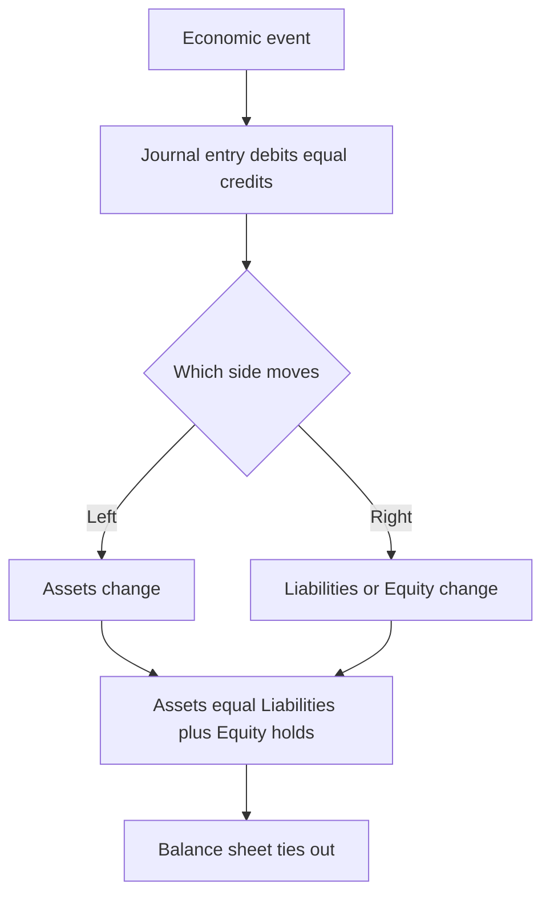
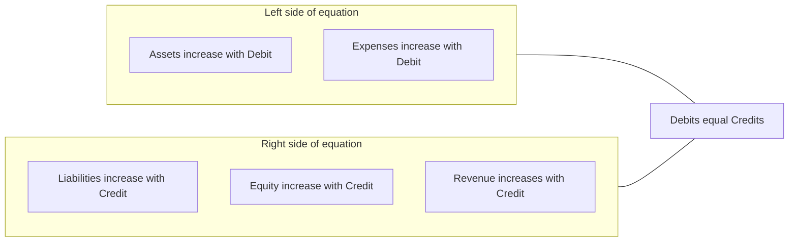
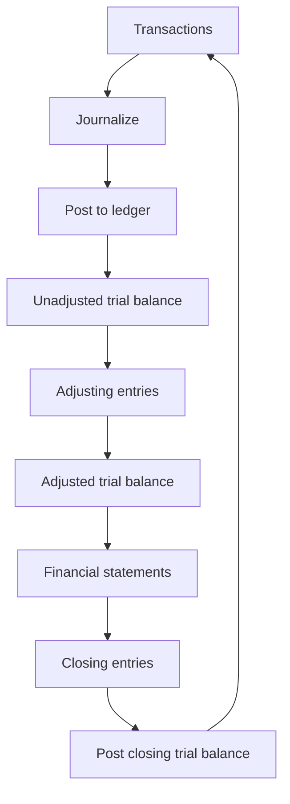
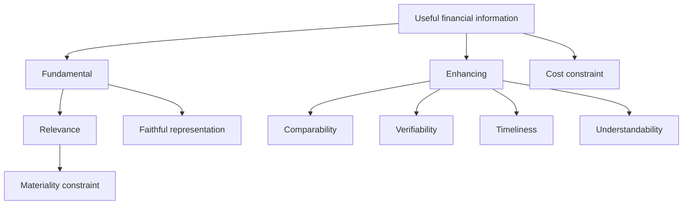

# The Accounting Framework, the Equation & Double-Entry

## The Problem / Why this matters

Imagine you are handed a stack of a company's invoices, bank statements, loan agreements, payroll records, and a shoebox of receipts. Somewhere inside that chaos is the answer to three questions every investor, lender, and manager wants answered:

1. **What does this business own, and what does it owe?** (Is it solvent?)
2. **Did it make money this year, and how?** (Is it profitable?)
3. **Where did the cash actually go?** (Can it pay its bills?)

Accounting is the discipline that turns that shoebox into three tied-out statements — the balance sheet, the income statement, and the cash-flow statement — using a system so internally consistent that a fraud, an error, or a missing transaction shows up as an imbalance. That system rests on **one equation** and **one mechanical rule**: the accounting equation and double-entry bookkeeping. Everything else in financial-statement analysis — every ratio, every DCF input, every credit metric — is built on top of numbers produced by this machinery.

For a finance interview this is not optional background. It is *the* foundation. When an interviewer says **"Walk me through the three statements"** or **"A company buys a $100 machine with cash — walk me through the impact"**, they are testing whether you truly understand the accounting equation and double-entry, or whether you memorized a script. Candidates who understand the equation answer any linkage question on the fly. Candidates who memorized freeze the moment the question is rephrased. This chapter makes you the former.

> **The one-sentence thesis:** Every economic event is recorded twice, in equal and opposite amounts, so that **Assets always equal Liabilities plus Equity** — and because of that, the three financial statements can never drift apart. Master this and you can reason about any transaction from first principles.

---

## Core Idea

Accounting has a single organizing identity:

$$\textbf{Assets} = \textbf{Liabilities} + \textbf{Equity}$$

- **Assets** are the resources the business controls that will bring future economic benefit — cash, receivables, inventory, machines, buildings, patents.
- **Liabilities** are what the business owes to outsiders — payables, loans, bonds, accrued expenses, deferred revenue.
- **Equity** is the residual — what belongs to the owners after every creditor is paid. It is a *plug*, defined as Assets minus Liabilities, not measured directly.

Read the equation as a statement about a single pool of money viewed from two sides. The **left side** answers *"what do we have?"* The **right side** answers *"who financed it?"* Every rupee or dollar of assets was financed either by lenders (liabilities) or by owners (equity). There is no third source. So the two sides are equal **by construction, always, after every transaction** — not by luck.

**Double-entry** is the bookkeeping technique that keeps the equation true. Every transaction touches **at least two accounts**, with total debits equal to total credits. Because debits and credits are defined so that they mirror the two sides of the equation, recording both halves of every event guarantees the equation never breaks.

That is the entire game. The rest is vocabulary, rules for *which* account moves, and standards that govern *when* and *how much*.

---

## Why it works this way — first principles

Why record everything *twice*? Isn't that just double the work?

Think about what a business transaction actually *is*. It is never a one-sided event. If cash leaves your hand, **something came back** — a machine, an expense consumed, a debt repaid. If you sold goods, **two things happened**: you gave up inventory *and* you gained a receivable or cash. Reality itself is double-sided: every give has a get. Double-entry is not an accounting invention layered on top of reality — it is a faithful *transcription* of reality's give-and-get structure.

Now the genius of the design. Because the two sides of every entry are equal, and every entry preserves the equation, the sum of all entries also preserves the equation. This gives you three superpowers:

1. **Self-checking (the trial balance).** If total debits ≠ total credits, you *know* you made an error, before anyone audits you. A single-entry cashbook has no such alarm.
2. **Completeness.** You cannot record the cash going out without recording where it went. Nothing "disappears" silently. This is why double-entry is the bedrock of fraud detection.
3. **Linkage.** Because the same event hits two accounts, the balance sheet, income statement, and cash-flow statement are *mechanically welded together*. Net income flows into equity; cash movements reconcile to the cash line. They cannot contradict each other if the books balance — which is exactly why interviewers use three-statement linkage to test you.

The historical proof of the design: Luca Pacioli codified double-entry in 1494 (*Summa de Arithmetica*), describing methods Venetian merchants already used. Five centuries and countless accounting scandals later, no one has replaced it, because nothing else gives you self-checking, completeness, and linkage in one stroke. It is one of the most durable pieces of intellectual technology in commerce.

Why is **equity the residual** rather than a measured thing? Because owners are last in line. Creditors have fixed, contractual claims — a lender is owed exactly ₹100 whether the business thrives or fails. Owners get *whatever is left*. So equity is defined as the leftover: `Equity = Assets − Liabilities`. This is also why a balance sheet can never show negative assets but can show negative equity (when liabilities exceed assets — an insolvent firm).

---

## Full technical content

### 1. Purpose and users of accounting

**Accounting** is the process of identifying, measuring, recording, classifying, summarizing, and communicating economic information to permit informed judgments by users. It splits into two branches:

| Branch | Audience | Governed by | Orientation |
|---|---|---|---|
| **Financial accounting** | External users (investors, lenders, regulators) | IFRS / US GAAP (external standards) | Historical, standardized, aggregate |
| **Management accounting** | Internal users (managers) | No external rules — whatever helps decisions | Forward-looking, granular, flexible |

This book — and interviews for equity research, credit, IB, and FP&A — is overwhelmingly about **financial accounting**, because that is what produces the published statements everyone analyzes.

**Users and what they want:**

| User | Primary question | Statement they lean on |
|---|---|---|
| Equity investors | Will this grow earnings and cash flow? | Income statement, cash flow |
| Lenders / credit analysts | Will I be repaid? Can it service debt? | Balance sheet, cash flow |
| Management | How do we allocate resources? | All three + management accounts |
| Suppliers | Will they pay their invoices? | Balance sheet (liquidity) |
| Employees | Is my job / pension safe? | All three |
| Government / tax | How much tax is owed? | Income statement (adjusted) |
| Regulators | Is the firm compliant / solvent? | All three |

**The output — the four financial statements (plus notes):**

1. **Balance Sheet (Statement of Financial Position)** — assets, liabilities, equity *at a point in time*. It is a photograph.
2. **Income Statement (Statement of Profit or Loss / P&L)** — revenues minus expenses *over a period*. It is a video of operating performance.
3. **Cash Flow Statement** — cash in and out *over a period*, split into operating, investing, financing. A video of liquidity.
4. **Statement of Changes in Equity** — how equity moved over the period (profit, dividends, share issues).
5. **Notes** — accounting policies and disaggregation. Often where the truth hides.

### 2. The accounting equation — expanded

The basic identity:

$$\text{Assets} = \text{Liabilities} + \text{Equity}$$

Equity is not monolithic. Expanded to show what drives it:

$$\text{Assets} = \text{Liabilities} + \underbrace{\left(\text{Contributed Capital} + \text{Retained Earnings}\right)}_{\text{Equity}}$$

And retained earnings is itself driven by the income statement and dividends:

$$\text{Retained Earnings}_{\text{end}} = \text{Retained Earnings}_{\text{beg}} + \text{Net Income} - \text{Dividends}$$

Substituting, the **fully expanded accounting equation** exposes how the P&L plugs into the balance sheet:

$$\text{Assets} = \text{Liabilities} + \text{Contributed Capital} + \text{Beg. RE} + \underbrace{(\text{Revenues} - \text{Expenses})}_{\text{Net Income}} - \text{Dividends}$$

This single line is the reason the income statement and balance sheet are welded together: **revenues increase equity, expenses decrease equity.** That is *why* revenue is a credit and expense is a debit — more on that below.



### 3. Debits and credits — the mechanical rule

"Debit" (Dr, left) and "credit" (Cr, right) are just **directions**, not good or bad. Debit means the left column of an account; credit means the right column. What a debit *does* depends on which side of the equation the account lives on. The master rule:

| Account type | Normal balance | A **debit** does | A **credit** does |
|---|---|---|---|
| **Assets** | Debit | Increase ↑ | Decrease ↓ |
| **Expenses** | Debit | Increase ↑ | Decrease ↓ |
| **Liabilities** | Credit | Decrease ↓ | Increase ↑ |
| **Equity** | Credit | Decrease ↓ | Increase ↑ |
| **Revenue / Income** | Credit | Decrease ↓ | Increase ↑ |

Two memory hooks that never fail:

- **DEAD-CLIC:** **D**ebits increase **E**xpenses, **A**ssets, **D**ividends (draws); **C**redits increase **L**iabilities, **I**ncome, **C**apital (equity).
- **The equation logic:** Assets are on the *left* of the equation, so they *increase on the left* (debit). Liabilities and equity are on the *right*, so they *increase on the right* (credit). Expenses reduce equity, so they behave *opposite* to equity — they increase with a debit. Revenues raise equity, so they increase with a credit. You never have to memorize this if you anchor to the equation.

**The iron law of every journal entry:** total debits = total credits. Always. An entry that does not balance is not an entry — it is a mistake.



### 4. The journal entry format

The standard format lists debits first, then credits (indented), with a narration:

```
Date   Account Name (debit)              Dr.   XXX
           Account Name (credit)                     XXX
       (Narration: why this entry exists)
```

**Example — buy inventory for $5,000 cash:**

```
Inventory                    Dr.   5,000
      Cash                                5,000
(Purchased inventory for cash)
```

Debits (5,000) = credits (5,000). One asset up, another asset down; the equation is untouched because both changes are on the left side and net to zero.

### 5. The accounting cycle

The repeating sequence that converts raw transactions into statements:

| Step | Action | Output |
|---|---|---|
| 1 | Identify & analyze transactions (source documents) | Which accounts, which direction |
| 2 | **Journalize** — record in the general journal | Journal entries (Dr = Cr) |
| 3 | **Post** to the general ledger | Account-by-account balances (T-accounts) |
| 4 | Prepare **unadjusted trial balance** | List of all balances; ΣDr = ΣCr |
| 5 | **Adjusting entries** (accruals, deferrals, depreciation) | Accrual-basis balances |
| 6 | **Adjusted trial balance** | Corrected balances |
| 7 | Prepare **financial statements** | BS, IS, CFS, equity |
| 8 | **Closing entries** (zero out temporary accounts → RE) | Revenues, expenses, dividends reset to 0 |
| 9 | Post-closing trial balance | Only permanent (BS) accounts remain |

**Temporary vs. permanent accounts:** Revenues, expenses, and dividends are *temporary* — they measure one period and are closed (reset to zero) into retained earnings at period-end. Assets, liabilities, and equity are *permanent* — their balances carry forward. This is why an income statement covers a *period* while a balance sheet is a *point in time*: the P&L accounts get emptied each year, the BS accounts persist.



### 6. Accounting concepts, principles and conventions

These are the *rules of the game* — the assumptions that make statements comparable and meaningful. IFRS bundles them in the *Conceptual Framework for Financial Reporting (2018)*; US GAAP in FASB Concepts Statements. The essential set:

| Concept | What it says | Why it matters / consequence |
|---|---|---|
| **Accrual basis** | Record revenues when *earned* and expenses when *incurred*, not when cash moves | Profit ≠ cash; creates receivables, payables, accruals, deferrals |
| **Going concern** | Assume the firm continues for the foreseeable future | Justifies carrying assets at cost, not fire-sale value; deferring costs |
| **Business entity** | The business is separate from its owners | Owner's personal car isn't a company asset |
| **Money measurement** | Only record what can be expressed in money | Skilled staff / brand quality not on the BS (unless purchased) |
| **Historical cost** | Record assets at original purchase price | Objective and verifiable, but can understate current value |
| **Prudence / conservatism** | Don't overstate assets/income; recognize likely losses early | Losses anticipated, gains not until realized — asymmetry |
| **Matching** | Match expenses to the revenues they generate, in the same period | COGS booked when the sale is booked; depreciation spreads asset cost |
| **Revenue recognition** | Recognize revenue when control transfers / performance obligation met | IFRS 15 / ASC 606 five-step model |
| **Consistency** | Use the same methods period to period | Enables trend analysis; changes must be disclosed |
| **Materiality** | Only info that could influence decisions needs strict treatment | A $2 stapler can be expensed, not capitalized |
| **Full disclosure** | Disclose everything relevant to users' decisions | The notes to accounts |
| **Periodicity** | Chop the firm's life into reporting periods | Enables quarterly/annual reporting; forces accruals |

**Accrual accounting is the single most tested concept**, because it explains why an income statement can show a profit while the company runs out of cash. The four accrual mechanics:

| Mechanic | Timing | Example | Creates |
|---|---|---|---|
| **Accrued revenue** | Earned before cash received | Work done, not yet billed | Asset (receivable) |
| **Accrued expense** | Incurred before cash paid | Wages owed at month-end | Liability (accrual) |
| **Deferred revenue** | Cash received before earned | Annual subscription prepaid by customer | Liability (unearned) |
| **Prepaid expense** | Cash paid before incurred | Rent paid 6 months ahead | Asset (prepaid) |

**Prudence in action (asymmetry):** Inventory is carried at the *lower of cost and net realizable value* (IAS 2 / ASC 330). If cost is $100 and market value drops to $70, you write it down to $70 *now*. But if market value rose to $130, you *do not* write it up — you leave it at $100. Losses are anticipated; gains wait for realization. This asymmetry is deliberate: overstated optimism does more damage to a lender or investor than understated caution.

### 7. Qualitative characteristics of useful information (IFRS Conceptual Framework)

The framework ranks the properties that make financial information useful:

**Two fundamental characteristics** (information must have both to be useful):

1. **Relevance** — capable of making a difference to decisions. Has *predictive value* and/or *confirmatory value*. Constrained by **materiality** (relevance judged in context of size/nature).
2. **Faithful representation** — depicts the economic substance completely, neutrally, and free from error. (Note: it replaced the older word "reliability" in the 2010/2018 framework.)

**Four enhancing characteristics** (boost usefulness of already-relevant, faithful info):

1. **Comparability** — across firms and across time (consistency serves this).
2. **Verifiability** — independent observers would reach consensus.
3. **Timeliness** — available in time to influence decisions.
4. **Understandability** — clear to a reasonably informed user.

**The pervasive constraint: cost.** The benefit of reporting information must exceed the cost of producing it.



### 8. The conceptual framework — what it is and why it exists

The **Conceptual Framework** is not a standard you apply to a transaction; it is the *constitution* underneath the standards. The IASB's *Conceptual Framework for Financial Reporting* (revised 2018) sets out:

- **The objective of general-purpose financial reporting:** to provide financial information about the reporting entity that is useful to existing and potential investors, lenders, and other creditors in making decisions about providing resources to the entity.
- **Qualitative characteristics** (section 7 above).
- **The reporting entity** and its boundary.
- **Definitions of the elements:** asset, liability, equity, income, expense.
- **Recognition and derecognition criteria** — when an item enters or leaves the statements.
- **Measurement bases** — historical cost vs. current value (fair value, value in use, current cost).
- **Presentation and disclosure** concepts.

**Definitions of the five elements (2018 framework — know these precisely, they get quoted in interviews):**

| Element | Definition (essence) |
|---|---|
| **Asset** | A present economic resource controlled by the entity as a result of past events, where an economic resource is a right with the potential to produce economic benefits |
| **Liability** | A present obligation of the entity to transfer an economic resource as a result of past events |
| **Equity** | The residual interest in the assets after deducting all liabilities |
| **Income** | Increases in assets, or decreases in liabilities, that result in increases in equity, other than contributions from equity holders |
| **Expense** | Decreases in assets, or increases in liabilities, that result in decreases in equity, other than distributions to equity holders |

Notice that income and expense are *defined in terms of* changes in assets/liabilities and equity — the equation is baked into the very definitions. This is the deepest reason the statements tie out: the framework *defines* profit as the change in net assets (excluding owner transactions).

**IFRS vs. US GAAP at framework level:** Both share the same broad objective and characteristics. IFRS is *principles-based* (fewer bright-line rules, more judgment), US GAAP is more *rules-based* (detailed, industry-specific guidance). Notable divergences you may be asked about: inventory (IFRS bans LIFO, US GAAP allows it; IFRS permits inventory write-up reversals, US GAAP does not), development costs (IFRS can capitalize under IAS 38, US GAAP generally expenses), and the single vs. multi-step framework detail. At the *equation and double-entry* level, they are identical.

---

## Worked examples

### Worked Example 1 — Build a balance sheet from scratch with six transactions

A new consulting firm, **Meridian Advisory**, has these events in its first month. We'll track the accounting equation after each, then produce the statements. All figures in $.

| # | Transaction |
|---|---|
| 1 | Owners invest $200,000 cash for shares |
| 2 | Borrow $100,000 from a bank (2-yr loan) |
| 3 | Buy office equipment for $60,000 cash |
| 4 | Buy $10,000 of supplies on credit (payable) |
| 5 | Bill a client $40,000 for work done; client pays $25,000, owes $15,000 |
| 6 | Pay $12,000 of salaries in cash |

**Journal entries** (Dr = Cr checked each time):

```
1) Cash                 Dr. 200,000
        Share Capital               200,000
2) Cash                 Dr. 100,000
        Bank Loan                   100,000
3) Equipment            Dr.  60,000
        Cash                         60,000
4) Supplies             Dr.  10,000
        Accounts Payable             10,000
5) Cash                 Dr.  25,000
   Accounts Receivable  Dr.  15,000
        Service Revenue              40,000
6) Salaries Expense     Dr.  12,000
        Cash                         12,000
```

**Equation tracker** (running balances):

| After # | Cash | AR | Supplies | Equip. | = | AP | Loan | + | Share Cap | Ret. Earn. |
|---|---|---|---|---|---|---|---|---|---|---|
| 1 | 200,000 | – | – | – | = | – | – | + | 200,000 | – |
| 2 | 300,000 | – | – | – | = | – | 100,000 | + | 200,000 | – |
| 3 | 240,000 | – | – | 60,000 | = | – | 100,000 | + | 200,000 | – |
| 4 | 240,000 | – | 10,000 | 60,000 | = | 10,000 | 100,000 | + | 200,000 | – |
| 5 | 265,000 | 15,000 | 10,000 | 60,000 | = | 10,000 | 100,000 | + | 200,000 | 40,000 |
| 6 | 253,000 | 15,000 | 10,000 | 60,000 | = | 10,000 | 100,000 | + | 200,000 | 28,000 |

*(Revenue of 40,000 and expense of 12,000 flow into retained earnings via net income: 40,000 − 12,000 = 28,000.)*

**Check the totals after transaction 6:**
- **Assets** = 253,000 + 15,000 + 10,000 + 60,000 = **$338,000**
- **Liabilities + Equity** = 10,000 + 100,000 + 200,000 + 28,000 = **$338,000** ✓

**Income Statement (for the month):**

| | $ |
|---|---|
| Service Revenue | 40,000 |
| Salaries Expense | (12,000) |
| **Net Income** | **28,000** |

**Balance Sheet (end of month):**

| Assets | $ | | Liabilities & Equity | $ |
|---|---|---|---|---|
| Cash | 253,000 | | Accounts Payable | 10,000 |
| Accounts Receivable | 15,000 | | Bank Loan | 100,000 |
| Supplies | 10,000 | | **Total Liabilities** | **110,000** |
| Equipment | 60,000 | | Share Capital | 200,000 |
| | | | Retained Earnings | 28,000 |
| | | | **Total Equity** | **228,000** |
| **Total Assets** | **338,000** | | **Total Liab. & Equity** | **338,000** |

Both sides tie to **$338,000**. The equation held after every single transaction — that is the whole point.

### Worked Example 2 — Accrual vs. cash, and why profit ≠ cash

**TechServe Ltd** in Year 1. Show why net income and cash change differ.

Events:
1. Sold a $120,000 annual software subscription on **1 January**; customer paid the full $120,000 up front in cash.
2. Incurred $30,000 of wages during the year, of which $25,000 was paid in cash and $5,000 is still owed at year-end (accrued).
3. Prepaid $12,000 of rent on 1 January for the full year; all consumed by year-end.

**Accrual treatment:**

- **Revenue:** The subscription is earned *over the year*, not when cash arrives. By 31 Dec the full 12 months are delivered, so all $120,000 is earned → Revenue = $120,000. (If the year-end were mid-contract, only the earned portion would count and the rest sits in *deferred revenue*.) At 1 Jan the entry was:
```
Cash                    Dr. 120,000
     Deferred Revenue            120,000
```
Then over the year, as earned:
```
Deferred Revenue        Dr. 120,000
     Service Revenue             120,000
```
- **Wages:** Expense is what was *incurred* = $30,000, regardless of payment. The $5,000 unpaid becomes an accrued liability.
```
Wages Expense           Dr.  30,000
     Cash                        25,000
     Wages Payable                5,000
```
- **Rent:** Paid $12,000, fully consumed, so expense = $12,000.
```
Prepaid Rent            Dr.  12,000
     Cash                        12,000     (1 Jan)
Rent Expense            Dr.  12,000
     Prepaid Rent                12,000     (as consumed)
```

**Income Statement (accrual, Year 1):**

| | $ |
|---|---|
| Service Revenue | 120,000 |
| Wages Expense | (30,000) |
| Rent Expense | (12,000) |
| **Net Income** | **78,000** |

**Cash movement (Year 1):**

| | $ |
|---|---|
| Cash in from subscription | +120,000 |
| Cash out for wages | (25,000) |
| Cash out for rent | (12,000) |
| **Net cash change** | **+83,000** |

**Reconciliation — why they differ by $5,000:**

Net income $78,000 vs. cash +$83,000. The gap is the $5,000 of wages *expensed but not yet paid* (accrued liability). Cash was higher than profit by exactly that unpaid amount.

$$\text{Cash} = \text{Net Income} + \text{Increase in Wages Payable} = 78{,}000 + 5{,}000 = 83{,}000 \checkmark$$

This is the essence of accrual accounting and the reason the cash-flow statement exists: to bridge accrual profit back to cash reality. (Had the subscription been sold mid-year, the deferred-revenue mechanic would have made the gap even larger — cash way ahead of profit.)

### Worked Example 3 — Depreciation, matching, and the full three-statement link

**Cascade Manufacturing** buys a machine and we trace it through all three statements over one year, showing the matching principle and the linkage.

Setup:
- Buy a machine on 1 Jan for **$50,000 cash**. Useful life 5 years, no salvage, straight-line.
- During the year: **cash sales of $80,000**; **cash operating expenses of $30,000** (excluding depreciation).
- Ignore tax for clarity. Beginning-of-year: Cash $70,000, Share Capital $70,000, no retained earnings.

**Depreciation (matching):** The machine helps generate revenue for 5 years, so its cost is *spread* over 5 years rather than expensed all at once. Annual depreciation = $50,000 / 5 = **$10,000**. Entry:
```
Depreciation Expense    Dr. 10,000
     Accumulated Depreciation     10,000
```
Note: depreciation is a **non-cash expense** — no cash moves; it reduces the machine's carrying value via accumulated depreciation (a contra-asset).

**Income Statement (Year 1):**

| | $ |
|---|---|
| Sales | 80,000 |
| Operating expenses (cash) | (30,000) |
| Depreciation | (10,000) |
| **Net Income** | **40,000** |

**Cash Flow Statement (Year 1):**

| | $ |
|---|---|
| **Operating:** Net income | 40,000 |
| Add back depreciation (non-cash) | +10,000 |
| **Cash from operations** | **50,000** |
| **Investing:** Buy machine | (50,000) |
| **Financing:** none | 0 |
| **Net change in cash** | **0** |

Sanity check on cash directly: +80,000 sales − 30,000 opex − 50,000 machine = **$0** net change. ✓ Matches the CFS.

**Balance Sheet (end of Year 1):**

| Assets | $ | | Liab. & Equity | $ |
|---|---|---|---|---|
| Cash (70,000 + 0) | 70,000 | | Share Capital | 70,000 |
| Machine (gross) | 50,000 | | Retained Earnings | 40,000 |
| Less: Accum. Deprec. | (10,000) | | | |
| Machine (net) | 40,000 | | | |
| **Total Assets** | **110,000** | | **Total Liab. & Equity** | **110,000** |

**Verify the linkage — the three ties every interviewer checks:**

1. **Net income → retained earnings.** Beginning RE 0 + NI 40,000 − dividends 0 = **RE 40,000.** ✓ (appears in equity)
2. **Depreciation → balance sheet.** The $10,000 depreciation reduced net PP&E from 50,000 to 40,000 via accumulated depreciation. ✓
3. **CFS → cash on the balance sheet.** Net change in cash $0, so ending cash = beginning $70,000. ✓
4. **Balance sheet balances:** Assets 110,000 = Liab. + Equity 110,000. ✓

The depreciation add-back is the classic interview beat: it *reduced* net income by $10,000 but used *no cash*, so we add it back in operating cash flow. Net income fell to $40,000 while operating cash was $50,000 — the $10,000 gap is exactly the non-cash depreciation. Everything ties.

---

## How it is tested in interviews

This topic is the **single most common** technical territory in finance interviews. Here are the exact questions and the crisp lines to deliver.

### Q1. "Walk me through the three financial statements."

**Model answer (say it in this order, ~45 seconds):**
> "The **income statement** shows profitability over a period — revenue down to net income. The **balance sheet** is a snapshot at a point in time showing what the company owns and owes: Assets = Liabilities + Equity. The **cash flow statement** reconciles net income to the actual change in cash, split into operating, investing, and financing. They link: **net income** from the income statement flows into **retained earnings** on the balance sheet and is the starting line of the cash flow statement; the **ending cash** on the cash flow statement is the cash line on the balance sheet; and non-cash items and working-capital changes bridge the two."

That last sentence — the linkage — is what separates a pass from a fail. Anyone can list the three; the interviewer wants the *welds*.

### Q2. "A company buys a $100 piece of equipment with cash. Walk me through the three statements." (Assume 10-yr straight-line, 40% tax, if they add depreciation.)

**Model answer:**
> "At the moment of purchase, it's just a **balance sheet** reclassification: cash down $100, PP&E up $100 — no income statement or cash-flow-from-operations impact yet, though it's a $100 outflow in **investing**. Over time, depreciation kicks in. Say $10/yr. On the income statement, depreciation of $10 pre-tax; at 40% tax, **net income falls $6**. On the cash flow statement, start with net income −$6, **add back $10 depreciation** (non-cash), so **cash from operations rises $4** — that's the tax shield. On the balance sheet, cash is up $4, PP&E net is down $10, so assets down $6 net; retained earnings down $6 — and it balances."

Key numbers to nail: NI −$6, CFO +$4, the $4 is the depreciation tax shield ($10 × 40%).

### Q3. "If depreciation goes up by $10 and the tax rate is 40%, what happens to each statement?"

**Model answer:**
> "**Income statement:** pre-tax income down $10, taxes down $4, so **net income down $6**. **Cash flow:** start at net income −$6, add back the full $10 depreciation, so **cash up $4**. **Balance sheet:** cash up $4, PP&E down $10, net assets down $6; on the other side retained earnings down $6. Balances. The insight is that depreciation *saves cash* through lower taxes even though it's a non-cash charge."

### Q4. "What's the difference between accrual and cash accounting? Why do we use accrual?"

**Model answer:**
> "Cash accounting records transactions only when cash moves; accrual records revenue when it's *earned* and expenses when they're *incurred*, regardless of cash timing. We use accrual because it **matches** revenues with the costs that generated them, so profit reflects economic performance in the period, not just the timing of cash. That's why we get receivables, payables, deferred revenue, and accruals — and it's exactly why a profitable company can still run out of cash, which is why the cash flow statement exists."

### Q5. "Can a profitable company go bankrupt?"

**Model answer (one-liner they love):**
> "Absolutely — profit is an accrual concept, cash is what pays the bills. A company growing fast can book big profits while all its cash is tied up in receivables and inventory, or it can have a heavy debt maturity due. Profit is opinion, cash is fact. That's the whole reason we analyze the cash flow statement alongside the P&L."

### Q6. "What is the accounting equation and why must it always balance?"

**Model answer:**
> "Assets = Liabilities + Equity. It balances by *definition*, not by coincidence: everything a company owns was financed either by creditors or by owners, and equity is defined as the residual — assets minus liabilities. Double-entry enforces it: every transaction records equal debits and credits, so the equation is preserved after every entry."

### Q7. "A company issues $100 of debt. Walk me through it." / "issues $100 of equity."

**Model answer (debt):**
> "Balance sheet only: cash up $100, debt (a liability) up $100. No income statement impact at issuance; cash flow shows +$100 in financing. Going forward, interest expense will hit the income statement."

**Equity:** cash up $100, share capital up $100; +$100 financing; no P&L impact.

### Q8. "What happens to retained earnings if the company pays a dividend?"

**Model answer:**
> "Dividends are *not* an expense — they're a distribution of profit to owners. So net income is unaffected. Retained earnings falls by the dividend, and cash falls by the same amount (financing outflow). RE_end = RE_beg + net income − dividends."

### Q9. "Where does depreciation appear on the three statements?"

**Model answer:**
> "Income statement: as an expense (in COGS or opex). Cash flow statement: added back to net income in operating activities because it's non-cash. Balance sheet: it accumulates in accumulated depreciation, a contra-asset that reduces net PP&E."

### Q10. "Inventory drops in market value below cost. What do you do — and what if it rises above cost?"

**Model answer:**
> "Prudence and lower-of-cost-and-NRV: I write it *down* to net realizable value immediately and recognize the loss. If it rose above cost, I do *nothing* — I leave it at cost, because gains aren't recognized until realized. Losses are anticipated, gains are not. That asymmetry is conservatism."

**The universal method for any "walk me through" linkage question:** always go **Income Statement → Cash Flow Statement → Balance Sheet**, and *end by confirming the balance sheet balances*. If it balances, you did it right. That closing check is the tell of a candidate who understands rather than memorizes.

---

## Traps & common mistakes

1. **Thinking "debit = decrease / credit = increase" (or debit = bad).** Debit and credit are just *directions*. A debit *increases* an asset and *decreases* a liability. Anchor to the equation, not to intuition about "money in / money out."

2. **Treating equity as measured rather than residual.** Equity = Assets − Liabilities. You never "look up" equity; it falls out. This is why a firm can have negative equity.

3. **Confusing profit with cash.** The most punished mistake in interviews. Net income is accrual; it includes non-cash items (depreciation) and excludes cash items (capex, debt repayment, working-capital swings). Never say "the company made $40k so it has $40k more cash."

4. **Forgetting depreciation is non-cash.** It reduces net income but *not* cash — hence the add-back. Candidates who forget the add-back get the cash-flow direction wrong.

5. **Calling dividends an expense.** Dividends never touch the income statement. They're a distribution, straight from retained earnings.

6. **Booking the whole capex as an expense.** Capex is capitalized (an asset) and expensed *over time* via depreciation — that's the matching principle. Only the period's depreciation hits the P&L.

7. **Recognizing revenue when cash is received (or expense when cash is paid).** Under accrual, timing follows *earning* and *incurring*, not cash. Cash received before earning is *deferred revenue* (a liability), not revenue.

8. **Writing inventory or assets *up* to market when they rise.** Prudence forbids it (with narrow IFRS exceptions like reversal of a prior write-down, capped at original cost, and specific revaluation models). Default answer: gains wait for realization.

9. **Forgetting the closing check.** After any linkage walkthrough, if you don't confirm "and the balance sheet balances," you've left the interviewer unsure you understand the mechanics.

10. **Mixing up "faithful representation" and "reliability."** The current IFRS framework uses *faithful representation* (complete, neutral, free from error) as the fundamental characteristic — "reliability" is the old term.

---

## First-principles recap

- **One identity rules everything:** Assets = Liabilities + Equity. It holds after every transaction because equity is *defined* as the residual and double-entry preserves it.
- **Every event is double-sided** (a give and a get), so we record it twice — equal debits and credits — giving self-checking, completeness, and statement linkage.
- **Debits/credits are directions, not values.** Left-side accounts (assets, expenses) increase with debits; right-side accounts (liabilities, equity, revenue) increase with credits — because expenses reduce equity and revenue raises it.
- **Accrual ≠ cash.** Revenue is earned, expense is incurred — cash timing is separate. This is why profit and cash diverge and why the cash flow statement exists.
- **Matching and prudence shape the P&L:** costs follow the revenues they create (depreciation spreads capex); losses are anticipated, gains wait for realization.
- **The three statements are mechanically welded:** net income → retained earnings and top of cash flow; non-cash and working-capital items bridge profit to cash; ending cash → balance sheet. If the books balance, they cannot contradict.
- **The conceptual framework is the constitution:** it defines the elements (asset, liability, equity, income, expense) *in terms of the equation*, and ranks useful-information characteristics (relevance + faithful representation, enhanced by comparability, verifiability, timeliness, understandability).

## Quick-reference

| Item | Formula / Rule |
|---|---|
| Accounting equation | Assets = Liabilities + Equity |
| Expanded equation | A = L + Contributed Capital + Beg RE + (Rev − Exp) − Dividends |
| Retained earnings roll-forward | RE_end = RE_beg + Net Income − Dividends |
| Net income | Revenues − Expenses |
| Iron law of entries | Total Debits = Total Credits (always) |
| Assets / Expenses | Increase with **Debit**, decrease with Credit |
| Liabilities / Equity / Revenue | Increase with **Credit**, decrease with Debit |
| Mnemonic | DEAD-CLIC: Debit ↑ Expenses/Assets/Dividends; Credit ↑ Liabilities/Income/Capital |
| Depreciation (straight-line) | (Cost − Salvage) / Useful life |
| Cash from ops (indirect, simple) | Net income + non-cash charges ± working-capital changes |
| Depreciation tax shield | Depreciation × Tax rate |
| Inventory valuation | Lower of cost and NRV (IAS 2 / ASC 330) |
| Fundamental qualitative chars | Relevance + Faithful representation |
| Enhancing qualitative chars | Comparability, Verifiability, Timeliness, Understandability |
| Framework element defs | Asset = controlled resource, past event, future benefit; Liability = present obligation to transfer resource; Equity = residual |
| Linkage walk order | Income Statement → Cash Flow → Balance Sheet, then confirm BS balances |
| Standards | IFRS Conceptual Framework (2018); FASB Concepts; IFRS 15 / ASC 606 revenue; IAS 2 inventory |

**Journal entry template:**
```
Debit Account          Dr.   XXX
      Credit Account            XXX
(Narration)
```
Debits = Credits, every time. Master that, and every statement in this book will tie out.
