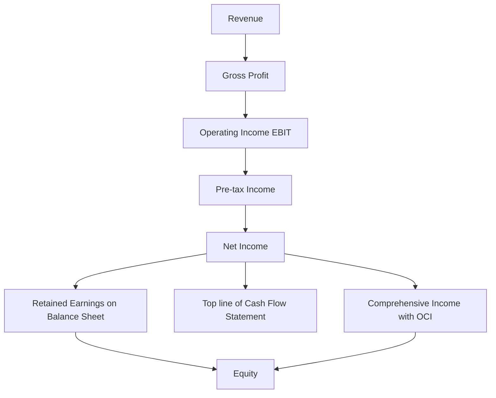
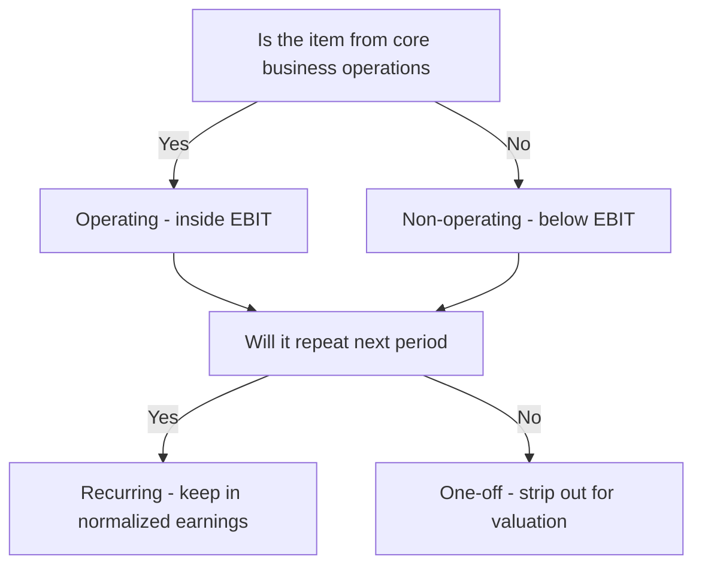
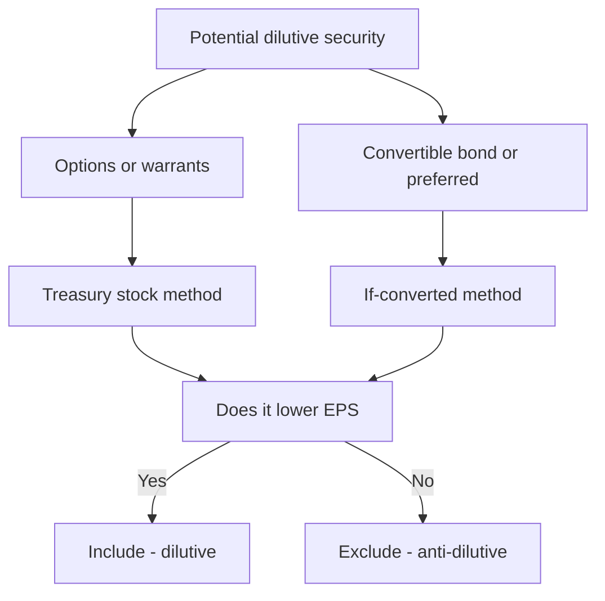

# The Income Statement in Depth

## The Problem / Why this matters

Every valuation, every credit decision, every budget, every equity pitch starts with one question: **how much did the business actually earn, and is that number repeatable?** The income statement (also called the P&L, profit and loss statement, or statement of operations) is the accounting system's answer to that question. But it is a *constructed* answer, not a raw fact. It is built on accrual choices, classification judgments, and a specific ordering of line items — and each of those choices changes the number a reader anchors on.

Here is the real situation you will face. An equity research analyst pulls up a company reporting net income of ₹1,200 crore. A quick glance says "great, they made ₹1,200 crore." But ₹500 crore of that was a one-time gain from selling a factory, ₹80 crore was a tax credit that won't recur, and depreciation is understated because of an aggressive useful-life assumption. The *recurring, operating* earning power might be ₹650 crore. Value the company off ₹1,200 crore and you overpay by nearly 2x. The entire craft of income-statement analysis is separating **signal (durable earning power)** from **noise (one-offs, non-operating items, and accounting artifacts)**.

In interviews, this is the single most-tested financial statement because it is the bridge to the other two. "Walk me through the three statements" always *starts* on the income statement, because net income is the top line of retained earnings and the top line of the cash flow statement. If you cannot fluently reason from revenue down to net income and then out to comprehensive income, you cannot do the job. This chapter builds that fluency from first principles.

## Core Idea

The income statement measures **performance over a period of time** — a quarter or a year — by matching the revenue a business *earned* against the expenses it *incurred* to earn that revenue. The output, net income, is the change in shareholders' equity that came from *operating the business*, excluding transactions with owners (dividends, share issuance) and — crucially — excluding certain unrealized items that get parked in *other comprehensive income (OCI)*.

Three ideas do all the heavy lifting:

1. **Accrual, not cash.** Revenue is recognized when *earned* (control of goods/services transferred), and expenses when *incurred* to generate that revenue (the matching principle) — regardless of when cash moves. This is why a profitable company can run out of cash and a cash-rich company can be unprofitable.

2. **The statement is a waterfall of subtotals.** Revenue → gross profit → operating profit (EBIT) → pre-tax profit → net income. Each subtotal answers a different question, and each strips out a different layer of cost. Understanding *what each subtotal includes and excludes* is the whole game.

3. **Quality of earnings.** Two companies with identical net income are not equally valuable if one earns it from recurring operations and the other from asset sales and accounting estimates. Analysis is the art of "normalizing" the P&L to its durable core.

## Why it works this way — first principles

**Why a separate statement for a *period* at all?** The balance sheet is a *snapshot* — assets, liabilities, and equity frozen at one instant. But owners and lenders need to know the *rate* at which the business creates value, not just its stock of value at a point in time. The income statement is the "flow" that explains part of the change between two balance-sheet "stocks." Formally:

> Ending Equity = Beginning Equity + Net Income + Other Comprehensive Income − Dividends + Net Share Issuance

Net income is the piece of that bridge attributable to *operating and financing the business*. That is *why* it exists as its own statement: to isolate operational value creation from capital transactions with owners.

**Why accrual and matching?** Imagine a construction firm that signs a ₹300 crore, three-year contract, collects ₹100 crore upfront, and spends ₹40 crore in year 1. Cash accounting would show a ₹60 crore "profit" in year 1 and losses later — a meaningless picture of a project that is actually profitable and evenly worked. Accrual accounting instead recognizes revenue as the work is *performed* and matches the cost of that work against it, so each period's profit reflects the *economic activity of that period*. The whole point is **comparability across periods** and a faithful picture of periodic performance.

**Why the waterfall of subtotals?** Costs differ in their *nature and controllability*. Cost of goods sold moves almost mechanically with volume. Operating expenses (salaries, rent, R&D) are the cost of running the enterprise. Interest is a function of the *capital structure*, not the operations. Taxes are set by the government. By stacking these in order — most-directly-tied-to-product first, most-external last — the statement lets a reader isolate the layer they care about. An operator cares about EBIT (can I run this business profitably?); a lender cares about EBIT vs. interest (can they cover my coupon?); an equity holder cares about net income and EPS (what's left for me?). The ordering is *designed* to serve these different claimants.

**Why push some gains/losses into OCI instead of net income?** Because some value changes are *unrealized and volatile* — a bond portfolio's mark-to-market, a foreign subsidiary's translation swing, a pension actuarial remeasurement. Running these through net income would make earnings whipsaw on things management didn't "operate." Standard-setters decided such items are real changes in equity (so they belong in *comprehensive* income) but not part of *performance* (so they bypass net income and sit in OCI within equity). It is a deliberate compromise between completeness and a stable earnings signal.

## Full technical content

### 1. The two formats: single-step vs. multi-step

**Single-step** lumps all revenues together and all expenses together, then subtracts once:

> Net Income = (All Revenues and Gains) − (All Expenses and Losses)

It is simple and common for small firms, but it hides gross profit and operating profit. Analysts dislike it because the useful subtotals are gone.

**Multi-step** builds the waterfall of subtotals and is the standard for public companies and for analysis. It separates operating from non-operating and computes gross profit, operating income, and pre-tax income along the way.

| Feature | Single-step | Multi-step |
|---|---|---|
| Subtotals shown | Only net income | Gross profit, operating income, pre-tax income |
| Operating vs non-operating split | No | Yes |
| Ease of use | Simple | More detailed |
| Preferred by analysts | No | Yes |
| Typical user | Small/private firms | Public companies |

### 2. The multi-step income statement — full format

Below is the canonical structure. Sign convention: revenues positive, expenses subtracted.

| Line item | What it is |
|---|---|
| Revenue (Net Sales) | Value of goods/services delivered to customers, net of returns, discounts, allowances |
| − Cost of Goods Sold (COGS) | Direct cost of producing the goods/services sold |
| **= Gross Profit** | Profit after direct production cost |
| − Selling, General & Administrative (SG&A) | Salaries, marketing, rent, admin overhead |
| − Research & Development (R&D) | Cost of developing new products (expensed under US GAAP; partly capitalizable under IFRS) |
| − Depreciation & Amortization (if shown separately) | Allocation of asset cost over useful life |
| **= Operating Income (EBIT)** | Profit from core operations before financing and tax |
| + Non-operating income / − expenses | Interest income, dividend income, FX gains, one-offs |
| − Interest Expense | Cost of debt financing |
| **= Pre-tax Income (EBT)** | Earnings before tax |
| − Income Tax Expense | Current + deferred tax |
| **= Net Income (from continuing ops)** | Bottom-line earnings from ongoing business |
| ± Discontinued operations, net of tax | Results of a component being sold/shut, shown separately |
| **= Net Income** | Total bottom line |
| − Non-controlling interest (NCI) | Portion of consolidated profit owed to minority owners of subsidiaries |
| **= Net Income attributable to parent** | What belongs to the reporting company's shareholders |

Note: **EBIT is not always exactly "operating income."** Operating income is a defined subtotal (revenue − operating costs). EBIT ("earnings before interest and taxes") is *derived*: EBT + interest expense, or net income + interest + taxes. They differ whenever there is **non-operating income** (e.g., interest income, a gain on asset sale) that sits below operating income but above interest expense. Interviewers love this distinction — state it precisely.

### 3. Line-by-line, from first principles

**Revenue.** Under **IFRS 15 / ASC 606** ("Revenue from Contracts with Customers"), revenue is recognized when the entity satisfies a performance obligation by transferring control of a good or service, using a five-step model: (1) identify the contract, (2) identify performance obligations, (3) determine the transaction price, (4) allocate the price to obligations, (5) recognize revenue as/when each obligation is satisfied. Revenue is reported **net** of expected returns, trade discounts, and rebates. It is *not* the same as cash collected — a credit sale creates revenue today and a receivable, with cash arriving later.

Journal entry for a credit sale of ₹100 with COGS of ₹60:

```
Dr Accounts Receivable      100
    Cr Revenue                    100
Dr Cost of Goods Sold        60
    Cr Inventory                   60
```

**COGS.** The direct cost of the units *sold* in the period — raw materials, direct labor, and manufacturing overhead attributable to production. Key point: COGS matches the *cost of what was sold*, not what was produced or purchased. Unsold production sits in inventory (a balance-sheet asset) until sold. The inventory costing method (FIFO, weighted average; LIFO permitted under US GAAP but banned under IFRS) changes COGS and hence gross profit when prices move.

**Gross Profit = Revenue − COGS.** This measures the profitability of the product itself, before the cost of running the wider business. Gross margin (gross profit / revenue) is a powerful indicator of pricing power and product economics.

**Operating expenses (OpEx).** Costs of running the business that are not tied to a specific unit: SG&A, R&D, marketing, and often D&A. These are period costs — expensed as incurred.

**Operating Income (EBIT).** Gross profit − operating expenses. The profit the core business generates *regardless of how it is financed or taxed*. This is the cleanest measure of operational performance and the number most valuation multiples (EV/EBIT) and coverage ratios lean on.

**EBITDA.** Earnings Before Interest, Taxes, Depreciation, and Amortization = EBIT + D&A. It strips out non-cash allocation of past capital spending, giving a rough proxy for operating cash generation and a capital-structure-and-tax-neutral profit figure for comparing companies. **EBITDA is a non-GAAP measure** — it is not defined by IFRS or US GAAP, so companies compute it slightly differently (and often add back more than just D&A: "adjusted EBITDA"). Treat it with suspicion: it ignores capex, working-capital needs, and the reality that D&A represents real economic wear. Charlie Munger's line — "think of it as bulls*** earnings" — is worth remembering, but you still must compute and use it because the market does.

**Interest expense / income.** Interest expense is the cost of debt, a *financing* item below EBIT. Interest income (on cash and investments) is *non-operating income*. For non-financial firms, both sit below operating income. (For a bank, interest *is* the operating line — context matters.)

**Pre-tax income (EBT) = EBIT + non-operating income − interest expense.**

**Income tax expense.** Has two parts: **current tax** (payable to authorities this year based on taxable income) and **deferred tax** (arising from temporary differences between accounting income and taxable income — e.g., accelerated tax depreciation). The line on the P&L is *total tax expense* = current + deferred. The **effective tax rate = tax expense / pre-tax income** often differs from the statutory rate because of permanent differences (tax-exempt income, non-deductible expenses), tax credits, and rate differences across jurisdictions.

**Net income.** The residual belonging to the company after all costs. It feeds retained earnings (equity) and is the starting point of the indirect-method cash flow statement.

**Discontinued operations.** When a company disposes of (or classifies as held-for-sale) a major line of business or geographic area, its results are stripped out of continuing operations and shown as a single line "Discontinued operations, net of tax." This keeps continuing operations clean and comparable. (IFRS 5 / ASC 205-20.)

**Non-controlling interest (NCI).** When a parent consolidates a subsidiary it owns, say, 80% of, the P&L includes 100% of the subsidiary's revenue and expenses, so 100% of its net income lands in consolidated net income. But 20% of that profit belongs to the minority owners. NCI is the line that allocates net income between "attributable to parent shareholders" and "attributable to NCI." EPS is always computed on the *parent* portion.

### 4. Operating vs. non-operating; recurring vs. one-off

Two independent classifications that analysts must apply:

**Operating vs. non-operating** — *is this from the core business?*
- Operating: revenue, COGS, SG&A, R&D, depreciation of operating assets.
- Non-operating: interest income/expense, gains/losses on asset sales, FX gains, income from equity-method investments, dividend income.

**Recurring vs. non-recurring (one-off)** — *will it repeat?*
- Recurring: normal sales, normal costs.
- Non-recurring: restructuring charges, impairments, litigation settlements, gains on disposal, insurance recoveries, one-time write-offs.

An item can be operating but non-recurring (a restructuring charge), or non-operating and recurring (steady interest income on a permanent cash pile). Both distinctions matter, for different reasons: the operating/non-operating split feeds *EBIT and valuation*; the recurring/non-recurring split feeds *normalized earnings and quality of earnings*.

Under IFRS, entities cannot label items "extraordinary." Under US GAAP the "extraordinary items" category was eliminated in 2015 (ASU 2015-01). So one-offs today appear as ordinary line items (often within operating income), which is *why* analysts must dig into the notes and MD&A to find and strip them out themselves. Companies frequently present a "non-GAAP" or "adjusted" net income doing exactly this — read those reconciliations critically, as management chooses what to add back.

### 5. Margins — the analytical ratios

| Margin | Formula | What it tells you |
|---|---|---|
| Gross margin | Gross profit / Revenue | Product economics, pricing power |
| Operating (EBIT) margin | Operating income / Revenue | Core operating efficiency |
| EBITDA margin | EBITDA / Revenue | Cash-ish operating profitability, capital-structure neutral |
| Pre-tax margin | Pre-tax income / Revenue | Profit before tax drag |
| Net margin | Net income / Revenue | Bottom-line profitability |

Margins are the analyst's default lens because they normalize for size and make companies and periods comparable. A rising gross margin with a falling operating margin, for example, tells a story: the product is getting more profitable but overhead is bloating.

### 6. Earnings per share (EPS) — basic and diluted

EPS translates net income into a per-share figure, the direct input to the P/E multiple.

**Basic EPS:**

> Basic EPS = (Net Income − Preferred Dividends) / Weighted Average Shares Outstanding

- Subtract preferred dividends because that profit is not available to common shareholders.
- Use the **weighted average** of shares outstanding over the period (weighted by the fraction of the year each share count was outstanding), not the ending count, because shares issued mid-year only earned for part of the year.

**Diluted EPS** answers: *what would EPS be if all dilutive potential shares became common shares?* It includes the effect of options, warrants, convertible bonds, and convertible preferred that could increase the share count.

- **Options/warrants — treasury stock method:** assume exercise, then assume the proceeds are used to buy back shares at the average market price. Net new shares = shares issued on exercise − shares repurchased. Only *in-the-money* options are dilutive.
- **Convertible bonds — if-converted method:** assume conversion; add the new shares to the denominator and add back the after-tax interest that would no longer be paid to the numerator.
- **Convertible preferred — if-converted:** add conversion shares to the denominator and add back the preferred dividends to the numerator (they'd no longer be paid).

**Anti-dilution rule:** only include a security if it *reduces* EPS. If including a convertible would *raise* EPS, it is anti-dilutive and excluded. Diluted EPS can never exceed basic EPS.

### 7. Other Comprehensive Income (OCI) and Comprehensive Income

> Comprehensive Income = Net Income + Other Comprehensive Income

**Net income** captures realized, performance-related results. **OCI** captures specific unrealized gains/losses that standard-setters keep out of net income. Together they equal the total non-owner change in equity (the "clean surplus" idea).

Typical OCI components:

| OCI item | Standard | Recycles to P&L later? |
|---|---|---|
| Foreign currency translation adjustments (consolidating foreign subs) | IAS 21 | Yes, on disposal of the sub |
| Unrealized gains/losses on debt investments at FVOCI | IFRS 9 / ASC 320 | Yes, when sold |
| Effective portion of cash-flow hedge gains/losses | IFRS 9 / ASC 815 | Yes, when hedged item hits P&L |
| Remeasurements of defined-benefit pension plans (actuarial gains/losses) | IAS 19 | No |
| Revaluation surplus on PP&E and intangibles (IFRS only) | IAS 16 / 38 | No |
| Gains/losses on equity investments elected at FVOCI | IFRS 9 | No |

**Recycling (reclassification adjustment)** is the key nuance: some OCI items are later moved ("recycled") into net income when realized (e.g., a debt security is sold), while others never touch net income and stay in accumulated OCI within equity forever (pension remeasurements, PP&E revaluation surplus). The running total of OCI sits on the balance sheet as **Accumulated Other Comprehensive Income (AOCI)**, a component of equity.

Why an analyst cares: a company can post strong net income while bleeding value through OCI (say, huge translation or pension losses). Comprehensive income catches this. It rarely drives the headline but it is a genuine quality-of-earnings and equity-movement check.

### 8. Presentation standards summary

| Topic | IFRS | US GAAP |
|---|---|---|
| Governing standard | IAS 1 (Presentation), IFRS 15 (Revenue) | ASC 220 (Comprehensive Income), ASC 606 (Revenue) |
| Expense classification | By nature OR by function | Typically by function |
| Extraordinary items | Prohibited | Eliminated (2015) |
| LIFO inventory | Prohibited | Permitted |
| Development costs | Capitalize if criteria met (IAS 38) | Expense (mostly) |
| OCI statement | Single statement or two statements | Same choice |
| One statement or two | Allowed | Allowed |

### 9. How the income statement links to the other statements



Net income is the single most connected number in accounting: it flows into retained earnings (balance sheet), starts the cash flow statement (indirect method), and combines with OCI to give comprehensive income. This linkage is the backbone of the "walk me through the three statements" question.

## Worked examples

### Worked Example 1 — Building a full multi-step income statement and every margin

**Facts (₹ crore, fiscal year):** Gross sales ₹5,200; sales returns and discounts ₹200; COGS ₹3,000; SG&A ₹900; R&D ₹200; depreciation (operating) ₹150; interest income ₹40; gain on sale of old warehouse ₹60 (one-off); interest expense ₹120; statutory tax rate 25%.

**Step 1 — Net revenue.** 5,200 − 200 = **₹5,000**.

**Step 2 — Gross profit.** 5,000 − 3,000 = **₹2,000**. Gross margin = 2,000 / 5,000 = **40.0%**.

**Step 3 — Operating income (EBIT from operations).** 2,000 − 900 − 200 − 150 = **₹750**. Operating margin = 750 / 5,000 = **15.0%**.

**Step 4 — EBITDA.** EBIT + D&A = 750 + 150 = **₹900**. EBITDA margin = 900 / 5,000 = **18.0%**.

**Step 5 — Add non-operating items to get EBT.** Operating income 750 + interest income 40 + one-off gain 60 − interest expense 120 = **₹730** pre-tax income. (Note: the non-operating gain and interest income sit below operating income; interest expense is a financing cost.)

Here EBIT (the "before interest and taxes" figure) = EBT + interest expense = 730 + 120 = **₹850**, which differs from operating income of 750 by exactly the ₹100 of non-operating income (40 + 60). This is the operating-income-vs-EBIT distinction, made concrete.

**Step 6 — Tax.** 730 × 25% = **₹182.5**. Net income = 730 − 182.5 = **₹547.5**. Net margin = 547.5 / 5,000 = **10.95%**.

**Step 7 — Normalized (quality-of-earnings) view.** The ₹60 warehouse gain is a one-off. Strip it: normalized pre-tax = 730 − 60 = 670; normalized tax at 25% = 167.5; **normalized net income = ₹502.5**. Value the company off ~₹502.5, not ₹547.5 — the ₹45 after-tax one-off gain won't recur.

**Presentation check:**

| Line | ₹ crore |
|---|---|
| Net revenue | 5,000.0 |
| COGS | (3,000.0) |
| Gross profit | 2,000.0 |
| SG&A | (900.0) |
| R&D | (200.0) |
| Depreciation | (150.0) |
| Operating income | 750.0 |
| Interest income | 40.0 |
| Gain on warehouse sale | 60.0 |
| Interest expense | (120.0) |
| Pre-tax income | 730.0 |
| Income tax (25%) | (182.5) |
| Net income | 547.5 |

Every subtotal ties. Numbers verified.

### Worked Example 2 — Basic and diluted EPS with options and a convertible bond

**Facts:** Net income ₹500 crore. Preferred dividends ₹20 crore. Weighted average common shares outstanding = 100 crore shares. Outstanding: (a) options to buy 10 crore shares at a strike of ₹40, average market price during the year ₹50; (b) a convertible bond with ₹200 crore face, 8% coupon (interest ₹16 crore/year), convertible into 8 crore shares; tax rate 25%.

**Step 1 — Basic EPS.**
Numerator = Net income − preferred dividends = 500 − 20 = 480.
Basic EPS = 480 / 100 = **₹4.80**.

**Step 2 — Options, treasury stock method.**
Options are in-the-money (market ₹50 > strike ₹40), so dilutive.
Proceeds from exercise = 10 crore × ₹40 = ₹400 crore.
Shares repurchased at avg market = 400 / 50 = 8 crore shares.
Net new shares = 10 − 8 = **2 crore**.
No numerator effect for options.

**Step 3 — Convertible bond, if-converted method.**
If converted, the company adds 8 crore shares and *stops paying* ₹16 crore interest.
After-tax interest add-back = 16 × (1 − 0.25) = ₹12 crore.
Test this security's incremental EPS = 12 / 8 = ₹1.50 per share. Since ₹1.50 < basic EPS of ₹4.80, it is **dilutive** (including it drags EPS down), so include it.

**Step 4 — Diluted EPS.**
Numerator = 480 + 12 (interest add-back) = 492.
Denominator = 100 + 2 (options) + 8 (conversion) = 110.
Diluted EPS = 492 / 110 = **₹4.4727 ≈ ₹4.47**.

**Check:** Diluted EPS ₹4.47 < Basic EPS ₹4.80. Correct — dilution reduces EPS. Note the preferred dividend is *not* added back because this preferred is not convertible; only the convertible bond's interest is added back. Numbers verified.

### Worked Example 3 — Comprehensive income and normalized-earnings analysis

**Facts (₹ crore):** From continuing operations, a company reports: operating income ₹600; interest expense ₹100; a ₹150 goodwill impairment (non-cash, one-off, recorded within operating expenses — so it's already inside the ₹600? No — assume it is *separate*, below operating income as a non-recurring charge); a ₹90 gain on a lawsuit settlement (one-off); tax rate 25%. Separately, discontinued operations produced a ₹40 after-tax loss. OCI for the year: foreign-currency translation gain ₹30; pension actuarial loss ₹50; unrealized gain on FVOCI debt securities ₹20.

**Step 1 — Pre-tax income from continuing operations.**
600 − 100 (interest) − 150 (impairment) + 90 (lawsuit gain) = **₹440**.

**Step 2 — Tax and net income from continuing operations.**
Tax = 440 × 25% = 110. Net income from continuing ops = 440 − 110 = **₹330**.

**Step 3 — Total net income (after discontinued ops).**
330 − 40 (discontinued, already after tax) = **₹290**.

**Step 4 — Normalized net income (strip both one-offs).**
Remove the ₹150 impairment (add back) and the ₹90 gain (subtract), pre-tax:
Normalized pre-tax = 440 + 150 − 90 = 500.
Normalized tax at 25% = 125. Normalized net income from continuing ops = **₹375**.
So the durable earning power (₹375) is *higher* than reported continuing net income (₹330), because the ₹150 impairment hit outweighed the ₹90 gain. An analyst normalizing would value off ~₹375, and would also ignore the discontinued-ops loss as non-recurring by definition.

**Step 5 — Other comprehensive income.**
OCI = +30 (translation) − 50 (pension loss) + 20 (FVOCI gain) = **−₹0**. Net OCI = **0**.

Wait — 30 − 50 + 20 = 0. Net OCI is exactly zero this year (the losses offset the gains).

**Step 6 — Comprehensive income.**
Comprehensive income = Net income + OCI = 290 + 0 = **₹290**.

**Interpretation to voice:** "Reported net income is ₹290 crore, but that's depressed by a ₹150 crore one-off impairment net of a ₹90 crore one-off gain, plus a ₹40 crore discontinued-operations loss. Normalized continuing earning power is closer to ₹375 crore. Comprehensive income equals net income at ₹290 crore this year because OCI netted to zero — a translation gain and an FVOCI gain exactly offset a pension actuarial loss." All figures verified and internally consistent.

## How it is tested in interviews

Income-statement fluency is the most-probed accounting skill in finance interviews. Below are the exact questions and the crisp lines to deliver.

**Q: "Walk me through the income statement."**
Model answer: "Start at revenue — what the company earned from selling goods or services in the period, net of returns and discounts. Subtract cost of goods sold to get gross profit, which shows product-level profitability. Subtract operating expenses — SG&A, R&D, depreciation — to get operating income, or EBIT, the profit from core operations before financing and tax. Then add non-operating income and subtract interest expense to get pre-tax income. Subtract taxes to get net income, the bottom line available to shareholders. Below that you may see discontinued operations and non-controlling interest, and net income plus OCI gives comprehensive income." Deliver it as a smooth waterfall — that fluency is what they're grading.

**Q: "What's the difference between EBIT and operating income?"**
Model line: "They're often equal, but not always. Operating income is a defined subtotal — revenue minus operating expenses. EBIT is earnings before interest and taxes, which also captures *non-operating* income like interest income or a gain on an asset sale. So EBIT equals operating income only when there's no non-operating income; otherwise EBIT is higher by the amount of that non-operating income."

**Q: "What's the difference between EBIT and EBITDA, and which do you prefer?"**
Model line: "EBITDA is EBIT plus depreciation and amortization. EBITDA strips out non-cash charges to proxy for operating cash flow and to compare firms neutral of capital structure and tax. But EBITDA ignores capex and working capital and pretends D&A isn't a real cost, so for a capital-intensive business I lean on EBIT or free cash flow. EBITDA is a starting screen, not the answer."

**Q: "A company reports higher net income but its stock falls. Why might that be?"**
Model line: "Because the *quality* of the beat matters. If the net income increase came from a one-time gain, a lower tax rate, or an accounting change rather than growing operating income, the market discounts it — recurring earning power didn't improve. I'd look at whether operating income and gross margin actually grew, and back out any one-offs."

**Q: "Walk me through basic vs. diluted EPS."**
Model line: "Basic EPS is net income minus preferred dividends over the weighted-average common shares. Diluted EPS assumes all dilutive securities — options via the treasury stock method, convertibles via the if-converted method — become shares, so the denominator rises and, for convertibles, the numerator gets the after-tax interest or preferred dividend added back. Diluted EPS is always less than or equal to basic; anti-dilutive securities are excluded."

**Q: "What is OCI and why doesn't it hit net income?"**
Model line: "OCI holds specific unrealized gains and losses that standard-setters keep out of net income to avoid whipsawing reported performance — things like foreign currency translation, mark-to-market on FVOCI securities, cash-flow hedge effectiveness, and pension remeasurements. They're real changes in equity, so they sit in comprehensive income and accumulate in AOCI on the balance sheet. Some recycle into net income when realized; pension remeasurements and PP&E revaluation surplus never do."

**Q: "If revenue increases by ₹100 with a 25% tax rate and a 40% gross margin, what happens to net income?"**
Model line: "It depends what flows through. If the ₹100 is a pure incremental sale at a 40% gross margin with no added operating cost, gross profit rises ₹40; assuming that all reaches pre-tax, net income rises ₹40 × (1 − 25%) = ₹30. If instead you tell me the full ₹100 drops to pre-tax income, net income rises ₹75." Always clarify *which line* the increment lands on — that's what they're testing.

**Q: "How does a ₹100 depreciation increase flow through the three statements?"** (Classic — the answer lives on the income statement but they want all three.)
Model line: "On the income statement, pre-tax income falls ₹100, and at a 25% tax rate net income falls ₹75. On the cash flow statement, you start from the ₹75 lower net income but add back the ₹100 non-cash depreciation, so cash from operations rises ₹25 — that's the tax shield. On the balance sheet, PP&E falls ₹100, cash rises ₹25, and retained earnings falls ₹75; the ₹−100 + ₹25 on assets equals the ₹−75 on equity, so it balances."

**Q: "Where does a one-time restructuring charge go, and how do you treat it?"**
Model line: "Under current GAAP and IFRS there's no 'extraordinary items' line — it appears as an ordinary expense, usually within operating income. As an analyst I'd add it back to get normalized operating earnings, but I'd also check whether the company takes 'one-time' charges every year — serial restructurers aren't really one-off."

## Traps & common mistakes

- **Confusing revenue with cash collected.** Revenue is recognized when earned (control transfers), not when cash arrives. A credit sale is revenue today with no cash. This is the accrual trap.
- **Confusing net income with cash flow.** Net income includes non-cash items (D&A, deferred tax, provisions) and excludes real cash movements (capex, debt repayment, working-capital swings). Profitable firms can be cash-negative.
- **Assuming EBIT = operating income always.** Only true when there's no non-operating income. State the caveat.
- **Adding back only D&A to reach EBITDA and forgetting company-specific "adjustments."** "Adjusted EBITDA" often adds back stock comp, restructuring, and more — always read the reconciliation and question each add-back.
- **Using ending shares instead of weighted-average shares in EPS.** Mid-year issuance/buyback must be time-weighted.
- **Forgetting the numerator adjustment in diluted EPS.** For convertibles you must add back after-tax interest (bonds) or preferred dividends (convertible preferred), not just bump the denominator.
- **Including anti-dilutive securities.** If a security *raises* EPS, exclude it. Diluted ≤ basic, always.
- **Treating one-off gains as recurring earning power.** Asset-sale gains, litigation wins, and insurance recoveries inflate net income but shouldn't be capitalized into a valuation multiple.
- **Ignoring OCI.** A company can look profitable on net income while destroying equity through translation or pension losses in OCI.
- **Netting NCI wrong.** Consolidated net income includes 100% of subsidiary profit; EPS uses only the parent-attributable portion after removing NCI.
- **Forgetting the tax effect.** Every pre-tax adjustment (add-back or strip-out) must be tax-affected before it hits net income. Discontinued operations are shown *net of tax* already — don't tax them twice.
- **Mislabeling interest income as operating.** For a non-financial firm, interest income is non-operating; putting it in EBIT overstates operating profitability.

## First-principles recap

- The income statement measures **periodic performance** by matching **earned revenue** against **incurred expenses** on an **accrual** basis — it explains part of the change in equity between two balance-sheet snapshots.
- It is a **waterfall of subtotals** (gross profit → EBIT → EBT → net income), each stripping a different cost layer to serve a different claimant (operator, lender, owner).
- **Operating vs. non-operating** feeds EBIT and valuation; **recurring vs. non-recurring** feeds normalized earnings and quality-of-earnings — apply both lenses independently.
- **EBITDA** is a capital-structure-and-tax-neutral, non-GAAP proxy for operating cash — useful for comparison but blind to capex and the real cost of asset consumption.
- **EPS** turns net income into a per-share figure; **diluted EPS** assumes dilutive securities convert (treasury-stock and if-converted methods) and can never exceed basic EPS.
- **OCI** parks specific unrealized gains/losses outside net income to keep the performance signal stable; **comprehensive income = net income + OCI**, and some OCI items recycle into net income while others never do.
- The bottom line, **net income**, is the most-linked number in accounting: it feeds retained earnings, starts the cash flow statement, and joins OCI to form comprehensive income.

## Quick-reference

| Item | Formula / rule |
|---|---|
| Net revenue | Gross sales − returns − discounts − allowances |
| Gross profit | Revenue − COGS |
| Operating income | Gross profit − operating expenses (SG&A, R&D, D&A) |
| EBIT | EBT + interest expense = net income + interest + taxes |
| EBITDA | EBIT + depreciation + amortization |
| Pre-tax income (EBT) | EBIT + non-operating income − interest expense |
| Net income | EBT − income tax expense |
| Effective tax rate | Income tax expense / pre-tax income |
| Gross margin | Gross profit / revenue |
| Operating margin | Operating income / revenue |
| Net margin | Net income / revenue |
| Basic EPS | (Net income − preferred dividends) / weighted avg shares |
| Diluted EPS | (NI − pref div + convert add-backs, after tax) / (WA shares + dilutive shares) |
| Treasury stock method net shares | Shares on exercise − (proceeds / avg market price) |
| If-converted (bond) | + shares; numerator += after-tax interest |
| Comprehensive income | Net income + OCI |
| Ending equity | Beginning equity + NI + OCI − dividends + net share issuance |
| Sale (credit), COGS entry | Dr AR / Cr Revenue; Dr COGS / Cr Inventory |

### Standards quick-map

| Concept | IFRS | US GAAP |
|---|---|---|
| Revenue | IFRS 15 | ASC 606 |
| Presentation | IAS 1 | ASC 205 / 220 |
| Comprehensive income | IAS 1 | ASC 220 |
| Discontinued operations | IFRS 5 | ASC 205-20 |
| Financial instruments / FVOCI | IFRS 9 | ASC 320 / 321 |
| Pensions (remeasurement in OCI) | IAS 19 | ASC 715 |
| Extraordinary items | Prohibited | Eliminated (ASU 2015-01) |
| LIFO | Prohibited | Permitted |




