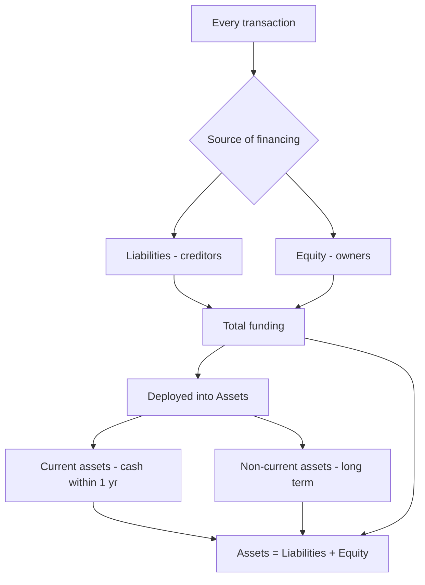
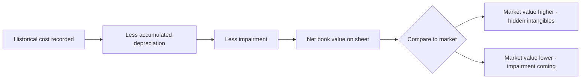
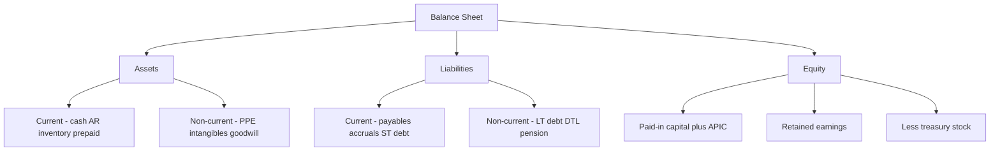

# The Balance Sheet in Depth

## The Problem / Why this matters

You are three minutes into an equity research interview and the analyst leans back and says: *"Walk me through the balance sheet, top to bottom. Then tell me — if I told you a company was carrying receivables that were growing twice as fast as revenue, what would you conclude?"*

This is not a trivia question. It is a test of whether you understand that the balance sheet is not a list of numbers — it is a **snapshot of a business's financial position at a single instant**, and every line on it is a claim, a resource, or a residual that tells a story about how the company finances itself, how efficiently it operates, and how much risk sits inside it.

The income statement tells you what happened *over* a period. The cash flow statement tells you where the cash *moved*. But the balance sheet tells you what the company *is* — right now, frozen in time. Credit analysts live on it (can this company pay me back?). Equity analysts reverse-engineer it (is book value real, or is it stuffed with goodwill that will be written off?). FP&A teams forecast it (how much working capital will we tie up if we grow 20%?). Restructuring bankers dismantle it (what is this worth in liquidation?).

If you cannot read a balance sheet line by line and say what each line *means* — not just what it *is* — you cannot do any of these jobs. This chapter builds that fluency from first principles.

## Core Idea

The balance sheet rests on one identity that never breaks:

$$\text{Assets} = \text{Liabilities} + \text{Shareholders' Equity}$$

Everything the company controls (assets) was financed by someone: either by lenders and suppliers (liabilities) or by owners (equity). That is the whole logic. **Assets are what you own and use; liabilities and equity are how you paid for them.** The two sides are equal by construction because every resource has a source.

Read one way, the right side answers *"where did the money come from?"* Read the other way, the left side answers *"where did the money go?"* The balance sheet is a financing story and an investing story printed on the same page.

Three structural ideas organize the entire statement:

1. **Time horizon (current vs non-current):** Will this asset turn into cash — or this liability come due — within one year (or the operating cycle if longer)? That single question splits both sides of the sheet in two.
2. **Ordering:** Assets are typically listed most-liquid-first (US GAAP) or least-liquid-first (IFRS convention), and liabilities in order of when they come due.
3. **Book value vs market value:** The balance sheet records most assets at **historical cost** (adjusted for depreciation and impairment), not what they are worth today. This gap is the single most important thing an analyst must internalize.

## Why it works this way

**Why must it balance?** Because of double-entry bookkeeping, which itself flows from a deeper truth: nothing appears from nowhere. If a company buys a $10m machine, either cash goes down by $10m (an asset swap — total assets unchanged) or a $10m loan appears (assets and liabilities both rise by $10m). There is no transaction that increases assets without an equal-and-opposite entry somewhere. The accounting equation is not a rule accountants invented; it is arithmetic bookkeeping of the fact that resources must be financed.

**Why current vs non-current?** Because the central question a lender or analyst asks is *"can this company meet its obligations?"* Liquidity is about timing. A company can be hugely profitable and still die if it cannot pay next month's payroll. Splitting the sheet by one-year horizon lets you instantly compute whether short-term resources cover short-term claims (that is the current ratio, and its logic is entirely about matching timing).

**Why historical cost?** Because it is **objective and verifiable**. What you paid is a fact backed by an invoice; what an asset is "worth today" is an opinion that management could manipulate. Accounting trades relevance for reliability. The cost is that the balance sheet systematically understates the value of good assets (a brand built over decades, land bought in 1970) and can overstate bad ones until an impairment forces recognition. Every good analyst adjusts for this.

**Why equity is a residual.** Equity is not cash in a vault. It is *defined* as Assets minus Liabilities — whatever is left for owners after every creditor is satisfied. That is why it is called the residual claim and why equity holders are last in line in bankruptcy but capture all the upside above the debt.



## Full technical content

### 1. The two organizing axes

Every line item is classified along two dimensions:

| Dimension | Split | Governing question |
|---|---|---|
| Nature | Asset / Liability / Equity | Is it a resource, an obligation, or a residual claim? |
| Time | Current / Non-current | Does it convert to cash or come due within 12 months (or the operating cycle)? |

**Current asset** — expected to be realized in cash, sold, or consumed within one year or one operating cycle, whichever is longer (IAS 1 §66; ASC 210-10). Examples: cash, marketable securities, receivables, inventory, prepaid expenses.

**Non-current asset** — everything else: PP&E, intangibles, goodwill, long-term investments, deferred tax assets.

**Current liability** — expected to be settled within one year or the operating cycle (IAS 1 §69). Examples: accounts payable, accrued expenses, short-term debt, current portion of long-term debt, deferred revenue due within a year.

**Non-current liability** — long-term debt, lease liabilities, deferred tax liabilities, pension obligations.

The **operating cycle** is the time from buying inventory to collecting cash from selling it (Days Inventory + Days Receivable). For a whisky distiller or a shipbuilder it can exceed a year, and inventory maturing over that longer cycle is still *current*.

### 2. Ordering conventions (GAAP vs IFRS)

| Convention | US GAAP | IFRS |
|---|---|---|
| Asset ordering | Most liquid first (cash → receivables → inventory → PP&E → intangibles) | Often least liquid first (non-current on top, then current), though presentation is flexible |
| Liability ordering | Current before non-current, most current first | Frequently non-current first, mirroring assets |
| Current/non-current split | Required (ASC 210) | Required unless a liquidity presentation is more relevant (IAS 1 §60) |
| Format | Report form (vertical) most common | Both report and account form seen |

Do not over-index on ordering; both frameworks require the current/non-current distinction and both produce the same identity. The direction of the list is cosmetic.

### 3. Line-by-line: what each item is and what it tells an analyst

#### Assets

**Cash and cash equivalents.** Physical cash, bank balances, and highly liquid investments with original maturity ≤ 3 months (T-bills, commercial paper, money-market funds). *What it tells you:* the buffer. But watch for **trapped cash** (held overseas, subject to repatriation tax) and cash that is really a hostage to a minimum operating balance. A cash pile can signal safety or signal that management has no better use for capital.

**Short-term / marketable securities.** Investments held for near-term liquidity. Under ASC 320 / IFRS 9, classified as trading, available-for-sale (AFS), or held-to-maturity (HTM). Trading and AFS are carried at **fair value**; HTM at amortized cost. *Analyst note:* HTM lets a company hide unrealized losses at amortized cost — this is exactly what sank Silicon Valley Bank in 2023, where the fair value of the HTM book was far below carrying value.

**Accounts receivable (trade receivables).** Money owed by customers for goods/services already delivered. Carried at **net realizable value** = gross receivables minus the **allowance for doubtful accounts** (a contra-asset). *What it tells you:* the quality of revenue and collection discipline. **Days Sales Outstanding (DSO) = AR / Revenue × 365.** Rising DSO or receivables growing faster than sales is a classic red flag — either the company is stuffing the channel, extending credit to weak customers to book revenue, or struggling to collect. This is the exact scenario in the opening question.

**Inventory.** Goods held for sale plus raw materials and work-in-progress. Carried at **lower of cost and net realizable value** (IAS 2) or lower of cost or market (US GAAP, ASC 330). Cost flow assumptions: **FIFO, weighted-average, and (US GAAP only) LIFO**. IFRS *prohibits LIFO*. *What it tells you:* demand health and obsolescence risk. **Days Inventory Outstanding (DIO) = Inventory / COGS × 365.** Bloated inventory relative to sales foreshadows write-downs and margin pressure.

**Prepaid expenses.** Cash already paid for future benefits (insurance, rent, software licenses). A current asset because the benefit is consumed within a year. Small but a signal of timing.

**Property, plant & equipment (PP&E).** Land, buildings, machinery, vehicles, fixtures. Recorded at historical cost, then **depreciated** over useful life (except land, which is not depreciated). Carried at **net book value = gross cost − accumulated depreciation** (accumulated depreciation is a contra-asset). Under IFRS (IAS 16) a company may elect the **revaluation model** and carry PP&E at fair value; US GAAP requires the **cost model** only. *What it tells you:* capital intensity. Compare **gross PP&E to net PP&E** — if net is a small fraction of gross, the asset base is old and a capex wave is coming.

**Intangible assets.** Non-physical identifiable assets: patents, licenses, trademarks, customer lists, developed technology, capitalized software. Finite-life intangibles are **amortized**; indefinite-life intangibles (some brands) are **not amortized but tested for impairment annually**. *Critical:* internally generated brands and most internally generated intangibles are **not** capitalized under US GAAP — so a company like Coca-Cola carries almost nothing for its brand. IFRS (IAS 38) allows capitalizing *development* costs (not research) if strict criteria are met; US GAAP generally expenses R&D immediately (ASC 730).

**Goodwill.** Arises **only in an acquisition** = purchase price − fair value of identifiable net assets acquired. It is the premium paid for synergies, brand, workforce, market position — things not separately recognizable. **Goodwill is never amortized** under US GAAP (ASC 350) or IFRS; it is **tested for impairment** at least annually. *What it tells you:* how much a company overpaid for acquisitions. A big goodwill impairment is an admission that a deal destroyed value.

**Long-term investments.** Equity stakes in other companies. Accounting depends on influence: **< 20%** (fair value / cost), **20–50%** (equity method — carry at cost plus share of investee profits), **> 50%** (consolidate). 

**Deferred tax assets (DTA).** Future tax savings from deductible temporary differences or carried-forward losses. Reduced by a **valuation allowance** (a contra) if realization is unlikely.

#### Liabilities

**Accounts payable.** Money owed to suppliers for goods/services received but not yet paid. Interest-free short-term financing. **Days Payable Outstanding (DPO) = AP / COGS × 365.** *What it tells you:* bargaining power and, if stretched too far, distress (delaying supplier payments to preserve cash).

**Accrued expenses / accrued liabilities.** Expenses incurred but not yet paid or invoiced (wages, interest, utilities, bonuses). The matching principle forces recognition even before cash leaves.

**Deferred revenue (unearned revenue).** Cash **received in advance** of delivering the good/service — a magazine subscription, a SaaS annual prepayment. It is a **liability** because the company owes a future performance, not cash. *This is a favorite interview topic:* deferred revenue is arguably the best kind of liability — customers funding your operations interest-free, and rising deferred revenue signals strong forward demand.

**Short-term debt & current portion of long-term debt (CPLTD).** Borrowings due within 12 months, plus the slice of long-term loans amortizing this year. Critical for liquidity analysis.

**Long-term debt.** Bonds, term loans, notes due beyond one year. Carried at **amortized cost** using the effective interest method; issued at a discount/premium that unwinds over time. *What it tells you:* leverage and solvency. Analysts compute **Net Debt = Total Debt − Cash** and ratios like Debt/EBITDA and interest coverage (EBIT/Interest).

**Lease liabilities.** Since **IFRS 16 / ASC 842**, nearly all leases sit on the balance sheet: a **right-of-use asset** on the left and a **lease liability** on the right. This ended the old "operating leases are off-balance-sheet" era. *Analyst note:* this inflated reported assets and liabilities for retailers and airlines overnight in 2019 — you must know it.

**Deferred tax liabilities (DTL).** Taxes owed in the future from taxable temporary differences (commonly, tax depreciation faster than book depreciation).

**Pension and post-retirement obligations.** The present value of promised benefits, net of plan assets. A large **underfunded** pension is effectively debt.

#### Equity

**Common stock / share capital & additional paid-in capital (APIC).** The cash raised from issuing shares. Par value goes to "common stock"; the excess over par goes to **APIC**. Par value is a legal artifact with almost no economic meaning.

**Retained earnings.** Cumulative net income since inception **minus cumulative dividends**. This is the link to the income statement: each period's net income flows here (less dividends). *What it tells you:* how much profit the company has reinvested rather than paid out. Negative retained earnings ("accumulated deficit") means cumulative losses.

**Treasury stock.** Shares the company has **bought back** and holds. It is a **contra-equity** account (negative), reducing total equity. Buybacks return cash to shareholders and shrink the share count.

**Accumulated other comprehensive income (AOCI).** A bucket for gains/losses that bypass the income statement: unrealized gains on AFS securities, foreign-currency translation, certain pension adjustments, cash-flow hedges.

**Non-controlling interest (minority interest).** When a parent consolidates a < 100%-owned subsidiary, it reports 100% of the sub's assets and liabilities but must recognize the portion of equity owned by outside shareholders. Sits within total equity.

### 4. Contra accounts — the crucial mechanism

A **contra account** carries a balance *opposite* to the account it offsets, so the original gross figure is preserved while a net figure is presented. This is how the balance sheet shows both "what we paid" and "what it is worth now."

| Contra account | Offsets | Normal balance | Net presentation |
|---|---|---|---|
| Allowance for doubtful accounts | Accounts receivable | Credit | Net receivables |
| Accumulated depreciation | PP&E (gross) | Credit | Net PP&E / carrying amount |
| Accumulated amortization | Intangible assets | Credit | Net intangibles |
| Valuation allowance | Deferred tax asset | Credit | Realizable DTA |
| Treasury stock | Shareholders' equity | Debit | Reduced total equity |
| Discount on bonds payable | Bonds payable | Debit | Carrying value of debt |

Why not just write the asset down directly? Because the gross number carries information. Seeing gross PP&E of $500m against accumulated depreciation of $400m tells you the fleet is 80% depreciated — old, and near a replacement cycle. If the books only showed net PP&E of $100m you would lose that signal.

### 5. Book value vs market value

- **Book value of equity** = Total assets − Total liabilities = the equity section total. It is an accounting number, largely historical-cost based.
- **Market value of equity** = market cap = share price × shares outstanding. It is the market's forward-looking view.
- **Price-to-Book (P/B)** = Market cap / Book value. Banks (asset-heavy, marked closer to fair value) trade near 1×; asset-light tech firms trade at many multiples because their most valuable assets (brand, IP, network) are **not on the balance sheet**.

Book value can diverge wildly from economic value because of historical cost, unrecognized internally-generated intangibles, and off/on-balance-sheet quirks. Reconciling the two is the heart of value investing and of every "is this stock cheap?" question.



### 6. Journal-entry formats for the key balance-sheet events

**Recording a credit sale and the doubtful-debt allowance**

```
Dr  Accounts receivable            1,000
    Cr  Revenue                            1,000
(to record credit sale)

Dr  Bad debt expense                  40
    Cr  Allowance for doubtful accounts      40
(to provide for estimated uncollectibles)
```

**Purchasing PP&E on credit and depreciating it**

```
Dr  Property, plant & equipment    10,000
    Cr  Accounts payable / Cash            10,000

Dr  Depreciation expense           2,000
    Cr  Accumulated depreciation           2,000
(annual straight-line, 5-yr life)
```

**Receiving cash in advance (deferred revenue) and later earning it**

```
Dr  Cash                           12,000
    Cr  Deferred revenue                   12,000
(annual subscription received up front)

Dr  Deferred revenue                1,000
    Cr  Revenue                             1,000
(one month earned, 12,000 / 12)
```

**Issuing shares above par**

```
Dr  Cash                          100,000
    Cr  Common stock (par)                  1,000
    Cr  Additional paid-in capital          99,000
(1,000 shares, $1 par, issued at $100)
```

**Buying back stock (treasury)**

```
Dr  Treasury stock                 50,000
    Cr  Cash                                50,000
(contra-equity; reduces total equity)
```

**Issuing long-term debt at a discount**

```
Dr  Cash                           95,000
Dr  Discount on bonds payable       5,000
    Cr  Bonds payable                     100,000
(face 100,000 issued at 95)
```

## Worked examples

### Worked Example 1 — Building a balance sheet from transactions (and proving it balances)

A startup, Meridian Tools Inc., completes these transactions in its first month. Build the balance sheet.

1. Founders invest $200,000 cash for common stock ($1 par, 200,000 shares issued at $1 — all par, no APIC).
2. Borrow $100,000 on a 3-year term loan (non-current debt).
3. Buy equipment for $120,000 cash.
4. Buy $60,000 of inventory on credit (accounts payable).
5. Sell inventory that cost $40,000 for $70,000, on credit (accounts receivable).
6. Record one month's depreciation: equipment life 5 years, straight-line → $120,000 / 5 / 12 = $2,000.
7. Provide an allowance for doubtful accounts of 5% of receivables: 5% × $70,000 = $3,500.

**Step 1 — track each account.**

| Account | Change | Running balance |
|---|---|---|
| Cash | +200,000 +100,000 −120,000 | 180,000 |
| Accounts receivable | +70,000 | 70,000 |
| Allowance for doubtful accts (contra) | −3,500 | (3,500) |
| Inventory | +60,000 −40,000 | 20,000 |
| Equipment (gross) | +120,000 | 120,000 |
| Accumulated depreciation (contra) | −2,000 | (2,000) |
| Accounts payable | +60,000 | 60,000 |
| Term loan (non-current) | +100,000 | 100,000 |
| Common stock | +200,000 | 200,000 |
| Retained earnings | see below | 24,500 |

**Step 2 — compute retained earnings via the income statement.**

| Income statement | $ |
|---|---|
| Revenue | 70,000 |
| Cost of goods sold | (40,000) |
| Depreciation expense | (2,000) |
| Bad debt expense | (3,500) |
| **Net income** | **24,500** |

No dividends → retained earnings = $24,500.

**Step 3 — assemble the balance sheet.**

| Assets | $ | Liabilities & Equity | $ |
|---|---|---|---|
| Cash | 180,000 | Accounts payable | 60,000 |
| Accounts receivable (net) | 66,500 | **Total current liabilities** | **60,000** |
| Inventory | 20,000 | Term loan (non-current) | 100,000 |
| **Total current assets** | **266,500** | **Total liabilities** | **160,000** |
| Equipment, net | 118,000 | Common stock | 200,000 |
| | | Retained earnings | 24,500 |
| **Total non-current assets** | **118,000** | **Total equity** | **224,500** |
| **Total assets** | **384,500** | **Total L & E** | **384,500** |

AR net = 70,000 − 3,500 = 66,500. Equipment net = 120,000 − 2,000 = 118,000. **Assets 384,500 = Liabilities 160,000 + Equity 224,500.** It balances. ✔

Notice how equity of 224,500 = founders' 200,000 + 24,500 earned. Every dollar of profit lands in retained earnings; the sheet ties to the income statement.

### Worked Example 2 — Reading the story: what the lines tell an analyst

Two competitors, both with $500m revenue and $300m COGS. Extracts:

| Item | Company A | Company B |
|---|---|---|
| Accounts receivable | 68,500,000 | 137,000,000 |
| Inventory | 41,000,000 | 90,000,000 |
| Accounts payable | 49,300,000 | 24,700,000 |

**Step 1 — compute the working-capital days.**

DSO = AR / Revenue × 365.
- A: 68.5 / 500 × 365 = **50.0 days**
- B: 137 / 500 × 365 = **100.0 days**

DIO = Inventory / COGS × 365.
- A: 41 / 300 × 365 = **49.9 days**
- B: 90 / 300 × 365 = **109.5 days**

DPO = AP / COGS × 365.
- A: 49.3 / 300 × 365 = **59.9 days**
- B: 24.7 / 300 × 365 = **30.0 days**

**Step 2 — cash conversion cycle (CCC = DSO + DIO − DPO).**
- A: 50.0 + 49.9 − 59.9 = **40.0 days**
- B: 100.0 + 109.5 − 30.0 = **179.5 days**

**Step 3 — interpret.** Company A collects in 50 days, turns inventory in 50 days, and pays suppliers in 60 days — it finances its inventory almost entirely with supplier credit and has a tight 40-day cash cycle. Company B takes 100 days to collect (weak customers or channel-stuffing), holds inventory 110 days (obsolescence risk), and pays suppliers fast (weak bargaining power) — a 180-day cycle. Company B ties up **roughly 4.5× more days of working capital**. For the same revenue, B is bleeding cash into working capital and is far more fragile if sales slow. On the balance sheet alone, A is the higher-quality operator. This is precisely how a credit or ER analyst "reads" a balance sheet without a single word of MD&A.

### Worked Example 3 — Goodwill on an acquisition, and a later impairment

Acquirer buys Target for **$500m cash**. Target's book values and fair values:

| Target item | Book value | Fair value |
|---|---|---|
| Net working capital | 40,000,000 | 40,000,000 |
| PP&E | 120,000,000 | 160,000,000 |
| Identifiable intangibles (patents) | 0 | 60,000,000 |
| Debt assumed | (50,000,000) | (50,000,000) |

**Step 1 — fair value of identifiable net assets.**
40 + 160 + 60 − 50 = **$210m.**

**Step 2 — goodwill = purchase price − FV of identifiable net assets.**
500 − 210 = **$290m goodwill.**

**Purchase accounting entry (simplified):**
```
Dr  Net working capital        40,000,000
Dr  PP&E                       160,000,000
Dr  Identifiable intangibles    60,000,000
Dr  Goodwill                   290,000,000
    Cr  Debt assumed                     50,000,000
    Cr  Cash                            500,000,000
```
Debits 550,000,000 = Credits 550,000,000. ✔ (Note the assets recorded net of assumed debt equal the $500m paid.)

**Step 3 — two years later, the acquired business underperforms.** Its recoverable amount is now assessed at $150m against a carrying amount (of that reporting unit's goodwill-bearing assets) of $230m. The company records a **goodwill impairment of $80m**:

```
Dr  Goodwill impairment loss    80,000,000
    Cr  Goodwill                          80,000,000
```

Effects: goodwill falls from 290 to 210; the $80m loss hits the income statement, cutting net income and therefore retained earnings by $80m (pre-tax; goodwill impairments are often non-deductible). Total assets and total equity both drop $80m — the identity holds. **Interview payoff:** an impairment is a **non-cash** charge, so it reduces net income and equity but *does not* touch cash flow from operations (it is added back on the cash flow statement). That single sentence signals you understand the three-statement linkage.

## How it is tested in interviews

**Q: "Walk me through the balance sheet."**
Model answer: *"The balance sheet is a snapshot at a point in time of what a company owns and how it financed it. It follows Assets = Liabilities + Equity. Assets are split into current — cash, receivables, inventory, prepaids, things that convert to cash within a year — and non-current — PP&E, intangibles, goodwill, long-term investments. Liabilities split the same way: current, like payables, accrued expenses, and short-term debt, and non-current, like long-term debt and deferred taxes. Equity is the residual: paid-in capital plus retained earnings, less treasury stock. It always balances because every asset was funded either by a creditor or by an owner."* Crisp, structured, and it name-checks the identity.

**Q: "A company buys a $100 piece of equipment with cash. Walk me through the three statements."**
Model answer: *"Income statement: no immediate impact — capex is not an expense; only the depreciation is, over time. Cash flow: cash from investing falls $100, so ending cash falls $100. Balance sheet: cash down $100, PP&E up $100 — assets net unchanged, and it still balances. In year one, if it's depreciated straight-line over 5 years, that's $20 of depreciation: net income down $20, but add it back on the cash flow statement so operating cash rises $20; PP&E net falls $20 via accumulated depreciation and retained earnings falls by the after-tax $20 — with taxes, cash actually improves by the depreciation tax shield."* Know the no-tax version cold, then layer tax.

**Q: "What's the difference between book value and market value, and why do they differ?"**
Model answer: *"Book value is assets minus liabilities — an accounting, mostly historical-cost number. Market value is what investors will pay today. They differ because the balance sheet records assets at cost less depreciation, ignores internally-generated intangibles like brand and R&D, and is backward-looking, while the market prices future cash flows. That's why Coca-Cola or a software firm trades at many times book — their biggest assets aren't on the sheet — while a distressed industrial can trade below book if the market expects impairments."*

**Q: "If receivables grow faster than revenue, what does that tell you?"**
Model answer: *"DSO is rising — the company is collecting more slowly. It could mean weaker customers, more generous credit terms to pull sales forward, or outright channel-stuffing to hit revenue targets. Either way it's a cash-flow drag and a quality-of-earnings red flag: revenue is being booked but not converting to cash. I'd check the allowance for doubtful accounts and the cash flow statement — if operating cash is lagging net income, that confirms it."*

**Q: "Is deferred revenue good or bad?"**
Model answer: *"It's a liability, but it's a *good* liability. It's cash customers paid up front for goods or services we haven't delivered yet — interest-free financing from customers, and growing deferred revenue is a leading indicator of future revenue and demand. For a SaaS business, rising deferred revenue is one of the healthiest signals on the sheet."*

**Q: "Where does goodwill come from, and can it ever go up?"**
Model answer: *"Goodwill only arises from an acquisition — it's the premium paid over the fair value of identifiable net assets. It's never amortized, only tested for impairment annually. It can only go *down* through impairment; it never rises after the deal, because you can't create goodwill internally. A big impairment is management admitting they overpaid."*

**Q: "Company writes down inventory by $10. Walk me through it."**
Model answer: *"Inventory falls $10 on the balance sheet. The write-down is an expense — it hits the income statement, so pre-tax income falls $10; at a 25% tax rate net income falls $7.50. On cash flow, net income is down $7.50 but the write-down is non-cash, so add back $10 — operating cash actually rises by the $2.50 tax saving. Equity falls $7.50 via retained earnings; assets fall $7.50 net (inventory −$10, cash +$2.50). It balances."*

**Q: "What is a contra account? Give examples."**
Model answer: *"An account that offsets another and carries the opposite balance, so the gross figure is preserved and a net figure presented. Accumulated depreciation against PP&E, allowance for doubtful accounts against receivables, treasury stock against equity. It keeps information — gross PP&E versus accumulated depreciation tells you how old the asset base is."*

**Q: "How did IFRS 16 / ASC 842 change the balance sheet?"**
Model answer: *"Operating leases used to be off-balance-sheet — just footnote disclosure and rent expense. Now nearly all leases are capitalized: a right-of-use asset on the left and a lease liability on the right. It grossed up assets and liabilities for lease-heavy businesses like retailers and airlines and made leverage more comparable across companies."*

## Traps & common mistakes

- **Confusing profit with cash / equity with cash.** Retained earnings and equity are *not* a pile of cash. A company can have huge retained earnings and no cash (it reinvested everything in PP&E and inventory).
- **Thinking the balance sheet shows market value.** It is mostly historical cost. Land bought in 1970 sits at 1970 prices; a brand built organically is worth zero on the sheet.
- **Forgetting the current portion of long-term debt.** A chunk of "long-term" debt is due this year and must be reclassified as current — miss it and you overstate liquidity.
- **Treating deferred revenue as revenue.** It is a liability, not income. Revenue is recognized only as the obligation is fulfilled.
- **Netting contra accounts away in your head.** Always ask for gross PP&E and accumulated depreciation separately — the ratio is a signal you lose if you only see net.
- **Assuming goodwill can grow or reverse.** It only arises in a deal and can only fall via impairment; impairments cannot be reversed under US GAAP (IFRS allows reversal for *other* assets, but never for goodwill).
- **Ignoring off-balance-sheet items.** Operating leases (pre-2019), unconsolidated JVs, pension underfunding, and contingent liabilities can hide real obligations. Post-842 leases are on-sheet, but read the footnotes.
- **Double-counting in the accounting equation.** Equity already equals assets minus liabilities; don't add it to assets.
- **Mixing up DSO/DPO direction.** Rising DSO is bad (collecting slower); rising DPO can be good (financing from suppliers) *until* it signals distress.
- **Forgetting LIFO is US-GAAP only.** Under IFRS it is banned — a common comparability trap in cross-border analysis.

## First-principles recap

- The balance sheet is a **snapshot at an instant**: what a company owns and how it financed it, governed by **Assets = Liabilities + Equity**, which balances because every resource has a source.
- The **current vs non-current** split exists to answer the timing/liquidity question: can short-term resources cover short-term claims?
- Most assets are at **historical cost less depreciation/impairment** — objective but backward-looking — which is why **book value diverges from market value**, especially where internally-generated intangibles live.
- **Equity is a residual claim**, not cash; **retained earnings** is the cumulative link to the income statement (net income less dividends).
- **Contra accounts** (accumulated depreciation, allowance for doubtful accounts, treasury stock) preserve the gross figure while showing a net — and the gross carries analytical signal.
- Each line **tells a story**: receivables and DSO reveal collection quality, inventory and DIO reveal demand and obsolescence, payables and DPO reveal bargaining power, debt reveals solvency, goodwill reveals acquisition discipline.
- **Non-cash charges** (impairments, write-downs, depreciation) reduce equity and net income but are added back on the cash flow statement — the linchpin of three-statement fluency.

## Quick-reference

| Concept | Formula / rule |
|---|---|
| Accounting identity | Assets = Liabilities + Shareholders' Equity |
| Book value of equity | Total assets − Total liabilities |
| Net receivables | Gross AR − Allowance for doubtful accounts |
| Net PP&E | Gross PP&E − Accumulated depreciation |
| Goodwill | Purchase price − FV of identifiable net assets acquired |
| Working capital | Current assets − Current liabilities |
| Current ratio | Current assets / Current liabilities |
| Quick ratio | (Current assets − Inventory) / Current liabilities |
| DSO | AR / Revenue × 365 |
| DIO | Inventory / COGS × 365 |
| DPO | AP / COGS × 365 |
| Cash conversion cycle | DSO + DIO − DPO |
| Net debt | Total debt − Cash & equivalents |
| Price-to-book | Market cap / Book value of equity |
| Inventory carrying value | Lower of cost and net realizable value |
| Debt carrying value | Amortized cost (effective interest method) |

| Contra account | Offsets | Balance |
|---|---|---|
| Allowance for doubtful accounts | Accounts receivable | Credit |
| Accumulated depreciation | PP&E | Credit |
| Accumulated amortization | Intangibles | Credit |
| Valuation allowance | Deferred tax asset | Credit |
| Discount on bonds payable | Bonds payable | Debit |
| Treasury stock | Equity | Debit |

| Standard | Governs |
|---|---|
| IAS 1 / ASC 210 | Balance sheet presentation, current/non-current |
| IAS 2 / ASC 330 | Inventory (LIFO banned under IFRS) |
| IAS 16 / ASC 360 | PP&E (IFRS allows revaluation model) |
| IAS 38 / ASC 350, 730 | Intangibles, R&D (IFRS capitalizes development) |
| ASC 350 / IAS 36 | Goodwill impairment (no amortization) |
| IFRS 16 / ASC 842 | Leases on balance sheet |
| IFRS 9 / ASC 320 | Financial instruments classification |

