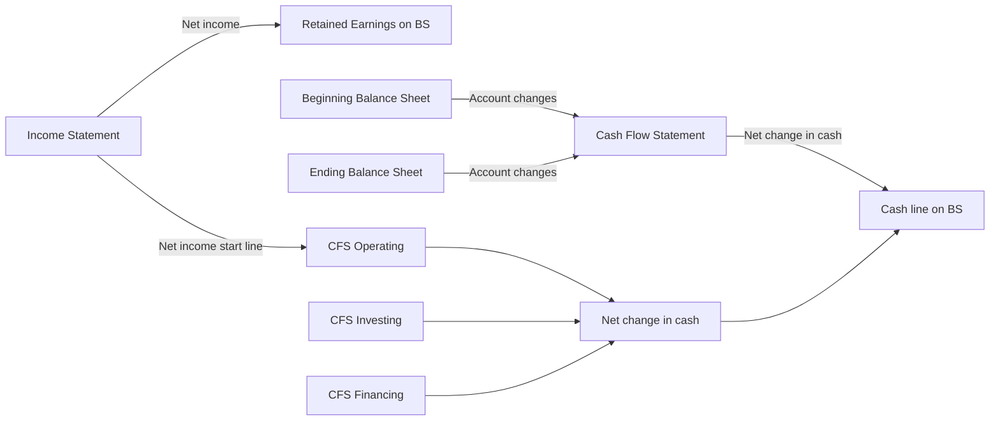
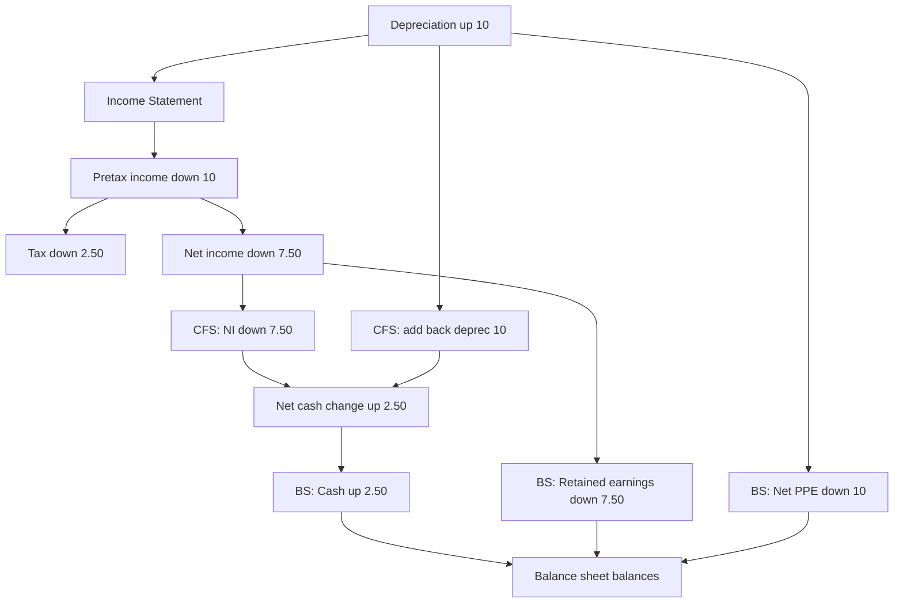
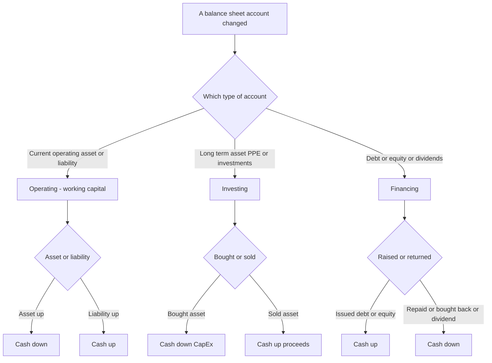

# The Cash Flow Statement & Linking the Three Statements

## The Problem / Why this matters

Here is a situation that ends careers and destroys companies with monotonous regularity: a business reports rising profits every quarter, the CEO tells analysts how strong the year has been, the income statement glows green — and then the company cannot make payroll and files for bankruptcy. This is not a paradox. It is the single most important fact in all of financial analysis: **profit is not cash.**

A company can be wildly profitable on paper and simultaneously bleeding cash. It can book a $100m sale, recognize the full $100m of revenue and its associated profit today, and receive not a single dollar of actual money for another twelve months — or never, if the customer defaults. Meanwhile it has to pay its own suppliers, its workers, its landlord, and its lenders in *real cash, now*. The income statement, governed by accrual accounting, tells you whether the business *earned* money. It is silent on whether the business *has* money. Those are different questions, and the gap between them is exactly where fraud hides, where liquidity crises are born, and where the sharpest interview questions live.

The cash flow statement exists to close that gap. It takes the accrual-based income statement and the two balance sheets (beginning and ending) and reconstructs, line by line, what actually happened to the cash. If you can build a cash flow statement from an income statement and a pair of balance sheets, you understand accounting. If you cannot, you do not — and every good interviewer knows this, which is why "walk me through how the three statements connect" and "walk me through what a $10 increase in depreciation does to all three statements" are the two most-asked technical questions in the history of finance recruiting. This chapter is built to make you unbreakable on both.

## Core Idea

The core idea has two halves.

**Half one — the cash flow statement translates accrual profit into cash reality.** It starts (in the indirect method) from net income and then systematically undoes every accounting entry that affected profit but *not* cash, and adds in every cash movement that never touched the income statement. Depreciation reduced profit but moved no cash, so add it back. A sale on credit raised revenue but brought no cash, so subtract the receivable increase. Buying a machine moved cash but hit no expense line, so it appears in investing. Borrowing money brought cash with no revenue, so it appears in financing. When you finish, the number at the bottom — the net change in cash — must exactly equal the change in the cash line on the balance sheet. That reconciliation is the proof you did it right.

**Half two — the three statements are one interlocking system, not three separate documents.** The income statement flows into the balance sheet (net income increases retained earnings) and into the cash flow statement (net income is the starting line of CFO). The cash flow statement's bottom line updates the balance sheet's cash. The balance sheet's *changes* between two periods are what populate the cash flow statement's operating and investing and financing sections. Pull one thread and the whole tapestry moves. Master the linkages and you can rebuild any one statement from the other two.



## Why it works this way

To understand the cash flow statement from first principles, start with a truth so simple it feels trivial: **every dollar of cash that enters or leaves a company has a reason, and that reason leaves a fingerprint somewhere on the income statement or the balance sheet.** There is no such thing as cash that appears from nowhere. So if you take every change in every balance sheet account and correctly assign it to a cash inflow or outflow, you will have reconstructed the entire cash story. The cash flow statement is nothing more than a disciplined walk through the balance sheet changes.

Why does this work mathematically? Because of the accounting equation and its stability over time. At any instant:

**Assets = Liabilities + Equity**

Split assets into Cash and Non-cash assets:

**Cash + Non-cash assets = Liabilities + Equity**

Rearrange to isolate cash:

**Cash = Liabilities + Equity − Non-cash assets**

Now take the *change* in each term over a period (denote change by Δ):

**ΔCash = ΔLiabilities + ΔEquity − ΔNon-cash assets**

This identity is the entire theoretical foundation of the cash flow statement. It says the change in cash is completely determined by the changes in every *other* account. If liabilities go up (you borrowed, or you delayed paying a supplier), cash goes up. If equity goes up (you issued stock, or you earned profit), cash goes up. If non-cash assets go up (you bought inventory, extended credit to customers, or purchased a machine), cash goes *down*. Every line of the cash flow statement is just one of these ΔLiabilities, ΔEquity, or ΔNon-cash-asset terms, sorted into three buckets — operating, investing, financing — according to *why* the change happened.

That is why the statement always ties out. It is not an accident of good bookkeeping; it is an algebraic certainty. If your cash flow statement does not tie to the change in the balance sheet cash line, you have mis-signed or omitted one of these delta terms. The identity guarantees a correct answer exists.

The reason we *add back depreciation* falls straight out of this too. Depreciation reduced equity (via net income → retained earnings) and reduced a non-cash asset (accumulated depreciation lowers net PP&E). In the identity, ΔEquity fell and ΔNon-cash-assets fell by the same amount — they cancel. So depreciation has *zero* net effect on cash, and the cash flow statement must neutralize it: subtract it once (embedded in net income) and add it back once. It nets to nothing, exactly as the identity demands.

## Full technical content

### The three sections

Both IFRS (**IAS 7, *Statement of Cash Flows***) and US GAAP (**ASC 230, *Statement of Cash Flows***) require the statement to be split into three activities. The definitions are conceptually identical across the two frameworks; the differences are in a handful of classification choices (covered below).

| Section | What it captures | Typical line items |
|---|---|---|
| **Operating (CFO)** | Cash generated by the core, day-to-day business — producing and selling goods/services. The cash version of the income statement's operating activities. | Net income (indirect start), depreciation & amortization, stock-based comp, deferred taxes, working-capital changes (AR, inventory, AP, accruals) |
| **Investing (CFI)** | Cash spent acquiring or received disposing of long-term assets and investments. Building the business's future capacity. | Capital expenditures (CapEx), proceeds from asset sales, acquisitions, purchases/sales of securities |
| **Financing (CFF)** | Cash exchanged with the providers of capital — lenders and shareholders. | Debt issued/repaid, equity issued/repurchased, dividends paid |

The three sub-totals sum to the **net change in cash**, which is added to **beginning cash** to arrive at **ending cash** — the figure that must match the balance sheet's cash line.

```
Beginning cash
  + Cash flow from operating activities (CFO)
  + Cash flow from investing activities (CFI)
  + Cash flow from financing activities (CFF)
  = Ending cash  (must equal the BS cash line)
```

### Direct vs indirect method (this affects the operating section only)

The investing and financing sections are identical under both methods. Only the *operating* section differs in presentation.

**Indirect method** — starts from net income and adjusts it back to cash. This is what >95% of public companies use, and it is what you build in interviews, because it is the method that visibly demonstrates the linkage between the income statement and the balance sheet.

**Direct method** — lists actual operating cash flows by category (cash collected from customers, cash paid to suppliers, cash paid to employees, cash paid for interest and taxes). More intuitive to a layperson, but companies avoid it because it requires disclosing information they'd rather not, and because even firms that present the direct method must *also* provide an indirect reconciliation — so it's double work. IAS 7 and ASC 230 both *permit* either and *encourage* the direct method, but the market has voted overwhelmingly for indirect.

The two methods always produce the **identical CFO total** — they are two routes to the same number.

#### Indirect method template

| Cash flow from operating activities | Sign logic |
|---|---|
| Net income | Start |
| **+** Depreciation & amortization | Add back non-cash expense |
| **+** Stock-based compensation | Add back non-cash expense |
| **+** Losses / **−** Gains on asset sales | Reverse non-operating items (belong in CFI) |
| **+/−** Deferred income taxes | Add back non-cash portion of tax expense |
| **−** Increase / **+** decrease in accounts receivable | Asset up = cash used |
| **−** Increase / **+** decrease in inventory | Asset up = cash used |
| **−** Increase / **+** decrease in prepaid expenses | Asset up = cash used |
| **+** Increase / **−** decrease in accounts payable | Liability up = cash source |
| **+** Increase / **−** decrease in accrued liabilities | Liability up = cash source |
| **+** Increase / **−** decrease in income taxes payable | Liability up = cash source |
| **= Cash flow from operating activities** | |

The master rule for working capital — memorize it and you never mis-sign again:

> **Non-cash asset UP → cash DOWN. Liability UP → cash UP.** (And the reverse for decreases.)

Intuition: an increase in receivables means you sold but didn't collect — cash is "trapped" in the asset. An increase in payables means you bought but didn't pay — you're holding onto cash that will leave later. Assets are uses of cash; liabilities are sources of cash.

#### Direct method template (operating section)

| Cash flow from operating activities (direct) |
|---|
| Cash received from customers |
| **−** Cash paid to suppliers |
| **−** Cash paid to employees and for operating expenses |
| **−** Cash paid for interest |
| **−** Cash paid for income taxes |
| **= Cash flow from operating activities** |

Conversion formulas (accrual figure → cash figure):

| Cash line | Formula |
|---|---|
| Cash received from customers | Revenue − Increase in AR (+ Decrease in AR) |
| Cash paid to suppliers | COGS + Increase in inventory − Increase in AP |
| Cash paid for operating expenses | Operating expense (ex-D&A) + Increase in prepaids − Increase in accrued liabilities |
| Cash paid for taxes | Tax expense − Increase in income taxes payable − Increase in deferred tax liability |
| Cash paid for interest | Interest expense − Increase in interest payable |

### IFRS vs US GAAP classification differences

This is a favorite of thorough interviewers and of the CFA/exam world. Under **US GAAP (ASC 230)** the classifications are rigid; under **IFRS (IAS 7)** the company has policy choices.

| Item | US GAAP (ASC 230) | IFRS (IAS 7) |
|---|---|---|
| Interest paid | Operating | Operating **or** Financing (policy choice) |
| Interest received | Operating | Operating **or** Investing |
| Dividends received | Operating | Operating **or** Investing |
| Dividends paid | Financing | Operating **or** Financing |
| Bank overdrafts | Financing (a liability) | May be included **in cash & equivalents** |
| Method encouraged | Either allowed | Either allowed; direct encouraged |

The practical takeaway for interviews: under US GAAP, **interest paid sits in CFO** (which is why heavily levered firms have depressed operating cash flow), whereas IFRS lets a company push interest into financing and thereby report a flattering CFO. Always check the policy note before comparing an IFRS firm's CFO to a GAAP firm's.

### The depreciation flow-through (the linchpin)

Depreciation is the single most important concept for understanding the linkage, because it touches all three statements at once, and interviewers use it as the standard stress test. Here is the complete anatomy of a **$10 increase in depreciation** (assume a 25% tax rate):



Walk it through in words:

- **Income statement:** depreciation +10 → pretax income −10 → tax (at 25%) −2.50 → **net income −7.50**.
- **Cash flow statement:** net income enters CFO at −7.50, but depreciation is non-cash so **add back the full +10**; net effect on CFO = **+2.50**. No investing or financing effect. So **cash rises by 2.50** — precisely the tax saved. Depreciation is a *tax shield*; the only real cash consequence of more depreciation is paying less tax.
- **Balance sheet:** Cash +2.50 (asset side). Net PP&E −10 (accumulated depreciation rose 10). Net change on asset side = 2.50 − 10 = **−7.50**. On the other side, retained earnings −7.50 (from lower net income). Both sides fall by 7.50 → **balance sheet balances.**

That is the whole trick, and it is the answer to the most-asked technical interview question in finance. The "gotcha" answer everyone remembers: *cash goes UP when depreciation goes up*, because the tax shield saves real money even though depreciation itself is non-cash.

### Working capital, in depth

Working capital = current operating assets − current operating liabilities (excluding cash and short-term debt). Its *change* is the cash engine of the operating section.

- **Growing receivables** = you are financing your customers; cash out.
- **Growing inventory** = cash tied up on the shelf; cash out.
- **Growing payables** = your suppliers are financing you; cash in.
- A business that grows revenue fast will usually see AR and inventory balloon, consuming cash even as profit rises — this is the classic "profitable but cash-starved growth company," and it explains why hyper-growth firms raise so much external capital.

The mirror image — a company with *negative* working capital that collects from customers before paying suppliers (think a subscription business or a supermarket) — actually *generates* cash as it grows. That negative-working-capital dynamic is a prized business quality and a common "why is this a great business" interview point.

### Debt and equity flows (financing)

Financing captures transactions with capital providers:

- **Debt issued** → cash in (financing inflow). **Debt repaid** → cash out.
- **Equity issued** → cash in. **Share buybacks** → cash out.
- **Dividends paid** → cash out (US GAAP always financing).

Note the linkage subtlety: only the **principal** movement of debt is a financing flow. The **interest** on that debt runs through the income statement and thus sits in CFO (under US GAAP). And dividends paid never touch the income statement at all — they are a distribution of already-taxed retained earnings, so they appear only in CFF and in the retained-earnings roll-forward: **Ending RE = Beginning RE + Net income − Dividends.**

### Free cash flow (the analyst's payoff metric)

The cash flow statement is the raw material for the metrics that actually value a company:

| Metric | Formula | Meaning |
|---|---|---|
| **Free cash flow to firm (FCFF)** | EBIT × (1 − tax) + D&A − CapEx − ΔNWC | Cash available to *all* capital providers (debt + equity), pre-financing |
| **Free cash flow to equity (FCFE)** | CFO − CapEx + Net borrowing | Cash available to equity holders after debt service |
| **Simple / levered FCF** | CFO − CapEx | The most-quoted "free cash flow"; what's left after maintaining the asset base |

Why analysts prefer cash flow to earnings: earnings can be managed with accounting choices (depreciation schedules, revenue timing, reserve releases); cash is far harder to fake. "Cash is a fact, profit is an opinion" is the oldest line in the trade, and it is why a DCF discounts *cash flows*, not net income.

## Worked examples

### Worked Example 1 — Build the full cash flow statement from scratch (indirect method)

This is the master example. We are given a Year-2 income statement and the Year-1 (beginning) and Year-2 (ending) balance sheets, and we must construct the cash flow statement and prove it ties out.

**Income statement — Year 2**

| Line | Amount |
|---|---:|
| Revenue | 1,000 |
| COGS | (600) |
| Gross profit | 400 |
| Operating expenses (excl. D&A) | (150) |
| Depreciation | (50) |
| EBIT | 200 |
| Interest expense | (20) |
| Pretax income (EBT) | 180 |
| Tax @ 25% | (45) |
| **Net income** | **135** |

**Balance sheets**

| Account | Year 1 | Year 2 | Change |
|---|---:|---:|---:|
| Cash | 100 | 155 | +55 |
| Accounts receivable | 120 | 150 | +30 |
| Inventory | 80 | 110 | +30 |
| Prepaid expenses | 10 | 15 | +5 |
| PP&E, gross | 500 | 620 | +120 |
| Accumulated depreciation | (100) | (150) | +50 |
| PP&E, net | 400 | 470 | +70 |
| **Total assets** | **710** | **900** | |
| Accounts payable | 70 | 90 | +20 |
| Accrued liabilities | 30 | 25 | −5 |
| Income taxes payable | 15 | 25 | +10 |
| Long-term debt | 200 | 250 | +50 |
| **Total liabilities** | **315** | **390** | |
| Common stock | 150 | 170 | +20 |
| Retained earnings | 245 | 340 | +95 |
| **Total equity** | **395** | **510** | |
| **Total liabilities + equity** | **710** | **900** | |

Supplemental facts: no PP&E disposals during the year (so the full +120 gross increase is CapEx, and the full +50 accumulated-depreciation increase is the year's depreciation). Dividends were paid during Year 2.

**Step 1 — verify retained earnings and back out dividends.**
RE rolls forward as: Ending RE = Beginning RE + Net income − Dividends.
340 = 245 + 135 − Dividends → Dividends = 245 + 135 − 340 = **40.**

**Step 2 — build CFO (indirect).** Start at net income, add back non-cash depreciation, then apply the working-capital rule (asset up = cash down, liability up = cash up).

| CFO line | Amount |
|---|---:|
| Net income | 135 |
| + Depreciation | 50 |
| − Increase in accounts receivable | (30) |
| − Increase in inventory | (30) |
| − Increase in prepaid expenses | (5) |
| + Increase in accounts payable | 20 |
| − Decrease in accrued liabilities | (5) |
| + Increase in income taxes payable | 10 |
| **Cash flow from operations** | **145** |

Check: 135 + 50 − 30 − 30 − 5 + 20 − 5 + 10 = **145.** ✓

**Step 3 — build CFI.** The only long-term asset movement is CapEx. Gross PP&E rose 120 with no disposals → CapEx = 120 outflow.

| CFI line | Amount |
|---|---:|
| Capital expenditures | (120) |
| **Cash flow from investing** | **(120)** |

**Step 4 — build CFF.** Debt rose 50 (borrowing), common stock rose 20 (equity issuance), dividends of 40 were paid.

| CFF line | Amount |
|---|---:|
| Long-term debt issued | 50 |
| Common stock issued | 20 |
| Dividends paid | (40) |
| **Cash flow from financing** | **30** |

**Step 5 — tie it out.**

| Reconciliation | Amount |
|---|---:|
| CFO | 145 |
| CFI | (120) |
| CFF | 30 |
| **Net change in cash** | **55** |
| Beginning cash | 100 |
| **Ending cash** | **155** |

Ending cash of **155 exactly matches the balance sheet's Year-2 cash line.** ✓ The statement ties out — which, per the accounting identity, is the proof of correctness. Note the story it tells: the company earned 135 of profit but generated 145 of operating cash (depreciation add-back outweighed the working-capital drag), spent 120 growing its asset base, and raised net 30 from capital markets while returning 40 to shareholders.

### Worked Example 2 — Direct method on the same company (proving CFO ties)

Using the identical Year-2 numbers, we rebuild the operating section the direct way and confirm it lands on the same 145.

| Direct-method line | Working | Amount |
|---|---|---:|
| Cash received from customers | Revenue 1,000 − ΔAR 30 | 970 |
| Cash paid to suppliers | −(COGS 600 + ΔInv 30 − ΔAP 20) | (610) |
| Cash paid for operating expenses | −(OpEx 150 + ΔPrepaid 5 − ΔAccrued (−5)) | (160) |
| Cash paid for interest | −(Interest 20 − ΔInterest payable 0) | (20) |
| Cash paid for income taxes | −(Tax 45 − ΔTaxes payable 10) | (35) |
| **Cash flow from operations** | | **145** |

Check the arithmetic on the two trickier lines:
- **Suppliers:** COGS 600 plus the 30 you added to inventory (bought more than you sold) minus the 20 you did *not* yet pay (payables rose) = 610 cash out.
- **Operating expenses:** OpEx 150 plus the extra 5 you prepaid, plus another 5 because accrued liabilities *fell* by 5 (you paid down accruals) = 160 cash out. (ΔAccrued of −5, subtracted, adds +5 to cash paid.)

Total: 970 − 610 − 160 − 20 − 35 = **145.** ✓ Identical to the indirect method. This is the point interviewers want you to *feel*: the two methods are the same journey, one starting from net income and one from the top-line cash receipts.

### Worked Example 3 — Asset disposal: gains, losses, and the CFO/CFI split

A company sells a piece of equipment. This example isolates why gains are *subtracted* in CFO and how the proceeds land in CFI — a classic trap.

**Facts:** Equipment originally cost 100; accumulated depreciation on it is 60; net book value = 40. It is sold for **55 cash**, producing a **gain of 15** (55 proceeds − 40 book value). Separately, the company's net income for the year is 200 and its total depreciation expense is 50.

**Journal entry for the disposal:**

| Account | Debit | Credit |
|---|---:|---:|
| Cash | 55 | |
| Accumulated depreciation | 60 | |
| Equipment (gross) | | 100 |
| Gain on sale | | 15 |
| **Totals** | **115** | **115** |

Debits equal credits. ✓ The gain of 15 flows into the income statement and is already embedded in the 200 of net income.

**Cash flow treatment:**

| Section | Line | Amount |
|---|---|---:|
| CFO | Net income | 200 |
| CFO | + Depreciation | 50 |
| CFO | − Gain on sale of equipment | (15) |
| CFI | + Proceeds from sale of equipment | 55 |

Why subtract the gain in CFO? Because the *entire* 55 of cash from this transaction is an investing inflow, and we show it in full in CFI. But net income already contains the 15 gain. If we left it in CFO *and* put 55 in CFI, we would double-count 15 of cash. So we strip the 15 out of the operating section — leaving CFO to reflect only genuine operating cash — and let CFI carry the full 55. Net cash impact across both sections from this one deal = −15 + 55 = **40**, which equals the net book value released. Consistent. ✓

The mirror rule: a **loss** on sale is *added back* in CFO (it reduced net income but wasn't an operating cash outflow), and the (smaller) proceeds still appear in CFI.

### Worked Example 4 — Profitable but cash-negative: the growth trap

This example shows how a genuinely profitable company can post *negative* operating cash flow, and why working-capital discipline matters.

**Facts (Year 2):** Net income 50. Depreciation 20. During the year, accounts receivable rose 120 (revenue growing fast, customers on credit), inventory rose 80 (stocking up for growth), and accounts payable rose only 40.

| CFO line | Amount |
|---|---:|
| Net income | 50 |
| + Depreciation | 20 |
| − Increase in accounts receivable | (120) |
| − Increase in inventory | (80) |
| + Increase in accounts payable | 40 |
| **Cash flow from operations** | **(90)** |

Check: 50 + 20 − 120 − 80 + 40 = **(90).** ✓

The company earned 50 of accounting profit and simultaneously *burned 90 of operating cash.* Every extra dollar of sales grew receivables and inventory faster than payables could fund them. This is not fraud and not mismanagement per se — it is the arithmetic of fast growth. But it explains why such a company must continually raise debt or equity (financing inflows) to survive, and why a credit analyst would flag the widening gap between net income (+50) and CFO (−90) as a liquidity red flag. **The signal to watch: net income positive while CFO negative, with the difference sitting in swelling working capital.**

## How it is tested in interviews

This topic *is* the technical interview for accounting-heavy roles. Below are the exact questions and the crisp lines to deliver.

**Q: "Walk me through the three financial statements and how they link."**
Model answer (say it in this order): *"The income statement shows profitability over a period. Its bottom line, net income, flows two places: it increases retained earnings on the balance sheet, and it's the starting line of the cash flow statement's operating section. The cash flow statement takes net income, adds back non-cash items like depreciation, adjusts for working-capital changes, and layers in investing and financing flows to arrive at the net change in cash. That change updates the cash line on the balance sheet. And the balance sheet must always balance — assets equal liabilities plus equity. So the three are one connected system: the income statement feeds the other two, and the cash flow statement reconciles the accrual profit to the actual cash on the balance sheet."*

**Q: "Walk me through what a $10 increase in depreciation does to all three statements." (assume 40% tax)**
Model answer: *"Income statement: depreciation up 10, so pretax income down 10, taxes down 4 at 40%, net income down 6. Cash flow statement: net income starts down 6, but I add back the full 10 of depreciation because it's non-cash, so cash from operations is up 4 — no investing or financing impact — and cash rises by 4. Balance sheet: cash is up 4, net PP&E is down 10, so the asset side is down 6; on the other side retained earnings is down 6 from lower net income. Both sides down 6, so it balances. The key insight is cash actually goes **up** by 4 — the tax shield — even though depreciation is a non-cash charge."* (Use whatever tax rate they give; the structure never changes.)

**Q: "If you could use only one statement to evaluate a company, which and why?"**
Model answer: *"The cash flow statement. From it I can infer a lot about the other two, but more importantly cash is far harder to manipulate than earnings — 'cash is a fact, profit is an opinion.' It tells me whether the core business actually generates cash, how much it's investing, and how it's funding itself. Net income can be dressed up with accounting choices; cash generation is what ultimately services debt and pays dividends, and it's what a DCF values."*

**Q: "Walk me through a $10 increase in inventory across the three statements."**
Model answer: *"No income statement impact yet — inventory sits on the balance sheet until it's sold. Cash flow statement: inventory is an asset that went up 10, so it's a use of cash — CFO down 10, cash down 10. Balance sheet: inventory up 10, cash down 10 — the asset side nets to zero, so it still balances, no change to the other side. If I instead **bought** the inventory on credit, cash wouldn't move: inventory up 10 and accounts payable up 10, and on the cash flow statement the inventory use of 10 is offset by the payable source of 10."*

**Q: "A company is profitable but running out of cash. How is that possible?"**
Model answer: *"Profit is accrual, cash is not. The most common cause is working capital: receivables and inventory ballooning faster than payables — the company books sales it hasn't collected and stocks inventory it hasn't sold, so cash is trapped in the balance sheet even as net income is positive. Other causes: heavy CapEx, large debt repayments, or aggressive revenue recognition that books profit long before cash arrives. The tell is net income positive but operating cash flow negative or far below net income."*

**Q: "Why do you add back depreciation in the cash flow statement?"**
Model answer: *"Because it's a non-cash expense. It reduced net income but no cash left the business — the cash went out earlier, when the asset was purchased, and that already showed up in investing as CapEx. Depreciation just allocates that past cash cost over the asset's life. So to get from accrual profit to cash, I reverse it."*

**Q: "Direct vs indirect method — what's the difference and which is used?"**
Model answer: *"Both give the identical operating cash flow. Indirect starts from net income and adjusts for non-cash items and working capital; direct lists actual cash receipts and payments — cash from customers, cash to suppliers, and so on. Nearly all companies use indirect because it's less disclosure and ties cleanly to the income statement, and because even direct-method filers must provide the indirect reconciliation anyway."*

**Q: "What happens to free cash flow if the company sells a $50 machine for $60?"**
Model answer: *"There's a 10 gain that was in net income; in CFO I subtract that 10 gain so I don't double-count. In investing I show the full 60 of proceeds. Net, cash goes up 60 from the deal. If they're asking about levered FCF as CFO minus CapEx, the gain reversal lowers CFO by 10 but the proceeds sit in investing, so how it hits your FCF definition depends on whether your FCF includes asset-sale proceeds — flag that."*

**Q: "Where does interest expense show up, and does that differ by accounting standard?"**
Model answer: *"Interest expense hits the income statement, reducing net income, so under US GAAP it flows through operating cash flow. Under IFRS the company can classify interest paid in either operating or financing, so I always check the policy before comparing an IFRS company's CFO to a US GAAP one — a levered IFRS firm can flatter its operating cash flow by pushing interest into financing."*

## Traps & common mistakes

- **Mis-signing working capital.** The number-one error. Repeat the rule: *asset up = cash down; liability up = cash up.* An increase in receivables is a *subtraction* in CFO, not an addition.
- **Forgetting the tax effect on the depreciation walk-through.** Depreciation up 10 does not lower net income by 10 — it lowers it by 10 × (1 − tax rate). Candidates who say "net income down 10" have already failed; the tax shield is the whole point.
- **Saying cash goes down when depreciation rises.** It goes *up*, by the tax saved. The non-cash charge shields taxable income.
- **Double-counting asset-sale proceeds.** Leaving the gain in CFO *and* putting full proceeds in CFI double-counts. Always subtract the gain (or add back the loss) in CFO.
- **Confusing depreciation with CapEx.** CapEx is the actual cash outflow to buy the asset (investing, in the year of purchase). Depreciation is the non-cash allocation of that cost over years (operating add-back). They are not the same and often diverge sharply.
- **Putting dividends in the wrong place.** Dividends paid are financing (US GAAP), never an income statement item; they reduce retained earnings directly.
- **Treating principal and interest on debt the same.** Debt principal issued/repaid is financing; interest is operating (US GAAP). Only the principal is a financing flow.
- **Interest classification under IFRS.** Don't assume interest is always in operating — IFRS allows a financing choice. Check the policy note.
- **Ignoring non-cash items beyond D&A.** Stock-based compensation, deferred taxes, asset write-downs, and amortization of intangibles are all non-cash and must be added back. Forgetting stock comp in a tech company badly distorts CFO.
- **Statement doesn't tie out.** If ending cash ≠ the balance sheet cash line, you missed or mis-signed a balance sheet change. The identity ΔCash = ΔLiabilities + ΔEquity − ΔNon-cash-assets guarantees a right answer exists — go find the missing delta.

## First-principles recap

- **Profit ≠ cash.** Accrual accounting measures earning; the cash flow statement measures cash. The gap between them is where risk, fraud, and opportunity live.
- **ΔCash = ΔLiabilities + ΔEquity − ΔNon-cash assets.** The entire cash flow statement is this identity, sorted into operating, investing, and financing. This is *why* the statement always ties out — it's algebra, not luck.
- **Assets are uses of cash; liabilities are sources of cash.** Asset up → cash down. Liability up → cash up. Working capital is this rule applied to current operating accounts.
- **Non-cash expenses get added back.** Depreciation, amortization, stock comp, deferred taxes reduced profit without moving cash, so the indirect method reverses them — the real cash impact of depreciation is the tax shield, which *raises* cash.
- **The three statements are one system.** Net income → retained earnings and → top of CFO; CFS net change → balance-sheet cash; balance-sheet *changes* → CFS line items. Pull one thread, the whole thing moves, and the balance sheet must still balance.
- **CFO from indirect and direct methods are identical.** Two routes, one destination; direct dominates for intuition, indirect dominates in practice.
- **Cash is what you value.** Free cash flow, not net income, is what a DCF discounts and what services debt and pays dividends — because cash is a fact and profit is an opinion.

## Quick-reference

| Concept | Formula / rule |
|---|---|
| Cash identity | ΔCash = ΔLiabilities + ΔEquity − ΔNon-cash assets |
| Cash roll-forward | Ending cash = Beginning cash + CFO + CFI + CFF |
| Working-capital sign rule | Asset ↑ = cash ↓; Liability ↑ = cash ↑ (reverse for ↓) |
| Retained earnings roll-forward | Ending RE = Beginning RE + Net income − Dividends |
| PP&E / CapEx roll-forward | Ending gross PP&E = Beginning + CapEx − Disposals (at cost) |
| Depreciation walk (tax rate t) | NI ↓ 10×(1−t); CFO ↑ 10×t; Cash ↑ 10×t; Net PP&E ↓10; RE ↓10×(1−t) |
| Cash from customers (direct) | Revenue − ΔAR |
| Cash to suppliers (direct) | COGS + ΔInventory − ΔAP |
| Cash for taxes (direct) | Tax expense − ΔTaxes payable − ΔDeferred tax liability |
| Levered / simple FCF | CFO − CapEx |
| FCFE | CFO − CapEx + Net borrowing |
| FCFF | EBIT×(1−t) + D&A − CapEx − ΔNWC |
| Gain on asset sale | Subtract in CFO; full proceeds in CFI |
| Loss on asset sale | Add back in CFO; proceeds in CFI |
| Interest paid (US GAAP) | Operating (CFO) |
| Interest paid (IFRS) | Operating or Financing (policy choice) |
| Dividends paid (US GAAP) | Financing (CFF) |
| Governing standards | IFRS: IAS 7; US GAAP: ASC 230 |
| One-line to remember | Cash is a fact, profit is an opinion. |


