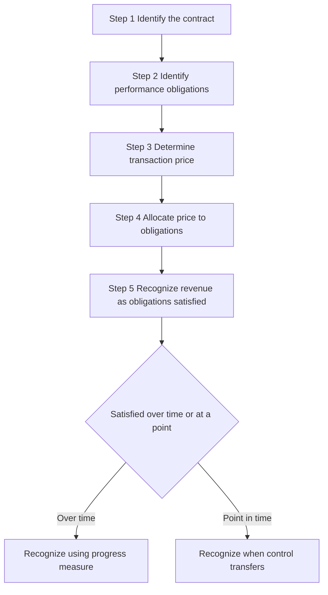
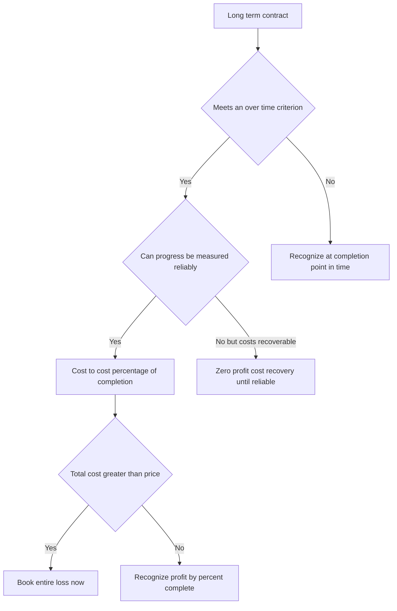
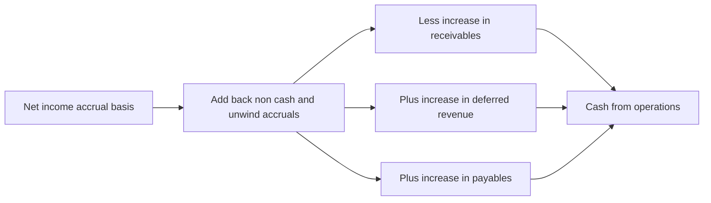

# Accrual Accounting & Revenue Recognition

## The Problem / Why this matters

Imagine two software companies. Both sold exactly one product this year: a three-year enterprise license, invoiced up front, for $3,600,000, collected in cash on day one. Both spent $1,200,000 in cash building the product. If you judged them purely by their bank statements, they look identical: +$3.6m in, -$1.2m out, +$2.4m net cash.

Now ask a different question: **how much did each company actually earn this year?** One of them delivers the software as a single perpetual license transferred on day one — it earned all $3.6m now. The other provides the software as a hosted service delivered continuously over 36 months — it earned only 1/3, i.e. $1.2m, this year, and owes the customer 24 more months of service. The bank statements are identical. The economic reality is completely different. One is a fully-earned business; the other is sitting on a $2.4m liability to deliver future service.

This is the entire reason accrual accounting exists. **Cash tells you when money moved. Accrual tells you when value was created.** In a finance interview — equity research, credit, FP&A, IB — you will be judged on whether you instinctively separate these two things. The single most common senior-analyst complaint about junior hires is that they "look at the P&L and think it's cash." A company can report record profits and go bankrupt (it ran out of cash). A company can report losses and be swimming in cash (it collected upfront and deferred the revenue). If you cannot explain *why*, you cannot value a company, assess its credit, or forecast it.

Revenue recognition sits at the dead center of this. It is the number one line of every model, the number auditors fight over, the number companies commit fraud on (Enron, WorldCom, Luckin Coffee, Wirecard all revolved around fake or premature revenue), and the number interviewers probe because it separates people who memorized formulas from people who understand what a financial statement *is*.

This chapter builds the whole machine from first principles: why profit ≠ cash, the five-step revenue model under IFRS 15 / ASC 606, deferred and accrued revenue, accrued expenses, the matching principle, the four types of adjusting entries, and percentage-of-completion. By the end you should be able to take any transaction and answer instantly: *what hits the income statement now, what hits the balance sheet, and where is the cash?*

---

## Core Idea

**Accrual accounting records revenues when they are earned and expenses when they are incurred — regardless of when cash changes hands.** Cash accounting records them only when cash moves.

Two consequences follow, and they generate almost everything else in this chapter:

1. **Timing differences between earning and collecting create balance-sheet accounts.** When you earn before you collect, you book an *asset* (a receivable or accrued revenue — someone owes you). When you collect before you earn, you book a *liability* (deferred/unearned revenue — you owe a service). When you incur an expense before you pay, you book a *liability* (accrued expense/payable). When you pay before you incur, you book an *asset* (prepaid expense).

2. **Because of these timing differences, net income and cash flow diverge, and the gap is exactly the change in these accrual accounts.** That is the deep link between the income statement and the cash flow statement — the indirect method of the cash flow statement is nothing more than "start with net income and unwind every accrual."

Revenue recognition is the specific set of rules that decides the single most important accrual: *when has revenue been earned?* Modern accounting answers this with one converged framework — IFRS 15 and ASC 606 — built around one principle: **recognize revenue to depict the transfer of promised goods or services to a customer in the amount the entity expects to be entitled to.** In plain English: *book revenue when you deliver, at the price you'll actually keep.*

---

## Why it works this way

Start from what a set of accounts is *for*. An owner or investor wants to know: in a given period, did this business create more value than it consumed? Cash flow can't answer that, because the moment money moves is often unrelated to the moment value is created. A construction firm building a bridge over three years might get paid entirely at the end — under cash accounting it would show three years of losses and one giant year of profit, which is economically nonsense. A magazine collecting a two-year subscription up front would show a huge profit in year one and nothing after — also nonsense, because it still owes 24 issues.

Accrual accounting fixes this by anchoring recognition to **economic events, not cash events**. Revenue is anchored to *delivery of value to the customer*. Expense is anchored to *consumption of resources*. Cash is tracked separately, on its own statement. This gives you two independent, reconcilable views: the income statement (value created) and the cash flow statement (liquidity), tied together by the balance sheet (the stock of unfinished timing differences).

Why do the timing differences *have* to become balance-sheet items? Because of double-entry's iron law: every transaction has two equal sides and the balance sheet must balance. If you collect $3.6m cash but have only earned $1.2m, you've debited Cash $3.6m and can only credit Revenue $1.2m — the other $2.4m *must* land somewhere. It lands in a liability (Deferred Revenue), because economically it is an obligation: you owe the customer future service. The balance sheet is, in this sense, the *storage tank* for all the timing gaps between accrual and cash. Adjusting entries are the periodic process of draining and filling those tanks to keep the income statement honest.

And why the five-step model specifically? Because "when did we deliver?" is genuinely hard when a single contract bundles many promises (a phone + a two-year plan + a trade-in credit), variable pricing (discounts, rebates, bonuses), and delivery spread over time. The old rules (dozens of industry-specific standards) let similar economics be reported differently, so a phone company and a software company recognized bundled deals inconsistently. IFRS 15 / ASC 606 replaced all of that with **one principle-based, five-step recipe** so that any contract, in any industry, is decomposed the same way: find the promises, find the price, match price to promises, and recognize as each promise is satisfied. It works this way because it forces the accounting to follow the *substance* of the deal rather than its legal or cash form.

---

## Full technical content

### 1. Accrual vs cash accounting

| Dimension | Cash basis | Accrual basis |
|---|---|---|
| Revenue recognized when | Cash received | Earned (goods/services transferred) |
| Expense recognized when | Cash paid | Incurred (resource consumed / matched) |
| Balance-sheet accruals | None (no receivables/payables) | Receivables, payables, deferred/accrued items |
| Permitted for | Very small entities, some tax regimes | Required by IFRS & US GAAP for all material entities |
| Shows economic performance | No | Yes |
| Shows liquidity | Yes | Only via the cash flow statement |

**Key identity (why profit ≠ cash):**

```
Cash from operations  =  Net income
                       −  increase in operating assets (e.g. AR, inventory, prepaids)
                       +  increase in operating liabilities (e.g. AP, accruals, deferred revenue)
                       +  non-cash expenses (depreciation, amortization, stock comp)
```

Every term after "Net income" is an accrual being unwound. If a company's earnings grow but its receivables balloon faster, cash from operations can be negative even as profit rises — the classic "profit without cash" warning sign.

### 2. The accrual matrix — the mental model to memorize

There are exactly four combinations of *timing of cash* vs *timing of the economic event*. Master this 2×2 and you can journalize anything.

| | Cash comes AFTER the event | Cash comes BEFORE the event |
|---|---|---|
| **Revenue** (we earn) | **Accrued revenue** → Asset (Accrued receivable). Earned, not yet billed/collected. | **Deferred / unearned revenue** → Liability. Collected, not yet earned. |
| **Expense** (we consume) | **Accrued expense** → Liability (Accrued payable). Incurred, not yet paid. | **Prepaid expense** → Asset. Paid, not yet consumed. |

- **Asset side of accruals** = "the world owes us" (accrued revenue) or "we've pre-paid for future benefit" (prepaid expense).
- **Liability side** = "we owe the world" (accrued expense) or "we owe a service" (deferred revenue).

### 3. The matching principle

**Matching** requires expenses to be recognized in the same period as the revenues they help generate. Three flavors:

1. **Direct/cause-and-effect matching** — COGS is recognized when the related sale is recognized, not when inventory is bought or paid for. Sales commissions matched to the sale.
2. **Systematic & rational allocation** — costs with no direct revenue link but a multi-period benefit are spread over the benefit period (depreciation of a machine, amortization of a patent).
3. **Immediate recognition** — costs with no discernible future benefit are expensed at once (most admin salaries, R&D under US GAAP, advertising).

Matching is *why* accrual creates prepaids, accruals, depreciation and deferred revenue: each is a device to line up cost with the revenue it produced.

### 4. Adjusting entries — the four types

Adjusting entries are made at period-end to bring accounts to their correct accrual balances before financial statements are produced. Every adjusting entry **touches at least one income-statement account and at least one balance-sheet account, and never touches cash** (cash was, or will be, recorded by a separate cash transaction). There are exactly four types, mapping directly onto the accrual matrix.

| # | Type | Before adjustment | Adjusting entry (period-end) | IS effect | BS effect |
|---|---|---|---|---|---|
| 1 | **Accrued revenue** | Earned, not recorded, no cash yet | Dr Accrued receivable / Cr Revenue | Revenue ↑ | Asset ↑ |
| 2 | **Accrued expense** | Incurred, not recorded, not paid | Dr Expense / Cr Accrued liability | Expense ↑ | Liability ↑ |
| 3 | **Deferred revenue** (unearned) | Cash received earlier, sits in liability; part now earned | Dr Unearned revenue / Cr Revenue | Revenue ↑ | Liability ↓ |
| 4 | **Prepaid / deferred expense** | Cash paid earlier, sits in asset; part now consumed | Dr Expense / Cr Prepaid asset | Expense ↑ | Asset ↓ |

Note types 1–2 are **accruals** (cash hasn't happened yet — you are recording *ahead* of cash). Types 3–4 are **deferrals** (cash already happened — you are *catching up* to recognize what was earned/consumed). Depreciation is a special case of type 4: the "prepaid" asset is the fixed asset, drawn down via Accumulated Depreciation (a contra-asset) instead of crediting the asset directly.

### 5. Deferred (unearned) revenue — the liability

**Deferred revenue** (a.k.a. unearned revenue, contract liability under IFRS 15) arises when a customer pays before the entity delivers. It is a **liability** because the entity owes goods/services (or a refund).

Journal entries over the life of a $1,200 annual subscription collected up front, earned evenly (recognize $100/month):

```
On collection:
  Dr Cash                       1,200
     Cr Deferred revenue                 1,200

Each month (×12):
  Dr Deferred revenue             100
     Cr Subscription revenue                100
```

After 12 months the liability is fully drained to zero and $1,200 of revenue has been recognized. Deferred revenue is a *good* liability — it is future revenue already funded in cash. Analysts watch its growth as a **leading indicator of bookings** for subscription businesses.

### 6. Accrued revenue — the asset

**Accrued revenue** (unbilled receivable, contract asset under IFRS 15) arises when the entity has earned revenue but has not yet billed or been paid. Example: interest earned on a loan that pays quarterly, at a month-end that falls mid-quarter.

```
Month-end accrual:
  Dr Accrued interest receivable   500
     Cr Interest income                    500

On later cash receipt of the full quarter (say 1,500):
  Dr Cash                        1,500
     Cr Accrued interest receivable         500   (reverse the accrued asset)
     Cr Interest income                   1,000   (the remaining two months)
```

Distinction to know cold: **Accounts receivable** = billed but uncollected (an unconditional right to cash — just time). **Contract asset / accrued (unbilled) revenue** = earned but not yet billable because some condition other than time remains (IFRS 15 §105–108). Both are assets; the difference is whether the right to payment is unconditional.

### 7. Accrued expenses — the liability

**Accrued expenses** are incurred but unpaid — wages earned by employees but not yet paid, interest accrued on debt, utilities consumed but unbilled, taxes owed.

```
Period-end (wages earned Dec but paid Jan):
  Dr Wages expense              8,000
     Cr Wages payable                    8,000

On payment in January:
  Dr Wages payable              8,000
     Cr Cash                             8,000
```

### 8. Prepaid expenses — the asset

Paid in advance, consumed later — insurance, rent, software licenses.

```
Pay 12-month insurance up front:
  Dr Prepaid insurance         12,000
     Cr Cash                            12,000

Each month:
  Dr Insurance expense          1,000
     Cr Prepaid insurance                1,000
```

### 9. Revenue recognition — IFRS 15 / ASC 606, the five-step model

IFRS 15 *Revenue from Contracts with Customers* and its US GAAP twin ASC 606 are substantially converged. **Core principle:** recognize revenue to depict the transfer of promised goods or services to customers in an amount reflecting the consideration to which the entity expects to be entitled in exchange.



**Step 1 — Identify the contract.** A contract exists when: it is approved and parties are committed, rights to goods/services are identifiable, payment terms are identifiable, it has commercial substance, and collection is *probable*. If collection is not probable, you do not have a contract for accounting purposes and cannot recognize revenue even if cash arrives (you park it as a deposit liability).

**Step 2 — Identify the performance obligations (POs).** Each *distinct* promise to transfer a good or service is a separate PO. A good/service is distinct if (a) the customer can benefit from it on its own or with readily available resources, AND (b) it is separately identifiable from other promises in the contract (not highly integrated/interdependent). Example: a phone + 24-month network service = two POs. Installation that significantly customizes bundled software may *not* be distinct → one combined PO.

**Step 3 — Determine the transaction price.** The consideration the entity expects to be entitled to. Adjust for:
- **Variable consideration** (discounts, rebates, refunds, performance bonuses, penalties) — estimate using *expected value* or *most likely amount*, and apply the **constraint**: include variable amounts only to the extent it is *highly probable* a significant reversal will not occur.
- **Significant financing component** — if timing gives the customer/entity a material financing benefit (payment far from delivery), discount to present value and split out interest.
- **Non-cash consideration** — measured at fair value.
- **Consideration payable to the customer** — generally a reduction of transaction price.

**Step 4 — Allocate the transaction price** to each PO in proportion to its **standalone selling price (SSP)**. If SSP isn't observable, estimate it (adjusted market assessment, expected cost plus margin, or — limited — residual approach).

**Step 5 — Recognize revenue when (or as) each PO is satisfied**, i.e. when **control** of the good/service transfers to the customer. Recognize **over time** if *any one* of these is met (IFRS 15 §35):
1. The customer simultaneously receives and consumes the benefits as the entity performs (e.g. cleaning, hosting, most services); or
2. The entity's performance creates/enhances an asset the customer controls as it is created (e.g. building on the customer's land); or
3. The asset created has no alternative use to the entity AND the entity has an enforceable right to payment for performance completed to date (e.g. bespoke construction).

If none is met, recognize at a **point in time** — when control transfers (indicators: present right to payment, legal title passed, physical possession transferred, risks & rewards transferred, customer accepted the asset).

**Contract asset vs contract liability (IFRS 15 §105):** compare cumulative revenue recognized to cumulative billings. Recognized > billed → **contract asset**. Billed > recognized → **contract liability** (deferred revenue).

**Principal vs agent (gross vs net):** recognize revenue *gross* (full amount) if you *control* the good/service before transfer (principal); recognize *net* (only your commission/margin) if you merely arrange for another party to provide it (agent). This is a favorite for marketplace/platform businesses.

### 10. Recognizing revenue "over time" — measuring progress

When a PO is satisfied over time, revenue is recognized in proportion to progress toward complete satisfaction, using either:

- **Output methods** — units delivered, milestones, surveys of performance, appraised value of work.
- **Input methods** — costs incurred relative to total expected costs (the classic **cost-to-cost / percentage-of-completion** method), labor hours, machine hours, time elapsed.

### 11. Percentage-of-completion (POC), a.k.a. over-time recognition via cost-to-cost

Used for long-term contracts (construction, engineering, complex custom projects) that qualify for over-time recognition. Under IFRS 15 and ASC 606 this is the **cost-to-cost input method**.

```
Percent complete  =  Costs incurred to date  ÷  Total estimated costs

Revenue to date   =  Percent complete  ×  Total contract price
Revenue this period = Revenue to date − Revenue recognized in prior periods
Gross profit this period = Revenue this period − Costs incurred this period
```

Rules and safeguards:
- **Reliable estimate required.** If progress cannot be reasonably measured but costs are recoverable, recognize revenue only up to costs incurred (**zero-profit / cost-recovery method**) until estimates become reliable.
- **Onerous / loss-making contracts:** if total estimated costs exceed total contract price, the *entire expected loss* is recognized *immediately*, not spread — conservatism (provision for onerous contracts).
- The old **completed-contract method** (recognize all revenue only at the end) is *not* permitted under IFRS 15 for contracts meeting the over-time criteria; it survives only where over-time criteria aren't met, effectively equivalent to point-in-time recognition on completion.



---

## Worked examples

### Worked Example 1 — SaaS: deferred revenue over a full year (statements tie out)

**Facts.** On 1 October 20X1, CloudCo signs a 12-month hosting contract for $12,000, collected in full up front. Hosting is delivered continuously → one PO satisfied over time, recognized evenly at $1,000/month. CloudCo's fiscal year ends 31 December 20X1. Ignore costs/tax for clarity.

**Step-by-step.**

1. Collection on 1 Oct:

```
Dr Cash                12,000
   Cr Deferred revenue          12,000
```

2. Months earned by 31 Dec 20X1: Oct, Nov, Dec = 3 months × $1,000 = **$3,000** recognized.

Adjusting entry at year-end (cumulative for the quarter):

```
Dr Deferred revenue     3,000
   Cr Subscription revenue       3,000
```

**Year-end 20X1 position.**

| Item | Amount | Check |
|---|---|---|
| Revenue recognized (IS) | $3,000 | 3 of 12 months |
| Cash collected | $12,000 | full upfront |
| Deferred revenue (BS liability) | $9,000 | 9 months unearned |
| Deferred revenue + revenue | $12,000 | ties to cash collected ✓ |

**20X2** recognizes the remaining 9 months = $9,000, draining deferred revenue to $0 by 30 Sep 20X2. Total revenue across both years = $3,000 + $9,000 = $12,000 = cash collected ✓.

**The interview punchline:** cash-flow-wise CloudCo received $12,000 in 20X1 but its 20X1 P&L shows only $3,000 of revenue. The $9,000 gap is a liability, and it is *also* exactly the amount by which 20X1 operating cash flow exceeds 20X1 revenue-driven earnings — profit and cash diverge by the change in deferred revenue.

### Worked Example 2 — Bundled contract: 5-step allocation (phone + service)

**Facts.** TelCo sells a bundle: a handset plus 24 months of network service for a single price of **$2,000**, paid $2,000 up front (ignore financing component for simplicity). Standalone selling prices: handset SSP = **$800**; 24-month service SSP = **$1,200** (i.e. $50/month). Handset delivered on day one; service delivered evenly over 24 months. Contract signed 1 Jan 20X1.

**Step 1** — valid contract (approved, collectible). ✓

**Step 2** — two distinct POs: (a) handset, (b) network service. ✓

**Step 3** — transaction price = $2,000.

**Step 4** — allocate by SSP proportion. Total SSP = $800 + $1,200 = $2,000 (here SSP sum equals price, so allocation = SSP):

| PO | SSP | Allocation % | Allocated price |
|---|---|---|---|
| Handset | $800 | 40% | $800 |
| Service | $1,200 | 60% | $1,200 |
| **Total** | **$2,000** | **100%** | **$2,000** |

**Step 5** — recognize:
- Handset: point in time, on delivery day 1 → **$800 revenue immediately**.
- Service: over time, $1,200 ÷ 24 = **$50/month**.

**Journal entries.**

```
Day 1 (collect cash + deliver handset):
  Dr Cash                        2,000
     Cr Handset revenue                    800
     Cr Deferred revenue                 1,200

Each month for 24 months:
  Dr Deferred revenue               50
     Cr Service revenue                     50
```

**Year 1 (12 months) revenue** = $800 handset + 12 × $50 = $800 + $600 = **$1,400**. Deferred revenue at end of Year 1 = $1,200 − $600 = **$600**. Year 2 recognizes the remaining $600. Total = $800 + $1,200 = $2,000 = cash ✓, debits = credits at every step ✓.

**Why interviewers love this:** if TelCo naively booked the whole $2,000 as revenue on day one (the pre-ASC 606 "cash-in = revenue" error), it would overstate Year-1 revenue by $600 and understate its liability by $600. The allocation is the whole point of ASC 606.

### Worked Example 3 — Percentage-of-completion over three years (with a re-estimate)

**Facts.** BuildCo signs a fixed-price bridge contract: **contract price $10,000,000**. It qualifies for over-time recognition (no alternative use + enforceable right to payment). Original total estimated cost = $8,000,000. Data by year:

| Year | Cost incurred in year | Cumulative cost | Total estimated cost (as revised each year) |
|---|---|---|---|
| 20X1 | $2,000,000 | $2,000,000 | $8,000,000 |
| 20X2 | $4,400,000 | $6,400,000 | $8,533,333 (re-estimated up) |
| 20X3 | $2,133,333 | $8,533,333 | $8,533,333 (actual final) |

Cost-to-cost method. Watch the re-estimate in 20X2.

**20X1.**
- % complete = 2,000,000 / 8,000,000 = **25.0%**
- Revenue to date = 25% × 10,000,000 = 2,500,000 → **revenue 20X1 = $2,500,000**
- Cost 20X1 = $2,000,000 → **gross profit 20X1 = $500,000**

**20X2** (total cost re-estimated to $8,533,333).
- % complete = 6,400,000 / 8,533,333 = **75.0%**
- Revenue to date = 75% × 10,000,000 = 7,500,000
- Revenue 20X2 = 7,500,000 − 2,500,000 (prior) = **$5,000,000**
- Cost 20X2 = $4,400,000 → **gross profit 20X2 = $600,000**

**20X3** (contract completed).
- % complete = 8,533,333 / 8,533,333 = **100%**
- Revenue to date = 10,000,000
- Revenue 20X3 = 10,000,000 − 7,500,000 = **$2,500,000**
- Cost 20X3 = $2,133,333 → **gross profit 20X3 = $366,667**

**Reconciliation (must tie):**

| | 20X1 | 20X2 | 20X3 | Total |
|---|---|---|---|---|
| Revenue | 2,500,000 | 5,000,000 | 2,500,000 | **10,000,000** ✓ |
| Cost | 2,000,000 | 4,400,000 | 2,133,333 | **8,533,333** ✓ |
| Gross profit | 500,000 | 600,000 | 366,667 | **1,466,667** ✓ |

Total revenue = contract price $10m ✓. Total cost = final actual $8,533,333 ✓. Total profit = 10,000,000 − 8,533,333 = **$1,466,667** ✓ (and 500,000 + 600,000 + 366,667 = 1,466,667 ✓).

**Balance-sheet mechanics (contract asset/liability).** Suppose BuildCo *bills* the customer $2,000,000 in 20X1 but has recognized $2,500,000 of revenue. Recognized > billed by $500,000 → **contract asset (unbilled receivable) $500,000**. If instead it had billed $3,000,000 while recognizing $2,500,000, billed > recognized → **contract liability $500,000**.

**The loss-contract twist (say it in interviews).** Suppose at end of 20X1 BuildCo revises total expected cost to **$10,400,000** (> $10,000,000 price). The contract is now onerous. IFRS 15 / ASC 606 require the *entire* expected loss of $400,000 to be recognized *immediately* in 20X1, regardless of % complete — you never spread a known loss. That is conservatism in action, and naming it unprompted signals real understanding.

---

## How it is tested in interviews

**Q: "What's the difference between accrual and cash accounting, and why does it matter?"**
Model answer: "Cash accounting records revenue and expenses when cash moves; accrual records them when they're *earned* and *incurred*. It matters because cash timing is often unrelated to when value is created — a subscription collected up front, or a project paid at the end, would be wildly misstated on a cash basis. Accrual gives you the true economic performance on the income statement, and we track liquidity separately on the cash flow statement. The gap between net income and operating cash flow is exactly the change in accrual accounts — receivables, payables, deferred revenue, inventory."

**Q: "A company collects $120 cash for a 12-month subscription on day one. Walk me through the three statements at that instant, and after one month."**
Crisp line: "On day one: cash flow statement shows +$120 operating inflow; income statement shows *nothing* — it's not earned; balance sheet: cash up $120, deferred revenue liability up $120, balances. After one month: recognize $10 revenue, so net income +$10 (retained earnings +$10), deferred revenue drops to $110 — the $10 moves from liability to equity via the P&L. No cash moves in month one, so month-one operating cash flow from this contract is zero."

**Q: "Walk me through a $10 increase in deferred revenue across the three statements."** (Classic three-statement question.)
"Cash was received earlier, so on the cash flow statement, in the indirect method, a $10 increase in deferred revenue is a +$10 add-back to operating cash flow. On the balance sheet, the deferred revenue liability is +$10 and cash is +$10, so it balances. The income statement is unaffected at the moment of the increase — deferred revenue is *un*earned, so no revenue yet. Revenue only hits the P&L later, as the obligation is satisfied, at which point deferred revenue *decreases*."

**Q: "Name the five steps of revenue recognition."**
"Identify the contract; identify the performance obligations; determine the transaction price; allocate the price to the obligations by standalone selling price; recognize revenue as each obligation is satisfied — over time if the customer consumes as you perform, otherwise at the point control transfers."

**Q: "A SaaS company signs a huge 3-year deal today, invoiced annually. How much revenue this year? What shows up on the balance sheet?"**
"Revenue is recognized ratably as the service is delivered, so this year gets roughly one-third — 12/36ths of the contract — not the whole thing. The first annual invoice is collected but only partly earned, so the unearned portion sits as deferred revenue, a liability. Any revenue earned beyond what's been billed sits as a contract asset. The billing schedule doesn't drive revenue; delivery does."

**Q: "Why can a profitable company run out of cash?"**
"Because profit is accrual and cash is timing. If it's booking revenue but its receivables are growing faster than collections, or it's building inventory, cash from operations lags net income. Aggressive revenue recognition — booking sales before cash is collectible — inflates profit while cash never arrives. That's the receivables red flag: watch days-sales-outstanding and the AR-to-revenue growth ratio."

**Q: "How does percentage-of-completion work and why use it?"**
"For long-term contracts that transfer control over time, you recognize revenue in proportion to progress — typically costs incurred over total estimated costs. You use it because recognizing everything only at completion would misrepresent years of genuine economic activity as zero, then a lump. Key safeguards: you need reliable estimates, and if you ever foresee a total loss, you book the whole loss immediately."

**Q: "Gross vs net revenue — how do you decide?"**
"Control. If you control the good or service before it transfers to the customer, you're the principal and book gross — the full price, with the supplier cost in COGS. If you merely arrange the sale, you're an agent and book net — just your commission. It swings reported revenue massively for marketplaces, which is why it's scrutinized."

**Q: "What are the four types of adjusting entries?"**
"Accrued revenues, accrued expenses, deferred/unearned revenues, and prepaid/deferred expenses. Accruals record ahead of cash; deferrals catch up to cash already received or paid. Every adjusting entry hits one income-statement and one balance-sheet account and never touches cash."

---

## Traps & common mistakes

- **Confusing deferred revenue (liability) with accrued revenue (asset).** Deferred = cash *in* first, you owe service. Accrued = you delivered first, they owe cash. Opposite sides of the balance sheet.
- **Treating cash receipt as revenue.** Collecting cash up front does *not* earn it. This is the single most common junior error and the mechanism behind many frauds.
- **Thinking an adjusting entry touches cash.** It never does — cash is handled by the separate cash transaction. If your adjusting entry credits Cash, it's wrong.
- **Forgetting the constraint on variable consideration.** You include estimated bonuses/rebates only to the extent a significant reversal is *highly probable* not to occur; over-optimistic estimates inflate revenue.
- **Recognizing bundled deals in one lump.** Under ASC 606 you must split into performance obligations and allocate by standalone selling price.
- **Spreading a loss on an onerous contract.** A foreseeable total loss is recognized *immediately and in full*, never pro-rated by % complete.
- **Mixing up AR and contract assets.** AR = unconditional right to cash (billed). Contract asset = earned but payment still conditional on something other than time (unbilled).
- **Using completed-contract when over-time criteria are met.** Not permitted under IFRS 15 — you must recognize over time.
- **Gross-vs-net error for platforms.** Booking gross when you're only an agent massively overstates revenue; the test is *control*, not who invoices.
- **Ignoring the financing component.** A large gap between payment and delivery can carry a significant financing component that must be split into revenue and interest.

---

## First-principles recap

- Accounting measures **value created**, not **cash moved** — that is why accrual exists and why the income statement and cash flow statement are two different views tied together by the balance sheet.
- Every timing gap between earning/incurring and collecting/paying becomes a **balance-sheet account**; those accounts are the storage tanks that adjusting entries fill and drain.
- **Revenue = delivery × collectible price.** The five-step model is just a disciplined way to answer "what did we deliver, and at what price will we actually keep?"
- **Deferred revenue is a liability, accrued revenue is an asset** — direction of the cash-vs-delivery timing decides the side.
- **Matching** forces expenses to sit in the same period as the revenue they produced, which is the reason prepaids, accruals, depreciation and COGS timing exist.
- **Profit ≠ cash, and the difference is precisely the change in accruals** — that identity is the backbone of the indirect cash flow statement and the first place to look for earnings manipulation.
- For long jobs, **recognize over time by progress**, keep estimates honest, and **book any expected loss immediately**.

---

## Quick-reference

| Concept | Formula / entry | Statement effect |
|---|---|---|
| Profit vs cash | CFO = NI − ΔAR − Δinventory + ΔAP + Δdeferred rev + non-cash | Links IS ↔ CFS |
| Accrued revenue | Dr Accrued receivable / Cr Revenue | Asset ↑, Revenue ↑ |
| Accrued expense | Dr Expense / Cr Accrued payable | Expense ↑, Liability ↑ |
| Deferred revenue (collect) | Dr Cash / Cr Deferred revenue | Cash ↑, Liability ↑ |
| Deferred revenue (earn) | Dr Deferred revenue / Cr Revenue | Liability ↓, Revenue ↑ |
| Prepaid (pay) | Dr Prepaid asset / Cr Cash | Asset ↑, Cash ↓ |
| Prepaid (consume) | Dr Expense / Cr Prepaid asset | Expense ↑, Asset ↓ |
| 5-step model | Contract → POs → Price → Allocate by SSP → Recognize on transfer of control | — |
| Over-time test | Consume-as-performed / customer controls asset / no alt use + right to payment | Recognize over time |
| % complete (cost-to-cost) | Costs to date ÷ total estimated costs | Progress measure |
| Revenue this period (POC) | %complete × price − prior revenue | Revenue ↑ |
| Onerous contract | Recognize full expected loss immediately | Provision, Expense ↑ |
| Contract asset vs liability | Recognized > billed → asset; billed > recognized → liability | BS classification |
| Gross vs net | Control before transfer → principal (gross); arrange only → agent (net) | Revenue magnitude |
| 4 adjusting entries | Accrued rev, accrued exp, deferred rev, prepaid exp | Each: 1 IS + 1 BS, never cash |


