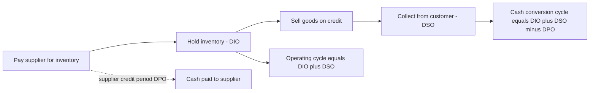
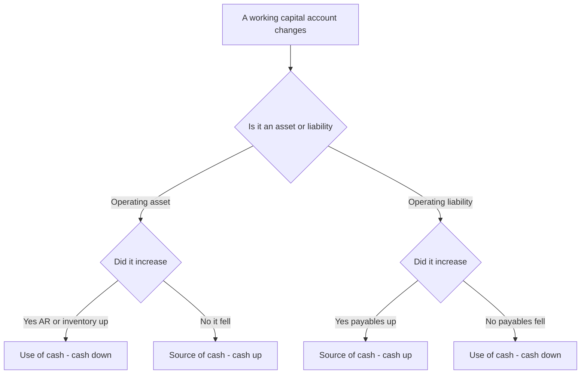
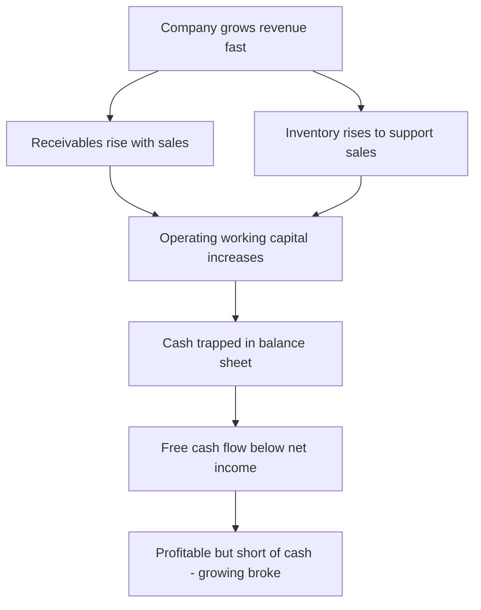
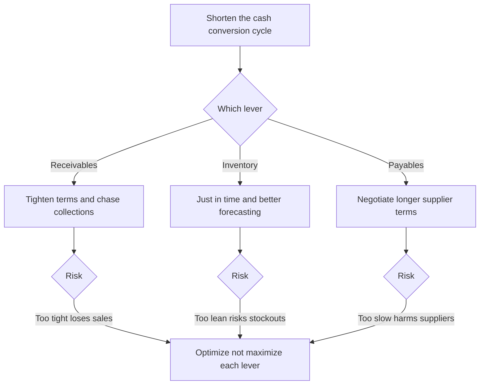

# Working Capital & the Operating Cycle

## The Problem / Why this matters

Two companies report the exact same $50 million of net income for the year. One of them finishes the year with $8 million more cash in the bank than it started with. The other finishes the year with $6 million *less* cash — and had to draw on its revolving credit line in November just to make payroll. Same profit. Opposite cash outcomes.

Where did the money go?

It went into **working capital**. The profitable-but-cash-poor company grew its sales fast, and to grow sales it had to (a) buy and hold more inventory, (b) let customers pay 60 days later instead of 30, and both of those swallowed cash that the income statement never showed as an expense. Growth *consumed* cash through the balance sheet, silently, while the P&L looked terrific.

This is the single most important disconnect in all of financial analysis: **profit is an accounting opinion; cash is a fact, and working capital is the bridge between them.** A business can be profitable and go bankrupt. It happens constantly — it is called "growing broke." A retailer that doubles its store count, a manufacturer that lands a huge new contract, a startup scaling from $10M to $50M in revenue: every one of them faces the working-capital cash trap.

For anyone sitting in a finance interview — equity research, credit, FP&A, investment banking — working capital is *the* topic that separates people who understand accounting from people who have merely memorized it. The interviewer's favorite trap is: "Walk me through what happens to the three statements when inventory goes up by $10." If you can't answer that instantly and correctly, you signal that you don't actually understand how a business consumes cash. Conversely, if you can explain *why* a company like Amazon or Dell can run a **negative** working-capital model and effectively get financed by its own suppliers, you signal genuine commercial fluency.

This chapter builds working capital from first principles: what it is, why changes in it move cash in the opposite direction, the cash conversion cycle and its three levers (DSO, DIO, DPO), the negative-working-capital business model, and the practical levers of managing receivables, inventory, and payables. By the end you should be able to compute a cash conversion cycle from a balance sheet, forecast the working-capital cash impact of a growth plan, and answer every interview question thrown at you on the topic.

---

## Core Idea

**Working capital is the money tied up in running the day-to-day operations of a business** — the cash frozen inside inventory sitting in the warehouse and inside invoices customers haven't paid yet, minus the cash you get to hold onto because you haven't paid your own suppliers yet.

The central, must-internalize insight is this:

> **An increase in a working-capital asset (receivables, inventory) is a *use* of cash. An increase in a working-capital liability (payables) is a *source* of cash.**

Cash and working-capital assets are two sides of a seesaw. When you convert cash into inventory, cash goes down. When a customer's payment converts a receivable back into cash, cash goes up. The income statement records the *sale* when it happens; the cash arrives (or leaves) at a different time. Working capital is the account that holds the timing difference.

The **operating cycle** measures *how long* that money stays trapped: from the day you pay cash for raw materials, through holding inventory, selling it, and finally collecting from the customer. The **cash conversion cycle (CCC)** refines this by crediting you for the time your suppliers let you delay payment. The shorter the cycle, the faster cash recycles through the business, and the less external financing you need to grow.

---

## Why it works this way — first principles

Let's derive the whole thing from nothing but the definition of cash flow.

Start with a brutally simple truth. Over any period:

```
Cash generated = Cash collected from customers − Cash paid to everyone else
```

Now compare that to the income statement, which reports:

```
Profit = Revenue earned − Expenses incurred
```

These two are *not* the same, and the gap between them has exactly one cause: **timing differences between when a transaction hits the P&L and when the cash actually moves.** Accrual accounting deliberately records revenue when it is *earned* (goods delivered) and expenses when they are *incurred* (goods consumed), regardless of when cash changes hands. That is what makes the income statement meaningful — it matches effort to reward in the right period. But it also guarantees that profit ≠ cash flow in any period where the balance sheet shifts.

Working-capital accounts are the *storage tanks* for these timing differences:

- You **sell** $100 of goods on credit. Revenue +$100 hits the P&L. But no cash came in — instead an **accounts receivable** of $100 appears. The receivable is literally "revenue we've earned but not yet collected in cash." Until the customer pays, that $100 of profit exists only on paper. **Receivable up → cash not yet received → cash is lower than profit.**

- You **buy** $100 of inventory. No expense hits the P&L yet (you haven't sold it — the matching principle defers the cost). But cash left, or a payable was created. The inventory account holds "cash we've spent but not yet expensed." **Inventory up → cash spent ahead of profit → cash is lower than profit.**

- You **receive** goods from a supplier on credit. **Accounts payable** appears — "expenses/purchases we've recorded but not yet paid in cash." The supplier is financing you. **Payable up → cash retained → cash is higher than profit.**

So the reconciliation from profit to operating cash flow *must* subtract increases in operating assets and add increases in operating liabilities. This isn't a rule to memorize — it falls straight out of the definition. This is precisely why the indirect-method cash flow statement has a section called "Changes in working capital":

```
Operating cash flow = Net income
                    + Non-cash charges (D&A, etc.)
                    − Increase in receivables      (cash trapped in unpaid invoices)
                    − Increase in inventory        (cash trapped in goods on shelf)
                    + Increase in payables         (cash retained via supplier credit)
```

The mnemonic that never fails: **Asset up = cash down. Liability up = cash up.** An asset is where cash goes to be *stored*; a liability is a source of cash you get to *use*.

Now the cycle. Why does the *length* of time matter? Because money has to be financed for every day it's trapped. If you pay your supplier on Day 0 but don't collect from your customer until Day 75, you have a 75-day hole that *something* must fill — your own cash, a bank loan, or your suppliers' patience. The longer the hole, the more capital the business permanently ties up, and the more it costs (interest, or opportunity cost of that cash). Two identical businesses with the same margins but different cycle lengths have completely different cash needs and completely different returns on capital. That is why the cycle is a first-order driver of value.

---

## Full technical content

### 1. Defining working capital precisely

There are two related but distinct definitions. Interviewers will test whether you know which is which.

| Concept | Formula | What it captures |
|---|---|---|
| **Net Working Capital (NWC)** | Total current assets − Total current liabilities | The classic accounting/liquidity measure. Includes cash and short-term debt. |
| **Operating Working Capital (OWC)** | (Current assets − Cash & equivalents) − (Current liabilities − Short-term debt) | The measure used in modeling/valuation. Strips out financing items to isolate what operations tie up. |

**Why strip out cash and debt?** Cash is not "tied up in operations" — it's a financing/investing choice about how much dry powder to hold. Short-term debt (revolver, current portion of long-term debt) is a *financing* liability, not an operating one — it belongs in the capital structure, not in the operating cycle. When analysts say "change in working capital" in a DCF or a three-statement model, they almost always mean **operating** working capital. Getting this distinction right is a classic senior-analyst signal.

The core operating working-capital items:

| Operating current assets | Operating current liabilities |
|---|---|
| Accounts receivable (trade) | Accounts payable (trade) |
| Inventory (raw, WIP, finished) | Accrued expenses / accrued liabilities |
| Prepaid expenses | Deferred revenue / unearned revenue |
| Other operating current assets | Accrued taxes, wages payable |

Note **deferred revenue** (cash collected before the good/service is delivered — e.g., a SaaS annual subscription paid upfront) is an operating *liability* and a powerful source of working-capital financing. When it grows, it *releases* cash — the customer is financing you.

### 2. The operating cycle vs. the cash conversion cycle

Two related metrics. Precision matters.

**Operating cycle** = the time from acquiring inventory to collecting cash from the customer:

```
Operating Cycle = DIO + DSO
```

**Cash Conversion Cycle (CCC)** = the operating cycle minus the time you get to delay paying suppliers:

```
Cash Conversion Cycle = DIO + DSO − DPO
```

The CCC is the number of days that cash is actually locked up and must be financed. It's the operating cycle *net of* the free financing your suppliers extend.

### 3. The three drivers — DSO, DIO, DPO

| Metric | Full name | Formula | Meaning |
|---|---|---|---|
| **DSO** | Days Sales Outstanding | (Accounts Receivable ÷ Revenue) × 365 | Average days to collect cash from customers after a sale |
| **DIO** | Days Inventory Outstanding | (Inventory ÷ COGS) × 365 | Average days inventory sits before being sold |
| **DPO** | Days Payable Outstanding | (Accounts Payable ÷ COGS) × 365 | Average days you take to pay your suppliers |

**Critical conventions (interviewers test these):**

- **DSO uses Revenue** in the denominator, because receivables are recorded at *selling* price. **DIO and DPO use COGS**, because inventory and payables are recorded at *cost*, not at selling price. Mixing these up (e.g., using revenue for DIO) is one of the most common errors and it *will* be caught.
- Use **365** (or 360 in some conventions — be consistent). State your convention.
- **Average vs. ending balance:** Textbook-correct is to use the *average* of beginning and ending balance (e.g., (BOP AR + EOP AR)/2), because the balance sheet is a point-in-time snapshot while revenue/COGS are flows over the whole period. In fast practice and many interviews, the *ending* balance is used for simplicity. Know both; say which you're using. For a single balance sheet with no prior year, you must use ending.
- These are all expressed as a **turnover** as well: Inventory Turnover = COGS / Inventory = 365 / DIO. Receivables Turnover = Revenue / AR = 365 / DSO.

### 4. How working-capital changes flow through the three statements

This is the mechanical heart of the topic. For a *single* change (say inventory up $10, all else equal):

**Balance sheet:** Inventory (asset) +$10. To balance, either cash −$10 (if paid cash) or accounts payable +$10 (if bought on credit).

**Income statement:** No immediate impact — buying inventory is not an expense until it's sold (matching principle). So net income is unchanged, and there is no tax effect.

**Cash flow statement:** In the operating section (indirect method), "increase in inventory" is a −$10 use of cash. If funded by payables, "increase in payables" is +$10, netting to zero cash impact. If funded by cash, ending cash is −$10.

The universal rule again:

```
ΔCash from working capital = −(ΔReceivables) − (ΔInventory) + (ΔPayables)
                           = −Δ(Operating working capital)
```

An **increase** in operating working capital is a cash **outflow** (investment in the business). A **decrease** is a cash **inflow** (harvesting/releasing cash).

### 5. Working capital and growth — the structural cash trap

Here's the deep one. If a company operates at a stable CCC and margins, then working capital scales roughly with revenue:

```
Operating working capital ≈ (some %) × Revenue
```

Call that percentage the **working-capital intensity**, `w`. Then when revenue grows by ΔRevenue, the *incremental* working-capital cash need is:

```
ΔWorking capital ≈ w × ΔRevenue
```

**Growth consumes cash proportional to the growth rate.** A company growing 30% a year with 20% working-capital intensity ties up an extra 6% of revenue in working capital every year — cash that never appears on the income statement. This is why hyper-growth companies burn cash even when profitable, and why *shrinking* companies often gush cash (working capital unwinds, releasing the trapped money). In a downturn, a company that cuts sales can paradoxically generate a burst of cash as receivables collect and inventory sells down faster than new stock is bought.

### 6. The negative working-capital model

If DPO is large enough that **DPO > DIO + DSO**, the CCC goes **negative**. The business collects cash from customers *before* it has to pay its suppliers. It runs on *other people's money* — customers and suppliers finance the entire operating cycle, and growth *releases* cash instead of consuming it.

Classic negative-CCC business models:

| Business | Why CCC is negative |
|---|---|
| **Grocery / discount retail (Walmart, Costco)** | Sell inventory for cash in days (low DIO), collect instantly (DSO ≈ 0, cash/card), but pay suppliers in 30–45 days (high DPO). |
| **Amazon (marketplace + retail)** | Fast inventory turns, instant customer payment, long supplier terms; famously financed early growth off negative working capital. |
| **Dell (build-to-order PCs)** | Customer pays at order (DSO ≈ 0), build-to-order means almost no inventory (low DIO), pay component suppliers later (high DPO). |
| **SaaS with annual prepay** | Customer pays a year upfront (huge deferred revenue), costs are incurred monthly. |
| **Insurance** | Collect premiums now, pay claims later (the "float," famously exploited by Berkshire Hathaway). |

For these firms, **growth is self-funding or cash-generative** — a phenomenal structural advantage. But it cuts both ways: if such a firm *shrinks*, working capital unwinds *against* it (payables must still be paid while incoming cash dries up), which can trigger a liquidity crisis precisely when times are hard.

### 7. Managing the three components

**Managing receivables (reduce DSO):** tighten credit terms and screening, invoice promptly and accurately, offer early-payment discounts (e.g., "2/10 net 30" — 2% off if paid within 10 days, otherwise due in 30), charge late fees, use factoring (selling receivables to a third party for immediate cash at a discount), and monitor an *aging schedule* to chase overdue accounts. Trade-off: terms that are too tight lose sales to competitors offering easier credit.

> **The economics of "2/10 net 30":** foregoing a 2% discount to keep cash 20 extra days (day 10 to day 30) costs 2% per 20 days ≈ 2.04% / 20 × 365 ≈ **37.2% annualized**. Paying early to capture the discount is almost always a fantastic return — a favorite quant-lite interview question.

**Managing inventory (reduce DIO):** just-in-time (JIT) systems, better demand forecasting, ABC analysis (focus control on high-value items), economic order quantity (EOQ) sizing, vendor-managed inventory, and dropshipping (hold none). Trade-off: too-lean inventory risks stockouts and lost sales; too-lean supply chains are fragile (the 2020–2022 supply-shock lesson).

**Managing payables (increase DPO):** negotiate longer supplier terms, pay on (not before) the due date, use supply-chain finance. Trade-off: stretching payables too far damages supplier relationships, forfeits early-payment discounts, and can signal distress. There's an ethical/relationship line between "efficient" and "abusive" payment stretching.

The overarching goal: **minimize the CCC without breaking the operation** — shrink DSO and DIO, extend DPO, but never so aggressively that you lose sales, suffer stockouts, or alienate suppliers.

### 8. Standards note (IFRS / US GAAP)

- **Revenue → receivables:** IFRS 15 / ASC 606 (*Revenue from Contracts with Customers*) governs when revenue is recognized, which determines when a receivable (or a contract asset / deferred revenue) is created. A "contract asset" is revenue earned but not yet billable; a "contract liability" is deferred revenue.
- **Inventory:** IAS 2 (IFRS) and ASC 330 (US GAAP). Both require inventory at *lower of cost and net realizable value* (US GAAP: lower of cost or market for LIFO/retail; NRV otherwise). **Key difference: LIFO is permitted under US GAAP but prohibited under IFRS.** During inflation, LIFO raises COGS and lowers reported inventory — which *lowers* DIO and distorts cross-standard comparisons. Analysts add back the "LIFO reserve" to compare a US LIFO firm to an IFRS FIFO peer.
- **Receivables impairment:** IFRS 9 / ASC 326 (CECL) — expected-credit-loss models create an allowance for doubtful accounts, so AR is reported net of expected losses.
- **Presentation:** IAS 1 / ASC 210 govern the current vs. non-current classification that defines what counts as "working capital."

---

## Worked examples

### Worked Example 1 — Computing the cash conversion cycle from a balance sheet

**Given** (fiscal year figures for "Meridian Manufacturing"):

| Item | Amount |
|---|---|
| Revenue | $1,200,000 |
| COGS | $780,000 |
| Accounts receivable (ending) | $180,000 |
| Inventory (ending) | $128,219 |
| Accounts payable (ending) | $96,164 |

**Step 1 — DSO** (uses Revenue):
```
DSO = (AR / Revenue) × 365 = (180,000 / 1,200,000) × 365 = 0.15 × 365 = 54.75 days
```

**Step 2 — DIO** (uses COGS):
```
DIO = (Inventory / COGS) × 365 = (128,219 / 780,000) × 365 = 0.164383 × 365 = 60.00 days
```

**Step 3 — DPO** (uses COGS):
```
DPO = (AP / COGS) × 365 = (96,164 / 780,000) × 365 = 0.123287 × 365 = 45.00 days
```

**Step 4 — Operating cycle and CCC:**
```
Operating cycle = DIO + DSO = 60.00 + 54.75 = 114.75 days
CCC = DIO + DSO − DPO = 60.00 + 54.75 − 45.00 = 69.75 days
```

**Interpretation:** Meridian ties up cash for ~70 days on average between paying suppliers and collecting from customers. Every dollar of daily sales-cost activity needs ~70 days of financing. At roughly $780,000 COGS / 365 ≈ $2,137 of cost per day, the cycle finances on the order of $149,000 of net operating investment. To free cash, Meridian should attack DSO (55 days is high — customers pay slowly) and DIO (60 days of stock).

*Verification:* AR/Rev = 0.15 exactly → 54.75 ✓. Inventory 128,219/780,000 = 0.164383 → ×365 = 60.0 ✓. AP 96,164/780,000 = 0.123287 → ×365 = 45.0 ✓. Numbers were reverse-engineered to give clean day counts and tie exactly.

---

### Worked Example 2 — The three-statement impact of a working-capital change (the classic interview walk-through)

**Scenario:** A company buys **$10 of inventory on credit** (accounts payable), then in a later period **sells that inventory for $15 cash**, with COGS of $10. Assume a **40% tax rate**. Walk through both events across the three statements.

**Event A — Buy $10 inventory on credit**

*Journal entry:*
```
Dr Inventory        10
   Cr Accounts payable   10
```

| Statement | Impact |
|---|---|
| Income statement | No change (not yet an expense). Net income unchanged. |
| Cash flow | Operating: +$10 increase in payables (source), −$10 increase in inventory (use). **Net cash impact: $0.** |
| Balance sheet | Assets: Inventory +$10. Liabilities: AP +$10. **Balances.** |

**Event B — Sell it for $15 cash; COGS $10; tax 40%**

*Journal entries:*
```
Dr Cash             15
   Cr Revenue            15

Dr COGS             10
   Cr Inventory          10

Dr Tax expense       2      (40% × (15 − 10) = 2)
   Cr Taxes payable       2
```

*Income statement:*
```
Revenue        15
COGS          (10)
Pretax income   5
Tax (40%)      (2)
Net income      3
```

*Cash flow statement (indirect):*
```
Net income                          +3
(+) Decrease in inventory           +10   (inventory fell from 10 to 0 — a source of cash)
(+) Increase in taxes payable        +2   (accrued, not yet paid — source)
Cash flow from operations          +15
```

*Check the direct view:* cash collected $15, cash paid $0 (bought on credit, tax accrued unpaid) = **+$15.** ✓ Matches.

*Balance sheet after both events:*
```
Assets:  Cash +15, Inventory −10 (back to 0)   → net assets +5
Liabilities & equity: AP +10, Taxes payable +2, Retained earnings +3 → +15... 
```
Wait — let's tie it out cleanly across *both* events combined:
```
Assets:      Cash +15,  Inventory  0 (─10 in B offsets +10 in A)      = +15
Liab & Eq:   AP +10,  Taxes payable +2,  Retained earnings +3         = +15  ✓
```

**Balances.** The teaching point: buying inventory on credit is *cash-neutral* (asset and liability rise together); the cash and profit only appear when the goods are *sold*. Working capital held the cost in suspense until the matching sale occurred.

---

### Worked Example 3 — Growth consumes cash; the working-capital drag on free cash flow

**Setup:** "Volt Appliances" has stable ratios: DSO 45, DIO 73, DPO 30, and a working-capital intensity that we'll derive. Revenue grows from **$100M to $130M** (30% growth). COGS is 70% of revenue. Net income is $12M in the growth year; D&A $5M; capex $6M. Compute the working-capital cash drag and free cash flow.

**Step 1 — Working-capital balances in each year** (using ending-balance day-counts):

Year 0 (Rev 100, COGS 70):
```
AR  = DSO/365 × Rev  = 45/365 × 100 = 12.329
Inv = DIO/365 × COGS = 73/365 × 70  = 14.000
AP  = DPO/365 × COGS = 30/365 × 70  =  5.753
OWC0 = AR + Inv − AP = 12.329 + 14.000 − 5.753 = 20.575
```

Year 1 (Rev 130, COGS 91):
```
AR  = 45/365 × 130 = 16.027
Inv = 73/365 × 91  = 18.200
AP  = 30/365 × 91  =  7.479
OWC1 = 16.027 + 18.200 − 7.479 = 26.747
```

**Step 2 — Change in operating working capital:**
```
ΔOWC = OWC1 − OWC0 = 26.747 − 20.575 = 6.172   (an increase → a use of cash)
```

**Step 3 — Working-capital intensity check:**
```
OWC0 / Rev0 = 20.575 / 100 = 20.6%
w × ΔRev ≈ 0.206 × 30 = 6.17  ✓  (matches ΔOWC — confirms WC scales with revenue)
```

**Step 4 — Free cash flow to the firm (unlevered, simplified):**
```
Net income                    12.000
(+) D&A                        5.000
(−) Increase in OWC          (6.172)
(−) Capex                     (6.000)
Free cash flow                 4.828
```

**Interpretation:** Volt earned $12M of net income but generated under $5M of free cash flow — the growth *ate* $6.17M through working capital. Had revenue been flat, ΔOWC would be ~0 and FCF would be ~$11M. **Growth is not free: at ~21% intensity, every extra dollar of revenue locks up ~21 cents of cash.** If Volt grew 50% instead, the drag would be proportionally worse and could turn FCF negative despite healthy accounting profit — the textbook "growing broke" scenario.

*Verification:* ΔOWC 6.172 computed two independent ways (direct balances and intensity formula) agree ✓. FCF: 12 + 5 − 6.172 − 6 = 4.828 ✓.

---

### Worked Example 4 — Negative working capital and the "float" advantage

**Setup:** "QuickCart," a discount grocer. DIO = 20 days, DSO = 2 days (nearly all card/cash sales settle in ~2 days), DPO = 40 days. Revenue $500M, COGS $400M.

**Step 1 — CCC:**
```
CCC = DIO + DSO − DPO = 20 + 2 − 40 = −18 days
```

**Step 2 — What does −18 days mean in cash?** The business is financed by its suppliers for 18 days of activity. Approximate free financing:
```
Daily COGS ≈ 400 / 365 = 1.0959 per day
18 days × 1.0959 ≈ $19.7M of permanent supplier-provided financing (float)
```

**Step 3 — Balances to confirm the sign:**
```
AR  = 2/365  × 500 = 2.740
Inv = 20/365 × 400 = 21.918
AP  = 40/365 × 400 = 43.836
OWC = 2.740 + 21.918 − 43.836 = −19.178   (negative!)
```

**Step 4 — What happens when QuickCart grows 20%?** Revenue → $600M, COGS → $480M:
```
OWC1 = (2/365 × 600) + (20/365 × 480) − (40/365 × 480)
     = 3.288 + 26.301 − 52.603 = −23.014
ΔOWC = −23.014 − (−19.178) = −3.836   (a further decrease → a SOURCE of cash)
```

**Interpretation:** Growth *releases* $3.84M of cash instead of consuming it. The suppliers fund the expansion. This is the structural magic of negative-working-capital retail: it can grow with minimal external capital and earns interest on customers' cash before paying suppliers. The flip-side warning: if QuickCart's sales *fell* 20%, ΔOWC would be *positive* (a use of cash) — payables must still be settled while the cash inflow shrinks — so a downturn drains cash exactly when it's most painful.

*Verification:* CCC = 20 + 2 − 40 = −18 ✓. OWC sign negative ✓. Growth ΔOWC negative (source) ✓.

---

## How it is tested in interviews

### Q1 — "Walk me through what happens to the three statements when inventory goes up by $10." *(The single most common accounting question in all of finance.)*

**Model answer:** "Assume it's bought on credit. On the **balance sheet**, inventory rises $10 and accounts payable rises $10 — assets and liabilities both up, it balances, no cash moved. On the **income statement**, nothing happens — buying inventory isn't an expense until it's sold, by the matching principle, so net income and taxes are unchanged. On the **cash flow statement**, in operations we have a $10 use of cash from the inventory increase and a $10 source from the payables increase, netting to zero. So cash is flat. If instead I'd paid cash for the inventory, then there's no payable — cash falls $10, inventory rises $10, balance sheet still balances, and cash flow shows a straight $10 outflow."

*The crisp line:* **"Buying inventory on credit is cash-neutral; the cash and profit only show up when it sells."**

### Q2 — "A company is profitable but keeps running out of cash. Why?"

**Model answer:** "Almost always working capital, usually driven by growth. As revenue grows, receivables and inventory grow with it, and that ties up cash that the income statement never sees as an expense. If working-capital intensity is 20% and the company grows 30%, roughly 6% of revenue vanishes into the balance sheet each year. Profit is accrual; cash needs the balance sheet to actually convert. Other culprits: customers paying slower (rising DSO), inventory building up, or heavy capex. But the number-one answer is *growth consuming working capital*."

*Crisp line:* **"They're growing broke — profit on the P&L, cash trapped on the balance sheet."**

### Q3 — "How can a company have a negative cash conversion cycle, and why is that good?"

**Model answer:** "When DPO exceeds DIO plus DSO — the company collects from customers before it pays suppliers. Think Walmart or Amazon: fast inventory turns, instant customer payment, long supplier terms. It means suppliers and customers finance the operation, so growth *generates* cash instead of consuming it — a huge structural advantage and a source of cheap float. The catch is on the downside: if the business shrinks, working capital unwinds against it — payables come due while inflows fall — so a sharp decline can cause a liquidity squeeze."

### Q4 — "What's the difference between DSO using revenue and DIO using COGS? Why?"

**Model answer:** "Receivables are booked at *selling price*, so DSO matches them against *revenue*. Inventory and payables are booked at *cost*, so DIO and DPO match against *COGS*. Using revenue for inventory would overstate turnover and understate DIO because you'd be comparing a cost-based balance to a price-based flow." *(This tests whether you truly understand the accounts, not just the formulas.)*

### Q5 — "If I improve DSO from 60 to 45 days, what happens to cash?" 

**Model answer:** "It's a one-time cash release. Collecting 15 days faster shrinks the receivables balance by 15/365 of revenue. On, say, $1.2M revenue, that's about $49,000 of cash freed — a one-time inflow the year you make the change. It doesn't recur (you can't collect faster than day 0), but it permanently lowers the capital tied up in the business, boosting return on capital."

### Q6 — "Should a company take the 2/10 net 30 discount?"

**Model answer:** "Almost always yes. Skipping the 2% discount to hold cash 20 extra days is an implied annualized cost of roughly 2/98 × 365/20 ≈ 37%. Unless the company's cost of capital exceeds ~37% or it's in a liquidity crisis, paying on day 10 to capture the discount is a superb use of cash." *(Shows numeracy and treasury sense.)*

### Q7 — "In a DCF, why do we subtract increases in working capital from free cash flow?"

**Model answer:** "Because an increase in working capital is real cash the business must invest to operate and grow — cash that isn't available to investors. Unlevered FCF is EBIT×(1−t) + D&A − capex − ΔNWC. We use *operating* working capital, excluding cash and short-term debt, because those are financing items, not operating investment. If we ignored ΔNWC, we'd overstate the cash a growing company can actually distribute."

---

## Traps & common mistakes

1. **Mixing revenue and COGS in the day-count formulas.** DSO uses revenue; DIO and DPO use COGS. Using revenue for inventory understates DIO. This is the #1 catch.
2. **Forgetting the sign.** Asset up = cash *down*; liability up = cash *up*. Under pressure people flip it. Anchor on: "an increase in receivables means cash you *haven't* collected."
3. **Confusing net working capital with operating working capital.** Leaving cash and short-term debt inside "working capital" in a model corrupts the FCF calculation. Strip financing items out.
4. **Assuming inventory purchase hits the income statement.** It doesn't — matching principle defers the cost to COGS at the point of sale. No expense, no tax effect on purchase.
5. **Treating a DSO improvement as recurring cash flow.** It's a *one-time* release of the balance-sheet balance, not an annuity.
6. **Ignoring that shrinking releases cash.** Analysts model growth burning cash but forget the symmetric truth: a declining business *harvests* working capital — which can flatter FCF and mask deterioration.
7. **Believing negative working capital is risk-free.** It's a growth superpower but a shrinkage trap; a demand shock forces payables to be paid while collections dry up.
8. **Using ending balances without saying so.** Textbook-correct uses average balances. State your convention; be consistent.
9. **LIFO/FIFO blindness.** A US firm on LIFO in an inflationary period reports lower inventory and higher COGS, artificially lowering DIO versus an IFRS FIFO peer. Adjust for the LIFO reserve before comparing.
10. **Double-counting deferred revenue.** Deferred revenue is an operating *liability* — its growth *releases* cash. Forgetting it understates a SaaS company's cash generation.

---

## First-principles recap

- **Profit is accrual; cash is timing. Working capital is the storage tank for the difference** between when the P&L records a transaction and when cash actually moves.
- **The universal rule: asset up = cash down; liability up = cash up.** An operating asset is where cash goes to be trapped; an operating liability is free financing you get to use.
- **The cash conversion cycle (DIO + DSO − DPO)** is the number of days cash is locked in the business and must be financed. Shorter cycle = less capital tied up = higher return on capital.
- **Growth consumes cash proportional to working-capital intensity.** ΔWC ≈ intensity × ΔRevenue — the mechanism behind "profitable but broke."
- **Negative working capital (DPO > DIO + DSO)** means customers and suppliers finance the business; growth generates cash — but shrinkage drains it.
- **The three levers** are receivables (collect faster, lower DSO), inventory (hold less, lower DIO), and payables (pay slower, raise DPO) — each with a real operating trade-off.
- **In valuation, subtract the increase in *operating* working capital from free cash flow** — it is cash the business must reinvest just to keep running and growing.

---

## Quick-reference

| Item | Formula / Rule |
|---|---|
| Net working capital | Current assets − Current liabilities |
| Operating working capital | (CA − Cash) − (CL − Short-term debt) |
| DSO | (Accounts receivable ÷ Revenue) × 365 |
| DIO | (Inventory ÷ COGS) × 365 |
| DPO | (Accounts payable ÷ COGS) × 365 |
| Operating cycle | DIO + DSO |
| Cash conversion cycle (CCC) | DIO + DSO − DPO |
| Inventory turnover | COGS ÷ Inventory = 365 ÷ DIO |
| Receivables turnover | Revenue ÷ AR = 365 ÷ DSO |
| Cash from WC | −ΔReceivables − ΔInventory + ΔPayables = −Δ(OWC) |
| Sign rule | Asset ↑ = cash ↓; Liability ↑ = cash ↑ |
| Growth drag | ΔWC ≈ WC intensity × ΔRevenue |
| Negative CCC | DPO > DIO + DSO → suppliers/customers finance you |
| 2/10 net 30 cost | (discount ÷ (1−discount)) × (365 ÷ extra days) ≈ 37% |
| FCFF | EBIT×(1−t) + D&A − Capex − ΔOWC |

### Diagram 1 — The operating cycle and cash conversion cycle timeline



### Diagram 2 — How a working-capital change moves cash



### Diagram 3 — Why a profitable company runs out of cash



### Diagram 4 — Decision tree for shortening the cash conversion cycle


