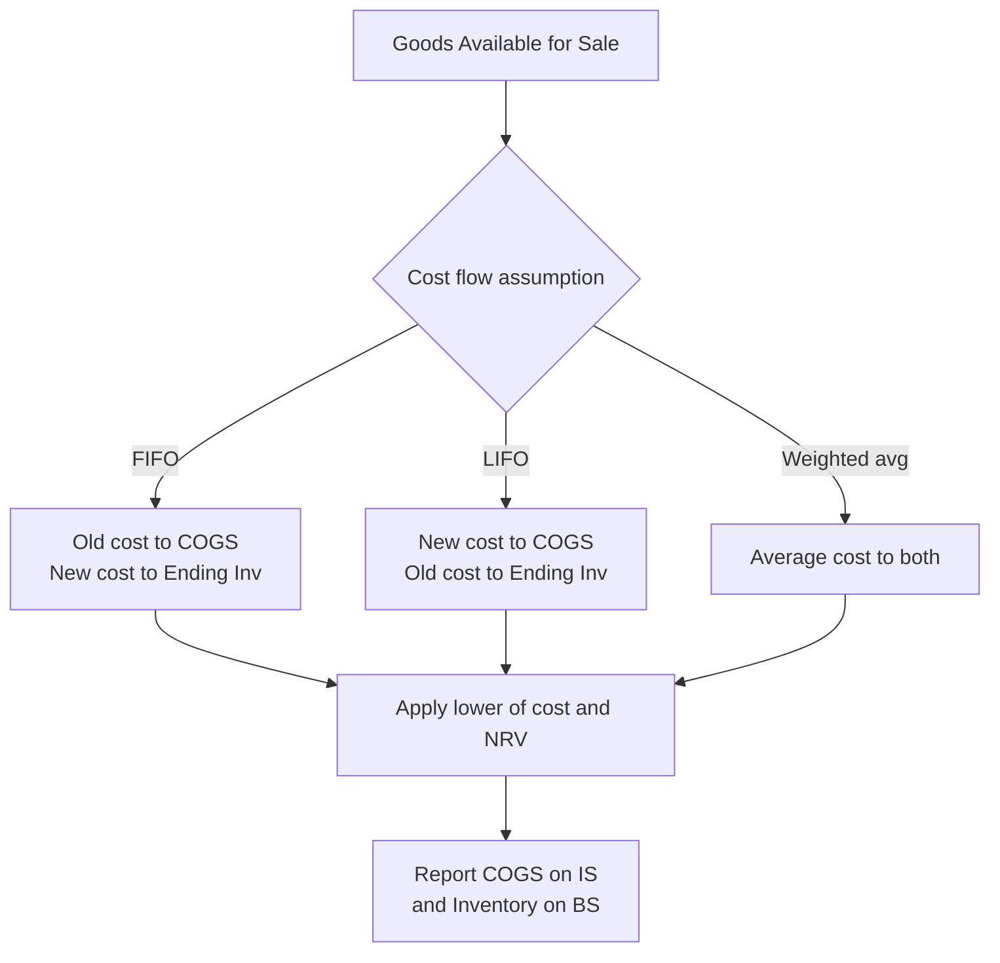
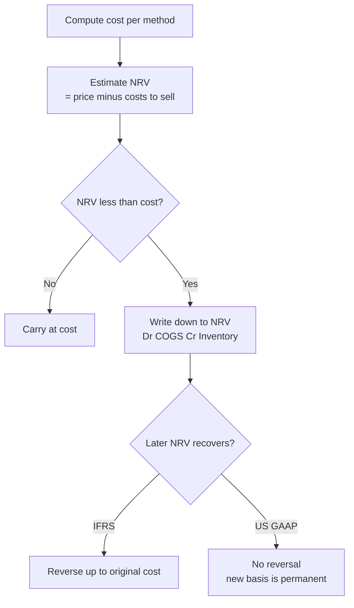
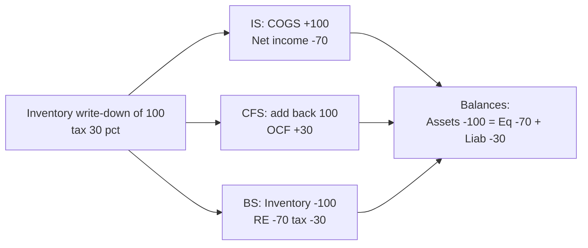

# Inventory & Cost of Goods Sold

## The Problem / Why this matters

Walk into any manufacturer, retailer, or distributor and the single largest number on the balance sheet — often the single largest operating asset — is **inventory**. And the single largest expense on the income statement is usually **Cost of Goods Sold (COGS)**. These two numbers are joined at the hip: every rupee (or dollar) that leaves inventory becomes COGS, and every rupee that stays becomes ending inventory. Get the split wrong and *both* the balance sheet and the income statement are wrong at the same time.

Here is the deceptively simple problem. A company buys the same product many times during the year at *different prices*. In an inflationary world, the first batch cost ₹100, the next ₹110, the next ₹120. At year-end you have sold some units and hold some units. **Which cost do you attach to the units sold, and which to the units left over?** The physical widgets may be identical and interchangeable, but the *costs* attached to them are not. There is no single "correct" answer that nature hands you — accounting has to *choose a convention*, and that choice (FIFO, LIFO, weighted average) drives reported profit, reported assets, cash taxes paid, and every margin ratio an analyst computes.

This is why inventory is one of the densest topics in a finance interview. It is the cleanest place to test whether a candidate actually understands the **three-statement linkage**, the difference between an accounting choice and an economic reality, and the concept of a **non-cash valuation reserve**. An equity research analyst comparing a LIFO US industrial to an IFRS European peer *cannot* compare their margins without adjusting for this. A credit analyst valuing collateral needs to know whether the inventory on the books is stated at a stale historic cost or a realistic realizable value. An FP&A analyst forecasting gross margin has to know whether rising input costs will hit the P&L this quarter or next. So inventory accounting is not a bookkeeping footnote — it is where accounting policy visibly bends the reported economics of a business, and interviewers love it precisely for that reason.

## Core Idea

There are three moving pieces and one identity that ties them together.

**The inventory identity (cost-flow equation):**

> Beginning Inventory + Purchases (or Cost of Goods Manufactured) − Ending Inventory = Cost of Goods Sold

Rearranged: `COGS = Goods Available for Sale − Ending Inventory`.

Everything in this chapter is a variation on splitting **Goods Available for Sale** into two buckets: the part expensed now (COGS) and the part carried forward (ending inventory). The **cost-flow assumption** (FIFO / LIFO / weighted average) decides *how* that split is made when unit costs differ. The **inventory system** (periodic vs perpetual) decides *when and how often* you do the calculation. And the **lower-of-cost-or-NRV rule** decides when you must abandon cost altogether and write the asset down.

The single most important consequence to burn into memory:

> **In a period of rising prices, FIFO gives the highest ending inventory, the lowest COGS, and the highest reported profit (and highest tax). LIFO gives the lowest ending inventory, the highest COGS, and the lowest reported profit (and lowest tax). Weighted average sits in between.**

That one sentence, understood from first principles rather than memorized, answers half the interview questions on this topic.

## Why it works this way

Why must accounting choose a convention at all? Because **cost is attached to units, not averaged by nature**. Two identical bolts sitting in a bin may have been bought six months apart at different prices. When you sell one bolt, real cash-basis logic can't tell you which cost "left." Accrual accounting demands you assign *some* cost to the sale so you can measure profit. So the profession defined cost-flow *assumptions* — deliberately labelled *assumptions*, because they need not match physical flow at all. A hardware store using LIFO can, and usually does, physically sell its oldest stock first; the LIFO label governs only which *costs* flow to the income statement, not which *bolts* leave the shelf.

Why does rising prices produce the FIFO/LIFO profit gap? Follow the money. Under **FIFO** ("first in, first out"), the *oldest, cheapest* costs are matched against today's sales revenue. Old cheap cost vs new high revenue → a wide spread → high gross profit. But the costs *left behind* in ending inventory are the newest, highest ones → inventory looks fat and current. Under **LIFO** ("last in, first out"), the *newest, most expensive* costs are matched against today's revenue → narrow spread → low gross profit. The costs left behind are the oldest, cheapest ones → ending inventory is stated at ancient prices and can be wildly below replacement cost.

Now the deep insight: which one is "right"? It depends on what you want the two statements to do well.

- LIFO makes the **income statement** more economically honest in inflation, because it matches *current* costs against *current* revenue — the gross margin reflects what it costs to replace what you sold *today*. FIFO's margin under inflation is partly illusory "inventory profit" (you booked profit simply because you happened to hold cheap old stock, not because operations got better).
- FIFO makes the **balance sheet** more economically honest, because ending inventory is carried at recent, near-replacement cost. LIFO's balance-sheet inventory can be decades stale and meaningless.

No convention can make *both* statements simultaneously reflect current cost, because the two buckets are complementary — push current cost into COGS (LIFO) and the old cost piles up in the asset; push current cost into the asset (FIFO) and old cost flows through COGS. This is the fundamental tension, and it is *why* the standard-setters, tax authorities, and analysts all care.

Why does tax enter? Because in most jurisdictions **taxable income follows book COGS**. Lower reported profit → lower taxable income → lower cash taxes. LIFO's higher COGS is therefore a genuine *cash* benefit in inflation — you literally pay less tax. That is the whole reason LIFO exists and survives in the United States, and the reason the US Treasury imposes the **LIFO conformity rule**: you may only use LIFO for tax if you also use it for your published financial statements. Companies must choose — you can't take the tax break and still show investors the fatter FIFO profit.

## Full technical content

### 1. What is included in inventory cost

Inventory is initially measured at **cost**. Cost is not just the invoice price. Under both **IAS 2 *Inventories*** (IFRS) and **ASC 330 *Inventory*** (US GAAP), the cost of inventory comprises:

| Component | Included? | Notes |
|---|---|---|
| Purchase price | Yes | Net of trade discounts and rebates |
| Import duties, non-recoverable taxes | Yes | Recoverable taxes (e.g. input GST/VAT credit) are excluded |
| Freight-in / inward transport | Yes | Cost of bringing inventory to present location and condition |
| Handling, insurance in transit | Yes | Part of acquisition |
| Conversion costs — direct labour | Yes (manufacturers) | For work-in-process and finished goods |
| Conversion costs — production overheads | Yes | Fixed overhead absorbed at *normal* capacity |
| Abnormal waste / spoilage | **No** | Expensed as incurred |
| Storage after production complete | **No** | Unless required before a further production stage |
| Selling & distribution (freight-out) | **No** | A period expense, never inventoriable |
| General admin overhead | **No** | Period expense |
| Interest / borrowing cost | Generally **No** | Only capitalised for "qualifying assets" that take a long time to produce (e.g. aged whisky, wine) |

Key formula for a manufacturer feeding COGS:

> **Cost of Goods Manufactured (COGM) = Direct Materials Used + Direct Labour + Manufacturing Overhead + Opening WIP − Closing WIP**
>
> **COGS = Opening Finished Goods + COGM − Closing Finished Goods**

For a retailer it collapses to: **COGS = Opening Inventory + Net Purchases − Closing Inventory**, where Net Purchases = Purchases + Freight-in − Purchase Returns − Purchase Discounts.

### 2. The four cost-flow assumptions

| Method | Cost assigned to COGS | Cost left in ending inventory | Allowed under |
|---|---|---|---|
| **Specific identification** | Actual cost of the exact unit sold | Actual cost of exact units held | IFRS & US GAAP. Required when items are not interchangeable (real estate, cars by VIN, unique art). |
| **FIFO** (first-in first-out) | Oldest costs | Newest costs | IFRS & US GAAP |
| **Weighted average** | Average cost of all units available | Same average | IFRS & US GAAP |
| **LIFO** (last-in first-out) | Newest costs | Oldest costs | **US GAAP only — PROHIBITED under IFRS (IAS 2)** |

**Weighted-average cost (periodic) formula:**

> Weighted-average unit cost = Total cost of goods available for sale ÷ Total units available for sale

Under a **perpetual** system the average is recomputed after each purchase — this is called the **moving-average** method, and it can give a slightly different answer from periodic weighted average because the average "resets" as purchases arrive between sales.

### 3. Periodic vs perpetual inventory systems

| Feature | Periodic | Perpetual |
|---|---|---|
| When inventory/COGS updated | Only at period-end (physical count) | Continuously, at each sale and purchase |
| Running record of quantity on hand | No | Yes |
| COGS derived as | Balancing figure: BI + Purchases − EI | Recorded directly at each sale |
| Purchases recorded in | A "Purchases" account | Directly into "Inventory" account |
| Shrinkage / theft | Buried inside COGS (invisible) | Isolated as a separate shrinkage adjustment |
| Cost / infrastructure | Cheap, manual | Needs a system (barcodes/ERP) |
| Typical user | Small shops, low-value high-volume | Modern retailers, anything with an ERP |

**Journal entries — periodic system:**

| Transaction | Debit | Credit |
|---|---|---|
| Purchase of goods | Purchases | Cash / Accounts Payable |
| Freight-in | Freight-in | Cash / AP |
| Sale | Cash / Accounts Receivable | Sales revenue |
| Period-end: close out and record COGS | COGS; Ending Inventory | Beginning Inventory; Purchases |

**Journal entries — perpetual system:**

| Transaction | Debit | Credit |
|---|---|---|
| Purchase of goods | Inventory | Cash / AP |
| Sale (two entries) — revenue | Cash / AR | Sales revenue |
| Sale — cost side | COGS | Inventory |

Note the defining difference: under perpetual, **every sale carries a second entry** debiting COGS and crediting Inventory at the cost of the units shipped. Under periodic there is no cost entry at the point of sale; COGS is computed at period-end as a residual after a physical count.

### 4. Lower of Cost and Net Realizable Value (write-downs)

Inventory is an asset, and an asset must never be carried above the cash it can generate. So after computing cost by one of the methods above, you apply the **lower-of-cost-or-NRV** test.

- **IFRS (IAS 2):** carry at the **lower of cost and Net Realizable Value (NRV)**.
  - **NRV = estimated selling price − estimated costs to complete − estimated costs to sell.**
- **US GAAP (ASC 330):**
  - For companies using **FIFO or weighted average**: lower of cost and **NRV** (harmonised with IFRS since ASU 2015-11).
  - For companies using **LIFO or the retail inventory method**: the older **lower of cost or market (LCM)** rule, where "market" = replacement cost, bounded by a **ceiling = NRV** and a **floor = NRV − normal profit margin**.

**Reversal of write-downs — a key IFRS vs GAAP difference:**

| | IFRS (IAS 2) | US GAAP (ASC 330) |
|---|---|---|
| Write-down when NRV < cost | Required | Required |
| Later recovery of NRV | **Reversal required** (up to original cost) | **Reversal PROHIBITED** — the written-down value becomes the new cost basis |

**Journal entry — write-down (both frameworks):**

| Debit | Credit |
|---|---|
| Cost of Goods Sold (or "Loss on inventory write-down") | Inventory (or "Allowance to reduce inventory to NRV") |

**Journal entry — reversal (IFRS only):**

| Debit | Credit |
|---|---|
| Inventory / Allowance | Cost of Goods Sold |

Write-downs are typically assessed **item-by-item** (or by group of similar items), *not* on the total inventory as a whole — this is conservative because it stops a gain on one item from masking a loss on another.

### 5. LIFO-specific machinery (US GAAP only)

Because LIFO is such a favourite interview topic, know its dedicated vocabulary.

- **LIFO reserve** = FIFO inventory value − LIFO inventory value. It is the cumulative difference disclosed in the footnotes. It represents the amount by which LIFO understates the balance-sheet inventory (and, cumulatively, the amount of extra COGS / lower profit LIFO has recognised over time versus FIFO).
- **Converting LIFO to FIFO (the analyst's adjustment):**
  - FIFO inventory = LIFO inventory + LIFO reserve
  - FIFO COGS = LIFO COGS − (increase in LIFO reserve during the year)
  - FIFO pre-tax income = LIFO pre-tax income + increase in LIFO reserve
  - Extra taxes that would have been paid under FIFO = LIFO reserve × tax rate; so **FIFO retained earnings = LIFO retained earnings + LIFO reserve × (1 − tax rate)**, and the cumulative tax saving of ≈ LIFO reserve × tax rate is why LIFO is used.
- **LIFO liquidation:** if a LIFO company sells *more* units than it buys in a period, it dips into old, cheap LIFO cost layers. Those ancient low costs hit COGS, artificially *inflating* gross margin and profit in that period — a low-quality, unsustainable earnings boost. Interviewers love this because it is a classic "earnings quality" red flag, often caused by a strike, a production cut, or deliberate inventory drawdown to flatter results.

### 6. Standards summary

| Topic | IFRS | US GAAP |
|---|---|---|
| Governing standard | IAS 2 Inventories | ASC 330 Inventory |
| LIFO | Prohibited | Permitted |
| Measurement | Lower of cost and NRV | Lower of cost and NRV (FIFO/avg); LCM (LIFO/retail) |
| Write-down reversal | Required if NRV recovers | Prohibited |
| Borrowing cost in inventory | Only qualifying assets (IAS 23) | Similar, narrow |

## Worked examples

### Example 1 — FIFO vs LIFO vs Weighted Average in inflation (periodic)

**Data.** A trading company. No beginning inventory. During the year:

| Purchase | Units | Unit cost | Total cost |
|---|---|---|---|
| Jan | 100 | ₹10 | ₹1,000 |
| Apr | 100 | ₹12 | ₹1,200 |
| Aug | 100 | ₹14 | ₹1,400 |
| Nov | 100 | ₹16 | ₹1,600 |
| **Total available** | **400** | | **₹5,200** |

Units sold during the year = **250**. Ending inventory = 400 − 250 = **150 units**. Selling price = ₹20 per unit, so **Sales = 250 × 20 = ₹5,000**. Operating expenses = ₹500. Tax rate = 30%. Prices are rising all year (inflation).

**Step 1 — FIFO.** Oldest costs flow to COGS. The 250 units sold take: 100 @ ₹10 + 100 @ ₹12 + 50 @ ₹14.

- COGS = 1,000 + 1,200 + (50 × 14 = 700) = **₹2,900**
- Ending inventory (150 units) = the newest costs = 50 @ ₹14 + 100 @ ₹16 = 700 + 1,600 = **₹2,300**
- Check: 2,900 + 2,300 = 5,200 ✓ (ties to goods available)

**Step 2 — LIFO.** Newest costs flow to COGS. The 250 units sold take: 100 @ ₹16 + 100 @ ₹14 + 50 @ ₹12.

- COGS = 1,600 + 1,400 + (50 × 12 = 600) = **₹3,600**
- Ending inventory (150 units) = the oldest costs = 100 @ ₹10 + 50 @ ₹12 = 1,000 + 600 = **₹1,600**
- Check: 3,600 + 1,600 = 5,200 ✓

**Step 3 — Weighted average.** Average unit cost = 5,200 ÷ 400 = **₹13.00**.

- COGS = 250 × 13 = **₹3,250**
- Ending inventory = 150 × 13 = **₹1,950**
- Check: 3,250 + 1,950 = 5,200 ✓

**Step 4 — Income statements side by side.**

| | FIFO | Weighted avg | LIFO |
|---|---:|---:|---:|
| Sales | 5,000 | 5,000 | 5,000 |
| COGS | (2,900) | (3,250) | (3,600) |
| **Gross profit** | **2,100** | **1,750** | **1,400** |
| Operating expenses | (500) | (500) | (500) |
| Pre-tax income | 1,600 | 1,250 | 900 |
| Tax @ 30% | (480) | (375) | (270) |
| **Net income** | **1,120** | **875** | **630** |
| **Ending inventory (BS)** | **2,300** | **1,950** | **1,600** |
| **Cash tax paid** | **480** | **375** | **270** |

**Reading the result.** Exactly as the core idea predicted for rising prices: FIFO shows the highest profit (₹1,120) and highest inventory (₹2,300); LIFO the lowest profit (₹630) and lowest inventory (₹1,600); average in between. But note LIFO pays ₹210 *less* cash tax than FIFO (480 vs 270). That ₹210 is real cash retained in the business. The **LIFO reserve** here = FIFO inventory − LIFO inventory = 2,300 − 1,600 = **₹700**, and 700 × 30% = ₹210 — precisely the cumulative tax saving. Every number ties.

### Example 2 — Perpetual FIFO vs periodic FIFO, and moving average (perpetual)

**Data.** One product. Transactions in date order:

| Date | Type | Units | Unit cost |
|---|---|---|---|
| Mar 1 | Beginning inv | 200 | ₹50 |
| Mar 5 | Purchase | 300 | ₹55 |
| Mar 12 | **Sale** | 400 | (sold) |
| Mar 20 | Purchase | 200 | ₹60 |
| Mar 27 | **Sale** | 150 | (sold) |

Total available = 200 + 300 + 200 = 700 units, total cost = (200×50)+(300×55)+(200×60) = 10,000 + 16,500 + 12,000 = **₹38,500**. Total sold = 400 + 150 = 550. Ending inventory = 700 − 550 = **150 units**.

**Part A — FIFO (perpetual).** Under FIFO, perpetual and periodic always give the *same* answer, because "oldest first" is unaffected by *when* you look.

- Mar 12 sale of 400: take 200 @ 50 + 200 @ 55 = 10,000 + 11,000 = **₹21,000**. Remaining: 100 @ 55.
- Mar 20 purchase: now hold 100 @ 55 + 200 @ 60.
- Mar 27 sale of 150: take 100 @ 55 + 50 @ 60 = 5,500 + 3,000 = **₹8,500**. Remaining: 150 @ 60.
- **Total COGS = 21,000 + 8,500 = ₹29,500.** Ending inventory = 150 @ 60 = **₹9,000**.
- Check: 29,500 + 9,000 = 38,500 ✓

**Part B — FIFO (periodic), to confirm equality.** Ending inventory = newest 150 units = 150 @ 60 = ₹9,000. COGS = 38,500 − 9,000 = ₹29,500. **Identical to perpetual.** ✓ (This is a classic exam trap-avoider: FIFO periodic = FIFO perpetual, always.)

**Part C — Moving average (perpetual).** Recompute the average after each purchase.

- After Mar 5: units 500, cost 26,500, avg = 26,500 ÷ 500 = **₹53.00**.
- Mar 12 sale 400 @ 53.00 = **₹21,200** COGS. Remaining 100 units @ 53.00 = ₹5,300.
- Mar 20 purchase 200 @ 60 = 12,000. New balance: 300 units, cost 5,300 + 12,000 = 17,300, avg = 17,300 ÷ 300 = **₹57.667**.
- Mar 27 sale 150 @ 57.667 = **₹8,650** COGS. Remaining 150 @ 57.667 = ₹8,650.
- **Total COGS = 21,200 + 8,650 = ₹29,850.** Ending inventory = **₹8,650**.
- Check: 29,850 + 8,650 = 38,500 ✓

**Part D — Weighted average (periodic), to show it differs from moving average.** Periodic average = 38,500 ÷ 700 = **₹55.00**. COGS = 550 × 55 = ₹30,250. Ending inventory = 150 × 55 = ₹8,250. Check: 30,250 + 8,250 = 38,500 ✓.

**The teaching point.** Notice three different COGS numbers from one dataset: FIFO ₹29,500, moving average ₹29,850, periodic weighted average ₹30,250. FIFO is the same under either system; *average is not* — periodic averages across the whole period, perpetual (moving) re-averages transaction-by-transaction. Interviewers use this to catch candidates who think "weighted average is weighted average."

### Example 3 — Lower of cost and NRV write-down, with the IFRS reversal

**Data.** A machinery-parts distributor holds three product lines at year-end (Year 1). Cost was computed under weighted average. Estimated selling prices have fallen for two lines.

| Product | Qty | Cost/unit | Selling price/unit | Cost to complete & sell /unit |
|---|---:|---:|---:|---:|
| Alpha | 100 | ₹200 | ₹260 | ₹20 |
| Beta | 100 | ₹200 | ₹190 | ₹15 |
| Gamma | 100 | ₹150 | ₹160 | ₹25 |

**Step 1 — Compute NRV per unit** (= selling price − cost to complete & sell):

- Alpha NRV = 260 − 20 = ₹240
- Beta NRV = 190 − 15 = ₹175
- Gamma NRV = 160 − 25 = ₹135

**Step 2 — Lower of cost and NRV, item by item:**

| Product | Cost total | NRV total | Carry at (lower) | Write-down |
|---|---:|---:|---:|---:|
| Alpha | 20,000 | 24,000 | 20,000 (cost) | 0 |
| Beta | 20,000 | 17,500 | 17,500 (NRV) | 2,500 |
| Gamma | 15,000 | 13,500 | 13,500 (NRV) | 1,500 |
| **Total** | **55,000** | | **51,000** | **4,000** |

Note we do **not** net Alpha's ₹4,000 headroom against the losses — item-by-item is the conservative rule. Total write-down = ₹4,000.

**Journal entry (Year 1):**

| Debit | Credit |
|---|---|
| Cost of Goods Sold ₹4,000 | Inventory (allowance to reduce to NRV) ₹4,000 |

Inventory now carried at ₹51,000. This ₹4,000 loss depresses Year 1 gross profit.

**Step 3 — Year 2 recovery (IFRS).** Suppose at end of Year 2 the *same* Beta stock is still on hand, and its selling price recovers so NRV rises back to ₹210/unit (₹21,000 total), well above the ₹200 original cost.

- IFRS caps the reversal at *original cost*, not at the new higher NRV. Beta was written down by ₹2,500 (from 20,000 to 17,500). It can be written back up **only to its original cost of ₹20,000**, i.e. a reversal of ₹2,500.

**Reversal entry (IFRS, IAS 2):**

| Debit | Credit |
|---|---|
| Inventory ₹2,500 | Cost of Goods Sold ₹2,500 |

This ₹2,500 credit *reduces* Year 2 COGS and lifts Year 2 gross profit. **Under US GAAP the same recovery would be ignored** — the ₹17,500 becomes Beta's new cost basis permanently, and no write-up is allowed. Two companies with identical economics report different Year 2 margins purely because of the framework. That is a perfect three-way interview answer: state the fact, give the entry, name the standards.

## How it is tested in interviews

Inventory is a three-statement gymnasium. Here are the exact questions and the crisp model answers.

**Q1. "In an inflationary environment, which method gives the highest net income and why?"**
Model answer: "FIFO. Under FIFO the oldest, cheapest costs flow to COGS, so COGS is lowest and gross profit highest. The trade-off is you also pay the most tax, and your inventory on the balance sheet is stated at the newest, near-replacement cost. LIFO is the mirror image — highest COGS, lowest profit, lowest tax, but a stale balance sheet." Say the whole triangle — profit, tax, balance sheet — not just the profit line.

**Q2. "Then why would any company choose LIFO?"**
Model answer: "Cash taxes. In rising prices LIFO's higher COGS lowers taxable income, so the company pays less tax and keeps more cash. In the US the LIFO conformity rule forces you to also report the lower LIFO profit to shareholders if you take the tax benefit — so it's a deliberate trade of reported earnings for real cash." One line, hits the economic core.

**Q3. "A US company uses LIFO. As an analyst, how do you compare it to an IFRS peer on FIFO?"**
Model answer: "I convert LIFO to FIFO using the LIFO reserve in the footnotes. FIFO inventory = LIFO inventory + LIFO reserve. FIFO COGS = LIFO COGS minus the *change* in the LIFO reserve for the year. And I adjust retained earnings up by the LIFO reserve net of tax. That puts both companies on a comparable FIFO basis before I look at margins and turnover." This answer alone separates a strong candidate.

**Q4. "Walk me through what happens to the three statements when inventory is written down by $100 (30% tax)."**
Model answer: "**Income statement:** COGS rises $100, pre-tax income falls $100, tax falls $30, net income falls $70. **Cash flow:** start from net income −$70, add back the $100 write-down because it's non-cash, so operating cash flow actually *rises* $30 — that's just the tax saving; no cash left the business. **Balance sheet:** inventory down $100 on the asset side; on the other side, retained earnings down $70 and the deferred tax / taxes payable line reflects the $30. Assets −100 = equity −70 + liabilities −30. It balances." This is the single most-asked linkage question in the whole topic — rehearse it cold.

**Q5. "What is LIFO liquidation and why should I care?"**
Model answer: "It's when a LIFO firm sells more than it buys, so it dips into old, cheap LIFO layers. Those ancient costs hit COGS, artificially inflating gross margin and profit that period. It's low-quality earnings — unsustainable and often a sign of a production cut or deliberate inventory drawdown to flatter results. I'd strip it out before trusting the margin."

**Q6. "Company builds inventory that isn't selling. What are you worried about?"**
Model answer: "Rising inventory with flat or falling sales — days-inventory-outstanding climbing — flags obsolescence risk and a looming write-down, plus it's cash tied up. On the cash flow statement the inventory build is a use of cash, so earnings quality is weak: the company may be reporting profit while bleeding operating cash. I'd check the inventory-write-down reserve and the aging."

**Q7. "If a company switches from FIFO to LIFO, what happens to cash?"**
Model answer: "In inflation, cash *rises*, because LIFO lifts COGS, cuts taxable income and cuts the tax bill — the only real-cash line item that changes is tax. Reported profit falls but the firm is genuinely better off in cash terms."

## Traps & common mistakes

- **Confusing cost flow with physical flow.** LIFO does not mean you physically ship the newest goods; a grocery still sells oldest milk first. The label governs *costs*, not *cans*.
- **Reversing the inflation rule.** Under *rising* prices FIFO → high profit; under *falling* prices it flips. Anchor to the logic (which costs hit COGS), never a memorized word.
- **Netting NRV write-downs across the whole inventory.** Lower-of-cost-or-NRV is applied item-by-item (or by similar group). You cannot use a winner to offset a loser.
- **Treating a write-down as a cash outflow.** It's non-cash. In the cash flow statement it's *added back*; operating cash flow actually rises by the tax shield.
- **Forgetting the LIFO reserve is cumulative.** FIFO COGS uses the *change* in the reserve for the year, but FIFO inventory uses the *full* reserve balance. Mixing these up is a classic slip.
- **Assuming weighted average is one number.** Periodic weighted average ≠ perpetual moving average. FIFO is the only method identical under both systems.
- **Putting freight-out or selling costs into inventory.** Costs to *sell* are period expenses; only costs to *get inventory ready and in place* are inventoriable.
- **Saying IFRS allows LIFO.** It does not — IAS 2 bans it outright. Also remember IFRS *requires* write-down reversals; US GAAP forbids them.
- **Ignoring LIFO liquidation when margins suddenly jump.** A margin spike in a LIFO firm with falling inventory is a quality-of-earnings red flag, not good news.

## First-principles recap

- Cost is attached to units, not averaged by nature, so accounting must *choose* a cost-flow assumption — FIFO, LIFO, or weighted average — to split Goods Available for Sale into COGS and ending inventory.
- The identity **BI + Purchases − EI = COGS** governs everything; whatever you don't expense, you carry.
- In inflation, FIFO = low COGS, high profit, high tax, current balance sheet; LIFO = high COGS, low profit, low tax, stale balance sheet; average is in between. It's a straight consequence of *which* costs you match against revenue.
- LIFO's reason to exist is a **real cash tax saving**; the LIFO reserve measures the gap and lets analysts convert back to FIFO for comparison.
- The system (periodic vs perpetual) sets *when* you measure; the assumption sets *how* you split. FIFO is system-independent; average is not.
- Inventory can never be carried above the cash it can raise, so **lower-of-cost-and-NRV** overrides cost; IFRS reverses recoveries, US GAAP does not, and IFRS bans LIFO entirely.
- A write-down is a **non-cash** charge — it dents profit and the asset but *adds back* in cash flow, actually raising operating cash by the tax shield.

## Quick-reference

| Item | Formula / rule |
|---|---|
| Cost-flow identity | Beginning Inv + Purchases − Ending Inv = COGS |
| Retailer COGS | Opening Inv + Net Purchases − Closing Inv |
| Net Purchases | Purchases + Freight-in − Returns − Discounts |
| Manufacturer COGS | Opening FG + COGM − Closing FG |
| COGM | DM used + Direct Labour + Mfg OH + Opening WIP − Closing WIP |
| Weighted-avg unit cost (periodic) | Total cost available ÷ total units available |
| NRV | Selling price − costs to complete − costs to sell |
| LIFO reserve | FIFO inventory − LIFO inventory |
| FIFO inventory (from LIFO) | LIFO inventory + LIFO reserve |
| FIFO COGS (from LIFO) | LIFO COGS − Δ LIFO reserve |
| FIFO pre-tax income | LIFO pre-tax income + Δ LIFO reserve |
| Cash tax saved by LIFO | ≈ LIFO reserve × tax rate |
| Inflation ranking (profit & EI) | FIFO > Weighted avg > LIFO |
| Inflation ranking (COGS & tax) | LIFO > Weighted avg > FIFO |
| Write-down entry | Dr COGS / Cr Inventory |
| Reversal (IFRS only) | Dr Inventory / Cr COGS, capped at original cost |
| Perpetual sale — cost side | Dr COGS / Cr Inventory (at each sale) |
| Periodic COGS | Balancing figure at period-end after physical count |

| Standard | IFRS = IAS 2 | US GAAP = ASC 330 |
|---|---|---|
| LIFO | Prohibited | Permitted |
| Measurement | Lower of cost & NRV | Lower of cost & NRV (FIFO/avg); LCM (LIFO/retail) |
| Write-down reversal | Required (cap = original cost) | Prohibited |

