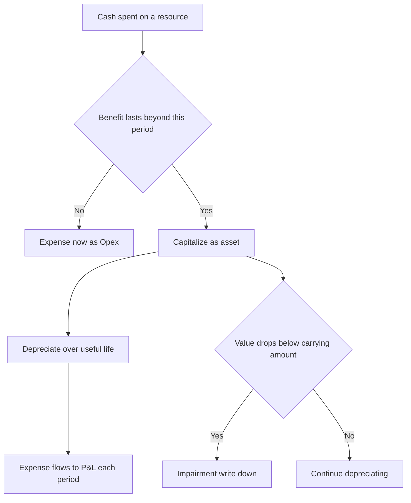
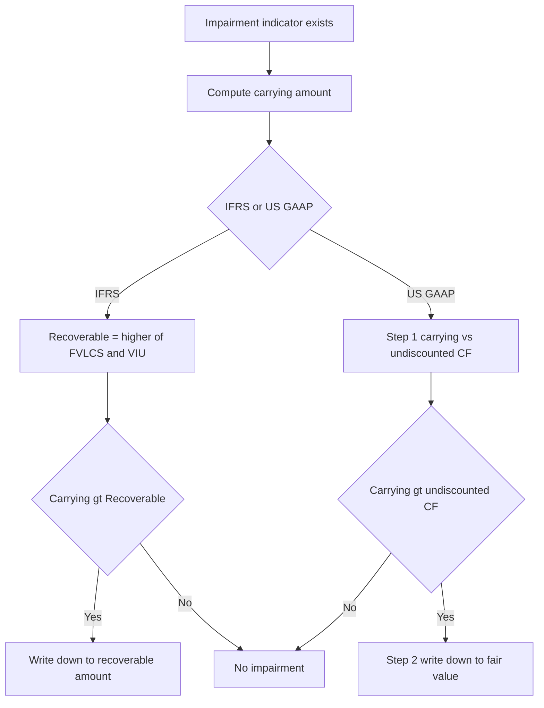

# PP&E, Depreciation, Capex vs Opex & Impairment

## The Problem / Why this matters

A company buys a machine for $10 million. It will run for ten years. Here is the question that sits under this entire chapter: **when does that $10 million become an expense on the income statement?**

The naive answer — "when you pay for it" — is wrong, and understanding *why* it is wrong is the single most important accounting insight a finance professional carries into every interview room. If you expensed the full $10m in Year 1, the company would show a catastrophic loss in the year of purchase and then artificially inflated profits for the next nine years, even though the machine is chugging along producing the same output every year. Earnings would be a lie. A private-equity buyer valuing the business off that Year-3 number would massively overpay.

So accounting invented a machine of its own: **capitalization and depreciation**. You park the $10m on the balance sheet as an asset, then bleed it into the income statement a slice at a time over the years the machine actually helps you earn revenue. This is the **matching principle** in its purest, most visible form.

This chapter matters because PP&E and depreciation are where three things collide that interviewers *love* to probe:

1. **The three-statement linkage.** Depreciation is the textbook example of a non-cash expense. "Increase depreciation by $10, walk me through the three statements" is the most-asked technical question in all of IB/PE recruiting. If you cannot do it cold, you are out.
2. **The capex-vs-opex fraud angle.** WorldCom committed the largest accounting fraud in US history (at the time) — $11 billion — by doing one conceptually simple thing: reclassifying operating costs as capital expenditures. Understanding *why that flatters earnings* is understanding the whole chapter.
3. **Judgment and estimates.** Useful life, salvage value, depreciation method, impairment triggers, recoverable amount — every one is an estimate management chooses. That makes PP&E a favorite hiding place for both honest error and deliberate manipulation. Analysts who understand the levers can spot the games.

Master this chapter and you can walk a three-statement model, sniff out earnings management, and speak fluently about the single largest asset line on most industrial, telecom, utility, and real-estate balance sheets.

## Core Idea

**PP&E (Property, Plant & Equipment)** are long-lived tangible assets a business uses to produce goods or services — land, buildings, machinery, vehicles, furniture, fixtures, computers. They are not for resale (that would be inventory) and they last more than one accounting period.

The core idea has four moving parts:

- **Capitalize, don't expense.** When you buy or build a long-lived asset, you record it as an asset (capitalize it), not as an immediate expense. The cost sits on the balance sheet.
- **Depreciate over the useful life.** Each period, you move a portion of that cost into the income statement as **depreciation expense**, matching the cost to the periods that benefit from the asset.
- **Carry at net book value.** On the balance sheet the asset shows at **cost minus accumulated depreciation** (= net book value / carrying amount), representing the cost *not yet* expensed.
- **Test for impairment; sometimes revalue.** If the asset loses value faster than depreciation captures (a factory becomes obsolete), you write it down via an **impairment**. Under IFRS you may also *revalue* upward to fair value.

Everything else — methods, componentization, disposals, capex vs opex — is detail hanging off these four hooks.

## Why it works this way

Start from first principles. Accounting exists to answer one question: **how much better off is the business this period?** That is *profit*. Profit = revenue earned minus the cost of resources *used up* to earn it. The key phrase is "used up."

When you buy inventory and sell it, the inventory is *used up* in that sale — so its cost (COGS) hits the P&L immediately, matched against the sale. Clean.

But when you buy a machine, nothing is "used up" at the moment of purchase. You have simply swapped one asset (cash) for another asset (a machine) of equal value. Your net worth has not changed — so there is no expense and no effect on profit at purchase. This is why capex does **not** appear on the income statement. (Interviewers test exactly this: "Does buying a $100 machine hit the income statement?" Answer: not at purchase — only the depreciation does, over time.)

What *is* used up is the machine's **service potential**, and it gets used up gradually as the machine wears out, becomes obsolete, or approaches the end of its economic life. Depreciation is the accountant's estimate of how much service potential was consumed this period. It is fundamentally an **allocation of cost**, not a **valuation** of the asset. This distinction is worth tattooing on your brain:

> **Depreciation is a process of cost allocation, not asset valuation.** The net book value on the balance sheet is "cost we haven't expensed yet," NOT "what the asset is worth."

That single sentence resolves a hundred confusions. It is why a fully depreciated machine still running on the factory floor sits at zero (or salvage) on the books even though it clearly has value. It is why depreciation is non-cash — the cash left years ago, at purchase; depreciation is just the bookkeeping catch-up. And it is why land is **not** depreciated: land does not get "used up" — it has an indefinite life.

The matching principle drives the whole architecture: **recognize the expense in the same periods as the revenue the resource helped generate.** A ten-year machine helps generate revenue for ten years, so its cost is spread over ten years. Elegant, and — because "useful life" and "how fast it's consumed" are judgment calls — endlessly gameable.



## Full technical content

### 1. What gets capitalized — the cost of an asset

Under both **IAS 16 (Property, Plant and Equipment)** and **US GAAP (ASC 360)**, an item of PP&E is initially measured at **cost**, and cost includes *everything* needed to get the asset ready for its intended use:

| Included in capitalized cost | Excluded (expense immediately) |
|---|---|
| Purchase price (net of trade discounts, rebates) | Administrative / general overhead |
| Import duties, non-refundable purchase taxes | Costs after asset is ready for use |
| Freight, handling, insurance in transit | Training staff to use the asset |
| Installation, assembly, site preparation | Advertising / promotion of new product |
| Testing (net of proceeds from test output, IFRS) | Relocation / reorganization costs |
| Professional fees (architects, engineers, legal) | Abnormal waste of material/labour |
| Initial estimate of dismantling / restoration (IAS 16) | Operating losses before full capacity |
| Borrowing costs during construction (IAS 23 / ASC 835) | Initial operating losses |

**Key principle:** capitalize costs that are **necessary** to bring the asset to working condition **and** that provide **future economic benefit**. Once the asset is ready for its intended use, capitalization stops — even if it isn't yet operating at full capacity.

**Subsequent expenditure.** After acquisition, the question repeats for every dollar spent on the asset:

- **Capital expenditure (capex):** improves the asset beyond its original condition — extends useful life, increases capacity, improves output quality, or reduces operating cost. *Capitalize.* Example: a new engine that adds 5 years of life to a truck.
- **Revenue expenditure / repairs & maintenance (opex):** keeps the asset in its *existing* condition. *Expense.* Example: oil change, painting, replacing a broken belt.

The test: does the spend **restore** the asset (opex) or **enhance** it beyond original standard (capex)?

### 2. Borrowing costs (capitalized interest)

Under **IAS 23** (and **ASC 835-20**), interest on funds borrowed to construct a *qualifying asset* (one that takes a substantial time to get ready) must be **capitalized** into the asset's cost during the construction period, not expensed. Capitalization begins when expenditures are incurred and activities are underway, and **ceases** when the asset is substantially complete. This is why a half-built power plant accrues interest into its cost base.

### 3. Depreciation — definitions and drivers

**Depreciation** = the systematic allocation of the **depreciable amount** of an asset over its **useful life**.

- **Depreciable amount** = Cost − Residual (salvage) value.
- **Residual/salvage value** = estimated amount the entity would obtain on disposal at the end of useful life, net of disposal costs.
- **Useful life** = period over which the asset is expected to be available for use (may be shorter than physical life).
- **Carrying amount / Net book value (NBV)** = Cost − Accumulated depreciation (− accumulated impairment).

Depreciation begins when the asset is **available for use** and continues until it is derecognized (even if idle), stopping only when NBV reaches residual value (or the asset is classified as held-for-sale under IFRS 5).

**Terminology note:** "Depreciation" is for tangible assets. The same concept is **amortization** for intangibles and **depletion** for natural resources (mines, oil wells).

### 4. Depreciation methods

| Method | Formula (annual) | Pattern | Best for |
|---|---|---|---|
| **Straight-line (SLM)** | (Cost − Salvage) ÷ Useful life | Equal each year | Assets used evenly (buildings, furniture) |
| **Written-down value (WDV) / Declining balance** | NBV at start × rate | High early, low late | Assets that lose value fast / high early productivity (tech, vehicles) |
| **Double-declining balance (DDB)** | NBV × (2 ÷ life) | Accelerated, steepest | US GAAP accelerated; ignores salvage until floor |
| **Sum-of-years'-digits (SYD)** | (Cost − Salvage) × (remaining life ÷ Σ digits) | Accelerated, smoother than DDB | Moderate acceleration |
| **Units of production** | (Cost − Salvage) ÷ total units × units this period | Tracks usage | Machinery, mines, aircraft (by hours/units) |

**Straight-line** is by far the most common (used by the large majority of listed companies) because it is simple and smooths earnings.

**WDV / declining balance** applies a constant *rate* to a *shrinking* base, so the charge is heavy early and light later. It never fully reaches zero mathematically, so in practice you switch to salvage or write off the remainder in the final year. The declining-balance rate can be set to any multiple; **double-declining** uses 2 × the straight-line rate.

**Accelerated depreciation logic:** many assets genuinely deliver more benefit and lose more market value early (drive a new car off the lot). Accelerated methods match that. They also front-load the expense, lowering early taxable income — which is why **tax authorities often mandate accelerated/WDV methods** (e.g., India's Income Tax Act uses block-WDV; US uses MACRS for tax). This creates **book-tax differences** and **deferred tax** (covered below).

**Units-of-production** ties depreciation to actual output, making it *variable* rather than time-based. If the machine sits idle, it depreciates nothing that period.

### 5. Componentization (component depreciation)

**IAS 16 requires** that each part of an asset with a cost significant relative to the total, and with a *different useful life*, be depreciated **separately**. Classic example: an aircraft. The airframe might last 25 years, the engines 10 years, the interior 5 years. You split the purchase price across components and depreciate each on its own schedule. When the engines are replaced, you **derecognize** the old engine's remaining carrying amount and capitalize the new one.

US GAAP *permits* component depreciation but does not require it, so US firms often depreciate the whole asset as one unit. This is a genuine IFRS-vs-GAAP difference interviewers may probe.

### 6. Changes in estimates

Useful life, residual value, and depreciation method are **estimates**, reviewed at least annually (IAS 16) or when circumstances change (GAAP). If revised, the change is applied **prospectively** — you do NOT restate prior years. You take the **current carrying amount**, subtract the (revised) residual value, and spread over the **remaining** revised useful life. This is treated as a **change in accounting estimate (IAS 8)**, not an error. (Worked Example 3 shows this.)

### 7. Journal entries — the full set

**a) Acquisition (capex):**
```
Dr  PP&E (asset)                 XXX
    Cr  Cash / Accounts payable        XXX
```

**b) Periodic depreciation:**
```
Dr  Depreciation expense (P&L)   XXX
    Cr  Accumulated depreciation       XXX   (contra-asset)
```
Accumulated depreciation is a **contra-asset** — it sits against PP&E on the balance sheet and nets down to NBV. Gross cost stays put; the contra grows.

**c) Repairs & maintenance (opex):**
```
Dr  Repairs & maintenance expense (P&L)   XXX
    Cr  Cash / Accounts payable                 XXX
```

**d) Disposal (see Section 8):**
```
Dr  Cash (proceeds)                   XXX
Dr  Accumulated depreciation          XXX
    Cr  PP&E (original cost)                XXX
    Cr  Gain on disposal (if any)          XXX
--- or ---
Dr  Loss on disposal (if any)         XXX
```

**e) Impairment:**
```
Dr  Impairment loss (P&L)             XXX
    Cr  Accumulated impairment / PP&E      XXX
```

### 8. Disposals and gain/loss on sale

When you sell or retire an asset, you must **derecognize** it — remove both its gross cost and its accumulated depreciation — and record any gain or loss.

**The rule:**
$$\text{Gain/(Loss) on disposal} = \text{Sale proceeds} - \text{Net book value at disposal}$$

- Proceeds **>** NBV → **gain** (credit, increases income).
- Proceeds **<** NBV → **loss** (debit, decreases income).
- The gain/loss is **not** revenue — it sits in *other income* / *other operating income*, below the gross-profit line, and it is a **non-recurring** item that analysts strip out of "core" earnings.

**Critical subtlety for interviews:** a "gain on sale" does not mean you sold above what you paid. If a machine cost $100, is depreciated to NBV of $30, and you sell it for $40, you book a **$10 gain** — even though you sold for *less* than cost. The gain simply means you **over-depreciated**; the asset was worth more than the books said. This is the cleanest illustration that NBV ≠ market value.

### 9. Impairment

**The concept:** depreciation assumes value declines *smoothly and predictably*. Reality is lumpier — a mine's ore price collapses, a competitor's technology makes your plant obsolete, a hurricane damages a warehouse. When an asset's recoverable value drops **below** its carrying amount, you must write it down. That write-down is an **impairment loss**.

**IFRS — IAS 36 (Impairment of Assets):**

An asset is impaired if **Carrying amount > Recoverable amount**.

$$\text{Recoverable amount} = \max(\text{Fair value less costs to sell},\ \text{Value in use})$$

- **Fair value less costs to sell (FVLCS)** = what you'd get selling it, net of selling costs.
- **Value in use (VIU)** = present value of future cash flows the asset will generate if you keep using it.

The logic is beautiful: a rational owner will either **sell** the asset or **keep using** it, whichever gives more value. So the asset is worth the *higher* of those two. If even the better option is below carrying amount, the books are overstated and must be written down.

**One-step test (IFRS):** Impairment loss = Carrying amount − Recoverable amount. Recognized immediately in P&L.

**Reversal:** IFRS **allows reversal** of a previously recognized impairment (except goodwill) if the recoverable amount recovers — but only up to what the carrying amount *would have been* had the impairment never occurred (i.e., net of the depreciation that would have run).

**US GAAP — ASC 360 (long-lived assets held and used):**

A **two-step** test:
1. **Recoverability test:** Is the carrying amount recoverable? Compare carrying amount to the **sum of undiscounted future cash flows**. If carrying amount ≤ undiscounted cash flows → **no impairment**, stop.
2. **Measurement:** If it fails step 1, impairment loss = Carrying amount − **Fair value** (fair value uses discounted cash flows / market value).

**US GAAP prohibits reversal** of impairment on assets held and used. Once written down, the reduced amount is the new cost basis.

| Feature | IFRS (IAS 36) | US GAAP (ASC 360) |
|---|---|---|
| Trigger to test | Indicators present | Indicators present |
| Test structure | One step | Two step (recoverability, then measure) |
| Recoverable/comparison | Higher of FVLCS or VIU (discounted) | Step 1 undiscounted CF; Step 2 fair value |
| Reversal allowed | Yes (except goodwill), capped | No |
| Grouping | Cash-generating unit (CGU) | Asset group |

Because IFRS uses discounted value in the test and GAAP uses *undiscounted* cash flows in Step 1, **US GAAP recognizes impairments less often but the write-down is measured to fair value when it happens.** IFRS impairs earlier and can reverse.



### 10. Revaluation model (IFRS only)

After recognition, **IAS 16 offers a policy choice** for each *class* of PP&E:

- **Cost model:** carry at cost − accumulated depreciation − impairment. (This is the only model **US GAAP allows** — GAAP does not permit upward revaluation of PP&E.)
- **Revaluation model:** carry at **fair value at revaluation date** − subsequent depreciation − impairment. Revaluations must be kept sufficiently up to date.

**Accounting for revaluation gains and losses** — this trips people up, so learn the asymmetry:

| Movement | Where it goes |
|---|---|
| **Increase** above original cost | **Other Comprehensive Income (OCI)** → accumulates in a **Revaluation Surplus** (equity) |
| Increase that **reverses a prior decrease** charged to P&L | **P&L** first (to the extent of prior loss), remainder to OCI |
| **Decrease** below carrying amount | **P&L** as an expense |
| Decrease that reverses a prior surplus | **OCI** first (reduce the surplus), remainder to **P&L** |

The principle: **gains bypass the income statement (go to OCI/equity) but losses hit the income statement** — unless they are reversing a prior movement of the opposite kind. This conservatism prevents companies from booking unrealized paper gains as profit. When a revalued asset is disposed, the surplus in equity is transferred directly to retained earnings (not recycled through P&L).

After an upward revaluation, **depreciation increases** because it is now based on the higher revalued amount — so revaluation boosts equity but *reduces* future reported profit. The difference between depreciation on the revalued amount and depreciation on original cost may be transferred from revaluation surplus to retained earnings each year.

### 11. Capex vs Opex — the fraud angle

This is the section interviewers use to separate people who *understand* accounting from people who memorized it.

**Why the classification is a lever on earnings.** Consider a $100 cost:

- **As opex:** the full $100 hits this year's income statement. Pre-tax profit drops $100 this year.
- **As capex:** $0 hits the income statement this year (it's an asset). Over, say, 10 years of straight-line, only ~$10 hits each year as depreciation.

So **reclassifying opex as capex removes ~$90 of expense from the current year's income statement** and pushes it into the future. Earnings, EBITDA, and margins all balloon. On the cash flow statement the money moves from **operating cash outflow** to **investing cash outflow** — so **operating cash flow and free-cash-flow-from-operations look better too**, and EBITDA (which is *before* D&A and *before* capex) is flattered enormously.

**This is exactly what WorldCom did.** From 1999–2002, WorldCom capitalized "line costs" (fees paid to other telecoms to use their networks) — a textbook *operating* expense — as capital expenditure. It moved roughly **$3.8 billion (ultimately ~$11bn total fraud)** off the income statement onto the balance sheet, turning losses into fake profits. When it unwound, WorldCom filed the largest bankruptcy in US history at the time. The lesson: **the line between capex and opex is judgment, and judgment is where fraud lives.**

**Red flags an analyst watches for:**
- Capex growing much faster than revenue, with no capacity expansion story.
- Rising "software development costs" or "labour" capitalized on the balance sheet.
- Falling depreciation-to-capex ratio (capitalizing more, expensing less).
- EBITDA growing while operating cash flow *after capex* stagnates.
- Capitalized interest or capitalized R&D ramping suspiciously.

**The clean interview line:** *"Capitalizing an operating cost shifts the expense off the current income statement and onto the balance sheet, where it bleeds out slowly as depreciation. It inflates current earnings, EBITDA and operating cash flow, and it's the exact mechanism WorldCom used. So whenever capex outruns the underlying business, I check whether opex is being dressed up as capex."*

## Worked examples

### Worked Example 1 — Straight-line vs WDV vs Units, plus the three-statement walk

**Facts.** On 1 Jan Year 1, Meridian Manufacturing buys a machine for **$50,000**. Installation and testing cost **$5,000**. Estimated **useful life 5 years**, **residual value $5,000**. Expected total output 200,000 units. Tax rate 25%.

**Step 1 — Capitalized cost.**
Cost = 50,000 + 5,000 (installation & testing are necessary to make it usable) = **$55,000**.
Depreciable amount = 55,000 − 5,000 salvage = **$50,000**.

**Step 2 — Straight-line depreciation.**
Annual = 50,000 ÷ 5 = **$10,000 per year**.

| Year | Depreciation | Accumulated | NBV (end) |
|---|---|---|---|
| 1 | 10,000 | 10,000 | 45,000 |
| 2 | 10,000 | 20,000 | 35,000 |
| 3 | 10,000 | 30,000 | 25,000 |
| 4 | 10,000 | 40,000 | 15,000 |
| 5 | 10,000 | 50,000 | 5,000 |

NBV ends exactly at the $5,000 salvage. ✓ (Cost 55,000 − Accum 50,000 = 5,000.)

**Step 3 — Double-declining balance (WDV).**
Straight-line rate = 1/5 = 20%; DDB rate = 40%. Applied to full NBV (ignore salvage until the floor), never taking NBV below $5,000.

| Year | NBV start | Dep (40%) | Adjusted dep | Accumulated | NBV end |
|---|---|---|---|---|---|
| 1 | 55,000 | 22,000 | 22,000 | 22,000 | 33,000 |
| 2 | 33,000 | 13,200 | 13,200 | 35,200 | 19,800 |
| 3 | 19,800 | 7,920 | 7,920 | 43,120 | 11,880 |
| 4 | 11,880 | 4,752 | 4,752 | 47,872 | 7,128 |
| 5 | 7,128 | 2,851 | **2,128** | 50,000 | 5,000 |

Year 5: unadjusted 40% × 7,128 = 2,851 would push NBV to 4,277, below the $5,000 floor. So we take only **2,128** to land exactly on salvage 5,000. Total depreciation over 5 years = 22,000+13,200+7,920+4,752+2,128 = **$50,000**. ✓ Same total as straight-line — accelerated methods change *timing*, not the *total* expensed.

**Step 4 — Units of production.** Suppose Year 1 output = 50,000 units.
Rate = 50,000 depreciable ÷ 200,000 units = **$0.25/unit**.
Year 1 depreciation = 50,000 × 0.25 = **$12,500**.

**Step 5 — Three-statement walk (the interview classic).**
Take the straight-line Year 1: **depreciation of $10,000**, tax 25%.

*Income statement:* Depreciation expense +$10,000 → pre-tax income −$10,000 → tax saved +$2,500 → **net income −$7,500**.

*Cash flow statement:* Start from net income −$7,500. Add back depreciation (non-cash) +$10,000 → **cash from operations +$2,500**. (No other changes.) So cash actually *rises* $2,500 — that is the tax shield. Net change in cash = **+$2,500**.

*Balance sheet:*
- Assets: Cash +$2,500; PP&E (net) −$10,000 (accumulated depreciation grew) → **net assets −$7,500**.
- Equity: Retained earnings −$7,500 (from net income).
- **Both sides −$7,500. Balance sheet balances.** ✓

**Model line to say:** *"Depreciation up $10, tax 25%: net income falls $7.50; on the cash flow I add the $10 back so operating cash rises $2.50 — the tax shield; on the balance sheet cash is up $2.50, net PP&E down $10, so assets fall $7.50, matched by retained earnings down $7.50. It balances."*

### Worked Example 2 — Disposal with gain and with loss

**Facts.** Using Meridian's machine (cost $55,000, straight-line $10,000/yr). On 1 Jan Year 4 the company sells it. NBV at that date = cost 55,000 − accumulated 30,000 (three years) = **$25,000**.

**Case A — sold for $32,000 (gain).**
Gain = 32,000 − 25,000 = **$7,000 gain**.

Journal entry:
```
Dr  Cash                          32,000
Dr  Accumulated depreciation      30,000
    Cr  PP&E (cost)                       55,000
    Cr  Gain on disposal                   7,000
```
Debits 62,000 = Credits 62,000. ✓ The asset is fully off the books (both 55,000 cost and 30,000 accumulated removed). The $7,000 gain sits in *other income*, is non-recurring, and analysts strip it from core earnings.

**Case B — sold for $18,000 (loss).**
Loss = 18,000 − 25,000 = **−$7,000 loss**.
```
Dr  Cash                          18,000
Dr  Accumulated depreciation      30,000
Dr  Loss on disposal               7,000
    Cr  PP&E (cost)                       55,000
```
Debits 55,000 = Credits 55,000. ✓

**Three-statement impact of Case A gain (tax 25%):**
- IS: +7,000 pre-tax gain → +1,750 tax → **+5,250 net income**.
- CFS: net income +5,250; **subtract** the 7,000 gain from operations (it's an *investing* item, not operating), then add **32,000 proceeds in investing**. Operating change = 5,250 − 7,000 = −1,750; investing +32,000; **net cash +30,250**.
- Sanity check: cash in = 32,000 proceeds − 1,750 tax paid on the gain = **30,250**. ✓ Ties.

Teaching point interviewers want: **the entire proceeds go in investing; the gain is reversed out of operating so it isn't double-counted.**

### Worked Example 3 — Change in estimate, then impairment

**Facts.** Orion Logistics owns a warehouse: cost **$1,000,000**, no salvage, original useful life **20 years**, straight-line. After **8 years** (accumulated depreciation = 8 × 50,000 = 400,000; NBV = **$600,000**), management revises the **remaining** useful life down to **6 years** (obsolescence — a rail line closed).

**Step 1 — Change in estimate (prospective).**
New annual depreciation = current NBV ÷ remaining life = 600,000 ÷ 6 = **$100,000/year**. No restatement of prior years — applied prospectively (IAS 8). Depreciation doubles from $50k to $100k going forward.

**Step 2 — Impairment test at end of Year 9.**
After Year 9 depreciation: NBV = 600,000 − 100,000 = **$500,000**.
Now an impairment indicator appears (a major customer leaves). Estimates:
- Fair value less costs to sell = **$380,000**.
- Value in use (PV of future cash flows) = **$420,000**.

**IFRS (IAS 36):** Recoverable amount = higher of (380,000, 420,000) = **$420,000**.
Carrying 500,000 > recoverable 420,000 → **impairment loss = $80,000**.
```
Dr  Impairment loss (P&L)         80,000
    Cr  Accumulated impairment         80,000
```
New carrying amount = **$420,000**. Future depreciation re-based: 420,000 ÷ remaining 5 years = **$84,000/year**.

**Step 3 — US GAAP check on the same facts.**
Suppose the sum of **undiscounted** future cash flows = **$530,000**.
Step 1 recoverability: carrying 500,000 ≤ undiscounted 530,000 → **NOT impaired under US GAAP. No write-down.**

**Same asset, same economics, opposite answer** — because IFRS discounts and GAAP (Step 1) does not. This is a favorite "IFRS vs GAAP" interview point: *IFRS impairs earlier and can reverse; US GAAP screens with undiscounted cash flows so it impairs less often, but writes down to fair value when it does, and never reverses.*

## How it is tested in interviews

**Q1. "Walk me through what happens to the three statements when depreciation increases by $10." (THE most common technical question.)**
Model answer (assume 40% tax for the classic version): *"On the income statement, depreciation up $10 lowers pre-tax income by $10; at 40% tax, net income falls $6. On the cash flow statement I start with net income down $6 and add back the $10 of depreciation because it's non-cash, so cash from operations is up $4 — that's the tax shield. On the balance sheet, cash is up $4 and net PP&E is down $10, so assets fall $6; on the other side, retained earnings falls $6 from the lower net income. Both sides down $6 — it balances."* Know it at 40% and at 25%.

**Q2. "Does buying a $100 piece of equipment show up on the income statement?"**
*"Not at purchase — capex doesn't hit the income statement. It's an investing outflow on the cash flow statement and an asset on the balance sheet. Only the depreciation flows through the income statement, spread over the asset's useful life."*

**Q3. "A company sells an asset for a gain. Did it sell above cost?"**
*"Not necessarily. A gain just means the sale price exceeded net book value. If the asset was depreciated to $30 and sold for $40, that's a $10 gain even though it may have originally cost $100. It signals the asset was over-depreciated — book value was below true value. That's why NBV isn't market value."*

**Q4. "Why is depreciation added back on the cash flow statement?"**
*"Because it's a non-cash expense. The cash actually left the business at purchase, recorded as capex in investing. Depreciation is just the later accounting allocation of that spent cash. Since it reduced net income but involved no cash this period, we add it back to get to cash from operations."*

**Q5. "How could a company use capex vs opex to manipulate earnings?"**
*"By capitalizing costs that should be expensed. It shifts the expense off the current income statement onto the balance sheet, where it releases slowly as depreciation. Current earnings, EBITDA, and operating cash flow all get inflated. WorldCom did exactly this — capitalizing $3.8bn of line costs. I'd watch for capex outrunning revenue with no capacity story, and a falling depreciation-to-capex ratio."*

**Q6. "Company A uses straight-line, Company B uses accelerated depreciation. Which shows higher earnings early on, and are they really different?"**
*"Company A (straight-line) shows higher early earnings because accelerated front-loads the expense. But over the asset's full life the total depreciation is identical — it's purely a timing difference. For comparability I'd normalize the depreciation policy, and note accelerated depreciation lowers early ROA and equity too."*

**Q7. "What's the difference between IFRS and US GAAP on impairment?"**
*"IFRS is a one-step test — carrying amount versus recoverable amount, which is the higher of fair value less costs to sell and value in use, both discounted. US GAAP is two-step: first compare carrying amount to undiscounted future cash flows; only if it fails that do you write down to fair value. So GAAP impairs less frequently. And IFRS allows reversals of impairment except on goodwill; US GAAP prohibits reversal on assets held and used."*

**Q8. "What's the revaluation model and where does the gain go?"**
*"IFRS lets you carry PP&E at fair value. An upward revaluation goes to other comprehensive income and builds a revaluation surplus in equity — it does not touch the income statement. A downward revaluation hits the P&L as a loss, unless it's reversing a prior surplus. US GAAP doesn't permit upward revaluation at all. The catch is that after revaluing up, depreciation rises, so future reported profit falls."*

**Q9. "Why isn't land depreciated?"**
*"Because depreciation allocates cost over a useful life, and land has an indefinite useful life — it isn't consumed. Buildings on the land are depreciated; the land itself isn't. When you buy land and building together, you split the cost and depreciate only the building."*

**Q10. "What is EBITDA and why do investors both love and distrust it?"**
*"EBITDA strips out depreciation and amortization to approximate cash operating performance, useful for comparing companies with different capital structures and asset bases. But it ignores the real cost of maintaining and replacing PP&E — capex — and it's exactly the metric flattered by capitalizing opex. Charlie Munger called D&A a real expense. For capital-intensive businesses I'd look at EBITDA minus maintenance capex, or free cash flow."*

## Traps & common mistakes

1. **Thinking NBV = market value.** It's cost not-yet-expensed, nothing more. Fully depreciated assets can still be running and valuable.
2. **Expensing capex or capitalizing opex.** The whole fraud angle. Repairs = expense; improvements that extend life/capacity = capitalize.
3. **Forgetting depreciation is non-cash.** It reduces net income but is added back in operating cash flow. The cash already left at purchase.
4. **Depreciating land.** Never. Only wasting assets are depreciated.
5. **Restating prior years for a change in estimate.** Changes in useful life/salvage/method are **prospective**, not retrospective.
6. **Thinking a "gain on sale" means selling above cost.** It means selling above *book value*.
7. **Double-counting disposal proceeds.** In the cash flow, proceeds go entirely to investing; the gain/loss is reversed out of operating so it isn't counted twice.
8. **Ignoring salvage in straight-line but using it wrong in DDB.** SLM subtracts salvage from the base; DDB ignores salvage in the rate but never depreciates below the salvage floor.
9. **Mixing up IFRS and GAAP impairment.** GAAP Step 1 uses *undiscounted* cash flows; IFRS uses discounted recoverable amount. GAAP prohibits reversal; IFRS allows it (except goodwill).
10. **Routing a revaluation gain through the P&L.** Upward revaluation goes to OCI/equity, not income. Only downward (and reversals of prior gains) hit P&L.
11. **Forgetting to re-base depreciation after impairment or revaluation.** New carrying amount ÷ remaining life = new charge.
12. **Confusing depreciation, amortization, depletion.** Tangible / intangible / natural resources respectively — same idea, different label.

## First-principles recap

- **Capitalize what benefits future periods; expense what's used up now.** That single test decides capex vs opex and drives the whole chapter.
- **Depreciation is cost *allocation*, not asset *valuation*.** NBV = cost not yet expensed. The balance sheet is not a price tag.
- **Depreciation is non-cash** — the cash left at purchase (capex, investing). Depreciation is the delayed matching of that spend to revenue, which is why it's added back in operating cash flow.
- **Method changes timing, not total.** Straight-line, WDV, units — all expense the same total over the asset's life; they only reshape *when*.
- **Impairment is depreciation's emergency brake:** when value falls below carrying amount faster than depreciation captures, write it down to the higher of what you'd get selling or keeping it.
- **Gains bypass income (revaluation → OCI); losses hit income.** Accounting conservatism refuses to book unrealized paper gains as profit.
- **The capex/opex line is judgment, and judgment is where earnings get managed** — flatter current profit, EBITDA, and operating cash flow by capitalizing what should be expensed (WorldCom).

## Quick-reference

| Item | Formula / Rule |
|---|---|
| Capitalized cost | Purchase price + all costs to get ready for use (freight, install, test, borrowing costs) |
| Depreciable amount | Cost − Residual value |
| Straight-line depreciation | (Cost − Salvage) ÷ Useful life |
| Double-declining balance | NBV × (2 ÷ life); floor at salvage |
| Units of production | (Cost − Salvage) ÷ total units × units this period |
| Net book value (carrying amount) | Cost − Accumulated depreciation − Accumulated impairment |
| Gain/(loss) on disposal | Proceeds − NBV at disposal |
| Change in estimate | Prospective: current NBV − revised salvage, ÷ remaining life |
| Impairment (IFRS) | Carrying − Recoverable; Recoverable = max(FVLCS, VIU), discounted |
| Impairment (US GAAP) | Step 1 carrying vs undiscounted CF; Step 2 write to fair value |
| Revaluation gain | → OCI / Revaluation surplus (equity) |
| Revaluation loss | → P&L (unless reversing prior surplus) |
| Dep +$10 walk (40% tax) | NI −6; CFO +4; Cash +4, PP&E −10, RE −6 (balances) |
| Dep +$10 walk (25% tax) | NI −7.5; CFO +2.5; Cash +2.5, PP&E −10, RE −7.5 (balances) |

**Key journal entries**

| Event | Debit | Credit |
|---|---|---|
| Buy asset | PP&E | Cash / Payable |
| Depreciate | Depreciation expense | Accumulated depreciation |
| Repair (opex) | R&M expense | Cash / Payable |
| Dispose (gain) | Cash + Accum. dep. | PP&E cost + Gain |
| Dispose (loss) | Cash + Accum. dep. + Loss | PP&E cost |
| Impair | Impairment loss | Accum. impairment |
| Revalue up | PP&E | Revaluation surplus (OCI) |

**IFRS vs US GAAP cheat sheet**

| Topic | IFRS | US GAAP |
|---|---|---|
| Componentization | Required | Permitted |
| Revaluation upward | Allowed (IAS 16) | Prohibited |
| Impairment test | One-step, discounted | Two-step, Step 1 undiscounted |
| Impairment reversal | Allowed (not goodwill) | Prohibited |
| Governing standard | IAS 16, IAS 36, IAS 23 | ASC 360, ASC 835 |
