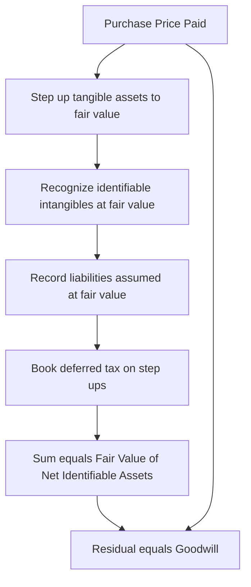
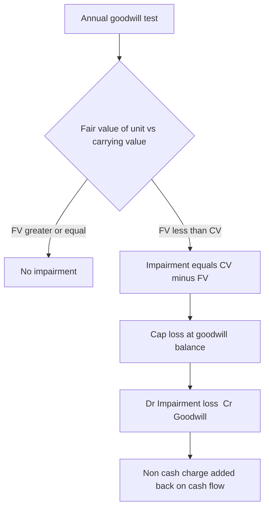
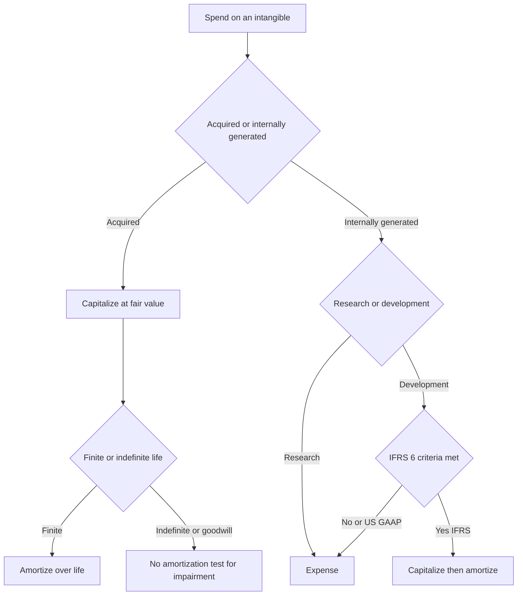

# Intangibles, Goodwill & Business Combinations

## The Problem / Why this matters

Walk into any acquisitive company's balance sheet — Microsoft, Disney, a private-equity roll-up, a mid-cap SaaS business — and you will find that the single largest asset is often something you cannot touch, ship, or physically count. It is called **goodwill**, and it sits right below "property, plant & equipment" carrying a number in the tens of billions. Next to it live **intangible assets**: customer relationships, brand names, patents, developed technology, licenses.

Here is the uncomfortable truth that trips up almost every junior analyst: **the accounting for the same economic reality is wildly inconsistent.**

- A company that spends $10bn building the best software in the world *internally* shows almost none of it on its balance sheet. Its research is expensed the day it is incurred.
- A company that *buys* that same software company for $10bn records billions of dollars of intangible assets and goodwill.
- One firm amortizes its intangibles and drags down reported earnings for a decade; another takes a single catastrophic impairment charge in a bad year and wipes out a quarter's profit in one line.

If you do not understand *why* the accounting differs, you will misread earnings, misjudge returns on capital, and — critically for an interview — you will get destroyed the moment an interviewer asks: *"A company buys another for $500m, book value is $300m. Walk me through what hits the balance sheet."*

This chapter is about the accounting for value that has no physical form: how it gets *onto* the balance sheet (and when it is blocked from getting on), how it is subsequently measured, and what happens when one company buys another. It is the single most frequently tested "advanced accounting" topic in equity research, credit, and investment-banking interviews, because it sits at the intersection of the three statements and directly drives valuation.

By the end you will be able to build a purchase-price allocation from scratch, book the entries, project the earnings impact, and answer the classic "walk me through goodwill" question in your sleep.

---

## Core Idea

Three ideas hold this entire chapter together.

**1. An intangible asset is a non-monetary asset without physical substance that is *identifiable* — you can separate it and sell it, or it arises from legal/contractual rights.** Patents, brands, customer lists, licenses, software. If it is identifiable, it gets recognized separately and (usually) amortized over its useful life.

**2. Goodwill is the residual — the plug.** It is *not* a thing you can point to. It is defined by arithmetic:

> **Goodwill = Purchase Price − Fair Value of Net Identifiable Assets Acquired**

Goodwill is what you paid *over and above* the fair value of everything identifiable (tangible + identifiable intangibles − liabilities). It captures synergies, assembled workforce, and — bluntly — overpayment. It arises **only** in an acquisition. You can never create goodwill for a business you built yourself.

**3. The great accounting asymmetry: internally generated vs acquired.** Money you spend building intangibles yourself is mostly *expensed*. Money you spend *buying* intangibles is *capitalized*. Same economic value, opposite accounting — and this asymmetry is the source of half the interview traps in the whole topic.

Finally, subsequent measurement splits in two:
- **Finite-life intangibles** → amortize over useful life, test for impairment when there are indicators.
- **Goodwill and indefinite-life intangibles** → **do NOT amortize**; instead test for impairment at least annually.

---

## Why it works this way (first principles)

Accounting is built on two ideas in tension: **relevance** (show me what the business is worth) and **reliability / verifiability** (only show numbers you can defend). The treatment of intangibles is the compromise between them.

**Why is internally generated goodwill banned?** Because it is unverifiable and infinitely manipulable. If Coca-Cola could write up its own brand to "fair value," it would put $200bn on the balance sheet based on its own opinion. There is no arm's-length transaction to anchor the number. Every management team would inflate its own assets. So the rule is brutal but defensible: **you only recognize an intangible/goodwill when a transaction price proves its value.** A purchase is that transaction. When you *buy* a company, a willing buyer and seller agreed on a price — that price is verifiable evidence, so now the intangibles and goodwill can go on the books.

**Why expense R&D as you go?** Because at the moment you spend research dollars, you do not yet know if they will produce anything. Matching costs to future benefits requires that future benefits be *probable and measurable*. Early-stage research fails that test — most research produces nothing. So the conservative answer is to expense it. (IFRS carves out an exception once a project crosses into "development" and clears feasibility hurdles — more below. US GAAP is stricter and mostly says "expense it all.")

**Why did goodwill amortization get abolished?** Until 2001 (US) companies amortized goodwill over up to 40 years — a smooth, arbitrary, meaningless drag on earnings. Standard-setters concluded that goodwill does not predictably decline over a fixed schedule; a great acquisition's goodwill may *grow* in value, a bad one may collapse overnight. A fixed amortization schedule communicated nothing. So they replaced it with **impairment testing**: leave goodwill on the books at cost, and only write it down when evidence shows the acquired business is worth less than its carrying value. This trades a smooth-but-meaningless charge for a lumpy-but-informative one.

**Why fair-value everything in an acquisition?** Because the acquirer is effectively "buying" each asset fresh at today's price. The target's *historical* book values are irrelevant to the buyer — the buyer paid today's market price. So purchase accounting resets every acquired asset and liability to fair value on the acquisition date. This "fresh start" is why acquired inventory, PP&E, and intangibles get stepped up, and why deferred taxes and depreciation change post-deal.

---

## Full technical content

### 1. What is an intangible asset?

**Definition (IAS 38 / ASC 350):** An intangible asset is an **identifiable, non-monetary asset without physical substance**, controlled by the entity, from which future economic benefits are expected to flow.

Three tests must all be met to recognize one:

| Criterion | Meaning |
|---|---|
| **Identifiability** | Either (a) *separable* — can be sold, licensed, transferred independently; or (b) arises from *contractual/legal rights* |
| **Control** | The entity has the power to obtain the benefits and restrict others' access |
| **Future economic benefit** | Expected revenue, cost savings, or other benefit flows to the entity |

Plus, to actually put it on the balance sheet:
- It is **probable** future benefits will flow, and
- The **cost can be measured reliably**.

**The identifiability test is what separates an intangible asset from goodwill.** A brand name is identifiable (you can license it). "Assembled workforce" is *not* separately identifiable (you can't sell your employees) — so it gets swept into goodwill.

### 2. Classification of intangibles

| Type | Examples | Life | Subsequent treatment |
|---|---|---|---|
| **Marketing-related** | Trademarks, brand names, internet domains, non-compete agreements | Finite or indefinite | Amortize if finite; impairment-test if indefinite |
| **Customer-related** | Customer lists, customer contracts, customer relationships, order backlog | Usually finite | Amortize over relationship life |
| **Artistic-related** | Copyrights on books, music, film, video | Finite | Amortize |
| **Contract-based** | Licenses, franchise agreements, lease agreements, broadcast rights, permits | Finite (usually) | Amortize over contract term |
| **Technology-based** | Patents, developed technology, software, trade secrets, databases | Finite | Amortize over legal/useful life |
| **Goodwill** | Residual from acquisition | Indefinite | **No amortization**; annual impairment test |

### 3. Finite vs indefinite useful life

- **Finite life:** the asset has a foreseeable limit to the period over which it generates cash. **Amortize** systematically over that life; **test for impairment when indicators exist.** Example: a patent with 12 years of legal protection.
- **Indefinite life:** there is *no foreseeable limit* to the period over which the asset generates cash (note: "indefinite" ≠ "infinite"). **Do NOT amortize**; test for impairment **at least annually** and whenever indicators exist. Example: a well-established brand like Gillette or a broadcast license that is renewable at nominal cost.

Goodwill is always treated as indefinite-life for this purpose.

### 4. Amortization mechanics (finite-life intangibles)

$$\text{Annual Amortization} = \frac{\text{Cost} - \text{Residual Value}}{\text{Useful Life}}$$

- Residual value is usually **zero** for intangibles (there is rarely a resale market for a used customer list).
- Method should reflect the pattern of benefit consumption; **straight-line** is the default when the pattern can't be reliably determined.
- Amortization runs through the **income statement** (usually within COGS or SG&A / D&A) and reduces the carrying value on the balance sheet.

**Journal entry (each period):**

```
Dr  Amortization Expense        XXX
    Cr  Accumulated Amortization        XXX
```

### 5. Internally generated intangibles — the asymmetry

This is the crux.

| Item | US GAAP | IFRS (IAS 38) |
|---|---|---|
| Internally generated **goodwill** | Never recognized | Never recognized |
| Internally generated **brands, mastheads, customer lists** | Expensed | Expensed (explicitly prohibited from capitalization) |
| **Research** costs | Expensed as incurred (ASC 730) | Expensed as incurred |
| **Development** costs | Expensed as incurred (with narrow exceptions, e.g. software) | **Capitalized once 6 criteria met** (IAS 38.57) |
| Internally developed **software for sale** | Capitalize after "technological feasibility" (ASC 985-20) | Under development-cost rules |
| Internally developed **software for internal use** | Capitalize costs in the "application development stage" (ASC 350-40) | Under development-cost rules |

**The IFRS "development" capitalization test (IAS 38.57) — all six must be met (mnemonic PIRATE):**
1. **P**robable future economic benefits
2. **I**ntention to complete and use/sell
3. **R**esources adequate to complete
4. **A**bility to use or sell the asset
5. **T**echnical feasibility of completing it
6. **E**xpenditure can be measured reliably

Once these are met, subsequent development spend is capitalized as an intangible asset and amortized once the asset is available for use.

**Why this matters for analysis:** Two identical biotech or software firms — one reporting under IFRS, one under US GAAP — can show materially different assets and margins purely from this rule. An IFRS firm capitalizing development shows *higher assets and higher near-term earnings* (costs sit on the balance sheet, then amortize slowly). A US GAAP firm expensing everything shows *lower assets and lower near-term earnings but no future amortization drag.* When comparing across the two regimes, analysts often **normalize** by capitalizing or expensing R&D consistently.

### 6. Acquired intangibles

When intangibles are **acquired** — either in a standalone purchase or as part of a business combination — they are recognized at **cost / fair value**, even the ones you could never have capitalized internally. This is the mirror image of the asymmetry: *acquired* customer relationships go on the books; *homegrown* ones do not.

In a business combination specifically, the acquirer must recognize **identifiable intangibles separately from goodwill** if they meet the identifiability criterion (separable OR contractual-legal). This deliberately *shrinks* the goodwill number by carving out as much identifiable value as possible.

### 7. Business combinations & the acquisition method

**Governing standards:** IFRS 3 *Business Combinations* and ASC 805 *Business Combinations*. Both mandate the **acquisition method** (the old "pooling of interests" method is banned under both).

The acquisition method has four steps:

1. **Identify the acquirer** — the entity that obtains control.
2. **Determine the acquisition date** — the date control passes.
3. **Recognize and measure identifiable assets acquired and liabilities assumed at fair value** on the acquisition date.
4. **Recognize and measure goodwill** (or a bargain-purchase gain).

**The goodwill formula (full):**

$$\text{Goodwill} = \Big(\text{Consideration transferred} + \text{NCI} + \text{FV of previously held interest}\Big) - \text{FV of net identifiable assets}$$

For the standard 100% acquisition with no prior stake, this collapses to the version you must know cold:

$$\boxed{\text{Goodwill} = \text{Purchase Price} - \text{Fair Value of Net Identifiable Assets}}$$

where **Net Identifiable Assets = FV of identifiable assets (tangible + intangible) − FV of liabilities assumed.**

**Purchase Price Allocation (PPA)** — the process of spreading the purchase price across all the acquired assets and liabilities at fair value, with the leftover becoming goodwill. The waterfall:



### 8. Non-controlling interest (NCI) and partial acquisitions

If the acquirer buys, say, 80% of a target, the other 20% is **non-controlling interest**. Two ways to measure NCI (IFRS 3 gives a choice; US GAAP requires full method):

| Method | NCI measured at | Goodwill recognized |
|---|---|---|
| **Full goodwill** (US GAAP required; IFRS optional) | Fair value of NCI | Goodwill on 100% of the business |
| **Partial goodwill** (IFRS option) | NCI's share of FV of net identifiable assets | Goodwill only on the acquirer's share |

### 9. Bargain purchase (negative goodwill)

If purchase price < fair value of net identifiable assets, the difference is a **bargain purchase gain**. After re-checking that all fair values were measured correctly, the gain is recognized **immediately in the income statement** (not as a liability, not as negative goodwill on the balance sheet). It is rare — it means someone sold for less than the parts are worth (distress, forced sale).

### 10. Goodwill impairment — no amortization, test instead

Goodwill is **never amortized** under IFRS or US GAAP. Instead it is **tested for impairment at least annually**, and more often if indicators arise (lost customers, adverse regulation, declining market cap below book value, etc.).

Goodwill cannot be tested on its own (it produces no independent cash flows), so it is allocated to a **cash-generating unit (CGU)** under IFRS or a **reporting unit (RU)** under US GAAP, and the unit is tested as a whole.

**US GAAP (ASC 350, post-2017 simplification — one step):**
1. Compare the reporting unit's **fair value** to its **carrying value (including goodwill)**.
2. If FV ≥ CV → no impairment.
3. If FV < CV → impairment = **carrying value − fair value**, capped at the goodwill balance of that unit.

```
Impairment loss = min( Carrying Value − Fair Value ,  Goodwill balance )
```

**IFRS (IAS 36 — recoverable amount):**
1. Determine the CGU's **recoverable amount** = higher of (a) fair value less costs of disposal, and (b) value in use (PV of future cash flows).
2. If recoverable amount < carrying amount → impairment loss = the difference.
3. Allocate the loss **first to goodwill**, then pro-rata to other assets in the CGU.

**Key rules:**
- Goodwill impairments are recorded in the income statement (operating line) and **can never be reversed** — under both IFRS and US GAAP. (IFRS allows reversal of *other* asset impairments, but never goodwill.)
- Impairment is a **non-cash charge** — critical for the cash-flow statement (added back).

**Journal entry:**
```
Dr  Goodwill Impairment Loss (P&L)    XXX
    Cr  Goodwill (balance sheet)              XXX
```



### 11. Deferred taxes in acquisitions

When you step up an asset to fair value in an acquisition but the tax basis stays at the old (lower) carryover value, you create a **temporary difference**: the book value now exceeds the tax value. Future book depreciation/amortization will exceed tax-deductible amounts, so the company will pay more tax than its book expense suggests — a **deferred tax liability (DTL)** is recorded on the step-up.

$$\text{DTL} = \text{Step-up in asset value} \times \text{Tax rate}$$

**Crucially, this DTL increases goodwill** (it is another liability assumed, so net identifiable assets fall, so the residual goodwill rises). This is a favorite second-order interview question. (Note: in a *taxable* asset deal where tax basis also steps up, no DTL arises — but the classic stock deal creates one.)

### 12. Presentation & disclosure

- Goodwill and intangibles are shown as separate non-current asset lines.
- Firms disclose the PPA (what the purchase price was allocated to), useful lives, amortization methods, and impairment testing assumptions.
- Amortization of *acquired* intangibles is a frequent **non-GAAP add-back** — companies present "adjusted earnings" excluding it, arguing it is non-cash and deal-related. Analysts must decide whether to trust that add-back.

---

## Worked examples

### Worked Example 1 — Purchase Price Allocation and goodwill, with intangibles and deferred tax

**Facts.** BuyerCo acquires 100% of TargetCo for **$800m cash**. On the acquisition date, TargetCo's balance sheet shows book equity of **$300m**. A fair-value review finds:

- PP&E book value $200m; fair value **$260m** (step-up $60m).
- Inventory book value $50m; fair value **$70m** (step-up $20m).
- Identifiable intangibles previously unrecorded: developed technology **$120m**, customer relationships **$80m** (total new intangibles $200m).
- All other assets and liabilities are already at fair value.
- Tax rate **25%**; the step-ups and new intangibles get **no tax basis** (stock deal).

**Step 1 — Book value of net identifiable assets = book equity = $300m.**

**Step 2 — Fair-value adjustments (pre-tax):**

| Item | Adjustment |
|---|---|
| PP&E step-up | +60 |
| Inventory step-up | +20 |
| Developed technology (new) | +120 |
| Customer relationships (new) | +80 |
| **Total pre-tax step-up** | **+280** |

**Step 3 — Deferred tax liability on the step-ups:**

$$\text{DTL} = 280 \times 25\% = 70$$

This is a *liability assumed*, so it reduces net identifiable assets.

**Step 4 — Fair value of net identifiable assets:**

$$300 + 280 - 70 = \mathbf{510}$$

**Step 5 — Goodwill (the residual):**

$$\text{Goodwill} = 800 - 510 = \mathbf{290}$$

**Verification / balance-sheet check.** What BuyerCo adds to its consolidated balance sheet in exchange for $800m cash out:

| Asset/Liability added | $m |
|---|---|
| TargetCo net assets at book | 300 |
| + PP&E step-up | 60 |
| + Inventory step-up | 20 |
| + Developed technology | 120 |
| + Customer relationships | 80 |
| − Deferred tax liability | (70) |
| + Goodwill | 290 |
| **Total identifiable + goodwill acquired** | **800** |

Total assets/net value received = **$800m** = cash paid. The entry balances. ✓

**Consolidation journal entry (simplified):**
```
Dr  PP&E                              260
Dr  Inventory                          70
Dr  Developed technology              120
Dr  Customer relationships             80
Dr  Goodwill                          290
Dr  Other net assets (plug to book)    50   [see note]
    Cr  Deferred tax liability                70
    Cr  Cash                                 800
```
*(Note: "Other net assets" here represents TargetCo's remaining book net assets already at fair value; the full elimination of TargetCo's equity happens in consolidation. The point for the interview is the top block: stepped-up tangibles, new intangibles, goodwill, DTL.)*

**Analytical takeaway:** Notice the DTL of $70m *increased* goodwill from what it would otherwise be. Without the DTL, net identifiable assets would be $580m and goodwill only $220m. The tax liability pushed $70m into goodwill.

---

### Worked Example 2 — Amortization impact on the three statements

**Facts.** Following Example 1, BuyerCo assigns useful lives:
- Developed technology $120m → **6 years** straight-line.
- Customer relationships $80m → **10 years** straight-line.
- Inventory step-up $20m flows through COGS as the acquired inventory is sold (within year 1).
- PP&E step-up $60m → depreciated over **10 years** (extra $6m/yr depreciation).
- Goodwill → **not amortized.**
- Tax rate 25%.

**Annual amortization/depreciation from the deal (steady state, Year 2 onward once inventory step-up is gone):**

| Item | Annual charge |
|---|---|
| Developed technology $120m ÷ 6 | 20.0 |
| Customer relationships $80m ÷ 10 | 8.0 |
| Incremental PP&E depreciation $60m ÷ 10 | 6.0 |
| **Total incremental pre-tax charge** | **34.0** |

**Income-statement impact (Year 2):**

| Line | $m |
|---|---|
| Incremental D&A / amortization | (34.0) |
| Pre-tax income impact | (34.0) |
| Tax shield @ 25% | +8.5 |
| **Net income impact** | **(25.5)** |

**Cash-flow-statement impact (Year 2):**
- Net income down $25.5m.
- Add back non-cash amortization/depreciation +$34.0m.
- **But** the tax saving is partly non-cash: the step-up amortization is *not tax-deductible* (no tax basis), so book tax expense fell but cash tax did **not**. The $8.5m "tax shield" is a *deferred* tax movement, not cash. So we must also subtract the $8.5m deferred tax benefit.
- Net change in cash flow from operations: −25.5 + 34.0 − 8.5 = **0**. ✓

The DTL unwinds: each year the $34m of book amortization has no tax deduction, so $34m × 25% = $8.5m of the DTL reverses, matching the deferred tax benefit in the P&L. Over the life of the assets the DTL created at acquisition fully unwinds. **Cash is unaffected by non-deductible amortization** — exactly why analysts add these charges back to get to cash earnings.

**Year-1 note:** Year 1 additionally carries the $20m inventory step-up through COGS (one-time). Year-1 incremental pre-tax charge = 34.0 + 20.0 = **$54.0m**; net income impact = 54.0 × (1 − 0.25) = **$40.5m** lower. This one-time inventory step-up hit is a classic "why did margins dip right after the acquisition?" answer.

---

### Worked Example 3 — Goodwill impairment (US GAAP one-step)

**Facts.** Two years after the deal, BuyerCo's TargetCo reporting unit has deteriorated (lost a major customer). Carrying values of the reporting unit:

| Item | Carrying value $m |
|---|---|
| Net identifiable assets (post-amortization) | 430 |
| Goodwill | 290 |
| **Carrying value of reporting unit** | **720** |

An independent valuation estimates the reporting unit's **fair value = $600m**.

**Step 1 — Compare fair value to carrying value:**
$$600 < 720 \Rightarrow \text{impairment indicated.}$$

**Step 2 — Impairment loss:**
$$\text{Loss} = \text{CV} - \text{FV} = 720 - 600 = 120$$

**Step 3 — Cap at goodwill balance:**
$$\min(120,\ 290) = 120. \quad \text{Goodwill balance is large enough.}$$

Goodwill is written down from $290m to $290 − 120 = **$170m**.

**Journal entry:**
```
Dr  Goodwill impairment loss (P&L)    120
    Cr  Goodwill                             120
```

**Statement impact:**
- **Income statement:** $120m pre-tax operating expense. (Goodwill impairment is generally *not* tax-deductible for a stock-deal goodwill, so no tax shield — net income falls close to the full $120m.)
- **Cash flow:** **zero cash impact** — non-cash charge added straight back to CFO. This is why analysts say impairments "don't matter for cash" but *do* matter as a signal: management is admitting the acquisition underperformed.
- **Balance sheet:** goodwill down $120m; retained earnings (equity) down by the after-tax loss.
- **Irreversibility:** even if TargetCo recovers next year, this $120m can **never** be written back up.

**Contrast — if fair value had been $760m** (above the $720m carrying value): no impairment, goodwill stays at $290m, nothing happens. The test is pass/fail on the whole unit, not on goodwill in isolation.

---

## How it is tested in interviews

Intangibles and goodwill are *the* advanced-accounting topic bankers love, because they let the interviewer test whether you truly understand the three-statement linkage. Here are the exact questions and the crisp lines to say.

### Q1. "Walk me through what happens when Company A buys Company B for more than book value."

**Model answer (say it in this order):**
> "The buyer pays the purchase price in cash, stock, or debt. On the consolidated balance sheet, Company B's identifiable assets and liabilities are written up or down to fair value — tangible assets get stepped up, and previously unrecorded identifiable intangibles like customer relationships, technology, and brands get recognized. The step-ups usually create a deferred tax liability because the tax basis doesn't change. Whatever purchase price is left over after allocating to the fair value of net identifiable assets becomes **goodwill** — the residual plug. Going forward, the finite-life intangibles amortize and hit the income statement, but goodwill is not amortized — it's tested for impairment annually."

That single paragraph hits: fair-value step-up, identifiable intangibles, DTL, goodwill as residual, amortization vs impairment. It signals mastery.

### Q2. "What is goodwill? Is it a real asset?"

> "Goodwill is the excess of purchase price over the fair value of net identifiable assets acquired. It's a residual, not a discrete asset — it captures things you can't separately identify: synergies, assembled workforce, and frankly, any premium or overpayment. It only exists on the books after an acquisition; you can never book goodwill for a business you built yourself."

### Q3. "Why isn't goodwill amortized anymore?"

> "Because a fixed amortization schedule communicated nothing about the actual economics. Goodwill doesn't predictably decline over a set number of years — a great acquisition's goodwill may hold or grow, a bad one may collapse. So standard-setters replaced amortization with annual impairment testing: keep it at cost, and write it down only when there's evidence the acquired business is worth less than its carrying value. It trades a smooth-but-meaningless charge for a lumpy-but-informative one."

### Q4. "A company spends $1bn on R&D. What happens on the financials — and does it differ under IFRS vs US GAAP?"

> "Under US GAAP, essentially all of it is expensed as incurred — research and development both hit the income statement immediately, with narrow software exceptions. Under IFRS, research is expensed, but development costs are capitalized once the project meets six feasibility criteria, then amortized. So an IFRS firm doing the same spending can show higher assets and higher near-term earnings, because part of the spend sits on the balance sheet instead of hitting the P&L. When I compare an IFRS firm to a US GAAP firm, I normalize R&D so the comparison is apples-to-apples."

### Q5. "If a company impairs goodwill by $100m, walk me through the three statements." (The classic three-statement question.)

> "**Income statement:** a $100m pre-tax impairment expense; goodwill impairment is usually non-deductible, so assume no tax shield — net income falls by roughly the full $100m. **Cash flow statement:** net income is down $100m at the top, but the impairment is non-cash so we add it right back — net change in cash is zero. **Balance sheet:** goodwill drops $100m on the asset side; retained earnings drops $100m on the equity side, so it balances. No cash moved; it's purely an admission that the acquisition underperformed."

Say **"non-cash, so cash is unaffected, balance sheet stays balanced"** — that's the money line.

### Q6. "In a purchase price allocation, why does a deferred tax liability *increase* goodwill?"

> "Because the DTL is a liability assumed. Goodwill is purchase price minus the *net* identifiable assets, and net assets go down when you add a liability. So booking a DTL on the asset step-ups reduces net identifiable assets and pushes more of the price into the goodwill residual."

### Q7. "Two identical companies. One built its brand internally, one bought it. Whose balance sheet is bigger?"

> "The acquirer's. The one that *bought* the brand recognizes it as an intangible asset at fair value; the one that *built* it internally expensed all the marketing and can't capitalize a homegrown brand. Same economic asset, completely different accounting — that's the internally-generated versus acquired asymmetry. It's also why acquisitive companies look more asset-heavy and why you can't compare price-to-book naïvely across builders and buyers."

### Q8. "What happens to goodwill if the acquired company does *well*?"

> "Nothing on the books. Goodwill is only ever tested for impairment — it can be written *down* but never written *up*. Internally generated goodwill from the outperformance isn't recognized. So a wildly successful acquisition can carry the *same* goodwill for decades while its real economic value compounds far above book."

### Q9. "Does amortization of acquired intangibles affect cash?"

> "No — amortization is non-cash. But watch the tax angle: if the intangible has no tax basis (typical in a stock deal), the amortization isn't tax-deductible, so it doesn't even save cash taxes. That's exactly why companies add back acquired-intangible amortization to get to 'adjusted' or cash earnings — though as an analyst I'm skeptical when the add-backs get large, because they represent real capital deployed."

---

## Traps & common mistakes

1. **Calling goodwill "the premium over market cap."** No — it's purchase price minus fair value of net *identifiable* assets. Identifiable intangibles are carved out *first*, which shrinks goodwill.
2. **Forgetting the deferred tax liability on step-ups** — and forgetting that the DTL *increases* goodwill. This is the single most common PPA error.
3. **Amortizing goodwill.** Goodwill is never amortized under IFRS or US GAAP. (Exception you may hear: US *private* companies can elect to amortize goodwill under an accounting alternative — mention only if asked, and note public companies cannot.)
4. **Thinking impairments burn cash.** They are 100% non-cash. Cash flow is unaffected; you add the charge back.
5. **Thinking impairments can reverse.** Goodwill impairments are *never* reversed under either standard, even if the business recovers.
6. **Treating internally generated intangibles like acquired ones.** Homegrown brands, customer lists, and goodwill cannot be capitalized. Only *acquired* ones go on the books.
7. **Ignoring the one-time inventory step-up.** Acquired inventory is stepped up to fair value and flows through COGS as it's sold, depressing gross margin right after the deal — a common "why did margins dip?" trap.
8. **Confusing "indefinite" with "infinite."** Indefinite-life just means no foreseeable limit today; it still gets tested for impairment annually and can become finite-life later.
9. **Mixing up IFRS and US GAAP impairment mechanics.** US GAAP: one step, fair value vs carrying value of the reporting unit. IFRS: recoverable amount (higher of FV-less-costs and value-in-use) vs carrying amount of the CGU, loss hits goodwill first.
10. **Recording a bargain purchase as a liability or negative goodwill.** It's an *immediate gain in the income statement* after re-checking fair values.
11. **Assuming R&D is treated the same everywhere.** US GAAP expenses; IFRS capitalizes qualifying development. Always ask which standard.

---

## First-principles recap

- **Intangibles get recognized only when a transaction verifies their value** — that's why *acquired* intangibles go on the books and *internally generated* ones (mostly) don't. Verifiability beats relevance when the two conflict.
- **Goodwill is arithmetic, not an object:** purchase price minus fair value of net identifiable assets. It only exists after an acquisition.
- **The acquisition method resets the target to fair value** ("fresh start"), because the buyer paid today's price, not the target's historical cost.
- **Step-ups create deferred tax liabilities** (book value rises, tax basis doesn't), and those DTLs *increase* goodwill.
- **Finite-life intangibles amortize; goodwill and indefinite-life intangibles don't** — they're impairment-tested instead, because no fixed schedule reflects their real decline.
- **Impairments are non-cash, information-rich, and irreversible** — they signal a bad deal but don't touch cash.
- **The R&D asymmetry (expense under GAAP, capitalize qualifying development under IFRS)** makes cross-standard comparison dangerous without normalization.

---

## Quick-reference

| Concept | Formula / Rule |
|---|---|
| **Goodwill (100% deal)** | Purchase Price − FV of Net Identifiable Assets |
| **Goodwill (general)** | (Consideration + NCI + FV prior stake) − FV net identifiable assets |
| **Net identifiable assets** | FV of identifiable assets (tangible + intangible) − FV of liabilities |
| **DTL on step-up** | Step-up amount × Tax rate (increases goodwill) |
| **Annual amortization** | (Cost − Residual) ÷ Useful life (residual usually 0) |
| **Goodwill impairment (US GAAP)** | min(Carrying value − Fair value, Goodwill balance) |
| **Goodwill impairment (IFRS)** | Carrying amount − Recoverable amount; hits goodwill first |
| **Recoverable amount (IFRS)** | Higher of (FV less costs of disposal, Value in use) |
| **Bargain purchase** | PP < FV net identifiable assets → immediate gain in P&L |

| Entry | Debit | Credit |
|---|---|---|
| Amortize intangible | Amortization expense | Accumulated amortization |
| Book goodwill (deal) | Assets (stepped up) + Goodwill | Cash / Stock + DTL |
| Goodwill impairment | Impairment loss (P&L) | Goodwill |
| Bargain purchase | Net assets acquired | Cash + Gain (P&L) |

| Rule | Value |
|---|---|
| Goodwill amortized? | **No** (impairment-tested annually) |
| Indefinite-life intangible amortized? | **No** (impairment-tested) |
| Finite-life intangible amortized? | **Yes** |
| Internally generated goodwill recognized? | **Never** |
| Research costs (both standards) | **Expensed** |
| Development costs — US GAAP | **Expensed** (narrow exceptions) |
| Development costs — IFRS | **Capitalized** if 6 criteria met |
| Goodwill impairment reversible? | **Never** |
| Impairment cash impact | **Zero** (non-cash) |
| Governing standards | IFRS 3 / ASC 805 (combinations); IAS 38 / ASC 350 (intangibles); IAS 36 / ASC 350 (impairment) |


