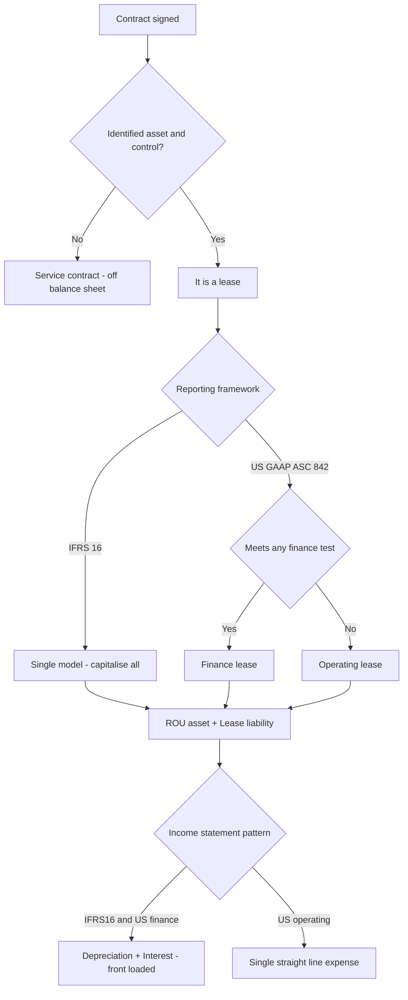
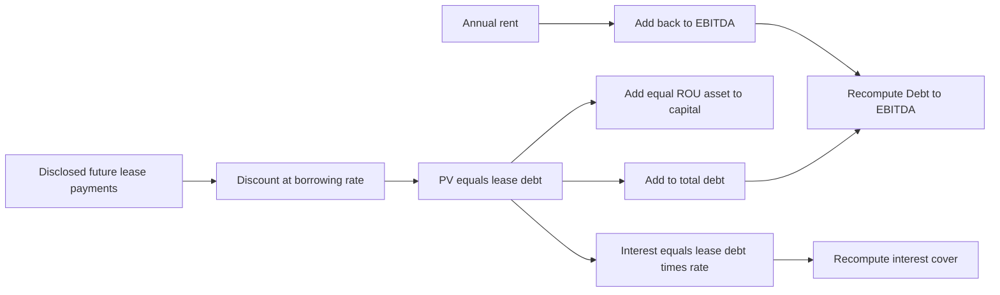

# Leases & Off-Balance-Sheet Items

## The Problem / Why this matters

Imagine two airlines with identical route networks, identical revenue, identical crews, and identical profit. Airline A **buys** its 100 aircraft with borrowed money. Airline B **leases** every single aircraft on 12-year contracts. Under the accounting rules in force until 2019, Airline A's balance sheet groaned under billions of dollars of aircraft assets and matching debt, while Airline B's balance sheet looked almost empty — no aircraft, no debt — even though B is contractually locked into paying rent for a decade whether it flies a single passenger or not.

To any honest analyst, those two airlines are economically almost identical. Both control 100 planes. Both have a fixed, unavoidable, decade-long cash outflow that behaves exactly like debt service. Yet one looked three times more leveraged than the other. An equity analyst screening on Debt/EBITDA would have flagged Airline A as risky and waved Airline B through. A credit analyst pricing a bond would have demanded a higher coupon from A. **Both would have been wrong**, because the accounting was hiding the economic reality.

This is the single most important reason leases matter in finance interviews. Leasing is the largest, most common, most heavily litigated form of **off-balance-sheet financing** in the history of accounting. For decades, "operating leases" were the corporate world's favourite way to control an asset and commit to paying for it while keeping both the asset and the obligation out of sight. Retailers with thousands of stores, airlines, shipping lines, telcos with tower contracts — all of them ran enormous liabilities that never touched the balance sheet.

The accounting profession finally closed most of the gap with two standards that took effect around 2019: **IFRS 16** (international) and **ASC 842** (US GAAP). They dragged operating leases onto the balance sheet. But — and this is the trap that gets tested — the two standards did **not** converge on the income statement, US GAAP kept a genuine two-class model, and even after the reform, huge categories of off-balance-sheet arrangements remain (receivables factoring, take-or-pay contracts, purchase commitments, unconsolidated joint ventures, guarantees). So the analyst's job of **adjusting reported numbers to reflect economic reality** did not disappear — it moved.

If you cannot explain what a right-of-use asset is, why an operating lease under IFRS 16 produces front-loaded total expense, why US GAAP operating leases produce a straight-line expense yet still create a liability, and how to capitalise leases from a company that still reports the old way — you will get exposed in any credit, equity-research, or FP&A interview. This chapter builds all of it from first principles.

---

## Core Idea

Strip away the jargon and there is one sentence at the heart of modern lease accounting:

> **If a contract gives you the right to use an identified asset for a period of time in exchange for payment, you are, in economic substance, buying that asset on instalment credit — so you should recognise both the asset you control and the liability you owe.**

That is it. A lease is a **financing transaction dressed up as a rental**. The lessee (the company using the asset) gets an asset it controls for years, and in return signs up to a stream of fixed payments. Control of an asset → recognise an asset. Obligation to pay fixed amounts → recognise a liability. The two standards give these two things names:

- The asset is the **Right-of-Use (ROU) asset** — you don't own the plane, but you own the *right to use* the plane, and that right has value.
- The liability is the **Lease Liability** — the present value of the payments you are contractually forced to make.

Everything else — the classification tests, the journal entries, the expense patterns, the analyst adjustments — is downstream of that one idea. The genius (and the exam trap) is that IFRS and US GAAP agree on putting both items on the balance sheet but **disagree on how to run the expense through the income statement**.

---

## Why it works this way — first principles

**1. Substance over form.** Accounting's job is to portray economic reality, not legal labels. A 12-year non-cancellable lease on a building is not "renting" in any meaningful sense — it is indistinguishable from borrowing money to buy the building and paying the loan back over 12 years. The Conceptual Framework's definitions of an asset ("a present economic resource controlled by the entity as a result of past events") and a liability ("a present obligation to transfer an economic resource") are met the moment you sign a non-cancellable lease. The old rules let form (the word "lease") defeat substance. IFRS 16 restored substance.

**2. Control, not ownership, is what defines an asset.** This is the conceptual leap. You do not need to *own* something to have an asset — you need to *control the economic benefits* from it. If you have the exclusive right to direct the use of an identified aircraft for 12 years and obtain substantially all the benefits from using it, you control that resource. Legal title is irrelevant to whether an asset exists. This is why the ROU model works: it recognises the *right*, not the *thing*.

**3. A fixed, unavoidable payment stream is debt, whatever you call it.** From a credit standpoint, what matters is: can this obligation force the company into distress? A non-cancellable lease payment has exactly the same priority and rigidity as a loan payment — miss it and the lessor can repossess and sue. So it should sit alongside debt in any leverage measure. The liability is measured the same way a loan is: the present value of the payments, discounted at the rate implicit in the lease (or the lessee's incremental borrowing rate).

**4. Time value of money forces the split between interest and principal.** Because the liability is a present value, each payment is partly interest (the unwinding of the discount) and partly repayment of principal — exactly like an amortising loan. This is the mechanical reason the income-statement patterns differ across standards, as we'll see: if you treat the liability as a loan, the *interest* portion is naturally front-loaded (high when the balance is large, low as it shrinks).

**5. Why US GAAP kept two classes.** US preparers, especially those with vast operating-lease portfolios, lobbied hard to avoid the front-loaded expense that a pure financing model produces. The FASB compromise: put the liability on the balance sheet (satisfying the substance argument) but engineer the income statement so that an "operating lease" still shows a single, straight-line lease expense — preserving comparability with the past. IFRS decided that was too complicated and went to a single model where every lease is, in effect, a finance lease. Understanding *why* this political compromise exists is what separates a strong candidate from a memoriser.

---

## Full technical content

### 1. What is a lease? (the identified-asset / control test)

Under **IFRS 16 (para 9)** and **ASC 842-10-15**, a contract *is, or contains, a lease* if it conveys **the right to control the use of an identified asset for a period of time in exchange for consideration**. Two conditions:

| Test | Question | Detail |
|------|----------|--------|
| Identified asset | Is there a specific asset? | Explicitly or implicitly specified. Fails if the supplier has a **substantive substitution right** (can swap the asset freely and benefits from doing so). |
| Right to control | Does the customer direct its use and get the benefits? | Customer obtains **substantially all economic benefits** AND **directs how and for what purpose** the asset is used. |

If both hold, it's a lease. If not (e.g. a capacity contract where the supplier decides how to fulfil it), it's a service contract and stays off-balance-sheet as an executory arrangement.

### 2. The lessee model

#### IFRS 16 — a single model (all leases capitalised)

Under IFRS 16 there is **no operating/finance distinction for lessees**. Every lease (except two optional exemptions) goes on the balance sheet:

- **Short-term leases** (≤ 12 months, no purchase option) — exemption; expense straight-line.
- **Low-value asset leases** (new asset value ~ USD 5,000 or less, e.g. laptops, small office equipment) — exemption; expense straight-line.

For everything else, at commencement:

```
Dr Right-of-Use Asset        X
   Cr Lease Liability            X
```

- **Lease Liability = PV of unpaid lease payments**, discounted at the rate implicit in the lease, or if not readily determinable, the lessee's **incremental borrowing rate (IBR)**.
- **ROU Asset = Lease Liability + initial direct costs + prepaid lease payments + estimated dismantling/restoration costs − lease incentives received.**

Subsequently:
- The **liability** is measured at amortised cost: each period, `Interest = opening liability × rate` is added, and the payment reduces it (like a loan).
- The **ROU asset** is **depreciated** straight-line (usually) over the shorter of the lease term and the asset's useful life.
- **Income statement** shows **two lines: depreciation + interest.** Because interest is front-loaded, **total expense is front-loaded** (higher in early years, lower later).

#### ASC 842 — a dual model (finance vs operating), but both on-balance-sheet

US GAAP keeps two lessee classifications. **Both** put an ROU asset and a lease liability on the balance sheet; the difference is the **income-statement pattern** and **classification of cash flows**.

**Classification — a lease is a FINANCE lease if ANY of these five criteria are met (ASC 842-10-25-2):**

| # | Criterion | Old "bright line" (now indicative) |
|---|-----------|-----|
| 1 | Ownership transfers to lessee by end of term | — |
| 2 | Purchase option lessee is reasonably certain to exercise | — |
| 3 | Lease term is major part of the asset's remaining economic life | ≥ 75% |
| 4 | PV of payments is substantially all of the asset's fair value | ≥ 90% |
| 5 | Asset is so specialised it has no alternative use to the lessor | — |

If none are met → **operating lease**. (IFRS uses essentially these same tests to classify *lessor* leases, but abandons them for lessees.)

**Expense pattern under ASC 842:**

| | Finance lease | Operating lease |
|---|---|---|
| Balance sheet | ROU asset + lease liability | ROU asset + lease liability |
| Income statement | **Two lines**: amortisation (straight-line) + interest (front-loaded) → **total front-loaded** | **One line**: single "lease expense", **straight-line** |
| How single expense is achieved | — | Total straight-line expense fixed; interest is backed out; the plug amortises the ROU asset by an *uneven* amount so the two always sum to a flat total |
| Cash flow statement | Interest in operating (or financing under IFRS); **principal in financing** | **Entire payment in operating** |
| EBITDA / EBIT effect | Rent removed from opex; replaced by D&A + interest → **boosts EBITDA and EBIT** | Lease expense stays in opex → **no EBITDA/EBIT boost** |

This last row is the crux of the whole topic for interviews. **Under IFRS 16, ALL leases behave like the finance column** — so IFRS 16 mechanically *increases reported EBITDA* for any company with operating leases, because rent (previously an operating expense) is replaced by depreciation and interest (below EBITDA). Under US GAAP, an operating lease keeps its single expense *inside* operating costs, so **EBITDA is unchanged**. Two companies, identical leases, different GAAP → different EBITDA. Analysts must normalise.

### 3. The operating-lease "plug" mechanic under ASC 842

Because a US GAAP operating lease must show a **flat total expense** yet still carries a liability that accrues **front-loaded interest**, the amortisation of the ROU asset must be the *balancing figure*:

```
Single straight-line lease expense (fixed each year)
  − Interest on lease liability (front-loaded, declining)
  = ROU asset amortisation (the plug — rises over time)
```

Early years: interest is high, so amortisation is low. Later years: interest is low, so amortisation is high. The ROU asset therefore does **not** run down straight-line, but the *total* expense is flat. This is a favourite "gotcha" — the operating-lease ROU asset amortisation is a plug, not a straight-line charge.

### 4. Lessor accounting (brief — less tested, but know it)

Lessors keep the **operating vs finance (sales-type / direct-financing)** distinction under BOTH IFRS and US GAAP.

- **Finance / sales-type lease**: lessor derecognises the asset, recognises a **lease receivable** (net investment) and, if a dealer, a selling profit. Interest income unwinds over the term.
- **Operating lease**: lessor keeps the asset on its books, depreciates it, and recognises **rental income straight-line**.

Symmetry note: IFRS 16 is **asymmetric** — lessees capitalise everything, but lessors still classify. So a single lease can be an operating lease for the lessor and an on-balance-sheet ROU for the lessee.

### 5. Lease-liability remeasurement and modifications

The liability is **remeasured** (with a corresponding adjustment to the ROU asset) when:
- Lease term changes (e.g. a renewal option becomes reasonably certain).
- Variable payments linked to an index/rate reset (e.g. CPI-linked rent step-up).
- A modification changes scope or consideration.

Pure **variable payments** based on usage/sales (e.g. "5% of store revenue") are **NOT** in the initial liability — they're expensed as incurred. This is an important classification: a retailer with turnover-linked rent capitalises only the fixed minimum.

### 6. Other off-balance-sheet arrangements (why analysts still adjust)

Even after IFRS 16 / ASC 842, plenty of economic obligations and resources stay off the balance sheet:

| Arrangement | What it is | Why off-BS | Analyst adjustment |
|---|---|---|---|
| **Take-or-pay / throughput contracts** | Must pay for min. volume of gas/power/capacity whether used or not | Executory contract, not a lease (no identified asset controlled) | Treat fixed minimum as debt-like; PV and add to adjusted debt |
| **Purchase commitments / capex commitments** | Contractual future purchases | Executory | Note in liquidity/commitment analysis |
| **Receivables factoring / securitisation** | Sell receivables for cash | If "true sale" with risk transfer → derecognised | Add back if it's really secured borrowing; watch for reverse factoring (supply-chain finance) hiding in payables |
| **Operating JVs / associates (equity method)** | Investee's debt not consolidated | Only the net equity stake shown as one line | "Look through": add proportionate share of JV debt for leverage |
| **Special purpose / variable interest entities (VIEs)** | Off-BS vehicles (infamously Enron) | If not consolidated under control tests | Consolidate the exposure; check guarantees |
| **Financial guarantees / letters of credit** | Contingent obligation to pay if third party defaults | Contingent — only disclosed | Add to contingent-liability risk |
| **Pension deficits (underfunded DB plans)** | Net deficit IS on-BS now, but off-BS gross exposure and covenant risk | Net presentation understates | Treat net deficit as debt-like |
| **Unrecognised deferred consideration / earn-outs** | Contingent M&A payments | Contingent | Model expected payout |

The unifying analyst principle: **identify every fixed, unavoidable future cash outflow that behaves like debt, and every economic resource the company controls but hasn't recognised, and re-draw the balance sheet.**

### 7. The classic analyst adjustment: capitalising operating leases (pre-IFRS-16 or US operating leases)

For companies still reporting US GAAP operating leases with a flat expense (EBITDA not adjusted), or for historical analysis, analysts **capitalise operating leases** to compare like-for-like with owners:

**Two common methods:**

1. **Present-value method (preferred):** Discount the disclosed future minimum lease payments at an estimated borrowing rate. The PV = the debt to add. Add the same amount as an asset. Split the current-year rent expense into imputed depreciation and imputed interest.

2. **Multiple-of-rent method (quick screen):** `Debt equivalent ≈ annual rent × 8` (historically 8×; some use 6× or a capitalisation factor of 1/discount rate). Crude but common on the trading desk.

**Adjustments that flow from capitalisation:**
- **Add lease debt** to total debt → higher Debt/EBITDA, higher gearing.
- **Add ROU asset** to assets/invested capital → lower ROIC (bigger denominator), and interest coverage recomputed.
- **Add back rent to EBITDA** (rent leaves opex) → higher EBITDA (this is exactly what IFRS 16 does automatically = "EBITDAR" logic).
- **Interest** = lease debt × rate → add to interest for coverage ratios.
- **Adjusted EBIT** = EBITDA − imputed depreciation.



---

## Worked examples

### Worked Example 1 — IFRS 16 lessee: full schedule, journal entries, statement effects

**Facts.** On 1 Jan Year 1, Zephyr Ltd (IFRS reporter) leases a machine for **3 years**. Annual payment **$10,000 in arrears** (end of each year). Incremental borrowing rate **8%**. No purchase option; asset returned at end. Useful life = lease term. Ignore tax.

**Step 1 — Measure the lease liability (PV of payments).**

Discount factors at 8%: Year 1 = 0.92593, Year 2 = 0.85734, Year 3 = 0.79383.

| Year | Payment | DF @ 8% | PV |
|---|---|---|---|
| 1 | 10,000 | 0.92593 | 9,259.3 |
| 2 | 10,000 | 0.85734 | 8,573.4 |
| 3 | 10,000 | 0.79383 | 7,938.3 |
| **Total** | 30,000 | | **25,771.0** |

**Lease liability at commencement = $25,771.** ROU asset = same $25,771 (no direct costs/incentives).

**Commencement entry (1 Jan Y1):**
```
Dr Right-of-Use Asset     25,771
   Cr Lease Liability             25,771
```

**Step 2 — Liability amortisation schedule (interest at 8% on opening balance):**

| Year | Opening | Interest 8% | Payment | Closing |
|---|---|---|---|---|
| 1 | 25,771 | 2,062 | (10,000) | 17,833 |
| 2 | 17,833 | 1,427 | (10,000) | 9,260 |
| 3 | 9,260 | 741* | (10,000) | 1 ≈ 0 |

*Rounding: 9,260 × 8% = 740.8; final closing = 9,260 + 741 − 10,000 = 1 (rounding residue, effectively zero). Total interest = 2,062 + 1,427 + 741 = **$4,230**, which equals total payments 30,000 − liability 25,771 = 4,229 ✓ (rounding).

**Step 3 — ROU asset depreciation (straight-line over 3 yrs):** 25,771 / 3 = **$8,590 per year** (8,590 × 3 = 25,770 ✓).

**Step 4 — Total P&L expense per year (front-loaded):**

| Year | Depreciation | Interest | **Total expense** |
|---|---|---|---|
| 1 | 8,590 | 2,062 | **10,652** |
| 2 | 8,590 | 1,427 | **10,017** |
| 3 | 8,590 | 741 | **9,331** |
| **Total** | 25,770 | 4,230 | **30,000** |

**Key insight:** total 3-year expense = $30,000 = total cash paid ✓, but it is **front-loaded** (10,652 → 10,017 → 9,331). Compare the *old* operating-lease treatment: flat $10,000/year. IFRS 16 front-loads.

**Year 1 subsequent entries:**
```
Dr Depreciation expense    8,590
   Cr Accumulated depreciation     8,590

Dr Interest expense        2,062
Dr Lease liability         7,938
   Cr Cash                        10,000
```
Check: interest 2,062 + principal 7,938 = 10,000 payment ✓. Liability falls 25,771 − 7,938 = 17,833 ✓.

**Balance-sheet at end of Y1:** ROU asset 25,771 − 8,590 = **17,181**; Lease liability = **17,833**. (They diverge — the liability exceeds the asset in early years because interest unwinds slower than straight-line depreciation. This creates a small net "liability" position, another exam point.)

**Cash-flow statement (IFRS 16):** the $10,000 splits — **principal $7,938 in financing activities**, **interest $2,062 in operating (or financing) activities**. Under the *old* operating-lease rule the whole $10,000 was operating. So IFRS 16 **improves operating cash flow** by shifting principal to financing — another automatic effect analysts must remember.

---

### Worked Example 2 — Same lease, US GAAP operating lease: the straight-line "plug"

**Facts.** Identical lease, but Zephyr's US subsidiary (ASC 842) and the lease is classified **operating** (fails all 5 finance tests — short relative to asset life, PV < 90% of fair value, etc.).

**Requirement:** show that total expense is **straight-line $10,000/year**, that the ROU-asset amortisation is a **plug**, and that the liability schedule is identical to Example 1.

**Step 1 — Liability = same $25,771**, same amortisation schedule (interest 2,062 / 1,427 / 741). US GAAP measures the liability identically.

**Step 2 — Single straight-line lease expense** = total payments / term = 30,000 / 3 = **$10,000 per year** (this is the defining feature of a US operating lease).

**Step 3 — ROU amortisation = single expense − interest (the plug):**

| Year | Single expense | − Interest | = ROU amortisation (plug) |
|---|---|---|---|
| 1 | 10,000 | 2,062 | **7,938** |
| 2 | 10,000 | 1,427 | **8,573** |
| 3 | 10,000 | 741 | **9,259** |
| **Total** | 30,000 | 4,230 | **25,770** ✓ |

Notice the amortisation **rises** (7,938 → 8,573 → 9,259) — it is NOT straight-line. It exactly mirrors the *principal* portion of each payment, so the **ROU asset always equals the lease liability** each period under a US operating lease. Check end-Y1: ROU = 25,771 − 7,938 = 17,833 = lease liability 17,833 ✓. (Contrast Example 1 where they diverged.)

**Income statement:** one line, **Lease expense $10,000** each year — sits **inside operating expenses**, so **EBITDA is reduced by the full 10,000** and is **unchanged versus the old rules**.

**Cash flow:** entire **$10,000 in operating activities** (unlike IFRS 16).

**The punchline for interviews — same lease, two GAAPs, Year 1:**

| Metric | IFRS 16 (Ex 1) | US GAAP operating (Ex 2) |
|---|---|---|
| EBITDA impact | rent removed → +10,000 vs old | −10,000 (in opex) |
| EBIT charge | depreciation 8,590 | lease expense 10,000 |
| Interest expense | 2,062 | 0 (buried in the 10,000) |
| Total P&L expense | 10,652 | 10,000 |
| Operating cash outflow | 2,062 (interest only) | 10,000 |
| Financing cash outflow | 7,938 | 0 |

**IFRS 16 boosts EBITDA and operating cash flow; US operating leases do neither.** That is the sentence to have ready.

---

### Worked Example 3 — Analyst capitalisation of a retailer's operating leases (pre/US-GAAP style), with ratio impact

**Facts.** RetailCo reports under US GAAP with operating leases shown as a flat rent. You want to compare it to a peer that *owns* its stores. Reported figures:

- Revenue 500,000; EBITDA (as reported, rent in opex) 60,000; reported total debt 100,000; equity 150,000.
- Annual operating-lease rent expense = **20,000**.
- Disclosed future minimum lease payments: Yr1 20,000; Yr2 20,000; Yr3 20,000; Yr4 20,000; Yr5 20,000; thereafter 40,000 (assume 2 more years of 20,000).
- Estimated borrowing rate 8%. Assume remaining average lease life ≈ 7 years.

**Step 1 — PV-capitalise the future lease payments at 8%** (7 payments of 20,000, annuity):

Annuity factor, 7 years @ 8% = (1 − 1.08⁻⁷)/0.08 = (1 − 0.58349)/0.08 = 0.41651/0.08 = **5.2064**.

**Lease debt = 20,000 × 5.2064 = $104,128** ≈ **$104,000**. Add the same as an ROU asset.

**Step 2 — Split current rent into interest + depreciation.**
- Imputed interest = lease debt × 8% = 104,000 × 0.08 = **$8,320**.
- Imputed depreciation = rent − interest = 20,000 − 8,320 = **$11,680** (approx; on a full schedule depreciation ≈ asset/life = 104,000/7 = 14,857, but the rent-split method keeps the total at the reported rent — either is defensible; state your method).

**Step 3 — Adjusted metrics (rent-add-back / EBITDAR logic):**

| Metric | Reported | Adjustment | Adjusted |
|---|---|---|---|
| EBITDA | 60,000 | + rent 20,000 | **80,000** |
| Total debt | 100,000 | + lease debt 104,000 | **204,000** |
| **Debt / EBITDA** | 100,000/60,000 = **1.67×** | | 204,000/80,000 = **2.55×** |
| Interest expense (say reported 8,000) | 8,000 | + 8,320 imputed | 16,320 |
| EBIT (EBITDA − D&A; say reported D&A 15,000) | 45,000 | +rent 20,000 − imp. dep 8,320* | ~56,680 |

*EBIT adjustment: add back the 20,000 rent, subtract imputed depreciation. Using dep = interest-split residual 11,680: adjusted EBIT = 45,000 + 20,000 − 11,680 = 53,320; EBIT/interest = 53,320/16,320 = 3.27× vs reported 45,000/8,000 = 5.6×.

**Interpretation to say out loud:** "On a reported basis RetailCo looks conservatively financed at 1.7× Debt/EBITDA. Once I capitalise the operating leases — which are just as unavoidable as debt — leverage jumps to ~2.5× and interest cover roughly halves. That's the true, owner-equivalent picture and the right basis to compare it against a peer that owns its stores." This is precisely the analysis IFRS 16 now bakes in automatically, and why IFRS-reporting retailers show structurally higher reported debt and EBITDA than they did pre-2019.

**Consistency check:** the 8× rule-of-thumb would give 20,000 × 8 = 160,000 of lease debt — higher than our 104,000 PV because 8× implicitly assumes a longer stream / lower rate. Both are "right" for their purpose; the PV number is more defensible in a modelling test, the 8× is the desk shortcut.



---

## How it is tested in interviews

Below are the questions that actually come up, with the crisp model answers.

**Q1. "Walk me through what happens on the three financial statements when a company signs a new operating lease under IFRS 16."**
> "At signing, no P&L impact, but the balance sheet grosses up: I recognise a right-of-use asset and an equal lease liability at the present value of the lease payments. Over time, the income statement shows depreciation on the ROU asset plus interest on the liability — so total expense is front-loaded. On the cash flow statement the principal repayment sits in financing and the interest in operating (or financing), so operating cash flow looks better than it did under the old rent-in-opex treatment. Net income falls slightly in early years because of front-loading, and EBITDA rises because rent has left operating expenses."

**Q2. "Under IFRS 16, does EBITDA go up or down? Why?"**
> "Up. The old operating-lease rent sat inside operating expenses and hit EBITDA. IFRS 16 replaces that rent with depreciation and interest, both of which are *below* EBITDA. So mechanically EBITDA increases for any company with operating leases — which is why you can't compare a company's post-2019 EBITDA to its pre-2019 EBITDA, or an IFRS company to a US-GAAP company, without normalising."

**Q3. "What's the difference between a finance lease and an operating lease under US GAAP, if both are on the balance sheet?"**
> "The balance sheet treatment is the same — both create an ROU asset and a lease liability. The difference is the income statement and cash flow. A finance lease has two lines — straight-line amortisation plus front-loaded interest — so total expense is front-loaded, and principal is a financing cash outflow, which lifts EBITDA and EBIT. An operating lease shows a single straight-line lease expense inside operating costs, the whole payment is operating cash flow, and EBITDA is unaffected. Classification turns on the five tests — ownership transfer, bargain purchase option, term ≥ major part of life, PV ≥ substantially all of fair value, or specialised asset."

**Q4. "A company has a big operating-lease portfolio and reports US GAAP. How do you adjust its leverage to compare with an owner?"**
> "I capitalise the leases. I take the disclosed future minimum lease payments, discount them at the company's borrowing rate to get a debt-equivalent, and add that to total debt. I add the same amount back as an ROU asset in invested capital. Then I add the rent back to EBITDA — EBITDAR logic — and impute an interest charge equal to the lease debt times the rate for coverage ratios. Quick desk version is 8× annual rent for the debt add-on. This is exactly what IFRS 16 does automatically, so it also lets me compare a US filer to an IFRS filer."

**Q5. "Why did the standard-setters bother? What problem was IFRS 16 solving?"**
> "Off-balance-sheet financing. Under the old IAS 17, companies kept enormous, unavoidable lease obligations off the balance sheet by classifying them as operating leases — airlines and retailers were the worst offenders. Two economically identical companies, one owning and one leasing, looked wildly different on leverage. IFRS 16 forces the obligation and the controlled asset onto the balance sheet so the statements reflect economic substance."

**Q6. "What happens to net income in year 1 of a new lease under IFRS 16 versus the old operating-lease method?"**
> "It's lower under IFRS 16 in the early years because of front-loading — depreciation is straight-line but interest is high early, so the combined charge exceeds the old flat rent. It crosses over and becomes lower than the old rent in later years. Over the full life the total expense is identical — it's just a timing reallocation."

**Q7. "Name off-balance-sheet items that survive even after IFRS 16."**
> "Take-or-pay and throughput contracts, purchase and capex commitments, receivables factoring and supply-chain finance, unconsolidated JVs and associates where you only see the net equity line, off-balance-sheet SPEs/VIEs, financial guarantees and letters of credit, and contingent M&A earn-outs. For credit work I look through to the JV's share of debt, treat fixed take-or-pay minimums as debt-like, and check whether factored receivables are a true sale or disguised borrowing."

**Q8. "What's a variable lease payment and does it go on the balance sheet?"**
> "A payment that depends on usage or sales — like a retailer paying 5% of store turnover. Pure usage/sales-based variable payments are NOT in the initial lease liability; they're expensed as incurred. Only the fixed minimum, and payments linked to an index or rate, get capitalised. So a turnover-rent store understates its lease liability relative to its true economic commitment."

**Q9. "If a company wanted to flatter its EBITDA, would it prefer to lease or buy — and does IFRS 16 change that?"**
> "Historically, leasing under an operating lease *hurt* EBITDA (rent was in opex) versus buying (D&A below EBITDA), so buyers looked better on EBITDA. IFRS 16 flips it: now leasing also pushes the cost below EBITDA, so leasing and buying look similar on EBITDA. The gaming opportunity on EBITDA is largely closed for IFRS filers — but not for US operating leases, where the single expense still sits in opex."

---

## Traps & common mistakes

1. **"Operating leases are off-balance-sheet."** No longer true under IFRS 16 (all on) or ASC 842 (both classes on). Saying this reveals you're pre-2019. The *income-statement* difference survives; the balance-sheet difference does not.
2. **Confusing the two standards' income statements.** IFRS 16 = every lease front-loaded (depreciation + interest). US GAAP operating = flat single expense. Candidates blur them.
3. **Forgetting the ROU-asset amortisation is a plug for US operating leases.** It rises over time so total expense stays flat and ROU always equals the liability. It is NOT straight-line.
4. **Thinking ROU asset always equals the liability.** Only true for US operating leases. Under IFRS 16 / finance leases they **diverge** (asset depreciates straight-line, liability unwinds slower), so the liability exceeds the asset in early years.
5. **Capitalising variable/turnover rent.** Only fixed and index-linked payments go in the liability; pure usage/sales-based rent is expensed.
6. **Double-counting when capitalising.** If you add lease debt AND add rent back to EBITDA AND leave the imputed interest in expense, be consistent — the debt and the ROU asset both go up; EBITDA up; interest up; EBIT reflects imputed depreciation, not rent.
7. **Ignoring the cash-flow shift.** IFRS 16 moves principal to financing, flattering operating cash flow. Comparing OCF across the 2019 boundary or across GAAPs without adjusting is wrong.
8. **Using 8× rent as if it's precise.** It's a screening heuristic; a modelling test wants a PV of disclosed payments at a stated rate.
9. **Missing look-through JV debt.** Equity-method investees hide their leverage in a single net line. For credit, add the proportionate share of the JV's debt.
10. **Assuming lessor accounting mirrors lessee.** IFRS 16 is asymmetric — lessors still classify operating vs finance; only lessees capitalise everything.
11. **Short-term / low-value exemptions.** A company can keep genuinely short (≤12m) or low-value leases off-balance-sheet under IFRS 16 — don't assume literally everything is capitalised.
12. **Discount-rate sloppiness.** Use the rate implicit in the lease if known, else the incremental borrowing rate. A wrong rate mis-sizes both the liability and the interest split.

---

## First-principles recap

- A lease that conveys **control of an identified asset for a period in exchange for payment** is economically **instalment financing**, so both an asset (right-of-use) and a liability (present value of payments) belong on the balance sheet.
- **Control, not ownership**, creates the asset; a **fixed, unavoidable payment stream** is debt regardless of the label.
- **IFRS 16 = single model**: every lease is capitalised and behaves like a finance lease → **front-loaded** total expense, **higher EBITDA**, principal in financing.
- **US GAAP ASC 842 = dual model**: both classes are on the balance sheet, but an **operating lease keeps a flat single expense inside opex** (EBITDA unchanged) while a **finance lease front-loads** (EBITDA up).
- For a US operating lease, the **ROU amortisation is a plug** that keeps total expense flat and keeps ROU equal to the liability; under IFRS 16 the asset and liability **diverge**.
- Analysts **capitalise operating leases** (PV of disclosed payments, or 8× rent) to compare lessees with owners — add lease debt, add ROU asset, add rent to EBITDA, impute interest.
- **Off-balance-sheet financing did not disappear** — take-or-pay, factoring, JV debt, guarantees, VIEs, earn-outs — so the analyst's core job is to **find every debt-like obligation and controlled resource and re-draw the balance sheet.**

---

## Quick-reference

| Item | Formula / rule |
|---|---|
| Lease liability at start | PV of unpaid lease payments @ rate implicit or IBR |
| ROU asset at start | Lease liability + initial direct costs + prepayments + restoration − incentives |
| Interest each period | Opening lease liability × discount rate |
| Principal each period | Payment − interest |
| Closing liability | Opening + interest − payment |
| ROU depreciation (IFRS/finance) | ROU cost ÷ shorter of term or useful life (straight-line) |
| US operating ROU amortisation | Single straight-line expense − interest (the plug) |
| Single expense (US operating) | Total undiscounted payments ÷ term |
| Total expense pattern (IFRS/finance) | Front-loaded (dep + declining interest) |
| Total expense pattern (US operating) | Straight-line flat |
| EBITDA effect (IFRS 16) | Increases (rent leaves opex) |
| EBITDA effect (US operating) | No change (expense stays in opex) |
| Cash flow (IFRS/finance) | Principal → financing; interest → operating/financing |
| Cash flow (US operating) | Whole payment → operating |
| Capitalise op-leases (PV method) | Lease debt = PV(future min lease payments) |
| Capitalise op-leases (quick) | Lease debt ≈ annual rent × 8 |
| Imputed interest (adjustment) | Lease debt × borrowing rate |
| Adjusted Debt/EBITDA | (Debt + lease debt) / (EBITDA + rent) |

**Commencement journal (both GAAPs):**
```
Dr Right-of-Use Asset      X
   Cr Lease Liability          X
```
**IFRS 16 / finance-lease each period:**
```
Dr Depreciation expense    (ROU ÷ life)
   Cr Accumulated depreciation
Dr Interest expense        (opening liab × rate)
Dr Lease liability         (payment − interest)
   Cr Cash                     (payment)
```
**US operating lease each period:**
```
Dr Lease expense           (straight-line single expense)
   Cr Cash                     (payment)
   Cr/Dr Lease liability / ROU (interest vs amortisation plug)
```

**Finance-lease classification (ASC 842 — any one triggers):** ownership transfer · reasonably-certain purchase option · term = major part of life (≈75%) · PV = substantially all of fair value (≈90%) · specialised asset with no alternative use.

**Off-balance-sheet checklist for analysts:** operating-lease debt-equivalent · take-or-pay minimums · receivables factoring / supply-chain finance · JV & associate look-through debt · guarantees & LCs · VIEs/SPEs · pension deficits · contingent earn-outs.
