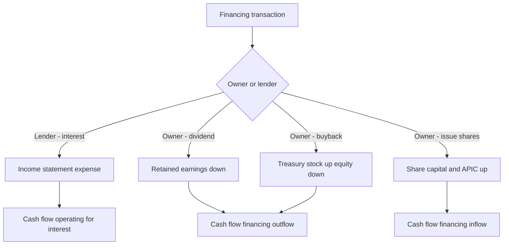
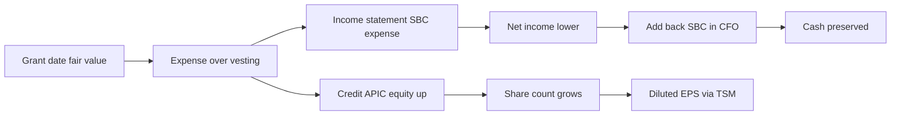
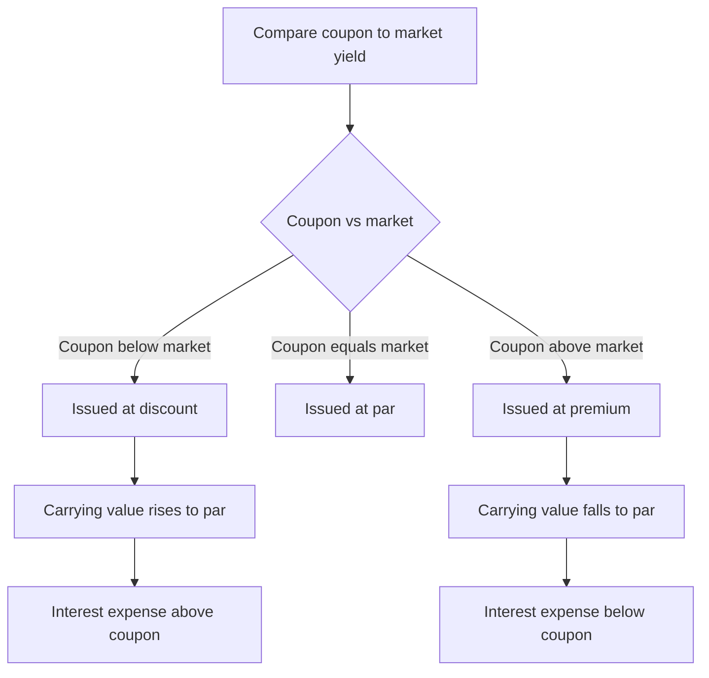

# Debt, Equity, Buybacks, Dividends & Stock-Based Comp

## The Problem / Why this matters

Every dollar a company deploys comes from one of two places: **lenders** or **owners**. The entire right-hand side of the balance sheet is the story of who financed the assets and on what terms. Get the accounting for that story wrong and every downstream number you care about in an interview — leverage, coverage, EPS, free cash flow, return on equity — is wrong too.

This chapter is where accounting stops being bookkeeping and becomes the language of **capital structure and shareholder value**. It is also, not coincidentally, the single densest source of technical interview questions across every finance seat:

- **Equity research** analysts must model diluted EPS, and dilution is driven by options, RSUs, and convertibles. They must forecast dividends and buybacks and understand how each moves the share count and the per-share numbers that drive price targets.
- **Credit analysts** live in the debt section: amortization of premium/discount, PIK interest, covenant math, the difference between cash interest and interest expense, and how buybacks and dividends drain the cash that services debt.
- **FP&A and corporate finance** teams decide *how* to return capital (dividend vs. buyback), how to account for stock comp that never touches cash, and how to keep the three statements tied when equity moves.
- **Investment banking** analysts build the pro-forma capital structure in every LBO, recap, and M&A model — new debt raised, equity rolled, options cashed out, treasury shares retired.

The reason this trips people up is that these transactions **hit all three financial statements in non-obvious ways**, and several of them (buybacks, dividends, stock comp) are *financing* events that masquerade as operating or per-share effects. Stock-based compensation in particular is the classic "it's a non-cash expense but it's still real dilution" trap that separates people who memorized the answer from people who understand it.

By the end of this chapter you will be able to journal every one of these transactions, walk them through all three statements without dropping a dollar, and answer the exact questions interviewers use to find out whether you actually understand capital.

---

## Core Idea

The balance sheet identity is the spine of everything here:

$$\text{Assets} = \text{Liabilities} + \text{Shareholders' Equity}$$

**Liabilities** (specifically debt) and **equity** are the two claims on the firm's assets. They differ in exactly four ways that drive all the accounting:

| Dimension | Debt | Equity |
|---|---|---|
| **Return promised** | Fixed (interest), contractual | Residual (dividends discretionary) |
| **Seniority in liquidation** | Senior — paid first | Junior — paid last |
| **Maturity** | Finite — must be repaid | Perpetual — no repayment |
| **Tax treatment of return** | Interest is tax-deductible | Dividends are not deductible |

Every transaction in this chapter is a movement *within* or *between* these two buckets:

- **Issuing/repaying debt** and **paying interest** move the debt bucket and cash.
- **Issuing stock** grows equity and cash; **buying back stock** shrinks both.
- **Dividends** transfer value from the firm (retained earnings + cash) to owners.
- **Stock-based comp** is the firm paying employees with equity instead of cash — an expense that builds equity rather than draining cash.

Hold onto one unifying principle: **transactions with owners in their capacity as owners never touch the income statement.** Issuing shares, buying back shares, and paying dividends are *capital transactions* — they hit the balance sheet and cash flow statement but never net income. Only *operating* costs of using capital (interest on debt, the compensation value of stock given to employees) run through the income statement.

---

## Why it works this way

**Why interest is an expense but dividends are not.** Interest is the *cost of using someone else's money* — a contractual price paid to a party who is not an owner. That is an expense of doing business, so it reduces net income and, because it is a genuine cost, the tax code lets you deduct it. Dividends, by contrast, are a *distribution of profit that already belongs to the owners*. You cannot "expense" giving people their own money. So dividends reduce retained earnings directly and are never tax-deductible. This single asymmetry — interest deductible, dividends not — is the entire reason debt creates a "tax shield" and is a favorite interview hook.

**Why buying back stock isn't an expense.** When a company repurchases its own shares, it is returning capital to owners, not consuming a resource to generate revenue. Nothing was "used up" in operations. So the buyback bypasses the income statement entirely and lands in equity (as treasury stock or a retirement of shares) with the cash outflow in financing.

**Why stock comp is an expense even though no cash leaves.** The company received a real service — employee labor — and paid for it with something of value: ownership stakes. The matching principle demands you record the cost of services consumed in the period you consumed them, regardless of whether you paid in cash, chickens, or shares. The *form* of payment (equity) doesn't erase the *substance* (you paid for work). So SBC is a real expense; it just settles in stock, which is why you add it back on the cash flow statement — the expense was non-cash.

**Why premium/discount on debt gets amortized.** A bond's coupon rate rarely equals the market's required yield on the day it's sold. If the coupon is below market, investors pay less than face (a discount); above market, they pay more (a premium). Accounting insists that the *true* economic interest cost — the market yield at issuance — flows through the income statement each period. The gap between cash coupon and true cost is trued up by amortizing the discount/premium, so interest expense reflects the real cost of borrowing, not just the coupon the company happened to print on the bond.

**Why EPS uses a weighted-average share count.** Earnings are generated over a whole year; shares may be issued or bought back mid-year. It would overstate per-share earnings to divide a full year's profit by a share count that only existed for the last month. Weighting by the fraction of the year each share was outstanding matches the denominator to the period the earnings were actually earned.

---

## Full technical content

### Part A — Debt and interest accounting

#### A.1 Classifying debt

| Classification | Meaning | Where on B/S |
|---|---|---|
| **Current portion of long-term debt (CPLTD)** | Principal due within 12 months | Current liabilities |
| **Short-term debt / revolver** | Borrowings due < 1 year | Current liabilities |
| **Long-term debt** | Principal due > 12 months | Non-current liabilities |
| **Bonds payable** | Publicly issued debt securities | Non-current (net of discount / plus premium) |

Debt is generally recorded at **amortized cost** using the **effective interest method** under both IFRS (IFRS 9) and US GAAP (ASC 470 / ASC 835-30). A minority of instruments are carried at fair value (fair-value option; trading liabilities), but amortized cost is the default and what interviews test.

#### A.2 Issuing debt at par

Issue \$1,000,000 of 3-year bonds at par, 8% annual coupon.

```
Dr Cash                         1,000,000
   Cr Bonds payable                        1,000,000
```

Each year:

```
Dr Interest expense                80,000
   Cr Cash                                    80,000
```

At maturity:

```
Dr Bonds payable                1,000,000
   Cr Cash                                  1,000,000
```

Here cash interest = interest expense because coupon = market yield.

#### A.3 The effective interest method (discount and premium)

The **carrying value** of the bond is the book value of the liability. Each period:

$$\text{Interest expense} = \text{Beginning carrying value} \times \text{Market (effective) rate}$$

$$\text{Cash coupon} = \text{Face value} \times \text{Coupon rate}$$

$$\text{Amortization} = \text{Interest expense} - \text{Cash coupon}$$

| Case | Issued at | Coupon vs. market | Carrying value over time | Interest expense vs. coupon |
|---|---|---|---|---|
| **Discount** | Below face | Coupon < market | Rises toward face | Expense > coupon |
| **Par** | At face | Coupon = market | Flat at face | Expense = coupon |
| **Premium** | Above face | Coupon > market | Falls toward face | Expense < coupon |

**Discount journal entry** (expense exceeds cash paid; the extra accretes the liability up):

```
Dr Interest expense             XXX
   Cr Cash  (coupon)                          YYY
   Cr Bonds payable / discount               (XXX - YYY)
```

**Premium journal entry** (expense is less than cash paid; the difference amortizes the liability down):

```
Dr Interest expense             XXX
Dr Bonds payable / premium      (YYY - XXX)
   Cr Cash  (coupon)                          YYY
```

Under **US GAAP** debt issuance costs (underwriting fees) are netted against the carrying value of the debt (ASC 835-30) and amortized to interest expense — identical treatment to a discount. Under **IFRS 9** transaction costs are likewise deducted and amortized via the effective interest rate.

#### A.4 Cash interest vs. interest expense — the credit-analyst distinction

- **Interest expense** = the income-statement line. Includes coupon **plus** discount amortization **plus** amortized issuance costs (minus premium amortization). It is an *accrual* concept.
- **Cash interest** = the actual cash coupon paid. It is what shows up in the cash-flow statement / what a lender cares about for coverage.
- **PIK (payment-in-kind) interest** = interest that is *added to the principal* instead of paid in cash. Interest expense is recorded and the liability grows; **zero cash** leaves the company. This is a classic LBO/distressed structure.

Coverage ratios: **EBIT / interest expense** (times-interest-earned) and **EBITDA / cash interest** are the standard credit metrics. Know that PIK debt flatters cash-interest coverage while still building leverage.

#### A.5 Repayment before maturity — gain/loss on extinguishment

If a company retires debt early (tender, call), it pays a price that may differ from the carrying value:

$$\text{Gain (Loss) on extinguishment} = \text{Net carrying value} - \text{Reacquisition price}$$

A gain (pay less than book) hits the income statement as income; a loss as an expense. This *is* an income-statement item because it's a settlement with a creditor, not with owners.

### Part B — The equity section

#### B.1 Anatomy of shareholders' equity

| Component | What it is |
|---|---|
| **Common stock (par / stated value)** | Nominal legal capital = shares issued × par value |
| **Additional paid-in capital (APIC) / Share premium** | Amount received above par at issuance |
| **Preferred stock** | Senior equity with fixed dividend, often no vote |
| **Retained earnings** | Cumulative net income − cumulative dividends |
| **Treasury stock** | Company's own shares repurchased, held not retired (contra-equity, always a debit/negative) |
| **Accumulated other comprehensive income (AOCI)** | FX translation, certain pension & hedge & AFS-security gains/losses bypassing net income |
| **Non-controlling interest (NCI)** | Portion of a consolidated subsidiary owned by outsiders |

Total equity = share capital + APIC + retained earnings + AOCI + NCI − treasury stock.

#### B.2 Issuing common stock

Issue 100,000 shares, \$1 par, at \$25:

```
Dr Cash                         2,500,000
   Cr Common stock (par)                     100,000
   Cr Additional paid-in capital           2,400,000
```

Par is a legal artifact only. Under IFRS many jurisdictions use **no-par / stated value** shares and the whole \$2,500,000 sits in "share capital." Economically identical.

#### B.3 Retained earnings roll-forward

$$\text{RE}_{end} = \text{RE}_{beg} + \text{Net income} - \text{Dividends declared}$$

This is the *only* bridge between the income statement and the balance sheet's equity section. Memorize it — the entire three-statement linkage hinges on it.

#### B.4 Treasury stock — two methods

| Method | How repurchase is recorded | Reissue above cost | Reissue below cost |
|---|---|---|---|
| **Cost method** (dominant, US GAAP ASC 505-30) | Treasury stock (contra-equity) at price paid | Credit APIC — treasury | Debit APIC-treasury, then RE |
| **Par-value method** | Treasury at par; difference to APIC/RE | — | — |

Under IFRS, repurchased shares ("treasury shares") are deducted from equity at cost; **no gain or loss is ever recognized in P&L** on the purchase, sale, or cancellation of a company's own shares (IAS 32.33). This is a hard rule and a favorite trap.

### Part C — Dividends

#### C.1 Types and the timeline

| Dividend type | Effect |
|---|---|
| **Cash dividend** | Cash out, retained earnings down |
| **Stock dividend** | No cash; capitalizes RE into share capital; more shares, same total equity |
| **Property dividend** | Distributes a non-cash asset at fair value (revalue first, then distribute) |
| **Special / one-time** | A large non-recurring cash dividend |
| **Preferred dividend** | Fixed; cumulative preferreds accrue if skipped (dividends in arrears) |

Three dates:

1. **Declaration date** — board declares; a legal liability arises. **Journal here.**
2. **Record date** — determines who receives it. No entry.
3. **Payment date** — cash goes out.

#### C.2 Cash dividend entries

Declare \$0.50/share on 1,000,000 shares:

```
Declaration:
Dr Retained earnings              500,000
   Cr Dividends payable                       500,000

Payment:
Dr Dividends payable              500,000
   Cr Cash                                     500,000
```

Note: the dividend hits retained earnings, **never** the income statement.

#### C.3 Stock dividend — capitalizing retained earnings

A *small* stock dividend (< 20–25% under US GAAP) is recorded at **fair value**; a *large* one at **par**. Declare a 10% stock dividend on 1,000,000 shares (\$1 par) when market price is \$30:

```
Dr Retained earnings (100,000 sh × $30)  3,000,000
   Cr Common stock (100,000 × $1 par)                100,000
   Cr Additional paid-in capital                    2,900,000
```

Total equity is unchanged — value just moved from RE into contributed capital. Each shareholder owns more shares of a proportionally-less-valuable company. A **stock split** (e.g., 2-for-1) changes par and share count with *no journal entry* — purely a memorandum.

#### C.4 Statement impact of a cash dividend

| Statement | Impact |
|---|---|
| Income statement | **No impact** |
| Balance sheet | Cash ↓, Retained earnings ↓ (equal) |
| Cash flow statement | **Financing** outflow when paid |

### Part D — Share buybacks and EPS

#### D.1 Mechanics

A buyback returns capital to owners by purchasing shares. Two paths:

- **Hold as treasury stock** — shares survive legally, sit in a contra-equity account, can be reissued (for option exercises, M&A, etc.).
- **Retire/cancel** — shares are extinguished; reduce common stock and APIC pro-rata, plug the remainder to retained earnings.

Buy 50,000 shares at \$40 (cost method, held as treasury):

```
Dr Treasury stock              2,000,000
   Cr Cash                                   2,000,000
```

Balance sheet: cash ↓ 2,000,000, treasury stock (contra-equity) ↑ 2,000,000 → total equity ↓ 2,000,000. Income statement: nothing. Cash flow: **financing** outflow.

#### D.2 Why buybacks raise EPS (usually)

A buyback cuts the denominator (shares). Whether **EPS rises** depends on the trade-off between lost earnings (the cash used to buy shares was earning a return, or the debt raised to fund the buyback costs interest) and the reduced share count.

Rule of thumb for a cash-funded buyback: **EPS is accretive if the earnings yield (E/P = 1/PE) exceeds the after-tax yield lost on the cash.** For a debt-funded buyback: **accretive if the after-tax cost of debt is below the earnings yield.**

#### D.3 Basic vs. diluted EPS

$$\text{Basic EPS} = \frac{\text{Net income} - \text{Preferred dividends}}{\text{Weighted-average shares outstanding}}$$

$$\text{Diluted EPS} = \frac{\text{NI} - \text{Pref. div} + \text{after-tax interest on convertibles}}{\text{WASO} + \text{dilutive options/RSUs} + \text{convertible-as-converted shares}}$$

Two mechanical methods:

- **Treasury stock method (TSM)** — for options/warrants/RSUs. Assume options are exercised, the company receives the strike proceeds (plus, historically, unrecognized comp — see below), and uses that cash to buy back shares at the average market price. Net new shares = options − shares repurchasable.

$$\text{Net dilution} = n \times \left(1 - \frac{K}{P}\right) = n \times \frac{P - K}{P}$$

where *n* = options outstanding, *K* = strike, *P* = average share price.

- **If-converted method** — for convertible bonds/preferred. Assume conversion at the start of the period: add the convertible shares to the denominator and add back the after-tax interest (or preferred dividends) to the numerator.

**Anti-dilution rule:** you only include a security if it *reduces* EPS. Out-of-the-money options (K > P) and convertibles that would *raise* EPS are excluded. Diluted EPS can never exceed basic EPS.

### Part E — Stock-based compensation (SBC)

#### E.1 The core model (ASC 718 / IFRS 2)

At grant, measure the **fair value** of the award (Black-Scholes / lattice for options; grant-date share price for RSUs). Recognize that fair value as **compensation expense over the vesting period** (the service period).

$$\text{Annual SBC expense} = \frac{\text{Grant-date fair value of award}}{\text{Vesting period in years}} \quad (\text{straight-line})$$

The offsetting credit goes to **APIC** (equity-classified awards). So SBC *increases* equity even as it hits the P&L — the company is issuing equity to pay for labor.

```
Each year of vesting:
Dr Stock-based compensation expense    XXX
   Cr Additional paid-in capital                    XXX
```

At exercise of an option (strike \$10, par \$1, 1,000 options):

```
Dr Cash (1,000 × $10)                   10,000
Dr APIC (accumulated option value)       ...
   Cr Common stock (1,000 × $1 par)                  1,000
   Cr APIC                                            ...
```

Key IFRS/GAAP nuances:

| Point | US GAAP (ASC 718) | IFRS 2 |
|---|---|---|
| Forfeitures | Estimate OR account as they occur (policy choice) | Must estimate |
| Cash-settled awards (SARs) | Liability, remeasured to fair value each period | Same — liability, remeasured |
| Excess tax benefits | Through income statement (post-2017) | Through equity in part |
| Graded vesting | Straight-line or accelerated (policy) | Must use accelerated (each tranche separately) |

#### E.2 SBC across the three statements — the crucial linkage

1. **Income statement:** SBC is an operating expense (embedded in COGS, R&D, SG&A). It reduces pre-tax income and net income.
2. **Cash flow statement:** Because no cash left, **add SBC back** to net income in Cash Flow from Operations (CFO). This is why heavy-SBC tech companies show CFO far above net income.
3. **Balance sheet:** The add-back's mirror image is a **credit to APIC** — equity rises. Retained earnings fell (via the expense reducing NI), APIC rose by the same amount → total equity roughly unchanged from the SBC itself, but **share count grows** as awards vest and settle, diluting existing holders.

The trap: SBC is *non-cash* (so you add it back) but it is emphatically *not free* — it dilutes owners. Analysts who add SBC back to get "adjusted EBITDA" and then also ignore the share creep are double-counting the benefit. The economically honest treatment is to either (a) treat SBC as a real expense, or (b) add it back but fully load the dilution into the diluted share count.

---

## Worked examples

### Worked Example 1 — Bond issued at a discount, full amortization schedule and 3-statement impact

**Facts.** On 1 Jan Year 1, Acme issues \$500,000 face, 3-year bonds with a **6% annual coupon**, when the market yield is **8%**. Interest paid annually on 31 Dec.

**Step 1 — Issue price (PV at 8%).**

- Coupon = 500,000 × 6% = \$30,000/yr for 3 years.
- PV of coupons = 30,000 × [1 − 1.08⁻³] / 0.08 = 30,000 × 2.577097 = \$77,313.
- PV of principal = 500,000 × 1.08⁻³ = 500,000 × 0.793832 = \$396,916.
- **Issue price = 77,313 + 396,916 = \$474,229.** Discount = 500,000 − 474,229 = **\$25,771**.

**Issuance entry:**

```
Dr Cash                          474,229
Dr Discount on bonds payable      25,771
   Cr Bonds payable                          500,000
```

(Equivalently, present the liability net at \$474,229.)

**Step 2 — Effective-interest amortization schedule.**

| Year | Beg. carrying value | Interest expense (8%) | Coupon (6%) | Discount amort. | End carrying value |
|---|---:|---:|---:|---:|---:|
| 1 | 474,229 | 37,938 | 30,000 | 7,938 | 482,167 |
| 2 | 482,167 | 38,573 | 30,000 | 8,573 | 490,741 |
| 3 | 490,741 | 39,259* | 30,000 | 9,259 | 500,000 |

*Year 3 expense rounded so ending value ties exactly to \$500,000 face (39,259 = 30,000 coupon + 9,259 remaining discount; 490,741 + 9,259 = 500,000). ✓ Total discount amortized = 7,938 + 8,573 + 9,259 = 25,770 ≈ 25,771 (rounding). ✓

**Year 1 interest entry:**

```
Dr Interest expense               37,938
   Cr Cash                                     30,000
   Cr Discount on bonds payable                 7,938
```

**Step 3 — Three-statement impact, Year 1.**

- **Income statement:** interest expense \$37,938 (not the \$30,000 coupon — this is the classic trap).
- **Cash flow:** CFO shows cash interest \$30,000 (add back \$7,938 non-cash amortization to NI). Financing showed +\$474,229 at issuance.
- **Balance sheet:** bond carrying value rises from 474,229 to 482,167; cash down 30,000 for the coupon.

**Interview soundbite:** "Because the coupon is below market, the bond was issued at a discount. Interest *expense* of \$37,938 exceeds the \$30,000 cash coupon; the \$7,938 gap accretes the liability up toward par over the life."

---

### Worked Example 2 — Buyback: accretion/dilution and EPS, cash-funded vs. debt-funded

**Facts.** Beta Corp: net income \$100m; 50m shares outstanding; share price \$40 (so market cap \$2,000m, PE = 20×, earnings yield = 5%). It repurchases **\$400m** of stock = 10m shares at \$40.

**Case A — funded with cash earning 2% pre-tax, tax rate 25%.**

- After-tax yield lost on cash = 2% × (1 − 25%) = 1.5%. Lost income = 400 × 1.5% = **\$6m**.
- New net income = 100 − 6 = **\$94m**. New shares = 50 − 10 = **40m**.
- New EPS = 94 / 40 = **\$2.35**. Old EPS = 100 / 50 = **\$2.00**.
- **Accretive** (+17.5%). Sanity check with the rule: earnings yield 5% > after-tax cash yield 1.5% → accretive. ✓

**Case B — funded with new debt at 6% pre-tax, tax rate 25%.**

- After-tax interest = 400 × 6% × (1 − 25%) = 400 × 4.5% = **\$18m**.
- New net income = 100 − 18 = **\$82m**. New shares = 40m.
- New EPS = 82 / 40 = **\$2.05**. Still **accretive** (+2.5%).
- Rule check: after-tax cost of debt 4.5% < earnings yield 5% → accretive. ✓ (If debt cost 7%, after-tax = 5.25% > 5% → dilutive.)

**Break-even for debt case:** accretive while after-tax cost of debt < 5% earnings yield, i.e., pre-tax rate < 5% / 0.75 = **6.67%**.

**Balance sheet (Case A):** cash −400, treasury stock +400 (equity −400). No income-statement line for the buyback itself; only the *forgone interest income* changes NI.

---

### Worked Example 3 — Stock-based comp: full 3-statement walk plus diluted EPS via TSM

**Facts.** On 1 Jan Year 1, Gamma grants **1,200 stock options**, strike \$20, vesting evenly over 3 years, grant-date fair value **\$9/option**. Tax rate 25%. In Year 1: pre-tax income *before* SBC = \$50,000; average share price = \$30; basic weighted shares = 20,000; no debt.

**Step 1 — Annual SBC expense.**

- Total grant fair value = 1,200 × \$9 = \$10,800. Over 3 years → **\$3,600/yr**.

```
Dr SBC expense                     3,600
   Cr APIC                                      3,600
```

**Step 2 — Income statement, Year 1.**

| Line | Amount |
|---|---:|
| Pre-tax income before SBC | 50,000 |
| SBC expense | (3,600) |
| Pre-tax income | 46,400 |
| Tax @ 25% | (11,600) |
| **Net income** | **34,800** |

**Step 3 — Cash flow (indirect), CFO top.**

| Line | Amount |
|---|---:|
| Net income | 34,800 |
| + SBC (non-cash) | 3,600 |
| **CFO contribution** | **38,400** |

(Assuming no other items and taxes accrued equal cash tax for simplicity, cash generated exceeds NI by exactly the non-cash SBC.)

**Step 4 — Balance sheet check.** Retained earnings +34,800 (from NI). APIC +3,600 (from SBC). Cash up 38,400 from operations. Equity change from SBC alone nets to zero across RE (−3,600 after tax effect... more precisely the expense reduced RE via NI while APIC rose 3,600), but the important structural point: **cash was preserved; equity was issued.** Balance sheet balances because the \$3,600 APIC credit mirrors the \$3,600 non-cash add-back that kept cash higher than accrual earnings implied.

**Step 5 — Diluted EPS via Treasury Stock Method.**

- Basic EPS = 34,800 / 20,000 = **\$1.74**.
- Options: 1,200 outstanding, strike \$20, avg price \$30 (in the money).
- Proceeds from assumed exercise = 1,200 × \$20 = \$24,000.
- Shares repurchasable at \$30 = 24,000 / 30 = 800.
- **Net new shares = 1,200 − 800 = 400.** (Shortcut: 1,200 × (30−20)/30 = 1,200 × 0.3333 = 400. ✓)
- Diluted shares = 20,000 + 400 = 20,400.
- **Diluted EPS = 34,800 / 20,400 = \$1.706 ≈ \$1.71.**

Diluted (\$1.71) < Basic (\$1.74) — dilution is real, exactly as expected. ✓

**Interview soundbite:** "SBC is an accrual expense that lowers net income, but because it settles in stock we add it back in CFO — that's why cash flow exceeds earnings. The cost doesn't vanish; it reappears as share dilution, which I capture in diluted EPS via the treasury-stock method."

---

## Diagrams

**Where each transaction lands across the three statements:**



**Stock-based comp linkage:**



**Bond discount vs premium decision:**



**Dividend timeline:**


---

## How it is tested in interviews

**Q1. "Walk me through what happens to the three statements when a company issues \$100 of debt at 10% interest."**
Model answer: "Balance sheet — cash up \$100, debt up \$100, balances. Then each year: income statement shows \$10 interest expense, so pre-tax income falls \$10; at a 40% tax rate net income falls \$6. Cash flow — net income down \$6, but the interest is a real cash payment so CFO falls by the after-tax \$6; the \$100 principal was a financing inflow. Balance sheet ties: retained earnings down \$6, cash down \$6 net of the tax shield." The examiner is checking that you separate the pre-tax expense from the after-tax NI impact and know interest is CFO, principal is financing.

**Q2. "A company buys back \$1bn of stock. Walk me through the statements."**
"No income-statement impact — it's a capital transaction with owners. Balance sheet: cash down \$1bn, treasury stock (contra-equity) up \$1bn, so total equity falls \$1bn. Cash flow: \$1bn financing outflow. Going forward, the lower share count raises EPS if the buyback is accretive, and if it was cash-funded I'd note the small drag from lost interest income."

**Q3. "Is stock-based comp a real expense? If it's non-cash why do we care?"**
The single most common tech-coverage question. "Yes — the company paid for labor with equity, so under ASC 718 / IFRS 2 it's a genuine expense measured at grant-date fair value and amortized over the vesting period. It's non-cash, so we add it back in CFO, which is why high-SBC companies show cash flow above net income. But it is *not* free — it dilutes shareholders as awards vest. So I'd never treat 'adjusted EBITDA excluding SBC' as clean; the cost just migrates from the P&L to the share count. The honest way to value it is to keep it as an expense or fully load the dilution."

**Q4. "What's the difference between basic and diluted EPS, and how do you compute the dilution from options?"**
"Basic uses weighted-average shares actually outstanding. Diluted adds the shares that *would* exist if in-the-money options, RSUs, and convertibles were exercised or converted. For options I use the treasury-stock method: assume exercise, use the strike proceeds to buy back shares at the average price, and add the net new shares. Net dilution equals options times (price minus strike) over price. Out-of-the-money options are anti-dilutive and excluded — diluted EPS can never exceed basic."

**Q5. "Dividend vs. buyback — how do they differ on the statements and for shareholders?"**
"On the statements both are financing outflows with no income-statement hit. A cash dividend debits retained earnings; a buyback creates treasury stock. For shareholders: a dividend is a taxable cash return that leaves the share count unchanged; a buyback reduces the share count, raising each remaining holder's ownership and EPS, and defers tax until the holder sells. Buybacks are more flexible and tax-efficient; dividends signal a credible, sticky commitment."

**Q6. "A bond is issued at a discount. Is interest expense higher or lower than the coupon?"**
"Higher. The discount means the coupon is below the market yield. Under the effective-interest method, interest expense equals the carrying value times the market rate, which exceeds the cash coupon; the difference amortizes the discount and pushes the carrying value up to par by maturity. Premium is the mirror image — expense below coupon."

**Q7. "If a company issues \$100 of stock-based comp, does equity go up or down?"**
"Net roughly flat, but the pieces move: the expense reduces net income and hence retained earnings, while the offsetting credit to APIC raises contributed capital by the same pre-tax amount. The real effect is dilution of the share count, not a change in total book equity."

**Q8. "Where does the current portion of long-term debt live, and why does it matter?"**
"It's reclassified from long-term to current liabilities because it's due within twelve months. It matters for the current ratio and for refinancing risk — a big CPLTD spike is a maturity wall a credit analyst flags immediately."

---

## Traps & common mistakes

1. **Confusing coupon with interest expense.** On discount/premium bonds they differ. Interest expense = carrying value × market yield, *not* the printed coupon.
2. **Running dividends or buybacks through the income statement.** They never touch NI — they are capital transactions with owners. Dividends hit RE; buybacks hit treasury stock.
3. **Recognizing a gain/loss on treasury-share transactions.** A company can never book a P&L gain or loss on dealing in its *own* shares (IAS 32.33 / ASC 505-30). Differences go to APIC or RE.
4. **Adding SBC back and forgetting dilution.** The non-cash add-back is correct for cash flow, but the cost re-emerges as share creep. Ignoring it double-counts the benefit.
5. **Forgetting the tax shield on interest.** A \$10 interest expense reduces net income by \$10 × (1 − tax rate), not \$10. Dividends have no shield.
6. **Using period-end shares instead of weighted-average for EPS.** Shares issued mid-year must be pro-rated.
7. **Including anti-dilutive securities in diluted EPS.** Out-of-the-money options and anti-dilutive convertibles are excluded. Diluted EPS ≤ basic EPS, always.
8. **Treating a stock split or stock dividend as a value event.** They redistribute the same equity across more shares — total equity and total value are unchanged.
9. **Confusing PIK interest with cash interest in coverage ratios.** PIK builds the liability without a cash outflow — it flatters cash-interest coverage but still increases leverage.
10. **Mislabeling interest cash flow.** Under US GAAP interest paid is in CFO; under IFRS it can be in CFO or CFF (policy choice). Know the framework you're asked about.

---

## First-principles recap

- The right side of the balance sheet is two claims: **debt** (fixed, senior, finite, tax-favored) and **equity** (residual, junior, perpetual). Every transaction here moves within or between these buckets.
- **Interest is an expense** (cost of using others' money, tax-deductible); **dividends and buybacks are capital transactions with owners** — they bypass the income statement entirely.
- **Interest expense reflects the market yield at issuance**, trued up via amortization of discount/premium — not the mechanical coupon.
- **Retained earnings** is the sole bridge from the income statement to the equity section: beginning RE + net income − dividends.
- **Stock-based comp** is a real, non-cash expense: it lowers net income, is added back in CFO, credits APIC, and its true cost surfaces as **dilution**.
- **EPS uses weighted-average shares**; diluted EPS layers in the dilution from in-the-money options (treasury-stock method) and convertibles (if-converted), and can never exceed basic EPS.
- Buybacks are **accretive when the earnings yield exceeds the after-tax cost of the funding** (lost interest on cash, or interest on new debt).

---

## Quick-reference

| Item | Formula / entry |
|---|---|
| Interest expense (effective) | Beginning carrying value × market rate |
| Discount/premium amortization | Interest expense − cash coupon |
| Bond issue price | PV of coupons + PV of principal at market yield |
| Gain/loss on extinguishment | Net carrying value − reacquisition price |
| Retained earnings roll | RE_beg + Net income − Dividends |
| Issue stock | Dr Cash / Cr Common stock (par) / Cr APIC |
| Buyback (cost method) | Dr Treasury stock / Cr Cash |
| Cash dividend (declare) | Dr Retained earnings / Cr Dividends payable |
| Stock dividend (small) | Dr RE at FV / Cr Common stock (par) / Cr APIC |
| SBC annual expense | Grant-date fair value ÷ vesting years |
| SBC entry | Dr SBC expense / Cr APIC |
| Basic EPS | (NI − Pref div) ÷ Weighted-avg shares |
| Diluted EPS | (NI − Pref div + after-tax conv. interest) ÷ (WASO + net options + as-converted) |
| TSM net dilution | n × (P − K) ÷ P |
| Buyback accretive (cash) | Earnings yield (1/PE) > after-tax cash yield |
| Buyback accretive (debt) | After-tax cost of debt < earnings yield |
| After-tax cost of debt | Rate × (1 − tax rate) |
| Interest tax shield | Interest × tax rate |

**Key standards:** Debt at amortized cost — IFRS 9, ASC 470 / 835-30. Equity & treasury — IAS 32, ASC 505. SBC — IFRS 2, ASC 718. EPS — IAS 33, ASC 260. Dividends — retained earnings, never P&L.
