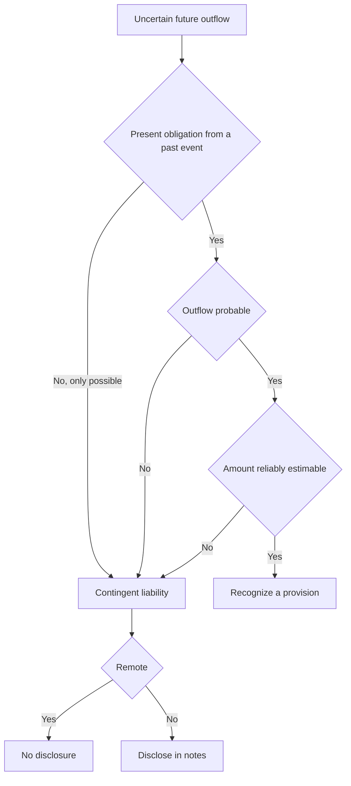
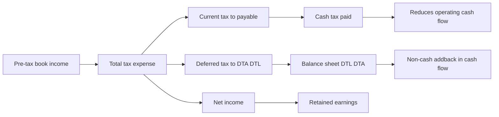

# Deferred Taxes, Provisions & Contingencies

## The Problem / Why this matters

Two companies earn the exact same $1,000 of pre-tax book profit. Both are taxed at 25%. One reports a tax expense of $250; the other reports $180. Neither is lying. Neither is committing fraud. The difference is one of the most misunderstood and most frequently tested areas in all of financial-statement analysis: **the gap between accounting profit and taxable profit.**

Here is the situation this chapter addresses. The rules that govern the numbers you show to **shareholders** (GAAP/IFRS) and the rules that govern the numbers you show to the **tax authority** (the tax code) are two different rule-books written by two different bodies for two different purposes. Accounting standards want to measure economic performance for a period. Tax law wants to collect revenue and often uses the tax code as a policy tool — accelerating depreciation to encourage capital spending, allowing loss carryforwards to smooth entrepreneurship risk, taxing some income only when cash is received. Because the two rule-books recognize the same economic events in **different periods**, the tax you *report* as an expense and the tax you *actually pay in cash* diverge. That divergence has to live somewhere on the balance sheet. It lives in **deferred tax assets and liabilities.**

The same "which period does this belong to?" problem, applied to obligations rather than income, produces **provisions and contingent liabilities.** A company being sued, a warranty it has issued, a factory it must one day dismantle, a restructuring it has announced — these are future cash outflows whose timing and amount are uncertain. When must the company book a liability today, when must it merely disclose the risk in a footnote, and when can it stay silent? That decision changes reported equity, reported earnings, and every leverage ratio a credit analyst computes.

For an interviewer, this topic is a goldmine because it separates candidates who *memorized* the three statements from candidates who *understand* them. "Walk me through what a deferred tax liability actually is" and "why does a company with $1bn of profit pay almost no cash tax" are questions that a rote learner fails and a first-principles thinker nails. In equity research you need it to normalize earnings and forecast cash taxes. In credit you need it to distinguish a real obligation from an accounting artifact and to strip soft liabilities out of a covenant calculation. In FP&A you own the effective-tax-rate line in the model. In IB you adjust for it in every LBO and every DCF (unlevered free cash flow uses *cash* taxes, not book taxes). Get this chapter into your bones and you will sound like someone who has actually closed a set of books.

## Core Idea

Strip away the jargon and there are only two ideas in this entire chapter.

**Idea 1 — Deferred tax is a timing bridge.** Book income and taxable income differ. Some of those differences are **permanent** (an item that hits one rule-book but never the other — e.g., a fine that is an expense for accounting but never deductible for tax). Permanent differences change your effective tax rate and then vanish; they create no balance-sheet item. Other differences are **temporary** (an item both rule-books recognize, but in *different periods* — e.g., depreciation you take fast for tax and slow for books). Temporary differences reverse over time, and while they are alive they park an asset or a liability on the balance sheet. A **deferred tax liability (DTL)** says "I got a tax break now that I will pay back later — I owe the taxman in the future." A **deferred tax asset (DTA)** says "I over-paid the taxman now relative to book, so I have a future tax saving — the taxman owes me." The whole point of deferred tax accounting is to make the **tax expense on the income statement match the book profit of the period**, not the cash actually paid.

**Idea 2 — A future obligation gets recorded when it is probable and measurable; otherwise it is merely disclosed or ignored.** That single decision rule — run the obligation through a probability test — sorts every uncertain future outflow into one of three bins: **provision** (book a liability now), **contingent liability** (disclose in a footnote, book nothing), or **remote** (say nothing). A **reserve**, confusingly named, is *not* an obligation at all — it is an appropriation of equity, a slicing-up of retained earnings, and belongs on the other side of the balance sheet entirely. The single most common conceptual error on this whole topic is confusing a **provision** (a real liability, an obligation to an outside party) with a **reserve** (an earmarking of the owners' own money).

Everything else — the journal entries, the valuation allowance, the effective-tax-rate reconciliation, IAS 37 vs ASC 450 — is machinery built on top of these two ideas.

## Why it works this way (first principles)

**Why do two tax numbers even exist?** Because the income statement is built on **accrual accounting** — recognize revenue when earned, match expenses to the revenue they generate, regardless of cash timing. Tax authorities do not fully trust accrual judgment (it is subjective and companies would understate it), so the tax code hard-codes its own timing rules: often more cash-basis, often with deliberate incentives. So the same truck that a company depreciates straight-line over 8 years for shareholders might be written off over 3 years for tax under an accelerated schedule. Same truck, same total lifetime deduction, different *timing.*

**Why must the difference be capitalized rather than just ignored?** This is the **matching principle** applied to tax. Suppose in Year 1 accelerated tax depreciation makes taxable income lower than book income, so cash tax is low. If we reported only the low cash tax as our expense, we would overstate Year-1 net income and understate it in later years when the tax depreciation runs out and cash tax spikes. That would make earnings look volatile for a reason that has nothing to do with the business. Deferred tax accounting fixes this: in Year 1 we report the *full* tax expense the book profit deserves, pay the low cash amount, and record the difference as a **liability** — because that unpaid tax is a genuine future obligation. The tax break was a loan from the government, and a loan is a liability. When the difference reverses in later years, cash tax exceeds book tax, and we *draw down* that liability instead of expensing it again. Net income stays smooth. The balance sheet carries the memory.

**Why is a DTL a real liability and not just a plug?** Because it represents taxes the company will actually pay in cash in the future *as a direct consequence of past transactions.* When you use up depreciation faster for tax than for books, you have less tax depreciation left later, so future taxable income (and future cash tax) will be *higher* than future book income implies. That extra future cash tax is owed because of something that already happened. That is the textbook definition of a liability: a present obligation arising from a past event that will require a future outflow of resources. (The nuance — one that sophisticated credit analysts exploit — is that for a growing company the DTL from depreciation may *never* actually reverse, because new capex keeps generating fresh timing differences. That is why some analysts treat a perpetually-growing depreciation DTL as quasi-equity. More on that in Traps.)

**Why the probability test for provisions?** Because a balance sheet that recorded every conceivable future outflow would be useless — every company faces the *possibility* of being sued, of a customer defaulting, of a warranty claim. Recording all of them would drown real obligations in speculation and let management manipulate earnings by over-reserving in good years ("cookie-jar reserves") and releasing in bad years. So the standards draw a bright line: you recognize a liability only when an outflow is **probable** (more likely than not) **and** you can **reliably estimate** the amount. Below that line but not remote, you disclose — giving the reader information without polluting the numbers with guesses. This is the tension between **relevance** (tell me about the risk) and **reliability** (don't feed me made-up numbers), resolved by a threshold.

**Why is prudence asymmetric?** Notice the deep asymmetry baked into both halves of this chapter. You recognize a *probable loss* (a provision) but you do *not* recognize a *probable gain* (a contingent asset is only disclosed, and only when the inflow is probable; you book it only when virtually certain). Similarly, you recognize a DTL in full but you only recognize a DTA to the extent future profits make it *realizable* (the valuation allowance). This is **conservatism / prudence**: the accounting system is deliberately biased against overstating assets and income, because the cost of an investor over-relying on a phantom asset is judged worse than the cost of understating. Understanding that this asymmetry is *intentional* is what lets you answer the "why" questions in an interview.

## Full technical content

### 1. The two rule-books and the four kinds of income

| Concept | Governed by | What it measures |
|---|---|---|
| Accounting / book income (pre-tax) | GAAP / IFRS | Economic performance for the period |
| Taxable income | The tax code | The base the tax authority taxes |
| Current tax (tax payable) | Tax code | Cash tax owed on this year's taxable income |
| Deferred tax | GAAP / IFRS | The tax effect of temporary differences |

**Total tax expense (the P&L line) = Current tax expense + Deferred tax expense.**

- **Current tax** = Taxable income × statutory tax rate. This is what you owe the government for the year (before payments already made).
- **Deferred tax expense** = the change in net deferred tax balances during the year (the increase in DTL minus the increase in DTA). It is a *non-cash* component of tax expense.

### 2. Permanent vs temporary differences

| | Permanent difference | Temporary (timing) difference |
|---|---|---|
| Definition | Item in one rule-book, never the other | Item in both, recognized in different periods |
| Reverses? | No | Yes |
| Affects effective tax rate? | Yes (permanently) | No (only the timing of cash tax) |
| Creates DTA/DTL? | No | Yes |
| Examples | Municipal-bond interest (tax-free income), fines & penalties (non-deductible), a portion of meals/entertainment, goodwill impairment (jurisdiction-dependent), tax credits | Depreciation method differences, warranty accruals, bad-debt allowances, deferred revenue, prepaid expenses, tax loss carryforwards, most provisions |

Mnemonic: **permanent differences change the *rate*; temporary differences change the *timing.***

### 3. Which temporary differences create a DTA vs a DTL

The clean test: compare the asset/liability's **carrying (book) value** to its **tax base** (its value in the eyes of the tax authority).

| Situation | Result | Intuition |
|---|---|---|
| Carrying value of an **asset** > tax base | **DTL** | Book value higher than tax value → future taxable income will exceed book → future tax to pay |
| Carrying value of an **asset** < tax base | **DTA** | You've written the asset down for books faster than for tax → future deductions remain |
| Carrying value of a **liability** > tax base | **DTA** | You've expensed something for books not yet deductible for tax → future tax saving |
| Carrying value of a **liability** < tax base | **DTL** | — |

**Deferred tax balance = Temporary difference × enacted (expected future) tax rate.**

Common patterns to memorize:

| Driver | Creates | Why |
|---|---|---|
| Accelerated tax depreciation (tax > book depreciation early) | **DTL** | Lower tax now, higher tax later |
| Warranty / restructuring / litigation provision (expensed for books, deductible only when paid) | **DTA** | Book expense now, tax deduction later |
| Allowance for doubtful accounts (books), deductible only on write-off (tax) | **DTA** | Same logic |
| Deferred / unearned revenue (taxed on receipt, booked when earned) | **DTA** | Tax paid now, book revenue later |
| Prepaid expenses (deducted for tax when paid, expensed for books later) | **DTL** | Tax deduction now, book expense later |
| Net operating loss (NOL) carryforward | **DTA** | Future taxable income can be shielded |
| Unrealized gains on investments (FVOCI) | **DTL** | Gain in book equity, not yet taxed |

### 4. Deferred tax assets from carryforwards and the valuation allowance

A **net operating loss (NOL)** carryforward is a DTA: a past loss you can use to reduce *future* taxable income, so it embeds a future tax saving. Value = usable loss × future tax rate.

But a DTA is only worth something if you will actually have future profits to use it against. Hence:

- **US GAAP (ASC 740):** Recognize the DTA in full, then reduce it with a **valuation allowance** if it is "more likely than not" (>50%) that some or all of the DTA will *not* be realized. The allowance is a contra-asset; changes flow through tax expense.
- **IFRS (IAS 12):** Recognize the DTA only to the extent it is *probable* that future taxable profit will be available. No separate allowance account — the asset is booked net.

Same economic answer, different mechanics. A company piling up losses with no realistic path to profit must write its DTA down to (near) zero — and when it turns profitable, *reversing* that allowance produces a large one-time tax *benefit* (negative tax expense), a classic "why is their tax rate negative this quarter?" analyst flag.

Key US rule changes worth knowing: post-2017 US NOLs carry forward **indefinitely** (no expiry) but can offset only **80% of taxable income** in a given year; they generally can no longer be carried *back.* (Older NOLs and other jurisdictions differ.)

### 5. Journal-entry formats — deferred tax

**Recording current + deferred tax for a year (DTL increasing):**

```
Dr  Income tax expense (P&L)          [total tax expense]
    Cr  Income tax payable (current)                  [cash tax for the year]
    Cr  Deferred tax liability (BS)                   [increase in DTL]
```

**When a DTL reverses (later year, cash tax now exceeds book tax):**

```
Dr  Income tax expense (P&L)          [book/effective tax]
Dr  Deferred tax liability (BS)       [reversal amount]
    Cr  Income tax payable                            [higher cash tax]
```

**Recognizing a DTA (e.g., from a provision):**

```
Dr  Deferred tax asset (BS)           [temp difference × rate]
    Cr  Income tax expense (P&L)                      [deferred tax benefit]
```

**Valuation allowance against a DTA (US GAAP):**

```
Dr  Income tax expense (P&L)          [allowance]
    Cr  Valuation allowance (contra-DTA)             [allowance]
```

### 6. The effective tax rate (ETR)

$$\text{Effective Tax Rate} = \frac{\text{Total income tax expense}}{\text{Pre-tax book income}}$$

The **statutory rate** is the legislated headline rate. The **effective rate** is what actually shows up as tax expense divided by pre-tax profit. They differ because of **permanent differences, tax credits, foreign rate differentials, changes in valuation allowance, and rate changes.** Note the ETR is driven by *permanent* items and rate effects; pure timing differences do **not** move the ETR (they move cash tax vs book tax, not the ratio of total tax expense to pre-tax income).

There is also a **cash tax rate** = cash taxes paid ÷ pre-tax income, which *is* moved by timing differences and is what a DCF/LBO cares about.

**The ETR reconciliation** (a required footnote, and a favourite interview prop) bridges statutory to effective:

| Line | Effect on ETR |
|---|---|
| Statutory federal rate | (starting point, e.g., 21%) |
| State/local taxes (net) | + |
| Foreign rate differential (earnings in lower-tax countries) | usually − |
| Tax-exempt income (e.g., muni interest) | − |
| Non-deductible expenses (fines, some M&A costs) | + |
| Tax credits (R&D, foreign tax credits) | − |
| Change in valuation allowance | + or − |
| Enacted rate change (revalue DTLs/DTAs) | + or − (one-time) |
| **= Effective tax rate** | |

### 7. Provisions vs contingent liabilities — the standards

**IFRS — IAS 37 (Provisions, Contingent Liabilities and Contingent Assets).** A **provision** is a liability of *uncertain timing or amount.* Recognize a provision when **all three** hold:

1. There is a **present obligation** (legal or **constructive**) arising from a **past event**;
2. It is **probable** (IFRS reads "probable" as *more likely than not*, i.e., >50%) that an outflow of resources will be required; and
3. The amount can be **reliably estimated.**

Measure the provision at the **best estimate** of the expenditure to settle the obligation (expected value for large populations, most-likely outcome for a single item), **discounted** to present value where the time value of money is material. A **constructive obligation** arises from an established pattern or public statement that creates a valid expectation in others (e.g., a published restructuring plan, a customary refund policy).

A **contingent liability** under IAS 37 is either (a) a *possible* obligation confirmed only by future events, or (b) a present obligation that is either not probable or not reliably measurable. **Contingent liabilities are NOT recognized — they are disclosed.** A **contingent asset** is disclosed only when an inflow is probable, and recognized only when the inflow is **virtually certain.**

**US GAAP — ASC 450 (Contingencies).** Uses three probability buckets:

| Likelihood | US GAAP (ASC 450) term | Action |
|---|---|---|
| **Probable** ("likely to occur" — a higher bar than IFRS's >50%) and estimable | Loss contingency | **Accrue** (recognize liability); if a range and no point is better, accrue the **low end** of the range |
| **Reasonably possible** (more than remote, less than probable) | — | **Disclose** in notes, no accrual |
| **Remote** | — | No accrual, no disclosure (with some exceptions e.g. guarantees) |

Two important GAAP/IFRS differences:
- **Threshold:** IFRS "probable" = **>50%**; US GAAP "probable" is understood as **~70-80%** ("likely"). So the same lawsuit can be a booked provision under IFRS but only a footnote under US GAAP.
- **Range with no best estimate:** IFRS accrues the **midpoint**; US GAAP accrues the **minimum** of the range.
- **Discounting:** IFRS requires discounting when material; US GAAP permits it only in limited cases.

### 8. Decision rule for uncertain obligations



### 9. Provisions — common types and treatment

| Type | Recognize as provision when | Notes |
|---|---|---|
| **Warranty** | Sales made with warranty; cost estimable from experience | Classic expected-value provision; expensed at point of sale to match revenue |
| **Restructuring** | A detailed formal plan exists AND announced/started (constructive obligation) | Only direct costs of restructuring; NOT future operating losses or retraining/relocation of continuing staff |
| **Litigation** | Loss probable and estimable | Otherwise disclose as contingent liability |
| **Onerous contract** (IFRS) | Unavoidable costs of meeting the contract exceed benefits | Provide for the lower of cost-to-fulfil and cost-to-exit |
| **Decommissioning / asset retirement (ARO)** | Legal/constructive obligation to dismantle/restore | Capitalized into the asset and depreciated; provision unwinds with interest |
| **Environmental remediation** | Obligation exists and is estimable | Often long-dated, discounted |

**Provisions must NOT be recognized for:** future operating losses (no past obligating event), general business risks, or self-insurance for events that haven't happened. And a provision must be used **only** for the expenditure it was originally recognized for — you cannot quietly redirect a restructuring provision to smooth other costs.

### 10. Reserves — the odd one out

A **reserve** is a component of **shareholders' equity**, not a liability. It is an appropriation or accumulation of profits (or a valuation surplus) set aside within equity. Do **not** confuse it with a provision.

| | Provision | Reserve |
|---|---|---|
| Balance-sheet side | Liability | Equity |
| Nature | Obligation to an outside party | Earmarking of owners' funds |
| Created by | Charge to P&L (an expense) | Appropriation of profit (below the net-income line) / other comprehensive income |
| Reduces distributable profit? | Yes (it's an expense) | It's already after profit; restricts what's distributable |
| Examples | Warranty, litigation, restructuring, doubtful debts | Retained earnings, general reserve, revaluation surplus, share premium, statutory reserve, FX translation reserve, capital redemption reserve |

Types of reserves: **revenue reserves** (from retained profit, e.g., general reserve — potentially distributable) vs **capital reserves** (from non-operating sources, e.g., revaluation surplus, share premium — generally not distributable as dividends). Note the old term "provision for depreciation" or "provision for doubtful debts" — these are **contra-asset valuation accounts,** not liabilities and not reserves; naming is a legacy trap.

### 11. Linkage diagram — how it flows through the three statements



## Worked examples

### Worked Example 1 — Accelerated depreciation creates a DTL, then it reverses

**Setup.** A company buys equipment for **$300** on Day 1 of Year 1. For **books** it depreciates straight-line over 3 years = **$100/year.** For **tax** it uses an accelerated schedule: **$180 / $90 / $30** over the three years (still totals $300). Pre-tax book income before depreciation is **$500 every year.** Tax rate **25%**, flat.

**Step 1 — Book vs taxable income each year.**

| | Year 1 | Year 2 | Year 3 | Total |
|---|---|---|---|---|
| Income before depreciation | 500 | 500 | 500 | 1,500 |
| Book depreciation | 100 | 100 | 100 | 300 |
| **Book pre-tax income** | **400** | **400** | **400** | **1,200** |
| Tax depreciation | 180 | 90 | 30 | 300 |
| **Taxable income** | **320** | **410** | **470** | **1,200** |

Note the lifetime totals are identical ($1,200) — depreciation timing differs, total does not.

**Step 2 — Current (cash) tax = taxable income × 25%.**

| | Year 1 | Year 2 | Year 3 |
|---|---|---|---|
| Current tax (cash) | 80 | 102.5 | 117.5 |

**Step 3 — Deferred tax = change in the temporary difference × 25%.** The temporary difference is (tax depreciation − book depreciation) each year.

| | Year 1 | Year 2 | Year 3 |
|---|---|---|---|
| Tax dep − book dep | +80 | −10 | −70 |
| Deferred tax expense (+ = build DTL) | +20 | −2.5 | −17.5 |
| **Cumulative DTL (balance sheet)** | **20** | **17.5** | **0** |

Check: cumulative timing difference Year 1 = 80; ×25% = 20 DTL. Year 2: cumulative tax dep 270 vs book 200 = 70; ×25% = 17.5. Year 3: cumulative both 300, difference 0, DTL fully reversed. 

**Step 4 — Total tax expense and net income.**

| | Year 1 | Year 2 | Year 3 | Total |
|---|---|---|---|---|
| Current tax | 80 | 102.5 | 117.5 | 300 |
| Deferred tax | 20 | −2.5 | −17.5 | 0 |
| **Total tax expense** | **100** | **100** | **100** | **300** |
| Book pre-tax income | 400 | 400 | 400 | 1,200 |
| **Net income** | **300** | **300** | **300** | **900** |
| **Effective tax rate** | 25% | 25% | 25% | 25% |

**The payoff.** Net income is a smooth **$300 every year** and the ETR is a clean **25%**, even though *cash tax* jumped from $80 to $117.5. In Year 1 the company paid only $80 cash but expensed $100 — the extra $20 went into a DTL. By Year 3 the DTL is fully drawn down and cash tax exceeds book tax. This is exactly why deferred tax accounting exists: it makes the P&L reflect the economics, not the tax-timing.

**Year 1 journal entry:**

```
Dr  Income tax expense            100
    Cr  Income tax payable                80
    Cr  Deferred tax liability            20
```

**Year 3 journal entry (DTL reverses):**

```
Dr  Income tax expense            100
Dr  Deferred tax liability         17.5
    Cr  Income tax payable                117.5
```

Debits = credits in both. Statements tie.

### Worked Example 2 — NOL carryforward, DTA, valuation allowance, and the reversal benefit

**Setup.** A startup posts a **tax loss of $400 in Year 1.** Tax rate **25%.** NOLs carry forward indefinitely and can offset up to **80%** of a year's taxable income (post-2017 US rule).

**Step 1 — Gross DTA from the NOL.** $400 loss × 25% = **$100 DTA.**

**Step 2 — Realizability.** At the end of Year 1, management judges it *not* more likely than not that the full DTA will be used — say only $150 of the loss looks usable. So they carry a DTA of $150 × 25% = $37.5 and a **valuation allowance** of $100 − $37.5 = **$62.5.**

```
Dr  Deferred tax asset            100
    Cr  Income tax benefit                100     (recognizing the gross DTA)
Dr  Income tax expense             62.5
    Cr  Valuation allowance               62.5    (writing it down)
```

Net Year-1 tax line = **$37.5 benefit** (a negative tax expense, i.e., it *adds* to net income), reflecting only the portion they expect to realize.

**Step 3 — Year 2 turns profitable.** Taxable income (before using the NOL) = **$500.**

- NOL usable this year = min(remaining NOL $400, 80% × $500 = $400) = **$400.** The entire NOL can be absorbed (80% cap allows up to $400, and the NOL is exactly $400).
- Taxable income after NOL = $500 − $400 = **$100.** Cash tax = $100 × 25% = **$25.**
- Because profits materialized, the earlier caution was too conservative — the valuation allowance is **released.**

**Step 4 — The tax expense in Year 2.** Book pre-tax income = $500 (assume book = taxable pre-NOL here for simplicity). The DTA of $100 is now consumed (the NOL is used), and the $62.5 allowance is reversed.

- Deferred tax expense from *using* the DTA: the $100 DTA is drawn down → deferred tax **expense** of $100 (the shield is spent).
- Reversal of valuation allowance: **benefit** of $62.5.
- Current tax: **$25.**

Total tax expense = current $25 + DTA drawdown $100 − allowance release $62.5 = **$62.5.** ETR = 62.5 / 500 = **12.5%** — well below the 25% statutory rate, because releasing the allowance handed the company a one-time benefit.

**Interview-ready reading:** "Their effective rate is 12.5% versus a 25% statutory rate this year mainly because they released a valuation allowance they'd set up against NOL carryforwards — that's a one-time, non-recurring benefit, so I'd normalize the tax rate back toward 25% for forecasting." That single sentence signals you understand DTAs, valuation allowances, ETR reconciliation, and earnings quality all at once.

### Worked Example 3 — Warranty provision (IAS 37) and its DTA

**Setup.** A manufacturer sells **10,000 units** in Year 1 at $50 each (revenue $500,000). Experience: **6%** of units need repair; average repair cost **$20.** Warranties are deductible for **tax only when cash is actually paid.** Tax rate **25%.**

**Step 1 — Estimate the provision (expected value, IAS 37).** Expected repairs = 10,000 × 6% = 600 units. Provision = 600 × $20 = **$12,000.** This is booked in Year 1 to match the warranty cost to the sales that created the obligation.

```
Dr  Warranty expense (P&L)        12,000
    Cr  Warranty provision (liability)     12,000
```

**Step 2 — The tax timing difference → a DTA.** For books, the $12,000 expense hits Year 1. For tax, nothing is deductible until repairs are paid. So book income is *lower* than taxable income by $12,000 in Year 1 → the company pays tax now on income it has already expensed for books → a future tax saving → a **DTA** of $12,000 × 25% = **$3,000.**

```
Dr  Deferred tax asset            3,000
    Cr  Income tax expense (deferred benefit)   3,000
```

**Step 3 — Year 2: actual repairs come in.** Suppose actual claims paid = **$11,000** (550 units × $20). The provision is used, not re-expensed:

```
Dr  Warranty provision            11,000
    Cr  Cash                               11,000
```

Now $11,000 becomes tax-deductible → the temporary difference partly reverses. Remaining provision = $12,000 − $11,000 = **$1,000**; remaining DTA = $1,000 × 25% = **$250.** So $3,000 − $250 = **$2,750** of DTA reverses in Year 2 (deferred tax expense of $2,750 as the future saving is realized).

**Step 4 — Suppose the remaining $1,000 provision is no longer needed** (warranties expire). Reverse it back through the P&L:

```
Dr  Warranty provision            1,000
    Cr  Warranty expense (reversal)        1,000
```

and the associated $250 DTA is written back. Over the full life, total warranty expense = $12,000 booked − $1,000 reversed = **$11,000 = actual cash spent.** The provision mechanism front-loaded the expense to match the sale, and everything reconciles to actual cash. 

## How it is tested in interviews

**Q1 — "Walk me through what a deferred tax liability is."**
Model answer: "It's the tax a company will pay in the future because of a timing difference between book and tax accounting today. The classic driver is accelerated depreciation: the company depreciates an asset faster for tax than for books, so it pays *less* cash tax now but will pay *more* later when the tax depreciation runs out. On the income statement we still report the full tax expense the book profit deserves; the gap between that and the lower cash tax paid gets parked as a deferred tax liability. It's a real liability — a future cash obligation from a past event." Crisp line: **"A DTL is a tax break now that I pay back later."**

**Q2 — "A company has $1bn of pre-tax profit but pays almost no cash taxes. How?"**
Model answer: "Timing and permanent items. Timing: heavy accelerated depreciation or NOL carryforwards mean taxable income is far below book income, so cash tax is low and the difference builds a DTL or uses up a DTA. Permanent: lots of foreign earnings in low-tax jurisdictions, tax credits, or tax-exempt income lower the effective *and* cash rate. To see which, I'd read the ETR reconciliation and the cash-flow statement's cash-taxes-paid line." Signal you can tell timing (reverses, DTL) from permanent (ETR).

**Q3 — "What's the difference between the effective tax rate and the cash tax rate, and which do I use in a DCF?"**
Model answer: "Effective rate is total tax *expense* over pre-tax income — it includes deferred tax and is moved by permanent differences. Cash rate is cash taxes *paid* over pre-tax income — it's moved by timing differences. In an unlevered DCF I want cash flows, so I ultimately care about **cash** taxes; a common shortcut is to tax EBIT at the effective rate and then handle the timing difference via the change in deferred taxes as a non-cash adjustment to arrive at cash flow."

**Q4 — "Deferred tax liability goes up by $10. Walk me through the three statements."**
Model answer: "Income statement: a DTL increase means deferred tax expense went up by $10, so tax expense rises $10 and net income falls by $10. Cash flow: start from the lower net income (−$10), then add back the $10 increase in DTL as a non-cash item, so cash from operations is unchanged and cash is flat — which makes sense, no cash moved. Balance sheet: DTL up $10 on the liability side; retained earnings down $10 from lower net income; cash unchanged. It balances." (This is the single most-asked three-statement question on this topic — memorize the cash-is-flat, RE-down, DTL-up pattern.)

**Q5 — "Difference between a provision and a contingent liability?"**
Model answer: "Both are uncertain future outflows. A provision is recognized as a liability on the balance sheet because an outflow is *probable* and *reliably estimable* — think a warranty accrual or a lawsuit you'll likely lose. A contingent liability is only *possible*, or can't be reliably measured, so you don't book it — you disclose it in the notes. And a remote risk you don't even disclose. It's a probability gate: probable and estimable → provide; possible → disclose; remote → ignore."

**Q6 — "A company is sued for $50m. What do they do?"**
Model answer: "Depends on the probability assessment from counsel. If a loss is probable and they can estimate it, they book a provision for the best estimate — under IFRS the midpoint of a range, under US GAAP the low end if no point is better. If it's only reasonably possible, they disclose it as a contingent liability with no accrual. If remote, nothing. And if there's a range they'd note the exposure. As an analyst I'd add the disclosed contingent exposure back as a possible hit to equity when stress-testing leverage."

**Q7 — "Provision vs reserve — aren't they the same thing?"**
Model answer: "No — and this is the classic trap. A provision is a *liability*: an obligation to an outside party, created by charging the P&L. A reserve is part of *equity*: an appropriation of the owners' own retained profits, like a general reserve or revaluation surplus. A provision reduces profit; a reserve is carved out *after* profit. Confusing the two overstates leverage or misreads distributable earnings." Crisp line: **"Provision is money you owe someone else; reserve is money you've set aside for yourself."**

**Q8 — "Why might a company's tax rate suddenly turn negative?"**
Model answer: "A one-time item swamped the current tax — most commonly the *release of a valuation allowance* against DTAs when the company becomes profitable enough to use its NOLs, which produces a big deferred tax benefit. Also possible: a favorable settlement, a large permanent benefit, or an enacted rate change revaluing deferred balances. I'd treat it as non-recurring and normalize."

**Q9 (numerical) — "Book income 400, tax depreciation exceeds book by 80, rate 25%. Current tax? Total tax expense? Net income?"**
Model answer: "Taxable income = 400 − 80 = 320; current tax = 320 × 25% = 80. Deferred tax = 80 × 25% = 20 DTL build. Total tax expense = 80 + 20 = 100. Net income = 400 − 100 = 300. Effective rate 25%, cash rate 20%." (This is Worked Example 1, Year 1 — be able to do it in your head.)

## Traps & common mistakes

1. **Confusing provision (liability) with reserve (equity).** The number-one error. A provision is charged against profit and is owed to an outsider; a reserve is an appropriation of equity. Different side of the balance sheet entirely.

2. **Thinking deferred tax is cash.** It is a **non-cash** accrual. In the cash flow statement, an increase in a DTL is *added back* to net income; a decrease is subtracted. The tax that actually left the building is *cash taxes paid,* often disclosed separately.

3. **Assuming the DTL will always reverse.** For a stable/shrinking company it does. For a company with steadily growing capex, new timing differences replace old ones, and the aggregate depreciation-driven DTL may **grow forever and never reverse** — which is why some credit and DCF analysts treat that portion as **quasi-equity** (a permanent, interest-free source of financing) rather than a true near-term liability. Know both views.

4. **Mixing up which side a temporary difference lands on.** Accelerated *tax* depreciation → DTL (pay less now, more later). A provision/accrual expensed for books before it's tax-deductible → DTA (pay more now, save later). Deferred revenue → DTA. Prepaids → DTL. Practice the carrying-value-vs-tax-base test.

5. **Forgetting the valuation allowance / recoverability test on DTAs.** A DTA is only worth what you can realize against future profits. A loss-making company with a giant NOL-driven DTA and no path to profit should carry little to no net DTA. Ignoring this overstates assets and equity.

6. **Treating timing differences as ETR drivers.** Only **permanent** differences, rate changes, and allowance changes move the *effective* tax rate. Pure timing differences move cash tax vs book tax but leave the ETR at (roughly) the statutory rate. Candidates who say "accelerated depreciation lowers the effective tax rate" are wrong — it lowers the *cash* rate.

7. **Provisioning for future operating losses or general risks.** Not allowed — there's no *past* obligating event. Restructuring provisions similarly exclude future operating losses, staff retraining, and relocation of continuing operations; only direct exit costs qualify.

8. **Applying the wrong probability threshold.** IFRS "probable" = >50%; US GAAP "probable" ≈ 70-80%. And the range rule differs: IFRS books the **midpoint**, US GAAP the **minimum**. The same lawsuit can be a booked liability under IFRS and a mere footnote under US GAAP.

9. **Netting DTAs and DTLs indiscriminately.** They're offset only within the same tax jurisdiction/authority and where a legal right of set-off exists. Under current IFRS all deferred tax is **non-current** on the balance sheet; US GAAP also classifies it all as non-current.

10. **Ignoring rate changes.** When a tax rate is *enacted* to change, all existing DTLs/DTAs are **remeasured** at the new rate immediately, producing a one-time deferred tax hit or benefit — the reason a rate cut can *lower* net income in the year enacted for a company holding large net DTAs (the DTA is now worth less).

## First-principles recap

- **Tax expense ≠ cash tax** because book and tax rule-books recognize the same events in different periods; the difference is capitalized as deferred tax so the P&L matches book profit.
- **Temporary differences reverse** (creating DTAs/DTLs and moving cash-vs-book tax); **permanent differences don't** (they move the effective tax rate).
- **A DTL is a tax break now repaid later; a DTA is an overpayment now recovered later** — and a DTA is only an asset to the extent you'll have future profits to realize it (valuation allowance / recoverability).
- **Recognition of obligations is gated by probability:** probable + estimable → provision (booked); merely possible → contingent liability (disclosed); remote → nothing. Prudence is deliberately asymmetric — book probable losses, not probable gains.
- **A provision is a liability owed to an outsider; a reserve is an earmarking of the owners' equity** — never conflate them.
- **Only permanent items, rate changes, and allowance changes move the ETR**; timing moves the cash tax rate, which is what DCF/LBO cash flows ultimately need.
- Every deferred-tax and provision entry must still obey **debits = credits** and reconcile to actual cash over the item's life.

## Quick-reference

| Item | Formula / Rule |
|---|---|
| Total tax expense | Current tax + Deferred tax |
| Current tax | Taxable income × statutory rate |
| Deferred tax expense | Δ DTL − Δ DTA (change in net deferred balances) |
| Deferred tax balance | Temporary difference × enacted future rate |
| Effective tax rate | Total tax expense ÷ Pre-tax book income |
| Cash tax rate | Cash taxes paid ÷ Pre-tax book income |
| Accelerated tax depreciation | → **DTL** |
| Provision / accrual / deferred revenue / NOL | → **DTA** |
| Prepaid expense / unrealized gain | → **DTL** |
| DTA recoverability | US GAAP: valuation allowance if <50% realizable; IFRS: recognize only to extent probable |
| Provision (IAS 37) | Present obligation + probable (>50%) + reliably estimable |
| Contingent liability | Possible, or not estimable → **disclose only** |
| Contingent asset | Disclose if probable; recognize only if virtually certain |
| Provision measurement | Best estimate; IFRS midpoint of range, US GAAP low end; discount if material (IFRS) |
| US GAAP buckets (ASC 450) | Probable → accrue; reasonably possible → disclose; remote → ignore |
| Provision vs reserve | Provision = liability (charge to P&L); Reserve = equity (appropriation of profit) |

**Three-statement drill (DTL +10):** IS: tax expense +10, NI −10. CFS: NI −10, add back +10 non-cash → cash flat. BS: DTL +10, RE −10, balances.

**Journal skeleton:**
```
Dr Income tax expense    Cr Income tax payable (current) / Cr DTL (deferred)
Dr DTA                   Cr Income tax expense (deferred benefit)
Dr Warranty expense      Cr Warranty provision
Dr Income tax expense    Cr Valuation allowance
```
