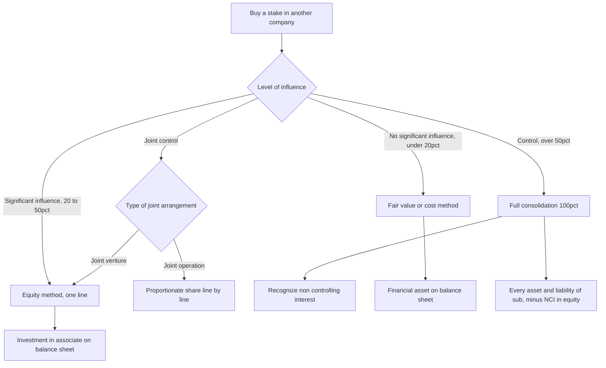
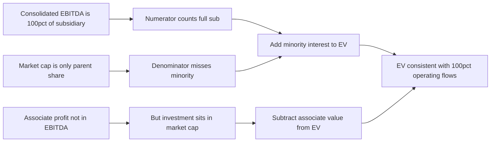
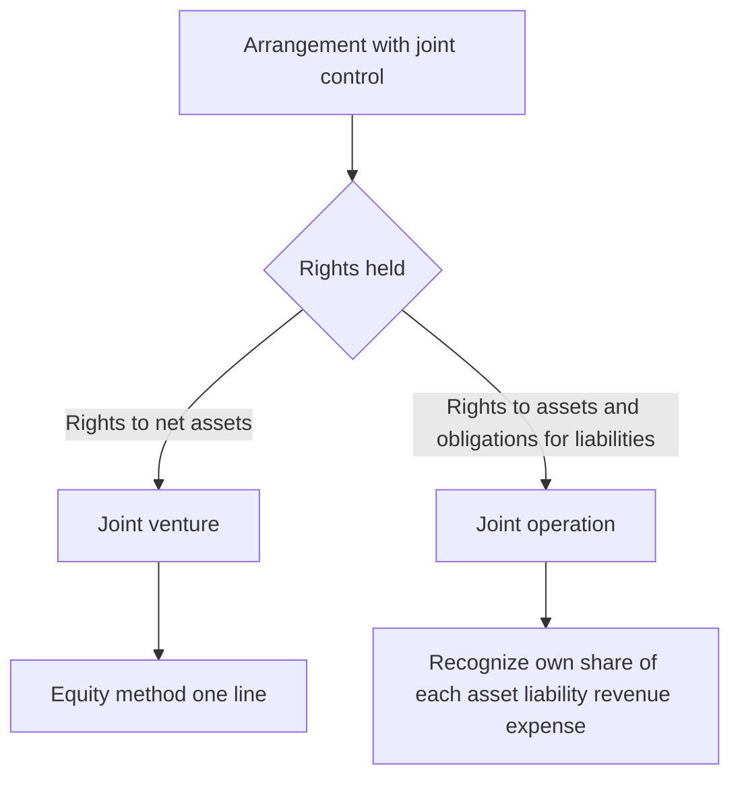

# Consolidation, Minority Interest & the Equity Method

## The Problem / Why this matters

A company rarely operates as a single legal box. The moment a business grows, it starts buying stakes in *other* businesses — a 5% treasury investment in a listed peer, a 30% strategic stake in a supplier, a 70% controlling buyout of a competitor, a 100% acquisition of a bolt-on. Each of those stakes is an economic interest in *another* set of assets, liabilities, revenues and profits. The question every accountant, analyst and investor has to answer is deceptively simple:

**How much of that other company's financials belong in *my* financial statements — and where?**

Get this wrong and everything downstream breaks. You will double-count revenue that two group companies booked on the same widget. You will value a company on 100% of a subsidiary's EBITDA while owning only 60% of it. You will compute an equity value per share that silently includes profits belonging to *other* shareholders. You will build a DCF whose enterprise value is inconsistent with the cash flows feeding it. In an interview, the fastest way to expose a candidate who has only memorized "EV = equity + debt − cash" is to ask, "and why do you add minority interest?" — because the honest answer requires you to understand consolidation from first principles.

This chapter builds the entire ownership-accounting spectrum from the ground up:

- **< 20% (no significant influence)** → cost or fair-value method; you hold a *financial asset*.
- **20%–50% (significant influence)** → equity method; you hold an *investment in associate*, one line on the balance sheet.
- **> 50% (control)** → full consolidation; you bring in **100%** of the subsidiary and then carve out the slice you don't own as **non-controlling (minority) interest**.
- **Joint arrangements** → joint ventures (equity method) vs joint operations (proportionate line-by-line).

And it closes the loop that trips up 80% of candidates: intercompany eliminations, why enterprise value adds back minority interest, and how a consolidated cash-flow and equity-bridge actually ties out.

## Core Idea

The whole of consolidation accounting rests on **one organizing principle: the accounting treatment follows the degree of influence or control, not the percentage per se.** Percentage is just the usual proxy for influence.

- If you can't influence the investee, it's just a bet — mark it at fair value (or cost) and take dividends as income.
- If you can *influence but not control* it, you should reflect your *share of its performance* — the equity method: one line that moves with your share of the associate's profit.
- If you *control* it, you run it, so you present it as if it were part of you — line-by-line 100% consolidation — and then you tell the reader, "by the way, other people own a piece of this, here it is: non-controlling interest."

That last move — **consolidate 100%, then subtract what you don't own** — is the single most important mechanical idea in the chapter, and the source of minority interest, EV adjustments, and half the interview traps.



## Why it works this way

Accounting is trying to answer two questions at once: **what do you own, and what did you earn?** The influence spectrum is the honest answer to both.

**1. Faithful representation of economic substance.** If you own 4% of Apple, you have no ability to direct Apple's operations. It would be misleading to sprinkle 4% of Apple's inventory and 4% of its debt across your balance sheet — you can't touch any of it. What you *can* do is sell your shares at market. So the asset that faithfully represents your position is a *marketable security at fair value*. Conversely, if you own 80% of a subsidiary and appoint its board, you effectively control 100% of its assets and cash flows day-to-day (subject to the 20% claim of others). Presenting only 80% of each asset would understate the resources you actually command. So you consolidate 100% and disclose the other 20% as a claim.

**2. The control boundary and the "single economic entity" view.** Consolidated statements adopt the *entity concept*: parent + subsidiaries = one reporting entity. The group as a whole controls all the subsidiary's assets, so all of them appear. Non-controlling interest is not a liability — the group owes the minority nothing repayable — it is *equity attributable to owners outside the parent*. That is why NCI sits inside total equity, below the line, as a separate component.

**3. Avoiding double counting.** Once you treat parent + sub as one entity, any transaction *between* them is internal — the entity trading with itself. A single economic entity cannot earn revenue selling to itself, cannot owe money to itself, and cannot hold an investment in itself. Hence the eliminations: intercompany sales, receivables/payables, dividends, and the parent's investment account against the sub's equity all cancel.

**4. Consistency between the numerator and denominator in valuation.** Enterprise value is meant to be *the value of the whole operating business, to all capital providers*. When you consolidate a subsidiary 100%, your income statement shows 100% of its EBIT and EBITDA. If EV must correspond to those 100%-consolidated cash flows, EV must include the claims of *all* providers of capital to the group — including the minority shareholders of the subsidiary. That is the deep reason minority interest is added in the EV bridge: to keep the capital structure (denominator) consistent with the fully-consolidated operating flows (numerator).

## Full technical content

### The ownership spectrum and the governing standards

| Stake / relationship | Influence | Method | Balance-sheet presentation | Income-statement effect | IFRS | US GAAP |
|---|---|---|---|---|---|---|
| < 20% | None (presumed) | Fair value (FVTPL / FVOCI) or cost | Financial asset / investment security | Dividends + fair-value changes (P&L or OCI) | IFRS 9 | ASC 321 / ASC 320 |
| 20%–50% | Significant influence | Equity method | Single line: Investment in associate | Share of associate's net profit | IAS 28 | ASC 323 |
| > 50% (control) | Control | Full consolidation | 100% of assets/liabilities; NCI in equity | 100% of revenue/expense; NCI carve-out of profit | IFRS 10 + IFRS 3 | ASC 810 + ASC 805 |
| Joint venture | Joint control, rights to net assets | Equity method | Investment in JV (one line) | Share of JV profit | IFRS 11 / IAS 28 | ASC 323 |
| Joint operation | Joint control, rights to assets/obligations | Proportionate (own share of each item) | Own share of each asset/liability | Own share of each revenue/expense | IFRS 11 | ASC 810 (varies) |

**Key nuance — the presumptions are rebuttable.** The 20% and 50% thresholds are *presumptions*, not bright lines. You can have significant influence with 15% (board seat, technology dependence, participation in policy-setting). You can *lack* control with 55% if the shares are non-voting or another party holds substantive veto rights. Under IFRS 10, **control** = (a) power over the investee, (b) exposure to variable returns, and (c) the ability to use power to affect those returns. This "control model" (not a raw percentage) is what actually triggers consolidation. Interviewers love the "you own 45% but consolidate — how?" question precisely because of *de facto control* (dispersed remaining holders) and potential voting rights.

### Method 1 — Cost / fair value (< 20%)

You hold a financial asset. Under IFRS 9, classification depends on the business model and cash-flow characteristics; for equity investments the default is **fair value through profit or loss (FVTPL)**, with an irrevocable option to elect **fair value through OCI (FVOCI)** for non-trading equities.

- **Initial recognition:** at cost (fair value of consideration).
- **Subsequent measurement:** remeasure to fair value each reporting date.
  - FVTPL: unrealized gains/losses hit the **income statement**.
  - FVOCI (equity election): unrealized gains/losses hit **OCI**, never recycled to P&L on disposal (only dividends go to P&L).
- **Income recognized:** dividends received are income (when the right to receive is established).

Journal entry formats:

```
On purchase:
  Dr  Investment in equity securities   X
      Cr  Cash                              X

On receiving a dividend:
  Dr  Cash                             D
      Cr  Dividend income (P&L)             D

At year-end fair-value uplift (FVTPL):
  Dr  Investment in equity securities   ΔFV
      Cr  Fair value gain (P&L)              ΔFV
```

**The critical asymmetry vs the equity method:** under fair value you recognize income only when the investee *pays a dividend* (plus mark-to-market). You do **not** pick up your share of the investee's *earnings*. That flips at 20%.

### Method 2 — Equity method (20%–50%, associates & most JVs)

The equity method is a **one-line consolidation**. You carry a single asset, "Investment in associate," that starts at cost and then *moves with the associate's equity*: it goes **up** by your share of the associate's profit and **down** by dividends you receive from it (dividends are a return *of* the investment, not income).

**Carrying-value roll-forward:**

```
Investment (opening)
  + Share of associate net profit  (=  ownership % × associate PAT)     → also credited to P&L as "share of profit of associate"
  − Dividends received from associate
  ± Share of associate OCI movements
  − Impairment (if any)
= Investment (closing)
```

Journal-entry formats:

```
On acquisition:
  Dr  Investment in associate      Cost
      Cr  Cash                          Cost

Pick up share of profit (ownership % × associate PAT):
  Dr  Investment in associate      Share
      Cr  Share of profit of associate (P&L)   Share

Dividend received from associate:
  Dr  Cash                         Div
      Cr  Investment in associate       Div      <-- reduces carrying value, NOT income
```

Key technical points:

- **Purchase-price allocation still applies.** If you pay more than your share of the associate's *book* net assets, the excess is conceptually goodwill (embedded in the one line, not shown separately) plus fair-value uplifts on identifiable assets. Any extra depreciation on those fair-value uplifts *reduces* your share-of-profit pickup in later years.
- **One line, two places.** On the balance sheet: one asset ("Investment in associate"). On the income statement: one line ("Share of profit of associate"), typically shown *after* operating profit, usually *after* the group's own tax (associate profit is already post-tax to the associate).
- **Losses:** you pick up losses until the carrying value hits zero; further losses are generally not recognized (unless you have guaranteed obligations).
- **Impairment:** IAS 28 requires testing the whole investment for impairment if indicators exist.
- **Not in revenue/EBITDA.** This is *the* analyst trap: associate profit is a *single post-tax line*. It is **not** part of consolidated revenue, EBIT, or EBITDA. So if 30% of your net income comes from associates, your EBITDA multiple can look deceptively cheap.

### Method 3 — Full consolidation (control, > 50%)

Under IFRS 10 / ASC 810, when the parent controls the subsidiary, it **combines line by line 100% of the subsidiary's assets, liabilities, income and expenses** with its own, then makes consolidation adjustments. The acquisition itself is accounted for under **IFRS 3 / ASC 805 (business combinations)** using the **acquisition method**:

**The acquisition method — five steps:**
1. Identify the acquirer.
2. Determine the acquisition date.
3. Recognize and measure the identifiable assets acquired and liabilities assumed **at fair value**.
4. Recognize and measure **non-controlling interest**.
5. Recognize and measure **goodwill** (or a bargain-purchase gain).

**Goodwill formula (full-goodwill / fair-value NCI method — IFRS option and US GAAP default):**

```
Goodwill = Consideration transferred
         + Fair value of NCI
         + Fair value of any previously held interest
         − Fair value of net identifiable assets acquired (100%)
```

**Goodwill under the partial-goodwill method (IFRS alternative — NCI at proportionate share of net assets):**

```
Goodwill = Consideration transferred
         − (Parent % × Fair value of net identifiable assets)
```

Under the *partial* method, NCI is measured at NCI% × FV of net identifiable assets and **no goodwill is attributed to the NCI**. Under the *full* method, NCI is at its own fair value and *includes* its share of goodwill. US GAAP mandates the full method; IFRS lets you choose per transaction.

**Non-controlling interest (NCI) — two appearances:**

| Statement | Line | Meaning |
|---|---|---|
| Balance sheet (equity section) | Non-controlling interest | The minority owners' claim on the subsidiary's net assets. Part of total equity, shown separately from equity attributable to the parent. |
| Income statement (below net income) | Net income attributable to NCI | The minority's slice of the subsidiary's profit; net income is split into "attributable to owners of the parent" and "attributable to NCI." |

**NCI roll-forward (balance sheet):**

```
NCI (opening)
  + NCI share of subsidiary profit for the year
  − Dividends paid by subsidiary to NCI holders
  ± NCI share of subsidiary OCI
= NCI (closing)
```

### Intercompany (intragroup) eliminations

Because the group is one entity, all *internal* transactions must be removed so the consolidated statements show only dealings with the outside world.

| What is eliminated | Why | Elimination entry (format) |
|---|---|---|
| Intercompany revenue & COGS | Entity can't sell to itself | Dr Revenue / Cr COGS (for the intragroup sale amount) |
| Unrealized profit in ending inventory | Profit on goods still inside the group isn't yet earned | Dr COGS (or Cr Inventory) for the profit in stock still held |
| Intercompany receivables & payables | Entity can't owe itself | Dr Payables / Cr Receivables |
| Intercompany dividends | Group can't pay itself income | Dr Dividend income / Cr Dividends (eliminate parent's income from sub) |
| Parent's investment vs sub's equity | Replaced by the sub's actual assets/liabilities + goodwill | Dr Share capital & reserves of sub, Dr Goodwill / Cr Investment, Cr NCI |
| Intercompany loans & interest | Internal financing | Dr Interest income / Cr Interest expense; Dr Loan payable / Cr Loan receivable |

**Unrealized profit** deserves emphasis. If Parent sells inventory to Sub at a markup and Sub hasn't yet sold it onward, the group has "booked" profit on goods it still owns. That profit is *unrealized* from the group's view and must be stripped out of both profit and the inventory carrying value until the goods are sold externally. If the *seller* is a partially-owned subsidiary (a "downstream" vs "upstream" distinction), the unrealized-profit elimination is shared with NCI in proportion to ownership under IFRS.

### Why enterprise value adds minority interest

Enterprise value is the value of the *entire operating enterprise*, claimable by *every* provider of capital. The standard bridge:

```
Enterprise Value = Equity value (market cap, to parent shareholders)
                 + Total debt
                 − Cash & equivalents
                 + Minority (non-controlling) interest
                 + Preferred equity
                 − Investments in associates / equity affiliates
```

The logic, tied to the consolidation mechanics:

- **Add minority interest** because your consolidated financials show **100%** of the subsidiary's revenue, EBIT and EBITDA, but your **equity market cap only reflects the parent's share**. To make EV consistent with the fully-consolidated operating metrics, you must *add back* the value of the minority's claim on that same consolidated business. Otherwise EV/EBITDA mismatches a 100% numerator with a <100% denominator.
- **Subtract associates/equity affiliates** for the mirror-image reason: associate profit is *not* in your EBITDA (it's one post-tax line, equity method), yet its value *is* inside your market cap (the investment is on your balance sheet). If EBITDA excludes it, EV should too — so you subtract the associate's value.



### Joint arrangements (IFRS 11)

A **joint arrangement** is one where two or more parties have **joint control** (contractually agreed sharing of control; decisions need unanimous consent of the sharing parties). IFRS 11 splits them:

- **Joint venture** — the parties have rights to the *net assets* of the arrangement (usually a separate vehicle). Accounted for using the **equity method** (one line), exactly like an associate.
- **Joint operation** — the parties have direct rights to the *assets* and obligations for the *liabilities*. Each party recognizes **its own share of each asset, liability, revenue and expense** — proportionate, line-by-line (but only its share, unlike full consolidation which takes 100% + NCI).

US GAAP has no exact "joint operation" concept; equity method is the norm for corporate JVs, with proportionate consolidation permitted only in narrow industries (e.g., some oil & gas, construction).



## Worked examples

### Worked Example 1 — Fair value vs equity method: same facts, different numbers

**Facts.** On 1 Jan, ParentCo buys a stake in TargetCo for cash of **$200**. During the year TargetCo earns net profit of **$100** and pays total dividends of **$40**. At year-end, TargetCo's shares are worth 10% more than cost. We compare two scenarios.

**Scenario A — ParentCo owns 10% (fair value / FVTPL, no significant influence).**

- Dividend income = 10% × $40 = **$4** → recognized in P&L.
- Fair-value gain = 10% × ($200 base value implied)… let's be precise: cost of the 10% stake is $200 (given). Year-end fair value up 10% → $220. Unrealized gain = **$20** → P&L (FVTPL).
- **Income statement impact = $4 dividend + $20 FV gain = $24.**
- **Balance-sheet investment (closing) = $220.**
- Note: ParentCo does **not** pick up its 10% × $100 = $10 share of earnings directly; only the dividend and the mark-to-market.

Journals:
```
Dr Investment 200 / Cr Cash 200          (purchase)
Dr Cash 4 / Cr Dividend income 4         (dividend)
Dr Investment 20 / Cr FV gain (P&L) 20   (year-end mark-up)
Closing investment = 200 + 20 = 220
```

**Scenario B — ParentCo owns 30% (equity method, significant influence).** Cost of the 30% stake = $200 (given).

- Share of profit = 30% × $100 = **$30** → credited to P&L as "share of profit of associate," and added to the investment.
- Dividend received = 30% × $40 = **$12** → *reduces* the investment (return of capital), **not** income.
- Fair-value changes are **ignored** under the equity method.

Roll-forward:
```
Investment opening              200
+ Share of profit (30% × 100)   +30
− Dividend received (30% × 40)  −12
Investment closing              218
```
Journals:
```
Dr Investment 200 / Cr Cash 200               (purchase)
Dr Investment 30 / Cr Share of profit 30      (pick up earnings)
Dr Cash 12 / Cr Investment 12                 (dividend as return of capital)
```
- **Income statement impact = $30** (share of profit). No dividend income line; no FV gain.
- **Balance-sheet investment (closing) = $218.**

**The teaching point.** Same underlying company, same dividends, but the *income you report* jumps from $4 (fair value, dividend only) to $30 (equity method, share of earnings). This is exactly why the 20% threshold matters: crossing it changes *when* and *how much* of the investee's performance flows into your P&L. Self-check: both scenarios are internally consistent — FVTPL investment ties to market ($220), equity investment ties to the roll-forward ($218), and each income figure matches its journals.

### Worked Example 2 — Full consolidation with NCI, goodwill, and the balance-sheet build

**Facts.** On 1 Jan, ParentCo pays **$800 cash** to acquire **80%** of SubCo. On that date SubCo's identifiable net assets have a **fair value of $900** (assume book value = fair value for simplicity; equity = $900, comprising share capital $600 + retained earnings $300). ParentCo's own pre-acquisition balance sheet:

| ParentCo (standalone) | $ |
|---|---|
| Cash | 1,000 |
| Other assets | 2,000 |
| **Total assets** | **3,000** |
| Liabilities | 1,000 |
| Share capital | 1,200 |
| Retained earnings | 800 |
| **Total equity + liab** | **3,000** |

SubCo (standalone) at acquisition:

| SubCo (standalone) | $ |
|---|---|
| Assets | 1,400 |
| Liabilities | 500 |
| Net assets / equity | 900 |

**Step 1 — Goodwill (full-goodwill / fair-value NCI method).** Assume the fair value of the 20% NCI = **$220** (implied by the price, roughly 20/80 × $800 = $200, but market-observed at $220).

```
Goodwill = Consideration 800
         + FV of NCI       220
         − FV of net identifiable assets 900
         = 120
```

**Step 1 (alt) — Partial-goodwill / proportionate NCI method (IFRS option).**
```
NCI = 20% × 900 = 180
Goodwill = 800 − (80% × 900) = 800 − 720 = 80
```
We'll carry the **full-goodwill** numbers (Goodwill $120, NCI $220) through the consolidation.

**Step 2 — Consolidation adjustments at acquisition date.**
- ParentCo used $800 cash → its cash drops from 1,000 to **200**.
- Eliminate ParentCo's "Investment in SubCo" ($800) against SubCo's equity ($900), recognizing goodwill ($120) and NCI ($220).

Elimination entry:
```
Dr SubCo share capital        600
Dr SubCo retained earnings    300
Dr Goodwill                   120
    Cr Investment in SubCo         800
    Cr Non-controlling interest    220
(600 + 300 + 120 = 1,020  =  800 + 220 ✓)
```

**Step 3 — Consolidated balance sheet at acquisition.**

| Consolidated | Working | $ |
|---|---|---|
| Cash | Parent 200 + Sub 0 (cash inside Sub's 1,400 assets) | 200 |
| Other assets | Parent 2,000 + Sub 1,400 | 3,400 |
| Goodwill | from Step 1 | 120 |
| **Total assets** | | **3,720** |
| Liabilities | Parent 1,000 + Sub 500 | 1,500 |
| Share capital | Parent only (sub's eliminated) | 1,200 |
| Retained earnings | Parent only (sub's eliminated) | 800 |
| Equity attributable to parent | 1,200 + 800 | 2,000 |
| Non-controlling interest | from Step 1 | 220 |
| **Total equity + liabilities** | | **3,720** |

Check: assets 3,720 = liabilities 1,500 + parent equity 2,000 + NCI 220 = **3,720** ✓. Note ParentCo's own cash fell to 200 (paid 800), and *SubCo's* assets ($1,400) came in at 100% even though we only own 80% — the 20% we don't own is captured as NCI ($220), not as a haircut on assets. That is the "consolidate 100%, carve out NCI" mechanic in action.

**Step 4 — One year later: profit and NCI split.** In Year 1, SubCo earns net profit of **$150** (no dividends paid). Consolidated retained earnings and NCI update:

```
SubCo profit                    150
Parent's share (80%)            120  → into consolidated retained earnings (parent)
NCI's share (20%)                30  → into NCI

NCI roll-forward:
  Opening NCI                   220
  + NCI share of profit          30
  Closing NCI                   250

Consolidated retained earnings:
  Opening (parent)              800
  + Parent share of sub profit  120
  + Parent's own profit (assume 0 for isolation)  0
  Closing                       920
```

Income statement (consolidated, Year 1) — assume ParentCo standalone profit is 0 to isolate the effect:

| Consolidated income statement | $ |
|---|---|
| Group net income (100% of Sub's 150) | 150 |
| Attributable to owners of parent | 120 |
| Attributable to non-controlling interest | 30 |

Self-check: 120 + 30 = 150 ✓. NCI on the balance sheet grew from 220 to 250, exactly matching the $30 NCI profit ✓. Group net income shows the *full* $150 (100% consolidation), and the split tells shareholders that $30 of it isn't theirs.

### Worked Example 3 — Intercompany elimination and the unrealized-profit trap

**Facts.** ParentCo owns **100%** of SubCo. During the year:
- ParentCo sells goods to SubCo for **$300**; these goods cost ParentCo **$180** (so ParentCo booked $120 gross profit on the intragroup sale).
- By year-end, SubCo has sold **two-thirds** of those goods to outside customers for **$260**, and **one-third remains in SubCo's inventory** (cost to SubCo of the remaining third = 1/3 × $300 = $100).
- Standalone, ParentCo also has $500 of external revenue (cost $300), and SubCo has no other activity.

**Step 1 — Aggregate the two P&Ls (before elimination).**

| | ParentCo | SubCo | Simple sum |
|---|---|---|---|
| Revenue | 500 + 300 (to Sub) = 800 | 260 (external) | 1,060 |
| COGS | 300 + 180 (goods sold to Sub) = 480 | 200 (2/3 × 300) | 680 |
| Gross profit | 320 | 60 | 380 |

**Step 2 — Eliminate intercompany revenue/COGS.** The $300 Parent→Sub sale is internal.
```
Dr Revenue 300
    Cr COGS 300
```

**Step 3 — Eliminate unrealized profit in ending inventory.** One-third of the goods Parent sold to Sub are still in the group. ParentCo's markup on the *whole* $300 sale was $120; the unrealized portion = 1/3 × $120 = **$40**. That profit isn't earned by the group yet, and SubCo's inventory is carried at $100 which embeds $40 of intragroup profit (true cost to the group of that third = 1/3 × $180 = $60).
```
Dr COGS 40           (increase group COGS / reduce profit)
    Cr Inventory 40      (write inventory down to group cost of 60)
```

**Step 4 — Consolidated P&L.**

| Consolidated | Working | $ |
|---|---|---|
| Revenue | 1,060 − 300 | 760 |
| COGS | 680 − 300 + 40 | 420 |
| **Gross profit** | | **340** |

**Verification two ways.** From the *group's* perspective, the only real economic activity is: (a) Parent's external sales of $500 at cost $300 → GP $200; (b) goods bought by Parent for $180, of which two-thirds have been sold externally by Sub for $260. Cost of goods actually sold externally from that batch = 2/3 × $180 = $120; revenue $260 → GP $140. Total group GP = 200 + 140 = **$340** ✓. Matches Step 4 exactly. The remaining one-third (group cost $60) sits in inventory with **no** profit recognized, exactly as it should until sold outside.

**The trap made explicit.** If you had *not* eliminated, consolidated revenue would be an inflated $1,060 and gross profit an inflated $380 — overstating both the top line (by the $300 internal churn) and profit (by the $40 unrealized markup). Analysts who consolidate two entities by naive addition make exactly this error.

## How it is tested in interviews

**Q1. "Walk me through what happens on the three financial statements when Company A acquires 80% of Company B for cash."**
Model answer: "On the **balance sheet**, A's cash falls by the purchase price; B's assets and liabilities come on at fair value at 100%; goodwill is plugged as consideration plus fair value of the 20% NCI minus fair value of net identifiable assets; and NCI appears as a new line inside equity. On the **income statement**, from the acquisition date A consolidates 100% of B's revenue and expenses, and at the bottom net income is split into the portion attributable to the parent and the 20% attributable to NCI. On the **cash flow statement**, the cash paid net of cash acquired shows as an investing outflow; going forward B's operating cash flows are consolidated in full, and dividends paid to the minority are a financing outflow." Crisp line: **"Consolidate 100%, then carve out the 20% you don't own as NCI — on both the equity section and below net income."**

**Q2. "Why do you add minority interest to enterprise value?"**
Model answer: "Because the consolidated income statement includes 100% of the subsidiary's EBITDA, but market cap only captures the parent's economic share. To keep the numerator and denominator of EV/EBITDA consistent, I add the value of the minority's claim so EV reflects the full business that the 100% EBITDA belongs to." One-liner: **"Full EBITDA in the numerator demands full ownership in the denominator — MI plugs the gap."**

**Q3. "You own 30% of a company. Company earns $100 and pays $40 of dividends. What hits your financials?"**
Model answer: "Equity method. I recognize 30% × $100 = $30 as 'share of profit of associate' in the P&L, a single post-tax line usually below operating profit. The $12 dividend I receive is a return of capital — it *reduces* the investment's carrying value, it is not income. So carrying value moves +30 −12 = +18. Nothing hits revenue or EBITDA." Contrast line: **"If I owned under 20%, only the $12 dividend and any mark-to-market would hit — not the $30 of earnings."**

**Q4. "A company is trading at 6x EV/EBITDA — cheap, right?"**
Model answer / trap-avoidance: "Not necessarily. If a big chunk of its earnings comes from **associates**, that profit sits below EBITDA as one equity-method line, so EBITDA understates the true earnings base and EV/EBITDA looks artificially low — I'd subtract the associate value from EV and value the stake separately. Conversely if there's large minority interest I need to add it so I'm not comparing a full-business numerator to a parent-only denominator."

**Q5. "What's the difference between an associate and a subsidiary in the accounts?"**
Model answer: "A subsidiary is *controlled*, so I fully consolidate — every asset, liability, revenue and expense line-by-line at 100%, with NCI for the slice I don't own. An associate is *significantly influenced but not controlled*, so I use the equity method — one asset line on the balance sheet and one profit line on the income statement. The associate's revenue, debt and cash never appear in my consolidated totals; the subsidiary's do."

**Q6. "How can you consolidate a company you own only 45% of?"**
Model answer: "Control isn't purely arithmetic. Under IFRS 10 control means power over relevant activities, exposure to variable returns, and the ability to use that power. With 45% and the rest of the shares widely dispersed among passive holders, I can have *de facto control* — my 45% carries every vote that matters. Potential voting rights, like options over more shares, can also tip it. If I control, I consolidate 100% and book 55% as NCI."

**Q7. "If a subsidiary pays a dividend, what happens in the consolidated accounts?"**
Model answer: "The portion to the parent is fully eliminated — the group can't pay itself income. The portion paid to the *minority* is a real outflow to outside parties: it reduces NCI on the balance sheet and shows as a financing cash outflow. No dividend income appears at the group level for the intra-group portion."

**Q8. "Where does goodwill come from and does it get amortized?"**
Model answer: "Goodwill is the residual: what you paid (plus NCI fair value and any prior stake) over the fair value of net identifiable assets acquired. It's not amortized under IFRS or US GAAP — it's tested annually for impairment (and on triggering events). Under IFRS you can measure NCI at fair value (full goodwill) or at proportionate net assets (partial goodwill); US GAAP requires full goodwill."

## Traps & common mistakes

1. **Adding two companies line-by-line without eliminating intercompany items.** You double-count internal revenue and leave unrealized profit in inventory. Always strip intragroup sales, receivables/payables, dividends, and unrealized profit.
2. **Treating associate profit as part of EBITDA.** It is a single post-tax line *below* operating profit. It is not in revenue, EBIT, or EBITDA. Analysts who fold it into EBITDA overstate operating scale and misprice the multiple.
3. **Forgetting to add minority interest to EV (or adding the wrong number).** MI is added at *market/fair* value where possible, not book, and only when there's genuine minority in the consolidated subs. Skipping it makes EV/EBITDA look cheap on high-minority companies.
4. **Netting the subsidiary in at ownership %.** Full consolidation is **100% of assets and 100% of revenue**, with NCI as the carve-out. Do not bring in 80% of each asset; bring in 100% and show 20% NCI.
5. **Booking associate dividends as income.** Under the equity method, dividends are a *return of capital* that reduces the carrying value. Income is your *share of profit*, not the cash dividend.
6. **Confusing NCI with a liability.** NCI is equity — it is not a debt the group must repay. It sits inside total equity, separately from parent equity.
7. **Mixing full vs partial goodwill inconsistently.** The NCI figure and the goodwill figure must come from the *same* method. US GAAP = full goodwill only; IFRS = choose per deal but be consistent within the deal.
8. **Ignoring extra depreciation on fair-value uplifts.** When you pay above book and allocate to depreciable assets (PP&E, intangibles), the extra depreciation reduces your consolidated (or equity-method) profit in later years. Candidates often forget the "unwind."
9. **Forgetting the mirror rule for associates in EV.** If you add MI (100% consolidated subs), you must *subtract* associate/JV value (not in EBITDA) to stay consistent.
10. **Assuming 20% and 50% are hard lines.** They're rebuttable presumptions. Influence/control is about substance — board seats, veto rights, dispersed holdings, potential voting rights.

## First-principles recap

- **Method follows influence, not percentage.** No influence → fair value; significant influence → equity method; control → full consolidation. Percentage is only the usual proxy.
- **Control means "consolidate 100%, then carve out what you don't own."** Every subsidiary asset and profit line comes in fully; the outside owners' slice becomes non-controlling interest — equity, not a liability.
- **The equity method is a one-line consolidation.** Investment moves up by your share of profit, down by dividends received; one asset line, one P&L line, and *nothing* in revenue or EBITDA.
- **A single economic entity cannot transact with itself.** Hence eliminations of intercompany revenue, balances, dividends, and unrealized profit.
- **Enterprise value must match its cash flows.** Add minority interest because EBITDA is 100% consolidated but market cap is parent-only; subtract associates because their profit isn't in EBITDA but their value is in market cap.
- **Goodwill is a residual, tested not amortized.** It's what you overpay above the fair value of net identifiable assets, adjusted for how you measure NCI (full vs partial).
- **Joint control splits two ways.** Rights to net assets → joint venture → equity method; rights to assets and obligations → joint operation → your own share, line by line.

## Quick-reference

| Item | Formula / rule |
|---|---|
| < 20% method | Fair value (FVTPL/FVOCI) or cost; income = dividends + FV change |
| 20–50% method | Equity method; investment ± share of profit − dividends received |
| > 50% method | Full consolidation: 100% of assets & P&L + NCI carve-out |
| Equity-method roll-forward | Opening + (% × PAT) − dividends received ± OCI − impairment |
| Goodwill (full) | Consideration + FV of NCI + FV of prior stake − FV net identifiable assets |
| Goodwill (partial, IFRS) | Consideration − (Parent % × FV net identifiable assets) |
| NCI at acquisition (full) | Fair value of NCI |
| NCI at acquisition (partial) | NCI % × FV of net identifiable assets |
| NCI roll-forward | Opening + NCI% × sub profit − dividends to NCI ± NCI% × OCI |
| Net income split | Parent share + NCI share = 100% of sub profit |
| Unrealized profit in stock | Markup × (fraction of intragroup goods still held) |
| EV bridge | Equity value + Debt − Cash + Minority interest + Preferred − Associates |
| Why add MI to EV | 100% EBITDA (numerator) vs parent-only market cap (denominator) |
| Why subtract associates | Associate profit not in EBITDA but value is in market cap |
| Joint venture | Equity method (rights to net assets) |
| Joint operation | Own share of each asset/liability/revenue/expense |
| Key standards (IFRS) | IFRS 9, IAS 28, IFRS 10, IFRS 3, IFRS 11 |
| Key standards (US GAAP) | ASC 321/320, ASC 323, ASC 810, ASC 805 |
