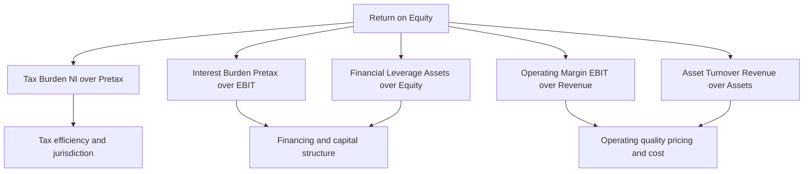
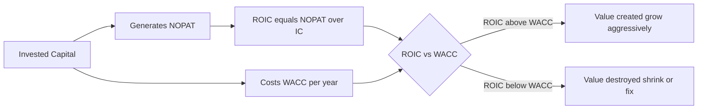

# Ratio Analysis & the DuPont Framework

## The Problem / Why this matters

You are handed two companies' financial statements. Company A earns ₹500 crore of net profit; Company B earns ₹50 crore. Which is the better business? You cannot say. A number by itself — "₹500 crore of profit" — is almost meaningless in isolation. Is that profit generated on ₹1,000 crore of capital or ₹50,000 crore of capital? Was it earned by taking on crushing debt or from clean, unlevered operations? Is the ₹500 crore about to evaporate because customers aren't paying and inventory is rotting in a warehouse?

Ratio analysis is the discipline of turning raw statement line items into **comparable, decision-useful signals**. A ratio takes one number and divides it by another so that scale falls out and you are left with a *rate*, a *proportion*, or a *multiple* — something you can compare across companies of different sizes, across years for the same company, and against an industry benchmark.

This is not academic. In every finance interview — equity research, credit, FP&A, investment banking — you will be asked to *read* a business through its ratios. An equity research analyst lives on ROE, margins and turnover. A credit analyst lives on Debt/EBITDA and interest coverage. An FP&A analyst lives on the DuPont tree, decomposing why margins moved. The interviewer is testing one thing: can you look at a set of numbers and *tell the story of the business* — where it makes money, where it is fragile, and whether it is creating or destroying value?

The **DuPont framework** is the crown jewel of this chapter. It is the single most-tested analytical tool in finance interviews because it does something beautiful: it takes the one number every equity investor cares about — Return on Equity — and cracks it open into its operating, efficiency and leverage drivers. Master DuPont and you can answer "why did ROE change?" in a structured, first-principles way that instantly signals competence.

By the end of this chapter you will be able to compute every major ratio from first principles, know exactly *why* each is constructed the way it is, decompose ROE two different ways, and connect the whole thing back to the ultimate question in finance: **is this company earning more than its cost of capital?**

---

## Core Idea

A financial ratio is a **relationship between two figures** designed to strip out scale and expose an underlying economic characteristic. There are four families, each answering a different question about the business:

| Family | The question it answers | Whose favourite |
|---|---|---|
| **Liquidity** | Can the company pay its bills over the next 12 months? | Short-term creditors, suppliers |
| **Leverage / Solvency** | Can it survive its debt load over the long run? | Credit analysts, bond investors |
| **Profitability** | How much profit does each rupee of sales / assets / capital generate? | Equity investors, everyone |
| **Efficiency / Activity** | How hard is the company working its assets? | Operators, FP&A, management |

The **DuPont framework** is the unifying lens. It shows that Return on Equity is not one thing but a *product* of profitability, efficiency and leverage:

```
ROE  =  Net Margin  ×  Asset Turnover  ×  Financial Leverage
       (profitability)   (efficiency)      (leverage)
```

Every ratio you learn slots into one of those three levers. That is why DuPont is the organising principle of the whole chapter — it links the families together into a single equation.

The final, most sophisticated idea is that profitability alone is not value creation. A company earning 12% on its capital while its capital costs 15% is *destroying* value every year, even though it is "profitable." Value is created only when **ROIC > WACC**. That comparison — return on invested capital versus the weighted-average cost of that capital — is where ratio analysis meets valuation.

---

## Why it works this way

**Why divide at all?** Because financial statements report *absolute* quantities (rupees of sales, assets, debt) and businesses come in wildly different sizes. To compare a corner shop with Reliance you must remove scale. Division does exactly that: sales ÷ assets tells you rupees of sales *per rupee of assets*, a number that is directly comparable regardless of whether the company is tiny or enormous.

**Why these particular pairings?** Each ratio pairs a *flow* with either another flow or a *stock* to answer an economic question:

- **Flow ÷ Flow** (e.g., Net Profit ÷ Sales = net margin): "Of every rupee that came in, how much stuck?" This is a *rate of conversion*.
- **Flow ÷ Stock** (e.g., Sales ÷ Assets = asset turnover): "How much activity did this pile of resources generate?" This is a *rate of utilisation*. Crucially, because the numerator is a full-year flow and the denominator is a point-in-time snapshot, we usually use the **average** of opening and closing balances for the stock, so the two match over the same period.
- **Stock ÷ Stock** (e.g., Debt ÷ Equity): "How is the capital structure split?" This is a *proportion*.

**Why leverage magnifies ROE.** This is the deep insight behind DuPont's leverage term. Equity holders own the *residual* — whatever is left after debt is served. If a business earns 10% on its total assets but only pays 6% on its debt, the extra 4% on every borrowed rupee flows entirely to equity. Borrowing lets a fixed slice of equity control a larger pile of earning assets, so returns *per unit of equity* rise. But the same mechanism works in reverse: if asset returns fall below the cost of debt, losses are magnified against the thin equity base. Leverage is a magnifying glass pointed at both gains and losses. This is why the leverage term (Assets ÷ Equity) sits in the ROE equation — it captures exactly how much the equity return is being amplified by borrowed money.

**Why ROIC vs WACC is the ultimate test.** Capital is never free. Debt demands interest; equity demands a return commensurate with its risk. WACC is the blended hurdle rate — the minimum the company must earn to keep *both* sets of capital providers whole. If the company's operating return on invested capital exceeds that hurdle, every rupee reinvested creates value (the "economic profit" spread is positive). If not, growth actually destroys value: the more the company invests, the more value it burns. This is why a low-margin business can still be a great investment (if it turns its assets fast enough and its capital is cheap) and a high-margin business can be a terrible one (if it needs mountains of expensive capital).

---

## Full technical content

### 1. Liquidity ratios — can it pay the bills?

Liquidity measures the ability to meet **short-term obligations** (due within 12 months) using **short-term assets**. The raw material comes straight off the balance sheet's current section.

| Ratio | Formula | What it tells you | Rough benchmark |
|---|---|---|---|
| **Current ratio** | Current Assets ÷ Current Liabilities | Rupees of near-term assets per rupee of near-term claims | ~1.5–2.0 (varies by industry) |
| **Quick ratio** (acid-test) | (Current Assets − Inventory − Prepaids) ÷ Current Liabilities | Same, but only *liquid* assets — excludes inventory | ~1.0 |
| **Cash ratio** | (Cash + Marketable Securities) ÷ Current Liabilities | The most conservative — only cash-like assets | ~0.2–0.5 |
| **Net working capital** | Current Assets − Current Liabilities (absolute, not a ratio) | Rupee cushion of liquidity | Positive |

**Why exclude inventory in the quick ratio?** Inventory is the *least* liquid current asset. To turn into cash it must first be sold (creating a receivable) and then collected. In a distress scenario inventory is often sold at fire-sale prices or not at all. The quick ratio asks the harsher question: "If you couldn't sell a single item of inventory, could you still cover your current liabilities?"

**The interpretation trap:** higher is *not* always better. A current ratio of 4.0 may signal a company drowning in idle cash, uncollected receivables, or bloated inventory — all of which are *unproductive* assets dragging down returns. Liquidity and profitability trade off.

### 2. Leverage / solvency ratios — can it survive its debt?

Solvency looks at the **long-term** capital structure and the ability to service debt. There are two flavours: **stock-based** (how much debt relative to capital) and **flow-based** (can earnings/cash flow cover the debt service). Credit analysts care most about the flow-based ones.

| Ratio | Formula | What it tells you |
|---|---|---|
| **Debt-to-Equity (D/E)** | Total Debt ÷ Total Equity | Rupees of debt per rupee of equity |
| **Debt-to-Capital** | Total Debt ÷ (Total Debt + Equity) | Debt as a fraction of the total capital base |
| **Debt-to-Assets** | Total Debt ÷ Total Assets | Fraction of assets financed by debt |
| **Financial leverage (equity multiplier)** | Total Assets ÷ Total Equity | How many rupees of assets each equity rupee supports — the DuPont leverage term |
| **Debt / EBITDA** | Total Debt ÷ EBITDA | Years of current earnings to repay all debt |
| **Net Debt / EBITDA** | (Total Debt − Cash) ÷ EBITDA | Same, netting off cash on hand |
| **Interest coverage (times interest earned)** | EBIT ÷ Interest Expense | How many times operating profit covers the interest bill |
| **EBITDA coverage** | EBITDA ÷ Interest Expense | Same, using a cash-flow proxy |
| **DSCR** (debt service coverage) | (EBITDA − Capex − Taxes) ÷ (Interest + Principal) | Can cash flow cover *total* debt service |

**"Debt" — a definitional warning.** In interviews always clarify what goes into "debt." The clean definition is **interest-bearing debt**: short-term borrowings + current portion of long-term debt + long-term debt + finance leases. It excludes operating liabilities like accounts payable and accrued expenses (those are not financing — they're free trade credit). Under IFRS 16 and ASC 842, most operating leases now sit on the balance sheet as lease liabilities; credit analysts typically include the finance-lease portion and often capitalise operating leases when comparing across companies.

**Why Debt/EBITDA is the credit analyst's north star.** EBITDA (Earnings Before Interest, Taxes, Depreciation and Amortisation) approximates the pre-financing, pre-tax *cash* operating earnings available to service debt. Debt/EBITDA of 3.0x means "at current earnings it would take three years of operating cash flow to repay all borrowings." Leveraged-finance covenants are almost always written on this metric. Rough grammar: <2x conservative, 2–3x moderate, 3–4x aggressive, >4–5x highly levered / junk territory (industry-dependent — utilities carry more, cyclicals less).

**Why interest coverage matters separately.** Debt/EBITDA measures the *size* of the debt; interest coverage measures the *affordability of servicing* it. A company can have a large debt pile but cheap fixed-rate debt, giving comfortable coverage; another can have modest debt at punishing rates. EBIT/Interest below ~1.5–2.0x is a red flag — a small earnings dip could leave the company unable to pay interest, which is an event of default.

### 3. Profitability ratios — how much sticks?

Two sub-types: **margins** (profit as a % of sales — reading *down the income statement*) and **returns** (profit as a % of a capital base — reading profit *against the balance sheet*).

**Margins** (all ÷ Revenue):

| Margin | Numerator | Captures |
|---|---|---|
| **Gross margin** | Revenue − COGS | Pricing power & production efficiency |
| **EBITDA margin** | EBITDA | Cash operating profitability, capital-structure-neutral |
| **EBIT / operating margin** | EBIT (operating profit) | Core operating profitability after depreciation |
| **Pre-tax margin** | Earnings before tax | After financing costs |
| **Net margin** | Net income | The final bottom-line conversion rate |

**Returns** (profit ÷ capital):

| Ratio | Formula | Numerator note | Whose return |
|---|---|---|---|
| **ROA** (return on assets) | Net Income ÷ Average Total Assets | Sometimes EBIT-based | All capital providers' assets |
| **ROE** (return on equity) | Net Income ÷ Average Shareholders' Equity | Use net income *after* preferred dividends if any | Common equity holders |
| **ROIC** (return on invested capital) | NOPAT ÷ Invested Capital | NOPAT = EBIT × (1 − tax) | Debt + equity providers, unlevered |
| **ROCE** (return on capital employed) | EBIT ÷ (Total Assets − Current Liabilities) | Pre-tax operating | Similar to ROIC, pre-tax |

**Key definitions you must have cold:**

- **NOPAT** = Net Operating Profit After Tax = EBIT × (1 − tax rate). It is the profit the operations would earn if the company had *no debt* — a pure operating number, stripped of the tax benefit of interest.
- **Invested Capital** = Total Debt + Equity − Cash (financing view) **OR** equivalently Net Working Capital + Net Fixed Assets + other operating assets (operating view). Both must reconcile. It represents the capital actually put to work in the operations.

**Why ROIC is "cleaner" than ROE.** ROE mixes operating performance with financing decisions and the tax shield — a company can juice ROE purely by borrowing more. ROIC strips financing out entirely (NOPAT is pre-interest, invested capital counts *all* capital), so it isolates how good the *operations themselves* are at generating returns. That is why ROIC is the number you compare to WACC.

### 4. Efficiency / activity ratios — how hard do the assets work?

These pair a flow (sales or COGS) against a stock (an asset or liability balance), measuring how fast assets cycle.

| Ratio | Formula | Meaning |
|---|---|---|
| **Asset turnover** | Revenue ÷ Average Total Assets | Sales generated per rupee of assets |
| **Fixed-asset turnover** | Revenue ÷ Average Net Fixed Assets | Sales per rupee of PP&E |
| **Inventory turnover** | COGS ÷ Average Inventory | Times inventory cycles per year |
| **Receivables turnover** | Revenue (credit sales) ÷ Average Receivables | Times receivables cycle per year |
| **Payables turnover** | COGS (or purchases) ÷ Average Payables | Times payables cycle per year |

**The cash conversion cycle (CCC)** turns turnovers into *days*, which is far more intuitive:

| Metric | Formula | Meaning |
|---|---|---|
| **DIO** — Days Inventory Outstanding | (Average Inventory ÷ COGS) × 365 | Days to sell inventory |
| **DSO** — Days Sales Outstanding | (Average Receivables ÷ Revenue) × 365 | Days to collect from customers |
| **DPO** — Days Payable Outstanding | (Average Payables ÷ COGS) × 365 | Days the company takes to pay suppliers |
| **CCC** | DIO + DSO − DPO | Days cash is tied up in the operating cycle |

**Why use COGS for inventory and payables but Revenue for receivables?** Inventory and payables are recorded at *cost*, so the matching flow is COGS (a cost figure). Receivables are recorded at *selling price*, so the matching flow is Revenue. Matching the numerator's valuation basis to the denominator's is what makes the ratio economically clean.

**Why CCC = DIO + DSO − DPO.** Cash leaves when you build inventory (DIO), stays out while customers owe you (DSO), but you *delay* the outflow by not paying suppliers immediately (DPO — a source of free financing, so it *subtracts*). A short or negative CCC (think Amazon or Dell historically) means suppliers are effectively funding the company's growth — the company collects from customers before it pays suppliers. This is a hallmark of a powerful working-capital model.

### 5. The DuPont framework — decomposing ROE

**The 3-step DuPont identity.** Start with ROE and multiply top and bottom by Revenue and by Assets — quantities that cancel algebraically but leave three meaningful ratios:

```
ROE = Net Income / Equity

    = (Net Income / Revenue) × (Revenue / Assets) × (Assets / Equity)
       └─── Net Margin ───┘   └─ Asset Turnover ─┘  └─ Equity Multiplier ─┘
         PROFITABILITY           EFFICIENCY              LEVERAGE
```

The Revenue terms cancel; the Assets terms cancel; you are left with Net Income / Equity — but now expressed as the *product of three levers*. This is the whole magic: any change in ROE must come from one (or more) of profitability, efficiency, or leverage. When an interviewer asks "ROE went from 15% to 18% — why?", you compute all three components in both periods and point to the one that moved.

**The 5-step (extended) DuPont identity.** The 3-step lumps everything below EBIT into net margin. The 5-step splits net margin into its operating, interest and tax pieces, so you can separate *operating* profitability from the *financing* and *tax* effects:

```
ROE = (Net Income / Pretax Income)   ← Tax Burden (1 − effective tax rate)
    × (Pretax Income / EBIT)          ← Interest Burden
    × (EBIT / Revenue)                ← Operating Margin
    × (Revenue / Total Assets)        ← Asset Turnover
    × (Total Assets / Equity)         ← Financial Leverage
```

Check the algebra: the terms telescope. Pretax cancels, EBIT cancels, Revenue cancels, Assets cancels — leaving Net Income / Equity. 

The five levers, in plain English:

| Lever | Ratio | Reads as | Higher is better? |
|---|---|---|---|
| **Tax burden** | NI / Pretax | Fraction of pretax profit kept after tax | Higher = lower tax rate (good) |
| **Interest burden** | Pretax / EBIT | Fraction of operating profit surviving interest | Closer to 1 = less debt drag |
| **Operating margin** | EBIT / Revenue | Core operating profitability | Higher (good) |
| **Asset turnover** | Revenue / Assets | Asset utilisation | Higher (good) |
| **Financial leverage** | Assets / Equity | Balance-sheet amplification | Higher = more leverage (double-edged) |

**The subtle interaction between interest burden and leverage.** More debt *raises* the leverage term (good for ROE) but *lowers* the interest burden term (bad for ROE, because interest eats pretax profit). The net effect on ROE is positive *only if* the operating return exceeds the after-tax cost of debt. The 5-step DuPont makes this tension visible — you can literally watch leverage push one term up while dragging another down. This is why it is the analyst's favourite tool for diagnosing "good ROE vs bad ROE."



### 6. ROIC vs WACC — the value-creation test

The final synthesis. **WACC** (Weighted Average Cost of Capital) is the blended required return of all capital providers:

```
WACC = (E/V) × Re  +  (D/V) × Rd × (1 − Tax)
```

where E = market value of equity, D = market value of debt, V = E + D, Re = cost of equity (usually from CAPM: Rf + β × equity risk premium), Rd = pre-tax cost of debt, and the (1 − Tax) captures the tax deductibility of interest.

The value-creation rule:

| Condition | Meaning |
|---|---|
| **ROIC > WACC** | Company earns more than its capital costs → **creates value**; growth is good |
| **ROIC = WACC** | Earns exactly its hurdle → value-neutral; growth adds no value |
| **ROIC < WACC** | Earns less than its capital costs → **destroys value**; growth destroys *more* value |

The spread **(ROIC − WACC)** is the *economic profit margin* on invested capital. Multiply it by invested capital and you get **Economic Value Added (EVA)** = (ROIC − WACC) × Invested Capital = NOPAT − (WACC × Invested Capital). This is the amount of value created *above and beyond* what capital providers demanded — the true economic profit, as opposed to mere accounting profit.



---

## Worked examples

### Worked Example 1 — Full ratio panel for "Bharat Consumer Ltd"

Below are the (self-consistent) financials for Bharat Consumer Ltd, a mid-cap FMCG company. All figures in ₹ crore.

**Income Statement (FY24)**

| Line | ₹ cr |
|---|---|
| Revenue | 2,000 |
| COGS | 1,200 |
| Gross Profit | 800 |
| Operating expenses (excl. D&A) | 440 |
| EBITDA | 360 |
| Depreciation & Amortisation | 100 |
| EBIT | 260 |
| Interest expense | 60 |
| Pretax income (EBT) | 200 |
| Tax @ 25% | 50 |
| Net income | 150 |

**Balance Sheet (FY24 year-end; opening in brackets where needed)**

| Line | Closing ₹ cr | Opening ₹ cr |
|---|---|---|
| Cash | 150 | — |
| Accounts receivable | 300 | 260 |
| Inventory | 250 | 210 |
| Other current assets | 100 | — |
| **Total current assets** | **800** | — |
| Net fixed assets (PP&E) | 1,200 | — |
| **Total assets** | **2,000** | 1,800 |
| Accounts payable | 200 | 160 |
| Other current liabilities | 150 | — |
| **Total current liabilities** | **350** | — |
| Total debt (interest-bearing) | 650 | — |
| **Total liabilities** | **1,000** | — |
| Shareholders' equity | 1,000 | 900 |
| **Total liab. + equity** | **2,000** | — |

*Check the balance sheet ties:* Total assets 2,000 = Total liabilities 1,000 + Equity 1,000. ✓ Current assets 150+300+250+100 = 800 ✓. Liabilities = CL 350 + debt 650 = 1,000 ✓.

**Step 1 — Liquidity**
- Current ratio = 800 / 350 = **2.29x**
- Quick ratio = (800 − 250 inventory − 0 prepaids) / 350 = 550 / 350 = **1.57x**
- Cash ratio = 150 / 350 = **0.43x**

Reading: comfortable liquidity, no near-term solvency worry. Even excluding inventory the company covers current liabilities 1.6x.

**Step 2 — Leverage / solvency**
- D/E = 650 / 1,000 = **0.65x**
- Debt-to-capital = 650 / (650 + 1,000) = **0.39** (39%)
- Net Debt / EBITDA = (650 − 150) / 360 = 500 / 360 = **1.39x**
- Interest coverage = EBIT / Interest = 260 / 60 = **4.33x**

Reading: moderate leverage. Net debt of 1.4x EBITDA and 4.3x interest coverage are both investment-grade-comfortable.

**Step 3 — Profitability (margins)**
- Gross margin = 800 / 2,000 = **40.0%**
- EBITDA margin = 360 / 2,000 = **18.0%**
- EBIT margin = 260 / 2,000 = **13.0%**
- Net margin = 150 / 2,000 = **7.5%**

**Step 4 — Returns** (use average balances)
- Average total assets = (2,000 + 1,800) / 2 = 1,900
- Average equity = (1,000 + 900) / 2 = 950
- ROA = 150 / 1,900 = **7.89%**
- ROE = 150 / 950 = **15.79%**
- NOPAT = EBIT × (1 − 0.25) = 260 × 0.75 = 195
- Invested capital (financing view, using closing) = Debt 650 + Equity 1,000 − Cash 150 = 1,500
- ROIC = 195 / 1,500 = **13.0%**

**Step 5 — Efficiency**
- Avg receivables = (300+260)/2 = 280; DSO = 280/2,000 × 365 = **51.1 days**
- Avg inventory = (250+210)/2 = 230; DIO = 230/1,200 × 365 = **69.9 days**
- Avg payables = (200+160)/2 = 180; DPO = 180/1,200 × 365 = **54.75 days**
- **CCC = 51.1 + 69.9 − 54.75 = 66.3 days**
- Asset turnover = 2,000 / 1,900 = **1.05x**

Reading: cash is tied up for ~66 days per operating cycle — typical for a manufacturer selling on credit. Asset turnover ~1.05x means each rupee of assets throws off just over a rupee of sales.

### Worked Example 2 — 3-step and 5-step DuPont for Bharat Consumer

Using the same figures (using closing balances for a clean decomposition):

**3-step DuPont:**
```
Net margin       = 150 / 2,000  = 0.0750
Asset turnover   = 2,000 / 2,000 = 1.0000   (closing assets)
Equity multiplier= 2,000 / 1,000 = 2.0000
ROE = 0.0750 × 1.0000 × 2.0000 = 0.150 = 15.0%
```
(15.0% using closing equity; 15.79% using average equity — both are "correct," you just state your convention.)

**5-step DuPont:**
```
Tax burden       = NI / Pretax   = 150 / 200  = 0.750
Interest burden  = Pretax / EBIT = 200 / 260  = 0.769
Operating margin = EBIT / Revenue= 260 / 2,000= 0.130
Asset turnover   = Rev / Assets  = 2,000/2,000= 1.000
Financial leverage = Assets/Equity=2,000/1,000= 2.000

ROE = 0.750 × 0.769 × 0.130 × 1.000 × 2.000
    = 0.750 × 0.769 = 0.5769
    × 0.130          = 0.0750
    × 1.000          = 0.0750
    × 2.000          = 0.150 = 15.0% ✓
```
Both methods reconcile to 15.0%. The 5-step tells the richer story: operating margin is a healthy 13%, but the interest burden (0.769) shaves ~23% off pretax profit — a visible cost of the company's leverage — while leverage (2.0x) simultaneously *doubles* the equity return. Tax keeps 75%.

**Now the "why did ROE change?" drill.** Suppose next year (FY25) net margin falls to 6.0% (cost inflation), asset turnover rises to 1.10x (better utilisation), and the equity multiplier rises to 2.20x (a debt-funded buyback):
```
ROE(FY25) = 0.060 × 1.10 × 2.20 = 0.1452 = 14.52%
ROE(FY24) = 0.075 × 1.00 × 2.00 = 0.1500 = 15.00%
```
ROE fell 0.48 pts *despite* higher turnover and leverage, because the margin compression dominated. **This is exactly the structured answer interviewers want:** "ROE fell because a 200bp margin decline outweighed the gains from higher asset turnover and added leverage — and note the leverage-funded buyback is masking even worse underlying deterioration." That sentence is worth more than any single ratio.

### Worked Example 3 — ROIC vs WACC and EVA for "TitanTech Ltd"

TitanTech Ltd, a software firm. Figures in ₹ crore.

**Given:**
- EBIT = 500
- Tax rate = 25%
- Total debt = 800 (pre-tax cost of debt Rd = 9%)
- Market value of equity E = 3,200
- Cash = 200
- Risk-free rate Rf = 7%, equity beta β = 1.2, equity risk premium = 6%

**Step 1 — NOPAT**
```
NOPAT = EBIT × (1 − t) = 500 × 0.75 = 375
```

**Step 2 — Invested Capital** (financing view, market/book of debt = 800)
```
Invested Capital = Debt + Equity book − Cash
```
Assume equity book value = 2,000 (given separately). Then:
```
IC = 800 + 2,000 − 200 = 2,600
```

**Step 3 — ROIC**
```
ROIC = NOPAT / IC = 375 / 2,600 = 14.42%
```

**Step 4 — WACC** (use market values for weights: E = 3,200, D = 800, V = 4,000)
```
Cost of equity Re = Rf + β × ERP = 7% + 1.2 × 6% = 7% + 7.2% = 14.2%
After-tax cost of debt = Rd × (1 − t) = 9% × 0.75 = 6.75%
Weights: E/V = 3,200/4,000 = 0.80 ; D/V = 800/4,000 = 0.20

WACC = 0.80 × 14.2% + 0.20 × 6.75%
     = 11.36% + 1.35% = 12.71%
```

**Step 5 — The verdict**
```
ROIC − WACC = 14.42% − 12.71% = +1.71% (a positive spread)
EVA = (ROIC − WACC) × IC = 1.71% × 2,600 = ₹44.5 cr of economic value created
```
Cross-check EVA the other way: EVA = NOPAT − WACC × IC = 375 − 0.1271 × 2,600 = 375 − 330.5 = **₹44.5 cr** ✓.

Reading: TitanTech earns 14.4% on invested capital against a 12.7% hurdle — a positive 171bp spread creating ~₹44.5 cr of economic profit per year. Value is being created; the company should reinvest in growth. Had ROIC been, say, 11%, the spread would be negative and *growth would destroy value* — the correct advice then would be to return cash to shareholders rather than reinvest.

---

## How it is tested in interviews

**Q: "Walk me through the DuPont framework."**
Model answer: "DuPont decomposes ROE into its drivers. The 3-step version is ROE equals net margin times asset turnover times the equity multiplier — profitability, efficiency, and leverage. The 5-step splits net margin further into tax burden, interest burden, and operating margin, so I can separate *operating* performance from *financing* and *tax* effects. It's useful because when ROE moves, I can point to exactly which lever drove it — say, margin compression versus more leverage — rather than just observing the number changed."

**Q: "Two companies have the same 15% ROE. How do you tell which is the better business?"**
Model answer: "I'd decompose both with DuPont. If Company A gets its 15% from a high operating margin and strong asset turnover with modest leverage, that's *quality* ROE — durable and operations-driven. If Company B gets to 15% mainly through a 4x equity multiplier on a mediocre operating margin, that's *financially engineered* ROE — fragile, because a downturn hits the thin equity base hard and interest burden could spike. Same ROE, very different risk. I'd pay a higher multiple for A."

**Q: "What's the difference between ROE and ROIC, and which do you prefer?"**
Model answer: "ROE is net income over equity — it's *after* financing and tax, so it blends operating skill with leverage choices. ROIC is NOPAT over invested capital — it's pre-financing and captures all capital, so it isolates pure operating returns. I prefer ROIC for judging the *business*, because it can't be juiced by borrowing, and it's the number I compare to WACC to test value creation. I use ROE to understand the *shareholder's* actual return once leverage is layered on."

**Q: "A company has ROIC of 9% and WACC of 12%. Management wants to grow aggressively. Your view?"**
Model answer: "I'd push back. ROIC is below WACC, so the company is destroying value on its existing capital — every incremental rupee invested earns 9% against a 12% cost, burning 3% of value per rupee. Growth would *accelerate* value destruction, not fix it. The right moves are to fix operations to lift ROIC above the hurdle, or if that's not feasible, return cash to shareholders via dividends or buybacks rather than reinvest. Growth only creates value when ROIC exceeds WACC."

**Q: "Interest coverage of 2.0x — comfortable or concerning?"**
Model answer: "Concerning, and I'd want context. 2.0x means operating profit only covers interest twice over — a 50% drop in EBIT and the company can't pay its interest, which is an event of default. For a stable utility with predictable cash flows, 2x might be tolerable; for a cyclical industrial it's dangerous because earnings can halve in a downturn. I'd also check the trend and look at fixed-charge coverage including leases and any principal amortisation."

**Q: "What happens to ROE if a company does a debt-funded share buyback?"**
Model answer: "Mechanically ROE usually rises. The buyback shrinks equity — the denominator — and the new debt raises the equity multiplier, both of which lift ROE. But it's not free: the added interest lowers net income and the interest burden term in DuPont, and financial risk rises. So ROE goes up but *quality* of ROE goes down. I'd flag that the higher ROE is leverage-driven, not operations-driven, and check that interest coverage stays comfortable."

**Q: "Current ratio went from 1.2 to 2.5. Good news?"**
Model answer: "Not necessarily — I'd investigate the composition. If it rose because inventory is piling up unsold or receivables are ballooning because customers aren't paying, that's *deteriorating* quality masquerading as improving liquidity. I'd check the quick ratio, DSO and DIO trends. A rising current ratio driven by rising cash is good; one driven by rising inventory and receivables is often a warning sign of slowing sales or collection problems."

**Q: "How would you spot earnings quality issues through ratios?"**
Model answer: "I'd watch for divergences: revenue growing while DSO climbs (channel stuffing / aggressive revenue recognition), net income rising while operating cash flow lags, inventory growing faster than sales (DIO rising — obsolescence risk), or margins that look great only because of one-off items below the operating line. Ratios are most powerful in their *trends* and *relationships*, not their absolute levels."

**Numerical curveball: "Net margin 5%, asset turnover 2x, equity multiplier 1.5x — what's ROE?"**
Answer instantly: "5% × 2 × 1.5 = 15%." (Practice these until they're reflexive.)

---

## Traps & common mistakes

1. **Averaging inconsistency.** When a ratio pairs an income-statement flow (full year) with a balance-sheet stock (point in time), use the **average** of opening and closing for the stock. Using year-end assets in ROA overstates or understates depending on growth. State your convention.

2. **"Debt" ambiguity.** Total liabilities ≠ total debt. Debt means *interest-bearing* borrowings, not payables and accruals. Mixing them inflates leverage ratios and gets you dinged in interviews. Always clarify.

3. **Higher liquidity ≠ better.** A bloated current ratio can signal idle cash, uncollectable receivables, or dead inventory. Liquidity trades off against profitability.

4. **Comparing ratios across industries blindly.** A grocer runs 20x asset turnover and 2% margins; a software firm runs 0.5x turnover and 30% margins. Both can be excellent. Always benchmark *within* industry.

5. **Confusing profitability with value creation.** A "profitable" company earning 8% on capital that costs 12% is *destroying* value. Accounting profit ≠ economic profit. Always finish with ROIC vs WACC.

6. **Forgetting the tax shield in WACC.** The cost of debt in WACC must be *after-tax*: Rd × (1 − t). Interest is tax-deductible; forgetting this overstates WACC.

7. **Using book weights for WACC.** Weights should be *market* values of equity and debt, not book. Book weights understate equity for firms trading above book.

8. **EBITDA as free cash flow.** EBITDA ignores capex, working-capital changes and taxes. A capital-intensive firm with fat EBITDA can still bleed cash. Charlie Munger's jibe: call it "earnings before the bad stuff."

9. **Reading a ratio in isolation.** One ratio, one year, tells you little. Power comes from *trends over time* and *cross-sectional* comparison to peers.

10. **Double-counting leverage in "good ROE."** A rising ROE driven purely by leverage looks great until you notice interest burden falling and coverage thinning. Always decompose before praising an ROE.

---

## First-principles recap

- A ratio removes **scale** so businesses of different sizes become comparable — it converts absolute rupees into rates, proportions, and multiples.
- The four families each answer a distinct question: **liquidity** (pay bills now?), **leverage** (survive debt?), **profitability** (how much sticks?), **efficiency** (how hard do assets work?).
- **Flow-÷-stock ratios use average balances** because a full-year flow must be matched to the average level of the stock over that year.
- **DuPont** is the master key: ROE = margin × turnover × leverage (3-step), further split into tax burden × interest burden × operating margin × turnover × leverage (5-step). It tells you *why* ROE is what it is.
- **Leverage is a magnifying glass** — it amplifies equity returns when asset returns beat the cost of debt, and amplifies losses when they don't. Same-ROE companies can carry wildly different risk.
- **ROIC strips out financing** to isolate operating quality, which is why it — not ROE — is compared to the cost of capital.
- **Value is created only when ROIC > WACC.** Profit is not value; the spread over the cost of capital is. Growth below the hurdle destroys value.

---

## Quick-reference

| Category | Ratio | Formula |
|---|---|---|
| Liquidity | Current ratio | Current Assets ÷ Current Liabilities |
| Liquidity | Quick ratio | (CA − Inventory − Prepaids) ÷ CL |
| Liquidity | Cash ratio | (Cash + Marketable Sec.) ÷ CL |
| Leverage | Debt-to-Equity | Total Debt ÷ Equity |
| Leverage | Debt-to-Capital | Debt ÷ (Debt + Equity) |
| Leverage | Equity multiplier | Total Assets ÷ Equity |
| Leverage | Net Debt / EBITDA | (Debt − Cash) ÷ EBITDA |
| Leverage | Interest coverage | EBIT ÷ Interest |
| Profitability | Gross margin | (Rev − COGS) ÷ Rev |
| Profitability | EBIT margin | EBIT ÷ Rev |
| Profitability | Net margin | Net Income ÷ Rev |
| Profitability | ROA | Net Income ÷ Avg Assets |
| Profitability | ROE | Net Income ÷ Avg Equity |
| Profitability | ROIC | NOPAT ÷ Invested Capital |
| Efficiency | Asset turnover | Revenue ÷ Avg Assets |
| Efficiency | Inventory turnover | COGS ÷ Avg Inventory |
| Efficiency | DIO | (Avg Inv ÷ COGS) × 365 |
| Efficiency | DSO | (Avg AR ÷ Revenue) × 365 |
| Efficiency | DPO | (Avg AP ÷ COGS) × 365 |
| Efficiency | CCC | DIO + DSO − DPO |
| DuPont 3 | ROE | Net Margin × Asset Turnover × Equity Multiplier |
| DuPont 5 | ROE | Tax Burden × Interest Burden × Op Margin × Turnover × Leverage |
| Value | NOPAT | EBIT × (1 − tax) |
| Value | WACC | (E/V)·Re + (D/V)·Rd·(1 − t) |
| Value | EVA | (ROIC − WACC) × Invested Capital |
| Value rule | Create value | ROIC > WACC |

**Key benchmark numbers to memorise:** Current ratio ~1.5–2x · Quick ratio ~1x · Interest coverage danger <2x · Debt/EBITDA aggressive >4x · ROE quality check = decompose before praising · Value test = ROIC > WACC.
