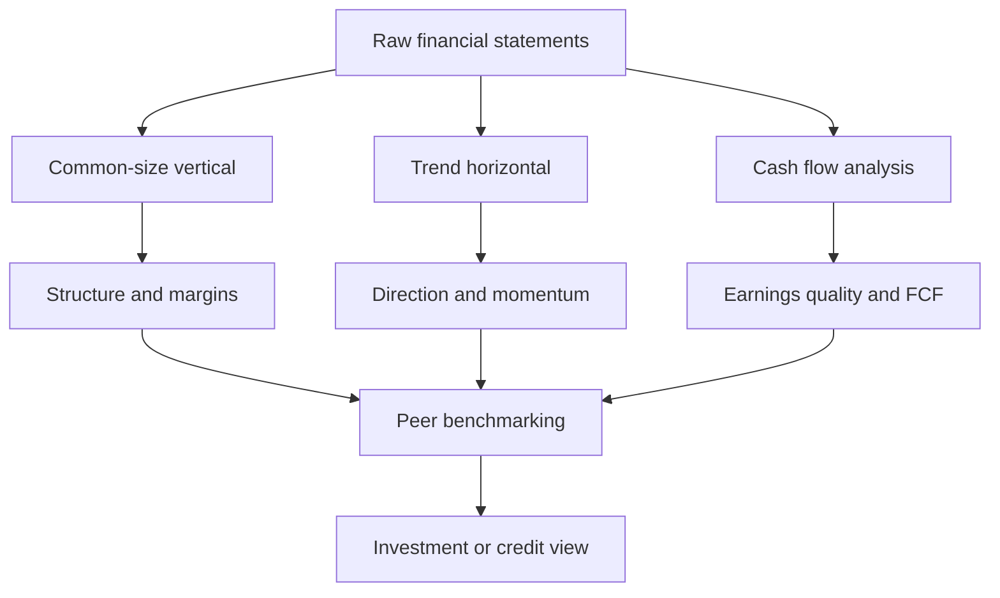

# Common-Size, Trend & Cash-Flow Analysis

## The Problem / Why this matters

You are handed two companies' financial statements. Company A earns ₹5,000 crore of revenue and ₹400 crore of net profit. Company B earns ₹800 crore of revenue and ₹120 crore of net profit. Which one is the *better business*?

The raw numbers are almost useless for that judgement. A is five times larger, but B keeps 15 paise of every revenue rupee as profit while A keeps only 8 paise. Absolute rupees tell you *size*; they do not tell you *quality, efficiency, direction, or comparability*. And in a finance interview — equity research, credit, FP&A, or investment banking — nobody is impressed that you can read a number off a page. They want to know whether you can **interrogate** it: Is the margin expanding or shrinking? Is growth real or borrowed? Is the reported profit backed by cash, or is it an accounting mirage? Is this company cheap because it is a bargain, or cheap because it is quietly dying?

This chapter arms you with the four lenses that professional analysts reach for *before* they build a model or write a note:

1. **Common-size (vertical) analysis** — re-express every line as a percentage of a common base so companies of any size become directly comparable, and so the *structure* of a business jumps out.
2. **Trend (horizontal) analysis** — track how each line moves over time, so you see *direction and momentum*, not just a snapshot.
3. **Growth rates and CAGR** — compress a multi-year trajectory into a single honest number, and learn where that single number lies.
4. **Cash-flow-based analysis** — free cash flow, the cash conversion cycle, and the CFO-versus-net-income test for **quality of earnings** — the single most important fraud-and-fragility detector in the analyst's kit.

Layered on top: **segment analysis** (a conglomerate is a portfolio of businesses wearing one ticker) and **peer benchmarking** (a number means nothing until it sits next to its peers). Master these and you can look at any company, in any industry, and within twenty minutes have an informed, defensible view. That is exactly the skill interviews are screening for.

## Core Idea

**A financial statement number is meaningless in isolation. It acquires meaning only through a comparison — to a base, to the past, or to a peer.** Analysis is the discipline of choosing the right comparison.

- Common-size analysis compares a line **to itself's statement** (every P&L line ÷ revenue; every balance-sheet line ÷ total assets). It answers: *what is the shape of this business?*
- Trend analysis compares a line **to its own past**. It answers: *which way is it heading, and how fast?*
- Cash-flow analysis compares **reported profit to the cash that actually moved**. It answers: *is the profit real?*
- Segment and peer analysis compare **one part to another part, and one company to its rivals**. They answer: *where is value created, and is this good relative to the alternatives?*

Every technique in this chapter is a variation on one move: **turn an absolute number into a ratio or a rate, then compare.**

## Why it works this way

From first principles, a financial statement is a *scaled* object. A company that doubles in size, changing nothing else, will double almost every rupee figure. Those doubled numbers carry no new information about the *business* — only about its *size*. To see the business, you must divide size out.

That is precisely what common-sizing does. Dividing every P&L line by revenue removes the scale factor and leaves the **economic structure**: what fraction of a sales rupee is eaten by cost of goods, by overhead, by interest, by tax — and what survives as profit. Two companies, one ten times the other, become directly comparable because both are now expressed on a base of 100.

Trend analysis works because businesses are **path-dependent systems with momentum**. A margin does not usually leap from 10% to 25% in one year; it drifts. Costs creep, share is won or lost gradually, working capital tightens or bloats over quarters. By lining up several periods you convert a still photograph into a moving picture, and the *slope* of that picture is often more predictive than any single level. Markets pay for the second derivative — not just "profitable" but "improving."

Cash-flow analysis is the ultimate reality check because of one structural fact: **accrual accounting deliberately decouples profit from cash.** Revenue is booked when *earned*, not when *collected*. Expenses are matched to revenue, not to when *paid*. This is a feature — it produces a truer picture of economic performance in a single period than a cash chequebook would. But it hands management a set of legitimate levers (estimates, timing, capitalisation choices) that can flatter profit without any cash ever arriving. Cash, by contrast, is famously hard to fake — "cash is a fact, profit is an opinion." So comparing the opinion (net income) to the fact (operating cash flow) is how you test whether the earnings are load-bearing.

Segment analysis works because **a consolidated number is a weighted average that hides its own composition.** A group margin of 12% could be a uniform 12% everywhere, or a 30%-margin crown jewel subsidising a −5% loss-maker. Those two are radically different investments with identical headline numbers. Disaggregation restores the information the averaging destroyed.

And peer benchmarking works because **all these measures are relative goods.** A 15% ROE is excellent for a utility and mediocre for a software firm. "Good" only exists against a reference set.

## Full technical content

### 1. Common-size (vertical) analysis

**Definition.** Vertical, or common-size, analysis restates each line item of a financial statement as a percentage of a single base figure *from the same period*.

| Statement | Common base (= 100%) | What each line becomes |
|---|---|---|
| Income statement | **Net revenue / sales** | % of sales (e.g., COGS 60%, EBIT 18%, net profit 9%) |
| Balance sheet | **Total assets** (= total liabilities + equity) | % of the balance-sheet footing |
| Cash flow statement | Sometimes revenue, or total sources | % of revenue (rare, but used for CFO margins) |

**The income-statement common-size ladder.** This is the workhorse. Every line is divided by revenue:

| Line | Formula | Reads as |
|---|---|---|
| Revenue | Revenue ÷ Revenue = 100% | The base |
| Gross profit | Gross profit ÷ Revenue | **Gross margin** |
| EBITDA | EBITDA ÷ Revenue | **EBITDA margin** |
| EBIT | EBIT ÷ Revenue | **Operating margin** |
| Pre-tax profit | PBT ÷ Revenue | Pre-tax margin |
| Net income | Net income ÷ Revenue | **Net margin** |

Because these are the same as *margin* ratios, common-size income-statement analysis and margin analysis are the same activity viewed from two angles.

**The balance-sheet common-size read.** Dividing by total assets reveals the *composition* of what the firm owns and how it is financed:

- **Asset side:** what fraction is cash, receivables, inventory, PP&E, goodwill/intangibles? A working-capital-heavy distributor looks utterly different from an asset-light software firm.
- **Financing side:** what fraction is short-term debt, long-term debt, payables, equity? This is capital structure at a glance.

**What it is good for**
- Cross-company comparison irrespective of scale.
- Spotting structural anomalies (e.g., SG&A at 40% of sales when peers run 25%).
- Tracking **margin migration** when combined with several periods.

**What it hides**
- Absolute size and therefore operating leverage effects on fixed costs.
- A falling ratio can be caused by the numerator shrinking *or* the denominator (revenue) growing — always ask which.

### 2. Horizontal (trend) analysis

**Definition.** Horizontal analysis measures the change in each line item *across time*, either as an absolute change or, more usefully, as a percentage change or an indexed series.

**Two presentations:**

| Method | Formula | Example |
|---|---|---|
| **Year-over-year % change** | (Current − Prior) ÷ Prior | Revenue up from 1,000 to 1,150 → +15% |
| **Index to a base year** | Line ÷ Base-year line × 100 | Base yr = 100; if revenue reaches 1,150 vs base 1,000 → index 115 |

Indexing to a base year is the more powerful presentation for multi-year work: set every line in Year 0 to 100 and watch the divergence. If revenue index reaches 140 by Year 4 but net income index reaches only 110, profitability is deteriorating even though both are "growing" — the classic scissors chart that separates good analysts from number-readers.

**Key discipline:** trend analysis is where you catch **divergences between related lines**:
- Receivables growing faster than revenue → collection problems or channel stuffing.
- Inventory growing faster than COGS → obsolescence risk or demand miss.
- Net income growing faster than operating cash flow → earnings quality deterioration.

### 3. Growth rates and CAGR

**Period growth rate** (single period):
$$g = \frac{V_{end} - V_{begin}}{V_{begin}}$$

**Compound Annual Growth Rate (CAGR)** — the constant annual rate that takes the beginning value to the ending value over *n* periods:

$$\text{CAGR} = \left(\frac{V_{end}}{V_{begin}}\right)^{1/n} - 1$$

Critical detail: **n is the number of *periods (gaps)*, not the number of data points.** Revenue in FY20 growing to a value in FY24 spans **4** years, not 5, even though five figures are printed.

**Why CAGR and not the average of the annual growth rates?** Because growth compounds. The arithmetic mean of annual growth rates *overstates* true compounded growth whenever the rates vary (a consequence of Jensen's inequality: the geometric mean ≤ arithmetic mean). A stock that goes +50% then −50% has an arithmetic-mean "growth" of 0% but has actually *lost* 25% (1.5 × 0.5 = 0.75). CAGR = (0.75)^(1/2) − 1 = −13.4%, which is the honest number.

**What CAGR hides — the "smoothing" trap.** CAGR reports the *smooth equivalent* path and is completely blind to the shape in between. A company that grew 5%, 5%, 5%, 45% has the same CAGR as one that grew 15% every year, but they are very different businesses (one is lumpy and possibly one-off; the other is steady). Always pair CAGR with the year-by-year series. Also beware **endpoint sensitivity**: pick a trough as the base year and any CAGR looks heroic; pick a peak and it looks dismal. Analysts game this constantly in pitch decks — learn to spot the cherry-picked base year.

**Related growth constructs**
- **Organic vs inorganic growth:** growth from existing operations vs growth bought through acquisitions. Always strip out acquisitions before judging management's operating performance.
- **Sustainable growth rate (SGR):** the rate a firm can grow *without raising new equity*, = ROE × (1 − dividend payout ratio) = ROE × retention ratio. Ties growth back to profitability and reinvestment.

### 4. Cash-flow-based analysis

This is the analytical heart of the chapter. Reported profit is an *opinion* assembled under accrual accounting; cash flow is the *fact*. The cash flow statement has three sections (both IFRS — IAS 7 — and US GAAP — ASC 230):

| Section | Contains | Analyst reads it as |
|---|---|---|
| **CFO** — Operating | Cash from the core business; net income adjusted for non-cash items and working-capital changes | The engine — can the business self-fund? |
| **CFI** — Investing | Capex, acquisitions, purchase/sale of investments | How much cash is being reinvested vs harvested |
| **CFF** — Financing | Debt raised/repaid, equity issued/bought back, dividends | How the firm plugs or returns cash |

**Direct vs indirect method (CFO).** The **indirect method** (used by the overwhelming majority of firms) starts from net income and reconciles to cash by (a) adding back non-cash charges (depreciation, amortisation, stock-comp, impairments), and (b) adjusting for changes in working capital. The **direct method** lists actual cash receipts and payments. IAS 7 and ASC 230 permit both but *encourage* the direct method; almost nobody uses it because the indirect method falls out of the existing ledgers more cheaply.

**The indirect-method CFO build (memorise this format):**

| Indirect method CFO | Sign logic |
|---|---|
| Net income | Start |
| + Depreciation & amortisation | Non-cash expense, add back |
| + Stock-based compensation | Non-cash expense, add back |
| + Impairments / write-downs | Non-cash, add back |
| − Gain on asset sale (or + loss) | Reclassify to CFI; strip from CFO |
| − Increase in receivables | Sales booked but cash not yet collected → use of cash |
| − Increase in inventory | Cash tied up in stock → use of cash |
| + Increase in payables | Bought on credit, cash retained → source of cash |
| **= Cash flow from operations (CFO)** | |

The mnemonic for working capital: **an increase in an operating asset is a *use* of cash; an increase in an operating liability is a *source* of cash.**

#### Free Cash Flow (FCF)

Free cash flow is the cash a business generates *after* the investment needed to maintain and grow it — the cash genuinely available to capital providers. Two flavours you must be able to switch between fluently:

| Measure | Formula | Cash available to |
|---|---|---|
| **FCFF** (to firm, unlevered) | EBIT × (1 − tax) + D&A − Capex − ΔNWC | *All* capital providers (debt + equity) |
| **FCFE** (to equity, levered) | Net income + D&A − Capex − ΔNWC + Net borrowing | Equity holders only |
| **Simple/"analyst" FCF** | CFO − Capex | Quick proxy, used constantly in practice |

Relationships to nail:
- FCFF = FCFE + Interest × (1 − tax) − Net borrowing
- FCFF = CFO + Interest × (1 − tax) − Capex  *(when CFO already reflects after-tax interest, as under US GAAP where interest paid sits in CFO)*
- FCFE = CFO − Capex + Net borrowing

**Why after-tax interest is added back for FCFF:** FCFF is the pre-financing cash pool. Interest is a financing cost, so we remove its cash effect; because interest is tax-deductible, we add back only the *after-tax* amount. This keeps the financing decision out of the operating cash number, which is exactly what a DCF discounted at WACC requires.

**IFRS vs US GAAP classification quirk (frequently tested):**

| Item | US GAAP (ASC 230) | IFRS (IAS 7) |
|---|---|---|
| Interest **paid** | CFO | CFO **or** CFF (policy choice) |
| Interest **received** | CFO | CFO or CFI |
| Dividends **received** | CFO | CFO or CFI |
| Dividends **paid** | CFF | CFO or CFF |

The lesson: under IFRS, CFO is *not* strictly comparable across companies without checking the classification policy. Always normalise before benchmarking CFO.

#### The Cash Conversion Cycle (CCC)

Working capital is cash trapped in the operating cycle. The CCC measures, in days, how long a rupee stays trapped between paying suppliers and collecting from customers.

$$\text{CCC} = \text{DIO} + \text{DSO} - \text{DPO}$$

| Component | Formula | Meaning |
|---|---|---|
| **DIO** — Days Inventory Outstanding | (Avg inventory ÷ COGS) × 365 | Days stock sits before sale |
| **DSO** — Days Sales Outstanding | (Avg receivables ÷ Revenue) × 365 | Days to collect from customers |
| **DPO** — Days Payable Outstanding | (Avg payables ÷ COGS) × 365 | Days the firm takes to pay suppliers |

Interpretation: **DIO + DSO** is how long cash is tied up; **DPO** is how long suppliers finance you for free. CCC = the net days you must fund yourself. **Lower is better**; a *negative* CCC (Amazon, Dell at its peak) means suppliers and customers fund your working capital — you collect from customers before you pay suppliers, a structural cash machine.

#### Quality of Earnings: CFO vs Net Income

The single most important earnings-quality test:

$$\text{Cash conversion / accruals ratio} = \frac{\text{CFO}}{\text{Net income}}$$

- **CFO ≈ or > Net income (ratio ≥ 1)** over time → high-quality, cash-backed earnings.
- **CFO persistently < Net income (ratio < 1), and the gap widening** → red flag. Profit is being reported but cash is not arriving. Common causes: aggressive revenue recognition, ballooning receivables, capitalising costs that should be expensed, or one-off non-cash gains inflating profit.

The **accruals** are the difference: Net income − CFO. Sloan's accruals anomaly (a famous academic result) found that firms with high accruals — profit not backed by cash — systematically *underperform* subsequently. High accruals are the statistical fingerprint of both fragility and manipulation.

A companion balance-sheet version: **balance-sheet accruals** = change in net operating assets. A firm whose net operating assets balloon relative to sales is accruing "profit" onto the balance sheet rather than converting it to cash.

Other quality-of-earnings screens:
- **Revenue vs receivables:** if DSO is rising steadily, revenue growth may be pulled forward or fictitious.
- **Non-recurring items:** strip out gains on asset sales, litigation settlements, and other one-offs before judging "real" earnings power.
- **Capitalisation vs expensing:** capitalising ordinary costs shifts them off the P&L (boosting profit) and into CFI (protecting CFO) — check the ratio of capex to D&A and whether it is drifting up without a growth story.

### 5. Segment analysis

Under **IFRS 8** (Operating Segments) and **ASC 280** (Segment Reporting), companies must disclose financials for their operating segments *the way management runs them* (the "management approach"), reporting segment revenue, profit, assets, and often capex. What the analyst does with it:

- **Segment margins:** compute margin per segment — the group average almost always hides wide dispersion. Find the crown jewel and the drag.
- **Growth attribution:** which segment is driving (or destroying) group growth?
- **Capital allocation:** which segments consume capex and assets, and do returns justify it? A segment consuming 60% of capex to produce 20% of profit is destroying value.
- **Sum-of-the-parts (SOTP) valuation:** value each segment at its own appropriate multiple and add up — often reveals a conglomerate is worth more broken up (the "conglomerate discount").
- **Geographic and customer concentration:** segment notes reveal reliance on one region or one customer — a key risk in credit and equity work.

### 6. Peer benchmarking

A ratio is a relative good. Benchmarking places the target inside a **comparable set** (the "comps") and a **time series**.

**Building a clean comp set:**
- Same industry / business model, similar size, similar geography and accounting regime.
- Normalise for accounting differences (IFRS vs GAAP, lease treatment, one-offs) *before* comparing.
- Compare like measures: enterprise-level metrics (EV/EBITDA, EV/Sales) against enterprise metrics; equity-level metrics (P/E, ROE) against equity metrics. Never compare a levered metric across firms with very different capital structures without adjusting.

**Cross-sectional vs time-series:**
- **Cross-sectional:** target vs peers *today* — is it cheap/rich, efficient/bloated relative to rivals?
- **Time-series:** target vs its *own history* — is the current level normal for this business, or an aberration?

The best analysis triangulates: a margin that is high versus history *and* high versus peers is genuinely strong; high versus history but low versus peers just means the whole industry improved.

### Putting the lenses together

## Worked examples

### Worked Example 1 — Common-size and trend on a full P&L

**Zephyr Consumer Ltd**, income statements for FY23 and FY24 (₹ crore):

| Line | FY23 | FY24 |
|---|---:|---:|
| Revenue | 1,000 | 1,200 |
| COGS | 600 | 756 |
| Gross profit | 400 | 444 |
| SG&A | 200 | 252 |
| EBIT | 200 | 192 |
| Interest | 40 | 60 |
| PBT | 160 | 132 |
| Tax @ 25% | 40 | 33 |
| Net income | 120 | 99 |

**Step 1 — Common-size (each line ÷ revenue):**

| Line | FY23 % | FY24 % |
|---|---:|---:|
| Revenue | 100.0% | 100.0% |
| COGS | 60.0% | 63.0% |
| Gross profit | 40.0% | 37.0% |
| SG&A | 20.0% | 21.0% |
| EBIT | 20.0% | 16.0% |
| Interest | 4.0% | 5.0% |
| PBT | 16.0% | 11.0% |
| Net income | 12.0% | 8.25% |

*Check:* FY24 COGS 756 ÷ 1,200 = 63.0% ✓; EBIT 192 ÷ 1,200 = 16.0% ✓; Net income 99 ÷ 1,200 = 8.25% ✓.

**Step 2 — Horizontal (YoY % change):**

| Line | FY23 | FY24 | % change |
|---|---:|---:|---:|
| Revenue | 1,000 | 1,200 | +20.0% |
| COGS | 600 | 756 | +26.0% |
| Gross profit | 400 | 444 | +11.0% |
| EBIT | 200 | 192 | −4.0% |
| Net income | 120 | 99 | −17.5% |

**Step 3 — Read the story.** Revenue grew a healthy 20%, but this is a *value-destroying* growth year:
- **Gross margin fell 300 bps** (40.0% → 37.0%) because COGS grew 26% — *faster than revenue*. Input-cost inflation or discounting is being absorbed, not passed on.
- SG&A rose as a % of sales (20% → 21%), so operating leverage worked *against* the firm.
- Result: EBIT *fell* 4% in absolute terms despite 20% more revenue — operating margin compressed 400 bps.
- Higher interest (leverage up) amplified the fall: **net income dropped 17.5%.**

**Interview one-liner:** "Zephyr grew the top line 20% but destroyed value — COGS grew 26%, so gross margin compressed 300 bps, and with SG&A deleverage and higher interest, net income actually fell 17.5%. This is unprofitable growth; I'd want to know whether the discounting is defensive or strategic before touching the stock."

### Worked Example 2 — CAGR, indexing, and the divergence scissors

**Helios Industries** revenue and net income, FY20–FY24 (₹ crore):

| Year | Revenue | Net income |
|---|---:|---:|
| FY20 | 500 | 50 |
| FY21 | 600 | 57 |
| FY22 | 720 | 61 |
| FY23 | 850 | 64 |
| FY24 | 1,000 | 65 |

**Step 1 — Revenue CAGR (FY20→FY24, n = 4 periods):**
$$\text{CAGR} = \left(\frac{1000}{500}\right)^{1/4} - 1 = 2^{0.25} - 1 = 1.1892 - 1 = 18.92\%$$

**Step 2 — Net income CAGR (n = 4):**
$$\left(\frac{65}{50}\right)^{1/4} - 1 = (1.30)^{0.25} - 1 = 1.0678 - 1 = 6.78\%$$

**Step 3 — Index both to FY20 = 100:**

| Year | Revenue index | NI index | Net margin |
|---|---:|---:|---:|
| FY20 | 100 | 100 | 10.0% |
| FY21 | 120 | 114 | 9.5% |
| FY22 | 144 | 122 | 8.5% |
| FY23 | 170 | 128 | 7.5% |
| FY24 | 200 | 130 | 6.5% |

*Check:* net margin FY24 = 65 ÷ 1,000 = 6.5% ✓; revenue index FY24 = 1,000 ÷ 500 × 100 = 200 ✓.

**Step 4 — Read the scissors.** Revenue doubled (index 200) but net income rose only 30% (index 130). The indices *fan apart* — the classic scissors. Net margin eroded every single year, 10.0% → 6.5% (350 bps). Helios is **buying growth by sacrificing profitability** — likely price cuts, cost inflation, or expensive expansion. The 18.9% revenue CAGR looks great in a headline and is exactly the number a sell-side deck would lead with; the 6.8% earnings CAGR and the monotonic margin decline are the real story.

**Interview one-liner:** "Helios's 19% revenue CAGR is a vanity metric. Earnings only compounded at 7% because net margin fell 350 bps over four years — the revenue and earnings indices are a widening scissors. Growth is being bought, not earned. I'd discount the top-line story heavily."

### Worked Example 3 — Cash flow, FCF, CCC, and quality of earnings

**Meridian Products Ltd**, FY24 (₹ crore).

Income statement extract:
| | ₹ cr |
|---|---:|
| Revenue | 2,000 |
| COGS | 1,200 |
| Net income | 180 |
| Depreciation (in COGS/opex) | 100 |
| Interest expense | 40 |
| Tax rate | 25% |

Balance-sheet working-capital items:
| | FY23 | FY24 | Change |
|---|---:|---:|---:|
| Receivables | 250 | 360 | +110 |
| Inventory | 200 | 260 | +60 |
| Payables | 150 | 180 | +30 |

Other: Capex = 150; Net new borrowing = 50.

**Step 1 — Build CFO (indirect method):**

| | ₹ cr |
|---|---:|
| Net income | 180 |
| + Depreciation | +100 |
| − Increase in receivables | −110 |
| − Increase in inventory | −60 |
| + Increase in payables | +30 |
| **CFO** | **140** |

*Check:* 180 + 100 − 110 − 60 + 30 = 140 ✓.

**Step 2 — Free cash flow.**
- **Simple FCF = CFO − Capex** = 140 − 150 = **−10.** Meridian did not self-fund its investment this year.
- **FCFF = CFO + Interest × (1 − tax) − Capex** = 140 + 40 × 0.75 − 150 = 140 + 30 − 150 = **20.**
- **FCFE = CFO − Capex + Net borrowing** = 140 − 150 + 50 = **40.**

*Sanity check the bridge:* FCFF = FCFE + Interest×(1−t) − Net borrowing = 40 + 30 − 50 = 20 ✓.

**Step 3 — Cash conversion cycle** (using year-end balances for simplicity; assume avg ≈ year-end):
- DIO = (260 ÷ 1,200) × 365 = 79.1 days
- DSO = (360 ÷ 2,000) × 365 = 65.7 days
- DPO = (180 ÷ 1,200) × 365 = 54.75 days
- **CCC = 79.1 + 65.7 − 54.75 = 90.0 days**

Ninety days of cash tied up in the operating cycle. If FY23 CCC was, say, 70 days (receivables 250/2,000×365 ≈ 45.6 with prior revenue aside), the *rise* toward 90 is a warning — working capital is bloating.

**Step 4 — Quality of earnings.**
$$\frac{\text{CFO}}{\text{Net income}} = \frac{140}{180} = 0.78$$

CFO is only 78% of reported net income, and the gap is driven almost entirely by a **₹110 cr jump in receivables** — sales are being booked but not collected. Accruals = 180 − 140 = ₹40 cr, positive and concentrated in receivables. **This is a quality flag.** Revenue may be getting recognised aggressively or credit terms loosened to hit growth targets.

**Interview one-liner:** "Meridian reports ₹180 cr of net income but only ₹140 cr of CFO — a cash-conversion ratio of 0.78, with the whole gap in a ₹110 cr receivables build. After ₹150 cr capex, simple FCF is *negative* ₹10 cr. The earnings aren't fully cash-backed and the cash conversion cycle is stretching to 90 days. I'd treat the reported profit with suspicion and dig into DSO by customer."

### Worked Example 4 — Segment analysis and hidden dispersion

**Polaris Group** reports one consolidated operating margin of 12%. Segments (₹ crore):

| Segment | Revenue | Segment EBIT | Segment margin |
|---|---:|---:|---:|
| Software | 400 | 140 | 35.0% |
| Hardware | 900 | 90 | 10.0% |
| Legacy Services | 700 | −50 | −7.1% |
| **Group** | **2,000** | **180** | **9.0%** |

*Check:* group EBIT 140 + 90 − 50 = 180; 180 ÷ 2,000 = 9.0% (the "12%" headline was flattered by excluding corporate; use the segment sum). Segment margins: 140/400 = 35% ✓, 90/900 = 10% ✓, −50/700 = −7.1% ✓.

**Read:** the 9% group margin is a fiction of averaging. A **35%-margin software crown jewel** is subsidising a **loss-making Legacy Services** unit that burns ₹50 cr. Legacy consumes 35% of group revenue to *destroy* value.

**Actionable insight (SOTP logic):** value Software on a rich software multiple, Hardware on a modest industrial multiple, and Legacy at (at best) breakup value — the sum can far exceed the market's blended valuation, and exiting Legacy would *lift* group margin to (140+90) ÷ (400+900) = 230 ÷ 1,300 = **17.7%.**

**Interview one-liner:** "Polaris's 9% blended margin hides a 35%-margin software jewel carrying a loss-making legacy unit. Kill or sell Legacy and group margin jumps to 17.7%. On a sum-of-the-parts basis the stock is likely worth more than its consolidated multiple implies — that's the value-unlock thesis."

## How it is tested in interviews

Interviewers use this topic to separate people who *understand* accounting from people who *memorised* it. The questions below are the ones that actually come up, with the crisp lines to say.

**Q: "Walk me through common-size analysis and why you'd use it."**
Model answer: "Common-size restates every P&L line as a percentage of revenue and every balance-sheet line as a percentage of total assets. It strips out size, so I can compare a ₹5,000 crore company with a ₹500 crore one directly, and it makes the *structure* of the business — margins, cost mix, capital structure — jump out. I always run it across several years to catch margin migration."

**Q: "A company's revenue grew 20% but net income fell. What happened?"**
Model answer: "Costs grew faster than revenue. I'd common-size the P&L to locate where: if gross margin fell, it's COGS — input inflation or discounting. If gross held but EBIT fell, it's operating deleverage in SG&A. Below EBIT, higher interest from added leverage or a higher tax rate. This is unprofitable growth — I'd want to know whether the margin hit is temporary or structural." *(This is exactly Worked Example 1.)*

**Q: "How do you calculate CAGR, and what's the trap?"**
Model answer: "CAGR = (ending ÷ beginning)^(1/n) − 1, where n is the number of *periods*, not data points — five annual figures span four years. The trap is that CAGR is blind to the path: it smooths lumpy or one-off growth into a fake-steady rate, and it's brutally sensitive to the base year chosen. I always pair it with the year-by-year series and check whether the base year is a trough being used to flatter the number."

**Q: "What's the difference between CFO and net income, and why do you care about the gap?"**
Model answer: "Net income is an accrual figure — revenue when earned, expenses matched — so it embeds estimates and timing. CFO is the actual cash the operations threw off. I care about the gap because cash is hard to fake. If CFO consistently lags net income and the gap is widening — usually a receivables or inventory build — earnings quality is deteriorating: profit is being reported but not collected. The ratio I watch is CFO ÷ net income; I want it around or above 1 over a cycle."

**Q: "Walk me through free cash flow. FCFF vs FCFE?"**
Model answer: "FCFF is pre-financing cash to all providers: EBIT×(1−t) + D&A − capex − ΔNWC. FCFE is what's left for equity after debt: net income + D&A − capex − ΔNWC + net borrowing. The bridge is FCFF = FCFE + after-tax interest − net borrowing. In practice I often use the quick proxy CFO − capex. FCFF is what you discount at WACC in an unlevered DCF; FCFE at cost of equity."

**Q: "What is the cash conversion cycle and what does a negative CCC mean?"**
Model answer: "CCC = DIO + DSO − DPO — the days a rupee is trapped between paying suppliers and collecting from customers. Lower is better. A *negative* CCC means the firm collects from customers before it pays suppliers — customers and suppliers are funding its working capital. Amazon and Dell famously ran negative CCC; it's a structural cash machine that funds growth without external capital."

**Q: "I show you a company with rising profits. What would make you suspicious?"**
Model answer: "I'd check whether cash is following the profit. Red flags: CFO growing slower than net income, DSO rising (revenue booked faster than collected), inventory building faster than COGS, capex running well above D&A while costs are quietly capitalised, and profits leaning on non-recurring gains. High accruals — net income minus CFO — are statistically associated with underperformance, so a widening gap is my first suspicion."

**Q: "A conglomerate trades at a discount. How would you analyse it?"**
Model answer: "Segment analysis. The blended margin hides dispersion, so I'd pull IFRS 8 / ASC 280 segment disclosures, compute margin, growth, and capital consumption per segment, and find the value creators and destroyers. Then a sum-of-the-parts: value each segment on its own multiple. If SOTP exceeds the market cap, there's a conglomerate discount and a potential break-up or divestiture thesis."

**Q: "Under IFRS, is CFO comparable across companies?"**
Model answer: "Not without checking. IAS 7 lets firms classify interest paid and dividends paid in either CFO or CFF, and interest/dividends received in CFO or CFI. US GAAP is stricter — interest paid and received in CFO, dividends paid in CFF. So before benchmarking CFO across an IFRS peer set, I normalise everyone to the same classification."

**Q (numerical, on the spot): "Revenue 1,000, COGS 600, D&A 100 included, receivables up 50, payables up 20, net income 120, capex 90. What's CFO and simple FCF?"**
Model answer: "CFO = 120 + 100 − 50 + 20 = 190. Simple FCF = CFO − capex = 190 − 90 = 100."

## Traps & common mistakes

1. **Confusing the driver of a ratio change.** A falling COGS% could mean better sourcing (numerator down) *or* just higher prices (denominator up). Always decompose whether the ratio moved because of the top or the bottom.
2. **CAGR period-count error.** Using data points instead of gaps. FY20 to FY24 = 4 years. Off-by-one here quietly wrecks a valuation.
3. **Averaging annual growth rates.** The arithmetic mean of yearly growth overstates true compounded growth; use the geometric CAGR.
4. **Cherry-picked base year.** A trough base year makes any CAGR look spectacular. Sanity-check the endpoints and, ideally, use a full cycle.
5. **Treating CFO as clean.** Under IFRS, interest/dividend classification varies; and CFO itself can be flattered by stretching payables (DPO ballooning), delaying supplier payments, or one-off working-capital releases. Rising DPO is not always "efficiency" — it can be distress.
6. **Ignoring the working-capital sign convention.** Increase in an operating *asset* is a *use* of cash (subtract); increase in an operating *liability* is a *source* (add). Getting a sign wrong flips CFO.
7. **Comparing levered and unlevered metrics.** P/E across firms with different leverage, or comparing FCFE to FCFF, mixes apples and oranges. Match the metric to the claimant.
8. **Reading a group margin as representative.** Averages hide dispersion — always disaggregate segments.
9. **Forgetting capex in "free" cash flow.** CFO is not FCF. A company with strong CFO but capex exceeding it (Worked Example 3) has *negative* free cash flow.
10. **Trend without common-size, or vice versa.** They are complements: common-size tells you the *shape*, trend tells you the *direction*. Use both; the scissors chart (rev index vs NI index) only appears when you combine them.
11. **Not normalising peers.** Different accounting regimes, lease treatments, and one-offs make raw comps misleading. Clean the numbers before ranking.

## First-principles recap

- **A number means nothing alone.** Analysis is choosing the right comparison: to a base (common-size), to the past (trend), to cash (quality), to peers (benchmarking).
- **Dividing out size reveals the business.** Common-sizing removes scale so structure and margins become visible and comparable.
- **Direction beats level.** Markets pay for the slope — improving or deteriorating — which only trend/indexing exposes. The revenue-vs-earnings scissors is the fastest tell of bought-vs-earned growth.
- **Growth compounds, so measure it geometrically.** CAGR is the honest single number; but it smooths the path and bends to the base year — always pair it with the annual series.
- **Cash is a fact; profit is an opinion.** Comparing CFO to net income is the master earnings-quality test; the gap (accruals) is where fragility and manipulation hide.
- **Free cash flow, not profit, is what owners can spend.** CFO − capex, and its rigorous cousins FCFF and FCFE, are the cash that ultimately funds dividends, buybacks, and debt paydown.
- **Averages lie by construction.** Segments and peers restore the composition and the reference set that a single blended number destroys.

## Quick-reference

| Concept | Formula / rule |
|---|---|
| Common-size income statement | Each line ÷ Revenue |
| Common-size balance sheet | Each line ÷ Total assets |
| YoY growth | (Current − Prior) ÷ Prior |
| Index to base year | Line ÷ Base-year line × 100 |
| CAGR | (V_end ÷ V_begin)^(1/n) − 1, n = number of periods |
| Sustainable growth rate | ROE × (1 − payout) = ROE × retention |
| CFO (indirect) | NI + non-cash charges − ΔoperatingAssets + ΔoperatingLiabilities |
| Simple / analyst FCF | CFO − Capex |
| FCFF | EBIT×(1−t) + D&A − Capex − ΔNWC |
| FCFE | NI + D&A − Capex − ΔNWC + Net borrowing |
| FCFF ↔ FCFE bridge | FCFF = FCFE + Interest×(1−t) − Net borrowing |
| DIO | (Avg inventory ÷ COGS) × 365 |
| DSO | (Avg receivables ÷ Revenue) × 365 |
| DPO | (Avg payables ÷ COGS) × 365 |
| Cash conversion cycle | DIO + DSO − DPO (lower is better; negative = supplier-funded) |
| Earnings quality ratio | CFO ÷ Net income (want ≥ 1 over a cycle) |
| Accruals | Net income − CFO (high = red flag) |
| WC sign rule | ↑ operating asset = use of cash; ↑ operating liability = source of cash |
| Segment standards | IFRS 8 / ASC 280 (management approach) |
| Cash flow standards | IAS 7 / ASC 230 |
| SOTP value | Σ (each segment × its own multiple) |

**Key numbers to have instant recall of:** a cash-conversion ratio (CFO/NI) below ~0.8 and falling is a red flag; DSO rising faster than revenue growth signals collection/recognition problems; capex persistently above D&A means the firm is growing (or capitalising) — check which; a negative CCC is a structural funding advantage; the arithmetic mean of growth rates always ≥ the geometric (CAGR).
